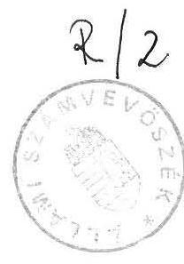
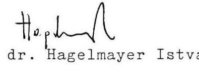
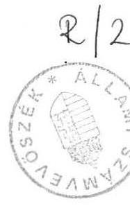
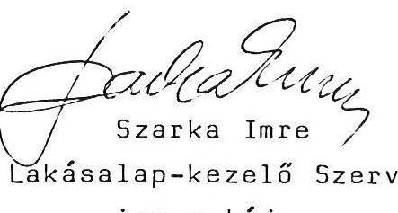
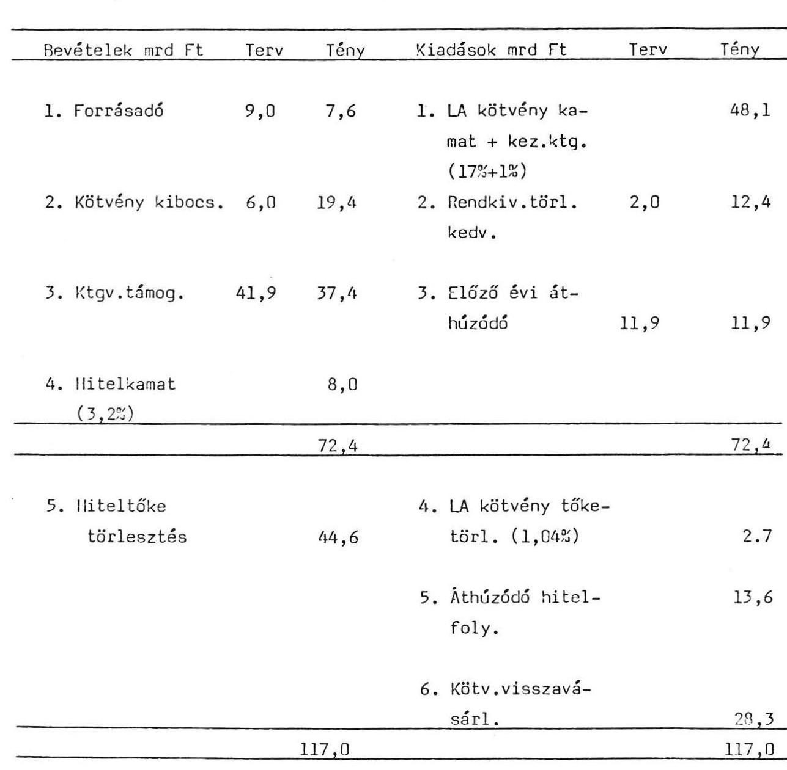
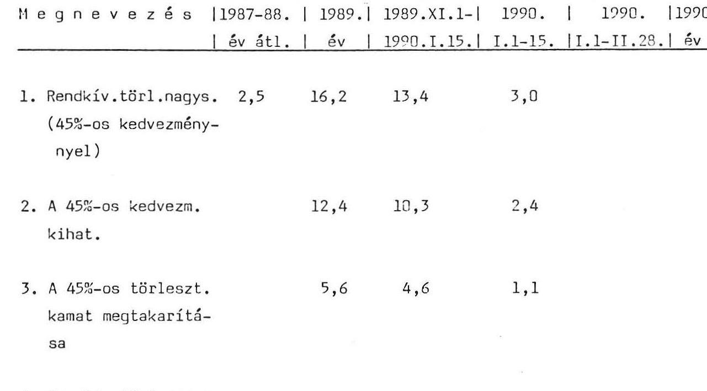

# 2́llami Számbebösşek 

Összefoglaló jelentés

## a Lakásalap múködésének ellenőrzéséről

1990.

---

# ÖSSZEFOGLALÓ JELENTÉS 

## a Lakásalap müködésének ellenôrzésérôl

Az elmult évtizedekben /az 1988. december 31-ig megkötött hitelszerződések alapján/ a lakások építéséhez, vásárlásához, bôvítéséhez, korszerűsitéséhez és egyéb munkáihoz az Országos Takarékpénztár és a takarékszövetkezetek által a lakosságnak nyujtott $0-3,5 \%$ kamatozású állami kölcsön és évi 4-15 \% kamatozású bankkölcsön együttes állománya /továbbiakban lakáshitelek/ 274,8 md Ft-ot tett ki 1988. dec. 31-én. A lakossági betétállomány és a lakáshitelek átlagos kamatszintje közötti különbözetet az állami költségvetés a hitelnyujtó pénzintézeteknek megtérítette, ami az 1987. évben 11 md Ft-ot, majd a gyorsuló infláció következtében 1988. évben már 31 milliárd Ft-ot tett ki. Az 1989. évi prognózis szerint a támogatás összege meghaladta volna az 56 md Ft-ot.

Az Állami Számvevőszék ellenőrzése annak megállapítására irányult, hogy a Minisztertanács által 1989. január 1-ével létrehozott Lakásalap eddigi müködése, illetve az azzal kapcsolatos kormányzati munka hogyan minősithető törvényességi, célszerűségi és eredményességi szempontból.

## I. Megállapítások

1/ A Lakásalap átvette a lakáshitelek 1988.december 31-i állományát, elôsegítve ezáltal az OTP és a takarékszövetkezetek tényleges pénzintézetté válását. Egyidejüleg hoz-

---

zájárult a lakáspiaci reálfolyamatok elindításához. A lakáshitel állomány fedezetéül a Lakásalap a lakáshitelekkel azonos futamidővel /37 év/ kötvényt bocsátott ki. A hiteltörlesztések és az ebből adódó kötvényvisszavásárlások következtében ténylegesen 15-20 év törlesztési idővel lehet számolni.

A Lakásalap létrehozása az 1989. évben - a korábbiak szerinti költségvetési kamattámogatási rendszerrel szemben - több, mint 11 milliárd Ft-tal tehermentesítette az állami költségvetést. Hosszabb távon azonban - a kibocsátott kötvények utáni magas /az 1989. évi $17 \%$-kal szemben 1990-ben $23 \%$ és várhatóan tovább növekvő kamatfizetési kötelezettség, továbbá a kötvénytőke törlesztés miatt - a Lakásalap nem mérsékli a költségvetés terheit.

2/ A Lakásalapot létrehozó munkálatok későn /1988. szeptemberében/ kezdődtek meg, ami kapkodáshoz, nem kellően megalapozott döntésekhez vezetett. A Lakásalap-kezelő Szervezet több, mint negyedéves késéssel kiadott Szervezeti és Müködési Szabályzata több szempontból hiányos. A hitel- és a kötvényállomány nyilvántartási rendszere nehezen áttekinthető, megbízhatósága kérdéses, ebből következően tartalmában továbbfejlesztésre szorul. Ugyanakkor kedvezőnek értékelhető, hogy a Szervezet az 1989. évi múködésével 500 millió Ft-ot realizált lakásalap kötvények határidős adás-vételéből.

3/ A Lakásalap megbízási szerződéseket kötött a pénzintézetekkel az Alapra átszállt hitelállomány nyilvántartására, beszedésére, kezelésére. A pénzintézetek kezelési költségének mértékét konkrét üzletági számítások nélkül határozták meg. Nem állapítható meg az sem, hogy mennyiben vették figyelembe az állami megbízás jelentős volumenét. /200 md Ft-os hitelállomány után $1 \%$-os kezelési költség 2 md Ft-ot tesz ki./

---

4/ A Lakásalap az 1989. évben összesen 45,0 md Ft költségvetési támogatásban részesült. Az előző évit, mintegy 15 md Ft-tal meghaladó támogatás a betéti kamatlábak emelkedésének a következménye. /A betéti kamatlábak 1 \% pontos emelkedése - feltételezve a kötvénykamat azonos mértékú változását - 2,3 md Ft-tal növeli a támogatási igényt./ A Lakásalap kötvény 1989. évi kamatlábának /17 + 1 \%/ meghatározásánál $2+1 \%$-os pénzintézeti kamatrést vettek figyelembe. Ebben az esetben is kétséges, hogy mennyiben érvényesül a kötvénykibocsátás volumenének kamatrést mérséklő hatása.

A költségvetési támogatásból 7,6 md Ft-ot reprezentál a betéti kamatok utáni $20 \%$-os forrásadó, amelyet a költségvetés átengedett az Alapnak. A forrásadó a pénzintézetnél költségként jelenik meg, ami inflációs nyomást gyakorol a Lakásalap-kötvény és az 1989-től folyósított lakáshitelek kamatlábára.

5/ Az állami költségvetés - a tervezettnél kedvezőtlenebb helyezete miatt - kevesebb támogatást adott az Alapnak, ugyanakkor növekedett az Alap terhe is. Így az Alap induló 6 md Ft-os hiánya az év folyamán jelentősen emelkedett. Ezért a pénzügyminiszter javaslatára az 1989. évi XVIII. törvény előirta, hogy a Társadalombiztosítási Alap a tartalékalapjából, a pénzintézetek pedig a kockázati tartalékalapjukból Lakásalap-fedezeti kötvényeket kötelesek vásárolni.

A pótlólagos forrásteremtésnek ez a formája - elismerve, hogy kevésbé kedvezőtlen hatású mint a pótadó kivetése, vagy a Társadalombiztosítási Alap szuficitjének elvonása - nem tekinthető jó megoldásnak. A költségvetés terheit hosszú távon nem mérsékeli, sőt a kötvények várhatóan tovább emelkedő kamatlába következtében növeli azokat.

---

Ugyanakkor a kötvényvásárlásra kötelezetteket pénzügyi szempontból hátrányos helyzetbe hozza /a Társadalombiztosítási Alap magasabb kamatlábbal is leköthetné a tartalékalapját/, illetve korlátozza pénzügyi manőverezési lehetöségüket.

Az utóbbi probléma érzékelésére utal, hogy a pénzintézetek vonatkozásában - a MT Gazdasági Kollégium állásfoglalása alapján - a pénzügyminiszter körlevelében enyhítette a törvény elóírásait.

6/ A lakosság rendkívül érzékenyen reagál a lakáshiteleket érintő állami intézkedésekre. A kamatlábak várható emelkedésének hatására a hitelkérelmek száma jelentősen megnőtt és ezért még 1989. decemberében is fennálltak 1988-ban megkötött hitelszerződésekből származó áthúzódó hitelfolyósítási kötelezettségek. A lakáshitelek utáni kamatadó bevezetésének hírére viszont a rendkivüli törlesztések ugrottak meg. Hatásukra a hitelállomány 28,6 md Ft-tal csökkent. A rendkivüli hiteltörlesztés 1989. XI. 1-től 1990. I.15-ig 12,4 md Ft-tal terhelte a költségvetést, amely összegből - $23 \%$-os kötvénykamattal számolva - 5,6 md Ft megtérül a kamatfizetési kötelezettség csökkenése miatt. /Változatlan kamatlábak mellett is alig több mint két év alatt a veszteség megtérül./

7/ A Lakásalap kötvény kamata nem éri el a piaci átlagot, ami a lakosság szempontjából diszkriminativ jelleggel alacsonyan tartott betéti kamatok következménye. Ebbe a körbe sorolhatók a lakáscélu megtakarítások is, amelyek után, bár mentesek a forrásadó alól, az OTP nem fizeti meg a szokásos bruttó betéti kamatlábat.

8/ A lakáshitelek után megállapított un. kamatadó 1990-ben 4,5 md Ft bevételt jelentett volna a Lakásalapnak. Az Alkotmánybiróság döntése következtében - figyelemmel az

---

IMF-fel kötött megállapodásra - ilyen nagyságrendü költségvetési megtakaritást kell elérni, vagy a költségvetés bevételeit kell növelni annak érdekében, hogy az állam eleget tudjon tenni a Lakásalappal szemben vállalt kötelezettségének.

# II. J a v a s l a t o k 

1/ A Lakásalap intézményéről az államháztartási törvény keretei között indokolt rendelkezni, müködését törvénnyel kell szabályozni. Egyidejűleg a lakásgazdálkodási rendszer korszerűsítésével összhangban gondoskodni kell arról, hogy megbízható adatok álljanak rendelkezésre valamennyi - lakáscélú - állami pénz nagyságáról.

2/ A Pénzügyminisztérium vizsgálja meg a Lakásalap egy csatornás, illetve közvetlen támogatásának lehetőségét az állami költségvetésből. Ez lehetőséget teremtene arra, hogy megszünjenek egyes ellentmondásos hatásokkal járó kényszermegoldások. /Pl. kötvényjegyzési kötelezettség előirása, egyes lakossági betétek kamatának diszkriminálása./

3/ A Pénzügyminisztérium vizsgálja felül a Lakásalap hitelállományának kezelésével és a kötvénykibocsátás lebonyolításával megbizott pénzintézetekkel megkötött szerződéseket. A kamatrés és a kezelési költség mértékét az állami megbizás volumenét, valamint a Lakásalap számla kezelését és az ezekből származó jelentő́s pénzintézeti előnyöket figyelembe véve kell meghatározni.

4/ A jegybank intézkedéseivel segitse elő a Lakásalap kötvények piaci forgalmát. Tegye általános gyakorlattá, hogy a kötelezõ jegybanki tartalék /18\%/ bizonyos hányadát a pénzintézetek Lakásalap kötvényekben teljesithessék. /Je-

---

lenleg csak az OTP és a takarékszövetkezetek esetében van ez igy, a kereskedelmi bankoknál nem./

5/ A költségvetés kimélése érdekében a Lakásalap-kezelő Szervezet vizsgálja meg a Lakásalap további saját forrásbővitési lehetőségét, figyelemmel az értékpapírpiaci müveletekre.

6/ Az 1989. évi költségvetést módosító törvénynek - a kötvény visszavásárlás mértéke tekintetében - ellentmondó Kormány állásfoglalást és az azon alapuló pénzügyminiszteri intézkedést haladéktalanul vissza kell vonni (részletesen a mellékletben).

7/ A Lakásalap-kezelő Szervezet szervezeti és müködési szabályzatát - az ellenőrzés megállapításainak megfelelően ki kell egészíteni.

Budapest, 1990. április

---

# M E L L É K L E T 

1. Kivonat az MNK 1989. évi költségvetéséről szóló 1988. évi XVII. tv. módosításáról szóló 1989. évi XVIII. tv-ből.
"24.§ A Társadalombiztosítási Alap a tartalékalapjából - az 1989. évi, a tervezetten felüli bevételi többlet mértékének megfelelő összegben - az 1988. évi XXI. törvény 4. § (3) bekezdésével összhangban a Lakás Alap hiányát finanszírozó kötvényt vásárol.
2. § (1) A pénzintézet - a külföldi részvétellel müködő pénzintézet és a biztosító intézet kivételével - köteles az e törvény hatályba lépésekor meglévő kockázati tartalékalapja összegének 50\%-át 1989. július 31-ig a Lakás Alap által kibocsátott kötvény vásárlására fordítani.
(2) Az (1) bekezdésben meghatározott pénzintézet hitelezési veszteségét kockázati tartalékalapja terhére számolhatja el. Ha a kockázati tartalékalap erre nem nyújt fedezetet, akkor a hitelezési veszteség mértékéig a Lakás Alap a pénzintézet kérésére a kötvényt visszavásárolja."
3. Kivonat a Kormány Gazdasági Kollégiuma állásfoglalását tartalmazó 0124/104/GpT/1989. sz. emlékeztetőből
"A kormány felkéri a pénzügyminisztert és a Magyar Nemzeti Bank elnökét arra, hogy december 7-ig tegyen a kereskedelmi bankok felszámolási eljárás indításával kapcsolatos ellenérdekeltségének oldását szolgáló intézkedéseket. A felszámolást elrendelő bírósági határozat időpontjában a kereskedelmi bankok tulajdonában lévő lakásalap-fedezeti kötvényeket a kibocsátó - a vállalattal szemben fennálló kétes köve-

---

telés $20 \%$-ának erejéig - a bank kívánságára vásárolja viszsza. A felszámolás befejezését követően a visszavásárlási kötelezettséget olyan mértékre kell kiegészíteni, ami fedezi a felszámolás során elszenvedett veszteség felét."
3. A pénzügyminiszter 16.110/89. számú intézkedése valamennyi kereskedelmi bank és szakosított pénzintézet részére
"A magyar bankrendszer egyik legsúlyosabb tehertételét a tartósan fizetésképtelen vállalatoknak nyújtott hitelek jelentik. Ez nemcsak a kereskedelmi bankok számára jelent sulyos terhet, hanem a hitelt igénylő és azt jövedelmezően felhasználni képes vállalatokat is elzárja a hitelforrásoktól. A Kormány, abból a célból, hogy érdekeltté tegye a bankokat a tartósan fizetésképtelen vállalatokkal szemben a felszámolási eljárás megindításában, a likviditásuk javítása érdekében a következõ határozatot hozta:

A felszámolási eljárás megindításával egyidejűleg attól a kereskedelmi banktól, amelyik a tartósan fizetésképtelen vállalattal szemben felszámolási eljárást kezdeményez és a bíróság a felszámolási eljárás megindítását elrendeli, a vállalattal szemben fennálló teljes követelésállományának 20\%-a erejéig lakásalap-kötvényét a Lakás Alap visszavásárolja. Ezt az összeget a felszámolás befejezésekor a bankot ért tényleges veszteség rendezésére kell fordítani.

A felszámolási eljárás befejezésekor, a tényleges veszteség 50\%-ának megfelelő összegig - az előzőek szerint visszavásárolt lakáskötvényt is beleértve - a Lakás Alap további kötvényeket vásárol vissza, az ezért kapott összeget értelemszerűen a veszteség rendezésére kell fordítani. A tényleges veszteség további $50 \%$-át a korábban képzett kockázati tartalék terhére kell leírni, amelyet adózás elôtti eredménybõl

---

képeztek, így erre adóvisszatérítés nincs. Amennyiben a felszámolások során a bankot ért veszteségek rendezésére a meglévő kockázati tartalék és lakásalap-kötvény értékesítés nem nyújt fedezetet az 1990. január 2-től érvényes szabályok szerint (adózott tartalék és adóalapcsökkentés) kell eljárni.

Budapest, 1989. december 6. "

---

# Allami Számbeböszik 

Jelentés

## a Lakásalap múködésének ellenőrzéséről

1990.

---

# ÁLLAMI SZÁMVEVŐSZÉK 

Fejezeti Föcsoport
$V-11-9 / 1990$.

## J E L E N T É S

a Lakásalap múködésének ellenőrzéséről

Az egy éves multra visszatekintő Lakásalap müködésével kapcsolatban törvényességi, célszerüségi és eredményességi szempontból vizsgáltuk a létrehozásakor megfogalmazott célkitüzések teljesítését.

Az ellenőrzést a Pénzügyminisztériumban és a Lakásalapkezelő Szervezetnél folytattuk le.

## I.

## Megállapítások

## 1. A Lakásalap létrehozása, jogi szabályozása

Az elmult évtizedekben a lakások építéséhez, vásárlásához, bővítéséhez, korszerűsítéséhez és egyéb építési munkáihoz az állami támogatás egyik formájaként az Országos Takarékpénztár és a takarékszövetkezetek kamatmentesen és kedvezményes kamatokkal (évi $1,2,3,3.5 \%$ ) állami, valamint a jogszabályokban meghatározott kamatú (évi $4,6,8,10,12,14,15 \%$ ) bankkölcsönöket nyújtottak. Ez a hitelállomány 274,8 milliárd Ft-ot tett ki 1988. dec. 31-én.

---

E kölcsönök forrása a lakossági betétállomány, amelynek kamata 1987-ig csak kismértékben haladta meg a hitelkamatokat. A kamatkülönbözetet és a hitelt nyújtó pénzintézetek költségeit az állami költségvetés fedezte kamattámogatás formájában. A kamattámogatás mértéke 1987-ben 11 milliárd Ft volt. A lakossági megtakarítás fenntartása érdekében - a korábbinál lényegesen nagyobb fogyasztói árindex miatt -1988-ban többszöri betéti kamatemelésre és kamatprémium bevezetésére került sor.

Az átlagos (bruttó) betéti kamat az éves állományra vetítve $14,2 \%$-ra emelkedett, míg a lakáshitelek átlagos $3,2 \%$-os kamatszintje alig változott. Emiatt jelentősen megnőtt a költségvetés kamattámogatási kiadása és 1988-ban elérte a 31 milliárd Ft-ot.

A bankrendszeri integráció, a régi hitelek miatti kamattámogatási elkötelezettségek finanszírozása, e hitelek forrás hátterének megteremtése érdekében felmerült egy elkülönített állami pénzalap, a Lakásalap létrehozásának igénye.

A pénzügyi kormányzat először törvényi szabályozással tervezte a Lakásalapot életbe léptetni, s annak forrás oldalát jelentős részben a vállalatok hozzájárulási kötelezettségére alapozták volna. Ezzel a megoldással az Országgyűlés nem értett egyet és nem fogadta el a törvényjavaslatot. Ezt követően a Minisztertanács rendeletben szabályozta a Lakásalap működését, az előzőekhez képest azzal a különbséggel, hogy a források között a vállalati hozzájárulást költségvetési támogatás váltotta ki.

A Lakásalapról szóló 115/1988. (XII.31.) MT rendelet lehetővé tette, hogy a régi kedvezményes lakáshitelek elkülönüljenek az OTP-től és a takarékszövetkezetektől, e hitelek fe-

---

dezete öltsön kötvényformát, azaz a Lakásalap a hitelállományt hasonló lejáratú kötvényekkel vásárolja meg az érintett pénzintézetektől.

A lakossági pénzintézeti mũveletek integrálódását előkészitő, a Lakásalapot létrehozó munkálatok 1988. szeptemberében kezdődtek, vagyis ennek a nem kis horderejũ lépésnek az elökészítési ideje meglehetősen rövid volt. Ez nem kis kockázatot rejtett magában, hiszen a hitelforgalomhoz kapcsolódó első elszámolások (kötvény tőketörlesztés, kamattörlesztés) már 1989. februárjában esedékesek voltak.

Az 1988. év utolsó napjaiban még olyan elemi feltételek megteremtése is hátra volt, mint az Alap vezetőjének kijelölése.

# 2. A Lakásalap müködésének belsö szabályozása. 

A pénzügyminiszter 1989. I. 17-én kelt 2332/1989. Jogi Főo. számú alapító határozatával hozta létre a Lakásalap-kezelö Szervezetet 1989. I. 1-ével, önálló költségvetési szervként.

A szakmai munkát 4 főfoglalkozású dolgozó (1 igazgató+3 fő), míg a gazdálkodási feladatokat, 4 mellékfoglalkozású dolgozó végzi. A Pénzügyminisztérium és a Magyar Nemzeti Bank 1-1 tanácsadót delegált az Alaphoz, akik szintén mellékfoglalkozásúak.

Az 1989. évi költségvetési elöirányzatuk 9,5 millió forint volt. Költségvetési támogatást nem kapnak, müködésük költségeit az Alap bevételeiböl fedezik.

Az alapítást követöen több mint negyedévvel később adta ki a pénzügyminiszter és az MNB elnöke a Lakásalap Szervezeti

---

és Múködési Szabályzatát (SZMSZ). Az SZMSZ - hiányosságai miatt - csak részben alapozta meg a szervezet eredményes és a vonatkozó jogszabálynak megfelelő müködését.

A feladatok között nem határozták meg az Alapnak azokat a műveleteit, amelyeket - az MT rendelet szerint - az OTP-nek kell lebonyolítani. Nem rendelkeztek az Alap forgalmát (bevételeit, kiadásait) bemutató nyilvántartás vezetéséről sem.

Hiányolható, hogy az SZMSZ-ben csak a feladatokról rendelkeztek, a szervezetről nem. Nincs meghatározva, hogy a szervezeten belül milyen munkamegosztással látják el az Alappal összefüggő szakmai feladatokat és a szervezet fenntartását szolgáló gazdasági feladatokat. Nincsenek meghatározva a feladatkörök és a hozzákapcsolt felelősség. (Az ellenőrzés idejéig a munkaköri leírásokat sem készítették el.) A költségvetési szervi müködés keretei között nem szabályozták a pénzügyi hatásköröket, a kötelezettségvállalás, az utalványozás és az ellenjegyzés jogkörét. Nem szabályozták az igazgató helyettesítésének ellátását sem.

Az Alap müködése szempontjából lényeges a hitel- és a kötvényállomány naprakész kezelése. A hiteladósok és a hitelkezelést végző pénzintézetek nagy száma miatt a nyilvántartás nagyon bonyolult. A hitel- és a kötvényállomány információrendszere megfelelő, míg a pénzforgalmi rendszert tartalmilag tovább kell fejleszteni.

---

3. A Lakásalap és a pénzintézetek közötti pénzügyi műveletek

Az 1989. év januárjában megkezdődött a lakáshitel állomány és az Alap által - ennek fedezeteként - kibocsátott kötvényállomány cseréje, ami óriási munkát jelentett. Ehhez a hitelállomány pénzintézetek - OTP és 260 takarékszövetkezet - szerinti felmérését, leltározását kellett elvégezni.

Az Országos Takarékpénztár valamennyi fiókja számára szabályozta a hosszúlejáratú hitelek átadásának rendjét, illetve a hitelek kezelésével kapcsolatos pénzintézeti feladatokat, vagyis a Lakásalappal való folyamatos elszámolás és adatszolgáltatás feladatait. Az előzőek elősegítésére a Takarék Bank Rt. a takarékszövetkezetek részére tájékoztatót adott ki.

Az Alap egyes műveleteinek lebonyolítására ezen pénzintézetek mindegyikével megbízási szerződést kötöttek, amelyben rögzítették azt is, hogy az adott pénzintézet - átadott követelés állománya fejében - mekkora kötvény követeléssel rendelkezik az Alapnál.

A megbízási szerződésekben a pénzintézetek - költségtérítés ellenében - vállalták az Alapra átszállt hitelállomány nyilvántartását, beszedését, kezelését.

A szerződésben foglalt kötelezettségek hosszú távon biztosítják a kölcsönös elszámolások alapjául szolgáló adatszolgáltatást, a hitelállomány és kötvényállomány változásának nyomonkövetését, s így ezek egyensúlyban tartását. A szerződések így megbízható hátteréül szolgálnak az Alap szervezeti és működési szabályzatban rögzített feladatai végrehajtásának.

---

Tapasztalataink szerint a pénzintézetek még ma is módosítjảk az Alapra átszállt hitelállomány 1989. január 1-i nyitó adatát, ami nyilvántartásaik megbízhatóságát erõsen megkérdõjelezi.

Ez még akkor is igaz, ha tekintetbe vesszük, hogy közel 4 millió számla kezeléséról van szó, hiszen a hitelállomány döntõ többsége 262,6 milliárd forint, 1989. január 1. előtt az OTP könyveiben szerepelt, míg a 260 takarékszövetkezet 12,2 milliárd forint követelés állománnyal rendelkezett.

A hitelállomány és kötvényállomány kicserélése, a megbízási szerzödések megkötése 1989. júniusában fejezödött be.

A kötvény kibocsátás célja az Alapra átszállt hosszú lejáratú lakáshitelek tőkeforrásának létrehozása volt a tartozásokat kezelő pénzintézeteknél. A kötvényállomány névértékének megfelelő tőke törlesztési ütemét a hitelállomány törlesztési ütemével kellett összhangba hozni.

A hiteltörlesztés várható alakulását azonban több tényzõ bizonytalanná teszi. Így a megelőlegezett és az utólagos szociálpolitikai kedvezmény, a tartozás átvállalás új rendszere és a rendkívüli törlesztések.

Ezen okból a kötvény tőketörlesztés mértékét - az esetleges túlfizetések elkerülése érdekében - szándékosan alábecsülték a tényleges hiteltörlesztéshez képest.

A Lakásalap kötvényállomány lejárata 37 év. Ténylegesen ez 15-20 év alatt törleszthető,mivel a hitel- és a kötvényállományt rendszeresen összehasonlítják és az Alap javára mutatkozó különbözetet kötvény visszavásárlásra fordítják.

---

Az Alap kötvénykibocsátásánál a kötvényről szóló - az 1987. évi 22. tvr-rel módosított - 1982. évi 28. tvr-ben foglaltak szerint jártak el. A tvr-el összhangban a Lakásalap kötvények esetében a kinyomtatás elmaradt.

# 4. A Lakásalap 1989. évi forgalma, költségvetési kapcsolata 

A Lakásalap 1989. évben 117, 0 milliárd Ft bevételt realizált és bevételeivel egyező kiadást teljesített. (Lásd az 1.sz. mellékletet.)

Az alap bevételei között 9 milliárd Ft forrásadóval, 6 milliárd Ft hitelfelvétellel és 41,9 millárd Ft költségvetési támogatással számoltak. A költségvetés a forrásadót eleve átengedi az Alap bevételeként. A forráshiány rendezésére a hitelfelvétel mellett a kötvény kibocsátás lehetősége is felmerült.

A forrásadó a pénzintézetnél költségként jelenik meg. A pénzintézet számára két megoldási lehetőség adódik. A költségnövekedést a hitelkamat emelésével, vagy többlettámogatással (Lakásalap kötvény kamatemelése) ellensulyozza. A hitelkamat emelése a Lakásalaphoz került kölcsönök esetében gyakorlatilag lehetetlen, s ezek képviselik a hitelállomány zömét. Erre csak az 1989-töl folyósított hitelek esetében van lehetőség.

Az első félévben zavart okozott, hogy a pénzintézetek nem utalták át az Alapot illető hiteltörlesztéseket, s utóbbi nem fizette a Lakásalap-kötvény tőke-és kamattörlesztését. Félévkor a pénzintézeteknél összegyűlt hiteltörlesztésekről és az Alap tőke-és kamattörlesztési kötelezettségéről - egymással összevetve - elszámolást készítettek. A pénzintézet javára mutatkozó differenciát az Alap átutalta.

---

Az OTP azonban az első félév során a kötvény tőke- és kamattörlesztések átutalása hiányában forráshiányos helyzetbe került. Ennek áthidalására refinanszírozási hiteleket vett fel, s ezek kamatai visszatérítését igényelte az Alaptól. A Pénzügyminisztérium az OTP-vel történt megállapodás alapján - a hitelfelvétel kamatainak részbeni fedezetére - az 1989re megállapított $1 \%$-os kezelési költséget egyszeri jelleggel $1,2 \%$-ra emelte fel, s ennek fedezetét - 500 millió forintot - a Lakásalapnak átutalta. (Üzletági költségszámítások hiányában nem lehet egyértelmúen megitélni a Pénzügyminisztérium által - eredetileg - jóváhagyott $1 \%$-os kezelési költség realitását.) A finanszírozási zavar illetve az ezzel összefüggő többletköltség visszavezethető egyrészt a Lakásalap rendszer nem megfelelő, késői előkészítésére, másrészt az Alapot érintő költségvetési támogatás első félévi elmaradására, amely a költségvetés nehéz helyzetével volt összefüggésben.

A Lakásalap induló 6 milliárd forintos forráshiánya az év folyamán jelentősen nőtt, aminek a finanszírozására - a költségvetés kedvezőtlen helyzete miatt - pótlólagos forrást kellett bevonni.

Az 1989. évi állami költségvetésről szóló 1988. évi XVII. törvény módosítása keretében - a pénzügyi kormányzat előterjesztésére - az Országgyúlés az u.n. Lakásalap-fedezeti kötvény kibocsátása mellett döntött. A törvény előírta, hogy a Társadalombiztosítási Alap a tartalékalapjából az 1989. évi tervezeten felüli bevételi többletnek megfelelő összeget, a pénzintézetek pedig a kockázati tartalékalapjuk 50\%-át kötelesek a Lakáslap-kötvények vásárlására fordítani. Ennek megfelelően a Társadalombiztosítási Alap 13,1 milliárd Ft-ért a pénzintézetek 6,3 milliárd Ft-ért vásároltak kötvényt.

A kötvény lejárata 15 év és a pótlólagos forrásteremtésen túl az a költségvetés "nyeresége", hogy e kötvény esetében 5 éves tőketörlesztési moratórium (haladék) áll fenn. Ennek azonban "ára" is van, hiszen 5 éven keresztül a költségvetés kamatterhei nem csökkennek.

---

A kötvény kamatát a leghosszabb lejáratú kincstárjegy mindenkori kamatához (1989-ben 19\%) kapcsolták, csökkentve azt a forrásadó mértékével (20\%). Ennek megfelelően az 1989. éves kamat mértéke $15,2 \%$ volt, míg jelenleg $19,2 \%$.

A kötvénykibocsátással kapcsolatban az 1989. évi állami költségvetésről szóló 1988. évi XVII. törvényt módosító 1989. évi XVIII. törvény 25.§ (2) bekezdésében foglaltak és a 0124/104/GpT/1989. sz. emlékeztetőben szereplő Kormány állásfoglalás, valamint az azon alapuló -1989. dec. 6-án a kereskedelmi bankok és a szakosítottpénzintézetek részére kiadott - 16.110/1989. számú pénzügyminiszteri körlevél elóírásai között ellentmondás van.
A törvény szerint amennyiben a pénzintézet hitelezési veszteségeire kockázati tartalék alapja nem nyújt fedezetet, úgy a Lakásalap - a hitelezési veszteség mértékéig - fedezeti kötvényt vásárol vissza. Ezzel szemben a pénzügyminiszteri intézkedés szerint a bankoknak csak a tényleges veszteség 50\%-át kell a kockázati tartalékalapjuk terhére leírni, míg a veszteség további 50\%-ának megfelelő összegig a Lakásalap kötvényeket vásárol vissza. A pénzügyminiszteri intézkedés a Lakásalap szempontjából kedvezőtlenebb, a pénzintézetek szempontjából kedvezôbb, mint a törvényi elõírás. A veszteségen így azonnal osztozkodni köteles az Alap és a Bank, míg a Tv. szerint erre csak akkor kerülhet sor, ha a bank kockázati tartalék alapját felhasználta. A pénzügyminiszteri intézkedés törvényességi szempontból kifogásolható.

Emellett tovább terhelheti a Lakásalapot (és a költségvetést) a körlevélben meghatározott, a felszámolási eljárás megindításakor a vállalattal szembeni követelésállomány 20\%-a erejéig történő, előzetes kötvényvisszavásárlási kötelezettség. (Részleteiben lásd a 2. sz. mellékletet.)

---

A ténylegesen beindítandó csődeljárúvuk (amint azt a Kormány igéri) és az azzal összefüggő pénzintézeti hitelezési veszteség - a törvényi szabályozás alapján - a Lakásalap (és a költségvetés) jelentós megterhelését jelenthetik.

A Lakásalap-fedezeti kötvények kibocsátása, bár a költségvetés terheit - a kamatfizetési kötelezettség miatt - hosszú távon nem csökkentette, a pótlólagos forrásteremtés elfogadhatóbb pénzügyi formáját valósította meg, mint egy pótadó kivetése vagy a szufficit egyszerú elvonása. A Lakásalap fedezeti kötvény kibocsátása azonban mindenképpen átmeneti finanszírozási megoldásnak tekinthető, mivel érdemben nem oldja meg a problémát, a költségvetés hiányát csak idöben tolja ki. Másrészről a Társadalombiztosítási Alap és a kereskedelmi bankok mozgás lehetőségét korlátozza. A bevételi adatok is mutatják, hogy amennyiben a régi rendszer müködött volna 1989-ben is, úgy a költségvetési kamattámogatási igény ( $37,4+19,4 \mathrm{mrdFt}$ ) mintegy 57 milliárd Ft lett volna. Ezzel szemben a költségvetés 1989-ben mintegy 46 milliárd Fttal támogatta a Lakásalapot (a forrásadó átengedésével együtt).
A közvetlen költségvetési támogatás a Lakásalap bevételeinek $32 \%$-át, míg a forrásadó a $6 \%$-át tette ki.

A Lakásalap bevételei között a lakosság által fizetett - és átlagosan $3,2 \%$-os nagyságúnak tekinthető - hitelkamat 1989ben 8 milliárd forintot, a hiteltöke törlesztés pedig 44,6 milliárd forintot tett ki.

A hiteltöke törlesztés éves nagysága - az elmult évek tapasztalatai szerint - 30 milliárd forint körüli összeg. Az eltérésben az évvégi rendkívüli törlesztések hatása jelentkezik.

Kötvények rövidtávú adás-vételével az Alap mintegy 500 millió Ft kamatnyereséget is realizált. Bár ez az Alap 117,0 milliárd Ft-os forgalmához képest elenyésző, de így is sokszorosa a kezelő szervezet 9,5 millió Ft-os 1989. évi költségvetésének.

---

A Lakásalap kiadásai között - a korábbi évek tapasztalatai alapján - a rendkívüli hiteltörlesztések 45\%-os kedvezménye fedezetéül 2 milliárd Ft-ot tervezték. Ezzel szemben 1989. utolsó negyedében ismertté vált - 199n-töl életbe lépö - kormányzati intézkedések (a lakás hiteladó bevezetése, a rendkívüli visszafizetéshez kapcsolódó $45 \%$ kedvezmény mértékének $25 \%$-ra való csökkentése) azt eredményezték, hogy a rendkívüli törlesztések - a szokásoshoz viszonyítva - sokszorosára növekedtek.

Amíg a rendkívüli törlesztések mértéke 1989. október 31-ig 2,8 milliárd forint volt, addig a november 1-töl 1990. január 15-ig terjedő időszakban (eddig lehetett a régi kedvezményt igénybe venni) elérte a 12,4 millárd Ft-ot az OTP-nél. Az összesen 15,6 milliárd Ft rendkívüli törlesztéshez kapcsolódó kedvezmény 12,0 milliárd Ft, s ezzel együtt a hitelállomány csökkenése 27,6 milliárd Ft-ot tett ki.

A takarékszövetkezeteknél csak néhány éve kezdtek foglalkozni lakáshitelezéssel, így a hitelállomány jó része nem esik az $50 \%$-os hiteladó alá, vagyis az ügyfeleket kényszerítő hatás kisebb volt, mint az OTP hitelek esetében.

A visszafizetés mintegy 60 n millió forintra, a kapcsolódó kedvezmény 40 n millió forintra s így a hitelállomány csökkenés 1,0 milliárd forintra tehető.

Mindezek alapján a pénzintézeteknél lévő kedvezményes kamatozású lakáshitelek állománya összesen mintegy 28,6 milliárd Ft-tal csökkent.

A Lakásalap kiadásai között a rendkívüli törlesztéshez kapcsolódó $45 \%$-os kedvezmény 12,4 milliárd Ft-tal terhelte a költségvetést. A hitelállomány nagyarányú csökkenése ugyanakkor a kötvény kamat kiadások megtakarítását jelenti. (Lásd 3. sz. melléklet.)

---

A $23 \%$-os kötvénykamattal számolva az évi megtakarítás a 28,6 milliárd Ft hitelállomány után 5,6 milliárd Ft. E szerint a költségvetést terhelő 12,4 milliárd Ft lényegében alig több, mint két év alatt megtérül a kamatfizetési kötelezettségek nagyarányú csökkenése révén.

A Lakásalap kiadásai között az 1989. évben 48,1 milliárd forintot tett ki a kötvénytulajdonosoknak havonta fizetendő kamat, illetve a hitelállomány kezeléséért a pénzintézetek által felszámított költségtérítés. (Ennek mértéke a hitelállomány évi $1,2 \%$-a volt.)

Előző évi áthúzódó tételként 11,9 milliárd forintot terveztek, amely az OTP 1988. évi mérlegében szereplő kamattámogatás kifizetésének 1988-ról 1989-re történő halasztásából adódott. E tételnek a Lakásalapban való kezelése nyilvánvalóan az 1988. évi állami költségvetés pozíciójának javítását szolgálta.

A kiadások között 2,7 milliárd forinttal jelenik meg a Lakásalap kötvény tőketörlesztése. Ennek mértékét a kibocsátó a kötvény tájékoztatójában a kibocsátás százalékában határozta meg. Ez egyébként évenként változik.

Még 1989. decemberében is fennálltak 1988-ban megkötött hitelszerződésekből származó áthúzódó hitelfolyósítási kötelezettségek. Ennek mértéke 13,6 milliárd forint, ami jelentősen meghaladja a korábbi években szokásos összeget. Az építési kölcsön kérelmek száma az 1988. év végén megugrott, mert 1989. elejétől a kölcsön feltételei megváltoztak. Azok azonban, akik 1988. december 31-ig benyújtották kölcsön iránti kérelmüket, még a régi feltételekkel kaptak építési hitelt 1989-ben.

Említésre került már, hogy a pénzintézetek tulajdonában lévő kötvényállomány és az Alap hitelállománya közötti összhangot mindig biztosítani kell. Ezért a rendkívüli törlesztésekből származó hitelállomány csökkenést a kötvényállománynak kö-

---

vetnie kell. A költségvetés által átutalt 12,4 milliárd forint és a befolyt törlesztések felhasználásával az Alap összesen 28,3 milliárd forint értékben vásárolt vissza Lakásalap kötvényeket.
5. A hiteladó és különböző takarékpénztári konstrukciók kapcsolata a Lakásalappal

A lakáscélú állami kölcsönök utáni 1990. évi adófizetésről szóló 1989. évi XLIX. törvény, 1990. január 1-től a Lakásalap bevételeként írta elő a hiteladót.

A számítások szerint ennek összege ebben az évben elérte volna a 6 milliárd forintot. Ugyanakkor a különféle mentesítések miatt az Alap gyakorlatilag csak 4,5 milliárd forint netto bevételre számíthatott. Ez a pótadó tehát ezen összeg erejéig tehermentesítette volna a költségvetést.

Az Alkotmánybíróság 1990. március 14-i döntésével - 1990. április 1-i hatállyal - megsemmisítette az Országgyúlés döntését. Ennek következtében a Lakáslap bevételtöl esik el, amit - a kiadások és bevételek egyensúlyának érdekében - valamilyen formában pótolni kell.

A Lakásalapról szóló 115/1988. (XII. 31) HT rendelet 6. §-a kimondja, hogy az Alap által kibocsátott kötvények kamatát évente a Magyar Nemzeti Bank elnöke és a Pénzügyminiszter együttesen állapítja meg.

A lakásalap kötvény kamatának meghatározásánál az Országos Takarékpénztárnál kezelt mindenkori lakossági betétek után fizetett kamatok alakulását veszik figyelembe. A különböző jogcímen elhelyezett betéteknek fajtánként változik a kamatlába. A lakásalap kötvény kamatának a piaci átlag alatti megállapításához elsősorban az alacsony kamatozásu betétek teremtik meg a lehetőséget. Ilyenek: látra szóló betét

---

(1989: 8\%; 1990: 10\%), gépkocsi letét (1989: 6\%, 1990: 2\% egy éven belül, $6 \%$ egy éven túl). A lakáscélú megtakarítások kamata - beleértve ebbe az if jusági betéteket is - magasabb az előbbieknél (1989: 18\%; 1990: 1-5 év között 18\%, 5 éven túl 22\%), alapvetően nem gyakorol hatást a Lakáslap kötvény kamatának mértékére.

A lakossági betétek egy részénél tudatosan alacsonyan tartott kamatok a Lakásalapra illetve az állami költségvetésre pozitív hatással vannak, támogatás kimélőek, ugyanakkor a lakosság szempontjából diszkriminatív jellegüek.

A lakáscélú megtakarítások egyfelől mentesek a forrásadó alól, másrészt az OTP a megtakarítók részére a piaci szintű kamatot nem fizeti meg. Ugyanakkor ezeket a megtakarítókat hitelfelvétel esetén piaci szintű kamat terheli.

Amennyiben az infláció gyorsulása a Lakásalap kötvény kamatának emelésével jár, így annak költségvetési kihatása százalékpontonként 2,3 milliárd forint.
II.

# Következtetések, javaslatok 

Az első évi tapasztalatok szerint a Lakásalap rendszer a költségvetés terheit az elkövetkező években várhatóan nem csökkenti. Ennek oka elsősorban a kibocsátott kötvények utáni jelentő́s kamatfizetési kötelezettség, amely az inflációval feltehetően még növekszik is. A költségvetési eszközök igénybe vétele az eredeti elképzelések (vállalati hozzájárulási kötelezettség) megvalósításával csökkent volna egyértelműen. Mind emellett az 1989. évben a régi rendszer szerinti költségvetési kamattámogatási igénnyel szemben több mint 11 milliárd Ft-tal tehermentesítette a költségvetést.

---

A Lakásalap rendszer a régi, elavult szabályozású lakáshitel állományt az OTP-től és a takarékszövetkezetektől leválasztotta és ezzel megteremtette a banki integráció lehetôségét. Nincs akadálya annak, hogy a jövőben az OTP is üzleti alapokon álló bankként működjön. Megszünt a lakossági betéti kamatok és a lakáshitel kamatok közötti irreális differencia egy pénzintézeten belüli fenntartása, amely csak a költségvetés támogatásával volt áthidalható.

Kedvezőnek értékelhető, hogy az Alapnál az OTP-től és a takarékszövetkezetektől származó információk összesített országos adatbázisként állnak rendelkezésre. Korábban ez nem volt kiépítve, pedig igen fontos a költségvetési kapcsolat miatt.

A Lakásalap 1989. évi müködése összességében rendeltetésszerű volt, de a rendszer túlságosan gyors ütemũ előkészítése esetenként éreztette kedvezőtlen hatását, fôként az első félévben. A működési zavarokhoz hozzájárult az is, hogy a Kormány által vállalt garanciák nem teljesültek, az elsõ félévi költségvetési támogatás átutalása elmaradt.

Kedvezőtlen és a törvényességi szempontokkal ellenkező, hogy a pénzintézetek hitelezési veszteségeinek megosztására vonatkozó pénzügyminiszteri intézkedés a Lakásalapot (és a költségvetést) fokozottabban, míg a pénzintézeteket kevésbé terheli, mint e kérdéskört már korábban szabályozó 1989. évi XVIII. törvény.

A tapasztalatok alapján a következôk javasolhatók:

- A Lakásalapról az államháztartási törvény keretei között kell majd rendelkezni, az Alap müködését törvénnyel kell szabályozni. Egyidejűleg a lakásgazdálkodási rendszer korszerűsítésével összhangban gondoskodni kell arról, hogy

---

megbízható adatok álljanak rendelkezésre valamennyi. - lakáscélú - állami pénz nagyságáról.

- A jegybank intézkedéseivel segítse elõ a Lakásalap kötvények piaci forgalmát. Tegye általános gyakorlattá, hogy a kötelezõ jegybanki tartalék (18\%) bizonyos hányadát a pénzintézetek Lakásalap kötvényekben teljesíthetik. (Jelenleg csak az OTP és a takarékszövetkezetek esetében van ez így, a kereskedelmi bankoknál nem.)
- A költségvetés kimélése érdekében indokolt megvizsgálni a Lakásalap további saját forrásbővítési lehetôségét, figyelemmel az értékpapír piaci műveletekre. (pl. kötvények határidős adás-vétele, stb.)
- A törvénynek ellentmondó 0124/14/GpT/1989. sz. emlékeztetőben szereplő̉ Kormány állásfoglalást és az azon alapuló 16.110/1989. sz. pénzügyminiszteri intézkedést haladéktalanul vissza kell vonni.
- A Lakásalap-kezelő Szervezet szervezeti és müködési szabályzatát - az ellenőrzés megállapításainak megfelelően ki kell egészíteni, hogy az az eredményes és szabályszerű müködés alapját képezhesse.

Budapest, 1990. március

A jelentésben foglaltakkal egyetértek.

Budapest, 1990. március 29.

---

# A Lakásalap 1989. évi bevételei ós kiadásai 

A táblázat elkülönítve mutatja az Alap 1989. évi forgalmában a kamat, ill. töke jellegũ bevételeket és kiadásokat.

Az 1989. évi költségvetésböl csak azokat a tervszámokat mutatjuk, amelyek tartalmukban megegyeznek a megfelelö tényadatokkal.

---

# A 16.110/1989. számú pénzügyminiszteri intézkedés hatása a bankok kockázati tartalékalapjára és a Lakásalapra 

A pénzügyminiszter intézkedése szerint a bank tényleges veszteségét 50-50\%-ban kell megosztani a kockázati tartalékalap és a Lakásalap között. A Lakásalapot a felszámolandó vállalattal szembeni követelésállomány $20 \%$-áig előzetes kötvényvisszavásárlási kötelezettség is terheli, amely a tényleges veszteség elszámolásánál figyelembe vehető. Ezt figyelembe véve, a tényleges veszteség elöírt 50-50\%-os megosztására akkor kerülhet sor, ha a veszteség a vállalattal szembeni követelésállomány legalább $40 \%$-át teszi ki. Amennyiben a veszteség mértéke a követelésállományhoz viszonyítva kisebb mint $40 \%$, annak előzőek szerinti 50-50\%-os megosztása nem valósul meg, a Lakásalapot $50 \%$-nál nagyobb hányad terheli.

Számszerü példán bemutatva az intézkedés hatása a következö.

A bank kockázati tartalékalapja:
500 millió Ft

A felszámolandó vállalattal szembeni
követelésállománya:
250 millió Ft

Az Alap előzetes visszavásárlási kötelezettsége, a követelésállomány
$20 \%$-a (pü.min.intézk. szerint):
50 millió Ft

---

Ha a tényleges veszteség ennek a kétszerese (a követelésállomány $40 \%$-a), akkor osztozhat azon $50-50 \%$-ban a bank és a lakásalap:

100 millió Ft

Amennyiben a tényleges veszteség a vállalattal szembeni követelésállománynak csak $30 \%$-a:

75 millió Ft,
úgy ebből a lakásalap az előzetes $20 \%$-os visszavásárlási kötelezettségével 50 millió Ft-tal, míg a bank kockázati tartalékalapja csak 25 millió Ft-tal részesedik.

Így nem valósul meg a pénzügyminiszteri intézkedés szerinti $50-50 \%$-os veszteségmegosztás a bank és a Lakásalap között, vagyis a Lakásalap (a költségvetés) viseli a nagyobb terheket.

---

# A rendkívüli hiteltörlesztések és a hiteladó költségvetésre 

gyakorolt hatása
(Az OTP + takarékszövetkezetek együtt)

## Milliárd Ft

4. Rendkiv.törl.nagys. ( $25 \%$-os kedvezménynyel)
2. A $45 \%$-os kedvezm. 12,4 10,3 2,4
kihat.
3. A $45 \%$-os törleszt. 5,6 4,6 1,1
kamat megtakarítása
4. Rendkiv.törl.nagys. ( $25 \%$-os kedvezménynyel)
5. A $25 \%$-os kedvezm. kihat.
6. A $25 \%$-os törl.kamatdiffer.megtakarítása
7. A 90. évi hiteladó kv-i hatása (számítás szerint)