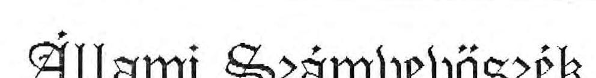
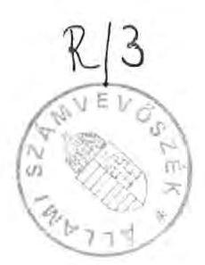
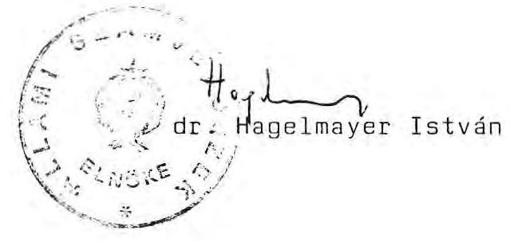
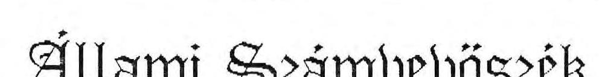
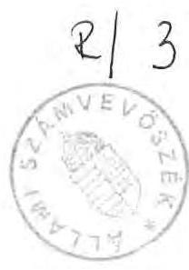
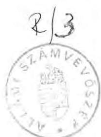

#  

Összefoglaló jelentés
az Országos Tudományos
Kutatási Alap (OTKA)
működésének pénzügyi-gazdasági ellenőrzéséről

1990.
3.

---

# ÁLLAMI SZÁMVEVŐSZÉK 

$V-14-12 / 1990$

## ÖSSZEFOGLALÓ JELENTÉS

az Országos Tudományos Kutatási Alap (OTKA) működésének pénzügyi-gazdasági ellenőrzéséről

Magyarországon a tudományos kutatások, különösen az alapkutatások feltételei az elmúlt években érzékelhetően megromlottak, a kutatási eredmények gyakorlati hasznosulása - a Kormány törekvése ellenére - a várakozások alatt maradt.

Az Országos Tudományos Kutatási Alap (továbbiakban OTKA) felhasználásának ellenőrzése során számos olyan tény és összefüggés tárult fel, amely túlmutat az OTKA hatásmechanizmusán. A kutatási láncolat már az alapkutatások fázisában több ok miatt megszakad vagy nem kielégítő hatékonyságú.

A kutatások háttérbe szorulásának fő oka a mechanikusan műszaki fejlesztésre orientált tervezési metodika, valamint a gazdasági restrikció negatív hatása, ami főképpen az alapkutatásban résztvevő kutatókat és a felsőoktatásban oktató-kutatókat érintette hátrányosan.

Mindez a kutatások és a gyakorlat elszakadásához vezetett. Ezt ellensúlyozandó, a VI. ötévesterv-időszakban eluralkodott egy olyan kormányzati felfogás, amely a tudományok művelőitől a gyakorlatban gyorsan hasznosítható eredményeket sürgetett, s emiatt a fejlesztések a kutatásokkal szemben külön támogatásban részesültek. Ez viszont azt eredményezte, hogy amíg az élenjáró országok általában a K+F ráfordítások 15-19 %-át fordítják alapkutatásokra, addig hazánkban ez a mutató az 1970-es évek elején a nemzetközi érték alsó határa

---

körül alakult, majd 1984-re fokozatosan lesüllyedt 9,4 %-os mélypontra. Azóta ez az arány érdemben nem változott, annak ellenére sem, hogy az alapkutatásunk támogatásának fokozására több pénzügyi intézkedés történt.

Források hiányában főképpen a felsőoktatási intézményekben folyó alapkutatások estek vissza, ahol általában még az alaptevékenységen kívüli egyéb tevékenységek árbevételéből sem volt lehetőség az alapkutatások finanszírozására.

Súlyos károsodás érte a kutatás eszközállományát is, amely egyre gyorsuló ütemben elavulóban és fizikailag romló állapotban van. A technikai rés már nemcsak mennyiségi, hanem egyre inkább minőségi különbségek kifejezője.

A kutatások nem kellő hatékonyságáért részben az az alkalmazott gazdasági és kutatásirányítási modell okolható, amely a kutatási tevékenységet elszakította természetes bázisától, a termelő szférától, illetve a felsőoktatástól. A K+F tevékenység forrásait az elkülönített állami pénzalapokba centralizálták, felhasználását központilag határozták meg és ezekben a döntésekben nem volt primer szerepe a jövedelmezőségnek, hatékonyságnak. A gyakorlati haszon rendre elmaradt a tervekben foglaltaktól.

A kutatás-fejlesztés elmaradásában része volt a nem kielégítő nemzetközi tudományos kapcsolatoknak (korábban az autarchiára való törekvésnek, újabban a COCOM-lista alkalmazásának), valamint a hazai kutatásirányítási, szervezeti problémáknak.

Az alapkutatásokat érintő pénzügyi megszorító intézkedések tartóssá válása a tudományos körök egyre erősödő tiltakozását váltotta ki, ami azt eredményezte, hogy a Kormány Tudománypolitikai Bizottsága (továbbiakban TPB) a helyzet enyhítésére 1984-ben öt évre 200 millió Ft-ot szavazott meg az

---

alapkutatások támogatására (Alapkutatások Támogatási Alapja), majd 1985-ben, ugyancsak több évre az Akadémiai Kutatási Alap 270 millió Ft-ot biztosított ilyen célokra. Ezt követően az alapkutatások pályáztatási formájaként a TPB létrehozta az Országos Tudományos Kutatási Alapot.

Mint a konkrét megállapításokból látható lesz, ez az alap sem tudta az alapkutatások feltételeit gyökeresen megváltoztatni, megjavítani. Az OTKA ellenőrzésének egyik tapasztalata éppen az, hogy a tudományfinanszírozás meglévő feltételei a kutatás adott szervezeti keretei között és a gazdaság érdekeltségi viszonyainak változatlansága mellett a K+F folyamatok - kizárólag a pénzügyi források változtatásával érdemben nem befolyásolhatók.

Az Állami Számvevőszék az Alap létrehozását és működését törvényességi, célszerűségi és eredményességi szempontból vizsgálta és a következőket állapította meg:

# I. Megállapítások 

## 1/ Az Alap létrehozása, törvényessége

Az időközben megszűnt TPB-t, mint kormánybizottságot - amely határozatával az OTKA-t létrehozta - a jelenleg és az akkor is hatályban lévő jogalkotási törvény nem tekinti jogalkotó szervnek. Ebből következik, hogy az Alap létrehozására vonatkozó TPB-döntésnek jogforrásként való felfogása nem felelt meg a hatályos szabályoknak. Ezen az sem változtat, hogy a korábbi joggyakorlat szerint a különböző kormánybizottságok (ÁTB, GB, TPB stb.) határozataikat bemutatták a Minisztertanács legközelebbi ülésén. Erre a tényre azonban a nyilvánosságra hozott határozat nem utal. Az OTKA létrehozása olyan horderejű tudománypolitikai döntés volt, ami legalább minisztertanácsi rendeletként való megjelentetését indokolta volna.

---

Az Alap létrehozása és működése azonban nemcsak törvényességi, hanem célszerűségi és eredményességi szempontból is ellentmondásos.

- Az Alap öt évre (1986-90) előirányzott teljes összege 3,8-4 milliárd Ft. Kutatásra, fejlesztésre ugyanezen időszakban a tervezett összes ráfordítás (beleértve az alapkutatásokat is) 152-164 milliárd Ft volt az állami tervben. Az Alap összege a K+F ráfordításoknak mintegy 2,5 %-a, tehát nagyságrendje nem meghatározó.
- Az 1986-90. évekre előirányzott költségvetési támogatásnak, mint az alap egyik forrásának az eredeti terv szerinti mértékű igénybevétele indokolatlan volt, mivel ugyanebben az időszakban a központi (és a tárca szintű) műszaki fejlesztési, illetve kutatási alapok fel nem használt állománya együttesen átlagosan évente 1-3 milliárd Ft között alakult (a céltól eltérő, illetve a nem megfelelő felhasználásban rejlő tartalékokat nem is említve). Ezen kívül az átengedett költségvetési bevétel, mint közvetett állami támogatás (12 % tudományos járulék) is jelentősen meghaladta a tervezettet, s ez a többlet forrás teljes egészében az Alap rendelkezésére állt.
- Az alapkutatásra szánt pénzügyi eszközök kezelésére létrehozott újabb elkülönített állami pénzalap - a Kormány többször hangoztatott törekvése ellenére - tovább növelte az alapok számát és az azok felhasználásában meglévő átfedéseket.
- Az OTKA jogállása, működési rendje, szervezete és pénzügyi elszámolásának szabályai évek óta sem szilárdultak meg egyértelműen. Az Alap információs rendszere hiányos, nem alkalmas a folyósított állami támogatások tényleges felhasználásának nyomon követésére, a kutatási eredmények

---

értékelésére. Mindeddig megoldatlan az Alapból adott támogatások felhasználásának egységes elvek szerinti ellenőrzése.

- Az Alap kezelését, felhasználását szabályozó 7/1985. (A.K.14.) MTA-F-EüM-MÉM-MM sz. együttes utasítás több ponton túllépi az alapító határozat kereteit, illetve néhány kérdésben nem kielégítő a szabályozás.

2/ Az Alapból juttatott támogatás felhasználása és eredményessége

Az Alap létrehozásának célja "eredeti, időszerű és nemzetközi viszonylatban is kiemelkedő színvonalú" alapkutatások támogatása.

Az ellenőrzés időpontjáig két nyilvános témapályázatot hirdettek meg (OTKA I. és OTKA II.), és az ellenőrzés időpontjában érkeztek be a legújabb témapályázatok (OTKA III). (Ez utóbbi pályázatra az ÁSZ ellenőrzése nem terjedt ki.) A két pályázat során 76 tudományágat reprezentálva összesen 3.240 pályázatot nyújtottak be 11,4 milliárd Ft támogatási igénnyel. Ezekből a bíráló bizottságok 1.246 pályázatot fogadtak el 2,5 milliárd Ft összegű támogatással. Az átlagos támogatási összeg az OTKA I. témapályázatnál 2,7 millió Ft, az OTKA II. témapályázatnál 0,8 millió Ft; a két pályázat átlaga 1,95 millió Ft.

A bíráló bizottságok a pályázatok elfogadásánál rendkívül liberálisan jártak el. Még azon az áron is befogadták a pályázatokat, hogy az esetek többségénél a kért összegnél kisebb támogatást nyújtottak. (Különösen így volt ez az OTKA II.-nél.) Kellő szelekció hiányában tudományos értékétől függetlenül minden pályázatot hátrányosan érintett a csökkentett mértékben megadott támogatás. Az infláció a támogatás reálértékét tovább csökkentette.

---

A helyszíni ellenőrzés során a témapályázati rendszerről nyert tapasztalatok a következők:

- a pályázati rendszer bevezetése enyhítette az alapkutatásokban észlelhető súlyos feszültségeket, különösen kedvező hatású volt a felsőoktatási intézményekben;
- lehetővé tette ígéretes alapkutatások megkezdését, vagy intenzívebb folytatását;
- a központi elosztási mechanizmus helyébe egy objektívebb, a várható eredménytől függő, versenyeztető elbírálás lépett;
- a megítélés mércéjül a nemzetközi szintű eredményességet állították;
- egyes megvizsgált kutatási témák belátható időn belül értékelhető eredményeket ígérnek.

E pozitívumokkal szemben:

- a pályázati preferenciákat (fiatal kutatók támogatása, kutató kollektívák előtérbe helyezése) alig sikerült érvényesíteni;
- az OTKA-pályázatok elbírálása, az elfogadott pályázatokra történő szerződéskötés - elsősorban az OTKA I. pályázatoknál - bürokratikus, vontatott volt;
- a pályáztatás nyilvánosságának elvét csak részben sikerült érvényesíteni;
- a juttatott támogatások felhasználásának szabályozási hiányosságai elősegítették az intézményfinanszírozás állami

---

korlátainak megkerülését, enyhítését és ezáltal a támogatás céltól eltérő felhasználását;

- az adott intézményi és érdekeltségi rendszer esetenként hátrányosan befolyásolta az OTKA rugalmasabb elveinek érvényesülését;
- a pályáztatási rendszer egyetlen résztvevője sem visel egzisztenciális felelősséget döntésének következményeiért, illetve nem fűződik a realizáláshoz elemi érdeke;
- a jelenlegi viszonyok között a támogatási igények korlátlan növekedésének kizárólag a rendelkezésre álló források végesége szab határt;
- megfelelő témaválasztással (vagy módosítással) a kutatási téma elvileg végtelen ideig folytatható;
- a kutatási eredmények gyakorlati hasznosulásának vagy eredményes folytatásának nincs gazdasági kényszerpályája.

Az Alap célszerű és eredményes működését az Alapból nyújtott támogatások felhasználásának eredményességén keresztül lehetne megítélni. Az alapkutatások eredményességének, hasznosságának elbírálása pénzügyi-gazdasági ellenőrzési módszerekkel rendkívül nehéz, esetenként lehetetlen. Az alapkutatások eredményének méréséről a TPB határozat csak annyit rögzít, hogy "az Alapból finanszírozott kutatások eredményességét az Akadémia tudományos osztályai értékelik a bizottságok és a felügyelő szervek közreműködésével." Az ellenőrzés befejezésének időpontjáig a befejezett pályázatok szakmai értékelésére sem került sor. (Meg kell jegyeznünk, hogy a szerződés szerint lejárt határidők többségét 1990. év végéig meghosszabbították, amiben értékelési nehézségek és a folytatás bizonytalansága egyaránt közrehatnak.)

---

Az ellenőrzés során arra nézve nem lehetett mértékadó választ kapni, hogy az elfogadott témapályázatok közül mennyi érte el a pályázati kiírás magas szintű követelményeit. Annyi mindenképpen leszögezhető, hogy 76 tudományág több mint 1.200 pályázata nem lehet nemzetközi mértékkel mérve kiemelkedő színvonalú. Az OTKA-bizottság elnöke körlevél útján tájékozódott a kutatásvezetőktől a várható tudományos eredmények felől, de a közölt adatok megbízható és értékelhető feldolgozására az ellenőrzés befejeződéséig nem került sor.

Általában közismert Magyarország infrastruktúrájának elmaradottsága. Ezzel is magyarázható, hogy az Alap eredeti célja szerint egyébként kisebb jelentőségű cél - a kutatási infrastruktúra fejlesztése - rövidesen kiemelt szerepet kapott az OTKA finanszírozási rendszerében. (Eddig az összes ráfordítás, illetve támogatás mintegy 45 %-a volt beruházási célú.) A kutatási feltételek elmaradottságára mutat az a tény, hogy az elfogadott fejlesztési célú pályázatok keretében olyan beruházásokra (személyi számítógép, alapműszer beszerzésére) is sor került, amelyek már korábban is alapvető és elengedhetetlen feltételét kellett volna, hogy képezzék az adott intézmény (egyetem, kutatóhely) eredményes működésének.

A helyszíni ellenőrzések tapasztalatai szerint a beruházási célú felhasználások célszerűsége még a témapályázatok eredményességénél is nehezebben állapítható meg.

- A beruházások többsége - késedelmes megvalósulásuk miatt - befejezetlen.
- Az Alap pénzeszközeinek terhére jelentős összegű beruházások, fejlesztések történtek. Ezek kisebb része kapcsolódott közvetlenül egy-egy témához, nagyobb részük általános fejlesztésként realizálódott, többnyire az egyébként szükséges, de elmaradt invesztíciók legalább részbeni pótlásaként. Így pl. az Alapból részesítették támogatásban tudományos parkok, műszercentrumok létesítését, kísérleti műhelyek létrehozását, mérés- és műszerügyi infrastruktúra fejlesztését.

- A műszercentrumok támogatásánál az igények összevont kielégítésével létrejött fejlesztések egy része csak quasi centrumnak tekinthető, mivel helyileg különböző intézményekhez telepítették a beszerzett műszereket;
- Egyes beruházások OTKA-ból való támogatásának célszerűsége vitatható;
- Szabályozási hiányosságok miatt a beszerzett állóeszközök tulajdonjoga rendezetlen, ezért intézményenként eltérő gyakorlat érvényesül. Az állami forrásokból beszerzett állóeszközök - az érvényes szabályok betartásával - átvihetők más tulajdonformába, ahonnan azután végképpen kivonhatók az állami tulajdon köréből.

A téma- és beruházási pályázatok tapasztalatai egyaránt arra engednek következtetni, hogy az OTKA eredeti célját nem érte, illetve nem is érhette el maradéktalanul.
 Ez azonban elsősorban nem az OTKA-ért közvetlenül felelős szervezet vagy személyek hibája.

Az OTKA létesítése újszerű pénzelosztási mechanizmus volt elhatározásának időpontjában, amelynek megítélésénél figyelembe kell venni, hogy még nem jutott el első, befejezett szakaszáig sem.

# II. Javaslatok

1/ Az Országgyűlés kérje fel a Kormányt, hogy egy éven belül komplex módon tekintse át a K+F tevékenység működési mechanizmusát, szervezeti struktúráját, a finanszírozás, felhasználás és értékelés rendszerét. A Kormány tegyen javaslatot az Országgyűlésnek ezek törvényi szintű, összehangolt szabályozására. E munka keretében lehet dönteni az OTKA további sorsáról, az alapkutatások állami támogatásának módjáról. Az új koncepció kialakításánál célszerű figyelembe venni a nemzetközileg bevált megoldásokat.

2/ Átmeneti megoldásként a Kormánynak döntenie kell arról, hogy
a/ a még le nem járt határidejű pályázatok további folytatása az eredeti feltételek szerint lehetséges-e;
b/ az idei évben benyújtott OTKA III. témapályázatok a meghirdetett feltételekkel elindíthatók-e;
c/ a folyamatban lévő társadalomtudományi kutatások aktuálisak és folytathatók-e.
d/ az Alapból milyen fejlesztési célok, beruházások finanszírozhatók a továbbiakban és milyen feltételekkel.

Ezeket a döntéseket - a folyamatosság biztosítása érdekében - még ez év őszén, az OTKA-bizottság véleményének figyelembevételével kellene a Kormánynak meghoznia. A döntés elhúzódása miatt kialakuló bizonytalanság veszélyeztetheti a meglévő kutatási struktúrát, nehezen visszafordítható folyamatokat eredményezhet (pl. kutatók elvándorlását).

---

3/ A kormány kísérje figyelemmel mindazoknak a javaslatoknak a végrehajtását, amelyeket az Állami Számvevőszék jelentésében az OTKA-bizottság számára tett (értékelési metodika nyilvánosságra hozatala, állóeszközök tulajdonjogi helyzetének rendezése, függő pénzügyi kérdések megoldása stb.).

Budapest, 1990. május 15.

---

#  

## Jelentés

## az Országos Tudományos Kutatási Alap (OTKA) működésének pénzügyi-gazdasági ellenőrzéséről

1990.
3.

---

Az ellenőrzést végezték:

Bakonyvári Róbertné számvevő tanácsos
dr. Csapodi Pál számvevő
dr. Mihály Sándor számvevő tanácsos
Éva Katalin számvevő tanácsos
Plutzer István számvevő

Az ellenőrzést vezette és összefoglalta:

Matusek István főtanácsos

---

# ÁLLAMI SZÁMVEVŐSZÉK 

Fejezeti Főcsoport
$V-14-12 / 1990$.

## JELENTÉS

az Országos Tudományos Kutatási Alap (OTKA) működésének pénzügyi-gazdasági ellenőrzéséről

Az ellenőrzés célja annak megállapítása volt, hogy az Országos Tudományos Kutatási Alap (továbbiakban: OTKA, vagy Alap) létesítése mennyiben segítette elő az eredeti, időszerű és nemzetközi viszonylatban is kiemelkedő színvonalú tudományos kutatások feltételeinek megteremtését, illetve javítását.

Az Alap felhasználását 4 tárcánál (MTA, MM, MÉM, SZEM) és azok 13 intézményénél (felsőoktatási intézményeknél, ill. kutató intézeteknél) vizsgáltuk meg, reprezentatív mintavételi eljárással kiválasztott kutatási témák részletesebb vizsgálatával.

## I.

## 1. Az OTKA létrehozásának előzményei

A társadalmi-gazdasági válság és annak következményei már több év óta negatívan hatnak a tudományos szféra addig kialakult struktúrájára és annak finanszírozási rendszerére. A gazdaságpolitika kényszerű restrikciós intézkedései különösen a kutatás társadalmi és gazdasági helyzetét változtatták meg kedvezőtlenül. A privilegizált ellátási színvonalról a költségvetés: marsdalk-elv alapján finanszírozott helyzetbe juttatva az alapkutatásokat, az ezzel foglalkozó professzionális kutatókat és a kutatásokban részt vevő felsőoktatási

---

oktatókat-kutatókat. Az egzisztenciális kényszer a gyorsan realizálható megbízások vállalását preferálta, az alapkutatás - különösen a felsőoktatásban - források hiányában marginálissá vált. A kutatás állóeszköz-bázisa egyre gyorsuló ütemben avulni és fizikailag romlani kezdett, a technikai rés növekedése már nem egyszerűen mennyiségi elmaradás, hanem alapvető minőségi különbségek kifejezője.

Az OTKA életrehívása egy korábbi tudománypolitikai koncepció meghaladásának kísérlete, változatlan irányítási, szervezeti, érdekeltségi és tudományfinanszírozási rendszerek mellett.

Az elmúlt két évtizedben kialakult tervezési metodika szerint a kutatás-fejlesztés ( $\mathrm{K}+\mathrm{F}$ ) pénzügyi forrásait együttesen tervezték meg a kormányzati szervek. A tervezés során - már csak a nagyságrendi különbségek miatt is - a nagyobb figyelmet mindenkor a műszaki fejlesztésnek szentelték. A tudományos kutatás mint felhasználási cél, önállóan nem került tervezésre. A sajátos helyzetet az is jellemzi, hogy megfelelő ágazati szerv hiányában e szféra képviseletét a tervezés menetében a Pénzügyminisztérium látta el.

A metodikai alárendeltségen kívül a kutatás, különösen az alapkutatás háttérbe szorulását eredményezte az a VI. ötéves terv időszakában erőteljesen érvényesülő prakticista kormányzati felfogás, amely a tudományok művelőitől gyors, gyakorlati hasznosíthatóságú eredményeket várt és ehhez a követelményhez rendelte az állami támogatásokat.

Az iparilag fejlett országokban általában a K+F ráfordítások 15-19 %-át fordítják alapkutatásra, addig Magyarországon a 70-es évek elején a ráfordítás 15 % körüli volt - majd fokozatosan csökkent és 1984-re 9,7 %-os mélypontra jutott, arányát tekintve lényegében azóta sem változott.

---

A kutatások pénzügyi okokból eredő visszaszorulása az érdekeltek egyre erősödő ellenállását és tiltakozását váltotta ki. A gazdaságpolitika érzékelve az erős érdekérvényesítésre képes tudományos réteg körében keletkezett feszültségeket, 1986-1990. évekre változásokat ígért. A VII. ötéves tervidőszakra való felkészülés során a tudománypolitika ismét célként fogalmazta meg a tudományos kutatás anyagi feltételeinek javítását és a K+F pénzügyi forrásainak tervében a költségvetési részarány érdemi növelésére történt (sikertelen) kísérlet.

A Tudománypolitikai Bizottság 30.019/1985. számú határozatában célként tűzte ki, hogy a K+F ráfordítások teljes összege 1986-90. között a belföldön felhasználható nemzeti jövedelem mintegy 3 %-a legyen (mintegy 152-164 milliárd Ft). A határozat hangsúlyozottan kiemelte a tudományos kutatás fontosságát, prioritást helyezett kilátásba a színvonalas alapkutatáshoz nélkülözhetetlen korszerű gépek és műszerek beszerzéséhez és a kutatási nagyműszer-park rekonstrukciójához.

Gyors intézkedésként a TPB 30.018/1984.sz.határozatával 200 millió Ft rendkívüli támogatást szavazott meg az alapkutatások számára (Alapkutatások Támogatások Alapja), melyet az MTA által meghirdetett pályázat útján osztottak szét a kutatók között ötéves időtartamra. Ezt követte 1985-ben az Akadémiai Kutatási Alap (AKA) ugyancsak pályázati úton történő elosztása, mely többségében alapkutatások támogatásához 270 millió Ft-ot biztosított több évre.

A Tudománypolitikai Bizottság 1985. májusában tárgyalta meg a tudományos kutatás finanszírozási és gazdasági szabályozásának továbbfejlesztésével foglalkozó előterjesztést. A 30.012/1985. sz. határozatában kimondta, hogy: "Ki kell alakítani az akadémiai kutatóintézetekben és egyetemeken folyó alapkutatások támogatására szolgáló központi pénzügyi ala-

---

pot. Ennek létrehozásáról a VII. ötéves tervi forrásszámításokkal, illetve az ezen időszakra szóló OKKFT-vel kapcsolatos munka során kell gondoskodni. Az alap felelőse az MTA főtitkára legyen. Ki kell dolgozni az alap működési rendszerét, ezen belül gondoskodni szükséges az egyetemeket felügyelő tárcák képviselőinek részvételéről."

# 2. Az OTKA célja és preferenciái 

A TPB 1985. szeptember 27-én 30.020/1985. számon hozott határozatot az Országos Tudományos Kutatási Alap létrehozásáról.( A TPB akkori személyi összetétele a 11. sz. mellékletben látható.)

Az OTKA elsősorban az akadémiai kutatóintézetekben és felsőoktatási intézményekben folyó színvonalas alapkutatások támogatására szolgál, de egyéb kutatóhelyeken folyó alapkutatások is részesülhetnek támogatásban, amennyiben a követelményeknek megfelelnek.

Az Alap által preferált célok:

- az eredeti, időszerű és nemzetközi viszonylatban is kiemelkedő színvonalú tudományos kutatások feltételeinek megteremtése, illetve javítása;
- elsőbbséget kell biztosítani olyan alapkutatási elképzeléseknek, témajavaslatoknak, amelyek kutatását
= a pályázó szakember korábbi tudományos teljesítménye, illetve
= kezdő kutatók esetében a kutató alkalmassága, tehetsége indokolja;

---

- prioritást szükséges adni az olyan alapkutatási témáknak, amelyek kapcsolódnak a tudományos kutatás kormányzati szintű hosszabb távú irányzataihoz;
- előnyben kell részesíteni a kutatóintézetek, egyetemek és vállalatok közös kutatókollektíváinak pályázatait, amennyiben a követelményeknek megfelelnek.

A határozat kimondja, hogy az OTKA felhasználása nyilvános pályázat útján történik, de esetenként konkrét kutatási megbízások is adhatók.
II.

# Ellenőrzési megállapítások.

1. Az OTKA működési rendjének szabályozottsága, szervezettsége

Az Alap működési rendjét a 30.020/1985. sz. TPB. határozat és ez alapján kiadott 7/1985. (A.K.14.) MTA-F-EüM-MÉM-MM számú együttes utasítás szabályozza.

Kiemelendő, hogy a határozat

- nyilvános pályáztatási, döntési és értékelési rendszert ír elő,
- az OTKA Bizottság létrehozásával a felsőoktatási intézményeket felügyelő tárcák érdemi részvételét szavatolja az Alap felhasználásával kapcsolatos kérdésekben,

---

- az Alap elkülönített pénzügyi kezelésére, szervezésével összefüggő feladatok végzésére az MTA Központi Hivatalát jelölte ki.

Az Alapból témapályázatok, célfeladatok, infrastruktúra fejlesztések finanszírozhatók, nem fordíthatók építési beruházásra és felújításra.
Az együttes utasítás az alap felhasználási rendjére ad útmutatást.

Az utasítás 7. §. (1) bekezdése "OTKA Működési Szabályzat"-ra hivatkozással írja elő a pályázatok bírálati rendjét.

Az Alap működési, felhasználási rendjére átfogó működési szabályzat nem készült. Az átfogó szabályozást eseti rendelkezések, bírálati, szerződéskötési minták és eljárási, kitöltési eseti szabályozások helyettesítették.

Ennek következtében egyes területeken a fejezeteknél eltérő gyakorlat érvényesült (szerződéskötések, a kutatások folyamatos figyelemmel kísérése), egyes témákban bizonytalanság és ellentmondás tapasztalható az együttes utasítás és a gyakorlat között (pl. az Alap terhére beszerzett eszközök tulajdonba adásánál).

A TPB határozat és a végrehajtási utasítás között az ellenőrzés során több ellentmondást, eltérést tapasztaltunk.

Az Alapról szóló határozat csak periférikusan, a 7. pont egy félmondatában tesz pl. említést infrastruktúra-fejlesztési pályázatokról. A végrehajtási utasítás már részleteseb-

---

ben szabályozza a beszerzett állóeszközökkel kapcsolatos eljárásokat. Mint a későbbiekben látható lesz, az Alapnak végül meghatározó hányadát fordították különféle állóeszközök beszerzésére.

Az alaprendelkezés 7.3 pontja szerint ...."infrastruktúra korszerűsítésére vonatkozó pályázatokat kutatóhelyek is előterjeszthetnek"; a végrehajtási utasítás 5. §.(3) bek. szerint "kutatási infrastruktúra korszerűsítésére vonatkozó pályázatot csak kutatóhely vagy több kutatóhely közösen nyújthat be" (kiemelések: tőlünk)

A végrehajtási utasítás 10. §. (2) bek. szerint az elnyert pénzeszközöket a pályázatban megjelölt kutatóhely bankszámláján kell kezelni. Nem történt intézkedés ellenben a kutatóhelyi rezsiköltségek pályázati témákra szóló elszámolási rendjéről. A végrehajtási szabályozás előbbiekben vázolt rendje ezzel bizonyos mértékű ellenérdekeltséget támasztott szakmailag és pénzügyileg az intézmények vezetői és a pályázonyertes kutatók között.

Ellentmondásos a végrehajtási utasítás abban a tekintetben is, hogy a B §. (4) bek. szerint a döntések ellen csak a pályázattal kapcsolatos eljárás szabálytalansága esetén lehet benyújtani fellebbezést az OTKA Bizottság elnökéhez, azonban a 7. §. (3) bek. lehetetlenné tette, hogy legálisan nyilvánosságra kerülhessen ilyen kifogásolási ok.

A végrehajtási utasítás 7. §. (3) bek. szerint "a pályázatot és az azzal összefüggő információkat a közreműködő testületek tagjai és a felkért szakértők a döntés nyilvánosságra hozataláig úgy kötelesek kezelni, hogy azzal kapcsolatos lényeges adat ne juthasson illetéktelen személy tudomására."

---

Az OTKA felhasználásával összefüggő döntések előkészítésére Országos Tudományos Kutatási Alap Bizottság (OTKA Bizottság) alakult, elnöke az MTA főtitkára, tagjai az MM, EüM, és a MÉM képviselői, valamint felkért személyek. Az OTKA Bizottság működéséhez szükséges adminisztratív és szervezési feladatokat az MTA szervezetében elhelyezett OTKA Iroda látja el (végrehajtási utasítás 6. §).

Az országos rendeltetésű Alap kezelője az MTA, a pénzügyi feladatokat az MTA Pénzügyi Főosztálya látja el. Az Alap pénzeszközeinek pénzforgalma elkülönített bankszámlán bonyolódik. Az Alap forrásait terhelő kötelezettségvállalások, odaítélt támogatások és leutalások - feladatonként - a fejezeti analitikus nyilvántartásokból megállapíthatók, az érintett tárcákkal a szükséges egyeztetéseket esetegtén elvégezték.

Az MTA az országos rendeltetésű Alap terhére közvetlenül számolja el azon feladatokat, amelyek központi célokhoz kapcsolódnak és lebonyolítását az MTA végzi.

A saját tárcarendeltetésű Alap pénzeszközeit az MTA az Akadémiai Kutatási Alap (AKA) bankszámláján kezeli, analitikus nyilvántartás szolgál az OTKA forrás és felhasználás elkülönítésére.

A fejezetek az intézmények pénzügyi-gazdasági ellenőrzése keretében az Alapból nyújtott támogatásokat áttekintik, részleteiben azonban nem vizsgálják az esetleges lemaradások, eltérések okait. A felügyeleti ellenőrzéseknél nem kiemelt téma az Alapból nyújtott pénzeszközök vizsgálata, az MTA-nál az ágazati szempontú ellenőrzéseknek egyáltalán nincsenek meg a feltételei.

Az OTKA jogállása, szervezete, működési rendje
 egyértelműen nem alakult ki az eltelt időszakban, mely szabályozatlanság

---

az Alap kezelési rendjének fejezetenkénti, illetve intézményi kialakítását is hátráltatta.

Az OTKA Iroda meglévő szervezete (2 fő) a pályázatokkal kapcsolatos lebonyolítási feladatokat végzi, a benyújtott és odaítélt pályázatok adatait nyilvántartja, de nem nyújt információt a leutalt Alap tényleges felhasználásáról és annak összetételéről.

Megoldatlan a feladatok teljesítésének, működési kiadásainak figyelemmel kísérése, ezért nem valósítható meg a végrehajtási utasítás 13. § (7) bek. mely szerint "az OTKA Bizottság elnökének kérésére a kutatóhelyeket felügyelő tárcák tájékoztatást adnak a kutatóhelyek OTKA-ból biztosított pénzeszközökkel való gazdálkodásáról".

Mint a továbbiakból látható lesz, a tárcák által az OTKA-ról kialakított információs rendszer tartalmilag egymástól eltérő és nem alkalmas a gazdálkodás megítélésére, a várható eredmények prognosztizálására.

Az intézmények előírt éves beszámolási rendszere keretében a beruházási, fejlesztési és állóeszközgazdálkodási adatok értékelése nem ad kellő információt az Alap által támogatott célkeretek felhasználásáról, a fejlesztések folyamatos megvalósításáról. A beszámolási rendszerben összevont adatok állnak csak rendelkezésre.

Az alapkutatások széles köre és ennek következtében kényszerű támogatáscsökkentések, a kutatások menetközbeni kellő megfigyelésének hiánya az Alap pénzeszközeivel való hatékony gazdálkodás lehetőségét megkérdőjelezik. Jelenleg a kutatások eredményeire nincs információ. A részjelentéseket a támogatott kutatásoknál nem követelték meg a fejezetek

---

nek ellenére, hogy az Alap pénzeszközei leutalását alátámasztó szerződések és a működésre vonatkozó közös utasítás ezt a kötelezettséget előírta.

Mindeddig megoldatlan a kutatási feladatok lezárását követő értékelés módszere, holott erre vonatkozóan többszöri állásfoglalás történt. Az Akadémia főtitkára egy 1988. évi publikációjában közölte, hogy az Alapkutatások Támogatási Alapjánál már megkezdődött értékelés próbája lehet a többi pályázat (így az OTKA) értékelésének.

Az eddig beérkezett rész-, illetve zárójelentések értékelése még nem kezdődött meg. Nem egyértelmű továbbá, hogy miképpen záródik majd le a pénzügyi elszámolás; nyitott kérdés, hogyan kell eljárni a pénzmaradványokkal és megnyugtató módon nem rendezett a témákhoz beszerzett állóeszközök tulajdonjoga.

2/ Az Alap képzésének rendje, pénzügyi forrásainak alakulása.

A kutatásra és fejlesztésre, ezen belül az alapkutatásra fordítható pénzeszközök képzését a többcsatornás rendszer jellemzi.

Kutatásra-fejlesztésre 1986-1990-es évekre összesen 152-164 milliárd Ft-ot irányoztak elő, amelyből a költségvetés tervszerinti részaránya 33-37 milliárd Ft, ebből az Alapra szánt költségvetési támogatás 3,1 milliárd Ft.

Az OTKA forrásainak és felhasználásának tervét az I. sz. melléklet mutatja be.

---

Az Alap öt évre előirányzott teljes összege 3,8-4 milliárd Ft volt. A tervezett költségvetési támogatásból 1,1 milliárd Ft-ot az állami költségvetés közvetlenül fedezett volna, 2 milliárd Ft fedezeteként az átengedett állami befizetési kötelezettség (12%-os tudományos járulék) szolgált, továbbá a központi műszaki fejlesztési alapból 0,7-0,9 milliárd Ft átcsoportosításával számoltak.

Az alap tényleges forrásai meghaladták a tervben előirányzottakat. A tervidőszak végéig mintegy 5,1-5,2 milliárd Ft az Alapra várható bevétel. Összetételének arányai eltérnek a tervezettől. A központi műszaki fejlesztési alap terhére mintegy 2,6 milliárd Ft-ot finanszíroztak (50%). A tervezettet lényegesen meghaladta az átengedett bevétel (+523,3 millió Ft) és a terv szintjén maradt a költségvetés közvetlen támogatása, ezáltal aránya csökkent.

A források belső összetételének módosulása pénzellátási zavarokat nem okozott, valójában a támogatottak szempontjából a forrás eredete közömbös.

A támogatások leutalása az intézmények részére az induló évet (1986.) kivéve zavartalan volt és összhangban volt a felhasználási tervekkel, s a feladatok előirányzataival.

Az OTKA bankszámla vizsgált időszak alatti forgalma a 2. sz. mellékletből látható.

A rendelkezésre álló adatokból az állapítható meg, hogy az eredeti előirányzathoz viszonyítva 1988-as év végéig 150,3 millió Ft többletbevétel származott a 12%-os járulékból. Ez a befizetési kötelezettség ugyan megszűnt az 1989. évben, de a korábbi árbevételek utáni befizetések az 1989. évben és még 1990-ben is érkeznek az Alap bankszámlájára.

---

A pótlólagos befizetésekkel ez év február 28-ig befizetett többlet a 12%-os járulékból 284,5 millió Ft-ra növekedett. További 87,9 millió Ft bevétel várható az 1990-es évben az MTA Központi Fizikai Kutató Intézetének késedelmes járulékátutalása miatt. (Az MTA KFKI rendszeresen mintegy egy év eltolódással tett eleget ezen kötelezettségének fizetési nehézségei miatt.)

Az átengedett központosított bevétel szabályai szerint a Pénzügyminisztérium engedélye szükséges a realizálódott többletforrás felhasználásához. Az MTA az 1987. évi többletforrásokból a PM-mel elszámolt ugyan, de a bankszámlaforgalommal egybevetve az elszámolást, olyan eltérések mutatkoztak, amelyek további tisztázást, illetve rendezést igényelnek.

Az 1987-es évi pénzmaradvány elszámolásnál az Alap 1987. évi pénzeszközeit is áttekintette a PM. Az 1988. IV. hó 26-i PM-MTA emlékeztető az átengedett költségvetési forrás tényleges teljesítéseként 539 millió Ft-ot rögzít. Az éves tervelőirányzat 400 millió Ft, a többlet tehát 139 millió Ft összegű. Az ellenőrzés megállapítása szerint a tényleges többletbevétel 199,5 millió Ft volt. A bankszámla kivonatok alapján 599,5 millió Ft bevétel realizálódott az 1987-es évben. Ebből 50 millió Ft befizetést (MÉM átutalása 1987. IV. 14-én) "függő bevételként" ideiglenesen az MTA Alapkutatási alap számlájára vezették át, majd 1987. decemberében további 50 millió Ft "függő bevétel" tétellel együtt a következő év elején vezették vissza az Alapra.

A függő tételkénti könyvelés mindkét esetben szabálytalan volt. A pénzmaradvány elszámolásnál és az 1988. évi gazdálkodás megítélésénél nem a valós helyzetre épült tehát a PM-mel a tárgyalás. A

---

hivatkozott jegyzőkönyv értelmében az 1987. és 1988. évben az átengedett bevételekből képződött többletek az Alap nem tervezett többletkiadásaira felhasználhatóak voltak (beruházási ÁFA, 50 millió Ft pedig tudományos kutatási feladatokra az MTA intézményeknek visszautalható volt).

Az 1990. év februárjában az OTKA Bizottság szintén áttekintette a képződött és képződő forrásokat és felhasználásokat, itt további eltérések mutatkoznak.

A felmérés szerint a 12%-os járulék többletbevétele 228 millió Ft. A számítás az 1988. év végéig befizetett többleteket nem mutatja ki, mivel a már említett PM-MTA emlékeztető alapján az Alap "jogszerűen" rendelkezhetett a többletforrásokkal.

Az 1989-1990-ben képződött többletbevételt az MTA viszont nettó módon számítja, azaz nem tartalmazza az 1989-ben e forrás terhére társadalombiztosítási járulék egységesítése címén a fejezeteknek korábban visszautalt 51,8 millió Ft-ot. (Az elnöki döntés ez esetben megelőzte a PM jóváhagyását, mivel az 1989. évben realizált átengedett bevételekről még nem számoltak el a PM-mel.)

Az MTA főtitkára ez év februárjában küldte meg a pénzügyi tárca vezetőjének azon kérelmét, melyben a 228 millió Ft többletbevételből 200 millió Ft visszahagyását kéri, 28 millió Ft költségvetési felajánlás mellett. (100 millió Ft a fejezetek kutatási céljait, 100 millió Ft alapítvány létrehozását biztosíthatná.)

Az ellenőrzés tapasztalata alapján indokolt a pénzügyi tárca által az átengedett központosított bevétel teljes többletének és visszahagyásának a felülvizsgálata.

---

Az Alap javára 1987. évben átutalt, de a pénzmaradvány elszámolásából kivont 50 millió Ft többletbevétel, valamint az MTA Központi Fizikai Kutató Intézete által fizetendő 88 millió Ft járulék befizetési hátralék lényegesen nagyobb összegű költségvetési befizetésre ad lehetőséget, mint a felajánlott 28 millió Ft.

A terven felüli többletbevételek és az 1989. évben adott központi támogatások az alapkutatások forrásainak értékmegőrzésén túl lehetőséget adtak átmeneti finanszírozási gondok feloldására, indokolatlan tartalékolásra is.

Az elnyert pályázatok későbbi évek ütemeinek megelőlegezése a korábbi években és az 1989. évben az előrehozások csökkentik az 1990-es évek terheit, (ennek kihatása mintegy 9 millió Ft). Ezen kívül bankbetét formájában az 1989. évben 230 millió Ft-ot tartalékoltak és az így elért kamatbevételek fedezetet nyújtottak az ügyviteli kiadásokra (3 millió Ft).

Az Alapról esetenként alapkutatással össze nem függő feladatok átmeneti finanszírozására is sor kerülhetett:

Az 1989. évben az Akadémiai Nyomda és Kiadó részére 40 millió Ft átmeneti támogatással az éves gazdálkodás feszültségét oldották meg. (Az Alap javára az ellenőrzés időszakában az összeg visszatérítése megtörtént.)
3. Témapályázatok szervezésének általános tapasztalatai. a/ A benyújtott és elfogadott pályázatok főbb jellemzői.

Az OTKA pályázati rendszer működésének tapasztalatairól, a döntés nyomán kialakult helyzetről megbízásból az MTA Kutatás-

---

szervezési Intézet 1987-ben készített egy részletes, minden lényeges kérdést felölelő elemzést. Az elemzés megállapításai ma is helytállóak.

Az ellenőrzés időpontjában az OTKA-I. és OTKA II. témapályázatok voltak elfogadottak, de már szervezés alatt állt az OTKA-III. pályázat is. Több futama volt a beruházási jellegű pályázatoknak is.

Az OTKA I. témapályázatot 1985. decemberében hirdették meg. A pályázat főbb áttekintő adatai a 3. sz. mellékletben láthatók. A mellékletben nem szereplő adatokat azokkal a preferált mutatókkal egészítjük ki, amelyeket az OTKA pályázatban elvi szempontokként meghatároztak. (A közölt adatok és megállapítások az MTA Kutatásszervezési Intézet elemzéséből származnak).

A benyújtott pályázatok összesen 76 tudományágat reprezentáltak. Az igényelt költségtámogatás 74%-át a főhivatású kutatóintézetek és a felsőoktatási intézmények nyújtották be. Az elfogadott költségtámogatásból 47%-kal részesednek a kutatóintézetek, a felsőoktatási intézmények pedig 36%-kal.

A benyújtott pályázatok témavezetői közül 6% akadémikus, 26% a tudomány doktora és 46% kandidátus. A témavezetők 22%-a nem rendelkezett tudományos fokozattal.

Életkori megoszlás szerint a témavezetők közül 10 fő volt 30 év alatt, 313 fő 31-40 év közötti, 596 fő 41-50. év közötti és 998 fő 51 év felett (ebből 234 fő 60 év felett). A 60 év feletti témavezetők nyerési esélye 2,5 szerese volt a 30 év alattiaknak és 2 szerese a 40 év alattiaknak.

---

Igen magas volt az elfogadott pályázatoknál a vezető beosztásúak aránya (41%) a K+F intézetekben, 57% a kutatóintézetekben, egyetemi tanároknál 49%, docenseknél 39%.

A benyújtott pályázatok 38%-a származott vidéki intézményből, ezen belül 27% egyetemi városokból.

Az OTKA II. témapályázat 1987. júliusában került meghirdetésre. A pályázat főbb adatai a 4. sz. mellékletben láthatók. Erről a pályázatról mélyebb analízis nem készült.

A melléklet adatai egyértelműen mutatják, hogy az OTKA II. anyagi lehetőségei sokkal szerényebbek voltak, mint az első pályázaté. Különösen a támogatási igény és lehetőség diszkrepanciája nyilvánvaló, mivel a kért támogatásnak alig több, mint 12%-a volt kielégíthető. Az anyagi lehetőségekhez képest mégis túl sok pályázatot fogadtak el, ami csak úgy volt lehetséges, hogy az egy pályázatra jutó támogatás abszolút összege alacsony volt (803.400 Ft) alig több, mint az OTKA I. hasonló adatának 1/5-e, s ebben még nem fejeződik ki a reálérték különbség. A két tematikus pályázat átlagos támogatási összegéről az 5. sz. melléklet nyújt áttekintést.

Az elnyert (OTKA I.-II.) pályázatok és egyéb feladatok teljes költségigénye 4,4 milliárd Ft. A vonatkozó TPB határozat szerint 1986-1988. évekre az Alapból 2 milliárd Ft összegig lehetett kötelezettséget vállalni. Ténylegesen 1988. év végéig 1,9 milliárd Ft volt a leutalt támogatások összege. Az 1989. évben 1,3 milliárd Ft további leutalásra került sor.

A költségelőirányzaton belül 2,5 milliárd Ft volt az OTKA I. és az OTKA II. témapályázatokra odaítélt támogatás. Ebből 80% szolgál az alapkutatások működési kiadásainak finanszírozására, 16% gép-műszer beszerzésre, 4% pedig számítástechnikai esz-

---

közök beszerzésére. (A témákhoz kapcsolódó információs struktúra megoszlása 6. és 7. sz. mellékletben látható.)

A témapályázatoknál
 mintegy 2 milliárd Ft kapcsolódik közvetlenül a pályázó kutatókhoz, kutató kollektívákhoz.

Az elfogadott pályázatok és központi feladatok támogatását az 1989-ben adott központi bevételek növelték, amelyek célja az infláció hatásának és egyéb központi intézkedések többletköltségeinek ellentételezése volt (összesen 420 millió Ft).

Az 1986. év kivételével az éves feladatokhoz igazodtak a tényleges pénzeszköz-átadások. Az éves tervek kialakításánál a szerződések üteméhez igazodott a finanszírozás azon megjegyzéssel, hogy a kért és odaítélt támogatás eltérése miatt a pályázatok döntő része átütemezésre került.

Az 1986-os évben az MTA fejezetnél 67 millió Ft 1987-es évre húzódott át. A pályázatok hosszadalmas bírálati folyamata a szerződéskötéseket csak 1986. év utolsó negyedévében tette lehetővé.

Az 1986-1991. közötti időszakban felhasználni kívánt összeg valamivel több mint fele (55 %) a témapályázatok működési kiadásaira nyújt fedezetet, míg kb. 45 % beruházási célú kifizetésekre ad lehetőséget.
b/ A pályázatok tapasztalatai

A pályázatok megszervezése lökésszerű, nagy feladatot jelentett az előkészítő, döntést hozó szerveknek. A meghirdetéstől a döntésig terjedő időszak mindkét esetben hozzávetőlegesen 7 hónap átfutást igényelt.

---

A pályázatok elbírálása több ezer szakértő bevonásával, zsűrik, bíráló bizottságok részvételével történt, de a véleményezésben részt vettek a tárcák képviselői, az MTA tudományos osztályai, alelnöki bizottságok is. Ennek megfelelően a véleményeztetésnek több lépcsője volt. Külföldi szakértők az előzetes tervek ellenére a véleményezésben nem vettek részt.

Kutatói vélemények szerint az interdiszciplináris témák elbírálása és elfogadása hátrányos volt a többiekhez képest, mivel a szakértők és a bírálóbizottság szakmai összetétele elsősorban diszciplináris jellegű volt. Általában elégedetlenek voltak az elbírálás rendszerével a nyilvánosság hiánya miatt.

A pályázatok elfogadása és a szerződéskötések rendszere között határozott ellentmondás van. Az OTKA pályázatokra egyéni kutatók, illetve csoportok nyújtottak be pályázatot, a szerződéseket viszont a kutatók munkahelyével (intézménnyel) kötötték. A kutatásra jóváhagyott összegek ütemezett leutalása is az intézményekhez címzetten érkezett, s külön szerződés jött létre a kutatókkal.

A szerződéses rendszer és az ebből fakadó feladatok bonyolult és áttételes rendszere nehézkes és nem biztosítja a megfelelő áttekintés és ellenőrzés lehetőségét sem a tárca, sem pedig a támogatást nyújtó OTKA Bizottság részére. Különösen az OTKA pályázat indulását nehezítette a szerződések megkötésének elhúzódása.

Az elfogadott pályázatok általában az igényelt összegeknél jóval kevesebb támogatásban részesültek. Egyes esetekben a pénzügyi lehetőségek csökkentése miatt a célokat átfogalmazták, a témát átütemezték. A megvizsgált esetek többségében a kutatási cél változatlan maradt, de ellenőrzési módszerekkel megállapíthatatlan volt, hogy ezek alapján a benyújtott igény volt túlzott, vagy a megvalósulás mértékének változása a csökkentéssel arányos lesz-e.

Az ellenőrzés befejeződésének időpontjáig megoldatlan volt a befejezett kutatások értékelési metodikája, amelynek hiánya, illetve megoldatlansága egyre több zavar forrásává válik.

Az alapkutatások eredményének méréséről az alaprendelkezés (30.020/1985. sz. TPB hat.) csak annyit rögzít, hogy "Az Alapból finanszírozott kutatások eredményességét az Akadémia tudományos osztályai értékelik a bizottságok és a felügyelő szervek közreműködésével."

Részben a kutatási témák finanszírozási bizonytalanságai miatt a szerződés szerint lejárt határidejű témák többségének befejezését, végelszámolását és értékelését későbbre halasztják. A megvizsgált esetekben a halasztás pénzügyi, finanszírozási gondokat nem vetett fel, mivel a téma lassításával, csúsztatásával összhangban a korábban szerződésszerűen leutalt összegek felhasználását is visszafogták, csúsztatták.
4. A témapályázatok helyzete az egyes tárcáknál, illetve intézményeknél

Az elfogadott témák nagy számára való tekintettel az összes pályázatról helyszíni ismereteket szerezni nem lehetett. A vizsgálati reprezentáció kiválasztásánál arra törekedtünk, hogy a tudományágak minél szélesebb köre képviselve legyen és valamiképpen jellemezzék a vizsgálati körből kimaradó témákat is. Megállapításaink tehát a személyesen nyert információkra, ismeretekre épülnek.

---

(Az ellenőrzés részletesebb megállapításai a függelékben találhatók.)

A helyszíni ellenőrzésbe bevont négy tárca az OTKA pénzfelhasználásának mintegy 3/4-részét reprezentálja.

A tárcák mindegyike résztvett a témapályázatok előkészítő szakaszában, véleményezte az általa irányított szakterületekről beküldött pályázatokat, s arra is volt törekvés, hogy a párhuzamos kutatásokat kiszűrjék. Megfelelő információrendszerek hiányában koordinatív jellegű véleményezésre általában korlátozott lehetőségük volt.

A tárcák miniszterhelyettesi szinten képviseltetik magukat az OTKA Bizottság ülésein. A kapcsolatnak ez a szintje elsődlegesen protokolláris, érdemi és rendszeres kapcsolatban egymással a pénzügyi szervek állnak, vagy egyes szakfőosztályok.

A témapályázatok során felosztott összegeknek területi "irányszámai" nem voltak, ennek ellenére a két pályázat során kialakult arányok (MTA 42%; MM 25-30%; MÉM 10%) eléggé stabilnak mutatkoztak a kapott támogatások elosztásánál és a tudományágak részesedési arányai sem mutatnak túl nagy szóródást az átlaghoz képest.

OTKA I-nél az átlagosan kielégített igény 56,2 % volt; a maximum 63,6 % az orvostudománynál; minimum 49,6 % az agrártudománynál.

Az OTKA II-nél az átlag kielégítettségi szint 31,9 %; a maximum 36,8 % a műszaki tudománynál; 27,9 % az agrártudománynál.

---

Az ellenőrzés tapasztalatai szerint a kutatásokhoz igényelt összegek eléggé jelentős csökkentése ellenére elenyésző számú volt az ilyen okból történő pályázat visszavonás. Inkább csökkentették a kutatási célt, vagy egyéb forrás kiegészítési lehetőséget szereztek.

Azt megítélni, hogy a pályázati cél módosítása arányban állt-e a forrás csökkentésével, ellenőrzési módszerekkel nem lehetett.

A tárcák további szerepe az OTKA pályázatoknál az volt, hogy intézményenként kössék meg a pályázati szerződéseket, gondoskodjanak az OTKA Bizottság által ütemezetten érkezett pénzek szétosztásáról és tartsák nyilván a felhasználást.

Tárcaszinten jellemző, hogy felhasználásként csak a kiutalt összegeket tartják nyilván. A pénzmozgást, illetve a költségként való elszámolást csak az intézményekben lehet megállapítani.

A tárcák ebbeli feladataikat jól ellátták. Az MM területén azt a sajátos megoldást választották, hogy az operatív feladatok ellátásával a TUDORG-ot bízták meg, amely bizonyos költségek felszámításával ezt el is látta. Hátránya ennek a megoldásnak az, hogy a TUDORG közbejöttével a járulékos költségek magasabbak, esetenként az elintézési út hosszabb.

Az OTKA célvizsgálatára egyetlen esetben sem került sor, legfeljebb az intézményi pénzügyi-gazdasági ellenőrzés során marginálisan térnek ki erre a kérdésre.

Az intézmények ellenőrzése során azt állapítottuk meg, hogy az Alap pénzeszközeit az intézmény egyéb pénzeszközeivel együtt kezelik, az analitikus nyilvántartásokból állapítható meg az Alap rendeltetése szerinti felhasználás. Az intézmények által vezetett nyilvántartások többsége kézi nyilvántartás, számítógépes feldolgozás még csak elvétve fordul elő. Arról mindenütt gondoskodnak valamiképpen, hogy a témavezetők rendszeres tájékoztatást kapjanak, többnyire a témavezetők maguk is vezetnek valamilyen nyilvántartást.

A végrehajtási utasítás több vonatkozásban nagyvonalú szabályozása miatt az intézményeknél számos probléma merült fel, amelyek megoldását egyedileg alakították ki.

Így pl. az MTA területén a bérköltség elszámolását négyféle változatban oldották meg. Nincs egységes felfogás, illetve gyakorlat az eredményes kutatók jutalmazására nézve; nem világos és nem egyértelmű a menetközbeni értékelések rendje; eltérő megoldások vannak a felszámított rezsiköltségek mértékére nézve, bizonyos ellentmondások tapasztalhatók a végrehajtási utasítás előírásai és a kutatási témához beszerzett állóeszközökre kötött szerződések tartalma között.

A megvizsgált esetekben a céltól jelentősen eltérő, vitatható beszerzésekkel nem találkoztunk. Kisebb súlyú kifogásainkat az érintett tárcák és intézmények vezetőivel közöltük.

Pénzügyi okok az általunk ellenőrzött kutatásokat érdemben nem hátráltatták. Az előforduló kisebb-nagyobb folyósítási zavarokat az intézmények saját forrásaik terhére megoldották.

Az ellenőrzés befejeződéséig a témák többségének határideje még nem telt le, illetve egy részének határidejét a f. év végéig meghosszabbították. Az időközben befejezettnek nyilvánított kutatások elbírálására, értékelésére és a vele kapcsolatos pénzügyi-gazdasági kérdések rendezésére sem került sor.

---

Általában azt tapasztaltuk, hogy a tudományos kutatások további támogatásának bizonytalanságai miatt a folyó kutatási témákat a kutatók lelassították és központi finanszírozás hiányában is folytatni képesek a jelentős összegű pénzmaradványok miatt. Bizonytalan a kutatók körében az, hogy a téma lezárásakor érdemes-e megtakarítást elérni, vagy "célszerűbb" elkölteni azt. (Tapasztalataink szerint az intézmények ez utóbbi felé hajlanak.)

Az OTKA által elérhető tudományos, gazdasági eredmények egzakt megállapítására nem volt lehetőség. Leginkább a SZEM és a MÉM kutatásokról lehet valószínűsíteni a gyakorlati hasznosulást. Más tudományágaknál az eredményesség csak rendkívül áttételesen mutatható ki.

Az intézmények az eredményességet többnyire a publikációk mennyiségében és minőségében mérik (megjelentetési hely), a hivatkozások számában, az általa elért tudományos címekben, a megtartott konferencia számában stb. A részletek tekintetében csak a tudományág képviselői tájékozottak, amelyekről esetenként tudományos vitákat folytatnak.

Az OTKA-ról elkülönített beszámolókat nem kellett készíteni, ahol ilyen mégis készült, ott sem hasznosították közvetlenül (MTA). Az intézményi költségvetési beszámolókból az elért eredmények megállapíthatatlanok.

5/ Az alapkutatások megvalósításához szükséges beruházások támogatása

Az OTKA létrehozásáról szóló 30.020/1985. TPB határozat az Alap pénzeszközeinek témapályázatok utáni elosztására helyezte a hangsúlyt, lehetővé téve, hogy a téma megvalósításához szükséges nem építési jellegű beruházások is támogatásban részesüljenek, s pályázat hirdethető infrastruktúra-fejlesztésre is. A határozat úgy rendelkezett, hogy tematikai kutatási pályázatot egyének és kutatókollektívák nyújthatnak be, infrastruktúra korszerűsítésére vonatkozó pályázatokat kutatóhelyek is előterjeszthetnek. Mint korábban már jeleztük, a végrehajtást szabályozó 7/1985. együttes utasítás a kutatási infrastruktúra korszerűsítési pályázatok benyújtásának jogát már kizárólag a kutatóhelyeknek tartotta fenn (5. §. 3. bek.).

Döntő változást az OTKA pénzeszközeinek felhasználási arányaiban a 30.001/1986. sz. TPB határozat megjelenése hozott, amely "a tudományos kutatás és a műszaki fejlesztés infrastruktúrájának fejlesztését szolgáló elgondolásokról és a VII. ötéves tervidőszakban végrehajtandó feladatokról" szólt.

A határozat 1/b pontja úgy rendelkezett, hogy a program végrehajtását segítse az OMFB-nél e célra elkülönített központi műszaki fejlesztési alap infrastruktúra fejlesztését szolgáló része. A minisztériumok, vállalatok és intézmények saját forrásaik terhére pedig járuljanak hozzá a program megvalósításához.

A határozat szerint a súlypontokat a következőkre kell helyezni:

- a tudományos kutatás és a műszaki fejlesztés korszerű információs rendszer kiépítésének gyorsítása,
- a kutató és fejlesztő helyek gép-műszerellátását javító mérés- és műszerügyi infrastruktúra korszerűsítése,
- a kutatás és fejlesztés eredményességét és gyors hasznosítását elősegítő kísérleti műhelyek és üzemek fejlesztése,

---

- az eredmények hasznosítását segítő új szervezetek (többek között tudományos parkok) létesítése,
- a szabványügyi, iparjogvédelmi bázis erősítése.

Végül a határozat szerint 1986. június 30-ig el kellett készíteni a tudományos kutatás és a műszaki fejlesztés infrastruktúrája korszerűsítésének országos programját.

A határozatot megalapozó előterjesztés a részletek tekintetében gazdag információkkal szolgál és rávilágít arra, hogy az előterjesztők (OMFB-MTA) törekvése az volt, hogy a kutatásfejlesztéshez szükséges összes lényeges tárgyi előfeltétel egyidejű gyorsított fejlesztésére kerüljön sor, bár ezt a célt az előterjesztés kifejezetten tagadta. Egy felettébb nagyvonalú költségterv szerint a fejlesztési célok megvalósítására 8,7 milliárd Ft-ot terveztek fordítani, az OTKÁ-ból 1,8 milliárd Ft-ot a VII. ötéves terv időszakában.

Ugyanezen időszak költségvetési helyzetének ismeretében teljesen egyértelmű ennek a határozatnak illuzórikus jellege.

A hivatkozott határozat teljesüléséről nincs információnk, de ami az OTKA terhére megvalósított fejlesztéseket illeti, azok magukon viselik az optimista terv és az attól eltérő valóság kényszerítő szorításában létrejött kompromisszumok jegyeit és ellentmondásait.
a/ Az OTKA-ból finanszírozott beruházások, fejlesztések áttekintése

Az alap pénzeszközeinek terhére jelentős összegű beruházások, fejlesztések történtek. Ezek egy kisebb hányada kapcsolódott közvetlenül egy-egy témához, nagyobb része általános fejlesztésként realizálódott.

Az OTKA-ból a következő fontosabb célok támogatására került sor:

- témapályázati beruházások,
- tudományos parkok, műszercentrumok létesítése,
- kutatás-fejlesztést szolgáló kísérleti műhelyek létesítése,
- mérés-
 és műszerügyi infrastruktúra fejlesztés.

Az Alap pénzeszközeinek mintegy 45%-a e célkitűzések megvalósításához kapcsolódott a következők szerint.

- Az OTKA I. pályázat során elfogadott beruházási célú támogatásként 400 millió Ft-ot hagytak jóvá, amely kiegészült még a témákhoz kapcsolódó 115 millió Ft összegű számítástechnikai fejlesztési támogatással;
- Az Infrastruktúra Fejlesztési Program (IIF) központi feladataihoz az Alap 150 millió Ft-tal járult hozzá;
- Műszerközpontok létesítéséhez, ill. bővítéséhez pályázat után az Alap 790 millió Ft-tal járult hozzá;
- Az országos információs rendszer kiépítéséhez központi feladatként összesen 185 millió Ft támogatást nyújt az Alap.

Az alapító jogszabály (30.020/1985. PB) rögzítette, hogy az Alapból a felsőoktatási intézmények alap-műszer ellátottság-

---

ának javítására 0,5 milliárd Ft-ot kell átadni az MM, SZEM és a MÉM tárcák kutatási alapjába.

Az 1986. március 21-én megtartott OTKA bizottsági ülésen a tárcák képviselői úgy döntöttek, hogy "a tárcák rendelkezésére bocsátandó 0,5 milliárd Ft közös beruházás legyen - ne aprózódjék fel - olyan régiókban kerüljön felhasználásra, ahol mind a három tárca képviselve van."

A műszercentrumok kiépítésénél a fenti döntésre az OTKA Bizottság tekintettel volt. Az első témapályázat keretében a három tárca 200 millió Ft műszerfejlesztési lehetőséget kapott. A számítástechnikai eszközök fejlesztésénél 54,9 millió Ft, a hálózatépítési és munkaállomások létesítésénél 75 millió Ft volt a három tárca részesedése. A műszercentrumok fejlesztésére fordított 356,6 millió Ft-tal együtt a három tárca részesedése magasabb lesz a határozatban megjelölt összegnél.

Adatok hiányában az nem elemezhető, hogy milyen összetételű lett volna az eredeti döntés szerint a felsőoktatási intézmények műszerbeszerzése. Az igények összevonása, csökkentése illetve módosításai miatt nem állapítható meg, hogy a végül elosztott összegekből pontosan a felsőoktatási intézmények részesedése mekkora.

# b/ Infrastruktúra Fejlesztési Program (IIF) 

Az IIF program tulajdonképpen összefoglaló elnevezése a tudományos kutatás és műszaki fejlesztés céljait szolgáló olyan, pontosan nem definiált közhasznú szolgáltatások fejlesztési programjának, amelyeket általában térítés ellenében vesznek igénybe.

---

túra fejlesztéséről célzottan, átfogó jelleggel tesz megállapításokat. (A helyszíni ellenőrzés részletesebb megállapításai a függelékben találhatók.)

A különféle célú beruházások pénzfelhasználása a témapályázathoz hasonló tendenciákat mutat (MTA 40%; MM 25-28%; MÉM, SZEM 11-11% átlagosan), holott itt sem volt meghatározott arány kikötve.

A lehetőségeket rendre meghaladó igények valamelyes elfogadható csökkentése érdekében az OTKA Bizottság a műszercentrumoknál a pályázatok összevont kielégítésével csökkentette a pénzügyi réseket, az intézmények pedig a pályázatoknál jóváhagyott fejlesztési célú hányadot "olvasztották össze" az általuk összeállított beszerzési lehetőségekkel (esetenként OTKA eredetű fejlesztési forrással).

Az ellenőrzést nagymértékben nehezítette, hogy a legtöbb beruházás még folyamatban volt az ellenőrzés időszakában, így sem a pénzügyi lezárás, sem a gazdasági hasznosulás nem volt megítélhető. A számítástechnikai eszközök beszerzése terén kedvező tapasztalatot a SZEM-nél szereztünk, ahol a számítástechnikai célú beruházásokat összevontan valósították meg és így a tervezettnél korszerűbb megoldást sikerült megvalósítani, a tervezettnél kisebb összegekből.

A műszercentrumokról szerzett ismereteink ellentmondásosak. Az összevont igények szerint a gesztorok által beszerzett gépek-műszerek egymástól eltérő módon valósultak meg, többnyire helyileg decentralizáltan. Az intézmények az így létrejött műszercentrumot nem minden esetben tekintik igazán magukénak.

---

Az erre vonatkozó kritikai észrevételek szakmaitartalmi kérdéseit az ellenőrzés nem tudja elbírálni. Az összevont, a párhuzamosságokat megszüntető beruházások pénzügyi előnye valószínűsíthető, de a tudományos-gazdasági kihatások csak komplex elemzésekkel volnának minősíthetők. Ehhez ma még tényadatok nincsenek.

A műszerközpontok létesítésénél kedvező tapasztalataink a MÉM-nél voltak, ahol a Kertészeti Egyetem gesztorálása mellett létrejövő műszercentrumoknak több, más tárcához is tartozó társult résztvevője van és a közös műszercentrum összértéke mintegy 100 millió Ft értékű, a beszerzett mérőrendszer világszínvonalú.

Jelentősebb könyvtárhálózati, informatikai és számítástechnikai fejlesztés az MTA, a SZEM és a MÉM könyvtárhálózatainál valósult meg, amelyek a továbbiakban a tudományos célú tájékozódást nagymértékben elősegítik.

Arra vonatkozó megalapozott megállapítást tenni nem tudunk, hogy az OTKA-ból megvalósított beruházások együttesen mennyiben segítették elő az alapkutatások feltételeinek megvalósulását, mert tényadatok még nem állnak rendelkezésre.
III.

# Következtetések 

Az Országos Tudományos Kutatási Alap létesítése újszerű megoldás volt elhatározásának időpontjában. A nemzetközi fejlődés üteméhez képest egyre jobban elmaradó technikai

---

eszközökkel ellátott, elavult struktúrájú és irányítású intézményrendszer a gazdaságirányítás által elvárt, a gyakorlat számára gyorsan realizálható fejlesztésekre koncentrálta erőforrásait és teljességgel háttérbe szorította a csak hosszú távon és többnyire áttételesen hasznos alapkutatásokat. A felsőoktatási intézmények finanszírozási és preferencia rendszere különösen kedvezőtlen hatású volt az alapkutatásban is érdekelt oktatásra nézve.

Az Alap meghirdetésekor a tudományos kutatás és fejlesztés alapvetően államilag irányított, részben központilag meghatározott tervekben előírt, jóváhagyott rendszer szerint folyt. Preferált elbírálásban csak a központi tervekben, programokban elfogadott témák részesülhettek. A kutatók feladatait az állami és intézményi döntések nagymértékben meghatározták, vagy korlátozták az éppen aktuális érdekek szerint. Ehhez a merev és zárt rendszerhez képest az OTKA versenyszellemű, célraorientált és a szervezeti hierarchiától viszonylag független, flexibilis.

A valóságban az OTKA rendszer előnyei a meghirdetett témapályázatok elbírálása során csak a meglévő rendszer korlátai között érvényesülhettek:

- A pályázók közül előnyt élveztek azok, akiknek a pályázatát a pályázó intézménye és felügyeleti szerve támogatólag továbbította. A meghirdetett pályázati feltételek szerint is előnyben részesültek azok a pályázatok, amelyek kapcsolódtak valamely kormányzati szintű hosszú távú irányzathoz.
- Mint a szakanalízis adatai egyértelműen bizonyítják, előnyt jelentett a vezető beosztás, a korábban elért tudo-

---

mányos fokozat, a bíráló bizottságok nem tudtak kellő mértékben szabad utat biztosítani a fiatal kutatók pályázatainak.

- A témapályázatokat egyéni kutatók, vagy kutató csoportok számára hirdették meg, de az elfogadott pályázatok finanszírozására jóváhagyott összegeket nem a pályázók részére utalták ki, hanem a kutatóhely bankszámlájára. Az OTKA finanszírozási rendszere témaorientáltsága ellenére magán viselte az intézményfinanszírozás jegyeit és az egyéb források hiányának, illetve csökkenésének ellensúlyozására szolgált, kiegészítő forrásként működött, legalább részben a kutatóhely alapellátását segítette.

Erre mutatnak azok a törekvések, amelyek az intézményi általános költségek átterhelésére irányultak. A felszámítható rezsi mértékét végül adminisztratív beavatkozással kellett korlátozni.

- Az adott szervezeti hierarchia érdekérvényesítése valamiképpen megnyilvánult az egyébként gondosan megszervezett zsűrizési eljárások során is. Az autentikus szakértői vélemények az esetek egy részében a bíráló személye(ik) miatt nem lehettek elfogulatlanok, hiszen a felkért szakértő előtt a pályázó személyét nem lehetett titokban tartani. Az elfogulatlanság érdekében, illetve a személyes konfliktusok elkerülése miatt megsértették a nyilvánosság elvét. Ennek ellenére a megkérdezett pályázók többsége tudta, vagy tudni vélte, hogy ki vett részt pályázatának eldöntésében.
- Az elutasító határozat egyes esetekben végzetes döntés volt a téma szempontjából, mivel állami támogatás nélkül a

---

kutató nem juthatott állami pénzhez. Ennek tudható be, hogy a pályázatok elfogadása - a rendelkezésre álló erőforrásokhoz viszonyítva - túlzottan liberálisan történt. A túl nagy számban elfogadott pályázatok kizárták az erőforrások kellő koncentrációját, a pályázatokban eredetileg ígért célok maradéktalan megvalósítását, ezáltal áttételesen és revizori eszközökkel nem mérhető módon rontották a pályázati rendszer hatékonyságát.

- Azt megítélni nem állt módunkban, hogy az elfogadott pályázatok közül melyek azok, amelyek megfeleltek a pályázat magas szintű követelményeinek. Az azonban határozottan állítható, hogy a magyar kutatási kapacitás nem lehet képes 76 tudományág közel 1300 kutatási témájában nemzetközileg kiemelkedő eredmények elérésére. A gondosabb szelekció, az arra valóban érdemes pályázatok nagyobb preferálását eredményezhette volna.
- A kutatási infrastruktúrális célú támogatások a forma szerinti pályáztatás ellenére szinte leplezetlenül intézmények támogatására szolgált. A beruházási célú egyéb források visszafogásának enyhítésére az OTKA biztosította szinte kizárólag a legális állami támogatást. A legtöbb helyen még az első témapályázathoz jóváhagyott számítástechnikai célú pénzeszközöket is "összeolvasztották" az egyéb célú OTKA forrásokkal, illetve más forrásokkal. Az infrastruktúrális támogatásokat bonyolult szempontok figyelembevételével osztották szét a pályázó intézmények között. A helyszíni vizsgálatok során nehezen, vagy egyáltalán nem lehetett megállapítani, hogy az OTKA-ból beszerzett állóeszközök milyen hányadban szolgálnak az alapkutatások elvégzésére.
- Gondos mérlegelést igényel a beszerzett állóeszközök tulajdonjoga. A végrehajtási utasítás szerint "a tulajdonba adás esetenként visszterhesen történjék". Ezzel szemben a

---

megvizsgált esetekben ilyen feltétel nem fordult elő. Az állami forrásokból beszerzett állóeszközök egy része -érvényes szabályok szerint - átvihető más tulajdonformába, ahonnan azután végképpen kivonható az állami tulajdon köréből.

- Végezetül az adott szervezeti struktúra befolyása alatt állnak a pályázathoz kapcsolódó értékelési és az azon alapuló jutalmazási szabályok is, amelyek alapján a kutatók a pályázat eredménye szerint részesíthetők.

Az eljárási szabályok a gyakorlatban bürokratikusak voltak, elsődlegesen az elbírálások, szerződéskötések során. A sok részletszabályozás ellenére számos alapvető kérdés maradt szabályozatlan, vagy nem egyértelműen szabályozott. Az ellenőrzés véleménye szerint a pályázók és az alapot kezelő szervezet közötti jogviszonyt szabatosabban kellett volna meghatározni és egyebekben a pályázók önálló döntési jogát szélesíteni. A felügyeleti szervek - döntéselőkészítő fázison túli - feladatai feleslegesnek bizonyultak, érdemben lehetőségük nem volt sem a tájékozódásra, sem a beavatkozásra. Indokolt lett volna a pályázók és a kutatóhelyek szakmai, pénzügyi, gazdasági és munkajogi viszonyát központi szabályozással egyértelműsíteni.

Az OTKA szabályai szerinti kutatás-támogatás legtámadhatóbb pontja a gazdasági korlátozó-szabályozó mechanizmus hiánya. A pályázatok elbírálásában, elfogadásában közreműködő személyek számára a döntésnek semmiféle kockázata nincs, az eredményes befejezéshez érdekük nem fűződik, az esetleges eredménytelenség nincs kárukra.

A kutatóhelyek érdekeltsége - a szakmai presztízs kívül inkább az egyéni pályázat kedvező elbírálásában van, mert a kapott támogatás valamilyen mértékig az intézmény támogatá-

---

sát is jelenti. Beruházási célú támogatások esetén az intézeti érdek közvetlen és vitathatatlan.

A pályázók érdekeltsége maximálisan a sikeres pályázathoz kapcsolódik, esetenként a tudományos egzisztencia legfőbb, netán egyetlen anyagi bázisa.

A támogatási igények korlátlan növekedésének kizárólag a rendelkezésre álló források végesége szab határt.

Az eredményes folytatásnak, a gyakorlati hasznosulásnak nincs gazdasági kényszere, sem kényszerpályája. A nyilvánvalóan céltalan kutatási irányokat leszámítva - elvileg - végteleníthető a kutatás új, meg új irányok kijelölésével.

Bizonytalan kimenetelű, vagy kellő hatékonyságot nem ígérő kutatás köztes fázisban ilyen okokból már csak azért sem állítható meg, mert a ráfordítással szemben gazdaságilag mérhető eredmény nem állítható, a várható tudományos eredmény megítélése gyakran szakértői körökben is vita tárgyát képezi. A döntési láncolatban olyan szervezet vagy személyek nincsenek, akiknek érdekei egyedül és kizárólag az eredményes kutatáshoz fűződnének az alkalmazásbavételi fázisig.

Megjegyzéseink nem az alapkutatás elleni apologia érvei. Határozott meggyőződésünk, hogy alapkutatásokra szükség van és bizonyos kutatási célok érdekében állami invesztíciókra is szükség van. Amíg az alapkutatások támogatásába más tőkeerős felek bekapcsolódni nem tudnak, és/vagy a tudományfinanszírozásnak egy másik rendszere ki nem alakul, addig az OTKA (vagy hozzá hasonló) versenyen alapuló, a kutatás szabadságát elősegítő pályázati rendszer pótolhatatlan. Hatékonyabb működtetése közérdek és a kutatásokat is kedvezően befolyásolhatja.

---

IV.

# JAVASLATOK 

1/ Az Országgyűlés kötelezze arra a kormányt, hogy egy éven belül komplex módon tekintse át a K+F tevékenység működési mechanizmusát, szervezeti struktúráját, a finanszírozás, felhasználás és értékelés rendszerét, tegyen javaslatot az Országgyűlésnek ezek törvényi szintű,
 összehangolt szabályozására. E munka keretében lehet dönteni az OTKA további sorsáról, az alapkutatások állami támogatásának módjáról. Az új koncepció kialakításánál célszerű figyelembe venni a nemzetközileg bevált megoldásokat.

2/ A nagy horderejű döntések meghozataláig szükséges átmeneti megoldás kialakítása során dönteni kell arról, hogy
a/ a még le nem járt határidejű pályázatok további folytatása az eredeti feltételek szerint lehetséges-e;
b/ az idei évben benyújtott OTKA III. témapályázatok a meghirdetett feltételekkel elindíthatók-e;
c/ a folyamatban lévő társadalomtudományi kutatások aktuálisak és folytathatók-e;
d/ az Alapból milyen fejlesztési célok, beruházások finanszírozhatók a továbbiakban és milyen feltételekkel.

Ezeket a döntéseket - a folyamatosság biztosítása érdekében - még ez év őszén, az OTKA Bizottság véleményének figyelembevételével, a Kormánynak kell meghoznia. A döntés elhúzódása miatt kialakuló bizonytalanság veszélyeztetheti a meglévő kutatási struktúrát, nehezen visszafordítható folyamatokat eredményezhet (pl. a kutatók elvándorlását).

---

3/ Az OTKA Bizottság szintjén szükséges intézkedések.
a/ Halaszthatatlan feladat a befejezett kutatások értékelési metodikájának kialakítása és nyilvánosságra hozatala.
b/ Ki kell alakítani, illetve módosítani kell az intézmények nyilvántartási rendszerét oly módon, hogy lehetővé váljon a központi alapok célszerű felhasználásának áttekinthető értékelése, mind a pénzügyi, mind a reálfolyamatokban.
c/ A Pénzügyminisztérium bevonásával újra áttekintést és rendezést igényel az alap pénzmaradványának mértéke és a költségvetésbe történő visszafizetés összege.
d/ Az OTKA Bizottság döntése szükséges a Művelődési Minisztérium helytelen felmérése miatt kiutalt többlet sorsáról (6,3 millió Ft). Véleményünk szerint az összeget mindenképpen vissza kell fizettetni az alapba egy reális mértékű kamat felszámításával.
e/ Központi állásfoglalással - más jogszabályokkal összhangban - rendezni kell az Alap pénzeszközeiből beszerzett állóeszközök tulajdonjogát, további sorsát. Hasonlóképpen dönteni kell a befejezett kutatásoknál jelentkező pénzmaradványokról és az eredményesnek értékelt kutatók jutalmazásáról, végezetül gondoskodni kell az arra alkalmas témák hasznosítási módjáról.
f/ Az OTKA-rendszerű pályázat fennmaradása esetén a további bizonytalanságok megszüntetése érdekében ki kell dolgozni és nyilvánosságra kell hozni a pályázati rendszer szabályzatát. A szabályzatban - külföldi megoldások figyelembevételével - a kutatások eredményességének növelése érdekében érvényesítsék az elbírálások nyilvánosságát, mérlegelési szempontként a korábbi pályázatok során elért eredményeket és a szaksajtó igénybevételét. Célszerű lenne továbbá kidolgozni a pályáztatási rendszer egzisztenciális és szakmai követelményeit.

Budapest, 1990. május 11.

---

# 1. sz. melléklet

a V-14/1990. sz. -hoz

## OTKA forrás és felhasználási tervének alakulása

### 1986-1990. években

|  Nádosított terv | Tényleges finanszírozás | adatok MFt-ban  |
| --- | --- | --- |
|  I. Források | 1986. | 1987.  |
|  KMOPFA kulcsok sz. | 130,0 | 134,0  |
|  Támogatás | 30,0 | 130,0  |
|  Átengedett bevétel | 120,0 | 550,0  |
|  KMOPFA egyszeri t. | - | -  |
|  Kamat bevétel | - | -  |
|  Függő bevétel | - | -  |
|  összes bevétel | 280,0 | 814,0  |
|  II. Felhasználások |  |   |
|  OTKA I. működés | 253,0 | 401,3  |
|  OTKA I. beruh. | 30,6 | 150,9  |
|  OTKA I. számítógép | 39,4 | 25,0  |
|  OTKA II. működ. | - | -  |
|  12 % dol. aut. | - | -  |
|  TFB keret | - | -  |
|  4 % dol. kiog. | - | -  |
|  Tb. j. egys. tám. | - | -  |
|  IIF pályázatok | - | 45,0  |
|  Múszercentrum t. | - | 19,5  |
|  Vissza nem igényelhető | - | -  |
|  Kerekítések | 2,0 | 1,5  |
|  Költségvetési tétel | 323,0 | 641,7  |
|  NYAK üzem | - | 30,0  |
|  MESZ támogatás | - | -  |
|  Megnevezett külcsing | - | -  |
|  IIF kp. feladat. | - | 25,0  |
|  Jut. keret és | 2,0 | 1,5  |
|  szerv. ügy. kiig. | - | -  |
|  Visszatérítés | - | -  |
|  Betételhelyezés | - | -  |
|  Függő kiadás | - | -  |
|  IIF tartalék | - | -  |
|  Jugoszlávia évi kiadás | - | -  |
|  Név, pályázati keretek | 2,0 | 56,3  |
|  Ugy. felhasználás | 325,0 | 698,0  |

Budapest, 1990. február 15.

Dr. Carmi Tohár

---

Országos Tudományos Kutatási Alap bankszámla forgalma ${ }^{a}$ V-14/1990. sz-hoz. adatok MFt-ban

|  Jogcím | 1986. | 1987. | 1988. | 1989. | 1990.  |
| --- | --- | --- | --- | --- | --- |
|  I. Nyitó egyenleg | - | 15,7 | 20,1 | 98,9 | 100,5  |
|  II. Bevételek |  |  |  |  |   |
|  1. KMOPFA kulcsok szerint | 124,1 | 139,1 | 149,3 | 156,5 |   |
|  2. Támogatás | 30,0 | 130,0 | 278,5 | 660,0 |   |
|  3. Átengedett bevétel | 120,2 | 599,7 | 500,4 | 259,6 |   |
|  4. KMOPFA egyszeri támogatás | - | - | - | 500,0 |   |
|  5. Kamat bevétel | - | - | - | 3,0 |   |
|  6. Függő bevétel | - | - | 100,0 | - |   |
|  Összes bevétel | 274,3 | 868,8 | 1.028,2 | 1.579,1 |   |
|  III. Kiadások |  |  |  |  |   |
|  1. OTKA I. működés | 186,3 | 468,0 | 399,8 | 350,4 |   |
|  2. OTKA I. beruházás | 30,0 | 150,9 | 151,5 | 70,0 |   |
|  3. OTKA I. számítógép | 40,0 | 25,0 | 24,0 | 25,0 |   |
|  4. OTKA II. működés | - | - | 64,8 | 139,6 |   |
|  5. IIF pályázat | - | 45,0 | 40,0 | 33,0 |   |
|  6. IIF központi feladatok | - | 25,0 | 43,0 | 35,0 |   |
|  7. Műszercentrum | - | 19,5 | 132,0 | 263,0 |   |
|  8. NYAK üzem | - | 30,0 | 40,0 | 30,0 |   |
|  9. Szervezési ügyviteli költség | 2,3 | 1,2 | 4,0 | 2,1 |   |
|  10. 12 % dologi automatizmus | - | - | - | 55,8 |   |
|  11. TPB keret | - | - | - | 98,2 |   |
|  12. 4 % dologi kiegészítés | - | - | - | 113,9 |   |
|  13. Vissza nem igényelhető AFA | - | - | - | 37,6 |   |
|  14. Betételhelyezés | - | - | - | 230,0 |   |
|  15. Függő kiadás | - | 100,0 | - | 40,0 |   |
|  16. Visszatérítés MTA | - | - | 50,0 | - |   |
|  17. Magyar Tudomány támogatására | - | - | - | 2,0 |   |
|  18. Társadalombiztosítási járulék egységesítésére többlet | - | - | - | 51,8 |   |
|  19. Kerekítések | - | -0,2 | 0,3 | 0,1 |   |
|  Összes kiadás | 258,6 | 864,4 | 949,4 | 1.577,5 |   |
|  IV. Záró egyenleg | 15,7 | 20,1 | 98,9 | 100,5 | -  |

Budapest, 1990. február 15.

A fenti adatok hitelességét tanúsítom:

---

Az OTKA I. témapályázatának adatai (a támogatás időtartama: 1986-1990.)

|  | Benyújtott pályázatok (igény MFt) |  |  | Elfogadott pályázatok (támogatás MFt) |  |  |  |  |   |
| --- | --- | --- | --- | --- | --- | --- | --- | --- | --- |
|  db | Működési költség | Beruházás | Összesen | db | Működési költség | Beruházás | Szám. techn. fejlesztés |  | Összesen  |
|  1926 | 6.114.783 | 2.000.000 | 8.114.783 | 761 | 1.548.300 | 400.900 | 115.000 |  | 2.063.300  |

Az OTKA I. témapályázaton benyújtott és elfogadott pályázatok száma, költsége, támogatási igénye és kapott költségtámogatása tudományáganként

| Tudományág | Benyújtott pályázatok |  |  |  | Elfogadott pályázatok |  |  |  |  |   |
| --- | --- | --- | --- | --- | --- | --- | --- | --- | --- | --- |
|   | száma |  | támogatási igénye |  | száma |  | támogatási igénye |  | kapott támogatás |   |
|   | db | % | E Ft | % | db | % | E Ft | E Ft | % | az igény százalékában  |
|  Természettudomány | 878 | 45,6 | 3.027.363 | 49,5 | 326 | 42,8 | 1.351.225 | 736.482 | 47,6 | 54,5  |
|  Orvostudomány | 197 | 10,2 | 603.855 | 9,9 | 73 | 9,6 | 259.106 | 164.800 | 10,6 | 63,6  |
|  Agrártudomány | 285 | 14,8 | 1.088.582 | 17,8 | 86 | 11,3 | 371.304 | 184.210 | 11,9 | 49,6  |
|  Bányászati tudomány | 185 | 9,6 | 703.480 | 11,5 | 71 | 9,3 | 332.424 | 218.414 | 14,1 | 65,7  |
|  Társadalomtudomány | 381 | 19,8 | 693.500 | 11,3 | 205 | 27,0 | 440.975 | 244.438 | 15,8 | 55,4  |
|  Összesen | 1926 |

 100,0 | 6.116 .780 | 100,0 | 761 | 100,0 | 2.755 .034 | 1.548 .344 | 100,0 | 56,2  |

Az OTKA I témapályázatban jóváhagyott támogatás a pályázók főhatósága szerinti bontásban

|  Főhatóság | Működési költség (MFt) | Beruházás (MFt) | Számítástechnikai fejlesztés (MFt) | Összesen (MFt) (%)  |
| --- | --- | --- | --- | --- |
|  Magyar Tudományos Akadémia | 674 | 160 | 48 | 882 42,7  |
|  Művelődési Minisztérium | 384 | 112 | 29 | 525 29,4  |
|  Művelődési és Elelmezésügyi Min. | 138 | 40 | 13 | 191 9,2  |
|  Szociális és Egészségügyi Minisztérium | 183 | 48 | 13 | 244 11,3  |
|  Ipari Minisztérium | 74 | 30 | 3 | 107,7  |
|  Építésügyi és Városfejlesztési Min. | 29 | 4 | 2 | 33 10,91  |
|  Központi Földtani Hivatal | 21 | 2 | - | 23 10,91  |
|  Országos Vízügyi Hivatal | 12 | 3 | 1 | 10  |
|  Egyéb | 33 | 1 | 6 | 10  |
|  Összesen | 1548 | 400 | 115 | 2063 100,0  |

---

(A támogatási összeg csak működési költséget tartalmaz)
A támogatás időtartama: 1988-1991.

| Benyújtott |  | Elfogadott |  |
| :--: | :--: | :--: | :--: |
| db | E Ft (igény) | db | E Ft (támogatás) |
| 1314 | 3287550 | 503 | 404123 |

Az OTKA II. témapályázatra benyújtott és elfogadott
pályázatok száma, támogatási igénye és a kapott támogatás tudományáganként

| TUDOMÁNYÁG | BENYÚJTOTT PÁLYÁZATOK |  |  |  | ELFOGADOTT PÁLYÁZATOK |  |  |  | Kapott támogatás a támogatási igény %-ában |
| :--: | :--: | :--: | :--: | :--: | :--: | :--: | :--: | :--: | :--: |
|  | száma |  | tóm.igénye |  | száma | tóm.igénye |  | kapott tóm. |  |
|  | db | $ | E Ft | $ | db | $ | E Ft | E Ft |  |
| Természettudomány | 537 | 40,9 | 1.406.501 | 42,7 | 203 | 40,4 | 592.427 | 193.000 | 47,9 |
| Orvostudomány | 149 | 11,3 | 341.970 | 10,4 | 55 | 10,9 | 142.536 | 42.500 | 10,5 |
| Agrártudomány | 192 | 14,6 | 729.271 | 22,2 | 58 | 11,5 | 205.324 | 57.350 | 14,2 |
| Műszaki tudomány | 99 | 7,5 | 340.822 | 10,4 | 29 | 5,8 | 100.300 | 36.900 | 9,1 |
| Társadalomtudomány | 337 | 25,7 | 468.986 | 14,3 | 159 | 31,4 | 224.987 | 74.373 | 18,4 |
| ÖSSZESEN: | 1314 | 100,0 | 3.287.550 | 100,0 | 503 | 100,0 | 1.265.574 | 404.123 | 100,0 |

Az OTKA II témapályázatra benyújtott és elfogadott pályázatok száma, támogatási igénye és kapott támogatása főhatóságok szerinti bontásban

| Főhatóság | Benyújtott pályázatok |  |  |  | Elfogadott pályázatok |  |  |  |
| :--: | :--: | :--: | :--: | :--: | :--: | :--: | :--: | :--: |
|  | száma |  | tóm.igénye |  | száma |  |  | kapott tóm. |
|  | db | $ | E Ft | $ | db | $ | E Ft | $ |
| MTA | 344 | 26,2 | 1.063.036 | 32,3 | 172 | 34,2 | 169.528 | 41,9 |
| MM | 463 | 35,2 | 733.415 | 22,3 | 190 | 37,8 | 121.140 | 30,0 |
| MÉM | 198 | 15,1 | 705.421 | 21,6 | 52 | 10,3 | 46.500 | 11,5 |
| SZEM | 188 | 14,3 | 412.499 | 12,5 | 66 | 13,1 | 47.610 | 11,8 |
| IPM | 27 | 2,0 | 112.597 | 3,4 | 5 | 1,0 | 5.645 | 1,4 |
| Egyéb | 94 | 7,2 | 260.582 | 7,9 | 18 | 3,6 | 13.700 | 3,4 |
|  | 1314 | 100,0 | 3.287.550 | 100,0 | 503 | 100,0 | 404.123 | 100,0 |

---

5. sz. melléklet
a V-14/1990. sz.-hoz

# Az egy elfogadott tematikus pályázatra jutó támogatás átlagos összege

Millió Ft

Pályázat
Főügyelet OTKA I/1 OTKA I/2 Együtt

| MTA | 3,46 | 0,99 | 2,46 |
| :--: | :--: | :--: | :--: |
| MM | 1,87 | 0,64 | 1,37 |
| MÉM | 2,81 | 0,89 | 1,98 |
| SZEM | 2,60 | 0,72 | 1,86 |
| Egyéb | 3,35 | 0,84 | 2,70 |
| Együtt | 2.71 | 0,80 | 1,95 |

---

A "Tudományos és Műszaki Fejlesztés" Országos Információs Infrastruktúra rendszeréhez kapcsolódó számítástechnikai berendezések beszerzési keretének felosztása

|  Főhatóság | 1986 | 1987 | 1988 | 1989 | 1990 | Összesen  |
| --- | --- | --- | --- | --- | --- | --- |
|  1. Magyar Tudományos Akadémia | 16.800 | 10.500 | 10.500 | 10.400 | - | 48.200  |
|  2. Művelődési Minisztérium | 8.600 | 8.000 | 5.700 | 7.000 | - | 29.300  |
|  3. Mezőgazdasági és Élelmezésügyi Minisztérium | 4.250 | 3.000 | 2.650 | 3.000 | - | 12.900  |
|  4. Egészségügyi Minisztérium | 4.150 | 3.000 | 2.550 | 3.000 | - | 12.700  |
|  5. Ipari Minisztérium | 1.000 |  | 900 | 600 | - | 2.500  |
|  6. Építésügyi és Városfejlesztési Minisztérium | 1.400 |  | 500 | 500 | - | 2.400  |
|  7. Országos Környezet- és Természetvédelmi Hivatal | 500 |  |  |  |  | 500  |
|  8. Országos Meteorológiai Szolgálat | 700 |  |  |  |  | 700  |
|  9. Országos Műszaki Fejlesztési Biz. |  |  |  |  |  |   |
|  10. Országos Tervhivatal | 600 |  | 500 |  | - | 1.100  |
|  11. Országos Vízügyi Hivatal | 500 |  | 500 |  | - | 1.000  |
|  12. Szakszervezetek Országos Tanácsa | - |  |  |  |  |   |
|  13. Központi Földtani Hivatal | 500 |  |  |  | - | 500  |
|  14. Központi Statisztikai Hivatal | 500 |  |  |  | - | 500  |
|  15. Közlekedési Minisztérium | 500 |  | 500 |  | - | 1.000  |
|  16. Magyar Nemzeti Bank | - |  | 500 | 500 | - | 1.000  |
|  17. Magyar Szocialista Munkáspárt | - | 500 | 200 |  | - | 700  |
|  Összesen: | 40.000 | 25.000 | 25.000 | 25.000 | - | 115.000  |

---

Az OTKA témapályázathoz kapcsolódó informatikai beruházások 115 Mi-os keretének felhasználása

| Tárca | Kutatóhely | Összeg
Mi | Pályázat
db |
| :--: | :--: | :--: | :--: |
| 3M | ELITE | 8,5 | 11 |
|  | JATE | 1,0 | 1 |
|  | KUTE | 3,55 | 4 |
|  | JETE | 0,5 | 1 |
|  | MKKE | 2,0 | 1 |
|  | BME | 8,1 | 9 |
|  | NME | 0,8 | 2 |
|  | VVE | 0,85 | 1 |
|  | Egyéb | 4,0 | 5 |
|  | Összesen | 29,3 | 35 |
| EÜM | SOTE | 5,7 | 13 |
|  | POTE | 1,2 | 3 |
|  | SzOTE | 1,1 | 3 |
|  | DOTE | 1,3 | 3 |
|  | Orsz. Idegseb. Tud. Int. | 1,0 | 1 |
|  | Joliot Curie Kut. Int. | 0,5 | 1 |
|  | Orsz. Onkológiai Int. | 1,3 | 2 |
|  | Orsz. Kardiológiai Int. | 0,6 | 2 |
|  | Összesen | 12,7 | 28 |
| MÉM | GATE | 2,5 | 4 |
|  | Kertészeti Egy. | 3,2 | 2 |
|  | AOTE | 1,7 | 1 |
|  | DATE | 0,6 | 1 |
|  | Erdészeti és Faipari Egy. | 0,6 | 2 |
|  | Erdészeti Tud. Int. | 1,5 | 3 |
|  | Takarmánytermesztési Tud. Int. | 1,0 | 1 |
|  | Öntözési Kut. Int. | 0,6 | 1 |
|  | Földmérési Int. | 1,2 | 1 |
|  | Összesen | 12,9 | 16 |

---

|  Tárca | Kutatóhely | Összeg
M | Pályázat
db  |
| --- | --- | --- | --- |
|  MTA | ATOMKI | 0,7 | 1  |
|   | AOTKI | 0,3 | 1  |
|   | Izotóp Int. | 1,0 | 1  |
|   | KOKI | 0,7 | 1  |
|   | KFKI | 15,6 | 9  |
|   | KKKI | 0,7 | 1  |
|   | MATKI | 1,0 | 2  |
|   | Növényvédelmi KI. | 1,0 | 2  |
|   | Ökológiai és Botanikai KI. | 0,7 | 1  |
|   | SzTAKI | 12,04 | 10  |
|   | SzBK | 1,3 | 3  |
|   | TAKI | 1,0 | 1  |
|   | TTKL | 1,0 | 2  |
|   | Műsz. Anal. Kém. TKCS. | 0,3 |

 | 1  |
|   | MTA-SOTE EKSz | 1,0 | 1  |
|   | Automataelm. TKCS. | 1,3 | 1  |
|   | Összehasonlító Elettani TKCs. | 1,0 | 1  |
|   | RKK | 1,5 | 3  |
|   | Közgazdaságtud. Int. | 0,86 | 2  |
|   | Világgazdasági KI. | 2,5 | 1  |
|   | Régészeti Int. | 0,3 | 1  |
|   | AJTI | 0,9 | 2  |
|   | Filozófiai Int. | 1,0 | 2  |
|   | Zenetudományi Int. | 0,5 | 1  |
|   | Összesen | 48,2 | 51  |

---

|  Tárcá | Kutatóhely | Összeg
MR | Pályázat
db  |
| --- | --- | --- | --- |
|  Egyéb
tárcák | VEIKI | 1,0 | 1  |
|   | Közp. Bányászati FI. | 1,0 | 1  |
|   | Műanyagipari KI. | 0,5 | 1  |
|   | Városép. Tud. Terv. Int. | 1,0 | 2  |
|   | Építésstud. Int. | 1,4 | 2  |
|   | MSzMP Bp.Biz. Okt.Ig. | 0,7 | 1  |
|   | MNB | 1,0 | 1  |
|   | TRANSINNOV | 1,0 | 1  |
|   | KSH | 0,5 | 1  |
|   | ELGI | 0,5 | 1  |
|   | VITUKI | 1,0 | 1  |
|   | OT | 1,1 | 2  |
|   | Közp. Légkörfiz. Int. | 0,7 | 1  |
|   | OKTH Madártani Egy. | 0,5 | 1  |
|   | Összesen | 11,9 | 17  |
|   | MINDÖSSZESEN | 115,0 | 147  |

---

IIF pályázatok

B. sz. melléklet a V-14/1990. sz. hoz

|  Tárcák | 1987. |  | 1988. |  | 1989 |   |
| --- | --- | --- | --- | --- | --- | --- |
|  Magyar Tudományos Akadémia | IX.24. | 15,0 | VI.10. | 15,0 | III.30. | 1,68  |
|   | XI.18. | 10,0 |  |  | II.10. | 2,8  |
|   |  |  |  |  | IV.13. | 5,52  |
|  Művelődési Minisztérium | XI.17. | 10,0 | VI.10. | 6,0 | III.30. | 1,2  |
|   |  |  | IV.19. | 6,0 | II.10. | 2,0  |
|   |  |  |  |  | IV.13. | 6,8  |
|  Szociális és Egészségügyi Minisztérium | XI.17. | 3,5 | VII. 6. | 2,0 | III.30. | 0,54  |
|   |  |  |  |  | II.10. | 0,9  |
|   |  |  |  |  | IV.13. | 3,06  |
|  Mezőgazdasági és Élelmezésügyi Minisztérium | XI.17. | 3,5 | IV.19. | 2,5 | III.30. | 0,54  |
|  |  |  | VI.10. | 2,0 | II.10. | 0,9  |
|   |  |  |  |  | IV.13. | 3,06  |
|  Egyéb | XI.18. | 3,0 | VI.10. | 4,0 | IV.13. | 4,0  |
|  Összesen: |  | 45,0 |  | 40,0 |  | 33,0  |

|  Megnevezés | 1987. | 1988. | 1989. | 1990. | Együtt  |
| --- | --- | --- | --- | --- | --- |
|  Eredeti terv | 30,0 | 40,0 | 40,0 | 40,0 | 150,0  |
|  Módosított terv | 45,0 | 40,0 | 33,0 | 32,0 | 150,0  |
|  Tényleges leutalás | 45,0 | 40,0 | 33,0 | - | -  |

Budapest, 1990. február 15.

A fenti adatok hitelességét tanúsítom:

Dr. Csomó István főosztályvezető

---

OTKA kutatási infrastruktúra pályázatok alapján létrehozott műszerközpontok

|  Műszerközpont és a gesztor intézmény megnevezése | $\begin{aligned} & 1987 \ & \text { M Ft } \end{aligned}$ | $\begin{aligned} & 1988 \ & \text { M Ft } \end{aligned}$ | $\begin{aligned} & 1989 \ & \text { M Ft } \end{aligned}$ | $\begin{aligned} & 1990 \ & \text { M Ft } \end{aligned}$ | $\begin{aligned} & \text { Összesen M Ft } \ & 1987-1990 \end{aligned}$  |
| --- | --- | --- | --- | --- | --- |
|  1. Debrecen, ATOMKI |  | 14,5 | 22,0 | 58,5 | 95,0  |
|  2. Miskolc, Nehézipari Műszaki Egyetem | 1,3 | 15,0 | 30,0 | 8,7 | 55,0  |
|  3. Szeged, SZBK |  | 11,0 | 10,0 | 76,4 | 97,4  |
|  4. Veszprém, Veszprémi Vegyipari Egyetem | 11,2 | 8,0 | 10,0 | 51,7 | 80,9  |
|  5. Pécs, POTE |  | 12,0 | 10,0 | 23,0 | 45,0  |
|  6. Budapest, anyagtudomány KFKI |  | 15,0 | 15,0 | 70,0 | 100,0  |
|  7. Budapest, kémiai szerkezet KKKI |  | 8,5 | 58,0 | 39,0 | 105,5  |
|  8. Budapest, orvosbiológia SOTE | 7,0 | 10,0 | 35,0 | 12,5 | 64,5  |
|  9. Budapest, műszaki kutatás BME |  | 15,0 | 25,0 | 20,0 | 60,0  |
|  10. Budapest, földtan MÁFI |  | 12,0 | 10,0 | 14,0 | 36,0  |
|  11. Budapest, élelmiszertud. Kertészeti és Élelmiszeripari Egyetem |  | 11,0 | 25,0 | 15,2 | 51,2  |
|  ÖSSZESEN: | 19,5 | 132,0 | 250,0 | 389,0 | 790,5  |

Támogatás: Az 1989. és 1990. évi adatok előzetes tervszámok!

OTKA kutatási informatikai infrastruktúra pályázatok támogatása főhatósági bontásban

|  Főhatóság | Odaítélt támogatás M Ft  |
| --- | --- |
|  Magyar Tudományos Akadémia | 60,0  |
|  Művelődési Minisztérium | 42,0  |
|  Szociális és Egészségügyi Minisztérium | 16,5  |
|  Mezőgazdasági és Élelmezésügyi Minisztérium | 16,5  |
|  Egyéb | 15,0  |
|  Összesen: | 150,0  |

---

# A műszerközpontok külön támogatásának felosztása 

MŰSZERKÖZPONT
Külön támogatás Millió Ft

Miskolci MK 25,0
Veszprémi Regionális MK 15,0
Budapest IV. Műszaki alaptudományi MK 35,0
Szegedi Regionális MK 10,0
Budapest I. MK
Budapest II. MK 20,0
Budapest V. MK
Pécsi Regionális MK 5,0
III. Orvosbiológiai MK 25,0

Budapest VI. Élelmiszeripari és Agrár-
biológiai MK 15,0
Összesen: 150,0

---

# Tájékoztató 

a Tudománypolitikai Bizottság 1985. szeptember 27-i üléséről

Jelen voltak:

Hilányzott:

Maróthy László
Abrahám Kálmán
Bartha Ferenc
Berend T. Iván
Hetényi István
Hoós János
Huszár István
Láng István
Medve László
Rakusz Lajos
Sebestyén János
Somogyi László
Szekér Gyula
a TPB tagjai,
Horváth Ferenc
Korcsog András
Köpeczi Béla
Radics Katalin
Tétényi Pál
Tóth János
Váncsa Jenő
Bányász Rezső
/állandó meghívott/
Ballai László
Mórocz Lajos
Bognár Sándor
Földiák Gábor
Juhász Ferenc
Henczy Lajos
Papócsi László
Dezső Imre
/Kiss Sándor
/Bányász Rezső helyett/
/Ballai László helyett/

---

# Állami Számvevőszék 

Függelék

## az Országos Tudományos Kutatási Alap (OTKA) működésének pénzügyi-gazdasági ellenőrzéséről készült jelentéshez

1990.
3.

---

# ÁLLAMI SZÁMVEVŐSZÉK 

Fejezeti Főcsoport
$V-14-12 / 1990$

## FÜGGELÉK

az Országos Tudományos Kutatási Alap (OTKA) működésének pénzügyi-gazdasági ellenőrzéséről készült jelentéshez

## 1/ A jelentés 4. fejezetéhez

A helyszíni ellenőrzések tapasztalatainak költségvetési fejezetenkénti összefoglalása.

Helyszíni ellenőrzésre a Magyar Tudományos Akadémián és öt intézeténél; a Művelődési Minisztérium és két egyeteménél; a Szociális és Egészségügyi Minisztérium és három intézményénél; valamint a Mezőgazdasági és Élelmezésügyi Minisztérium és három intézményénél került sor. Az ellenőrzés szúrópróbaszerűen kiválasztott kutatási témákra irányult.

A főbb ellenőrzési megállapításokat költségvetési fejezetenként (tárcák szerint) itt, a függelékben ismertetjük.

---

a/ Magyar Tudományos Akadémia intézményei.

Az MTA fejezet és intézményei részére az Alapból 1986-1990. évek között mintegy 1,05 milliárd Ft állt rendelkezésre. $(42,6 \%)$

Az Akadémia, mint irányító szerv leutalja intézményei részére a szerződésekben kikötött ütemezésnek megfelelő összegű kereteket, ezeket nyilván is tartja. A kutatások eredményességét az MTA testületei a részteljesítéskor érdemben nem értékelték, valamint az addig felmerült kiadásokról sincs információjuk.

A felügyeleti ellenőrzés keretében Számítástechnikai és Automatizálási Kutató Intézetnél (SZTAKI) és a Központi Kémiai Kutató Intézetnél (KKKI) került sor az OTKA-val kapcsolatos bevételek, ill. kiadások összevont vizsgálatára, de ez az ellenőrzés érdemi kérdésekre nem terjedt ki.

Akadémiai álláspont szerint az igazi megmérettetést majd az OTKA-III. jelenti, mert a téma támogatott folytatására csak akkor lesz lehetőség, ha azt a bizottságok további folytatásra érdemesnek találják.

Az ellenőrzés véleménye szerint ez az álláspont az érdemi megítélés megkerülését, a probléma elodázását jelenti és ezért nem fogadható el.

Az OTKA I-II. témapályázatok működési kiadásainak finanszírozására 872,3 millió Ft áll rendelkezésre. Ez az összeg 1989-ben további 150 millió Ft-tal egészült ki, amelynek közel háromnegyed része (107,3 millió Ft) a jogszabályi változások, ill. dologi automatizmus ellentételezését szolgálta. A 42,7 millió Ft összegű TPB pótkeret pedig alapvetően a már folyamatban levő kutatási feladatok pótlólagos finanszí-

---

rozására (és ezzel együtt határidő módosításra) adott lehetőséget, de új kutatási pályázatokat is be lehetett nyújtani.

A Központi Kémiai Kutató Intézetnél (KKKI) hét új téma indult 5,5 millió Ft értékben, illetve OTKA I. pályázatból származó, 1989. évi befejezési határidővel megkötött 25 db szerződés 1990. évre szóló meghosszabbítására került sor. A 25 téma módosítására - függetlenül a pénzmaradványuk összegétől - egyenként 20-20 ezer Ft támogatási többlet felhasználását engedélyezték.

Az OTKA-ból engedélyezett források növelték a pályázatot elnyert kutatók, kutatóhelyek pénzügyi lehetőségét. A pályázatok meghirdetése, elbírálásának és az állami megbízási szerződések megkötésének elhúzódása miatt a kedvező hatás 1986-ban csak korlátozottan érvényesült, mivel a késői folyósítás miatt az éves támogatások többsége felhasználatlan maradt.

Figyelembe véve az első évben jelentkező és a továbbiakban is képződő pénzmaradvány összegét, a programok megvalósítását az sem hátráltatta, hogy az éves szerződési ütemnek megfelelő támogatások folyósítása évente nem egy összegben történt.

Az Alapból támogatott kutatások esetenként más forrásokból is kiegészültek, fejezetenként és intézményenként eltérő módon és nagyságrendben. A két természettudományi intézetnél az OTKA pályázatok alapvető mértékben az Alapból finanszírozódtak, csak az esetleges túllépés terhelte az intézményi költségvetést. A két társadalomtudományi intézetnél viszont a pályázatok "realizálását" az OTKA-n kívüli pénzeszközök is segítették:

---
 Pszichológiai Intézet minden OTKA pályázatát az Akadémiai Kutatási Alap is támogatta, míg a Szociológiai Intézetnél csupán egy témához járult hozzá. Ez utóbbi intézménynél viszont a költségvetési pénzeszközök hozzájárulása a jellemző. A két intézménynél minden témához kapcsolódik valamilyen intézeti támogatás, összességében a költségek 25%-át a belső forrás fedezte.

Minden vizsgált intézményre vonatkozóan jellemző az a megállapítás, hogy teljes pontossággal az intézeti források mértékét megállapítani nem lehet, mivel az utókalkuláció érthető módon csak addig terjed, amíg a keret összege engedi, a különbözet pedig beleolvad az intézeti költségvetésbe.

A SZTAKI-nál az OTKA témákon dolgozó kutatók intézeti forrásból is utazhatnak külföldre (a Pszichológiai Intézetnél is), megrendelhetnek könyveket, folyóiratokat. A témák intézeti közvetett támogatását jelzi az is, hogy az intézeti általános költségek átlagos hányada lényegesen magasabb (62%), mint az OTKA munkákra elszámolt rezsiköltség mértéke (20-, ill. 35%).

A tematikai pályaterveket az intézmények vezetői szakmailag véleményezték. A vizsgálatba bevont intézményeknél szerzett tapasztalatok szerint ez nem volt formális, mert a vezetés is érdekelt volt abban, hogy a pályázati témák színvonala magas legyen.

Például a SZTAKI-nál szükség esetén a nem megfelelőnek minősített pályázat módosítását kezdeményezték, azonban senkinek sem tiltották meg, hogy olyan pályázatot is beadjanak, amellyel szakmailag, vagy egyéb okok miatt az intézet vezetése nem értett egyet.

---

A KKKI pályázatainak 66%-át, a SZTAKI esetében 37%-át, a Pszichológiai Intézet témáinak 80%-át értékelték támogatásra érdemesnek az intézeti zsűrizések során.

Az elfogadott pályázatok költségigényét az OTKA Bizottság nem ismerte el teljes egészében. Intézményenként, azon belül témánként eltérő mértékben csökkentett támogatás került megállapításra.

Intézetenként az elfogadott témák támogatási összege a benyújtott költségigény arányában a következő volt:

OTKA I. OTKA II.

| KKKI | 50% | 51% |
| :-- | :-- | :-- |
| SZTAKI | 63% | 88% |
| SZOCIOLÓGIAI INT. | 50% | 35% |
| PSZICHOLÓGIAI INT | 66% | 69% |

A költségigény redukciója következtében az elképzelt kutatási irányokat sem mélységében, sem szélességében nem sikerült a tervezett szinten megvalósítani.

P1: "A gyógyszerek fehérje molekulákon való királis kötődése" c. kutatási feladatterv költségigényének 36%-át fogadták el, ennek következtében több részfeladatot elhagytak, közöttük olyat is, amelyik a kutatásvezető szerint nemzetközi szinten kiemelkedő lett volna.
"A kemoterápiai alapkutatások" címmel benyújtott feladatterv támogatási igényének 33%-át hagyták jóvá, így a patogén gombák, baktériumok, vírusokkal fertőzött, továbbá rákos sejtek egy-egy specifikus biokémiai átalakulásának megismerése, kémiai anyagokkal való gátolhatóságának tanulmányozása, főirányának felderítése megtörténhet. Viszont bizonyos hatóanyagokkal szembeni rezisztencia kutatásokra anyagi okokból nem kerülhetett sor.

---

Arra is van példa, hogy a benyújtott pályázati terv teljes egészében megvalósítható, annak ellenére, hogy a tervezett költségek felét engedélyezték felhasználni. Igaz, ehhez az a "szerencse" kellett, hogy egy csődbejutott gyár pszichológiai csoportja potom pénzért elvállalja a feladatokhoz szükséges kérdőívek kitöltését, ill. kiértékelését. (Pszichológiai Intézet: Optimális döntéshozatal pszichológiai feltételei c. téma.)

A lecsökkentett keretösszeget - 1 fő kivételével - mindenki elfogadta.

Az elfogadott költségtervek már kezdetben "csorbát" szenvedtek, mivel a rezsiköltségek fedezete címén a közvetlen költségek maximum 20%-a az intézményi költségvetést tehermentesíthette. Ez a természettudományi intézményeknél nem jelentett jelentős hozzájárulást, mivel ezek az intézmények nagy eszközigényességük miatt magas rezsikulccsal dolgoznak (SZTAKI 62%, KKKI 54%), a társadalomtudományi intézeteknél viszont nem volt közömbös a pályázati költségekben felszámítható rezsikulcsok intézményi költségekre való hatása.

További keretcsökkenést okozott az MTA Pénzügyi Főosztályának 27.972/87. számú körlevele, amely az 1988. évi intézeti szintű támogatási keretek jelentős és végleges mértékű csökkentését az OTKA pályázatokon elszámolható rezsiköltségek 35%-ra való emelésével ellentételezte, az OTKA elnökének döntése alapján.

A SZTAKI és a KKKI élt is ennek a lehetőségével, de sem a Szociológiai sem a Pszichológiai Intézet nem

---

érvényesítette ezt az ajánlást. Ez utóbbi intézet keretkímélés címén 1989-ben rezsiköltséget egyáltalán nem terhelt OTKA témáira.

Béralapként csak a határozott időre szóló béremelést, a létszám növeléssel összefüggő béralap növekedést, ill. a megbízási díj keretében foglalkoztatottak bérköltségét lehetett figyelembe venni. Az intézeti dolgozók pályázat terhére folyósítandó bérköltségét az egyéb költségek között kellett szerepeltetni.

Az OTKA II. pályázatoknál az "egyéb költségek" között meg kellett jelölni a tervszintű béradatok összegét míg az OTKA I. pályázatoknál ez teljes mértékben beolvadt az egyéb költségek közé. A vizsgálat megkísérelte a téma szempontjából számító béralap előirányzatát megállapítani, de erre vonatkozó adatokat az intézmények az OTKA I. pályázat esetében nem tudtak szolgáltatni.

A felmerült költségek elszámolása viszont már a tényleges rovaton történt, így a tervezett költségekhez képest az utókalkulációban - technikai okokból - a béralapon jelentős túllépés, míg az egyéb költségeknél megtakarítás mutatkozott.

Az ellenőrzött akadémiai intézmények a státuszban lévő dolgozók pályázati téma terhére történő bérköltség elszámolásának 4 féle változatát valósították meg:

- csak a feladatarányosan felosztott bérköltség került elszámolásra (KKKI),
- csak a határozott időszakra történő béremelést finanszírozták (Szociológiai és Pszichológiai Intézetek),

---

- az előző két módszer kombinációjaként mind az alapbért, mind a határozott időre szóló béremelést is a pályázat terhére folyósították (SZTAKI),
- a pénzügyi szabályozás változásának lehetőségével (71/1988./XII.27./ PM. sz. rendelet) egyedül a SZTAKI élt a vizsgált intézmények közül. A téma kidolgozására megbízási szerződést kötött dolgozóival, miszerint a feladat elvégzése 1988. január 1-től nem tartozik a munkaköri feladataik közé.

Problémát okozott az, hogy a 7/1985. sz. közös utasítás csak a zárójelentés, tehát a munka értékelése után teszi lehetővé jutalom kifizetését.

A vizsgált intézményeknél annak ellenére, hogy több rész-, ill. zárójelentés már elkészült, az OTKA keretében a munka színvonalának értékelése szerinti jutalmazásra nem került sor.

Tekintettel arra, hogy az 1986. évben aláírt szerződések alapvetően 4-5 évre szólnak, a távlatokban elérhető jutalom "az ablakba kitett pénz" szerepét jelképezte és a témán dolgozók számára hátrányos volt. Ennek áthidalására 1987. végén jutalomelőleg kifizetését engedélyezték, amely a ténylegesen elszámolt közvetlen bérköltség 5%-át jelenthette. Ennek összege olyan minimális volt, hogy a Szociológiai Intézet (1989. évre 22 kutatásban résztvevő dolgozója részére 35,6 ezer Ft-ot képezhetett) ki sem fizette, a SZTAKI "le sem képezte", a KKKI, valamint a Pszichológiai Intézet sem élt ezzel a lehetőséggel.

A béren kívüli költségek elszámolása sem volt egységes. A SZTAKI az alvállalkozói teljesítés számlázott összegét az utókalkulációban érvényesítette, míg a KKKI a költségelszámolásában csak a saját "fővállalkozásban" végzett nettó kiadásait kísérte figyelemmel.

---

Az alvállalkozói szerződések feltételei szerint ugyanis a megbízottnak csak a megbízás lejártát követő 60 napon belül kell a támogatás felhasználásáról pénzügyi elszámolást készítenie, s a pénzmaradványt megbízó számlájára visszautalni (viszont megbízásuk eddig a témák meghosszabbítása miatt még nem járt le).

Ennek következménye az, hogy a megbízó az elszámolásig nincs tisztában a költségek alakulásával, ennek következtében ráhatása sem lehet azokra.

Meg kell jegyezni, hogy a fővállalkozó sem igazán érdekelt a takarékos költséggazdálkodásban, - mivel az esetleges maradványt visszafizetési kötelezettség terheli - ezért a rendelkezésre álló pénzmegtakarításban ellenérdekeltsége van.

A már lezárt pályázatoknál észleltük, hogy pl. a SZTAKI 4 témavezetője a rendelkezésre álló keretet maradéktalanul felhasználta, ill. a KKKI-ban túllépték. (Túllépés 129 ezer Ft volt, a többlet költségviselője az intézmény.)

Mivel a SZTAKI-nál, ill. KKKI-nél a szerződéskötés nem egyénenként, hanem intézményenként történt, ebből következően nem tisztázott, hogy a kutatás lezárásával kapcsolatos pénzügyi, a pénzmaradvány elszámolás témánként vagy az összes feladatot átfogó szerződésre vonatkozik-e. Ez utóbbi esetben - tekintettel a különböző időpontú befejezési határidőkre - a maradvány az utolsó feladat befejezéséig az intézménynél marad.

---

A témák pénzügyi elszámolása végeredményben a tárca területén megoldott, mivel az MTA Pénzügyi Főosztálya az ellenőrzés megkezdése előtt már összeállította azt a kérdőívet, amely pályázatonként azok költségelszámoltatását biztosítja.

A pénzmaradványok eddigi alakulásából az állapítható meg, hogy a kutatási feladatok lelassultak mivel az intézmények a feladatok folytatását biztosító pénzügyi forrás további fenntartására törekednek és az átmenet időszakában (1990) igyekeznek valamiképpen fenntartani a folyamatban lévő kutatásokat, s ennek pénzügyi lehetőségét az OTKA maradvány felhasználása biztosítja.

Az OTKA I. pályázatból származó pénzmaradványok összege - az 1986-89. évi előirányzathoz viszonyítva: 11%, 17%, 25% és 28%. Az OTKA II. pályázatok pénzmaradványa az időarányosan rendelkezésre álló források 41%, 54%, ill. 67%-át tette ki.
b/ A Művelődési Minisztérium és intézményei

A tárca intézményeinek 471 elfogadott pályázata az OTKA I. pályázatából 525,0 millió Ft, a II. pályázatból 121,2 millió Ft, összesen 646,2 millió Ft támogatásban részesült. A pályázatok során jóváhagyott összegeket az egyes témák tárcák közötti utólagos átcsoportosításai és az 1989-ben az áremelkedések ellensúlyozására adott többlettámogatások módosították.

---

Az OTKA Bizottság 12%-os többletelőirányzatot biztosított a dologi költségek többletének fedezetére, s további 4%-os mértékű támogatásban részesítette a "91. Tudományos kutatás, kísérleti fejlesztés" népgazdasági ágazatban sorolt szervezeteket. A Tudománypolitikai Bizottság az OTKA céljaira újabb 150 millió Ft-ot nyitott meg, a témapályázatok működési, beruházási és számítógép-vásárlási céljaira. Ebből a művelődési tárca 26,2 millió Ft összeggel részesült.

Meg kell jegyeznünk, hogy a rendelkezésre bocsátott pótkeret egy helytelen felmérés következtében 6,3 millió Ft-tal haladta meg a tényleges szükségletet.

A többlet felhasználására a vizsgálat befejezéséig intézkedés nem történt.

A két tematikus pályázat egy pályázatára jutó támogatási összege átlagosan 1,4 millió Ft, amely elsősorban tudományáganként szóródik jelentősen.

A műszaki tudományok területén az átlagos támogatási összeg 2,5 millió Ft, míg a társadalomtudományoknál 0,9 millió Ft nagyságrendű.

A jóváhagyott támogatás átlagosan mintegy fele volt az igényelt összegeknek. Az elfogadott pályázati összegek felére csökkentése különféle gondokat okozott és ez a kutatási célok elérését is erőteljesen befolyásolta. Pályázatok visszavonására nem került sor, de az esetek egy részében a kitűzött cél szerényebb megvalósítására vállalkoztak a pályázók.

A BME-n általában a célokat szűkítették. Más intézmények egyéb kiegészítő források felkutatásával is pótolták a hiányt.

---

A Közgazdaságtudományi Egyetem egyik pályázata (A magyar mezőgazdaság alkalmazkodási lehetőségei a nemzetközi piaci változásokhoz) egy negyedét sem kapta meg az igényelt támogatásnak. Csak erre támaszkodva a kitűzött feladat megvalósítása lehetetlen lett volna. A MÉM kutatási keretéből 3 millió Ft-ot és még egy további forrásból 500 ezer Ft-ot sikerült szerezni, így az OTKA támogatás csak kiegészítő forrássá vált.

Hasonló módon oldották meg a BME Mezőgazdasági Technológiai tanszékének bioengineering alapkutatásainak finanszírozását (közreműködő: SOTE, Phylaxia, Műszaki Kémiai Kutató Intézet), ahol a hiányzó összeg egy részét az OMFB biztosította, ezért az eredeti kutatási cél csak némileg módosult. A támogatások eredményeként sikerült létrehozni az ország egyedüli olyan laboratóriumát, ahol alapkutatási szinten biomérnöki munka folyik.

A tárca miniszterhelyettese, illetve a Felsőoktatási és Kutatási Főosztály vezetője szintjén képviselteti magát az OTKA Bizottság munkájában. (A miniszterhelyettesek személyében többször következett be változás.) A kapcsolatok többnyire az ülésekre korlátozódnak, ez alól kivétel a pénzügyi szervek közötti együttműködés, mely rendszeres és jó.

A minisztérium
 még a pályázatok elfogadása előtt megkapta a témavezetők által benyújtott pályázatokat, így lehetőség volt a pályázati párhuzamosságok kiszűrésére.

A tárcáknál olyan tematikus nyilvántartás nincs, amely a felügyelete alá tartozó intézmények kutatásait tartalmazná, ilyen értelmű koordináció tehát nem volt lehetséges.

---

Más tárcákhoz viszonyítva sajátos az a megoldás, hogy az OTKA Bizottság által elfogadott pályázatokra vonatkozó alapszerződést - a művelődési tárca megbízásából, tárcaszinten a Tudományszervezési Információs Intézet (mai nevén: TUDORG) kötötte meg.

A megbízásra vonatkozó szerződés, - amely az MM és a TUDORG között létrejött - az OTKÁ-val kapcsolatos munkák szervezéséért, lebonyolításáért és a pénzforgalommal járó munkák után költséget számít fel. Ennek mértéke 1989. I. 1-től a teljes pénzforgalom 2 %-a +ÁFA térítés. A tárca az összeget a Tudományos Kutatási Alap terhére számolja el.

A TUDORG-nak nem feladata az alapszerződés szerint OTKA támogatásban részesülő kutatási témák szakmai ellenőrzése, vagy bármilyen érdemi befolyásolása.

Az MM-mel kötött szerződés alapján a TUDORG feladata az OTKA szerződések megkötése, pénzügyi bonyolítása, devizakeretek kezelése, beszámoló összeállítása. A keretek változása és egyéb, az OTKA-t érintő levelezés a tárcán keresztül történik, de a tényleges operatív feladatokat a megbízott intézmény végzi. A tárca által igényelt kimutatásokat, nyilvántartásokat rendszeresen vezetik, illetve az adatokat időben megadják.

A tárca területén az OTKA feladatokhoz jóváhagyott devizát szintén a TUDORG kezeli. Devizaellátásban természetesen csak azok a kutatások részesülnek, amelyek a pályázatukban devizát igényeltek és azt jóváhagyták részükre. A deviza felosztása mechanikusan történik, az igénylés, illetve a rendelkezésre bocsátás arányában.

---

A pályázatok tervszerinti pénzellátásában rendszeres zavarok fordultak elő. Ennek kettős oka van. Az egyik ok az, hogy a benyújtott (de csökkentve elfogadott) igényeket nem hangolták össze a források képződésével. A források évenként gyakorlatilag azonos összegben álltak rendelkezésre, ugyanakkor a kutatás kezdeti időszakában a kiadások nagyobbak voltak (gép-, műszer, anyagbeszerzés stb). Az összhangot az is megbontotta, hogy míg a kutatások pénzügyi tervét 4 évre kellett összeállítani, addig a pénzügyi kereteket 5 évre osztották el.

A zavarok másik oka az, hogy az esedékes összegek átutalása éven belül elég rendszertelen. Az I. negyedévben a finanszírozás a pénzmaradványból, illetve más források átcsoportosításából volt megoldható, míg év végére az éves keret rendelkezésre állt.

A Marx Károly Közgazdaságtudományi Egyetemen (MKKE) a gazdasági elemzést, tervezést és irányítást elősegítő korszerű módszerek kutatása és fejlesztése címmel benyújtott pályázat támogatási igénye 3,8 millió Ft volt. A kért összeget 40%-kal csökkentve hagyták jóvá, ezért a kutatási célt szűkíteni kellett. A támogatási összeg átutalásának ütembeli zavarai elsősorban a számítógép beszerzést nehezítették és ezáltal a munka indítását. A tanszékek közös megegyezésével sikerült ideiglenesen más forrást biztosítani. A tanszék korábban személyi számítógéppel nem rendelkezett, OTKA forrásból sikerült 2 gépet vásárolni, míg egy harmadik gépet a KSH biztosított azzal a kikötéssel, hogy az OTKÁból származó eredményeket hasznosíthatja munkájában.

A tárca egészére jellemző - így a vizsgált intézményekre is - az, hogy évente jelentősebb összegű Alap maradványok

---

képződnek. A maradványok összege az első években magasabb volt, majd arányaiban csökkenő tendenciát mutat. Ennek a jelenségnek okai részben a pénzellátás zavaraiban rejlenek, részben a beruházásokkal kapcsolatosak.

A két tematikus, valamint az infrastruktúra pályázatokból a felsőoktatási intézmények részesedése 85% körüli, míg a közgyűjteményi és egyéb intézmények részaránya mintegy 15%. Legjelentősebb tételként 103,6 millió Ft-tal (38 %) a beruházások szerepelnek. Készletbeszerzésre, szolgáltatások igénybevételére 74,9 millió Ft-ot (27,4 %) fordítottak. Ez a tétel tartalmazza az egyes intézményeknek fizetendő rezsitéritést is.
A rezsi összege intézményenként eltérő nagyságú. A MKKE-nél 5 %, a BME-nél 5 %, illetve az 1988. utáni megbízásoknál 10 %.

A bérfelhasználás eddigi aránya 21,2 % (57,9 millió Ft). A további években az arányokban eltolódás várható. A beruházási kiadások előreláthatóan csökkennek, a bérköltségek aránya növekedni fog.

Az OTKA előírásaitól eltérő célú felhasználásra (építési beruházás, felújítás) az ellenőrzött intézményeknél nem került sor.

Az OTKA-val kapcsolatban felmerült kutatóhelyi költségeket mindkét vizsgált egyetemen szabályosan, a belső előírásoknak megfelelő teljesítés igazolás mellett számolják el. A témavezető igazolja a kiadások szükségességét, a kifizetés jogosságát. Mindkét intézménynél rendkívül alapos, több fokozatú szűrő működik a tiszteletdíjak, jutalmak, illetve a határozott idejű béremelés kifizetésére. Mind a belső, mind a külső munkatársak tiszteletdíjának alapvető kifizetési kritériuma, hogy a bírálók, vagy a nyilvános vita a résztanulmányokat elfogadja.

---

A vizsgált intézményeknél az OTKA kutatások külön költséghellyel szerepelnek, ezen belül az egyes kutatások önálló alszámmal rendelkeznek. Minden egyes kifizetést tételesen könyvelnek. Az analitikus nyilvántartásból a költségek költségnemenként és tételesen elkülöníthetők. A kutatóhelyi témavezetők a BME-nél negyedévenként, a MKKE-nél évenként visszajelzést kapnak pénzügyi helyzetükről (keretek, költségek), de általában a témavezetők maguk is figyelemmel kísérik gazdálkodásukat.

Az OTKA tárcaszintű pénzforgalmát a TUDORG bonyolítja le a már említett jutalék fejében. A TUDORG az ÁFA rendszer bevezetése óta a kutató intézmények részére a jutalékával növelt összeget utalja át, majd az intézmények felé leszámlázza a jutalékot, amelyet az intézmények visszautalnak. A TUDORG a lebonyolítási díj felszámításához a tárcával igazoltatja az adott évre a kutatóhelyek rendelkezésre álló összegek felhasználásának jogosságát. Egy ilyen jellegű igazolás a témák állásának ismerete nélkül csak formális lehet. Ezért a felhasználás helyett az igénybevétel jogossága kerül igazolásra.

Az OTKA feladatok teljesítéséről rendszeresen külön szöveges beszámolót csak egyes témavezetők készítenek. Részbeszámolók készítésére sem az OTKA, sem pedig a tárca részéről nincsenek kötelezve. A tapasztalatokról 1988-ban kért írásos tájékoztatót az OTKA. Az intézmények azonban a személyi kifizetéseket általában részeredmények bemutatásához, azok elbírálásához kötik.

Az éves intézményi pénzügyi szöveges beszámolókban előfordul, hogy az OTKÁ-ról említést tesznek. A tárca előírásai szerint azonban a költségvetési beszámolóknak külön melléklete van, amely táblázatos formában bemutatja intézményi

---

szinten az OTKA pénzellátás, kiadás és maradvány összegét, továbbá a kiadások részletezésére szolgáló táblázatban a felhasználás rovat-tétel bontásban kerül bemutatásra. Az éves pénzügyi beszámolóból a feladatok teljesítése nem állapítható meg, abból csak a pénzfelhasználásra lehet következtetni.

Irányító szervi, az OTKÁ-val kapcsolatos pénzügyi, illetve szakmai ellenőrzésre nem került sor az elmúlt időszakban, pedig ez elvárható lett volna.

A vizsgált intézményeknél pénzügyileg lezárt, elszámolt kutatás még nincs. Erre várhatóan ez év első felében, illetve 1991. március 31-ig kerül sor.

A pályázatok keretében beszerzett műszerek, berendezések az intézmények tulajdonát képezik. Ezek nem csak az adott téma kutatását szolgálják, hanem szervesen kapcsolódnak az intézményi műszerparkhoz. A felsőoktatási intézményekben pedig hasznosulnak az oktató-kutató munkában.

A kutatások jellege miatt közvetlenül kimutatható, mérhető haszon nem várható. Az eredmények áttételesen jelentkeznek.

A kutatási célok teljesítése mellett számos esetben az OTKA források járultak hozzá tudományos fokozatok (egyetemi doktori, kandidátusi disszertációk) eléréséhez, külföldi és hazai konferenciákon való részvételhez. Az OTKA kutatási eredményei a megírt, illetve a megírás alatt álló új tananyagokba beépültek, a tárca területén, különösen a felsőoktatásban ezeket tekintik eredménynek és azt, hogy a kutatásban résztvevő oktatók élő nemzetközi kapcsolatokat tartanak fenn, ami folyamatos információ áramlást biztosít.

Az egyes témavezetők pontosan ismerik és számon tartják az OTKA kapcsán megjelent publikációkat. Intézményi szinten

---

azonban olyan összesítés, kimutatás nem készül, amely az OTKÁ-ból finanszírozott kutatások publikációit tartalmazná.

# c/ Szociális- és Egészségügyi Minisztérium és intézményei 

A SZEM tárcához tartozó intézmények az OTKA-I. pályázat során 246 pályázatot nyújtottak be (13%), az elfogadottak közül részaránya 12%, a támogatás összegét tekintve a tárca részesedése 11,8% volt (244 millió Ft).

Az OTKA-II. pályázat során erről a szakterületről 188 pályázatot nyújtottak be (14,3%), amelyből 66 db-ot fogadtak el (13,1%), amelynek támogatási részaránya 11,8%-ot tett ki (47,6 millió Ft).

A tárcán belül az Alap pénzeszközeiből 82,9%-ban részesedtek a felsőoktatási intézmények (orvostudományi egyetemek) és 17,1%-kal az egyéb kutatóhelyek.

Az OTKÁ-ért felelős akadémiai főtitkár és a tárca között a kapcsolat főként a tárcaképviselő útján valósul meg. A tárca képviselteti magát az OTKA Bizottságban. Az OTKA gondozásáért a tárcánál felelős kutatásszervezési osztály és az OTKA iroda között jó munkakapcsolat alakult ki.

A Minisztérium az OTKA támogatások felhasználásáról számítógépes nyilvántartást vezet, ami többféle lekérdezést tesz lehetővé.

A kialakított program hiányossága, hogy témánként a költségráfordítások költségnemenként nem állapíthatók meg.

A vizsgált intézményeknél a próbaszerűen kiválasztott esetekben a rendelkezésre álló összegek felhasználása szabályos és a kutatással összefüggő volt.

---

Néhány kisebb értékű beszerzés indokoltsága vitatható. Így pl. a SOTE-nél az 589/88. sz. téma (dr. Zelleres) keretében beszerzett Black et. Decker sarokcsiszológép, vagy a 197-es téma terhére (dr. Gács) 1988. évben fizetett 100 ezer Ft tanfolyami díj, valamint a gép-műszer beruházási terv keretében a SOTE Mikrobiológiai Intézete által beszerzett MINOLTA 450 típusú másológép.

A támogatásként leutalt összegeket a bankszámlán a költségvetési pénzeszközökkel együttesen kezelik, de az analitikus nyilvántartásban témánként rovat- és tétel bontásban tartják nyilván a felhasználást. A SOTE-n a témák nagy számára való tekintettel összesítő naplót is vezetnek.

Az Alap pénzeszközeinek felhasználásáról az intézményi beszámolókban az intézményi gazdálkodásról szólva minden külön részletezés és szöveges magyarázat nélkül adnak számot, amelyekből az Alap, illetve a pályázatok helyzetére következtetni nem lehet.

Az irányító szerv által végzett ellenőrzések az OTKA támogatásokkal, illetve azok jogszerű felhasználásával nem foglalkoznak. Az OTKA-I. témapályázat projektjeinek lezárása 1990. december 31-re várható, addig ilyen irányú tapasztalatok nincsenek.

A helyszíni ellenőrzések alapján néhány téma helyzetéről tájékozodtunk és következő tapasztalatokat szereztük:

Az Országos Onkológiai Intézetnél (ONKI) 3 db OTKA téma került benyújtásra és elfogadásra. Egy pályázat az Intézmény több kutató csoportját foglalja magában (EMLŐ-OTKA), egy másik pályázat az ONKI-n kívül négy külső intézmény bevonásával került benyújtásra (BNCT-OTKA), egy további pályázat, amelyet az OTKA-II. során nyújtottak be, pedig egyedi (ONKOGÉN-OTKA). Ezek a pályázatok a kormányszintű hosszútávú irányzatokhoz kapcsolódnak. A 2 db OTKA-I. pályázat támogatási igénye 78 millió Ft volt, a ténylegesen kapott támogatás pedig ennek 21,5%-a (16,8 millió Ft.)

A két téma közül a BNCT OTKA pályázati költségigénye egymagában 56 millió Ft volt. A témakutatáshoz öt intézmény együttműködése szükséges, a legnagyobb költségigényt a BME Tanreaktorban a besugárzótér kialakítása igényelte, amelyhez a dologi költségekben jelentkező szükséges támogatást nem kapták meg. Ennek hiányában a vizsgálatokhoz szükséges neutron dózis teljesítményt csak nehéz körülmények között tudták biztosítani, ami megnehezítette és elnyújtotta a kutatási feladatok végzését, és így kihatással van a kutatások eredményességére. Ezenkívül többlet munkaerő, illetve munkaidőráfordítást jelentett, mind a tanreaktor mind az ONKI részére. A nem megfelelő besugárzótér lehetetlenné teszi a kísérleti eredmények gyakorlati alkalmazását. A besugárzó alagúton kívül a sugárdózis méréshez szükséges berendezések (kb. 4 millió Ft) beszerzésére sem kerülhetett sor.

Az OTKA-II. keretében az ONKOGÉN téma 10 millió Ft-os támogatási igényéhez képest a kapott támogatás csak annak 10%-át
 teszi ki.
A téma fontosságánál fogva jelentősebb összegű támogatást is megérdemelt volna.
Az OKI-nál az OTKA-I. keretében a kapott támogatás az igényeltnek 38,1 %-a volt, az OTKA-II. keretében pedig 18,0 %-a. A Semmelweis Orvostudományi Egyetemnél (SOTE), valamivel jobb a helyzet, az OTKA-I. keretében az elfogadott pályázatok pályázati igényének 45,0 %-át, az OTKA-II. keretében 34,5 %-át kapták meg tényleges támogatásként. Egyetemi szinten

---

118 db pályázat került benyújtásra, az elfogadott pályázatok száma 53 db volt.
Közös kutató kollektívák által benyújtott pályázat 6 db volt (MTA-SOTE-EKSZ)
Fiatal kutatók pályázata - az OTKA II. keretében - mindössze 2 db volt az Egyetemnél.
Az intézményi pályázatoknál a SOTE esetében előzsűrizés nem volt, az OKI-nál az Intézet Tudományos Bizottsága véleményezte a pályázatokat és ennek alapján hagyta jóvá az Intézet vezetője.
Az ONKI-ban alapos előkészítő és értékelő munkák biztosították, hogy csak megfelelő színvonalú pályaművek kerüljenek benyújtásra.

Ez a pályázatok intézeti meghirdetésével kezdődött, majd a beérkező pályázati téma-ajánlatok mérlegelése után az Intézet szakmai vezetése javaslatot tett az intézményi pályázatok témakörére. Ezt követték a pályázatban résztvevő munkacsoportok szakmai vitaülései, ahol az altémák ismertetése, koordinálása folyt, végül a témavezetők összeállították a pályázati anyagot. Rendszerint külső intézmények munkacsoportjai is kapcsolódtak az Intézetben készülő pályázatokhoz.

A hazai pályázati rendszer komoly hiányossága, hogy a pályázatok elbírálása szinte azonos a benyújtott pályázat várható eredményeinek elbírálásával, teljesen hiányzik a korábbi feladatok elvégzésének ellenőrzése. A Grant rendszert alkalmazó országokban a szakmai zsűrik az új pályázatával együtt az előző pályázat eredményességét is értékelik és kizárólag a hatékonyan dolgozó (publikáló) munkacsoportok számíthatnak újabb támogatásra. Fejlődésnek tekinthető, hogy az új pályázati ívek már tartalmaznak teljesítményt felmérő kérdéseket is. Az Alap támogatásával elért időközbeni tudományos részeredményekről több hazai és külföldi folyóiratban

---

jelent meg közlemény, továbbá hazai és külföldi kongresszusokon is történt beszámolás.
A részfeladatok értékelése intézményenként eltérő módon történt.

A SOTE-nél a kutatási periódus másfél éve után a témák előrehaladását 3 tagú bizottságok véleményezték a kutató kollektívák beszámolóinak meghallgatása alapján. A bizottságok elnökei a tudományos rektorhelyettesnek írásos jelentést küldtek. A témafelelősök jutalmazásának feltételeként szabták minden évben a részjelentések beküldését. Nem kielégítő részjelentés miatt egy esetben tagadták meg a témavezető jutalmazását.

Az ONKI-nál a több kutatóhely közreműködésével végzett OTKA kutatások eredményeit a koordináló intézmény évente értékelte a külső intézmények által benyújtott kutatási jelentések alapján. Az elért éves eredmények figyelembevételével az ONKI munkaterv javaslatot állított össze, amelyet a résztvevő intézmények altéma felelőseivel megvitatott. A részeredmények értékelését emellett évente két alkalommal végezték el a külső kutatóhelyek munkatársainak bevonásával.

Az OKI-nál az éves részjelentéseket intézeti tudományos üléseken ismertetik a témavezetők. A referáláson az Intézet valamennyi diplomás munkatársa mellett társintézetek meghívott szakemberei is részt vesznek. A részeredmények elbírálásának mércéje a nemzetközi publikáció.

Támogatás visszavonására a vizsgált intézményeknél nem került sor.

---

# d/ A Mezőgazdasági és Élelmezésügyi Minisztérium és intézményei 

A MÉM területén a különböző kutatási megbízások finanszírozása négy forrásból történik, melynek összege 1986-1990. közötti időszakban várhatóan 6.209,6 millió Ft-ra tehető. A források közül a legjelentősebb a MÚFA 54,8 %-kal (3.401,9 millió Ft), csaknem azonos arányú a költségvetési támogatás 20,4 %-kal (1.270,0 millió Ft), valamint a TKA 20,3 %-kal (1.259 millió Ft), s végül az OTKA I-II. IIF 4,5 %-kal (277,8 millió Ft) részesül a kutatásra fordított pénzeszközökből. Az OTKA aránya nem jelentős, illetve a legalacsonyabb a többi forráshoz képest, mégis úgy ítélhető meg, hogy az ötéves ciklus elején az alapkutatások területén kialakult nehéz helyzetben fontos hozzájárulást jelentett a feltételek javításához, különösen a felsőfokú oktatási intézményekben, ahol döntően ez a forrás szolgált alapkutatásokra.

A MÉM-hez tartozó intézmények kutatóitól az OTKA I. pályázati felhívásra 190, az OTKA II-re 198 pályázat érkezett be. Az előbbiből 70-et, az utóbbiból 52-t fogadtak el.

Utólag, illetve soron kívül elfogadott pályázatra 3 esetben az OTKA II-nél került sor. A feladat módosításával összefüggésben az OTKA I-nél 10; az OTKA II-nél 3 pályázat tartalma változott, s ennek megfelelően fogadták el.

Meghiúsult vagy visszavont pályázat nem fordult elő. Az eredeti költségigényeket az elfogadás során felére-harmadára csökkentve fogadta el az OTKA Bizottság.

A három vizsgált intézménynél kedvezőbb a pályázatok elfogadási aránya: A benyújtott 54 pályázatból 40-et hagytak jóvá és mindössze 3 pályázati szerződés módosult időközben. Megjegyzendő azonban, hogy a benyújtott pályázatok költségterve

---

a jóváhagyotthoz képest több esetben módosult, s ezért a pályázatok tartalma, munkaterve is átdolgozásra került, csökkentett kutatási feladattal.

A MÉM-nél arra vonatkozóan összesített adatok nem állnak rendelkezésre, amelyek a pályázatok elfogadásánál előírt kritériumok szerinti minősítést lehetővé tennék. Erre csak a három intézménynél nyílt lehetőség. Az adatok azt mutatják, hogy a Kertészeti és Élelmiszeripari Egyetemen (KÉE) az elfogadott pályázatok 2/3-át kutató TEAM-ek nyújtották be, s 1/3-a kapcsolódott a kormány hosszú távú programjához. Ugyanezek az adatok, mutatók az Állatorvostudományi Egyetemen (ÁOTE): a témák mindkét kritériumnak megfeleltek, az Erdészeti Tudományos Intézetnél (ERTI) egy téma kivételével szintén, tehát csaknem teljeskörűen itt is. Mindhárom intézménynél ugyanakkor egy olyan elfogadott pályázat sem volt, amelyet fiatal kutató nyújtott be. Ez a tény a pályázatok elfogadási, minősítési mechanizmusára fényt derít, hiszen előírt követelmény volt fiatal tehetséges kutatók pályázatainak elfogadása, ez azonban nem került érvényesítésre. Még akkor is így van ez, ha a kutató TEAM-ekben sok fiatal kapott konkrét feladatot, bizonyítási lehetőséget. A három vizsgált intézménynél az 54 pályázat megvalósításában összesen 401 fő vett részt, egy témában átlag 8 fő.

A beküldött pályázatok minősítését, zsűrizését négy lépcsőben végezték: opponensek, MTA Agrár Osztály, MTA Alelnöki Testület, OTKA Bizottság. Külföldi tudósokat zsűrizésre nem kértek fel, költségesnek tartották és hiányzott náluk a kutatási környezet ismerete.

Az OTKA kutatások finanszírozására azok a források álltak rendelkezésre, amelyeket az OTKA Bizottság elnöke a pályázatok alapján jóváhagyott, illetve biztosított. A MÉM-től kapott információk szerint a tárca kutatási alapjából vagy egyéb forrásból az OTKA támogatás nem került kiegészítésre.

---

A vizsgálat szerint a három intézmény közül csupán egynél fordult elő, hogy az OTKA forrást kiegészítették saját pénzeszközzel. Erre az Állatorvostudományi Egyetemen került sor 1989-ben 17 ezer Ft FA hozzájárulással.

A MÉM területén a pályázatok pénzügyi forrás-ellátása hasonló helyzetű volt, mint a többi tárca területén. Általában a pénzellátás megfelelő volt, - kivéve 1986-ban - az évközbeni folyósítások mindenkor az I. félévben okoztak zavarokat, amelyeket az intézmények saját forrásaik terhére ideiglenesen áthidaltak.

Az alap képzésénél jelentkező gondokra utal az 1989. évi folyósítások ütemezése. Valamennyi intézménnyel egyezően a vizsgált három kutatóhely is V.4-én kapta meg az éves keret első részletét. Az év közbeni folyósítások döntő része az I. félévre esett minden vizsgált egyetemnél, a több hónaponként történő átutalások azonban a jelentősebb beszerzéseket esetenként nehezítették, illetve késleltették.

A MÉM felügyelete alá tartozó intézmények OTKA I-II. témapályázatait 237,5 millió Ft összeggel hagyták jóvá. Soron kívüli pályázatra - az OTKA II. keretében - két kutatóhelyen 4.327 ezer Ft-ot fordítottak. Így a témapályázatokra az összes költségtervi ráfordítás 243.469 ezer Ft összeget tesz ki. OTKA forrásból pályázaton kívül finanszírozás nem történt.

Az összes témapályázatra előírányzott 243.469 ezer Ft támogatásból a tárca felsőoktatási intézményei 156.010,8 ezer Ft-ot (66 %), a MÉM kutató intézetek 83.131,2 ezer Ft-ot (34 %) kaptak.

---

Megállapítható, hogy a MÉM vizsgált területein az OTKA pénzek felhasználása a felsőoktatási intézményekre koncentrálódott, az egyetemek és főiskolák pályázatai prioritást kaptak, a témák gesztorai az egyetemek voltak, a megvalósításban azonban több közreműködő külső intézet, kutatóhely vett részt.

Más tárcáknál tapasztaltakkal azonosan, a MÉM OTKA pályázatainál is jellemzőek az év végi jelentős maradványok.

A vizsgált intézményeknél - a fokozottabb 1989. évi felhasználás ellenére több milliós nagyságrendű év végi maradvány volt (KÉE: 4,5 millió Ft; ÁOTE: 3,5 millió Ft, ERTI: 3 millió Ft)

A felmerült költségek általában a benyújtott tervek szerint alakultak, kivéve az egyéb költségeket. Ennek oka a szolgáltatások árának jelentős növekedése.

Az Alappal kapcsolatos tárca dokumentációk kezelése, vezetése a Szakoktatási és Kutatási Főosztály és a Költségvetési Intézmények Főosztálya hatáskörébe tartozik. Az évenként külön csoportosított dokumentációkból megállapítható, hogy mind a szakmai, mind a finanszírozási kérdések pontosan nyomonkövethetők; az OTKA Irodától és az Intézményekből érkező ügyek rendezése, végrehajtása érdekében megfelelő intézkedések születtek.

A tárca kifejezetten az OTKA támogatások felhasználására irányuló ellenőrzéseket nem végzett.

A törvényes felhasználás egyik garanciájának tekintik, hogy a kifizetések az intézmények gazdasági vezetőinek ellenjegyzésével történnek.

---

Az ellenőrzés során átvizsgált kifizetések dokumentálása kisebb hibáktól eltekintve megfelelő volt. A számlák többsége rendezett, a szükséges alaki és tartalmi követelményeknek megfelelt. A szúrópróbaszerűen kiválasztott nagyobb értékben beszerzett anyagok felhasználása az OTKA kutatások érdekében történt.

Az intézményeknél a beszerzések, kifizetések, banki számlák, egyéb alapbizonylatok, dokumentumok alapján történik az analitikus nyilvántartás és a főkönyvi könyvelés vezetése. Az analitikus nyilvántartás egységes, nincs különbség az intézmények között. A felvezetésre témapályázatonként - rovat, illetve költségnemenkénti bontásban, kartonokat használnak. A kartonok évenként kerülnek megnyitásra, a felhasználásokat havi összesítésben is tartalmazzák. Az évvégi maradvány átkerül a következő évre, és a tárgyévi kerettel együtt adja a nyitóállomány összegét. Más kigyűjtés, kimutatás mellett, vagy hiányában a témavezetők az analitikus nyilvántartásból követhetik nyomon éves keretük felhasználásának alakulását. Több témavezető saját nyilvántartást is vezet.

Az ellenőrzés megállapítása szerint előrehaladottabb, korszerűbb nyilvántartási rendszert alakítottak ki a Kertészeti és Élelmiszeripari Egyetemen, ahol az OTKA témapályázatok pénzügyi felhasználásáról számítógépes feldolgozást készítenek a témavezetők és az Egyetem részére.

A pénzügyi alapbizonylatok másik feldolgozási területe a főkönyvi könyvelés, a számviteli nyilvántartás. A vizsgálat alapján az a tapasztalat, hogy a 3 intézménynél más-más módon alakították ki az OTKA kutatási témák számviteli nyilvántartási rendszerét. Az ÁOTE-n az Egyetem egész gazdálkodására vonatkozó számlakeret mellett valamennyi pályázatra külön számlakeretet alkalmaznak, a könyvelésben azonban az

---

OTKA pályázatok nem különülnek el, az is tény viszont, hogy az összes pályázatnak mintegy 80 %-a OTKA kutatási téma.

Az ERTI számla keretében az 5 témára - alszámozással - külön-külön nyitottak meg költségszámlákat. Ugyancsak elkülönített számlán történik a beruházások, a bevételi előírások, a kutatások önköltsége és az árbevételi előírások elszámolása. A KÉE-n alkalmazott számviteli elszámolási rendszerbe az OTKA teljes egészében beépül, illetve az országos és tárcaszintű maradványérdekeltségű kutatási feladatok között jelenik meg a főkönyvi könyvelésben.

A szöveges és számszaki mérlegbeszámolókban az OTKA évenként és intézményenként más-más tartalommal jelenik meg, külön kiemelésre legfeljebb a kiegészítő mérlegben és mellékletekben szerepelnek az OTKA felhasználásra utaló elkülönített adatok.

Az OTKA I. pályázatok befejezési határideje 1990. december 31-e, az OTKA II-é 1991. december 31-e. Eddig a vizsgált ágazatban egy pályázat fejeződött be, de érdemben az sem került értékelésre, így pénzügyi elszámolásra sem. Várhatóan pénzügyi túlköltés veszélye nem áll fenn, a beszerzett anyagok, eszközök és főként a gépek további kutatásokra és a
 folyamatban lévő OTKA pályázatok indításához is felhasználhatók. A pályázatok befejezéséhez, pénzügyi elszámolásához a szükséges elképzelések, szempontok mindeddig nem kerültek kidolgozásra, emiatt tanácstalanság, bizonytalanság, de egyben várakozás tapasztalható az intézményeknél. A késői és nem kellően átgondolt döntés veszélyeztetné a pénzügyi elszámolást és az eszközök hasznosítását.

Információk szerint néhány téma a befejezési stádiumba jutott, értékelési szempontok hiányában azonban a befejezési határidőt év végéig meghosszabbították. Tekintve, hogy más tárcák kutatásainál is hasonló a helyzet, év végén dömping-

---

szerűen jelentkezik majd a záróértékelés követelménye és ez hasonló zavarokhoz vezethet, mint 1986-ban a kezdet volt.

A kutatások eredményeit teljes biztonsággal nehéz prognosztizálni, erre és a témák alapkutatási jellegének megítélésére az ÁSZ ellenőrzés nem is vállalkozott. Három intézmény 12 témavezetőjével folytatott személyes beszélgetés alapján rendkívül gazdag tapasztalati anyag gyűlt össze.

A kutatási témakörök áttekintése alapján az a kép alakult ki, hogy a pályázók, a kutatóhelyek a kertészet, az élelmiszergazdaság, az állatorvostudomány, az erdészet és a fagazdaság területén fontos alapkutatási kérdésekkel foglalkoztak, ezek egy része sajátos magyar kutatási témának tekinthető. Gyakorlati hasznosításuk megvalósítható, de az eredményeket minősíti a nemzetközi tudományos élet elismerése, az együttműködési készséget mutató nyugati partnerek érdeklődése is.

Az Alap támogatásával elért tudományos eredményekről a MÉM-nél összesített publikáció nem áll rendelkezésre, így csak a vizsgált intézmények témapályázatairól megjelent publikációk, tudományos üléseken, konferenciákon elhangzott, illetve megtartott előadások száma ismert. A három intézmény 54 pályázatáról 519 publikáció, tudományos előadás jelent meg, illetve hangzott el, pályázatonként átlag 9,6 a megjelenési szám. A pályázatok értékét minősíti, hogy nemzetközi tudományos folyóiratokban több tanulmány megjelent, nemzetközi kongresszuson, tudományos ülésszakon igen sok kutató vett részt, többen állandó meghívottként résztvevői a tudományos rendezvényeknek.

---

# 2/ A jelentés 5. fejezetéhez 

Az OTKA főbb beruházási csoportjainak áttekintése

## a/ Az IIF központi feladatok támogatása

Az Infrastruktúra Fejlesztési Program (IIF) tárcaszintű feladataira vonatkozóan az MTA-OMFB 1986. szeptemberében megállapodást kötött. Megállapodtak abban, hogy a program végrehajtását egy felállítandó programirodára bízzák, a hálózat és szolgáltatásfejlesztési feladatokat az MTA Számítástechnikai és Automatizálási Kutatóintézet (MTA-SZTAKI) végzi. Végül 1987. augusztus 31-én a feladatok ellátására "KF Infrastruktúra Kft" néven korlátolt felelősségű társaságot alakítottak.

Tevékenységi köre az információellátással kapcsolatos kutatásfejlesztés és szolgáltatás, tájékoztatás, adatellátás, számítástechnikai szolgáltatások nyújtása. A társaság tagjai:

- MTA-SZTAKI törzsbetétje 65,0 millió Ft
- Országos Széchenyi
- Könyvtár törzsbetétje 2,5 "
- MTA Könyvtára törzsbetétje 2,5 "

Ugyancsak központilag ellátandó feladatnak tekintették a 30.001/1986. sz. TPB határozatra hivatkozva egy kísérleti üzem létesítésének finanszírozását. Az üzem feladata valójában nem kísérleti jellegű, hanem a tudományos kutatást és műszaki fejlesztést szolgáló nyomtatott áramkörök előállítása.

Az üzem HI-TE-LAP néven 510 millió Ft támogatással jött létre, ebből az Alap 108,1 millió Ft támogatást nyújtott. A fejlesztéshez az OMFB 100 millió Ft-tal járult hozzá, de később ezen összeg erejéig a rendelkezési jogot az MTA-nak átadta. Az üzem létrehozásának körülményeit közelebbről nem

---

vizsgáltuk, mert ellenőrzésünket megelőzően és azzal egyidejűleg egy parlamenti bizottság ezzel a megbízatással végzett ellenőrzést.

Az üzem részvénytársasági formában működik. Alaptőkéje 510 millió Ft, az MTA részesedése $2000 \mathrm{db}, 100$ ezer Ft-os részvény (1000 db részvényt az OMFB engedett át). A fejlesztést az Ipari Minisztérium, az OKISZ, az MTA és az OMFB pénzeszközeiből valósították meg, a Hiradástechnikai Szövetkezet apportként 205 millió Ft-ot, az MTA-SZTAKI 5 millió Ft-ot vitt be.
b/ Az első témapályázathoz kapcsolt számítástechnikai fejlesztések

Az első témapályázat benyújtásához a kutatáshoz szükséges számítástechnikai eszközök beszerzésére 115 millió Ft-ot terveztek fordítani, amelynek lebonyolítása végül összekapcsolódott az IIF program keretében meghirdetett informatikai infrastruktúra fejlesztéssel.

A pénzeszközök megoszlása főhatóságonként a következő volt. MTA: 48 millió Ft (42%), MM: 29 millió Ft (25%), SZEM és MÉM 13-13 millió Ft (11-11%), egyéb: 12 millió Ft (11%). (6. és 7. sz. melléklet.)

# c/ Információs-rendszer pályázat 

A tudományos kutatás informatikai infrastruktúrájának fejlesztésére szóló pályázati felhívás 1986. november 20-án jelent meg. Ennek keretében támogatás volt adható:

- a kutatás és fejlesztés informatikai hálózatához kapcsolódó munkaállomások,

---

- a professzionális személyi számítógépekre épülő lokális hálózatok a megamini számítógép bázisú lokális hálózatok létesítéséhez,
- a tudományos kutatást támogató informatikai szolgáltatások fejlesztésére.

A pályázatok beküldési határideje 1986. december 31. volt.

A meghirdetés és a beküldési határidő között rendelkezésre álló alig több, mint egy hónap arra mutat, hogy csak azok a kutatóhelyek pályázhattak sikerrel, amelyek kellő időben rendelkeztek a megfelelő informáltsággal és felkészültséggel.

A felhívásra 93 pályázat érkezett be, 637,3 millió Ft támogatási igénnyel, amelyből 74 pályázat 150 millió Ft mértékig nyert elfogadást.

Az adatokból látható, hogy a pályázatok 80%-át fogadták el, ellenben a támogatási igénynek mindössze 23,5%-át lehetett jóváhagyni. Itt is érvényesült az az elv, hogy "mindenkinek egy keveset, de senkinek sem eleget."

A támogatási összegek megoszlási aránya főhatóságok szerint a következő volt. MTA: 40%, MM: 28%, SZEM: 11%, MÉM: 11%, egyéb: 10%.

A pályázatokat három szinten zsűrizték: az MTA Informatikai Bizottsága, Alelnöki Bizottság, OTKA Bizottság.

A fontosabb támogatott célok a következők voltak: informatikai munkaállomások, informatikai hálózatkiépítés az Országos Széchenyi Könyvtárban és az MTA Könyvtárában, az Akadémiai Kiadó és Nyomda támogatása. (lásd: B. sz. mellékletet).

---

# d/ Regionális, illetve szakterületi műszerközpontok létesítése. 

A regionális, illetve szakterületi műszerközpontok létesítésére szóló pályázati felhívás 1986. október 20-án jelent meg.

A felhívás szerint a létesítendő, illetve támogatásban részesülő központok feladata, hogy a tudományos kutatások műszeres infrastruktúrájának hatékony bázisaként segítsék elő és végezzenek komplex mérési szolgáltatásokat az ország adott régiójában, illetve a szakterületükön működő tudományos és felsőoktatási intézményekben. A központok tevékenységéhez tartozik a meglévő korszerű kutatási és mérési módszerek magas szintű használata, továbbfejlesztése, új módszerek kidolgozása és esetenként javítási és hitelesítési szolgáltatások elvégzése. A központok ellátják a korszerű eszközök használatához szükséges oktatói, betanítási tevékenységet is. Feladatuk továbbá az országos kutatási feladatok szolgálata, ennek keretében más régiókkal való együttműködés.

A pályázat feltételként határozta meg, hogy:

- A pályázó intézmény(ek) a pályázatban megjelölt szakterületeken magasan kvalifikált szakember gárdával rendelkezzen(ek).
- A pályázó intézmény(ek) hazánkban, illetve nemzetközi szinten az adott szakterület méréstechnikájának meghonosításában, fejlesztésében és alkalmazásában kiemelkedő tudományos eredményekkel rendelkezzen(ek).
- A központ beszerezni tervezett műszereinek használatához szükséges kis- és középkategóriába tartozó korszerű mű-

---

szerek és berendezések legalább részben már jelenleg is álljanak rendelkezésre.

- A pályázat nem tartalmazhat építési beruházási és közüzemi infrastruktúrális igényeket.
- A központot igénybe vevők köre legyen olyan széles, tudományos és/vagy gazdasági szempontból olyan jelentős, amely biztosítja az eszközök célszerű és szükséges igénybevételét.
- A pályázó intézmények a működés gazdasági, jogi stb. feltételeit a pályázat beadásáig egymás között előzetesen egyeztessék.
- Több intézmény közös pályázatánál meg kell nevezni a gesztori feladatot vállaló intézményt.
- Előnyben részesülnek azok a pályázatok, amelyeket több intézmény együttesen terjeszt elő, amelyek az OTKA támogatáson és a saját eszközökön túlmenően egyéb (pl. vállalati) forrásokat is biztosítani tudnak.

A pályázatokat 1986. december 15-ig kellett beküldeni az OTKA Irodához.

Erre a pályázati formára is áll az a megállapítás, hogy a siker reményében csak azok az intézmények jelentkezhettek, amelyek a pályázatok meghirdetésének időpontjában kidolgozott elképzelésekkel rendelkeztek.

A pályázati felhívásra 115 db pályázat érkezett be. A pályázatban benyújtott költségigények négyszeresen haladták meg az e célra tervezett összegeket.

---

A pályázatok elfogadásakor prioritást kaptak a vidéki egyetemi városok, a szakterületek meglévő, korábban kialakult műszaki, személyi adottságai, amelyekre a közös fejlesztés épülhetett.

Az OTKA Bizottság 1987. áprilisában úgy döntött, hogy 11 műszerközpont felállítását támogatja, amelyből 5 vidéki egyetemi városokban, 6 Budapesten a speciális kutatási szakterületi intézményekben létesül. A támogatott műszerközpontok 53 intézmény műszerigényének, mérési, kutatási feltételeinek összehangolt fejlesztését szolgálják. A műszerközpontok létrehozására adott összegeket és azok kiegészítését a 9. és 10. sz. melléklet tartalmazza.

Az infrastruktúra fejlesztési programok eddigi tényleges megvalósításáról átfogó központi információ nem áll rendelkezésre. Az OTKA Bizottságnak nincs a fejlesztések megvalósítását figyelő rendszere. A pályázati célokra kiutalt összegeket megvalósulásként veszik figyelembe.

# 3/ A jelentés 6. fejezetéhez 

A számvevőszéki ellenőrzés az első, amelyik az OTKA pénzeszközeinek beruházási célú felhasználásáról, ezen belül a kutatási infrastruktúra fejlesztéséről témára célzottan, átfogó jelleggel tesz megállapításokat.

## a/ A Magyar Tudományos Akadémia intézményeinél

A témapályázatokhoz kapcsolódó beruházási keretek, az Akadémia intézményei részére 160,8 millió Ft összegű gép- műszer beszerzését tették lehetővé, a 206 millió Ft összegű igénnyel szemben. Az OTKA bizottság elnökének felhatalmazása alapján a Természettudományi, ill. Társadalomtudományi Főosztály vett részt a pályázatok gép-, műszer, beruházási

---

igényeinek elbírálásában. A döntés előkészítésébe bevonták az intézeti igazgatókat is. Végeredményben az a közös javaslat született, hogy a társadalomtudományi kutatóhelyek által benyújtott igényeket teljes egészében ismerjék el (10,5 millió Ft), míg a természettudományi intézetek és kutatócsoportok esetében a kért összeg 3/4 részét tudták csak támogatással ellentételezni (150,3 millió Ft).

A beszerzett állóeszközök tulajdonjoga nincs egyértelműen rendezve, bármelyik OTKA forrásból is történt a beszerzésük.

Az OTKA felhasználásáról rendelkező utasítás 13. § (6.) pontja a következők szerint rendelkezik:
"Az OTKA terhére a témapályázat keretében beszerzett állóeszköz az állami megbízás időtartamára a megbízott intézmény kezelésébe kerül. A kutatási infrastruktúra fejlesztés keretében beszerzett állóeszköz tulajdonjogáról az OTKA bizottság elnöke a pályázat elbírálásával egyidejűleg dönt. A tulajdonba adás esetenként visszterhesen történhet."(kiemelés:tőlünk)

Ezzel szemben a szerződések megkötésekor - minden vizsgálatba bevont intézménynél - a szerződő felek a következőképpen egyeztek meg: "A megbízás összegének terhére beszerzett állóeszközök a megbízott tulajdonába kerülnek". Ez egyaránt érvényes a számítógép beszerzésekre, illetve a témapályázatokhoz kapcsolódó gép-, műszer beszerzésekre.

Ott, ahol alvállalkozói szerződést is kötöttek, a beszerzett állóeszköz tulajdonjoga az alvállalkozót "illeti" meg.

Pl. a SZTAKI, ill. a KKKI az alvállalkozóival is így szerződött. Ez utóbbi intézménynél pl. a 24,5 millió Ft összegű beszerzési lehetőségből 4,8 millió Ft az alvállalkozóké lett.

---

Ebből következően, ha az idézett jogszabálynak az Akadémia érvényt akar szerezni, akkor a beruházási beszerzések hiteles megállapítására, az állóeszközök azonosítására nagy erőket kell összpontosítania, még akkor is, ha a beszerzések nyilvántartását elkülönítetten kellett vezetni az érdekelteknek.

Azáltal, hogy a témához kapcsolódó beruházási célú pénzeszközök az intézmény egyszámlájára kerültek átutalásra, de az AFI-hoz már saját forrásként kerültek továbutalásra, a vizsgálat nem érzi teljes mértékben biztosítottnak a megbízhatóan elkülönített nyilvántartást.

A hivatkozott paragrafusnak egyes esetekben ösztönző szerepe is lehetett volna, ha például már a részteljesítésekkor a kutatás eredményességét az MTA testületei értékelik, de mivel ez elmaradt, az említett jogszabály érvényesíthetősége kétséges.

A tudományos kutatás informatikai infrastruktúrájának fejlesztését segítő pályázatban az ellenőrzött intézetek közül a Központi Kémiai Kutató Intézet (KKKI), ill. a Szociológiai Intézet volt érdekelt.

A két pályázat közül csak az egyik részesült támogatásban, ez is minimális mértékben (az eredeti költségterv 7,9%-áig). A Pszichológiai Intézet viszont teljes összegben megkapta az igényelt összeget. Ez utóbbi
 esetben, tehát a pályázat egyik döntési szempontja érvényesült.

Miután a beruházások még nem fejeződtek be, a vizsgálat gyakorlatilag csak az éves ütemezésnek megfelelő pénzfelhasználás tényét tudja megállapítani.

---

1986-ban az OTKA Bizottság elnöke pályázatot hirdetett regionális, ill. szakterületi műszercentrumok létesítésére.

Az ellenőrzött intézetek közül a KKKI és a SZTAKI pályázott műszerközpont létesítésére, pályázataikat összevonták az MM felügyelete alá tartozó egyetemek pályázataival (ELTE, BME).

A KKKI a már korábban működő műszercentruma bővítéséhez nyújtott be pályázatot, amelynek költségigénye 183 millió Ft volt. Az OTKA bizottság elnöke 1987. április 14-i keltezésű levelében arról értesítette az intézetet, hogy gesztor intézményként a KKKI-t, társult intézményként az ELTE-t jelölte ki. A műszerközpont létesítéséhez 105 millió Ft felhasználását engedélyezte az OTKA Bizottság. A keret időbeni ütemezése miatt a műszercentrum "lelkének számító" ultranagyfelbontású, nagy mágneses terű hibrid tandem tömegspektrométer megrendelését 1989-ben lehetett feladni és a gép leszállítására csak az idei évben került sor. Így a műszercentrum tervezett szintű kiépítése még nem fejeződött be.

Mivel a kibővített műszercentrum kiépítése még nem fejeződött be, azt nem lehetett megállapítani, hogy a műszerközpont a pályázatokban rögzített feladatoknak megfelel-e.

Társult intézményként a SZTAKI is részt vesz műszercentrum létesítésében. Pályázatát (60 millió Ft) összevonták a BME több más műszerpályázatával, melynek eredményeként mindössze 5 millió Ft támogatásban részesült az intézet. A keret összességében 1 db nagyobb értékű műszer beszerzését tette lehetővé. Noha ezt a műszert (hálózati protokoll analízátor) az információs infrastruktúra hálózatban való hasznosítás révén sok más intézmény érdekében üzemeltetik, mégis ez az eredmény nem mérhető össze azzal, amit az intézet az eredeti pályázat benyújtásakor megcélzott.

---

# b/ A Művelődési Minisztérium intézményeinél 

A tudományos kutatás információs infrastruktúrájának fejlesztésére az OTKA Bizottság a tárcához tartozó intézmények részére 42,0 millió Ft-ot biztosított. Ezt az összeget a tárca 18,8 millió Ft-tal kiegészítette. Így a két forrásból összesen 21 intézményt részesítettek támogatásban 60,8 millió Ft összegben. Csak OTKA forrásból 4 intézmény, csak tárca forrásból 14 intézmény és közös forrásból 3 intézmény részesült.

Kutatási infrastruktúra fejlesztésére az OTKA keretében többféle módon került sor. A tematikus pályázatokon belül a beruházások, illetve számítógépbeszerzések terhére valósultak meg infrastruktúra fejlesztések. Az infrastruktúra fejlesztési pályázatok kifejezetten ilyen célú támogatásra szolgáltak, ehhez a tárca is adott további támogatást. A regionális, illetve szakterületi műszerközpontok pályázat alapján gesztorintézményként a tárcán belül a Miskolci Nehézipari Műszaki Egyetemen, a Veszprémi Vegyipari Egyetemen és a Budapesti Műszaki Egyetemen hoztak létre műszerközpontot. A tárca intézményei további 6 műszerközpontban vesznek részt közreműködőként.

Az egyes konkrét infrastruktúra fejlesztésekről (gépek, műszerek, beszerzéséről) a tárca konkrét információkkal nem rendelkezik. Az infrastruktúra fejlesztések tárca szintű ismeretére majd csak a kutatások lezárását követően kerülhet sor. A tárca szintű ismeretekre azért lenne nagy szükség, mert így jobban össze lehetne hangolni az egyéb tárcaforrásokból származó pénzeszközök felhasználását és a beszerzéseket.

---

# c/ A Szociális és Egészségügyi Minisztérium intézményeinél 

Az egészségügy területe nem volt kiemelkedően preferált a kutatási-infrastruktúra fejlesztésének OTKA-ból történő támogatása során.

Témapályázathoz kapcsolódó számítástechnikai célú beruházásokhoz 8 intézmény kutatói közül 28 pályázat kapott támogatást 12,7 millió Ft értékben. Ezeket az igényeket a tárca összegyűjtötte és a beszerzéseket központilag bonyolította le, ezzel jelentős árengedményt sikerült elérnie és többnyire az igényelt berendezésnél korszerűbb, nagyobb teljesítményű és általában jobb kiépítettségűeket sikerült beszerezni.

A SOTE ennek az akciónak a keretében 14 db VARYTER AT számítógépet és egy db Winchestert kapott (5,7 milliós keretéből, így 6,8 millió Ft értékű berendezéshez jutott).
Az ONKI 1,3 millió Ft-os keretéből 2 db VARYTER AT számítógépet tudott vásárolni összesen 0,93 millió Ft ellenében.

Az OTKA informatikai infrastruktúra pályázat során a Minisztérium intézményei 16,5 millió Ft-os támogatáshoz jutottak.

Ezt az összeget az Országos Orvostudományi Információs Intézet és Könyvtára, illetve a hozzátartozó könyvtári hálózat, a SOTE, POTE és a DOTE kapták főként az egyetemeken működő számítóközpontok korszerűsítésére, számítógépes hálózatok kialakítására.

Az ellenőrzés során megvizsgált SOTE az OTKA-ból a számítóközpont beruházásához 3,2 millió Ft-os támogatásban részesült, amelyből 1989. december 31-ig mintegy 2,99 millió Ft-ot használt fel. A próbaszerű ellenőrzés kifogásolni valót nem talált.

---

Néhány indokolatlan kisértékű gépbeszerzésről a témapályázatoknál tettünk említést.

A regionális műszerközpontok közül kettő tartozik a SZEM felügyelete alá. Az egyik a Fővárosi Orvosbiológiai Műszerközpont, ahol a SOTE; a másik a pécsi Multidiszciplináris Műszerközpont, ahol a POTE a gesztor intézmény. Az előbbinek 64,5 millió Ft, az utóbbinak 45 millió Ft támogatást ítélt meg az OTKA Bizottság.

A SOTE esetében a műszerközpont kialakítása úgy történt, hogy a műszerközpont tagjainak átutalták a megállapodás szerinti műszerek árát és azt mindenki maga beszerezte. Így fizikai értelemben közös műszerpark létesítéséről nem beszélhetünk.

Pl. az OKI részére 4,55 millió Ft, a KOKI részére 2,1 millió Ft, az MTA EKSZ részére pedig 17,4 millió Ft került átutalásra.
d/ A Mezőgazdasági és Élelmezésügyi Minisztérium intézményeinél

Tárca szinten az informatikai infrastruktúra fejlesztésére OTKA forrásból 16,5 millió Ft-ot biztosítottak. A felosztás külön pályázat elnyerése alapján történt. Az Alapból az ÁOTE 500 ezer Ft-ot a KÉE pedig 3,5 millió Ft-ot kapott.

Az ÁOTE-n beszerzett gépek és csatlakozó egységek a könyvtárban kerültek elhelyezésre és a pályázatban meghatározott feladatok teljesülését szolgálják; lehetővé vált országon kívüli szakirodalmi adatszolgáltató központok elérése és a hazai adatbázisok használata is. Az ÁOTE a pályázaton elnyert támogatás felhasználásáról az Agrár K+F Szervezési Szolgálatnak, mint megbízónak 1989. december 9-én elszámolt.

---

A KÉE-n a 3,5 millió Ft összegű IIF pályázat elnyerésével megvalósítható a hazai és nemzetközi információs adatokhoz való hozzáférhetőség a vidéki intézményekkel, rajtuk keresztül a mezőgazdasági üzemekkel a kapcsolat kialakítása, információs adatigényük kielégítése, egyetemi információs rendszerek kidolgozása, továbbfejlesztése (pl.: mikrobiológiai, agroökológiai rendszer), s végül a hallgatói képzés integráns részévé tétele.

A beruházás, a pénzeszközfelhasználás döntően nem gépbeszerzésre történt, hanem a hálózat, a csatlakozó vezetékek kiépítésére. A bevétel, kiadás, maradvány évenként és címenként elszámolásra került, ebben az évben a keret nagyobb része, 2.400 ezer Ft felhasználása esedékes.

Számítógép beszerzésre (15 db PC) a MÉM támogatásával, az elektronizációs program keretében került sor. A gépek üzemeltetése ma még nem jelentős költségkihatású, a hálózat teljes kiépítése után, a szolgáltatások igénybevétele, lehívása alapján merülnek fel jelentősebb költségek. Az IIF-pályázat lökést adott az egyetem számítógépes fejlesztéséhez, különböző forrásokból, támogatásokból e célra az OTKA-tól kapott pénz többszörösét fordították, de erre a pályázat nélkül aligha nyílt volna lehetőség.

A vizsgált ágazat területén - pályázat útján - egy műszercentrum megvalósítása van folyamatban a Kertészeti és Élelmiszeripari Egyetemen. Az egész beruházás pénzügyi forrása 51,2 millió Ft, ebből 36 millió Ft 1988-89-ben felhasználásra került, 1990-ben 15,2 millió Ft értékű beruházással a centrum eredetileg tervezett megvalósítása befejeződik.

---

A műszerközpont az agrobiológiai és élelmiszer-biotechnológiai fejlesztő, tudományos termelő tevékenységet kívánja segíteni a méréstechnikák, anyagvizsgálatok kidolgozásával, bevezetésével, alkalmazásával és hasznosításával. Ennek révén elsődlegesen az egyetem kutatásainak, oktatásának, a társult intézmények kutatás-fejlesztési programjainak, a szakterületi partnerek fejlesztési-tervezési programjainak, mérésszolgáltatási igényeinek kielégítése.

A műszerközpont gesztora a KÉE, társult intézmények: KÉKI, OÉTI, NAK, MTA Mg.KI, MTA NKI. A társult intézmények 41 db műszert ajánlottak fel a műszerközpontnak kb. 50 millió Ft értékben, így a centrum műszervagyonának összértéke 100 millió Ft-ra tehető.

A vizsgálat szerint a műszerközpont kialakítása a pályázatnak megfelelően, az új beruházás, a beszerzések előkészítése, a lehetőségek megismerése, a legcélszerűbb, leggazdaságosabb megoldás kiválasztása körültekintően és megalapozottan történt. A beszerzett mérőrendszer (GC/APLC-MS) világszínvonalú konstrukció. A gázkromatográf, a folyadékkromatográf kis anyagmennyiségek és ismeretlen összetételű anyagok megállapítását teszi lehetővé, kiegészítve számítógépes adatfeldolgozóval, amely 40 ezer vegyület tárolt adatával a vizsgált minta azonosítását biztosítja.

A mérések, mérésszolgáltatások díjait az SZMSZ-ben szabályozták. Az áralkalmazás három formáját határozták meg: műszerhasználat költsége, (anyag, energia és javítás költsége); munkaerő igénybevételénél a mérnökök és a kisegítők munkanapra eső költségei; külső szerveknek pedig szerződés szerint. Döntés született arról is, hogy a főbb szolgáltatásokat, azok díjait tájékoztatóban közreadják, erre azonban a vizsgálat befejezéséig nem került sor. Külön javaslat is készült a munkák regisztrálására, elszámolására 1990. I. 1-i

---

bevezetéssel. A vizsgálat szerint ez a javaslat eddig nem realizálódott. 1990. január 1-től rendszeresítették a műszernapló vezetését, ez azonban gyakorlatilag a naptári nap mellett csak a vizsgálati minta megnevezését tartalmazza, ebből az elvégzett vizsgálatok száma, a tényleges üzemelési idő, a kihasználás mértéke nem állapítható meg. A műszerközpont éves beszámolója a vizsgálatig nem készült el.

Az OTKA Műszerközpont 1989. évi tényleges és 1990. évi tervezett vizsgálatairól a Központi Labortól kapott becsült adatok azt mutatják, hogy az OTKA vizsgálatok az összesnek 37,5 illetve 26,3 %-át, a kapacitása 37,5, illetve 32,6 %-át, a tervezett munka eszmei értéke 37,5, illetve 26,3 %-át teszi ki. Ezek a becsült, illetve prognosztizált adatok azt mutatják, hogy az OTKA vizsgálatok átlagban egyharmad leterhelést jelentenek, az abszolút igénybevétel mértéke mintegy háromszorosára nő, ami jelzi, hogy az OTKA kutatók érdeklődése, mérési szolgáltatási igénye növekszik a központi laboratórium, műszerközpont iránt. A központ 1989-ben két OTKA téma, 1990-ben további négy téma vizsgálatában vesz részt.

A műszerközpont helyszíni megtekintése, a működésről kapott részletes tájékoztatás, a munkatársak szakmai felkészültsége arról adott bizonyságot, hogy a kezdeti beüzemelési nehézségek, gondok fokozatosan megszűnőben vannak, de a folyamatos rendszerű működés gyakorlatát az SZMSZ előírásainak és az egyéb szabályszerűségi követelményeknek megfelelően szükséges kialakítani.

Budapest, 1990. május 11.
