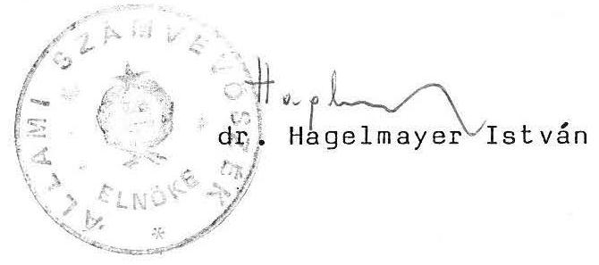
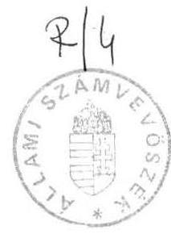

# 3 

## Állami Számvevőszék

Összefoglaló jelentés
a szakképzési hozzájárulás és
a Szakképzési Alap
pénzügyi-gazdasági ellenőrzéséről

1990.
4.

---

# ÁLLAMI SZÁMVEVŐSZÉK 

$V-12-19 / 1990$

## ÖSSZEFOGLALÓ JELENTÉS

a szakképzési hozzájárulás és a Szakképzési Alap pénzügyi-gazdasági ellenőrzéséről

A szakképzés pénzügyi szabályozása, finanszírozási rendje a mindenkori szakképzési igényekhez igazodik. Az igények meghatározója pedig a piaci versenyhelyzet, a gazdálkodók magatartása. Az elmúlt évtizedekben a piac nem jelentett kihívást a gazdálkodók számára. Ennek köszönhetően nem voltak érdekeltek a szakképzésben. A hiányzó érdekeltséget az állam kötelező szabályai próbálták pótolni. Az eredmény: az elavult technika konzerválása. Az új szakemberréteg nem kapott késztetést az új ismeretek meghonosítására.

Az oktatási törvény úgy rendelkezett, hogy az iskolák a szakképzési feladatoknak a gazdálkodó szervezetekkel közösen tesznek eleget. Az utóbbiak számára a gyakorlati oktatásban való részvétel szakember-utánpótlást biztosító beruházás.

Korábban a vállalatok szakmunkásképzési hozzájárulást fizettek, amelyből Szakmunkásképzési Alapot képeztek. Az Alap a szakmunkásképzésben közvetlenül közreműködő vállalatok részére a gyakorlati oktatási feltételek megteremtését és fejlesztését kívánta elősegíteni.

A tapasztalatokat értékelve 1989-től életbe lépett a szakképzési hozzájárulás és a Szakképzési Alap rendszere. Célul tűzték ki a gazdálkodó szervek közötti arányosabb teherviselést, a közvetlen érdekeltség megteremtését és a gyakorlati oktatás tárgyi feltételeinek javítását.

---

A bérköltség 1,5 %-át (agrártevékenység esetén 1 %-át) jelentő szakképzési hozzájárulást a gazdálkodók az eredményük terhére számolják el. A középfokú szakoktatási intézmények gyakorlati oktatásának feltételeit szolgáló hozzájárulási kötelezettséget többféle módon lehet teljesíteni. Ezek közül egyik lehetőség a Szakképzési Alapba való befizetés.

Az Állami Számvevőszék a szakképzési hozzájárulási rendszer működését törvényességi, célszerűségi és eredményességi szempontból vizsgálta.

# I. 

## Megállapítások

## 1/ Az átmeneti rendelkezések végrehajtása

A Szakmunkásképzési Alap megszűnésével és az új szakképzési rendszer bevezetésével összefüggő átmeneti rendelkezéseket a művelődési miniszter és a pénzügyminiszter együttesen szabályozta. Ennek értelmében a Szakmunkásképzési Alap 1989. december 31-i szabad pénzmaradványát - illetve egyes esetekben az 1990-ben szabaddá váló eszközeit - a Szakképzési Alapba kellett átutalni.

A vizsgált területen az ellenőrzés időpontjáig - az átmenetről szóló rendelet és a végrehajtás hiányosságai miatt - a Szakképzési Alapra befizetés nem történt. (Az MM, IpM és a MÉM összesen több mint 40 millió Ft szabad pénzeszközt nem utalt át a Szakképzési Alapba.)

Emellett a megszűnt Szakmunkásképzési Alap 1989. év végi maradványát annak jogellenes felhasználása (példák a jelentésben) is csökkentette és ezzel a Szakképzési Alap jogszabály szerinti eszközeit csorbította.

---

2/ A szakképzési hozzájárulási rendszer 1989. évi működésének főbb jellemzői.

A kormányzati szervek 1989. évben mintegy 4,5-5,0 milliárd Ft hozzájárulás képződésével számoltak, amelynek csak kisebb része a Szakképzési Alap, míg a nagyobb hányada közvetlenül szolgálja a szakképzést. A hozzájárulás tényleges összege és annak belső összetétele nem ismert, mivel az információ-feldolgozást az ellenőrzés idején az MM még nem fejezte be.

A szakképzési hozzájárulás új rendszerében a gyakorlati képzés pénzügyi keretei összességében bővültek, az oktatás tárgyi feltételei javultak. Mindez alapvetően nem változtatott az iskolai tanműhelyek technikai lemaradásán.

Az egy éves működés tapasztalatai jelzik a szabályozás ellentmondásait, a módosítás szükségességét.

A vállalatok érdekeltségének hiánya miatt, a gazdálkodási nehézségeknek is köszönhetően, egyre több helyen megszüntetik a gyakorlati képzést. A döntéshez a szabályozás, azaz a gyakorlati oktatási költségek nem teljes körű elszámolhatósága is hozzájárul.

A szakképzési hozzájárulás terhére jelenleg csak a szakközépiskolák kaphatnak a gyakorlati oktatás feltételeit javító támogatást. A szakmunkásképző iskolák kirekesztése a hozzájárulási pénzekből nehezen indokolható, feszültségeket támaszt és tárgyi feltételeik romlásával jár.

A szakközépiskoláknak nyújtott fejlesztési támogatások meghatározó jelentőségűek és mással nem pótolható forrást jelentenek a gyakorlati oktatás számára. Ezek azonban sokszor nem a tényleges fejlesztési szükséglethez igazodnak (kapcsolatok, propaganda). A fejlesztési támogatások iskolák közötti megoszlása feltűnő szóródást mutat és így ellátási szintkülönbségeket eredményez. A vállalatok és a szakközépiskolák gazdasági együttműködése - szabályozási hiányosságok miatt is - gyakran nem kellően konkrét megállapodásokon alapul.

A szakképzési hozzájárulási pénzek célszerű hasznosulását a rendszer nem biztosítja. Ez ellen hat a gazdálkodó és a területi szerveknek az a törekvése is, hogy okkal, ok nélkül, de a szakképzési hozzájárulás helyben kerüljön felhasználásra. A maradványelven képződő Szakképzési Alap forrásai ezáltal szűkebbek, kiegyenlítő szerepe mérsékelt. A szakközépiskolák közoktatási feladatainak finanszírozását nem szabad a vállalatok és az iskolák bizonytalan kapcsolataira építeni.

A jelenlegi hozzájárulási rendszer nem költségérzékeny. Ahhoz, hogy a gyakorlati képzés költségeit - a takarékosság követelményét is figyelembe véve - az indokolt mértékben számolják el a vállalatok, célszerű lenne a szakképzés finanszírozását feladatmutatóhoz (egy képzett tanulóhoz) kötni.

A hozzájárulási kötelezettség ellenőrzésének és a jogkövetkezmények alkalmazásának feltételei hiányoznak. Az ellenőrzési kötelezettség teljesítése veszélyeztetve van, nincsenek biztosítékai az adatszolgáltatás valódiságának, valamint a hozzájárulás szabályszerű teljesítésének.

# 3/ A Szakképzési Alap 1989. évi működése 

A törvény alapján a szakképzési hozzájárulásnak azt a részét, amelyet a gazdálkodó szervek az oktatásban való közvetlen részvétellel, vagy támogatás nyújtásával nem teljesítettek, a Szakképzési Alapba kell befizetni.

Az Alap 1989. évi bevétele mintegy 1,6 milliárd Ft volt, amely jóval meghaladja az előzetesen számított 0,5 milliárd

---

Ft-ot. A bevételt (a 60 millió Ft kamat és a 67 millió Ft önkéntes befizetésen kívül) a hozzájárulásra kötelezettek befizetései teszik ki.

Mintegy 200 gazdálkodó szerv összesen 46 millió Ft összegű befizetési kötelezettségének nem tett eleget (fizetésképtelenség, sorbanállás miatt).

A törvény értelmében az Alapból költségvisszatérítést első ízben 1990. évben lehet teljesíteni, majd ezt követően folyósíthatók beruházási célú támogatások. 1989-ben azonban csak a téves befizetésekkel összefüggő visszafizetésekre került sor.

Még nem alakult ki az Alap forgalmának információs rendje. Mind a banki, mind az MM által kezelt nyilvántartási rendszer csak részben felel meg a követelményeknek.

4/ A szakképzési hozzájárulási rendszer és a költségvetés összefüggései

A törvény kidolgozásánál azzal számoltak, hogy a szakképzési hozzájárulás bevezetése nem hozhat létre új költségmegosztást az állam és a gazdálkodó szervek között.

A szakképzési hozzájárulás, amely a forrás eredetét tekintve közpénz jelleget ölt, az adózatlan nyereség terhére kerül elszámolásra, s így az indirekt költségvetési támogatásnak minősíthető. Mindezek alapján kiemelt jelentősége van a hozzájárulási pénzek rendeltetésszerű és eredményes hasznosításának.

A hozzájárulási pénzek széles körben a szakközépiskolák, mint költségvetési szervek, fejlesztési támogatásaként is szolgálnak.

---

E támogatásoknak - a szűkös tanácsi eszközök mellett - jelentős szerepe van a gyakorlati oktatás tárgyi feltételeinek fejlesztésében. A különböző eredetű fejlesztési eszközök eddig "önálló életet élnek," egymástól függetlenül vesznek részt a szakközépiskolák finanszírozásában. A költségvetési pénzek optimális hasznosítása azok területi összehangolását igényli.

A szakképzés finanszírozási rendszere magán viseli a képzés ellentmondásait és a változás következményei csak évek múlva érzékelhetők. A tényleges piaci versenyhelyzet hatásának jelentkezéséig is törekedni kell a konvertálható szaktudás megalapozására, a technikai igényszint növelésére.

Szakképzési rendszerünk az iskolatípusokat és a képzett szakmákat tekintve is túltagolt, a hangsúlyt a speciális képzésre helyezi. Nemzetgazdaságunk azonban mindinkább a több irányban át-, illetve továbbképezhető munkaerőt igényel. A speciális ismereteket nyújtó szakképzés a vállalkozók feladata kell, hogy legyen. A rendszer jelenlegi szabályozása azonban a kötelező mértékű hozzájárulással, valamint az Alap létrehozásával közvetett módon a szakképzést állami feladattá teszi. Az ellentmondás feloldása szakképzési rendszerünk újragondolását, a hozzájárulás kötelező jellegének felülvizsgálatát és a képzés területi összehangolásában a megyei (fővárosi) tanácsok szerepének növelését indokolja.

# II. 

## Javaslatok

1/ Az Országgyűlés kérje fel a Kormányt a szakképzési rendszer áttekintésére és a piacgazdaság követelményeihez igazodó szakoktatási koncepcióval, valamint annak támogatási, finanszírozási feladataival kapcsolatos jogalkotásra.

---

# 2/ A Minisztertanács 

- a Szakmunkásképzési Alap felhasználásának és maradványának felülvizsgálatával gondoskodjon a Szakképzési Alapot megillető pénzeszközök pótlólagos befizettetéséről;
- a 22/1986. (VI. 20.) MT sz. rendelet módosításával - a kétoldalú kötelezettségek konkrét előírásával - szabályozza a középfokú iskolák és a vállalatok gazdasági együttműködését;
- gondoskodjon a szakképzési hozzájárulás adatainak a gazdálkodó szervek éves mérlegéhez csatolt egyidejű számítógépes feldolgozásáról és a rendszer stabil információs bázisának megteremtéséről;
- tegye meg a szükséges intézkedéseket annak érdekében, hogy a szakképzési hozzájárulás teljesítésének ellenőrzése és a jogkövetkezmények alkalmazása maradéktalanul megvalósuljon.

Budapest, 1990. május hó

---

# Állami Számvevőszék 

## Jelentés

a szakképzési hozzájárulás és a Szakképzési Alap pénzügyi-gazdasági ellenőrzéséről

1990.

---

# ÁLLAMI SZÁMVEVŐSZÉK 

Fejezeti Főcsoport
$V-12-18 / 1990$

## JELENTÉS

## a szakképzési hozzájárulás és a Szakképzési Alap pénzügyi-gazdasági ellenőrzéséről

Az ellenőrzés célja annak értékelése volt, hogy az 1988. évi XXIII. törvénnyel hatályba lépett szakképzési hozzájárulási rendszer miként szolgálta 1989. évben a középfokú szakoktatási intézmények gyakorlati oktatási feladatainak megvalósítását és milyen tapasztalatai vannak a Szakképzési Alap kezdeti működésének.

A vizsgálatot a Fejezeti Főcsoport részéről Belics János és dr. Solymár Károlyné számvevő-tanácsosok, a Területi Főcsoport részéről dr. Koronics Károlyné (Baranya m.), dr. Szeli Tibor (Győr m.), dr. Szigeti István (Somogy m.), Buczkó András (Szolnok m.), Molnár Istvánné és dr. Tóth Annamária (főváros) számvevők, valamint Dankó Géza (Borsod m.) számvevőtanácsos végezték. A helyszíni vizsgálat a Művelődési Minisztériumra, Mezőgazdasági- és Élelmezésügyi Minisztériumra, Ipari Minisztériumra, Kereskedelmi Minisztériumra, a főváros és öt megye gazdálkodó és tanácsi szerveire terjedt ki, kapcsolódóan eljártunk Bács-Kiskun megye néhány érintett szervénél, valamint az Adó- és Pénzügyi Ellenőrzési Hivatalnál.

---

# I. 

## Megállapítások

## 1/ A szakképzési hozzájárulás rendszerének előzményei és főbb célkitűzései

A vállalati gyakorlati oktatás feltételeinek fejlesztését, valamint a szakmunkásképzést folytató szakközépiskolák tanulói különböző juttatásai, kedvezményei fedezetét 1981-től a Szakmunkásképzési Alap szolgálta.

A gazdálkodó szervezetek bérköltségük után differenciált mértékű (0,20-0,35 %-os) befizetést teljesítettek.

A gyakorlati képzés költségei aránytalanul oszlottak meg a képzésben közvetlenül résztvevők és részt nem vevők között. A gyakorlati oktatásban való közreműködés, illetőleg a szakmunkásképzési hozzájárulás fizetésével kapcsolatos kötelezettség egymástól független volt. Az oktatásban résztvevő és költségviselő gazdálkodó szervezetek kötelesek voltak a szakmunkásképzési hozzájárulást is fizetni. Ugyanakkor a tanulók többsége nem ott vállalt munkát, ahol a gyakorlati képzése folyt.

A szakmunkásképzési hozzájárulási kötelezettséget csak az Alapba történő befizetéssel lehetett teljesíteni. A támogatási rendszer működtetése, az Alap eszközeinek felhasználása, illetve szétosztása teljes egészében a szaktárcák megítélésén alapult.

Az új rendszerre való áttéréskor a szakképzési hozzájárulásról és a Szakképzési Alapról szóló törvény megalkotásakor a főbb célkitűzések a következők voltak:

---

- a korábbinál arányosabb teherviselés kialakítása a képzésben közvetlenül résztvevő és részt nem vevő gazdálkodó szervezetek között;

A hozzájárulás egységesebbé vált és mértéke a korábbi 0,2-0,35 %-ról a mérleg szerinti bérköltség 1,5 %-ára emelkedett (agrártevékenység esetén 1 %). A külföldi részvétellel működő gazdasági társaságok és a büntetésvégrehajtási vállalatok kivételével, valamennyi nyereségadó-fizetésre kötelezett köteles hozzájárulást elszámolni.

A gyakorlati oktatásban közvetlenül is részt vállaló gazdálkodó szervezetek a kötelező mértéken felüli teljesítés esetén a Szakképzési Alapból visszatérítést kaphatnak.

- az előzőekkel ösztönözzék a gazdálkodó szerveket a gyakorlati oktatás közvetlen megszervezésére, hogy az ne szakadjon el a termelés technikai-szellemi bázisától;
- javuljon a gyakorlati oktatás tárgyi feltétele (műszakitechnikai színvonala) a vállalatoknál és a szakközépiskolákban. Ezt segítse elő
 a hozzájárulási kötelezettség többféle teljesítési lehetősége. Ennek keretében a gazdálkodó szervek a szakközépiskoláknak fejlesztési célú támogatást adhatnak.

Az 1. sz. mellékletben bemutatjuk a korábban funkcionált Szakmunkásképzési Alap, valamint a szakképzési hozzájárulási rendszer és a Szakképzési Alap eltérését, főbb jellemzőit.

---

2/ A szakképzési hozzájárulási rendszer bevezetésével összefüggő irányítószervi tevékenység
a/ Az átmeneti rendelkezések végrehajtása a minisztériumoknál

Az átmenetről szóló 28/1988. (XII.31.) MM-PM együttes rendelet szerint

- az előző évekből vállalt, áthúzódó kötelezettségek teljesítése után fennmaradó összeget, valamint az új támogatások felosztását követően a Szakmunkásképzési Alap maradványát a Szakképzési Alapba kell befizetni;
- a Szakképzési Alapot illetik a szakmunkásképzési hozzájárulás behajtása, a Szakmunkásképzési Alapból kapott támogatások elszámolása és ellenőrzése kapcsán befolyt összegek is.

A fenti jogcímeken a vizsgált területen - az ellenőrzés időpontjáig - a Szakképzési Alapra befizetés nem történt. Ez részben szabályozási, másrészt végrehajtási hiányosságok következménye.

A 15/1976. (XII.7.) MGM-PM együttes rendelet alapján a korábbi rendszerben a szakmunkásképzési támogatásokat évente július 1-ig kellett az érintetteknek átutalni. A kialakult gyakorlat szerint a tárcák ezt csak késve teljesítették. Ezt figyelembe véve a Szakképzési Alapba az 1989. december 31-i szabad pénzmaradványt, illetve az 1990-ben - elmaradás, vagy csak részleges teljesítés miatt - szabaddá váló eszközöket kellett volna átutalni.

Az MM által az ágazati minisztériumok részére korábban átadott és különböző okok miatt szabad pénzeszközök befi-

---

zettetéséről az átmenetről szóló rendelet nem intézkedett. Ezek a pénzek értelemszerűen a Szakképzési Alapot kellett volna, hogy illessék. Ilyen befizetést maga az MM sem végzett és azt a tárcák felé sem kezdeményezte.

Jellemző, hogy az MM 1989. év végén a felhasználatlan 10 millió Ft tartalékot a minisztériumok Szakmunkásképzési Alap számlájára utalta át ahelyett, hogy a Szakképzési Alap számlára - és így az új szabályozás keretei közé - helyezte volna.

Az IpM Szakmunkásképzési Alap számláján 1989. december 31-én 27 millió Ft szabad pénzeszköz volt. (A támogatott fejlesztések alulteljesítése és a teljesítés elmaradása miatt felszabadult, de pontosan ki nem mutatható összegek is kb. 25-30 millió Ft-ot tettek ki.)

A MÉM az 1989. évet 7,6 millió Ft maradvánnyal zárta. Befizetés helyett a maradvány terhére iskolák kisgép-beszerzésére kötelezettséget vállalt 1990-re.

Az 1989. évi záróállományt, illetve a Szakképzési Alapba való befizetési kötelezettséget több esetben a jogellenes felhasználási gyakorlat és határozott intézkedések elmaradása is jelentős összeggel csökkentette. (Lásd: 2. sz. melléklet)

Az MM, illetve a Szakmunkásképzési Alappal rendelkező bizottság az 1989. évi elosztás alkalmával az átszervezés, vagy felszámolás miatt átmenetileg gazdátlan tanműhelyek működésének biztosítására 25 millió Ft-ot tartalékba helyezett az Alapból. A

---

tartalékolás gazdaságilag ésszerű volt, de a 15/1976. (XII.7.) MUM-PM együttes rendelet előírásaival ellentétes.

Az IpM - az MM-nek a Szakmunkásképzési Alapot működtető bizottságával és a PM-mel egyeztetett határozata alapján - a Ganz Danubius és Speciál vállalatokkal, a tanműhelyek meghatározott ideig történő üzemeltetésére, 7,5 millió Ft támogatásra kötött "fejlesztési" szerződést.

A MÉM a költségvetési gazdálkodó szervek részére iskolatraktor és kertészeti gépek vásárlására biztosított támogatást. Az 1989. évben ilyen címen 15,7 millió Ft-ot fizettek ki. A MÉM a Debreceni Tartósítóipari Kombinát 1988. évi maradványának (2.797 ezer Ft) felülvizsgálatát még nem fejezte be, a Kapostáj Mgtsz., Kaposvár maradványának (464 ezer Ft) felhasználását pedig visszafizettetés helyett jogtalanul másutt engedélyezte.

A KeM által 1987-ben a Danubius Szálloda és Gyógyfürdő Vállalatnak adott 13,5 millió Ft támogatás felhasználatlan maradt, ennek ellenére azt nem fizették vissza. (A KeM az ellenőrzés idején intézkedett a visszafizettetésről.)

A szakmunkásképzési hozzájárulás behajtása, elszámolása és ellenőrzése kapcsán befolyt összegeket a minisztériumok nem mutattak ki.
b/ Az új rendszer előkészítése, a működési feltételek megteremtése

A szakképzési hozzájárulás rendszerének bevezetése mind az érintett minisztériumok, mind a tanácsok részéről kü-

---

lönböző - a működési feltételeket szolgáló - intézkedések megtételét igényelte.

A minisztériumoknál a Szakképzési Alap működésével kapcsolatos feladatok még nem mindenben tisztázottak és szabályozottak.

Az MM-ben a Szakképzési Alappal kapcsolatos feladatokat ugyan megfogalmazták, de az ügyintézéssel megbízott dolgozó munkaköri leírása azt részletesen nem tartalmazza. A pályázatok kiírásával összefüggő feladatokat az ellenőrzés idején határozták meg. A MÉM-ben és az IpM-ben az új rendszerből adódó feladatok külön szabályozását szükségtelennek tartják, bár a változások a régi (Szakmunkásképzési Alapra vonatkozó) szabályozás korszerűsítését igénylik.

Az MM-ben gondot okoz, hogy az érvényes előírások szerint a hozzájárulási kötelezettség teljesítését biztosító jogkövetkezmények alkalmazása az APEH feladata, de az adóhivatal annak teljesítését nem vállalta.

A Szakképzési Alap pénzforgalmának lebonyolítását végző pénzintézet kijelölése és a vele való szerződéskötés a törvényben foglaltak szerint történt. Az előkészítés idejéig nem tisztázódtak, és emiatt a szerződésben sem kerültek érvényesítésre a Szakképzési Alap működésével kapcsolatos - praktikusan csak a pénzforgalmat lebonyolító bankkal ellátható - információ-szolgáltatási, elszámoltatási (ellenőrzési) és kamatbeszedési stb. feladatok. Az előkészítés hiányossága az MM-nél jelentős többletmunkát és információzavarokat okozott. E gondok rendezése a bankkal kötött szerződés módosítását indokolja.

---

A művelődési miniszter által életre hívott bizottság a törvénynek megfelelően megalakult és az induló feladatokat teljesítette.

A tapasztalatok szerint mind a területi, mind a helyi tanácsoknál nem, vagy csak késve került sor a rendszer bevezetésével összefüggő intézkedésekre. A tanácsok a törvényhez végrehajtási rendelkezést vártak, amely azonban - közlemény formájában - csak késve, az év utolsó hónapjában jelent meg.

Az intézkedések késői felismerése oda vezetett, hogy a feladatok megvitatását szolgáló tanácskozásokra nem mindenütt, illetve csak késői időpontban került sor.

A tanácsok nagy részének nem volt áttekintése a szakképzési hozzájárulás rendszeréről, többnyire nem kísérték figyelemmel a szakközépiskolák és a gazdálkodó szervek közötti kapcsolatok alakulását, hiányzott a koordináció. Részben ez is hozzájárult ahhoz, hogy a szakközépiskolák gyakorlati oktatásának fejlesztésére lekötött hozzájárulások gyakran aránytalanul, nem a tényleges szükségletek szerint alakultak.
c/ A szakképzési hozzájárulás és a Szakképzési Alap információs rendje

A törvény végrehajtása érdekében értékelni szükséges a szakképzési hozzájárulási kötelezettség különböző jogcímek szerinti teljesítését országosan és területi megoszlásban. Ehhez megfelelő információs rendszert kell kiépíteni.

Az információs bázis megteremtését az MM 1989. június 7-i előterjesztésében javasolta. Eszerint az év végi mérlegkészítéssel egyidejűleg a gazdálkodó

---

szervezetek a szakképzési hozzájárulási kötelezettségük összegéről és a teljesítés módjáról - tájékoztató adatként - bevallást készítettek volna.

A javaslatot a Kormány deregulációs programja alapján a vállalatok ügyviteli-adatszolgáltatási terheinek mérséklése miatt, valamint a mérlegbeszámoló előkészítésével és összeállításával kapcsolatos munkálatok befejezettségére való hivatkozással a PM elutasította.

Az adatszolgáltatás módjának kialakítására vonatkozó előkészítő munkák elhúzódása miatt csak az 1989. december 29-i MM-PM közlemény adott iránymutatást a gazdálkodó szervezeteknek a január 1-től hatályban lévő törvény egyes pontjainak értelmezésére, valamint a szakképzési hozzájárulás elszámolásának módjára.

A hozzájárulási kötelezettség elszámolására vonatkozó - az évi adóbevallással az adóhatóságnak megküldendő - adatszolgáltatás rendjét a törvény előírásait figyelembe véve alakították ki. Ez komplex tájékoztatást ad a kötelezettségekről és a teljesítésekről. Egyidejűleg megmutatja az Alap javára még fennálló befizetési kötelezettséget.

Az információs renddel kapcsolatos viták és az előkészítés elhúzódása miatt a gazdálkodó szervi adatok országos szintű feldolgozása - technikai nehézségek mellett - csak a vizsgálat időpontjában van folyamatban az MM-ben.

A szükséges információs rendet a meglévő számítógépes rendszer alapján, a mérlegbeszámolóhoz csatolva indokolt kiépíteni.

---

A Szakképzési Alap nyilvántartási rendjének kialakítása az MM feladata.

Az Alap eszközeit kezelő Országos Kereskedelmi és Hitelbank Rt. által szolgáltatott információk csak részben kielégítőek.

A bank rendelkezésre bocsátja a napi pénzforgalmi kimutatást és a befizetésre kötelezettek átutalási megbízásait, valamint az ágazati és területi bontásban készített információt. Az így rendelkezésre álló dokumentumokból az Alapba befizetett összeg megállapítható. Az adatok az elszámolás belső szerkezetéről és a hozzájárulási kötelezettség adóalanyonkénti teljesítéséről azonban nem nyújtanak megfelelő tájékoztatást. (Így pl. hiányzik a befizetések, hátralékok, kamatok, visszafizetések összetételének alakulása.)

A művelődési államtitkár 1990. január 3-i 25011/90. sz. intézkedésében előírta a Kultúrális Alap Titkárságának a Szakképzési Alapra vonatkozó "nyilvántartási" feladatokat.

Ennek keretében túlméretezett nyilvántartást rendelt el. (A pénzforgalmi bizonylatok kialakítása, azok analitikus könyvelése, a negyedéves könyvelés zárással, a féléves- és éves költségvetési beszámoló, a féléves statisztika, a behajtás koordinálása.) A feladatok egy része felesleges (pl. a pénzforgalmi bizonylatok analitikus könyvelése, a behajtás koordinálása.)

Az Alap jelenlegi nyilvántartási rendszeréből a leglényegesebb adatok hiányoznak. Nem állapítható meg az adóalanyonkénti befizetési kötelezettség és a befizetések határidős teljesítése. Olyan nyilvántartási rendszerre van szükség, amely a mérlegadatok ütköztetése alapján is lehetővé teszi a kötelezettség teljesítésének megállapítását.

3/ A szakképzési hozzájárulási rendszer 1989. évi működése
a/ A hozzájárulási kötelezettség teljesítésének főbb jellemzői, célirányossága, hatása

A központi irányítás az 1989. évben mintegy 4,5-5,0 milliárd Ft szakképzési hozzájárulás képződésével számolt. Ennek az összegnek csak kisebb része a Szakképzési Alap, míg nagyobb hányada közvetlenül szolgálja a szakképzést. Az MM adatszolgáltatása hiányában a hozzájárulás tényleges összege és annak belső összetétele az ellenőrzéskor nem volt ismert. (Az információ-feldolgozás az ellenőrzés idején volt folyamatban.)

Az új rendszerben a törvény a gazdálkodók számára a gyakorlati oktatás költségeinek arányos viselését, valamint az abban való részvétel teljesítésként történő elszámolhatóságát írta elő.

A törvényalkotók azt várták, hogy a gazdálkodó szerveknél ösztönzést kap a gyakorlati oktatás saját megszervezése.

A gazdaság általános nehézségei közepette azonban a vállalatok munkaerő-, illetve szakképzési igényei mind mennyiségében, mind összetételében gyakran változnak. A nehéz anyagi helyzetbe jutott, vagy az átszervezés előtt álló vállalatok munkaerőigényei visszafogottak, gyakran csökkenőek. Más oldalról a hozzájárulás teljesítéseként elszámolható gyakorlati oktatás költségei nem teljes körűek. Olyan költségek figyelembevételére nincs lehetőség, mint az anyagköltség, gépek, berendezések fenntartása és az energiaköltség. Ezek az egyéb költségek szakmák szerint eltérően, de egyes esetekben jelentős mértékben terhelik a vállalati gyakorlati oktatást.

Mindezeknél fogva a vállalatok nem kellően érdekeltek a gyakorlati oktatás közvetlen megszervezésében, így egyre több helyen megszüntetik azt, vagy csak csökkentett létszámban fogadnak tanulókat. Ez egyes szakmákban beiskolázási nehézségekhez vezethet, hosszú távon pedig alapvető képzési gondokat vet fel. A tapasztalatok azt igazolják, hogy a középfokú szakképzés - tartalmi felépítettsége miatt - nem képes a munkaerőpiac változásait rugalmasan követni.

A szakközépiskoláknak nyújtott fejlesztési támogatás összességében meghatározó jelentőségű és mással nem pótolható forrást jelentett az intézményi gyakorlati oktatás tárgyi feltételeinek javításához.

A szakközépiskolák által élvezett támogatás 1989-ben jelentős szóródást mutat. Voltak iskolák (szűkebb körben), amelyek 10 millió Ft-ot kaptak, ugyanakkor gyakori volt a 100 ezer Ft-nál kisebb támogatás. Ennek eredményeként a szakközépiskolák fejlesztési lehetőségeiben nagyok az eltérések. A vállalati támogatások gyakran nem a tényleges fejlesztési szükséglethez igazodtak, inkább esetlegesek voltak. A törvényi szabályozás nem biztosítja, hogy a hozzájárulásból az iskolák az indokoltság szerint, megközelítőleg arányosan részesüljenek.

A szakközépiskolák gyakorlati oktatásának feltételrendszerét - közoktatási feladatról lévén szó - nem lehet kitenni a vállalati kapcsolatok sokféleségének, bizonytalanságának és esetlegességének. A támogatottságot nagymértékben befolyásolja, hogy milyenek az iskola vállalati kapcsolatai, mennyire ismert és milyen a vezetés "menedzseri" tevékenysége.

Példa az előbbiek jellemzésére: A kecskeméti 607. sz. Gáspár András Ipari Szakmunkásképző Intézet és Autószerelő
 Szakközépiskola, valamint a bajai Tóth Kálmán Szakközépiskola 40-40 gazdálkodó szervtől összesen 5-5 millió Ft; Győr-Sopron megyében a Mayer Lajos Szakközépiskola 23 gazdálkodó szervtől összesen 7,5 millió Ft támogatást kapott. Ezzel szemben több olyan intézmény van, amelyik nem jutott ilyen segítséghez.

Helyenként a gazdálkodó szervek a szakképzésben meglévő kapcsolat, érdekeltség nélkül is támogattak egyes iskolákat. Esetenként azonban szubjektív tényezők motiválták a hozzájárulási pénzek felhasználását.

Győr-Sopron megyében pl. a tényői "Sokoróaljai" Mgtsz és a győrújbaráti "Rákóczi" Mgtsz együttműködési megállapodást kötött a győri Szamuely T. Közgazdasági Szakközépiskolával, amelyben támogatást vállaltak. A megállapodás indítéka az volt, hogy az iskola tanulói őszi munkára jártak a szövetkezetekbe. Hasonlóan szakképzési kapcsolat nélkül támogatta az EL-ME Kft és a Fejér megyei Bauxitbányák Vállalat a 400. sz. Ipari Szakmunkásképző Intézetet és Szakközépiskolát.

Az előzőek szerinti gyakorlat összefüggésben van azzal a területi törekvéssel, hogy a hozzájárulási pénzeket lehetőleg tartsák a megyében és az ne a Szakképzési Alapba kerüljön befizetésre.

---

A vizsgált szakközépiskolák többsége konkrét fejlesztési-, illetve beszerzési tervet készített. Ennek ütemszerű megvalósítását, a pénzeszközök felhasználását, a gépek, berendezések megrendelését azonban akadályozta, hogy a vállalatok zöme év végén utalta át a támogatást, vagy annak egy részével még tartozik.

A törvény nem ad lehetőséget arra, hogy a hozzájárulási kötelezettség terhére a szakmunkásképző intézetek is fejlesztési célú támogatásban részesülhessenek. Az egyenlőtlen feltételek miatt, a szűkös költségvetési lehetőségekre tekintettel, a szakmunkásképző intézeteknél az adottságok romlásával kell számolni. A napjainkban is gyarapodó közös igazgatású szakmunkásképző és szakközépiskolai intézményeknél ugyanakkor lehetőség van a törvényi rendelkezések megkerülésére. A gazdálkodó szervek ezeknek az intézményeknek közös tanműhely működtetése esetén is korlátozás nélkül adhatnak fejlesztési hozzájárulást.

A szakképzési hozzájárulás új rendszerében - a meglévő gondok mellett - a középfokú szakoktatási intézmények gyakorlati oktatásának pénzügyi keretei összességében bővültek.

A szabályozás kedvező irányú változása, hogy a csoportos oktatást szolgáló állóeszköz-fejlesztést a hozzájárulási kötelezettség teljesítéseként el lehet számolni. Ez a vállalati gyakorlati oktatási helyek, tanműhelyek fejlesztésére több esetben élénkítően hatott.

A szakképzési hozzájárulás terhére 1989-ben végzett ráfordítások helyenként javították a gyakorlati oktatás tárgyi feltételeit. Nullára leírt állóeszközök kiváltására, korszerűbb eszközök beszerzésére nyílt lehetőség.

---

Baranya megye szakközépiskoláiban a műhelytermek száma 1988-ról 1989-re 11-gyel nőtt. Szolnokon a Vízügyi és Építőipari Szakközépiskolában $400 \mathrm{~m}^{2}$ alapterületű tanműhelyt építenek 9 millió Ft-os költséggel, amelyet a Hídépítő Vállalat fedez. A budapesti Csonka J. Műszaki Szakközépiskola nagy értékű CNC esztergagéppel tudta a gépparkját korszerűsíteni stb.

Ennek ellenére összességében mind a vállalati, mind az iskolai tanműhelyek technikai színvonalában jelentős (esetenként 10-15 éves) a lemaradás és számottevőek a szintkülönbségek. A szakközépiskolai gyakorlati oktatás tárgyi feltételei gyakran a vállalati tanműhelyeknél kedvezőtlenebbek. Azokon a helyeken, ahol a háttér-vállalatok a gyakorlati képzést megszüntették, az iskolai tanműhelyi oktatás zsúfolt és két műszakban folyik (pl. a fővárosban).

A fővárosi szakközépiskoláknál előfordul, hogy kényszerűségből kiegészítő eszközök felhasználásával, videoprogramokkal, szemléltető eszközökkel mutatják be a tanulóknak az iparban már meglévő gépeket, technológiákat. A Landler J. Híradástechnikai és Gépészeti Szakközépiskola tanműhelyeinek technikai színvonala a tantervben előírtakhoz képest 40%-osnak mondható.

A pécsi 500. sz. Ipari Szakmunkásképző Intézet és Szakközépiskolában az oktatás jórészt teljesen elhasználódott eszközökön folyik (34 db esztergagép tartozik ebbe a kategóriába).

Általános tapasztalat, hogy a tanulók többsége a gyakorlati oktatás során követő technikát sajátít el.

---

A gyakorlati oktatás tárgyi feltételeinek általánosságban megmutatkozó és érzékelhető javításához több évre van szükség.
b/ A gazdálkodó szervek és a szakközépiskolák együttműködésének megalapozottsága

Az 1988. évi XXIII. törvény határozta meg a gazdálkodó szervek és a szakközépiskolák együttműködésének irányát, lehetőséget adva az iskolák fejlesztési célú támogatására. Kitért arra, hogy a gyakorlati oktatásban való részvétel - többek között - a középfokú szakoktatási intézménnyel kötött megállapodás alapján teljesíthető. Az együttműködés részletesebb szabályozásáról a 22/1986. (VI.20.) MT sz. rendelet intézkedik. Ez azonban az iskolai gyakorlati oktatáshoz kapcsolódó gazdasági együttműködést hézagosan szabályozta.

A rendelet nem írta elő a támogatáshoz kapcsolódó kétoldalú jogosultságok és kötelezettségek megállapodásban történő meghatározását, azok összegének és teljesítésük idejének rögzítését, valamint a felhasználásról szóló jelentésadási kötelezettséget.

A gazdálkodó szervek és az iskolák kapcsolatát részben öntevékenységen és kellő körültekintésen alapuló szerződéskötések jellemzik. A megállapodások jelentős számában azonban felismerhetők a szabályozás hézagai.

Az együttműködési megállapodások - főként a korábban kötöttek - a támogatásokkal kapcsolatban sokszor nem tartalmaznak konkrét feltételeket. Helyenként ezt új szerződések megkötésével kívánják rendezni.

---

Több esetben hiányzik a támogatás időbeli ütemezésének rögzítése (pl. Jász-Nagykun-Szolnok megyében), a vállalatok nem vállaltak kötelezettséget a támogatás összegére (pl. Borsod-Abaúj-Zemplén megyében és a fővárosban). Ez a gyakorlat bizonytalanná teszi a szakközépiskolai fejlesztések tervezését és végrehajtását.

A vállalatok a támogatások rendeltetésszerű felhasználásáról az esetek többségében tájékoztatást, vagy elszámolást nem kértek.

A vállalatok a szerződésekben a támogatás feltételeként gyakran kikötik, hogy az iskola biztosítson előnyt a vállalati dolgozók gyermekeinek a beiskolázásnál. Ilyen feltétel támasztása sérti a beiskolázásra vonatkozó szabályokat.

Előfordult ez a pécsi Kéményseprő és Tüzeléstechnikai Szolgáltató Vállalat és az 500. sz. Ipari Szakmunkásképző Intézet és Szakközépiskola, a Graboplast Győri Pamutszövő és Műbőrgyár és a Rejtő S. Textílipari Szakközépiskola és Szakmunkásképző Intézet, a Jászberényi Hűtőgépgyár és a szolnoki Szamuely T. Ipari Műszaki Szakközépiskola, a jászberényi Jászsági Állami Gazdaság és a jászberényi Liska J. Ipari Szakközépiskola, a Szolnok megyei Víz- és Csatornamű Vállalat és a szolnoki Vízügyi Építőipari Szakközépiskola, valamint a Kutasi Állami Gazdaság és a kaposvári Ipari Szakközépiskola közötti megállapodásokban.

Helyenként - a törvényi előírás ellenére - szakmunkásképző intézettel is kötöttek megállapodást a vállalatok és a támogatást szakképzési hozzájárulásként számolják el.

---

A Graboplast Győri Pamutszövő és Műbőrgyár a 401. sz. Kossuth Lajos Ipari Szakmunkásképző Intézettel 1989. február 7-én, a Szolnok megyei Víz- és Csatornamű Vállalat a kunszentmártoni 628. sz. Ipari Szakmunkásképző Intézettel 1989. december 7-én kötött megállapodást fejlesztési célú támogatásra.

A vállalatok és szakközépiskolák együttműködésének szélesebb körben tapasztalt hiányosságai rontják a gyakorlati oktatást szolgáló eszközök felhasználásának hatásfokát.

# c/ A Szakképzési Alap működése 

A szakképzési hozzájárulásról és a Szakképzési Alapról szóló törvény 2. §(4) szerint a szakképzési hozzájárulásnak azt a részét, amelyet oktatásban való közvetlen részvétellel és a támogatás nyújtásával nem teljesítettek, a gazdálkodó szervezeteknek - a mérleg vagy a naplófőkönyv zárását követő 15 napon belül - a Szakképzési Alapba kell befizetniük.

A Szakképzési Alap forrásai:

- az átmeneti időszakban (1989.) a Szakmunkásképzési Alap maradvány összege,
- a hozzájárulási kötelezettség pénzben teljesítendő része,
- a lekötött betét utáni bankkamat,
- a határidőn túli, vagy az előírásoktól eltérő összegű befizetések utáni késedelmi kamat, bírság, valamint
- az elkülönítetten kezelendő önkéntes befizetések összege.

A gazdálkodó szervezeteknek első alkalommal az 1989. I. félévi mérleget követően szeptember hónapban kellett befizetési kötelezettséget teljesíteni. Az első félév után

---

545,6 millió Ft-ot fizettek be. Az 1989. év december 29-éig a befizetés 636 millió Ft-ra nőtt és ebből 24 millió Ft visszafizetésére került sor, így az Alap számláján az év végén 612 millió Ft-os egyenleg volt.

A 24 millió Ft visszafizetés nem a gazdálkodó szervezetek többletköltségeinek a visszatérítési igényeiből, hanem a téves befizetések korrekciójából eredt. A visszatérítésre - a törvény értelmében első ízben 1990-ben kerülhetett sor.

Az első félévi befizetések és az év végi záróállomány különbözete arra utal, hogy a befizetésre kötelezettek egy része feladatának késve tett eleget.

Az 1990. március 20-i állapotnak megfelelően a Szakképzési Alap számláján a hozzájárulásra kötelezettek befizetései, a lekötött betét utáni bankkamat (amely 60 millió Ft) következtében 1,6 milliárd Ft volt.

A jelenleg rendelkezésre álló adatok alapján nem állapítható meg, hogy a befizetésre kötelezettek a határidőn túli teljesítés után mennyi késedelmi kamatot fizettek. Erre csak a tételes, befizetőnkénti ellenőrzés alapján van mód, ugyanis a késedelmesen fizetők egy része a kötelezettség teljesítésének már a késedelmi kamattal növelt összegével tett eleget. Nincs arról átfogó kép, hogy a hátralékosok a késedelmi kamatot minden esetben lerótták-e.

A Szakképzési Alapba 67 millió Ft folyt be önkéntes befizetések révén. Ezeket többségében különböző GMK-k, Kft-k, intézetek, nyelviskolák és magánszemélyek teljesítették.

---

Az 1990. március 9-i állapotnak megfelelően az Alapból 256 millió Ft költségvisszatérítés és egyéb visszafizetés történt.

A visszaigényléseket a bank automatikusan teljesíti, így nem lehet tudni, hogy ebből mennyi a többletköltség miatti, és mennyi a különböző tévedésekből, korrekciókból származó visszafizetés.

Mintegy 200 azoknak a gazdálkodó szervezeteknek a száma, amelyek - az átutalási megbízás ellenére tartós sorbanállás, fizetésképtelenség miatt - a befizetési kötelezettségnek nem tettek eleget. Ennek összege 46,3 millió Ft.

Fedezet hiánya miatt nem teljesített átutalási megbízások: Pallas Könyv és Lapkiadó Vállalat (1990. február 20.) 5,4; MAFILM (1990. február 5.) 5,78; 23-as Volán Vállalat (1990. február 20.) 1,3; AMFORA Vállalat (1989. július 20.) 0,8 millió Ft.

Az előzőekben jelzett automatikus visszafizetéseken kívül az Alapból egyéb kifizetés, felhasználás az ellenőrzés időpontjáig nem történt.

Az 1989. évi befizetésekből képződő Alap várakozáson felüli, az előzetes számítások alapján becsült összeg több mint háromszorosa (0,5 milliárd Ft - 1,6 milliárd Ft).
d/ A hozzájárulási kötelezettség teljesítésének ellenőrzése

A törvény a hozzájárulási kötelezettség teljesítésének ellenőrzését és a teljesítést biztosító jogkövetkezmények alkalmazását az APEH feladatává tette.

Az MM-PM 1989. december 27-i közleménye a törvénnyel ellentétesen úgy intézkedett, hogy az APEH igazgatóságok

---

ellenőrzési megállapításaik alapján jelzéssel élnek az MM felé, amely azokat realizálja. Mivel a törvény szerint a hozzájárulási kötelezettség teljesítésével kapcsolatos ügyekben az adóigazgatási eljárásról szóló jogszabályok rendelkezéseit kell alkalmazni, az ellenőrzés realizálása csakis az APEH, illetve szervei feladata. Az MM-nek ehhez nincs jogosítványa.

Tapasztalataink szerint az adóhatóság az ellenőrzésre és a jogkövetkezmények alkalmazására (késedelmi pótlék, bírság) nem készült fel.

Teljes körű ellenőrzésre az 1989. évi mérlegbeszámolók leadása után van lehetőség.

Megfelelő feltételek hiányában az ellenőrzési kötelezettség teljesítése, a hozzájárulásról készült adatszolgáltatások valódisága és szabályszerű teljesítése nem biztosított.
e/ A hozzájárulási rendszer és a költségvetés összefüggései

A törvény kidolgozásánál azzal számoltak, hogy a szakképzési hozzájárulás bevezetése nem hozhat létre új költségmegosztást az állam és a gazdálkodó szervezetek között. (Az állam költségvetési terhei nem csökkennek ezáltal.)

A törvény szerint a Szakképzési Alapnak nem lehet kapcsolata a költségvetéssel. Az Alap pénzeszközei nem vonhatók el, költségvetési támogatásban nem részesülhet.

Valójában a szakképzési hozzájárulásnak és a költségvetésnek több kapcsolódási pontja van.

- A szakképzési hozzájárulás elszámolása az adózatlan nyereség terhére történik. Így annak a Szakmunkásképzési Alaphoz viszonyított (kb. 4-szeres, évi 4-5 milliárd Ft) növekedése a nyereségadó mértékével az adóbevételt csökkenti. Ez az indirekt költségvetési támogatás követi a bérköltségek várhatóan gyors ütemű növekedését.

- A szakképzési hozzájárulásra kötelezettek teljesítésként figyelembe vehetik a költségvetési rend szerint működő szakközépiskoláknak a gyakorlati oktatás tárgyi feltételeinek fejlesztésére nyújtott támogatást.

Az ellenőrzési tapasztalatok szerint a középfokú szakoktatási intézmények költségei 1987-1989 között nominálértéken erőteljesen növekedtek. A költségvetések reálértéke azonban - a bérbruttósítás, a TB-járulék emelkedése, az ÁFA bevezetése
 és az infláció gyors növekedése miatt általánosan csökkent. A műszaki fejlődés, a világgazdasági alkalmazkodás követelménye a képzéssel szemben a korszerűbb tárgyi feltételek megteremtésének igényét támasztja. Mivel ez az iskolák költségvetéséből megoldhatatlan, forrását elsősorban a gazdálkodó szervek szakképzési hozzájárulása jelentheti. A támogatás jelentős mértékben fejlesztési célú intézményi költségvetési eszközöket pótol.

A tanácsi, illetve az intézményi fejlesztési eszközök és a vállalati támogatások az eltelt időben "önálló életet éltek", egymástól függetlenül vettek részt a szakközépiskolák finanszírozásában. A tanácsok nem rendelkeztek kellő információval a vállalati támogatások nagyságrendjéről és telepítési helyéről, így a fejlesztési eszközök területi összehangolására nem kerülhetett sor. Ezt indokolná a különböző forráshelyű, de azonos célú eszközök optimális hasznosítása, különös tekintettel a tanácsi és az intézményi költségvetés szűk keresztmetszetére.

---

A törvény lehetőséget ad arra, hogy a szakközépiskolák a Szakképzési Alapból is részesüljenek fejlesztési támogatásban. Erre 1989. évben még nem került sor.

# II. 

## Következtetések, javaslatok

Az ellenőrzés alapján a szakképzési hozzájárulási rendszer működésének eddigi tapasztalatai ellentmondásosak. Az új rendszerben a gyakorlati szakképzés pénzügyi keretei a korábbival szemben összességében bővültek. A törvényi szabályozás azonban több ponton vitatható, vagy nem célszerű.

A külföldi részvétellel működő gazdasági társaságok mentesülnek a szakképzési hozzájárulási kötelezettség alól. A kedvezményben részesülők száma dinamikusan nő. Az átalakult gazdálkodó szervek - a jelenlegi szabályozás szerint - kikerülnek a hozzájárulási kötelezettség alól. Mindez csökkenti a középfokú szakoktatási intézmények gyakorlati oktatására fordítható pénzeszközöket, ami idővel a szakképzés színvonalát is kedvezőtlenül érinti. Ugyanakkor ezek a gazdálkodó szervek "ingyen" jutnak szakképzett munkaerőhöz.

Nem megfelelő a vállalatok érdekeltsége a gyakorlati oktatás saját szervezeten belüli megszervezésében. Ennek egyik tényezője, hogy az oktatás költségeit csak szűk körben számolhatják el a hozzájárulás teljesítéseként. A vállalatok kivonulása a gyakorlati oktatásból egyre inkább veszélyezteti a szakképzést.

A szakképzési hozzájárulás terhére a gazdálkodó szervek csak a szakközépiskoláknak adhatnak támogatást. A szakmunkásképző iskolák kirekesztése a hozzájárulási pénzekből nehezen indokolható, feszültségeket okoz és a tárgyi feltételeik romlását eredményezi.

---

A gazdálkodó szervek szakközépiskoláknak nyújtott fejlesztési támogatásai - mind azok helyét, mind összegét tekintve - az eddigiekben nem az objektív igényekhez igazodtak, nem szolgálták e pénzek célszerű hasznosulását.

Ez részben a gazdálkodó (és a területi) szervek azon törekvésével magyarázható, hogy helyben tartsák a szakképzési hozzájárulást, ne kelljen azt a Szakképzési Alapba befizetni. Így viszont az Alapnak csak mérsékeltebb szerep juthat a rendszerben.

A hozzájárulási pénzek valós szükségletek szerinti felhasználása kímélné a költségvetést is, mivel kevesebbet kellene vállalnia a gyakorlati oktatás gyengén ellátott területeinek finanszírozásából.

A gazdálkodó szervek és a szakközépiskolák együttműködése gyakran nélkülözte a kellő konkrétságot, a kétoldalú kötelezettségek megfogalmazását. (Ehhez hozzájárultak a minisztertanácsi szabályozás hiányosságai is.) Mindez ellene hatott a hozzájárulási pénzek rendeltetésszerű, célszerű hasznosításának.

Kedvezőtlenül érinti a szakképzési hozzájárulási rendszer működését, hogy a törvényben foglalt ellenőrzési tevékenység előkészítése, illetve beindítása nem megfelelő.

A finanszírozás gyakorlata magán viseli a képzés minden ellentmondását. Szakképzési rendszerünk az iskolatípusokat és a képzett szakmákat tekintve is túltagolt, a hangsúlyt a speciális képzésre helyezi. Nemzetgazdaságunk azonban mindinkább a konvertálható munkaerőt igényli. A speciális ismereteket nyújtó szakképzés tehát kifejezetten a vállalkozók feladata. A rendszer jelenlegi szabályozása azonban a szakképzési hozzájárulás mértékének meghatározásával, valamint a Szakképzési Alap létrehozásával közvetett módon a képzést

---

döntően állami feladattá teszi. Az ellentmondás feloldása a rendszer újragondolását, a szakképzési hozzájárulás kötelező jellegének felülvizsgálatát indokolja és szükségessé teszi a megyei tanácsok területi összehangoló szerepének növelését.

Az ellenőrzés tapasztalatai alapján a következőket javasoljuk:

1/ Az Országgyűlés kérje fel a Kormányt a szakképzési rendszer áttekintésére és a piacgazdaság követelményeihez igazodó szakoktatási koncepcióval, valamint annak támogatási és finanszírozási feladataival kapcsolatos jogalkotásra. Az új rendszer vegye figyelembe a következőket:

- A szakképzési hozzájárulás kötelezettsége kerüljön kiterjesztésre a külföldi részvétellel működő társaságokra is.
- Felül kell vizsgálni a gazdálkodó szervek által szervezett gyakorlati oktatás elszámolható költségeinek körét. Az érdekeltség és a költségérzékenység érdekében mérlegelni kell az oktatás közvetett költségeinek, az eszközfejlesztés szélesebb körének elszámolhatóságát, illetve a képzés normatív finanszírozását. A szabályozás mérsékelje a gazdálkodó szerveknek a gyakorlati oktatásból való kivonulását.
- Lehetővé kell tenni, hogy az iskolai gyakorlati oktatás tárgyi feltételeinek a fejlesztésére a szakmunkásképző iskolák is részesülhessenek támogatásban.
- A szabályozás segítse elő, hogy a középfokú szakoktatási intézmények gyakorlati oktatásának fejlesztési célú támogatása a tényleges szükségletekhez igazodjon.

---

- A Szakképzési Alapba befizetett összegeket célszerű a megyei (fővárosi) tanácsok részére lebontani és az iskolák támogatásáról helyben gondoskodni.

# 2/ A Minisztertanács 

- az érintett minisztériumoknál vizsgálja felül a Szakmunkásképzési Alapnak az átmeneti időszakban (1989. január 1. után) történt felhasználását és maradványát, gondoskodjon a Szakképzési Alapot megillető pénzeszközök pótlólagos befizettetéséről;
- a középfokú iskolák és a vállalatok együttműködéséről szóló 22/1986. (VI.20.) MT sz. rendelet módosításával szabályozza a gazdasági együttműködést, a kétoldalú kötelezettségek konkrét előírását;
- gondoskodjon a szakképzési hozzájárulás adatainak a gazdálkodó szervek éves mérlegéhez csatolt egyidejű számítógépes feldolgozásáról és a rendszer stabil információs bázisának megteremtéséről;
- tegye meg a szükséges intézkedéseket annak érdekében, hogy a szakképzési hozzájárulás teljesítésének ellenőrzése és a jogkövetkezmények alkalmazása maradéktalanul megvalósuljon.

3/ A művelődési miniszter

- intézkedjen a befizetési kötelezettséget gazdálkodó szervenként bemutató és az időbeni teljesítést, valamint az Alapból való kifizetéseket jogcím szerint jelző nyilvántartás kialakításáról.

Budapest, 1990. május hó

---

1. sz. melléklet
a V-12-18/1990. számhoz

A Szakmunkásképzési Alap, valamint a szakképzési hozzájárulás és a Szakképzési Alap közötti rendszerbeli változások

# 1/ A Szakmunkásképzési Alap 

A szakmunkásképzés költségeinek az állam és vállalatok közötti megoszlásáról, a Szakmunkásképzési Alap létesítéséről a 2013/1978. (IV.28.) sz. Kormányhatározat rendelkezett.

Eszerint az állami költségvetés fedezte

- az általános ismeretek,
- a szakmai, elméleti ismeretek,
- az iskolai tanműhelyben folyó gyakorlati oktatás,
- a diákotthoni elhelyezés
költségeit.

A gazdálkodó szervezetek gondoskodtak

- a tanulók munkahelyen folyó szakmai gyakorlati oktatásáról,
- a tanulókat megillető juttatásokról (ösztöndíj, kedvezményes étkeztetés, munkaruha-ellátás, társadalombiztosítási járulék fizetése).

A Szakmunkásképzési Alap a vállalatoknál folyó gyakorlati oktatás

---

- feltételeinek megteremtéséhez,
- a folyamatos korszerűsítéséhez nyújtott segítséget és
- 1981-től a szakközépiskolai szakmunkásképzésben résztvevő tanulók támogatásának fedezetéül szolgált.

A rendelet hatálya kiterjedt - meghatározott kör kivételével - az állami-, a szövetkezeti vállalatokra, a társadalmi szervezetek vállalataira, az ipari-, fogyasztói- és értékesítő, valamint mezőgazdasági szövetkezetekre.

A gazdálkodó szervezetek bérköltségük 0,2-0,35 %-át fizették be az IIM által kezelt Alap javára.

A kereskedelmi, valamint a mezőgazdasági- és élelmezésügyi ágazatba tartozó vállalatok hozzájárulásának összegét a művelődési miniszter az érintett tárcáknak átutalta. Az Alap fennmaradó részének felosztásáról az ipari-, építőipari szakmunkásképzésre is kiterjedő főhatósági felügyeleti jogkörében a művelődési miniszter gondoskodott.

A szakmai képzés főhatósági felügyeletét ellátó miniszter a szakoktatás fejlesztési tervei alapján ezt az összeget a gyakorlati oktatást folytató vállalatok támogatására fordította. A fel nem használt maradványt az Alap számlájára vissza kellett utalni.

A szakmai képzés főhatósági felügyeletét ellátó miniszterek részére a támogatást felhasználó vállalatok évente beszámolót készítettek.

Az Alap 10 %-át a szakmunkásképzést folytató középiskolák többletkiadásainak fedezésére évente a Pénzügyminisztériumnak kellett átutalni.

---

# 2/ A szakképzési hozzájárulás és a Szakképzési Alap 

Az 1988. évi 23. törvény az állam és a gazdálkodó szervezetek között nem hozott létre új költségmegosztást. A korábban viselt állami kiadásokat változatlanul a költségvetésnek kell fedeznie.

Az új törvény megalkotásának elsődleges célja, hogy a szakoktatási intézmények tanulói gyakorlati oktatási költségeit megossza a képzésben közvetlenül résztvevő, illetve részt nem vevő gazdálkodó szervezetek között.

A szabályozás arra ösztönöz, hogy a gazdálkodó szervezetek elsősorban a gyakorlati oktatás szervezésével tegyenek eleget kötelezettségeiknek.

A szakképzési hozzájárulás és a Szakképzési Alap a középfokú szakoktatási intézmények támogatását szolgálja.

A külföldi részvétellel működő gazdasági társaságok kivételével fizetésre kötelezettek a vállalati nyereségadó alanyai. A hozzájárulás mértéke a bérköltség 1,5 %-a (agrártevékenység esetén 1 %).

A hozzájárulási kötelezettséget többféle módon lehet teljesíteni:

- gyakorlati oktatásban való részvétellel,
- oktatást szolgáló állóeszközök biztosításával,
- a szakközépiskoláknál a tárgyi feltételek fejlesztését szolgáló támogatással,
- az Alapba történő befizetéssel.

A gyakorlati oktatásban közvetlenül részt vállaló gazdálkodó szervek a kötelező mértéken felüli teljesítés esetén az Alapból visszatérítést kapnak.

---

Az Alap pénzeszközei nem vonhatók el és az költségvetési támogatásban nem részesülhet.

Az Alapba közérdekű kötelezettségvállalásnak minősülő önkéntes befizetések is teljesíthetők, amelyeket elkülönítetten kell kezelni.

---

Az átmeneti rendelkezések végrehajtásának elmulasztása miatt a Szakképzési Alapot ért veszteség
ezer Ft-ban

| 1989. év végén a | Tartalékba | Jogellenes felhasz- |
| :-- | :--: | :--: |
| Szakmunkásképzési | helyezés | nálás, teljesítés |
| Alap számláján maradt |  | elmaradás |

| MM | 10.000 | 25.000 |  |
| :-- | --: | --: | --: |
| IpM | 27.000 | - | 25.000 |
| MÉM | 7.600 | - | 15.700 |
| KeM | - | - | 13.500* |

Összesen: $\quad 44.600 \quad 25.000 \quad 53.200$

A rendelkezés be nem tartása miatt 122,8 millió Ft nem került át a Szakképzési Alap számlájára.

* = A vizsgálat ideje alatt a befizetés megtörtént.
