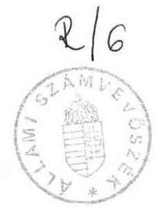

# Állami Számvevőszék

## Jelentés

A Letelepedési Alap működésének pénzügyi-gazdasági ellenőrzéséről

1990.
6.

---

Az ellenőrzést végezték:

Kovácsné Soós Piroska számvevő
Kenéz Sándor tanácsos-számvevő (Szabolcs-Szatmár-Bereg megye)
Pankucsi János számvevő (Békés megye)
Szilágyi Sándor számvevő (Hajdú-Bihar megye)

Az ellenőrzést vezette és összefoglalta:

Hudik Zoltán főtanácsos

---

# J E L E N T É S

a Letelepedési Alap működésének pénzügyi-gazdasági ellenőrzéséről

Az ellenőrzés célja annak megállapítása volt, hogy a Letelepedési Alap, (továbbiakban: Alap) hogyan segítette elő a Magyarországon hosszabb ideig tartózkodó külföldiek pénzügyi támogatását, társadalmi beilleszkedését. Egyidejűleg áttekintettük a menekültügyhöz kormánymegállapodás alapján kapcsolódó ENSZ segélyprogram megvalósítását.

Az Alap felhasználását két tárcánál (az Alapot és az ENSZ támogatást elkülönítetten kezelő Belügyminisztériumban, valamint a Népjóléti Minisztériumban*), a felhasználásban jelentős mértékben érintett területeken (a fővárosban, Békés, Hajdú-Bihar, Fejér és Szabolcs-Szatmár-Bereg megyékben), továbbá a Magyar Vöröskeresztnél és a Magyarországi Református Egyház Zsinatánál vizsgáltuk.

## I. Megállapítások

## 1. Az Alap létrehozása, a menekültügy ENSZ támogatása

Az 1980-as évek végére olyan mértékben növekedett a Magyarországon menedéket keresők száma, hogy szükségessé vált a segítségnyújtás társadalmi méretekben történő összehangolása, a támogatások pénzügyi-gazdasági feltételeinek megteremtése.

[^0]
[^0]:    * 1990. május 24-e előtt Szociális és Egészségügyi Minisztérium

---

Ezt a célt szolgálta, hogy az Országgyűlés felhatalmazása alapján a Minisztertanács 49/1988. (VI.28.) számú rendeletével (továbbiakban: MT rendelet) létrehozta az Alapot, forrásnak az állami költségvetésből évente nyújtott támogatást és a magán-, illetve jogi személyek befizetéseit jelölte meg. Az MT rendelet fő vonalakban meghatározta a felhasználási lehetőségeket és a kezelés általános szabályait.

A hazánkba érkezett külföldi - többségében magyar nemzetiségű román - állampolgárok ügyeinek rendezésével kapcsolatos feladatok koordinálására Állami Tárcaközi Bizottság alakult, erről a Minisztertanács 3046/1988. számú határozata rendelkezett.

Az Állami Tárcaközi Bizottság - amely a menekültügyben érintett tárcák, országos hatáskörű szervek képviselőiből áll - alapelvként fogalmazta meg, hogy a külföldieket is megilletik a magyar állampolgárok esetében adható támogatások.

Az Alap létrehozásakor meghatározott felhasználási jogcímek egyaránt lehetőséget adtak az átmeneti segítségnyújtásra (szociális segélyezésre, az ideiglenes szálláshely létesítések támogatására) és a végleges letelepedést elősegítő nagyobb költségkihatású támogatási formák (az egyszeri letelepedési segély, a lakásszerzési támogatás) igénybevételére.

Az Alap forrását (1. sz. melléklet) lényegében az állami költségvetésből nyújtott támogatás képezte, mert a magán- és jogi személyek befizetése nem érte el az 1 M Ft-ot sem. Ez utóbbiak nagyságrendekkel magasabb összegű hozzájárulásaikat a Magyar Vöröskereszthez vagy az egyházakhoz juttatták el.

Az Alap céljára 1988-ban 300 M Ft, 1989-ben az előző évi megtakarításra tekintettel 100 M Ft, 1990. évre 500 M Ft került jóváhagyásra.

A felhasználható összeget kis mértékben (10,7 M Ft-tal) növelte az 1988. évi maradványösszeg - kötvényvásárlás útján történt - hasznosításból származó kamat. Erre a 71/1988. (XII. 27.) PM rendelet értelmében volt lehetőség.

---

A Magyarországon menedéket keresők támogatásába az ENSZ segélyprogram csak 1989. második félévében kapcsolódott be a Nemzetközi Menekültügyi Konvencióhoz való csatlakozásunkat követően. A segítségnyújtás programját és költségvetését az ENSZ Menekültügyi Főbiztossága és a Magyar Kormány megállapodása rögzítette. Az ENSZ segélyprogram az Alap célkitűzéseiben megfogalmazottaktól szűkebb körű felhasználást határozott meg, elsősorban a befogadó állomások kialakítására összpontosított.

Az ENSZ támogatás keretében 4,9 millió USD (311 M Ft) összegű juttatást irányoztak elő, amelynek elkülönített kezelését is előírták. Annak ellenére, hogy az ENSZ segélyprogram teljesülését 1989. december 31-ig tervezték, ezideig mindössze 3 millió USD került két részletben (1989. októberében, majd 1990. januárjában) átutalásra. Ez egyrészt a program elhúzódásához vezetett, másrészt az elkülönített kezeléssel szemben átmenetileg szükségessé vált a felmerült kiadások Alapból történő finanszírozása.

Az ENSZ támogatás késése miatt a BM kérésére 1989. decemberében a PM a népgazdasági elszámolások letéti számlájáról - visszafizetési kötelezettséggel - 200 M Ft-ot előlegezett. Az átutalás 1990. évre húzódása miatt ezt az előleget az Alap céljára ezévre jóváhagyott 500 M Ft terhére a PM visszatartotta.

Ennek következtében 1988-89 években az állami költségvetés Alap céljára nyújtott támogatása ténylegesen 600 M Ft volt.

Az ENSZ segélyprogram megvalósításához - a 3 millió USD összegű hozzájárulás részleteinek megérkezését követően - az MNB összesen 183,2 M Ft-ot utalt át a "Menekültek ENSZ támogatása" elnevezésű bankszámlára, az átutalások napján érvényes átváltási aránynak megfelelően. Az ENSZ Menekültügyi Főbiztossága azonban a program költségvetésének összeállításánál ettől eltérő, magasabb árfolyamon számolt, ami a már átutalt összegek esetében 5,8 M Ft-tal kevesebb tényleges felhasználást tesz lehetővé. Az árfolyamkülönbözetből eredően a segélyprogram végelszámolásánál jelentkezhetnek gondok.

---

# 2. Az Alap működésének szabályozása

Az Alap kezelésének és felhasználásának szabályozása csak fokozatosan, a menekültügy alakulásának folyamatában történt. Az Alap létrehozásáról intézkedő MT rendelet és a végrehajtásával kapcsolatos 20/1988. BM Utasítás is csak 1988. év közepén, de év elejei alkalmazási hatállyal jelent meg.

A különböző felhasználási jogcímeken adható támogatásokkal kapcsolatos ügyintézésekben néhány kivételtől eltekintve a tanácsi szervezetek az illetékesek, így részükre kezdetben az Állami Tárcaközi Bizottság adott ki irányelveknek minősíthető tájékoztatókat. Részletesebb szabályozásra csak 1988. szeptemberétől, a BM Tanácsi Szervezési Főosztály, majd a BM Menekültügyi Hivatal körlevelei útján került sor.

A rendelkezések szerint a költségvetési szervek külföldiekkel kapcsolatos kiadásait az Alap - a negyedéves elszámolások alapján - utólag téríti meg. Ez különösen azoknak a helyi tanácsoknak a gazdálkodását nehezítette, ahol a nagyobb volumenű támogatási igények jelentkeztek.

Az utólagos térítés megváltoztatása az MT rendelet módosítását is igényli, meghaladja a belügyi tárca intézkedési hatáskörét. Ennélfogva a gondok enyhítése érdekében hozott néhány tárca szintű intézkedésre a hatályos rendelkezések nem adtak lehetőséget.

A közigazgatási belügyminiszterhelyettes 1989. december 19-i körlevelében értesítette a megyei tanácsokat, hogy 1990. januárjától a BM Menekültügyi Hivatal utólagos elszámolás fejében megelőlegezi a külföldiekkel kapcsolatos költségeiket. Ezt az MT rendelettel nyilvánvalóan ellentétes rendelkezést ez év februárjában visszavonták.

A főváros finanszírozási gondjainak enyhítését szolgálta, hogy az Alapból - a lakáscélú felhasználás terhére - 10 M Ft előleget adtak. Fejér megyében hozzájárultak a bicskei átmeneti szállás jelentős bérleti díjának havonta történő megtérítéséhez.

---

További szabályozási gondok forrása, hogy a belügyi tárca intézkedéseit általában nem előzte meg a központi menekültügyi, pénzügyi és tanácsi szervezetek közötti hatékony koordinációs együttműködés.

Ez tükröződik az Alap tervezését, felhasználását, kezelését szabályozó BM Utasításban a döntési feladatok meghatározásából, az Alapból történő támogatásnak a tanácsi költségvetési rendbe illesztésére (átvett pénzeszközkénti kezelésére) hozott intézkedésből, valamint a menekültügyi tevékenység adómentes értékesítések körébe sorolásának kezdeményezéséből.

A 20/1988. BM Utasítással előírt tervezési és döntési feladatok megalapozatlannak, formálisnak tekinthetők, részben a gyakorlatban sem követhetők.

Az Alapból történő támogatás átvett pénzeszközkénti kezelése nehezíti a pénzmozgások MT rendelettel meghatározott elkülönített nyilvántartását, mivel nem igazodik a jelenlegi tanácsi szakfeladatrendhez.
Tévesen feltételezték a menekültügyi tevékenység SZTJ 818-29 "Egyéb szociális gondozás és ellátás" főcsoportba, az adómentes értékesítések körébe sorolásából a menekültügy részére nyújtott (kereskedelmi szálláshely, fordítási és hitelesítési, stb.) szolgáltatások és termékbeszerzések ÁFA mentességét.

A különböző felhasználási jogcímeken felmerült kiadások Alapból történő térítéséről felső szinten a BM Menekültügyi Hivatal dönt. E döntések megalapozottsága a jelenlegi szabályozás és gyakorlat körülményei között erősen vitatható.

A rendelkezések értelmében a hétféle felhasználási jogcím közül csak két esetben (a lakásszerzések támogatásánál és az ún. egyéb kiadásoknál) szükséges a térítési igényeket részletesen indokolni. Ennek következtében a helyi tanácsok kiadásait összesítő megyei tanácsoknak nincs a felhasználások jelentős részének megalapozottságát alátámasztó információja. Emellett általános tapasztalat, hogy a részletes indoklások a felhasználási cél és

---

összeg megjelölésére szorítkoztak. Következésképpen a megyei szinten összesített térítési igények belügyi tárca részéről történő elbírálása csak formális lehetett.

A lakásszerzéshez nyújtott támogatások esetében az indoklások hiánya kisebb gondot okozott, mert a helyi tanácsok általában a támogatásokról szóló határozataikat előzőleg a megyei szinten jóváhagyatták.
Az ún. egyéb kiadások térítési igényének felszínes elbírálhatóságához az is hozzájárult, hogy az igénylések részletezésének késői szabályozásából eredően számos téves költségbesorolás történt.

Az MT rendelet végrehajtásával kapcsolatos BM Utasításban megfogalmazást nyert az Alapból történő felhasználás felügyeleti ellenőrzésének követelménye. Ilyen ellenőrzést azonban 1988-ban egyáltalán nem folytattak, 1989-ben a fővárosban és mindössze három megyében ellenőriztek. A felügyeleti ellenőrzések rendszeressé tétele mellett azok színvonalát is javítani kell, mivel az eddigi ellenőrzések megállapításai többségükben általánosságokra szorítkoztak, esetenként nélkülözték a számonkérés alapját képező rendelkezések ismeretét is. Helyszíni vizsgálataink számos olyan hiányosságot tártak fel, amelyeket a korábbi felügyeleti ellenőrzések figyelmen kívül hagytak. Eredményesebbnek minősíthetők a megyei tanácsok ellenőrző szerveinek helyi tanácsoknál folytatott - az Alap felhasználásával kapcsolatos - vizsgálatai, mivel egy-egy terület gyakrabban kerül ellenőrzés alá és közvetlenebb intézkedési lehetőség van a szabálytalanságok felszámolására.

A Szabolcs-Szatmár-Bereg megyei Tanács ellenőrzése tárta fel, hogy a Nyírbátori átmeneti szálláshely Alap terhére beszerzett 78 E Ft értékű új berendezési tárgyakat részben a középiskola kollégiumában, részben az alkotóházban helyezték el. VB titkári intézkedésre ezt az összeget az Alapnak visszatérítették.

# 3. Az Alap felhasználása, az ENSZ segélyprogram kapcsolódása

Az Alap terhére - az MT rendeletben meghatározott jogcímeken - 1988-89. években eszközölt kiadások összege 577 M Ft volt (ebből 421 M Ft 1989. év-

---

végéig, a fennmaradó rész 1990-ben, de még a vizsgált időszakban került az Alapból kifizetésre, illetve megtérítésre). A költségek nagyobb hányada (86,3%-a) a tanácsi szervezeteknél jelentkezett.

A kiadások felhasználási év és jogcím szerinti megoszlása (2. sz. melléklet) arra utal, hogy az utóbbi évben rendkívüli mértékben nőtt az Alap felhasználása, ami elsősorban a nagyobb költségkihatású lakásszerzés támogatás fokozódó igényével és a befogadó állomások létesítésének - 1989. évtől jelentkező magasabb összegű - ráfordításaival hozható összefüggésbe.

A letelepedni szándékozó menekültek lakásszerzéséhez 1988-ban mindössze nyolc megyében nyújtottak összesen 2,5 M Ft összegű támogatást. 1989-ben már két nagyságrenddel nagyobb a kimutatott felhasználás, ennek több mint a fele 133,2 M Ft Pest, Békés és Hajdú-Bihar megyében, valamint a fővárosban jelentkezett.

A lakásszerzéshez nyújtott támogatásoknál csak az összesítésben érvényesült az az alapelv, hogy a kamatmentes kölcsönök összege legalább érje el a vissza nem térítendő támogatások nagyságrendjét.

Különösen magas a vissza nem térítendő támogatások összege Hajdú-Bihar megyében (mintegy háromszorosa a kamatmentes kölcsönöknek). Ezt ellensúlyozta, hogy Békés megyében hasonló az arány, de a kamatmentes kölcsönök javára, a fővárosban pedig három eset kivételével csak kamatmentes kölcsönt folyósítottak.

A mintegy 1100 esetben nyújtott támogatásnál átlagosan egy-egy lakásra 95 E Ft vissza nem térítendő támogatás és 110 E Ft kamatmentes kölcsön jutott. Ezideig mintegy 10 ezer fő az, akinek végleges letelepedésével már számolni lehet és ennek kb. harmadánál tekinthető a lakáshelyzet megnyugtató módon rendezettnek, ezért az ilyen irányú támogatási igény további növekedése várható.

A kamatmentes kölcsönök folyósításának - BM Menekültügyi Hivatal által 1989. novemberében előírt - nyilvántartási rendje újszabályozást igényel, mivel jelenleg a törlesztési adatok részben a tanácsoknál, részben a pénz-

---

intézeteknél jelennek meg, a pénzintézetek pedig a törlesztéseket közvetlenül utalhatják az Alapba. Ilyenformán a tanácsi nyilvántartások hiányosak, ugyanakkor a törlesztések központilag nem követhetők.

A lakásszerzés támogatásaként folyósított kamatmentes kölcsönök összege
 120,8 M Ft-ot tett ki, ezek törlesztése évente maximálisan 12 M Ft körüli bevételt jelenthet az Alapnak. Figyelembe véve, hogy a törlesztések elkezdésére általában 1-2 éves a türelmi idő és 15 éves a lejárati idő, ennél kedvezőtlenebb visszapótlással lehet számolni.

A vizsgált időszakban mindössze 610 E Ft a kölcsöntörlesztésekből származó bevétel.

Az Alap védelme azt is megkívánja, hogy a kamatmentes kölcsönök folyósításánál a pénzintézetek időben intézkedjenek a földhivatalok felé, az elidegenítési és terhelési tilalom bejegyeztetésére. Ezen a téren főleg a fővárosban tapasztalhatók mulasztások.

A Fővárosi Menekültügyi Iroda többszöri sürgetése ellenére az OTP Budapesti Lakásértékesítési Fiókja 16 - Alap terhére támogatott - ingatlanvásárlásnál az intézkedésre méltányos 60 napon belül sem tette meg a szükséges lépéseket.

Az ebből eredő problémák áthidalására a fővárosban szoros együttműködés alakult ki a menekültügyi és igazgatásrendészeti szervek között, a visszatelepülni szándékozók útiokmányokkal való ellátása előtti információkérésben. A megyékben ez nehezebben kivitelezhető megoldást jelent, mivel a kölcsönnyilvántartási adatok nem egy helyre koncentráltak. Ez is hangsúlyozza a kölcsönnyilvántartások hiányosságainak mielőbbi felszámolását.

Az Alap kiadásainak közel egynegyedét képezték a befogadó állomások és az átmeneti szálláshelyek létesítési, fenntartási költségei (124,6 M Ft). Ezen belül a nagyobb összegű ráfordítások a befogadó állomásokkal kapcsolatban - a békéscsabai épületvásárlás, a bicskei ingatlan kezelői jogának vásárlása, és a hajduszoboszlói állomás bérleti díjaként - merültek fel (ezek összesen 71 M Ft-ot tettek ki).

---

A befogadó állomások célszerű kialakításához kapcsolódik a már átutalt ENSZ támogatások jelentős része, amelyből ténylegesen felhasználásra került 81,7 M Ft, további 44,9 M Ft a szerződésekkel lekötött összeg.

A költségigényesség fokozottabban felveti a befogadó állomások hasznosulásának értékelését.

A hajduszoboszlói és békéscsabai központok már 1989. augusztusától, illetve októberétől üzemelnek, közel féléves működésük alatt több mint háromezer menekült ellátását biztosították. Az üzemeltetésük beindításánál jelentkezett átmeneti zavarok visszavezethetők a szervezeti és működési szabályzatok késedelmes - csak ez év márciusi - kiadására.

A befogadó állomások 8-9 hónapos üzemelése alatt is előfordult, hogy csak 25-30%-os kihasználtsággal működtek. Ebből azonban nem a létesítésük indokolatlansága következik, hanem arra figyelmeztet, hogy idejében célszerű - pl. külföldi tapasztalatok felhasználásával - más irányú felhasználásukra is megoldást keresni.

Vitatható azonban, hogy mennyiben volt gazdaságos megoldás Bicskén a befogadó állomás céljára a korábban az autópálya építéséhez használt felvonulási területet, azon a jelentős ráfordítást igénylő, erősen leromlott állapotú felépítményt kijelölni.

A befogadó állomás létesítésének eddig kimutatott költségei - a teljesült és szerződéssel lekötött kiadások - elérték a 92,6 M Ft-ot, ebből ENSZ támogatás 67,9 M Ft. Az ENSZ támogatásból e célra tervezett összegből még fennmaradt 26,9 M Ft.

A létesítés elhúzódása miatt a befogadó állomás szerepét az eredetileg erőmű beruházáshoz épített - az Alap terhére átmeneti szálláshely címén bérelt - szálló épület tölti be.

---

A szálló épület jelenlegi tulajdonosa a Magyar Hitelbank, kezelője a Bükkábrányi Béke MGTSz és havi bérleti díja "kereskedelmi szálláshely" szolgáltatásként 750 E Ft. A szálló kihasználtsága átmeneti szálláshelyként történő felhasználása előtt nem volt kielégítő, ami szintén megkérdőjelezi az új befogadó állomás létesítésének célszerűségét.

Az átmeneti szálláshelyek létesítési és fenntartási költségei között a jelentős részt a bérleti díjak képviselik. A tisztánlátást nehezíti azonban, hogy az ilyen jogcímen történő elszámolható költségeket nem egységesen értelmezték.

Fejér megyében az átmeneti szálláshely költségek 92,5%-át a bicskei átmeneti szállás ÁFÁ-t is tartalmazó bérleti díja teszi ki.
Békés megyében a bérleti díjakat az egyéb kiadások között szerepeltették, a fővárosban pedig a szükséglakások felújítására fordított összegeket az egyéb költségek helyett az átmeneti szálláshely kiadásai közé sorolták.

Az átmeneti szálláshelyek igénybevétele - a szolgáltatások (tartózkodási napok száma, étkeztetés lehetősége, stb.) szabályozásának hiányában - rendkívül eltérő képet mutatott. Amíg nincs egységesen kezelve és a menekültekkel tudatosítva a szolgáltatási rend, addig természetesen a humanitárius elvek döntenek, a rendeltetésszerű felhasználás hátrányára (a bicskei átmeneti szálláson tartózkodók 40%-a 4 hónapja, közel egynegyede pedig több mint 8 hónapja veszi igénybe a szolgáltatásokat).

Az Alap egészségügyi és társadalombiztosítási ellátások címén kimutatott felhasználása nem számottevő (18,7 M Ft), és csak az egészségügyi ellátással kapcsolatos költségeket tartalmazza. Ezzel szemben a Népjóléti Minisztérium - becslésekre szorítkozva - az egészségügy kiadásait 334 M Ft-ban, a társadalombiztosítás költségeit 122 M Ft-ban állapította meg, amelyeket nem az Alapból finanszíroztak, de közvetve az állami költségvetést terhelték.

---

A költségek becslését az tette szükségessé, hogy az Állami Tárcaközi Bizottság állásfoglalását figyelmen kívül hagyva a gyógyellátással és társadalombiztosítással kapcsolatos negyedéves jelentések készítését a felügyeleti szervek nem szorgalmazták.
A becsült adatok a világbanki statisztikára épültek, ugyanakkor a Romániából érkezettek (nem csak a letelepedni szándékozók) részéről különösen a költségesebb gyógyellátások iránt mutatkozott nagyobb igény.

Az egészségügyi kiadásokat részben, a társadalombiztosítással kapcsolatos költségeket teljes egészében - a magyar-román szociálpolitikai egyezményen alapuló 1962. évi 5. sz. tvr-re hivatkozással - saját forrásból fedezték annak ellenére, hogy a költségek 1977. óta egyoldalúan a magyar felet terhelték és az ellátásban részesültek tulajdonképpen nem tartoznak a rendelkezés hatálya alá.

Az egyensúly helyreállításáért ez év márciusában már történtek kezdeményezések az egyezmény módosítására.

Az ENSZ Menekültügyi Főbiztosságával kötött kormánymegállapodásban foglaltak részben indokolták a gyógyellátások saját forrású finanszírozását és ebből következően az ENSZ támogatás ellentételezéseként a menekültek - a befogadó állomások egészségügyi szolgáltatásain túl - jogosultak az országos egészségügyi rendszer igénybevételére is.

Az egészségügyi célra tervezett 82,2 M Ft ENSZ támogatásból ezideig 55,8 M Ft került átutalásra, amelynek majdnem teljes egésze megrendelések formájában van lekötve. Ennek alapvető felhasználási célja a befogadó állomások elsősegély-nyújtáshoz, szűréshez, pszichikai-szociális tanácsadáshoz szükséges eszközökkel történő felszerelése, emellett korlátozott mértékben kórházi berendezések, szűrőbuszok, műveseállomás beszerzésére is sor kerül.

A menekültek szociális segélyezésére fordított kimutatható összeg 58,7 M Ft volt. A téves könyvelések és a kiadások nem minden esetben elkülönített kezelése következtében, továbbá egyes tanácsok saját forrásból finanszírozott segélyezéseire tekintettel a tényleges felhasználás ettől eltér. A té-

---

vesen könyvelt összegek különbözőek, így összesített adatok hiányában a végeltérés iránya sem becsülhető. Tény azonban, hogy a tanácsok saját forrásából eszközölt kifizetései az Alap kiadásain túl terhelték az állami költségvetést, emellett szűkítették a magyar állampolgárságú rászorulók támogatási lehetőségét.

Békés megyében 200 E Ft-ot meghaladó olyan szociális támogatás volt kimutatható, amelyet a kiadások nem elkülönített kezelése miatt a helyi tanácsok saját forrásból finanszíroztak.

Szociális segélyezés keretében - a támogatás feltételeinek betartásával személyenként általában 1000-1500 Ft összegű rendkívüli segélyt folyósítottak, esetenként előfordultak 5-10.000 Ft-os kifizetések is.

A felhasználás első évében - arányait tekintve - kimagaslóak voltak a szociális segélyezésre fordított kiadások. Azóta a ráfordítások összegének növekedése ellenére az arány csökken, ami az ilyen célú támogatás jelentőségének visszaesésére utal.

A szociális segély célú alapfelhasználás közel másfélszeresének megfelelő összegben ún. gyorssegély formájában támogatták a menekülteket az egyházak és a Magyar Vöröskereszt. A gyorssegély kifizetések - az Állami Tárcaközi Bizottság állásfoglalása alapján - nem terhelték az Alapot, azok forrásai a Magyar Vöröskereszthez, illetve az egyházakhoz befolyt adományok voltak.

Növekvő tendenciát mutat a gyermekes menekült családoknak nyújtott egyszeri letelepedési segélyek összege (a kiadások 86,6%-a - 6,5 M Ft - 1989-ben jelentkezett). A kifizetések több mint fele a fővároshoz, Pest, Hajdu-Bihar és Szabolcs-Szatmár-Bereg megyékhez kötődik. Az 1990-es év első két hónapjának adatai arra hívják fel a figyelmet, hogy különösen a fővárosban nő az egyszeri letelepedési segély iránti igény, a kiadások már meghaladták a 3,5 M Ft-ot.

Megállapítható volt, hogy az 1988. évben kiutalt egyszeri letelepedési segélyek átlaga az adható - rendszeres havi szociális segély hatszorosának

---

megfelelő - összegnél általában kevesebb volt (kb. 3,5-5-szörös szorzót jelentett). 1989. évben e kifizetések már közelítették, de nem haladták meg az adható maximumot.

A gyermekek bölcsődei, óvodai és iskolai elhelyezési költségeinek átvállalásával összefüggő kiadások 1,8 M Ft-ot tettek ki, ez az összfelhasználásnak mindössze 0,3%-a. A kimutatott összegnél a tényleges költségek magasabbak, ami az Alap felhasználásában alapvetően azért nem jelentkezett, mert a letelepedők munkába állását követően ezeket a költségeket általában a munkáltatók vállalták magukra. Eltérés adódott abból is, hogy egyes megyékben ezeket a kiadásokat sem kezelték elkülönítve, ennélfogva ilyen jogcímen az Alapból nem igényeltek támogatást (pl. Békés megye).

Az MT rendelet lehetőséget adott a különböző szervezeteknél felmerülő ügyintézéssel, ellátással, stb. kapcsolatos - ún. egyéb kiadások Alapból történő támogatására is. Ezek összege meghaladta a 85 M Ft-ot. Az 1989. évi felhasználás közel négyszerese lett az előző évinek, ebben a tapasztaltak alapján szerepe lehetett annak is, hogy az Alapból történő finanszírozás indokoltságának elbírálhatósági feltételei a legszembetűnőbb módon az egyéb kiadások esetében hiányoztak.

Az egyéb költségek nagyobb része (65%-a) a tanácsi szerveknél mutatható ki, kisebb hányada oszlott meg különböző társadalmi szervezetek között.

A tanácsok elsősorban igazgatási költségeket, kisebb részt lakás- és albérleti díjakat, menekült gyermekek karácsonyi ajándékozását számolták el az egyéb költségek között.

Az igazgatási, ügyintézéssel kapcsolatos kiadások között szerepeltetett különböző bérkifizetések és TB járulékok jogosságát a BM érdemben nem tudta felülvizsgálni. Nem volt egyértelműen leszabályozva, hogy milyen bérköltségek számolhatók el. Ez olyan aránytalanságokat eredményezett, hogy egyes helyeken a fő munkaköri tevékenységért járó bérezés mellett végezték a menekültüggyel kapcsolatos többletmunkát, máshol az Alapból jutalmazásokat is finanszíroztak.

---

Az egyéb költségeket terhelve nyílt lehetőség - a letelepedni szándékozók lakásgondjának átmeneti segítése érdekében - szükséglakások felújítására, ami többségében ésszerű költséghatárok között valósult meg.

Kivételes eset fordult elő Gyulán, ahol 11 komfort nélküli lakás átalakítására a BM előzetesen 2,8 M Ft-os támogatást engedélyezett, ami az építkezés befejeztével átutalásra került. A 11 lakásból 8 azonban - 5,8 M Ft beruházási költséggel - újonnan épült, amelyhez 1,8 M Ft összegű támogatást igényelt és kapott az Alapból a tanács.

Az Állami Tárcaközi Bizottság állásfoglalása értelmében a menekültek részére kialakított tanácsi, illetve vállalati lakások - Alap terhére elszámolt - felújítási költségeit a menekült célú felhasználás megszűnésekor vissza kell téríteni. A romániai helyzet alakulására tekintettel a szükséglakások felszabadulásával összefüggésben az Alap nem realizált bevételt.

A tanácsok részéről eszközölt egyéb kiadásokon túl nagyobb, 9,7 M Ft összegű támogatást az egyházak igényeltek. Ebből 7 M Ft a Magyarország Református Egyház Zsinatának költségeit fedezte, amelynek jelentős része a bicskei átmeneti szállás bérleti díjával kapcsolatos.

Az Alap felhasználására irányuló felügyeleti ellenőrzések a tanácsokon kívül más szervezetekre még nem terjedtek ki. Ez is hozzájárult ahhoz, hogy nem került felszínre a Magyarország Református Egyház Zsinatának esetében a kiadások nagymértékű kezelése.

A bicskei átmeneti szállás bérleti feltételeit szerződésben nem rögzítették, nem foglalkoztak a felszámolt összegek megalapozottságával, a 11 hónapos bérleti időtartam alatt 80 E Ft késedelmi kamatot is kifizettek.

Jelentős segítséget adott a menekültek letelepedéséhez, munkavállalásához, hogy a szükséges okmányok fordítási és hitelesítési költségei az Alap terhére elszámolhatók voltak. Az Országos
 Fordító és Fordításhitelesítő Irodánál jelentkező költségek 6,5 M Ft-ot tettek ki (ez az összeg a szolgáltatás jellegéből adódóan 1,3 M Ft ÁFÁ-t is magában foglalt).

---

Az Állami Tárcaközi Bizottság már 1988-ban a tanácsoknak kiadott tájékoztatójában szorgalmazta a menekültekkel kapcsolatos információs hálózat kiépítését. Ennek megvalósítására 9,8 M Ft összegben, nagyobb részt ENSZ támogatásból számítástechnikai eszközöket szereztek be (az Alap kiadása mindössze 1 M Ft-ot tett ki). Az eszközbeszerzéseket azonban nem követte jól koordinált szervező munka.

Az idegenrendészeti feldolgozások ugyan előrehaladtak, a munkaerőpiaci adatbázis gépi nyilvántartása az adatkarbantartás hiánya miatt akadozik, országos információs rendszerről pedig egyáltalán nem lehet beszélni.

Egyéb célú felhasználásként összesen 3,3 M Ft került kifizetésre különböző intézetek részére menekültüggyel foglalkozó tanulmányok készítése céljából. Ezek színvonalas munkát tükröznek, számos jól felhasználható információt hoztak felszínre.

A Társadalomkutatási Informatikai Egyesülés a romániai áttelepültek körében végzett szociológiai felmérést 2,5 M Ft, az MSZMP KB Társadalomtudományi Intézete a menekültekkel foglalkozó szervezetek szociológiai vizsgálatát végezte el 300 E Ft munka-, illetve szerzői díj ellenében. Az MTA Földrajztudományi Kutató Intézetével 500 E Ft összegű kutatási szerződést kötöttek a romániai menekültek letelepítésével kapcsolatos területi alternatívák kidolgozására.

Külön nem részletezve, együttesen mintegy 4,7 M Ft-ot tettek ki a határőrizettel kapcsolatos többletköltségek, a munkaközvetítésekkel, valamint a Szociális Munkások Magyarországi Egyesületének közreműködésével összefüggésben felmerült költségek.

Megfelelő döntés vagy szabályozás hiányában - egyelőre mint rendeltetéstől eltérő célú felhasználás - az Alap egyéb költségeit terhelik a liberális vízumkiadás következtében és a célországok befogadó készségének hiánya miatt Magyarországon rekedt kb. 200 afrikai állampolgár elhelyezésével és teljes ellátásával kapcsolatos kiadások.

---

A BM - más országok gyakorlatát alapul véve - a hazájukba visszautaztatásban látta a megoldást, ehhez mintegy 7,7 M Ft biztosítását, illetve hasonló esetekhez elkülönített alap létesítését igényelte.
A PM az Alap felhasználási körének bővítését, addig a kiadások - belügyi tárca saját forrásainak terhére történő - megelőlegezését javasolta. Miközben a tárcák a finanszírozás forrását vitatják, a bicskei átmeneti szálláson és a csillebérci táborban kimutatott költségek már meghaladták a 3,5 M Ft-ot, a gyógyellátással, szűrővizsgálatokkal összefüggő költségek 1,1 M Ft-ra becsülhetők.

A költségek nagyságrendje azt sürgeti, hogy az érintett tárcák mielőbb döntésre jussanak a költségvetést legjobban kímélő megoldás irányába.

# II. Következtetések 

Az Alap működésének első két évében - a menekültügy szinte állandóan változó körülményei között és a felhasználásban mutatkozott számos probléma ellenére - lényegében a célkitűzéseknek megfelelően nyújtott a Magyarországon menedéket kereső 26 ezer főt meghaladó (közel háromnegyed részben magyar nemzetiségű) külföldi állampolgár jelentős részének kisebb-nagyobb értékű támogatást.

Tekintettel arra, hogy a magán- és jogi személyek hozzájárulásai elenyészőek voltak, sőt csökkenő tendenciát mutattak, emellett az Alap esetében jelentős bevétellel sem lehet számolni, forrásnak továbbra is az állami költségvetésből nyújtott támogatás tekinthető.

Az állami költségvetést az Alap felhasználásán túl más csatornákon hasonló nagyságrendben terhelte a menekültügy, amelyek között jelentősebbek a gyógyellátás költségei, a helyi tanácsoknak adott pótkeretek, a lakásépítési kölcsönökkel együttjáró szociálpolitikai kedvezmények, a tanácsi és szolgálati lakások kiutalásával nyújtott támogatások. Ezek figyelembevételével az állami költségvetés kiadásai már meghaladták az 1 Mrd Ft-ot.

---

Az Alap felhasználási jogcímei lehetőséget adtak mind az átmeneti segítségnyújtásra, mind a végleges letelepedés támogatására. A felhasználási arányok változása arra enged következtetni, hogy várhatóan tovább nő a nagyobb költségkihatású támogatásformákra, különösen a lakásszerzés támogatására irányuló igény.

A felhasználás második évében mutatkozott erőteljes költségnövekedéshez a befogadó állomások létesítésének nagyösszegű kiadásai is hozzájárultak. Fokozottan felveti hasznosulásuk körültekintő értékelésének szükségességét az is, hogy az ENSZ támogatás a befogadó állomások célszerű kialakításához kapcsolódik. Különös figyelmet érdemel a bicskei állomás céljára megkezdett beruházás.

A menekültek támogatásával kapcsolatos ügyintézés főként a tanácsi szervezetekre hárul. Az olyan jellegű támogatásoknál, mint a szociális segélyezések, lakásszerzések támogatása, amelyekben korábbi tapasztalatokkal is rendelkeztek, körültekintően és a rendelkezések betartásával jártak el. Nagyobb figyelmet kell fordítani viszont az Alap felhasználásával kapcsolatos előírásokra, mivel számos esetben nem tettek eleget a kiadások elkülönített kezelésének, téves költségbesorolások történtek, és a kiadások Alapból történő térítéséhez szükséges indoklások többsége sem érdemi elbírálásra alkalmas tartalommal készült.

Az Alap működésének szabályozása több szempontból sem felelt meg a követelményeknek, részben annak a következményeként, hogy a menekültügy napirendre kerülését követően a változások folyamatában kellett a szabályozási, szervezési és végrehajtási feladatokat megoldani, ezek szervezeti feltételeit kialakítani. Tapasztalatok hiányában a koncepcionális szabályozás helyett a kezdeti intézkedések a menekültügy éppen aktuális feladataira irányultak.

A belügyi tárca részéről az Alap működésének második évében hozott - a felhasználások gazdálkodási, nyilvántartási és elszámolási rendjét szabályozó - intézkedésekből azonban arra lehet következtetni, hogy továbbra sem

---

kellően koordinált az érintett szakterületek munkája. A pénzügyi szolgálat tevékenysége változatlanul a pénzátutalásokra és azok nyilvántartására korlátozódott.

Az utóbbi időben lényegesen differenciáltabb lett a külföldiek tartózkodási szándéka, jelentős számban érkeztek munkavállalási vagy gyógykezeltetési céllal. A közeljövőben a hosszabb ideje Magyarországon tartózkodó menekültek visszatelepülésével sem lehet számolni. Következésképpen a támogatási igények növekedése várható.

A vizsgálati tapasztalatok, valamint a menekültügyben bekövetkezett változások egyaránt sürgetik egy koncepcionális - a külföldiek jogi helyzetének rendezésén alapuló - differenciált támogatási rendszer bevezetését. Ennek kidolgozása nagymértékben igényli a menekültügyben érintett tárcák és országos hatáskörű szervek hatékony közreműködését, továbbá várhatóan az MT rendelet módosítását is szükségessé teszi. Ezzel párhuzamosan a feltárt hiányosságok megszüntetése sem maradhat el, mivel átmenetileg sem nélkülözhető követelmény az Alapból igényelt támogatások megalapozottsága, a tényleges kiadások és bevételek jól követhető pontos nyilvántartása, a jól szervezett információs hálózat és a hatékony ellenőrzés. Ezek rendezése az Alapot kezelő tárca hatáskörében elvégezhető.

# III. JAVASLATOK 

1. A Kormány a menekültügy többcsatornás költségvetési támogatásának elkerülése és a költségvetési támogatás elfogadható határok között tartása érdekében tegyen javaslatot a Magyar Köztársaság menekültügyi stratégiájára, az ahhoz igazodó differenciált támogatási rendszerre.
2. A liberális vízumkiadás következtében és a célországok befogadó készségének hiányában Magyarországon rekedt afrikai (szomáliai, angolai stb.) állampolgárok ügyét a költségvetést legjobban kímélő megoldással soron kívül rendezni kell.

---

3. A Belügyminisztérium vezetése gondoskodjon

- a menekültügy irányításában résztvevő szakszolgálatok eredményesebb együttműködéséről, a szabályozások előkészítésének megfelelő koordinálásáról;
- az alapkezeléssel, felhasználással kapcsolatos pénzügyi szabályok és nyilvántartási előírások betartásának rendszeres, hatékony felügyeleti ellenőrzéséről.

4. A Belügyminisztérium menekültügy irányításában érintett szervei

- intézkedjenek annak érdekében, hogy a kiadások Alapból történő megtérítésére irányuló igénybejelentések indoklásai érdemi döntésre alkalmas információkat tartalmazzanak;
- vizsgálják felül a menekültek lakásszerzési támogatásához nyújtott kamatmentes kölcsönök pénzintézeti folyósításával kapcsolatos szabályozást, a kölcsöntartozások nyilvántartási rendjét.

5. A menekültügyi számítógépes információs hálózat szolgáltatásaiban a felhasználói igények összhangját a BM Menekültügyi Hivatal koordinálásával indokolt megteremteni. Az eszközbeszerzések előrehaladottságára tekintettel a kapacitáskihasználtság értékelésének függvényében célszerű a továbbfejlesztés irányáról dönteni.

Budapest, 1990. június " "

---

# 1.sz.melléklet 

## A LETELEPEDÉSI ALAP FORRÁSAI

adatok ezer Ft-ban

| FORRÁS MEGNEVEZÉSE | 1988.évben   R | 1989.évben   R | Összesen   R |
| :--: | :--: | :--: | :--: |
| Állami költségvetés | 300.000 | 300.000 | 600.000 |
| Magánszemélyek, jogi személyek befizetései | 789 | 201 | 990 |
| Befizetések OTP kamata | 51 | 149 | 200 |
| 1988. évi maradvány kötvényvásárlással történt hasznosításából | - | 10.693 | 10.693 |
| Ö S S Z E S E N: | 300.840 | 311.043 | 611.883 |

Megjegyzés: * 1989 évre jóváhagyott összeg 100 MR volt. A további 200 M R - az ENSZ átutalások késedelme miatt - a PM letéti számlájáról visszafizetési kötelezettség mellett előlegezett összeg.

---

# A LETELEPEDÉSI ALAP FELHASZNÁLÁSA

|  MT RENDELET SZERINTI FELHASZNÁLÁSI JOGCIMEK |  | 1988.évben |  | 1989.évben |  | Ö s s z e s e n |   |
| --- | --- | --- | --- | --- | --- | --- | --- |
|   |  | R | \% | R | \% | R | \%  |
|  a./ | Befogadó állomások átmeneti szálláshelyek létesítése, fenntartása | 6.343 | 11 | 118.282 | 22,8 | 124.625 | 21,6  |
|  b./ | Gyermekek bölcsődei, óvodai, iskolai elhelyezése | 195 | 0,3 | 1.627 | 0,3 | 1.822 | 0,3  |
|  c./ | Egészségügyi és társadalombiztosítási ellátások | 6.382 | 11 | 12.268 | 2,4 | 18.650 | 3,2  |
|  d./ | Rendszeres és rendkívüli szociális segély, nevelési és gyámügyi segély | 15.622 | 27 | 43.044 | 8,3 | 58.666 | 10,2  |
|  e./ | Gyermekes családok egyszeri letelepedési segélye | 10.006 | 17,3 | 64.513 | 12,4 | 74.519 | 13,0  |
|  f./ | Lakásszerzéshez nyújtott helyi tanácsi támogatás | 2.527 | 4,4 | 211.114 | 40,7 | 213.641 | 37,0  |
|  g./ | Egyéb - ügyintézéssel, ellátással és letelepedéssel kapcsolatos - kiadások | 16.804 | 29,0 | 68.235 | 13,1 | 85.039 | 14,7  |
|  Ö S S Z E S E N: |  | 57.879 | 100,0 | 519.083 | 100,0 | 576.962 | 100,0  |
|   |  | 10,0 |  | 90,0 |  | 100,0 |   |

Megjegyzés: * a téves visszaigénylési jogcím-besorolások miatt nem tekinthető pontos adatnak ** a tényleges felhasználás 10 M R-al kevesebb, mert a lakáscélú felhasználást terheli a fővárosnak biztosított előleg.
