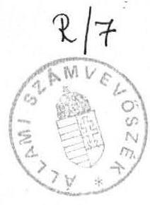
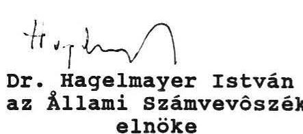
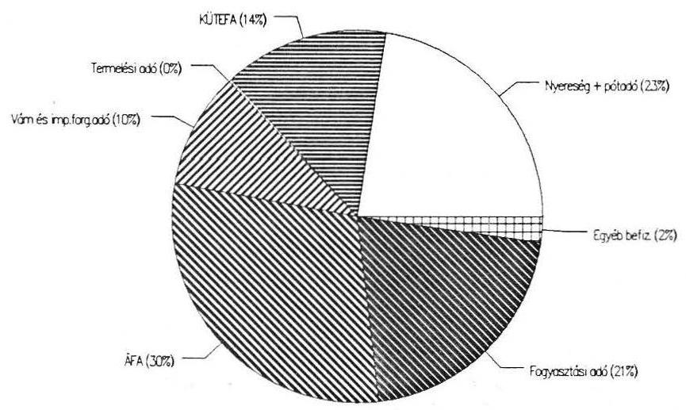
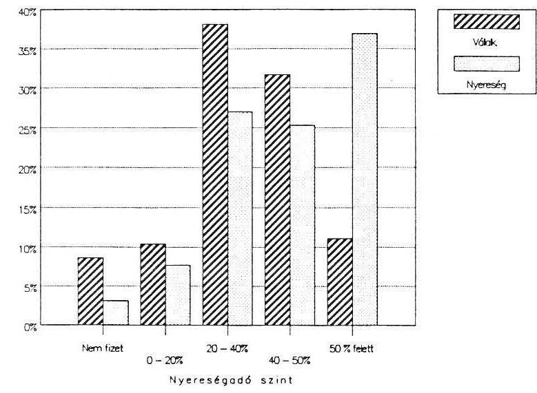
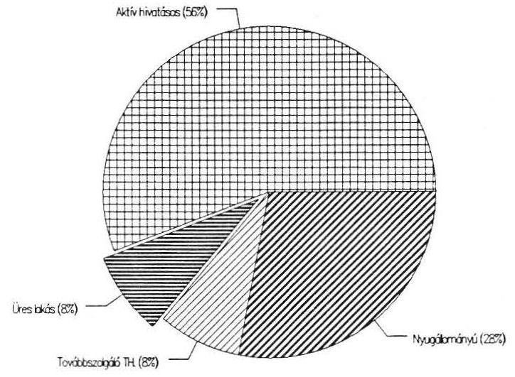
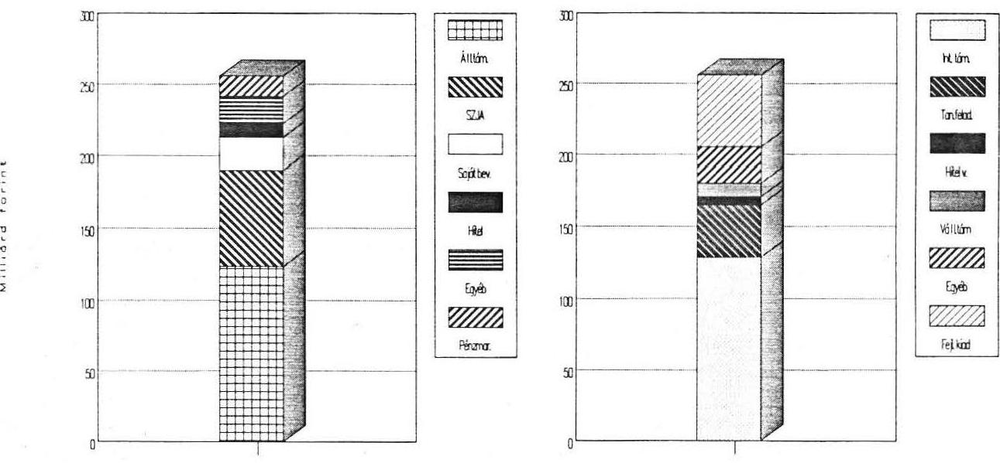
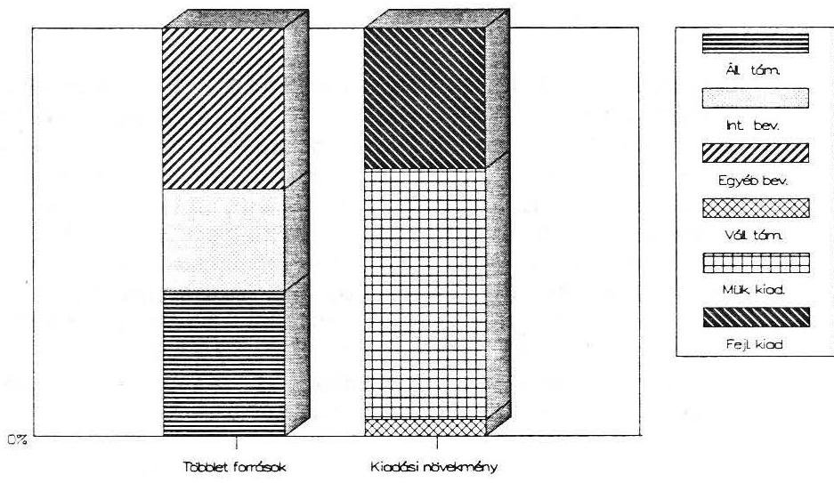
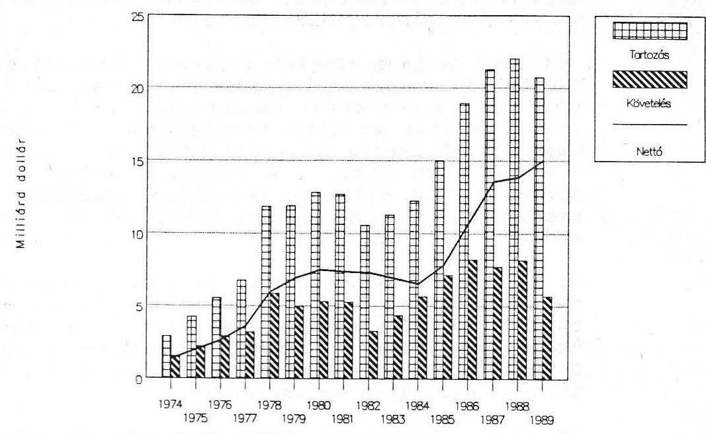
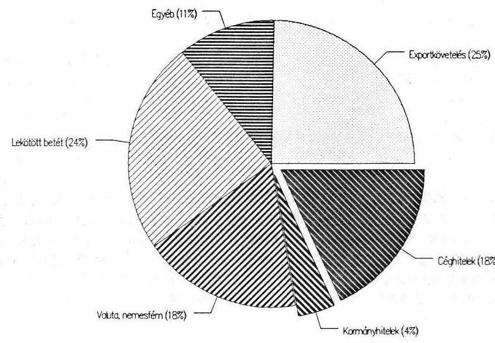

# Állami Számvevőszék 

## Jelentés

a Magyar Köztársaság 1989. évi költségvetésének végrehajtásáról készített pénzügyminiszteri elöterjesztésről

1990.

---

# JELENTÉS 

a Magyar Köztársaság 1989. évi költségvetésének végrehajtásáról készített pénzügyminiszteri elöterjesztésröl

Az Állami Számvevöszék - törvényben foglalt kötelezettsége alapján - áttekintette a pénzügyminiszternek az 1989. évi állami költségvetésről szóló zárszámadási jelentését. Ez év első félévében az ÂsZ több területen helyszíni ellenőrzés keretében vizsgálta a közpénzek felhasználásának törvényességét, szükségességét és célszerűségét.

A többoldalú tételes felülvizsgálat mellett a gazdasági folyamatok makroszintú értékelésén keresztül is kontrolláltuk a zárszámadás valódiságát. Megállapítottuk, hogy:

- a pénzügyminiszter eleget tett az 1989. évi XVIII. tv. 21. szakasz 2. bekezdésében foglalt elöírásoknak, melyek szerint az országgyülés elözetes jóváhagyása szükséges több konkrétan megnevezett kiadási tétel túllépéséhez; a Magyar Államvasutak számára nyújtott 400 millió forint, ill. a társadalmi szervezeteknek juttatott 262 millió forint többlettámogatást előzetesen az Orsszággyülés /a 31., ill. 32/1989. OGY. határozatával/ jóváhagyta;
- a közpénzek szabályos, célszerű és hatékony felhasználása csaknem minden ellenőrzött esetben kívánnivalót hagyott maga után és az ellenőrzés gyakran a legelemibb "gazdálkodási" gyakorlattal sem találkozott .

Az Állami Számvevőszék a pénzügyi kormányzat jövőbeni munkája szempontjából kiemelkedő jelentőségűnek tartja az Előterjesztésnek azt a megállapítását, ami szerint "az inflációs eredetü többletforrások jövedelemtulajdonosok közötti elosztásánál a költségvetés rendre vesztesként került ki". Javasoljuk, hogy ezt a problémát az 1991. évi költségvetés készítésekor a Kormány alaposan vizsgálja meg.

Az Állami Számvevőszék a zárszámadásról szóló előterjesztés elfogadását ajánlja az Országgyülésnek azzal, hogy a jelentésében megfogalmazott javaslatokat, ajánlásokat az 1991. évi terv kialakítása során a Kormány vegye figyelembe.

B u d a p e s t, 1990. július 4.

---

Az 1989. évi költségvetés végrehajtásáról készített pénzügyminiszteri elöterjesztést az Állami Számvevőszék több szempontból ellenőrizte.

Folyamatban van a szorosan vett szabályszerűségi ellenőrzés, amely kiterjed az állami költségvetésnek a Magyar Nemzeti Bankban vezetett könyvelésére. Ennek során az Állami Pénzügyi Törvény által behatárolt pénzügyminiszteri jogok és kötelezettségek kontrollálására is sor kerül/t/.

A tartalmi ellenőrzés keretében az Állami Számvevőszék munkatársai az év első felében több részletes, a közpénzek szabályszerű, célszerű és hatékony felhasználására irányuló vizsgálatot folytattak a költségvetési szerveknél, az elkülönített állami pénzalapoknál, a felhalmozási tevékenység területén. A vizsgálatok részletes tapasztalatait tartalmazó önálló jelentéseket az ÅSZ folyamatosan nyilvánosságra hozta. A legfontosabb következtetéseket, tapasztalatokat pedig a zárszámadás ellenőrzése keretében gyújtöttük csokorba.

A helyszíni ellenőrzések alátámasztásához, a tendenciák feltárásához a vállalkozások 1989. évi mérlegeinek és a költségvetési szervek, tanácsok év végi beszámolóinak adatait is felhasználtuk. Az értékelésekben a szakmai szervezetek (KSH, stb.) információit is hasznosítottuk. E vizsgálatok nem terjedtek - nem is terjedhettek - ki minden közpénz-felhasználásra. Az I. féléves ellenőrzési terv kialakításakor a nagyobb volumenú és közérdeklődésre leginkább számottartó költségvetési támogatási "jogcímekre" irányítottuk figyelmünket. A költségvetési bevételek körében pedig - kiemelt fontosságukra való tekintettel - a vállalkozások által fizetett nyereségadót és az érvényesülő adókedvezményeket elemeztük részletesebben.

Jelentésünk sok tekintetben talán aránytalannak tűnhet, hiszen egy-egy költségvetési bevételi vagy kiadási jogcímnél inkább az elemzés, másoknál a helyszíni ellenőrzés tapasztalatai a meghatározóak. A szervezet "fiatalsága", az ellenőrzésre fordítható viszonylag kevés idő szolgálhat erre magyarázattal. Több esetben a költségvetés kiadásaihoz vagy forrásaihoz nem tudtunk hasznosítható észrevételt füzni. Igyekeztünk az átfedéseket is elkerülni a pénzügyminisztériumi előterjesztésben szereplő gondolatokkal.

A Jelentés első része a közpénzek felhasználásának helyszíni ellenőrzéséből kirajzolódó képpel foglalkozik. A Jelentés második részében - az ellenőrzések alapján megfogalmazható javaslatokkal, ajánlásokkal - a jövő évi költségvetés kialakításához kívánunk hozzájárulni.

A Jelentésben az elemzések, a makroszintű információkon alapuló értékelések normál betűvel, a helyszíni ellenőrzésekből származó információk pedig vastag szedéssel szerepelnek.

---

# I. 

## A helyszíni ellenőrzések és elemzések tapasztalatai

## 1. Nyereségadó, adómentességek, támogatások

Az állami költségvetés bevételi forrásai között a vállalkozások különböző jogcimeken teljesitett befizetései a meghatározók. Ezek, valamint az általános forgalmi adó /ÁFA/ és a fogyasztási adó, a teljes bevétel több, mint $90 \%$-át adják. Jogcím szerinti megoszlásukat az alábbi diagramm mutatja.

1989-ben a nyereségadóból származó bevételekre számottevó hatással voltak a vállalkozási nyereségadózással kapcsolatos kedvezmények. A pénzintézeteket nem tartalmazó vállalkozói körben - ahol a vállalkozások mérlegei szerint 248 milliárd forint eredmény realizálódott - az általános szabályok szerint elszámolható 131,4 milliárd forint nyereség (és pót-) adóval szemben 104,6 milliárd forint tényleges befizetési kötelezettség keletkezett. A 26,8 milliárd forintnyi adókedvezményt mintegy 20 címen kaptak a vállalkozások. /Ebben az összegben nem jelennek meg azok a mentességek, amelyek a szabályok alóli felmentésekből származnak./

---

Az adókedvezmények tevékenységi elven történő meghatározásának következménye, hogy egy gazdálkodó többféle jogcímen is hozzájuthat a kedvezményhez. Igy 5751 gazdálkodó részesült adókedvezményben. Közülük 2210 /38 \%-a/ többféle nyereségadó-kedvezményt is kapott. Ez különösen a mezőgazdaságra és az élelmiszeriparra jellemző, de viszonylag sok kereskedelmi vállalat /368/ is ebbe a kategóriába tartozik.

Az adókedvezmények mértékét jól jellemzi, hogy 359 vállalatnál nem "képződött" annyi nyereségadó, amennyi biztosította volna a kedvezmények teljes összegğ igénybevételét.

Kirivó példája a korlátlan adókedvezménynek az egyik élelmiszeripari vállalat, amely 9 millió forint nyereség realizálása mellett különböző jogcímeken 54,6 millió forint adókedvezményt vehetett volna igénybe.
a/ A külföldi részvétellel múködő gazdasági társaságok adókedvezménye

A nyereségadó-kedvezmények között fontos szerephez jut a külföldi gazdasági társaságoknak nyujtott adókedvezmény. A nyereséges külföldi gazdasági társaságok az előirányzott 0,6 milliárd forinttal szemben 3,78 milliárd forint adókedvezményt vettek igénybe. A kedvezményben részesült 947 gazdasági társaság átlagos adószintje $23,5 \%$, ami lényegesen kevesebb, mint a nemzetgazdasági átlag.

A társaságok a külföldi részesedés abszolut összege és az alapítói vagyonon belüli aránya alapján a következő csoportokba sorolhatók.

- A 947 nyereséges gazdasági társaságból 247-nél a külföldi részesedés nem éri el az 5 millió forintot és az alapítói vagyon $20 \%$-át sem. Ebben a csoportban a befektetett külföldi tőkeösszeg pontosan nem állapítható meg, az igénybe vett támogatás 685 millió forint.

Ezek a vállalkozók, adataik alapján, nem vehettek volna igénybe kedvezményt. Ezért a feltételrendszer és az adókedvezmény közötti ellentmondás okairól 10 egységnél a helyszínen is tájékozódtunk. Megállapítottuk, hogy a vállalkozások figyelmetlenségból, a mérlegkitöltési utasítás helytelen értelmezéséből fakadóan a külföldi befektetés rovatot nem töltötték ki, illetve egyes adókedvezmény-jogcímeket nem a megfelelő sorban közöltek. Az adathibák mind a külföldi befektetések nagyságát, gyakoriságát, mind az e jogcímen igénybevett kedvezmény összegének pontosságát hátrányosan befolyásolják.

---

- A külföldi részesedés aránya eléri a 20 \%-ot, de annak összege 5 millió forintnál kevesebb további 438 vállalkozásnál. Ebben a csoportban a befektetett külföldi tőke összesen 432 millió forint, amihez 296 millió forint adókedvezményt vettek igénybe. Az átlagos külföldi tőkelekötés nem éri el az l millió forintot /0,98 millió forint/.
- A harmadik csoportba tartozó 44 társaságnál a külföldi részesedés nem éri el a $20 \%$-ot, de meghaladja az 5 millió forintot. A befektetett 543 millió forint külföldi tőkéhez 740 millió forint kedvezményt vehettek igénybe.
- Végül a 20 \%-os részesedésnél és az 5 millió forintnál is nagyobb külföldi részesedésű gazdasági társaságok száma 218, a befektetett külföldi tőke 12,2 milliárd forint, amihez 2,5 milliárd forint adókedvezmény tartozik.

A gazdasági társaságok előzőek szerinti megoszlása azt jelzi, hogy a külföldi tőke részesedése a vállalkozások többségénél még igen szerénynek mondható. A kis összegü külföldi befektetések utáni adókedvezmény aránytalan elönyöket biztosít.

# b/ Az adómentességekről 

Az 1989-tól alkalmazott keresetszabályozási rendszer lényege, hogy ha a vállalatoknál a jövedelemkiáramlás üteme meghaladja a teljesítmény /hozzáadott érték/ növekedésének felét, akkor a teljes keresettömeg-többlet után adót kell fizetni.

A gazdaság egészében /pénzintézetek nélkül/ kereset/bér/szabályozás alapmutatója, a hozzáadott érték, az előző évhez képest 22,4 \%-kal emelkedett. A szabályozás értelmében ennek fele, 11,5\% béremelkedés még adómentes lett volna, ugyanakkor a bérek növekedési üteme 14,5 \% volt. Az átlagok alapján adódó "durva" közelítés azt jelzi, hogy az 1989. évi 50,8 milliárd forint bértöbblet jelentős részének növelni kellett volna a nyereségadó alapját. Ezzel szemben 9,8 milliárd forint, az összes béremelkedésnek 19,2 \%-a vált csak a nyereségadó alapjává, vagyis a vállalkozások túlnyomó többsége /94 \%/ 1989-ben nem fizetett a béremelkedések után adót. Az adómentes bérfejlesztéseket különböző tényezőcsoportok tették lehetővé:

- A veszteséges vállalatoknál keletkezett 4,5 milliárd forint bérnövekményt "természetesen" nem terhelte adófizetési kötelezettség.
- A szabályozásnak megfelelően a 20 millió forint bérköltséget el nem érő vállalkozások /7355/ szabad bérgazdálkodást folytathattak. A náluk kimutatott 10,4 milliárd forint bérnövekmény tehát mentesült az adófizetési kötelezettség alól.

---

- A vállálkozások egy csoportja /1200/ a hatékonyság megfelelő növelésével biztosította a 14,2 milliárd forint bérnövekmény adómentességét.
- A mérlegadatok alapján elvégzett mechanikus számítások szerint 2226 gazdálkodónál kimutatott 11,1 milliárd forint bérnövekmény után a hatékonyság nem megfelelő alakulása miatt adózni kellett volna.

Az utóbbi vállalkozási csoportban, az adózás elmaradásának okait részletesebben is elemezve a következök állapíthatók meg:

- A vállalatok a jogszabályi előírások alapján állapíthatják meg a bérek, hozzáadott érték viszonyítási alapját. /Pl. vállalatok átszervezése, összevonása, kiválása, létszám jelentős változása stb. esetén korábbi bázisaikat módosíthatják./ A vállalatok többségénél ezek a korrekciók lehetővé tették az adófizetés elkerülését.
- A vállalkozások egy szűkebb csoportjánál /123/ különböző okok miatt az 1988. évi bázisadatot is korrigálni kellett. A korrekció 1989. évi áthúzódása miatt az Állami Bér és Munkaügyi Hivatal 938 millió forintttal növelte ezeknél az egységeknél a bázisbért, ami megközelítőleg 400 millió forint körüli adókiesést eredményezett.

# c/ Kiterjedt körben alacsony adószintek 

A nyereségadó-kedvezmények igen sok vállalkozót érintettek. A nyereséget kimutató 10344 /pénzintézet nélkül/ vállalkozás közül 5751 (gyakorlatilag minden második) részesült valamilyen jogcímen kedvezményben. Ez azt is jelentette, hogy a vállalkozások adóterhelése erőteljesen differenciálódott abból a szempontból, hogy milyen mértékủ adókedvezményt biztosított számukra a nyereségadó törvény. A nyereségadó kedvezményben részesülő vállalkozásoknál az átlagos közvetlen nyereségadó terhelés 39,1 $\%$, mig a kedvezményben nem részesülők körében $52,3 \%$ volt. Ha a nyereség tömegét nézzük, akkor az adókedvezmények még nagyobb mértékűek, ugyanis a 248 milliárd forint nyereségből 200 milliárd forintnál valamilyen adókedvezmény érvényesült. Ez azt jelenti, hogy az adókedvezményekkel a törvény normativ előirásainál (40, illetve $50 \%$-os adó + kiegészítő adó) nagyobb jövedelmek visszahagyását biztosították.

A kedvezményekből adódóan a nyereség adóterhelése jelentős differenciálódást mutat. A grafikon a gazdálkodók és a nyereség megoszlását mutatja az adóterhelés arányában.

---

A vállalkozások közel egyötöde (19,9 \%) 20 \%-nál kevesebb nyereségadót fizetett. Ezen belül viszonylag jelentós azoknak a száma /896/, amelyek egyáltalán nem fizettek adót, vagyis teljes adómentességet kaptak. Ezekben a vállalkozási csoportokban realizált eredmény az összes eredmény $10,8 \%$-a, ami arra utal, hogy elsősorban a kisebb gazdálkodó egységeknél eredményeztek az adókedvezmények nagyobb mértékủ adókulcs csökkentést.

Az átlagosnál lényegesen magasabb, 50 \% feletti adót fizetó vállalkozások aránya $11 \% / 1148 /$, ugyanakkor itt realizálódott a gazdaságban kimutatott nyereség harmada, vagyis a nagyvállalatok általában a normatívhoz közel álló kulccsal adóztak.

# d/ A kedvezőtlen termőhelyi adottságú gazdaságok támogatása 

A különbözö aranykorona csoportokhoz tartozó gazdaságok által termelt és értékesített mezőgazdasági termékek többletköltségét az értékesítési árhoz kapcsolódó, a földminőség csökkenésével arányosan növekvő, 3-28 \%-ig terjedő árkiegészítés ismeri el. Az e címen felhasznált támogatás összege 1989-ben az 1988. évit és az elóirányzatot egyaránt meghaladta, a gazdálkodó szervezetek alaptevékenységi árbevételének emelkedésével arányosan nőtt. E támogatás az 1984-es földhasználati elven alapul, nem követi a földterületi változásokat, nincs összhangban az átlagosnál jobb feltételek között múködő gazdaságok által fizetett földadó rendszerével.

Az elmúlt évben mintegy 700 nagyüzem, a gazdálkodó szervezetek közel fele részesült támogatásban. Az árkiegészítés nem szektorsemleges, a nagyüzemekböl kiváló egyéni és társas vállakozásokat

---

ugyanis kizárja a támogatásból. A kedvezötlen termőhelyi adottságú gazdaságoknak nyújtott árkiegészítés erőteljes mennyiségi szemléletet közvetít, az üzemeknek az árkiegészítés elnyeréséhez érdeke fűződik minél nagyobb árbevétel eléréséhez. Ehhez képest háttérbe szorul az a szempont, hogy az adott árbevételt milyen költségráfordítással érik el e gazdaságok, következésképpen e támogatási forma tartósítja a veszteséges alaptevékenység fennmaradását. Nem ösztönöz az alaptevékenység gazdaságosságára, pusztán eredményt pótló, növelő tétel. Az eredmény támogatástartalma 1988-ról 1989-re 66 \%-ról 95 \%-ra nőtt. A támogatástartalom emelkedése jelentékeny és jövedelmezõ kiegészítő tevékenység mellett történt.

# 2. A költségvetés felhalmozási kiadásai 

Az állami költségvetés mérlegében 49,8 milliárd forint felhalmozási kiadás szerepel. Ebből 12,2 milliárd forintot a magánerős lakásépítés támogatási rendszerének keretén belül használtak fel, 1,3 milliárd forintot a vállalati alapok kiegészítésére fordítottak. A döntő rész /36,1 milliárd forint/ a központi beruházásokat fedezte. /A nemzetközi beruházások kiadásai nem szerepelnek a költségvetésben. Ezeket a MNB által refinanszírozási hitellel fedezett külön alapból finanszírozzák./

A Állami Számvevőszék az I. félévben részletesen az Észak-Déli Metro III/B/1 szakaszának építéséhez nyújtott költségvetési támogatást, valamint a honvédségi lakásépítések finanszírozására fordított pénzeszközök felhasználását ellenőrizte.

A metro beruházás a tervezett ütemben halad, a költségvetés kényszerü restrikciói azonban a beruházás pénzügyi helyzetét kedvezőtlenül érintik. A fő- és alvállalkozók által felvett rövidlejáratú hitelek ideiglenesen elégségesek, a végleges megoldást a 1991. évi költségvetési előirányzatban kellene megtalálni.

A terveknek megfelelően, 80 millió forintért elkészült a magyar metroszerelvény prototípusa. A müszaki paramétereiben jó színvonalú alkotás gyártási költségeit tekintve azonban - az eddigi elszámolási rendszerben nem versenyképes a szovjet metroszerelvényekkel.

A honvédségi lakásberuházásokra 1989-ben 3,9 milliárd forintot fizettek ki. (Az 1986-tól 1989-ig terjedő középtávú lakáskoncepció keretében, aminek teljes összege 9,2 milliárd forint volt). A hivatásos tiszti állományt szolgáló lakásberuházások eredményeként az elmult év végére összesen 37.400 szolgálati lakással rendelkezett a honvédség. Ez az állami tulajdonú lakásállomány 4,1 \%-át képviseli. A "lakók" szerinti megoszlást mutatja a következõ ábra.

---

A honvédség a tervezett lakásépítéseket a helyi tanácsokkal közösen és saját beruházás keretében valósítja meg. Mindkét lakásépítési konstrukcióban magasabbak a költségek, mint általában. A tanácsokkal közös beruházások esetében a honvédség átlagosan 9 \%-kal magasabb fajlagos költséget fizet a kivitelezésért. A költségek egyharmadát a kapcsolódó beruházások tették ki, amelyek az adott terület infrastruktúrájának fejlesztését szolgálták. A tanácsok a kapcsolódó beruházások költségeiről sem a beruházások megrendelőjének - a MH Építési és Elhelyezési Főnöksége - sem a pénzeszközöket kezelő Állami Fejlesztési Intézetnek nem számolnak el (nincs elszámolási kötelezettségük!).

A saját beruházásban /a KÖZBER közreműködésével/ épített lakások költsége is magas, az elmult 4 év átlagában 27 \%-kal haladta meg az állami lakásépítés költségét, Ez döntően az egyedi tervezés következménye.

A vizsgálat során feltárt mulasztások, elszámolási szabálytalanságok az ellenőrzés hibáira, nagyvonalú gazdálkodásra vezethetők vissza. A gyakori szerződésmódosítások kivétel nélkül mindig a honvédségi pénzforrások hátrányára történtek. A beruházások aránytalanul magas költségeit sem az MH Főnöksége, sem a tanácsok nem kifogásolták, szankciókat nem kezdeményeztek.

---

# 3. A társadalmi közkiadások 

A társadalmi közkiadásokat részletesen a pénzügyi információs rendszerben szereplő adatok alapján, a központi költségvetési szerveknél intézményenként, a tanácsoknál megyénként, tanácstípusonként elemeztük. A központi költségvetési szervezetek 133,9 milliárd forintos támogatásából azonban a védelem és egyéb fegyveres testületek 59,5 milliárd forintos támogatásának részletes felhasználását Ily módon nem értékelhetjük, mert azok a titkos kezelés miatt a pénzügyi információs rendszerbe nem jutnak el.

Az információs rendszer általános hiányosságai miatt sem a bevételek, sem a kiadások nem mutathatók ki megbízhatóan, sôt a legtöbb esetben olyan szakmai mutatószámok sem állnak rendelkezésre, amelyek alapján a támogatások odaitéléséhez szükséges elemzések elvégezhetók lennének. Az éves pénzforgalmat, szektoron belüli pénzmozgásokat követő, pénzügytechnikai jellegü bevételek és kiadások összemosódnak a tényleges bevételekkel és kiadásokkal. A halmozódások kiszűrésére egységes, rögzitett technika nincs. A pontosan ki nem mutatható halmozódások miatt a Pénzügyminisztérium a közkiadásoknál az államháztartási mérlegben a "nettósított" bevételeket mutatja be. A számok korrektek, de az alkalmazott módszer fontos, a gazdasági folyamatokat jellemzö információkat eltakar.

Például a tanácsi mérlegben a kiadások 4,6 milliárd forinttal meghaladják a bevételt, ami "maradványcsökkenés" címen szerepel. Bár a maradvány-változás mértéke jó, mégsem állapitható meg ebből, hogy a tanácsok és intézményeik 1989. évi forrásait 22,7 milliárd forint 1988. évi pénzmaradvány egészítette ki, és az 1989. évi gazdálkodásukat mintegy 18 milliárd forint pénzmaradvánnyal zárták.

A nettó módszerból következően nem követhető nyomon az sem, hogy az általános forgalmi adó milyen mértékben terheli a közintézményeket, a visszatérülések - amelyek végső soron az állami költségvetés juttatásai - évrőlévre hogyan alakulnak. /1989-ben a központi fejezetekhez tartozó intézmények kiadásait 8,4 milliárd forint ÂFA terhelte, amiből 3 milliárd forintot, a tanácsok pedig 12,9 milliárd forintból 2,4 milliárd forintot igényeltek vissza./

A központi költségvetési szervek beszámolóikban 5,1 milliárd forint pénzmaradványt mutattak ki, miközben a bevételi és kiadási elöirányzatok teljesítése alapján a maradvány közel 11 milliárd forint volt. Ebből az összegből közel 3 milliárd forint értékpapírban kamatozik, maradványként egyáltalán nem mutatják ki, és az állami

---

támogatás meghatározásánál sem veszik figyelembe. /Ezeknek az intézményeknek éves támogatása 68,2 milliárd forint./

Az Állami Számvevőszék megvizsgálta az Ipari Misztérium gazdálkodását. Áttekintette a tanácsok 1989. évi zárszámadását, és részleteiben ellenőrizte a tanácsok 1989. évi likviditási gondjainak okait és következményeit.

Az Ipari Minisztérium és 15 intézménye az 1987-89. években átlagosan $1,6-1,7$ milliárd forint bevételi, illetve kiadási elöirányzattal gazdálkodott, 1989-ben átlagosan 2800 föt foglalkoztatva közel 2,7 milliárd forint értékú vagyont múködtetett. Költségvetésében a pénzforrások és a feladatok összhangja alig érzékelhető. Jellemzöek az igazgatási apparátus és a háttérszervezetek által végzett, valamint az alap- és szerződéses, a hatósági és egyéb állami feladatkörök átfedései. A célok szelektálását és a feladatok rangsorolását kifejező intézkedések csak szük területen voltak megfigyelhetők. A költségek csökkentésére legfeljebb irányelvek "ösztönöztek", de ezekhez anyagi konzekvenciák általában nem kötődtek.

Az Ipari Minisztérium gazdálkodásának irányításában jellemzö volt az érdemi döntések halogatása. A kampányszerü intézkedések túlnyomórészt szervezeti megoldásokra, egyes intézmények vállalattá minösitésére szorítkoztak. A feladatok csökkentésére csak elvétve lehetett példát találni. A döntések végrehajtása sem volt határozott, ezért az intézkedések - az érintettek sikeres ellenállása folytán - nem, vagy csak késve valósultak meg. /Pl. az Ipari Informatikai Központ vállalattá szervezése, a minisztérium szolgáltató üzemének jelentős létszámleépitéssel járó átszervezése, az önfenntartó tanbányák bányavállalatokhoz csatolása./

Az intézmények gazdálkodási tevékenységének számviteli feltételei - így sok tekintetben a költségvetés pénzügyi-gazdasági érdekei - a népgazdasági és kincstári vagyon védelme sem biztosított. Nem is ritkán fordult elő, hogy nagy értékú pénzösszegekről, vagyontárgyakról, követelésekröl semmiféle számvitelt nem vezettek, azokat nyilvántartásban, vagyonmérlegben nem szerepeltették. Megállapítottuk hogy az állami költségvetés fejezeten kivüli 1988-89.évi juttatásokból 3-400 millió forint megtakarítható lett volna. /A hadiipari müszaki fejlesztést, a hadiipari kapacitások átállítását szolgáló költségekről van szó, mivel ezekre a feladatokra egyéb források elegendő fedezetet nyujtottak./

A tanácsi költségvetésre továbbra is a ráépítéses jellegú, bázis alapú kiadás-orientált tervezés volt a jellemzö. A tanácsok és a

---

gazdálkodó szervek nem kényszerültek feladataik, intézményhálózatuk felülvizsgálatára. Költségvetési támogatásuk nagyságát a központilag meghatározott módosításokkal korrigált kiadási szint és az 1989. évi szabályozott bevételek különbsége határozta meg.

A tanácsok a széleskörű intézmény-működtetés és más fejlesztési feladatok ellátásához 1989-ben összesen 268 milliárd forinttal rendelkeztek. Ennek közel fele - 123 milliárd forint - központi támogatás, harmada - 84 milliárd forint - un. szabályozott forrás, míg 68 milliárd forint a tanácsok egyéb érdekeltségi bevételeiből, és pénzmaradványból tevődik össze. Mindezen túl 9 megye az elmaradott térségek fejlesztésére, illetve struktúraváltozás miatt munkahelyteremtés céljára további 1,5 milliárd forint támogatást kapott. A tanácsok forrás és kiadási struktúráját a grafikon szemlélteti.

# Bevételek struktúrája 

A tanácsok részére juttatott költségvetési juttatásból 104 milliárd forint a tervezés idöszakában épült be a tanácsok költségvetésébe, mig 19 milliárd forintot év közben kaptak meg tanácsok zömmel konkrét feladatokhoz kötötten. A többlettámogatást 82 címen osztották szét. A megyéknek engedélyezett pótelöirányzatok összege 20 ezer forint és 430 millió forint között mozog. A pótelöirányzatok egy része megfelelö elökészitéssel beépithető lett volna az eredeti költségvetésbe, többségük azonban az évközi bérpolitikai intézkedésekhez kapcsolódik. Jelentősen tulteljesítették a tanácsokérdekeltségi bevételeiket, amelyet alapvetően

---

fejlesztési feladataikra forditottak. Ennek többek között az is oka, hogy a tanácsi tervek - a tervezési irányelveknek megfelelően - a müködő intézményhálózat támogatásának szintentartását célozták meg, ezért az évközi többletforrásokat elsősorban fejlesztésre fordították. Ezt jól szemlélteti az alábbi grafikon:

A kormány költségvetési egyensulyt javító évközi csomagterve 600 millió forint támogatás csökkentést rótt a tanácsokra. Ezt a kormány szándéka szerint jórészt az apparátus létszámcsökkentésével kellett volna előteremteni. A tanácsok többsége a csökkentést a pénzmaradvány, tartalék terhére hajtotta végre, meg sem kísérelte valamely kiadási tétel elhagyásával előteremteni a csökkentés fedezetét. Ez csak részben róható fel a tanácsok hibájaként, hiszen az 5,1 md Ft-os tanácsi apparátusi bér 76 \%-a helyi tanácsok bére, ahol a létszámcsökkentés irreális követelmény. Pozitív példa, hogy Győr-Sopron megyében a megyét érintő 23 millió forintos támogatás csökkentésböl, a megyei tanácsi apparátus $20 \%$-os csökkentésével 6,5 millió forintot teremtettek elő.

A tanácsok kisebbik része ragaszkodott a VII. ötéves tervhez, bízott abban, hogy a szükséges pénzügyi feltételeket központi segítséggel, többleteszközök "kijárásával", erón felüli tartozásvállalással meg tudja teremteni. Ebben a körben elmélyültek a - gyakran több éve tartó - likvidítási gondok, rendszeressé váltak az átmeneti, esetenként napi pénzügyi problémák. Gyakoribbá vált az éven belüli hitelfelvétel, ezzel

---

együtt növekedett a kamatteher, illetve a fedezethiány miatt sorbaállított számlák száma. Esetenként az eladósodás veszélye is fenyegetett.

Az elmúlt években a közvélemény előtt is ismertek voltak a tanácsok likviditásával kapcsolatos gondok. Az Állami Számvevőszék ennek áttekintésén túl a hitelállomány mértékét, jellegét is vizsgálta, mivel az meghatározza az önkormányzatok müködési feltételeit is.

Gyakorlatilag mindenütt 1989. I. negyedévben átmeneti feszültséget okozott - az állami forgóalap számla likviditási problémája miatt - az állami támogatás késleltetett, az egyenletes ütemezéstől elmaradó kiutalása. A legtöbb megyében naptári éven belül hitelt /összesen 5,7 milliárd forintot/ vettek fel, amit az év végére döntő részben visszafizettek. 65 tanácsnál összesen 806 millió forint munkabérhitel felvételre is sor került. Jellemző volt, hogy a megyei tanácsok a bérszámfejtő szervezetek /TAKEH-ok/ rugalmas finanszirozásával a munkabér fizetések zavartalanságát többnyire biztosítani tudták.

Az általános kép megitélését nehezítette, hogy miközben a gazdálkodók többsége igyekezett a hitelfelvételt elkerülni, a kedvező kamatkondíció miatt - az áthidaló hitelek 15 \%-os kamata kisebb az elérhető betéti kamatnál - a hitelek igénybevételét esetenként nem a kényszer, hanem a helyi "gazdálkodói megfontolás" befolyásolta. (Olyan szervezetek is vettek fel hitelt, amelyek szabad forrásaikat magas kamat ellenében kihelyezték.)

A tanácsoknak az 1989. év végén 13 milliárd forint éven tuli hitelállománya volt. A hitelnek mintegy fele az állampolgárok lakáshoz jutását elősegitő un. lakástámogatási kiegészítő hitel, aminek a visszafizetése részben a törlesztőrészletekből, a tanácsi forrásokból történik /ha a támogatás vissza nem térítendő, vagy a tartozást elengedték/.

A megnövekedett hitelfelvételek ellenére általánosságban nem beszélhetünk a tanácsi szféra eladósodásáról. Az adósságállomány - a kibocsátott kötvények névértéke és a hitelállomány - együttesen az éves költségvetés mintegy $6 \%$-át tette ki, a fejlesztési célu eszközöknek azonban - a hitel és a kötvény leginkább ehhez kapcsolódik - több mint a negyedét jelentették. Ez a nagyságrend már megfontoltabb beruházáspolitikát igényel.

---

A helytelen gazdálkodói magatartás - az esetenként még mindig fellelhető beruházáscentrikus gyakorlat - miatt néhány helyi tanácsnál kritikussá vált az adósságállomány nagysága, romlottak a folyamatos müködés feltételei, ami súlyos örökség lesz az új önkormányzatok részére. Néhány kiragadott példa:

A Békéscsaba Városi Tanács 1988-ban a felvett 120 millió forintos müködési hitel $70 \%$-át nem tudta viszszafizetni, s az 1989. év végét 33 millió forint tartozással zárta.

Szolnok megyében a megyei tanács 1990. évi fejlesztési kiadásainak $47 \%$-át köti le a hiteltörlesztés és a kamatfizetés. Az adósságállomány elsősorban az uj Tisza-hid, a szolnoki szennyvizgyüjtó csatorna beruházásaihoz és a Szigligeti Színház rekonstrukciójához kapcsolódik.

A Várpalota Városi Tanácsnál a hitelfelvétel és a kötvénykibocsátás elsősorban a Kórház-Rendelőintézet rekonstrukciója miatt történt, az 1989. év végi hitelés kötvényállománya meghaladja az éves fejlesztési kiadás összegét.

A Fejér Megyei Tanács pénzügyi helyzetét évek óta meghatározza, likviditását rontja a Megyei Tanács Központi Kórházának elhúzódó rekonstrukciója.

Debrecen Megyei Városi Tanácsnál az 1989. év végi hitelállomány csaknem 600 millió forint volt. A város hitelei a megyei szintü hitelállomány háromnegyed részét jelentik.

A vizsgálatokból több , a költségvetési (államháztartási) reformhoz hasznosítható gondolatot érdemes általánosítva is megfogalmazni.
a.) A közkiadások területén egyszerre jelentkezik szűkösség és pazarlás, a költségvetési kiadások e meghatározó tényezője jelentós belső tartalékokkal rendelkezik. Ezeknek a tartalékoknak a felszínre hozatala, az állami támogatás hatékony felhasználásának ellenőrzése a jelenlegi rendszerben nehezen teljesíthető.

A korábbi években mind a költségvetés által finanszírozandó feladatok tömege, mind az ezeket ellátó intézményhálózat felduzzadt. Az egyre szűkebb költségvetési forrásbevonási lehetőség mellett az egyensúly biztosítására a megoldás nem a feladatok újragondolásában, behatárolásában, kereséték, hanem a

---

költségvetési szervek gazdálkodási kötöttségeinek csökkentésében, különböző szolgáltatás nyújtások engedélyezésében, a bevételek növelésében. A gyorsuló infláció mellett a költségvetési szervek előirányzatainak reálértéktartását meg sem célozhatta az állami költségvetés, a "a teljes gazdálkodási szabadság" biztosítása általános irányítószervi magatartás lett.

Az állami feladatok meghatározásának elhúzódása miatt az állami megrendelés nem szükült, a reálértéken történő támogatás hiányában a feladatokat elvileg meghatározó irányitó szervek a konkrét feladat meghatározásától fokozatosan eltekintettek. Mindez oda vezetett, hogy a rendelkezésre álló pénzügyi lehetőség és a feladatok összehangolása nem a minisztériumok és az irányitó szervek, hanem az intézmények szintjén történik. Ebben a - feladatot és a hozzá tartozó támogatást korrektül nem tisztázó - rendszerben éppen az állam, a megrendelő nincs abban a helyzetben, hogy megrendeléseit pénzügyi lehetőségeihez igazítsa. Szinte tehetetlenül szemléli költségei növekedését, miközben az ellátás minősége és mennyisége miatt állandó szemrehányásban részesül.

A pénzügyi kormányzat már korábban felismerte ezt az ellentmondást, s az államháztartási törvény előkészítése kapcsán kísérletet tett az állami feladatok és azok támogatási szükségletének meghatározására. Politikai döntések e munkához azonban nem születtek, és egyetlen tárca sem merte elvállalni azt, hogy az általa felügyelt, korábban államinak elismert feladatot "önkéntesen" kivonja a támogatott körből. A közintézményeknél a támogatás-csökkentés csak úgy hajtható végre, ha az állam deklaráltan vonul vissza arról a területről, amelynek támogatását a jelenlegi helyzetben vállalni nem tudja.
b.) Az előbbiekben felvázolt gazdálkodási struktúra, illetőleg a jogos támogatásnövelési igényekre is a "ki kell gazdálkodni" válasz teremtette meg a költségvetési szférán belül a minden áron való saját bevétel szerzésének igényét. Ezt jogszabályok is engedélyezik, sőt ösztönzik. Igy a költségvetési szerveknek joguk van vállalkozásokban részt venni, megtakarításaikat értékpapirba fektetni, az állam által rendelkezésre bocsátott eszközökkel az alapfeladatukba nem tartozó szolgáltatást végezni. Ezek az intézmény számára adott időszakban bevételt hozó, megtakaritást eredményező tevékenységek azonban részben elvonják az intézmény szellemi kapacitását az alapfeladattól, másrészt viszont a költségszámitás módszere, az állóeszközök utánpótlási igénye miatt nem biztos, hogy e tevékenysé-

---

gek az állam számára is rentábilisak. Åttételesen olyan tevékenységek is állami támogatáshoz juthatnak, amelyek támogatása teljesen követhetetlen, nem is célszerű.

Az úgynevezett intézményi megtakarításokból az intézmény határozhat el és valósíthat meg beruházásokat, amelyek működése - "ha már felépült" alapon - újabb támogatási többletigényt jelenthet. A kedvezőbb adózási feltételek és az "ingyen" rendelkezésre álló eszközök miatt az intézmények jelentós saját bevételhez jutnak. Ezek a bevételek, a felhalmozódott "megtakarítások" az intézményi támogatások kiutalásánál nem vehetők figyelembe, hiszen a már jóváhagyott támogatások nem tarthatók vissza. Olyan helyzet alakult ki, hogy az állami költségvetésnek piaci kamatozású hitelt kell felvennie az intézmények finanszírozásához, miközben egyes költségvetési szerveknek jelentős mértékű betétjük, kincstárjegyállományuk van, élvezik azok kamatait.
c.) A finanszírozási struktúra kiszolgálójaként jött létre a jelenlegi információ rendszer, amely szándéka szerint minden szakmai igényt ki akart elégiteni, részben helyettesítve az ágazati információ rendszereket is. A szinte teljes intézményi önállóság kontrolljaként bonyolult, rendkívül munkaigényes információ rendszer működik, amely az egyes feladatok ráfordításain kívül az intézményi gazdálkodás "eredményességét" is prezentálni kívánja. Az államháztartási reformnak e területen is új megoldásokat kell felvázolnia.

# 4. Az elkülönített állami központi pénzalapok 

1989-ben az államháztartásban 33 elkülönített állami központi pénzalap szerepelt. Ezeket a költségvetés összesen 66,8 milliárd forinttal támogatta. Szerepük a pénzeszközök nagyságrendjét meghaladó jelentőséggel bír a pénzügyi-gazdasági egyensúly javítását szolgáló döntésekben.

Az Állami Számvevőszék az I. félévben a Szakképzési, a Letelepedési, az Országos Tudományos Kutatási és a Lakás Alapgazdálkodását ellenőrizte.

A Szakképzési Alap a szakképzési hozzájárulás szerves része. A hozzájárulási rendszer működésének eddigi ellentmondásai az Alapra is kihatnak. Igy a gazdálkodó szervek hozzájárulási befizetéseinek nem célirányos helyi felhasználása egyidejúleg az Alap forrásainak szűkítését jelenti. Az Alap információs rendszere nem

---

épült ki. A törvényben foglalt ellenőrzési tevékenység előkészítése, illetve beindítása nem megfelelő, nincsenek biztosítékai a befizetési kötelezettségek szabályszerű teljesítésének és a jogkövetkezmények érvényesítésének.

A Letelepedési Alap 1989-ben 311 MFt-tal rendelkezett. A tényleges kifizetés az Alapról 519 MFt volt. A különbözetet a PM - visszafizetési kötelezettség mellett - megelőlegezte. Az Alap a Magyarországon hosszabb ideje tartózkodó külföldiek /többségében magyar nemzetiségű románok/ pénzügyi támogatását, társadalmi beilleszkedését szolgálta. A felhasználási jogcímek között legjelentősebb volt a befogadó állomások, átmeneti szállások létesítésére, valamint a lakásszerzéshez nyújtott támogatásra fordított összeg. Az Alapból történt kifizetések kellő megalapozottsága, a kiadások és a bevételek pontos nyilvántartása az Alap megfelelő információs és ellenőrzési rendszere nem biztosított.

Az Országos Tudományos Kutatási Alap (OTKA) "az eredeti, időszerű és nemzetközi viszonylatban is kiemelkedő színvonalú alapkutatások támogatására"jött létre. Az ellenőrzés tapasztalatai - bár kétségtelenül találhatók kedvező, valóban a kitűzött célt szolgáló felhasználási példák is - általában nem igazolják az Alap hatékony felhasználását. Az alapgondot abban kell keresni, hogy egyrészt az Alap eszközei szétforgácsolódtak (pl. az Alap kezelői a meglévő 2,5 milliárd forint terhére 1200 pályázat támogatását fogadták be), másrészt a pályázatok elfogadását követően a pályázati rendszer egyetlen résztvevője sem visel döntéseiért egzisztenciális felelősséget. A megkezdett kutatások rendszerszerű kiértékelésére gyakorlatilag még nem került sor, az eredmények realizálásához a tudományos presztizsen kívül érdek nem fűződik, a kutatások újabb irányok kijelölésével - elvileg bármeddig folytathatók. S bár az Alap szabályzata a pénzeszközök beruházásokra történő felhasználását korlátozza, 45 2-át mégis beruházásokra használták fel (főleg informatikai rendszerek, regionális műszerközpontok kialakítását finanszírozták ebből a forrásból). Az Alap információs rendszere hiányos, nem nyújt lehetőséget a kiutalt pénzeszközök nyomonkövetésére, a felhasználások szabályosságának ellenőrzésére.

A Lakás Alap létrehozásának célja az volt, hogy a lakáshítelekkel kapcsolatos terhek a költségvetéstől elkülönítve - abba nem "belemosva" - jelenjenek meg, és e terhek finanszírozását pénzpiaci műveletekkel lehessen biztosítani. A Lakásalap az 1989. évben - a költségvetési kamattámogatás korábbi rendszerével

---

szemben - több, mint 11 MrdFt-tal tehermentesítette az állami költségvetést, hosszabb távon azonban nem mérsékii a költségvetés terheit.

Az alap mérlege szerint 1989-ben 117 milliárd forint bevétel és ugyanennyi kiadás keletkezett. A bevételek közül a költségvetési támogatás 37,4 milliárd forint volt, az alap számára átengedett SZJA rész, azaz a bankbetétek kamata után fizetendő un. forrásadó pedig 7,6 milliárd forint. A zárszámadásban a Lakásalap forgalma 74,2 milliárd forinttal szerepel, mivel nem tartalmazza a tőke jellegủ bevételek és kiadások 44,6 MrdFt-os összegét.

Az Alap gazdálkodásához az ellenőrzés kisebb észrevételeket füzött és felhívta a figyelmet arra, hogy túlzott az OTP számára fizetett 2,7 milliárd forint "kezelési költség". Ennél érdemlegesen kevesebb is fedezné a lakáshítelekkel kapcsolatos nyilvántartási és kezelési valós költségeket.

Az Alap müködésének szabályszerűségén túl az ellenőrzés fontosnak tartja kiemelni, hogy a lakásterhek költségvetésre hárítása hosszabb távon nem kedvező megoldás. Ahhoz, hogy a lakáskérdés rendezéséhez érdemleges pénzeszközök álljanak rendelkezésre, és a Lakás Alap valóban alapként működjön, több éven keresztül folyamatos bevételeket biztosító, a lakásterheket szétterítő rendszerszerű forrásokat kellene találni.

Az elkülönített alapok működésének hatékonysága, pénzeszközeinek "rendeltetésszerű" felhasználása - amint ez vizsgálataink és elemző, értékelő munkánk alapján megállapítható - a jelenlegi számviteli, pénzügyi elszámolás, adatnyilvántartás keretei között korrekt megbízhatósággal nem értékelhető.

# 5. A dollár elszámolású követelés állományról 

Bár nem tartozik közvetlenül a költségvetés kiadási tételeihez, de számottevő közvetett hatása (pl. kamattámogatás) miatt az Állami Számvevőszék ebben az évben részleteiben is felülvizsgálja a külföldi adósságállományt. Az alábbi grafikon a nem rubel elszámolásu követelések és tartozások összegét mutatja be 1974 óta, az MNB kimutatásai alapján /december 31-i állapotnak megfelelően/.

---

A vizsgálat első szakaszában az 1989. december 31-én fennálló 5,7 milliárd dollár követelésállomány összetételét tekintettük át. A követelés-állomány kisebbik része a magyar kormány, illetőleg a vállalatok által nyújtott hitelek összege nagyobbik fele a különbözö bankmúveletekkel, a belföldi valutakészletekkel függ össze. A lejárt esedékességủ követelések állománya mintegy 400 millió dollár volt 1989. december 31-én. A kördiagramm az 5,7 milliárd dollár követelésállomány megoszlását mutatja.

---

# 6. Társadalombiztosítási Alap 

A Társadalombiztosítási Alapról alkotott törvény következményeként 1989. január l-jétól a költségvetésről levált társadalombiztosítás az államháztartás része, amit az ellátások állami garanciája indokolt. Értelemszerüen a Társadalombiztosítási Alap helyzete nem függetleníthető teljes egészében a költségvetés pozíciójától.

A társadalombiztosítás járulékbevételei a tervezettet meghaladó bérkiáramlás miatt 1989-ben az elóirányzott 261,5 milliárd forintot 32,2 milliárd forinttal meghaladta. A bevételek alakulását kedvezőtlenül befolyásolta a járuléktartozások alapvetően likvidítási zavarokra és gazdálkodási fegyelem-sértésekre, esetenként tudatos szabálysértésre visszavezethető növekedése. A tartozások nagyságrendje az 1989. évi január havában kimutatott összeghez képest az év végéig 60 \%-kal nőtt, sőt vizsgálatunk áprilisi lezárásának időszakában már meghaladta a 15 milliárd forintot. A tartozások befizetését késleltető, vagy elmulasztó szervezetekkel szemben az alap lehetőségeit tovább korlátozta az MNB 1989. évi VII. hó 31-ei, az azonnali inkasszó alkalmazását megszigorító rendelkezése. A behajtások Országos Társadalombiztosítási Főigazgatósági szintű összehangolása nem megoldott.

Az Alap bevételi többletével való gazdálkodásra irányuló vizsgálatunk megállapította, hogy a TB Alap gazdálkodásával összefüggő fogalmak tisztázatlanok, nem rendeződött egyértelműen az Alap pénzeszközteivel való gazdálkodás irányítása és felügyelete. A Társadalombiztosítási Alapról intézkedő 1989. évi 21. törvény részletes indokolásában kilátásba helyezett önkormányzati testület nem jött létre, ez hátrányosan befolyásolja az alapnak a gazdasági hierarchiában elfoglalt szerepét.

Az ellenőrzés tapasztalatai bizonyítják, hogy a kormányzat a szabályozás pontatlanságaiból adódó lehetőségekkel is élve, a költségvetés egyensúlya érdekében törvény, rendeletek útján részben közvetett módszerekkel olyan helyzetet teremtett, amellyel az alap szabad pénzeszközeinek egy részét tartósan leköthette /Lakásalapfedezeti kötvény/, illetve átmenetileg, vagy véglegesen a költségvetést terhelő feladatok finanszírozására igénybe vehette. Ilyen körülmények között, az állami költségvetés növekvő hiánya miatt is a közpénzeket kezelő társadalombiztosítás gazdálkodási önállósága 1989-ben még nem bontakozott ki.

---

# A jánlások 

Az Állami Számvevőszék az 1989. évi költségvetés végrehajtásáról szóló előterjesztéshez füzött észrevételei alapján az alábbi ajánlásokat fogalmazza meg:
1./ Indokolt a nyereségadó-kedvezmények körének szűkítése. Célszerű volna áttekinteni a pénzügyi kormányzatnak a külföldi tőkeérdekeltséggel működő vállalkozások adókedvezményét, és a mainál kedvezőbb helyzetet kellene teremteni a nagyobb volumenú működótőke beáramlás elősegítésére.
2./ A jogszabályi keretek között adott adómentességek esetében a mentességet biztosító államigazgatási szerv mindig mutassa ki az általa "elengedett" adó nagyságát. Ennek tényleges összegéről a kedvezményezett az év végi mérlegbeszámolójában adjon számot.
3./ A költségvetés tehervállalásának egyértelművé tétele érdekében az Országgyúlés csak olyan kiadásnövelő javaslatokat fogadjon el, amelyek konkrétan megnevezik, hogy milyen források igénybevételével lehet a javasolt többletkiadásokat finanszírozni.
4./ Az államháztartási törvény megalkotása egyre sürgetőbb feladat. E törvény keretei között elvi döntést kell hozni arról is, hogy mit tekint az Országgyúlés állami feladatnak. Meg kell határozni az e feladatok finanszírozására fordítható összeg nagyságát és a felosztás módját. Dönteni kell az ehhez szükséges pénzügyi forrásokról is.
5./ Elkerülhetetlen az elkülönített alapok működési rendszerének átfogó, elvi és gyakorlati felülvizsgálata. Nem tartható az a gyakorlat, ami szerint az egyes alapok központi költségvetési támogatása a pénzeszközök tényleges felhasználásától függetlenül, a tartalékok számbavétele nélkül, automatikusan történik. Az elkülönített alapok működésének rendszerszemléletű átdolgozását a jogi szabályozás korszerűsítése, valamint az államigazgatás átszervezése is indokolja. Vizsgálni kell az alapok egy részének alapítvánnyá történő átalakítási lehetőségeit és feltételeit.
6./ Az állami intézmények finanszírozását a mainál kötöttebb formában kell előirni. El kell kerülni az olyan helyzetet, amelyben az intézmények egy része bő pénzforrásokkal rendelkezik, az állami költségvetés - likviditásának fenntartására - viszont tartósan hitelfelvételre kényszerül.

---

7./ A honvédségi lakásépitések vizsgálati tapasztalatai is rámưattak, hogy nyilvántartási, számviteli rendje korszerűsítésre szorul. Javasoljuk, hogy e korszerűsítést a teljes védelmi ágazatban hajtsák végre, a pénzügyi adatok titkosságát vizsgálják felül.