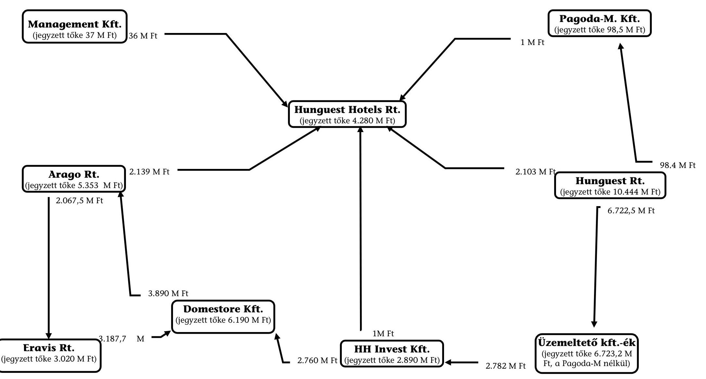

# JELENTÉS 

## a Magyar Nemzeti Üdülési Alapítvány vagyongazdálkodásának ellenőrzéséről

---

# Az ellenőrzés végrehajtásáért felelős: 

## IV. Vagyonellenőrzési Igazgatóság Halász Géza   számvevő igazgató

## Az ellenőrzést vezette: Balázs Andrásné

számvevő főtanácsos

## Az ellenőrzésben részt vettek:

dr. Lengyel Attila számvevő
Sas Imréné számvevő tanácsos
Solymár Ágnes számvevő
Nyíregyházi Éva külső munkatárs
Réthelyi Jenő külső munkatárs

Az ÁSZ által eddig ellenőrzött, illetve 2001-ben ellenőrzésre kerülő
közalapítványok, alapítványok listája:
Nemzeti Gyermek és Ifjúsági (Köz)alapítvány (1992, 1996, 2000)
Magyar Vállalkozásfejlesztési Alapítvány (1994, 1996)
Az alapítványoknak juttatott állami pénzek témaellenőrzése 388 alapítványnál (1996)
Grassalkovich Kastély Közalapítvány (1996)
Magyarországi Nemzeti és Etnikai Kisebbségekért Közalapítvány (1996, 1997)
A Településekért, Régiókért Közalapítvány (1996)
1956-os Forradalom Történetének Dokumentációs és Kutatóintézete Közalapítvány (1996)
Hadigondozottak Közalapítvány (1996)
Hungária Televízió Közalapítvány (1996)
Borsod-Abaúj-Zemplén Megyei Fejlesztési Közalapítvány (1996)
Szabolcs-Szatmár-Bereg Megyei Fejlesztési Közalapítvány (1996)
Illyés Közalapítvány (1996)
Pro Professione Alapítvány (1996)
Magyar Alkotóművészeti Közalapítvány (1996)
Magyar Rádió Közalapítvány (1997, 1998)
Magyar Televízió Közalapítvány (1997, 1998)
Gandhi Közalapítvány (1997)
Magyarországi Cigányokért Közalapítvány (1997)
Nemzetközi Pető András Közalapítvány (1998)
Magyar Nemzeti Üdülési Alapítvány (1999, 2000)
Sportcélú közalapítványok (négy közalapítvány, 1999)
Közoktatási Modernizációs Közalapítvány (2000)
A Fogyatékos Gyermekek, Tanulók Felzárkóztatásáért Országos Közalapítvány (1999)
Országos Foglalkoztatási Közalapítvány (2000-2001)
Új Kézfogás Közalapítvány (2001)

---

# TARTALOMJEGYZÉK 

I. ÖSSZEGZŐ MEGÁLLAPÍTÁSOK, KÖVETKEZTETÉSEK, JAVASLATOK ..... 5
II. RÉSZLETES MEGÁLLAPÍTÁSOK ..... 17

1. Az alapítványnak átadott célvagyon ..... 17
1.1. Az induló vagyon átadás-átvétele, tulajdonjogi rendezése ..... 17
1.2. Az induló vagyon minősítése ..... 18
1.3. A vagyonkezelési stratégia ..... 19
1.3.1. A vagyonkezelés szervezetrendszere ..... 19
1.3.2. A MNÜA vagyonkezelési stratégiája ..... 19
2. Az alapítványi vagyon feletti rendelkezési jog megosztása ..... 22
2.1. A MNÜA és a Hunguest Rt 1993. évi megállapodása az üdülő- ingatlanok ingyenes használatáról ..... 22
2.1.1. A Hunguest Rt és az üdülőket üzemeltető kft-k megállapodásai az üdülő-ingatlanok használatáról ..... 25
2.2. Az Eravis-csoporttal kötött szindikátusi szerződés ..... 26
2.3. A Hunguest Hotels Rt-vel kötött vagyonkezelési szerződés ..... 30
2.3.1. A vagyonkezelési szerződés megkötésének előzményei, kezdeményezője és célja ..... 30
2.3.2. A tulajdonosi jogok gyakorlásának átruházása ..... 31
2.3.3. A vagyonkezelési szerződés tartalma ..... 32
2.3.4. A vagyonkezelési szerződés eddigi végrehajtása ..... 36
3. A MNÜA ingatlan- és egyéb vagyonának alakulása ..... 40
3.1. A MNÜA ingatlanvagyonának apportálása ..... 42
3.1.1. Apportálás és tőkeemelés a Hunguest Rt-be 1995-ben ..... 42
3.1.2. Apportálás és tőkeemelés az üdülőket üzemeltető kft-kben 1998- ban ..... 43
3.2. Térítés nélküli vagyonátadások a Hunguest Rt javára ..... 44
3.3. Az ingatlanvagyon értékesítésének folyamata, az értékesítés bevételei ..... 47
3.4. Az üdülési (kooperációs) jog megváltása ..... 53
3.4.1. A megállapodások előkészítése és jóváhagyása, az általánosan alkalmazott elvektől eltérő kifizetések ..... 57
3.5. A MNÜA egyéb vagyonelemeinek változása ..... 61
3.6. A Hunguest-csoport beruházásai révén bekövetkezett vagyon- gyarapodás ..... 63
3.6.1. A Hunguest Rt által végzett üdülési célú beruházások ..... 64
3.6.2. A Hunguest Hotels Rt-vel kötött vagyonkezelési szerződés kereté- ben végzett üdülési célú beruházások ..... 66
3.6.3. A Hunguest Rt által végzett saját célú beruházások ..... 68
4. A Hunguest Hotels Rt-be bevont külső befektetők ..... 71

---

4.1. A Hunguest Hotels Rt létrehozása, tőke- és tulajdonosi szerkezetének kialakulása ..... 71
4.1.1. Tőkeemelés 1996. augusztus 2-án ..... 72
4.1.2. Tőkeemelés 1996. decemberében, a külső befektetőkkel kötött szindikátusi szerződés alapján ..... 73
4.1.3. Tőkeemelések az 1997-1998. években ..... 75
4.1.4. A zártkörű kötvénykibocsátás ..... 77
4.1.5. A Hunguest Management Tőkebefektetési Kft létrehozása és tu- lajdonrész szerzése a Hunguest Hotels Rt-ben ..... 81
4.2. Az üdülő-szállodákat üzemeltető kft-k tőke- és tulajdonosi szerkezeté- nek változásai ..... 83
4.2.1. Az üzemeltető kft-k által szerzett részesedések hatása a Hunguest Hotels Rt tulajdonosi szerkezetére ..... 84
4.3. A Hotel Rózsadomb gazdasági társasággá alakítása, a Globex Holding Rt külső befektetőként történt bevonásának pénzügyi következményei ..... 87
4.4. A Hunguest Rt többségi tulajdonaként alapított gazdasági társaságok- ból származó hozam, illetve vagyonvesztés ..... 89
4.4.1. A Hunguest Portfolió Kezelő és Hasznosító Rt ..... 89
4.4.2. Hunguest Travel Rt ..... 90
4.4.3. Az üdültetési rendszerhez közvetlenül nem kapcsolódó befekteté- sek ..... 91
4.4.3.1. Ballantines Club Kft ..... 91
4.4.3.2. Hunguest Barrington Hotels Rt (HBH Rt) ..... 91
4.4.3.3. Hunguest Resorts S.A. ..... 92
5. A Hunguest Rt gazdálkodása ..... 92
5.1. A Hunguest Rt bevételeinek és ráfordításainak alakulása ..... 94
5.2. A Hunguest Rt által jelzáloggal felvett hitelek ..... 97
5.3. A Hunguest Rt tulajdonában lévő üzemeltető kft-k ..... 98
6. A vagyongazdálkodás és a vagyonkezelés hatása az üdültetésre ..... 99

---

# Állami Számvevőszék 

V-2-168/2000.
Témasorszám: 35

## JELENTÉS   a Magyar Nemzeti Üdülési Alapítvány vagyongazdálkodásának ellenőrzéséről

A MNÜA-t a Magyar Köztársaság Kormánya, az Értelmiségi Szakszervezetek Tömörülése, a Munkástanácsok Országos Szövetsége, az Autonóm Szakszervezetek Országos Koordinációja, a Független Szakszervezetek Demokratikus Ligája, a Magyar Szakszervezetek Országos Szövetsége, a Szakszervezetek Együttműködési Fóruma és a Vagyont Ideiglenesen Kezelő Szervezet alapította. Az 1992. január 28-án kelt alapító okiratot a Fővárosi Bíróság az 1992. augusztus 6-án kelt 6.Pk. 69316/1. sz. végzésével 3309. sorszám alatt vette nyilvántartásba. A MNÜA-t a Fővárosi Bíróság a 14.Pk.69.316/27-I. számú végzésével 1999. február 25-től közhasznú szervezetként nyilvántartásba vette. A MNÜA alapítványi célja, hogy a vagyonából az üdülési és gyógy-szanatóriumi ellátást kedvezményekkel elősegítse. Az alapítók induló vagyonként ingatlanokat – köztük nagy értékű üdülőingatlanokat – adtak a MNÜA tulajdonába. Az átvett eszközök nyilvántartási értéke 5.135 M Ft , ezen belül az ingatlanok nyilvántartási értéke 4.019 M Ft volt. A MNÜA-nak átadott üdülővagyon az állami vagyon olyan sajátos privatizációját jelentette, amelyből a központi költségvetésnek nem származott bevétele, sőt a kuratórium a vagyon működtetése, tehermentesítése érdekében is felhasználhatta a kapott központi költségvetési támogatást. A MNÜA számára az Országgyűlés a központi költségvetésből 1992-2000. között összesen mintegy 6 Mrd Ft támogatást adott.

A MNÜA-t az Állami Számvevőszék jelen vizsgálatot megelőzően már két alkalommal ellenőrizte. Az 1995. évben az 1992-1994. között kapott támogatás és vagyon hasznosítására vonatkozóan adatlapok kitöltésével számoltatta be, 1998-ban pedig a helyszínen ellenőrizte az 1992. évi megalapítástól az 1998. június 30-ig tartó időszak alatt kapott állami eszközök felhasználását és működtetését. Az erről szóló jelentést 1999. márciusában hoztuk nyilvánosságra. A korábbi személyi összetételű kuratórium megakadályozta a vagyonra vonatkozó ellenőrzési program teljesítését, így a MNÜA önfinanszírozási képességének helyzetét, a központi költségvetési támogatás teljes vagy részleges kiváltásának realitását az Állami Számvevőszék e korábbi jelentésben nem tudta értékelni. A MNÜA kuratóriumának változása lehetővé tette az alapításkor juttatott vagyon és a vagyonkezelés vizsgálatát, így a jelenlegi ellenőrzés a MNÜA-nál 1998-ban végzett ellenőrzés folytatása volt. 1998-ban ellenőriztük a gazdálkodás és a könyvvezetés szabályosságát is. Az ellenőrzött időszakban a MNÜA az akkor hatályos jogszabályokkal összhangban – egyszeres könyvvitelt vezetett és egyszerűsített mérleget készített. Az egyszerűsített éves mérlegek egyik évben sem feleltek meg maradéktalanul a számviteli törvényben előírt számviteli elveknek, a feltárt hiányosságok a mérleg-főösszeg mintegy 1%-ára terjedtek ki. A közhasznú szervezetként történő nyilvántartásba vétel törvényes feltételeinek megteremtése érdekében az alapítók 1999-ben módosították az alapító okiratot, így a MNÜA éves beszámolóját 1999-től kezdődően okleveles könyvvizsgáló hitelesíti, melyet az alapítók által felkért felügyelő bizottság véleményez. A MNÜA 1999. január 1-től kettős könyvvitelt vezet.

---

A rendőrség a Hunguest Rt. egyes ingatlanainak értékesítésével kapcsolatosan 2000. évben indított eljárása érdekében tájékoztatást kért a számvevőszéki ellenőrzésről, így a vizsgálati-, valamint a végleges összefoglaló jelentést – melyek tartalmazzák a véletlenszerű mintavétellel kiválasztott ingatlanok értékesítésével kapcsolatos megállapításainkat – megküldtük számukra.

Az ÁSZ az 1989. évi XXXVIII. tv. 2. §-ának (5) bekezdése alapján ellenőrzi az alapítványoknak a központi költségvetésből juttatott támogatás felhasználását, illetve a közhasznú szervezetekről szóló 1997. évi CLVI. törvény 21. § alapján a közhasznú szervezeteknél a költségvetési támogatás felhasználását. A MNÜA vagyonát közvetlenül, illetve közvetve a 100%-os vagy résztulajdonában lévő gazdasági társaságok kezelik, hasznosítják, illetve használják fel, így a MNÜA-nak juttatott alapítványi célvagyon felhasználásának és működtetésének ellenőrzéséhez az 1989. évi XXXVIII. törvény 21. § (3) bekezdése alapján ezen gazdasági társaságok kapcsolódó ellenőrzése is szükséges volt. Az ellenőrzés során az egyes megállapítások kiegészítése érdekében adatokat és dokumentumokat kértünk – többek között – a Hunguest Hotels Rt-től is, részben az rt tulajdonos-tagján, a Hunguest Rt-n keresztül, részben közvetlenül a Hunguest Hotels Rt-től.

Az ellenőrzés célja az volt, hogy törvényességi, célszerűségi szempontból ellenőrizze a MNÜA-nak az alapításkor átadott eszközök működtetését, hasznosítását, az átadott vagyon hozamának, illetve az értékesített vagyon eladási árának hozzájárulását a kedvezményes üdültetés támogatásához, a központi költségvetési támogatás kiváltásához. A jelen ellenőrzésnek nem volt tárgya a MNÜA gazdálkodása és könyvvezetése szabályosságának ellenőrzése. A MNÜA 1999. évi éves beszámolóját okleveles könyvvizsgáló auditálta.

Az ellenőrzött időszak a MNÜA vagyonára vonatkozóan az 1992. évi megalapítástól 2000. június 30-ig terjedt, de egyes folyamatok várható hatását a 2000. év végéig elemeztük. Az ellenőrzés keretében értékeltük:

- az alapítványi célra átadott – állami tulajdonból származó – célvagyon alakulását, a vagyonszerkezet átalakítását az alapítványi céloknak megfelelő összetétel és a jövedelemtermelő képesség növelése érdekében, a vagyonvesztés folyamatát és okait;
- a MNÜA vagyongazdálkodására vonatkozó szabályozottságot, az alapítványi vagyon kezelésére tett tulajdonosi döntések törvényességét, megalapozottságát, célszerűségét, illetve ezek végrehajtásának ellenőrzését, a kuratórium, mint tulajdonos képviseletét a gazdasági társaságok igazgatóságában és felügyelő bizottságában;
- a MNÜA gazdasági társaságainál a tulajdonosi döntések érvényesítését a tartós használatba, illetve tulajdonba adott vagyont illetően;
- a kuratórium és a vagyont kezelő társaságok intézkedéseinek eredményességét a kedvezményes üdültetés jobb tárgyi feltételeit szolgáló beruházásokhoz és felújításokhoz szükséges források megteremtése érdekében.

---

# I. ÖSSZEGZŐ MEGÁLLAPÍTÁSOK, KÖVETKEZTETÉSEK, JAVASLATOK 

Az 1992. évi alapításkor a MNÜA céljainak megvalósításához adott induló vagyon összegét az alapítók az alapító okiratban nem rögzítették, a lista szerint átadott ingatlanok forgalmi értékbecslését nem készíttették el. A jogelőd ÜSZF számviteli nyilvántartásai szerint 1992. szeptember 30-án az átadott ingatlanok nyilvántartási értéke 4 Mrd Ft volt. Az alapítást követő években folyamatosan készültek az ingatlanokról értékbecslések, melyek azt mutatták, hogy az induló vagyonként kapott ingatlanvagyon tényleges értéke a 4 Mrd Ft nyilvántartási értékkel szemben megközelíthette a 12 Mrd Ft-ot, jóllehet az értékbecsléseket készítő szakértők szerint az ingatlanok erősen leromlott állapotban voltak.

Az induló vagyon 4 Mrd Ft-ban történő nyilvántartása lehetőséget teremtett arra, hogy – mérlegben kimutatandó vagyoncsökkenés nélkül – az ingatlanok egy részének értékesítésével biztosítani lehessen a szükséges rekonstrukciókat, továbbá fedezet képződhessen az alapítványi célként meghatározott üdülési támogatásra, amelyhez az eredeti elképzelések szerint az állam csak átmenetileg nyújtott volna költségvetési támogatást. Jelenleg a MNÜA-nak már csak 42 M Ft értékű, az induló érték 1%-át kitevő ingatlan van a tulajdonában. Az üdülési célra nem használt ingatlanokat a kuratórium részben tőketartalékként (1993), részben apportként (1995) értékesítésre átadta a vagyonkezelési céllal létrehozott Hunguest Rt-nek, kisebb részben saját tulajdonként értékesítette. Az értékesítésből befolyt mintegy 5,2 Mrd Ft nagyobb részét a megmaradt üdülők üzemeltetésére fordították, illetve felélték.

1993-1998. között a Hunguest Rt a MNÜA engedélyével az üdülőingatlanokat térítésmentesen használta és hasznosította.
 az általa alapított szállodaüzemeltető Kft-ken keresztül.

A kuratórium az ellenőrzött időszakban az alapító okiratot, illetve saját korábbi határozatát megszegve, két esetben nem érvényesítette a határozathozatal során az előírt minősített többséget, emiatt érvénytelen határozattal hosszabbította meg a Hunguest Rt-nek átadott ingatlanok használatának időtartamát 20 évre (1994), illetve apportálta ingatlanjait az üzemeltető Kft-kbe (1998). A belső szabályokat sértő határozatok alapján elindított gazdasági folyamatok már nem fordíthatók vissza (az üdülőingatlanokat a kuratórium apportálta az üzemeltető Kft-kbe, majd az így keletkezett üzletrészek egy részét a vagyoncsere során a Hunguest Rt a Hunguest Hotels Rt-nek értékesítette) vagy már nincs aktualitásuk (1998-ban a MNÜA-nak az apportálás után nem maradt üdülőingatlan a tulajdonában, így a Hunguest Rt ingyenes használatába való átengedésről szóló megállapodás okafogyottá vált). Az érvénytelen határozatok ugyanakkor a döntések előkészítőivel és végrehajtóival szemben kártérítés alapját képezhetik.

---

A MNÜA az üdülőingatlanokat 1998 februárjában az üzemeltető Kft-kbe apportálta, az így szerzett Kft üzletrészeket pedig a Hunguest Rt-be. E folyamat következményeként a MNÜA ma már közvetlenül nem tulajdonosa az alapítványi célra kapott ingatlanvagyonnak, az 1999. évi mérleg szerinti 9,6 Mrd Ft vagyonát (saját tőkéjét) csaknem teljes egészében a Hunguest Rt részvényei képezik.

Az MNÜA ingatlanvagyona a becsült forgalmi értéken számolt induló vagyonhoz képest csökkent, miközben a nyilvántartási érték - az ingatlanok könyv szerinti és tényleges értékének eltérése következtében - növekedett. A vagyonvesztés 3 Mrd Ft-ra tehető, mely túlnyomóan - mintegy 2,8 Mrd Ft értékben - a Hunguest Rt-nél következett be. A vagyonvesztést az árbevétellel nem fedezett működési kiadások, a felújításokhoz és a likviditás fenntartásához felvett hitelek kamatai, a befektetéseken elszenvedett veszteségek, valamint a szervezet működtetési kiadásai (pl. az irodaház magas rezsiköltsége, a reklám- és szponzorálási ráfordítások, a vezető beosztású dolgozók magas jövedelme, a nagy összegben kifizetett szakértői díjak stb.) okozták.

A vagyonvesztéssel kapcsolatos megállapítások alapját a számvitelben nyilvántartott értékek képezték. A vagyonérték, illetve a piaci (realizálási) érték magasabb a nyilvántartási értéknél. A Hunguest Rt „piaci érték"-ét egy független szakértő 1998 végén 13,1-14,3 Mrd Ft közé tette. Az 1998. évi mérleg szerint a saját tőke összege 10,6 Mrd Ft volt, amihez képest a „piaci érték" közel 3 Mrd Ft vagyonérték növekedést jelentene, de a növekedés nem realizálható, mert a vagyon értékesíthetősége - az üzemeltető Kft-k feletti tulajdonosi jogok jelentős részének átadása miatt - korlátozott. A szállodák hozamtermelő képessége alacsony. Ezek a tényezők összességében negatívan hatnak a piaci értékre.
Az Állami Számvevőszék korábbi jelentése már tartalmazta a vagyont terhelő ún. kooperációs kötelezettségek alakulását, 1998-tól az erre a célra fordított állami támogatások felhasználását. Az 1970-1991. évek között az ÜSZF és a beruházást/felújítást biztosító szervezetek ún. kooperációs szerződésekben állapodtak meg arról, hogy a pénzeszközt átadó szervezetek (pl. szakszervezetek, költségvetési intézmények, vállalatok, bankok) fedezetet nyújtanak egyes üdülők beruházásához, felújításához, ennek fejében természetbeni szolgáltatásként meghatározott számban férőhely-töltési jogot szereznek. E szerződések nem tartalmaztak az ÜSZF terhére visszafizetési kötelezettséget. A szerződésekből fakadó jogok és kötelezettségek az ÜSZF általános jogutódjára, a MNÜA-ra szálltak. A kooperációs jogok további teljesítésére az alapítók az alapító okiratban kötelezettséget vállaltak. E jogok pénzbeni megváltásáról, illetve ennek lehetőségéről az alapító okirat nem rendelkezett. Az érintettek, a kuratórium és a Hunguest Rt - gyakorlatilag a MNÜA megalapításától kezdve - szorgalmazta a kooperációs kötelezettség megváltását. A Hunguest Rt, illetve a kuratórium 1993-1998. között - készpénzzel, ingatlancserével - csaknem minden kooperációs kötelezettséget kártalanítással rendezett. A mérték meghatározására a Hunguest Rt számítási módszert dolgozott ki. A kártalanításra fordított közel 1,2 Mrd Ft-ból mintegy 0,5 Mrd Ft-nak a forrása az 1998. évi központi költségvetési támogatás volt, a Hunguest Rt bevételéből 0,7 Mrd Ft-ot használtak fel.

A kuratórium anélkül döntött a kooperációs kötelezettségek megváltásáról, hogy érdemben megvizsgálta volna azt, hogy az új üdü-

---

# lési rendszerben milyen kedvezményekkel lehet a férőhely-töltéshez kapcsolódó jogokat továbbra is kielégíteni. 

A kooperációs kötelezettségek megszüntetésére felhasznált központi költségvetési támogatás csökkentette a szociálisan rászorulók számára adható forrásokat, hozzájárult viszont - a töltési joggal lekötött férőhelyek megszűnése, ezáltal a kereskedelmi értékesítésre felhasználható férőhelyek számának növekedése miatt - az alaptevékenységből származó árbevétel és nyereség növeléséhez, mely az üdülőingatlanok üzemeltetői számára járt előnyökkel. A kedvezményes áron történő kooperációs üdültetési kötelezettségek - mint hosszú távú kötelezettségek - megszűnése miatt az üzemeltető Kft-k vagyonának piaci értéke növekedett, ezáltal nőtt a Kft-k közvetlen vagy közvetett tulajdonosai (a MNÚA, a Hunguest Rt, Hunguest Hotels Rt és külső tulajdonos-tagjai) vagyonának piaci értéke is.

Az átlagostól eltérő, kiugróan magas kártalanítást kapott a férőhely töltési jog megváltásáért a KASZ (mintegy kétszeresét) és a BDSZSZ (mintegy 12-15szörösét).

A kuratórium személyi összetétele és elnöke az eltelt 8 év alatt többször változott, s a személyi összetételben bekövetkezett gyakori módosulások önmagukban is nehezítették az átgondolt, folyamatos gazdálkodói döntések meghozását, az ezekhez kapcsolódó felelősség érvényesítését. A kuratórium tagjai 1999 végéig - más területen végzett főfoglalkozású munkájuk mellett - tiszteletdíj nélkül látták el vagyonkezelői feladataikat.

A kuratórium az átadott vagyont illetően nem bizonyult jó tulajdonosnak. A vagyonát érintő döntésekben nem tudta az általa alapított gazdasági társaságokkal szemben az alapítvány, mint tulajdonos érdekeit képviselni és megvédeni, miközben - a korábbi számvevőszéki ellenőrzés megállapításai szerint - az üdülési támogatások szociálpolitikai szempontok szerinti differenciált odaítélését megfelelően végezte.

A kuratórium az ingatlanvagyon kezelésére vagyonkezelő társaságot (Hunguest Rt) hozott létre úgy, hogy nem alakított ki következetes és számonkérhető vagyongazdálkodási szabályokat, nem ellenőrizte érdemben az Rt-nek átadott vagyon alakulását. Ennek következményeként a Hunguest Rt a stratégiai döntések egy részét a kuratórium megkerülésével vagy utólagos tájékoztatásával hozta (pl. a Hunguest Hotels Rt megalakítása, illetve ebben a többségi részesedés átengedése, szindikátusi szerződés megkötése a külső befektetőkkel). Az Rt érdekei előtérbe kerültek a MNÚA érdekeivel, az alapító okiratban meghatározott célokkal szemben. A Hunguest Rt igazgatóságának, illetve vezetőinek az információk megfelelő csoportosításával sikerült elérniük, hogy javaslataikat a kuratórium szinte mindig változtatás nélkül elfogadta.

A kuratórium a vagyonhoz kapcsolódó ellenőrzési jogával elsősorban közvetetten - tagjai egy részének a gazdasági társaságok igazgatóságaiba és felügyelő bizottságaiba delegálásán keresztül - élt. E módszer azonban - összességében eredménytelennek bizonyult.

---

Az 1999-től működő - új személyi összetételű - kuratórium a korábbi évek hibás döntéseinek áthúzódó hatása megoldására számos döntést hozott (pl. a szociálisan rászorulók csekkes üdültetésének támogatása, a tulajdonában lévő társaságok működésében, a pénzügyi fedezetlenségi, likviditási, gazdálkodási problémák megoldása). A kuratórium kiegyensúlyozott működését az adott körülmények között azonban a küldő szervezetek eltérő érdekeinek képviseletéből származó személyi ellentétek és szervezési zavarok hátráltatták, ez a oka annak, hogy eddig nem sikerülhetett konszenzuson alapuló, az alapítvány hosszú távú érdekeit szolgáló döntéseket hozni.

A Hunguest Rt és az üzemeltető Kft-k az alapítványi célvagyon működtetése révén elért bevételeikből az 1993-2000. között eltelt nyolc év alatt mindössze 150 M Ft-tal járultak hozzá a szociális üdültetés támogatásához (1996-ban, 1998-ban), míg ugyanezen időszak alatt a MNÚA számára a központi költségvetés 6 Mrd Ft-ot meghaladó támogatást adott.

A Hunguest Rt megszervezte az üdültetést, lebonyolította az üdülési célú támogatások felhasználásának szervezési feladatait, létrehozta és irányította az üdülőket üzemeltető társaságokat. A MNÚA fő alapítványi céljának - a kedvezményes üdültetés támogatásának - rovására előtérbe helyezte a szállodák felújítását, az Rt működtetését.

A Hunguest Rt presztízsjellegű beruházásokkal (pl. Orbánhegyi úti irodaház) és kiadásokkal terhelte forrásait (pl. belföldi használatra repülőgépet béreltek 34 hónapra, más szállodaipari társaságok költségarányainak többszörösét tették ki a reklám- és marketing költségek stb.). Megalakulása óta a Hunguest Rt-nél az értékesítés nettó árbevétele 2,9 Mrd Ft-ot, működési költségei és egyéb ráfordításai 4 Mrd Ft-ot tettek ki, így az Rt 1,1 Mrd Ft-tal többet költött saját működésére, mint amekkora összegű működési bevételt realizált.

A Hunguest Rt igazgatósága egy független szakértő cég 1999. évi átvilágítását követően új személyi összetételben kezdte meg a feltárt hiányosságok felszámolását, a korábbi vagyoni állapot visszaállítását, megerősítette a kontrolling funkciót, és - súlyos likviditási gondok mellett - fenntartotta az Rt működőképességét. A vagyonkezelési szerződés következtében, illetve a veszteséges társaságok felszámolását követően az Rt tevékenységi köre jórészt kiürült, illetve kiürül. A ténylegesen ellátott feladatokkal az Rt szervezete és létszáma nincs összhangban.

A MNÚA üdülővagyonának alakulására, a vagyont megtestesítő részesedései feletti rendelkezési jog korlátozására, ezáltal az üdülővagyon működtetéséből származó hozamról való kényszerű lemondásra három szerződésnek volt döntő hatása:

Az első ilyen lépés - a kuratórium és a Hunguest Rt között 1993. évben kötött, az üdülőingatlanok ingyenes használatáról szóló feltételek, biztosítékok és konkrétan meghatározott befizetési kötelezettség nélküli megállapodás, majd e megállapodás 1994. évi módosítása - következményeként lehetetlenné vált a MNÚA önfinanszírozása, miközben a Hunguest Rt az elvégzett felújítások mellett jórészt saját működtetési céljára élte fel az ingatlanok értékesítéséből és hasznosításából (haszonbérleti-, és vagyonkezelési

---

díjból) származó bevételeket. E megállapodással a MNÚA átadta a Hunguest Rt-nek a MNÚA üdülővagyona feletti használati, hasznosítási és tulajdonosi jogok gyakorlását (ez utóbbit az elidegenítésre és megterhelésre vonatkozó korlátozással).

A megállapodás alkalmatlannak bizonyult arra, hogy a kuratórium a vagyona hozamából az alapítványi célok teljesítéséhez folyamatos és rendszeres bevételhez jusson. A megállapodás nem ösztönözte a Hunguest Rt-t az eredményes gazdálkodásra, mivel nem tartalmazott előírásokat és garanciákat a vagyon használatára. A megállapodásnak nem két együttműködő partner kölcsönös jóhiszeműségén, hanem a tulajdonos és a tulajdonos által megbízott ügyvezető-vagyonkezelő alá-fölérendeltségén kellett volna alapulnia. A megállapodást annak ellenére sem módosította a kuratórium, hogy 1996. decemberétől a Hunguest Rt szállodaingatlanokkal kapcsolatos feladatai lényegesen megváltoztak, mivel a Hunguest Hotels Rt által fizetett haszonbérleti díjjal (1997-98), illetve vagyonkezelési díjjal (1998. óta) szemben már nem merültek fel költségek. A MNÚA elmaradt haszna e jogcímeken - figyelembe véve ezen időszak alatt a MNÚA-nak alapítványi célra átadott 150 M Ft támogatást - mintegy 0,8 Mrd Ft.

A MNÚA ingatlanvagyonának részesedésekké konvertálása következtében a megállapodás elvesztette aktualitását.

A második meghatározó fontosságú szerződést megelőzően a Hunguest Rt 1996 augusztusában apportálta az általa alapított üzemeltető Kft-ket az ugyancsak általa alapított Hunguest Hotels Rt-be. Sem a Hunguest Rt, sem az üzemeltető Kft-k értékben nem tartották nyilván a szállodák ingyenes használati jogát, mint vagyoni értékű jogot, emiatt a társaságok vagyona alulértékelt volt. A Hunguest Rt által 1996. decemberében kötött szindikátusi szerződés következményeként - a pótlólagos tőkebevonás érdekében külső befektetők kapcsolódtak az alapítványi célvagyon működtetésébe.

A szállodák szakszerű, versenyképes működtetése, a szükséges felújítások lebonyolítása érdekében indokolt volt a külső, szakmai befektető(k) bevonása. E célnak az Eravis Rt megfelelt, mivel a hazai szállodaiparban tapasztalatokkal és piaci kapcsolatokkal rendelkező szakmai befektető volt. A Hunguest Hotels Rt tájékoztatása szerint a
 szakszerű vezetés és irányítás hatására – erre a számvevőszéki ellenőrzés nem terjedt ki – a szállodák szállodaláncként versenyképesen működnek (lásd Függelék).

A külső befektetők tulajdonrészüket – tőkeemeléssel és részvényátruházással az alulértékelt vagyonra vonatkozóan – szerezték meg.

Az 1996–1998. évek között a Hunguest Hotels Rt az Eravis-konzorcium tagjaitól a készpénzes tőkeemelésekből és a zártkörű kötvények lejegyzéséből összességében 2.596 M Ft pénzeszközhöz jutott, e bevétel 88,5%-ának (2.297 M Ft) – ezen belül az 1.450 M Ft készpénzes tőkeemelésből származó bevétel 80%-ának (1.160 M Ft) – megfelelő összeget részesedések vásárlásával visszaforgattak a konzorcium tagjaihoz, miközben a tőkeemelések során a Hunguest Hotels Rt. jegyzett tőkéjében a

---

# konzorcium tagjainak 50%-os tulajdonosi aránya 1998 végéig 

megmaradt, majd 1999 végére 52,31%-ra nőtt.

A kötvénykibocsátás miatt a Hunguest Hotels Rt-nél 2000. december 31-ig a várható kamatkiadások – az előzetes számításaink szerint – mintegy 1 Mrd Ft-tal haladják meg a realizált hozamot.

A külső befektetők bevonásának hatására a Hunguest Rt a korábban 100%-os tulajdonában lévő Hunguest Hotels Rt részvényeinek 48,26%-át – jelenlegi tulajdonrész 49,14% – tartotta meg. Az 1,74%-os arányú – jelenlegi tulajdonrész 0,84% – részvénycsomagot árengedménnyel megvásárló Hunguest Management Tőkebefektetési Kft a „mérleg nyelvének” szerepét kapta. Meghatározó szerephez jutott a kft 51%-os üzletrészét birtokló nyolc magánszemély. Közöttük 4 főnek már 1996-ban sem volt, jelenleg pedig már egyikőjüknek sincs munkajogi vagy tisztségviselői kapcsolata a Hunguest Rt-vel.

A kisebbségi tulajdonlásból származó hátrányt a szindikátusi szerződés ún. „aranyrészvény”-nyel kívánta ellensúlyozni. Az ehhez fűződő szavazatelsőbbségi jog (érvényesen nem hozható határozat olyan kérdésben, mely a támogatott üdültetést, illetve összességében az alapítványi célok megvalósítását érinti) általános megfogalmazása miatt az „aranyrészvény” csak szerény mértékben volt alkalmas arra, hogy a Hunguest Rt érdemi befolyást gyakoroljon konkrét ügyekben. Az ellenőrzött időszakban nem is élt e joggal a Hunguest Rt. A szavazatelsőbbségi jog fentiek szerint definiált tartalma az 1998. január 1-től bevezetett üdülési csekkek miatt értelmét vesztette, mivel a kedvezményes szociális üdültetés – mint a MNÚA célja – már nem csak a Hunguest Hotels Rt üdülőingatlanai használatával valósulhat meg, üdülési célra a csekket elfogadó valamennyi szállodát igénybe lehet venni.

A szindikátusi szerződés korlátozta az üdülőingatlanok felett a MNÚA és a Hunguest Rt rendelkezési jogát. A Hunguest Rt. szavatolta, hogy – a MNÚA-val kötött megállapodása alapján – a Hunguest Hotels Rt-t a haszonbérlet keretében 16 éven keresztül (2013. március 26-ig) megilletik a szállodák használatának és üzemeltetésének jogai. E jogok gyakorlásának csorbítása esetén a Hunguest Rt nagy összegű kártérítést vállalt kompenzációként (azonos értékű vagy azonos használati jogú szálloda biztosítása vagy a szálloda forgalmi értékének pénzügyi megváltása). Öt szállodaingatlan – értékesítés miatti – használati jogának megszüntetése miatt a MNÚA 94,2 M Ft kártérítést fizetett a Hunguest Hotels Rt-nek. A 16 éves használati és üzemeltetési joggal terhelt ingatlanok miatt a Hunguest Rt részvénycsomagjának forgalomképessége korlátozottá vált. A szállodák használatáért, üzemeltetéséért a Hunguest Rt haszonbérleti díjat kapott. A Hunguest Rt beleegyezett abba, hogy 2002-ig (5 évig) az üzemeltető kft-k működési eredményét a Hunguest Hotels Rt tulajdonosai osztalékként nem vonják ki, hanem fejlesztésre fordítják. A MNÚA kuratóriumának tudta és beleegyezése nélkül – a Hunguest Rt akkori elnök-vezérigazgatója által kötött – szindikátusi szerződés következményeként a MNÚA vagyonának működtetése után 2002-ig nem részesült, illetve részesülhet bevételben.

---

A harmadik, a Hunguest Rt és a Hunguest Hotels Rt között 1998-ban kötött vagyonkezelési szerződésben foglalt cél az volt, hogy minél gyorsabban megtörténjen a szállodavagyon rekonstrukciós felújítása, ennek révén a hozamtermelő képességük növekedjen, megteremtődjön a MNÜA-nak a szociális üdültetés támogatásához szükséges önfinanszírozó képessége. A szerződést megelőzően a kuratórium az üzemeltető kft-kbe apportálta a szállodaingatlanokat annak érdekében, hogy a rekonstrukcióhoz szükséges hitelfelvételekhez megfelelő vagyoni fedezet álljon a kft-k rendelkezésére. A kuratórium az így szerzett kft üzletrészeket a Hunguest Rt-be apportálta, ezáltal a kft-k mindegyikében a Hunguest Rt többségi, a Hunguest Hotels Rt kisebbségi tulajdonossá vált. A „tiszta” tulajdonosi szerkezet kialakítása érdekében – üzletrészcserék révén – a kft-k fele 100%-os Hunguest Rt, másik fele 100%-os Hunguest Hotels Rt tulajdonba került úgy, hogy a Hunguest Hotels Rt-nek 2.481 M Ft fizetési kötelezettsége keletkezett. Eredetileg e kötelezettségét a Hunguest Hotels Rt beruházásokkal fizette volna meg, a szerződésben azonban már a készpénzes teljesítést vállalta, amely a Hunguest Rt tulajdonában lévő kft-k jegyzett tőkéjének készpénzes tőkeemelésében valósult meg. Az így szerzett üzletrészeket a Hunguest Hotels Rt átruházta a Hunguest Rt-re.

A vagyonkezelés a szerződés szerint 15 év időtartamra szól. Ez idő alatt meghatározott tulajdonosi jogokat a Hunguest Rt nevében a Hunguest Hotels Rt gyakorol. A szerződésben kft-nként, időbeli ütemezéssel meghatározták az elvégzendő beruházások I. ütemének összegét. A szerződés tartalma, szövegezése hiányos és pontatlan, mivel a Hunguest Hotels Rt által teljesítendő kompenzációs kötelezettséggel nem szavatoltatta a kft-k szabad forrásainak – ezen belül a készpénzes tőkeemelés – beruházási célra történő felhasználását, a 15 év múlva visszaadandó vagyon értékének megőrzését, nem írta elő a vagyonkezelés eredményeként elvárt vagyonnövekmény mértékét, mérését, műszaki állapotának jellemzőit, az ezektől való elmaradás miatt fizetendő kártérítést. Pontatlan az ingatlanok jelzáloggal való megterhelésének szabályozása, a hitelek visszafizetésével kapcsolatosan előírt kötelezettség. A szerződésben rögzített felmondási okok között nem szerepel a kft-k szabad forrásainak a szerződéstől eltérő célra való felhasználása.

A Hunguest Hotels Rt a vagyonkezelésre átadott kft-k készpénzes tőkeemelésből és egyéb forrásból származó pénzeszközeiből a vagyonkezelési szerződés rendelkezéseivel összhangban nem lévő módon az ellenőrzés befejezésig összesen 2.782 M Ft-ot külső kft-üzletrészek vásárlására fordított. A vagyonkezelésre átadott kft-k – HH Invest Kft – Domestore Kft Arago Rt – Hunguest Hotels Rt tulajdonláncolaton keresztül – áttételesen – a vagyonkezelésre átadott kft-k (ezáltal a Hunguest Rt) tulajdonában Hunguest Hotels Rt részvények is vannak, az érintett külső társaságok jegyzett tőkéinek arányában mintegy 16% mértékben. Ezzel a Hunguest Rt névleg visszanyerte többségi (65%) tulajdonát a Hunguest Hotels Rt-ben, de nem tud élni vele, mert a vagyonkezelési szerződésben a kft-k tulajdonosi jogainak gyakorlását átadta a Hunguest Hotels Rt-nek.

A vagyonkezelésre átadott kft-k által megvásárolt részesedések forgalomképessége és ára teljes mértékben három (egymással rokoni kapcsolatban lévő) magánszemélytől függ, akik összesen 300 ezer Ft névértékű,

---

de többségi szavazati arányt képviselő üzletrészek tulajdonosai. A döntések meghozatalában – a tulajdonosi láncolaton keresztül – sem a Hunguest Hotels Rt, sem a Hunguest Rt, sem a kuratórium nem tudja eltérő érdekeit érvényesíteni. Az induló vagyonként a MNÜA-nak adott üdülővagyon jelenlegi tulajdonosi struktúrája következtében e vagyon értékének megőrzése, gyarapítása, a vagyon működtetéséből származó nyereség felosztása a MNÜA, mint tulajdonos rendelkezése alól kicsúszott.

Az adott körülmények között a Hunguest Hotels Rt mint vagyonkezelő saját érdekeit érvényesítette az rt és a vagyonkezelésre átadott kft-k között 3,7:96,3% arányú tulajdonban lévő HH Invest Kft üzleti döntéseinél (Cirrusz részvények értékesítése). A Hunguest Hotels Rt a HH Invest Kft-től megvásárolt részvényeket ugyanazon a napon 270 M Ft árfolyamnyereséggel értékesítette, a részvények ellenértékének megfizetésére pedig a kft-től közel egy éves fizetési határidőt kapott, melynek mintegy 35,5 M Ft volt a kamat-vonzata. A HH Invest Kft-nél ezen ügylet miatt az elmaradt haszon 305,5 M Ft-ra tehető.

Az alapítványi célok finanszírozásához, a szociálisan rászorulók kedvezményes üdültetéséhez szükséges anyagi források biztosításához az alapítványnak átadott vagyonból számottevő forrás középtávon nem várható, a jövőben is csak kiegészítő központi költségvetési támogatással tartható fenn a kedvezményes üdültetés, így meghiúsult az alapítvány létrehozásának 8 évvel ezelőtt megfogalmazott fő célja, hogy az alapítók által átadott vagyon működtetéséből származó jövedelem fedezze a szociális üdültetés támogatását. Az alapítvány létrehozására irányuló döntés irreális tényezőkkel modellezett piacgazdasági feltételekből indult ki, figyelmen kívül hagyta az eltérő, illetve ütköző érdekeket, ezt súlyosbította a döntés-előkészítés és a végrehajtás alacsony szintje, a tulajdonosi ellenőrzés gyengesége.

A kialakult helyzetben alapvető fontosságúak azok az intézkedések, amelyek a megmaradt vagyon megőrzését, a további vagyoncsökkenés határozott megállítását, a működtetésből származó jövedelem maximalizálását szolgálják a szociális üdültetés támogatása érdekében.

Az alapítvány fő céljának meghiúsulásáért felelősség terheli a közreműködő minisztériumok döntés-előkészítő apparátusait az alapítvány megalakulásának nem kellő előkészítéséért, a működés hiányos, megalapozatlan feltételeinek kialakításáért, továbbá az alapítvány működése során az állami érdekeknek, ezen belül a Kormány mint egyik alapító érdemi képviseletének elmaradásáért.

Különböző mértékben terheli a felelősség a MNÜA kuratóriumának, illetve a Hunguest Rt és a Hunguest Hotels Rt igazgatóságának korábbi tagjait, de alapvető felelőssége a Hunguest Rt korábbi elnök-vezérigazgatójának van. A Hunguest Rt-nél kialakult vezetési stílus és gyakorlat részeként az igazgatóság és a kuratórium elé csak a legszükségesebb, elkerülhetetlen kérdéseket terjesztették elő, megfosztva e testületek tagjait nélkülözhetetlen információktól, minimálisra korlátozva a testületi döntéseket. A vagyont érintő bonyolult jogi, pénzügyi, anyagi hatásukat illetően nagy horderejű döntések meghozatalában fenti testületeknek szükségszerűen a felkért szakértőkre, illetve az rt alkalmazottaira kellett támaszkodni, melynek során a döntést hozók a döntéseket előkészítő apparátusok kiszolgáltatottjaivá váltak. A jelentésben bemutatott kedvezőtlen folyamatok így a döntéseket előkészítő alkalmazottak és szakértők felelősségét is felvetik.

A Hunguest Rt és a Hunguest Hotels Rt jelenlegi vezetői kész helyzetet örököltek. A MNÚA induló ingatlanvagyonának tulajdonjoga 99%-ban, az üdülővagyon felének tulajdonjogával rendelkező és üzemeltető kft-k tulajdonjoga (mint részesedés) 50,86%-ban, az üdülővagyon másik felének tulajdonjogával rendelkező és üzemeltető kft-k feletti vagyonkezelői jog 15 évre a korábbi vezetők döntései következtében kikerült a MNÚA-tól, illetve a Hunguest Rt-től.

A korábbi ellenőrzés megállapításait megerősítve jelen ellenőrzés is alátámasztotta, hogy a túlnyomó többségben állami tulajdonban volt üdülővagyon alapítványi keretek közötti működtetése nem bizonyult célszerű döntésnek, az alapítványi vagyon vállalkozási jellegű működtetése nem járult hozzá az üdülés szociális célú támogatási lehetősége növeléséhez. Az üdülési csekk-rendszer 1998. évi bevezetésével a MNÚA tulajdonában lévő üdülők üdültetési monopóliuma megszűnt, ez felveti az alapítványi keretek közötti működtetés indokoltságának további fenntartását.

# Az ellenőrzés megállapításai alapján javasoljuk, hogy 

## a MNÚA alapítói

Tekintsék át és értékeljék az általuk delegált kurátorok közreműködését az alapítványi célok teljesítésében, az alapítványi célvagyon feletti rendelkezési jog gyakorlásában.

## a MNÚA kuratóriuma

1. Alakítson ki olyan munkamódszert, amely lehetővé teszi, hogy a kuratórium valódi tulajdonosként működjön. A határozatok felelős meghozatalához minden kurátor és a kuratórium is – mint testület – kapjon független szakértői segítséget azért, hogy kellő alapossággal megismerhesse a vagyont érintő jogi, pénzügyi döntések hátterét, részleteit, rövid- és hosszú távú hatásait.
2. Tekintse át a Hunguest Rt jelenlegi működtetését és az alapítói céloknak megfelelően módosítsa az rt alapító okiratát, illetve az
 rt igazgatóságával módosíttassa az rt szervezeti felépítését és létszámát, figyelemmel az rt megmaradó (az üzemeltető kft-kkel kapcsolatosan ténylegesen ellátott) feladataira, a már megszűnt vagy megszüntetésre tervezett társaságokra.
3. Alakítson ki az rt igazgatóságával - az új feladat- és létszámstruktúrához igazodóan - olyan takarékos költséggazdálkodást, amely az rt önfinanszírozó képessége megteremtése mellett lehetővé teszi, hogy az osztalék és a vagyonkezelési díj túlnyomó részét a kuratórium, mint tulajdonos elvonja és a

---

szociálisan rászorulók üdültetésének támogatására fordítsa. Az új feladat- és létszámstruktúrához igazodó, fenti elveknek megfelelő költségcsökkentést a Hunguest Rt igazgatósága a 2001. évi üzleti tervben terjessze a kuratórium elé.
4. Vizsgálja meg a Hunguest Rt-vel 1993-ban kötött, majd 1994. évben módosított, az üdülővagyon ingyenes használatára kötött megállapodás felmondásának lehetőségét, s amennyiben ennek megfelelő jogi feltételei fennállnak és a további vagyonvesztés kockázata ezzel csökkenthető, kezdeményezze a szükséges lépéseket. A Hunguest Rt-vel kapcsolatos tulajdonosi jogait az rt alapító okiratában, illetve egyedi alapítói határozatokban érvényesítse.
5. Vizsgálja meg kártérítési eljárás lehetőségét - a (régi) Gt. 32. § (1) bekezdése alapján - kötelezettségeik megszegése miatt a Hunguest Rt-nek okozott kárért, elsősorban a Hunguest Rt ügyvezetésének azon tagjaival szemben, akik döntésre előkészítették az alábbi szerződéseket, értékesítéseket, meghatalmazást:

- az Eravis konzorciummal 1996. december 17-én megkötött szindikátusi szerződés;
- a Hunguest Hotels Rt-ben az 50% alatti tulajdonrész kialakítása;
- a Hunguest Management Tőkebefektetési Kft 51%-át megtestesítő üzletrész névérték alatti értékesítése;
- az 1998. május 27-én megkötött fizetési megállapodással vegyes vagyonkezelési szerződés;
- a Hunguest Hotels Rt-nek a vagyonkezelésre átadott kft-k tulajdonosi jogainak gyakorlására adott általános meghatalmazás.

6. Vizsgálja meg annak lehetőségét, hogy a Ptk. 200-202. §, valamint 235-236. §-ainak áttekintésével kezdeményezhető-e az üdülési férőhely-töltési jogokért kifizetett - többi hasonló tárgyú szerződéshez képest aránytalanul magas összegű - kártalanítás különbözetének visszafizettetése.

# a MNÚA felügyelő bizottsága 

Értékelje rendszeresen azon igazgatósági és felügyelő bizottsági tagok tevékenységét, akiket a kuratórium delegált az egyes gazdasági társaságok igazgatóságaiba, felügyelő bizottságaiba, erről évente tájékoztassa az alapítókat és a kuratóriumot, az értékelésekre alapozva kezdeményezze a kuratóriumnál a megbízatás meghosszabbítását vagy visszavonását.

## a Hunguest Rt igazgatósága

1. Kezdeményezze a Hunguest Hotels Rt-vel az 1998. május 27-én aláírt fizetési megállapodással vegyes vagyonkezelési szerződés módosítását közös megegyezéssel. Megegyezés hiányában vizsgálja meg annak lehetőségét, hogy polgári peres eljárás indítható-e a kezelésre átadott vagyon megőrzésére és gyarapítására vonatkozó garanciák pontosítása, kiegészítése; a szerződés lejártakor visszaadandó vagyonon belül a jegyzett tőke/saját tőke arányának meghatározása; az elvégzendő felújítások évenkénti egyeztetése (a szerződésben meghatározott ütemezéstől csak a Hunguest Rt egyetértésével lehessen eltérni); a vagyonkezelésbe adott kft-k átmenetileg szabad pénzeszközeinek biztonságos befektetése; egyes tulajdonosi jogok gyakorlásának módosítása; az ingatlanok jelzáloggal való megterhelésének szabályozása, a hitelek visszafizetésével kapcsolatosan előírt kötelezettség; a szerződésben használt fogalmak pontosítása, illetve szükség szerint a szerződésben rögzített értelmezése érdekében.
2. Kezdeményezze mint a Hunguest Hotels Rt tulajdonos-tagja, hogy a Hunguest Hotels Rt igazgatósága az 1996-ban kibocsátott kötvények beváltásakor elemezze a kibocsátás pénzügyi eredményét. Veszteség esetén vizsgálja meg annak lehetőségét, hogy a (régi) Gt. 32. § (1) bekezdése alapján kötelezettségeik megszegése miatt a Hunguest Hotels Rt-nek okozott kárért kártérítési eljárást indítson azokkal a volt igazgatósági tagokkal szemben, akik 1996. december 17-én a zártkörű kötvénykibocsátásról és az ebből származó befektetésekről döntöttek.
3. Kezdeményezze mint a Hunguest Hotels Rt tulajdonos-tagja a Hunguest Hotels Rt közgyűlésénél a Hunguest Rt ún. „aranyrészvény"-éhez kötött szavazatelsőbbségi jog tartalmának pontosítását. A korszerűsített tartalom meghatározásakor abból induljon ki, hogy a Hunguest Hotels Rt tulajdonába került szállodavagyon a MNÜA számára átadott alapítványi célvagyonból származik, amelynek biztonságos megőrzéséhez és gyarapításához, jövedelemtermelő képességének fokozásához és ezáltal az évente rendszeresen kivonható osztalékhoz a Hunguest Rt-nek - és rajta keresztül 100%-os tulajdonosának, a MNÜA -nak - az alapítók által meghatározott alapítványi cél teljesítése miatt alapvető érdeke fűződik. Erre alapozva kezdeményezze, hogy e célokról csak a Hunguest Rt, mint tulajdonos-tag egyetértésével hozhasson határozatokat a közgyűlés.
4. Kezdeményezze, hogy a Hunguest Hotels Rt, mint vagyonkezelő megtérítse a HH Invest Kft fő tulajdonosainak, az üzemeltető kft-knek a Cirrusz részvények 1999. májusi megvételekor elmaradt hasznot.
5. Kezdjen tárgyalásokat annak érdekében, hogy visszaszerezze közvetlen többségi tulajdoni hányadát a Hunguest Hotels Rt-ben, amely a kereszttulajdonlások miatt jelenleg csak áttételes, és az érintett gazdasági társaságokban a tulajdonosi aránytól eltérített szavazati arányok miatt érdemi rendelkezési jogot nem biztosít. Ennek megoldási lehetősége lehet a HH Invest Kft-ben az üzemeltető kft-k üzletrészeinek arányához igazodó szavazati arányok visszaállítása, majd az Arago Rt tulajdonában lévő Hunguest Hotels Rt részvények és a HH Invest Kft tulajdonában lévő Domestore Kft üzletrészek értékarányos cseréje.

---

i. összegző megállapítások, következtetések, javaslatok

---

# II. RÉSZLETES MEGÁLLAPÍTÁSOK 

## 1. Az alapítványnak átadott célvagyon

### 1.1. Az induló vagyon átadás-átvétele, tulajdonjogi rendezése

A kedvezményes üdültetés továbbfejlesztéséről szóló 1991. október 12-én megjelent 2008/1991. (H.T.7.) Korm. határozat rendelkezett a kedvezményes üdültetés célját szolgáló vagyon további hasznosítási formájaként a MNÚA létrehozásáról.

A MNÚA induló vagyonként 365 db ingatlant kapott azzal a céllal, hogy biztosítsa a kedvezményezettek szociális célú, kedvezményes üdültetését és szanatóriumi ellátását.

Az alapító okirat (1. számú melléklet) az induló vagyon összegét nem határozta meg, azonban mint vállalt kötelezettséget értékben is rögzítette a hátralévő kooperációs kötelezettség miatt fennálló 1.746,5 M Ft befizetői igényt. Az alapítvány céljára rendelt vagyonra vonatkozóan tartalmazta, hogy az alapítók az alapítvány létrejöttét követő 30 napon belül az alapítvány tulajdonába adják és birtokába bocsátják az alapító okirat 1. és 2. számú mellékleteiben megjelölt ingatlanokat a 3. számú mellékletben megjelölt kötelezettségekkel terhelten. Az 1. és 2. melléklet összesen 365 db ingatlant tartalmazott, értékük megjelölése nélkül.

A vagyon átadásáról az Országgyűlés az 1992. június 23-án kihirdetett, a Magyar Nemzeti Üdülési Alapítvány javára felajánlott vagyonról szóló 1992. évi LI. számú törvényben rendelkezett. A törvény rendelkezései értelmében a kihirdetéstől számított kilencvenedik napon (1992. szeptember 30.) az ÜSZF megszűnik, üdültetési és egyéb feladatait az ezzel kapcsolatos jogokkal és kötelezettségekkel általános jogutódként a MNÚA veszi át.

Az ÜSZF az üdültetés irányítását 10 önállóan gazdálkodó költségvetési intézmény keretén belül, országos működési területtel végezte. Az ÜSZF valamennyi önállóan gazdálkodó költségvetési intézménye a megszűnés napjával - 1992. szeptember 30-i fordulónappal - teljes körű mérlegbeszámolót és általános vagyonmegállapító leltárt készített. A vagyonátvétel jogfolytonos volt, az eszközöket ténylegesen ugyanazok az üdülők (önelszámoló egységek) hasznosították, mint korábban.

Az alapító okirat mellékleteiben tételesen felsorolt ingatlanok kijelölése az ÜSZF 1991. évi mérlege alapján történt, a vagyonátvétel fordulónapja a vonatkozó jogszabály szerint 1992. szeptember 30-a volt. Az alapító okiratban megjelölt, az ÜSZF 1992. szeptember 30-i zárómérlegében kimutatott, és az alapítvány tulajdonába ténylegesen bekerült ingatlanállomány néhány esetben eltért egymástól (2. számú melléklet).

---

Induláskor sem az alapítók, sem az alapítvány nem végeztette el az induló vagyon értékelését, az eszközök az ÜSZF zárómérlege alapján, könyv szerinti értéken kerültek be a MNÚA könyveibe.

Az alapítvány - az ÜSZF 1992. szeptember 30-i zárómérlege szerint - 5.135 M Ft értékű vagyont vett át, ebből az ingatlanok könyv szerinti értéke (4.018 M Ft) 78%-ot tett ki.

Az ingatlanállomány 1-3 csillagos besorolású szállodákból, panziókból, üdülőházakból, faházas kempingtelepekből, volt kastélyépületekből, munkásszállásokból és az üzemelést kiszolgáló egyéb épületekből, szántóföldekből, erdőkből, beépítetlen területekből tevődött össze, a kuratórium számára készült szakértői jelentések szerint műszaki állapotuk színvonala alacsony volt, karbantartásuk és felújításuk ezért már az alapítvány megalakulásakor indokolt lett volna.

A MNÚA könyveiben nem rögzítették az alapító okiratban megjelölt 1.746,5 M Ft összegű kooperációs kötelezettséget, mint befizetői igényt, ezt a későbbiekben sem tartalmazta sem a MNÚA, sem a Hunguest Rt mérlege.

# 1.2. Az induló vagyon minősítése 

A kuratórium az 1992. szeptember 16-i ülésén használhatósági szempontból csoportosította az ingatlanállományt:

- I. Alapítványi célt nem szolgáló, elidegeníthető vagyoncsoport, ezen belül akár ingyenesen is átadható csoport és csak visszterhesen elidegeníthető csoport,
- II. Üzemeltetésre megtartható vagyoncsoport.

A kuratórium a következő alapelvek betartását kötötte ki: elsősorban visszterhes hasznosításra kerülhet sor (bérlet, közös vállalkozás), másodsorban elidegenítés és csak végső esetben ingyenes átadás, utóbbi esetben elsőbbséget élvezzenek a szociális tevékenységet folytató szervezetek, majd az önkormányzatok.

A kuratórium az 1993. január 12-i ülésén hozott határozata alapján az alapítványi célra nem használható és értékesítésre javasolt csoportból 104 db ingatlan tulajdonjogát átadta a vagyonkezelő szervezetének. Az átadás az 1992. december 31-i könyvszerinti értéken (101 M Ft), tőketartalék javára történt. A kuratórium az átadáskor nem rendelkezett az ingatlanok értékesítési bevételének felhasználásáról, így a vagyonkezelő szervezet az eladásból keletkezett bevétellel szabadon rendelkezett.

Ebből a vagyoncsoportból 1999. december 31-ig a vagyonkezelő által értékesített ingatlanok nettó bevétele 1.037 M Ft, könyvszerinti értéke 80 M Ft volt (18. számú melléklet).

Alapítványi hozzájárulásként történő ingatlan átadás az ellenőrzött időszakban egy alkalommal, 1998. évben volt. A 13/1998. (II. 29.) számú kuratóriumi határozat alapján az NGYIK részére, alapítványi hozzájárulásként 5 db gyermeküdültetési célt szolgáló ingatlant adott át a MNÚA. Az átadott ingatlanok

---

könyvszerinti értéke 17,6 M Ft volt. Mivel a kuratórium nem írta elő feltételként a közalapítványi célú felhasználást, az NGYIK az átadott ingatlanokat 1999. évben értékesítette, és a befolyt összeget likviditási problémái megoldására használta fel.

# 1.3. A vagyonkezelési stratégia 

### 1.3.1. A vagyonkezelés szervezetrendszere

A kuratórium 1992. szeptember 9-i határozatával - az alapító okirat 4. pontjának felhatalmazása alapján - az alapítványi vagyon működtetésére és az üdültetési feladatok ellátására 1992. október 1-jével létrehozta vagyonkezelő szervezetét, a Nemzeti Üdültetési és Vagyonkezelő Kft-t, majd 1992. december 8-i határozatával - 1993. január 1-jei hatállyal - részvénytársasággá alakította.

Az 1993. évtől a Hunguest Rt az ingatlanok üzemeltetésével kapcsolatos operatív feladatok ellátására területileg működő egyszemélyes szálloda-üzemeltető kft-ket hozott létre (3. számú melléklet). A kft-kkel megállapodásban rögzítette az ingatlanok használatba adásának és üzemeltetésének feltételeit, és külön szerződésben szabályozta az általa nyújtott ún. „management" szolgáltatást.

A Hunguest Rt 1995. április 1-jei hatállyal az értékesítésre kijelölt ingatlanok eladására, illetve értékesítésig az ingatlan-vagyon kezelésére és hasznosítására létrehozta a Hunguest Ingatlanhasznosító Rt-t, a szervezet később valamennyi Hunguest Rt tulajdonú ingatlan kezelőjévé vált Hunguest Portfolio Kezelő és Hasznosító Rt néven. Ezáltal a Hunguest Rt tevékenységéből az ingatlanok vagyonkezelése kikerült.

A Hunguest Rt igazgatósága 1996. május 20-i hatállyal átalakulással létrehozta a Hunguest Hotels Rt-t, melynek jogelődje a Hunguest Loft Fejlesztési Kft volt. A társaság létrehozásának célja elsősorban a szállodák fejlesztésébe külső befektetők bekapcsolódásának biztosítása, másrészt a szálloda-üzemeltető kft-k összefogása és irányítása volt.

A Hunguest Rt a szálloda-üzemeltető kft-k 100%-os üzletrészét 1996. augusztus 2-án apportálta az akkor még 100%-os tulajdonában lévő Hunguest Hotels Rt-be (a 25 kft 35 szállodát üzemeltetett). A
 szállodaingatlanok továbbra is a MNÜA tulajdonában maradtak.

### 1.3.2. A MNÜA vagyonkezelési stratégiája

A kuratórium az 1993. január 12-i ülésén határozott arról, hogy az alapítvány tulajdonában maradó ingatlanokat a Hunguest Rt tartós használatába adja. Az ingatlanok használatba adására vonatkozó megállapodást a kuratórium 1993. március 26-i ülésén fogadta el, a megállapodás szerint az ingatlanok 10 évi határozott időre szólóan a Hunguest Rt használatába kerültek.

A megállapodás elfogadását a kuratórium - 1993. március 24-ei döntésével - 2/3-os szavazattöbbséghez kötötte. Az 1993. március 24-i kuratóriumi ülésen határozat nélkül vitatták meg a megállapodást, és 1993. március 26-án kapta meg a 2/3-os szavazattöbbséget.

---

A kuratórium a 10 éves használat időtartamát 1994. május 11-én 20 évre meghosszabbította, e határozat azonban az előírt szavazattöbbség hiánya, illetve a kurátori megbízatással nem rendelkezők döntéshozatalban való részvétele miatt érvénytelen volt. Az e határozattal elfogadott szerződésnek jelenleg már nincs aktualitása (a MNÜA már nem tulajdonosa a korábban használatra átadott ingatlanoknak), így az érvénytelenség rendezésével kapcsolatos intézkedési kötelezettsége és lehetősége már nincs a kuratóriumnak.

Az 1994. május 11-i ülésen 9 kuratóriumi tag személyesen volt jelen, 2 kuratóriumi tag meghatalmazott útján képviseltette magát. A Ptk 74/C. § (1) bekezdése értelmében a kurátori megbízatást meghatalmazott részére átadni nem lehet (ezt a bírói gyakorlat - Legfelsőbb Bíróság Kny. III. 28.668/1996. - is megerősíti).
Az ingatlanok használati jogának meghosszabbítására vonatkozó határozat a minimálisan szükséges 8 igen szavazat helyett 6 igen és 5 nem szavazatot kapott.

A kuratórium 1994. november 10-én a 32/1994. (11.10.) számú határozatával 171 db ingatlant apportált a Hunguest Rt-be. A tartósan működtetendő szállodák és kapcsolódó létesítményeik továbbra is az alapítvány tulajdonában maradtak, értékben az induló ingatlanvagyon 75%-át tették ki, üzemeltetésüket a Hunguest Rt, majd 1996. augusztusától a Hunguest Hotels 100%-os tulajdonában lévő szálloda-üzemeltető kft-k végezték.

A Hunguest Rt Igazgatósága 1997. szeptember 11-i ülésére javaslatot készített a MNÜA vagyonkezelési stratégiájára. A javaslat tartalmazta, hogy az 1998. évben bevezetendő csekkes üdültetési rendszerben az ingatlanvagyon már nem kizárólagos feltétele a támogatott üdültetésnek, és a vagyonból az alapítványnak bevételt kell realizálnia az inaktív rétegek támogatására. Bevételhez az alapítvány az ingatlanjai és/vagy részesedései értékesítésével vagy osztalék címen juthat. A javaslat ezen célok megvalósítására vonatkozóan öt lehetséges vagyonkezelési alternatívát mutatott be.

Az alapítvány kuratóriuma 1997. szeptember 29-i ülésén tárgyalta a beterjesztett vagyonkezelési stratégiát, határozatot nem hozott. A kuratórium elnöke felkérte a Hunguest Rt igazgatóságát, hogy - a vagyonérték csökkenése nélkül - mutasson be olyan javaslatot, amely már 1998-ban is lehetővé tesz 400 M Ft nagyságrendű alapítványi támogatást. A Hunguest Rt igazgatósága 1997. október 30-i ülésén újból tárgyalta a javaslatot. A javaslat alapelvként tartalmazta, hogy az alapítvány ingatlanvagyonát részvényvagyonná kell alakítani, vagyoncserét kell végrehajtani az üzemeltető Hunguest Hotels Rt-vel, fel kell gyorsítani a szállodák rekonstrukcióját olymódon, hogy az arra felvett hitelek visszafizetését további külső tőkebevonás nélkül a Hunguest Hotels Rt-nek kell biztosítani és az ingatlanokat az előre rögzített műszaki tartalomnak megfelelően kell a Hunguest Rt-nek átadni.

A kuratórium 1997. november 17-én a 31/1997. számú határozatával elfogadta a MNÜA vagyonkezelési stratégiáját. Az előterjesztésben II/2/a. jelzésű vagyoncsere megoldást tartotta megvalósíthatónak, így a „vagyonkezelés azonnali tulajdonátruházással" változatot fogadta el. Az elfogadott alternatíva lényege az volt, hogy a szálloda-ingatlanok apportálásra kerülnek az üzemeltető kft-kbe és a Hunguest Rt valamennyi kft-ben többségi üzletrészt szerez. A Hunguest Rt és a Hunguest Hotels Rt megállapodnak az ingatlanok és

---

kft-k értékarányos megosztásáról. A megosztás alapján a Hunguest Rt a Hunguest Hotels Rt-nek eladja a hozzá kerülő ingatlanok apportálásával szerzett üzletrészét, és megveszi azon kft-k üzletrészeit, amelyek a nála maradó ingatlanokat üzemeltetik. A tulajdonjog átruházások a szerződéskötéssel egyidejűleg megtörténnek. A Hunguest Hotels Rt az üzletrész-átruházásokból eredő értékkülönbözetet beruházással fizeti meg. A beruházási és hitel-visszafizetési folyamat időszakában a Hunguest Rt és a Hunguest Hotels Rt között vagyonkezelési szerződés áll fenn, amelyben a Hunguest Rt átadja saját tulajdonú kft-it a Hunguest Hotels Rt-nek vagyonkezelési díj fizetése mellett.

A kuratórium által elfogadott vagyonkezelési stratégiában a Hunguest Rt javaslatot tett arra is, hogyan biztosítható 400 M Ft alapítványi bevétel 1998. évben, de ezt az alapítványi vagyon csökkenésével, nem pedig a vagyonérték csökkenése nélkül kívánta elérni.

A javaslat 1 Mrd Ft értékű Hunguest Rt részvény értékesítésére vonatkozott. Az így befolyó bevételt a kuratórium államilag garantált értékpapírba helyezné - 1 éves futamidőt tekintve az éves kamat 150 M Ft-ra becsülhető -, amely az egyébként rendelkezésre álló forrással együtt 400 M Ft pénzügyi fedezetet biztosítana.

A kuratórium az alapítványi ingatlanvagyonra vonatkozó legfontosabb döntéseit 1998. január 19-én az alábbiak szerint hozta meg:

- A 8/1998. számú kuratóriumi határozat alapján a MNÜA az alapítvány tulajdonában lévő ingatlanjait 1998. február 1-jei hatállyal a Hunguest Hotels Rt 100%-os tulajdonában lévő üzemeltető kft-kbe apportálja, ezzel az egyes üzemeltető kft-kben többségi tulajdont megtestesítő üzletrészt szerez. A határozat a kellő szavazattöbbség hiánya miatt érvénytelen volt.

Az alapító okirat szerint a határozatot a kuratóriumnak az összlétszámhoz (12 fő) viszonyított 2/3-os szavazattöbbséggel kellett volna meghozni. Fenti határozatát a kuratórium a minimálisan szükséges 8 igen szavazat helyett 7 igen szavazattal hozta meg.

A határozat alapján elindított gazdasági folyamatokat (apportálás, vagyoncsere, vagyonkezelés, hitelfelvétel, jelzálog stb.) csak kártérítési kötelezettség mellett lehet visszafordítani.

- A 9/1998. számú határozat alapján a MNÜA az üzemeltető kft-kben szerzett többségi tulajdont megtestesítő üzletrészeit a Hunguest Rt-be apportálja, alaptőkéjének - 1998. február 2-i hatállyal történő - felemelésével.
- A 10/1998. számú határozat alapján - az elfogadott vagyonkezelési stratégiával összhangban - a 100%-os tulajdonú üzemeltető kft-k létrehozása érdekében a Hunguest Rt a Hunguest Hotels Rt-re ruházza üzletrész adásvételi szerződéssel a tulajdonában lévő 10 üzemeltetető kft többségi tulajdonú üzletrészeit, a Hunguest Hotels Rt pedig a Hunguest Rt-re ruházza a Hunguest Rt-nél maradó 11 kft kisebbségi tulajdont megtestesítő üzletrészeit. A vagyoncseréből adódó értékkülönbözetet a Hunguest Hotels Rt a Hunguest Rt tulajdonában lévő szálloda-üzemeltető kft-kben végzett beruházással fizeti meg. A Hunguest Rt a beruházások befejezéséig a Hunguest Hotels Rt va-

---

gyonkezelésébe adja a 100%-os tulajdonában lévő szálloda-üzemeltető kft-ket.

A kuratórium az 1998. januári döntéseinek megfelelően, a következők szerint határozott:

- A Hunguest Rt és Hunguest Hotels Rt közötti vagyonmegosztásról a kuratórium 1998. február 9-én a 21/1998. számú határozatával rendelkezett oly módon, hogy az előterjesztésben szereplő három változat közül a II. jelű változatot fogadta el, és felhatalmazta a Hunguest Rt kibővített igazgatóságát a vagyonkezelésre és vagyoncserére vonatkozó szerződések véglegesítésére.
- Az 1998. február 9-i 22/1998. számú kuratóriumi határozat tételesen tartalmazta az üzemeltető kft-kben a MNÚA által végrehajtandó tőkeemelések összegét, az apport tárgyát és értékét 6.594 M Ft összértékben. A 23/1998. számú határozatával a kuratórium döntött a Hunguest Rt alaptőkéjének felemeléséről az üzemeltető kft-kben szerzett üzletrészeinek apportálásával.
- A kuratórium 1998. május 27-i 28/1998. számú határozatával felhatalmazta a Hunguest Rt-t, hogy aláírja a Hunguest Hotels Rt-vel kötendő szerződéseket (üzletrész átruházási, vagyonkezelési és ezen szerződések biztosítékául szolgáló opciós szerződéseket). A kuratórium rendszeres tájékoztatást kért a szerződésben foglaltak teljesítéséről, a kezdeti tapasztalatokról első ízben 1998. novemberben. Az ellenőrzés nem kapott dokumentumot arra vonatkozóan, hogy a Hunguest Rt teljesítette-e tájékoztatási kötelezettségét, és a kuratóriumi jegyzőkönyvek sem tartalmaztak erre vonatkozóan információt.

# 2. AZ ALAPÍTVÁNYI VAGYON FELETTI RENDELKEZÉSI JOG MEGOSZTÁSA 

### 2.1. A MNÚA és a Hunguest Rt 1993. évi megállapodása az üdülő-ingatlanok ingyenes használatáról

E megállapodással a Hunguest Rt megszerezte a MNÚA üdülővagyona feletti használati, hasznosítási és tulajdonosi jogokat (ez utóbbit az elidegenítésre és megterhelésre vonatkozó korlátozással). A megállapodást a Hunguest Rt készítette elő, és az Rt elnök-vezérigazgatója terjesztette a kuratórium elé jóváhagyásra.

A kuratórium az alapítvány tulajdonában lévő ingatlanokat 1993-ban 10 évre a 100%-os tulajdonában lévő Hunguest Rt ingyenes használatába adta azzal a feltétellel, hogy az alapítványi célok kielégítést nyerjenek, majd - érvénytelen határozattal - a használat időtartamát 1994-ben 20 évre meghosszabbította. A módosítás szerint a Hunguest Rt-t 20 évre illette meg az ingatlanok használati joga, de az üzemeltető kft-k csak az eredeti 10 éves időtartam figyelembevételével köthettek harmadik személlyel szerződést.

A MNÚA korlátozás nélkül gyakorolhatta tulajdonosi ellenőrzési jogát az üdülőingatlanok felett (a Hunguest Rt által további használatba adott ingatlanok esetében is). A kuratórium ellenőrzési jogával azonban csak közvetetten - tagjainak egy részének a Hunguest Rt és a Hunguest csoport társaságainak igazgatóságaiba és felügyelő bizottságaiba delegálásán keresztül - élt, elmulasztotta vagyonkezelő szervezete érdemi ellenőrzését és beszámoltatását.

A szerződés alkalmatlannak bizonyult arra, hogy az alapítványi vagyon hozamából az alapítványi célok teljesítéséhez a kuratórium folyamatos és rendszeres pénzügyi fedezethez jusson.

A megállapodás nem ösztönözte a Hunguest Rt-t az eredményes gazdálkodásra, mivel nem tartalmazott a használatba adott vagyonnal kapcsolatos mérhető és eredményes gazdálkodásra vonatkozó előírásokat, vagyonnövelési feltételeket és annak megfelelő garanciákat, mint pl. az eredményesség hiányának esetén való felmondás lehetőségét. A megállapodásban mindössze annyit írtak elő, hogy a felek „egymás érdekeit maximális módon figyelembe véve, az alapítvány céljainak megvalósítása érdekében a kölcsönös jóhiszeműség jogi maximáját szem előtt tartva együttműködnek." A megállapodás e tartalmának kidolgozásakor és aláírásakor mind a kuratórium, mind a Hunguest Rt szereptévesztésben volt, hiszen kapcsolatuknak nem két együttműködő partner kölcsönös jóhiszeműségén, hanem a tulajdonos és a tulajdonos által megbízott ügyvezető-vagyonkezelő - törvényekkel is szabályozott - alá-, fölérendeltségén kellett volna alapulnia.

# A megállapodásnak elsősorban a következő pontjai hiányosak és pontatlanok 

- az üdülőingatlanok ingyenes használata (II/2. pont),
- hasznai szedése és ezekkel való rendelkezés (II/3. pont),
- a beruházások, felújítási, karbantartási, átalakítási munkák, illetve az általános állagmegóvás alapítvány terhére történő finanszírozása (II/7. pont),
- általánosságokban megfogalmazott, így nem mérhető kötelezettség meghatározása az alapítványi befizetésekre (II/8. pont),

## a következők miatt:

A kuratórium nem írt elő minimális hozamot a Hunguest Rt részére, nem rendelkezett a Hunguest Rt rendszeres elszámoltatásáról arra vonatkozóan, hogy az ingatlanok ingyenes használatba adása révén az Rt milyen többleteredményt realizált és azt mire fordította, a gazdálkodás során kellően ügyelt-e az alapítvány céljainak megvalósításához szükséges pénzügyi fedezet megteremtésére. A megállapodás szerint a Hunguest Rt az „ingatlanok hasznait szedheti, a hasznokkal rendelkezhet".

A megállapodás szerint a használatba adott ingatlanok beruházási-, felújítási-, karbantartási-, átalakítási-, és általános állagmegóvási költségeit az alapítvány viselte: „a gazdaságilag indokolt, célszerű és szükséges beruházásokat, felújításokat, karbantartási munkálatokat, átalakításokat, illetőleg az általá-

---

nos állagmegóvás körébe tartozó feladatokat az alapítvány terhére a vagyonkezelő végezteti el."

A megállapodásban keveredtek a számvitelben elkülönítendő fogalmak, mint pl. a költségként elszámolandó javítás, karbantartás valamint az adózott eredmény terhére elvégzendő, aktiválandó beruházás, felújítás. A javításokat a Hunguest Rt-nek, a karbantartásokat az
 alapítványnak kellett a megállapodás szerint finanszírozni, de ezeket számvitelileg nem kell, fizikailag pedig igen nehéz szétválasztani.

A megállapodás elvi alapja az volt, hogy a tulajdonos - az alapítvány - viselje a tulajdona értékmegőrzésének, illetve gyarapításának terheit, a folyamatos használattal járó költségeket leszámítva, amely az üzemeltetőt kell, hogy terhelje. Ezzel szemben, mivel az alapítványnak a meghatározott célú költségvetési támogatáson és a minimális saját célú kiadásokat fedező bevételeken kívül szabad felhasználású bevétele nem volt, az összes beruházási és karbantartási a Hunguest Rt és az üzemeltetést ténylegesen gyakorló kft-k együtt viselték.

# E kötelezettségeket a kuratórium - elfogadva a Hunguest Rt elnök-vezérigazgatója által előkészített és előterjesztett javaslatot - gyakorlatilag fedezet nélkül vállalta. 

A MNÜA-nak, mint tulajdonosnak rendszeres bevétele az üdülőingatlanok használati, vagy bérleti díjából lehetett volna, erről azonban a kuratórium éppen e megállapodásban mondott le.

Az Rt kötelezettséget vállalt arra, hogy az alapítványi célok megvalósítása érdekében likvid pénzeszközeiből, illetve eredménytartalékából folyamatos hozzájárulást biztosít az alapítvány számára. Ez a kötelezettség túl általános volt, a likvid pénzeszközök mértékét a napi gazdasági események is befolyásolják, még kiegyensúlyozott gazdálkodás keretei között is. Ezért célszerűbb lett volna a vagyon használatából, működtetéséből konkrét összegű és gyakoriságú bevétel befizetésének az előírása.

Az 1998-99. évi ellenőrzésünk megállapítása szerint a Hunguest Rt, illetve az üzemeltető kft-k 1993-ban „gyógyítás-betegség megelőzés" alapítványi támogatás jogcímen 174 M Ft támogatást adtak a MNÜA-nak, mely összeget azonban a kuratórium határozata alapján tőketartalékként visszakapta a Hunguest Rt, továbbá 1996. évben „állampolgároknak nyújtandó alapítványi támogatás" jogcímen a Hunguest Rt 100 M Ft támogatást adott a MNÜA-nak.

A MNÜA és a Hunguest Rt közötti megállapodást annak ellenére sem módosította a kuratórium, hogy 1996. decemberétől a Hunguest Rt szállodaingatlanokkal kapcsolatos feladatai lényegesen megváltoztak, a realizált bevételekkel szemben költségek nem merültek fel. A módosításokat 1996. decemberétől, illetve 1998. májusától kellett volna a kuratóriumnak elvégezni.
1996. decemberét követően az ingatlanok használója és a szállodákat üzemeltető kft-k tulajdonosa a Hunguest Hotels Rt lett, az ingatlanok használatáért a Hunguest Rt-nek haszonbérleti díjat fizetett.
1998. májusát követően a Hunguest Rt tulajdonában lévő kft-k vagyonkezelését a Hunguest Hotels Rt végzi és havonta vagyonkezelési díjat fizet a Hunguest Rt-nek.

---

A kuratórium 1997. november 17-én felkérte a titkárság jogi szakértőjét, hogy a Hunguest Rt és a MNÚA közötti Megállapodást vizsgálja felül, és szükség esetén tegyen javaslatot annak aktualizálására. A módosítás 2000. augusztus 31-ig (a helyszíni ellenőrzés befejezésig) nem készült el.

Az ingatlanok használatáért a Hunguest Hotels Rt által 1997. január 1-je óta fizetett haszonbérleti-, illetve vagyonkezelési díj az alapítványt illette volna meg - 1998. február 1-jéig mint a szállodaingatlanok, ezt követően pedig mint a Hunguest Rt tulajdonosát - mivel ettől az időponttól a Hunguest Rt-nél a szállodaingatlanokkal kapcsolatos működtetési (üzemeltetési) költségek nem merültek fel.

A haszonbérleti díj összege 307 M Ft, a vagyonkezelési díj 2000. június 30-ig 537 M Ft volt.

Az 1998-99. évi ellenőrzésünk megállapítása szerint 1998-ban alapítványi célra négy üzemeltető kft közbeiktatásával a Hunguest Rt 50 M Ft támogatást adott a MNÚA-nak.

# Az alapítvány elmaradt haszna a haszonbérleti- és vagyonkezelési díjat tekintve 794 M Ft, melyet a Hunguest Rt saját működésére használt fel. 

### 2.1.1. A Hunguest Rt és az üdülőket üzemeltető kft-k megállapodásai az üdülő-ingatlanok használatáról

A Hunguest Rt az üzemeltető kft-kkel megállapodásban rögzítette az ingatlanok használatba adását és ún. stratégiai „management" szerződést kötöttek. A Hunguest Rt az ingatlanok használati jogát továbbadta a kft-knek azzal a feltétellel, hogy az alapítványi célok kielégítést nyerjenek. A stratégiai „management" szerződésben a Hunguest Rt által nyújtott „management" szolgáltatások fejében az üzemeltető kft-k árbevételük arányában meghatározott (1993-ban 6%, 1994-től 10%) „management" díjat fizettek.

Az üzemeltetési megállapodások tartalmazták, hogy a szálloda-üzemeltető kft-k 2010. július 1-ig üzemeltetik a Hunguest Rt, illetve az alapítvány tulajdonában lévő ingatlanokat. A kft-k az üzemeltetés keretén belül az ingatlanok elidegenítése és megterhelése kivételével gyakorolhatták a tulajdonosi jogosítványokat, kötelességük volt, hogy az ingatlanok állagát megóvják, fejlesszék, az ingatlanok működőképességét garantálják. A javítási és állagmegóvási munkák költségeit a kft-k viselték, a beruházások, felújítások és átalakítások költségviseléséről alkalmanként külön megállapodást kötöttek.

A kft-kkel kötött üzemeltetési megállapodások a MNÚA közvetlen ellenőrzési jogát már nem tartalmazták, így a MNÚA-nak az ingatlanok használatára vonatkozó közvetlen tulajdonosi ellenőrzési jogosultsága - ellentétben a MNÚA és a Hunguest Rt közötti 1993. évi megállapodásban foglaltakkal - megszűnt.

---

# 2.2. Az Eravis-csoporttal kötött szindikátusi szerződés 

1996. december 17-én a Hunguest Rt és a külső befektetők szindikátusi szerződést kötöttek, melynek értelmében a Hunguest Rt és az Eravis Rt által végrehajtott tőkeemelés alapvető célja az volt, hogy a Hunguest Hotels Rt által működtetett szállodák, panziók fejlesztésének a pénzügyi forrását biztosítsa. A szerződés alapelvként rögzítette, hogy valamennyi szálloda rekonstrukciójának további külső tőkebevonás nélkül, a szállodák által termelt teljes fedezet bevonásával kell végbemennie, és az ezekre felvett hiteleket legkésőbb az üzemeltetési megállapodás végéig vissza kell fizetni. A szerződés következményeként az Eravis Rt által vezetett konzorcium - tőkeemeléssel és részvényvásárlással - 50%-os, a Hunguest Management Kft pedig 1,74%-os részesedést, azaz jelentős döntési jogosultságot szerzett a korábban 100%-ban a Hunguest Rt tulajdonában lévő Hunguest Hotels Rt-ben.

A szindikátusi szerződés rögzítette, hogy az Eravis Rt számára a részvényvásárlás és a tőkebefektetés célja, értelme és feltétele, hogy a Hunguest Hotels Rt 16 évig (2013. március 26-ig) háborítatlanul rendelkezzen a szállodaingatlanok használati, hasznosítási és üzemeltetési jogával haszonbérleti szerződés keretében. Amennyiben a haszonbérlet nem, vagy csak korlátozottan áll a Hunguest Hotels Rt rendelkezésére, a Hunguest Rt azt kompenzálni köteles.

A szindikátusi szerződést a Hunguest Rt igazgatósága a tőkeemeléssel kapcsolatos határozatokat meghozó 1996. december 17-i ülésén nem tárgyalta meg, így nem is hagyta jóvá. Az Rt igazgatóságának akkori elnöke tájékoztatta az igazgatóságot a szindikátusi szerződés megkötéséről.

A Hunguest Rt 1996. december 17-i igazgatósági ülésének tőkeemeléssel kapcsolatos napirendjeinek vitáját és a hozott határozatokat a 5. számú melléklet tartalmazza.

## A szindikátusi szerződést 1996. december 17-én a Hunguest Rt képviseletében az Rt igazgatóságának elnöke egyedül írta alá.

#### Abstract

A Hunguest Hotels Rt jelenlegi vezérigazgatója alátámasztotta, hogy az 1996. december 17-i tőkeemelésnél az Eravis konzorcium a befektetési tárgyalások során markánsan képviselte a többségi részesedés iránti igényét. Ezt tartották a szállodalánc stabil működésének biztosítékának, mivel álláspontjuk szerint az állam, mint tulajdonos sajnálatos módon nem kiszámítható partner, így a szakmai/pénzügyi befektető számára alapvető garanciális kérdés volt az irányító részesedés megszerzése.

Az ingatlanok térítésmentes, tartós használati joga - mely a szállodaipari tevékenység, mint vállalkozás jövedelemtermelésének az alapját képezte - sem a Hunguest Rt-nél, sem az általa alapított üzemeltető kft-knél nem került vagyoni értékű jogként értékelésre és a vagyonban kimutatásra.

A szállodák használati joga jelentős értékkel bírt, indokolt lett volna annak értékelése, pl. a használati jog megszűnéséhez vagy korlátozásához a szindikátusi szerződés kártérítési kötelezettséget is rendelt:: „amennyiben a 16 év alatt ezen jogok nem vagy csak korlátozottan állnak rendelkezésre, akkor azt azonos értékkel, vagy azonos értékű használati viszonnyal a korlátozás, illetve a megszűnéstől számított 30 napon belül a Hunguest Rt köteles kompenzálni, vagy a társaság részére az érintett ingatlan szállodai üzemre alkalmas forgalmi értékét pénzügyi megváltásként megfizetni."

A Hunguest Hotels Rt a kft-k 1996. augusztusi apportálásakor ingyen jutott a szálloda-ingatlanok tartós használati jogához, míg ugyanezen jogok elvesztése vagy korlátozása - a szindikátusi szerződés szerint - a Hunguest Rt-re kompenzálási kötelezettséget rótt. Mivel a használati jog értékelése a szindikátusi szerződés megkötését megelőzően sem történt meg, az új tulajdonosok is ingyen jutottak a 16 évre szóló üzemeltetési jog 51,74%-ához. Ezzel szemben, amikor a MNÜA 1997-ben öt szállodaingatlant - melynek tulajdonosa volt - értékesítés miatt kivont az üzemeltetési szerződés hatálya alól, kártérítés címén 94,2 M Ft-ot fizetett a Hunguest Hotels Rt-nek. A kártalanítást - a szindikátusi szerződés szerint - nem a MNÜA-nak, hanem a Hunguest Rt-nek kellett volna viselni.

A kisebbségi tulajdonból származó hátrányt a szindikátusi szerződés 4.1. pontja elsőbbségi részvénnyel, az ún. „aranyrészvénnyel" kívánta ellensúlyozni. Az „aranyrészvény"-hez fűződő jogokat az igazgatósági határozat csak általánosságban fogalmazta meg, amely magában hordozta az eltérő értelmezés lehetőségét: „ezen részvény igen szavazata nélkül érvényesen nem hozható határozat olyan kérdésben, mely a támogatott üdülést, illetve összességében az alapítványi célok megvalósítását érinti. Ez a garanciaigény a befektetők által elfogadásra került, így akár még befektetői többségi részesedés mellett is biztosítottak az alapítványi célok és érdekek."

Az „aranyrészvény" nem volt alkalmas arra, hogy a Hunguest Rt érdemi befolyást (vétót) gyakoroljon konkrét ügyekben. Az ellenőrzött időszakban nem is élt e joggal.

Az „aranyrészvény"-hez kötött szavazati elsőbbség tartalma 1998. január 1-től, az üdülési csekkrendszer bevezetésével értelmét vesztette, mivel az alapítvány célja - a kedvezményes szociális üdültetés megteremtése - már nem az ingatlanokhoz kötődve, hanem a csekkrendszeren keresztül valósul meg. Az új definíció tartalmának meghatározását sem az igazgatóság, sem a kuratórium nem kezdeményezte.

Nem határozták meg a szálloda-ingatlanok rekonstrukciós felújítására fordítandó források összegét, ütemezését stb., pedig a felújítások lebonyolítása a Hunguest Rt számára volt lényeges cél, ez motiválta részéről a külső tőkebefektetők bevonását is. A felújítások fedezetéről a Hunguest Rt és a Hunguest Hotels Rt által 1996. december 17-én megkötött „Megállapodás" 4.1. pontja általánosság szintjén mozgó követelményt tartalmazott: „A Hunguest Hotels Rt köteles likviditási helyzetének, beruházási forrásainak keretein belül az ingatlanok felújítását, javítását folyamatosan végezni".

A szindikátusi szerződés korlátozta az osztalék kivételét, a 6.2. pont szerint az üzemeltető kft-k működésének eredménye minimum 5 éven keresztül osztalékként nem kerül kivételre, hanem a működés hatékonyságának javítására kerül felhasználásra.

A kft-ktől származó osztalék - a Hunguest Rt nyereségéből származó osztalék révén - a MNÚA-t illette volna meg, ez adott volna fedezetet a szociális célú üdültetés támogatására. A szindikátusi szerződés e pontjával a Hunguest Rt tulajdonosának, a MNÚA-nak az alapvető érdekeit csorbította.

A MNÚA alapvető érdeke az alapító okiratban meghatározott alapítványi célok teljesítése miatt az volt, hogy folyamatos bevételhez jusson a szociálisan rászorulók üdülésének támogatása érdekében.

# Az alapítványi vagyonnal való szabad rendelkezés 2013. március 23-ig történő korlátozottsága hátrányait a Hunguest Rt igazgatósága már a szindikátusi szerződés megkötését követő évben felismerte. 

Az Rt igazgatósága 1997. őszén a következőkről tájékoztatta a kuratóriumot:
„Az ingatlanok értékesítésének korlátja, hogy 15 éves kötött üzemeltetési (hasznosítási) szerződés van érvényben, tehát a tulajdon teljes szabad rendelkezése és üzemeltetési jogosítványa jelenleg korlátozott. A vagyon terheként kell számításba venni a még hátralévő 15 éves üzemeltetési szerződést és 5 éven belül a felújítások érdekében a Hunguest Rt és a
 társtulajdonosok által vállalt osztalékfizetési moratóriumot. A jelenlegi üzemeltetési szerződés változatlan fenntartása esetén a szerződés lejártáig (2013. évig) az ingatlanok és az alapítvány részesedései vagy forgalomképtelenek (eladhatatlanok) vagy csak rendkívül nyomott áron lehet értékesíteni azokat."

A Hunguest Rt igazgatósága a tulajdonosi jogokat gyakorló MNÚA kuratóriuma nélkül és helyett döntött. A Hunguest Hotels Rt alapításáról, az 1996. augusztus 2-i tőkeemelésről, valamint az 1996. december 17-i szindikátusi szerződés alapján végrehajtott tőkeemelésről és részvényeladásról - melyek eredményeképpen a Hunguest Rt a Hunguest Hotels Rt-ben kisebbségi tulajdonossá vált - a kuratóriumnak kellett volna dönteni. Az Rt igazgatósága elnökének előterjesztése alapján a hatáskörét meghaladó döntésekkel (5. számú melléklet) a Hunguest Rt igazgatósága kivonta a vagyont, illetve annak működtetését a kuratórium rendelkezése alól.

A Hunguest Rt ekkor hatályos alapító okirata (6. számú melléklet) gazdasági társaság alapítására, valamint azokban tulajdonosi vagy tagsági jogok megszerzésére és elidegenítésére nem hatalmazta fel az igazgatóságot. Az a körülmény, hogy a Hunguest Rt hatályos alapító okirata a gazdasági társaságok alapítására, valamint azokban tulajdonosi vagy tagsági jogok megszerzésére és elidegenítésére vonatkozó jogokat nem nevesítette az alapító kizárólagos hatáskörébe tartozó jogok között, nem jelenti, hogy ezen jogokkal az igazgatóságot fel is hatalmazta.

Az ezen időszakban hatályos Gt 261. § (1) bekezdése h) pontja szerint az alapszabályban meg kell határozni - többek között - az igazgatóság hatáskörét.

---

A kuratórium az Rt alapító okirata IV. 2. pontját 1997. március 27-én módosította (7. számú melléklet), melynek következtében értékhatárhoz kötött egyes, az alapító kizárólagos hatáskörébe tartozó döntéseket, így például a gazdasági társaság alapítását, valamint azokban tulajdonosi vagy tagsági jogok megszerzését, elidegenítését, ha annak értéke a 800 M Ft-ot meghaladja.

A tulajdonos vagyonát érintő rendelkezési jogok csorbítása olyan horderejű döntés, amelyet a tulajdonos határozata nélkül az ügyvezetést végző igazgatóság nem hajthat végre. E határozatok meghozatala a körülmények beható ismerete és mérlegelése után - melyet az Rt igazgatóságának kellett volna elkészíteni és a tulajdonos számára előterjeszteni - a MNÚA kuratóriumát illette volna meg.

A MNÚA ez időszakban hatályos alapító okiratának 6.1. pontja (1. számú melléklet) és Szervezeti és Működési Szabályzatának IV. fejezete is egyértelműen meghatározta a kuratóriumnak a vagyon feletti rendelkezési jogát.

A MNÚA kuratóriuma 1996. november 19. és 1997. február 17. között nem tartott kuratóriumi ülést. A népjóléti miniszter személyének változása (1996. december 16.) miatt a MNÚA-nak új kuratóriumi elnöke lett. A külső tőkebevonással, továbbá a Hunguest Hotels Rt alapításának jóváhagyásával kapcsolatban a kuratórium - az ülésekről készült hitelesített jegyzőkönyvek szerint - érdemi határozatot nem hozott.

A szindikátusi szerződés 5. pontja alapján a Hunguest Hotels Rt a Hunguest Rt-vel haszonbérleti szerződést kötött az ingatlanok hasznosítására, üzemeltetésére. A Hunguest Hotels Rt az ingatlanok használatáért haszonbért fizetett, összege a szálloda-üzemeltető Kft-k számított, ÁFA nélküli árbevételének 4%-a volt. A használati díjat a Hunguest Rt saját működésére használta fel.

A Hunguest Hotels Rt a szálloda-üzemeltető Kft-kkel üzemeltetői és szolgáltatói szerződést kötött - 1997. január 1-jei hatállyal - az ingatlanok üzemeltetésére 2013. március 26-ig. Az üzemeltetési és „management" díjat együttesen a szálloda-üzemeltető Kft-k számított árbevételének 13%-ában állapították meg. (Ebből fizetett a Hunguest Hotels Rt 4%-ot haszonbérleti díj címen a Hunguest Rt-nek.)

Az üzemeltetési szerződés szerint a szálloda-üzemeltető Kft-k által üzemeltetett ingatlanok vonatkozásában az ellenőrzési jogot a Hunguest Hotels Rt jogosult gyakorolni. A szerződés nem tartalmazta a Hunguest Rt-nek az ellenőrzési jogosultságát. Ezzel a Hunguest Rt elvesztette a közvetlen ellenőrzési lehetőséget az ingatlanok használata és a Hunguest Hotels Rt-be apportált üzemeltető Kft-k felett, véleményezési és ellenőrzési joga a Hunguest Hotels Rt igazgatóságán és felügyelő bizottságán keresztül maradt.

A szindikátusi szerződés megkötésével mind az alapítvány, mind pedig a Hunguest Rt vagyonának használata és működtetése felett a rendelkezési és ellenőrzési jog áttételessé vált. Az ingatlanok üzemeltetéséből származó nyereség - az osztalékfizetési moratórium miatt - nem járul hozzá a szociális célú, kedvezményes üdültetés támogatásához, illetve az alapítvány önfinanszírozó képességének megteremtéséhez, öt szállodaingatlan - értékesítés miatti - használati jogának megszüntetése miatt még a MNÚA fizetett 94,2 M Ft kártérítést a Hunguest Hotels Rt-nek.

---

A Hunguest Rt 1996. december 17-i igazgatósági ülésén döntést hozó igazgatósági tagokat felelősség terheli a Hunguest Hotels Rt többségi tulajdoni része, ennek kapcsán a rendelkezési jogosultságnak elvesztéséért, az Rt elnök-vezérigazgatóját a Hunguest Rt - és rajta keresztül a MNÚA - számára előnytelen és a tulajdonos felhatalmazása nélkül megkötött szindikátusi szerződésért.

# 2.3. A Hunguest Hotels Rt-vel kötött vagyonkezelési szerződés 

### 2.3.1. A vagyonkezelési szerződés megkötésének előzményei, kezdeményezője és célja

A vagyonkezelési szerződés megkötését megelőzően a kuratórium 31/1997. (XI. 17.) számú határozatával elfogadta a Hunguest Rt akkori vezérigazgatója előkészítő munkája és előterjesztése eredményeként készült a vagyonkezelési stratégiát. Az előterjesztésben II/2/a. jelzésű vagyoncsere megoldást tartotta megvalósíthatónak, így a „vagyonkezelés azonnali tulajdon átruházással" változatot fogadta el, elsősorban az Rt igazgatóságának jelenlévő elnöke és a stratégiai javaslatot előterjesztő vezérigazgató érvei alapján. (lásd 1.3.2. pont).

Ezt követően kezdte meg a Hunguest Rt ügyvezetése a vagyonkezelési szerződés tervezetének előkészítését, melynek során a kuratórium a 10/1998. (I. 19.) számú határozatában felhatalmazta a Hunguest Rt-t, hogy a Hunguest Hotels Rt és a Hunguest Rt. tulajdonában lévő és üzemeltető Kft-k, illetve az általuk tulajdonolt ingatlanok beruházásainak megvalósítása érdekében kössön vagyonkezelési szerződést a Hunguest Hotels Rt-vel, részletesen megszabta a vagyonkezelési szerződésben érvényesítendő feltételeket is. A vagyonkezelési koncepció megvalósításához szükséges szerződések tervezetét 1998. január 13-i ülésén a Hunguest Rt igazgatósága megtárgyalta, és az igazgatóság nevében az Rt vezérigazgatója terjesztette a kuratórium elé.

Az előkészítő munka utolsó szakaszában, 1998. május 11-én a Hunguest Rt kuratóriumi tagokkal és szakértőkkel kibővített igazgatósági ülésen tárgyalta meg és fogadta el az Rt igazgatóságának elnöke előterjesztésében a szerződéstervezetet.

Az igazgatóság az 1998/05. 11./1. számú határozattal egyhangúlag fogadta el a vagyonkezelési szerződést és az ahhoz kapcsolódó szerződés-tervezeteket azzal, hogy kéri a kuratórium felhatalmazását a szerződések aláírására.

A szerződés aláírását engedélyező 1998. május 27-28-i kuratóriumi ülésen a Hunguest Rt. igazgatósága a kuratórium elé terjesztett jelentésében foglalta össze a szerződés tartalmát (9. számú melléklet), vita után a kuratórium engedélyezte a szerződés aláírását.

A kuratóriumi ülés jegyzőkönyve szerint a Hunguest Rt. elnöke, a szerződés tervezet előkészítésében részt vett jogi szakértő és kurátorok azt a tájékoztatást adták a kuratóriumnak, hogy a megkötendő szerződés garanciákat ad a beruhá-

---

zások 5 éven belüli lebonyolítására, a rendelkezésre álló készpénzes tőkeemelés és képződő nyereség beruházási célra való fordítására

Az 1998. május 27-28-i kuratóriumi ülésről készült kivonatot a 4. számú melléklet tartalmazza.

A Hunguest Rt és a Hunguest Hotels Rt 1998. május 27-én írták alá az ún. fizetési megállapodással vegyes vagyonkezelési szerződést

- az üzemeltető Kft-k üzletrészeinek megosztása során keletkezett értékkülönbözet rendezésére;
- a két fél által kölcsönösen elfogadott beruházási és felújítási program végrehajtására.

A szerződés szerint a Hunguest Hotels Rt az üzletrészek cseréjéből keletkezett 2.481 M Ft összegű kötelezettségét a Hunguest Rt tulajdonában lévő Kft-kben tőkeemeléssel teljesíti, mely megteremti a lehetőséget a kölcsönösen elfogadott a Hunguest Rt tulajdonában lévő Kft-kre vonatkozóan 3.806 M Ft - beruházási és felújítási program végrehajtásához.

A vagyoncsere következtében előállt tartozás pénzügyi rendezésére a Hunguest Hotels Rt vállalta, hogy 1999. december 31-ig a Hunguest Rt 100%-os tulajdonában lévő Kft-kben készpénzben tőkeemelést hajt végre (a tartozásnak megfelelő összegben), a tőkeemelésekkel létrejövő üzletrészeket a Hunguest Rt névértéken megvásárolja, a vételárnak a Hunguest Hotels Rt tartozásába történő beszámításával.

A beruházási és felújítási program végrehajtása érdekében a Hunguest Rt a tulajdonába került üzemeltető Kft-ket 2013. március 23. napjáig vagyonkezelésbe adta a Hunguest Hotels Rt-nek.

A szerződés időtartama alatt az üzemeltető Kft-k felett a Hunguest Hotels Rt gyakorolja a kizárólagos tulajdonosi jogokat, kivéve az ingatlanok elidegenítését, megterhelését, a könyvvizsgálók és felügyelő bizottsági tagok kijelölését, a Kft-k üzletrészének harmadik személy részére történő átruházását. Ezekben a kérdésekben a Hunguest Rt a tulajdonosi jogok gyakorlását fenntartotta.

Az 1999. március 25-én a Hunguest Rt és a Hunguest Hotels Rt képviselői részvételével megtartott egyeztetésről készült jegyzőkönyv szerint az üzemeltető Kft-k kizárólagos tulajdonosi jogainak gyakorlása alól kivételként kiemelt kérdésekben a felek együttes döntése szükséges, ezekben a kérdésekben sem a Hunguest Rt-t, sem a Hunguest Hotels Rt-t önálló döntési jogosultság nem illeti meg.

# 2.3.2. A tulajdonosi jogok gyakorlásának átruházása 

Az 1998. május 27-én kelt „Általános meghatalmazás"-t (8. számú melléklet) amelyben a Hunguest Rt meghatalmazta a kizárólagos tulajdonát képező Kft-k feletti tulajdonosi jogok gyakorlásával a Hunguest Hotels Rt-t - a Hunguest Rt akkori elnöke írta alá.

## A Hunguest Rt akkori elnöke a fenti meghatalmazás kiadásával:

---

- Túllépte a Hunguest Rt igazgatóságának az Rt alapító okiratában meghatározott hatáskörét, mivel a Hunguest Hotels Rt-nek átadott jogok egy részét az igazgatóság csak korlátozottan gyakorolhatta.

A Hunguest Rt 1997. március 17-től hatályos alapító okiratának IV. 2. j. pontja szerint az alapító MNÚA kizárólagos hatáskörébe tartozik a döntéshozatal gazdasági társaságokban tulajdonosi vagy tagsági jogok megszerzéséről, elidegenítéséről, ha annak értéke a 800 M Ft-ot meghaladja. A Hunguest Rt vagyonkezelésre átadott Kft-inél a tulajdonosi jogok gyakorlását csak e korlátozó feltétellel lehetett volna átadni.

- Figyelmen kívül hagyta a vagyonkezelési szerződés 5. a-b-c-d. pontjaiban foglaltakat.

A meghatalmazásban csak a vagyonkezelési szerződés 5. pontja bevezetőjében leírt szövegrész szerepel, de nem tartalmazza az 5. a-b-c-d pontokban megjelölt előírásokat, jóllehet az 5. pont végén a felek abban állapodtak meg, hogy a Hunguest Rt fenti tartalommal ad külön meghatalmazást a Hunguest Hotels Rt részére.

Az 5. b. pontban foglalt előírások szerepeltetése a tulajdonosi jogok gyakorlására kiadott meghatalmazásban azért lett volna különösen fontos, mert ezzel megakadályozhatók lennének a kockázatos - megtérülést és hozamot nem garantáló befektetések, illetve az üzemeltető Kft-k körén kívülre történő forrás-átcsoportosítások.

- Jogosulatlanul használta az elnök-vezérigazgatói címet, bár a meghatalmazás aláírásához rendelkezett képviseleti joggal.

Nevezett a szerződés aláírásának időpontjában a hivatalos cégkivonatok szerint a Hunguest Rt igazgatóságának elnöke volt, más személy volt a vezérigazgató.

Az Rt-k eltérő érdekei miatt kifogásolhatóan, bár jogszerűen gyakorolta egyszemélyi képviseleti jogát a Hunguest Rt és a Hunguest Hotels Rt közötti jogügyletekben. Így pl. a Hunguest Rt nevében ő írta alá a Hunguest Hotels Rt-vel kötött vagyonkezelési szerződést, miközben a Hunguest Rt elnöki és a Hunguest Hotels Rt elnök-vezérigazgatói tisztségét is betöltötte, és a Hunguest Hotels Rt-ben tulajdonos-tagként - a Management Kft-ben meglévő üzletrész-hányada révén - is érdekelt volt. A Hunguest Rt képviseletében az Rt elnöke által egyszemélyben aláírt vagyonkezelési szerződés álláspontunk szerint a Hunguest Hotels Rt érdekeit helyezte előtérbe (lásd 2.3.3. és a 2.3.4.).

# 2.3.3. A vagyonkezelési szerződés tartalma
 A vagyonkezelési szerződés következményeként a MNÚA 100%-os tulajdonában lévő Hunguest Rt nem irányít egyetlen szállodát sem, 2013-ig a teljes szálloda-vagyon felett a Hunguest Hotels Rt rendelkezik. A Hunguest Rt szálloda-vagyona korlátozott tulajdonosi joggyakorlást engedélyező többségi üzletrészekben (üzemeltető kft-k) és kisebbségi részvényekben (Hunguest Hotels Rt) testesül meg. A Hunguest Rt tulajdonába került 11 üzemeltető kft-ből jelenleg 9 kft üzemel a Hunguest Hotels Rt vagyonkezelésében. A Hotel Szilenció Kft-t eladták, a Hotel Pagoda Kft pedig nem folytat tevékenységet (3. számú melléklet).

# A vagyonkezelési szerződés a következők miatt hiányos, illetve pontatlan: 

A Hunguest Rt igazgatósága nem tartotta be a kuratórium vagyonkezelési stratégiájában meghatározott garanciális követelményeket, illetve hiányos garanciákat épített be a vagyonkezelési szerződésbe.

A vagyonkezelési stratégia a vagyoncsere megvalósításának garanciáját - többek között - a Hunguest Rt-nek az üzemeltető kft-kben meglévő többségi tulajdonában jelölte meg, „mely minden esetben érvényesítheti a társasági törvényből eredő jogosítványokat".

A vagyonkezelési szerződésben és az erre épülő általános meghatalmazásban azonban a Hunguest Rt, illetve a Hunguest Rt igazgatóságának elnöke a tulajdonosi jogok döntő többségének gyakorlását átruházta a Hunguest Hotels Rtre, ezáltal a többségi tulajdon - mint a kuratórium által megjelölt garancia - érvényesülése gyakorlatilag megszűnt.

A szerződés a Hunguest Hotels Rt által teljesítendő kompenzációs kötelezettséggel nem szavatoltatta pl. a kft-k szabad forrásainak - ezen belül a készpénzes tőkeemelés - beruházási célra történő felhasználását, a 15 év múlva visszaadandó vagyon értékének megőrzését, nem írta elő a vagyonkezelés eredményeként elvárt vagyonnövekmény mértékét, mérését, műszaki állapotának jellemzőit, nem garantálta azt, hogy a szerződés lejártával korszerű műszaki színvonalú, jó állapotban lévő ingatlanokat kapjon vissza a tulajdonos, nem építették be e kötelezettségek megszegése miatt fizetendő kompenzációt. A szerződésben rögzített felmondási okok hiányosak, nem szerepel közöttük pl. a kft-k szabad forrásainak a szerződéstől eltérő célra való felhasználása.

A vagyonkezelési szerződéssel további 15 évre meghiúsult a vagyonkezelési stratégia azon szándéka, hogy vonzóvá, forgalomképessé váljon a Hunguest Rt részvénycsomagja. A Hunguest Rt (és rajta keresztül a MNÚA) számára a többségi tulajdonban lévő üzemeltető kft-k a vagyonkezelési szerződés 2013. március 23-i lejáratáig nem tekinthetők realizálhatóan növekvő értékű befektetésnek, mivel az esetleges értékesítést a szerződés súlyos szerződésszegésnek minősíti és a Hunguest Rt-t kártérítésre kötelezi. Ugyancsak korlátozottan forgalomképes a Hunguest Rt-nek a Hunguest Hotels Rt-ben lévő részvénytulajdona (jelenleg 49,14%-os arányú), mivel az egyszerű többséget igénylő közgyűlési és igazgatósági határozatokra érdekei érvényesítéséhez - az „aranyrészvény" ellenére - nincs érdemi befolyása.

Nem egyértelműek a szerződésben a lejáratkor visszaadandó vagyon nagyságával kapcsolatos előírások.

---

A szerződés II/2/h. pontja szerint a felújított szállodák árbevételének 2%-át a felújítás befejezését követően állagmegóvásra kell fordítani, de nem írta elő, hogy 2013-ban a létesítményeket milyen műszaki tartalomnak megfelelően, milyen színvonalon kell a Hunguest Rt számára átadni.

A vagyonkezelési szerződés II. fejezete 2. a. pontja szerint a Hunguest Hotels Rt kötelezettsége a vagyonkezelésre átvett vagyon értékének gyarapítása.

A Hunguest Hotels Rt a vagyonkezelési szerződésben fedezetet (garanciát) csak a beruházási és felújítási hitelek visszafizetésére vállalt, a kezelésre átadott vagyon visszaadáskori értékét (a saját tőke/jegyzett tőke összegét) nem rögzítették.

A kft-k ingatlan-vagyonát védi, hogy a szerződés szerint a tulajdonosi jogok gyakorlása nem terjed ki az ingatlanok értékesítésére, az ingatlanok értéke pedig az elvégzett beruházások aktiválása következtében növekedik. Nem tartalmaz azonban a szerződés semmilyen előírást sem arra vonatkozóan, hogy a jegyzett tőkének az 1998. évi készpénzes tőkeemelésből származó részét illetően milyen értékmegőrzést és/vagy értéknövekedést kell a vagyonkezelő Hunguest Hotels Rt-nek teljesíteni. Ha a készpénzes tőkeemelésből származó bevételből vásárolt részesedések - az eredeti bekerülési áron nyilvántartva - a szerződés lejártakor is a kft-k birtokában vannak, a készpénzes tőkeemelésből származó likvid aktíva részesedéssé történt „átkonvertálás" miatt a saját tőke összege nominális értékben nem változott, tehát formálisan a vagyon e részének értékét a Hunguest Hotels Rt „megőrizte", de nem biztos, hogy reálértékben is megőrizte. Arra sincs kötelezettsége a Hunguest Hotels Rt-nek, hogy e részesedésekből hozam keletkezzen, illetve ezek a részesedések legalább a reálértéket biztosító árfolyamnyereséggel piacképesek legyenek.

A Hunguest Hotels Rt vezérigazgatójának magyarázata szerint a Hunguest Hotels Rt-nek joga van a Hunguest Rt-n keresztül a saját tőkének a jegyzett tőkét meghaladó különbözetet (többletet) „bónusz"-ként elvonni, tehát hátrány a vagyonkezelésre átadott kft-knél csak akkor keletkezik, ha a saját tőke 2005. május 27-én a jegyzett tőke alatt lesz.

# A szerződésben osztalék kivételi moratóriumban állapodott meg a Hunguest Rt és a Hunguest Hotels Rt. 

A szerződés 7. pontja szerint a Hunguest Rt tulajdonában lévő üzemeltető kft-knél keletkező adózott eredményt 7 évig vagy az adott társaságnál visszahagyják, vagy a Hunguest Rt átadja a Hunguest Hotels Rt-nek ösztönző vagyonkezelési díj címén. A 7. év eltelte után az érintett kft-k adózott eredményének 50%-át a Hunguest Rt átadja a Hunguest Hotels Rt-nek ösztönző vagyonkezelési díjként, 50%-át jogosult megtartani azzal a feltétellel, hogy amennyiben a kft-k valamelyikében a hiteltörlesztés nem biztosított, a visszatartott összeget köteles hiteltörlesztés fedezetére biztosítani.

A szerződés előírása azt jelenti, hogy 2005. május 27-ig az üzemeltető kft-k adózás utáni eredménye egyáltalán nem, ezt követően 2013. március 23-ig pedig abban az esetben járul hozzá a szociális üdültetés támogatásához, ha a kft-k által felvett beruházási hitelek törlesztése biztosított.

Az ingatlanok üzemeltetésének hasznaiból tehát - hosszú távon - nem keletkezik forrás a szociális célú, kedvezményes üdültetés támogatásához, illetve az alapítvány önfinanszírozó képességének megteremtéséhez, így ellentétes az eredeti alapító okirat 3. pontjában, illetve a módosított alapító okirat IV. 1. pontjában meghatározott céllal.

A vagyonkezelési szerződésben vállalt osztalék-kivételi „moratórium" ellentétes a Kormány részére 1997. májusában adott - a MNÚA szociálturisztikai rendszerének továbbfejlesztéséről szóló - előterjesztés 4. sz. függelékében adott prognózissal is. Ebben a rendszer támogatási forrásaként a következőt jelölték meg: „... A szálloda-felújítások megkezdését követő 1-2 éven belül a Hunguest Rt már érdemleges osztalék fizetésére is képes lesz, így az állampapírok éves hozama folyamatosan kiegészíthető lesz a társaságtól elvont osztalékkal."

A vagyonkezelési szerződés és mellékletei nem tartalmaztak részletes megállapodást a beruházásokról.

A szerződés II/2/g. pontban rendelkezett arról, hogy „a vagyonkezelt kft-kben végzett beruházások során az 5. számú mellékletben meghatározott műszaki tartalom figyelembe vételével kell eljárni". A vagyonkezelési szerződés 5. számú melléklete a kft-k beruházási igényét összesítve, és kft-nként részletezve tartalmazta. A kft-k részletező kimutatásában szereplő összeg 654 M Ft-tal kevesebb az eredeti, és 508 M Ft-tal kevesebb az 1998. augusztus 3-án módosított összesített értéknél.

A Hunguest Hotels Rt vezérigazgatójának írásos tájékoztatása szerint: „a Hunguest Hotels Rt a szerződés 5. számú melléklete szerinti főtáblában szereplő magasabb összegű - összesen 3.806,5 M Ft-os - beruházási ráfordítást köteles a vagyonkezelési szerződés időszaka alatt a Hunguest Rt tulajdonában lévő társaságoknál teljesíteni."

A II/5/b. pontban használt „átcsoportosítani" fogalmat a szerződés nem definiálja, jóllehet ezt a fogalmat sem a számviteli törvény, sem a Gt nem használja.

E fogalom tartalmának értelmezése vitára ad alkalmat.
A Hunguest Hotels Rt jelenleg „átcsoportosítás" jogcímen a belső kölcsönök rendszerét működteti, melynek során mind a saját, mind a vagyonkezelésre átadott kft-k a Hunguest Hotels Rt közbeiktatásával a piaci kamatoktól eltérített kamatkondíciókkal (a mindenkori jegybanki alapkamatnál 2%-kal kevesebb kamattal) kölcsönöket adnak, illetve kapnak.

A forrás „átcsoportosítás" fogalmába az átmenetileg vagy tartósan szabad pénzből történő részesedések vásárlása is bele tartozik.

Egységes értelmezés hiányában nem zárható ki, hogy e pontra hivatkozva a Hunguest Rt kft-inek átmenetileg szabad forrásai más gazdasági társaságokhoz is „átcsoportosítás"-ra kerülnek.

---

2000. július 1. óta pl. a Hunguest Hotels Rt üzemelteti az Eravis Rt szállodáit, haszonbérleti és üzemeltetési szerződés keretében.

A szerződés II/6. pontja a Hunguest Rt-t megillető díj mértékét a vagyonkezelésre átadott kft-k adott időszakra eső ÁFA köteles nettó árbevételének 8%-ában határozta meg.

A szerződés e pontja figyelmen kívül hagyta azt a tényt, hogy a Hotel Panoráma Kft tulajdonában lévő balatoni szállodáknál a tulajdonlás és az üzemeltetés szétválik, az üzemeltetést a Hunguest Hotels Rt Balatoni Igazgatósága, mint az Rt belső szervezeti egysége végzi. A Hunguest Hotels Rt - helyesen - a balatoni szállodák (panziók) árbevétele után is fizeti a vagyonkezelési díjat, bár a szerződés hivatkozott pontja helytelenül, nem ennek megfelelően rendelkezik a Hunguest Rt-t megillető díjazásról.

A balatoni szállodák (Hotel Ezüstpart, Hotel Park, Rév Panzió és Sirály Panzió) árbevétele után járó díj elszámolása belső, ún. controlling eredmény-kimutatás alapján történik.

# 2.3.4. A vagyonkezelési szerződés eddigi végrehajtása 

Az üzemeltető kft-k 1999. évi beszámolói szerint a társaságokban a 2.481 M Ft összegű tőkeemelés, valamint a halasztott pénzügyi teljesítés miatt fizetendő 245 M Ft kamatkötelezettséggel azonos összegű tőkeemelés megtörtént.

A Hunguest Hotels Rt, mint vagyonkezelő - az általa kiadott ún. „alapítói határozat"-ok alapján - a helyszíni ellenőrzés befejezéséig összesen 2.782 M Ft HH Invest Kft üzletrészt vásároltatott a kft-kkel, melynek döntő forrása a kft-kben végrehajtott készpénzes tőkeemelés és a halasztott pénzügyi teljesítés miatt fizetett kamat volt. A Hunguest Hotels Rt a szerződés rendelkezéseivel összhangban nem lévő módon használta fel a kft-k átmenetileg szabad pénzeszközeit kft üzletrészek vásárlására, így a likvid aktívát kockázatos - megtérülést és hozamot nem garantáló - részesedésekké változtatta. E pénzeszközök rendeltetése álláspontunk szerint a szerződés mellékletében meghatározott felújítások finanszírozása volt.

A HH Invest Kft-ben a Hunguest Hotels Rt kezdeményezésére történt részesedés megvásárlása ellentétes a szerződés I. fejezet 2., illetve II. 1. pontjaival, melyek szerint a Hunguest Rt a kizárólagos tulajdonában lévő kft-ket a beruházási és felújítási program végrehajtása érdekében adta át vagyonkezelésre. A szerződés nem tartalmazta a kft-k szabad pénzeszközeinek kockázatos - megtérülést és hozamot nem garantáló - részesedésekbe való befektetési lehetőségét.

A szerződés lehetőséget ad a Hunguest Hotels Rt-nek a források átcsoportosítására, optimalizálására a felújítás érdekében, a II. fejezet 5. b. pontja szerint azonban erre csak a teljes HH láncon belül van joga (azaz a Hunguest Rt és a Hunguest Hotels Rt kizárólagos tulajdonában lévő szálloda üzemeltető kft-ken belül, ideértve a szerződés hatálya alá a Hunguest Hotels Rt üzemeltetése alá kerülő bármely szállodaingatlant, illetve társaságot is).

A zárójelben lévő felsorolás szűkebb, mint amit az érintettek ún. „HH láncnak" neveznek (pl. a társaság nevében szerepelnek a „Hunguest Hotels" vagy „HH" betűk, vagy az a kör, amely a Hunguest Hotels Rt konszolidációs körébe tartozik). Az 5. b. pont alkalmazásánál azonban a meghatározott definíciót kell alkalmazni.

A HH lánc fenti definíciójába a társasági szerződésében meghatározott tevékenységi kör szerint a HH Invest Kft nem tartozik bele. A HH Invest Kft 1997 áprilisa óta korábbi fő tevékenységét nem folytatta, bevétele eszközértékesítésből és pénzügyi
 egyéb tevékenységből származott.

A Hunguest Hotels Rt. vezérigazgatójának magyarázata szerint a HH Invest Kft. üzletrészeit nem a szerződés II/5. b. pontja, hanem a II/5. pont első bekezdése alapján vásároltatták meg a kft-kkel.

A szerződés II/5. pontjának első bekezdése felsorolja a Hunguest Hotels Rt. által gyakorolható tulajdonosi jogokba nem tartozó jogokat. E kivételek között valóban nem szerepel konkrétan a részesedések vásárlása. Ez azonban nem azt jelenti, hogy a Hunguest Hotels Rt. teljes körűen és jogszerűen hozhat döntést bármilyen tranzakcióról, befektetésről, elidegenítésről vagy vételről. A vagyonkezelési tevékenység egészét a vagyonkezelési szerződés keretei között és annak szellemében kell végezni. Tekintve, hogy a szerződés több részének megfogalmazása pontatlan, egyes fogalmak nem definiáltak - pl. az 5/b. pontban az „átcsoportosítani”, az „optimalizálni”, a „forrás” stb. - ezért a szerződés egyes kitételei félreérthetőek, többféleképpen értelmezhetőek, az alkalmazás során vitára adnak okot.

A kuratórium vagyonkezelési stratégiája, a vagyonkezelési szerződés megkötésének engedélyezésével kapcsolatos kuratóriumi határozatok, valamint maga a vagyonkezelési szerződés is a kft-knél keletkezett valamennyi pénzeszközt a beruházások minél gyorsabb (5 éven belüli) lebonyolításához rendelte, és nem kívánta részesedés vásárlás vagy egyéb befektetések révén gyarapítani a kft-k vagyonát.

A szerződés aláírását engedélyező 1998. május 27-28-i kuratóriumi ülésen - a jegyzőkönyv szerint - a Hunguest Rt. elnöke, vezérigazgató-helyettese, a szerződés tervezet előkészítésében részt vett jogi szakértő és kurátorok azt a tájékoztatást adták a kuratóriumnak, hogy a megkötendő szerződés garanciákat ad a beruházások 5 éven belüli lebonyolítására, a rendelkezésre álló készpénzes tőkeemelés és képződő nyereség beruházási célra való fordítására (4. számú melléklet).

A kuratórium tehát a folyamatos bevételek biztosítása mellett a minél gyorsabb, legkésőbb 5 éven belül, önerőből és maximum 15 éven belül visszafizetendő hitelből megvalósítandó beruházásokat tűzte ki célul, ezért döntött az ingatlanjai apportálását követően a vagyoncsere és a vagyonkezelés átadása mellett.

A készpénzes tőkeemelés egyértelmű célja a közösen elfogadott beruházási és felújítási program végrehajtása volt. A beruházási igényt (kft-nként részletezve) 3.806 M Ft-ban (az I. számú módosítás 3.660 M Ft-ban) jelölte meg, a készpénzes tőkeemelés nagyságát (ugyancsak kft-nként részletezve) 2.481 M Ft-ban. Az előzetes költségkalkuláció alapján még szükséges 1.325 M Ft (az I. számú mó-

---

dosítás szerint 1.179 M Ft) fedezetét a kft-k saját forrásaiból (beleértve a hiteleket, és ezek maximum 16 év alatti visszafizetését) kell megteremteni.

A vagyonkezelési szerződés hiányossága, hogy nem építették be a biztosítékok közé azokat a garanciákat, amelyekkel a Hunguest Hotels Rt-t kötelezni lehetne arra, hogy a készpénzes tőkeemelést - a kuratórium 31/1997. (XI. 17.) számú határozattal elfogadott vagyonkezelési stratégia, illetve a szerződés aláírását engedélyező, 1998. május 27-28-i kuratóriumi ülésen elhangzott tájékoztatás szerint - 5 éven belül teljes egészében a vagyonkezelésre átadott kft-k felújítására fordítsa. A szerződésben kikötött biztosítékok csak arra szolgáltak, hogy a Hunguest Hotels Rt. a megjelölt időpontra teljesítse a készpénzes tőkeemeléseket.

Ha az értékkülönbözetet a Hunguest Hotels Rt. az eredeti változat szerint, beruházásokkal fizeti meg, fel sem merült volna a kétség, hogy mi az értékkülönbözet felhasználási célja. Ez a cél nem változott azért, hogy az értékkülönbözet teljesítése készpénzben és gyorsabban megtörtént.

A szerződés II/2/f. pontja szerint a Hunguest Hotels Rt. köteles gondoskodni a vagyonkezelésre átadott kft-k beruházási és fejlesztési hitelfelvételéhez szükséges saját erő biztosításáról, továbbá a hitelek maradéktalan visszafizetéséről. E körben köteles készfizető kezesként saját vagyonával biztosítani a vagyonkezelésre átadott kft-k által felvett hitelek visszafizetését. A II/5/c. pont alapján a Hunguest Hotels Rt. csak és kizárólag a fejlesztési hitelek érdekében jogosult az adott kft. tulajdonát képező ingatlant jelzáloggal terhelni.

A Hotel Répce Kft. az 1999. évben felvett, 10 éves lejáratú, 314,9 M Ft összegű fejlesztési és beruházási hitel mellé 2000. januárjában további 15,0 M Ft hitelt vett fel. A hitel miatt a kft. 1337/2 hrsz. ingatlanának tulajdoni lapja szerint bejegyzésre került 1999. június 24-én a Külkereskedelmi Bank Rt. jelzálogjoga 330 M Ft hitel és járuléka erejéig, 1999. szeptember 10-én a Gazdasági Minisztérium jelzálogjoga 34,4 M Ft kamattámogatás és járulékai erejéig, továbbá 2000. január 4-én a Hunguest Hotels Rt. jelzálogjoga 330 M Ft hitel és járuléka erejéig, mely a 2000. május 17-én kiállított hiteles tulajdoni lapon még fennállt.

A Hunguest Hotels Rt. vezérigazgatójának észrevétele szerint a jelzálogterhelés bejegyeztetésének alapja a Ptk-ban biztosított un. visszkereseti jog, azaz a kezest megillető automatikus jogszabályi jogosultság volt.

A Ptk. 276. § (1) bekezdése alapján a készfizető kezesnek valóban visszkereseti joga van az adóssal szemben.

A Hunguest Hotels Rt. önálló jelzálogjogának bejegyzése Hotel Répce Kft. ingatlanára álláspontunk szerint célszerűtlen és felesleges volt, mivel a Ptk. fent megjelölt rendelkezése szerint a bank jelzálogjoga a kezes fizetésének megtörténtével a kezesre száll. A vagyonkezelési szerződés e tekintetben nincs összhangban a Ptk-val, illetve félreértelmezhető.

A II/5. c. pont a Hunguest Hotels Rt., mint vagyonkezelő jogaként rögzíti, hogy „jogosult a fejlesztési hitelek érdekében eljárni, s csak és kizárólag ebben az esetben az adott kft. tulajdonát képező ingatlant jelzáloggal terhelni”. A hitelszerző-

---

dés biztosítására vonatkozó jelzálogjogot ugyanis nem a Hunguest Hotels Rt., hanem a hitelt nyújtó bank terheli az ingatlanra.

A beruházások vagyonkezelési szerződés szerinti időbeli ütemezésétől elmaradtak: a vagyonkezelési szerződés 5. számú melléklete a beruházási program egy részére 2001-ig ütemezést is adott, az 1998-1999. évekre ütemezett 2.006 M Ft helyett ténylegesen csak 1.077 M Ft (53,7 %) valósult meg.

# Jelentős a szerződéshez képest az elmaradás a következő kft-knél: 

- a Hotel Szilvás Kft-nél az 1999. év végéig előírt 170 M Ft-tal szemben csak 1,5 M Ft volt az aktiválás;
- a Hotel Ózon Kft-nél az 1999. év végéig tervezett 20 M Ft helyett csak 7 M Ft-ot ruháztak be;
- a Hotel Panoráma Kft-nél az 1999. év végéig előírt 175 M Ft-tal szemben csak 44 M Ft volt az aktiválás;
- a Hotel Maróni Kft-nél, ahol 1999. év végéig a szerződésben szereplő 77 M Ft-tal szemben csak 32 M Ft-ot teljesítettek és a 2000-ben előírt 108 M Ft-os beruházással szemben csupán 5 M Ft-ot terveztek.

A szerződés szerint a fenti négy kft-nél a teljes beruházási program 15%-át tervezték megvalósítani.

## Az elmaradásokat 2000. évben sem pótolták.

Az 1998. és 1999. években végrehajtott 1.526 M Ft értékű beruházás pénzügyi forrásai döntően - 63%-ban - a kft-k által felvett, kamattal terhelt beruházási és fejlesztési hitelek voltak.

A kft-k beruházásait, karbantartásait és hitel állományát 1997-1999. évekre vonatkozóan a Hunguest Hotels Rt. által készített 10. számú melléklet mutatja be.

A Hunguest Hotels Rt. vezérigazgatója magyarázata szerint a finanszírozásban pénzügyi zavarok voltak, ennek megoldásához szükség volt például az Eravis Rt. kötelezettségvállalására. Nem lett volna szükség az Eravis Rt. kötelezettségvállalására, ha a kft-k pénze nincs lekötve a HH Invest Kft. üzletrész hányadaiban.

A felújításokat, beruházásokat a kft-k által biztosított önrész, a kapott vissza nem térítendő támogatás és a felvett hitelek finanszírozták, ez jellemző a Hunguest Hotels Rt. többségi tulajdonában álló kft-kre is.

A szállodai beruházásokra a Hunguest Hotels Rt. szervezésében 1998-1999-ben összesen 2.233 M Ft hitelt vettek fel 8-10 éves futamidőre. A Hunguest Hotels Rt. 1999. éves beszámolója kiegészítő melléklete szerint a hitelből finanszírozott beruházásokhoz 847,2 M Ft saját erőt használtak fel. A felvett hitelek és az ebből végzett beruházások összege valamennyi - tehát nemcsak az 1998. május 27-i va-

---

gyonkezelési szerződéssel érintett - üzemeltető kft-nél együttesen sem érte el az e szerződés alapján a vagyonkezelésre átadott kft-kbe történt alaptőke emelés összegét.

A Hunguest Hotels Rt. eredményes közreműködésével a beruházások jelentős mértékben részesültek vissza nem térítendő, illetve visszatérítendő, de kamatmentes állami támogatásban. A hitel és a kamattámogatás fedezeteként a kft-k ingatlanjait jelzáloggal kellett megterhelni.

Öt kft. 1998-1999. években a beruházásokhoz 18,9 M Ft vissza nem térítendő támogatást, és a felvett összesen 954,3 M Ft hitel után kifizetett 180,1 M Ft kamatból 79,2 M Ft-ot kamattámogatásként visszakapott.

A szerződés II/2/d. pontja előírta, hogy a Hunguest Hotels Rt. köteles évente írásos jelentést adni a Hunguest Rt-nek a szerződésben meghatározott feladatainak teljesítéséről, az ellenőrzéshez szükséges dokumentumok csatolásával. A Hunguest Hotels Rt. a helyszíni ellenőrzés befejezéséig nem adott át a Hunguest Rt-nek a fenti előírásnak megfelelő tartalom szerint készített jelentést.

A Hunguest Hotels Rt. és az üzemeltető kft-k éves üzleti jelentései számot adtak ugyan a tárgyévben végrehajtott beruházásokról, felújításokról is, ezek azonban elsősorban a kft-k gazdálkodási tevékenységét értékelték, és nem konkrétan a vagyonkezelési szerződésben foglaltak teljesítését.

A szerződés II/4. pontja alapján a Hunguest Rt. jogosult a Hunguest Hotels Rt. jelen szerződésben rögzített kötelezettségeinek teljesítését bármikor ellenőrizni, ennek során az ügylettel kapcsolatos iratokba betekinteni, a Hunguest Hotels Rt-től felvilágosítást, vagy dokumentumok kiadását kérni.

A szerződés teljesítésének ellenőrzését a felek eltérően értelmezték, így csak 2000. június 2-án kezdődött el a kft-k székhelyén az ellenőrzés, a Hunguest Hotels Rt. megbízott képviselőjének és az adott kft. könyvvizsgálójának a jelenlétében.

A Hunguest Rt. - az igazgatóság által 2000. március 23-án elfogadott vizsgálati program alapján - komplex (műszaki és gazdasági) ellenőrzést kívánt végrehajtani a kft-knél a vagyonkezelési szerződésben foglaltak teljesítésére vonatkozóan. A Hunguest Hotels Rt. szerint az ellenőrzéshez szükséges dokumentumok és információk rendelkezésre bocsátásának kötelezettsége a Hunguest Hotels Rt-t, nem pedig az üzemeltető kft-t terheli, így vitatta a Hunguest Rt-nek a kft-k székhelyén történő ellenőrzési jogosultságát.

# 3. A MNÜA ingatlan- és egyéb vagyonának alakulása 

A MNÜA összesen 365 ingatlant kapott céljai megvalósítása érdekében. Ezeket az ingatlanokat az alapítvány közvetlenül vagy közvetve a Hunguest Rt-n keresztül használta fel üdülési célokra. Az alapvető döntéseket az egyes ingatlancsoportok tekintetében mindig az alapítvány kuratóriuma hozta, de a javaslattétel minden esetben a vagyonkezelő szervezettől indult ki. A vagyonkezelő előterjesztéseit - az ingatlanok vonatkozásában sem - a kuratórium egyetlen alkalommal sem adta vissza vagy utasította el, minden lényeges lépés az ingat-

---

lanok tekintetében is aszerint történt, ahogy azt a vagyonkezelő vezetése kidolgozta, illetve előterjesztette.

A helyszíni vizsgálat befejeződésekor már csak egy ingatlan volt az alapítvány tulajdonában, a balatonboglári Balaton Étterem.

A MNÚA 1992. évi indulásakor kapott ingatlanjainak sorsát az alábbi felsorolás mutatja be:

# Csökkenés oka Ingatlanok száma 

Átadás tőketartalékba Hunguest Rt-nek 1993. 01. 01. ..... 104
Tőkeemelés apportálással Hunguest Rt-be 1995. 01. 01. ..... 167
Tőkeemelés apportálással 21 üzemeltető Kft-be 1998. 02. 01. ..... 57
Hotel Rózsadomb apportja a Rózsadomb Kft-be ..... 1
Gyermeküdülők átadása alapítványi hozzájárulásként a Nemzeti Gyermek és Ifjúsági Közalapítványnak a kuratórium 1998. január 19-i határozata alapján ..... 5
Az alapító okirat mellékletében tévesen szerepelt ingatlanok, melyek a MNÚA megalakulásakor már mások nevén szerepeltek az ingatlan-nyilvántartás szerint ..... 3
A MNÚA
 megalakulásakor vitás tulajdonjogú ingatlanok, melyek tulajdonjogát a bíróság később másnak ítélte ..... 4
Csere a balatonlellei önkormányzattal a Sirály Üdülő területének megnövelése ellenében ..... 2
Értékesítés ..... 23

Az ingatlanvagyonban az alapítvány létrejötte óta 2 db növekedés történt. Egerben a Flóra Hotel parkolójának kibővítéséhez vásároltak egy ingatlant az önkormányzattól, Budapesten pedig egy korábban tisztázatlan tulajdonjogú üres telek került az alapítvány birtokába. Mindezek egyenlegeként a MNÚA egy ingatlannal rendelkezik.

Az alapításkori ingatlanvagyon természetbeni és értékbeni nyilvántartása közt eltérések voltak. Az alapítvány megalakításakor az induló vagyon tételes átadásátvétele nem történt meg, így az eltérések okát nem tisztázták.
A MNÚA ingatlanvagyonának nyilvántartott értéke az ellenőrzés befejezésekor 42,3 M Ft. Az 1992. október 1-i 4.018,5 M Ft-os ingatlanértéket csökkentette a tőketartalékként, illetve apportként átadott ingatlanok 3.302,5 M Ft-os, az eladottak 248,3 M Ft-os kivezetett nyilvántartási értéke, a 358,1 M Ft-os összegben elszámolt amortizáció, és a 25,3 M Ft-os egyéb csökkenés. A pótlólagos növekedések értéke 19,2 M Ft volt.

A MNÚA vagyona jelenleg már nem ingatlanvagyonban, hanem a Hunguest Rt-ben meglévő részesedésben testesül meg.

---

A MNÜA 100%-ban tulajdonosa a Hunguest Rt-nek.

# 3.1. A MNÜA ingatlanvagyonának apportálása 

### 3.1.1. Apportálás és tőkeemelés a Hunguest Rt-be 1995-ben

A Hunguest Rt elnök-vezérigazgatójának előterjesztése alapján az alapítvány kuratóriuma 1994. november 10-én tárgyalta a Hunguest Rt apporttal történő tőkeemelését, 1995. január 1-i határnappal. A tőkeemelés szükségességét az addig 50 M Ft-os alaptőke - elsősorban más szállodavállalatokhoz, de a saját finanszírozási szükségleteikhez is viszonyított - elégtelenségével, a társaság forgóeszköz-ellátásának javításával indokolták. Ez utóbbit részben az apportálandó ingatlanok értékesítéséből származó készpénzbevétellel tervezték elérni, részben pedig hitelfelvétellel - melyhez az ingatlanok társaságba való bevitelével jelzálog fedezetet kívántak biztosítani. Egy esetleges új tulajdonos (befektető) bevonásához is szükségesnek tartotta az előterjesztő Hunguest Rt a meggyőzőbb tőkeerőt.

A MNÜA akkori ingatlanvagyonát az apportálást jóváhagyó 32/1994. sz. kuratóriumi határozat két csoportba osztotta, a vagyonkezelőnek átadandó 171 ingatlanra és a továbbra is az alapítványnál maradó 85 ingatlanra. Döntöttek ezzel a határozattal arról is, hogy a 171 ingatlant a MNÜA alaptőke-emelésként adja át a társaság részére. Ugyanakkor a kuratórium nem határozta meg, mekkora legyen a tőkeemelés értéke és mikor történjen az. Ennek ellenére a kuratórium akkori elnöke aláírta a Hunguest Rt Alapító Okirata "IX. Az alaptőke felemelése és leszállítása" fejezete 3. pontjának olyan értelmű módosítását, mely szerint az alapító felhatalmazza az igazgatóságot, hogy amennyiben szükségesnek tartja, az alaptőkét 3.000 M Ft-ot meg nem haladó mértékben felemelje, legfeljebb 1995. július 31. napjáig. Ezzel a kuratórium elnöke megsértette az alapító okirat 6.2. pontját, mely szerint az alapítványi vagyon felhasználásáról a kuratórium dönt, mert részben maga döntött, részben átadta a döntés jogát a Hunguest Rt igazgatóságának. Utóbbit a gazdasági társaságokról szóló törvény szerint sem tehette volna meg.

A (régi) Gt 306. §-a ugyan megadta a lehetőséget a részvénytársaság közgyűlése számára az alaptőke felemeléséről való döntés jogának átadására a társaság igazgatóságának, de csak a vonatkozó feltételek alapszabályban való meghatározásával.

A társaság alapító okiratának IX. fejezete ezt a lehetőséget az alaptőke egyharmadát meg nem haladó mértékben korlátozta, jelen esetben pedig a tőkeemelés a korábbi alaptőke hatvanszorosát tette ki. Így mind a kuratórium elnökének, mind a Hunguest Rt igazgatóságának a döntése ellentétes volt a Gt és az alapító okirat előírásaival.

A társaság azzal a célkitűzéssel kezdte meg a tőkeemelés előkészítését, hogy azt 1995. január 1-jével végrehajtsák. Ennek érdekében vagyonértékelést készíttettek a 171 ingatlanról. Az ingatlanok listája részben beépítetlen, használaton kívüli területeket (pl. kert, mocsár, út), részben nem üdülési célt szolgáló építményeket (trafóház, szivattyúház, munkásszállás, iroda stb.), részben olyan üdülőépületeket tartalmazott, melyek leromlott állapotúak voltak, s felújításuk

---

nem látszott rentábilisnak, összefoglalóan tehát nem tartotta azokat a kuratórium, illetve a vagyonkezelő megtartandó, üdültetési célú ingatlannak.

Az alacsony könyv szerinti nyilvántartási értékű ingatlanok vagyonértékelését az általános gazdasági bizonytalanságra és a nagy értékre való tekintettel két céggel, a Debenham Thorpe Zadelhoff Nemzetközi Ingatlan Tanácsadó vállalkozással (a továbbiakban: DTZ), illetve a Confidence Könyvvizsgáló és Vezetési Tanácsadó Kft-vel végeztették el. Az alapítvány könyveiben együttesen mindössze 651,1 M Ft értékű ingatlancsoport értékét a DTZ 5.413,8 M Ft-ban, a Confidence Kft 3.096,2 M Ft-ban határozta meg.

A két értékelés közti jelentős, csaknem 80%-os különbségre nagy részben magyarázatot adnak a DTZ által készített anyag értékbecslési kérdésekkel kapcsolatos megjegyzései, melyek közül a fontosabbak:

- értékbecslési megközelítése költség- és nem piacorientált volt, mivel előtérbe helyezte az ingatlanok utánpótlási értéke alapján történő értékmeghatározást,
- nem vette figyelembe a portfolió "megszerzése" finanszírozási költségeit,
- a portfolió realizálása jelentősebb időt venne igénybe, tehát az ingatlanok vagyonértékeléskori értéke számottevően alacsonyabb lehet, mint a - csak bizonyos idő utáni - eladáskor elérhető értéke.

A Confidence Kft módszere a feltételezett piaci érték alapján történő értékbecslés volt, annak szem előtt tartásával, hogy értékbecslésének célja elsősorban az apport érték megállapítása volt. A Hunguest Rt az ingatlanok későbbi értékesítése előtt egyenkénti értékbecslést végeztetett.

A tőkeemeléssel kapcsolatos konkrét döntéseket - a fentiek szerint a kuratórium elnöke által ráruházott jog alapján - a Hunguest Rt igazgatósága hozta meg, 1994. december 30-án. E napi dátummal készült el mind a DTZ, mind a Confidence Kft vagyonértékelése, illetve utóbbi könyvvizsgálói jelentése, e napon döntött az Igazgatóság 3.000 M Ft apportérték elfogadásáról, mely összeget még e napon meghatározott a könyvvizsgálói jelentés ingatlanonként is, és e napon adták be a Fővárosi Bíróság Cégbíróságára a tőkeemelésről szóló változás bejegyzési kérelmet.

Ilyen jelentős mennyiségű, felelősségteljes döntéseket igénylő feladat nem történhetett meg egy napon, tehát nyilvánvaló, hogy a tényleges döntés előre megszületett, amit az is mutat, hogy a 3.000 M Ft-os apportérték már akkor leírásra került (1994. november 10-én), amikor az ingatlanok értékelésére még megbízást sem adtak.

A 171 ingatlan közül 4 per alatt volt, melyeket emiatt a bíróság nem is fogadott el az apport részeként. Emiatt az apportlistát, illetve apportértéket módosítani kellett. Így a bevitt ingatlanok száma 167-re csökkent.

# 3.1.2. Apportálás és tőkeemelés az üdülőket üzemeltető kft-kben 1998-ban 

Az üdülési csekkrendszer 1998. évi bevezetéséhez kapcsolódva a MNÜA felül kívánta vizsgálni a vagyonkezeléssel kapcsolatos addigi gyakorlatát. Ennek érdekében a vagyonkezelési stratégia 1.3. pontban tárgyalt kialakítása keretében

---

döntött megmaradt ingatlanjai sorsáról. A megmaradt 82 db ingatlanból 57 a hosszabbtávú elképzelések szerint is az üdültetést, illetve a vendéglátást szolgálta, mivel ez volt az üzemeltető kft-k tevékenységének tárgyi alapja. A kuratórium 1997. november 17-i ülésén 31/1977 sz. határozatával - több javaslat közül választva - az ingatlanok apportálásával feltőkésített kft-k részbeni értékesítése, részbeni vagyonkezelésbe adása mellett döntött. Az elfogadott stratégia szerint az 57 értékes szállodaingatlant a MNÚA apportálja az üzemeltető kft-kbe, majd az így szerzett üzletrészeket a Hunguest Rt-be.

Az apportálandó 57 ingatlan vagyonértékelését az American Appraisal Magyarország Vagyonértékelő Kft végezte, alaposan, valamennyi ingatlannál részletes számítások alapján.

Az ingatlanok vagyonértéke a könyv szerinti 2.493,9 M Ft-nál jóval magasabb, 6.594,0 M Ft volt. Az eltérés két részből adódott, az épületek és építmények felértékeléséből, illetve a könyvviteli nyilvántartásban addig értékben nyilván nem tartott telkek értékeléséből. Utóbbi 2.533,0 M Ft-ot, előbbi 1.567,1 M Ft-ot tett ki. Az apportált 57 ingatlan 21 üzemeltető kft-be került, melyekben ezáltal az alapítvány 59-94%-os többségi tulajdont szerzett.

Tartalmilag az ingatlanok apportálása az azokat már amúgy is régóta üzemeltető kft-kbe indokolt volt. Ezáltal tőkeerősebbé váltak az üdültetést, illetve vendéglátó-ipari tevékenységet végző társaságok, amelyek hosszabb távon jelentős jövedelmet is biztosíthatnának az alapítványnak. Pozitívum volt az is, hogy e lépés által a MNÚA legjelentősebb vagyonrésze reális értéken került a mérlegébe.

# 3.2. Térítés nélküli vagyonátadások a Hunguest Rt javára 

A tőkeemelésen kívül a vagyonátadás másik formája a tőketartalékként történő átadás. Ezt a MNÚA többször is alkalmazta, a Hunguest Rt részére összesen 1.158,2 M Ft, a NÚSZ Kft részére 65 M Ft értékben.

A tőketartalékként történő vagyonátadás a támogatott szervezet könyveiben az átadónál nyilvántartott értéken vagy a kapott pénzeszköz értékén a tőkeemeléshez hasonlóan a saját vagyon növekedéseként jelenik meg, az átadónál viszont nem vagyonátalakulást - mint a tőkeemelésnél befektetéssé - hanem vagyoncsökkenést jelent, hiszen az átadást rendkívüli ráfordításként kell elkönyvelni. Az átadónál akkor nem eredményez vagyoncsökkenést, ha az átvevő szervezet 100%-os tulajdona, s az átvevő a kapott eszközök értékét meg tudja őrizni (ebben az esetben az átadott vagyon a jegyzett tőkében nem, de a saját tőkében megjelenik). Az első feltétel ebből a MNÚA-nál megvalósult, a második azonban nem, hiszen mind a Hunguest Rt, mind a NÚSZ Kft saját tőkéje 1999. végére a jegyzett tőke alá csökkent. A tőketartalékkénti átadásnak másik jellemzője, hogy az átadott eszközöket az apportálástól eltérően nem kell felértékeltetni, hanem a nyilvántartási értéken - tehát nem feltétlenül valós értéken - kerülnek azok az átvevőhöz. Ezáltal az esetleges többletérték is az átvevőnél realizálódik.

A MNÚA kuratóriumának határozatai, melyek alapján az alapítvány induláskor kapott vagyonának több mint 20%-át térítés nélkül adta át társaságainak - az üdültetés zavartalan folytatásához szükséges vagyon induláskor történő átadásától eltekintve - nem voltak kellőképpen átgondolt döntések, mert az alapítványnál - a tőkeemeléssel szemben - vagyoncsökkenést idéztek elő, nem

---

tükrözték a tényleges tulajdoni viszonyokat, nem támasztottak kellő követelményt az átvevő szervezettel szemben és nem tükrözték kellően az átvevő vagyonában végbement változásokat.

A Hunguest Rt-nek történő, térítés nélküli eszközátadások gyakorlatilag három lépésben, három különféle módon történtek:

- 1992. október 1-jén, tehát megalakulása napján az alapítvány átadott a vagyonkezelőnek 530,2 M Ft értékű eszközt (azokat a tárgyi eszközöket - az ingatlanok kivételével -, immateriális javakat, anyag- és árukészleteket, pénzeszközöket, értékpapírokat, melyek az üdültetést végző egységek folyamatos működését kellett, hogy biztosítsák). Ennek átadásával a MNÚA eszközvagyonában az annak túlnyomó többségét kitevő ingatlanokon kívül csak a részesedések és a követelések (beleértve az aktív elszámolásokat is) maradtak meg. Ez a döntés mindenképpen helyes és szükséges volt, hiszen ez biztosította - az 1993. január 1-től kft-kbe szervezett - üdültetés működőképességét s az alapítvány e vagyonelemeket sem használni, sem hasznosítani nem tudta volna.

Az átadásról nem született kuratóriumi döntés, és sem az alapítványnál, sem a vagyonkezelőnél nem volt fellelhető e döntés előkészítésével foglalkozó dokumentum. A kuratórium e tekintetben határozatot sem akkor, sem később nem hozott. Tartalmilag elfogadható, szabályosság szempontjából azonban kifogásolható, hogy a vagyon kezeléséért felelős kuratórium döntése nélkül született a vagyon több mint 10%-át érintő intézkedés. Az egyetlen dokumentum az az átadás-átvételi jegyzőkönyv, mely rögzítette, hogy a mellékletben felsorolt vagyonállomány 1992. október 1-től a vagyonkezelő kft tulajdona, s amelyet
 a kuratórium elnöke és a Nemzeti Üdültetési és Vagyonkezelési Kft (Hunguest Rt jogelődje) ügyvezetője (az Rt. későbbi elnök-vezérigazgatója) írt alá. A kuratórium akkori elnöke a vagyon átadásakor az alapító okírattal ellentétesen járt el. (Az alapító okirat 6.2. pontja szerint az alapítványi vagyon felhasználásáról a kuratórium dönt.)

A tőketartalékként átadott eszközök nagy része a vagyonkezelőtől fizikailag azonnal, számvitelileg azonban mintegy évnyi késéssel szintén tőketartalékátadásként került át az üdülők üzemeltetését végző kft-khez, végső rendeltetési helyükre.

- A MNÚA következő lépésben 1993. január 1-jén juttatta vagyonhoz a Hunguest Rt-t térítés nélkül. Ekkor 104 ingatlant adott át vagyonából vagyonkezelő társaságának, 100,6 M Ft értékben.

A kuratóriumi ülés jegyzőkönyve nem tartalmazza, ki készítette és terjesztette elő a javaslatot. A kuratórium a hozott határozatban - a nem kellő előkészítettségből fakadó szándékok tisztázásának hiánya miatt - nem tudta pontosan megfogalmazni akaratát, a határozat végleges szövege csak jóval később, az 1995. február 24-i kuratóriumi ülésen, az Rt elnök-vezérigazgató előterjesztésében fogalmazódott meg. Ez is azt mutatja, hogy a döntésben részt vevőket nem tájékoztatták kielégítően és a döntés nem volt megfelelően előkészítve. A kuratóriumi határozatok rögzítésének hiánya, a kuratóriumi ülésekről készített jegyzőkönyvek szűkszavúsága és pontatlan megfogalmazása miatt ma már nem deríthető ki, mi okból, de összekeveredtek a vagyonkezelő részvénytársasággá alakulása kapcsán a tő-

---

keemelés és a tőketartalék átadás fogalmai és vagyonértékei. Az 1995. februári, utólag született 8/1995. sz. kuratóriumi határozat fogalmazta meg pontosan azt, hogy 104 ingatlan, „alaptőkén felüli vagyonként, a tőketartalék javára" kerül átadásra, 100,6 M Ft értékben.

A 104 ingatlan átadása az 1.2. pontban ismertetett ingatlan csoportosításon alapult, melyet az 1992. szeptember 16-i kuratóriumi ülésen fogadtak el, az alapítványhoz kerülő ingatlanokra vonatkozóan. Ennek alapján az „alapítványi célt nem szolgáló, elidegeníthető" csoportba sorolt ingatlanok kerültek át a Hunguest Rt-hez.

Az ingatlanok jellemzően kis értékűek voltak, 4 esetben érték csak el a legalább 10 M Ft-os nyilvántartási értéket (a parádsasvári, a László-tanyai, a mikosszéplaki kastélyok és egy zalakomári üdülő). A 104-ből csupán 33 szolgált korábban vagy még az átadáskor is közvetlen üdülési célokat. A vagyonértékelés nélküli térítésmentes átadás azonban így is vitatható volt. Azért került sor a MNÜA kuratóriumának 1993. januári ülésére is, mert a Hunguest Rt induló vagyonának meghatározásában nem volt egyetértés. Az ezzel kapcsolatos vélemények közül azonban - a hiányos és pontatlan kuratóriumi jegyzőkönyv és alapítványi nyilvántartás miatt - az ellenőrzéskor már csak az MSZOSZ-ét sikerült megismerni, amelynek képviselője nem értett egyet az ingatlanok bevitelével a társaságba. Végül a Hunguest Rt megalakításához kapcsolódó vagyoni döntéseket a kuratórium egyhangúan hozta meg.

A térítésmentes juttatás nem szolgálta az alapítvány érdekeit. A 100,6 M Ftos értékben átvett 104 ingatlanból ugyanis a 18. számú melléklet szerint a Hunguest Rt a helyszíni vizsgálat lezárultáig 101 db-ot, összesen 1.037,4 M Ft-ért értékesített, vagyis úgy gyarapodott 936,8 M Ft összeggel, hogy ez az eredeti tulajdonos MNÜA vagyonában egyáltalán nem jelent meg, még közvetett módon sem, mert ez a fent említett, ingatlan-értékesítésből fakadó bevételi többlet vagyongyarapodásban nem öltött testet. A Hunguest Rt ezeket a bevételeit felélte.

- A tőketartalékként történő átadás harmadik formája pénzjuttatás volt. Ez három alkalommal történt:
- 1993. december 31-én a Hunguest Rt 6,5 M Ft tőketartalékot kapott az alapítványtól, amelynek indoklása nem ismeretes, mivel erre kuratóriumi határozat nem született.
- A kurátorok 1994. május 11-i ülésükön a Hunguest Rt 1993. évi munkáját a társaság éves beszámolójának megtárgyalása alapján pozitívnak ítélték meg. Megállapították, hogy az üdültetési kooperációs kapcsolatokban a Hunguest Rt-t jelentős bevétel- és nyereségkiesés érte. Emiatt és a likviditási problémák enyhítésére döntöttek arról, hogy az alapítvány saját vagyonából ad pénzt a vagyonkezelőnek. A határozathozatalt azonban a kuratóriumi ülés jegyzőkönyvének tanúsága szerint nem előzte meg, illetve kísérte megfelelő elemzés, amely pedig több száz millió forintos vagyonátadás esetén joggal lett volna elvárható a vagyon megőrzéséért felelős kurátoroktól. A MNÜA alapító okirata 6.1. pontjában foglaltak szerint a kuratórium felelőssége az alapítvány va-

---

gyonának az alapítványi céloknak megfelelő működtetése. Ennek alapján kifogásolható, hogy az alábbi pénzeszközöket követelmény és felhasználási cél meghatározása nélkül adták át a Hunguest Rt-nek:

- a kuratórium a Hunguest Rt-től kapott osztalékot csaknem teljes egészében, 78,3 M Ft összegben visszajuttatta a társaságnak;
- ezzel egyidejűleg döntött úgy a kuratórium, hogy a költségvetési támogatás Hunguest Rt által kezelt, 1993-ban fel nem használt összegét, 164,1 M Ft-ot az alapítvány tőketartalékként - felhasználási célt meg nem jelölve - átadja a társaságnak;
- az alapítvány vagyonának részét jelentő, de a Hunguest Rt által kezelt, még az ÜSZF idejéből származó követelések és kötelezettségek egyenlegéből 1993-ban 27,8 M Ft folyt be a vagyonkezelőhöz. A kuratórium erről az őt illető összegről lemondott a Hunguest Rt tőketartaléka javára;
- a Hunguest Rt és az üzemeltető kft-k 1993-ban 175 M Ft alapítványi befizetést teljesítettek a MNÜA-nak, melynek eredeti célja - a társasági adóról szóló 1993. évi IC törvény 4. § (9) bekezdésének megfelelően - az alapítvány üdültetési (alap) tevékenységének a támogatása volt. A kuratórium erről az összegről is lemondott, s azt a Hunguest Rt tőketartalékára adta át;
- október 25-i ülésén az alapítvány indoklás nélkül döntött 74,0 M Ft átadásáról a Hunguest Rt javára, ezzel egyidejűleg 1,7 M Ft-ot az 1993. évi, de 1994. évre áthúzódó kiadások fedezetére adott át.

A MNÜA 1997-ben az üdültetési feladatok változása kapcsán hozta létre újonnan a NÚSZ Kft-t, mint 100%-os tulajdonú társaságát. A kuratórium 19/1997. sz. határozatával úgy döntött, hogy a társaság részére 125 M Ft saját tőkét bocsát rendelkezésre, amelyből azonban csak 60 M Ft a jegyzett tőke, 65 M Ft készpénzt tőketartalékként kapott a társaság, ezért a 65 M Ft nem jelent meg a MNÜA könyveiben. Az induló tőke részeiben történő különbségtételt ezúttal sem elemezte a kuratórium, így nem észlelte, hogy határozata a MNÜA számára hátrányos.

# 3.3. Az ingatlanvagyon értékesítésének folyamata, az értékesítés bevételei 

A MNÚA tulajdonaként értékesített ingatlanokból (20. számú melléklet) az alapítványnak összesen nettó 689,3 M Ft bevétele származott, az ingatlanok eladási ára minden esetben meghaladta az értékesítés időpontjában nyilvántartott (könyv szerinti) 248,32 M Ft értéket és a meghatározott 438,6 M Ft végső limitárat.

A Hunguest Rt a részben tőketartalékként (18. számú melléklet), részben apportként (19. számú melléklet) kapott ingatlanainak értékesítéséből összesen 4.491,8 M Ft nettó bevételt realizált.

A tőketartalékként kapott ingatlanok esetében (lásd 3.1. pont), a nettó eladási ár minden esetben meghaladta a könyv szerinti értéket, 8 db ingatlan nettó el-

---

adási ára (76,6 M Ft) azonban nem érte el az előzetesen meghatározott limitárat (115 M Ft).

Az apportként kapott ingatlanok esetében (19. számú melléklet, részletesen lásd 3.1.1. pont) 157 ingatlan értékesítésénél 12 esetben a nettó eladási ár (430,0 M Ft) nem érte el a könyv szerinti értéket (610,52 M Ft). Ezen ingatlanok esetében a vagyonvesztés összege 180,5 M Ft volt. 20 db ingatlant a kialakított limitárnál (594,9 M Ft) alacsonyabb nettó eladási áron (364,1 M Ft) értékesítettek.

Az értékesítések előkészítése során a 171 db ingatlan értékesítési limitárát a Hunguest Rt összesen 2,9 Mrd Ft-ban (a reprezentatív mintába kiválasztott 63 ingatlannál 1,4 Mrd Ft-ban, az összesített limitárak 43%-ában) állapította meg.

Az apportált, illetve értékesített ingatlanok közül a mintavétellel kiválasztott és részletesen ellenőrzött 63 ingatlan lehetőséget biztosított a megbízható elemzésre, összehasonlításra, értékelésre.

Számottevő eltérés volt a DTZ, valamint a Confidence által meghatározott vagyonértékek, illetve az apport értékek között (az eltérések okait lásd a 3.1.1. pontban), jóllehet az értékelés ugyanazon ingatlanokra, ugyanazon időpontban történt. Az értékesítési limitárakat az apport értékekhez képest is 0,1 M Ft-tal kevesebb összegben határozta meg a Hunguest Rt. Az eltérést az értékelési módszerek különbözősége okozta.

A reprezentatív minta alapján megállapítható, hogy a Hunguest Rt tulajdonába került ingatlanok értékesítése a korábban megállapított becsült, valamint apport értékekhez képest összességében alacsonyabb áron történt, de a meghatározott limitárat meghaladta, az alábbiak szerint:

- a magasabb DTZ értékhez képest 60%-os;
- az alacsonyabb Confidence értékhez képest 92%-os;
- a konkrét, ingatlanonkénti értékbecsléshez képest 83%-os;
- az apport értékhez képest 102%-os;
- a limitárhoz képest 117%-os
volt az értékesítés árbevétele.
Az értékbecsléseket és az apport értékek kialakítását 1994. decemberében végezték el, az egyedi ingatlanbecslések pedig zömmel 1995. év folyamán készültek, az ingatlanoknak viszont mintegy 30%-át 1995-96-ban, 50%-át pedig 1997-98-ban értékesítették. A vizsgált években az ingatlanpiacon a keresletkínálati árbefolyásoló hatása változó, de az ingatlanárak tendenciája emelkedő volt.

Az apportként átvett ingatlanok közül véletlenszerűen kiválasztott 63 ingatlanból

- 1995-ben 8-at (13%);

---

- 1996-ban 10-et (16%);
- 1997-ben 14-et (21%);
- 1998-ban 20-at (32%) értékesítettek;
- 11 ingatlant (18%) a fenti ingatlanok részeként (nem önállóan) adtak el, illetve a Hunguest Rt tulajdonában maradtak vagy per alatt állt.

Az értékesítési ajánlatokat általában alvállalkozók bevonásával, illetve újsághirdetéseken keresztül hozták nyilvánosságra. Több, mint 70 ingatlannál - a túlkínálat miatt - évekig próbálkozott az Rt értékesítéssel, ennek ellenére sem tudta a remélt árakat elérni, mivel a balatoni ingatlanpiacon kínált nagyméretű és nagy értékű ingatlanokat az ellenőrzött időszakban csak nyomott áron lehetett értékesíteni.
1998. december 30-ig a kiválasztott 63 ingatlan eladásából 1,6 Mrd Ft bevétel származott.

Az értékesítés eredményességét az alábbi adatok szemléltetik:
DTZ vagyonértékeihez viszonyítva:

- eladási ár - DTZ becslés = 1593 - 2608 = -1015 M Ft
- eladási ár / DTZ becslés = 0,618

Confidence vagyonértékeihez viszonyítva:

- eladási ár - Confidence becslés = 1593 - 1741 = -148 M Ft
- eladási ár / Confidence becslés = 0,915

Apportértékhez viszonyítva:

- eladási ár - apport érték = 1593 - 1566 = +27 M Ft
- eladási ár / apport érték = 1,017

Limitárhoz viszonyítva:

- eladási ár - limitár = 1593 - 1378 = +215 M Ft
- eladási ár/limitár = 1,156

A reprezentatív mintába került 63 ingatlan adatai alapján a 171 ingatlan értékesítésének eredményessége a következők szerint becsülhető, az 1994. évi vagyonértékekhez viszonyítva:

- a DTZ vagyonértékeléséhez képest - 2253 M Ft
- a Confidence vagyonértékeléséhez képest - 33 M Ft
- az apportértékhez képest +60 M Ft

---

- a limitárhoz képest +477 M Ft
az eltérések összege.
A reprezentatív mintában megvizsgált ingatlanok értékbecslései 80%-ban 1995-ben készültek. A forgalmi értékeket piaci összehasonlító módszerrel, vagyis az aktuális piaci árak figyelembe vételével állapították meg. Tekintetbe véve az inflációt, valamint az ingatlanok árának folyamatos emelkedését, figyelemre méltó, hogy a zömmel 1995-ben megállapított forgalmi értékeknek csupán 83%-át realizálták az évekkel későbbi értékesítések során, bár a limitárhoz viszonyítva többlet bevétel mutatható ki.

A MNÜA megalapításától 1995. áprilisáig a MNÜA és a Hunguest Rt tulajdonában lévő ingatlanok értékesítését a Hunguest Rt (és jogelődjei) végezték.

A Hunguest Rt
 1995. április 1-jei hatállyal az értékesítésre kijelölt ingatlanok eladására, illetve értékesítésig az ingatlan-vagyon kezelésére és hasznosítására létrehozta a Hunguest Ingatlanhasznosító Rt-t. A szervezet később valamennyi Hunguest Rt tulajdonú ingatlan kezelőjévé vált Hunguest Portfolió Kezelő és Hasznosító Rt néven. A Hunguest Ingatlanhasznosító Rt elsődleges feladata volt a Hunguest Rt által kijelölt ingatlanok értékesítésével kapcsolatos szervezési és jogi munkák teljes körű lebonyolítása, illetve az ingatlanok más módon történő hasznosítása.

A Hunguest Rt és a Hunguest Ingatlanhasznosító Rt 1995. április 5-én létrejött együttműködési megállapodása az alábbi feladatokat tartalmazta:

- az ingatlanok értékesítésével kapcsolatosan értékesítési terv kidolgozása, ingatlan értékelés, értékbecslés, tárgyalás ingatlan irodákkal és vevőkkel, földhivatali ügyintézés stb.
- a szálloda-üzemeltető kft-k által kötött ingatlan bérleti szerződések ellenőrzése, szükség szerinti módosítása, új bérleti szerződéseknél a feltételek meghatározása,
- ingatlanok értékesítés előtti felújítása, átalakítása, a beruházás lebonyolítása, műszaki ellenőrzése.

A szerződésben megjelölt feladatokat a Hunguest Ingatlanhasznosító Rt megbízási díj ellenében látta el (1995. évben havi 4,5 M Ft + ÁFA összegért).

Az 1995. július 14-i megbízási szerződés alapján az Ingatlanhasznosító Rt a Hunguest Rt által kijelölt ingatlanokra vonatkozóan értékesítési megbízást kapott.
1997. január 1-jével a Hunguest Rt és a Hunguest Portfolió Kezelő és Hasznosító Rt vagyonkezelési szerződést kötött, majd 1997. július 1-jén vagyonkezelési és együttműködési megállapodást írt alá ingatlanok hasznosítására, értékesítésére és kezelésére vonatkozóan. A megállapodásban a megbízott a korábbinál szélesebb feladatkörre kapott megbízást, mint például hasznosítási terv kidolgozása, hasznosítási szerződések kötése, ingatlanok vásárlása, befektetési konstrukciók kialakítása stb.

---

A 63 kiválasztott ingatlanból további - véletlenszerű - mintavétel alapján, 21 ingatlan értékesítési körülményeit részletesen megvizsgáltuk. Ez kiterjedt az ingatlanok dokumentumaira, az ingatlanok értékbecsléseire és az értékesítés körülményeire. Ennek alapján a következőket állapítottuk meg.

Több ingatlant a becsléssel meghatározott és dokumentált forgalmi érték alatt értékesítettek, de ezekhez a kuratóriumi elnök hozzájárult.

A MNÜA kuratóriumának 20/1995 (VI. 22.) számú határozata szerint azoknak a Hunguest Rt tulajdonába adott ingatlanoknak az esetében, amikor az ingatlan forgalmi értéke a 15 M Ft-ot eléri, illetve meghaladja, és az adás-vétel során a vételárat a forgalmi érték 90%-a alatt állapítják meg a felek, az adás-vételi szerződés érvényességéhez a MNÜA kuratóriumi elnökének a jóváhagyása volt szükséges. Egyes esetekben a vagyonkezelési és együttműködési megállapodás ennél szigorúbb feltételeket határozott meg.

Ilyen volt pld.

- Balatonlelle, Szent István u. 44., Sellő üdülő: értékbecslés 1995-ben 24,8 M Ft, értékesítés 1998-ban 20,5 M Ft-ért.
- Háromhuta, Kossuth Lajos u. 72., Kastély panzió üdülő: értékbecslés 1996-ban 33,8 M Ft, értékesítés 1998-ban 30,7 M Ft-ért.

A véletlenszerűen kiválasztott ingatlanok között egy esetben fordult elő, hogy az értékesítéshez a szükséges engedélyt nem kérték meg.

A Leányfalu, Boldogtanyai u. 4., Duna panzió és vízfolyás (2158, 2169 hrsz.) limitárhoz képest 6 M Ft-tal kevesebb volt az eladási ár.

Az 58 M Ft tényleges eladási ár a 64 M Ft limitárnak csak 90,6%-át tette ki, tehát a „Vagyonkezelési és együttműködési megállapodás" szerint - ha a limitár alatt 6-10%-on belüli értékhatáron történt az értékesítés - a Hunguest Rt elnökének hozzájárulása kellett volna az értékesítéshez.

A limitár alatti értékesítéshez - az értékesítési bevétel összegének téves értelmezése miatt - mulasztották el az engedély megkérését.

Két esetben felépítményes ingatlant beépítetlen telekként értékesítettek. Magasabb ár realizálási lehetőségére a dokumentumok nem utaltak, az értékesítés nyilvános ajánlattételre történő felhívással valósult meg, tehát az akkori piaci viszonyok befolyásolták az eladási árat.

- A Balatonlelle, Köztársaság u. 15. Hullám A üdülő (5122 hrsz.) értékelését a MITROPA Consulting Kft végezte 1996-ban. Az 1997. évi eladási ár csökkenésének oka a dokumentumok szerint, hogy az ingatlanon lévő felépítményeket a vevő saját költségén le kívánta bontatni és a telket beépítetlenként vásárolta meg. A forgalmi értékbecslés az épületeket nem értékelte lebontandónak (forgalmi értékét az 50 M Ft értéken belül 21,99 M Ft-ban jelölte meg). Az értékesítési limitár 26 M Ft, az eladási ár pedig 38 M Ft volt, tehát limitárhoz képest 12 M Ft többletet eredményezett az értékesítés.
- Balatonlelle, Köztársaság u. 15. Hullám B. üdülő (5124/1 hrsz.) értékelését a MITROPA Consulting Kft végezte 1996-ban. Az 1997. évi eladási ár csökkenésének oka, hogy kisajátítás miatt a telek területe csökkent, az ingatlanon lévő

---

felépítményeket a vevő saját költségén le kívánta bontatni, és így az ingatlant beépítetlenként vásárolta meg. Az értékbecslés során a felépítményeket nem ítélték lebontandónak (értékét a 36,94 M Ft-on belül 11,1 M Ft-ban állapították meg). Az értékesítési limitár 20 M Ft, az eladási ár pedig 27 M Ft volt, tehát a limitárhoz képest 7 M Ft többletet eredményezett az értékesítés.

A Hunguest Rt 1995. március 13-án meghatározta az értékesítésre kijelölt ingatlanok eladásának ügyrendjét, az ügyrend mellékleteként megjelölték az egyes ingatlanok limitárát is. A limitártól a Hunguest Ingatlanhasznosító és Portfoliokezelő Rt csak a Hunguest Rt elnök-vezérigazgatója engedélyével térhetett el. A reprezentatív mintába tartozó ingatlanok esetében a limitár alatti értékesítéseket a Hunguest Rt elnök-vezérigazgatója engedélyezte.

Az értékesítésre kijelölt ingatlanok meghirdetéséről, az érkezett pályázatok kiértékeléséről, eredményéről a jóváhagyási előterjesztések nem tartalmaztak utalást.

Az ellenőrzött adás-vételi szerződések nem mindegyike tartalmazta az ingatlan valós állapotára vonatkozó adatokat: pl. kisajátított telekrészt adtak el sajátként, vagy olyan telket, melyen ráépítéssel bővült a szomszéd ingatlan, de ez még nem volt rendezett az ingatlan nyilvántartásban, hitelfedezetként terhelési és elidegenítési tilalom volt bejegyezve az ingatlanra stb.

A szerződésekben hivatkoztak a tulajdoni lapon található ingatlan nyilvántartási adatokra. A szerződésekből derült ki, hogy a felek tájékoztatták egymást az ingatlan megosztásról, szolgalmi jogokról, jelzálog bejegyzésekről stb., melyek nem szerepeltek a szerződéskötés idején rendelkezésre álló tulajdoni lapokon.

Az áttanulmányozott dokumentációk azt mutatták, hogy - az értékelés egyik legalapvetőbb szabályával ellentétesen - nem az értékelés készítésének idején érvényes tulajdoni lapok alapján dolgoztak a megbízott társaságok.

A tulajdoni lapok zömmel 1992-es keltezésűek voltak, általában 1994-es felülbélyegzéssel. A legtöbb esetben a tulajdoni lap III. részét - amely tartalmazza az ingatlanra vonatkozó tényeket, valamint bejegyzett jogokat és terheket, például a hitelfedezetül szolgáló jelzálogokat és ezek biztosításául szolgáló elidegenítési és terhelési tilalmakat - nem csatolták. Ezek naprakész ismerete nélkül nem készíthető felelős értékbecslés.

A hivatalos helyszínrajzok majdnem mind 1994-es keltezésűek voltak.
Előfordult, hogy a beépítettségi %-miatti korrekció több volt, mint amit a tényadatok alapján számítani kellett volna. Ennek eredményeképp a telekár erősen csökkent értékkel került beszámításra, pl.:

Balatonlelle, Köztársaság u. 54., Margaréta B. üdülőnél (5239 hrsz.) az értékelést végző RATIO Rt 4400 Ft/m² telekárat állapított meg, 50%-os beépítettséget figyelembe véve. A tulajdoni lap szerint azonban a beépítés csak 11%-os volt, melynek figyelembevételével a telket nem 10,06 M Ft, hanem 18,3 M Ft értékben kellett volna megállapítani.

A RATIO Rt által készített értékeléseknél a forgalmi érték meghatározása piaci összehasonlító módszerrel történt. A kialakult gyakorlattal szemben - mely szerint

---

min. 5-10 összehasonlító adatot kell megadni megtörtént adás-vételi adatok alapján - az értékbecslések nem tartalmaztak összehasonlító adatokat.

# 3.4. Az üdültetési (kooperációs) jog megváltása 

Az Állami Számvevőszék V-12-68/1998-99. számú jelentése már tartalmazta a vagyont terhelő kooperációs kötelezettségek alakulását, 1998-tól az erre a célra fordított állami támogatások felhasználását, az 1998. előtti - a Hunguest Rt terhére rendezett - megváltások ellenőrzését azonban a kuratórium nem tette lehetővé.

Az ÜSZF által kezelt és a túlnyomó többségében a Magyar Állam tulajdonában lévő ingatlanok egy része kooperációs beruházás keretében létesült, illetve néhány ingatlant ún. kooperációs szerződés alapján újítottak fel.

Az ÜSZF és a beruházást/felújítást biztosító szervezetek a kooperációs szerződésekben megállapodtak arról, hogy a pénzeszközt átadó szervezet fedezetet nyújt a beruházás/felújítás megvalósítására, ennek fejében az általa finanszírozott beruházással létrejött, illetve felújított üdülőben - természetbeni szolgáltatásként - férőhely-töltési jogot szerezve, meghatározott számú férőhelyet a mindenkori kedvezménnyel csökkentett térítési díj befizetésével tölthet be.

Az ÜSZF és a pénzeszközt átadó szervezetek közötti megállapodások egy-egy konkrét üdülő létesítésére vonatkoztak, tartalmazták egy alapférőhely létesítési költségét és a vállalt (megvásárolt) férőhelyek összköltségét.

Az ÜSZF a megállapodások szerint a szerződésben szereplő férőhelyek 50%-ára biztosította a kooperációs jogot az üzembe helyezéstől számított meghatározott időtartamban (pl. 15-20 éven át), illetve a teljes férőhelyszámra (lejárat nélkül).

A szerződések nem tartalmaztak az ÜSZF terhére vonatkozó visszafizetési kötelezettséget.

A szerződésekből fakadó jogok és kötelezettségek az ÜSZF általános jogutódjára, a MNÜA-ra szálltak, az 1992. évi LI. törvény 2. §-a értelmében.

A MNÜA alapító okiratának 7. pontja rögzítette, hogy az üdülővagyonba - korábban - kooperációs szerződések alapján történt beruházásokkal megteremtett üdülési férőhelyek feletti rendelkezési jogok érvényesülését a jogosultak részére a kuratórium garantálja. Az alapítók sem vállaltak azonban kötelezettséget a kooperációs férőhelyek feltöltési jogának megváltására, erre a kuratóriumot sem kötelezték.

A kooperációs partnerek, a kuratórium, illetve a Hunguest Rt azonban gyakorlatilag a MNÜA megalapításától kezdve szorgalmazta a kooperációs kötelezettség megváltását.

1993-1998. között a Hunguest Rt, illetve a kuratórium - készpénzzel, ingatlancserével stb. - csaknem minden kooperációs kötelezettséget végérvényesen rendezett.

---

1998. szeptember 30-án 9 kooperációs partnerrel szemben, összesen 73 férőhely megváltása volt függőben (15,3 M Ft értékben), ennek rendezésével az alapítvány kooperációs terhe megszűnik.

A kooperációs kötelezettségekre fordított összesen 1.158,8 M Ft-ból 450 M Ft-nak a forrása az 1998. évi központi költségvetési támogatás volt, 708,8 M Ft-ot a MNÜA, illetve a Hunguest Rt saját bevételéből használt fel e célra.

A központi költségvetési támogatás kooperációs kötelezettség megváltására való felhasználási szándékában a kuratóriumot megerősítette a támogatott üdültetési rendszer átalakításával kapcsolatos egyes feladatokról hozott 2135/1997. (V. 28.) Korm. határozat, melynek 5. a) pontjában a Kormány egyetértett többek között azzal, hogy az MNÜA részére nyújtott céltámogatásból biztosítani kell az MNÜA még fennálló kooperációs terheinek megváltását.

E döntés megalapozását szolgáló dokumentumot, illetve számítási anyagot a helyszíni ellenőrzés során a MNÜA-nál nem tudtak bemutatni.

Nem volt indokolt a kooperációs kötelezettségek megváltása, az alábbiak miatt:

A kooperációs szerződésekben biztosított férőhely-feltöltési jog révén e munkavállalók nagyobb arányban, illetve gyakrabban üdülhettek, a beutalóért azonban a mindenkori kedvezménnyel csökkentett árat fizették. A kooperációs partnerek e szerződéssel anyagi előnyhöz nem jutottak, a szerződések megszűnésével anyagi hátrány sem érte volna őket. A férőhely feltöltési jog megszűnése az érintett dolgozóknak az esetben okozott volna hátrányt, ha a szűkös üdülő-férőhely kapacitások miatt csökkent volna az üdülési lehetőségük. A kooperátorok évente jelentős számban (50-100 ezer férőhely között) nem vették át a beutalókat, illetve az előzetes igénylés ellenére nem töltötték fel a férőhelyeket.

A kedvezményes üdültetéshez kapcsolódó állami támogatás mértéke az elmúlt időszakban több alkalommal is változott. Lényegesen más konstrukcióban ugyan, de kedvezményes üdülési lehetőséget - ehhez kapcsolódó állami támogatást - az 1998. január 1. óta bevezetett csekkes üdültetési rendszer is biztosít (pl. SZJA
 kedvezmény, illetve a MNÜA által a központi költségvetési támogatás terhére a szociálisan rászorulóknak adott anyagi hozzájárulás). Nem lett volna akadálya tehát annak, hogy a kooperációs szerződések lejártáig a megjelölt üdülőkben - üdülési csekk felhasználásával - az érintett dolgozók üdülhessenek.

A kooperációs kötelezettségek megszüntetésére felhasznált központi költségvetési támogatás a MNÜA, a Hunguest Rt, továbbá a külső befektetők vagyonát gyarapította, mivel a kötelezettségek teljesítése alól a szállodák mentesültek, illetve azoknak a kooperációs partnereknek az érdekét szolgálta, akik készpénzben vagy ingatlanban az alapítvány eredeti létrehozásának céljával ellentétesen mégis részesültek az üdülővagyonból, ugyanakkor csökkentette a szociálisan rászorulók számára adható támogatást.

Az 1998. évi központi költségvetési támogatásból a kooperációs kötelezettségek megváltására fordított 450 M Ft összegű felhasználását az Állami Számvevőszék 1999. évi jelentésében indokolatlannak és megalapozatlannak tartotta.

---

A MNÜA üdülő-férőhelyeit terhelő kooperációs férőhely feltöltési kötelezettséget az alapító okirat 3. számú melléklete 1.746,5 M Ft-ban rögzítette, amihez összesen 3454,5 férőhely kapcsolódott (1. számú melléklet).

A hátralévő igények és a feltöltési kötelezettséggel terhelt férőhelyek száma nyilvántartási pontatlanságok és a változó számítási módszerek miatt - az ellenőrzött időszakban többször változott:

- Eltérő férőhely adatok szerepelnek az alapító okirathoz csatolt jegyzékben, és az alaplistaként kezelt 1994. decemberi kimutatásban. (Pl. Postás Szakszervezetnél 378 és 138, MEDOSZ 244 és 27 férőhely.)
- Az Alapító Okirathoz csatolt jegyzék nem tartalmazott minden kooperációs igényt, így pl. az MSZOSZ, valamint a BDSZSZ kooperációs igényeit.
- A hátralévő igényt néhány esetben az alapító okirat érték nélkül tartalmazta, így a megváltás értékénél csak becsült adatokra lehetett támaszkodni. (Pl. Vasutas Biztosító Egyesületnél, vagy a Fővárosi Ingatlankezelő Vállalatnál.)
- Az alapító okiratban kimutatott férőhelyek száma amiatt csökkent 467-tel, mert a hozzájuk tartozó ingatlanok nem kerültek az alapítvány tulajdonába.
- A Hunguest Rt vezérigazgatója 1998. október 12-én az alapító okiratban feltüntetett listához képest további változásokról számolt be.

Egy kooperátor lemondott 50 férőhely feltöltési jogáról, a partnerekkel történt egyeztetések egyenlegeként 15 férőhellyel csökkent a feltöltési kötelezettség.

A férőhely feltöltési jog megváltásának ellenőrzése során a MNÜA megalakulása és az 1997. év közötti kifizetések megalapozottságát, mértékét ellenőriztük.

A rendelkezésünkre bocsátott dokumentumok felhasználásával vizsgáltuk az Alaplistában meghatározott tartozások értékét, az 1993-1997. évek közötti megváltásokat, visszavásárlásokat, a kifizetett kooperációs hányadok értékét, az ingatlan cserék, beszámítások érték arányosságát.

Azokat a szakszervezeteket, amelyek kizárólagosan tagdíjbevételükből finanszírozták a kooperációs férőhelyeket, a töltési jog lejárati idő nélkül 100%-ban illette meg, egyéb esetekben a férőhely biztosítási kötelezettség a szerződés szerint létesített (felújított) férőhelyszám 50%-ára terjedt ki.

A Hunguest Rt. a lejárat nélküli megállapodások esetén - a hátralévő kötelezettség összegének kimutatása érdekében - a férőhely töltési jog időtartamát 25, illetve 27 évnek tekintette. Álláspontunk szerint a hátralévő kötelezettséget reálisabban mutatta volna, ha lejárati időként 99 évvel számolnak, vagy az eredeti támogatási összeget tekintik hátralévő kötelezettségnek.

Az összehasonlító számításoknál a határozatlan időtartamra szóló megállapodásoknál 99 éves időtartamú lejárati idővel számoltak a számvevők.

---

Határozott időre szóló kooperációs jog „maradványértékének" számítására az ellenőrzött időszakban a Hunguest Rt kétféle számítási módszert alkalmazott.

- Az 1994. októberig alkalmazott számítási módszer szerint a tartozás = (összes létesítési költség/futamidő) * hátralévő idő

Ez időpontig a kuratórium által 1992. december 8-án létrehozott 3 fős bizottság 1-1 tagjának részvételével folytak a tárgyalások, illetve ezek alapján került sor a megállapodások megkötésére.

- Az 1994. októbere után alkalmazott számítási módszer szerint a tartozás = (1 férőhely létesítési költsége/futamidő) * hátralévő idő * férőhely kötelezettség

A határozott időre szóló töltési jogok „maradványértékének" számításakor figyelembe vették az 50%-os töltési jogot.

Az 1998. évben kifizetett kártalanítási összeg - melyet az 1994. évi „Alaplistá"ra alapoztak - mintegy 60%-kal magasabb az alkalmazott számítási módszer szerint kiszámított „maradványérték"-nél.

A Hunguest Rt volt elnök-vezérigazgatója kifogásolta, hogy „a szakszervezetek jogosultságát a vizsgálati jelentés-tervezet úgy állítja be, mintha egzakt, precíz szerződések konkrét értékösszegében meghatározott lenne a viszonyítási alap.

Magyarázata szerint a képletet a Hunguest Rt „találta" ki, hiszen a kötelezettség szolgáltatások nyújtására, és nem értékösszegre vonatkozott. A Hunguest Rt és az alapítvány érdeke a lehető legkisebb, de mindkét fél számára korrekt és elfogadható pénzbeni megváltási összeg meghatározása volt."

Mivel a férőhely töltési jognak nem volt piaci ára - indokolt volt ennek értékére közelítő számítási módszert kialakítani. Az alkalmazott módszer a nyilvántartási és kártalanítási célra összességében megfelelt.

A Hunguest Rt volt vezérigazgatója magyarázata szerint az új számítási módszert az 1994. október 25-i kuratóriumi ülésre terjesztették elő. Helytelenül hivatkozik az új számítási képlettel kapcsolatban a kuratórium 1994. október 25-i ülésére, a kuratórium - a hiteles jegyzőkönyv szerint - ezt nem tárgyalta, így nem is hagyta jóvá.

A megvizsgált kooperációs megváltási megállapodásokban nincs utalás arra, hogy tartozást csökkentő tényezőként figyelembe vették volna a partnerek által időközben igénybe vett üdülő férőhelyeket és az esetenként ki nem használt férőhely fenntartási kötelezettséget.

A kooperációs partnerek egy része ezekben az években is - bár az előző évekhez képest csökkent mértékben - igénybe vette a töltési joghoz kapcsolódó kedvezményes üdülést.

A Hunguest Travel Rt csak összesítve tudta kimutatni az 1993-1997. évekre vonatkozóan a kooperációs partnerek számára tervezett, illetve az át nem vett és fel nem használt kooperációs támogatás összegét. A kooperációs partnerek egyedi adatait nem tudta rendelkezésre bocsátani, így alapadatok hiányában nem ellenőrizhettük, hogy az egyes kooperációs partnerek 1995-97 évek között éltek-e a

---

töltési joggal, évenként hány férőhelyet vettek igénybe stb. A Hunguest Travel Rt vezérigazgatójának 2000. október 19-én kelt levele szerint ezekkel az adatokat azért nem tudta átadni, mert korábban nem volt igény ilyen kimutatásra.

A kooperációs partnerek tehát 1996-1997. években is hozzájutottak az üdülési támogatáshoz, miközben 1995-től időarányosan nem csökkentették a még hátralévő kooperációs tartozást, sőt ennek 160%-át fizette meg a MNÜA 1998-ban.

Reprezentatív minta alapján ellenőriztük a Hunguest Rt terhére készpénzben, illetve ingatlan-beszámítással vagy adás-vétellel kombinált férőhelytöltési megváltásokat, melyeket 1998-ban a kuratórium nem tett lehetővé.

- A készpénzes megváltásoknál a mintába kiválasztott kooperációs partnereknek az alkalmazott képletnek megfelelő összegeket fizették ki.

Az ingatlan-beszámítással, vagy adás-vétellel kombinált megváltásoknál a számított kártalanítási értékhez képest megtakarítást ért el a Hunguest Rt.

# 3.4.1. A megállapodások előkészítése és jóváhagyása, az általánosan alkalmazott elvektől eltérő kifizetések 

A kuratórium a kooperációs kötelezettségek megváltására 5 fős bizottságot hozott létre, ebből 2 fő kuratóriumi tag volt (egyikőjük a kuratórium elnök-helyettese), 2 fő a Hunguest Rt-t képviselte (az rt igazgatóságának elnöke és az rt vezérigazgatója), továbbá a bizottság tagja lett az alapítvány jogtanácsosa is. A bizottságnak - meghatározott korlátokon belül - az MNÜA kuratóriuma felhatalmazást adott a kooperációs megváltások rendezésére.

A kooperációs partnerekkel való érdemi tárgyalások lefolytatására a kuratóriumi határozat keretein belül - a bizottság a Hunguest Rt két vezetőjét (mint bizottsági tagokat) hatalmazta fel. A megállapodások aláírására a bizottság elnöke (egyben a kuratórium elnökhelyettese) kapott felhatalmazást, a Hunguest Rt és az alapítványi iroda szignója ellenében.

A bizottság által elfogadott megállapodás-minta alapján a Hunguest Rt elkészítette kooperációs partnerenként a megállapodásokat. A kooperációs szervezetek összehívása után (1998. február 18-án) 33 megállapodást írtak alá, a fennmaradó 38 megállapodást postai úton továbbítottak.

## Az általános elvektől eltérő kifizetések:

## a) Bányaipari Dolgozók Szakszervezete

A kártalanítási javaslatot az rt vezérigazgatója készítette elő.
A BDSZSZ-nek a határozatlan időre szóló, 50 férőhelyre vonatkozó töltési jogért és a férőhely jogosultsághoz tapadó állami támogatás megszűnéséért, kártalanítás címén 1998. februárban 35,16 M Ft-ot fizetett a MNÜA.

Ezen belül

---

- „kooperációs férőhely töltési jogért kártalanítás" jogcímen 21,16 M Ft-ot,
- férőhely jogosultsághoz tapadó állami támogatás megszűnéséért 14 M Ft-ot.

A BDSZSZ kártalanítása az általános kártalanítási gyakorlattól eltért, mert nem az alapszerződésben rögzített támogatás - 2 M Ft felújítási támogatás és nem számszerűsített értékű berendezési és felszerelési tárgy - volt a kifizetés alapja.

Az ÜSZF, illetve jogelődjei 1949-től üzemeltették a siófoki Bányász, későbbi néven Móló üdülőt, mely a Magyar Állam tulajdonában és a BDSZSZ kezelésében volt. A kezelői jog átadás-átvételéről szóló, 1973. november 26-án kelt megállapodás nem tartalmazott konkrét előírást a férőhelytöltési jog érvényesítésének időtartamára. Erre tekintettel elfogadható, hogy a töltési jogot a kártalanítás rendezésekor határozatlan időre szólónak tekintették.

A BDSZSZ és az ÜSZF között 1973. november 26-án kötött megállapodás 7. pontja azt rögzíti, hogy a BDSZSZ 50 beutalót a „BDSZSZ kerete terhére, 50 db-ot pedig kereten felül, vagyis csoportonként 100 db kedvezményes beutalót biztosít".

A kuratóriumi elnökhelyettes azzal magyarázta a határozatlan időre szóló töltési jogot, hogy kizárólag szakszervezeti tagdíjból történt a hozzájárulás. Fenti megállapodásban azonban nincs utalás a támogatás forrására és arra sem, hogy a BDSZSZ-t lejárat nélkül és 100%-ban illette meg a férőhely-töltési jog.

A kuratóriumi elnökhelyettes írásos magyarázata szerint az eredeti szerződés 100 db kedvezményes beutalásra vonatkozott. A megállapodás azonban egyértelműen rögzíti, hogy a többlet férőhely („kereten felül") csak 50 db-ra szólt.

A megállapodás szerint az üdülőingatlan kezelői jogáról a BDSZSZ ellenérték nélkül mondott le, ugyanakkor 2 M Ft-ot, és összegszerűen meg nem határozott felszerelési és berendezési tárgyakat adott át az ÜSZF-nek. Az ingatlan állapotát az 1973. évi átadáskor teljes felújításra szorulónak minősítették.

E tényezők figyelembevételével a BDSZSZ - a többi kooperációs partnerhez képest - lényegesen több férőhely feltöltésre kapott jogot.

A férőhely megváltásra vonatkozóan a Hunguest Rt a kártalanítási tárgyalásokat megelőzően az általánosan alkalmazott elvek szerint számolt.

A nyilvántartások 20 év futamidőt tüntettek fel. Ennek megfelelően a Hunguest Rt alapítványi irodája - a kártalanítási tárgyalást előkészítő-kiértesítő leveleiben 1994. augusztus 3-án a férőhelytöltési jog lejáratára az 1996. december 31. dátumot jelölte meg, majd az 1994. október 27-i levelében 50 férőhelykötelezettséget, 1996. évi lejárati időt, 20 E Ft/férőhely létesítési költséget és 100 E Ft maradványértéket mutatott ki.

A kártalanításra általánosan alkalmazott számítási módszer szerint a BDSZSZ mintegy 2,3 - 3 M Ft-ot kapott volna, ezzel szemben ennek az összegnek mintegy 12-15-szörösét, 35,16 M Ft-ot kapott.

Az általános kártalanítási elv az volt, hogy az 1995-ben hátralévő összeg 1,6szeresét fizették ki, azaz a kártalanítás = egy férőhely létesítési költsége / futamidő * férőhelyek száma * hátralévő idő *1,6 = 2,3 M Ft lett volna.

---

- 1 férőhely létesítési költsége: 2 M Ft felújítási támogatás/50 férőhely = 40 000 Ft
- futamidő: 25, illetve 27 év (ennyivel számolt a Hunguest Rt határozatlan idő esetén), így hátralévő idő: 1976+27 év = 2003, azaz 1995-ben még 8 év lett volna

A határozatlan időt 99 évnek tekintve, a számvevők által számított kártalanítás összege 2,9 M Ft.

A kártalanítás a férőhely töltési joggal érintett ingatlan nyilvántartási értékeihez képest az 1992. évi 34,6 M Ft nyilvántartási érték közel 102%-a, az 1995. évi 136,5 M Ft nyilvántartási (apport) érték 26%-a.

Az általánostól eltérő kártalanításra
 a kuratóriumi elnökhelyettes azt a magyarázatot adta, hogy a BDSZSZ ragaszkodott az eredeti alapszerződés megtartásához, annak korszerűsítésével kizárólag új szolgáltatási szerződést kívánt kötni.

A kuratórium nem végzett számításokat arra vonatkozóan, hogy a MNÜA számára melyik megoldás az előnyösebb, a BDSZSZ számára új kedvezményes konstrukció kidolgozása, vagy egyszeri, nagy összegű kártalanítás.

A kuratóriumi elnökhelyettes hivatkozott továbbá arra, hogy 1997-ben értékesítésre került a Siófok Móló (volt Bányász) üdülő, így a kedvezmények nyújtására sem a rendszerbeli (csekk), sem a fizikai feltételek (ingatlan) nem álltak rendelkezésre.

A siófoki Móló üdülő-ingatlan 1992-1995. között a MNÜA tulajdona volt, majd 1995. január 1-től - mint értékesíthető ingatlant - apportálta a Hunguest Rt-be. A Hunguest Rt az ingatlant 1996-ban nettó 155,39 M Ft-ért értékesítette a siófoki önkormányzatnak.

Az ingatlant a Hunguest Rt úgy értékesítette, illetve az értékesítést a MNÜA úgy engedélyezte, hogy pénzügyileg nem rendezték egymás között a BDSZSZ-nek az ingatlanhoz kapcsolódó, azt terhelő 50 férőhelyes töltési jogát. A kuratóriumnak valamennyi töltési joggal terhelt és értékesítési céllal apportált ingatlannál köteleznie kellett volna a Hunguest Rt-t, hogy a kooperátorok kártalanítását az eladási árbevétel terhére rendezze, ahelyett, hogy a kártalanítás fedezetére az 1998. évi központi költségvetési támogatása egy részét használja fel.

A Hunguest Rt-hez a siófoki Móló üdülő értékesítéséből befolyt 155,39 M Ft eladási ár bőségesen fedezte volna a férőhelytöltési jog megszűnéséért a BDSZSZ-nek fizetendő kártalanítást.

Az 1998. január 19-i kuratóriumi ülésről készült hiteles jegyzőkönyv szerint a kuratórium nem kapott tájékoztatást a BDSZSZ kártalanítási igényéről és arról sem, hogy ezt az igényt fedezné az ingatlan eladásból származó, apportértéket meghaladó eladási ár.

A kuratórium számára beterjesztett lista a BDSZSZ-nél mindössze 100 E Ft tartozást mutatott ki.

A kuratóriumi elnökhelyettes a BDSZSZ-nek adott kártalanítás összegét azzal is magyarázta, hogy a BDSZSZ bejelentett 35 M Ft igénye azért volt teljesíthető,

---

mert a kuratórium által megállapított kereten belül maradt a kártérítés összege. A kártalanítási tárgyalásokra és megállapodások megkötésére felhatalmazott bizottság valóban nem lépte túl az e célra szánt teljes keret felső határát.

# b) Kereskedelmi Alkalmazottak Szakszervezete 

A kártalanítási javaslatot az Rt vezérigazgatója készítette elő.
A Kereskedelmi Alkalmazottak Szakszervezetének (KASZ) 1995-ben 40 M Ft, 1998-ban 329,6 M Ft megváltást fizetett ki a Hunguest Rt, illetve a MNÜA.

Számításunk szerint a KASZ-nál az általánosan alkalmazott képlet szerint 1995. december 31-én a „tartozás" 90,6 M Ft, 1998. január 15-én pedig 58,9 M Ft lett volna, ha lejárat nélküli férőhelytöltési jogoknál a futamidőt 99 évnek tekintjük.

Az általános kártalanítási elvtől már a Hunguest Rt és a KASZ 1995-ben kötött megállapodása eltért.

A kuratóriumi elnökhelyettes magyarázatában arra hivatkozott, hogy „1995-ben a KASZ nem fogadta el a Hunguest Rt számítási metodikáját. Miután a legnagyobb kooperátor volt, magatartása döntően, kedvezőtlen irányba befolyásolhatta volna a többi kooperátor magatartását (pl. perek sorozata, új üdülési rendszer alkalmazása elől elzárkózás)."

A Hunguest Rt akkori vezérigazgatója is megerősítette a fentieket: „A KASZ vezette azt a szövetséget, amely a korábbi szerződések megváltását tűzte ki célul. 1995-ben a KASZ-szal 246 M Ft-ban állapodtak meg, melyből az Rt 40 M Ft-ot fizetett meg, így a KASZ 206 M Ft-os követelése került a későbbiekben kimutatásra. A képlet szerint a KASZ-t 146 M Ft illette volna meg, a megállapodás alapján azonban, a három évi kamatot is figyelembe véve, 369,6 M Ft-ot fizettek ki".

Az általános kártalanítási elvtől eltérő kifizetés csak részben megalapozott. 1995-ben nem voltak ismertek az új üdülési rendszer részletei, így a KASZ-nak nem volt mitől elzárkóznia.

A MNÜA és a Hunguest Rt az új üdülési rendszer bevezetése előkészítéseként nem dolgozott ki számításokat arra vonatkozóan, hogyan lehet a különböző új üdülési konstrukciókban - speciális kedvezményekkel - fenntartani a kooperációs partnerek férőhelytöltési jogát. Alternatíva nélkül fogadták el a férőhelytöltési jogok készpénzes megváltására vonatkozó követeléseket, félve attól, hogy egyes kooperációs partnerek megakadályozzák az új üdülési rendszer bevezetését.

A KASZ-nak az alkura alapozott egyedi elbírálás alapján az átlagos kártalanítást arányaiban több mint kétszeresen meghaladó kártalanítást fizetett ki 1998-ban a MNÜA.

A KASZ 1998. évi kártalanítása a kuratóriumi ülésre előterjesztett listában kimutatott 206 M Ft maradványérték 1,6-szeresében, 329,6 M Ft-ban történt.

A többi kooperációs partner kártalanításával azonos elvek alkalmazása azonban csak látszólagos, ugyanis a maradványértéket már az 1995. évi megállapodásban

---

- az alkalmazott képlet számítását mellőzve - megemelte a Hunguest Rt nevében tárgyaló akkori vezérigazgató, aki a megállapodásban - csak a Hunguest Rt nevében - a késedelmi kamat fizetési kötelezettséget is vállalta. Az 1995. évi megállapodást - a rendelkezésünkre álló dokumentumokból kitűnően - a MNÜA részéről senki sem ellenjegyezte, és a kuratórium nem hagyta jóvá.

E megállapodás sem volt számításokkal alátámasztva, nem részletezte még az egyes üdülők után számított egyedi kártalanítást sem.

A KASZ részére kooperációs férőhely töltési jogért és férőhely jogosultsághoz tapadó állami támogatás megszűnéséért, kártalanítás címén 1998. februárjában 329,6 M Ft került kifizetésre.

Ezen belül:

- „kooperációs férőhely töltési jogért kártalanítás" jogcímen 205,6 M Ft-ot,
- férőhely jogosultsághoz tapadó állami támogatás megszűnéséért 124 M Ft-ot.

A többi kooperációs partnerével azonos 1,6-szeres szorzó alkalmazása esetén számításunk szerint az arányos kártalanítás (az 1995. évi adatok alapján) összesen 224,5 M Ft lett volna, szemben az 1995. és 1998. években összesen kifizetett 369,6 M Ft-tal. Az általánosan alkalmazott számítási módszerhez képest tehát a KASZ összesen 145 M Ft-tal kapott többet.

Az 1998. január 19-i kuratóriumi ülésre beterjesztett lista tartalmazta a még meglévő, férőhely töltési joggal érintett üdülőknél a Hunguest Rt által - az 1995. évi külön megállapodásnak megfelelő összeget. Ebből megállapítható, hogy mind a három megjelölt üdülő kárpótlási értékét - a képlettől eltérően - egyedileg állapították meg, de a legnagyobb eltérés a soproni Hotel Sziesztánál mutatkozott.

Részleteit tekintve elsősorban a soproni Hotel Sziesztahoz kapcsolódó kooperációs jogok - melyek az alapszerződés szerint a 2000. évben megszűntek volna - megváltása tekinthető kiugróan magasnak, mivel az üdülőre jutó tényleges kifizetés az ingatlan épületére jutó apportérték közel 2/3-át tette ki.

Az érintettek magyarázatukban arra is hivatkoztak, hogy az 1998. évi általánosan alkalmazott (késedelmi) kamattal megszabott keretet ebben az esetben sem lépték túl. A kuratóriumi határozat a keret megállapításakor nem utalt arra, hogy a keret késedelmi kamatot is tartalmaz. Tény viszont, hogy a kuratórium által megszabott összesen keretet a KASZ kárpótlásának kifizetésével nem lépték túl.

# 3.5. A MNÜA egyéb vagyonelemeinek változása 

A MNÜA 5.135,2 M Ft vagyont vett át 1992. október 1-jén az ÜSZF-től. Ennek 78,25 %-a a már tárgyalt ingatlan volt, további 10,32 %-ot tett ki az induláskor rögtön a Hunguest Rt-nek átadott 530,2 M Ft-nyi eszközök értéke. Az 586,5 M Ft fennmaradó, egyéb eszközértékből 575,4 M Ft volt a követelések (adósok, vevők, aktív pénzügyi elszámolások) értéke, 10,6 M Ft-ot tettek ki az értékpapírok és 0,5 M Ft-ot korábban elkészített, beruházásként nyilvántartott építési tervek. A források között az alapítvány 174,0 M Ft kötelezettséget és 13,0 M Ft

---

Idegenforgalmi Fejlesztési Alap tartozást (Mátrafüred, Ózon Hotel) tartott nyilván.

Az alapítvány e vagyonelemek kezelését - apparátus hiányában - haladéktalanul átadta a vagyonkezelőnek, mely szervezetet lényegében ezért hozta létre. Ez logikus lépés volt, de a vagyonkezelés e feladatáról sem született kuratóriumi határozat, illetve megállapodás az alapítvány és a Hunguest Rt között. A Hunguest Rt tevékenységi körében pedig nem szerepelt a vagyonkezelés, mint tevékenység (alapító okiratába ez csak 1997-ben került). A Hunguest Rt az alapítvány vagyonának kezelését 1993. január 1-től továbbadta a megalakított üzemeltető Kft-knek.

Az alapítványi vagyon kezelésének irányítására a Hunguest Rt létrehozta az ún. alapítványi irodát, amely megfelelően összefogta e tevékenységet. Az iroda nyilvántartásai alapján a Hunguest Rt minden évben részletes beszámolóval tájékoztatta a kuratóriumot a vagyonelemek változásáról.

A követelések és a kötelezettségek túlnyomó része folyó tétel volt, melynek következtében előzőek 65 %-a, utóbbiak 93 %-a már az első negyedévben rendeződött; a későbbiekben a rendezés üteme lassult. A teljes követelésállományt nem is sikerült behajtani, ami részben az adósok fizetési nehézségei, illetve csődhelyzete miatt, részben a követelésállomány nagy részével tartozó szakszervezetek romló anyagi helyzete miatt következett be. A követelések 11,8 %-ának leírásáról a kuratórium részletes előterjesztések alapján, tételesen döntött (67,8 M Ft). Szintén leírásra kerültek az elavult beruházási tervek, melyeket már nem lehetett felhasználni. Az együttesen 10,6 M Ft-os értékű négy befektetés közül hármat a társaságok felszámolása miatt szintén veszteségként kellett elszámolni; az 1,0 M Ft értékű Agrobank részvényt az alapítvány 1999-ben értékesítette. Így az induló vagyon vagyonkezelésbe adott eszközeiből 1999-re 5,0 M Ft-os követelés maradt fenn (két szakszervezettel szemben), melynek egyik részét havi részletfizetéssel, előreláthatólag 2000. végéig törlesztik, a másik esetnél pedig az adós ellen végrehajtási eljárás van folyamatban, melytől eredmény remélhető.

A kötelezettségek már 1997 elejére teljesen rendeződtek (itt is sor került 3,2 M Ft mérlegből történő kivezetésére - a hitelezők megszűnése és téves könyvelések miatt). A kölcsöntartozásból még 3,9 M Ft állt fenn 1999. december 31-én (az éves visszafizetési kötelezettség 1,3 M Ft).

A MNÜA 1999. évi mérlege szerint a befektetett eszközök között minimális értékű szoftver (0,1 M Ft) és irodai berendezés (0,9 M Ft), valamint az egy megmaradt balatonboglári ingatlan (42,3 M Ft), 5,1 M Ft követelésállomány és 23,2 M Ft pénzeszköz szerepel.

A 85,8 M Ft-os kötelezettségből a fent említett kölcsöntartozás (3,9 M Ft) mellett a Hunguest Rt-nek 79 M Ft-tal tartozik az alapítvány, a szállítókkal, a költségvetéssel és a kuratóriumi tagokkal szembeni - még nem esedékes - fizetési kötelezettségek együttesen 3,7 M Ft-ot tettek ki. Az alapítvány saját vagyona 1999. december 31-én 9.638,3 M Ft, melynek meghatározó összetevői a Hunguest Rt-be és a NÚSZ Kft-be befektetett részesedés, illetve üzletrész.

---

# 3.6. A Hunguest-csoport ${ }^{1}$ beruházásai révén bekövetkezett vagyon-gyarapodás 

A MNÜA 1993. szeptember 21-i kuratóriumi ülésén a MNÜA tulajdonába került ingatlanok műszaki állapotáról a megtárgyalt előterjesztés szerint az ÜSZF-től átvett, majd a Hunguest Rt-nek vagyonkezelésbe átadott ingatlanok állapota igen leromlott volt. Ennek oka, hogy az ingatlanok felújítására, karbantartására az 1992. évi átvétel előtt hosszú időn át igen keveset költöttek. A kritikus helyzet egyaránt megmutatkozott az eszközállomány nem kielégítő mennyiségében és minőségében, valamint az ingatlanok romló állagában. A versenyképes piaci megjelenés az alacsony kategóriájú üdülők komfortfokozatának jelentős növelését is igényelte volna.

Az alapítvány és a vagyonkezelő között 1993. március 26-án kötött használatba adási szerződés alapján a Hunguest Rt vagyonkezelési tevékenységének egyik legfontosabb eleme az üdülők korszerűsítésének, fejlesztésének irányítása volt. Az Rt az üzleti terveknek megfelelően megszervezte és ellátta a beruházások lebonyolítását,
 illetve az ehhez szükséges műszaki irányítási feladatokat, a végrehajtást beszámoltatással és helyszíni ellenőrzésekkel is figyelemmel kísérte.

## A Hunguest Rt. a rendelkezésére álló pénzeszközöket a következők szerint hasznosította a szállodahálózat fejlesztésére:

Az alapítványtól a Hunguest Rt 1.158,2 M Ft értékű vagyont vett át tőketartalékként, és az átvett ingatlanokból is 1.660 M Ft többletbevétele keletkezett. Ebből az üzemeltető kft-k alapítására, tőkeemelésére 516,8 M Ft-ot fordított, 816 M Ft tőketartalékot adott át nekik térítés nélkül, ugyanakkor 477,3 M Ft-ot el is vont tőketartalékként. Ezek egyenlegeként az rt 855,5 M Ft-ot juttatott az üzemeltetést végző kft-knek, ahol az üdültetés és a bevételszerző tevékenység folyt, s ahonnan árbevétele legnagyobb hányada is származott, vagyis mintegy 30%-át annak az összes eszköznek, amit az alapítványtól és a kft-ktől kapott.

Miközben az rt a kft-k, illetve a fejlesztési tevékenység irányítása tekintetében szakszerűen ellátta feladatát, a MNÜA által rendelkezésére bocsátott vagyon hasznosításakor nem egy esetben előtérbe helyezte saját, elkülönült érdekeit az üdülők fejlesztési szükségességével szemben, például saját nem mindig indokolt beruházásai javára, illetve az árbevételét meghaladó működési költségeihez szükséges források megteremtése miatt.

1997-től a Hunguest-csoport beruházásainak irányítását a Hunguest Hotels Rt vette át, mivel az üzemeltető kft-k a tulajdonába kerültek.

A MNÜA tevékenységének megkezdése és 1999. december 31. között a Hunguest-csoporton belül 7.455,3 M Ft tárgyi eszköz beruházás került aktiválásra, amit 2.291,8 M Ft karbantartási ráfordítás egészített ki. Az aktivált beruházások tartalmazzák a Hunguest Rt-nél végzett, de a csoport más tagjai számára átszámlázott beruházásokat és más igen jelentős tételeket, melyek nem szolgálták közvetlenül az üdülési célokat, s melyeket ezért a tiszta kép érdekében ki kell szűrni. Ilyenek voltak a Hunguest Rt (828,0 M Ft) és a Hunguest Hotels Rt központjainak (997,3 M Ft) aktivált beruházásai, a Hunguest Portfolió Rt (550,5 M Ft) és a Hunguest Travel Kft (295,2 M Ft) tárgyi eszköz aktiválásai, még akkor is, ha ezek részben és átmenetileg közvetetten szolgálták az üdültetést, valamint a Hotel Rózsadombba történt befektetés ( $9,5 \mathrm{M} \mathrm{Ft}$ ), hiszen ez az üdülőegység a vizsgált időszakban egyáltalán nem működött. A fenti összegek nélkül az üdülést közvetlenül szolgáló beruházási összeg 1992. és 1999. között 4.774,5 M Ft volt.

# 3.6.1. A Hunguest Rt által végzett üdülési célú beruházások 

A MNÜA és a Hunguest Rt közti költségmegosztás és a beruházások finanszírozási rendszerének bemutatásában a Bonitas-Audit Könyvvizsgáló és Gazdasági Tanácsadó Kft-nek (Bonitas Kft) „A Magyar Nemzeti Üdülési Alapítvány és a Hunguest vállalatcsoport átvilágítása" c. anyagának megállapításaira támaszkodtunk.

Az átvilágításra - az Állami Számvevőszék 1999. évi jelentésében megfogalmazott egyik javaslat realizálásaként - a MNÜA kuratóriuma adott megbízást, az elemzés azokra a gazdasági folyamatokra irányult, melyek ellenőrzését a MNÜA korábbi személyi összetételű kuratóriuma az Állami Számvevőszék számára nem tette lehetővé.

A Hunguest Rt által 1993-ban alapított 13, majd 1995-ben alapított további 18 gazdasági társaság feladata volt az üdülési célú ingatlanok üzemeltetése, fenntartása és fejlesztése a Hunguest Rt irányításával. E tevékenység során a vagyonkezelő igyekezett az alábbi elveket érvényesíteni:

- a beruházásokat annál a társaságnál aktiválják, ahol azok fizikailag megtörténtek;
- a karbantartások is annál a társaságnál kerüljenek költségként elszámolásra, amely azt elvégeztette;
- az ingatlanon kívüli tárgyi eszközök (pl. gépek, berendezések) ott jelenjenek meg a számviteli nyilvántartásban, ahol azokat ténylegesen használják.

Ebből adódóan a beruházások, karbantartások az üzemeltető kft-k könyveiben jelentek meg és a finanszírozás terheit legnagyobbrészt még akkor is e társaságok viselték, ha a fedezet biztosítása nem az ő feladatuk volt.

Ez a gyakorlatban egy bonyolult finanszírozási rendszeren keresztül valósult meg egészen 1996. végéig (e társaságok Hunguest Hotels Rt-be való apportálásáig), sőt egy ideig még ezután is. A finanszírozás módja a belső, tagi kölcsönök rendszerén alapult. Az alapítástól folyamatosan fennálló pénzszűke erős központosításra késztette a Hunguest Rt-t; minden, akár csak egy-két napig is szabad pénzeszközt elvontak az üzemeltető társaságoktól és ott használták fel, ahol a legnagyobb szükség volt rá. E kényszerből kialakult gyakorlat során az rt mintegy bankárjává

---

vált az egész rendszernek. Ennek révén kiterjedt szervező munkával biztosítani tudták, hogy a legszükségesebb pontokon az elengedhetetlen összegek mindig rendelkezésre álljanak. A rendszerből hiányzó pénzt természetesen az rt-nek kellett biztosítania hitelek révén, mivel az üzemeltető kft-k külső forrást nem vehettek igénybe.

A kialakított finanszírozási rendszer elsősorban a fejlesztések, beruházások finanszírozását szolgálta, mivel az üzemeltetőknek csak a mindennapi üzletmenet biztosításához feltétlenül szükséges pénzeszközök feletti részt kellett a rendszer rendelkezésére bocsátaniuk. A működéshez szigorú bírálati gyakorlat tartozott: azokat a fejlesztéseket, melyek nem szerepeltek a kft-k éves tervében, csak külön engedély alapján hajthatták végre, még akkor is, ha az esetleg csak néhány asztal vagy szék beszerzését jelentette. Az éves terveket és az azokban foglalt beruházásokat minden esetben vita alapján az rt vezetése fogadta el, így előzetesen minden fontos várható beruházásról tudtak. A műszaki, beruházási tervek megvalósulását a Hunguest Rt Műszaki Osztálya folyamatosan ellenőrizte.

A kialakult gyakorlat azt is lehetővé tette, hogy a fejlesztéseket a szükséges területi és időbeli megoszlás szerint is befolyásolni tudja a Hunguest Rt, de azt is, hogy átfogóan is kézben tudják tartani a tárgyi eszközök beszerzését és a beruházásokat. A legtöbb beruházás - és karbantartás is - a Balaton/Hévíz térségére jutott, aminek elsősorban az a magyarázata, hogy itt van a legtöbb szálloda. Az ország különböző területein elhelyezkedő szállodák esetében a legszükségesebb fejlesztéseket igyekeztek elvégezni, aminek következtében több év távlatában aránytalanság csak a Mátrában lévő üdülőknél alakult ki.

A Mátrában lévő öt üdülőre 7 év alatt együttesen is csak 242 M Ft-ot fordítottak, miközben ez időszak alatt az átlagosan egy üdülőre fordított beruházási összeg megközelítette a 200 M Ft-ot. Ennek indoka az rt szerint a mátrai üdülők alacsony forgalma volt, amely nem tette rentábilissá sem a beruházásokat, sem az üdülők fenntartását.

1993-ban az üdülő-beruházásokra - a következő évek beruházási ráfordításaihoz képest - alacsony összeget, 448 M Ft-ot tudtak fordítani, az rt, illetve az üzemeltető kft-k indulásának nehézségei, valamint a szűkösen rendelkezésre álló források miatt. A következő három évben a beruházási ráfordítások kis eltérésekkel évi 663-747 M Ft között mozogtak. 1993-ról 1994-re csaknem 70%-kal nőtt a beruházások összege, a MNÜA által 1994-ben tőketartalékként átadott 500 M Ft-ból mintegy 240 M Ft beruházási célú felhasználása eredményeként.

1997-ben megemelkedett a fejlesztések összege, ez azonban nem az üdülőknél realizálódott. Az 1.252 M Ft-os beruházási összegből 600 M Ft a Hunguest Hotels Rt központjában került aktiválásra (több, mint felét a székház üzembe helyezése tette ki), illetve a Hunguest Portfolió Rt ekkor vásárolta meg a nagyatádi „Hotel Solar"-t 216 M Ft-ért. Bár az üzemeltető kft-k 1996. vége óta a Hunguest Hotels Rt tulajdonába kerültek az üdülők rekonstrukciós beruházásának meggyorsítása érdekében, e téren érdemi változás nem történt.

1992 és 1998 között - a korábbi időszakhoz képest - korszerűsödött az üdülők berendezése, a karbantartások eredményeként javult műszaki állapotuk, mivel

---

a korábbi időszakhoz képest reálértékben is nőttek az e célra fordított összegek. (Például az ingatlanok korszerűsítésére, karbantartására 1992. évet megelőzően az ÚSZF évente mintegy 200-250 M Ft-ot fordított, 1992-1998. évek között pedig évente e célra évente 450-750 M Ft közötti összegeket költöttek.) Bővültek a szállodák által nyújtott szolgáltatások, nőtt a komfortfokozat. Még a jelzett összegek sem voltak azonban elegendőek arra, hogy érdemben javítani tudjanak a szállodák osztályba-sorolásán és érzékelhetően magasabb színvonalú szolgáltatásokat kínáljanak az üdülőknek. Ennek egyik oka volt, hogy a finanszírozási forrást elsősorban az átvett ingatlanok értékesítéséből lehetett kitermelni, mert a hiteleket a beruházási igényekhez képest csak korlátozottan lehetett igénybe venni, a másik oka pedig az, hogy a rendelkezésre álló pénz is csak részben jutott el az üzemeltető kft-khez (lásd 3.6. pont).

# 3.6.2. A Hunguest Hotels Rt-vel kötött vagyonkezelési szerződés keretében végzett üdülési célú beruházások 

A MNÚA kuratóriuma által jóváhagyott, a Hunguest Rt és a Hunguest Hotels Rt között 1998. május 27-én kötött „Fizetési megállapodással vegyes vagyonkezelési szerződés" vagyonkezelési részének célja a Hunguest Rt tulajdonában maradó üzemeltető kft-kben szükséges fejlesztések végrehajtása és ennek révén vagyonának megőrzése és gyarapítása volt. A vagyonkezelésbe adott kft-k fejlesztésének alapját a vagyonkezelési szerződésben foglalt beruházási programok képezték, melyeket a kuratórium a Hunguest Rt előterjesztése alapján még 1997-ben jóváhagyott.

Az elvégzendő felújítások körének, mértékének meghatározása a Hunguest Rt előkészítő munkája révén kidolgozott, és a kuratórium 31/1997. (XI. 17.) számú határozatával elfogadott vagyonkezelési stratégián alapult. A vagyonkezelési politika meghatározó alapelve többek között az volt, hogy a rekonstrukciók önrészét és a hitelek visszafizetését is a szervezetcsoport maga termelje ki, felgyorsuljon a szállodák rekonstrukciója, valamint az ezekre felvett hitelek visszafizetése.

A beruházási programokat a Hunguest Rt dolgozta ki, melyeket az alapítvány kuratóriuma 1997. szeptember 19-i ülésére „A szállodai rekonstrukció I. üteme" címmel terjesztett elő. Az előterjesztés öt, 1998. májusa után a Hunguest Rt tulajdonába kerülő, illetve két, a Hunguest Hotels Rt tulajdonában maradó kft fejlesztési szükségletét határozta meg részletesen, amely lehetővé tette, hogy az öt fejlesztési terv változatlan tartalommal a vagyonkezelési szerződésbe kerüljön. A Hunguest Rt-hez kerülő többi kft fejlesztési tervét is hasonló részletességgel határozták meg a vagyonkezelési szerződésben. Az előterjesztést a kuratórium elfogadta.

Az akkor még 11 db Hunguest Rt tulajdonába került (vagyonkezelésre átadott) kft beruházási igényét 3.806,5 M Ft-ban rögzítették, mint a vagyonkezelési megállapodás egyik legfőbb célját jelentő beruházási és felújítási programot. A szerződés I/3. pontja szerint a Hunguest Hotels Rt tartozása fejében teljesítendő tőkeemelések lehetővé teszik a tervezett beruházási és felújítási program végrehajtását.

---

# A Hunguest Rt a szerződés megkötésekor nem vette figyelembe az alábbiakat: 

- A Hunguest Hotels Rt által végrehajtandó tőkeemelések összege (2.776 M Ft) a vagyonkezelés ideje alatt a képződő amortizációval és a képződő eredménnyel együtt önmagában is fedezte volna a beruházási program 3.806,5 M Ft pénzigényét. Ebből adódóan az esetleges hitelfelvételt csak a fejlesztések időbeni torlódása esetén alkalmazandó kivételes eszközként kellett volna rögzíteni a szerződésben.
- A 3.806,5 M Ft-os összeg a szerződéskötéskor mielőbb megvalósítandó fejlesztések fedezetét jelentette. Nem került ugyanakkor a megállapodásba, hogy a felsoroltakon kívül további fejlesztések, korszerűsítések is szükségessé válhatnak, melyek elvégzése
 szintén kötelessége lenne a vagyonkezelőnek. Hasonlóképpen nem került említésre, hogy a jelentősebb mértékű fejlesztések mellett állandó, természetes igény a vendéglátásban az eszközök „napi” korszerűsítése. Az állagmegóvásnak vannak olyan elkerülhetetlen feladatai, melyek nem valósíthatók meg a költségek terhére, tehát további beruházásokat igényelnek. Ezek pénzigénye a kilenc vagyonkezelésbe vont kft-nél évi százmillió Ft-os nagyságrendet képvisel. Ezt alátámasztják az üzemeltető kft-knél 1993-1995-ben végrehajtott beruházások, melyek között nem voltak nagyberuházások, az összes beruházások értéke mégis évi 270-480 M Ft között mozgott, amelyből a kft-k 100-200 M Ft-ot maguk termeltek ki.
- A vagyonkezelés 15 éve olyan hosszú idő, különösen a szálloda- és vendéglátóipar fejlesztési szükségleteit tekintve, hogy a vagyonkezelés első éveiben elvégzett fejlesztések nemcsak elavulttá válnak, hanem teljesen el is használódnak az időszak végére. A Hunguest Rt nem kötötte ki a szerződésben, hogy a vagyonkezelőnek e szempontot is figyelembe véve, korszerű, jó állapotban lévő szállodákat kell visszaadni tulajdonába. A Hunguest Rt és a Hunguest Hotels Rt közötti szerződés II/2/h. pontja rögzíti, hogy a Hunguest Hotels Rt köteles gondoskodni a vagyonkezelésre átadott kft-kben lévő ingatlanok állagának megóvása érdekében - az egyes kft-k szállodaiingatlanai felújításának befejezését követően - a felújított szállodaingatlan éves árbevétel 2%-ának e célra fordításáról és a szállodaingatlanok ennek megfelelő állapotban történő visszaadásáról. Az árbevétel 2%-a azonban, amely pl. 1999-ben kft-nként 4-12 M Ft összeget tett ki - álláspontunk szerint kevés az állagmegóvási munkák finanszírozására, tekintve, hogy 1993-1998. között a karbantartás, állagmegóvás kft-nként számított évi átlagos összege 11,4 M Ft volt.

A beruházási és felújítási program megvalósítása 1998-ban, még a vagyonkezelési szerződés aláírása előtt megkezdődött az Erdő-Therm Kft-nél. Azóta a Hotel Béke Kft-nél, a Hotel Forrás Kft-nél és a Hotel Répce Kft-nél végeztek a beruházási program alapján 413 M Ft összegű fejlesztést, illetve a Hotel Panoráma Kft-nél kezdődött meg részlegesen a tervezett beruházás. E négy kft-nél beruházási hitelt vetetett fel a Hunguest Hotels Rt, összesen 945 M Ft összegben. E kft-knél a készpénzes tőkeemelés 800 M Ft volt, tehát a beruházások 85%-ra biztosított volt a fedezet, a fennmaradó 15%-ot pedig átcsoportosítással biztosítani lehetett volna. A négy kft ingatlanát a beruházási hitel és a kamattámogatás miatt jelzálogjog terheli.

---

A Hunguest Rt. által megbízott független szakértő cég két szállodában ellenőrizte a beruházások végrehajtását. Megállapításaik szerint az Erdő-Therm Kft-nél végzett beruházás Hunguest Rt által történt ellenőrzése szerint a Hotel Nagyerdő felújítása szakszerűen történt. Nem valósult meg a vagyonkezelési szerződésben rögzítettek közül az épület külső felújítása, a konferencia- és szekciótermek kialakítása és részben a konyha felújítása. A terv szerint 209,6 M Ft-os beruházásból csupán 128,7 M Ft realizálására került sor.

A Hotel Forrás Kft-nél elvégzett felújítás is szakszerű és célszerű volt. A nagyberuházás költségei a tervezettet valamivel meghaladták, annak ellenére, hogy egyes munkák nem kerültek megvalósításra.

A beruházási terv szerződésben ütemezett megvalósulásától lényeges elmaradás van (lásd 2.3.4. pont).

A beruházások nagyságrendje 1998-ról 1999-re mintegy egyharmadával csökkent. Ezt csak részben kompenzálta az üzemeltető kft-k árbevételéből a költségek terhére elszámolt karbantartások és állagmegóvó javítások növekedése. A Hunguest Hotels Rt tulajdonában lévő kft-k, illetve szállodák közül a Hotel Palota Kft-nél, a Hotel Flóra Kft-nél, a Hotel Helios Kft-nél és a Hotel Kikelet Kft-nél került sor 100 M Ft-ot meghaladó beruházásra a két év alatt.

A szállodai beruházások céljára a Hunguest Hotels Rt szervezésében 1998-1999-ben összesen 2.233 M Ft hitelt vettek fel 8-10 éves futamidőre, csaknem kizárólag a Magyar Fejlesztési Bank Rt-től. (A Hunguest Hotels Rt 1999. éves beszámolója kiegészítő melléklete szerint a hitelből finanszírozott beruházásokhoz 847,2 M Ft saját erőt használtak fel.) A felvett hitelek és az ebből végzett beruházások összege valamennyi - tehát nemcsak az 1998. május 27-i vagyonkezelési szerződéssel érintett - üzemeltető kft-nél együttesen sem érte el az e szerződés alapján a vagyonkezelésre átadott kft-kbe történt, összesen 2.776 M Ft alaptőke emelés összegét, azaz a beruházásokat 1998-1999-ben hitelfelvétel nélkül is lehetett volna finanszírozni.

# 3.6.3. A Hunguest Rt által végzett saját célú beruházások 

A vizsgált időszak alatt a Hunguest Rt két irodaházat építtetett.
A beruházások indokoltságát, költségeit stb. a kuratórium, mint az Rt tulajdonosa nem ellenőriztette.

Az elsőt közvetlenül megalakulása után, 1992-ben kezdte meg. A beruházás előkészítése a következők szerint történt:

Az ingatlan vásárlásáról, az építési beruházásról, azok indokoltságáról, költségéről, finanszírozási módjáról kuratóriumi előterjesztés és határozat nem született annak ellenére, hogy egyszemélyi tulajdonosként e kérdésben csak a kuratórium dönthetett volna. A döntést azonban minden kérdésben a Hunguest Rt jogelődje, a Nemzeti Üdültetési és Vagyonkezelő Kft ügyvezetője hozta meg.

Az ügyvezető 1992. december 1-jén adásvétellel vegyes vállalkozási szerződést kötött a D.P.N.B. (később Triangle) Kft-vel a Budapest XII. Orbánhegyi út 49. sz. alatti 8357/1 hrsz. ingatlan megvásárlásáról, illetve az eladó egyidejű megbízásáról az építkezés fővállalkozójának. A rendelkezésre álló dokumentumok szerint az ingatlan csak 1/2 arányban állt az eladó tulajdonában; a másik 1/2 rész 1995. januárjáig egy magánszemélyé, a D.P.N.B. Kft igazgatójáé volt. A Hunguest Rt a vételárat 1992. decemberében, illetve 1993. januárjában már kifizette a telekért, az ügyvezető gondatlanul előkészítő munkája miatt azonban a telek 1/2 hányada csak 1995. januárjában került a tulajdonába.

A teljes szerződéses összeg 188 M Ft volt. Az ügyvezető a szerződés aláírásával megsértette a gazdasági társaságokról szóló, módosított 1988. évi VI. törvény 183. §. (2) g) pontját, mely szerint egy Kft törzstőkéje egynegyedét meghaladó értékű szerződések jóváhagyása a taggyűlés kizárólagos hatáskörébe tartozik. Jelen esetben az ügyvezető aláírási hatásköre 1,25 M Ft-ig terjedt volna. Tekintettel arra, hogy a szerződés nem került előterjesztésre a taggyűlés szerepét betöltő kuratóriumi ülésen, az ügyvezető törvénysértő módon vállalt kötelezettséget.

A beruházás elkészültének határideje egy év volt. Ezt nem sikerült betartani, melynek oka a fővállalkozó D.P.N.B. hibás és késedelmes teljesítése volt. Emiatt a Hunguest Rt 31,9 M Ft-tal kevesebbet fizetett ki, mint amit szerződésszerű teljesítés esetén kellett volna.

A Hunguest Rt szándékai szerinti korszerű irodaház készült, mely luxusszínvonalúnak tekinthető, különösen az alapfeladatként ellátandó szociális célú üdültetés irányítása, szervezése szempontjából. A központi irodákra a Hunguest Rt-nek szüksége volt, a beruházás azonban indokolatlanul drága volt, a teljes ráfordítás 247,6 M Ft volt (a 175.400 Ft/m².a fajlagos építési költség), ehhez járult a bútorok, illetve tartozékok csaknem 40 M Ft-os összege.

Egyedi tervezésű bútorokat, a berendezéshez illő szőnyegpadlót, nyílászárókat készíttettek, fütési rendszerként padlófütést építtettek be, minden szinten konyhát alakíttattak ki, a panorámaliftet szereltettek be, a dísznövényekkel betelepített kertben világítással fűtötték a betonfelületeket. A 31 főre tervezett irodaházban egy főre átlagosan 31 m² irodaterület jutott, a négyszintes épületből egy teljes szint az elnök-vezérigazgató és titkársága elhelyezésére szolgált.

A beruházás pazarló jellegű kiadásait a Hunguest Rt jelenlegi elhelyezési költségei is alátámasztják: Az Rt 2000. márciusában bérelt, korszerű, középkategóriájúnak nevezhető irodaházba költözött, ahol 25 fő kényelmes, kulturált elhelyezése biztosított. Ezért - a DEM árfolyamától függően, (a számításhoz a 2000. június 15-i árfolyamot figyelembe véve) - évi 18,8 M Ft-ot kell fizetni. Ez azt jelenti, hogy az irodaház beruházásra fordított összegből ma is több mint 13 évi bérleti díjat lehetne kifizetni, ami a beruházás idején (is) jellemző pénzhiány miatt igen nagy könnyebbséget jelentett volna a tevékenység finanszírozásában.

A Hunguest Rt 2000. május 12-én szerződést írt alá az Orbánhegyi úti irodaház értékesítéséről. A vevő a telekért és a felépítményért 300 M Ft-ot, a berendezésekért 42,5 M Ft-ot fizet. A vételárból a beruházás - figyelembe véve az eltelt időszakban bekövetkezett inflációs hatást és az ingatlanárak emelkedését - nem térült meg, miközben kedvezőtlenül befolyásolta a részvénytársaság gazdálkodását.

A társaság irodaigényét az Orbánhegyi úti irodaház alapvetően fedezte (a számviteli tevékenységet másutt végezték). 1996-ban azonban a Hunguest Rt -

---

a budapesti Rege Hotel értékesítésekor az ellenérték részeként - a Budapest XI. Budaörsi út 161-ben (hrsz. 1956/1) cserével egy olyan telek tulajdonába jutott, melyet irodaház építésére (befektetésre) találtak alkalmasnak, ezért az elnök-vezérigazgató a beruházás megindításáról döntött. Nem készültek számítások, illetve olyan előterjesztés, mely alapján akár a kuratórium, akár az Rt igazgatósága dönthetett volna a vezetői elképzelés megalapozottságáról.

A több mint 300 M Ft nagyságrendre tervezett beruházás megindítása 1996. februárjában testületi jóváhagyás nélkül kezdődött. A Hunguest Rt 1996. áprilisában az igazgatóság, illetve 1996. májusában a MNÜA kuratóriuma elé terjesztett 1996. évi terve utólag már tartalmazta az az évre a Budaörsi úti irodaépítésre előirányzott 181,3 M Ft beruházási költséget, melyből az előterjesztés időpontjáig 95 M Ft-ot már ki is fizettek. A beruházással kapcsolatosan érdemi észrevétel, kifogás a testületi üléseken a jegyzőkönyvek tanúsága szerint nem hangzott el.

Az irodaház sorsával kapcsolatosan 1997-ben új elképzelés alakult ki a Hunguest Rt-nél: az irodaházat ne értékesítsék, hanem apportálják a Hunguest Hotels Rt-be, megoldva ezzel annak elhelyezési gondjait. Ez 1997. május 20-án meg is történt.

# Erről önálló előterjesztés nem született. A Hunguest Rt Igazgatósága 

az apportálás szándékát nem tárgyalta meg, nem tájékoztatta erről az elnök-vezérigazgató a MNÜA kuratóriumát sem. Ez annak a vezetési stílusnak és gyakorlatnak a része volt az Rt-nél, amely az igazgatóság és a kuratórium elé csak a legszükségesebb, elkerülhetetlen kérdéseket terjesztette elő, megfosztva e testületek tagjait nélkülözhetetlen információktól, minimálisra korlátozva a testületi döntéseket.

A Hunguest Hotels Rt 1997. május 20-i közgyűlése 888 M Ft alaptőke emelésről döntött, melynek felét biztosította a Hunguest Rt. A 444 M Ft-ból 199 M Ft készpénzben teljesítendő volt, a fennmaradó 245 M Ft pedig apport, a Budaörsi úti irodaház értéke volt. A még teljesen el nem készült és ezért a vagyonkezelőnél még nem aktivált tárgyi eszközt telekként, befejezetlen beruházásként és tőketartalékként (közmű-hozzájárulás) vezette ki könyveiből az Rt, összesen 245,2 M Ft értékben. Az apportértékelést és arról a tanúsítványt az apportot fogadó társaság könyvvizsgálója készítette (ugyanakkor ő volt az apportáló társaság könyvvizsgálója is). Az apportértékelés módszere az un. „leltáron alapuló értékelés” volt, vagyis a könyvvizsgáló csupán összegezte az irodaház beruházás Hunguest Rt által könyvelt tételeit, ami egy befejezetlen beruházásnál jó közelítést jelent, de mégsem az apport valós értékét becsüli meg. A pontos érték megállapításához nem vettek igénybe független értékbecslő szakértőt. A Hunguest Hotels Rt az ingatlant a beruházás befejezése után 290,9 M Ft-os értéken aktiválta.

A Budaörsi úti beruházás az Orbánhegyi útinál jobban előkészített, szintén korszerű, de presztízsmegoldásokat nem alkalmazó beruházás volt. A több mint másfélszer annyi irodai területtel bíró irodaépület - mintegy 90%-ban készen - ugyanannyiba került,
 mint a három évvel korábban épített Orbánhegyi úti ház. Sem a vagyonkezelést, sem a Hunguest Rt. gazdálkodását tekintve azonban nem voltak racionálisak a vele kapcsolatos döntések, mert az üzemel-

---

tető kft-k fejlesztésétől vont el forrásokat, miközben a Hunguest Rt. helyzetét sem javította, mert a beruházásban lekötött fejlesztési eszközöket az rt. később sem nyerte vissza.

A Hunguest Rt. 1992. és 1999. között összesen 828,0 M Ft összegű beruházást aktivált. Ebből azonban 190 M Ft-os összegben olyan fejlesztések is szerepeltek, melyeket később az üzemeltető kft-knek, a Hunguest Travel Kft-nek, illetve a Hunguest Hotels Rt-nek továbbértékesített, tehát a beruházást helyettük kivitelezte és finanszírozta. Ezek közül legnagyobbak voltak a Hunguest Travel Kft-nek kiszámlázott két budapesti iroda beruházása ( $125,5 \mathrm{M}$ Ft), és a Hotel Szieszta Kft-nek kiszámlázott teniszpálya beruházás ( $18,6 \mathrm{M}$ Ft).

A 247,6 M Ft értékű Orbánhegyi úti iroda beruházás mellett további 250,3 M Ft-os ingatlan-befektetésre, illetve ezek kismértékű fejlesztésére került sor. Az rt. átgondolatlan fejlesztési politikáját mutatja, hogy ezek az ingatlanok csak részben lettek hasznosítva, többségük a beszerzés és az értékesítés időpontja közötti 1-6 év során részben vagy egészben kihasználatlanul állt (4 db agárdi lakás, teniszpályának szánt agárdi üres telek, Lisznyai úti üres telek, Kende utcai raktár). Beszerzésüket egy-egy jónak tűnő ötlet alapján, a társaság vezetésének hirtelen, előkészítetlen döntése után hajtották végre, de a tényleges hasznosítás vagy meghiúsult, vagy arra már nem fordítottak kellő energiát. Ezért ezek az ingatlanbeszerzések ismét csak fölösleges pénzlekötésnek bizonyultak, ami súlyosbította a társaság pénzügyi helyzetét. Hat értékesített ingatlant tekintve még a beszerzési költségek és a ráfordítások sem térültek meg (beszerzésükre 198,1 M Ft-ot fordítottak, míg eladásukból 177,0 M Ft-ot realizáltak).

# 4. A Hunguest Hotels Rt-be bevont külső befektetők 

### 4.1. A Hunguest Hotels Rt. létrehozása, tőke- és tulajdonosi szerkezetének kialakulása

A Hunguest Hotels Rt. 1996. május 20-án átalakulással jött létre. Jogelődje az 1993-ban megalapított, a Hunguest Rt. 100%-os tulajdonában lévő Hunguest Loft Kft. volt. A kft-ben végrehajtott tőkeemeléssel, a társaság induló jegyzett tőkéje 20 M Ft lett. A Hunguest Hotels Rt. jegyzett tőkéje a megalapításától 1998. december 31-ig terjedő időszakban 20 M Ft-ról 4.280 M Ft-ra, összesen 4.260 M Ft-tal emelkedett. Ezen időszak alatt a jegyzett tőke emelésekből 2.545 M Ft-ot a Hunguest Rt., 1.715 M Ft-ot külső befektetői kör jegyzett le.

A Hunguest Hotels Rt. tulajdonosi szerkezetének és jegyzett tőkéjének alakulását az 11. számú melléklet, a Hunguest Hotels Rt. aktuális tulajdonosi szerkezetét a 12. számú melléklet tartalmazza.

A Hunguest Hotels Rt. alapítása a Hunguest Rt. 14/1996. sz. és a 17/1996. sz. igazgatósági határozatai alapján történt. A MNÚA kuratóriuma, mint a Hunguest Rt. 100%-os tulajdonosa - a kuratóriumi jegyzőkönyvek szerint - testületi ülésén nem tárgyalta, az rt. alapítását határozattal nem engedélyezte, jóllehet a Hunguest Hotels Rt. létrehozása érdemben befolyásolta a tulajdonában lévő üdülőingatlanok további működtetését.

---

Az 1996. május 22-23-án megtartott kuratóriumi ülésen a 8/3. napirendi pont keretében a Hunguest Rt. elnök-vezérigazgatója utólag tájékoztatta a kuratórium tagjait arról, hogy a Hunguest Rt. létrehozta a szálloda kft-ket irányító Hunguest Hotels Rt-t, megteremtve ezzel a külső befektetői tőke bevonásának lehetőségét. A jegyzőkönyv szerint a kuratórium tagjai - többek között - ezt a tájékoztatót is tudomásul vették.

A megalapítástól az 1998. december 31-ig tartó időszakra vonatkozó, 4.260 M Ft-ot kitevő tőkeemelésekből 1.339 M Ft (31%) tárgyi eszköz apportjával valósult meg, 2.921 M Ft (69%) készpénzben teljesült. A tőkeemelésekből 2.545 M Ft-ot (60%) a Hunguest Rt., 1.715 M Ft-ot (40%) az Eravis Rt. által szervezett konzorcium - melynek tagjai az Eravis Rt., a Pannon Váltó Rt. és az Aquincum Rt. voltak - jegyzett le.

A tárgyi eszköz apportból 1.074 M Ft-ot a Hunguest Rt. vitt be a társaságba (ebből 829 M Ft volt a 35 szállodát üzemeltető 25 kft. 100%-os üzletrészének apportálása 1996. augusztus 2-án, 245 M Ft pedig a budaörsi irodaház apportálása volt 1997. május 22-én), 265 M Ft-ot az Eravis Rt. által szervezett konzorcium vitt be (Hotel Nova, Bp. XXI. Tejút u. 1.).

Az 1999. december 31-ig megvalósuló készpénzes tőkeemelésekből a Hunguest Rt. 1.471 M Ft-ot, az Eravis Rt. által szervezett konzorcium 1.450 M Ft-ot teljesített.

A készpénzben megvalósuló tőkeemelések célja a Hunguest Hotels Rt. éves beszámolói szerint a társaság, illetve az üzemeltető kft-k használatában lévő szállodák tervezett felújításának folyamatos finanszírozása és a szükséges saját forrás biztosítása volt.

A tőkeemelések (az ellenőrzött időszak alatt összesen 6 alkalommal történt tőkeemelés, az utolsó tőkeemelésre 1998. december 2-án került sor) és a részvény átruházások miatt következtek be, az alábbiakban részletezettek szerint.

# 4.1.1. Tőkeemelés 1996. augusztus 2-án 

A Hunguest Rt. igazgatósága 830 M Ft-os tőkeemelést hajtott végre a Hunguest Hotels Rt-ben, melyből 1,14 M Ft volt a készpénz és 828,86 M Ft a független könyvvizsgáló és az apportot fogadó társaság könyvvizsgálója által megállapított tárgyi apport értéke. A tárgyi apport a Hunguest Rt. 25 üzemeltető kft. üzletrész értékéből tevődött össze.

A tőkeemelés a Hunguest Rt. a 20/1996. sz. igazgatósági határozata alapján történt, de - hasonlóan a Hunguest Hotels Rt. alapításához - a MNÚA kuratóriuma erről sem hozott határozatot.

## Az apportáláskor az üzletrészek részben alul-, részben felülértékeltek voltak, melyek egyenlege - becslésünk szerint - összességében alulértékeltséget mutat:

Az apport értéke nem az üzemeltető kft-k gazdálkodásából származó eredményt is tartalmazó saját tőke, hanem a jegyzett tőke értéke szerint került megállapításra.

---

Amennyiben az apport értéke a saját tőke alapján került volna megállapításra, úgy 219 M Ft-tal magasabb lett volna az üzletrészek apport értéke.

A Hunguest Hotels Rt. vezérigazgatójának 2000. szeptember 20-i írásos magyarázata szerint a Hunguest Rt. kizárólagos tulajdonában állt kft-k eredménytartalékában hagyott előző évi nyereségek után jelentős mértékű, 23%-os kiegészítő társasági adót kellett volna fizetni, ha az apportálás saját tőke értéken történik.

Álláspontunk szerint - tekintve, hogy az apportálás idején a Hunguest Hotels Rt. még a Hunguest Rt. 100%-os tulajdonában volt - e döntés a Hunguest Rt. szempontjából is racionális volt.

Az apportértékben nem szerepelt a hosszú távú, önálló értékkel bíró ingatlanhasználati jog (vagyoni értékű jog) értéke.

A PM Számviteli Főosztályának 2000. július 28-án kelt levele szerint az Szt. előírásai szerint a használati jog a könyvekben csak abban az esetben szerepelhetett, ha azért fizettek, illetve azt apportként (nem pénzbeli vagyoni hozzájárulásként) kapták. A használati jogért fizetendő, illetve apportként (nem pénzbeli vagyoni hozzájárulásként) figyelembeveendő értéket a szerződő feleknek kellett az általuk megkötött szerződésben, megállapodásban rögzíteni.

A Hunguest Rt. 1993-ban térítés nélkül, nem pedig apportként kapta meg a MNÜA-tól az üdülők hosszú távú használati jogát, és hasonlóképpen ingyen adta át ezt a jogot a kft-inek.

Tehát a MNÚA kuratóriumának az az 1993. évi döntése, hogy az üdülőhasználati jogokat ingyenesen átengedi, 1996-ban az apport alulértékeltségét okozta.

Az egyes üdülőket terhelő kooperációs kötelezettséget - mint hosszúlejáratú kötelezettséget - nem vették figyelembe.

A Hunguest Rt. számítási módszere szerint a kooperációs kötelezettségek hátralévő befizetői igénye 450 M Ft-ot tett ki.

# 4.1.2. Tőkeemelés 1996. decemberében, a külső befektetőkkel kötött szindikátusi szerződés alapján 

Az 1996. december 17-én a Hunguest Rt., az Eravis Rt. által szervezett konzorcium, a Hunguest Hotels Rt., valamint a Hunguest Management Tőkebefektetési Kft. szindikátusi szerződést kötött, mely szerint a Hunguest Hotels Rt. 850 M Ft jegyzett tőkéje 1.222 M Ft-tal került felemelésre, így a társaság jegyzett tőkéje 2.072 M Ft-ra emelkedett:

- A tőkeemelés 50%-át - 611 M Ft-ot - az Eravis Rt. jegyezte le névértéken, ebből 346 M Ft-ot készpénzben, 265 M Ft-ot ingatlan apporttal teljesített.
- A tőkeemelés másik 50%-át a Hunguest Rt. jegyezte le ugyancsak névértéken, ebből 381 M Ft-ot készpénzben, 230 M Ft-ot apporttal teljesített (84 M Ft értékben a Travel Kft. 100%-os üzletrészét, 146 M Ft értékben az 1996. novemberében vásárolt Cirrusz részvényeket).

---

# A tőkeemeléssel a konzorcium a Hunguest Hotels Rt. részvényeinek 29,48%-át szerezte meg. 

A szindikátusi szerződésben vállalt kötelezettségének megfelelően a Hunguest Rt. 1996. december 19-én eladta részvényeinek

- 50%-os tulajdoni hányadát meghaladó részét az Eravis Rt. részére 425 M Ft névértékű részvényt 700 M Ft-os vételáron, így a konzorcium megszerezte a Hunguest Hotels Rt. részvényeinek 50%-át;
- 1,74%-os tulajdoni hányadát a Hunguest Management Tőkebefektetési Kft-nek 36 M Ft névértékű részvénycsomagot névértéken, így a kft. a „mérleg nyelve" szerepet kapta (lásd 4.1.5. pont)

Az üzletrész átruházását tartalmazó kft. alapító határozatot a Hunguest Rt. elnöke és vezérigazgatója írta alá.

## E döntéssel vált a Hunguest Rt. kisebbségi tulajdonossá a Hunguest Hotels Rt-ben.

A likviditási zavarokkal küszködő Hunguest Rt. a Hunguest Hotels Rt. részvénycsomagja eladásából származó 700 M Ft bevételt korábbi tartozásai rendezésére és a szindikátusi szerződésben vállalt készpénzes tőkeemelési kötelezettsége teljesítésére használta fel, az alábbiak szerint:

- visszafizette az üzemeltető kft-ktől a korábbi években felvett 605 M Ft összegű tagi kölcsöneit;
- az üzemeltető kft-knek a fenti kölcsönök rendezésével keletkezett szabad pénzeszközeik terhére át kellett vállalniuk a Hunguest Rt. által korábban a kooperációs jogok megváltására kifizetett 311 M Ft kártalanítást;
- a pénzügyi tranzakciók egyenlegeként a Hunguest Rt-nek 406 M Ft szabad pénzeszköze keletkezett, melyből teljesíthette a Hunguest Hotels Rt-ben vállalt 381 M Ft készpénzes tőkeemelést.

A szállodák felújításának finanszírozása érdekében a külső, szakmai befektető bevonása szükséges volt. E célnak az Eravis Rt. megfelelt, mivel a hazai szállodaiparban tapasztalatokkal és piaci kapcsolatokkal rendelkező szakmai befektető volt. A külső tőkebevonás fő célja, (a Hunguest Hotels Rt. számára pótlólagos forrásokat biztosítani a szállodák fejlesztéséhez) az 1996. december 17-én megkötött szindikátusi szerződésben rögzített összegekhez és a kötvénykibocsátásból származó bevételhez képest csak részben teljesült, mivel a befolyt bevételek több, mint 60%-át nem e célra fordították.

A Hunguest Hotels Rt. kimutatása szerint - az 1997. januári pénzügyi teljesítéseket is figyelembe véve - a Hunguest Rt. 25 M Ft, a Hunguest Hotels Rt. és a kft-k összesen 875 M Ft készpénz bevételhez jutott.

A Hunguest Hotels Rt-nél az 1996. év decemberében a készpénzes tőkeemelés és kötvénykibocsátás során az 1996. évben esedékes, készpénzben megvalósított tőkeemelésből 727 M Ft, a kötvénykibocsátásból 1.146 M Ft, összesen 1.873 M Ft bevétel származott, melyből 1.137 M Ft-ot (60,7%-ot) még

---

1996-ban részesedések vásárlására fordítottak (Domestore Kft. üzletrész megvásárlására 991 M Ft-ot, Cirrusz Rt. részvények vásárlásra 146 M Ft-ot), valamint 573 M Ft-ért likvid aktivának tekinthető államkötvényt vásároltak.

# 4.1.3. Tőkeemelések az
 1997-1998. években

1997. május 22-én 888 M Ft-os tőkeemelés történt a Hunguest Hotels Rt-ben, melyből 444 M Ft-ot a Hunguest Rt, 344 M Ft-ot az Arago Rt és 100 M Ft-ot a Pannonváltó Rt jegyzett le. A Hunguest Rt az általa lejegyzett tőkeemelésből 199 M Ft-ot készpénzben és 245 M Ft-ot ingatlan apporttal (budaörsi irodaház) teljesített.

Az Arago Rt és a Pannonváltó Rt által lejegyzett tőkeemelésekkel azonos összegű pénzeszközt a Hunguest Hotels Rt teljes egészében külső üzletrészek megszerzésére fordította, 100 M Ft-ért Domestore Kft üzletrészeket vásárolt, 344 M Ft összegben üzletrészt vásárolt és 175 M Ft tőkét emelt a Hunguest Hotel Service Kft-ben (a HH Invest Kft jogelődjében),
1998. május 26-án a Hunguest Hotels Rt jegyzett tőkéjét 500 M Ft-tal megemelték, melyet 50-50 %-ban jegyzett le a Hunguest Rt és az Arago Rt. A tőkeemelés összegéből a Hunguest Hotels Rt Széchenyi Kastélyszálló Rt üzletrészt vásárolt 241 M Ft-ért.
1998. július 24-én 620 M Ft-os készpénzes tőkeemelést hajtottak végre a Hunguest Hotels Rt-ben, melyet a Hunguest Rt és az Arago Rt jegyzett le 50-50 %-ban. 1998. július 30-án a Hunguest Hotels Rt 300 M Ft értékű Domestore Kft üzletrészt vásárolt.
1998. december 2-án további 200 M Ft készpénzes tőkeemelés történt, melynek lejegyzői 50 %-ban a Hunguest Rt, 50 %-ban pedig az Eravis Rt.

Az 1996-1998. évi tőkebevonások felhasználása összességében a következők szerint alakult:

Az Eravis Rt által szervezett konzorcium készpénzben teljesített tőkeemelésének összege 1.450 M Ft volt, emellett megvásárolt a Hunguest Rt-től 425 M Ft névértékű részvénycsomagot 700 M Ft eladási áron, így összesen 2.150 M Ft-ot fektetett be készpénzben, 265 M Ft-ot apportként, továbbá lejegyzett 1.146 M Ft kamatozó kötvényt.

A Hunguest Rt készpénzben teljesített 1.240 M Ft tőkeemelést, az átadott apportok értéke pedig 475 M Ft volt, 700 M Ft bevétele származott 450 M Ft névértékű részvényeladásból.

A Hunguest Hotels Rt a tőkeemelések és kötvény kibocsátás révén 3.836 M Ft készpénzhez és 740 M Ft apporthoz jutott, az így keletkezett készpénzbevételéből 2.596 M Ft származott a külső befektetőktől.

A Hunguest Hotels Rt 3.836 M Ft összegű készpénzbevételének 57,6 %-át, 2.206 M Ft-ot részvényekbe és kft üzletrészekbe fektette:

---

- 1.391 M Ft Domestore Kft üzletrész az Eravis Rt-től, a Pannon Váltó Rt-től és az Arago Rt-től
- 146 M Ft-ért Cirrusz Rt részvény az Eravis Rt-től
- 241 M Ft-ért Széchenyi Kastélyszálló Rt részvény az Arago Rt-től
- 175 M Ft tőkét emelt, illetve 344 M Ft üzletrészt vásárolt HH Service (HH Invest) Kft-ben az Arago Rt-től.

A készpénzes tőkeemelésből származó bevétele 2.690 M Ft, a zártkörű kötvénykibocsátásból származó bevétele 1.146 M Ft volt. A kötvénybevételből 1.137 M Ft-ért (99,2 %), a készpénzes tőkeemeléből 1.160 M Ft-ért (43,1 %) vásárolt részvényeket és kft üzletrészeket.

Fenti részesedések megszerzése az Eravis Rt által képviselt konzorciummal kereszttulajdonlást hozott létre (Domestore Kft), illetve a külső befektetők lekötött tőkéjének felszabadítását eredményezte.

Összességében tehát a Hunguest Hotels Rt az Eravis-konzorcium tagjaitól származó tőkeemelésből és kötvénybevételből származó 2.596 M Ft 88,5 %-ának (1.137 M Ft + 1.160 M Ft), ezen belül a készpénzes tőkeemelésből származó 1.450 M Ft bevétel 80 %-ának (1.160 M Ft) megfelelő összeg került visszaforgatásra a konzorcium tagjaihoz, miközben a tőkeemelések során a Hunguest Hotels Rt. jegyzett tőkéjében az 50 %-os tulajdonosi arányuk 1998. végéig megmaradt, majd 1999. végére 52,31 %-ra nőtt (11. számú melléklet)

A Hunguest Hotels Rt. befektetési gyakorlata ellentétes volt a külső befektetők bevonását indokoló eredeti - a szállodák rekonstrukciójához szükséges források megteremtésének - céljával.

Fenti adatok azt mutatják, hogy a Hunguest Hotels Rt-nél a szindikátusi szerződés eredményeként keletkező készpénzbevételből a fenti részesedések megvásárlása után maradó - tehát fejlesztésekre fordítható - 1.539 M Ft szabad pénzeszközből 1.240 M Ft (78 %) származott a Hunguest Rt-től, és csak 299 M Ft (22 %) a külső befektetőktől.

A Hunguest Hotels Rt az 1996 - 1999. években részesedései után 479 M Ft értékvesztést számolt el, melyből 365 M Ft-ot az üzemeltető kft-k, 19 M Ft-ot a HH Service Kft, 95 M Ft-ot a Cirrusz Rt részvényei és a Domestore Kft-ben lévő üzletrész után.

Az 1997. évben a Cirrusz Rt részvények után 68 M Ft-ot, a Domestore Kft üzletrészei után 27 M Ft-ot, a HH Service (HH Invest) Kft-ben lévő részesedése után 19 M Ft-ot, az üzemeltető kft-kben 93 M Ft-ot kellett értékvesztésként elszámolni. Az 1998. évben 251 M Ft értékvesztést számolt el az üzemeltető kft-kben, 1999. évben 21 M Ft-ot a Hotel Galyatető Kft-ben.
A Hunguest Hotels Rt. 1998-ban a bekerülési értéken (292 M Ft-ért) értékesítette a tulajdonában lévő teljes Cirrusz részvénycsomagot a HH Invest Kft-nek, ezzel kompenzálódott az elszámolt értékvesztés. A Cirrusz részvényeket 1999. évben

---

Hunguest Hotels Rt visszavásárolta, majd árfolyamnyereséggel értékesítette (lásd 4.2.1. pont).

# 4.1.4. A zártkörű kötvénykibocsátás

A Hunguest Hotels Rt igazgatósága 1996. december 17-én 16 éves lejáratra, 1.146 M Ft kamatozó kötvény zártkörű kibocsátásáról határozott, a kötvény lejegyzett összege az rt akkori, 850 M Ft összegű jegyzett tőkéjének csaknem 135 %-a volt.

A kötvénykibocsátás célja az 1996. december 17-én megtartott igazgatósági ülésről készült jegyzőkönyv és határozat szerint az volt, hogy forrást teremtsenek társult vállalkozási részesedésbe történő befektetéshez. Ennek megfelelően a Hunguest Hotels Rt a kötvénykibocsátásból származó bevételből közel 1.137 M Ft-ot az Eravis által képviselt konzorcium tagjai üzletrészeinek és részvényeinek vásárlására fordította.

A kötvénykibocsátást a döntést hozó igazgatósági tagok azzal magyarázzák, hogy szükségessé vált a Hunguest Hotels Csoport és az Eravis konzorcium szállodáinak valamilyen formában történő összekapcsolása. Ez 2000. június 1-től haszonbérleti konstrukció keretében meg is valósult.

A két cégcsoport haszonbérleti konstrukcióban történő összekapcsolásához azonban sem 1996-ban, sem jelenleg nem szükséges a cégek közötti kereszttulajdonlás, jóllehet ez volt a kötvénykibocsátás egyetlen megfogalmazott célja.

Időközben megváltoztak a szindikátusi szerződés előnyének tartott tulajdonosi és szakmai kapcsolatok is: az Eravis Rt már nem tulajdonos-tagja a Hunguest Hotels Rt-nek, és nem az Eravis Rt szállodaipari szakmai tapasztalatai a meghatározóak a szállodák üzemeltetésében, hanem a Hunguest Hotels Rt-é, hiszen ez utóbbi üzemelteti mind az Eravis Rt, mind a Hunguest Rt, mind a saját szállodáit.

A kötvénykibocsátáskor a Hunguest Hotels Rt még a Hunguest Rt 100 %-os tulajdonában volt, a Hunguest Rt-nek pedig (ahogy jelenleg is) a MNÚA a 100 %-os tulajdonosa. A kötvénykibocsátást sem a Hunguest Rt igazgatósága, sem a MNÚA kuratóriuma nem hagyta jóvá, előterjesztés hiányában nem is dönthettek. A MNÚA-nak és a Hunguest Rt-nek nem volt olyan stratégiai célja, hogy - az abban az időszakban még monopolizált tevékenységként funkcionáló, kedvezményes üdültetést lebonyolító társaságot - más társasággal egyesítse.

A hosszú távú stratégia készítése a Hunguest Rt igazgatósága előkészítő munkája és előkészítése révén csak 1997. szeptemberétől kezdődött el, ezt a MNÚA kuratóriuma 1997. november 17-én hagyta jóvá. Ebből következően a Hunguest Hotels Rt igazgatósága nem dönthetett a kötvénykibocsátásról és az ebből származó bevétel felhasználásáról 1996. december 17-én a hosszú távú stratégia alapján.

A Hunguest Hotels Rt igazgatósága felhatalmazás nélkül döntött a kereszttulajdonlás megteremtéséről, ennek anyagi fedezete érdekében - ugyancsak felhatalmazás nélkül - még kötvényt is bocsátott ki. A kereszttulajdonlásról és a kötvénykibocsátásról sem a Hunguest Rt. igazgatósága, sem a MNÚA kuratóriuma mint Hunguest Rt 100 %-os tulajdonosa nem hozott határozatot.

---

A kibocsátott 1.146 M Ft névértékű kötvényből az Eravis Rt 700 M Ft-ot, az Aquincum Rt 155 M Ft-ot, a Pannon Váltó Rt 291 M Ft-ot jegyzett le.

A Hunguest Hotels Rt igazgatósága a kötvénykibocsátásból befolyt bevétel terhére

- 1996. december 17-én 700 M Ft-ért megvásárolt 700 M Ft névértékű Domestore Kft üzletrészt az Eravis Rt-től (a cégbírósági iratok alapján az Eravis Rt az akkor meglévő teljes üzletrészét eladta a Hunguest Hotels Rtnek);
- 1996. december 17-én 291 M Ft-ért megvásárolt 200 M Ft névértékű Domestore Kft üzletrészt a Pannon Váltó Rt-től (a cégbírósági iratok alapján a Pannon Váltó Rt-nek az eladás után 80 M Ft névértékű üzletrésze maradt a Domestore Kft-ben);
- 1996. december 18-án 146 M Ft-ért 50 M Ft névértékű Cirrusz Rt részvényt az Eravis Rt-től.

A Hunguest Hotels Rt volt igazgatósági tagjának magyarázata szerint a Cirrusz Rt részvényeit befektetési céllal, árfolyamnyereség elérése érdekében vásárolták, a Domestore Kft üzletrészek vásárlására pedig azért került sor, mert e kft az Arago Rt legnagyobb tulajdonosa, az Arago csoport meghatározó fontosságú társasága. A Cirrusz Rt részvények vásárlása nem felelt meg annak a célnak, hogy „a kötvény jegyzésének eredményeként beruházási források jelentkeznek a társaságnál", tehát a felhasználás az igazgatósági határozattal nem volt összhangban. A Cirrusz Rt a nyilvántartási értéket többszörösen meghaladó értékű patikajogokkal rendelkezett.

Az Eravis Rt-vel kereszttulajdonlás a Domestore Kft-n keresztül valósult meg, mivel a nyilvános cégmásolat szerint a Domestore Kft az Eravis Rt egyik tulajdonos-tagja volt. A kereszttulajdonlás azonban nem jelentett valóságos rendelkezési jogot, mivel a Hunguest Hotels Rt közgyűlési szavazati aránya a Domestore Kft-ben az üzletrész-aránya alatt volt.

A kibocsátott kötvények részben fix, részben változó kamatozásúak voltak: a változó részt a jegybanki alapkamat 2 %-kal növelt mértéke, a fix részt a minimumként meghatározott 24 %-os kamat jelentette. Ez 1996. végén - ekkor a jegybanki alapkamat 23 %, a hitelkamatok 30 % körül voltak - egyértelműen piacinak minősült, illetőleg hosszúlejáratú hitelhez ilyen kamatszinten nem is lehetett volna hozzájutni.

Az rt igazgatósága hozamszámításokkal nem alátámasztottan döntött a befektetésekről.

# A befektetésekből származó hozam alakulását az alábbiakban foglaltuk össze:

A kötvénykibocsátás gazdasági megalapozottságának értékeléséhez - mivel a kötvénykibocsátás bevételeiből a Hunguest Hotels Rt Domestore Kft üzletrészeket és Cirrusz részvényeket vásárolt - mind a Domestore Kft-ben megszerzett üzletrészekből, mind a Cirrusz részvényekből származó hozamot figyelembe vettük, a Hunguest Hotels Rt által rendelkezésünkre bocsátott adatok alapján.

---

A Hunguest Hotels Rt 146 M Ft értékben 50 M Ft névértékű Cirrusz Rt részvénycsomagot vásárolt 1996. december 18-án az Eravis Rt-től,
az Eravis Rt az átruházással 96 M Ft árfolyamnyereséget realizált,
1997. december 17-én Domestore Kft-ben lévő 900 M Ft-os névértékű üzletrészt vásárolt 991 M Ft-ért az Eravis Rt-től és a Pannon Váltó Rt-től,
a Pannon Váltó Rt 91 M Ft árfolyamnyereséget realizált.
A Hunguest Hotels Rt 1998. október 20-án a HH Invest Kft-nek adta el a tulajdonában lévő teljes - 224 M Ft nyilvántartási értékű és 125 M Ft névértékű Cirrusz részvénycsomagot a 292 M Ft bekerülési értéken, ezzel kompenzálta az előző évben elszámolt értékvesztést, illetve az
 1996. évi vételárat.

Az értékesített részvénycsomagnak része volt a kötvénykibocsátás bevételéből vásárolt részvénycsomag is.

A Hunguest Hotels Rt 1998. október 20-án 1.280 M Ft nyilvántartási és névértékű Domestore Kft üzletrészt értékesített 1.391 M Ft-ért a HH Invest Kft-nek, az értékesítésből nyeresége nem származott, de kompenzálta az elszámolt értékvesztést.

Az 1996. december 17-i kötvénykibocsátásból származó bevételből vásárolt 900 M Ft névértékű, 991 M Ft nyilvántartási értékű Domestore Kft üzletrészeken túl az rt 1997. május 21-én a Pannon Consulting Rt-től vásárolt 80 M Ft névértékű üzletrészt 100 M Ft-ért, 1998. július 29-én az Arago Rt-től 300 M Ft névértékű üzletrészt 300 M Ft-ért, így a birtokában összesen 1.280 M Ft névértékű, 1391 M Ft beszerzési árú üzletrész volt.

# A kötvénykibocsátás bevételéből vásárolt részesedések 1998. október 20-i értékesítéséből tehát nem származott hozam. 

A kötvénykibocsátás bevételéből 1.137 M Ft-ért (991 M Ft + 146 M Ft) vásárolt részesedések értékesítésével ugyanekkora nagyságú készpénzhez jutott, a befektetett tőkét visszakapta.
1998. novemberétől 1999. májusáig összesen 460,7 M Ft-ért vásárolt 209,5 M Ft névértékű Cirrusz részvénycsomagot, döntően a cégcsoporttól. E részvénycsomagot 1999. május 12-én értékesítette 890,4 M Ft-os eladási áron az Arago Rt-nek, így az elért árfolyamnyereség 429,7 M Ft (193,3 %) volt.

A Cirrusz részvényekből és a Domestore Kft üzletrészekből további hozam az rt-nél nem keletkezik, mivel ezeket - az eladott, majd visszavásárolt Cirrusz részvények értékesítését is figyelembe véve - 2000. május 12-ig teljes mértékben értékesítette, ugyanakkor a kötvénykibocsátás miatt keletkezett hosszúlejáratú kötelezettség és annak kamatai a kötvény lejáratáig vagy visszavásárlásáig továbbra is terhelik az rt-t.

A Hunguest Hotels Rt jelenlegi vezérigazgatója tájékoztatása szerint az eladott részvényekből és üzletrészekből visszatérült tőkéből nem vásároltak újabb részesedéseket, az eladási árból befolyt bevétel az rt egészének működését szolgálja. A

---

kötvények még esedékes kamatai az rt költségeit növelik, azaz a nyereségét csökkentik.

A kötvénykibocsátás kamatterheit a 18. sz. melléklet tartalmazza.
A részesedések értékesítéséből a Hunguest Hotels Rt hozamot csak a Cirrusz részvénycsomag értékesítésével elért 429,7 M Ft-os árfolyamnyereség révén realizált. Ezzel szemben az 1997, 1998, 1999, 2000. évekre az 1.146 M Ft összegű kötvények után a Hunguest Hotels Rt összesen 1.123 M Ft kamatot fizetett, illetve fizet 2000. december 31-ig bezáróan a kötvény tulajdonosainak.

A Hunguest Hotels Rt jelenlegi vezérigazgatójának észrevétele szerint a kötvény kamata mára a jegybanki alapkamat csökkenése miatt fix (24%) kamatozásúvá, a kamatszint pedig túl magassá vált, ez indokolttá teszi, hogy az rt a visszavásárlás érdekében erőfeszítéseket tegyen. Az Eravis Rt-nek a csoporton kívüli kötvényekre vonatkozóan visszavásárlási opciója van.

A rendelkezésünkre bocsátott dokumentumok szerint azonban visszavásárlási opcióval az 1.146 M Ft összegű kötvénycsomagból csak 830 M Ft összegű kötvényre vonatkozóan rendelkeznek.

Az opciós szerződés szerint a Hunguest Hotels Rt-nek legkorábban 2001. január 1-jén lesz lehetősége 830 M Ft névértékű kötvénycsomag visszavásárlására 1.211 M Ft-ért, azaz 381 M Ft-os felárral.

Az opciós szerződés szerint 340 M Ft névértékű kötvénycsomagot 140%-ért, 490 M Ft névértékű kötvénycsomagot 150%-ért vásárolhatnak vissza.

# A kötvénykibocsátás 2001. január 1-jei időpontra prognosztizált pénzügyi egyenlege a következő: 

2000. december 31-ig a kifizetett kamat 1.123 M Ft volt, az opciós szerződés szerint legkorábban 2001. január 1-jén visszavásárolható kötvények felára 381 M Ft, így a kötvényekhez kapcsolódó költségek összege 1.504 M Ft. Tekintve, hogy a kötvénybevételből vásárolt befektetések 2000. december 31-ig bezáróan összesen 430 M Ft hozamot eredményeztek, a 2000. január 1-i számított veszteség 1.074 M Ft. Ezt az összeget 2001. január 1-et követően a kötvények visszavásárlása időpontjáig fizetendő kamatköltség és az opciós felár még módosítja.

A gazdaságilag megalapozatlan kötvénykibocsátás és befektetések miatt a Hunguest Hotels Rt-t várhatóan érő kárért felelősség terheli a Hunguest Hotels Rt igazgatóságának tagjait.

A visszavásárlás azonban a Hunguest Rt-től minimum 1.527 M Ft szabad pénzeszközt igényel, azt az optimális esetet feltételezve, hogy az opciós visszavásárlással nem érintett 316 M Ft összegű kötvénycsomagot névértéken tudja visszavásárolni az rt (erre azonban nem kaptunk bizonyítékot).

Téves a Hunguest Hotels Rt volt igazgatósági tagjának az az álláspontja, mely szerint a kötvények lejártakor visszafizetendő tőkét a Domestore Kft üzletrészek egy részének eladásából biztosíthatják, mivel a Hunguest Hotels Rt tulajdonában 1998. október 20. óta nincsenek Domestore Kft üzletrészek.

---

# A kötvénykibocsátás révén megszerzett részesedések - melyek a kereszttulajdonlás kialakítását szolgálták - már nincsenek a Hunguest Hotels Rt tulajdonában. 

#### Abstract

Az ún. Eravis cégcsoportban, konkrétan a Domestore Kft-ben szerzett üzletrészek 1998. október 20. óta nem a Hunguest Hotels Rt, hanem a HH Invest Kft tulajdonában vannak. A Hunguest Hotels Rt a HH Invest Kft-ben jelenleg mindössze 107,6 M Ft névértékű, 3,6%-os üzletrésszel rendelkezik, a többi (2.782,4 M Ft névértékű, 96,4%-os) üzletrész a vagyonkezelésre átadott kft-k, rajtuk keresztül a Hunguest Rt tulajdonában van (lásd 4.2.1. pontot).

A Hunguest Hotels Rt jelenlegi vezérigazgatójának tájékoztatása szerint tudatosan centralizálták egy helyre - a HH Invest Kft-be - a HH csoport korábbi részesedéseit, a jövőben várható (vélelmezett) hozam ez esetben is a HH csoporton belül realizálódik, és ez a csoport egészének kedvező.

E részesedések az esetleges hozamának 96,4%-a azonban - álláspontunk szerint - nem kapcsolható a zártkörű kötvénykibocsátás pénzügyi eredményéhez, mivel a HH Invest Kft 96,4%-os üzletrészének megvásárlásának forrása nem a Hunguest Hotels Rt által kibocsátott kötvények bevétele volt. Ezeket az üzletrészeket a Hunguest Rt tulajdonában lévő kft-k a készpénzben teljesített tőkeemelésből vásárolták meg, mely a vagyoncsere keretében a Hunguest Rt által a Hunguest Hotels Rt-nek eladott üzemeltető kft-üzletrészek ellenértéke volt.

### 4.1.5. A Hunguest Management Tőkebefektetési Kft létrehozása és tulajdonrész szerzése a Hunguest Hotels Rt-ben

Az 1996. december 17-én aláírt szindikátusi szerződés és az ahhoz kapcsolódó részvényátruházási szerződések alapján a Hunguest Hotels Rt tulajdonosi szerkezetében bekövetkezett változás alapvető jellemzője, hogy a külső befektetői konzorcium 50%-os tulajdoni hányadot szerzett meg, a Hunguest Rt pedig kisebbségi tulajdonossá vált.

A Hunguest Rt 1999. november 4-én megtartott igazgatósági ülésén az rt akkori vezérigazgatója a Hunguest Hotels Rt alapításának körülményeiről szóló tájékoztatójában elmondta, hogy „a tulajdonosi arányokban az elképzelés 50-50% volt, de az Eravisnak az volt a kérése, hogy a befektetésükért legyen egyszerű többségük. A MNÜA véleményétől tartva végül a befektető 50%-ot kapott, de létrehoztunk egy management kft-t, mely törzstőkéjének 51%-át 4 Hunguest és 4 Eravis vezető közös üzletrésze, 49%-át a HH középvezetők és szállodaigazgatók közös üzletrésze tette ki, a Hunguest Rt pedig a Hunguest Hotels Rt 48%-át tartotta meg. Az időközben végrehajtott tőkeemelések következtében a tulajdoni arányok kissé változtak, de az Eravis továbbra is 50%-ot birtokol, a management kft tulajdonában pedig változatlanul 36 M Ft névértékű részvénypakett van."

Az 1996. április 22-i igazgatósági ülésen határozatban megfogalmazódott a Hunguest Hotels Rt létrehozásának és a dolgozói érdekeltség megteremtésének szükségessége. Az 1996. május 22-23-án megtartott kuratóriumi ülésen a Hunguest Rt elnök-vezérigazgatója tájékoztatta a kuratórium tagjait arról, hogy az újonnan létrejött Hunguest Hotels Rt-ben a társaság részesedést kíván biztosítani a dolgozók részére, részben alaptőke-emelés, részben részvényeladás útján.

---

Ennek érdekében a Hunguest Rt 1 M Ft törzstőkével 1996-ban létrehozta a Hunguest Management Tőkebefektetési Kft-t, majd még ugyanebben az évben felemelte törzstőkéjét 36 M Ft-tal, megteremtve ezzel a Hunguest Hotels Rt ugyanilyen nagyságú részvénycsomagjának megvételének pénzügyi forrását.

A Hunguest Rt mint a Hunguest Management Tőkebefektetési Kft egyszemélyes alapítója felosztotta a kft-ben lévő 100%-os üzletrészét 51%-os és 49%-os üzletrészre. A felosztás révén létrejött 51%-os arányú, 18,87 M Ft névértékű üzletrészt értékesítette nyolc magánszemélynek - négy fő a Hunguest Rt, négy fő a külső befektetők bevonását követően lett a Hunguest Hotels Rt igazgatósági, illetve FB tagja.

A kft-nek a Hunguest Rt által 1996. december 16-án módosított alapító okirata szerint az 51%-os üzletrészt nyolc olyan magánszemélynek ruházták át, akik „a Hunguest Rt közvetlen managementjének tagjai, a Hunguest Rt irányító vezetői". Ez az állítás a fentiek szerint négy főt illetően nem felelt meg a valóságnak. A kft társasági szerződésének módosítását a Hunguest Rt nevében az rt elnöke és vezérigazgatója írta alá, akik az üzletrész átruházás során a kft-ben személyenként 6,3758% arányú üzletrészt szereztek. Az üzletrész átruházási szerződést 1996. december 17-én a Hunguest Rt nevében az átruházásban személyében is érintett rt elnök írta alá a nyolc magánszemély képviselőjével, mely szerint a 18,87 M Ft névértékű üzletrész vételára 12,5 M Ft (a személyenkénti kedvezmény több, mint 800 ezer Ft volt), 1998. május 31-ig négy részletben, kamatmentes fizetési kedvezménnyel.
1997. március 27-én a Hunguest Rt a tulajdonában maradt 49%-os tulajdoni hányadot megtestesítő 18,1 M Ft névértékű üzletrészt értékesítette 11,9 M Ft-ért, részletfizetéssel a Hunguest Rt vezető dolgozóinak és az üzemeltető kft-k vezetőinek. A Hunguest Hotels Rt 1997. évi éves beszámolója szerint az rt 1997. december 31-én rendelkezett 3,68 M Ft H. Management Kft üzletrésszel.

Összességében a Hunguest Rt a Hunguest Management Tőkebefektetési Kft-ben lévő 100%-os üzletrészét két lépcsőben 34%-os kedvezménnyel és kamatmentes kölcsön biztosításával adta el saját dolgozóinak és külső magánszemélyeknek. Így e befektetés 12,58 M Ft vagyonvesztést eredményezett. Ebből nem fogadható el a kft 51%-os üzletrész átruházásakor a Hunguest Rt menedzsmentjébe nem tartozó négy magánszemélynek adott 3,2 M Ft, továbbá a szerződést aláíró, így személyében is érintett rt elnöknek adott 0,8 M Ft összegű engedmény.

# A Hunguest Management Tőkebefektetési Kft értékesítése során adott vételár-engedmény miatt a Hunguest Rt-nek, rajta keresztül a MNÚA-nak okozott 4 M Ft kárért a Hunguest Rt igazgatóságának volt elnökét terheli a felelősség. 

A dolgozói érdekeltség megteremtése nem a Gt akkor hatályos 244. §-ában szabályozott kedvezményes dolgozói részvény kibocsátás szerint történt, így nem vonatkoztak rá a Gt. 244. § 1-4. bekezdésének előírásai.

Bár a részvényeket jelentős kedvezménnyel adta el az rt, a választott konstrukció megoldást adott arra, hogy részvényeket ne az rt alaptőkén felüli vagyonából, és ne csak az rt, illetve a kft-k menedzsmentje számára juttassanak, továbbá meg-

---

akadályozta, hogy az rt dolgozói a részvényekkel kapcsolatban élhessenek az elővásárlási joggal és a későbbiekben esetleg 50%-ot meghaladó tulajdoni hányadhoz jusson.

A Hunguest Management Tőkebefektetési Kft a Hunguest Hotels Rt-ben megvalósított tőkeemelések és részvényeladások eredményeképpen a „mérleg nyelvének" szerepét tölti be, amelyben meghatározó szerephez jutott a kft 51%-os üzletrészét birtokló nyolc magánszemély. Ebből következően az 1996-ban 2.072 M Ft, 1999-ben 4.280 M Ft jegyzett tőkéjű Hunguest Hotels Rt-t illető
 döntések nem hozhatók meg e nyolc magánszemély egyetértése nélkül. Lényegében tehát 12,5 M Ft-ért érdemi rendelkezési jogot szereztek annak az üdülővagyonnak használata és működtetése felett, melyet az alapítók alapítványi célvagyonként a MNÚA tulajdonába adtak, és amely a MNÚA megalakítása előtt csaknem teljes egészében állami tulajdon volt.

# 4.2. Az üdülő-szállodákat üzemeltető kft-k tőke- és tulajdonosi szerkezetének változásai 

A Hunguest Rt 1993-ban létrehozott 100%-os tulajdoni formával 13 db üdültetési kft-t a szállodák üzemeltetésére. A kft-k folyamatos átszervezése, összevonása, újabb kft-k létrehozása eredményeképpen 1996. évre számuk 25-re változott. Ezen üzemeltető kft-k a Hunguest Rt 1996. július 25-i ülésén meghozott határozata szerint az üzletrészek névértékével végrehajtott tőkeemeléssel kerültek a Hunguest Hotels Rt tulajdonába. Az 1997 decemberében végrehajtott szervezeti változások - beolvadások - eredményeként 1997. december 31-én 21 kft üzemelt.

A MNÚA az 1997. november 17-i ülésén a határozattal elfogadott vagyonkezelési stratégiájának megvalósítása érdekében az 1998. január 19-i ülésén döntött a 21 db üzemeltető kft által működtetett 57 db ingatlannak az adott kft-kbe történő apportálásáról.

A kuratórium az 1998. február 9-i ülésén hozott határozatának megfelelően 1998. május 26-án 6.594 M Ft tőkeemelést hajtott végre az üzemeltető kft-kben, ezzel ugyanilyen értékben üzletrészt szerzett közvetlenül a kft-kben.

Az így megszerzett kft üzletrészeket a Hunguest Rt-be apportálta, melynek jegyzett tőkéje így 10.444 M Ft-ra emelkedett.

A kuratórium vagyonkezelési stratégiája szerint vagyoncserét kellett végrehajtani a Hunguest Hotels Rt-vel, ezáltal mind a Hunguest Rt, mind a Hunguest Hotels Rt portfolióját a lehetőség szerint legoptimálisabb szerkezetben lehet kialakítani. A kuratórium döntött arról, hogy a vagyoncserével mely szállodák kerüljenek a Hunguest Rt és melyek a Hunguest Hotels Rt kizárólagos tulajdonába.

A 21 db üzemeltető kft megosztása során a Hunguest Rt 10 üzemeltető kft-ben lévő összesen 3.234 M Ft értékű üzletrészét értékesítette a Hunguest Hotels Rt-nek (az üzletrészek értéke az 1998. május 26-i, könyvvizsgáló cég által megállapított apportértékkel egyező). A Hunguest Hotels Rt 11 kft-ben lévő összesen 753 M Ft értékű üzletrészét adta el a Hunguest Rt-nek.

A két adásvételi szerződésből adódóan a Hunguest Hotels Rt-nek 2.481 M Ft tartozása keletkezett a Hunguest Rt-vel szemben.

# 4.2.1. Az üzemeltető kft-k által szerzett részesedések hatása a Hunguest Hotels Rt tulajdonosi szerkezetére 

A vagyonkezelésre átadott kft-k összesen 6.821 M Ft jegyzett tőkéjének 40,8%-a (2.782,4 M Ft) a helyszíni ellenőrzés befejezésekor a HH Invest Kft üzletrészében testesült meg.

A Hunguest Hotels Rt a vagyonkezelésre átadott kft-k - készpénzes tőkeemelésből származó likvid aktíváiból és egyéb forrásból származó - pénzeszközeiből az ellenőrzés befejezésig összesen 2.782 M Ft-ot a HH Invest Kft üzletrészeinek megvásárlására fordította, ebből 2.115,5 M Ft értékű üzletrészt saját magától vásároltatott meg. A Hunguest Hotels Rt jelenleg a HH Invest Kft 107,6 M Ft névértékű (3,6%-os arányú) üzletrészének a tulajdonosa, a közgyűlés határozata alapján azonban üzletrésze szavazatelsőbbséggel bír, e szavazat nélkül érvényes határozat nem hozható.

A Hunguest Rt-nek tehát e részesedések felett nincs rendelkezési joga.
A készpénzes tőkeemelés vagyonkezelési szerződéssel ellentétes felhasználása tette lehetővé, hogy a Hunguest Hotels Rt 1998-1999-ben készpénzért értékesítse a HH Invest Kft-ben üzletrészét a vagyonkezelésre átadott kft-knek.

Az üzemeltető kft-k HH Invest Kft-beli 2.782 M Ft készpénz befektetése a Domestore Kft - Arago Rt láncolaton keresztül kikerült a HH csoportból, az üzemeltető kft-k is - közvetve - a Hunguest Hotels Rt részvényesei lettek. Mint az üzemeltető kft-k tulajdonosa, a Hunguest Rt is további tulajdont szerzett a Hunguest Hotels Rt-ben, névlegesen többségi 64,75%-os (49,16% + 15,59%) tulajdonrésszel rendelkezik.

A Domestore Kft 2000. évben megvásárolta az Eravis Rt Hunguest Hotels Rt-ben lévő részvénypakettjét, majd tovább adta az Arago Rt-nek. A HH Invest Kft 2000. december közepén 2.760 M Ft (44,59%) névértékű üzletrésszel rendelkezett a Domestore Kft-ben, az üzemeltető kft-knek 96,26%-os részesedése volt a HH Invest Kft-ben. A tulajdonosi láncolaton keresztül a Hunguest Rt 15,59%-os (96,26 * 44,59% * 72,67% * 49,98% = 15,59%) további tulajdont szerzett a Hunguest Hotels Rt-ben.

A kereszttulajdonlásban érintett társaságok tulajdonosi struktúráját a 13. számú melléklet ábrázolja, melyet a cégbíróság nyilvántartásában 2000. december közepén szereplő adatokra alapoztunk.

A Hunguest Rt többségi tulajdonosi jogával az üzemeltető kft-kben nem élhet, mert a vagyonkezelési szerződés II. 5. pontja szerint a Hunguest Hotels Rt-t illeti meg a vagyonkezelésre átvett kft-k alapító okirata szerinti kizárólagos tulajdonosi jogok gyakorlása (kivéve az ingatlanok elidegenítése, megterhelése, a könyvvizsgálók és az FB tagok kijelölése, a kft-k üzletrészének harmadik személy részére átruházása).

A vagyonkezelésre átadott kft-k HH Invest Kft-n keresztül meglévő Domestore Kft üzletrészei 24,2%-ának értékesítésére van - közvetett - garancia.

A garancia - a Hunguest Hotels Rt jelenlegi vezérigazgatójának írásos magyarázatával ellentétben - nem az összes megszerzett részesedésre vonatkozik, és nem biztosít a banki lekötéshez képest magasabb megtérülést.

Az ellenőrzésnek átadott 3 db - a vagyonkezelésre átadott kft-k részesedéseihez kapcsolható - garanciára vonatkozó dokumentum a 2.760 M Ft névértékű Domestore Kft üzletrészből mindössze 24,2%-ra, 667 M Ft-ra van eladási garancia.

A kft a 667 M Ft névértékű üzletrészt legkorábban az eladási jog érvényesítésével 2002. június 30-tól, tehát 4 évvel később adhatja el. A szerződés csak azt garantálja, hogy a vételár a névértéket az eladáskori jegybanki alapkamat + 2% mértékkel meghaladja.

A Hunguest Hotels Rt jelenlegi vezérigazgatója szerint e garancia révén a banki lekötéshez képest magasabb megtérülés realizálható.

Az üzemeltető kft-k 1999. évben a HH Invest Kft-ben való részesedésük után osztalékot nem kaptak, mivel a társaság saját tőkéje alacsonyabb volt a jegyzett tőkéjénél.

A HH Invest Kft-nek nincs meghatározó rendelkezési joga a Domestore Kft-ben, így üzletrész-hányadának értéke, hozama tőle függetlenül, tulajdonostag társai aktuális üzleti érdekeitől függ. A Domestore Kft-ben a szavazati arányokat az üzletrészek arányától eltérítették.

- A Domestore Kft jegyzett tőkéje a 2000. május 31-i társasági szerződés szerint 5.590 M Ft volt, ebből a HH Invest Kft üzletrésze 2.760 M Ft volt, 24% szavazati aránnyal, a Széchenyi Kastélyszálló Rt üzletrésze 242 M Ft volt, 1% szavazati aránnyal, az Arago Rt üzletrésze 2.587,8 M Ft volt, 25% szavazati aránnyal, 100-100 ezer Ft üzletrésznek 2 magánszemély volt a tulajdonosa, 25-25%-os szavazati aránnyal.
- A Domestore Kft jegyzett tőkéje a 2000. augusztus 28-i társasági szerződés szerint 5.590 M Ft volt, ebből a HH Invest Kft üzletrésze 2.760 M Ft volt, 24% szavazati aránnyal, a Széchenyi Kastélyszálló Rt üzletrésze 242 M Ft volt, 1% szavazati aránnyal, a Biarritz Rt-é 2.587,7M Ft, 15% szavazati aránnyal, 100-100 ezer Ft üzletrésznek 3 magánszemély volt a tulajdonosa, 25-25-10%-os szavazati aránnyal.

Az Arago Rt a 2.587,8 M Ft névértékű üzletrészét 1.960 M Ft vételárért ruházta át a Biarritz Rt-nek, 100 ezer Ft névértékű üzletrészét pedig 75 ezer Ft-ért egy magánszemélynek.

- A Domestore Kft jegyzett tőkéje 2000. október 12-től 6.190 M Ft, ebből a HH Invest Kft üzletrésze 2.760 M Ft volt, 24% szavazati aránnyal, a Széchenyi Kastélyszálló Rt üzletrésze 242 M Ft volt, 1% szavazati aránnyal, az Eravis Rt üzletrésze 3.187,7 M Ft 24% szavazati aránnyal, 100-100 ezer Ft üzletrésznek 3 magánszemély volt a tulajdonosa, 8-23-20%-os szavazati aránnyal.

A Biarritz Rt a 2.587,7 M Ft névértékű üzletrészét 1.960 M Ft vételárért ruházta át az Eravis Rt-nek, továbbá az Eravis Rt 600 M Ft névértékben, 980 M Ft áron törzstőkét emelt.

A vagyonkezelésre átadott kft-k jegyzett tőkéjének több, mint 40%-ával azonos összegű befektetések felett tehát már a Hunguest Hotels Rt, mint vagyonkezelő sem rendelkezik.

A vagyonkezelésre átadott kft-k részesedéseinek forgalomképessége és ára teljes mértékben a kereszttulajdonlásban érintett társaságokon belül három (egymással rokoni kapcsolatban lévő) magánszemély összesen 300 ezer Ft névértékű, de többségi szavazati arányt képviselő üzletrészeihez kapcsolódó döntéseitől függ, erre sem a Hunguest Hotels Rt-nek, sem a Hunguest Rt-nek, sem a MNÜA-nak nincs ráhatása, tehát a kft-kbe apportált alapítványi célvagyon gyarapodása, értékének megőrzése, a vagyon működtetéséből származó nyereség felosztása a kuratórium, mint tulajdonos rendelkezése alól kicsúszott.

A Hunguest Hotels Rt a HH Invest Kft Cirrusz részvénycsomagjának 1999. május 12-i értékesítésekor a vagyonkezelésre átadott kft-k érdekei rovására saját érdekét helyezte előtérbe.
1999. május 12-én a Hunguest Hotels Rt 124 M Ft névértékű, 291 M Ft nyilvántartási értékű Cirrusz részvényt vásárolt 289,664 M Ft-ért a HH Invest Kft-től (tehát bekerülési értéken, árfolyamnyereség nélkül), 10 hónapos kamatmentes halasztott fizetési határidővel, miközben még ugyanezen a napon 193,2%-os árfolyamnyereséggel a részvénycsomagot értékesítette az Arago Rt-nek.

A HH Invest Kft-ben ebben az időpontban a Hunguest Hotels Rt üzletrészaránya 4,8%-a vagyonkezelésre átadott kft-ké pedig 95,2% volt. A HH Invest Kft társasági szerződése szerint azonban a Hunguest Hotels Rt mindenkori üzletrésze eltérő tagsági jogú üzletrésznek (szavazatelsőbbségi üzletrésznek) minősül, e szavazat nélkül érvényes közgyűlési határozat nem hozható.

A Hunguest Hotels Rt jelenlegi vezérigazgatójának 2000. október 9-i levele szerint a Hunguest Hotels Rt is kamatmentes halasztott fizetéssel értékesítette a Cirrusz részvényeket az Arago Rt-nek (utolsó részlet megfizetés 10 hónappal a szerződés megkötését követően). Az ebből származó veszteséget azonban a Hunguest Hotels Rt teljes egészében áthárította a HH Invest Kft-re, mivel a teljes vételárat a Hunguest Hotels Rt is a részvény adásvételi szerződés megkötése után több mint 10 hónappal később fizette meg a HH Invest Kft-nek.

# A HH Invest Kft-t és ezen belül a vagyonkezelésre átadott kft-ket 305,5 M Ft vagyoni hátrány érte: 

- nem a kft realizálhatta a Cirrusz részvények értékesítésének (az akkor már biztos 193,2%-os árfolyamnyereséggel számolva) mintegy 270 M Ft hozamát;

- az átvállalt 10 hónapos kamatmentes halasztott fizetés miatt (az ezen időszakra érvényes átlagos éves jegybanki alapkamattal, 14,7%-kal számolva) a 289,7 M Ft eladási ár után időarányosan 35,5 M Ft kamatkiesés keletkezett.

A beruházások pénzügyi fedezetét képező készpénzes tőkeemelés kockázatos - megtérülést és hozamot nem garantáló - bizonytalan idejű és hozamú részesedésekben van lekötve, visszavásárlási garancia alig negyedrészére van, szerény, a banki kamat alatti hozammal. A HH Invest Kft részesedéseinek értékét nem a piac méri meg, hanem a kereszttulajdonlással érintett szűk befektetői csoport aktuális üzletpolitikai érdekeitől függ az értékesítés időpontja és hozama (lásd fentebb Cirrusz részvények 1999. évi értékesítését). Lehetséges - hosszabb távon - igen magas hozam realizálása, de a befektetés elvesztése is.

A Hunguest Hotels Rt vezetői szerint a Hunguest Hotels csoport egyéb befektetéseiben magasabb hozamot tud realizálni, mint az államilag támogatott hitelfelvételek kamatai, így
 az egyéb körülmények mellett, ezért is tartják indokoltnak a hitelfinanszírozás igénybevételét. A magasabb hozam elérésére nincsenek tényadataik, csupán vélelmezik az Rt vezetői. A befektetések egy részéből (pl. a Zalakerámia Rt részvényeiből) optimális esetben is csak hosszabb távon - a beruházási program szerződés szerinti befejezését követően - realizálódhat.

Gazdaságilag megalapozott és racionális döntés az lett volna, ha a beruházási program során csak az átmenetileg szabad pénzeszköz értékmegőrzésének biztosítása céljából történt volna könnyen mobilizálható és biztonságos hozamú befektetés. A beruházási program megvalósításához szükséges készpénz helyett az üzemeltető Kft-k a befektetett pénzügyi eszközök között kimutatott részesedésekkel rendelkeztek, melyek nem tekinthetők likvid aktíváknak.

# 4.3. A Hotel Rózsadomb gazdasági társasággá alakítása, a Globex Holding Rt külső befektetőként történt bevonásának pénzügyi következményei 

A Hotel Rózsadomb egyszemélyes Kft-t a Nemzeti Üdültetési és Vagyonkezelő Kft (a Hunguest Rt jogelődje) 1 M Ft törzstőkével (0,5 M Ft pénzbeni betéttel, 0,5 M Ft nem pénzbeni betéttel) alapította 1992. december 23-án, a Cégbíróság 1994. március 26-án jegyezte be. A MNÜA kuratóriuma az 1995. február 24-én megtartott ülésén a Hunguest Rt előterjesztésének alapján döntést hozott a Hotel Rózsadomb beruházásának végrehajtásáról. A határozat az alábbiakat fogalmazta meg:

- a beruházást - melynek értéke nem haladhatja meg a 1.500 M Ft-ot - el kell végezni vegyes vállalat létrehozásával;
- A kuratórium felhatalmazta a Hunguest Rt igazgatóságát, hogy vegyes vállalat létrehozásáról tárgyaljon és a szerződéseket, valamint az alapító okiratot a kuratórium elé terjessze be. Az előzetes jognyilatkozatok megtételére a kuratórium elnökét, elnökhelyettesét együttesen felhatalmazta;

---

- A gazdasági társaság megalapítását követően az alapítvány a Hunguest Rt alaptőkéjét a Hotel Rózsadomb gazdasági társaságban lévő üzletrészek átadásával, azzal azonos értékben felemeli.

A Hunguest Rt az 1996. április 3-án megtartott igazgatósági ülésén hozott 10/1996 sz. igazgatósági határozatával döntött arról, hogy a Hotel Rózsadomb egyszemélyes Kft-ben 128 M Ft készpénzzel tőkét emel, így a társaság törzstőkéje 129 M Ft lett.

A MNÜA kuratóriuma a 16/1996 sz. kuratóriumi határozata szerint megerősítette azon döntését, mely szerint a Hotel Rózsadomb ingatlant az új gazdasági társaságba apportálja, majd az így megszerzett üzletrészt a Hunguest Rt részére átadja, az Rt alaptőkéjének azonos értékben történő felemelésével.

A Hotel Rózsadomb Kft-be a Hunguest Rt 1997-ben 75 M Ft pénzeszközt adott át.

A Hunguest Rt 1997. évben kiszámlázott a Hotel Rózsadomb Rt-nek 174 M Ft értékű beruházást, amely az ingatlan felújításához készített tervtanulmányokra és kivitelezési tervekre kifizetett összeg volt.

A Hotel Rózsadomb Kft 1997. július 15-én tőkeemeléssel és a GLOBEX Holding Deutschland AG. (továbbiakban: Globex) bevonásával, összhangban a kuratórium 20/1997 sz. határozatával, átalakult részvénytársasággá. A részvénytársaság alaptőkéje 2.000 M Ft, melyből 1.200 M Ft pénzbeli és 800 M Ft nem pénzbeli hozzájárulás. A pénzbeli apportból 1.071 M Ft-ot a külső befektető, 129 M Ft-ot a Hunguest Rt biztosította.

A Hunguest Rt alaptőkéjét, összhangban a 16/1996 sz. és a 20/1997 sz. kuratóriumi határozatokkal a MNÜA 800 M Ft nem pénzbeli hozzájárulással, vagyis a Hotel Rózsadomb Rt MNÜA tulajdonában lévő teljes részvénycsomagjával megemelte, így a külső befektető 53,55 %-os, a Hunguest Rt 46,45 %-os tulajdoni hányadot szerzett a társaságban.

Az ingatlan apport értéke a független könyvvizsgáló által kiadott tanúsítvány szerint 1.000 M Ft volt, tehát a MNÜA kuratóriuma az apportáláskor alacsonyabb értéken állapította meg az ingatlan értékét. (1.000 M Ft-os apport érték mellett ahhoz, hogy a tulajdonosi szerkezet ugyanilyen arányban legyen, a külső befektető részéről magasabb pénzbeli apportra lett volna szükség.)

A többségi részesedés azzal a feltétellel került kialakításra, hogy a Globex és a Hunguest Rt 1997. július 15-én opciós szerződést kötött, amelynek alapján a Hunguest Rt-nek eladási joga, a Globexnek pedig vételi joga keletkezett a Hunguest Rt által a Rózsadomb Rt-ben tulajdonolt részvénycsomagra.

A Postabank Rt 1997. július 8-án nyilatkozatot adott ki a Hunguest Rt részére, amelyben nyilatkozott arról, hogy amennyiben az opciós jog kerül elfogadásra, bizonyos feltételek fennállása esetén - a Hotel Rózsadomb Rt 100 %-os tulajdoni hányadát megtestesítő részvényeit a Postabank Rt-nél óvadékul letétbe helyezik - bankgaranciát vállal.

---

Az Rt az átalakulást követően megkezdte a beruházást, a beruházások fővállalkozója a Globex Tervező és Beruházó Rt volt. A társaság könyvelője 1998. évig a Globex Holding Rt, majd 1998-tól a Hunguest Info-Tech Számviteli Kft.

A Globex Holding Rt összeomlását követően a Hotel Rózsadomb Rt vezérigazgatója az EC Harris (Hungary) Kft-vel egy állapotrögzítő szakértői jelentést készíttetett a beruházások készültségi értékével kapcsolatosan.

A szakértői jelentés megállapította, hogy az 1998. október 15-ig elkészült munkák értéke - a kivitelezési munkák közvetlen és járulékos költsége - a fővállalkozási szerződés alapján a szerződésben foglalt nettó árak szerint 16 M DEM-et, azaz 2.117 M Ft-ot tett ki.

Ezzel szemben a Hotel Rózsadomb Rt 1998. évi beszámolója szerint az Rt összes éves beruházása - melyeket a fővállalkozó által számlázott értéken szerepeltették a mérlegben - 3.638 M Ft volt, melyen belül a beruházás 3.002 M Ft, a beruházásra adott előlegek összege 636 M Ft volt.

Az Rt 1998. éves beszámolóját a könyvvizsgáló elutasító záradékkal látta el, mivel az 1998. november 9-ét megelőző időszakokra vonatkozó könyvelési dokumentumok és iratanyagok az Rt 1998. évi beszámolójáról készített könyvvizsgálói jelentésben foglaltak szerint tisztázatlan körülmények között eltűntek, így a könyvvizsgáló nem tudta megállapítani, hogy a ténylegesen teljesített szolgáltatás került-e leszámlázásra.

A könyvelési dokumentációk eltűnését az Rt vezetősége bejelentette a rendőrségnek és pert indított a fővállalkozó ellen.

A Globex-részvények értékesítésének folyamatát a 17. számú melléklet mutatja. Az értékesítési folyamat végeredményeként megteremtődött a feltétele annak, hogy a Hunguest Rt értékesíthesse a BDMB Kft-ben lévő üzletrészét. Az értékesítés 2000. szeptember 26-ig (a számvevői vizsgálati jelentés egyeztetéséig) nem történt meg.

# 4.4. A Hunguest Rt többségi tulajdonaként alapított gazdasági társaságokból származó hozam, illetve vagyonvesztés 

### 4.4.1. A Hunguest Portfolió Kezelő és Hasznosító Rt

A Hunguest Portfolió Kezelő és Hasznosító Rt (továbbiakban Portfolió Rt) 1996. december 30-án beolvadással jött létre oly módon, hogy a FOUR Pénzügyi Szolgáltató Rt-be beolvadt a Toboz Kft, a HB Hotels Kft és a Hunguest Ingatlanhasznosító Rt.

A társaság jegyzett tőkéje 255 M Ft (a beolvadó társaságok jegyzett tőkéjének megfelelő összeg), saját tőkéje 264 M Ft. A beolvadó társaságok független könyvvizsgáló által hitelesített és a felügyelő bizottság által ellenőrzött beolvadási vagyonmérleg tervezeteit, valamint a beolvadással létrejövő társaság vagyonmérleg tervezetét a Hunguest Rt, mint a társaságok alapítója és tulajdonosa elfogadta.

---

A Portfolió Rt likviditása 1997. évtől kezdődően kedvezőtlenül alakult, mivel rövid lejáratú kötelezettségeire egyik évben sem nyújtott fedezetet a teljes forgóeszköz állománya.
1997. évben likviditási mutatója 0,57, 1998. évben 0,42, 1999. évben 0,16 volt. A forgóeszközeihez képest igen magas (1997. évben 331 M Ft, 1998. évben 260 M Ft, 1999. évben 443 M Ft), rövid lejáratú kötelezettségeinek 90%-a Hunguest Rt-vel és a MNÜA-val szemben fennálló kötelezettség volt.

A Portfolió Rt üzleti tevékenységének vesztesége alapvetően abból adódott, hogy az értékesítés nettó árbevétele nem fedezte a működés költségeit.

A Hunguest Rt mint a Portfolió Rt egyszemélyes tulajdonosa 1998. évben 100 M Ft végleges pénzeszközt adott át. Mivel a társaság adózás előtti eredménye mindvégig negatív volt, így osztalékot a befektetése után nem kapott.

A Portfolió Rt megalakulásától kezdve minden évet veszteséggel zárt. A társaság már 1997. évben elvesztette jegyzett tőkéje 20%-át, (51,6 M Ft-ot) 1998. évben 33,4 %-át, majd 1999. évre 97%-át.

# 4.4.2. Hunguest Travel Rt 

A Hunguest Travel Nemzeti Üdülési és Utaztatási Kft-t a Hunguest Rt 1993. március 1-jén 1 M Ft-os jegyzett tőkével hozta létre a támogatott üdülés szervezésére. Az alapító 1996. évben 83 M Ft-os tőkeemelést hajtott végre, így a Kft jegyzett tőkéje 84 M Ft lett.
1996. december 17-én a Hunguest Rt - mint a Kft üzletrészének 100 %-os tulajdonosa - névértéken 84 M Ft-ért eladta a Kft-ben lévő üzletrészét a Hunguest Hotels Rt-nek. A Kft-t 1998. január 31-én átalakították egyszemélyes Rt-vé, melynek az átalakulást követően a jegyzett tőkéje 74 M Ft volt, tulajdonosa a Hunguest Hotels Rt.

A Hunguest Rt volt elnökének tájékoztatása szerint „a Hunguest Rt azért adta el a Hunguest Travel Rt-t a Hunguest Hotels Rt-nek, mert döntően a Hunguest Hotels Rt férőhelyeinek értékesítésével foglalkozott, így szorosan kötődött a Hunguest Hotels Rt-hez. A Travel Kft folyamatosan, jelentős mértékben veszteséget termelt, így a Hunguest Rt veszteségforrástól szabadult meg."

A Hunguest Travel Kft 1993. évtől 1996. évig a Hunguest Rt 100 %-os tulajdonában volt. Ezen időszak alatt a társaság eszközállománya 41,5 %-kal, 320 M Ft-ról 453 M Ft-ra nőtt. A társaság saját tőkéje az induló 1993. év kivételével mindhárom évben a jegyzett tőke alatt volt (1993-ban 22 M Ft, 1994-ben -18,6 M Ft, 1995-ben -56,1 M Ft, 1996-ban -8,1 M Ft volt).

A Kft négy év alatt kimutatott mérleg szerinti eredménye 94,6 M Ft veszteség volt. A társaság gazdálkodása tehát az 1996. évben az előző évekhez képest jelentősen javult, ami az értékesítés nettó árbevételének 23 %-os és a pénzügyi bevételek 208 %-os emelkedésének volt köszönhető. Az értékesítés nettó árbevételének a 88 %-a a támogatással igénybe vehető felnőtt- és gyermeküdültetésből származó bevétel volt.

---

Célszerűtlen döntés volt, amikor a szociális üdültetés megszervezésével foglalkozó, ezen feladatához szükséges tárgyi és személyi feltételekkel, országos ismertséggel rendelkező Hunguest Travel Kft-t a Hunguest Rt névértéken eladta a Hunguest Hotels Rt-nek.

Nem készültek arra vonatkozóan gazdasági elemzések, amelyek azt indokolták volna, hogy az üdülési csekkrendszer bevezetését nem a Hunguest Travel Rt bázisán célszerű megvalósítani, hanem egy új társaság létrehozása szükséges. Az új üdültetési rendszer kialakítására és működtetésére a MNÚA kuratóriuma 1997. július 15-i hatállyal hozta létre az alapítvány 100 %-os tulajdonában lévő NÚSZ Kft-t 125 M Ft tőkével - 60 M Ft jegyzett tőke, 65 M Ft tőketartalék -, majd 1998. évben 10 M Ft-os törzstőke emelést hajtott végre a Kft-ben, így a NÚSZ Kft létrehozása az alapítványnak 135 M Ft-ba került.

# 4.4.3. Az üdültetési rendszerhez közvetlenül nem kapcsolódó befektetések 

A Hunguest Rt az ellenőrzött időszak alatt 14 olyan társaságot alapított, vagy vásárolt, amely közvetlenül nem kapcsolódtak a szociális üdültetéshez. Ezen befektetéseiből 1999. év végére már csak két befektetése volt (a Turizmus Plusz Kft és az Info-Tech Kft), a többi befektetés értékesítésre került 54,8 M Ft veszteséggel. Ezek között a legjelentősebbek a következők voltak:

### 4.4.3.1. Ballantines Club Kft

A Hunguest Rt-nek a Ballantines Club Kft-ben 1993. évben 2 M Ft könyvszerinti értékű befektetése volt, mely
 a jegyzett tőke 20%-át jelentette. A kft. jegyzett tőkéje ekkor 10 M Ft, tulajdonosai a Forka Kft. és a Hazex Kft.
1994. június 30-án a tulajdonosok – a tulajdonosi részarányok változatlanul hagyásával – 30 M Ft-tal felemelték a kft. törzstőkéjét, mely emelés 14 M Ft készpénzből és 16 M Ft apportból állt.
1994. július 5-én a Hunguest Rt. megvásárolta a Hazex Kft-től a Ballantines Club Kft-ben lévő, 30%-os tulajdoni hányadot képviselő üzletrészét 12 M Ft-ért. Így a Hunguest Rt-nek 50%-os tulajdoni hányada, 20 M Ft névértékű üzletrésze lett a kft-ben. 1995. december 28-án a Forka Kft. is eladja a társaságban lévő 50%-os, 20 M Ft névértékű üzletrészét 12 M Ft-ért.
1996. évben a Hunguest Rt. pénzbeni betéttel tőkét emelt a társaságban 57 M Ft értékben, majd a 100%-ban tulajdonában lévő üzletrészt eladta az Arago Rt-nek 89 M Ft-ért.

A befektetés értékesítéséből a Hunguest Rt-nek hozama nem származott.

### 4.4.3.2. Hunguest Barrington Hotels Rt (HBH Rt)

A HBH Rt-t 1995. május 15-én hozták létre 100 M Ft-os jegyzett tőkével, melynek 50%-os tulajdonosa a Hunguest Rt, 50%-os tulajdonosa a Cayman-szigeteken bejegyzett Barrington International Hunguest Limited (BIH).

---

A társaság alapításának célja a Hunguest csoport által működtetett üdülőingatlanok, illetve szállodák üzemeltetése, beruházási szükségleteinek biztosítása pénzügyi és szakmai befektetők bevonásával. Az alapítók a társaság létrehozásával kapcsolatos céljaikat, elvárásaikat, kötelezettségeiket „Szindikátusi szerződés”-ben foglalták össze.

A Hunguest Rt 1995. évben 25 M Ft-ot, 1996. évben 15 M Ft-ot, a BIH 40 M Ft-ot fizetett be jegyzett tőkeként. A 80 M Ft jegyzett tőkéből 66 M Ft-ot emésztett fel a társaság vesztesége. A jelentős vagyonvesztés és az eredménytelen cégbírósági bejegyzés ellenére a tulajdonosok által delegált igazgatósági tagok (9 fő) és felügyelő bizottsági tagok (4 fő) részére az 1996. április 16-i HBH. Rt. Miamiban megtartott igazgatósági üléséről készült jegyzőkönyv szerint kifizetett tiszteletdíjak összege 120.000 USD, azaz 18 M Ft volt, miközben az rt. a működés előkészítéséből származó veszteség miatt a befizetett jegyzett tőke 83%-át már elvesztette.

A külföldi tulajdonosok légi szerencsétlenség áldozatai lettek, ezért a be nem fizetett 10-10 M Ft jegyzett tőkét már nem fizették be a tulajdonostársak, így a társaságot a Cégbíróság nem jegyezte be.

A társaság megszűnését követően került sor a Hunguest Hotels Rt. létrehozására, majd az Eravis konzorcium, mint külső befektető-csoport bevonására.

A Hunguest Rt az 1996. évi beszámolójában 6,7 M Ft-ot, az 1997. évben 33,3 M Ft-ot, összesen 40 M Ft értékvesztést számolt el.

# 4.4.3.3. Hunguest Resorts S.A.

A Hunguest Resorts S.A. társaságot a Hunguest Rt és egy külföldi magánszemély 1998. évben 10 M ESP jegyzett tőkével alapította, melyből 99%-os részesedése volt a Hunguest Rt-nek. A jegyzett tőke 50%-a, összesen 7,8 M Ft került befizetésre. A társaságot azzal a céllal alapították, hogy a spanyolországi apartman-házak működtetéséhez nyújtson szolgáltatást. A társaság tényleges tevékenységet nem folytatott, bevételei nem voltak, csak költségei, így a mérleg szerinti eredménye negatív volt. A célok megvalósításához jelentősebb összegű saját forrásra lett volna szükség, ebből arra lehet következtetni, hogy a társaság megalapítását megelőzően nem volt megfelelő a piaci lehetőségek felmérése. A társaság működését 1999. novemberben az igazgatóság áttekintette, s úgy döntött, hogy megkísérli értékesíteni a társaságban lévő részesedését, mérsékelve ezzel a korábbi rossz döntés miatt keletkezett károkat. Az 5 M ESP be nem fizetett jegyzett tőke miatti kötelezettség befizetési határideje 2000. októberig volt esedékes, mely a károkat tovább növelte volna. A Hunguest Rt 1999. december 30-án értékesítette a 7,8 M Ft névértékű részesedését 0,5 M Ft-ért a Hunguest Travel Rt-nek. Az értékesítésből adódóan a Hunguest Rt-nek 7,3 M Ft vesztesége származott.

## 5. A Hunguest Rt. gazdálkodása

A Hunguest Rt. jogelődje a Nemzeti Üdültetési és Vagyonkezelő Kft. 1992. október 1-jén kezdte meg működését. A kft-t a MNÜA 5 M Ft jegyzett tőkével hozta létre, majd tőketartalék javára 503 M Ft eszközt adott át. A MNÜA 1993. janu-

---

ár 1-jével átalakulással létrehozta a Hunguest NÜV Rt-t, melynek jegyzett tőkéje 50 M Ft volt és tőketartalékként átadott 100,6 M Ft értékben 104 ingatlant.

A MNÚA kuratóriuma a 32/1994. sz. határozata alapján 1994. december 30-án apportált 171 ingatlant a Hunguest Rt-nek és ezzel megemelte a társaság alaptőkéjét 3.000 M Ft-tal, így az alaptőkéje 3.050 M Ft lett.

A MNÚA kuratóriuma 1997. évben a Hotel Rózsadomb ingatlant 800 M Ft-os értéken a Hotel Rózsadomb Rt-be apportálta, majd az így megszerzett részvénycsomagját átadta a Hunguest Rt-nek, melynek alaptőkéjét azzal azonos értékben felemelte, ezzel a Hunguest Rt alaptőkéje 3.850 M Ft lett.

A kuratórium 1998. május 26-án 6.594 M Ft tőkeemelést hajtott végre az üzemeltető kft-kben és az így megszerzett kft. üzletrészeket apportálta a Hunguest Rt-be, melynek jegyzett tőkéje 10.444 M Ft-ra emelkedett.

Az ellenőrzött időszak alatt a Hunguest Rt. eszközeiben bekövetkezett változásokra jellemző, hogy a tárgyi eszközök jelentős része átalakult pénzügyi befektetésekké.

A tárgyi eszközökön belül az ingatlanok értéke 1994. évben – a MNÚA által végrehajtott 3.000 M Ft értékű ingatlan apport követően – 3.479 M Ft volt, mely az összes eszköz 81%-át tette ki. Az 1999. évben az ingatlanok könyv szerinti értéke az 1994. évhez képest 86%-kal, 486 M Ft-ra csökkent. Ugyanezen időszak alatt a befektetett pénzügyi eszközök között kimutatott részesedések 35 M Ft-ról 7.982 M Ft-ra nőttek, az összes eszköz vagyonon belüli részarányuk 0,7%-ról 74,4%-ra emelkedett.

A Hunguest Rt. részesedéseiben bekövetkezett változások döntően a következőkből adódtak:

- a Hunguest Hotels Rt. megalapításából és az abban végrehajtott tőkeemelésekből,
- az alapítvány által ingatlan apportként az üzemeltető kft-kben végrehajtott 6.594 M Ft értékű tőkeemelés során megszerzett, majd a Hunguest Rt-be apportált üzletrészek a Hunguest Hotels Rt. és a Hunguest Rt. között végrehajtott kölcsönös értékesítéseiből,
- valamint a Hotel Rózsadomb Kft. rt-vé való átalakulásakor az alapítvány által végrehajtott 800 M Ft értékű ingatlan apportból.

A Hunguest Rt. befektetései között 1999. évben legnagyobb súllyal, 75%-kal szereplő üzemeltető kft-kben az 1998. évben 328 M Ft-os, az 1999. évben 352 M Ft-os tőkevesztés következett be. Az 1999. évi éves beszámoló felülvizsgálatáról készített könyvvizsgálói jelentés szerint a társaság 86,8 M Ft értékvesztést számolt el az üzemeltető kft-kben lévő üzletrészei után (42,4 M Ft-ot a H. Pagoda Kft-nél, 44,4 M Ft-ot a H. Szilvás Kft-nél).

Az rt. másik legnagyobb (25%-os) részesedésében, a Hunguest Hotels Rt-ben 1998. évben a tőkevesztés a negatív mérleg szerinti eredmény miatt 231 M Ft

---

volt, de 1999. évben a 289 M Ft-os mérleg szerinti eredmény miatt már a saját tőke 58 M Ft-tal magasabb volt a jegyzett tőkénél, így értékvesztést nem kellett elszámolnia.

A Hunguest Rt. részesedéseinek hozama az ellenőrzött időszak alatt 4,7 M Ft volt, melyen belül 1994. évben a befektetések után 7,2%-os, 1996. évben 0,07%-os, 1997. évben 0,007%-os, 1998. évben 0,01%-os hozamot realizált az rt. A fentiekben említett jelentős részesedései után a Hunguest Rt. az ellenőrzött időszak alatt osztalékot – az 1994. évben a Hotel Erkel Kft-től kapott 2,5 M Ft-on kívül – nem kapott.

A Hunguest Rt. saját tőkéjének részaránya az összes forrásállományon belül, vagyis az rt. tőkeellátottsági mutatója az 1993. évi 3,7%-os szintről 1994. évben 75,5%-ra növekedett, mely az 1994. évi 3.000 M Ft-os alaptőke-emelésnek és a 416 M Ft-os a tőketartalék javára átadott pénzeszköznek volt köszönhető. Az 1995. évben a társaság tőkeellátottsági mutatója 60,9%-ra esett vissza, majd az 1996–1999. években átlagosan 81%-os volt (1996-ban 66,2%, 1997. évben 76,8%, 1998-ban 91% és 1999-ben 89,9%). Így a Hunguest Rt. eszközeinek idegen forrásból való finanszírozása az ellenőrzött időszakban átlagosan 32%-os volt. Az idegen forráson belül az ellenőrzött időszak alatt végig jelentős átlagosan 59%-os arányt képviselt a rövid lejáratú banki hitelek állománya, valamint a leányvállalataival szemben fennálló un. tagi kölcsönök miatti rövid lejáratú kötelezettsége, mely átlagosan 18%-ot tett ki.

A Hunguest Rt. likviditása az ellenőrzött időszak alatt végig kedvezőtlen volt, mivel az 1993–1997. évek alatt a likviditási mutatói az elvárt 1-es érték alatt maradtak, az 1998. évben a mutató 4,48, ami azt mutatja, hogy a 4 M Ft-os követelésekből a 0,9 M Ft-os kötelezettségek több, mint négyszeresét ki tudnák fizetni. Az 1998. évi követelés állományban azonban 3,2 M Ft technikai jellegű követelés (az év végéig még be nem jegyzett tőkeemelések).

# 5.1. A Hunguest Rt. bevételeinek és ráfordításainak alakulása

Az 1993–1999. években a Hunguest Rt. összes bevétele 12.369 M Ft volt.
1993. évben 897 M Ft, 1994. évben 709 M Ft, 1995-ben 1.424 M Ft, 1996-ban 4.460 M Ft, 1997. évben 2.066 M Ft, 1998-ban 1.999 M Ft, 1999-ben 814 M Ft volt. A Hunguest Rt. bevételeit és ráfordításait, mérleg szerinti eredményét a 22. számú melléklet tartalmazza.

Az összes bevételen belül az értékesítés nettó árbevétele 23%-ot tett ki, összesen 2.856 M Ft volt.

Az értékesítés nettó árbevételén belül a legjelentősebb, 78%-ot kitevő bevétel a menedzsment díj, melyet a Hunguest Hotels Rt. szed be a Hunguest Rt. 100%-os tulajdonú társaságaitól (mértéke 13%), és ennek egy részét a Hunguest Hotels Rt. vagyonkezelési díj címén a Hunguest Rt-nek továbbadja. Mértéke a vagyonkezelési szerződésben meghatározott számított díjalap 8%-a.

A Hunguest Rt. által elszámolt költségek az 1993–1999. évek között 4.014 M Ft-ot tettek ki. Az rt. személyi jellegű ráfordításai ugyanezen időszak alatt

---

686 M Ft összeget tettek ki, mely a költségek 17%-át jelentette. Ezen belül kiugróan magas volt a felső vezetők – követelménnyel nem alátámasztott – javadalmazása.
1993. és 1999. között, 7 év alatt a három felső vezető összesen 164,1 M Ft bruttó jövedelemhez (átlagosan 7,8 M Ft/év/fő) jutott, ami után a társaság még csaknem 70 M Ft TB járulékot fizetett.

1998-ban a két vezérigazgató számára az igazgatóság, vagyis az érintettek által előírt prémiumfeltétel 20 M Ft nyereség elérése volt, mely az 1997. évi saját tőke 0,5%-ának, az 1998. évi saját tőke 0,2%-ának felelt meg, tehát még minimális követelménynek sem tekinthető. Az rt. adózás előtti eredménye 40 M Ft lett, a két vezetőnek kifizetett prémium bruttó összege pedig 13 M Ft, amely járulékaival együtt megközelítette a követelményként meghatározott 20 M Ft nyereséget.

A költségeken belül legnagyobb részarányt – 39%-ot
 - az egyéb költségek jelentették, melyek összege a hét év alatt 1.584 M Ft volt.

Az egyéb költségeken belül a legnagyobb súllyal - 25 %-kal - szereplő marketing és hirdetési költségek az ellenőrzött időszak alatt 404 M Ft-ot tettek ki, mely a működési bevételeknek a 14 %-a, a szállodákat üzemeltető kft-k árbevételének az 1,9 %-a volt. Ezen reklám költség nem tartalmazza az üzemeltető kft-k és a Hunguest Travel közvetlen reklám költségeit.

A Hunguest Rt-nél felmerült reklám költség az ellenőrzött időszakon belül az 1995. és 1996. években volt a legmagasabb, ebben a két évben az üzemeltető kft-k értékesítési nettó árbevételének 2,5 és 2,3 %-át tették ki. A Karanta Kft által a Hunguest Rt vizsgálatáról készített könyvszakértői jelentésben leírtak szerint az Rt 1995. és 1996. évi reklámköltségének az árbevételhez viszonyított aránya magasabb, mint a magyar szállodaláncoknál általában, pl. a HungarHotels szállodalánc reklámköltsége az árbevétele 1 %-a volt.
1993. évben 24 M Ft, 1994. évben 74 M Ft, 1995. évben 120 M Ft, 1996-ban 119 M Ft, 1997. évben 34 M Ft, 1998-ban 14 M Ft, 1999. évben 19 M Ft volt a Hunguest Rt reklám költsége a főkönyvi kivonatok alapján.

A megkötött reklám szerződések elsősorban sport események támogatására, szponzori tevékenységre, sportrendezvények megszervezésére utalnak. A reklám tevékenység fő célja volt, hogy a Hunguest nevet megismertesse mind belföldön mind a nemzetközi szállodaiparban.

Így pl. 1996. évben 7,5 M Ft-ot fizettek ki a Mozart Motorsport SE-nek, 3 M Ft-ot a Magyar RSG Szövetségnek, 33,7 M Ft-ot a Hunguest SE-nek, 6 M Ft-ot a Magyar Olimpiai Bizottságnak. A reklámszerződések szerint a Hunguest Rt által igénybe vett reklámszolgáltatások elsősorban abban nyilvánultak meg, hogy a sport rendezvényeken a társaság mint rendező, vagy mint védnök, illetve résztvevő jelent meg, ezzel reklámozta a Hunguest csoport nevét.

Az 1996. év jelentős, 6 M Ft-os reklámköltséggel járó rendezvénye volt az Operabál 96., melynek egyik fővédnöke a Hunguest Rt volt.
1996. évben 20 M Ft összegben támogatták a Família Kft televíziós produkciót, mely ennek fejében népszerűsítette a Hunguest Rt által kínált belföldi üdülési lehetőségeket.

---

Az Rt rendelkezésére álló pénzforráshoz, valamint az előzőekben részletezett kedvezőtlen likviditási helyzethez képest magasak voltak a reklám költségek.

Az egyéb költségeken belül jelentős, 11 %-os arányt kitevő szakértői díj a hét év alatt 168 M Ft volt. Az Rt veszteséges gazdálkodását, sikertelen befektetéseit stb. tekintve a szakértői tevékenységre fordított költségek nem érték el céljukat.

Az Rt 1994. évben bérleti szerződést kötött a Pannonlizing Rt-vel egy Piper Navajo repülőgép bérletére 34 hónapos időtartamra. A repülőgép bérlési költsége 24 M Ft volt (induló bérleti díj 6 M Ft, szerződéskötési díj 2 M Ft, 16 M Ft bérleti díj 34 hónapra). A repülőgépet a Hunguest Rt 1998. május 29-én eladta 60 E USD-ért, azaz 13 M Ft-ért. Az Rt pénzügyi helyzetét, döntően szociális jellegű üdültetési feladatait figyelembe véve a repülőgép-használatra fordított költség indokolatlan volt.

Az ellenőrzött időszakban a Hunguest Rt-nél az alaptevékenység nettó árbevétele 2.856 M Ft volt, a működési költségei és egyéb ráfordításai pedig 4.014 M Ft-ot tettek ki, így az Rt 1.158 M Ft-tal többet költött saját működésének finanszírozására, mint amekkora összegű működési bevételt realizált. Az üzemi tevékenység összes bevétele és összes költsége, ráfordítása különbözeteként megkapott üzemi eredmény a hét év alatt bár 241,5 M Ft-os nyereséget mutat, ami az ingatlanok értékesítéséből származó 1.694 M Ft-os eredménynek volt köszönhető.

A saját működés finanszírozása miatt az ingatlan értékesítésből realizálódott 4.476 M Ft-ból 1.158 M Ft-ot (26 %-ot) tett ki az Rt működési többletköltsége.

A Hunguest Rt pénzügyi tevékenységének eredménye az ellenőrzött időszak alatt 992 M Ft veszteség, melyből 1998. évig csak 74 M Ft került kimutatásra.

Az 1999. évben a pénzügyi műveletek eredménye 918 M Ft negatív értéket mutat, melynek fő tényezői a Hotel Répce Kft értékesítésének 464 M Ft-os vesztesége, a befektetéseknél elszámolt 335 M Ft-os értékvesztés (87 M Ft az üzemeltető kft-kben, 248 M Ft a Portfolio Rt-ben elszámolt értékvesztés) és a felvett hitelek, kölcsönök után az év során fizetendő, 156 M Ft összegű kamat.

A MNÜA 1998. évben - férőhely feltöltési jogok megváltásához szükséges fedezet megteremtése érdekében - 320 M Ft névértékű Hunguest Rt részvényt értékesített, amelynek 1999. évben történő visszavásárlására - opciós szerződés keretében - kötelezte a Hunguest Rt-t. Mivel az Rt a visszavásárlás időpontjában a szükséges pénzeszközzel nem rendelkezett, ezért értékesítette a Hotel Répce Kft-ben lévő üzletrészét. A 764 M Ft névértékű üzletrész 300 M Ft-ért került értékesítésre, így 464 M Ft-ot a társaság pénzügyi veszteségként számolt el.

Az üzletrész adásvételi szerződés szerint a Hunguest Rt visszavásárlási garanciát kért és kapott, amellyel 2000. január 6-án élt is. Ekkor a Hotel Répce 100 %-os üzletrésze 328 M Ft-os vételáron visszakerült a Hunguest Rt-hez.

A Hunguest Rt rendkívüli bevétele a hét év alatt 1.614 M Ft volt, melyből 1.515 M Ft (94 %) volt a különböző társaságokba történt apportálás. Ugyanezen időszak alatt a rendkívüli ráfordítások 1.792 M Ft-ot tettek ki, melyből 1.340 M Ft volt a társaságokba bevitt vagyon könyvszerinti értéke és 303 M Ft (75 M Ft

---

1997-ben a Hotel Rózsadomb Kft, 1997-ben 125 M Ft a MNÜA és 1998-ban a Hunguest Portfolió Rt részére) a véglegesen átadott pénzeszköz. Így a társaság rendkívüli eredménye 1993-1999 években 178 M Ft-os veszteséget mutat.

A Hunguest Rt mérleg szerinti eredménye, amely alapvetően a vagyonkezelési tevékenységéből és a befektetéseiből származó hozamot tartalmazza, 1993-1999. évek alatt összesen -1.077 M Ft volt, így a társaság tevékenysége veszteséges volt.

Az ellenőrzött időszak alatt a legnagyobb, 905 M Ft-os veszteséget az 1999. évben érte el az Rt. Ez a veszteség egyrészt az üzemi tevékenység -107 M Ft-os eredményéből, a -918 M Ft-os pénzügyi műveletek eredményéből - mely elsősorban a korábbi évek gazdálkodásából adódott - és a 120 M Ft-os rendkívüli eredményből adódott.

# 5.2. A Hunguest Rt által jelzáloggal felvett hitelek 

A Hunguest Rt alapításkor megkapta az üdülőkben lévő forgóeszközöket, és azokat az üzemeltető kft-knek továbbadta. Az alapítvány a kezdeti forgóeszköz szükséglet biztosításához és a Hunguest Rt finanszírozási helyzetének javításához induláskor 104 db ingatlant adott át értékesítés céljából, majd 1994-ben további ingatlan apporttal lehetőséget teremtett arra, hogy a Hunguest Rt likviditási helyzetét javítsa, és elvégezze a legszükségesebb korszerűsítéseket. Annak ellenére, hogy fokozatosan történt az ingatlanok értékesítése, a Hunguest Rt 1992-1999. évek között jelentős mértékű hitelt vett fel. A rendelkezésre bocsátott hitel- és kölcsönszerződések alapján valamennyi hitel forgóalappótló, illetve likviditási jellegű volt. Az éves mérlegadatok szerint az Rt rövid lejáratú kötelezettségei 1998. évig jelentős mértékben meghaladták likvid eszközei (forgóeszközök) értékét.
2000. augusztus 5-én (a helyszíni ellenőrzés idején) még 491 M Ft összegű, Postabank Rt-vel szembeni kötelezettsége volt az Rt-nek, 2000. szeptember 30-i törlesztési határidővel. A felvett hitelek után fizetett éves kamat és kezelési költség az 1993-1999. években összesen 974 M Ft volt, évente átlagosan mintegy 122 M Ft-ot tett ki. A hitelszerződések szerint a Hunguest Rt beruházási hitelt nem vett fel, de a felvett hitelt beruházások finanszírozására is használta.

Pl. az induláskor elkezdett központi irodaépület beruházás idején a hitelen kívül más pénzforrása nem volt.

A felvett hitelek fedezetére a folyósító (vagy a bankgaranciát vállaló) pénzintézet valamennyi hitelfelvételnél jelzálogjogot jegyeztetett be meghatározott ingatlanokra.

A zálogjoggal terhelt ingatlanok között egy alkalommal a MNÜA tulajdonában lévő ingatlan, egy alkalommal pedig a Hunguest Portfolió Kezelő és Hasznosító Rt tulajdonában lévő ingatlan is volt.
2000. augusztus 31-én (a helyszíni ellenőrzés idején) 12 db ingatlanra volt zálogjog bejegyezve, ebből 3 db értékesítésre került, a pénzügyi teljesítés határideje 2000. szeptember 30-a volt.

---

A MNÚA alapító okirata szerint az alapítványi vagyon felhasználásáról az alapító okirat rendelkezései és a kuratórium által elfogadott keretek között a kuratórium dönt. Az ellenőrzés kifogásolta, hogy egy alkalommal a kuratórium elnöke, két alkalommal a Hunguest Rt. vezérigazgatója - a kuratórium jóváhagyó határozata nélkül - a MNÚA vagyonát jelölte meg a Hunguest Rt által felvett hitelek biztosítékául.

- 1992. december 11-én az Agrobank Rt-vel kötött kölcsönszerződésből származó 150 M Ft kölcsön és járulékai mértékéig a kuratórium elnöke a MNÚA 1993. évi központi költségvetési támogatási összegét engedményezte, és kötelezettséget vállalt a tartozás kiegyenlítésére. Ugyanezen kölcsön fedezeteként hozzájárult 1 db (Forrás Gyógyüdülő, Szeged, tul. lap szám: 5233, hrsz.: 35) alapítványi tulajdonú ingatlanra történő zálogjog bejegyzéséhez.;
- a Hunguest Rt vezetője két alkalommal a MNÚA éves költségvetési támogatásának meghatározott részét engedményezte a pénzintézettel szemben fennálló kötelezettsége erejéig, és hozzájárult ahhoz, hogy a beérkező állami támogatás összegéből a pénzintézet fennálló követelését kiegyenlítse.

Az 1995. évi költségvetési támogatásból 350 M Ft, az 1996. évi támogatásból 300 M Ft erejéig az Agrobank Rt-vel szemben fennálló kötelezettségre.

# 5.3. A Hunguest Rt tulajdonában lévő üzemeltető kft-k 

Az üzemeltető kft-k 1998. és 1999. évi éves beszámolóinak adatait a 21. számú melléklet mutatja be. A Hunguest Rt tulajdonában lévő üzemeltető kft-k jegyzett tőkéjének értéke 1999. december 31-én összesen 6.821 M Ft volt (3. számú melléklet).

Az összes eszközérték 1998. évben 7.048 M Ft volt, ebből 64,4 % (4.544 M Ft) a befektetett eszközök értéke - ezen belül az ingatlanok értéke 4.107 M Ft, 35 % (2.465 M Ft) a forgóeszközök értéke, 0,6 % az aktív időbeli elhatárolások összege. Az 1999. évben 7.693 M Ft összes eszközértékből 87 % (6.693 M Ft) a befektetett eszközök értéke - ebből ingatlanok 4.307 M Ft, befektetett pénzügyi eszközök 2.116 M Ft - 12 % (921 M Ft) a forgóeszközök értéke és 1 % az aktív időbeli elhatárolások összege volt.

Az ingatlanok értéke tartalmazza az aktiválásra került beruházásokat, 1998. évben a Hotel Béke (513 M Ft), a Hotel Forrás (185 M Ft), és a Hotel Nagyerdő (138 M Ft), 1999. évben a Hotel Répce (413 M Ft) szálloda- ingatlanokon végzett beruházási munkák értékét. A befektetett pénzügyi eszközök az üzemeltető kft-knek a HH Invest Kft-ben vásárolt befektetéseit tartalmazza, összege 1999. évben 2.116 M Ft. A befektetés pénzügyi forrása a Hunguest Hotels Rt által végrehajtott, vagyonkezelői szerződés szerinti tőkeemelés volt.

A forgóeszközök között az üzemeltető kft-k követelés állományának változása jelenik meg. Az üzemeltető kft-k jelentős követelést mutattak ki a Hunguest Hotels Rt-vel szemben, 1998. végén 1.827 M Ft-ot, a forgóeszközök állományának 74,1 %-át
 (ez az összeg tartalmazta a HH Invest Kft. üzletrész vásárlására szánt összeget is), 1999. végén összesen 481 M Ft-ot, a forgóeszközök értékének

---

52,2 %-át. A kölcsön után a jegybanki alapkamatnál 2 %-kal alacsonyabb kamatot fizetett a Hunguest Hotels Rt.

Megállapítható, hogy összességében a jegyzett tőke veszített értékéből, 1998-ban a saját tőke és a jegyzett tőke aránya 0,935 (tőkevesztés 6,5 %), 1999. évben 0,945 (tőkevesztés 5,5 %). A tőkevesztés mértéke mindkét évben a Hotel Pagoda, a Hotel Ózon és a Hotel Szilvás Kft-knél volt a legmagasabb. Az alapítókkal szembeni kötelezettség 1998. évben a teljesített, de a Cégbíróságon még be nem jegyzett tőkeemelések összege volt.

Az üzemeltető kft-k gazdálkodását, mérleg szerinti eredményük alakulását mindkét évben befolyásolta

- az egyes szálloda-rekonstrukciók miatti bevételkiesés (1998. évben három, 1999. évben egy szállodánál),
- az 1998. évben bevezetett csekkes üdültetési rendszer következtében a támogatott üdültetés csökkenése miatti árbevétel-elmaradás,
- az apportált ingatlanok után elszámolt értékcsökkenés belépése miatti költségnövekedés,
- a rekonstrukció során az azonnali költségként elszámolt karbantartások összege,
- a felvett beruházási- és fejlesztési hitelek miatt fizetett - a pénzügyi műveletek ráfordításai között elszámolt - kamatok összege,
- az 1998-ban egyes társaságoknál a kooperációs kötelezettségek miatti férőhely-töltési jog (immateriális javak) összegének rendkívüli ráfordításként történő kivezetése.

# 6. A VAGYONGAZDÁLKODÁS ÉS A VAGYONKEZELÉS HATÁSA AZ ÜDÜLTETÉSRE 

A MNÜA céljai megvalósításához jelentős - meghatározóan ingatlan - vagyont kapott, mely ugyan leromlott állapotban volt, de így is igen nagy értéket képviselt, mint később az elvégzett vagyonértékelések, illetve az értékesítési árbevétel is mutatta, több mint háromszor akkora értéket, mint az átvételkori nyilvántartási érték. Ez lehetővé tette, hogy a vagyonnal valóban gazdálkodjanak, egy részének értékesítésével biztosítsák a megmaradt ingatlanvagyon korszerűsítését és elősegítsék a munkavállalók üdülésének támogatását, melyhez az eredeti elképzelések szerint csak átmenetileg nyújtott volna az állam költségvetési támogatást.

Ilyen hatalmas ingatlanvagyon és a kapcsolódó vagyonelemek kezelését, valamint az üdültetésben foglalkoztatott több mint 4.500 dolgozó irányítását az alapítvány kuratóriuma csak megfelelő - közvetlen irányítása alá tartozó vagy önállóan gazdálkodó társaságként működő - vagyonkezelő szervezet segítségével tudta elvégezni. Már az alapító okiratból is az a szándék derült ki, s a kuratórium tagjai is már az induláskor egyetértettek abban, hogy erre a feladatra

---

önálló, 100 %-ban az alapítvány tulajdonában álló vagyongazdálkodó társaságot kell létrehozni. Az önálló társaság az elkülönült érdekek veszélyeit is magában hordozta, de az egyszemélyes tulajdonlás biztosíthatta volna az alapítvány érdekeinek teljes érvényesülését.

Ehhez azonban megfelelő szabályozásra, szigorú ellenőrzésre és számonkérésre lett volna szükség, ami nem valósult meg. A kuratórium nem alakított ki ehhez következetes rendszert, illetve a kialakított biztosítékokat nem működtette következetesen. Az alapítványnak, mint egyszemélyes tulajdonosnak joga lett volna a Hunguest Rt. alapító okiratában meghatározni olyan jogosítványokat, amelyek segítségével minden fontos döntést maga hozhatott volna a vagyont illetően, vagy legalábbis szorosan ellenőrizhette volna azokat. A Hunguest Rt. alapító okiratában azonban csak azokat a területeket vonta az alapító kizárólagos hatáskörébe, melyeket a gazdasági társaságokról szóló törvény minden esetben amúgy is kötelezően oda sorol (alapítói okiratot, alaptőkét, részvényeket, mérlegelfogadást illető döntések). Ennek következménye a későbbiekben az lett, hogy a vagyont kezelő szervezet igen sok stratégiai döntését az alapítvány megkerülésével vagy utólagos tájékoztatásával hozta meg (pl. a Hunguest Hotels Rt. megalakítása, illetve ebben a többségi részesedés átengedése, a Hunguest Rt. vezetőit érintő munkáltatói döntések - a vezérigazgató kinevezése, illetve felmentése kivételével stb.).

Megfogalmazott a Hunguest Rt. alapító okirata V. fejezetében egy sajátos intézményt az „Alapítói értekezlet”-et, melynek célja, hogy közvetlen kapcsolatot teremtsen az alapító és a részvénytársaság között. Ez döntés-előkészítő fórum lett volna, az alapító MNÜA irányításával. A MNÜA, illetve a kuratórium azonban ezt az értekezletet egyszer sem hívta össze. Az alapítói értekezletet részben helyettesítette, hogy a kuratórium ülésein meghívottként részt vettek a Hunguest Rt. vezetői.

Nem valósította meg az alapítvány a szervezeti és működési szabályzata F. pontjában foglaltakat, mely szerint a titkárság az alapítvány kuratóriumának döntést előkészítő, javaslattevő, végrehajtó és adminisztratív szerve. A kuratórium ezen előírásnak megfelelő titkárságot soha nem működtetett, általában egy titkár és egy adminisztrátor dolgozott a kuratórium mellett, akik az adminisztratív feladatokon kívül érdemi döntés-előkészítést, javaslattételt nem végeztek. Az érdemi döntés-előkészítés és javaslattétel a Hunguest Rt. vezetése kezébe került, amelynek következtében a társaság gazdasági érdekei előtérbe kerültek az alapítvány érdekeivel szemben (beruházások, a kapott vagyon jelentős mértékű felhasználása költségekre).

Nem valósult meg hosszú időn keresztül az SZMSZ G. pontjában foglalt azon előírás, miszerint a kuratórium titkárának feladata, hogy részt vegyen a vagyonkezelő társaság ülésein. 1997. májusáig a titkár nem vett részt a Hunguest Rt. igazgatóságának ülésein és tapasztalatairól átfogóan a kuratóriumot ezután sem tájékoztatta.

A kuratórium a Hunguest Rt. felügyelő bizottságát saját tagjaiból nevezte ki. Ez biztosíthatta volna a Hunguest Rt. alapító okirata VII/2. pontjának azt az előírását, miszerint a felügyelő bizottság ellenőrzi a részvénytársaság ügyvezeté-

---

sét, de ez vizsgálatunk tapasztalatai szerint csak korlátozottan valósult meg. Az FB a kuratóriumi jegyzőkönyvek tanúsága szerint önálló előterjesztés formájában egy alkalommal terjesztette a véleményét a kuratórium elé, az 1997. február 17-i ülésre. Az ezt megelőző időszakban a rendelkezésünkre álló dokumentumok, illetve a kuratóriumi jegyzőkönyvek szerint az FB nem tett kritikus észrevételeket a Hunguest Rt. munkájával kapcsolatban és nem tartotta olyannak tapasztalatait és megállapításait, hogy ezeket szükségesnek ítélte volna a kuratórium ülésein megtárgyalni. Ezt a kuratórium sem igényelte.

Az 1997. február 17-i kuratóriumi ülésre készített anyagában az FB számos észrevételt és kritikát fogalmazott meg a Hunguest Rt. munkájával és a kuratórium irányító tevékenységével kapcsolatban és javaslatokat tett változásokra. Annak ellenére, hogy a jelentés megállapításai pontosan és megalapozottan mutattak rá sok problémára, a kuratórium nem tette magáévá e megállapításokat, nemcsak elmarasztaló vagy az addigi gyakorlatot megváltoztató döntés nem született, hanem az 1/1997. sz. határozatban leszögezték, hogy jogszabálysértés nem történt, az alapítói vagyon növekedett. Az esetleges problémákat a MNÜA SZMSZ-ének és a Hunguest Rt. alapító okiratának a változtatásával tervezték megoldani. Érdemi változás azonban csak az 1997. március 17-i alapító okirat-módosítás volt, amely szabályozta a Hunguest Rt. igazgatóságának a hatáskörét.

A MNÜA kuratóriumának irányító és ellenőrző szerepe a vagyongazdálkodásban nem érvényesült kellőképpen. A vagyonalakulásról, illetve az azt befolyásoló tényezőkről a kuratórium számára a Hunguest Rt. vezetése, legtöbbször az elnök-vezérigazgató számolt be, mindig az általa megfelelőnek tartott formában s az általa szükségesnek tartott problémákat emelve ki. A kuratórium az elé tárt előterjesztéseket fogadta el, vagy azok alapján kért további információkat. Így a folyamatok irányítása a Hunguest Rt. igazgatósága kezébe csúszott át. Az információk megfelelő csoportosításával sikerült elérni, hogy javaslataival a kuratórium szinte mindig egyetértett.

Az 1999-től működő, új személyi összetételű kuratórium a korábbi évek hibás döntéseinek áthúzódó hatásaként a szociálisan rászorulók csekkes üdültetésének támogatásában, a tulajdonában lévő társaságok működésében a pénzügyi fedezetlenségi, likviditási, gazdálkodási, személyi problémák miatt a kuratórium számos azonnali döntést hozott. Egyik első intézkedéseként megbízta a Bonitas Kft-t, hogy készítsen átvilágítást a MNÜA és a Hunguest Rt., valamint az utóbbi érdekeltségébe tartozó vállalkozások gazdálkodási tevékenységére az 1992-1998. évekre vonatkozóan. A Bonitas Kft. a gazdálkodás minden fontos részére kiterjedő, kritikus elemző anyagot készített, vagyonvesztést állapítva meg az alapítványnál, rámutatva a vagyonkezelő és társaságainak gazdálkodási hibáira és egyes konkrét jogszabálysértésekre is. Az elemzés végleges anyagát 1999. november 2-án adta át.

Az 1999-től működő, új személyi összetételű kuratórium kiegyensúlyozott működését az eltelt időszakban személyi ellentétek és szervezési zavarok hátráltatták.

A MNÜA kuratóriuma a Bonitas Kft. jelentését 2000. április 17-i zárt ülésén tárgyalta, de annak több megállapításával kapcsolatban nem foglalt állást, nem

---

vizsgálta a korábbi összetételű kuratóriumoknak és a Hunguest Rt. igazgatóságának a felelősségét. Megállapította, hogy a vagyon feletti rendelkezés drasztikusan beszűkült (43/2000. sz. kuratóriumi határozat). A korábbi évek döntéseinek célszerűségét illetően azt a véleményt alakították ki, hogy azokat a döntéseket felülbírálni, azok visszafordíthatatlansága miatt nincs lehetőség. E téves álláspont miatt a kuratórium, illetve a Hunguest Rt. igazgatósága - 2000. közepéig, a helyszíni ellenőrzés befejezéséig - nem elemezte például az 1998-ban kötött vagyonkezelési szerződés hiányosságait, a szerződés előírásaitól eltérő gyakorlat miatt nem lépett fel, így nem tudta megakadályozni, hogy 2000. márciusában további 667 M Ft-ot vonjon ki a Hunguest Hotels Rt. vezérigazgatója a vagyonkezelésre átadott kft-kből.

A Hunguest Rt. elnök-vezérigazgatója 2001. január 2-án megküldte a szindikátusi, illetve a vagyonkezelési szerződés módosításának kezdeményezésére a Hunguest Hotels Rt. elnökének 2000. november 21-én írt levelét és az erre kapott, 2000. november 29-én kelt választ. A szerződések módosítására irányuló kezdeményezés a MNÚA kuratóriumának 2000. november 15-én tartott ülésén elfogadott döntés alapján történt.

A kuratórium a Bonitas Kft. jelentését megküldte az alapítóknak is, akik részéről hivatalos reagálás nem érkezett, az általuk esetleg szükségesnek tartott intézkedésekre sem tettek javaslatot.

# A tulajdonosi feladatok ellátásában, a vagyonkezelésben és az irányításban elkövetett hibák következményei megmutatkoztak a vagyon értékének alakulásában is. 

A MNÚA ingatlanvagyona a valóságban az alapításkori 4.018,5 M Ft nyilvántartási értéknél a 15. számú mellékletben bemutatottak szerint 9.293,7 M Ft-tal többet ért, ebből a felértékelődésből 7.634 M Ft a MNÚA könyveiben is jelentkezett (üzletrészekben, részesedésben, illetve pénzbevételben testesült meg). A számviteli adatok szerinti vagyonfelértékelődést ennek tükrében vizsgálva az állapítható meg, hogy a MNÚA-nak nem nőtt ennyivel a nyilvántartott saját tőkéje, az ingatlanok értékének időközben keletkezett növekményét 1999. év végére elvesztette, a vagyonkiesés összege 3.030 M Ft (15. számú. melléklet III/6. pont).

A vagyonvesztés legnagyobb része a Hunguest Rt-nél következett be, melynek összetevőit a 16. számú melléklet sorolja fel. A MNÚA a Hunguest Rt-nek, mint vagyona kezelőjének térítés nélkül adott át 1.158,2 M Ft értékű eszközt tőketartalék formájában, 127 M Ft-ot pedig (1997-ben) „támogatáskiegészítés” formájában. A Hunguest Rt. a kapott ingatlanok értékesítése során az átvételkor nyilvántartásba vett értéken felül 1.659,7 M Ft-ot tudott realizálni (18. és 20. számú melléklet). A Hunguest Rt. a MNÚA-nak összesen 452,7 M Ft-ot juttatott vissza (71,2 M Ft-ot adott át tőketartalékként, 225,0 M Ft alapítványi támogatást, illetve 123,3 M Ft osztalékot fizetett, 33,2 M Ft-ot egyéb módon átvállalt). Az Rt. saját tőkéje 1999. végére a jegyzett tőke alá csökkent. Ugyanakkor csak 1.028,7 M Ft-ot adott át tőketartalékként vagy egyéb pénzjuttatásként a Hunguest-csoport többi tagjának (üzemeltető kft-k, Hunguest Travel Kft, Four Rt, Hunguest Portfolio Rt). Egy apportálás során 25 M Ft vagyonnövekménye keletkezett.

---

Mindezek egyenlege azt mutatja (16. számú melléklet 12. sor), hogy a MNÚA által a Hunguest Rt-nek átadott és vissza nem
 kapott, illetve a Hunguest csoportnak át nem adott vagyonból az Rt. 1999. december 31-ig 2.756,4 M Ft-ot elvesztett. Ez az összeg 2000-ben a Hotel Répce Kft. visszavásárlásával 464,4 M Ft-tal 2.294 M Ft-ra csökkent. Ennek a vagyonvesztésnek fele részben az volt az oka, hogy a működési költségek 1993-1999. évek között 1.157,3 M Ft-tal haladták meg az árbevételt, negyedrészt a pénzügyi műveletek több, mint 530 M Ft-os vesztesége játszott közre (melyben meghatározóak voltak a kamatfizetés, valamint az üzletrészek elvesztése és leértékelődése), ugyancsak negyedrészt az egyéb és rendkívüli ráfordítások és bevételek eltérése (veszteséges eszközértékesítések, térítés nélküli eszközátadások, selejtezések, céltartalék képzés stb.)

A vagyonvesztéssel kapcsolatos megállapítások a számviteli előírások szerint lekönyvelt nyilvántartási értékeken alapulnak. A vagyonérték, illetve a piaci (realizálási) érték azonban eltér a nyilvántartási értéktől, a gyakorlati tapasztalatok szerint a valóban működő vagyon piaci értéke a könyv szerinti értéknél magasabb. Ezt támasztja alá pl. a Deloitte és Touche Kft.-nek a MNÚA kuratóriuma megbízásából 1998. december 11-én elkészült értékelési elemzése is, mely a Hunguest Rt. saját tőkéjének „piaci értékét" 13,1 és 14,3 Mrd Ft között becsülte. Ez arra utal, hogy - bár a fent bemutatott levezetéssel alátámasztva 2.294 M Ft értékű vagyont a Hunguest Rt. valóban felélte, illetve elvesztett, nem biztos, hogy - a piaci értéket tekintve - tényleges vagyonvesztés következett be. A becsült piaci érték realizálása azonban kétséges, részben azért, mert a vagyon (azonnali, illetve teljes) értékesíthetősége - az üzemeltető Kft.-re vonatkozóan kötött vagyonkezelési szerződés miatt - korlátozott, a szállodák hozamtermelő képessége pedig még mindig alacsony.

A Hunguest Rt. technikailag ellátta feladatát, megszervezte az üdültetést, lebonyolította az üdülési célú támogatások felhasználásának szervezési feladatait és kialakította az üzemeltető társaságokat, melyek irányítását szakmailag megfelelően látta el. Mint az alapítvány vagyonának kezelője azonban nem látta el megfelelően feladatait, vagyonkezelése eredményként nem hogy nőtt volna a gondjaira bízott vagyon, hanem saját céljai előtérbe helyezése és kielégítése, továbbá rossz döntései következtében csökkent. A helytelen vagyonkezelési gyakorlatot megsínylette az alapítványi célt szolgáló üdülővagyon fejlesztése is. Az üzemeltető Kft.-k tulajdonosaként kötött szindikátusi és vagyonkezelési szerződések következtében az alapítvány 15 évre elvesztette rendelkezését vagyona e része fölött, miközben a vagyon működtetésének hozamából sem részesül.
Budapest, 2001. január
Függelék: 2 lap
Melléklet: 99 lap

Dr. Kovács Árpád
elnök

---

# A HUNGUEST Hotels Rt. tevékenységének bemutatása 

1997-1999
(Összeállította a HUNGUEST Hunguest Hotels Rt.)

A HUNGUEST Hotels Rt. Magyarország egyik vezető - kapacitását tekintve a legnagyobb - szállodalánca, a HUNGUEST Hotels Csoport szállodáinak tevékenységét fogja össze, s irányítja. A Társaság feladata a szállodák tevékenységének koordinálása, stratégiai irányítása, valamint láncszintű gazdasági - pénzügyi, értékesítési, műszaki, beszerzési, informatikai szolgáltatások nyújtása.

Létrejötte, illetőleg különösen az Eravis Rt. által képviselt konzorcium 1996. év végi tulajdonszerzése óta a HUNGUEST Hotels Rt. legfontosabb feladata:

- a monopolizált kedvezményes üdültetés megszüntetésére való felkészülés, az ebből adódó kieső forgalom kompenzálása, a piaci pozíciók megerősítése,
- a szállodarekonstrukciós program előkészítése és gyors, hatékony végrehajtása,
- a szállodák szakmai színvonalának, a nyújtott szolgáltatások minőségének fejlesztése,
- s mindezek mellett - részben az előzőekben leírtak hatásaként - a kitermelt összjövedelem dinamikus növelése, s ez által a vállalt kötelezettségek maradéktalan teljesítése.

A kedvezményes üdültetés terén bekövetkezett rendszerváltás számszerűsített hatását jól jellemzi, hogy e szegmens 1997. évi, több mint egyharmados aránya 1999-re 18,1 %-ra csökkent. Ez idő alatt a szervezeti-elszámolási változások hatásától letisztított Csoport szintű nettó árbevétel 5.461.178 E Ft-ról 6.667.403 E Ft-ra - 22,1 %-kal - nőtt, amellett, hogy a HUNGUEST Travel Kft.-n keresztül lebonyolított, döntően a korábbi vendégkörhöz kapcsolódó forgalom több mint 600 millió Ft-tal csökkent. E tendencia ez évben is folytatódott, s így összességében az elmúlt 3 - 3,5 év alatt a Csoportnak több mint 1 Mrd Ft bevételkiesést kellett kompenzálni.

További nehézséget okozott, hogy a korábbi években mesterségesen alacsony szinten tartott átlagárat - részben gazdasági kényszerűségből, részben a végrehajtott felújítások hatásaként - dinamikusan növelni kellett, ami azt jelentette, hogy a realizált átlagár 1997-ről 1999-re 47,6 %-kal nőtt.

Mindezen tényezők együttes hatásaként a szállodák foglaltsága ugyan némiképp visszaesett, de az 1999. évben elért 54,2 %-os szobakihasználtság alapvetően a piaci pozíciók megőrzését, megújítását jelzi. Kedvező tendencia a külföldi vendégéjszakák arányának 31%-os szintre történő növekedése illetőleg e szegmens árbevételen belüli 43,7 %-os részaránya. Dinamikusan - 28,8%-kal - emelkedett az egy kiadott szobára jutó árbevétel, számszerűen alátámasztva a hatékonyság javítása terén eddig elért eredményeket. A szállodák működésének eredményességét kifejező bruttó üzemeltetési eredmény (GOP) értéke pedig -

---

jelentős összegű költségként elszámolt kiemelt karbantartási ráfordítások ellenére - 1999. évben 1.255.104 E Ft-ot ért el, ami 19%-os GOP szintet jelent.

A folyamatos működés és a piaci pozíciók megőrzése, megújítása mellett a Csoport másik kiemelt feladata a szállodai rekonstrukciós program sikeres végrehajtása volt. E téren kiemelkedő eredmény, hogy a program elindítása óta eltelt 2 teljes év alatt 8 szálloda rekonstrukcióját sikerült befejezni. Az összesen 2.666.285 E Ft ráfordítás valamennyi szálloda esetében alapvető minőségi, szolgáltatási megújulást eredményezett, amit mind a vendégek, mind a szállodai-vendéglátó szakma igen pozitívan fogadott. A teljes beruházási összegen belül a vagyonkezelt Kft.-kre történt beruházási ráfordítás aránya 49,5 % (1.320.740 E Ft) volt, biztosítva a Vagyonkezelési Szerződésben vállalt kötelezettségek időarányos túlteljesítését. Emellett normál és ún. kiemelt karbantartásként további 1.546.109 E Ft került felhasználásra, s így a Csoport 2 év alatt 4.212.394 E Ft-os összesített karbantartási - beruházási ráfordítást teljesített.

E program folytatásaként 2000-ben a Hotel Helios felújítását fejeztük be, majd 2001-ben előreláthatólag sor kerül a Hotel Erkel és a Hotel Panoráma teljes felújítására, illetőleg folytatódik a Hotel Freya és a Hotel Ezüstpart részleges rekonstrukciója.

A szállodák műszaki megújítása mellett kiemelt szerepet kapott a dolgozók képzettsége, szakmai végzettsége színvonalának emelése. Az e téren történő gyors előrelépés, a humán erőforrás megújítása azért is alapvető követelmény volt, mert egy alapvetően üdülő jellegű működésből kellett normál szállodaipari, piaci tevékenységre áttérni. Ez amellett, hogy jelentős anyagi ráfordításokat kívánt, a dolgozók részéről is jelentős erőfeszítéseket tett szükségessé, mivel e nélkül nem lehetett volna a műszaki színvonal emelkedés pozitív hatásait kihasználni. Munkánk kezdeti eredményeit jól jelzik a nemzetközi szakmai versenyeken elért sikerek (pl. a legutóbbi szakács világbajnokság 6 ezüstérme), illetőleg a hazai szakmai szervezetekben kivívott rangunk, pozíciónk.

Az előzőekben vázlatosan bemutatott eredmények mellett külön kell szólni a HUNGUEST Hotels Rt., illetőleg a Csoport gazdasági - pénzügyi eredményeiről. Az elmúlt 3 év alatt a jelentős felújítási terhek ellenére a HUNGUEST Hotels Csoport kiegyensúlyozott gazdálkodást folytatott. Likviditása stabil, valamennyi eddig végrehajtott rekonstrukció megtérülése biztosított, s így pénzügyi helyzetét az igénybe vett beruházási hitelek sem rontják le. Konszolidált eredménye a jelentős összegű költségként elszámolt karbantartási ráfordítások miatt ugyan még veszteség, de már egyre több szállodaüzemeltető társaság tud pozitív mérleg szerinti eredményt kimutatni. A fejlődés tendenciája alapján megállapítható, hogy várhatóan néhány éven belül a Társaság számottevő mértékű tőkejövedelmet fog tudni biztosítani tulajdonosainak, ami a részvények, illetőleg az üzemeltetett ingatlanok értékének növekedése mellett további pozitívum. E téren további fejlődési lehetőségeket kínál az ERAVIS Rt. szállodáinak bérbevétele, mivel ennek révén a szállodalánc kínálata a 3 csillagos kategóriában teljessé vált, egyaránt tud budapesti és vidéki szolgáltatásokat kínálni.

Budapest, 2000. október

---

# A MNÜA alapító okiratában megjelölt, az ÜSZF 1992. szeptember 30-i zárómérlegében kimutatott, és a MNÜA tulajdonába ténylegesen bekerült ingatlanállomány eltérése 1 

1. Az alapító okirat aláírásának időpontjában már nem képezte a Magyar Állam tulajdonát, így abba tévesen került felvételre 3 db ingatlan. Az ingatlanokat az alapító okirat és az ÜSZF záró leltára egyaránt tartalmazta érték nélkül, azonban ténylegesen nem kerültek be az alapítványhoz:

- alapító okirat 1. sz. melléklete 273. sorszámon Rét, Galyatető, Tölgyes u. (tulajdoni lapszám: 1089, helyrajzi szám: 1062), a kezelői jog a Községi Tanács VB. Szakigazgatási Szerve 252-3/1978. sz. határozata alapján az ÜSZF-ről a községi Tanácsra szállt át,
- alapító okirat 2/b. sz. melléklete 3. sorszámon Erdő, Visegrád-Szentgyörgypuszta (tulajdoni lapszám: 9, helyrajzi szám: 0115), az ingatlan korábban átírásra került a Pilisi Állami Parkerdőgazdaság tulajdonába,
- alapító okirat 2/b. sz. melléklete 4. sorszámon Üdülő, Visegrád-Szentgyörgypuszta (tulajdoni lapszám: 9, helyrajzi szám: 086), az ingatlan korábban szintén átírásra került a Pilisi Állami Parkerdőgazdaság tulajdonába.

2. Az alapítvány javára történő tulajdonjog bejegyzését 4 db ingatlannál a Földhivatal elutasította, mivel azokra - a Somogy Megyei Földhivatal 1992. március 30-án kelt határozata szerint - a Balatonföldvár-i Községi Tanács VB. kezelői jogát bejegyezte. Az ingatlanokat az alapító okirat és az ÜSZF záró leltára egyaránt tartalmazta érték nélkül, de ténylegesen nem kerültek be az alapítványhoz. A Földhivatal határozata ellen az alapítvány vagyonkezelő szervezete az alapítvány nevében peres eljárást kezdeményezett, amely eredménytelenül zárult. (A bírósági határozat indoklásában az szerepelt, hogy két ingatlan közterületnek volt minősítve, két ingatlannál pedig a bejegyzett kezelő hozzájárulását adta a kezelői jog változáshoz.)

- alapító okirat 1. sz. melléklete 113. sorszámon Játszótér, Balatonföldvár, Camping út (tulajdoni lapszám: 1773, helyrajzi szám: 1586),
- alapító okirat 1. sz. melléklete 114. sorszámon Pavilonok, teniszpályák, Balatonföldvár, Motel sétány (tulajdoni lapszám: 1774, helyrajzi szám: 1589),
- alapító okirat 1. sz. melléklete 121. sorszámon Partoldal, Balatonföldvár, Petőfi S. u. 6. (tulajdoni lapszám: 13, helyrajzi szám: 1739),

---

- alapító okirat 2. sz. melléklete 22. sorszámon Mocsaras terület, Balatonföldvár, Somogyi Béla u. 2. (tulajdoni lapszám: 1780, helyrajzi szám: 27/2).

3. A MNÜA tulajdonába került 1 db ingatlan, amelyet az alapítók rendezetlen jogállása miatt nem szerepeltettek az alapító okiratban, de később jogutódlás címen az alapítvány javára bejegyeztették, az ingatlant az ÜSZF záró leltára érték nélkül tartalmazta.

- üres telek, Budapest, Széchenyi emlékút 4. (tulajdoni lapszám: 3452, helyrajzi szám 9237/1), az ingatlant az alapítvány 1998-ban 18 M Ft + ÁFA összegért értékesítette.

4. Az alapító okiratba - rendezetlen tulajdonviszonyok miatt - nem került be 3 db ingatlan, amelyet az ÜSZF 1992. szeptember 30-i zárómérlege tartalmazott, így értékük az alapítvány könyveibe bekerült. Ezek az ingatlanok ténylegesen nem kerültek az alapítványhoz, értéküket kivezették a könyvekből.

- Barátság Gyógyszálló, Hajdúszoboszló (tulajdoni lapszám: 3458, helyrajzi szám: 3514/1) az ÜSZF Alföldi Igazgatósága mérlegében szerepelt, 1995. december 31-ig a Hunguest Rt. 100%-os tulajdonában lévő Thermál-Therápia Kft. bérleti szerződés keretében üzemeltette, ezt követően a VIKSZ a bérleti szerződést megszüntette, az alapítvány 1997. évben kivezette könyveiből.
- Kikelet B üdülő, Miskolctapolca (tulajdoni lapszám: 4067, helyrajzi szám: 45402) az ÜSZF Mátra-Bükkvidéki Igazgatósága mérlegében szerepelt, jelenleg is per alatt van (eredetileg 3/10 rész magántulajdon, 7/10 rész a Magyar Állam tulajdona volt, majd
 a kezelői jogot a VIKSZ szerezte meg), értékét az alapítvány 1997. évben kivezette könyveiből.
- Étterem, konyha, Boglárlelle, Rákóczi u. (tulajdoni lapszám: 2919, helyrajzi szám: 3070) az ÜSZF Dél-Dunántúli Igazgatósága mérlegében szerepelt, az alapítvány könyveiből 1994. évben kivezette.

5. Az alapító okiratba felvételre került 1 db ingatlan, amelyet az ÜSZF 1992. szeptember 30-i zárómérlege nem tartalmazott, de ténylegesen bekerült az alapítványhoz.

- Alapító okirat 2/b. számú melléklete 1. sorszámon Gyermeküdülő (használati jog) Tóalmás, Kókai u. 2. (tulajdoni lapszám: 557, helyrajzi szám: 491).

---

# A Hunguest Rt. által alapított szálloda-üzemeltető kft.-ék szervezeti és tulajdonosi változásai 

- 1993. január 1-jei hatállyal 13 regionális szálloda-üzemeltető kft-t alapított

Balaton Kft. - Siófok,
Erdő-Term Kft. - Debrecen,
Erkel Hotel Kft. - Gyula,
Ezüstpart Kft. - Siófok,
Hotel Flóra Kft. - Eger,
Hotel Forrás Kft. - Szeged,
Földvár Kft. - Balatonföldvár,
Hévíz és Balaton Kft., - Hévíz,
Hotel Répce Kft. - Bükkfürdő,
Szilenció Kft. - Sopron,
Thermál-Terápia Kft. - Hajdúszoboszló,
Toboz Kft. - Mátrafüred,
Hotel Rózsadomb Kft. - Budapest

- Az 1993. évben alapított 13 regionális kft.-éből 1995. április 1-i hatállyal további 13, majd 1995. október 1-jei hatállyal pedig további 4 kft.-ét alapított

Thermál-Terápia Kft.-éből: Hotel Béke Kft.,
Hotel Hőforrás Kft.;
Földvár Kft.-éből: Hotel Giuseppe Kft.,
Hotel Kikelet Kft.;
Hévíz és Balaton Kft.-éből: Hotel Panoráma Kft.,
Hotel Freya Kft.,
Hotel Postás Kft.,
Hotel Helios Kft.;
Szilenció Kft.-éből: Hotel Maróni Kft.,
Hotel Szieszta Kft.;
Toboz Kft.-éből: Hotel Szilvás Kft.,
Hotel Galyatető Kft.,
Hotel Ózon Kft.,
Hotel Palota Kft.,
Hotel Pagoda Kft.,
Hotel Hegyalja Kft.,
Hotel Parád Kft.

- Az 1995. és 1996. években 4 kft. egyesülés-beolvadás útján megszűnt

Földvár Kft.,
Toboz Kft.,
Hévíz és Balaton Kft.,
Thermál-Terápia Kft.

- 1997. évben részvénytársasággá alakult a Rózsadomb Kft.

---

- 1996. augusztus 2-án a Hunguest Rt. a 25 szálloda-üzemeltető kft.-ék 100%-os üzletrészét apportálta az akkor még 100%-os tulajdonában lévő Hunguest Hotels Rt.-be
- 1998. január 1-én az időközben végrehajtott szervezeti változások eredményeként - jén 21 kft. üzemelt

1997. december 30-ával a Hotel Helios Kft.-ébe beolvadt a Hotel Parád Kft.;

- 1997. december 31-én beolvadt a Hunguest Hotels Rt.-be és 1998. január 1-jétől Balatoni Igazgatóság néven működik
a Hotel Ezüstpart Kft., a Hotel Giuseppe Kft., a Hotel Balaton Kft.
- 1998. óta a Hunguest Rt. többségi tulajdonában A Hunguest Rt. tulajdonába került 11 üzemeltető kft.-éből jelenleg 9 kft. üzemel a Hunguest Hotels Rt. vagyonkezelésében:

A Hotel Szilenció Kft.-ét a vagyonkezelési szerződésből 1998. augusztus 3-i hatállyal törölték, a hozzárendelt beruházási igény értékével csökkentették a vagyonkezelési szerződésben meghatározott összeget. Az ellenőrzés álláspontja szerint - mivel a beruházási tervet a vagyonkezelt kft.-éknél kell végrehajtani - célszerűbb lett volna az összeget más kft.-hez rendelni.

A Hotel Szilenció Kft.-ét az 1998. június 19-i üzletrész átruházási szerződés szerint a Hunguest Rt. névértéken ( $67,6 \mathrm{M} \mathrm{Ft}$ ) értékesítette a Hunguest Hotels Rt.-nek. A Hunguest Rt. 1998. június 16-i igazgatósági ülésének előterjesztése tartalmazta, hogy célszerűségi és gazdaságossági okokból a kft.-ét a Hunguest Hotels Rt. szociális jellegű intézményként kívánja működtetni.

A Hotel Pagoda Kft.-ét a vagyonkezelési szerződésből 1999. szeptember 1-jével kivonták. A hozzárendelt beruházási igényre vonatkozóan - az ellenőrzés álláspontja szerint - nem rendelkeztek egyértelműen, „a kft-hez rendelt beruházási igény teljesítése alól a Hunguest Hotels Rt. mentesül" tartalmazza a megállapodás, ugyanakkor nem csökkentették a vagyonkezelési szerződésben meghatározott összeget. A Hunguest Hotels Rt. vezérigazgatójának írásos tájékoztatása szerint a beruházást egy későbbiekben meghatározandó Hunguest Rt. tulajdonú társaságnál kell teljesíteni.

A Hotel Pagoda Kft. tartósan veszteségesen üzemelt, 1998. december 31-re elvesztette saját tőkéjét (a $48,5 \mathrm{M}$ Ft jegyzett tőkével szemben a saját tőke értéke -3,6 M Ft volt). Azzal együtt, hogy a tulajdonos 1999-ben 50 M Ft értékben tőkét emelt, a tőkevesztés 53%-os volt. A vagyonkezelési szerződésből - az 1999. május 31-i megállapodás szerint - szeptember 1-jével kivonták, a tulajdonosi jog a Hunguest Rt.-re szállt. (A kft.-ébe apportált ingatlant az 1999. november 4-i adásvételi szerződés alapján a Hunguest Rt. 73,9 M Ft bruttó eladási áron értékesítette.)

---

- 1998. óta a Hunguest Rt. többségi tulajdonában lévő üzemeltető kft.-ék és a mérleg szerinti jegyzett tőke:

Hotel Panoráma Kft., Hévíz
2.838 M Ft
41,6%

Hotel Béke Kft., Hajdúszoboszló
907 M Ft
13,3%
Hotel Répce Kft., Bükkfürdő
764 M Ft
11,2%
Forrás Hotel Kft., Szeged
525 M Ft
7,7%
Hotel Maróni Kft., Sopron
460 M Ft
6,7%
Erdő-Therm Kft., Debrecen
453 M Ft
6,6%
Hotel Hőforrás Kft., Hajdúszoboszló
297 M Ft
4,4%
Hotel Ózon Kft., Mátraháza
255 M Ft
3,7%
Hotel Szilvás Kft., Szilvásvárad
223 M Ft
3,3%
Hotel Pagoda Kft., Mátraháza *
99 M Ft
1,5%
Összesen:
6.821 M Ft
100,0%

* Nem folytat tevékenységet

---

1. számú melléklet a V-2-168/2000. jelentéshez

HUNGUEST Hotels Rt. tulajdonosi szerkezete és jegyzett tőkéje 1996-1999. évek között

|   | 1996. év |  | 1997. év |  | 1998. év |  | 1999. év |   |
| --- | --- | --- | --- | --- | --- | --- | --- | --- |
|  Tulajdonos megnevezése | Alaptőke | Tul. arány % | Alaptőke | Tul. arány % | Alaptőke | Tul. arány % | Alaptőke | Tul. arány %  |
|  HUNGUEST Rt | 1.000.000 | 48,26 | 1.444.000 | 48,78 | 1.904.000 | 46,67 | 2.004.000 | 46,82  |
|  ERAVIS Rt | 679.000 | 32,77 | 821.000 | 27,74 | 2.040.000 | 50,00 | 2.139.000 | 49,98  |
|  ARAGO Rt | 0 | 0 | 344.000 | 11,62 | 0 | 0 | 100.000 | 2,34  |
|  H.Management Kft | 36.000 | 1,74 | 36.000 | 1,22 | 36.000 | 0,88 | 36.000 | 0,84  |
|  Pannon Váltó Rt | 215.000 | 10,38 | 315.000 | 10,64 | 0 | 0 | 0 | 0  |
|  MFB Rt | 0 | 0 | 0 | 0 | 100.000 | 2,45 | 0 | 0  |
|  Aquincum Rt | 142.000 | 6,85 | 0 | 0 | 0 | 0 | 0 | 0  |
|  HH Invest Kft | 0 | 0 | 0 | 0 | 0 | 0 | 1.000 | 0,02  |
|  ÖSSZESEN | 2.072.000 | 100,00 | 2.960.000 | 100,00 | 4.080.000 | 100,00 | 4.280.000 | 100,00  |
|  Ebből:
Eravis konzorcium tagjai | 1.036.000 | 50,00 | 1.480.000 | 50,00 | 2.040.000 | 50,00 | 2.239.000 | 52,31  |

---

# Tulajdonosi struktúra 

(2000. december 11-i állapot)

---

# A MNÜA ingatlanvagyonának értékesülése (eFt) 

## I. Ingatlanok hasznosulása

## 1. 1993. január 1-én a Hunguest RT-nek átadott ingatlanok

a) Átadáskori könyv szerinti érték 100.559
b) Értékesített ingatlanok realizált árbevétele 1.037.362
c) Többlet árbevétel 936.803

## 2. 1995. január 1-én a Hunguest Rt-be apportált ingatlanok

a) Apportált ingatlanok könyv szerinti értéke 651.143
b) Apportérték 3.000.000
c) Értékesített ingatlanok könyv szerinti értéke 2.731.565
d) Értékesített ingatlanok realizált árbevétele 3.454.437
e) Többlet árbevétel 722.872

## 3. 1997. július 15-én Hotel Rózsadomb Rt-be apportált ingatlan

a) Apportált ingatlan könyv szerinti értéke 56.968
b) Apportérték 800.000
c) Részesedésben megtestesülő értéknövekmény 744.032
4. 1998. február 1-én az üzemeltető társaságokba apportált ingatlanok
a) Apportált ingatlanok könyv szerinti értéke 2.493.860
b) Apportérték 6.594.000
c) Üzletrészben megtestesülő értéknövekmény 4.100.140

## 5. MNÜA tulajdonából értékesített ingatlanok

a) Eladott ingatlanok könyv szerinti értéke 248.320

---

b) Értékesített ingatlanok realizált árbevétele ..... 689.300
c) Többlet árbevétel ..... 440.980
6. 1999. december 31-én meglévő ingatlanok nyilvántartási értéke
a) MNÜA tulajdonában ..... 42.340
b) Hunguest Rt. tulajdonában ..... 241.433
c) Hunguest Porfolio Rt-be apportálva ..... 28.259
d) Összesen ..... 312.032
II. Ingatlanokból realizált értéknövekmény

1) Hunguest Rt-nél realizálódott többlet árbevétel ..... 1.659.675
(I/1/c + I/2 e)
2) MNÜA-nál üzletrésszé, ill. részesedéssé alakult ..... 7.193.029
(I/2/b - I/2/a + II/3/c + II/4/c)
3) MNÜA-nál realizálódott többlet árbevétel (I/5/c) ..... 440.980
4) Mindösszesen: ..... 9.293.684
III. MNÜA vagyonalakulása ingatlanok felértékelődésének figyelembe vételével
5) Induló vagyon (ingatlanérték) + ÜSZF-től kapott egyéb ..... $5.135.207$
eszközök értéke
6) Le: kötelezettségek ..... $-186.965$
7) MNÜA-nál maradt ingatlanok felértékelődése ..... 7.634.009
8) MNÜA felértékelődött vagyona (1-2+3) ..... 12.582.251
9) MNÜA mérleg szerinti vagyona (saját tőkéje) ..... 9.551.722
1999. december 31-én
10) Vagyonkiesés:(4-5) ..... 3.030.529

---

# A MNÜA által a HUNGUEST Rt-nek átadott vagyont érintő főbb változások (e Ft) 

1. Törzs- ill. alaptőke ..... 10.444.000
2. MNÜA térítés nélküli eszközátadása (tőketartalékra, támo- ..... 1.285.239
gatás kiegészítésként)
3. MNÜA-tól kapott ingatlanok értékesítéséből keletkezett ..... 1.659.675 többletbevétel
4. Four Rt apporttal történő tőkeemelésénél (1996. április 22.) ..... 25.000
lekönyvelt értéknövekedés
5. Hunguest Rt tőketartalék-átvétele üzemeltető kft-ktől ..... 468.293
6. Hunguest ellenérték nélküli eszközátadása MNÜA-nak (tő- ..... 452.740 ketartalék, osztalék, alapítványi támogatás, egyéb)
7. Hunguest Rt tőketartalék átadása üzemeltető kft-knek, ..... 853.751
Hunguest Travel Kft-nek ill. Four Rt-nek
8. Hunguest Rt 1997. évi pénzeszköz-átadása Rózsadomb ..... 75.000 Rt-nek
9. Hunguest Rt 1998. évi pénzeszköz-átadása Portfólio Rt-nek ..... 100.000
10. Kapott és adott vagyon egyenlege Hunguest Rt-nél ..... 12.400.716
11. Hunguest Rt saját vagyona 1999. december 31-én (mérleg ..... 9.644.287 szerinti saját tőke)
12. A Hunguest Rt vagyonvesztése (11.-10.) ..... 2.756.429
Az alapítástól kezdve végbement változások (e Ft):
13. 1992. október 1. (alapítás) ..... 5.000
14. 1993. január 1. (tőkeeme- ..... 45.000 lés)
15. 1994. december 30. ..... 3.000.000 (apportálás)
16. 1997. július 15. ..... 800.000 (apportálás)
17. 1998. február 1. ..... 6.594.000 (apportálás)
Összesen ..... 10.444.000

---

# A Globex részvényei megvásárlásának folyamata 

- 1998. július 18-án a Hunguest Vagyonkezelő Rt. élt az eladási jogával, amelyet a Globex 1998. augusztus 17-én visszaigazolt és kötelezettséget vállalt az 1.200 M Ft kifizetésére, majd az opciós vételár részletfizetési időpontjait (1998. október 20. október 22. és október 24.-én három egyenlő részletben) megállapodásban rögzítették.

Az 1997. december 10-én megkötött kölcsönszerződés szerint a Globex 1.500 M Ft kölcsönt nyújtott a Hotel Rózsadomb Rt.-nek.

- 1998. augusztus 3-án a Globex eladta a Soproni Önkormányzatnak a H. Rózsadomb Rt. 200 M Ft névértékű részvényét 1.500 M Ft-ért, majd 1998. augusztus 14-én a Globex és a H. Rózsadomb Rt. jelzálog szerződést kötött, mely szerint a Globex 1998. december 31-ig jelzálog jogosultságot szerzett az ingatlanon 1.500 M Ft + 20% évi kamat erejéig. 1998. szeptember 8-án a Globex értesítette az önkormányzatot, hogy élt a vételi jogával és visszavásárolta a részvényeket 1.500 M Ft-ért, mely összeget 1998. november 29-ig fizeti meg.
- 1998. szeptember 21-én a Globex az önkormányzat javára engedményezte az 1500 M Ft és annak 20% kamat erejéig fennálló a H. Rózsadombbal szembeni követelését, valamint a megszerzett jelzálog jogosultságot.
- 1998. szeptember 24-én a H. Rózsadomb Rt. és a Soproni önkormányzat kötött egy engedményezési és vételi jogot alapító szerződést, melyben a H. Rózsadomb az ingatlan 53%-os tulajdoni hányadára az önkormányzat
 részére vételi jogot engedett. A vételi jog engedményezésekor a vételár megfizetése a szerződés szerint úgy történik, hogy az önkormányzat a H. Rózsadomb Rt. részére engedményezi az 1.500 M Ft-os követelés összegét.
- A Globex a Hunguest Rt.-nek az 1.200 M Ft vételárat nem fizette ki határidőre, így a 2.000 M Ft névértékű részvényt letétbe helyezték a Postabank Rt.-nél, melynek következtében a bank a részvénycsomag feletti jogát érvényesíthette. A letétbe helyezést követően a Hunguest Vagyonkezelő Rt. a bankhoz fordult és kérte a bankgarancia kiadását, valamint megállapodtak abban, hogy a Postabank a garancia alapján fizetést teljesít a Hunguest Rt.-nek, aki a garanciából kapott pénzből azonnal a teljes részvénycsomagot megvásárolja a banktól.
- A bank részvény adásvételi szerződést kötött 1998. november 3-án négy vevővel (a Hunguest Vagyonkezelő Rt. bevont három vevőt még 25-25%-os tulajdonosi hányad erejéig), mely szerint a Hunguest Rt., a Hunguest Travel, a Hunguest Infocontroll Kft., és a Hunguest Info-Tech Kft. megvásárolták a 2.000 M Ft névértékű részvénycsomagot 1.200 M Ft-ért (a vételár a tulajdonosi hányadnak megfelelően négy egyenlő részként került megfizetésre). Az adásvételi szerződést azért kellett négy vevővel megkötni, mert a Hunguest Vagyonkezelő Rt. - mint egyszemélyes rt. - a Gt. 4. § (4) bekezdése alapján egyedül nem szerezhette volna meg a 100%-os részvénycsomagot.

Ugyanezen a napon a Hunguest Vagyonkezelő Rt. kölcsönszerződést kötött mint hitelező az előzőekben felsorolt három vevővel, és egyenként 300 M Ft kölcsönt nyújtott számukra.

A kölcsön biztosítékául kikötötték, hogy az 500 M Ft névértékű részvénycsomagot ügyvédnél letétbe helyezik. Amíg az adósok meg nem fizetik a kölcsönt, addig meghatalmazást adnak a hitelezőnek a részvényesi jogok teljes körű és korlátozás nélküli gyakorlására. Ez a követelés 900 M Ft értékben megjelent a Hunguest Rt. könyveiben.

Amikor a Hunguest Travel Kft.-ét 1999. februárjában a Hunguest Hotels Rt. eladta, rendezték az 500 M Ft névértékű részvénycsomag átvételét.

- 1999. december 28-án együttműködési szerződést írt alá a Soproni Önkormányzat, a H. Rózsadomb Rt., a Hunguest Vagyonkezelő Rt., a Hunguest Info-Tech Kft és az RDMB Kft. Az RDMB Kft.-ét a Hotel Rózsadomb Rt. alapította 3 M Ft-os alaptőkével, azzal a céllal, hogy az ingatlan kft.-be történő apportálását követően a kft.-ét értékesíti. A szerződés alapján a Hunguest Vagyonkezelő Rt. és a soproni önkormányzat megállapodtak abban, hogy
- az ingatlant tehermentesítik, a H. Rózsadomb Rt.-t és az RDMB Kft.-ét 50-50%-os tulajdonosi kötelezettségekkel és jogokkal fogják irányítani;
- a H. Rózsadomb Rt. az ingatlant - a Hotel Rózsadomb egyszemélyes kft.-éjébe - az RDMB Kft.-be apportálja a független könyvvizsgáló cég által megállapított és a kft. könyvvizsgálója által elfogadott 3.600 M Ft apport értéken, melyből 3.197 M Ft-tal a kft. eredeti 3 M Ft-os törzstőkéjét megemelik, 403 M Ft apportérték részt pedig a kft. tőketartalékába helyeznek;
- Az önkormányzat követelését 1.400 M Ft-ban ismerik el, vételi jogát az ingatlan 53%-os tulajdoni hányada helyett a kft.-nek az apportálással létrejövő jegyzett tőkéje 1.400/3.200 tulajdoni hányadát képviselő, de 50%-os szavazati arányt jelentő üzletrészre gyakorolhatja;
- a részvény-adásvételi és engedményezési szerződés szerint a Hunguest Info-Tech Kft. eladja az önkormányzat részére a H. Rózsadomb Rt. 50%-os tulajdoni hányadot képviselő részvénycsomagot 1.400 M Ft-ért, mely vételárat az önkormányzat akként fizeti meg, hogy a követelését az InfoTech Kft.-re engedményezi, aki ezen követelést a Hunguest Rt.-re tovább engedményezi. Így a H. Rózsadomb Rt.-ben 50-50% lesz a Hunguest Vagyonkezelő Rt. és soproni önkormányzat tulajdoni hányada;
- az RDMB Kft. 3.200 M Ft törzstőkéjét három üzletrészre osztják fel - két, egyenként 1.400 M Ft és egy 400 M Ft értékűre -, melyből 1.400 M Ft értékű üzletrészt a Hunguest Vagyonkezelő Rt. vásárol meg, melyet a H.

Rózsadomb Rt. részvénycsomagjának megvételekor a Hunguest Rt.-re engedményezett 1.400 M Ft értékű követelésbe beszámítja, így a H. Rózsadomb Rt.-vel szemben megszűnik az 1.400 M Ft értékű követelés. Ezzel egyidőben a Hunguest Vagyonkezelő Rt. és a soproni önkormányzat opciós szerződést kötött, mely szerint a Hunguest Vagyonkezelő Rt. a megvásárolt üzletrészre az önkormányzat javára vételi jogot biztosít 328 M Ft opciós díjért. Az önkormányzat opciós jogát 1.200 M Ft-os vételáron gyakorolhatja, az opciós jog 2000. július 1-jén nyílik meg. A másik 1.400 M Ft értékű üzletrészt az Erzsébet Üzletház Szolgáltató Kft. - mely a soproni önkormányzat egyszemélyes kft.-je - vásárolja meg 1.400 M Ft-ért, mely vételárat úgy fizeti meg, hogy a Globex-szel szemben fennálló követelését és annak járulékait a H. Rózsadomb Rt.-re engedményezi. Az önkormányzat kötelezettséget vállal arra, hogy ezen üzletrész tulajdonjogát az Erzsébet Üzletház Szolgáltató Kft.-től megszerzi.

A harmadik, 400 M Ft értékű üzletrészt az RDMB Kft. vásárolja meg saját üzletrészként 400 M Ft-ért, amelyet készpénzben fizet meg és amelynek fedezete a kft. 403 M Ft-os tőketartaléka. Így az RDMB tulajdonosai a Hunguest Vagyonkezelő Rt., a soproni önkormányzat és az RDMB Kft.

Az RDMB Kft. tulajdonában lévő 14519/1 hrsz.-ú Rózsadomb szálloda (1020 Budapest Vérhalom u.19.) 2000. június 23-i tulajdoni lapja szerint az ingatlan 2000. január 14-től az RDMB Kft. kizárólagos tulajdona, jelzáloga a Magyar Takarékszövetkezeti Bank Rt.-nek van rajta 150 M Ft erejéig.

Az Aedificium Ingatlanforgalmazó, Befektető és Fejlesztő Kft. és a Hunguest Rt. 1998. október 28-án megbízási szerződést kötöttek, melynek 7. pontja szerint a Hotel Rózsadomb Rt. részvényesei részvényeinek hat hónapon belül legalább 3.200 M Ft-os áron történő értékesítésével az Aedificium Kft.-ét bízták meg.
1999. február 22-én a szerződést módosították. A módosítás szerint a részvények eladási ára 1.200 M Ft-ról 1.380 M Ft-ra változott, valamint az eredeti 10%-os megbízási díj (a részvények eladásából származó bevétel %-ában meghatározott) mellett sikerdíj is megilleti a tanácsadót, melynek összegét a részvény eladási ár és az 1.200 M Ft különbözetének az 50%-ában állapították meg. 1999. június 4-én a szerződést ismét módosították, mely szerint az értékesítés határidejét 6 hónapról 1999. december 23-ra változtatták.
1999. szeptember 29-én a Hunguest Rt. akkori elnöke, valamint a Hunguest Info-Tech Kft. és a Hunguest Infocontroll Kft. meghatalmazott képviselője teljesítési igazolást adott ki, mely szerint a tanácsadó a szerződésben vállalt minden kötelezettségének eleget tett, így a szerződés szerinti díjazás megilleti.
2000. május 10-én az Aedificium Kft. felszólította a Hunguest Rt.-ét az alap megbízási díj és sikerdíj, összesen 275 M Ft + ÁFA összegnek nyolc napon belüli megfizetésére (alapdíj: 1.200 M Ft 10%-a =120 M Ft + ÁFA, sikerdíj a 1.400 M Ft és a 1.200 M Ft közötti különbség 50%-a, vagyis 100 M Ft + ÁFA).

A Hunguest Rt. jelenlegi vezetése csak részteljesítést ismer el, ezért az Adeficium Kft. részére a 275 M Ft + ÁFA összeget nem fizette meg, így a kft. követelését bíróság előtt érvényesítette. A 2000. június 6-i bírósági végzés értelmében a bíróság az Aedificium Kft. követelésének biztosítására a Hunguest Rt.-vel szemben pénzkövetelés biztosítását rendelte el. A végzés ellen a Hunguest Rt. 2000. június 23-án fellebbezést nyújtott be. A végzés alapján 2000. június 30-án végrehajtó kereste fel a Hunguest Rt.-ét, majd az általa kiállított foglalási jegyzőkönyv szerint a Hunguest Rt. tulajdonában lévő RDMB Kft. üzletrészét lefoglalta. A két cég között a helyszíni ellenőrzés befejezésekor a per folyamatban volt.

Az RDMB Kft. üzletrészének értékesítése a helyszíni ellenőrzés befejezésének időpontjáig nem történt meg.

---

21. számú melléklet a V-2-168/2000. jelentéshez

|  Megnevezés | Krdt-Term Kft. |  |  |  |  |  |  |  |  |  |  |  |  |  |  |  |  |  |  |  |  |  |  |   |
| --- | --- | --- | --- | --- | --- | --- | --- | --- | --- | --- | --- | --- | --- | --- | --- | --- | --- | --- | --- | --- | --- | --- | --- | --- |
|   | 1998. | 1999. | 1998. | 1999. | 1998. | 1999. | 1998. | 1999. | 1998. | 1999. | 1998. | 1999. | 1998. | 1999. | 1998. | 1999. | 1998. | 1999. | 1998. | 1999. | 1998. | 1999. | 1998. | 1999.  |
|  2. | Mérleg adatok |  |  |  |  |  |  |  |  |  |  |  |  |  |  |  |  |  |  |  |  |  |  |   |
|  1. | Befektetett eszközök | 425 | 516 | 352 | 467 | 508 | 1097 | 921 | 1063 | 1799 | 2551 | 232 | 386 | 66 | 155 | 108 | 185 | 47 |  | 86 | 273 | 4544 | 6693 | 147,3  |
|  2. | - ebbtí: ingatlanok | 410 | 398 | 304 | 300 | 490 | 794 | 840 | 846 | 1553 | 1486 | 226 | 237 | 63 | 62 | 99 | 98 | 43 |  | 79 | 86 | 4107 | 4307 | 104,9  |
|  3. | - részesed |  | 97 |  | 120 |  | 250 |  | 145 | 218 | 1031 |  | 135 |  | 90 |  | 80 |  |  |  | 166 | 218 | 2116 | 970,6  |
|  4. | - forgóesd | 120 | 20 | 205 | 78 | 342 | 65 | 283 | 174 | 674 | 365 | 210 | 61 | 134 | 30 | 125 | 27 | 155 | 64 | 217 | 37 | 2465 | 921 | 37,4  |
|  5. | - ebbtí: követelések | 107 | 11 | 141 | 54 | 263 | 25 | 188 | 97 | 621 | 335 | 151 | 147 | 94 | 25 | 88 | 20 | 110 | 62 | 178 | 29 | 1941 | 705 | 36,3  |
| 

 6. | - pénzeszköz | 11 | 7 | 53 | 15 | 70 | 29 | 82 | 61 | 48 | 25 | 54 | 9 | 39 | 3 | 34 | 3 | 41 | 2 | 38 | 7 | 470 | 161 | 34,2  |
|  7. | Mégis ideiglenes elhatárolások | 2 | 2 | 5 | 10 | 4 | 26 | 9 | 17 | 6 | 4 | 8 | 10 | 1 |  | 1 | 3 |  |  | 3 | 7 | 39 | 73 | 202,6  |
|  8. | Eszközök (1+4+7) | 547 | 538 | 562 | 555 | 854 | 1188 | 1213 | 1254 | 2479 | 2920 | 450 | 457 | 201 | 185 | 234 | 215 | 202 | 64 | 306 | 317 | 7048 | 7693 | 109,2  |
|  9. | Szállt tőke | 329 | 422 | 116 | 414 | 819 | 745 | 547 | 827 | 2459 | 2875 | 229 | 437 | 45 | 179 | 71 | 202 |  | 56 | 86 | 292 | 4698 | 6449 | 137,2  |
|  10. | - ebből: szállt tőke | 353 | 453 | 225 | 525 | 764 | 764 | 657 | 907 | 2443 | 2838 | 260 | 460 | 73 | 223 | 105 | 255 | 49 | 99 | 97 | 297 | 5026 | 6821 | 135,7  |
|  11. | Tartalékok |  |  |  |  |  |  | 1 |  |  |  | 1 |  |  |  | 1 | 1 | 1 | 1 | 1 | 1 | 5 | 3 | 60,0  |
|  12. | Kötelezettségek | 212 | 109 | 436 | 137 | 20 | 623 | 654 | 415 | 15 | 26 | 218 | 13 | 154 | 6 | 160 | 10 | 203 | 7 | 218 | 23 | 2290 | 1169 | 51,1  |
|  13. | - Ebből: |  |  |  |  |  |  |  |  |  |  |  |  |  |  |  |  |  |  |  |  |  |  |  |   |
|  14. | - Beruházási hitelek | 90 | 78 | 117 | 102 |  | 315 | 371 | 320 |  |  |  |  |  |  |  |  |  |  | 7 | 5 | 585 | 620 | 140,2  |
|  15. | - Alapítóktól kapott köt. |  |  | 300 |  |  |  | 250 |  |  |  | 200 |  | 150 |  | 150 |  | 200 |  | 200 |  | 1550 |  |   |
|  16. | - Feszített ideiglenes elhatárolás | 6 | 7 | 10 | 4 | 15 | 20 | 11 | 10 | 5 | 19 | 2 | 7 | 2 |  | 3 | 2 | 1 |  | 1 | 1 | 55 | 72 | 136,0  |
|  17. | - Források (9+11+12+15) | 547 | 538 | 562 | 555 | 854 | 1188 | 1213 | 1254 | 2479 | 2920 | 450 | 457 | 201 | 185 | 234 | 215 | 202 | 64 | 306 | 317 | 7048 | 7693 | 109,2  |
|  18. | Eredménykimutatás adatai |  |  |  |  |  |  |  |  |  |  |  |  |  |  |  |  |  |  |  |  |  |  |  |   |
|  1. | Értékesítés nettó árbevétel | 195 | 205 | 329 | 336 | 347 | 431 | 404 | 588 | 410 | 463 | 237 | 248 | 57 | 63 | 88 | 82 | 62 | 45 | 150 | 141 | 2369 | 2612 | 116,3  |
|  2. | Egyéb árbevétel | 2 | 2 | 11 | 17 |  | 14 | 29 | 63 | 4 | 27 | 1 | 2 |  |  | 3 | 1 | 2 | 1 | 13 | 16 | 69 | 145 | 215,3  |
|  3. | Anyagjellegű ráfordítások | 78 | 71 | 141 | 130 | 95 | 183 | 188 | 206 | 158 | 165 | 110 | 116 | 33 | 34 | 62 | 64 | 39 | 32 | 70 | 63 | 954 | 1044 | 109,4  |
|  4. | Személyi jellegű ráfordítás | 66 | 66 | 82 | 92 | 118 | 129 | 170 | 187 | 101 | 126 | 62 | 67 | 26 | 29 | 34 | 38 | 24 | 20 | 47 | 54 | 730 | 808 | 110,7  |
|  5. | Értékcsökkenési leírás | 28 | 18 | 35 | 20 | 15 | 72 | 82 | 43 | 42 | 66 | 4 | 9 | 2 | 3 | 4 | 5 | 3 | 2 | 5 | 5 | 220 | 243 | 110,5  |
|  6. | Egyéb költségek, ráfordítás | 40 | 48 | 83 | 97 | 133 | 132 | 90 | 123 | 82 | 123 | 54 | 54 | 14 | 16 | 26 | 28 | 22 | 12 | 35 | 30 | 584 | 663 | 113,5  |
|  7. | - Szleti tev. eredménye (1+2) |  |  |  |  |  |  |  |  |  |  |  |  |  |  |  |  |  |  |  |  |  |  |  |   |
|  8. | - (4-5-6) | 16 | 10 | 14 | 14 | 14 | 71 | 87 | 92 | 33 | 10 | 8 | 4 |  | 19 | 17 | 22 | 24 | 20 | 6 | 5 | 50 | 3 |   |
|  9. | - Pénzügyi és rendkívüli |  |  |  |  |  |  |  |  |  |  |  |  |  |  |  |  |  |  |  |  |  |  |  |   |
|  10. | - eredmény | 6 | 17 | 104 | 18 | 6 | 5 | 12 | 63 | 12 | 16 | 4 | 4 | 1 | 2 | 9 | 3 | 2 | 30 | 17 | 1 | 176 | 44 |   |
|  11. | Adózás előtti eredmény | 24 | 7 | 107 | 4 | 20 | 76 | 109 | 29 | 21 | 26 | 4 | 8 | 1 | 16 | 25 | 19 | 26 | 10 | 11 | 6 | 226 | 41 |   |

---

# Rövidítések jegyzéke 

| BDSZSZ | Bányász Dolgozók Szakszervezeti Szövetsége |
| :--: | :--: |
| BIH | Barrington International Hunguest Limited |
| Confidence | Confidence Könyvvizsgáló és Vezetési Tanácsadó Kft. |
| DTZ | Debenham Thorpe Zadelhoff Nemzetközi Ingatlan Tanácsadó |
| FB | Felügyelő Bizottság |
| Gt | gazdasági társaságokról szóló törvény |
| HBH Rt | Hunguest Barrington Hotels Rt |
| HG Rt | Hunguest Rt |
| HH csoport | Hunguest Hotels csoport |
| HH Rt | Hunguest Hotels Rt |
| HVDSZ | Helyiipari és Városgazdálkodási Dolgozók Szakszervezete |
| KASZ | Kereskedelmi Alkalmazottak Szakszervezete |
| MEDOSZ | Mezőgazdasági és Élelmiszeripari Dolgozók Szakszervezete |
| MNÜA | Magyar Nemzeti Üdülési Alapítvány |
| MSZOSZ | Magyar Szakszervezetek Országos Szövetsége |
| NGYIK | Nemzeti Gyermek és Ifjúsági Közalapítvány |
| NÜSZ Kft | Nemzeti Üdülési Szolgálat Kft |
| Szt. | számviteli törvény |
| ÜSZF | Üdülési és Szanatóriumi Főigazgatóság |
| VIKSZ | Vagyont Ideiglenesen Kezelő Szervezet |

