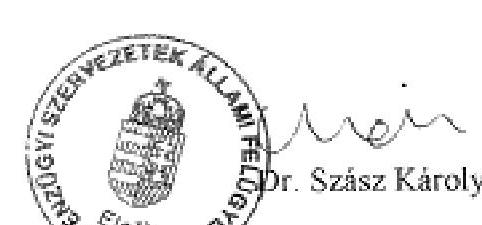
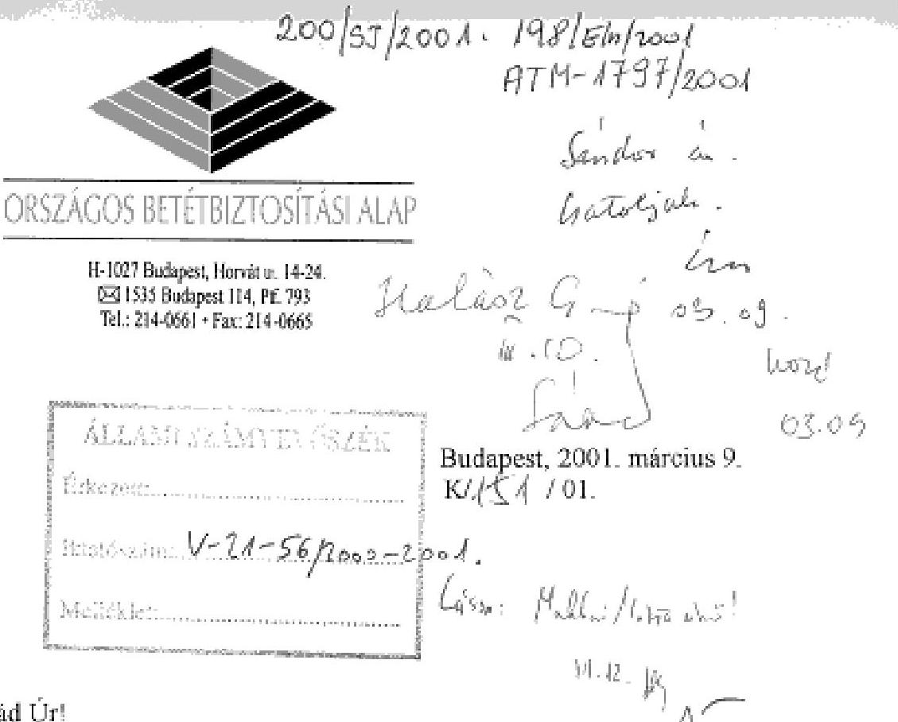
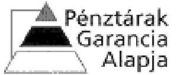
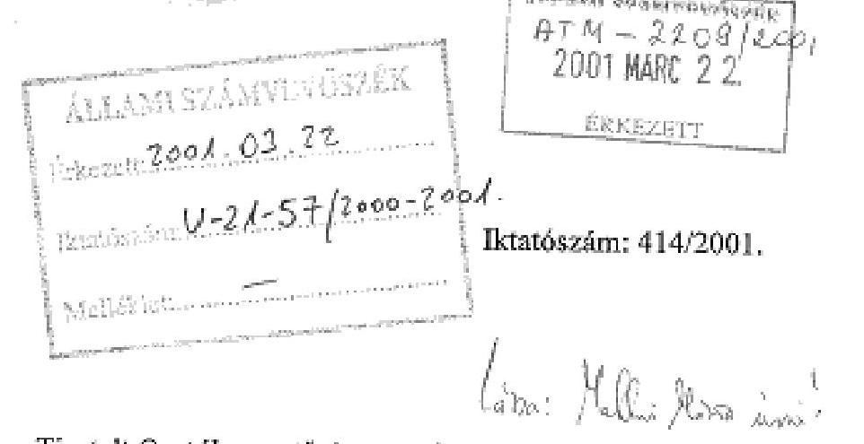

# JELENTÉS 

## AZ ORSZÁGOS BETÉTBIZTOSÍTÁSI ALAP, A BEFEKTETÖ-VÉDELMI ALAP ÉS A PÉNZTÁRAK GARANCIA ALAPJA MÜKÖDÉSÉNEK ELLENŐRZÉSÉRŐL

2001. március

---

# Az ellenőrzés végrehajtásáért felelős: 

IV. Vagyonellenőrzési Igazgatóság

Halász Gejza
számvevő igazgató

## Az ellenőrzést vezette:

## Makkai Mária

számvevő igazgatóhelyettes

## Az ellenőrzésben részt vettek:

## Dr. Borisz József

számvevő tanácsos

## Hajagos Józsefné

számvevő tanácsos

## Dr. Szöllősi Géza

számvevő tanácsos

## Szücs Ivánné

számvevő

## Tornai József

számvevő tanácsos

## Verő Tünde

számvevő

---

# TARTALOMJEGYZÉK 

BEVEZETÉS ..... 3
I. ÖSSZEGZŐ MEGÁLLAPÍTÁSOK, KÖVETKEZTETÉSEK, JAVASLATOK ..... 6
II. RÉSZLETES MEGÁLLAPÍTÁSOK ..... 13
A) AZ ORSZÁGOS BETÉTBIZTOSÍTÁSI ALAP MŰKÖDÉSE ..... 13

1. Az Alap létrehozása, irányítása, ellenőrzése, a jogszabályi háttér ..... 13
2. Az Alap ellenőrzései a tagintézeteknél ..... 14
3. Jogharmonizáció, EU direktívák alkalmazása ..... 15
4. Az Alap bevételi forrásai ..... 16
5. Kifizetés az Alapból ..... 17
5.1. Az Iparbankház „csendes kivezetése" ..... 18
5.1.1. A „csendes kivezetés" feltételeinek megteremtése ..... 18
5.1.2. Az átvett eszközök hasznosítása ..... 20
5.1.3. Kártalanítás a felszámolás megindítása után ..... 21
5.2. A Realbank Rt. válságkezelése ..... 21
5.2.1. Tőkerendezés ..... 21
5.2.2. Befagyott betétek kifizetése ..... 23
5.2.3. Igénybejelentés a felszámoló felé ..... 23
6. Az Alap vagyona, tőkéjének változása ..... 24
7. Az eredmény alakulása ..... 25
7.1. Az Alap bevételei ..... 25
7.2. Az Alap ráfordításai ..... 26
7.3. A céltartalék ..... 27
7.4. Az Alap működési költségei ..... 27
8. Az Alap befektetései ..... 30
8.1. Az értékpapír állomány változása, a hozamok alakulása ..... 30
8.2. A vagyonkezelői szerződések ..... 32
B) A BEFEKTETŐ-VÉDELMI ALAP MŰKÖDÉSE ..... 34
9. Az Alap létrehozása, jogszabályi háttér, a tevékenység irányítása, ellenőr- zése ..... 34
10. Az Alap számvitele, az elszámolási sajátosságok ..... 36
11. Jogharmonizáció, EU direktívák alkalmazása ..... 37

---

4. Az Alap bevételi forrásai ..... 37
5. A kártalanítási tevékenység ..... 39
5.1. A kártalanítások alakulása az egyes években ..... 40
5.2. A kártalanítási kötelezettségek okai ..... 43
6. Az Alap gazdálkodása ..... 44
6.1. A vagyon alakulása ..... 44
6.2. A ráfordítások, költségek alakulása ..... 46
6.3. Vagyonkezelés ..... 49
6.4. Az Alap költségvetése, pénzügyi és likviditási terve ..... 49
6.5. Az Alap pénzügyi helyzete ..... 50
C) A PÉNZTÁRAK GARANCIA ALAPJÁNAK MŰKÖDÉSE ..... 52
7. Az Alap létrehozása, a jogszabályi háttér ..... 52
8. Az Alap tevékenységének irányítása, ellenőrzése ..... 53
9. Az Alap munkaszervezete ..... 54
10. Külső és belső ellenőrzés az alapnál ..... 54
4.1. Külső ellenőrzés ..... 54
4.2. A belső ellenőrzés ..... 55
11. A PGA gazdálkodása ..... 56
5.1. A gazdálkodás szabályozottsága ..... 56
5.2. Bevételek ..... 57
5.3. Kifizetések, ráfordítások alakulása ..... 58
12. Az Alap vagyona ..... 59
Mellékletek

---

# JELENTÉS 

## AZ ORSZÁGOS BETÉTBIZTOSÍTÁSI ALAP, A BEFEKTETŐ-VÉDELMI ALAP ÉS A PÉNZTÁRAK GARANCIA ALAPJA MŰKÖDÉSÉNEK ELLENŐRZÉSÉRŐL

## BEVEZETÉS

Az alapokat törvényekkel, az Országos Betétbiztosítási Alapot (továbbiakban: OBA) az 1993. évi XXIV. törvény 4. §-ával, a Befektető-védelmi Alapot (továbbiakban: BEVA) az 1996. évi CXI. törvény 156. § (1) bekezdésével a Pénztárak Garancia Alapját (továbbiakban: PGA) az 1997. évi LXXXII. törvény 86. § (1) bekezdésével hozták létre. Az OBA a legkorábban létrehozott alap, jogszabályi rendezése a legkiforrottabb, melyhez hozzájárult az Állami Számvevőszék (továbbiakban: ÁSZ) 1996-ban lefolytatott ellenőrzése is.

A BEVA a helyszíni vizsgálat idejére már 3 éves, a PGA 2 éves múködési tapasztalattal, illetve elkészített mérlegbeszámolóval rendelkezett. Ezen két alapnál - a létrehozására, munkaszervezetének kialakítására, múködésének szabályozottságára, illetve jogszabályi támogatottságára irányuló - vizsgálatot az ÁSZ még nem végzett.

A három alap létrehozásának célja, múködése, felügyelete, szabályozása több területen megegyezik, de a különbségek is számottevőek.

Közös vonásuk, hogy közérdeket szolgálnak, de nem közpénzekből. A tevékenységükhöz szükséges forrást a tagintézetek (a hitelintézetek, a befektetési szolgáltatók és a magánnyugdíjpénztárak) biztosítják, törvényi kötelezettség alapján.

Az alapokat a Számviteli törvény egyéb szervezet kategóriába sorolja, a beszámoló készítési és a könyvvezetési kötelezettségek sajátosságait különböző kormányrendeletek szabályozzák.

Az OBA a betétesek, a PGA a magánnyugdíjpénztár tagok, a BEVA a befektetők érdekeit védi. A legszélesebb réteg a betéteseké, akik száma az utóbbi években a társadalom szokásainak, illetve a bankrendszer szolgáltatásainak megváltoztatásával számottevően növekedett. Ilyen változás a munkabérek kifizetése banki átutalással, a bankkártya széleskörű elterjedése, a gazdálkodó társaságok és vállalkozók számának növekedése a gazdaság szerkezeti átalakításával.

A BEVA tevékenységének célja, hogy vagyoni biztosítást nyújtson a törvényben meghatározott, tulajdonképpeni kisbefektetői kör számára, olyan károk esetében, amelyek nem tekinthetők a befektetéssel szükségszerűen együtt járó kockázatból eredőnek. A letétként elhelyezett ügyfélvagyon kockáztatásakor, amikor a befektetők átmenetileg átengedik a rendelkezési jogot, és a brókercégek

---

üzletszerű és nagytömegű ügyfélvagyon-kezelési tevékenységet folytatnak, így a fokozott védelem, a biztosítás szükségessé válik. A kár ebben az esetben a befektetési szolgáltatók közreműködéséből származik, a befektetők a legnagyobb körültekintéssel sem képesek azt elkerülni.

Az egységes társadalombiztosítási nyugdíjrendszer megváltozott és megalakultak a tőkefedezeti elven működő magánnyugdíjpénztárak. A PGA létrehozásának és feladat-meghatározásának célja a magánnyugdíjpénztáraknál gyűjtött megtakarítások védelme. Kimondatlan célja volt az Alap létrehozásának az is, hogy a nyugdíjak állami garanciájának biztosítása mellett a központi költségvetés forrásainak felhasználását kiváltsák, amennyiben a magánnyugdíjpénztárak a nyugdíjak kifizetését a kívánt időben és mértékben nem tudják teljesíteni.

Mindhárom alapnál közös, hogy szolgáltatásukat válsághelyzet kialakulása után kezdték meg. A hitelintézetek, a magánnyugdíjpénztárak és a befektetési vállalkozások folyamatos ellenőrzésére, beszámoltatására, különleges intézkedések megtételére az 1999. évi CXXIV. törvény a Pénzügyi Szervezetek Állami Felügyeletét hatalmazta fel. A Felügyelet ezen hatáskörét a 2000. évi CXXIV. törvény megerősítette.

Az OBA és a BEVA esetében törvény limitálja a kártalanítás maximális mértékét, melynek értéke személyenként 1 millió Ft. A PGA-nál a kártalanítás a jövőbeli nyugdíjakhoz, az állampolgárok követeléseihez kapcsolódik.

Az előbbi két alap esetében a kártalanítás mértékének reálértéke folyamatosan csökkent, a PGA esetében ez nem áll fenn. A legnagyobb reálérték csökkenést az OBA általi kártalanítási összeg szenvedett. Az 1 millió Ft-os kártalanítás értéke - a fogyasztói árindexek figyelembevételével - jelenleg 322 E Ft.

Mindhárom alap ellenőrzése törvényi kötelezettsége az ÁSZ-nak. Az OBA esetében a hitelintézetekről és a pénzügyi vállalkozásokról szóló 1996. évi CXII. törvény (továbbiakban: Hpt.) 109. §-a, a BEVA-nál az értékpapírok forgalomba hozataláról szóló 1996. évi CXI. törvény (továbbiakban: Épt.) 171. § (3) bekezdése, a PGA-nál a magánnyugdíjról és a magánnyugdíjpénztárakról szóló 1997. évi LXXXII. törvény (továbbiakban: Mpt.) 98. § (3) bekezdése írja elő az ÁSZ ellenőrzési kötelezettségét.

Az ellenőrzés célja: annak megállapítása volt, hogy az alapok tevékenysége, gazdálkodása megfelel-e a jogszabályokban előírtaknak, szolgáltatásaik al-kalmasak-e a közérdek megfelelő védelmére.

A téma jelentősége: mindhárom alap a társadalom széles rétegei érdekének védelmét szolgálja, ezért azok gazdálkodásának ellenőrzése közérdeket testesít meg. Az alapok felügyeletét eddig három különböző szervezet látta el. Egyszerre történő ellenőrzésüket az indokolta, hogy 2000 II. negyedévétől a felügyelő szervezeteket összevonták, azaz mindhárom alap tagintézetei a Pénzügyi Szervezetek Állami Felügyelete alá tartoznak.

---

Az ellenőrzés módszere: az ÁSZ a könyvvizsgálók által hitelesített éves mérlegbeszámolókra támaszkodott és szúrópróbaszerű dokumentális vizsgálatot folytatott.

Ellenőrzött időszak: 1998-1999. évek, illetve az Országos Betétbiztosítási Alap esetében szükség szerint figyelembe vettük az 1996-tól eltelt időszak gazdasági eseményeit is.

Az ellenőrzött szervezetek: Országos Betétbiztosítási Alap, Befektetővédelmi Alap és a Pénztárak Garancia Alapja.

Tájékozódás: a Pénzügyi Szervezetek Állami Felügyeleténél (továbbiakban: PSZÁF).

---

# I. ÖSSZEGZŐ MEGÁLLAPÍTÁSOK, KÖVETKEZTETÉSEK, JAVASLATOK 

Az alapok jogállása, az irányító és ellenőrző testületek összetétele, továbbá működése a törvényi előírásoknak megfelelt.

Mindegyik jogi személy, tevékenységük után sem adó-, sem illetékfizetésre nem kötelezettek, pénzeszközeik nem vonhatók el, azok kizárólag törvényben meghatározott célokra használhatók fel. Az alapok főbb bevételi forrásait a tagok befizetései képezik. A tagsági viszony mindhárom alapnál kötelező. Az alapok irányítását az OBA esetében igazgatótanács, a másik két szervezetnél igazgatóság végzi. Ellenőrző Bizottság csak a PGA-nál működik.

Az alapok működése megfelelt a törvényi (Hpt., Épt., Mpt.) rendelkezéseknek, tevékenységük során betartották a források gyűjtésére, a kifizetésekre és a szabad pénzeszközökkel való gazdálkodásra vonatkozó előírásokat.

Az alapok, mint szervezetek alkalmasak a közérdek szolgálatára. Törvényi kötelezettségük a kártalanítás, melynek eltérő módon tettek, illetve tesznek eleget.

Az OBA létrehozása óta több hitelintézet felszámolásához kapcsolódóan fizetett kártalanítást a betéteseknek, illetve elégítette ki az ügyfelek követeléseit, a közérdeket eddig hiánytalanul szolgálta. A kártalanításhoz rendelkezésre álló tartalékok $1 \%$-os forrás lefedettséget biztosítanak, amely a nemzetközi összehasonlítás alapján kielégítőnek minősíthető.

A BEVA befektetői érdekvédelmi feladatát rajta kívül álló okok miatt nem tudta maradéktalanul ellátni. 1998. és 2000. évek között a Felügyelet 11 befektetési szolgáltató tevékenységét függesztette fel az ügyfélkövetelések befagyása miatt. Az Alapnak e miatt több mint 4,4 milliárd Ft fizetési kötelezettsége keletkezett. A BEVA a kártalanítási igényeket csak részben tudta teljesíteni, mivel az Épt. szerinti rendes és rendkívüli díjbefizetések már elérték a törvényi maximumot és összegük nem nyújtott fedezetet a teljes kötelezettségre.

A PGA helytállására nem volt szükség, mivel a magánnyugdíjpénztáraknak jelenleg nincs kifizetési kötelezettségük a pénztártagok felé. Ez 2013-tól lesz esedékes, amennyiben a magánnyugdíjpénztárak a kötelezettségüknek nem tudnak eleget tenni, akkor lép be a PGA garanciális helytállása. E miatt a PGA esetében a közérdek pénzügyi szolgálatának minősítése nem lehetséges.

## Országos Betétbiztosítási Alap

A kártalanítások kifizetéséhez az OBA forrásait a Hpt. határozza meg. A biztosított betétek teljes állománya után fizetendő díj kulcsát a törvény két ezrelékben maximálta. A Hpt. előírásából következik, hogy azok a tagintézetek, amelyekben magas a betétkoncentráció magasabb díjat fizetnek, mint ahol a vé-

---

dett betétek aránya a magas. Ennek az ellentmondásnak a mérséklésére 1999ben módosították a díjkulcsokat, amely a bevételek 1.512 millió Ft értékű csökkenését eredményezte.

Az OBA a befagyott betétek kifizetését a Hpt.-ben rögzítettek szerint végezte, melyet a törvény teljes körűen szabályoz. A hitelintézetek válsághelyzetének rendezésében - a betétek befagyásának elkerülése érdekében - felvállalt szerep összetettebb feladat, a törvény is csak keret jelleggel szabályozza azokat. A válsághelyzet elkerülése érdekében az OBA-nak törvényben meghatározott feladata a hitelintézetek legkisebb veszteségének biztosítása. Ez az előírás nem áll összhangban egyrészt a Hpt. azon előírásával miszerint a válságkezelésre fordítható összegnek - a konkrét hitelintézetre szólóan - felső határa van, másrészt eltér a jogalkotó feltehető szándékától is, mivel a törvény indokolása szerint a cél az, hogy az OBA túlzott mértékben ne kockáztassa a tagintézetek befizetéseiből keletkezett vagyonát.

Az Alap a betétesek érdekében kifizetéseket teljesített az Iparbankház Rt. és a Realbank Rt. múködési engedélyének visszavonásával kapcsolatban.

Az Iparbankház Rt. válsághelyzetének kezelése a bank „csendes kivezetését", ezt követően a működési engedély visszavonását és a felszámolás megindítását jelentette. Az Alap az Iparbankháznak 990 millió Ft hitelt nyújtott, amely a „csendes kivezetéséhez" biztosította a forrást. Ezt az Alap nem saját forrásából, hanem az MNB-től felvett hitelből biztosította. A bank működési engedélyének visszavonásáig a hitelt és kamatait csak részben fizette vissza, míg az Alap az MNB-nek kamattal növelten törlesztette azt.

Az Alap és a bank között létrejött likviditási szerződés a hitel fedezeteként opciós vételi jogokat biztosított az OBA-nak a bank eszközeire. Ennek értelmében az Alap összességében 273 millió Ft értékű eszközt vett át a banktól. A megállapodás értelmében az átvett eszközérték csökkentette a bank tartozását. Az Alap ezidáig az eszközök értékesítéséből és az azokhoz kapcsolódó ráfordításokból is veszteséget szenvedett el.

Az Alap a bank felszámolásának elrendelése után összesen 2,3 millió Ft értékben fizetett ki kártalanítást a befagyott betétek után.

Az Alap veszteségeit mérsékli az MNB-vel kötött megállapodás szerinti elszámolás, mely szerint 50-50 \%-ban viselik a nem OBA által biztosított kifizetéseket.

Az Iparbankház „csendes kivezetése" az OBA-nak ezidáig 63 millió Ft veszteséget okozott, vagyis az Alap úgy oldotta meg a hitelintézet válságkezelését, hogy a vagyonát nem kockáztatta.

Az Alap a hiteltartozást 348,6 millió Ft értékben és az azután számított kamatkövetelését, valamint a kártalanítás összegét bejelentette a bank felszámolójának. A felszámolás alatt a kamatkövetelés folyamatosan nő, 1999. december 31-én 296 millió Ft volt. A követelések megtérülése nem várható, az Alap $100 \%$-ban céltartalékot képzett az összegre.

---

Az Alap a Realbank Rt. esetében két címen, 1998-ban és 1999-ben is teljesített kifizetést, összesen 8.198 millió Ft értékben. 1998-ban a bank tőkehelyzetének rendezésében vett részt, amelyhez 3.062 millió Ft-ot használt fel. A tőkeemelés felvállalásához az OBA számításokat végzett a legkisebb költség szempontjából, amely azonban nem eredményezett meggyőző különbséget a kártalanítással szemben. A könyvvizsgálói jelentésben kimutatott tőkeszükséglet is bizonytalansági elemen alapult. Az IT ezen jelzéseket nem értékelte kellő súllyal és a tőkeemelés mellett döntött. Az alaptőkeemelést követően a bank prudens múködéséhez újabb tőkeemelés vált szükségessé, a feltárt további veszteségek és céltartalékképzési kötelezettségek miatt. A tőkeemelés mértéke további 3,7 milliárd Ft volt, amelyet az Alap igazgatótanácsa a Hpt-ben foglaltak alapján már nem vállalhatott fel, a bank értékesítésére tett kísérletek pedig nem jártak eredménnyel.

A válsághelyzet kezelése nem volt kellően átgondolt, mivel a tőkeemelés nem járt eredménnyel és nem tudta megakadályozni a betétek befagyását.

A kialakult pénzügyi helyzet miatt az ÁPTF visszavonta a bank múködési engedélyét és a betétek befagytak. Az Alap a kártalanítást időben megkezdte. Az Alap 1999-ben összesen 5.036 millió Ft-ot fizetett ki kártalanításként.

Az Alap összes, a bank felszámolójának bejelentett igénye a betétesek kártalanításából 2000. november 30-ig 5.076 millió Ft és 60 millió Ft járulékos költség, amely a kártalanítási időszak alatt további 88 millió Ft-tal nőhet a betétek nyilvántartási adatai alapján. Az Alap igénye 2000-ben nem térült meg, mert a felszámoló azt a vitatott igények közé sorolta. A bejelentett járulékos költségek elismerése is csak töredéke az Alap által kimutatottnak.

A hitelintézetek felszámolási eljárásai elhúzódtak, a folyamatban lévő peres ügyek miatt nem zárultak le, az OBA követelései nem térültek meg.

A korábbi évek vagyonnövekedési - több milliárd Ft nagyságrendű - üteme lassult. Az Alap nyilvántartott vagyona 1998. december 31-én 17.230,4, 1999. december 31-én 18.077,3 millió Ft volt. A lassulás több tényező együttes hatása: egyrészt kevesebb volt a szabad pénzeszköz, mert kisebb volt a bevétel, másrészt a pénzeszközöket más célokra - Realbank tőkeemelésére, Realbankban befagyott betétek kártanítására - használták fel, továbbá a pénzügyi műveletek eredménye is csökkent, kisebb volt a befektetések elérhető hozama.

A vagyonkezelést 1998. december 31-ig egy vagyonkezelő végezte, letétkezelő nélkül.

1999-től pályázat útján kiválasztott három vagyonkezelőt bíztak meg az értékpapírok kezelésével. A pályázat hiányossága volt, hogy az OBA feltételként nem kötötte ki a letétkezelő alkalmazását. A három vagyonkezelő közül csak egy vállalta önként az elkülönített letétkezelést. Pozitívum, hogy a vagyonkezelőknek kifizetett összes díj az 1998. évi díj felét sem érte el.

Az Alap saját tőkéje az 1996-1999. közötti időszakban 3,5 milliárd Ft-ról 21,5 milliárd Ft-ra nőtt. A növekedésben meghatározó volt az Alap mérleg szerinti eredménye, amely alapvetően az éves bevételtől, a kifizetések miatti követelé-

---

sekre képzett céltartaléktól és a pénzügyi műveletek eredményétől függött. A vagyon fedezetében meghatározó az értékpapír, amelynek aránya 1999-ben $83,9 \%$ volt.

Az Alap éves gazdálkodását az igazgatótanács által jóváhagyott költségvetés határozza meg. Meghatározza bevételeit, kiadásait, ezen belül az Alap kezelését végző szervezet működési költségeit. Az Alap létszámát úgy határozták meg, hogy egyes tevékenységekre szolgáltatási szerződéseket kötnek.

Az OBA könyvvizsgálója jelentésében az Alap beszámolóját, azon belül az eredmény-kimutatást is úgy minősítette, hogy azok megfelelnek a jogszabályi előírásoknak. Ugyanakkor az Alap által kialakított számviteli, elszámolási szabályok - az ellenőrzés tapasztalata szerint - nem alkalmasak arra, hogy bemutassák a betétbiztosítási tevékenység és a pénzügyi műveletek eredményét, valamint a múködési költségeket.

# Befektető-védelmi Alap 

A BEVA rendelkezik a múködést meghatározó legfontosabb szabályzatokkal, azok az előírásoknak megfelelnek. Munkaszervezési hiányosság volt - különös tekintettel az Épt. azon előírása, miszerint a BEVA mellett felügyelő bizottság nem múködik -, hogy 2000. márciusáig függetlenített belső ellenőrt nem alkalmaztak.

A gazdálkodás eredménye 1998-ban 470,3 millió Ft nyereség volt, 1999-ben pedig 602,3 millió Ft veszteség lett. A saját tőke 1999 végére az előző évinek alig $10 \%$-ára csökkent és nem érte el a 68 millió Ft-ot. A saját tőke kisebb mint a jegyzett tőke összege, ami 162,4 millió Ft volt.

A nagyarányú vagyoncsökkenés mögött az 1998-tól kezdődő tőkepiaci befagyások, egyes befektetési szolgáltató cégek tönkremenetele és az ebből adódó BEVA kártalanítási kötelezettség megemelkedése húzódott. A saját vagyon alakulása jelezte a pénzügyi helyzet romlását is. A BEVA bevételeit teljesen felhasználta, és az induló vagyonának közel felét is elvesztette. Az eszközállományon belül a likvid értékpapírok és a pénzeszközök arányai és összege is minimálisra csökkent. A likvidítási helyzet a korábbi időszakokban is zavarokat tükrözött, az egyes párhuzamosan futó kártalanítások pénzfedezetét már 1999. II. negyedévében sem tudták folyamatosan biztosítani, a kifizetéseket halasztani kellett. A BEVA-nak a London Bróker Rt. károsultjai felé közel 2,4 milliárd Ft összegű teljesítetlen kötelezettsége is keletkezett.

Az Alap számviteli és elszámolási rendje, a számviteli politika, számlarend a sajátos elszámolási jogszabályi előírásokat tükrözte. A kártalanítási eljárásoknál felmerülő költségeket követelésként kimutatták, befektetővédelmi ráfordításként azonban nem számolták el, és ezzel a vonatkozó Kormányrendelet előírását csak részben teljesítették. A Felügyelet által felfüggesztett tevékenységú BEVA tagok felé az Alap kiszámlázta az esedékes díjakat, holott a felfüggesztéstől kezdődően a díjfizetés realizálására nincs esély. Ezért az eredménykimutatásban, valamint a mérlegben egyaránt kimutattak valójában be nem folyó összegeket. Az Alap azon jogszabályi kötelezettségének eleget tett, mely szerint a következő éves költségvetési tervet a beszámolóban szerepeltetni kell és az

---

előző évi költségvetés teljesítéséről be kell számolnia. A Kormányrendelet a költségvetési terv tartalmára külön előírásokat nem határoz meg. A költségvetés az eredménykimutatás tagolását követi, amely a mérlegszerinti eredmény megtervezését jelenti és így nem pénzforgalmi szemléletű. A tervezési munka során pénzügyi tervet is készít az Alap. Ezen terv alapján a bevételek és a kiadások, a költségek, ráfordítások várható alakulásáról, a szabad pénzeszközök felhasználásáról és az értékpapír állomány szükségszerinti felhasználásáról, vagyis a pénzügyi helyzetről is átfogó képet lehet nyerni. A költségvetésként is elfogadható pénzügyi terv jelenleg nem része az éves beszámolónak.

A BEVA-t 1997 áprilisában alapították. Az első ügyfél követelés befagyások már 1998 elején bekövetkeztek, ekkor nyolc bróker cég tevékenységét függesztette fel a Felügyelet. 1999-2000-ben további három befektetési szolgáltató tevékenységét függesztették fel. Az ügyfélkárok miatt, a BEVA által biztosított tevékenységeket, valamint a személyenként 1 millió Ft-os értékhatárt figyelembevéve az Alapnak összesen közel 4,4 milliárd Ft értékű kártalanítási kötelezettsége keletkezett. A károsult ügyfelek száma a bejelentett és elfogadott igényeket alapulvéve, csaknem hétezer. (A végleges szám a BEVA nyilvántartása szerint elérheti a tízezret is). A kifizetett kártalanítási összeg, 2000. novemberi állapot szerint, csaknem 2 milliárd Ft volt. A BEVA három alkalommal is rendkívüli befizetést rendelt el, a vagyoni fedezet ennek ellenére nem volt elegendő az igényekhez képest. A nem teljesített összeg csaknem teljes egészében a London Bróker Rt ügyfelei felé fennálló kötelezettség. Ezeket a követeléseket "sorba" kell állítsa a BEVA, a késedelem pedig a 2000. áprilisi befagyás-megállapítást figyelembevéve jelentős.

Az Alap a megfelelő forráshoz jutás érdekében hitelfelvételre kényszerül. A Kormány 2000. december 11-ei határozatával döntött a kezességvállalás megadásáról és így a hitelfelvétel lehetősége megteremtődött.

A hitelfelvétel a már bekövetkezett ügyfélkárokra nyújt pénzügyi fedezetet. Az éves díjbevétel és az eddig elrendelt rendkívüli befizetések összege elérte az Épt. által meghatározott maximális nagyságot. Amiatt, hogy a díjfizetésnek felső korlátja van, az Alap a hiteltörlesztésekhez szükséges többlet bevételi igényét nem tudja érvényesíteni a tagok felé. Ez a korlát nem juttatja kifejezésre az egyes BEVA tagok között meglévő, biztosított kockázatok szerinti különbségeket sem. Az Alap az éves díjbevételből finanszírozza a működési költségeit is amely a bevételnek $40 \%$ körüli arányát teszi ki - annak ellenére, hogy az Épt. a bevételek felhasználási céljai között a múködési kiadásokat nem nevesíti.

A BEVA a kártalanítási igényeket a pénzforrások időszakos, majd a legutolsó és legnagyobb befektetői kört érintő befagyásnál (London Bróker Rt.), 2000. áprilisa óta állandósult hiánya következtében késve, illetve az utóbbinál csak minimális mértékben tudta kielégíteni. Ugyancsak gond volt az eljárások időbeli elhúzódása. Mind a forráshiány, mind az eljárások elhúzódása a BEVA tevékenységén kívüli okokra vezethető vissza. Az Alap munkája a kártalanítás folyamán a Felügyelet befagyást megállapító, vagyonfelmérő és a felszámolási eljárást előkészítő hosszú időt igénylő tevékenységére épül, így kényszerpályán mozog. A BEVA hatáskörén belül pedig az ügyek elbírálásának időigénye, valamint az időszakos pénzhiány miatt volt az előírt 30 napnál hosszabb a folyamat. A kártalanítás több hónapos, egy-egy ügy esetében másfél évet is elérő

---

időtartamú volt. Ez eltér az Épt. vonatkozó előírásától. Az Épt. a befagyás időpontját egyedi ügyletekre szabályozza és ahhoz viszonyítva írja elő, hogy a BEVA-nak 30 napon belül kell megkezdenie a kártalanítási kötelezettségének teljesítését. Ez az előírás a gyakorlatban nem volt tartható, mivel a Felügyelet objektív okok miatt 30 nap alatt nem tudta elvégezni a számára törvényben előírt feladatait (ügyfél követelések felülvizsgálata, ügyfél vagyon felmérése stb.). A Felügyelet feladatainak végrehajtását követően a teljes ügyfélkövetelés állományra állapította meg a befagyást, ami nem a törvényben meghatározott egyedi ügyletek befagyása. Az, hogy a BEVA csak eztkövetően folytatja le a kártalanítási igények elbírálását, indokolt. A károkat az Alap az Épt.-ben rögzített feltételek teljesülése, és a jogosultság megfelelő alátámasztása után téríti meg. A kártalanítások csúszása és részbeni elmaradása kedvezőtlen, hiszen a törvényi cél akkor teljesülne, ha a befektetők egy viszonylag gyors eljárás keretében a lehető leghamarabb hozzájutnának a kártalanítás összegéhez. A kártalanítás 1 millió Ft-os maximális összege egyébként is csak kisebb részét fedezi a tényleges veszteségnek, az érték pedig fokozatosan inflálódik.

Az ügyfélkárokat előidéző legfőbb ok az volt, hogy a brókercégeknél az ügyfélvagyon elkülönített kezelését biztosító nyilvántartásokat szabálytalanul vezették. Ez az ellenőrzés és a befektetési szolgáltatói engedélyezési eljárás hiányosságaira is utal.

Az ügyfelek vagyonának részbeni, vagy teljes elvesztése a befagyásoknál azt jelentette, hogy a befektetési szolgáltatók egyes vezetői, ügyintézői az ügyfélvagyonhoz az Épt. előírásától eltérően hozzányúltak, a rájuk bízott pénzzel, értékpapírokkal gazdálkodtak, saját veszteségeiket igyekeztek ezen az úton is kompenzálni. A felügyeleti biztosok minden esetben megtették a bűnvádi feljelentést, az ügyek azonban még csak a nyomozati szakaszban vannak.

# Pénztárak Garancia Alapja 

Az 1998-2000. közötti években a magánnyugdíjpénztáraknál átmeneti időszak volt a tekintetben, hogy a tagok száma folyamatosan változhatott a már biztosítottak választási lehetősége miatt. Ezért az Alap bevételei sem voltak egzakt módon tervezhetőek.

A járulék megosztás törvényi rendelkezés miatt változatlan maradt, ezért az Alap garancia díjbevételének növekedése is elmaradt.

Az Alap 1998-ban és 1999-ben is költségvetési támogatásban részesült. Az 1999. évi támogatás törvényi alapját a költségvetési törvény ugyan megteremtette, de az Mpt. vonatkozó előírása szerint a költségvetési támogatás csak 1998. évre járt.

A PGA legfontosabb kifizetési kötelezettsége a nyugdíjszolgáltatásokhoz kapcsolódik. Ilyen kifizetés a létrehozásától nem volt, nem is lehetett, mivel a nyugdíjszolgáltatáshoz 15 éves pénztártagság szükséges.

Az Alap irányító, ellenőrző és munkaszervezetét a törvényi előírásoknak megfelelően kialakították. A munkaszervezetet kis létszámmal hozták létre, csak a működéshez szükséges alapvető munkaköröket töltötték be. A tevékenységük

---

ellátásához szükséges szabályzatokat elkészítették és az abban foglaltakat betartották.

Az Alap gazdálkodása és vagyonkezelése megfelelő volt.

# Ajánlások, javaslatok 

## a Kormánynak

1. Kezdeményezze az értékpapírok forgalomba hozataláról, a befektetési szolgáltatásokról és az értékpapír-tőzsdéről szóló törvény módosítását és annak keretében

- nevesítse az éves bevételek felhasználási jogcímei között a BEVA múködésének költségeit;
- határozza meg újra a díjfizetés alapját úgy, hogy egyrészt az biztosítsa a kártalanítások és a hiteltörlesztés forrását, másrészt tükrözze a BEVA biztosítása alá eső szolgáltatók tevékenységét és kockázatát, továbbá szüntesse meg az éves díj felső határát;
- pontosítsa a törvénynek a befagyott befektetői követelésekkel foglalkozó rendelkezéseit úgy, hogy a befagyás a befektetési szolgáltató egészére vonatkozzon.

2. Teremtse meg az összhangot a Magyar Köztársaság költségvetéséről, valamint a magánnyugdíjról és a magánnyugdíjpénztárakról szóló törvények között a tekintetben, hogy a PGA költségvetési támogatásának lehetősége általános érvényű legyen.

## az OBA igazgatótanácsának

Változtassa meg a számviteli szabályzatokat annak érdekében, hogy az eredménykimutatás információ tartalma egyértelmúen tükrözze az Alap betétbiztosítási tevékenységének bevételét és ráfordítását, a pénzügyi műveletek eredményét, valamint a munkaszervezet múködési költségét.

## a BEVA igazgatóságának

1. Módosítsa a számlarendet annak érdekében, hogy a kártalanítási eljárások költségeit befektetővédelmi ráfordításként is elszámolják.
2. Szerepeltesse az éves beszámolóban a következő év pénzügyi szemléletű költségvetési tervét is és követelje meg a beszámolást annak végrehajtásáról.

---

# II. RÉSZLETES MEGÁLLAPÍTÁSOK 

## A) AZ ORSZÁGOS BETÉTBIZTOSÍTÁSI ALAP MŰKÖDÉSE

## 1. Az Alap létrehozása, irányítása, ellenőrzése, a JOGSZABÁLYI HÁTTÉR

Az Országos Betétbiztosítási Alapot (a továbbiakban Alap) az 1993. évi XXIV. törvénnyel hozták létre működését 1993. június 30 -án kezdte meg.
1997. január 1-jétől a Hpt. 97-130. §-a rendelkezik a betétbiztosításról és az Alapról.

A Hpt. értelmében az Alaphoz csatlakozásra kötelezettek a bankok és a takarékszövetkezetek, a pénztárak és a szakosított hitelintézetek.

Az Országos Betétbiztosítási Alap és a tagok közötti jogviszonyt a Hpt., a vonatkozó kormányrendeletek és az OBA belsó utasításai megfelelően szabályozzák, az Alap jogállása egyértelmúen tisztázott.

Az Alap feladatát a Hpt. 98. §-a szabályozza, azok közül kiemelt szerepe van az alábbiaknak:

- szerepvállalás a pénzintézeti válsághelyzet elhárításában, a betétek befagyásának megelőzése, illetve a saját tőkéjének megőrzése érdekében. Ehhez az OBA a tagintézet hitelfelvételénél kezességet vállalhat, hitelt és alárendelt kölcsönt nyújthat tagjai részére és tulajdont szerezhet a hitelintézetben,
- a tagintézeteknél elhelyezett és biztosított betétek befagyásakor az OBA kártalanításként egy személy részére legfeljebb 1 millió Ft összeghatárig teljesíthet kifizetést.

Az Alap feladatait a Szervezeti és Múködési Szabályzatban rögzített keretek között látja el. Az Alap irányító szerve az igazgatótanács (továbbiakban: IT), melynek összetétele megfelel a Hpt. 110. §-ában előírtaknak.

Az Alap önálló munkaszervezettel rendelkezik, létszáma 17 fő.

---

A Számviteli törvény értelmében az Alap olyan egyéb szervezet, melynek speciális könyvvezetési és beszámoló készítési kötelezettségét a Hpt.-ben kapott felhatalmazás alapján a Kormány szabályozza. Az Alap éves beszámolói a könyvizsgáló jelentése szerint megfelelnek a jogszabálynak.

Az OBA rendelkezik - még 1997. évben kiadott - számviteli politikával, de aktualizálását a dokumentumok nem tükrözik.

A számlarend és a számlatükör tartalmazza az OBA sajátos feladatait: a tagintézetekkel szembeni díj-követelések, betétkifizetések, átszállt követelések nyilvántartását és ezek könyvelését.

Az Alapot irányító igazgatótanács főbb feladatai: az éves díjpolitika kialakítása, döntés a törvényben előírt kifizetések teljesítésének rendjéről és egyéb válságkezelési eljárásokról, továbbá a tagintézeti ellenőrzésekről. Évente egyszer megállapítja az Alap éves beszámolóját, vagyoni helyzetét és dönt a költségvetésről, beleértve a múködési költségvetést is.

Az Alapnál - a Hpt. értelmében - sem felügyeleti ellenőrzés, sem felügyelő bizottság nem múködik. Az Alap tevékenységének ellenőrzését egy megbízott belső ellenőr, beszámolójának auditálását független könyvvizsgáló végzi.

Az OBA rendelkezik Belső Ellenőrzési Szabályzattal, amely tartalmazza a belső ellenőr feladatait. A belső ellenőr az igazgatótanács közvetlen irányítása alá tartozik.

A belső ellenőr a vizsgálatokat az SZMSZ-hez csatolt feladatterv alapján összeállított, az ügyvezető igazgatóval egyeztetett, az igazgatótanács által jóváhagyott éves munkaterv alapján végzi, az igazgatótanács közvetlen irányításával. A belső ellenőr vizsgálatainak tapasztalatairól jelentésben számolt be az igazgatótanácsnak.

# 2. Az Alap ellenőrzései a tagintézeteknél 

A Hpt. a betétbiztosítással összefüggésben a hitelintézetekkel szemben több olyan követelményt támaszt, amelynek teljesítését az OBA az Ellenőrzési Kézikönyvben rögzített szempontok alapján a helyszínen ellenőrzi.

Az ellenőrzések főbb tapasztalatai:

- egyes tagintézetek olyan betétgyűjtési technikát is kidolgoztak, melyek révén elkerülhető utánuk a díjfizetési kötelezettség, de egy esetleges kártalanítási eljárás során a bíróság a biztosított betétek közé sorolná azokat,
- nem minden tagintézet rendelkezik megfelelő nyilvántartási rendszerrel, amely alkalmas a biztosított betétek naprakész beazonosítására, továbbá egyes fiókhálózattal rendelkező hitelintézeteknél nincs kiépítve on-line kapcsolat. Ezen hiányosságok kártalanításkor indokolatlan többlet ráfordításokat okoznak.

---

Az OBA 1996. II. félévétől és 2000. I. félévéig 25 esetben tartott helyszíni és 24 esetben nem helyszíni ellenőrzést. A jelenlegi taglétszámot figyelembevéve még 197 tagintézetnél sem a helyszínen, sem a helyszínen kívüli ellenőrzés keretében nem vizsgálták a betétek biztosítottságára vonatkozó Hpt. előirások betartását.

Az OBA ellenőrzést is végző munkatársainak (3-4 fő) kapacitását figyelembe véve évi 12-18 helyszíni és nem helyszíni ellenőrzést lehet biztonsággal beütemezni. Ez azt jelenti, hogy a tagintézetek mindegyikét 11-16 év alatt sikerülne valamelyik ellenőrzési forma keretében ellenőrizni és akkor utóellenőrzésre még nem kerülne sor.

Az ellenőrzések tapasztalatai és a tagintézetek visszajelzései azonban azt mutatják, hogy szükség és igény is lenne az OBA ellenőrzéseire, hiszen a betétbiztosítással kapcsolatban még a nagyobb tagintézetek körében is van bizonytalanság.

Az eddigi ellenőrzések során feltárt hiányosságok és a bankrendszerbeli lehetőségek (tőkeszegénység miatti kényszer-fúziók) alapján célszerú lenne valamennyi tagintézet legalább egyszeri helyszíni ellenőrzését 4-5 év alatt beütemezni. Mindezekre figyelemmel az OBA javaslatára az IT az ellenőrzési módozatok változtatásáról döntött, melynek értelmében együttműködési megállapodás alapján a Felügyelet és az OTIVA ellenőrzési apparátusa az OBA helyett és nevében betétbiztosítással kapcsolatos ellenőrzéseket is végez.

# 3. JOGHARMONIZÁCIÓ, EU DIREKTÍVÁK ALKALMAZÁSA 

Magyarországon - az Alap 1993. évi létrehozása óta - a törvények a maximálisan kifizethető összeg nagyságát személyenként 1 millió Ft értékben határozták meg. A 94/19/EC direktíva szerint a kompenzáció minimális összege 20.000 ECU.

Az Alap igazgatótanácsa a biztosítási összeghatár felemelésével kapcsolatban több határozatot hozott. Vizsgálta az összeghatár emelésének hatását a díjkulcsok alakulására és megállapította, hogy az 1999-ben bevezetett mértékek megváltoztatására nincs szükség, csak a díjsávok módosítására. Ez továbbra is biztosítaná az 1997-ben elért 1 \% forrás fedezettséget is. Ugyanakkor az anonim betétek megszüntetése - ami szintén EU követelmény - miatt szükséges az Alap tartalékainak növelése. Ezen betétekre a betétbiztosítás nem terjed ki, utánuk az Alapnak bevétele nem származott, de kötelezettsége sem keletkezett.

További EU ajánlás az önrész bevezetése a kártalanításban, javasolt mértéke $10 \%$.

Az Országgyűlés 2000. december 12-i ülésnapján fogadta el a Hpt. módosításáról szóló 2000. évi CXXIV. törvényt. A módosítás rendelkezett a kártalanítás mértékének megemeléséről legfeljebb 6 millió Ft összeghatárig és az 1 millió Ft feletti kifizetéseknél a $10 \%$-os önrész bevezetéséről. E törvényi szabályozás azonban csak az EU-hoz való csatlakozási szerződésről szóló törvény kihirdeté-

---

sével lép hatályba. Az anonim (látraszóló) betétek megszüntetéséről a módosítás nem rendelkezett, csupán azt rögzítette, hogy bemutatóra szóló takarékbe-tét-szerződést kötni, a meglévőre befizetést teljesíteni nem lehet.

# 4. Az Alap beVÉTELI FORRÁSAI 

Az OBA lehetséges bevételi forrásait a Hpt. 119. §-a határozza meg.
A csatlakozási díjat és a rendszeres éves díjat a hitelintézeteknek kell megfizetniük a Hpt.-ben meghatározott időben és mértékben. Az Alap forrásait növeli a Felügyelet által a hitelintézetektől beszedett bírságok összegének $80 \%$-a, továbbá a saját tevékenységéből származó egyéb bevétel.

A bevételekből megközelítő pontossággal csak az éves díj tervezhető.
Az egyes jogcímeken elért bevételek a következők szerint alakultak:
ezer Ft

| Megnevezés | 1998. | 1999. |
| :-- | --: | --: |
| Csatlakozási díj | 55.000,0 | 250,0 |
| Éves díjbevétel | $4.992 .789,9$ | $3.405 .471,9$ |
| Késedelmi kamat | 586,3 | 62,4 |
| Emelt díj | 146.850,6 | 966,6 |
| Bírságok | $9.724,0$ | 84.655,5 |

A bevételek legnagyobb hányada a rendszeres éves díj, melynek alapját a teljes biztosított betétállomány képezi, nem csupán a kártalanításkor figyelembe vehető (védett betét) rész.

A Díjfizetési Szabályzat rögzíti az alkalmazott díjkulcso(ka)t, az ettől való eltéréseket, mind az emelés, mind a kedvezmények vonatkozásában.

1999-től változott a díjfizetési rendszer, betétosztálytól függően négy díjkulcsot vezettek be azért, hogy a díjalap és a védett betétek közötti ellentmondást mérsékeljék. A magyar betétbiztosítási rendszerben ugyanis a díjalap nem azonos a védett betétállománnyal, nagyobb annál. A díjalap a biztosított betétállomány teljes nagysága és nem csak a biztosított rész, amely jelenleg $1.000 \mathrm{E} \mathrm{Ft} /$ fő.

Azok a tagintézetek, amelyeknél a védett betétek aránya viszonylag alacsony (ezek döntően a nagyobb betétesekkel rendelkező bankok), magasabb díjat fizetnek az OBA-nak, mint azok a hitelintézetek, ahol ez fordítva van. Ezért 1999. évtől kezdve a díjat differenciáltabb díjkulcsok alapján fizetik.

A díjfizetési kulcsok és értékhatárok módosításának következménye, hogy az 1999. évi díjbevételek több mint $30 \%$-kal elmaradtak az 1998. évitől és ez mintegy 1,6 milliárd Ft értékú bevétel csökkenést okozott.

---

Emelt díjat azon hitelintézetek fizettek, melyeknek mutatói (tőkemegfelelési mutató, saját tőke, illetve szavatoló tőke) nem feleltek meg a törvényi követelményeknek, vagy tevékenységüket kockázatosnak minősítették, továbbá amelyek díffizetési kötelezettségüknek késedelmesen tettek eleget.

Az Alap 1997-től kedvezményes díjkulcsokat alkalmazott a takarékszövetkezetek esetében. Azon takarékszövetkezetek kaptak kedvezményt, amelyek tagjai a megfelelő pénzügyi fedezettel rendelkező Országos Takarékszövetkezeti Intézményvédelmi Alapnak (OTIVA). Az Alap és az OTIVA közötti együttmúködési megállapodás kiköti, hogy az érintett tagintézetekkel kapcsolatos tehervállalás esetén az utóbbi megtéríti annak egyharmadát az Alapnak.

Az emelt díjak, valamint a díjkedvezmények megállapítását 1998-ban és 1999-ben IT határozat hagyta jóvá.

Az Alapnak 1998. és 1999. években a tagintézetekkel szemben - sem a csatlakozási díj, sem az éves díjfizetési kötelezettség elmulasztásából - nem keletkezett követelése.

# 5. Kifizetés az Alapból 

Két hitelintézetnél van folyamatban kártalanítás a befagyott betétek után. Mindkét banknál más-más megoldást választottak. Az Iparbankház Rt. többségében állami tulajdonban volt, továbbá az MNB által nyújtott refinanszírozási hitelállománnyal rendelkezett. A betétesek kártalanítására választott mód a bank „csendes kivezetése" volt, záros határidőn belül. Ezzel a módszerrel minden ügyfél hozzájuthatott pénzéhez. Ezért a felszámolás elrendelésekor kevesebb mint 20 millió Ft volt az OBA által a befagyott betétek után fizetendő összes kártalanítási igény.

A másik hitelintézet a Realbank, melynél az OBA szerepvállalása két elkülönülő feladatból állt.

Az első 1998-ban volt, amikor a bank elvesztette saját tőkéjét és az OBA a további múködéshez teremtette meg a törvényi feltételeket, tőkeemelés útján. A döntést az IT a Hpt. 104. § (2) bekezdésében előírt „legkisebb hosszú távú veszteség"-re vonatkozó kalkuláció alapján hozta.

A Hpt. 104. § (2) bekezdése - többek között -, a hitelintézetek legkisebb vesztesége biztosításának kötelezettségét rója az Alapra, amikor egy hitelintézet válságkezeléséről van szó.

Az OBA-nak a forrást a válságkezeléshez is a tagintézetek díjbefizetései biztosítják. A Hpt. 104. § (5) bekezdésében meghatározza a válságkezelésre fordítható összeg felső határát, miszerint az nem lehet több, mint az érintett tagintézetnél a befagyott betétek után kifizetendő kártalanítás és az ahhoz kapcsolódó járulékos költségek összege. Erre a korlátozásra azért van szükség - a Hpt. 104. $\S$-ának indokolása szerint is -, „hogy az Alap maga ne kockáztassa túlzott mértékben a hitelintézetek által biztosítási díjként hozzá befizetett összegeket". En-

---

nek értelmében a legkisebb veszteség biztosítása az OBA vagyonára vonatkozik és nem a hitelintézetek összességére.

Az OBA a Hpt. szerint a hitelintézeteknél elhelyezett betétekről rendelkezik naprakész információval.

A Realbank esetében például a múködés átláthatatlan volt, az ügyfelek szétválasztása betétesekre és kötvényesekre, illetve annak megítélése, hogy melyik megtakarítási forma tartozik az OBA védettség alá nagyfokú bizonytalanságot hordott magában. Továbbá az sem volt eldöntött, hogy mely társaságok alkotják a bankcsoportot és kik a tulajdonosok.

A második 1999-ben volt, amikor a tőkeemelés után a bank új vezetése további veszteségeket, céltartalékképzés szükségességét tárta fel, illetve állapított meg, maga után vonva ismét a saját tőke elvesztését. A számítások ismételt elvégzése azt az eredményt hozta, hogy a legkisebb veszteség a befagyott betétek kártalanítása. Ennek megfelelően az OBA újabb tőkeemelést nem vállalt, a bank múködési engedélyét a Felügyelet visszavonta és megindult a bank felszámolása.

# 5.1. Az Iparbankház „csendes kivezetése" 

Az Iparbankház Rt. „csendes kivezetésének" előkészítését és a betétek kifizetésének megkezdését az Állami Számvevőszék 1996-ban - az Alapnál végzett ellenőrzése során - vizsgálta és minősítette.

Jelen vizsgálat a „csendes kivezetés" befejezésére és a felszámolási eljárás megindításakor keletkezett veszteségek csökkentésére tett intézkedéseket célozta meg. Ennek megfelelően a korábbi ellenőrzés megállapításait nem érinti, a folyamathoz igénybe vett forrásokat, felhasználási módokat, a megkötött szerződéseket csak pénzügyi szempontból részletezi.

### 5.1.1. A „csendes kivezetés" feltételeinek megteremtése

Az Állami Bankfelügyelet kötelezte a Bankot, hogy dolgozzon ki és 15 napon belül nyújtson be intézkedési tervet, amely lehetővé teszi a bank működési engedélyének visszavonását legkésőbb 1996. február 28-ig.

A kötelezettségek kielégítéséhez kényszerhitel igénybevételt rendelt el.
A bezárásig helyszíni ellenőrt rendelt ki.
A Felügyelet intézkedését a bank alacsony tőkéjéből származó magas kockázat és a likviditási gond indokolta. Az Alap 1995. augusztus 25 -én aláírta a szerződést az Iparbankházzal 1,2 milliárd Ft készenléti hitel nyújtására, a bank betéteseinek kifizetésére. A hitel felvételre csak akkor nyílt lehetőség, ha a bank saját likvid eszközeit - a szerződésben rögzített egyéb kifizetések után - a betétesek kifizetésére fordította. Az Alap a bank teljes múködését ellenőrzése alá vonta. A bank a tervezett intézkedésekről tájékoztatta az Alapot, vagy ki kellett kérnie az Alap engedélyét.

---

# A készenléti hitel forrásának biztosítására az Alap és az MNB 1995. szeptember 8-án likviditási hitelszerződést kötött. 

Az intézkedési tervben foglaltakat a bank nem hajtotta végre az ütemtervnek megfelelően.

A Felügyelet határozata alapján szigorították a készenléti hitelszerződést annak érdekében, hogy 1996. június 30 -ára olyan állapotot teremtsenek a bankban, amely alapján a múködési engedélye visszavonható legyen. A bankhoz befolyt hiteltörlesztést az OBA által nyújtott hitel előtörlesztésére kellett fordítani. Az Alap védelmét szolgálta az a megkötés, hogy a Bank eszközeit csak az OBA előzetes írásbeli jóváhagyásával értékesíthette.

Az OBA és az MNB 1995. december 12-én megállapodást kötött, amely értelmében az OBA-nál keletkező veszteséget közösen viselik. Ezen veszteségek abból keletkezhetnek, hogy a nem biztosított betéteket és egyéb ügyfélköveteléseket is ki kell fizetni a bank „csendes kivezetése" során. A terhek megosztásának mértéke: 50-50 \%.

Az előzőekben jelzett szerződésekből az Alapnak kötelezettségei és követelései származtak az MNB felé és követelései az Iparbank Rt. „fa" felé.

Az Alap az MNB-től összesen 990 millió Ft refinanszírozási hitelt vett igénybe. A hitel teljes kiegyenlítéséig, 1996. március 29-ig 0,8 millió Ft rendelkezésre tartási és 1,6 millió Ft forgalmi jutalékot, valamint 56,3 millió Ft kamatot fizetett.

Az Iparbankház a jelzett időszakban felvett hitel törlesztését 1996. március hótól a felszámolás elrendeléséig, 1996 júliusáig fizette. Ezen időszak alatt a tartozásból számlapénz formájában megfizetett tőketartozás értéke 365,7 millió Ft volt.

Az Iparbankház a kamatfizetéseknek sem tett maradéktalanul eleget.
A hiteltartozást csökkentette a likviditási szerződésben rögzített opciós vételi jogok érvényesítésével átvett ingatlanok, gépjármúvek, banküzemi eszközök, befektetések, valamint a hitelezői és számlakövetelések, továbbá kölcsönök engedményezése. Az összes eszköz értéke ÁFA-val növelten 275,8 millió Ft volt.

Az Alap 1999. december 31-én a 348,6 millió Ft tőketartozásra 295,9 millió Ft kamattartozást tartott nyilván. A felszámolás lezárásáig folyamatosan számítják a kamat és késedelmi kamattartozást. Megtérülése azonban - a közbenső mérlegben kimutatott eszközértéke alapján - nem várható a felszámolás befejezésétől.

Az 1995. december 12-én az MNB-vel megkötött szerződés alapján, a nem biztosított betétek és egyéb ügyfélkövetelések állományát az OBA-nak kell meghatároznia, amely az elszámolás alapját képezi a két fél között.

---

A felszámolási költségek elszámolására is az 50-50 \%-os megosztás az irányadó, amelyeket a befolyt összegek csökkentenek, a folyamatban lévő perek kimenetele pedig ismeretlen. Tekintettel arra, hogy a felszámolást az MNB finanszírozza, az OBA-nak még 10 millió Ft körüli kiadással kell számolnia a felszámolás befejeztéig.

Az 1. sz. melléklet részletezi az Alap ráfordításait és a megtérüléseket, amelyek a megkötött szerződésekből származtak. Az Alap és az Iparbankház közötti szerződésből az Alap összes ráfordítása 1.048,7 millió Ft volt, amelyből 449,5 millió Ft térült meg 1999. december 31-ig. Ezt 289,6 millió Ft-ra csökkentette az MNB-vel kötött megállapodás elszámolásából származó bevétel.

# 5.1.2. Az átvett eszközök hasznosítása 

Az OBA a bank működési engedélyének visszavonásával egyidőben minden átvett eszközféleségről megállapodást írt alá az Iparbankház Rt.-vel.

Az Alap összesen 5 db ingatlant vett át 150,0 millió Ft ÁFA-val növelt értéken. Az ingatlanokat a helyszíni vizsgálat idejére értékesítették, az elért bevétel 149 millió Ft.

Az értékesítésből és az ingatlanok kezeléséből, illetve hasznosításából az Alapnak összesen 15,6 millió Ft vesztesége keletkezett. Az értékesítésig felmerült kiadások összege 23,1 millió Ft és az elért bevételek értéke 8,5 millió Ft volt.

Az 1996. július 1-jei megállapodás értelmében a tárgyi eszközök átvételi értéke 12,7 millió Ft + ÁFA volt. A bank tartozása a tárgyi eszközök nettó értékével csökkent.

A több száz darabból álló banküzemi eszközök és számítástechnikai eszközök felügyeletét, értékesítéskori kiadását, nyilvántartását az Alap maradéktalanul nem tudta megoldani. Egyszer a vevő több eszközt szállított el, mint amennyit kifizetett, máskor nem lehetett megállapítani mikor, mennyit fizettek, illetve az adott eszköznek mennyi a nyilvántartási értéke. A rendezetlenségben szerepe volt az Iparbankháztól átvett szerződéseknek, eszközátadásoknak.

A banküzemi eszközöket 8 millió Ft-ért értékesítették, így a veszteség ezen a címen 4,7 millió Ft volt.

A hitelezésből származó engedményezett követelések átvételi értéke 61 millió Ft, a megtérülés 2000. szeptember 30-ig 40,1 millió Ft volt.

Az Iparbankház Rt. a megállapodás alapján 13,2 millió Ft számlakövetelést engedményezett az OBÁ-ra. Az engedményezés révén a számlához kapcsolódó ÁFA megfizetése az Alapot terhelte. A megállapodás 1,6 millió Ft veszteséget okozott az Alapnak, mert az engedményezett összeg 1 millió Ft értékben olyan bérleti jogot is tartalmazott, amit önkormányzati hozzájárulás nélkül nem lehetett volna átadni. További vesztesége származott abból, hogy 0,6 millió Ft értékű számlakövetelést a vevő nem egyenlített ki.

---

Az átvett eszközök hasznosításának eredményét a 2. sz. melléklet részletezi, eszközféleségek bontásban. Az Alapnak az átvételből vesztesége származott, melynek nagysága a megtérülések alapján 11,7 millió Ft. Amennyiben az eszközökhöz kapcsolódó ráfordításokat és hozamokat is figyelembe vesszük, az Alap vesztesége a könyvelési adatokból 26,4 millió Ftra nőtt.

# 5.1.3. Kártalanítás a felszámolás megindítása után 

A Felügyelet 1996. július 1-jei határidővel visszavonta a bank múködési engedélyét és egyúttal kezdeményezte a felszámolás megindítását, továbbá felügyeleti biztost rendelt ki a felszámolás megindításáig.
1996. július 3-án az OBA 11,9 millió Ft biztosított betétállományt tartott nyilván, amelyből 1999. december 31-éig 2,3 millió Ft-ot fizetett ki.

A felszámoló elkészítette 1997. június 30-i fordulónappal a közbülső mérleget, ahol a kötelezettséget a betétesekkel szemben 10,8 millió Ft értéken mutatta ki, de a hitelezői igények kimutatásánál az OBA által bejelentett, a betéteseknek már kifizetett kártalanítás összegét nem sorolta a csődeljárásról, a felszámolási eljárásról és a végelszámolásról szóló 1991. IL. törvény (továbbiakban: Cstv.) 57. § (1) bekezdésének megfelelő „d" kategóriába. Az OBA által tett észrevétel alapján a felszámoló pontosított, azonban az Alap nem számol a kártalanítás összegének megtérülésével, mivel az Iparbankház „fa"-nak nincs annyi vagyona, hogy kielégítse az igényt. A mérleg szerint akkora a vagyon, amennyi a felszámoláshoz szükséges.

### 5.2. A Realbank Rt. válságkezelése

Az OBA a Realbank Rt. esetében két címen is teljesített kifizetést, 1998-ban a bank tőkerendezéséhez, 1999-ben a bank felszámolásának elrendelésekor a befagyott betétek kifizetéséhez.

### 5.2.1. Tőkerendezés

Az ÁPTF 1319/1998. számú, július 10-i határozatában különleges intézkedéseket foganosított, mivel a bank a jogszabályban előírtakat nem teljesítette, elmulasztotta a céltartalékképzést, tőkehelyzete nem volt megfelelő. A határozatból kitűnik, hogy a bank a cégcsoport által kibocsátott különféle kötvényekhez kapcsolódóan kezességet, valamint garanciát vállalt, amelyre elmulasztotta a megfelelő nagyságú céltartalékot képezni.

## Az ÁPTF különleges intézkedései a kötvényesek és a betétesek érde-

keit egyaránt védték.

A bank könyvvizsgálója az 1998. évi féléves mérlegbeszámoló auditálása során számos bizonytalanságra hívta fel a figyelmet jelentésében. A legfontosabb bizonytalansági tényező, hogy nem volt megállapítható a tagvállalatok

---

(Bankcsoport) által kibocsátott kötvények visszafizetésére adott garanciából a bank kötelezettsége. A bank ilyen célból céltartalékot nem képzett. A tőkeemelés mértékét a könyvvizsgáló jelentésére alapozták, ahol a saját tőke értéke -1.060 millió Ft volt, tekintettel a szükségesnek tartott céltartalék nagyságára. A szükséges tőkeemelés mértéke 3.060 millió Ft volt, a Hpt. 71. § (1) bekezdése alapján.

# Az Alap a Realbank 1998. szeptember 4-i rendkívüli közgyűlésén vállalkozott - tőkeemelés formájában - a válsághelyzet kezelésére. 

Az OBA 1998-ban elkészítette a felszámolás során az OBA-t érintő veszteség kalkulációját normál banküzemre, valamint a rohamos „pánikszerű" betétkívonás esetére, 1998. május 31-ére. Az 1998. november 30-i OBA adatok alapján az Alap vesztesége felszámolás esetén 583 millió Ft, az időtényező figyelembevételével 2.309 millió Ft lett volna, amelyhez hozzá kell számítani a tulajdon megszerzésére fordított 3.062 millió Ft-ot.

Az Alap számításainál figyelembe vett ügyfélbetét állományt a 3. sz. melléklet részletezi. A számok azt jelzik, hogy az OBA tőkeemelését döntően a nem biztosított és az 1 millió Ft feletti betétek kivonására fordították, miközben az OBA által biztosított állomány alig 18 \%-kal csökkent 1998 november 30 -áig.

Az IT ülések jegyzőkönyvei és a könyvvizsgálói jelentések tanúsága szerint az igazgatótanács számos bizonytalansági tényező mellett, illetve figyelembevétele nélkül döntött a tőkeemelésről. Nem ismerte a bank szabályzatait kellő mélységben, a betétesek állományát, a bank védett és nem védett megtakarítási konstrukcióit, a bankcsoportot alkotó társaságok kapcsolatait, az ebből származó függő kötelezettségeket és az előbbiek hatását a céltartalékképzésre. A tulajdon megszerzésére az Alap 3.062 millió Ft-ot fordított.

A szeptemberi tőkeemelés után a Realbank új vezetése elrendelte a szabályzatok aktualizálását, jogszabályok szerinti módosítását. Az aktualizálás után a bank újból - 1998. szeptember 30-i állapotnak megfelelően - minősítette az eszközöket és meghatározta a szükséges céltartalékot. A kapott eredmény -3.665 millió Ft veszteség, amiből a további céltartalékképzés 3.066 millió Ft, és -1.665 millió Ft a saját tőke. A bank saját tőkéje a tőkeemelés után ismételten negatív. A bank könyvvizsgálójának decemberi jelentése kismértékű módosítást tartalmazott (a veszteség 3.465 millió Ft), továbbá a december 31-re várható eredményt is megvizsgálta és megállapította, hogy a bank vesztesége tovább nő, a saját tőke is negatív irányban mozdul el.

A számítások alapján a tőkerendezéshez újabb emelés vált szükségessé 3.786 millió Ft értékben, amely megfelel a Hpt. 71. § (1) bekezdésének.

Az OBA igazgatótanácsa úgy döntött, hogy a Hpt. 104. §-a értelmében további kötelezettséget nem vállal a tőkerendezésben.

---

# 5.2.2. Befagyott betétek kifizetése 

Az ÁPTF 79/1999. számú határozatával visszavonta a bank hitelintézeti tevékenységi engedélyét, egyúttal kezdeményezte a bank felszámolásának megindítását, elrendelte a teljes körű kifizetési tilalmat és felügyeleti biztost rendelt ki a bankhoz a felszámoló kirendeléséről szóló jogerős határozatig. A betétek 1999. január 19-től befagytak.

Az Alap a kártalanítási igények bejelentéséhez és kifizetéséhez rendelkezett ügyviteli szabályzattal.

Az adatállomány tisztázását követően az OBA számításai szerint 5.163,6 millió Ft volt a kártalanítási kötelezettség felső határa. Az igénybejelentések beérkezése és elbírálása folyamatos, a kifizetett kártalanítás összege még nem érte el az OBA által kimutatott felső határt. Az Alap kártalanítást fizetett, illetve kell fizetnie a betétek és a Realitás betétjegy, valamint a Reneszánsz névre szóló betétjegyek után.

A kártalanítás a Hpt. 105. § (1) bekezdés előírt 30 napon belül megkezdődött. Az Alap 1999-ben kártalanításra összesen 5.036,4 millió Ft-ot fizetett ki, a hozzá kapcsolódó kiadások összege 58,2 millió Ft volt.

A kártalanítás kifizetésének megkezdése előtt az Alap döntött az előleg fizetésről az ÁPTF és az Országos Nyugdíjbiztosítási Főigazgatóság megkeresésére. Az 1999. január 20-29. közötti időszakban összesen 21,2 millió Ft előleget fizetett a Realbankba utalt nyugdíjak, munkabérek, GYES, GYED után, ezzel biztosítva az érintettek megélhetését. Az előleget, amelyek maximum értéke $80 \mathrm{E} \mathrm{Ft} / \mathrm{fő}$ volt a kártalanítás kifizetésébe az OBA beszámította.

A kifizetéseket végző K \& H Bankot ajánlati felhívás révén választották ki, mivel az OBA számára a legkisebb ráfordítást jelentő pénzügyi ajánlatot tette.

A kártalanítások kifizetésénél az MNB-n keresztül bonyolított átutalások esetében 11,4 millió Ft túlfizetés volt, mivel a banki feladásokat az OBA kétszer indította. Az Alap a hiba észlelését követően intézkedett a visszafizetésről.

Az Alap nyilvántartása szerint - a helytelen megállapítás miatt - kamatkorrekciót is végre kellett hajtani, melynek értéke 4,3 millió Ft volt. Mind a túlfizetés, mind a kamatkorrekció a számítástechnikai szolgáltatásokat végző társaság hibájából származott és az OBA utólagos ellenőrzése tárta fel a hibát.

### 5.2.3. Igénybejelentés a felszámoló felé

Az OBA 2000. augusztus 25-én kelt levele értelmében a bejelentett és elismert hitelezői igénye a d) kategóriában (Cstv. 57. § (1) bekezdés) 2000. június 30-ig 5.074 millió Ft. A kifizetés november 30-án 5.075 millió Ft-ra emelkedett és még további 88,5 millió Ft összegű ügyfélkövetelést tartanak nyilván.

---

A 2000. szeptember 13-án a felszámoló és az Alap között létrejött megállapodás értelmében az OBA elismert hitelezői igénye csupán 5.057,6 millió Ft volt. A különbség abból származott, hogy az Alap a kifizetett összeggel, a felszámoló pedig a csak közbülső mérleg fordulónapjáig - a június 30. - bejelentett igénnyel számolt. A megállapodás azt is rögzítette, hogy legalább az 5.057,6 millió Ft nagyságú igény kielégítésére a 2001. január 19-i fordulónappal készülő közbenső mérleghez kapcsolódóan tesz javaslatot. A megállapodás célszerű volt, mivel az OBA reklamáció esetén sem jut előbb jogos követeléséhez, tekintettel az új besorolás elkészíttetésére.

# Az Alap által bejelentett és elismert hitelezői igények kielégítése a felszámoló magatartása miatt elhúzódott, amelyből az Alapnak vesztesége keletkezett, nevezetesen az 5.057,6 millió Ft féléves hozama, ami nagyságrendileg 250 millió Ft. 

A Felszámoló 2000. augusztus 11-én kelt tájékoztatójához mellékelt - egységes szerkezetbe foglalt I. és II. sz. - közbülső mérlegek alapján javaslatot tett az elismert hitelezői igények egy részének kielégítésére, illetve előleg fizetésre. Az OBA kártalanításból származó igényét a „figyelembe vett vitatott hitelezői igények" közé sorolta, és kifizetést nem javasolt.

A felszámoló és az OBA között a kártalanításhoz kapcsolódó bejelentett járulékos kiadások megítélésében alapvetően különbség van. A felszámoló csak a közvetlen kifizetési költségeket ismerte el járulékos kiadásként és azokat kategorizálta a Cstv. szerint. Az Alap a kifizetési feltételek megteremtésének érdekében teljesített kiadásokat is a megtérítendő igények közé sorolta. A Fővárosi Bíróság, az elé terjesztett OBA igényt a kifogásolt tételek tekintetében elutasította. Az Alap 1999. december 15-én fellebbezést nyújtott be a Legfelsőbb Bírósághoz.

A felszámoló felé bejelentett kártalanítási igények többször változtak, melynek oka a vállalkozó által elismert számítástechnikai hiba, hibás számlázások (magasabb óradíj), a PR tevékenység számláinak megbontása. A számítástechnikai hiba a kifizetett kártalanítás összegét érintette.

## 6. Az Alap VAGYONA, TÖKÉJÉNEK VÁlTOZÁSA

Az éves beszámolók az Alap saját tőkéjének dinamikus emelkedéséről adnak számot 1997. év végéig. Az 1998-99. években a saját tőke tovább emelkedett, de üteme lelassult.

|  |  |  |  |  | millió Ft |
| :-- | --: | --: | --: | --: | --: |
|  | 1996. I. 1. | 1996. XII. 31. | 1997. XII. 31. | 1998. XII. 31. | 1999. XII. 31. |
| Saját tőke | $3.499,5$ | $8.197,2$ | $13.685,1$ | $18.310,7$ | $21.536,6$ |
| - Jegyzett tőke | 669,0 | 734,4 | 752,4 | 807,0 | 807,3 |
| - Tartalék | $1.033,4$ | $2.826,2$ | $7.461,8$ | $12.932,8$ | $17.503,6$ |
| - Értékelési tartalék | 4,7 | 1,0 |  |  |  |
| - Mérleg szerint eredmény | $1.792,4$ | $4.635,6$ | $5.470,9$ | $4.570,9$ | $3.225,7$ |

---

Az Alap saját tőkéje az 1996 - 1998 közötti időszak alatt több mint ötszörösére nőtt. A tartalékok a tárgyévet megelőző mérleg szerinti eredmények összege.

A jegyzett tőke az Alaphoz csatlakozó intézmények által fizetett csatlakozási díjjal emelkedett az évek folyamán. A jegyzett tőkében legnagyobb mértékű emelkedés 1996-ban volt, amikor több új bank is alakult. Amíg az Alap jegyzett tőkéje a korábbi években 18-65 millió Ft közötti értékkel, 1999-ben egy hitelintézet csatlakozása révén 0,3 millió Ft-tal emelkedett.

A saját tőke növekedésében az előbbieken kívül kizárólagos szerepe a mérleg szerinti eredménynek volt.

Az eredmény alakulását az is befolyásolta, hogy az értékpapír piacon csökkent a realizálható hozam, a kamat. Mindez fokozottan befolyásolja az Alap saját vagyonát, mivel az eszköz oldalon 1998-ban 17.230, illetve 1999-ben 18.077 millió Ft értékű az értékpapír fedezet, ami a saját tőkének $94,1 \%$, illetve $83,9 \%$-a.

Az Alap vagyona olyan szintet ért el, amely biztosítja a nemzetközi mércének megfelelő, a biztosított betétek $1 \%$-os lefedettségét.

# 7. Az EREDMÉNY alAKUlása 

### 7.1. Az Alap bevételei

A beszámoló készítését szabályozó 12/1997. (I. 30.) Korm. rendelet előírja, hogy a mérleg szerinti eredmény kimutatásához az összes bevételi és ráfordítási kategóriát, valamint a múködési költségeket kell számba venni. Ennek értelmében az Alap bevételei:

|  |  |  |  |  |
| :-- | --: | --: | --: | --: |
| Megnevezés | 1998. |  | 1999. |  |
|  | terv | tény | terv | tény |
| Betétbiztosításból eredő bevé-   telek | $4.400,0$ | $5.002,5$ | $3.609,7$ | $3.490,1$ |
| Egyéb bevételek | 31,0 | 128,0 | 34,1 | 5,1 |
| Céltartalék felhasználás | 802,0 | 802,0 | 860,8 | 860,8 |
| Nem betétbiztosításból eredő   bevétel | 0,0 | 66,9 | 0,0 | 55,5 |
| Pénzügyi műveletek bevételei | $2.962,1$ | $5.091,8$ | $3.700,0$ | $5.206,7$ |
| Rendkívüli bevételek | 0,0 | 27,3 | 0,0 | 0,0 |
| Összesen | $8.195,1$ | $11.118,5$ | $8.204,6$ | $9.618,2$ |

Az Alapnak két fő̉ bevételi forrása van. A tagintézetek által fizetett éves díj, amelyet a betétbiztosításból eredő bevételek között számolnak el, valamint a pénzügyi műveletek bevételei. Az 1998. évi bevételek 35,7 \%kal meghaladták a tervet, 11.118,5 millió Ft-ra teljesültek. A betétbiztosításból származó bevétel az összes bevétel $45 \%$-a volt.

---

Az 1999. évre tervezett 8.204,6 millió Ft értékű bevétel az 1998. évi szinttel azonos, amely 17,2 \%-kal magasabban, 9.618,2 millió Ft-ra teljesült.

Összességében mindkét év összes bevételét alultervezték, ezen belül 1998-ban minden egyes bevételi kategóriát, 1999-ben a betétbiztosításból eredő bevételek és az egyéb bevételek kivételével.

# 7.2. Az Alap ráfordításai 

Az Alap tervezett és tényleges ráfordításait a következő táblázat részletezi.
millió Ft

| Megnevezés | 1998. |  | 1999. |  |
| :-- | :--: | :--: | :--: | :--: |
|  | terv | tény | terv | tény |
| Betétbiztosításból eredő rá-   fordítások | 0 | 0 | 80,0 | 11,7 |
| Egyéb ráfordítások | 216,6 | 330,3 | 162,6 | 99,2 |
| Céltartalékképzés | 874,8 | 860,8 | 977,6 | 3.497,1 |
| Pénzügyi műveletek ráfordí-   tásai | 522,7 | $5.171,6$ | $1.500,0$ | $2.583,6$ |
| Rendkívüli ráfordítások | 0,5 | 0 | 0 | 0 |
| Összesen | $\mathbf{1 . 6 1 4 , 6}$ | $\mathbf{6 . 3 6 2 , 7}$ | $\mathbf{2 . 7 2 0 , 2}$ | $\mathbf{6 . 1 9 1 , 6}$ |

Mindkét évben a tényleges ráfordítás meghaladta a tervezett értéket, amely alapvetően a Realbank váltsághelyzetének menedzseléséhez (1998.), illetve a befagyott betétek után kifizetett kártalanításhoz (1999.) kapcsolódott. Ez 1998-ban a pénzügyi műveletek ráfordításában, 1999-ben e mellett a céltartalékképzés soron jelentkezett. Az alultervezés további oka, hogy a pénzügyi műveletek ráfordításai között az értékpapírokkal kapcsolatban elszámolt árfolyam- és kamatveszteség számszerűsítése a tervezés időszakában becsléseken alapult.

Minden évben az egyéb ráfordítások között számolták el a portfoliókezelési jutalékot, az értékesített tárgyi eszközök kivezetésekor a nyilvántartási értéket, valamint az Iparbankháztól átvett vagyon járulékos költségeit.

A Kormányrendelet az egyéb ráfordítást nem szabályozza, így az Alap elszámolási módja a jogszabályt nem sérti, ugyanakkor nem állapítható meg a betétbiztosítási tevékenység bevétele és ráfordítása, a pénzügyi műveletek eredménye, valamint az Alap működési költsége, mivel a portfoliókezelő jutalékát nem a pénzügyi műveletek ráfordításai, az Alap kezeléséhez kapcsolódó adókat és járulékokat pedig nem a kezelő szervezet működési kiadásai között számolták el.

---

# 7.3. A céltartalék 

A 12/1997. (I. 30.) Korm. rendelet előírja, hogy céltartalékot kell képezni a tagintézetekkel szemben fennálló, de az OBA-ra átszálló követeléseknek azon összegére, amelyet a mérlegkészítés időpontjáig nem rendeztek.

Az Alap betétkifizetés utáni- és egyéb veszteségekre 1998-ban és 1999-ben céltartalékot képzett. Az Alapnak 1998-ban betétkifizetési veszteségei keletkeztek a Heves és Vidéke Takarékszövetkezet, valamint az Iparbankház betéteseinek kártalanításából. Mindkét hitelintézet felszámolás alatt áll, a vagyonuk alapján az Alap a veszteségeinek megtérítésére nem számíthat, így indokolt volt, hogy 1998-ban a követelés $100 \%$-ára képeztek céltartalékot, összesen 852,2 millió Ft értékben. Az összegből az Iparbankházzal szembeni követelésekre képzett céltartalék 591,9 millió Ft volt. Az egyéb céltartalék címen 8,6 millió Ft-ot az engedményezett követelések után képeztek.

Az 1999. évre képzett céltartalék összege 3.497,1 millió Ft, amelyből a betétkifizetés veszteségeire meghatározott összeg 3.495,4 millió Ft volt. Továbbra is a követelés $100 \%$-ára képeztek céltartalékot a Heves és Vidéke Takarékszövetkezet, valamint az Iparbankház esetében 260,5, illetve 648 millió Ft összegben. Az értéknövekedés az 1999. évi kamat elszámolásából származott.

A Realbankban a befagyott betétek után kártalanítására kifizetett 5.057,6 millió Ft után az OBA $50 \%$-ban képzett céltartalékot. A céltartalék összege a peres ügyek és azon tény alapján, hogy a felszámoló még nem vette fel az OBA-t a kifizetésre javasoltak közé, indokolt volt. Az Alap a kifizetés járulékos költségeire ( 58,2 millió Ft) $100 \%$-ban képzett céltartalékot, mivel a felszámoló a költségek $90 \%$-át nem ismerte el, illetve az elismerteket olyan kategóriába sorolta, amelyben a megtérülés bizonytalan. Ezért a céltartalék nagysága reális.

Az egyéb jogcímen képzett céltartalék összege 1,6 millió Ft volt, amelyből 1,0 millió Ft továbbra is az Iparbankház engedményezett követeléseihez kapcsolódott, 0,6 millió Ft pedig a Realbank betéteseinek kártalanításához, nevezetesen a kétszeres utalásokhoz. Ezen tételeknél a céltartalék mértéke 70-100 \% közötti.

### 7.4. Az Alap múködési költségei

Az Alap költségvetését - ezen belül a múködési költségeket is - az igazgatótanács hagyja jóvá.

Adatok: ezer Ft-ban

| Megnevezés | 1998. |  | 1999. |  | Index 1999/1998   $\%$ |  |
| :--: | :--: | :--: | :--: | :--: | :--: | :--: |
|  | elöirányzat | teljesítés | előirányzat | teljesítés | terv | tény |
| Anyagjellegú ráfordítások | 18.811 | 16.570 | 21.600 | 19.818 | 114,8 | 119,0 |
| Személyi jellegú rá- | 103.311 | 106.151 | 120.506 | 117.320 | 116,6 | 110,5 |

---

| fordítások |  |  |  |  |  |  |
| :-- | --: | --: | --: | --: | --: | --: |
| Értékcsökkenési leírás | 14.743 | 13.044 | 18.567 | 12.048 | 125,9 | 92,4 |
| Egyéb költségek | 47.539 | 49.041 | 58.485 | 51.845 | 123,0 | 105,7 |
| Múködési költségek összesen | 184.404 | 184.806 | 219.248 | 201.031 | 118,9 | 108,8 |

A múködési költségvetésekről összességében megállapítható, hogy az 1998. évi teljesítése 400 E Ft-tal meghaladta a tervezettet, az 1999. évi 91,7 \%-ra teljesült. Az 1999. évi költségek 16,2 millió Ft-tal, 8,8 \%-kal haladták meg az 1998. évit.

Az anyagjellegú ráfordítások, mintegy 1/3-a az egyéb anyagjellegú szolgáltatás, ahol az OBA irodai elhelyezéséhez kapcsolódó költségeket veszik számba.

Az anyagjellegú költségek jelentősebb tételei a MATÁV, a rádiótelefon, az internet és ISDN, a gépkocsik üzemanyag és javítási költsége.

A személyi jellegú ráfordítások a múködési költségvetés legnagyobb tétele, 1998-ban az összes múködési költség 57,4 \%-a, 1999-ben pedig 58,4 \%-a.

Az OBA létszáma 1998. december 31-én 16 fő, 1999. december 31-én 17 fő volt.
Az állományra jutó béradatok E Ft-ban, 1999. december 31-én:

| Megnevezés | terv | korrekció | korrigált | tény | Index \%   tény/korrigált |
| :-- | :--: | :--: | :--: | :--: | :--: |
| Munkabér | 43.784 |  | 43.784 | $43.517^{*}$ | 99,4 |
| Nyelvpótlék | 1.488 |  | 1.488 | 1.488 | 100,0 |
| Jutalom | 12.514 | 1.170 | 13.684 | 13.458 | 98,3 |
| Prémium | 20.890 |  | 20.890 | 20.002 | 95,7 |
| Összesen | $\mathbf{7 8 . 6 7 6}$ | $\mathbf{1 . 1 7 0}$ | $\mathbf{7 9 . 8 4 6}$ | $\mathbf{7 8 . 4 6 5}$ | $\mathbf{9 8 , 3}$ |

Megjegyzés:* Az összegből 42.270 E Ft a munkabér és 1.247 E Ft a helyettesítési díj.
A bérköltség 98,3 \%-a a tervezettnek, a nyelvpótlék kivételével valamennyi összetevője az előirányzat alatt teljesült. A munkabérek az 1998. évinél 18,6 \%kal, a jutalom 35,8 \%-kal, a prémium 7,4 \%-kal magasabb, a nyelvpótlék megegyezik az 1998-ban kifizetett összeggel.

A munkavállalók béren kívüli juttatásai: ruházati költségtérítés, étkezési hozzájárulás, betegszabadság, szociális juttatás, utazási költségtérítés, egyéb személyi jellegű kifizetések és munkáltatói hozzájárulás az önkéntes nyugdíjpénztárhoz, amely értéke a statisztikai átlaglétszámra vetítve összesen 414 E Ft/fő/év.

Megbízási díjakra 1999-ben 640 E Ft-ot, az előző évinek 55,8 \%-át fizették ki. A megbízási díjak egy részét külső partnereknek, másik részét az Alap munkatársaival megkötött szerződés alapján fizették ki.

---

A PGA, szabályzatainak kidolgozására szerződést kötött az OBA-val. A feladat végrehajtására az OBA a vele munkaviszonyban álló dolgozóival megbízói jogviszonyt létesített.

Megbízási szerződéseket kötöttek a realbankos kifizetések ellenőrzésére. Az Integra Rt. miatti kétszeres kifizetések ellenőrzésére bízták meg saját munkatársukat. Ezt a kifizetést kártérítési igényként az Integra Rt.-nek kellett volna benyújtani.

Az Integra Rt. rendelkezésre állási szerződése tanúsága szerint, a kártalanítási folyamat leírására, a kifizetési rendszerre vonatkozó pályázati felhívás elkészítésére, továbbá a beérkezett pályázatok kiértékelésére a szolgáltató munkatársával kötöttek vállalkozási szerződést, mely - a vállalkozó bennfentes információira tekintettel - összeférhetetlen. Jelenleg a feladatnak csak az első két fázisa készült el, az OBA a pályázatot 1999-ben nem írta ki, a napirenden lévő Hpt. módosítás miatt.

A megbízási szerződések és a kifizetések összevetéséből megállapítható, hogy a belső szerződéseket a kifizetésekhez és nem a munkához készítették. Előfordult, hogy a szerződés kelte megegyezett a kifizetés dátumával, vagy egy nappal előzte meg a kifizetést. A két dátum közötti legnagyobb eltérés öt nap volt.

Az Alap múködési kiadásaiban - a személyi ráfordításokon kívül - az egyéb költségek a meghatározóak. Itt számolják el az iroda és parkoló bérleti díjakat, a kommunikációs kiadásokat, az egyéb nem anyagjellegú szolgáltatásokat, a különböző biztosítási díjakat, az oktatásra, program karbantartásra, szakértőknek kifizetett díjakat.

A tájékoztatási tevékenység fontos feladat az Alap múködésében, részben törvényi kötelezettsége a befagyott betétek kártalanításakor, részben közérdeket szolgál a betétek védettségére vonatkozó széles körű információnyújtás. A feladatot több éve egy ügynökség végzi, megbízási szerződés alapján. A szerződésben rögzítik a következő 3-4 hónap feladatait és díjtételeit. A díjtételek 100-500 E Ft között mozognak, pl. egy sajtótájékoztató 480 E Ft + ÁFA. A munkadíj nem tartalmazza a harmadik fél által teljesített egyéb felmerülő költségeket.

Ezen továbbhárított költségek között kisebb (néhány 10 E Ft-os) - nagyobb (100 E Ft meghaladó) éttermi számlák is szerepelnek. A szúrópróbaszerűen kikért dokumentációs vizsgálat alapján a megbízott 1998. december 15. keltű 098656 sz. számlán az éttermi fogyasztás 34 E Ft, a 1998. június 29. keltű 098-627 sz. számlán 124 E Ft éttermi szolgáltatás szerepelt. Ezen tételek elszámolása a Számviteli törvény (továbbiakban: Sztv.) ellentétes, mivel tartalmuk szerint reprezentációs kiadások és nem kommunikációs költségek.

A szakértői díjak címén kifizetett összeg 1999-ben 5.385 E Ft volt, ez az előző év 425 \%-a, amely az OBA megszaporodott - döntően a Realbank miatti - peres ügyeinek következménye. A belső ellenőr és jogi szolgáltatás díjait - nem rendeltetésüknek megfelelően - a szakértői díjak között számolták el.

---

Az egyéb nem anyagi jellegú költségek - hasonlóan a kommunikációs költségekhez - 1999. évben csökkentek, értékük 5,7 millió Ft, ami az 1998. évi $75 \%$-a. Ez a csökkenés látszólagos, mert a realbankos kártalanítások kifizetése miatt az Integra Rt.-vel felügyeleti, illetve üzemeltetési szerződést kötöttek, amelynek költségeit mint járulékos kiadásokat mutatták ki, követelésként is nyilvántartják.

Jelentősen növekedett a fizetendő forgalmi jutalék, amíg 1998-ban e címen 184 E Ft-ot fizettek ki, addig 1999-ben több mint hétszeresét, 1.310 E Ft-ot. Az emelkedésben meghatározó szerepe volt a Realbank betétesei átutalással teljesített kártalanításának, amelyet az MNB bonyolított le az OBA elszámolási számlájáról.

Az egyéb ráfordítások között kimutatott adók és adó jellegű kifizetések, valamint a gépjárművek káreseményei a működési költséget 16,0 illetve 20,6 millió Ft-tal emelték meg 1998. és 1999. években. Ezen ráfordításokból a munkaadói járulékot az Szt 47. § (1) bekezdése szerint 1998-tól az egyéb költségek között kell kimutatni. Ezért a tényleges múködési költség ezen összeggel több.

# 8. Az Alap befeKtetései 

A Hpt. 118. § (3) bekezdése rögzíti, hogy az Alap pénzeszközeit állampapírban kell tartani, kivéve a házipénztárat, a pénzforgalmi számlán tartott likviditási tartalékot, valamint a kifizetések lebonyolítására vagy más, a múködéséhez szükséges célra - hitelintézethez - átutalt összeget.

### 8.1. Az értékpapír állomány változása, a hozamok alakulása

Az Alap a Hpt.-nek megfelelően pénzeszközeit diszkont kincstárjegyben, államkötvényben és MNB kötvényben tartotta mind 1998., mind 1999. évben. A könyvvizsgáló által hitelesített beszámolók szerint az értékpapírok megosztása a következő:

Érték: ezer Ft

| Megnevezés | 1998. |  | 1999. |  |
| :-- | :--: | :--: | :--: | :--: |
|  | névérték | nyilvántartási   érték | névérték | nyilvántartási   érték |
| Diszkont kincstárjegy (DK) | 961.180 | 859.106 | 1.400 .770 | 1.279 .210 |
| MNB kötvény | 752.060 | 698.668 | 0 | 0 |
| Magyar államkötvény | 15.634 .950 | 15.672 .634 | 18.069 .520 | 16.798 .061 |
| Összesen | $\mathbf{1 7 . 3 4 8 . 1 9 0}$ | $\mathbf{1 7 . 2 3 0 . 4 0 8}$ | $\mathbf{1 9 . 4 7 0 . 2 9 0}$ | $\mathbf{1 8 . 0 7 7 . 2 7 1}$ |

Az Alap számlarendje szerint az értékpapírok nyilvántartását és a velük kapcsolatos tranzakciókat bekerülési értéken kell feltüntetni. Az elszámolás módja hatással van az egyes tranzakciók során elért eredményre. A portfolió év végi piaci értéke, az MNB által jegyzett árfolyamon

---

számítva 1998-ban (18.176.446 E Ft) megközelítően 950 millió Ft-tal magasabb a nyilvántartási értéknél.

A vagyonkezelő mellett nincs letétkezelő, amely biztosítaná az értékpapírok elkülönítését a vagyonkezelő tevékenységétől, illetve az egyes tranzakciók ütköztetését, ezért a nyilvántartásban minden harmadik tétel sztornó és helyesbítés.

Az értékpapír állomány 1998. évi növekedése a mérlegadatok alapján 4.422,0 millió Ft volt, melynek forrása az 1.735 millió Ft nagyságú tőkemozgás, továbbá 2.980 millió Ft , amely az értékpapírok kereskedéséből származó eredmény.

A tőkemozgás a negyedéves díjbevételekből befektetésre átutalt összeg (4.820 millió Ft), a Realbank tőkeemeléséhez ( 3.050 millió Ft) és az új vagyonkezelési szerződések megkötéséhez ( 35 millió Ft) felszabadított összeg egyenlege volt.

1999-ben az értékpapírok állományának növekedési üteme az 1998. évihez viszonyítva lassult. Ezt döntően két esemény idézte elő, nevezetesen a Realbankban befagyott betétek után kártalanításokra kifizetett több mint 5 milliárd Ft, valamint a díjkulcsok változása miatt az éves díjbefizetések csökkenése. A portfolió záró piaci értéke 19.262,1 millió Ft volt.

# Az ügyletek átlagos hozama is csökkent. 

A vagyonkezelők által elért összes bevétel 1999-ben 0,2 \%-kal, 103,8 millió Ft-tal haladta meg az előző évit és 5.193,1 millió Ft-ra teljesült, az értékpapírok kereskedésével elért eredmény 2.609,6 millió Ft volt.

A tőkemozgás 1999-ben -1.835 millió Ft volt, amely abból származott, hogy a tőkekivonás (értéke 4.850 millió Ft) meghaladta a befektetésekre fordított pénzeszközt. Ezzel az állomány növekedés forrása csupán az értékpapírok kereskedésével elért eredmény volt.

Az 1998. évi gyakorlattól eltérően 1999-ben az Alap a vagyonkezelői szerződésekhez kapcsolódó valamennyi befektetést és tőkefelszabadítást írásban dokumentálta. Az írásbeli dokumentáltság azonban - a PSZÁF által az egyik vagyonkezelőnél végzett vizsgálat jelentésében foglaltak szerint - nem jelenti a vagyonkezelés prudenciális szabályainak megtartását. Az Alap a megkötött szerződésekben rögzítette, hogy a vagyonkezelők jogosultak dönteni a befektetésekről. Ez a felhatalmazás azonban az értékpapír kölcsön ügyletekre nem vonatkozott. A PSZÁF jelentés tanúsága szerint a vagyonkezelők más ügyfeleik „nem teljesítéséből eredő hiány pótlása" miatt végrehajtottak ilyen ügyleteket is. Az OBA-t nem értesítették arról, hogy a tulajdonukat képező értékpapírok átmenetileg birtokukon kívül vannak. Minderre az adott módot, hogy a vagyonkezelést és a letétkezelést egy társaság végezte.

A helyszíni vizsgálat ideje alatt módosították a vagyonkezelői szerződéseket, biztonsági elemként közbeiktatták minden esetben a letétkezelőt. A szerződés részletes vizsgálata azonban jelen ellenőrzésnek nem tárgya.

---

# 8.2. A vagyonkezelői szerződések 

Az Alap 1995. július 1-jén egy vagyonkezelővel a Creditanstalt Értékpapír Rt.-vel (továbbiakban: CA) kötött vagyonkezelési szerződést.

Az Alap a szerződést 3 alkalommal módosította, melynek során arra törekedett, hogy a vagyon növekedésével a kezelő díjazása ne lineárisan emelkedjen.

A vagyonkezelést csak a szerződés lejárta után helyezték új alapokra.
Az Alap a vagyonkezelésre pályázati felhívást jelentetett meg 1998. szeptember 1-jén.

Az IT döntése értelmében 1999. évre három vagyonkezelővel kötöttek szerződést, a díjak kivételével azonos tartalommal. Ezen szerződések hiányossága volt, hogy a vagyonkezelőnek nem kötötték ki a letétkezelő alkalmazását.

A szerződési feltételek meghatározásában előrelépés volt, hogy a rendkívüli kifizetéseknél, tőkefelszabadításnál nem szerepelt a kényszerlikvidáció és annak veszteségei a vagyonértékelésben. Nem engedélyezte a hitelfelvételt a vagyonkezelőnek, megváltoztatta a befektetés eredményességének megítélését, mérését. Elvárt hozam helyett bevezette a referencia hozamot (Max Composite index). Szabályozta a vagyonkezelő beszámolási kötelezettségét. Rögzítette a befektetési politikát, valamint elvárásait a portfolió összetételével kapcsolatban. Mindezzel csökkentették a potenciális veszteség lehetőségét, az Alap kockázatát és szigorították a vagyonkezelő díjazását.

A vagyonkezelésre kötött szerződésekben a díj megállapítása eltérő mind a vetítési alap, mind a díj kulcs tekintetében.

Az érvényben lévő vagyonkezelési szerződés(ek)en felül a likvid pénzeszközök befektetésére egyedi ügyleteket folytattak.

|  |  | Érték: E Ft |
| :-- | --: | :--: |
| Megnevezés | 1998. | 1999. |
| Vagyonkezelés költsége | 161973 | 75330 |
| Éves átlagos lekötött tőke | 14856463 | 17363478 |
| Hozam | 3032454 | 2920684 |
| Költség az éves átl. lekötött   tőkére vetítve | $1,0903 \%$ | $0,4338 \%$ |
| Költség a hozamra vetítve | $5,3413 \%$ | $2,5792 \%$ |

1999-ben a vagyonkezelésért fizetett díj összesen 75.231 E Ft, amelyből 74.279 E Ft a vagyonkezelési jutalék és 952 E Ft a letétkezelési díj. A vagyonkezelési díj az 1998. évinek 46,5 \%-a. 1999-ben nem csak abszolút értékben volt kedvező a

---

ráfordítás, hanem a hozamra vetítve is, mivel akkor kisebb volt az éves átlagos lekötött tőke nagysága.

Az egyik vagyonkezelő 1999. I. negyedévi számlájának kiállításánál az átlagos eszközérték számításánál az 1998. december 31-én kezelésben lévő állományt úgy vette figyelembe, mintha január 15-éig kezelte volna, holott a vagyon $53 \%$-át január 4-én átadta a másik két vagyonkezelőnek. E számítási módszerrel 750 E Ft-tal több díjat számlázott az Alap felé. A számlát az Alap kiegyenlítette.

---

# B) A BEFEKTETŐ-VÉDELMI ALAP MŰKÖDÉSE 

## 1. Az Alap létrehozása, jogszabályi háttér, a teVékenység IRÁNYÍTÁSA, ELLENŐRZÉSE

A Befektető-védelmi Alapról az Épt. rendelkezik. A BEVA létrehozása a befektetési szolgáltatók törvényi kötelezettsége volt.

Az Alap feladatát az Épt. határozza meg, amelynek 162. § (1) bekezdése alapján a kártalanításra jogosult befektető részére befagyott követelését - személyenként és befektetési szolgáltatónként összevontan - legfeljebb egymillió Ft erejéig fizetheti ki az Alap. Az Alap biztosítási hatásköre befektetési szolgáltatási tevékenységek szerződéses ügyleteire terjed ki, azonban nem valamennyi bróker tevékenység esik a BEVA biztosítási védelem hatálya alá. A biztosított szolgáltatások részletezését az 4. sz. melléklet tartalmazza.

A Épt. előírásai az Alap legfontosabb feladatait tartalmazzák. A törvényhozói szándék a tekintetben egyértelmű, hogy az értékpapírpiac szabályozási, ellenőrzési kérdéseit állami feladatnak tekinti, a BEVA-nak pedig - a sajátos jogállása és hatásköre révén - csupán a befektetővédelem kártalanítási szakaszában biztosít jogkört. A BEVA a törvény erejével létrehozott, önálló, független szervezet, tagjai - bár befizetéseikből létesült - nem tulajdonosai az Alapnak. A jogi szabályozásból az is következik, hogy a BEVA nem hatóság. A befektetési szolgáltatók ellenőrzését a PSZÁF végzi, a BEVA pedig egy kisméretű, létszámú, meghatározott törvényi cél (tagi befizetések kezelése, befektetői kártalanítási kifizetések végrehajtására létrehozott intézmény.

A BEVA jogállása - annak legfontosabb elemeit tekintve - tisztázott. Fel kell azonban hívni a figyelmet arra, hogy az Alap múködésének finanszírozása nem szerepel sem a jogállással foglalkozó cím alatt, sem a kifizetésekkel foglalkozó részben, sem más helyen az Épt-ben. Így mind a múködési költségeknek a bevételekből történő elkülönítése és ennek kártalanítást megelőző sorrendisége, mind pedig magának a múködtetésnek a pénzügyi elszámolása jelenleg szabályozatlan.

Az Épt. a BEVA és a tagság közötti viszonyt, valamint a tagsági jogviszony tartalmát meghatározó jogokat és kötelezettségeket egyaránt érinti.

Az Épt. BEVA-ról szóló fejezetét egy ízben módosították. A törvénymódosítás 1998. január 1-jétől lépett hatályba, az a BEVA jogállását, feladatainak körét nem érintette, csak pontosításokat, illetve új eljárási szabályok beiktatását jelentette. Az ügyvezetés a múködési tapasztalatok alapján javaslatot készített a BEVA tevékenységének szabályozása módosításá-

---

ra, melyet a Pénzügyminisztérium Értékpapír törvény átfogó felülvizsgálatával megbízott munkacsoportjához is eljuttatott.

Az Alap irányítását 7 tagú igazgatóság végzi. Az igazgatósági tagságért dijazás nem jár. Az igazgatóság munkáját az ügyrendben rögzítettek szerint végzi, a határozatokat betartatja.

A munkaszervezetet a normál ügymenethez mérten alakították ki, az irányítást az ügyvezető igazgató végzi.

Az Alap az Épt. rendelkezései alapján kidolgozta belső szabályzatait, melyeket a Felügyelet jóváhagyása után munkája során alkalmaz. A szabályzatok alapján bonyolítják le a kártalanítási eljárásokat, az alábbi szabályzatok alkalmazása a gyakorlati munkát segíti: Díjfizetési Szabályzat, Alapkezelési Szabályzat, Kifizetési Szabályzat, Megtérítési Szabályzat.

A Tagi Szabályzatról az Épt. nem rendelkezik, de a megalakulás után elkészítették, és a Felügyelet jóváhagyta. Az Alap működése során a Szabályzat egyes részeiről kiderült, hogy az Épt. szabályait szó szerint megismétli, ugyanakkor egyes rendelkezései nincsenek összhangban azzal, így

1/d. "Abban az esetben, ha a tag, vagy a tagok gazdálkodásával kapcsolatban az Alap biztosítási kockázatát jelentősen növelő körülmény jut az Alap tudomására, a tag köteles az Alap által a tagok teljes köre vagy egyes tagok számára előírt rendkívüli adatszolgáltatási kötelezettségnek eleget tenni". Az Alap a tag gazdálkodását nem szabályozhatja és nem is ellenőrizheti. A kockázatmentes múködés biztosítása a Felügyelet feladata.

Az Alaphoz - működésének megkezdése óta - 141 befektetési szolgáltató csatlakozott. Az ellenőrzés időszakában a tagok száma a csatlakozások, illetve a kilépések és az engedélyvisszavonások következtében 84-re csökkent. A megszűnések fő okaként tőkekoncentráció, erőteljes fúziós törekvések és a jogszabályi feltételek szigorodása jelölhetők meg. A másik legfontosabb tényező a felügyeleti engedély visszavonása miatti megszűnés, amiben saját kérelemre történő engedélyvisszavonás is szerepelt ( 14 ilyen esetben szűnt meg a tagság.) A tagsági viszony az ügyfél követelések befagyását megállapító felügyeleti engedély visszavonás következtében, 1997-2000. között, 11 esetben szűnt meg. Ebből egy tag (LaSalle Rt.), miután a kártalanítási eljárás lezajlása után megtérítette a kifizetett BEVA kártérítés összegét, visszakapta az engedélyét. Az Épt. értelmében a tagot a felügyeleti engedély visszavonása esetén nem kell külön eljárással kizárnia az Alapnak, ekkor csak megállapítja a tagsági viszony megszűntét.

Az Épt. az Alap mellett felügyelő bizottság múködtetését nem írja elő. Az Alap Szervezeti és Múködési Szabályzata érinti az Alap belső ellenőrzési rendszerét, miszerint "a függetlenített belső ellenőrzést megbízási jogviszony alapján eljáró külső szakember is végezheti éves ellenőrzési terv alapján".

Az Alap csak 2000. márciusától foglalkoztat belső ellenőrt.
Az Alap gazdálkodását a létrehozó törvény alapján az Állami Számvevőszék ellenőrzi. A törvényességi felügyeletet a PSZÁF jogosult ellátni, ezzel a jogával

---

eddig a szabályzatok jóváhagyása révén élt, emellett a Felügyelet képviselője tanácskozási joggal részt vesz az igazgatóság munkájában és így a döntéshozatal során a tőkepiac érdekeit képviselni tudja.

# 2. AZ Alap sZÁMVITELE, AZ ELSZÁMOLÁSI SAJÁTOSSÁGOK 

A BEVA beszámoló készítési és könyvvezetési kötelezettségeiről a 12/1997. (I. 30.) Korm. rendelet rendelkezik.

A BEVA kettős könyvvitelen alapuló éves beszámolót köteles készíteni. A mérleg tagolásában kiemelt súlya van a követeléseknek, azon belül a taggal szembeni követelések részletezésének. A taggal szembeni követelés két fő csoportját különböztetik meg, a díjköveteléseket, valamint a kártalanításoknak a kifizetéseket követően a BEVA-ra átszállt követeléssé minősített állományát. A BEVA a kártalanítást, mint pénzügyi kiadást az érvényes szabályozás értelmében nem számolja el a befektetővédelmi ráfordításai között és így közvetlenül eredményt csökkentő tételként sem, hanem követelésként mutatja ki. Eredményre gyakorolt hatása a céltartalékképzésen keresztül és csak a mérlegkészítés időszakában jelenik meg.

Sajátosság, hogy a jegyzett tőke a tagok csatlakozásakor fizetett csatlakozási díjakat tartalmazza. A jegyzett tőke folyamatosan nő, egyre kisebb mértékben, hiszen a befektetési-szolgáltatók száma állandóan csökken a megszűnések, kilépések, kizárások következtében.

Speciális szabály, hogy a BEVA igazgatósága negyedévente köteles jelentést küldeni a tagoknak az Alapban kezelt pénzeszközök állományáról és felhasználásáról.

A BEVA rendelkezik számlarenddel, számlatükörrel, számviteli politikával és értékelési szabályzattal.

A mérlegbeszámoló kialakítása, az eredménykimutatás tagolása azonos a Kormányrendeletben foglaltakkal.

Az utóbbi időszak kártalanítási eljárásainak tapasztalata, hogy évközben is vannak jogszerúnek minősített befektetői kártalanítási igények, amelyek a pénzügyi teljesítése nem történt meg. Ezen kötelezettségeket a " 0 "ás számlaosztályban nem tartják nyilván.

A szabályzatok tartalmukat tekintve megfelelően tükrözik a jogszabályi előírásokat, kivételt a kártalanítással kapcsolatos költségek elszámolásáról szóló rész képez. Az éves beszámolóban a sajátos elszámolási, közlési kötelezettségek (kártalanítások adatai, az éves költségvetésről tájékoztatás stb.) szerepelnek.

A BEVA könyvvizsgálója mind az 1998., mind az 1999. évi éves beszámolót hitelesítette és azokat véleménye korlátozása nélkül elfogadhatónak minősítette. Felhívta a figyelmet az Alap vagyoni, pénzügyi és jövedelmi helyzetére. Az Alap kötelezettségei jelentősen megnőttek az 1998. és 1999. évekről áthúzódó, már megkezdett kártalanítási eljárások miatt. Ezt, valamint a 2000. év során

---

keletkezett új kártalanítási eljárások következtében 2000. évre már kritikussá vált vagyoni helyzetet előre jelezte.

A jelentés gazdálkodással foglalkozó részében olyan elszámolási probléma szerepel, amelynél a könyvvizsgáló álláspontja nem azonos az ÁSZ megállapításával. Ez a kártalanítási kifizetések során felmerült költségeknek a Kormányrendelet előírását csak részben teljesítő kimutatása az éves beszámolóban. Ennek az elszámolási gyakorlatnak a mérleg szerinti eredményre nincs hatása.

# 3. JOGHARMONIZÁció, EU DIREKTÍVÁK ALKALMAZÁSA 

Az Európai Unió ajánlásai szerint a tagországnak kell eldönteni, hogy miképpen alkalmazza az EU Direktíva elveit, a befektetők védelmének és a pénzügyi rendszer integritása fenntartásának szükségessége szerint. A kötelező tagság intézményét az EU direktíva előírja, a magyar jogi szabályozás ennek megfelel.

A kisbefektetők érdekeinek védelmére konkrét számadatként jelöli meg az EU a befektetőnkénti minimum 20.000 ECU (kb. 5 millió Ft) kompenzációs összeget arra az esetre, ha valamely befektetési vállalat nem képes ügyfeleivel szembeni kötelezettsége teljesítésére. A magyar jogi szabályozás eltér az EU előírásoktól, mivel jelenleg 1 millió Ft-ban maximálták a kártalanítás összegét.

## 4. Az Alap beVÉTeli FORRÁsAI

Az Alap tagjának díjfizetési kötelezettségét az Épt. 166. § (1) bekezdése írja elő.

A csatlakozási díj a tag jegyzett tőkéjének fél százaléka, de nem lehet kevesebb mint százezer és nem haladhatja meg kettőmillió Ft-ot.

A tag által évente fizetendő éves díj adja a bevételi források állandó részét. A díjszámítás mértékét az Épt. nem írja elő, ennek megállapítása az igazgatóság hatásköre. Az éves díj összegének alsó határa százezer, a felső limit kettőmillió Ft. További bevételi forrás a PSZÁF által beszedett felügyeleti bírságok értékének $80 \%$-a.

A díjfizetési szabályokat a BEVA „Díjfizetési Szabályzata" tartalmazza, az megfelel a törvényi előírásoknak. Az éves díj mértéke a tőzsdei értékpapír forgalom, a portfolió állomány éves átlagának, valamint az értékpapír letét éves átlagának $0,1 \%$ o-e. a tőzsdén kívüli értékpapírforgalom $0,15 \%$-e.

A Szabályzat lehetővé teszi a rendkívüli befizetés elrendelését, részletesebb eljárási, differenciálási szabályokat azonban nem határoz meg. A tényleges eddigi befizetéseknél minden tag esetében, egységesen az éves rendes díj háromszorosát, mint törvényi maximumot írták elő rendkívüli befizetésként. A BEVA a jogszabályban lehetővé tett díjmérséklési lehetőséget nem alkalmazta az éves díj meghatározások során. Ezek a döntések a tényleges vagyoni helyzet ismeretében indokoltak voltak, mivel a kötelezettségek teljesítése ezt igényelte. A szabályzat hiányossága, hogy a szabályzat

---

nem ad lehetőséget a differenciálásra, ami az egyes tagok állományaiban meglévő kockázati különbségeket figyelembe venné.

Az Alap a rendkívüli befizetés elrendelésekor az ezzel kapcsolatos törvényi kötelezettségét teljesítette.

A legfontosabb bevételi adatok a következőképpen alakultak:
Érték: millió Ft-ban

| Év | Éves   dijbevétel | Rendkívüli   befizetés | Felügyeleti   bírság | Összesen |
| :--: | :--: | :--: | :--: | :--: |
| 19997. | 38,5 | - | 11,7 | 50,2 |
| 1998. | 148,4 | 504,2 | 22,5 | 675,1 |
| 1999. | 178,0 | 493,1 | 49,1 | 720,2 |
| 2000. | 162,2 | 463,8 | 16,8 | 642,8 |

(Az adatok az eredménykimutatásból származnak, a kiszámlázott értéket mutatják. 2000. évben a bevételek I-III. n. éves időszak tényszámai, ezért csak tájékoztató jellegűek.)

A díjbevételben a rendkívüli befizetés a meghatározó, holott az éves díjnak kellene a fő bevételi forrásnak lennie. Az éves díjak összegének 40 \%-át a működési költségek már eleve „elviszik". A rendkívüli befizetések „rendszeressé" váltak a kényszerű helyzet, a várakozáson felüli, folyamatos befagyások következtében.

A díjbevételek összege az utóbbi 3 évben stagnál. E mögött két hatás érvényesül: csökken a tagok száma és változnak az alapadatok, amelyek megközelítően kiegyenlítik egymást.

A BEVA tagok $80 \%$-a a törvényben rögzített maximális éves díjat fizeti. A rendkívüli befizetés tagonkénti összege is eléri a 6 millió Ft-os tagonkénti limitet. A kettő együtt a tagság $80 \%$-ánál az évi 8 millió Ft felső határon van.

A BEVA az évek során három ízben kénytelen volt rendkívüli befizetést elrendelni, aminek oka, az egyre növekvő számú és összegű befagyásokból eredő kártalanítási kötelezettség teljesítése. A befagyott befektetői követelések rendezésére 2000 szeptemberéig összesen 2 milliárd Ft körüli kártalanítást kellett kifizetni, felhasználva a teljes beszedett díjbevételt.

További, közel 2,4 milliárd Ft értékú kártalanítás várható a BEVA. nál rendelkezésre álló tagi nyilvántartások alapján. A díjbevételek elérhető maximális éves értéke 600 millió Ft körüli összeg, az Alap a rendkívüli bevételek "rendszeressé" tételével is csak 4-5 év időtartam alatt képes fedezni a nyilvántartott fizetési kötelezettségét. A bevételi forrás növelésére az Épt. módosítása nélkül nincs lehetőség. A BEVA a kártalanítási kötelezettségét rendkívüli díjbevétel igénybevételével is csak évekre elnyújtva, szakaszosan képes teljesíteni, és ezt is csak akkor,

---

ha újabb befagyások nem lesznek. A BEVA állampapírban lévő vagyonát felhasználta.

A tagok a díjfizetési kötelezettségeiknek eleget tettek. Ez alól kivételek azok a cégek, amelyeknél az ügyfél követelések befagytak (11 ilyen cég volt). A díjtartozások mérlegben kimutatott értéke 1998-ban 343,1, 1999-ben 132,2 millió Ft volt. Az 1998. évi hátralék magas összege az év végén kiszámlázott és 1999 februárjában esedékes rendkívüli befizetéssel függött össze.

A díjfizetésre vonatkozó felső limit előírása a jogszabályban azt is eredményezi, hogy az egyes befektetési szolgáltatók közötti vagyoni, forgalmi adatokban meglévő nagyságrendi különbségek kevésbé, illetve alig érvényesülnek a díjak összegében. Az azonos díjösszegek fizetése eltérő mértékben érinti a tagok eredményének alakulását.

A díjak kiszámításának alapjául szolgáló értékpapírforgalmi és a letéti állományi adatok a teljes ügyfélkörre vonatkoznak, vagyis nemcsak a BEVA által védett ügyfelek állományait foglalják magukban. Emiatt az Alap által nyújtott biztosítás, kockázatviselés és a díjszámításhoz felhasznált díjalapok között nincs meg a közvetlen összefüggés, az egyes tagok nem az általuk végzett BEVA „biztosított" tevékenység és ügyfélkör arányában fizetik a díjakat. Az értékpapír forgalom alapulvétele mindemellett nem is indokolt, mivel az nincs kapcsolatban a biztosítás alá eső letéti ügyfél vagyonnal.

A BEVA a legutóbbi befagyási esetek kártalanítási kötelezettségének teljesítéséhez már nem rendelkezik tőkével, ezért a díjrendszer jelenlegi szabályai mellett a pénzügyi egyensúly helyreállítása hitelfelvétel nélkül nem biztosítható.

# 5. A KÁrtALANítÁsi TEVÉKENYSÉG 

Az Alapnak az Épt. 163. § (1) bekezdése szerint a kártalanítást a követelés befagyását követő 30 napon belül kell megkezdenie. Az Alap köteles a kártalanítás kifizetéséről gondoskodni, ha a kártalanításra jogosult a szerződést és a jogosultság igazolásához szükséges adatokat rendelkezésre bocsátja és az megegyezik a befektetési szolgáltató nyilvántartásával.

Az Alap igazgatósága a kártalanítással összefüggő Kifizetési Szabályzatot, és a Kártalanítási kérelmek ügyintézésének szabályait az Épt. előírásai szerint alakította ki.

Az Alap rendelkezik egy auditált számítógépes programmal, amelyben a kártalanítási eljárás lebonyolítása és a feldolgozása zárt rendszert alkot.

Az auditálásra azért volt szükség, hogy igazolja a rendszer azoknak a funkcióknak a biztonságos, a szabályzatoknak megfelelő múködését, amelyeket elvártak a feldolgozástól, beleértve az ügyviteli szempontokat is.

Ez a számítógépes rendszer segíti a feldolgozást, a kontroll funkciójával és a szabályozott hozzáféréssel zárt és biztonságos az adatállományok kezelése.

---

# 5.1. A kártalanítások alakulása az egyes években 

A BEVA megalakulása óta kifizetett ügyfél kártalanítások a következők voltak:
Érték: Ft-ban

| Befektetési szolgáltató | Kifizetett kártalanítások |  |  | Összesen |
| :-- | --: | --: | --: | :--: |
|  | 1998. év | 1999. év | 2000. év** |  |
| Allied Rt. | 102.607 .117 | 1.006 .493 | 69.692 | 103.683 .302 |
| CB Bróker Rt. | 34.581 .222 | 478.500 .577 | 2.552 .648 | 515.634 .447 |
| Globex Rt. | 0 | 271.900 .682 | 0 | 271.900 .682 |
| ÉGSZI Börze Rt. | 0 | 224.650 .170 | 912.116 | 225.562 .286 |
| LaSalle Rt. | 0 | 93.135 .458 | 2.235 .363 | 95.370 .821 |
| Pannonbróker Rt. | 0 | 171.622 .835 | 12.280 .189 | 183.903 .024 |
| Pest Buda Rt. | 0 | 24.047 .711 | 5.815 .887 | 29.863 .598 |
| DD-Nex Rt. | 0 | 3.900 .000 | 300.000 | 4.200 .000 |
| Diana Rt. | 0 | 0 | 256.389 .399 | 256.389 .399 |
| Wellington Rt. | 0 | 0 | 211.635 .032 | 211.635 .032 |
| London Bróker Rt. | 0 | 0 | 123.757 .331 | 123.757 .331 |
| Összesen: | 137.188 .339 | 1.268 .763 .926 | 615.947 .657 | 2.021 .899 .922 |

* 2000. szeptember 27-ei állapot.

További, több mint 2,4 milliárd Ft összegnyi (London Bróker Rt.) nem teljesített kártalanítási igényt is nyilvántartott a BEVA. Ezt mint várható, maximális fizetési kötelezettséget az átadott tagi nyilvántartások alapján mutatták ki, amely az ügyfelek igénybejelentéseivel és azok elbírálásával válik majd véglegessé. A ki nem elégített kártalanítási igényeknek a $97 \%$-a a London Bróker Rt. ügyfeleinek járó kártalanítás, ami egy, még folyamatban lévő eljárásból adódik és a pénzügyi fedezete sem áll rendelkezésre.

A korábban beindult és döntő részben teljesített kártalanítási ügyeknek 2000 szeptember végén is volt még a nyilvántartott állományhoz képest egy kisebb (2 \%) kifizetetlen hányada, ami később igényként jelentkezhet. Ennek oka a befektetői igények bejelentésének elhúzódása és a bróker cégek nyilvántartásának hibái.

Ugyanebben a körben a bejelentett és az elbírált befektetői igényeket pénzügyileg maradéktalanul teljesítették.

A befagyott követelések kártalanítási hányada átlagosan a következő:
befagyott összes ügyfél követelés: 4125,4 millió Ft
megállapított kártalanítás összesen: 1803,9 millió Ft
arány: $43,7 \%$

---

A BEVA révén a kilenc, csaknem lezárultnak tekinthető befagyási ügy károsultjai átlagosan közel $44 \%$-os arányban részesültek kártalanításban. Ez az arány jelentős, de miután az $50 \%$-ot sem éri el, nyilvánvalóan csak kárenyhítésnek tekinthető. Az okok között az 1 millió Ft-os értékhatár mellett az is szerepet játszott, hogy a BEVA indokoltan nem ítélte jogszerűnek a bejelentések egy részét.

# A kártalanítási ügyek legfontosabb eseményeinek időpontjai 

| A tag neve | A tevékenység   felfüggesztése | A befagyás   megállapítása | A kifizetés   megkezdése | A felszámolási   eljárás kezdte | Az engedély   visszavonása |
| :-- | :--: | :--: | :--: | :--: | :--: |
| Allied Rt. | 1998.02 .23 . | 1998.05 .04 . | 1998.06 .02 . | 1998.12 .22 . | 1999.07 .05 . |
| CB Bróker Rt. | 1998.06 .24 . | 1998.11 .04 . | 1998.12 .04 . | 2000.03 .16 . | 2000.08 .31 . |
| Égszi Börze Rt. | 1998.09 .23 . | 1998.12 .17 . | 1999.01 .15 . | 1999.01 .31 . | 1999.07 .05 . |
| Globex Bróker Rt. | 1998.09 .11 . | 1998.12 .17 . | 1999.01 .15 . | 1999.02 .25 . | 1999.08 .02 . |
| LaSalle Rt. | 1998.09 .08 . | 1999.04 .15 . | 1999.07 .26 . | - | - |
| Pannonbróker Rt. | 1998.12 .08 . | 1999.05 .12 . | 1999.08 .23 . | 1999.06 .17 . | 1999.07 .05 . |
| DD-Nex Rt. | 1998.11 .16 . | 1999.05 .25 . | 1999.11 .01 . | 1999.06 .17 . | 2000.02 .09 . |
| Pest-Buda Rt. | 1999.02 .04 . | 1999.07 .20 . | 1999.11 .22 . | 1999.12 .05 . | 2000.02 .08 . |
| Diana Rt. | 1999.10 .12 . | 2000.02 .01 . | 2000.03 .02 . | 2000.02 .25 . | 2000.04 .12 . |
| Wellington | 1999.11 .01 . | 2000.02 .11 . | 2000.03 .23 . | 2000.08 .03 . | 2000.10 .24 . |
| London Bróker Rt. | 1999.08 .26 . | 2000.04 .11 . | 2000.06 .09 . | 2000.04 .10 . | 2000.06 .27 . |

A befagyás megállapításáig terjedő időszak a PSZÁF tevékenységét foglalja magában. A felfüggesztéstől a követelések és a vagyon teljes körű felmérése, a nyilvántartások rendbetétele stb., majd a befagyásnak az egész cégre vonatkozó megállapítása önmagában is jelentős időt vett igénybe. A leghosszabb időszak közel 7,5 hónap (LaSalle Rt., London Bróker Rt.,) volt, de mindegyik befagyásnál legalább 3 hónapos eljárási időre volt szüksége a Felügyeletnek. A befagyástól a kifizetések lebonyolításáig terjedő szakasz a BEVA tevékenysége. Ez is több hónap, sőt az utolsó 2000. évi teljesítéseket is figyelembe véve több mint másfél év (pl. Allied, CB Bróker esetében) volt.

Az Épt. 161. §-a értelmében befagyottnak minősül az az ügyfél követelés, amit a szolgáltató az esedékességet követő öt napon belül nem tud a befektető rendelkezésére bocsátani. A BEVA kifizetési kötelezettségére vonatkozóan pedig a 163. § (1) bekezdése rendelkezik. Eszerint: „Az Alap a kártalanítást a követelés befagyását követő harminc napon belül kezdi meg", vagyis az egyes egyedi esetekben a követelés esedékességétől számított 35 napon belül.

A befagyás tényét az Épt. egy objektív (5 nap) feltételhez köti. A BEVA kártalanítási kötelezettsége az egyes ügyfélkövetelések Épt. szerinti befagyási időpontjától kezdődik. Az Épt. a Felügyelet befagyást megállapító jogköréről nem rendelkezik, a kialakult gyakorlat szerint azonban az adott ügyfélkövetelés és az ehhez kapcsolható ügyfélvagyon állományának teljes felmérését követően a befagyást a Felügyelet állapítja meg a teljes cégre. A két időpont soha nem eshet egybe. Ez az eljárás indokolt, mivel a jogos ügyfélkövetelések és az teljesítésére szolgáló vagyon pontos felmérése, valamint a nyilvántartási rendszer ellenőrzése elen-

---

gedhetetlen feltétele a befektetők kártalanításának. Ez minden érintettnek (ügyfél, BEVA, a BEVA többi tagja) egyaránt érdeke.

Az állapotfelmérő munka a BEVA és a PSZÁF egybehangzó állítása szerint azért volt ilyen hosszú, mert az érintett BEVA tagok nem vezették szabályszerűen az ügyfélkövetelések nyilvántartását. Ellenkező esetben a befagyások megállapításának időigénye egészen minimális, akár néhány napos is lehetett volna. Az Alap tevékenysége a Felügyelet munkájára épült, ezért a határidőket nem volt képes tartani. További határidő csúszást okozott a pénzügyi források időszakos hiánya.

A 2,4 milliárd Ft értékű nem teljesített befektetői kártalanítás pénzügyi fedezetét hitelfelvétel segítségével kívánják biztosítani. A hitelfelvételhez a Kormány 1108/2000. (XII. 11.) számú határozatával kezességet vállalt. Forrás hiányában 2000. évben a kártalanítási igényeknek csak $5 \%$-át teljesítették.

A hitelfelvétel és a BEVA vagyonának biztosítása érdekében az Alap által megtett legfontosabb intézkedések időrendi sorrendben a következők voltak: Javaslat a PM felé az Épt. díffizetésre vonatkozó részének módosítására; a pénzügyminiszternek levelet írtak az állami kezességvállalás megszerzése érdekében; a tíz legnagyobb kereskedelmi bank megkeresése augusztus folyamán; az MNB elnökének tájékoztatása hiteligényről; az igazgatóság döntése az állami kezességvállalás, a hitelfelvétel konkrét feltételeiről, a dijrendszer módosítás elveiről, a PSZÁF megkereséséről egy esetleges támogatásnyújtásról. A bankok, az MNB, a PSZÁF a hitelfelvétel, támogatás feltételeként az állami kezességvállalást jelölték meg, kedvező választ így nem adtak. Az Épt. nem tartalmaz előírást a BEVA vagyonának állami garantálására.

A BEVA a kártalanítási igények elbírálását folyamatosan, de az érdemi feladatot ellátó munkatársak kapacitásának függvényében végzi. Emellett a dolgozóknak a napi munkájukat is el kell látniuk, ami lassítja a kártalanítási eljárásokat. Megbízási szerződéssel érdemi elbírálási feladatot (a három teljes munkaidős munkatárs mellett) egy fő végzi. Ez utóbbi külső személy azonban nem rendszeresen vesz részt a munkában. Az eljárások elhúzódásának nem a kapa-citás-, hanem a forrás hiány az oka.

A kártalanítási eljárások alakulását a következő tényezők befolyásolták:

- a kártalanítási igények száma az elbírálási folyamatot és így a kifizetések alakulását is nagymértékben meghatározza, az elbírált ügyek száma meghaladta a tizezres mennyiséget,
- a különböző kártalanítási ügyek legtöbbször párhuzamosan folytak, így a BEVA kénytelen volt a már korábban beindult eljárásokat előresorolni és ez mind az igények elbírálását, mind a kifizetéseket késleltette a később befagyott cégek ügyfélköre esetében,
- a BEVA bevételei nem a befagyásokhoz kapcsolódóan, vagyis nem folyamatosan folynak be az év során, hanem vagy a „biztosítási évhez igazodnak", vagy a rendkívüli befizetés elrendelésének és teljesítésének a függvénye. A London Bróker Rt. kárkifizetéseken kívül ez több esetben okozott időbeni elcsúszást a kifizetéseknél (pl. DD Nex, Pest-Buda Rt. Pannonbróker károk esete),

---

- a befektetők kártalanításának elhúzódását eredményezte az igénybejelentések hiánypótlásainak közel $10 \%$-os aránya.

A rendelkezésre álló dokumentumok, valamint a BEVA és a PSZÁF tájékoztatása szerint a befektetési szolgáltatók tevékenységének felfüggesztésében és az ezt követő felszámolásában több tényező együttes hatása érvényesült.
Alapvető és meghatározó a befektetési szolgáltató magatartása:

# - pontatlan ügyfélnyilvántartás, 

- jogtalanul nyúlt ügyfelei befektetéséhez, mert a tőzsdén elszenvedett veszteségeit az ügyfélvagyon "beforgatásával" igyekezett csökkenteni, de azt elveszítette,
- kihasználja a törvényi szabályozás hiányosságait, a Felügyelet magatartását. (Például az ügyfélvagyonra vonatkozó fedezettségi adatszolgáltatás hiányát).

A BEVA-nál rendelkezésre álló dokumentumok és a kapott tájékoztatás szerint a kártalanításra kifizetett összeg megtérülése az Alap számára a felszámolás alatt álló szolgáltatók vagyoni helyzete és a Cstv. 57. § (1) bekezdés szerinti f. kategoriába való besorolása miatt nem várható.

### 5.2. A kártalanítási kötelezettségek okai

A kártalanítási eljárások során (Diana Rt., CB Bróker Rt., London Bróker Rt.) az igények beérkezése, elbírálása és kifizetése sorrendiségére vonatkozó szabályokat az Alap betartotta. Az egy napon beérkezett kérelmeket a szabályzat alapján iktatták, majd ABC szerint névsorba rendezték, és sorszámot kaptak, amelyek azonosak a kifizetési sorszámokkal.

A károsultak az igénybejelentéseket a szabályzatnak megfelelő nyomtatványon nyújtották be. Az elbírálások szabályszerűek voltak.

Az Alap minden ügyfélnek a kártalanítási eljárással kapcsolatos teljes körű információt tartalmazó névre szóló levelet küldött.

Amennyiben az ügyfél követelését elutasították, annak indokáról is névre szóló levélben kapott tájékoztatást. A levelek másolatban minden sorszámozott ügyfél dossziéjában megtalálhatóak.

A BEVA-nál rendelkezésre álló dokumentációk, valamint a Felügyeletnél szerzett információk alapján a következő általánosítható körülmények, tényezők játszottak közre a befektetési szolgáltatók ügyfeleket megkárosító magatartásában:

- az ügyfélkövetelések nyilvántartása alkalmatlan volt a pontos állományi adatok bemutatására és így ellenőrzési célra sem volt használható. Ez azonban összefügg a Felügyelet engedélyezési intézkedéseivel is, azaz eleve nem megfelelő nyilvántartásokat is jóvá hagytak. A felfüggesztéseket bejelentő közlemények szerint a határozatok indoklásában a nem megfelelő nyilvántartást jelölték meg egyik okként.

---

- a preventív felügyeleti ellenőrzés csak szűk körű és emiatt nem kellő hatékonyságú volt (a tőkepiaci felügyeleti ellenőrzéssel foglalkozók létszáma 2025 fő volt, a jelenlegi létszám 25 fő). A korábbi időszakban az ellenőrzési területről kerültek ki a felügyeleti biztosok is, ami az ellenőri kapacitást szűkítette,
- a helyszíni ellenőrzések elrendelését annak idején elősegíthette volna egy olyan rendszeres adatszolgáltatási kötelezettség bevezetése, amely az ügyfélkövetelések vagyoni fedezetét folyamatosan jelezte volna. Ilyen fedezettségi adatszolgáltatást sem a Kormányrendelet, sem a Felügyelet nem írt elő, azt csak a BEVA, és csak negyedéves gyakorisággal kérte. A PSZÁF illetékeseitől kapott tájékoztatás szerint 2000 októberétől egy új napi, elektronikus úton bejövő adatszolgáltatást, monitoring rendszert indítottak be, amely a fedezettségről folyamatosan tájékoztatja a Felügyeletet. Ún. fedezettségi és kockázati táblákat szolgáltatnak az egyes brókercégek. A fedezettséget, a nyilvántartott ügyfélköveteléseket és az értékpapír-vagyont, tulajdonosi (saját, illetve ügyfél) és hely szerinti részletezés szerint kell jelenteniük. A „helyszerinti" értékpapír táblák adatainak kontrollja, hogy a KELER és a letétkezelő brókercégek adatszolgáltatásaival egybevetik azokat. Az új adatszolgáltatási rendszer alkalmazását a 137/2000. (VIII. 9.) Korm. rendelet 1. § (3) bekezdése írta elő,
- Kormányrendelet korábban csak a befektetési szolgáltatók forgalmával kapcsolatos adatszolgáltatási kötelezettséget írt elő, a befektetési szolgáltatónak sem rendszeres, sem időszakos adatszolgáltatási kötelezettséget - a fedezettséggel kapcsolatban a Felügyelet felé - nem fogalmazott meg,
- az Épt. 4. § (2) bekezdése a. pontjában megengedi a befektetési szolgáltató társaságok számára az ügyfélmegbízások alapján a letétkezelést. A Felügyelet tájékoztatása szerint más országokban ilyen szabályozás nincs, a brókercégek csak értékpapír adás-vételeket intézhetnek, a letétkezelési tevékenység és a pénzmozgás azonban csak bankokon, illetve elszámoló házakon keresztül bonyolítható le. Az értékpapírokkal „fizikai" értelemben a brókercégek nem „találkozhatnak". A kártalanítási esetek mindegyikénél hozzányúltak az ügyfelek pénzéhez, vagy értékpapírjaihoz, azokat használták, és saját ügyleteik révén, az ügyfélvagyon esetenként eltűnt. Természetesen sem az ellenőrzés, sem a szigorúbb törvényi szabályozás nem képes teljes mértékben a bűncselekményeket kiszűrni, megelőzni, azonban azok számát, a károk nagyságát valószínűleg mérsékelni lehetett volna,
- bár a Felügyelet mind a 10 társaság esetben rendőrségi feljelentést tett, az ügyek (1998-tól kezdődően) nyomozati szakaszban vannak és vádemelés még nem történt.

# 6. Az Alap gazdálkodása 

### 6.1. A vagyon alakulása

A BEVA 1998. évi mérlegfőösszege 949,4 millió Ft, az 1999. évi mérlegfőösszeg 1.633,2 millió Ft, a növekedés $72 \%$-os volt. A mérleg és eredménykimutatás a jelentés 5. sz. mellékletét képezi. 1999. év végén már 11

---

befektetési szolgáltató társaság ügyfél tartozásainak befagyása vált ismertté, melyek közül 7 esetében fizettek kártalanítást.

A tagokkal szembeni követelések záróállományának részletes adatai a következők:
millió Ft-ban

| Megnevezés | 1998. |  | 1999. |  |
| :-- | :--: | :--: | :--: | :--: |
|  | összeg | $\%$ | összeg | $\%$ |
| Kiegyenlítetlen befekte-   tő védelmi díj (rendsze-   res és éves) | $343,1^{*}$ | 71,9 | 132,2 | 8,6 |
| Kifizetett kártalanítások | 134,1 | 28,1 | $1.402,8$ | 90,7 |
| Kártal. eljárás költségei | - | - | 10,6 | 0,7 |
| Összesen: | 477,2 | 100,0 | $1.545,6$ | 100,0 |

* (A magas összeg az év végén kiszámlázott rendkívüli díjakból származik.)

A tagokkal szembeni követelések állománya a teljes mérlegfőösszegből 1998-ban 50,3 \%-kal, 1999-ben 94,6 \%-kal részesedett. Az értékpapírok és a pénzeszközök együttes részaránya az 1998. évi 46,3 \%-ról 3,8 \%-ra csökkent. Ez a két változás jelzi a mérleg eszközoldalán bekövetkezett legjelentősebb szerkezeti módosulást.

A BEVA számvitelének az egyik legmarkánsabb sajátossága a kártalanítási kiadásoknak követelésként és céltartalékként való elszámolása.

A források alakulásában legfontosabb változás volt a saját tőke értékének 669.937 E Ft-ról 67.779 E Ft-ra való csökkenése ( $90 \%$-os vagyoncsökkenés). A saját tőke értéke a jegyzett tőke értéke alá esett vissza.

A saját tőke összetétele (millió Ft-ban)

| Megnevezés | 1998. | 1999. |
| :-- | --: | --: |
| jegyzett tőke | 162,2 | 162,4 |
| tartalék | 37,4 | 507,7 |
| mérleg szerinti eredmény | 470,3 | $-602,3$ |
| Összesen: | 669,9 | 67,8 |

A BEVA mérleg szerinti eredményének alakulása azt tükrözi, hogy 1999-ben az 1998. évi pozitív eredményt és a tartalékot, illetve a mögöttük akkor meglévő likvid eszközöket, sőt a jegyzett tőke (csatlakozási díjakból keletkezett tőke) „felhasználását" is megkezdték, a „tartalék" állománya nem fedezte a veszteséget.

A saját tőke alacsony szintje (4,1 \%) mellett figyelembe kell továbbá venni, hogy a BEVA-nak - a London Bróker Rt. ügyfélkövetelések befagyása következtében - jelentős kötelezettsége áll fenn, aminek rendkívüli befizetés elrendelése, vagy hitelfelvétel nélkül nincs pénzügyi fedezete. A hatályos jogszabályi elöírások értelmében erre a kötelezettségállományra a BEVA céltar-

---

talékot nem képzett. (Ekkor a vagyona negatív előjelűvé válna és egyértelmúen kitűnne, hogy teljes vagyonát elvesztette.)

# 6.2. A ráfordítások, költségek alakulása 

A mérleg szerinti eredményt befolyásoló költségek, ráfordítások alapvetően két fő csoportra oszthatók. Egyrészt a müködéssel, illetve az Alap vagyonának kezelésével kapcsolatban felmerülő költségek és ráfordítások, másrészt a kártalanítási kifizetések és a kártalanítási eljárások során felmerülő költségek csoportja. A kártalanításokra kifizetett összegeket nem számolják el közvetlenül ráfordításként, hanem a céltartalékképzésen keresztül, mint egyéb ráfordítás, hat az eredményre. A befagyott követelések miatt indult kártalanítási eljárásokkal kapcsolatos ráfordításokat a BEVA közvetlenül nem számolta el. Az ilyen ráfordításokat csak átszállt követelésként és céltartalékképzés útján mutatták ki.

A 12/1997. (I. 30.) Korm. rendelet 25. § (4) bekezdése előírja, hogy a kártalanítási kifizetések során felmerült költségeket a befektetővédelmi ráfordítások között elkülönítetten ki kell mutatni. A BEVA számviteli politikája és elszámolási gyakorlata ennek az előírásnak nem felelt meg, a költségeket kizárólag követelésként számolták el. Ez a gyakorlat a könyvvizsgálóval való egyeztetés után alakult ki, mivel a rendelet ezen kettős követelményét - követelésként és ráfordításként is el kell számolni a kifizetés járulékos költségeit - megítélésük szerint nem lehet egyszerre teljesíteni és csak a Számviteli törvénynek a követelésekre érvényes általános rendelkezését alkalmazták. A két előírás teljesítése valóban csak sajátos elszámolási móddal érhető el. A céltartalékképzés (a követelések után) és a ráfordításként való kimutatás „kétszeresen" csökkentené az eredményt, ezért ennek ellentételezésére a költségek összegét egyéb bevételként is könyvelni kellene. A kifizetési költségeket a működési költségektől célszerű elkülöníteni, feltehetően ez volt a jogalkotói szándék is (az 1999. évi ilyen költség összeg 10.652 E Ft volt).

Az Alap ráfordításai között nagyságrendjét tekintve meghatározó a céltartalékképzés összege, mely

1998-ban 185,0 millió Ft
1999-ben 1.279,4 millió Ft volt.

A céltartalékképzés és a záróállomány adatokat a 6. sz. melléklet tartalmazza.
Az elszámolt céltartalékok között vannak olyan tételek is, amelyeket a Felügyelet által felfüggesztett tagokkal szembeni követelések után képeztek mivel a BEVA - Díjfizetési Szabályzata - szerint ezeknek is kiszámlázta az éves díjakat. Annak, hogy ez a követelésállomány valamikor is behajthatóvá váljon minimális a valószínúsége. Az 1999. évi éves beszámolóban az 1998-1999-ben befagyott szolgáltatók díjtartozásai miatt összesen 93,9 millió Ft céltartalékot mutattak ki, amiből az 1999. évi díjtartozás 52,3 millió Ft volt. Ez a díjbevételre képzett állománynak közel $42 \%$-a.

A BEVA az Épt. értelmében jogosult a tag kizárását kezdeményezni, ha az a fizetési kötelezettségét nem teljesíti, de ezen jogával nem élt. Ennek törvényben

---

előírt következményeként a Felügyeletnek ugyanis vissza kellene vonnia a múködési engedélyt. A felügyeleti engedély visszavonása, valamint a felszámolási eljárás bírósági határozattal való megkezdése így időben nem esne egybe. A felügyeleti vizsgálat lezárásáig célszerű - és a befektetői érdekvédelem szempontjából szükséges - az érvényes múködési engedély, vagyis a tagsági viszony fenntartása. A díjak kiszámlázása és bevételként való elszámolásának indokoltsága azonban vitatható.

A pénzügyi múveletek ráfordításai címén elszámolt összegeken belül 1998-ban 26,5, 1999-ben 31,0 millió Ft az értékpapírok vételárában felhalmozott kamatot mutattak ki. A pénzügyi műveletek eredménye mindkét évben pozitív volt, 1998-ban 39,8 millió Ft, 1999-ben 25,6 millió Ft nyereséget realizáltak.

A költséggazdálkodást a múködési költségek alakulása jellemzi leginkább. A BEVA múködése során 1998-ban 63,2 millió Ft, 1999-ben 70,4 millió Ft költséget számolt el, a két év közötti növekedés mértéke 11,4 \%-os. A múködési költségek a teljes befektetővédelmi bevételekre vetítve 9,4 \%, illetve 9,8 \%-os szintet tettek ki. A múködési költségek a rendes „szokásos" bevételekre vetítve mindemellett már jelentősek, az így számított költségszínvonal 37,0 \% és 31,0 \% (rendkívüli befizetés nélküli befektetővédelmi bevételekre számítva).

A költségek nagyságát alapvetően a tevékenységet ellátó munkaszervezet személyi jellegű ráfordításai, a technikai feltételek biztosítása, a kártalanítási eljárásokhoz kapcsolódó anyagjellegú ráfordítások alakulása határozza meg.

1998-ban az előirányzott költségeknek mintegy 76,5 \%-át használták fel. Ennek fő okai: az 1998. évre tervezett létszámbővítés nem valósult meg, emiatt a személyi jellegű ráfordítások 7,5 millió Ft-tal elmaradtak a tervezettől; a szakértői díjként betervezett 5,2 millió Ft-tal szemben, mindössze 650 ezer Ft kiadás merült fel. A két terület együttesen a teljes tervvel szemben mutatkozó megtakarításnak több mint $60 \%$-át tette ki (a terv 82,6 millió Ft, a tény 63,2 millió Ft.)

A BEVA-nak 1999-ben 70,4 millió Ft volt a múködési költsége, ami a tervhez viszonyítva közel $12 \%$-os megtakarítást jelentett. Ekkor is a személyi jellegű ráfordítások és a szakértői díjak tervtől eltérő felhasználása volt jellemző.

A múködési költségek alakulását a két év összehasonlításában a következő táblázat mutatja be:

Érték: E Ft-ban

| Megnevezés | 1998. |  | 1999. |  | Index   1999-1998. |
| :--: | :--: | :--: | :--: | :--: | :--: |
|  | érték | \% | érték | \% |  |
| anyagjellegú ráfordítások | 4.365 | 6,9 | 4.807 | 6,8 | 110,1 |
| személyi jellegú ráfordítások | 42.835 | 67,8 | 49.070 | 69,7 | 114,6 |
| értékcsökkenési leírás | 3.332 | 5,3 | 3.566 | 5,1 | 107,0 |
| egyéb költségek | 12.652 | 20,0 | 12.920 | 18,4 | 102,1 |
| Összesen: | 63.184 | 100,0 | 70.363 | 100,0 | 111,4 |

---

A költségek növekedésének mértéke összességében nem túlzott, az inflációhoz viszonyítva elfogadható. Emellett az 1999. évi kártalanítási ügyek következtében bizonyos költségek megemelkedése a megnövekedett feladatok következtében indokolt volt (pl. postai, telefon költségek, megbízási díjak). A költségek alakulásában meghatározó a személyi jellegú ráfordítások változása:

| Megnevezés | 1998. | 1999. | változás |
| :-- | --: | --: | --: |
|  | évi költségek | az elöző évhez (\%) |  |
| munkabér | 19.030 | 23.308 | $+22,5$ |
| megbízási dij | 670 | 1.484 | $+121,5$ |
| jutalom | 10.760 | 11.613 | $+7,9$ |
| bér összesen: | 30.460 | 36.405 | $+19,5$ |
| étkezési hozzájárulás | 158 | 176 | $+11,4$ |
| reprezentáció | 150 | 166 | $+10,7$ |
| Tb. járulék | 12.067 | 12.323 | $+2,1$ |
| Személyi jellegü ráfordí-   tás összesen: | $\mathbf{4 2 . 8 3 5}$ | $\mathbf{4 9 . 0 7 0}$ | $\mathbf{+ 1 4 , 6}$ |

Abszolút összegben 6.235 E Ft a növekmény. Súlyánál fogva a bérek alakulása befolyásolta leginkább a költségcsoport egészét, ez tette ki csaknem a teljes költségemelkedést.

A bérköltség tömege 30.460 E Ft-ról 36.405 E Ft-ra emelkedett, ami abszolút összegben 5.945 E Ft, mértékét tekintve pedig 19,5 \%-os emelkedést jelentett. A növekedés okai:

- az átlagos állományi létszám 7,51 fơről 9,67 fôre változott, ez 28,8 \%-os növekedést jelentett. Az év végi zárólétszám 8, illetve 9 fő volt. A létszám ilyen irányú alakulása - a megnövekedett feladatokat tekintve - 1999-ben indokolt volt. 2000. szeptember 30-án újabb 4 fővel kötöttek szerződést, így a létszám 11 főre emelkedett, amelyből 36 \% a megbízásos jogviszony volt. A kártalanítási ügyek megnövekedése, valamint egyes feladatok időszakos jellege miatt a létszámszükséglet ilyen módon való biztosítása célszerű,
- a teljes bérköltség és az átlagos állományi létszám alapján számított éves átlagkereset a két év viszonylatában 4.055,9 E Ft-ról 3.764,7 E Ft-ra csökkent. A 7,2 \%-os - átlagkereset csökkenés - oka az alacsonyabb keresetűek arányának oly mértékű növekedése, ami kompenzálta a teljes munkaidős létszám esetében elért 8,6 \%-os keresetnövekedést.

A megbízási szerződések ellenőrzésének tapasztalatai szerint:

- a foglalkoztatás - a könyvelő kivételével - eseti jellegű volt és a kártalanítási eljárásokban való részvételre irányult,
- a díjak mértéktartóak voltak,
- összességében - a feladatok időszakos megnövekedése miatt - a megbízások indokoltak voltak.

---

A bérgazdálkodáson belül, a jutalom súlya jelentős volt. Az igazgatóság 2-6 hónapos jutalom lehetőségét hagyta jóvá a költségvetési tervekben. A tényleges kifizetés mindkét évben 6 havi bérnek felelt meg. Az egyéb rendszeres személyi juttatások közül kizárólag az étkezési hozzájárulást biztosították, ami a munkabér költségre vetítve 1999-ben $0,8 \%$ volt.

1999-ben 8,5 millió Ft bérleti díjat számoltak el az egyéb költségek között. A növekedés $8,4 \%$-os volt az előző évhez képest. Jelentős felújítási költséget jelentett az irodák kialakítása, és a légkondícionálást is meg kellett oldani. Átalakítás, felújítás, beruházás címén 1997-ben 3,4 millió Ft 1998-ban (légkondícionálás) 1,3 millió Ft-ot, 1999-ben 182 E Ft-ot számoltak el. A teljes díjemelkedés, az inflációval is összevetve kedvező, a 3 éves időtartam alatt mindössze $8,4 \%$-os.

A BEVA költséggazdálkodását összességében mind a költségvetési tervben rögzített előirányzatokhoz viszonyítva, mind az egyes évek közötti változást nézve, mértéktartónak, a takarékosságot előtérbe-helyező szemléletűnek tekintjük. A működési költségek növekedési üteme az inflációhoz képest is elfogadható mértékű volt.

# 6.3. Vagyonkezelés 

A BEVA Alapkezelési Szabályzata értelmében köteles a vagyonkezelői tevékenységet kihelyezni, ha pénzeszközeinek, illetve értékpapír állományának értéke a 100 millió Ft-ot meghaladja, és ekkor legalább két vagyonkezelőt köteles megbízni. A szerződések ezt a szabályt tükrözték, a BEVA gyakorlata megfelel ennek a szabálynak. Két vagyonkezelőt bíztak meg 70-30 \%-os megosztással. A BEVA ezen döntése a kockázatmegosztás miatt is helyes volt. A vagyonkezelési tevékenység mind a törvényi előírásoknak (állampapírokban kell tartani a szabad pénzeszközöket), mind a jövedelmezőség szempontjainak megfelelt.

A vagyonkezelési tevékenység pozitívuma, hogy külön letétkezelőt is megbíztak. A letétkezelési szerződés a nyújtott szolgáltatások és a díj tekintetében is megfelelőnek minősíthető.

A vagyonkezelésre kihelyezett összes pénzeszköz 1998-ban 225 millió Ft, az átlagos állomány 114,4 millió Ft, az éves hozam 18,6 \%, 1999-ben az 570 millió Ft-os összes kihelyezés éves átlaga 75,1 millió Ft, a hozam pedig 15,26 \% volt. (2000-ben 30,2 millió Ft állomány után 11,1 \%-os hozamot kaptak.)

### 6.4. Az Alap költségvetése, pénzügyi és likviditási terve

A 12/1997. (I. 30.) Korm. rendelet 27. § (2) bekezdés c) pontja szerint az éves beszámoló üzleti jelentésének részét kell képezze a következő gazdasági évre szóló költségvetési terv. Ezt az előírást betartották.

Nehézséget okozott, hogy az 1998. évi terv elkészítéséhez nem rendelkeztek előző évi tapasztalatokkal, és reálisan használható bázisadatokkal. Az 1998. és az 1999. évi beszámolóban is részletesen kitértek a költségvetési terv teljesítésére, ezen jogszabályi előírásnak is eleget tettek.

---

A Kormányrendelet a költségvetés tartalmára és formai felépítésére vonatkozóan iránymutatást nem tartalmaz. A BEVA gyakorlatában az éves költségvetési terv a mérleg szerinti eredmény megtervezését jelenti és nem pénzforgalmi szemléletben készül, a várható pénzügyi helyzetről, az eszközök között szereplő értékpapírok bevételként való visszaforgatásáról, a záró likvid pénzeszközök alakulásáról stb. nem nyújt tájékoztatást.

A költségvetési terv teljesítésének legfőbb adatai az alábbiak szerint alakultak: (érték millió Ft-ban)

|  |  | 1998. | 1999. |
| :--: | :--: | :--: | :--: |
| bevételek | terv | 195,0 | 890,0 |
|  | tény | 747,0 | 769,2 |
| ráfordítások | terv | 12,6 | 1722,0 |
|  | tény | 213,6 | 1301,2 |
| múködési költségek | terv | 82,8 | 79,9 |
|  | tény | 63,2 | 70,4 |
| mérleg szerinti eredmény | terv | 99,6 | $-911,9$ |
|  | tény | 470,2 | $-602,4$ |

A terv és tény számok közötti eltérést objektív körülmények okozták, mivel az évközi befagyásokat nem lehetett előre tervezni, így a várható kártalanítások összege sem volt pontosan meghatározható.

A költségvetési tervvel párhuzamosan pénzügyi tervet is készítenek. Ez a pénzforgalmi szemléletú terv sokkal inkább megfelel a költségvetés kritériumainak, mint a számviteli jellegü, jelenleg készülő költségvetési terv. Az Alap pénzügyi helyzetét ezen túlmenően egy éves likviditási tervben is prognosztizálják, amely havi bontásban közli a bevételek és kiadások főcímenkénti várható alakulását és az egyenleget. A három terv együtt már egy jól használható, egységes gazdálkodási tervnek tekinthető, elkészítésük tehát indokolt.

# 6.5. Az Alap pénzügyi helyzete 

Az Alap pénzügyi helyzete a befagyások miatt keletkezett fizetési kötelezettségek alakulásának függvényében változott. Először 1998. IV. negyedévében rendeltek el rendkívüli befizetést.
1998. év végén 439,3 millió Ft-os likvid eszközállományt mutatott ki a BEVA a mérlegében, ami döntően a külön befizetésekből eredt. Ekkor az Épt. adta maximális lehetőséget kihasználták. Az 1998. évi éves beszámolóban a BEVA igazgatósága már jelezte, az Alap „likviditási, finanszírozási gondokkal küzd" és 1999. I. félévében szükségessé válik további rendkívüli befizetés elrendelése.

---

1999-ben a bevételek főösszege 1.718,3 millió Ft, a kiadási főösszeg 1.928,8 millió Ft, azon belül a kártalanítási kifizetések összege 1.271,3 millió Ft volt.

Az 1999. évi pénzforgalom adatai a 7. sz mellékletben szerepelnek (a BEVA tagok részére kiadott pénzügyi jelentés alapján). A kártalanítási eljárások miatti pénzmozgások az éven belül az I-III. negyedévre koncentrálódtak, a kifizetett kártalanítások összege ekkor 1.182,9 millió Ft, az egész évinek $93 \%$-a volt.

A BEVA-nak 1999-ben a likvid eszközök korábbi időszakban felhalmozódott állományából több mint 200 millió Ft-ot fel kellett használnia, hogy a befektetői igényeket rendezni tudja. 1999. december 31én 56,0 millió Ft értékpapír és 5,6 millió Ft pénzállománnyal összesen 61,6 millió Ft likvid eszközállománnyal rendelkezett (összehasonlításként, 1997. december 31-én ez az összeg a mérlegben 188,7 millió Ft volt.)

A BEVA likvid eszközeinek csökkenése is jelzi, hogy a pénzügyi helyzet 1999. év végére már jelentősen romlott, az Alap tartalékait lassan felhasználta.
2000. I-III. negyedévében a negyedéves pénzügyi jelentés szerint a BEVA összesen 709,6 millió Ft bevételt realizált. Az összes kiadás 664,4 millió Ft volt. A vagyonkezelőnél lévő vagyon az időszak végén 88,6 millió Ft volt. Az Alap jegyzett tőkéje 166,0 millió Ft, ez azt jelenti, hogy a BEVA az induló tőkéjéből közel 70 millió Ft-ot már felhasznált.

---

# C) A PÉNZTÁRAK GARANCIA ALAPJÁNAK MŰKÖDÉSE 

## 1. Az Alap LÉTREHOZÁSA, A JOGSZABÁLYI HÁTTÉr

A Pénztárak Garancia Alapja a magánnyugdíj-pénztáraknál gyűjtött megtakarítások védelme érdekében létrehozott intézmény. A PGA-t a létrehozó törvény szerint teljes egészében a pénztárak tartják fenn. Az állam a kinevezési jogon keresztül érvényesíti a társadalmi célú érdekeit.

Az Alap feladatait az Mpt. 88. § (1) bekezdése határozza meg. Ez alapján kifizetéseket kell eszközölnie:

- ha a pénztártag követelése befagyott,
- ha a tag követelése a nyugdíjba vonuláskor a norma fedezetnél kisebb,
- ha az egyes nyugdíjpénztárak szolgáltatási tartalék szintje nem elégséges a szolgáltatási kötelezettségek teljesítéséhez,
- kiegészíti meghatározott feltételek esetén a nyugdíjpénztár szolgáltatási tartalékát.

## Az 1999. és a 2000. években az Mpt.-ben a PGA-ra vonatkozó szabályokat folyamatosan karbantartották.

A PGA elkészítette/elkészíttette a jogszabályok által előírt Szervezeti és Működési Szabályzatát, illetve a többi belső szabályzatát, melyek megadják az Alap szabályszerű múködésének kereteit.

Szabályzatait a Pénzügyminiszter és az Állami Pénztárfelügyelet jóváhagyta.
A szabályzatok tartalmát szükség szerint módosítják, megfelelően karbantartják, aktualizálják.

A PGA jogi személy, saját maga szerezhet jogokat és vállalhat kötelezettségeket. A PGA nem elkülönített állami pénzalap, hanem a Számviteli törvény és a könyvvezetésének sajátosságait szabályozó 174/1997. (X. 6.) Korm. rendelet egyéb szervezetnek minősíti.

Az Alap és a magánnyugdíjpénztárak közötti jogviszonyt az a társadalmi érdek hozta létre, melynek keretében az állam az Alkotmányban foglalt elvek szerint a kötelező társadalombiztosítási és az ehhez kapcsolódó magánnyugdíj rendszer útján gondoskodik időskor és megrokkanás esetén az állampolgárok biztonságáról.

Az Alap és a pénztárak közötti jogviszonyt, illetve a felek jogait és kötelezettségeit az Mpt. kellő részletességgel és pontossággal szabályozza.

---

# 2. Az Alap teVÉkenységének irányítÁsa, EllenŐrzése 

Az Mpt., valamint a 169/1997. (X. 6.) Korm. rendelet előírásai részletesen szabályozzák az Alap vezető, irányító és ellenőrző testületeinek megválasztását, feladatkörét.

Az Alapot 7 tagú igazgatóság irányítja, múködését 3 tagú ellenőrző bizottság (továbbiakban: EB) felügyeli.

Az igazgatóság és az EB tagjai számára a kinevezési és a delegálási okmányokat a törvényben meghatározott szervezetek adták ki.

Az Alap munkaszervezettel rendelkezik, melynek operatív irányítását az ügyvezető igazgató látja el. Az ügyvezető igazgató gyakorolja az Alap alkalmazottai felett a munkáltatói jogokat.

A jogszabályok és az Alap Szervezeti és Múködési Szabályzata kimerítő részletességgel szabályozza az igazgatóság, az EB és az ügyvezetés feladatait, a feladatkörök egyértelmúen elhatároltak egymástól, hatásköri átfedések nem tapasztalhatók.

Az igazgatóság az Alap legfőbb irányító és képviseleti szerve, múködésének részletes szabályait az „Igazgatóság Ügyrendje" tartalmazza.

Főbb feladatai:

- elfogadja a PGA szabályzatait, megállapítja a garanciadíjat,
- irányítja a PGA gazdálkodási és egyéb tevékenységét,
- meghatározza a PGA éves költségvetését, s megállapítja a PGA éves beszámolóját stb.

Az EB feladatai:

- rendszeresen vizsgálja és elemzi a PGA gazdálkodását, számvitelét és ügyvitelét,
- minden esetben megtárgyalja a PGA költségvetésével, éves beszámolójával, a PGA vagyoni helyzetét bemutató jelentéssel és a belső ellenőrzés terveivel és jelentéseivel kapcsolatos előterjesztéseket.

Az EB múködésének részletes szabályait „Az ellenőrző bizottság ügyrendje" tartalmazza.

Az igazgatóság és az EB féléves/éves írásban rögzített munkatervek alapján végezték munkáját, a jogszabályban elöírt időközönként üléseiket megtartották, melyekröl írásbeli jegyzökönyvek készültek, határozataikat megküldték a Pénztárfelügyeletnek.

Az ellenőrző bizottság tagjainak összeférhetetlenségét az Mpt. 96. § (6) bekezdése az igazgatóság tagjai, a könyvvizsgáló, az ügyvezető igazgató, valamint az

---

Alapnál alkalmazásban álló ügyintézők összeférhetetlenségét a 169/1997. (X. 6.) Korm. rendelet 6. §-a szabályozza.

Az igazgatóság nem hozott nevesítő határozatot azon jogviszonyokról, melyek létesítése az Alap lényeges gazdasági érdekeit sérti, és meghatározásukat a 169/1997. (X. 6.) Korm. rendelet is előírja.
(Az Igazgatóság ezen feladatát a 209/2000. (XII. 11.) Korm. rendelet 3. §-a 2001. január 1-jétől hatályon kívül helyezte.)

Az Alap tisztségviselőire, ügyintézőire vonatkozó összeférhetetlenségi szabályok csak szűk körre nézve nevesítenek összeférhetetlenségi okokat.

Az Alap valamennyi tisztségviselője és munkatársa aláírta a névre szóló nyilatkozatot, mely szerint személyükre nézve a jelzett jogszabályokban előírt összeférhetetlenségi okok nem állnak fenn.

# 3. Az Alap munKASZERVEZETE 

A 7 tagú munkaszervezet kiépítése 1998-ban kezdődött és 1999. elejére fejeződött be.

A munkaszervezet elsőrendű feladata, hogy előkészítse az igazgatóság döntéseit és gondoskodjon azok végrehajtásáról, ellássa a jogszabályokból eredő tevékenységek végrehajtásához szükséges operatív teendőket.

A munkaszervezet munkatársai feladataikat munkaszerződés alapján, munkaviszonyban látják el. A belső ellenőrt az Alap 4 órás részmunkaidőben foglalkoztatja.

Az Alap kis létszámú munkaszervezete csak azokat az alapfeladatokat ellátó munkatársakat foglalkoztatja, akiknek munkaköri feladatát a Szervezeti és Működési Szabályzat, illetve a munkaköri leírások részletesen szabályozzák.

Figyelemmel az Mpt.-ben előírt feladatainak terjedelmére, valamint arra, hogy a múködés biztonsága a magánnyugdíjrendszer garanciális eleme, a meglévő kis létszámú, de jól tagolt munkaszervezet a jelenlegi körülmények között szükséges ahhoz, hogy az Alap megfelelő színvonalon teljesíthesse feladatait.

## 4. KÜLSŐ ÉS BELSŐ ELLENŐRZÉS AZ ALAPNÁL

### 4.1. Külső ellenőrzés

Az Alap működésének törvényességi felügyeletét a PSZÁF (korábban: a Pénztárfelügyelet) látja el, gazdálkodását az Állami Számvevőszék ellenőrzi.

A felügyelet széleskörű és folyamatos figyelmet fordít az Alap szervezetére, múködésére.

---

Ennek elemei:
a) jóváhagyja/jóváhagyta az Alap múködésére, tevékenységére vonatkozó szabályzatokat, azok módosításait (ezeket rendben elvégezték),
b) képviselője az igazgatóság ülésein tanácskozási joggal vesz részt,
az üléseken való részvételt és a tanácskozási jog gyakorlását a vizsgált időszakban a felügyelet elnökhelyettese gyakorolta, az ülésen való részvételi jog átfogja az Alap teljes múködése feletti folyamatos kontrollt,
c) az Alapot érintő jogszabálymódosítás folyamatában a felügyelet tevékenyen közremúködik,
d) a szervezetek közötti szakmai kapcsolatot elősegítik a felek által rendezett konferenciákon, szakmai konzultációkon való kölcsönös részvétel, szakelőadások tartása stb.

# 4.2. A belső ellenőrzés 

A belső ellenőr feladatait a 169/1997. (X. 6.) Korm. rendelet 21. §-a határozza meg. Az Alap SZMSZ-e is foglalkozik a belső ellenőr feladataival és jogkörével.

Elkészítették az Alap Belső Ellenőrzési Szabályzatát, mely 1999. február 23-án lépett hatályba.

A Szabályzat a függetlenített belső ellenőr tevékenységével részletesen foglalkozik, megszabja annak célját, tárgyát, az összeférhetetlenségi okokat, a felek jogait és kötelezettségeit, a vizsgálat folyamatát és a belső ellenőrzés kapcsolatrendszerét. A szabályzat csak érintőlegesen foglalkozik a vezetői és a folyamatba épített ellenőrzés kérdéseivel.

A gazdálkodás ellenőrzésekor olyan hibát nem találtunk, amely ezen ellenőrzési formák múködési hiányosságaira utalt volna.

A PGA 1999. január 1-jétől alkalmaz részmunkaidőben (napi 4 óra) belső ellenőrt.

A belső ellenőr munkáját írásban foglalt éves munkaterv alapján végzi.
Az EB figyelemmel kíséri a belső ellenőr tevékenységét, meghatározza feladatait, megtárgyalja jelentéseit, véleményezi és elfogadja azokat.

A belső ellenőr az éves munkatervben meghatározott témájú ellenőrzéseket elvégezte.

A munkatervbe felvett feladatok között 1999-ben nem szerepelt, a költségek alakulásának, az éves jelentés teljességének, költséghatékonyságának és a vezetési tevékenységnek az ellenőrzése.

---

A PGA igazgatósága és ügyvezetése is figyelembe veszi a belső ellenőr észrevételeit és a feltárt hiányosságok esetén intézkedik azok megszüntetéséről.

Pl.: pénztári kifizetési bizonylatokról hiányzott a megjelölt vezető kézjegye, illetve reprezentációs költségek célja, tartalma nem volt feltüntetve a bizonylaton. A hiányosságokat az ügyvezetés megszüntette.

# 5. A PGA GAZDÁlKODÁSA 

Az Mpt. szerint az Alap viseli a kezelésével kapcsolatban felmerülő költségeket. Az Alap bevétele a törvény szerint a tagjai - magánnyugdíjpénztárak - által fizetett garanciadíiból, továbbá a befektetéseinek hozamából és árfolyamnyereségből származik. Ettől az általános előírástól eltérően, egyszeri és kivételes módon, a törvényhozók úgy döntöttek, hogy (a törvény 123. § (8) bekezdése értelmében) az Alap létrehozásának és első éves múködésének költségeiről a központi költségvetés gondoskodik.

Az Mpt. szerint a bevételeknek kell fedezniük az Alap múködési kiadásait, valamint a feladatából adódó kifizetési kötelezettségeket. Ez utóbbiakra a járadékkifizetések miatti számottevő kiadás 2013-tól várható. Gyakorlatban erre csak akkor kerülhet sor, ha a magánnyugdíjpénztárak valamelyike fizetésképtelenné válik és a pénztártag követelése befagy. Az Alapnak ezen túl kifizetési kötelezettsége keletkezhet abban az esetben is, ha a tag követelése nyugdíjba vonulásakor nem éri el a normafedezetet és a magánnyug-díjpénztár szolgáltatási tartalék szintje nem teszi lehetővé a szolgáltatási kötelezettségek teljesítését.

A központi költségvetés garantálja az Alap fizetőképességét annak érdekében, hogy a pénztártagok követeléseit a normajáradék (pénztártag számára megállapítandó legkisebb nyugdíijáradék) mértékéig a PGA teljesíteni tudja.

### 5.1. A gazdálkodás szabályozottsága

A Pénztárak Garancia Alapja a létrehozó Mpt-vel és Kormányrendelettel összhangban rendelkezik saját adottságaira meghatározott számviteli politikával és számlatükörrel, számlamagyarázattal. A belső szabályzatok a speciális követelményekkel összhangban vannak. Ezt a könyvvizsgálói jelentés is rögzítette.

A speciális elszámolási követelményeket - az Alap belső elszámolására és könyvvitelének tartalmára - a 174/1997. (X. 6.) Korm. rendelet írta elő. A követelmények érvényesülnek.

Az Alap kettős könyvvitel vezetésére kötelezett jogi személy.
Az igazgatóság 1999 decemberében hozott döntése alapján az egyértelmű elhatárolás céljából a PGA és a szervezet bevételeit és kiadásait elkülönítetten fogják nyilvántartani. Erre 1999-ben először történt kísérlet. A Kormányrendelet az elkülönítést nem írja elő, de az eredmény megítéléséhez célszerű döntés volt, eddig ugyanis nem különült el az Alap kezelő szervezetének múködéséből származó, illetve az Alap garanciális tevékenységének eredménye. Egyrészt

---

nem volt megállapítható, hogy az Alap milyen hatékonysággal múködik, másrészt nem különült el a potenciális vagyon és a múködési célú befektetések eredménye. Ezért vált ketté a Garanciális Alap és a kezelő munkaszervezet elszámolása.

# 5.2. Bevételek 

Az Alap bevételei a beszámoló szerint 1998-1999-ben az alábbiak szerint alakultak.
ezer Ft-ban

| Megnevezés | 1998. | 1999. |
| :-- | --: | --: |
| Tagpénztárak dijbefizetései | 120.067 | 237.082 |
| Saját eszközök befektetési hozama | 3.479 | 26.047 |
| Árfolyamnyereség | - | 1.887 |
| Pénzügyi műveletek bevételei | - | 130 |
| Összesen | 123.546 | 265.146 |
| Egyéb bevételek | 5 | 60.472 |
| Mindösszesen | $\mathbf{1 2 3 . 5 5 1}$ | $\mathbf{3 2 5 . 6 1 8}$ |

A múködés első évére, 1998-ra a költségvetési támogatást az ÁPTF , illetve a PM 1998. évi saját fejezeti költségvetésében szerepeltette, tekintettel arra, hogy az 1998. évi központi költségvetést már az Alap múködésének megkezdése előtt jóváhagyták.

A múködéshez, illetve a beinduláshoz 57,1 millió Ft költségvetési forráskiegészítést kaptak, mely összeg a 123,6 millió Ft-os bevételben nem szerepel.
1999. évre a költségvetési törvény 60,2 millió Ft-ot biztosított a PGA múködésének forráskiegészítésére. Ezt az előirányzatot a költségvetésről szóló törvény már tartalmazta. Az Mpt. azonban 1999-et - mint olyan kivételt, amelyik évre a költségvetési támogatás jár - nem jelölte meg. Az Alap igazgatóságának tájékoztatása szerint a költségvetési támogatást az indokolta, hogy a társadalombiztosítás és a magánynyugdíj-pénztárak közötti járulék megosztás 1998-tól változatlan maradt és ennek következtében a tagdíj nem emelkedett az Mpt. megalkotásakor előirányzott mértékkel. Ezért az Mpt. 123. § (8) bekezdését összhangba kell hozni a költségvetési törvényekkel.

Az 1999. évi dijbefizetés növekedésének oka az volt, hogy növekedett a tagpénztárak száma és a taglétszáma is. A tagpénztárak száma 5-ről 32-re, a nyugdíjpénztárakba belépett tagok száma pedig 690.447 fơről 1.853.252 fơre emelkedett.

A tagdíj fizetésének gyakorlata 1998-ban az volt, hogy a tagpénztárak számították ki a fizetendő díj összegét. Ez azzal függött össze, hogy induló szervezetként gyakorlati tapasztalatok (taglétszám, pénztártagok száma, tagdíj stb.) nem álltak, állhattak rendelkezésre. A tagdíj alapját az képezte, hogy a garan-

---

ciadíjat a PGA igazgatósága a magánnyugdíjpénztárak tagdíjbevételeinek $0,4 \%$-ban határozta meg.

1999-ben az elkészített és jóváhagyott díjfizetési szabályzat alapján a PGA átállt a garancia díjak általa történő kiszámlázásának rendszerére, mely bevált és ezáltal a díjfizetési fegyelem erősödött. 1999-ben a garanciadíj mértéke nem változott, $0,4 \%$ volt. A díjfizetés gyakorlata az előírásoknak megfelelt.

# 5.3. Kifizetések, ráfordítások alakulása 

Az Alapnak az Mpt. 89. § (1) bekezdése szerinti - nyugdíijáradék kifizetés és a minimális nyugdíjhoz szükséges kiegészítés a magán-nyugdíj-pénztártagok számára, a 2013-tól esedékes kötelezettségek miatt - sem 1998-ban, sem 1999-ben nem volt.

A kiadások között szerepelnek a működés költségei, melyek az alábbiak szerint alakultak.
ezer Ft

| Megnevezés | 1998. | 1999. | Megoszlás \% |  |
| :-- | --: | --: | --: | --: |
|  |  |  | 1998. | 1999. |
| Anyagjellegú ráfor-   ditások | - | 9.898 | - | 11,3 |
| Személyi jellegü   ráfordítások | - | 62.332 | - | 71,3 |
| Értékcsökkenési   kiírás | - | 1.774 | - | 2,0 |
| Egyéb költségek | 5 | 13.451 | 100,0 | 15,4 |
| Összesen: | $\mathbf{5}$ | $\mathbf{8 7 . 4 5 5}$ | $\mathbf{1 0 0 , 0}$ | $\mathbf{1 0 0 , 0}$ |

A tényleges működési kiadások 1998-ban döntően a Pénztárfelügyelet, illetve a PM költségvetésében szerepeltek. Részletes tagolásukat a PGA beszámolójának kiegészítő melléklete tartalmazza. E miatt az Alap eredménykimutatásában 1998-ban a működési költség 5.000 Ft volt.

A PGA működési költségeinek szerepeltetése a PM költségvetésében nem volt célszerű, mivel ezáltal az Alap beszámolója nem a valós működési kiadásokat tartalmazza. (Ennek összege a PGA beszámolója szerint, költségvetési szemléletben 56 millió Ft volt.)

A működési költségek között a személyi jellegű kifizetések aránya (a TB járulékkal együtt) a legnagyobb, az összköltségnek 64,2, illetve 71,3 \%-át tette ki és a következők szerint alakultak.
adatok E Ft-ban

| Megnevezés | 1998. | 1999. | változás   $\%-\mathbf{a}$ |
| :-- | --: | --: | :--: |
| Munkabér | 11.407 | 27.070 | 137,3 |
| Jutalom prémium | 1.018 | 6.266 | 515,5 |

---

| Egyéb | 1.465 | 2.892 | 97,4 |
| :-- | --: | --: | --: |
| Tiszteletdíjak | 11.590 | 10.022 | $-13,5$ |
| Összesen | $\mathbf{2 5 . 4 8 0}$ | $\mathbf{4 6 . 2 5 0}$ | $\mathbf{8 1 , 5}$ |

A munkaszervezet létszáma 1998-ban 4 fő, 1999-ben pedig 7 fő volt, melyből 1 fő részmunkaidőben dolgozik. Ezen túl 1999-ben 2 fő állományon kívüli létszámként szerepelt. A személyi jellegú kifizetések tartalmazzák az igazgatóság és az EB tiszteletdíját is. A személyi jellegű kifizetések 1999. évi növekedésében a munkaszervezet létszámának feltöltése is szerepet játszott.

Múködési költségek között

- az anyagjellegú kifizetés 9.899 E Ft volt, zömmel irodaszerek, telefonhasználat, mobiltelefonok díja, hírlapbeszerzés, szakkönyvek, üzemanyag, nyomtatvány, postaköltség, tisztítószerek elszámolásából tevődnek össze,
- nem anyagjellegú ráfordításként számolták el a TB járulékot, a bérjellegú egyéb kifizetéseket, a reprezentációra fordított kiadásokat és az egyéb ráfordításokat,
- az értékcsökkenés összege 1.774 E Ft volt, a Számviteli törvény által előírt kötelezettségek alapján,
- az elszámolt személyi jellegú kifizetések között a kifizetett tiszteletdíjak aránya csökkent, a bérjellegú kifizetések az állomány kiépülésével párhuzamosan növekedtek. A konkrét kifizetések szerződésekben vállalt kötelezettségeken és kinevezési dokumentumokon alapulnak a tételes ellenőrzés megállapítása alapján,
- az egyéb jellegú kifizetések 13.451 E Ft-ot tettek ki, részletezését a csatolt 8. sz. melléklet tartalmazza.

# 6. Az Alap VAGYONA 

Az Alap vagyona 2 év alatt 123.644 E Ft-ról 354.020 E Ft-ra növekedett, közel megháromszorozódott.

Változott az eszközvagyon szerkezete, ezen belül a befektetések nagysága és összetétele is.

Az eszközvagyon összetételének változása

| Megnevezés | 1998. XII. 31. | 1999. XII. 31. | Változás \% |
| :--: | :--: | :--: | :--: |
| Immateriális javak | - | 907 | - |
| Tárgyi eszközök | - | 4.267 | - |
| Befektetett pénzügyi eszközök | - | 220.753 | - |
| Befektetett eszközök összesen | - | 225.927 | - |
| Készletek | - | - | - |
| Követelések | 55.053 | 74.786 | 35,84 |

---

| Értékpapírok | - | 25.086 | - |
| :-- | --: | --: | --: |
| Pénzeszközök | 65.591 | 12.677 | -81 |
| Forgóeszközök együtt | 120.644 | 112.549 | $-6,71$ |
| Aktív időbeli elhatárolások | - | 23.023 | - |
| Eszközök összesen: | $\mathbf{1 2 0 . 6 4 4}$ | $\mathbf{3 6 1 . 4 9 9}$ | $\mathbf{1 9 9 , 6 4}$ |

A befektetett eszközök között az immateriális javak állománya 907.000 Ft-ot tett ki, amely 1999. december 31-ig teljes egészében szellemi termékekből, szoftverekből állt.

A tárgyi eszközök állománya nettó értéken 4.267 E Ft volt, melyből 3.192 E Ft értéket tett ki a számítástechnikai berendezések állománya.

A fenti eszközök nettó értékére csak az értékcsökkenési leírás gyakorolt hatást, selejtezés, vagy egyéb okból értékvesztés nem történt.

A Pénztárak Garancia Alapja befektetéseit szerződés szerint vagyonkezelő végzi. Az Alap a vagyonkezelő rendelkezésére bocsátotta a befektetési irányelveket, amely rögzíti, hogy az Mpt. értelmében a szabad pénzeszközök kizárólag készpénzben, vagy állampapírban lehetnek.

A letétkezelésre külön szerződést kötöttek.
1999. december 31-én a befektetett pénzügyi eszközök között szereplő, egy évnél hosszabb futamidejú magyar állampapírok mérlegben kimutatott értéke 220.753 E Ft volt, a piaci árban felhalmozott kamat 6.252 E Ft-ot tett ki, az értékelési különbözet 10.708 E Ft volt.

A befektetések között az egy évnél rövidebb futamidejú állampapírok nettó piaci értéke 24.218 E Ft, míg a piaci árban felhalmozott kamat összege 868 E Ft.

Az Alap 1999. évben elért bruttó hozama 26.047 E Ft (a piaci árban felhalmozott kamat 8.481 E Ft, az elhatárolt, pénzügyileg nem realizált kamat pedig 6.252 E Ft volt).
1999. december 31-én 12.677 E Ft állt rendelkezésre mobilizálható pénzben, ebből 298 E Ft készpénzben és 12.379 E Ft bankszámlapénz formájában.

Budapest, 2001. március „,,

Dr. Kovács Árpád
elnök

---

# Az Iparbankház Rt. csendes kivezetéséhez kötött szerződések pénzügyi vonzatai 1999. december 31-én 

|  | Érték: ezer Ft |  |
| :--: | :--: | :--: |
| Megnevezés | Ráfordítás | Megtérülés |
| Hitel | 990000 | 365655 |
| Hitel kamat | 56303 | 71983 |
| Hitel díj:   rendelkezésre tartási jutalék | 764 | 922 |
| forgalmi jutalék | 1631 | 990 |
| prolongációs díj | 0 | 9900 |
| Összesen | 1048698 | 449450 |
| MNB-vel való elszámolás | 178008 | 464327 |
|  |  | 3332 |
| Mindösszesen | 1226706 | 917109 |

---

# Az Iparbankház Rt.-től átvett eszközök hasznosításából elért eredmény

|  Megnevezés | Átvételi érték | Eladási érték megtérülés | - Ráfordítások + Hozamok | Eredmény  |
| --- | --- | --- | --- | --- |
|  Ingatlanok | 150045 | 149000 | $\begin{gathered} -23.095 \ 8.514 \end{gathered}$ | - 15.626  |
|  Ingóságok | 12735 | 8035 | $\begin{gathered} -145 \ +2.065 \end{gathered}$ | - 2.780  |
|  Követelések
ebből
Vitalis Alapítvány** | 61000 | 73.135 | - 2.900 | $+9.235$  |
|  Számlakövetelések | 13239 | 11664 | 0 | - 1.575  |
|  Kölcsönök
ebből
lakáskölcsön
vezérigazgató | $\begin{gathered} 9783 \ 9170 \ 613 \end{gathered}$ | $\begin{gathered} 9059 \ 8446 \ 613 \end{gathered}$ | $\begin{gathered} 0 \ +189 \end{gathered}$ | $* * *-724$  |
|  Befektetések | 25780 | 25776 |  | *- 4  |
|  Összesen | 272.582 | 276.669 | $\begin{gathered} -26.140 \ +10.768 \end{gathered}$ | - 10.561  |

Megjegyzés: * még 100 E Ft értékủ üdülési jog van az Alap birtokában, értékesítése esetén nincs veszteség. **Amennyiben az átvett ingatlant a minimális 33 M Ft áron értékesítik az ügylet összes vesztesége $9,4 \mathrm{M} \mathrm{Ft}$, a követelések megtérülésének eredménye $+9.235 \mathrm{E} \mathrm{Ft}$. ***A veszteség nagysága nem végleges, mert a kölcsönök futamideje nem járt le.

---

Realbank ügyfélbetét állományának védettsége millió Ft értékben:

|   | 1998.05.31.
(tény adat) | 1998.05.31. ${ }^{27}$
(becsült) | 1998.11.30.
(részben becsült) | 1999.01.14.
(banki
statisztika) | 1999.01.14.
(OBA felmérés)  |
| --- | --- | --- | --- | --- | --- |
|  Összes betét | 22.727 | 12.311 | 9546 |  | 5.970  |
|  Nem biztosított betétek (lakossági) | 8.743 | 2.795 | 200 |  |   |
|  OBA által biztosított állomány ${ }^{1)}$ | 13.984 | 9.516 | 9.346 | 5.724 |   |
|  le: 1 Mft feletti ${ }^{1)}$ | 4.468 | 0 | 1.500 | 592 |   |
|  OBA kötelezettség | 9.516 | 9.516 | 7.846 | 5.132 | 5.164  |
|  ebből: lakossági | 8.563 | 8.563 | 7.846 | 4.881 |   |
|  jogi személy | 952 | 952 | $0^{3)}$ | 251 |   |
|  OBA által ki nem fizetett állomány | 13.211 | 2.795 | 1.700 |  | 806  |

1/ Az 1997. december 1-ei részletes díjbevallás alapján 2/ A bank megrohanása esetén egy ezt követő OBA kártalanítás szempontjából legkedvezőtlenebb összetételű betétkívonást feltételezve 3/ Megbontás nem állt rendelkezésre; összegét az OBA kötelezettség tartalmazza

---

# A BEVA által biztosított befektetési szolgáltatási és kiegészítő befektetési szolgáltatások köre 

A Befektető-védelmi Alap biztosítása az alábbi tevékenységekre terjed ki:
Épt. 4. § (1) bekezdés (a befektetési szolgáltatási tevékenységek )
b) bizományosi tevékenység (megbízás alapján a befektetési szolgáltató saját nevében más személy javára (számlájára) folytatott adásvételi tevékenysége);
c) kereskedelmi tevékenység (befektetési eszköz saját számlára történő adásvétele, cseréje, ide nem értve a hitelintézetek között, a hitelintézetek és befektetési szolgáltatók között, illetve a hitelintézetek és a Magyar Nemzeti Bank között befektetési szolgáltatási eszközökkel végzett tevékenységet (lik-viditás- és kockázatkezelési tevékenység); továbbá a hitelintézetek által saját kibocsátású kötvényével végzett adásvételi és csere ügyletet);
d) portfolió kezelés (az ügyféllel kötött egyedi szerződésben adott általános megbízás alapján értékpapírból, illetőleg más befektetési eszközből befekte-tés-állomány megvétele vagy átvétele, a portfolió egyes elemeinek eladása, vásárlása, az azokhoz kapcsolódó jövedelmek beszedése, újrabefektetése, az átvett eszköz értékének megőrzése és növelése, az ügyfél javára optimálisan biztosítható hozam elérése érdekében).

## Épt. 4. § (2) bekezdés (a kiegészítő befektetési szolgáltatási tevékenységek)

a,) értékpapír-letétkezelés és az ehhez kapcsolódó szolgáltatás (az a tevékenység, amely során a letéteményes a letevővel történt megállapodás alapján a nyomdai úton előállított értékpapírt a megbízás időtartama alatt megőrzi, nyilvántartja vállalja a kamat, az osztalék, illetőleg a törlesztés beszedését);
b,) értékpapír letéti őrzés (nyomdai úton előállított értékpapír megőrzésre való átvétele, a tulajdonos megbízásából való nyilvántartása és kiadása);
g,) értékpapír-számla vezetés (értékpapír-számla: a dematerializált értékpapírról és a hozzá kapcsolódó jogokról az értékpapír-tulajdonos javára vezetett nyilvántartás - Épt. 3. § (2) bekezdés 19. pont; és a 38-39. §);
h,) ügyfélszámla vezetés (ügyfélszámla: az ügyfélnek vezetett olyan korlátozott rendeltetésű pénzforgalmi számla, amely kizárólag a befektetési szolgáltatással és az értékpapírban foglalt kötelezettségen alapuló fizetéssel kapcsolatos elszámolás lebonyolítására szolgált - Épt. 3. § (2) bekezdés 47. pont és a 90. §).

---

Statisztikai számjel: 18085600-6713-915-01

# Befektető-védelmi Alap

Mérleg ESZKÖZÖK (aktívák)

|  Eszközök | 1998. dec. 31. | 1999. dec. 31.  |
| --- | --- | --- |
|  A. Befektetett eszközök | 8 094 | 5 088  |
|  I. Immateriális javak | 1 693 | 854  |
|  1. Vagyoni értékű jogok | 0 | 0  |
|  2. Szellemi termékek | 1 693 | 854  |
|  3. Alapítás, átszervezés aktivált értéke | 0 | 0  |
|  II. Tárgyi eszközök | 6 401 | 4 234  |
|  1. Ingatlanok | 0 | 0  |
|  2. Berendezések, felszerelések, járművek | 6 401 | 4 234  |
|  3. Beruházások | 0 | 0  |
|  4. Beruházásokra adott előlegek | 0 | 0  |
|  III. Befektetett pénzügyi eszközök | 0 | 0  |
|  B. Forgóeszközök | 925 278 | 1 613 965  |
|  I. Készletek | 0 | 0  |
|  1. Anyagok | 0 | 0  |
|  2. Áruk | 0 | 0  |
|  3. Alvállalakozói teljesítmények | 0 | 0  |
|  4. Készletekre adott előlegek | 0 | 0  |
|  II. Követelések | 486 050 | 1 552 355  |
|  1. Tágokkal szembeni követelések | 477 194 | 1 545 619  |
|  a) Dijkövetelések | 343 141 | 132 204  |
|  b) Alapra átszállt követelések | 134 053 | 1 413 415  |
|  2. Befektetőkkel szembeni követelések | 0 | 0  |
|  3. Egyéb követelések | 8 856 | 6 736  |
|  III. Értékpapírok | 224 066 | 56 000  |
|  1. Állampapírok | 107 511 | 37 223  |
|  2. Egyéb értékpapírok | 116 555 | 18 777  |
|  IV. Pénzeszközök | 215 162 | 5 610  |
|  1. Pénztár, csekkek | 66 | 329  |
|  2. Bankkövetelések | 215 096 | 5 281  |
|  C. Aktív időbeli elhatárolások | 16 073 | 14 145  |
|  ESZKÖZÖK ÖSSZESEN | 949 445 | 1 633 198  |

Budapest, 2000. április 14.

BEFERTET. ÉDELME 11. 19 1051 2. 1. 1. 1. 1. dr. Farkas Péter ügyvezeté igazgató

---

# A céltartalékképzés jogcímenkénti alakulása (kártalanítások és díjkövetelések után)

|  Megnevezés | 1998. évi |  | 1999. évi |   |
| --- | --- | --- | --- | --- |
|   | céltartalék képzés | záró állomány | céltartalék képzés | záróállomány  |
|  Kiszámlázott éves díj, rendkívüli befizetés után | 49962 | 49962 | 75485 | 125447  |
|  Kifizetett és átszállt. kártalanítás címén | 131645 | 131645 | 1178833 | 1310478  |
|  Áthárított költségek után | 2406 | 2406 | 7661 | 10067  |
|  Taggal szembeni követel. után | 184013 | 184013 | 1261979 | 1445992  |
|  Elfogadott, de nem rendezett kártalanítás után | 1000 | 1000 | 13966 | 14966  |
|  Peres eljárások után | 0 | 0 | 3493 | 3493  |
|  Várható kötelezettségek után | 1000 | 1000 | 17459 | 18459  |
|  Összesen: | 185013 | 185013 | 1279438 | 1464451  |

---

# Az 1999. évi pénzforgalom alakulása

|  Bevételi oldal | 1999. | 1999. | Összesen | Kiadási oldal | 1999. | 1999. | Összesen  |
| --- | --- | --- | --- | --- | --- | --- | --- |
|   | I-III. név" | IV. név" |  |  | I-III. név" | IV. név" |   |
|  Csatlakozási díj | 2100 | 255 | 2355 | Vagyonkezelésre kiadott pénzeszközök | 570000 | 0 | 570000  |
|  Éves díj | 161989 | 628 | 162617 | Befagyott követelések
kártalanítására kifizetett összeg |  |  |   |
|  kifizetett összeg | 1182934 | 88400 | 1271334 |  |  |  |   |
|  Rendkívüli befizetések | 729887 | 300 | 730187 | Kártalanítási eljárásra kifizetett összeg | 6870 | 507 | 7377  |
|  Felügyeleti bírság $80 \%$-a | 29732 | 11496 | 41228 | Megtérítési eljárásra kifizetett összeg | 437 | 23 | 460  |
|  Befektetett eszközök visszaforgatása | 702771 | 69000 | 771771 | Müködésre kifizetett összeg | 53182 | 17394 | 70576  |
|  Tagokra áthárított költségekből eredő befizetések | 0 | 0 | 0 | Nem befektető-védelmi kifizetések | 0 |  | 0  |
|  Nem befektető-védelmi befizetések | 0 | 0 | 0 | Hiteltőrlesztés, kamatfizetés | 0 |  | 0  |
|  Pénzintézettől felvett hitel | 0 | 0 | 0 | Egyéb kifizetések | 9877 | 187 | 10064  |
|  Egyéb befizetések | 8623 | 1559 | 10182 |  |  |  | 0  |
|  Forgalom összesen: | 1635102 | 83238 | 1718340 |  | 1823300 | 106511 | 1929811  |
|  Nyitó likvid pénzeszköz |  | 32507 |  | Záró likvid pénzeszköz |  | 9234 |   |
|  Negyedév összesen: |  | 115745 |  |  |  | 115745 |   |

Az Alap vagyonkezelésre kihelyezett portfóliójának 1999. december 31-i értéke a vagyonkezelők által számított árfolyamértéken 57,7 millió Ft

---

# Az egyéb költségek megoszlása 

Érték: E Ft-ban

| Megnevezés | Érték | Megoszlás \% |
| :-- | --: | --: |
| Bérleti díj | 3.111 | 23,13 |
| Hirdetés, reklám | 1.826 | 13,58 |
| Oktatás, továbbképzés | 1.656 | 12,31 |
| Szakértői díjak | 2.135 | 15,87 |
| Könyvvizsgálati díj | 3.106 | 23,09 |
| Bankköltségek | 953 | 7,08 |
| Biztosítási díjak | 329 | 2,45 |
| Egyéb nem anyagjellegű szolgáltatás | 335 | 2,49 |
| Összesen | 13.451 | 100,00 |

---

Pénzügyi Szervezetek Állami Felügyelete

Elnök

Bítszert 2001. 03. 07. 13:31:53/2001

Budapest, 2001. március 6.

Dr. Kovács Árpád úr

az Állami Számvevőszék elnöke

Állami Számvevőszék Budapest

Tisztelt Elnök Úr!

A záró észrevételezésre megküldött jelentést (Országos Betétbiztosítási Alap, Befektetővédelmi Alap, Pénztárak Garancia Alapja működésének ellenőrzéséről) megkaptam.

Köszönettel veszem tudomásul, hogy az általunk korábban vitatott törvénymódosítási javaslat, az egyeztetések eredményeként kimaradt, és azt is, hogy az Önök által megállapított hiányosságok kiküszöbölésére más javaslatokat tesznek.

Kritikai észrevételem csupán a jelentés 22. oldalán szereplő, a Reálbank válságkezelésével kapcsolatos új megfogalmazáshoz van. Nem csupán konkrétan a Reálbank válságkezelése, hanem az IT jelenlegi és jövőbeni válságkezelésével szembeni elvárásuk miatt teszem ezt szóvá.

Az Önök megfogalmazása alapján az IT nem volt a bank helyzetéről megfelelően informálva, amikor a tőkeemelésre vonatkozó döntését meghozta. Az nyilvánvaló, hogy az IT egyes tagjai nem voltak azonos mélységben informáltak, de az IT döntések kollektív jellege és az IT összetétele éppen azt szolgálja, hogy a döntésekben kollektív tudás érvényesülhessen. Nehéz elfogadni azt az állítást, hogy az IT „nem ismerte a bank szabályzatait kellő mélységben, a betétesek állományát” stb., mikor a Felügyelet elnöke és a jegybank ügyvezető igazgatója is tagja az IT-nek és az IT-t rendszeresen ellátták a döntésekhez szükséges információkkal, amit az IT-nek átadott dokumentumok tömege is bizonyít.

Amit az IT tagjai nem ismertek, mert nem ismerhettek, az az, hogy a bank továbbműködtetését és privatizálását, a környezeti változásokat is figyelembe véve, sikeresen meg lehet-e valósítani. Ne feledjük, hogy a banküzem külföldi számára történő eladását az akkori IT tagok - a jegybank kivételével - mind támogatták, és a terv akkor reálisnak is tűnt, mert voltak potenciális vevők. Valószínű, hogy a végrehajthatóság problémái, nevezetesen a privatizáció kedvezőtlen kilátásai az IT-t más döntés meghozatalára ösztönözte volna.

Kérem a fenti véleményem szíves mérlegelését.

Tisztelettel:

1097 Budapest, Csalaganyadca 9-11. Telefon:

---

file:///D|/jelentesek/2001/0105m009.jpg
257-2888
Fax.
257-2927

---

# Állami Számvevőszék 

## Élnök

V-21-5F2000-2001.

## Dr. Szász Károly úr

a Pénzügyi Szervezetek Állami Felügyelet
elnöke

## Budapest

## Tisztelt Elnök Úr!

Köszönettel vettem az OBA, a BEVA és a PGA gazdálkodásáról szóló ÁSZ jelentéshez tett észrevételciit.

A kritikával illetett megállapítást - amely a Realbank válsághelyzetének kezelésére vonatkozik - több indok alapján is fenntartjuk. Ezek a következők:

- az 1998. augusztus 31-én, a Realbank tőkecmeléséről döntő Igazgatótanács (IT) ülés jegyzőkönyve rögzíti az "újabb bizonytalanságok" keletkezését, valamint a bank értékesítésével kapcsolatos aggályokat;
- a tőkeemelést megelőző - és megalapozó - könyvvizsgálói jelentés csak az 1998. június 30 -ai állapotot vizsgálta, de az 1998. január 1-jei nyitó tételek helyességét nem;
- a könyvvizsgálói jelentéshez a Realbank vezetése nem adott az auditor által megkívánt teljességi nyilatkozatot. A jegyzőkönyv tanúsága szerint ez a tény alapvetően nem befolyásolta az IT döntését;
- a könyvvizsgáló 1998. szeptember 30-ai állapotra készített jelentése értelmében a bank ismét veszteséges volt, a mértéke 3,5 milliárd Ft. A veszteséget az 1998. szeptember 4-én végrehajtott 3 milliárd Ft nagyságú tőkeemelést követően, annak számbavételével mutatták ki;
- az IT a tőkecmelésre vonatkozó döntését valóban kollektíven hozta meg, azonban a jegyzőkönyv számos bizonytalanságot rögzített, valamint a jegybank képviselője nemmel szavazott.

Az ÁSZ jelentésében az IT működését, döntéseit jogszerünek minősítette és véleményem szerint megállapításunk nem érinti a jövőbeli válságkezeléssel kapcsolatos feladatait.

Budapest, 2001. március " ",
Tisztelettel:

---

file:///D|/jelentesek/2001/0105m010.jpg
Saada 41
Dr. Kovács Árpád

---

Az OBA Igazgatótanácsa 2001. március 9-én megtartott ülésén megvitatta az OBA, a BEVA és a PGA működésének ellenőrzéséről szóló Jelentés-tervezet OBA-t érintő részeit és ezzel kapcsolatban kialakította véleményét.

Megállapította, hogy a Jelentés összességében kedvező képet fest az OBA 1996-99 közötti működéséről (egyes vonatkozásokban 2000-re is kiterjedően). Megnyugtató, hogy a Jelentés OBA-ról szóló része az Alap működését - néhány kisebb jelentőségű elmarasztaló megállapítástól eltekintve - rendben lévőnek találta, törvénysértést vagy pénzügyi eltérést nem állapított meg és hiánytalanul megállapította a közérdek szolgálatát. A Jelentés tartalmaz ugyanakkor néhány - az Igazgatótanács által korábban véleményezett tervezethez képest - új megállapítást, amelyek egy részéhez mellékelten kifejtjük véleményünket. Megismétlünk továbbá az Igazgatótanács által korábban a tervezethez tett néhány olyan észrevételt, amelyek a Jelentés vonatkozásában is érvényesek.

Kérem, szíveskedjen az Igazgatótanács szakmai véleményét a végleges Jelentéshez csatolni.

Tisztelettel:

Dr. Kiss Endre

az OBA Igazgatótanácsának elnöke

---

file:///D|/jelentesek/2001/0105m011.jpg

Melléklet

NOBASERVER\Everyone\ASZ\Észrevételek a Jelentéshez.doc

file:///D|/jelentesek/2001/0105m011.jpg (2 of 2) [2001.07.11. 11:49:13]

---

# Észrevételek 

az OBA, BEVA és a PGA müködésének ellenőrzéséről szóló Jelentés
OBÁ-t érintő részeihez

## Az összegző megállapításokhoz

## 8. oldal 2. bekezdés

Az Alap Igazgatótanácsa nem ért egyet a megállapítás első felével („A válsághelyzet kezelése nem volt kellően átgondolt, ...") és csak részben ért egyet a mondat második felével (,... nem tudta megakadályozni a betétek befagyását."). A Hpt. 104. §-a rendelkezik a betétbefagyás megelőzésének lehetőségéről, ugyanakkor a korlátjairól is. Az Alap megfontoltságát az minősíti, hogy - az Állami Számvevőszéknek átadott dokumentumok tanúsága szerint - a válságkezelés folyamán mindvégig az e §-ban előírt legkisebb veszteség követelményt betartva járt el. Az Alap a kötelezettségét jelentő betétek befagyását a tőkeemelést meghaladó mértékben megakadályozta.

## A részletes megállapításokhoz

## 20. oldal 2. bekezdés

Véleményünk szerint a hivatkozott mellékletből - a Jelentésben foglaltakkal ellentétesen - az következik, hogy az MNB-vel kötött megállapodás elszámolásából származó bevétel 289,6 millió Ft-tal növelte (nem pedig csökkentette) az Alap számára megtérült összeget.

## 22. oldal 5. bekezdés

Az Alap Igazgatótanácsa fenntartja a valóságos döntési helyzetet - a Jelentésben hivatkozott dokumentumok tanúsága szerint is - hivebben tükröző véleményét, mely szerint az Alap Igazgatótanácsa számos bizonytalanság mérlegelésével, a Gt. által meghatározott határidő szorításában és az elkészült auditok alapján döntött a tőkeemelésről, a bizonytalanságok közé értve a Real-cégek kapcsolataiból származó függő kötelezettségeket és az előbbiek hatását a céltartalék képzésre."

## 29. oldal 1. bekezdés

A folyamatban lévő pályázat tisztaságába vetett bizalom megőrzése érdekében ismételten meg kell jegyeznünk, hogy a bennfentesség és összeférhetetlenség gyanúját az Állami Számvevőszék számára felkeltő személy munkaviszonya az Integrával 1996-ban megszűnt, a megbízás idején (1999-től) pedig a KELER Rt. alkalmazottja volt.

## 9. oldal 2. bekezdés és 26. oldal 5. bekezdés

Az Állami Számvevőszék is megállapítja Jelentésében, hogy az Alap müködése megfelelt a törvényi rendelkezéseknek, tevékenysége során betartotta az előírásokat.
Egyetértünk az Alap Igazgatótanácsának címzett számvevőszéki javaslatokkal, ugyanakkor az előzőekben hivatkozott megállapításokra is tekintettel - a Jelentés korábbi változatában megfogalmazott indoklás hivebben tükrözi a helyzetet, nevezetesen:

---

file:///D|/jelentesek/2001/0105m012.jpg
\OBASSER VERIEveryene\ASZ\Exzres\telek5.doc

---

# Dr. Kiss Endre úr 

az Országos Betétbiztosítási Alap
igazgatótanácsának elnöke

## Budapest

## Tisztelt Elnök Úr!

Köszönettel vettem az OBA, a BEVA és a PGA gazdálkodásáról szóló ÁSZ jelentéshez tett záró észrevételét.

Az észrevételeket a következőkben részletezettek miatt nem tudjuk elfogadni, a megállapításainkat fenntartjuk:

- A válsághelyzet kezelésére tett észrevétel nem fogadható el, mert a Realbankban végrehajtott tőkeemelés nem érte el célját, a betétek befagyása tény. A magyarázat a törvényi előirások betartására vonatkozik, de nem a tőkeemelés - mint a válságkezelés törvényi lehetősége - credményességére.
- Az Iparbankház csendes kivezetésére vonatkozó megállapítás azt rögzíti, hogy az OBA ráfordítása 289,6 millió Ft-ra csökkent az MNB-vel kötött megállapodás elszámolásából származó bevétel következtében.
- A Realbank tőkeemeléséről szóló igazgatótanácsi döntést érintő megállapításra tett észrevétel egyrészről szűkíti a döntési körülményeket, másrészről csak magyarázat. A "határidő szorítása" nem lehet meghatározó tényező egy 3 milliárd Ft nagyságú pénzfelhasználásra vonatkozó döntésnél.
- Az összeférhetetlenségre tett észrevételüket a hatályos szerződések nem tükrözték, a szerződés módosítások során a helyesbítésről nem intézkedett az OBA.

Tájékoztatásul közlöm, hogy az Igazgatótanács záró észrevételeit a jelentéshez csatoljuk.

Budapest, 2001. március " "

Tisztelettel:

---

file:///D|/jelentesek/2001/0105m013.jpg

---

1053 Budapest, József nádor tér 2-4.
Tel.: 327-2648, Fax: 327-2470
Postacím: 1242 Budapest, Pf. 354.

Dr. Kovács Árpád úr
Elnök

Állami Számvevőszék
Budapest

Tisztelt Elnök Úr !

ATM-1789/2001
19.6/EN/2001.
189/35/2001.

S. Halász C.,
s. Andor vinek,
ki, sem csatolni,
111.10.

Szek

Lennon
03.10.

111. 12. 11. 12. 11. 12.

Hivatkozva a V-27-53 / 2000-2001. ügyiratszám alatt a Pénztárak Garancia Alapjánál
lefolytatott Állami Számvevőszéki vizsgálatra és az ezt követő jelentésre a következőket
hozom szíves tudomására.

A 2001. március 5-én kézhez kapott jelentés tartalmával a Pénztárak Garancia Alapja
igazgatósága és ellenőrző bizottsága egyetért és az abban foglaltakra további észrevételt nem
kíván tenni.

Szeretném megragadni a lehetőséget arra, hogy ezúton is kifejezzem köszönetemet az Állami
Számvevőszék munkatársainak az Alapnál kifejtett, szakszerű és mindenre kiterjedő
segítőkész kitűnő munkáját.

Budapest, 2001. március 9.

Tisztelettel:

Dr. Bathó Ferenc
ARAS

---

file:///D|/jelentesek/2001/0105m014.jpg

---

# Mekkai Mária úrhölgy 

osztályvezető főtanácsos
Állami Számvevőszék Budapest

Tisztelt Osztályvezető Asszony!

Köszönettel megkaptuk az Állami Számvevőszék által a Befektető-védelmi Alap vizsgálatáról elkészített jelentés 2001. március 2-i keltezésű tervezetét.
A BEVA igazgatósága megismerte, majd megvitatta a jelentést, és az abban leírt megállapításokkal kapcsolatosan nem kiván további észrevételeket megfogalmazni.
A testület álláspontja szerint a jelentésben leírt helyzetleírás pontos és alapos, az azok alapján tett megállapítások szakmailag korrektek, módosításuk nem indokolt. A jelentés 9. és 10. oldalán megfogalmazott kritikai észrevételekkel kapcsolatosan a szükségesnek ítélt pontosításokat szervezetünk már korábban megtette, azokat az Állami Számvevőszék jelentős részben figyelembe vette, illetve a felvetett számviteli jellegű hiányosságokat a BEVA az eltelt idő alatt kijavította.
Ismételten köszönjük a helyszíni vizsgálat alatt és a jelentés-tervezetekből kapott szakmai segítséget, szervezetünk a jövőben is törekszik arra, hogy az ellenőrzés során érvényesített szempontokat működése során hasznosítsa.
Budapest, 2001. március 19.

Tisztelettel

BEFEKTETÓ-VÉDELMI ALAP 1051 Budapest, Vörösmarty tót: 1
dr. Farkas Péter
ügyvezető igazgató