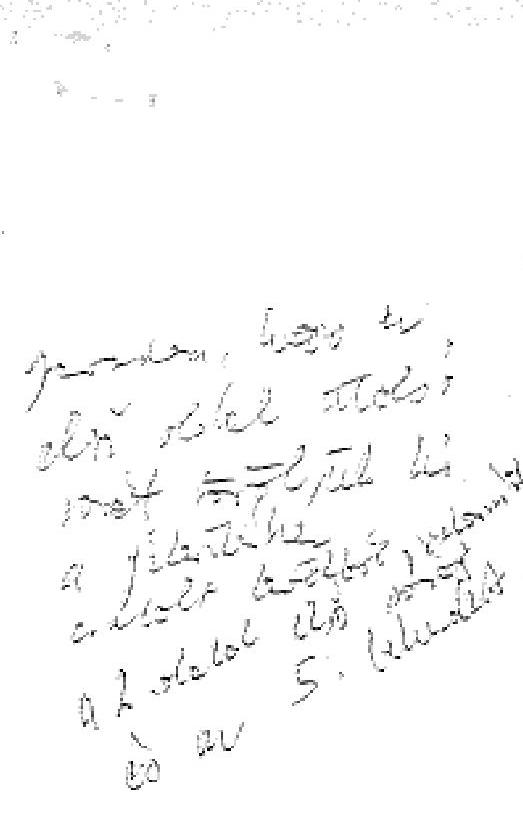
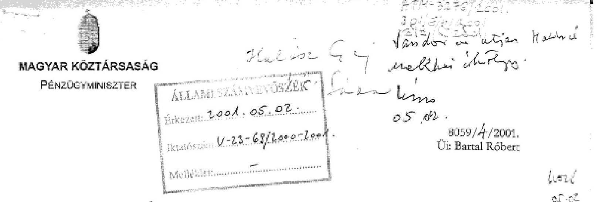
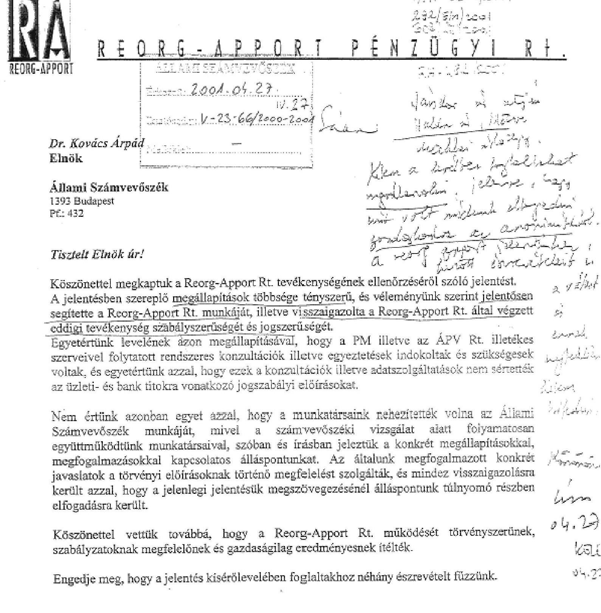
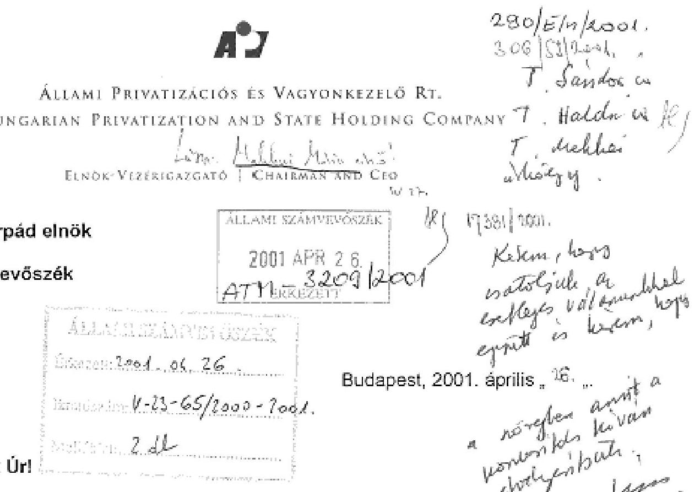
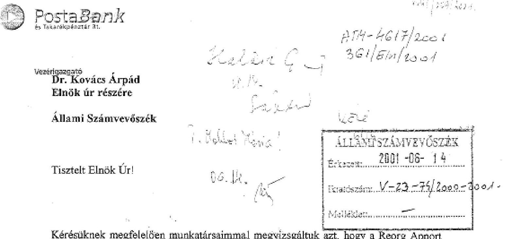

# JELENTÉS 

## A Reorg-Apport Rt. tevékenységének ellenőrzéséről

2001. június

---

# Az ellenőrzés végrehajtásáért felelős: 

IV. Vagyonellenőrzési Igazgatóság

Halász Géza számvevő igazgató

## Az ellenőrzést vezette:

## Makkai Mária

számvevő igazgatóhelyettes

## Az ellenőrzésben részt vettek:

## Kopányi Lászlóné

számvevő tanácsos

## Lőrinc Alajos

főtanácsadó

## Németh Béláné

tanácsadó

## Dr. Ocskovszky Jánosné

főtanácsadó

## Szűcs Ivánné

számvevő

## Verő Tünde

számvevő

---

# TARTALOMJEGYZÉK 

BEVEZETÉS ..... 3
I. ÖSSZEGZŐ MEGÁLLAPÍTÁSOK, KÖVETKEZTETÉSEK, JAVASLATOK ..... 5
II. RÉSZLETES MEGÁLLAPÍTÁSOK ..... 10

1. A társaság szervezetének kialakítása, működésének szabályozottsága ..... 10
1.1. A részvénytársaság létrehozása ..... 10
1.2. A társaság szabályozottsága, szervezeti keretei ..... 11
1.3. Az információ szolgáltatás ..... 12
1.4. Az 1999-2000. évekre kialakított üzletpolitika ..... 13
2. A társaság tevékenységét meghatározó fontosabb szerződések, megállapodások ..... 14
3. A vásárolt eszközök kezelése, értékesítése, behajtása ..... 19
3.1. A követelések kezelése, értékesítése, behajtása ..... 20
3.1.1. A normál hitelezésű ügyletek ..... 22
3.1.2. A work-out kezelésű ügyletek ..... 25
3.2. A követelések hasznosítása ..... 27
3.2.1. Az eladott követelések ..... 27
3.2.2. A megállapodással és jogi úton lezárt ügyletek ..... 27
3.2.3. A teljesítés alatt lévő megállapodások ..... 28
3.3. A befektetések kezelése és hasznosítása ..... 29
3.3.1. A befektetések átvétele és a tulajdonosi jogok rendezése ..... 29
3.3.2. A vagyonkezelési eljárások ..... 31
3.3.2.1. Külföldi befektetési és követelés csomag ..... 33
3.3.3. A befektetések értékesítése ..... 35
4. A Reorg-Apport Rt. gazdálkodása ..... 36
4.1. A vagyoni helyzet alakulása ..... 36
4.2. A bevételek és a kiadások alakulása ..... 37
5. A társaság közvetett és közvetlen tulajdonosai, valamint az ellenőrzésre kijelölt szervezetek tevékenysége ..... 40
5.1. Az ÁPV Rt. ..... 40
5.2. A Reorg Rt. ..... 41
5.3. A Pénzügyminisztérium ..... 42
5.4. Az ellenőrzésre kijelölt szervezet és a Pénzügyi Szervezetek Állami Felügyeletének (PSZÁF) vizsgálatai ..... 44

---

2

---

# Jelentés 

## a Reorg-Apport Rt. tevékenységének ellenőrzéséről

## BEVEZETÉS

Az Állami Számvevőszék 1999-ben vizsgálta a Postabank és Takarékpénztár Rt.-nél keletkezett veszteséget előidéző okokat. Az ellenőrzésnek nem volt feladata a konszolidáció végrehajtásán belül a minősített portfolió átadásához kapcsolódó szerződések végrehajtásának vizsgálata.

A Postabank Rt. konszolidációja keretében biztosított 152 milliárd Ft tőkejuttatást követően a bank minősített eszközállományából - a konszolidációról szóló 1155/1998. (XII. 9.) Korm. határozatnak megfelelően - 125,7 milliárd Ft postabanki nyilvántartási értékű követelést és befektetést a Reorg-Apport Rt. 41,5 milliárd Ft-ért megvásárolt. Közel 30 milliárd Ft értékű portfoliót a Postabank Rt. saját tulajdonú PB Work-out Kft.-je vásárolt meg 11 milliárd Ft vételáron. A Reorg-Apport Rt. vásárlásához szükséges forrás biztosítása érdekében az állam kezességet vállalt, a PB Work-out Kft. esetében állami kezességvállalás nem volt.

Az 1155/1998. (XII. 9.) Korm. határozat előírta, hogy a Kormányzati Ellenőrzési Hivatal köteles folyamatosan ellenőrizni a Reorg-Apport Rt.-nél az állami pénzeszközök felhasználását. Egyben felkérte a Számvevőszéket is ugyanerre a feladatra. A Számvevőszék elnöke arra vállalt kötelezettséget, - melyről a miniszterelnök urat tájékoztatta - hogy a Reorg-Apport Rt. tevékenységének ellenőrzését utólag, a kötvénytörlesztés lejáratának időpontjához - 2001. január 25. - kapcsolódóan rendeli el. A Postabank Work-out Kft.-hez került befektetések és követelések hasznosításának ellenőrzése e vizsgálatnak nem volt része. A Számvevőszék a későbbiekben tervezett, Postabank Rt. átfogó vizsgálatakor fogja ellenőrzését erre is kiterjeszteni.

A Reorg-Apport Rt. a Postabank Rt. konszolidálása érdekében alapított, 20 millió Ft jegyzett tőkével rendelkező, faktoring tevékenység végzésére jogosított társaság, minősített eszközöket vásárolt a Postabank Rt.-től. A minősített eszközök megvásárlását a Reorg-Apport Rt. 2 év és 26 napos lejáratú, 41,5 milliárd Ft névértékű, Postabank Rt. által lejegyzett kötvény ellenértékéből finanszírozta, melyre a Magyar Állam készfizető kezességet vállalt. A Reorg-Apport Rt. a Kormány határozata alapján speciális céltársaságként jött létre. Feladata az volt, hogy a Postabank Rt.-től megvásárolt minősített eszközöket értékesítse, kezelje, hasznosítsa 2 éven belül, úgy, hogy az állami garanciavállalás mellett kibocsátott 41,5 milliárd Ft kötvény és annak kamatai megtérüljenek.

---

Az Állami Számvevőszék az 1989. évi XXXVIII. tv. 2. § (6) bekezdésében kapott felhatalmazás alapján ellenőrizte a Reorg-Apport Rt. tevékenységét.

A lezárt jelentés záró észrevételezésekor a Reorg-Apport Rt. arról nyilatkozott, hogy a jelentés bank- és üzleti titkot tartalmaz. Megjelölte azokat a szövegrészeket, amelyek elhagyása esetén járul csak hozzá a nyilvánosságra hozatalhoz. Véleménye szerint a több, folyamatban lévő ügyletből néhány publikálása sértené a Reorg-Apport Rt. jövőbeni érdekérvényesítését. A pénzügyminiszter nyilatkozata is ezt támasztotta alá, a Miniszterelnöki Hivatal megítélése szerint pedig az érintett információk nyilvánosságra hozatala a Magyar államnak kárt okozna.

Az Állami Számvevőszék álláspontja szerint a végleges jelentés teljes terjedelmében nyilvánosságra hozható lenne. A jelentés a közel 100 %-os állami tulajdonban lévő Reorg-Apport Rt. két éves tevékenységéről szól, amelyhez ezalatt 24,5 milliárd Ft közpénz végleges felhasználása kapcsolódik.

A jelentés messzemenően szem előtt tartotta, hogy a folyamatban lévő ügyletek lezárását, a Reorg-Apport Rt. érdekérvényesítését az azokra vonatkozó adatok, információk ismertetésével ne befolyásolja. Ezért a jelentés az ügyfelek szempontjából beazonosításra nem alkalmas anonimitást biztosított.

Tekintettel arra, hogy a szóban forgó adatok esetében a Reorg-Apport Rt. a titokgazda, álláspontját az Állami Számvevőszéknek tudomásul kellett vennie. Természetesen az ügyletek lezárását követően a most elhagyott információkat nyilvánosságra hozzuk.

Az ellenőrzés célja: a Reorg-Apport Rt. tevékenységének, azaz a Postabank Rt. konszolidációjának részeként a Reorg-Apport Rt.-hez került - általa megvásárolt - egyes minősített követelések, valamint részesedések (befektetések) értékesítésének és a konszolidáció további költségvetésre gyakorolt hatásának, az állami pénzeszközök felhasználásának ellenőrzése volt.

Az ellenőrzött időszak: 1999-2001. január 25., ezért minden összesítő adat a megjelölt időszakra vonatkozik, illetve a 2001. január 25-ei állapotot tükrözi.

Az ellenőrzés módszere: átfogó ellenőrzés, a szabályszerűségi, az eredményességi szempontok figyelembevételével.

---

# I. ÖSSZEGZŐ MEGÁLLAPÍTÁSOK, KÖVETKEZTETÉSEK, JAVASLATOK 

A Reorg-Apport Rt. a szerződésben meghatározottak és az általa vállaltak szerint köteles volt 2000. december 31-ig a Postabank Rt.-től megvásárolt eszközöket behajtani, értékesíteni, vagy megtérülésük egyéb formáit biztosítani annak érdekében, hogy mérsékelje a költségvetés - kezességbevállalás miatti - várható terheit.

A társaság feladatainak csak részben tett eleget, mivel az eszközportfoliónak 57%-át értékesítette, és mintegy 18 milliárd Ft vételáron nyilvántartott eszközállomány maradt tulajdonában.

A Reorg-Apport Rt. üzletpolitikája szerint is célkitűzés volt, a lehető legnagyobb mértékű megtérülés elérése „a vállalt kötelezettségek teljes körű betartása mellett". E célkitűzés nem más, mint annyi bevétel elérése, amennyi a kötvény törlesztéséhez szükséges, ehhez pedig legalább névértéken történő értékesítés tartozott volna. Ez volt a pénzügyminisztériumi állásfoglalás szerinti elvárás is, amely a névérték alatti értékesítést megengedhetetlennek tartotta. A Reorg-Apport Rt. e követelménynek azonban több ok miatt nem tudott eleget tenni.

Az értékesítés azt bizonyította, hogy a névértéken való eladást nem lehetett realizálni, és ezt mint a piac értékítéletét a Pénzügyminisztérium is tudomásul vette.

A társaság 23,5 milliárd Ft értékű követelést, részvényt, üzletrészt értékesített.
A Reorg-Apport Rt.-nek a megvásárolt követelések több mint 80%-ából származott bevétele. A mobilizált követelések összegének döntő többségét a Reorg-Apport Rt. az adósokkal közvetlenül rendezte - kamatkedvezménnyel, megállapodás szerinti törlesztéssel - így ezen ügyletek véglegesen lezárultak mind az adós, mind a Reorg-Apport Rt. oldaláról. A követelések kisebb hányadát harmadik fél számára értékesítették, illetve egyedi megállapodással zárták le.

A befektetési portfolió hasznosításából a társaságnak 6,5 milliárd Ft bevétele származott. Az üzletrészeket és részvényeket 2,8 milliárd Ft veszteséggel értékesítette. Ebből 6 befektetést kamattal növelt, illetve eredeti vételáron tudott értékesíteni. Ezt az tette lehetővé, hogy 2 befektetést a Postabank Rt. vásárolt vissza (kamattal), 4 befektetést pedig a Reorg-Apport Rt. tulajdonosi határozattal egy társaságának értékesített, vételáron. Három társaságot külső szereplők vásároltak meg már csak 80% árfolyamon.

A további 12 befektetés esetében, amelyek az eredeti postabanki értékhez képest 48%-os vételáron kerültek a Reorg-Apport Rt. birtokába az eladáskor elért árfolyam, tovább csökkenve, 72% volt, az eredeti érték 35%-a.

A Reorg-Apport Rt. a követelések és a befektetések értékesítése során szabályzatainak megfelelően járt el.

---

A Reorg-Apport Rt.-nek a kötvény és kamatai 2001. január 25-én esedékes törlesztésére bevételei nem nyújtottak teljes mértékben fedezetet. A társaság összes - kamattal növelt - törlesztési kötelezettsége a két év alatt 52,2 milliárd Ft volt. A Reorg-Apport Rt. az eszközök hasznosításából 22,8 milliárd Ft, az egyéb, díjalapba nem tartozó bevételekkel együtt összesen mintegy 28 milliárd Ft bevételt ért el. 2000. december 31-ig ebből 24,2 milliárd Ft előtörlesztést teljesített, fennmaradt kötelezettsége 28,6 milliárd Ft volt, melynek teljesítésére a társaság 3 milliárd Ft-tal rendelkezett.

Az állami garancia beváltásának elkerülése érdekében az ÁPV Rt. a 2000. évi központi költségvetésből biztosított forrás terhére 25 milliárd Ft-ot juttatott a társaságnak. Ebből 13 milliárd Ft vissza nem térítendő támogatás, 7 milliárd Ft az ÁPV Rt. kezességvállalási szerződése alapján a 2000. évi veszteség megtérítése és 5 milliárd Ft egy éves lejáratú kölcsön volt.

A Reorg-Apport Rt.-nek mintegy 0,6 milliárd Ft vitatott kötelezettsége maradt a Postabank Rt.-vel szemben.

A Postabank Rt. 1998. évi konszolidációjához nyújtott állami pénzeszköz 152 milliárd Ft volt, a Reorg-Apport Rt.-nek - ÁPV Rt.-n keresztül - juttatott vissza nem térítendő támogatással, a tőkeemeléssel (4,5 milliárd Ft) és a veszteség megtérítésével együtt a Bank helyzetének rendezésére a Magyar Állam 2001. január 25-ig összesen 176,5 milliárd Ft-ot fordított.

Az értékesítést követően 2001. január 25-én a Reorg-Apport Rt.-nél 18 milliárd Ft vételáron nyilvántartott portfolió maradt, melynek 78%-a részvény és üzletrész. Az eladatlan befektetési állomány fennmaradásának egyik oka, hogy az auditálás elmaradása miatt a vételár magas volt. Abban a szerződésben, amelyben a vételár korrekciójához szükséges audítot előírták, a szerződést kötő felek nem rögzítették, hogy a feladat elvégzése mely társaság kötelezettsége. Ez hiányzik a szerződésből annak ellenére, hogy az a Postabank Rt. minősített eszközei értékesítésének „legfontosabb jogi, gazdasági, pénzügyi feltételeit" rögzítette. E feltételek között szerepelt, hogy „az értékesített banki eszközök vételára egyenlő az adás-vétel napjára számított, auditált, céltartalékkal csökkentett könyvszerinti értékkel." A Pénzügyminisztérium értelmezése szerint a szerződés a Postabank Rt.-re vonatkozóan „sem kötelezettséget, sem további feladatot nem tartalmazott". Emiatt a Bank a Reorg-Apport Rt.-vel az auditálás hiányával kapcsolatban kialakult vitában ezt a kötelezettséget nem ismerte el. A céltartalék állomány 1998. december 31-ei állapotra történő auditálása nem történt meg. A bank az eladási árat könyvvizsgálóval 1999. februárjában felülvizsgáltatta ugyan, de a könyvvizsgáló a befektetésekre valós céltartalék igényt - arra hivatkozással, hogy az éves mérlegek nem állnak rendelkezésre - nem állapított meg, így árkorrekció sem történt.

A vételár meghatározása utólag egyértelműen nem minősíthető, mivel az 1998. év végi elmaradt auditálás hatása ma felelősséggel nem számszerűsíthető. A piaci környezet, az érintett adósok és befektetések akkori helyzete nem rekonstruálható, azonban a piac későbbi értékítélete alapján felülértékelés vélelmezhető.

---

A Reorg-Apport Rt.-nél maradt mintegy 14 milliárd Ft nyilvántartási értékű befektetési portfoliónál - a spanyol ügyletek és még egy társaság kivételével - a beszerzési ár azonos volt a postabanki, eredeti befektetési értékkel.

A Bank által jónak minősített
 céltartalék nélküli, ezért nyilvántartási értéken átadott befektetéseket a társaság a meghirdetés ellenére nem tudta értékesíteni. 44 pályázati hirdetésből 24-re nem érkezett ajánlat, 20 kiírásra 25 pályázatot adtak be az érdeklődők és ebből kettő volt érvényes, egy szerződés jött létre. Az ármeghatározás módja eredményeként olyan eladási áron kellett volna a társaságnak értékesíteni az eszközöket, amelyet valóságos piaci érdeklődés nem támaszthatott alá. Ezt a későbbi piaci megmérettetés is bizonyította.

Az értékesítést - az auditálás hiányán kívül - nehezítette, hogy a befektetések 41,5%-a kisebbségi részvény, illetve üzletrész volt és emiatt a piac szereplői nem érdeklődtek irántuk. Ezen túl nem zárható ki a befektetők magatartásában a kivárás sem, miután ismert volt előttük, hogy a társaságnak 2 éven belül kell értékesítenie az eszközöket.

Mintegy 4 milliárd Ft nyilvántartási értékű az a követelésállomány, melyet a Reorg-Apport Rt. 2001. január 25-én könyveiben kimutatott. Ebből 58%-ot képviselnek a szerződéssel, illetve megállapodással rendezett követelések, törlesztésük 2001. évben várható. A fennmaradó és jogi útra terelt követelések megtérülése időben és értékben is bizonytalan. A felszámolási eljárás alatt álló adósok esetében a Reorg-Apport Rt. egy a hitelezők között, bevétele nem becsülhető.

Mindez oda vezetett, hogy a Reorg-Apport Rt. kötvénytörlesztése teljesítéséhez - az ÁPV Rt.-n keresztül, közvetetten - újabb állami beavatkozásra volt szükség.

A társaságnál maradt 18 milliárd Ft értékű portfolióval szemben - figyelembe véve az ÁPV Rt. által kölcsön formájában juttatott összeget - 5 milliárd Ft kötelezettség áll fenn. Ez azonban nem azt jelenti, hogy az eszközök értéke a kötelezettség szintjével azonos. A portfolióból ugyanis 2,3 milliárd Ft megtérülése már szerződéssel biztosított, és 4 megállapodás előkészítése folyamatban van, amelyekből további bevétel várható. Az állomány ezen felül olyan befektetéseket is tartalmaz, melyeknél a minimális nyilvántartási értéket a tulajdonukban lévő földingatlanok értékesítése a legrosszabb esetben is meghaladhatja. Mindezért elkerülhetetlenül szükséges a Reorg-Apport Rt. tulajdonában maradt eszközvagyon auditálása.

A társaság gazdálkodása nem hasonlítható a folyamatos, hosszú távú működésre, eredményorientáltságra létrejött társaságok gazdálkodásához. Céltársaság jellegéből adódóan minimális jegyzett tőkéje (20 millió Ft) kétezerszeres összegének megfelelő kötelezettségállománnyal és nehezen értékesíthető, ugyanolyan összegű eszközállománnyal jött létre. A kötelezettségállomány a kamat és annak tőkésítése miatt nem azonos mértékben csökkent a keletkezett bevétellel és a befizetett törlesztéssel, melynek már önmagában nem lehetett más eredménye, mint veszteség. A veszteség keletkezését erősítette az eszközök sikertelen értékesítése.

---

A konstrukció kialakításakor mindez magában hordozta azt a lehetőséget, hogy az Állam közvetlen vagy közvetett beavatkozása szükségessé válhat. Az eltelt két év azt bizonyította, hogy az állami kezességvállalás gyakorlatilag az 1998. év végén végrehajtott postabanki konszolidáció befejezésének időbeli meghosszabbítása volt.

Az állami kezesség beváltásának elkerülése érdekében a választott megoldással is a központi költségvetés állt helyt a Reorg-Apport Rt. helyett, más költségvetési évet - 2001. helyett 2000. évet - terhelve. Ez a megoldás egyúttal azzal a következménnyel járt, hogy a Reorg-Apport Rt.-nél nem keletkezett a kezesség beváltása miatt állammal szembeni, adók módjára behajtandó kötelezettség. A költségvetés helytállása miatt azonban a társaságnál maradt vagyon értékesítése során elért - az ÁPV Rt. részére törlesztendő 5 milliárd Ft kölcsönön és a működési költségen felül - esetleges többletbevétellel a központi költségvetés terheit indokolt mérsékelni.

A társaság kizárólagos feladata a követelések és befektetések értékesítése volt. A teljes portfolió kezelése az értékesített állománnyal kapcsolatos költségekkel együtt összesen 1,1 milliárd Ft ráfordítást igényelt, amely magába foglalja a személyi jellegű, a könyvvezetési, az ügyvédi, a szakértői és a vagyonkezelési díjakat is. A Reorg-Apport Rt.-nek az értékesítendő portfolión kívül más vagyona nincs, ezért az összes felmerült ráfordítás a feladat ellátását szolgálta. Ezen belül a Reorg Rt. társaságainak fizetett díj 50%-ot képvisel.

A Reorg-Apport Rt. mint állami felügyeletű és állami tulajdonú céltársaság feladatát, az eszközállomány teljes körű értékesítését, csak részben tudta teljesíteni. Ebben szerepe volt az általa fizetett vételárnak, a befektetések esetében pedig a kisebbségi tulajdoni hányadok miatti befektetői szándék hiányának.

# Javaslatok: 

## A Kormánynak

A korrupcióval szembeni kormányzati stratégia végrehajtása keretében, a jogszabályokban rögzített üzleti titok tartalmát szükítse, különösen olyan esetekben, amikor a gazdálkodó szervezet működését közpénzzel támogatja a Magyar Állam. A közérdekű adatok nyilvánosságának követelménye akkor teljesül, ha a közvélemény arról is tájékoztatást kap, hogy mi vezetett oda, hogy közpénz felhasználása vált szükségessé és az ügyletben közreműködők személye nem marad ismeretlen.

## A Miniszterelnöki Hivatalt vezető Miniszternek

Gondoskodjon arról, hogy a jövőben állami tulajdonú szervezet, társaság konszolidálásakor, eszközértékesítés esetén, az auditálás ne csak állami elvárás maradjon, hanem történjen meg az annak elvégeztetéséért felelős szervezet kijelölése is.

---

# Az ÁPV Rt. igazgatóságának 

1. Kötelezze a Reorg-Apport Rt.-t arra, hogy befektetéseinek reális értékű nyilvántartása és az elvárható megtérülési érték pontos meghatározása érdekében auditáltassa a 2001. január 25-én megmaradt portfolió elemeket.
2. Úgy alakíttassa ki a Reorg-Apport Rt. vagyonkezelési, értékesítési koncepcióját 2001. évben, hogy az ÁPV Rt. által nyújtott kölcsönnél magasabb bevételt érjen el.
3. Biztosítsa, hogy a kölcsön visszafizetése és a működési költségek levonása után fennmaradó többletbevétel a központi költségvetés forrását növelje.

---

# II. RÉSZLETES MEGÁLLAPÍTÁSOK 

## 1. A TÁRSASÁG SZERVEZETÉNEK KIALAKÍTÁSA, MŰKÖDÉSÉNEK SZABÁLYOZOTTSÁGA

### 1.1. A részvénytársaság létrehozása

A Postabank Rt. 1998. évi konszolidációja érdekében szükséges állami intézkedéseket a Kormány 1155/1998. (XII. 9.) határozata tartalmazta, miszerint a minősített banki eszközök kijelölt vevője a Reorg-Apport Rt. volt. A társaság összesen 125,7 milliárd Ft bruttó értékű eszközt - követeléseket (hiteleket), befektetéseket (részvényeket, üzletrészeket) - vásárolt meg a Postabank Rt.-től 41,5 milliárd Ft nettó értéken.

A Reorg-Apport Rt. feladata volt a banki eszközök vételárának fedezetére szolgáló kötvény kibocsátása.

Az Állami Pénz- és Tőkepiaci Felügyelet (továbbiakban: ÁPTF) a hozzá benyújtott dokumentumok alapján a kötvénykibocsátást 1998. december 30-án az Épt.-ben foglalt feltételeknek megfelelőnek minősítette, és tudomásul vette. Ennek alapján a kötvénykibocsátás és annak Postabank Rt. által történő lejegyzése 1998. december 31-én megtörtént. A kötvények kamat-megállapítását megállapodás alapján az Államadósság Kezelő Központ (továbbiakban: ÁKK) végezte.

Az 1165/1998. (XII. 29.) Korm. határozat alapján a Kormány a ReorgApport Rt. által kibocsátott, 2001. január 25-én lejáró, a Postabank Rt. által lejegyzett 41,5 milliárd Ft névértékű kötvény tőkeösszegének és kamatainak megfizetésére készfizető kezességet vállalt.

A Reorg Apport Pénzügyi Részvénytársaság cégbejegyzése 1998. december 1-jén megtörtént. Az alapító - a Reorg Gazdasági és Pénzügyi Rt. - a társaságot 20 millió Ft jegyzett tőkével határozatlan időtartamra hozta létre. Működéséhez az ÁPTF az alapítási és működési engedélyt 1998. december 19-én megadta.

A társaság megalapítása és a cégjegyzékbe történő bejegyzése megfelelt a Kormányhatározat és a gazdasági társaságokról szóló 1997. évi CXLIV. törvény (továbbiakban: GT) előírásainak.

Az alaptőkét 2000 szeptemberében 4.491 millió Ft-ra megemelték, az 1999. december 31-ei mérlegben kimutatott veszteség tőkepótlás útján történő rendezése érdekében. A tőkeemelés összegét az ÁPV Rt. bocsátotta a Reorg Rt. rendelkezésére.

---

A Reorg-Apport Rt. a tőkeemelést a kötvények törlesztésére fordította. A tőkeemelés a mérleg szerinti veszteséget megszüntette, de a saját tőke/jegyzett tőke aránya a GT 243. § (1) a) pontja és a (2) bekezdésében meghatározott 2/3-os szint alá csökkent. Ezért az arány helyreállítása érdekében 2000. november 17-én a jegyzett tőke 20,2 millió Ft-ra történő leszállításáról döntöttek.

# 1.2. A társaság szabályozottsága, szervezeti keretei 

A Pénzügyminisztérium, az ÁPV Rt., a Reorg Rt. és a Reorg-Apport Rt. között létrejött a készfizető kezességvállalást kiegészítő kezelési szerződés (a továbbiakban négyoldalú szerződés) B pontja tartalmazza az eszközök hasznosítására a Reorg-Faktor Rt. kijelölését, és azt, hogy a Reorg-Apport Rt. munkaszervezetet nem hoz létre.

Ennek ellenére 1999 májusában a társaság új vezetése - a Reorg-Apport Rt. tájékoztatása szerint - a tulajdonosokkal és az ÁPV Rt.-vel történt szóbeli egyeztetés alapján, költségkímélésre hivatkozással, 7 fős szervezet kialakításáról döntött. Mindez írásban először az igazgatóság által jóváhagyott 1999-2000. évi üzletpolitikában jelent meg. A Pénzügyminisztérium és az ÁPV Rt. előtt a szervezet kiépítése a rendszeres tájékoztatásból ismert volt, azt hallgatólagosan tudomásul vették.

## A Reorg-Apport Rt. szabályzatait teljes körűen készítette el.

A Reorg-Apport Rt. Szervezeti és Működési Szabályzata az igazgatóság 1999. október 1-jei határozatával lépett életbe. E szerint a szakmai területeknek két csoportja van, a hitel- és a befektetési portfoliókezelési terület.

A vezérigazgató döntési hatáskörét ügylet és értékhatár megjelöléssel, valamint részletezéssel az Alapító Okirattal, illetve annak módosításával azonosan tartalmazza a Szervezeti és Működési Szabályzat. A követelések és befektetések kezelésével kapcsolatos valamennyi döntés - megosztva - az igazgatóság és a vezérigazgató hatásköre.

A vezérigazgató helyettese az általános igazgató, aki a befektetési portfoliókezelési szakterületet közvetlenül irányítja.

A GT szabályai szerint a Reorg-Apport Rt.-nél Felügyelő Bizottság (továbbiakban: FB) működik, amely 1999-ben havonta, 2000-ben kéthavonta ülésezett. Az FB a társaság helyzetével, működésével kapcsolatos valamennyi lényeges kérdést megvitatott, a készülő szabályzatokhoz véleményt adott, valamint előírás szerint tárgyalta a negyedéves jelentéseket és rendszeres volt a vezérigazgató beszámoltatása is. A portfolió egyes elemei értékesítésének helyzetét részleteiben is figyelemmel kísérte az FB.

Az FB 2000 májusában vizsgálta a portfolióra vonatkozó döntési hatáskörök érvényesülését, és megállapította, hogy minden esetben a belső szabályzatoknak megfelelően jártak el.

A tulajdonosi ellenőrzés egyik megnyilvánulási formája volt a Reorg Rt. által létrehozott, a cégcsoport tagjainak vezetőiből álló Vezetői Operatív Bizottság,

---

amely tevékenysége során a döntéselőkészítést, a vezetők tevékenységét közvetlenül ellenőrizte.

A Szervezeti és Működési Szabályzat tartalmazza a társaság belső irányításának eszközeit, a cégjegyzés, a képviselet, a kötelezettségvállalás rendjét.

Az üzleti tevékenység szabályainak kialakításáról az igazgatóság döntött. 1999. május 31-én helyezték hatályba a Postabank Rt.-től vásárolt minősített eszközök (követelések és befektetések) kezelése és értékesítése során követendő eljárásrendet, amelynek rendelkezései a Reorg Rt. érdekkörébe tartozó társaságokra is érvényesek voltak. Ez a keretszabályzat és annak mellékletei valamennyi döntési, eljárási folyamatot meghatározzák.

A követelések után esedékes kamatok kiszámításának és nyilvántartásának módját vezérigazgatói utasítás keretében szabályozták.

A Reorg-Apport Rt. a tulajdonába került befektetések és követelések hasznosításával, értékesítésével összefüggően 30 ügyvédi irodával és vállalkozással 82 megbízási szerződést kötött. A megbízási szerződések minden esetben konkrét feladatokat tartalmaztak. 7 szerződés a könyvvizsgálói feladat ellátásával volt kapcsolatos.

A Reorg Rt. érdekeltségébe tartozó cégek közül 3 társaság kapott megbízást:

- az APP Kft. végezte és jelenleg is végzi a Reorg-Apport Rt. számviteli, pénzügyi üzletviteli feladatait,
- a Reorg Audit Kft. 6 esetben értékesítésre irányuló átvilágítási feladatot látott el,
- a Reorg Faktor Rt. a Postabank Rt.-től megvásárolt minősített banki eszközök kezelését végezte.

Jogi képviselet ellátására 12 megbízási szerződés vonatkozott, ebből 3 az igazgatóság döntése alapján a spanyol befektetésekkel kapcsolatos (külföldi) peres eljárások lefolytatására, az ingatlanok értékesítésében való közreműködésre.

A tulajdonosi képviselet ellátása, pályáztatás lebonyolítása, részvényértékesítés, információs memorandum készítése, követelések behajtása, értékbecslés témákban összesen 55 szerződést kötöttek.

# 1.3. Az információ szolgáltatás
 A Reorg-Apport Rt. információ szolgáltatásának rendjét a négyoldalú szerződés írta elő. Ennek alapján a Pénzügyminisztérium részére a társaság havonta pénzügyi jelentést készített, amely a bevételek és kiadások adatait, valamint a kötvénytörlesztés részleteit tartalmazta.

Ugyancsak előírás volt a Pénzügyminisztérium részére negyedéves értékelő jelentés összeállítása, amely a követelések és befektetések hasznosításának helyzetét (10 millió Ft nyilvántartás értéket meghaladóan) portfolio elemenként

---

részletezve mutatta be, elemezte a negyedév alatt végzett szakmai munkát, a megtörtént, illetve a várható értékesítéseket.

A jelentéseket - az APP Kft. és a Reorg Faktor Rt. által megadott adatok alapján - a társaság saját apparátusa készítette el.

A negyedéves értékelő jelentéseket minden esetben az igazgatóság hagyta jóvá. Az FB a jóváhagyott jelentéseket - utólag - megvitatta, és a vitáról felvett jegyzőkönyveket rendszeresen megküldte a Pénzügyminisztériumnak. Ezzel teljesítette a négyoldalú szerződésben a negyedéves jelentésekhez fűzött, előírt, írásos jelentéskészítési feladatát. A társaság könyvvizsgálója negyedévente jelentéseket készített a pénzforgalmi kimutatások felülvizsgálatáról, azokat az előírásoknak megfelelőnek minősítette.

A jelentésekkel kapcsolatban a PM sem tartalmi, sem egyéb észrevételt nem tett.

# 1.4. Az 1999-2000. évekre kialakított üzletpolitika 

A Reorg-Apport Rt. a követelések és a befektetések kezelésével kapcsolatos üzletpolitikáját 1999 májusára készítette el.

Az üzletpolitika alapvető célkitűzésként jelölte meg a lehető legnagyobb mértékű megtérülést „a vállalt kötelezettségek teljes körű betartása mellett”. Optimális a megtérülés, ha a bevétel a kötvény (tőke és a kamat együttes) összegére fedezetet nyújt. Célkitűzésének a társaság csak részben tudott eleget tenni, mivel az elért bevétel nem nyújtott elegendő forrást kötelezettsége teljesítésére.

Az átvett eszközök összetétele alapján alakították ki az alkalmazandó eljárásokat, és követendő módszereket és e szerint az eszközöket négy csoportba sorolták:

- normál hitelezési eljárást igénylő ügyletek,
- work-out kezelésű követelésállomány, ebben a csoportban a követelésérvényesítés speciális feladatait, a döntés előkészítést a Reorg Faktor Rt. végezte,
- befektetések kezelése, külön kiemelve a kisebbségi befektetések kezelését,
- magánszemélyekkel kapcsolatos követelések.

A befektetések kezelésével kapcsolatban külön üzletpolitikai irányelv készült. A megfelelő értékesítési ár eléréséhez célnak tekintették a befektetések működőképességének fenntartását és figyelembe vették a közvetlen és közvetett tulajdoni hányad nagyságát.

A befektetés kezelés lehetséges elvei alapján három fő csoportot képeztek:

- visszaadásra kerülő befektetések,
- kisebbségi részesedések,
- összevont portfolió kezelés.

---

Az összevont portfolió kezelés keretében az egymással összefüggő, így azonos eljárási módszereket igénylő befektetések 9 csoportját tüntették fel, pl. spanyol ingatlanokhoz kapcsolódó portfolió, cukorgyári portfolió. Az egyes portfolió csoportokra vonatkozóan a részletes teendőket külön-külön rögzítették.

Az üzletpolitika gyakorlati érvényesítését a 3. pontban szereplő egyedi ügyletek vizsgálati tapasztalatai tartalmazzák.

# 2. A TÁRSASÁG TEVÉKENYSÉGÉT MEGHATÁROZÓ FONTOSABB SZERZŐDÉSEK, MEGÁLLAPODÁSOK 

A Postabank Rt. konszolidációjának végrehajtása és a Reorg Apport által megvásárolt portfolió hasznosítása érdekében 1998. december 30-án, 31-én és azt követően a következő szerződéseket kötötték:

Készfizető kezességvállalást kiegészítő kezelési szerződés, amely a pénzügyminiszter, az ÁPV Rt. és a Reorg Rt., valamint a Reorg-Apport Rt. között (1998. december 30.) jött létre.

A szerződés rögzíti, hogy a Postabank a minősített banki eszközöket 41,5 milliárd Ft-os áron értékesíti a Reorg-Apport Rt-nek. A szerződés szerint "Az érintett banki eszközök (egyedi és összesen) vételára egyenlő az adásvétel napjára számított, auditált céltartalékkal csökkentett könyvszerinti értékkel, amely magába foglalja az 1998. IV. negyedévi kamatokat is".

A szerződő felek számoltak azzal is, hogy "tízmilliárd forintos nagyságrendű veszteség keletkezhet" főleg amiatt, hogy a hasznosítás bevételei nem nyújtanak fedezetet a kötvények kamataira, a működés, az értékesítés költségeire, valamint azért, mert az értékesítés kampány jellege (2 év) az árakat a vételár alá viheti. Ugyanakkor a Pénzügyminisztérium, mint a szerződés egyik aláírója egy, az ÁPV Rt.-nek írt levelében kifejtette, hogy a portfolió nettó érték alatti értékesítését elfogadhatatlannak tartja. A gyakorlat azt bizonyította, hogy a nettó értéken való értékesítés megvalósítása alapvetően a befektetések területén nem volt végrehajtható. Ezt tükrözi, hogy a társaság a részvény és üzletrész elemek közül csak 39%-ot tudott értékesíteni, azt is 2,8 milliárd Ft veszteséggel, 70%-os árfolyamon. A Pénzügyminisztérium az eladási árat nem kifogásolta.

A szerződés előírta, hogy az eszközök értékesítésének általános formája a nyilvános pályázat kell legyen, de tartalmazta azt is, hogy a Reorg-Apport Rt. köteles az eszközöket ".. értékesíteni, vagy megtérülésük egyéb formáit biztosítani" (ez jelentette a végelszámolást, a jobb megtérülés érdekében történő működtetést, stb. is).

Mind a szerződés megkötését előíró kormányhatározatnak, mind magának a szerződésnek hiányossága, hogy nem jelölte meg az auditálás elvégzésére kötelezett szervezetet. Ez vezetett oda, hogy az eszközportfolió korábbi tulajdonosa, a Postabank Rt., és új tulajdonosa a Reorg-Apport Rt. sem tekintette feladatának az auditálás elvégzését.

---

A Reorg-Apport Rt. kötvénykibocsátásához készült információs összeállítás és kibocsátási terv 2. pontja is tartalmazza az auditálási kötelezettséget, de szervezet kijelölése nélkül. A szerződés aláírói (PM-ÁPV Rt., Reorg Rt., Reorg-Apport Rt.) nem intézkedtek az audit elvégzéséről.

Az audit és ebből következően az árkorrekció elmaradása szerepet játszott abban, hogy az ár miatt a Reorg-Apport Rt. részére átadott eszközállományból 43% megmaradt.

Engedményezési szerződés a Postabank Rt. és a Reorg-Apport Rt. között (1998. december 31.) jött létre, amely szerint a követeléseket a Bank 18.548 millió forint ellenérték fejében eladta. A felek kötelezettséget vállaltak arra, hogy a vételárat "...a teljes portfolió 1998. dec. 31. tényleges értékének az ismeretében szükség esetén legkésőbb 1999. február 28-ig módosítják a jelen szerződés napján aláírt külön megállapodásban rögzítettek szerint."

Az engedményezési szerződést 1999. január 19-én módosították, melyben a követelések vételárát 18.317 millió Ft-ra változtatták. A különbözetet - 17,57%-os kötvény kamattal növelve - a Postabank visszautalta, melyet a Reorg-Apport Rt. kötvénytörlesztésre fordított. Ez a vételár módosítás nem a könyvvizsgálói audittal alátámasztott vételár korrekció volt.

Megállapodás jött létre a Postabank Rt. és a Reorg-Apport Rt. között (1998. december 31.), melyben a Postabank kötelezettséget vállalt arra, hogy "az ellenértéket a teljes portfolió 1998. december 31-i tényleges értékének az ismeretében, szükség esetén, legkésőbb 1999. február 28-ig módosítják." Ez a befektetésekre és a követelésekre egyaránt vonatkozott.
"... az engedményezésre és eladásra került eszközök 1998. szeptember 30-ai állapot szerint minősített céltartalék-szükségletét 1999. február 28-ig az 1998. december 31-ei állapotra aktualizálja... Az ilyen módon aktualizált céltartalék-állománnyal csökkentett könyvszerinti érték képezi az eladási ár ellenérték alapját. Az ily módon aktualizált céltartalék-állományt, ennek következményeként kialakult eladási árat Engedményező könyvvizsgálóval felülvizsgáltatja".

A megállapodás az esetleges vételár-különbözetet 1 milliárd forintban maximálta, lefelé.

A megállapodás felülvizsgálatra vonatkozó rendelkezése nem felel meg a négyoldalú szerződésben foglaltaknak, mert az szigorúbb felülvizsgálatot, auditálást szabott a végleges vételár kialakítása feltételeként. A négyoldalú szerződésben foglalt előírás összhangban volt a kormányzati szándékkal is, hiszen a pénzügyminiszter 1998. december 23-ai, a Kormány részére készített előterjesztése is a következő módon fogalmazott: "A vételár végső meghatározására csak az 1998. december 31-ei, könyvvizsgáló által auditált adatok alapján kerül majd sor 1999. első negyedévében."

E megállapodás teljesítése érdekében a Postabank Rt. 1999. február 19-én kötött szerződést egy könyvvizsgáló társasággal. A jelentés elkészítésének határ-

---

ideje február 28. volt, de a késve kapott információk miatt a társaság végleges jelentését csak 1999. március 5-én juttatta el a Banknak.

Az alig több mint két hét alatt készített jelentés szerint "A vizsgálat célja annak megállapítása, hogy az 1999. február 15-től február 26-ig rendelkezésre álló, a vizsgálat lefolytatásához a Bank által rendelkezésünkre bocsátott információk szükségessé teszik-e az eladási árban érvényesített céltartalék összesenjének nagyságrendi, jelentős módosítását."

A jelentés a hitelek esetében összesen 506 millió Ft, eladási árat növelő eltérést állapított meg. (A jelentősnek ítélt hitelek esetében 535 millió Ft árnövelő, 278 millió Ft árcsökkentő és a nem jelentősnek ítélt hiteleknél 249 millió Ft árnövelő módosítást mutattak ki.)

A vizsgálatot valamennyi vételár-követelésre elvégezték. Ezen belül az „M” Rt.-vel szemben fennálló követeléssel kapcsolatban a jelentésben a következő szerepel: "Az 1998. augusztus/szeptemberi vizsgálatunk során a 2.740 millió Ft összegű követelésre 70% céltartalékot (1.918 millió Ft) javasoltunk, tekintettel az adós pénzügyi mutatóira és fizetési moráljára, valamint arra, hogy a fedezetet a Bank nem fogadhatta volna el. Ezen véleményünket továbbra is fenntartjuk." A megképzett, illetve a vételár kialakításának alapját képező céltartalék ezzel szemben mindössze 10% volt.

A könyvvizsgáló e véleményét kiegészítette ugyan még azzal, hogy "Abban az esetben, ha a követelés egy nem hitelintézeti minősítésű társaságra száll át (mint esetünkben a Reorg-Apport Rt.) a hozzá tartozó kft. üzletrészei már elfogadhatók fedezetként. Ekkor azonban értékelni kell a fedezetet, amelyhez azonban a vizsgálat elvégzése során nem állt rendelkezésünkre információ. A fentiek hiányában nem áll módunkban a céltartalékra vonatkozó álláspontunkat kialakítani." Az idézett vélemény első mondatában foglaltak nem fogadhatóak el, mivel a Postabanknak a céltartalékot és egyben a vételárat nem abból a szempontból kellett kialakítania, hogy milyen társaság lesz a vevő. A vételár minden esetben a banknál, a bankra érvényes előírások figyelembevételével megképzett céltartalék levonása utáni nettó ár kellett, hogy legyen.

# A jelentés az összes vizsgált befektetésre vonatkozó céltartalékszükséglettel kapcsolatban zárult úgy, hogy a könyvvizsgáló álláspontját nem tudta kialakítani. 

Konklúzióként a jelentés megállapítja: "A szerződő felek számára ismeretes, hogy az ármódosításra megadott határidő nem tette lehetővé a Bank számára az értékesített portfolió aktualizálásának oly módon történő elvégzését, ahogyan az a normál banki ügymenetben az év végi minősítések alkalmával elvárható lenne. A minősítéshez felhasznált információk (különösen a befektetések és vételár-követelések vonatkozásában, azok természetéből fakadóan) sem minőségében sem mennyiségében nem voltak megfelelőek. Különösen megnehezítette a Bank számára a minősítést, hogy az aktualizálás időpontjában az adósok és a befektetések tulajdonosai már nem voltak információszolgáltatásra kötelezhetőek a Bank felé. Az értékelhető információk körének bővítése érdekében a Bank a Reorg-Apport Rt.-től mindazon információk átadását kérte, melyek hatással lehetnek az átadott portfolió céltartalékjára. A Reorg-Apport Rt.-től 1999. március 3-án érkezett válaszlevél rendkívül szűk körű információi nem voltak hatással a céltartalékjára. Mindezek következtében fennáll annak lehetősége, hogy egy későbbi reális időpontban végrehajtandó minősítés akár jelentős mértékben is befolyásolja az akkor rendelkezésre álló információk alapján megállapítható céltartalék összegét." A rendelkezésre álló dokumentumok szerint ez nem történt meg.

Egy ennyi bizonytalanságot tartalmazó könyvvizsgálói vélemény alapján a szerződő feleknek - a négyoldalú szerződésben vállaltak szellemében - célszerű lett volna abban megállapodniuk, hogy az esetleg szükséges vételár-korrekció megállapítása érdekében a tervezett auditálás végrehajtásának határidejét 1999. május 31-ig meghosszabbítják. Ezen időpontig már rendelkezésre álltak volna a pontosabb értékelés elvégzéséhez szükséges adatok, információk.

Megbízási szerződés, amely a Reorg-Apport Rt. és a Reorg-Faktor Pénzügyi Rt. között (1998. december 31.) jött létre.

E szerződést még annak ismeretében kötötték, hogy a Reorg-Apport Rt.-nek nem lesz kiépített szervezete. A szerződésben a Reorg-Apport Rt. megbízta a Reorg-Faktor Rt.-t a Postabanktól megvásárolt teljes portfolió
 - közvetítői tevékenységként végzett - kezelésével, hasznosításával, értékesítésre való előkészítésével, illetve a hasznosítás, értékesítés lebonyolításával. A megbízottat tevékenysége ellátásáért megillető díjazás a költségtérítésből, a közvetítői díjból (a Reorg-Apport Rt.-nél kimutatható számított alapdíjból, csökkentve a megbízónál a díjalap terhére fizetett kiadásokkal) és a sikerdíjból tevődött össze. A díjazás azonos volt a négyoldalú szerződésben a Reorg-Apport Rt. részére megállapított díjjal.
(A Megbízónál kimutatható számított alapdíj összege a Megbízó pénzforgalmi számlájára befolyó minden bevétel 6%-a, a sikerdíj alapja ugyanezen bevételek elszámolási időszakonként változó, 1-4-ig terjedő %-a.)

A megbízás 1999. január 1-jétől 2001. május 31-ig szólt.
A megbízási szerződést 5 alkalommal módosították. Az első módosítás azzal összefüggésben történt, hogy a Reorg-Apport Rt. kiépítette szervezetét és kialakította üzletpolitikáját, így rendelkezett apparátussal a feladatok részbeni ellátására. Az 1999-2000. évre elfogadott üzletpolitika szerint a Reorg-Faktor Rt. kezelésébe tartozó ügyletek köre szűkült. Feladata maradt a workout kezelésű (döntően jogi eljárás alatt álló ügyféllel szembeni) követelésállomány kezelése, a magánszemélyekkel szembeni követelések érvényesítése.

A megbízási szerződés módosítása azonban nem tartalmazza azt az alapvető rendelkezést, hogy a részletezett feladatok milyen portfolió elemekre terjednek ki. A társaság szóbeli tájékoztatása szerint a megbízott feladata a Reorg-Apport Rt. üzletpolitikájában megjelölt portfolió elemek kezelése, de a szerződésben erre sincs hivatkozás. A gyakorlat azt bizonyította, hogy az egyes ügyletek az eredeti üzletpolitika szerinti besorolástól eltérő eljárási módot igényeltek és azokat a társaság a Reorg-Faktor Rt. kezelésébe adta át. Nem vitatva ennek célszerűségét, a szerződéses jogviszony egyértelművé tétele, illetve a szerződésben rögzített feladatok átláthatósága érdekében a szerződést indokolt lett volna le-

---

galább negyedévenként a ténylegesen kialakult helyzethez igazítani. A szerződés nem keretszerződés volt, melyet alkalmanként például jegyzőkönyvek alapján kellett volna a megbízás tárgyára vonatkozóan kitölteni. A módosítás amellett, hogy részleteiben konkretizálta a „Megbízott által kezelt követelésekkel és befektetésekkel kapcsolatos feladatokat", rögzítette a havonta fizetendő megbízási díjat és módosította (emelte) a sikerdíj mértékét, de megszigorította az elszámolás rendjét.

Az ezt követő módosítások konkrét ügyletekre, a Megbízottnak fizetendő díj csökkentésére, illetve a csomagban történt értékesítésekkel kapcsolatos hozam részesedés előírására vonatkoztak.

Kötelezettségvállalási szerződés jött létre a Reorg-Apport Rt. veszteségének rendezésére, az ÁPV Rt., Reorg Rt. és Reorg-Apport Rt. között (2000. július 27.).

A szerződésben az ÁPV Rt. vállalta, hogy a Reorg-Apport Rt.-nek megtéríti a portfolióba tartozó vagyonelemek nyilvántartási értéke és az értékesítésükből származó bevétel különbözetét, amennyiben a befolyt ellenérték kevesebb, mint a nyilvántartási érték. Ugyancsak megtéríti a társaság által kibocsátott kötvények után fizetendő kamatot oly módon, hogy a Reorg Rt.-n keresztül az 1999. évi beszámolóban kimutatott kamatfizetési kötelezettség elmaradása miatti veszteség mértékéig 2000. évben tőkét emel a Reorg-Apport Rt.-ben, a négyoldalú szerződésben foglaltak teljesítéseként.

E kötelezettségvállalási szerződés következményeként a Reorg-Apport Rt.-nek könyveiben a portfolióhoz kapcsolódóan nem kellett céltartalékot képeznie, illetve értékvesztést elszámolnia. Ezt a tényt a két könyvvizsgáló cég (a társaság saját és az ÁPV Rt. könyvvizsgálója) által kiadott közös nyilatkozat is megerősítette (2000. május 29.).

Megállapodást kötött az ÁPV Rt., a Reorg Rt. és a Reorg-Apport Rt. (2001. január 18.), melyben az ÁPV Rt. intézkedéseivel megteremtette annak pénzügyi lehetőségét, hogy a Reorg-Apport Rt. 2001. január 25-én eleget tudjon tenni kötvénytörlesztési kötelezettségének. Ezzel a megállapodással a négyoldalú szerződés érvényét vesztette, valamint teljesült az ÁPV Rt. Reorg-Apport Rt.-vel szembeni kötelezettségvállalási szerződése is.

A megállapodásban rögzítették továbbá, hogy a társaság portfoliójában maradó vagyonelemek kezeléséről, az alapelvek rögzítése érdekében egymással külön szerződést kötnek. A szerződéskötés 2001. február 28-án megtörtént.

Kölcsönszerződés jött létre - az előző megállapodás elválaszthatatlan részeként - az ÁPV Rt. és a Reorg-Apport Rt. között (2001. január 18.), melyben az ÁPV Rt. 5 milliárd Ft kamatmentes kölcsönt nyújt a társaságnak. A kölcsön lejárata 2002. január 18. A Reorg-Apport Rt. a kölcsönt kizárólag kötvénytörlesztésre fordíthatja.

---

# 3. A VÁSÁROLT ESZKÖZÖK KEZELÉSE, ÉRTÉKESÍTÉSE, BEHAJTÁSA 

A Reorg-Apport Rt. 1998. december 31-ével a Postabank Rt.-től 41.274 millió Ft-os vételáron 125.411 millió Ft nyilvántartási értékű, 211 ügyletből álló minősített eszközállományt vett meg és kizárólagos feladata e követelések, befektetések kezelése, hasznosítása és értékesítése volt.

A szerződésben a bank a vételárat összességében az eredeti postabanki nyilvántartási érték 33%-ában határozta meg, amely megfelelt a képzett céltartalékkal csökkentett nettó árnak.

A Reorg-Apport Rt. a minősített eszközök közül 170 adós követelését 18.317 millió Ft ellenében, - 40%-os árfolyamon - vásárolta meg, amelynek minősítés előtti értéke a Postabank Rt.-nél 45.825 millió Ft volt. 22.957 millió Ft értéken 40 üzletrészből, részvényekből álló befektetést vásárolt, 29%-on, ezeknek minősítés előtti értéke 79.585 millió Ft volt.

A Reorg-Apport Rt. tevékenysége eredményeként a minősített eszközök értékesítéséből 2001. január 25-ig 22.808 millió Ft bevételt mutat ki. A bevétel összetétele a következő volt:

Érték: millió Ft

| Megnevezés | bevétel | megoszlás |
| :-- | --: | --: |
| Követelés hasznosítása | 16.247 | 71,2 |
| Befektetés hasznosítása | 6.289 | 27,6 |
| Kamat és egyéb | 272 | 1,2 |
| Összesen: | 22.808 | 100,0 |

Az értékesítés, a behajtás eredményeként a megvásárolt eszközök 1998. december 31-ei állománya a 41 milliárd Ft-ról 2001. január 25-ére mintegy 18 milliárd Ft-ra csökkent.

Az üzletrészek, részvények értékesítése, valamint a követelések eladása, behajtása eredményeként a megtérülés mértéke az összes befektetés és követelés értékéhez 18,2%, a vételárhoz viszonyítva pedig 55,3%.

A követelések piaci értéke visszaigazolta a Reorg-Apport Rt. által fizetett vételárat, melyet a megfelelő kereslet is bizonyít, illetve az adósok vállalták és teljesítették a Reorg-Apport Rt.-vel szembeni törlesztési kötelezettségüket. A befektetéseket azonban csak vételár alatt tudták értékesíteni.

A követeléseknél 12.306 millió Ft-os törlesztést, tőke és kamatbevételt értek el, az összes bevétel 76%-át. 111 cég követeléseit értékesítették, ebből 3.941 millió Ft bevételük - 24%-os aránnyal - származott.

Az egyedi vizsgálat 22 követelés és 11 befektetés (üzletrészek, részvények) kezelésének, értékesítésének és hasznosításának ellenőrzésére terjedt ki. A vizsgá-

---

latba vont ügyletek értéke a Postabank Rt. nyilvántartási értékéhez (92,8 milliárd - 125,4 milliárd Ft) viszonyítva 74%, a Reorg-Apport Rt. által fizetett vételárhoz (24,1 milliárd - 41,3 milliárd Ft) viszonyítva pedig 59%.

# 3.1. A követelések kezelése, értékesítése, behajtása 

A követelések értékesítése, behajtása érdekében a Reorg-Apport Rt. üzletpolitikájában rögzítette az ügyletek átvételéhez kapcsolódó feladatokat. A vásárolt eszközök kezelésére, értékesítésére és behajtására külön eljárásmódokat rögzítettek. A négyoldalú szerződés az értékesítés általános formájaként a nyilvános versenyeztetést, pályáztatást írta elő. A pályázati eljárás rendjét (kiírás, közjegyzői közreműködés, elbírálás, döntés, stb.) szabályzatokban rögzítették.

A Reorg-Apport Rt. 1999. július hótól kezdte meg a pályázati hirdetményeket megjelentetni. A másfél év során 307 pályázatot írtak ki, ebből 58 követelést kétszeri, 6 követelést háromszori, a többit egyszeri hirdetéssel. A beérkezett ajánlatok száma 357 volt, így átlagosan egy pályázatra 1,1 ajánlat érkezett.

Az átlag szám jelentős szóródást takar, mert például egy követelésre 7 ajánlat is érkezett, itt a legmagasabb ajánlati ár 7,1 millió Ft volt, a pályázatot eredménytelennek nyilvánították, pályázaton kívül, csomagszerű értékesítés keretében viszont 55,5 millió Ft bevételt értek el. (Csomagszerűen pályázati meghirdetéssel több követelés együttes értékesítése értendő).

Pályázat útján a 170 követelésből 64-et értékesítettek, ezek eladási ára 63%-kal haladta meg a vételárat; ebből licitálással 29 követelést adtak el 28%-os felárral, licitálás nélkül 12-t, itt a bevétel a Reorg-Apport Rt. által fizetett vételár fele volt, míg az úgynevezett csomagszerű értékesítéssel 23-t, ez utóbbiakat 163%-on.

A Reorg-Apport Rt. a pályázati úton történt értékesítései során a szabályzataiban foglalt előírásoknak megfelelően járt el.

Pályázaton kívül 70 követelést értékesítettek, az eladási ár 90%-kal haladta meg a vételárat. Ebből 42 esetben több sikertelen pályáztatást követően volt értékesítés.

12 követelést kellett veszteségként leírniuk.
24 követelés helyzete még függőben van (a behajtás, peres eljárás, végrehajtási eljárás vagy felszámolás van folyamatban), egy céggel szembeni követelés értékesítése nem várható.

Egy adós csoporttal kapcsolatos, 4 tételből álló, 412 millió Ft vételáron engedményezett követelés csomag kezelése és értékesítése több problémát vetett fel a következők szerint:

---

- Az „A" csoporttal szembeni, 4 tételből álló, 455 millió Ft összegű követelést a Reorg-Apport Rt. 412,3 millió Ft vételáron vásárolta meg a Postabank Rt.-től.

A Postabank 1997. december 22-én kelt részvényvásárlási megállapodással értékesítette az „A" cégben lévő 69,7% tulajdoni hányadát a „B" Rt. által képviselt külföldi befektető csoportnak, bankgaranciát is nyújtva.

A szerződéskötést követő napon, december 23-án a részvényvásárlási megállapodást a felek - az „A" cég feltételezettnél jobb tőkehelyzetére való hivatkozással - kiegészítették, a vételárat megemelték. A vételár-különbség teljesítési határideje - halasztott fizetéssel - 1999. január 31. volt. Mind az 1997. december 22-i részvényvásárlási megállapodást, mind a december 23-i vételárat kiegészítő megállapodást a befektető csoport részéről a „B" Rt. vezérigazgatója írta alá.

A Reorg-Apport Rt. részére átadott követelés csak ez utóbbi kiegészítő megállapodásban foglalt vételár-különbséget tartalmazza. Erre a Postabank Rt. céltartalékot nem képzett. A követeléscsomagból ez három tétel volt.

Az átadás-átvételi iratjegyzék alapján az engedményezett követelések érvényesítésére a Reorg-Apport Rt. mindössze az 1997. december 22-i részvényvásárlási megállapodást, valamint az 1997. december 23-i kiegészítő megállapodást kapta meg, mivel a Postabank Rt.-nél további dokumentum nem állt rendelkezésre.

A Postabank Rt. 1997. novemberében az „A" cégnek nyújtott kölcsön miatti követelése a követeléscsomag negyedik tétele. A Postabank a 93 millió Ft névértékű követelésre 43 millió Ft céltartalékot képzett, így 50 millió Ft vételár mellett engedményezte a követelést a Reorg-Apport Rt.-re.

A követelés behajtásának megalapozására átadott iratok egyrészt az „A" cég belső döntéselőkészítésére utaló iratok (pl. a cég vezérigazgatójának és a magyar vezérigazgató-helyettesnek az FB-hez intézett tárgybani körszavazást kezdeményező levele, melyet csak az FB elnöke és egy tagja írt jóváhagyólag alá. Az „A" cég 10 tagú FB testületének tagjai közel 50%-ban azonosak voltak a Postabank igazgatósági testületének tagjaival), továbbá a kötvénykibocsátás szabályainak tervezete, melynek egyeztetése megkezdődött, de jóváhagyására nincs dokumentum. Az engedményezett követeléssel kapcsolatban iratpótlási kezdeményezések történtek, azonban a Postabank Rt. a kölcsöntőke nyújtás jóváhagyott feltételeire, valamint a pénzfolyósításra vonatkozó dokumentumokat nem tudta biztosítani.

Az „A" követelés csomag adósai kötelezettségüket mindvégig nem ismerték el, de a Postabank Rt. sem tudott a kötelezettséget alátámasztó dokumentumot átadni.

Időközben az „A" cég felperes és a Postabank Rt. alperes között bírósági eljárás indult.

A Postabank Rt. vezérigazgatója a PM helyettes államtitkárához intézett 2000. május 26-ai leveléből kitűnően a folyamatban lévő eljárás során az „A" cég olyan bizonyítékokat tárt a bíróság elé, melyekről a Postabanknak

---

nem volt korábban tudomása, és melyek a kiegészítő megállapodásból eredő vételár hátralék fennállását megkérdőjelezik. A legjelentősebb információk a bírósági eljárásban 2000. január 17-én és 18-án tartott tanúmeghallgatások során hangzottak el.
 Ezen a „B" Rt. vezérigazgatója előadta, hogy az 1997. december 23-i kiegészítő megállapodás mellett a Postabank és a „B" Rt. között létrejött egy további szerződés is, és a kölcsönös követelések egymásba történő beszámításával kívánták a felek a szerződéseket megszüntetni. Tényleges teljesítés a felek szándéka szerint nem történt volna. A kiegészítő megállapodást a bíróság 2000. október 13-án színlelt szerződésnek minősítette.

E követeléscsomag kamatokkal növelt értékével volt kevesebb a ReorgApport Rt. által a kötvény és kamatai törlesztésére befizetett összeg.

# 3.1.1. A normál hitelezésű ügyletek 

A követelések kezelésénél megkülönböztették az ún. normál hitelezésű ügyleteket, amely hiteleknél jogi, követelésérvényesítési eljárás nem volt folyamatban. Az alkalmazott eszközök: a hitelprolongáció, az adóscsere, a hitelfelmondás, a fizetési megállapodások kezdeményezése, a biztosítékok erősítése és ellenőrzése volt. A vizsgált körbe bevont követelések értékesítését a ReorgApport Rt. a belső szabályzatai betartásával bonyolította le.

A Postabanktól átvett „C" csoporttal szembeni - négy társaság hiteléből álló - követelések állománya 5,3 milliárd Ft volt, melyet a Reorg-Apport Rt. 5,1 milliárd Ft-ért vásárolt meg. Ebből három társaságnak nyújtott hitel 124%-on megtérült.

A „C" csoport tartozásai közül 2000. évre csak a „C" Holding Rt.-vel szembeni követelés húzódott át, amely a Postabank Rt. által nyújtott deviza-kölcsönszerződésből származott.

A Reorg-Apport Rt. könyvvizsgálói jelentéssel alátámasztott előterjesztés és igazgatósági határozat alapján a kölcsönszerződést módosította, a lejáratot átütemezte; 2000. december 16-ára előrehozta, és a kamatfelárat 1,50%ról 3,0%-ra módosította.

A társaság 2000. évben a „C" Holding Rt. hitele mögött álló biztosítéki rendszert megerősítette, kiegészítette, majd hozzájárult a szerződés újabb átütemezéséhez. E szerint az adós 2000. november 25-ig teljesít 10.630 ezer DEM-nek, 2001. január 19-ig 10.000 ezer DEM-nek megfelelő összeget, a további 5.650 ezer USD végső lejáratát pedig 2001. december 20-ra módosították.

A „C" Holding Rt. fizetési kötelezettségének a szerződésben foglaltaknak megfelelően eleget tett. Így 2000. december végéig 1.855 millió Ft már befolyt, a 2001. január 19-én esedékes további 1.193 millió Ft törlesztését is teljesítette, a hátralévő 1.478 millió Ft pedig 2001. év végén esedékes (ez utóbbi összeg a 2000. december 20-ai árfolyamon számított érték).

---

A követelések vételára 3.802 millió Ft volt, a december 20-ai árfolyammal számított további értékkel együtt összesen 4.526 millió Ft a várható törlesztés.

# Mindezek alapján a megfelelő biztosítéki rendszer kiépítésével a „C" csoport összes tartozása kamatokkal együtt szerződés szerint megtérül. 

A „D" Rt. 186,3 millió Ft tartozását a Reorg-Apport Rt. 130 millió Ft-ért vette meg.

A tartozás biztosítékai: opciós szerződés négy vidéki ingatlanra és a rajta levő felépítményekre, ingatlan jelzálogszerződés, és készletkeret zálogszerződés (minimális szint 90 millió Ft értékig).

A Reorg-Apport Rt. a hitel rendezése érdekében több tárgyalást folytatott a „D" Rt.-vel. Mivel az adós vállalt kötelezettségeit (kamatfizetés, reorganizációs program készítése) nem teljesítette, a társaság a kölcsönt 1999. június 30-ai hatállyal felmondta. A további egyeztetések is eredménytelenül zárultak, ezért 1999. november 20-án engedményezési szerződéssel a 241,6 millió Ft értékű követelést - tőke és kamat - a Reorg-Apport Rt. a Reorg Rt. egyik társaságára engedményezte, a biztosítékokkal és mellékkötelezettségekkel együtt, 200 millió Ft-ért.

Az ügyletből 2000. szeptember 12-én befolyt 150 millió Ft, december 31-ig további 50 millió Ft bevételt realizáltak.

A „K" Rt.-vel szembeni 3.631 millió Ft értékű követelés 12 db hitelből állt, mely 239,6 millió Ft vételáron került a Reorg-Apport Rt. birtokába. A ReorgApport Rt. által a „K" Rt. követelésállománya átvilágítására bevont könyvvizsgáló társaság a követelések behajtásából mintegy 200 millió Ft megtérülését prognosztizálta.

Az 1999. II. negyedévében kialakított és a Reorg-Faktor Rt. bevonásával megvalósított tartozás-rendezési elképzelés főbb elemei voltak:
az eszköz vagyon elértéktelenedésének megelőzésére a gyártás fenntartása; a „K" Rt. tevékenységének folytatására a „K" Holding társtulajdonossal egy új kft. létrehozása; a várható csődeljárás irányítására és csődegyezség létrehozására a „K" Rt. többségi tulajdonának a megszerzése; a 4 milliárd Ft vagyont terhelő keretbiztosíték érvényesítésére követeléseknek az új kft.-re, valamint Reorg Faktor Rt.-re történő engedményezése, mely követeléseket a társaságok a „K" Rt. vagyontárgyainak és készleteinek megvásárlására fordíthatták; továbbá a „K" Rt. központi telephelye tulajdonjogának a visszaszerzése, a korábbi tulajdonosnak a vonatkozó kft. üzletrészek előnytelen cseréjére szóló szerződés megtámadásával, erre peres eljárás kezdeményezésével.

A „K" Rt. a telephelyének tulajdonát akkor vesztette el, amikor korábbi tulajdonosa az ingatlan-együttest birtokló kft.-je üzletrészét elcserélte a külföldi társaság tulajdonában lévő és a „K" Rt. részvényeinek 53%-val rendelkező kft. üzletrészével. A Reorg-Apport Rt. a korábbi kft. üzletrészek cseréjének megsemmisítésére, az eredeti állapot visszaállítására irányuló peres eljárást 1999.

---

augusztus 5-ével kezdeményezte a bíróságnál, az ügy 2001. január 25-én még folyamatban volt.

A tartozás-rendezési elképzelés alapján a Reorg-Apport Rt. 1999. július 9-én szerződést kötött a „K" Rt. tulajdonú és részvényeinek 53%-át birtokló kft.-jével készfizető kezesség vállalására, a „K" Rt. közel 3,6 milliárd Ft kötelezettsége tárgyában, melyet 4 milliárd Ft vagyoni, és 212 millió Ft ingó keretbiztosítéki jelzálogjog biztosított. A kezességvállalás biztosítéka a „K" Rt. többségi tulajdonát megtestesítő, a Reorg-Apport Rt.-nél óvadékként elhelyezett részvénycsomag volt.

A Reorg-Apport és a Reorg Faktor részvénytársaságok, valamint a „K" Holding társaság 1999. július 15-én megállapodást kötött a gyártás hosszabb távon történő működtetése érdekében egy új kft. létrehozására. A 3 millió Ft-tal alapított új kft.-re a Reorg-Apport Rt. mintegy 1,2 milliárd Ft névértékű, 2 db hitelt engedményezett 650 millió Ft halasztott fizetésű vételáron, mely követeléseket az új kft. kizárólagosan a működés folytatásához szükséges eszközök megvásárlására fordíthatott.

A felek továbbá megállapodtak abban is, hogy amennyiben a csődeljárás egyezséggel lezárul a „K" Holding, valamint a Reorg-Apport Rt. 200-200 millió Ft törzstőke-emelést hajtanak végre az új kft.-ben. A megállapodásban a „K" Holding kötelezettséget vállalt az új kft. további 50%-os üzletrészének megszerzésére. A 2000. december 21-ig megfizetendő vételár a törzsbetét névértékének jegybanki alapkamattal növelt összege, valamint árfolyamnyereségként 118 millió Ft.

A Reorg-Apport Rt. 1999. július 16-án engedményezési szerződést kötött a Reorg Faktor Rt.-vel, 707 millió Ft névértékű 2 db követelésre. A fizetési feltételeket illetően módosult engedményezési szerződés szerint a 106 millió Ft vételárat a Reorg Faktor Rt. halasztott fizetéssel, a gyártási készletek értékesítési árbevételéből törleszti. (Ezideig értékesítés nem történt).

A Reorg-Apport Rt. a „K" Rt. 12 db hitelköveteléséből 5 db követelést engedményezett. Az engedményesek: az új kft., a Reorg Faktor Rt., valamint egy belföldi közlekedési vállalat. A 12 db hitelből 7 db követelés realizálása rendezetlen, ezek hasznosítása a telephely visszaszerzésére indított peres eljárás sikere esetén lehetséges.

Az új kft., valamint a belföldi közlekedési vállalat engedményesek a fizetési kötelezettségeiket teljesítették, melynek alapján a 239,6 millió Ft vételárral szemben 588,7 millió Ft befolyt a Reorg-Apport Rt.-hez.

Áthúzódó tételként még várható a Reorg Faktor Rt. részéről 105,8 millió Ft, valamint a „K" Rt. részéről az új kft.-től átvállalt 100 millió Ft tartozás megtérülése.

A követelések - csődállapot miatti - elértéktelenedését megelőzve az eddig befolyt bevételek, valamint a jövőben várható megtérülések adatai szerint a könyvvizsgáló társaságok prognózisát meghaladó behajtási eredményeket ért/érhet el a Reorg-Apport Rt.

---

A „K" Rt. hiteltartozásainak rendezésénél szerepel egy 350 millió Ft-os határidő nélküli várható bevétel. Ez a bevétel csak akkor esedékes, ha a tulajdon visszaszerzése érdekében indított peres eljárás sikerrel zárul.

A Reorg-Apport Rt. az „L" Holdinggal összefüggésben 2.466 millió Ft-ért, egy 2.740 millió Ft-os kamatmentes, fedezet nélküli hitelkövetelés birtokába, és 4.308 millió Ft vételárért három, az „L" vagyonkezelő társaság 4.902 millió Ft értékű kisebbségi üzletrészéhez jutott.

Az „L" Holdinggal kapcsolatos minősített eszközök behajtási eredményét a Reorg-Apport Rt.-nek az „L" vagyonkezelő társaságokban betöltött tulajdonosi pozíciója, és a hozzá tartozó befektetések alapozták meg.

Az „L" Holding Rt., valamint a 48,15%-ban a Reorg-Apport tulajdonában lévő „M" Kft. az „N" társaságot 8.154 E USD vételár ellenében értékesítette egy magyarországi érdekeltségű multinacionális cégnek. Az „L" Holding Rt. a befolyt vételárból 6 millió USD-t közvetlenül a hitel törlesztésére utalt, továbbá a garanciális kötelezettsége fedezeteként egy banknál letétbe helyezett 2 millió USD-t, szintén a hitel törlesztésére, a Reorg-Apport Rt.-re engedményezett.

Az „N" társaság gyártási telephelye nem került a vevő tulajdonába, azt csak 5+2 évre 100 ezer USD/év díj ellenében bérli. A hosszú lejáratú hiteltartozás végső rendezésére a gyártási telephely is átadásra került, kezelője a Reorg Rt. egyik társasága.

Az „M", „O", „P" vagyonkezelő kft.-k együttesen közvetlenül, vagy közvetve többségi tulajdonosai 10 gyártó, illetve szolgáltató „L" társaságnak. A vagyonkezelő társaságok értékesítését - együttműködve a kisebbségi tulajdonos ReorgApport Rt.-vel - az „L" Holding Rt. szervezte. A vagyonkezelő társaságokat egy befektetési alapokat képviselő társaság vásárolta meg. A Reorg-Apport Rt.-hez kisebbségi üzletrészeiért 6,5 millió USD folyt be, mely bevételt a befektetések megtérüléseként mutattak ki.

A hosszúlejáratú hitel megtérüléseként kimutatott 2.592 millió Ft bevétel az „N" társaság, mint befektetés értékesítéséből és az ingatlan átadásából származik. Ebből ténylegesen 1.638 millió Ft folyt csak be, 546 millió Ft bevételt a 2003-ban felszabaduló garanciális fedezetből, 408 millió Ft árbevételt az 5+2 év bérlettel rendelkező (terhelt) gyártási telephely ingatlan értékesítésétől várnak. A közel 954 millió Ft árbevétel halasztott fizetéshez kapcsolódik.

# 3.1.2. A work-out kezelésű ügyletek 

A követelések kezeléséhez kapcsolódóan a másik csoport a work-out kezelésű követelésállomány volt, melybe azokat a követeléseket sorolták, amelyek jogilag vitatottak voltak, illetve az adós felszámolási eljárás alatt állt. Ezeknél az ügyleteknél - a megállapodás alapján - a Reorg Faktor Rt. tartotta a kapcsolatot az adóssal, döntés-előkészítési feladatot végzett és a Reorg-Apport Rt. által meghozott döntéseket végrehajtotta.

E követeléscsoportban alkalmazott eszközök: végrehajtási és felszámolási eljárás indítása, képviselet az eljárás során, vagy végelszámolási, csődeljárásban

---

való részvétel, vagy az adóssal történő adósságrendezési eljárás előkészítése.
Az „E" cégcsoport hiteleinek összege 3.192 millió Ft, a Reorg-Apport Rt. által fizetett vételár 1.364 millió Ft volt. A csoportba tartozik az „E" Holding Rt., a „F", „G", „I" Rt.-k és „H" Kft. Együttes kezelésüket az indokolta, hogy a biztosítékok köre, a keresztfinanszírozás, a cégek tulajdonosai miatt összefüggés van közöttük és a jogi helyzet tisztázása is csak a megállapodások összehangolása útján volt célszerű.
1999. évben a Reorg-Apport Rt. a követelések gondozása során kezdeményezte a hitelek törlesztésének átütemezését, a fizetési határidő rövidítését, a tulajdonosi joggyakorlás ideiglenes átvételét. A követeléseket a Reorg-Apport Rt. 1999. október 14-én pályázati eljárás keretében meghirdette, erre egy ajánlat érkezett, amely az alacsony vételár miatt értékelhetetlen volt.

A társaság az „E" Holding Rt.-vel szembeni 677 millió Ft-os vételárú követelést nyilvános pályázat keretében 3 millió Ft vételáron értékesítette. A szerződésben a vevő vállalta a pályázati kiírásnak megfelelően, hogy együttműködik a Reorg-Apport Rt.-vel a cégek tartozásai biztosítékaival kapcsolatban.

Az „F" Rt. tartozása
 455 millió Ft volt, amelyet a Postabank Rt. 150,1 millió Ft-ért engedményezett a Reorg-Apport Rt.-re. A Reorg-Apport Rt. 1999. évben a követelés biztosítékait értékelte, majd december 1-jén végrehajtási eljárást kezdeményezett az adós és a dologi kötelezett „E" Rt. ellen. Ennek során 635,4 millió Ft erejéig lefoglalták a biztosítékokat és a felajánlott pótfedezeteket. A végrehajtás elkerülésére az „E" Rt. és az „I" Rt. vállalták, hogy közösen átutalnak a Reorg-Apport Rt.-nek 40 millió Ft-ot az „F" Rt. helyett, melyet 2001. január 25-ig teljesítettek.

A „G" Rt. 244 millió Ft értéken megvásárolt tartozásából árbevételengedményezés és a kintlevőségek foglalásával 209,9 millió Ft, törlesztéssel 10,5 millió Ft folyt be a Reorg-Apport Rt.-hez, majd a Reorg Rt. egyik társasága árverésen kívüli, árverési vétel hatályával a „G" Rt. eszközeit 560 millió Ft-ért megvásárolta. A Reorg-Apport Rt.-nél az ügylet 536 millió Ft nyereséget eredményezett.

A követelés érvényesítése érdekében tett lépéseivel a Reorg-Apport Rt. megelőzte követelésének - a későbbiekben megindított felszámolási eljárás keretében való - elhúzódó és bizonytalan megtérülését.

A „H" Kft.-vel kapcsolatban a hitelbiztosítékok között levő biankó váltó benyújtásával a Reorg-Apport Rt. 31,1 millió Ft bevételhez jutott.

A társaság végrehajtási eljárást indított az „H" Rt. és a dologi kötelezett „E" Rt. ellen. Ez alatt az idő alatt a „H" Rt. a Reorg-Apport Rt.-re engedményezett 800 millió Ft-os hitel fedezetét elvonta.

A követelés kezelésének bevételeként 1999. február 11-én 16,3 millió Ft kamattörlesztés történt a „H" Rt. részéről. A végrehajtási eljárásban árverésen kívül, de árverési vétel hatályával egy kijelölt vevő 444 millió Ft-ért megvásárolta a lefoglalt vagyontárgyakat. A fennmaradó követelést a Reorg-Apport Rt. 2000. szeptember 12-én az „I" Kft.-re engedményezte 186 millió Ft-ért. A Reorg-Apport Rt. „H" Kft.-vel kapcsolatos bevétele összesen 678 millió Ft volt, a követelések vételára 294 millió Ft volt, az ügylet nyeresége így 384 millió Ft lett.

A társaság az „E" cégcsoporttal szemben fennálló követelések értékesítéséből 1.501 millió Ft - a vételárat 137 millió Ft-tal meghaladó bevételre tett szert.

# 3.2. A követelések hasznosítása 

### 3.2.1. Az eladott követelések

Az összes már eladott 111 követelésből származó bevétel 3.941 millió Ft volt, a megtérülés a vételárhoz képest 100%-os, az eredeti értékhez képest pedig 23,7%-os volt.

E követelésekből csomagszerűen 76 ügyfél tartozását értékesítették, melyből a Reorg-Faktor Rt. 51 követelést vásárolt meg 92,6 millió Ft-ért és ez a bekerülési értéket 85%-kal haladta meg.

A Reorg Faktor Rt. részvétele a követelések megvásárlásában szabályos volt, mivel:

- érvénytelen, vagy eredménytelen pályáztatás után történt,
- a legmagasabb pályázati ár fölötti árat állapították meg,
- a döntéseket az igazgatóság hozta meg, az engedményezési szerződéseket ezeknek megfelelően kötötték meg,
- a megkötött ügyletek 48%-ánál a Reorg-Apport Rt. és a Reorg Faktor Rt. 50-50%-os hozamrészesedésben állapodott meg,

A csomagszerű értékesítéssel a Reorg-Apport Rt. kedvezőbb pozícióba jutott, mint az egyedi értékesítéssel, hiszen így azok a követelések is "elkeltek", amelyek iránt érdeklődés nem volt. Ezzel a megoldással azonban a követelések a Reorg Rt. társasági körén belül és így közvetve állami tulajdonban maradtak.

### 3.2.2. A megállapodással és jogi úton lezárt ügyletek

A 26 lezárt, megállapodással rendezett és jogi úton érvényesített követelésből az összes bevétel 40%-a származott (6.473 millió Ft). A lezárt fizetési megállapodással rendezett követeléseknél - amelyeket a hitel kamatának csökkentésével, vagy teljes rendezéssel értek el - 154%-os volt a megtérülés. Külön kiemelhető ebből a csoportból egy Kft.-vel kötött fizetési megállapodás eredménye, amellyel a követelés vételárának 209%-át realizálták bevételként. Három magánszemély tartozása esetében ötszörös árat értek el a vételárhoz viszonyítva.

A jogi eszközök igénybevételével (jelzálogjog érvényesítés, felszámolás, végelszámolás, végrehajtás) lezárt ügyleteknél 699,4 millió Ft-os bevétel teljesült, a megtérülés 239%-os volt.

A megállapodással és a jogi eszközök igénybevételével a megtérülés 174% volt.

# 3.2.3. A teljesítés alatt lévő megállapodások 

A fizetési megállapodással, - melyet a hitelek prolongációjával értek el - rendezett tételeknél 8 ügylet esetében a vételárhoz viszonyítva az összes bevétel 102%-os megtérülési indexet mutat.

A Reorg-Apport Rt. jogi útra terelte 6 adósának tartozás rendezését, melyek nyilvántartási értéke a Reorg-Apport Rt.-nél 609 millió Ft volt, de a bevétel csupán 47 millió Ft. Ebből 40 millió Ft-os bevétel az „F" Rt. tartozása kiegyenlítéséből és 7 millió Ft egy másik cég végrehajtási eljárásából származott.

A veszteségként leírt követelések értéke 11,1 millió Ft. Ez 10 ügyfél ezer Ft-os és egy ügyfél 11 millió Ft-os vételárú tartozásának leírását érintette.

A „J" Kft.-vel szembeni, 1998. december 31-én fennálló 2.520 millió Ft követelést, mint még nem lejárt követelést adta át a Postabank Rt. a ReorgApport Rt.-nek.

A „J" Kft. az 1999. évben esedékes törlesztési kötelezettségének nem tett eleget, esedékes tartozását megfizetni nem tudta. Javasolta a Kft., hogy egy társasága üzletrészét a Reorg-Apport Rt. a követelés ellenében vásárolja meg, azonban a szakértői jelentés a követelés valószínúsíthető vételárát csak 10-20 millió Ft közötti értékre becsülte.

Egy másik szakértő cég megállapította, hogy a „J" csak „postás" szerepet töltött be, továbbá, hogy a „Reorg-Apport Rt. tulajdonában lévő részesedések, üzletrész és követelés hasznosítása a hagyományos társaságjogi eszközökkel megvalósíthatatlan."

A szakértői vélemények megismerését követően a Reorg-Apport Rt. nyilvános pályázatot hirdetett a 2,8 milliárd Ft tőke és 24 millió Ft járuléka összegű követelés értékesítésére. A pályázatra ajánlat nem érkezett.

A „J" Kft. a Bíróságon önmaga ellen a felszámolási eljárás indítását kérte.
A bírósági végzés indokolása szerint a társaság "nem vitatott, elismert és 60 napon túli lejárt, ki nem egyenlített tartozása 874.849.998 Ft."

A Reorg-Apport Rt. 2000. november 9-én a felszámolónak bejelentette hitelezői igényét 2,8 milliárd Ft tőke és 107 millió Ft kamat összegben.

A Reorg-Apport Rt. a követelés behajtása, illetve értékesítése érdekében a rendelkezésére álló lehetőségekkel élt (szakértői vélemények készíttetése, pályáztatás, felszólítások stb.), de további eljárásra a felszámolás bejelentése, illetve annak bírósági megindítása már nem adott lehetőséget. A felszámolási eljárásban a Reorg Apport Rt. egy a többi hitelező között. A vételár követelés megtérülésének értéke a felszámolási eljárás befejezését követően lesz megállapítható.

# 3.3. A befektetések kezelése és hasznosítása 

### 3.3.1. A befektetések átvétele és a tulajdonosi jogok rendezése

A Reorg-Apport Rt. a Postabank Rt.-től összesen 40 befektetést vett át, ezek könyvszerinti értéke 79.585 millió Ft, vételára 22.957 millió Ft volt, amely 29%-os árfolyamnak felelt meg.

A vizsgálat 11 befektetés kezelésének és értékesítésének ellenőrzésére terjedt ki, amely a banki könyvszerinti állomány 79,3%-át, a vételár 51,9%-át reprezentálta. A postabanki nyilvántartási érték szerint legjelentősebb tétel a spanyol csomag volt, melynek részletezését a 3.3.2.1. pont tartalmazza.

A Reorg-Apport Rt. a befektetéseket, üzletrészeket egyedi adás-vételi szerződések alapján vette át. A Bank a befektetések eladási árát a társaságok 1998. I. félévi gazdálkodási eredményei alapján, könyvvizsgálója július 31-ei fordulónapra vonatkozó céltartalék javaslatával összhangban állapította meg. 1999 februárjában a bank egy másik könyvvizsgáló társasággal a Reorg-Apport Rt.-nek átadott portfoliót felülvizsgáltatta annak érdekében, hogy az esetleges árkorrekció végrehajtható legyen.

A könyvvizsgáló cég a befektetések eladási áránál figyelembe vett céltartalék szükségletet nem aktualizálta, mivel a március 3-ával lezárt jelentéséhez a befektetési portfolió társaságairól az év végi állapot felméréshez kiegészítő információk nem álltak rendelkezésre, a társasági éves beszámolók is csak későbbi időpontban lettek volna biztosíthatóak. A jelentésében azonban felhívta a figyelmet egyes társaságok portfoliójában szereplő banki részvények 1998. II. félévében bekövetkezett leértékelődésére, de árkorrekciókra nem került sor.

A Reorg-Apport Rt. a befektetések vételárát elfogadta, - a vezető csere, illetve a szervezet kiépítése után - az eszközelemek felülvizsgálatát követően viszont folyamatosan jelezte azt az álláspontját, hogy a szerződésben rögzített vételár nem volt reális.

Az eszközök céltartalékkal csökkentett nettó ára nem tükrözte a társaságok 1998. évi veszteségeit. A reális érték felméréséhez az árkorrekciós egyeztetések február 28-ai szerződési határidejét a társasági éves beszámolók elkészültének időpontjához kellett volna igazítani. A Reorg-Apport Rt. az eszközök átvételét követően elvégzett gyors audit során a társasági üzletrészek piaci értéke alapján a vételárhoz képest 5,2-8,3 milliárd Ft összegű veszteséget prognosztizált.

1999 novemberében a Reorg Apport Rt. megbízása alapján egy újabb könyvvizsgáló társaság a portfolió 21,7%-os hányadát kitevő 7 társaságot/társaság csoportot, mint befektetést és a hozzájuk tartozó hiteleket, valamint 2 cégcsoport hitelállományát értékelte. Szakértői jelentése a céltartalék és értékvesztés megállapításához nyújtott információt. A jelentés a Reorg-Apport Rt. által fizetett vételárhoz képest ezen eszközök piaci értékét mintegy 20 milliárd Ft-tal alacsonyabbra becsülte.

A befektetések értékesítésének tapasztalatai e prognózist támasztják alá, azonban a megtérülés szempontjából kulcsfontosságú spanyol portfolió értékesítése ezideig nem kezdődött el. A jelképes vételáron a ReorgApport Rt. tulajdonába adott portfolióhoz tartozó ingatlanok sikeres értékesítései a befektetések hasznosításának hatékonyságát alapvetően módosíthatják.

A 3,7 milliárd Ft beszerzési értékű „R" Rt. adás-vételi szerződésének megkötésénél a Postabank Rt. az ÁPV Rt. által 1997-ben megkötött privatizációs szerződésben rögzített, a tulajdonos vagyonkezelési tevékenységét szankcionáló kötelmeit - akár a vételár módosításával - nem emelte át a Reorg-Apport Rt.-vel kötött szerződésébe.

Az ÁPV Rt. a privatizációs szerződést - pályázat alapján - a Postabank Rt. részvételével alakult konzorciummal 1997-ben kötötte meg. Ebben a tulajdonosok vállalták a társaság részvényeinek tőzsdei bevezetését, a részvénycsomag értékesítése esetére rögzítették az ÁPV Rt. elővásárlási jogát, illetve az árfolyam nyereségen történő osztozkodás szabályait. Továbbá 1,5 milliárd Ft - ÁPV Rt.-nek fizetendő - kártérítési kötelezettséget határoztak meg arra az esetre, ha a tulajdonosok a társasággal szemben öt éven belül végelszámolást, vagy felszámolást kezdeményeznek.

A Postabank Rt. 1998. december 16-ai keltezésű - az ÁPV Rt.-ben december 28-án érkeztetett - levelében tájékoztatta az ÁPV Rt.-t az „R" Rt. részvényeinek Reorg-Apport Rt. részére történő értékesítéséről. Egyben kérte, hogy az ÁPV Rt. mondjon le az 1997. évi privatizációs szerződés szerinti elővásárlási jogáról, valamint tekintsen el, illetve adjon felmentést az ugyanezen szerződésben rögzített egyéb kötelezettségek teljesítése alól. Az ÁPV Rt. igazgatósága a Bank kérelmével közel két hónappal később, 1999. február 25-ei ülésén foglalkozott. Úgy döntött, hogy nem mentesíti a Bankot a privatizációs szerződésben vállalt kötelmei, illetve annak továbbhárítási kötelezettsége alól, - mivel a Postabank és a Reorg-Apport Rt. közötti adásvételi szerződés nem felel meg az 1997. évi privatizációs szerződésben foglaltaknak - a jogszerű állapot helyreállítását tartotta szükségesnek. A Postabank Rt. konszolidációjának végrehajtására - így a Bank és a Reorg-Apport Rt. közötti szerződések megkötésére - rendelkezésre álló idő rövidsége ismert volt az ÁPV Rt. előtt, így nem volt indokolt az ÁPV Rt. döntésének elhúzódása.

Az ÁPV Rt. igazgatósága másodízben 1999. szeptemberében e döntését megerősítette.

Az „R" Rt. végelszámolása öt éven belül megkezdődött, a kártérítési kötelezettség beállt. A kár keletkezéséért egyrészt a Postabankot terheli a
 felelősség, mivel nem kellő körültekintéssel, a privatizáció során vállalt kötelezettségek figyelmen kívül hagyásával állította össze a vonatkozó adás-vételi szerződést, másrészt az ÁPV Rt.-t. Az ÁPV Rt. továbbá az „R" Rt. 2000. június 1-jén megkezdődött végelszámolási eljárásának beindítását követően nem intézkedett a privatizációs szerződésben biztosított joga érvényesítéséről, a szerződésből fakadó követelését még nyilvántartásba sem vette.

---

A befektetések átvételét követően a többségi tulajdonú társaságoknál a Reorg-Apport Rt. az április-májusi éves rendes közgyűlések, illetve taggyűlések alkalmával zökkenőmentesen és teljes körűen megvalósította tulajdonosi elképzeléseit a személyzeti és működési kérdésekben. Kisebbségi üzletrész esetében is törekedtek a társasági tisztségviselői státusz biztosítására, amely esetenként a többségi tulajdonosok ellenállásába ütközött.

Külföldi bejegyzésű társaságok személyzeti kérdéseinek rendezése - eltérően a magyar viszonyoktól - jelentős nehézségekkel járt.

A spanyol társaságoknál a magyar ügyvezető adatainak cégbírósági bejegyeztetése 1999. szeptemberére teljesült.

# 3.3.2. A vagyonkezelési eljárások 

Az átvett portfolió vagyonkezelésének alapvető feladata volt a cégek helyzetének stabilizálása, hogy működőképességüket - a jobb értékesítési esélyük biztosítására - megtartsák. Ilyen stabilizációs beavatkozások történtek többek között a spanyol csomaghoz kapcsolódó négy magyar kft.-nél, valamint egy sörgyár esetében.

A Reorg-Apport Rt. a befektetéseket a tulajdonosi pozíció, valamint eltérő vagyonkezelési intézkedési szükséglet szempontjából csoportokba sorolta.

A több tagból álló és jelentős vagyonértéket képviselő cégcsoportokat az összevont portfolió kezelésű csoportba sorolták. Ebbe tartozott az „L" Rt., a spanyol ingatlanportfolió, a „V" Kft., valamint az „R" Rt. is. Ezeket a befektetéseket, valamint a hozzájuk kapcsolódó hitelköveteléseket egységes elvek alapján, együttesen kezelték.

További vagyonkezelő csoportok voltak: az ingatlan portfolió, az egyedileg kezelendő befektetések, a gyors értékesítésre szánt kisebbségi részesedések.

A Reorg-Apport Rt. indokoltan döntött úgy, hogy egyes befektetéseket a Postabank Rt.-nek visszaadott, valamint működést nem folytató társaságokat végelszámolással, jogutód nélkül megszüntetett.

A Reorg-Apport Rt. a Postabanknak az átadási feltételek hiányos teljesítése miatt visszaadta a „Z" Rt. 50%-os részvényhányadát 399 millió Ft értékben, melynek vételára 367 millió Ft volt, továbbá egy bank 0,13%-os részvényhányadát 38 millió Ft kamatos értéken, melyért korábban 35 millió Ft vételárat fizetett.

A vizsgált társaságok közül 1999-ben a „T" Rt. és 2000-ben az „S", a „V" Kft.-k és az „R" Rt. végelszámolása kezdődött el.

A „T" Rt. (egyszemélyes társaság) 1998. évi tevékenységét 506 millió Ft veszteséggel zárta. A veszteség főként egy bank részvényének leértékelése, valamint egyes befektetéseinek elértéktelenedése miatt keletkezett. A mobili-

---

zálható vagyonelemek felmérését követően a Reorg-Apport Rt. tulajdonosi határozattal kötelezte a társaságot a postabanki alárendelt kölcsöntőke kötvények, valamint államkötvények értékesítésére. Az árbevételek beérkezése után a végelszámolásból várható felosztható vagyon előlegeként, teljes vagyoni felelősség vállalásával, 402 millió Ft-ot elvont a Reorg-Apport Rt.

A „T" Rt. végelszámolása 1999. június 23-ával indult, a további értékesítési tranzakciókat már a végelszámoló bonyolította le. Az eszközökre könyvvizsgálói vagyonértékelés rendelkezésre állt, melynek alapján az „O" Kft. üzletrészét a Reorg-Apport Rt., egy számlakövetelést a Reorg Faktor Rt. vásárolt meg. A „T" Rt. cégjegyzékből történő törlését a cégbíróság 2000. november 3-ai hatállyal rendelte el.

A „T" Rt. 100%-os üzletrésze 1.251 millió Ft vételáron került a Reorg-Apport Rt. tulajdonába, a társaság végelszámolása 501 millió Ft bevételt eredményezett. A Reorg-Apport Rt. befektetési vesztesége (nettó értéken) 750 millió Ft.

Az „S" Kft. üzletrésze 1 ezer Ft vételár mellett került a Reorg-Apport Rt. tulajdonába. A társaság végelszámolása a „T" Rt. eljárásával együtt indult, lezárása 2001. január 11-én megtörtént. A végelszámolási zárómérleg szerint a bevétel 1.458 ezer Ft, a befektetési eredmény 1.457 ezer Ft.

A Reorg-Apport Rt. az „R" Rt. likvid pénzeszközeiből 1999. márciusában és decemberében összesen mintegy 2,1 milliárd Ft-ot kivont azzal, hogy alapítói határozattal kötelezte a társaságot, hogy a korábbi bekerülési árral azonos értéken vásárolja meg hat társaság részvényeit és üzletrészeit. Ezzel a döntéssel a Reorg-Apport Rt. megakadályozta, hogy a társaság egyre csökkenő tevékenysége, ebből fakadóan minimális bevételei miatt készpénzét, illetve likvid pénzeszközeit felélje. A Reorg-Apport Rt. az árbevételt a négyoldalú szerződésben foglaltaknak megfelelően kötvénytörlesztésre fordította.

A Reorg-Apport Rt. vagyonkezelési koncepciójában az „R" Rt. alapvető feladataként a kisebbségi portfolió kezelését és értékesítését határozta meg. Célul tűzte ki a társaság mintegy 10 kisebbségi tulajdoni hányadának 1999-ben történő értékesítését. A működési költségek radikális csökkentése mellett tanácsadási szakértői szolgáltatásainak olyan mérvű bővítését várta el, hogy bevételei kiadásait fedezni tudják. Végül az önfinanszírozó társaság egészének az értékesítését is előirányozta.

Az „R" Rt. 1999. évben a tulajdonos által meghatározott feladatokat nem teljesítette. A társaság 1999. évi gazdálkodását 2,5 milliárd Ft veszteséggel zárta, saját tőkéje 916 millió Ft-ra csökkent. Bevételei alig haladták meg a 6 millió Ft-ot, míg költségei több mint 118 millió Ft-ot tettek ki. Az éves veszteség főként az eladásra vásárolt részvények és üzletrészek értékvesztéséből származott. A veszteség hatására a saját tőke/jegyzett tőke aránya a GT 243. §-nak (1) a) pontjában és a (2) bekezdésében rögzített 2/3-os aránynál kedvezőtlenebbül alakult. A társaságnak 1999-ben mindössze csak egy kisebbségi üzletrészt sikerült értékesítenie. A Reorg-Apport Rt. igazgatósága - intézkedési kötelezettsége alapján - 2000. márciusában az „R" Rt. végelszámolási eljárást követő, jogutód nélküli megszüntetését határozta el, melyet 2000. június 1-jei kezdő időponttal elrendelt.

---

A társaság 2000. május 31-ei záró mérlege szerint saját tőkéje 897 millió Ft, vesztesége mintegy 19 millió Ft, vagyona 916 millió Ft volt. Egy 1999. októberében készített könyvvizsgálói szakértői jelentésben a társasági részvények és üzletrészek értékét 414 millió Ft-ban határozták meg.

A „V" Kft. 1998. évi mérleg szerinti eredménye 3.640 millió Ft veszteség volt, az értékpapírok piaci árainak eltérése miatt elszámolt értékvesztés következtében. A saját tőke/jegyzett tőke arányának csökkenése miatt a társaság törzstőkéjét 1.570 millió Ft-ra leszállították.

A társaság 1999-ben is veszteséges volt, ezért az éves beszámolót elfogadó taggyűlésen a tulajdonosok a cég végelszámolási eljárást követő, jogutód nélküli megszüntetését határozták el.

A végelszámolási eljárás beindításáig a Reorg-Apport Rt. többször meghirdette a társaság portfoliójába tartozó részvényeket, üzletrészeket. A pályázatok részben sikertelenek voltak, részben eredménytelenül zárultak.

Egy 1999. novemberében készült könyvvizsgálói jelentés a „V" Kft. portfoliójának értékét 1.200 millió Ft-ra becsülte. A végelszámolási eljárások általában az APEH ellenőrzés hosszadalmas időigénye miatt, - így jelen esetben is - elhúzódnak, a „V" társaság megszüntetése 2001. évben várható. A társaság előzetes becslése szerint közel 1.000 millió Ft megtérülés valószínűsíthető a 2.508 millió Ft bekerülési értékkel szemben.

# 3.3.2.1. Külföldi befektetési és követelés csomag 

A magyar tulajdonosok a 7 külföldi társaság éléről a külföldi ügyvezetőt 1999. február 25-én visszahívták és helyette magyar ügyvezetőt neveztek ki. A külföldi cégbírósági bejegyzés időben elhúzódott, mert a bejegyzéshez szükséges éves társasági mérlegeket már az új ügyvezetőnek illetve a magyar tulajdonosoknak kellett produkálni, mivel ezt a korábbi ügyvezető elmulasztotta és a vonatkozó iratanyag átadását is megtagadta. A követelések érvényesítését már a kezdettől bírósági peres útra terelték. A társasági mérlegek összeállításához szükséges adatok szolgáltatását is peres úton kényszeríttették ki. A magyar ügyvezető adatainak cégbírósági bejegyzése csak 1999. szeptemberében teljesült. A külföldi ügyvezető a magyar tulajdonosi érdekeket sértő, (ingatlaneladások, adateltitkolás) kontroll nélküli tevékenységét, így 1998. augusztusától egy éven át gyakorolhatta, mivel a kijelölt magyar cégvezető jogosultságát nem ismerte el.

A Reorg-Apport Rt. a szükséges cégjogi eljárásokra, polgári és büntető perek megindítására 1999. májusában szerződést kötött egy magyar ügyvédi irodával, valamint az alvállalkozóként bevont külföldi irodával.

A hét külföldi társaság a területileg illetékes bíróságoknál polgári eljárást kezdeményezett a korábbi ügyvezető felelősségének megállapítására a cégek rossz irányítása, adatok eltüntetése, eladások elleplezése miatt. Az eljáró bíróságok egy esetben helyt adtak a keresetnek, két esetben elutasították azt. A perek folyamatban vannak, illetve fellebbezés folytán másodfokon folytatódnak. To-

---

vábbi előkészítő jellegű eljárás indult három esetben, meghatározott okiratok bírósági bemutatására, valamint peres eljárásban történő egyezség kötésére. 2000. év szeptemberében összesen 10 polgári per volt folyamatban.

A hét külföldi társaság büntetőjogi pert is indított a korábbi külföldi ügyvezető ellen közokirathamisítás vétsége miatt. Az egyik társaság büntető kezdeményezésében a 41 millió USD beruházási hitelt felvevő korábbi ügyvezetővel szemben a közokirathamisítás mellett egyéb bűncselekmények (csalás, hűtlen kezelés) is szerepelnek.

A hét büntető ügyből 4 esetben az illetékes bíróság kijelölése időben elhúzódott, érdemi tárgyalás 2001. márciusáig nem volt. Két esetben a bíróság az eljárást bűncselekmény hiányában megszüntette. Fellebbezést követően a másik két büntető ügy folytatódik.

Újabb büntetőjogi perek indultak 1999. II. félévében a korábbi külföldi ügyvezető ellen közokirathamisítás, egyes esetekben csalás és sikkasztás, illetve hűtlen kezelés vétségének gyanúja miatt. Az elindított öt büntető ügy érdemi feldolgozása és tárgyalása nem kezdődött el, 2001. január 25-én 12 büntetőügy volt folyamatban a külföldi bíróságokon.

A 10 polgári eljárás, valamint a 12 büntető ügy mindegyike a korábbi külföldi ügyvezető tevékenységével kapcsolatos. Ezen túl Angliában az 5 millió USD hitelt felvevő, valamint a külföldi portfolió csere szervezésében és előkészítésében is eljáró „X" társaság ügyvezetője ellen az elmúlt hónapokban - társasági és magán vagyonának felmérését követően - személyre irányuló csődeljárást is kezdeményeztek.

A beindított, külföldi jogterületen folyó eljárások időben vontatottan haladnak, melyekben - több tényező mellett - szerepet játszik az érintett személyek sikeres időhúzó taktikája, valamint a külföldi fél által indított ellenperek is.

A peres eljárások során feltárták, hogy a külföldi ügyvezető 1999. január 15-én jogosulatlanul eladta az ingatlanegyüttes két értékes elemét és az árbevételt különböző technikákkal a cégből kivonta.

A Reorg-Apport Rt. a külföldi követeléscsomag érvényesítésére az elvárható jogi lépéseket megtette, a társaság tulajdonosi pozíciója nagyrészt tisztázódott.

Ezt követően elkezdődhetett a portfolió vagyonkezelési koncepciójának megvalósítása, az egyes vagyonelemek értékesítése. Az azonban nem zárható ki, hogy a vagyontárgyak értékesítése, majd a vagyon nélküli külföldi társaságok ezt követő végelszámolása során olyan újabb kötelezettségek merülnek fel, melyről a magyar tulajdonosnak nem volt tudomása.

A külföldi társaságokat tulajdonló magyar vagyonkezelő társaságok törzstőke leszállítása is megtörtént. A külföldi helyszíni szemlék tapasztalatai, valamint az értékelési adatok alapján az öt magyar vagyonkezelő társaság közül négy kft. összesen 39.175 millió Ft eredeti törzstőkéjét 2000. július 13-17. között tulajdonosi határozattal összesen 38.761 millió Ft-tal lecsökkentették. A négy kft. leszállított törzstőkéje összesen 414 millió Ft, melyet az illetékes cégbíróságok

---

július 28. és október 19-e között bejegyeztek. Az ötödik vagyonkezelő társaság törzstőke leszállítása ezideig rendezetlen.

A Reorg-Apport Rt. a külföldi portfoliót kezelő 5 magyar társaság 100%-os üzletrészét összevontan 2000. májusában és szeptemberében meghirdette. Az öt magyar kft. összevont értékesítési pályázata eredménytelenül zárult. A vagyontárgyak értékesítésére irányuló megbízási szerződést a külföldi ügyvédi irodával 2000. november 20-án megkötötték. Ez a szerződés előírta a külföldi megbízott két alkalommal történő nyilvános pályáztatási kötelezettségét, és csak ezek eredménytelensége esetén kerülhet sor a rögzített limitárak módosítására. A nyilvános meghirdetés külföldön megkezdődött.

Az
 apportált külföldi portfolióhoz tartozó gyár részvényeit megosztva, három magyar vagyonkezelő kft. birtokolja. A Reorg-Apport Rt. az elavult és kihasználatlan kapacitású gyár jelentős tőkeigényű fejlesztése helyett annak értékesítését határozta el, melynek lebonyolításával külső céget bízott meg. Több európai befektető érdeklődése mellett egy külföldi társasággal kötöttek szerződést. Az értékesítési kondíciók igazgatósági jóváhagyását követően tulajdonosi határozattal kötelezték a három vagyonkezelő kft.-t a részvény adás-vételi szerződések megkötésére, mely megtörtént. A szerződés azonban nem teljesült, mivel a vevő az átadandó részvények forgatmányozási adatainak hiányosságát megkifogásolta. (hiányoznak a korábbi tulajdonosokra vonatkozó adatok). A külföldi befektetési csomag első jelentős bevételét eredményező értékesítés az előirányzott 2001. január 21-ei határidőre nem teljesült.

A Reorg-Apport Rt. külföldi csomaggal kapcsolatos eddigi összes ráfordítása - a kifizetett vételárral együtt - 333,5 millió Ft volt, hasznosításból árbevétele nem keletkezett.

# 3.3.3. A befektetések értékesítése 

A Reorg-Apport Rt. a négyoldalú szerződésben vállalt kötelezettsége, valamint belső szabályzata szerint a befektetések értékesítését főként nyilvános pályáztatási formában kísérelte meg.

Az elmúlt időszakban összesen 29 befektetést - ezen belül a spanyol portfoliót kezelő 5 társaság üzletrészét összevontan egy csomagban - 44 pályázati hirdetményben ajánlott fel értékesítésre. A pályázati hirdetmények közül 24 esetben ajánlatadás nem történt, 20 hirdetményre összesen 25 pályázat érkezett, melyből 2 pályázat volt érvényes és eredményes, ezek közül az egyik társaság visszalépése miatt azonban csak egy szerződés jött létre.

A Reorg-Apport Rt. a vizsgált befektetések értékesítése során a nyilvános pályáztatási kötelezettséghez kapcsolódó eljárási rendet betartotta.

A vizsgált körben egy esetben az eredménytelen első pályázatot követően eredményes tárgyalást folytattak további befektetővel. Az igazgatóság az értékesítési kondíciókat jóváhagyva kötelezte azonban a portfolió kezelőt a második pályázat lefolytatására és ennek lezárását követő szerződéskötésre. Egy 80 személyes szálloda értékesítésénél a pályázati ajánlat licit-

---

tel 280 millió Ft + ÁFA volt. A szerződött befektető pályázaton kívül - ajánlata 320 millió Ft + ÁFA - megvásárolta.

Az értékesítési ügyletek közül 8 befektetés esetében nem külső piaci szereplő volt a vevő, hanem 2 ízben az eredeti tulajdonos bank, és 6 befektetésnél a Reorg-Apport Rt. tulajdonosi körén belüli társaság. A 8 befektetés postabanki nyilvántartási értéke és vételára közel azonos (2,6-2,5 milliárd Ft), eladási ára 2,6 milliárd Ft volt.

A Reorg-Apport Rt.-nek 1.158 millió Ft árbevétele származott 3 társaság lezárult végelszámolásából, valamint különféle intézkedései alapján (alapítás, illetve üzletrész vásárlás) keletkezett 2 befektetés értékesítéséből. A 2 éves működés során a Reorg-Apport Rt. összesen 21 társaság részvényeit, üzletrészeit hasznosította, melyek bekerülési értéke 9.300 millió Ft volt, a realizálásból 6.490 millió Ft bevételt ért el.

A Reorg-Apport Rt. jelenlegi befektetési portfoliója a Postabank Rt.-től megvásárolt befektetésekből még 20 társaság részvényeit és üzletrészeit tartalmazza, melyek beszerzési értéke 14.575 millió Ft. A Reorg-Apport Rt. a Postabank Rt. konszolidációja kapcsán tulajdonába került befektetési állománynak ezideig 39%-át értékesítette és ezek vételárának 70% térült meg. Több mint 60%-a időben elhúzódóan és nehezebben realizálható befektetési állomány.

# 4. A REORG-APPORT RT. GAZDÁLKODÁSA 

### 4.1. A vagyoni helyzet alakulása

Az alapító Reorg Rt. a társaság létrehozására 20 millió forint jegyzett tőkét biztosított.

A Reorg-Apport Rt. 21,2 millió forintos veszteséggel zárta az 1998-as évet, az általa kibocsátott kötvény 1 napos kamatfizetési kötelezettsége - 19,9 millió Ft - és egyéb felmerült költségek miatt, így a saját tőke -1,2 millió forintra csökkent. A veszteséget a tulajdonosok eredménytartalék átadásával rendezték.

A társaság eredménye 1999. év végén 19.586 millió forint veszteség volt, melyet a portfolióra képzett céltartalék (4,8 milliárd Ft) és az elszámolt értékvesztés (10,8 milliárd Ft), valamint a kötvényhez kapcsolódó kamatfizetési kötelezettség okozott. A mérlegbeszámolót visszavonták, az átdolgozott beszámoló szerint a társaság vesztesége 4.471 millió Ft lett. A veszteség rendezése az ÁPV Rt.-vel kötött kötelezettségvállalási szerződés szerint megtörtént. Ennek alapján az ÁPV Rt. közvetett módon, a Reorg Rt.-n keresztül zártkörű tőkeemelést hajtott végre. E kötelezettségvállalási szerződés tette lehetővé azt is, hogy a Reorg-Apport Rt. a továbbiakban mentesült a céltartalékképzési és értékvesztés elszámolási kötelezettsége alól.

A tőkeemelés pénzügyi rendezéseként 4.471 millió Ft a Reorg-Apport Rt. számlájára 2000. szeptember 1-jén beérkezett. A társaság ezt az összeget nem fordíthatta azonnal kötvény törlesztésre, ezért 28 napig kamatozó betétként helyez-

---

te el. A betéti kamat mértéke (9,75%) kisebb volt a kötvény után fizetendő kamaténál (10,7%). Ez a tranzakció mintegy 3 millió Ft veszteséget, illetve többletköltséget okozott. Soron kívüli kötvénytörlesztés lehetősége esetén ennyivel mérséklődött volna a kötvény után fizetendő kamat.

A kötvénytörlesztés teljesítése után a társaság döntött a jegyzett tőke azonos összegű (4.471 millió Ft) leszállításáról.
2000. december 31-én a társaság gazdálkodását várhatóan nulla mérlegszerinti eredménnyel zárja. Ezen belül a szokásos vállalkozási eredmény becsült összege 5,2 milliárd Ft veszteség, melyet a rendkívüli eredmény azonos összege ellensúlyozhat. A rendkívüli eredmény az ÁPV Rt. által térített 6,4 milliárd Ft veszteség rendezéséből és az egyes portfolio elemekre elszámolt hitelezési veszteségből tevődik össze.

A Reorg-Apport Rt. gazdálkodásával kapcsolatban már a négyoldalú szerződésben is prognosztizáltak 10-15 milliárd Ft körüli veszteséget amiatt, hogy a várható értékesítésből befolyó bevétel a társaság működési költségeire és a kötvény kamataira nem nyújt fedezetet.

A kötvény kamatát a 6 hónapos diszkont kincstárjegy aukciós átlaghozamai alapján állapította meg az ÁKK, félévente. Ez a kamatszámítási módszer azt eredményezte, hogy miközben a kamatok fokozatosan csökkentek, a kötvény után fizetendő kamat mértéke azt késleltetve követte.

# 4.2. A bevételek és a kiadások alakulása 

A Reorg-Apport Rt. üzleti tervében a két évre 35,5 milliárd Ft bevételt prognosztizált, ténylegesen 22,8 milliárd Ft-ot teljesített.

A portfolió értékesítéséből és a követelések behajtásából 1999. évben 9.183 millió Ft (41%), 2001. január 25-ig 13.626 millió Ft (59%) bevétel, összesen 22.808 millió Ft realizálódott.

Az 1999. első félévi értékesítés nem volt számottevő, mivel a társaság ebben az időszakban a megvásárolt portfolió felülvizsgálatán, az értékesítési módok kialakításán dolgozott. A későbbiekben az értékesítési folyamatot végigkísérte a pályázatok iránti érdektelenség, illetve az alacsony vételi ajánlat.
2001. január 25-ére az átvett portfolióból mintegy 18 milliárd Ft értékű eszköz, döntően befektetés (14 milliárd Ft) értékesítése nem történt meg.

## A Reorg-Apport Rt. a bevételek kezelését és elszámolását a négyoldalú szerződésben foglalt előírások szerint végezte.

A négyoldalú szerződés szerint a Reorg-Apport Rt. kiadásait két fő csoportban köteles kimutatni, egyrészt nevesített kiadások, másrészt díjalap terhére fizetett kiadások címén.

---

A Reorg-Apport Rt. nevesített kiadásai a következők szerint alakultak:

| Megnevezés | 1999. | 2000. | 2001. I. 25. | Összesen |
| :--: | :--: | :--: | :--: | :--: |
| Kötvény kibocsátással kapcsolatos kiadások | 8.612 | 15.553 | 28.061 | 52.226 |
| Eszközök kezelésével kapcsolatos kiadások | 520 | 615 | -629 | 506 |
| Egyéb kiadások | 4 | -2 |  | 2 |
| Nevesített kiadások összesen | 9.136 | 16.166 | 27.432 | 52.734 |
| Csökkentve: Postabanki vételár módosítással | -231 |  |  | -231 |
| Módosított nevesített kiadások összesen | 8.905 | 16.166 | 27.432 | 52.503 |

2000. december 31-én a kamat tőkésítése után a kötvényállomány 27.837 millió Ft volt. A 2001. évben érvényes kamatlábbal számolva a Reorg-Apport Rt. által január 25-én fizetendő tőke és kamat összege 28.061 millió Ft volt. Ezzel szemben a Postabank Rt. igénye 28.611 millió Ft. Az eltérést az okozta, hogy a Reorg-Apport Rt. 2000 májusában a Postabank Rt.-nek visszaszámlázta a „T" csoporttal szemben fennálló 412 millió Ft követelést, kamatokkal növelt értéken (összesen 549,2 millió Ft).

# A társaság nevesített kiadásait a négyoldalú szerződésben meghatározott jogcímekre fordította. 

## A díjalap terhére elszámolt kiadások

Adatok: ezer Ft-ban

| Megnevezés | 1999. | 2000. | 2001. I. 25. | Összesen |
| :-- | --: | --: | --: | --: |
| Személyi jellegű kiadás   (nettó jöved.) | 26.839 | 40.087 | 44 | 66.970 |
| Személyi jellegű kiadás   után fizetett adók, járul. | 27.635 | 61.288 | 3.562 | 92.485 |
| Könyvvizsgáló díjazása | 8.875 | 16.431 | 437 | 25.743 |
| Könyvvezetési díj | 88.125 | 37.500 |  | 125.625 |
| Ügyvédi díj (képviselet) | 7.895 | 9.348 | 300 | 17.543 |
| Bankközi informatika   (BISZ) | 1.059 | 1.032 | 74 | 2.165 |
| ÁPTF felügyeleti díj | 9.272 | 9.373 | 1.299 | 19.944 |

---

| Reorg Faktor követelés   kezelési díj | 162.992 | 226.809 |  | 389.801 |
| :-- | --: | --: | --: | --: |
| Egyéb kiadások | 34.941 | 108.621 | 3.654 | 147.216 |
| Díjalap terhére fizetett   kiadások összesen: | 367.633 | 510.489 | 9.370 | 887.492 |

A díjalap terhére fizetett kiadások 48%-át a Reorg Faktor Rt. követelés-kezelési díja tette ki. A Reorg Rt. társaságainak fizetett díj összesen 551 millió Ft, az összes díjalap terhére elszámolt kiadás 62%-a volt.

Az egyéb kiadások sor olyan tételeket tartalmaz összevontan (92,4 millió Ft), amelyeket a Reorg-Apport Rt. 1999. évben költségként elszámolt, de a kifizetés 2000. évben történt. Ezeket jogcímenként besorolva a személyi jellegű kiadások 15,7 millió Ft-tal, a könyvvizsgáló díjazása 4,4 millió Ft-tal, az ügyvédi díj 1,5 millió Ft-tal és a Reorg Faktor Rt. követelés kezelési díja 36 millió Ft-tal magasabb. Ugyancsak egyéb kiadások jogcímen szerepeltet a társaság 26,1 millió Ft-ot, amely 1999. évben nevesített kiadásként volt elszámolva.

Ezeket a módosításokat figyelembe véve a díjalap terhére elszámolt egyéb kiadás 2000. évben a korrigálást követően 25 millió Ft volt.

A négyoldalú szerződés 2.1 pontja rendelkezett arról, hogy mi tekinthető bevételnek. Meghatározták a működési kiadások fedezetére szolgáló díjalapot, amely a bevételre vetítve 6%-os fix részből és félévente csökkenő %-ban, mozgó részből áll.

A portfolió hasznosításból származó bevétel után a felhasználható díjalap 2001. január 25-ig összesen 1.864 millió Ft volt, melyből a Reorg-Apport Rt. kiadása 887 millió Ft-ot tett ki, 977 millió Ft-tal kevesebbet, mint amit a számított díjalap lehetővé tett volna. Ennek egyik oka, hogy a díjalap mértékének kialakítását kalkuláció nem előzte meg. A Reorg-Apport Rt. díjalap terhére fizethető kiadások fedezetéül szolgáló díját a négyoldalú szerződés a fix és mozgó %-os mértékeket figyelembe véve, átlagosan 8,5%-ban határozta meg. Másik oka, hogy a Reorg-Apport Rt. a Reorg
 Faktor Rt.-nek és az APP Kft.-nek fizetendő díj mértékét a szervezet kiépítését követően több ízben csökkentette.

A Reorg-Apport Rt. által kimutatott működési kiadások a nevesített és a díjalap terhére fizetett kiadások együttes összegéből állnak, csökkentve azt a kötvénytörlesztés, az ideiglenes befektetés, az adott kölcsön és a visszautalt licitdíj összegével. 2001. január 25-ig összes működési kiadása 1.136 millió Ft volt, melyet a négyoldalú szerződésben meghatározott jogcímekre számolt el.

A négyoldalú szerződés előírta, hogy

- a Reorg-Apport Rt. minden szabad pénzeszközét, folyamatos likviditásának megőrzése mellett minden hónap utolsó munkanapjáig köteles a kötvény törlesztésére fordítani. A szerződés szabad pénzeszköznek tekinti a pénzforgalmi bankszámlákon megjelenő összes bevételt, csökkentve a ténylegesen kimutatható, de ki nem egyenlített és a várható kötelezettségekkel. Az első törlesztés a társaság kötvény-kibocsátási tervének megfelelően 1999. március

---

hónap végén történt. Az ezt követő két hónapban és augusztusban a társaságnak bevétele nem volt, így a törlesztésnek sem tudott eleget tenni,

- a Reorg-Apport Rt. folyó kiadásainak biztosítása érdekében, annak fedezetére legfeljebb 200 millió Ft likviditási tartalékkal rendelkezhet.

A társaság a megállapított 200 millió Ft-os likviditási keretet egyetlen alkalommal sem merítette ki. A felhasználható tartalék 1999. január 1. és 2000. december 31. között 56-116 millió Ft között alakult.

# 5. A TÁRSASÁG KÖZVETETT ÉS KÖZVETLEN TULAJDONOSAI, VALAMINT AZ ELLENŐRZÉSRE KIJELÖLT SZERVEZETEK TEVÉKENYSÉGE 

### 5.1. Az ÁPV Rt.

Az ÁPV Rt. a többségi tulajdonában lévő Reorg Rt.-n keresztül a Reorg-Apport Rt.-nek közvetett tulajdonosa. A társasággal, annak működésével kapcsolatos szerepét, feladatait a Postabank Rt. konszolidációjával összefüggésben hozott kormányhatározatok teszik sajátossá a más, egyéb közvetett tulajdonosi jogkörében meglévő jogosítványaihoz, feladataihoz képest. Ez megmutatkozott abban is, hogy az ÁPV Rt. igazgatósága 8 alkalommal foglalkozott közvetlenül a Reorg-Apport Rt. helyzetével kapcsolatos előterjesztésekkel és hozott döntéseket. Ebből két alkalommal az „R" Rt. részvényeinek a Postabank Rt. által a Reorg-Apport Rt. részére történt értékesítésével összefüggésben, az 1997. évi privatizációs szerződésből eredő kötelezettségek alóli mentesítés tárgyában.

A további előterjesztések és döntések a céltársaság működése alatt keletkezett veszteség rendezésére terjedtek ki.

A Reorg-Apport Rt. közgyűlése 2000. június 29-én elfogadta a társaság 1999. évi tevékenységéről szóló beszámolót. A mérleg és eredménykimutatás szerint a társaság vesztesége 19.585 millió Ft volt. A veszteséget a kötvény után fizetendő kamat, az eszközök minősítése miatt képzett céltartalék és értékvesztés elszámolása okozta.

A veszteség rendezése érdekében hosszas egyeztetés folyt az érintett szervezetek között. Az egyeztetést nehezítette a felügyelet (PM), az ellenőrző szervezet (KEHI), illetve az ÁPV Rt., Reorg Rt., Reorg-Apport Rt. és a könyvvizsgálók céltartalékképzéssel és értékvesztés elszámolással, illetve az állami garancia értelmezésével kapcsolatos eltérő és vitatott véleményalkotása. A rendezés módjára több lehetséges megoldást dolgoztak ki, majd a pénzügyminiszter javaslatát is figyelembe véve az ÁPV Rt. kötelezettségvállalási szerződést kötött a Reorg-Apport Rt. veszteségeinek rendezésére. E döntést követően a társaság 1999. évi beszámolóját átdolgozta és az előzőleg jóváhagyott beszámolót visszavonta. Az átdolgozott és 2000. július 31-én elfogadott beszámoló szerint a társaság mérleg szerinti eredménye -4.471 millió Ft-ra módosult. A veszteség rendezése, a már hivatkozott tőkeemeléssel megtörtént.

---

A Reorg-Apport Rt. az átvett portfolió értékesítését 2001. január végéig - a kötvények lejáratának időpontjáig - nem tudta befejezni, ezért a társaság és az ÁPV Rt. tárgyalásokat folytatott a portfolió további kezelését, illetve a társaság további sorsát illetően.

Az ÁPV Rt. 2001. január 18-án tartott igazgatósági ülésén alakította ki végső döntését a Reorg-Apport Rt. - kötvények lejárata miatti - fizetési kötelezettsége teljesítése, illetve az állami kezesség beváltásának elkerülése érdekében.

A döntés a következő megoldási módot tartalmazza:
Az ÁPV Rt. 25 milliárd forintot átutal a Reorg-Apport Rt.-nek, melyből a társaság teljesíti a kötvényfizetési kötelezettségét és nem lesz szükség az állami garancia beváltására. Ebből:

# - 5 milliárd Ft összegben kamatmentes kölcsönt nyújt, 

- 7 milliárd Ft-ot a társaság értékesítési és kamatfizetési kötelezettségéből adódó 2000. évi veszteség megtérítésére ad,
- 13 milliárd Ft-ot pedig vissza nem térítendő támogatásként nyújt a Reorg-Apport Rt.-nek.

Az érintett szervezeteknek e lépéssorozat végrehajtásához az ÁPV Rt. igazgatósági ülésétől számítva rendkívül rövid idő (egy hét) állt rendelkezésre, tekintettel arra, hogy a törlesztés határideje 2001. január 25. volt. A kötvényfizetési kötelezettség összege 28 milliárd Ft volt, tehát a különbözetről a Reorg Apportnak kellett gondoskodnia. Az eredeti számítások szerint a több mint 3 milliárd forint bevétellel - amennyiben a tervezett, illetve szerződésekkel biztosított fizetési kötelezettségeiknek partnereik eleget tesznek a szükséges időpontig - a társaság rendelkezett volna. Egy értékesítésből származó bevétel azonban nem érkezett meg a társaság számlájára, mivel a szerződő partner az eladással kapcsolatban további biztosítékokat kért és még nem teljesítette a vételár átutalását. A hiányzó összeg érdekében a társaság az „R" Rt.-től végelszámolási előleg címén vont el mintegy fél milliárd Ft-ot és a kötvényt, kamataival együtt törlesztette. Az elvont összeget a Reorg-Apport Rt. 2001. január 27-én visszafizette.

A társaság az ÁPV Rt.-től felvett kölcsön törlesztésének és a megmaradt portfolió további kezelésének módját a későbbiekben szerződésben rögzíti.

### 5.2. A Reorg Rt.

A Reorg Rt., mint a Reorg-Apport Rt. közvetlen tulajdonosa egyrészt a társaság és a közreműködő Reorg Faktor Rt. tulajdonosi felügyeletével, az igazgatóságában való közreműködéssel és más egyéb intézkedésekkel segítette a portfolió értékesítését.

A Reorg Rt. 1999. július 9-ei döntésével Vezetői Operatív Bizottságot (VOB) hozott létre a cégcsoport (Reorg Apport, Reorg Faktor, Reorg Audit, APP, Optimum '96., Ingatlan '98.) tulajdonosi irányítására, a döntéselőkészítés koordinálására, a tagok vezetői tevékenységének segítésére és ellenőrzésére. A VOB működé-

---

se során szakértői véleménnyel, ajánlásokkal támogatta az irányító testületek munkáját, nem érintve azok önálló hatáskörét és felelősségét.

A VOB 15 alkalommal ülésezett, valamennyi - a Reorg-Apport Rt. igazgatóságának hatáskörébe tartozó - üzleti döntéselőkészítő anyagot előzetesen megvitatott, illetve véleményezett.

A Reorg Rt. igazgatósága a Reorg-Apport Rt. negyedéves jelentéseit tárgyalta utólag, a Reorg-Apport Rt. igazgatóságának jóváhagyó döntését követően.

A Reorg Rt. első számú vezetője vezetői tevékenysége során kiemelten foglalkozott a Reorg-Apport Rt. ügyeivel. Ez megnyilvánult egyrészt az egyes portfolióelemekkel kapcsolatos rendszeres beszámoltatásban, gyakran operatív intézkedésben, másrészt az állami kezességvállalással összefüggő, a PM, illetve az ÁPV Rt. felelősségéhez kapcsolódó témákban való közvetlen eljárásban.

# 5.3. A Pénzügyminisztérium 

A Kormány a Postabank Rt. konszolidációjának, az azzal kapcsolatos kezességvállalással összefüggő feladatok végrehajtásáért alapvetően a pénzügyminisztert jelölte ki felelősként. A konszolidáció egyes lépéseinek döntés előkészítésében is meghatározó szerepe volt a tárcának, mivel a Kormány határozatait a pénzügyminiszter előterjesztése alapján hozta meg. Az állami kezességvállalással kapcsolatos kormányhatározatok több helyen pontatlanok, nem egyértelműen megfogalmazottak.

Az 1165/1998. (XII. 29.) Korm. határozat előírásának megfelelően a négyoldalú szerződésben a kezességet a Kormány nevében eljáró pénzügyminiszter vállalta. A Kormányhatározat hiányossága, hogy az auditálási kötelezettséget tartalmazó szerződésben nem jelölte ki azt a szervezetet, amelynek feladata lett volna annak elvégzése. A későbbi, a Postabank Rt. és Reorg-Apport Rt. között kialakult - auditálásra vonatkozó, illetve az árkorrekció miatti - vitás kérdések felvetődése is elkerülhető lett volna.

- Ugyanez a Kormányhatározat rögzítette, hogy „a kezesség beváltásának feltételeit a pénzügyminiszter a Postabank Rt.-vel és a Reorg-Apport Rt.-vel kötendő megállapodásban szabályozza." Ez a megállapodás nem jött létre. A Pénzügyminisztériumban a rendelkezésre álló dokumentumok nem tartalmaznak magyarázatot a Kormányhatározatban foglaltak teljesítésének elmaradására. E megállapodás hiányában jelentette be - az állam által vállalt kezesség előkészítésének és a kezesség beváltásának eljárási rendjéről szóló 151/1996. (X. 1.) Korm. rendelet alapján - 2001. január 9-ei levelében a Postabank Rt. igényét a kezesség beváltására.
- E Kormányhatározat tartalmazza továbbá, hogy az állami szerepvállalás igénybevételéről a pénzügyminiszter köteles a Kormányt tájékoztatni, első ízben 1999. december 31-ei, illetve másodízben 2000. december 31-ei határidőre. Az 1999. év végi tájékoztatás megtörtént, a 2000. évi elmaradt, ez utóbbit rövid időn belül tervezi a Pénzügyminisztérium a Kormány elé terjeszteni.

---

Az év végén jelentkező pénzügyi problémák lezárásáról szóló 2333/2000. (XII. 21.) Korm. határozat „felhatalmazza a pénzügyminisztert, hogy a Reorg-Apport Rt. kötvénykibocsátásából eredő 2001. évi kifizetések kezelésére és az MVM Rt. tőkeemelésének fedezetére összesen 35 milliárd forintot helyezzen el az ÁPV Rt. tőkeemelési kötelezettségének fedezetére, alcím terhére". A határozat hiányossága, hogy az előirányzat összegét nem bontotta meg, így abból nem állapítható meg, hogy mennyi a Reorg-Apport Rt. miatti és mennyi az MVM Rt. miatt beállított összeg. A határozat szövegéből az sem egyértelmű, hogy az elkülönített összeget mindkét társaság esetében tőkeemelésre kell fordítani, ahogyan azt a határozat mellékleteként szereplő adatlap tartalmazza.

Az előző határozathoz képest mintegy négy héttel később a Kormány 2001. január 17-én határozatát módosította. A 2014/2001. (I. 17.) határozatában már egyértelműen elkülönítette az előirányzatot és rögzítette, hogy az ÁPV Rt. 25 milliárd Ft-ot a Reorg-Apport Rt. pénzügyi helyzetének rendezésére fordítson.

# A négyoldalú szerződésből fakadó jogosultságok és kötelezettségek: 

- A négyoldalú szerződés 3.5 pontja szerint „a Kezes jogosult arra, hogy a Reorg-Apport kötvénykibocsátással összefüggő kötelezettségeinek teljesítését bármikor ellenőrizze" A Pénzügyminisztérium konkrét, helyszíni ellenőrzést nem végzett a társaságnál, annak ellenére, hogy az igazgatóságba a társaság megalakulásától fogva, és a Felügyelő Bizottságba 2000. második félévétől - a KTV előírásai miatti lemondás következtében - delegált tisztségviselője nem volt.
- További előírása a szerződésnek, hogy a Reorg-Apport Rt. köteles minden esetben a kezes írásbeli hozzájárulását kérni a jegyzett tőke változtatásáról, az alapító okirat mindennemű módosításáról. A Pénzügyminisztérium arra hivatkozással, hogy minden lényeges egyeztetésben, a döntés kialakításában közreműködött, csak egy esetben adott írásbeli hozzájárulást a tőkeemeléshez.
- A szerződés rendszeres, havi és negyedéves pénzügyi, valamint értékelő jelentés készítését írja elő a társaság számára, melyet a Pénzügyminisztérium részére meg kell küldenie. A jelentések alapján a tárca megismerte a társaság, illetve az általa átvett portfolió helyzetét, tájékoztatást kapott a felmerült problémákról, a kialakult helyzetről. A jelentések és beszámolók alapján a minisztérium több megbeszélést folytatott az érintett szervezetek részvételével.

Az elmúlt évben mind a PM, mind az ÁPV Rt. részéről a legnagyobb gondot a társaság 1999. évi beszámolójának, mérlegének elfogadása, illetve a kimutatott veszteség rendezése jelentette. Az eltérő álláspontok, szakmai értelmezésbeli különbségek miatt az egyeztetések hosszú időt vettek igénybe, a rendezésre 2000. júliusában az ÁPV Rt. kezességvállalásával nyílt lehetőség. A négyoldalú szerződés szerint az előkészítők már az eszközök átvételekor tudatában voltak annak, hogy a Reorg-Apport Rt. gazdálkodásában - az államkötvény kamatai miatt már eleve - 10 milliárdos veszteség keletkezhet. Annak ellenére, hogy a veszteség lehetőségével a döntést hozó szervek számoltak, egy piackomform el-

---

számolási móddal ellentétes megoldást választottak. A felmerült probléma elkerülhető lett volna azzal, ha a társaság törvényekben (GT, Sztv.) meghatározott módon való működéséhez a szükséges forrást is biztosítják.

Hosszas egyeztetés után zárult le az „A"
 cég miatti többletveszteség rendezése. A PM korábbi állásfoglalása és a Postabank Rt. szerint a veszteséget a Reorg-Apport Rt.-nek kell viselnie, szemben a társaság álláspontjával.

A pénzügyminiszter 2001. február 8-án kelt levelében az ügy lezárásaként megállapította, hogy az ÁPV Rt. által juttatott 25 milliárd Ft nem nyújtott fedezetet a Reorg-Apport Rt. kötvénykibocsátásból eredő kötelezettségeinek rendezéséhez. Felhatalmazta egyben a Postabank Rt.-t, hogy kezdeményezze a készfizető kezesség beváltását.

# 5.4. Az ellenőrzésre kijelölt szervezet és a Pénzügyi Szervezetek Állami Felügyeletének (PSZÁF) vizsgálatai 

Az 1155/1998. (XII. 9.) határozatában a Kormány utasította a Kormányzati Ellenőrzési Hivatal (KEHI) elnökét, hogy többek között a Reorg-Apport Rt.-nél rendszeresen ellenőrizze az állami pénzeszközök felhasználását.

A KEHI az eltelt két évben két alkalommal tartott helyszíni vizsgálatot a társaságnál, az ellenőrzésről jelentés nem készült. Dokumentumok hiányában a Kormányhatározattal előírt rendszeres ellenőrzés eredménye és hatása nem volt megítélhető.

A PSZÁF 2000. áprilisában folytatott helyszíni ellenőrzést a Reorg-Apport Rt.-nél. Vizsgálatuk célja a társaság prudens működésének ellenőrzése volt. A jelentés megállapította, hogy „a Társaság által készített és alkalmazott szabályzatok a vonatkozó törvényi előírásoknak és a szakmai követelményeknek megfelelőek. A Társaság a szabályzatok szerint folytatja tevékenységét.” A Felügyeleti szerveknek küldött jelentésekkel kapcsolatban rögzítette, hogy az „adatszolgáltatási tevékenység mind formailag, mind tartalmilag kifogástalan”. A vizsgálat 21 ügylet teljes dokumentációjának áttekintésére is kiterjedt. Ezzel kapcsolatban a jelentés megállapította, hogy a társaság nyilvántartása, az ügyletek dokumentáltsága a szabályoknak és követelményeknek megfelel. Az ellenőrzés a részvénykönyv vezetési módszereiben tárt fel hiányosságot és a kialakult tőkehelyzet miatt tartott szükségesnek haladéktalan intézkedéseket.

Az ellenőrzés alapján hozott I-600/2000. számú határozatában kötelezte a társaságot a feltárt hiányosságok megszüntetésére. A Reorg-Apport Rt. a határozatban előírtakat teljesítette.

Budapest, 2001. június „...".

---

Dr. Kovács Árpád elnök

---

Tisztelt Elnök Úr!

A Reorg-Apport Rt. tevékenységének ellenőrzésével kapcsolatos számvevőszéki vizsgálati jelentéssel kapcsolatban mindenekelőtt szeretném megköszönni, hogy az Állami Számvevőszék a Reorg-Apport Rt.-nél a Kormány felkérésére az állami pénzeszközök felhasználására vizsgálatot folytatott, vizsgálatát a konszolidációs folyamat szoros határidőit is figyelembe véve befejezte, s részletes, minden szempontra kiterjedő jelentését elkészítette.

A jelentés alapján megállapítható, hogy a Reorg-Apport Rt. feladatát igen magas szakmai színvonalon, a törvényesség megtartásával végezte. A jelentésnek a Miniszterelnöki Hivatalt vezető miniszterrel kapcsolatos megállapítását figyelembe vesszük.

A jelentés elkészítésével lehetőség nyílt arra is, hogy az állampolgárokat foglalkoztató postabanki konszolidációs tevékenység egy igen lényeges eleme a nyilvánosság számára is folyamatában áttekinthető legyen. Erre tekintettel nem látom aggályosnak, hogy a jelentés megállapításai a nyilvánosság számára hozzáférhetők legyenek.

A jelentés részletesen beszámol azonban olyan ügyekről is, amelyek jelenleg is folyamatban vannak, és azok sikeres befejeződése közvetlenül kihat a Magyar Köztársaság költségvetésére, a postabanki konszolidációs folyamat sikerére.

283/5m/2001.

ÁLLAMI SZÁMVEVŐSZÉK

Érkező: 2001.04.26.

Hiv. sz.: V-23-60/2000-2001.

Jutsz.: P-110/2/2001.

Kém a hivatal a
levélben foglaltakat

A postabank adóosztóm
- az üzleti hírdúr sórdygritás
Knyepende nemi. Jeremony,
hogy jelentis a teresestén,
hogy be érvvezhetek alapján
neman
tartó folyamat

---

file:///D|/jelentesek/2001/0107m001.jpg (2 of 2) [2001.07.11. 13:08:20]

---

# Dr. Kovács Árpád úr részére

## Elnök

**Állami Számvevőszék**

**Budapest**

Apáczai Csere János u. 10.

1052

---

## Tisztelt Elnök Úr!

Köszönettel megkaptam a záró észrevételezésre megküldött „a Reorg-Apport Rt. tevékenységének ellenőrzéséről” című jelentés tervezetét és levelét, melyben tájékoztat a jelentés nyilvánosságra hozatalát érintő vitás kérdésekről.

Az átdolgozott jelentés tartalmazza a Pénzügyminisztérium által tett és az Állami Számvevőszék által elfogadott észrevételeket. Köszönettel nyugtázom továbbá, hogy a Reorg-Apport Rt. működését törvényesnek, a szabályzatoknak megfelelőnek és gazdaságilag eredményesnek ítélték.

A véleményeltérésekkel kapcsolatos tájékoztatásukat megkaptam, de kérem, hogy - amennyiben erre lehetőség van - a jelentés tartalmazza a Pénzügyminisztérium álláspontját ezekben az esetekben.

A jelentés nyilvánosságára hozatalával egyetértek. A Reorg-Apport Rt. és az Önök között a banktitkok és üzleti titok körébe tartozó adatok nyilvánosságra hozatalával kapcsolatban fennálló értelmezési nézetkülönbségek ügyében egyeztettünk a Pénzügyi Szervezetek Állami Felügyeletével, mely alapján a következőkre szeretném felhívni Elnök úr figyelmét:

---

*Source: https://www.ecs.ir/ir/ir/ir/ir/ir/ir/ir/ir/ir/ir/ir/ir/ir/ir/ir/ir/ir/ir/ir/ir/ir/ir/ir/ir/ir/ir/ir/ir/ir/ir/ir/ir/ir/ir/ir/ir/ir/ir/ir/ir/ir/ir/ir/ir/ir/ir/ir/ir/ir/ir/ir/ir/ir/ir/ir/ir/ir/ir/ir/ir/ir/ir/ir/ir/ir/ir/ir/ir/ir/ir/ir/ir/ir/ir/ir/ir/ir/ir/ir/ir/ir/ir/ir/ir/ir/ir/ir/ir/ir/ir/ir/ir/ir/ir/ir/ir/ir/ir/ir/ir

---

file:///D|/jelentesek/2001/0107m002.jpg

Cím: 1051 Budapest, József nádor tér 2-4.; Tel.: 318 6191; Fax: 318-0738

file:///D|/jelentesek/2001/0107m002.jpg (2 of 2) [2001.07.11. 13:09:00]

---

IGAZSÁGÜGYI MINISZTÉRIUM
MINISZTER
IM/KÖZJ/2001/KÖZIG/493.

Dr. Kovács Árpád úrnak,
az Állami Számvevőszék Elnöke
BUDAPEST

360/EN/2001
433/5.5/01

Makász G. ny
V. 14. 1
Pátay

Tárgy: Az üzleti titok fogalmának
szükítése

Hiv.szám: V-23-72/2000-2001.

ÁLLAMISZÁMVEVŐSZÉK
Érkezett: 22.01. 06.13.
Iktatószám: V-23-73/2000-2001.

Melléklet:

Kovács lez
06.13.

TISZTELT ELNÖK ÚR!

A Reorg-Apport Rt. tevékenységének ellenőrzéséről szóló jelentésben tett
tárgybeli javaslatát köszönettel vettem.

A közérdekű adatok nyilvánosságával kapcsolatos alkotmányos alapjog
érvényesülésének biztosításával összefüggésben magunk is észleltük az üzleti titok
védelme és a közérdekű adatok nyilvánossága közötti konfliktust. Ezért került sor
javaslatunkra a hitelintézetekről és a pénzügyi vállalkozásokról szóló 1996. évi CXII.
törvénybe a következő új 55/A. § beépítésére: "Üzleti, illetőleg banktitkokra tekintettel
sem korlátozható a közérdekű adatok nyilvánossága:

a) a központi költségvetés készfizető kezességvállalásával, illetőleg a központi
költségvetést terhelő egyéb állami garanciavállalással kapcsolatos, a költségvetésre
vonatkozó,

b) a helyi önkormányzatok címzett és céltámogatásával, annak felhasználásával
összefüggő,

a) a központi illatában helyi önkormányzati költségvetést érintő

---

pénzügyi szolgáltatással, kiegészítő pénzügyi szolgáltatással közvetlenül kapcsolatos adatok tekintetében."

---

# 2001-04-29 11:24

## 2001-04-29 11:24

### Dr. Kovács Árpád

**Elnök**

**Állami Számvevőszék**

1393 Budapest

Pf.: 432

### Tisztelt Elnök úr!

Köszönettel megkaptuk a Reorg-Apport Rt. tevékenységének ellenőrzéséről szóló jelentést. A jelentésben szereplő megállapítások többsége tényszerű, és véleményünk szerint jelentősen segítette a Reorg-Apport Rt. munkáját, illetve visszaigazolta a Reorg-Apport Rt. által végzett eddigi tevékenység szabályszerűségét és jogszerűségét.

Egyetértünk levelének azon megállapításával, hogy a PM illetve az ÁPV Rt. illetékes szerveivel folytatott rendszeres konzultációk illetve egyeztetések indokoltak és szükségesek voltak, és egyetértünk azzal, hogy ezek a konzultációk illetve adatszolgáltatások nem sértették az üzleti- és banktitkokra vonatkozó jogszabályi előírásokat.

Nem értünk azonban egyet azzal, hogy a munkatársaink nehezítették volna az Állami Számvevőszék munkáját, mivel a számvevőszéki vizsgálat alatt folyamatosan együttműködtünk munkatársaival, szóban és írásban jeleztük a konkrét megállapításokkal, megfogalmazásokkal kapcsolatos álláspontunkat. Az általunk megfogalmazott konkrét javaslatok a törvényi előírásoknak történő megfelelést szolgálták, és mindez visszaigazolásra került azzal, hogy a jelenlegi jelentésük megszövegezésénél álláspontunk túlnyomó részben elfogadásra került.

Köszönettel vettük továbbá, hogy a Reorg-Apport Rt. működését törvényesnek, szabályzatoknak megfelelőnek és gazdaságilag eredményesnek ítélték.

Engedje meg, hogy a jelentés kísérőlevelében foglaltakhoz néhány észrevételt fűzzünk.

### I.

A Reorg-Apport Rt. Igazgatósága az Állami Számvevőszék által küldött jelentéseket (tervezeteket) minden esetben áttekintette és megállapította, hogy azok a rendelkezésre bocsátott formában üzleti és banktitkot tartalmaznak. A 2001. március 29-ei keltezésű és a 2001. április 2-ai levelünkben javaslatot tettünk arra vonatkozóan, hogyan lehetne az ügyfelekre vonatkozó megállapításokat úgy megfogalmazni, hogy a jelentés nyilvánosságra hozható legyen. Örömmel vettük, hogy javaslatunk jelentős részét beépítették a jelentés szövegébe, és ezzel elősegíthettük a jelentés elkészítését. Néhány esetben azonban nem

---

file:///D//jelentesek/2001/0107m004.jpg
sikerült a jelentés szövegét átfogalmazni, és bizonyos ügyfelek és csoportok változatlanul azonosíthatók, ezért a jelentés ebben a formájában változatlanul üzleti- és banktitkot hordoz,

1116 Budapest, Hengermolom út 1. Postacím: 1509 8p.Pt. 36. Telefon: 206-1500, 206-1525* Fax: 206-1505

---

# Állami Számvevőszék 

## Elnök

V-23-76/2000-2001.

## Sági Gyula úr

az Igazgatóság elnöke
Reorg-Apport Rt.

Budapest

## Tisztelt Elnök Úr!

Köszönettel vettem a Reorg-Apport Rt. tevékenységének ellenőrzéséről készített számvevőszéki jelentésre tett záró észrevételeit.

Örömömre szolgál, hogy végső észrevételében már megjelölte a jelentés bank- és üzleti titokkal kapcsolatos konkrét részeit.

Elkerülhető lett volna az e kérdésben kialakult vita, ha munkatársaim korábbi, többszöri szóbeli és írásbeli kéréseire mindezt időben megteszi. Le kell szögeznem, hogy azon észrevétele, miszerint "Az általunk megfogalmazott konkrét javaslatok a törvényi előírásoknak történő megfelelést szolgálták,..." számomra nem értelmezhető, mivel a korábbiakban a bank- és üzleti titok témában egyetlen konkrét megjelölést sem tett annak ellenére, hogy a Számvevőszék kérése éppen a törvényi előírások betartását szolgálta. A munka nehezítésére vonatkozó utalásom erre irányult, észrevétele azt jelzi, hogy megjegyzésemet félreértette.

Tájékoztatom, hogy mindazon bank- és üzleti titkot tartalmazó szövegrészt, amelyet, mint titokgazda megjelölt a jelentésből most kérése szerint töröltem. Szükségesnek tartom azonban felhívni szíves figyelmét, hogy amennyiben az érintett ügyletek lezárulnak, ezeket az információkat is nyilvánosságra fogom hozni.

Biztosíthatom arról, hogy az Állami Számvevőszék minden esetben a róla szóló 1989. évi XXXVIII. törvény felhatalmazása alapján, annak előírásait betartva jár el, ezért visszautasítom észrevétele 2. oldal első bekezdésének utolsó mondatában megfogalmazottakat, amely azt sugallja, hogy ez esetben nem ezt az eljárást követtem.

Aggályát fejezi ki néhány olyan témakörben is, amelyeknél nem Önök hanem más

---

file:///D//jelentesek/2001/0107m005.jpg
szervezetek a titokgazdák. Ezen észrevételeit nem áll módomban akceptálni, mivel az érintettek egyetértettek a jelentés nyilvánosságra hozatalával.

---

Az Állami Számvevőszéknek a Reorg-Apport Rt. ellenőrzéséről készült jelentését, melyet az 1989. évi XXXVIII. törvényben biztosított hatásköre, illetve a 1155/1998. (XII. 09.) Kormányhatározat 9. pontja végrehajtásaként, nevezetesen, hogy az Állami Számvevőszék rendszeresen ellenőrizze a Reorg-Apport Rt.-nél az állami pénzeszközök felhasználását, Társaságunk 2001. április 19-én kapta kézhez.

A jelentésben az ÁPV Rt. Igazgatóságának javasolt feladatokat elfogadom, azokkal egyetértek.

A javaslat 1. és 2. pontjában foglalt elvárásokat az ÁPV Rt., a Reorg Rt. és a Reorg-Apport Rt. között a Reorg-Apport Rt. tulajdonában lévő eszközök kezeléséről szóló, a mellékelt SZT-23792. sz. 2001. február 28-án létrejött szerződésben már érvényesítettük.

Tájékoztatom, hogy Miniszter Úrral történt egyeztetés után társaságunk nem látja akadályát annak, hogy a közpénzek felhasználását vizsgáló számvevőszéki jelentés megállapításai, melyek érintik és kapcsolódnak a nyilvánosság mellett lebonyolított Postabank Rt. konszolidációjához, a nyilvánosság számára hozzáférhetők legyenek.

A vizsgálati jelentésre észrevételeim a következők:

II. fejezet:

- 2. pont utolsó bekezdése

A jelentés megállapításával ellentétben a Reorg-Apport Rt. tulajdonában lévő eszközök kezelésére vonatkozó szerződés már 2001. február 28-án megkötésre került.

- 3.3.1. pont:

---

Az „R” Rt. alapítása a kárpótlási jegyekkel szembeni kínálat növelését szolgálta eredetileg, ugyanis az „R” Rt. részvényeinek 60%-a nyilvános forgalomba

---

# Állami Számvevőszék 

## Elnök

## Faragó Csaba úr

vezérigazgató
Állami Privatizációs és Vagyonkezelő Rt.

## Budapest

## Tisztelt Vezérigazgató Úr!

Köszönettel megkaptam a Reorg-Apport Rt. tevékenységének ellenőrzéséről készített számvevőszéki jelentésre tett záró észrevételeit.

Tájékoztatom, hogy a jelentésben a Reorg-Apport Rt.-vel 2001. február 28-án megkötött szerződés tényét rögzítettük.

Megítélésem szerint a kötvényfizetési kötelezettség miatt átutalt 25 milliárd Ft jogcím szerinti megbontása a közpénzek felhasználásának nyilvánosságát érinti és az állampolgárok érdeklődésére joggal számot tart. Ezt az indokolja, hogy a forrást a központi költségvetés biztosította és abból csak 5 milliárd Ft a visszatérítendő juttatás.

Budapest, 2001. június 18.

Tisztelettel:

Dr. Kovács Árpád

---

file:///D|/jelentesek/2001/0107m007.jpg (2 of 2) [2001.07.11. 13:11:19]

---

# PostaBank és Takarékpénztár Rt.

Dr. Kovács Árpád
Elnök
részére

Állami Számvevőszék

Tárgy: A Reorg Apport Rt. tevékenységének ellenőrzéséről készített végleges Jelentés

**Érkezési idő:** 2001.04.27

**Tisztelt Elnök Úr!**

**Módosítás:** 1

Köszönettel vettem az Állami Számvevőszék által a Reorg Apport Rt. tevékenységének ellenőrzéséről készített jelentés végleges változatát.

A Jelentést munkatársaimmal együtt áttanulmányoztuk és megvitattuk. Az alábbiakban engedje meg, hogy összefoglaljam munkatársaim álláspontját, amelyet én is maximálisan támogatok.

A Jelentés egészét tekintve megállapítható, hogy a vizsgálatot végzők a tények alapos megismerésére, objektív elemzésére nagy hangsúlyt fektettek.

A Jelentés Postabankot érintő megállapításával alapvetően egyetértünk, ugyanakkor szükségesnek tartjuk, hogy a Jelentésben több alkalommal is hangsúlyosan megjelenő kérdéskörben ismertessük érveinket.

Természetesen elfogadjuk azt a megközelítést, hogy a Reorg Apport Rt. tevékenységének eredményességét valamilyen formában mérni kell, s ehhez kiinduló pontul szolgált az értékesített portfólió vételára. A Reorg Apport Rt. által az eszközök értékesítése során elért piaci
 ár reális voltát, azonban elsősorban az értékesítéskori piaci körülmények vizsgálatával lehet megállapítani, s az esetlegesen ennél alacsonyabb piaci ár elérése nem az auditálás elmaradásának a következménye.

Éppen ezért nem tekinthető ennyire központi problémának a Reorg Apport Rt. részére értékesített eszközállomány auditálása, ugyanis a problémás eszközök továbbra is állami tulajdonban maradtak és egy állami kézben lévő cég kapta feladatul, hogy a piac értékítéletének megfelelően a lehető legnagyobb megtérüléssel rendezze az átadott problémás követeléseket és befektetéseket.

A teljes konszolidációs folyamatot vizsgálva, az eszközök egyik állami cégből másik állami cégbe történő átadása egy közbenső lépésnek tekinthető, amelynek során az akkori információknak, körülményeknek és lehetőségeknek a tükrében megállapításra került az ár, amely feltételezhetően legjobban megközelítheti az eszköz reális értékét, s ezt támasztotta alá a portfoliót abban az időszakban legjobban ismerő könyvvizsgáló cég által készített felülvizsgálati jelentés is.

---

Közönnyiben a Reorg Apport Rt. tevékenységének ellenőrzéséről készített végleges Jelentés

**Érkezel:** 2001.04.27

**Tisztelt Elnök Úr!**

**Módék:** 1

A Jelentést munkatársaimmal együtt áttanulmányoztuk és megvitattuk. Az alábbiakban engedje meg, hogy összefoglaljam munkatársaim álláspontját, amelyet én is maximálisan támogatok.

A Jelentés egészét tekintve megállapítható, hogy a vizsgálatot végzők a tények alapos megismerésére, objektív elemzésére nagy hangsúlyt fektettek.

A Jelentés Postabankot érintő megállapításával alapvetően egyetértünk, ugyanakkor szükségesnek tartjuk, hogy a Jelentésben több alkalommal is hangsúlyosan megjelenő kérdéskörben ismertessük érveinket.

Természetesen elfogadjuk azt a megközelítést, hogy a Reorg Apport Rt. tevékenységének ellenőrzéséről készített jelentés végleges változatát.

A Jelentést munkatársaimmal együtt áttanulmányoztuk és megvitattuk. Az alábbiakban engedje meg, hogy összefoglaljam munkatársaim álláspontját, amelyet én is maximálisan támogatok.

A Jelentés egészét tekintve megállapítható, hogy a vizsgálatot végzők a tények alapos megismerésére, objektív elemzésére nagy hangsúlyt fektettek.

A Jelentés Postabankot érintő megállapításával alapvetően egyetértünk, ugyanakkor szükségesnek tartjuk, hogy a Jelentésben több alkalommal is hangsúlyosan megjelenő kérdéskörben ismertessük érveinket.

Természetesen elfogadjuk azt a megközelítést, hogy a Reorg Apport Rt. tevékenységének ellenőrzéséről készített jelentés végleges változatát.

A Jelentést munkatársaimmal együtt áttanulmányoztuk és megvitattuk. Az alábbiakban engedje meg, hogy összefoglaljam munkatársaim álláspontját, amelyet én is maximálisan támogatok.

A Jelentés egészét tekintve megállapítható, hogy a vizsgálatot végzők a tények alapos megismerésére, objektív elemzésére nagy hangsúlyt fektettek.

A Jelentés Postabankot érintő megállapításával alapvetően egyetértünk, ugyanakkor szükségesnek tartjuk, hogy a Jelentésben több alkalommal is hangsúlyosan megjelenő kérdéskörben ismertessük érveinket.

Természetesen elfogadjuk azt a megközelítést, hogy a Reorg Apport Rt. tevékenységének ellenőrzéséről készített jelentés végleges változatát.

A Jelentést munkatársaimmal együtt áttanulmányoztuk és megvitattuk. Az alábbiakban engedje meg, hogy összefoglaljam munkatársaim álláspontját, amelyet én is maximálisan támogatok.

A Jelentés egészét tekintve megállapítható, hogy a vizsgálatot végzők a tények alapos megismerésére, objektív elemzésére nagy hangsúlyt fektettek.

A Jelentés Postabankot érintő megállapításával alapvetően egyetértünk, ugyanakkor szükségesnek tartjuk, hogy a Jelentésben több alkalommal is hangsúlyosan megjelenő kérdéskörben ismertessük érveinket.

Természetesen elfogadjuk azt a megközelítést, hogy a Reorg Apport Rt. tevékenységének ellenőrzéséről készített jelentés végleges változatát.

A Jelentést munkatársaimmal együtt áttanulmányoztuk és megvitattuk. Az alábbiakban engedje meg, hogy összefoglaljam munkatársaim álláspontját, amelyet én is maximálisan támogatok.

A Jelentés egészét tekintve megállapítható, hogy a vizsgálatot végzők a tények alapos megismerésére, objektív elemzésére nagy hangsúlyt fektettek.

A Jelentés Postabankot érintő megállapításával alapvetően egyetértünk, ugyanakkor szükségesnek tartjuk, hogy a Jelentésben több alkalommal is hangsúlyosan megjelenő kérdéskörben ismertessük érveinket.

Természetesen elfogadjuk azt a megközelítést, hogy a Reorg Apport Rt. tevékenységének ellenőrzéséről készített jelentés végleges változatát.

A Jelentést munkatársaimmal együtt áttanulmányoztuk és megvitattuk. Az alábbiakban engedje meg, hogy összefoglaljam munkatársaim álláspontját, amelyet én is maximálisan támogatok.

A Jelentés egészét tekintve megállapítható, hogy a vizsgálatot végzők a tények alapos megismerésére, objektív elemzésére nagy hangsúlyt fektettek.

A Jelentés Postabankot érintő megállapításával alapvetően egyetértünk, ugyanakkor szükségesnek tartjuk, hogy a Jelentésben több alkalommal is hangsúlyosan megjelenő kérdéskörben ismertessük érveinket.

Természetesen elfogadjuk azt a megközelítést, hogy a Reorg Apport Rt. tevékenységének ellenőrzéséről készített felülvizsgálatának, ugyanis a problémás eszközök, amelyen elméletlenül és elméletlenül elméletlenül elméletlenül elméletlenül elméletlenül elméletlenül elméletlenül elméletlenül elméletlenül elméletlenül elméletlenül elméletlenül elméletlenül elméletlenül elméletlenül elméletlenül elméletlenül elméletlenül elméletlenül elméletlenül elméletlenül elméletlenül elméletlenül elméletlenül elméletlenül elméletlenül elméletlenül elméletlenül elméletlenül elméletlenül elméletlenül elméletlenül elméletlenül elméletlenül elméletlenül elméletlenül elméletlenül elméletlenül

---

file:///D|/jelentesek/2001/0107m008.jpg

Postbank and Savings
Bank Corp.
Postbank und
Sparkasse AG

Levelezei cim Mail adidress:
H-1929 Budapest

Telefon Phone: 3180855
Fax: 3171369
Telex: 22-3294

---

# PostaBank

**Vezérfőzsapító**

**Dr. Kovács Árpád**

**Elnök úr részére**

**Állami Számvevőszék**

Tisztelt Elnök Úr!

Kérésüknek megfelelően munkatársaimmal megvizsgáltuk azt, hogy a Reorg Apport Rt. tevékenységének ellenőrzéséről készített jelentésük tartalmaz-e bank-, illetve üzleti titkot.

Tájékoztatom Önt, hogy a Reorg Apport Rt.-vel 1998. december 31-én kötött engedményezési szerződést a felek a szerződés 12. pontjában bank- és üzleti titoknak minősítették és csak a jogutódlás tényének igazolására bíróságnak és más hatóságnak engedik a szerződést bemutatni.

Két kivételtől eltekintve megállapítható azonban, hogy az egyes ügyletek ismertetésekor az ügyfelek nevei olyan módon lettek megváltoztatva, hogy ezáltal a továbbiakban nem azonosíthatóak, meghatározott személyekhez nem köthetőek, így az ügyek nyilvánosságra hozatala álláspontunk szerint nem sért banktitkot.

A különböző követelések ellenértéke azonban a szerződésben meghatározottak miatt üzleti titoknak minősül.

A média ügyeivel rendszeresen foglalkozott, a közvélemény előtt ezek az ügyek és ügyfelek ismertek, így a jelentésből e két ügylet és az érintett társaságok megítélésünk szerint azonosíthatóak.

Tájékoztatom Önt, hogy e két ügyben mind a Reorg Apport Rt. mind a Postabank és Takarékpénztár Rt. komoly erőfeszítéseket tesz annak érdekében, hogy a még fennálló követeléseket behajtsa, valamint a Magyar Államnak okozott károkat mérsékelje.

Mindaddig míg e behajtási és kár mérséklő eljárások folyamatban vannak, a jelentésben található információk nyilvánosságra kerülése megítélésünk szerint lényegesen nehezítené e felek helyzetét ezen eljárásokban.

**2601-06-14**

**Melléklet**

---

Vestrigsggatlaslig Telefon 317-1190
1075 Budapest, Rumbach 5. u. 19-21. Fax 317-2334

---

# Dr. Kovács Árpád 

## Elnök részére

Állami Számvevőszék

Tárgy: A Reorg Apport Rt. tevékenységének ellenőrzéséről készített végleges Jelentés

Tisztelt Elnök Úr!

Köszönettel vettem az Állami Számvevőszék által a Reorg Apport Rt. tevékenységének ellenőrzéséről készített jelentés végleges változatát.

A végleges Jelentést alaposan áttanulmányozva változatlanul az az álláspontom, hogy a jelentőségénél lényegesen nagyobb hangsúlyt kap a Reorg Apport Rt. részére értékesített portfólió auditálásának kérdése.
Természetesen elfogadjuk azt a megközelítést, hogy a Reorg Apport Rt. tevékenységének eredményességét valamilyen formában mérni kell, s ehhez kiinduló pontul szolgált az értékesített portfólió vételára. A Reorg Apport Rt. által az eszközök értékesítése során elért piaci ár reális voltát, azonban elsősorban az értékesítéskori piaci körülmények vizsgálatával lehet megállapítani, s az esetlegesen ennél alacsonyabb piaci ár elérése nem az auditálás elmaradásának a következménye.

Éppen ezért nem tekinthető ennyire központi problémának a Reorg Apport Rt. részére értékesített eszközállomány auditálása, ugyanis a problémás eszközök továbbra is állami tulajdonban maradtak és egy állami kézben lévő cég kapta feladatul, hogy a piac értékítéletének megfelelően a lehető legnagyobb megtérüléssel rendezze az átadott problémás követeléseket és befektetéseket.

A teljes konszolidációs folyamatot vizsgálva, az eszközök egyik állami cégből másik állami cégbe történő átadása egy közbenső lépésnek tekinthető, amelynek során az akkori információknak, körülményeknek és lehetőségeknek a tükrében megállapításra került az ár, amely feltételezhetően legjobban megközelítheti az eszköz reális értékét, s ezt támasztotta alá a portfoliót abban az időszakban legjobban ismerő könyvvizsgáló cég által készített felülvizsgálati jelentés is.

A Reorg Apport Rt.-re hárult azonban ezt követően a feladat, hogy az állami tulajdonú eszközök kezelése során felmérje a piaci viszonyokat és az eszközportfólió sajátosságait és a rendelkezésére álló információk és eszközök hatékony alkalmazásával mindent megtegyen annak érdekében, hogy az eszközclemek megtérülése a lehető legmagasabb legyen.

Köszönöm, hogy a Tervezet kapcsán tett észrevételeink jelentős hányada átvezetésre került a végleges változat elkészítése során.

Budapest, 2001. május 02.

---

# Üdvözlettel: 

## $\int_{\text {Auth }}$ Henrik
