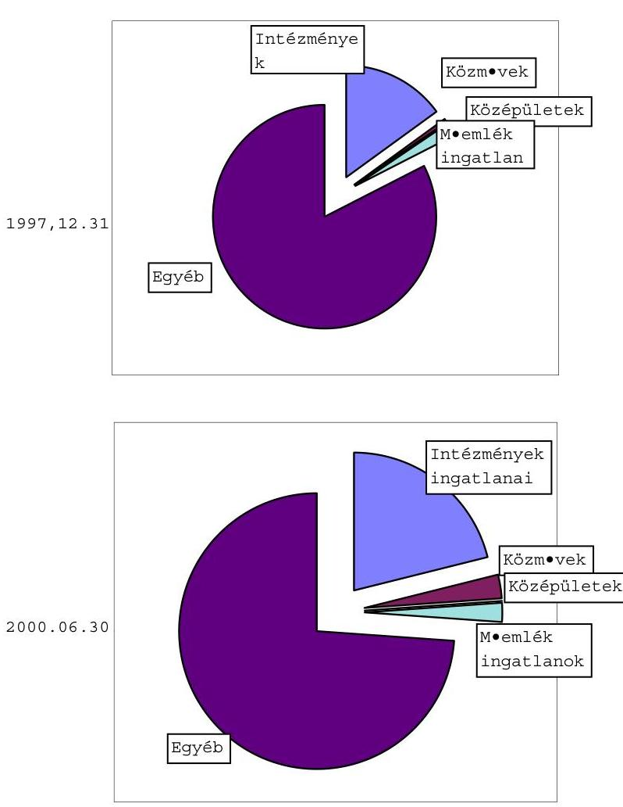
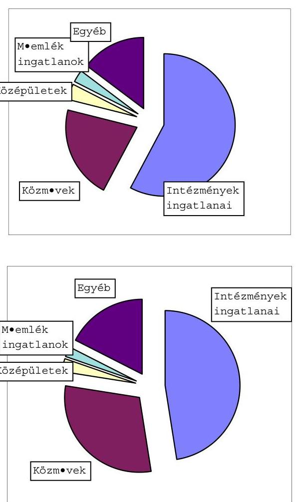
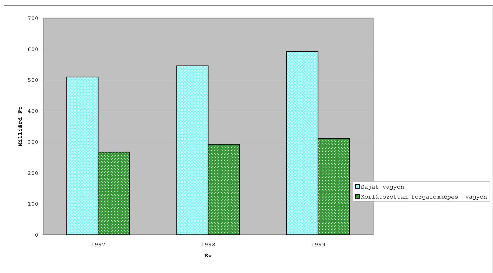

# JELENTÉS 

## az önkormányzati korlátozottan forgalomképes törzsvagyon-gazdálkodás vizsgálatáról

---

# Az ellenőrzés végrehajtásáért felelős:   V. Önkormányzati és Területi Ellenőrzési Igazgatóság 

Dr. Lóránt Zoltán
számvevő igazgató
Az ellenőrzést vezette és a jelentést összeállította:

## Csecserits Imréné régióvezető főtanácsos

## Csiszárné dr. Kosik Mária   számvevő tanácsos   dr. Fátrainé Zsebedics Katalin   számvevő tanácsos

## Németh Gábor   számvevő tanácsos

## Szilágyi Sándor   számvevő tanácsos

## Az ellenőrzésben részt vevők névsorát az 1. számú melléklet tartalmazza.

## A témakörrel foglalkozó ÁSZ vizsgálatok jegyzéke:

Az önkormányzatok tulajdonába került vagyontárgyak megszerzésével, nyilvántartásával és gazdálkodásával kapcsolatos tapasztalatokról (V1016/1992.)

A helyi önkormányzatok nem közszolgáltatási célú társasági befektetésekkel, valamint értékpapírokkal történő gazdálkodásának vizsgálata (V-1016/1998.) (A Parlament számítógépes hálózatán a vizsgált fájl neve 9814J000.doc)

A helyi önkormányzatok vagyonszerkezetének, vagyonhasznosítási és nyilvántartási tevékenységének vizsgálatáról (V-1010-65/1999-2000.) (A Parlament számítógépes hálózatán a vizsgált fájl neve 0008J000.doc)

Jelentéseink az INTERNET-en 1999. június 1-től olvashatók.
Internet cím: http:/ /www.asz.gov.hu

---

# TARTALOMJEGYZÉK 

1. A KORLÁTOZOTTAN FORGALOMKÉPES TÖRZSVAGYON MEGHATÁROZÁSA ..... 13
2. A KORLÁTOZOTTAN FORGALOMKÉPES TÖRZSVAGYONNAL VALÓ GAZDÁLKODÁS SZABÁLYOZOTTSÁGA ..... 17
3. A KORLÁTOZOTTAN FORGALOMKÉPES TÖRZSVAGYON MENNYISÉGE, NYILVÁNTARTÁSA ..... 20
4. A KORLÁTOZOTTAN FORGALOMKÉPES TÖRZSVAGYON NAGYSÁGRENDJÉNEK, ÖSSZETÉTELÉNEK ALAKULÁSA ..... 25
4.1. Intézményi ingatlanvagyon ..... 27
4.2. Önkormányzati tulajdonban lévő közmúvagyon ..... 31
4.3. Önkormányzati tulajdonú, üzemeltetésre átadott ingatlanok, közmúvek ..... 34
4.4. Müemlékek ..... 36
4.5. Védett természeti területek ..... 38
4.6. Kulturális javak ..... 38
5. A KORLÁTOZOTTAN FORGALOMKÉPES TÖRZSVAGYON MÜKÖDTETÉSÉNEK, HASZNOSÍTÁSÁNAK SZABÁLYSZERÜSÉGE, CÉLSZERÜSÉGE ..... 39
5.1. Bérbeadások, üzemeltetésre átadások ..... 41
5.2. Értékesítések ..... 43
5.3. A beruházási, felújítási feladatok tervezésének megalapozottsága és teljesítésük alakulása ..... 44
5.4. A felesleges vagyontárgyak felmérése, hasznosítása és selejtezésének lebonyolítása ..... 48
5.5. A vagyon védelme érdekében kötött biztosítás ..... 50
6. A KORLÁTOZOTTAN FOGALOMKÉPES VAGYONNAL VALÓ GAZDÁLKODÁS ELLENÖRZÉSE ..... 51
Melléklet: 1-8-ig

---

.

---

# Jelentés 

## az önkormányzati korlátozottan forgalomképes törzsvagyon-gazdálkodás vizsgálatáról

A helyi önkormányzatokról szóló 1990. évi LXV. törvény (Ötv.) 92. § (1) bekezdésében, továbbá az államháztartásról szóló 1992. évi XXXVIII. törvény (Áht.) 120. § g), valamint 121. § (1) és (3) bekezdésében foglaltak alapján az Állami Számvevőszék jogosult annak vizsgálatára, hogy a helyi önkormányzatok tulajdonában lévő vagyon állapotáról rendelkezésre állnak-e a szükséges információk; a vagyonnal kapcsolatos döntések megfelelnek-e a felelős módon, rendeltetésszerűen történő gazdálkodás követelményeinek.

Az Állami Számvevőszék 2000. évi ellenőrzési terve alapján vizsgáltuk az önkormányzatok törzsvagyonába tartozó korlátozottan forgalomképes eszközök elhatárolását, nyilvántartását, a gazdálkodás szabályszerűségét, célszerűségét.

Az önkormányzatok vagyonáról, a vagyon struktúráját, annak változását befolyásoló, meghatározó tényezőkről átfogó jelleggel a 2000. évben lezárt „a helyi önkormányzatok vagyonszerkezetének, vagyonhasznosítási és nyilvántartási tevékenységének vizsgálatáról" készített jelentés tartalmaz megállapításokat.

Ennél az átfogó jellegű, országos szintű összegzésnél figyelembe vettük a vagyongazdálkodás, nyilvántartás egy-egy részterületére kiterjedő korábbi, összesen 14 ÁSZ jelentés megállapításait is. Ez az áttekintés nyújt alapot az Ötv. alapján az önkormányzatoknál kialakított főbb vagyoncsoportokra - forgalomképtelen, korlátozottan forgalomképes törzsvagyonra, törzsvagyonon kívüli egyéb vagyonra (amelyet gyakran vállalkozói vagyonnak neveznek) - előirányzott további vizsgálatoknak. Jelen vizsgálat a vagyongazdálkodással foglalkozó vizsgálati ütemezésünk második egysége, amelyet az önkormányzatok vállalkozói vagyonnal való gazdálkodásának vizsgálata követ majd.

A már korábban elkészült jelentésünk tartalmazza, hogy az önkormányzatok többsége a vagyongazdálkodás feltételeit és a vagyon feletti rendelkezés döntési szintjeit - a kezdeti bizonytalanságokon túljutva - mára már bár hiányosságokkal, de szabályozta. Az ingatlanokkal történő gazdálkodás feltételeit meghatározták, azonban a részesedések, értékpapírok vételi-eladási feltételeire nem, vagy csak érintőlegesen tértek ki a vagyongazdálkodási rendeletekben.

A közép- és hosszabb távú tervezés hiánya miatt a képviselő-testületek eseti döntései a meghatározóak a központi döntések következményein túlmenő önkormányzati vagyonváltozásra. A vizsgált önkormányzatok 19,5\%-a rendelkezett az 1994. évben megválasztott képviselő-testület megbízási idejére vonatkozó, elfogadott gazdasági programmal és további 24,4\% két-három éves vagyongazdálkodási koncepcióval.

---

A különböző időben hatályba lépett törvények alapján az önkormányzatok megalakulásakor kimutatott 257 milliárd Ft saját vagyon a számviteli nyilvántartások szerint 2000. év végére meghaladta a 2.100 milliárd Ft-ot. A vagyoni állapot számviteli kimutatása nem felelt meg a valódiság és az áttekinthetőség követelményének. A számvitelről szóló törvényben és az ennek végrehajtására kiadott kormányrendeletben előírt értékelési kötelezettségek megszegése miatt az önkormányzatok vagyoni helyzete nehezen áttekinthető. A vagyongazdálkodás ellenőrzését megnehezítette, hogy az önkormányzatok számviteli nyilvántartásából, vagyonmérlegéből - önkormányzatonként eltérő nagyságrendben - hiányzott a földterületek és a telkek értéke. Az önkormányzati vagyon legnagyobb részarányát ( $44,5 \%$-át) kitevő ingatlanokra vonatkozóan előírt in-gatlan-nyilvántartás (ingatlan-kataszter) és a számviteli nyilvántartás ingatlanokra kiterjedő adatai között jelentős volt az eltérés.

A törzsvagyon jogszabályban előírt elkülönített számviteli nyilvántartását a vizsgált önkormányzati hivatalok háromnegyed részénél nem, vagy nem teljes körűen hajtották végre.

A helyszíni vizsgálatok tapasztalatai alapján a helyi önkormányzatoknak a vagyongazdálkodási rendeletben a feltételek szélesebb körű meghatározását, a vagyongazdálkodás középtávú koncepciójának, programjának kidolgozását javasoltuk. A törvényes és szabályszerű működés érdekében felhívtuk a figyelmüket az eddig érték nélkül nyilvántartott eszközök egyedi értékmegállapítására, valamint az ingatlan-nyilvántartásban feltárt hiányosságok felszámolására, továbbá a törzsvagyon elkülönített nyilvántartásának kialakítására.

Javasoltuk, hogy a pénzügyminiszter adjon szakmai segítséget az önkormányzatok részére a számviteli törvényben előírt egyedi értékelés elvégzéséhez a számviteli értékkel nem rendelkező ingatlanokra vonatkozóan. A belügyminiszter részére javasoltuk, hogy kezdeményezze az önkormányzatok tulajdonában lévő ingatlanvagyon nyilvántartási és adatszolgáltatási rendjéről szóló 147/1992. (XI.6.) Korm. rendelet módosítását, a nyilvántartás egyszerűsítése, a számviteli nyilvántartásokkal történő összehangolása érdekében. Ajánlásunkat is figyelembe véve a most végzett helyszíni vizsgálatok lezárása után a javasolt rendelet módosítás a 48/2001. (III.27.) Korm. rendeletben kiadásra került.

Az Ötv. 79. §-a alapján a közvetlenül kötelező önkormányzati feladat- és hatáskör ellátását vagy a közhatalom gyakorlását szolgáló önkormányzati tulajdon törzsvagyonnak nyilvánítható, amelyet az Ötv. 78. § (2) bekezdése szerint a többi vagyontárgytól elkülönítve kell nyilvántartani. A törzsvagyonon belül az Ötv. 79. § (2) bekezdése két kategóriát - forgalomképtelen és korlátozottan forgalomképes - alakított ki. Az Ötv. forgalomképtelennek nyilvánította a helyi közutakat és mútárgyaikat, a tereket, parkokat, korlátozottan forgalomképesnek határozta meg az önkormányzati tulajdonban lévő közműveket, intézményeket és középületeket, valamint lehetőséget biztosított arra, hogy más törvény vagy maga az önkormányzat - a közvetlenül kötelező önkormányzati feladat- és hatáskör ellátását vagy a közhatalom gyakorlását szolgáló - további ingatlanokat és ingókat is e kategóriákba soroljon. Az egyes állami tulajdonban lévő vagyontárgyak önkormányzatok tulajdonba adásáról szóló 1991. évi XXXIII. törvény (Övtv.) korlátozottan forgalomképesnek nyil-

---

vánította a múemlék épületeket, a védett természeti területeket és a múzeális emlékeket (kulturális javakat).

A korlátozottan forgalomképes törzsvagyon kategória kialakításának célja a vagyonvédelem elősegítése volt. Azt kívánta biztosítani, hogy az önkormányzatok e kiemelt jelentőségű vagyonról tulajdonosi döntéseket csak jogszabályokban - ideértve az önkormányzati rendeletet is - meghatározott feltételek betartásával hozhassanak.

A korlátozottan forgalomképes vagyon kategóriába tartozó eszközök értékben vagy naturális mutatókban kifejezett nagyságrendjéről, összetételének változásáról, a gazdálkodás szabályszerűségéről a kialakított országos szintű információs rendszerek kevés tájékoztatást adnak. Az önkormányzatok vagyongazdálkodásának megítélését ugyanakkor lényegesen befolyásolja annak megismerése, hogy mekkora a közvetlenül kötelező önkormányzati feladat- és hatáskör ellátását vagy a közhatalom gyakorlását szolgáló vagyon nagyságrendje, összetétele, aránya az önkormányzati tulajdonon belül, valamint hogyan gazdálkodnak ezzel a vagyoni körrel az önkormányzatok.

A vizsgálat célja annak megállapítása volt, hogy:

- a törzsvagyonon belül a korlátozottan forgalomképes vagyonállomány meghatározása és az ezek feletti rendelkezési jog szabályozása a törvényi előírásokkal összhangban történt-e;
- a szabályozásoknak megfelelő és teljes körű-e a korlátozottan forgalomképes törzsvagyon nyilvántartása, ez megalapozott tájékoztatást ad-e a helyi önkormányzatok gazdasági- pénzügyi döntéseihez, vagyonvédelméhez és a vagyongazdálkodás értékeléséhez;
- a korlátozottan forgalomképes vagyon nagyságrendjének és összetételének alakulását milyen tényezők befolyásolták, (megtették-e a szükséges intézkedéseket a vagyon értékének megőrzése, bővítése és hasznosítása érdekében) ezek hatására hogyan változott annak struktúrája;
- a korlátozottan forgalomképes vagyonnal való gazdálkodás során betartot-ták-e a jogszabályi előírásokat, biztosítják-e ezen eszközök rendeltetési célok szerinti múködését.

A vizsgált időszak: 1998-1999. és 2000. év a helyszíni vizsgálat idejéig.
A vizsgálat kiterjedt a Fővárosi, 1 megyei, 19 városi, 18 nagyközségi és 26 községi önkormányzatra. (Az ellenőrzött önkormányzatokat megyénkénti csoportosításban a 2. sz. melléklet tartalmazza.) A vizsgált 65 önkormányzat tulajdonában volt a helyi önkormányzatok 2000. év végi saját vagyonának mintegy $29 \%$-a.

A vizsgálatba vont önkormányzatok kiválasztásánál az igazgatósági munkatervben meghatározott 14 megyében az áltagosnál jelentősebb vagyonnal rendelkező önkormányzatok közül minden település-kategóriából azokat vettük figyelembe, amelyekre az egy évvel korábbi átfogó jellegű vagyongazdálkodási

---

vizsgálat nem terjedt ki, valamint amelyeknél - az Állami Számvevőszék éves munkaterve alapján - más témájú vizsgálat ugyanezen időszakban nem volt.

Az önkormányzatoknál végzett helyszíni ellenőrzések során a polgármesteri hivatalok számviteli, ingatlankataszteri nyilvántartásának ellenőrzésén túlmenően a vagyongazdálkodás szempontjából áttanulmányoztuk a vizsgált évek költségvetési beszámolóit, az önkormányzatok vagyongazdálkodást szabályozó rendeleteit, vagyongazdálkodási koncepcióit, gazdasági programjait, a vizsgált időszakban hozott - e vagyoni kört érintő - tulajdonváltozást eredményező döntések iratait, a közgyűlések, képviselő-testületek tárggyal kapcsolatos előterjesztéseit, rendeleteit.

Az elemzéshez igénybe vettük az önkormányzatok költségvetési beszámolóinak az APEH-SZTADI által készített országos feldolgozását, valamint a KSH ingatlankataszteri adatait is.

---

# I. ÖSSZEGZŐ MEGÁLLAPÍTÁSOK, KÖVETKEZTETÉSEK, JAVASLATOK 

Az Ötv. szerint az önkormányzatok vagyonából törzsvagyonná nyilvánítható az a rész, amely közvetlenül a kötelező feladat- és hatáskör ellátását vagy a közhatalom gyakorlását szolgálja. Az Ötv. a törzsvagyonon belül megkülönbözeti a forgalomképtelen és a korlátozottan forgalomképes vagyontárgyakat, azonban ezen fogalmak tartalmi meghatározása elmaradt. A korlátozottan forgalomképes törzsvagyoni körbe tartoznak az Ötv. előírása alapján a közművek, intézmények és középületek, de nem egyértelmű, hogy mi minősül ennek. Az intézmény kifejezés csak az önkormányzat költségvetési szerveinek épületeit (óvoda, iskola, orvosi rendelő stb.) vagy a költségvetési intézményt, illetve annak teljes, vagyonmérleg szerinti saját tulajdonát jelenti-e. A közmű és középület fogalmak sem voltak egyértelműnek az önkormányzatok számára.

Az önkormányzatok kibővítették ezt a kört olyan vagyontárgyakkal is, amelyek nem a különböző jogszabályokban előírt kötelező feladatok ellátását segítik, hanem az önkormányzat testületének véleménye szerint fontos és tartósan szükséges ún. „önként vállalt" feladatok megvalósításának feltételei.

Az Ötv. szerint a törzsvagyon korlátozottan forgalomképes tárgyaíról törvény vagy a helyi önkormányzat rendeletében meghatározott feltételek szerint lehet rendelkezni. Az önkormányzatok a rendelkezési feltételeket nem a teljes korlátozottan forgalomképes vagyoni körre, hanem csupán annak egy részére - jellemzően csak az ingatlanokra - határozták meg vagyongazdálkodási rendeletükben. Az ingatlanokkal kapcsolatos tulajdonosi jogok gyakorlásának lehetőségét az önkormányzatok - Budapest Főváros Önkormányzata kivételével - teljes körűen a képviselő-testület (közgyűlés) hatáskörében tartották. A többi vagyontárgy (pl. gépek, berendezések) esetében ezt a jogot - ott ahol az önkormányzati rendelet erre kitért - átadták a bizottságoknak, a polgármesternek vagy a vagyont múködtető intézmény vezetőjének.

A korlátozottan forgalomképes törzsvagyon elkülönített nyilvántartásának kötelezettségét az Ötv., ennek módját pedig a költségvetési szervek beszámolási és könyvvezetési kötelezettségét meghatározó kormányrendelet tartalmazza. A számviteli nyilvántartásban a vizsgált önkormányzati hivatalok 29\%-a biztosította a korlátozottan forgalomképes törzsvagyon elkülönítésének rendszerét. A számviteli nyilvántartás a hiányos, pontatlan vezetés miatt nem a valós helyzetet tükrözi.

Az elkülönített nyilvántartási kötelezettséget tartalmazza az önkormányzatok tulajdonában lévő ingatlanvagyon nyilvántartási és adatszolgáltatási rendjéről szóló kormányrendelet is, amelyet szintén hiányosan vezetnek az önkormányzatok. Ezen ingatlan-kataszteri nyilvántartásokból az Országos Statisztikai Adatgyűjtési programba beépített adatszolgáltatás adatai nem teljes kö-

---

rúek, ellenőrizetlenek, így azok összesítései sem mutatják a valós helyzetet. Az önkormányzatok 20\%-a az ingatlanok tulajdonjogát igazoló földhivatali ingatlan-nyilvántartási határozattal sem rendelkezett teljes körűen. Az ingatlan-kataszteri és a számviteli nyilvántartások egyeztetését megnehezíti azok szabályozásbeli összhangjának hiánya is.

Szintén nem adnak részletes, pontos információt a korlátozottan forgalomképes törzsvagyon mennyiségéről, összetételéről az Ötv., valamint az Áht. alapján az évenkénti önkormányzati zárszámadáshoz csatolandó vagyonleltárak (vagyonkimutatások) a közvetlenül nem meghatározott tartalmi követelmények és a jogszabályok közötti összhang hiánya miatt. Az évenkénti zárszámadáshoz csatolandó vagyonleltár (vagyonkimutatás) célja az önkormányzat vagyoni helyzetének a bemutatása, azonban e tájékoztatási kötelezettségének csak a vizsgált önkormányzatok 17\%-a tett eleget, különböző hiányosságokkal.

A korlátozottan forgalomképes törzsvagyon elkülönített nyilvántartási kötelezettségét bár több jogszabály (3) is tartalmazza, azonban ezek nem teljes körú̉ végrehajtása miatt a nyilvántartások adatait csak fenntartásokkal, csupán az arányok bemutatásához lehet elfogadni.

Az önkormányzatok saját vagyonán belül a korlátozottan forgalomképes törzsvagyon mintegy 50\%-ot képvisel. A korlátozottan forgalomképes törzsvagyonon belül - a fővárosi önkormányzat kivételével - az intézményi ingatlanok és a közművek együttes részaránya $80 \%$, a középületeké 2-3\%.

Az Ötv-ben biztosított lehetőség alapján az önkormányzati döntéssel korlátozottan forgalomképes törzsvagyonnak nyilvánított különböző eszközök aránya az összes korlátozottan forgalomképes törzsvagyonhoz viszonyítva a Fővárosi Önkormányzatnál meghaladja a 70\%-ot, a többi vizsgált önkormányzatnál viszont csak mintegy 15\%. A Fővárosi Önkormányzatnál a kiemelkedően magas részarányt az egyszemélyes közszolgáltató társaságok részvényeinek, üzletrészeinek ide sorolása okozta.

A korlátozottan forgalomképes intézményi ingatlanokon belül a Fővárosi Önkormányzatnál 66\%-ot a szociális, gyermekvédelmi és egészségügyi intézmények ingatlanai alkotják, a többi vizsgált önkormányzatnál a legmagasabb arányt, 29\%-ot az oktatási intézmények ingatlanai jelentik (a többi ingatlan múködtetési célja szerint nagyon heterogén).

Az önkormányzati tulajdonban lévő közműveket - három önkormányzat kivételével - gazdasági társaságoknak üzemeltetésre átadták. E vagyoni kör védettsége szempontjából rendkívül nagy jelentősége lenne az üzemeltetési szerződések meglétének, azok tartalmának és az abban foglaltak betartásának. A közműberuházások befejezésekor, az üzemeltetésre átadással egyidejúleg nem készülnek a vagyonról tételes - az önkormányzat részére számonkérhetőséget biztosító - vagyonleltárak, így a vagyon meglétének ellenőrzési lehetősége nem biztosított.

---

A közműveken belül a viziközművagyon nagyságrendje, arányának növekedése jelzi, hogy a törvények által előírt törzsvagyonkénti besorolás, illetve e vagyon feletti önkormányzati rendelkezési jog korlátozása mérsékli az önkormányzatok kötelező feladatának ellátásához kapcsolódó vagyon önkormányzati tulajdonból kikerülésének előfordulását. A viziközművagyon forgalomképtelennek nyilvánítása indokolt, mivel ez olyan közszolgáltatási feladat ellátásához szükséges, amelyet az önkormányzati törvény kötelező alapfeladatnak minősít és a vízgazdálkodásról szóló törvény rendelkezéseiből is az következik, hogy az ilyen vagyon nem kerülhet ki az önkormányzat tulajdonából.

Az önkormányzatoknál nyilvántartott közművagyon nagyságrendjének változása nem tükrözi az önkormányzatok által ténylegesen a közművagyon fejlesztésére, bővítésére fordított kiadásokat, mivel ezen kiadások jelentős részét felhalmozási célú pénzeszközátadásként mutatják ki. Az ellentételezés nélküli pénzeszköz átadásokkal az önkormányzatok számviteli előírások szerint kimutatott vagyonának mértéke csökken. Az ilyen forrásból elkészült beruházások tulajdonjoga nem az önkormányzatoké, hanem a közmúszolgáltatást végző - jellemzően vegyes tulajdonban lévő - gazdasági társaságoké, annak ellenére, hogy a tulajdonjog átadásának kötelezettségét a hatályos jogszabályok nem írják elő, csupán a természetes monopolhelyzetben lévő szolgáltatók igénylik ezt.

A korlátozottan forgalomképes törzsvagyon részét képezik a kulturális javak, amelyek vagyonvédelmének ellenőrzésénél gondot jelentettek a nyilvántartások hiányosságai.

Az önkormányzatoknál az elkészített gazdasági programok és a költségvetési koncepciók átfogóan az önkormányzati vagyon egészére vonatkoztak. Kifejezetten a korlátozottan forgalomképes vagyontárgyakra vonatkozó elkülöníthető elgondolásokat, célokat, feladatokat nem határoztak meg.

A vizsgált önkormányzatoknál a fejlesztési és beruházási tevékenység összhangban volt a szakmai igényekkel, elősegítette az adott települések infrastrukturális ellátottságát és az intézmények feladat ellátásának szinten tartását. Az éves költségvetési rendeletek tartalmazták a felújítási célokat feladatonként, s a felújítás pénzügyi forrásait. A felújítások célja állagmegóvás és szintentartás volt, néhány esetben bővítés, amelyet a számviteli előírásoknak megfelelően aktiváltak.

Az ingatlan-kataszter adatai szerint az intézményi ingatlanok mintegy 60\%-a felújítást igényelne, az ehhez szükséges pénzügyi forrással viszont az önkormányzatok teljes körűen nem rendelkeznek.

Az önkormányzatok vagyongazdálkodási rendelete nem tartalmazta átfogó jelleggel a tulajdonosi ellenőrzések módozatainak, gyakoriságának és az ellenőrzési tapasztalatok hasznosítási formáinak meghatározását.

A vagyongazdálkodási rendeletek csak az önállóan gazdálkodó intézmények vezetői által az éves zárszámadások elfogadásához készítendő beszámolási kötelezettséget írták elő, valamint a polgármesterek képviselő-testület előtti be-

---

számolási kötelezettségét a vagyongazdálkodás és a vagyoni helyzet alakulásáról.

# Az Állami Számvevőszék korábbi és jelenlegi vizsgálati tapasztalatai egyaránt azt tanúsítják, hogy az önkormányzatok nem fordítanak kellő figyelmet gazdálkodási tevékenységük jogszabályban előírt tulajdonosi ellenőrzési kötelezettségének teljesítésére. 

A helyszíni ellenőrzések tapasztalatai alapján készített vizsgálati jelentésekben összesen 526 javaslatot fogalmaztunk meg a törvényes állapot helyreállítása és a jogszabályi előírások betartása, valamint a munka színvonalának javítása érdekében. A jogszabályok megsértése miatt a Fővárosi Önkormányzatnál személyes felelősséget vetettünk fel, illetve jeleztünk a munkáltató részére.

A törvényes állapot helyreállítása és a jogszabályi előírások betartása érdekében az önkormányzati vagyon forgalomképesség szerinti besorolásáról és a vagyon feletti rendelkezési jogosultságok meghatározásáról szóló helyi rendeletek elkészítésére hívtuk fel az önkormányzatok figyelmét. Javasoltuk a költségvetési beszámolóban az eszközök megfelelő besorolásának érdekében a számlarendek kiegészítését, aktualizálását, a törzsvagyon és azon belül a korlátozottan forgalomképes vagyontárgyak elkülönítését. Szükségesnek tartottuk a vagyon legnagyobb részarányát képező ingatlanvagyon számviteli és kataszteri adatai egyezőségének biztosítását, az üzemeltetési szerződések megkötését, az átadott eszközökről a leltár felvételét és az előbbiek végrehajtását szolgáló belső és felügyeleti ellenőrzések rendszeres elvégzését.

A munka színvonalának javítása érdekében kezdeményeztük, hogy az önkormányzatok pénzügyi bizottságai tárgyalják meg a számvevőszéki vizsgálat tapasztalatait, hozzanak határozatokat a feltárt hiányosságok megszüntetése érdekében és kísérjék figyelemmel a rendező intézkedések végrehajtását. A pénzügyi bizottságok vezetői és a polgármesterek tájékoztassák az önkormányzati testületeket a számvevőszéki vizsgálat megállapításairól és a megtett intézkedésekről. A vizsgálat ideje alatt megkezdte felhívásaink és javaslataink végrehajtását már 11 önkormányzat és azok folytatásához intézkedési tervet készített felelősök és határidők megjelölésével.

## Az önkormányzatok korlátozottan forgalomképes törzsvagyonával történő gazdálkodás szabályszerűbbé, hatékonyabbá és ellenőrizhetőbbé tétele érdekében javasoljuk, hogy:

## a pénzügyminiszter

1. kezdeményezze az Ötv. 78. § (2) bekezdésében, az Áht. 118. §-ban és a számvitelről szóló 2000. évi C. törvény 69. §-ban előírt vagyonleltár, vagyonkimutatás, illetve leltár fogalmak tartalma közötti jogszabályi összhang biztosítását;

## a belügyminiszter

---

1. kezdeményezze az Ötv. 79. § (2/b) bekezdésében szereplő gyűjtőfogalmak egyértelmű, pontos értelmezését, különös tekintettel a közművek, intézmények és középületek kifejezésekre;

---

2. kezdeményezze, hogy az Ötv. 79. § (2) bekezdésében meghatározott korlátozottan forgalomképes törzsvagyonná nyilvánítás lehetősége ne csak a közvetlenül kötelező önkormányzati feladat- és hatáskör ellátását vagy a közhatalom gyakorlását szolgáló önkormányzati tulajdonra vonatkozzon, hanem az önkormányzat saját - rendeleti úton hozott - döntése szerint egyéb vagyontárgyakra is kiterjedhessen;
3. igényelje az önkormányzat tulajdonában lévő ingatlanvagyon nyilvántartási és adatszolgáltatási rendjéről szóló 147/1992 (XI.6.) Korm. rendelet alapján készített nyilvántartások adataiból készülő statisztikai feldolgozások párhuzamosság nélküli, jelenleginél szélesebbkörű, ellenőrzött adatok alapján történő országos szintű feldolgozását;
4. a 191/1996. (XII.17.) Korm. rend. 6. §-ában biztosított jogkörében hívja fel a megyei közigazgatási hivatalok figyelmét annak ellenőrzésére, hogy az önkormányzatok a korlátozottan forgalomképes törzsvagyonba tartozó eszközökről a helyi önkormányzat rendeletében meghatározott feltételek szerint ren-delkeztek-e testületi döntéseikben, valamint az éves zárszámadáshoz az előírt vagyonleltárt csatolták-e.

# a pénzügyminiszter és a belügyminiszter 

1. segítse elő, hogy a számviteli előírások szerint kimutatott önkormányzati vagyon szükségtelen csökkenésének elkerülése érdekében az önkormányzatok gazdasági társaságoknak csak indokolt esetben és csak a jegyzett tőke egyidejű, azonos összegű emelése mellett nyújtsanak támogatást;

---

# II. RÉSZLETES MEGÁLLAPÍTÁSOK 

## 1. A korlátozottan forgalomképes törzsvagyon meghatározása

A helyi önkormányzatokat megilletik mindazok a jogok, amelyek általában a tulajdonost megilletik. Azonban az önkormányzati feladatok megvalósítását szolgáló vagyon védelme és a felélés megakadályozása érdekében az önkormányzati törvény korlátozza a tulajdonosi joggyakorlás lehetőségeit azáltal, hogy előírja mely feladatok ellátását biztosító vagyontárgyak minősülnek az önkormányzatok törzsvagyonának. Ezek a vagyontárgyak ameddig ezen feladatok ellátásának célját szolgálják, addig vagy egyáltalán nem, vagy csak meghatározott korlátok betartásával kerülhetnek ki az önkormányzat tulajdonából.

Az Ötv. 1994. évi módosításakor a korábbi általános meghatározás kiegészült azzal, hogy a közvetlenül kötelező feladat- és hatáskör ellátását vagy a közhatalom gyakorlását szolgáló önkormányzati tulajdon nyilvánítható törzsvagyonnak. Az Ötv. azonban nem tért ki a fogalmak egyértelmú meghatározására. Pl. nem egyértelmú, hogy az „intézmények" fogalom csak az épületeket vagy a költségvetési intézmény teljes saját vagyonát jelenti, továbbá a „közmű" és „középület" fogalma sem bír egyértelmű tartalommal.

- Budapest Főváros Önkormányzata e vagyoni körbe sorolta többek között valamennyi költségvetési szervének teljes, tehát az ingó vagyonát is. Ennek keretében a Fővárosi Illetékhivatal követelésállománya és pénzeszköze is a törzsvagyon korlátozottan forgalomképes részévé vált annak ellenére, hogy ennek csak egy része illeti meg az önkormányzatot.

A közmú fogalmát a helyi adókról szóló 1990. évi C. törvény, a közmúnyilvántartásról szóló 3/1979. (Ép. ért. 11.) ÉVM utasítás, és a magánszemélyek közmúfejlesztési támogatásáról szóló 73/1999. (V.21.) Korm. rendelet tartalmazza. Ezek szerint: közmúnek minősülnek az erősáram, a távközlés, a vízellátás, a szennyvíz- és csapadékvíz-elvezetés, a gázellátás, a távhőellátás, a kőolaj- és kőolajtermékek szállítását, az egyéb termékek (anyag) szállítását szolgáló, továbbá az egyéb célú, közmú jellegú hálózat (központi TV antenna kábelhálózat stb.) fogalomkörébe tartozó közcélú közmúszervezet üzemeltetésében, kezelésében lévő közmúvezetékek, hálózatok, valamint a szilárd burkolatú közút és a közterületen lévő járda is.

- A viziközmú fogalmát jogszabály nem határozza meg. A vizsgált önkormányzatok - a fővárosi önkormányzat kivételével - e közmúvagyont kizárólag az ingatlanvagyonra vonatkoztatták, a közmúvagyon múködéséhez azonban elengedhetetlen és nélkülözhetetlen a kapcsolódó gépek, berendezések, felszerelések múködtetése. A vizsgált önkormányzatok a viziközművek e részét képező tárgyi eszközöket ennek ellenére nem a korlátozottan forgalomképes törzsvagyon körében tartják nyilván, pedig a vagyon múködése szempontjából e vagyontárgyak besorolása nem lehetne önkormányzati döntéstől függő.

---

Az önkormányzatok az Ötv-ben kapott felhatalmazást többféleképpen értelmezték.

A vizsgált önkormányzatok közül 61 önkormányzati rendeletben döntött arról, hogy vagyonának mely részét tekinti törzsvagyonnak és azon belül melyeket korlátozottan forgalomképesnek, illetve azok milyen korlátok betartása mellett idegeníthetők el. A többség (83\%) 1992-96. közötti években megalkotta a vagyongazdálkodás feltételeit szabályozó rendeletét, 5 önkormányzat azonban csak 1997-2000. között döntött erről.

- Balatonendréd község és Várvölgy község önkormányzatai 1997. évben alkották meg rendeleteiket.
- Balatonfűzfő város önkormányzata közvetlenül a számvevőszéki vizsgálat előtt, Bolhás és Somogyszob községek önkormányzatai pedig csak a számvevőszéki vizsgálat ideje alatt 2000. évben alkották meg vagyongazdálkodási rendeletüket.

# Nem döntött a törzsvagyoni körről, és az azok feletti rendelkezési feltételekről 4 önkormányzat: 

- Helvécia község önkormányzatának SZMSZ-ében előírt vagyonrendeletnek csak a tervezete készült el a vagyontárgyak forgalomképesség szerinti tételes besorolását tartalmazó mellékletek nélkül.
- Súlysáp nagyközség és Bázakerettye község önkormányzatai nem alkották meg vagyonrendeleteiket SZMSZ-eik előírásai ellenére sem.
- Berente község önkormányzata Kazincbarcika várostól történt különválását követően 2000. év elejétől látja el közigazgatási feladatait, de a vagyonmegosztásra vonatkozóan még nem volt végleges megállapodás az érintettek között a 2000. novemberében végzett vizsgálatunkig, így nem készült el vagyongazdálkodási rendeletük sem.

A döntést hozó önkormányzatok az Ötv 79. § (1) bekezdésében foglaltakat tágan értelmezték. Az Ötv. az önkormányzati törzsvagyon meghatározásánál lehetőséget biztosít az önkormányzatoknak a törvény(ek) által e körbe sorolt vagyontárgyakon túlmenően helyi döntéssel e vagyoni körbe történő besorolásáról mind az ingatlan, mind az ingó vagyon tekintetében. A vizsgált önkormányzatok 70\%-a élt ezzel a lehetőséggel.

A köztemetők e vagyoni körbe önkormányzati döntéssel történő besorolását indokolja, hogy az Ötv. a köztemetők fenntartását kötelező önkormányzati feladataként határozta meg.

A jogszabályi előírásokon túlmenően az érintett vagyontárgyak fokozott védettsége érdekében célszerű a közszolgáltatásokhoz, a helyi közhatalom gyakorlásához szükséges egyéb vagyontárgyak e vagyoni körbe történő besorolása is. A jogszabályban előírtakon kívül az önkormányzatok a tulajdonukban lévő köztemetőket, ravatalozókat, települési szilárd hulladékle-rakó-ártalmatlanító helyeket, tűzoltószertárakat, köztisztasági fürdőket, sportpályákat, buszvárókat, piac- és vásártéri épületeket- építményeket, játszótere-

---

ket, gázcseretelepeket és a különböző helyeken elhelyezett művészeti értékkel bíró alkotásokat is korlátozottan forgalomképesnek minősítették.

Olyan vagyontárgyakat is korlátozottan forgalomképesnek minősítettek, amelyek nem az Ötv. 8. §-ában meghatározott feladatok ellátását szolgálják, vagy más törvény megtiltotta az ilyen minősítésüket.

- Korlátozottan forgalomképesnek minősítették Lakitelek nagyközségben a kempinget, Dunapataj nagyközségben szántót, gyümölcsöst, üdülőt és boltot, Orgovány községben lóversenypályát, Tiszacsege városban üdülőket, büfét, mozit, vágóhidat, nádüzemet, Balassagyarmat városban üdülőket, Fonyód városban üdülőket, boltot, vendéglőt, Mándok nagyközségben vágóhidat, telkeket, Devecser városban építési telkeket, zártkerti és külterületi földeket, Püspökmolnári községben üdülőket, beépítetlen telkeket, Budapest Fővárosban a közüzemi tevékenységet ellátó, 100\%-ban önkormányzati tulajdonban lévő társaságok részvényeit, üzletrészeit.
- Kiskunhalas város önkormányzata a jogszabályi előírásokkal ellentétes besorolást végzett, 127 db önkormányzati bérlakást nyilvánított korlátozottan forgalomképes törzsvagyonnak. A lakások és egyéb helyiségek bérletére, valamint az elidegenítésükre vonatkozó 1993. évi LXXVIII. törvény 45. §-a szerint a határozatlan időre bérbe adott önkormányzati lakások - az ott meghatározott kivételekkel - forgalomképesek.
- Nem állapítható meg a besoroltság indokoltsága abban az esetben amikor ugyanazon típusú vagyontárgyakat megosztva mindhárom vagyoni körbe besorolták, (erdő, kert, belterületi föld és gyep vagyontárgyak Dunapataj nagyközségnél).

Az Ötv. 79. § (2/b) bekezdésében nevesített típusú korlátozottan forgalomképes vagyontárgyakat nyolc önkormányzat forgalomképtelennek, egy pedig törzsvagyonon kívüli, egyéb forgalomképes vagyonnak nyilvánított.

- Vasvár város önkormányzata rendeletében az intézményi ingatlanokat, Püspökmolnári község önkormányzata az intézményi épületeket a forgalomképtelen törzsvagyonhoz sorolta be.
- Minden ingatlant forgalomképtelennek minősített Érsekcsanád község önkormányzata és minden épületet (a római katolikus egyháznak felajánlott épület kivételével) Sükösd nagyközség önkormányzata. Ezeknél a számvevőszéki vizsgálat ideje alatt végrehajtották az átsorolást.
- Tuzsér nagyközség önkormányzata a közműveket, intézményeket, középületeket és a műemlékeket a forgalomképtelen törzsvagyonhoz sorolta be.
- Budajenő, Püspökmolnári és Maroslele községek önkormányzata a viziközműveket a forgalomképtelen törzsvagyonhoz sorolta be.

A viziközművagyon forgalomképtelennek nyilvánítása indokolt, mivel ez olyan közszolgáltatási feladat ellátásához szükséges, amelyet az önkormányzati törvény kötelező alapfeladatnak minősít és a vízgazdálkodásról szóló törvény rendelkezéseiből is az következik, hogy az ilyen vagyon nem kerülhet ki az önkormányzat tulajdonából.Ennek ellenére előfordult, hogy viziközműveket a törzsvagyonon kívüli egyéb (vállalkozói) vagyonhoz sorolták.

---

- Mándok nagyközség önkormányzata a műemlék jellegű kastélyt a hozzá tartozó kerttel, valamint a víziközműveket a törzsvagyonon kívüli egyéb forgalomképes vagyonhoz sorolta.

# A vagyongazdálkodási rendeletben és ennek mellékletében eltérően minősítették a különböző vagyontárgyakat öt önkormányzatnál. 

- Mélykút nagyközség és Lovászi község önkormányzata a vagyonrendeletben korlátozottan forgalomképeseknek minősítették az intézményi és középületi ingatlanokat, de rendeletük mellékletében forgalomképteleneknek sorolták be azokat.
- Fonyód város önkormányzata a vagyonrendeletében és az annak részét képező mellékletben ellentétes besorolásról döntött. A rendeletben korlátozottan forgalomképesnek minősített bölcsődét, óvodát és iskolát a rendelet mellékletében forgalomképtelennek nyilvánította; a rendeletben forgalomképtelennek minősített közterületek és közutak egy részét pedig a rendelet mellékletében korlátozottan forgalomképes vagyontárgyak közé sorolta be.
- Dombóvár város önkormányzata rendeletében csak az alapfokú intézményeket minősítette korlátozottan forgalomképes törzsvagyonnak, a rendelet mellékletében viszont a középfokú intézményeket is odasorolták. A rendeletben korlátozottan forgalomképesként szereplő muzeális emlékek, köztéri műalkotások és művészeti értékű alkotások azonban nem szerepelnek a rendelet tételes felsorolást tartalmazó mellékletében.
- Budapest Főváros Önkormányzata az 1999. évi vagyonleltárában az összesen 145 műemlék és műemlék jellegű ingatlanból 28 -at forgalomképtelennek, 36ot törzsvagyonon kívüli egyéb forgalomképes vagyonnak minősített, és csak a különbséget jelentő 81 ingatlant sorolta az egyes állami tulajdonban lévő vagyontárgyak önkormányzatok tulajdonba adásáról szóló 1991. évi XXXIII. törvény, (Övtv.) 3 § (4) bekezdésében előírtaknak megfelelően a korlátozottan forgalomképes kategóriába.

A vagyongazdálkodási rendeletben és mellékletében, valamint a tényleges állapot közötti eltérés megszüntetését határozta el két önkormányzat, azonban annak teljesítése elmaradt.

- Nagykáta város önkormányzata a 26/1997. (IV.29.) számú határozatával elrendelte ugyan 1993. évi vagyongazdálkodási rendeletének módosítását, erre azonban vizsgálatunk időpontjáig nem került sor.
- Magyarlak község képviselő-testülete a földhivatali egyeztetéseket követően 1999. decemberében önálló napirendi pontként megtárgyalta vagyongazdálkodási rendeletének módosítását, azt tudomásul vette, de a módosításokról nem alkotott rendeletet.

A törvényi előírástól eltérő, valamint az abban foglaltak kiterjesztő értelmezése mellett az önkormányzatok 88\%-a (57) rendeletében csak ingatlanokat minősített korlátozottan fogalomképesnek. (Az ingatlanok számviteli nyilvántartási értékének összesenje megegyezett a korlátozottan forgalomképesnek nyilvánított vagyon együttes értékével.) Ezeknél az önkormányzatoknál elmaradt a közvetlenül kötelező önkormányzati feladat- és hatáskör ellátását vagy a közhatalom gyakorlását szolgáló korlátozottan forgalomképes egyéb eszközök (pl. egészségügyi gépek, járművek,

---

berendezések, nevelést, oktatást segítő felszerelések, számítástechnikai és egyéb speciális berendezési tárgyak) körének a meghatározása.

# 2. A korlátozottan forgalomképes törzsvagyonnal való gazdálkodás szabályozottsága 

A törzsvagyonon belül kialakított korlátozottan forgalomképes vagyoncsoport értelmezési gondjai jelentkeztek az önkormányzati szabályozásnál is. Az önkormányzatok a vagyongazdálkodás feltételeit szabályozó rendeletükben általában a teljes tulajdonukban lévő eszközökre vonatkozóan rendelkeznek, annak ellenére, hogy az Ötv 79. § (2/b) bekezdésében csak a korlátozottan forgalomképes tárgyakra vonatkozóan írta elő ezt a kötelezettséget.

Az önkormányzatoknál az Ötv. 80. § (1) bekezdése szerint a tulajdonost megillető jogok gyakorlásáról a képviselő-testület rendelkezik. A képviselő-testület egyes hatásköreit a polgármesterre, a bizottságaira, a részönkormányzat testületére, a helyi kisebbségi önkormányzat testületére, társulására ruházhatja. Az átruházott hatáskör tovább nem ruházható.

A képviselő-testületek a tulajdonosi jogok gyakorlását rendeleteikben az ingatlanokkal kapcsolatban - Budapest Főváros Önkormányzata kivételével - teljes körűen megtartották saját hatáskörükben.

Budapest Főváros önkormányzatának képviselő-testülete a korlátozottan forgalomképes ingatlanok esetében 200 millió Ft értékhatárig a tulajdonosi döntési jogosultságot a Tulajdonosi Bizottságnak átadta.

Az ingóságokra vonatkozó tulajdonosi döntést a vizsgált önkormányzatok képviselő-testületének 34\%-a értékhatártól függően megosztva átadta a bizottságoknak, a polgármesternek és a vagyont múködtető intézmények vezetőinek. Az intézményvezetők részére történő tulajdonosi döntési hatáskör átadás lehetősége az Ötv-ben nincs megfogalmazva, de a gyakorlatban széles körben elterjedt.

Az intézmények a vagyongazdálkodási rendeletek szerint kötelesek a vagyontárgyak múködőképességét biztosítani és ennek érdekében a szükséges állagvédelmi, karbantartási és javítási munkákat saját költségvetésük terhére elvégezni, illetve elvégeztetni. A felújításokat igénybejelentés és testületi elbírálás után lehet csak elvégeztetni az e célokra biztosított pénzügyi keretek terhére. Hasonló az eljárás az elhasználódás miatt kiselejtezett nagy értékű vagyontárgyak pótlása tekintetében is.

Az alapfeladatok ellátása mellett esetenként felesleges eszközök bérbeadását általában az időtartam függvényében engedélyezik az önkormányzatok az intézmények részére.

Az intézményeknek, mint az önkormányzati vagyon üzemeltetőinek a feladatai és felelőssége eltérő részletezettséggel nyert meghatározást a vagyongazdálkodási rendeletekben.

---

- A feladatok meghatározása nem volt megfelelő 15 önkormányzatnál (23,1 $\%$ ), részleges volt 29 önkormányzatnál ( $44,6 \%$ ) és csak 21 önkormányzatnál $(32,3 \%)$ volt megfelelő.
- A felelősség meghatározása hiányzott 23 önkormányzatnál (35,4 \%), részleges volt 22 önkormányzatnál ( $33,9 \%$ ) és csak 20 önkormányzatnál ( $30,7 \%$ ) volt megfelelő.
- Polgár város önkormányzatának rendeletéből hiányoznak az intézmények és a polgármesteri hivatal használatába adott eszközök állagmegóvására (karbantartási, javítási és felújítási munkálataira vonatkozó), valamint a kárösszeg csökkentések érdekében kötendő biztosításokra vonatkozó feladatmeghatározások.
- Letenye város önkormányzatának rendelete csak az intézmények részére határoz meg feladatokat, de az intézményvezetők felelősségére nem tér ki.
- Balassagyarmat város önkormányzatának rendeletében csak „a jó gazda gondosságával való eljárást" írták elő a feladatok tételes meghatározásai helyett.
- Dombóvár város és Decs, valamint Dunapataj nagyközség önkormányzatainak rendeleteiben csak „a rendeltetésszerú használatra alkalmas állapot megőrzését" írták elő.

A költségvetési szerveknél lévő korlátozottan forgalomképes törzsvagyon csoportba tartozó felesleges eszközök feltárásának és hasznosításának szabályozását önálló feladatként nem írják elő a felsőbbszintű jogszabályok, de azok rendszeres és eredményes végrehajtásához minden gazdálkodó szervnek, így az önkormányzatoknak is érdeke fűződik. A felesleges, de még használható, valamint a már elhasználódott eszközök feltárását általában csak évvégén, a vagyonállomány számbavételét, leltározását megelőzően végzik el a költségvetési szervek, és ezeknek a munkafolyamatoknak az előírásait is a leltározási és selejtezési szabályzataikban rögzítették.

# A vizsgált önkormányzati hivatalok közül 54 (83,1 \%) rendelkezett a felesleges eszközök hasznosítására és az elhasználódottak selejtezésére vonatkozó belső szabályzattal. 

Öt önkormányzat nem rendelkezett ezen szabályzattal (Lakitelek és Nyírbátor városok, Szentistván nagyközség, Berente és Magyarlak községek), hat önkormányzatnál pedig csak a selejtezési munkafolyamatok voltak szabályozva (Letenye és Vasvár városok, Berhida és Mélykút nagyközségek, valamint Nógrádmegyer és Öskü községek). Bázakerettye község önkormányzatának szabályzata csak a készletekre terjed ki.

A felesleges vagyontárgyak hasznosításának és az elhasználódottak selejtezésének szabályzatai tartalmilag általában megfelelőek, egy részük azonban hiányos, mivel nem határozza meg:

- a felesleges és elhasználódott eszközök feltárásának rendjét 8 önkormányzatnál $(12,3 \%)$,
- a hasznosítások konkrét módozatait 13 önkormányzatnál (20,- \%),

---

- a hasznosítások során követendő eljárási rendet ugyancsak 13 önkormányzatnál (20,- \%),
- a hasznosításban és selejtezésben közreműködők, valamint a tevékenység ellenőrzésével megbízott személyek jogait 12 önkormányzatnál (18,5 \%) és kötelezettségeit 11 önkormányzatnál ( $16,9 \%$ ).

A szabályzatok tartalma a vizsgált önkormányzatok 88\%-ánál összhangban volt a vagyongazdálkodási rendelettel, nyolc önkormányzatnál azonban nem. Ezek közül

- Vonyarcvashegy nagyközségi, valamint Egervár és Öskü községi önkormányzatok szabályzataiban az eszközértékesítések versenytárgyalásos eljárásainak értékhatár megjelölésénél vagyongazdálkodási rendeleteikre hivatkoznak, amiben viszont ez nem szerepel.
- Domaszék és Nyúl községek önkormányzatainak szabályzataiban, illetve a vagyonrendeleteikben megfogalmazott döntési jogosultságok eltérőek.

Az önkormányzatok 62\%-ánál (38) vagy nem minden eszközféleségre terjedt ki a szabályozás, vagy nem határozták meg minden vagyoncsoportra vonatkozóan az értékhatártól vagy más feltételtől függő döntési szinteket.

A vizsgált önkormányzatok 9\%-ánál (6) engedélyezte szabályzatában a képviselő-testület hitel fedezeteként korlátozottan forgalomképes törzsvagyon figyelembevételét, megsértve ezzel az Ötv. 88. § (1/b) bekezdésében foglaltakat. (Budapest Főváros, Balassagyarmat, Dabas, Nagykáta városok, Decs és Tuzsér nagyközségek)

A korlátozottan forgalomképes törzsvagyoni körből a törzsvagyonon kívüli vagyoncsoportba átsorolás feltételeit a vizsgált 65 önkormányzat közül csak 3 szabályozta.

- Mezőkovácsháza város önkormányzatának rendelete szerint a korlátozottan forgalomképes törzsvagyonból forgalomképes egyéb vagyonba történő átminősítésről csak a testület dönthet. Erre az illetékes bizottságok csak a feladat megszűnése vagy csökkenése miatt, esetleg egyéb indokolt közreható tényezők alapján tehetnek javaslatot.
- Balassagyarmat város önkormányzatának rendelete szerint a korlátozottan forgalomképes törzsvagyonból átvezetés csak testületi hatáskörben történhet.
- Nyírbátor város önkormányzatának rendelete szerint az egyes vagyontárgyak forgalomképesség szerinti átminősítéséről a gazdasági-, vagyonfejlesztési és vagyonkezelési bizottság, valamint a vagyont használó szervezet együttes javaslata alapján a képviselő-testület jogosult dönteni.

Helyi népszavazás megtartását, mint az Ötv. 80. § (2) bekezdése által biztosított döntési korlátot írta elő vagyongazdálkodási rendeletében öt önkormányzat meghatározott vagyontárgyak elidegenítése, megterhelése, vállalkozásba való bevitele előtt.

- Balatonendréd község önkormányzatának vagyongazdálkodási rendelete szerint az önkormányzati vagyon elidegenítése előtt, ha a vagyon 8-10 millió Ft

---

érték közötti, akkor közmeghallgatást, ha viszont meghaladja a 10 millió Ft értéket, akkor helyi népszavazást kell tartani.

- Nógrádmegyer község önkormányzatának SZMSZ-e szerint a korlátozottan forgalomképes törzsvagyonhoz tartozó eszközök gazdasági társaságba vitele, elidegenítése ügyében 20 millió Ft értékhatár felett helyi népszavazást ír ki a képviselő-testület.
- Kéthely község önkormányzata a korlátozottan forgalomképes törzsvagyontárgyak gazdasági társaságba vitelét és elidegenítését 15 millió Ft értékhatár felett, Somogyszob község önkormányzata pedig 20 millió Ft felett a helyi népszavazás eredményéhez kötötte. Teskánd község önkormányzata az apportálásokat és más jogcímeken történő elidegenítéseket értékhatár megjelölése nélkül kötötte népszavazáshoz.

A helyi szabályozások hiányosságai egyaránt megtalálhatók a ' 90 -es évek elején és a közelmúltban elfogadott vagyongazdálkodási rendeletekben.

# 3. A korlátozottan forgalomképes törzsvagyon mennyisége, nyilvántartása 

A vizsgált önkormányzati hivatalok közül 61 tett eleget a költségvetés alapján gazdálkodó szervek beszámolási és könyvvezetési kötelezettségét meghatározó - vizsgált időszakban hatályos - 54/1996. (IV.12.) Korm. rendelet 37. § (1) bekezdésben előírt számlarend készítési kötelezettségének. Ennek keretében 19 (a vizsgált önkormányzati hivatalok 29\%-a) önkormányzati hivatalban szervezték meg úgy a számviteli nyilvántartásaikat, hogy abból kitűnjön a törzsvagyon, ezen belül a forgalomképtelen, illetve korlátozottan forgalomképes eszközök értéke. További két önkormányzati hivatalban (Letenye város és Püspökmolnári község) előírták ugyan a törzsvagyonrészek elkülönített nyilvántartásának kötelezettségét, de annak megvalósítására nem határozták meg a már hivatkozott Korm. rendeletben biztosított, választható lehetőségek egyikét sem.

A számlarend előírásainak hét önkormányzati hivatalban csak részben tettek eleget, a Fővárosi Önkormányzat számlarendje pedig jogszabályt sértő előírást tartalmaz.

- Tiszacsege város polgármesteri hivatalában a korlátozottan forgalomképes törzsvagyonhoz tartozó ingatlanok elkülönített nyilvántartását elvégezték az épületek és építmények esetében, nem valósították meg viszont a telkek és egyéb földterületek vonatkozásában.
- Mernye község polgármesteri hivatalának számlarendjében előírt analitikus nyilvántartásokat csak az ingatlanok állományáról vezetik, nincsenek azok felfektetve a gépekről, berendezési és felszerelési tárgyakról és a járművekről.
- A Fővárosi Önkormányzat számlarendje nem biztosítja a számvitelről szóló 1991. évi XVIII. törvény 15. § (2) bekezdésében előírt teljesség elvének érvényesülését, a benne előírt könyvviteli rend nem zárt, így nem érvényesülnek a zárt könyvviteli rend automatikus ellenőrzési funkciói. A számlarend a gazdasági események könyvviteli elszámolását négy könyvvezetési körben rendeli elvégezni. A fejlesztési ráfordítások könyvelését külön könyvviteli körben egy szolgáltató intézmény végzi, az elkészült beruházások aktiválását pedig másik el-

---

különült könyvviteli körben vagy a Főpolgármesteri Hivatal vagy az önkormányzat valamelyik intézménye végzi. A számviteli rend zártságának ilyen módon való megszüntetése lehetővé tette, hogy egy-egy elkészült korlátozottan forgalomképes törzsvagyonhoz tartozó beruházás kétszeresen (befejezetlen beruházást és tárgyi eszközként) legyen nyilvántartva vagy kimaradjon a számvitelileg nyilvántartott vagyonból.

A korlátozottan forgalomképes törzsvagyonhoz tartoznak az Ötv. 79. § (2/b) bekezdése szerint az önkormányzati tulajdonú közművek is, amelyek közül a viziközművek nyilvántartásával, apportálásával kapcsolatos problémákat már az 1996. évben, a helyi önkormányzatok közüzemi víz- és csatornaszolgáltatási feladatainak és az ehhez kapcsolódó lakossági díjtámogatási rendszer működésének számvevőszéki vizsgálata is megállapította. Az azóta eltelt időszakban csökkent az apportálások aránya. A most vizsgált önkormányzatok közül 9-nél állapítottuk meg, hogy a vízügyről szóló 1995. évi LVII. törvény 6. § (3) bekezdésében foglaltak ellenére apportálás útján kikerült az önkormányzati törzsvagyonból a viziközmű. (Budapest Főváros, Dabas, Dombóvár, Lajosmizse, Nagykáta, Tiszacsege városok, Tuzsér nagyközség, Öskü és Maroslele községek). A korábbi számvevőszéki vizsgálat megállapítása is közrejátszott abban, hogy 1998. év óta Budapest Főváros Önkormányzata az elkészült új viziközmú beruházásokat már nem apporttálja, hanem üzemeltetésre adja át a Fővárosi Csatornázási Rt-nek.

A vizsgált önkormányzatok 37\%-a (24) a tulajdonában lévő, de az adott önkormányzaton kívüli szervezetnek (gazdasági társaság, vállalkozó, más önkormányzat) üzemeltetésre átadott korlátozottan forgalomképes törzsvagyonhoz tartozó eszközöket (viziközművek, távhőellátó, elektromos-, gázvezetékek és intézményi épület), összesen mintegy 4,7 milliárd Ft nettó értékű vagyont szabálytalanul a saját üzemeltetésű eszközök között vette nyilvántartásba.

Különösen nagy értékű volt (az 1999. évi költségvetési beszámolók adatai alapján) 7 önkormányzatnál a szabálytalanul saját üzemeltetésű eszközként kimutatott viziközmű vagyon: Budapest Főváros 1.271 millió Ft, Öskü község 842 millió Ft, Mándok nagyközség 504 millió Ft és Kemecse nagyközség 466 millió Ft, Tiszacsege város 362 millió Ft, Nyúl község 259 millió Ft és Dombóvár város 169 millió Ft, valamint a Balassagyarmat Városi Önkormányzat által a Nógrád Megyei Önkormányzat részére feladat átadás címén üzemeltetésre átadott 252 millió Ft nettó értékű intézményi vagyon.

A korlátozottan forgalomképes törzsvagyonhoz tartozó intézményi ingatlanok közül 1992. évig csak a felépítményeknek kellett értékadattal szerepelniük a számviteli nyilvántartásban, az alattuk lévő földterületeknek nyilvántartási értéke nem volt. Az 1992. évi jogszabályváltozás óta a most vizsgált önkormányzatok közül 14 (22\%) végezte el a korábban érték nélkül nyilvántartott földterületek, telkek, beépített belterületi ingatlanok piaci, forgalmi érték-megállapítását teljes körűen vagy részlegesen.

- Mélykút nagyközségnél az ingatlanvagyonon belül a korlátozottan forgalomképes törzsvagyon aránya $70 \%$-ról $25,1 \%$-ra csökkent a korábban érték nélkül nyilvántartott földterületek, telkek utólagos értékmegállapítása miatt. Szentistván nagyközségnél ugyanezen okból az arány $82 \%$-ról $24 \%$-ra csökkent.

---

- Balassagyarmat város ingatlanvagyona a vizsgált időszakban közel 4,5szeresére nőtt. Értékelték a bel- és külterületi utakat, játszótereket és a nem lakás céljára szolgáló helyiségeket.

Az érték-megállapításnál az önkormányzatok nem mindegyike járt el a jogszabályi követelményeknek megfelelően.

Kiskunhalas város és Kerekegyháza község önkormányzatainál a felépítményes ingatlan meglévő nyilvántartási értékét csökkentették a telek megállapított értékével, így a felépítmény új értéke irreálisan alacsony lett. Ez az eljárás nem felel meg az 54/1996. (IV.12.) Korm. rendelet 21. § (1) és 22. § (2) bekezdésében foglaltaknak. Ehhez hasonló módon jártak el Mándok nagyközség önkormányzatánál, ahol további hiányosság, hogy a telkek 20,7 millió Ft-os piaci, forgalmi értékmegállapításáról dokumentáció nem készült.

A korlátozottan forgalomképes törzsvagyonhoz tartozó ingatlanok, közművek mennyiségéről, értékéről a számviteli nyilvántartáson kívül a 147/1992. (XI.6.) Korm. rendeletben előírt ingatlan-kataszter, valamint a teljes korlátozottan forgalomképes törzsvagyonállományról az Ötv. 78. § (2) bekezdésében és az Áht. 118. §-ban előírt, évenkénti zárszámadáshoz csatolt vagyonleltárban (vagyonkimutatásban) is számot kell adni.

Az ingatlan-katasztert - egy kivételével - valamennyi vizsgált önkormányzatnál felfektették.

Berente község önkormányzatánál még nem fejeződött be a Kazincbarcikától különválás miatti vagyonmegosztás, ezért az ingatlan-katasztert sem készítették még el.

Az ingatlan-kataszterből az értékadat azonban teljes körűen hiányzott 9 önkormányzatnál (Balatonfűzfő, Fonyód, Lajosmizse, városoknál, Decs, Kerekegyháza, Lakitelek nagyközségeknél, Egervár, Helvécia, Orgovány községeknél). Ezeknél az önkormányzatoknál az Országos Statisztikai Adatgyűjtési programba beépített „jelentés az önkormányzatok tulajdonában lévő ingatlanvagyonról" elnevezésű évenkénti adatszolgáltatáshoz szükséges bruttó értékadatokat a számviteli nyilvántartásból állították össze. A többi önkormányzatnál - 7 kivételével - a korlátozottan forgalomképes törzsvagyonhoz sorolt ingatlanok 1999. év végi számviteli és ingat-lan-kataszteri értékadatai között is eltérések voltak.

A számviteli és a statisztikai nyilvántartásban nagy arányban eltérő adatokat szerepeltető önkormányzatok:

| Önkormányzat   székhelye | Számvitel   millió Ft | Statisztika   millió Ft | Eltérés |  |
| :-- | :--: | :--: | :--: | :--: |
|  |  |  | $\mathbf{m 2 0 0}$ | $\mathbf{F t}$ |
| Budapest főváros | 68.766 | 32.931 | -35.835 | $-52,1$ |
| Orosháza város | 4.160 | 1.266 | -2.894 | $-69,6$ |
| Kiskunhalas város | 2.065 | 849 | -1.216 | $-58,9$ |
| Teskánd község | 201 | 47 | -154 | $-76,6$ |

---

| Helvécia község | 61 | 30 | -31 | $-50,8$ |
| :-- | :--: | :--: | :--: | :--: |

Az önkormányzatok tulajdonában levő ingatlanok bruttó értéke - az összes önkormányzatra vonatkozóan - eltérő az ingatlan-kataszterben - ezen belül is a belügyminisztérium és a KSH szerinti adatfeldolgozásnál - továbbá az APEHSZTADI által szolgáltatott adatoknál. (lásd 7. sz. melléklet)

Az önkormányzatoknál mutatkozó eltéréseket alapvetően a kataszteri értékadatok és a változásokat tartalmazó kataszteri naplók rendkívül hiányos vezetése és azok számviteli értékadatokkal való egyeztetésének elmaradása okozta, megsértették ezáltal a 147/1992. (XI.6.) Korm. rendelet 3. és 4. §-ában előírtakat.

# Az ingatlan-kataszteri és a számviteli nyilvántartások egyeztetését megnehezíti azok szabályozásbeli összhangjának hiánya is: 

- A kataszter „I jelzésű" adatlapja összevontan tartalmazza a számvitelben kü-lön-külön nyilvántartott földterületek, épületek és építmények értékadatait.
- A kataszter betétlapjainak nem mindegyike tartalmaz értékadatokat; így az ivóvíz- és szennyvíz közművek, a távfütés, valamint a lakások és a nem lakás célú helyiségek betétlapjai sem.
- A kataszter kitöltési útmutatója a teljesen leírt ingatlanok bruttó értékeként a „0 érték" bejegyzését írja elő, valójában viszont a nettó érték lesz az ilyen esetekben nulla.

## A vizsgált önkormányzatok 9,2\%-a nem, 10,8\%-a csak részben tudta bemutatni az ingatlanok tulajdonjogát igazoló ingatlannyilvántartási határozatokat, illetve tulajdoni lap másolatokat.

Ezeknél az önkormányzatoknál a tulajdoni lap másolatokból megállapítható volt a tulajdonviszonyok rendezetlensége, a tulajdoni lapokon szereplő adatok és az önkormányzati nyilvántartások adatai közötti összhang hiánya.

- Lovászi község korlátozottan forgalomképes ingatlanvagyont érintő 10 ingatlanból 7 ingatlanra rendelkezett tulajdoni lap másolattal. Az általános iskola és a körjegyzőség hivatali épületei és a víztározó állami tulajdonként van bejegyezve.
- Bázakerettye községben az önkormányzati hivatal épületének tulajdonjogát 1994. évben közös képviselőtestületi határozattal rendezte az 5 érintett önkormányzat. A jelenlegi tulajdoni lap másolata szerint a tulajdonos még mindig a Magyar Állam.
- Tét nagyközségnél a korlátozottan forgalomképes törzsvagyonként nyilvántartott sporttelep és piactér a tulajdoni lapok szerint jelenleg is állami tulajdonban van. A beépítetlen területként nyilvántartott ingatlanok közül 3 db az 1997. március 13-i tulajdoni lapok szerint Tét és Gyömöre község önkormányzatok tulajdonában volt. A jelenlegi állapot szerint ezen ingatlanok tulajdonosa részvénytársaság, az átjegyzés jogcíme vagyonbevitel. Az átjegyzési kérelem alapján a földhivatal 1997. évben a tulajdonos változást bejegyezte, arról az önkormányzatnak az értesítést megküldte, de az önkormányzati vagyonnyilvántartásból történő kivezetés elmaradt.

---

A polgármesteri hivatalok és körjegyzőségek elhelyezését szolgáló ingatlanok Lovászi és Bázakerettye községek kivételével - az önkormányzatok tulajdonában vannak. A középületek 2000. évben 53 önkormányzatnál (81,5\%) kizárólag a képviselőtestület és szervei elhelyezését szolgálták.

Az évenkénti zárszámadáshoz csatolandó vagyonleltár (vagyonkimutatás) célja az önkormányzat vagyonállapotának a bemutatása. Vagyonleltár készítési kötelezettségnek a vizsgált önkormányzatok 17\%-a (11) tett eleget különböző hiányosságokkal.

- Budapest Főváros Önkormányzata a 27/1995. (V.15.) sz. rendelete 6. §-ában a számvitelről szóló 1991. évi XVIII. törvény 42.§ (1) bekezdésében és az 54/1996. (IV.12.) Korm. rend. 25. §-ában lévő, leltárra vonatkozó előírásokkal összhangban határozta meg a vagyonleltár tartalmi követelményeit. Az önkormányzati rendelet előírása szerint „a vagyonleltár az önkormányzat tulajdonában - a költségvetési év zárónapján - meglévő vagyon kimutatása, melynek célja az önkormányzati vagyontárgyak számbavétele értékben és mennyiségben." Az önkormányzati rendelet melléklete azonban, amely a vagyonleltár adatainak meghatározásánál, valamint szerkesztésnél követendő eljárás részletes szabályait tartalmazza, a vagyonleltár célját a jogszabályok köztük az önkormányzati rendelet - követelményeit figyelmen kívül hagyva határozta meg. E szerint a vagyonleltárnak nem célja az összes vagyontárgy értékének vagy az összvagyon értékének meghatározása. A vagyonleltár összeállításánál e jogszabálysértő előírás szerint jártak el. Ezért a vagyonleltár alapján nem állapítható meg, hogy az önkormányzat törzsvagyona milyen értéket képvisel és ezen belül mennyi a korlátozottan forgalomképes vagyon értéke.

Budapest Főváros Önkormányzata könyvvizsgálója 1997-1999. között egyik évben sem tett észrevételt a korlátozottan forgalomképes törzsvagyon nyilvántartását illetően annak ellenére, hogy a vizsgálat a nyilvántartási hiányosságok következményeként mindegyik évben jelentős - 1999. évben 3,7 milliárd Ft - abszolút értékű nyilvántartási hibát állapított meg.

- Mándok nagyközség önkormányzata az ingatlanvagyon-kataszter összesítő 01. sorszámú lapját mellékelte, amiben szerepel ugyan a korlátozottan forgalomképes törzsvagyonhoz tartozó ingatlanok értéke is, de ez eltérő a számviteli adatoktól.

Nem készített részletes, leltárszerű vagyonkimutatást, hanem csupán összesített vagyonmérleget vagy abból összeállított kivonatot mellékelt a zárszámadáshoz a vizsgált önkormányzatok 80\%-a (52). Ezekből az összevont kimutatásokból - egy önkormányzatok kivéve - sem a törzsvagyon, sem ezen belül a korlátozottan forgalomképes törzsvagyon mennyisége, értéke nem állapítható meg. Egy önkormányzat (Mándok nagyközség) az ingatlan-kataszter összesítőjét mellékelte a zárszámadáshoz, egy önkormányzat jegyzője pedig (Magyarlak község) az Áht. 82. §-ában előírtakat megsértve a számvevőszéki vizsgálat befejezéséig (2000. október) nem terjesztette a képviselő-testület elé az 1999. évi zárszámadási rendelet-tervezetet.

A feltárt hiányosságok miatt a vizsgált önkormányzatoknál a korlátozottan forgalomképes törzsvagyon mennyiségére, értékére vonatkozó adatok megbízhatatlanok, a vizsgálat során elvégzett kor-

---

rekciókat (esetenként becsléseket) követően pótlólag elkészített kimutatások adatai is csak tájékoztató jellegüek.

# 4. A korlátozottan forgalomképes törzsvagyon nagyságrendjének, összetételének alakulása 

A helyi önkormányzatok összes saját vagyona az 1997. évi 1.625,7 milliárd Ftról 1999. év végére 2.091,6 milliárd Ft-ra emelkedett, 28,7\%-kal nőtt. (lásd 3. sz. melléklet)

Legdinamikusabban ( $61 \%$-kal) az immateriális javak és az üzemeltetésre, kezelésre átadott eszközök emelkedtek elsősorban a vásárolt szoftverek, valamint az elkészült új víziközmű-beruházások üzemeltetésre átadása, valamint az üzemeltetésre átadott egyéb eszközök nyilvántartásba vétele eredményeként. A befektetett pénzügyi eszközök állománya közel $2 \%$-kal csökkent az állami tulajdon értékesítéséhez kapcsolódóan a belterületi földérték alapján kapott részvények, üzletrészek értékesítése, valamint ezen értékpapírok elszámolt értékvesztése miatt.

A tárgyi eszközök állománya közel 50\%-kal emelkedett egyrészt a beruházások, másrészt a korábban érték nélküli ingatlanok elmaradt értékmegállapításának pótlólagos elvégzése miatt.

A vizsgált önkormányzatok saját vagyona ugyanezen időszak alatt ennél kisebb arányban ( $16,1 \%$-kal) emelkedett (lásd 4. sz. melléklet). Több mint kétszeresére emelkedett hat önkormányzat saját vagyona közműberuházások és egyszeri érték-megállapítások következtében. Nem emelkedett, hanem 2-6\%-kal csökkent nyolc önkormányzat, valamint 50, illetve 17\%-kal csökkent két önkormányzat saját vagyona. A csökkentést egyrészt a térítésmentes átadások, másrészt a pontatlan vagyonnyilvántartás megszüntetése okozta. (Nógrádmegyer községben a tényleges érték közel négyszeresét szerepeltették szabálytalanul a számviteli nyilvántartásban, Nyírbátor város önkormányzata a feladattal együtt intézmények tulajdonjogát adta át a megyei önkormányzatnak)

A vagyonon belül a korlátozottan forgalomképes törzsvagyonként nyilvántartott eszközök aránya - a vizsgálat során elkészített tanúsítványok adatai szerint - a vizsgált időszakban lényegesen nem változott, az 1997. évi 48,3\%-ról $45 \%$-ra csökkent.

Az összes korlátozottan forgalomképes törzsvagyonon belül - a fővárosi önkormányzat kivételével - az intézményi ingatlanvagyon és a közművek együttes részaránya a vizsgált önkormányzatoknál $81 \%$ volt. (A vizsgált önkormányzatok ezen belül a Fővárosi Önkormányzat és a Fővárosi Önkormányzat nélkül a többi önkormányzat korlátozottan forgalomképes vagyonának 1997. év végi és 2000. I. félév végi összetételét az 5. sz. melléklet grafikusan szemlélteti.) A Fővárosi Önkormányzatnál az ún. egyéb vagyon - amely az önkormányzat saját elhatározása alapján ide sorolt vagyonrészeket jelenti - $80 \%$ feletti részarányt képviselt 1997. év végén. A korlátozottan forgalomképes törzsvagyonon belül az egyéb vagyoncsoport aránya a többi vagyoncsoport növeke-

---

dése miatt csökkent 2000. I. félév végére. A Fővároson kívüli többi önkormányzatnál az egyéb kategóriába sorolt eszközök aránya 20\% alatti a vizsgált időszakban, növekedett viszont az intézményi ingatlanok és a közművek részaránya is. (A vizsgált önkormányzatok saját és ezen belül a korlátozottan forgalomképes törzsvagyonának változását a 6. sz. melléklet grafikája szemlélteti.)

# A vizsgált körben az összes ingatlanvagyonon belül a korlátozottan forgalomképes ingatlanvagyon aránya széles sávban eltérő volt. 

2000. évben $90 \%$ feletti arányt 9 önkormányzatnál, $50 \%$ alatti arányt 14 önkormányzatnál mutattak ki.

- A 90\%-ot meghaladta a részarány Csongrád megyei, Dabas városi és Kéthely, Kemecse, Decs, Berhida nagyközségi, Öskü, Várvölgy és Nógrádmegyer községi önkormányzatoknál.
- Az 50\%-ot nem érte el Nádudvar, Balassagyarmat, Nagykáta, Kiskunhalas városok, Mélykút, Mándok, Szentistván, Sülysáp nagyközségi, Földeák, Maroslele, Budajenő, Püspökmolnári, Bázakerettye, Lovászi községek önkormányzatainál.

Az önkormányzatok ingatlanvagyonán belül a korlátozottan forgalomképes ingatlanvagyon aránya a fővárosi önkormányzatnál 60,2\%-ról 68,9\%-ra emelkedett, a többi vizsgált önkormányzatnál együttesen azonban 60,5\%-ról $56,5 \%$-ra csökkent.

Az arányszám csökkenése irányába hatott, hogy a vizsgált önkormányzatok 22\%-a eleget tett a számvitelről szóló 1991. évi XVIII. törvény 15. § (11) bekezdésében, valamint az 54/1996. (IV.12.) Korm. rendelet 21. § (1) bekezdésében foglalt érték-megállapítási kötelezettségének. Ezen önkormányzatok intézményi ingatlanvagyonának értéke 1997-ről 2000. évre 2.892 millió Ft-tal (27,6\%) nőtt, aránya azonban az 1997. évi 60,5\%-ról 48,6\%-ra csökkent. Az arány csökkenését elsősorban a közművagyon arányának 23,2\%-ról 32,6\%-ra történő növekedése okozta. A közművagyon értéke az 1997. évi 4.034 millió Ft-ról, annak több mint kétszeresére, 8.995 millió Ft-ra emelkedett.

A vagyonnövekedést eredményező beruházási kiadások - a Fővárosi Önkormányzat kivételével - a vizsgált időszakban döntően a közművagyont, míg a felújítási kiadások az intézményi ingatlanvagyont érintették. A Fővárosi Önkormányzat esetében a közművagyon fejlesztési ráfordítása annak ellenére, hogy értéke meghaladta a vizsgált további 64 önkormányzatét, kisebb volt az intézményi ingatlanvagyont érintő beruházási kiadásnál.

## Az intézményi ingatlanvagyon értéke több mint kétszeresére, illetve ezt meghaladóan nőtt a vizsgált önkormányzatok közül 8 önkormányzatnál (Lajosmizse város, Domaszék, Nyúl községek, Nádudvar város, Budajenő község, Somogyvár, Bolhás községek, Vonyarcvashegy nagyközség).

Közművagyon tulajdonjogával 1997. évben a vizsgált önkormányzatok 20\%-a (13) nem rendelkezett, 2000. évben ez az arány 15,4\%-ra (10) csökkent.

- 2000. évben a vizsgált önkormányzatok közül közművagyon tulajdonjogával a Orosháza, Vasvár város, Kerekegyháza nagyközség, Helvécia, Orgovány,

---

Berente, Balatonendréd, Szenta, Magyarlak községek önkormányzatai nem rendelkeztek, mivel azok gazdasági társaságok tulajdonában voltak.

- A vizsgált időszakban Dombóvár város önkormányzata (2000. évben), Öskü község önkormányzata (1998. évben) és Vonyarcvashegy nagyközség önkormányzata (1998. évben) szerezte meg közművagyon tulajdonjogát a beruházás befejezését követően.

A közmúvekre fordított felhalmozási kiadások következtében a korlátozottan forgalomképes önkormányzati tulajdonú közmúvagyon a vizsgált időszakban több mint kétszeresére növekedett 13 önkormányzatnál. (Budapest Főváros Önkormányzata, Dabas, Nyírbátor, Sárospatak városok, Kemecse, Decs, Berhida nagyközségek, Földeák, Kéthely, Nyúl, Somogyszob, Somogyvár,Teskánd községek).

A Budapest Főváros Önkormányzatánál 1996-1997. években végzett pénzügyigazdasági ellenőrzés javaslatát elfogadva megszüntették azt az önkormányzati vagyonvesztést eredményező helytelen korábbi gyakorlatot, hogy az új viziközműveket befejezetlen beruházásként átadták az üzemeltetést végző gazdasági társaság tulajdonába. Az ezt követően létesített viziközművek már az önkormányzati vagyon részét képezik. Ennek következménye, hogy 1997. és 1999. évek közötti 1.136 millió Ft vagyongyarapodás $165 \%$-os növekedésként jelentkezik. A tényleges vagyonnövekményt a számszaki nyilvántartás azonban az aktiválások időbeli késése miatt nem a valós értéknek megfelelően tartalmazza.

A korlátozottan forgalomképes önkormányzati törzsvagyonon belül a középületek értékének aránya 2-3\% között volt a vizsgált körben. Az ingatlanok nettó értéke 130 millió Ft-tal, 22,3\%-kal növekedett, amely az épületek felújításával, elsősorban a gázberuházásokhoz kapcsolódó fűtéskorszerűsítésekkel volt összefüggésben.

A múemlék ingatlanok mindössze 1,5\%-os részarányt képviselnek a korlátozottan forgalomképes önkormányzati összvagyonon belül. Az önkormányzatoknak 1997. évben 25, 2000. évben 26\%-a rendelkezett műemlék ingatlan tulajdonjogával, a vagyon értéke a vizsgált időszakban 17,6\%-kal nőtt.

Az átlagot meghaladó értéknövekedés történt a Csongrád megyei önkormányzatnál (112,5\%), Dabas város önkormányzatánál (183,1\%) és Budajenő község önkormányzatánál $(549,6 \%)$.

Az önkormányzati döntéssel korlátozottan forgalomképes törzsvagyonnak nyilvánított különböző eszközök aránya az összes korlátozottan forgalomképes törzsvagyonhoz viszonyítva a Fővárosi Önkormányzatnál 2000. évben 77,3\%, a többi vizsgált önkormányzatnál ez a részarány lényegesen alacsonyabb, $15,1 \%$ volt.

# 4.1. Intézményi ingatlanvagyon 

Az intézményi vagyon értékének megőrzése, bővítése, valamint a helyi igényeknek és jogszabályi előírásoknak megfelelő hasznosítása közérdek. Az intézményi vagyon forgalomképesség korlátozása szempontjából történő pontos meghatározására a jogszabályok nem adnak egyértelmú eligazítást. A vagyon besorolását az önkormányzat kötelező közszolgáltatásai alap-

---

ján indokolt elvégezni. Így e körbe tartozik mindaz a vagyon, amely az önkormányzat kötelező közszolgáltatási feladatai ellátását szolgálja, függetlenül a múködtetés szervezeti formájától. Az önkormányzat számára kötelező feladatokat - az Ötv-ben előírt kötelező önkormányzati feladatokon túlmenően ágazati törvények is meghatároztak.

A kötelező feladatok ellátásához szükséges korlátozottan forgalomképes törzsvagyonállománnyal az önkormányzatok csak részben rendelkeznek.

A szociális igazgatásról és a szociális ellátásokról szóló 1993. évi III. törvény 75. és 80. §-ában foglalt kötelező feladatoknak a vizsgált önkormányzatok 14\%-a (9) nem tett eleget. Ezen törvény 87. §-a alapján kétezernél több állandó lakos esetén idősek nappali ellátását biztosító intézményt, tízezernél több állandó lakos esetén ezen túlmenően idősek átmeneti elhelyezését szolgáló intézményt köteles az önkormányzat múködtetni. A jogszabályi előírás be nem tartását a feladatellátáshoz szükséges ingatlanvagyon, illetve az ellátási forma iránti igény hiányával indokolták az önkormányzatok.

- Vép község önkormányzata 1997. évben határozatban rögzítette, hogy az Idősek Klubját „épület és anyagiak hiányában" nem tudja megvalósítani. A későbbiekben megüresedett szolgálati lakást e célra tervezték átalakítani központi támogatásból, azonban a kért összeget ( 12,2 millió Ft) nem kapták meg.
- Lajosmizse város önkormányzata nem alakította ki az idősek átmeneti otthonát.
- Letenye város önkormányzata 1996 évben megszüntette az idősek klubját.
- Öskü község önkormányzata nem biztosította az időskorúak nappali ellátását.
- Helvécia és Tuzsér községek önkormányzata az időskorúak nappali ellátását nem biztosította. Indoka az igény hiánya, amit azzal magyaráztak, hogy a házi szociális ellátást is csak 3-4 fő veszi igénybe.

Nem oldotta meg a szociális törvény 72. §-ában foglalt rehabilitációs intézményi ellátás feladatát a vizsgált időszakban a fővárosi önkormányzat.

A gyermekek védelméről és a gyámügyi igazgatásról alkotott 1997. évi XXXI. törvény VI. fejezetében foglalt feladatok végrehajtásához az önkormányzatok az intézményi hátteret biztosították, azonban a jogszabályi előírásoknak megfelelő feltételek kialakítása csak részben történt meg.

Az egészségügyi intézmények részére biztosított ingatlanok mennyisége elegendő a feladatellátáshoz, azonban az épületek magas kora miatt nagy a rekonstrukciós igény. (Csongrád megyei önkormányzat 48 db egészségügyi és szociális épületingatlana közül 17 db 50-100 éve, 6 db pedig 100 évnél régebben épült.) A kórházak rekonstrukciója címzett támogatások felhasználásával valósul meg, a rekonstrukciók üteme azonban elmarad a szükséges mértéktől.

- A Fővárosi Önkormányzat 2324 gyermekvédelmi intézményi férőhelye 86,5\%a, a jogszabályban előírt múködési feltételek részbeni hiánya miatt csak ideiglenes múködési engedéllyel rendelkezett 2000. június 30-án.

---

A 2000. évi ingatlan-kataszteri statisztikák alapján 1999. december 31-én a korlátozottan forgalomképes intézményi ingatlanvagyon összetétele - az egyes önkormányzati feladatokhoz kapcsolódóan - lényegesen eltérő a fővárosi önkormányzatnál és a többi vizsgált önkormányzatnál. A fővárosi önkormányzat e körbe tartozó ingatlanainak 65,8\%-át a szociális, gyermekvédelmi és egészségügyi intézmények ingatlanai alkotják, a többi vizsgált önkormányzatnál az egyéb ingatlanok aránya a legmagasabb, $42,1 \%$.

A fővárosi önkormányzatnál a szociális, gyermekvédelmi és egészségügyi intézmények ingatlanai mellett az oktatási intézmények ingatlanainak aránya $17,2 \%$ volt, a kulturális és sport intézmények ingatlanai $11 \%$-ot képviseltek, az egyéb ingatlanok aránya mindössze $6,9 \%$ volt.

A vizsgált többi önkormányzatnál az egyéb ingatlanok mellett a legmagasabb arányt az oktatási intézmények ingatlanai $(28,5 \%)$ képezték. A szociális, egészségügyi és gyermekvédelmi intézmények ingatlanai 16,6 , a művelődési és sport létesítmények 12,8 arányt képviseltek.

A közoktatásról szóló 1993. évi LXXIX. törvény 86. § (3) bekezdése alapján a vizsgált önkormányzatok 7,8\%-a (5 önkormányzat) élt azzal a lehetőséggel, hogy az általa ellátott, de a törvény szerint a megyei önkormányzatnak előírt kötelező feladatot a továbbiakban nem vállalta, azt átadta a megyei önkormányzatnak.

A feladatátadások indoka - egy kivételtől eltekintve - a múködtetés forráshiánya volt. (Mezőkovácsháza város önkormányzata döntésének indoka az volt, hogy az átadott középiskola a dél-békési térség oktatási centrumává válhat, és a megyei önkormányzattal közösen ezt az érdeket hatékonyabban képviselhetik.) Az átadáshoz vagy az ingatlanok tulajdonjogának, vagy kizárólag a feladatellátást biztosító intézmények ingó vagyonának átadása kapcsolódott.

- Mezőkovácsháza város 1997 évben a Hunyadi János Gimnázium és Szakközépiskolát, továbbá ezen intézmény kollégiumát adta át a megyei önkormányzatnak. A feladat-átadás térítés nélküli tulajdonjog átadással járt együtt, az érintett ingatlanok bruttó értéke 28 millió Ft volt.
- Nyírbátor város önkormányzata 1999. szeptember 1-től a Báthory István Gimnázium és a Bethlen Gábor Szakképző Iskola átadásáról döntött. A megyei közgyűlés a feladatokat a tulajdonjog változatlanul hagyásával vette át. A város önkormányzata ezt követően a tulajdonjog átvételét is kérte a megyei önkormányzattól.
- Balassagyarmat város önkormányzata 1999. július 1-el egy szakképző iskolát, a zeneiskolát, az értelmi fogyatékosokat oktató intézményt és a kollégiumot adta át a megyei önkormányzatnak. A városi önkormányzat ezek közül egy ingatlan tulajdonjogát átadásra felajánlotta, azonban a megyei önkormányzat azt nem vette át. Az intézmények ingó vagyonát átadta, kivéve a zenei oktatáshoz szükséges hangszereket.
- A Csongrád megyei önkormányzat a vizsgált időszakban 8 középiskola és szakiskola fenntartását vette át Szentes és Csongrád város önkormányzataitól.

---

Az átadó önkormányzatok a feladatok ellátáshoz az intézmények által használt ingó vagyon tulajdonjogát, míg az ingatlanvagyonnak csak a használati jogát biztosították a megyei önkormányzat részére.

- Kiskunhalas város önkormányzata 2000. január 1-től a Nevelési Tanácsadó-t és a Mozgássérültek Kiskunhalasi Nevelőintézeté-t, 2000. augusztus 1-től a zeneiskolát, egy szakképző iskolát és a Speciális Nevelési Központot adta át a megyei önkormányzatnak. A feladat-átadásokhoz tulajdonjog átadás nem kapcsolódott.

A feladatellátás ellentétes irányú változására a fővárosi önkormányzatnál volt példa. A fővárosi önkormányzat által fenntartott VII. kerület Hernád utca 46. szám alatt múködő Kisérleti Általános Iskolát 1999. évben az önkormányzat átadta a VII. kerületi önkormányzatnak. A feladat-átadás az épület tulajdonjogát nem érintette, annak tulajdonjoga korábban is a kerületi önkormányzaté volt.

A korlátozottan forgalomképes intézményi ingatlanokat a vizsgált önkormányzatok döntően (87,5-85,5\%) intézményi formában múködtetik. A múködtetés formáin belül a vizsgált időszakban ennek aránya jelentéktelen mértékben csökkent, nőtt a gazdasági társaságokkal és közhasznú társaságokkal történő feladatellátás.

Az oktatás területén a feladatellátást 99\%-ban az önkormányzati intézmények biztosítják, a működtetés más formáját csak néhány önkormányzat választotta.

- 1999. évben a vizsgált önkormányzatok közül közhasznú társasággal Mezőkovácsháza város és a Csongrád megyei önkormányzat, közalapítványokkal a fővárosi önkormányzat, gazdasági társasággal a Csongrád megyei önkormányzat látott el közoktatási feladatokat.

A múvelődési és sportfeladatok 81,7\%-át szintén intézményi formában látják el, ezen a területen azonban már közel 6\%-ot jelent a közhasznú társasággal történő feladatellátás. Az oktatási területnél magasabb arányban jelennek meg ezen a területen a gazdasági társaságok, arányuk azonban nem számottevő.

- Közhasznú társasággal látja el e feladatokat Szentistván nagyközség, Sárospatak város, Csongrád megyei önkormányzat, Dombóvár város és Budapest Főváros. Gazdasági társasággal történik ezen feladatellátás Kistelek, Dabas városok és Balatonfűzfő nagyközség önkormányzatánál.

A szociális és egészségügyi feladatoknál az intézményi működtetés mellett viszonylag magas (13\%) arányt képviselnek a gazdasági és közhasznú társaságok, a vizsgált önkormányzatoknál 1999. évben a 206 intézmény mellett e feladatokat 27 társaság látta el.

- Az egészségügyről szóló törvényben előírt feladatokat a vizsgált nagyközségi, községi önkormányzatok döntően vállalkozó orvosokkal látják el. A feladatellátás formája így a vállalkozó orvosok által választott egyéni vállalkozói, illetve társasági formától függ.

---

# 4.2. Önkormányzati tulajdonban lévő közmúvagyon 

## Az önkormányzati törvény 79. § (2) bekezdés b) pontja a korlátozottan forgalomképes törzsvagyon körébe sorolja a közmúveket.

Az Ötv. 107. § (1) bekezdés c) pontja alapján önkormányzati tulajdonba kerültek a lakossági szükségleteket kielégítő közművek építményei, vonalas létesítményei, berendezései a település belterületi határán belül, az állam kizárólagos tulajdonába tartozó létesítmények kivételével. Az Övtv. azonban nem foglalkozik az elektromos és gázközművek önkormányzati tulajdonba adásával, a törvényjavaslathoz füzött indoklás szerint ugyanis az egyes közművek az önkormányzati tulajdon szempontjából külön nem kezelhetők (pl. villamos energiát és gázt szolgáltató közművek), ezek tulajdonát a rendszerek egészére kell szabályozni.

- A helyi önkormányzatokról szóló 1990. évi LXV. törvény kiegészítéséről szóló 1995. évi LXX. törvény, az Ötv. 107. § (1) bekezdés c) pontja szerinti vagyonjuttatást módosította, az Alkotmánybíróság azonban az Ötv. 1995 évben elfogadott 107/A §-át alkotmányellenesnek minősítette (36/1998. (IX.16.) sz. hat.) a gázközművekre vonatkozó 107/A. § (2) bekezdését megsemmisítette. A Kormány ezt követően kormányhatározatban döntött a gázközmű-vagyon önkormányzati tulajdonba adásával összefüggő további feladatokról.

Az Ötv. a közmúvek forgalomképességének korlátozását általánosan fogalmazza meg. Az önkormányzat tulajdonába került közművagyonból külön törvényben egyedül a viziközművek forgalomképességének korlátozása került rögzítésre. Az önkormányzat a viziközműveken kívüli vagyontárgyakkal szabadon, illetve a saját maga által rendeletben rögzített korlátokon belül rendelkezhet. A vízgazdálkodásról szóló 1995. évi LVII. törvény 6. § (3) bekezdése szerint a helyi önkormányzatok tulajdonában vannak törzsvagyonként - a külön törvények rendelkezései alapján - a helyi önkormányzatoknak átadott vizek és vizilétesítmények (ideértve a viziközműveket is). A vizi közüzemi tevékenység körében az önkormányzat feladata a viziközművek múködtetése, a település ivóvízellátása, a szennyvízelvezetés, az összegyűjtött szennyvizek tisztítása, a csapadékvíz elvezetése.

Az önkormányzatok a tulajdonukban levő közmúvagyon döntő hányadát - 1997. évben 95,6\%-ot, 2000. évben 92,7\%-ot, a fővárosi önkormányzat 100\%-ot - a korlátozottan forgalomképes önkormányzati törzsvagyon körébe soroltak. Azonban a már hivatkozott jogszabályokban közműnek jelölt helyi közutakat az Ötv. 79. § (2/a) bekezdésében foglaltaknak megfelelően forgalomképtelennek minősítették.

Az önkormányzati tulajdonú közművagyon a vizsgált időszakban 259,4\%-kal növekedett, nyilvántartási értéke az 1997. évi 4.908 millió Ft-ról 2000. I. f. év végére 17.640 millió Ft-ra emelkedett.

- A fővárosi önkormányzat közművagyona az 1997. évi 686 millió Ft-ról 7.934 millió Ft-ra nőtt. Az önkormányzat a korlátozottan forgalomképes vagyonként nyilvántartott közműveket a közművállalatok gazdasági társasággá történő átalakításakor - a korábbi ÁSZ vizsgálatok megállapításai alapján szabálytalanul - apportálták a gazdasági társaságokba. A gazdasági társasággá történő átalakulást követően a beruházások révén létrejött közművagyont vagy annak

---

létrehozását célzó pénzeszközt térítésmentesen átadta az önkormányzat a gazdasági társaságoknak. Ezek következményeként 1997. december 31-én az önkormányzat tulajdonában közművagyonként csak az 1997. évben aktivált dísz- és közvilágítási eszközök voltak a Csarnok és Piac Igazgatóság közművagyonán felül.

- A többi vizsgált önkormányzat közművagyona 4.222 millió Ft-ról - 129,9\%-kal - 9.707 millió Ft-ra nőtt.

A vizsgált önkormányzatok fővárosi önkormányzat nélküli közmúvagyonán belül a vizsgált években 95-98\%-ot a vízgazdálkodásról szóló 1995. évi LVII. törvényben önkormányzati törzsvagyonnak minősített viziközmúvagyon tette ki. A vizsgált összes önkormányzat viziközmű vagyona 1997. évben 4,1 milliárd Ft volt, ez az önkormányzati tanúsítványok szerint 2000. június 30-ig 16,8 milliárd Ft-ra növekedett. Több mint négyszeresére (4,4-szeres) nőtt az elektromos közművagyon értéke, csökkent azonban a gázközmű értéke $24 \%$-kal.

A fővárosi önkormányzatnál 1997. évben a közművagyonon belül meghatározó volt a gázközmű ( $48,7 \%$ ) és az elektromos közmű ( $23,4 \%$ ) értékeinek aránya. Az arányok 2000. év I. félév végére lényegesen megváltoztak, ekkor a fővárosi önkormányzatnál is a közművagyon döntő hányadát ( $93 \%$-át ) az önkormányzati tulajdonú viziközművagyon jelentette.

# A közmúvagyonon belül a viziközmúvagyon nagyságrendje, aránya azt mutatja, hogy a törvények által előírt törzsvagyonkénti besorolás, illetve a vagyon feletti rendelkezési jog korlátozása mérsékli az önkormányzatok kötelező feladatának ellátáshoz kapcsolódó vagyon önkormányzati tulajdonból kikerülésének esélyét. 

Önkormányzati tulajdonú hőellátó közművel (a vizsgált önkormányzatok közül Sajószentpéter, Sárospatak, Nyírbátor város és a főváros rendelkezett) ezek nettó értéke jelentéktelen mértékben, mindössze $0,3 \%$-kal csökkent.

Önkormányzati tulajdonú elektromos közművagyon tulajdonjogával a vizsgált önkormányzatok 1997. évben 15\%-a, 2000. évben 17\%-a rendelkezett, értéke 14 millió Ft-ról több mint 4-szeresére 61 millió Ft-ra növekedett.

Gázközmű-vagyon tulajdonjogával 1997. évben 9, 2000. évben 10 önkormányzat rendelkezett. A vagyon bruttó értéke az 1997. évi 832 millió Ft-ról 808 millió Ft-ra csökkent. A közművagyon értékesítésére mindössze egy önkormányzatnál került sor.

- Nógrádmegyer község önkormányzata 1999. évben értékesítette a község gáz-vezeték-hálózatát. A nyilvántartásokban szereplő bruttó érték azonban nem a valós értéket tartalmazta, a 106 millió Ft értéken nyilvántartott vagyonból az önkormányzat tulajdoni hányada $20,3 \%$ volt.

Az önkormányzati tulajdonban lévő egyéb közművagyon értéke 139 millió Ftról 151 millió Ft-ra emelkedett ( $8,7 \%$ ), melyet a vizsgált időszakban mindössze 5-6 önkormányzat tartott nyilván.

---

- Az önkormányzati tulajdonú kábeltelevízió rendszert tartotta nyilván korlátozottan forgalomképes egyéb közművagyonként Letenye város és Lovászi község önkormányzata.
- Balassagyarmat város önkormányzata a csapadékvíz-elvezető csatornákat sorolta e kategóriába.
- Berhida nagyközség önkormányzata egyéb közmúként tartotta nyilván a peremarton-gyártelepi személyi és önkormányzati tulajdonban levő lakások ivóvíz és szennyvízelvezetést biztosító infrastrukturális berendezések értékét.
- A fővárosi önkormányzat e vagyoni körben tartja nyilván a dísz- és közvilágítás vagyontárgyait.

Az önkormányzatoknál nyilvántartott közmúvagyon értéke, annak változásai nem mutatnak valós képet az önkormányzatok által ténylegesen a közmúvagyon fejlesztésre, bővítésre fordított kiadásokról. A vizsgált időszakban közel 9 milliárd Ft felhalmozási célú pénzeszközt adtak át a szolgáltatóknak, amely az önkormányzatoknál csak kiadásként jelentkezett.

- Budapest Főváros Önkormányzata 1997-2000. I. félév közötti időszakban 8.232 millió Ft felhalmozási célú pénzeszközt adott át a kerületi önkormányzatoknak és gazdasági társaságainak. Ebből a kerületek szennyvíz-csatorna építését - amelyek céltámogatásban is részesültek - 974 millió Ft-tal támogatta.

A Fővárosi Önkormányzat egyszemélyes gazdasági társaságai (BKV Rt, Közterületfenntartó Rt. stb.) részére a pénzeszközt támogatásként átadta és az elkészült beruházást a társaság aktiválta. A fejlesztések megoldhatók lennének a Főváros számvitelileg nyilvántartott vagyonának csökkenése nélkül is, amennyiben a pénzátadás a jegyzett tőke növelésével járna.

- A vizsgált többi önkormányzat 1997-2000. I. félév közötti időszakban 743 millió Ft összegű felhalmozási célú pénzeszközt adott át gazdasági társaságnak. Az átadott pénzeszközök 41,5\%-a (308 millió Ft) idegen (lakossági) forrás volt. Az 1997. évben az átadott pénzeszközök 53,5\%-a gázberuházásokhoz, 1999. évben $74,8 \%$-a villamos fejlesztésekhez történt. Víziközmű beruházáshoz az 1997. évi 29 millió Ft-tal szemben 1999. évben mindössze 13 millió Ft-ot adtak át gazdasági társaságnak.

Az önkormányzatoknál e pénzeszköz-átadások a számviteli nyilvántartásuk szerint meglévő vagyon csökkenését, illetve a vagyonnövekedés elmaradását okozták, amennyiben eladott értékpapírok bevételét fordították erre, valamint a tárgyévi egyéb múködési bevétel egy részét adták át ellentételezés nélkül támogatásként.

Nem éltek a tulajdonjog megtartásának lehetőségével, annak ellenére, hogy a tulajdonjog átadásának kötelezettségét a villamos energia termeléséről, szállításáról és szolgáltatásáról szóló 1994. évi XLVIII. törvény és a gázszolgáltatásról alkotott 1999. évi XLI. törvény sem írja elő. Az önkormányzatok a közművek elosztóhálózatának bővítését - különböző arányú - lakossági forrás igénybevételével végezték. Így a létesítési költség nagysága döntően befolyásolta, hogy megvalósulhat-e a hálózatbővítés. Abban az esetben, ha az önkormány-

---

zat a beruházás fedezetét átadta a szolgáltató társaságnak és a gazdasági társaság saját beruházásként valósította meg a hálózatbővítést az ÁFA visszaigényelhető volt és az önkormányzatot csak az ÁFA mentes kivitelezési költség terhelte. E rövidtávon elérhető előnyért az önkormányzatok lemondtak a létrejövő közmúhálózat később és esetlegesen hasznosítható tulajdonjogáról. ÁFA mentes kivitelezési költség mellett is elkerülhető lett volna a vagyonvesztés, ha az önkormányzat a megnövekedett tőkéből igényelné az átadott pénzeszköznek megfelelő részesedését.

A törvények a természetes monopolhelyzetben levő szolgáltatóknak meghatározott feltételek esetén szolgáltatási kötelezettséget írnak elő, a tulajdonjog kérdésére azonban nem térnek ki. A szolgáltatókkal kötött szerződések közüzemi szerződésnek minősülnek, a tulajdonjog kérdéseire a Ptk. szabályai - vagy az önkormányzat és a szolgáltató szervezet közötti szerződésben foglaltak - az irányadók.

A közmúvagyon múködtetésénél meghatározó a gazdasági társasági forma (69,3\%). Intézményi formában 1999. évben mindössze 3 önkormányzat (Sajószentpéter, Sárospatak és Polgár város) múködtette a közművagyont.

# 4.3. Önkormányzati tulajdonú, üzemeltetésre átadott ingatlanok, közmúvek 

Az üzemeltetésre átadott eszközök körébe tartoznak azok a tárgyi eszközök, amelyeket nem a tulajdonos önkormányzat, illetve költségvetési intézménye üzemeltet, hanem azok működtetését, üzemeltetését, kezelését „gazdálkodó" szervre bízta. Ezeket az eszközöket az 54/1996. (IV.12.) Korm. rendelet 9. sz. mellékletet számlaosztályok tartalmára vonatkozó $1 / \mathrm{g}$ pontja szerint elkülönítetten kell nyilvántartani (16-os főkönyvi számlán). Ezt az előírást három önkormányzat megsértette.

- Budapest Főváros Önkormányzata az 1997. július után elkészült és aktivált közművagyont üzemeltetésre adta át a közműveket üzemeltető gazdasági társaságoknak. A vagyon becsült bruttó értéke 2000. június 30-án 9 milliárd Ft volt, nyilvántartása szabálytalanul nem a 16-os számlacsoportban történt.
- Berhida nagyközség a szennyvízcsatorna-hálózat és szennyvíztisztító-telep működtetésére bérleti szerződést kötött, a vagyont szabálytalanul a 12-es számlacsoportban tartotta nyilván. A szerződés tartalma alapján nem bérleti, hanem üzemeltetési szerződés.
- Jánossomorja nagyközség önkormányzata határozott idejű megállapodást kötött egy betéti társasággal az iskola tornacsarnokának és a hozzátartozó helyiségek hasznosítási jogának ellenérték fejében történő átadásáról, azaz az intézmény által eddig végzett bérbeadás jogának eladásáról.

Az önkormányzati korlátozottan forgalomképes törzsvagyon védettsége szempontjából rendkívül nagy jelentősége van az üzemeltetési szerződések meglétének, azok tartalmának.

---

Az üzemeltetésre átadott közművagyon értéke az 1997. évi 3 milliárd Ft-ról 60,3\%-kal emelkedett, az 2000. évben 4.7 milliárd Ft volt. Az önkormányzati tulajdonú közművagyonon belül az üzemeltetésre átadott vagyon aránya ugyanakkor az 1997 évi 64,9\%-ról 2000. évben 26,9\%-ra csökkent. A vizsgált önkormányzatok által kimutatott értékek a valóságnak csak részben felelnek meg, a számviteli nyilvántartások hiányossága, az üzemeltetési szerződések hiánya, a meglévő üzemeltetési szerződéseknek nem az adott állapotot tükröző tartalma miatt. (A vizsgált önkormányzatok közül mindössze Sajószentpéter, Sárospatak és Polgár város önkormányzata működteti költségvetési intézménnyel közművagyonát, így e közművagyonok nem jelennek meg üzemeltetésre átadott vagyonként.)

- Lajosmizse város, Lakitelek nagyközség, Egervár, Szenta és Vép község viziközművagyonának üzemeltetésére szerződést bemutatni nem tudtak. Vép község önkormányzatánál a szennyvízhálózat rendszert a fellelhető dokumentumok alapján a beruházást lebonyolító közmú társaság adta át a jelenleg üzemeltetést végző Rt. jogelődjének.
- Nyúl község önkormányzata 1997. évben 94,7 millió Ft értékű viziközmú vagyonnal rendelkezett, 1998. és 1999. évben beruházások következtében a vagyon értéke 284,9 millió Ft-ra emelkedett. A vagyon 1997 évtől teljes mértékben üzemeltetésre átadásra került egy 100\%-os önkormányzati tulajdonú gazdasági társaságnak. Üzemeltetésre átadott vagyonként azonban a vizsgált években az 1997. évi vagyon értékét mutatták ki, és az üzemeltetői szerződést sem módosították.

Az üzemeltetési szerződések a vizsgált önkormányzatoknál nem tartalmaztak az e vagyoni kör védettségét biztosító feltételeket, az érintett önkormányzatoknál elsődleges szempont a közművagyon működtetése volt. Alapvető hiányosság, hogy a beruházások befejezésével a megvalósult vagyonról tételes az önkormányzati vagyon számonkérhetőségét biztosító - vagyonleltárakat nem állítottak össze. Az üzemeltetői szerződések ugyan e vagyontárgyak leltár szerinti felsorolását az üzemeltetői szerződés elválaszthatatlan részét képezőnek tartalmazzák, e leltárakat azonban nem készítették el. A beruházások befejezésével az önkormányzati nyilvántartásokba legfeljebb épület, építmény, gép, berendezés, vezeték bontásban kerültek, a vagyon számonkérése azonban ezek alapján nem lehetséges. A szerződések hat önkormányzatnál a tulajdonos alapvető, ellenőrzési jogát sem tartalmazzák.

- Tételes leltár nélkül adta át üzemeltetésre közművagyonát Lovászi, Földeák, Domaszék, Nyúl község, Tét, Jánossomorja nagyközség.
- Nem tartalmazza a szerződés a tulajdonos önkormányzat ellenőrzési jogosultágát Tét, Jánossomorja nagyközség és Nyúl község önkormányzatánál.

A közművagyon gazdasági társasággal történő üzemeltetése esetén a vagyontárgyak a tulajdonos önkormányzat mérlegében jelennek meg, az amortizációt az önkormányzat mutatja ki. Az üzemeltetésre átadott vagyon felújításához, pótlásához az üzemeltetőnél nem képződik pénzügyi fedezet. A feladatot a vizsgált önkormányzatok az amortizáció összegével megegyező, az üzemeltető által fizetett bérleti díjnak fejlesztési hozzájárulás címen, az üzemeltető részére történő visszautalásával oldották meg. (Dombóvár város, Szentistván, Jánossomorja, Tét nagyközségek és Nyúl község önkormányzatai.)

---

Ettől eltérő megoldást alkalmazott Répcelak nagyközség önkormányzata. A felújítás, fejlesztés, eszközfenntartás költségeire az önkormányzat évente maximum 2 millió Ft átadását vállalta (1999. és 2000. évben 1-1 millió Ft céltartalékot képeztek e célra).

A képviselő-testületek fogyasztói és önkormányzati szempontból nem minden esetben kötöttek számukra előnyös üzemeltetési szerződéseket. A szerződések kontrollja nem biztosított, sem a szerződés jogszerűségére vonatkozóan, sem abból a szempontból, hogy ne kössenek kirívóan előnytelen szerződést a fogyasztók illetve a település kárára.

- Jánossomorja, Tét nagyközség és Nyúl község viziközmű vagyonát üzemeltető Rt. 2000. év II. félévétől új határozatlan időre szóló szerződéstervezetet küldött meg az érintett önkormányzatoknak. Az új üzemeltetői szerződésekben az addig általa vállalt felújítási feladatokat a szerződésben nem szerepeltette, ugyanakkor a bérleti díj összegével azonos korábbi fejlesztési hozzájárulást „ártámogatásként" jelölte meg, ami az önkormányzatnak többletmúködési kiadást jelentett volna. Ezzel az önkormányzatok az üzemeltető gazdasági társaságot felhasználási kötöttség nélküli támogatáshoz juttatták volna. Az érintett önkormányzatok közül a vizsgálat időpontjáig csak Jánossomorja nagyközség önkormányzata írta alá a szerződést.
- Devecser város önkormányzata által kötött üzemeltetési szerződés szerint az üzemeltetőt az üzemeltetési, karbantartási költségek terhelik. A felújítási munkákat az önkormányzat és az üzemeltető megállapodása alapján végzi az üzemeltető. A felújítási, bővítési munkák pénzügyi fedezetét a szennyvízkezelési díjban az üzemeltető szedi be. Az önkormányzat a szerződésben hozzájárult ahhoz, hogy az üzemeltetési díj hiánya a gazdálkodó szerv által beszedett felújítási forrásból kiegészíthető legyen. Ezzel azt a kötelezettséget is felvállalta, hogy a kintlevőségek fedezetét is képezheti a felújításra elkülönített összeg a múködés veszteségessége esetén. Ezzel átvállalta az üzemeltetés kockázatát a szolgáltatótól és egyben csökkentette behajtási tevékenysége intenzitását is.

# 4.4. Müemlékek 

A vizsgált önkormányzatok 25-26\%-a rendelkezett 1997 és 2000. év között múemlék ingatlan tulajdonjogával. A korlátozottan forgalomképes vagyon összértékén belül ezen ingatlanok értéke mindössze 1,5-1,6\% arányt képvisel, az önkormányzatok mérleg szerinti vagyonán belül ezrelékben fejezhető ki (7-8 ezrelék).

A vizsgált többi önkormányzathoz viszonyítva jelentősebb értékű műemlék ingatlanvagyonnal a Fővárosi és a Csongrád megyei, Balassagyarmat és Kiskunhalas városi önkormányzatok rendelkezett.

A műemlék ingatlannal rendelkező önkormányzatoknál ezen vagyon értéke a vizsgált időszakban 17,6\%-kal nőtt.

- A Csongrád Megyei Önkormányzatnál a műemlék ingatlanok nettó értéke az elvégzett felújítások következtében 112,5\%-kal nőtt.
- Dabas városnál 183,1\%-os növekedés tapasztalható a Kossuth László emlékház, a múzeum-gyermekkönyvtár, valamint a könyvtár épületén megvalósult beruházási és felújítási munkák aktiválása következtében.

---

- Budajenő községnél a jelenleg általános iskolaként múködő volt bencés rendház épületének értéke a rekonstrukció és fűtéskorszerűsítés következtében nőtt az 1997. évi 409 ezer Ft nettó értéktől 2000. évben 2.657 ezer Ft-ra emelkedett.

A műemlék ingatlannal rendelkező önkormányzatok (16-17) 56,3\%-ánál (9) az ingatlanok bruttó értéke változatlan, felújítás ezeknél az ingatlanoknál nem történt. (Balassagyarmat, Devecser, Letenye, Nyírbátor, Sajószentpéter, Tiszacsege, Vasvár városok, Bolhás, Egervár, községek).

A műemlék-épületek elidegenítéséhez, megterheléséhez, kezelői jog átruházásához, használati vagy bérleti jog gazdasági társaságba történő beviteléhez az Övtv. 3. § (4) bekezdés előírása szerint miniszter hozzájárulása is szükséges. A vizsgált önkormányzatok a vizsgált időszakban három esetben értékesítettek műemlék jellegű épületet, az értékesítésnél a jogszabályi előírásokat nem tartották be.

- Devecser város önkormányzata a Kossuth út 1. szám alatti múemlék védettségű lakóház elidegenítéséről döntött. A múemlékvédelmi hivatal az értékesítéshez elviekben hozzájárult, a tényleges hozzájárulást többek között tulajdoni lap másolattal történő tulajdonjog igazoláshoz kötötte. A lakásokat ennek bekérése nélkül értékesítették, a nyilvántartásokból kivezették. 2000. év januárjában derült ki, hogy a város ezen ingatlannak a Kincstári Vagyoni Igazgatóság hozzájárulásának hiányában nem volt tulajdonosa. Az önkormányzat eljárási hibákkal értékesített önkormányzati lakásai tulajdonjoga a vizsgálat időpontjáig sem rendeződött.
- Mándok nagyközség önkormányzata 1992. évben határozattal döntött a múemlék Forgách kastély és a hozzá tartozó belterületi ingatlanok értékesítéséről. A vevő a vételárat megfizette, az ingatlanokat nyilvántartásaiból kivezette. A tulajdonjog változásának bejegyzésekor derült ki, hogy az önkormányzat nem kérte ki a műemlékvédelmi hatóság engedélyét, így az adás-vétel meghiúsult. Az önkormányzat a meghiúsult értékesítésből származó 2 millió Ft-ot a vizsgálat időpontjáig nem fizette vissza a vásárlónak. 2000. év február 17-én kelt adásvételi szerződéssel ismét értékesítette a kastélyt. Az eladási ár 1.000 Ft volt. A Nemzeti Kulturális Örökség Minisztériuma azzal a feltétellel járult az adásvételhez, hogy a vevő a múemlék-védettségű kastély épületének állagmegóvását, illetve helyreállítását a múemlékvédelmi hatóság előzetes engedélyével egy éven belül megkezdi. Az új vevő átvállalta az adóstól (önkormányzattól) a 2 millió Ft és annak kamatának visszafizetését.
- Tiszacsege város önkormányzata a múemlék jellegű nagymajori kastélyt 1998. szeptember 17-én magánszemély részére értékesítette. Az értékesítéshez szükséges engedéllyel ekkor nem rendelkezett, azt 1998. november 11-i aláírással kapta meg az illetékes minisztertől. A tulajdonjog átruházását a vételár teljes kifizetéséhez kötötték, amit a vevő 2000. júniusában teljesített. Az önkormányzat az ingatlant ennek ellenére már 1998. évben kivezette nyilvántartásaiból.

Műemlék ingatlant térítésmentesen a Csongrád Megyei Önkormányzat adott át, melynek során a jogszabályi előírást betartották, 2000. évben a hódmezővásárhelyi tűzoltó laktanya térítésmentes átadásához az illetékes ágazati miniszter engedélyét megkérték.

---

# 4.5. Védett természeti területek 

A védett természeti területek abban az esetben kerültek az önkormányzatok tulajdonába, ha az önkormányzat vállalta a terület védettségével, fenntartásával, fejlesztésével, használati módjával kapcsolatos feltételek betartását.

A vizsgált önkormányzatok közül 7 (Balassagyarmat, Tiszacsege, Nádudvar és Kiskunhalas város, Dunapataj nagyközség, Érsekcsanád és Orgovány község) rendelkezett védett természeti terület tulajdonjogával. Az ingatlanok értékben nincsenek nyilvántartva, kivéve Nádudvar várost, ahol a 2000. év februárjában kelt szakértői vélemény alapján (a Hortobágyi Nemzeti Parkból 1.577 m gyep, legelő és 958 m mocsár) megállapított érték 17.406 ezer Ft volt.

A védett természeti területek korlátozottan forgalomképes vagyoni körbe történő besorolása problémát jelent az adott területen elhelyezkedő törvény által forgalomképtelennek minősített vagyontárgyak esetében.

- Dunapataj nagyközség önkormányzatánál, a 73 ha nagyságú területen fekvő Szelidi tó az Övtv. 18. § (1) bekezdés alapján forgalomképtelen a hozzá tartozó természetvédelmi terület korlátozottan forgalomképes vagyon. Az önkormányzat a vagyon fokozott védelme érdekében az egész területet a forgalomképtelen törzsvagyon kategóriába sorolta.
- Balassagyarmat város a védett természeti területeken levő utakat, árkokat az Ötv. 79. § (2) bekezdés a) pontja alapján forgalomképtelennek, az ugyanezen területen lévő művelhető ingatlanokat a jogszabályi előírással ellentétesen forgalomképesnek sorolta be.

### 4.6. Kulturális javak

Az Övtv. 22. § (6) bekezdése értelmében az önkormányzat tulajdonában levő múzeális emlékek (kulturális javak) korlátozottan forgalomképesek, elidegenítésükhöz az illetékes miniszter (Nemzeti Kulturális Örökség Minisztériuma) engedélye szükséges.

A jogszabályi előírások a helyszíni vizsgálat idején nem voltak egységesek a kulturális javak értékbeli nyilvántartására vonatkozóan. A számvitelről szóló 1991. évi XVIII. törvény 15. § (11) bekezdése szerint az eszközöket és kötelezettségeket a könyvvezetés és a beszámoló elkészítése során egyedileg kell rögzíteni és értékelni (egyedi értékelés elve). Ugyanezen törvény 14. § (2) bekezdése szerint a számviteli alapelvektől csak az e törvényben szabályozott módon lehet eltérni. Eltérő rendelkezés hiányában a kulturális javakra is vonatkozott az egyedi értékelés elve. A módosított 54/1996. (IV.12.) Korm. rendelet 9. számú mellékletének a számlaosztályok tartalmára vonatkozó előírása ( 9 . pont c) bekezdés) előírta, hogy a dologi kiadások számlacsoportban kell - többek között a muzeális célú gyűjtemények vásárlására fordított kiadásokat elszámolni, de nem rendelkezett az egyéb módon önkormányzati tulajdonba kerülő kulturális javak számviteli nyilvántartásáról.

A Kulturális Örökség Igazgatósága Budapest Főváros Önkormányzatának a számvevőszéki vizsgálatot követően feltett kérdésére kiadott állásfoglalásában a fentiekkel ellentétes véleményt írt le. Az

---

értékbeli nyilvántartásra vonatkozó kérdésre közölték, hogy a múzeumi leltárkönyvekben szereplő „értéke" rovatot abban az esetben kell kitölteni, ha a múzeum a kérdéses tárgyat vásárolta. Véleményük szerint hatályos jogszabály nem írja elő a múzeumok számára, hogy leltáraikban tüntessék fel a nyilvántartási értéket, mégkevésbé a forgalmi értéket. Az Igazgatóság álláspontja szerint az érték egyrészt a vagyon korlátozottan forgalomképes besorolása miatt nem adható meg, másrészt ezek a vagyontárgyak nem kerülhetnek legális kereskedelmi forgalomba.

A vizsgált, kulturális javakkal rendelkező önkormányzatoknál nem szerepelt a számviteli nyilvántartásokban e vagyontárgyak értéke, a vagyontárgyak megléte a szakmai nyilvántartások alapján ellenőrizhető.

- A Csongrád megyei önkormányzat múzeumánál a különböző gyűjteményekről vezetett törzsleltár könyveket 1950. óta vezetik. A muzeális tárgyak döntő többsége érték nélkül szerepel a nyilvántartásokban, a tárgyak azonosítására vonatkozó adatok azonban rendelkezésre állnak. A nyilvántartásokkal történő egyeztetést a múzeum 10 évente végzi el. A fenntartó önkormányzat ellenőrzései azonban a vagyontárgyak meglétére nem tértek ki.
- Kiskunhalas város önkormányzatának tulajdonában több képzőművészeti és egyéb gyűjtemény van, melyek ajándékozás, vétel vagy hagyatéki eljárás során kerültek a tulajdonába. Nem készült nyilvántartás egy 187 tételt magába foglaló ajándékozásról. A 24 db köztéri szoborból 13 db alkotás szintén nem szerepelt a nyilvántartásokban.
- Devecser város 1997. évben szerződést kötött egy muzeológussal, hogy a városi helytörténeti múzeum létrehozását az ehhez szükséges gyűjtéssel együtt végezze el. A szerződés értelmében a muzeológusnak kellett az előírásoknak megfelelően az általa begyűjtött tárgyak leltározását elvégezni. A helyszíni ellenőrzés ideje alatt a polgármesteri hivatalban senkinek nem volt információja arról, hogy milyen bizonylattal, mennyi és mekkora eszmei értéket képviselő muzeális emlék került begyűjtésre. Az 526 db begyűjtött tárgyról szóló leltárt amely értékadatot nem tartalmaz - a helyszíni vizsgálatot követően bocsátották az ellenőrzés rendelkezésére. A helytörténeti múzeum kialakításához megfelelő helyet az önkormányzat az ellenőrzés befejezéséig sem tudta biztosítani, a tárgyakat mennyiségi felvétellel nem leltározták.

A helyszíni vizsgálat befejezése után kiadott, az államháztartás szervezetei beszámolási és könyvvezetési kötelezettségének sajátosságairól szóló 249/2000. (XII.24.) Korm. rendelet 15. § (2) bekezdése új előírásként tartalmazza a mérlegtételek tartalmára vonatkozó rendelkezéseknél, hogy „Nem kell kimutatni a külön jogszabály alapján szakmai nyilvántartásban szereplő képzőművészeti alkotásokat, régészeti leleteket, kép- és hangarchívumokat, gyűjteményeket, egyéb eszközöket."

# 5. A korlátozottan forgalomképes törzsvagyon múködtetésének, hasznosításának szabályszerűsége, célszerűsége 

A vagyonnal való gazdálkodás fogalma magába foglalja a vagyon létrehozását, bővítését, pótlását, korszerűsítését, állagának megóvását, a folyamatos üzemeltetését, valamint a selejtezését.

---

Az Ötv. 91 § (1) bekezdése, valamint az Áht. 70. §-a alapján az önkormányzati gazdálkodás tervszerűvé, megfelelően előkészítetté tétele érdekében az önkormányzatoknak gazdasági programot és annak végrehajtását pénzügyileg biztosító költségvetési koncepciót, költségvetési rendeletet kell készíteniük.

A vizsgált önkormányzatok közül 36 (53,8 \%) rendelkezett a megválasztott képviselőtestület megbízási idejére vonatkozó elfogadott gazdasági programmal, míg 29 (46,15 \%) ilyen programot egyáltalán nem készített. Ez utóbbiaknál a vagyongazdálkodásra vonatkozóan a képviselő-testületek eseti döntéseket hoztak.

Önálló vagyongazdálkodási koncepciót 10 önkormányzat (15,38 \%) dolgozott ki. (Budapest Fővárosi, Csongrád megyei, Orosháza, Sajószentpéter, Tiszacsege Balatonfűző városi, Szentistván, Szőlősgyörök, Somogyvár, Vonyarcvashegy községek önkormányzata)

A vizsgált önkormányzatoknál az elkészített gazdasági programok és a költségvetési koncepciók átfogóan az önkormányzati vagyon egészére vonatkoztak. Kifejezetten a korlátozottan forgalomképes vagyontárgyakra vonatkozó elkülöníthető elgondolásokat, célokat, feladatokat nem határoztak meg.

A gazdasági programok és a költségvetési koncepciók, rendeletek azonban kiterjednek az önkormányzati korlátozottan forgalomképes törzsvagyonra is.

A gazdasági programokban a pályázati úton elnyerhető pénzforrások és az ezáltal a megvalósítási lehetőségek bizonytalan volta miatt a feladatokat nem ütemezték évenként, és nem számszerűsítették.

A gazdasági programokban célkitűzések szerepelnek a kötelező feladatellátást szolgáló vagyon állagának megőrzésére, fejlesztésére, felújítások elősegítésére és az ehhez szükséges források előteremtésére, továbbá olyan önként vállalt feladatokra amelyek nem veszélyeztetik az előzőeket.

A vizsgálat tapasztalatai szerint az 1995-1998. évekre vonatkozó gazdasági programokban megfogalmazott beruházások és nagyobb volumenű felújítások teljesítése elhúzódott, vagy egy részük el sem kezdődött.

- Polgár és Vasvár városok önkormányzatánál szennyvízcsatorna hálózat építése, szennyvíztisztító telep felújításának és bővítésének a tervezett kezdési és befejezési időpontja csúszott;
- Nyúl község önkormányzatánál az iskolabővítés, szennyvízcsatorna hálózat bővítés szintén késéssel valósult meg, míg a gazdasági programban szereplő új óvoda építésben csak a tervezés szintjéig jutottak el.
- Püspökmolnári, Vép önkormányzatok a tervezett beruházásokat el sem kezdték forrás hiányában, mivel központi támogatásban többszörös igénylés ellenére sem részesültek.

---

# 5.1. Bérbeadások, üzemeltetésre átadások 

Az önkormányzatok közül 59 a vizsgált időszakban a korlátozottan forgalomképes törzsvagyonhoz tartozó ingatlanok kihasználását bérbeadás útján is elősegítette. Nem volt bérbeadás 6 önkormányzatnál. (Kerekegyháza, Szentistván, Vép nagyközségek, Berente, Magyarlak, Püspökmolnári községek önkormányzata)

## Az önkormányzatoknál a kötelező feladatellátás mellett jelentkező szabad kapacitás kihasználásánál az eseti bérbeadás volt jellemző, (művelődési ház, konyha, sportcsarnok bérbeadása). Az előzőekből származó bevétel a bérbe adott ingatlanok bruttó értékéhez viszonyítva 0,5 - 2,4 \%. Az intézmények a bérbeadásból befolyt bevételeiket az alaptevékenységük színvonalának javítására fordították.

Az amortizáció mértékét sem érték el, vagy alig haladták meg az alábbi önkormányzatoknál a bérbeadásból származó bevételek:

Dombóvár, Nyírbátor városok, Mándok, Sülysáp, Tuzsér nagyközségek, Bolhás, Domaszék, Földeák, Kéthely, Maroslele, Öskü, Somogyszob községek önkormányzatai.

Az éves amortizáció 74 - 78,9 \%-át fedezte a bérleti díj Mélykút, Lovászi, Letenye és Dabas önkormányzatoknál.

Tiszacsege önkormányzatánál az üzemeltető Kft. részére bérbe adott viziközmű éves bérleti díja nem érte el az értékcsökkenés összegét, ennek ellenére fizetési kötelezettségét a Kft nem teljesítette sem 1998. sem 1999. években. A kintlévőséget a Kft. felszámolása során tervezik rendezni. A bérleti dí hátralék, valamint a gazdaságtalan múködtetés miatt az önkormányzat felbontotta az üzemeltetési szerződést, és a feladatot a Polgármesteri Hivatal látja el jelenleg.

Budapest Főváros, Kiskunhalas város és Nyúl község önkormányzatánál az üzemeltetésre átadott közművek után kapott bérleti díjból származó bevételek a viziközművek felújításának, fejlesztésének forrásaként szolgálnak.

A korlátozottan forgalomképes vagyonba sorolták be az idegenforgalomban hasznosított ingatlanjaikat és a bérbeadásából kiemelten magas bevételt ért el:

- Tét község önkormányzata bérbe adta vagyonát, a Gyenesdiási Gyermeküdülőt. Az üdülő bruttó értéke 5,8 millió Ft, a bérbeadásból származó 2 - 3,3 millió Ft bevétele volt a vizsgált években, éves szinten ez a bruttó érték 56,6 \%-a.
- Fonyód város boltok, vendéglátó egységek (amelyet a korlátozottan forgalomképes vagyonhoz soroltak) bérbeadásából származó bevételének nagysága az ingatlanok bruttó értékének 26 és $48 \%$-a között realizálódott.
- A bruttó vagyon értékéhez viszonyított bérbeadásból származó bevétel Balatonfüzfő nagyközségnél 9,1 \%-tól 12,2 \%-ig, Vonyarcvashegy nagyközségnél 3,2 \%-tól 8,1 \%-ig, Bázakerettye községnél 19,5 \%-tól 24,5 \%-ig terjedt.

## A vizsgált önkormányzatok bérbeadási szerződéseinél tapasztalt hiányosságok:

- nem tartották be a szerződésben foglaltakat:

---

Kemecse nagyközség önkormányzata üzemeltetési szerződést kötött a Viziközmű Kht-val. A szerződésben a bérleti díjjal kapcsolatban akként rendelkeztek, hogy a bérlő az éves amortizáció mértékének megfelelő díjat fizet a bérbeadó önkormányzatnak, aki a bérleti díj összegét átadja számla ellenében az üzemeltetőnek a biztonságos üzemeltetést szolgáló felújításokra, karbantartásokra. A szerződésben foglaltakat sem az önkormányzat, sem a Kht. nem tartotta be, mivel a bérleti díjat az önkormányzat, és a felmerült ráfordításokat pedig a Kht. nem számlázta ki.

Tuzsér nagyközség önkormányzata üzemeltetési szerződést kötött a település ivóvízellátó, valamint szennyvíz elvezető közműveinek üzemeltetésére. A szerződésben meghatározták, hogy a bérleti díj erejéig az üzemeltető elvégzi a felújítási munkálatokat. Az önkormányzat és az üzemeltető Kft a bérleti díjat és az elvégzett javítási költségeket egymással szemben számolták el, melyet pénzmozgás nem követett.

Nádudvar város önkormányzata a bérlő beruházásait anélkül, hogy számlát állított volna ki, beszámította a bérleti díjba.

Ezen önkormányzatok eljárása ellentmond az 1991. évi XVIII. sz. számviteli törvény 15. §. (10) bekezdésében foglalt bruttó elszámolási elvnek is, amely szerint a követelések és a kötelezettségek egymással szemben nem számolhatók el. A szerződésben a bérleti díjak emelését is meghatározták, erre azonban évek óta nem került sor.

- hiányos a szerződésben a bérbeadó jogait, érdekeit meghatározó rész,

Kistelek város részére az üzemeltetőkkel kötött nyolc szerződés alapján csak három üzemeltető fizet bérleti díjat (a többi részére nem állapítottak meg bérleti díjat). E három üzemeltetővel kötött bérleti szerződés nem tartalmazza az üzemeltetők feladatait, kötelezettségeit, felelősségét és a felmondási indokokat, határidőket. A bérleti díjak mértékének megállapításához nem végeztek gazdaságossági számításokat.

- nem készült bérleti szerződés,

Lakitelek önkormányzatánál a viziközműveket több éve üzemeltetővel a vizsgálat időpontjáig nem készült bérleti szerződés, nem rendelkezett bérleti szerződéssel Lajosmizse város, Vép nagyközség és Egervár, Szenta község önkormányzata.

- bérleti díjak mértékének meghatározásához nem minden esetben végeztek gazdaságossági számításokat.

Nyúl községben a faluház, a sportpálya, a tornaterem bérbeadásánál gazdaságossági számításokat nem végeztek, a tényleges energia felhasználással és egyéb költségekkel nem számoltak, és nem határozták meg a bérleti díj emelés módszerét sem.

Jánossomorja községben a tornacsarnok bérbeadása során a bérleti díj megállapításakor nem vették figyelembe, hogy a fokozottabb igénybevétel miatt (takarítás, karbantartás, közüzemi díjak emelkedése) a költségeik is megemelkedtek az elért bevétellel szemben, és ez indokolttá teszi a már megkötött szerződés felülvizsgálatát, és a bérleti díj megállapításához konkrét gazdaságossági számítások elvégzését.

---

Tét önkormányzata az iskolai tanterem, Művelődési Ház bérbeadásakor a bérleti díjak megállapításához nem készített gazdaságossági számításokat.

A fenti önkormányzatok kivételével a vizsgált önkormányzatok szerződéseket kötöttek, amelyeket időszakonként felülvizsgáltak. A bérbeadásokat az önkormányzatok képviselő-testületei engedélyezték és a nagyobb önkormányzatoknál (Csongrád megye, Főváros, városok) bérbeadási irányelveket is kidolgoztak.

# 5.2. Értékesítések 

Az önkormányzatok a korlátozottan forgalomképes törzsvagyonokból azokat az ingatlanokat értékesítették, amelyekben a kihasználtság szintje alacsony volt, vagy a magas üzemeltetési fenntartási költségek miatt rendkívüli terhet jelentett számukra a fenntartás és az intézmények átszervezésével biztosítani tudták a nem kötelező feladatok ellátását más épületben.

## Az értékesítési szándék testületi jóváhagyása után a korlátozottan forgalomképes törzsvagyonból forgalomképessé minősítették - a vagyongazdálkodási rendeletükben foglaltaknak megfelelően - az ingatlant és értékesítésre ezután került sor.

Az önkormányzatok közül korlátozottan forgalomképes törzsvagyont értékesített a törzsvagyonon kívüli egyéb, forgalomképes vagyoncsoportba átsorolás után 1997 évben 13, 1998. évben 17, 1999-ben 14, 2000. I. félévében 10 önkormányzat.

Az értékesítés üteme, és az értékesítésért kapott ellenérték nagysága 1997 évről 1998. évre csökkent, majd 1999-től 2000. II. félévéig háromszorosára növekedett. A nettó értékhez viszonyított legmagasabb eladási árat az intézményi épületek értékesítése során realizálták az önkormányzatok, míg a közművek, középületek és egyéb (vagyonrendeleteikben általuk korlátozottan forgalomképessé nyilvánított) vagyontárgyak értékesítésekor ez a különbség jóval kisebb volt.

Az intézményi ingatlanok eladási árai meghaladták a nettó nyilvántartási értéket.

A vizsgált időszakban középületet mindössze egy, Kerekegyháza önkormányzata, múemlék ingatlant pedig három önkormányzat (Csongrád megyei önkormányzat, Tiszacsege nagyközség, Mándok községi önkormányzat) értékesített, melyhez a szükséges ágazati minisztériumi engedélyeket utólag szerezték be.

A vizsgált önkormányzatok összes korlátozottan forgalomképes törzsvagyonának nettó értékéhez viszonyítva az értékesített vagyon nettó értéke 0,007 $0,096 \%$, az eladási árból származó bevétel értéke pedig $0,09-0,24 \%$ volt.

- Tiszacsege önkormányzatánál 143 millió Ft nyilvántartási értékű gázközmű vagyont 206,9 millió Ft-ért értékesítettek gazdasági társaság részére.
- A Főváros Önkormányzata ingatlan eladásból 1997-ben 239,5 millió Ft, 1998ban 214,9 millió Ft, 1999-ben 411,8 millió Ft, és 2000-ben 498,6 millió Ft-ot

---

realizált. Az utóbbi két évben tapasztalt növekedést az okozta, hogy a korábban értékesítésre kijelölt ingatlanokat is ezekben az években tudták eladni. Az érintett ingatlanok az önkormányzat szakmai feladatainak ellátásához feleslegessé váltak, a befolyt bevételt az egészségügyi, kulturális, gyermekvédelmi és oktatási szakterület intézmény rendszerének fejlesztésére fordították.

- Nógrádmegyer község önkormányzata a külterületi és belterületi földgáz vezeték rendszereket értékesített. Az önkormányzat a külterületi gázrendszert 106 millió Ft, bruttó értéken tartotta nyilván. Ennek a 20,29 \%-a illette meg az önkormányzatot, ami 21,5 millió Ft. A vevő azonban a szerződésben a 106 millió Ft, bruttó értékkel szemben 83,7 millió Ft, értéket ismert el.

Az önkormányzat SZMSZ-e 20 millió Ft, egyedi értékhatár feletti értékesítésnél népszavazás kiírását rendelte el. Az önkormányzat a gázrendszer értékesítése során szabályzatának a helyi népszavazásra vonatkozó előírását nem vette figyelembe és nem tartott népszavazást.

A helyi önkormányzatok címzett és céltámogatási rendszeréről alkotott 1992. évi LXXXIX. törvény 19. §. (1) bekezdés alapján központi támogatást az önkormányzatnak vissza kell fizetnie az állami költségvetésbe, ha a támogatás igénybevételével keletkezett vagyont - kivéve a viziközmű - a beruházások üzemeltetői vagyonrészét a beruházás időtartama alatt vagy az azt követő 10 éven belül helyi önkormányzaton kívüli szerveknek, vagy személyek részére elidegeníti, illetve az igénybejelentésben megjelölt beruházási céltól eltérően hasznosította.

A vizsgált önkormányzatok cél- címzett és egyéb támogatással létrejött közmú vagyont nem idegenítettek el. Cél- címzett támogatásból létesített vagyont térítésmentesen adtak át az alábbi önkormányzatok:

- Nógrádmegyer község önkormányzata a céltámogatással megvalósult ivóvíz távvezetékének a település közigazgatási területén lévő szakaszát ellenérték nélkül átadta a Nógrád megyei önkormányzatnak. A vezeték rendszer rendeltetésszerű használata a Nógrád megyei önkormányzat által a távvezetékre, a községi önkormányzat által pedig a belső ivóvíz hálózatra (amely jelenleg is az önkormányzat tulajdonában van) kötött üzemeltetési szerződésekkel biztosított.
- Nyírbátor város önkormányzata címzett támogatással valósította meg a Bethlen Gábor Szakközépiskola bővítését. Az iskola testületi döntés alapján térítésmentes átadással a Szabolcs-Szatmár-Bereg Megyei Önkormányzat tulajdonába került a feladattal együtt 272,5 millió Ft értékben. A létesítményt az eredeti célnak megfelelően hasznosítja a megyei önkormányzat.

# 5.3. A beruházási, felújítási feladatok tervezésének megalapozottsága és teljesítésük alakulása 

### 5.3.1. Beruházások tervezése, megvalósítása

A vizsgált önkormányzatok 90,8\%-ánál volt, míg 6 önkormányzatnál ( $9,2 \%$ ) a vizsgált években nem volt korlátozottan forgalomképes vagyont érintő beruházás. (Berente, Maroslele, Balatonendréd, Szenta, Magyarlak, Vép községek önkormányzata)

---

Az önkormányzatok költségvetési rendeletei - öt önkormányzat kivételével tartalmazták az Áht-ban meghatározott módon a felhalmozási célú kiadások előirányzatát.

Nádudvar, Orosháza, Tiszacsege városok, Mándok, Tuzsér nagyközségek önkormányzatánál a felhalmozási célú kiadásokat nem részletezték az intézményekre elkülönítetten, illetve a költségvetési rendeletüket a felhalmozási célú kiadási előirányzat változtatásakor nem módosították.

A vizsgált időszakban a főváros az intézményi beruházásokra a többi önkormányzat a korlátozottan forgalomképes törzsvagyoni körből a közművek beruházására fordítottak jelentősebb összeget. A fővárosban a beruházásra fordított összegnek 1997. évben a 38,3 \%-át, 1999. évben pedig a 76,8 \%-át fordították intézményi beruházásokra. Ezek közül a legnagyobb értékűek a címzett támogatással megvalósuló kórház-rekonstrukciók (Uzsoki utcai Kórház 6 milliárd Ft, Szent Imre Kórház 5,9 milliárd Ft). A vizsgált többi önkormányzatnál ez az arány $10,6-48,8 \%$ között alakult.

Beruházási forrásból közművekre a fővárosi önkormányzat 1997. évben 5,8 \%-ot 1999. évben $57,7 \%$-ot, a többi vizsgált önkormányzat $46-75,1 \%$-ot fordított.

Az intézményi és közmű beruházást követően az önkormányzatok az egyéb általuk korlátozottan forgalomképesnek nyilvánított vagyoni körre (lakás, nem lakás céljára szolgáló helyiség, vásárcsarnok, piac, alaptevékenységen kívüli közüzemi szolgáltatást vagy egyéb tevékenységet végző vállalkozások támogatása stb.) fordították a legnagyobb arányú összeget.

A beruházásokra fordított összeg nagysága a vizsgált időszakon belül 1998. évben volt a legmagasabb és azóta csökkenő tendenciát mutat.
(adatok: millió Ft-ban)

| Megnevezés: | $\mathbf{1 9 9 7}$. év | $\mathbf{1 9 9 8}$. év | $\mathbf{1 9 9 9}$. év | $\mathbf{1 9 9 9 / 9 7}$. év |
| :-- | --: | --: | --: | --: |
| Összes önkormányzat: | 13.082 | 26.592 | 21.032 | $160,8 \%$ |
| Ebből: |  |  |  |  |
| Fővárosi Önkorm. | 11.241 | 22.210 | 18.814 | $167,4 \%$ |
| Többi vizsgált önkorm. | 1.841 | 4.382 | 2.218 | $120,5 \%$ |

A vizsgált önkormányzatok gazdasági programja és a konkrét beruházási döntéseik között szoros összefüggés nem volt megállapítható.

Az önkormányzatok a beruházásokat pénzügyileg nem tudták megalapozni, erőfeszítéseik ellenére a fejlesztési célkitűzések és a pénzügyi források összhangja nem volt biztosított.

A tőkeigényes szennyvíz-közmű beruházásoknál az önkormányzatok különböző állami pénzalapokat is megpályáztak, amelyek elbírálása időben és rendszerében eltérő. Ez is hozzájárult az önkormányzati beruházások időbeni eltolódásához, vagy elmaradásához.

- Nádudvar városban a szennyvíz elvezetése, tisztítása nem megoldott, ezért indokolt a csatorna hálózat építése. 1998-tól évente nyújtott be folyamatosan szennyvíztisztító telep és csatorna építésére céltámogatás iránti pályázatot,

---

amely eddig nem járt sikerrel. A saját források szűkössége miatt a céltámogatás elengedhetetlenül szükséges, e nélkül a beruházást nem tudja megkezdeni.

- Sükösd községben 1996. évben életveszélyessé vált általános iskola kiváltásához 4 tantermes iskola építését tervezték 35.250 ezer Ft értékben, melyhez 10.560 ezer Ft céltámogatást kapott az önkormányzat. Saját forrás hiánya miatt erről 1997. évben lemondott, majd 1998-ban újra pályázott és a saját forrást már területkiegyenlítő támogatásból biztosította és a tervezett beruházást 1999-ben fejezték be.
- Kemecse községben a szennyvíztisztító telep II. ütemének teljes költség előirányzata 302.079 ezer Ft volt, és az eredeti szerződés szerint 1998. december 31-én be kellett volna fejezni, azonban a Környezetvédelmi Alap és a területkiegyenlítő támogatás 1999. évre történő ütemezése miatt a csatorna építést 1999. augusztus hónapban fejezték be.
- Nyírbátor városban a szociális otthon beruházása a tervezett időponttól és előirányzattól eltérően alakult, mivel a beruházás megkezdését gátolta, hogy az eredeti helyszínnek kijelölt használaton kívüli szülőotthon múemlék épület, és a különböző engedélyek beszerzése időigényes volt.
- Fonyód város napköziotthonos óvoda és gondozási központ tetőtér beépítésére 17.955 ezer Ft előirányzatot különített el, azonban a beruházást nem indították el, mert a szennyvízcsatorna hálózat befejezésére csoportosították át a forrásokat.
- A fővárosi önkormányzat éves költségvetésében szereplő egyes beruházások megvalósítása a tervezett források meghiúsulása miatt nem indulhatott el, vagy a kivitelezést későbbi időpontra halasztották. (Bajcsy Zsilinszky Kórház diagnosztikai és műtéti tömb építéséhez benyújtott pályázat eredménytelen volt, Délbudai főgyűjtő csatorna építéshez céltámogatási pályázat eredménytelen, hulladék hasznosító mú füstgáz tisztító létesítését nem támogatta a Környezetvédelmi Minisztérium és az EIB. hitel felvételéhez a Kormány nem vállalt garanciát.

# 5.3.2. Felújítások tervezése, megvalósítása 

Az önkormányzatok gazdasági programjukban vagy költségvetési koncepciójukban értékelték a feladat ellátásban résztvevő intézményi és közmú vagyon állapotát, a felmerülő igényeket. Ez alapján az éves költségvetési rendeletek tartalmazták a felújítási célokat feladatonként s a felújítások pénzügyi forrásait.

- A fővárosi önkormányzatnál főjegyzői utasítás alapján valamennyi tárgyi eszközre kiterjedő műszaki állapot felmérés készítését határozták el a felújítások tervezéséhez. Teljes körű felmérés 1998. évben szakcég bevonásával az egészségügyi ágazatnál készült, míg a többi területen a feladat elvégzéséhez szükséges források hiánya miatt még nem készült ilyen felmérés. A korlátozottan forgalomképes törzsvagyonra a felújítási összeg 56,7\%-át fordították 1998. évben, 50,9\%-át 1999. évben, és 39,1\%-át 2000. I. félévében.
- Balassagyarmat város önkormányzatánál a testület felmérte az intézmények állapotát, majd ütemtervet hagyott jóvá a szükséges felújításokra.
- Nádudvar városban a képviselők minden évben rangsorolták a kötelezően ellátandó feladatok biztosításához a felújítási, korszerűsítési munkálatokat (ennek ellenére a tervezettnél kevesebb felújítás valósult meg pénzügyi források

---

hiánya miatt), valamint vihar okozta károk elhárítását kellett elvégezniük két iskolánál, valamint az orvosi rendelónél.

- Nagykáta városban a felújításokat a jogszabály változásból eredő új kötelező feladatok (családsegitő és gyermekjóléti szolgálat épületének átalakítása), múködésének biztosítása céljából tervezték.

A teljesítés a módosított előirányzatok alapján 1998. évben 67,1\%, 1999. évben $77,3 \%$, és 2000 . I. félévében $15,9 \%$. A teljesítés elmaradásában szerepe volt a döntéshozatal elhúzódásának, a közbeszerzési eljárás időigényének valamint a betervezett ingatlan értékesítésből származó források elmaradásának.

Nem végeztek semmilyen felmérést a felújítási igények megállapítása céljából Nógrádmegyer, Érsekcsanád, Sükösd, Vép önkormányzatok.

# Felújítások legnagyobb mértékben minden önkormányzatnál az intézményi vagyont érintették. 

Általános tendencia, hogy a vizsgált évek közül 1998. és 1999. évben volt a legmagasabb a felújításra fordított összeg. A vizsgált időszakban az önkormányzatok az alábbi összegeket fordították felújítási célokra:
(adatok: millió Ft-ban)

| Megnevezés: | 1997. év | 1998. év | 1999. év | 1999/97. év |
| :-- | --: | --: | --: | --: |
| Összes önkormányzat: | 1.572 | 2.334 | 3.810 | $242 \%$ |
| Ebből: |  |  |  |  |
| Fővárosi Önkorm. | 1.194 | 1.831 | 3.342 | $280 \%$ |
| Többi vizsgált önkormányzat | 378 | 503 | 468 | $124 \%$ |

A korlátozottan forgalomképes intézményi ingatlanvagyon életkora magas. Az ingatlanok 91,7\%-a 1989 előtt épült, ezen belül 13\% 1901 előtt, 26,9\% 1901 és 1945 év között. Az 1989 után épült ingatlanok aránya mindössze 8,3\%.

A statisztikai adatszolgáltatás az épületek állagának felmérésére vonatkozóan a felújítási igényeket tartalmazza: beavatkozást nem igényel, részleges vagy teljes felújítást igényel és gazdaságosan nem újítható fel bontásban. A vizsgált önkormányzatok $81 \%$-a az 1999. évi adatokat az éves statisztikában nem aktualizálta, így az adatok pontosan nem meghatározható korábbi állapotra vonatkoznak, csak tájékoztató jellegűek. Az ingatlanok 34-37\%-a beavatkozást nem, 42-44\%-a részleges felújítást, 16\%-a teljes felújítást igényel , 4-7\%-a gazdaságosan nem újítható fel. Az intézményi ingatlanok mintegy 60\%-ának felújításához szükséges pénzügyi forrással az önkormányzatok nem rendelkeznek.

### 5.3.3. A vagyonbővítés sajátos esetei

A vagyonbővítés sajátos esetei az elbirtoklás, az öröklés, az ajándékozás, a térítésmentes vagyon átvétel és az adomány. Elsősorban földterületek, épületek ajándékozására volt példa a vizsgált önkormányzatoknál, ezek azonban nem eredményeztek jelentős változást az önkormányzatok vagyonának nagyságában.

---

- Csongrád megyei, Földeák és Nógrádmegyer községi önkormányzatokra földterületet, Balassagyarmat város szociális intézményére ingatlant hagyományoztak a szociális otthonok lakói. Az önkormányzatok az ajándékba kapott földterületeket értékesítésre jelölték ki.
- Mezőkovácsháza és Nyírbátor városok önkormányzata a megyei önkormányzatoktól térítésmentesen használatba kapták a hivatásos Túzoltóságok által használt ingatlanokat, mindkét önkormányzat kezdeményezte a tulajdonjog rendezését illetve átadását is.

# 5.4. A felesleges vagyontárgyak felmérése, hasznosítása és selejtezésének lebonyolítása 

A szervezeti változás, elhasználódás következtében a feladat ellátáshoz már nem szükséges, illetve alkalmatlan, kihasználatlan eszközök további hasznosítására, bővítésére, átalakítására és értékesítésére fennálló lehetőségeket az önkormányzatok közül 36 (55 \%) megvizsgáltatta, míg 21 (32 \%) önkormányzat az éves költségvetés készítésekor mérte fel, 8 (13 \%) önkormányzat pedig egyáltalán nem foglalkozott ezzel a kérdéssel.

Az önkormányzati vagyon kihasználtságának vizsgálatát 36 önkormányzat képviselő-testülete kezdeményezte, szakértői véleményekkel alátámasztva tanulmányt készítettek az intézmények átalakítására, megszüntetésére, gazdaságosabb múködtetésére, majd ennek eredményeként tették meg a szükséges intézkedéseket.

- A Csongrád megyei önkormányzat intézmény hálózatában fontos szerepet tölt be a közoktatási szolgáltatások területén azok biztosítása, és az intézmények múködtetése jelentős anyagi forrásokat igényel. A hatékonyabb felhasználás, a közoktatási intézmények szakmai tevékenységének összehangolása, racionalizálása érdekében feladat tervet dolgozott ki a közoktatási intézményhálózat múködtetési és fejlesztési tervének elkészítésére.

A megyei önkormányzat közgyűlésének Tulajdonosi Bizottsága vizsgálta az intézményeknél a kihasználatlan eszközöket, valamint ingatlanokat, és kidolgozta ennek további hasznosítását. Ez alapján került át néhány tárgyi eszköz az egyik szociális otthonból másik egyedi fenntartású intézményekbe vagy iskolákba. A megszűnt nevelő otthonokat pedig lakó otthonokká alakították.

- A Fővárosi Önkormányzat testülete és szervei folyamatosan figyelemmel kísérték a korlátozottan forgalomképes vagyon feladat ellátásra való alkalmasságát. A vizsgált években a legjelentősebb átalakulás az oktatás, azon belül is a szakképzés területén zajlott le. A Fővárosi közgyűlés a Fővárosi Szakképzés Rövidtávú Koncepciójában 5-7 évre határozott meg fejlesztési irányokat, feladatokat. Ebben döntöttek egyes szakmák nappali tagozatos képzésének koncentrálásáról, középiskolai kollégium fejlesztési koncepcióról és fogyatékos gyerekek oktatása, nevelése továbbfejlesztéséről.

A koncepció az intézményrendszer szervezeti átalakításáról, egyes intézmények megszüntetéséről, összevonásáról, elhelyezéséről tartalmazott elvi döntéseket.

A Fővárosban jelenleg 28 kollégium múködik 5672 férőhellyel, 97,6 \%-os kihasználtsággal és a minimum feltételek megteremtése érdekében 2000. és 2005 év között 600 millió Ft felhasználását tervezik e célra.

---

- Kistelek város önkormányzatánál a Pénzügyi Ellenőrzési Igazgatási Társulást kérte fel 1999. évben az óvodák, 2000. évben pedig a konyhák és szakközépiskolai kollégium múködésének átvilágítására.
- Dabas Város két évente vizsgáltatja felül intézményei múködését, kihasználtságát, ennek eredményeként készít intézkedési terveket.
- Nádudvar önkormányzatánál vizsgálták a szilárd hulladék lerakó üzemeltetését, mivel a kihasználtság $30 \%$-os és múködtetése a tervezett 4 millió Ft helyett 12 millió Ft-jába került az önkormányzatnak. A felmérés alapján a szilárd hulladék lerakó gazdaságosabb üzemeltetése érdekében tárgyalásokat folytatnak Hajdúszoboszló és Püspökladány városok önkormányzataival.

A 21 község önkormányzata - ahol a korlátozottan forgalomképes vagyon nagyságrendje sem indokolta - ilyen célú felmérést nem készített.

# A 36 önkormányzat felmérése szerint az intézmények kihasználtsági mutatói néhány kivételtől eltekintve csökkenést mutattak. 

## A kihasználtság javítása érdekében az önkormányzatok az alábbi intézkedéseket tették:

- óvodai és általános iskolai csoportokat vontak össze, részben gyermek létszám csökkenés, másrészt pedig több épületben történt üzemeltetés gazdaságtalan volta miatt Kistelek, Nagykáta, Nyírbátor városok, Balatonfüzfő, Kemecse, Répcelak nagyközségek, Bázakerettye, Kéthely és Somogyszob községek önkormányzatai.
- bölcsődét szüntettek meg Balassagyarmat városban, Vasvár városban pedig az alacsony kihasználtság miatt az épület egy részét más célra hasznosították.
- Bolhás község önkormányzata az általános iskolát és az idősek klubját Jánossomorja község önkormányzata pedig a gazdaságtalan hanságligeti tagiskoláját szüntette meg.
- A Fővárosi Önkormányzat A Fővárosi Szakképzés Rövidtávú Koncepciójában az intézmény rendszer szervezeti átalakításáról, egyes intézmények megszüntetéséről határozott meg feladatokat, amelynek megvalósítása eredményeként 1999. évben 114-ről 95-re csökkent a szakképzéssel foglalkozó intézmények száma, 14 intézmény teljes átszervezésre került, 3480 képzési hely pedig megszűnt.
- Az intézmények átszervezése kapcsán felszabadult ingatlanok közül 3-at egyháznak adtak vissza, 3-at más oktatási célra használtak, 3 gazdaságosan nem üzemeltethető ingatlant pedig értékesítettek.
- Más célú hasznosítás történt Vasvár város önkormányzatánál, az üresen álló szakközépiskolai kollégium épületében és a gondozási központ megüresedett helyiségében, Nagykáta város önkormányzata a felszabadult óvoda helyiségben helyezte el az okmány irodát, Bázakerettye község az óvodai létszám csökkenés miatt felszabadult épületben alapítvány segítségével Erdei Iskolát hozott létre, és az üresen álló iskolai politechnikai műhely épületét 49 férőhelyes turistaházzá alakíttatta át.
- Értékesítette Berhida nagyközség önkormányzata a szobabérlők házát és a használaton kívüli szennyvíz tárolót, Mándok nagyközség önkormányzata a Lónyai kastélyt, Devecser város önkormányzata a mozi épületét, Kiskunhalas

---

város önkormányzata a szétszórtan elhelyezkedő családok átmeneti otthonát egy épületbe költöztette, s az így felszabadult ingatlanokat értékesítette.

A korlátozottan forgalomképes vagyonhoz tartozó eszköz állományból feleslegessé vált vagyontárgyakat a vizsgált önkormányzatok közül 29 nem tárt fel. A feltárás, hasznosítás és az elhasználódott eszközök selejtezésének bonyolítása, dokumentálása 29 önkormányzatnál a szabályzatnak megfelelően történt. Nem tartotta be a szabályzatában foglaltakat 7 önkormányzat. (Devecser, Sárospatak városok, Tiszacsege nagyközség, Berente, Egervár, Földeák, Maroslele községek önkormányzatai)

- Földeák község önkormányzatánál nem készítettek selejtezési szabályzatot a vizsgált időszakban mégis végeztek selejtezést, az erről készült jegyzőkönyvek szabálytalanok, nincsenek hitelesítve, aláírva.
- Egervár községben az ingatlan vásárlásnál az épület és a telek értékét nem különítették el, az épület bontásakor a teljes vételárat kivezették nyilvántartásukból. Ez nem felel meg sem a saját szabályzataikban foglaltaknak, sem a számviteli törvényben előírtaknak.
- Maroslele önkormányzatánál nem tartották be vagyonrendeletük előírásait, miszerint a 10.000 Ft értékhatár feletti eszközök selejtezéséhez a képviselőtestület jóváhagyása szükséges. A jóváhagyás 2 db 297.927 Ft bruttó értékű számítógép selejtezésnél elmaradt.
- Tiszacsege a tüzelő és kerékpártároló selejtezését nem a szabályzatukban foglaltak szerint hajtotta végre, az intézmény vezető egyedül készítette el a selejtezési jegyzőkönyvet, a szabályzatban előírt selejtezési bizottságot nem hozták létre.

A selejtezést végző 36 önkormányzatból 30 önkormányzat elsősorban gépeket és berendezéseket, és egyéb számítástechnikai eszközöket selejtezett, melyeknek a forgalomból való kivonása szakértői véleményen alapult és ezen eszközállomány értéke a bruttó nyilvántartási adatokat tekintve nem érte el az $1 \%$-ot, egyedül a fővárosban alakult 1-1,5 \% között. Intézményi épületet Dombóvár város, Berhida, Tét nagyközségek, Egervár, Orgovány, Vonyarcvashegy községek önkormányzatai bontottak, illetve selejteztek le.

# 5.5. A vagyon védelme érdekében kötött biztosítás 

A tulajdon feletti közvetlen tulajdonosi rendelkezés lehetősége egyben azt is jelentette, hogy megnőtt az önkormányzatok vagyonnal való gazdálkodásának felelőssége, s ebből következően kiemelt fontosságú kérdés lett a vagyon szakszerű és eredményes védelmének ügye.

Valamennyi vizsgált önkormányzat kötött vagyontárgyaira biztosítást, ezekben a szerződésekben a korlátozottan forgalomképes vagyon nincs elkülönítve.

A biztosítási jogviszonyhoz kapcsolódó szerződést többféle módon kötötték meg az önkormányzatok. A teljes önkormányzati érdekeltségi területre összevont biztosítást kötöttek, vagy az önálló intézmények elkülönülten egyedileg kötöttek biztosítást.

---

A biztosításokat 1997-1998. évben még nem kötötték meg teljes intézmény rendszerükre, azokat az intézmények önállóan köthették meg. Ez a folyamat 2000. évben olyan irányba változott, hogy a polgármesteri hivatalok kötik meg a teljes vagyoni körre a biztosítást.

Az önkormányzatok különböző biztosítási társaságokkal álltak kapcsolatban. A biztosítási díj összege az összes kiadások 0,65 - $1 \%$-ig terjedt a vizsgált önkormányzatoknál és általános, hogy a biztosítási díjak emelkedő tendenciát mutatnak.

A biztosítási díjak emelkedése 1997-ről 1999-re 36,17\%-os volt. Az önkormányzatok által a vizsgálat során kiállított tanúsítványok alapján a teljes biztosítási díjnak a 69,5 - 72,6\%-át a korlátozottan forgalomképes vagyon biztosítási díja képezte. Általánosnak tekinthető, hogy az önkormányzatok számításokat nem végeztek, és nem az eszköz pótlási értékén kötötték meg a vagyonbiztosítást, hanem a nyilvántartási érték és a forgalmi érték között kialakított értéket figyelembe véve, így vagyonuk alulbiztosított.

A káresemények alapján igényelt összeg, és a biztosító által fizetett összeg rendszerint eltért, azaz a biztosítók néhány kivételtől eltekintve nem térítették meg az önkormányzatok által igényelt összegeket.

# 6. A korlátozottan fogalomképes vagyonnal való gazdálkodás ellenőrzése 

Az önkormányzatoknál sem a vagyongazdálkodási rendelet, sem más rendelet nem tartalmazta átfogó jelleggel a tulajdonosi ellenőrzések módjainak, az ellenőrzési feladatvégzések gyakoriságának és az ellenőrzési tapasztalatok hasznosítási formáinak meghatározását.

A vagyongazdálkodási rendeletek a tulajdonosi ellenőrzés vonatkozásában csak az önállóan gazdálkodó intézmények vezetői által az éves zárszámadások elfogadásához készítendő beszámolási kötelezettséget írták elő, valamint a polgármesterek képviselő-testület előtti beszámolási kötelezettségét a vagyon gazdálkodás és a vagyoni helyzet alakulásáról.

A szervezeti és múködési szabályzatok az Ötv. 92. §. (2) bekezdésében előírt intézményi felügyeleti és hivatali belső ellenőrzési kötelezettséget, valamint a 2000 főnél több lakosú településeken kötelezően megválasztandó pénzügyi bizottságok feladatait írták elő az Ötv. 92. §. (3) és (4) bekezdéseiben foglaltak alapján. Részben az SZMSZ-ek, részben pedig a szakbizottságok ügyrendjei részletezik a bizottságok által ellátandó konkrét ellenőrzési feladatokat, illetve azokban a bizottsági tagok részvételét.

Az Ötv. szerint a gazdálkodás - ennek részét képezően kiemelten a vagyongazdálkodás, kezelés, - biztonságáért a képviselőtestület, annak szabályszerűségéért pedig a polgármester felelős. Az önkormányzat gazdálkodásának belső ellenőrzéséről az Ötv. 92. §. (2-3) bekezdései értelmében köteles gondoskodni.

---

A helyi önkormányzatok és szerveik a köztársasági megbízottak, valamint egyes centrális alárendeltségi szervek feladat- és hatásköréről alkotott 1991. évi XX. törvény 140. §. (1) bekezdés c.) pontja szerint a jegyző gazdálkodási feladata és hatásköre, hogy ellátja az önkormányzat által alapított és fenntartott költségvetési szervek pénzügyi-gazdasági ellenőrzését.

Az önkormányzatok ellenőrzési feladataikat különböző szervezeti keretek és megoldások között - saját alkalmazottak, külső szakértők, vagy ellenőrzési társulás - látták el, élve a részükre biztosított szervezet alakítás szabadságával.

A tulajdonosi ellenőrzés elsősorban a bizottságok múködésén keresztül érvényesült a vizsgált önkormányzatoknál, ez azonban csak a városokban és a nagyobb településeken funkcionált. A pénzügyi bizottság, tulajdonosi bizottság feladatai között szerepelt az önkormányzati vagyon felmérésének, nyilvántartásba vételének ellenőrzése, a vagyonkezelés módjának, hasznosításának, a tulajdonosi jogok gyakorlásának ellenőrzése, a vagyonváltozás figyelemmel kísérése, értékelése és az azt előidéző okok elemzése.

- Kistelek város a viziközmű üzemeltetőjével kötött szerződés alapján élni kívánt a számviteli, pénzügyi nyilvántartásokba betekintés jogával. Az önkormányzat szándékának karhatalom igénybevételével szerzett érvényt, a vagyont birtokba vették és az üzemeltetői jogot visszavonták.

Az önkormányzatok korlátozottan forgalomképes törzsvagyonának jelentős részét kitevő közmű vagyonára az üzemeltetési szerződés a tulajdonosoknak ellenőrzési lehetőséget biztosít a felügyelő bizottsági tagokon keresztül, azonban azok ellenőrzése és beszámolási kötelezettsége formális.

- A vezetői és munkafolyamatba épített ellenőrzésen kívül egyéb ellenőrzés nem volt Letenye városban, Egervár, Lovászi és Teskánd községekben.
- A fővárosi önkormányzat tulajdonában lévő közüzemi gazdasági társaságok tulajdonosi ellenőrzése csak részben megoldott, ennek szabályozása nem történt meg.

Az Állami Számvevőszék korábbi és jelenlegi vizsgálatai egyaránt megállapították, hogy az önkormányzatok nem fordítanak kellő figyelmet gazdálkodási tevékenységük jogszabályban előírt ellenőrzési kötelezettségének teljesítésére, ennek elvégzésére a helyszínen készített jelentésekben a figyelmet felhívta. Az előírt intézményi felügyeleti ellenőrzéseket 16 önkormányzatnál (a vizsgáltak 24,6 \%-ánál), a hivatali belső ellenőrzések függetlenített vagy kapcsolt munkakörben történő, illetve külső szakértő általi elvégeztetését pedig 17 önkormányzatnál $(25,2 \%)$ nem teljesítették.

# Az elvégzett ellenőrzések egyetlen esetben sem vonatkoztak céljelleggel a törzsvagyonnal, azon belül a korlátozottan forgalomképes 

vagyonrészekkel való gazdálkodás vizsgálatára, csak áttételesen (a teljes vagyonállomány, vagy a tárgyi eszközök körén belül) érintették az oda tartozó vagyontárgyakat is. Ennek alapján az intézményi felügyeleti ellenőrzések keretében csak 10 önkormányzatnál, a hivatali belső ellenőrzések keretében pedig 8 önkormányzatnál tettek észrevételeket, kifogásolásokat a vagyongazdálkodást és a vagyon nyilvántartásokat érintően.

---

- Orosháza város önkormányzatának polgármesteri hivatalában alkalmazott 2 függetlenített belső ellenőr a pénzügyi osztály dolgozóival együttesen látta el az intézmények felügyeleti ellenőrzését. Észrevételeket tettek a gazdálkodás szabályozottsága, a tárgyi eszközök analitikus nyilvántartásainak hiányosságai, az analitikus nyilvántartások és a vonatkozó főkönyvi számlák egyeztetéseinek elmaradása, valamint a mérlegvalódiság tekintetében. Az utóvizsgálatok tapasztalatai szerint az intézmény vezetők a feltárt hiányosságokat megszüntették.
- Csongrád megye önkormányzati hivatalának 2 függetlenített belső ellenőre az intézmények felügyeleti ellenőrzései során kifogásolta az analitikus nyilvántartások hiányos adattartalmát és a felesleges vagyontárgyak hasznosítását. A szükséges intézkedések a vizsgálat időpontjáig még nem történtek meg teljes körúen.
- Budapest főváros önkormányzatának főpolgármesteri hivatalában működő belső ellenőrzési csoport 1998. és 1999. években nem végzett vagyon nyilvántartást és vagyon gazdálkodást érintő vizsgálatot. A Számvevőszéki ellenőrzés időszakában vizsgálták az 1999. évi ingatlan értékesítések szabályszerűségét.

A főpolgármesteri hivatal költségvetési revizori ügyosztálya évente mintegy 100 vizsgálatot végez az intézményeknél. A fővárosi közgyűlés által megtárgyalt összefoglaló jelentés alapján megállapítható, hogy jelezték a vagyoni helyzet pontatlan kimutatásával, az aktiválások elmaradásaival, a hiányos dokumentálásokkal és az ingatlanok elmaradt értékelésével összefüggő problémákat. Az érintett intézmény vezetők jelentéseikben a szükséges rendező intézkedések megtételét jelentették az ügyosztály részére.

A vizsgált önkormányzatok 67,7 \%-a (44) volt könyvvizsgáló foglalkoztatására kötelezve, illetve foglalkoztatott törvényi kötelezettség nélkül is könyvvizsgálót. (A törvényileg előírt, megbízási kötelezettség megszegését ebben a vonatkozásban nem tapasztaltuk.)

A könyvvizsgálók 19 önkormányzatnál tettek a vagyon gazdálkodást és a vagyon nyilvántartást érintő észrevételeket, kifogásolásokat. Ezek az államtól térítésmentesen átvett földterületek és az ezekből kialakított telkek értékmegállapításainak és a törzsvagyon részek elkülönítésének hiányát, továbbá egyes vagyon csoportok vagy vagyon tárgyak számbavételének elmaradását érintették.

Három önkormányzat beszámolóját korlátozó záradékkal látták el a könyvvizsgálók: Kemecse nagyközség önkormányzatáét 1998. és 1999. években is a teljesség, valódiság és világosság számviteli elvének megsértése, Polgár város önkormányzatának 1999. beszámolóját a nagy értékű beruházási tevékenység hiányos könyvelése, Várvölgy község önkormányzatának pedig ugyancsak 1999. évi beszámolóját a költségvetés főösszegéhez viszonyítottan nagy értékűnek számító vagyon nyilvántartásba vételének elmaradása miatt.

Az észrevételeket, kifogásokat 10 önkormányzat teljes körűen, 7 önkormányzat pedig részlegesen rendezte intézkedései útján vizsgálatunk befejezéséig. Hét önkormányzatnál még folyamatban volt az intézkedések megvalósítása a 24 intézkedésre kötelezett önkormányzat közül.

---

Budapest, 2001.május "....."

Dr. Kovács Árpád
elnök

---

# Mellékletek felsorolása: 

1. számú: Helyszíni vizsgálatot végzők neve
2. számú: A vizsgált önkormányzatok jegyzéke
3. számú: Tájékoztató a helyi önkormányzatok saját vagyonának alakulásáról (a mérlegadatok alapján)
4. számú: Tájékoztató a vizsgált helyi önkormányzatok saját vagyonának alakulásáról
5. számú: A vizsgált önkormányzatok korlátozottan forgalomképes vagyonának összetételváltozása (bruttó érték szerint)
6. számú: A vizsgált önkormányzatok saját és korlátozottan forgalomképes vagyonának változása
7. számú: Tájékoztató az önkormányzatok tulajdonában lévő ingatlanok számának és bruttó értékének különböző nyilvántartások szerinti mértékéről
8. számú

Rövidítések jegyzéke

---

# Helyszíni vizsgálatot végz*k neve: 

| Megye | Vizsgálatot végz*k neve |
| :--: | :--: |
| Bács-Kiskun |  |
|  | Botta Tibor számveve tanácsos |
|  | dr. Csikai Zsolt számveve tanácsos |
|  | Nagy János számveve tanácsos |
| Békés |  |
|  | Koltay Zsoltné számveve |
| Borsod-Abauj-Zemplén |  |
|  | Kocsis István számveve tanácsos |
|  | Kerezsi Pál számveve |
| Csongrád |  |
|  | Csiszárné dr. Kosik Mária számveve tanácsos |
|  | dr. Klapcsik László számveve tanácsos |
| Gy*r-Moson-Sopron |  |
|  | dr. Fátrainé Zsebedics Katalin számveve tanác: |
| Hajdú-Bihar |  |
|  | Szilágyi Sándor számveve tanácsos |
|  | Flórián Erika számveve |
| Nógrád |  |
|  | Zeke József számveve tanácsos |
| Pest |  |
|  | K*szegi Zsuzsanna számveve tanácsos |
|  | Fancsali Mária számveve |
| Somogy |  |
|  | dr. Hegedűs György számveve tanácsos |
|  | Huszti István számveve tanácsos |
| Szabolcs-Szatmár-Bereg |  |
|  | Szabó Zoltán számveve |
| Tolna |  |
|  | Kopaczné Horváth Zsuzsa számveve |
| Vas |  |
|  | dr. Pál Lehelné számveve |
| Veszprém |  |
|  | Szikszainé Király Mária számveve tanácsos |
| Zala |  |
|  | Csuti Lajos számveve tanácsos |
|  | Dér Lívia számveve |
| Budapest |  |
|  | Németh Gábor számveve tanácsos |
|  | Cséffai János számveve tanácsos |

---

V-1010/2000-2001. sz. vizsgálati jelentés 1. számú melléklete

---

# Vizsgált önkormányzatok jegyzéke 

| Megye | Önkormányzat |  |
| :--: | :--: | :--: |
| Bács-Kiskun |  |  |
|  | Dunapataj | nagyközség |
|  | Érsekcsanád | község |
|  | Helvécia | község |
|  | Kerekegyháza | nagyközség |
|  | Kiskunhalas | város |
|  | Lajosmizse | város |
|  | Lakitelek | nagyközség |
|  | Mélykút | nagyközség |
|  | Orgovány | község |
|  | Sükösd | nagyközség |
| Békés |  |  |
|  | Mez$\cdot$kovácsháza | város |
|  | Orosháza | város |
| Borsod-Abauj-Zemplén |  |  |
|  | Berente | község |
|  | Sajószentpéter | város |
|  | Sárospatak | város |
|  | Szentistván | nagyközség |
| Csongrád |  |  |
|  | Csongrád Megyei Önkormányzat | megye |
|  | Domaszék | község |
|  | Földeák | község |
|  | Kistelek | város |
|  | Maroslele | község |
| Gy$\cdot$r-Moson-Sopron |  |  |
|  | Jánossomorja | nagyközség |
|  | Nyúl | község |
|  | Tét | nagyközség |
| Hajdú-Bihar |  |  |
|  | Nádudvar | város |
|  | Polgár | város |
|  | Tiszacsege | város |
| Nógrád |  |  |
|  | Balassagyarmat | város |
|  | Nógrádmegyer | község |
| Pest |  |  |
|  | Budajen$\cdot$ | község |
|  | Dabas | város |
|  | Nagykáta | város |
|  | S$\cdot$lysáp | nagyközség |

---

| Megye | Önkormányzat |  |
| :--: | :--: | :--: |
| Somogy |  |  |
|  | Balatonendréd | község |
|  | Bolhás | község |
|  | Fonyód | város |
|  | Kéthely | község |
|  | Mernye | község |
|  | Somogyszob | község |
|  | Somogyvár | község |
|  | Szenta | község |
|  | Sz・l・sgyőrök | község |
| Szabolcs-Szatmár-Bereg |  |  |
|  | Kemecse | nagyközség |
|  | Mándok | nagyközség |
|  | Nyírbátor | város |
|  | Tuzsér | nagyközség |
| Tolna |  |  |
|  | Decs | nagyközség |
|  | Dombóvár | város |
| Vas |  |  |
|  | Magyarlak | község |
|  | Püspőkmolnári | község |
|  | Répcelak | nagyközség |
|  | Vasvár | város |
|  | Vép | nagyközség |
| Veszprém |  |  |
|  | Balatonfüzf・ | nagyközség |
|  | Berhida | nagyközség |
|  | Devecser | város |
|  | Ösk・ | község |
| Zala |  |  |
|  | Bázakerettye | község |
|  | Egervár | község |
|  | Letenye | város |
|  | Lovászi | község |
|  | Teskánd | község |
|  | Várvölgy | község |
|  | Vonyarcvashegy | nagyközség |
| Budapest |  |  |
|  | F・városi Önkormányzat |  |

---

# Tájékoztató

## a helyi önkormányzatok saját vagyonának alakulásáról (a mérlegadatok alapján)

|  Megnevezés |  | 1997.12.31. | 1998.12.31. | 1999.12.31. | 1999/1997.  |
| --- | --- | --- | --- | --- | --- |
|  I. | Immateriális javak | 2,3 | 3,2 | 3,7 | 160,9  |
|  II. | Tárgyi eszközök | 799,5 | 959,8 | 1179,1 | 147,5  |
|  III. | Befektetett pénzügyi eszközök | 529,1 | 526,8 | 519,0 | 98,1  |
|  IV. | Üzemeltetésre, kezelésre átadott eszközök | 109,0 | 149,2 | 174,6 | 160,2  |
|  A | Befektetett eszközök | 1439,9 | 1639,0 | 1876,4 | 130,3  |
|  I. | Készletek | 12,6 | 13,0 | 13,5 | 107,1  |
|  II. | Követelések | 98,5 | 132,8 | 137,7 | 139,8  |
|  III. | Értékpapírok | 83,0 | 72,3 | 109,0 | 131,3  |
|  IV. | Pénzeszközök | 118,8 | 126,1 | 129,0 | 108,6  |
|  V. | Egyéb aktív pénzügyi | 35,3 | 41,7 | 47,6 | 134,8  |
|  B | Forgóeszközök | 348,2 | 385,9 | 436,8 | 125,4  |
|  A+B | Eszközök összesen | 1788,1 | 2024,9 | 2313,2 | 129,4  |
|  I. | Hosszú lejáratú kötelezettségek | 47,5 | 65,7 | 78,8 | 165,9  |
|  II. | Rövid lejáratú kötelezettségek | 39,8 | 54,9 | 67,1 | 168,6  |
|  III. | Egyéb passzív pénzügyi elszámolások | 75,1 | 84,9 | 75,7 | 100,8  |
|  F | Kötelezettségek | 162,4 | 205,5 | 221,6 | 136,5  |
|  Önkormányzati saját vagyon összesen: |  | 1625,7 | 1819,4 | 2091,6 | 128,7  |

---

# Tájékoztató

## a vizsgált helyi önkormányzatok saját vagyonának alakulásáról

Adatok millió Ft-ban

|  Sorszám | Megye | Önkormányzat | 1997.12.31. | 1998.12.31. | 1999.12.31. | 1999/1997
\%  |
| --- | --- | --- | --- | --- | --- | --- |
|  Bács-Kiskun |  |  |  |  |  |   |
|  1. |  | Dunapataj | 133274 | 137601 | 138794 | 104,14  |
|  2. |  | Érsekcsanád | 47334 | 54382 | 53944 | 113,96  |
|  3. |  | Helvécia | 96237 | 187744 | 188485 | 195,86  |
|  4. |  | Kerekegyháza | 188003 | 197127 | 234794 | 124,89  |
|  5. |  | Kiskunhalas | 8414068 | 8348125 | 8083895 | 96,08  |
|  6. |  | Lajosmizse | 509523 | 560764 | 642323 | 126,06  |
|  7. |  | Lakitelek | 209669 | 200028 | 363273 | 173,26  |
|  8. |  | Mélykút | 226142 | 238984 | 658858 | 291,35  |
|  9. |  | Orgovány | 140605 | 144487 | 131161 | 93,28  |
|  10. |  | Sükösd | 139378 | 142854 | 162950 | 116,91  |
|  Békés |  |  |  |  |  |   |
|  11. |  | Mez$\cdot$kovácsháza | 455182 | 522530 | 527684 | 115,93  |
|  12. |  | Orosháza | 5059964 | 5840669 | 6289354 | 124,30  |
|  Borsod-Abauj-Zemplén |  |  |  |  |  |   |
|  13. |  | Berente | 0 | 0 | 49501 | 0  |
|  14. |  | Sajószentpéter | 1040063 | 1082347 | 1130361 | 108,68  |
|  15. |  | Sárospatak | 1513732 | 1473600 | 1557196 | 102,87  |
|  16. |  | Szentistván | 75132 | 108707 | 226350 | 301,27  |
|  Csongrád |  |  |  |  |  |   |

---

|  Sorszám | Megye | Önkormányzat | 1997.12.31. | 1998.12.31. | 1999.12.31. | 1999/1997
\%  |
| --- | --- | --- | --- | --- | --- | --- |
|  17. |  | Csongrád Megyei Önkormányzat | 4095138 | 4629271 | 5331790 | 130,20  |
|  18. |  | Domaszék | 272364 | 274312 | 310195 | 113,89  |
|  19. |  | Földeák | 129160 | 116367 | 127114 | 98,42  |
|  20. |  | Kistelek | 442366 | 453357 | 684811 | 154,81  |
|  21. |  | Maroslele | 59936 | 64558 | 84398 | 140,81  |
|  Gy $\cdot$ r-Moson-Sopron |  |  |  |  |  |   |
|  22. |  | Jánossomorja | 744353 | 691810 | 691330 | 92,88  |
|  23. |  | Nyúl | 240608 | 376828 | 443554 | 184,35  |
|  24. |  | Tét | 301841 | 273206 | 282642 | 93,64  |
|  Hajdú-Bihar |  |  |  |  |  |   |
|  25. |  | Nádudvar | 594118 | 689351 | 1150052 | 193,57  |
|  26. |  | Polgár | 337419 | 350103 | 1925312 | 570,60  |
|  27. |  | Tiszacsege | 481483 | 506591 | 526609 | 109,37  |
|  Nögrád |  |  |  |  |  |   |
|  28. |  | Balassagyarmat | 2627831 | 2737352 | 6871865 | 261,50  |
|  29. |  | Nögrádmegyer | 258914 | 206212 | 128877 | 49,78  |
|  Pest |  |  |  |  |  |   |
|  30. |  | Budajen $\cdot$ | 230525 | 298567 | 360299 | 156,29  |
|  31. |  | Dabas | 1164907 | 1272184 | 1537036 | 131,94  |
|  32. |  | Nagykáta | 752449 | 728400 | 800543 | 106,39  |
|  33. |  | S$\cdot$lysáp | 338441 | 319413 | 317116 | 93,70  |

|  Somogy |  |  |  |  |  |   |
| --- | --- | --- | --- | --- | --- | --- |
|  34. | Balatonendréd | 70105 | 73297 | 75777 | 108,09 |   |

---

|  Sorszám | Megye | Önkormányzat | 1997.12.31. | 1998.12.31. | 1999.12.31. | 1999/1997
\%  |
| --- | --- | --- | --- | --- | --- | --- |
|  35. |  | Bolhás | 13949 | 13881 | 16504 | 118,32  |
|  36. |  | Fonyód | 833433 | 930708 | 995526 | 119,45  |
|  37. |  | Kéthely | 88593 | 92126 | 309430 | 349,27  |
|  38. |  | Mernye | 79969 | 92484 | 94064 | 117,63  |
|  39. |  | Somogyszob | 71478 | 86262 | 96364 | 134,82  |
|  40. |  | Somogyvár | 90572 | 100429 | 116965 | 129,14  |
|  41. |  | Szenta | 15656 | 15718 | 18353 | 117,23  |
|  42. |  | Sz・1・sgyőrök | 44408 | 47786 | 50947 | 114,72  |
|  Szabolcs-Szatmár-Bereg |  |  |  |  |  |   |
|  43. |  | Kemecse | 287619 | 583647 | 672621 | 233,86  |
|  44. |  | Mándok | 475706 | 575818 | 637945 | 134,10  |
|  45. |  | Nyírbátor | 2313961 | 2166972 | 1925740 | 83,22  |
|  46. |  | Tuzsér | 365948 | 445976 | 434303 | 118,68  |
|  Tolna |  |  |  |  |  |   |
|  47. |  | Decs | 349998 | 478153 | 633082 | 180,88  |
|  48. |  | Dombóvár | 1805727 | 1872404 | 2123203 | 117,58  |
|  Vas |  |  |  |  |  |   |
|  49. |  | Magyarlak | 30668 | 29782 | 30003 | 97,83  |
|  50. |  | Püspőkmolnári | 52893 | 60623 | 64621 | 122,17  |
|  51. |  | Répcelak | 569592 | 624427 | 648568 | 113,87  |
|  52. |  | Vasvár | 497105 | 530341 | 561789 | 113,01  |
|  53. |  | Vép | 193845 | 202201 | 201643 | 104,02  |
|  Veszprém |  |  |  |  |  |   |
|  54. |  | Balatonfüzf・ | 598531 | 674021 | 811229 | 135,54  |

---

|  Sorszám | Megye | Önkormányzat | 1997.12.31. | 1998.12.31. | 1999.12.31. | 1999/1997
\%  |
| --- | --- | --- | --- | --- | --- | --- |
|  55. |  | Berhida | 472397 | 827945 | 771710 | 163,36  |
|  56. |  | Devecser | 309620 | 340935 | 347923 | 112,37  |
|  57. |  | Ösk・ | 145075 | 68484 | 232905 | 160,54  |
|  Zala |  |  |  |  |  |   |
|  58. |  | Bázakerettye | 226050 | 363910 | 366912 | 162,31  |
|  59. |  | Egervár | 58205 | 66248 | 68627 | 117,91  |
|  60. |  | Letenye | 535924 | 555983 | 549074 | 102,45  |
|  61. |  | Lovászi | 169197 | 214591 | 206449 | 122,02  |
|  62. |  | Teskánd | 118380 | 213763 | 220118 | 185,94  |
|  63. |  | Várvölgy | 29973 | 27123 | 29718 | 99,15  |
|  64. |  | Vonyarcvashegy | 245436 | 310630 | 325926 | 132,79  |
|   |  | Vizsgált önkormányzatok a
F・városi Önkormányzat nélkül
összesen: | 42480172 | 45914499 | 55650505 | 131,00  |
|  Budapest |  |  |  |  |  |   |
|  65. |  | F・városi Önkormányzat | 467102538 | 499912791 | 535986914 | 114,75  |
|   |  | Vizsgált önkormányzatok
összesen: | 509582710 | 545827290 | 591637419 | 116,10  |

AZ adatok forrása: APEH_SZTADI

---

# A vizsgált önkormányzatok korlátozottan forgalomképes vagyonának összetételváltozása (bruttó érték szerint) 

F-városi önkormányzat

F-városi önkormányzat nélkül a többi önkormányzat

Egyéb: gépek, berendezések, költségvetési szervek forgóeszközei, egyszemélyes közszolgáltató társaságok részvényei, illetékhivatal követelésállománya

---

# A vizsgált önkormányzatok saját és korlátozottan forgalomképes vagyonának változása

---

# Tájékoztató 

## az önkormányzatok tulajdonában lév$\cdot$ ingatlanok számának és bruttó értékének különböz$\cdot$ nyilvántartások szerinti mértékér$\cdot$l

| Id$\cdot$pont | Ingatlankataszter szerint |  |  |  |  | Számviteli mérleg szerint |
| :--: | :--: | :--: | :--: | :--: | :--: | :--: |
|  | BM feldolgozásban |  |  | KSH feldolgozásban * |  | APEH-SZTADI 38-as ürlap |
|  | Összesen db | $\begin{gathered} \text { Értéken } \\ \text { nyilvántartot } \\ \text { t db } \end{gathered}$ | Bruttó érték összesen millió Ft | Összesen db | $\begin{gathered} \text { Értéken } \\ \text { nyilvántartot } \\ \text { t db } \end{gathered}$ | Bruttó érték összesen millió Ft |
| 1997.12.31. | 833927 | 144066 | 853235 | 834258 | 142748 | 737247 |
| 1998.12.31. | 833619 | 150354 | 991420 | 844867 | 150354 | 885825 |
| 1999.12.31. | 844645 | 170056 | 1026545 | 842786 | 165776 | 1096389 |

* A KSH feldolgozás értékadatot nem tartalmaz

---

# Rövidítések jegyzéke: 

Ötv. 1990. évi LXV. törvény a helyi önkormányzatokról

Áht. 1992. évi XXXVIII. törvény az államháztartásról

Övtv. 1991. évi XXXIII. törvény az egyes állami tulajdonban lévő vagyontárgyak tulajdonába adásáról

Ptk. 1959. évi IV. törvény a Polgári Törvénykönyvről

EIB. Európai Beruházási Bank