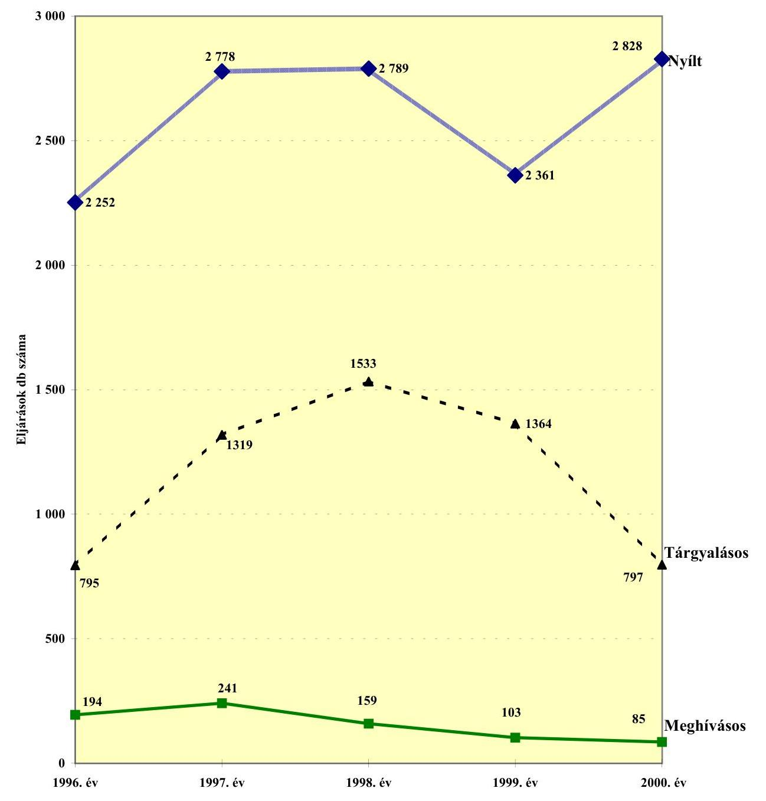
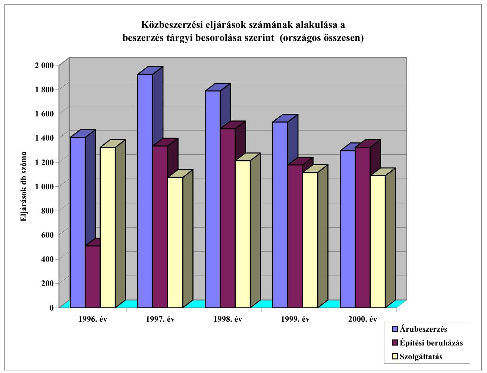
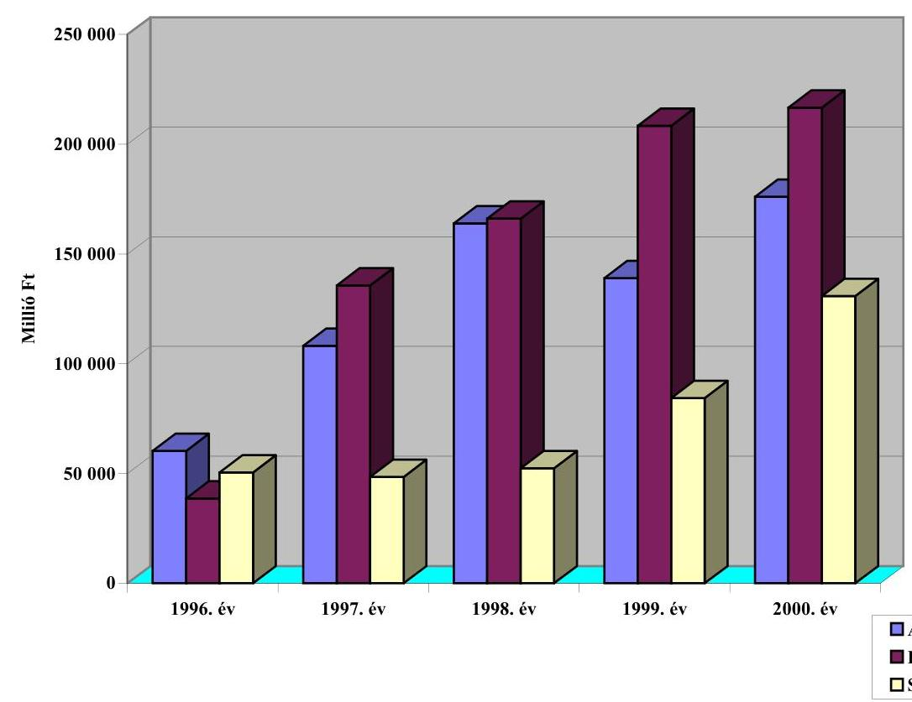
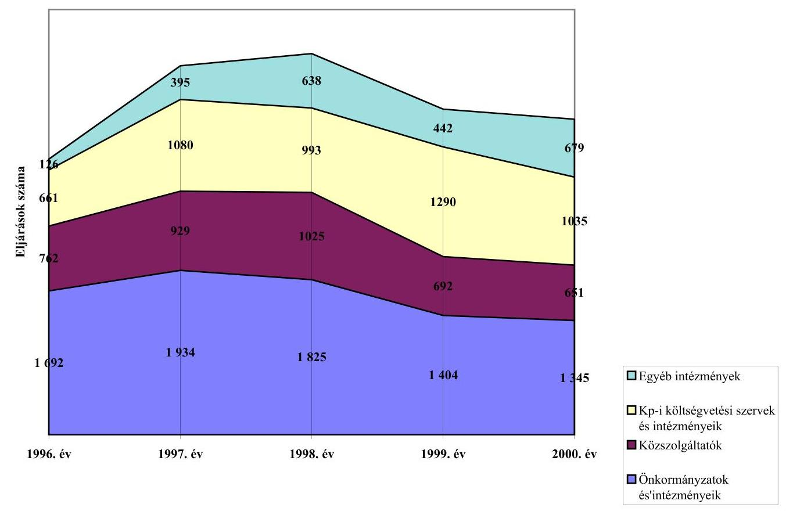
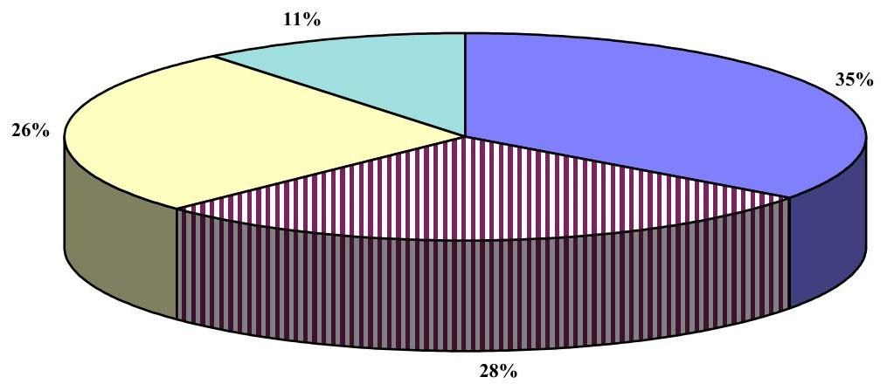
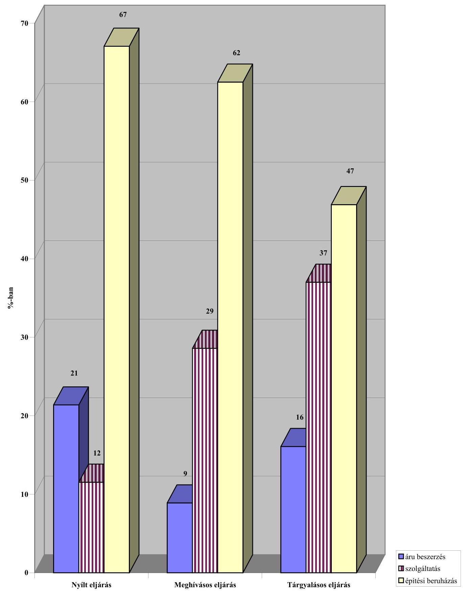
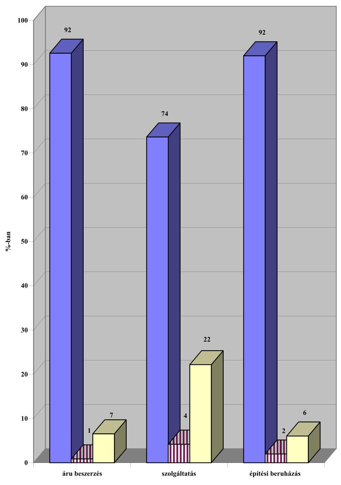
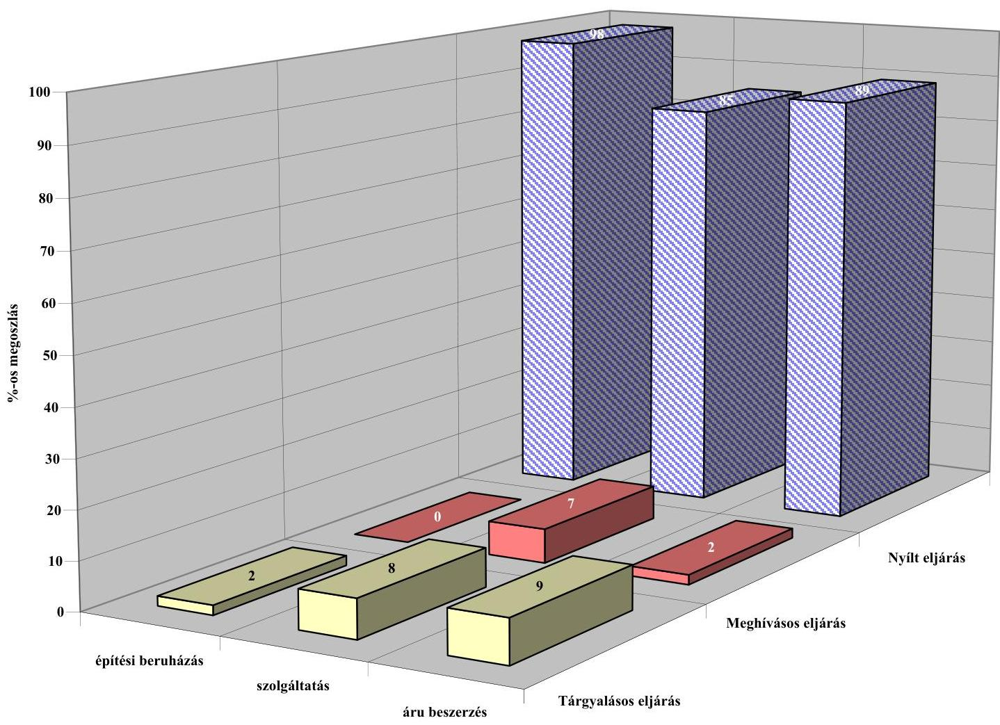

# JELENTÉS 

a közbeszerzésekről szóló törvény végrehajtásának ellenőrzéséről
2001. május

---

# Az ellenőrzés végrehajtásáért felelős:   V. Önkormányzati és Területi Ellenőrzési Igazgatóság 

Dr. Lóránt Zoltán számvevő igazgató

## Az ellenőrzést vezette:

## Németh Péterné

számvevő igazgatóhelyettes

## Dr. Mezei Imréné

számvevő tanácsos -tanácsadó

## Tímár József

számvevő tanácsos - irodavezető

## Vécsey László

számvevő tanácsos - irodavezető közreműködésével

## Az ellenőrzésben részt vettek:

A résztvevők névsorát az 1. sz. melléklet tartalmazza

## A témakörrel foglalkozó ÁSZ vizsgálatok jegyzéke:

Jelentés a közbeszerzésekről szóló törvény 1995-96. évi végrehajtásának ellenőrzéséről a központi költségvetési szerveknél és az elkülönített állami pénzalapoknál (V-16/1996-97.) (A Parlament számítógépes hálózatán a vizsgált fájl neve: 0394J000.doc)

Jelentés a közbeszerzésről szóló 1995. évi XL. törvény végrehajtásának ellenőrzéséről a helyi önkormányzatoknál (V-1012/1997-98.) (A Parlament számítógépes hálózatán a vizsgált fájl neve: 9816J000.doc)

---

# TARTALOMJEGYZÉK 

I. ÖSSZEGZŐ MEGÁLLAPÍTÁSOK, KÖVETKEZTETÉSEK, JAVASLATOK ..... 5
II. RÉSZLETES MEGÁLLAPÍTÁSOK ..... 13

1. A közbeszerzések szabályozási rendszere és működési feltételei ..... 13
1.1. A Közbeszerzések Tanácsa tevékenysége ..... 13
1.2. A közbeszerzési törvény alanyi és tárgyi hatályának érvényesülése ..... 14
1.3. A közbeszerzés szervezeti, személyi feltételei ..... 23
2. A lefolytatott közbeszerzési eljárások ..... 26
3. A központosított közbeszerzési eljárások jellemzői ..... 45
3.1. A központosított közbeszerzések szabályozása és működési feltételei ..... 45
3.2. A központosított közbeszerzési eljárások ..... 50

---

.

---

# Jelentés 

## a közbeszerzésekről szóló törvény végrehajtásának ellenőrzéséről

Az 1995. november 1-én hatályba lépett, közbeszerzésekről szóló 1995. évi XL. törvény (továbbiakban: Kbt.) célja, hogy biztosítsa a közpénzek felhasználásának hatékonyságát, áttekinthetőségét, nyilvánossá tételét és eleget tegyen Magyarország Európai Megállapodás alapján fennálló jogharmonizációs kötelezettségének.

Az Állami Számvevőszék 1997. évben e tárgyban lefolytatott ellenőrzésének első ütemében a központi költségvetési szervek és intézményeik, valamint az elkülönített állami pénzalapok, míg a második ütemben a helyi önkormányzatok és intézményeik közbeszerzéseit tekintette át.

Az ellenőrzések azt állapították meg, hogy részben a szabályozási, részben a jogalkalmazói szándék hiányosságaira visszavezethetően a közbeszerzési eljárások nem épültek be a költségvetési gazdálkodás rendszerébe. A törvényi előírásokat olyan indokolatlan kötöttséget okozó előírásnak tekintették, melynek formai végrehajtására - változó eredményességgel - törekedtek ugyan, de a gazdálkodás szervezésében, annak eredményességében betöltött szerepét nem érzékelték. A végrehajtás folyamatában feltárt hiányosságok egy része azonban a törvény szabályozási, értelmezési problémáira volt visszavezethető. Számos esetben a közbeszerzési eljárást megkerülve nem tartották be a törvényi előírásokat, amelyre a nem egyértelmű szabályozás is több esetben lehetőséget adott. A központosított közbeszerzés pedig még nem volt értékelhető a kormányzati szintű szabályozás késedelme és hiányosságai miatt.

Mindezek alapján javaslatokat fogalmaztunk meg (14. sz. melléklet) a Kbt. módosítására, az előírások egyértelműbbé tételére és a végrehajtást segítő központi, helyi intézkedésekre. A törvénymódosítások a javaslataink többségét érintették.

A törvény - a hatályba lépésétől kezdődően jelen ellenőrzés lezárásáig összesen hét alkalommal módosult, ebből 6 esetben csak kisebb változtatásokra került sor. A módosítások a törvény alanyi, tárgyi hatályát egyaránt érintették, bővült a szabályozás hatálya alá tartozó szervezetek köre, pontosításra került a törvény tárgyi hatálya alá tartozó beszerzések és a központosított közbeszerzések fogalmi köre is.

A költségvetési törvények évente újólag meghatározták a közbeszerzések értékhatárát, amelyek az induló évhez képest 2000-re valamennyi beszerzési kategóriában 60%-kal (reálértéken) növekedtek. Az építési beruházások esetében a vállalkozások teljesítésre való alkalmasságának előminősítési kötelezettsége a kezdeti 200 millió Ft-os értékhatárról 240 millió Ft-ra változott.

---

A kisebb kiigazítások mellett a törvény átfogó, rendelkezéseinek több mint felét érintő módosítására négy év működési, ellenőrzési tapasztalatainak ismeretében 1999. szeptember 1-jei hatállyal került sor.

Jelzésértékű volt, hogy miközben az 1999. évi LX. törvényben elrendelt módosítások csaknem a törvény minden paragrafusát érintették, mégsem új törvény megalkotására, hanem a hatályos joganyag megújítására került sor, tükrözve azt a jogalkotói álláspontot, ami a Kbt. szabályozási alapelveit időtállónak, az uniós csatlakozás követelményei tükrében is mértékadónak tekintette.

A módosítások a szigorúbb előírásokkal egyrészt a törvény megkerülésének kívántak gátat szabni, másrészt az eljárási szabályok enyhítésével, rugalmasabbá tételével igyekeztek közvetett módon ösztönözni azok betartását.

A vizsgálat célja annak megállapítása, értékelése volt, hogy

- az önkormányzatoknál és ezek intézményeinél, továbbá a központi költségvetési szerveknél hogyan érvényesült a törvény alkalmazása során a közpénzek felhasználásának szabályszerűsége;
- hogyan minősíthető a közbeszerzési folyamatok során a törvényi alapelvek érvényesülése;
- a közbeszerzések végrehajtása és ellenőrzése helyileg megfelelően szabályozott-e, tapasztalható-e kellő előrelépés a közbeszerzési szemlélet elfogadása és alkalmazása tekintetében;
- hogyan hasznosultak a törvény végrehajtása során a korábbi ellenőrzési tapasztalatok.

Továbbá célunk volt az is, hogy a szakmai tapasztalatok bemutatásával segítsük elő a Kbt. napirenden levő módosítását.

Az önkormányzatok ellenőrzése 16 megyére és a Főváros 3 kerületére terjedt ki, melynek során 10 megyei, 9 megyei jogú városi, 41 városi és 30 nagyközségi, illetve községi, összesen 93 önkormányzat helyszíni vizsgálatára került sor.

Az önkormányzatok kiválasztása azok közül az önkormányzatok közül történt, amelyek a Közbeszerzési Értesítőben eljárási hirdetményeket tettek közzé a törvény módosítását követően.

Az 1999-2000. években országosan indított 7528 közbeszerzési eljárás 36%-át önkormányzatok bonyolították le. Ezen belül a helyszíni ellenőrzéssel érintett 93 önkormányzat 607 eljárást kezdeményezett, amelyek közül 308-at (50,7%) tételesen ellenőriztünk. Így a vizsgált közbeszerzési eljárások az önkormányzati körben indított beszerzések 11,2%-át jelentik.

Vizsgálatunk kiterjedt a központosított közbeszerzések jogi-gazdasági környezetének, gyakorlatának alakulására, fejlődésére. Szúrópróbaszerűen ellenőrzés alá kerültek a kijelölt minisztériumok és központi intézmények saját, nem központosított közbeszerzési eljárásai is.

---

Az ÁSZ Költségvetési Ellenőrzési Igazgatóságának számvevői által lefolytatott ellenőrzés a központosított közbeszerzés beszerző szervezeteire (MKGI, BMOKF, OEP), 5 minisztériumra és annak 18 intézményére és gazdasági társaságára, továbbá a területi vízügyi igazgatóságokra és megyei közútkezelő Kht-kra terjedt ki. A vizsgált 3 központi közbeszerző szervezet által 1999-2000-ben lefolytatott 78 közbeszerzési eljárásból 16-ot (20,5%) vizsgáltunk. A központi költségvetési szervek egyedi közbeszerzési eljárásainak 8,9%-át ellenőriztük.

A helyszíni ellenőrzés mellett folyamatosan együttműködtünk a Közbeszerzések Tanácsának Titkárságával és a Közbeszerzési Döntőbizottsággal.

A jelentés összeállításánál felhasználtuk az ÁSZ egyéb vizsgálatainak a közbeszerzéseket érintő megállapításait is. Az ÁSZ középtávú stratégiai célkitűzése alapján ugyanis 2000. január 1-től a közbeszerzések ellenőrzése valamennyi ellenőrzési témában kiemelt kérdésként, folyamatos ellenőrzési feladatként szerepelt.

# I. ÖSSZEGZŐ MEGÁLLAPÍTÁSOK, KÖVETKEZTETÉSEK, JAVASLATOK 

A 2000. évben lefolytatott ellenőrzések alapján általánosítható tapasztalat, hogy a Kbt. előírásainak magasabb színvonalon feleltek meg az egyes minisztériumok, önkormányzatok. A módosított közbeszerzési törvényben megfogalmazott értelmező rendelkezések (tárgyi hatály pontosítása, azonos tárgyú beszerzések), az eljárások egyszerűsítését, az eljárási szabályok alkalmazhatóságát szolgáló változások (átfutási idők rövidítése, igazolások számának csökkentése) és a szigorúbb előírások (tárgyalásos eljárás feltételei, a bírálati szempontrendszer nyilvánossá tétele, a jogorvoslati eljárások kiterjesztése stb.) jól szolgálták a törvény alapelveinek (a verseny tisztaságának, a nyilvánosságnak, az esélyegyenlőségnek) az érvényesülését.

Az országos adatokat tekintve a vizsgált 1997-2000. közötti időszakban az eljárások száma 1998-ig növekedett, majd ezt követően kismértékben csökkent. A közbeszerzések értéke ugyanakkor folyamatosan növekedett, 2000-re az 1996. évinek 3,5 szeresét érte el. Egyértelműen kedvezőnek tekinthető, hogy javult az eljárások átláthatósága, ugyanis az 1998-1999. évi csökkenés után 2000-re a nyílt eljárások szám- és értékaránya növekedett. Ugyancsak kedvező, hogy egyidejűleg visszaszorult a tárgyalásos eljárások szám- és értékaránya.

Az országosan lefolytatott közbeszerzési eljárásokon belül az önkormányzatok és intézményeik részesedése az eljárások számát és értékét tekintve folyamatosan csökkent (52,2%-ról 36,3%-ra, illetve 36,8%-ról 28,9%-ra), miközben a központi költségvetési szervek és intézmények részesedése növekedett (20,4%-ról 27,9%-ra, illetve 26,2%-ról 33,2%-ra).

Az ellenőrzés körébe vont önkormányzatok a vizsgálat éveiben együttvéve 434,5 milliárd Ft-ot használtak fel beruházási, felújítási, dologi kiadásaikra, ennek alig több mint egyötödét realizálták köz-

---

beszerzési eljárásokat követő vállalkozói szerződések keretei között. Az ellenőrzött minisztériumoknál és intézményeiknél ez az arányszám kedvezőbb, de itt is csak az előirányzatok 29,6%-át tették ki a saját hatáskörű és a központosított közbeszerzések.

A vizsgált önkormányzatok dologi és felújítási-felhalmozási kiadásainak összegét tekintve a közbeszerzéssel érintett beszerzés az 1997-2000. években összesen 28,9, illetve 61,5 milliárd Ft volt, ami az összes kiadáshoz viszonyítva 9,7%, illetve 44,6%-ot képviselt. Ezen belül kedvező, hogy a közbeszerzések aránya tendenciájában folyamatosan növekedett. Megyénként azonban igen jelentősek a különbségek, amelyet az önkormányzatok dologi és felhalmozási kiadásai közötti eltérések nem indokolnak. Ugyancsak kedvező, hogy a nyílt eljárások szám- és értékaránya e körben is növekedett és visszaszorultak a tárgyalásos eljárások.

Mindezek ellenére az önkormányzatok körében végzett ellenőrzés alapvetően nem változtatta meg a közbeszerzési tevékenységükről eddig kialakult összképet. Ennek oka, hogy a kedvező tapasztalatok mellett olyan hibák, szakmai tévedések fordultak elő, melyek révén egyes eljárások tisztasága, korrektsége vált kétségessé. A Kbt. megsértésére irányuló szándékos magatartás - ami esetleg személyes felelősség kérdésének megállapítását tette volna szükségessé -, az ÁSZ rendelkezésére álló eszközökkel ezek többségével kapcsolatban nem volt megállapítható. E hibák ugyanakkor nagy figyelmet érdemelnek amiatt, hogy azok a törvényes és sikeres eljárásokhoz képest aránytalanul nagyobb nyilvánosságot kapnak.

A vizsgálati tapasztalatok szerint még mindig gyakorinak tekinthetők a közbeszerzési törvény mellőzésével lefolytatott beszerzések, különféle egyéni értelmezések alapján vállalt tudatos vagy „csak" spontán, tájékozatlanságra utaló törvénysértések, melyek elsősorban szemléletbeli problémákra vezethetők vissza. A törvény hatálya alá tartozó szervezetek többnyire még mindig eljárási szabályokat nehezítő, felesleges kötöttséget okozó kötelezettségnek, mintsem a közpénzek - nyilvános versenyeztetés próbáját kiálló - takarékos felhasználásának lehetőségét megteremtő eljárásnak tekintik a közbeszerzéseket. Az önkormányzatok többsége nem ismerte fel, hogy széles körű önállóságuk egyben milyen nagy felelősséggel is jár a közpénzek felhasználását illetően, és ebben a megfelelő közbeszerzési gyakorlat mekkora segítséget jelenthet. Nem segítette a törvényalkalmazás jelentőségének a fölismerését az sem, hogy a Kbt. megkerülése - a közbeszerzések teljes vagy részbeni mellőzése - esetében nem éreznek olyan mértékű fenyegetettséget, ami a közbeszerzések számának, értékének növelésére, az előírások betartására ösztönözné őket. Különösen az árubeszerzések és szolgáltatások tekintetében nem jár túl nagy kockázattal a közbeszerzési kötelezettség figyelmen kívül hagyása, mivel a költségvetés és a közbeszerzés információs rendszerében nincs nagy valószínűsége - megfelelő kontrollmechanizmusok hiányában - a törvénysértések, az indokolatlan szerződésmódosítások felfedésének, és ezért szankciók bekövetkezésének.

Azoknál a szervezeteknél viszont, ahol a közbeszerzési szemlélet kedvezően változott, ott a közbeszerzés megfelelő szervezeti keretei kialakultak, az eljárások lebonyolításának törvényessége is javult.

---

A közbeszerzési törvény tárgyi hatályának értelmezését, a becsült értékének, egybeszámítási kötelezettségének a meghatározását az elmúlt 5 év működési tapasztalata, a törvény módosításai ellenére még mindig több kérdésben bizonytalanság, és ebből eredően törvénysértés kíséri.

A törvény előírásait elsősorban az építési beruházások, rekonstrukciók vállalkozásba adása esetében, többnyire más jogszabályi előírások késztetésére (címzett és céltámogatás, elkülönített támogatási vagy cél jellegű előirányzatok), azok elkerülhetetlen velejárójaként alkalmazzák. Eközben a dologi kiadások közbeszerzési eljárás révén való teljesítése rendkívül alacsony (önkormányzatoknál 9,7, központi költségvetési szerveknél 15,3%). Nincs előrelépés a beszerzések éves tervre alapozott becsült értékének összeszámításában, a beszerzések centralizált megvalósításának kezdeményezésében és a központosított közbeszerzéshez való csatlakozásban sem. Beszerzési tervek összeállítása és közzététele nem gyakorlat,
 holott ezzel gyorsíthatnák is a közbeszerzési eljárásokat. Változatlanul gondot okoz a beszerzések tárgyáért általában kért, illetve kínált legmagasabb összegű ellenszolgáltatás összegének, a becsült értéknek a meghatározása. A becsült érték meghatározásának problémaköre döntően arra vezethető vissza, hogy a jogalkalmazók változatlanul a törvény előírásai megkerülésének szándékával értelmezik a Kbt. 5. §-át, azaz az árubeszerzések, szolgáltatások költségvetési éven belüli egybeszámításának kötelezettségét. Különösen szembetűnő, hogy az önkormányzati tulajdonú kórházaknál a korábbi tapasztalatokkal egyezően kevés közbeszerzési eljárást indítottak.

A Kbt. 1999. évi módosítása önmagában nem tudta az önkormányzatokat és azok intézményeit (különösen a kórházakat) kellően segíteni a törvény alkalmazásában, ahhoz a szakmai sajátosságokat figyelembe vevő iránymutatás is kellett volna, ami azonban az ágazatok részéről elmaradt. Más oldalról viszont olyan ágazati (KVM) beavatkozással is találkoztunk a pályázati pénzek odaítélésénél, ami nem csak a Kbt. alapelveinek megsértését, hanem az önkormányzati önállóságba való jogosulatlan beavatkozást is jelentette.

Értelmezési probléma a központi szerveknél is előfordult a Kbt. hatálya alá tartozó beszerzések és a közbeszerzési eljárás lefolytatása szükségességének a megítélésében. Nem indítottak közbeszerzési eljárást a közbeszerzési értéket meghaladó beszerzéseknél, azok speciális jellemzőire hivatkozva az utaztatások, iskolatej program és a vízkárelhárítás esetében.

Nem javult lényegesen az önkormányzatok - közbeszerzéssel kapcsolatos - helyi jogalkotó tevékenysége. A bekövetkezett törvényi változások a korábban sem egységes álláspontokat tovább bővítették. Valójában a törvény 1999. évi módosításával a beszerzések számára és értékére vonatkozó kitétel a helyi szabályozást mérlegelési alapra helyezte, ami nem szolgálta az önkormányzati szféra közbeszerzéseinek szabályozottabbá válását. A rendeletalkotást olyan értelmezhetetlen, gyakorlatban értékelhetetlen körülményektől tette függővé, amelyek a többirányú megközelítés lehetőségével a törvényi előírások elkerüléséhez vezettek. A jogszabályalkotás kötelezettségét ugyanis a beszerzések „száma és értéke" alapján önmagában nem lehetséges számon kérni, ha ahhoz más, konkrétan értelmezhető előírás nem társul. A közbeszerzési folyamat a központi költségvetési szerveknél szabályozottabb, személyi, szervezeti

---

feltételei meghatározottabbak, de itt is előfordult szabályozatlanság, és az aktualizálás e körben is döntően elmaradt. Előfordult, hogy gazdasági társaságot bíztak meg a közbeszerzési eljárások lebonyolításával jelentős mértékű díjazásért, ami feleslegesen terhelte a költségvetést.

Indokolatlanul vált megengedőbb jellegűvé a szabályozás a közfeladatot ellátó vállalkozások, alapítványok esetében. Miközben e szervezetek egyre jelentősebb arányban vannak jelen az önkormányzati szférában, egyre jelentősebb részben közvetlenül vagy közvetve állami pénzeket használnak fel, a szervezetek alapítóitól (támogatótól, megrendelőtől, koncessziós jogokat átengedőtől) való függetlenedése egyre erőteljesebb, az önkormányzatoknak a közbeszerzési folyamatok alakulására nincs ráhatása.

A csökkenő tendencia ellenére még mindig magas a tárgyalásos, ezen belül különösen a hirdetmény közzététele nélküli tárgyalásos eljárások aránya és sok esetben nem funkcionál megfelelően, a különbségek objektív mérésére alapozóan a bírálati rendszer. Érzékelhetők olyan, Kbt-vel ellentétes, esélyegyenlőséget, gazdasági célszerűséget sértő megoldások, amelyek az önkormányzatokat az anyagi forrásokkal való rendelkezés oldaláról terelik törvénysértő megoldások felé. Esetenként maga a törvényi előírás értelmező szándékú rendelkezései nyitnak teret az előírások megkerülésének. A pályázati támogatási rendszerek nyilvánossága nem szolgálja kellően a valós versenyhelyzet kialakulását, a feladatok gazdaságos megvalósítását, mivel a pályázók tisztában vannak a pályáztatók felhasználható forrásainak nagyságrendjével. A cél- és címzett támogatásokról, valamint az államháztartásról szóló törvények módosításai megteremtették a lehetőségét annak, hogy a közbeszerzési eljárások lefolytatására megfelelő idő álljon rendelkezésre. Ennek ellenére az önkormányzatok a cél- és címzett támogatásoknál az ajánlati felhívást akkor is közzé tették, ha nem rendelkeztek a szerződés teljesítését biztosító pénzügyi fedezettel. Az eljárások lebonyolításának időigényét változatlanul széles körben kifogásolták, ugyanakkor nem éltek a határidők lerövidítését - a módosított Kbt. által - lehetővé tevő előzetes beszerzési tájékoztató közzétételével.

Egyszerűsödött a megkívánt igazolások és nyilatkozatok rendelkezésre bocsátása, zökkenőmentésebbé vált az eljárás egyes szakaszainak dokumentálása, követhetővé és pontosabbá vált az eljárásokhoz kapcsolódó összegzések összeállítása és a hirdetmények közzététele. Ennek ellenére az ellenőrzések a közbeszerzési eljárások lefolytatásában különféle hiányosságokat tártak fel. Még mindig előfordulnak helytelen törvényi megközelítésből fakadóan rosszul megválasztott eljárási formák. Az eljárások egyharmadában összefonódott az előkészítés és a bírálat, az összeférhetetlenség kiszűrésére nem fordítottak kellő figyelmet. A pénzügyi fedezet hiánya miatt az eljárások 6%-a eredménytelenül zárult. Az ajánlatok gyakran hiányosak voltak, és néhány esetben érvénytelen ajánlatot is befogadtak. Az eljárások dokumentálása ugyanakkor javult, az éves összegzés mintegy 90%-ban elkészült, de az eljárások eredményességének értékelése változatlanul nem történik meg.

A kisebb önkormányzatok a beszerzések nagyságrendje miatt a közbeszerzési eljárások kapcsán érdekeiket nem tudják érvényesíteni, illetve megtakarításra kevésbé számíthatnak és az eljárások lefolytatásához szükséges személyi felté-

---

telekkel sem rendelkeznek. Ezért a jelenleg alkalmazott külső szakértő szervezetekkel szemben kedvezőbb megoldás lenne a közbeszerzési társulások létrehozása.

A jogorvoslat lehetőségei javultak, időbeli korlátjai bővültek, az elkövetett jogsértésekhez fűződő szankciók szigorodtak, melyek visszatartó erejüknél fogva hosszabb távon pozitív hatást válthatnak ki. A jogorvoslati eljárások aránya többszörösére növekedett az előző vizsgálatunkhoz képest. A lezárt ügyek egyharmada azonban megalapozatlannak bizonyult.

Az önkormányzatok helytelen szemléletét tükrözi, hogy az e területen alapvető fontosságú, kiemelkedő jelentőségű belső ellenőrzés a közbeszerzési tevékenység ellenőrzésével nem foglalkozott, de elmaradt az intézményeik közbeszerzési tevékenységének ellenőrzése is. A minisztériumok belső és felügyeleti ellenőrzésében és az intézményeik belső ellenőrzésében sem vált általános gyakorlattá a közbeszerzési folyamatok vizsgálata. Holott épp a folyamatba épített ellenőrzés előzhetné meg e területen a hibákat, törvénysértéseket, mivel a külső ellenőrzés természeténél fogva csak utólag képes ezek felderítésére, és nem helyettesítheti a felelős gazdálkodói magatartás, tulajdonosi szemlélet érvényesülését.

A helyszíni vizsgálattal érintett önkormányzatoknál és intézményeiknél összesen 306 esetben fogalmaztunk meg intézkedési javaslatot, ezek 27%-a az eljárások lefolytatásának célszerűségére, 24%-a az önkormányzati rendeletek megalkotására és módosítására, 23%-a pedig egyéb - pl. döntéselőkészítési eljárási szabály módosítására irányult. Egy esetben kezdeményeztünk jogorvoslati eljárást és öt esetben személyi felelősségrevonást. (7. sz. melléklet)

A központosított közbeszerzés keretébe tartozó beszerzés az 1997-2000. években országosan összesen 57631 millió Ft volt. E nagyságrend miatt különösen fontos, hogy a rendszer garantálja a közpénzek szabályszerű és takarékos felhasználását, ami az eddigiekben csak részben valósult meg. A központosított közbeszerzés szabályozási- és intézményrendszere, működési mechanizmusa több tekintetben is ellentmondásos. Az elhúzódó jogalkotás, a nem kellően összehangolt és egyes elemeiben gyakran módosuló szabályozási háttér elbizonytalanította a központosított közbeszerzésre kötelezett intézményeket és a kijelölt beszerző szervezeteket egyaránt. A központi közbeszerzéseket bonyolító szervezetek (MKGI, BM OKF, OEP) tényleges tevékenységüket 1997-1998. években kezdhették csak meg és mielőtt tevékenységük megfelelően kiépült volna, értékelhető tapasztalatok álltak volna rendelkezésre, a Kormány 2000. január 1-től az MKGI-t, mint egyedüli beszerző szervezetet bízta meg a központosított közbeszerzési eljárások lefolytatásával. Zavart okozott a központosított közbeszerzés hatálya alá tartozó szervezetek meghatározásának többszöri módosítása és az, hogy késett az országosan kiemelt termékek állami normatíváinak a kidolgozása is.

A központosított közbeszerzések végrehajtásával kapcsolatos helyi szabályozás mind a beszerző szervezeteknél, mind a fejezeteknél és azok intézményeinél hiányos és aktualizálatlan volt, de a beszerző szervezetek

---

személyi, tárgyi feltételei sem voltak elégségesek a rendszer hatékony működtetéséhez.

Az érintettek jogkövető magatartása is erősen kifogásolható volt. Kellő kötelezés és ösztönzés hiányában nem épült ki a beszerzési kör információs bázisa, nem megfelelő a szervezetek regisztrációja. A 2000. január 31-ig előírt regisztrációs kötelezettségnek a mintegy 1000 intézményből november 1-ig is csak 171 intézmény tett eleget. A beszerzési igények megfogalmazása nem megbízható alapokon nyugszik, ellentmondásos a megkötött keretszerződések teljesítési rendje, nem működik a szállítói monitoring, nem minden esetben igazolható egyértelműen a központosított rendszerű beszerzések gazdasági eredményessége.

A beszerző szervezet által lebonyolított eljárások eredményeként megkötött szerződések nem elég konkrét teljesítési feltételek mellett jöttek létre, így az ellátási biztonságra való törekvés a szállítók természetes érdekével párosulóan a keretszerződések rendszeres mennyiségi, értékbeni túlteljesítéséhez, nehezen indokolható szállítói pozíciók kialakulásához vezetett. Ez a gyakorlat nincs összhangban a Kbt. előírásaival és ebből eredően a törvényi célkitűzések, alapelvek is sérültek.

A központosított közbeszerzés révén jelentős költségvetési megtakarítást sikerült elérni. Mindemellett széles körben tapasztalható volt, hogy a központosított közbeszerzés számos termék esetében drágább, az igényeknek minőségi és tradicionális szempontból kevéssé megfelelő ellátást képes biztosítani, mint az intézmények saját hatáskörű beszerzései. Nem volt indokolt a központosított közbeszerzési eljárás keretében meghatározott árnál igazoltan olcsóbb beszerzések engedélyezésének a szigorítása. A szabályozás pontosítását igényli a közbeszerzési díjak megállapításának, nyilvántartásának, felhasználásának kérdése.

Hiányos és megoldatlan a központosított közbeszerzési eljárások ellenőrzése. A helyszíni ellenőrzések lezárásáig a beszerző szervezetek felügyeleti szervei részéről sem volt e területen átfogó, illetve célellenőrzés. Mindezek következtében a központosított beszerzések értékelése, elemzése elmaradt.

Valójában a korrupció lehetőségét a rendszer az adott beszerzéseknél nem tudja megszüntetni és azt sem tudja biztosítani, hogy az egyes kormányzati szervek azonos feltételek mellett tudjanak beszerezni, egyformán élvezzék az állam, mint nagyvásárló előnyét.

Mindez felveti egy eljárási rendjében, teljesítési fegyelmében szigorúbb, de beszerzési megoldásaiban rugalmasabb, a sokrétű ellátási igényekkel jobban összehangolható beszerzési rend kialakításának szükségességét.

Az elektronikus közbeszerzés feltételeinek a megteremtése késik. Mivel az elektronikus közbeszerzés a beindulását követően várhatóan a jelenlegi központosított közbeszerzés arányának szűküléséhez vezet, indokolt, hogy a szabályozás összehangolásának igényével kerüljön áttekintésre a közbeszerzések e két kiemelt területe.

---

Az ellenőrzési tapasztalatokra alapozva az alábbi intézkedések megtételét javasoljuk:

1. A Kormány a közbeszerzés hatékonyságának és törvényességének javítása érdekében

- teremtse meg a közbeszerzési szabályok és a különböző támogatási rendszerek pályázati, igénybevételi feltételeinek összhangját, ennek során szüntessék meg az ajánlatkérők döntési önállóságát sértő és a pályázók esélyegyenlőségét nem biztosító ágazati beavatkozás lehetőségét. Intézkedéseivel segítse elő a valós forráskoordinációt, a támogatások koncentráltabb felhasználását,
- támogassa és forrásoldalról is ösztönözze a közbeszerzések önkormányzati szintű centralizálásának, valamint a központosított közbeszerzésekhez (illetve a későbbiekben az elektronikus közbeszerzéshez) való csatlakozás lehetőségét,
- támogassa az önkormányzati közbeszerzési társulások létrehozását, ezáltal tegye lehetővé az önkormányzati szféra sajátosságainak képviseletére nem vagy csak korlátozottan képes külső szakértő szervezetek kiváltását,
- a költségvetési tervezési és beszámolási rendszer megújításának munkálatai során szerezzen érvényt a közbeszerzési tevékenységet, a beszerzési terv készítését támogató információrendszerbeli elvárásoknak,
- vizsgálja felül a központosított közbeszerzés működésének szabályait, szervezeti és működési feltételrendszerét, a keretszerződések figyelemmel kísérésének szabályait, ellenőrzési rendszerét és tegyen intézkedést a Kbt. alapelveinek maradéktalan érvényesítésére,
- gyorsítsa fel az elektronikus közbeszerzés intézményének a bevezetését, gondoskodjék annak a központosított közbeszerzés szabályaival való összehangolásáról.

2. Az Igazságügyminisztérium - az érintett minisztériumok (PM, BM) bevonásával a közbeszerzésekről szóló 1995. évi XL. törvény módosításának előkészítése során

- tegye egyértelművé a közbeszerzési tevékenység önkormányzati szintű szabályozásának szükségességét, meghatározva annak konkrét területeit,
- a Kbt. 1. §-ában nevesített önkormányzati érdekeltségű jogalanyok és a helyi közszolgáltatásban közreműködő egyéb szervezetek esetében az ellátási felelősséggel összhangban erősítse meg az önkormányzat felelősségét a közpénzekből megvalósuló beszerzéseknél,
- tekintse át és a jelenleginél konkrétabban határozza meg a bírálati szempontrendszer reálisabb működtethetősége érdekében a szempontrendszer érvényesítésének részletszabályait, az értékelési pontszámok és súlyarányok
 képzésének tartalmi követelményeit,
- gondoskodjon arról, hogy központi költségvetési szerv saját szervezetén belül legyen köteles a közbeszerzési eljárások lebonyolítására, külső szerveket

---

csak kivételesen indokolt esetben bízhasson meg a közbeszerzések technikai lebonyolításával,

- szélesítse a közbeszerzési folyamatok ellenőrzésében és a jogorvoslatok kezdeményezésében a Magyar Államkincstár szerepét,
- $\quad$ tegye teljesebbé a közbeszerzés monitoring rendszerét, hogy az a jelenleginél jobban biztosítsa a Kbt. megkerülésével lefolytatott beszerzések nyilvánosságra kerülését, ezzel egyidejűleg a törvénysértők felelősségre vonását,

# 3. A Közbeszerzések Tanácsa 

- a közbeszerzések statisztikai információs rendszerének korszerűsítésével tegye lehetővé a szerződéskötések figyelemmel kísérését, különös tekintettel a nyertes ajánlattevők és az alvállalkozók szerepének alakulására, valamint egyes jogsértések automatikus feltárásának, szankcionálásának lehetőségére,
- kezdeményezze a beszerzések azonos termékcsoportjainak, egybeszámíthatóságának meghatározására irányuló ágazati ajánlások kidolgozását.

4. A minisztériumok, az önkormányzatok érdekszövetségei

- $\quad$ szerezzenek érvényt a központosított közbeszerzés személyi hatálya alá sorolt szervezeteket érintő regisztrációs kötelezettség teljesítésének
- segítsék a közbeszerzési döntési folyamatokban a helyi sajátosságok érvényesítését, az eljárások lefolytatását gazdálkodás oldaláról megalapozó beszerzési tervek kidolgozását, a centrális beszerzésben megnyilvánuló előnyök megismertetését, a szervezeti és személyi feltételrendszer kialakítását.

Az előzőek megalapozása érdekében a helyszínen ellenőrzött szervezetek részére az alábbi ajánlásokat fogalmaztuk meg:

- az önkormányzatok kezeljék kiemelten a helyi szabályozás, a sajátosságokhoz igazodó döntési eljárás kialakításának rendjét, a gazdálkodás szerves részét képező beszerzési tervek kidolgozásának fontosságát, az azonos termékkategóriák éven belüli és feladatokra történő egybeszámításának szükségességét, a takarékos vállalkozásba adás lehetőségét megteremtő szervezeti keretek és közbeszerzési szabályok maradéktalan érvényesítését,
- a központosított közbeszerzést lebonyolító szervezet stabilizálja működésének személyi és tárgyi feltételeit, gondoskodjék a keretszerződések folyamatos figyelemmel kíséréséről, ellenőrzési-visszacsatolási kötelezettségeinek érvényesítéséről.

---

# II. RÉSZLETES MEGÁLLAPÍTÁSOK 

## 1. A KÖZBESZERZÉSEK SZABÁLYOZÁSI RENDSZERE ÉS MŰKÖDÉSI FELTÉTELEI

### 1.1. A Közbeszerzések Tanácsa tevékenysége

A Kbt. módosítását követően a közbeszerzések intézményrendszerében nem következtek be lényegi változások, a módosulások elsősorban az egyes intézmények működésének hatékonyságát kívánták elősegíteni.

A Tanács feladat- és hatáskörét érintő változások a módosított Szervezeti és Működési Szabályzatokban megjelentek, ennek során kiemelt figyelmet fordítottak a Kbt. 15. §-ában rögzített feladatok megvalósításának szervezeti és személyi feltételeire.

Kedvezően ítélhető meg, hogy a Tanács a Kbt. előírásainak érvényesülését folyamatosan figyelemmel kísérte, a jogalkalmazás egységessége érdekében tájékoztatókat tett közzé, illetve az eljárások tapasztalataira alapozva kialakította álláspontját a közbeszerzéseket érintő jogszabály-módosítás részleteiről, ajánlásai részben beépültek a törvénybe.

Szervezte és lebonyolította az ajánlattevők évenkénti minősítését, közzétette a közbeszerzési oktatók névjegyzékét, segítette és kellő rendszerességgel biztosította a közbeszerzési eljárások szereplőinek felkészítését, bővítette kapcsolatait más államok közbeszerzési szervezeteivel és nemzetközi intézményekkel.

Folyamatosan gondoskodott a Tanács a tevékenységét támogató Titkárság, Szerkesztőbizottság és Döntőbizottság tevékenységének felügyeletéről, e szervezetek működési feltételeinek biztosításáról.

A Tanács eleget tett azoknak a törvényi előírásoknak, amelyek a döntőbizottsági határozatok bírósági felülvizsgálata tárgyában hozott jogerős határozatok közzétételére, a jogorvoslati eljárások indításának eljárásrendjére, valamint a közbeszerzési eljárások nyilvántartási rendjének korszerűsítésére irányultak. Ez utóbbi különösen jól szolgálja a Kbt-ben előírt évenkénti parlamenti beszámoló információs bázisának szélesítését, a közbeszerzések tisztaságával és átláthatóságával kapcsolatos tapasztalatok összegzésének megalapozását.

Nem érvényesült viszont maradéktalanul - elsősorban a koordinációs igény elmaradása miatt - a Tanács jogszabálytervezetek véleményezésében biztosított jogköre. Kellő személyi feltételek hiányában irreális elvárásnak bizonyult a közbeszerzési eljárások alapján megkötött szerződések figyelemmel kísérésének és az ajánlatok bontásán való jelenlét igénye is.

A jelenleg 19 tagú, delegált testületként működő Tanács mellett a Titkárság, a Szerkesztőbizottság, a Döntőbizottság összes létszáma 47 fő, amely a feladatbővüléssel arányban folyamatosan változott ugyan, de a jogügyek és jogorvoslati

---

eljárások egyre növekvő száma miatt (1999. évi 376 darabbal szemben 2000. évben 700 darabot ért el) a jogi szakértők és a közbeszerzési biztosok leterheltsége fokozódott.

A munkavégzés tárgyi feltételei - elhelyezés, eszközökkel való ellátottság - megfelelőek.

A Tanács az Országgyűlés felügyelete alatt álló önállóan gazdálkodó központi költségvetési szerv, gazdálkodásának körülményeit, szabályszerűségét az Állami Számvevőszék a zárszámadás vizsgálata keretében évente ellenőrizte. Ennek során takarékos gazdálkodást és a költségvetési szabályok maradéktalan betartását állapította meg.

# 1.2. A közbeszerzési törvény alanyi és tárgyi hatályának érvényesülése 

A közbeszerzési eljárások általános, önkormányzati és központi költségvetési szerveknél is érvényesítendő szabályait a törvény tartalmazza. A közbeszerzések tárgykörében azonban olyan rendelkezések megalkotására is szükség lett volna, amelyek egyrészt a jogalkotásról szóló 1987. évi XI. törvény szabályozási elveinek ismeretében nem igényelnek, másrészt a jogalkalmazók sajátos helyzetére figyelemmel nem indokolnak törvényi szintű szabályozást.

A törvény 96. § (1)-(2) bekezdése felhatalmazást adott a Kormánynak, valamint az önkormányzatoknak arra, hogy az általuk alapított költségvetési szervek vonatkozásában rendeletben szabályozzák egyrészt a közbeszerzési eljárások kiírásával és elbírálásával kapcsolatos tevékenységre és az abban eljáró személyekre vonatkozó, Kbt-ben nem szabályozott rendelkezéseket, másrészt a közbeszerzési értékhatárt el nem érő beszerzéseik lebonyolításának egyszerűsített, a Kbt. alapelveinek megfelelő eljárási rendjét.

A Kormány azonban rendeletben nem határozta meg a központi költségvetési szervek vonatkozásában a közbeszerzési eljárás kiírásával és elbírálásával kapcsolatos tevékenység részletes szabályait, az abban eljáró személyekre vonatkozó rendelkezéseket, ezért az egyes fejezetek és költségvetési szerveik egymástól eltérő módszereket alkalmaztak.

Az OM SZMSZ-e ugyan megfelelően rögzítette a közbeszerzésekkel kapcsolatos felügyeleti szervi feladatokat (felmérés, koordinálás, irányítás, ellenőrzés), a minisztérium közbeszerzési szabályzata mégis csak a minisztériumon belüli szervezeti egységek közbeszerzési tevékenységének szabályozására terjedt ki. Általános jellegű fejezeti iránymutatások, köriratok, állásfoglalások változatlanul nem születtek. Nem történt meg a szabályzatnak a Kbt. 1999. évi módosításával kapcsolatban szükségessé vált aktualizálása sem.

A NKÖM mindenre kiterjedő, megfelelő részletezettségű és tartalmú, az érvényben lévő jogszabályoknak megfelelően aktualizált szabályozással rendelkezik mind saját szervezetére, mind az általa irányított intézményekre vonatkozóan. A fejezet a vizsgált időszakban állandó tanácsadást valósított meg intézményei részére, de írásos állásfoglalásokkal is segítette munkájukat.

---

Az FVM-nél szabályozást nem adtak ki, annak elkészítése a vizsgált időszakban volt csak folyamatban.

A fejezetekhez tartozó intézményeknél a közbeszerzési tevékenység szabályozottságát megfelelőnek találták a helyszíni ellenőrzések. A szabályozás egyes helyeken (Műszaki Egyetem, a 2000. január 1-i hatállyal létrejött Budapesti Gazdasági Főiskola, Országos Vízügyi Igazgatóság) kiemelkedően jónak volt tekinthető.

Az önkormányzatok tekintetében a helyi rendeletalkotás változatlanul nem törvényi kötelezettségként jelent meg, arra a törvényi megfogalmazás szerint akkor van szükség, ha azt a beszerzések száma és értéke indokolja. Miután azonban a törvény nem határozta meg sem a mértékadónak tekintett beszerzések darabszámát, sem pedig azok értékét, ennek mérlegelése az adott önkormányzatok lehetősége. Emiatt a vizsgált önkormányzatoknak csak mintegy 2/3-a élt a helyi szabályozás lehetőségével. E tekintetben az egyes megyék között lényegi eltérések nincsenek, döntően a kisebb települések (községek, kisvárosok) azok, ahol a rendeletalkotás elmaradt.

Pest megyében a vizsgált 15 önkormányzat közül 8, jellemzően városi (5 város, 2 nagyközség, 1 község) önkormányzat alkotott rendeletet a közbeszerzési eljárások lefolytatásáról, amelyből 6 önkormányzat 1996. és 1997 évben alkotta meg a rendeletét. A Kbt. 1999. szeptember 1-jei módosításával összhangban viszont rendeleteiket nem módosították. A további 7 önkormányzatnál a rendeletalkotás elmaradásának okát a helyi beszerzések alacsony számával és értékével indokolták.

Vas megyében a vizsgált önkormányzatok közül 4 rendelkezett a helyszíni vizsgálat idején hatályos szabályozással, amelyből kettő azonban tartalma és aktualitása miatt alkalmatlan volt a közbeszerzési eljárások elvárt színvonalon történő lebonyolítására.

Borsod-Abaúj-Zemplén megyében a vizsgált körben mindössze Ózd alkotta meg a közbeszerzésekről szóló helyi rendeletét.

A rendeletalkotás elmaradását az önkormányzatok úgy indokolták, hogy az esetükben ritkán, kevés számban előforduló, többnyire csak a jelentősebb beruházási feladathoz kapcsolódó közbeszerzési eljárásaik a törvény tételes előírásai alapján, helyi szabályozás nélkül, egyedi döntésekkel is lefolytathatók.

Eltekintettek attól, hogy a helyi rendeletben a közbeszerzési eljárás kiírásával, elbírálásával, az abban eljáró személyekkel kapcsolatosan azokat az előírásokat kell rögzíteni, amit maga a Kbt. nem szabályoz. A sajátos önkormányzati döntési mechanizmust figyelembe véve ezért a rendeletalkotás igénye már egyetlen közbeszerzési eljárás lefolytatása esetén is felmerül, függetlenül attól, hogy mely eljárási típusról, milyen értékű és milyen tárgyú beszerzésről van szó.

A Kbt. 1999. évi módosítása során a beszerzések számára és értékére vonatkozó kitétel a szabályozást mérlegelési alapra helyezte, amely nem szolgálta az önkormányzati szféra közbeszerzéseinek szabályozottabbá válását.

A szabályozás kötelezettségének eleget tevő önkormányzatok rendeleti előírásai sem feleltek meg mindig a törvényi szabályozásban foglaltaknak. Nem fordí-

---

tottak megfelelő figyelmet arra, hogy szabályozásuk a felhatalmazásból eredendően csak azokra a területekre terjedhet ki, amelyeket a Kbt. tételesen nem érint, illetve amelyekben választási lehetőséget biztosít. Ez utóbbi tárgykörbe sorolható a közbeszerzési értékhatárt el nem érő beszerzések rendjének meghatározása, az ajánlati biztosítékról, a helyi adóhatósági igazolások megköveteléséről való döntés. Az önkormányzatok a törvényi előírásokat mechanikusan ismételték, a helyi sajátosságokat szabályozásaikban nem vagy nem teljes körűen vették figyelembe.

Baranya megyében a vizsgált szervezetek mindegyikénél szabályozták ugyan a közbeszerzési eljárások lefolytatásával kapcsolatos feladat- és hatásköröket, de pl. Beremend nagyközség önkormányzatánál a szabályozás módja csak részben felel meg a Kbt. 96. § (2) bekezdésében foglalt előírásoknak, mivel nem tartalmazza a közbeszerzésben eljáró személyekre vonatkozó rendelkezéseket, nem nevesíti a közbeszerzési bizottság tagjait, s nem tér ki az összeférhetetlenség eseteire.
Békés megyében csak a Békés Megyei Önkormányzat aktualizálta a Kbt. 1999. évi módosítása után helyi szabályzatát annak ellenére, hogy ennek szükségességére a Békés Megyei Közigazgatási Hivatal felhívta a figyelmet. A végrehajtást viszont a törvényességi ellenőrzés már nem vizsgálta.
Tolna megyében az önkormányzatok a törvénymódosítást követően - egy kivételével - nem módosították helyi szabályzataikat.

A Főváros XVII. kerületében a Kbt. módosítását követően a közbeszerzési eljárások lefolytatásával kapcsolatos rendeletet nem módosították. A rendelet általánosan fogalmazza meg a közbeszerzési eljárás rendjét, de nem tér ki a Kbt. által előírt értékhatár alatti beszerzésekre, holott a beruházási rendelet szerint a 15 millió Ft feletti beruházások esetében a közbeszerzési rendelet az irányadó.

A törvénymódosítást követően egyértelműbbé váltak az önkormányzati feladatellátásban közreműködő szervek közbeszerzési jogalanyiságának a feltételei.

A közbeszerzési rendelettel bíró önkormányzatok helyi szabályzataik megalkotásánál figyelemmel voltak arra, hogy a Kbt-beli felhatalmazás az általuk alapított helyi önkormányzati költségvetési szervek tekintetében biztosít közvetlen beavatkozást, míg az egyéb szervezetek (közalapítvány, közhasznú társaság, többségi vagy 100%-os önkormányzati tulajdonú gazdasági társaság, szerződés, megállapodás alapján támogatásban részesített szervezet, koncessziós jogosítványokat gyakorló társaságok, társulások) vonatkozásában szabályozási jogosítványaik nincsenek. Így bár a közszolgáltató szervezetek közvetlenül vagy közvetve közpénzeket használnak fel, a Kbt. általános jogalanyiságra vonatkozó szabályain túl önkormányzati elvárások nem érvényesíthetők.

Tolna megyében a Megyei Közigazgatási Hivatal vezetője törvényességi észrevételt tett Paks város önkormányzatának versenyeztetésről szóló rendelete ellen. A hivatkozott leirat szerint az önkormányzat törvénysértést követett el, mivel rendeletének személyi hatályát kiterjesztette az általa létrehozott egyéb szervezeteire is, holott az 1995. évi XL. törvény csak az önkormányzat által alapított költségvetési szervek vonatkozásában ad felhatalmazást a közbeszerzési eljárás kiírásával és elbírálásával kapcsolatos feladatok szabályozására. A helyi szabályozás módosítását az önkormányzat végrehajtotta.

---

Békés megyében is értelmezési problémát jelentett a kötelezően igénybe veendő közszolgáltatásokra előírt pályáztatás és a Kbt.
 hatálya. A Közbeszerzési Döntőbizottság és a Legfelsőbb Bíróság állásfoglalása szerint a szilárd és folyékony hulladékgyűjtés, valamint kéménytisztítás nem tartozik a Kbt. hatálya alá, mivel azokról külön törvény rendelkezik.

Mezőberényben viszont a szilárd hulladék gyűjtése és elszállítása 9,5 – 15,7 millió Ft közötti összegben szerepelt a közbeszerzések között, mivel az eljárás lefolytatása után több évre kötöttek szerződést a legkedvezőbb ajánlatot tevővel.

Budapest Csepel Önkormányzata által 100%-os tulajdonnal alapított Csepel Piacfejlesztő- és Üzemeltető Kft. a 2000. évi üzleti tervében a piaci rekonstrukció I. ütemének megvalósításához 240 millió Ft előirányzat szerepelt, amely 50 millió Ft összegű önkormányzati pénzeszközt is tartalmazott. A Kft-nek, mint támogatott szervezetnek a Kbt. 1. § d) és 10. § d) pontjai alapján az építési beruházásra közbeszerzési eljárást kellett volna lefolytatnia, ami azonban elmaradt.

Az önkormányzatok törvényi előírás hiányában nem vállalták fel e szervezetek közbeszerzési tevékenységének a figyelemmel kísérését. Úgy tekintik, hogy önálló gazdasági tevékenységük részeként, saját kockázatukra szervezhetik és bonyolíthatják beszerzési tevékenységüket is.

A közbeszerzési eljárások centrális megvalósításának lehetőségét néhány kivételtől (Dunaújváros, Vas Megyei Önkormányzat) eltekintve nem vizsgálták, elemezték még a nagyobb beszerzési volumennel bíró önkormányzatok sem. Általánosítható tapasztalat, hogy a helyi beszerzési központosításokkal szemben erőteljes intézményi ellenállás mutatkozott meg. A gazdálkodási jogosítványok központosításával, az eljárások lebonyolításával összefüggésben felmerülő munka szervezeti és személyi feltételeit a hivatalok nem kívánták biztosítani, így a beszerzések önkormányzati szintű központosításáról, gazdasági eredményességéről nem szereztünk értékelhető tapasztalatot.

A beszerzések központosításának elvetése mellett ugyanakkor törekedtek arra, hogy intézményeik beszerzési tevékenységét a Kbt-beli felhatalmazás alapján korlátok közé szorítsák. Ennek konkrét megnyilvánulása az értékhatár alatti beszerzésekre kidolgozott, közbeszerzési alapelveket követő egyszerűsített eljárásrend kidolgozása volt. Miután a döntés ez esetben főként az országos nyilvánosság szűkítésében, az ajánlatok minimális számának meghatározásában, a kevéssé kötött, de közbeszerzési eljárásrendhez rendkívül közelálló eljárási szabályokban nyilvánult meg, így a szabályozással érintett intézmények beszerzési szabadsága valójában szűkült.

Szolnok megyei jogú város önkormányzata a közbeszerzési eljárások centrális megvalósításának lehetőségét – korábbi témavizsgálatunk javaslata alapján – kiemelten vizsgálta. Ennek keretében 1998-1999. évben az intézményi felújítási-nagyjavítási előirányzatokat központosítottan kezelte, és összevont közbeszerzési eljárások keretében adta vállalkozásba. Az eljárások lebonyolítását az önkormányzat hivatali szervezetén belül 1998-ban létrehozott közbeszerzés-felügyeleti osztály végezte. Ajánlati felhívásaikban az eltérő teljesítési helyszíneknek megfelelően részajánlatok tételére is lehetőséget adtak, így a felújítási-nagyjavítási munkák egyedi szervezése a központosított lebonyolítás és azonos követelményrendszer érvényesítése mellett is biztosított volt.

---

Az intézmények részéről azonban – a célszerűbb megvalósítás szempontjaira hivatkozva – erőteljes önállósági törekvések nyilvánultak meg. Az önkormányzat ezért a két éven át működő rendszert 2000-től megszüntette azzal, hogy a közbeszerzés értékhatárait el nem érő intézményi felújítások és beszerzések, szolgáltatások igénybevétele egyszerűsített, de a közbeszerzési szabályokhoz közel álló eljárási rendet határozott meg. Ily módon az intézményi önállóságnak teret engedett ugyan, de helyi szabályozásával megfelelő keretet biztosított a közbeszerzési körön kívüli intézményi gazdálkodásnak is. Azzal ugyanis, hogy az önkormányzati rendelet nem csak a korábban összevontan kezelt felújítási eszközökre, hanem valamennyi intézményi beszerzésre, szolgáltatásra is vonatkozik, lényegében az előzőekhez képest kiterjesztő jellegű szabályozás született.

A központi költségvetési szerveknél a Kbt. módosítását követő időszakban az összevontan meghirdetett pályáztatás alkalmazásának gyakorlata több ágazatban is általánossá vált. A módszer az eljárások hatékony lefolytatását a pályázók egységes kezelése és egyidejű elbírálása révén biztosította.

A KöViM területén a Posta Rt. a postahivatalok felújítása körében alkalmazta az összevont beszerzés gyakorlatát, melynek pénzügyi-gazdasági feltételei az egyéni, valamint a kis- és középvállalkozások számára teremtettek kifejezetten kedvező lehetőségeket.

A VIZIG-ek által indított 43 közbeszerzési eljárásban az összevont meghirdetés elsősorban a vízbázis védelem területén vált gyakorlattá, mivel a kivitelezések közel felét kezelték ily módon, melynek során 32 munkára találtak kivitelezőt.

A közbeszerzési törvény tárgyi hatályának (a tárgyi azonosságnak) értelmezését az elmúlt 5 év tapasztalata, a törvény módosításai ellenére még mindig számos bizonytalanság, s ebből eredően törvénysértés kíséri. Változatlanul gondot okoz a beszerzések tárgyáért általában kért, illetve kínált legmagasabb összegű ellenszolgáltatás összegének, a becsült értéknek a meghatározása. A becsült érték meghatározásának problémaköre döntően arra vezethető vissza, hogy a Kbt. jogalanyai változatlanul a törvény előírásainak megkerülését eredményezően értelmezték a Kbt. 5. §-át, azaz az árubeszerzések, szolgáltatások költségvetési éven belüli egybeszámításának kötelezettségét.

Az önkormányzatoknál a közbeszerzés főként a beruházásokra és nagyobb felújításokra koncentrálódott. Azon túl, hogy ezek összevont versenyeztetése sem gyakorlat, a törvény értelmező rendelkezéseinek konkrétabbá tételét követően is tapasztalhatók értelmezésbeli problémák. A Kbt-ben szereplő beszerzési kategóriákat, értelmező fogalmakat – beruházás, felújítás, szolgáltatás – a költségvetési gazdálkodási szabályokból, számvitelből vagy az építési munkák természetéből igyekeznek különböző módon levezetni, különösen akkor, ha az eltérő közelítéssel a Kbt. szabályainak mellőzését tudták elérni.

Miután az önkormányzatok – élve a törvényi előírás adta lehetőségekkel – intézményeiket a közbeszerzés önálló jogalanyainak tekintik, az intézményi szinten eleve elaprózott költségvetési források alapján kell a beszerzési értékhatárokat figyelemmel kísérni, ahol az egybeszámítható becsült érték eleve alacsony. Az intézmények a beszerzési értékhatárokat változatlanul egyedi beszerzésenként, szállítási eseményenként értelmezték és nem fordítottak gondot arra, hogy azonos vagy azonos rendeltetési célú, egymást helyettesíthető, egy-

---

mással összefüggő termékcsoportokat alakítsanak ki. Nem vizsgálták, hogy mely termékek, szolgáltatások azok, amelyekre egy ajánlattevővel lehetne szerződést kötni, és hogy melyek azok az eljárásbeli lehetőségek – ajánlatok részekre bonthatósága, eltérő teljesítési helyek és szállítási gyakoriság megválaszthatósága –, amelyek éppen az ajánlatkérő sajátosságainak érvényesítésére adnak lehetőséget, nem pedig az eljárások mellőzésére szolgálnának hivatkozási alapként. Nem vették figyelembe azt, hogy a Kbt. 5. § (2) bekezdés alapján több – egyenként a 2. § (3) bekezdése szerinti értékhatárt el nem érő értékű – beszerzési tárgy együttes értéke miatt közbeszerzési eljárást kell tartani, s nem minősül a törvény megkerülésének, ha az egybeszámított értékű beszerzési tárgyakat több közbeszerzési eljárásban szerzik be.

Legszembetűnőbb hiányosságok e tekintetben még mindig az egészségügyi termékek vonatkozásában tapasztalhatók (gyógyszer, vegyszer, kötszer), de jelentősek az élelmezési anyagok és a felújítások egybeszámításának, becsült értékének meghatározása terén is. Már az 1997. évi ÁSZ vizsgálat is megállapította, hogy az egészségügyi intézmények körénél nagy bizonytalanságokat okozott a közbeszerzési kötelezettség megállapításához szükséges tárgyi azonosságra vonatkozó szabályok betartása, melynek következményeképpen a vizsgált intézmények több százmilliós, esetenként milliárdos nagyságrendű árubeszerzéseik 90-100%-át közbeszerzési eljárás nélkül bonyolították.

A kórházak és rendelőintézetek azzal sértették meg a Kbt. 5. § (1) bekezdésének, a közbeszerzések részekre bontással történő megkerülésének tilalmára vonatkozó előírását, hogy a több ezer áruféleség (főleg gyógyszerek, vegyszerek, szakmai anyagok) tárgyi azonosságát nem, vagy csak részben állapították meg, összevonását nem végezték el. Tény, hogy erre sem a törvény, sem más jogszabály nem nyújtott számukra iránymutatást, ezért annak szükségességére, a szakmai sajátosságok figyelembevételére már akkor felhívtuk az illetékesek figyelmét.

Az ÁSZ jelzései vélhetően szerepet játszottak abban, hogy a Kbt. 1999. évi módosítása érintette – az alapelvek változatlanul hagyása mellett – a beszerzések (becsült) értékének, a tárgyi azonosság és egybeszámítás végrehajtásának szabályait, melynek során a korábbinál részletesebben és egyértelműbben kerültek rögzítésre a követelmények, de az egészségügyi termékek vonatkozásában ez sem bizonyult elegendőnek.

A Kbt. 1999. módosítása önmagában nem tudta az intézményeket kellően segíteni a törvény alkalmazásában, ahhoz a szakmai sajátosságokat figyelembe vevő iránymutatás kellett volna, ami azonban javaslatunk ellenére elmaradt.

Győr-Moson-Sopron megyében is jellemző volt az, hogy a helytelen értelmezések miatti negatív jelenségek nem csökkentek. Olyan intézményi beszerzési tervet – a győri megyei kórház kivételével – amely alapján a közbeszerzési kötelezettség megállapítása vagy annak mellőzhetősége megállapítható lett volna, nem készítettek.

Sopronban azért nem készültek ilyen tervek és azért nem foglalkoztak a becsült érték, illetve az egybeszámítás elvégzésével, mert úgy gondolták, hogy mivel az értékhatár alatti beszerzésekre is pályáztatási kötelezettséget vállaltak, nem kell a

---

Kbt-t alkalmazniuk. Az egybeszámítás elhagyására azonban csak akkor lett volna mód, ha az értékhatár alatti beszerzéseikre is a Kbt. maradéktalan – nem pedig annál egyszerűbb – alkalmazását vállalták volna. A helytelen szemléletből fakadóan két esetben – víz-csatornahálózat építések, valamint épület-felújítások – nem a Kbt, hanem a saját, egyszerűsített pályázati rendjük szerint jártak el.

A soproni városi kórház eljárása azért volt szabálytalan, illetve törvénysértő, mert a gyógyszer-vegyszer beszerzésekre – melyek értéke 1999. évben 153318 ezer Ft, míg 2000. I. félévben 77910 ezer Ft volt – a kis értékű központosított beszerzésen túl (8,2 illetve 4,9 millió Ft) egyáltalán nem indított közbeszerzési eljárást. Beszerzési tervek készítésével elvégezhették volna a beszerzések összevonását a Kbt. előírásai szerint, így azok legalább egy részét közbeszerzési eljárás keretében tudták volna realizálni.

Hajdú-Bihar megyében azzal indokolták a közbeszerzési eljárás mellőzését, hogy nincs olyan ajánlattevő, aki az élelmezési tevékenység teljes nyersanyagszükségletét egy szerződés keretében tudná biztosítani. Azt viszont, hogy van-e olyan ajánlattevő, aki képes lenne az élelmezési anyagok teljes körének biztosítására, érdemben nem vizsgálták.

Vas megyében az ellenőrzött önkormányzatok közül Bük, Celldömölk, Sárvár önkormányzatánál, illetve a megyei kórház esetében volt bizonyítható, hogy a közbeszerzési eljárások lefolytatását indokolatlanul mellőzték.

Szabolcs-Szatmár-Bereg megyében az értékhatárra vonatkozó előírásokat szintén nem minden esetben tartották be. A felújítási, rekonstrukciós munkák esetén többször megsértették a Kbt. előírásait, amit nem tartottak be az értékhatárt elérő beszerzések esetén sem. A Megyei Önkormányzatnál nem folytattak le közbeszerzési eljárást 1997. évben az ellátó szervezet festés, vizesblokk, lépcső, étterem, tetőtér felújításnál 20546 ezer Ft, Nyírbátor Múzeum tetőfelújításánál 18000 ezer Ft, Nagykálló Pszichiátriai Szakkórház tetőfelújításánál 19000 ezer Ft, Mátészalka város önkormányzatánál az iskola-rekonstrukciós munkáknál 36363 ezer Ft, a Szakközépiskola és Szakmunkásképző Intézet tetőfelújításánál 8000 ezer Ft értékben. A beszerzések részekre bontásával mellőzte többek között a közbeszerzési eljárás lefolytatását a Záhonyi Közlekedési Szakközépiskola, Tiszabercel Mg. Szakközépiskola, Hodász Ápoló-gondozó Otthon, Ibrány Gimnázium a fűtés-rekonstrukciónál, ahol az összes kifizetés 65400 ezer Ft volt. 1998. évben Ápoló-gondozó Otthon Nyírbéltek, Teleki Blanka Gimnázium Tiszalök, Váry Emil Gimnázium Demecser fűtés-rekonstrukciójánál, ahol a kifizetés 61000 ezer Ft volt. Újfehértó városnál részekre bontás miatt nem folytattak le közbeszerzési eljárást 1998. évben közel 50 millió értékű, saját erőből megvalósított útépítésnél.

Békés megyében Békéscsabán a Gyermekélelmezési Intézmény dologi kiadásainak összege 1997-ben 266484 ezer Ft volt, a 2000. évi előirányzat 360749 ezer Ft. Ezen belül 91%-os arányt képviselt az élelmiszerek beszerzése, melyeknél indokolt lett volna közbeszerzési eljárást lefolytatni.

Mezőberényben az út-, kerékpárút építés költségei 1997-1999. között minden évben meghaladták a közbeszerzési értékhatárt, mégsem folytattak le közbeszerzési eljárást.

Veszprém megyében Balatonfüred város önkormányzata sértette meg a közbeszerzési értékhatárra vonatkozó előírásokat sorozatosan. Az utak kátyúzására valamennyi vizsgált évben a közbeszerzési törvény szolgáltatásokra vonatkozó ér-

---

tékhatárát meghaladó összegű kiadás történt, hasonlóan az élelmezési kiadásoknál is.

Pest megyében is szinte kivétel nélkül megsértették a közbeszerzési törvény értékhatárra vonatkozó előírásait, mivel
 a vizsgált 16 szervezet közül csak 4-nél nem talált a vizsgálat jogszabálysértést. A közbeszerzési eljárások lefolytatásának mellőzése a megyében továbbra is elsősorban a gyógyszerbeszerzés, a felújítások (kátyúzás, útfelújítás, intézmények felújítása), az útépítések és szennyvízcsatorna-építések részekre bontása terén volt tapasztalható. Előfordult azonban nagyobb építési beruházás esetében is a közbeszerzési eljárás mellőzése.

A gyógyszerbeszerzés és a felújítás egyes eseteiben Cegléd város önkormányzata, valamint kórháza sem alkalmazta teljes körűen a közbeszerzési eljárásokat. Az önkormányzat a polgármesteri hivatal szakfeladatán 4 db gyógyszertárt működtet, amelyek 1999. évi gyógyszer-, vegyszer-beszerzése 406916 ezer Ft volt. Ebben az árukörben közbeszerzési eljárást 1999. évben sem folytattak le hivatkozással arra, hogy a gyógyszerek, vegyszerek sokféleségének (több mint ezer fajta) tárgyi azonossága továbbra sem meghatározott, továbbá a Kbt. hatálybalépését megelőzően kötött szállítási szerződéseket jelenleg is érvényben tartják.

A költségvetésre épülő beszerzési tervek összeállítása változatlanul nem gyakorlat, és nem fordítanak megfelelő figyelmet arra sem, hogy a Kbt. előírásainak indokolt mellőzését dokumentálnák.

Beszerzési tervek hiányában hasonlóképpen nem gyakorlat - s az ellenőrzött önkormányzati körben szinte egyedi kivételként mindössze három önkormányzatnál (Szolnok, Szeged megyei jogú és Mosonmagyaróvár városi önkormányzatnál) fordult elő - a Kbt. módosítását követően biztosított, eljárási határidők lerövidítését lehetővé tevő előzetes beszerzési tájékoztató közzététele, ugyanakkor - bár nem éltek a Kbt. által biztosított határidő-rövidítés lehetőségével - az eljárások lebonyolítási időigényét mégis széles körben kifogásolták.

A költségvetési év szintjén egybeszámított becsült érték meghatározása a Kbt. módosítását követően - az 5. § (4) bekezdéséhez fűzött törvényi indoklás - újabb értelmezésbeli problémát vetett fel. Eszerint ugyanis azok az ajánlatkérők, akik a költségvetési év során olyan kiegészítő forráshoz jutnak, amellyel a tervezéskor nem számolhattak, s a beszerzés éves összeszámított értéke ezzel meghaladja a Kbt-beli értékhatárokat, nem kötelesek a közbeszerzési eljárás lefolytatására akkor, ha a kiegészítő forrás felhasználásával történő újabb beszerzés értéke önmagában kisebb mint az értékhatár.

A különböző központosított támogatási keretek - így a megyei szintre decentralizált területfejlesztési támogatások is - odaítélése költségvetési éven belül egy-egy önkormányzatot érintően több alkalommal feladatonként szakaszolva történik. Ez a gyakorlat azonban közbeszerzési szempontból az indokolatlan részekre bontás lehetőségét teremti meg.

Ezt példázza Jász-Nagykun-Szolnok megyében Abádszalók útépítési beruházásainak esete is.

Az önkormányzat 2000-ben valamennyi útépítési beruházásához évközi több ütemű pályázatok útján jutott, a megvalósításhoz szükséges pénzügyi források így szintén több, egymástól elkülönült ütemben álltak rendelkezésre. Az egyes

---

támogatási ütemekhez kapcsolódó beruházási szakaszok külön-külön - egy esetet kivéve - nem érték el a közbeszerzés értékhatárát, így ezeket közbeszerzési eljárás nélkül adták vállalkozásba.

A központi költségvetési szerveknél is volt értelmezési probléma a tárgyi azonosság megítélése, a közbeszerzési eljárás mellőzésének lehetősége vonatkozásában, a vízügyi építési tevékenységek területén a beruházás, felújítás, karbantartás, valamint a védekezési készültség, vízkárelhárítás munkái megítélésénél.

Az egyes vízügyi munkálatok Kbt-nek megfelelő hivatalos besorolása nem áll rendelkezésre. Ennek hiányát érezve az OVF munkaértekezlete a vízbázisvédelemmel összefüggő munkálatokat 2000. évtől a szolgáltatások (Kbt. szerinti) kategóriába sorolta, ami azonban nem minősíthető általános érvényű utasításnak, s teljes körűnek sem.

A Közép-Dunántúli VIZIG pl. emiatt 1999. évben öt vízbázis-védelemmel kapcsolatos munkát szabadkézi beszerzés keretében végeztetett el, holott a munkálatok összértéke 100,7 millió Ft-ot tett ki. Az Észak-Dunántúli VIZIG 1999. évben szintén szabadkézi beszerzés keretében végeztetett diagnosztikai vizsgálatokat öt helyszínen, melyek összértéke 33,6 millió Ft volt. Hasonló jelenségek más VIZIGeknél is tapasztalhatók voltak, melyek során szabadkézi vétellel, a Kbt. megkerülésével hajtottak végre beszerzéseket úgy, hogy figyelmen kívül hagyták a Kbt. értékhatárra, valamint a részekre bontás tilalmára vonatkozó előírásait. (2. § (1) bek. 4. § (1) bek. 5. § (1-2) bek.)

Olyan jelenséggel is találkozott az ellenőrzés, amikor a Kbt. módosítása nem segített sem az értelmezési bizonytalanság tisztázásában, sem a törvény megkerülésére lehetőséget adó joghézag felszámolásában. Ilyen volt a törvény 6. § h) pontjában foglaltak módosítása, pontosítása, melynek során nem a vízkár-elhárítással kapcsolatos beszerzéseket, hanem „védekezési készültség esetén" a vízkár „közvetlen megelőzése, elhárítása" és az azt „közvetlenül követő" helyreállítás érdekében történő beszerzéseket vonta ki a törvény hatálya alól. Ez azt jelentette, hogy a vízkárokra történő általános felkészülés érdekében eszközölt beszerzések továbbra is a Kbt. hatálya alá tartoznak.

A gyakorlati tapasztalatok szerint ugyanakkor gondokat okoz a beszerzések fenti kategóriák szerinti elkülönítése, s ezzel a Kbt. alkalmazásának vagy mellőzhetőségének megállapítása. Ez a megállapítás annak ellenére is helytálló, hogy a tapasztalatok szerint a 2000. évi árvízkárok helyreállításában érdekelt szervek (OVF és KöViM) a helyreállítási munkálatok végrehajtása során megfelelően jártak el. A kivitelezőket ugyanis versenyeztetési eljárásban választották ki, melynek végrehajtási szabályait az OVF külön szabályozta.

Az OVF rendelkezésében - ellenjegyzéshez kötött - helyreállítási tervkészítési kötelezettséget írt elő. A versenyeztetés keretében az igazgatóságokat legalább 3 ajánlat bekérésére és a jelentkezők bizottság általi elbírálására kötelezte. Fő szempontként a műszaki alkalmasság mellett az árat jelölték meg.

Mindezek ellenére érzékelhető volt olyan bizonytalanság, hogy egyrészt nem egyértelmű a beszerzés tárgyának meghatározása a hivatkozott módosítás kapcsán, mivel a „készültség esetén" kifejezés nem utal arra, hogy a készültséggel összefüggésben keletkezett károkra is vonatkozik-e az említett rendelkezés vagy sem.

A vízkárral (árvíz, belvíz) összefüggésben felmerült károk ugyanis két csoportra bonthatók. Maga az árvíz által okozott, illetve a megelőzés, az ellene való védekezés okozta szükségképpen felmerült kár. A készültség idején jelentős ember-, gép-, anyag-mozgatása valósul meg, ami a környezetben (utakon, földterületeken, épületekben stb.) okoznak károkat, melyeket a vízkár megszűnése után szintén helyre kell állítani.

Másrészt a törvénymódosítás a munkálatok körének meghatározása tekintetében sem egyértelmű. Kétségtelen tény, hogy a védműveket a lehető legrövidebb idő alatt helyre kell állítani, felkészülve az esetlegesen bekövetkező újabb károkozásra. Ugyanakkor a kártétel során nem kizárólag a védművek sérülnek, s helyrehozataluk - bár fontos követelmény - nem minden esetben rendkívüli sürgősségű. A helyreállítással kapcsolatos ezen körbeni beszerzések Kbt. alóli kivonása ezért nem indokolt.

Nem értelmezhető egyértelműen a módosítás „közvetlenül követő" megfogalmazása sem, annak időtartama tekintetében. Erre utalt, hogy több 2000. október-november-december hónapokban végrehajtott munkát, melyeket a vízkárt közvetlenül követő helyreállítási munkának tekintettek, nem a Kbt. szerint valósítottak meg, pedig ehhez elegendő idő állt rendelkezésre.

A Kőrös-vidéki VIZIG a Kbt. említett rendelkezésére való hivatkozással szabadkézi beszerzés keretében adta ki a Fekete-Körös töltés rekonstrukcióját (49,9 millió Ft), s a főcsatorna kotrását (16,5 millió Ft).

A közpénzek felhasználásának védelme, a nagyobb ellenőrizhetőség és a sürgősség ellenére is elvárható szigorúbb gazdálkodási követelmények érvényesítése egyrészt a Kbt. egyértelművé tételével, másrészt a Kormány központi költségvetési szervekre vonatkozó részletes szabályainak megalkotásával lett volna maradéktalanul biztosítható, ami azonban a Kbt. 96. § (1) bekezdés (a) pontjában foglalt felhatalmazás ellenére még nem készült el.

# 1.3. A közbeszerzés szervezeti, személyi feltételei 

A közbeszerzési eljárások lefolytatásának szervezeti, személyi feltételeire vonatkozó törvényi előírások nem változtak lényegesen. Konkrétabbá váltak viszont az eljárásban közreműködő személyekre vonatkozó, szakmai szempontokat is érvényesítő összeférhetetlenségi szabályok.

Mindezek ellenére a döntés-előkészítéssel, a döntéshozatal rendjével kapcsolatos hatáskörök gyakorlása, illetve az ezek végrehajtására létrehozott bizottságok működése, tevékenységük szabályozása néhány eset kivételével hézagos, ellentmondásos. Nem tudatosult kellően az, hogy a Kbt. 31. § (3) bekezdése szerinti, legalább három tagú bíráló bizottságot azért kell létrehoznia az ajánlatkérőnek, hogy az szakvéleményével segítse a közbeszerzési eljárást lezáró határozatot meghozó személy döntését. Nem érzékelték, hogy mind az előkészítés, mind a szakvélemény-készítés és a döntéshozás olyan funkciók, amelyeknek éppen az eljárások tisztaságának érdekében kell elkülönülniük egymástól, azaz nem lehet az egy személy vagy egy bizottság kizárólagos hatásköre.

Egyedi kivételektől eltekintve nem határozták meg konkrétan azt, hogy az ajánlatkérő nevében ki jogosult az eljárást lezáró határozat meghozatalára. A helyi szabályozások hiányossága, hogy a közbeszerzések lebonyolításának keretjellegű előírásain túl nem rendelkeztek a bizottságok önkormányzati szervezetben elfoglalt helyéről. Nem rögzítették, hogy a bizottságok a képviselő-testület szerveként állandó vagy ideiglenes bizottságként, vagy ad-hoc jellegű munkacsoportként jöttek-e létre. Nem tisztázták e testületek működési és döntéshozatali rendjének ügyrendi és dokumentálási szabályait. A legjellemzőbb hiba az volt, hogy a testületi felelősség általános megjelölésén túl a személyes felelősség meghatározása, konkretizálása elmaradt.

Az ajánlatkérő önkormányzat nevében az eljárásokat lezáró határozat meghozatalára a beszerzési típustól vagy/és értékhatártól függően a testület vagy a polgármester jogosult.

Az előkészítő és bíráló bizottságok összetétele, azok működése eltérő, s az eljárások lefolytatásának törvényességét is eltérő módon támogatják. Ahol a helyi szabályozás kellően körültekintő, jellemzően a hivatali szervezetre alapozó előkészítő és főként testületi bírálatra támaszkodó döntéshozatali rend alakult ki, ugyanakkor tisztázatlanul, nem kellő konkrétsággal történő feladatmegosztások nehezítik a közbeszerzési folyamatok döntéshozatalának átláthatóságát.

Hajdú-Bihar megyében, Püspökladány városban a szabályozás diszharmóniájának következményeként nem lehet képet kapni a munkamegosztásról. A rendelet szerint: „Az önkormányzat által alapított és fenntartott költségvetési szervek közbeszerzései esetében az ajánlatokról az intézmény vezetőjéből, a képviselő-testület vagy a polgármester által delegált helyi képviselőből és az intézmény gazdasági vezetőjéből álló bizottság dönt." Ezzel logikai ellentmondásban van a szabályozás következő rendelkezése, mely szerint a bizottság „írásos javaslatot készít, feltüntetve a javaslat szerinti nyertest és legalább a második legjobb ajánlatot tett pályázót". Nem egyértelmű, hogy a bizottságnak javaslattételi vagy döntési joga van, illetve úgy értelmezhető, hogy a bizottság saját javaslatáról dönt. Valójában a képviselő-testület határoz.

Győr-Moson-Sopron megyében Mosonmagyaróváron a közbeszerzési bizottságot minden feladat (előkészítés, értékelés, döntés stb.) végrehajtása jogával felruházták. Nem rögzítették azt, hogy ki a bizottság elnöke, s melyek a bizottság működésének szabályai (szavazás rendje, az érvényes döntéshez szükséges szavazatok száma, jegyzőkönyvvezetés stb.).

Sopronban is egy kézben összpontosult a döntés és az azt megalapozó előzetes értékelés joga. Itt sem voltak elégségesek a bizottság működésével kapcsolatos szabályok, mivel pl. nem rendelkeztek arról, hogy szavazategyenlőség esetében milyen szabályok szerint kell eljárni ahhoz, hogy a bizottság döntése érvényes, egyúttal pártatlan legyen. A közbeszerzési rendelet az egyes „beszerzésért felelős iroda" feladatává teszi a közbeszerzések lebonyolítását. A polgármesteri hivatal ügyrendjében viszont csak a városüzemeltetési és a jegyzői iroda feladatai között jelenik meg e tevékenység. A városüzemeltetési iroda - funkciójának megfelelően - csak a beruházásokért és nagy felújításokért felel, így nem tudni, hogy az egyéb tárgyú közbeszerzésnek (szolgáltatás, árubeszerzés) ki a felelőse. A jegyzői iroda önállóan nem indít eljárást, csak azok jogi kontrolljáért felel.

---

Pest megyében általános tapasztalat, hogy az önkormányzatok továbbra sem határozták meg rendeleteikben a Kbt. 31. § (3) bekezdése szerint a közbeszerzési eljárást lezáró határozatot meghozó személyt.

Vas megyében a vizsgált önkormányzatok mindegyike kialakította közbeszerzési eljárásait elbíráló bizottságait - Bük szabálytalan összetételben és eljárással - de az előkészítő munkacsoport működése és annak szabályozása csak a nagyobb önkormányzatokra jellemző (Celldömölk, Vas Megyei Önkormányzat). Általános tapasztalat, hogy a közbeszerzési
 tevékenységgel összefüggő feladatok ellátása - a megyei önkormányzat kivételével - a munkaköri leírásokban nem jelenik meg.

Heves megyében a helyi közbeszerzési rendeletet alkotó önkormányzatok - Eger és Poroszló kivételével - a közbeszerzési eljárások személyi és szervezeti feltételeit, az annak biztosításáért felelősöket egyértelműen meghatározták mind a hivatalok, mind az intézmények tekintetében.

Baranya megyében a vizsgált önkormányzatoknál a döntési szintek szabályozása egy kivételével megtörtént. Mohács város önkormányzatánál nincs egyértelműen szabályozva, hogy a bizottság véleménye alapján az ajánlatkérő nevében ki jogosult a pályázatokról dönteni.

A Baranya Megyei Önkormányzatnál a szabályozás differenciál az önállóan gazdálkodó nagy intézmények és a kis intézmények között. Ez utóbbiak esetében építési beruházás, illetve építési műszaki tervezés alkalmával ajánlatkérő szerv a közgyűlés, az eljárást lezáró határozatot meghozó szerv a gazdasági bizottság. A kis intézmények az önkormányzat közbeszerzési rendelete mellékletében szereplő megosztásban összesen 3 intézményi bizottságot (közbeszerzési bíráló bizottságot) hoztak létre külön a szociális, oktatási és egyéb intézmények vonatkozásában.

Az eljárások lefolytatásának hivatali szervezeten belüli keretei nem alakultak ki annak ellenére, hogy a jelentős költségvetési forrásokkal rendelkező nagyobb települések esetében ez indokolt volna. A vizsgált körben erre pozitív példa csak kivételként található.

Jász-Nagykun-Szolnok megyében Szolnok megyei jogú város - alapozva az 1997. évi témavizsgálat megállapításaira is - önálló közbeszerzési szervezetet hozott létre 1998-tól. A jelenleg 4 fős közbeszerzés-felügyeleti osztály a szervezési és hatósági főosztály keretein belül tevékenykedik a Kbt-hez és a helyi rendelethez igazodó részletes ügyrendi és munkaköri leírás alapján. Külön kiemelendő, hogy az osztály feladatát képezi az intézményi hatáskörben lebonyolódó közbeszerzések törvényességi ellenőrzése is. Az osztály tevékenységének súlypontját az önkormányzati közbeszerzések lebonyolítása jelenti, így már ez idáig is jelentős közbeszerzési szakismeret és eljárási tapasztalat halmozódott fel. Az eljárások előkészítése, lebonyolítása jó színvonalú.

Békés megyében a közbeszerzéssel kapcsolatos feladatot többnyire a beruházásokat előkészítő csoporthoz, személyhez szervezték kapcsolt munkakörben. A munkaköri leírások viszont általában hiányosan határozták meg az ellátandó feladatokat. Kifejezetten a közbeszerzésekkel kapcsolatos feladatok ellátására létrehozott önálló munkakör a vizsgált szervek közül csak a Pándy Kálmán Kórháznál van, ami kivételt képez abban a vonatkozásban is, hogy a feladatot ellátó személy 60 órás céltanfolyamot végzett.

---

A közbeszerzések személyi és szervezeti feltételrendszere az önkormányzati intézmények körében - a kórházakat kivéve - teljesen kialakulatlan. A szervezetekre vonatkozó szabályozás - azáltal, hogy az önkormányzati rendeletek hatálya kiterjed az intézményekre - formailag rendezett ugyan, azonban ezek működésének személyi feltételei már nem biztosítottak. Hiányzik a közbeszerzési szakértelem, az önkormányzat segítő támogatása, de legfőképpen a felelős tulajdonosi magatartást érvényesítő felügyelet és számonkérés.

A központi költségvetési szerveknél a közbeszerzési eljárások lefolytatására kialakított döntés-előkészítő és döntési rendszer szervezeti, személyi feltételei tekintetében jelentősebb hiányosság nem volt tapasztalható. A közbeszerzési eljárások lefolytatását végző testületek felállításának módja a közbeszerzések nagyságrendjéhez igazodik, így azok állandó vagy eseti jelleggel működnek. Mindkét megoldás elfogadható volt, és a tapasztalt problémák nem voltak összefüggésbe hozhatók a szervezetkialakítás módjával.

# 2. A LEFOLYTATOTT KÖZBESZERZÉSI ELJÁRÁSOK 

Az ellenőrzés körébe vont önkormányzatok (2. sz. melléklet) pénzügyi adatainak összegzése szerint a vizsgálat éveiben összesen 434,5 milliárd Ft-ot használtak fel felújítási, beruházási és dologi kiadásaikra, s ennek összességében 20,8%-át realizálták közbeszerzési eljárásokat követő vállalkozói szerződések keretei között. Az ellenőrzött minisztériumoknál és intézményeknél ugyanakkor 145,2 milliárd Ft volt ugyanezen kiadások nagyságrendje, melynek 29,6%-át tették ki a közbeszerzések. (3., 6. sz. mellékletek)

Különösen szembetűnő, hogy még mindig alacsony a dologi kiadások körében lefolytatott közbeszerzések aránya, mivel az 1997. évtől számított folyamatos, de kismértékű növekedés következtében az időszak egészében az önkormányzatoknál csak 9,7%-os, míg a központi szerveknél 15,3%-os részarányt képviselt.

Megyénként jelentős eltérések tapasztalhatók az önkormányzatoknál az igen differenciált és szélsőségesen eltérő szemlélet és gyakorlat következményeképpen.

Jász-Nagykun-Szolnok megyében az ellenőrzött önkormányzatok összesen 13 milliárd Ft dologi kiadásából csak mindössze 0,2%-ot teljesítettek közbeszerzés keretében úgy, hogy 1997-1998. évben az ellenőrzött egy megyei jogú városi, 2 városi és 2 községi önkormányzatnál egyáltalán nem volt közbeszerzési eljárás. Nógrád (2,5%), Tolna (3,3%), Csongrád (3,7%), Baranya (4,5%), Pest (4,6%) megyében is az átlagos alatti, míg Szabolcs-Szatmár-Bereg (25,5%), Hajdú-Bihar (15,6%), Fejér megyében (13,7%) az átlagnál magasabb hányadát teljesítették dologi kiadásaiknak közbeszerzés keretében.

A felújítások, beruházások esetében a közbeszerzések - bár többnyire a fejlesztésekhez kapcsolódó támogatási-pályázati források kényszerítő feltételeinek hatására - az 1997. évi 26,5%-ról 2000-re a duplájára (52%) emelkedtek, így a négy év átlagában 44,6%-ot reprezentálnak. A vizsgált központi költségvetési szerveknél ezen időszakban ennek aránya 48,8%-ról 66,7%-ra nőtt.

---

Az ellenőrzött önkormányzati kör a vizsgált időszakban összesen 1427 eljárást bonyolított le, ezen belül 348 eljárás már a Kbt. módosításának hatályba lépését követően indult.

Az eljárások típusát tekintve a 4 év alatt egyenletesen növekedett (79,1%-ról 90,9%) a nyílt eljárások aránya, ezzel egyidejűleg kedvező jelenség, hogy visszaszorult - a törvénymódosítás szigorításának hatására - a tárgyalásos eljárások aránya (18,4%-ról 8,3%-ra).

A vizsgált időszak egészét tekintve a közel másfélezer eljárás 83,5%-a volt nyílt, 14,8%-a pedig tárgyalásos. Ezen belül a hirdetmény közzététele nélkül indult eljárások azonban még mindig elérik a 75%-ot. A meghívásos eljárások részaránya az időszak egészében elenyésző nagyságrendű volt (24 db, 1,7%).

Tárgyukat tekintve az eljárások 48,0%-a árubeszerzésre, 23,0%-a szolgáltatásra, 29,0%-a építési beruházásra irányult oly módon, hogy ez utóbbiakra a szerződéses érték 65,3%-a koncentrálódott. A 48%-os arányú árubeszerzési eljárásokra a szerződéses érték 20,7%-a, míg a szolgáltatásokra 14,0%-a jutott.

Mindez összefüggésben van azzal, hogy az önkormányzatok többségénél a már említett beruházás-centrikusság tapasztalható. Dologi kiadásaik - melyek zöme az intézményeiknél jelenik meg - a centralizált közbeszerzés hiányában elaprózódnak, így a Kbt. alkalmazása nélkül kerülnek teljesítésre amiatt, hogy az intézményenkénti kiadások tárgyi értékei ritkán érik el a közbeszerzési kötelezettség alsó értékhatárát.

Az összes eljárásból 1997-ben 47%-ot, 1998-ban 49%-ot, 1999-ben 47%-ot, míg 2000-ben 49%-ot az intézmények bonyolítottak le. Addig azonban, míg közel minden második eljárást az intézmények (vagy megbízottjuk) folytathattak le, ezen eljárások a közbeszerzés keretében felhasznált pénzek csak kisebb hányadára terjedtek ki.

1997-ben csak mintegy 3,9%-át, 1998-ban 24,3%-át, 1999-ben 21,8%-át, míg 2000-ben 32%-át költhették el az intézmények a közbeszerzési eljárásokban megjelent közpénzeknek.

Ez főként arra vezethető vissza, hogy a nagyobb építési, rekonstrukciós jellegű munkák forrásait az önkormányzatok a polgármesteri hivatal költségvetésében koncentrálták, s a közbeszerzési eljárásokat is ők folytatták le. (A közbeszerzési eljárások előzőekben számszerűsített jellemzőit a 4., 8., 9., 10. sz. mellékletek mutatják.)

Az egyedileg ellenőrzött 308 közbeszerzés - amely számszerűségét illetően az összes eljárás 21,6%-át jelenti - tapasztalatai alapján megállapítható volt, hogy az önkormányzatok az egyes eljárási fajtákat döntően a törvényi előírásokat betartva, az ott rögzített feltételeknek megfelelve választották meg. (5., 11., 12., 13. sz. mellékletek)

Békés megyében az ellenőrzésbe bevont 5 önkormányzat által 1998-2000. között lefolytatott közbeszerzési eljárások közül 48 db, összesen 2 milliárd 843 millió

---

Ft értékű beszerzés részletes vizsgálatára került sor. Mind a 48 eljárást szabályosan, nyílt eljárásként folytatták le.

Pest megyében a vizsgált 44 közbeszerzési eljárásból 42 volt nyílt eljárás, amelyből 5-öt előminősítéses eljárással folytattak le. Az értékhatárra tekintettel egy esetben nem folytatták le az előminősítéses közbeszerzési eljárást (Pusztazámor csapadékvíz elvezetés 298.000 ezer Ft összegben). Az eljárások közül 2 db eljárás indult hirdetmény közzététele nélküli tárgyalásos formában, amelyből 1 volt gyorsított.

Általánosan felismerhető volt a nyílt eljárások lefolytatására irányuló szándék, miközben a tárgyalásos eljárások alkalmazása iránti érdeklődés a törvénymódosítás szigorítása következtében csökkent. Sem számszerűségét, sem összértékét tekintve nem volt aránytalanul jelentős a törvény módosításának kihirdetése és hatályba lépése közötti időszakban indult tárgyalásos eljárások száma és a választott eljárási formák általában megalapozottak voltak.

Egyedi kivételek voltak csak azok az eljárások, melyek esetében felmerült, hogy a korlátozott nyilvánosságot biztosító eljárási formának nem voltak meg az alkalmazási feltételei.

Az ellenőrzött körben Jász-Nagykun-Szolnok megyében Törökszentmiklós város önkormányzata is folytatott tárgyalásos eljárásokat. Ezek közül a városi csapadékvíz-elvezető rendszer felújításának I. ütemére 1999. augusztusában indított eljárás esetében a rendkívüli sürgősség - miközben az eljárást is számos szakmai hibával és törvénysértően folytatták le - csak áttételesen volt igazolható.
A városi önkormányzat által 2000. június 27-én indított hirdetmény közzététele nélküli - az északi városrész szennyvízcsatornázása II. ütemére irányuló - tárgyalásos eljárásban azonban már igazolható módon nem voltak meg az alkalmazás törvényi feltételei. A választott eljárás indokaként ugyanis azt a körülményt jelölték meg, hogy a városrész csatornázásának I. ütemére egy korábbi közbeszerzési eljárásban olyan kedvező feltételekkel tudtak szerződést kötni, hogy a fennmaradó anyagi forrásaik újabb 3 utca csatornázásának munkálatait is lehetővé teszik.

Az önkormányzat ugyanis a Megyei Területfejlesztési Tanács területi kiegyenlítő támogatási kerete terhére az északi városrész csatornahálózat fejlesztésének I. ütemére, 69163 ezer Ft fejlesztési összköltséghez 48414 ezer Ft összegű támogatásban részesült még 1999. VI. 16-án. A területfejlesztési tanács döntése értelmében a támogatási szerződéssel megvalósuló beruházás befejezési határideje 2000. június 30. volt. E támogatási döntést követően az önkormányzat a beruházás lebonyolítására vonatkozó szerződését a bonyolítással megbízott Kft-vel 1999. október 21-én kötötte meg, majd a kivitelező kiválasztására 2000. január 5-én nyílt közbeszerzési eljárást indított.

A feladattal kapcsolatban lefolytatott eljárás eredményeként 2000. március 2-án bruttó 38,1 millió Ft összegű vállalkozási szerződést kötöttek, így a fennmaradó 31 millió Ft (ezen belül 21,7 millió Ft támogatás) nem került volna felhasználásra. E tény ismeretében az önkormányzat kezdeményezte a területfejlesztési tanácsnál a támogatás műszaki tartalmának bővítését, - kérelmében azt jelezte, hogy a kibővítésre kész tervekkel rendelkeznek -, valamint a teljes beruházás befejezési határidejének 2000. december 31-i időpontig való meghosszabbítását. A területfejlesztési tanács 2000. április 13-án a kérelmet befogadta, hozzájárult a

---

műszaki tartalom 1501 fm csatorna építéséről 2024 fm-re - azaz 523 fm többlet - való megváltoztatásához. E döntéséről az önkormányzatot 2000. április 26-án értesítette.

A lebonyolító ezt követően 2 hónap elteltével - június 27-én - kezdeményezte a hirdetmény közzététele nélküli tárgyalásos eljárás indítását. A valóban meglévő kész tervek birtokában indokolatlan volt az a kéthónapos várakozás, ami a területfejlesztési tanács döntése és az eljárás indítása között eltelt, másrészt a tanács kivitelezési határidőt is módosított, lehetővé téve a támogatás 2000. december 31-ig történő felhasználását.

E tényt az önkormányzat a választott eljárási mód indoklásában elhallgatta, sőt úgy hivatkozott a határidőkre, mintha az nem módosult volna. E körülmények ismeretében a rendkívüli sürgősség Kbt. 70. § (1) bekezdés c. pontjában részletezett feltételei nem álltak fenn, mivel a rendkívüli sürgősséget indokoló körülmények nem eredhetnek az ajánlatkérő mulasztásából.

Ennek az eljárásnak a kapcsán - egyéb Kbt-beli jogsértéssel is összefüggésben -
 az Állami Számvevőszék kezdeményezett közbeszerzési döntőbizottsági eljárást, amely az önkormányzatot elmarasztaló határozat meghozatalával zárult.

Győr-Moson-Sopron megyében mindössze egy meghívásos eljárással találkozott az ellenőrzés, amikor is a soproni Erzsébet Kórház az első, eredménytelen nyílt eljárást követően indított gyorsított meghívásos eljárást a komplex radiológiai képalkotó diagnosztikai tevékenység vállalkozás keretében történő ellátására. Mivel az eljárás még nem került lezárásra a vizsgálat időpontjáig, s azt a Döntőbizottság előtt megtámadták, az ellenőrzés nem tudta azt minden tekintetben minősíteni. Az azonban a rendelkezésre álló dokumentációkból is megállapítható volt, hogy a gyorsított eljárás elkerülhető lett volna akkor, ha az első nyílt eljárást korábban indítják meg. Mivel ez nem így történt - nem számoltak a közbeszerzési eljárás reálisan várható átfutási idejével, s az első eljárás esetleges eredménytelenségével -, olyan helyzet állt elő az intézmény hibájából, hogy csak gyorsított eljárással volt remélhető - mivel a korábbi vállalkozás szerződése lejárt - a szolgáltatás folyamatos biztosítása, ezért a Kbt. 72. § (1) bekezdésében foglaltakat megsértették, mely szerint a rendkívüli sürgősséget indokoló körülmények nem eredhetnek az ajánlatkérő mulasztásából.

A központi költségvetési szerveknél a vizsgálat megállapította, hogy bár a közbeszerzési kötelezettség fennállását, s az egyes eljárási fajtákat a vizsgált központi intézmények a szabályoknak megfelelően választották meg, de ez még nem tekinthető minden fejezetnél általánosnak.

Az NKÖM hirdetmény közzétételével indított tárgyalásos eljárást a 2000. évi minisztériumi utaztatások megszervezésére, melynek tárgyát repülőjegyek foglalása, az ezekhez szükséges biztosítások, a lehető legrövidebb foglalási és szállítási határidő biztosítása képezte az ajánlatkérő eseti igényeinek megfelelően. Mindennek alapját a Kbt. 70. § (1) bek. e) pontja jelentette, mivel ez esetben nem volt lehetséges olyan pontossággal a szolgáltatás tárgyának meghatározása, mely esetleg nyílt vagy meghívásos eljárást tett volna lehetővé.

Az FVM csak a 2001. évi külföldi utazásokkal kapcsolatosan hirdetett közbeszerzési eljárást, holott az évi ráfordítás nagysága az előző években is indokolttá tette volna. (pl. 2000-ben a repülőjegyek ráfordítása 150 millió Ft-ot tett ki.) A hirdetmény közzétételével indított tárgyalásos közbeszerzési eljárás a szolgáltatás tárgya pontos meghatározhatóságának figyelembevételével a törvényi előírásoknak megfelelt. 5 pályázót kértek fel ajánlattételre 2 fő szempont - a repülőjegyek és kapcsolódó szolgáltatások, valamint a megrendelésekhez való rugalmas alkalmazkodás - szerint. Az eljárás lefolytatása törvényes volt és mintegy 20%-os megtakarítást értek el, az egyedi jegyvásárlásokhoz képest.

Az 1998-ban indult és azóta bővülő iskolatej program keretében a tejipari szállítók kiválasztása közbeszerzési eljárás lefolytatása nélkül történt annak ellenére, hogy a tej megrendelése árubeszerzésnek minősül és mértéke a mindenkori költségvetési törvényben rögzített értékhatárt meghaladta. Forrása az FVM előirányzataiban szereplő Piacrajutási támogatás volt. Éves nagyságrendje 1998-ban 130 millió Ft, 1999-ben 1162 millió Ft, 2000-ben 1500 millió Ft volt, 2001-re 2000 millió Ft előirányzattal számolnak. Az FVM a Közbeszerzések Tanácsával történt egyeztetést követően ez év tavaszán az iskolatej program végrehajtására közbeszerzési eljárást kíván lefolytatni. Az iskolatej programnak a piacrajutási előirányzatból történő támogatása azonban nem fogadható el, ezért annak más forrást kell biztosítani.

A vízügyi ágazatban tapasztalható volt, hogy a hirdetmény közzététele nélküli eljárások alkalmazása több esetben indokolatlanul történt. Változatlanul magas arányt mutat a tárgyalásos eljárásokon belül a hirdetmény közzététele nélküli eljárások száma, míg a meghívásos eljárások alkalmazása gyakorlatilag megszűnt.

A vízkárelhárítás területén a tárgyalásos eljárások száma 1999. évben 29 volt, melyből 24 volt hirdetmény közzététele nélküli. Ugyanez 2000. évben úgy alakult, hogy a 17 tárgyalásos eljárásból mind a 17 hirdetmény közzététele nélküli volt. Míg az 1999. évben 5 meghívásos eljárás volt, addig 2000-ben ilyen eljárást nem folytattak le. Az OVF nevében lebonyolítóként eljáró FŐBER kezelésében indított 17 eljárásból 12 volt az, ami hirdetmény közzététele nélkül folyt.

A tárgyalásos és meghívásos - gyorsított - eljárások alkalmazásánál általános hivatkozásként a pótlólagos évközi forrásokat jelölték meg a vizsgált szervek, ami az 1999. évi helyreállítási munkálatokhoz szükséges források esetében helytálló. Az átcsoportosításról rendelkező kormányhatározat és a többletforrás szétosztásáról intézkedő minisztériumi döntés között ugyanis - a döntési mechanizmus lassú működése következtében - hónapok teltek el.

Az említett, a vízkárok helyreállítását célzó forrás biztosításáról rendelkező 2208/1999. sz. Korm. hat. augusztus 18-án jelent meg, míg az erről szóló értesítést az Észak-Magyarországi VIZIG csak október 18-án kapta meg, így a Tarna és mellékágai helyreállítását célzó hirdetményt csak október 27-én tudták kiküldeni a felkért vállalkozásoknak. A Kbt. előírása szerint ugyanis az eljárás csak akkor indítható meg, ha az ajánlatkérő rendelkezik a teljesítést igazoló anyagi fedezettel, vagy az arra vonatkozó biztosítékkal.

A 2000. évi árvizet követő forrásbiztosításról és elosztásról már időben döntés született.

A hirdetmény közzététele nélküli tárgyalásos eljárások magas számához - melyek esetében határidő kötöttség nincs - az említetteken kívül a Kbt-ben meglévő ellentmondás is hozzájárult. A gyorsított tárgyalásos módszer ugyanis építési beruházás esetében nem alkalmazható (72. § (5) bek.), ugyanakkor a hirdetmény közzététele nélküli tárgyalásos eljárás esetében meghatározott körben megengedi, lehetőséget adva a gyorsított tárgyalásos eljárásokra alkalmazandó korlátozó rendelkezés kikerülésére. A hirdetmény közzététele nélküli tárgyalásos eljárások során 100 millió Ft-os nagyságrendű beruházások kivitelezőjének kiválasztásáról esetenként néhány nap alatt döntöttek. Bár ezt a vízkárok helyreállítását célzó munkálatok gyors végrehajtásának szükségességével indokolták, a gyorsaság azonban a kivitelezők kiválasztásának alaposságát megkérdőjelezi.

A hirdetmény közzététele nélküli eljárásokat általában két hét alatt folytatták le, ami nagy volumenű beruházásoknál igen rövid időnek tekinthető. A Bodrogmenti árvízvédelem tárgyában lefolytatott eljárásban a kivitelezés bekerülési összege 531 millió Ft volt, s az eljárást mindössze 16 nap alatt folytatták le.

Az Észak-Magyarországi VIZIG területén egy 120 millió Ft-os beruházásnál a kivitelező kiválasztása a hét pályázó közül 7 napot vett igénybe.

Hasonlóak voltak tapasztalhatók a fejezethez tartozó másik ágazatnál is, a közútkezelő kht-k (Győr-Moson-Sopron, Zala megyék stb.) által indított eljárásoknál is, ahol az időjárási körülményekre való hivatkozással indokolták a sürgősséget.

A sürgősségre való hivatkozás nem mindig fogadható el, mivel azokat a források késői rendelkezésre állása és nem a munkák természete által megkívánt szakmai indokok jelentették.

Az Alsó Duna-völgyi VIZIG pl. árvízvédelmi töltésen kerékpárút építésére indított hirdetmény közzététele nélküli tárgyalásos eljárást. Ennek indoka a forrás késői rendelkezésre állása, a téli időjárás és az árvízvédelmi cél miatti sürgősség volt. Az indokolás azonban nem volt megalapozott, mivel a töltés megerősítése az éves tervben nem szerepelt, s bár a töltések tetején építendő kerékpárút a védekezési és fenntartási munkálatokat megkönnyíti, de nem teszi lehetetlenné.

A vizsgált más minisztériumok és intézményeik esetében kedvezőbb jelenségeket tapasztalt az ellenőrzés.

A Magyar Állami Operaháznál a vizsgált időszakban két tárgyalásos eljárást bonyolítottak le őrzés-vagyonvédelem, illetve üzemeltetési-gondnoksági feladatok ellátása tárgyában, melyeket kellő indoklásokkal, törvényi feltételekkel alátámasztottan választottak meg, illetve folytatták le.

A Budapesti Gazdasági Főiskolánál és a Budapesti Műszaki és Gazdaságtudományi Egyetemnél is a Kbt. előírásait betartva választották meg, folytatták le nyílt és tárgyalásos eljárásaikat.

A vizsgált körben a nyílt közbeszerzési eljárásokat a Kbt. előírásai szerint indították, s az ajánlati felhívásokhoz részletes ajánlati dokumentációt készítettek. A dokumentáció ellenértékének meghatározása azonban nem állt mindig arányban az előállításhoz szükséges költségekkel.

Jász-Nagykun-Szolnok megyében Törökszentmiklós városnál a közbeszerzési eljárás lebonyolítására külön megbízási szerződést kötöttek. Helyi szabályozás hiányában nem tisztáztak több anyagi kihatású kérdést, így nem rögzítették, hogy kit terhel az egyes közbeszerzési eljárások dokumentációjának előállításának költsége, ki jogosult meghatározni a dokumentáció ellenértékét, és ki rendelkezik az ebből származó bevétellel. A 38,1 millió Ft bruttó összegű csatorna beruházás ajánlati dokumentációját 160 ezer Ft + ÁFA összegért biztosították a pályázóknak, ami az ellenőrzés véleménye szerint a dokumentáció előállításával kapcsolatban ténylegesen felmerült költségekkel (30 ezer Ft) nem volt arányban, így az ajánlatkérő nevében eljáró szakértő megsértette a Kbt. 37. § (3) bekezdését.

Hasonló módon jártak el a szociális otthon és a konyha építési beruházásánál is, bár a dokumentáció ellenértékét azoknál alacsonyabb összegben (40 illetve 50 ezer Ft + ÁFA) határozták meg.

Vas megyében pl. az ajánlattételi dokumentáció árának kialakítását megelőzően nem végeztek költség-számítást, s bár az ellenőrzés nem tapasztalt kirívóan magas díjakat, (valamennyi eljárás esetében 100 ezer Ft alatt maradt), a szolgáltatás-ellenszolgáltatás arányossága annak hiányában nem volt megállapítható.

# Az ajánlatkérők felhívásaik mintegy 10%-ában szakszerűtlenül jártak el, amelynek következtében a szempontok körének meghatározása, illetve annak hiányossága miatt a pályázatok megfelelő minősítése és korrekt értékelhetősége nem volt biztosított.

A Tiszántúli VIZIG műtárgy építésére indított nyílt eljárásában a pontszámok számítási módszere az ajánlatok közötti különbséget megfelelően hangsúlyozta, ugyanakkor az ajánlat műszaki tartalmának minősítését nem rögzítették, holott építési kivitelezés esetében ez kiemelt fontosságú lett volna.

Az FVM székház felújítása esetében a fizetési ütemesség oly nagy hangsúlyt kapott, melynek következtében a második helyezett hat nappal későbbi befejezési határidővel és egy többlet-számlázással vesztett annak ellenére, hogy vállalási ára 1,5 millió Ft-tal volt alacsonyabb a nyertesénél.

A Nemzeti Kataszteri Program Kht. által indított pályázat során a kiíró a 20 millió Ft alatti ajánlattevőket nem tartotta alkalmasnak a teljesítésre. A kikötés indokolatlan volt, mivel az alkalmasság egyéb szempontok alapján (pl. referencia, megfelelő szakemberek rendelkezésre állása, eredmény stb.) megállapítható lett volna. Ugyanitt a meghirdetett értékelési módszer esetenként olyannyira aránytalan volt, ami egyes szempontok (pl. ár) túlzott figyelembevételével járt a pontozás során. Ennek következtében akkor is a legalacsonyabb árajánlatot tevő győzött, ha a többi szempontban kismértékben alulmaradt. A legalacsonyabb árért egy eljárásban pl. 100 pontot adtak, míg a következőnek 66 pont járt. A két ajánlat között azonban mindössze 806 ezer Ft (4,3%) volt az eltérés, ami nem indokolt a pontozásnál ilyen mértékű különbségtételt, s az egyéb szempontok pontértékét is devalválta.

A hirdetményekben megjelenő, a pénzügyi-gazdasági alkalmasság elbírálása érdekében bekért igazolások, s a minősítéshez szükséges információk, valamint a pályázatok elbírálásának szempontjai közötti összhang biztosított volt. A vizsgált körben egy esetben fordult elő, hogy a hirdetményben a pénzügyi-gazdasági alkalmasság megállapításához bekért igazolásokhoz nem párosult követelmény, így előző évben veszteséges cég is nyerhetett el pályázatot.

A Közép-Dunavölgyi VIZIG 2000. évben meghirdetett vízbázis-védelmi munkálatainak meghirdetése során egyszerűsített mérleg benyújtását kérte. Az elbírálási szempontok között ehhez kapcsolódó követelményt nem hirdetett meg, melynek következményeképpen egy, az előző évben veszteséges cég lett a nyertes.

Az Észak-Magyarországi VIZIG a 2000. évben lefolytatott nyílt közbeszerzési eljárásban a pénzügyi alkalmasság igazolására - többek között - mérleg és eredmény-kimutatás benyújtását is kérte. A pénzügyi-gazdasági alkalmatlanság szempontjai és az értékelés szabályai között azonban nem sorolt fel olyan követelményt, ami az említett dokumentumok tartalmához kapcsolódott volna.

Az előírt igazolások és nyilatkozatok pótlására mindenhol lehetőséget biztosítottak. Az önkormányzatok azt a gyakorlatot választották, hogy már a bontási eljárás során kihirdették a pótlás lehetőségét, majd a ténylegesen hiányzó dokumentumok tényéről az ajánlattevőket pótlólag, rövid úton tájékoztatták.

Tolna megyei
 ellenőrzési tapasztalatok szerint hiányosak voltak a Kbt. 44. és 46. §-ában nevesített dokumentumok. Nem csatolták pl. a helyi illetve központi adóhatósággal, a vám illetve társadalombiztosítási járulékkal szembeni fizetési kötelezettségek teljesítéséről szóló igazolásokat, műszaki-, technikai felszereltségre, referenciára, alvállalkozóra vonatkozó nyilatkozatokat, mérlegbeszámolót, minőségbiztosítási rendszerre vonatkozó adatokat, cégkivonatot.

Békés megyében a megyei önkormányzat által meghirdetett 3 előminősítési részvételi felhívásra beérkezett 34 ajánlat közül 18 volt érvénytelen formai és tartalmi hiányosságok miatt. A beruházások lebonyolítására közzétett 2 ajánlati felhívásra 11 ajánlat érkezett, ezek közül 8 volt érvénytelen. A hiányosságok többsége az igazolások hiányából, hitelesítési hiányosságokból adódott.

A kis- és középvállalkozások esélyegyenlőségének érvényesülése a vizsgált körbe tartozó fejezeteknél, önkormányzatoknál és intézményeiknél megfelelően biztosítva volt.

A 2000. évi várható adatok azt mutatják, hogy a lefolytatott 3710 db közbeszerzési eljárásból 1516 db-ot kis- és középvállalkozások nyertek el, amely az eljárások 40,9 %-át jelenti.

A Budapesti Műszaki Egyetemen különösen az épület-felújításoknál - azok szolgáltatási jellegéből fakadóan - biztosították ezen elv érvényesülését, s pl. a tárgyalásos eljárás útján megvalósult energiatakarékossági projekt kivitelezését egy építési-szerelési kisvállalkozás nyerte el.

A Budapesti Gazdasági Főiskolán tisztítószer beszállításra kiírt pályázatot nyerte el kisvállalkozó.

A vízügyi ágazat területén elsősorban a kisebb kivitelezések esetében kaptak szerepet a kis- és középvállalkozások, a pénzügyi-gazdasági-műszaki alkalmassági kritériumok kedvező megválasztása, a pályázatok összevont kezelése révén. Ennek eredményeként a 10 millió Ft alatti vízbázis-védelmi munkálatokat jellemzően e vállalkozási kör nyerte el.

A Posta Rt. 1998-ban 142, 1999-ben 696 postaépület felújítását, karbantartását hirdette meg közbeszerzési eljárás keretében, melyet 56, illetve 47, köztük kis- és középvállalkozás, nyert el. 2000-ben, amikor 120 postahivatal felújítását hirdették meg, már a pályázati feltételek meghirdetésekor is figyelemmel voltak az

---

egyéni vállalkozókra, melynek eredményeként az egyéni vállalkozók száma a jelentkezők 22%-át tette ki.

Az útgazdálkodás területén a minisztérium körlevélben igyekezett segíteni a hazai vállalkozásokat az erről szóló 1161/1998. (XII.7.) Korm. határozat alapján. Tőkeszegénységük miatt eltekintettek a tőke, illetve forgóeszközök arányának vizsgálatától és minősítésétől, s ajánlati biztosítékot és teljesítési garanciákat sem kellett benyújtaniuk. Pénzügyi kötelezettséget a szerződéses ár 4%-át kitevő jótállási biztosíték jelentett. A hivatkozott rendelkezést követően a kis- és középvállalkozások pályázati esélyeinek növelésére került az ágazatban olyan körlevél kiadásra, ami a cél érdekében követendő értékelési eljárás egységesítését szolgálta. A kis- és középvállalkozások pályázata esetén a részvételi esély növelését 1 súlyszámmal, az ajánlati ár esetén 6 súlyszámmal támogatták. Mindez közrejátszott abban, hogy a mikro, kis- és középvállalkozások útfenntartási munkákból való részesedése 2000-ben 34%-kal nőtt, és elérte a 41,5%-ot.

Békés megyében tapasztalta azt az ellenőrzés, hogy a részteljesítésekkel is elvégezhető feladatoknál, illetve a kisebb nagyságrendű ajánlati felhívásoknál biztosították a kis- és középvállalkozások esélyegyenlőségét. Pl. Békéscsabán a felújítási és városüzemeltetési feladatoknál engedélyezték az ajánlatokat részteljesítésre is benyújtani, amihez kisebb értékű műszaki felszereltség, kevesebb forgótőke is lehetővé tette az ajánlattételt.

Az ajánlatkérők rendelkeztek a közbeszerzés keretében vállalkozásba adott feladatok megvalósításához szükséges pénzügyi fedezettel vagy arra vonatkozó biztosítékkal. Ettől eltérő tapasztalatok is voltak, bár azok nem tekinthetők jellemzőnek.

Pest megyében Maglód Nagyközség Önkormányzata a szennyvízhálózat építésére vonatkozó nyílt előminősítési eljárás közzétételekor nem rendelkezett a szerződés teljesítését biztosító anyagi fedezettel, illetve az arra vonatkozó biztosítékkal, mivel a beruházási költség 37,3%-át biztosító pénzeszközre volt ígérvénye. A hiányzó 500,4 millió Ft biztosítására a Vízközmű Társulat a közzététel után kötött kölcsönszerződést az OTP Rt-vel.

Bár az ajánlatkérő önkormányzatok Békés megyében rendelkeztek a szerződések pénzügyi teljesítéséhez szükséges fedezettel, a gyakorlatban többször is előfordult, hogy ez a fedezet a legkedvezőbb ajánlat teljes finanszírozásához nem volt elegendő. Ilyen fordult elő például a megyei önkormányzat címzett támogatásból megvalósuló szociális otthon rekonstrukciójánál, az 1998. évi sarkadi útépítési beruházásnál, valamint Mezőberény gimnáziumának rekonstrukciójánál.

Bács-Kiskun megyében az ajánlatkérők - Izsák város kivételével - rendelkeztek a felhívás kibocsátásakor a szerződések pénzügyi teljesítések fedezetével. Izsák Város Önkormányzata viszont megalapozatlan költségvetési tervezéssel olyan bevételeket irányzott elő, ami nem volt reális, így saját pénzügyi forrással a tervezett mértékben nem rendelkezett. Ezt úgy hidalták át, hogy 684 millió Ft előzetes forrást előlegezett a kivitelező a beruházónak, melyhez a polgármester a kötelezettséget úgy vállalta, hogy a képviselő-testület előzetesen nem adott erre felhatalmazást.

A Magyar Természettudományi Múzeumnál, a volt Ludovika Akadémia épületegyüttes rekonstrukció III. ütemének megvalósítása kormányzati központi beruházásként valósul meg, teljes egészében állami támogatásból, 2000. és 2002. között program szerint 3,5 milliárd Ft költséggel. A több évet átfogó kormányzati

---

beruházáshoz kapcsolódó, szintén több évet átfogó közbeszerzési eljárás azonban már a kivitelezés első évében problematikussá vált a közbeszerzési szabályok betartása, a finanszírozhatóság szempontjából. Az engedélyezési okirat ugyanis éves ütemezésben tartalmazta a költségvetési támogatás összegét, melynek azonban már első ütemét sem kapta meg az intézmény. Eredetileg ugyanis 1.060,9 millió Ft állt rendelkezésre 2000 évre, amit azonban a Kormány - Parlamenti felhatalmazással - a kialakult ár-belvízhelyzet következményeinek felszámolása érdekében - 640,2 millió Ft-tal csökkentett. Az intézmény a kialakult helyzetben nem tehetett mást, mint a 2000. évi szakasz II. ütemére vonatkozó közbeszerzési eljárást eredménytelennek nyilvánította a Kbt. 60. § (1) bek. d) pontja alapján, amit az ajánlattevők elfogadtak, s nem éltek jogorvoslati kérelemmel.

Az ajánlatkérőként eljáró szervezetek értékelemzés alkalmazására nem tartottak igényt, annak elterjedéséről még nem lehet beszámolni. Néhány helyen (Csongrád megyében Szeged Megyei Jogú Város Önkormányzat, Vas megyében Sárvár, Budapesti Gazdasági Főiskola) csak gazdaságossági elemzések készültek. Az UKIG egy eljárás esetén a források szűkössége miatt alkalmazott értékelemzést, amelynek révén 248,3 millió Ft (32%-os) árcsökkenést ért el.

Az ajánlati biztosíték megítélése differenciált, jellemzően nem vagy csak egyedi döntésekhez kapcsolódóan tartanak igényt annak megfizetésére, elkülönítésére. Az ajánlati biztosítékot felesleges, többlet adminisztrációt okozó kötöttségnek tekintik, mivel nem jellemző, hogy az ajánlattevők saját döntésük alapján visszalépnének ajánlatuktól.

A különböző nyilatkozatok, hatósági igazolások csatolásának rendje, tartalmi és formai követelményei a közbeszerzési gyakorlatban az elmúlt öt év alatt meghonosodtak, abban kellő gyakorlatot szereztek mind az igazolások kiadására jogosult szervezetek, mind pedig az ajánlattevők és ajánlatkérők.

Az ajánlatkérő önkormányzatok nem fogadtak be olyan ajánlatot, ami a nem kellő gondossággal, körültekintéssel végzett előkészítő munka következménye lett volna. Az érvénytelenség, kizárás megállapítására megközelítőleg azonos okokból került sor.

Borsod-Abaúj-Zemplén megyében a meghirdetett - és vizsgált - eljárásokra beérkezett összesen 56 ajánlatból igazolások hiánya és nem megfelelő referenciák, késői beérkezés miatt 8 esetben történt kizárás.

Hajdú-Bihar megyében a vizsgált eljárásoknál az érvénytelenséget 40%-ban dokumentumhiány, 35%-ban hiányosan kitöltött dokumentum, 15%-ban tartalmi hiányosság, 10%-ban pedig a maximált ellenértéket meghaladó vállalási dí alapozta meg.

Szabolcs-Szatmár-Bereg megyében a 45 eljárásból 9 ajánlatot nem fogadtak el az ajánlatkérők műszaki alkalmasság igazolása, az előírt végzettségi követelmények vagy más dokumentum hiánya miatt.

Jász-Nagykun-Szolnok megyében sem fogadtak be a Kbt. előírásai ellenében ajánlatokat, azonban az érvényességi és kizárási feltételek vizsgálata több eljárásnál is gondot okozott. Ezek közül a szolnoki Körcsarnok rekonstrukciójának és bővítésének kiviteli tervezési munkái kapcsán lefolytatott közbeszerzési eljárás-

---

ban vált nyilvánvalóvá leginkább, hogy az érvényességi, kizárási feltételek vizsgálata és annak gyakorlata - a törvény keret jellegű szabályozásából eredendően - ellentmondásos.

A Kbt. ugyanis egyértelműen nem határozza meg, hogy az eljárás folyamán legkésőbb meddig kell az arra jogosult személynek vagy szervezetnek döntenie, mindössze a szabályozás logikájából következik, hogy a bírálati szakaszban már csak érvényes ajánlatok vehetnek részt.

Szolnok megyei jogú város szabályozása szerint minden lényeges döntéshozatal - közte az érvényesség feltételeinek vizsgálata, a kizárások, az érvénytelenség megállapítása, az ajánlattevői alkalmasság megítélése - az előkészítő munkabizottság javaslatára alapozva a polgármester jogköre a közbeszerzési bizottsági határozathozatalt követően.

Tekintettel azonban arra, hogy az önkormányzat valamennyi vizsgált eljárás esetében mindössze 10 napos határidőt biztosított az eredményhirdetésig, az érvényességi, alkalmassági feltételek vizsgálata egy időben zajlik az ajánlatok szakértői bírálatával, azaz a szakértő valamennyi, esetleg későbbiekben kizárásra kerülő ajánlatot összevet. A Közbeszerzési Bizottság az előkészítő munkacsoport kizárásokra irányuló javaslatáról oly módon határoz, hogy először a kizárásokról, majd azt követően az általa is érvényesnek tekintett ajánlatok sorrendjéről dönt. A tényleges kizárásokról, érvénytelenné nyilvánításról a polgármester csak az eljárás eredményének megállapítására hivatott határozatban rendelkezik.

Az ellenőrzött eljárásokban az ajánlattételi határidőket a törvényi minimumban határozták meg. Ez azokban az esetekben, amikor az ajánlatkérő részletes dokumentációt biztosított az ajánlattevőknek, elegendőnek bizonyult az ajánlatok megtételéhez. Az eljárásnak ebben a szakaszában az előírt események a törvényi szabályozásnak megfelelő időben, megfelelő dokumentálás mellett történtek.

A bontásról készült jegyzőkönyvek több mint 90%-ban tartalmilag megfelelőek voltak, a hiányzó igazolások pótlásának gyakorlata kialakult.

A bírálati szakaszban az ajánlatkérők jellemzően az összességében legkedvezőbb ajánlatot kívánták választani. A bírálati szempontok között jelentős súllyal - de nem feltétlen az első helyen - szerepelt az ajánlati ár, így a végső sorrend meghatározásában ez alapvető jelentőséggel bírt.

Fejér megyében Dunaújváros Önkormányzata egy eljárás kivételével a legalacsonyabb ellenszolgáltatást kérő pályázót részesítette előnyben. A többi önkormányzatnál az összességében legelőnyösebb ajánlatot igyekeztek kiválasztani. Az elbírálás szempontjai között sokszor szerepelt első helyen (vagy nagyobb súllyal) a legalacsonyabb ajánlati ár. Ezt a pályázó pénzügyi, gazdasági alkalmassága, vagy az ajánlott fizetési konstrukció követte, majd a jótállás mértéke, illetve a határidők következtek. A Fejér Megyei Önkormányzat sajátos szak-mai-pénzügyi szempontrendszert dolgozott ki pl. a közoktatás-irányítási döntéstámogató rendszer, valamint az iskolai közétkeztetés üzemeltetésével kapcsolatos eljárásoknál az összességében legmegfelelőbb ajánlat kiválasztására.

A különböző rész-szempontok minősítésének tartalmi meghatározása, az adható pontszám esetenként nem kidolgozott, így a valós különbségek

---

bemutatására nem alkalmas. Emiatt az értékelés számos szubjektív elemet tartalmaz.

A választott értékelési rész-szempontok, az értékelések indokolásának alacsony színvonala, a pontozások lefolytatásának gyakorlatát illető tapasztalatok egyértelműen arra utalnak, hogy az összességében legelőnyösebb ajánlat kiválasztására irányuló pontozás gyakorlatában nemcsak a döntések sok szempontot figyelembe vevő megalapozására, a nyertes pályázat kiválasztásának megtámadhatatlanságára való törekvés játszott szerepet, hanem az is, hogy a döntéshozók mozgástere bővüljön, ami eleve nagyobb lehetőséget ad a szubjektív szempontok érvényesítésére.

Más önkormányzatoknál az egyes értékelési rész-szempontoknak, azok sorrendjének, illetve a hozzájuk rendelt súlyszámoknak a megválasztása volt olyannak tekinthető, ami lehetőséget adott konkrétságot nélkülöző értékelésekre, rangsorolásra.

Győr-Moson-Sopron megyében Mosonmagyaróváron lefolytatott egyik közbeszerzés ellenőrzése során voltak erre utaló jellemző megállapítások tehetők, de más önkormányzatoknál is voltak hasonló tapasztalatok.

A Bartók B. Általános Iskola felújítása II. ütemének megvalósítására benyújtott pályázatokat 2000. május 23-án értékelték. Az értékelést három (!) bizottsági tag végezte anélkül, hogy tudatában lettek volna annak, hogy az öt tagú bizottságból három fő jogosult-e meghozni a nyertes pályázatról szóló döntést. A háromtagú bizottság döntésekor nem az ajánlatok elbírálására vonatkozó, a Kbt. 55. § (6-7) bekezdéseiben előírt módon összeállított pontozásra, hanem attól eltérően, szabálytalan módon elkészített pontozásra támaszkodtak, amivel jelentősen befolyásolták a végső döntést. A szabálytalanul végrehajtott értékelés tény, de az, hogy
 ezt a Kbt. idevonatkozó előírásai ismeretének hiánya miatt vagy a döntés befolyásolásának szándékával tették-e, a vizsgálat számára nem volt megállapítható. A törvénysértő gyakorlat abban nyilvánult meg, hogy a három bírálati szempontra (ár, műszaki-pénzügyi ütemezés, garancia) indokolás nélkül adtak 15-ig terjedően (!) úgy pontszámokat, hogy az adható pontszám 1-10-ig terjedt. Ezeket a Kbt. 55. § (6) bekezdésében foglaltakkal ellentétben nem a súlyszámokkal, hanem egyöntetűen a jelen levő bizottsági tagok számával (3-mal) megszorozva alakították ki a pontszámokat és a végső sorrendet. A szabálytalan számítás „eredményeképpen" a később győztesnek kihirdetett vállalkozás 27, míg a vesztes vállalkozás 24 pontot kapott. Szabályos eljárás esetében, a részszempontokra adott eredeti pontszám változatlanul hagyásával a két pályázó egyaránt 33 pontot kellett volna hogy kapjon; így az azonos pontszámra vonatkozó rendelkezés szerint az alacsonyabb árajánlatot tevő pályázót kellett volna kihirdetni győztesnek. Ez pedig a másik vállalkozás volt, mint amelyiket nyertesnek hirdettek ki, így megállapítható volt, hogy a szabálytalan pontozással alapvetően befolyásolták az eljárást.

Baranya megyében, ahol az ajánlatok elbírálása - néhány kivételtől eltekintve - megfelelte a törvényi előírásoknak, a megyei önkormányzat két közbeszerzési eljárásának értékelése is szabálytalan volt. Az egyik eljárásnál olyan elemeket vettek figyelembe a bírálatnál, amelyek nem szerepeltek az ajánlati felhívásban. Emiatt az egyik ajánlattevő jogorvoslati eljárást kezdeményezett, amit a Közbeszerzési Döntőbizottság megalapozottnak tartott, ezért az önkormányzatnak újra kellett bírálnia az ajánlatokat. A másik eljárásnál az egyik ajánlattevő ajánlatának műszaki tartalmát tévesen ítélték és nyilvánították érvénytelenné, mely szintén jogorvoslati eljáráshoz vezetett. A Döntőbizottság a jogorvoslati kérelemnek ez esetben is helyt adott, így mindkét beruházást később tudták elkezdeni az eredetileg tervezettnél.

Heves megyében Eger város és Erk község bíráló bizottságainak döntései során a részszempontokra megállapított pontértékek indokolására nem került sor, s a bíráló bizottsági jegyzőkönyvek kivonatosak voltak.

Nógrád megyében Salgótarján városnál a kialakított súlyszám arányok, valamint az elbírálás dokumentációkban közzétett technikája csak formálisan feleltek meg a Kbt. követelményeknek. Tartalmukat tekintve a 34. § (1) a.) pontjában meghatározott, legalacsonyabb összegű ellenszolgáltatást mérték.

Tolna megyében Paks városnál már 1999 évben - a törvénymódosítást megelőzően - súlyarányos pontozási rendszert alkalmaztak, s a súlyozó együttható alkalmazható értékeit a helyi rendelet rögzítette. Az építési beruházásoknál és felújításoknál (szolgáltatás) az ár 0,5, az egyéb szolgáltatásnál 0,3 súlyszámmal szerepelt. Az 1999. évi bírálati jegyzőkönyvekből kiderült, hogy az értékelés súlyszámai nem minden esetben követték a szabályozásban foglaltakat, mert egy esetben az ajánlati ár súlyszáma 0,3, míg másik esetben 0,6 volt.
Szekszárdon a befektetési pályázat bírálata tartalmi, pénzügyi, referencia, szakértői háttér és általános értékelés 0-5-ig terjedő pontszáma alapján történt. Az ajánlati felhívás ettől eltérő, - az ellenőrzés számára értelmezhetetlen - bírálati szempontokat közölt. A felhívásban azt sem rögzítették, hogy az ajánlatkérő a Kbt. 34. §-ában megfogalmazott bírálati szempontok közül melyiket választja, holott azt a felhívásban köteles lett volna rögzíteni.

Az eljárások mintegy 75%-nál probléma volt, hogy olyan bírálati szempont került kialakításra, amely jellemzően nem bírálati tényező, hanem érvényességi kellék. E körbe leginkább a műszaki tartalom és a teljesítési határidő sorolható. A pályázati felhívásnak mindenben megfelelő műszaki tartalom az ajánlat érvényességi feltétele, s az csak a dokumentációban foglaltak szerinti tartalommal nyújtható be.

Abban az esetben, ha az ajánlatkérő több változatú ajánlat befogadására nem adott lehetőséget, a dokumentációban foglaltaktól eltérő ajánlat - az esélyegyenlőségre figyelemmel - nem fogadható be. Feltéve, hogy az azonos műszaki tartalommal bíró - egymástól csak egyenértékű megoldásaiban eltérő ajánlatok összevetéséről van szó, a műszaki tartalom nem lehet valós bírálati rész-szempont. Amennyiben az ajánlatok műszaki tartalma nem azonos, azok nem összevethetők.

Hasonlóképpen nem lehet bírálati szempont a konkrét időpontban meghatározott teljesítési határidő sem, hiszen az érvényes ajánlatot más határidőre benyújtani nem is lehet, mint amit az ajánlati felhívásban előírtak.

Az ellenőrzés során az is tapasztalható volt, hogy a bírálati szempontrendszer gyakorlatban való alkalmazása nem elég konkrét, a különbségképzés elvei nem eléggé kidolgozottak és megalapozottak, hiányos a minősítés indoklása. Főként az árubeszerzések, szolgáltatások vonatkozásában jelentkezett gondként, hogy nem sikerült kellően meghatározni és összehangolni a bírálati rész-szempontok, illetve tartalmi elemek viszonyát, megteremteni az ezek arányát közvetítő súlyszámokat, a tartalmi elemekre adható pontszámok kellő összhangját.

Csongrád megyében észrevételezte pl. az ellenőrzés, hogy az értékelés részszempontjai túlzottan részletezettek. Az előírások szerinti alkalmazásuk ellenére kis különbségű ponteltérések esetén - lehetőséget adhat nem kellően megalapozott jogorvoslati kérelmekre. (Pl. Szeged megyei jogú város gyermek- és diákétkeztetés, Csongrád város Gimnázium és szakközépiskola bővítés).

A közbeszerzési eljárásokat lezáró döntéshozatal magán viseli mindazokat az ellentmondásokat, amelyek az önkormányzatok szabályozási tevékenységének fogyatékosságaiból vagy annak hiányából fakadnak.

Az egyik legjellemzőbb hiba, hogy az előkészítés (értékelés) és a bírálat (döntés) funkciója összemosódik, illetve egy bizottság kezében összpontosul.

Azokban az esetekben azonban, ahol a helyi szabályozás megfelelő, kialakult a hivatali szervezetre alapozó előkészítő, főként testületi bírálatra támaszkodó döntéshozatal. Ezeknél az önkormányzatoknál tapasztaltuk, hogy biztosították a törvényi előírások betartásának személyi és szervezeti garanciáit.

A szakértő szervezetek eljárásba való bevonásának eredményessége igen differenciált. Vannak megyék - Győr-Moson-Sopron, Pest, Szabolcs-Szatmár-Bereg -, ahol a vizsgálat tapasztalatai kedvezőek, a szakértők tevékenysége e helyeken hozzájárult az eljárások törvényességének biztosításához. Más esetekben - különösen akkor, ha ehhez a helyi szabályozás és a hivatali szervezet elégtelensége is társul - gyakoriak a kedvezőtlen tapasztalatok. A szerződésekben az önkormányzatok nem kötöttek ki garanciákat, így amennyiben a szakértő szervezetek törvénysértést követtek el, felelősségüket sem érvényesítették.

A szakértő szervezet eljárásba való bevonása negatívan ítélhető meg Jász-Nagykun-Szolnok megyében Törökszentmiklós város esetében. A szervezet az eljárások során többféle törvénysértést követett el, az eljárások dokumentálása hiányos volt. Mulasztásai jogorvoslati eljárás indításához járultak hozzá.

Borsod-Abaúj-Zemplén megyében a szakértő szervezetek több esetben csak részben tettek eleget vállalt feladatuknak, így az eljárásba való bevonásuk nem volt mindig pozitívan értékelhető. Tiszakeszi Községi Önkormányzatnál pl. a szennyvíztisztító telepre kiírt nyílt eljárás eredménytelenné nyilvánítása után, a szakértő szervezet javaslatára hirdetmény közzététele nélküli eljárás került kiírásra. Az eljárás megindítása után a Közbeszerzési Döntőbizottság megsemmisítette az eljárást, mivel az általuk megnevezett indokok nem voltak alátámaszthatóak. Ezen túlmenően többször előfordult (Tiszakeszi, Szerencs, Felsőzsolca), hogy a törvény 61. §-ában rögzített határidőket nem tartották be, vagy elmulasztották.

Vas megyében, Sárvár városban a megbízott szervezet több alkalommal is hibásan járt el. Egy általános iskola konyhájának átalakításánál, ahol a két pályázó mindkét változatú konyhatechnológiai ajánlata belső eszköztartalmában és áraiban egymással megegyezett, egyikük költségvetési összesítőjében 1091500 Ft-tal magasabb tervezett költséget mutattak ki, melynek magyarázata a dokumentációban nem volt megtalálható.

Csákánydoroszló községben a szennyvízcsatorna beruházás szakvéleményének első változata hibásan készült el, mert a hat pályázat közül egy esetében a nettó ár helyett a bruttó árral számoltak. Ennek következményeként a vállalási árnál kialakított hibás pontérték az összegzésben megállapított pontszámokat olyan jelentős mértékben eltérítette, hogy a közbeszerzési pályázat nyertesének nem az arra jogosultat javasolták.

Nógrád megyében a cél-, címzett támogatásból megvalósuló beruházások esetében az előkészítésébe bevont külső szakértő szervezetet bízták meg a beruházások lebonyolításával is. A megbízások során a Kbt. előírásait figyelmen kívül hagyták, a szerződéseket közbeszerzési eljárás nélkül kötötték meg. Pl. Pásztó Város Önkormányzata a szennyvízberuházás lebonyolítására a pénzügyi fedezet biztosítását követően 2000. január 17-én kötött szerződést. A megbízási díjat 7400 ezer Ft + ÁFA összegben határozták meg, mely a szolgáltatásra vonatkozó hatályos értékhatárt a közbeszerzési eljárás kötelezettségre vonatkozóan nem érte el. A megbízási szerződés azonban olyan burkolt lehetőséget (dokumentáció ára) tartalmazott a vállalkozó részére, ami a Kbt-ben előírt értékhatár túllépésére nyújtott lehetőséget.

A tapasztalatok azt igazolják, hogy az önkormányzatokban nem tudatosult kellően az, hogy a szakértő szervezetek az eljárásban helyettük, nevükben járnak el, de törvénysértéseik az önkormányzatot nem mentesítik a jogkövetkezmények alól. Annak következtében, hogy hivatali szervezeteikben a közbeszerzési folyamatok nem kapnak megfelelő hangsúlyt, áthárító-elhárító magatartást tanúsítanak, melyben lényeges elmozdulás nem történt az 1997. évi ÁSZ ellenőrzés óta.

Az ellenőrzések több megyében (Jász-Nagykun-Szolnok, Szabolcs-Szatmár-Bereg, Békés, Fejér) jelezték, hogy az Útfenntartási és fejlesztési cálelőirányzatból támogatott beruházások pályázati feltételei sértik a közbeszerzési eljárást lebonyolító önkormányzatok döntési önállóságát és az esélyegyenlőség elvének érvényesítését.

A KVM felhatalmazásából az Útgazdálkodási és Koordinációs Igazgatóság által kezelt Útfenntartási és fejlesztési cálelőirányzatból támogatott 20 millió Ft feletti fejlesztések esetében a nyertes kivitelező kiválasztásához az UKIG-nak írásban hozzá kell járulnia. Az erre vonatkozó tájékoztatási igény - miként a Közútkezelő Közhasznú Társaságok szakértőként (lebonyolítóként) való bevonásának kívánalma is - a pályázati szabályzatban egyértelműen rögzítésre került, a gyakorlatban annak érvényt is szereztek.

Az eredményes közbeszerzési eljárásokat lezáró szerződéskötések törvényessége változó volt. Az eljárások 15%-ában nem tartották be a módosított Kbt. 62. § (1) bekezdésében foglaltakat, s a szerződést a lehetséges időpontnál korábban, 8 napon belül vagy az ajánlati felhívásban foglaltaktól eltérően kötötték meg.

Ilyen hiányosságok Jász-Nagykun-Szolnok megyében a szolnoki Kassai úti Általános Iskolánál, Törökszentmiklós város több eljárásában, Abádszalók nagyközségnél is előfordultak.

Vas megyében Csákánydoroszló, Sárvár esetében a közbeszerzési eljárásokat követően a vállalkozói szerződéseket a törvényben foglalt időbeli korlátok megsértésével kötötték meg.

Borsod-Abaúj-Zemplén megyében az eljárások eredményének kihirdetéséről és közzétételéről a törvény 61. §-ában nevesített határidőket többször nem tartották be, vagy nem végezték el az ott megszabott feladatokat.

A szerződések a szükséges teljesítési garanciákat tartalmazták, eseti kivételektől eltekintve azzal a tartalommal, olyan műszaki és pénzügyi teljesítési feltételek mellett jöttek létre, melyek a kiírásokban szerepeltek, illetve tárgyalásos eljárások esetén a döntéshozatal alapját képezték.

A megkötött vállalkozói szerződések a vizsgált esetekben jellemzően nem, vagy csak pótmunkák kapcsán módosultak. A teljesítés ütem szerinti volt, illetve a kisebb volumenű feladatok az előírt határidőn belül megvalósultak. Lényeges teljesítési akadályok csak előre nem látható események miatt következtek be.

A helyszíni ellenőrzés adatainak összegzése szerint a Kbt. módosítását követő időszakban indult 348 eljárásból 33 - azaz csaknem egytizede - zárult eredménytelenül.

Az eredménytelenség okai összetettek. Az ajánlatkérők kétharmada „egyik ajánlattevő sem tett megfelelő ajánlatot" jelölte meg hivatkozási alapként. E döntésüket azonban szinte kizárólagosan az anyagi források elégtelensége alapozta meg, amely esetenként a nem kellően konkrét ajánlati felhívással és előkészítésbeli hiányosságokkal is összefüggésben volt. Mindössze 3 alkalommal volt eredménytelen az eljárás azért, mert egyáltalán nem érkezett ajánlat, 4 esetben azért, mert kizárólag érvénytelen ajánlat érkezett, és mindössze egyszer azért, mert valamennyi ajánlattevőt ki kellett zárni.

A Közbeszerzések Tanácsa Döntőbizottsága által lefolytatott jogorvoslati eljárások országos száma az 1996. évi 165-ről, 1999. évre több mint megduplázódott (367), míg 2000. év végére már 700 db-ot ért el az előzetes adatok alapján.

Az önkormányzatok területén sem kedvezőbb a helyzet, mivel a jogorvoslati eljárások száma szintén hasonló ütemben változott, 62-ről 148-ra növekedett, míg a 2000. évi
 várható esetszám már 238-at rögzít.

A közbeszerzési eljárások számához viszonyítva a döntőbizottsági eljárások aránya 1996. és 1999. évek közötti időszakban közel megduplázódott (5,1\%-ról 9,6\%-ra nőtt), de ez az arány 2000. évben várhatóan 18,9\%.

A növekvő tendenciát a vizsgálat tapasztalatai is megerősítették, mivel a Kbt. módosításának hatályba lépését követő időszakban a vizsgált önkormányzatoknál összesen 54 esetben - 15\%-ot meghaladóan - indult jogorvoslati eljárás. Ebből 48 esetben az eljárást az ajánlattevők kezdeményezték. Hat esetben indult eljárás hivatalból, ebből hármat a Döntőbizottság elnöke kezdeményezett (hirdetmény közzététele nélkül induló tárgyalásos eljárás kapcsán), kettőt a Tanács elnöke, illetve tagja, egyet pedig a helyszíni ellenőrzéssel feltárt hiányosságok alapján az Állami Számvevőszék.

---

A jogorvoslati kezdeményezések viszonylag magas száma egyfelől megerősítette a vizsgálati tapasztalatainkat, az eljárások nem megnyugtató törvényességét, másfelől azt mutatja, hogy a jogorvoslat lehetőségei a határidők és az egyes eljárási fajták menetébe illesztett szigorúbb eljárásbeli, jogorvoslati lehetőségek révén bővültek.

Békés megyében az ellenőrzött közbeszerzési eljárások közül minden nagyobb összegű beruházásnál volt jogorvoslati eljárás. A megyei önkormányzatnál a vizsgált közbeszerzési eljárások mindegyike ellen indítottak (összesen 8) jogorvoslati eljárást, néhányan az érvénytelenné nyilvánított ajánlattevők közül. Mindez összefüggésben van azzal, hogy több esetben elfogadhatatlanul hiányos volt az eljárások dokumentáltsága.

Csongrád megyében az ellenőrzött önkormányzatok által lefolytatott összesen 147 eljárásból 7 esetben került sor jogorvoslati kérelem kezdeményezésére. Megalapozatlan kérelem 2 volt, 3 eljárás bírósági tárgyalása az ellenőrzés befejezéséig nem történt meg.

Bár a vizsgált minisztériumoknál, intézményeknél a jogorvoslati eljárások, illetve az azokhoz kapcsolódó elmarasztaló határozatok száma elmaradt az önkormányzatokétól, az előzőekben jelzett országos összesítés arra utal, hogy ebben az intézményi körben sem tekinthető mindenben megnyugtatónak a közbeszerzési fegyelem, illetve a beszerzések törvényessége. 1999. évben a jogorvoslati kezdeményezések száma 45 db, 2000. évben 73 db volt.

A helyszíni vizsgálat befejezése után hirdetett közbeszerzési eljárást a BKV Rt. a főváros tömegközlekedésének javítása érdekében 76 db használt villamos beszerzése érdekében. A lezárását követő jogorvoslati eljárás jól tükrözi a Kbt. előírásainak értelmezéseiből fakadó problémákat (a pénzügyi fedezet mikor tekinthető biztosítottnak, az eljárás megválasztásának feltételei fennállnak-e, a jogorvoslati ügyek bonyolultsága, nehéz jogi megítélése), melyek az ország közvéleményét is élénken foglalkoztatták.

A törvénymódosítás előírja, hogy a hirdetmény nélküli tárgyalásos eljárás esetén az ajánlatkérőnek meg kell küldenie az ajánlati felhívást a Döntőbizottság elnökének és tájékoztatást kell küldeni az eljárás megválasztását megalapozó körülményekről. Ez az előírás is hozzájárult ahhoz, hogy országosan háromszorosára nőtt a hivatalból kezdeményezett eljárások száma.

Ez ügyben annak ellenére kezdeményeztek jogorvoslati eljárást, hogy a BKV Rt. a hirdetmény közzététele nélküli tárgyalásos eljárásról a Döntőbizottság elnökét tájékoztatta és az kifogással nem élt.

Az illetékes hannoveri cég megbízása alapján a Ferrostaal AG 2000. június 30-án kereste meg Budapest Főváros Főpolgármesteri Hivatalt a hannoveri használt villamosok értékesítése ügyében.

A Főpolgármesteri Kabinet 2000. november 27-i ülésére előterjesztés készült a villamosok megvásárlása tárgyában, amelyet további pontosítások és kiegészítések után a 2000. december 11-én tartott újabb kabinetülésen tárgyaltak meg. Ennek alapján a 746/b/2000. sz. főpolgármesteri döntés az alábbiakat tartalmazta:

---

„A BKV Rt. - a Profil Kft-vel szoros együttműködésben - kezdjen az ajánlattevővel mind a beszerzési árat, mind az egyéb feltételeket illető kereskedelmi tárgyalásokat, amelyek eredményét az eladó által legalább egy hónapig érvényesnek tekintett kötelező ajánlatban kell rögzíteni."

Az ajánlatkérő BKV Rt. fenti döntésre és felhatalmazásra tekintettel 2000. december 15-én hirdetmény közzététele nélküli tárgyalásos közbeszerzési eljárást indított a Kbt. 70. § (1) bekezdés d.) pontja alapján, miszerint:
„az ajánlatkérő tárgyalásos eljárást alkalmazhat árubeszerzés, építési beruházás, illetve szolgáltatás megrendelése esetén, ha a beszerzés nyilvánosan közzétett és bárki által igénybe vehető kedvező feltételei csak rövid ideig állnak fenn, és a kedvező feltételek igénybevétele más típusú eljárás alkalmazása esetén meghiúsulna."

Az ajánlatkérő BKV Rt 2001. január 3-án kelt levelében tájékoztatta a Főpolgármesteri Hivatalt a közbeszerzési eljárás 2000. december 15-i megindításáról és folyamatáról, amelyről az illetékes főpolgármester helyettes 2001. január 31-én összefoglalót készített. Ezzel kapcsolatosan a főpolgármester írásban jelezte, hogy a használt villamosok beszerzése tárgyú előterjesztést ebben a formában nem kívánja napirendre tűzni. Ezt követően 2001. február 19-i dátummal Budapest Főváros Közgyűlése a részére készített előterjesztés alapján a közgyűlés február 22-i ülésén kötelezettséget vállalt 68 db villamos megvásárlásához és a beszerzéshez szükséges 7011,3 millió Ft 2001-2002. évi biztosítására a BKV Rt. részére.

Az ajánlatkérő BKV Rt. a közbeszerzési eljárást 2001. március 7-én eredményesnek nyilvánította.

A főpolgármester 2001. február 26-án nyújtott be jogorvoslati kérelmet a tárgyi közbeszerzés ügyében a Közbeszerzések Tanácsa Döntőbizottságához (továbbiakban: KDB) kérve az ajánlatkérő közbeszerzési eljárása törvénysértő voltának megállapítását, döntésének megsemmisítését, ideiglenes intézkedésként a szerződés megkötésének megtiltását.

Indoklásul előadta, hogy az eljárás jogsértő volt, mert indításakor az anyagi fedezetet a költségvetés még nem biztosította, az ajánlati felhívást még további két ajánlattevő részére is meg kellett volna küldeni, az elbírálás szempontjaként megjelölt „az ajánlati ár megfelelősége" nem felel meg a Kbt. előírásainak, továbbá az ajánlati felhívás 76 db villamosra vonatkozik ugyanakkor az ajánlattevő csak 68 db-ra tett ajánlatot és a beszerezni kívánt villamosok nem rendelkeznek az üzemeltetéshez szükséges vasúthatósági engedélyekkel sem.

Az ajánlatkérő (BKV Rt.) álláspontja szerint a jogorvoslati kérelem az elkésettségen túl megalapozatlan volt. 2000. november 9-én döntöttek arról, hogy ezt a programot az üzleti tervben szerepeltetik. Rendelkezett azzal a biztosítékkal, hogy a teljesítés időpontjában a szükséges fedezet rendelkezésre áll, de akár önerőből is képes a teljesítésre. Saját forrásán túl a Fővárosi Közgyűlés 2001. február 22-én hozott döntése értelmében a fedezet biztosított. Abból az előírásból viszont, hogy az ajánlati ár megfelelősége alapján kívánja az ajánlatot elbírálni, egyértelműen következik, hogy az elbírálás alapja a legalacsonyabb ellenszolgáltatás. Nem vitatta, hogy a Kbt. 70. § (1) bek. d.) pontja esetén ajánlati felhívást még legalább két ajánlattevőnek is meg kell küldeni, azonban az eljárás megindításának pillanatában olyan ajánlattevő nem volt ismert a piacon, aki a beszerzés tárgyának, mennyiségének és műszaki tartalmának megfelelő ajánlat benyújtására képes lett volna.

---

A KDB a rendelkezésére bocsátott iratok alapján az eljárás során jogsértést nem állapított meg és rögzítette továbbá, hogy a kérelmező a 15 napos jogvesztő határidőt megelőzően legkésőbb 2001. január 31-én már tudomással bírt a közbeszerzési eljárás megindításáról és annak folytatásáról, így a jogorvoslati kérelem érdemi vizsgálatának előzőek alapján eljárásjogi akadálya van, ezért a kérelmet elutasította.

A közbeszerzési tevékenység ellenőrzése elhanyagolt. Egyedi kivételek vannak csupán - Tolna megyében Paks város, Pest megyében a Ceglédi Kórház, Fejér megyében Dunaújváros, Jász-Nagykun-Szolnok megyében Szolnok - de hatékonyságuk itt sem megfelelő. Sem a testületek, sem a hivatali szervezetek nem foglalkoztak a közbeszerzések utólagos értékelésével, gazdasági eredményességével, a levonható és hasznosítható következtetések megállapításával.

Az ellenőrzés tapasztalatai szerint a minisztériumok - az FVM kivételével - nagyobb hangsúllyal kezelték mind a saját szervezetük, mind az irányításuk alá tartozó intézmények közbeszerzési tevékenységének felügyeletét, ellenőrzését. Ez hozzájárult ahhoz, hogy a nagyobb, közbeszerzési eljárásokat önállóan lebonyolító intézményeknél is erősödött a belső ellenőrzés, melynek célja a Kbt-ben foglalt előírások betartásának figyelemmel kísérése, biztosítása volt.

Az OM a vizsgált időszakban a felügyeleti ellenőrzések során folyamatosan ellenőrizte a közbeszerzésre vonatkozó szabályok betartását. Valamennyi szervezet átfogó ellenőrzésének programjában szerepelt e témakör. 1999-2000. években összesen 26 intézmény ellenőrzése valósult meg, s a vizsgálati jelentések mindegyike foglalkozott a közbeszerzésekkel. Ezek összegezhető megállapítása szerint az intézmények 70\%-ánál teljes körűen betartották a közbeszerzési szabályokat. A hiányosságok elsősorban a szabadkézi vételeknél fordultak elő. A fejezet megfelelő figyelmet fordított az utóellenőrzésekre is, melynek során az alapvizsgálatok realizálását kérték számon az érintettektől. Ennek következetességét mutatja, hogy pl. az OM Szociális és Jóléti Intézményeknél két vezető beosztású személyt munkajogilag felelősségre vontak amiatt, hogy a szabadkézi vételi eljárásoknál nem kértek az ajánlattevőktől szállítói, banki referenciákat, s a bekért ajánlatok formálisak, s szűk körtől származóak voltak.

A KVM ellenőrzési részlege is megfelelő súllyal kezelte a közbeszerzéseket felügyeleti ellenőrzései során, s 2000. évtől pl. a közbeszerzési eljárások jellemző adatait a vizsgálatok során elkészítendő és csatolandó munkatáblán összesítik.

Az FVM ellenőrzési munkaterveiben a közbeszerzések vizsgálata sem önálló témaként, sem intézményi felügyeleti ellenőrzések témájaként nem szerepelt. Ugyanakkor az intézmények ellenőrzésének programjában nevesítették a beszerzések ellenőrzését, s a jelentésekben az azzal összefüggő megállapításokat rögzítették.

Míg a korábbi években egyes intézményekben csak vezetői és a folyamatba épített ellenőrzés irányult a közbeszerzésekre, addig a legutóbbi időkben egyre több helyen írták elő e kérdéskör vizsgálatát a függetlenített belső ellenőrzésnek is.

---

2000. év végén került sor ilyen típusú ellenőrzésre először pl. a Budapesti Gazdasági Főiskolán, míg a Budapesti Műszaki és Gazdaságtudományi Egyetemen 1999-2000. évtől szerepelt először 46, illetve 33 önállóan gazdálkodó decentralizált egység ellenőrzési programjában a közbeszerzés.

A Magyar Állami Operaháznál a belső ellenőrzés 2000. évben a központi, míg 2001-ben az egyéb közbeszerzési eljárásokat ellenőrizte, illetve ellenőrzi.

# 3. A KÖZPONTOSÍTOTT KÖZBESZERZÉSI ELJÁRÁSOK JELLEMZŐI 

### 3.1. A központosított közbeszerzések szabályozása és működési feltételei

A Kbt. 3. § (1) és (2) bekezdésének felhatalmazása alapján a Kormány a 2211/1996. (VII. 24.) számú határozatával szabta meg a közbeszerzések központosított formában történő lefolytatásához szükséges feltételrendszer kialakításának feladatait. A koordinációval a pénzügyminisztert bízta meg, míg a Miniszterelnöki Hivatalt és a Belügyminisztérium Központi Beszerzési Irodáját a központi közbeszerzési feladatok előkészítésére, illetve az ehhez szükséges feltételek megteremtésére jelölte ki. Ennek megfelelően hozták létre a Miniszterelnökség Közbeszerzési és Gazdasági Igazgatóságát (MKGI) valamint a Belügyminisztérium Országos Közbeszerzési Főigazgatóságát (BM OKF).

A Kormány e határozatával egyidejűleg alkotta meg a 125/1996. (VII. 24.) rendeletét a központi költségvetési szervek központosított közbeszerzéseinek részletes szabályairól, majd meghatározta, hogy mely termékcsoportok tartoznak a központosított közbeszerzés körébe, s melyek tartoznak az említett két beszerző szervezet hatáskörébe. E termékkörökhöz kapcsolódó állami normatívákat első ízben rögzítő szabályozás 1997. január 1-jén lépett hatályba.

Az egészségügy területén a központosított közbeszerzés jogszabályi feltételei még később alakultak ki. A Kormány és a népjóléti miniszter ugyanis csak 1998. februárjában határozta meg az országosan kiemelt egészségügyi termékek körét, e termékkörök állami normatíváit, - amely azonban csak hét termékkört érintett - majd ezt követően július 1-től jelölte ki a központosított közbeszerzésekben szerephez jutó harmadik közbeszerző szervezetet, az Országos Egészségbiztosítási Pénztárt.

Az ily módon több ütemben kialakított hármas tagolású beszerző szervezeti struktúra azonban csak 1999. év végéig működött, a Kormány ugyanis a 2215/1999. (VIII. 25.) határozatával 2000. január 1-jétől egyetlen központosított beszerző szervezetet, - az MKGI-t - jelölte ki valamennyi termékkör beszerzési feladatainak lebonyolítására. Az egyidejűleg megszűnő beszerzők által megkötött keretszerződések lejáratukig az MKGI-re történő engedményezés révén hatályban maradtak, az általuk lebonyolított eljárások összegzett tapasztalatai így az MKGI-nél tett ellenőrzési megállapítások
 megalapozásához járultak hozzá.

---

A szervezeti kérdések mellett bizonytalanság és következetlenség volt tapasztalható a központosított közbeszerzés személyi hatálya alá tartozó szervezetek kijelölésében is.

A központosított közbeszerzés hatálya először - 1996. december 31-ig - csak a Kormány és a miniszterek által alapított, központi költségvetési szervekre terjedt ki. Az 1997. évi költségvetési törvény azonban a Kbt. módosítása során annak hatályát - néhány kivételtől eltekintve - minden központi költségvetési szervre kiterjesztette, így ennek alapján a Kormány által nem irányított költségvetési szervek is a központosított közbeszerzés hatálya alá kerültek (pl. OGY, Alkotmánybíróság, ÁSZ). A Kbt. és a hozzá kapcsolódó egyéb jogszabályok többszöri módosítását követően 2000. januárjától oldódott meg a központosított közbeszerzés személyi hatályát érintő bizonytalanság, mivel az jelenleg ismét csak a Kormány által irányított szervezetekre terjed ki.

Az előzőekkel függött össze, hogy 1997. végéig nem tartoztak a központosított közbeszerzés hatálya alá az önkormányzatok és az egyetemek által működtetett egészségügyi intézmények sem, majd az 1998. évi költségvetési törvény kiterjesztő szabályozásából és a 33/1998. (II. 25.) Korm. rendelet előírásaiból következően 1999. év végéig kötelesek voltak a központosított közbeszerzés előírásainak érvényesítésére. Időközben azonban - 1999. szeptember 1-jei hatállyal - az újból módosult Kbt., az e körbe tartozó intézményeket kivette a szabályozás hatálya alól, így 1999. szeptember 1. és december 31. között az előzőekben jelzett kormányrendelet ellentétes volt a Kbt. 3. § (2) bekezdésével.

Az egészségügyi intézmények vonatkozásában ezt a jogszabályi ellentmondást a Társadalombiztosítási Alapok 2000. évi költségvetéséről szóló törvény akként oldotta fel, hogy az önkormányzati és egyetemi egészségügyi intézmények 2000. január 1-jétől ismét visszakerültek a központosított közbeszerzések szabályainak hatálya alá.

A központosított közbeszerzések szabályozásának alanyi hatályát érintő változások oda vezettek, hogy az MKGI számára - miként korábban a BM-OKF-nek is - mindvégig gondot okozott a vonatkozó kormányrendelet hatálya alá tartozó szervezetek pontos meghatározása, annak rendszeres pontosítása. Az intézményeknek a központosított közbeszerzési rendszerbe történő bejelentkezési kötelezettségét egyértelműen ugyanis csak a 153/1999. (X.22.) Korm. rendelet írta elő, amely 2000. január 1-étől hatályos, így ezt megelőzően a bejelentkezés rendszere szabályozatlan volt. Ezért a negyedéves, majd a későbbiekben negyedévekre bontott éves igényfelmérés időszakában a vizsgált intézmények növekvő hányada, de így is csak 10-40%-a szolgáltatott adatot beszerzési igényeiről.

A kormányrendelet által 2000. január 1-ével kötelezően előírt bejelentkezés ellenére is e kötelezettségnek a vizsgált intézményeknek megközelítőleg fele, és csak részlegesen tett eleget.

Az MKGI a megalakulását követően, az igényfelmérés érdekében kapcsolatba lépett azokkal az intézményekkel, melyekről feltételezte, hogy a vonatkozó szabályozás hatálya alá tartoznak.

Az első keretszerződések óta félévente rendszeresen elkészítik a „Tájékoztató" füzeteket, melyekben értesítik az intézményeket a megkötött keretszerződésekről, rövidebb szerződések esetén a szerződés teljes szövegével (pl. gépjármű beszerzés-

---

seknél), míg a hosszabb és sok mellékletet tartalmazó szerződések esetén a lényeges részek ismertetésével, a megrendelőlapok mintájával, a minősített szállítók jegyzékével, címével, Internet elérhetőségeivel.

Az Internetes hozzáféréssel rendelkező intézmények az MKGI honlapján valamennyi aktuális, élő szerződésről, azok legutolsó változásáról, a jogszabályokról, a csatlakozás lehetőségéről tájékozódhatnak, bár a honlap frissítése, naprakészsége hiányos volt.

A központi beszerző szervezetek munkáját - az OEP kivételével - jelentősen nehezítette, hogy a jogszabályok csak „szolgáltató" szerepet szánnak számukra, semmiféle ráhatási vagy számonkérési lehetőségük nem volt.

A központosított közbeszerzések tárgyi hatálya alá sorolt országosan kiemelt termékek körének meghatározása 1996-ban a Pénzügyminisztérium javaslata alapján történt. A termékkörökhöz tartozó konkrét állami normatívákat ekkor az illetékes szakminisztériumok határozták meg.

A Kormány 1999. októberében lehetővé tette, hogy a gazdasági miniszter, a pénzügyminiszter, az egészségügyminiszter a beszerző szervezetet felügyelő miniszterrel közösen, vagy a beszerző szervezetet felügyelő miniszter önállóan tehessen javaslatot a kiemelt termékek körére, illetve azok állami normatíváira.

A központosított közbeszerzéseket rendjét szabályozó módosított kormányrendelet előírta, hogy 2000. január 1. után kormányhatározat állapíthatja meg a kiemelt állami termékek körére vonatkozó normatívákat. Az előző normatívák alkalmazásának tapasztalatait felhasználva alakították ki a 2000. évi új normatívákat.

Az állami normatívák felülvizsgálatát, s újak kidolgozását a 2215/1999. (VII. 25.) Korm. határozat írta elő. Az MKGI az UNILAB Műszaki Fejlesztő Szövetkezetet bízta meg ezzel a munkával, szabadkézi beszerzési eljárás alapján kötött szerződésben.

A megbízott a szerződésnek megfelelően határidőre teljesítette a normatívák felülvizsgálatára vonatkozó feladatát. A munkába bevonták az MKGI szakembereit, független szakértőket és az egyes szakterületek elismert szakembereit. Így lehetővé vált egyrészt a korábbi normatívák hiányosságainak kiküszöbölése, s a tapasztalatok alapján a korábbi részletes műszaki követelmények helyett funkciók meghatározásán alapuló új normatívák kialakítása. A normatívák kidolgozásán túl a szövetkezet javaslatokat tett a pályázatok értékelésének továbbfejlesztésére is, az értékelemzés módszerének alkalmazásával. A megbízott javasolta továbbá azt is, hogy a közbeszerzési eljárások folyamatát célszerű lenne egységes módszertani rendszerbe foglalni, melyet jelen ellenőrzés is hiányolt.

A kidolgozott új állami normatívák 2000. június 30-án, az 1054/2000. (VI. 30.) Korm. határozat mellékleteként jelentek meg.

Az 1997-ben kiadott korábbi normatívák hatálytalanításakor adminisztrációs hiba miatt az egészségügyi termékek normatívái hatályban maradtak, amelyet csak 2001. április 9-én helyeztek hatályon kívül. Az új normatívák kidolgozása így késve indult, és csak 2000. szeptember végén kerültek kiadásra. Bár a módosított 125/1996. (VII.24) Korm. rendelet lehetőséget adott az egészségügyminisz-

---

ternek közös javaslat kidolgozására, a munka beindításáról azonban nem intézkedett. Amikor a MEH illetve az MKGI 2000. év elején megkezdte az egészségügyi termékek új normatívájának kidolgozását, abban csak a megbízott felkérésére 1 fő közbeszerzési szakértő képviselte a minisztériumot. Az Egészségügyi Minisztérium csak az államigazgatási egyeztetési eljárás során ismerte meg részleteiben a MEH javaslatát. Célszerűbb lett volna, ha közösen kidolgozott javaslat kerül a Kormány elé.

A Miniszterelnökség Közbeszerzési és Gazdasági Igazgatóságánál a vizsgált időszakban a Miniszterelnöki Hivatalt vezető államtitkár, illetve miniszter a 2/1997., majd 1999. szeptemberétől 3/1999. sz. utasítása szabályozta a beszerzési eljárások (közbeszerzés, központosított közbeszerzés, szabadkézi vétel, egyéb beszerzések) lebonyolításának rendjét. Az utasítás hatálya kiterjed a Miniszterelnöki Hivatalra, az önálló feladatkörrel működő szervezeti egységekre, valamint az MKGI-re. Az utasítás jól alkalmazható előírásokat tartalmaz, viszont nem egyértelmű abból a szempontból, hogy az MKGI a központosított közbeszerzések lebonyolításában csak az erről szóló fejezetben megfogalmazott előírásokat köteles betartani, vagy a szabályozás általános előírásait is.

Az utasítás 21. pontjában pl. a bírálóbizottság elnökéül a beszerzéssel érintett szervezeti egység szakmai vezetőjét írja elő. Ezzel szemben az MKGI-nél a központosított eljárások bíráló bizottság elnöke egyszer sem volt az MKGI dolgozója, másrészt a költségvetési szakterület felelős képviselője sem volt bizottsági tag egyetlen alkalommal sem. A bizottságot a MEH dolgozói és külső szakértők alkották.
A nyertes ajánlattevőkről szóló döntést az MKGI főigazgatója, illetve a MEH helyettes államtitkára hozta meg.

Ha a szabályzatból az MKGI-nek csak a központosított közbeszerzésekről szóló pontokat kellett betartania a központosított közbeszerzéseknél, akkor viszont a szabályozást meglehetősen hiányosnak kell minősíteni, mivel nem tér ki pl. a bizottság összetételére, az iratok megőrzésének rendjére. Célszerű lett volna ebben a fejezetben annak rögzítése, hogy központosított beszerzések esetén az általános fejezet pontjai közül melyiket kell alkalmazni, illetve melyik helyett kell másként eljárni.

Az információs társadalom megvalósításával összefüggő feladatokról és az informatikai kormánybiztos feladat- és hatásköréről szóló 100/2000. (VI.23.) Korm. rendelet viszont nem szabályozza az Informatikai Kormánybizottságnak az MKGI-vel kapcsolatos hatáskörét, pedig az információáramlás javítása mindkét irányban szükséges volna.

Az MKGI főigazgatója 2000. áprilisában hagyta jóvá az Igazgatóság legutóbbi Ügyrendjét, mely részletesen szabályozza a Titkárság, az Információtechnológiai Beszerzési Főosztály, a Gépjármű, az Egészségügyi és Irodabútor Beszerzési Főosztály feladatait. Az Igazgatóság alaptevékenységének részletes leírását tartalmazó feladatrendet dolgoztak ki, mely a részfeladatok felelőseit, az információáramlást és a felelősségi köröket is tartalmazza.

Az MKGI munkatársai munkaköri leírással rendelkeznek, melyben a felelősségi és feladatkörök jól meghatározottak. Az MKGI 2000. április 1-je óta rendelkezik új Közbeszerzési Etikai Szabályzattal is, melyet a főigazgató 2/2000. számú utasítása

---

léptetett életbe. Meghatározza az alapelveket, a betartandó jogszabályokat, a kapcsolattartás és a közbeszerzési eljárás szabályait, valamint az etikai alapelveket. A szabályzatot az MKGI-hez belépő új munkatársakkal ismertetik, melyről szóló nyilatkozatukat személyi anyagukban elhelyezik. A szabályzat vonatkozik a megbízási szerződéssel foglalkoztatott szakértőkre, bíráló bizottsági tagokra is.

Az MKGI működésének tárgyi, személyi feltételei differenciáltan biztosítottak. Az Igazgatóság informatikai eszközökkel, gépjárművekkel jól ellátott, azonban az elhelyezésük nem megoldott. Az ÁPV Rt. épületében az általuk használható irodák, tárgyalók száma korlátozott. Az elhelyezésbeli problémákkal is összefügg, hogy az engedélyezett 35 fős álláshelyből mindössze 25 a ténylegesen betöltött állás. A szűkös elhelyezés, a létszámhiány, a működés késedelmes szabályozása - iratkezelési szabályzat a működés első négy évében nem volt - egyaránt hozzájárult ahhoz, hogy az iratkezelés rendje nem megfelelő.

A jelenlegi irattározási rend (szabályzat) nem biztosítja, hogy utólag egy-egy irat egyszerűen előkereshető legyen. Az ellenőrzés számára a legnagyobb gondot az okozta, hogy az irattározás módja miatt egyes iratok az ellenőrzés időszakában nem voltak fellelhetők. Jelenleg is szabályozatlan például az iktatás rendje és az, hogy az ajánlatokat, a szerződéseket, azok módosításait ki tárolja, kezeli.

Az ügyintézők többnyire a folyó eljárásokkal voltak leterhelve, s nem foglalkoztak megfelelően az adminisztrációs teendőkkel.

Az Igazgatóság feladatai jelentősen bővültek, az engedélyezett létszám alkalmazásával volna biztosítható a megfelelő színvonalú munkavégzés.

A korábban működő két beszerző szervezet szabályozási és működési feltételei sem voltak maradéktalanul biztosítottak.

A BM Országos Közbeszerzési Főigazgatóságának központi beszerző szervezetként való kijelölésekor - a BM fejezet részére végzett korábbi beszerzéseiből következően - mintegy 10 éves tapasztalattal rendelkezett, ami megkönnyítette feladatainak ellátását az országosan kiemelt termékek beszerzése terén. A megnövekedett feladatokhoz azonban a szervezet nem kapott többlet erőforrást.

A BM a 12/1997. (BK. 14.) BM utasítással adta ki a Belügyminisztérium Beszerzési Szabályzatát., amely alkalmazható volt az országosan kiemelt termékek beszerzési eljárásainak lebonyolítására is.

A beszerző szervezet teljes létszámán belül a központosított közbeszerzéssel kapcsolatos feladatokat 4 fő termékmenedzser látta el. A termékmenedzserek feladatát képezte az eljárások előkészítése és lefolytatása, a megrendelőkkel (intézmények) és a szállítókkal való kapcsolattartás, továbbá a felmerült problémák, reklamációs ügyek intézése. A feladatellátást a jelentős mértékű fluktuáció nehezítette.

Az OEP Közbeszerzési Irodája 1997-ben, akkor még a központosított közbeszerzés körébe nem tartozó OEP intézményi, valamint OEP finanszírozású termékek beszerzési eljárásainak lefolytatására jött létre. Az OEP központi beszerző szervezetként történő kijelölését követően e szervezeti egység kapott megbízást a központosított közbeszerzések lefolytatására.

---

Az Iroda létszáma 1998-ban 5 fő volt (közülük 2 fő szerződéses), 1999-ben azonban mintegy 16 fős főosztállyá szerveződött. Ebből mindössze csak 6 fő volt állandó alkalmazott.

E szervezeti egység tevékenységét a megyei egészségbiztosítási pénztárak személyi állományán belül kialakított ún. közbeszerzési referensi hálózat, illetve a szakmai érdekképviseletekkel kialakított széles körű együttműködés segítette.

Az OEP az általa indított 3 központosított közbeszerzési eljárás során betartotta azokat a főigazgatói utasításokat, amelyek a közbeszerzésekről, a
 szerződések előkészítéséről, megkötéséről és nyilvántartásáról rendelkeztek. Az OEP közbeszerző tevékenysége azonban nem tudott kiteljesedni, tekintettel arra, hogy a szervezet csak másfél évig funkcionált.

# A vizsgált intézményeknél a központosított közbeszerzésekkel kapcsolatos szabályozás igen eltérő módon valósult meg. A közbeszerzési eljárásokkal kapcsolatos szabályzatok hiányosak, az időközbeni változások alapján csak két intézmény (BGF, NKÖM) hajtott végre módosításokat. 

Az OK és a NKÖM területén egyrészt a minisztériumok Szervezeti és Működési Szabályzatai (továbbiakban: SzMSz), valamint az egyes intézmények közbeszerzési szabályzatai érintik a központosított közbeszerzések lefolytatásával kapcsolatos feladatokat, eljárási szabályokat is.

A megyei RFK-ok és a Határőrigazgatóságok területén a beszerzéseket központilag szabályozták (12/1997. BM. utasítás, 6/1998. ORFK intézkedés)

A KVM intézményei ügyrendben, illetve közbeszerzési szabályzatban intézkedtek a központosított közbeszerzési tevékenységről, míg az OVF a 12 területi igazgatósága felé utasítást adott ki.

A FVM-nál a vizsgálat időszakában készült a közbeszerzés szabályozása, közbeszerzési szabályzattal a vizsgált körben csak a Bács-Kiskun megyei FH rendelkezett.

### 3.2. A központosított közbeszerzési eljárások

A központosított közbeszerzés rendszerének hatálya alá tartozó intézmények éves beszerzési szükségletének meghatározása a vizsgált időszakban egyik beszerző szervezet esetében sem volt problémamentes. A 125/1996. (VII. 24.) Korm. rendelet hatálya alá tartozó központi költségvetési szerveknek jogkövető magatartás esetén az igények felmerülését követően haladéktalanul és folyamatosan jelezniük kellett volna a beszerző szervezet felé a kiemelt termékekre vonatkozó beszerzési igényüket annak ellenére, hogy e kötelezettségüket csak a 153/1999. (X. 22.) Korm. rendelet 8. §-a tette egyértelművé.

Az MKGI-nek mint beszerző szervezetnek 1999. szeptember 1-je előtt a vonatkozó kormányrendelet szerint legalább negyedévente kellett összegyűjteni a beszerzési igényeket.

Mivel ezt a rendelkezést technikailag nem tudták végrehajtani, az MKGI megelégedett az évente történő felméréssel, amelyet azonban negyedéves bontásban kért. 1999. szeptember 1-jét követően a szabályozás a kialakult gyakorlathoz iga-

---

zodott, s az igényeket a beszerzési eljárás előkészítő szakaszában folyamatosan gyűjtötték.

A beszerző szervezetek nem tudtak élni azzal a rendeleti előírással, hogy az intézményi igényeket a jóváhagyott intézményi költségvetésekből gyűjtsék össze. Ez elsősorban azzal függ össze, hogy az elemi költségvetések szerkezete erre nem ad lehetőséget, másrészt az intézmények költségvetésének feldolgozását követően indított eljárások eredményeként leghamarabb az év közepén lehetne megkötni a szerződéseket, így az intézmények akár fél évig is ellátatlanok maradnának.

A költségvetés jelenlegi tervezési, jóváhagyási rendje, az évközi többlettámogatások gyakorlatának ismeretében megállapítható, hogy az érintett intézményi kör nincs is abban a helyzetben, hogy központosított közbeszerzési igényeit az év bármely szakaszában pontosan közölni tudná. A bejelentett igények és a tényleges vásárlások közötti nagy eltéréseket az MKGI figyelembe vette az újabb pályázati felhívásainál.

Az MKGI az adott termékkör előző időszaki beszerzéseit alapul véve korrigálja a bejelentett igényeket, majd a szerződésben kiköti annak lehetőségét, hogy az előre meghatározott érték korábbi teljesülése esetén 3 hónapos felmondási határidővel felmondhassa azt. Ezzel kapcsolatosan az okoz problémát, hogy a szerződés felmondásakor nincs megkötve a még feladható, illetve a szállító által még elfogadható megrendelés értéke. Ez a gyakorlat, bár garantálja, hogy az intézményi kör nem marad ellátatlan a 3 hónap alatt (ami elegendő lehet egy új eljárás lefolytatásához), viszont teret enged a keretszerződésbe foglalt érték jelentős túllépésének. Ezt a hatályos jogi szabályozás nem kezeli, de az MKGI-nak sincs önként vállalt kötelezettsége arra nézve, hogy fel kelljen mondania egy szerződést az érték szerinti teljesítést követően. Ennek következtében bizonyos szállítók jogosulatlan előnyhöz juthatnak. A túlszállítások sértik a Kbt. alapelveit, a szerződéses fegyelmet és a szerződéskötésre vonatkozó szabályokat.

Az ellenőrzés időszakában még nem zárult le pl. az a vita, hogy a BM ORFK az érvényes, illetve felmondott szerződés keretében megrendelhet-e 3 milliárd Ft értékben számítógépeket a felmondás előtt közvetlenül vagy a 3 hónapos felmondási időn belül, mivel az eredeti szerződés csak 1,25 milliárd Ft-ról szólt.
1997. évben PC 2 kategóriájú számítógépek beszerzésére kötött 348,8 millió Ft értékű szerződés 1448,7 millió Ft-ra teljesült. Egy másik szállító a 180,5 millió Ft-ról szóló szerződés helyett 830 millió Ft értékben szállított.

A vizsgált időszakban a 3 közbeszerző szervezet összesen 57,6 milliárd Ft összértékű központosított beszerzést bonyolított le, túlnyomórészt nyílt eljárás keretében, amelynek során 6-30% közötti árkedvezményt értek el.

A helyszíni ellenőrzés keretébe vont 16 eljárásból 14 nyílt, 2 pedig hirdetmény közzétételével indított tárgyalásos eljárás volt.

Az MKGI által lefolytatott 2 tárgyalásos eljárás a beszerzések speciális jellegére tekintettel indokolt volt. Az egyik eljárás a 2000. évre való dátumátállítás megoldására, a másik eljárás pedig a nyomtatórendszerek beszerzésére irányult.

---

Az MKGI a személygépkocsik beszerzése esetén 1998. évben 10-23%, 1999. évben 6-24%, az 1999. évi dátumváltáshoz kapcsolódóan beszerzett rendszereknél 17-30% közötti árkedvezményt tudott realizálni a listás árhoz képest.

A vizsgált eljárások közül 5 az MKGI 1998-2000. évi beszerzéseihez kapcsolódott, kiterjedt továbbá az OEP 16 termékkörének 3, a BM OKF 4 termékkörének 8 eljárására, valamint az MKGI által e szervezetektől átvett eljárásokra.

A beérkezett ajánlatok közül amelyek nem feleltek meg a felhívásban, dokumentációban foglalt feltételeknek, azoknak hiánypótlási lehetőséget biztosítottak. A BM OKF esetében a vizsgált dokumentumok nem teljes körűek, hiányosak voltak, s az abban szereplő részletező adatok nem egyeztek meg az összesített adatokkal.

A beérkezett ajánlatokat 3-5 tagú bíráló bizottságok értékelték, azonban a bizottsági munka szabályozás hiányában nem volt egységes.

Az MKGI-nél a számítástechnikai eszközökre és kapcsolódó szolgáltatásokra beérkezett pályázatok bírálatába bevont külső szakértőktől összeférhetetlenségi nyilatkozatot nem kértek. A döntést a MEH helyettes államtitkára hozta meg, mint a bíráló bizottság elnöke. A gépjármű beszerzések esetében a nyertes pályázóról viszont a főigazgató döntött. A nyomtatórendszerek beszerzésénél a bíráló bizottság a döntés-előkészítésben közvetve, elektronikus levelezés útján vett részt.

Az is előfordult, hogy a bizottsági ülésekről készített emlékeztetőket a résztvevőkkel nem íratták alá, azt csak a bonyolításban résztvevő ügyintéző látta el kézjegyével és az iratokat nem iktatták.

A BM OKF-nél az eljárásokat a főigazgató által felkért bizottságok értékelték. Az ülésekről készült jegyzőkönyvek hiányosságai miatt a bizottsági munka tartalma pontosan nem volt követhető és minősíthető.

Szakértők bevonására jelentősebben az OEP-nél került sor, ahol 1998-ban még csak a pályázatok értékelésekor, 1999-től azonban már az intézményi beszerzéseket felmérő adatlapok összeállításának szakaszában is közreműködtek a különböző intézményi szakterületek és érdekszövetségek képviselői. A pályázatok értékelésébe bevont szakértőkre az egészségügyi miniszter tett javaslatot.

Az egyes ajánlatok érvényességének, illetve érvénytelenségének elsődleges szempontja a pályázati kiírásnak, valamint állami normatívának való megfelelés volt. Ezen túlmenően az érvényes pályázatokat a termék jellegének megfelelően egyéb szempontok szerint (műszaki tartalom, technológia, illeszkedés, szállítói referenciák) is rangsorolták.

Az egyes ajánlatok érvénytelenné nyilvánítását és kizárását a beszerző szervezetek közel azonos gyakorlata jellemezte.

Az MKGI-nél megvizsgált eljárásokban két ajánlatkérőnél fordult elő, hogy ajánlataikat érvénytelennek minősítették. A kizárás a pályázati dokumentációban meghatározott műszaki vagy egyéb feltételek nem megfelelő teljesítése miatt történt. A vizsgált eljárások között az MKGI gyakorlatában arra is volt egy további példa, hogy a rugalmasan konfigurálható személyi számítógépek tárgyú eljárásban (2000. évben) 11 ajánlat érkezett, de valamennyi érvénytelennek bizonyult formai hibák, ajánlat figyelmetlen kidolgozása, illetve a dokumentációban

---

meghatározott műszaki követelményeknek nem megfelelő ajánlattétel miatt. Így az egész eljárás eredménytelennek nyilvánítására tett javaslatot a bíráló bizottság, melyet a döntésre jogosult főigazgató elfogadott.

Az OEP az egyes pályázati kiírásokban rögzítette: „Az ajánlattevő által megadott árak az ajánlattevő számára szerződéses kötelezettségeinek teljesítése során kötöttnek tekintendők és semmilyen körülmények között nem változtathatóak." Azok a pályázók, akik ezt az ajánlatukban nem vállalták, kizárásra kerültek. Az OEP által eredménytelennek nyilvánított pályázatok esetében az adott termékkör, illetve terméksor beszerzéséről az intézmények átmenetileg szabadon dönthettek.

A beszerző szervezetek a közbeszerzési eljárásokat igényfelmérés alapján próbálták indítani ugyan, de az előzőekben jelzett okok miatt ez igen sok nehézséggel járt. Mivel a beszerzők nem ismerték kellő pontossággal a központosított közbeszerzés hatálya alá tartozó költségvetési szervek, intézmények teljes körét, s az igényfelmérések idején az intézmények még nem rendelkeztek jóváhagyott költségvetéssel, ezért nem tudtak pontos igényt jelezni. A keretszerződésekhez képest többszörös igényt teljesítettek a szállítók, jellemzően az év utolsó negyedévében.

Az MKGI 1998. évben az igényfelmérés alapján 5 kategóriában 175 db személygépkocsi beszerzésre indított közbeszerzési eljárást. A keretszerződés alapján megvalósult 2510 millió Ft összegű beszerzés arra utal, hogy az előirányzott 175 db személygépkocsinak mintegy ötszörösét vásárolták meg ténylegesen az intézmények. (Pontos beszerzett db. szám nem állt rendelkezésre.)

A BM OKF által kötött bútor keretszerződésben a beszerzés értékét 880 millió Ftban határozták meg. A kimutatott forgalom 1999. december 31-ig összesen 1257 millió Ft volt. A keretszerződések MKGI-ra történő engedményezést követően 2000. I-III. negyedévben a teljesítések értéke további 1410 millió Ft-tal nőtt. Ezáltal a keretszerződés terhére 2000. szeptember 30-ig a szállítók által teljesített megrendelések már 1787 millió Ft-tal haladták meg a keretszerződésekben előre rögzített 880 millió Ft-os értékhatárt, így a keretszerződés túlteljesülése megháromszorozódott.

Az MKGI, a részére az OEP által engedményezett 2000. évi egészségügyi termékekre vonatkozó keretszerződések teljesüléséről semmilyen forgalmi adattal nem rendelkezett, tekintettel arra, hogy az OEP ilyen forgalmi adatközlési kötelezettséget a szállítók felé a keretszerződésekben nem kötött ki. Az OEP sem mennyiségi, sem értékbeli kimutatást nem vezetett, így nem állapítható meg, hogy az egyes keretszerződések hogyan teljesültek az adott időszakban.

A túlteljesítésekhez az is hozzájárult, hogy a megkötött szerződésekben nem szerepelt, hogy mikor jár le a szerződés, s milyen módon, melyik szerződő fél felelőssége annak figyelése. A szerződések negyedéves adatszolgáltatást írtak elő a szállító cégeknek a közbeszerzési díj számlázhatósága érdekében. Nem határozták meg azonban tételesen azt, hogy a szerződött érték szerinti megrendelés teljesülését követően már nem fogadhat el és nem is teljesíthet továbbiakat a szállító. Miután a jogszabályok ilyen jellegű kötelezettséget nem is írnak elő a beszerző szervezetek számára, ezért a szerződések többségénél túlteljesítésre került sor, mivel a szállítóknak ez volt az érdekük.

---

A szerződések jellemzője, hogy a nyertes szállítók az országos lefedettség elérése érdekében ún. minősített szállítókkal továbbszerződnek, akiknek joguk van további árkedvezményt nyújtani a megrendelés elnyerése érdekében.

# A központosított beszerzések szabályozásának ezért legkritikusabb pontja a keretszerződések tárgyának és keretösszegének meghatározása volt azzal, hogy a Kbt. szabályait betartva kell megoldani mintegy 1000, az ország különböző területén működő intézmény beszerzési igényének kielégítését. Ez a feladat indokolttá tenné, hogy egy termékre vagy szolgáltatásra ne csak egyetlen szállítót lehessen kiválasztani. 

Az MKGI ezt a problémát különböző módokon igyekezett áthidalni.

#### Abstract

A dátumváltáshoz kapcsolódó Y2K megoldását szolgáló eljárásban másfél éven keresztül a Magyarországon korábban elterjedt 6 világcég gyártmányait lehetett megvásárolni. A megoldás célja az volt, hogy a dátumváltásra a meglévő rendszerek azonos gyártmányokkal történő bővítésével lehessen felkészülni. Az MKGI azt azonban nem tudta ellenőrizni, hogy az intézmények is hasonlóan gondolkodnak-e, vagy kihasználva
 a lehetőséget, újabb beszerzéseik során esetleg egy újabb gyártmányt választanak. Ezt ugyanis az intézmények számára nem tiltotta semmi, az intézmények szintjén feladott megrendelésekért a nyertes szállítók ellenőrizetlen körülmények között elvileg újabb versenyt folytathattak.

A személygépkocsik választékának bővítésére irányuló, egyre erősödő intézményi igények kielégítésére az MKGI különböző részteljesítésekre vonatkozó ajánlatokat kért a szállítóktól. 1997-ben és 1998-ban az alsó-közép kategóriában A és B részteljesítésre bontották a szállítandó járműveket. Az egyiknél a legelőnyösebb beszerzési ár és fenntartási költség, a másiknál pedig a műszaki tartalom volt a legfontosabb bírálat szempont. Ezt 1999-ben kiegészítették „C" részteljesítéssel, amelynél a csomagtér mérete, kihasználhatósága volt a legfontosabb bírálat szempont. Így a Kbt. előírásait nem megkerülve sikerült egy nagyobb termékcsoporton belül több nyertest hirdetni, s ezáltal választási lehetőséget teremteni a különböző igényeket megfogalmazó intézmények részére.

Az MKGI indokolt esetben a keretszerződéseket, illetve a BM OKF-től és az OEP-től engedményezéssel átvett szerződéseket közös megegyezéssel módosította. A Siemens Rt-ből kivált informatikai üzletág jogutódként átvette a megkötött szerződéseket. Az MKGI azonban nem fogadta el az engedményezést, mert a szerződéses garancia rendszer érvényesülését nem látta biztosítottnak. Mivel azonban a kft. a szükséges dokumentumokat csak több hónapos késéssel tudta az MKGI rendelkezésére bocsátani, csak 4-5 hónappal később, háromoldalú szerződésmódosítással tudták rendezni a jogutódlás kérdését. Az MKGI a BM OKF-től átvett bútor keretszerződések 2000. június 30-ig terjedő érvényességi idejét kétszer módosította. Első ízben 2000. augusztus 31-ig, a második alkalommal történt módosítás - tekintettel a jogorvoslati kérelmek miatti bizonytalan idejű elhúzódásra - a szerződések hatályát az új keretszerződések megkötéséig tartja érvényben.

Általánosan jellemző, hogy a beszerző szervezetek nem rendelkeztek teljes körű információval a keretszerződések révén megvalósult beszerzések összértékéről, azok mennyiségi és értékbeni alakulásáról. Az MKGI a szállítóktól érkező adatokat kiemelt termékenként nem rendszerezte, sőt egy-egy szállító nem is köteles ilyen adatokat adni, csak akkor, ha ezt saját

---

belső információs rendszere lehetővé teszi, s ez nem okoz neki többletköltséget.

Az ellenőrzés így csak az összevont termékcsoportok értékelésére alapozhatott.
1997-ben a személyi számítógépek, számítógép konfigurációk, alap- és alkalmazói szoftverek, kapcsolódó szolgáltatások forgalma 1277,7 millió Ft volt. Ezen kívül 292,7 millió Ft értékben szereztek be személygépkocsikat.

1998-ban a személyi számítógépek, és a kapcsolódó szoftverek forgalma már 6105,7 millió Ft volt, személygépkocsikat 2510,5 millió Ft, hajtó- és kenőanyagokat pedig 4265,6 millió Ft összértékben szereztek be.

1999-ben tovább bővült az informatikai (7136,6 millió Ft), a hajtó- és kenőanyagok forgalma (5018,4 millió Ft), míg csökkent a személygépkocsié (1591,2 millió Ft). Az újonnan bevezetett közúti terepjáró személygépkocsik, egyterű zárt kisáruszállító gépkocsik forgalma 383,6 millió Ft volt.

A BM-től átvett szerződések keretében lebonyolított beszerzések 2000. I. félévi, illetve bútor esetében I-III. negyedév adatai álltak rendelkezésre. Ennek keretében 1052,5 millió Ft értékű papírárut, 1185 millió Ft értékben irodabútort, 46,2 millió Ft értékben telefont, telefaxot, továbbá 492 millió Ft értékben irodatechnikai berendezéseket (elsősorban másoló-, sokszorosítógépeket) szereztek be az intézmények.

Az MKGI csak abban az esetben rendelkezik termékenkénti adatokkal, ha a szerződés olyan részteljesítésre vonatkozott, amely csak egy-egy terméket fed le. Több terméket is szállító szerződő felektől esetenként kért az MKGI adatszolgáltatást arról, hogy milyen termékek forgalma jellemző, és ezen belül azok milyen arányt, nagyságrendet képviselnek.

Az országosan kiemelt termékek körében a központosított közbeszerzés hatálya alá tartozó szervezetek a 125/1996. (VII.24.) Korm. rendelet alapján az adott kiemelt termék éves szinten számított beszerzési értékének 10%-ot meg nem haladó mértékben - bizonyos feltételek fennállása esetén saját hatáskörben is beszerezhettek.

Ennek egyik feltétele az volt, hogy ha a szervezet az adott termékkörön belül a beszerző által közölt árnál kedvezőbb áron tudott beszerezést eszközölni, akkor ezt 10% mértékéig megtehette. E kedvező feltételt a kormányrendelet módosítása 2000. január 1-i hatállyal megszüntette, ugyanakkor lehetővé tette, hogy az adott állami normatíva körébe tartozó kiemelt terméket a költségvetési szerv saját hatáskörben 10%-ot meghaladóan is beszerezhet a beszerző külön engedélyével. A vizsgált intézmények központosított termékkörön belüli saját hatáskörű beszerzése átlagosan 24,2%-ot ért el (17,3% és 27,1% között mozgott).

Az intézmények 10%-ot meghaladó saját hatáskörű beszerzései igen jelentősek és eltérőek voltak, amelyekből mintegy fele egyáltalán nem, fele pedig csak részben rendelkezett a beszerző erre vonatkozó engedélyével.

A saját hatáskörben történő beszerzések legmagasabb aránya az OM területén volt tapasztalható, ahol ez a két felsőoktatási intézménynél 1997. évben 78,7%-ot, 2000. évben pedig 53,6%-ot képviselt. Ugyancsak magas, de csökkenő tendenciájú volt ez az arány a KVM és az FVM területén is, ahol az 1997. évi mintegy 56%-ról 22%-ra, illetve 5%-ra csökkent.

Megjegyzendő azonban, hogy 1997. évben a 125/1996. (VII.24.) Korm. rendeletet az állami normatívák késedelmes hatálybalépése miatt az április 1-ét követő beszerzésekre lehetett alkalmazni, az első keretszerződések pedig csak szeptembertől léptek életbe, így 1997. évben a saját hatáskörű beszerzésekre előírtak nem voltak tarthatóak.

A 10%-ot meghaladó saját hatáskörű beszerzéseket a további években az olcsóbb beszerzési lehetőségek is motiválták.

A Budapesti Gazdasági Főiskolán (BGF) a vizsgált időszakban az országosan kiemelt termékek körében a saját hatáskörű beszerzések aránya közel azonos mértékű, átlagosan 37,7% volt. Az 1998. évi saját hatáskörű 41,6%-át számítógép és az ahhoz kapcsolódó rendszerek, 35,7%-át papír, papíráru beszerzések képezték. A számítógépek terén a 11,3 millió Ft-os Felsőoktatásfejlesztési Alap (FEFA) projektként megvalósítandó támogatási összegből az intézménynek 60 db számítógép vásárlását kellett megoldani. A központi szállítók által ajánlott egységár bruttó 270000 Ft volt, mely miatt az elnyert támogatásból nem tudták volna teljesíteni a FEFA pályázat szerinti eszközbeszerzést. Ezért az intézmény nyílt közbeszerzési eljárást hirdetett számítógépek vásárlására. A beérkezett 21 ajánlat közül az összességében legmegfelelőbb ajánlat kiválasztásával, a nyertes 178000 Ft-os egységáron szállította a számítógépeket. Így tudtak eleget tenni a 60 db pályázati eszköz beszerzésének és az intézmény megtakarított 5,5 millió Ft-os többletkifizetést, melynek pénzügyi fedezetét más feladat elhagyásával lehetett volna előteremteni.

Néhány dokumentált, további árkülönbség a központi szállító és nem tendernyertes szállító azonos funkciójú ajánlataiból:

- 1998. II. negyedévében A/4-es méretű 500/ív/csomag fénymásolópapírt a központi szállító 3%-os szállítási díjjal és közbeszerzési díjjal együtt 645,50 Ft-ért, az A/3-as méretű hasonló fénymásoló papírcsomagot 1290,90 Ft-ért szállította - a nem központi szállító 620 Ft-os, illetve 1240 Ft-os ajánlatával szemben,
- tantermi csővázas székek árajánlataként 2000. évben a központilag kijelölt szállítók 4872 Ft +ÁFA és 6230 Ft +ÁFA áron kínálták termékeiket; más szállítók ajánlata 2540 Ft +ÁFA volt székenként,
- multimédiás konfigurációval ellátott számítógépre vonatkozó 2000. októberi keretszerződéses szállítói áfás árajánlatok 241091 Ft-ra, illetve 235125 Ft-ra vonatkoztak, szemben a nem közbeszerzési nyertes szállító cég 222165 Ft-os ajánlatával,
- a BGF a 2001. január 1-én bevezetendő Teljes körű Ügyviteli Szolgáltató Rendszeréhez 2000. októberében a központilag kijelölt szállítóktól számítógépes árajánlatokat kért. A 17 számítógépre és 17 monitorra vonatkozó ajánlatok a 4 ajánlattevő cég részéről is jelentős árkülönbséget tükröztek, 4 millió Ft és 7,1 millió Ft között mozogtak.

A Budapesti Műszaki és Gazdaságtudományi Egyetemen a saját hatáskörben végzett beszerzések az országosan kiemelt termékek körében 83,4% és 64% között mozgott és átlagosan 71,5%-os részarányt képviselt. A saját hatáskörben végrehajtott, a 10%-ot jelentősen meghaladó beszerzéseihez a beszerző szer-

---

vezettől engedélyt nem kért. Az egyetemnél a központosított beszerzési tevékenység alakulását számos tényező befolyásolta és a gyakorlatban ellentmondásos gazdálkodási helyzetet eredményezett. A 13 milliárd Ft-os költségvetési kiadással és a 176 önálló gazdálkodási szervezettel rendelkező intézményben a 20-25 kiemelt termékcsoport országosan központosított beszerzése és a piacgazdálkodásnak megfelelő decentralizált gazdálkodás ellentétes irányultságúak. A saját hatáskörű beszerzések előnyeit 1998. és 1999. években az önálló gazdálkodó szervezetek több tételnél a közpénzek hatékonyabb felhasználását bizonyították a központosított beszerzésekkel szemben. A központosított közbeszerzések tervezését akadályozta továbbá, hogy a költségvetési támogatás mellett az előre nem tervezhető saját bevételek és pályázati pénzeszközök képezik a közbeszerzések fedezetét évközi forrásként.

A KVM és az FVM területén vizsgált költségvetési szervek kiemelt termékeinek beszerzéseit (68, illetve 75%-át) a központi beszerző szervezeteken keresztül valósították meg. Az intézmények gyakran rendeltek kiemelt terméklistán szereplő terméket, de nem mindig a kijelölt szállítótól, ill. a terméklistán szereplő, de attól eltérő paraméterekkel rendelkező terméket vásároltak. A jogszabályban foglalt bejelentési kötelezettséget teljesítették, de a 10%-ot - a KVM esetében 22,2%-kal, az FVM esetében 15,2%-kal - meghaladó beszerzéseikhez nem minden esetben kértek a beszerző szervezettől erre engedélyt.

A FVM Gazdasági Hivatalnál a nem tendergyőztestől történő beszerzések mértéke másológépek és bútorok esetében 1998-ban 100%, 1999-ben 86 illetve 64% volt. Ezek oka az előző évek vásárlásaihoz kapcsolódó azonos típushoz vagy formához való illeszkedés. Az 1998. évi beszerzések során vásárolt digitális másolók a kiemelt termékek között nem szerepeltek, de a 22,5 millió Ft-t kitevő árubeszerzés közbeszerzési eljárást indokolt volna. Bútorbeszerzés keretében 1998-ban a kijelölt szállítótól beszerzett bútorok kiegészítéseként, a következő években a szállító már nem a tendergyőztes volt, ezért bútor harmonizáció érdekében a központi beszerző szervezet a vásárlást engedélyezte (1998-ban 13,9 millió Ft, 1999-ben 14,4 millió Ft).

Közép-Dunavölgyi VÍZIG két darab notebook számítógép beszerzését a listás árnál 10%-kal alacsonyabb áron szerezte be, engedélye nem volt, beszerzése az informatikai beszerzés 10%-át meghaladta. A 2000-ben vásárolt gépkocsi beszerzését az olcsóbb árral indokolta, ennek lehetőségét a módosított 125/1996. (VII.24.) Korm. határozat már nem biztosította.

Az ellenőrzött központi költségvetési szervek jelezték, hogy a kiemelt terméklistán szereplő áruknak kijelölt szállítótól való beszerzése több esetben drágább, vagy nem megfelelő minőségű volt, mint más szállítótól való beszerzés. A dokumentációkból egyértelműen kitűnt az azonos paraméterek melletti alacsonyabb ár elérésének lehetősége.

A központi költségvetési szervek beszerzési rendszeréről szóló kormányhatározat lehetővé tette, hogy a Kbt. hatálya alá tartozó, a szabályokat elfogadó, de a 125/1996. (VII.24.) Korm. rendelettel nem érintett szervek önként csatlakozhassanak a központosított beszerzési eljárásokhoz. A csatlakozást a pénzügyminiszternél lehetett kezdeményezni.

---

A PM hatásköre a csatlakozás kezdeményezésénél 2001. január 1-jétől megszűnt, a közbeszerzési igazgató javaslatára az MKGI főigazgatója engedélyezi azt.

Az MKGI 2000. november végén 37 csatlakozott szervezetet tartott nyilván. Korábban a BM OKF és az OEP központosított közbeszerzéseihez való csatlakozás lehetőségével igen kis számban éltek. A BM Központi Beszerzési Irodája még a 125/1996. (VII. 24.) Korm. rendelet hatályba lépését megelőzően indított és folytatott le egy jelentős beszerzést, amelynek során 75 önkormányzat 145 db iskolabusz beszerzését bonyolította le 130 millió Ft értékben.

Az önkormányzati intézmények központosított közbeszerzési eljárásokhoz való csatlakozása részben a többszöri szabályozásbeli változások, részben közbeszerzési szemléletük, gyakorlatuk előzőekben jelzett hiányosságai miatt, igen differenciált képet mutatott.

A ceglédi kórház nem csatlakozott a központosított közbeszerzésekhez, mivel azt csak lehetőségnek és nem kötelezettségnek tekintette.

A Baranya
 Megyei Kórház csak 2000. évtől csatlakozott a központosított közbeszerzéshez, melynek keretében a kínált valamennyi kiemelt terméket annak keretében szerezte be, összesen 9,3 millió Ft értékben, ami az összes dologi kiadásának 2%-át sem érte el.

A Békés Megyei Kórház már több év óta vásárolt központosított eljárás keretében beszerzett termékeket, melyek értéke 1999. évben már 39,6 millió Ft volt, ami 2,1%-a volt dologi kiadásaiknak.

A Győr-Moson-Sopron Megyei Kórház 1997. évben még egyáltalán nem csatlakozott a központosított beszerzésekhez, de 1998-ban 7,2 millió, 1999-ben már 19,1 millió Ft-ért vásárolt azokból.

Pozitív példaként előfordult, hogy két megyei önkormányzat az összes intézményével együtt élt a csatlakozás lehetőségével.

A kórházak gyakran tartózkodó vagy mérsékelt érdeklődést tanúsító magatartásában közrejátszott az, hogy a helyszíni interjúk során szinte kivétel nélkül kritikával illették a központilag beszerzett áruféleségek minőségét, árának mértékét, valamint a központilag beszerezhető áruféleségek alacsony számát (7 csoport), miközben több ezres nagyságrendű a szakmai anyag-áruféleségek száma.

A központosított közbeszerzés körében érvényesíthető közbeszerzési díjat első ízben a 240/1996. (XII. 27.) Korm. rendelet szabályozta, annak mértékét a közbeszerzési érték 2%-ában határozta meg.

A Kbt. 1999. évi módosítását követően kizárólag a végrehajtással felmerülő költségeket fedező közbeszerzési díj megállapítására van lehetőség, mértéke legfeljebb 2%-ban határozható meg. A szabályozás azonban nincs összhangban azzal a ténnyel, hogy az MKGI-nél ezzel foglalkozó igazgatóságnak a központosított közbeszerzési eljárás lefolytatása az alapfeladata, gyakorlatilag a felmerülő összes közvetlen kiadás összekapcsolható a központosított közbeszerzések végrehajtásával. A rendelet nem intézkedik arról sem, mi a te-

---

endő, ha a beszerző szervezet bevételei meghaladják a kiadásokat, valamint azt a tényt sem veszi figyelembe, hogy az MKGI-nél a központi irányításnak is van költségvonzata, amelyet szintén számba kellene venni a díjtétel meghatározásakor.

Az MKGI-nál a 2000. január 1. és szeptember 30-a között befolyt 235,8 millió Ft közbeszerzési díjjal szemben a Közbeszerzési Igazgatóság közvetlen kiadása ez időszakban 165,1 millió Ft-ot tettek ki. Az „MKGI központi irányításai” költséghelyre elszámolt 441 millió Ft-ból 110,3 millió Ft-ot a Közbeszerzési Igazgatóság közvetett költségeként tüntették fel. Ezen túlmenően a BM-től és az OEP-től a feladattal együtt átvett létszám fedezeteként kapott támogatást a kért kimutatásban bevételként nem mutatták ki, így tehát 9 hónap alatt a közbeszerzési díjak meghaladták a rendelet szerinti kiadásokat, mértékük csökkentése - ezeknek az adatoknak az alapján elvileg indokolt lenne. A pozitív szaldó azonban annak az eredménye, hogy jelentős a létszámfeltöltetlenség, ugyanakkor egyes feladatokat nem tudnak ellátni. Így összességében a feladatok által megkívánt létszámnak megfelelő teljes foglalkoztatás lenne indokolt, s ennek forrása rendelkezésre is áll.

A közbeszerzési díjakat a megkötött szerződések és a kormányrendelet előírása szerint számlázzák a szállítóktól beérkezett tájékoztatás alapján. A számlázást a Gazdasági Igazgatóság végzi, a Közbeszerzési Igazgatóság átirata szerint. A rendeletben előírt külön nyilvántartásnak megfelel az Igazgatóság közvetlen kiadásainak külön költséghelyre történő könyvelése.

A BM OKF a közbeszerzési díjat illetően nem rendelkezett megbízható adatokkal a szállítók pontatlan és rendszertelen adatszolgáltatása miatt. Az OEP viszont nem érvényesített közbeszerzési díjat az intézményei felé, mert ő volt a beszerzések finanszírozója is.

A központosított közbeszerzéseknél nincs kialakítva a céltudatos, a szakmai tartalom vizsgálatára is kiterjedő ellenőrzés rendszere. A beszerző szervezeten belül nincs olyan elkülönült szervezeti egység, amely termékspecifikus ismeretekkel is rendelkezik.

A beszerző szervezetek közbeszerzési tevékenységét eddig sem a KEHI, sem az illetékes minisztériumok (MEH, BM, EüM) nem ellenőrizték.

Az MKGI-nél a belső ellenőrzés a munkafolyamatba épített ellenőrzés keretében valósul meg. A Közbeszerzési igazgatóság illetékes főosztályvezetői valamennyi ügyben napi, heti, havi jelentéseket készítenek az egyes eljárások helyzetéről a főigazgató, illetve a MEH részére.

A megkötött szerződések teljesítésének ellenőrzése részben a személyi feltételek hiánya, részben az eljárások jelentős száma miatt nem megoldott.

Az MKGI felismerte a szerződések teljesülésének ellenőrizetlenségét, illetve annak szükségességét, hogy beszerző szervezetként tájékozott legyen az intézményrendszer ez irányú tevékenységéről. Ennek érdekében számos kezdeményezéssel élt, többek között jogszabály-módosítások alkalmával, a társszervek irányában. Felvették a kapcsolatot a Magyar Államkincstárral annak érdekében, hogy a kincstári átutalásokhoz kapcsolódóan a keretszerződések teljesülé-

---

séről nyilvántartást lehessen készíteni. Kezdeményezésük nem járt eredménnyel.

A Kbt. módosításakor, még 1999-ben megfogalmazódott egyes termékek és szolgáltatások vonatkozásában az elektronikus közbeszerzés megteremtésének távlati elképzelése. A Kbt. felhatalmazta a Kormányt arra, hogy az általa irányított szervek tekintetében rendeletben szabályozza az elektronikus közbeszerzés rendszerének sajátosságait. Az ehhez kapcsolódó feladatok ütemezéséről a Kormány a 2146/2000. (VI.30.) határozatában intézkedett ugyan, azonban végrehajtásában jelentős csúszás tapasztalható. Az elektronikus közbeszerzés rendszerének technikai megvalósítására az eredeti határidők szerint még 2000. július 15-ig le kellett volna folytatni a közbeszerzési eljárást, azonban erre év végéig nem került sor. Bár az elektronikus közbeszerzés előkészületei szakértői körben folynak, a rendszer indításának késedelmére utal az is, hogy az MKGI az
informatikai termékek és szolgáltatások beszerzésére irányuló teljes 2001. évi beszerzési pályázatát még a hagyományos központosított közbeszerzési eljárás kereteire alapozva írta ki.

Budapest, 2001. május

---

# A helyszíni vizsgálatot végezték: 

III. Költségvetési Ellenőrzési Igazgatóság részéről:

Bittó Zoltán számvevő tanácsos, főtanácsadó
Papp Sándor tanácsadó
Trenovszki István számvevő tanácsos
Vörös Mária számvevő
Gömöri József számvevő tanácsos
V. Önkormányzati és Területi Ellenőrzési Igazgatóság részéről:

## Baranya megye:

Dr. Ernst László számvevő tanácsos
Dr. Koronics Károlyné számvevő tanácsos

## Bács-Kiskun megye:

Tréfás Antal számvevő tanácsos, irodavezető
Domján Jenő számvevő tanácsos

## Békés megye:

Kollár Lászlóné számvevő tanácsos, irodavezető

## Borsod-Abaúj-Zemplén megye:

Klinga László számvevő

## Csongrád megye:

Dr. Fülöp László számvevő

## Fejér megye:

Czifra Erzsébet számvevő tanácsos

## Győr-Moson-Sopron megye:

Vécsey László számvevő tanácsos, irodavezető

## Hajdú-Bihar megye:

Pálfi András számvevő

## Heves megye:

Dr. Tóth András számvevő tanácsos, irodavezető
Maróti Sándor számvevő tanácsos
Puchy Márta számvevő

## Jász-Nagykun-Szolnok megye:

Dr. Mezei Imréné számvevő tanácsos, tanácsadó

## Nógrád megye:

Huszár Sándorné számvevő tanácsos

## Pest megye:

Vojcsekné Szabó Ágnes számvevő
Dr. Kőrös István számvevő
Gordos László számvevő tanácsos, főtanácsadó

## Szabolcs-Szatmár-Bereg megye:

Valu Tibor számvevő

## Tolna megye:

Major Lászlóné számvevő tanácsos

## Vas megye:

Kántor Ilona számvevő tanácsos

## Veszprém megye:

Dr. Vasváriné dr. Rózsa Anikó számvevő tanácsos, irodavezető

## Fővárosi kerületek:

Tímár József számvevő tanácsos, irodavezető

---

# Kimutatás 

## a helyszíni vizsgálatba bevont önkormányzatokról

## Baranya megye:

Bács-Kiskun megye:

Békés megye:

Borsod-Abaúj-Zemplén megye:

Csongrád megye:

Fejér megye:

Megyei Önkormányzat
Pécs megyei jogú város
Mohács város
Beremend nagyközség
Megyei Önkormányzat
Izsák város
Jánoshalma város
Kalocsa város
Kiskörös város
Kiskunfélegyháza város
Tiszakécske város
Kecel város
Bugac nagyközség
Jászszentlászló község
Megyei Önkormányzat
Békéscsaba megyei jogú város
Mezőberény város
Sarkad város
Ecsegfalva község
Felsőzsolca város
Özd város
Sátoraljaújhely város
Szerencs város
Tiszakeszi község
Szeged megyei jogú város
Csongrád város
Röszke község
Megyei Önkormányzat
Dunaújváros megyei jogú város
Enying város
Nagyvenyim község
Vértesacsa község

---

Győr-Moson-Sopron megye: Megyei Önkormányzat Sopron megyei jogú város Mosonmagyaróvár város Kapuvár város Pannonhalma város

Hajdú-Bihar megye: Megyei Önkormányzat Nyíradony város Púspökladány város Hajdúsámson nagyközség

Heves megye: Megyei Önkormányzat Eger megyei jogú város Füzesabony város Hatvan város Erk község Poroszló község

Jász-Nagykun-Szolnok megye: Szolnok megyei jogú város Törökszentmiklós város Túrkeve város Abádszalók nagyközség Jászdózsa község

Nógrád megye: Megyei Önkormányzat Salgótarján megyei jogú város Pásztó város Bercel község

Pest megye: Cegléd város Aszód város Budaőrs város Érd város Göd város Szigetszentmiklós város Szob város Budakalász nagyközség Kartal nagyközség Maglód nagyközség Pilis nagyközség Tárnok nagyközség Törökbálint nagyközség Pusztazámor község Szada község

Szabolcs-Szatmár-Bereg megye: Megyei Önkormányzat Újfehértó város Mátészalka város

---

Nyírmada nagyközség
Csengersima község
Nyírcsaholy község
Terem község
Gyügye község

Tolna megye:

Veszprém megye:

Vas megye:

Fővárosi kerületek:

Szekszárd megyei jogú város
Paks város
Tolna város
Kaposszekcső nagyközség
Balatonfüred város
Várpalota város
Megyei Önkormányzat
Celldömölk város
Sárvár város
Bük nagyközség
Csákánydoroszló község
XVI. kerület
XVII. kerület
VIII. kerület (csak adatszolgáltatással)

---

# KIMUTATÁS   a helyszíni vizsgálatba és az adatszolgáltatásba bevont központi költségvetési és egyéb szervekről 

| Beszerző szervezetek | Miniszterelnökség Közbeszerzési és Gazdasági Igazgatóság |
| :--: | :--: |
|  | Belügyminisztérium Országos Közbeszerzési Főigazgatóság |
|  | Országos Egészségbiztosítási Pénztár |
| Oktatási Minisztérium területén | Oktatási Minisztérium |
|  | Budapesti Műszaki és Gazdaságtudományi Egyetem |
|  | Budapesti Gazdasági Főiskola |
| Nemzeti Kulturális Örökség Minisztérium területén | Nemzeti Kulturális Örökség Minisztérium |
|  | Magyar Természettudományi Múzeum |
|  | Magyar Állami Operaház |
| Belügyminisztérium területén | Békés Megyei Rendőrfőkapitányság |
|  | Somogy Megyei Rendőrfőkapitányság |
|  | Szabolcs-Szatmár-Bereg Megyei Rendőrfőkapitányság |
|  | Zala Megyei Rendőrfőkapitányság |
|  | Nyírbátori Határőr Igazgatóság |
|  | Nagykanizsai Határőr Igazgatóság |

---

Közlekedési és Vízügyi Minisztérium területén

Földmúvelésügyi és Vidékfejlesztési Minisztérium területén

Közlekedési és Vízügyi Minisztérium

Országos Vízügyi Főigazgatóság
Útgazdálkodási és Koordinációs Igazgatóság

Állami Közúti Műszaki és Információs Kht.

Posta Rt
Földmúvelésügyi és Vidékfejlesztési Minisztérium Gazdasági Hivatala és Ellenőrzési Főosztálya

Fővárosi Földhivatal
Pest Megyei Földhivatal
Bács-Kiskun Megyei Földhivatal
Földmúvelésügyi Költségvetési Iroda
Országos Állategészségügyi Intézet
Nemzeti Kataszteri Program Kht.
Területi Vízügyi Igazgatóságok (12 db)
Megyei Állami Közútkezelő
Közhasznú társaságok (19 db)
Megyei Állategészségügyi és
Élelmiszerellenőrzési Állomások
(fővárosi és megyei állomás 20 db )

---

# Összesít・ kimutatás 

az ellen・rzött önkormányzatok közbeszerzési eljárás keretében végzett
beszerzéseinek teljesítési adatairól
ezer Ft-ban (ÁFA nélkül)

| Megnevezés |  | 1997 | 1998 | 1999 | 2000 | Összesen |
| :--: | :--: | :--: | :--: | :--: | :--: | :--: |
| 1.) | Dologi kiadások összesen | 60395221 | 72226897 | 81909111 | 82201178 | 296732407 |
| 2.) | Összes teljesített   (2000. évben tervezett)   dologi kiadásból közbeszerzési   eljárás keretében végzett   beszerzés |  |  |  |  |  |
|  | - összege | 4193365 | 7055568 | 8380057 | 9258025 | 28887015 |
|  | - részaránya | 6,9 | 9,8 | 10,2 | 11,3 | 9,7 |
| 3.) | Felújítási, beruházási   kiadás összesen | 29054260 | 34517944 | 34341358 | 39859459 | 137773021 |
| 4.) | Összes teljesített   (2000. évben tervezett)   felújítás-beruházás kiadásból   közbeszerzési eljárás keretében   végzett beszerzés |  |  |  |  |  |
|  | - összege | 7689670 | 15700920 | 17358347 | 20715310 | 61464247 |
|  | - részaránya | 26,5 | 45,5 | 50,6 | 52,0 | 44,6 |

---

# ÖSSZESÍT・ KIMUTATÁS

az ellen・rzótt önkormányzatok 1997 - 2000. évben lefolytatott közbeszerzéseinek az eljárás típusa és a beszerzés tárgya szerinti alakulásáról

|  Értékadatok ezer forintban, áFA nélkül |  |  |  |  |  |  |  |  |  |  |  |   |
| --- | --- | --- | --- | --- | --- | --- | --- | --- | --- | --- | --- | --- |
|   | Eljárás |  |  |  |  |  |  |  |  |  | Az összes eljárásból |   |
|  Sorszám | megnevezése |  | áru beszerzés |  | szolgáltatás |  | építési beruházás |  | összesen |  | költségvetési intézmény által önállóan lebonyolított |   |
|   |  |  | eljárások száma (db) | összértéke | eljárások száma (db) | összértéke |

 eljárások száma (db) | összértéke | eljárások száma (db) | összértéke | eljárások száma (db) | összértéke  |
|  a. | b. |  | c. | d. | e. | f. | g. | h. | i. | j. | k. | l.  |
|  1. | Nyílt eljárás |  | 592 | 19031177 | 237 | 10274019 | 363 | 59699141 | 1192 | 89004337 | 592 | 25834213  |
|   | ebből: előkészítéses |  | 1 | 22485 | 17 | 999890 | 44 | 32573265 | 62 | 33595640 | 12 | 3866511  |
|  2. | Meghívásos eljárás |  | 7 | 182424 | 14 | 586203 | 3 | 1281460 | 24 | 2050087 | 16 | 532105  |
|   | ebből: gyorsított |  | 3 | 47876 | 11 | 540083 | 1 | 17920 | 15 | 605879 | 11 | 428143  |
|  3. | Tárgyalásos eljárás |  | 86 | 1343826 | 77 | 3092068 | 48 | 3917547 | 211 | 8353441 | 80 | 2772336  |
|   | ebből: - hirdetmény közzététele |  | 17 | 427587 | 18 | 1574367 | 17 | 2264115 | 52 | 4266069 | 20 | 1641615  |
|   | ebből: gyorsított |  | 13 | 347921 | 8 | 1359369 | 2 | 317956 | 23 | 2025246 | 12 | 312666  |
|   | - hirdetmény közzététele |  | 69 | 916239 | 59 | 1517701 | 31 | 1653432 | 159 | 4087372 | 60 | 1130721  |
|  4. | Összesen: |  | 685 | 20557427 | 328 | 13952290 | 414 | 64898148 | 1427 | 99407865 | 688 | 29138654  |

---

# ÖSSZESÍTŐ KIMUTATÁS

az ellenőrzött önkormányzatok 1997-2000-ben indult, tételesen vizsgált közbeszerzési eljárásainak főbb jellemzői

|  Sorszám | Eljárás |  |  |  |  |  |  |  |  |  |  | Az összes eljárásból |   |
| --- | --- | --- | --- | --- | --- | --- | --- | --- | --- | --- | --- | --- | --- |
|   |  |  |  |  |  |  |  |  |  |  |  | költségvetési intézmény |   |
|   |  |  |  | áru beszerzés |  | szolgáltatás |  | építési beruházás |  | összesen |  | által önállóan lebonyolított |   |
|   |  |  | eljárások száma (db) | összértéke | eljárások száma (db) | összértéke | eljárások száma (db) | összértéke | eljárások száma (db) | összértéke | eljárások száma (db) |  | összértéke  |
|  a. | b. |  | c. | d. | e. | f. | g. | h. | i. | j. | k. |  | l.  |
|  1. | Nyílt eljárás |  | 70 | 1828049 | 58 | 2524633 | 149 | 27614085 | 277 | 31966767 | 65 | 5502266 |   |
|   | ebből: előkészítéses |  | 0 | 0 | 0 | 0 | 32 | 17623215 | 32 | 17623215 | 3 | 3638400 |   |
|  2. | Meghívásos eljárás |  | 2 | 39450 | 2 | 192036 | 0 | 0 | 4 | 231486 | 1 | 14300 |   |
|   | ebből: gyorsított |  | 0 | 0 | 2 | 192036 | 0 | 0 | 2 | 192036 | 1 | 14300 |   |
|  3. | Tárgyalásos eljárás |  | 5 | 193539 | 12 | 244642 | 10 | 421052 | 27 | 859233 | 4 | 74560 |   |
|   | ebből: - hirdetmény közzététele |  | 2 | 44115 | 4 | 49343 | 0 | 0 | 6 | 93458 | 2 | 47022 |   |
|   | ebből: gyorsított |  | 2 | 44115 | 1 | 7671 | 0 | 0 | 3 | 51786 | 1 | 22900 |   |
|   | - hirdetmény közzététele |  | 3 | 149424 | 8 | 195299 | 10 | 421052 | 21 | 765775 | 2 | 27538 |   |
|  4. | Összesen: |  | 77 | 2061038 | 72 | 2961311 | 159 | 28035137 | 308 | 33057486 | 70 | 5591126 |   |

---

# Összesítő kimutatás 

a közbeszerzési eljárás keretében végzett beszerzések teljesítési adatairól a vizsgált központi költségvetési szerveknél
ezer Ft-ban (ÁFA nélkül)

| Megnevezés |  | 1997   tény | 1998   tény | 1999   tény | 2000   terv | Összesen |
| :--: | :--: | :--: | :--: | :--: | :--: | :--: |
| 1.) | Dologi kiadások összesen | 19953742 | 22023184 | 34523848 | 28110505 | 104611279 |
|  | Közbeszerzési eljárás keretében | 3177751 | 1557161 | 3412839 | 3886554 | 12034305 |
|  | Központosított közbeszerzés keretében | 668786 | 952007 | 1209289 | 1132909 | 3962991 |
|  | Közbeszerzési eljárásban összesen | 3846537 | 2509168 | 4622128 | 5019463 | 15997296 |
|  | Közbeszerzés keretében %-ban | 19,3 | 11,4 | 13,4 | 17,9 | 15,3 |
|  | Központosított közbeszerzés keretében %-ban | 3,4 | 4,3 | 3,5 | 4,0 | 3,8 |
| 2.) | Felújítási, beruházási kiadások összesen | 5918879 | 7445541 | 14309664 | 12879552 | 40553636 |
|  | Közbeszerzési eljárás keretében | 2423485 | 2296579 | 10242983 | 8447755 | 23410802 |
|  | Központosított közbeszerzés keretében | 466351 | 743303 | 1225442 | 1189479 | 3624575 |
|  | Közbeszerzési eljárásban összesen | 2889836 | 3039882 | 11468425 | 9637234 | 27035377 |
|  | Közbeszerzés keretében %-ban | 48,8 | 40,8 | 80,1 | 74,8 | 66,7 |
|  | Központosított közbeszerzés keretében %-ban | 7,9 | 10,0 | 8,6 | 9,2 | 8,9 |
| 3.) | Központosított közbeszerzés keretében tartozó összes beszerzés | 1558000 | 2376000 | 3270000 | 2808000 | 10012000 |
|  | Ebből: saját hatáskörű beszerzés | 422863 | 680690 | 835269 | 485612 | 2424434 |
|  | Saját hatáskörű beszerzés %-a | 27,1 | 28,6 | 25,5 | 17,3 | 24,2 |
|  | Országos központosított beszerzés összesen | 5417000 | 17116000 | 19675000 | 15423000 | 57631000 |
|  | Központosított beszerzések | 1135137 | 1695310 | 2434731 | 2322388 | 7587566 |
|  | Központosított beszerzés %-a | 21,0 | 9,9 | 12,4 | 15,1 | 13,2 |
|  | Összes központosított beszerzés %-a | 28,8 | 13,9 | 16,6 | 18,2 | 17,4 |

---

# Összesítő kimutatás

## a helyszíni vizsgálattal érintett önkormányzatoknál (intézményeknél) kezdeményezett és javasolt intézkedések

|  Megyék |  | Az ellenőrzés által javasolt (kezdeményezett) intézkedés |  |  |  |  |  |  |  |  |   |
| --- | --- | --- | --- | --- | --- | --- | --- | --- | --- | --- | --- |
|   |  | Önkorm. rendelet |  | Egyéb eljárási szabály pl. előkész. döntés módja | Centralizált közb. eljárás kialakítására | Egyéb célszerűségi jellegű javaslat | Felelősség megállapítására |  |  | Döntésbiz. eljárás kezdeményezése | Egyéb javaslat  |
|  8.sz. | megnevezése | Megalkotására | Módosítására |  |  |  | polgármester | jegyző | egyéb önk. (int.) dolgozó |  |   |
|  1. | 2. | 3. | 4. | 5. | 6. | 7. | 8. | 9. | 10. | 11. | 12.  |
|  1. | Baranya |  | 6 | 17 | 4 | 21 |  |  |  |  |   |
|  2. | Bács-Kiskun | 4 | 5 | 6 | 5 | 7 |  |  |  |  |   |
|  3. | Békés |  | 4 | 6 |  | 3 |  | 1 |  |  | 5  |
|  4. | Borsod-Abaúj-Zemplén | 4 | 2 | 2 | 2 | 12 |  |  |  |  | 10  |
|  5. | Csongrád |  | 3 |  |  | 3 |  |  |  |  | 3  |
|  6. | Fejér | 2 | 3 | 2 | 1 | 4 |  |  |  |  |   |
|  7. | Győr-Moson-Sopron | 1 | 4 | 3 | 3 | 3 |  | 1 | 1 |  |   |
|  8. | Hajdú-Bihar | 2 | 2 | 3 | 3 | 7 |  |  |  |  | 11  |
|  9. | Heves |  | 1 | 1 | 2 | 2 |  |  |  |  | 2  |
|  10. | Jász-Nagykun-Szolnok |

 2 | 2 | 3 |  | 1 |  | 1 |  | 1 | 2  |
|  11. | Nógrád |  | 2 | 4 |  | 1 |  |  |  |  | 7  |
|  12. | Pest | 4 | 5 | 10 | 3 | 11 |  |  |  |  |   |
|  13. | Szabolcs-Szatmár-Bereg |  | 3 | 1 |  | 3 |  | 1 |  |  | 2  |
|  14. | Tolna |  | 3 | 3 |  |  |  |  |  |  | 2  |
|  15. | Vas | 1 | 4 | 6 | 3 | 6 |  |  |  |  | 1  |
|  16. | Veszprém |  | 2 | 2 |  |  |  |  |  |  |   |
|  17. | Fővárosi kerületek |  | 2 | 2 | 1 |  |  |  |  |  |   |
|  Összesen: |  | 20 | 53 | 71 | 27 | 84 |  | 4 | 1 | 1 | 45  |

---

# Közbeszerzési eljárások számának alakulása az eljárások típusa szerint (országos összesen) 

---

A közbeszerzések értékének alakulása, a beszerzés tárgyi besorolása szerint (országos összesen)

- Árubeszerzés
- Építési beruházás
$\square$ Szolgáltatás

---

A közbeszerzési eljárások számának alakulása az ajánlatkérők megoszlása szerint (országos összesen)

A közbeszerzési eljárások értékének alakulása az ajánlatkérők megoszlása szerint 1996-2000. években (országos összesen)

$\square$ Önkormányzatok és intézményeik
$\square$ Közszolgáltatók
$\square$ Kp-i költségvetési szervek és intézményeik
$\square$ Egyéb intézmények

---

Az ellenőrzött önkormányzatok 1997-2000. évben lefolytatott közbeszerzései az eljárás típusa szerint

---

Az ellenőrzött önkormányzatok 1997-2000. évben lefolytatott közbeszerzései a beszerzés tárgya szerint

$\square$ Nyílt eljárás
$\square$ Meghívásos eljárás
$\square$ Tárgyalásos eljárás

---

A tételesen is vizsgált 1997-2000. évi közbeszerzések, a beszerzés tárgyainak eljárás típusonkénti megoszlása szerint

