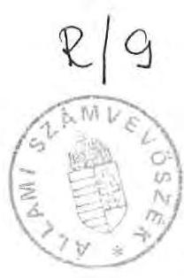
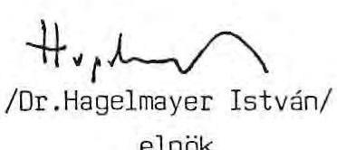
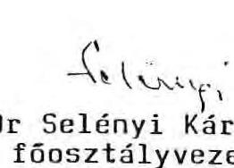
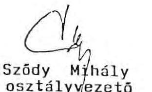
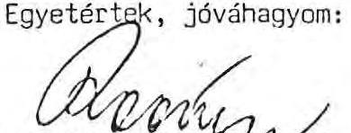
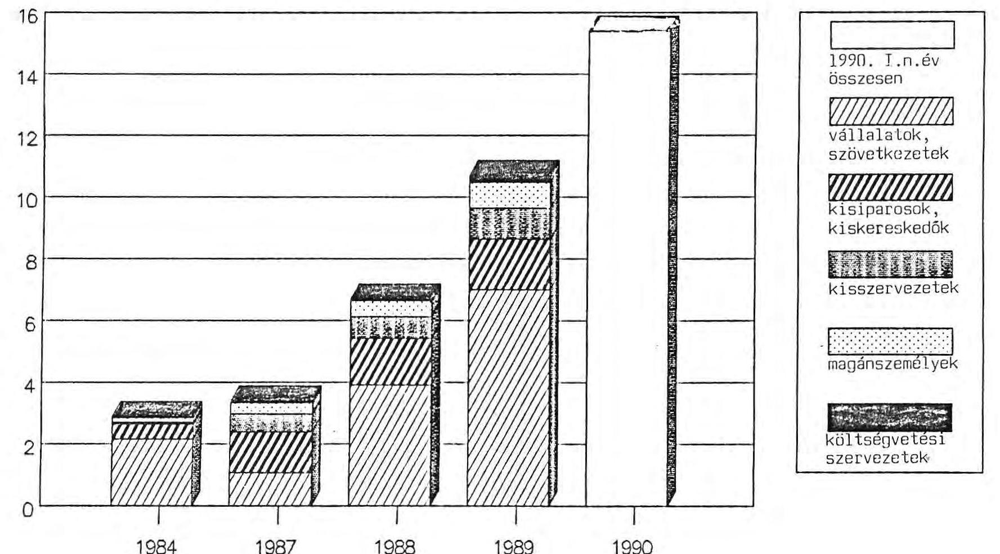

# Állami Számvevőszék

## Jelentés

a Társadalombiztosítási Alap 1989. évi bevételi többletének vizsgálatáról

1990
10.

---

Az Állami Számvevőszék 1990. I. félévi munkatervi előírásának megfelelően megvizsgálta a Társadalombiztosítási Alap 1989. évi ellátási kötelezettségekkel nem terhelt bevételi többletének felhasználását. Az ellenőrzési program összeállításánál, a vizsgálat szervezésénél a közvetlen munkatervi kötelezettségen túlmenően foglalkozott azzal, hogy a Társadalombiztosítási Alap működtetését a korábbiaktól eltérő gazdasági körülmények is befolyásolják, és így azok következményei nem hagyhatók figyelmen kívül.

A vizsgálat az összességében a mintegy 27 Mrd Ft bevételi többletre, valamint a működési kiadásokkal való gazdálkodás szabályszerűségére, illetve az azt befolyásoló tényezőkre, azok következményeire terjedt ki. Nem foglalkozott az alapkezelő döntési hatáskörén kívül eső ellátási kérdésekkel.

Az ellenőrzés arra kívánt választ adni, hogy

- az Alap ellátási kötelezettségekkel nem terhelt többletbevételeit, valamint a gazdálkodás eredményeként képződött jövedelmet a kezelő milyen módon és milyen célokra használta fel;
- a felhasználás jogcímei mennyiben szolgálják a Társadalombiztosítási Alap érdekeit, céljait és összhangban vannak-e a törvényi előírásokkal;
- a források és a működési előirányzatok terhére milyen fejlesztéseket valósítottak meg és ennek melyek a várható kihatásai;
- miként alakultak a járulékfizetési kötelezettség befizetéseinek elmulasztásából fakadó követelések, milyen erőfeszítéseket tettek behajtásukra, milyen eredménnyel?

A helyszíni vizsgálatok 1990. február 9-től április 20-ig tartottak. A vizsgálatot végezték Bamberger Mária, dr. Csepán Magdolna, dr. Fónyad Erzsébet számvevők, Reich Lajos tanácsos.

---

Az összefoglaló jelentésbe foglalt főbb vizsgálati megállapításokat alátámasztó tényanyagot, továbbá a Társadalombiztosítási Alap létrehozásának előzményeit a jelentéshez csatolt függelék tartalmazza.

A vizsgálatról készült részletes jegyzőkönyvek és az ezekhez kapcsolódó alapdokumentumok az Állami Számvevőszéknél betekintésre rendelkezésre állnak.

A helyszíni vizsgálatok tapasztalatai alapján az alapkezelő, az Országos Társadalombiztosítási Főigazgatóság (továbbiakban: OTF) számos intézkedést tett annak érdekében, hogy a kezdeti, 1989. évben előforduló hiányosságok 1990-ben már ne ismétlődjenek. A jelentés erre külön is kitér.

# I. 

## A vizsgálat megállapításai

## 1./ A Társadalombiztosítási Alap gazdálkodásának szabályozottsága, szervezettsége

Az 1988. évi XXI. törvény a Társadalombiztosítási Alap kezelésével az Országos Társadalombiztosítási Főigazgatóságot bízta meg, valamint felhatalmazta a Minisztertanácsot, hogy az Alap pénzügyi, elszámolási, számviteli rendjét állapítsa meg.

A tárgyban született 13/1989.(II.10.) MT rendelet csak átmeneti szabályozásnak tekinthető. Az abban hivatkozott 23/1979.(VI.28.) MT rendelet ugyanis csak a költségvetési szervekre vonatkozik és nem tartalmaz olyan előírásokat, amelyek a Társadalombiztosítási Alap tartalékalapjával való gazdálkodására értelmezhetőek.

---

A Társadalombiztosítási Alapról szóló törvény és az annak végrehajtására kiadott 13/1989.(II.10.) MT rendelet még az Alap elszámolásával kapcsolatos fogalmakat sem határozza meg egyértelműen. Bizonytalanságot teremt annak értelmezése, hogy mit tartalmaz "az Alap önálló gazdálkodásából származó eredmény" fogalma; tartalmazza-e az önálló költségvetési szervek, igazgatóságok működési, valamint ár- és díjbevételeit. Az sem pontosan értelmezhető, hogy a működési, ár- és díjbevételeknek is csak 1 %-a használható-e fel működési kiadásként, vagy sem. Nem tisztázott, hogy az Alap forgóalap feltöltése hogyan történik, ha a bevételi többlet teljes egészében a tartalékalap képzést szolgálja. Végül a szabályozás nyitva hagyja, hogy vajon a Társadalombiztosítási Alap 1990. évi költségvetéséről szóló 1989. évi XLVIII. törvény korlátozása /a kiadási főösszeg 5 %-a a likviditási tartalék/ vonatkozik-e az 1989-ben keletkezett bevételi többlet elszámolásra.

A működés érdekében a meglévő szabályozásokhoz kellett igazítani a Társadalombiztosítási Alap elszámolási és számviteli rendjét. Ezért az OTF-nek néhány kivételtől eltekintve (béralap, működési, fenntartási, felújítási és beruházási pénzeszközök felhasználásában, érdekeltségi rendszer kialakításában való önállóság) a költségvetési szervekre vonatkozó elszámolási rendet kellett alkalmaznia. A költségvetési szervekre vonatkozó számviteli rendszer ugyanakkor nem, vagy csak bonyolult helyi szabályozásokkal illeszthető ahhoz a követelményhez, hogy a Társadalombiztosítási Alap tartalékalapjáról az alapszerű gazdálkodáshoz szükséges információkat biztosítsa.

A kivételekre önálló szabályzatokat az OTF - az irányítási rendszerükről szóló törvényükre várva - nem készített, hanem azokra is a korábbi, költségvetési szervekre vonatkozó szabályokat érvényesítette.

Az OTF a szabályozások és a szervezet kialakítása érdekében csak kezdeti lépéseket tett. A hagyományos feladatain (államigazgatási, folyósítási) túlmenő, a bevételi többletekkel való gazdálkodással kapcsolatos döntési hatáskört átmeneti feladatnak tekintette az önkormányzat létrehozásáig.

---

A tartalékalap felhasználásával kapcsolatos döntéselőkészítés rendjét, döntési mechanizmust, illetve felelősségi rendszert csak 1989. év végén szabályozták. A szabályozások 1990. január 2-tól hatályosak. A társadalombiztosítás tartalékaira vonatkozó számlarend tervezetét is csak az OTF Pénzügyi Főosztályán végzett vizsgálat részjelentésének megismerését követően készítették el. Ezt azonban a hivatkozott fogalmi tisztázatlanságok miatt a bemutatott formában az Állami Számvevőszék megítélése szerint nem lehet életbe léptetni.

1989-ben a tartalékalappal kapcsolatos ügyekben a döntést az OTF vezetője - az Országos Társadalombiztosítási Tanács (továbbiakban: OTT) véleményének kikérése mellett - hozta, mivel az érvényes szabályozások szerint az OTT az OTF társadalmi ellenőrzésére hivatott testület.

A tartalékalap hozadékfelhasználásával kapcsolatban az Alap kezelője külön célokat nem határozott meg. Az egészségmegőrzés hosszútávú társadalmi programjáról szóló 1063/1987.(XII.10.) MT határozatban megfogalmazottak alapján és az igények szerint döntötte el, hogy mire fordítja a hozadékot (lásd a későbbiekben és a függelékben).

Az Alap jogos követelését képezik a munkáltatók járuléktartozásai, amelyek évről-évre ugrásszerűen növekednek. A tartozások összege a vizsgálat időszakában olyan méreteket öltött, amelyet az OTF a rendelkezésére álló eszközökkel megfelelő hatékonysággal kezelni nem tud.

# 2./ Az ellátási kötelezettséggel nem terhelt bevételi többlet (tartalékalap) keletkezése és felhasználása 

A Társadalombiztosítási Alap tartalékalap képzése és felhasználása részletes szabályainak hiányában az 1989. évben keletkezett tartalékalap meghatározása, annak értelmezése nehézséget okozott. A vizsgálat lezárásáig tartalékalapot nem képeztek.

---

A társadalombiztosítás járulékbevételei 1989-ben jelentősen, 32,2 Mrd Ft-tal meghaladták a tervezettet. Így a bevételi többlet is nagyságrendileg haladja meg a tervezettet, az elszámolásokból meghatározhatóan 26,9 Mrd Ft (lásd 1.sz. melléklet). A bevételek növekedését alapvetően az alulbecsült bérkiáramlás okozta, amelyet csak részben csökkentett a járuléktartozások növekedése (ez utóbbi kérdés vizsgálatára a jelentés 4. pontjában visszatérünk).

Az állami költségvetés a Társadalombiztosítási Alap részére tartalékalapot nem adott át, annak ellenére, hogy az 1988. évi XXI. tv. 6. § (4) bekezdése szerint az állami költségvetés 1989. január 1-jén "az alapot 1,8 Mrd Ft névértékű, az állam tulajdonában lévő részvények átadásával, tartalékalappal látja el".

Az OTF vezetőjének a Pénzügyminisztérium államtitkárával egybehangzó nyilatkozata szerint az "előkészítés során, valamint a törvény indoklásában egyértelműen az volt a szándék, hogy a társadalombiztosítás megvásárolja a részvényeket". Ennek megfelelően a 13/1989.(II.10.) Mt rendelet 6. § (2) bekezdése úgy intézkedett, hogy "az Alap - a bevételi többletéből 1989. január 1-jén részére átadott - 1,8 Mrd Ft névértékű részvény ellenértékét, legkésőbb 1989. december 31-ig az állami költségvetésnek megtéríti". Ez az értelmezés az Állami Számvevőszék megítélése szerint ellentmond a törvény szövegének. Ezt a Pénzügyminisztérium és a Szociális és Egészségügyi Minisztérium illetékesei a vizsgálat tapasztalatai alapján folytatott szakmai vita során azzal indokolták, hogy a törvény az "ellátás" módját nem értelmezi. Törvénysértésnek minősíthető, hogy a költségvetés által az OTF részére átadott részvények nem rendelkeznek a törvényben előírt állami garanciával. Többszöri egyeztetés után az Alap kezelője a részvények ellenértékeként az eredetileg kért 3,6 Mrd Ft-tal szemben 2,7 Mrd Ft-ot utalt át a költségvetésnek. A részvények 1988. évi 229 MFt-os osztaléka már az Alap bevételeit növelte. Ezért a részvényvásárlás kedvező befektetési lehetőségként értékelhető, még akkor is, ha a magyarországi tőkepiac kialakulatlansága miatt nem határozható meg, hogy az 1,8 Mrd Ft

---

névértékű részvény 2,7 Mrd Ft-ért történő megvásárlása értéken, az alatt, vagy a felett történt-e. Nem hasonlítható ez 1-2 db 1 MFt értékű részvényvásárlás ismert árfolyamához sem.

Az OTF előírása szerint az igazgatóságok szigorú likviditási terv szerint gazdálkodnak. Az igazgatóságok napi felesleges pénzeszközeiket kötelesek az Alap számlájára átutalni. Ez is hozzájárult ahhoz, hogy az OTF 1989-ben sikeres értékpapírpiaci műveleteket folytathatott. (A befektetéshez viszonyítva ez 19-24 %-os kamatnak felel meg.) Ennek révén 304.092 eFt bevételre tett szert.

Összességében a Társadalombiztosítási Alap szabad pénzeszközeinek befektetése 1989-ben 533.092 eFt bevételt eredményezett. A befektetések 9.425 eFt ráfordítással (jutalékok, kamatköltségek) jártak, így összességében a befektetések hozadéka 523.667 eFt volt.

Az állami költségvetés módosítása során 1989. június 2-án a Parlament a XVIII. tv. 24. §-ában előírta, hogy "a Társadalombiztosítási Alap tartalékalapjából - az 1989. évi, a tervezetten felüli bevételi többlet mértékének megfelelő összegben - ...Lakásalap hiányát finanszírozó kötvényt vásárol". A Pénzügyminisztérium augusztus 15-én a Pénzügyi Közlönyben a 3008/1989. tájékoztatójában tényként jelentette meg, hogy az Országos Társadalombiztosítási Főigazgatóság 15 Mrd Ft értékben Lakásalap fedezeti kötvényt vásárolt. Ehhez képest 1989. szeptember 14-én született megállapodás a Lakásalap fedezeti kötvény vásárlásáról. Három részletben, miniszterelnöki felhívás alapján, összesen 13,1 Mrd Ft értékben. A kötvény futamideje 15 év, a kamat mértéke a leghosszabb lejáratú kincstárjegy forrásadóval csökkentett kamatának hónapokkal súlyozott átlagos kamatával egyenlő, 1989-ben 15,2 %. (Megjegyezzük, hogy a kötvények megvásárlása a hatályos szabályozás szerint a Társadalombiztosítási Alap tartalékalap képzéséig elhalasztható lett volna.) A kötvény vásárlására az indoklás szerint a költségvetési deficit csökkentése, az ország fizetőképességének megőrzése érdekében volt szükség, ugyanakkor a Társadalombiztosítási Alapot pénzügyi szempontból hátrányos helyzetbe hozta, illetve korlátozta annak a pénzügyi

---

manőverezési lehetőségét. (Az ok-okozati összefüggésekkel az Állami Számvevőszék V-11/1990. számú, a Lakásalappal kapcsolatos vizsgálata részletesen foglalkozik.)

A Társadalombiztosítási Alapról szóló törvény 1989-ben nem korlátozta a tartalékalap hozadékának felhasználását. Nem volt megkötés arra sem, hogy a hozadék hány százaléka fordítható egészségmegőrzési célokra, s hogy ezek mit tartalmazhatnak. A vizsgált időszakban az elbírálás intézményes formái sem alakultak ki. Ilyen körülmények között az OTF, mint az Alap kezelője 1989-ben 100 MFt-ért alapítói részvényt vásárolt az Ingatlanbank Rt-ben, további 200,7 MFt-ot támogatások és hozzájárulások címén fizetett ki (lásd 2.sz. melléklet).

A közvetlen egészségmegőrzési célt szolgáló felhasználás az összes kifizetés egynegyede, amely a hozadéknak kb. 5 %-a. Ilyennek tekintette a vizsgálat a 2.sz. mellékletben kiemelt sorokat. A támogatás többi jogcíme csak közvetve kapcsolható az egészségmegőrzési célokhoz. (A hozadék felhasználás ellenőrzési tapasztalatait részletesen a függelék tartalmazza.)

A bevételi többlet további felhasználását jelentette az átadott és átvett pénzeszközök 2,2 Mrd Ft-os és az átfutó, kiegyenlítő és függő tételek 4,3 Mrd Ft-os egyenlege. Ezen összegek között került átadásra 300 MFt az OTF szakmai felügyeletét ellátó Szociális és Egészségügyi Minisztériumnak. A SZEM 1989. I. félévében csak úgy tudott a kormány által a tárcára kirótt 300 MFt költségvetési támogatás csökkentést végrehajtani, hogy a gyógyszerár emelkedésből a minisztérium által vállalt terhet a társadalombiztosítási alapra hárította. Az előbbi egyenlegekben elszámolt kiadások - a Gyógyért Vállalat részére folyósított 1.450 MFt támogatási előleg, illetve az egészségügy finanszírozásához szükséges 5,9 Mrd Ft forgóalap szükséglet - nem teszik lehetővé, hogy a bevételi többlet egészében a tartalékalap növelését szolgálja. Az állami költségvetés által biztosított 2 Mrd Ft forgóalap a fenti tételekre nem nyújt fedezetet.

---

# 3./ A működési kiadások előirányzatának teljesülése és az ellátási feladatokat szolgáló technikai feltételek alakulása 

### 3.1.
 Az Alap működési kiadásai

A társadalombiztosítási szervezetek működési kiadásának 1989. évi 2,1 Mrd R-os előirányzatát a költségvetési törvény nem állapította meg. Ez az összeg az államháztartási mérlegben számítási anyagként került meghatározásra. A Társadalombiztosítási Alapról szóló törvény az Alap kezelőjének ennél nagyobb összeg felhasználására biztosít lehetőséget. E szerint ugyanis az alap bevételeinek 1 %-a a működési kiadások fedezetére fordítható. Így kerülhetett sor arra, hogy 1990. február 21-én az ismert tényszámok alapján az OTF vezetője az 1989. évi előirányzatot 480 M R-tal visszamenőleg felemelje (lásd 3.sz. melléklet).

A társadalombiztosítás működési kiadásának végösszege a vizsgálati jelentés lezárásának időpontjában bizonytalan volt. Az OTF a vizsgálat idejéig két mérleget bocsátott az ellenőrök rendelkezésére; a későbbi módosítások jogának fenntartását biztosító záradékolással. Az első mérleget ugyan módosították, de az 1990. április 13-án újra átadott mérlegben ismételten jelezték, hogy az további módosításra szorul. Az OTF saját hatáskörében felismert és szankció nélkül javítható könyvelési hibák - az eltérések összegszerűsége teljeskörűen még nem ismert - összesítése még nem történt meg. Amennyiben ezek jellege és nagyságrendje számottevő hatást gyakorolna a működési kiadások főösszegére, azt az 1990. évi nyitómérleg valódisága érdekében az 1989. évi zárómérlegben az Állami Számvevőszék szükségesnek tartja átvezetni.

A működési kiadásoknak a Társadalombiztosítási Alap bevételei 1 %-ában meghatározott nagyságrendje a jelenlegi feladatokra fedezetet biztosít. A takarékos gazdálkodásra e szabályozás azonban nem ösztönöz. Az OTF belső szabálya törekszik a takarékos költséggazdálkodás felté-

---

teleinek megteremtésére, a maradvány felhasználására azonban a jogszabályok nem intézkednek, ezért a helyzet nem tekinthető megnyugtatónak. A későbbiek során gondot okozhat, hogy az OTF feladatbővülése miatt (lásd a Függelékben) a működési költségek jelentősen növekedhetnek.

A terv- és tényadatok teljeskörű összehasonlító elemzését a vizsgálat során az Állami Számvevőszék munkatársai megkísérelték, ez azonban az előzőekben jelzett bizonytalanságok miatt nem vezetett eredményhez. (Az 1989. év végleges lezárására, a maradvány elszámolásra csak 1990. május végén került sor.)

Az igazgatóságok a tervezés időszakában már ismert és indokolt kiadásokra a fedezetet az OTF-től, mint irányító szervtől nem kapták meg. Ezeket csak későbbi időpontban, pótelőirányzatként bocsátották rendelkezésükre. Mindez sérti az igazgatóságok gazdasági önállóságát. Végső soron azonban úgy ítélhető meg, hogy az OTF mind a működési kiadások tervezésénél, mind azok felhasználásánál összességében reálisan számolt.

Néhány véletlenszerűen kiválasztott tétel vizsgálata azt mutatta, hogy a működési kiadás alakulásában szerepet játszott az infláció ütemének emelkedése (postaköltségek, szállítási költségek), valamint az, hogy a számítógépes rendszerek bevezetésével kapcsolatos leporellók és festékkazetta igény előre nehezen volt meghatározható.

Az arányaiban jelentősnek tűnő (30 %-os) bérfejlesztés az átlagos havi jövedelmet 11.740 R-ra emelte. Ilyen bérviszonyok mellett sem képesek azonban - az állások folyamatos hírdetése ellenére - betölteni a főállású munkahelyek közel 10 %-át. Egy kutatás-fejlesztési szerződés teljesítésének vizsgálata során megállapítottuk, hogy a tanulmányok megrendelését, illetve a kutatás irányát kutatási terv nem alapozta meg. A tanulmányok hasznosíthatóságára vonatkozóan eltérő, esetenként egymásnak ellentmondó vélemények alakultak ki a szakértők

---

részéről. (Felmerült az az igény is, hogy a társadalombiztosítási rendszer fejlesztésével kapcsolatos kutatómunka bázisát elsődlegesen az OTF-en belül kellene megteremteni.)

Beruházási, fejlesztési célú dologi kiadásokra, valamint ingatlanvásárlásra 500 M R-ot fordítottak 1989-ben.

# 3.2. Ellátási feladatokat szolgáló technikai feltételek alakulása 

Az OTF 1989. évi nyitó mérlege szerint az állóeszközök összes értéke 824,3 M R. Ennek kétharmada ingatlan, egyharmada gép, berendezés és felszerelés. Az eszközök nettó értéke 53 %, a népgazdasági átlagnál mintegy 4 %-kal kevesebb. Lényegesen elmarad a pénzügyi szolgáltatások, valamint a nem anyagi ágak 60-70 % közötti szintjétől.

Ezen belül az épületek viszonylag magas nettó értéke mögött jelentős szóródás tapasztalható. A társadalombiztosítás területi szervei ugyanis többségében a valamikori OTI tulajdonát képező épületekben működnek, amelyek ma már erősen elhasználódott állapotban vannak. Ezekben az épületekben egyéb tevékenység (jellemzően az egészségügyi ellátáshoz kapcsolódó szolgáltatás) is folyik. Mindezek következményeként a területi igazgatóságokon sem a dolgozók munkakörülményei, sem az ügyfélfogadás feltételei nem megfelelőek (lásd Függelék).

A gépek, berendezések, felszerelések eszközállományának elhasználódottsága nemcsak a nettó értéket, hanem a nullára leírt és használatban tartott eszközök 30 %-os arányát tekintve sem szolgálja a korszerű és gyors munkavégzés érdekeit.

Az eszközállomány állapotának helyzetfelmérését megnehezítette az, hogy a Társadalombiztosítási Alap létrehozásával egyidejűleg - teljeskörű leltáron alapuló - vagyonmérleg nem készült.

---

Az 1989. évi fejlesztések tervezése csak koncepcionális szinten történt meg. Már a társadalombiztosítás bevételi előirányzatának meghatározásakor várható volt, az év során pedig bizonyossá vált, hogy a működési kiadások - a bevételek 1 %-ában meghatározott - keretösszege a vártnál nagyobb lesz. Végülis a tervezett beruházások 96 %-át (403 M R-ot) pótelőirányzatokként adták ki.

Az épületberuházások, fejlesztések előkészítésénél a vizsgálók nem tapasztaltak szabálytalanságot. A Főigazgatóság belső szabályzatai megfelelnek a felsőszintű jogszabályi előírásoknak, azokat folyamatosan karbantartják.

A döntéselőkészítés során alapvető célkitűzés volt, hogy a beruházásokat, fejlesztéseket azokra a tevékenységekre és területekre összpontosítsák, ahol az eszközellátottságban a legnagyobb feszültségek tapasztalhatók.

Az épületberuházásokra 1989-ben fordított 305,8 M R eredményeként öt területi igazgatóságon, valamint a fővárosban javulnak a dolgozók munkakörülményei.
A nagymérvű elmaradás miatt ezek a beruházások az elhelyezés általános körülményeit érdemben nem változtatják meg, az alapterület bővülés inkább a megnövekedett feladatokkal függ össze.

Az OTF központi székháza kezelői jogának megszerzése nem szerepelt az eredeti fejlesztési célok között. A vásárlást a működési költségek megnövekedett fedezete tette lehetővé. Teljes birtokbavétel esetén a Főigazgatóság közel 10 ezer m² alapterülettel növelheti munkaterületét. Ezzel megoldhatók a sürgetővé vált irattározási gondok, a szétszórtan működő egységek tömörítése és a későbbiekben javíthatók az ügyfélfogadás feltételei is. A vásárlásnál az OTF a lehetséges legalacsonyabb vételár elérésére törekedett. Ennek köszönhetően a FIK hivatalos értékbecslése szerint 511 M R-ra értékelt épületrészt végülis 197 M R-ért sikerült megvenni, amelyből 179,5 M R kifizetésére

---

1989-ben került sor. A kezelői jog telekkönyvi bejegyzése megtörtént. Az épület megvásárlásával a társadalombiztosítás vagyona a kifizetett összeghez mérten is jelentősen gyarapodott.

A többi épületberuházás (ingatlan kezelői jogának megszerzése, épületbővítések) megvalósítása során is a legkedvezőbb megoldásra törekedtek. Így például a kivitelezőkkel történő szerződéskötéseknél kötbér kikötésével is érvényesítették a társadalombiztosítás érdekeit és azt be is hajtották.

A Társadalombiztosítási Alap létrehozásával kibővült fejlesztési lehetőségekkel élve 1989-ben jelentős számítógép vásárlásokra került sor. Összesen 130 M R értékben, zömében (80 %) a Budapesti Igazgatóságnál, a NYUFIG-nál és a Főigazgatóságon. Ezen túlmenően 30,7 M R-ot fordítottak a kapcsolódó software fejlesztésekre. A fejlesztések egységesen az IBM kompatibilitás szem előtt tartásával kialakítandó gépparkra épültek. Az OTF számítástechnikai szakemberei szerint ezzel 1992-re elérhető a különböző egységek közötti gépi összeköttetés, az egységes feldolgozási szemlélet maradéktalan érvényesítése, az elavult gépek kiváltása, nem utolsósorban a területi szervek munkájának hatékonyabb ellenőrzése.

A helyi hálózatok kialakítását elsődlegesen az IBM AS 400-as számítógépre alapozzák. Elsőként a legnehezebb helyzetben lévő Budapesti Igazgatóság gépellátását oldották meg. A számítástechnikai beruházások eredményeiről csak kezdeti tapasztalatok állnak rendelkezésre. Azok közül kiemelést érdemel a decentralizált nyugdíj megállapítási rendszer és a működési feladatok számítógépi könyvelése (főkönyvi könyvelés, munkaügyi nyilvántartás, bérszámfejtés, mérlegkészítés stb.).

A számítógépi rendszerek alkalmazásánál jól látszanak a gyorsított hardware fejlesztés következményei. A gépek megvásárlásával egyidejűleg ugyanis a software-háttér csak részben volt biztosított. A programok kidolgozása jelenleg is folyik. Ezért a további részfeladatok (járulék- és folyószámla könyvelés nyilvántartása, különféle társada-

---

lombiztosítási ellátások megállapítása stb.) számítógépre vitele során célszerűbb lenne az összehangolt áttérést biztosítani azért, hogy a gépek kihasználása mielőbb elérje a konfiguráció adta lehetőséget.

A számítógépi fejlesztések mellett jelentősnek tekinthető gépi beruházás a Budapesti Igazgatóságnál a nyugdíj megállapításhoz szükséges iratok, adatok mikrofilmre vitele. A korszerű módszerek nélkül az irattárból rendkívül hosszú ideig tart a szükséges adatok és a jogosultságot megalapozó iratok kikeresése, ezért a választott megoldás célszerűsége nem vitatható.

A beruházások számviteli elszámolását belső utasítások részletesen szabályozzák. Az elszámolások felülvizsgálata során csak néhány aktiválással összefüggő hiányosságot tapasztaltunk. (Ezeket a függelék részletesen tartalmazza.)

# 4./ A társadalombiztosítással szembeni járuléktartozások 

### 4.1. A járuléktartozások alakulása

A Társadalombiztosítási Alap 1989. január 1-jén szerint 6,7 Mrd R (6.694.762.354 R) járuléktartozást vett át. A járuléktartozások összege, az 1989. év folyamán jelentősen, mintegy 60 %-kal emelkedett, 1990-ben pedig már minden előzetes elképzelést felülmúlóan, napi 55 M R-tal növekedett. A vizsgálat lezárásakor már a 15 Mrd R-ot is meghaladta. (Az OTF területi szervénél a kintlévőségek - járuléktartozások alakulását 1984-től a 4.sz.melléklet szemlélteti. Az adatok részletes elemzését a függelék tartalmazza.)

A járuléktartozások növekedésének okai eltérőek. A gazdálkodói szférában a járuléktartozások növekedése elsősorban és szinte azonos arányban vezethető vissza a likviditási zavarokra, valamint a gazdálkodási fegyelemsértésekre. Emellett az Állami Számvevőszék munkatársai ma még egyedinek tekinthető, de a növekvő tendencia miatt figyelemre

---

méltó tudatos szabálysértésekkel is találkoztak. Egyre több gazdálkodó szervezetnél tapasztalható, hogy több elszámolási betétszámlát is nyitnak, és a társadalombiztosítási szerveknek nem a valós pénzforgalmat bonyolító számlát jelentik be. Gyakori, hogy nem fizetik be a dolgozóktól levont 10 %-os nyugdíjjárulékot sem.

A járuléktartozások növekedéséhez az is hozzájárul, hogy a gazdálkodó szervek a járuléktartozás növekedéssel "olcsó hitelhez" jutnak. Ezt a jelenséget az 1989. évi XLVIII. tv. indoklási része is kiemeli: "a késedelmi pótlék szintje a piaci hitelkamat mértékéhez képest ma már alacsony, nincs visszatartó ereje". A járuléktartozások éves változásának alakulásában a különböző területek és szektorok között tapasztalható, ma még markánsnak ítélhető jelenségek, összességében inkább az általános fizetési fegyelem lazulására hívják fel a figyelmet.

# 4.2. A járuléktartozások behajtására tett intézkedések és azok eredményessége 

Az OTF belső szervezeti rendje a járulék-folyószámlák vezetését a területi szervek számára írja elő. Ezek a járulék kötelezettségek befizetéseiről egyedi folyószámlákat vezetnek, amelyen nyilvántartják a tartozásokat is - beleértve a rendbírságok és a késedelmi pótlékok összegét. A folyószámlákról rendszeresen készül összesítő kimutatás, amely 26 szektorra bontva tartalmazza a járulékkivetést, a befizetés helyzetét és a különböző bírságokat. Olyan részletező kimutatás azonban, amely a járuléktartozásokról keletkezésük időpontja szerinti áttekintést adna, a vizsgált időszakban nem volt, mivel a korábbi, viszonylag kis összegű tartozások figyelemmel kísérésére az egyedi ügyintézés is lehetőséget biztosított. (Az OTF vezetője már a vizsgálat idején intézkedett a szükséges nyilvántartási rendszer kialakítására.)

---

Az OTF ugyan utasításokkal kötelezi és premizálási rendszerrel ösztönzi a területi szerveket és azok szakelőadóit a járuléktartozások csökkentésére, azonban az intézkedések OTF szintű összehangolása nem megoldott. Ezért fordulhat elő, hogy a szakelőadók, illetve igazgatóságvezetők a járuléktartozásokkal szemben esetenként túlságosan is "elnézőek". Az így elmaradó bevételek az alapkezelő gazdálkodási lehetőségeit csökkentik.

A megyei igazgatóságok az egységes rendszer hiányában a legkülönbözőbb módszerekkel dolgozva kísérlik meg a járuléktartozások behajtását. Első lépcsőben a szakelőadó szóban, esetleg írásban sürgeti a befizetést. Ennek eredménytelensége esetén a jogszabályi előírásoknak megfelelően az úgynevezett "szocialista szektorba" tartozó gazdálkodó
 szervezeteknél azonnali inkasszót nyújtanak be a számlavezető bankhoz, egyéni és társasvállalkozások esetében pedig határozati úton a tanácsi adóhatóságnál behajtási eljárást kezdeményeznek.

Az azonnali inkasszó, mint behajtási lehetőség alkalmazását a 6/1989. (VII.31.) MNB rendelkezés korlátozza. Ez a rendelkezés ugyanis feloldja a számlavezető bankok "sorba állítási" kötelezettségét. Ezért azok fedezet hiányában visszaküldik az inkasszókat. A behajtási munkát hátráltatja, hogy a gazdálkodó szervek fizetőképességének figyelemmel kísérésére nincs lehetőség. A többszörösen megismételt inkasszó emellett jelentős többletköltségekkel is jár. Nem tapasztalható nagyobb eredményesség az adóügyi hatóságoknál kezdeményezett járulékbehajtási kísérletek tekintetében sem. A kimutatások szerint ugyanis az évente kezdeményezett több tízezer adóügyi eljárás révén a tartozásoknak mindössze 6-8 %-a térül meg, annak ellenére, hogy e címen az OTF az elmúlt négy évben 23 M R-tal járult hozzá az adóügyi dolgozók jövedelméhez. A nagyobb eredményesség érdekében az OTF 1989-től - a Pénzügyminisztérium egyetértő támogatásával - az adóügyi dolgozók személyes anyagi ösztönzését több mint kétszeresére (a behajtott összeg 7 %-ára) emelte fel. Az ösztönzés azonban az eredményekben nem hasznosult.

---

A járulékbehajtások végső eszközével, a felszámolási eljárás kezdeményezésével a területi igazgatóságok nem szívesen élnek. E helyett inkább a személyes kapcsolatok, esetenként a felszámolás kilátásba helyezésével próbálják fizetésre kényszeríteni ügyfeleiket. E lépések azonban csak időleges és részleges eredményekkel járnak. (Lásd Függelék)

A felszámolási eljárás kezdeményezésére riasztó hatásúak a más intézmények által indított felszámolások következményei is. Ezek során az OTF részére átadott összeg alig éri el a tartozás 1-2 %-át.

Az általánossá vált folyamatok megállítása érdekében az OTF 1989-ben kétszer is átfogó ellenőrzést végzett. A tapasztalatok birtokában az igazgatóságokat határozottabb intézkedésekre hívta fel. A járuléktartozások növekedése azonban csak az ellenőrzést követő egy-két hónapban lassult le, majd ismét a korábbiakhoz hasonló dinamizmussal növekedett. Tehát a kedvezőtlen tendencia nem változott.

# 4.3. A járuléktartozások behajtásának eredményességét befolyásoló tényezők 

A társadalombiztosítási járulék befizetési kötelezettségéről intézkedő jogszabályok többségét olyan időszakban és gazdasági körülmények között hozták, amikor a társadalombiztosítás elsődleges feladata az ellátások maradéktalan folyósítása volt. Az 1970-es években, de még az 1980-as évek elején is csak a viszonylag kis számú "magánszektor" járulékfizetési fegyelmezetlenségei voltak jellemzőek. Az ebből adódó feszültségek az úgynevezett "szocialista szektor" befizetései és az állami költségvetéshez való szoros kötődés miatt nem jelentettek mértékadó gondokat. Ezért az OTF járulékbehajtási tevékenysége is zömmel az úgynevezett magánszektorral szembeni fellépésre szorítkozott, egyben specializálódott.

---

A társadalombiztosítási ellenőrök tevékenysége még ma is elsősorban az ellátások szakszerű elszámolásának, kifizetésének vizsgálatára, a járulékbevallások helyességének megállapítására irányul. Ellenőrzési utasítások, segédletek sem adnak támaszt a kintlevőségek behajthatóságának vizsgálatára. Az ösztönzési rendszer számszerűsített feltételeket részletesen csupán a magánszektorra nézve tartalmaz. A területi szervek illetékes dolgozóinak ügyeszürete, magánszorgalma által vezérelt erőfeszítések azonban nem tekinthetők sem általánosnak, sem hatékonynak.

Az 1980-as évek második felében a gazdaság egészére kiterjedő járulékfizetési fegyelemlazulás az OTF-et felkészületlenül érte. Ekkor derült ki, hogy a társadalombiztosításra irányadó rendelkezések érvényesítésének számos akadálya van.

Az 1975. évi II. törvény végrehajtási rendelete ugyanis a gazdálkodó szervezetek járuléktartozásának behajtására az azonnali inkasszó benyújtásán túlmenően lehetőséget nem biztosított. A fizetésképtelen vállalatok, szövetkezetek járuléktartozásainak behajtására így nem volt mód. A járuléktartozások behajtására a felszámolási eljárásról szóló 1986. évi 11. tvr. sem biztosított maradéktalan lehetőséget. Nem ismeri el ugyanis a társadalombiztosítás sajátos ellátási kötelezettség-vállalását, ezért az OTF csak az egyéb hitelezők között érvényesítheti követeléseit. A társadalombiztosítási járulék törvényi előírás révén keletkezett jogkövetkezmény; nem visszafizetetlen hitel, hanem adósság. Nem sorolható tehát azonos kategóriába azokkal a hitelezőkkel, akik a fizetésképtelen gazdálkodó szervezettel önkéntesen létesítettek szerződéses polgári jogi jogviszonyt. (Néhány felszámolási eljárás eredményét a Függelék részletesen is tartalmazza.)

Az OTF több alkalommal tett javaslatot a vázolt gondok rendezésére az igazságügyi miniszternek és a felügyeletét ellátó szociális- és egészségügyi miniszternek, de eljárása nem vezetett eredményre. A kormányzati szervek a tvr. módosítása során az Országgyűlés 38/1989.(XII.27.) számú, erre vonatkozó határozatát sem hajtották végre.

---

A gazdálkodó szervezeteket a járulékbefizetés késleltetésére a társadalombiztosítási szervek tehetetlensége mellett, a szankcionáló szabályok nem kellő visszatartó ereje is ösztönzi. Az irányadó rendelkezések ugyanis csak az egyéni és társas vállalkozók társadalombiztosítási ellátását teszik függővé a járulékbefizetéstől. Ezt a lehetőséget a családi pótlék állampolgári jogon történő folyósítása azonban tovább gyengíti. A gazdálkodó szervezetekkel szemben a rendelkezések - a nemzetközi normákkal ellentétben - a késedelmi pótlék révén kollektív felelősségrevonást alkalmaznak. A járulékbefizetés elmulasztásáért tehát a munkavédelmi, egészségvédelmi stb. jogszabályok szankcionálási előírásaival ellentétben a személyes vezetői felelősség nem érvényesíthető.

# II. 

## A vizsgálat folyamatában tett intézkedések

Az OTF vezetői és munkatársai az Állami Számvevőszék vizsgálatát várakozással fogadták. A vizsgálat sikeres lefolytatása érdekében szükséges adatgyűjtési feladatokat megfelelően, határidőre elvégezték. A mérlegkészítés, illetve beszámolókészítés időpontjában tartott ellenőrzés azonban számos feszültségpontot hordozott magában, melyet végül a Társadalombiztosítási Alap működésének tökéletesítésére irányuló kölcsönös érdek alapján kialakult emberi kapcsolatoknak összességében sikerült feloldani.

Az OTF-en készült részjelentések megállapításaival a vizsgált főosztályok, illetve osztályok vezetői döntően egyetértettek és bizonyos intézkedésekre már sor került, így az észrevételben jelzettek szerint helyesbítették:

- a vizsgálat során feltárt számszaki, könyvelési hibák többségét.

---

# Intézkedtek 

- a vizsgálat során feltárt további számszaki, könyvelési hibák kijavítására,
- a befejezetlen beruházásként nyilvántartott összegek felülvizsgálatára és számviteli rendezésére,
- a teljeskörű leltár 1990. II. fél évi elrendelésére,
- a megváltozott körülményeknek megfelelő járulék-folyószámla vezetési rendszer kialakítására, a járulékbehajtásra vonatkozó eljárási szabályok egységesítésére, korszerűsítésére, irányításának hatékonyabbá tételére,
- a szabálysértési feljelentések megtételére azon munkáltatók felé, amelyek dolgozóktól levont 10 %-os nyugdíjjárulékot visszatartottak.

Az OTF vezetése azt is jelezte, hogy a vizsgálat során feltárt szabályozási hiányosságok pótlását, az ellentmondások feloldását kezdeményezi az arra illetékes szerveknél.

Az OTF elkészítette a Társadalombiztosítási Alap tartalékalap kezelésére és elszámolására vonatkozó számlarend kiegészítés tervezetét. A szabályozás-tervezet alapján kiszámított, valamint az észrevételben közölt (és elszámolt) összeg az ügyviteli tartalék vonatkozásában azonban nem egyezik. Az ellentmondást a számlarend véglegesítésével és a tartalékalap elszámolásáról szóló utasítás módosításával kívánják feloldani.

A vizsgálat lezárását követően 1990. május 22-én az OTF az Állami Számvevőszék részére rövid úton - egyeztetés céljából - rendelkezésre bocsátotta az 1989. évi költségvetésének végrehajtásáról szóló törvény tervezetét. Az abban szereplő bevételi főösszeg eltérést mutat az OTF által véglegesnek

---

minősített mérleg főösszegéhez képest. Ez az eltérés a vizsgálati megállapításokat összességében nem befolyásolja, azonban megerősíti a számviteli, elszámolási munka szabályozatlanságaira vonatkozó megállapításainkat.

# III. 

## Összefoglalás, javaslatok

A Társadalombiztosítási Alap teljes bevétele létrehozásának első évében - döntően a járulékbevételek emelkedése következtében - 34,9 Mrd R-tal volt több a tervezettnél (5.sz.melléklet). A bevételeken belül 500 M R-ot képviselt az alap szabad pénzeszközeivel való gazdálkodás hozadéka, amelynek fele különböző pénzpiaci és értékpapír műveletekből származott. Az ellátásokat és a működést szolgáló többletkiadások levonása után az Alap egyenlege 26,9 Mrd R volt, az eredeti terveknek közel ötszöröse. Ebből az összegből 0,5 Mrd R-ot fordítottak részben egészségmegőrzéssel kapcsolatos célokra, részben költségvetési teherátvállalásra. 15,9 Mrd R kötvény és részvény formájában tartós lekötésre került, 10,5 Mrd R pedig az Alap forgóalap szükségletét finanszírozta.

A társadalombiztosításnak az állami költségvetésből való kiválása, az önálló gazdálkodásra való áttérés folyamata ellentmondásos körülmények között ment végbe.

A társadalombiztosításnak az állami költségvetésről való leválasztásáról és az önálló Társadalombiztosítási Alapról intézkedő törvény hatályba lépését követően az OTF-nek, mint az Alap kezelőjének saját hatáskörében kellett kialakítania az új követelményekhez igazodó döntési mechanizmust, valamint a pénzügyi elszámolás és nyilvántartás rendjét. Az OTF apparátusa a szabályozó munkát megkezdte. Egyes szabályozások a vizsgálat időpontjáig elkészültek, mások készítése folyamatban van. Az 1989. évi tevékenységre e szabályozások nem készülhettek el, hiszen a Társadalombiztosítási Alapról szóló törvény is csak 1988. december 22-én született meg.

---

Az OTF jelenlegi irányítási rendszere és felépítése, valamint a hagyományos költségvetési elszámolás az alapszerű gazdálkodásra nem alkalmas, a gazdálkodási fogalmak tisztázatlanok.

Nem rendeződött egyértelműen az Alap pénzeszközeivel való gazdálkodás irányítása és felügyelete. A Társadalombiztosítási Alapról intézkedő 1988. évi XXI. törvény részletes indoklásában kilátásba helyezett önkormányzati testület napjainkig nem jött létre. A felügyelet tekintetében a törvény az Országgyűlés szerepét erősítette, ugyanakkor a szociális- és egészségügyi miniszter rendeletben rögzített - társadalombiztosítást érintő - szakmai felügyeleti hatásköre változatlan maradt, a gazdálkodás kérdéseire azonban ez nem terjedt ki.

Az ellenőrzés által kimunkált adatok egyértelműen bizonyítják, hogy a kormányzat a szabályozás pontatlanságaiból adódó lehetőségekkel is élve, a költségvetés egyensúlya érdekében rendeletek útján részben közvetett módszerekkel olyan helyzetet teremtett, amellyel az Alap szabad pénzeszközeinek egy részét tartósan leköthette (Lakásalap-kötvény), illetve átmenetileg, vagy véglegesen a költségvetést terhelő feladatok finanszírozására igénybe vehette. A véglegesen átadott, illetve a költségvetést terhelő feladatok finanszírozására fordított összeg az elszámolásokból megállapíthatóan 1,3 Mrd R. Az egészségügy finanszírozás forgóalap szükségletének biztosítása vitatott, hiszen az állami költségvetés is forgóalap nélkül végzi finanszírozási feladatait. Ilyen körülmények között az állami költségvetés növekvő hiánya miatt is a közpénzeket kezelő társadalombiztosítás gazdálkodási önállósága a működés első évében még nem bontakozhatott ki.

A Társadalombiztosítási Alapról intézkedő törvény a bevételek 1/3-ában határozta meg a működési kiadások mértékét. Az érdekeltségi rendszer szabályozatlansága miatt nem tisztázott az Alap gazdálkodása tekintetében, hogy az ár- és díjbevételek teljes összege a működési kiadások fedezetét gyarapítja, vagy pedig annak csak 1 %-a használható fel működési kiadásként. Hasonló módon tisztázásra szorul a működési előirányzatok átmenetileg sza-

---

bad pénzeszközeivel való gazdálkodás lehetősége és hozadékának sorsa. Az OTF ilyen körülmények között, a takarékos gazdálkodás követelményeit szem előtt tartva igyekezett pótolni azokat az eszközöket, amelyek beszerzését a korábbi gazdálkodási feltételek nem tették lehetővé.

A dinamikusan növekvő járuléktartozások állománya alapvetően a gazdasági szféra zavaraival függ össze. Ezt támasztja alá a járulék kintlevőség összegének rohamos növekedése, amely a helyszíni vizsgálat időszakában (1990. I. negyedév) azonos nagyságrendben emelkedett, mint a megelőző egész év folyamán. Ez a nagyságrend figyelembe véve az emelkedés ütemét, az OTF eszközeivel hatékonyan már nem kezelhető.

Az OTF apparátusa az átalakulással együtt járó többletfeladatokat úgy hajtotta végre, hogy a biztosítottak ellátásában fennakadás nem keletkezett. Ugyanakkor a társadalombiztosítás által kezelt pénzeszközök hasznosíthatóságában rejlő tartalékok mozgósításához a jelenleginél sokoldalúbb gazdaságszervező munkára, a jogi és közgazdasági feltételrendszer továbbfejlesztésére, pontosítására van szükség. Ennek érdekében az Állami Számvevőszék az Országgyűlés Egészségügyi-, Családvédelmi és Szociális Bizottsága számára ajánlja, hogy támogassa az Állami Számvevőszék Országgyűlés részére megfogalmazott alábbi kezdeményezéseit:

- a Társadalombiztosítási Alap (Országgyűlés által felügyelt) irányító szervezetének létrehozását, működésének, hatáskörének törvényben történő szabályozását;
- a gazdaság szerkezetének korszerűsítése, a pénzügyi, gazdálkodási fegyelem erősítésére irányuló jogalkotói tevékenysége során a Társadalombiztosítási Alap védelmét is szolgáló rendelkezések meghozatalát, különös tekintettel a járuléktartozások behajtásának lehetőségeire;
- a Társadalombiztosítási Alap 1989. évi költségvetési zárszámadásának megvitatása során hívja fel a kormány figyelmét
= a Társadalombiztosítási Alap gazdálkodásával
 összefüggő fogalmak tisztázására,

---

= a Társadalombiztosítási Alap pénzügyi elszámolását, számviteli rendjét szabályozó 13/1989.(II.10.) MT rendeletben foglaltak felülvizsgálatára és olyan gazdálkodási rend előírásaira, amely a Társadalombiztosítási Alapról intézkedő 1988. évi XXI. törvénnyel összhangban - figyelemmel a költségvetési és államháztartási reform munkálataira - lehetővé teszi a biztosítási szemléletű és alapszerű gazdálkodás teljeskörű megszervezését az Alap kezelését ellátó szervezetben;
= a Társadalombiztosítási Alap által 1989-ben az állami költségvetés kötelezettségeit érintő kifizetések, valamint a költségvetésből történt részvényvásárlás ismételt felülvizsgálatára és annak alapján a szükséges intézkedések megtételére.

Az Állami Számvevőszék tájékoztatja a Bizottságot arról, hogy az Országos Társadalombiztosítási Főigazgatóság vezetőjét felhívta

- a helyszíni vizsgálatok részjelentéseire tett észrevételekben jelzett belső intézkedések haladéktalan végrehajtására;
- a társadalombiztosítás reformját megalapozó kutatási-, fejlesztési tevékenység megszervezésére;
- a járulékfizetési fegyelem megszilárdítása, valamint a kintlevőségek mértékének és növekedési ütemének csökkentése érdekében az illetékes kormányzati szervekkel összehangolt intézkedések kezdeményezésére.

Budapest, 1990. június

Készítette: Bamberger Mária
Reich Lajos

---

# ÁLLAMI SZÁMVEVŐSZÉK 

$\mathrm{V}-3-28 / 1990$

## MELLÉKLETEK

a Társadalombiztosítási Alap 1989. évi bevételi
többletének vizsgálatához

Budapest, 1990. június

---

A társadalombiztosítás bevételi és kiadási előirányzata és tényadatai

| Megnevezés | 1988. év tény | Előirányzat | 1989. év   Módosított   előirányz. | Tény | Eltérés |  |
| :--: | :--: | :--: | :--: | :--: | :--: | :--: |
|  |  |  |  |  | 4-2 | $4-3$ |
| Bevételek |  |  |  |  |  |  |
| 1. Járulékbevételek | 192,7 | 259,5 | 273,8 | 290,7 | 31,2 | 16,9 |
| 2. Egyéb Tb. bevétel | 1,8 | 2, | 2,3 | 3,0 | 1,0 | 0,7 |
| 3. Az 1+2 összesen | 194,5 | 261,5 | 276,1 | 293,7 | 32,2 | 17,6 |
| 4. A Tb. Alap vegyes bevételei | 0,2 |  | 0,2 | 2,2 | 2,2 | 2,0 |
| 5. Befektetések hozadéka |  |  |  | 0,5 | 0,5 | 0,5 |
| 6. Bevétel összesen (3+4+5) | 194,7 | 261,5 | 276,3 | 296,4 | 34,9 | 20,1 |
| Kiadások |  |  |  |  |  |  |
| 7. Ellátási kiadások | 216,6 | $257,6^{3}$ | 267,3 | 267,0 | 9,4 | 0,3 |
| 8. Működési kiadások | $1,0^{1}$ | 2,1 | 2,5 | $2,5^{1}$ | 0,4 | 0,0 |
| 9. Átadott-átvett pénzeszközök egyenlege | $-0,1$ | - | 0,2 | 2,2 | 2,2 | 2,0 |
| 10. Tőkebefektetések (tart.alap terhére) | - | 1,8 | 6,2 | 16,2 | 14,4 | 10,0 |
| 11. Kiadások a befektetések hozadékából |  |  | 0,1 | 0,3 | 0,3 | 0,2 |
| Ebből: Befektetésekkel összefüggő kiadás | - | - | - | - | - | - |
| Tőkebefektetések | - | - | 0,1 | 0,1 | 0,1 | 0,0 |
| Egészségmegőrzéssel kapcsolatos kiadások | - | - | - | 0,2 | 0,2 | 0,2 |
| 12. A $10+11$ összesen: | - | 1,8 | 6,3 | 16,5 | 14,7 | 10,2 |
| Kiadás összesen: $(7+8+9+12)$ | 217,5 | 261,5 | 276,3 | 288,2 | 26,7 | 11,9 |
| Egyenleg: | $-22,8$ | 0.0 | 0,0 | $8,2^{2}$ | 8,2 | 8,2 |

Megjegyzés: 1. Nem összehasonlítható adatok, mert az 1988. évi adatok nem tartalmazzák a beruházásokat, az ellátások postaköltségeit, a társadalombiztosítási járulék abban még $10 \%$ volt, s időközben több szervezeti és egyéb változás is történt (feladat bővülés, bérkorrekció, stb.)
2. Az egyenlegből függő, átfutó és kiegyenlítő 4,3 milliárd, pénzkészlet 3,9 milliárd forint.
3. 4,5 milliárd forint szufficienciát tartalmaz.

---

# A befektetések hozadékának elszámolása 

Bevételek
Állami, banki részvények osztaléka
Diszkont kincstárjegyek hozama
Rövid lejáratú kötvények hozama
Ráfordítások
Állami banki részvények letéti díja
Készenléti hitel rendelkezésre tartási jutaléka
Megbízási díjak értékpapír-kereskedelmi ügynökségeknek
A befektetések hozadéka
Kifizetések a hozadék terhére
Részvényvásárlás az Ingatlanbankban
Támogatások, hozzájárulások
gyógyszertári központok részére pénztárgép vásárlás
gyógyszertári központok részére az 1989. májusi átárazással kapcsolatos többletköltségek
gyógyszertárak gépesítéséhez támogatás a SZEM részére
Arthoscopia fejlesztéséhez átutalás a SZEM részére
Újrakezdés Alapítvány létrehozása
Vegyész Alapítványnak
Támogatás az Országos Szabadidő Szövetsége részére
$533.0 \% 2.434 \mathrm{Ft}$
229.000 .000 Ft
253.906 .600 Ft
50.185 .834 Ft
9.425 .436 Ft
3.600 .000 Ft
4.965 .277 Ft
860.159 Ft
523.666 .998 Ft
300.687 .500 Ft
100.000 .000 Ft
100.000 .000 Ft
100.000 .000 Ft
36.000 .000 Ft
30.000 .000 Ft
15.000 .000 Ft
5.000 .000 Ft
3.000 .000 Ft
3.000 .000 Ft

---

Támogatás a Magyar Nyugdíjas Egyesületek Országos Szövetsége részére
Támogatás vérnyomásmérők vásárlására (hozzájárulás a módszertani kísérletek finanszírozásához)
Támogatás a Mozgássérültek Egyesületének pihenőpark létesítésére
Támogatás az Értelmi Fogyatékosok Országos Érdekvédelmi Szövetségének
Aerocaritas Alapítványnak
Autizmus Alapítványnak
Alapítvány lelki sérült gyermekekért
Hozzájárulás a Nyugdíjas Egészségügyi Dolgozók Otthona /NYEDO/ részére Kísérleti Rehabilitációs Átképzési Központ működéséhez
Támogatás a Nyugdíjas Klubok és Idősek "Életet az éveknek" klubok Országos Szövetségének
Magyar AIDS Alapítványnak
Vakvezető kutyák gyógyszerköltségeinek átvállalása
$2.000 .000 \mathrm{Ft}$
$1.887 .500 \mathrm{Ft}$
$1.000 .000 \mathrm{Ft}$
$1.000 .000 \mathrm{Ft}$
$1.000 .000 \mathrm{Ft}$
$500.000 \mathrm{Ft}$
$500.000 \mathrm{Ft}$
$400.000 \mathrm{Ft}$
$200.000 \mathrm{Ft}$
100.000 Ft
100.000 Ft

---

# Feljegyzés 

## Dr. Rácz Albert vezető úr részére

A társadalombiztosítás 1989. évi költségvetése 2,1 md Ft összegben került megállapításra és ezt tartalmazta az államháztartási mérleg. Az elmúlt év gazdálkodása során ezen előirányzatot 480 m Ft-tal léptük túl.
Az 1989. évi mérlegbeszámolónk ezen tényadatokat tartalmazza. Az 1988. évi XXI. számú törvény szerint a társadalombiztosítás működési kiadása az Alap bevételének 1 %-áig terjedhet. Az eredeti terv és teljesítés ezen jogszabályon biztosított lehetőségen belül valósult meg.
A túllépés indokai és összegei a következők:

- A PM részéről 1988. évi pénzmaradvány elvonására került sor
- Év közben végrehajtott bérfejlesztés és ennek társadalombiztosítási járuléka
- Postaköltség emelés miatt
- Társadalombiztosítás gépesítési többletfeladatai
- Váci út 73. sz. székház épületkezelői jogának megvásárlása

182 mFt
$18 \mathrm{mFt}^{2}$
$40 \mathrm{mFt}^{2}$
$60 \mathrm{mFt}^{2}$
180 mFt
Összesen:
480 mFt
A költségvetési beszámoló alapján a működési pénzmaradványunk 125 mFt. A leírt indokokra való tekintettel kérjük T. Vezető Urat, hogy a társadalombiztosítás 1989. évi költségvetési előirányzatát 2,1 md Ft-on felül -a teljesítéshez igazodóan- 2 milliárd 580 millió Ft-ra felemelhessük.

Indokaink alapján, ennek pénzügytechnikai végrehajtását felhatalmazása szerint elvégezhessük.

Budapest, 1990. február 21.

Sződy Mihály osztályvezető

Egyetértek, jóváhagyom:

New selejtezhető
Eeleiny

---

# 1984-től a vizsgálat lezárásáig (Md Ft) 

---

Vagyonkezelő Főcsoport V-3-26/1990.

# A társadalombiztosítás bevételi többletének elszámolása 1989.

|   | Előirányzat | Tény | ed Ft-ban |   |
| --- | --- | --- | --- | --- |
|  Bevételek |  |  |  |   |
|  Járulékbevétel | 261,5 | 293,7 | 32,2 |   |
|  Állami forgóalap juttatás |  | 2,0 | 2,0 |   |
|  Működési bevételek |  | 0,2 | 0,2 |   |
|  Befektetések hozadéka |  | 0,5 | 0,5 |   |
|  Összesen | 261,5 | 296,4 | 34,9 |   |
|  Kiadások |  |  |  |   |
|  Ellátási kiadások | 253,1 | 267,0 | 13,9 |   |
|  Működési kiadások | 2,1 | 2,5 | 0,4 |   |
|  Összesen | 255,2 | 269,5 | 14,3 |   |
|  Egyenleg | 6,3 | 26,9 | 20,6 |   |
|  ebből |  |  |  |   |
|  1989. december 31-i állapot szerinti |  |  |  |   |
|  végleges felhasználás | 0,5 |  |  |   |
|  Egészségmegőrzéssel kapcsolatos |  |  |  |   |
|  kifizetések |  | $0,2^{x}$ |  |   |
|  Végleges pénzátadás a Szociális- és |  |  |  |   |
|  Egészségügyi Minisztériumnak |  | $0,3^{xx}$ |  |   |
|  Tartós befektetés | 15,9 |  |  |   |
|  Állami részvényvásárlás |  | $2,2^{xxx}$ |  |   |
|  Lakásalap-fedezeti kötvény vásárlás |  | 13,1 |  |   |
|  Ingatlanbanki részvényvásárlás |  | 0,1 |  |   |
|  Egyéb felhasználások /forgóalapszükséglet/ | 10,5 |  |  |   |
|  Rövidlejáratú értékpapír ügylet |  | 0,4 |  |   |
|  Átadott-átvett pénzeszközök egyenlege |  | $1,9^{xxxx}$ |  |   |
|  Átfutó, függő és kiegyenlítő számlák |  | $4,3^{xxxxx}$ |  |   |
|  egyenleg |  | 3,9 |  |   |
|  Elszámolási betegszámlák egyenlege |  |  |  |   |

x ebből 100 millió forint az 1988. évi kiadások /még költségvetés/ terhére elszámolható lett volna xx költségvetési feladatátvállalás terhe xxx ebből 0,9 milliárd forint árfolyamkülönbözet xxxx ebből 1,45 milliárd forint a Gyógyért Vállalat részére átadott támogatási előleg xxxxx ebből 5,9 milliárd forint az egészségügy finanszírozásához szükséges egyhavi előleg

Az állami költségvetés kötelezettségeit érintő kifizetések Banki részvények árfolyamkülönbözete Gyógyszertári pénztárgép vásárlás a 2028/1988. MT határozat szerint 0,1 Végleges pénzátadás a SZEM-nek 0,3 1,3

---

# ÁLLAMI SZÁMVEVŐSZÉK 

$\mathrm{V}-3-28-1990$.

## FÜGGELÉK

a Társadalombiztosítási Alap 1989. évi bevételi
többletének vizsgálatához

Budapest, 1990. június

---

I. Rövid történeti áttekintés a társadalombiztosítás működésének pénzügyi feltételeiről és a finanszírozás főbb jellemzőiről
1950. óta a társadalombiztosítás költségvetése teljes előirányzataival együtt az állami költségvetés részét képezi, ami megfelelt a kor költségvetési szemléletének. A társadalombiztosítás pénzügyi gazdálkodása állami támogatásra épült, semmiféle közvetlen kapcsolat nem volt a befizetett járulékok és a társadalombiztosítás kiadásai között. A társadalombiztosítási járulék lényegében jövedelemszabályozási, a nyugdíjjárulék pedig vásárlóerő-szabályozó, kereseti adó funkciót töltött be. Következetlen volt a finanszírozás abból a szempontból is, hogy a társadalombiztosítás tartalma, a hatáskörébe tartozó ellátások köre is gyakran változott. A változásoknál nem alakult ki semmiféle rendező elv, s nem volt a finanszírozás egyes csatornáihoz kapcsolódó logika sem. Az életszínvonal és szociálpolitikai fejlesztések következtében előálló fedezethiányokat a meredeken emelkedő költségvetési támogatás finanszírozta.

A 80-as évek elején már nyilvánvalóvá vált, hogy a járulékok jelentős mértékű és folyamatos emelése a társadalombiztosítási kiadások és bevételek között csak látszólagos egyensúlyt teremt, az áremelkedés gyors üteme mellett a részleges vásárlóérték megőrzésre tett intézkedések deficitet okoztak. A társadalombiztosítási alapnak hosszútávú, biztosításmatematikai számításokon alapuló tervezésére, kezelésére 1950. óta nem került sor. Az évtizedek folyamán hozott társadalombiztosítást

 érintő döntések csak az adott évi költségkihatásokat mérlegelték, nem számoltak ezeknek az időben szükségszerűen halmozódó jövőbeni kihatásaival.

Ilyen előzmények után a 80-as évek második felében a feladat nem egy új társadalombiztosítási rendszer kialakítása volt, hanem egy költségvetésbe betagolt nem valódi társadalombiztosítás helyett egy önálló, biztosítási alapokon nyugvó rendszer fokozatos megvalósítása.

---

Az ellátó rendszerek átalakítása azonban politikai döntéseket kíván, a nyugdíjrendszerrel összefüggő kérdésekben döntést a várható érdeksérelmek miatt a kormány eddig nem vállalta fel. A társadalombiztosítási reformra így csak részlegesen került sor.

A kormány 2005/1988. (III.22.) MT határozatával első lépésként a társadalombiztosítás finanszírozásának korszerűsítését határozta el, összhangban a költségvetési reformmunkálatokkal.

A korszerűsítés célja olyan finanszírozási és gazdálkodási rendszer megalapozása volt, amely hosszú távon biztonságot teremt egyrészt a társadalombiztosítási ellátások értékállóságának törvényes garanciájával, másrészt a megélhetési költségekkel arányos minimális nyugellátásokkal. A kormányzat szándékai szerint állami garancia mellett fokozatosan, biztosítási elven meghatározott járulékfedezeti rendszerben működő önálló pénzalappá kell alakítani a társadalombiztosítást.

Ezzel párhuzamosan gazdálkodási jogosítványokkal és - gazdasági lehetőségektől függően - tőkeként működtethető tartalékalappal kell ellátni.

A célok végrehajtása érdekében meghatározták a legfontosabb feladatokat. A költségvetési reform munkálatainak keretében ki kell dolgozni a társadalombiztosításnak a központi költségvetésből való leválasztásának pénzügyi, banktechnikai megoldási módját, és ennek 1989. január 1-jétől lehetséges lépéseit. A költségvetési reform munkálataival összhangban meg kell határozni a Társadalombiztosítási Alap kapcsolati rendszerét a népgazdasági tervezéssel, a költségvetéssel és a beszámolási renddel. Egyes egészségügyi szolgáltatások biztosítási módszerekre épített finanszírozásának koncepcióját ki kell dolgozni.

---

A társadalombiztosítási reform kezdeti lépése 1989. január 1-től megvalósult. Az 1988. évi XXI. törvény a Társadalombiztosítási Alapot létrehozta, annak kezelésével az Országos Társadalombiztosítási Főigazgatóságot bízta meg. A társadalombiztosítás pénzügyi gazdálkodása elkülönült az állami költségvetéstől. A Társadalombiztosítási Alapról alkotott törvény eredményeként 1989. évben az előirányzott bevételek 26,2 %-a, a tervezett kiadások 25,8 %-a került ki az állami költségvetésből. A társadalombiztosítási ellátások zavartalan folyósítását - pénzügyi fedezethiány esetére - állami garancia szavatolja. Az Alap gazdálkodási önállóságát az 1988. évi XXI. törvény azzal is deklarálta, hogy az - "ellátási kötelezettségeket meghaladó" - bevételi többletek nem vonhatók el.
II. A társadalombiztosítás irányítási, szervezeti rendszere fejlődésének rövid áttekintése

Az 1950. évet megelőzően a társadalombiztosítás szervezete meglehetősen tagolt volt. A biztosító intézetek különböző rétegeknek eltérő színvonalú ellátást nyújtottak. Az intézetek önkormányzati rendszerben működtek, az ország lakosságának 31 %-a, az aktív keresőknek pedig 40 %-a volt biztosított. Ez időben az alapvető cél az egységes társadalombiztosítási rendszer megteremtése volt. E célkitűzés magába foglalta egyrészt az ellátási rendszer demokratikusabbá tételét, fokozott kiterjesztését, a jogosultsági feltételek egységesítését, az egységes szervezeti rendszer megteremtését. Az igazgatási munka társadalmasítása érdekében 1950-től a társadalombiztosítás irányítását, felügyeletét, igazgatását és ellenőrzését a szakszervezetek végezték, ehhez az állampolgárok jogait és kötelezettségeit érintő normaalkotási jogkörrel, államigazgatási, hatósági jogosítványokkal rendelkeztek. Ez idő alatt jelentősen fejlődött, tartalmában és ellátási körét tekintve szélesedett a társadalombiztosítás. A szakszervezeti irányítás idején különösen jelentős eredmény az üzemi kifizetőhelyek megteremtése volt. Valójában azonban a társadalmi önigazgatás nem jött létre. Ennek oka, hogy a szakszervezetekre az érdekképviselet helyett az érdekegyeztetés, az államigazgatási jogosítványok birtokosaként az államigazgatási viselkedési mód vált jellemzővé.

---

1984. július 1-től a társadalombiztosítás irányítását az újonnan alakult Szociális és Egészségügyi Minisztérium vette át, önkormányzati jellegű szervezet /társadalombiztosítási tanácsok/ közreműködésével.

A Társadalombiztosítási Alapról szóló törvény - amint azt a törvény indoklása kifejti - feltételezte az Alap irányítási rendszeréről szóló önkormányzati törvény megalkotását, hiszen a változatlan irányítás /az Alap kezelő önállósága a kormány egy tagjának irányítása alatt/ előreláthatóan számos feszültségforrást hordozott magában. Az önkormányzati törvény megalkotására 1989. áprilisában és 1990. januárjában két törvénytervezet is készült, azonban parlamenti jóváhagyás nem történt. A helyzetet értékelve megállapítható, hogy a jelenlegi átalakuló politikai és gazdasági struktúrák között, amikor a hagyományos érdekképviseleti testületek megszűnnek ill. átalakulnak, az önkormányzat felülről történő létrehozása rövid távon irreális. A jelentős nagyságrendű alappal történő gazdálkodás felügyeletét azonban mihamarabb biztosítani szükséges.
III. Példák a Társadalombiztosítási Alap gazdálkodásának szabályozottságára, szervezettségére

1. A költségvetési szervek számlakerete a 4. számlaosztályban az egyéb alapok között lehetőséget biztosít a 467. társadalombiztosítás tartalékai alapszámla megnyitására. A számlakeret előírása szerint "az alap képzése, valamint annak felhasználása a társadalombiztosításra vonatkozó jogszabályok alapján történhet. A számla rendelkezésekben foglalt képzési jogcímeknek megfelelően tovább tagolható". Ugyanakkor a költségvetési számlarend igazodva az egységes népgazdasági számlarendhez, több olyan számlát is tartalmaz, amelyek a Társadalombiztosítási Alap tartalékalapját kell képezzék /pl. 452. Vásárolt kötvények alapja, 485. Állami részvények alapja/.

---

2. Az érvényes számlarend szerint 3 tartalékszámlát kell nyitni, illetve vezetni a 467. Társadalombiztosítás tartalékai, a 4671. Társadalombiztosítási kockázati alap és a 4672. Társadalombiztosítási tartalékalap számlákat. A hivatkozott utasítás ugyanakkor 467. Társadalombiztosítás tartalékai, 4671. Ügyviteli tartalék, 4672. Befektetések hozama 4673. Kockázati tartalék elnevezésű főkönyvi számlákat tartalmaz. Az utasításnak az a hivatkozása, hogy az elszámolási rendet az OTF számlarendje tartalmazza, nem felel meg a valóságnak.
3. A tartalékalapról szóló OTF szabályozásban ki kellene térni arra a körülményre, hogy miután és amíg az OTF a költségvetési szervek számlarendjét köteles alkalmazni, a tartalékalapját mely főkönyvi számlák egyenlegeként lehet meghatározni /pl. 485. Állami részvények alapja, része a társadalombiztosítás tartalékalapjának stb./. Ugyanakkor a számlarendet és a tartalékalap elszámolásáról szóló utasítást szinkronba kell hozni.
Megítélésünk szerint a befektetések hozama alapszámlán év közben is kell könyvelni, évközi változásait főkönyvi számlán is nyilván kell tartani, míg az ügyviteli tartalék, illetve kockázati tartalék számla a mérlegzárást követően képezhető.
4. A tartalékalap felhasználásával kapcsolatos szabályozások döntően az 1989. évben kialakult gyakorlati feladatokat tartalmazzák: az értékpapír ügyletek eljárási rendjét, az alapítványokkal, befektetésekkel összefüggő nyilvántartásokat és feladatokat.
A 13/1989. számú, a monetáris vállalkozások szabályozásáról szóló utasítás 4. pontja szerint 200 millió forint alatt az OTF Pénzügyi Főosztályt felügyelő vezetőhelyettese, a fölött az OTF vezetője hagyja jóvá a kifizetést.
A 10/c pont szerint 500 millió forintig a Pénzügyi Főosztály vezetőjének, 501- 1 milliárd forintig a Pénzügyi Főosztályt

---

felügyelő vezetőhelyettes,
1 milliárd forint feletti kötelezettségvállalási jog a Főigazgatóság vezetőjét illeti meg. A zavart az okozza, hogy az utasítás a végezhető monetáris műveleteket nem határozza meg egyértelműen. A 4. pontban feltételezhetően értékpapír vásárlás, a 10/c pontban pedig értékpapír-piacon való részvétellel kapcsolatos összeghatár meghatározásáról van szó. Tovább bonyolítja a helyzetet, hogy a 15/1989. számú alapítványokról szóló szabályozás visszautal a 13/1989. számú utasításra, ezt azonban az utasítás pontjára való hivatkozás nélkül teszi.
5. Az OTF beruházással kapcsolatos belső szabályzatai megfelelnek a felsőszintű jogszabályi előírásoknak, azokat folyamatosan karbantartják. A szúrópróbaszerű ellenőrzések során mindössze egy esetben találkoztunk azzal, hogy a beruházások előkészítését, lebonyolítását és elszámolási rendjét szabályozó 46/1984. (XI.6.) MT és a végrehajtására kiadott 3/1984. (XI.6.) OT- PM rendeletek figyelembevételével elkészített belső utasítás szerinti döntést megalapozó javaslatot és a beruházási engedély okiratot nem készítették el. Ez azonban csak formai hiányosságként volt minősíthető. Ezért az ellenőrzés során feltárt tényeket figyelembe véve felelősségrevonást nem kezdeményeztünk.
6. Növekvő azon gazdálkodó szervezeteknek a száma, amelyek a 43 %-os járulék mellett a dolgozóktól levont 10 %-os nyugdíjjárulékot sem továbbítják a társadalombiztosítási igazgatóságokhoz. Ezt az teszi lehetővé, hogy a társadalombiztosítási-, és a dolgozóktól nyugdíjjárulék címén levont összegek befizetését a 3/1975. (VI.14.) SZOT szab. 183. szakasz (1) bek. együttesen írja elő. Nem rendelkezik tehát az elkülönített befizetésről. E jogszabályi hiányosság egyben lehetetleníti az 1989. évi XLVIII. törvény általános indoklásában foglalt irányelvet, mely szerint "az egyes ellátások egymás terhére történő finanszírozását meg kell akadályozni."

---

7. A járulék tartozások behajtására az 1975. évi II. törvény 113. szakasza, illetve a törvény végrehajtása tárgyában kiadott 17/1975. (VI.14.) MT rendelet 194. szakasza intézkedik. A jogszabályok szerint az igazgatóságok a járuléktartozást ún. azonnali inkasszóval, illetve egyéni és társas vállalkozók esetén adóügyi eljárás keretében hajthatják be. Ha a járuléktartozás különös okaként a járulékkötelezett fizetésképtelensége állapítható meg, az OTF az 1986. évi 11. sz. tvr. értelmében felszámolási eljárást kezdeményezhet, amelyet az 1014/1990. (I.31.) MT határozat 1., 4. pontja kifejezetten szorgalmaz. További belső eljárási szabályzat az OTF-nél nincs, illetve jelenleg készül. Ebben már az ÁSZ vizsgálati tapasztalatait is hasznosítani kívánják.
8. A 13/1989. (II.10.) MT rendelet több vonatkozásban törvénysértő, mert:

- hatáskörét túllépve a rendelet 6. § (2) bekezdése olyan kérdéskört szabályozott, amelyre felhatalmazást a Társadalombiztosítási Alapról alkotott törvényben nem kapott. A Társadalombiztosítási Alapról intézkedő 1988. évi XXI. tv. 6. § (3) bekezdése csak arra adott felhatalmazást, hogy "Az Alap pénzügyi, elszámolási, számviteli rendjét a Minisztertanács állapítja meg". A banki részvények megvásárlásával és kifizetésével összefüggő intézkedés nem tartozik az elszámolási rend tárgykörébe. Ugyanakkor a részvényvásárlásról megkötött szerződés a Minisztertanácsnak erre a rendelkezésére hivatkozik;
- az Alapot olyan értékpapír megvételére kötelezte, amely a róla alkotott 1988. évi XXI. tv. 4. § (3) bekezdésében foglaltakkal ellentétes. Az Alap bevételi többlete - amely a tartalékalap forrása - "felhasználható olyan értékpapír vásárlására, amely állami tulajdonban van, illetőleg amelynek visszafizetésére az állam vagy a Magyar Nemzeti Bank kötelezettséget vállal". Ilyen garanciák a részvények adás-vételi szerződésében nem találhatók. Ebből az is következik, hogy a részvényértékesítési ügyletnek nincs törvényes alapja, illetve azzal ellentétesnek indokolt minősíteni. Így válik világossá, hogy az Alapról intézkedő törvény 6. § (4) bekezdése, valamint a 6. §-hoz füzött indokolás miért beszél arról, hogy az állami költségvetés az Alapot részvények átadásával tartalékalappal látja el. Nyilvánvaló, hogy amit tilt a 4. §-ban, azt nem engedi meg a 6. §-ban;

- az Alkotmány 35. § (2) bekezdése kimondja, hogy "...A Minisztertanács rendelete és határozata törvénnyel nem lehet ellentétes." Ezzel szemben megállapítható, hogy a 13/1989. (II.10.) MT r. 6. § (2) bekezdése, illetve az ebben foglaltak ellentétesek az Alapról intézkedő törvény 6. § (3) bekezdésében, valamint a 4. § (3) bekezdésében foglaltakkal.

Példák az ellátási kötelezettséggel nem terhelt bevételi többlet /tartalékalap/ keletkezéséhez, felhasználásához és elszámolásához

1. A Társadalombiztosítási Alapról szóló törvény 4. §-a az alábbiakban szabályozza a Társadalombiztosítási Alap tartalékalapját:
"4. § (1) Az Alap tartalék- és forgóalappal rendelkezik. (2) A tartalékalap forrásait képezi az éves költségvetési törvényben meghatározott juttatás, az Alap bevételi többlete, az eszközeivel történő gazdálkodás eredménye.
(3) A tartalékalap felhasználható olyan értékpapír vásárlására, amely állami tulajdonban van, illetőleg amelynek visszafizetésére az állam vagy a Magyar Nemzeti Bank kötelezettséget vállal. A tartalékalappal való gazdálkodás eredményének évente meghatározott része az egészség megőrzését szolgáló célokra fordítható.
(4) Az Alap bevételi többlete nem vonható el."

---

2. Az 1989. évi költségvetési törvény indoklásában a Társadalombiztosítási Alap bevételi előirányzata 261,5 milliárd forint, a kiadási előirányzata 257 milliárd forint. A tervezett szufficit tehát 4,5 milliárd forint. A képződő tartalékalapot tovább növelte volna
 az ellátási kiadások között figyelembe vett 1,8 milliárd forintos részvényvásárlási előleg, így a költségvetési törvény készítői maximum 6,3 milliárd forintos tartalékalappal számoltak.

A Társadalombiztosítási Alap törvényben a Parlament arra vállalt kötelezettséget, hogy ha a tervek nem teljesülnek, 1989. év végére az Alapot legalább 5 milliárd forintos tartalékkal kell ellátni $/ 1,8$ milliárd $+3,2$ milliárd/.
3. Az OTF 1988. évi mérlege szerint 1,3 milliárd Ft járulék túlfizetés is kimutatásra került, amelyet az Alap működtetését és gazdálkodását meghatározó 13/1989. (II.10.) MT sz. rendelet alapján a Pénzügyminisztérium elvont. Ezt az 1989. év folyamán az igazgatóságok részben visszautalták, részben az 1989. évi járulékbefizetések javára elszámolták. A túlfizetések elvonása tehát a Társadalombiztosítási Alap 1989. évi bevételeit 1,3 milliárd Ft-tal csökkentette.
4. A Magyar Nemzeti Bank által meghirdetett kincstárjegy aukciókon az OTF március-november között tíz esetben vett részt. A nyilvántartásokban megtalálható az aukciós ajánlat és a Magyar Nemzeti Bank által rendelkezésre bocsátott aukció értékelése. Megállapítható, hogy a Társadalombiztosítási Főigazgatóság az esetek döntő többségében az átlagos eladási ár alatt tett ajánlatot, így a befektetések hozama jónak minősíthető. A hozam összege 1989. évben 253 millió 906 ezer forint.

A Társadalombiztosítási Főigazgatóság 1989. évben a bankok és értékpapír ügynökségek megkeresése alapján 11 esetben

---

élt határidős terminügylet lehetőségével. Három naptól három hónapig terjedő időszakra többnyire az MNK állami kötvény vásárlása, illetve viszonteladása történt. Az ügyletek hozadéka 50 millió 186 ezer forint. A befektetésekhez viszonyítva ez 19-24 %-os éves kamatnak felel meg.
5. Az Ingatlanbank Részvénytársaságban az OTF alapítóként 100 millió forint értékű részvényt jegyzett. A részvény tőkebefizetése 1989. november 8-án és december 15-én 50-50 millió Ft-tal megtörtént. Dr. Rácz Albert a Főigazgatóság vezetője, egyéves időtartamra az Igazgatóság tagja, Sződy Mihály a költségvetési osztály vezetője hasonló időtartamra a Felügyelő Bizottság tagja lett, ezzel is biztosítva a Társadalombiztosítási Alap érdekeinek a képviseletét.
A Részvénytársaság feladatai alapján a befektetés a Társadalombiztosítási Alap céljait tekintve hasznosnak ítélhető.

Az AIDS Alapítványhoz és az Aerocaritas Alapítványhoz adott támogatás szerződését vizsgálva megállapítható, hogy a támogatás nagysága megegyezik az alapítványban munkát vállalók társadalombiztosítási járulékának nagyságával, és annak átvállalását célozza. Nem megkérdőjelezve az alapítványok támogatásának szükségességét, a támogatási célok megfogalmazásában a társadalombiztosítás érdekeit is szükséges rögzíteni, akár nagyobb összeg biztosításával is.

Az "Újrakezdés" Alapítvány célja az alkoholbetegek gyógyítása, társadalmi beilleszkedésük segítése. Az Alapítványt az OTF hozta létre 5 millió forint induló tőkével. Az Alapítvány Kuratóriumának tagja az Egészségügyi Főosztály vezetője, így lehetőség van a társadalombiztosítás érdekei érvényesítésére a Kuratórium döntéseiben.

A gyógyszertári központok pénztárgépesítésére 100 millió Ft került átutalásra. A gyógyszertári központi árváltozással és át-

---

árazással kapcsolatos többletmunkáért 36 millió forint támogatást kaptak a társadalombiztosítástól. Ugyanakkor további 30 millió forint került átutalásra a Szociális- és Egészségügyi Minisztériumnak nagyforgalmú gyógyszertárak számítógépes programjához. Az utóbbi tétel vonatkozásában a társadalombiztosítási ellenőrzési rendszer információigényének 1990. július 1-jei biztosításához kötötte az átutalást. A 36 millió forint kifizetése az Országos Társadalombiztosítási Főigazgatóság vezetőjének nyilatkozata szerint "közérzetjavító indíttatású" volt, az 1989. tavaszán a gyógyszertárakban uralkodó feszült helyzet tompítására. Jogilag az elszámolás nem kifogásolható, hiszen 1989-ben nem volt szabályozott, hogy a hozadék terhére milyen kötelezettség vállalható. Tágabb értelemben ez is "egészségmegőrző" célokat szolgál, mint ahogy erről az Országos Társadalombiztosítási Főigazgatóság vezetője nyilatkozott is.

A gyógyszertári központok pénztárgépesítésére átutalt 100 millió forint a 2028/1988. (H.T. 11.) MT határozat 2. pontja szerint "az OTF 1988. évi kiadásai terhére" lett volna elszámolható. A határozatok Tára 11. száma a Pénzügyi Főosztály vezetője és beosztottjai előtt sem volt ismert. A vizsgálat során ismerte meg azt. E tételt a Pénzügyminisztériummal utólag rendezni kell. Az Alap a költségvetésnek 1988. évi maradványaként 1.294.722 e.Ft-ot utalt át, melyből a 100 millió Ft-os tétel jóváírható.

Vérnyomásmérők vásárlására 1.887.500 Ft-ot fizetett ki az Országos Körzetiorvosi Intézet részére a társadalombiztosítás. Az összeg 1000 készülék megvásárlására szolgált. Az intézet vezetője ez év elején arról számolt be, hogy 1.443.500 Ft értékben vásárolta meg az 1000 vérnyomásmérőt, 60.700 Ft-ért elektromos írógépet vett, 383.300 Ft pedig az ez évben szükséges nyomtatvány költséget finanszírozta. Közbenjárásunkra az Egészségügyi Főosztály vezetője intézkedett a 444 ezer forint visszautalása iránt. Kiderült, hogy az 1000 gép értéke 1.434.500 Ft volt. A különbözet, 453.000 Ft vizsgálatunk idején a Társadalombiztosítási Alap számlájára megérkezett.
6. A GYÓGYSZER Vállalat 1989-ben a gyáripar felé átmenetileg fizetésképtelenné vált. Az 1989. január 9-én érvénybe lépett gyógyszertérítési díj növekedés következtében a lakossági gyógyszerfelhasználás nagymértékben csökkent, ugyanakkor a gyógyszeripar a korábbi felhasználásnak megfelelő volumenű gyógyszerszállítmányokat adott át a GYÓGYSZER-nek, a korábbi szerződéseknek megfelelően. A likviditási problémák - a lakosság gyógyszerellátásának biztonsága érdekében - megoldására az OTF 2,5 md Ft-ot gyógyszerkiadási előlegként fizetett ki. 1.050 millió Ft-ot a kórházi ellátás összevont előlegként utalt át, 1.450 millió Ft-ra pedig az OTF vezetője és a GYÓGYSZER igazgatója megállapodást kötött. A megállapodás szerint az összeget a GYÓGYSZER 1990. március 31-ig visszafizeti. Az OTF - helyesen - kikötötte, amennyiben hitelfelvételre kényszerül, a kamat összegét is áthárítja. Az 1.450 ezer forint támogatási előleg visszafizetése megtörtént, a kamatelszámolás a vizsgálat befejezésének időpontjában még folyamatban volt.

A kölcsön folyósítására a GYÓGYSZER forgóeszköz hiányainak pótlására volt szükség. Megjegyezzük, hogy a gyógyszer és gyógyászati segédeszköz támogatási előlegek is a gyógyszerkereskedelem forgóalap finanszírozását szolgálják. E számlák egyenlege a mérlegzárás időpontjában 111.184 ezer forint volt. A társadalombiztosításnak /térítés/ a költségvetéstől /ártámogatás/ való elhatárolása érdekében a helyzet áttekintése és lehetőség szerinti megszüntetése szükséges. Ehhez esetleg későbbi vizsgálatával az Állami Számvevőszék is hozzájárulhatna.

---

7. Németh Miklós miniszterelnök részére 1989. április 13-án dr. Villányi Miklós, dr. Csehák Judit és dr. Rácz Albert közös levelet írt, amelyben tájékoztatták arról, hogy "a Szociális és Egészségügyi Minisztériumra előírt, a költségvetés pozícióját 1989-ben 300 millió forinttal javító intézkedést végrehajtottuk. Ezt úgy tudtuk megoldani, hogy a központi egészségügyi intézményekre a gyógyszeráremelés többleteként előirányzott 300 millió forintot 1989. évben nem az állami költségvetés, hanem a Társadalombiztosítási Alap finanszírozza."

Példák a társadalombiztosítás működési kiadásainak megalapozottságára

1. A működési kiadások rovatonkénti vizsgálata során többletteljesítés az anyagjellegű kiadások, a bérjellegű kiadások és a véglegesen átadott pénzeszközök rovatán volt.
13 rovaton - Anyagjellegű kiadások - a többletfelhasználás díjtételek magasabb százalékban növekedtek az előreláthatónál, a számítógépes anyagoknál viszont nem vették figyelembe a számítógépes többletfejlesztés anyagigényét és nem kértek előirányzatmódosítást;

- a számítógépes rendszerek folyamatosan történő bevezetésével és többletfejlesztésével jelentősen emelkedtek a leporellók és festékkazetták beszerzései;
- a postaköltségek növekedését a díjtétel, illetve a tételszám emelkedése okozta;
- a szállítási költségek növekedését szintén a díjtételek változása okozta.

14 rovaton - Bérjellegű kiadások - elsődlegesen előre nem látható, külső tényezők okozták a túllépést; például jubileumi jutalom kifizetésére vonatkozó jogszabálymódosítás, étkezési hozzájárulás emelkedése az élelmezési norma változása miatt.

---

61-1-1 altételen - a véglegesen átadott eszköz rovaton 29.794 ezer forint a túllépés. Ennek két összetevője van:

- a Traumatológiai Intézetnek az OTF saját működési megtakarításából a romániai események miatt 10 millió forintot adott át;
- az elmúlt években visszamenőleg - az OTF pénzügyi főosztályvezetőjének nyilatkozata szerint ma már meghatározhatatlan okokból - a tényleges pénzkészlet és a pénzmaradvány a valóságban évről évre eltért egymástól, tekintettel arra, hogy 1988. december 31-éig a Pénzügyminisztérium minden év végén elvonta a nem teljesült feladatokra jutó pénzmaradványt. Az 1989. évi maradvány elszámolását követően a társadalombiztosítási pénzkészlet alacsonyabb volt a szükségesnél. A különbözetet - 19.794.717 forintot - a működési kiadások terhére írták le.

2. A munka- és ügyfélfogadás körülményeinek felmérésére tételes felülvizsgálatot végeztünk. A felmérések szerint a dolgozók több mint 70 %-a /4.645 fő/ a 4/1969. (I.23.) ÉVM sz. rendeletben előírt minimális - 5 m²/fő körüli - alapterületen dolgozik. A dolgozók további 22 %-a /1.400 fő/ 4 m²/fő körüli alapterületen végzi nagy felelősséggel és ügyfélforgalommal járó munkáját. A békéscsabai igazgatóságon például a számítógépet és a kezelő személyzetet a szerelvényeitől megfosztott mellékhelyiségben tudták csak elhelyezni. Nem jobb a helyzet az ügyfélfogadásra szolgáló helyiségek tekintetében sem.

Az ügyfélforgalom adataiból kiszámítottuk, hogy a debreceni igazgatóságon a nagyobb forgalmú napokon az egy főre jutó fogadóterület 0,8 m²/fő, alig valamivel több, mint a közhasznú járműveken csúcsforgalom idején. Csupán a kislétszámú kirendeltségeken /összesen 275 főt érintően/ jellemző a 8 m²/fő feletti elhelyezés. Ezek azonban zömmel régi,

---

elavult, eredetileg nem iroda céljára szolgáló épületek. Így a nagyobb terület csak számszakilag mutat jobb körülményeket.

A Nyugdíjfolyósító Igazgatóságnál /NYUFIG/ emellett még külön gondot okoz az, hogy három egymástól viszonylag távol levő épületben működik. Ez az ügyintézést is nehézkesebbé teszi, felesleges adminisztrációval jár. Az ügyintézés időigényének minősítésénél ezt a körülményt is figyelembe kell venni.
3. Többletfeladatok is jelentkeznek a társadalombiztosítási ellátások folyósításában. Ezek a területi /megyei/ igazgatóságokon, a Budapesti Igazgatóságon és a NYUFIG-on eltérően merültek fel. Mindezek a számítógép beruházások célszerűségének és hasznosságának értékelését is befolyásolják.

A vállalatok és szövetkezetek átalakulásának következtében a korábbi üzemi kifizetőhelyek egy része megszűnt és a dolgozók ellátása a társadalombiztosítási szervekre hárul. Debrecenben például a Szolgáltatóipari Vállalatból hat kft. alakult és jelenleg 3.000 főre kiterjedően a kifizetőhelyi feladatokat az igazgatóság végzi. Ez év áprilisától a családi pótlék folyósítása nem kötődik a szülők munkaviszonyához. A juttatás állampolgári jogon történő folyósítása becslések szerint 60-80 ezer új ellátási igényt jelent. Foglalkoztatáspolitikai okokkal, a gazdaság szerkezetátalakításával összefüggően megnőtt a korengedményes nyugdíjkérelmek száma is, ami szintén tartós tendenciának ígérkezik. /1989. januárjában ezek száma 1.715, decemberben már 4.320 és 1990. márciusában pedig 5.435 darab volt./ Az elkövetkező időszakban általában is várható a nyugdíjasok számának további növekedése. Már 1989-ben 56 ezer fővel több nyugdíjas volt, mint egy évvel korábban.

---

4. A Budapesti Igazgatóságon még 1989-ben is csak a feldolgozások 20-30 %-át tudták számítógéppel végezni.
A Nyugdíjfolyósító Igazgatóságnál pedig a folyósítással összefüggő munkák zömét a minden tekintetben elavult R 32-es géppel végezték, amely nem kompatibilis a COCOM-lista szűkítése miatt beszerezhető újabb gépekkel. Nagy javítási igénye miatt pedig a lehetséges üzemidő töredékében működtethető. A Nyugdíjfolyósító Igazgatóság ügyfélfogadási feltételeire jellemző, hogy a kb. 100 m²-en elhelyezett panasziroda ügyfélforgalma havonta kb. 15-20 ezer fő.
5. A gépi háttér alacsony színvonalú, egyértelműen közrejátszik abban, hogy az államigazgatási eljárásoknál előírt 30 napos ügyintézési időt nem tudják tartani, és viszonylag jelentős az ügyirat hátralék is. Mivel a legnagyobb gondok a nyugdíjigények megállapításának átfutási idejével függnek össze, az ún. ellátatlansági időt csak itt mérik és elemzik kötelező jelleggel. Ezen belül az előleg nélküli határozatok átlagos ügyintézési ideje 30,4 nap /a
 fővárosban 42,79 nap/. Az előleg folyósításával járó ügyekben a határozat meghozataláig átlagosan 77,37 nap /a fővárosban 113,32 nap/ telik el.
6. A beruházások számviteli elszámolását az OTF a 4-420-14/1985., a 4-420-7/1987., valamint a 4-420-10/1988. belső utasításai részletesen szabályozzák. Ezek az előírások azonban részletesen nem térnek ki a beruházás aktiválásának lebonyolítására. Ennek is következménye, hogy a használatbavételt követően a 3/1984. (XI.6.) OT-PM rendelet 17. § (1) bekezdés előírásának megfelelően 1989-ben nem került sor a Főigazgatóság által megvásárolt Váci úti székház épületének aktiválására. Hasonlóan elmaradt a Miskolci Igazgatóság rendőrségtől átvett épületének részleges aktiválása is.
E hiányosságok miatt a Főigazgatóság összesített mérlegében jelzett 524,5 millió forint ingatlanállomány értéke a valóságban 200 millió forinttal magasabb.

---

Miután sem 1988-ban, sem 1989-ben nem készült teljes leltár, a számviteli és a beruházás fejlesztési adatok összevetése alapján csak vélelmezni lehet, hogy hasonló aktiválási problémák mutatkoznak a gépek, berendezések nyilvántartásánál is.
A mérlegadatok szerint a gépek eszközgyarapodása 75,4 millió forint. Ezzel szemben az analitikus nyilvántartások azt mutatják, hogy a beszerzett számítógép és mikrofilmfelvevők értéke 130 millió Ft. Az aktiválás elmaradását részben magyarázhatja, hogy a beszerzések egy része csak 1989. év végén történt meg. Annak kimunkálására pedig, hogy a befejezetlen beruházások állományának értékéből mennyi a számítógépek értéke, a vizsgálat időtartama alatt már nem volt mód.

Példák a társadalombiztosítással szembeni járuléktartozások alakulására, azok okaira

1. A járuléktartozások adataiból megállapítható, hogy a járulékfizetési fegyelem kezdetben javult. 1984-87-ig az összbefizetésekhez viszonyított tartozások aránya 2,5 %-ról 2,2 %-ra csökkent, abszolút értékben az összes járuléktartozás 1987. végére három md Ft-hoz képest mindössze fél md Ft-tal növekedett. 1988-tól viszont - feltehetően az általánossá vált gazdasági-gazdálkodási zavarok hatására is - meredeken emelkedett és 1989. december 31-én megközelítette a 4 %-ot. Ugyanezen időpontban a járulékfizetésre kötelezetteket nyilvántartó 471.728 folyószámla 27,4 %-a, 129.161 számla mutat különböző mértékű tartozást.

A szektoronkénti járuléktartozás-növekedés időbeni megoszlását tekintve az 1985-87-es években a magánmunkáltatók és kisszervezetek mintegy kétszeres tartozásnövekedése jellemző. Ez elsősorban annak következménye, hogy ebben az időszakban indult meg a magánszektor jelentős létszámbővülése. Az 1988-89. évi lényegesen mérsékeltebb növekedés oka az adórendszer bevezetése miatti arányváltozás. A megszűnő, tőkeszegény kisvállalkozások helyett

---

belépő új magánvállalkozók ugyanis fizetési kedvezményben részesülnek /az első évben nem 53 %-os, hanem jelenleg is egységesen 1.200 Ft járulékot fizetnek/. Az ún. egyéb magánosok /magángazdálkodók, háztartási alkalmazottak, ügyvédek, előadóművészek, állandó telephellyel nem rendelkező magánvállalkozók stb./ viszonylag kis számarányuk ellenére közel egy md Ft-os összeggel tartoznak, amely az 1984. évi tartozásokhoz képest 7-szeres növekedést is jelent.
1989. év folyamán a különböző munkáltatói szektorok tartozási aránya is megváltozott. A járulékfizetési lemaradások nagyobb hányadát ugyanis elsősorban a vállalatok, mezőgazdasági és ipari szövetkezetek tartozásai teszik ki /a növekedés összege 3,1 md Ft/. A magánvállalkozók és kisszervezetek járuléktartozásai éves szinten csak kismértékben változtak, összegszerűségükben és arányaikban azonban jelentősnek tekinthetők. Összegszerűségében ugyan a legkisebb, de egyben a legdinamikusabb a költségvetési rendben gazdálkodó szervek járuléktartozásainak növekedése. /E szervek az egységes szabályozás szerint csak 1989. január 1-től kötelezettek a kifizetett bérre vetített 43 %-os társadalombiztosítási járulék fizetésére./

A járuléktartozások megyénkénti alakulását vizsgálva jól tapinthatók az elmúlt években kialakult ún. "gazdasági válságövezetek". A nagy- és gazdaságtalanul működő nehéziparral rendelkező Borsod, Nógrád, Fejér, Komárom, Veszprém megyékben, továbbá Budapesten halmozódott fel az összes járuléktartozás 80 %-a, összesen 8,5 md Ft. Ezen belül külön is elemeztük a Budapesti Társadalombiztosítási Igazgatóság területén /a főváros és Pest megye/ kialakult helyzetet. Itt a járuléktartozás 1989. XII. 31-én meghaladta a hat md Ft-ot, amely az összes járuléktartozás 58,1 %-a. A kimutatások szerint az igazgatóság területén összesen 11.300 db a vállalatok, jogi személyiséggel rendelkező

---

gazdasági társaságok, valamint költségvetési szervek, továbbá 10.820 db a különböző szakcsoportok, polgári jogi társaságok és jogi személyiséggel nem rendelkező gazdasági társaságok száma. Ezek közül 1.100, az évi járulékkötelezettség /106 md Ft/ 5,9 %-ával tartozik. A budapesti járuléktartozások tömege az ipari koncentráció velejárója a gazdasági hanyatlás éveiben.

A járuléktartozás 1989-ben azoknak az igazgatóságoknak a területén /Zala, Győr-Sopron, Vas/ is többszörösen növekedett, ahol a fizetési fegyelem hagyományosan jó volt. Általánosságban ezekben a megyékben is elsősorban a nagyvállalatok és szövetkezetek, valamint kisszervezetek járuléktartozásai növekedtek. Ennek oka csak részben kereshető a gazdálkodási körülmények romlásában. A tendenciához ugyanis hozzájárul az átlagosnál nagyobb mértékű bérkiáramlás is, amelynek járulékfedezetét a gazdálkodó szervezetek nem teremtették meg.
2. Az Oroszlányi Szénbányák a bányász-sztrájkok idején úgy fizetett ki 292 millió forint hűségjutalmat, hogy annak 125 millió forintos TB járulékfedezete nem volt biztosítva. A fizetési fegyelemsértés emellett azzal is tetézte, hogy a járulékfizetési kötelezettséget csak több hónapos késéssel - augusztus hóban vallotta be és további három havi késedelemmel novemberben fizette be. Hasonló eset történt a tatabányai és dorogi, valamint a veszprémi szénbányáknál is, ahol összesen 345 millió forint TB járuléktartozás képződött. A felsorolt összegekből a vizsgálat lezárásáig mindössze 137 millió forint folyt be az igazgatóságokhoz.
3. Likviditási zavarok miatt a tatabányai KOMVILLGÉP Kisszövetkezet járuléktartozása 1989. IX. 30-án 703 ezer forint volt /egy havi kötelezettségnél kissé több/. A kisszövetkezetnek ebben az időszakban ugyanis öt gazdálkodó szervezet /ebből három költségvetési szerv/ tartozott, összesen hétmillió forinttal. Ennek

---

következményeként fizetésképtelenné vált. Kintlévőségeinek behajtását követően a járuléktartozást rendezte.
4. A Baranya megyei Cipőipari Szövetkezet egyidejűleg két bankszámlát vezet. A Magyar Hitelbank Rt-nél vezetett 240-26981 sz. számlára benyújtott inkasszókat a bank fedezethiányra való hivatkozással - jogszerűen - rendszeresen visszaküldte. Így a szövetkezetnek összesen 3,3 millió forint TB járuléktartozása halmozódott fel. Ugyanakkor a szövetkezet a Postabanknál is nyitott egy 025-00070 sz. számlát, amelyről a tényleges pénzforgalmat lebonyolította. Ennek egyenlege a havi zárásoknál rendszeresen milliós nagyságrendű volt. Mióta az igazgatóság ellenőrei ezt felfedezték, a járuléktartozásból 800 ezer forintot sikerült behajtani. A tartozás ideje alatt a szövetkezet 41 fő volt dolgozója kapott 6,5 millió forint nyugdíjat.
5. A kecskeméti Igazgatóság - felkérésünkre - 13 olyan esetet derített fel, ahol a gazdálkodó szervezet azonos banknál két számlát vezet. Az Igazgatóságnak nem a valós pénzforgalmat bonyolító számlát adták meg. A 13 szervezet közül négynek 8.245 e.Ft tartozása van.
6. A bélmegyeri /Békés megye/ Új Barázda MgTSz 1986. március óta tartósan fizetésképtelen, ez alatt az idő alatt összesen 49,4 millió forint járuléktartozása /a járulékterhelés és az önálló kifizetőhelyen adott szolgáltatások - táppénz, családi pótlék stb. - egyenlege/ keletkezett. A fizetésképtelenség jelenleg is fennáll, a járuléktartozás növekvő. Az Igazgatóság az általa kezdeményezett felszámolási eljárásoktól a megyei irányító-, érdekképviseleti szervek, továbbá az APEH közbenjárására elállt, bár a tartozások kiegyenlítésére e szervektől sem kapott garanciát. A tartozás keletkezése óta a szövetkezettől 72 dolgozó ment nyugdíjba. Ezek részére eddig a társadalombiztosítás nyolc millió forint nyugellátást biztosított.

---

7. Az ellenőrzés során két igazgatóságon /Kecskemét, Pécs/ reprezentatív felmérést végeztünk. A felmérés szerint a kecskeméti igazgatóság területén összesen 22 munkáltató a dolgozóktól levont 1.738 e.Ft 10 %-os nyugdíjjárulékából 1.681 e.Ft-ot nem fizetett be a társadalombiztosításhoz. Az 1988. évben még mindössze hat ilyen eset fordult elő, amelynek összege nem érte el a 100 ezer forintot. A pécsi igazgatóságon ugyanebben az időszakban 37 munkáltató a dolgozóktól levont 13.514 e.Ft 10 %-os nyugdíjjárulékot nem fizette be.
8. Zala megyében a költségvetési szervek járuléktartozása 100 millió forintot meghaladó összegben emelkedett. Tételes felülvizsgálatunk során kiderült, hogy a jelentősebb összeggel tartozók többsége valójában nem költségvetési szerv, hanem a 82. sz. "egyéb társulások, egyesületek" munkáltatói kategóriába tartozik.
Hasonló nyilvántartási hiányossággal találkoztunk a többi igazgatóság területén is. Ez a nyilvántartási hiányosság félreértésekre és téves következtetésekre adhat okot.
9. Zalaegerszegen az MSZMP, Budapesten a KPVUSZ, a Magyar Nők Szövetsége, a DEMISZ szerepel az adósok között 0,5 - 1 millió forint körüli összeggel. Két MÉM költségvetési szerv, valamint egy KSH-részleg járuléktartozása /1990. év elején/ már a 20 millió forintot közelíti együttesen. Figyelemreméltó a sportkörök, sportegyesületek fizetési fegyelmezetlensége is. 1990. elején 37 sportegyesület összesen 23 millió forinttal tartozik egyhavi járulék előírás összegét meghaladóan.
10. A járuléktartozások keletkezési időpont szerinti célirányos nyilvántartásának hiánya miatt az OTF-nél nem alakulhatott ki az a mechanizmus, amely a tartozások behajtása során a szubjektív döntések lehetőségét kizárja, illetve külön célvizsgálat nélkül is ellenőrizhetővé teszi. A vizsgálat pedig nem vállalkozhatott a közel ötszázezer munkáltatóra kiterjedő, tárgybani tételes felmérésre.
11. A tiszakécskei Új Élet MgTSz ellen 1983. szeptember 30-án - nem az OTF által - kezdeményezett felszámolási eljárás megindításakor a járuléktartozás összege 7.469 e.Ft volt. Az eljárás a kecskeméti igazgatóság tudomása szerint még ma is tart, és ezért nem is tett intézkedést. A tárgybani utolsó ügyirat 1983. szeptember 30. Azóta a nyilvántartásokban csak a nemfizetés tényét rögzítik és dokumentálhatóan meg sem kísérelték a jogutód megkeresését.
12. A békéscsabai igazgatóság tényadatai alapján végzett modellszámítás szerint az egyszer megismételt inkasszó benyújtás 27,70 Ft, OTF szinten 2,5 millió Ft. Az átlagos ismétlések figyelembevételével éves átlagban mintegy 10 millió Ft többletköltség keletkezik ezen címen. Az MN8-hez küldött 8-Sz-336/1989., 8-Sz-363/1989., 7-J/1989., 8-Sz-124/1900. iktatószámú, a feszültséget feloldó intézkedésekre tett javaslatokat az OTF szerint az MN3 nem válaszolta meg.
13. Esettanulmány a Budapesti Társadalombiztosítási Igazgatóság járuléktartozás behajtási kísérleteiről.

A budapesti igazgatóság 1989. márciusában az OTF közreműködésével, kísérleti jelleggel a felszámolási eljárás kilátásba helyezésével, 340 gazdálkodó szervezetet szólított fel 1.138 millió Ft fizetésére. A módszer eredményesnek bizonyult, mert a fenyegetés hatására 222 szervezet összesen 549 mó Ft járuléktartozást rendezett, a többi pedig megkezdte a tartozás törlesztését. 1989. decemberében újabb 647 szervezetet, összesen 653 mó Ft tartozás megfizetésére szólítottak fel hasonló módon. A felszólítottaknak azonban csak a fele reagált, és mindössze 128 mó Ft-ot fizetett be. Taktikai hibának minősíthető, hogy a felszólításra nem

---

reagálók ellen a felszámolási eljárást nem indították be. Ezt csak részben magyarázza az eljárás várható elhúzódása, illetve a megtérülés esetlegessége.

Az újabb tartozás-növekedések behajtására tett ismételt "fenyegetés" tehát már nem kellő visszatartó erejű. Ezért a budapesti igazgatóság 1989. decemberében 7 gazdálkodó szervezet ellen összesen 156,6 mó Ft tartozásának behajtása érdekében a Fővárosi Bíróságon felszámolási eljárást kezdeményezett. Az eljárások folyamatban vannak. Előzetes számítások szerint az ez úton megtérülő tartozások összege legfeljebb 2-3 mó Ft.
14. Szervezési, központi irányítási hiányosságok miatt fordulhat elő az, hogy olyan országos nagyvállalatok vidéki gyáregységeinek vannak tartozásai, amelyek nem küzdenek súlyos likviditási gondokkal. Például a Növényolajipari és Mosószergyártó Vállalat nyírbátori gyára 3,3 mó Ft-os, a Taurus Gumiipari Vállalat makói gyára 802 ezer Ft-os tartozásának behajtása ügyében nem került sor az OTF-fel, illetve a budapesti igazgatósággal való kapcsolatfelvételre. Így a tartozás csak több havi késedelemmel térült meg.
15.
 A szervezett intézkedési rendszer hiánya miatt a több társadalombiztosítási igazgatóság területén is érdekelt Pamutnyomóipari Vállalat gyáregységei közel 80 millió Ft-tal tartoznak, ezek behajtása igazgatóságonként külön-külön folyik és egyelőre eredménytelen. A tartozás behajtása azért is reménytelen, mert a vállalat részvénytársasággá alakult. Erről az OTF, illetve területi szervei csak késve szereztek tudomást, ezért a tartozást az átalakulás idején nem érvényesíthették. A jogutód pedig az átalakuláskor be nem jelentett igényt nem hajlandó felvállalni.
16. Egy budapesti központhoz tartozó, de két borsodi telephellyel is rendelkező munkáltató esetében

---

- a Kohászati Gyárépítő Vállalat /Ózd/ folyószámláján 1989. IX. 30-ig 8.530.045 Ft túlfizetés mutatkozott,
- a Kohászati Gyárépítő Vállalat /Miskolc/ folyószámláján 1989. IX. 30-ig 8.530.045 Ft túlfizetés mutatkozott.

17. A budapesti igazgatóság területén kezdeményezett felszámolási eljárások alkalmával az 5.871 ezer Ft járuléktartozásból mindössze 84 ezer Ft térült meg. Az ÉMEXPORT Fővállalkozó Vállalat felszámolását követően az OTF a mindössze 21 ezer Ft-os járuléktartozását sem kapta meg.

Irodagépipari és Finommechanikai Vállalat felszámolását követően született jóváhagyás szerint a hitelezők kielégítésére egységesen 44,7 % hányaddal került sor. Ezért a társadalombiztosítás a 3,75 millió Ft-os járuléktartozásából mindössze 1,8 millió Ft-ot kapott meg. Az OTF területi szervei ezért sem kezdeményeznek szívesen felszámolási eljárást, hanem az utolsó pillanatig reménykednek a járuléktartozás behajthatóságában.
