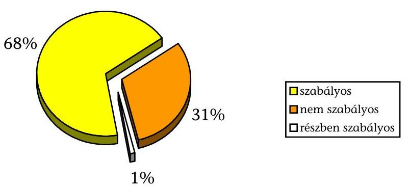
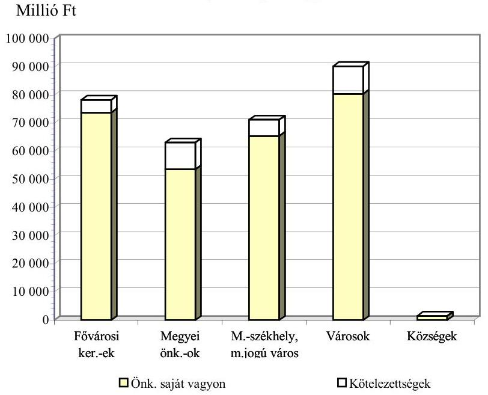
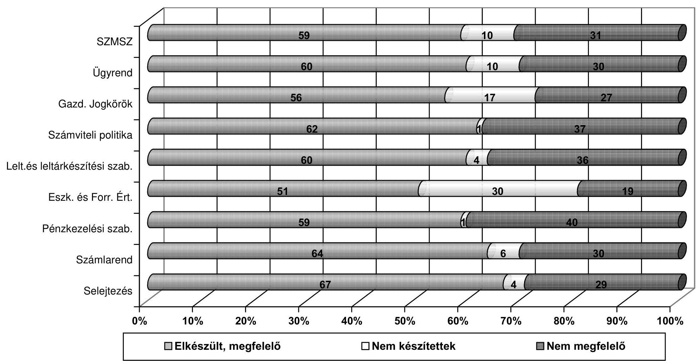
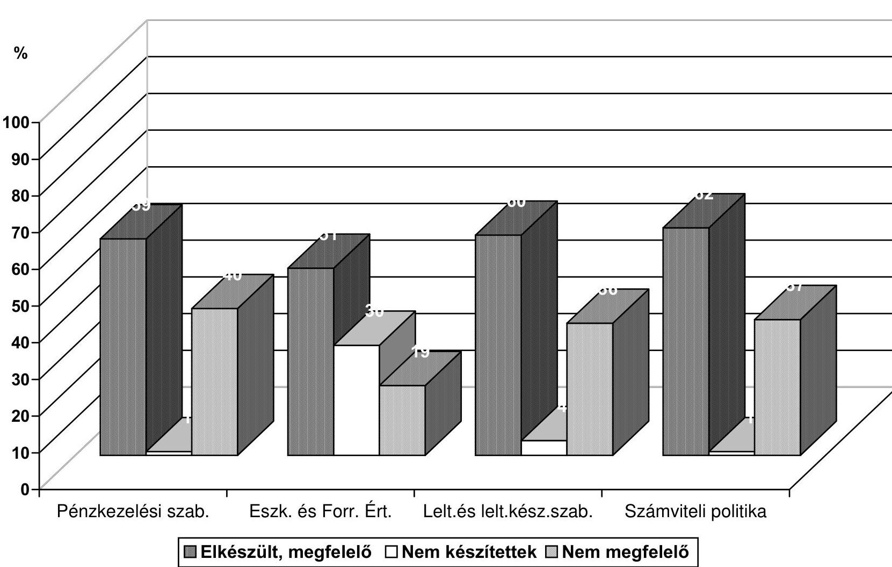
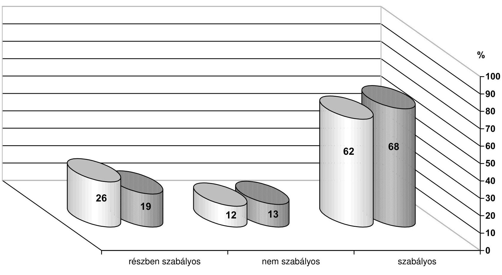
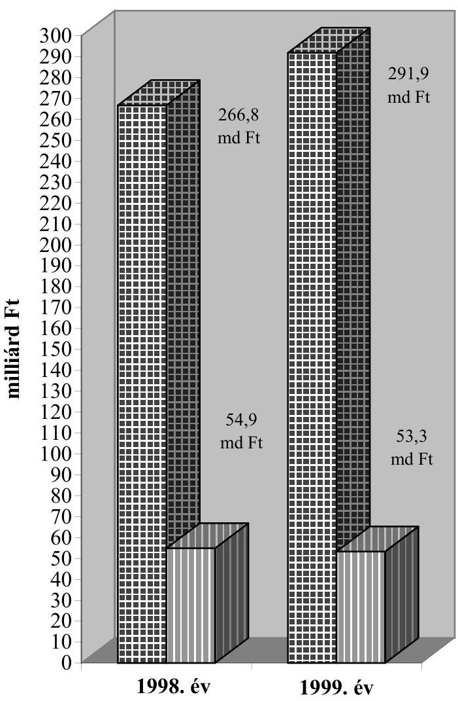
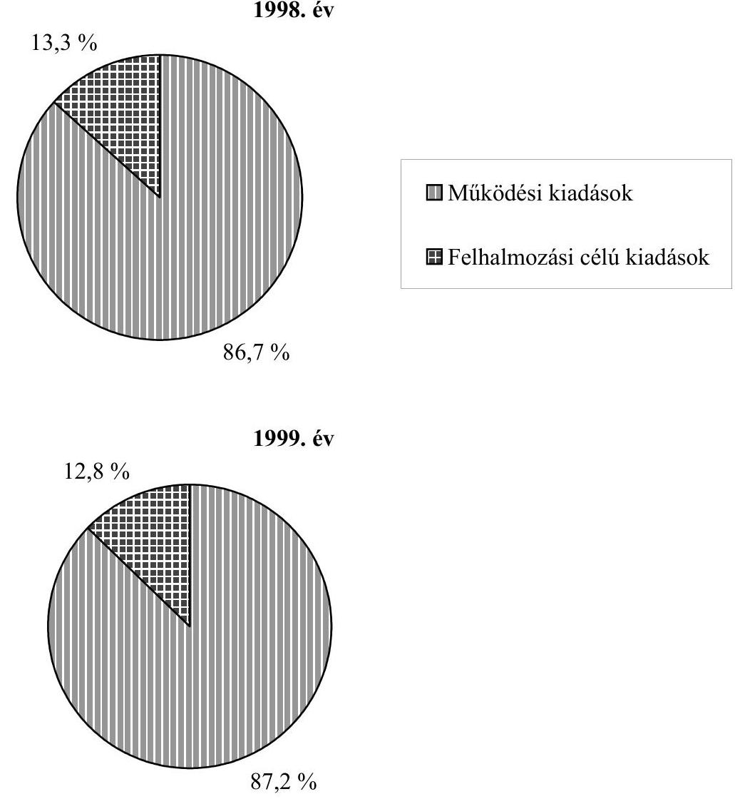
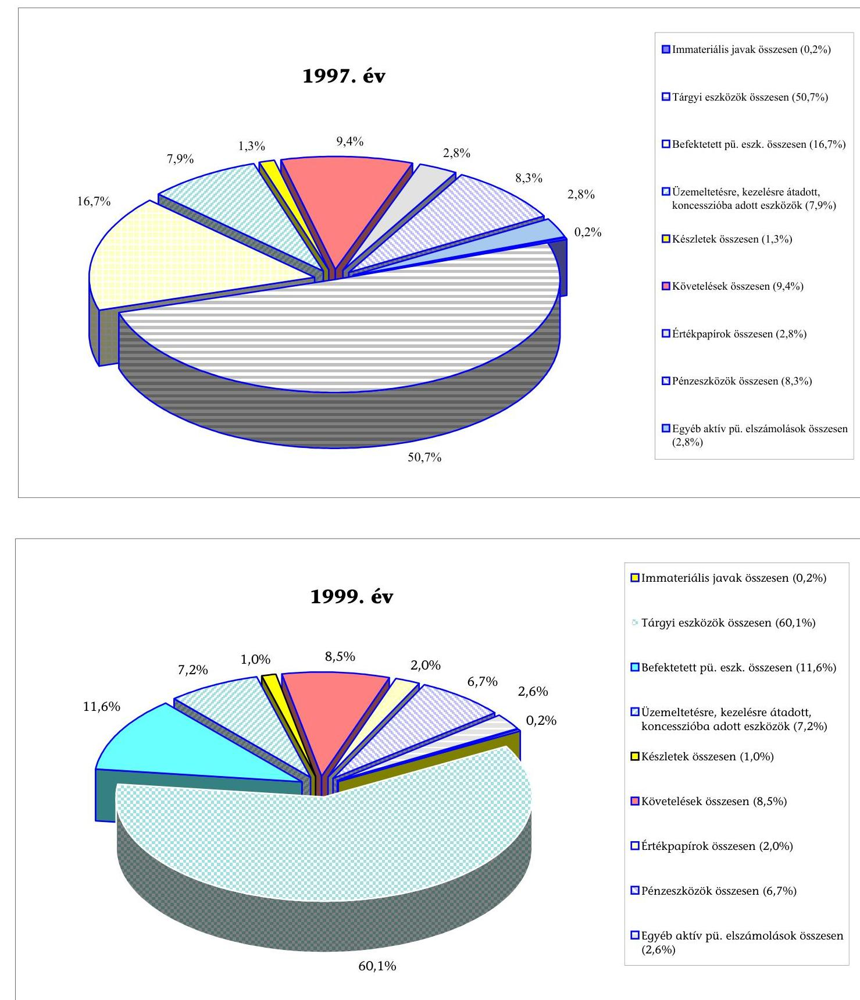
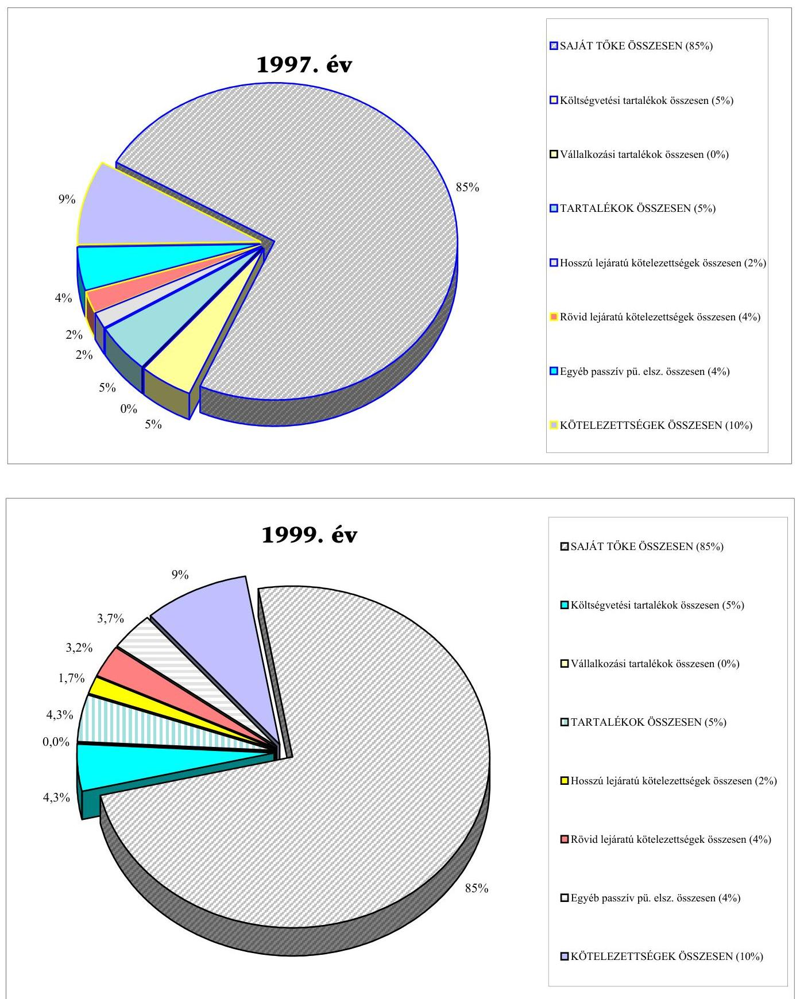

# JELENTÉS 

a helyi és a helyi kisebbségi
önkormányzatok átfogó ellenőrzéséről
2001. június

---

# Az ellenőrzés végrehajtásáért felelős: 

## dr. Lóránt Zoltán

számvevő igazgató

## Az ellenőrzést vezette:

## Nagy József

igazgatóhelyettes
Az ellenőrzés irányításában és a helyszíni vizsgálati jelentések feldolgozásában közreműködött:

## Kántor Ilona

számvevő tanácsos

## Koltayné Szepesi Zsuzsa

számvevő tanácsos

## Kóródi József

számvevő tanácsos - főtanácsadó

## Köcse Istvánné

számvevő tanácsos

## Az ellenőrzésben résztvevők névsorát az 1. sz. melléklet tartalmazza.

## A témakörrel foglalkozó ÁSZ-vizsgálatok jegyzéke:

29 települési és 18 helyi kisebbségi önkormányzat pénzügyigazdasági tevékenységének 1997. évi ellenőrzése

Egyes települési és helyi kisebbségi önkormányzatok pénzügyigazdasági tevékenységének 1998. évi ellenőrzési tapasztalatai

A helyi és helyi kisebbségi önkormányzatok pénzügyi-gazdasági tevékenységének 1999. évi ellenőrzési tapasztalatairól

Jelentéseink az Országgyűlés számítógépes hálózatán és az Interneten a www.asz.hu címen is olvashatók, továbbá a Belügyminisztérium folyóirata, az "Önkormányzati Tájékoztató" rendszeresen közli, valamint a Megyei Közigazgatási Hivatalvezetők részére is átadásra kerül.

---

# TARTALOMJEGYZÉK 

I. ÖSSZEGZŐ MEGÁLLAPÍTÁSOK, KÖVETKEZTETÉSEK, JAVASLATOK ..... 4
II. RÉSZLETES MEGÁLLAPÍTÁSOK ..... 8

1. Az önkormányzati költségvetési szervek alapítása, a gazdálkodás szabályozottsága, szabályszerűsége ..... 8
1.1. Az önkormányzati költségvetési szervek alapítása ..... 8
1.2. Az önkormányzati költségvetési szervek gazdálkodásának szabályozottsága ..... 10
1.3. A költségvetés tervezésének törvényessége ..... 13
1.4. A költségvetés végrehajtása és a gazdálkodás törvényessége ..... 16
1.5. A pénzmaradvány, s az eredmény megállapítása és jóváhagyása ..... 17
2. Az önkormányzati feladatok ellátásának és a pénzügyi feltételeknek az összhangja ..... 19
2.1. Kötelező feladatok meghatározása ..... 19
2.2. A feladatellátás szervezeti formái ..... 22
2.3. A fejlesztés és a működtetés pénzügyi egyensúlyi helyzete ..... 24
3. Az önkormányzati vagyonnal való gazdálkodás ..... 29
3.1. A vagyongazdálkodás szabályozottsága ..... 29
3.2. Az önkormányzati vagyon változása ..... 30
3.3. A gazdasági társaságokban lévő vagyon ..... 33
4. Az önkormányzatok ellenőrzési rendszere ..... 36
4.1. Szabályozottság ..... 36
4.2. Felügyeleti ellenőrzés ..... 36
4.3. Belső ellenőrzés ..... 38
4.4. Pénzügyi bizottságok ellenőrzési tevékenysége ..... 40
4.5. Önkormányzati könyvvizsgálat ..... 40
4.6. Az ÁSZ vizsgálatok javaslatainak hasznosítása az ellenőrzött önkormányzatoknál ..... 42
5. A helyi kisebbségi önkormányzatok gazdálkodásának ellenőrzése során szerzett tapasztalatok ..... 42

---

.

---

# Jelentés 

## a helyi és a helyi kisebbségi önkormányzatok átfogó ellenőrzéséről

Az Állami Számvevőszék 1992. óta végez pénzügyi-gazdasági (átfogó) ellenőrzést az önkormányzati szférában. Kezdetben fő súlyt a költségvetési gazdálkodás törvényességi vizsgálatára helyeztük, később az ellenőrzés irányultsága bővült a feladat-ellátási szempontokkal. Jellemzője volt az átfogó ellenőrzésnek, hogy kis számossággal, elsősorban községekre irányult.
2000. január 1-től az ellenőrzött önkormányzatok kiválasztásánál szempont volt a kiemelt körbe tartozó - városi, megyei és fővárosi kerületi - önkormányzatok négyévenkénti átfogó vizsgálatára való felkészülés, illetve a városok mintegy negyedének évenkénti vizsgálata. A vizsgálati szempontok között kiemelt szerepet kapott a feladat-ellátás és a pénzügyi feltételek összhangjának, valamint az önkormányzatok pénzügyi egyensúlyának az értékelése.

A 2000. évben az Állami Számvevőszék 84 helyi és 67 helyi kisebbségi önkormányzat pénzügyi-gazdasági tevékenységének átfogó vizsgálatát végezte el. A vizsgált helyi és a helyi kisebbségi önkormányzatok jegyzékét a 2/a. és 2/b. számú mellékletek tartalmazzák. A vizsgált önkormányzatok településtípusát, lakosságszámát, az ellátandó feladatok körét, vagyonuk nagyságát tekintve számarányuknál nagyobb súlyt képviselnek az önkormányzati gazdaságban, mivel éves költségvetési kiadási előirányzatuk nagyságát tekintve már közel 15%-os részarányt reprezentálnak.

A helyi önkormányzatok - KSH adatok szerint - a nemzeti vagyon mintegy negyedével rendelkeznek. Ennek - könyv szerinti értéken számítva - kb. kétharmad része a közszolgáltatáshoz kapcsolódó vagyon, s egyharmada a "vállalkozói" vagyon.

Az országos szintű adatokból a vizsgálati körbe bevont önkormányzatok eszközeinek értéke az 1999. XII. 31-i állapot szerint 13%-ot képviselt.

Településtípusonként az országos adatokból a vizsgált önkormányzatok vagyona a kerületeknél 26%-ot; a megyeszékhely és megyei jogú városoknál 19%-ot; a városoknál 20%-ot; a községeknél 0,4%-ot reprezentál.

A vizsgált önkormányzatok 1999. évi eszközeinek forrása 304,3 milliárd Ft volt, melyből 259,4 milliárd Ft-ot tett ki a saját tőke összege, 15,1 milliárd Ft-ot tett ki a tartalék és 29,8 milliárd Ft-ot a kötelezettség-vállalás.

Az önkormányzatok mérlegadataiból látható, hogy vagyonuk 1995 és 1999 között másfélszeresére gyarapodott, így 1999 végére elérte a 2313,2 milliárd forintot. E dinamikus növekedést főképpen a befektetett eszközök, a cél- és címzett támogatással épített létesítmények használatba vétele és a korábban érték nélküli eszközök (pl. földek, utak, járdák) értékadatának a megállapítása okozta. Az összes vagyonból évről-évre kb. 80%-ban részesedő befektetett eszközökön belül az ingatlanok értékének a növekedése a legmagasabb.

---

A forgóeszközök növekvő tételei közül kiemelendő a követelések értékének és részarányának mérsékelt, de folyamatos (évente 1-1,5%-os) növekedése, amely a követelések behajtásának nehézségeire is utal. A rövidlejáratú értékpapírállomány hasonló nagyságrendű növekedése pedig azt mutatja, hogy az önkormányzatok többsége nem kényszerül értékpapírjai eladására likviditása megőrzése érdekében.

# A fenti helyzetkép mögött természetesen a különböző adottságú ön-

kormányzatok eltérő lehetőségei és eredményei húzódnak meg. Összes bevételeik reálértékének megtartása, saját bevételeik arányának növekedése, vagyonuk gyarapodása azonban összességében az anyagi erejük növekedését jelzi.

A vizsgálat célja volt annak megállapítása, hogy:

- az önkormányzati gazdálkodás törvényessége, szabályszerűsége biztosított-e, a beszámolási kötelezettség, a számviteli bizonylati rend területén érvényesültek-e a jogszabályokban, belső szabályzatokban meghatározott követelmények,
- az önkormányzati feladatok és pénzügyi források összhangjának biztosításához milyen helyi intézkedések történtek és azok mennyire voltak eredményesek,
- az önkormányzati vagyonnal való gazdálkodás megfelelően szolgálta-e a helyi önkormányzat lakosságának ellátását, az önkormányzati vagyon megőrzésére, gyarapítására milyen intézkedéseket tettek,
- az önkormányzati felügyeleti és belső ellenőrzés elősegítette-e a törvényes és szabályszerű, az anyagi eszközökkel történő eredményesebb gazdálkodást, az intézmények felügyeletét, irányítását,
- a helyi kisebbségi önkormányzat gazdálkodásának lebonyolításával kapcsolatos feladatokat a polgármesteri hivatal a jogszabályban, a kisebbségi önkormányzatokkal kötött megállapodásokban foglaltak alapján ellátta-e.

A vizsgálat az 1998. és 1999. évi költségvetési gazdálkodásra irányult, de egyes gazdasági folyamatok, tendenciák megítélésénél hosszabb időtáv értékelésére is sor került.

A helyszíni vizsgálatokat 2000. január 6. és december 31. közötti időszakban végeztük.

## I. ÖSSZEGZŐ MEGÁLLAPÍTÁSOK, KÖVETKEZTETÉSEK, JAVASLATOK

Az önkormányzatok gazdálkodásának tartalmát, szervezeti formáinak kialakítását, szabályozottságát és szabályosságát nagyban befolyásolják a településszerkezet sajátosságai. A legkisebb, néhány száz fős településeken általában a költségvetési gazdálkodásnak az elemi feltételei sincsenek meg, rendkívül kedvezőtlen a szakember-ellátottság, ami eleve meghatározza a gazdálkodás színvonalát. Megfelelően adaptált és aktualizált helyi szabályozások többnyire csak a városokban és a nagyközségekben vannak. Ezek azonban indokolatlanul bonyolultak, miközben a különböző jogszabályokban meglévő ellentmondásos központi előírásokat nem tudják követni.

Az ellátó rendszerek működtetésében a nem koncepcionális szakmai irányítás, a tényleges költségektől messze elmaradó finanszírozás, a különböző szolgáltatások szakmai tartalmának nem kellő meghatározottsága miatt az önkormányzatokra nagy teher hárul. A gazdasági kényszer az önkormányzatokat racionálisabb gazdálkodásra sarkallja, ennek ellenére sok az ésszerűtlenül felhasznált forrás. Nincs kellő törekvés a szakszerűbb, gazdaságosabb feladatellátás lehetőségeinek számbavételére, kihasználására. A teljesítményértékelés, ösztönzés, érdekeltség nem működik megfelelően. A kialakult, öröklött intézményi struktúrák, ellátórendszerek belső szakmai összetétele sok esetben nem igazodik a valós ellátási szükségletekhez. Ezek átalakítására irányuló döntések gazdasági kényszerhelyzetekben és nem kellő megfontolással születnek. A feladatok gazdaságos ellátását, a piaci követelményeknek való megfelelést sok esetben a merev gazdálkodási kötöttségek akadályozzák.

Az állam egyre nagyobb mértékben ösztönzi az önkormányzatok hosszabb távú közös feladatellátását. Ennek ellenére a kismértékű növekedésen túl jelentős áttörés sem a társulások, sem a körjegyzőségek alakulásában nem következett be. Még mindig az önkormányzatok szemlélete a legnagyobb akadály, az autonómia helytelen értelmezése, előtérbe helyezése a hatékony működéssel szemben.

A gazdasági társaságok főként a településüzemeltetés területén terjednek, melyek többségükben a korábbi állami, tanácsi vállalatok átalakulása, privatizációja révén jöttek létre. A tapasztalatok azt mutatják, hogy csak a legnagyobb települések rendelkeznek azokkal a feltételekkel, amelyek vállalkozások alapításához, felügyeletéhez (irányításához) az önkormányzati érdekek érvényesülése érdekében szükségesek. Gondot okoz és alapvetően ellentmondásos a tulajdonosi és az árhatósági szerepkör egyidejű érvényesítésének a kötelezettsége.

A támogatási rendszer a feladat-ellátás finanszírozását intézményi szervezethez köti, az Ötv. nem rendelkezik a feladat-ellátás szervezeti formáiról. A költségvetési szerv az alapító okiratban feltüntetett időpontban, a törzskönyvi nyilvántartásba történő bejegyzéssel jön létre. Az elmúlt években végbement fejlődés ellenére még ma is hiányos alapító okiratokkal találkozott az ellenőrzés, nem egyértelmű a feladat-meghatározás, illetve a felügyeleti és gazdálkodási jogkörök pontos rögzítése. Az intézményi feladat-meghatározásokból a vállalkozási tevékenységek köre és mértéke kimaradt. Bizonytalanság tapasztalható az egyes feladatok szervezeti feltételeinek kialakításában.

A gazdálkodás - a költségvetési tervezés, az előirányzatok felhasználása és beszámolás - egymásra épülő elemeinek szabályait a helyi önkormányzatokról szóló 1990. évi LXV. törvény (továbbiakban: Ötv.), az Államháztartásról szóló 1992. évi XXXVIII. törvény (továbbiakban: Áht.), a költségvetési szervek beszámolási és könyvvezetési kötelezettségéről szóló 54/1996. (IV.12.) Korm. rendelet keret jelleggel szabályozza. Az ezekre épülő helyi szabályzatok területén az ellenőrzés megállapítása szerint - a vizsgált körben - a gazdálkodás egyes részterületein jelentős eltérések tapasztalhatók. Legjobban szabályozott terület a selejtezés, ugyanakkor legkevésbé célratörően kidolgozott szabályzatok alapján végezték az eszközök és források értékelését. Tartalmukban nem megfelelő ügyrendi szabályozások jellemző fogyatékossága, hogy a gazdasági feladatokat nem teljes körűen rögzítették, illetve a feladat- és jogköröket a vezetők és beosztott dolgozók között nem egyértelműen határolták el. Ennek következtében a feladat-ellátások és a felelősségek nyomon követése, számonkérés kevésbé volt megoldott. Az önkormányzati számviteli tevékenység szabályozottságának színvonala a városi, megyei önkormányzati körben 58%-ban volt megfelelő, a községeknél az elfogadható szabályozottság színvonala mindössze 40%-os.

A vizsgált önkormányzatok teljes körűen megalkották a költségvetési rendeletüket, ugyanakkor annak szerkezete és felépítése közel kétharmadánál felelt meg az Áht.-ban előírt követelményeknek. Ezen belül gondot jelentett az előirányzatok évközi módosításának szabályozottsága, amihez hozzájárult az ellentmondásos jogszabályi környezet. Az Áht. szabályai szerint a kötelezettség-vállalás csak az előirányzat terhére teljesíthető, míg az államháztartás működési rendjéről szóló 217/1998. (XII.30.) Korm. rend. (továbbiakban: Ámr.) 53. §-ának értelmében az előirányzat módosítások végső határideje a következő év április 30.

Az elmúlt években az ágazati törvények igen sok feladattal bővítették az önkormányzatok eredendően széles feladatkörét. A kötelező feladat meghatározása és rendszerbe foglalása, az ellátás szervezeti rendszerének a kijelölése alapvető kérdés valamennyi önkormányzat számára. A kötelező feladatellátást nehezíti az önként vállalt feladatok mennyisége, helyenként az önkormányzatok anyagi ereje még az előírt kötelezettség teljesítésére sem elegendő. A kötelező feladatok egyértelmű feltérképezését nehezíti, hogy az érintett törvényekből nem egyértelműen olvasható ki a feladatellátás kötelező jellege, így egy bizonyos feladatot az egyik önkormányzat kötelezőnek, míg ugyanazt a feladatot a másik önként vállaltnak minősítette.

Az önként vállalt feladatok SZMSZ-ben történő feltüntetésének a vizsgált önkormányzati kör nagyvonalúan tett eleget. A számviteli nyilvántartásban való elkülönítés nem megoldott. A vizsgálat tapasztalata szerint 1999-ben 2%-kal csökkent az önként vállalt feladatokra fordított kiadások összege, a költségvetésen belüli arányuk 18%-os volt.

A vizsgált önkormányzatok közül kizárólag a jó pénzügyi kondíciókkal rendelkező önkormányzatok tudtak jelentős összegeket nonprofit és társadalmi szervezetek támogatására fordítani. A vizsgált kör 85%-ában a kötelező feladat-ellátást az
 önként vállalt feladatok nem veszélyeztették. Ellátási feszültséget főképp a működtetési és a fejlesztési kiadások egyensúlyának a megbomlása okozott. Általános tapasztalat, hogy az önkormányzatok költségvetési kiadásaiknak nagyobb részét működtetésre fordítják.

---

A vizsgált önkormányzatok fele stabilan, fele romló pénzügyi helyzetben gazdálkodott. A pénzügyi források bővítését célzó intézkedések közül legjelentősebb a helyi adók körének, mértékének a bővítése volt, amely a vizsgált kör 42%-át érintette. Az intenzív vagyonhasznosítási tevékenység eredményeképpen az ellenőrzött önkormányzatok 1/4-e jutott többletforráshoz.

# A forráshiányos önkormányzatok 72%-a pályázott forrás-kiegészítő támogatásra. Általános tapasztalat, hogy a támogatás az önkormányzatok számára jelentős, végeredményét tekintve átmeneti segítséget jelentett, a forráshiány évente újratermelődött. 

A helyi önkormányzatok mérleg főösszege az 1998. és 1999. évek viszonylatában jelentősen növekedett, az 1997. évi mérlegszerinti vagyonérték 525 Mrd Ft-tal (29%) emelkedett és 1999. év végére elérte a 2313,2 Mrd Ft értéket. A növekedés mögött nemcsak a vagyon mennyiségi gyarapodása van, hanem az eddig érték nélkül szerepelt eszközök (pl. földterületek, utak, járdák) értékelése is. A fővárosi kerületi önkormányzatok vagyon-gyarapodása (73%) kiemelendő, szerény mértékű a megyeszékhely- és megyei jogú városok (16%-os) vagyon növekménye.

Az önkormányzati gazdálkodás alapvető garanciális eleme a megfelelően kiépített és működtetett belső és felügyeleti ellenőrzési rendszer. Az ellenőrző funkció hatékonyabb érvényesülése szempontjából kedvezőtlen, hogy az Ötv. csak az ellenőrzési kötelezettséget rögzíti, a részletesebb eljárási szabályozás ez idáig elmaradt.

A vizsgált önkormányzatok 2/3-a rendelkezett ellenőrzési szabályzattal, amelyben részletesen meghatározták a gazdálkodásuk belső ellenőrzésének célját, feladatait. Az ellenőrzésnek, mint átfogó rendszernek a teljes körű kiépítését, működtetését kevés helyen biztosították. Az önkormányzatok 40%-ánál SZMSZ-be, ügyrendbe, az egyéb gazdálkodási szabályzatokba, az adott területek vizsgálatához szükséges ellenőrzési pontokat, az ellenőrzési feladatokat és azok módszereit nem építették be.

Az intézményi ellenőrzési kötelezettségüknek különböző gyakorisággal, de rendszeresen eleget tett a kerületi, a megyei és a megyei jogú városi önkormányzatok többsége (80%-a), a városi önkormányzatoknak 54%-a.

Az önkormányzati gazdálkodást végrehajtó hivatal és a kapcsolt körben vizsgált intézmények belső ellenőrzési rendszerét az önkormányzatok 60%-ánál nem teljes körűen építették ki.

A kisebbségi önkormányzatok operatív gazdálkodása - kiemelten a kötelezettség-vállalások és utalványozás gyakorlata - 94%-ban megfelelt a vonatkozó szabályoknak, ugyanakkor visszalépést jelent 2000-ben az a megengedő szabály, hogy a települési önkormányzat jegyzője helyett az utalványozás ellenjegyzését a kisebbségi önkormányzat képviselője is elláthatja.

A helyszíni vizsgálatok megállapításait, javaslatait a vizsgált önkormányzatok intézkedései követték. Az ÁSZ-hoz megküldött intézkedési tervek többsége a helyi szabályzatok elkészítését, aktualizálását, a számviteli

---

nyilvántartások pontosítását, a munkafolyamatokba épített ellenőrzések kiegészítését tartalmazzák.

# JAVASLATOK 

Az önkormányzatok gazdálkodásának szabályozottabbá, hatékonyabbá és ellenőrizhetőbbé tétele érdekében az Állami Számvevőszék javasolja, hogy:

## a belügyminiszter:

- ajánlás formájában tovább segítse az önkormányzatok gazdasági programjainak elkészítését;
- a pénzügyminiszter bevonásával vizsgálja felül az Ötv. korszerűsítése kapcsán - az önkormányzati belső és felügyeleti ellenőrzés hatékonyságának növelése érdekében - a 15/1999. (II.15.) Kormányrendelet egyes rendelkezéseinek a helyi önkormányzatokra történő kiterjesztésének lehetőségét;

## a pénzügyminiszter:

- az Államháztartási törvény módosítása során érvényesítse, hogy a helyi kisebbségi önkormányzat kötelezettség-vállalása és az utalványozás ellenjegyzése kizárólag a települési önkormányzati jegyző, vagy az általa megbízott személy feladatkörébe tartozzon;
- kezdeményezzen törvényi szabályozást, hogy a helyi önkormányzatok által ellátott feladatok közül mely tevékenységekre kell költségvetési szervezetet létrehozni és milyen tevékenységek végezhetők a polgármesteri hivatali szakfeladaton.

## II. RÉSZLETES MEGÁLLAPÍTÁSOK

## 1. AZ ÖNKORMÁNYZATI KÖLTSÉGVETÉSI SZERVEK ALAPÍTÁSA, A GAZDÁLKODÁS SZABÁLYOZOTTSÁGA, SZABÁLYSZERŰSÉGE

### 1.1. Az önkormányzati költségvetési szervek alapítása

A vizsgált körbe tartozó önkormányzatok kötelező és önként vállalt feladataikat, azok összetételének, jellegének megfelelően, döntően költségvetési szervek útján végezték. A feladatellátásban a polgármesteri hivatalok mellett önkormányzatonként átlag 21 intézmény vett részt, többségében (bár 1998-ról 1999-re némileg csökkenő arányban: 56, illetve 55%) önálló gazdálkodási jogosítvánnyal felruházva.

A feladatmutatóval mérhető tevékenységek ellátása általában intézményi keretek között valósult meg. Emellett a városi önkormányzatok körében is előfordult az eddig főként kistelepülési sajátosságként ismert jelenség, amely szerint intézmény nélkül, belső szakfeladatként működtettek idősek nappali ellátását (pl. Balatonlelle), valamint családsegítő és gyermekjóléti szolgálatot (pl. Elek).

---

A hatályos jogszabályok (Ötv. 9. §, Áht. 88. §) egyértelmű, kötelező előírást nem tartalmaznak arra vonatkozóan, hogy mely tevékenységekre kell intézményt létrehozni, a költségvetési szervek alapítását mindössze lehetőségként fogalmazták meg az önkormányzatok számára. Az általuk ellátandó állami feladatok jellege is csak közvetett módon adja meg azokat az ismérveket, amelyek alapján eldönthető, hogy a közszolgáltatási kötelezettségek milyen szervezeti formában teljesíthetők. Ennek alapján azonban és a normatív állami hozzájárulás követelményrendszeréből eredően is a polgármesteri hivatal belső szakfeladatán működtetett „intézmény" rendszeridegen, ezért irányítása, felügyelete, gazdálkodása a törvényi keretek közé nem illeszthető be.

A szervezeti rendszer kialakításának szabadsága mellett az önkormányzati feladatok ellátásában résztvevő szervezetek létrehozásának módját, tartalmi követelményeit különféle jogszabályok határozzák meg. Így a költségvetési szervek alapításáról az Áht. 88. § értelmében alapító okiratban kell rendelkezni. A vizsgált önkormányzatok felügyelete alá tartozó költségvetési szervek létrehozásában ezen törvényi előírások érvényesítése terén a polgármesteri hivatalok és az intézmények között jelentős különbségek voltak. Míg az intézményi körben a közszolgáltató szervezet létesítésének dokumentumát jelentő alapító okiratok jóváhagyása és kiadása általában megtörtént, addig az önkormányzati gazdálkodás végrehajtására hivatott szervek (hivatalok) többsége az ellenőrzött időszakban alapító okirattal nem rendelkezett (pl. BAZ, Fejér, Pest megye), holott az előzőekben hivatkozott törvény azt egységes követelményként határozta meg, az alapítás módját illetően a költségvetési szervek egyes típusai között különbséget nem tett.

# Az ellenőrzéssel érintett önkormányzati költségvetési szervek alapító okiratainak tartalma összességében csak mintegy 50% esetében felelt meg mindenben a vonatkozó jogszabályok előírásainak. Bár e téren a vizsgált két év viszonylatában javulás tapasztalható volt (a megfelelőnek minősítettek 1998-ban 50, míg 1999-ben 52%-ot képviseltek), még mindig jelentős azoknak az aránya, ahol az egyértelmű feladat-meghatározás, a tényleges tevékenységnek megfelelő szabályozás, illetve a felügyeleti szerv és a gazdálkodási jogkörök pontos rögzítése hiányzott. 

Az intézményi feladat-meghatározásból a vállalkozási tevékenységek konkrét köre és mértéke maradt ki (pl. Komárom megye, Fehérgyarmat, Újszász), amely miatt a gyakorlati feladatellátás és a szabályszerű elszámolás alapkövetelményei hiányoztak, de előfordult a végzett tevékenységek jogszabályi előírásoknak nem megfelelő besorolása is.

A kisvárdai önkormányzatnál a kórházi vegyesbolt és büfé működtetés vállalkozási helyett alaptevékenységet kiegészítő, míg az intézményi helyiségek eseti bérbeadása kiegészítő helyett vállalkozási tevékenységként szerepelt.

Az Áht. 88. § rendelkezései szerint a költségvetési szervek a Pénzügyminisztérium által vezetett törzskönyvi nyilvántartásba történő bejegyzéssel, az alapító okiratban meghatározott hatállyal jönnek létre. A nyilvántartásba vétel kezdeményezése az Ámr. 159. § előírásai alapján a képviselő-testület feladata, amelyet az alapítói döntést követő öt munkanapon belül kell végrehajtani.

---

#### Abstract

A vizsgált önkormányzatok a feladat-ellátásban részvevő ágazati intézményeik gazdálkodási jogkör szerinti besorolását, és ennek megfelelően önállóan, illetve részben önállóan gazdálkodóvá történő minősítését mind az alapításkor, mind az átszervezések során az Ámr. 14-15. §-aiban rögzített feltételek figyelembe vételével határozták meg. A besorolás szerinti gazdasági tevékenység létszám, illetve szakmai követelményeire és annak változására azonban nem mindig voltak kellő tekintettel. Így önálló gazdálkodási jogkört biztosítottak olyan intézményeknek is, ahol gazdasági szervezet nem működött és a feladatokra mindössze egy-két fő állt rendelkezésre, amely az operatív gazdálkodásban az összeférhetetlenség kizárását biztosító követelményekhez nem elegendő. Más esetekben a feladatellátásban résztvevő alkalmazottak az előírt szakképesítéssel nem rendelkeztek és annak megszerzését számukra nem, vagy csak részben írták elő. Mindezek által a gazdálkodás önálló és szakszerű viteléhez szükséges személyi feltételeket maradéktalanul nem biztosították.

A pénzügyi-gazdasági feladatokra Fehérgyarmat Város Szociális Központjánál a gazdasági vezetőn kívül egy főt, Tapolca Járdányi Pál Zeneiskolában egy fő gazdasági vezetőt alkalmaztak, Csenger Kommunális és Ellátó Intézményénél az Ámr. 18. § szerinti gazdasági vezető nem volt.

Az intézményi gazdasági vezető az Ámr. 18. § (4) bekezdésében előírt végzettséggel nem rendelkezett Encs Általános és Művészeti Alapiskola, valamint a Városi Művelődési Központ és Könyvtár, csak részben rendelkezett Elek és Gyomaendrőd 2-2 vizsgálattal érintett intézményénél.

A vizsgált önkormányzatok az általuk fenntartott intézmények jelentős hányadát (1998-ban 44%, 1999-ben 45%) részben önálló gazdálkodási jogkörrel ruházták fel. A képviselő-testületek e besorolással egyidejűleg - az Ámr. 14. § előírásainak megfelelően - kijelölték azt az önállóan gazdálkodó költségvetési szervet is (sok esetben magát a polgármesteri hivatalt), amely a gazdasági feladataikat részben, vagy teljes egészében ellátja, de a két szerv közötti munkamegosztás és felelősségvállalás rendjét szabályozó megállapodások elkészítése, jóváhagyása nem mindig történt meg (pl. Biharkeresztes, Gárdony, Mogyorósbánya). Helyenként az elkészült szabályozás felügyeleti szervi jóváhagyásáról nem gondoskodtak (pl. Komárom megye, Oroszlány), vagy a jóváhagyott megállapodások tartalma az intézmény alapító okiratában szereplő előirányzat feletti rendelkezési joggal nem volt összhangban (pl. Szombathely, GAMESZ és a hozzá kapcsolt óvoda). Ezekben az esetekben a gazdasági feladatellátáshoz előírt feltételeket teljes körűen nem biztosították.

# 1.2. Az önkormányzati költségvetési szervek gazdálkodásának szabályozottsága 

A költségvetési szervek tevékenységének területeire jogszabályok konkrét szabályozási kötelezettséget írnak elő és többnyire rögzítik annak tartalmi követelményeit is (a számvitelről szóló 1991. évi XVIII. törvény, a továbbiakban: Sztv.). Az önkormányzati gazdálkodás szabályozásának minősítése alapján számított mutatók szerint, a vizsgált körben a jogszabályi előírásoknak és a helyi sajátosságoknak megfelelő szabályozottság mindössze 50%-ban, annak hiánya pedig 18%-ban volt megállapítható. Az ellenőrzéskor bemutatott sza-

---

bályzatok több mint egynegyede (26%) nem felelt meg a követelményeknek, a további 6% esetében az azt megalapozó tevékenység (vállalkozási tevékenység) hiányában szabályozási kötelezettség nem volt.

A vállalkozási tevékenységet és az ahhoz kapcsolódó önköltség-számítást figyelmen kívül hagyva, valamivel kedvezőbb értékeket kapunk, de az így számított, összességében 60%-ban megfelelőnek ítélt szabályozottság sem tekinthető optimális mértékűnek. Különösen akkor nem, ha figyelembe vesszük, hogy a vizsgált önkormányzatok döntően megyékben, városokban működtek, ahol a korábbi években ellenőrzött, jórészt kistelepülési önkormányzatoknál általában kedvezőbb személyi, szakmai feltételekkel rendelkeztek.

Az ellenőrzött körben az SZMSZ képviselő-testületi jóváhagyásáról teljes körűen nem gondoskodtak, így az előírt felügyeleti szervi jóváhagyás több esetben nem történt meg (pl. a Budapest IX. ker. 3 intézmény, Gárdony oktatási intézmények, Tapolca a 2 helyszíni vizsgálattal érintett intézményénél). Máshol az SZMSZ szintű szabályozás tartalmilag volt hiányos, mert abból kimaradt a feladatmutatók köre és mértéke (pl. Berettyóújfalu Bessenyei György SZKI), a vállalkozási tevékenység felsorolása (pl. Csenger Kommunális és Ellátó Intézmény), nem rögzítették az előirányzatok feletti rendelkezési jogosultságot (pl. Ibrány), illetve a gazdasági szervezet felépítését és feladatait (pl. Oroszlány óvoda, általános iskola).

A költségvetési szervi gazdálkodás egészét összefoglaló jelleggel, valamint ezen belül a vezetők, továbbá más dolgozók feladat-, hatás- és jogkörét megfelelően tartalmazó ügyrenddel az ellenőrzött önkormányzatok 60%-nál rendelkeztek (pl. BAZ, Hajdú megye, Baja). Ebben a körben önállóan, vagy az önkormányzati SZMSZ mellékleteként alakították ki szabályozásukat, de nem elhanyagolható (10%) az, ahol a gazdasági szervezet ügyrendjének összeállítására vonatkozó kötelezettségüknek nem tettek eleget (pl. Gárdony, Oroszlány).

A tartalmilag
 nem megfelelőnek minősített ügyrendi szabályozások a vizsgált esetek 30%-át tették ki, amelyek jellemző hiányossága, hogy a gazdasági feladatokat nem teljes körűen tartalmazták (pl. Baktalórántháza, Balatonalmádi, Mohács), vagy a feladatmeghatározást kellően nem részletezték (pl. Budapest I., Elek, Keszthely), illetve a feladat-, hatás- és jogköröket a vezetők és beosztott dolgozók szintjén nem határozták meg (pl. Bátaszék, Hévíz, Ibrány). Mindezek következtében a szabályozásból a gazdálkodás egyes területei kimaradtak (pl. a kapcsolt részben önálló intézményi gazdálkodás feladatai), továbbá a munkamegosztás munkakörönkénti szabályozása elmaradt, amely miatt a feladat-hatás- és felelősségi körök egyértelmű elhatárolása sem történt meg és így az egyénre szabott munkamegosztás, illetve a számonkérhetőség feltételei nem voltak biztosítottak.

A pénzgazdálkodási jogkörök gyakorlásának rendjét a vizsgált önkormányzatok 83%-ánál szabályozták. A gazdasági tevékenység folytatásához szükséges belső szabályozás 17%-nál nem történt meg (pl. Biharkeresztes, Vértestolna), amelynek következtében a kötelezettségvállalás, az érvényesítés, az utalványozás és ellenjegyzés konkrét feladatai szabályozatlanok voltak. A meglévő sza-

---

bályzatok 56%-a felelt meg a jogszabályi követelményeknek (pl. Balatonalmádi, Balatonboglár, Budapest XVIII.).

A nem megfelelőnek minősített 27% tekintetében a vizsgálati jelentések elsősorban hiányos szabályozásról szóltak, amelyből egyes pénzgazdálkodási jogkörök kimaradtak (pl. érvényesítés Szentgotthárd; utalványozás és ellenjegyzés Pest megye; kötelezettségvállalás Gyál; teljesítés igazolása Hajdú megye), vagy nem rögzítették a távollévők helyettesítésére jogosultakat (pl. Bátaszék, Elek). Az ellenőrzés Ajka város esetében az utalványozásra jogosultak széles körét kifogásolta, amely a helyettesítéseket is beleszámítva, a hivatali létszám jelentős részére (30%) kiterjedt. Más önkormányzatoknál az Ámr. 134. § előírásaitól eltérő szabályozásra kellett rámutatni.

Tiszatarján költségvetési rendeleteiben a polgármester jogszabályban biztosított kötelezettségvállalási és utalványozási jogkörét a pénzügyi bizottsággal történő előzetes írásbeli egyetértéshez kötötte.
Hajdú-Bihar Megyei Önkormányzatnál olyan operatív gazdálkodással kapcsolatos hatáskört is átruházott (a hivatali utalványozást a főjegyzőre), amelyről jogszerűen csak annak címzettje, azaz a közgyűlés elnöke rendelkezhetett volna.
Ibrányban a polgármester egyes kötelezettségvállalási hatásköreit az aljegyzőnek, illetve a pénzügyi csoportvezetőnek adta.
(A vizsgált önkormányzatok gazdálkodási tevékenysége szabályozottságát a jelentéshez 3/a. számú mellékletként csatolt grafikus ábrázolás szemlélteti).

Az Sztv., valamint a költségvetési szervek beszámolási és könyvvezetési kötelezettségéről szóló 54/1996.(IV.12.) Korm. rendelet előírásai szerint a költségvetési szerveknek szakmai feladataik és sajátosságaik figyelembe vételével ki kell alakítaniuk és írásban szabályozniuk számviteli politikájukat. Ennek keretében kell elkészíteniük az eszközök és források leltározási és leltárkészítési szabályzatát, az eszközök és források értékelésének szabályozását, valamint a pénzkezelési, továbbá (vállalkozási tevékenység esetén) az önköltség-számítási szabályzatot.

# Az ellenőrzött önkormányzatoknál a számviteli politika és az annak 

részét képező fenti szabályozások, szabályzatok a követelményeknek megfelelő tartalommal 58%-ban, az 500 fő alatti községekben pedig 40%-ban álltak rendelkezésre. A szabályozottság hiánya az előbbieknél 9%, az utóbbiaknál 20% esetében, a jogszabályi előírásoktól és a helyi adottságoktól eltérő, ezért nem megfelelő tartalmú szabályozás 33%, illetve 40%-ban volt tapasztalható. A számviteli politika egyes elemei közül a legkisebb mértékben az értékelési tevékenység szabályozott, ezt a kötelezettséget jelentős arányban (30%) egyáltalán nem teljesítették (pl. Katymár, Mohács, Nagymaros).

A leltározási tevékenység szabályozásából esetenként az 54/1996.(IV.12.) Korm. rendelet hatálybalépésével összefüggő aktualizálás elmulasztását (pl. 1993. óta nem aktualizált a szabályzat: Szigetvár, Tapolca), egyes eszközcsoportokra vonatkozó rendelkezések kimaradását (pl. használt eszközök: Izsák, Heves; üzemeltetésre átadott eszközök: Budapest I.), illetve a leltárfelvétel gya-

---

korlátja, módja egyértelmű, konkrét megfogalmazásának hiányát (pl. Bácsalmás, Biharkeresztes, Hévíz), stb. kellett kifogásolni.

A költségvetési szerveknél a számlarend elkészítését, tartalmi követelményeit az 54/1996.(IV.12.) Korm. rendelet 37. § írta elő, amelynek a vizsgált szervek 64%-a eleget tett (pl. Budapest VI., Szombathely, Ajka). Ezzel a szabályozással 6% nem rendelkezett (pl. Szigetvár, Vértestolna), a továbbiakat jelentő 30%-nál pedig hiányzott a helyi sajátosságokkal való összhang (pl. Budapest IX., Ibrány), illetve a vezetendő analitikus nyilvántartások teljes körét (pl. Edelény, Győr), és azok egyeztetésének módját nem határozták meg (pl. Keszthely, Nagymaros, Rétság).

Az önkormányzati gazdálkodás változó mértékben, de évek óta visszatérő jelensége, hogy helyenként a belső szabályozási kötelezettségnek vásárolt, mintaszabályzatokkal tesznek eleget. Bár a 2000. évben vizsgált kör összetétele a szakmai feltételek tekintetében a korábbiaknál kedvezőbbnek ítélt, a helyi viszonyokra nem adaptált, külső szervtől beszerzett szabályzatok itt is előfordultak, amelyek legnagyobb hibája, hogy az adott helyen történő gyakorlati alkalmazásuk az általános rendelkezéseik miatt nem lehetséges (pl. Battonya, Békés, Elek, Nagymaros).

A szabályozásban a gazdálkodás egyes területei között jelentős eltérések mutatkoznak, a legjobban szabályozott (67%) a selejtezési, míg a legkevésbé (51%) az eszközök és források értékelésével kapcsolatos tevékenység, amelynek pedig a számviteli munkában, illetve a vagyonérték megállapításában és ezáltal a mérlegvalódiság biztosításában alapvető jelentősége, szerepe van.
(A számviteli politika szabályozottságának mértékét és egyes területeinek szabályozottságát a jelentéshez 3/b. számú mellékletként csatolt grafikus ábrázolás szemlélteti).

# 1.3. A költségvetés tervezésének törvényessége 

Az ellenőrzött önkormányzatok hivatalaiban a javasolt előirányzatok kimunkálása során a gazdasági program előírásait, illetve a testületek korábbi pénzügyi kihatású döntéseit figyelembe vették (pl. Budapest I. ker., Hajdú Bihar megye, Szombathely). A költségvetési előirányzatokat részletes számításokkal többségében alátámasztották, azok megalapozottságát biztosították (1998 év: 65%, 1999 év: 68%). A reális lehetőségeket meghaladó bevételek számításba vételével, és a kiadások alultervezésével költségvetési egyensúlyhiányt nem idéztek elő.

Győr megyei jogú városban egyes bevételek - a teljesítés adatai alapján - alultervezettek voltak (pl. helyi adó, osztalék, átvett pénzeszköz), így az egyensúlyt csak hitel igénybe vételének tervezésével tudták biztosítani, amelyre az éves gazdálkodás során elért többletbevételek eredményeként nem került sor.

Szigetvár városban a kiadási igények minden évben jelentős nagyságrenddel meghaladták a reálisan várható bevételeket, az előző ciklus utolsó két évében elindult eladósodási folyamat kezelése egyre nehezebbé vált.

---

A koncepciót, valamint a tervezés második szakaszában összeállított részletes költségvetési javaslatot az önkormányzatok bizottságai megvitatták, véleményezték. A jegyzők a rendelettervezeteket a testületi tárgyalást megelőzően a költségvetési szervek vezetőivel és (ahol működött) a kisebbségi önkormányzatok elnökeivel, illetve a közalkalmazottak érdekképviseleti szerveivel is egyeztették (pl. Derecske, Szentgotthárd, Szombathely). A költségvetési elképzelésekről helyenként a lakosságot és a civil szervezetek képviselőit közmeghallgatáson, vagy más fórum keretében (falugyűlés, vállalkozói fórum) tájékoztatták, véleményüket meghallgatták (pl. Balatonboglár, Heves, Ibrány).

A polgármesterek a képviselő-testület elé jóváhagyásra a bizottságok által megtárgyalt, a pénzügyi bizottság által véleményezett, valamint - az Ötv. 92/A-C. §-ai alapján szükséges esetben - a könyvvizsgáló írásos jelentését is tartalmazó rendelettervezetet terjesztettek (pl. Budapest VI., Eger, Elek).

A költségvetési rendelettervezet benyújtására - az Áht. 71. § (1) bekezdése alapján megállapított - 1999. és 2000. évben is február 15-ei határidőt túllépte (pl. Gyomaendrőd, Hajdú és Tolna megye).

A vizsgált önkormányzatok az éves tervezés során a költségvetés Ötv. és Áht.-ben meghatározott rendeleti szintű jóváhagyására vonatkozó kötelezettségüknek maradéktalanul eleget tettek. Túlnyomó részüknél (68%) az 1998-1999. évekre elfogadott költségvetési rendeletek és mellékleteik az előírt szerkezetben, kellő részletezettséggel és teljes körűen tartalmazták az előirányzatokat, a végrehajtás szabályait, valamint az abban közreműködők hatáskörét, feladatait (pl. Balatonföldvár, Budapest IX., Mezőkövesd), magukba foglalták a helyi önkormányzatok és költségvetési szerveik, valamint (ahol volt) a helyi kisebbségi önkormányzat költségvetését is.

Az 1998-1999. évi költségvetési rendeletek jogszabályi előírásokkal való összhangját az alábbi grafikon szemlélteti:

Nem elhanyagolható arányt képviseltek (32%) a tartalmilag hiányos és ezért a követelményeknek különböző mértékben, de nem megfelelő színvonalú rendeleti szabályozások. Így elmaradt pl. az Áht 67. §-ban előírt címrend meghatározása (pl. Mogyorósbánya, Nagymaros, Rétság), az Áht. 69. §-ában foglaltak közül egyes kiemelt előirányzatok önkormányzati szintű jóváhagyása (pl. Eger,

---

Keszthely), az Áht. 71. §-ában előírtak ellenére a költségvetési évet követő két év előirányzatainak meghatározása (pl. Berettyóújfalú, Győr, Nagymaros).

A jogszabályban megfogalmazott szerkezeti, tartalmi követelményekből gyakran nem teljesült a több éves kihatással járó feladatok előirányzatainak éves bontása (pl. Balatonboglár, Hajdú megye, Újszász), a működési és felhalmozási célú bevételek és kiadások mérlegszerű bemutatása (pl. Gyomaendrőd, Győr, Mogyorósbánya). Egyes esetekben nem határozták meg az éves létszámkeretet (pl. Jászapáti), a költségvetési hiány rendezésének módját és az azzal kapcsolatos hatásköröket (pl. Ibrány). Máshol elmaradt a felújítási előirányzatok célonkénti (pl. Jászapáti), a felhalmozások feladatonkénti részletezése (pl. Budapest VI.) és mindkettő (pl. Keszthely). Emellett az Áht.-ban előírt mérlegek közül általában hiányzott a több éves elkötelezettséggel járó döntések számszerűsítése évenkénti bontásban, illetve azok hatásainak bemutatása, indokolása (pl. Budapest I., Mohács, Tapolca), továbbá a közvetett támogatásokat (pl. adóelengedések, adókedvezmények) tartalmazó kimutatások csatolása (pl. Berettyóújfalu, Biharkeresztes, Ibrány).

Az önkormányzatok adósságot keletkeztető éves kötelezettségvállalásának felső határát a saját bevételek nagyságrendje alapján az Ötv. rögzíti. Rendelkezései szerint a hitel felvételek és járulékaik, a kötvénykibocsátás, a garancia- és kezességvállalás, lízing együttes összege nem haladhatja meg a korrigált saját folyó bevétel (rövid lejáratú kötelezettségek adott évre eső részével csökkentett saját folyó bevétel) éves előirányzatának 70%-át.

Az Ötv.-ben előírt tervezési fegyelem érvényesülését is mutatja, hogy a több évre kiható kötelezettségvállalások a költségvetés és a teljesítés szintjén az esetek döntő részében (mindkét évben 75%) a felső határ alatt maradtak (pl. Budapest XIII., XVI., Gyál), bár ebben bizonyos mértékig a költségvetés alapkondícióinak is szerepe volt.

A vizsgált időszakban a jogszabályban előírt mértéket meghaladó kötelezettségvállalások történtek pl. Bátaszék, Szigetvár az 1999. évi hitelfelvételnél, Csorna és Elek a 2000. évi, Tapolca az 1998. és az 1999. évi tervezésnél.

A helyi önkormányzatok képviselő-testületei az éves költségvetést, valamint a felügyeletük alá tartozó intézmények költségvetését rendeleteik módosításával változtatták meg (a vizsgált kör 62-68%-a). Az 1998-1999. évi költségvetési előirányzatok módosítása a polgármesterek kezdeményezésére különböző, a helyi szabályozásban rögzített ütemezéssel, de végeredményében rendeleti úton történt, amelynek során a jogszabályok előírásait általában érvényesítették (pl. Budapest IX., XVI., Eger). Intézkedéseik alapját főként a központi pótelőirányzatok, a saját bevételi többletek, az intézmények saját hatáskörű átcsoportosításai, illetve különféle feladat-átrendeződések képezték, de előfordult a költségvetési előirányzatok megalapozatlansága miatt is.

Pécelen az előirányzatok évközi csökkentése rámutatott arra, hogy a képviselőtestület megalapozatlan, számításokkal kellően alá nem támasztott bevételi összegeket is tartalmazó költségvetési főösszeget hagyott jóvá, amelyet a módosításokkal 1998. évben 9,8%-kal, 1999-ben 27,8%-kal csökkentett.

---

Az előirányzat módosítás jogszabályi előírásoknak nem megfelelő gyakorlatával a vizsgált körnek 1998-ban 38, 1999-ben 32%-ánál találkoztak az ellenőrzések. Ezekben az esetekben rendeleti jóváhagyásra évente mindössze egyszer került sor és az azt követő változásokat a költségvetési rendeleten már nem vezették át (pl. Mohács), vagy arról részben a felhasználás után (pl. Hajdú megye), illetve a zárszámadás beterjesztése előtt döntöttek (pl. Edelény). Helyenként a teljesítési adatok a módosítások ellenére meghaladták a jóváhagyott előirányzatokat (pl. Bátaszék).

A jogszabályi előírások 1999. január 1-től tették lehetővé azt, hogy a tárgyévet követő évben is módosítható az önkormányzatok költségvetése, amelynek végső határidejét az elemi beszámolók TÁKISZ-hoz történt leadását követő időpontra rögzítették. Ez lehetőséget teremtett arra, hogy a központi információs rendszerbe a képviselő-testület rendeleti jóváhagyásával alá nem támasztott előirányzatok kerüljenek, illetve a költségvetési szervek
 éves beszámolójában szereplő adatok a zárszámadástól eltérést mutassanak.
(Az előirányzat-módosítások szabályszerűségét a 3/c. számú melléklet szemlélteti).

# 1.4. A költségvetés végrehajtása és a gazdálkodás törvényessége 

A vizsgált önkormányzatok gazdálkodását végrehajtó hivatalok, intézmények a pénzgazdálkodás folyamatában a követelményeknek - néhány kivételtől eltekintve - eleget tettek azzal, hogy a bevételek és a kiadások elszámolását az előírt alapbizonylatokkal alátámasztották, illetve a gazdasági események azonosítását szolgáló bizonylatokat az elszámolásokhoz csatolták (pl. Hajdú megye, Heves, Izsák).

A bizonylati fegyelem gyakori megsértését tapasztalta az ellenőrzés Vértestolna városában, ahol egyetlen megvizsgált tranzakció sem felelt meg minden tekintetben az érvényesítésre, utalványozásra vonatkozó előírásoknak; a bizonylati rend, okmányfegyelem és pénzkezelés követelményei súlyosan sérültek. Rendszeressé vált az olyan előlegek felvétele, amelyeket csak több hónap elteltével, felhasználatlanul fizettek vissza.

Tényleges pénzmozgás nélkül számoltak el készpénzes bevételeket és kiadásokat a Tolna megyei Önkormányzat Alsótengelici Szakosított Intézményében.
Fehérgyarmaton vállalkozói előleget számla nélkül, a polgármester költségtérítésére átalányt alapbizonylat nélkül fizettek ki; testületi felhatalmazás hiányában állapodtak meg vételár részletekben történő megfizetésében.
Alapbizonylat csatolása és az arra való hivatkozás nélkül számoltak el rendszeresen bevételeket, valamint a kiadások közül intézményfinanszírozást, pénzeszköz átadást, ÁFA befizetést, tiszteletdíj kifizetést, költségtérítést Keszthelyen, az ellenőrzött banki tételek 90%-át Berettyóújfalu városában.
A kifizetés alapját képező határozatot az elszámoláshoz esetenként nem mellékelték és arra hivatkozás sem történt: gyermeknevelési támogatás Keszthelyen, Nagymaroson; pénztárból fizetett rendszeres jellegű szociális támogatás Budapest VI. kerületben; szociális támogatások és segélyek Gyálon.

---

A kötelezettség-vállalás írásba foglalása a vizsgált körben megtörtént, de jogszerűsége, továbbá alaki és tartalmi követelményeinek betartása terén néhány önkormányzatnál fordultak elő hiányosságok.

Intézményi gépjármű engedély nélküli használata, menetlevél vezetésének elmulasztása; a polgármester részére konkrét cél és számlával igazolt költségtérítés helyett átalány megállapítása (pl. Csenger). Aláírás nélküli szerződés alapján telek vételár előleg elszámolása (pl. Berettyóújfalu). A kiadmányozó aláírása nélküli határozat alapján segély, az érintett aláírását nem tartalmazó szerződés alapján továbbtanulási költségtérítés kifizetése (pl. Keszthely). A kötelezettségvállalás ellenjegyzésének elmaradása (pl. Fehérgyarmat, Mogyorósbánya, Vértestolna).

Több önkormányzatnál utalványozás és annak ellenjegyzése nélkül történtek kifizetések (pl. Bácsalmás, Biharkeresztes, Vértestolna). Előfordult, hogy az ellenőrzött bizonylatok nagy többsége utalványozást és ellenjegyzést nem tartalmazott (pl. Nagymaros), több számlát rendszeresen összevontan utalványoztak (pl. Pest megye), utólagos és összevont utalványozások történtek (pl. Mogyorósbánya), amelyekkel az Ámr. előírásait megsértették.

Az utalványozás szabályszerű gyakorlásának feltétele néhány helyen azért nem volt biztosított, mert az érvényesítő írásban történő kijelöléséről nem gondoskodtak (pl. Mohács, Szigetvár, Vértestolna), vagy az érvényesítési feladatokat írásos felhatalmazás nélkül végezték (pl. Budapest IX.), illetve az érvényesítés rendszeresen elmaradt (pl. Hévíz). Előfordult, hogy érvényesítésre a teljesítés szakmai igazolása hiányában került sor (pl. Komárom megye, Vértestolna, Berettyóújfalu).

# 1.5. A pénzmaradvány, s az eredmény megállapítása és jóváhagyása 

A helyi önkormányzatok az éves költségvetés végrehajtásáról az Áht. értelmében zárszámadási rendeletet alkotnak, amely az önkormányzat és a felügyelete alá tartozó költségvetési szervek éves beszámolói alapján készül, azok előirányzatainak, bevételeinek és kiadásainak összesítését tartalmazza.

A költségvetés végrehajtásáról készített beszámoló szerves részét képezi a pénzmaradvány-kimutatás, s - vállalkozási tevékenység folytatása esetén - az eredmény-kimutatás is, melyek igen fontos információkat tartalmaznak a költségvetési szerv tárgyévi gazdálkodásáról, év végi pénzügyi helyzetéről

A vizsgált önkormányzati hivatalok és önállóan gazdálkodó intézmények zöme szabályszerűen állapította meg saját pénzmaradványát. Csupán két polgármesteri hivatalnál tapasztalt hiányosságot e tekintetben az ellenőrzés.

Biharkeresztes Városi Önkormányzat Polgármesteri Hivatalában 1999-ben a normatív állami hozzájárulás pótlólagosan járó összegét helytelenül mutatták ki a Pénzmaradvány-kimutatás űrlapon. A Budapest Fővárosi Önkormányzat XIII. kerületi Hivatala pedig sem 1998-ban, sem 1999-ben nem szerepeltette a Pénz-maradvány-kimutatás űrlapon az állami hozzájárulások és támogatások év végi egyenlegeit. Mindezek, s a költségvetési beszámoló Pénzmaradvány-kimutatás-, illetve a kiegészítő melléklet vonatkozó űrlapjai tartalmi és logikai egyeztetésének

---

elmulasztása következtében az űrlapokon valótlan pénzmaradványok szerepeltek a két hivatalnál.

# Az állami hozzájárulások és támogatások igénylésének, valamint elszámolásának rendjét - a korábbi ÁSZ vizsgálatok javaslatait is hasznosítva - az ellenőrzött önkormányzatoknak a többsége (60%) megfelelően alakította ki. Ezek ugyanis az állami hozzájárulások és támogatások elszámolásának alapjául szolgáló dokumentumokat, mutatószámokat, s azok valódiságát az intézményeknél helyszínen - a központi költségvetéssel történő elszámolás előtt - a belső ellenőrzéssel, vagy a könyvvizsgálóval felülvizsgáltatták. A vizsgált önkormányzatok 40%-a pedig az intézményektől bekért adatok alapján végezte el az elszámolásokat. 

A pénzmaradvány megállapítása és jóváhagyása terén az ellenőrzés a következő jellemző hiányosságokat tárta fel.

- Több önkormányzat rendelete csak az önállóan gazdálkodó intézmények pénzmaradványáról intézkedett. Azon belül a részben önállóan gazdálkodó, előirányzatok feletti jogosultság szempontjából teljes jogkörrel rendelkező intézmények pénzmaradványának testületi jóváhagyására nem került sor (pl. Győr, Nagymaros, Hévíz, Keszthely, Gyál, Budapest Főváros VI.).
- Újszász Város Önkormányzata zárszámadási rendeleteiben nem a kormányrendelet alapján megállapított pénzmaradványt hagyta jóvá, hanem a december 31-i önkormányzati szintű záró pénzkészletet. A rendezetlen tételek és a központi költségvetéssel kapcsolatos elszámolások egyenlegeit mindkét évben figyelmen kívül hagyta.
- Több önkormányzat (pl. Komárom-Esztergom Megyei Önkormányzat, Nagymaros, Hévíz, Budapest Főváros XVIII. kerületi Önkormányzat) nem, vagy nem valós összegben vette figyelembe az állami hozzájárulások és támogatások elszámolásából eredő kötelezettségeket, illetve követeléseket.

Az 54/1996. (IV.12.) Korm. rendelet a vállalkozási tevékenység eredményének megállapítására vonatkozó alapvető előírásokat taglalja, az Ámr. pedig a befizetési kötelezettség határidejét állapítja meg, s rögzíti a vállalkozási tartalék felhasználásával kapcsolatos központi előírásokat.

Az ellenőrzött önkormányzatoknak mintegy 30%-a végzett vállalkozási tevékenységet 1998. és 1999. években. Az ezeknél végzett helyszíni vizsgálatok megállapításait tartalmazó jelentések tanúsága alapján - kedvező megállapításként - rögzíthető, hogy az érintett polgármesteri hivatalokban és intézményekben - néhány kivételtől eltekintve - ismerik és helyesen alkalmazzák a vállalkozási tevékenység ellátását, s annak pénzügyi, számviteli elszámolását szabályozó központi előírásokat. A vállalkozási tevékenység eredményének megállapítását és felhasználását illetően ugyanis az e körbe tartozó önkormányzatoknak több mint 80%-a szabályszerűen járt el. Mindössze négy költségvetési szervnél volt hiányosság.

A Komárom-Esztergom Megyei Önkormányzat egyik intézménye vállalkozási tevékenységének módosított pénzforgalmi eredményét szabálytalanul állapította

---

meg azáltal, hogy nem vette figyelembe a tevékenységet terhelő értékcsökkenési leírás összegét.

Keszthely Városi Önkormányzat Polgármesteri Hivatalában a vállalkozási tevékenység eredményének elszámolása mindkét vizsgált évben szabálytalanul történt. Itt is számoltak el felhalmozási, felújítási kiadásokat a folyó bevételek terhére. Ezen túl szabálytalanul jártak el a vállalkozási tevékenységet terhelő ÁFA elszámolásánál is. Mindezek következtében a mérlegben vállalkozási tartalékként kimutatott összegek nem valósak.

A vállalkozási tevékenységet nyereségesen végző ellenőrzött polgármesteri hivatalok és intézmények mindegyike élt a költségvetési törvény által biztosított azon lehetőséggel, miszerint az eredményt - befizetési kötelezettség teljesítése nélkül - alaptevékenységi feladatok finanszírozására lehet felhasználni. Ebből következően egy esetben sem történt ilyen címen befizetés a központi költségvetésbe.

# 2. AZ ÖNKORMÁNYZATI FELADATOK ELLÁTÁSÁNAK ÉS A PÉNZÜGYI FELTÉTELEKNEK AZ ÖSSZHANGJA 

### 2.1. Kötelező feladatok meghatározása

Az Ötv. alapján a települési önkormányzat köteles gondoskodni az egészséges ivóvízellátásról, az óvodai és az általános iskolai oktatásról és nevelésről, az egészségügyi és szociális alapellátásról, a közvilágításról, a helyi közutak és köztemetők fenntartásáról. Törvény kötelezheti a települési önkormányzatokat arra, hogy egyes közszolgáltatásokról és közhatalmi helyi feladatok ellátásáról gondoskodjanak.

A kötelező feladatok ellátása határt szab az önként vállalt feladatok vállalásának, ugyanakkor anyagi erejük még az előírt kötelezettségek teljesítéséhez sem elegendő. Az önkormányzatok 50%-a határozta meg kötelezően ellátandó feladatait és azok ellátási módját. Az SZMSZ-ek csak utalásszerűen jelezték a kötelező és önként vállalt feladatokat, az adott önkormányzat feladatrendszerét rendszerint nem pontosan mutatták be, mivel az Ötv. 8. §. (3) bekezdése szerinti kötelező feladatok felsorolására koncentráltak, az egyéb törvényekben meghatározottak feltüntetése pedig elmaradt (pl. Battonya, Békés, Sárbogárd városok).

Az önkormányzatok 25%-a meghatározta a kötelező feladatokon felül önként vállalt feladatai körét is. E feladatok feltüntetése keretjellegű, nem tételes volt, rendszerint csak általános megfogalmazásokra korlátozódott.

Tapolca város önkormányzata SZMSZ-ében az önként vállalt feladatokra vonatkozóan mindössze annyi került rögzítésre „hogy az önkormányzat önként vállalja minden olyan helyi közügy önálló megoldását, amelyet jogszabály nem utal más szerv hatáskörébe".

Az önkormányzatok számára gondot jelentett a központi előírások értelmezése, a pontos feladat-meghatározás, az ellátandó feladatok felsorolásából több lé-

---

nyeges kimaradt, illetve a jogszabály szerinti kötelezőt önként vállaltként sorolták be, vagy a besorolást elmulasztották.

Izsák város hatályos SZMSZ-e részletezi a kötelező és önként vállalt feladatokat, ugyanakkor a ténylegesen ellátott zeneoktatást, fogyatékos oktatást, kollégiumi ellátást a szabályozás már egyik kategóriába sem sorolja be.

Balatonboglár város önkormányzatának SZMSZ-e önként vállalt feladatként határozta meg a bölcsődei ellátást és a közművelődést. Szintén tévesen önként vállalt feladatként jelölte meg a városüzemeltetést, a beruházásokat és a felújításokat. Ez utóbbiak az Ötv. szerint nem közszolgáltatási, ágazati feladatok, csupán a feladatellátás megvalósításának formáját jelentik, ezért ide nem sorolhatók.

# Az önként vállalt feladatok meghatározása a vizsgálat alapján 

csak hozzávetőlegesen volt lehetséges, mivel egyes kötelező feladatot ellátó intézmények önként vállalt feladatot is elláttak, ám ezek költségvetésen belül a számvitelben nem különültek el. Az önkormányzatok körében mintegy 2%-kal csökkent az önként vállalt feladatra fordított kiadások nagyságrendje, 1999. év végére költségvetési súlyuk már csak mintegy 18% volt.

Érzékelhető, hogy az önkormányzatok egyre inkább intézmény-fenntartásra fordították önként vállalt kiadásaikat. Amíg 1998-ban az önként vállalt kiadások között mintegy 46%-ban részesedett az intézmény-fenntartás, addig 1999-ben ez az arány közel 52%-ra emelkedett. Az önként vállalt feladatok kiadásai között kiemelkedők még az egyéb önkéntes kiadások, melyek alatt a felhalmozási kiadások értendők. Ezek aránya az 1998. évi 45%-os részaránnyal szemben 1999-ben 38%-ra módosult.

A kedvező pénzügyi kondíciókkal rendelkező önkormányzatok tudtak jelentős összegeket alapítványok, non-profit, társadalmi szervezetek támogatására fordítani (pl. Jászberény, Szombathely, Budapest XIII. ker.), de forráshiányos önkormányzat részéről is volt tapasztalható jelentős összegű támogatás nyújtás (pl. Kecskemét megyei jogú város). Az önként vállalt feladatok között az államháztartáson kívülre történő pénzeszköz átadások nagyságrendje volt a legkevésbé meghatározó.

A vizsgált megyei önkormányzatok önként vállalt feladatokra fordított kiadásainak költségvetési súlya jellemzően még az 1%-ot sem érte el. Kivétel a Hajdú-Bihar megyei és a Tolna megyei önkormányzat, ahol 1999-ben valamivel magasabb 3,6 és 2,4%-os teljesített kiadás volt tapasztalható.

A vizsgált városok tekintetében már nagyobb eltérések mutathatók ki. Rendszerint ott magasabb az önként vállalt kiadások költségvetési súlya, ahol az önkormányzat kórházat üzemeltet (pl. Ajka, Csorna, Mohács városok, Győr megyei jogú város), ahol több középfokú oktatási intézmény működik (pl. Fehérgyarmat város), vagy jelentős felhalmozási kiadást teljesítettek (pl. Izsák, Hévíz városok).

Hévíz város átlagosnál kedvezőbb pénzügyi adottságai - gyógyturizmus, idegenforgalom kínálta lehetőségek kihasználása -, vagyonhasznosítási tevékenysége révén 1998-ban költségvetési kiadásainak 52,95%-át, 1999-ben 58,35%-át tudta

---

önként vállalt feladatok megoldására fordítani, miközben a képződő költségvetési bevételek nem elhanyagolható hányadát (9-11%-át) pénzmaradványként tartalékolhatta.

Győr megyei jogú városban hitel felvétele nélkül biztosított volt a pénzügyi egyensúly úgy, hogy a vizsgált időszakban kiadásaik 73%-át és 62,9%-át önként vállalt feladatok ellátására
 fordították. A feladatellátás sikere a határozott adópolitikában és a vagyon eredményes hasznosításában rejlik.

Az önkormányzatok mind a kötelező, mind az önként vállalt feladataikat teljesítették, a vizsgált kör 85%-ában a kötelező feladatok ellátása nem került veszélybe, a többieknél (15%) előfordult, hogy a külső és belső tényezők veszélyeztették a kötelező feladatok ellátását.

Pécel városban a vagyonhasznosítással kapcsolatos döntések és az ezt tükröző megalapozatlan költségvetések hatására a kötelező feladatok teljesítése hátrányt szenvedett. A Gazdasági Ellátó Szervezet finanszírozását korlátozták, mely évente 10-20 millió Ft közötti intézményi kiadás csökkentést jelentett. Az épületek felújítása elmaradt, alapvető karbantartások halasztódtak a következő évre, a béreket csak munkabérhitelből tudták kifizetni. Az önkormányzat tartalékai kimerültek, a részvényeket, értékpapírokat értékesítették.

Oroszlány város regionális szerepkörének erősítése érdekében úgy ítélte meg a képviselőtestület, hogy szükséges az önkéntes feladatok felvállalása, s azok megfelelő rangsorolásával biztosítható a kötelező feladatok ellátása is. A vizsgált időszak első évében a kedvezőtlen pénzügyi folyamatok felerősödtek, a likviditási problémák állandósultak, annak ellenére, hogy a helyi igények és az önkormányzat teherbíró képességének összehangolása folyamatos.

A kedvezőtlen körülmények kialakulásában szerepet játszott a központi forrásszabályozás, a költségvetési tervezés és végrehajtás hiányosságai, városi önkormányzatok regionális szerepkörének akár jelentős pénzügyi pozícióromlás árán való megtartása, a működés racionalizálását célzó intézkedések késői bevezetése, elmaradása. Következésképp a kötelező feladatellátást csak jelentős erőfeszítésekkel, rendkívül takarékos gazdálkodással, népszerűtlen, ám hatékony döntésekkel sikerült megvalósítani.

Tiszafüred városban az intézmények számára megállapított önkormányzati támogatást teljes összegben nem folyósították. Az intézményeknél jelentős összegű szállítói követelések halmozódtak fel, amelyek komoly kamatköltségeket vontak maguk után. Az önkormányzatnak folyamatos munkabér- és folyószámla hitele van. A likviditási zavarokat a megszorító intézkedések ellenére sem sikerült megszüntetni.

Keszthely városban a kötelező és önként vállalt feladatok arányát a pénzügyi feszültségek hatására egyes körzeti feladatokat ellátó intézmények megyei önkormányzatnak történő átadásával módosították. Ezzel az összes önkéntes feladatvállalás mértékét mintegy 30%-kal, ezen belül az intézményfenntartást mintegy 50%-kal csökkentették.

Az önkormányzatok mintegy fele készített gazdasági programot, melyben nagyrészt település-üzemeltetési, fenntartási, fejlesztési elképzeléseiket tervezték meg. Ezek a dokumentumok tartalmukban nem a település hosszú távú működését, fejlődését kívánták prognosztizálni, hanem sokszor a realitást és konkré-

---

tumokat nélkülöző elképzelések szintjén, nem mutatták be az önkormányzatok feladatvállalásaihoz igazodó legalkalmasabb szervezeti megoldásokat, azok költségvetésre gyakorolt hatását. A gazdasági programok helyett egyes önkormányzatok fejlesztési koncepciókat készítettek. A programok mintegy harmada határozta meg az önkormányzati feladat ellátás szervezeti kereteit, azok változó igényekhez, feladatokhoz, gazdasági környezethez történő alakításának szándékát. A több évre előremutató gazdasági program hiánya évek óta jellemző az adott időszakban vizsgált önkormányzatok körében, ami láthatóan nemcsak a kistelepülések sajátossága.

Gazdasági programmal nem rendelkezett az elmúlt tíz évben Csenger, az előző és a jelenlegi választási ciklusban Jászberény, első alkalommal 1999-ben fogadta el Ajka város.

Pozitív példaként említendő a Hajdú-Bihar Megyei Önkormányzat, ahol a képviselőtestület a megalakulását követően elfogadta programját, amelyben többek között a működőképesség megőrzését, illetve a felújítási, fejlesztési források növelését tűzte ki célul. A program időarányos végrehajtásaként a feladatellátás és a gazdálkodás számos területén jelentős intézkedések történtek.

A gazdasági program hiánya miatt fennálló, mulasztásban megnyilvánuló törvénysértést a vizsgált időszak második évében néhány önkormányzatnál megszüntették, amelynek hatására a szabályozottság mértéke az 1998. évi 42,6%-ról 1999-re 51,5%-ra növekedett.

# 2.2. A feladatellátás szervezeti formái 

Az önkormányzati feladatellátás színtere hagyományosan intézményi struktúra, annak ellenére, hogy gazdasági kényszer hatására vállalkozások, nonprofit szervezetek bevonásával az önkormányzatok növekvő számban kísérelték meg a közszolgáltatás szervezeti kereteinek módosítását.

## Az önkormányzatok szinte mindegyike hajtott végre valamilyen szervezeti intézkedést, de mintegy harmad részük esetében volt tapasztalható markánsabb változás. A többnyire nevelési-oktatási intézmények korszerűsítését célozó döntések a feladatellátás struktúráját alapvetően nem változtatták meg. A szervezeti intézkedések megtakarításai sokszor nem az egyre több önkormányzatnál és mindemellett növekvő mértékben jelentkező forráshiányt csökkentették, hanem a törvény erejénél fogva kötelező ellátási formák feltételeinek megteremtését segítették elő.

Gyomaendrődön gyakorlatilag 1995-től folyamatos szervezeti változások történtek. A korábbi 19 intézményből jelenleg 11 működik, mely alapvetően összevonások és egyes területek vállalkozásba adásának eredménye. Az átszervezések jelentősen hozzájárultak ahhoz, hogy az önkormányzat gazdálkodása stabilizálódott, a feladatellátásban pedig egyre jelentősebb szerephez jutott egyes korábban önkormányzati intézményi feladatok vállalkozásba adása.

Szentes városban az utóbbi években több olyan intézkedés történt, mely az önként vállalt feladatok szűkítését eredményezte. Intézmények működtetésének átadása valósult meg (pl. Kórház, Szociális Otthon, Kisegítő Iskola, valamennyi középiskola). Más jelentősebb intézkedések: óvoda, iskola bezárás, csoport összevonás, körzetesítés.

---

Sárbogárd város a feladatellátást döntően saját intézményhálózatával biztosította, ahol számos összevonást, átszervezést hajtottak végre. Csökkentették a vezetői szinteket, összevontak gazdasági szervezeteket és vállalkozásba adtak intézményt.

A végrehajtott intézkedések révén a település-üzemeltetés néhány eleme az intézményi kereteket elhagyva, vállalkozásokhoz, közhasznú szervezetekhez került. A település-üzemeltetés általában önkormányzati alapítású, vagy többségi részesedésű gazdasági társaságokkal, zömében volt tanácsi vállalatok útján megoldott. Az önkormányzatok közszolgáltatási feladatai közül leginkább a temetkezési, hőszolgáltatási, vagyon- és lakásgazdálkodási, kéményseprési, parkfenntartási, településtisztasági, hulladék-, ivóvíz- és szennyvízkezelési feladatokat látják el.

Az intézményi formákon felül az egyéb feladatok finanszírozását különböző alapítványok és közhasznú társaságok is biztosítják.

Az önkormányzatok - a térségi szerepkörét tovább erősítendő - mintegy 20%-a társulás alapítója volt, vagy csatlakozott társuláshoz. Egyes önkormányzatok esetenként több társulás résztvevői is egyúttal (pl. Balatonföldvár, Baktalórántháza, Nagymaros városok).

A vizsgált megyei önkormányzatok többségénél az utóbbi években az intézménystruktúra érzékelhetően változott, amelyet döntően a települési önkormányzatoktól átvett feladatok determináltak. Az átadások gyakorlatilag a települési önkormányzatok működésében jelentkező forráshiány egy részének továbbgördítését jelentették a megyei önkormányzatok költségvetésébe. Döntően ennek hatásaként egyre bizonytalanabbá vált az önkormányzatok likviditási helyzete. A megyei önkormányzatok teherbíró képességét az átvett és működtetett intézményhálózat meghaladta, ezért törekedtek a további racionalizációra.

A főváros vizsgált kerületeiben is hasonló változások zajlottak le, mint az ellenőrzött városokban. A kerületi önkormányzatok mindegyike hajtott végre eltérő fajsúlyú szervezeti változásokat. Jelentős módosulást jelentett egyes oktatási intézmények összevonása, egyházi kezelésbe adása, megszüntetése, szociális intézményeknél a gyermekvédelmi törvény változásával összefüggő szervezeti változás. A gazdasági társaságok részvétele az egyes kerületi önkormányzati feladatok ellátásában egyrészről az önkormányzati alapítású szervezetek, másrészt az egyéb külső társaságok bevonásával történik.

Miközben az intézmények tevékenysége szabályozott, szigorú adatszolgáltatást hajtanak végre, addig a közalapítványok, közhasznú szervezetek, önkormányzati alapítású, vagy többségi tulajdonú gazdasági társaságok, vállalkozók általi feladatellátás előnyei konkrétan, számszerűsítve nem kimutatottak, beszámoltatásuk, az átadott közszolgáltatási tevékenységek fokozottabb ellenőrzése nem megoldott.

Bácsalmáson a korábbi városüzemeltetési intézményt megszüntették azzal, hogy egyes kötelező közszolgáltatási feladatok ellátására pályázatot írtak ki. Az egyetlen pályázóval különféle városüzemeltetési feladatok ellátására kötöttek megállapodást, melyet gazdaságossági számítás nem támasztott alá. A megállapodásban több lényeges kérdés tisztázatlan, pl. az önkormányzat ellenőrzési jogosultsága, a használatra átadott eszközök állagmegóvásának kötelezettsége. Ugyan-

---

csak bizonytalanságokat hordoz - feladatok ellátásának ideje, rezsiköltségek terhe - az önkormányzat közművelődési megállapodása, melyet két vállalkozóval kötöttek meg a művelődési ház üzemeltetésére.

Balatonalmádi város önkormányzata a tulajdonában lévő Kommunális Szolgáltató Kft-t veszteséges működése, jelentős vagyonvesztése miatt Kht.-vá alakította át. Az átszervezés azonban nem biztosította a hatékonyabb működtetést. Az önkormányzat egyes feladatok ellátásához az eredeti előirányzatokon felül adott át pénzeszközöket, ám a cég likviditási helyzete tovább romlott, kötelezettségeinek állománya megduplázódott, vesztesége növekedett.

# 2.3. A fejlesztés és a működtetés pénzügyi egyensúlyi helyzete 

Az önkormányzatok mintegy 90%-nál gondot okozott a jogszabályok által előírt kötelezettségek és a pénzügyi lehetőségek közötti összhang hiánya. Változó intenzitással kerültek előtérbe olyan problémák, melyek veszélyeztették a kötelező feladatok ellátását, az önkormányzatok pénzügyi stabilitását.

A működtetés színvonalának javítása érdekében az önkormányzatok az államháztartás más alrendszereitől jelentős nagyságú pótlólagos forrásokat vontak be, melyhez kihasználták a különböző pályázati lehetőségeket. Kétségtelen, hogy a bevételek növelésének legeredményesebb területe a különböző pályázatokon való önkormányzati, intézményi részvétel volt. Bár ezek nem mindegyike járt sikerrel, mégis jelentősen hozzájárultak a fejlesztések megvalósításához, a működőképesség fenntartásához.

Gyomaendrőd város önkormányzata és intézményei a vizsgált időszakban 109 alkalommal nyújtottak be különféle pályázatokat, melyeknek 70%-a nyertes volt. Az eredményes pályázatok hozzájárultak a működőképesség fenntartásához, javításához, valamint a fejlesztési források 48,9%-át adták.

A vizsgált önkormányzatok 55%-ának felhalmozási bevételei 1998. évben nem nyújtottak fedezetet a felhalmozási kiadásokra, míg 1999-ben ez a negatívum 49%-uk esetében volt érzékelhető. Az önkormányzatok 29%-a mindkét évben elégséges (pl. Encs, Heves városok, Budapest VI., XIII. kerületek), 32%-a pedig elégtelen felhalmozási forrásokkal rendelkezett (pl. Gyomaendrőd, Jászberény, Szentes városok). Utóbbiakra tehát a működési források részben felhalmozási célú igénybevétele volt jellemző.

A felhalmozási bevételek 1999. évi összege átlagosan mintegy 13%-kal haladta meg az előző évit, költségvetési súlya pedig lényegében változatlan maradt, eközben a felhalmozási kiadások költségvetési súlya 2%-ponttal csökkent. Az egyes önkormányzati típusok a felhalmozási forrásokat és teljesítéseket illetően egymástól érzékelhetően eltérő képet alkotnak.

A fővárosi kerületek nagy forrásigényű beruházásokat hajtottak végre, melynek eredményeképpen a felhalmozási kiadásaik költségvetési súlya a többi helyi önkormányzat átlagát meghaladja (abszolút összegük évente 497 és 1530 millió Ft között változott).

Az öt vizsgált megyei önkormányzat - kettő kivételével - költségvetési kiadásainak nagy részét a működésre kénytelen fordítani, ezért felhalmozási kiadá-

---

saik aránya esetükben még a 10%-ot sem éri el. A kivételként említett önkormányzatok viszont egyenként 1 milliárd forintot meghaladó összegű címzett támogatásból valósít meg fejlesztési feladatokat.

A Hajdú-Bihar megyei önkormányzat a belső tartalékok feltárásával, a meglévő vagyon hatékonyabb működtetésével, jelentős vagyon értékesítésével, az önként vállalt feladatok leépítése és a felhalmozási jellegű bevételek alapszerű kezelése eredményeként bővítette forrásait, majd elsősorban címzett támogatások segítségével a vizsgált időszakban öt aktivált beruházást hajtott végre, melyhez összesen 1,7 milliárd forintot használt fel.

Tolna megyei önkormányzat beruházásai és rekonstrukciói döntően címzett támogatásból valósultak meg. 1998-ban 3 beruházáshoz összesen 1,63 milliárd, 1999-ben 4 beruházáshoz összesen 1,17 milliárd Ft címzett támogatást vettek igénybe. Az önkormányzat legnagyobb volumenű beruházása a Megyei Kórház műtőblokkjának építése. Az 1994-ben indított, 2,2 milliós költségvetésű beruházásra többszöri módosítás után 1999-ben 4,5 milliárd forintnyi címzett támogatás állt rendelkezésre. A beruházáshoz 1999. december 31-ig 3,9 milliárd forint céltámogatást vettek igénybe, ám a teljes körű befejezéshez még 2,5 milliárd forintra lenne szükség. Pótlólagos központi forrás hiányában az önkormányzat a beruházást befejezni nem képes.

Csorna város jelentős cél-, környezetvédelmi és területfejlesztési támogatással két másik településsel közös beruházásban valósította meg a szilárd hulladéklerakó és ártalmatlanító telepet, valamint a szennyvízelvezetést. A vizsgált években a felhalmozási és tőkebevételek összege meghaladta az e címen jelentkező kiadásokat. A vagyonértékesítésből származó önkormányzati bevételek, a beruházásokra céllal átvett támogatások, a felvett hitelek, egyéb források fedezetet biztosítottak ezen ráfordításokra, ugyanakkor a működés területén jelentős forráshiány alakult ki.

Az önkormányzatok 26%-a elsősorban címzett támogatás, 42%-a céltámogatás segítségével valósította meg fejlesztési feladatait. Saját forrás kiegészítéseként pályázatok útján jutott minisztériumoktól, területfejlesztési tanácsoktól, elkülönített állami pénzalapoktól további pénzeszközökhöz. Az egyéb állami támogatások összességében
 hozzájárultak a központi támogatások segítségével megvalósult beruházások forrásainak biztosításához. Előfordult, hogy az önkormányzat sikeresen pályázott cél- illetve címzett támogatásra, ám más forrásból támogatáshoz nem jutott, saját forrásai pedig elégtelennek bizonyultak, a támogatásról lemondani volt kénytelen (pl. Csorna, Ibrány városok, Komárom megyei önkormányzat).

Egyes önkormányzatok a bizonytalan források ellenére indítottak nagyobb volumenű beruházást, amely a későbbiek során likviditási problémákat okozott.

Békés városban a hatályos beruházási szabályokat nem tartották be. A szennyvíz főgyűjtő építéséhez benyújtott céltámogatási pályázatuk idején a megvalósítás pénzügyi feltételei nem álltak rendelkezésre, a megvalósítás során pedig nem készült olyan dokumentum, amely a teljes felmerülő kötelezettséget, a forrásokat tartalmazta volna. A megkötött szerződések szerinti nettó kiadási költség 454 millió Ft, melynek 19%-a saját erő.

---

Elek városban a még bizonytalan pénzügyi fedezet ellenére lebonyolították a szennyvízcsatorna hálózat építésének közbeszerzési eljárását, majd 1998. szeptember 11-én vállalkozási szerződést kötöttek. A Vízügyi Alap, a Területfejlesztési Tanács, és a Környezetvédelmi Alap támogatása viszont csak ezt követően állt rendelkezésre. A késői egyéb támogatások következtében ideiglenesen működési forrásból kellett a beruházást finanszírozni. A nettó 95 millió Ft-os bekerülési költségű beruházást végül 20,8%-ban finanszírozta saját forrásból.

A beruházások forrásainak előteremtése érdekében az önkormányzatok 25%-a hitel felvételére kényszerült (pl. Pécel város, Szombathely megyei jogú város, Budapest IX. kerülete), néhányan értékpapírokat és más vagyonelemeket idegenítettek el (pl. Kecskemét megyei jogú város, Pest megyei önkormányzat).

Az önkormányzatok közül csak néhány, kedvező pénzügyi pozícióban lévő volt képes olyan beruházás megvalósítására, amelyhez kizárólag saját forrást vett igénybe.

Tapolca város felhalmozási és tőkejellegű kiadásainak - költségvetési súlya 45,2, illetve 37,2% volt a vizsgált időszakban - finanszírozása nagyrészt saját forrásból történt. Kiemelkedő nagyságrendet a városháza és a hozzákapcsolódó létesítmények megépítése képviselt.

Budapest I. kerületi önkormányzata a volt Állami Nyomda épületéből alakította ki az új városháza épületét, mivel a korábbi időszakban városházaként működő épületet a Római Katolikus Egyház visszaigényelte. Az önkormányzat pénzeszközeit a beruházás érdekében összpontosította, így az 1,2 milliárd Ft-os bekerülési költségű beruházás teljes egészében saját forrásból biztosított.

A vizsgált önkormányzatok 52%-a stabil, 21%-a romló, 27%-a pedig kifejezetten rossz pénzügyi helyzetben gazdálkodott. Ez utóbbiak közül 6 önkormányzatnál komoly feszültség, válságos pénzügyi helyzet érzékelhető a nem kellően megalapozott döntések következtében.

Biharkeresztes város önkormányzatának kötelezettségei rohamosan emelkednek, mobil eszközei pedig kevésbé. Kedvezőtlen a helyi és a központi adókból származó bevételeinek alakulása. A kedvezőtlen pénzügyi helyzet kialakulásában jelentős szerepe volt az 1999. évi felhalmozási kiadásoknak. A megtett átszervezések, feladatcsökkentések, helyi adó bevezetések, lefaragások kevésnek bizonyultak ahhoz, hogy a kedvezőtlen folyamatokat megállítsák, így az önkormányzat önhibáján kívül hátrányos helyzetbe került.

Komárom-Esztergom megyei önkormányzat esetében a települési önkormányzatoktól az intézmények átvétele, a feladat-ellátások változatlansága, valamint az ágazati jogszabályok kiadásnövelő hatásának következtében a hiány évről-évre újratermelődött. A likviditási zavarok elhárítása érdekében az önkormányzat több intézkedést is tett, de ezek nem bizonyultak elég hatékonynak ahhoz, hogy a pénzügyi egyensúlyi helyzet stabilizálódjon. A feladatellátás, az intézményrendszer szerkezetének átalakítására vonatkozó döntéseket csak késve kezdte el meghozni a testület. Az eladósodottság, a folyamatos likviditási gondok a tervszerű gazdálkodást szinte lehetetlenné tették. A bevételek egy részét jogszabállyal ellentétesen letéti számlára „mentették” át, így a kötelezettségek némelyikét finanszírozni tudták. Pénzügyi nehézségeik ellenére a letéti számláról történt egy 12,1 millió Ft-os kifizetés, melyre sem előirányzat, sem jóváhagyó bizottsági döntés nem volt.

---

A vizsgált önkormányzatok a pénzügyi egyensúly javításának igénye miatt számos intézkedés meghozatalára kényszerültek. Rendszerint többletbevételi forrásokat teremtettek, továbbá kiadásaikat próbálták még olyan színvonalúra csökkenteni, hogy nagyságrendjük a kötelező feladatok ellátását ne veszélyeztesse.

Egyes önkormányzatok jelentős hátrányt szenvednek a saját bevételek növelhetősége terén az által, hogy a terület jövedelemtermelő képessége alacsony.

Sárbogárd város egyre nehezebb pénzügyi helyzetben gazdálkodik. Az iparosodottság alacsony mértéke miatt az iparűzési adóból származó bevételek növelésének lehetősége korlátozott. A lakosság szociális helyzete, etnikai összetétele, a magas munkanélküliségi ráta miatt további helyi adónemek bevezetései erősen korlátozottak. Az amúgy is súlyos helyzetet tovább rontotta a belvízkárok miatti többletfeladatok megoldása, és kilátástalanná teszi, hogy az iparűzési adó 60%-át fizető Mannesmann cég tevékenységét beszünteti.

A források bővítését célzó intézkedések közül a legjellemzőbb a helyi adók körének, mértékének bővítése volt, amely a vizsgált kör 42%-át érintette. Az intenzív vagyonhasznosítási tevékenység eredményeképpen az önkormányzatok 24%-a jutott többletforráshoz.

A pénzügyi egyensúly megteremtése érdekében hozott döntések körében nem elhanyagolható nagyságrendet képvisel a működési és folyószámlahitelek igénybe vétele, mely lehetőséggel a vizsgált kör 38%-a élt.

Problémáként merült fel a hátralékok behajtásának ügye. Az önkormányzatok 22%-a mérlegelte követelései behajtásának lehetőségeit, konkrét és eredményes intézkedéseket azonban az érintetteknek csak 75%-a hozott.

A pénzügyi egyensúly érdekében megtett egyes forrásnövelő intézkedések csupán átmenetileg képesek az egyensúly megteremtésére, hosszú távon a gondokat nem orvosolják, sőt egyes intézkedések a későbbiekben még súlyosabb pénzügyi problémákat vetítenek előre. Példaként említhető e körben a vagyon értékesítése, amely a vagyonfelélés veszélyével jár (pl. Berettyóújfalu, Biharkeresztes, Balatonlelle városok), a lakásalap visszapótlás nélküli igénybe vétele (pl. Kecskemét megyei jogú város, Mezőkövesd, Rétság városok), valamint a működési, felhalmozási hitelek fedezetére felvett újabb hitel (pl. Pécel város).

# A gazdálkodás követelményeihez igazodóan az önkormányzatok igyekeztek kiadásaikat csökkenteni. Ennek érdekében törekedtek feladataik szűkítésére. A megtett intézkedések sorozata leginkább az intézményi feladatellátás felülvizsgálatára, intézmények működésének korszerűsítésére, csoportösszevonásra, létszámcsökkentésre vonatkozott. Az intézmények megyei önkormányzatnak történő átadása kevésbé volt jellemző, mivel ezek a döntések jórészt már a vizsgálati időintervallumot megelőzően történtek meg.

A megörökölt intézményhálózattól nem minden önkormányzat akart megszabadulni, illetve az intézményi struktúra, feladatellátás átvilágítását követően hozott intézkedések nem voltak kellően hatékonyak.

---

Baja városban feladat- és létszámcsökkentő intézkedéseket hajtottak végre, adóhátralékok behajtásáról hoztak döntést, vagyonértékesítéssel és pályázati pénzeszközökkel bővítették forrásaikat. Az intézményi felülvizsgálatot követően több intézményt megszüntettek, illetve egyházi kezelésbe adtak, tanulócsoportokat, foglalkoztatott létszámot csökkentettek. A megtett intézkedések a gazdálkodás hosszabb távú stabilitását nem biztosították, ahhoz az intézményrendszer és az önként vállalt feladatok radikálisabb átszervezésére lenne szükség.

Tapolca városban a pénzügyi egyensúly romlása már a vizsgált időszakot megelőzően elkezdődött, melynek megállítása érdekében többek között intézményi átszervezéseket, takarékosabb gazdálkodást, meglévő helyi adók mértékének emelését, új helyi adónem bevezetését kezdeményezték. Az intézkedések nem igazán hozták meg a várt eredményt, a változások igen lassan következtek be, ezért a vizsgált években is rendkívül fegyelmezett, takarékos gazdálkodást kellett folytatni. Abban, hogy a likviditási problémák nem súlyosbodtak, a helyi adóbevételek tervezettet meghaladó növekedése, a működési kiadások minimálisra visszafogása mellett szerepet játszott a mindkét vizsgált évben megkapott ÖNHIKI is.

A vizsgált önkormányzatok 19%-ánál a kiskincstári rendszer működtetése gyakorlattá vált (pl. Ajka, Bátaszék városok, Fejér megyei önkormányzat). E rendszer az önkormányzatok likviditási problémáit orvosolni tudta, vagy enyhítette. A rendszer előnye továbbá, hogy az önkormányzat az intézményi kiadásokat kontroll alatt tartja. A finanszírozásban nagy segítséget jelentett a likviditási terv készítésének megkövetelése.

Az önkormányzatok egy részénél a rendelkezésre álló források működési kiadásaikat nem fedezték, ezért éves költségvetési rendeleteikben a forráshiány fedezeteként hitellel terveztek. 60%-uk részéről kimutatott működési forráshiányok pótlására elsősorban az önhibáján kívül hátrányos pénzügyi helyzetben lévő önkormányzatok kiegészítő támogatásával számoltak.

A forráshiányos önkormányzatok 72%-a pályázott forrás-kiegészítő támogatásra, változó sikerrel. Általános tapasztalat, hogy a kért támogatást teljes összegben nem kapták meg, a továbbra is fennálló hiányok pótlására viszont nem vettek fel működési hitelt, mivel azokat többnyire úgynevezett „lefaragásokkal”, többletbevételekkel sikerült kompenzálni.

Battonya város folyamatosan növekvő hitel tervezésével hagyta jóvá éves költségvetéseit. Az elismert forráshiány eredményeként a hiány 24, majd 59%-ára nyújtott fedezetet a központi támogatás. Hitel felvételére nem volt szükség.

Edelény város önkormányzata minden vizsgált évben növekvő forráshiány mellett pályázott, melynek eredményeként az igényelt támogatások 58,9%-át, illetve 75,3%-át folyósították számukra. A megítélt támogatásból sikerült hitel felvétele nélkül gazdálkodnia.

A kiegészítő támogatás az önkormányzatok számára esetenként jelentős, de végeredményét tekintve mégiscsak átmeneti segítséget jelentett, mivel a forráshiány évente eltérő nagyságrendben ugyan, de újratermelődött.

Az önkormányzatok 87, illetve 86%-a működési kiadásokat meghaladó működési bevételt ért el. A többiek azonban a működési kiadások részbeni fedezeteként felhalmozási forrásokat vettek igénybe. A felhalmozási bevételekkel rész-

---

ben működést is finanszírozó összesen 12 önkormányzat közül 9 forráshiányos volt terv szinten, melynek kompenzációjaként hatan kiegészítő támogatásban részesültek (Baja, Baktalórántháza, Csorna, Derecske, Szentes városok, Tiszatarján község), de ennek ellenére a működési hiányt működési bevételekkel kompenzálni nem tudták.

A működési forráshiány kialakulásában döntően két tényező játszott szerepet. Egyrészről a reálértéken egyre csökkenő központi támogatások kiegészítéseként - egyes települések hátrányos társadalmi, gazdasági, szociális helyzetéből adódóan - nem volt mód a saját források további eredményes növelésére. Másrészről a növekvő feladat-ellátási kötelezettség mellett az önkormányzatok teherbíró képességüket meghaladó intézményrendszert működtettek.

Baktalórántháza városban a működési forráshiány alapvetően a település szociális, munkaügyi helyzetére vezethető vissza. A munkanélküliség megközelítette a 20%-ot.

Encs város önkormányzatának bevételi lehetőségei csökkenése, illetve stagnálása szorosan összefügg a lakosság szociális helyzetével. A munkanélküliek aránya 26%-os, míg a városban lakó gyermekek 80%-a rendszeres gyermekvédelmi támogatásra jogosult. Az intézményi kiadások csökkentése ellenére sem sikerült a költségvetés egyensúlyát helyreállítani. A normatív hozzájárulás mértéke még a működési kiadások csökkenése ellenére is alacsony.

# 3. AZ ÖNKORMÁNYZATI VAGYONNAL VALÓ GAZDÁLKODÁS

### 3.1. A vagyongazdálkodás szabályozottsága

A vagyonrendeletek megalkotására és módosítására az önkormányzatok kellő figyelmet nem fordítottak. A vizsgált önkormányzatok közel felénél a rendeletek hiányosak voltak.

A vagyonrendeletek tipikus hiányosságai, hogy:

- hatályuk a teljes vagyoni körre nem terjed ki, a nem tárgyiasult pozitív és negatív vagyonrészeket (pl. követeléseket, kötelezettségeket) nem tartalmazták,
- a tulajdoni jogok gyakorlásának módjáról és tartalmáról teljes körűen a testületek nem határoztak.

A vagyonrendeletek szabályozási hiányosságai nem biztosítanak stabil alapot a vagyongazdálkodással kapcsolatos döntésekhez, illetve azok jogszerűségének ellenőrzéséhez.

A vagyonrendelet felülvizsgálata, kiegészítése indokolt (pl. az I., a IX. kerületi, a Borsod-Abaúj-Zemplén megyei, Hajdú megyei, keszthelyi, balatonboglári, oroszlányi, szentgotthárdi városi önkormányzatoknál).

Az 500 fő alatti községek 75%-a (9 önkormányzat) vagyonrendeletet nem alkotott. Az önkormányzati törzsvagyon és egyéb vagyon tételes besorolása, telekkönyvi adatai a testületek előtt nem ismertek.

---

A szabályozások szerint - az előírásainak megfelelően - a tulajdonosi jogokat alapvetően a képviselő-testületek gyakorolják, de azok egy részét - vagyontípusonként és értékhatártól függően - a bizottságokra és a polgármesterre ruházták át. A testületek meghatározták azt az értékhatárt is, amely felett az önkormányzati vagyon hasznosítása nyilvános pályáztatási eljárással történhet csak. A döntési szintek önkormányzatonként igen eltérőek, az 1 millió Ft-os értékhatártól a 100 millió Ft-os értékhatárig terjednek.

A versenytárgyalási kötelezettségekhez kötött elidegenítés értékhatárai a fővárosi kerületeknél is differenciált képet mutatnak (pl. az I. és IX. kerületben 100 millió Ft, a VI. kerületben 25 millió Ft, a XII. kerületben 50 millió Ft).

A hatékony vagyongazdálkodás nélkülözhetetlen eszköze az egységes - naprakészen vezetett -
 vagyonnyilvántartás. Az önkormányzatok az ingatlankataszteri nyilvántartást a 147/1992. (XI. 6.) sz. Kormányrendelet alapján felfektették. Tartalmukban azonban nem megfelelőek, a számviteli adatokkal való egyezőségük nem biztosított a vizsgált önkormányzatok 45%-ánál. A számviteli adatok és az ingatlankataszteri adatok közötti nagy összegű eltérések jelzik a vagyonnyilvántartások rendezetlenségét, a belső ellenőrzés hiányát.

A két nyilvántartás közötti eltérés összege az 1999. évi adatok szerint (a számviteli adatokhoz viszonyítva) az I. kerületnél -1 288,5 millió Ft; a XVIII. kerületnél +742,6 millió Ft; Fejér megyei önkormányzatnál -3 630,7 millió Ft; Gyomaendrőd és Hévíz városoknál -890 millió Ft, illetve -410,6 millió Ft volt.
Nem tartalmazott bruttó értékadatokat a kataszteri nyilvántartás (pl. Elek, Gárdony, Balatonboglár városi önkormányzatoknál).

# 3.2. Az önkormányzati vagyon változása 

A különböző döntési szinteken végrehajtott vagyongazdálkodás eredményeként a helyi önkormányzatok mérlegfőösszege az 1998. és 1999. évek viszonylatában összességében jelentősen növekedett. Az 1997. évi mérleg szerinti eszközérték 525,1 milliárd Ft-tal (29%-kal) emelkedett, így 1999. év végére elérte a 2313,2 milliárd Ft-ot. E dinamikus növekedést a befektetett eszközök és a forgóeszközök együttes növekedése okozta.

A vizsgált önkormányzatok vagyona - az országos átlagot meghaladóan - 38%-kal emelkedett, ezen belül kiugróan magas a kerületi önkormányzatok 73%-os növekedése, legalacsonyabb a megyeszékhelyek és megyei jogú városok 16%-os teljesítése.

A vizsgált két évben meghatározó a befektetett eszközök 44%-os növekedése volt, részarányuk az 1997. évi 75%-ról 1999. évre 79%-ra módosult. Ezzel párhuzamosan a forgóeszközök állománya a 17%-os növekedés ellenére, részarányát tekintve (4%-kal) 21%-ra csökkent.

A vizsgált körben a befektetett eszközök a legdinamikusabban, 86%-kal a kerületekben, a legkisebb arányban, a megyeszékhely, megyei jogú városokban (22%-kal) növekedtek.

A befektetett eszközökön belül 63%-kal nőtt a tárgyi eszközök, 5%-kal csökkent a befektetett pénzügyi eszközök értéke.

---

A tárgyi eszközökön belül az ingatlanok értékének növekedése a legmagasabb (64,6 milliárd Ft; 75%). A kerületeknél az ingatlanok értéke az 1997. évi 15,4 milliárd Ft-ról 45,4 milliárd Ft-ra, közel háromszorosára nőtt.
(Az önkormányzatok és a vizsgált önkormányzatok összehasonlító mérlegadatait a 4/c. és d. mellékletek mutatják).

A tárgyi eszközök az ingatlanok bővülését eredményezték a megvalósított beruházások, felújítások, a beszerzett eszközök, amelyekhez az önkormányzatok a saját forráson felül pályázati pénzeszközöket és céltámogatást is igénybe vettek. A beruházások saját forrásához használták fel a befektetett eszközök közül a részesedések és értékpapírok, valamint a forgóeszközök állományában nyilvántartott értékpapírok eladásából származó bevételeket is. Ez az egyes vagyonrészek átrendeződését, a befektetett pénzügyi eszközök és a forgóeszközök állományának csökkenését eredményezték.

A vagyon növekedését idézte elő a korábban érték nélküli eszközök nyilvántartási értékének pótlólagos megállapítása, valamint a hiányos elszámolások helyesbítése.

A XII. kerületi önkormányzat 1999-ben állapította meg az érték nélkül nyilvántartott forgalomképtelen földterületek értékét. Ez a befektetett eszközök állományát és a mérlegben kimutatott vagyont 23853,6 millió Ft értékkel növelte, amely az ingatlanok 1998. XII. 31-i 4175,5 millió Ft mérleg szerinti értékének 5,7-szeresét jelenti.

A XVI. kerületi önkormányzatnál az ingatlanállomány nagymértékű emelkedésében szerepet játszott, hogy az 1992-1997. között befejezett beruházásokat 417,2 millió Ft értékben csak 1999. évben aktiválták. Hasonló okból szerepel 223,4 millió Ft az 1998. év beszámolójában is. Az 1998. előtti mulasztások pótlását az analitikus nyilvántartások hiánya nehezíti. Az 1999. december 31-i beruházás állomány is még továbbra is jelentős arányban tartalmaz korábbi években befejezett, üzembe helyezett, de még nem aktivált beruházásokat.

Kecskeméten 1999-ben az ingatlanoknál az egyéb növekedések bruttó összege 2,2 Mrd Ft volt. Ez teljes egészében az ingatlanvagyon kataszterből átvett földterületek, épületek, építmények, illetve az értékesítés esetén nyilvántartásban nem szereplő ingatlanok törzskönyvi rendezéséből adódott.

A vizsgált önkormányzatok közel felénél - az érték megállapítás elmaradása miatt - jelenleg is vannak olyan tárgyi eszközök, amelyeknek nincs értéke (így pl. belterületi út, járdák, közparkok, telkek, stb.), így mérlegadataik nem a valós helyzetet tükrözik.

A vagyon változása, a vagyongazdálkodás eredményessége nem mutatható ki egyértelműen, mivel a mérlegekben szereplő vagyonértékek nem hozhatók közvetlen összefüggésbe a gazdasági döntésekkel, de az elért bevételekkel sem. A beruházások megvalósításához az ingatlan értékesítésből jelentős nagyságrendű hozamot realizáltak az önkormányzatok, mert az értékesített ingatlanok alacsony értéken voltak nyilvántartva.

A XVI. kerületben az értékesítések következtében az ingatlanvagyon állomány nyilvántartott értéke 1998-ban 7,7 millió Ft-tal, 1999-ben 16,8 millió Ft-tal csök-

---

kent, a realizált bevétel összege 1998-ban 233,7 millió Ft, 1999. évben 199,1 millió Ft volt.

A Hajdú-Bihar Megyei Önkormányzatnál 1998-ban 25 millió Ft, 1999-ben 55 millió Ft könyv szerinti bruttó értékű vagyontárgyat, illetve 2000-ben 428 millió Ft nyilvántartási értékű ingatlant értékesítettek, mellyel szemben az évek sorrendjében, 19 millió Ft, 15 millió Ft bevétel keletkezett, illetve 2000. évben várhatóan 681 millió Ft realizálódik.

A vizsgált körben a befektetett pénzügyi eszközök csökkenése az értékpapírok és a részesedések területén következett be. Az önkormányzatok fejlesztési, felújítási elképzeléseik megvalósításába vonták be az ebből származó bevételek döntő részét.

Fontos tételként jelennek meg az önkormányzatok eszközállományán belül az üzemeltetésre, kezelésre átadott eszközök. A mérlegadatokból megállapítható, hogy az önkormányzatok 21,9 milliárd Ft értékű vagyon működését bízták gazdálkodó szervezetekre 1999. évben, amely vagyon az előző évinél 25%-kal több.

Az önkormányzatok forgóeszközeinek értéke 1999. év végén 63,4 milliárd Ft volt. E vagyoni körön belül a legnagyobb mértékben (25%-kal) a követelések (az adó- és illeték hátralékok) növekedtek a vizsgált két év alatt.

A vizsgált körben az értékpapírok 1997. év végi állománya 6 161,5 millió Ft-ról 1998. évben 30%-kal, 4 338,8 millió Ft-ra csökkent, 1999. évvégére pedig 41%-kal nőtt, 6 112,2 millió Ft-ra módosult. Az önkormányzatok 1999. évben szabad pénzeszközeiket, a tartós befektetések értékesítéséből származó bevételeik egy részét kincstárjegybe, kötvényekbe tudták fektetni.

A pénzeszközök 12%-os növekedését a költségvetési bankszámlákon levő pénzek emelkedése okozta.
(A vizsgált önkormányzatok eszközeinek és forrásainak összetételét a 4/e. és f. mellékletek szemléltetik).

A vizsgált önkormányzatok 1999. évi eszközeinek forrása 259,4 milliárd Ft saját tőke, további 15,1 milliárd Ft tartalék és 29,8 milliárd Ft kötelezettségvállalás volt.

---

A mérlegadatok szerint a vizsgált önkormányzatok saját vagyonának (eszközök-kötelezettségek) alakulását településtípusonként a következő grafikon szemlélteti:

Az önkormányzati saját vagyon alakulása 1999. évben

A forrásokon belül a legdinamikusabban a kötelezettségvállalások emelkedtek, a két év alatt 37%-kal. Ezen belül a hosszú lejáratú kötelezettségek 41%-kal, a rövid lejáratú kötelezettségek 84%-kal növekedtek. A kötelezettségek volumenükben - a községek kivételével - valamennyi településtípusnál növekedtek, de forrásokon belüli részarányuk nem változott (10%-os). A kötelezettségek részaránya a kerületi önkormányzatoknál mutatja a legkedvezőbb képet, mindössze 5,7%, a legkedvezőtlenebb helyzetben a megyei önkormányzatok vannak, ahol a kötelezettségek részaránya 15,1%-ot jelent.

A megyei önkormányzatoknál a 2 év alatt a rövid lejáratú kötelezettségeik összege 75%-kal, 3760 millió Ft-ra emelkedett, elsősorban a kórházak szállítói tartozása miatt. Nagyságrendjük közel tízszerese az önkormányzatok hosszú lejáratú kötelezettségeinek, amelyek összege 1999. év végén 381,5 millió Ft volt.

# 3.3. A gazdasági társaságokban lévő vagyon 

A vizsgált önkormányzatok gazdasági társaságokban lévő vagyona - az 1999. évi mérlegadatok alapján - 29 104,7 millió Ft volt, amely az 1997. évinek 95,7%-a.

A részesedések nagysága és változása településtípusonként differenciált képet mutatott.

A részesedésekben, üzletrészekben megtestesülő önkormányzati vagyon átlagos értéke kiugróan magas, 4392,4 millió Ft a megyeszékhely, megyei jogú városokban több, mint tízszerese a kerületi 422 millió Ft-os átlagnak. A megyei ön-

---

kormányzatok átlagosan 187 millió Ft; a városok 166 millió Ft; a községek pedig mindössze 3 millió Ft pénzügyi befektetéssel rendelkeztek az 1999. évi adatok alapján.

A vizsgált időszakban új gazdasági társaságok alapítására nem került sor. A változásokat elsősorban az önkormányzatok bevételszerzési igénye és a veszteséges vállalkozások felszámolása motiválta.

Az önkormányzatok a tulajdonukba jutott részvények, üzletrészek értékesítésével igyekeztek pénzügyi helyzetüket stabilizálni, vagy fejlesztéseik megvalósításához vonták be az ebből származó bevételüket.

Ennek következtében lényegesen csökkent a kerületi önkormányzatok (56,2%) és a megyei önkormányzatok (79,4%) részesedéseinek mérleg szerinti értéke. Csökkenést eredményezett természetesen az értékpapírok - kedvezőtlen piaci megítélése miatti - értékvesztésének elszámolása is.

A részesedések mérleg szerinti értéke az 1997. évinek a városoknál 97%-a volt 1999. év végén. Emelkedett viszont a megyeszékhely és megyei jogú városoknál 7,1%-kal, a községeknél viszont a részesedések értéke megduplázódott, de így is mindössze 64 millió Ft-ot tett ki.
Az önkormányzati tulajdonú részvétellel működő gazdasági társaságok kb. 2/3 része a közszolgáltatásokhoz, a közüzemi, településüzemeltetési szolgáltatásokhoz kapcsolódik, lényegében kötelező önkormányzati feladatokat látnak el. Az önkormányzatok ezeken a társaságokon keresztül biztosítják a közszolgáltatásokat, de a társaságok működésének zavarai szinte mindenütt tapasztalhatók.

A társaságokban felhalmozott adósság, a saját tőke elveszítése a tulajdonosi jogkör gyakorlásának hiányosságaira, a megalapozatlan tulajdonosi döntésekre visszavezethető.

Csenger város önkormányzata 4 gazdasági társaságban volt érdekelt, az alapítói hozzájárulás 11,3 millió Ft volt, ebből a legjelentősebb az ÉKISZ Kft-ben volt 9,7 millió Ft-tal. A Kft felszámolását a Megyei Bíróság 1994-ben elrendelte.

Csorna város önkormányzatának jelentős vagyonvesztést okozott a kizárólagos tulajdonban levő BAUKOM Rt 2000. évi felszámolása.

A XVI. kerületi önkormányzatnál a veszteséget okozó saját vállalkozások vonatkozásában a szükséges intézkedéseket késedelmesen hozták meg. A Mathias Rex Kft. évek óta semmilyen tevékenységet nem végzett. Az 1998. évi mérlege szerint a Kft saját tőkéje 11,1 millió Ft volt. A testület 1999. júniusában döntött a felszámolási eljárás megindításáról.

A „Mátyásföld" Építő és Szolgáltató Vállalat (MÉSZÖV) 1992-ben kezdte meg működését. A vállalat átalakulással jött létre. Az átalakítás jogszerűtlenségére az ÁSZ már 1997-ben felhívta a figyelmet. A képviselő-testület csak 1999. november 30-án hozott elvi döntést a vállalat közhasznú szervezetté történő átalakításáról. A társaság 1999. évi mérlegében az alapításkori 37194 ezer Ft jegyzett tőke 1333 ezer Ft-ra csökkent.

---

Az önkormányzatok bérbeadás útján elsősorban a lakásokat és a nem lakás céljára szolgáló helyiségeket hasznosították. Az ezekből származó bérleti díjat az üzemeltetést végző társaságok szedték be. Az ebből származó bevételek - a bruttó elszámolás hiánya miatt - az önkormányzatok költségvetési beszámolójában nem szerepelnek, ez ellentétes az Sztv. 15. §-ában rögzített bruttó elszámolás elvével.

A tulajdonosi jogok gyakorlásának hiányosságai, az ellenőrzések elmulasztása jellemzik e vagyontárgyak hasznosítását is, különösen a kerületek gazdálkodásában.

Az I. kerületi önkormányzat ingatlankezelő szervezete a Házgondnokság Kft üzleti tevékenysége veszteséges volt, amely eredményt és így saját vagyon növekményt kizárólag a rendelkezésükre álló pénzeszközök forgatásából érték el, mivel a bérleti díj bevételek 1998. évben és 1999. I. félévben a Kft-nél maradtak, ezáltal pénzkészlete 1998. évben 70-110 millió Ft, 1999. évben folyamatosan 50-70 millió Ft volt, amelyet rendszeresen lekötöttek, míg a Polgármesteri hivatal likviditási nehézségekkel küzdött. Egy szakértő cég vizsgálata alapján a Képviselő-testület a Kft működését azóta új alapokra helyezte, szervezetét korszerűsítette.

Az önkormányzati lakások értékesítésével összefüggésben a Fővárosi Ingatlanközvetítő Rt (FIK Rt) és az érintett kerületi önkormányzatok elszámolása a vizsgálat időpontjáig nem
 történt meg.

A XIII. kerületi önkormányzatnak 100 millió Ft-ot meghaladó összegű követelése van, a VI. kerületi önkormányzat nem rendelkezik olyan dokumentumokkal, amely alapján teljes körűen megállapítható a FIK-kel szembeni követelés.

A XVIII. kerületi önkormányzatnál a könyvvizsgáló is rögzítette, hogy sem az önkormányzatnál, sem a Vagyonkezelő Rt-nél nem állapíthatók meg az értékesített lakások nyilvántartott értékadatai, s így azok a kötelezettségek sem, amelyeket az önkormányzatnak a mérlegében ki kellene mutatnia.

Az önkormányzatok gazdasági részesedéseiket (részvényeiket) a névértékhez viszonyítva jelentős szóródással tudták értékesíteni. Jelentős vagyongyarapodást a részesedések értékesítésével csak az olyan önkormányzatok tudtak elérni, amelyek pénzügyi helyzete lehetővé tette a „kivárást”, a piaci kereslet szerint a megfelelő vételár elérését. Az önkormányzatok többségénél ez inkább a vagyon csökkenését eredményezte.

A IX. kerületi önkormányzatnál 1999-ben értékesítésre került - 9 gazdasági társaságban lévő érdekeltsége - 164 millió Ft nyilvántartási értékű befektetés 21,1 millió Ft-os eladási áron. A részvények, üzletrészek többségét - az adott vállalkozás gazdasági helyzete miatt - csak igen minimális áron tudták értékesíteni.

A VI. kerületi önkormányzat 1999-ben 192,6 millió Ft névértékű részvényt értékesített a névérték 4%-áért.

Az önkormányzatok a gazdasági társaságokban lévő vagyonelemek után a költségvetéseikbe osztalékbevételt nem, vagy minimális összegben terveztek. Osztalék- és hozambevételük - 1998. és 1999. években - mindössze 374,5 millió Ft, illetve 393 millió Ft volt, ebből minimális összeg származott a saját alapítású társaságok után.

---

Győr megyei jogú városnál az elszámolt osztalék saját részvétellel alapított gazdasági társaságokból többszörösen meghaladta a költségvetésben előirányzott összeget. A költségvetési rendeletben e címen tervezett bevétel - a vizsgált évek időrendjében - 10-15 és 70 millió Ft volt.

A ténylegesen realizált osztalék bevétel 1998-ban 52,5 millió forint, az 1999. évi 195,2 millió Ft volt, amelyből 51 millió forint, illetve 193,9 millió Ft, a belterületi földek utáni (10,5% alatti) részesedésekből származott. A vizsgálat időpontjáig 2000-ben 803,8 millió forint volt az osztalék bevétel, amelyből a belterületi földek utáni részesedés 767 millió forint volt.

# 4. AZ ÖNKORMÁNYZATOK ELLENŐRZÉSI RENDSZERE 

### 4.1. Szabályozottság

Az önkormányzatoknak, mint gazdálkodó szervezeteknek és egyben tulajdonosoknak alapvető érdeke, hogy működésüknek, gazdálkodásuknak az ellenőrzési rendszerét szabályozottan kiépítsék és funkcionálását biztosítsák. Ennek jogi alapját az Ötv. 92. § (2) bekezdése adja.

Az vizsgált önkormányzatok kétharmada rendelkezik ellenőrzési szabályzattal, amelyben részletesen meghatározták az intézményeik pénzügyi ellenőrzésének, s gazdálkodásuk belső ellenőrzésének célját, feladatait.

A községeknek és 8 városi önkormányzatnak nem volt ellenőrzési szabályzata.
Az ellenőrzésnek, mint rendszernek a teljes körű kiépítését, működtetését azonban kevés helyen biztosították. Az önkormányzatok mintegy 40%-ánál SZMSZ-be, az ügyrendbe, az egyéb gazdálkodási szabályzatokba az adott területek vizsgálatához szükséges ellenőrzési pontokat, az ellenőrzési feladatokat, s azok módszereit nem építették be. A szabályzatok vonatkozó rendelkezéseit a munkaköri leírások nem tartalmazták.

A Pest megyei önkormányzat ellenőrzési szabályzata nem tartalmaz konkrét önkormányzati sajátosságokat. Gyomaendrőd, Békés városoknál az SZMSZ, Ügyrend nem tartalmazza a belső ellenőrzésre vonatkozó szabályokat, de a dolgozók munkaköri leírásaiban sem határozták meg a konkrét ellenőrzési feladatokat.

A vizsgált önkormányzatok a több mint 700 önállóan gazdálkodó költségvetési szervük és az ezekhez kapcsolódó részben önállóan gazdálkodó intézményeik felügyeleti és belső ellenőrzésére 1999. évben 198 főt foglalkoztattak. Ebből az intézményeknél lévő belső ellenőrök száma 75 fő volt.

Az ellenőrök közel 50%-ának felsőfokú iskolai végzettsége van, ennél lényegesen magasabb a felsőfokú végzettek aránya a felügyeleti ellenőrzést végzőknek.

### 4.2. Felügyeleti ellenőrzés

A vizsgált önkormányzatok közül önállóan gazdálkodó költségvetési intézményt 66 önkormányzat működtetett. Pénzügyi ellenőrzési kötelezettségének, különböző gyakorisággal, de rendszeresen eleget tett a kerületi, a megyei és megyei jogú városi önkormányzatok döntő többsége (80%-a), a vá-

---

rosi önkormányzatok 54%-a. Intézményeit egyáltalán nem ellenőrizte 10 városi és 2 községi önkormányzat.

Nem ellenőrizte intézményeit (pl. Gárdony, Biharkeresztes, Jászapáti, Oroszlány, Baktalórántháza, Csenger városok önkormányzata).

# Az ellenőrzött időszak alatt elvégzett pénzügyi-gazdasági ellenőrzéseknek alacsony a száma, kedvezőtlen a gyakorisága ott is, ahol a korábbi években jól kiépített ellenőrzési rendszer működött. Az ellenőrzési feladatok és a létszám összhangja nem biztosított, egyre több önkormányzatnál a felügyeleti ellenőrzést végzők látják el a függetlenített belső ellenőrzési feladatokat is. Ennek következtében az intézményeket két év helyett három évente, sőt négy évente ellenőrzik az önkormányzatoknál, ami visszalépést jelent az ellenőrzési feladatok ellátásában. 

A VI. és XVI. kerületi önkormányzatnál egy-egy fő látja el az intézmények és a hivatal ellenőrzését is, 1999-ben már 8, illetve 7 intézménynél nem volt két éve ellenőrzés. A XVIII. kerületben 12 intézmény ellenőrzésére nem került sor.

A Fejér megyei önkormányzat intézményeinek 70%-a nem volt két éve ellenőrizve. Az ellenőrzések gyakoriságát szabályozó utasításukat 2000-ben módosították, amely szerint az átfogó vizsgálatoknál hat, a pénzügyi-gazdasági ellenőrzéseknél négyévenkénti vizsgálati kötelezettségre tértek át.

Hajdú-Bihar megyei önkormányzatnál a függetlenített belső ellenőrzés személyi feltételeit a felügyeleti ellenőrzést végzők bevonásával teremtették meg.

A Tolna megyei önkormányzatnál a felügyeleti ellenőrzést 1999. októbertől 4 fő helyett 3 fő látja el, 2000. évtől a két év helyett az ellenőrzések gyakoriságát három évenkéntiben határozták meg.

Három évente ellenőrzik az intézményeiket Kecskemét és Szombathely megyei jogú városokban is (ez utóbbinál 2000. májusától).

Az elvégzett felügyeleti ellenőrzések színvonala a követelményeknek megfelelő az önkormányzatok többségénél. A vizsgálati jelentések megállapításai alkalmasak voltak a szabályszerűséget javító intézkedések megtételére.

A felügyeleti ellenőrzések során a gazdálkodás szervezettségének, szabályozottságának egyes hiányosságaira, a gazdasági események és a pénzgazdálkodási jogkörök nem megfelelő dokumentálására, a munkafolyamatba épített ellenőrzés hiányos működésére - a vizsgálati jelentéseikben a revizorok - nem mutattak rá.

Az önkormányzati revizorok ellenőrzései során rendszerint elmarad a szakmai feladatok teljesítését, megvalósításának színvonalát értékelő, a pénzügyi teljesítés és a feladatellátás összhangjának minősítése. A feladatstruktúra, az intézményrendszer szakmai és pénzügyi felülvizsgálatával rendszerint külső szakértő cégeket bíznak meg az önkormányzatok.

A pénzügyi ellenőrzéseken felül az önkormányzatok intézményeiknél - minimális számban - cél- és témavizsgálatokat is végeztek. Az elvégzett ellenőrzések számhoz viszonyítva is aránytalanul alacsony az utóvizsgálatok száma (az

---

önkormányzati ellenőrzések és az ellenőrzést végzők adatait az 5. számú melléklet tartalmazza).

# 4.3. Belső ellenőrzés 

A belső ellenőrzés rendszerének szabályozottsága és gyakorlati végrehajtása a pénzügyi ellenőrzéseknél alacsonyabb színvonalon valósul meg. Az önkormányzati gazdálkodást végrehajtó hivatal és a kapcsolt körben vizsgált intézmények belső ellenőrzési rendszerét az önkormányzatok 60%-ánál nem lehet kiépítettnek tekinteni.

## A belső ellenőrzés három szintje közül a függetlenített ellenőrzést a törvényi kötelezettség ellenére - az önkormányzatoknak csupán

fele szervezte meg. Ennél lényegesen kevesebb azon önkormányzatok száma, amelyek a függetlenített belső ellenőrzést rendszerszerűen működtették, mivel az ellenőrzések a hivatali tevékenység számos területére, a szakmai és gazdasági folyamatok többségére nem terjedtek ki.

A függetlenített belső ellenőrzés feltételeit nem teremtették meg pl. az I. kerületi, a Borsod-Abaúj-Zemplén, a Fejér, a Komárom-Esztergom megyei önkormányzatoknál sem.

A függetlenített belső ellenőrzés hatékonyságát nagymértékben csökkentette, hogy az ellenőrök kétharmada osztott munkakörben látta el a feladatait, így a belső ellenőrzésre fordított idő gyakran erőteljesen korlátozott.

A hivatalok és az ellenőrzéssel érintett intézmények tevékenységében a vezetői és a munkafolyamatba épített ellenőrzés rendszere a jelentés előző pontjaiban rögzítettek miatt sem tekinthető kiépítettnek.

A gazdasági munkamegosztás, a pénzgazdálkodási jogkörök, a számvitel és vagyongazdálkodás szabályozatlansága miatt a munkafolyamatba épített ellenőrzés nem működött megfelelően.

A munkafolyamatba épített ellenőrzési kötelezettségeket az érintett dolgozók munkaköri leírásai nem tartalmazták. A vizsgált intézmények SZMSZ-e a vagyongazdálkodási feladatokat nem tartalmazta, a munkaköri leírásokban az ezzel kapcsolatos feladatok nem szerepeltek (pl. Mohács, Szigetvár, Encs).

A munkafolyamatba épített ellenőrzés egyik kiemelten fontos területe a házipénztári pénzkezelés rendjének állandó figyelemmel kísérése. Az intézmények szabályozottsági és gyakorlati munkája visszatükrözi az önkormányzatok, hivatalok ilyen irányú tevékenységét is.

Pozitív példaként emelhető ki Szombathely Megyei Jogú Város Önkormányzata, ahol a hivatal és intézmények belső ellenőrzési rendszere szabályozott és kiépített.

A pénztárellenőrzés, az időszaki pénztárjelentés és a pénztárbizonylatok rendszeres alaki, tartalmi ellenőrzése dekádonként megtörténik. Az önkormányzathoz tartozó valamennyi intézménynél a felügyeleti ellenőrzés során állandó szempont a pénztárellenőrzés. Évente egyszer az ellenőrzési csoport az intézményeknél

---

pénztárellenőrzést végez. Az előzetes ellenőrzés megjelenési formái - a gazdálkodási jogkörök érvényesülése - mind a hivatalnál, mind az intézményeknél szabályszerűek. Az ellenőrzési feladatok személyre szólóan rögzítettek.

A gazdálkodás során azonban a bizonylati rend és okmányfegyelem előírásai az önkormányzatok jelentős részénél maradéktalanul nem érvényesült.

A pénztári tételek érvényesítése, a teljesítések igazolása, a kiadások utalványozása, a pénztári ellenőrzés gyakran elmaradt (pl. Hévíz, Keszthely városokban).

Gárdony önkormányzatánál a két vizsgált intézményben az előzetes és utólagos ellenőrzés törvényi feltételrendszere nem biztosított. A gazdasági vezetők nem rendelkeznek az előírt szakmai végzettséggel, a pénzgazdálkodási jogkörök gyakorlásánál összeférhetetlenség valósul meg, az utalványozó, érvényesítő és a pénztárellenőr egyaránt a gazdasági vezető.

Tipikus hiányosságoknak tekinthetők a gyomaendrődi önkormányzatnál tapasztaltak, ahol a pénzgazdálkodási jogkörök szabályozása nem teljes körű és a szabályozással ellentétes a gyakorlat.

A hivatalban a szabályozás értelmében utalványozási joga a polgármesternek, az alpolgármesternek és az aljegyzőnek van, ezzel szemben a pénztárbizonylatok esetében a pénzügyi vezető utalványoz. A pénzgazdálkodási jogkörök, illetve a pénzkezelésben érintett dolgozók tételes ellenőrzési feladatai nem jelennek meg a munkaköri leírásokban. (Ez jellemző az intézményekre is).

Az intézményeknél az érvényesítés szabályozása nem történt meg, a bankbizonylatok esetében a könyvelő ír alá az érvényesítő helyett, míg a pénztárbizonylaton nem szerepel az érvényesítő aláírása, a pénztár ellenőr feladata sem a szabályzatokból, sem pedig a munkaköri leírásból nem derül ki. Az intézmények gazdasági vezetői (pénztár ellenőrök) esetenként szúrópróbaszerűen pénztárrovancsokat szoktak tartani, de ennek nincsen írásos nyoma.

A képviselő-testületek feladat- és hatáskörébe sorolja, hogy meghatározott időszakonként tekintsék át az általuk alapított költségvetési szervek ellenőrzésének tapasztalatait.

A vizsgált körben az önkormányzatok 70%-ánál az elmúlt években a képviselő-testületek, vagy a bizottságok értékelték az ellenőrzések végrehajtásáról szóló beszámolót.

Ha a megállapítások súlya azt indokolta, egy-egy vizsgálati jelentést külön napirendi pontként vitattak meg (pl. Győr megyei jogú városnál, Hajdú-Bihar megyei önkormányzatnál). A testület és a vezetői hatáskörbe tartozó realizálási intézkedéseket többségében megtették.

Rontotta az ellenőrzések hatékonyságát, hogy a realizálásoknak több hónap volt az átfutási ideje (pl. a Komárom-Esztergom megyei önkormányzatnál), vagy a megállapított hiányosságok megszüntetésének utóvizsgálatát nem rendelték el (pl. Tapolcán).

---

# 4.4. Pénzügyi bizottságok ellenőrzési tevékenysége 

A pénzügyi bizottságok feladatait a képviselő-testületek az SZMSZ-ben részletesen meghatározták. A bizottságok ellenőrzési tevékenysége kiterjedt az éves költségvetési koncepciók, költségvetési és zárszámadási rendelet-tervezetek, előirányzat-módosítások véleményezésére. Ezen túlmenően véleményt nyilvánítottak konkrét gazdasági-pénzügyi kérdésekben is (vagyon-értékesítés, kötvény-kibocsátás). Ugyanakkor nem éltek az Ötv.-ben meghatározott, a pénzkezelési szabályzat betartására, a bizonylati rend és fegyelem érvényesítésére vonatkozó ellenőrzési jogosítványaikkal.

Nem jellemző példa a biharkeresztesi önkormányzat pénzügyi bizottságának esete, ahol a bizottság a vizsgált évekre vonatkozóan munkatervvel nem rendelkezett, helyszíni vizsgálatot nem végzett. A költségvetések, illetve a beszámolók véleményezésével kapcsolatos kötelezettségeinek is csak két alkalommal tett eleget:
1998. februárjában, amikor az 1998. évi költségvetést, s 1999. novemberében,
 amikor az önkormányzat intézményei 1999. I-III. negyedévi gazdálkodásáról szóló beszámolót, illetve a Biharkeresztes Városi Önkormányzat 2000. évre szóló koncepciójának megvitatását - kibővített ülésen - tárgyalták.

### 4.5. Önkormányzati könyvvizsgálat

Az Ötv. alapján az ellenőrzött önkormányzatok 73%-a volt köteles egyszerűsített tartalmú beszámolót készíteni és azt könyvvizsgálóval felülvizsgáltatni, illetve közzétenni. A kerületi, megyei, megyei jogú városi önkormányzatok folyamatos könyvvizsgálatra kötelezettek, de számos városi önkormányzatnál is ténylegesen folyamatos könyvvizsgálat valósul meg.

Felülvizsgálati kötelezettségüknek az önkormányzatok - kettő kivételével - eleget tettek.

Gárdony önkormányzata a korábbi években felvett hosszú lejáratú hiteleit 1998. évben visszafizette, emiatt az 1998. évi beszámoló auditálására már nem adtak megbízást. A mérleg ugyanakkor továbbra is tartalmazott hosszú lejáratú visszafizetendő támogatást, amelyet annak keletkezési időszakától egyéb kötelezettségként mutattak ki. Az Ötv. 92/A. §-a az eseti könyvvizsgálat kritériumrendszerénél a hitel fogalmát nem részletezi, így az egyéb kötelezettségként kimutatott tartozást nem tekintették annak. Ebből adódóan az önkormányzat úgy ítélte meg, hogy a bankhitel visszafizetésével könyvvizsgálati kötelezettsége megszűnt.

Izsák önkormányzatánál az 1999. évi zárszámadást könyvvizsgálóval nem ellenőriztették. Az elmúlt évben a szennyvíz-beruházást végző vállalkozótól 328 millió Ft kölcsönt vettek fel a kivitelezési számlák kiegyenlítésére. Az 1999. évi költségvetési beszámolóban azonban ennek összegét nem mutatták ki. Így a mérleg valódisága nem volt biztosított.

A könyvvizsgálatra nem kötelezettek közül 3 önkormányzat (pl. Szentlőrinc, Mórahalom, Mogyorósbánya) felülvizsgáltatta beszámolóját.

A könyvvizsgálók az egyszerűsített éves beszámolót (mérleg, pénzforgalmi jelentés, eredmény-kimutatás, pénzmaradvány kimutatás) - 1999. évben a kiegészítő mellékletben szereplő kötött felhasználású normatív és a központosított támogatásokkal bővítve - felülvizsgálták és azok döntő többségét hitelesítő záradékkal látták el.

Korlátozó záradékot 1998. évben kettő (XVIII. kerület, Mogyorósbánya), 1999. évben négy (Baktalórántháza, Edelény, VI. és XVI. kerület), függő záradékot 1998-ban kettő (Baktalórántháza és Oroszlány) önkormányzatnak adtak a könyvvizsgálók, egy önkormányzat (Pécel) 1998. évi beszámolóját pedig nem hitelesítették a megállapított hiányosságok miatt.

Pécel város önkormányzata 1998. évi egyszerűsített éves beszámolóját elsősorban a Polgármesteri Hivatal könyvviteli rendjében tapasztalt hiányosságok és szakszerűtlenségek miatt nem hitelesítette a könyvvizsgáló.

Megállapította, hogy a képviselő-testület 1995. óta nem tudta elérni, hogy a könyvvizsgálói jelentésben feltárt hiányosságok rendezésre kerüljenek, hiteles legyen a vagyonkimutatás, meg lehessen ítélni az önkormányzat vagyoni-jövedelmi-pénzügyi helyzetét.

Az 1999. évi önkormányzati egyszerűsített éves beszámoló és a zárszámadási rendelet könyvvizsgálata során megállapította, hogy a könyvviteli rend, a gazdálkodás szabályozottsága javult a korábbi évekhez képest, a beszámolót megbízhatónak, valósnak ítélte.

Oroszlány város önkormányzatánál az 1998. évi beszámolót függő záradékkal látta el a könyvvizsgáló arra való hivatkozással, hogy a mérlegtételek - különösen a függő elszámolások - leltári alátámasztása nem volt biztosított, és a könyvvizsgálat során 53,4 millió Ft összegű auditálási eltérést állapított meg. A könyvvizsgáló határidőt határozott meg a feltárt hiányosságok tisztázására. Az önkormányzat a rendezést a kijelölt határidőre elvégezte, ezt követően a könyvvizsgáló a beszámolót hitelesítő záradékkal látta el.

A VI. kerületi önkormányzat 1998. évi beszámolóját a könyvvizsgáló jóváhagyó záradékkal látta el, de a mérlegben 90,5 millió Ft, az egyszerűsített pénzmaradványban pedig 16,2 millió Ft auditálási eltérést állapított meg. Az 1999. évi beszámolót új könyvvizsgálói szervezet vizsgálta. A beszámolót korlátozott könyvvizsgálói záradékkal látta el a vagyon-nyilvántartási és vagyonkezelési rendszer hibáiból adódó bizonytalanságok miatt.

A könyvvizsgálói jelentések több mint fele (60%-a) foglalkozott az önkormányzatok és intézményeik számviteli, információs és belső ellenőrzési rendszerének értékelésével. A javaslatok között kiemelten kezelik a szabályzatok aktualizálását, a leltározást, a vagyontárgyak felértékelését, a vagyonnyilvántartások rendezetlenségeit.

A könyvvizsgálói javaslatok csak egy részét vették figyelembe az önkormányzatok, elsősorban az auditálási eltéréseket, a konkrét pénzügyi elszámolási pontatlanságokat rendezték.

Évről évre visszatérő problémák mutatkoznak a szabályozottság, szervezettség, mérlegvalódiság, a mérleg bizonylati alátámasztottságának területein.

Szigetváron pl. 1999. évre vonatkozóan a könyvvizsgáló ismételten megállapította, hogy javaslatainak nagy részét az önkormányzat figyelmen kívül hagyta.

Nem végezték el a szabályzatok aktualizálását, a teljes körű leltározást, az érték nélküli ingatlanvagyon felértékelését, nem kötötték meg a kisebbségi önkormányzattal a megállapodást.

Balatonalmádi önkormányzatánál a könyvvizsgálat mindkét évben felhívta figyelmet a belső ellenőrzés nem megfelelő működésére, mégsem tettek konkrét intézkedéseket a belső ellenőrzési rendszer gyakorlati működtetésének javítására.

# 4.6. Az ÁSZ vizsgálatok javaslatainak hasznosítása az ellenőrzött önkormányzatoknál

Az átfogó ellenőrzések során tett számvevői megállapításokat, javaslatokat az önkormányzatok intézkedései követték.

A 2000. évi pénzügyi-gazdasági helyszíni vizsgálatokhoz kapcsolódóan március végéig 52 önkormányzat küldte meg észrevételeit, intézkedési tervét az ÁSZ számára.

A vizsgálatok szinte mindegyike tartalmazott a törvényességi állapot helyreállításával kapcsolatos felhívást, célszerűséget, hatékonyságot javító intézkedések megtételét, amelyek többek között érintik a gazdálkodás szervezettségének javítását, a számviteli és egyéb jogszabályi előírások betartását, a tulajdonosi irányítás, az ellenőrzéshatékonyság javítás területeit.

Az intézkedési tervet megküldő önkormányzatok közül 47 foglalkozik a vagyongazdálkodás során kifogásolt szabálytalanságokkal, ezen belül a hiányzó vagyonrendeletek, vagyonleltárak teljes körű elkészítésével, a forgalomképes vagyon elkülönítésével.

Az intézkedési tervek fele érinti továbbá a nyilvántartások és az ellenőrzés színvonalának, hatékonyságának javítását, a munkafolyamatba épített ellenőrzési követelmények meghatározásának és azok munkaköri leírásba történő rögzítésének igényét.

A beküldött intézkedési tervek közül 30 foglalkozik a gazdálkodás szervezettségének javításával (alapító okiratok, belső szabályzatok pótlása, korszerűsítése), 48 tartalmazza a helyi szabályzatok elkészítését, pontosítását, aktualizálását, a költségvetési beszámolók tartalmi hiányosságainak kijavítását.

Szabálytalan gazdálkodás miatt az ellenőrzés 3 esetben javasolt munkajogi felelősségrevonást fedezetlen kötelezettség-vállalások, ellenjegyzés nélküli utalványozás, valamint a költségvetési és zárszámadási rendeletek tartalmának, előterjesztési módjának hiányosságai miatt.

## 5. A HELYI KISEBBSÉGI ÖNKORMÁNYZATOK GAZDÁLKODÁSÁNAK ELLENŐRZÉSE SORÁN SZERZETT TAPASZTALATOK

Az Ötv. lehetővé teszi, hogy a települési önkormányzatok képviselőtestületei - a hatósági, valamint a közüzemi szolgáltatásokat kivéve - feladat- és hatáskört ruházzanak át a helyi kisebbségi önkormányzat testületére, annak kezdeményezésére.

A vizsgált önkormányzatok egyike sem vett át feladatot a települési önkormányzattól. Tevékenységüket inkább a saját hagyományuk, kultúrájuk ápolása jellemezte. A feladatellátásukat illetően általános tapasztalat, hogy míg a német, szlovák, bolgár, román, horvát, lengyel kisebbségi önkormányzatok tevékenységét a nemzetiségi hagyományok, anyanyelvi oktatás, kulturális kapcsolatok ápolása jellemzi, addig a cigány kisebbségi önkormányzatoknál a családok életkörülményeinek, szociális helyzetének, foglalkoztatási feltételeinek javítása áll előtérben. A cigány kisebbségi önkormányzatok a szociális juttatások (élelmiszer- és ruházati segélyek, adományok, tankönyv- és tanszervásárlás támogatása, ösztöndíj-folyósítás) mellett törekszenek a munkalehetőségek teremtésére, a foglalkoztatás növelésére, olykor a pályázati lehetőségek kihasználásával.

Az Áht. értelmében a helyi kisebbségi önkormányzatnak a települési önkormányzattal együttműködési megállapodásban kell rögzítenie a költségvetési gazdálkodással kapcsolatos részletes szabályokat és eljárási rendet. A megállapodás tartalmára és az évenkénti megkötésének határidejére az Ámr. is határozott meg kötelező előírásokat az érintettek számára. A megállapodás megkötése azért is fontos, mert a vonatkozó szabályok szerint a települési önkormányzat köteles beépíteni költségvetésébe a kisebbségi önkormányzat költségvetését, továbbá vezetni a kisebbségi önkormányzat számviteli nyilvántartásait is.

A vizsgált helyi kisebbségi önkormányzatok 16%-a egyáltalán nem, 12%-a pedig csak jelentős időbeni késéssel tett eleget az Áht.-ben rögzített együttműködési megállapodás megkötési kötelezettségének a települési önkormányzattal.

Az Áht. előírásai alapján a helyi kisebbségi önkormányzat költségvetésének elfogadását, valamint az előirányzatok évközi megváltoztatását a kisebbségi testület önálló határozatban köteles megállapítani. Egyidejűleg a települési önkormányzat költségvetési rendeletének elkülönítetten, kiemelt előirányzatonkénti részletezésben kell tartalmaznia a kisebbségi önkormányzat költségvetését (a kisebbségi önkormányzat saját költségvetéséről szóló határozat alapján).

A települési önkormányzat költségvetésében ezen előirányzatok kizárólag a helyi kisebbségi önkormányzat határozata alapján változtathatók, illetve változtatandók meg. A helyi kisebbségi önkormányzatnak biztosítania kell, hogy az elfogadott költségvetési határozat eljuttatásával a települési önkormányzat határidőben képes legyen eleget tenni a központi szervek felé teljesítendő adatszolgáltatási, illetve helyi költségvetési rendeletalkotási kötelezettségének.

A költségvetés megállapításával és az előirányzatok változtatásával kapcsolatban az ellenőrzés által feltárt jogszabálysértések a következők:

Az ellenőrzött helyi kisebbségi önkormányzatok 48%-a jogszabályokban előírt a költségvetés megállapításával kapcsolatos határozathozatali kötelezettségének nem, vagy csak számottevő időbeni késéssel tett eleget. A költségvetési határozatok hiánya, nem megfelelő szerkezete, valamint a határozatok megkésett - a helyi önkormányzat költségvetésének jóváhagyása utáni - beküldése miatt költségvetésük bruttó összege nem épült be a települési önkormányzatok költségvetési rendeletébe. Az előirányzatok évközi megváltoztatásának törvényességét illetően hasonlóak a tapasztalatok. Mindezek következtében az érintett települési önkormányzatok által a központi szervek részére küldött költségvetési és beszámolási információk, valamint a vonatkozó helyi rendeletek hiányos adatokat tartalmaznak.

A helyi kisebbségi önkormányzat költségvetési gazdálkodásával kapcsolatos pénzforgalmát vagy a helyi önkormányzat költségvetési elszámolási számlájához kapcsolódó, külön részére megnyitott alszámlán, vagy ugyanazon hitelintézetnél megnyitott önálló költségvetési elszámolási számlán bonyolíthatja le.

E követelménynek a vizsgált helyi kisebbségi önkormányzatok 82%-a az önkormányzati hivatal költségvetési elszámolási számlájához kapcsolódó alszámla révén, 5%-a pedig önálló bankszámla megnyitásával tett eleget. Az ellenőrzött kisebbségi önkormányzatok 12%-a viszont pénzeszközeit - a vonatkozó kormányrendelet előírásaival ellentétesen - a polgármesteri hivatal költségvetési elszámolási számláján kezelte a vizsgált időszakban.

Egy esetben (Elek város Cigány Kisebbségi Önkormányzata), a gazdálkodás az önkormányzati hivatal közreműködése nélkül történt. A kisebbségi önkormányzat a vizsgált időszakban pénzeszközeit teljes egészében átadta a Békés Megyei Cigánylakosok Egyesülete eleki szervezetének, amelynek elnöke és tagjai sajátosan megegyeznek a kisebbségi önkormányzati testületének elnökével illetve tagjaival. Emiatt a települési önkormányzat nem rendelkezik kellő betekintéssel a pénzeszközök felhasználását illetően.

A helyi kisebbségi önkormányzatok operatív gazdálkodásának (kötelezettségvállalás, utalványozás, ellenjegyzés, érvényesítés) szabályait az Áht. és az Ámr. tartalmazzák. Ezek szerint a kisebbségi önkormányzat költségvetése terhére kötelezettségvállalásra és utalványozásra kizárólag az önkormányzat elnöke, vagy az általa felhatalmazott kisebbségi képviselő jogosult. A jogszabályok lehetővé teszik azt is, hogy a kötelezettségvállalások, illetve a be- és kifizetések utalványainak ellenjegyzését - a települési önkormányzat jegyzője helyett - a kisebbségi önkormányzat képviselője is elláthatja. A bizonylatok érvényesítését viszont minden esetben az önkormányzati hivatal pénzügyi-számviteli szakképesítésű dolgozójának kell végezni.

A helyszíni vizsgálatok tapasztalatai szerint a kisebbségi önkormányzatok operatív gazdálkodása, kiemelten a kötelezettségvállalások és az utalványozások gyakorlata többségében (94%) megfelelt a vonatkozó szabályoknak. A vizsgálat súlyos jogsértő gyakorlatot három kisebbségi önkormányzat esetében tapasztalt.

Baja Város Szerb, valamint Ajka Város Cigány Kisebbségi Önkormányzatok esetében az önkormányzat elnöke saját részére végzett utalványozást. A kifizetéseket a kisebbségi önkormányzat elnöke - szabálytalanul - saját maga részére utalványozta, ellenjegyzőként egy kisebbségi önkormányzati képviselő írta alá a bizonylatokat.

A Bajai Szerb Kisebbségi Önkormányzat vonatkozásában pl. a vizsgálat megállapította, hogy az elnök által felvett és elszámolt kiküldetési költségek kifizetése jogalap nélkül történt, mivel arra kizárólag munkaviszonyban, illetve köztisztviselői, vagy közalkalmazotti jogviszonyban álló személy jogosult.

Keszthely Város Cigány Kisebbségi Önkormányzatnál alkalmanként a bizonylatok érvényesítését, a pénzügyi számviteli szakképesítésű polgármesteri hivatali dolgozó helyett kisebbségi képviselő látta el.

A számvitel bizonylati rendjéről szóló központi és helyi előírások megsértése, az ellenőrzött helyi kisebbségi önkormányzatok mintegy 60%-ának gazdálkodásában volt fellelhető.

Az ellenőrzött helyi kisebbségi önkormányzatok 88%-a a bevételeket - köztük az állami támogatásokat - összességében a célkitűzéseknek megfelelően használták fel. Az 1998. és 1999. évi költségvetési bevételek és kiadások összesített adatai szerint (6. sz. melléklet) a bevételek mintegy 40%-át
 a személyi juttatások és járulékok, 60%-át pedig a dologi és egyéb kiadások finanszírozására fordították. Indokolatlan kifizetéseket (étkezési, vendéglátási, saját célú telefonhasználat, irreálisan magas személyi juttatások) nyolc esetben tárt fel az ellenőrzés.

A polgármesteri hivatalok a helyi kisebbségi önkormányzatok vagyoni és számviteli nyilvántartásait saját számvitelükön belül elkülönítetten kötelesek vezetni, a költségvetés alapján gazdálkodó szervek beszámolási és könyvvezetési kötelezettségére vonatkozó központi előírások alapján. A vizsgált települési önkormányzatok e kötelezettségüknek eleget tettek.

A helyi kisebbségi önkormányzat éves gazdálkodásáról szóló beszámolóját is - hasonlóan a költségvetéshez - határozatban köteles elfogadni. A kisebbségi önkormányzat beszámolója ugyanis csak az általa hozott határozat alapján épülhet be a települési önkormányzat zárszámadási rendeletébe.

E kötelezettségének az ellenőrzött kisebbségi önkormányzatoknak 66%-a tett eleget maradéktalanul, 34%-a nem, vagy jelentős időbeli késéssel hozott határozatot éves költségvetési gazdálkodása végrehajtásának elfogadásáról. Ez utóbbi helyi kisebbségi önkormányzatok beszámolója határozat nélkül csupán a számviteli nyilvántartások alapján épülhetett be a települési önkormányzat zárszámadási rendeletébe, ami nem felel meg a vonatkozó előírásoknak.

Budapest, 2001. június "..."
dr. Kovács Árpád

---

A helyszíni vizsgálatot végezték:

| Baranya megye: | Alexovics Ágota |
| :--: | :--: |
|  | Maczekó Károly |
|  | dr. Koronics Károlyné |
|  | Remeczki László |
| Bács-Kiskun megye: | dr. Botta Tibor |
|  | Csikai Zsolt |
|  | Domján Jenő |
|  | Nagy János |
|  | Tréfás Antal |
| Békés megye: | Hirka Mihály |
|  | Kollár Lászlóné |
|  | Koltay Zsoltné |
|  | Vida László |
| Borsod-Abaúj-Zemplén megye: | Kerezsi Pál |
|  | Klinga László |
|  | Kocsis István |
|  | dr. Szikszai Bertalan |
|  | dr. Takács András |
| Csongrád megye: | Benkéné dr. Lavner Klára, dr. Boda Sándor |
|  | Fülöp László |
| Fejér megye: | Benn Imréné |
|  | Ébner Vilmosné |
|  | Huberné Kuncsik Zsuzsanna |
| Győr-Moson-Sopron megye: | Berényi Magdolna, dr. Fátrayné Zsebedics Katalin, dr. Lacó Bálintné |
| Hajdú-Bihar megye: | Fórián Erika |
|  | Kóródi József |
|  | Kozák György |
|  | Pálfi András |
| Heves megye: | Maróti Sándor |
|  | Nagy Sándorné |
|  | dr. Tóth András |
| Jász-Nagykun-Szolnok megye: | dr. Csapó Anna |
|  | Csomán Mihály |
|  | Fodor Tivadarné |
| Komárom-Esztergom megye: | Böröcz Imre |
|  | György Árpád |
|  | Koltayné Szepesi Zsuzsa |
| Nógrád megye: | Bocsi Sándor |
|  | Huszár Sándorné |
|  | Zeke József |

---

| Pest megye: | Benczik Lászlóné   Nagy Józsefné   dr. Spilák Antal   Szabó Tamás |
| :--: | :--: |
| Somogy megye: | Tormáné Ivánfi Irén   Zsigmondné Preller Zsuzsanna |
| Szabolcs-Szatmár-Bereg megye: | Hadházy Sándor   Kenéz Sándor   Szabó Zoltán   dr. Szücs Zoltán   Valu Tibor |
| Tolna megye: | Kispálné Wiedemann Györgyi   Kopaczné Horváth Zsuzsanna   Major Lászlóné   Péntek László |
| Vas megye: | dr. Gyuk József   Horváth János   Kántor Ilona |
| Veszprém megye: | Komlósiné Borgár Éva   Koronczai Sándorné   Varga József   dr. Vasváriné dr. Rózsa Anikó |
| Zala megye: | Köcse Istvánné   Tóthné Salamon Ildikó |
| Budapest főváros: | Bamberger Mária   Cséffai János   Fancsali Mária   Gordos László   dr. Kiss Károly   Marosi Gyöngyi   dr. Telkes Imre   Vojcsekné Szabó Ágnes |

---

# Az átfogó vizsgálatokba bevont helyi önkormányzatok 

| Megye megnevezése | Megyei és megyei jogú   városi önkormányzat | Városi önkormányzat | Községi önkormányzat |
| :--: | :--: | :--: | :--: |
| Baranya |  | Szigetvár,   Mohács,   Szentlőrinc,   Bátaszék |  |
| Bács-Kiskun | Kecskemét | Bácsalmás, Izsák | Katymár |
| Békés |  | Battonya,   Békés,   Elek,   Gyomaendrőd |  |
| Borsod-A-Z. | BAZ Megyei Önkormányzat | Edelény,   Encs,   Mezőkövesd | Tornaszentjakab,   Tiszatarján,   Sajómercse, Hernádcéce,   Mogyoróska,   Bódvalenke,   Becskeháza, Gagyapáti,   Alsótelekes,   Kánó,   Tornakápolna, Litka,   Színpetri, Sajógalgóc |
| Csongrád |  | Szentes   Mórahalom | Derekegyház,   Szegvár |
| Fejér | Fejér Megyei Önkormányzat | Gárdony,   Sárbogárd |  |
| Győr-M-S. | Győr | Csorna | Nagyszentjános |
| Hajdú-Bihar | Hajdú-Bihar Megyei Önk. | Derecske,   Berettyóújfalú,   Biharkeresztes |  |
| Heves | Eger | Heves | Bükkszék |
| Jász-N-Sz. |  | Jászapáti,   Jászberény,   Tiszafüred,   Újszász |  |
| Komárom-E. | Komárom-E Megyei Önk. | Oroszlány | Mogyorósbánya,   Vértestolna |
| Nógrád |  | Rétság,   Nagymaros |  |
| Pest | Pest Megyei Önkormányzat | Pécel,   Gyál |  |
| Somogy |  | Balatonboglár,   Balatonföldvár,   Balatonlelle |  |

---

| Szabolcs-Sz. |  | Baktalórántháza,   Csenger,   Ibrány,   Kisvárda,   Fehérgyarmat |  |
| :-- | :-- | :-- | :-- |
| Tolna | Tolna Megyei Önkormányzat | Bátaszék,   Baja |  |
| Vas | Szombathely | Szentgotthárd |  |
| Veszprém |  | Ajka,   Balatonalmádi,   Tapolca |  |
| Zala |  | Hévíz,   Keszthely |  |
| Budapest |  | I., VI., IX., XIII., XVI., XVIII.   kerületek |  |

---

# Az átfogó vizsgálatokba bevont helyi kisebbségi önkormányzatok 

| Megye | Kisebbségi önkormányzat |
| :--: | :--: |
| Baranya | Szigetvár Városi Cigány Kisebbségi Önkormányzat,   Mohács Városi Cigány Kisebbségi Önkormányzat   Mohács Városi Német Kisebbségi Önkormányzat   Szentlőrinc Városi Cigány Kisebbségi Önkormányzat |
| Bács-Kiskun | Kecskemét Mj. Városi Német Kisebbségi Önkormányzat   Kecskemét Mj. Városi Cigány Kisebbségi Önkormányzat   Bácsalmás Városi Cigány Kisebbségi Önkormányzat   Bácsalmás Városi Horvát Kisebbségi Önkormányzat   Katymár Községi Horvát Kisebbségi Önkormányzat |
| Békés | Battonya Városi Román Kisebbségi Önkormányzat   Battonya Városi Szerb Kisebbségi Önkormányzat   Békés Város Cigány Kisebbségi Önkormányzat   Elek Város Német Kisebbségi Önkormányzat   Elek Város Cigány Kisebbségi Önkormányzat   Gyomaendrőd Cigány Kisebbségi Önkorm |
| Borsod-Abaúj-Zemplén | Edelény Városi Lengyel Kisebbségi Önkormányzat   Encs Városi Cigány Kisebbségi Önkormányzat   Mezőkövesd Városi Cigány Kisebbségi Önkormányzat |
| Csongrád | Szentes Városi Cigány Kisebbségi Önkormányzat |
| Fejér | Sárbogárd Városi Cigány Kisebbségi Önkormányzat |
| Győr-Moson-Sopron | Győr Mj. Városi Német Kisebbségi Önkormányzat   Csorna Városi Cigány Kisebbségi Önkormányzat |
| Hajdú-Bihar | Berettyóújfalú Városi Cigány Kisebbségi Önkormányzat   Biharkeresztes Városi Cigány Kisebbségi Önkormányzat |
| Heves | Eger Mj. Városi Cigány Kisebbségi Önkormányzat   Eger Mj. Városi Görög Kisebbségi Önkormányzat   Eger Mj. Városi Lengyel Kisebbségi Önkormányzat   Heves Városi Cigány Kisebbségi Önkormányzat |
| Jász-Nagykun-Szolnok | Jászapáti Városi Cigány Kisebbségi Önkormányzat   Jászberény Városi Cigány Kisebbségi Önkormányzat   Újszász Városi Cigány Kisebbségi Önkormányzat |
| Nógrád | Rétság Városi Szlovák Kisebbségi Önkormányzat   Nagymaros Városi Cigány Kisebbségi Önkormányzat |
| Pest | Gyál Városi Cigány Kisebbségi Önkormányzat   Verőce Községi Cigány Kisebbségi Önkormányzat |
| Szabolcs-Szatmár-Bereg | Baktalórántháza Városi Cigány Kisebbségi Önkormányzat   Csenger Városi Cigány Kisebbségi Önkormányzat   Ibrány Városi Cigány Kisebbségi Önkormányzat   Kisvárda Városi Cigány Kisebbségi Önkormányzat |
| Tolna | Bátaszék Városi Német Kisebbségi Önkormányzat   Baja Városi Szerb Kisebbségi Önkormányzat |
| Vas | Szombathely Mj. Városi Roma Kisebbségi Önkormányzat   Szombathely Mj. Városi Német Kisebbségi Önkormányzat   Szentgotthárd Városi Szlovén Kisebbségi Önkormányzat |
| Veszprém | Ajka Városi Cigány Kisebbségi Önkormányzat   Ajka Városi Német Kisebbségi Önkormányzat   Tapolca Városi Cigány Kisebbségi Önkormányzat   Tapolca Városi Német Kisebbségi Önkormányzat |
| Zala | Keszthely Városi Cigány Kisebbségi Önkormányzat |

---

| Budapest | I. kerület Szlovák Kisebbségi Önkormányzat   I. kerület Szerb Kisebbségi Önkormányzat   I. kerület Lengyel Kisebbségi Önkormányzat   VI. kerület Örmény Kisebbségi Önkormányzat   VI. kerület Szlovák Kisebbségi Önkormányzat   VI. kerület Német Kisebbségi Önkormányzat   IX. kerület Német Kisebbségi Önkormányzat   IX. kerület Szerb Kisebbségi Önkormányzat   IX. kerület Görög Kisebbségi Önkormányzat   XIII. kerület Cigány Kisebbségi Önkormányzat   XIII. kerület Román Kisebbségi Önkormányzat   XIII. kerület Lengyel Kisebbségi Önkormányzat   XVI. kerület Örmény Kisebbségi Önkormányzat   XVI. kerület Horvát Kisebbségi Önkormányzat   XVI. kerület Román Kisebbségi Önkormányzat   XVIII. kerület Horvát Kisebbségi Önkormányzat   XVIII. kerület Bolgár Kisebbségi Önkormányzat   XVIII. kerület Lengyel Kisebbségi Önkormányzat |
| :--: | :--: |

---

# A gazdálkodás szabályozottságának színvonala

---

### **A számviteli politika szabályozottságának színvonala**

---

# Az előírányzat módosítások követelményekhez viszonyított végrehajtása

☐ 1998 év ☐ 1999 év

---

# A vizsgált önkormányzatok teljesített kiadásai és önként vállalt feladatokra fordított pénzeszközeinek alakulása 

1998-1999.

$\square$ Költségvetési kiadások

Önként vállalt
feladatokra fordított
kiadások

---

# A vizsgált önkormányzatok működési és felhalmozási kiadásainak részaránya 

1998-1999.

---

# AZ ÖNKORMÁNYZATOK MÉRLEGADATAI

|  ORSZÁGOS ADATOK ÖSSZESEN |  |  |  |  |   |
| --- | --- | --- | --- | --- | --- |
|  ESZKÖZÖK | 1997. év |  | 1999. év |  |   |
|   | összeg E Ft | $\%$ | összeg E Ft | $\%$ | 1999/1997  |
|  I. Immateriális javak összesen | 2280117 | $0,1 \%$ | 3655039 | $0,2 \%$ | $160 \%$  |
|  II. Tárgyi eszközök összesen | 799489282 | $44,7 \%$ | 1179091515 | $51,0 \%$ | $147 \%$  |
|  III. Befektetett  pénzügyi eszk. összesen | 529122838 | $29,6 \%$ | 518984167 | $22,4 \%$ | $98 \%$  |
|  IV. Üzemeltetésre, kezelésre átadott, koncesszióba adott eszközök | 109023421 | $6,1 \%$ | 174629678 | $7,5 \%$ | $160 \%$  |
|  A) BEFEKTETETT ESZKÖZÖK ÖSSZESEN | 1439915718 | $80,5 \%$ | 1876360399 | $81,1 \%$ | $130 \%$  |
|  I. Készletek összesen | 12643280 | $0,7 \%$ | 13486651 | $0,6 \%$ | $107 \%$  |
|  II. Követelések összesen | 98450833 | $5,5 \%$ | 137704570 | $6,0 \%$ | $140 \%$  |
|  III. Értékpapírok összesen | 83039357 | $4,6 \%$ | 109020630 | $4,7 \%$ | $131 \%$  |
|  IV. Pénzeszközök összesen | 118716255 | $6,6 \%$ | 128984655 | $5,6 \%$ | $109 \%$  |
|  V. Egyéb aktív pénzügyi elszámolások összesen

 | 35343155 | $2,0 \%$ | 47648285 | $2,1 \%$ | $135 \%$  |
|  B) FORGÓESZKÖZÖK ÖSSZESEN | 348192880 | $19,5 \%$ | 436844791 | $18,9 \%$ | $125 \%$  |
|  ESZKÖZÖK ÖSSZESEN | 1788108598 | $100,0 \%$ | 2313205190 | $100,0 \%$ | $129 \%$  |

|  FORRÁSOK | 1997. év |  | 1999. év |  | 1999/1997  |
| --- | --- | --- | --- | --- | --- |
|   | összeg E Ft | $\%$ | összeg E Ft | $\%$ |   |
|  D) SAJÁT TÖKE ÖSSZESEN | 1549633461 | $87 \%$ | 1992390834 | $86 \%$ | $129 \%$  |
|  I. Költségvetési tartalékok összesen | 74574558 | $4 \%$ | 98503301 | $4 \%$ | $132 \%$  |
|  II. Vállalkozási tartalékok összesen | 1467483 | $0 \%$ | 731574 | $0 \%$ | $50 \%$  |
|  E) TARTALÉKOK ÖSSZESEN | 76042041 | $4 \%$ | 99234875 | $4 \%$ | $131 \%$  |
|  I. Hosszú lejáratú kötelezettségek összesen | 47506933 | $3 \%$ | 78809135 | $3 \%$ | $166 \%$  |
|  II. Rövid lejáratú kötelezettségek összesen | 39815907 | $2 \%$ | 67070227 | $3 \%$ | $168 \%$  |
|  III. Egyéb passzív pű. elsz. összesen | 75110256 | $4 \%$ | 75700119 | $3 \%$ | $101 \%$  |
|  F) KÖTELEZETTSÉGEK ÖSSZESEN | 162433096 | $9 \%$ | 221579481 | $10 \%$ | $136 \%$  |
|  FORRÁSOK ÖSSZESEN | 1788108598 | $100 \%$ | 2313205190 | $100 \%$ | $129 \%$  |

---

|  VIZSGÁLT ÖNKORMÁNYZATOK ÖSSZESEN |  |  |  |  |  | (\%) | (\%)  |
| --- | --- | --- | --- | --- | --- | --- | --- |
|   |  |  |  |  |  | vizsg./orsz. 1997. év | vizsg./orsz. 1999. év  |
|  ESZKÖZÖK | 1997. év |  | 1999. év |  | 1999/1997 |  |   |
|   | összeg E Ft | \% | összeg E Ft | \% |  |  |   |
|  I. Immateriális javak összesen | 474054 | $0,2 \%$ | 756174 | $0,2 \%$ | $160 \%$ | $21 \%$ | $21 \%$  |
|  II. Tárgyi eszközök összesen | 112100152 | $50,7 \%$ | 183033463 | $60,1 \%$ | $163 \%$ | $14 \%$ | $16 \%$  |
|  III. Befektetett pű. eszk. összesen | 37002778 | $16,7 \%$ | 35237988 | $11,6 \%$ | $95 \%$ | $7 \%$ | $7 \%$  |
|  IV. Üzemeltetésre, kezelésre átadott, koncesszióba adott eszközök | 17443047 | $7,9 \%$ | 21878888 | $7,2 \%$ | $125 \%$ | $16 \%$ | $13 \%$  |
|  A) BEFEKTETETT ESZKÖZÖK ÖSSZESEN | 167020031 | $75,5 \%$ | 240906513 | $79,2 \%$ | $144 \%$ | $12 \%$ | $13 \%$  |
|  I. Készletek összesen | 2845173 | $1,3 \%$ | 3011848 | $1,0 \%$ | $106 \%$ | $23 \%$ | $22 \%$  |
|  II. Követelések összeen | 20740156 | $9,4 \%$ | 25896949 | $8,5 \%$ | $125 \%$ | $21 \%$ | $19 \%$  |
|  III. Értékpapírok összesen | 6161477 | $2,8 \%$ | 6112230 | $2,0 \%$ | $99 \%$ | $7 \%$ | $6 \%$  |
|  IV. Pénzeszközök összesen | 18369577 | $8,3 \%$ | 20509155 | $6,7 \%$ | $112 \%$ | $15 \%$ | $16 \%$  |
|  V. Egyéb aktív pű. elszámolások összesen | 6131321 | $2,8 \%$ | 7906387 | $2,6 \%$ | $129 \%$ | $17 \%$ | $17 \%$  |
|  B) FORGÓESZKÖZÖK ÖSSZESEN | 54247704 | $24,5 \%$ | 63436569 | $20,8 \%$ | $117 \%$ | $16 \%$ | $15 \%$  |
|  ESZKÖZÖK ÖSSZESEN | 221267735 | $100,0 \%$ | 304343082 | $100,0 \%$ | $138 \%$ | $12 \%$ | $13 \%$  |

|  FORRÁSOK | 1997. év |  | 1999. év |  | 1999/1997 | vizsg./orsz. 1997. év | vizsg./orsz. 1999. év  |
| --- | --- | --- | --- | --- | --- | --- | --- |
|   | összeg E Ft | \% | összeg E Ft | \% |  |  |   |
|  D) SAJÁT TÖKE ÖSSZESEN | 187116200 | $85 \%$ | 259403769 | $85 \%$ | $139 \%$ | $12 \%$ | $13 \%$  |
|  I. Költségvetési tartalékok összesen | 12070626 | $5 \%$ | 15065242 | $5 \%$ | $125 \%$ | $16 \%$ | $15 \%$  |
|  II. Vállalkozási tartalékok összesen | 331180 | $0 \%$ | 69198 | $0 \%$ | $21 \%$ | $23 \%$ | $9 \%$  |
|  E) TARTALÉKOK ÖSSZESEN | 12401806 | $6 \%$ | 15134440 | $5 \%$ | $122 \%$ | $16 \%$ | $15 \%$  |
|  I. Hosszú lejáratú kötelezettségek összesen | 4278632 | $2 \%$ | 6023021 | $2 \%$ | $141 \%$ | $9 \%$ | $8 \%$  |
|  II. Rövid lejáratú kötelezettségek összesen | 5995518 | $3 \%$ | 11022119 | $4 \%$ | $184 \%$ | $15 \%$ | $16 \%$  |
|  III. Egyéb passzív pű. elsz. összesen | 11475579 | $5 \%$ | 12759733 | $4 \%$ | $111 \%$ | $15 \%$ | $17 \%$  |
|  F) KÖTELEZETTSÉGEK ÖSSZESEN | 21749729 | $10 \%$ | 29804873 | $10 \%$ | $137 \%$ | $13 \%$ | $13 \%$  |
|  FORRÁSOK ÖSSZESEN | 221267735 | $100 \%$ | 304343082 | $100 \%$ | $138 \%$ | $12 \%$ | $13 \%$  |

---

# A vizsgált önkormányzatok eszközeinek összetétele 

---

# A vizsgált önkormányzatok forrásainak összetétele 

---

# Az önkormányzatoknál 1998., 1999. években végzett költségvetési ellenőrzésekről és az önkormányzati ellenőrzést végzők adatairól (1999. XII. 31-i állapot szerint) 

|  | Megnevezés | 1998. | 1999. |
| :--: | :--: | :--: | :--: |
| A/ | I. Ellenőrizendő önállóan gazdálkodó intézmények száma | 755 | 735 |
|  | II. Pűi ellenőrzések száma | 282 | 280 |
|  | III. A pűi-gazd-i ellenőrzésen túlmenően elvégzett:   - Célellenőrzések száma   - témavizsgálatok száma   - utóvizsgálatok száma | $\begin{array}{r} 106 \\ 132 \\ 69 \end{array}$ | $\begin{array}{r} 144 \\ 135 \\ 66 \end{array}$ |
| B/ | I. Önk-i felügyeleti és belső ell-t végzők száma   - ebből intézményi belső ellenőrök száma |  | 198 fő   75 fő |
|  | II. Felsőfokú iskolai végzettségűek száma Középfokú iskolai végzettségűek száma |  | 97 fő   101 fő |

---

# a kisebbségi önkormányzatok költségvetési bevételeinek és kiadásainak alakulásáról 

Ezer Ft-ban

| A bevétel és kiadás megnevezése | 1998. év | 1999. év |
| :--: | :--: | :--: |
| Helyi kisebbségi önkormányzatok intézményeinek működési bevételei | 4955 | 4890 |
| Helyi kisebbségi önkormányzatok sajátos működési bevételei | 6916 | 7259 |
| Helyi kisebbségi önkormányzatok felhalmozási és tőke jellegű bevételei | 10 | 0 |
| Normatív állami hozzájárulás | 5276 | 14467 |
| Egyéb állami támogatás, hozzájárulás | 15344 | 29440 |
| Helyi kisebbségi önkormányzatoktól átvett pénzeszközök és egyéb kiegészítések | 1367 | 1837 |
| Egyéb támogatások, kiegészítések és átvett pénzeszközök | 42730 | 69399 |
| Hitelek, értékpapírok, pénzforgalom nélküli bevételek | 5969 | 9127 |
| Bevételek összesen: | 82567 | 136419 |
| Személyi juttatások | 22462 | 37937 |
| Ebből:- |  |  |
| - megbízási díj | 1919 | 2674 |
| - napidíj | 19 | 9 |
| - tiszteletdíj | 17679 | 29538 |
| - költségtérítések és egyéb juttatások | 2174 | 3291 |
| - egyéb személyi kifizetések (minden más személyi kifizetés) | 671 | 2425 |
| Társadalombiztosítási + egyéb járulék | 8211 | 12685 |
| Dologi kiadások | 30924 | 53222 |
| Ebből: |  |  |
| - belföldi kiküldetés | 1720 | 4242 |
| - reprezentáció | 6104 | 8063 |
| - reklám és propagandakiadás | 872 | 2150 |
| - egyéb kiadások (minden más kiadás) | 18679 | 33831 |
| - ÁFA | 3549 | 4936 |
| Pénzeszközátadás, egyéb támogatás, ellátottak pénzbeli juttatása* | 5722 | 9880 |
| - Egyéb támogatás | 5722 | 9832 |
| - Ellátottak pénzbeni juttatásai | 0 | 48 |
| Felújítási, felhalmozási kiadás* | 8820 | 4169 |
| - Alaptevékenységből vásárolt egyéb gép, berendezés | 4728 | 2332 |
| - ÁFA | 4092 | 1837 |
| Kiadások összesen: | 76139 | 117893 |

