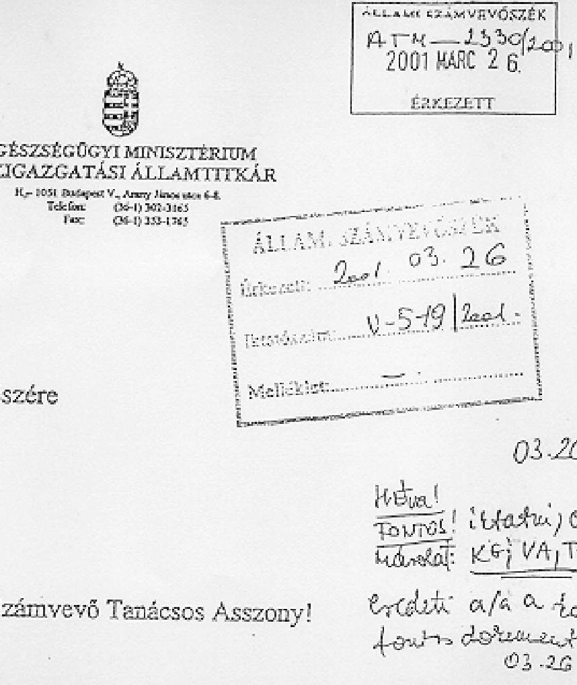
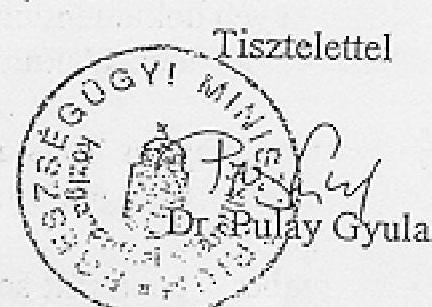
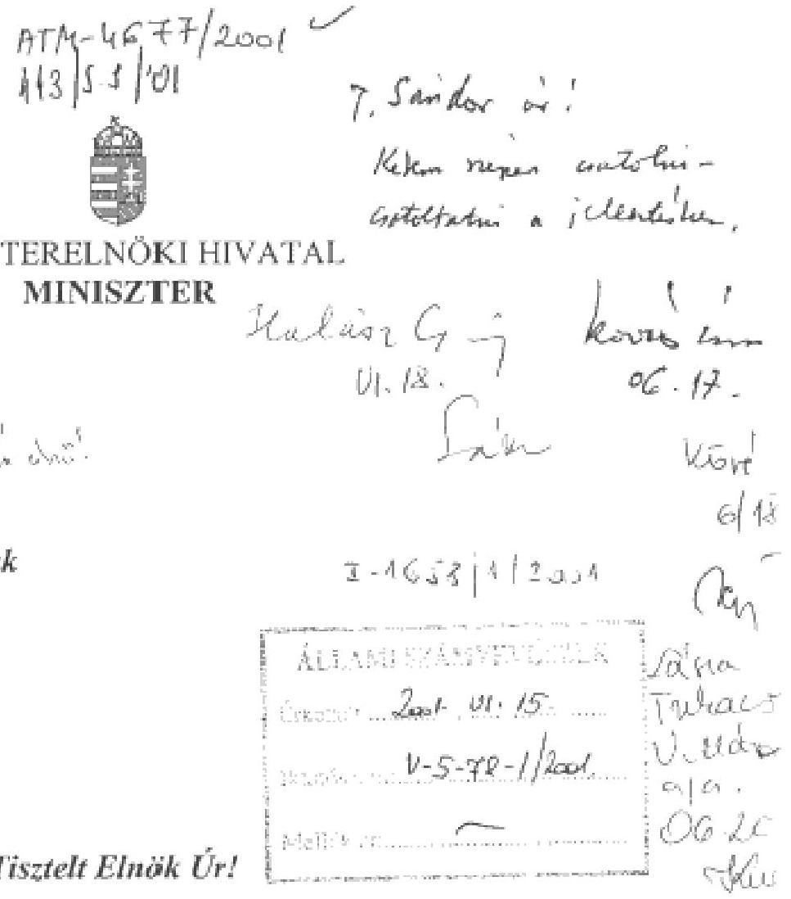
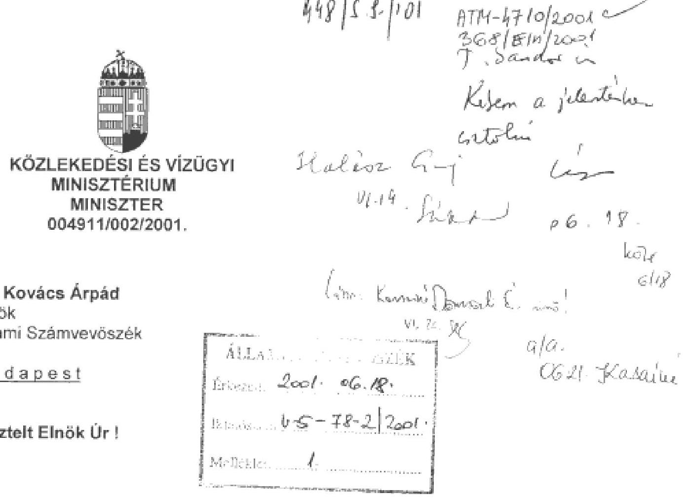
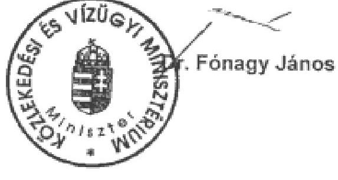
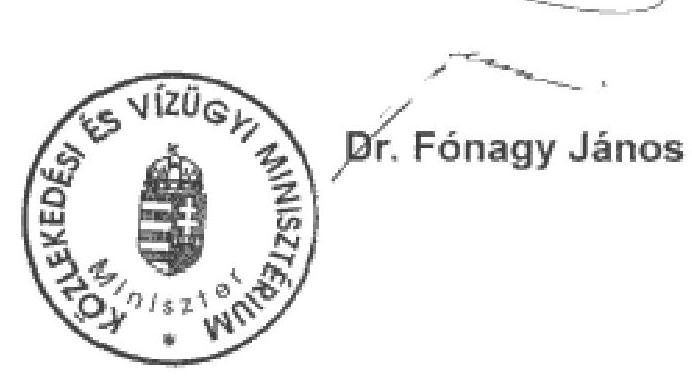

# JELENTÉS 

a koncesszióba adott állami tevékenységek vizsgálatáról

---

# Az ellenőrzés végrehajtásáért felelős: Halász Gejza   számvevő igazgató 

## Az ellenőrzést vezette:   Karsainé Dömsödi Éva

osztályvezető számvevő főtanácsos

## Az ellenőrzésben részt vettek:   Kapronczai Gabriella   számvevő tanácsos   Tukacs Éva   számvevő   Villányi Antal   számvevő   Bartha Gyula   külső szakértő   Réthelyi Jenő   külső szakértő

## A témához kapcsolódó korábbi ÁSZ vizsgálatok:

Jelentés a Magyar Köztársaság 1995. évi költségvetése végrehajtásának ellenőrzéséről
Jelentés a Magyar Köztársaság 1997. évi költségvetése végrehajtásának ellenőrzéséről

Jelentés a Magyar Köztársaság 1998. évi költségvetése végrehajtásának ellenőrzéséről

Jelentés a Közlekedési, Hírközlési és Vízügyi Minisztérium fejezet pénzügyi-gazdasági ellenőrzéséről (1996)
Jelentés a Magyar Távközlési Vállalat gazdálkodásáról és privatizációjáról (1996)

---

# TARTALOMJEGYZÉK 

I. ÖSSZEGZŐ MEGÁLLAPÍTÁSOK, KÖVETKEZTETÉSEK, JAVASLATOK ..... 5
II. RÉSZLETES MEGÁLLAPÍTÁSOK ..... 10

1. KÖZÜTI KONCESSZIÓ ..... 10
1.1. A koncessziós pályáztatási folyamat ..... 11
1.1.1. A pályázatok előkészítése ..... 11
1.1.2. Pályáztatási folyamat ..... 12
1.1.3. Sikertelen pályáztatás és okai ..... 15
1.2. A közúti koncessziós szerződések ..... 15
1.2.1. A koncessziós szerződés hatása az átengedett tevékenységek ellátására ..... 15
1.2.2. A koncessziós szerződések módosítása ..... 15
1.3. A koncessziós társaságok megalakítása és tulajdonosi szerkezetük változásai. ..... 17
1.4. A koncessziós tevékenységek és társaságok ellenőrzése ..... 17
1.5. A koncessziós szerződésekben vállalt kötelezettségek teljesítése. ..... 18
1.5.1. A koncessziós társaságok kötelezettségeinek teljesítése ..... 18
1.5.2. Az állami kötelezettségvállalás mértéke, igénybevételének feltételrendszere ..... 19
1.6. A koncessziós tevékenységből származó állami bevételek. ..... 19
1.6.1. A koncessziós díjak ..... 19
1.6.2. Egyéb állami bevételek ..... 20
1.7. A koncessziós tevékenységgel összefüggő állami kiadások ..... 21
1.8. A koncessziós tevékenységek eredményessége ..... 22
2. A TÁVKÖZLÉSI KONCESSZIÓ ..... 23
2.1. A koncessziós pályáztatási folyamat ..... 23
2.1.1. A pályázatok előkészítése ..... 23
2.1.2. Pályáztatási folyamat ..... 24
2.1.3. Sikertelen pályáztatás és okai ..... 24
2.2. A koncessziós szerződés ..... 24
2.2.1. A koncessziós szerződés hatása az átengedett tevékenységek ellátására ..... 25
2.2.2. Koncessziós szerződések módosítása ..... 26
2.3. A koncessziós társaságok megalakulása és tulajdonosi szerkezetük változásai. ..... 26
2.4. A koncessziós tevékenységek és társaságok ellenőrzése ..... 27
2.5. A koncessziós szerződésekben vállalt kötelezettségek teljesítése. ..... 27
2.5.1. A koncessziós társaságok kötelezettségeinek teljesítése ..... 27
2.5.2. Az állami kötelezettségvállalás mértéke, igénybevételének feltételrendszere ..... 29
2.6. A koncessziós tevékenységből származó állami bevételek. ..... 29
2.6.1. A koncessziós díjak ..... 29
2.6.2. Egyéb állami bevételek ..... 31
2.7. A koncessziós tevékenységgel összefüggő állami kiadások ..... 32
2.8. A koncessziós tevékenységek eredményessége ..... 33
3. EGYÉB KONCESSZIÓS TEVÉKENYSÉGEK ..... 33
3.1. A koncessziós pályáztatási folyamat ..... 33
3.1.1. A pályázatok előkészítése ..... 33
3.1.2. Pályáztatási folyamat ..... 36
3.1.3. Sikertelen pályáztatás és okai ..... 38
3.2. A koncessziós szerződés ..... 40
3.2.1. A koncessziós szerződés hatása az átengedett tevékenységek eredményes ellátására ..... 40
3.2.2. Koncessziós szerződések módosítása ..... 43
3.3. A koncessziós társaságok megalakulása és tulajdonosi szerkezetük változásai. ..... 43
3.4. A koncessziós tevékenységek és társaságok ellenőrzése ..... 45
3.5. A koncessziós szerződésekben vállalt kötelezettségek teljesítése. ..... 47
3.5.1. A koncessziós társaságok kötelezettségeinek teljesítése ..... 47
3.5.2. Az állami kötelezettségvállalás mértéke, igénybevételének feltételrendszere ..... 47
3.6. A koncessziós tevékenységből származó állami bevételek. ..... 48
3.6.1. A koncessziós díjak ..... 48

---

3.6.2. Egyéb állami bevételek. ..... 48
3.7. A koncessziós tevékenységgel összefüggő állami kiadások. ..... 49
3.8. A koncessziós tevékenységek eredményessége ..... 50
Mellékletek:

1. melléklet: Jogszabályok gyüjteménye
2. melléklet: Szerencsejáték Felügyelet nyilatkozata
3. melléklet: Egészségügyi Minisztérium nyilatkozata
4. melléklet: EU tagországok koncessziós gyakorlata

---

# Jelentés   a koncesszióba adott állami tevékenységek vizsgálatáról 

A kizárólagos állami tulajdon hatékony múködtetésének, e tevékenységek gyakorlásának egy lehetséges módja ezek koncessziós szerződések alapján történő átengedése.

A jogalkotó szándéka a koncessziós törvény megalkotásával az volt, hogy rendszerbe foglalt szabályokat hozzon létre, amely az ágazati törvényekkel és specifikus szabályokkal együttesen alkalmazva lehetővé teszi a piaci szerkezet átalakítását, meghatározza a versenyszférát - valamint a koncessziós pályázatokkal és szerződésekkel érintett területeket, így segítve -, a többszereplős piac kialakulását. Ahol az állami gazdasági monopóliumok fenntartása szükséges így a kizárólagos állami tulajdon esetében -, ez a körülmény valóságos rendelkezési jogot jelentsen az állam számára. Ha az állam ezt a törvény által megszabott rendelkezési jogot nem saját vállalkozásában valósítja meg, akkor e törvénnyel szabályozott keretek között választhatja ki a számára legkedvezőbb ajánlatot tevő személyt, illetőleg szervezetet.

A koncesszió jogintézménye alapján az állam tételesen meghatározott tevékenységeinek gyakorlási jogát engedi át a koncessziós pályázat nyertesének, visszterhes szerződés alapján, meghatározott időre, pontosan rögzített feltételek mellett, miközben a jogosultnak részleges piaci monopóliumot biztosít. E tevékenységek gyakorlása egyrészt meghatározott vagyontárgyak müködtetésében nyilvánulhat meg (közlekedési-, közmú infrastruktúra), másrészt azokhoz a kizárólagos állami tevékenységekhez kapcsolódik, amelyek nemzetgazdasági szempontból stratégiai jelentőségű közszolgáltatás nyújtására irányulnak, vagy amelyek kiemelt extraprofitot eredményezhetnek a vállalkozóknak (távközlési szolgáltatások, játékkaszinók).

Az első koncessziós szerződéseket 1992-ben kötötték meg, így az azóta eltelt 9 év tapasztalata megalapozottá teszi e jogintézmény múködésének átfogó megítélését. Az állami tulajdonú vagyonnal való gazdálkodás rendszeres ellenőrzése az ÁSZ törvényekben rögzített kötelezettsége. Erről az Állami Számvevőszékről szóló 1989. évi XXXVIII. törvény 2. § (6) bekezdése rendelkezik. Az államháztartásról szóló 1992. évi XXXVIII. törvény 104. §, valamint 108. §-a határozza meg az ellenőrzés további jogalapját. Az 1991. évi XVI. törvény (továbbiakban koncessziós törvény) alapján létrejött szerződéseket az Állami Számvevőszék még nem vizsgálta. Ezért az ellenőrzés során figyelembe vettük a számvevőszékek nemzetközi szervezete, az INTOSAI ellenőrzés módszertani ajánlásait. A vizsgálatra az Állami Számvevőszék 2000. évi ellenőrzési terve szerint, elnöki döntés alapján került sor, amelynek eredeti címe a „közúti és távközlési koncesszió-köteles állami tevékenység vizsgálata" volt. A vizsgálathoz készített előtanulmány alátámasztotta azt az igényt, hogy valamennyi koncessziós területet ellenőrizzünk, a jellemző sajátosságok megállapítása ér-

---

dekében. Ennek megfelelően a jelentés címét megváltoztattuk annak tartalmát jobban kifejező új címre.

Az ellenőrzés célja annak megállapítása volt, hogy a koncesszió jogintézménye lehetővé teszi-e a koncesszióról szóló törvény által meghatározott tevékenységek eredményes ellátását. A központi költségvetési szervek által a törvény hatályba lépése óta kötött valamennyi koncessziós szerződést áttekintettük, ezen belül a közúti és a távközlési koncessziók kiemelt és részletes vizsgálatát végeztük el, különös tekintettel az állami kötelezettségvállalásokra, valamint a koncessziós szerződésekben meghatározott kizárólagos jog időtartamára.

A koncesszió sajátosságaiból adódóan együtt jelennek meg az állami bevétel növelésének és az állam számára kötelezően előírt tevékenység eredményes ellátásának szempontjai. Ebből adódóan az állami bevételek alakulását és a feladat ellátását együttesen vizsgáltuk. Az értékelésünk kialakításakor mindkét fenti szempontot figyelembe vettük, amelyek mérhető és nem mérhető paraméterekkel jellemezhetőek. Az értékelés kialakítását nehezítette az állami paraméterek hiánya. A vizsgálati jelentésünkben a koncessziós tevékenység eredményességének megítélése a mérhető paraméterek elemzésén alapul.

A közúti és a távközlési koncessziók kiemelt ellenőrzésének két fő indoka van. Egyrészt a közutak működtetésére kötött két koncessziós szerződés közül az egyik alapvetően módosult, és mindkettőben nőtt az állami kötelezettségvállalás az eredeti pályázati kiíráshoz képest. Másrészt a távközlési szolgáltatások koncesszióba adását felváltja az EU-ban alkalmazott gyakorlat. Az új konstrukció megvalósításának téziseiről kormánydöntés született. A hatályban lévő koncessziós szerződésekben átadott kizárólagos jogosultságok meghatározott ideig még a koncesszió jogosultját illetik meg.

Az ellenőrzést a teljesítmény-ellenőrzési módszer eszközeit, ellenőrzés-szervezési elveit alkalmazva végeztük el. A vizsgálat részletes feladatait az egyszerúbb és tömörebb megfogalmazás érdekében a koncesszió általános megközelítéséből kiindulva állapítottuk meg. A két kiemelt vizsgálati terület jellemzőinek feltárását és elemzését a koncessziós törvény eljárási és pénzügyi területeire elkülönítve értékeltük, hasonlóan az egyéb vizsgált koncessziókhoz. Összehasonlítottuk az Európai Unió tagországaiban alkalmazott koncessziós gyakorlatokat. Az adatgyűjtést a Külügyminisztérium közreműködésével, az egyes tagországokba delegált külgazdasági attasék végezték el az ÁSZ elnökének kérdései alapján. Munkájukért ezúton is köszönetünket fejezzük ki.

Az ellenőrzésben érintett szervezetek: a Közlekedési és Vízügyi Minisztérium, a Pénzügyminisztérium, az Egészségügyi Minisztérium, a Gazdasági Minisztérium, a Miniszterelnöki Hivatal Informatikai Kormánybiztossága, a Szerencsejáték Felügyelet, a Magyar Bányászati Hivatal, az Útgazdálkodási és Koordinációs Igazgatóság, a Hírközlési Főfelügyelet és a Nemzeti Autópálya Rt.

---

# I. ÖSSZEGZŐ MEGÁLLAPÍTÁSOK, KÖVETKEZTETÉSEK, JAVASLATOK 

A kizárólagos állami tulajdon múködtetésének az e körbe tartozó tevékenységek gyakorlásának az ágazati sajátosságokhoz rugalmasan illeszkedö, megfelelő keretszabályozást határozott meg a jogalkotó 1991-ben a koncessziós törvényben. E szabályozás alkalmazása azonban vegyes képet mutat, csak részleges eredményességgel valósultak meg, vagy nem teljesültek az eredetileg meghatározott fö célok, nevezetesen a magántőke olyan mértékű bevonása az állami feladat ellátásba, ami lehetővé teszi a piaci szerkezet átalakítását; többszereplős versenypiaci helyzet kialakítását.

A koncessziós területek meghatározásánál és a koncessziós jog átadása folyamatában nem határozták meg nemzetgazdasági szinten a primátusokat, ezért nem érvényesültek dominánsan sem az állami költségvetési, sem a gazdaságpolitikai szempontok. A döntéseket olyan gazdaságpolitikai külső szorítások (telekommunikációs hálózatfejlesztés, autópálya-építés) és költségvetési pozicionálási problémák (forráshiány, forráselosztás) befolyásolták, amelyek eleve kizárták az optimális döntéseket. Vizsgálatunk értékelése nem támasztja alá, hogy a jelenlegi feltételrendszer mellett a koncessziós jogintézmény az eredetileg kitűzött állami célokat eredményesen szolgálja.
1991. óta a mindenkori Kormány koncesszióra vonatkozó elképzelése folyamatosan módosult, amint az a koncessziós törvény módosításaiból nyomon követhető. A 12 törvénymódosítás során a kizárólagos állami tulajdon tárgyainak, az állam monopol tevékenységeinek szűkülésével a koncesszióba adható tevékenységek köre fokozatosan csökkent. A kezdetben a törvény hatálya alá sorolt tevékenységek kikerültek onnan, még abban az esetben is, ha időközben az adott területre megkötött koncessziós szerződés volt érvényben.

A törvény céljainak értelmezésében, a végrehajtás egyes ágazati szabályozási hiányosságaiban, a végrehajtó hatalom koncepcionális bizonytalanságai miatt egyre csökkenő, koncesszióba adható tevékenységi körben egyaránt fellelhetőek az eredménytelenségi okok. Mindezek mellett a gyakorlatban eltérő érdeklődés alakult ki a törvényben meghatározott, egyes koncesszióba adható tevékenységek iránt. A gazdasági tevékenység folytatására vonatkozó jog átengedése a hatósági engedélyezési eljárás keretében is lehetséges és így elkerülhető a koncesszió elnyeréséhez előírt pályáztatási elbírálási folyamat.

A koncessziós szerződések megkötését a koncessziós törvényben előírtaknak megfelelően nyílt pályáztatási eljárás előzte meg. A minisztériumok a pályáztatásokat megelőzően átfogó tanulmányokat, gazdaságossági számításokat végeztettek. Ez alól kivétel a játékkaszinók múködtetésére 1999 előtt kiírt pályázatok, valamint a kábítószer és pszichotrop anyagok előállítására és forgalmazására kiírt pályázat. A bányászati tevékenység esetében a koncessziós terület kijelölése elsősorban műszaki szempontok szerint történt, a pénzügyi megítélés másodlagos volt. A bányászati tevékenység koncesszióba

---

adásának előfeltétele a regionális érzékenységi, terhelhetőségi vizsgálatok elvégzése, amelyre a Gazdasági Minisztérium nem különített el forrásokat. Az elkészült tanulmányok megállapításait a pályáztatás folyamatában nem minden esetben vették figyelembe egyik közúti koncessziónál sem.

A vizsgált koncesszióknál több esetben fordult elő, hogy az iratkezelés és a koncessziós eljárás törvényi előírásait megszegve, nem készítették el, vagy nem őrizték meg az előírt dokumentumokat, így azok hiányában a koncesszióba adás minősítésére csak részleges következtetések tehetők meg (közút, szerencsejáték, pszichotrop anyagok előállítása területén).

A pályáztatási és értékelési folyamat minden esetben megfelelt a törvényi előírásoknak. A játékkaszinók múködtetésének koncesszióba adási folyamatában nem szabályozott a Pénzügyminisztérium és a Szerencsejáték Felügyelet közötti munkamegosztás.

Sikertelen pályáztatás volt 3 közúti koncessziós pályáztatás (M3/M30, M7 és a szekszárdi Duna-híd), az országos közforgalmi kikötő (Győr-Gönyü) működtetése esetén. Részben volt csak sikeres a pályáztatási folyamat a vasút villamosítása koncesszió esetében, mivel a meghirdetett 6 vasútvonalból csak háromra sikerült szerződést kötni. A bányászati kutatási és kitermelési koncessziós pályázatokat minden esetben szerződéskötés követte, ennek ellenére sikertelennek minősíthető az eljárás azokban az esetekben, amikor a pályázatban megfogalmazott célokat a szerződések megkötése után a koncessziós társaságok nem tudták teljesíteni. Egy szerződés nem volt végrehajtható, mivel a földterület tulajdonosával a koncesszió jogosultja nem tudott megegyezni a földterület használatában.

1991-2000. között a törvényben tételesen felsorolt 17 lehetséges tevékenységből mindössze 8 területen kötöttek koncessziós szerződést. A koncesszió jogintézményének alkalmazására az egyes minisztériumok végrehajtási gyakorlata eltérő, nem alakult ki egységes elveket követő eljárási rend a koncesszióba adható vagyonelemek vagyonkezelését ellátó szervezeteknél.

A pályázati kiírásban megfogalmazott kormányzati célok alapján a koncessziós szerződések rögzítették a koncessziós tevékenység végrehajtásának feltételeit. A koncessziós társaságok a szerződésekben vállalt kötelezettségeiknek eleget tettek. Megvalósult a hazai és külföldi magántőke bevonása az állami feladatok teljesítésébe. A piaci verseny korlátozottan érvényesült a koncessziós szerződéssel átengedett tevékenységhez kapcsolódó kizárólagos jogok időszakos átadásával. A szerződésekben meghatározott fejlesztések az ütemezéseknek megfelelően megvalósultak. A koncessziós szerződésekkel átvállalt szolgáltatások folyamatosak voltak.

A közúti koncessziós szerződések pályázati kiírásaiban megfogalmazott célok többszöri módosítása a koncessziós társaságok kötelezettségeit, a beruházások megvalósítandó műszaki tartalmát csökkentette, szükségessé vált az állami támogatás az üzemeltetés fenntartásához, valamint megváltozott a tulajdonosi szerkezet. Egyes távközlési szerződések módosításának eredményeképpen ugyancsak megváltozott a tulajdonosi szerkezet, az előírt fejlesztési követelmé-

---

nyek és a fizetendő koncessziós díjak csökkentek. Ezekhez a változásokhoz a miniszter a törvényben meghatározottaknak megfelelően hozzájárult.

A koncessziós törvény előírásainak megfelelően a koncessziós társaságok kettő kivételével megalakultak. Az országos mezőgazdasági vízhasznosítási főművek működtetésére megkötött koncessziós szerződés értelmében a koncesszió jogosultja állami tulajdont működtető egyszemélyes részvénytársaság, amely a vízügyről szóló törvény értelmében külön koncessziós társaság alapítására nem volt köteles. Az Egészségügyi Minisztérium nyilatkozata szerint - a koncessziós törvény előírásával ellentétben - a koncesszió jogosultjánál a kábítószer és pszichotrop anyagok előállítására és forgalmazására koncessziós társaság nem alakult meg.

A vizsgált időszakban 81 koncessziós szerződést kötöttek, amelyekből a vizsgálat lezárásakor (2001. március 30.) 63 volt érvényben. Ebből három olyan szerződés van érvényben, amelyeket a koncessziós törvény előírásai nem indokolnak, de törvénysértés nem történt. Az országos mezőgazdasági vízhasznosítási főművek, valamint az M1/M15 autópálya működtetését $100 \%$ állami tulajdonú szervezetek végzik. A kábítószer és pszichotrop anyagok előállítása és forgalmazása a koncessziós törvény módosítása miatt 1999. július 1-től nem tartozik a koncessziós tevékenységek körébe.

Az 1991-2000 közötti vizsgált időszakban a koncessziós tevékenységekből közvetlenül és közvetve folyó áron összesítve mintegy 394 milliárd Ft költségvetési bevétel származott (amely tartalmazza a 98 millió USD koncessziós díjat 1994. évi március havi árfolyamon, a forintban megfizetett koncessziós díjat, az ellenőrzési díjat, kötbért, az igazgatási szolgáltatási díjat), a költségvetési kiadások (támogatások, átvállalt hiteltörlesztések, pályáztatási költségek, közreműködői díjak) összesen mintegy 40 milliárd Ft-ot tettek ki.

Nem ítélhető meg a koncessziós tevékenységek gazdaságossága az állam szempontjából, mivel a közvetlen bevételekről és kiadásokról elkülönített pénzügyi kimutatás nem készült. Utólagosan nem mutatható ki a pályázati kiírások megjelentetésének költsége, a pályázatokat elbíráló bizottsági tagoknak kifizetett jutalék.

A koncessziós törvény nem ír elő koncessziós díj megállapítási kötelezettséget. A koncessziós díjakról a szerződések rendelkeznek. Nem állapítottak meg koncessziós díjfizetési kötelezettséget a menetrend szerinti közúti személyszállításának, a kábítószer és pszichotrop anyagok előállításánál és forgalmazásánál, a vasút villamosításánál. Az országos mezőgazdasági vízhasznosítási főművek esetében a koncessziós díjfizetési kötelezettség a koncessziós időtartam 11. évétől kezdődően keletkezik. A többi esetben a koncessziós szerződés részletesen rendelkezik a koncessziós díjak megállapításáról és fizetési feltételéről.

A megkötött szerződések mindössze három területen eredményezték a költségvetési kiadások és bevételek pozitív egyenlegét. A költségvetésbe befolyt bevétel a távközlési koncessziókból közel 300 Mrd Ft (ebből 224 Mrd Ft az adó és járulékbefizetés), míg a költségvetési kiadás 224 millió Ft (amely csak a közremű-

---

ködői díjakat tartalmazza). A játékkaszinók koncessziós múködtetése 103 Mrd Ft költségvetési bevételt (ebből több mint 99 Mrd Ft az adók, járulékok) és 217 millió Ft költségvetési kiadást (amely a pályáztatás költségeit tartalmazza) jelentett. A bányászati koncesszióból származó költségvetési bevétel 125 millió Ft (eljárási díjak, kiírási díjak, regisztrációs díjak befizetéséből, emelt összegű bányajáradékból, adatcsomag értékesítéséből), míg a kiadás 4 millió Ft (pályáztatás előkészítésének kimutatható költségei).

Két esetben történt állami kötelezettségvállalás. Ez a vasút villamosítás koncesszió esetében mintegy 325 millió DEM értékben valósult meg, beváltása az eltelt múködési időszak alatt nem vált szükségessé. Az M1/M15 autópálya koncesszió esetén a koncesszió jogosultja által felvett hiteleket a helyettesítő társaság 52 milliárd Ft értékben vállalta át állami kötelezettségvállalás mellett. A működőképesség fenntartására több, mint 7 milliárd Ft állami támogatásban részesült 2000. év végéig az M5-ös autópályát működtető koncessziós társaság.

A koncessziós szerződések nem egységesen rendezik a koncessziós díjak ÁFA tartalmát a távközlési koncessziós szerződések esetében. A koncessziós szerződések (jellemzően az 1993-1994-ben kötöttek) a koncessziós díj általános forgalmi adó tartalmát elkülönítetten nem tartalmazták, így az érintett koncessziós társaságok a koncessziós díj megfizetésével eleget tettek a szerződéses kötelezettségeiknek. Emiatt a Hírközlési Főfelügyelet 2000. júniusig mintegy 544 millió Ft ÁFA-t fizetett be a költségvetésbe az APEH állásfoglalása alapján.

A koncessziós szerződések nem rendezik egységesen a késedelmes díjfizetés szankcionálását. A koncessziós törvény értelmében ilyen esetben a polgári törvénykönyv előírásai az irányadóak. A közúti és a távközlési koncessziónál a késedelmes fizetés miatt keletkezett késedelmi kamat megállapításáról és beszedéséről sem a KHVM, sem a jogutód KöViM, valamint a MEH Informatikai Kormánybiztossága nem intézkedett.

Az EU gyakorlatát áttekintve, különösen szembetűnőek az eltérések a konstrukció alkalmazásában az európai uniós tagországok gyakorlatában. Nemzetközi összehasonlításban fellendülőben van a magántőke bevonása az állami feladatok ellátásába. Az eljárások, az alkalmazott módszerek különbözőek, de az állami feladatokhoz szükséges beruházás/fejlesztés finanszírozása, a magántőke versenyeztetés útján történő finanszírozása, az állami és a magánszféra útján történő bevonása, az állami és a magánszféra 15-25 évre szóló partnersége keretében, a kötelezettségek és jogok megalapozott számításával alátámasztva, a kölcsönös előnyök mentén valósul meg (további részletek a 4. mellékletben találhatók).

A fejlett országok a koncessziós szerződések alapján a hazai vállalkozásokat részesítettek előnyben, ami élénkítette a belső munkaerőpiacot is.

---

# JAVASLATOK: 

## A Kormánynak:

1. Tegyen intézkedéseket a koncessziós jog átengedése folyamatának átláthatóvá tétele érdekében. Gondoskodjon a koncesszióval kapcsolatos költségvetési kiadások és bevételek elkülönített nyilvántartásáról.
2. Intézkedjen - a koncessziós törvény 19. § (1) bekezdésében foglaltakra tekintettel - egy egységes eljárási rend kidolgozása érdekében, a késedelmes teljesítésből eredő késedelmi kamatkövetelések érvényesítésére vonatkozóan.
3. Állapítsa meg a közlekedési és vízügyi miniszter feladatkörében a koncesszió jogintézményével összefüggő szerződéskötésre és ellenőrzésre vonatkozó feladatait és hatáskörét.

## a miniszterelnöki hivatalt vezető miniszternek

1. Intézkedjen - a koncessziós törvény 19. § (1) bekezdésében foglaltakra tekintettel - a koncessziós díffizetés késedelmes teljesítéséből eredő - még behajtható - késedelmi kamatkövetelések érvényesítésére.

## a pénzügyminiszternek

1. Alakítson ki egyértelmű szabályozást a minisztérium és a felügyelete alá tartozó Szerencsejáték Felügyelet közötti munkamegosztásra a koncesszióba adás eljárási feladataira vonatkozóan.
2. Intézkedjen - a koncessziós törvény 19. § (1) bekezdésében foglaltakra tekintettel - a koncessziós díffizetés késedelmes teljesítéséből eredő - még behajtható - késedelmi kamatkövetelések érvényesítésére.
3. Módosítsa a PM iratkezelési szabályzatát és gondoskodjon az előírások betartásának ellenőrzéséről annak érdekében, hogy a miniszter által megkötött érvényben lévő játékkaszinó koncessziós szerződések dokumentumai fellelhetők és vizsgálhatók legyenek.

## a gazdasági miniszternek:

1. Dolgozza ki a koncessziós tevékenység eredményeként keletkezett bányászati kutatási adatok tulajdonjogának rendezésére szolgáló ágazati szabályokat.
2. Hívja fel a koncessziós pályázati kiírásokban a pályázók figyelmét arra, hogy az érintett terület kutatásához azok tulajdonosainak hozzájárulása szükséges.
3. Különítse el a fejezet költségvetésében a bányászati törvényben meghatározott regionális érzékenységi, terhelhetőségi vizsgálatokhoz szükséges pénzügyi forrásokat.

---

# az egészségügyi miniszternek: 

1. Ellenőrizze rendszeresen a koncesszió jogosultjánál a koncessziós szerződésben meghatározott kötelezettségek teljesítését a hazai egészségügyi igények mindenkori zökkenőmentes ellátása érdekében.

## a közlekedési és vízügyi miniszternek:

1. Alkossa meg a koncessziós törvénnyel összhangban a közúti ágazatra vonatkozó végrehajtási szabályokat.
2. Jelölje ki a közúti koncessziós tevékenységek ellenőrzését végző szervezetet, és készíttessen évente összefoglaló beszámolót a koncessziós társaságok tevékenységéről.

## az informatikai kormánybiztosnak

1. Vizsgálja felül a koncessziós díj ÁFA tartalmát a vonatkozó APEH állásfoglalással összhangban mindazoknál a szerződéseknél, amelyeknél nem egyértelmű a koncessziós díj és az ÁFA viszonya.

## II. RÉSZLETES MEGÁLLAPÍTÁSOK

## 1. KÖZÚTI KONCESSZIÓ

Az 1990-es évekre vonatkozó közúti fejlesztési terveit a Kormány a KHVM 1991ben készített "Az országos közúthálózat fejlesztési programja" címet viselő tanulmányában fogalmazta meg először. (A terveket annak figyelembe vételével kell értékelni, hogy a megelőző évtizedben az átlagos közúthálózati fejlesztés $12,5 \mathrm{~km} /$ év volt.)

A fenti program szerint 2000-ig 473 km autópályát, 51 km fél-autópályát és 112 km autóutat kell építeni: a vizsgált időszakban ebből 160 km autópálya és 29 km fél-autópálya, azaz a tervezettnek közel harmada épült koncessziós szerződés alapján. A Kormány-program teljes építési költsége akkori felmérések szerint mintegy 3,5 milliárd ECU volt.

A Kormány-program szerint a fejlesztések megvalósításakor fontos szempont volt, hogy:

- az autópályák finanszírozásától a központi költségvetést részben tehermentesíteni kell koncessziós befektetők bevonásával;
- a koncessziós autópálya építések terület-előkészítéséhez hiteleket vesz igénybe az állam;
- az Útalap nagyságának, reálértékének növelésével kell a további fejlesztésekhez szükséges forrásokat megteremteni.

---

# 1.1. A koncessziós pályáztatási folyamat 

### 1.1.1. A pályázatok előkészítése

Több fejlesztést is koncessziós keretek között kívánt a Kormány megvalósítani. Ezek a tervek egyes esetekben nem jutottak tovább a pályázati kiírás szintjénél a közzétett feltételek áttanulmányozása után (M3, M7 autópályák). Előfordult, hogy a már aláírt koncessziós szerződés nem lépett hatályba a pénzügyi feltételek nem megfelelő teljesítése miatt (Szekszárdi Duna-híd). A megépített M1/M15 autópálya üzemeltetésekor a koncessziós társaság csőd közeli helyzetbe jutott, adósságát az állam vállalta át. Az M5 beruházása már állami garanciák vállalásával kezdődött - a koncessziós pályázati kiírástól eltérően -, a támogatás azóta is folyamatos. Az eredetileg vállalt beruházási ütem betartásáról a vizsgálat lezárásakor is tárgyalt a minisztérium (korábban a KHVM, jelenleg a KöViM) és a koncesszió jogosultja. Megállapodás a helyszíni vizsgálat befejezéséig nem született, ami kétségessé teszi a továbbépítésre vállalt határidők betartását.

A jelenlegi helyzetben a minisztérium, illetve a gyorsforgalmi úthálózat tízéves fejlesztési programjának megvalósításáról szóló 2117/1999. (V. 26.) Korm. határozat alapján létrehozott Nemzeti Autópálya Rt. rendelkezik hálózati koncepcióval. Ezt a kormányhatározatot később a 2037/2000. (II. 29.) Korm. hat. módosította.

Létrehozása óta „A Nemzeti Autópálya Részvénytársaság, mint a fejlesztési hitelek felvevője és a programhoz rendelt költségvetési források felhasználója, felelős a programban jóváhagyott gyorsforgalmi utak építtetéséért, felújításáért, üzemeltetéséért, fenntartásáért és múködtetéséért, beleértve a díjszedés biztosítását is". Az akkor még állami tulajdonú autópálya-társaságok tulajdonosi jogainak gyakorlását a Nemzeti Autópálya Részvénytársasághoz rendelte a Kormány. A Nemzeti Autópálya Rt. a kormányprogramnak megfelelően létrehozta az Állami Autópálya Kezelő Rt.-t, mely felelős a teljes gyorsforgalmi úthálózat, valamint a fejlesztési programban megjelölt mútárgyak üzemeltetéséért, a díjszedés biztosításáért, a gyorsforgalmi úthálózat melletti területek hasznosításáért, továbbá a tízéves programot megelőzően az ÉKM Autópálya Rt. és a Nyugat-magyarországi Autópálya Rt., illetve jogelődje által felvett hitelek adósságszolgálatának költségvetési forrásból származó teljesítéséért.

Ezekkel a kormányhatározatokkal a döntések felelőssége és a költségvetési eszközök fölötti rendelkezés a minisztérium felügyeletéből az NA Rt. és a Magyar Fejlesztési Bank kezébe ment át. Ez a helyzet befolyásolja a miniszter 2117/1999. (V. 26.) Korm. határozatban meghatározott feladatának ellátását, nevezetesen azt, hogy gyakorolja. a kizárólagos állami tevékenységek ellátásának koncessziós szerződés keretében történő átengedésével kapcsolatos jogokat.

Az első koncessziós pályázati kiírások az ún. tiszta projekt finanszírozás elvét követték az ország teherbíró képességét figyelembe véve. A beruházások megtérüléséhez nem kötődött állami kötelezettségvállalás. A hosszú koncessziós időtartam is a megtérülési idővel indokolható, amelyre vonatkozóan 3, a minisztérium által felkért külföldi szervezet készített számításokat. A koncessziós törvény szerinti leghosszabb időre, 35 évre kötötték a koncessziós szerződéseket.

---

# 1.1.2. Pályáztatási folyamat 

1992-ben a Kormány ragaszkodott azon álláspontjához, hogy az autópályák építésére kiírt koncessziók esetében - az egyéb koncessziós pályázatokhoz hasonlóan - nem támogatja állami befektetésekkel, garancia vállalásokkal, hitelnyújtással a koncessziós társaságokat a földterületek megszerzésén kívül. Ez a döntés mind a külföldi, mind a hazai szakértők véleményével ellentétes volt. A szakértői vélemények egybehangzóan állították, hogy ilyen mértékű beruházás a hazai viszonyok között állami szerepvállalás nélkül nem valósítható meg. A későbbiek igazolták a felkért szakértők véleményét, az egyik koncessziós jogosult csőd közeli helyzetbe került, a másik esetben pedig a beruházás elakadt.

A korábbi tapasztalatok alapján - mivel minden koncessziós tárgyaláson felmerült az igény az állam pénzügyi szerepvállalására - az M3-as és az M7-es esetében a kiírás módosult. A minisztérium kikötötte, hogy csak olyan ajánlatot hajlandó elfogadni, amely a központi költségvetés lehető legkisebb mértékű (kívánatosan a területszerzés költségeinek fedezésére korlátozódó) felhasználásával és/vagy a lehető legkisebb mértékű, és a lehető legkésőbbi időpontban felmerülő állami pénzügyi hozzájárulás igénybevételével számol.

A pályázati kiírások a koncessziós törvény előírásain kívül tartalmazták a közúti közlekedésről szóló 1988. évi I. törvénynek megfelelő előírásokat.
A törvényi előírásoknak megfelelő koncessziós pályázatokat a KHVM-et, illetve a KöViM-et vezető miniszter nevében és megbízásából az Autópálya Igazgatóság bocsátotta ki.

| Koncessziós pályázatok |  |  |  | 1. táblázat |
| :--: | :--: | :--: | :--: | :--: |
|  | A kiírás kibocsátása | Az ajánlatok beadása | Szerződés aláírása | Az építés megkezdése |
| M1/M15 autópálya | 1992. március | 1992. augusztus | 1993. április | 1994. január |
| Szekszárdi Duna-híd | 1992. június | 1992. december | 1993. december | (1) |
| M5 autópálya | 1993. január | 1993. július | 1994. május | 1995. december |
| M3/M30 autópálya | 1993. június | 1993. október | (2) |  |
| M7 autópálya | 1994. december | 1995. november | (2) |  |

(1) A szerződést aláírták, de a pénzügyi feltételeket a koncesszió jogosultja nem tudta teljesíteni, ezért - többszöri határidő módosítás után - a szerződés megszűnt.
(2) A kiíró 1995. októberében a koncessziós versenytárgyalást eredménytelenül lezárta, állami beruházásban valósul meg a fejlesztés.
A magyar koncessziós pályáztatás folyamata összhangban van a hasonló nagyságrendű beruházásokra vonatkozó nemzetközi gyakorlattal. Az előminősítés folyamatában a jelentkezők szakmai, pénzügyi alkalmasságát vizsgálták. A pályázatok kiírása előtt kiadott előminősítési dokumentációk tartalmazták a megvalósítandó feladat részletes leírását, a minősítési listára (ún. short-list) történő felvétel formai feltételeit, a kiválasztás szempontjait. Az ajánlattevők kiemelt kötelezettsége volt részletes pénzügyi terv benyújtása, amely magában foglalta egyrészt a megvalósítás, másrészt a megtérülés ismertetését. Ezen kötelezettségüknek a pályázatok nyertesei eleget tettek. A pályáztatás ezen első szakasza mind az öt kiírt pályázat esetében az előírásoknak megfelelően lezajlott.

A következő szakaszban - a pályázati kiírásnak megfelelően - a pályázók elkészítették írásos ajánlatukat. A kiírók által kiadott műszaki információk tartalmazták a létesítmények pontos leírását, a beruházás becsült értékét, az építési

---

munkák előzetes mennyiségi becslését, forgalmi információkat. A koncessziós pályázati kiírás dokumentációja az előírásoknak megfelelően tartalmazta a koncessziós szerződés tervezetét, amely kiindulási alap volt a későbbi tárgyalások folyamán.

A koncessziós tenderdokumentáció műszaki része a szekszárdi Duna-híd kivételével az engedélyezési tervek alapján készült. A szekszárdi Duna-híd kiírásához csak tanulmányterv állt rendelkezésre. Az engedélyezési tervek még abban az időben készültek, amikor nem volt szó útdíj szedéséről, hiszen a fejlesztésekről már több évtizede megkezdődtek az előzetes tárgyalások, egyeztetések, tervezések. A koncessziós autópályák üzemeltetése útdíjas megoldást feltételezett a koncessziós tárgyalások idején, ezért a terveket a közlekedési csomópontokban módosították.

Beárazandó és kötelezően beadandó méret-mennyiség kimutatásokat - az utolsó, az M7 autópályáétól eltekintve - a tender dokumentációk nem tartalmaztak. Ez teret engedett a mennyiségi kalkulációk utólagos egyeztetéseinek, vitára adva lehetőséget.

A koncessziós tenderdokumentáció részeként, de az ajánlattevők számára nem hozzáférhetően készültek megvalósíthatósági előtanulmányok, melyek magukban foglalták a forgalmi-bevételi előrejelzéseket. Az előtanulmányokat megelőzően az utolsó országos felmérés 1988-89-ben készült, az adatokat a kiírás idejére nem aktualizálták. Nem lehettek tapasztalatok a magyar autósok díjfizetési hajlandóságáról. A pályázók minden esetben saját előrejelzéseik alapján adták be pályázataikat. A meglévő minisztériumi számítások ezen előrejelzések ellenőrzésére szolgáltak. Az ajánlattevők alakították ki üzletpolitikájukat, amelynek része volt a díjak és a kedvezmények mértéke.

A fejlesztések ütemezettsége miatt az első két pályázatot szinte egy időben adták ki. Ez oda vezetett, hogy az első koncessziós tárgyalások tapasztalatait nem lehetett a második pályázati kiírásokban hasznosítani, mivel a második koncessziós pályázati kiírás megelőzte az első ajánlatok beérkezését.

|  |  |  | 2. táblázat |
| :-- | :--: | :--: | :--: |
|  | Előminősítésre   jelentkezők | „short-list"-re felke-   rült jelentkezők | Koncessziós pályá-   zatot beadók |
| M1/M15 autópálya | 10 | 5 | 4 |
| Szekszárdi Duna-híd | 4 | 4 | 2 |
| M5 autópálya | 5 | 4 | 2 |
| M3/M30 autópálya | 5 | 5 | 2 |
| M7 autópálya | 7 | 5 | 3 |

A kiválasztott konzorciumoknak a tenderdokumentáció kibocsátásától számítva néhány hónap állt rendelkezésre koncessziós pályázatuk részletes kidolgozására, beadására.

A koncessziós pályázatok nyertesének megállapítása érdekében a jogszabályoknak megfelelően értékelő bizottságokat hoztak létre, amelyek a pályázati kiírásban előre meghatározott, illetve a tárgyalások során figyelembe vett szempontok alapján tették meg a miniszternek javaslatukat. A sikeresnek ítélt három koncesszió esetében - az előírásoknak megfelelően - a javaslatban megjelölt nyertes társasággal kötötte meg a miniszter a koncessziós szerződést.

---

Az M1/M15 autópálya koncessziós jogára a két konzorciummal tárgyalt a minisztérium.

A két szervezettel folytatott több hónapos tárgyalás során mindegyik tárgyaló partner módosította ajánlatát. Végül a TRANSROUTE konzorcium ajánlatának elfogadását javasolta az Értékelő Bizottság.
A koncessziós szerződés végleges szövegezésének kialakításra 1993. március 2326. között folytak egyeztetések. A szerződést 1993. március 26-án véglegesítették, a hatályba léptető rendelkezéseket is tartalmazó koncessziós szerződést 1993. április 16-án írták alá. A hatályba léptető feltételek teljesülése után, 1994. január 15-én a miniszter a koncessziós szerződést hatályba lépettnek nyilvánította.

Az M5 megvalósítására az 1993. július 12-i beadási határidőre két pályázat érkezett.

A minisztérium továbbra sem szándékozott a létesítéshez állami költségvetési forrást rendelkezésre bocsátani, és a Kormány nem nyújtott állami garanciát semmilyen kölcsönhöz.

A létrehozott Értékelő Bizottság szerint egyik ajánlat sem volt teljes mértékben megfelelő, mert a pályázók ragaszkodtak az állami hozzájáruláshoz. Ezért javasolta a feltételek megváltoztatását oly módon, hogy:

- a már meglévő M0-Újhartyán szakaszt vonják be a koncesszióba;
- tegyék lehetővé a szakaszos megvalósítást;
- az állam 1993. évi árszinten 10 milliárd Ft hozzájárulást adjon.

A Kormány a módosítási javaslatokat elfogadta. A két ajánlattevővel az új feltételekkel folytak a tárgyalások. 1994. februárban egyhangú szavazással az Értékelő Bizottság a BOUYGUES S.A javaslatát terjesztette fel a miniszternek elfogadásra.

# A pályáztatási folyamat és a pályázat nyertesének kiválasztása megfelelt a koncessziós és a közúti törvény előírásainak. 

A koncessziós szerződés véglegesítéséről lefolytatott tárgyalások után az Értékelő Bizottság 8 igen, 6 nem és 1 tartózkodó szavazattal döntött úgy, hogy a koncessziós szerződést elfogadásra javasolja, amelyet a felek 1994. május 2-án írtak alá.

|  | M1/M15   autópálya | Szekszárdi   Duna-híd | M3/M30   autópálya | M5   autópálya | M7   autópálya |
| :-- | :--: | :--: | :--: | :--: | :--: |
| „Short list" | 1992.01 .29 . | 1992.04 .21 . | 1992.09 .28 . | 1993.05 .05 | 1994.04 .19 . |
| Tenderdokumentá-   ció kibocsátása | 1992.03 .16 | 1992.06 .08 | 1993.01 .24 . | 1993.06 .07 . | 1994.12 .12 |
| Eredeti beadási   határidő | 1992.08 .17 . | 1992.12 .17 . | 1993.07 .12 . | 1993.10 .28 . | 1995.09 .21 . |
| Módosított beadási   határidő |  |  |  | 1994.01 .20 | 1995.11 .16 . |

---

# 1.1.3. Sikertelen pályáztatás és okai 

Három olyan pályázati kiírás volt a közúti koncessziók területén, amelyek sikertelennek minősültek.

A Szekszárdi Duna-híd építésére kiírt pályázat szerződéskötéssel zárult 1993. decemberében, de a pályázó nem teljesítette a pályázatában vállalt pénzügyi feltételeket, ezért a szerződés hatályba lépése előtt megszűnt.

Az M3/30 és az M7-es autópályák építésére a pályázatot kiírták, a koncessziós tenderdokumentációk elkészültek. Az ajánlatok beérkezése után az előkészítő tárgyalásokat megkezdték, de a miniszter a versenytárgyalásokat eredménytelennek nyilvánította. Mindhárom fejlesztés megvalósítása állami beruházásként valósul meg.

A sikertelenség okai egyértelműen arra vezethetők vissza - amelyek az M1/M15 autópálya koncessziós társaságának eladósodását okozták -, hogy állami támogatás nélkül nem lehet gazdaságosan megvalósítani a beruházásokat a felkért három külföldi illetve a hazai szakértők szerint.

### 1.2. A közúti koncessziós szerződések

### 1.2.1. A koncessziós szerződés hatása az átengedett tevékenységek ellátására

Az átadást megelőző üzembe helyezési eljárás azonos volt a nem koncesszióban megvalósuló autópályákéval. Kötelező volt a megfelelő - jogszabályokban előírt - eljárás lefolytatása.

A megszerzett területek tulajdonosa a magyar állam, az autópálya kezelője a koncessziós társaság. A megnyitás után a koncesszió jogosultjának folyamatosan és feltétel nélkül lehetővé kell tenni a közhasználatot, csak a szükséges felújítások és vészhelyzet esetén korlátozhatja ezt. Ennek a kötelezettségnek a minisztérium megállapításai szerint mindkét koncesszió jogosultja eleget tett.

### 1.2.2. A koncessziós szerződések módosítása

A gyors módosítások azt jelzik, hogy a pályázat előkészítése és ebből adódóan a koncessziós szerződés nem volt megalapozott. A kiíró nem vette figyelembe a felkért szakértők gazdaságossági számításait, javaslatait.

A megkötött koncessziós szerződések folyamatos korrekcióra szorultak. A koncesszió jogosultak követelései miatt a műszaki követelmények csökkentek (az utak szélessége, és megépítendő hossza, valamint a megkívánt csomópontok száma), az állam garanciavállalásai pedig megjelentek a szerződések megkötése után.

Az M1/M15 koncessziós szerződésének első módosítására még a hatályba léptetés előtt sor került. 1993. december 22-én aláírtak szerint az autópálya műszaki tartalma és az építés költsége csökken. Elmarad a beruházás első fázisának több eleme (csomópont, pihenő, az M15 fél pályaszakasza), illetve a második fázis megvalósítása bizonytalan ideig tolódik. A megvalósításra kerülő

---

szakaszok befejezési határidejéről később tárgyalásokat folytatnak. A felmondási feltételek megváltoztatásával a minisztérium kártérítési kötelezettségei növekedtek. Az útdíjak szorzói növekedtek.

Az M1/M15 koncesszió jogosultja kockázatai csökkentek többek között azzal, hogy beiktatták a „hátrányos kormányzati intézkedés" fogalmát, mely széles körben a minisztériumra háríthatja a meghozott, vagy meghozni elmulasztott döntések következményeit. A minisztérium nem szedhet útdíjat a környező utakon az M1 átadásától számított tíz évig az M1/M15 koncesszió jogosultja hozzájárulása nélkül.

Az 1996. január 4-én aláírt második szerződés módosítás szerint 800 méterrel rövidült az M15 autópálya hossza, mivel a határtérségi szakasz beruházása - a Rajka közúti határátkelőhely létesítésére vonatkozó állami döntés következtében - a PM Vám- és Pénzügyőrség feladatává vált. Külön választották a koncessziós területeket a kapcsolódó tulajdontól. Új elemként került be a módosításkor, hogy a miniszternek joga van a koncessziós szerződést azonnali hatállyal, vagy türelmi idő beiktatásával felmondani meghatározott feltételek fennállása esetén. Ebben az esetben a feleknek azonnal el kell számolniuk, megszűnnek a koncessziós jogok, a minisztérium azonnal átveszi az autópályát, jogosult új koncessziós társaságot („Helyettes Társaság") kijelölni, és díjakat szedni. Abban az esetben, ha a felmondás a hitelszerződések megszegése miatt történt, a hitelezők joga jogutódot állítani. Ezen túlmenően meghatározták az ajánlati, az építési és az üzemeltetési időszakokra a biztosítékok formáját és mértékét.

Az M1/M15 koncesszió jogosultja csőd közeli helyzete miatt a 100\%-os állami tulajdonú helyettesítő társaság vette át 1999-ben az autópálya működtetését, az M1/M15 koncesszió jogosultja teljes adósságszolgálatával (52 milliárd Ft) együtt. A módosítást a miniszter aláírásával jóváhagyta.

A koncessziós szerződés továbbra is érvényben maradt, bár ezt a koncessziós törvény nem teszi szükségessé, hiszen 100\%-ban állami tulajdonú szervezet koncesszió nélkül is elláthatta volna feladatát. A minisztériumnak nem sikerült megegyezni a hitelezőkkel a koncessziós szerződés felbontásában.

Az üzemeltetési szerződést a vizsgálat folyamán az ellenőrzött fél - többszöri kérésünk ellenére - nem bocsátotta rendelkezésünkre.

Az M5 autópálya koncessziós szerződésében szintén szűkült a műszaki tartalom, és megjelent az állami támogatás (korábban leírtak szerint) üzemeltetési, kedvezményezett díjbevételi támogatások formájában.
Az 1. sz. módosítást 1995. december 11-én írták alá, mely szerint a koncessziós szerződés hatályba lépésének elhúzódása miatt az építési határidők kitolódtak, pontosították a megvalósítás műszaki tartalmát, üzemeltetési hozzájárulási megállapodással egészült ki. A koncesszió jogosultja közel egy éve húzódó hiteltárgyalásai miatt a pénzügyminiszter 9 milliárd Ft kezességvállalási szerződést írt alá a 2250/1995. (VIII. 31.) Korm. hat. alapján.

A 2. sz. módosítást 1997. december 6-án írták alá, melynek lényegesebb eleme az állami útdíj támogatás bevezetése.

---

A koncessziós szerződésen kívül a miniszter és a koncesszió jogosultja egy ún. „üzemeltetési hozzájárulási megállapodás"-t kötött, melyben a miniszter vállalta, hogy a koncessziós társaság készpénzhiányának fedezésére az Útalapból 2003 végéig támogatást nyújt. A támogatási előleg kiutalt, de fel nem használt részét az M5 koncesszió jogosultja minden félévet követően, előre meghatározott időpontban köteles visszafizetni, a fel nem használt és visszautalt összegek után járó kamatról a megállapodás nem rendelkezik. Az igényelt támogatások jogosságának, felhasználásának alátámasztására a helyszíni vizsgálat idején nem bocsátottak rendelkezésünkre dokumentumokat. A minisztérium arról nyilatkozott, hogy a támogatások felhasználását könyvvizsgáló és tanácsadó cégek bevonásával minden alkalommal ellenőrizte.

# 1.3. A koncessziós társaságok megalakítása és tulajdonosi szerkezetük változásai 

A szerződések aláírása után a koncesszió jogosultak - a koncessziós törvénynek megfelelően - megalapították koncessziós társaságukat. A módosításokhoz a miniszter minden esetben az előírásoknak megfelelően hozzájárult.

A Szekszárdi Duna híd építésére az Új Duna Híd Koncessziós Rt.-t alakította meg a koncessziós jogot elnyert konzorcium 1994. februárjában. A beruházást megalapozó hitelszerződéseket a társaság nem tudta megkötni a minisztérium által többször módosított pénzügyi zárás határidejére (1998. február 16.). Ezért a koncessziós szerződés minden további feltétel nélkül hatályát vesztette.

Az M1/M15 építésének koncessziós társasága 1993. július 8-án jött létre, 4 külföldi és 5 magyar alapító részvételével. Egyik alapító tulajdoni hányada sem érte el az $50 \%$-ot. A későbbiekben a tulajdonosok összetétele, aránya - érdekeiknek megfelelően - változott, a koncessziós szerződést is többször módosították.

Az M1/M15 autópálya esetén a koncesszió jogosultja helyébe helyettesítő társaság lépett, mely $100 \%$-os állami tulajdonú részvénytársaság.

Az M5 autópálya építésére a koncessziós társaság 3 külföldi és 1 magyar alapító részvételével jött létre. Egyik alapító tulajdoni hányada sem érte el az $50 \%$-ot.

### 1.4. A koncessziós tevékenységek és társaságok ellenőrzése

A koncessziós szerződések a minisztert hatalmazzák fel a szerződések végrehajtásának ellenőrzésére. Az ellenőrzési jogok minisztériumon belüli delegálása nem szabályozott.

A közlekedési, hírközlési és vízügyi miniszter feladat- és hatásköréről szóló, 2000. június 27-ig hatályos 151/1994. (XI. 17.) Korm. rendeletet 1. § (3) bekezdés j) alpontja értelmében egyrészt gyakorolja - a külön törvények szerint - a kizárólagos állami tulajdon múködtetésének, valamint a kizárólagos állami tevékenységek ellátásának koncessziós szerződés keretében történő átengedésé-

---

vel kapcsolatos jogokat, másrészt az állam nevében koncessziós szerződést köt, és harmadrészt ellenőrzi a szerződésben foglalt feltételek teljesítését.

A közlekedési és vízügyi miniszter feladat- és hatásköréről rendelkező 103/2000. (VI.28.) Korm. rendelet 1. § (3) bekezdés j) alpontja szerint már csak „gyakorolja - külön törvények szerint - a kizárólagos állami tulajdon múködtetésének, valamint a kizárólagos állami tevékenységek ellátásának koncessziós szerződés keretében történő átengedésével kapcsolatos jogokat;" azaz a koncessziós szerződések megkötése és a koncessziós szerződés ellenőrzése nem a miniszter feladata. A jelenlegi szabályozási rendszer nem határozza meg sem a szerződéskötés, sem az ellenőrzés felelősét.

A koncessziós szerződések betartásának ellenőrzése a helyszínen tanulmányozott dokumentumok alapján nem megoldott.

Mindkét koncessziós szerződés tartalmazza a miniszter ellenőrzési jogát. A koncessziós szerződésekben szerepel a „Független Mérnök" alkalmazásának kötelezettsége. Díját a koncesszió jogosultja fizette, feladata a beruházás időtartama alatt a műszaki ellenőrzés volt. A „Független Mérnök" közvetlenül a miniszternek tartozott beszámolni tapasztalatairól. Beszámolási kötelezettségének - a minisztérium nyilatkozata szerint - eleget tett.

# 1.5. A koncessziós szerződésekben vállalt kötelezettségek teljesítése 

### 1.5.1. A koncessziós társaságok kötelezettségeinek teljesítése

Az építési kötelezettségeknek a társaságok a fent említett módosítások, korlátozások után eleget tettek.

Mindkét társaság maga alakította ki üzletpolitikáját, szabadon állapította meg az útdíakat a koncessziós szerződésben foglalt vállalásaik alapján.

Az üzembe helyezés az elkészült autópályákon az eredeti ütemterv szerint történt a pályaszakaszok átadására előírt üzembe helyezési folyamat végén:

M1 1996. január 5.
M15 1998. június 23.
M5 1996. december 21 - 1998. június 9. (három szakaszban)
A minisztérium felmérése szerint, egyik autópályán sem közelítette meg a gépjármúforgalom az ajánlattételkor számított értéket. Ez lehetetlenné tette a társaságok gazdaságos múködtetését. Az útdíjak mértéke miatt peres eljárást kezdeményeztek az M1/M15 koncesszió jogosultja ellen, a bíróság jogerős ítéletében megállapította a tarifák magas voltát. Ennek ellenére az M1/M15 koncesszió jogosultja nem adott nagyobb engedményeket. Mindkét autópálya körzetében megnőtt az elkerülő utak forgalma. Ez több demonstrációhoz is vezetett az érintett településeken. A forgalom megfelelőbb irányba tereléséért a minisztérium új elkerülő szakaszt épített az M5-ös út mellett Lajosmizsénél, valamint

---

az M5 koncesszió jogosultja által nyújtott díjkedvezmények nyújtásához forrásokat különített el.

# 1.5.2. Az állami kötelezettségvállalás mértéke, igénybevételének feltételrendszere 

Az állami kötelezettségvállalás fokozatosan mind nagyobb méreteket öltött mindkét koncessziós társaság múködése folyamán, szemben a Kormány eredeti szándékával és a pályázati kiírásokban megfogalmazottakkal.

Az M1/M15 koncesszió jogosultja eladósodása után a helyettesítő társaság megalakulásakor állami kötelezettségvállalás mellett a 1093/1999. (VIII. 24.) Korm. határozat alapján az állam az átstrukturálás során az M1/M15 koncesszió jogosultjával kötött átruházási megállapodás alapján átvállalt mintegy 52 milliárd Ft adósságot, szemben a pénzügyi záráskor számított 43 milliárd Ft-os projekt megvalósítási költséggel. Tehát az építés megkezdésekor számított költségnél 9 milliárd Ft-tal nagyobb összeget kell az államnak visszafizetnie az átvállalt hitel törlesztésekor.

Az átruházási megállapodás korlátozta mind a hitelezők, mind a minisztérium utólagos megtámadását. Ez lehetetlenné teszi az utólagos ellenőrzések során feltárt esetleges jogszerútlenségek szankcionálását. Az átruházási megállapodás rögzíti, hogy mind az M1/M15 koncesszió jogosultja mind pedig a helyettesítő társaság visszavonhatatlanul és feltétel nélkül lemond minden olyan lehetséges jogáról, amellyel bármely oknál fogva - beleértve a magyar Polgári Törvénykönyv alapján a szolgáltatás és az ellenszolgáltatás értéke közti aránytalanságot és a hibás teljesítést - megtámadhatja a Megállapodás és/vagy a Megállapodás szerinti kötelezettségei érvényességét vagy kikényszeríthetőségét.

Ez a megállapodás az állam tulajdonosi képviselője számára kizárja az esetleges utóellenőrzések során feltárt hiányosságok szankcionálását.

Az M5 autópálya esetén a megkötött "Üzemeltetési Hozzájárulási Megállapodással" (1993. évi árszinten 9,0 milliárd Ft keretösszegű készenléti támogatással) az M5 vonatkozásában is nőtt az állami szerepvállalás, amely 1997. december 6-án újabb támogatási formával egészült ki (Kedvezményes Útdíj Hozzájárulás).

### 1.6. A koncessziós tevékenységből származó állami bevételek

### 1.6.1. A koncessziós díjak

A koncessziós szerződések rögzítik a koncessziós díj megállapításának módját. Aláíráskor egyszeri koncessziós díjat nem kötöttek ki. Az évente fizetendő koncessziós díj mértéke és megállapítási módja az M1/M15 és az M5-re vonatkozóan eltérő.

A koncessziós díj kiszámításának módját és a befizetési határidőket a koncessziós szerződés részletezi.

---

Az M1, M15 autópályát múködtető koncessziós társaság az átutaláskor nem különítette el egymástól a befizetett ellenőrzési és koncessziós díjakat. A minisztérium nem ellenőrizte a díffizetési kötelezettségeket, ezzel ebben a vonatkozásban az ellenőrzési jogkörét nem gyakorolta.

Az M5 autópálya fizetendő koncessziós díja jól követhető, mert független a tőkeköltségektől, az építési költségektől, valamint a forgalomból származó díjbevételtől. Az M5 koncesszió jogosultja 1997-2000 között az ellenőrzési díjtól elkülönítetten fizette a koncessziós díjat. Az M5 koncesszió jogosultja nem tartotta be a fizetési határidőket 1997., 1998., 1999. években. A koncessziós szerződés utal a késedelmes fizetés esetén követendő eljárásra, ám erre vonatkozóan a rendelkezésre álló dokumentumokból nem állapítható meg a szankció mértéke és megfizetésének módja.

# 1.6.2. Egyéb állami bevételek 

Egyéb bevételként jelenik meg az ellenőrzési díj (mely a minisztérium ellenőrzési költségeit hivatott fedezni), a befizetett adók és járulékok, valamint a részesedés a koncessziós társaság osztalékából, amelynek számítási módját a koncessziós szerződés rögzítette.

A koncessziós és ellenőrzési díjak 1995-1998 között az Útalapba 1.057 millió Ft, 1999-2000 között az Útüzemeltetési fenntartási és fejlesztési céle1̊óirányzatba 298 millió Ft volt, amely összesen 1.355 millió Ft befizetést jelentett.

Az autópálya megvalósítás érdekében az állam díjmentesen szolgáltatott földterületet az M1/M15 autópályát építő M1/M15 koncesszió jogosultjának. A földterületek utáni kompenzáció a koncessziós társaság nyereségéből való részesedés. Az átadott földterület kisajátítási értéke 975 millió Ft, amely a koncessziós társaság teljes alaptőkéjének 15\%-a volt. Ennek megfelelően az államot megillető osztalékot is $15 \%$-ban határozták meg.

Az első osztalékfizetésre 2000. évben került volna sor, de a koncessziós társaság már csőd közeli helyzetbe került, a helyébe lépő helyettesítő társaság csak adósságszolgálatot vett át. Osztalék fizetésre így nem került sor.

Nyereség megosztás címen a minisztérium 28,6\%-os osztalékra jogosult az M5 autópálya esetében a koncessziós szerződés alapján.

Az M5 koncesszió jogosultjának az eddigi múködése során nem képződött felosztható adózás utáni eredménye. Az állam így osztalékban sem részesedhetett. Valójában folyamatos állami támogatás mellett múködött az M5 koncesszió jogosultja a vizsgált időszakban, és a támogatás mértékét a könyvvizsgáló által jóváhagyott készpénzhiány határozta meg.

A vizsgált időszakban (1994-2000 között) a koncessziós társaságoknak társasági adó fizetési kötelezettségük nem keletkezett. A foglalkoztatottak után az eltelt hét év alatt mintegy 259 millió Ft személyi jövedelemadót fizettek be a központi költségvetésbe. Az útépítési beruházások miatt összességében 18.859 millió Ft általános forgalmi adót igényeltek vissza. Járulékfizetési kötelezettségeiknek a vizsgált időszakban eleget tettek.

---

# 1.7. A koncessziós tevékenységgel összefüggő állami kiadások 

1996. decemberében a Hitelezők felfüggesztették az M1/M15 koncesszió jogosultja részére a hitelek folyósítását és 2 milliárd Ft részvényesi, valamint 1,5 milliárd Ft állami garanciavállalás mellett folyósították újra. A nyújtott állami garancia csak átmenetileg oldotta meg a helyzetet, mivel 1999-re már csőd közeli helyzetbe került a koncessziós társaság. 1999. szeptemberétől a helyettesítő társaság átvállalta az M1/M15 koncesszió jogosultja adósság állományát állami garanciavállalás mellett.

Az M5 koncesszió jogosultja esetében kötelezettséget vállalt az állam 1993. évi árszinten mintegy 9 milliárd Ft keretösszegig üzemeltetési hozzájárulás fizetésére, valamint 1997-től kedvezményes útdíj hozzájárulás megfizetésére. Az M5 koncesszió jogosultja a Kedvezményes Útdíj Hozzájárulás Támogatást teljes körűen, az Üzemeltetési Támogatást nem teljes mértékben vette igénybe.

A pályáztatás, az előminősítés költségeit a minisztérium nem különítette el. Ennek következtében nem állapítható meg az eljárásra fordított állami kiadások összege.

A díjkülönbözetre számított jegybanki kamat:

| Időszak | Díjkülönbözet (Ft) | Visszafizetésig eltelt idő (nap) | Figyelembe vett éves kamat $\%$ | M5 konc. társaság számított kamata (Ft) |
| :--: | :--: | :--: | :--: | :--: |
| 1999. 06. 03-   1999. 08. 09. | 407.376 .000 | 66 | 15.5 | 11.417 .689 |
| 1999. 12. 06.-   2000. 02. 01. | 277.766 .000 | $\begin{aligned} & 25 \\ & 31 \end{aligned}$ | $\begin{aligned} & 14.5 \\ & 13 \end{aligned}$ | $\begin{gathered} 2.758 .634 \\ 3.066 .840 \end{gathered}$ |
| $\begin{aligned} & \text { 2000. 06. 06.- } \\ & 2000.08 .01 . \end{aligned}$ | 667.486 .000 | 55 | 11 | 11.063 .809 |
| Összesen: | 1.352 .628 .000 |  |  | 28.306 .972 |

A támogatási forma jellemzője, hogy az M5 koncesszió jogosultja által becsült készpénzhiány 120\%-a került féléves időszakonként kifizetésre. Az M5 koncesszió jogosultja a pénzfelhasználásról elszámol és a fel nem használt összegeket visszafizeti. A visszafizetés előtt ezek a pénzösszegek a koncessziós társaság számláján kamatoztak. Az utolsó oszlopban a jegybanki alapkamat alapján számított összeg mintegy 28 millió Ft, melyről elszámolási kötelezettsége az M5 koncesszió jogosultjának nem keletkezett.

A kifizetett támogatások, hiteltörlesztések költségvetési forrásai:

- Útalap 1998-ig,
- Útfenntartási és fejlesztési célelőirányzat 1999-2000. év között,
- Gyorsforgalmi célelőirányzat 2000. évben.

---

Évenkénti bontásban a bevételek és támogatások alakulása:

| Év | Bevételek   (millió Ft) | Támogatások   (millió Ft) | Egyenleg   (millió Ft) |
| :--: | :--: | :--: | :--: |
| 1994. | 11 |  | 11 |
| 1995. | 396 |  | 396 |
| 1996. | 162 |  | 162 |
| 1997. | 472 |  | 472 |
| 1998. | 170 | -897 | -727 |
| 1999. | 312 | -6.272 | -5.960 |
| 2000. | 150 | -3.287 | -3.137 |
| Összesen: | $\mathbf{1 . 6 7 3}$ | $\mathbf{1 0 . 4 5 6}$ | $\mathbf{- 8 . 7 8 3}$ |

A bevétel a koncessziós díj, ellenőrzési díj, társasági adó, személyi jövedelemadó, járulékok, összegét jelenti. A támogatás pedig az üzemeltetési hozzájárulás és a díjbevétel kompenzáció. A táblázat az ÁFA-t nem tartalmazza.

# 1.8. A koncessziós tevékenységek eredményessége 

A magyarországi gyorsforgalmú autópályák koncessziós keretek közötti fejlesztésének eredményessége több szempont együttes értékelését igényli. Figyelembe kellett venni az ország akkori gazdasági teherbíró képességét. A tervezett fejlesztésekre a költségvetés keretei nem nyújtottak fedezetet, így a minisztérium álláspontját két lehetőség közötti választással alakíthatta ki: vagy koncessziós fejlesztést valósít meg nagyobb léptékben, vagy a korábbi ütemnek megfelelő szerény úthálózat bővítés következett volna be.

## A koncessziós feladat ellátását részben eredményesnek tekinthetjük.

Teljesültek a kormány koncessziós szerződésben rögzített fejlesztési elképzelései, mivel a koncesszió jogosultak közremúködésével a beruházásokat megvalósították. Az autópálya szakaszok üzembe helyezését követően a gépjárműforgalom megindult, az autópálya-szakaszok folyamatos üzemeltetése megoldott. Az eredeti pályázati kiírások állami kötelezettségvállalást nem határoztak meg annak ellenére, hogy a felkért szakértők számításai ezt nem támasztották alá.

Az M1/M15 autópályák esetében az állam 100\%-os állami tulajdonú helyettesítő társaságot hozott létre, amely átvállalta az előző koncessziós társaságban addig felhalmozódott adósságállomány visszafizetését. Az M5 autópálya esetében már a beruházás időszakában módosították a koncessziós szerződést, amelynek eredményeként az állam vállalta a koncessziós társaság működőképességének fenntartását.

A Kormány fejlesztési terveit döntően koncessziós keretek között tervezte megvalósítani. A kiírt öt pályázatból mindössze kettő lépett hatályba, a második koncesszió a vizsgálat végéig csak részben valósult meg. A megépített autópályák műszaki tartalma kevesebb, mint ahogyan azt a pályázati kiírásban meghirdetették. Az eredeti kormányzati elképzelésekkel szemben mindkét beruházásnál szükségessé vált az állami szerepvállalás fokozása. Ez egyrészt a koncesszió jogosultja által felvett hitelek átvállalását jelentette (M1/M15), másrészt a múködés gazdaságosságának garantálását különféle hozzájárulások címén (M5).

---

Az M1/M15 beruházásában jelentős mértéket képviselt a hitel, amelyet az elkészült pályaszakaszok forgalmi díj bevételeiből kívántak visszafizetni. Az utólagos elemzések a tervezettől való forgalom elmaradás okait feltárták. Ezek között szerepelt pl. helytelen tarifapolitika, továbbá a korábban tervezett Bu-dapest-Bécs Világkiállítás elmaradása. Az M1/M15 koncessziós szerződés tervezett projekt költsége összesen 35.919 millió Ft volt. A pályázat során bemutatott pénzügyi tervhez képest a forgalmi bevétel nem teremtette meg a felvett hitelek visszafizetését. Az M1/M15 koncesszió jogosultja eladósodott, ezért a hitelezők 1996. decemberében felfüggesztették a hitelek folyósítását, az M15 autópálya építése leállt és csak 2 milliárd Ft részvényesi és 1,5 milliárd Ft-os állami garanciavállalás mellett indulhatott újra. 1999 közepére az M1/M15 koncesszió jogosultja csőd közeli helyzetbe került. Az M1/M15 koncesszió jogosultja helyébe lépő helyettesítő társaság (1999. szeptember 23-tól) a hitelezőkkel folytatott tárgyalások eredményeként az 56-58 milliárd Ft-ot kitevő hitelállományt 52 milliárd Ft-ra csökkentették, amelyeket állami kötelezettségvállalás mellett a helyettesítő társaság vállalt át.

Az M5 koncessziós szerződését 1994. május 2-án írták alá. Az M5 koncesszió jogosultja, mint koncessziós társaság, a veszteséges múködtetést az államtól kapott üzemeltetési támogatással, valamint a díjbevételekhez kötődő kompenzációs támogatások segítségével tudta elkerülni. Az autópálya múködtetéséből származó bevételek - kiegészítve az állami támogatásokkal - fedezték az üzemeltetési, múködési költségeit.

A projekt költséget 1995. évi árszinten 70 milliárd Ft-ban határozták meg.

# 2. A TÁvKÖZLÉSI KONCESSZIÓ 

### 2.1. A koncessziós pályáztatási folyamat

### 2.1.1. A pályázatok előkészítése

A koncessziós törvény hatályba lépését megelőzően is készültek tanulmányok, elemzések, amelyek a távközlés fejlesztésének lehetséges műszaki gazdasági megoldásait kutatták, így például:

- 1990-ben az akkori KöHÉM készített átfogó tanulmányt ("Termelő infrastruktúrapolitikai és építéspolitikai elgondolások az 1990-es évtizedre.") az elkövetkező 10 év (1990-2000) termelő infrastruktúra és építéspolitikai elgondolásokról;
- 1990-1993. évi összeállítás az infrastruktúráknak a nemzetgazdaság által igényelt volumenű és minőségű fejlesztéséhez szükséges tőkeerő és elégséges technikai-technológiai felkészültségről.

A tanulmányok figyelembe vették, illetve alkalmazták az 1990-es évek elején a szakminisztérium által kidolgozott irányelveket.

---

Prognosztizáltak számszerúsített szolgáltatásfejlesztési előirányzatokat és költségráfordításokat, amelyek a később meghirdetett koncessziós pályázatok alapjául szolgáltak.

Az 1991-1993 közötti időszakban ágazati rendeletekben részletesen szabályozták mindazokat a fejlesztéssel összefüggő végrehajtási kérdéseket, amelyekkel a tevékenység koncesszióba adhatóvá vált.

# 2.1.2. Pályáztatási folyamat 

Az országos és helyi közcélú távbeszélő szolgáltatások koncessziós jogára kiírt pályázatok, a pályázati eljárások, a pályázat értékelések, továbbá a folyamatok dokumentálása megfelelt a koncessziós és a távközlési törvényekben, valamint a távközlési szolgáltatások koncessziós pályázati eljárásáról és az eljárás díjáról szóló 25/1993. (IX.9.) KHVM rendeletben foglalt követelményeknek.

A koncessziós pályázati kiírásokban nem történtek állami kötelezettség-, illetve garancia vállalások, a pályázatot az arra jogosult szervezet írta ki, a pályáztatás megfelelt az egyéb törvényi előírásoknak.

A pályázati kiírások tartalmazták a szükséges tartalmi kellékeket, az értékelés szempontjait. Minden esetben a győztes pályázóval kötötték meg a koncessziós szerződést az Értékelő Bizottság javaslatai - az előzetesen meghatározott, illetve az elbírálás folyamatában kidolgozott részletes értékelési szempontok - alapján. A pályáztatási eljárás ellen emelt kifogásokra utaló dokumentumokat a helyszíni ellenőrzés során nem találtunk.

A közcélú mobil és személyhívó távközlési szolgáltatás pályázati kiírásnál figyelembe vették a koncessziós, a távközlési, a frekvenciagazdálkodási törvényben, valamint az eljárásra vonatkozó KHVM rendeletben foglaltakat.

### 2.1.3. Sikertelen pályáztatás és okai

Vezetékes távközlési szolgáltatás területén ajánlattétel hiányában mindössze 2 helyi primer körzetben volt eredménytelen a koncessziós pályázat. Miniszteri döntésre ezek a MATÁV Rt. országos koncessziója részévé váltak. A két primer körzetben a koncesszióra kiirt pályázat eredménytelensége abból következett, hogy 1992-ben a körzetek becsülhető lakossági és üzleti igényei alapján nem prognosztizáltak jövedelmező befektetési lehetőséget.

### 2.2. A koncessziós szerződés

A koncessziós időtartamot, valamint azon belül a szolgáltatói monopóliumot a minisztérium úgy határozta meg, hogy azzal ösztönözze a beruházásokat. A pályázatokat kiírók számoltak azzal, hogy az alapszolgáltatások zavartalan kiépítéséhez adott idő lejárata után a szolgáltatói verseny megnyitható, így várható az ellátás további tartalmi bővülése és a tarifák csökkenése.

Mindegyik megállapodásban és szerződésben azonos minőségi és fajlagos mennyiségi fejlesztési követelmények szerepelnek, megegyeznek az érvényességi és kizárólagossági időtartamok, azonos jogi- és eljárási szabályokra hivat-

---

koznak, továbbá az adatszolgáltatások és teljesítés-ellenőrzések tekintetében is azonos elvárásokat és kötelezettségeket tartalmaznak. Az egységes koncessziós szerződések megalapozták a magyar távközlési piacon az esélyegyenlőséget mind a szolgáltatók, mind az előfizetők szempontjából. Lehetővé vált a piaci résztvevők egységes megítélése.

Az országos koncesszió kizárólagossága 2001. december 22-én, a MATÁV Rt. által elnyert 5 primer körzetben 2002. május 25 -én, a többi helyi körzetben 2002. november 2-től fog megszűnni. Ilyen időpontokat fogalmaz meg az új egységes távközlési törvény Kormány által elfogadott és az Országgyűlésnek beterjesztett szövegtervezete is.

# 2.2.1. A koncessziós szerződés hatása az átengedett tevékenységek ellátására 

A koncessziós pályázat révén megvalósult fejlesztések:

- kiépült az egész országot lefedő közcélú távközlő hálózat;
- az előfizetés iránti keresletek kielégítésének várakozási ideje napjainkra nem haladja meg az esetek $90 \%$-ában a 6 hónapot és egyetlen igénylő sem várakozik egy évnél tovább;
- a végződő és tranzit nemzetközi távközlési forgalom kezelésére alkalmas nagykapacitású és magas üzembiztonságú nemzetközi távközlési csomópontot alakítottak ki, ezzel Magyarország vezető szerephez jutott a régió globalizálódó távközlési piacán;
- új - alapvetően digitális - technológiát honosítottak meg.

A koncessziós szerződések többek között a magyar gazdaság élénkítését célozták meg, mivel egyrészt minimum korlátot állapítottak meg a magyar beszállítói hányadra, másrészt előírták, hogy a magyar tulajdoni hányad a koncessziós társaságokban elérje legalább $25 \%+1$ részesedést.

A koncesszió jogosultak vállalták, hogy 8 évig, a kizárólagosság idején, 1997. január 1 előtt, a vásárolt termékek és szolgáltatások 25\%-a, utána $50 \%$-a magyar eredetű lesz. Abban az esetben, ha valamelyik évben a társaság nem teljesíti ezt a kötelezettséget, a bevételével arányos kötbért kellett volna fizetnie a koncessziós szerződés alapján.

Vizsgálatunk megállapította, hogy a szerződésben rögzített előírások ellenőrzésére nem került sor, betartásának ellenőrzésére nincs kialakított eljárás. A szolgáltató nyilatkozatán alapul, hogy milyen mértékben vesz igénybe magyar terméket, illetve szolgáltatást. A rendelkezésre álló bizonylatok (szállítólevelek, átutalási, készpénzfizetési bizonylatok stb.) a termék származási helyéről nem adnak felvilágosítást. Kizárólagosság idején túl fejlesztési, minőségi követelményeket nem határoz meg egyik koncessziós szerződés sem. Mindezek alapján a koncessziós szerződés ezen pontjainak ellenőrzése és betartása nem ítélhető meg, miként a magyar gazdaságra gyakorolt élénkítő hatás bekövetkezése sem.

---

A koncessziós szerződések tartalmaznak olyan előírásokat is, amelyeknek betartása nem volt lehetséges. Ilyen például:

A koncessziós szerződésekben kötelezően előírják többek között az:

1. Országos Üzemvitel Támogató Rendszerhez, valamint a
2. Nemzeti Rendszertámogató Központhoz való csatlakozást.

Az 1. rendszerhez nem tudnak a primer szolgáltatók csatlakozni, mert nem épült ki. A 2. nem üzemel.

A koncessziós díjak tényleges befizetése a rögzített időpontokban az előírt mértékben nem volt betartható. Így például egy meghatározott primer körzetre kötött szerződésében az éves díjfizetési kötelezettség időpontjának a tárgy év január 31. napját jelölték és mértékét a tárgyévi bruttó bevétel 3,3 \%-ában állapították meg.

# 2.2.2. Koncessziós szerződések módosítása 

Több szerződésmódosítás is történt a vizsgált 9 év alatt. A koncessziós társaságok által kezdeményezett szerződésmódosítások a tulajdonosi szerkezet módosításán kívül a koncessziós díjak és a műszaki paraméterek módosítására irányultak. A koncessziós szerződésmódosítások az előírások betartásával történtek.

Három primer körzet esetén az egyszeri befizetendő koncessziós díj mértékét az eredetileg megállapított díj 0,75 \%-ára csökkentették. Az éves koncessziós díjak mértéke is jelentősen csökkent két társaságnál közel a felére, egynél az eredeti 5 \%-ára.

A miniszter három primer körzetben súlyos szerződésszegésre hivatkozva a koncessziós szerződést 1995. március 1-i hatállyal először felmondta, majd az új stratégiai befektetők megjelenésével hozzájárult a koncessziós tevékenység végzéséhez, a kötelezettségek átvállalásához.

### 2.3. A koncessziós társaságok megalakulása és tulajdonosi szerkezetük változásai

A koncessziós társaságokat a szerződéseknek megfelelően létrehozták, és azok rendelkeztek a tevékenységek végzéséhez szükséges hatósági engedélyekkel.

A koncessziós társaságokban legalább $25 \%+1$ részesedésű magyar tulajdoni aránynak kell lennie, de miniszteri engedéllyel átmenetileg az arányt csökkenthették. A tulajdoni arányokra vonatkozó előírások átmeneti mérséklésére volt szükség, annak érdekében, hogy a területen a szolgáltatás és szolgáltatásfejlesztés pénzügyileg zavartalan legyen. A társaságokban részvénytulajdonos magyar gazdálkodó szervezetek és önkormányzatok nem rendelkeztek a szükséges beruházások finanszírozásához - részvényhányaduknak - megfelelő tőkeerővel.

A szolgáltatás ellátását a tulajdonos váltás - a csökkenő szintű lakossági panaszok alapján megállapíthatóan - nem befolyásolta.

A tulajdonos váltások a törvények alapján, valamint a koncessziós szerződésekben rögzített eljárási rendnek megfelelően a miniszter előzetes írásbeli hoz-

---

zájárulásával, és a szerződésben meghatározott „jelentős mértékű" részvénycserék esetében a Gazdasági Versenyhivatal engedélyével történtek.

A koncessziós társaságok tulajdonosi szerkezetében történt módosulások nem érintették a koncessziós elvárásokat és nem befolyásolták a társaságokat koncessziós tevékenységük ellátásában.

# 2.4. A koncessziós tevékenységek és társaságok ellenőrzése 

A koncessziós tevékenységek ellenőrzésére az egységes hírközlési hatóságról, valamint egyes hírközlést érintő jogszabályok módosításáról szóló 232/1997. (XII.12.) Korm. rendelet hatalmazza fel a Hírközlési Főfelügyelet (továbbiakban: HIF) és területi felügyeleteit.

A HIF elnöke évente elnöki utasítást adott ki a koncessziós szolgáltatók ellenőrzésének értékeléséről, ami alapján végezték az éves ellenőrzéseket és értékeléseket, amelyről évente elkészítették a koncessziós távközlési szolgáltató társaságok tevékenységének összefoglaló értékelését. Az ellenőrzési eljárás (monitoring, illetve utólagos ellenőrzések) megfelelnek a kormányrendelet, az elnöki utasítás, illetve a koncessziós szerződések előírásainak.

A koncessziós szerződések minimum korlátot állapítottak meg a magyar beszállítói hányadra, aminek ellenőrzésére nincs kialakított eljárás. Az ellenőrzés a koncessziós társaságok önbevallásán alapul. A rendelkezésre álló bizonylatok (szállítólevelek, átutalási, készpénzfizetési bizonylatok, stb.) a termék származási helyéről nem adnak felvilágosítást. A koncessziós szerződések ezen pontjai betartásának ellenőrzésére a HIF jogosult, amely az utasításokban megfogalmazott ellenőrzési kötelezettségének eleget tett.

### 2.5. A koncessziós szerződésekben vállalt kötelezettségek teljesítése

### 2.5.1. A koncessziós társaságok kötelezettségeinek teljesítése

Az eredményes koncessziós tevékenység révén a közcélú távbeszélő szolgáltatásokat illetően kínálati piac alakult ki. A társaságok 2000. év végén mintegy 3,8 millió fővonalat üzemeltettek. Az országos ellátási sűrűség 2000 végén 37,5 fővonal/100 lakos volt, amely érték a koncessziók kezdetéhez (1994) képest kb. 2,2-szeres növekedést jelent. A fejlesztés eredménye az is, hogy az 1994 végén regisztrált közel 700 ezer telefonra várakozó nem egészen 30 ezerre csökkent, lényegesen rövidebb várakozási idővel.

A mobil távközlési szolgáltatást nyújtó koncessziós társaságok gazdálkodásának hatékonyságát, a feladat ellátása érdekében végrehajtott beruházások eredményét mutatja a mobil rádiótelefon szolgáltatás helyzete. A 2000. évre tervezett 100 ezer db előfizető számot már 1995-ben megduplázták. A mobil rádiótelefon szolgáltatások alakulását az alábbi táblázat mutatja.

---

| A mobil rádiótelefon szolgáltatás alakulása |  |  |  | 6. táblázat |
| :-- | :--: | :--: | :--: | :--: |
|  | 1990 | 1995 | 1997 | 1999 |
| Beszélgetések srá-   ma (millió db) | 0 | 308 | 714 | 1282 |
| Előfizetők száma   (ezer db) | 0 | 267 | 706 | 1601 |

A vezetékes távbeszélő szolgáltatást nyújtó koncessziós társaságokat alulteljesítés, ill. a minőségi követelmények be nem tartása miatt kötbérfizetési kötelezettség terhelte.

Az alulteljesítési kötbér a koncessziós szerződésben előírtan a fővonal fejlesztési elmaradásból származott. A fővonalak kiépítettségi szintje 2000 végére a koncessziós szerződés előírásainak megfelelő. Az alábbi táblázat szemlélteti a kötbér fokozatos csökkenését. Öt év alatt közel egy század részére csökkent a kötbér fizetési kötelezettség.

| Alulteljesítési kötbér |  | 7. táblázat |
| :--: | :--: | :--: |
| Év | Fizetett kötbér   (millió Ft) | Érintett primer körze-   tek száma (db) |
| 1995. | 24,00 | 12 |
| 1996. | 10,00 | 4 |
| 1997. | 0,40 | 1 |
| 1998. | $0,02^{*}$ | 1 |
| 1999. | 0,20 | 2 |
| Összesen: | $\mathbf{3 4 , 6 2}$ |  |

* Az alacsony összegre tekintettel nem kellett megfizetni.

A koncessziós társaságok a koncessziós tevékenységük első éveiben elsősorban a fővonal fejlesztési feladataikat látták el. A koncessziós szerződésben előírt minőségi követelmények elmaradása miatt kötbérfizetési kötelezettségük keletkezett. A fővonalak kiépítése után a minőség javítása került előtérbe. Az 1995. évben fizetett több, mint 116 millió Ft-hoz képest 1999. évre már nem kellett megállapítani a minőségi követelmények elmaradása miatt kötbért. A minőségi követelmények elmaradásából adódó évenkénti kötbér változást az alábbi táblázat mutatja.

# A minőségi követelmények elmaradásából adódó kötbér 

|  |  | 8. táblázat |
| :--: | :--: | :--: |
| Év | Fizetett kötbér   (millió Ft) | Érintett primer körzetek száma (db) |
| 1995. | 116 | 5 |
| 1996. | 128 | 7 |
| 1997. | 144 | 3 |
| 1998. | 13 | 1 |
| 1999. | - | - |
| Összesen: | $\mathbf{4 0 1}$ |  |

A mobil szolgáltatóknak kötbérfizetési kötelezettségük nem keletkezett.
Személyhívó szolgáltatások esetén alulteljesítési és minőségi követelmények elmaradásából származó kötbér fizetési kötelezettséget a koncessziós szerződés nem írt elő. A szolgáltatás ellátás hiányosságainak szankcionálásáról nem áll rendelkezésre adat.

---

# 2.5.2. Az állami kötelezettségvállalás mértéke, igénybevételének feltételrendszere 

Állami kifizetésre vonatkozó kötelezettségvállalást egyik koncessziós szerződés sem tartalmazott.

### 2.6. A koncessziós tevékenységből származó állami bevételek

A távközlési tevékenységből származó bevétel alapvetően kétféle:

- a tevékenységgel közvetlenül összefüggő koncessziós díjak, valamint
- a koncessziós társaságok múködése során fizetett egyéb bevételek (adók, járulékok stb.).

### 2.6.1. A koncessziós díjak

A távközlési koncessziós díjakból mintegy 65 milliárd Ft bevétele keletkezett az államnak. Ez tartalmazza az egyszeri és az éves koncessziós díjakat.
2000. novemberig egyszeri koncessziós díjként befizetésre került több mint 50 milliárd Ft, 98 millió USD, illetve az 1993-1999 közötti időszakban éves koncessziós díj címén további több mint 4,5 milliárd Ft. Évenkénti bontásban a befizetett éves koncessziós díjak alakulását az alábbi táblázat szemlélteti.

## Éves koncessziós díjak

|  | 9. táblázat |
| :--: | :--: |
| Év | Éves koncessziós díj (millió Ft) |
| 1993. | 65 |
| 1994. | 228 |
| 1995. | 346 |
| 1996. | 551 |
| 1997. | 824 |
| 1998. | 1.118 |
| 1999. | 1.422 |
| Összesen: | 4.554 |

A befizetett koncessziós díjakon felül további befizetések várhatók. Az egyik koncessziós társaság 2002. december 31-ig a szerződés szerint további 800.000 USD-t fizet egyszeri koncessziós díj címén. További három koncessziós társaság egy későbbi teljesítési határidőre több, mint 40 milliárd Ft befizetését vállalta egyszeri koncessziós díj címén.

A távközlési szolgáltatásra vonatkozóan koncessziós díjmentesség nem volt. A koncessziós jog koncessziós szerződés keretében történő átengedésére minden esetben koncessziós dí ellenében került sor. A díjak nagysága, kiszámítási módjuk, és a megfizetés esedékessége eltérő.
A pályázó társaságok ajánlataikban, viszont ajánlataikban a pályázati kiírásban szereplő koncessziós díjnál esetenként magasabb koncessziós díj megfizetését vállalták. (Minimális koncessziós dí azokban a körzetekben maradt, ahol csak egy pályázó volt.)

---

A pályázók a 25/1993. (IX. 9.) KHVM rendeletben szereplő eljárási díjat befizették, a letéti díjat a kijelölt ügyvédi irodában elhelyezék, valamint a pályázathoz szükséges dokumentációt megvásárolták. Az eljárási díj mértéke a pályázati kiírásban (primer körzetenként) rögzített koncessziós díj 0,2\%-a. A letéti díjat egységesen 1,5 millió Ft-ban, a múszaki dokumentáció megvásárlási árát 700 ezer Ft-ban állapították meg.

Az előírt jóteljesítési garanciával a nyertes pályázók rendelkeztek. Ennek mértéke primer körzetenként 50 millió Ft volt.

A koncessziós szerződés előírta ugyan a koncesszió köteles tevékenységek elkülönült számviteli nyilvántartását, de az ellenőrizhetőségét, átláthatóságát az 1996. év végén szakértői körben kidolgozott egységes számlarend és számlatükör bevezetése jelentette, valamint a KHVM helyettes államtitkára által 1997. február 25 -én kiadott állásfoglalás, amely:

- egyértelmúen rögzíti az évente fizetendő koncessziós díj számítási metodikáját;
- a díffizetés napjaként egységesen a tárgyévet követő év május 31-ét jelöli;
- az éves koncessziós díj határidőn túli befizetésénél a késedelmi kamat megfizetését tartja indokoltnak.
A késedelmesen megfizetett koncessziós díjak után késedelmi kamatot nem számolt fel a MeH Informatikai Kormánybiztosság, így a megfizetésére sem történt intézkedés a HIF kezdeményezése ellenére.

Két koncessziós társaság esetében a koncessziós díffizetési kötelezettségének meghatározásakor az új előfizetők által megfizetett belépési díj figyelmen kívül hagyása miatt 26,9 millió Ft éves koncessziós díjhátralék kelezett, aminek megfizetésére 2000. december 31-ig kapott halasztást. A megjelölt határidőre a két koncessziós társaság teljesítette a befizetést.

Négy koncessziós társaság az éves koncessziós díjalap meghatározásában szintén nem számolt az új telefonállomások létesítéséért az előfizetők által fizetett belépési díjakkal. Emiatt 29,5 millió Ft díjhátralékuk keletkezett. A hátralékos négy koncessziós társaságnál 2000-ben a többségi tulajdonhoz jutott egy új, a koncessziós tevékenységben addig részt nem vevő társaság, amely elismerte a tartozást és 2000. november 23 -ával rendezte az egyes társaságok adósságait.

A koncessziós díffizetés késedelmes teljesítését nem követte szankció sem a KHVM helyettes államtitkára által 1997. február 25-én kiadott állásfoglalás előtt, sem utána.

A 20-ból 18 távközlési szolgáltató társaság 55 alkalommal késedelmesen tett eleget a koncessziós díffizetési kötelezettségének. A késedelmes napok száma az egy évet is meghaladta három alkalommal két társaság esetén. (Kétszer 489 nap, illetve 537 nap.) A befizetési késedelem négy esetben volt félév és egy év között.

Egy hónapon belül volt a fizetési késedelem 21 esetben. Egy hónap és hat hónapos fizetési késedelem 26 esetben fordult elő. A késedelmes teljesítés leggyakrabban (16 alkalommal) egy távközlési szolgáltatnál fordult elő.

---

A késedelmesen megfizetett koncessziós díjak széles határok között változtak, volt két napos késedelem több mint 7 milliárd Ft díjfizetésénél, de késedelmesen fizettek 1.000 Ft -ot is.

A koncessziós díjak és a kötbérek késedelmes megfizetéséből származó elmaradás miatt keletkezett kinnlevőségek évenkénti bemutatása az alábbi táblázatban látható. A megállapított kötbér késedelmes megfizetése miatt kötbér tartozás nem volt. Kinnlevőség kötbér fizetésnél az esedékesség időpontjától a megfizetés napjáig terjedő időszakra megállapított és meg nem fizetett késedelmi kamat után volt.

| A kinnlevőségek évenkénti alakulása |  |  |  |  | 10. táblázat |
| :--: | :--: | :--: | :--: | :--: | :--: |
| Vizsgált évfolyam | Konc. díj fizetésből (millió Ft) | Konc. díj utáni késedelmi kamatból (millió Ft) | Kötbér fizetésből (millió Ft) | Kötbér utáni késedelmi kamatból (millió Ft) | Összesen (millió Ft) |
| 1993. | - | - | - | - | - |
| 1994. | - | - | - | - | - |
| 1995. | 1,00 | - | - | 0,04 | 1,00 |
| 1996. | 42,00 | - | - | - | 42,00 |
| 1997. | 97,00 | - | - | 0,24 | 97,24 |
| 1998. | 89,00 | - | - | - | 89,00 |
| 1999. | 68,00 | - | - | - | 68,00 |
| 2000. | 12,00 | - | - | - | 12,00 |

A kinnlevőségek 2000. év végére rendeződtek, a 12 millió Ft-os kinnlevőség befizetését a koncessziós társaság 2001. december 31-i határidőre vállalta.

A késedelmesen megfizetett koncessziós díjak után számított késedelmi kamat a Ptk. 301. §-ban meghatározott késedelmi kamatmérték figyelembevételével összesen 384 millió Ft. Ebből 5 éven túli esedékességű, vagyis elévült 326 millió Ft. A behajtható késedelmi kamat összesen mintegy 58 millió Ft.

A koncessziós díj bevételek, a befizetett kötbérek felhasználásának szabályozása követte az alapok, illetve az előirányzatok változásait. A befolyt összegeket elsősorban a távközlési szolgáltatással való ellátottság javítására, az önhibájukon kívül gazdaságtalanul működő távközlési szervezetek jövedelmezőségi viszonyai javítására használták fel. Az államot megillető részt a központi költségvetésbe fizették, amelyből más alapoknak nyújtottak kölcsönt, illetve finanszírozták a szakmai szervezetek múködését. Felhasználása a vonatkozó jogszabályoknak megfelelően történt.

# 2.6.2. Egyéb állami bevételek 

Az adókból és járulékokból összesen több, mint 224 milliárd Ft bevétele volt az államnak.

A koncessziós társaságok által befizetett adókról és járulékokról készített évenkénti kimutatást az alábbi táblázat tartalmazza.

---

| Befizetett adók és járulékok |  |  |  |  | 11. táblázat |
| :--: | :--: | :--: | :--: | :--: | :--: |
| Év | Társasági adó befizetés (millió Ft) | Személyi jövedelemadó befizetés (millió Ft) | Általános forgalmi adó befizetés (millió Ft) | Járulék befizetés (millió Ft) | Összes befizetés (millió Ft) |
| 1992. | 19 | 81 | $-467$ | nincs adat | $-367$ |
| 1993. | $-2.414$ | 2.898 | $-9.148$ | nincs adat | $-8.664$ |
| 1994. | $-317$ | 3.845 | $-10.067$ | nincs adat | $-6.539$ |
| 1995. | 3 | 6.151 | $-5.128$ | nincs adat | 1.026 |
| 1996. | 257 | 8.167 | 6.058 | nincs adat | 14.482 |
| 1997. | 242 | 9.956 | 9.730 | nincs adat | 19.928 |
| 1998. | 1.037 | 11.561 | 34.612 | nincs adat | 47.210 |
| 1999. | 8.862 | 13.861 | 28.549 | 15.502 | 66.774 |
| 2000. | 9.076 | 17.210 | 44.678 | 19.341 | 90.305 |
|  |  |  |  | Összesen: | 224.155 |

Megjegyzés: + a költségvetési befizetéseket,

- a költségvetési kifizetéseket jelentik.

A koncessziós társaságok frekvencia lekötési és használati díjat, valamint mi-nőség-felügyeleti díjat is fizetnek. Mindkét díjbevétel a HIF saját bevételeit képezi. A koncessziós pályáztatás során a pályázók által befizetett eljárási díjból és a műszaki dokumentációk értékesítéséből további 35 millió Ft bevétel volt.

A koncessziós szerződések nem egységesen rendezik a koncessziós díjak ÁFA tartalmát. A koncessziós szerződések (jellemzően az 1993-1994-ben kötöttek) a koncessziós díj általános forgalmi adó tartalmát elkülönítetten nem tartalmazták, így az érintett koncessziós társaságok a koncessziós díj megfizetésével eleget tettek a szerződéses kötelezettségeiknek.

A HIF a Pénzügyminisztérium, illetve az APEH állásfoglalását kérte a koncessziós díjak ÁFA tartalmával kapcsolatban. Ez az állásfoglalás kimondta, hogy a koncessziós díjban (ahol a szerződés erre külön nem utal) az ÁFA-t is megfizette az érintett koncessziós társaság. A befizetés tényének megállapítása ezzel megteremtette önellenőrzés utján a visszaigénylés lehetőségét. A visszaigényelhető összeg meghaladja az 1 milliárd Ft-ot.

A HIF az 1998-1999 évek 2000. május 1-ig megfizetett koncessziós díjaira jutó ÁFA-t, 465,6 millió Ft-ot, továbbá a 2000. május hónapban megfizetett koncessziós díjak ÁFA tartalmát, 78,8 millió Ft-ot a 2000. június 20 -án benyújtott bevallásában bevallotta és a fejezeti kezelésű számláról fizette be.

# 2.7. A koncessziós tevékenységgel összefüggő állami kiadások 

Az állami kiadásokat elsősorban a távközlési szolgáltatás koncesszió útján történő átengedésének előkészítése, pályáztatása, valamint szerződéskötése során a közreműködők részére kifizetett közreműködői díjak jelentették.

Nem számszerűsíthetők az állami kiadások azon részei, amelyek az adóbefizetésekhez, járulékokhoz, hatósági, felügyeleti és egyéb államigazgatási feladatok ellátásából a távközlési szolgáltatást koncesszió útján végző társaságok múködéséhez közvetlenül, vagy közvetve kapcsolódnak.

A koncessziós pályáztatás legjellemzőbb költsége a kifizetett közreműködői díjak. A koncessziós pályáztatásnál külföldi és hazai cégek egyaránt részt vettek.

---

Az 1993-1994. években kifizetett közreműködői díj 222 millió Ft, míg 1999. évben 2 millió Ft volt.

# 2.8. A koncessziós tevékenységek eredményessége 

A koncessziós szerződésben vállalt fejlesztési kötelezettségeinek a koncessziós társaságok eleget tettek, a fővonal fejlesztésekkel, a minőségi követelmények biztosításával az 1990-es évek elején kitűzött infrastruktúra fejlesztési elképzelések a kor műszaki követelményei szintén megvalósultak. Az eredményes fejlesztések mellett a koncessziós díjakból, egyéb állami elvonásokból pénzügyi bevétele képződött az államnak.

A távközlési szolgáltatás koncesszió útján történő átengedéséből az államnak közel 300 milliárd Ft bevétele keletkezett (koncessziós díjakból, adókból, járulékokból), ami nagyságrendekkel meghaladta (az előkészítéshez, pályáztatáshoz, szerződéskötéshez kapcsolódó) kiadásokat a közel 224 millió Ft-ot.

## 3. EGYÉB KONCESSZIÓs TEVÉKENYSÉGEK

Az előző fejezetekben tárgyalt koncessziós területeken kívül az alábbi tevékenységek koncesszióba adását vizsgáltuk:

- szerencsejátékok szervezése és múködtetése (játékkaszinók múködtetése, lóverseny- és fogadásszervezés);
- mákgubóból készíthető kábítószer és pszichotróp anyagok előállítása és forgalmazása;
- országos mezőgazdasági vízfőművek (továbbiakban: csatornák) működtetése;
- vasútvonalak villamosítása;
- menetrend alapján végzett közúti személyszállítás;
- bányászati kutatás és kitermelés, valamint az ezzel összefüggő bányászati melléktevékenységek;
- országos közforgalmi kikötők működtetése.

### 3.1. A koncessziós pályáztatási folyamat

### 3.1.1. A pályázatok előkészítése

Az egyes koncessziós területeken a minisztériumok gyakorlata eltérő volt. A KHVM által felügyelt területeken a pályázati kiírást gazdasági és műszaki elemzéseket tartalmazó előtanulmányok elkészítése előzte meg. A játékkaszinók működtetésének koncesszióba adását gazdasági elemzés csak 1999. évben alapozta meg. A kábítószer és pszichotróp anyagok koncesszióba adásához semmilyen gazdasági tanulmány nem készült. Elmaradt a lóverseny- és fogadásszervezés, valamint az országos közforgalmi kikötők múködésének koncesszióba adása. A koncessziókat megelőzően külön környezetvédelmi hatástanulmányok nem készültek, azok elkészítésének kötelezettségét a koncessziós törvény nem írta elő. Ugyanakkor a vasút villamosítása koncessziós pályázat elkészítésekor a környezetvédelmi szempontokat is figyelembe vették.

---

A lóverseny- és fogadásszervezés koncesszióba adása a koncessziós törvényben megfogalmazott előírások, valamint a tárgyban hozott kormányhatározatok ellenére nem történt meg.

A tevékenység koncesszióba adását a lóverseny- és fogadásszervezés helyzetének rendezéséről szóló 2178/1997. (VII.3.) Korm. határozat írja elő, amely a végrehajtásért a pénzügyminisztert teszi felelőssé. A határidőt a kormányhatározat 1997. november 30-ban határozta meg. A határidőt a 2279/1999. (XI.5.) Korm. határozat 2000. január 31-re módosította. A 2007/2000. (I.5.) Korm. határozat a határidőt a Kormány döntésétől teszi függővé.

A földművelésügyi miniszter által 1997. júniusában készített kormányelőterjesztés áttekintő gazdasági elemzést tartalmaz a lóverseny- és fogadásszervezés helyzetéről. Megállapítja, hogy a magyar lóversenyezés 1990-ig önfenntartó volt, attól kezdve viszont - a költségek folyamatos növekedése miatt veszteségessé vált. A veszteségek kompenzálására a tulajdonos ÁPV Rt. évente átlagosan 300 millió Ft támogatást nyújtott.

Az 1999. évet megelőzően a játékkaszinók múködtetésére kiírt pályázatok, illetve szerződéskötések előkészítéséhez semmilyen gazdasági elemzés nem készült, amely a koncessziós díj meghatározását alátámasztotta volna. Ennek következtében a koncessziós díjat a szerencsejáték szervezéséről szóló törvényben előírt értéken határozták meg. Az 1999. évi pályázati kiírások előkészítéseként készült javaslat elemezte az érvényben lévő szerencsejáték törvény végrehajtásakor jelentkezett problémákat, és javaslatot tett annak változtatására. Az előkészítő anyag egymástól elkülönítetten elemezte a Budapest területére, illetve annak területén kívül létesítendő és működtetendő játékkaszinók esetére javasolt koncessziós díjat és a gazdaságosan üzemeltethető játékkaszinó számot.

Az 1999. év folyamán kiírt pályázatot megelőzően a Szerencsejáték Felügyelet 11 ország gyakorlatát elemezte a játékkaszinók adóterheire vonatkozóan. A játékkaszinók működésének szabályozásában az európai országok gyakorlatában számos hasonlóság található. Lényege az erős állami jelenlét a játék folyamatos ellenőrzésénél, s az állam gyakran közvetlen vagy közvetett tulajdonosként is részt vesz a játékkaszinókat üzemeltető társaságokban. A magyar rendszerhez hasonló koncessziós pályázat és díj fejében történő engedélyeztetési rendszer sehol nem található, ezért az alkalmazott eljárások és a bevételek összehasonlítása nem vezet reális eredményre.

A kábítószer és pszichotrop anyagok előállításának és forgalmazásának koncesszióba adását megelőzően akár a koncesszió feltételeinek, akár a koncessziós idő meghatározásához tanulmányok, gazdasági számítások nem készültek. Ugyanakkor - habár a koncessziós törvény kötelezettségként nem írja elő - fontos lett volna gazdasági számításokkal megállapítani a koncesszióba adás időtartamát, figyelemmel a magyar piac ellátási kötelezettségre a gyógyászati, egészségügy ellátási igények prognosztizálására. Ezt az a tény is befolyásolhatta volna, hogy a koncessziós szerződést elnyerő állami vállalat (részvénytársasággá történő alakulásának időpontja: 1992. június 19.) a pályázat idején - 1993-ban - szabadalmi jog alapján kizárólagos gyártási joggal rendelkezett.

---

A kizárólagos előállítási és forgalmazási jog ténye kérdésessé teszi, hogy az átengedett tevékenység ellátásának koncesszióba adása valóban szükséges volt-e. A koncessziós törvény a tevékenység koncesszióba adását mint a „tevékenység gyakorlásának egyik lehetséges útjá"-t határozza meg. Iratok hiányában nem volt megítélhető, hogy a minisztérium miért a koncessziós konstrukciót alkalmazta.

A koncessziós törvényben foglaltak végrehajtása érdekében a KHVM Minisztériumi Kollégiuma 1993. októberében megtárgyalta az országos mezőgazdasági vízhasznosítási főmúvek (továbbiakban: csatorna) külön meghatározott része múködtetésének koncesszióba adási lehetőségét, annak feltételeit és a koncesszió időtartamát. Műszaki és gazdasági elemzések alapján született meg a miniszteri döntés a Nyugati-főcsatorna koncesszióba adásról. (Ez a Tiszalöki Öntöző Rendszerben levő Keleti Öntöző Főcsatornából kiágazó 70 km hosszú Nyugati-főcsatorna és ahhoz csatlakozó 22 km hosszú vízszolgáltató csatorna.)

A vasút villamosítási koncessziós eljárás előkészítéseként a Magyar Államvasutak Rt. (továbbiakban: MÁV Rt.) 1991. januárjában gazdasági számításokat nem tartalmazó előterjesztést készített a KHVM szűk körű vezetői értekezlete számára a vonalvillamosítás helyzete tárgyában. Ennek alapján a minisztérium kijelölte azt a 6 vasútvonalat, amely villamosítását koncesszióba kívánták adni. A KHVM - a vezetői döntés alapján - részletes gazdasági számításokat és a tervezett beruházások megtérülési idejét tartalmazó döntéselőkészítő anyagot készített 1992. októberében a pályázati kiíráshoz. A gazdasági számítások csak részben alapozták meg a pályázat sikerességét, hiszen a tervezett 6 vonal helyett 3 vonal villamosítására érkezett értékelhető pályázati javaslat.

A KHVM a menetrend alapján végzett közúti személyszállítás témakörében 8 autóbuszvonalat elemző tanulmány alapján 6 vonal koncesszióba adása mellett döntött. Külön gazdasági és környezetvédelmi elemzéseket tartalmazó hatástanulmányt a koncesszióba adáshoz nem készítettek. A döntésnél figyelembe vették, hogy a menetrend alapján végzett közúti személyszállítást akár gazdasági szempontok figyelmen kívül hagyásával is - biztosítani kellett. A koncessziós időtartam meghatározásához az autóbuszok általános 7 éves elavulási idejét vették figyelembe.

A koncessziós pályázat kiírásánál összehasonlították az EU tagországokra érvényes jogszabályokat a magyar jogszabályokkal. Egy lényeges eltérést mutat, hogy a magyar közúti közlekedésről szóló törvény értelmében koncessziós pályázatot akkor lehet kiírni, ha a tömegközlekedési feladat ellátását a területén működő $100 \%$ állami tulajdonú gazdasági társaság az arra történő felszólítástól számított 60 napon belül az igény szerinti fejlesztést nem vállalja. Az előírás indoka, hogy az államnak biztosítania kell a tömegközlekedési feladatok ellátását, azonban ez a szabályozás ellentétes az EU azon alapelvével, miszerint a szabad versenyt minden esetben biztosítani kell.

A bányászati kutatás és kitermelés koncesszióba adásáért a gazdasági miniszter a felelős. A Magyar Bányászati Hivatal és a Magyar Geológiai Szolgálat készítette elő a miniszter ásványvagyon gazdálkodással, valamint a koncessziós szerződésekkel kapcsolatos döntéseit. A koncessziós pályázati kiírásban

---

a miniszter azokat a zárt területeket hirdette meg - az előírt érzékenységi, terhelhetőségi vizsgálatok figyelembevételével -, amelyeken az ásványi nyersanyag bányászata kedvezőnek ígérkezett. Az előkészítő dokumentum alapján felszín alatti vizek kitermeléséhez kapcsolódó geotermikus energia kutatására és energetikai célú koncessziós hasznosításra földterületet nem jelöltek ki.

# 3.1.2. Pályáztatási folyamat 

A pályázatokat minden esetben a törvényi előírásnak megfelelően a felelős ágazati miniszter hirdette meg. A pályáztatási eljárást a minisztériumok a koncessziós és az érvényben lévő ágazati törvényekben meghatározottak betartásával folytatták le. Ezzel szemben az eljárás szabályossága nem követhető nyomon a játékkaszinók múködtetésére 1999. évet megelőzően kiírt pályázatok, valamint a kábítószer és pszichotrop anyagok előállítása és forgalmazása koncessziós eljárás esetében a hiányosan rendelkezésre álló dokumentumok miatt. A bányászati kutatás és kitermelés témakörében kiírt pályázatokban nem tájékoztatták a pályázókat arról, hogy nekik kell beszerezni az érintett földterület tulajdonosának hozzájárulását a tevékenység folytatásához. Emiatt egy koncessziós szerződés végrehajtása meghiúsult.

A játékkaszinók múködtetése koncesszióba adására vonatkozó iratokat az eljárásért felelős Pénzügyminisztérium az 1999. évet megelőzően kiírt koncessziós pályázatokkal kapcsolatban egyáltalán, míg az 1999. évben kiírt pályázatokra vonatkozóan csak részben tudta a vizsgálat rendelkezésére bocsátani. Az állami szervek iratainak védelméről és selejtezéséről szóló 45/1958. (VII.30) Korm. rendelet 4. §-a az iratok keletkezésétől számítottan amennyiben külön ágazati rendelkezés nincs - általánosan legalább 10 éves megőrzési időt határoz meg. A Pénzügyminisztérium iratkezelési szabályzatának mellékletét képező irattári terv külön nem rendelkezik a koncessziós eljárások során keletkező iratok kezeléséről. A PM az első koncessziós szerződéseket 1992. novemberében írta alá. A fentiek értelmében az eljárásra vonatkozó iratok selejtezése 2002 vége előtt nem történhet meg. A Szerencsejáték Felügyelet iratkezelési szabályzata értelmében a koncessziós szerződések megőrzési ideje 20 év. A Szerencsejáték Felügyeletnél az 1999. júliusi vezetőváltást követően kiírt pályázatokra vonatkozóan valamennyi irat megtalálható.

A Pénzügyminisztériumban az 1991. és 1993. években kiírt pályázatokkal kapcsolatban semmilyen, a Szerencsejáték Felügyeletnél korlátozott számban találhatók dokumentumok(a dokumentumok hiányára vonatkozóan Szerencsejáték Felügyelet nyilatkozatát a 2. melléklet tartalmazza). A hiányosan rendelkezésre álló iratokból az eljárások jogszabályoknak megfelelő végrehajtása nem követhető nyomon.

Az 1999. évi koncessziós pályázatokat a pénzügyminiszter írta ki 10 éves időtartamra a koncessziós és a szerencsejáték törvénnyel összhangban. A pályázat kiírásához - a koncessziós törvényben előírtak betartásával - megkérték a fővárosi, a kerületi és a helyi önkormányzatok hozzájárulását. A Budapest és Pest megye területére kiírt pályázat esetében az Értékelő Bizottság elnöke a Pénzügyminisztérium közigazgatási helyettes államtitkára volt, míg a Sopron és környékére kiírt pályázat esetében ezt a tisztet a Szerencsejáték Felügyelet elnöke helyettes államtitkári rangban látta el a pénzügyminiszter megbízása

---

alapján. A vonatkozó jogszabályok nem rendelkeznek az értékelő bizottság elnökére vonatkozóan, ugyanakkor a törvényi felelősség a pénzügyminiszteré.

A mákgubóból előállítható kábítószer és pszichotrop anyagok előállítása és forgalmazása koncesszióba adására vonatkozó iratokat a Népjóléti Minisztérium jogutódja, az Egészségügyi Minisztérium csak részben tudta a vizsgálat rendelkezésére bocsátani. Ennek következtében a koncessziós eljárás törvényességi folyamata és annak végrehajtása nem követhető nyomon. A minisztérium közigazgatási államtitkárának csatolt nyilatkozata (3. melléklet) alapján a minisztériumban, mint felelős szervezetnél a vizsgálat számára átadott iratokon túlmenően több dokumentum nem lelhető fel.

A koncessziós pályázatot a miniszter 1992. november 4-én írta ki. A pályázati felhívás - a koncessziós törvényben előírtaknak megfelelően - két országos napilapban jelent meg, magába foglalva a pályázat főbb elemeit. Ugyanakkor a minisztériumban részletes pályázati dossziét - a pályáztatott tevékenység és a pályázati feltételek részletes meghatározásával - nem tudtak rendelkezésünkre bocsátani, így a pályáztatási folyamat - megfelelő és előírt dokumentáltság hiányában - nem ellenőrizhető, nem ítélhető meg.

A környezetvédelmi, hírközlési és vízügyi miniszter a koncessziós törvényben meghatározottaknak megfelelően hirdette meg a Tiszalöki vízlépcső rendszer Nyugati-föcsatornája működtetésére a koncessziós pályázatot.

A KHVM a pályázat kiírása előtt - bár azt a koncessziós törvény kötelezően nem írta elő - nem egyeztetett a Földművelésügyi Minisztérium illetékeseivel a melléktevékenységek engedélyezése vonatkozásában. A kiírás meghatározta, hogy a halászati és az erdőgazdasági melléktevékenység végzésének feltétele az FM hatáskörébe tartozó halászati jog átírása a koncesszió jogosultja részére, az erdészeti tevékenység céljából pedig megállapodást kellett kötni a Tiszántúli Vízügyi Igazgatóság (TIVIZIG) és a koncessziós társaság között. Az egyeztetés elmaradásának következménye, hogy a szerződés megkötésekor a koncessziós melléktevékenységek köréből kimaradt a mezőgazdasági és erdőgazdálkodási tevékenység folytatásának lehetősége, mivel az FM álláspontja az értékelés folyamán vált ismertté. A koncessziós társaság a halászati engedélyt az FM-től a működése során, 1997-ben kapta meg.

A koncessziós törvényben meghatározottaknak megfelelően a közlekedési, hírközlési és vízügyi miniszter a vasút villamosítására nemzetközi nyílt pályázatot írt ki, amely megfelelt a koncessziós törvényben foglaltaknak. A nemzetközi pályázat kiírását indokolta, hogy a feladat ellátására az országon belül nem volt várható pályázati javaslat.

A pályázati dokumentáció - a koncessziós törvényben előírtakkal ellentétben nem határozta meg a koncessziós tevékenység átengedésének időtartamát, s a törvény által előírt maximális időtartamra sem található utalás. A dokumentumban feltüntetett várható beruházási költségek és megtakarítások alapján a KHVM az ajánlattevőtől várt javaslatot a koncesszió időtartamára. A pályázati dokumentum egyéb vonatkozásban megfelelt a koncessziós törvényben előírtaknak.

---

A menetrend alapján végzett közúti személyszállítás tárgyában a közúti közlekedésről szóló törvény értelmében azok a gazdálkodó szervezetek, amelyek a közúti közlekedésről szóló törvény hatályba lépését megelőzően tömegközlekedést szolgáló járműveket hatósági engedély alapján üzemeltettek, a tevékenységüket 1996. november 30-ig folytathatták. Ennek értelmében a közúti személyszállítást 1996. december 1-től kellett megoldani azokon a földrajzi területeken, ahol az ott működő tömegközlekedési szervezet a feladat ellátását nem biztosította.

A közlekedési, hírközlési és vízügyi miniszter a koncessziós törvényben előírtaknak megfelelően egy pályázati felhívással hat helyközi autóbuszvonalra írt ki pályázatot 1996. július 24-én. A pályázat megjelentetése előtt a KHVM - a koncessziós törvényben előírtaknak megfelelően - egyeztetett a helyi önkormányzatokkal. A feladat jellegéből adódik továbbá, hogy annak ellátása - önkormányzati utak igénybevétele esetén - az önkormányzatok útvonal engedélyéhez kötött. A minisztérium az érdekképviseleti szervekkel történő egyeztetési kötelezettségét úgy oldotta meg, hogy a szervezeteket bevonta a pályáztatási és értékelési folyamatba.

A bányászati kutatás és kitermelés tevékenység pályázati kiírásánál figyelembe vették a koncessziós és a bányászati törvényben az eljárásra vonatkozó előírásokat. Eddig négy alkalommal - 1993., 1995., 1996. és 1997. években - írtak ki koncessziós pályázatot, minden alkalommal az ásványi nyersanyagok kutatására, feltárására és kitermelésére. Az összesen 21 db meghirdetett pályázat közül jelenleg 10 db -ra van érvényes szerződés, és csupán egy, a bögötei homokbányászat koncessziós szerződése alapján jut az állam többletbevételhez a bányajáradékból.

A pályázati kiírások nem tartalmaztak arra vonatkozó tájékoztatást, hogy a földterület tulajdonosának beleegyezését a koncessziós jogot elnyert pályázónak kell utólag beszereznie. Ennek következtében egy szerződés gyakorlati megvalósulása azért hiúsult meg, mert a koncesszió jogosultja és a földterület tulajdonosa nem egyezett meg a földterület használatában.

# 3.1.3. Sikertelen pályáztatás és okai 

A koncessziós eljárás szempontjából sikertelennek tekintjük egyrészt azokat a pályázatokat, amelyeket nem, vagy csak részben követett szerződéskötés; másrészt azokat a szerződéseket, amelyek végrehajtása nem kezdődhetett meg, vagy eredménytelenség miatt megszűnt. Ebből a szempontból a csatornák működtetése, valamint a menetrend alapján végzett közúti személyszállítás témakörében kiírt pályázatok tekinthetők sikeresnek.

A lóverseny- és fogadásszervezés koncessziós pályázata kiírásának elmaradását az elmúlt időszakban a lóversenypálya tulajdonjogi hátterének tisztázatlansága okozta.

A lóversenyezést lebonyolító társaságok tulajdoni helyzetének rendezéséről a 2095/1995. (IV.4.) Korm. határozat rendelkezik, amelynek végrehajtása következtében a Szerencsejáték Rt.-nek a lóversenyezésben résztvevő társasá-

---

gokban meglévő üzleti részesedéseit az ÁVÜ egyenként 100-100 Ft-os névértéken megvásárolta, egyidejúleg elengedte a lóverseny fogadás szervezéséért felelős társaság eladása után fennálló 898,8 millió Ft vételárhátralékot. Ezen túlmenően az ÁVÜ 778,5 millió Ft értékben átvállalta a Szerencsejáték Rt. által vállalt különféle garanciákat is.

A lóversenyezésben múködő társaságok vagyonának közel 100 \%-a (2 ezrelék kivételével) az ÁVÜ jogutódjához, az ÁPV Rt.-hez került, s változatlanul állami tulajdonban van. Pályázat eredményeként az ÁPV Rt. megállapodott egy francia céggel a Kincsem-park európai színvonalú, ügető- és galoppversenyek megrendezésére egyaránt alkalmas ingatlankomplexum kialakításáról. A szerződés teljesítését akadályozza, hogy a Kincsem-park 2 ezrelékes tulajdoni hányadával rendelkező társtulajdonos nem adta hozzájárulását a beruházási munkálatok megkezdéséhez. Az építési engedély megszerzése érdekében a lóverseny fogadás szervezéséért felelős társaság pert indított a kisebbségi tulajdonhányaddal rendelkező magánvállalkozó ellen. A peres eljárás következtében a Pénzügyminisztérium nem tartotta megalapozottnak a koncessziós pályázat kiírását annak ellenére, hogy a koncessziós pályázat tervezete elkészült.

A játékkaszinók múködtetésére kiírt pályázatok közül az 1999. évben Sopron város és környékére kiírt pályázat első fordulója pályázó hiányában sikertelen volt. A Szerencsejáték Felügyelet előzetes értékelése ellenére - amely szerint csak egy, már múködő kaszinó tudja megfizetni a törvényben előírt minimális koncessziós díjat - a Pénzügyminisztérium a pályázat esetében a szerencsejáték szervezéséről szóló 1991. évi XXXIV. tv. 27. § (4.) bekezdése b) pontjában meghatározott egységenkénti koncessziós díj ( 50 millió Ft) nyolcszorosát, azaz 400 millió Ft-ot írt elő pályázati feltételként. A Pénzügyminisztérium a koncessziós díj meghatározásánál azt a törvényjavaslat tervezetet vette figyelembe, amelyen a pályázati kiírás elkészítésekor dolgozott.

Az értékelést alátámasztotta, hogy pályázati anyag nem érkezett. A Szerencsejáték Felügyelet javaslatait számításokkal támasztotta alá. A sikertelen pályázati eljárás elemzése után kiírt pályázatban már csak a törvény által kötelezően előírt érték kétszeresét, azaz 100 millió Ft koncessziós díjat határoztak meg követelményként. Ebben az esetben is csak egy pályázat érkezett.

A vasút villamosításának tárgyában egy pályázati kiírás történt 6 vasútvonal villamosítására. A beérkezett pályázatok alapján azonban csak 3 vasútvonal villamosítására nyílt lehetőség. Ennek oka, hogy a kieső vonalak villamosítását egyetlen pályázó sem találta gazdaságilag előnyösnek, ebből adódóan azokra értékelhető ajánlat nem érkezett. A KHVM az elvégzett utólagos számítások alapján elvetette az újbóli pályáztatást, mivel arra a továbbiakban sem volt megfelelő ajánlat várható.

A bányászati kutatás és kitermelés koncessziós pályázatokat minden esetben szerződéskötés követte, ennek ellenére sikertelennek minősíthető az eljárás azokban az esetekben, amikor a pályázatban megfogalmazott célokat a szerződések megkötése után a koncessziós társaságok nem tudták teljesíteni.

---

A megkötött szerződések ellenére Püspökmolnári és Körmend területén a földtulajdon megszerzésének, Mosonmagyaróváron pedig a piaci igény hiánya miatt nem folyik termelés. Inke, Nagylengyel-Nyugat és Igal területén a szénhidrogének kutatása eddig nem járt sikerrel, nem tártak fel ércet vagy szénhidrogéneket. A korábban megkötött szerződések közül a Heves- I, a HevesII és a Heves- III. területen szénhidrogének kutatására és kitermelésére kötött szerződések eredménytelenség miatt megszűntek. A Szentgotthárd-Jakabháza területén a homok-kavics kutatására és kitermelésére kötött szerződés érvényesítése nem történt meg, mivel a földterület tulajdonosával a használatbavétel, illetve a kisajátítás terén nem sikerült megállapodni.

A KHVM vezetése az országos közforgalmi kikötők múködtetése témakörében a Győr-Gönyű közforgalmi kikötő koncesszióba adása mellett döntött. A döntés előkészítéséhez - Phare támogatás felhasználásával - megvalósítási előtanulmány készült. Az előtanulmány az elkészült műszaki tervre alapozva meghatározta a szükséges beruházás pénzügyi nagyságrendjét is.

A minisztérium a pályázatot 1993-ban írta ki. A pályázati felhívásra egy pályázat érkezett, amelyet az Értékelő Bizottság értékelésre alkalmatlannak tartott. Újabb pályázati kiírásra is sor került 1997 folyamán. A minisztériumhoz két pályázat érkezett, amelyek nem feleltek meg a kiírás feltételeinek, így ezt a pályáztatási folyamatot is érvénytelennek kellett minősíteni.

A minisztérium a fenti tapasztalatok alapján elemezte a sikertelenség okait. Ezt elsősorban abban látta, hogy a kikötő működtetése olyan nagy összegű befektetési igénnyel járna, hogy azt egyetlen pályázó nem tudja vállalni. A nagy befektetési összeg miatt a megtérülési idő annyira meghosszabbodna, hogy üzleti alapon a tevékenység elvégzésére nincs vállalkozó. Ugyanakkor a minisztérium nem kívánta a kikötő területét részekre bontani. A tárca a kikötő üzleti alapon történő működtetése mellett döntött.

# 3.2. A koncessziós szerződés 

### 3.2.1. A koncessziós szerződés hatása az átengedett tevékenységek eredményes ellátására

A szerződések - a kábítószer és pszichotróp anyagok gyártására és forgalmazására kötött szerződés kivételével - részletesen meghatározzák a szerződést kötő felek, a koncesszióba adó és a koncesszió jogosultja kötelességeit. A felügyelő minisztérium részéről a koncesszióba adott tevékenységek ellenőrzése a szerződések idevonatkozó tartalma alapján biztosított. A szerződések megfelelnek a koncessziós törvény és a vonatkozó ágazati törvényben meghatározottaknak.

A játékkaszinók létrehozására és múködtetésére megkötött szerződések minden esetben megfelelnek a koncessziós és a szerencsejáték szervezéséről szóló törvények előírásainak.

A szerencsejáték szervezéséről szóló 1991. évi XXXIV. törvény 39. § (3) bekezdése értelmében a törvény hatálybalépése (1991. aug. 16.) előtt játékkaszinó üzemeltetésére engedéllyel rendelkezőkkel a pénzügyminiszter pályázat kiírása

---

nélkül köthetett koncessziós szerződést. Élve ezzel a lehetőséggel, a pénzügyminiszter 1992. februárjában 11 játékkaszinóval kötött koncessziós szerződést 5 éves időtartamra, míg ugyanazon év szeptemberében egy játékkaszinóval 10 éves időtartamra, betartva a hivatkozott törvény által meghatározott maximum 10 éves időtartamot.

A szerződéseket a pályázatok nyerteseivel kötötték meg. A Budapest és Pest megye területére beérkező ajánlatok értékelése alapján született döntést az egyik pályázó államigazgatási eljárási hibára hivatkozva 1999. novemberében bíróságnál megtámadta. A bírósági peres eljárás a vizsgálat ideje alatt még folyamatban volt.

A koncessziós szerződések minden esetben részletesen szabályozzák az egyes törvények és rendeletek által meghatározott feltételeket. A szerződésben meghatározott feltételek betartása esetén biztosított a tevékenységnek a koncessziós és a szerencsejáték szervezéséről szóló törvényekben meghatározott előírásoknak történő megfelelése.

A Népjóléti Minisztérium a kábítószer és pszichotrop anyagok előállítása és forgalmazása témakörében kiírt pályázat értékelésére vonatkozóan nem készített sem jegyzökönyvet, sem emlékeztetőt, és ezzel megsértette a koncessziós törvény 2000. május 20 -án hatályba lépett módosításának előírásait. A módosítás értelmében az 1992. december 2-át követően megkötött szerződések esetében a pályázatok elbírálásáról a döntést hozónak a törvény hatályba lépését követő 90 napon belül visszamenőleges hatállyal emlékeztetőt kell készítenie. Emlékeztető hiányában az értékelés menetének nyomon követésére nincs lehetőség.

A szerződés meghatározza, hogy a koncessziós jog átengedése fejében a szerződő fél köteles a hazai betegellátás szükségleteinek megfelelő mértékben biztosítani a kábítószer és pszichotrop alapanyagú termékeket. Az EüM nyilatkozata értelmében ezt a feladatot a koncesszió jogosultja folyamatosan biztosítja.

A csatornák múködtetésére kiírt pályázatok elbírálása a koncessziós törvényben meghatározottak szerint történt. Az Értékelő Bizottság valamennyi üléséről jegyzökönyv készült. A KHVM a koncessziós törvény által meghatározott formában visszamenőleges hatállyal nem készített emlékeztetőt. Az elbíráláskor készített jegyzökönyvek azonban egy összefoglaló emlékeztető mellé csatolva rendelkezésre állnak, s az elbírálás menete abból nyomon követhető. Az Értékelő Bizottság munkájában - a pályázat tárgya és a tervezett melléktevékenységek miatt - a FM, a PM és a Tiszántúli Vízügyi Igazgatóság (TIVIZIG) szakemberei is részt vettek.

A megkötött szerződés részletesen szabályozta a koncesszióba adó és a koncesszió jogosultja jogosultságait és kötelezettségeit, a nyújtandó szolgáltatások minimális szintjét, illetve az attól történő eltérés elfogadható okait. A szerződés betartása és betartatása esetén biztosítottnak tekinthető a koncesszióba adott tevékenység elvégzése.

---

A vasút villamosítására kiírt pályázatok elbírálása a koncessziós törvényben meghatározottak szerint történt. Az értékelési folyamat során elkészítették a koncessziós törvény által előírt dokumentumokat.

A benyújtott hat pályázati javaslat elbírálására a KHVM helyettes államtitkárának és a PM helyettes államtitkárának - mint társelnök - vezetésével a KHVM, a PM, a MÁV Rt, az IKM és az MNB képviselőiből alakult meg az Értékelő Bizottság, amelyen belül két albizottságot hoztak létre, egyiket a pénzügyi ajánlatok, másikat pedig a műszaki ajánlatok egymástól független elbírálására. Az Értékelő Bizottság javaslata alapján az első két helyen álló pályázóval párhuzamosan folytattak tárgyalásokat a szerződések megkötése érdekében. A szerződés megkötésére a 2168/1996. (VII. 4.) Korm. határozat adott felhatalmazást.

A törvényi előírások betartásával 20 évre megkötött koncessziós szerződés részletesen szabályozta a koncesszióba adó és a koncesszió jogosultja jogosultságait és kötelezettségeit. A szerződés ugyancsak szabályozta, hogy a koncessziós szerződés sikeres végrehajtás érdekében a MÁV Rt.-nek milyen kötelezettségei vannak a koncesszió jogosultja és a koncesszióba adó felé. A szerződés részletesen meghatározta a végrehajtandó beruházás műszaki és pénzügyi feltételeit. A szerződés mellékletét képezik a koncessziós szerződés végrehajtására létrehozott koncessziós társaság által megkötött kölcsönszerződések.

A menetrend alapján végzett közúti személyszállítás témakörben kiírt pályázatok elbírálása a koncessziós törvényben meghatározottak szerint történt. Az értékelési folyamat során elkészítették a koncessziós törvény által előírt dokumentumokat.

A menetrend alapján végzett közúti személyszállítási tevékenység ellátására kiírt 6 pályázat értékelése a pályázatban előre meghatározott menetben és szempontok szerint történt. A pályázati felhívásban a koncessziós szerződést a minisztérium 5-15 éves időtartamra hirdette meg. A koncessziós időtartam - a törvényi előírások betartásával - 5 szerződés esetében 9,5 év, míg egy szerződés esetében 4,5 volt. A megkötött szerződések részletesen szabályozzák a koncesszióba adó és a koncesszió jogosultja jogosultságait és kötelezettségeit, a munkanapokra, valamint a szabad- és munkaszüneti napokra érvényes menetrendet, valamint a menetrend alapján végzett közúti személyszállítás biztosításához szükséges minimális üzemeltetési és gazdasági követelményeket.

A koncessziós törvény alapján a bányászati kutatásra és kitermelésre megalakított koncessziós társaságokkal megkötött szerződések megfelelnek a vonatkozó törvényi és rendeleti előírásokban rögzítetteknek. A szerződések tartalmazzák a koncessziós tevékenység és az azzal szervesen összefüggő tevékenységek felsorolását, a szolgáltatások időben ütemezett mennyiségi és műszaki követelményeit és az együttmúködés feltételeit, a bányajáradék fizetésének feltételeit, és biztosítottak az államot a koncessziós szerződésben foglaltak megtartásával kapcsolatban megillető ellenőrzési jogok.

---

# 3.2.2. Koncessziós szerződések módosítása 

A koncessziós szerződés módosítása, illetve hosszabbítása csak a játékkaszinók esetében, közös megegyezéssel történt. A szerződésmódosítások minden esetben szakmai jellegűek voltak, a pénzügyi kötelezettségek változását nem érintették. A többi koncessziós szerződés a vizsgálat idején még érvényben volt, így azok meghosszabbítására nem került sor.

A játékkaszinók múködtetésére megkötött szerződéseket a pénzügyminiszter - a törvény adta lehetőségekkel élve és az előírások betartásával - hosszabbította meg. Az 1992. novemberében 5 éves időtartamra megkötött szerződések érvényességi időtartamát a pénzügyminiszter minden esetben meghosszabbította 2,5 évvel. A szerencsejáték szervezéséről szóló törvény 39. § (5) bekezdése lehetővé teszi, hogy „az 1999. év folyamán lejáró - a játékkaszinók üzemeltetésére vonatkozó - koncessziós szerződéseket a pénzügyminiszter, a koncesszióba vevő kérelmére, külön pályázat kiírása nélkül legfeljebb 1999. december 31-ig - az időarányos koncessziós díj megfizetése mellet - meghosszabbíthatja". Az 1992-ben 5 éves időtartamra megkötött, majd további 2,5 évvel meghosszabbított 11 szerződésből 7 esetében a pénzügyminiszter élt ezzel a jogával.

A hosszabbítási igény eldöntéséhez minden esetben bekérte a Szerencsejáték Felügyelet véleményét. A Felügyelet a szerződések meghosszabbítása előtt a koncessziós társaságoknál és a játékkaszinókban átfogó ellenőrzéseket végzett, amelyek alapján tett javaslatot a szerződések meghosszabbítási igényének elfogadására.

### 3.3. A koncessziós társaságok megalakulása és tulajdonosi szerkezetük változásai

Két fontos területen tapasztaltunk törvénysértő eljárást: A kábítószer és pszichotróp anyagok gyártása és forgalmazása esetében a koncessziós társaság nem alakult meg. Ez nem felel meg a koncessziós törvény 20. §-a előírásának, ebben az esetben - a törvényi előírás szerint - a koncessziós szerződés az állam részéről azonnali hatállyal felmondható. A szerződéskötéskor meglévő tulajdonosi arányban bekövetkezett változtatást a felügyeletet ellátó egészségügyi miniszter nem hagyta jóvá, ami ugyancsak sérti a koncessziós törvény 25. §-ának előírását.

A többi koncessziós eljárás esetében a koncessziós társaságok a koncessziós törvényben meghatározott feltételek mellett megalakultak, és tevékenységüket az ágazati jogszabályokban meghatározott engedélyek birtokában folytatták. A Nyugati-főcsatorna múködtetésére kötött szerződés esetében a vízügyről szóló törvény mentességet adott a koncessziós társaság megalakítása alól. A társaságokban bekövetkezett változtatásokhoz a felelős miniszter hozzájárult.

A szerencsejáték szervezéséről szóló törvény értelmében a játékkaszinók müködtetéséhez a Szerencsejáték Felügyelet engedélye szükséges. A Felügyelet a pályázati nyertesek számára az engedélyt minden esetben megadta. Az engedélyek érvényességét, lejáratát és a koncessziós szerződésnek történő meg-

---

feleltetését, illetve a cégnyilvántartás ennek megfelelő módosítását a Szerencsejáték Felügyelet rendszeresen ellenőrizte. A koncessziós társaságok tevékenységét a Szerencsejáték Felügyelet folyamatosan ellenőrizte, abban rendellenességet nem talált.

A koncessziós társaságok összetételében, ügyvezetésében és felügyeletében beállt változásokat - egy kaszinó átalakulásának kivételével - minden esetben jóváhagyta a pénzügyminiszter. A társaságok az engedélyeknek megfelelően múködtek. A bekövetkezett változások nem befolyásolták a koncessziós tevékenység ellátását.

Az Egészségügyi Minisztérium nyilatkozata szerint - a koncessziós törvény előírásával ellentétben - a koncesszió jogosultjánál a kábítószer és pszichotrop anyagok előállítására és forgalmazására koncessziós társaság nem alakult meg. A koncessziós társaság megalakítását a szerződés nem írta elő, ugyanakkor ágazati törvény ez alól nem ad felmentést. A koncessziós törvény 21. § (3) bekezdésére hivatkozással a koncessziós társaság megalakításának hiányában a koncessziós szerződés egyes esetekben azonnali hatállyal felmondható. A minisztérium ezzel a lehetőséggel nem élt.

A koncessziós törvény értelmében a kábítószer és pszichotrop anyagok előállítása és forgalmazása esetében nem volt kötelező a koncessziós eljárás alkalmazása, mivel a koncessziós szerződés 1993. évi aláírásakor a koncesszió jogosultja 95,63 \% arányban az Állami Vagyonügynökség tulajdonában volt. A pályázat nyertese már a pályázati anyagában utalt a későbbi privatizációs szándékra, mivel a pályázat céljára vonatkozóan az alábbi meghatározást adta:
„A koncesszió elnyerését követően nyílik lehetőség a többségi állami tulajdonrész privatizációjára. A társaság a többségi állami tulajdonrész értékesítése esetén is folytatni kívánja a koncessziós törvény hatálya alá eső tevékenységet."

A koncessziós szerződés ideje alatt, 1996-ban a tulajdon $50 \%$-a egy amerikaimagyar közös vállalathoz került, valamint $24 \%$-a önkormányzati és dolgozói tulajdonba ment át. A fennmaradó $25+1 \%$ állami tulajdonban maradt. A második privatizációra 2000. november 4-én került sor, amikor is az állam eladta az amerikai-magyar közös vállalatnak a tulajdonában lévő $25+1 \%$-ot. Ezzel a részvények $76 \%$-a a külföldi érdekeltségű vállalat tulajdonát képezi. A tulajdonváltozásról az ÁPV Rt. az Egészségügyi Minisztériumot nem értesítette, így azt a minisztérium nem véleményezte, illetve nem hagyta jóvá, amelyet viszont a koncessziós törvény ír elő számára.

A Nyugati-föcsatorna müködtetésére megkötött koncessziós szerződés értelmében a koncesszió jogosultja állami tulajdont múködtető egyszemélyes részvénytársaság, amely a vízügyről szóló 1964. évi IV. törvény értelmében külön koncessziós társaság alapítására nem köteles, ha a koncessziós pályázat nyertese az állam vagy a helyi önkormányzat által - az állam vagy a helyi önkormányzat többségi részesedésével - közcélú vízi létesítmény múködtetésére létrehozott gazdálkodó szervezet. Ennek értelmében külön koncessziós társaság nem alakult.

---

A vasútvonalak villamosítására a koncessziós társaság a törvényben és a szerződésben előírtaknak megfelelően 4 tulajdonossal részvénytársasági formában alakult meg, amelyből $30 \%$-os tulajdonosi résszel a MÁV Rt. rendelkezik. A koncessziós szerződés hatályba lépése óta a koncessziós társaság szerkezetében tulajdonosi változás nem következett be. A koncessziós társaság tevékenységének ellenőrzésére létrehozott Felügyelő Bizottságban a KöViM és a PM képviselői is részt vesznek.

A menetrend alapján végzett közúti személyszállításra létrehozott koncessziós társaságok minden esetben a törvényi előírásoknak megfelelően megalakultak. Tevékenységük a szerződésben meghatározott feladatok ellátására korlátozódott, amit a KöViM évente ellenőrzött. A múködésük ellátásához - a közúti közlekedésről szóló törvényben előírtaknak megfelelően - a szükséges engedélyeket beszerezték. Azok meglétét a minisztérium folyamatosan ellenőrizte.

A bányászati kutatásra és kitermelésre a koncessziós társaságokat a szerződéseknek megfelelően létrehozták, és azok a törvényeknek megfelelően múködnek, rendelkeznek a tevékenységhez szükséges hatósági engedélyekkel. A koncessziós és a bányászati törvények változása a bányászati koncesszió területén nem befolyásolták a szerződésekben vállalt feladatok ellátását.

# 3.4. A koncessziós tevékenységek és társaságok ellenőrzése 

A koncessziós szerződések végrehajtását a felelős minisztériumok saját hatáskörben, vagy általuk megbízott szervezet útján ellenőrzik. A játékkaszinók ellenőrzésének rendjét a szerencsejátékok szervezéséről szóló törvény határozza meg. A kábítószer és pszichotróp anyagok gyártására és forgalmazására vonatkozó koncessziós szerződés végrehajtását az EüM külön nem vizsgálta, az ellenőrzés a beküldött havi jelentések áttekintésére korlátozódott. A bányászati koncessziós tevékenység kutatási szakaszának végén a koncesszió jogosultja a bányászati törvényben meghatározott kutatási dokumentációt köteles átadni a Gazdasági Minisztériumnak. Ennek a dokumentációnak a tulajdonjogát sem a koncessziós törvény, sem a bányászati törvény nem rendezi.

A pénzügyminiszter a játékkaszinók múködtetésére megalakított koncessziós társaságok tevékenységének ellenőrzését a Szerencsejáték Felügyeletre ruházta át a szerencsejáték szervezéséről szóló 1991. évi XXXIV. törvény alapján. Ennek következtében 1991-től ellenőrzést a pénzügyminisztérium közvetlenül nem végzett. A Szerencsejáték Felügyelet a pénzügyminiszternek történő éves jelentéstételi kötelezettségen túlmenően a szerencsejáték szervezéséről szóló törvény rendelkezéseinek megfelelően folyamatosan ellenőrizte a játékkaszinók múködését.

Az APEH és a Nyugdíjbiztosítási Főigazgatóság adó-, illetve járulékhiányt rendszeresen megállapított a játékkaszinókban keletkező borravalók elszámolásával kapcsolatban. Az elszámolásból eredő véleménykülönbség minden esetben bírósági eljárást vont maga után, amelyek a vizsgálat ideje alatt még folyamatban voltak. A későbbi félreértések elkerülése érdekében az APEH 1999. év folyamán iránymutatást adott ki arról, hogy hogyan kell értelmezni a játékkaszinók borravalójának játékadóját. Az egyéb

---

jogcímeken megállapított adó- és járulékhátralékok esetében a Szerencsejáték Felügyelet a kaszinók múködését a hátralék megfizetéséig minden esetben felfüggesztette.

A Szerencsejáték Felügyelet javaslata alapján a pénzügyminiszter egy kaszinó esetében 1999. februárjában azonnali hatállyal felmondta a koncessziós szerződést.

A felmondást az indokolta, hogy egyrészt a múködése alatt 1995-től négy alkalommal összesen 1.050 ezer Ft bírságot szabott ki a Szerencsejáték Felügyelet a játéktervtől való eltérés miatt, másrészt az 1998. évi átfogó ellenőrzés megkezdését a koncessziós társaság több ízben akadályozta. További jogellenességet jelentett, hogy a koncessziós társaság 1998. folyamán a pénzügyminiszter jóváhagyása nélkül kezdeményezte a Cégbíróságnál a részvénytársasággá történő átalakítást, amely az átvezetést elutasította. A társaság érvényes cégbejegyzés nélkül részvényeket adott ki, illetve megkezdte - a részvénytársasági alapító okirat szerint - ezen részvények egy része után járó magas összegű havi fix kamat kifizetését. Ez állami bevételkiesést okozott, mivel 1998-ban a ráfordítások között elszámolt több mint 6 millió osztrák schilling összegű kamat a társaság nyereségét veszteséggé változtatta. Ezen tevékenységét a társaság a pénzügyminiszter elutasító döntését követően még egy éven keresztül folytatta. A szabálytalan múködés következményeként a PM a koncessziós szerződést felmondta, s a játékkaszinó múködését betiltotta.

Az Egészségügyi Minisztérium nyilatkozata szerint a kábítószer és pszichotrop anyagok előállítása és forgalmazása tárgyában megkötött szerződésben meghatározott követelmények betartását, vagyis a hazai szükségletek ellátását a minisztérium a nagykereskedők által beküldött kiszállítási tételekről készült havi jelentések átnézésével ellenőrizte. Külön ellenőrzést a koncessziós szerződés betartására nem végeztek, illetve azokról jegyzőkönyvek nem állnak rendelkezésre.

A KöViM Gazdaságstratégiai Főosztálya - az éves ellenőrzési tevékenységébe beépítve - folyamatosan ellenőrzi a Nyugati-föcsatorna üzemeltetését végző koncesszió jogosultja tevékenységét. Ennek keretében ellenőrzik az elkülönített gazdálkodás biztosítását és betartását. A koncesszió jogosultja 100 \%-os állami tulajdonú társaság, amely közvetlen felügyeletét a KöViM látja el. A KöViM a koncessziós szerződés műszaki feltételeinek végrehajtását 1995-től folyamatosan évente ellenőrzi a debreceni székhelyű TIVIZIG bevonásával. Az ellenőrzések azt igazolják, hogy a koncessziós társaság a tevékenységét a szerződésben meghatározott formában, eredményesen végzi. A koncessziós szerződésben előírt - karbantartó jellegű - beruházásokat a koncessziós társaság a végső határidő előtt másfél évvel megkezdte, és az meghatározott ütemben folyik.

A vasútvonalak villamosítására megkötött szerződés értelmében a közlekedési, hírközlési és vízügyi miniszter által megbízott mérnök az építési területen folyamatosan és időszakosan ellenőrizte a munka menetét, és negyedévente jelentést készített a beruházások előrehaladásáról. A jelentések alapján megállapítható, hogy a beruházási munkák a szerződésben megkötött ütemben és feltételeknek megfelelően teljesültek.

---

A KöViM a menetrend alapján végzett közúti személyszállításra megkötött koncessziós szerződések betartását az ágazati törvényben és a szerződésekben megfogalmazottaknak megfelelően évente ellenőrizte, amely során szabálytalanságokat nem találtak. A koncessziós társaságok betartották a közúti közlekedésről szóló törvényben és a koncessziós szerződésben meghatározott követelményeket. A társaságok eredményesen múködtek, de a koncesszió időtartama - mivel maximált utazási tarifával kellett a szolgáltatásokat ellátniuk nem tett lehetővé nagyobb beruházásokat.

# 3.5. A koncessziós szerződésekben vállalt kötelezettségek teljesítése 

### 3.5.1. A koncessziós társaságok kötelezettségeinek teljesítése

A koncessziós társaságok a vállalt kötelezettségeiket a szerződés előírásainak megfelelően teljesítették.

A koncessziós tevékenységek közül a csatorna múködtetésénél állami vagyont bocsátottak rendelkezésre a koncesszió időtartamára. A tevékenységgel kapcsolatos kiadásokat és bevételeket a koncesszió jogosultja elkülönítetten tartotta nyilván. A csatorna múködtetetését a koncessziós társaság a szerződésben meghatározott feltételek szerint végzi.

A vasút villamosítása koncesszió során a koncessziós társaság kizárólagos állami tulajdon körébe tartozó villamos berendezéseket állított üzembe, amellyel az állam kincstári vagyonát gyarapította. Ezzel teljesítette a szerződésben vállalt beruházási kötelezettségeit.

### 3.5.2. Az állami kötelezettségvállalás mértéke, igénybevételének feltételrendszere

Állami pénzügyi kötelezettségvállalás csak a vasút-villamosítási koncessziónál volt, mivel a hitelfelvétel az állam készfizető kezessége mellett valósulhatott meg.

A vasút villamosítása koncesszió esetében a készfizető kezességvállalásról a 2377/1996. (XII. 20.) Korm. határozatával módosított 2168/1996. (VII. 4.) Korm. határozat rendelkezik. A készfizető kezesség összesen 324,7 millió DEM hitelfelvételére terjedt ki.

A kezességvállalás a felvett hitelek mellett azok kamataira és járulékos költségeinek visszafizetésére is vonatkozott. A kezesség beváltása nem történt meg, mivel a hiteltörlesztés fedezetét az állam a MÁV Rt.-n keresztül folyamatosan biztosította a használati díjakból, ill. díjelőlegekből. Ez a pénzügyi konstrukció a koncessziós társaság állami finanszírozását közvetetté tette, amely segítette a koncessziós beruházás végrehajtását.

---

# 3.6. A koncessziós tevékenységből származó állami bevételek 

### 3.6.1. A koncessziós díjak

Koncessziós díjat csak a játékkaszinók és a csatorna múködtetésére kötött koncesszióknál állapítottak meg.

A játékkaszinók múködtetése koncesszióból befolyt koncessziós díj évenkénti megoszlása:

|  | 12. táblázat |
| :--: | :--: |
| Év | Összeg (millió Ft) |
| 1996. | 700 |
| 1997. | 184 |
| 1998. | 535 |
| 1999. | 845 |
| 2000. | 500 |
| Összesen | 2.764 |

Az 1996 előtt befizetett koncessziós díjakról a Pénzügyminisztérium nyilvántartással nem rendelkezett. A játékkaszinók már a koncessziós törvény hatályba lépése előtt a működtetésükhöz előírt engedélyek beszerzéséhez szükséges díjakat befizették a PM számára. A koncessziós törvény alapján megkötött szerződésekben rögzítették, hogy a díjakat a játékkaszinók már előzetesen befizették, így újabb díffizetési kötelezettség nem keletkezett.

Csatorna müködtetésére kötött koncesszió esetén a koncessziós díj fizetése legkorábban 2006-ban esedékes, és a fizetendő koncessziós díj a tevékenységből eredő nettó árbevétel $2 \%$-a.

### 3.6.2. Egyéb állami bevételek

A társaságok adó- és járulékfizetéseikkel az állami bevételt növelték. Évenkénti bontásban az egyes koncessziós területekhez kapcsolódóan a befizetett adók és járulékok az alábbi táblázatban találhatók:

| A koncessziós társaságok adó- és járulékfizetése |  |  |  |  |  | 13. táblázat |
| :--: | :--: | :--: | :--: | :--: | :--: | :--: |
| Év | Szerencséjélek koncesszió (millió Ft) | Kóránt személyszáll. koncesszió (millió Ft) | Vasút villamositás koncesszió (millió Ft) | Csatorna múködtetés (millió Ft) | Bányászati koncesszió (millió Ft) | $\begin{aligned} & \text { Pszichotrop } \\ & \text { anyagok } \\ & \text { elóáll. forg. } \\ & \text { koncesszió } \\ & \text { (millió Ft) } \end{aligned}$ |
| 1992. | 5.561 | - | - | - | - |  |
| 1993. | 4.833 | - | - | - | - | 5.561 |
| 1994. | 6.294 | - | - | - | - | 3.910 |
| 1995. | 7.394 | - | - | 100 | - | 5.848 |
| 1996. | 10.839 | 1 | - | 68 | 0 | 6.414 |
| 1997. | 13.142 . | 7 | 36 | 53 | 1 | 10.263 |
| 1998. | 14.005 | 12 | $-1.388$ | 72 | 0 | 11.929 |
| 1999. | 17.856 | 11 | -937 | 179 | 2 | 17.916 |
| 2000. | 19.704 | $-2$ | $-1.272$ | 203 | 2 | 19.478 |
| Össz. | 99.628 | 29 | $-3.561$ | 675 | 5 | 94.260 |

+ a költségvetési befizetést,
- a költségvetési kifizetést jelenti.
* A csatorna múködtetésére, a pszichotrop anyagok előállítására és forgalmazására kötöttek koncessziós szerződést, de a társaságok nem koncessziós tevékenységet is folytatnak. (A táblázatban szereplő adatok teljes körűen tartalmazzák a befizetett adót és járulékot.)

---

A koncessziós társaságok közül a játékkaszinókat üzemeltetők befizetései meghaladták a 99,6 milliárd Ft-ot folyóáron összegezve. Ugyanakkor a vasút villamosítása, valamint a pszichotrop anyagok előállítása és forgalmazása koncessziós tevékenységi körben az államnak összesen több, mint 6 milliárd Ft kiadása keletkezett. A vasút villamosítás esetében a koncessziós szerződésben vállalt beruházási kötelezettségek miatt ezek a tevékenységek csak a koncessziós időszak végére eredményeznek állami bevételt.

A legnagyobb bevételt a játékkaszinók múködtetése koncesszió jelentette. Több mint 99 milliárd Ft adót és járulékot fizettek be a koncessziós társaságok, akik közül a legnagyobb befizető mintegy $70 \%$-os arányt jelentett.

A játékkaszinók múködtetése koncesszió esetén a koncessziós társaságoknak igazgatási, szolgáltatási díjat kellett fizetni, amely az állam ellenőrzési kiadásainak fedezetét szolgálták. Az 1992-2000. év közötti időszakban befizetett díj összesen 556 millió Ft volt. A játékkaszinók múködtetése koncesszió pályáztatási eljárása során a pályázati dokumentációk értékesítéséből 222 millió Ft egyéb bevétel keletkezett.

A csatorna múködtetésére kiírt koncessziós pályázati dokumentáció megvásárlásából 150 ezer Ft egyéb bevétel keletkezett.

A vasút villamosítási koncesszió beruházás igényessége miatt egyelőre kifizetést jelent a költségvetésnek. Ez elsősorban a visszaigényelt általános forgalmi adóból ered. A vasút villamosítás esetében a koncessziós szerződésben vállalt beruházási kötelezettségek miatt ezek a tevékenységek csak a koncessziós időszak végére eredményeznek állami bevételt.

A menetrend szerinti közúti személyszállítás, valamint a bányászati koncessziók együttesen alig több mint 30 millió Ft-tal járultak hozzá a költségvetéshez múködési idejük alatt.

A bányászati koncesszióval kapcsolatban egyéb bevételként jelent meg 125 millió Ft, ami az eljárási díjból, kiírási díjból, regisztrációs díjból, a koncessziós területre vonatkozó adatcsomag értékesítéséből, az emelt összegű bányajáradékból állt. A pályáztatás során befolyt egyéb bevétel meghaladta a pályáztatás kiadásait.

# 3.7. A koncessziós tevékenységgel összefüggő állami kiadások 

A koncessziós pályáztatás kimutatható költsége meghaladta a 353 millió Ft-ot. A koncessziós pályáztatáshoz tartozó költségeket az alábbi táblázat tartalmazza.

| A koncessziós pályáztatás költségei* |  |  |  |  |  | 14. táblázat |
| :--: | :--: | :--: | :--: | :--: | :--: | :--: |
| Szerencsejáték koncessziók (millió Ft) | Közúti személyszáll . koncesszió (millió Ft) | Vasút villamositás koncesszió (millió Ft) | Csatorna múködtetés (millió Ft) | Bányászati koncesszió (millió Ft) | Pszichotrop anyagok elöáll, forg. koncesszió (millió Ft) | Összesen (millió Ft) |
| 217 | 5 | 121 | 6 | 4 | nincs adat | 353 |

[^0]
[^0]:    * A pszichotrop anyagok előállítására és forgalmazására kötött koncesszió költségeiről nem áll rendelkezésre adat, így azok nem állapíthatók meg.

---

A pályáztatási költségeken túlmenően a vasút villamosítás, valamint a menetrend alapján végzett közúti személyszállítás esetében egyéb, összesen közel 10 milliárd Ft állami kiadás keletkezett 2000. év végéig.

A vasút villamosításnál az állam közvetve finanszírozta a koncessziós tevékenységet. A MÁV Rt. a számított költségmegtakarításából finanszírozta a koncessziós társaság felé az általuk felvett hitelt. A költségmegtakarítás fedezetét az állam támogatás formában biztosította a MÁV Rt.-nek. A tevékenység gyakorlatilag állami finanszírozásból valósult meg a hitelképes külső cég múködési költségeinek többletkiadása mellett. A koncessziós társaság részére 19972000. év között előleg, használati díj és karbantartás címén kifizetett összeg összesen 9.154 millió Ft volt.

A menetrend szerinti közúti személyszállításnál a bevételkiesés ellentételezéseként fogyasztói árkiegészítés címen 1996-2000. évek között 871 millió Ft -ot fizettek ki.

# 3.8. A koncessziós tevékenységek eredményessége 

A koncessziós társaságok a koncessziós szerződésben vállalt kötelezettségeiknek eleget tettek.

A játékkaszinó múködtetése koncesszió jelenti az állam számára a legnagyobb bevételt (több mint 99 milliárd Ft-ot), mindemellett a pályáztatás is többlet bevételt hozott az államnak.

A kábítószer és pszichotrop anyagok előállítására és forgalmazására kötött koncessziónál az állam számára bevétel nem keletkezett. A koncessziós társaság 1993-2000. év között több mint 2,5 milliárd Ft-ot igényelt vissza a költségvetéstől.

Csatorna múködtetésnél 2006-tól várható koncessziós díj bevétel. Adók és járulékok címen a múködtetető társaság több mint 675 millió Ft-ot fizetett meg az 1995-2000. évek között.

Vasút villamosítási koncessziónál a megépített villamos berendezések az állam kizárólagos tulajdonát képezik. A vasút-villamosításnál a hosszú távú jövedelmezőséggel számoltak.

A menetrend szerinti személyszállításnál, ha elvonatkoztatunk az állami árkiegészítéstől (mivel ez nem a koncesszióhoz, hanem a közúti személyszállításhoz kötődik), akkor a társasági adóból, személyi jövedelemadóból és a járulék befizetésekből képződik az állam számára bevétel. Az 1996-2000. év között befizetett adók és járulékok (több mint 29 millió Ft) meghaladják a pályáztatási költségeket ( 4,8 millió Ft). Ez a megállapítás nem tartható fenn, ha a kifizetett árkiegészítést is figyelembe vesszük (több mint 870 millió Ft).

Bányászati koncessziónál a pályáztatás az állam számára többletbevétellel zárult (több mint 120 millió Ft-tal). Adókból és járulékokból 1996-2000. év között több mint 5 millió Ft bevétel volt. A koncessziós vállalkozások által elvégzett kutatások eredményéhez az állam ingyenesen jut hozzá.

---

Budapest, 2001. június " "
dr. Kovács Árpád

---

# MELLÉKLETEK

---

# A vizsgált területet érintő főbb jogszabályok és 

## egyéb szabályozók

2000. évi XLII. tv.
2000. évi XXXIV. tv.
1999. évi CXXV. tv.
1999. évi CV. tv.
1999. évi XC. tv.
1999. évi LXVI. tv.
1999. évi LIII. tv.
1997. évi CXLVI. tv.
1997. évi CXLIV. tv.
1997. évi CXI. tv.
1997. évi LXXXIII. tv.
1997. évi LXV. tv.
1996. évi CXXIV. tv.
1996. évi LXXXI. tv.
1996. évi LIII. tv.
1995. évi CXXI. tv.
1995. évi XCVII. tv.
1995. évi LXXII. tv.
1995. évi LVII. tv.
1995. évi XL. tv.
1995. évi XXXIX. tv.
1994. évi XLVIII. tv
1994. évi XXIV. tv.
1993. évi CXI. tv.
1993. évi CX. tv.
1993. évi XCV. tv.

A víziközlekedésről
A koncesszióról szóló 1991. évi XVI. tv. módosításáról
A Magyar Köztársaság 2000. évi költségvetéséről
A Magyar Köztársaság 1998. évi költségvetésének végrehajtásáról
A Magyar Köztársaság 1999. évi költségvetéséről
A távközlésről szóló 1992. évi LXXII. tv. módosításáról
Az egészségügyet, illetőleg a gyógyszerellátást érintő egyes törvények módosításáról

A Magyar Köztársaság 1998. évi költségvetéséről
A gazdasági társaságokról
A Magyar Köztársaság 1996. évi költségvetésének végrehajtásáról
A kötelező egészségbiztosítás ellátásairól, egységes szerkezetben a végrehajtásáról szóló 217/1997. (XII. 1.) Korm. rendelettel
A távközlésről szóló 1992. évi LXXII. tv. módosításáról
A Magyar Köztársaság 1997. évi költségvetéséről
A társasági adóról és az osztalékadóról
A természet védelméről
A Magyar Köztársaság 1996. évi költségvetéséről
A légiközlekedésről, egységes szerkezetben a végrehajtásáról szóló 141/1995. (XI. 30.) Korm. rendelettel

A Magyar Köztársaság 1995. évi pótköltségvetéséről
A vízgazdálkodásról
A közbeszerzésekről
Az állam tulajdonában lévő vállalkozói vagyon értékesítéséről
A villamos energia termeléséről, szállításáról és szolgáltatásáról, egységes szerkezetben az egyes rendelkezéseinek végrehajtásáról szóló 34/1995. (IV. 5.) Korm. rendelettel

A pénzmosás megelőzéséről és megakadályozásáról
A Magyar Köztársaság 1994. évi költségvetéséről
A honvédelemről, egységes szerkezetben a végrehajtásáról szóló 178/1993. (XII. 27.) Korm. rendelettel

A vasútról

---

1993. évi XLVIII. tv.
1992. évi LXXX. tv.
1992. évi LXXII. tv.
1992. évi XLV. tv.
1992. évi XXXIX. tv.
1992. évi XXXVIII. tv.
1992. évi XXV. tv.
1991. évi XCI. tv.
1991. évi LXXVIII. tv.
1991. évi IL. tv.
1991. évi XXXIV. tv.
1991. évi XVIII. tv
1991. évi XVI. tv.
1990. évi LXXXVII. tv.
1988. évi I. tv.
1973. évi 6. törvényerejű rend.

103/2000. (VI.28.) Korm. rend.

100/2000. (VI.23.) Korm. rend.

221/1999. (XII.29.) Korm. rend.

154/1999. (X.22.) Korm. rend.

217/1998. (XII.30.) Korm. rend.

187/1998. (XI.13.) Korm. rend.

156/1998. (IX.30.) Korm. rend.

75/1998. (IV.24.) Korm. rend.

50/1998. (III.27.) Korm. rend.

243/1997. (XII.20.) Korm. rend.

A bányászatról, egységes szerkezetben a végrehajtásáról szóló 203/1998. (XII. 19.) Korm. rendelettel

A Magyar Köztársaság 1993. évi költségvetéséről
A távközlésről
A postáról
A vízügyi és egyes közlekedési törvények, törvényerejű rendeletek módosítása a koncesszióról szóló 1991. évi XVI. törvénnyel összefüggésben

Az államháztartásról
A távközlési alaphálózattal összefüggő egyes törvények módosításáról
A Magyar Köztársaság 1992. évi költségvetéséről és az államháztartás vitelének 1992. évi szabályairól

A fogyasztási adóról és a fogyasztói árkiegészítésről
A csődeljárásról, a felszámolási eljárásról és a végelszámolásról
A szerencsejáték szervezéséről
A számvitelről
A koncesszióról
Az árak megállapításáról
A közúti közlekedésről, a végrehajtására kiadott 30/1988. (IV. 21.) MT rendelettel egységes szerkezetben

A hajózásról, egységes szerkezetben a végrehajtására kiadott 5/1974. (V. 21.) KPM rendelettel

A közlekedési és vízügyi miniszter feladat- és hatásköréről

Az információs társadalom megvalósításával összefüggő feladatokról, az informatikai kormánybiztos feladat- és hatásköréről

A Frekvenciasávok Nemzeti Felosztási Táblázatának megállapításáról

A 2000. évre vonatkozó Országos Statisztikai Adatgyűjtési Programról

Az államháztartás működési rendjéről

Az 1999. évre vonatkozó Országos Statisztikai Adatgyűjtési Programról

A gazdasági miniszter feladat- és hatásköréről
A távközlési feladatokat ellátó szervezetek és a titkos információgyűjtésre felhatalmazott szervezetek együttműködésének rendjéről és szabályairól

A zártcélú távközlő hálózatokról

A távközlési előfizetői szerződésekről

---

232/1997. (XII.12.) Korm. read.

94/1997. (VI.5.) Korm. rend.

48/1997. (III.14.) Korm. rend.

234/1996. (XII.26.) Korm. rend.

54/1996. (IV.12.) Korm. rend.

158/1993. (XI.11.) Korm. rend.

132/1993. (IX.29.) Korm. rend.

89/1993. (VI.8.) Korm. rend.

23/1973. (IX.9.) MT rend.

10/1998. (VIII.7.) FVM-
EüM együttes rend.
50/1994. (XII.31.) IKM rend.

15/1994. (V.27.) IKM rend.

8/2000. (III.29.) KHVM rend.

29/1999. (X.6.) KHVM rend.

12/1999. (III.11.) KHVM rend.

6/1999. (II. 19.) KHVM rend.

18/1998. (VII.3.) KHVM rend.

13/1998. (V.27.) KHVM rend.

6/1998. (III.11.) KHVM rend.

1/1998. (I.12.) KHVM rend.

Az egységes hírközlési hatóságról, valamint egyes hírközlést érintő jogszabályok módosításáról
A kábítószer előállítására alkalmas növények termesztésének, forgalmazásának és felhasználásának rendjéről

Egyes távközlési szolgáltatások engedélyezéséről

Az Országos Vízügyi Főigazgatóság, valamint a vízügyi igazgatóságok fe-ladat- és hatásköréről
A költségvetés alapján gazdálkodó szervek beszámolási és könyvvezetési kötelezettségéről

A távközlő hálózatok összekapcsolásáról, együttműködésének engedélyezéséről, valamint a hálózati szerződésekről

A Magyar Geológiai Szolgálatról

A magyar-horvát nemzetközi közúti személyszállításról és árufuvarozásról szóló Megállapodás kihirdetéséről

A Magyar Népköztársaság Kormányának az Általános Vám- és Kereskedelmi Egyezményhez (GATT) történt csatlakozásáról

A kábítószer előállítására alkalmas növények termesztésének engedélyezési eljárásainak szabályairól

Egyes bányafelügyeleti eljárások díjának megállapításáról

A bányajáradék meghatározásánál figyelembe veendő ásványi nyersanyag és a geotermikus energia értékének számításáról

A koncesszióköteles távközlési szolgáltatásokkal kapcsolatos bevételek megosztásáról, a koncesszióköteles távközlési szolgáltatások nyújtásához igénybe vett bérelt vonali szolgáltatások díjáról és a díjak elszámolásáról szóló 1/1998. (I. 12.) KHVM rend. módosításáról

A távközlési építmények engedélyezéséről és ellenőrzéséről

Az Útfenntartási és -fejlesztési célelóirányzathoz kapcsolódó feladatok szabályozásáról

A koncesszióköteles távközlési szolgáltatásokkal kapcsolatos bevételek megosztásáról, a koncesszióköteles távközlési szolgáltatások nyújtásához igénybe vett bérelt vonali szolgáltatások díjáról és a díjak elszámolásáról szóló 1/1998. (I. 12.) KHVM rend. módosításáról

Az Országos Vasúti Szabályzat II. kötetének kiadásáról

A frekvencialekötés és -használat díjáról szóló 6/1997. (IV. 22.) KHVM rend. és egyéb hírközlést érintő jogszabályok módosításáról

Az országos közutak kezelésének szabályozásáról

A koncesszióköteles távközlési szolgáltatásokkal kapcsolatos bevételek megosztásáról, a koncesszióköteles távközlési szolgáltatások nyújtásához

---

igénybe vett bérelt vonali szolgáltatások dijáról és a díjak elszámolásáról
31/1997. (XII.20.) KHVM A közcélú távbeszélő szolgáltatások igénybevételének dijáról rend.

29/1997. (XII.20.) KHVM
29/1997. (XII.20.) KHVM
rend.

6/1997. (IV.22.) KHVM
rend.

2/1997. (II.18.) KHVM
rend.
20/1996. (VII.19.) KHVM
rend.
28/1994. (X.28.) KHVM
rend.
25/1993. (IX.9.) KHVM
rend.
18/1992. (VII.14.) KHVM rend.

25/1991. (X.16.) PM rend.

46/1998. (XI.13.)
36/1998. (IX.16.)
45/1997. (IX.19.)
30/1997. (IV.29.)
58/1994. (XII. 14.)
15/1993. (III.12.)
727/B/1994.
6/B/1994.
1814/B/1991.
981/B/1991.
324/B/1991.
1103/B/1990.
1054/2000. (VI.30.) Korm. hat.

1093/1999. (VIII.24.) Korm. hat.

1071/1998. (V.22.) Korm. hat.

1123/1997. (XII.8.) Korm. hat.

A közcélú távbeszélő szolgáltatások igénybevételének dijáról

Egyes távközlési előfizetői szerződéseknek a fogyasztók védelmével és a szolgáltatás minőségével összefüggő feltételeiről, illetőleg a hatósági minőségfelügyeletről

A frekvencialekötés és -használat dijáról

A mezőgazdasági vízszolgáltató művek üzemeltetéséről

A megszűnt Hírközlési Alapból átvett feladatok fejezeti kezelésű előirányzatban történő szabályozásáról

Az Országos Vasúti Szabályzat kiadásáról

A távközlési szolgáltatások koncessziós pályázati eljárásáról és az eljárás dijáról

A víziközművek üzemeltetésének követelményeiről

Az egyes szerencsejátékok engedélyezésével, lebonyolításával és ellenőrzésével kapcsolatos feladatok végrehajtásáról
$A B$ határozat
$A B$ határozat
$A B$ határozat
$A B$ határozat
$A B$ határozat
$A B$ határozat
$A B$ határozat
$A B$ határozat
$A B$ határozat
$A B$ határozat
$A B$ határozat
$A$ országosan kiemelt termékekre vonatkozó állami normatívákról

Az M1/M15 autópálya projekt átstrukturálásával kapcsolatos hitelekről és az ehhez kapcsolódó állami garancia vállalásával összefüggő intézkedésekről

A hírközléspolitikáról
Az M5 autópálya koncessziós szerződésével összefüggő támogatott kedvezményes útdíjakról szóló szerződéshez kapcsolódó készfizető kezességi

---

szerződés megkötéséről
1134/1996. (XII.26.) Korm. A devizáról szóló 1995. évi XCV. tv. 85. § (1) bekezdése a) pontjának hat. végrehajtásáról
1059/1996. (V.10.) Korm. A víziközlekedésről szóló törvény téziseiről hat.
1056/1996. (V.30.) Korm. A médiatörvény végrehajtásához, illetve a közszolgálati műsorszolgáltatók hat.
1038/1996. (IV.26.) Korm. pénzügyi helyzetének rendezéséhez szükséges intézkedésekről
hat.
1020/1996. (III. 20.) Korm. Az antiinflációs gazdaságpolitika aktuális feladatairól hat.
hat.
1100/1995. (X. 6.) Korm. A turizmus fejlesztéséhez szükséges intézkedésekről és feladatokról hat.
hat.
1062/1995. (VII. 6.) Korm. Az Antenna Hungária részvényértékesítési és koncessziós pályázati feltételeiről
hat.
1111/1994. (XII. 2.) Korm. A MATÁV Rt. további privatizálásáról hat.
hat.
1100/1994. (XI. 2.) Korm. A közbeszerzésekről szóló törvény koncepciójáról, valamint az azzal hat.
hat.
2351/1999. (XII. 21.) Korm. összefüggő feladatokról hat.
hat.
2350/1999. (XII. 21.) Korm. A hírközlésről szóló törvény téziseiről hat.
2279/1999. (XI. 5.) Korm. A hazai lóversenyzés- és fogadásszervezés helyzetének rendezéséről hat.
hat.
2126/1999. (V. 31.) Korm. A Nemzeti Környezetvédelmi Program 1999. évi Intézkedési Tervéről hat.
2124/1999. (V. 28.) Korm. Az 1998. november-december, 1999. január és február hónapokra előírt hat.
hat.
2079/1999. (IV. 21.) Korm. A Magyar Távközlési Részvénytársasággal tervezett megállapodásban hat.
hat. nagyfogyasztói kedvezmény igénybevételével biztosított távközlési szo-
gáltatások nyújtására a központi költségvetési intézmények számára, illetve az ezekhez kapcsolódó együttműködésre
hat.
2071/1998. (III. 31.) Korm. A Magyar Honvédség frekvenciasáv átrendezési feladatai végrehajtásához szükséges költségvetési előirányzatok fejezetek közötti átadásáról és tervezéséről
hat.
2393/1997. (XII. 3.) Korm. Az 1997. október hónapra előírt feladatok végrehajtásáról hat.
hat.
2384/1997. (XI. 26.) Korm. Az M5 autópálya koncessziós szerződésével összefüggő támogatott kedvezményes útdíjakról szóló szerződéshez kapcsolódó készfizető kezességi szerződés megkötéséről
hat.
2187/1997. (VII. 3.) Korm. Az 1997. május hónapra előírt feladatok végrehajtásáról hat.
hat.
2184/1997. (VII. 3.) Korm. Az Antenna Hungária Rt. részleges privatizációjáról, valamint alternatív

---

hat.
2178/1997. (VII. 3.) Korm. A lóverseny- és fogadásszervezés helyzetének rendezéséről hat.
2377/1996. (XII. 20.) Korm. A 2168/1996. (VII. 4.) Korm. hat. módosításáról hat.
2360/1996. (XII. 17.) Korm. A győr-gönyűi országos közforgalmú kikötő koncessziós tenderének kiírás hat.
2349/1996. (XII. 17.) Korm. A központi költségvetési fejezetek 1995. évi központi beruházásainak hat.
2212/1996. (VII. 31.) Korm. A magyar közlekedéspolitikáról hat.
2168/1996. (VII. 4.) Korm. A MÁV Rt. három vonalának koncesszió keretében történő villamosításáról
2025/1996. (II. 7.) Korm. Az európai kombinált szállítási rendszer magyarországi részhálózatának hat.
2250/1995. (VIII. 31.) létesítési és üzemeltetési koncepciójáról
Korm. hat. Az M5 autópálya koncessziós szerződésével összefüggő Üzemeltetési Hozzájárulási Megállapodáshoz kapcsolódó Kezességi Szerződés megkötéséről
2218/1995. (VIII. 4.) Korm. Az M3-as és az M30-as autópálya megvalósításáról hat.
Kormány közlemény A Kormány törvényalkotási programja az Országgyűlés 2000. évi tavaszi ưlésszakára
Közlemény A Magyar Bányászati Hivatal szolgálati titokköri jegyzékének módosításáról
Közlemény A Magyar Bányászati Hivatal szolgálati titokkörének jegyzékéről
78/660/EGK számú, 4. Meghatározott jogi formájú gazdasági társaságok éves beszámolójáról Irányelve

---

2. melléklet
a V-5-75/2001. számú jelentéshez

Tárgy: Nyilatkozat
Hiv.sz: V-5-2/2001.
Témaszám: 549

Állami Számvevőszék
IV. Vagyonellenőrzési Igazgatóság

Karsai-Dömsödi Éva
vezető tanácsos

Budapest

Tisztelt Vezető Tanácsos Asszony!

A Szerencsejáték Felügyelet (SZF) 1999. május 12. óta hívatalban lévő elnökeként a
koncesszió-köteles "állami" tevékenységek zellenőrzése tárgyában hivatkozási számon
folyamatban lévő eljárásban kérésére az alábban válatkozatot teszelni.

Hivatalba lépésemet követően az SZF a Penzióviminisztérium Pályázati Irodájaként 3 ízben
vett részt játékkészínőben folyó szerencsejátékok, szervezésére, vonatkozó szerződés
megkötésére irányuló pályázati kiírás jelökészítésében, állítóval pályázati eljárás
lebonyolításában.

Ezen eljárások tekintetében az ellenőrzés rendelkezésre bocsátott dokumentáció helytállóságát
igazolom.

A hivatalba lépésemet megelőzően lebonyolított pályázatok tekintetében megegyező tartalmú
nyilatkozatot azonban nem áll módomban adni.

Budapest, 2001. március 9.

Sibinger Márta
elnők

1051 Budapest, Sázutca 23.

---

A kábítószer és pszichotrop anyagok koncessziós eljárásával kapcsolatban az Egészségügyi Minisztériumban 2001. március 8-án tartott helyszíni vizsgálat kapcsán Halász Gejza igazgató úr (V-5-13-2001. számú levelében) az Egészségügyi Minisztériumtól nyilatkozatot kér az általa hat pontban megfogalmazottakról.

A számvevőszék-vizsgálói által feltett hat kérdésre a vizsgálat vezető számára nyilatkozatom a következő:

1. Az Állami Számvevőszék számára a helyszínen átadott iratokon kívül a koncessziós eljárásra vonatkozóan más dokumentum a minisztériumban, mint felelős szervezetnél nem volt fellelhető. A vizsgálat számára átadott iratanyagon kívül nincs birtokunkban egyéb dokumentum.

Információnk szerint az Alkaloida Rt.-nél nem alakult meg a koncessziós társaság.

A koncessziós szerződés ideje alatt a tulajdon 50%-a az ICN-hez került 1996-ban, valamint 24%-a önkormányzati és dolgozói tulajdonba ment át, a fennmaradó 25+1% állami tulajdonban maradt.

A második privatizációra 2000. november 4-én került sor, az állam eladta az ICN Magyarországnak a tulajdonában lévő 25+1%-át.

---

A tulajdonváltozásról a koncessziós szerződés összefüggésében hivatalos információk az Egészségügyi Minisztériumba nem kerültek. A tulajdonváltozást így az Egészségügyi Minisztérium nem hagyhatta jóvá.
2. A koncessziós szerződésben foglaltak végrehajtásával kapcsolatban az Egészségügyi Minisztériumban közvetlen ellenőrzésre utaló dokumentumokat nem taláftunk. Megjegyezzük azonban, hogy a gyógyszerforgalmat figyelemmel kísértük az ellátásban hiányosságokat nem tapasztaltunk.
3. A pályázat elbírálására vonatkozó rendelkezésre álló dokumentumokat az ÁSZ 2001. március 8 -ai helyszini vizsgálatakor bemutattuk. Ezen kívül más dokumentumok (értékelő bizottság jegyzőkönyvei, értékelési és pontozási szempontok, emlékeztető az értékelésről) nem lelhetők fel.
A pályázat idején 1993-ban az Alkaloida Rt. rendelkezett egyedül azzal a szabadalmi joggal, amellyel mákgubóból morfiumot lehetett előállítani. A mákgubó alkaloidáinak kinyerését egyedül az Alkaloida Rt. végezte, más hazai gyógyszergyár nem dolgozott fel mákgubót és természetes alapanyagú ópiátokat nem állított elő. Így más pályázó szóba sem jöhetett.
4. A hazai szükségletek ellátását - amelyet az Alkaloida Rt. vállalt - a minisztérium úgy ellenőrizte, hogy a nagykereskedelmi havi gyógyszerkiszállításokról a nagykereskedők által beküldött kiszállítási tételekről készült jelentéseket a minisztériumban átnézték. Külön ellenőrzési jegyzőkönyv erről nem készült.
5. Az eredeti szerződést nem módosították.
6. A maximális 35 éves koncessziós időtartam meghatározását a folyamatos gyógyszerellátás indokolta.

A fenti nyilatkozatot azzal egészítem ki, hogy az 1-6. kérdéshez csatlakozó részletes iratanyag, vagy egyéb dokumentum az Egészségügyi Minisztérium irattárában nem található.

Budapest, 2001. március 21.

---

# EU TAGORSZÁGOK KONCESSZIÓS GYAKORLATA 

## 1. Koncessziós eljárás az EU jogrendjében

Az egyes EU tagországok már régóta alkalmazzák a koncesszió jogintézményét, különösen az infrastrukturális (vasút, úthálózat) és egyes szolgáltatási projektek végrehajtásában és finanszírozásában. A költségvetési források szűkössége miatt a magán szektort be kívánják vonni az állami feladatok ellátásába, az elmúlt években egyre nagyobb érdeklődés mutatkozott a koncesszióval kapcsolatban.

Az EU múködésének alapját képező Római szerződés külön nem tárgyalja a koncessziót, mint lehetőséges eljárást. Ugyanakkor a koncesszióval, mint fogalommal a munka- és szolgáltatási szerződések megkötésére vonatkozó szabályok között található utalás. A koncesszióba adási eljárási folyamat során figyelemmel kell lenni a közösségi egyéb direktívákra, így különösen:

- a nemzeti hátrányos megkülönböztetés tilalmára;
- az áruk szabad áramlásának elvére;
- a szolgáltatások szabad nyújtásának elvére;
- a vállalat alapítás szabadságának elvére.

Közösségi szabályozás hiányában a tagállamoknak jogukban áll, hogy az általános közösségi elvek figyelembevételével saját hatáskörben szabályozzák a koncesszióba adás feltételeit.

## 2. A tagállamokban alkalmazott eljárási gyakorlat

Az összehasonlításhoz az Európai Unió 15 tagországából 13 ország koncessziós gyakorlatát tekintettük át a nagykövetségek által megküldött anyagokból.

## Eljárási típusok

Az első csoportba tartozó tagországok az állami feladatok átengedését koncessziós szabályozás alkalmazásával oldják meg.

Az olasz jogrendszerben a koncesszió alatt valamely, az engedményesre bízott szolgáltatás, vagyontárgy igazgatását értik. Ennek keretében az állam vagy más közintézmény a saját hatáskörébe tartozó közszolgáltatást az ehhez szükséges beruházásokkal együtt a pályáztatási eljárás

---

nyertesének engedi át. A koncessziós szerződés időtartama akár a 90 évet is elérheti.

A portugál koncessziós szabályozás ágazati felépítése a következő:

- a koncesszió tárgyát, az átadás feltételeit az érintett ágazati miniszter és a pénzügyminiszter közös utasításban szabályozza;
- a koncessziós pályázat kiírását az ágazati miniszter utasítása határozza meg;
- a koncesszió odaítélését, a szerződéses feltételeket törvényerejű rendeletben a kormány adja ki.

A francia gazdaságban gyakorlatilag alig van olyan szektor, ahol ne alkalmaznák a koncesszió intézményét. A koncesszió ugyanakkor a közlekedés, személyszállítás területén a legelterjedtebb, de széles körben alkalmazzák az autópálya-építések kapcsán is.

A második csoportba tartozó Nagy-Britannia és Írország a „Public Private Partnership" (PPP) elvet alkalmazza. Az eljárást Hollandia is egyre több esetben alkalmazza.

Az eljárás keretében az állami feladatok átengedése, az ennek ellátásához szükséges beruházás/fejlesztés megvalósítása és finanszírozása, továbbá egy projekt adott tartalmú üzemeltetése a magántőke versenyeztetés útján történő bevonásával, az állami és magánszféra 15-25 évre szóló partnersége keretében valósul meg.

Az állami követelményrendszer kielégítését leghatékonyabban szolgáló beruházás megvalósítása és a szolgáltatás ellátása a magánszféra feladata. A magánszféra fővállalkozói a tevékenység megvalósítására, annak időtartamára egy önálló vállalkozást (Special Purpose Company SPC) hoznak létre, amely a partnerség idejére a vagyontárgyak tulajdonosává válik, annak lejáratával az - a megállapodás szerinti áron visszaszáll az államra.

Az SPC az állam és a tevékenységet finanszírozó bank egyszemélyes szerződő partnere. A bank és az SPC közötti hitel-megállapodás feltételrendszere egyben a tevékenység költség-hatékony múködésének követelményrendszere. A bank és az állam érdekeinek ily módon történő egybeesése a közöttük létrehozott közvetlen hitelezői megállapodásban jelenik meg, amely egyben a magánszférának is biztosítékot jelent a tevékenység ellátásához szükséges források zavartalan meglétére.

A harmadik országcsoport (többi tagállam) az EU direktívákon alapuló általános versenypiaci eljárásokat alkalmazza. Németországban a koncesszió jogintézményét az teszi többszörösen összetetté, hogy a szövetségi szinten rögzített előírásokat és szabályokat az egyes tartományok a helyi viszonyokra adaptálják.

Az egyes tagországok koncessziós szabályozásának összefoglalását az 1. táblázat tartalmazza.

---

# Hírközlési koncesszió 

A hírközlési területen Finnország és Dánia nem alkalmazza a koncessziót, hanem a piaci versenyt részesíti előnyben a távközlés és műsorszórás liberalizációját követően. Hollandiában a koncesszió helyett az engedélyek értékesítésének elvét vallják. Szakmai felfogásuk szerint a vezetékes és mobil telefon-szolgáltatás területén múködő cégek egymás versenytársai, nem rendelkeznek kizárólagos joggal, ezért ezt a tevékenységet nem tekintik koncessziós területnek.

Ausztria alapvető különbséget tesz a vezetékes vagy vezeték nélküli szolgáltatás között. A vezetékes szolgáltatások esetében a koncesszió nyújtásánál az államot a verseny ösztönzése, a piacliberalizáció vezette, ezért koncessziós díjat európai viszonylatban is alacsonyan ( 70.000 ATS) állapították meg. A vezeték nélküli távközlési szolgáltatásoknál viszont minden esetben nyilvános árverésen értékesítették, illetve adták koncesszióba az adott frekvenciákat.

Németországban a telekommunikáció területén a koncessziós engedélyek kiadásával kapcsolatban az adat- és információ átvitelben 4 licenceosztályt különböztetnek meg: mobil telefon, műholdas, önálló telekommunikációs hálózatok audio-telefon és egyéb telekommunikációs szolgáltatások. A frekvenciasávokra licence-versenyeztetést alkalmaznak.

## Közutak építésére, müködtetésére alkalmazott koncesszió

A rendelkezésre álló információk szerint Dánia és Hollandia a közutak tekintetében nem alkalmaz koncessziót. A többi tagállam az autópályák építésére és múködtetésére alkalmazza a koncessziós vagy ahhoz hasonló eljárást, de részletes információ nem áll rendelkezésünkre.

Finnországban az autópálya-építési koncessziót eddig egyetlen esetben alkalmazták a Helsinki-Lahti közötti gyorsforgalmi út egy szakaszának építésére. A minimális koncessziós időszak 15 év volt. Finnországban nem szednek autópálya díjat, így azt az állam a becsült gépjármú forgalom alapján ún. „árnyék díjbeszedési rendszer" szerint téríti meg az építési vállalkozónak.

## 3. Ellenőrzési gyakorlat

Az EU tagországok a koncessziós szerződésben foglaltak betartását és a tevékenység teljesítését egymástól eltérő módon ellenőrzik. A tagállamok egy részében (Írország, Nagy-Britannia, Olaszország, Belgium) a Számvevőszék végez ellenőrzéseket. A tagállamok másik csoportjára az jellemző, hogy az ellenőrzést a felelős minisztériumok, vagy kijelölt országos hatáskörű szervek végzik el. Belgiumban és Olaszországban az ellenőrzésben a Számvevőszék mellett a pénzügyi tárca képviselői is részt vesznek.

---

Koncessziós eljárás EU tagországokként

|  Ország | Szabályozottság szintje | Hasonló jogintézmény | Ellenőrző szerv | Tevékenység és jellemzői  |
| --- | --- | --- | --- | --- |
|  Ausztria | nincs | nincs információ | nincs információ | Távközlés
Szerencsejáték  |
|  Belgium | EU direktíván alapuló saját törvény | nincs információ | Szerződést kötő hatóság, valamint a pénzügyminisztérium és a Számvevőszék | nincs információ  |
|  Dánia | nincs | Dán és EU versenytörvény alkalmazása az ágazati minisztérium döntése alapján | nincs információ | Észak-tengeri kőolaj és földgáz kutatás és kitermelés  |
|  Finnország | nincs információ | A szabad versenyt részesítik előnyben | Minisztériumokhoz tartozó országos hatáskörű szervek | Bányászat
Távközlés és műsorszórás
Autópálya építés (egy eset volt)  |
|  Franciaország | törvényi szabályozás 1993. óta - Nemzetgyűlés jóváhagyásával. | nincs | Panasz esetén: államigazgatási bíróság | A nemzetgazdaság minden szektorában alkalmazzák.
Legelterjedtebb: közlekedés / személyszállítás; autópálya-építések.
Nemzetbiztonság szempontjából fontos területeken nem alkalmazható.  |

---

|  Ország | Szabályozottság szintje | Hasonló jogintézmény | Ellenőrző szerv | Tevékenység és jellemzői  |
| --- | --- | --- | --- | --- |
|  Hollandia | EU direktívák | nincs információ | Állami tulajdonú vállalat, illetve Gazdasági Minisztérium | Olaj és földgáz kitermelése  |
|  Írország | EU direktívák | „Public Private
Partnership" (PPP) a
magántőke bevonásá-
ra a közérdekú felada-
tok ellátására brit
gyakorlat alapján | Számvevőszék | Infrastrukturális hiányosságok (utak, híd, szállítás) felszámolására.
Fő prioritás: útépítés  |
|  Nagy-
Britannia | nincs | „Public Private
Partnership" (PPP) a
magántőke bevonásá-
ra a közérdekú felada-
tok ellátására | Számvevőszék | Közút, távközlés
Kórházak, iskolák, börtönök múködtetése
Vasútvonalak, hidak építése
hulladék- és szennyvízkezelés
árvízvédelem
terv: londoni metró, brit posta, polgári légi irányítás  |
|  Németország | nincs | EU direktívákon alapuló versenyjog, egyéb gazdasági törvények az egyes tartományok helyi viszonyaira adaptálva | nincs információ | Adat- és információ átvitel  |

---

|  Ország | Szabályozottság szintje | Hasonló jogintézmény | Ellenőrző szerv | Tevékenység és jellemzői  |
| --- | --- | --- | --- | --- |
|  Olaszország | Törvény: Valamely, az engedményesre bízott szolgáltatás, mú igazgatása, gondozása. Időtartama a 90 évet is elérheti. | nincs | Számvevőszék, illetve pénzügyi vonatkozásait a Kincstárügyi Minisztériumhoz tartozó állami főkönyvelőség | Javak: állami vagy köztulajdonban lévő víz, tengerpart, út, bányászati jog Szolgáltatások  |
|  Portugália | nincs | Államigazgatási eljárásban az államigazgatási szerződések szabályozása:
Szerződő partner kiválasztása nyílt versenytárgyalás, meghívásos versenytárgyalás vagy közvetlen odaítélés keretében | Ágazati tárcák és pénzügyi tárca közösen | Autópályák, hidak, repülőterek múködtetése
Közzzolgáltatások: távközlés, víz-, gáz- és áramellátás, tömegközlekedés, szemétszállítás, parkolás vasútvonalak bányák szerencsejáték  |
|  Svédország | nincs | Az adott területet szabályozó átfogó törvény határozza meg az állami feladatok tendereztetés útján való elnyerésének módjait. | Irányító szakhatóságok | nincs információ  |

Információ nem érkezett: Görögország, Luxemburg, Spanyolország

---

A koncesszióba adott állami tevékenységek eredményességéről készített végleges Jelentés megküldését köszönettel nyugtázom.

A dokumentumnak a távközlési szakágazatot érintő részében foglaltakat szakszerűnek és az értékeléseket reálisnak ítélem, kifogásoló észrevételt nem kívánok tenni.

Engedje meg Elnök úr, hogy fentiek előrebocsátásával hangot adjak azon véleményemnek, hogy a Jelentés valamennyi vizsgált koncesszió területet integráltan értékelő összefoglaló megállapításai és következtetései csak részben vonatkoztathatók a távközlési koncessziókra. Megítélésem szerint ezt a koncessziós szakágakat részletező jelentésrész 2. fejezetben bemutatott tényadatok is alátámasztják - a távközlési koncessziók a vizsgált szakterületeken belül eredményesnek értékelhetők

- a jelentős volumenű külföldi tőke bevonása és szakismeret meghonosítása,
- a távközlő hálózat korszerü technolósiai és üzemszervesési házi-

---

file:///D|/jelentesek/2001/0114stumpf1.jpg
son megvalósuló megújítása,

---

- a szolgáltatás-nyújtásban elért mennyiségi, tartalmi és minőségi fejlődés,
- az elöirt/vállalt kötelezettségek teljesítése,
- a több száz milliárd Forint költségvetési bevételt eredményező, gyakorlatilag költségvetési hozzájárulást nem igénylő tevékenység, továbbá
- az eljárások, müködések és ellenőrzések jogszerűsége
tekintetében egyaránt. A Kormánynak a 90 -es évek elején elfogadott távközléspolitikai célkitűzései és fejlesztési programja a koncessziós távközlési tevékenységekkel maradéktalanul teljesült.

A távközlési szakágat érintő javaslatokkal kapcsolatban tájékoztatást adok arról, hogy

- a koncessziós díjfizetési feltételek pontosabb megfogalmazására látok lehetőséget az új hírközlési törvénnyel összefüggő intézkedéseket tartalmazó 2050/2001.(III.14.)Korm. határozat 1. pontjában előírt koncessziós szerződés felülvizsgálati/átalakítási folyamatban,
- a koncessziós díjak ÁFA kérdésének rendezése jelenleg folyamatban van.

Szeretném megköszönni Önnek és szakértőinek a távközlési konceszsziók jogi, szakmai és pénzügyi eredményességének reális bemutatását és értékelését.

Budapest, 2001. június „, 5 .,

dr. Stumpf István

---

# Dr. Stumpf István 

miniszter úr
Miniszterelnöki Hivatal
Budapest

## Tisztelt Miniszter Úr!

Köszönettel vettem a koncesszióba adott állami tevékenységek vizsgálatáról szóló jelentésünkhöz füzött kiegészítő megjegyzéseit.

Az Állami Számvevőszék kiadmányozási rendjének megfelelően a jóváhagyott jelentésen nem változtatunk, az észrevételeket, megjegyzéseket a jelentés mellékletében csatoltan hozzuk nyilvánosságra.

Örömmel vettem tudomásul, hogy javaslatainkkal egyetért, az azokban foglaltakkal összhangban a szükséges intézkedések kidolgozása folyamatban van.

Budapest, 2001. június " "

Tisztelettel:
dr. Kovács Árpád

---

A koncesszióba adott állami tevékenységek vizsgálatáról készített V-5-76/2001. számú Jelentést köszönettel vettem kézhez.

A Jelentés bevezetője, az összegző megállapítások és különösen az EU gyakorlatát bemutató szöveges és táblázatos összeállítás jó alapot teremt a csatlakozásra való felkészülésünk folyamatában, a magyar „koncessziós" jogintézmény és gyakorlat áttekintéséhez, felülvizsgálatához.

Az anyagnak a tárca kompetenciájába tartozó, a közlekedést és a vízügyet érintő megállapításait jövőbeni munkánk során hasznosítani fogjuk.

Megköszönöm, hogy az anyag véglegesítésénél általában figyelemmel voltak azokra az észrevételekre, melyeket munkatársaim a tervezetre tettek.

A javaslatokkal, illetve az egyes koncessziós szerződések vizsgálata során tett megállapításokkal kapcsolatos néhány észrevételt annak ellenére nem vettek figyelembe, hogy azokat az egyeztetések során kifejtettük. Az általam jelentősebbnek tartott fennmaradt észrevételeket a mellékelten csatolt „Észrevételek" levelemben megismétlem.

Budapest, 2001. június 15.

---

file:///D|/jelentesek/2001/0114fonagy1.jpg

---

# ÉSZREVÉTELEK 

a koncesszióba adott állami tevékenységek vizsgálatáról szóló V-5-75/2001. sz. ÁSZ jelentésre

A jelentés és az összegző megállapításba foglalt Javaslatok közül a Kormánynak tett 3. számú és a közlekedési és vizügyi miniszternek tett 1. számú javaslat szabályozási felhivást tartalmaz. A Javaslatokhoz kapcsolódik - szorosan azzal függ össze - a jelentés 1.4. pontjában található megállapítás, mely szerint a közlekedési és vizügyi miniszter feladat- és hatásköréről rendelkező 103/2000. (VI. 28.) Korm. rendelet 1 § (3) bekezdés j.) alpontjában megfogalmazottak szükítették a miniszter feladat- és hatáskörét a koncessziós szerződések tekintetében. Álláspontunk szerint az Állami Számvevőszék jogértelmezése ebben a kérdésben téves.

Az észrevételezés során részletesen kifejtettük, hogy megítélésünk szerint nincs a koncesszió területén "lefedetlen" további szabályozási igény.

A közlekedési és vizügyi miniszter feladatkörében a statútum jogszabályban nem kell megismételni mindazon feladatokat, melyek elvégzésére a minisztert külön törvények kötelezik. A koncesszióról szóló 1991. XVI. törvény, a koncesszió jogintézményével összefüggő a szerződéskötésre vonatkozó feladatokat meghatározza. A feladatok meghatározásából következik, hogy a koncessziós szerződésben rendelkezni kell a feladatok végrehajtásának ellenőrzéséről.
Miniszteri rendelet kiadására csak felhatalmazás alapján lenne lehetöség. A felhatalmazásnak az ágazati törvénybe történő beépítését, majd annak alapján miniszteri rendelet megalkotását - a koncessziós rendszerben vónrehaitott autónálva épitések során szerzett

---

file:///D|/jelentesek/2001/0114fonagy2.jpg
tapasztalatok alapján - nem tartjuk szükségesnek és időszerűnek.

---

A jelentés-tervezet 1.7. pontjához tett észrevételünket a végleges jelentésben részben átvezették, de ugyanezen pont 4. bekezdésének utolsó mondata ismét kétségeket ébreszt. Megismételjük a jelentéstervezetre tett észrevételünket, mely szerint „az adott időszakra kapott kamatok az AKA Rt. pénzügyi bevételét képezték, ezáltal csökkentve az Üzemeltetési Támogatás összegét."
Téves tehát az a következtetés, mely szerint az AKA Rt. 28 millió forint kamathoz jutott és arról elszámolási kötelezettsége nem keletkezett.
Nagy figyelmet fordítunk az állami pénzek felhasználására.

Budapest, 2001. június „ 15 „.

---

file:///D|/jelentesek/2001/0114fonagy3.jpg (2 of 2) [2001.07.13. 13:39:42]

---

# Állami Számvevőszék 

## Dr. Fónagy János

miniszter úr
Közlekedési és Vízügyi Minisztérium
Budapest

## Tisztelt Miniszter Úr!

Köszönettel vettem a koncesszióba adott állami tevékenységek vizsgálatáról szóló jelentésünkhöz füzött kiegészítő megjegyzéseit.

Az Állami Számvevőszék kiadmányozási rendjének megfelelően, az észrevételeket a jelentés mellékletében csatoltan hozzuk nyilvánosságra.

Örömmel vettem tudomásul, hogy az összegző megállapítások és különösen az EU gyakorlatát bemutató szöveges és táblázatos összeállítás az Önök megítélése szerint is jó alapot teremt a felkészülés folyamatában, a koncessziós jogintézmény és gyakorlat áttekintéséhez, illetve felülvizsgálatához.

A vizsgálati téma jelentőségét emeli, hogy a tárca kompetenciájába tartozó, a közlekedést és a vízügyet érintő megállapításait a jövőbeni munkájuk során hasznosítani fogják.

Az egyeztetések során figyelembe vettük munkatársai által tett mindazon észrevételeket, amelyeket a jelentéstervezet véglegesítése során megalapozottnak tartottunk.

A leveléhez mellékletként ismételten csatolt észrevételei ellenére továbbra is fenntartom azon álláspontomat, hogy:

- a vonatkozó kormányrendeletek szerint a koncesszióval kapcsolatos feladat- és hatáskörök a minisztérium átszervezésével szűkültek. A közlekedési, hírközlési és vízügyi miniszter feladat- és hatásköréről szóló 151/1994. (XI. 17.) Korm. rendelet 1. § (3) bekezdés $j$ ) pontja szerint a miniszter gyakorolja többek között "...a kizárólagos állami tevékenységek ellátásának koncessziós szerződés keretében történő átengedésével kapcsolatos jogokat, az állam nevében koncessziós szerződést köt, és ellenőrzi a szerződésben foglalt feltételek teljesítését". Ezzel szemben a közlekedési és vízügyi miniszter feladat- és hatásköréről szóló 103/2000. (VI. 28.) Korm. rendelet 1. § (3) bekezdés $j$ ) pontja szerint a miniszter gyakorolja többek között "...a kizárólagos állami tevékenységek ellátásának koncessziós szerződés keretében történő átengedésével kapcsolatos jogokat". Az újabb szabályozás tehát nem tartalmazza az általam kiemelt szakaszt, ugyanakkor a már megkötött koncessziós szerződések természetesen tartalmazzák a miniszter ellenőrzési jogosítványait.

---

- az AKA Rt. részére kifizetett üzemeltetési támogatási előleg felhasználásra nem kerülő része után - a rendelkezésre állási időszakban - keletkező kamat az Rt. pénzügyi bevétele. Az elszámoltatási kötelezettség az állam által kifizetett támogatások felhasználására irányul. Az Rt. a pénzügyi műveletek bevételének felhasználásáról az üzemeltetési szerződés alapján - nem tartozik beszámolással a támogatást nyújtó fél számára.

A fentebb leírt indoklás alapján nem változtatom meg a jelentés szövegezését, de a véleményeltérést tartalmazó levelét az ÁSZ jelentéshez csatoltam.

Bízom abban, hogy a koncessziós tevékenységet bemutató jelentésünk hozzájárul a tárca ezirányú döntéseinek megalapozottabbá tételéhez.

Budapest, 2001. június " "

Tisztelettel:
dr. Kovács Árpád

---

# MEGYAR KÖZTÁRSASÁG GAZDASÁGI MINISZTÉRIUM MINISZTER 

III-GF1/1366/2001.

Állami Számvevőszék
dr. Kovács Árpád elnök úr részére

## Budapest

## Tisztelt Elnök Úr!

Köszönettel vettem az utólagos véleményezésre megküldött számvevőszéki jelentést, amely a koncesszióba adott állami tevékenységek vizsgálatának eredményét foglalja össze.

A gazdasági miniszter számára megfogalmazott javaslatokkal kapcsolatban egyezően korábbi véleményünkkel - észrevételeink változatlanul az alábbiakban foglalhatók össze:

1.) a koncessziós tevékenység eredményeként keletkezett bányászati kutatási adatok tulajdonjogának rendezésére szolgáló ágazati szabályok kidolgozását nem tartjuk indokoltnak, mert - mint korábban jeleztük - a bányászatról szóló 93 . évi XLVIII. törvény $25 \S$-a (figyelembe véve az $50 \S 2$. bekezdését is), elégséges rendelkezést tartalmaz a bányászati kutatás során nyert földtani adatok szabályozására, ezért fenntartjuk korábbi kérésünket a törlésre vonatkozóan,
2.) az érintett terület kutatásához a tulajdonosok hozzájárulásának beszerzését a magunk részéről is indokoltnak tartjuk, ezért e javaslattal egyetértünk,
3.) a bányászati törvényben meghatározott regionális érzékenységi, terhelhetőségi vizsgálatokhoz szükséges pénzeszköz a tárca elfogadott költségvetéséből nem biztosítható, e célra a költségvetés általános tartaléka nyújthat fedezetet, ha valaki koncessziós eljárást kezdeményez az elkövetkező másfél évben.

Kérem Elnök Urat, hogy észrevételeinket a jelentéshez mellékletként csatolni szíveskedjenek.

Budapest, 2001. június 12.

---

file:///D|/jelentesek/2001/0114matol.jpg

---

# Állami Számvevőszék 

## Dr. Matolcsy György

miniszter úr
Gazdasági Minisztérium
Budapest

## Tisztelt Miniszter Úr!

Köszönettel vettem a koncesszióba adott állami tevékenységek vizsgálatáról szóló jelentésünkhöz füzött kiegészítő megjegyzéseit.

Az Állami Számvevőszék kiadmányozási rendjének megfelelően a jóváhagyott jelentésen nem változtatunk, az észrevételeket, megjegyzéseket a jelentés mellékletében csatoltan hozzuk nyilvánosságra.

Örömmel vettem tudomásul, hogy javaslataink egy részével egyetért.
Továbbra is fenntartom azon véleményemet, hogy a koncessziós szerződés alapján végzett bányászati kutatás során keletkezett kutatási eredmények tulajdonjoga a bányászatról szóló 1993. évi XLVIII. törvényben nem került rendezésre. Az Ön által hivatkozott 25.§ az adatszolgáltatásról, az adatok titkosságának időtartamáról, az 50.§ az állami finanszírozású kutatások eredményeiről rendelkezik, az ÁSZ jelentésben felvetett problémára nem ad választ.

A fent említett bányászati törvény 9.§-ában rögzített regionális érzékenységi, terhelhetőségi vizsgálatok elvégzéséhez - az észrevételében rögzített érveket megfontolva is fontosnak tartom a szükséges pénzeszközök elkülönítését, mivel ez az alapja a további koncessziós pályázatok kiírásának.

Bízom abban, hogy válaszomat mérlegelve a jelentés megállapításait és javaslatait a tárca tevékenysége során a döntések meghozatalakor érdemben hasznosítani tudják.

Budapest, 2001. június " "
Tisztelettel:

---

# MAGYAR KÖZTÁRSASÁG
## PÉNZÜGYMINISZTÉR

15.133-4/2001.

Dr. Kovács Árpád elnök út részére

Állami Számvevőszék

Budapest, V.
Apáczai Csere János u. 7.
1052

Tisztelt Elnök Úr !

A koncesszióba adott állami tevékenységek vizsgálatáról szóló jelentés véglegesített változatára észrevételt nem teszek.

Az Állami Számvevőszék a jelentés véglegesítésekor a szakértői egyeztetéseken korábban felvetett észrevételeinket figyelembe vette, azok a jelentésben átvezetésre kerültek.

Tájékoztatom, hogy a jelentés pénzügyminiszter részére adott javaslatai teljesítésének érdekében intézkedem a Pénzügyminisztérium belső iratkezelési szabályzatának szükséges módosításáról, valamint a koncesszióba adás eljárási feladatalra vonatkozó Pénzügyminisztérium Szerencséjáték Felügyelet közötti munkamegosztás szabályainak kialakításáról.

Budapest, 2001. június 25.

Üdvözlettel:

V. Varga Mihály

Clm: 1051 Budapest, József nádor tér 2-4.; Tel.: 315 6191; Fax: 315-0738