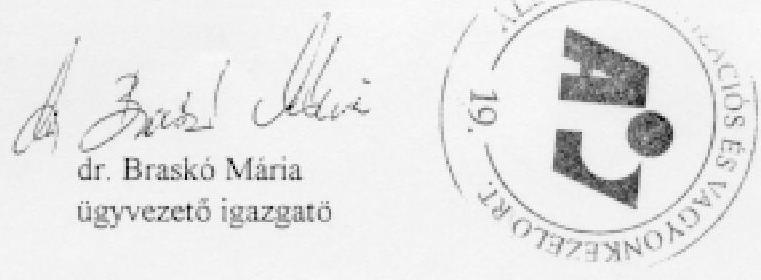
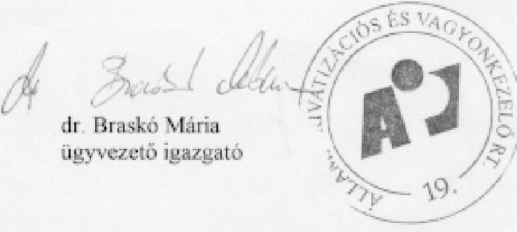
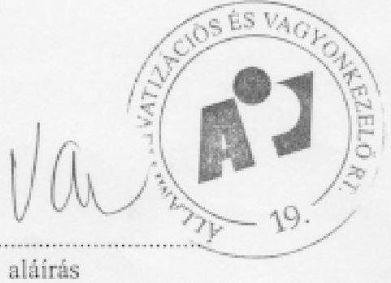
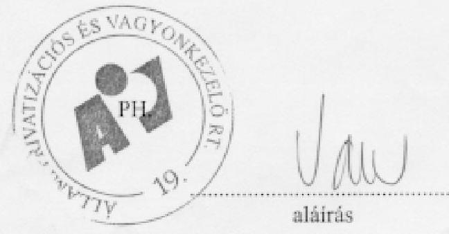
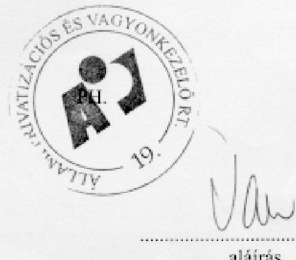
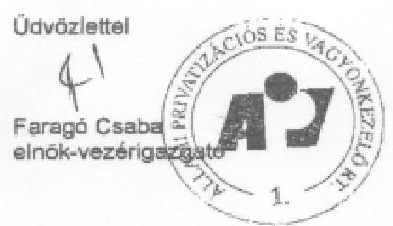
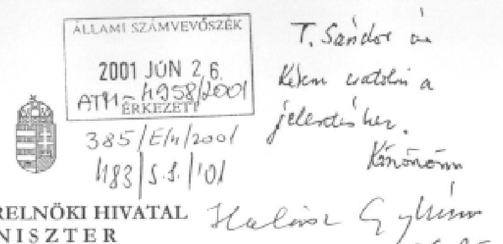

# JELENTÉS 

az Állami Privatizációs és Vagyonkezelő
Rt. 2000. évi múködésének és a központi
költségvetés végrehajtásához kapcsolódó
tevékenységének ellenőrzéséről
J/4782
2001. június

---

# Az ellenőrzés végrehajtásáért felelős: 

IV. Vagyonellenőrzési Igazgatóság

Halász Gejza
számvevő igazgató

## Az ellenőrzést vezette:

## Makkai Mária

számvevő igazgatóhelyettes

## Az ellenőrzésben részt vettek:

Dr. Borisz József
számvevő tanácsos
Hajagos Józsefné
számvevő tanácsos
Kopányi Lászlóné
számvevő tanácsos
Lőrinc Alajos
főtanácsadó
Matuk Károly
számvevő
Németh Béláné
tanácsadó
Tornai József
számvevő tanácsos
Verő Tünde
számvevő
Barát Stefánia
külső szakértő

---

# TARTALOMJEGYZÉK 

I. ÖSSZEGZŐ MEGÁLLAPÍTÁSOK, KÖVETKEZTETÉSEK, JAVASLATOK ..... 5
II. RÉSZLETES MEGÁLLAPÍTÁSOK ..... 9

1. Az ÁPV Rt. működése, saját vagyonnal való gazdálkodása ..... 9
1.1. A saját vagyoni kör bevételeinek és kiadásainak nyilvántartása, terve- zése és az eredmény alakulása ..... 9
1.2. A bevételek alakulása ..... 10
1.3. A költségek és ráfordítások alakulása ..... 11
1.4. A létszám és a személyi jellegű ráfordítások alakulása ..... 14
1.4.1. A létszám alakulása ..... 14
1.4.2. A személyi jellegű ráfordítások alakulása ..... 14
1.5. Az ÁPV Rt. eszközállományának alakulása ..... 16
2. A központi költségvetésben meghatározott előirányzatok teljesítése ..... 18
2.1. A hozzárendelt vagyonnal kapcsolatos bevételek alakulása ..... 18
2.2. Az értékesítés előkészítésének kiadásai ..... 21
2.3. A vagyonkezelési ráfordítások alakulása ..... 22
2.4. A reorganizációs ráfordítások alakulása ..... 23
2.4.1. Kormányzati hatáskörű döntések ..... 23
2.4.2. Az ÁPV Rt. hatáskörében hozott reorganizációs döntések ..... 24
2.4.3. Az agrár ágazatot érintő ráfordítások ..... 25
2.5. A területfejlesztés központi regionális és megyei szerkezetátalakítási, valamint a vidékfejlesztési kistérségi programok támogatása ..... 26
2.6. A Honvédelmi Minisztérium felesleges vagyonelemeivel, az Első Közép- és Kelet-Európai Együttmúködési Alapítvány ingatlanaival, valamint a kincstári vagyonnak minősülő erdőkkel kapcsolatos kiadások ..... 26
2.6.1. A Honvédelmi Minisztérium kezelésében lévő felesleges ingó va- gyon átvétele ..... 27
2.6.2. A HM kezelésében lévő felesleges ingatlan vagyon átvétele ..... 28
2.6.3. Az Első Közép- és Kelet-Európai Együttműködési Alapítvány által létrehozandó nemzetközi központ székhelyéül szolgáló ingatlanok megvásárlása ..... 29
2.6.4. A kincstári vagyonnak minősülő erdő használatba-, haszonbér- be adásából származó bevétel átutalására vonatkozó jogszabályi elő- írások teljesítése ..... 30
2.7. A környezetvédelmi feladatok finanszírozása ..... 30
2.8. A Reorg-Apport Rt. veszteségeinek fedezésére elkülönített összeg fel- használása ..... 32
2.9. Üzleti célú befektetések ..... 32
3. A privatizációs tartalék felhasználása ..... 36

---

3.1. Az állomány változása, egyes kiadások alakulása ..... 36
3.2. A privatizációs tartalék felhasználása ..... 39
3.3. A tartalékból történt egyéb kifizetések ..... 40
3.3.1. A hozzárendelt vagyon és privatizációs tartalék közötti vagyon- átcsoportosítás ..... 40
3.3.2. A gázközmű vagyonnal kapcsolatos önkormányzati igények rendezése ..... 41
3.3.3. A privatizációs ellenérték hányad (PEH) kifizetése ..... 42
3.3.4. Az önkormányzati járandóságok ..... 42
3.4. A válsághelyzetek rendezésére fordított kiadások ..... 43
4. Az ellenőrzési tevékenység
Tanúsítványok
Korábbi vizsgálataink címei:
Jelentés az Állami Vagyonügynökség 1991. évi tevékenységéről
Jelentés az Állami Vagyonkezelő Rt. tevékenységének ellenőrzéséről
Jelentés az Állami Vagyonügynökség 1992. évi tevékenységének ellenőrzéséről
Jelentés az Állami Vagyonügynökség 1993. évi tevékenységének ellenőrzéséről
Jelentés az Állami Vagyonkezelő Rt. 1993. évi tevékenységének ellenőrzéséről
Jelentés az Állami Vagyonügynökség költségvetési cím pénzügyi-gazdasági ellenőrzéséről
Jelentés az Állami Vagyonkezelő Rt. által a Budapest Bank Rt.-nek juttatott tőketartalék-átadás ellenőrzéséről

Jelentés az Állami Vagyonügynökség és az Állami Vagyonkezelő Rt. 1994. évi tevékenységének, valamint a jogutód szervezet megalakulási költségeinek az Állami Privatizációs és Vagyonkezelő Rt.-nél végzett ellenőrzésről
Jelentés az Állami Privatizációs és Vagyonkezelő Rt. 1995. évi tevékenységéről
Jelentés az ÁPV Rt. 1996. évi tevékenységének ellenőrzéséről
Jelentés az Állami Privatizációs és Vagyonkezelő Rt. hozzárendelt vagyonnal kapcsolatos 1997. évi tevékenységének ellenőrzéséről

Jelentés az ÁPV Rt. 1998. évi múködésének és a központi költségvetés végrehajtásához kapcsolódó tevékenységének ellenőrzéséről

Jelentés az ÁPV Rt. tevékenységének, a hozzárendelt vagyon alakulásának, privatizációjának és múködtetésének ellenőrzéséről

---

# JELENTÉS 

## az Állami Privatizációs és Vagyonkezelő Rt. 2000. évi múködésének és a központi költségvetés végrehajtásához kapcsolódó tevékenységének ellenőrzéséről

Az állam tulajdonában levő vállalkozói vagyon értékesítéséről szóló 1995. évi XXXIX. törvény (továbbiakban: priv. törvény) 25. § (1) bekezdése szerint az Állami Privatizációs és Vagyonkezelő Rt. (továbbiakban: ÁPV Rt.) tevékenységének ellenőrzése az Állami Számvevőszék feladata. Az ÁPV Rt. igazgatósága a vagyon változásáról, hasznosításáról félévente köteles tájékoztatót készíteni az Állami Számvevőszék számára, a 2000. évről szóló beszámoló határideje 2001. április 30-a volt.

Az Állami Számvevőszék eddigi ellenőrzései során - többségében - az ÁPV Rt. éves beszámolója rendelkezésre állt. A jelenlegi vizsgálat (tekintettel az ÁPV Rt. megszűnésével kapcsolatos törvényjavaslat várható tárgyalására) az előző évek gyakorlatától eltérően az éves beszámoló elkészítése előtt, 2001. április 13án lezárult. Eddig az időpontig még az Állami Számvevőszék számára készítendő, 2000. évről szóló jelentés sem készült el. Az adatokat a könyvvizsgáló még nem auditálta. Így nem zárható ki, hogy az ÁSZ jelentésben és a könyvizsgálói auditban néhány esetben olyan számok is szerepelnek majd, melyek kisebb eltérést mutatnak.

Az ellenőrzés a rendelkezésre bocsátott tanúsítványok pénzügyi-számviteli adataira támaszkodott. A tanúsítványok terv és tényadatai több esetben nem egyeznek az ÁPV Rt. üzleti tervében, illetve a nyilvántartásokban szereplő adatokkal. Ennek ellenére azok a tendenciák bemutatására alkalmasak voltak.

A tömeges privatizáció 1997-ben befejeződött, ezért az Állami Számvevőszék az ÁPV Rt. tevékenységének ellenőrzése során azt a gyakorlatot alakította ki, hogy egyik évben a saját, azt követő évben pedig a hozzárendelt vagyoni kört vizsgálja. Ezzel az Országgyűlés Számvevőszéki Bizottsága is egyetértett. A 2000. évi tevékenységre vonatkozó ellenőrzés az ÁPV Rt. saját vagyoni körére, továbbá a központi költségvetés végrehajtásához kapcsolódó tevékenységére terjedt ki.

Az ellenőrzés célja annak megállapítása volt, hogy a 2000. évi költségvetési törvényben rögzített és az ÁPV Rt. 2000. évi tevékenységét érintő előirányzatok, kötelezettségek, garanciavállalások összhangban voltak-e a törvényi előírásokkal; a társaság múködési bevételei, ráfordításai az üzleti pénzügyi tervben rög-

---

zítetteknek megfelelően alakultak-e; az ÁPV Rt. gazdálkodásában érvényesül-tek-e a szabályszerűségi, takarékossági szempontok.

Az ellenőrzés tárgykörében az Állami Számvevőszék 1999-ben végzett vizsgálatot. Az ellenőrzésről szóló jelentésben az ÁPV Rt. menedzsmentje részére tett ajánlásokat a társaság realizálta.

Az Állami Számvevőszék jelentésében a Miniszterelnöki Hivatalt vezető miniszter és az ÁPV Rt. korábbi észrevételeinek jelentős részét figyelembe vette, a pénzügyminiszter a jelentéssel egyetértett. A záró észrevételek közül a tervezés megalapozottságával kapcsolatos indoklást elfogadva a megállapítást a Számvevőszék korrigálta.

A helyszíni ellenőrzés 2001. március 13. - április 13. között tartott.

---

# I. ÖSSZEGZŐ MEGÁLLAPÍTÁSOK, KÖVETKEZTETÉSEK, JAVASLATOK 

Az ÁPV Rt. 2000. évi múködési körülményei eltértek a megalakulása óta tartó, privatizációból származó bevételek adta lehetőségtől. A korábbi években az értékesítés és vagyonhasznosítás bevételei kiegyensúlyozott gazdálkodást biztosítottak, 2000. évben azonban a hozzárendelt vagyonból származó bevétel a felét sem érte el az előző évinek. Ebben szerepe volt a privatizációhoz szükséges kormányzati döntések hiányának. Ma már felelősséggel nem számszerúsíthető az elmaradt - megfelelő időben, a piac értékítéletével és keresletével találkozó döntések hatása az ÁPV Rt. privatizációs bevételeire, de feltételezhető, hogy azok megléte esetén a bevétel magasabb lett volna.

Az ÁPV Rt.-nek 2000-ben, a költségvetési törvényben foglaltak szerint 126 milliárd Ft volt a kiadási előirányzata. Az üzleti-pénzügyi tervben a célok eléréséhez 95,3 milliárd Ft bevételt irányoztak elő, amelyből 78 milliárd Ft volt az értékesítésből származó bevétel. A tervezés több bizonytalanságot tartalmazott. A privatizációból származó bevétel tervezésekor az ÁPV Rt. nem számolhatott azon kockázati tényezőkkel, amelyek befolyásolása kívül esett hatáskörén, azaz olyan társaságok értékesítését is tervezték, amelyeknél a privatizáció módjának és időpontjának meghatározása nem az ÁPV Rt. kompetenciája. Az üzleti-pénzügyi terv elfogadásakor már érzékelhető volt, hogy nem teljes mértékben biztosított annyi bevétel realizálása a hozzárendelt vagyonból, amennyi a kiadások maradéktalan teljesítéséhez szükséges és lehetővé tenné a privatizációs tartalék feltöltését is.

Az ÁPV Rt. összes bevétele 58,8 milliárd Ft-ra teljesült. Az értékesítésből és vagyonhasznosításból 21,9 milliárd Ft bevétel keletkezett, amelyből 3,3 milliárd Ft a korábbi években részletfizetéssel megvalósított privatizációból folyt be.

A bevételek elmaradása ellenére - az MFB Rt. 32 milliárd Ft-os tőkeemelése terhelte az ÁPV Rt.-t. A társaság a kormányhatározatban rögzítettek évközbeni teljesítését csak a privatizációs tartalék meglévő készpénzállományából tudta végrehajtani, melyre az akkor hatályos törvényi előírások szerint nem volt felhatalmazása.

Az ÁPV Rt. bevételek hiányában a privatizációval összefüggő tevékenységéhez kapcsolódó és a költségvetési törvényben rögzített, más kezelő szervezetek részére teljesítendő fizetési kötelezettségeit 2000. december közepéig nem, vagy csak részben és késedelmesen, a területfejlesztés központi, regionális és megyei szerkezetátalakítási és a vidékfejlesztési kistérségi programok támogatására előirányzott 9,5 milliárd Ft-ot a Magyar Államkincstár hitelnyújtásával tudta teljesíteni. Kötelezettségeinek a központi költségvetés forrás biztosítása után tett eleget.

A bevételek - tervezéskor már meglévő - bizonytalanságának ismeretében a költségvetési törvény nem rendelkezett arról, hogy bevétel hiányában az ÁPV Rt. milyen megoldási módokat alkalmazhat az előírt kiadások teljesítésére. A

---

törvény nem engedte meg, hogy az ÁPV Rt. hitelt vegyen fel, nem határozott meg - a terület- és vidékfejlesztési kiadások kivételével - prioritásokat, bevételtől függő kifizetési arányokat. Az ÁPV Rt. azt a rendezési módot választotta, hogy jogszabályi felhatalmazás nélkül - a saját vagyon pénzeszközeiből 4 milliárd Ft-ot átvezetett a privatizációs bevételek számlára és egyidejűleg az MTV székházat áthelyezte a saját vagyonba.

Már az év első félévében nyilvánvalóvá vált a költségvetési törvény - az ÁPV Rt. kötelezettségeit érintő kiadási előirányzatok teljesíthetetlensége miatti - módosításának szükségessége.

A 2000. december 8-án módosított költségvetési törvény törölte a költségvetési befizetési kötelezettséget, csökkentette a reorganizációs kifizetések és az egyéb szerződéses kötelezettségek előirányzatát, valamint az alacsony kamatozású államadósság törlesztését E hitelből. A törvény az állam gazdaságpolitikai tevékenységét támogató intézkedések veszteségeire, válsághelyzetek megszüntetésére felhasznált pénzeszközök forrásául a privatizációs tartalékot jelölte meg. A kiadási előirányzat 126 milliárd Ft-ról 76 milliárd Ft-ra módosult.

A privatizációs tartalék 2000. évi felhasználási céljai között $73 \%$-os arányban nem a privatizációval összefüggő kiadások, hanem egyéb gazdaságpolitikai (gázközművagyon miatti önkormányzati igények, ún. reverzális levelek utáni teljesítések, kárpótlási jegyek életjáradékra váltásával kapcsolatos kiadások) és az állam vagyonpolitikai intézkedéseinek végrehajtásával kapcsolatos feladatok szerepeltek.

A tartalékállományt - a privatizáció történetében először - 72,3 milliárd Ft költségvetési forrás növelte, melyet a költségvetési törvény módosítása biztosított. Így az ÁPV Rt. nem befizető, hanem költségvetési pénzeszközt felhasználó szervezet lett. Ezáltal a költségvetés adó, vám, egyéb bevételei finanszírozták azokat a kötelezettségeket, melyeket a törvény ezideig kizárólag a privatizációs bevételből engedett meg. Ezekről a kiadásokról (tőkeemelés az MFB Rt.-nél 32 milliárd Ft, a Tokaj Kereskedőház Rt.-nél 1,5 milliárd Ft, a Regionális Fejlesztési Holding Rt.-nél és a Földhitel és Jelzálogbank Rt.-nél 2,5-2,5 milliárd Ft, a Corvinus Rt.-nél 3 milliárd Ft, és két ingatlanvásárlás 9 milliárd Ft összegben) év közben a Kormány döntött, de - a fedezet biztosítására a költségvetés kényszerült -, és ez a költségvetési törvény módosításával teljesült. A Kormány vagyonpolitikai intézkedéseire és a tartósan állami tulajdonú társaságok tőkehelyzetének rendezésére az ÁPV Rt. a biztosított költségvetési forrásból 50,5 milliárd Ft-ot fordított, mintegy 20 milliárd Ft a privatizációs tartalékban maradt. A fel nem használt összeg tette lehetővé, hogy 8,8 milliárd Ft készpénzt - ugyanilyen összegű MOL részvénycsomag privatizációs tartalékba helyezése mellett - áthelyezzenek a hozzárendelt vagyon bankszámlájára december 21én. A készpénz-részvény cseréhez az előírt, pénzügyminiszteri és a privatizációért felelős miniszteri engedélyekkel az ÁPV Rt. rendelkezett.

A készpénz átvezetésére, mint felhasználási jogcímre a priv. törvény előírásai nem adnak lehetőséget. Az ügylettel a tartalék nyilvántartási állománya nem változott, csak azon belül a készpénz-részvény aránya módosult.

---

A privatizációs tartalék rendeltetése, vagyis a privatizációs, vagyonkezelési kötelezettségek teljesítése, a tényleges felhasználásokat tekintve, háttérbe szorult, a teljes kiadási összegnek $27 \%$-os hányadát fordították a privatizációs kötelezettségekre.

A privatizációs tartalék 2000. évi megváltozott szerepét mutatja, hogy az abból teljesített 91,4 milliárd Ft kiadás jóval meghaladta a hozzárendelt vagyon bevételeinek ( 58,8 milliárd Ft), illetve kiadásainak ( 60,8 milliárd Ft) összegét.

Az ÁPV Rt. a felhasználásokon belül 22,4 milliárd Ft-ot a privatizáció kapcsán felmerült kötelezettségek teljesítésére (jótállások, szavatosságok, önkormányzati járandóságok, stb.) fordított. Ebből az összegből a Mátrai Erőmú Rt. privatizációjával összefüggésben 7,7 milliárd Ft-ot fizettek ki.

Az ÁPV Rt.-nek külön feladata volt az 1998. évi alkotmánybírósági határozatra visszavezethető, gázközmű vagyonnal kapcsolatos önkormányzati igények címén esedékes, 2000. évre előírt, készpénzben történő teljesítések lebonyolítása. A vonatkozó törvény még nem született meg, a Kormány két határozatában is úgy döntött, hogy a kisebb összegű önkormányzati igényeket készpénzben rendezi. Ennek forrásszükséglete összesen 6 milliárd Ft volt. 2000-ben a gázközművagyon miatti állami tartozásoknak mintegy $10 \%$-át rendezték.

Az ÁPV Rt. saját vagyonnal való gazdálkodására készített üzleti-pénzügyi terve nem megalapozott, nem tükrözi azt a cél- és eszközrendszert, amellyel a társaság gazdálkodását kívánta megvalósítani.

Az ÁPV Rt. a költségvetési törvény előírása alapján jogosult arra, hogy a hozzárendelt vagyonból származó bevételeiből a múködési kiadásokra forrást különítsen el. Ez a bevételi forrás a működési bevételek $93 \%$-át jelentette. A tervezés a költségvetési törvényben elkülönített pénzösszeg „megalapozását" szolgálta. A fel nem használt rész a mérleg szerinti eredményt, így a saját tőkét növelte. Az ÁPV Rt. 2000. évben 501 millió Ft nyereséget mutatott ki, eredménytartaléka az év végén 1,7 milliárd Ft volt, a kettő együtt saját tőkéjének $18 \%$-a.

A költségvetési törvény 2000. évben az ÁPV Rt. saját működésére 4.500 millió Ft-ot engedélyezett felhasználni, egyéb bevételeivel kiegészítve összesen 4.884,6 millió Ft állt rendelkezésre. A kiadások ezzel szemben 4.341 millió Ft-ban realizálódtak, $89 \%$-os, előirányzathoz mért teljesítéssel.

Az 501 millió Ft-os mérleg szerinti eredmény döntő többsége ( 366 millió Ft) a személyi jellegű ráfordításnál - további hányada az egyéb költségeknél - mutatkozó megtakarításokból származott, ez azonban nem a költségkímélő felhasználás, hanem a nem kellően megalapozott költségtervezés eredménye. Az átlagos állományi létszám nem érte el a tervezett 300 föt, 286 fő lett.

Az átlagkeresetek növekedése az előirányzatnak megfelelt, összetétele azonban jelentősen eltért a tervezettől. A kitűzött prémiumfeladatok teljesítése $60 \%$-os kifizetést tett lehetővé, a fel nem használt prémium összeget jutalom jogcímén folyósították. A prémium ösztönző szerepe nem érvényesült, a kiírás formai volt, a feladat nem teljesítése a dolgozók átlagkeresetét nem befolyásolta.

---

Az eszközök előzetes mérlegfőösszege 2000. december 31-én 12,9 milliárd Ft volt, az előző évhez viszonyítva 0,5 milliárd Ft-tal nőtt. A saját vagyon mérlegének szerkezete azonban előre nem tervezett módon változott. A befektetett eszközök 4,5 milliárd Ft-tal nőttek, a forgóeszközök 3,8 milliárd Ft-tal, ezen belül a pénzeszközök 3,3 milliárd Ft-tal csökkentek. Ennek oka az MTV székházzal kapcsolatos tranzakció volt, amely a hozzárendelt vagyon pénzeszközeit növelte 4 milliárd Ft értékben, a saját vagyonét csökkentette ugyanilyen összegben.

Az ÁPV Rt. 2000. évben a hozzárendelt vagyonhoz kapcsolódó kiadásai teljesítéséhez nem rendelkezett elegendő készpénzállománnyal, ezért az igazgatóság a saját vagyonból 4 milliárd Ft készpénz átvezetéséről döntött. Ugyanekkor határozott arról is, hogy a 6 milliárd Ft nyilvántartási értékű MTV székházat 4 milliárd Ft - még a legutóbbi 4,5 milliárd Ft-os értékbecsléshez képest is alacsonyabb - értéken vezessék át a saját vagyonelemek közé. A privatizációs törvény a saját és a hozzárendelt vagyon közötti átvezetésekre nem ad lehetőséget. Ezzel a tranzakcióval a saját vagyon értékben nem változott, azonban a mérlegfőösszeg egyharmadát kitevő összeggel csökkent a készpénzállomány. A saját vagyonba a likvid pénzeszköz helyett olyan vagyonelem került, amelynek értékesítése a korábbi sikertelen eladási kísérletek alapján bizonytalan. Az ingatlan saját vagyonba helyezésével kikerült a priv. törvény értékesítésre vonatkozó szigorú kritérium rendszere alól, a hozzárendelt vagyonban pedig 2 milliárd Ft veszteség keletkezett.

A saját vagyon lecsökkent készpénzállományát terheli a mérlegen kívüli tételek között kimutatott közel 5 milliárd Ft-os kötelezettségvállalás, a Regionális Fejlesztési Holding Rt. miatt. A privatizációért felelős miniszter az ÁPV Rt. kötelezettségvállalásával egyetértett, de nem azzal, hogy az a saját vagyont terhelje. A privatizációs törvény nem teszi lehetővé a kezességvállalást a saját vagyonból a hozzárendelt vagyonba tartozó társaság kötelezettségeihez, mivel egyértelmű előírás, hogy a saját és a hozzárendelt vagyont el kell különíteni. A Holding a hozzárendelt vagyoni körbe tartozott, ezért a kötelezettségvállalás a saját vagyont nem terhelheti. A kezesség esetleges beváltásához egyrészt az ÁPV Rt. nem rendelkezik elegendő készpénzzel, másrészt már részleges teljesítés esetén is a készpénzállománya nullára csökkenhet. A kötelezettség fennállásáig az ügylet kockázatos. Ezt a megállapítást a Pénzügyminisztérium nem kifogásolta, szemben a Miniszterelnöki Hivatal és az ÁPV Rt. észrevételeivel, miszerint a 2001. évi költségvetési törvény a kockázatot megszüntette.

# Javaslatok 

## a Miniszterelnöki Hivatalt vezető miniszternek

1) Utasítsa az ÁPV Rt. igazgatóságát, hogy a saját vagyonból elvont 4 milliárd Ft készpénzt visszahelyezzék és ezzel egyidejűleg az MTV székházat az eredeti nyilvántartási értéken a hozzárendelt vagyonba visszavezessék.
2) Kötelezze az ÁPV Rt. igazgatóságát, hogy a hozzárendelt vagyonba tartozó Regionális Fejlesztési Holding Rt. kötelezettségeihez a saját vagyon terhére

---

nyújtott jogsértő kezességvállalást a törvények által nyújtott lehetőség keretei között váltsa ki.

# II. RÉSZLETES MEGÁLLAPÍTÁSOK 

## 1. Az ÁPV Rt. mÜKÖDÉse, SAJÁT VAGYONNAL VALÓ GAZDÁLKODÁSA

### 1.1. A saját vagyoni kör bevételeinek és kiadásainak nyilvántartása, tervezése és az eredmény alakulása

A priv. törvény előírja, hogy az ÁPV Rt. saját vagyonával való gazdálkodásától el kell különíteni a hozzárendelt vagyonát, valamint az értékesítésre, kezelésre átvett vagyont és az e vagyonelemek értékesítésével és hasznosításával kapcsolatos bevételeket és kiadásokat.

Az ÁPV Rt. nyilvántartási, könyvvezetési rendszerét ennek és a számvitelről szóló 1991. évi XVIII. törvény előírásainak (továbbiakban: SZT törvény) figyelembevételével alakította ki.

A nyilvántartásokat és az ezekre épülő adatfeldolgozást támogató számítástechnikai rendszerek átfogó, összehangolt fejlesztését 1999-ben kezdte el az ÁPV Rt., 2000-ben a munkálatok 10 projektcsoportban folytak és nem fejeződtek be. Jelenleg is tart a rendszerek üzemi tesztelése, továbbá az adatok migrációja a korábbi rendszerekből az új rendszerekbe. Az információszolgáltatást gyakori hibaelhárítások és egyeztetések kisérték, a rendszerek még nem teljesítik az adatok elvárt gyors, részletezett és hibamentes biztosítását. Figyelembe véve az ÁPV Rt. feladatainak csökkenését, a társaság várható megszűnését, átalakítását, a fejlesztés indokoltsága megkérdőjelezhető.

A törvényi előírásnak megfelelően az ÁPV Rt. 2000. évi üzleti-pénzügyi terve külön fejezetben tartalmazta a társaság szervezetével és múködésével összefüggő, a saját vagyoni körre vonatkozó irányszámokat. Az üzleti-pénzügyi terv a társaság gazdálkodásához nem szolgált megfelelő alapul, mivel nem rögzített gazdálkodási alapelveket, prioritásokat, költséggazdálkodási feladatokat, módszereket.

A 2000 februárjában összeállított üzleti-pénzügyi tervhez készült egy melléklet, amely a tervezett múködési költségek költséggazdák szerinti megbontását tartalmazta, azonban ez az igazgatósági előterjesztésben nem szerepelt, így nem hagyták jóvá. A költséghelyre épülő felelősi rendszer tényét a terv szöveges leírása sem említi.

Az ÁPV Rt. teljes múködésére vonatkozó üzleti-pénzügyi terv teljesítésének aktuális helyzetét az ÁPV Rt. igazgatósága év közben három alkalommal tárgyalta, a saját vagyont érintő tervmódosítás nem volt.

---

A Magyar Köztársaság 2000. évi költségvetéséről szóló 1999. évi CXXV. tv. (továbbiakban: költségvetési törvény) 10. sz. melléklete az ÁPV Rt. múködési költségeire 4.500 millió Ft felhasználását engedélyezte a hozzárendelt vagyon bevételeiből, amely 500 millió Ft-tal, 12,5 \%-kal volt magasabb, mint 1999-ben.

A társaság 2000. évre tervezett összes bevétele 4.885 millió Ft, kiadása 4.844 millió Ft volt. A tervvel szemben az összes bevétel a nyilvántartás szerint 4.842 millió Ft (a terv $99 \%$-a), a kiadás 4.341 millió Ft (a terv $89 \%$-a) lett.

A múködési kiadások 2000-ben a tervnél 11 \%-kal, közel fél milliárd Ft-tal alacsonyabbak voltak, a részadatok a tervezés pontatlanságát mutatják.

Az ÁPV Rt. 1998. év óta folyamatosan növekvő költségvetési pénzeszközből gazdálkodott (1998. év 3,3 milliárd Ft, 1999. év 4 milliárd Ft, 2000. év 4,5 milliárd Ft).

Az 1998. évi 234 fơről 1999-2000. évekre 300 főre bővülő létszámot tervezett, ténylegesen 267, illetve 286 fővel működött. Ugyanakkor az összes bevétel az 1998. évi 111 milliárd Ft-ról 2000. évre 58 milliárd Ft-ra csökkent.

A társaság eredménye meghaladta az 500 millió Ft-ot. Ennek megfelelően a saját tőke számadatait a következő táblázat mutatja be.

Adatok: millió Ft

|  | 1999. év | 2000. év | Index \% |
| :-- | --: | --: | --: |
| Saját tőke | 11.755 | 12.256 | 104,3 |
| Jegyzett tőke | 9.698 | 9.698 | 100,0 |
| Tóketartalék | 347 | 347 | 100,0 |
| Eredménytartalék | 770 | 1.710 | 222,1 |
| Mérleg szerinti eredmény | 940 | 501 | 53,3 |

A jegyzett tőke a saját tőke 79 \%-át tette ki. 2000-ben a saját tőke több mint 1/5-e tőketartalék, eredménytartalék, illetve a mérleg szerinti eredmény. A tőketartalék összege 1995. óta változatlanul 346,7 millió Ft, az eredménytartalék az 1996-1999. évi eredmények halmozott összege 1,7 milliárd Ft, amely a fel nem használt múködési költségkeretből származott.

# 1.2. A bevételek alakulása 

Az ÁPV Rt. múködésének finanszírozását szolgáló bevételek összetétele a következő:

---

Adatok: millió Ft

| Megnevezés | $\mathbf{1 9 9 9}$. év | $\mathbf{2 0 0 0}$. terv | $\mathbf{2 0 0 0}$. év | Bázis   index \% | Terv   telj. \% |
| :-- | --: | --: | --: | --: | :--: |
| Központi költségvetési előirányzat | 4.000 | 4.500 | 4.500 | 112,5 | 100,0 |
| Eszközbérbeadás bevétele és üze-   meltetési költségek megtérülése | 236 | 223 | 224 | 94,9 | 100,7 |
| TB vagyon értékesítésével kapcsola-   tos bevételek | 311 | 162 | 47 | 15,3 | 29,3 |
| Egyéb és rendkívüli bevételek | 61 | - | 71 | 115,4 | - |
| Összesen: | 4.608 | 4.885 | 4.842 | 105,1 | 99,1 |

2000. évben a múködési bevételek $93 \%$-át a költségvetés biztosította.

A tervnek megfelelően alakult az eszközbérbeadás (ingatlanok - Fehérvári út, Priv Dat, PRI-MAN ) bevétele és az üzemeltetési költségek megtérülése (mobil telefon költségkeret túllépés megtérítése, üzemeltetési díj, MATÁV telefonköltség, valamint közüzemi díj, gépkocsi használat költségének megtérítése).

A TB alapok vagyonának értékesítését, illetve az értékesítésig történő vagyonkezelést - szerződés értelmében - az ÁPV Rt. végzi és ezért 0,5 \% díj illeti meg. Ez a bevétel 1999-hez hasonlítva a mintegy felére csökkentett tervszám $29 \%$-a lett, ami a TB vagyon értékesítésével függött össze.

Az egyéb bevételek 71 millió Ft-jából kiemelendő az immateriális javak és tárgyi eszközök eladásából származó 33 millió Ft-os (gépkocsi, mobil telefon és számítástechnikai eszközök), valamint a káreseményekkel kapcsolatos 15 millió Ft-os bevétel.

# 1.3. A költségek és ráfordítások alakulása 

Az ÁPV Rt. múködési ráfordításai 2000. évben az előző évhez képest 18,9 \%-kal emelkedtek. A 2000. évi terv az 1999. évi tényadathoz képest 32,7 \%-kal magasabb összes ráfordítást tartalmazott.

A tervhez képest a költségfelhasználás 89,6 \% lett.

---

A ráfordítások részletezését a következő táblázat tartalmazza:
Érték: millió Ft

| Megnevezés | $\mathbf{1 9 9 9}$. tény | $\mathbf{2 0 0 0}$. terv | $\mathbf{2 0 0 0}$. tény   (előzetes) | tervteljesités   $\mathbf{\%}$ | Megoszlás   $\mathbf{2 0 0 0}$. tény   $\mathbf{\%}$ |
| :-- | --: | --: | --: | --: | --: |
| Anyagjellegú ráfordítás | 548,0 | $632,0^{\star}$ | 577,2 | 91,3 | 13,3 |
| Személyi jellegű ráfordítás | $2.242,8$ | $2.930,3$ | $2.564,3$ | 87,5 | 59,1 |
| Értékcsökkenési leírás | 239,4 | 236,0 | 324,1 | 137,3 | 7,5 |
| Egyéb költségek | 533,9 | $955,8^{\star}$ | 722,4 | 75,5 | 16,6 |
| Egyéb ráfordítások | 59,2 | 58,3 | 101,2 | 172,0 | 2,3 |
| Rendkívüli ráfordítások | 28,5 | 32,0 | 51,9 | 162,2 | 1,2 |
| Költség és ráfordítás összesen | $3.651,8$ | $4.844,4$ | $4.341,1$ | 89,6 | 100,0 |

* A tervszám nem az ÁPV Rt. üzleti tervében rögzítetteket tartalmazza, ugyanis a terv 197,5 millió Ft-ot költséghelyre tervezett és nem a megfelelő költségnemre.

A jelentősebb (az összes költség 89 \%-át kitevő) költségtényezőknél - az anyagés személyi jellegű ráfordítások és az egyéb költségek - a felhasználás 9-24 \%kal alatta maradt a tervezettnek, a fennmaradó költségeknél pedig meghaladta azt.

Az ÁPV Rt. 2000. évben anyagjellegú ráfordításként 577,2 millió Ft-ot számolt el, az 1. sz. tanusítvány szerint 9,9 \%-kal többet az előirányzatnál.

A tanúsítvány nem mutatja be a valóságnak megfelelően a tervezett költségeket, ugyanis az ÁPV Rt. nem a költségnemeknek megfelelően tervezte meg a 2000. évi előirányzatát. Külön kiemelt a Budapest, XI., Fehérvári út 70. irodaházra egyösszegben 107,5 millió Ft-ot, a Priv-Dat Kft.-vel kötött megbízási szerződésből fakadóan - nem anyagjellegű szolgáltatásokra - 90 millió Ft-ot. Ezek helyes besorolása: energia 33 millió Ft, fenntartás 37 millió Ft, üzemeltetés 35 millió Ft, nem anyagjellegú szolgáltatás 92,5 millió Ft.

A költségnemnek megfelelő besorolás szerint az anyagjellegü ráfordítások helyes tervszáma az ellenőrzés által felülvizsgált és a számlaosztályhoz ténylegesen hozzárendelhető költségek és ráfordítások alapján 632 millió Ft, e mellett az előzetes tényszám 577,2 millió Ft lett, így a teljesítés indexe $\mathbf{9 1 , 3} \%$. A tervhez viszonyított 54,8 millió Ft-tal kevesebb költségfelhasználás nem a költségtakarékosság, hanem a megalapozatlan tervezés eredménye. Ezt támasztja alá a tervfeladat és a tervteljesítési viszonyszámok összehasonlítása is a kiemelt költségcsoportoknál.

---

| Megnevezés | 2000. terv/   1999. tény | 2000. tény/   2000. terv |
| :-- | :--: | :--: |
|  | viszonyszáma \%-ban |  |
| Energia | 147,0 | 59,0 |
| Üzemanyag | 91,6 | 156,5 |
| egyéb ki nem emelt anyag | 75,0 | 166,9 |
| fenntartás, javítás | 141,4 | 85,6 |
| ebből gépjármú fenntartás | 327,4 | 37,0 |

Az energiaköltség - a tanúsítványtól eltérően - 65,7 millió Ft-os előirányzata 39,9 millió Ft-ban teljesült, 59 \%-os tervteljesítéssel. A tervnél 25,8 millió Fttal alacsonyabb felhasználás megalapozatlan tervezést mutat, mivel az energiaköltség - az áremelés és a hálózatbővülés változása alapján - biztonságosan prognosztizálható. Az eltérés a Fehérvári úti irodaház energiaköltségénél mutatható ki, a tervezett 33 millió Ft helyett a tényleges költség 7,8 millió Ft lett.

Az üzemanyag költség előirányzata 16,5 millió Ft, a felhasználás pedig 25,8 millió Ft volt. 1999. évben 18 millió Ft volt az üzemanyag költség, a tervszám csökkentése a bázishoz képest az áremelés ismeretében nem volt célszerű.

Az egyéb ki nem emelt anyagköltségnél a tervet (12,4 millió Ft) 8,1 millió Ft-tal túlteljesítették, ebből 7,0 millió Ft a számítástechnikai eszközök anyagköltsége, amelynek 150 E Ft-os tervszáma a folyamatban lévő fejlesztés költségigényét nem vette figyelembe.

Fenntartás, javítás, karbantartás címén 78,6 millió Ft-ot fizettek ki, a tervteljesítés $85,6 \%$ volt, a gépkocsik fenntartására 13 millió Ft-tal kevesebb költség merült fel. A tervezésnél nem vették figyelembe, hogy a gépjármú állomány felét új gépkocsira cserélték, így az kevesebb fenntartási költséget indokolt, ezért az 1999. évi 6,2 millió Ft-os költségnek a 2000. évi tervben 20,3 millió Ft-ra növelése megalapozatlan volt.

Az értékcsökkenési leírás költségét az ÁPV Rt. az előző évi szinten tervezte, a tény (számított) adat 37,3 \%-kal haladta meg ezt. Az ÁPV Rt. új eszköz nyilvántartási rendszerének pontatlansága miatt a 2000. IV. negyedévi értékcsökkenési leírás összege becsült adat, amelyet az ÁPV Rt. tájékoztatása szerint a végleges beszámoló elkészítéséig helyesbítenek.

Az egyéb költség az összes ráfordításnak 16,6 \%-a volt és 2000. évben 722,4 millió Ft-ot tett ki. A költségcsoport 85,7 \%-a - 619 millió Ft - nem anyagjellegú szolgáltatás. Ezen belül az irodai, ügyviteli szolgáltatások 331,4 millió Ft-ot képviseltek, ebből a PRI-MAN Kft. részére 280 millió Ft-ot, a PRIV-DAT Kft.-nek 35 millió Ft-ot fizettek ki.

---

A biztonsági őrzés költsége 24,7 millió Ft volt, 15 \%-kal kevesebb, mint 1999-ben. A könyvvizsgáló díja 37,4 millió Ft, ez a költség viszont $70 \%$-kal meghaladta az előző évit.

A szakértői díjak 59 millió Ft-ot tettek ki. Ezek 46 \%-a informatikai szakértői díj. Az ÁPV Rt. informatikai rendszerét 2000-ben jelentősen átalakította, 10 egymással kapcsolatban álló egyedi fejlesztésű rendszert épített ki külső szakértők igénybevételével.

A szakértői díjak egyedi ellenőrzése során két megbízási szerződéssel kapcsolatban kifogásolható, hogy

- egy partner részére 8 alkalommal, összesen 6.007,7 ezer Ft kifizetés történt. A kifizetés jogcíme román tanácsadás, privatizációs együttmúködés, kölcsönös tájékoztatás, információ csere. Ezt a tanácsadói díjat a hozzárendelt vagyoni körben kellett volna elszámolni;
- munkajogi tanácsadás címén 2000. február 1. - december 31-ig havi 250 E Ft üzletviteli tanácsadói díjat fizettek. A megbízás és a teljesítményigazolás nem tartalmaz olyan konkrét adatot (ügyletszám, időráfordítás stb.), amely alapján a megbízás teljesítése ellenőrizhető lenne.

A számítástechnikai szolgáltatások több mint kétszeresre növekedtek, 56,6 millió Ft-ot tettek ki, a számítástechnikai eszközök üzembehelyezése miatt.

# 1.4. A létszám és a személyi jellegú ráfordítások alakulása 

### 1.4.1. A létszám alakulása

Az üzleti-pénzügyi terv a létszám és bérgazdálkodáshoz rendkívül szűkszavú iránymutatást ad: „az ÁPV Rt. 2000. évben a Kormány irányelveinek megfelelően 8,25 \%-os keresetfejlesztést irányoz elő és a feladatoknak megfelelően 300 fős létszám igénybevételét tervezi". A feladatok bővítésének, a tervezett létszám 33 fős növelésének ( $12,3 \%$ ) indokolására az üzleti terv nem tért ki, humánpolitikai terv nem készült.

Az üzleti tervben meghatározott, a feladatok bővülésével alá nem támasztott 300 fős létszám helyett 286 fővel látták el feladataikat (2. sz. tanúsítvány), amely 19 fővel haladta meg az előző évi átlagos állományi létszámot.

### 1.4.2. A személyi jellegú ráfordítások alakulása

Az ÁPV Rt. múködési költségeinek 59 \%-a személyi jellegú ráfordítás, amely 2000. évben 2.564 millió Ft volt, a terv $87,5 \%$-a.

Az előirányzathoz viszonyított alacsonyabb kifizetést a bérköltségen belül a létszám terv $95,3 \%$-os és az állományon kívüli bérfelhasználás $75 \%$-os, valamint az egyösszegű kifizetések $46 \%$-os teljesítése idézte elő.

Az üzleti-pénzügyi tervben 2.930 millió Ft-os személyi jellegű ráfordítást terveztek, amely az előző évhez viszonyítva $30 \%$-os növekedésnek felelt meg. Ezt

---

nem indokolta a 12,3 \%-os létszám és a 8,25 \%-os átlagkereset növekedés. Ezek együtt $21,8 \%$-os bértömeg emelésre nyújtottak volna lehetőséget. A személyi jellegú kifizetéseknél (TB járulék nélkül) azonban 38,5 \%-os fejlesztést terveztek, így alakult ki a bázishoz mért $30 \%$-os növekedési lehetőség.

Az átlagkereset $416.912 \mathrm{Ft} /$ fő/hó volt (3. sz. tanúsítvány), amely az üzletipénzügyi tervben előírt $8,25 \%$ helyett $9,7 \%$-os fejlesztésnek felelt meg. A tervet meghaladó átlagbéremelésre az elnök-vezérigazgató adott engedélyt, az 1103/2000. (XII. 8.) Korm. határozat alapján. A gazdálkodási lehetőségek megléte esetén a határozat az átlagkereset növekedést átlagosan 11,5-12,0 \% sávban engedte megvalósítani. Az átlagkeresetek növekedése a felsővezetők körében 13,2 \% volt, majd a beosztások rangsora alapján fokozatosan csökkent, ügyvezető igazgatók: $10,1 \%$, helyettesek: $9,6 \%$, menedzserek $8,9 \%$, ügyintézők $4,5 \%$.

Az ÁPV Rt. ösztönzési rendszerét a 10/2000. sz. elnök-vezérigazgatói utasítás szabályozza.

Az ösztönzési rendszer a prémiumfeladatra épül, melynek célja „az ÁPV Rt. előtt álló mindenkori üzletpolitikai és gazdasági célkitűzések megvalósításának elősegítése, a munkavállalók ösztönzése a feladatok teljesítésére".

A prémium mértékét differenciáltan, a kitűzött feladattól függően, a munkakörnek a társaság hierarchiájában elfoglalt helye alapján határozták meg: a vezérigazgató helyettesek $47 \%$, az ügyvezető igazgatók és helyettesek $37 \%$, az érdemi munkát ellátó munkavállalók $27 \%$, az ügyintézők és ügyviteli dolgozók részére $12 \%$-os prémium mértéket tűztek ki az alapbér \%-ában.

A prémium $20 \%$-át az üzleti terv teljesítéséhez, $80 \%$-át egyénre szólóan, a szervezeti egység feladataihoz kötötten állapították meg.

Az átlagkereset összetételének alakulása az előirányzathoz viszonyítva a következő volt:

| Megnevezés | 2000. évi Ft/fö/hó |  |  |
| :-- | --: | --: | --: |
|  | elöirányzat | tény (elözetes) | $\%$ |
| átlagos alapbér | 295.555 | 288.255 | 97,5 |
| átlagos prémium | 106.940 | 64.915 | 60,7 |
| átlagos jutalom | 8.705 | 63.742 | 732,2 |
| Összesen | $\mathbf{4 1 1 . 2 0 0}$ | $\mathbf{4 1 6 . 9 1 2}$ | $\mathbf{1 0 1 , 3}$ |

Az üzleti tervben az átlagos prémium mértékét az alapbér 36 \%-ában határozták meg, a tényleges kifizetés pedig $22,5 \%$ volt. Az üzleti terv bevételei nem teljesültek, ezért 7,2 \%-ot, az egyénekre meghatározott feladatok nem teljesítése miatt pedig 6,3 \%-ot nem fizettek ki.

Ennek ellenére az átlagkeresetek az előirányzatot meghaladták, mivel a ki nem fizetett prémiumot jutalomként folyósították. 2000. évben 1 főre vetítve 63.742 Ft jutalmat fizettek ki, a tervezettnek több mint hétszeresét, melyből $80 \%$ év végi kifizetés volt.

---

A prémiumfeladat reális teljesítése eleve kudarcra volt ítélve, mivel az üzleti terv bevételei bizonytalanok voltak a privatizációs koncepció kidolgozatlansága, és a végrehajtáshoz szükséges kormányhatározatok hiánya miatt.

Az ösztönzés 2000. évi gyakorlata, azaz a prémiumfeladat nem teljesítése után a prémium kifizetése jutalom jogcímen kifogásolható és nem ösztönző.

A személyi jellegű kifizetések összege 943 millió Ft volt, az előirányzat $88 \%$ ban teljesült, és $14,3 \%$-kal haladta meg az előző évit.

# 1.5. Az ÁPV Rt. eszközállományának alakulása 

Az ÁPV Rt. mérlegfőösszegének változása nem volt számottevő, az eszközök állománya 12,4 milliárd Ft-ról 12,9 milliárd Ft-ra nőtt. Az összetétel azonban jelentősen módosult, a készpénzállomány részaránya $52 \%$-ról $24 \%$-ra csökkent, a tárgyi eszközöké pedig 37,6 \%-ról $69 \%$-ra emelkedett (4. sz. tanúsítvány).

Az immateriális javak 187 millió Ft-os nyitó értékét 133 millió Ft-os beszerzés növelte, ami az üzleti tervben nem szerepelt. Az immateriális javak növekedésének $79 \%$-át, 105 millió Ft-ot szoftver fejlesztések adták, amelyek az adatnyilvántartási és a kontrolling rendszerek korszerűsítését szolgálták (köve-telés-kötelezettség nyilvántartás, cég-, ingatlan-, partner-, szerződés nyilvántartás).

Az összesen 105 millió Ft-os szoftver beszerzések közül a dokumentumkezelő rendszer informatikai fejlesztése 30,3 millió Ft volt.

A beszerzést a közbeszerzésekről szóló 1995. évi XL. törvény (továbbiakban: Kbt.) szerint bonyolították le.

A részvételi felhívásra - az 1999. augusztus 4-én felvett jegyzőkönyv szerint - 9 pályázat érkezett, mindegyiknél formai, vagy tartalmi hiányosság volt. Az Értékelő Bizottság négy pályázót kizárt, egyet szakmai indokok alapján nem hívott meg, négyet ajánlattételre kért fel. Az ÁPV Rt. tájékoztatója - a pályázat eredményhirdetéséről - a Közbeszerzési Értesítőben 1999. december 8-án jelent meg. Az ellenszolgáltatás összegeként 41,2 millió Ft szerepelt, melyből mintegy 10 millió Ft-ot már 1999-ben felhasználtak.

Az informatikai beszerzések a Kbt.-nek megfelelően és szabályszerűen történtek. Célszerűségük azonban később, az ÁPV Rt. jövőbeni feladatainak ismeretében lesz megítélhető.

A tárgyi eszközök bruttó értéken számított év végi 8.971 millió Ft-os állománya a nyitó értéket $48 \%$-kal haladta meg, ezen belül az ingatlanok értéke 4.200 millió Ft-al növekedett, ebből az MTV székház 4.000 millió Ft volt.

A tétel főkönyvi könyvelése az utalványozási szabályzat szerint történt, de mindössze arra az igazgatósági határozatra támaszkodott, amely döntött az MTV székház hozzárendelt vagyonból történő átvezetéséről a saját vagyonba. Az aktiválás időpontja 2000. december 15. volt. Az ingatlan után $2 \%$-os amortizációt számoltak el.

---

Az MTV székház 6 milliárd Ft-os nyilvántartási értékének 4 milliárd Ft-ra történő csökkentéséről az átvezetés előtt készült 4,5 milliárd Ft-os értékbecslés alapján döntött az ÁPV Rt. Az ügylet mögött nem áll analitikai bizonylat. Az előzetes mérleget - beleértve az MTV székház tranzakciót is - nem támasztja alá leltár.

A tranzakció következményeként 52 \%-kal csökkent a pénzeszközök állománya, 6.433 millió Ft-ról 3.100 millió Ft-ra.

Az ÁPV Rt. 1999-ben a privatizációs bevételei terhére 6 milliárd Ft-ért vásárolta meg a Szabadság tér 17. sz. alatti székházat és az a hozzárendelt vagyonba került.

A privatizációs tartalék-, hozzárendelt vagyon-, és saját vagyon számlák közötti átcsoportosításokat - amelyeknek része volt az MTV székház ügylet - igazgatósági határozat írta elő.

Az MTV székház áthelyezése a saját vagyonba az 5/2000. sz. Elnökvezérigazgatói utasításnak és az ÁPV Rt. utalványozási rendjének megfelelt. A teljesítést, meghatalmazás alapján a Számviteli és Pénzügyi Igazgatóság helyettese igazolta. Az utalványozó a szabályzatnak megfelelően az elnökvezérigazgató volt, 2000. december 15-ei keltezéssel. A könyvelés az igazgatósági határozat alapján történt.

Az ÁPV Rt. az eszközeit utoljára 1997-ben leltározta. A leltározási szabályzat 3 évenként leltározási kötelezettséget ír elő, így 2000. december végéig a vagyonelemek tételes leltározását végre kellett volna hajtani, erre azonban nem került sor.

A társaság I. félévi saját vagyonra vonatkozó mérlegbeszámolóját a könyvvizsgáló felülvizsgálta. A felülvizsgálati jelentés tartalmazza azt a megállapítást, hogy "a pénzügyi kimutatásokban bemutatott tárgyi eszközök és immateriális javak 2000. június 30 -ai egyenlegei analitikus nyilvántartással nem alátámasztottak". Év végére ez a helyzet nem változott. Az ÁPV Rt. tájékoztatása szerint a 2000. évi beszámoló elkészítésekor a tárgyi eszköz analitika a zárlati munkák során lehetővé fogja tenni a teljes körű bizonylati alátámasztást.

A mérlegen kívüli tételek között szerepel egy készfizető kezességvállalási kötelezettség a saját vagyon terhére, amelyről az ÁPV Rt. igazgatósága határozott. Az ÁPV Rt. 500 millió Ft jegyzett tőkével megalapította a Regionális Fejlesztési Holdingot Rt.-t, melynek tulajdonába kerültek az MFB Rt. közvetlen és a Tőketárs Kft-n keresztül közvetett tulajdonában lévő Regionális Fejlesztési Társaságok, kockázati Tőkealap Kezelő Rt. és a Promei Kft. részvényei és üzletrészei 5,1 milliárd Ft-os előzetesen meghatározott vételáron, úgy hogy az ÁPV Rt. saját vagyona terhére 5 milliárd Ft készfizető kezességet vállalt az ügylethez.

A priv. törvény 21. § (1) bekezdése előírja, hogy az ÁPV Rt. saját vagyonával való gazdálkodásától el kell különíteni az ÁPV Rt.-hez rendelt vagyont és az e vagyon értékesítésével és hasznosításával összefüggő bevételeket és kiadásokat. Az ÁPV Rt. saját vagyonában nem szerepelt a Regionális Fejlesztési Holding Rt., így annak kötelezettségeire sem vállalhatott volna kezességet az ÁPV Rt. saját vagyona terhére.

---

A kötelezettség esetleges beváltásához a prognózisok szerint az ÁPV Rt. pénzkészlete 2001. közepén nem lesz elegendő. Az ügylet az ÁPV Rt. pénzügyi-üzleti tervében nem szerepelt.

A kötelezettségvállalást illetően megosztott a társaság, a Miniszterelnöki Hivatal és a Pénzügyminisztérium álláspontja. Az ÁPV Rt. és a MEH szerint a kötelezettségvállalásnak már nincs kockázata, mivel a 2001. évi költségvetési törvényben előirányoztak 7,5 milliárd Ft-ot a Holding Rt. tőketartalékának növelésére. Ez az előirányzat a kötelezettségvállalást nem szüntette meg, ezért annak fennállásáig az ügyletet az Állami Számvevőszék kockázatosnak tartja. A Pénzügyminisztérium a megállapítást nem kifogásolta.

# 2. A KÖZPONTI KÖLTSÉGVETÉSBEN MEGHATÁROZOTT ELŐIRÁNYZATOK TELJESÍTÉSE 

### 2.1. A hozzárendelt vagyonnal kapcsolatos bevételek alakulása

A költségvetési törvény 10. számú mellékletében részletezett kiadások összege 126.035 millió Ft volt, melyeknek forrása a hozzárendelt vagyon értékesítéséből, hasznosításából és kezeléséből származó bevétel.

A 2000. évben tervezett bevételekről és azok teljesüléséről szóló 5 . számú tanúsítványt az ÁPV Rt. 2001. március 13-án kitöltötte és jelezte, hogy az adatok nem auditáltak. A helyszíni vizsgálat ideje alatt elkészült az előzetes mérleg, a tanúsítványokat nem aktualizálták, az ellenőrzésnek átadott főkönyvi kartonok adatai így nem egyeztek a tanúsítványban szereplőkkel. Továbbá a tanúsítványban a tervként feltüntetett adatok eltérnek az igazgatóság által elfogadott üzleti terv előirányzataitól.

Az üzleti terv és a főkönyvi kartonok alapján a 2000. évi bevételek a következők:

| Megnevezés | Érték: millió Ft-ban |  |  |
| :-- | :--: | :--: | :--: |
|  | 2000. évi |  | Telj. \%-a |
|  | terv | tény | tervhez |
| Értékesítés, vagyonhasznosítás   bevételek | 77.959 | $21.920^{*}$ | 28,1 |
| ebből: - készpénzbevétel | 75.959 | $20.609^{*}$ | 27,1 |
| - E hitel bevétel |  |  |  |
| - kárpótlási jegybevétel | 2.000 | 1.310 | 65,5 |
| Kapott osztalék | 8.200 | 12.877 | 157,0 |
| Gázközmű államkötvény kamata | 3.535 | 6.445 | 182,3 |
| Egyéb bevétel | 5.606 | $17.547^{*}$ | 313,0 |
| Bevétel összesen | $\mathbf{9 5 . 3 0 0}$ | $\mathbf{5 8 . 7 8 9}^{*}$ | $\mathbf{6 1 , 7}$ |

*A helyszíni vizsgálat befejezésekor átadott tanúsítványban az adatok változtak, ami az összes bevételnél (58.919 millió Ft) 130 millió Ft növekedést jelent.

---

Az ÁPV Rt. az értékesítés és vagyonhasznosítás bevételeiből 76,6 milliárd Ft bevételt irányzott elő a privatizációból úgy, hogy nem volt privatizációs koncepció, illetve program. A privatizációnál olyan társaságok értékesítésével is számoltak, amelyeknél az értékesítés módjának és időpontjának meghatározása nem az ÁPV Rt. hatásköre (Dunaferr Rt., MALÉV Rt., Hungaropharma Rt.). A terv bizonytalansága meghaladta a korábbi évek szintjét, olyan értékesítéseket is tartalmazott, amelyek előkészítését még meg sem kezdték, vagy kezdeti stádiumban voltak (CD Hungary Rt.).

# A terv elfogadásakor (2000. március 2.) már látható volt, hogy nem fog annyi bevétel realizálódni a hozzárendelt vagyonból, amennyi a kiadások maradéktalan teljesítéséhez szükséges, továbbá lehetővé tenné a privatizációs tartalék feltöltését is. 

A bevételek elmaradása és a többletfeladatok miatt az ÁPV Rt. igazgatósága 2000. májusban a költségvetési törvény módosításának kezdeményezéséről döntött.

A módosítási igény egyik meghatározó tényezője a 2036/2000. (II. 29.) Korm. határozatban MFB Rt.-nél előírt 32 milliárd Ft nagyságú tőkeemelés, másik a gázközmű vagyonnal kapcsolatos önkormányzati - 12 milliárd Ft többlet kifizetési igény.

Az igazgatóság szerint további befolyásoló ok, hogy elmarad a Dunaferr Rt., a Hajógyári Sziget Kft, a Hungaropharma Rt., a MALÉV Rt., a Budapest Bank Rt., a CD Hungary Rt., a repülőterek és egyéb ingatlanok privatizációja. Az Antenna Hungaria Rt. decemberre tervezett privatizációja bizonytalan.

A módosításról az 1999. évi költségvetés végrehajtásáról szóló 2000. évi CXVIII. törvény (továbbiakban: zárszámadási törvény) rendelkezett, amely 2000. december 8 -án lépett hatályba.

A módosítással az ÁPV Rt.-nek a költségvetési törvényben előírt kiadási előirányzata 76,2 milliárd Ft-ra mérséklődött, az elszámolt kiadása 60,8 milliárd Ft lett (6. sz. tanúsítvány).

A hozzárendelt vagyon értékesítéséből és hasznosításából származó bevétel 21,9 milliárd Ft, az üzleti terv előirányzata 78 milliárd Ft volt. A kapott osztalékokból, az egyéb bevételekből és az ÁPV Rt.-nél visszahagyott gázkötvények kamatából keletkezett többletbevételek nem ellensúlyozták az értékesítés és vagyonhasznosítás elmaradását.

Az értékesítésből származó 20.445 millió Ft bevételből 3.328 millió Ft a korábbi években részletfizetéssel megvalósított privatizációból folyt be. A 2000. évi értékesítésekből 17.117 millió Ft bevétel keletkezett, összesen 42 társaság eladásából. Az értékesítések bevételének 55,8 \%-a a Kereskedelmi és Hitelbank Rt. kisebbségi részvényeinek eladásából folyt be.

A kapott osztalékok előirányzata 8.200 millió Ft volt, amely 157 \%-ra teljesült. Az osztalék bevétel 32,5 \%-a a Szerencsejáték Rt. - az 1998. évi fizetési kötelezettség átütemezése, az 1999. évi gazdálkodás után megállapított, a 2000. évi előleg - teljesítéséből keletkezett.

---

A gázközmű államkötvény kamata az előirányzott 3.535 millió Ft-hoz képest 6.445 millió Ft bevételt eredményezett. A 182,3 \%-os teljesítés oka, hogy a gáz-közmű-vagyonnal kapcsolatos önkormányzati igények rendezéséről szóló törvényt az Országgyűlés nem alkotta meg, így - bár a törvényjavaslatot benyújtották - nem kezdhették meg a kifizetéseket.

Az egyéb bevételek meghaladták a terv háromszorosát. A többletbevétel két decemberi tranzakció eredménye. Az egyik az MTV székház áthelyezése átvezetése - a saját vagyonba 4.000 millió Ft, a másik a MOL részvények privatizációs tartalékba helyezése, 8.800 millió Ft készpénz ellenében.

A Kormány a 2362/1999. (XII. 23.) számú határozatával törvényi felhatalmazás alapján jóváhagyta, hogy az ÁPV Rt. az MTV Rt. tulajdonában lévő Budapest V. kerület, Szabadság tér 17. szám alatti ingatlant nettó 6000 millió forintért megvásárolja.

A vétellel a hozzárendelt vagyon állománya 6 milliárd Ft-tal nőtt. A vagyonértékelések - mind az átvétel időpontjában rendelkezésre álló, mind az azt követően készítettek - az ingatlant a vételárnál alacsonyabbra értékelték. Az átvételi összeget az MTV konszolidálása indokolta.

2000-ben az ingatlan értékesítésére tett két kísérlet eredménytelen volt. Egyszer ajánlat sem érkezett, a másik alkalommal az ajánlott árat alacsonynak tartotta az igazgatóság ( 3,6 milliárd Ft), a hozzárendelt vagyonban szereplő 6 milliárd Ft-os nyilvántartási értékhez, illetve az értékbecsléshez képest.

Az ÁPV Rt. a módosított költségvetési törvény előírásával kapcsolatban készített előterjesztése a feladatok teljesítéséhez hiányzó forrás biztosítása érdekében több intézkedést javasolt. Rögzítette, hogy az ÁPV Rt. bankszámlái - hozzárendelt vagyon privatizációs bankszámla, privatizációs tartalék bankszámla, saját vagyon bankszámla - közötti átcsoportosításokhoz szükséges az igazgatóság, a részvényesi jogok gyakorlója (továbbiakban RJGY) és a pénzügyminiszter engedélye, de erről az igazgatóság határozatban nem rendelkezett. A hozzárendelt vagyon bankszámlán a költségvetési törvény végrehajtásához hiányzott 9,8 milliárd Ft.

Az igazgatóság az MTV ingatlan áthelyezését jóváhagyta. A saját vagyon bankszámláról a hozzárendelt vagyon bankszámlára 2000. december 15-én a 4 milliárd Ft-ot átvezették, valamint a saját vagyon 2000. december 31-i fordulónappal készített mérlegében az ingatlant azonos összeggel kimutatták.

Az FB a 2000. évi üzleti terv várható teljesítéséről készített beszámoló véleményezése során az ügyletet több szempontból is aggályosnak minősítette, nevezetesen: elfedi a tranzakció lényegét, azaz az értékesítést; a számviteli törvény nem teszi lehetővé az áthelyezést nyilvántartási értéken, azaz a beszerzett javakat a beszerzési értéken nyilvántartásba kell venni; a tranzakció a hozzárendelt vagyoni körben 2 milliárd Ft vagyonvesztést eredményezett; a Privatizációs törvény szabályozza a saját vagyon bevételeinek felhasználását, amely értelmében ehhez a tranzakcióhoz külön törvényi szabályozás szükséges.

A számviteli rendezetlenséget az ÁPV Rt. 12/2001. (I. 25.) sz. igazgatósági határozatával helyesbítette, azaz az átvezetést nem a nyilvántartási értéken, hanem 4 Mrd Ft-on kellett végrehajtani.

---

Az MTV székház tranzakciónál a társaság megsértette a priv. törvény hozzárendelt vagyonra és a saját vagyonra vonatkozó előírásait, mert:

- a hozzárendelt vagyont - ha nem tartósan állami tulajdonban maradó, illetve külön törvényi rendelkezés nem született - értékesíteni kell, ez a tranzakció azonban nem értékesítés volt, hanem a hozzárendelt vagyon elmaradt bevételeinek pótlása. Az átvezetési lehetőséget a törvény nem tartalmazza,
- a saját vagyonból származó bevétel elsődleges felhasználását a priv. törvény 22. § (2) bekezdése nevesíti, illetve azt írja elő, hogy "külön jogszabály szerinti kötelezettségre" fordítható. Jelen esetben külön jogszabályi rendelkezés, de még kormányhatározat sem volt.

# Az ingatlan ezzel a lépéssel kikerült a priv. törvény hatálya alól, a hozzárendelt vagyon az átvezetéssel 2 milliárd Ft-tal csökkent. 

A 2210 db MOL részvény áthelyezésének lehetőségét a költségvetési törvény módosítása teremtette meg. Az ügylethez a miniszteri engedélyeket az ÁPV Rt. beszerezte. A tranzakciót a nyilvántartási értéken hajtották végre.

### 2.2. Az értékesítés előkészítésének kiadásai

Az értékesítés előkészítésének költségeire, az ezzel kapcsolatban felmerülő kiadásokra, díjakra a költségvetési törvény 8.000 millió Ft-ot határozott meg.

E címen 7.090 millió Ft-ot fizettek ki. (Az állam vagyonával és a felhalmozásokkal kapcsolatos ráfordításokat - melynek része az értékesítés előkészítésének kiadása is - a 6. sz. tanúsítvány tartalmazza.) A privatizációt előkészítő kiadásokra 4.511 millió Ft-ot fizettek ki, a tulajdonos által adott kölcsön összege pedig 2.579 millió Ft volt.

A tulajdonosi kölcsönökből 2.500 millió Ft-ot a Bábolna Rt., 57 millió Ft-ot a Ganz Danubius Hajó és Darugyár, 22 millió Ft-ot pedig a Dél-Békési Sütő és Édesipari Rt. részére utaltak át. Ezek a forgóeszköz finanszírozást célzó kölcsönök nem költségek, csak technikai számlán nyilvántartott kiadások. Ezek a kiadások tartalmuk szerint a vagyonkezeléshez kapcsolódnak.

Az Antenna Hungária Magyar Műsorszóró és Rádió Hírközlési Rt. privatizációjáról szóló 2145/2000. (VI. 30.) és az azt módosító 2279/2000. (XI. 24.) Korm. határozatnak megfelelően 3,5 milliárd Ft-ot a társaság alaptőkéjének zárt körben történő emelésére fordítottak.

Az ÁPV Rt. a MAFILM részvények megvásárlására 73 millió Ft-ot használt fel.
Az egyéb címeken 414 millió Ft-ot számoltak el a szakértői, átvilágítási, tanácsadói díjakra, a pályáztatási költség pedig 524 millió Ft volt.

201 millió Ft tanácsadói díjat a Malév Rt. privatizációs tanácsadójának fizettek ki. A „Malév 2000" privatizációs tanácsadó kiválasztása zártkörű, egyfordulós

---

pályázat alapján történt. 43 millió Ft-ot tett ki a Postabank Rt. privatizációját előkészítő tanácsadói díj.

# 2.3. A vagyonkezelési ráfordítások alakulása 

A költségvetési törvény a tartós állami tulajdonba sorolt vagyonelemek (társaságok, termőföld) vagyonkezelésével összefüggő ráfordítások éves keretösszegét 3 milliárd Ft-ban határozta meg.

## Az ÁPV Rt. 2000. évben vagyonkezelés jogcímen mindössze 812 mil-lió Ft-ot számolt el, a költségvetési előirányzat $27 \%$-át használta fel.

Az ÁPV Rt. a vagyonkezelési kiadásait 15 tevékenység (jogcím) és 6 szervezeti költséghely bontásban tervezte meg, összesen 3,3 milliárd Ft értékben. A 15 tevékenység közül azonban mindössze 7 jogcímen állított be várható költséget. (Pl. 0 költséggel tervezte a részvények őrzési és kezelési kiadásait, mely tevékenységgel kapcsolatban 30,2 millió Ft tényleges ráfordítás merült fel).

A vagyonkezelési ráfordítások alkalmazott tervezési és elszámolási rendszere szakmai tartalmában eltérő, emiatt a 10 féle jogcím alapján gyűjtött és elszámolt vagyonkezelési ráfordítás közül csak hat résztevékenység tényleges költségei vethetők össze a tervvel. Ezek közül öt esetben a tényleges ráfordítások a tervezett érték 12-68 \%-a között szóródtak és csak a perköltségek, eljárási díjak 30,2 millió Ft-os tényleges költségei haladták meg a tervben szereplő 28 millió Ft értéket.

A korábbi időszakban az ÁPV Rt. a vagyonkezelési ráfordítások között szerepeltette a kamatmentes tulajdonosi kölcsönöket, 1999-ben 955 millió Ft kölcsönt folyósított. A 2000. év vagyonkezelési költség tervében a tulajdonosi kölcsön 0 értékkel szerepelt, és e keret terhére nem tervezett kölcsönt nyújtani. Ezzel szemben az év során a reorganizációs keretből négy agrárgazdasági társaság tulajdonosi hitelben részesült (a Bolyi, Lábodi, Martonseed Mg. Rt.-k és a Gödöllői Tangazdasági Rt. összesen 600 millió Ft). A tulajdonosi hiteleknél a két év költséggazdálkodási gyakorlata az ÁPV Rt.-nél nem volt következetes.

A vagyonkezelési költségterv 3,3 milliárd Ft-os előirányzata tartalmazta a Dunaferr Rt. 1.300 millió Ft-os vagyonkezelési sikerdíját is, amelynek a kifizetését az ÁPV Rt. felfüggesztette. A szerződéses kötelezettségen alapuló vagyonkezelési díj kifizetésével az 1996-os évre visszavezethető előzmények alapján reálisan nem lehetett számolni.

A Dunaferr Rt. menedzserei által alapított Acél XXI. Kft.-vel 1995-ben megkötött vagyonkezelési szerződését az ÁSZ már 1996-ban több elemében aggályosnak ítélte és 1997. évi átfogó ellenőrzése során az állami tulajdonos számára hátrányos vagyonkezelési szerződés, annak sikerdíj számítási és előleg folyósítási módszerének alapvető módosítását kezdeményezte. Az 1995. év tört részében ellátott vagyonkezelés után mindössze 153,4 millió Ft sikerdíj előleget fizetett ki az ÁPV Rt., az 1996-os, vitatott metodika alapján számított 1.300 millió Ft sikerdíjának kifizetését azonban - részben az FB megállapításai, va-

---

lamint az ÁSZ szerződés módosítási kezdeményezése alapján - felfüggesztette. Az ÁPV Rt. elmúlt időszaki szerződés módosítási kezdeményezései, megegyezés hiányában, nem jártak eredménnyel, ezért 2000. évben a Dunaferr vagyonkezelési szerződését felmondta.

# 2.4. A reorganizációs ráfordítások alakulása 

A költségvetési törvény a reorganizációra felhasználható éves keretösszeget 12 milliárd Ft-ban határozta meg, a korábbi évben kialakított döntési hatáskörök fenntartása mellett ( 500 millió Ft összeghatárig az ÁPV Rt. igazgatósága jogosult a döntésre, az ezt meghaladó összegű ügylethez a Kormány egyedi jóváhagyása szükséges).

Az ÁPV Rt. 2000. évben a rendelkezésére álló 12 milliárd Ft-os reorganizációs keretéből mindössze 6.585 millió Ft-ot számolt el, melyből 3,5 milliárd Ft-ot a Kormány, 3,1 milliárd Ft-ot az igazgatóság döntése alapján folyósítottak. A költségvetési előirányzathoz képest az eltérést az eredményezte, hogy két társaság - kormányzati jóváhagyáson alapuló, 6,0 milliárd Ft összegű, reorganizációs keret terhére jóváhagyott és folyósított - támogatását értékesítést előkészítő ráfordításként számolták el.

A korábbi időszakhoz képest következetlenség volt tapasztalható a ráfordítások költséghelyi besorolásában, a költségcímek közötti átcsoportosításokban, melyek gazdálkodási, tervezési hiányosságot jeleznek.

### 2.4.1. Kormányzati hatáskörú döntések

A Volán társaságok (24 társaság) autóbusz rekonstrukciójának 2000. évi tulajdonosi támogatását a Kormány 2259/2000. (X. 31.) határozatával hagyta jóvá. Ebben engedélyezte, hogy az ÁPV Rt. a reorganizációs előirányzatból 2,5 milliárd Ft-ot, a helyi és helyközi új buszok beszerzésére fordítson. A likviditási problémák miatt 2000. évben ténylegesen 1 milliárd Ft-ot folyósítottak a beszerzést lebonyolító Autóbusz Invest Kft.-nek, 1,5 milliárd Ft kifizetése áthúzódott 2001-re.

Az új buszok beszerzésével és tartós használatba adásával kapcsolatos tranzakció megalapozása már korábbi időszakban megtörtént. A Volán társaságok által közösen meghatározott műszaki paraméterek alapján kialakított busz típusokra közbeszerzési pályázat keretében a gyártókat kiválasztották és tartós beszállitási kapcsolat alakult ki.

A Földhitel- és Jelzálogbank Rt. tőkehelyzetének, (valamint lakáspolitikával is összefüggő stratégia irányváltásának) rendezését a 2003/2000. (I. 18.) Korm. határozat rendelte el. Ebben kötelezte az ÁPV Rt.-t, hogy a bank jegyzett tőkéjét 500 millió Ft névértéken, $500 \%$-os árfolyamon, 2,5 milliárd Ft kibocsátási értéken emelje meg.

A tőkeemelés összegének folyósítása a reorganizációs előirányzat terhére, két részletben, 2000. április 3-ig megtörtént.

---

A Bábolna Rt. részére az ÁPV Rt. 302/2000. (V. 15.) IG sz. határozata alapján 2,5 milliárd Ft kamatmentes, rövidlejáratú forgóeszköz finanszírozási tulajdonosi kölcsönt nyújtott a reorganizációs keret terhére. A kölcsön fedezete az Rt. tulajdonában lévő, az állam által felvásárolni szándékozott közel 21.700 ha termőföld volt. Mivel a kölcsön az értékesítési árbevételből levonható az ÁPV Rt. nem kérte a Kormány egyedi jóváhagyását.

A tranzakció az ÁPV Rt. döntési hatáskörét meghaladta, ahhoz kormányzati jóváhagyás kellett volna.

Az ÁPV Rt. számviteli politikája szerint a reorganizációs ráfordítások olyan üzleti célú támogatások, melyek az adott társaság múködési és gazdálkodási feltételeinek hosszú távú fejlesztésére irányulnak. Nem tartozik ezen ráfordítások közé az éven belüli kamatmentes tulajdonosi kölcsön, csak a tulajdonosi kamattámogatás.

A társaság könyvvizsgálója is észrevételezte a kormányzati jóváhagyás hiányát. Az ÁPV Rt. a 2,5 milliárd Ft tulajdonosi kölcsönt átsorolta az értékesítés előkészítésével összefüggő költségek közé. Továbbá intézkedett a szükséges kormányzati jóváhagyásról is. A Bábolna Rt. termőföldjének állami megvásárlását rendező és a tulajdonosi kölcsön nyújtását legalizáló kormányhatározat a 2285/2000. (XI. 29.) számon jelent meg.

Az Antenna Hungária Rt. privatizációs koncepcióját a 2145/2000. (VI. 30.) Korm. határozat rögzítette. Ebben - a társaság $75 \%+1$ szavazat feletti tulajdonrészének tőkepiaci technikával történő értékesítését követő intézkedésként a Kormány jóváhagyta a reorganizációs ráfordítások terhére a 3,5 milliárd Ft összegű zártkörű tőkeemelést. Az összeg folyósítása a reorganizációs keret terhére a III. negyedévben megtörtént.

Később a folyósítás jogcímét a 2279/2000. (XI. 24.) Korm. határozat értékesítéssel összefüggő, privatizációt előkészítő költségre módosította, egyben hatályon kívül helyezte a korábbi határozat 3. pontját, és a privatizáció záró intézkedéseként a társaság $50 \%+1$ szavazat feletti állami tulajdonú részének tőkepiaci (nyilvános tőzsdei) értékesítését rögzítette.

A társaság tőkeemelésének reorganizációs forrásból történő elrendelése az ÁPV Rt. előterjesztése alapján történt. Ennek korrigálása és az értékesítés előkészítésének költségei közé sorolása egybe esett a kedvezőtlen tőkepiaci tendenciák kialakulásával és a társaság privatizációjának (tőzsdei bevezetésének) felfüggesztésével, így az átsorolás nem volt indokolt.

A Bábolna Rt., valamint az Antenna Hungária Rt. társaságok támogatási ráfordításának jogcím módosításai az éves reorganizációs keret terheit 6 milliárd Ft-al csökkentették.

# 2.4.2. Az ÁPV Rt. hatáskörében hozott reorganizációs döntések 

Az ÁPV Rt. saját hatáskörben hozott reorganizációs döntésekre összesen 3.085 millió Ft-ot fordított, melyből az agrár- és erdőgazdasági társaságok összesen 2.485 millió Ft összegben, 80,5 \%-ban részesültek.

---

Az év során 7 mezőgazdasági társaság 8 alkalommal részesült tőkeemelés formájában végleges forrásjuttatásban, összesen 1.450 milliárd Ft értékben. A Dalmandi Mg. Rt. két alkalommal jutott 200-200 millió Ft-os végleges forráshoz.

Az év végével 600 millió Ft értékben mezőgazdasági kamatmentes tulajdonosi hitelt folyósítottak 4 társaságnak a reorganizációs keretből. Az érintett, csődhelyzetben lévő társaságoknak a kereskedelmi banki hitelek átütemezésére irányuló kezdeményezései meghiúsultak, az esedékes adósságszolgálati kötelezettségeik teljesítése kérdésessé vált. A kamatmentes tulajdonosi hitelnyújtás a csődállapot áthidalására irányuló, tulajdonosi kényszerintézkedésként jelentkezett. A hitelekkel érintett négy agrárgazdasági társaság közül a Martonseed Rt. és a Gödöllői Tangazdaság Rt. az év korábbi időszakában tőkeemelésben is részesült.

Az erdőgazdaságok az ÁPV Rt. tervében szereplő 900 millió Ft-os reorganizációs forrásjuttatásban nem részesültek, viszont 17 erdőgazdasági társaság és a Tokaj Kereskedőház Rt. kereskedelmi banki hiteleinek kamatkötelezettségeit az ÁPV Rt. a reorganizációs keret terhére 435 millió Ft-tal támogatta.
A költségvetési törvény rendelkezései alapján az ÁPV Rt. egyedi reorganizációs és válságkezelési célú döntéseinél köteles figyelembe venni az Európai Megállapodás 62. cikkelyében foglalt versenyjogi és egyéb szabályokat. A végrehajtást szabályozó 76/1999. (V. 26.) Korm. rendelet szerint a tervezett egyedi támogatási döntéseket előzetesen be kell jelenteni a pénzügyminiszternek. Az egyedi bejelentési kötelezettség feloldására az ÁPV Rt. 1999-ben kezdeményezte a PM állásfoglalásának kiadását. A reorganizációs kifizetésekre vonatkozóan a PM vélemény rögzítette, hogy az ÁPV Rt. profit szempontú tranzakciói során a szabadpiacon tevékenykedő befektetőnek minősül, úgy az ilyen tranzakciók az Európai Megállapodás 62. cikkelyében foglalt versenyjogi és egyéb szabályokat nem sértik. Az ÁPV Rt. a PM véleményt precedensként kezelve az 1999. évi további egyedi reorganizációs döntéseinél már eltekintett az előzetes PM bejelentési kötelezettség teljesítésétől. A PM az ÁPV Rt. 1999. évi beszámolóját elfogadta, a kialakított gyakorlattal szemben kifogásokat nem emelt. Az ÁPV Rt. 2000ben is ezt a gyakorlatot folytatta.

# 2.4.3. Az agrár ágazatot érintő ráfordítások 

A költségvetési törvény az agrárreorganizációs program kamattámogatására 500 millió Ft-ot irányzott elő.

A feladat végrehajtásában az ÁPV Rt.-nek csak forrásbiztosítási funkciója volt. A támogatási összeget a Földművelődési és Vidékfejlesztési Minisztérium intézkedése alapján az APEH osztotta szét a társaságoknak.

Az ÁPV Rt. az APEH-hal egyeztetett ütemterv szerint az 500 millió Ft reorganizációs kamattámogatást az év során május 2. és december 15-e között 9 részletben folyósította, feladatát teljesítette.

---

A nem biztosítható mezőgazdasági elemi károk kezelésének támogatására a költségvetési törvényben rögzített 500 millió Ft-ot az ÁPV Rt. egy összegben, december 19-én utalta az APEH-nek.

# 2.5. A területfejlesztés központi regionális és megyei szerkezetátalakítási, valamint a vidékfejlesztési kistérségi programok támogatása 

A költségvetési törvény 6. § (3) bekezdése rendelkezik arról, hogy az ÁPV Rt. a privatizációs bevételek terhére 7.000 millió Ft értékben hozzájárul a területfejlesztés központi, regionális és megyei szerkezetátalakítási programjainak támogatásához, a vidékfejlesztési kistérségi programok végrehajtásához pedig 2.500 millió Ft-ot biztosít. Ezek lebonyolítására a földművelési és vidékfejlesztési miniszter, a pénzügyminiszter és a privatizációért felelős miniszter 2000. február 28-ig köt megállapodást.

A törvényben megfogalmazott iránymutatás alapján a keretmegállapodást elkészítették, melyben az is szerepelt, hogy a meghatározott célú pénzátutalásokat milyen részletekben és határidőre kell teljesítenie a privatizációs szervezetnek (2000. május 31-ig 3.200 millió Ft, 2000. augusztus 31-ig 3.150 millió Ft, 2000. október 31-ig 3.150 millió Ft).

Az érintettek a törvényben meghatározott szerződéskötési határidőt nem tartották be. A szerződés dátuma: „2000.", a kísérő levél, amelyben a pénzügyminiszter megküldi az általa is aláírt megállapodás 3 példányát a privatizációért felelős miniszternek, 2000. július 19-ei keltezésű.

A költségvetési törvény 47. § (13) bekezdése szerint ha a privatizációs szervezetnek finanszírozási problémája van ezen két program támogatásával, azt a Kincstár, hitelnyújtással megelőlegezi. Az ÁPV Rt. bevételei időben nem realizálódtak, így a teljesítést a Kincstár hitelezte. Az ÁPV Rt. a szerződésben foglaltaknak megfelelően 2000. december 18-án a 9,5 milliárd Ft-ot a Kincstár számlájára visszafizette.

### 2.6. A Honvédelmi Minisztérium felesleges vagyonelemeivel, az Első Közép- és Kelet-Európai Együttmúködési Alapítvány ingatlanaival, valamint a kincstári vagyonnak minősülő erdőkkel kapcsolatos kiadások

A Honvédelmi Minisztérium (továbbiakban: HM) kezelésében lévő felesleges ingó és ingatlan vagyon zártkörű értékesítését (elhelyezését) az ÁPV Rt. részére a 2183/1999. (VII. 23.) Korm. határozat rendelte el, az Országgyűlés a 2000. évi költségvetésről szóló törvényben ezt megerősítette és e címen 2.800 millió Ft felhasználását engedélyezte.

---

# 2.6.1. A Honvédelmi Minisztérium kezelésében lévő felesleges ingó vagyon átvétele 

A HM feleslegesnek minősített ingóságai a haditechnikai eszközöktől a különféle anyagkészletekig terjednek. Vagyonkezelésük az eddigi gyakorlattól eltérő, újszerű feladat.

Az ÁPV Rt. (mint átvevő) és a HM (mint átadó) közötti megállapodást - a Miniszterelnöki Hivatal és a Kincstári Vagyoni Igazgatóság (KVI) egyetértésével megkötötték. Ez a keretmegállapodás több hónapos egyeztetés után, 2000. augusztus 29 -én lépett hatályba. E szerint a HM minden év december 1-jéig eljuttatja az átvevőhöz a következő évre vonatkozóan a feleslegessé vált tárgyi eszközök és készletek előzetes listáját. Az átadásra tervezett ingóságok átadásátvételét a vagyonkezelési feltételrendszer kialakítása után azonnal, de legkésőbb 2000. október 1-jéig kellett végrehajtani.

A keretmegállapodással egyidejűleg, azzal összhangban elkészítette az ÁPV Rt. a HM-től átvett ingó vagyonelemek értékesítésének és vagyonkezelésének szabályzatát.

Az ÁPV Rt. a végrehajtásra, a pályázaton kiválasztott HM Elektronikai, Logisztikai és Vagyonkezelő Rt.-vel kötött szerződést. A Bizományosi és Vagyonkezelési Megbízási Szerződésben a megbízó ÁPV Rt. döntési, egyetértési jogosultságai és a kikötött információszolgáltatás révén mindenkor teljes rálátással bírhat a vagyon állományára, alakulására, minőségének változásaira.

A szerződés az előlegek tekintetében ellentmondásos, mivel a 7.4. pont szerinti összesen 312 millió Ft összegű előlegből 90 millió Ft a múködési költségek előfinanszírozását, 222 millió Ft pedig a feladat beindításának beruházási igényét szolgálja. Az előlegek átutalásának szerződés szerinti ütemezésénél 80 millió Ft szerepel a múködési, és 232 millió Ft a beruházási költségekre.

Az ingó vagyonelemek átadásával kapcsolatos költségekre az ÁPV Rt. - ÁFA nélkül - 64 millió Ft-ot előlegezett meg.

A teljes körű szabályozáshoz még szükséges egy Végrehajtási Utasítás, amely részletesen tartalmazza az értékesítési és vagyonkezelési folyamat valamennyi részfeladatát, a bizományos által készítendő dokumentumokat, az információszolgáltatási kötelezettséget és pénzügyi tennivalókat. A Végrehajtási Utasítás tervezete elkészült, előterjesztésével megvárják a haditechnikai eszközök meghatározásának, polgári kezelésének és értékesítésének eddigiekben hiányzó jogi szabályozását.

A HM felesleges ingó vagyonának átvételét 2000. november elején megkezdték, az átvett vagyontárgyakat a vizsgálat lezárásáig nem értékesítették.

---

# 2.6.2. A HM kezelésében lévő felesleges ingatlan vagyon átvétele 

A Honvédelmi Minisztérium kezelésében lévő felesleges tárgyi eszközök közül az ingatlanokat a tárca 1996. és 1999. évi, ÁPV Rt.-től származó bevételeinek ellentételezéseként adta át.

Az 1998. évi XC. tv. 6. § (12) bekezdése szerint az ÁPV Rt. 3.000 millió Ft értékű ingatlan vételárát előlegezte meg 1996-ban a HM-nek. A tranzakció lezárásához 1999. évben a HM 3.000 millió Ft forgalmi értékű ingatlant volt köteles átadni az ÁPV Rt.-nek.

Az egyeztetési folyamat 1999 márciusában indult a portfolióba bevonandó egyes ingatlanokról. A tárgyalások elhúzódtak, mivel a tárgyaló felek nem tudtak megegyezni az ingatlanok forgalmi értékében, illetve a fennálló környezeti károk és egyéb szavatossági problémák miatt keletkező esetleges utólagos követelések kezelésében.

A HM-mel a szerződést 1999. december 14-én írta alá az ÁPV Rt. Az ingatlanok vagyonkezelésével a Belvárosi Irodaház Kft.-t bízták meg. Az értékesítések előkészítésében a vagyonkezelő közreműködik, de magát az értékesítést az ÁPV Rt. végzi.

A 2183/1999. (VII. 23) Korm. határozat 12. pontja értelmében a HM a vagyonkezelésében lévő felesleges ingatlanokat az ÁPV Rt. részére zártkörű értékesítés (zártkörű elhelyezés) keretében átadja, az ÁPV Rt. pedig az ingatlanértékesítésből tervezett összeget átutalja. Az 1998. évi költségvetés végrehajtásáról szóló 1999. évi CV. törvény 23. § (10) bekezdés b) pontja a Korm. határozat rendelkezéseit utólagosan törvényi szinten jóváhagyta, és az ÁPV Rt.-t feljogosította a 9.860 millió Ft kifizetésére.

Az ÁPV Rt.-nek a törvényben foglaltak végrehajtására 1999. december 31-ig csak rövid idő állt rendelkezésére, ezért a HM által összeállított ingatlancsomag ellenértékét - a 3 milliárd Ft-os ügylethez hasonlóan - megelőlegezte. 1999. december 14-én írták alá a 9.860 millió Ft-ra vonatkozó szerződést.

Az ÁPV Rt. összesen 269 darab, 12.860 millió Ft becsült forgalmi értékű ingatlan birtokba vételét kezdte meg 2000. februárjában.

A tököli repülőtér átadása 2001. évre áthúzódott, mert a repülőtéren katonai alakulat múködik.

73 esetben a birtokbavételi eljárást felfüggesztették, vagy meghiúsult, mert a dokumentumok alapján vagy a helyszíni bejárás során olyan problémák merültek fel, amelyeket a birtokbavétel előtt tisztázandónak tartott az ÁPV Rt., illetve jogszabályok miatt az ingatlanok nem kerülhettek ki a kincstári vagyoni körből. (Az ingatlanokhoz be kell szerezni az erdészeti, földhivatali és természetvédelmi szakhatóságok állásfoglalását; mindhárom szakhatóság állásfoglalása alapján dönthető el, hogy kikerülhet-e az ingatlan a kincstári vagyoni körből. Ha a terület csak részben minősül kincstári vagyonnak, akkor a terület megosztása szükséges. Nem kerülhet ki a kincstári vagyoni körből, így nem kerülhet az ÁPV Rt. hozzárendelt vagyonába erdő, termőföld vagy természetvédelmi terület.)

Az ÁPV Rt. által birtokba vett 195 ingatlanból:

---

- utóbb 7-ről kiderült, hogy nem vonhatók ki a kincstári vagyoni körből;
- 30 esetben a terület megosztása vált szükségessé;
- további 43 ingatlannál volt olyan, a HM-mel rendezendő kérdés, ami gátolja vagy hátráltatja az értékesítést.

Az ÁPV Rt. és a HM közötti megállapodás mellékletét 2000 decemberében módosították 65 olyan ingatlannal, ami nem kerülhet ki a kincstári vagyoni körből, a listát csökkentették további 10 db ingatlannal, kibővítették 23 darab új ingatlannal. A kieső és új ingatlanok nyilvántartási értéke megegyezik. Az ingatlanok köre várhatóan tovább módosul a szakhatósági állásfoglalások miatt, értékesítésük a kincstári vagyoni körből kivonó határozatok után lehetséges. Mindezek azt mutatják, hogy az ingatlanok átadása nem volt kellően előkészítve.

Az ingatlanok értékesítéséből az ÁPV Rt. számára meg kell térülnie a HM részére megelőlegezett 12.860 millió Ft-nak. Amennyiben az átvett ingatlanok eladásából ez a bevétel nem realizálódik, a HM további ingatlanokat ad át az ÁPV Rt.-nek. Ezen túl már térítésmentesen kerülnek az ÁPV Rt.-hez a honvédelmi tárca felesleges ingatlanjai egy később kialakítandó eljárási rend keretében.

Az ÁPV Rt.-nek 2000. évben a HM kezelésében lévő felesleges ingatlanok vagyonátadásával kapcsolatban 626 millió Ft költsége volt, melyet nem a számlarendjének megfelelően, a vagyonkezelési ráfordítások között, hanem a térítésmentes átvétel költségeinek megelőlegezésére és fedezetére meghatározott előirányzat terhére számolt el.

# 2.6.3. Az Első Közép- és Kelet-Európai Együttmúködési Alapítvány által létrehozandó nemzetközi központ székhelyéül szolgáló ingatlanok megvásárlása 

Az Első Közép- és Kelet-Európai Együttmúködési Alapítvány (továbbiakban: Alapítvány) által létrehozandó nemzetközi központ székhelyéül szolgáló ingatlanok megvásárlása egy műholdas televízió, az "Együttműködési Csatorna" központjának felépítéséhez szükséges. Egy közép- és kelet-európai interregionális, soknyelvű, gazdasági és kulturális műholdas televízió csatorna szellemi és szervezeti előkészítése 1995-ben kezdődött meg. Budapesten jött létre 25 közép- és kelet-európai ország magánkezdeményezéseként az ALFA Nemzetközi Együttműködési Alapítvány a szellemi és szervezeti előkészítés koordinálására. A Magyar Kormány elkötelezte magát a budapesti központ 1997. évi megépítésére (2246/1996. (IX. 17) Korm. hat.). A nemzetközi alapítvány pályázat eredményeként a magyar Alapítványnak adta a jogot az európai integrációs projekt központjának felépítésére. (A Fővárosi Bíróság az Alapítványt 1999. február 24-én közhasznú szervezetté minősítette).

Az ingatlanok megvásárlására az ÁPV Rt.-nek a jogalapot 2000. január 1-től a költségvetési törvény teremtette meg, amely szerint privatizációs bevételei terhére, legfeljebb 2.000 millió Ft-ért (általános forgalmi adóval együtt legfeljebb 2.500 millió Ft) vásárolhatta meg az ingatlanokat. Egyúttal arról is rendelke-

---

zett a törvény, hogy az ingatlanok megvásárlásához a Kormány előzetes jóváhagyását kell kérni, továbbá a megvásárolt ingatlanokat a KVI-nek kell átadni.

A Kormány 2257/2000. (X. 31) határozatával jóváhagyta, hogy az ÁPV Rt. a Magyar Állam javára vásárolja meg a kijelölt ingatlanokat per-, teher- és igénymentes állapotban 2000. december 31-ig. Az ÁPV Rt. az ingatlanokat a KVI részére térítésmentesen adja át, a KVI bérbeadással biztosítsa annak cél szerinti felhasználását.

Az ÁPV Rt. igazgatósága tájékoztatta a Kormányt, hogy az ingatlanok megvásárlására vonatkozó törvényi előírást 2000. évben csak részben hajtotta végre, mert az adásvételi szerződés az elfogadott feltételek szerint csak az egyik ingatlanra köthető meg. A vételárat erre az ingatlanra fizette ki, december 19-én az ÁPV Rt.( 878 millió Ft, amelynek ÁFA tartalma 66 millió Ft volt). Az Alapítvány kötelezte magát arra, hogy a kapott ellenértékből hat hónapon belül a másik két ingatlan per-, teher- és igénymentesítését rendezi. A Miniszterelnöki Hivatalt vezető miniszter 2001. január 22-én kelt levelében a tájékoztatást tudomásul vette, és intézkedett a határidő 2001. június 30-ra történő módosításáról.

# 2.6.4. A kincstári vagyonnak minősülő erdő használatba-, haszonbérbe adásából származó bevétel átutalására vonatkozó jogszabályi előírások teljesítése 

Az államháztartásról szóló törvény 109/G § (6) bekezdése 2000. január 1-től előírta az ÁPV Rt. számára, hogy a hozzárendelt vagyonában lévő, kincstári vagyonnak minősülő erdő használatba-, haszonbérletbe adásából származó bevételt utalja át a KVI-nek. A költségvetési törvény rendelkezett arról, hogy az átutalást a privatizációból származó bevételekből kell teljesíteni.

Az ÁPV Rt. 2000. évben a kincstári vagyonnak minősülő erdő hasz-nálatba-, haszonbérbe adásából származó bevételéből nem utalt a KVI-nek, nem tett eleget a jogszabályban elöírt kötelezettségének.

A KVI kezdeményezte az őt megillető bevételek átutalását, de nem csak a 2000. január 1-jétől hatályos törvény szerinti, hanem az ÁPV Rt.-nél az 1996. január 1. óta jelentkező kincstári vagyontárgyak hasznosításából származó bevételekre tartott igényt, amelyet az ÁPV Rt. nem teljesített.

### 2.7. A környezetvédelmi feladatok finanszírozása

A környezetvédelmi feladatok költségvetési törvényben meghatározott előirányzatai és a 2000. évi teljesítések a következők szerint alakultak:

Érték: millió Ft

| Megnevezés | Módosított   költségvetési   elöirányzat | Kifizetés   (Elözetes) | Teljesités \%-a |
| :--: | :--: | :--: | :--: |
| A gazdálkodók által okozott, a vállalkozókra | 1.500 | 1.500 | 100,0 |

---

| át nem hárítható környezeti károk és veszé-   lyeztetések elhárításának támogatása |  |  |  |
| :-- | --: | --: | --: |
| Az ÁPV Rt. és jogelődök portfoliójába tartozó   cégek esetén az állami tulajdonosi felelősség-   gel kapcsolatos környezetvédelmi feladatok   finanszírozása | 3.000 | 2.166 | 72,2 |
| A volt szovjet ingatlanok környezetvédelmi   kárelhárítása | 800 | 308 | 38,5 |

Az ÁPV Rt. és a jogelődök portfoliójába tartozó cégek esetén az állami tulajdonosi felelősséggel kapcsolatos környezetvédelmi feladatok finanszírozására 2.166 millió Ft-ot használt fel a társaság, az előirányzott 3.000 millió Ft-tal szemben.

- az ÁPV Rt. egyszemélyes tulajdonában lévő társaságok környezeti kárelhárítására az ipar ágazatban 1.295 millió Ft-ot fizettek ki, 1.156 millió Ft-ot a Nitrokémia Fűzfőgyártelep, 139 millió Ft-ot pedig a Gyöngyösoroszi mélyszintű bányaüzem kárelhárításaira.
- A mezőgazdasági ágazat környezetvédelmi beruházásait 610 millió Ft vissza nem térítendő támogatás segítette 7 társaságnál. A támogatások elsősorban a hígtrágya kezelésével összefüggő beruházásokat szolgálták.
- A felszámolás alatt levő társaságoknál jelentkező kárelhárítási tevékenységre 81 millió Ft-ot utalt ki az ÁPV Rt. az Erdőkémia Vegyipari Rt. f.a. és a Mátravidéki Fémművek f.a részére. Az ÁPV Rt. a felszámolókkal megállapodást kötött, a kárelhárítás költségeit számla ellenében fizette ki, amelyhez mellékelték a műszaki ellenőr jelentését.
- Az egyéb környezetvédelmi feladatokra 180 millió Ft-ot fordítottak, amelyből 6 erdőgazdaságnál illetéktelenül lerakott szemét elszállítását, rekultivációt, a Balatonon a busa halászattal összefüggő környezetvédelmi feladatok ellátását, illetve a HM-től megvásárolt ingatlanok kezelésével összefüggő környezeti károk felmérését szolgálta.

Az előirányzatnál $60 \%$-kal kevesebbet fizettek ki a volt szovjet ingatlanok környezetvédelmi kárelhárítására. A 2000. évi előzetes tény felhasználás 308 millió Ft. Ennek az igénybevételi aránynak több, előre nem prognosztizálható összetevője volt.

- A kármentesítési munkák közben újabb problémák merültek fel (a föld alsóbb rétegei is elszennyeződtek). Pl: a tököli volt szovjet repülőtér munkálatainál a kárelhárítást ki kellett terjeszteni a repülőtér egyéb területeire is.
- Kiskunlacházán a volt szovjet katonai használatú ingatlan tűzszerészeti és vegyvédelmi mentesítését, tekintettel arra, hogy a Magyar Honvédségnek, az ÁPV Rt. tájékoztatása szerint, a munka elvégzésére nem volt kapacitása, közbeszerzési eljárás keretében más vállalkozóval oldja meg azt. Ennek lebonyolítása, a pályáztatás több hónapot vett igénybe. Az elkezdett munkák elvégzése, pénzügyi rendezése áthúzódik 2001. évre.

A KVI kezelésében levő volt szovjet használatú ingatlanok tűzszerészeti és vegyvédelmi átvilágítására és mentesítésére az ÁPV Rt. 2000-ben 63 millió Ft-ot

---

tartalékolt, amelyre a jogalapot a költségvetési törvény biztosította. Ezek a következők: Komárom Monostori Erőd, Nagykőrös külterületén lőszerraktár, Császár (Szákszend-Bokod területén található) laktanya.

A HM-mel történt többszöri levélváltás után, jogértelmezési vitát követően közbeszerzési pályázatot írtak ki a kármentetési feladatok elvégeztetésére. A pályázati felhívás elkészült, de a pályáztatás lebonyolítása, majd a kivitelező kiválasztása és a kivitelezés egyaránt áthúzódott 2001-re. A tartalék összeget 2000ben nem használták fel.

# Az ÁPV Rt. az állam tulajdonosi felelősségével kapcsolatos környezetvédelmi feladatokról a döntéseket szabályzatainak megfelelő döntési szinteken hozta meg. 

### 2.8. A Reorg-Apport Rt. veszteségeinek fedezésére elkülönített összeg felhasználása

A Kormány nevében eljáró pénzügyminiszter, mint kezes, továbbá az ÁPV Rt., a Reorg Rt. és a Reorg-Apport Rt. 1998. december 30-án Készfizető kezességvállalást kiegészítő kezelési szerződést (négyoldalú szerződés) kötöttek.

A szerződésben az ÁPV Rt. és a pénzügyminiszter arra vállalt kötelezettséget, hogy a 2000. évi költségvetési törvényjavaslatban figyelembe veszik a ReorgApport Rt. 1999. évi vagyonvesztését, melyet az ÁPV Rt. tőkeemeléssel rendez.

Az ÁPV Rt. az 1999-ben keletkezett veszteséget úgy rendezte, hogy 4.471 millió Ft összegben tőkét emelt a Reorg Rt.-n keresztül a Reorg-Apport Rt.-nél. Az összeget az ÁPV Rt. 2000. augusztus 25-én átutalta.

### 2.9. Üzleti célú befektetések

A költségvetési törvény az üzleti célú befektetésekre 23 milliárd Ft-ot irányzott elő és azt is előírta, hogy az 500 millió Ft feletti befektetésekhez meg kell szerezni a Kormány egyedi jóváhagyását.

Az ÁPV Rt. 2000. évi üzleti terve - a bevételek bizonytalan alakulása miatt - 3 projekt (MALÉV Rt. részvények visszavásárlására 11, a Millenniumi Emlékpark megvalósítására 6 és az MTV ingatlanok megvásárlására 6 milliárd Ft) megvalósításával számolt, amelyekre már 1999-ben valamilyen szintű döntés volt. Ez azt jelentette, hogy az előirányzat determinált volt.

A rendelkezésre álló előzetes, nem auditált beszámoló szerint az üzleti célú befektetésekre az év folyamán 20.098 millió Ft-ot fordítottak.

A kiadások közül a MALÉV Rt. részvényeinek visszavásárlása volt a meghatározó, kamattal együtt 11.739 millió Ft-ot használtak fel. A kifizetett kamat 1.444 millió Ft volt. A részvények visszavásárlásáról a társaság korábbi privatizációjával kapcsolatban a 2219/1997. (VII. 24.) Korm. határozat döntött. A határozat értelmében az ALITALIA/SIMEST tulajdonban lévő, $35 \%$-ot

---

megtestesítő, 2.692 millió Ft névértékű részesedés kivásárlását 1997. december 31-ig kellett megvalósítani.

A visszavásárlás indoka az volt, hogy az olasz fél szakmai befektetőként nem váltotta be a hozzáfúzött reményeket, ugyanakkor a résztulajdonát meghaladó többlet jogokkal rendelkezett, ami a privatizációs stratégia kialakításánál hátrányos is lehet.

A Kormányhatározat előírásainak teljesítéséhez - a vételár kiegyenlítéséhez szükséges 65,5 millió USD fedezetével az ÁPV Rt. nem rendelkezett, ezért az MKB Rt. és az OTP Rt. által e célra alapított Air Invest Kft. vásárolta ki a részvényeket. A tranzakció lebonyolításához többek között módosítani kellett a MALÉV Alapszabályát, meg kellett határozni a privatizációs stratégia ütemtervét és Részvényesi Megállapodást kellett kötni a pénzügyi befektetőként belépő Air Invest Kft.-vel.

Az ÁPV Rt. igazgatósága döntött a részvények kivásárlásáról az Air Invest Kft.-től 75,7 millió USD vételáron. Az ÁPV Rt. és az Air Invest Kft. között 1999. augusztus 5-én létrejött szerződés értelmében a szerződés hatálybalépését követően a vevő 3 banki napon belül 1 millió USD forint ellenértékét megfizeti az eladónak, a fennmaradó összeget pedig 2000. január 17-től negyedévente 9,3 millió USD részletfizetéssel egyenlíti ki. A vételár részlet után fizetendő kamat mértéke az értéknapra jegyzett 3 havi USD LIBOR $+0,75 \%$. A pénzügyminiszter 1999. augusztus 16-án záradékolta a szerződést. A két ütemú kivásárlásból a szerződéses értékek alapján 10,2 millió USD-nek megfelelő veszteség keletkezett. Ebben a veszteségben az Air Invest Kft. - a részvények megszerzése miatt keletkezett - költségeinek elismerése, a visszavásárlási kötelezettség érvényesítésével felmerült szerződéses kamat szerepel.

A hatályos szerződésnek megfelelően 2000-ben az ÁPV Rt. tőketörlesztési kötelezettsége 37,4 millió és a hozzá kapcsolódó kamatfizetés 5,4 millió USD volt. A devizában kötött ügylet nyitott pozíciójú, amely 2000-ben a törlesztő részletek forint értékének folyamatos emelkedését jelentette. Az I. negyedévi törlesztő részlet 2.352 millió Ft, a IV. negyedévi pedig 2.835 millió Ft volt. A nyitott pozícióból származó 2000. évi veszteség a tőketörlesztés esetében 890 millió Ft volt. Az árfolyamveszteség elkerülésére célszerű lett volna az ÁPV Rt.-nek határidős ügyletet kötnie.

Az igazgatóság felkérte a Felügyelő Bizottságot, hogy vizsgálja felül a visszavásárlás, illetve a lebonyolításban résztvevő Air Invest Kft.-vel 1997. december 12én megkötött Részvényesi Megállapodás létrejöttének körülményeit. Az FB jelentésében pénzügyi-, gazdasági szempontok alapján feltárta a megkötött megállapodásból származó, az ÁPV Rt. számára hátrányos kikötéseket, kötelezettségeket, de rámutatott arra is, hogy „hosszú távú állami-, nemzetgazdasági érdekek miatt kényszer tranzakció valósult meg".

A Millenniumi Emlékpark helyszínéről az 1063/1999. (V. 31.) Korm. határozat döntött, melyre a Ganz Villamossági Múvek f.a. (továbbiakban: GVM f.a.) kezelésében lévő II. kerületi Lövőház utcai ingatlant jelölték ki. Egyúttal felhívta a Miniszterelnöki Hivatalt (továbbiakban: MeH) vezető minisztert, mint az ÁPV Rt.-ben a részvényesi jogok gyakorlóját, hogy intézkedjen az ingatlan feletti rendelkezési jog biztosításáról és használatba adásáról. Az 1130/1999. (XII. 21.) Korm. határozat arról döntött, hogy a MeH hozzon létre

---

közhasznú társaságot a rendezvények előkészítésére, a Millenniumi Kiállítás múködtetési, fenntartási teendőinek ellátására. Az ingatlan millenniumi célú hasznosításához szükséges pénzügyi forrást az 1034/2000. (IV. 26.) Korm. határozat értelmében az üzleti célú befektetések előirányzatából kellett biztosítani.

Az ÁPV Rt. igazgatósága az ingatlan megszerzésére, hasznosítására és a 6 milliárd Ft 2000. évi felhasználására több határozatot hozott. A jóváhagyott 6 milliárd Ft-ot a határozatokban megjelölt célokra és - egy átutalás kivételével ütemben használták fel.

A park megvalósítására átutalt 6 milliárd Ft csak a beruházás előirányzata, ezen felül kell forrást biztosítani az ingatlan megszerzésére ( 880 millió Ft), a felszámolótól átvállalt környezeti kárelháritás finanszírozására ( 250 millió Ft ).

Az ingatlan megszerzésére tett intézkedések és azok költségei a következők:

- az ÁPV Rt. a tulajdonában lévő Követel \& Tartozik Kft. 425 millió Ft összegű tőkeemeléséről döntött a reorganizációs keret terhére. A társaság a tőkeemelésből 50 millió Ft törzstőkével megalapította a Kisrókus 2000 Kft.-t, melynek feladata a Lövőház utcai ingatlan hasznosítása. A tőkeemelésből 370 millió Ft-ot az ingatlan megszerzésére kellett fordítani;
- az ingatlannak két tulajdonosa volt, a GVM és a II. kerületi Önkormányzat. Ebből következik, hogy az ingatlan megszerzésére kidolgozott eljárás, miszerint a K \& T Kft.-nek a GVM f.a.-val szembeni követelése és a felszámoló költségeinek megtérítéséből megvásárolható az ingatlan, nem volt megvalósítható. Az ingatlant 2.580 millió Ft ( 370 millió Ft és 2.210 millió Ft értékű váltó a követelés fejében) vételáron nem tudta megvenni a K \& T Kft. A kidolgozott stratégia nem számolt az Önkormányzat magatartásával, amelyet a GVM f.a.-val szembeni „e" és „f" kategóriába sorolt hitelezői igényének megtérülése érdekében tanúsított. Az ÁPV Rt. nem élt azzal a lehetőséggel, hogy versenyeztetéssel, annak során kialakult vételáron vásárolja meg az ingatlant, amelynek a vagyonértékelés szerinti értéke 2.579 millió Ft volt,
- a GVM f.a. a cég vagyonát jelentő ingatlant 1999-ben apportálta a Kisrókus 2000 Kft.-be, ezért az üzletrész megszerzése jelentette az ingatlan feletti rendelkezési jog biztosítását. Az üzletrészt a hitelezői választmány - amely lényegében a K \&T Kft. és az Önkormányzat - egyhangú szavazásával engedélyezett értékesítéssel kívánták megvenni,
- az Önkormányzat együttszavazáshoz kapcsolódó kikötéseit 2000. május 4én megállapodásban rögzítették, amelyek teljesülésének, hatálybalépésének feltétele volt, hogy a jogerős építési, hatósági engedélyek rendelkezésre álljanak 2000. június 30 -áig, a Szabályozási Terveket határidőre készítsék el és hagyassák jóvá, valamint az Önkormányzat által az apportálás miatt indított per úgy záruljon le, hogy a tőkeemelés nem hiúsul meg.

---

A megállapodás hatálybalépésének feltételeit az Önkormányzat a vállalt határidőre nem teljesítette, a per nem fejeződött be és nem álltak rendelkezésre a jogerős építési engedélyek.

A Kormány az ingatlan megszerzéséről 1999. május 31-én határozott azonnali határidővel. A pénzügyi forrásokat 2000. április 26-ai határozatával biztosította. Az ingatlan feletti rendelkezési jogot 2000. augusztus 31-re szerezték meg, azaz az első döntéstől számítva 15 hónap múlva. A Milleniumi Park átadásának végső határidejét 2001. március 15-ben határozták meg. Ez nem teljesült, amelyben szerepet játszott az ingatlan megszerzésének elhúzódása is.

Az ÁPV Rt. az MTV ingatlanok vásárlására előirányzott 6 milliárd Ft-ból 2000-ben 1.508 millió Ft kiadást mutatott ki.

Az ingatlanokat az ÁPV Rt. és az MTV között 1999. december 22-én megkötött és a Kormány által 2362/1999. (XII. 23.) határozattal tudomásul vett keretmegállapodás alapján vették át és a hozzárendelt vagyon részét képezik. A keretmegállapodásban rögzítették, hogy csak tehermentes ingatlanok adásvétele lehetséges.

17 ingatlan átvételében állapodtak meg 1.308 millió Ft + 147,8 millió Ft ÁFA értékben. Ezek közül 11-re bejegyzett végrehajtási jog volt az APEH javára, összesen 6.515 millió Ft értékben. Az APEH írásos nyilatkozata szerint hozzájárul a végrehajtási jog törléséhez, amennyiben a vételárból 500 millió Ft-ot átutalnak számára.

A Kormány 2317/2000. (XII. 20.) határozatával jóváhagyta a 17 ingatlan megvásárlását 1.308 millió Ft nettó áron. Az ÁPV Rt. a Kormány által jóváhagyott nettó áron felül 200 millió Ft-ot is átutalt, amelyet előlegként tartanak nyilván. Az előleg átutalása nem volt jogos, mert egyrészről az ingatlanok átadásáról készített dokumentum nem rendelkezik az előleg fizetéséről, nincs mögötte vagyon vagy egyéb biztosíték, másrészről a Kormány nem járult hozzá határozatában az előleg fizetéséhez a csomag jóváhagyásakor.

A 2000. december 20-án az ÁPV Rt. és az MTV között létrejött ingatlan átadási megállapodás azt rögzíti, hogy az akkor lép hatályba, ha az Eladó átadja a Vevőnek valamennyi ingatlan tehermentesítésére vonatkozó APEH végrehajtási jog törléséről szóló nyilatkozatot. A megállapodás 2.a.) pontja azt írja elő, hogy a vételárat a hatálybalépést követő 30 napon belül kell átutalni. A megállapodás nem lépett hatályba, mivel az ingatlanokra bejegyzett végrehajtási jog érvényben volt, ennek ellenére az ÁPV Rt. 2000. december 22-én a nettó vételárat átutalta.

A megállapodás szerinti 1.308 millió Ft összegű vételárat indokoltan nem utalták át teljes összegben, mert

- az eladott ingatlanok közül kettőt bérbevett az MTV és a bérleti díjként fizetendő 72,6 millió Ft-ot a vételárból levonták;

---

- az MTV fizetési kötelezettségét - amely a késedelmi kamattal növelten 707,7 millió Ft - az Antenna Hungária Rt. felé az ingatlanok vételárából származó bevétel ellenében az ÁPV Rt.-re engedményezte.

Az ÁPV Rt. ugyanakkor az átutalásnál a 200 millió Ft előleget nem vette figyelembe.

Az üzleti tervben előirányzott befektetéseken kívül még további három üzleti célú befektetése volt az ÁPV Rt.-nek. A Regionális Fejlesztési Holding Rt.-t az ÁPV Rt. 500 millió Ft jegyzett tőkével alapította. A Holding alapításának célja eszközteremtés a regionális fejlesztési folyamatok hatékony támogatásához, amelyhez a megfelelő intézményi hálózatot ki kell alakítani. A Kormány 2063/2000. (III. 29.) határozatában tudomásul vette a Holding megalapítását 500 millió Ft jegyzett tőkével az ÁPV Rt. üzleti célú befektetési előirányzatának terhére.

A Földhitel- és Jelzálogbank Rt. tőkehelyzetének rendezéséről a Kormány 2003/2000. (I. 18.) határozatában rendelkezett. Ennek keretében előírta, hogy az ÁPV Rt. tegyen névértéken vételi ajánlatot az Erste Bank Rt. tulajdonában lévő FHB Rt. részvényekre. A befektetés forrását nem jelölte meg, de tekintettel a határozat 5. pontjában foglaltakra, miszerint a priv. törvény mellékletében „a tartós állami tulajdonban lévő társaságok köre egészüljön ki az FHB Rt.-vel" a részvény vásárlás nem üzleti célú befektetés, hanem szintén tartósan állami tulajdonban maradónak minősül.

Mindkét társaság a priv. törvény szerint tartósan állami tulajdonban marad, ezért a befektetések nem minősíthetők üzletinek, amelyek között az eladásra szánt befektetések szerepelnek.

Az üzleti célú befektetések között számolták el a Népliget Autóbusz pályaudvar Kft. alapítását. A társaságot 250 millió Ft törzstőkével hozták létre az igazgatóság 603/2000. (XII. 7.) határozata alapján. A társaság feladata új Volán buszpályaudvar létesítése, mivel a Kormány 1026/2000. (IV. 6.) határozatában döntött az Erzsébet téri kitelepítéséről, továbbá minden e témában hozott határozatot hatálytalanított. A határozat nem döntött a helyszínről, a megvalósítás forrásáról, csak annyiban, hogy az NKÖM 2001. évi költségvetését 800 millió Ft fogja terhelni.

# 3. A PRIVATIZÁCIÓs TARTALÉK FELHASZNÁLÁSA 

### 3.1. Az állomány változása, egyes kiadások alakulása

Az ÁPV Rt. a privatizációval és egyéb tevékenységével kapcsolatos kötelezettségeinek teljesítéséhez privatizációs tartalékot köteles képezni. A felhasználást a mindenkori költségvetési törvények szabályozták.

A tartalék felhasználási céljait a költségvetési törvény 6. § (12) bekezdése tartalmazza. A törvényben rögzített kifizetési jogcímek köre 2000. december 8-tól két ponttal bővült. Ezek az állam vagyonpolitikai tevékenységét támogató intézkedések és a válsághelyzetek rendezése jogcímek voltak.

---

A privatizációs tartalék 2000-ben nem csak a privatizációval összefüggő kötelezettségekre, hanem a törvényben rögzített egyéb feladatok teljesítésére is szolgált. Ilyen törvényi előírások: az állam vagyonpolitikai intézkedései, a tartósan állami tulajdonú társaságok tőkehelyzetének rendezése. Az ÁPV Rt. az egyéb feladatok fedezetére 2000-ben 72,3 milliárd Ft költségvetési forrásjuttatásban részesült.

A privatizációs tartalék állományának összetétele megváltozott. A korábbi években kizárólag pénz formájában állt rendelkezésre ez a forrás, amelyet a privatizációs bevételekből való elkülönítéssel biztosítottak. 2000. év végére a készpénz aránya alig haladta meg a $20 \%$-ot, a forrás többi része részvény és államkötvény volt. A részvény-készpénz arányára ( 90 , illetve $10 \%$ ) vonatkozó módosított költségvetési törvényi előírást - 6. § (13) bekezdés - betartották.
2000. december 31-én a privatizációs tartalék kötvényállomány felüli részének arányai a következők voltak: 64,5 \% részvény, 35,5 \% készpénz.

A privatizációs tartalék 2000. évi nyitó-, illetve záróállomány előzetes összege és összetétele a következő:

Érték: milliárd Ft-ban

| Megnevezés | 2000. január 1. |  | 2000. december 31. |  |
| :-- | --: | --: | --: | --: |
|  | érték | $\%$ | érték | $\%$ |
| készpénz | 40,9 | 31,7 | 25,7 | 21,7 |
| államkötvény | 50,0 | 38,8 | 46,0 | 38,8 |
| Richter részvények | 38,0 | 29,5 | 38,0 | 32,1 |
| Mol részvények | - | - | 8,8 | 7,4 |
| Összesen | $\mathbf{1 2 8 , 9}$ | $\mathbf{1 0 0 , 0}$ | $\mathbf{1 1 8 , 5}$ | $\mathbf{1 0 0 , 0}$ |

# A készpénzállomány 2000. évi változása 

Érték: milliárd Ft

| költségvetési forrás | 72,3 |
| :-- | --: |
| államkötvény eladás | 4,0 |
| Növekedés összesen | 76,3 |
| kiadások összege | 82,7 |
| készpénz áthelyezés a hozzárendelt vagyonba | 8,8 |
| Készpénz csökkenés összesen | 91,5 |
| készpénz állománycsökkenés | 15,2 |

---

A zárszámadási törvény 25. § (6) bekezdés a.) pontja rendelkezett a költségvetési forrásjuttatásról. Az ÁPV Rt. tartalékának átmeneti feltöltésére a Richter Gedeon Rt. tulajdonrész ideiglenes értékesítési tilalma miatt 60,3 milliárd Ft-ot, a többletfeladatok fedezetére 10,5 milliárd Ft-ot, a Tokaj Kereskedőház Rt. tőkejuttatására 1,5 milliárd Ft-ot, összesen 72,3 milliárd Ft-ot biztosított a költségvetés.

A 4 milliárd Ft összegű államkötvény eladás (beváltás a Pénzügyminisztériummal kötött megállapodás alapján ) a saját forrás felhasználással együtt összesen 6.093 millió Ft gázközmű miatti önkormányzati igény kifizetéshez biztosított fedezetet.

A 8,8 milliárd Ft készpénz átadás nem változtatta meg a privatizációs tartalék nagyságát, csak annak összetételét módosította, mivel a MOL részvényeket tartalékba helyezték december 21-én.

A költségvetési törvény a tartalék saját bevételből való feltöltésére - amennyiben a bevételek lehetővé teszik - legfeljebb 25 milliárd Ft előirányzatot tartalmazott, ezt azonban nem tudták teljesíteni a privatizációs bevétel elmaradása miatt.

A 2000. évi 82,7 milliárd Ft kimutatott összes kiadásnak 87,5 \%-át a költségvetési forrásjuttatás, $4,8 \%$-át a beváltott államkötvények összege finanszírozta, és csak 7,7 \%-át fedezte a január 1-jén rendelkezésre álló saját készpénzállomány. A tartalék állomány, bevételi és kiadási tételeit részletesen a 7. sz. tanúsítvány tartalmazza.

# Az összes kiadás jogcímenkénti alakulása 

Érték: millió Ft-ban

| 1. Privatizációval összefüggő kötelezettségek teljesítése (jótállás, szavatosság, önkormányzati járandóságok, PEH kifizetések, villamosipar privatizációja miatti kötelezettségek) | 22.350 |
| :--: | :--: |
| 2. Gázközművekkel kapcsolatos kifizetések önkormányzatoknak | 6.093 |
| 3. Tartósan állami tulajdonú társaságok tőkehelyzetének rendezése (Magyar Fejlesztési Bank Rt.) | 32.000 |
| 4. Az állam vagyonpolitikai intézkedései és válságkezelés | 19.304 |
| 5. Egyéb törvényi előírások (kárpótlási jegy életjáradékra váltása és a kifizetésekkel kapcsolatos ráfordítások 335 millió Ft-os összege) | 2.876 |
| Együtt: | 82.623 |

*A táblázat a 8,8 milliárd Ft készpénzátadást nem tartalmazza.
A gázközmű kiadások 2.093 millió Ft tényleges kifizetést jelentettek a készpénzállományból. A privatizációval összefüggő ráfordítások - ami a tartalék rendeltetése - 27 \%-os részarányt tettek ki. Az állami intézkedésekkel és egyéb előírásokkal kapcsolatos teljesítések (beleértve a gázközmű miatti kifizetéseket is, ami jelenleg csak törvényjavaslaton alapszik és

---

alkotmánybírósági határozatra vezethető vissza, valamint az egyéb törvényi előírások szerinti kötelezettségeket is) 73 \%-kal részesedtek.

Az összes kormányzati, vagyonpolitikai stb. kiadáshoz a központi költségvetés által 2000 decemberében átutalt 72,3 milliárd Ft-ot csak részben használta fel az ÁPV Rt. A privatizációval kapcsolatos kiadásokból 12,3 milliárd Ft-ot a költségvetés finanszírozott és 10 milliárd Ft-ot fedezett a saját forrás.

# 3.2. A privatizációs tartalék felhasználása 

A privatizációs tartalék felhasználásának $73 \%$-át az állam által meghatározott feladatok szabták meg.

A Kormány 2063/2000. (III. 29.) határozatával egyetértett azzal, hogy a Regionális Fejlesztési Holding Rt. megvásárolja az MFB Rt. portfoliójában lévő regionális fejlesztési társaságokat. Ennek megvalósításához az ÁPV Rt. 2000. december 22-én 2,5 milliárd Ft-os tőkeemelést hajtott végre a Holdingnál.

Az ÁPV Rt. két ütemben, 2000. március 31-én 18 milliárd Ft, 2000. december 19-én 14 milliárd Ft tőkeemelést hajtott végre a Magyar Fejlesztési Bank Rt.-ben. A 32 milliárd Ft összegű kifizetés a tartalék alap legnagyobb kiadási tétele volt. A 2036/2000. (II. 29.) Korm. határozatban foglaltak szerint a részvényesi jogok gyakorlóját és a pénzügyminisztert arra utasította a Kormány, hogy az MFB Rt.-t, az ÁPV Rt. közremúködésével, „folyamatos tőkeutánpótlással" kell forráshoz juttatniuk és 2000-ben 32 milliárd Ft összegű tőkeemelést kell végrehajtaniuk a banknál. A tőkeemeléssel, mint kiadási összeggel, sem a költségvetési törvény, sem az ÁPV Rt. 2000. évi üzleti-pénzügyi terve nem számolt. A végrehajtáshoz a jogi lehetőséget a módosított költségvetési törvény 6. § (12) bekezdés l) pontja adta meg. Az ÁPV Rt. a tőkeemelés során betartotta a szabályzatait.

Az állam vagyonpolitikai tevékenységét támogató kormányzati intézkedések közül ötöt a 2296/2000. (XII. 7.) Korm. határozat rendelt el, melyek összesen 17 milliárd Ft-ot tettek ki.

- A Földhitel- és Jelzálogbank jegyzett tőkéjének 500 \%-os árfolyamon 2,5 milliárd Ft-al történő megemelése. A tőkeemelés összegét az ÁPV Rt. december 19-én folyósította a privatizációs tartalék terhére.

A Bank a 2003/2000. (I. 18.) Korm. határozat alapján az év során a reorganizációs keret terhére már részesült azonos mértékű és kondíciójú tőkeemelésben. Az ÁPV Rt. számlarendje szerint a reorganizációs keret terhére az üzleti célú, a válsághelyzetek megszüntetésével kapcsolatos ráfordításként pedig a nem üzleti célú kiadások számolhatóak el. Figyelembe véve, hogy a Bankot a megváltozott pénzintézeti szerepköre miatt tartós állami tulajdonosi körbe sorolták, az „üzleti" célú befektetés nem értelmezhető.

- Az ÁPV Rt. a kormányhatározat alapján december 18-án együttmúködési megállapodást kötött a KVI-vel a CW Bank bécsi székházának megvétele és az ügylet finanszírozása tárgyában. A vételár fedezetét képező 6,5 milliárd

---

Ft-ot december 20-án utalta át a KVI-nek a privatizációs tartalékból. A vétel lebonyolítását követő elszámolás áthúzódik 2001-re.

- A kormányhatározat utasította az ÁPV Rt.-t, hogy az MFB Rt. tulajdonában lévő Corvinus részvénycsomagot valamely $100 \%$-os tulajdonú társasága révén vásárolja meg, valamint tőkeemelésre összesen 3 milliárd Ft-ot fordítson. A szükséges tranzakciót az ÁPV Rt. az Exim Bank Rt. bevonásával bonyolította le. Az ÁPV Rt. 3 milliárd Ft-tal megemelte az Exim Bank Rt. tőkéjét és tulajdonosi határozattal kötelezte a Bankot, hogy 350 millió Ft vételár ellenében vásárolja meg a Corvinus részvénycsomagot, továbbá 2.650 millió Ft-tal, $160 \%$-on emelje meg a Corvinus Rt. tőkéjét.
- Az ÁPV Rt. a Budapest, Andrássy út 60. sz. alatti épület megszerzésére és múzeum kialakítására december 20-án együttműködési megállapodást kötött a Közép- és Kelet-Európai Történelem és Társadalom Kutatásért Közalapítvánnyal. A feladatot finanszírozó 2,5 milliárd Ft-os összeget december 20-án folyósították. A társaságnak az átutalt összeg felhasználásáról 2002. január 31-ig kell beszámolnia.
- Nem teljesült az MTV Rt. székházépítéséhez elhatározott kft. alapítása és tőkejuttatása 2,5 milliárd Ft értékben. Erre csak 2001. I. negyedévében került sor.

A törvényben és a kormányhatározatokban konkrétan meghatározott feladatok - a Tokaj Kereskedőház Rt. 1,5 milliárd Ft tőkejuttatásával együtt - összesen 50,5 milliárd Ft-ot tettek ki.

A privatizációs tartalék bankszámlára 2000. december 12-én folyt be a módosított költségvetési törvény alapján biztosított 72,3 milliárd Ft. (A tartalék számla egyenlege december 6-án mindössze 431 millió Ft volt).

A költségvetési forrásjuttatást követően összesen 32,5 milliárd Ft-ot, a 2,1 milliárd Ft gázközmű miatti kifizetéssel együtt 34,6 milliárd Ft-ot használt fel az ÁPV Rt. a költségvetési törvényben, kormányhatározatokban előírt feladatokra. Az évközbeni teljesítések a privatizációs tartalék meglévő állományából történtek. A költségvetés ezt elismerve visszapótolta a saját pénzfelhasználást. Ebből 52,6 milliárd Ft-ot használtak fel. A fennmaradó közel 20 milliárd Ft részben a gázközmű vagyon miatti önkormányzati járandóság többletigényére, részben egyéb jövőbeni feladatokra a tartalék állomány összegében szerepelt decemberben.

# 3.3. A tartalékból történt egyéb kifizetések 

### 3.3.1. A hozzárendelt vagyon és privatizációs tartalék közötti vagyonátcsoportosítás

2000. december 21-én a privatizációs tartalék készpénzállományából 8,8 milliárd Ft-ot a hozzárendelt vagyonba, onnan pedig ugyanilyen értékben MOL részvénycsomagot helyeztek a tartalékba. Az átvezetésről az igazgatóság döntött. Az ÁPV Rt. a vagyoncseréhez a pénzügyminiszter és a privatizációért felelős miniszter egyetértését megszerezte. Az ÁPV Rt.-n belüli átvezetés a részvény-

---

készpénz arányát érintette, amit a költségvetési törvény szabályozott. Az áthelyezett MOL részvények mennyisége 2.210 db , a nyilvántartási ára $3.982 \mathrm{Ft} / \mathrm{db}$ volt.

Az ÁPV Rt. igazgatósága a döntés szükségességét azzal indokolta, hogy a hozzárendelt vagyon bevételeiből esedékes, költségvetési törvény szerinti kötelezettségek kizárólag az átvezetéssel teljesíthetők.

# 3.3.2. A gázközmű vagyonnal kapcsolatos önkormányzati igények rendezése 

Az ÁPV Rt. 1998 végén - az akkor már ismertté vált alkotmánybírósági határozat alapján született kormánydöntés szerint - 50 milliárd Ft államkötvény juttatásban részesült, amelyet a privatizációs tartalékba helyezett.

Az alkotmánybírósági határozat alapján 2000 júliusában elkészült a Kormány törvényjavaslata. A törvény hiánya ellenére az önkormányzati igények teljesítését a Kormány döntései alapján az ÁPV Rt., illetve a Belügyminisztérium 2000 szeptemberétől elkezdte.

A törvényjavaslat mellékletében a 2000. május 31-i állapot szerint összesen 60.092,9 millió Ft, az augusztus 12-i állapot szerint pedig 61.324,8 millió Ft szerepel. Ez a javaslat képezte a megkezdett teljesítések alapját (az összeg egyrészt az államkötvény hozam folyamatos növekedése következtében emelkedik, másrészt az önkormányzatok kisebb részének reklamációja miatt - vitatják a vagyon nagyságát - szintén változik). Az összeg egy alapjárandóságot és a vagyonjuttatás fedezetére biztosított államkötvény állomány hozamát foglalja magában.

2000 szeptemberétől az államkötvények beváltásával 4 milliárd Ft készpénz kifizetésére, majd 2000. december folyamán további 2.050,1 millió Ft alapjárandóság és 43,3 millió Ft kamat, mindösszesen 6.093,4 millió Ft teljesítésére került sor.

- Az 1066/2000. (VIII. 9.) Korm. határozat az 50 millió Ft-ot meg nem haladó összegű juttatásokra előleg kifizetését írta elő és folyósítását a Belügyminisztérium hatáskörébe utalta. Az ÁPV Rt. 2000. szeptember 9-én a pénzügyitechnikai lebonyolításról megállapodást kötött a Belügyminisztériummal. Az ÁPV Rt. akkor nem rendelkezett szabad pénzeszközökkel a feladat végrehajtásához, így a gázközmű célra rendelkezésre állt államkötvényekből 4 milliárd Ft értékű kötvényt a Pénzügyminisztérium visszavásárolt, melynek ellenértékét az ÁPV Rt. a Belügyminisztériumnak átutalta. A Belügyminisztérium 2000. szeptember 5-én kezdte meg a teljesítéseket.
- Az 1096/2000. (XI. 29.) Korm. határozat a 100 millió Ft-ot meg nem haladó juttatások kifizetésére adott utasítást, összesen 2 milliárd Ft összegben. A forráshiány miatt csak december 20-án került sor az összeg átutalására.
2000. december 31-ig az igények mintegy 10 \%-ának rendezéséről született döntés. (2001-ben további 7,5 milliárd és 3,5 milliárd Ft készpénzben történő előleg kifizetéséről hozott határozatot a Kormány).

---

# 3.3.3. A privatizációs ellenérték hányad (PEH) kifizetése 

E jogcímen 2000-ben elszámolt összeg a kamattal együtt 3.453 millió Ft (a késedelmi kamat 1.963 millió Ft) volt. Az alapjárandóságok több mint $50 \%$-át az ÁPV Rt. bírósági végzés alapján teljesítette. Ez utóbbiak közül a Messer Hungarogáz Kft.-nek, mint az Oxigén és Dissougyár Kft. jogutódjának fizetett összeg 757 millió Ft volt.

A PEH kifizetéseknél a jogalap tisztázott volt, az elszámolásokat kellően dokumentálták, azok a belső szabályokkal összhangban voltak. A jogi útra terelt kötelezettségeknek - az alapjárandóságokat is meghaladó - késedelmi kamatfizetési vonzata volt. A 2000. december 31-én nyilvántartott kötelezettségállomány, kamattal együtt 8.534 millió Ft-ot tett ki.

### 3.3.4. Az önkormányzati járandóságok

Az 1989. XIII. törvény alapján a belterületi föld után az önkormányzatokat megillető járandóságok címén 2000-ben összesen 2.075 millió Ft-ot, ebből 87,7 millió Ft alapjárandóságot, ugyanakkor 667,6 millió Ft késedelmi kamatot, 660,2 millió Ft elmaradt osztalékot és ennek kamataként 659,4 millió Ft-ot fizettek ki. Az 1996-97-98-ban végrehajtott nagyarányú kötelezettségrendezés után az alapjárandóság miatti tartozások lecsökkentek.

A 2000. év végén még fennálló normatív kötelezettség alapértéken 1,9 milliárd Ft volt, ami 34 társaság után, 76 önkormányzat követelése. Ennek meghatározó hányada - 1 milliárd Ft körüli összeg - a Fővárosi Önkormányzatot illeti meg.

A függő kötelezettségek között nyilvántartott év végi kötelezettségállomány a tőzsdére bevezetett cégek utáni önkormányzati követelések miatt, a tőzsdei árfolyamok alapján 21,3 milliárd Ft volt. Ez összesen 8 cég már kiadott részesedései után esedékessé válható fizetési kötelezettség, melynek valószínűségét az óvatosság elvéből kiindulva $90 \%$-ban határozták meg. A tényleges fizetési kötelezettség mértéke nem megítélhető, tekintettel arra, hogy 1996-97-ben az önkormányzatok megállapodás keretében vették át a követeléseiket, nagyrészt nem árfolyam értéken, hanem késedelmi kamattal számítva. A bírósági ítéletek, a jogi gyakorlat a tapasztalatok szerint nem volt egységes, Legfelső Bírósági jogegységi határozat pedig nem született.

Az 1992. évi LIV. törvény szerint átalakult társaságok vagyonából a privatizációs bevételek arányában és ütemében a belterületi föld után az önkormányzatokat megillető járandóságokat 2000-ben folyamatosan teljesítették. A törvény szerint átalakult társaságok esetében tételes, teljes körű, dokumentumokon alapuló felülvizsgálatot végeztek.

A felülvizsgálattal párhuzamosan történtek a kifizetések. Ez a munka 409 céget érintett. A tranzakciós anyagokat 402 társaság esetében tudták átvizsgálni és 680 önkormányzat igényét állapították meg teljes körűen (2001. januári állapot). A 680 önkormányzat közül 536 esetében fizetési kötelezettséget, 144 önkormányzatnál követelést állapítottak meg. 2000-ben kamatokkal együtt összesen 5.324 millió forintot fizettek ki. A kimutatott év végi köte-

---

lezettség alapértéken 4,6 milliárd forint (normatív kategória). A számított késedelmi kamat pedig 3,1 milliárd forint. A tartozások döntő hányada a Fővárosi Önkormányzat és a kerületek felé fennálló kötelezettség, kamatokkal együtt közel 5 milliárd forint.

Az ÁPV Rt. a 2000. évi teljesítéseket az 1999. évi jogi helyzet ismeretében megalkotott eljárási rend alapján hajtotta végre, azonban nem vettek (nem vehettek) minden körülményt figyelembe.

Az egyik ilyen tényező a Főváros és a kerületi önkormányzatok közötti 50-50\%os megosztás értelmezése körüli bizonytalanság. Ezzel kapcsolatban 2000. december 6-án felülvizsgálati eljárás keretében a Legfelsőbb Bíróság hozott ítéletet, amelyben a Főváros álláspontját jogalap nélkülinek minősítette és a kerületek javára döntött. A döntés értelmében a Fővárosi Önkormányzat nem jogosult a belterületi föld értéke utáni $50 \%$-os részesedésre, a teljes összeg a kerületeket illeti. A bírósági ítélet decemberben megszületett és ennek következtében a kerületi önkormányzatok visszatartott, 1992. évi LIV. törvény alapján járó követeléseinek teljesítését elkezdték. A Fővárossal az időközben követeléssé átalakult 1997. évi kifizetés összegéből (ami kamataival együtt az ÁPV Rt. számítása szerint 6,5 milliárd forintra megemelkedett), valamint az 1992. évi LIV. törvény szerint járó 5 milliárd forint összegű kötelezettség rendezéséről egyeztetések kezdődtek.

A másik körülmény az volt, hogy évközben néhány önkormányzat a tőke és késedelmi kamatszámítással megállapított tartozások helyességét vitatta és követelte, hogy a teljesítéseknél először a kamat követelését vegyék figyelembe. Az ÁPV Rt. a perek elkerülése érdekében ezt elfogadta.

A kötelezettségek mellett az ÁPV Rt.-nek követelései is vannak (2001. január végi állapot szerint 144 önkormányzat 700 millió Ft körüli összeggel tartozott). Az alapköveteléseket az önkormányzatok elismerik, de a kamatfizetésre nem hajlandók.

Alapítói jogon esedékes önkormányzati járandóságot 2000-ben nem fizettek ki. A 2000. december 31-én nyilvántartott kötelezettségállomány az alapértéket tekintve azonos a január 1-jei állapottal, mivel az 1999-ben elhatározott tételes felülvizsgálatot nem végezték el, összege 2,1 milliárd forint alapjárandóság, 3 milliárd forint kamat. A járandóság 58 önkormányzatot érint. A felülvizsgálat munkaigényes feladat, hiszen egészen 1989-ig visszanyúló dokumentáció áttekintését igényli, a jelenlegi nyilvántartás pedig nem teljes körű.

A privatizációs tartalékból az előzőeken túl kifizettek perköltségek, ügyvédi díjak címén 27,8 millió Ft-ot, értékpapír őrzési, kezelési díjra 17,3 millió Ft-ot, kárpótlási jegyek életjáradékra váltásával kapcsolatban 1.232 millió Ft-ot. Garanciális kifizetésként 9.209 millió Ft-ot számoltak el.

# 3.4. A válsághelyzetek rendezésére fordított kiadások 

A költségvetési törvény a veszteségek és válsághelyzetek kezelésére felhasználható költségkeretet 5 milliárd Ft-ban határozta meg.

---

(Válságkezelési ügyleteknél 500 millió Ft értékhatárig az ÁPV Rt. jogosult a döntésre, ezt meghaladó tranzakcióknál a Kormány egyedi jóváhagyása szükséges.)

A költségvetési törvény 2000. december 8-ig volt hatályban ezzel a tartalommal. A módosított költségvetési törvény a válságkezelési ráfordításokat beiktatta a privatizációs tartalék felhasználási célok közé.

A költségvetési törvény decemberi módosításáig az ÁPV Rt. állami vagyonpolitikával összefüggő válságkezelési jogcímen támogatást nem folyósított. December 14. és 22-e között a privatizációs tartalék terhére kormányzati döntés alapján 18.500 millió Ft, saját hatáskörben 803,8 millió Ft válságkezelési támogatást folyósított. A kormányzati intézkedések 6 szervezetet, az ÁPV Rt. támogatási döntések 27 vállalkozást érintették. (A kormányzati hatáskörű intézkedéseket a 3.2. pont már részletezi).

Az ÁPV Rt. igazgatósága 17 mezőgazdasági társaság 3,0 és 95,5 millió Ft összeg közötti egyedi támogatását rendelte el. Az agrárgazdasági társaságoknak összesen 506,8 millió Ft válságkezelési támogatást folyósítottak. Továbbá 9 erdőgazdasági vállalkozást támogattak, összességében 150 millió Ft felhasználásával, 3,3-32,6 millió Ft összeg közötti egyedi támogatások megítélésével. A csoportosan előkészített és eldöntött válságkezelési támogatásokat a 26 társaságnak december 21-én folyósították.

A Nógrádi Volán társaság részesült még 147 millió Ft válságkezelési támogatásban, a közlekedési ágazathoz tartozó társaságok tőke- és eszközellátottsági helyzetéhez történő felzárkóztatásra.

Az EU versenyjogi szabályozásával való összhang biztosításával kapcsolatos, a válságkezelési intézkedések előzetes PM bejelentési kötelezettségének feloldását az ÁPV Rt. a reorganizációnál ismertetett formában intézte. A délszláv háborús károk miatt 1999-ben a MALÉV, Dunaferr Rt. és MAHART társaságokkal kapcsolatos válságkezelési intézkedéseit előzetes állásfoglalásra a PM-nek megküldte. A PM állásfoglalása alapján a természeti katasztrófák vagy egyéb rendkívüli események következtében keletkezett károk elhárítására nyújtott támogatások - amennyiben azok csak az elszenvedett károk kompenzálását szolgálják - nem tartoznak a versenyjogi szabályozás hatálya alá.

A válságkezelési intézkedések előkészítése az év elején megkezdődött, azonban a ráfordítások pénzügyi teljesítése az év utolsó három hetére koncentrálódott. Az agrár és erdőgazdasági társaságok közül a legjelentősebb, közel 100 milliós Ft-os válságkezelési támogatást a törökszentmiklósi és a gödöllői tangazdaság kapta. Az utóbbi a reorganizációs keretből tőkeemelésben és tulajdonosi hitelben is részesült. A reorganizációs támogatást kapott mezőgazdasági egységek többsége különböző összegű válságkezelési támogatáshoz is jutott.

# 4. Az ellenőrzési teVékenység 

Az ÁPV Rt.-nél két ellenőrzési munkaszervezet múködik. Az egyik a vezetői ellenőrzési feladatokat segítő, a vezérigazgató irányítása alatt álló Kontrolling és

---

Ellenőrzési Igazgatóság. A másik a Felügyelő Bizottság (FB) szakmai irányításával működő átfogó független belső ellenőrzési feladatot ellátó Belső Ellenőrzési Igazgatóság (BEI). A Kontrolling és Ellenőrzési Igazgatóság 2000-ben a saját vagyon múködésével kapcsolatos vizsgálatot nem végzett.

Mindkét igazgatóság feladatait, jogkörét, valamint az eljárási szabályokat a Belső Ellenőrzési Szabályzat írja elő.

Az FB feladatát és hatáskörét az ÁPV Rt. Szervezeti és Múködési Szabályzata tartalmazza.

Az FB 2000. évi ellenőrzési tevékenységét jóváhagyott munkaterv alapján végezte. A BEI munkaterve témavizsgálatok tekintetében megegyezett az FB munkatervével. Az ebben szereplő vizsgálatok vezetője az FB tagja, a közremúködők a BEI munkatársai voltak.

Az FB 2000-ben összesen 120 határozatot hozott, amelyből 52 intézkedést nem igényelt.

A BEI 2000-ben összesen 10 véleményt és 25 tájékoztatót készített, 33 témavizsgálatot fejezett be. Ebből mintegy $20 \%$ volt a költségvetési törvény végrehajtásához kapcsolódó.

A BEI a saját vagyonnal kapcsolatban vizsgálta a költségszerkezetet, különös tekintettel a személyi jellegú kiadásokra.

Az FB a jelentéseket, véleményezéseket megtárgyalta és elfogadásukról minden esetben határozatot hozott, azokat tájékoztatásul vagy intézkedésre megküldte az igazgatóságnak és az elnök-vezérigazgatónak.

Az FB az ÁPV Rt. igazgatósága által készített jelentéseket minden esetben véleményezte és véleményét csatolták az RJGY-nek és az ÁSZ-nak. Az FB 2000. évi tevékenységéről szóló beszámolójában rögzítette, hogy „2000-ben - bár 1999hez képest javulóan - a Felügyelő Bizottság a vizsgálati jelentésekben tett megállapításokra, javaslatokra csak részben kapott visszajelzést a vizsgálati jelentések hasznosulásáról, a megtett intézkedésekről".

Az ÁPV Rt. 2000. évi üzleti-pénzügyi tervéről készített határozatában az FB javasolta, hogy az ÁPV Rt. igazgatósága az FB észrevételeivel és az időközben bekövetkezett változásokkal egészítse ki az üzleti tervet, majd terjessze az RJGY elé jóváhagyásra. Felkérte az igazgatóságot, hogy az üzleti terv I. féléves időarányos teljesítéséről, a szükséges és megtett intézkedésekről 2000. június 30-ig számoljon be. A határozatot (az üzleti terv kiegészítése és jóváhagyatása az RJGY-vel) az igazgatóság nem hajtotta végre és a beszámolót nem készítette el határidőre. Az FB a beszámolót csak 2000. november 28-án kapta meg véleményezésre. A jelentős késedelem oka, hogy az ÁPV Rt. 2000ben új nyilvántartási és beszámolási rendszert vezetett be a hozzárendelt vagyonra, és az átállás elhúzódott.

Az új nyilvántartási és beszámolási rendszert az RJGY 10/2000. (XI. 2.) határozatával fogadta el 2000. január 1-jei hatálybalépéssel. Az FB véleménye rögzíti, hogy az I. féléves beszámoló és az RJGY határozattal jóváhagyott nyilván-

---

tartási és beszámolási rendszerben foglaltak teljes egészében nem egyeznek meg. A gyakorlati tapasztalatok miatt szükséges a módosítás.

Az FB a beszámolóra vonatkozó véleményét 99/2000. (XII. 13.) határozatával fogadta el. A vélemény javasolta az RJGY határozat módosításának kezdeményezését, amelyre intézkedés 2001-ben volt.

Hasonlóan az I. féléves teljesítésről szóló jelentéshez, az I. negyedévi tevékenységről szóló beszámolót is jelentős időbeli csúszással 2000. július 3-án kapta meg az FB. Véleményében rögzítette, hogy a beszámoló a tervezett előírások tartalmi követelményeinek megfelelt. Megállapította, hogy az I. negyedévben elért 10,3 milliárd Ft bevétel több mint $50 \%$-a független az ÁPV Rt. tevékenységétől, azaz gázközmű államkötvény utáni kamatból, korábbi részvényértékesítésből, 1998. évi osztalék követelésből származott. Az ÁPV Rt. a mérsékelt bevételhez igazította a kiadásokat is. A privatizációs tartalékban a készpénz és részvény 30/70 \%-os törvényben előírt aránya sérült az MFB Rt. tőkeemelése miatt. Az arány helyreállításához a költségvetési törvényben előirányzott 25 milliárd Ft feltöltés nem elegendő, ezért kezdeményezni kell a költségvetési törvény módosítását. A saját vagyon bevételeit az FB véleménye alapján helyesbítették, azaz az 1999. évet érintő bevételeket az 1999. évi beszámolóban mutatták ki. A vélemény egyrészről javasolta, hogy a negyedéves beszámolóknál tekintsenek el a könyvvizsgálói jelentés bekérésétől a mielőbbi átadás érdekében a fordulónapot követően, másrészről a saját vagyoni körben tervezett 1,8 milliárd Ft beruházási keret indokoltságáról készítsenek beszámolót és 2000. október 31-ig adják át az FB-nek. Az ÁPV Rt. elnök-vezérigazgatója a javaslatok végrehajtásáról intézkedett.

Az ÁPV Rt. bevételeinek és kiadásainak folyamatos figyelemmel kísérése az FB ellenőrzési feladata között szerepelt. Az 1999. évi jelentést az FB 86/1999. (XII. 8) határozatával fogadta el és intézkedésre megküldte az ÁPV Rt. igazgatóságának valamint az elnök-vezérigazgatónak. Az igazgatóság a jelentés javaslatait elfogadta és intézkedett azok végrehajtásáról. Az intézkedéseket az FB 2000-ben ellenőrizte. A javaslatok figyelembevételével átdolgozták az elnökvezérigazgatói utasításokat (utalványozási rend, házipénztár kezelési szabályzat, a reprezentációs keretösszegek és azok elszámolása), és ezzel az FB javaslatai hasznosultak.

2000-ben a bevételi és kiadási terv felülvizsgálatáról - tekintettel az üzleti terv bizonytalanságaira és a költségvetési törvény módosítási igényére - készített tájékoztatót az FB. A tájékoztató rögzítette, hogy a bizonytalanság alapvetően a privatizációs bevételekből - mértékéből és időpontjából - származott, hiányzott az egyes társaságok részvényeinek illetve üzletrészeinek, valamint az ingatlanok értékesítésének a koncepciója, továbbá az azt támogató kormányhatározatok. Az FB véleményében azt is megfogalmazta, hogy nincs tisztázva a privatizációs tartalék készpénzzel való feltöltésének forrása a tervezett és többlet feladatok (ebből legnagyobb tétel az MFB Rt. 32 milliárdos tőkeemelése) finanszírozásához. A költségvetési törvény módosításakor a feladatok ellátásához szükséges készpénz forrását is biztosítani kell. A tájékoztatóban szereplő javaslatok annyiban hasznosultak, hogy a költségvetési törvényt módosították, mind a privatizációból származó bevételek felhasználásának, mind a privatizációs tartalék feltöltésének tekintetében. Nem készült indokolás az üzleti terv

---

időarányos alulteljesítésről, sem intézkedési terv az üzleti tervben meghatározott feladatok teljesítésére.

Az ÁPV Rt. igazgatósága a 2000. évi üzleti terv várható teljesítéséről elfogadott előterjesztést december 27 -én véleményezés céljából megküldte az FB-nek. Az FB az MTV székház ügyletet - áthelyezés nyilvántartási értéken a hozzárendelt vagyonból a saját vagyonba - a SZT előírásai megsértésének minősítette, illetve a vagyonvesztést és a priv. törvény szabályozását figyelembe véve aggályosnak tartotta és javasolta az igazgatósági határozat módosítását. Az igazgatóság csak az SZT előírásának betartásáról intézkedett.

Az FB 2000. június 28-i ülésén tárgyalta az 1999-ben és 2000. május 24 -éig hozott - az ÁPV Rt. igazgatóságának és elnök-vezérigazgatójának megküldött határozatokról, valamint az azokra érkező válaszokról szóló tájékoztatót. Az FB megállapította és pozitívan értékelte, hogy az igazgatóság 1999. II. félévétől kezdve egyre több esetben tárgyalta meg a megküldött jelentéseket, de kifogásolta, hogy a foganatosított intézkedésekről nem kapott rendszeres visszajelzést. A tájékoztatóban részletezettek szerint 2000. május 24 -ig az FB 13 jelentést, illetve tájékoztatót küldött meg intézkedés céljából az igazgatóságnak, amelyre összesen két esetben érkezett válasz.

Az FB 10/2001. (II. 7.) határozatával elfogadott tájékoztató szerint a 37 db intézkedésre és 29 tájékoztatásra átadott jelentésből/véleményből 24-re érkezett válasz az elnök-vezérigazgatótól. Az FB munkájának hasznosulása a II. félévben javult.

Budapest, 2001. június „ „.

Dr. Kovács Árpád
elnök

---

# Az ÁPV Rt. müködéséhez kapcsolódó anyagjellegú ráfordításainak alakulása

|  Megnevezés | 2000. |  |  |  | $\%$  |
| --- | --- | --- | --- | --- | --- |
|   | terv | $\%$ | tény | $\%$ | tervhez  |
|  Energia | 32700 | 6,2 | 39920 | 6,9 | 122,1  |
|  Üzemanyag | 16500 | 3,2 | 25826 | 4,5 | 156,5  |
|  Nyomtatvány, irodaszer | 24510 | 4,7 | 21587 | 3,7 | 87,9  |
|  Egyéb ki nem emelt anyagköltség | 12260 | 2,3 | 20467 | 3,6 | 166,9  |
|  1. Anyag költség összesen | 86010 | 16,4 | 107800 | 18,7 | 125,3  |
|  Utazás- és szállásköltség | 48500 | 9,2 | 34486 | 6,0 | 71,1  |
|  Fenntartás, javítás és karbantartás | 54800 | 10,5 | 78572 | 13,6 | 143,4  |
|  Posta, telefon, futárszolgálat | 87350 | 16,6 | 74835 | 13,0 | 85,7  |
|  Székház fenntartás, üzemeltetés | 233000 | 44,4 | 273442 | 47,3 | 117,4  |
|  Egyéb ki nem emelt anyagjellegú szolgáltatás | 15320 | 2,9 | 8019 | 1,4 | 52,3  |
|  2. Anyag jellegú szolgáltatások összesen | 438970 | 83,6 | 469354 | 81,3 | 106,9  |
|  3. Anyag jellegú ráfordítások összesen $(1+2)$ | 524980 | 100,0 | 577154 | 100,0 | 109,9  |

Budapest, 2001.

---

# Az ÁPV Rt. átlagos állományi létszámának alakulása a 2000. évben

|   |  |  | létszámadatok: főben  |
| --- | --- | --- | --- |
|   | 2000. évi |  | Telj. %  |
|  Megnevezés | terv | tény | tervhez  |
|  |   |   |   |
|  Teljes munkaidőben foglalkoztatottak | 300 | 286 | 95,3  |
|  Részmunkaidőben foglalkoztatottak | 0 | 0 | 0  |
|  |   |   |   |
|  Állományi létszám összesen | 300 | 286 | 95,3  |

Budapest, 2001. március 20.

---

# Az ÁPV Rt. munkavállalóinak 2000. évi beosztásonkénti átlagkeresete

|  Sorszám | Állománycsoport | 2000- évi átlagkereset  |
| --- | --- | --- |
|   |  | Ft/fő/hő  |
|  1 | Felsővezetők | 1.653.548  |
|  2 | Ügyvezetők | 870.631  |
|  3 | Ügyvezető igazgató-helyettesek | 635.599  |
|  4 | Menedzserek | 386.750  |
|  5 | Ügyintézők | 181.197  |
|  6 | Ügyviteli alkalmazottak | 43.653  |
|  7 | ÁPV Rt. összesen | 416.912  |

Budapest, 2001. március 26.

dr. Braskó Mária ügyvezető igazgató

Készítette: Hada Éva

---

# Az ÁPV Rt. eszközállományának változása a 2000. évben

|  Megnevezés | 1999. évi záró állomány(nyitó) | Változás |  |  | 2000. évi záró állomány  |
| --- | --- | --- | --- | --- | --- |
|   |  | növekedés | csökkenés | áll. vált. |   |
|  Immateriális javak | 187.002 | 133.482 | - | 133.482 | 320.484  |
|  Tárgyi eszközök | 4.646.213 | 4.342.224 | 17.332 | 4.324.892 | 8.971.105  |
|  Befektetett pénzügyi eszközök | 162.199 | 67.015 | 39.095 | 27.960 | 190.159  |
|  Befektetett eszközök összesen | 4.995.414 | 4.542.761 | 56.487 | 4.486.334 | 9.481.748  |
|  Követelések | 800.169 | 17.836.060 | 18.313.497 | -477.437 | 322.732  |
|  Pénzeszközök | 6.433.501 | 10.958.163 | 14.291.066 | -3.332.903 | 3.100.598  |
|  Forgóeszközök összesen | 7.233.670 | 28.794.223 | 32.604.563 | -3810.340 | 3.423.330  |
|  Aktív időbeli elhatárolások | 122.501 | 10.579 | 122.501 | -111.922 | 10.579  |
|  ESZKÖZÖK ÖSSZESEN | 12.351.585 | 33.347.563 | 32.783.491 | 564.072 | 12.915.657  |

Budapest, 2001. 04. 11. 2001.

PH.

1. sz. tanúsítvány a V-12-27/2001. sz jelentéshez

---

Állami Privatizációs és Vagyonkezelő Rt.
5. sz. tanúsítvány
a V-12-27/2001. sz jelentéshez

# A hozzárendelt vagyonnal kapcsolatos bevételek alakulása a 2000 . évben 

|  |  | értékadatok: E Ft-ban |  |
| :--: | :--: | :--: | :--: |
| Megnevezés | 2000. |  | Telj. \% |
|  | terv | tény | tervhez |
| Értékesítés, vagyonhasznosítás bevételek | 79.63 H 000 | 21. H11. H31 | 26,89 |
| ebből: - készpénzbevétel |  | 20.101 .147 |  |
| - E hitel bevétel |  |  |  |
| - kárpótlási jegybevétel |  | 1.310 .284 |  |
| Kapott osztalék | 8.200 .000 | 12.877 .033 | 157,04 |
| Egyéb bevétel | 5.466 .000 | 24.630 .901 | 450,62 |
| Bevétel összesen | 93.300 .000 | 58.919 .365 | 63,15 |

Budapest, 2001. 5. 5. 5. 9. .

---

# Az állam vagyonával és a felhalmozásokkal kapcsolatos rendelkezések

|  Megnevezés | Elöirányzat | Teljesités | Eltérés  |
| --- | --- | --- | --- |
|  Közvetlen privatizációs és privatizációt előkészitő kiadások (dijak, jutalékok), | 8.000 .000 | 7.089 .857 | 910.143  |
|  Vagyonkezeléssel összefüggő ráfordítások | 3.000 .000 | 811.554 | 2.188 .446  |
|  Müködési költségek összesen | 4.500 .000 | 4.500 .000 | -  |
|  Alacsony kamatozású államadósság törlesztése E hitelböl és kárpótlási jegy bevonása | 2.500 .000 | 1.310 .284 | 1.189 .716  |
|  Privatizációval és a vagyonkezeléssel kapcsolatos reorganizációs kifizetések | 12.000 .000 | 6.584 .946 | 5.415 .054  |
|  Agrárreorganizációs program kamatterheinek átvállalása | 500.000 | 500.000 | -  |
|  Nem biztosítható mezőgazdasági elemi károk kezelésének támogatása | 5.00 .000 | 500.000 | -  |
|  A vidékfejlesztési kistérségi programok végrehajtásának támogatása | 2.500 .000 | 2.500 .000 | -  |
|  A honvédelmi célú erdőgazdaságok reorganizációs ráfordításai | 500.000 | - | -  |
|  A gazdálkodók által okozott, a vállalkozókra át nem hárítható környezeti károk és veszélyeztetések elháritásának támogatása | 1.500 .000 | 1.500 .000 | -  |
|  A területfejlesztési központi, szerkezetátalakítási és megyei regionális programjainak támogatása | 7.000 .000 | 7000.000 | -  |
|  ebből: Borsod-Abaúj-Zemplén megye | 1.500 .000 |  |   |
|  Nógrád megye | 360.000 |  |   |
|  Szabolcs-Szatmár-Bereg megye | 900.000 |  |   |
|  Somogy megye | 360.000 |  |   |
|  Békés megye | 360.000 |  |   |

---

|  A volt szovjet ingatlanok környezetvédelmi kárel-háritása | 800.000 | 307.632 | 492.368  |
| --- | --- | --- | --- |
|  A HM felesleges vagyonelemeinek átadásával kapcsolatos költségekre, az Első Közép- és Kelet-Európai Együttműködés Alapítvány székhelyéül szolgáló ingatlanok megvásárlására, valamint a kincstári vagyonnak minősülő erdő használatba, haszonbérbe adásából származó bevétel megfizetése a KVI-nek | 2.800.000 | 1.505.480 | 1.294.520  |
|  Az ÁPV Rt. és a jogelődök portfoliójába tartozó cégek esetén az állami tulajdonosi felelősségével kapcsolatos környezetvédelmi feladatok finanszírozása | 3.000.000 | 2.166.353 | 833.647  |
|  Egyéb szerződéses kötelezettség (Reorg-Apport Rt. veszteségeinek fedezete) | 4.600.000 | 4.471.000 | 129.000  |
|  Üzleti célú befektetések | 23.000.000 | 20.097.535 | 2.902.467  |
|  Ráfordítások összesen | 76.200.000 | 60.844.639 | 15.355.361  |

Budapest, 2001.

---

# 7. sz. tanúsítvány a V-12-27/2001. sz jelentéshez

## A privatizációs tartalék bevételei és kiadásai 2000-ben (adatok M Ft-ban)

|  Megnevezés |  | Terv | Tény  |
| --- | --- | --- | --- |
|  Privatizációs tartalék nyitó állomány |  |  |   |
|   | készpénz |  | 40.909  |
|   | állampapír |  | 50.000  |
|  részvény 4688477 db Richter Rt. (TB+ saját)* |  |  | 37.976  |
|  Privatizációs tartalék nyitó állomány |  |  | 128.885  |
|  Privatizációs tartalékképzés (max. 25.000 M Ft) |  |  |   |
|  Költségvetési forrás (készpénz) |  |  | 72.300  |
|  Államkötvény eladásból készpénz |  |  | 4.000  |
|  Összes forrás |  |  | 205.185  |
|  Ebből készpénz |  |  | 117.209  |
|  Privatizációs tartalék felhasználás |  |  |   |
|  1. készpénz felhasználás |  |  |   |
|  a. Jórállással szavatossággal, kezességvállalással kapcsolatos kifizetések |  | 10.000 | 9.209  |
|  b. Készfizető kezességek, illetve átvállalt tartozások kiegyenlítése |  |  | 57  |
|  c. szerződéses kapcsolatokon alapuló tartozás kiegyenlítése |  |  |   |
|  d. Belterületi föld értéke alapján, alapítói jogon kifizetendő, a helyi önkormányzatokat megillető kifizetések összesen |  | 27.000 | 7.399  |
|  e. E-hitel garancialehívás teljesítése |  |  |   |
|  f. Elvont ingatlanok után beálló kezési felelősség rendezése |  | 2.000 | 71  |
|  g. Bírósági végzések alapján történő kifizetések |  |  |   |
|  h. A "reverzális levelek" alapján történő kifizetések |  | 400 |   |
|  i. A villamosípari dolgozókkal az energiaszektor privatizációja kapcsán kötött megállapodás teljesítésének fedezete |  | 3.330 | 2.161  |
|  j. A gazdálkodó szervezetek és a gazdasági társaságok átalakulásáról szóló 1989. évi XIII. tv. alapján az átalakuló társaságoknak a privatizáció után visszautalásra kerülő $20 \%$-os részesedés igények (PEH) |  | 7.500 | 3.453  |
|  k. Gázközművekkel kapcsolatos készpénz kifizetések |  |  | 6.093  |
|  1. A tartósan állami tulajdonú társaságok tőkehelyzetének rendezése |  |  | 32.000  |
|  m. Kárpótlási jegy életjáradékra váltása |  |  | 2.541  |
|  n. A priv tartból történő kifizetésekkel kapcs. ráfordítás |  |  | 335  |
|  o. Az állam vagyonpolitikai intézkedéseit támogató intézkedésekre a kormány döntése alapján válsághelyzet rendezése |  |  | 19.304  |
|  Áthelyezés hozzárendelt vagyon számlára |  |  | 8.800  |
|  Egyéb kifizetések |  |  |   |
|  Készpénz összesen: |  | 50.230 | 91.423  |
|  2. Államkötvény felhasználás |  |  |   |
|  m. A gázközművekkel kapcsolatos önkormányzati igények rendezése |  |  |   |
|  Államkötvény eladás |  |  | 4.000  |
|  Összes kiadás |  |  | 91.423  |
|  A privatizációs tartalék záró állomány (készpénz) M Ft (költségvetési forrásai) |  |  | 25.720  |
|  A privatizációs tartalék záró állomány (kötvény), M Ft |  |  | 46.000  |
|  A privatizációs tartalék záró állomány (részvény) M Ft |  |  | 46.776  |
|  A privatizációs tartalék záró egyenlege |  |  | 118.496  |

---

# ÁJ

ÁlLAMI PRIVATIZÁCIÓS ÉS VAGYONKEZELŐ RT. HUNGARIAN PRIVATIZATION AND STATE HOLDING COMPANY

EINÖK-VEZERIGAZGATÓ : CHAIRMAN AND CEO

Dr. Kovács Árpád
elnök

Állami Számvevőszék

ÁLLAMISZÁMVEVŐSZÉK
Érkezem: 2001-06-27

1.  128  1  11 1/APV/2001.
    1.  128  1/APV/2001.
    Ül: Szolnok Ferenc

Érkezem: 2001-06-27

Melléklet: 128  1  11 1/APV/2001.
    Ül: Szolnok Ferenc

Budapest, 2001. június 19.

Budapest, 2001. június 19.

Gatelyule a szlestel

06.26.

Tisztelt Elnök Úr!

Az Állami Számvevőszék által az Állami Privatizációs és Vagyonkezelő Rt. 2000. évi
működésének és a központi költségvetés végrehajtásához kapcsolódó
tevékenységének ellenőrzéséről készített vizsgálatának jelentését megkaptam.

A Bevezető részben megállapítják, hogy miután az előző évek gyakorlatától eltérően
az éves beszámoló elkészítése előtt lezárult a vizsgálatuk, az adatokat a
könyvvizsgáló még nem auditálta. „Az ellenőrzés a rendelkezésre bocsátott
tanúsítványok pénzügyi-számviteli adataira támaszkodott. A tanúsítványok terv és
tényadatai több esetben nem egyeznek meg az ÁPV Rt. üzleti tervében, illetve a
nyilvántartásokban szereplő adatokkal.”

Hangsúlyozni szükséges, hogy az ÁSZ jelentésben szereplő tanúsítványok adatai a
végleges beszámoló elkészültéig változnak a zárlati munkálatok, illetve az auditot
végző könyvvizsgáló véleményének hatására.

Az Állami Privatizációs és Vagyonkezelő Rt. és az Állami Számvevőszék nem
egyformán ítéli meg a 2000. évi üzleti terv megalapozottságát.

Az ÁPV Rt. 2000. évi üzleti terve két változatban készült. Az ún. optimista változat
szerinti bevétel realizálása esetén az ÁPV Rt. eleget tudott volna tenni a
költségvetési előirányzat kiadási tervszámainak. Tudvalévő volt, hogy a terv

H-1133 BUDAPEST, POZSONYI ÚT 56
TEL: (36 1) 350-4428, FAX: (36 1) 350-4451
H-1399 BUDAPEST, PF 708
INTERNET: WWW.APVRT.HU

---

időszakában volt, illetve még most is van az ÁPV Rt. vagyoni körében néhány olyan nagyobb társaság, amelyek értékesítése biztosította volna a költségvetési törvény előirányzata szerinti bevételt.

Úgy gondoljuk, túl sommás az a megállapításuk, hogy a „privatizációból tervezett bevétel megalapozatlan volt, mert hiányzott az egyértelmű privatizációs koncepció, illetve program és olyan értékesítésekkel is számoltak, amelyek előkészítését még meg sem kezdték".

E megállapításuknak ellentmondanak azzal, hogy elismerik, a bevétel jelentős csökkenésében szerepe volt „a privatizációhoz szükséges kormányzati döntések hiányának". Mint írják: „Ma már felelősséggel nem számszerűsíthető az elmaradt megfelelő időben, a piac értékítéletével és keresletével találkozó - döntések hatása az ÁPV Rt. privatizációs bevételeire, de feltételezhető, hogy azok megléte esetén a bevétel magasabb lett volna."

Jelentésük megállapítja, hogy: „A privatizációs törvény nem teszi lehetővé a kezességvállalást a saját vagyonból a hozzárendelt vagyonba tartozó társaság kötelezettségeihez, mivel egyértelmű előírás, hogy a saját és a hozzárendelt vagyont el kell különíteni." (I. fejezet 8.0. és 1.5. pont 17. o.)

Az állam tulajdonában lévő vállalkozói vagyon értékesítéséről szóló 1995. évi XXXIX. törvény 22. § (2) bekezdése nem zárja ki a saját vagyon terhére történő készfizető kezességvállalás lehetőségét, amidőn úgy fogalmaz, hogy ,... a saját bevételeket elsősorban a következő célokra fordíthatja:... ${ }^{4}$. Ez azt jelenti, hogy más, fel nem sorolt célokra is felhasználható.

Ezt a véleményünket alátámasztja a törvény 22. §-ához (Az ÁPV Rt.-nek a saját vagyonnal való gazdálkodása) füzött törvényi indoklás szövege is:
„A javaslatban megnevezett célokra fordított összegeken túl fennmaradó bevételeket ideértve az egyéb bevételek alapján keletkezett adózott nyereséget is a részvényesi jogokat gyakorló szervezet rendelkezése alapján használhatja fel az ÁPV Rt. egyéb célokra."

Az ÁPV Rt. Részvényesi Jogok Gyakorlójának 8/2000. (V.25.) sz. határozata felhívta az ÁPV Rt. Igazgatóságát, hogy az ÁPV Rt. vállaljon készfizető kezességet az RFH Rt. MFB Rt.-vel szemben keletkező vételár fizetési kötelezettségéért.

A kezességvállalás beváltására legkorábban 2001. június 30.-án kerülhet sor, mivel az adásvételi szerződések fizetési határideje ez a nap.

Az ÁPV Rt. 2001-re elfogadott üzleti tervében a Ráfordítások egyéb kötelezettségek alapján c. előirányzat K 2.5 soron tervezte be a Regionális Fejlesztési Holding Rt. (RFH Rt.) részére történő kifizetést 4,99 Mrd Ft összegben. Ez a költségvetési tétel váltja ki valójában az ÁPV Rt. kezességvállalását.

A Jelentés 1.5. pontjában megállapítják, hogy az ÁPV Rt. 1997-ben leltározta utoljára az eszközeit. A leltározási szabályzat 3 évenként leltározási kötelezettséget ír elő,

---

tehát 2000. december végéig a vagyonelemek tételes leltározását végre kellett volna hajtani, erre azonban nem került sor.

Ez a megállapítás tényszerủ. A tárgyi eszközök fökönyvi nyilvántartását egyező analitikus nyilvántartás támasztja alá. A 2000. évi beszámoló elkészítésekor a tárgyi eszköz analitika a zárlati munkálatok során helyreáll és lehetővé fogja tenni a teljes körű bizonylati alátámasztást.

Ellentmondásosnak ítéljük a jelentés megállapítását, mely szerint „A vagyonkezelési költségterv 3,3 milliárd Ft-os elöirányzata tartalmazta a Dunaferr Rt. 1.300 millió Ftos vagyonkezelési sikerdijának kifizetését is. A szerződéses kötelezettségan alapuló vagyonkezelési dij kifizetésével az 1996-os évre visszavezethető előzmények alapján reálisan nem lehetett számolni."

A 2000. évi megegyezést célzó tárgyalások előtt a sikerdij végleges sorsa még nem dőlt el, és a szerződés felmondására csak decemberben került sor. (2.3. pont, 22. a.)

Jelentésük 2.6.2. pontjában megállapították, hogy 2000-ben az ÁPV Rt.-nek a „HM kezelésében lévő felesleges ingatlanok vagyonátadásával kapcsolatban 626 millió Ft költsége volt, melyet nem a számlarendjének megfelelően, a vagyonkezelési ráfordítások között, hanem a térítésmentes átvétel költségeinek megelőlegezésére és fedezetére meghatározott előirányzat terhére számolt el".

Újfent szeretném kiemelni levelem elején hangsúlyozott körülményt, miszerint az ÁSZ vizsgálata az éves beszámoló elkészülte előtt lezárult. A HM kezelésében lévő felesleges ingatlanok vagyonátadásával kapcsolatban felmerült és az ÁSZ Jelentésben szereplő részösszeg a végleges beszámolóban átvezetésre kerül a vagyonkezelési ráfordítások közé a térítésmentes átvétel költségeinek megelölegezésére és fedezetére meghatározott előirányzatról.

Levelemben azokra a megállapításaikra reagáltam, amelyekkel kapcsolatban továbbra is fenntartjuk álláspontunkat.

---

# Állami Számvevőszék 

## Élnök

## Faragó Csaba úr

elnök-vezérigazgató
Állami Privatizációs és Vagyonkezelő Rt.

## Budapest

## Tisztelt Elnök-Vezérigazgató Úr!

Köszönettel megkaptam az Állami Privatizációs és Vagyonkezelő Rt. 2000. évi müködésének és a központi költségvetés végrehajtásához kapcsolódó tevékenységének ellenőrzéséről készült jelentéshez füzött záró észrevételeit.

Észrevételei közül helyt adtam az ÁPV Rt. pénzügyi-üzleti tervével kapcsolatos álláspontjának és elfogadtam, hogy a tervezés bizonytalanságában az ÁPV Rt-n kívül álló okok is közrejátszottak. Ennek megfelelően a jelentés összegző megállapításait módosítottam.

Tájékoztatom, hogy véleményét tartalmazó levelét a végleges jelentéshez csatolom.
Budapest, 2001. június " "

Tisztelettel:
dr. Kovács Árpád

---

# MINISZTERELNÖKI HIVATAL MINISZTER

Kovács Árpád úr
elnök

Állami Számvevőszék
Budapest

ÁLLAMI SZÁMVEVŐSZÉK
2001-06-27

Iktatószám: U-12-041/2001.

Melléklet: __________________________

T. Sándor u. Klen. u. al. a
jelentéshez.

Kirsonom

Tisztelt Elnök Úr!

Köszönettel veszem azt a lehetőséget, hogy az ÁPV Rt. 2000 évi működésének és a központi
költségvetés végrehajtásához kapcsolódó tevékenységének ellenőrzéséről szóló jelentését
megküldte, és a tervezethez hasonlóan, ismét lehetőséget ad az észrevételezésre.

Mint azt Ön is megállapítja, a Regionális Fejlesztési Holding Rt-vel kapcsolatban fennmaradt
köztünk a véleményeltérés.

Az ÁPV Rt. készfizető kezességet vállalt az RFH Rt. MFB Rt.-vel szemben keletkező vételár
fizetési kötelezettségéért, és ezt a Jelentés szabálytalannak ítéli, mert a kezességvállalás a
saját vagyon terhére történt, az RFH Rt. pedig a hozzárendelt vagyon része.

Az állam tulajdonában lévő vállalkozói vagyon értékesítéséről szóló 1995. évi XXXIX.
törvény 22. § (2) bekezdése nem zárja ki a saját vagyon terhére történő készfizető
kezességvállalást, lehetőséget biztosít a tételes felsoroláson felüli célokra való felhasználásra
is. Ezt a véleményt alátámasztja a törvény 22. §-ához fűzött törvényi indoklás is.

Túlzottnak ítélem azt a megállapítást, hogy hiányzott az egyértelmű privatizációs koncepció,
illetve program.

Az adott évben több olyan, a nemzetgazdaság szempontjából fontos, előre nem tervezhető
projektbe kapcsolódott be az ÁPV Rt., amely a terv készítésekor még nem volt ismert.

Ez azonban nem a koncepció hiányát jelenti, hanem az év folyamán a körülményekhez való
rugalmas alkalmazkodást, a jó célok megvalósításában, törvényes körülmények között
megvalósított közreműködést.

Budapest, 2001. június 22.

Üdvözlettel:

---

PÉNZÜGYMINISZTÉRIUM HELYETTES ÁLLAMTITKÁR

15805/3/2001

Dr. Kovács Árpád elnök úr részére

Állami Számvevőszék

Tisztelt Elnök Úr !

Az Állami Privatizációs és Vagyonkezelő Rt. 2000. évi működésének és a központi költségvetés végrehajtásához kapcsolódó tevékenységének ellenőrzéséről szóló ÁSZ jelentésben foglalt megállapításokhoz észrevételt nem teszek.

A feltárt hiányosságok kiküszöbölése érdekében tett javaslatokkal egyetértek.

Budapest, 2001. június 26.

Üdvözlettel

Dr. Terták Elemér