# JELENTÉS 

az államháztartás belföldi adóssága és
központi költségvetés belföldi
követelésállománya kezelésének
ellenőrzéséről
2001. július

---

# Az ellenőrzés végrehajtásáért felelős: 

Bihary Zsigmond számvevő igazgató

## Az ellenőrzést vezette:

Horváth Sándor
osztályvezető főtanácsos

## Az ellenőrzésben részt vettek:

Pongrácz Éva számvevő tanácsos Szilágyi Gyöngyi számvevő tanácsos Szilágyi Zsuzsanna számvevő tanácsos Uram Ferenc számvevő tanácsos

## Dr. Béhm Imre

számvevő
Burenzsargal Narantuja
számvevő

## Uzálágyi Zsuzsanna

számvevő tanácsos

## Uram Ferenc

számvevő tanácsos

## Az államadósságot érintő korábbi ellenőrzéseink címei

Jelentés az 1989. december 31-ei dollár elszámolás és bruttó tartozással kapcsolatos helyzetfeltáró vizsgálatról (1991)
Jelentés az állami költségvetés adósság ellenőrzéséről (1992)
Jelentés az állami forgóalap pénzszükségletét (a központi költségvetés hiányát) finanszírozó értékpapír kibocsátás ellenőrzéséről (1996)
Vélemény az adósságcsere végrehajtásáról (1997)
Jelentés a nemzetközi elszámolások fejezet pénzügyi-gazdasági ellenőrzéséről (1997)
Jelentés az államadósság ellenőrzéséről (1997)
Jelentés az államháztartás külföldi adóssága és a központi költségvetés külföldi követelésállománya kezelésének ellenőrzéséről (2000)
Az éves zárszámadások (1996-1999) és a költségvetési előirányzatok megalapozottságának ellenőrzései (1996 - 2001-2002).

---

# RÖVIDÍTÉSEK JEGYZÉKE 

| OGY | Magyar Országgyúlés |
| :--: | :--: |
| BM | Belügyminisztérium |
| GM | Gazdasági Minisztérium |
| KHVM | Közlekedési, Hírközlési és Vízügyi Minisztérium |
| PM | Pénzügyminisztérium |
| APEH | Adó- és Pénzügyi Ellenőrzési Hivatal |
| ÁKK | Magyar Államkincstár Államadósság Kezelő Központ, 2001. március 1-jét követően ÁKK Rt. |
| ÁPF | Állami Pénztárfelügyelet |
| ÁFI Rt. | Állami Fejlesztési Intézet Rt. |
| ÁSZ | Állami Számvevőszék |
| ÁPV Rt. | Állami Privatizációs és Vagyonkezelő Rt. |
| ÁV Rt. | Állami Vagyonkezelő Rt. |
| ÁVÜ | Állami Vagyonügynökség |
| BÉP | Budapesti Értékpapírpénztár |
| BÉT | Budapesti Értéktőzsde |
| EU | Európai Unió |
| EMU | Európai Monetáris Unió |
| ESA | Nemzeti Számlák Rendszere |
| ESA 95 | Európai Unió 2223/96 sz. (1996. 06. 25.) EU Tanács Rendelettel Szabályozott Nemzeti Számlák Rendszere |
| GFS | Government Financial Statistics (kormányzati pénzügyi statisztika) |
| Kincstár | Magyar Államkincstár |

---

| KT | Kincstári Tanács |
| :--: | :--: |
| MNB | Magyar Nemzeti Bank |
| OKHB | Országos Kereskedelmi és Hitelbank |
| OEP | Országos Egészségbiztosítási Pénztár |
| ONYF | Országos Nyugdíjbiztosítási Főigazgatóság |
| OVF | Országos Vízügyi Főigazgatóság |
| TB alapok | társadalombiztosítás pénzügyi alapjai |
| UFCE | Útfenntartási célelőirányzat |
| KELER Rt. | Központi Elszámolóház és Értéktár Rt. |
| OTIVA | Országos Takarékszövetkezeti Intézmény Védelmi Alap |
| VIBER | Valós Idejú Bruttó Elszámolási Rendszer |
| GIRO | Csoportos Pénzügyi Tranzakció Kezelő Rendszer |
| VICE | Vízügyi célelőirányzat |
| Áht. | az államháztartásról szóló - többször módosított -1992. évi XXXVIII. törvény |
| Ktv. | a köztisztviselők jogállásáról szóló - többször módosított - 1992. évi XXIII. törvény |
| Szt. | a számvitelről szóló - többször módosított - 1991. évi XVIII. törvény |
| ÁSZ tv. | az Állami Számvevőszékről szóló - többször módosított - 1989. évi XXXVIII. törvény |
| Ötv. | a helyi önkormányzatokról szóló - többször módosított - 1990. évi LXV. törvény |
| Kvtv. | a Magyar Köztársaság mindenkori éves költségvetéséről szóló törvény |

---

# KIFEJEZÉSEK ÉRTELMEZÉSE 

1. állampapír* : a magyar vagy külföldi állam, vagy az MNB által kibocsátott, hitelviszonyt megtestesítő értékpapír
2. államkötvény: 1 évnél hosszabb futamidejű állampapír
3. denomináció: az államháztartási alrendszerek adósságának forint és deviza alapján történő megosztása
4. diszkont kincstárjegy: 1 évnél rövidebb (jelenleg 3, 6 és 12 hónapos lejárattal) futamidejű állampapír
5. duration** : egy kibocsátásnál az összes kibocsátott kötvény lejáratának súlyozott átlaga
6. értékpapír kibocsátás* : a kibocsátó saját kibocsátású értékpapírjának első ízben történő eladására irányuló eljárás
7. kamatozó kincstárjegy: 1 éves futamidejű állampapír
8. kibocsátó*: az személy, aki az értékpapírban megtestesített kötelezettség teljesítését a maga nevében vállalja
9. kincstári takarékjegy: 1, illetve 1 évnél hosszabb (jelenleg 2 éves lejáratú) futamidejű állampapír
10.központi költségvetés belföldi kötelezettségei: az MNB-től felvett, az államháztartáson kívüli adósoktól átvállalt hitelek, a deviza hitelfelvételek belföldi bankoknál lévő állománya, a belföldi állampapír kibocsátásokból a belföldi bankoknál, befektetőknél lévő mennyiség, valamint az állam deviza kötvénykibocsátásaiból a belföldi hitelintézetek birtokában lévő állomány
[^0]
[^0]:    * Az 1996. évi CXI. törvény az értékpapírok forgalomba hozataláról, a befektetési szolgáltatásokról és az értékpapírtőzsdéről 3. §-a alapján
    ** Korányi G. Tamás: Értékpapírjogi kézikönyv

---

# TARTALOMJEGYZÉK 

I. ÖSSZEGZŐ MEGÁLLAPÍTÁSOK, KÖVETKEZTETÉSEK, JAVASLATOK ..... 6
II. RÉSZLETES MEGÁLLAPÍTÁSOK ..... 16

1. Az államháztartás belföldi adóssága ..... 16
1.1. Az államháztartás információs rendszere és a belföldi államadósság számbavétele ..... 17
1.2. Az államháztartás adósságállományának megbízhatósága, kezelésének pénzügyi szabályszerűsége ..... 19
2. Az államháztartás alrendszereinek belföldi adóssága ..... 20
2.1. A központi költségvetés belföldi adóssága ..... 20
2.1.1. A központi költségvetés belföldi adósságának szabályozottsága és kezelésének feltételrendszere ..... 20
2.1.2. A központi költségvetés belföldi adóssága ..... 25
2.1.3. A belföldi államadósság nyilvántartási, elszámolási rendszerének megbízhatósága, zártsága ..... 27
2.1.4. A központi költségvetés belföldi adósságának kezelése ..... 32
2.1.5. A központi költségvetés belföldi adósságkezelésének célszerűsége és eredményessége ..... 38
2.2. Az elkülönített állami pénzalapok belföldi adóssága ..... 47
2.3. A társadalombiztosítás pénzügyi alapjainak belföldi adóssága ..... 49
2.3.1. A társadalombiztosítási alapok belföldi adósságállománya ..... 50
2.3.2. Intézkedések az adósságállomány csökkentésére ..... 52
2.3.3. A társadalombiztosítás belföldi adóssága kezelésének keretei ..... 52
2.4. A helyi önkormányzatok belföldi adóssága ..... 54
3. A központi költségvetés és a társadalombiztosítás belföldi követelései ..... 59
3.1. A belföldi követelések meghatározása, jogi szabályozása ..... 59
3.2. A központi költségvetés államháztartási körön kívüli adósokkal szemben fennálló belföldi követelései ..... 61
3.2.1. A követelésállomány kezelése, technikai és személyi feltételei ..... 62
3.2.2. A követelések behajtása ..... 63
3.3. A társadalombiztosítás pénzügyi alapjainak belföldi követelései ..... 66
4. A korábbi évek ellenőrzési megállapításainak hasznosulása ..... 67

---

2

---

# Jelentés 

## az államháztartás belföldi adóssága és a központi költségvetés belföldi követelésállománya kezelésének ellenőrzéséről

Az államháztartásról szóló - többször módosított - 1992. évi XXXVIII. törvény szabályozza az államadósság tartalmát, továbbá a kezelésével és nyilvántartásával kapcsolatos jogokat és kötelezettségeket. E szerint az államadósság körébe az államháztartás alrendszereit terhelő (a központi kormányzatnak, az elkülönített állami pénzalapoknak, a helyi önkormányzatoknak, valamint a társadalombiztosítás pénzügyi alapjainak) hitelviszonyon alapuló fizetési kötelezettségei tartoznak (Áht. 110. §); a pénzügyminiszter feladata a központi költségvetés hiányának finanszírozása, adósságterheinek nyilvántartása és törlesztése (Áht. 113/A. § (1) bekezdése és a 48. § c) pont); az alrendszerek önállóan felelősek adósságuk elkülönített nyilvántartásáért, kezeléséért, teljesítéséért és az Országgyűlés részére történő bemutatásáért (Áht. 111-113/A. §). (Jelentésünkben - az Áht. 110. §-ában foglaltaknak megfelelően - az államháztartás adósságának tárgyalása során az államadósság fogalmát használjuk.)

Az államadósság alapját képező hitelviszonyok lehetnek belföldi és külföldi hitelviszonyok. Ennek megfelelően belföldi és külföldi államadósságról beszélhetünk. Belföldi államadósságnak az államháztartás alrendszereinek belföldi hitelviszonyon alapuló, belföldi pénztulajdonosok felé fennálló fizetési kötelezettsége minősül.
Az államadósságnak azt a részét ellenőriztük 1999-ben, amely külföldi hitelviszonyon alapul. Jelenlegi ellenőrzésünk - az Állami Számvevőszékről szóló 1989. évi XXXVIII. tv. 2. § (1) és (3) bekezdései, illetve 3-4. §-ai alapján, figyelemmel az Áht. 120. §-ában foglaltakra - az államadósságból (bruttó, nettó) az államháztartás belföldi adósságára és a központi költségvetés belföldi követelésére irányult.

A jelenlegi ellenőrzés célja az volt, hogy értékelje:

---

- az államháztartás belföldi adósságállományának, valamint a központi költségvetés belföldi követelésállományának nagyságát, összetételét, az állományváltozás okait, összetevőit, figyelemmel a változások törvényességére, dokumentális alátámasztottságára, és mindezek alapján a belföldi államadósság 1999. december 31-ei záró állományának a megbízhatóságát;
- a belföldi államadósság és a belföldi követelések kezelését törvényességi szempontból, annak szervezeti, személyi és technikai feltételeit, továbbá
- a belföldi államadósság kezelésének célszerűségét, eredményességét,
- utóellenőrzés jelleggel a korábbi ellenőrzések megállapításainak, javaslatainak hasznosulását.

Az ellenőrzés az 1997-2000. éveket fogta át, azonban esetenként érintette a helyszíni ellenőrzés lezárásáig (2001. február eleje) bekövetkezett lényeges változásokat.
A belföldi államadósság 1999. december 31-ei záróállománya megbízhatóságának ellenőrzése keretében a financial audit módszerét kívántuk alkalmazni. A Kincstárnál azonban - az évközi új adatfeldolgozási rendszerre való áttérés miatt - a szükséges adatok (homogén, mintavételezésre alkalmas módon) nem álltak rendelkezésre. Ennek oka, hogy az új Értékpapír-forgalmazó rendszer (Clavis) már ORACLE adatbázis kezelőt használ, ellentétben a régi értékpapírkezelő rendszerrel (Bond-Int), amely MAGIC 5.6. alatt futott és a CISAM adatbázis kezelőt használt. A Kincstárnak az új adatkezelési rendszerre való átállásnál nem volt mérlegelési lehetősége a kritikus Y2K időpont miatt, mivel a Bond-Int rendszer nem felelt meg az évezred váltással kapcsolatos követelményeknek. A sikeres évzárás volt a cél, mivel a Kincstár nem kockáztathatta az évezred váltás informatikai megoldását. A különböző adatbázisokból létrehozott adatállományok közös kezeléséhez az adatokat konvertálni szükséges. Az új rendszer (Clavis) adatainak konverzióját a Magyar Államkincstár meg tudta volna oldani, de a régi adatok konverzióját nem, mert az adatkezelési rendszer - mint szellemi termék - az azt kifejlesztő informatikai vállalkozás és nem a Kincstár tulajdonát képezte. Így a Kincstár nem rendelkezett azzal a joggal és számítástechnikai lehetőséggel, hogy elvégezze az adatkonverziót, ezért az adatok összehasonlíthatóságát a Kincstáron kívülálló objektív okok is akadályozták. A belföldi államadósság megbízhatóságának ellenőrzése során az alkalmazott rendszer megbízhatóságára helyeztük a hangsúlyt és erre vonatkozóan érvényesítettünk megbízhatósági jellegű kérdéseket.*

Információink szerint folyamatban van az államháztartási törvény felülvizsgálata és újra kodifikálása, amely - várhatóan - kora ősszel kerül az Ország-

[^0]
[^0]:    * A megbízhatósági jellegű kérdések ellenőrzésénél arra kerestünk választ, hogy a Kincstárnál - a belföldi államadósság kezelésénél - miként tartották be a számviteli előírásokat, érvényesültek-e a számviteli alapelvek. Ellenőriztük az adatelszámolások szabályozottságát, az adatfeldolgozásokat, a számítógépes rendszerek múködését és a közöttük lévő kapcsolattartás módját, valamint a belső kontroll mechanizmusokkal biztosított zártságot.

---

gyűlés elé. Ebben az államadóssághoz kapcsolódó korábbi jelentésünkben (Az államháztartás külföldi adóssága és a központi költségvetés külföldi követelésállománya kezelésének ellenőrzése, 2000. augusztus) feltárt hiányosságok kiküszöbölésre kerülnek. Az elmúlt időszakban a PM-ben az államháztartás információs rendszere és az adósságstatisztika fejlesztése területén - az EU irányelveinek megfelelően az ESA 95 útmutatásaival összhangban - jelentős erőfeszítések történtek.

Az ellenőrzés a dokumentumok szúrópróbaszerű kiválasztásán alapuló helyszíni ellenőrzés mellett folyt, és részben utóellenőrzés jelleggel is alapozott a tárgykörben lefolytatott korábbi számvevőszéki ellenőrzések - így különösképpen az államadósság, az állami forgóalap pénzszükségletét finanszírozó érték-papír-kibocsátás, a külföldi államadósság, az egyes évek költségvetési zárszámadásainak és a központi költségvetés előirányzatai megalapozottságának ellenőrzése során tett - főbb megállapításaira, illetve felhasználta azokat. Je-lentés-tervezetünk egyeztetésének időszakában már rendelkezésre álltak a 2000. év egyes előzetes adatai, így ezeket - tájékoztató jelleggel - szerepeltetjük.

A helyszíni ellenőrzés a Pénzügyminisztériumot (PM), az MNB-t, a Magyar Államkincstárt (azon belül az ÁKK-t), a Közlekedési és Vízügyi Minisztériumot (KVM), a központi költségvetésbe integrált, korábban önálló Vízügyi Alapot és az Útalapot, továbbá a társadalombiztosítás pénzügyi alapjait érintette. Helyszíni ellenőrzést végeztünk egy önkormányzatnál (az önkormányzati feladatés hatáskörök sokrétűsége, a lakosságszám és a teljesítőképesség szempontjait figyelembe véve a Fővárosi Önkormányzatnál) és adatokat kértünk - az önkormányzatok 15\%-át reprezentáló - mintegy 480 önkormányzattól. A megkérdezett önkormányzatok belföldi adóssága 1999. év végén az önkormányzati alrendszer belföldi adósságának $99 \%$-át tette ki (a fennmaradó mintegy 1\% többszáz önkormányzat között oszlott meg), ami az állam belföldi adósságának $1,2 \%$-át jelentette.

---

# I. ÖSSZEGZŐ MEGÁLLAPÍTÁSOK, KÖVETKEZTETÉSEK, JAVASLATOK 

Az államadósság körébe tartozik minden olyan hitelviszonyon alapuló fizetési kötelezettség, amely az államháztartás valamelyik alrendszerét terheli, melynek nagysága, alakulása meghatározó jelentőségű mind az államháztartás egyensúlyi pozíciója, mind a nemzetgazdaság fejlődése szempontjából. Az államadósságból eredő kötelezettségek nyilvántartásáért, kezeléséért és teljesítéséért az alrendszerek önállóan felelősek.

A pénzügyminiszter - az Áht. szerint - felelős az államháztartás pénzügyi információs rendszerének múködtetéséért, az azt szolgáló informatikai infrastruktúra koordinált fejlesztési programjának elkészítéséért és megvalósításának irányításáért. Ezt - a nemzetgazdasági pénzügyi információs rendszer részeként - úgy kell kialakítani, hogy az segítse az államháztartási pénzügyi folyamatok megtervezését, a költségvetési előirányzatok kialakítását, és a teljesülés elemzésére, értékelésére, ellenőrzésére alkalmas legyen.

A Kormánynak, illetve a pénzügyminiszternek adott törvényi felhatalmazások ellenére sem szabályozási, sem feladatszervezési oldalról nem megoldott, hogy az egyes alrendszerek (társadalombiztosítás, helyi önkormányzatok, elkülönített állami pénzalapok) adósságát és az azok egészét terhelő adósság összevonását, együttes bemutatását, esetleges konszolidálását mely szervezet és milyen módon végezze el.

Az elmúlt években ugyan születtek részleges intézkedések és eredmények, mivel az utóbbi évek zárszámadási törvényjavaslatai tartalmazzák az alrendszerekre vonatkozóan a tárgyévi pénzforgalmi, valamint eszköz-forrás mérlegadatokat. A hatályos kormányrendelet szerint a pénzügyminiszter - a KSH elnökének egyetértésével - szabályozza a pénzügyi folyamatokkal kapcsolatos adatszolgáltatás rendjét. A Kormány a költségvetés végrehajtásában döntött - többek között - a finanszírozásért, a pénzforgalomért, a készpénz, deficit és államadósság menedzselésért való kincstári felelősségről. Ennek ellenére az éves zárszámadási törvényjavaslatoknál még fellelhetők adatszolgáltatási hiányosságok.

Az államháztartás, jellemzően alrendszerenként működtetett, információs rendszere - az ellenőrzött szervezetek nyilvántartásában jelentkező eltérések, valamint a denomináció és az önkormányzatokkal kapcsolatos nyilvántartások problémája miatt - nem tette lehetővé a belföldi államadósság államháztartási szinten egységes, megbízható számbavételét az ellenőrzött években.

Az államháztartás belföldi adósságához kapcsolódóan kialakított és működtetett nyilvántartási- és elszámolási rendszer zártsága továbbra sem volt biztosított. Az államháztartás belföldi adósságának összetettsége és az összehasonlítható adatbázis hiánya miatt pénzügyi megbízhatósági ellenőrzésre és minősítésre nem volt lehetőség.

---

Az MNB éves jelentésének adatai szerint az államháztartás bruttó (bel- és külföldi) adósságállománya - leértékelési, vagy MNB deviza adóssággal együtt az 1997. és az 1999. évek között 28,0\%-kal, 5440,3 Mrd Ft-ról 6964,3 Mrd Ft-ra nőtt. Az államháztartás adósságának szintje - a bruttó államadósságnak a bruttó hazai termékhez (GDP) viszonyított aránya - ugyanezen időszakban 63,7\%-ról 61,1\%-ra csökkent. A 2000. évi előzetes adatok szerint év végén az államháztartás bruttó adósságállománya 7321,5 Mrd Ft volt, ami a GDP $56,9 \%$-át jelentette.

A központi költségvetés közvetlen külföldi adóssága az 1997. évi 315,3 Mrd Ftról (3,7\%) 1999. december 31-ére 948,3 Mrd Ft-ra (8,3\%) nőtt. Az előzetes 2000. évi adatok szerint év végén a külföldi adósság 1084,5 Mrd Ft volt, ami a GDP $8,4 \%$-át tette ki.

Az államháztartás összes belföldi adóssága (leértékelési vagy MNB devizaadósság nélkül) - az MNB adatai alapján - az 1997. évi 3238,3 Mrd Ft-ról az 1999. év végére 4447,6 Mrd Ft-ra emelkedett (137,3\%). A GDP-hez viszonyított arány 37,9\%-ról 39,0\%-ra változott. Az előzetes 2000. évi adatok alapján az év végén 4833,0 Mrd Ft volt, ami a GDP 37,5\%-ának felel meg.

A központi költségvetés összesített belföldi adósságállománya folyamatosan növekedett, az 1999. december 31-ei forintadósság állománya* 4350,2 Mrd Ft (az előzetes adatok szerint 2000. december 31-én 4720,0 Mrd Ft) volt. A társadalombiztosítás pénzügyi alapjainak bruttó belföldi adósságállománya 1999. december 31-én 55,8 Mrd Ft-ot tett ki, ami a KESZ-ről igénybe vett hitelből (49,6 Mrd Ft) és a Postabank Rt. viszontgaranciális kötelezettségéből (6,2 Mrd Ft) állt. Az előzetes adatok szerint 2000. december 31-én a TB Alapok bruttó belföldi adósságállománya 92,0 Mrd Ft volt, ami az előzőek szerint 87,5 Mrd Ft és 4,5 Mrd Ft összegben oszlott meg. (Az 1997. évi viszontgarancia vállalás miatt öszszesen 8,2 Mrd Ft tőketörlesztési kötelezettség keletkezett, amelyet kamattal növelve 2003-ig részletekben kell törleszteni.) A helyi önkormányzatok belföldi adóssága - az MNB adatai szerint - az 1997. évi 31,0 Mrd Ft-ról az 1999. év végén 51,4 Mrd Ft-ra, 65,8\%-kal (2000. december 31-én az előzetes adatok szerint $60,4 \mathrm{Mrd} \mathrm{Ft)}$ növekedett.

A központi költségvetés (a fejezetek és célellöirányzatok adataival együtt) követelésállománya az 1997. év végi 1004,7 Mrd Ft-ról 1999. december 31-ére 1202,3 Mrd Ft-ra nőtt. Az előzetes adatok szerint 2000. december 31-én 1116,0 Mrd Ft volt (az adatok halmozódást tartalmaznak). Ebből a hitelkövetelések összege, az 1997. december 31-ei 51,1 Mrd Ft -ról az 1999. év végére 33,4 Mrd Ft-ra, az előzetes adatok szerint 2000. december 31-ére 25,2 Mrd Ft-ra csökkent.

A központi költségvetés adósságát egységesen kell kezelni és nyilvántartani. A belföldi államadósság fogalomkörét jogszabály nem használja. Jelenleg az államadósság elkülönítése a denomináció (forint-deviza) alapján történik.

[^0]
[^0]:    * Tartalmazza a külföldiek birtokában lévő forint-kötvényeket, valamint a belföldi bankoknál lévő devizakötvényeket és -hiteleket.

---

A központi költségvetést terhelő adósság (és hiány) finanszírozási, törlesztési, megújítási, az államadósság-kezelési és gazdálkodási, nyilvántartás vezetési feladatok ellátásáról a pénzügyminiszter a Kincstár útján gondoskodik. Az ellenőrzött évek hiányfinanszírozási és adósságkezelési feladatát a Kincstáron belül elkülönült szervezet, az ÁKK végezte (2001. március 1-jétől ÁKK Rt.). Az államadósság-kezelés, -elszámolás legfontosabb teendőit utasítások, szabályzatok, eljárási rendek rögzítik. A Kincstár és az ÁKK között a feladat- és felelősségmegosztást megállapodás rendezte. Az ellenőrzött időszak kezdetére kialakult az ÁKK feladatokhoz igazodó belső szervezeti tagozódása, ami folyamatosan fejlődött.

Az Áht. 2001. március 1-jétől hatályos módosítása - a költségvetés finanszírozási feladatának két szervezetnél (Magyar Államkincstár és ÁKK Rt.) való megjelenítése -, bár a szervezetkorszerűsítés jelentős előrelépés a korábbiakhoz képest, törvényen belüli összhanghiányt okoz, mivel nem egyértelmű a két szervezet közötti munkamegosztás és kapcsolattartás módja.

Az adósságkezelési stratégiában megfogalmazott, a kedvezőbb portfoliószerkezet elérésére vonatkozó célok (pl. a forintpiaci adósság átlagos futamidejének növelése, a fix adósság arányának emelése, a devizaadósság részarányának fokozatos csökkentése) nagyobb részt teljesültek. A négy év záró állományánál a volumen változása mellett, belső szerkezeti változás is bekövetkezett. Számottevően csökkent az állammal szembeni - a korábbi években alkalmazott -, megkülönböztetett hitelezési gyakorlatból származó kedvezményes hitel állománya.

Az állam piaci forintadósságának állománya 1997. december 31-e és 2000. december 31-e között, közel kétszeresére emelkedett. A hosszabb lejáratú zárt kibocsátású állományok csökkenése erőteljesen hatott (a futamidő csökkenésével) a teljes állomány átlagos hátralévő futamidejére, amit csak részben tudott ellensúlyozni a piaci kibocsátások futamidő növekedése.

Az államkötvények átlagos kamatozásának százalékadatai igazolják az adósságkezelési stratégiában megfogalmazott célok helyességét. A legalacsonyabb kamatszázalékok a fix kamatozású kötvényekhez tartoztak, legdrágábbnak a változó kamatozású kibocsátások bizonyultak.

A rendelkezésre álló nyilvántartások alapján a központi költségvetés belföldi adósságánál az egyes nyilvántartási helyek között adateltérések is előfordultak, de az adategyezőség többségében fennállt. Az 1999. évi mérleg főkönyvi kivonattal alátámasztott volt, az állampapír-állomány leltárral azonban nem. Az 1999. december 31-ei leltárként a kincstári fiókhálózat állampapír forgalmát feldolgozó számítógépes rendszerből kinyomtatott állományösszesítő kimutatások, valamint a kibocsátáskor az elsődleges forgalmazói rendszerben lebonyolódó, és az állam kötelezettségeinek többségét (85-87\%-át) kitevő állampapírállományról az ÁKK összesítő kimutatása állt rendelkezésre.

Az ellenőrzött évek állampapír-állományi, illetve forgalmi adatainak áttekintése során néhány eltérés - köztük lényeges szintű is - volt megállapítható (pl. 1999 év végén a Kincstár és az ÁKK között 3,5 Mrd Ft). A Kincstár nyitó, illetve

---

éves elszámolásának utólagos korrigálására két alkalommal (1997-ben 716,6 M Ft, 1998-ban 36,9 M Ft) került sor.

A Kincstár beszámolójában kimutatott és az éves zárszámadási törvényekben elfogadott központi költségvetési hiány eltéréseit alapvetően a kincstári és a költségvetési szervek adatbázisainak különbözősége okozta. Az eltérésre jogszabály által megengedett módon van lehetőség, mivel nem rendelkezik jogszabály a két dokumentum (kincstári beszámoló, éves zárszámadási törvény) egymáshoz való viszonyáról. (Pl. a költségvetési intézmények éves beszámolói olyan műveleteket is tartalmazhatnak, amelyeket nem a Kincstáron keresztül bonyolítottak le).

A Kincstár Adatbiztonsági és Adatvédelmi Szabályzattal az ellenőrzött időszakban nem rendelkezett, annak kiadására - helyszíni ellenőrzésünket követően 2001. február 6-án került sor. A használt alkalmazói softwarek, rendszerek adat- és egyéb védettségének független szakértővel történő felülvizsgáltatását a Kincstár nem végeztette el.

A központi költségvetés az ellenőrzött években hitelt nem vett fel, az éves költségvetési törvényekkel azonban más hiteladósok tartozásainak tőke- és kamatvisszafizetési kötelezettségeit átvállalta.

A központi költségvetés állampapír (kötvény, kincstárjegy) kibocsátásai alapvetően a jóváhagyott finanszírozási tervhez igazodóan valósultak meg. Az állam nevében vállalt kötelezettségek üzleti feltételei folyamatosan aktualizált módon rögzítettek, a kibocsátási dokumentációkra vonatkozó tartalmi és eljárási szabályok érvényesültek. A kibocsátásokra vonatkozó döntések, valamint azok végrehajtásának előkészítése az ellenőrzött időszakban szakmailag megalapozott volt. A kibocsátások dokumentációja rendelkezésre állt.

Az adósságszolgálat kiadásainak és bevételeinek elszámolására szolgáló technikai fejezetek szerkezeti rendje 1999-től megváltozott. A kiadási és bevételi előirányzatok kialakítására a denominációnak megfelelően került sor. A GFS rendszerben készülő költségvetési és zárszámadási törvények „vonal alatti" (a központi költségvetés hitelfelvételi és tőketörlesztési) fejezetében nem teljes körűen szerepelnek sem az előirányzati, sem azok teljesítési adatai. Az ellenőrzött években nem tartalmazta a fejezet a belföldi hitelfelvételek és állampapírkibocsátások adatait, illetve - az éven belüli többszöri ismétlődésük miatt - a rövid lejáratú kincstárjegyek visszafizetéseinek adatát.

Az állam a hatályos hitelszerződéseiben, az állampapír-kibocsátások nyilvános ajánlataiban, a jegyzések kibocsátási terveiben vállalt adósságszolgálati kötelezettségeinek - maradéktalanul - eleget tett, sőt előtörlesztéseket is teljesített. A fejezet tőketörlesztési előirányzattól való eltérését alapvetően a szerződéses és egyéb kötelezettségek szerinti lejáratokat időben megelőző tartozás visszafizetések okozták. Az éves kiadási előirányzattól eltérő teljesítés lehetőségét a költségvetési törvények előirányzat-módosítási kötelezettség nélkül engedélyezték.

A kamatfizetések összhangban voltak a hitelfelvételkor, illetve állampapírkibocsátáskor vállalt kötelezettségekkel, valamint az előtörlesztések felhalmo-

---

zott kamatfizetéseivel. A kamatkiadások több mint 60\%-át az államkötvények után fizették, a kincstárjegyekkel együttes összegük meghaladta a 90\%-ot.

A Magyar Államkincstár Államadósság Kezelő Központja által 1996-ban első alkalommal összeállított államadósság kezelési stratégia 1997. évre vonatkozó alapelveit a pénzügyminiszter 1996 szeptemberében hagyta jóvá. Az ÁKK - a korábbi változatokat követően - 1999-ben az államadósság kezelés stratégiájának újabb, 4. változatát is kidolgozta, azonban arról sem a döntéshozatali, majd felsőszintű konzultatív fórumként működő Kincstári Tanács, sem a pénzügyminiszter nem foglalt állást.

Az ellenőrzött időszakra javult az államadósság-kezelés feltételrendszere. Nőtt a kincstári fiókhálózat finanszírozásban betöltött szerepe. Megváltozott az adósságkezelés stratégiai és elvi kérdéseivel kapcsolatos döntési rend is. A döntések meghozatalának felelőssége a Kincstári Tanácshoz (KT) került, amely a PM, a Kincstár, az ÁKK és az MNB vezetőiből állt. A KT 1999 szeptemberéig a PM közigazgatási államtitkára, azóta a pénzügyminiszter elnökletével, az államadósság kezelésének stratégiai kérdéseivel foglalkozó, felsőszintű döntéshozatali fórumként működött, majd az újabb szabályzat módosítás után felsőszintű konzultatív fórummá változott, a döntéseket a pénzügyminiszter hozta meg.

A központi költségvetéssel kapcsolatos hatásköri és eljárási szabályok szerint a hiányfinanszírozás módjának jóváhagyása országgyúlési hatáskörbe tartozik. Az Országgyúlés az ellenőrzött évek mindegyikében a finanszírozási mód rögzítése nélkül hatalmazta fel a pénzügyminisztert a központi költségvetési hiány finanszírozásának feladatára. A hiányfinanszírozás összetételének meghatározása így adósságmenedzselési döntéssé vált. A megvalósításról készült zárszámadási törvényjavaslat elfogadásával - a központi költségvetés tényleges hiányfinanszírozását - a hatásköri előírásnak megfelelő döntés fogadta el törvényesnek.

Az ellenőrzött években a KESZ folyamatos likviditás-biztosításának feladata mellett forrásbevonási műveleteket kellett végezni a központi költségvetés hiánya, az éves költségvetési törvényekben - az államháztartás más alrendszerei részére - biztosított KESZ megelőlegezési hitel igénybevétele, valamint az adósságszolgálati kiadások pénzügyi fedezetének megteremtése érdekében. A központi költségvetés finanszírozási és adósságműveleti igényét - az ellenőrzött években - alapvetően kötvény- és kincstárjegy-kibocsátásból biztosították. A KESZ egyenlege időnként jelentősen ingadozott, nagyságára egyre csökkenő mértékben hatott a privatizációból realizált bevételek alakulása.

A KESZ állományi adatok alapján - valamennyi ellenőrzött évnél - megfigyelhető az év elején jelentkező erőteljes finanszírozási igény, amelyben a központi költségvetés kiadási egyenetlensége mellett, az adósságszolgálati kiadási csúcsok azonos időintervallumban való jelentkezésének is szerepe volt. Jól érzékelhető azonban az adósságkezelés, a gazdálkodási intézkedések egyre nagyobb mértékben megjelenő kiegyenlítő hatása.

A két, korábban elkülönített állami pénzalapnál (Vízügyi Alap, Útalap) a belföldi bankoktól felvett hitelek kezelése, az adósságok törlesztése a törvényi

---

keretek között megfelelően szabályozott. Az adósságkezeléssel és a nyilvántartással kapcsolatosan az ellenőrzés szabálytalanságot nem tárt fel. A Vízügyi Alap által felvett hitelek és járulékaik törlesztése az 1997-1998. években, a hitelszerződésekben foglaltaknak megfelelően valósult meg. Az Útalap megszűnésével az 1998. december 31-én fennállt 21054 M Ft adósságot a központi költségvetés átvállalta. A korábban megkötött kölcsönszerződéseket új kamatkondíciók mellett a pénzügyminiszter nevében eljáró Magyar Államkincstár Államadósság Kezelő Központja újrakötötte.

A központi költségvetés két elkülönített állami pénzalapjánál (Munkaerőpiaci Alap, Központi Nukleáris Pénzügyi Alap) a belföldi államadósság részét képező tartozás-, illetve hitelviszonyon alapuló követelésállomány nem volt.

A társadalombiztosítási alrendszernél az államadósság közvetetten értelmezhető, mivel adósságának rendezése a központi költségvetésen keresztül történik. Az alrendszer látszólagos elhatároltsága mellett - végső soron - a központi költségvetés finanszírozza a társadalombiztosítás hiányát.

A társadalombiztosítás pénzügyi alapjainak belföldi adósságállománya az alrendszernek az ellátási tevékenységgel kapcsolatos belföldi fizetési kötelezettségei közül a KESZ-szel szemben fennálló hitelállománya és a Postabank Rt. viszontgaranciális kötelezettsége.

A TB alapok előbbi két jogcímen együttesen kimutatott belföldi bruttó adósságállománya 1999. december 31-én 55794 M Ft-ot (az előzetes adatok szerint 2000. december 31-én 92004 M Ft-ot) tett ki. Az 1999. év végi adósságállomány az Ny. Alap és az E. Alap között 15-85\%-ban (2000. év végén 30,9-$69,1 \%$-ban) oszlott meg.

A társadalombiztosítási alapok adóssága keletkezésének oka - az állami feladat finanszírozási gyakorlata következtében - a tartóssá vált forráshiány, a bevételi előirányzat és a kiadások tervezettől eltérő alakulása, a hiány költségvetési megtérítési módja. (A tárgyévi hiány a tárgyévről készült éves zárszámadás elfogadása alkalmával, vagyis a következő év december 31-ével kerül rendezésre, „átvállalásra").

Az adósságállomány megjelenési formája jellemzően a hiányt finanszírozó hitel. Az Alapok likviditási helyzetére jellemző, hogy ellátási kötelezettségüket csak a KESZ igénybevételével tudják teljesíteni. A KESZ-en a hitelállománnyal a finanszírozási gyakorlat fenntartása esetén - a jövőben is tartósan számolni kell.

A Postabank Rt-vel kapcsolatos garanciális kötelezettség az Alapok költségvetésében - a vagyongazdálkodás bevételei előirányzat között szereplő vissztehermentesen juttatott vagyonértékesítéséből származó összeg terhére került tervezésre. Az áttekinthetőséget zavarja, hogy a garanciális kötelezettség nem kapcsolódik szorosan az Alapok ellátási feladatához és a társadalombiztosítási önkormányzatok megszűnésével a Postabank Rt. részvényei állami tulajdonba kerültek. (A PM közigazgatási államtitkárának 2001. május 31-én kelt levelében jelezte, hogy az ellenőrzés megállapításai alapján a pénzügyminisz-

---

térium javaslatot terjeszt a Kormány elé a költségvetés által kezelhető megoldásra.)

A helyi önkormányzat - az önkormányzatokról szóló törvény értelmében hitelt vehet fel és kötvényt bocsáthat ki. Ennek fedezetéül az önkormányzati törzsvagyon és - a likvid hitel kivételével - a normatív állami hozzájárulás, az állami támogatás, a személyi jövedelemadó, valamint az államháztartáson belülről múködési célra átvett bevételei nem használhatók fel. A kötvénykibocsátás és hitelfelvétel, felső határa a korrigált saját folyó bevétel éves előirányzatának 70\%-a. Az állami hozzájárulás kivételével az önkormányzat dönt a célhoz nem kötött forrásainak betétként történő elhelyezéséről és egyéb banki szolgáltatások igénybevételéről.

Az önkormányzatok részére - a külföldi és belföldi bankok, valamint szervezetek által - belföldön nyújtott deviza- és forinthitelekre vonatkozó adatokat - az 1997-1999. évek között - az államháztartás információs rendszere nem tartalmazta, azok csak az MNB-nél álltak rendelkezésre. Az önkormányzatok külföldi és belföldi pénzintézetektől, szervezetektől felvett forint- és devizahiteleiről először 1999. évben állt rendelkezésre az államháztartás pénzügyi információs rendszeréből adat. Az államháztartás múködési rendjéről szóló kormányrendelet mellékletét képező adatlapokon, valamint az éves költségvetési beszámolóban már részletes információt kell szolgáltatni.

A helyi önkormányzatok belföldi adósságállományában a meghatározó hányadot a hosszú lejáratú tartozások jelentették, amelyek beruházásokhoz, fejlesztésekhez, felújításokhoz kapcsolódtak, döntően az infrastrukturális igények gyorsított ütemű kielégítésével összefüggésben. A rövid lejáratú hitelek átmeneti forráshiány pótlására, illetve a működési bevételek megelőlegezésére szolgáltak.

A központi költségvetésnek - a vizsgált időszakban - többféle jogcímen (köztük államadósságba szorosan nem számító adósságelemek is) keletkezett követelése (pl. adók, járulékok, vámok, illetékek, visszterhes támogatások, nyújtott kölcsönök). A belföldi követelésállomány vonatkozásában az Áht. nem rendelkezett a központi költségvetés követelésállományának egységes szerkezetben történő számbavételéről és bemutatásáról. Az adott évi zárszámadási törvényben - a vizsgált időszakban - a követeléseket nem minősítették aszerint, hogy azok lejártak, vagy kétessé váltak.

Az ellenőrzött időszakban a bruttó adósságállomány és a belföldi követelésállomány volumene egyaránt növekvő tendenciát mutatott. Az 1997-1999. évek között a központi költségvetés belföldi követelésállománya a bruttó államadósság $17 \%$-a körül alakult.

A központi költségvetés belföldi adósokkal szemben fennálló összes követelésállománya - az 1997. évi 51137 M Ft-ról 1999. december 31-ére 33380 M Ftra, az előzetes adatok szerint 2000. december 31-ére 25190 M Ft-ra csökkent. A befejezett felszámolások és követelések elengedése miatt a négy év alatt összesen 5509 M Ft veszteség keletkezett. A követelésállomány azért is jelentősen csökkent, mert az Országgyúlés - az éves költségvetési törvény végrehajtásáról hozott törvényekben - az egyes adósokkal szemben fennálló követelésről le-

---

mondott. A követelés elengedésének feltételeit nem szabályozták, ezért a Kincstár nem is kísérthette figyelemmel, hogy a kedvezményezettek gazdálkodására miként hatott tartozásuk elengedése.

A követelésekből - a felszámolási eljárás miatt - leírt veszteség elszámolása az ellenőrzött esetekben szabályszerűen, a bírósági határozatokban foglaltaknak megfelelően történt. A követelésekből származó bevételek a tervezettnek megfelelően alakultak, jelentősebb eltérést az előtörlesztések jelentettek.

Az ÁFI Rt. megszűnését követően az MNB által (1968-1990. évek között) nyújtott refinanszírozási hitelkihelyezésekből származó követelések kezelését a Kincstár látja el. A követelés kezeléssel kapcsolatos jogszabályok aktualizálása nem történt meg, bár a Kincstár a jogszabály módosítására tett indítványt. A követelések hatékony kezelésére a Kincstárnak korlátozott volt a lehetősége, mivel döntési jogkörrel nem rendelkezett a követelések mobilizálását illetően. A követelések eredményesebb behajtását nehezítette, hogy a szerződések nem, vagy nem megfelelő biztosítékokat tartalmaztak.

A társadalombiztosítás pénzügyi alapjainak belföldi követelései közül az 1996-1999. években, a Nyugdíjbiztosítási Alap Lakásfedezeti Államkötvénye és a Postabank Rt. részvényei hatottak az Alapok év végi egyenlegének és ezáltal az állam adósságának az alakulására. A Nyugdíjbiztosítási Alap Lakásfedezeti Államkötvénye - 1999-ben - 4263 M Ft értékben értékesítésre került.

A járulék-követelésállomány csak áttételesen hat az állam belföldi adósságállományára, azonban jelentősége miatt alakulását és a behajtására tett intézkedéseket is ellenőriztük. Az 1999. december 31-ei 285218 M Ft járulékkövetelésállomány - összetételét tekintve - nehezen behajtható, évek óta halmozódó tartozásokból áll.

Az utóellenőrzés keretében áttekintettük korábbi javaslataink hasznosulását. Ezek egy része - az államháztartás reformfolyamatához is kapcsolódva (pl. az önkormányzatok adósságának nyilvántartása, számviteli elszámolási rendjének szabályozása, a nyilvántartás és pénzforgalmi adatok közötti eltérés) - az elmúlt években részben, vagy egészében megvalósult, más részük (pl. adósságkezelési stratégia, az adatfeldolgozási rendszer zártságának biztosítása, az államháztartáson kívüli adósokkal szemben fennálló követelések értékelése) azonban továbbra is hiányosságként jelentkezik.

---

Az ellenőrzés megállapításainak hasznosítása mellett javasoljuk

# a Kormánynak 

1. Kezdeményezze az Áht. módosítását, és abban tegyen javaslatot a központi költségvetés hiányfinanszírozását szabályozó paragrafusok (Áht. 113/A és 18/F) és ezáltal a Magyar Államkincstár és az ÁKK Rt. közötti feladatmegosztásra vonatkozó összhang megteremtésére, valamint a társadalombiztosítás pénzügyi alapjai államadósságot befolyásoló kötelezettségeinek és követeléseinek számbavételére irányt mutató szabályok meghatározása érdekében.
2. Fordítson figyelmet - az államadóssággal kapcsolatos döntéseinek megalapozására összeállított előterjesztéseknél - a hatályos jogszabályi és az állami irányítás egyéb jogi eszközei közötti összhang biztosítására. Kérje számon a részdöntéseknél is - a rendezésre váró probléma komplex kezelését, a megoldási lehetőségek alternatíváinak kidolgozását és azok várható hatásainak számításokon alapuló bemutatását.
3. Kezdeményezze, hogy a társadalombiztosítás pénzügyi alapjainak kezelői minősítsék az Alapok teljes belföldi adósságállományát, az APEH-től és a KVI-től kapott információk alapján tekintsék át az alapok ellátási vagyonát, továbbá az APEH az általa vezetett folyószámlák alapján minősítse a társadalombiztosítási alapok követelésállományát és minderről kérjen tájékoztatást.

## a pénzügyminiszternek

1. Gondoskodjon az államháztartás számviteli rendjének szabályozása keretében

- a kincstári adatbázis, valamint a költségvetési szervek és fejezetek könyvvezetésének, beszámolásának - a kincstári éves beszámoló és a zárszámadási törvény közötti - adategyezősége érdekében szükséges rendszer kialakítására;
- az államháztartás valamennyi alrendszerének belföldi államadósságot befolyásoló kötelezettségeinek és követeléseinek számbavételére irányt mutató szabályozására rendelkezzen annak nyilvántartásáról és beszámolási módjáról.

2. Dolgoztasson ki az államháztartási alrendszerek teljes körű adósságának bemutatását lehetővé tevő rendszert.
3. Intézkedjen, hogy az államadósság kezelése elfogadott stratégia alapján, az abban rögzített követelmények szerint történjen.
4. Gondoskodjon - a Kincstár folyamatban lévő átalakulására tekintettel, hasznosítva a Kincstár és az ÁKK által korábban készített anyagokat - a Kincstár és az ÁKK Rt. közötti feladatelhatárolás megvalósítására, és gondoskodjon a központi költségvetés hiányfinanszírozási és adósságkezelési

---

feladatok végrehajtásának „technikai" feltételét jelentő, elkülönült pénzforgalmi számla nyitásáról és folyamatos vezetéséről.
5. Kezdeményezze, hogy a társadalombiztosítási alapok költségvetésében ne szerepeljen kiadási tételként a Postabank Rt. garanciális kötelezettségének teljesítése.
6. Dolgoztassa ki, milyen feltételek teljesülése esetén - figyelemmel az elengedések egyedi jellegére - engedhető el az államháztartási körön kívüli adósokkal szemben fennálló követelés. Az elengedett követelés esetén - amenynyiben a pénzügyminiszter az előterjesztő - tegyen javaslatot az Országgyűlés számára az elengedett adósság fejében teljesítendő kötelezettségekről.
7. Intézkedjen a központi költségvetés követeléseinek hatékony kezelése érdekében, a követelés-kezeléssel kapcsolatos átütemezési jogkör felülvizsgálatáról, valamint a követelésállomány minősítéséről.
8. Követelje meg, hogy a Magyar Államkincstár elnöke

- pótolja, illetve módosítsa a hiányzó vagy elavult belső szabályzataikat;
- gondoskodjon - a kincstári szervezeti rendszer átalakulásával összhangban - az informatikai fejlesztés koncepciójának kidolgozásáról, a részletekben megvalósításra kerülő hardware és alkalmazói software fejlesztések stratégiai célkitűzésekkel konzisztens kialakításáról, továbbá a feldolgozási folyamat kritikus pontjain géppel végezhető kontroll mechanizmusok múködtetéséről;
- auditáltassa a központi költségvetés kiemelt jelentőségű folyószámla vezető, valamint az értékpapír-forgalmazási és elszámolási rendszerét;
- gondoskodjon belső szabályozással és a megvalósítás következetes számonkérésével az éves beszámoló és azon belül a Nemzetgazdaság könyvviteli mérlegében szereplő eszközök és források leltárral történő alátámasztásáról.

---

# II. RÉSZLETES MEGÁLLAPÍTÁSOK 

## 1. Az ÁllamHÁztartÁs belFÖldi adóSSÁGA

Az Áht. 110. §-a az államadósság körébe tartozónak tekint minden olyan hitelviszonyon alapuló fizetési kötelezettséget, amely az államháztartás valamelyik alrendszerét terheli. Nagysága, alakulása meghatározó jelentőségű mind az államháztartás egyensúlyi pozíciója, mind a nemzetgazdaság fejlődése szempontjából. Az egymásra hatás azonban mindkét irányban fennáll, hiszen az adósságszolgálatból a kamatkiadások nagysága - a költségvetés hiányát befolyásoló tétel GFS rendszerú elszámolása által - visszahat a költségvetés egyensúlyára.
Az államháztartást az Áht. 2. §-ában foglaltak szerint a központi kormányzat, az elkülönített állami pénzalapok, a helyi önkormányzatok, valamint a társadalombiztosítás költségvetései (a továbbiakban: alrendszerek) alkotják. Az Áht. a 48. § c) pontjában a pénzügyminiszter feladataként határozza meg a központi költségvetés adósságának és adósságterheinek nyilvántartását, amely kötelezettség nem vonatkozik az államháztartás többi alrendszerére (elkülönített állami pénzalapok, helyi önkormányzatok és társadalombiztosítási alapok). Ugyanakkor az államháztartás bel- és külföldi adósságát az alrendszerek együttes adóssága jelenti.

1. sz. grafikon
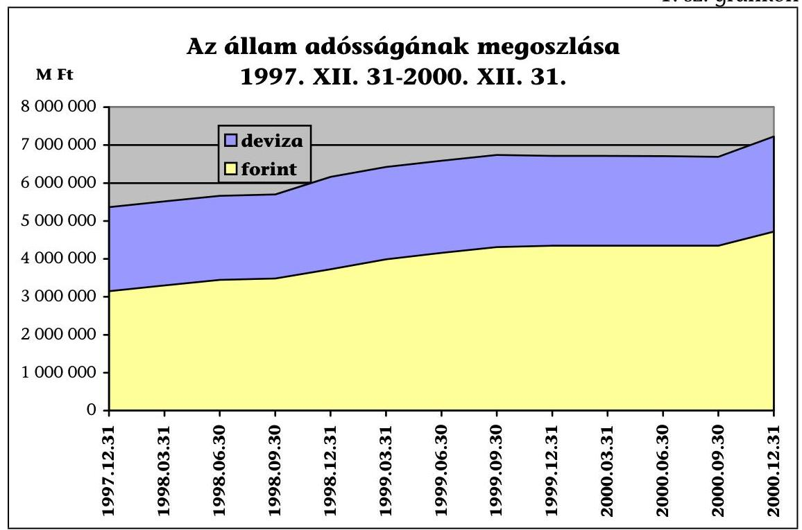

A 2000. december 31-ei adatok nem tartalmazzák a be nem váltott állományt.

Az Áht. 111-113. §-ai előírják az alrendszereket terhelő adósság nyilvántartására, kezelésére és teljesítésére vonatkozóan az önálló felelősséget, továbbá az

---

államadósság alrendszerekre bontott nyilvántartási kötelezettségét és az Országgyűlés részére történő bemutatását. A jogszabály rendelkezik továbbá az adósság alrendszerenkénti elkülönített kezeléséről és nyilvántartásáról.
Az Áht. hatályos rendelkezései az államadósságot bruttó megközelítésben értelmezik, az államháztartás egészének, egyes alrendszereinek, továbbá a jegybank - finanszírozásban betöltött (korábbi) szerepéből adódó - egymás közötti tartozása miatti halmozódás kiszűrését, a konszolidálást nem kezelik. Az információs rendszer teljessé és egyértelművé tétele további átgondolt és következetes intézkedést igényel. Jogszabályi szinten ugyancsak nem körülhatárolt az államháztartás, illetve az alrendszerek követelésállományának figyelembevételével számítható nettó államadósság fogalma, tartalma sem.

# 1.1. Az államháztartás információs rendszere és a belföldi államadósság számbavétele 

A pénzügyminiszter - az Áht. 48. § n) pontja szerint - felelős az államháztartás pénzügyi információs rendszerének működtetéséért, az azt szolgáló informatikai infrastruktúra koordinált fejlesztési programjának elkészítéséért és megvalósításának irányításáért, amit - a nemzetgazdasági pénzügyi információs rendszer részeként - úgy kell kialakítani, hogy az segítse az államháztartási pénzügyi folyamatok megtervezését, a költségvetési előirányzatok kialakítását, és a teljesülés elemzésére, értékelésére, ellenőrzésére alkalmas legyen (Áht. 114. § (1) bekezdés).

A mérlegek tartalmi szabályainak részletes kidolgozására a Kormánynak, illetve a pénzügyminiszternek adott törvényi felhatalmazások (Áht. 124. § (2) és (4) bekezdések) ellenére sem szabályozási, sem feladatszervezési oldalról nem megoldott, hogy az egyes alrendszerek (társadalombiztosítás, helyi önkormányzatok, elkülönített állami pénzalapok) adósságát és az azok egészét terhelő adósság összevonását, együttes bemutatását, esetleges konszolidálását mely szervezet és milyen módon végezze el.

Az elmúlt években részleges intézkedések és eredmények ugyan születtek, mivel az államháztartás pénzügyi rendszerének reformlépéseként értékelendő, hogy a 2189/1995. (VII. 4.) Korm. határozat rendelkezett a közpénzek megfelelő törvényi felhatalmazás alapján történő felhasználásáról, a kincstári szervezet létrehozásáról. A Kormány döntött továbbá a költségvetés végrehajtásában többek között - a finanszírozásért, a pénzforgalomért, a készpénz, deficit és államadósság menedzselésért való kincstári felelősségről.

A központi költségvetési szervek, az elkülönített állami pénzalapok és a társadalombiztosítás pénzügyi alapjai, valamint a társadalombiztosítás központi hivatalainak kincstári rendszerú finanszírozása átláthatóbbá tette azok gazdálkodását, a pénzeszközök kímélésével javította annak likviditási helyzetét.

A Magyar Államkincstár létrehozásával az intézményi pénzgazdálkodás helyébe alapvetően az előirányzat-gazdálkodás került. Változott az önkormányzatok finanszírozási rendszere is. Az önkormányzatokat megillető támogatásokat és az önkormányzatoknak átengedett bevételeket nettósították a központi költségvetést illető követelésekkel (közterhek). A 2189/1995. (VII. 4.) Korm. határozatban rögzített kormányzati szándéktól eltérően azonban a helyi önkormányzatok a Kincstár

---

szervezeti hatáskörébe a 2000. év végéig sem kerültek, kapcsolatuk a meglévő rendszer 2001. január 1-jei átalakításával továbbra is közvetett a Kincstárral.

Az előbbiekből is következően a központi kormányzat éves költségvetésének végrehajtásáról szóló törvényjavaslatok normaszövegének általános indokolásában és a számozatlan mellékleteiben államadóssági adatokat kizárólag a központi költségvetés szintjén tartalmaznak.

Az utóbbi évek zárszámadási törvényjavaslatai ugyanakkor tartalmazzák az alrendszerekre vonatkozóan a tárgyévi pénzforgalmi, valamint eszköz-forrás mérlegadatokat. A hiányos zárszámadási adatszolgáltatás (Áht. 116. §) nem feltétlenül hozható közvetlen összefüggésbe a pénzügyminiszter általános fele-lősség- és hatáskörével, mivel az 50/1990. (IX. 15.) Korm. rendelet 4. § (5) bekezdése szerint is a pénzügyminiszter - a KSH elnökének egyetértésével - szabályozza a pénzügyi folyamatokkal kapcsolatos adatszolgáltatás rendjét.

Az összesítések módjára, az időbeli eltérés áthidalására történő rendelkezés a hiányából adódóan is, az államadóssági adatok számbavételének egyik leggyengébb pontját az önkormányzati alrendszerre vonatkozó összevont adatbemutatás jelentette (az önkormányzatoknál 1999-től valósult meg az összevont adatbemutatás, amely azonban átfedéseket tartalmaz). Kritikus terület volt továbbá az alrendszerek követeléseinek - nettó államadósság meghatározásához elengedhetetlen - teljes körű bemutatása, mivel azok a központi költségvetés szintjén az adatok halmozódásának kiszűrése nélkül állnak rendelkezésre.

Az államháztartás, jellemzően alrendszerenként működtetett, információs rendszere - az ellenőrzött szervezetek nyilvántartásában jelentkező eltérések, valamint a denomináció és az önkormányzatokkal kapcsolatos nyilvántartások problémája miatt - nem tette lehetővé a belföldi államadósság államháztartási szinten egységes, megbízható számbavételét az ellenőrzött években.

Az államháztartás pénzügyi információs rendszerének fejlődését, a szélesebb körű tájékoztatás és döntés megalapozás célját szolgálta az adatszolgáltatási kötelezettség teljesebbé tétele mellett a költségvetési előirányzatok funkcionális és közgazdasági osztályozási rendszerének bevezetése.

Az MNB éves jelentésének adatai szerint az államháztartás bruttó belföldi és külföldi adósságállománya az 1997. és az 1999. évek között 28,0\%-kal, 5440,3 Mrd Ft-ról 6964,3 Mrd Ft-ra nőtt. Az államháztartás adósságának szintje - a bruttó államadósságnak - a bruttó hazai termékhez (GDP) viszonyított aránya ugyanezen időszakban 63,7\%-ról 61,1\%-ra csökkent. Az előzetes adatok szerint 2000. december 31-én az adósságállomány 7321,5 Mrd Ft volt, ami a GDP $56,9 \%$-ának felel meg.

Az államháztartás összes belföldi tartozása (leértékelési vagy MNB devizaadósság nélkül) - az MNB adatai alapján - az 1997. évi 3238,3 Mrd Ft-ról az 1999. év végére 4447,6 Mrd Ft-ra emelkedett (137,3\%). A GDP-hez viszonyított arány 37,9\%-ról 39,0\%-ra változott. A 2000. december 31-ei előzetes adatok szerint a

---

belföldi tartozás összege 4833,0 Mrd Ft-ra nőtt, ami a GDP 37,5\%-ának felel meg.

Az államadósságon belül a központi költségvetés adóssága - a belföldi és a külföldi adósságot illetően egyaránt - súlyánál fogva továbbra is meghatározó tényező. A központi költségvetés összes adóssága 1997-ben az államháztartás adósságának 98,7, 1999-ben 98,9\%-át jelentette.

Az államadósság alakulásában a központi költségvetés adóssága változatlanul meghatározó tényező, az államháztartás többi alrendszerében likviditási célból hitelt - a társadalombiztosítási alapok, egyes önkormányzatok és az Útalap kivételével - nem vettek igénybe. Az adósság alakulásában ezáltal elsősorban - a korábbi évekhez hasonlóan - a központi költségvetésre jellemző folyamatok tükröződnek.

A központi költségvetés belföldi forintadósság állománya ${ }^{\circ}$ 1999. december 31én összesen 4350 Mrd Ft volt, ezen belül a hosszú lejáratú kötelezettségek állománya 3114 Mrd Ft, a rövid lejáratúaké 1236 Mrd Ft volt. A központi költségvetés 1999. december 31-ei belföldi adósságállománya - az átvállalás (1999. január 1.) miatt - tartalmazza a korábbi elkülönített állami pénzalapok (Útalap) adósságát, amelynek 1999. év végi állománya 17,7 Mrd Ft volt. A központi költségvetés forint adósságának állománya 1997 - 1999 között 38,1\%kal nőtt. A hosszú lejáratú (éven túli) kötelezettségek 37,7\%-kal, a rövid lejáratúak (éves és éven belüli) 39,1\%-kal haladták meg az 1999. év végén az 1997. évi értékeket. A társadalombiztosítás pénzügyi alapjainak bruttó belföldi adósságállománya 1999. december 31-én 55,8 Mrd Ft-ot (az előzetes adatok szerint a 2000. év végén 92,0 Mrd Ft-ot) tett ki, ami a KESZ-ről igénybe vett hitelből és a Postabank Rt. viszontgaranciális kötelezettségéből állt. A helyi önkormányzatok belföldi adóssága az 1999. év végén 51,4 Mrd Ft (az előzetes adatok szerint 2000. december 31-én 60,4 Mrd Ft) volt.

A központi költségvetés (a fejezetek és célelőirányzatok adataival együtt) követelésállománya az 1997. év végi 1004,7 Mrd Ft-ról 1999. december 31-ére 1202,3 Mrd Ft-ra nőtt. Az előzetes adatok szerint 2000. december 31-én 1116,0 Mrd Ft volt (az adatok halmozódást tartalmaznak). Ebből a hitelkövetelések összege, az 1997. december 31-ei 51,1 Mrd Ft -ról az 1999. év végére 33,4 Mrd Ft-ra, az előzetes adatok szerint 2000. december 31-ére 25,2 Mrd Ft-ra csökkent.

# 1.2. Az államháztartás adósságállományának megbízhatósága, kezelésének pénzügyi szabályszerűsége 

Az államháztartás belföldi adósságának minősítése során elsősorban az alkalmazott rendszer megbízhatóságának ellenőrzésére került sor a pénzügyi megbízhatósági ellenőrzésre vonatkozó kérdések figyelembevételével. Az ál-

[^0]
[^0]:    ${ }^{\circ}$ Tartalmazza a külföldiek birtokában lévő forint-kötvényeket, valamint a belföldi bankoknál lévő devizakötvényeket és -hiteleket.

---

lamadóssághoz kapcsolódóan kialakított és múködtetett nyilvántartási és elszámolási rendszer zártsága az ellenőrzött években továbbra sem volt biztosított. Az államháztartás belföldi adósságának összetettsége és az összehasonlítható adatbázis hiánya miatt pénzügyi megbízhatósági ellenőrzésre és minősítésre nem volt lehetőség.

A rendelkezésre álló nyilvántartások alapján a központi költségvetés belföldi adósságánál az állományok összegszerű ellenőrzésére volt lehetőség az év végi állományösszesítő kimutatásokból. Az egyes nyilvántartási helyek között adateltérések - köztük lényeges összegű - is előfordultak, de az adategyezőség többségében fennállt. Két alkalommal utólagos korrekcióra is sor került.

A Magyar Államkincstár Nemzetgazdasági Számlakezelő Főosztálya (a szervezeti séma 1999. október 18-ai módosításától Âllamháztartási Összefoglaló Főosztály) és az ÁKK által, illetve mindkét szervezeti egységen belül összeállított állományi és folyó kiadási kimutatások adata több ponton eltér. Az eltérés rendszerint a kimutatások összeállításának szemléletbeli különbözőségére vezethető vissza (állomány, pénzforgalom). A nemzetgazdasági számlák és az ÁKK könyvelése között nyitó és záró állományi, tárgyévi bevételi és kiadási adateltérések voltak az államkötvény törlesztéseknél, a tárgyévi kibocsátás összegénél, a deviza és forintkötvények közé történő eltérő sorolás miatt, a diszkont kincstárjegyek nyitó és záró állományánál, tárgyévi törlesztésénél, a kamatozó kincstárjegyeknél és a kamatozó takarékjegyeknél (a kötvények 1997 év végi állományánál 26,2 Mrd Ft, 1998-ban a kibocsátásnál 1,4 Mrd Ft, a törlesztésnél 75,9 M Ft volt az eltérés, 1999-ben 2,5 M Ft kibocsátási és 703,5 Mrd Ft törlesztési eltérést tapasztaltunk. A kincstári takarékjegy év végi állományánál - a nemzetgazdasági számlaegyenleg részbeni átvezetése miatt - 1998-ban 80,0 Mrd Ft, 1999-ben 158,7 Mrd Ft volt az eltérés).

A társadalombiztosítási alrendszernél a szabályozás hiánya is nehezítette a belföldi adósság behatárolását, az Áht.-nak az államadósság nyilvántartásával kapcsolatos előírásai sajátosan érvényesültek. Helyzetük miatt az Alapok adósságának rendezése a központi költségvetésen keresztül történik.

Az önkormányzati alrendszer vagyonmérlegeiből nem nyerhetők ki egyértelműen az alrendszer belföldi adósságra vonatkozó adatok (a tartozások tartalmaznak az egyes önkormányzatok között fennálló tartozásokat is).

A követelések minősítésénél kiemelést érdemel a jogszabályi rendelkezés hiánya, amely a belföldi követelések egységes szerkezetben történő bemutatását, minősítését hátráltatja. Hiányoznak továbbá a kimutatott követelések minősítésének (lejárt, kétes) és elengedésének feltételei.

# 2. AZ ÁLLAMHÁZTARTÁS ALRENDSZEREINEK BELFÖLDI ADÓSSÁGA 

### 2.1. A központi költségvetés belföldi adóssága

### 2.1.1. A központi költségvetés belföldi adósságának szabályozottsága és kezelésének feltételrendszere

A központi költségvetés belföldi adósságára, a pénztulajdonosok felé fennálló adósságának nagyságára, az állomány változására, a korábban vállalt elkö-

---

telezettségeken és azok teljesítésén túl, a központi költségvetés tárgyévi hiányának nagysága, valamint az alrendszerek kiadásainak pénzügyi fedezeteként az éves költségvetési törvényben biztosított KESZ igénybevétele van alapvető hatással.

A költségvetés finanszírozási, valamint hitelfelvételi és értékpapír-kibocsátási feladatait az 50/1999. (IX. 15.) Korm. rendelet 2. § (5) bekezdése, a központi költségvetést terhelő adósság (és hiány) finanszírozási, az államadósság kezelési és gazdálkodási, nyilvántartás vezetési feladatokat pedig az Áht. 113/A. § (1) bekezdése utalta a pénzügyminiszter feladatkörébe. A pénzügyminiszter feladatainak ellátásáról a Magyar Államkincstár útján gondoskodott. Az ellenőrzött évek hiányfinanszírozási és adósságkezelési feladatát a Kincstáron belül elkülönült szervezet, az ÁKK végezte. Az Áht. 2001. március 1-jétől hatályos módosítása - a Magyar Köztársaság 2001. és 2002. évi költségvetéséről szóló 2000. évi CXXXIII. törvény 82. § - a törvényen belüli összhanghiányt okoz, amihez feladat-, jog- és felelősségi kör egyértelmű rendezése nélküli szervezetváltozás (a Magyar Államkincstár és a létrehozott ÁKK Rt.) is kapcsolódik (Áht. 18/F. és 18/G. §).

Az Áht. 2001. március 1-jétől hatályos 18/B. § (2) bekezdése alapján a Kincstár a Magyar Állam nevében gondoskodik a finanszírozásról, a készpénzgazdálkodásról, a KESZ napi likviditásáról, míg az Áht. 113/A. § (1) bekezdés b) pontja szerint a pénzügyminiszter a részvénytársasági formában múködő ÁKK útján „gondoskodik a központi költségvetést terhelő adósság és hiány finanszírozásáról, az államadósság kezeléséről és az azzal való gazdálkodásról".

E feladatkörében 2001. március 1-jétől az ÁKK Rt. készíti el a központi költségvetés éves és középtávú finanszírozási tervét, dolgozza ki az államadósság finanszírozási stratégiáját; a költségvetési törvény felhatalmazása keretében szervezi az állampapír-kibocsátásokat, hitelfelvételeket és hitelátvállalásokat; gondoskodik továbbá mindarról a feladatról, amit az Áht. 113/A. §-a a Kincstár feladataként tartalmazott.

A rendelkezésre álló dokumentumok áttekintése alapján nem egyértelmű az Áht. 18/B. §-ban módosult kincstári feladat elvárt szakmai tartalma, a két szervezet (a Magyar Államkincstár és az ÁKK Rt.) közötti munkamegosztás és kapcsolattartás módja.

A Pénzügyminisztérium Szervezeti és Múködési Szabályzata szerint a Költségvetéspolitikai Főosztály (a 2001. januártól hatályos szervezeti felépítés szerint Költségvetési és Pénzügypolitikai Főcsoport) fogja össze az államháztartás hiányának finanszírozási konstrukcióit, az államadósság kezelésének alapvető koncepcióját, az adósságkezelés módszertanáról kidolgozandó elvi javaslatokat (3/1998. PM utasítás IX. fejezet). A központi költségvetést terhelő államadósság kezelési, gazdálkodási, nyilvántartás-vezetési feladatokat a Kincstár, azon belül a részjogkörrel rendelkező, részben önállóan múködő ÁKK látta el.

Az adósságkezelés 1996-1999 között múködtetett felsőszintű vezetői döntéshozatali (1999 októberétől tanácsadói) fóruma a Kincstári Tanács. A PM közigazgatási államtitkárának, 1999 szeptemberétől a pénzügyminiszter elnökletével múködtetett fórum feladatkörébe a központi költségvetés finanszírozásának stratégiai és taktikai kérdései, a forrásbevonás lehetőségei, az állam belföldi rövid és hosszú

---

távú adósságkezelésének irányelvei stb. kérdéskörök tartoznak. A Kincstári Tanáccsal történő konzultáció után a döntést a pénzügyminiszter hozza meg.

A Kincstár folyamatosan változó feladata és szervezete ellenére a Szervezeti és Múködési Szabályzata 1996. október 14-e óta van hatályban. Szervezeti ábráját a Kincstár a szervezeti egységek elnevezéseinek, a felügyeleti és irányítási rend változtatásának alkalmával aktualizálta (2000. év végéig 13 alkalommal). A szervezeti felépítés 2000. július 1-jei állapotot tükröző változatát a pénzügyminiszter jóváhagyólag tudomásul vette.

Elkészítették a szervezeti egységek részletes feladat-meghatározását, statútumát és a munkaköri leírásokat is (1999-2000). Az SZMSZ-t a Kincstár megkezdett szervezeti átalakításának befejezését követően tervezik aktualizálni.

Az ÁKK feladatát és az ehhez kapcsolódó jogkörét az ellenőrzött időszakra kiterjedően Alapító okirat szabályozta. Az ÁKK 1997. január 1-jétől érvényes SZMSZ-ét 2000 májusában dolgozták át. A pénzügyminiszter által elfogadott szabályzat a szervezeti, a felügyeleti, egyeztetési, koordinálási és kapcsolattartási kérdéseken, valamint a múködés általános szabályain túl, részletesen kitér az egyes szervezeti egységek által ellátandó feladatokra, a döntési mechanizmusokra.

Az államadósság-kezelés, -elszámolás legfontosabb teendőit, a szervezetek közötti elengedhetetlen munkakapcsolat mértékét, módját címzett utasítások, szabályzatok, eljárási rendek rögzítik. A Kincstár és az ÁKK között a további - alapvetően intézménygazdálkodási - feladat- és felelősségmegosztást, a törvényességi és szakmai felügyeletgyakorlás, ellenőrzés módját megállapodás rendezte (1999. október 14.).

Értékpapír Üzletszabályzattal a Kincstár 1996-tól folyamatosan rendelkezik. Az állampapír-forgalmazással kapcsolatos általános szerződési feltételeket tartalmazó legutolsó szabályzat 2000. november 8 -ától hatályos (19/2000. sz. Elnöki Utasítás). A Kincstár az állampapírok forgalmazásában résztvevő központi és hálózati szervezeti egységek tevékenységeinek Eljárási rendjét 1996tól szabályozta. A többször módosuló, majd megújított utasítás (20/2000. sz. Elnöki Utasítás) az általános tudnivalókon túl az értékpapírjegyzéssel, az ér-tékpapír-számlával, számlavezetéssel, a másodlagos forgalmazással, az újra befektetéssel, a tőketörlesztéssel, kamatfizetésekkel, a letiltással, az adózással, a bizonylatkezeléssel és a napi zárással kapcsolatos feladatok végrehajtásának módjáról rendelkezik.

A kincstári fiókhálózat feladatellátására vonatkozó általános Ügyrend nevesíti a Magyar Állam által kibocsátott értékpapírok elsődleges (jegyzéssel történő) kibocsátásában, másodlagos forgalmazásában, az ügyfélszámla vezetésében, a letétkezelésben és a kifizetőhelyi feladatellátásban való közremúködést. A 9/2000. sz. Elnöki utasítás már kitér a fiókok kapcsolattartásának módjára is.

Az államadósság (állampapír, hitel) -kezeléshez, kezességvállaláshoz és a nyilvántartások vezetéséhez kapcsolódóan az ÁKK által ellátandó feladatok részletes szabályairól a saját hatáskörben összeállított, és az ÁKK általános igazgatóhelyettese aláírásával kiadott 1/1999. sz. Ügyviteli utasítás rendelkezik.

---

Az állampapírokkal kapcsolatos készpénzforgalom, az értékpapírok, valamint a kamat és/vagy törlesztő-szelvények nyilvántartásának értéktári rendjét ugyancsak Elnöki Utasításként - a Pénz- és Értékkezelési Szabályzat rendezi.

A Hálózatirányítási és Szabályozási Főosztály Összefoglaló Osztályának Eljárási rendje (KÁ 1964-1/2000 XI. 27.) a XI/4. pontjában a negyedéves és éves leltározási feladatok tekintetében mindössze a T/2000, az ÁEF és a CLAVIS programokból lekért és egyeztetésre külön EXCEL táblába rendezett listák ÁKK-nak való megküldéséről rendelkezik. A készítendő „leltárkimutatások" között az összesített állományi adatokon túl, forgalmi adatgyűjtések is szerepelnek (tőke- és kamatfizetési forgalom összegei, másodlagos piaci forgalom alakulása számlás és fizikális értékpapírok szerint).

A Kincstár hatályos utasításként kiadott Számviteli politikával csak mint intézmény rendelkezik (5/2000. sz. Elnöki utasítás). A Kincstár alaptevékenységére, a központi költségvetésre, illetve a nemzetgazdasági számlákra vonatkozó számviteli politika tervezet szintjén évenként készült el (1998, 1999, 2000), amiből hiányoznak az év végi mérlegsorok - kivéve a pénzeszközöket, az Egyéb aktív pénzügyi elszámolást - leltárral történő alátámasztásának előírása. A tervezet mellékletét képezné az Értékpapírok Leltározási Szabályzata, annak csatolása azonban elmaradt.

A munkaanyag - a szervezeti sajátosságoktól elvonatkoztatva - annak ellenére tekintené leltárnak a főkönyvi könyveléssel egyező analitikus nyilvántartást, hogy a főkönyvi könyvelés eszközeinek, forrásainak állományi adatai elsősorban az egyeztetett analitikus nyilvántartó helyek feladásai alapján állnak elő. A kincstári rendelkezés tervezet a VIII. (A mérlegtételek leltározása) fejezetében belső ellentmondást, a feladatmegfogalmazás módjában logikai „hurkot" tartalmaz („Leltározásnak kell tekinteni a ..... leltározás alapján készített, helyesbített, ellenőrzött ..... analitikus nyilvántartásokat"). Az ÁKK Számviteli Főosztálya részletező nyilvántartásának állományi adatait viszont a pénzforgalom bizonylataiból állították elő. Mennyiségi felvétellel történő leltározás esetén egyébként sem jogszabályi követelmény a részletező nyilvántartás utólagos összeállítása, abból rendszerint összesítő kimutatást készítenek.

A Kincstár feladatkörébe tartozó elszámolások könyvvezetését szolgáló Számlarendet a 17/1998. sz. Elnöki Utasítás helyezte hatályba. Az utasítás változatlanul hagyása mellett, a Számlarend évenkénti aktualizálását az Államháztartási Pénzügyek Igazgatósága elnöki felhatalmazás alapján hajtotta végre. A Kincstár szervezeti sémájának többszöri aktualizálása alapján megállapítható, hogy az utasítás 4. pontjában felhatalmazott Államháztartási Pénzügyek Igazgatóságot - mint szervezeti egységet - 1999. október 18-ai hatállyal az Elnök megszüntette. A 2000. október 25-ei állapotú kincstári Számlarend formális kiadója az „Államháztartási Pénzügyek Igazgatósága", valójában azt a feladatkörébe tartozóan, az Államháztartási Számviteli Főosztályt magába olvasztó Államháztartási Összefoglaló Főosztály, mint jogutód szervezet készítette el.

Az ÁKK Számviteli Politikája, illetve az 1998. január 1-jétől hatályos Számviteli Alapelvek szerint az értékpapír-kibocsátásnak a finanszírozási alapcéljából levezetett sajátossága, hogy a nem értékesített, valamint a visszavásárolt állampapírok mennyisége - mivel a visszavásárolt mennyiséget esedékességkor

---

sem tőke-, sem kamatfizetési kötelezettség nem terheli - az állam adósságállományában nem kerül szerepeltetésre.

Értékesítésig azokat a „0"-ás számlaosztályban tartják nyilván (2.1.12. és 7.1. pont). Az államkötvényeket, a kamatozó kincstárjegyeket, a kincstári takarékjegyeket - a belső szabályzat szerint - névértéken kell értékelni. A névértéknek, valamint a kibocsátási (eladási) és a vételár közötti különbözetnek azonban csak a felhalmozott kamaton túli része jelent árfolyamveszteséget, vagy árfolyamnyereséget.

A Kincstár Leltározási Szabályzata (8/2000. Elnöki Utasítás, és az azt megelőző is) a jogszabályi előírásokat ismétlő, az egyes részfeladatok törvény által biztosított, megoldási módjának választásában általában állást nem foglaló „általános" utasítás.

A leltár főfelelősének az intézményi pénzügyi és számviteli főosztályvezető személyében történő kijelölése, a követelések és kötelezettségek eseti nevesítése (a Kincstár, mint intézmény beszámolójában lévő ECO kötvény) is jelzi az évenkénti számbavétel teljes körűségének elmaradását. Az utasítás nem tért ki a kincstári számlavezetés, az állam nevében felvett, kihelyezett hitelek, a kibocsátott állampapírok állományának év végi számbavételi követelményére.

A Kincstár belső ellenőrzésének aktuális szabályait a 10/1999. sz. Elnöki Utasítással adták ki. Az utasítás mellékletét képezi a Belső ellenőrzési, valamint a Hálózat- és Külső Ellenőrzési Szabályzat.

Előbbi a függetlenített belső ellenőrzési szervezet (Belső Ellenőrzési Főosztály) részére alapvetően gazdálkodás ellenőrzési és a Kincstár Központban ellátott alapfeladataiból eredően néhány kiemelt területet (az előirányzat-gazdálkodást, a központi előirányzatokkal kapcsolatos bonyolítási feladatot, a nemzetgazdasági számlák vezetését, a részjogkörű költségvetési szervezetek tevékenységét stb.) határozott meg. Az utasítás a Hálózatirányítási és Ellenőrzési Főosztály Hálózatellenőrzési Osztályának (az osztály 2000. május 15 -étől a főosztályból kiemelve, majd december 1-jétől a Belső Ellenőrzési Főosztállyal összevonva múködött) feladatává tette - többek között - a pénz- és értékkezelés, valamint az értékpapírforgalmazás ellenőrzését.

Az ÁKK - az államadósság kezeléssel kapcsolatban - nyilvántartási, könyvelési, költségvetés- és finanszírozástervezési, kibocsátás-szervezési, hitelfelvételi, tájékoztatási stb. feladatcsoportokat látott el. Az ellenőrzött időszak kezdetére kialakult az ÁKK feladatokhoz igazodó belső szervezeti tagozódása, ami folyamatosan fejlődött. Az egyes funkciók lefedettek. Korábban az adósság, illetve a külső forrásbevonás denominációjához igazodó feladatszervezést és felelősségi rendet valósítottak meg, 2000-től azonban a két részterület - deviza, forint - azonos felsővezetői (üzleti igazgatóhelyettes) irányítás alá került.

A helyszíni ellenőrzés lezárásának időpontjában a Törzskar mellett 6 főosztály, valamint az Elszámolási és Lebonyolítási Önálló Osztály múködött az ÁKK-ban.

Az alkalmazottak jellemzően felsőfokú végzettséggel, néhányan több nyelv ismeretével rendelkeztek. Szakmai képzettségük megfelelt a munkáltatói elvárásoknak. A munkatársak feladatait, a munkavégzés egyéb rendjét, vezetői elvárásait munkaköri leírásban szabályozták, amelyeket a 2000. májusi

---

SZMSZ módosítást követően átdolgoztak. Az új munkaköri leírások a korábbiaknál részletesebben és konkrétabban fogalmazták meg az egyes munkakörök ellátásának rendjét.

# 2.1.2. A központi költségvetés belföldi adóssága 

A központi költségvetés összesített belföldi adósságállománya - az 1997. évi csökkenéstől eltekintve - folyamatosan növekedett. Növekedés állapítható meg akkor is, ha minden év adatát az azt megelőző év záró állományához viszonyítjuk.
2. sz. grafikon
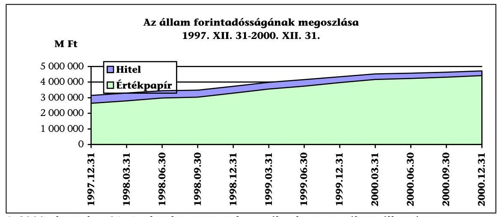

A 2000. december 31-ei adatok nem tartalmazzák a be nem váltott állományt.
A központi költségvetés tartozásának, alakulásának részletes adatait 19972000. között az 1. sz. melléklet tartalmazza. A négy év záró állományánál a volumen változása mellett, belső szerkezeti változás is bekövetkezett.

Az ellenőrzött években számottevően csökkent - a korábbi években alkalmazott az állammal szembeni, megkülönböztetett hitelezési gyakorlatból származó kedvezményes hitel adósságállománya. Az állam által felvett, illetve átvállalt forint hitelelem 15,98\%-os részaránya mintegy 5\%-ponttal csökkent a 2000. év végére. A hitelek aránycsökkenésében az ellenőrzött évek tőketörlesztéseinek állományra gyakorolt hatása ( $-50 \%$ ) mellett, a rövid és hosszú lejáratú állampapírok megnövekedett súlyának egyaránt szerepe volt. A forint államkötvények mintegy 1300 Mrd Ft-os volumennövekedése markánsan hatott a belföldi adósságelemek közötti arányok eltolódására.

Néhány tízmilliárd forintos volumenük miatt kisebb részarányt képviselnek - az első ízben 1998-ban kibocsátott - kincstári takarékkötvények és a 2 éves lejáratú kincstári takarékjegyek. Év végi állományuk szintén töretlenül növekvő. A belföldi államadóssági szerkezetben kevesebb mint 1\%-os részarányt képviselnek (2000. év).

A kötvényekéhez hasonló mértékű az állam rövid lejáratú kötelezettségeinek volumennövekedése is, amin belül az arányokat tekintve - több mint hétszeres névértékével - meghatározó jelentősége az 1 éves lejáratú kincstári takarékjegyeknek volt.

---

Az állampapír-állományok megoszlásának, belső szerkezeti változásának adatait a 2. és a 2/a. számú mellékletek tartalmazzák.

Az 1999. december 31-ei leltárként a Hálózatirányítási és Ellenőrzési Főosztály által, a kincstári fiókhálózat állampapír-forgalmát feldolgozó számítógépes rendszerből kinyomtatott év végi állományösszesítő kimutatások álltak rendelkezésre. Nem készült leltár a kibocsátáskor az elsődleges forgalmazói rendszerben értékesített és év végén az állam kötelezettségeinek többségét (85-87\%-át) kitevő állampapír-állományról. Arról leltárként az ÁKK öszszesítő kimutatása állt rendelkezésre, amely mintegy 3,5 Mrd Ft-tal alacsonyabb összegben tartalmazta a kincstári beszámoló összegénél az állam kötelezettségét.

Adateltérés van az államkötvények ÁKK Számviteli Főosztálya és az Elszámolási és lebonyolítási önálló osztálya által 1999. december 31-én kimutatott, és a kincstári főkönyvhöz „leltárként" csatolt záró állománynál. A rendszerbeli eltérés abból adódik, hogy az utóbbi - a KELER által vezetett Értékpapírszámla adatával, kivonatával megegyező - „analitika" nem tartalmazza a lejárt, de esedékességkor vissza nem váltott ügyfél és fizikai állampapír-állományt, mivel azok kereskedési forgalomban már nem vehetnek részt ( $3,5 \mathrm{Mrd}$ Ft-tal 1,3 ezrelékkel magasabb a számvitel és a kincstári beszámoló adata).

A Hálózatirányítási és Szabályozási Főosztály által bemutatott 1999. évi BÉP Igazgatói Utasítás tervezet szerint az állampapír fajták 1999. december 31-ei állományáról összeállított „leltárak" nem a fiókokban készültek, azoknak valódiságát, teljességét a fiók vezetőjével, munkatársával nem ismertették el. A számítógépről lekért állományi kimutatások tényszerűségét - ahol a csoportosítási szempont nem a papír értékesítési helye volt- a BÉP igazgató helyettese igazolta aláírásával.

A Magyar Államkincstár tájékoztatása szerint az ÁKK Rt. a 2000. évre vonatkozóan teljes körű leltárt készített, melyet átadott a Kincstár illetékes szervezeti egysége részére, továbbá az államadósságra vonatkozó Leltározási Szabályzat elfogadás előtt áll.

A központi költségvetés belföldi adósságállományának, forgalmának könyvelésében, nyilvántartásában részt vevő szervezeti egységek által ellenőrzésre átadott dokumentumok és tanúsítványok kötelező adategyezősége többségében fennállt, de néhány eltérés megállapítható.

Az MNB fiókhálózatának kincstári átvételénél (1996. október) az állomány és dokumentum átadás-átvétel pontosságára, illetve a fióknál lévő államadósság analitikus és főkönyvi adategyeztetésére is kiterjedő helyszíni ellenőrzések során a Kincstár 5 megyénél tárt fel - esetenként a fiókhálózat „induló" állampapírállományának megbízhatóságát is érintő - tartalmi és alaki hiányosságot.

A nemzetgazdasági számlák tárgyévi pénzforgalmi elszámolásainak levezetésénél az ÁKK Számviteli főosztálya mindenkor bemutatta az eltéréseket. Legnagyobb volumen az 1997. év nyitó adatainál tapasztalható, ahol az előző és a következő évet érintő módosítások végrehatási igényének levezetése az egyezőségig biztosított. Az évenként levezetett eltérések dokumentumait a zárszámadás ellenőrzése keretében mindenkor áttekintettük.

---

A Nemzetgazdasági Számlakezelő Osztály állampapíronként vezetett analitikus nyilvántartásában a tárgyévi pénzforgalmi elszámolások között rendezetlenül maradt függő tételek összege folyamatosan csökkenő. Az aukciós államkötvények egyéb rendezésre szoruló függő forgalma 1997-ben 13,9 Mrd Ft-ot tett ki, 2000ben ez az összeg 670,6 M Ft volt (január 5-én). A függő tételek pénzforgalmának a vonatkozó kötvényre könyvelése során 1997-ben még az előző évet érintő helyesbítések is szerepeltek, addig a 2000. december havi függő rendezése csak az utolsó hónap pénzforgalmának az egyeztetését igényelte, (zárlati határideje az adatszolgáltatást követő időpontra esett). Kedvezően értékeli az ellenőrzés, hogy megszüntették az analitikus nyilvántartás gépi feldolgozás melletti manuális vezetését.

A tárgyévi finanszírozás módját minden évben az ÁKK feladása alapján vezették le a zárszámadási törvényjavaslatban. A részletes adatszolgáltatás a finanszírozási, a KESZ likviditási és a KESZ-t nem érintő műveleteket csoportosítva szerepeltette, kitért továbbá a tárgyévi adósságműveleteket nem érintő rendezésekre is. Eltérés van a központi költségvetés hiányának nagyságában az ÁKK tárgyévi hiányfinanszírozás számítása és a Nemzetgazdasági Számlakezelő Főosztálynak a finanszírozáshoz kapcsolódó, nemzetgazdasági számlákon év végén megvalósított „technikai" átvezetései között, mivel azok a tárgyévet követő év júliusáig - az esetleges utólagos korrekciók miatt - változnak.

A fizikai kibocsátású papíroknál - munkaszervezési hiányosságra is visszavezethetően - előfordult, hogy a ténylegesen nyilvántartott mennyiségnél többet szándékoztak visszaváltani.

A fizikai kibocsátású állampapírok tőkekifizetését az állam a forgalmazók felé eltérés esetén az utólagos szankcionálás lehetőségének fenntartásával - a papíroknak a Budapesti Értékpapírpénztárba történő beszállítását megelőzően teljesítette. Az elszámolás módja 2000-től változott.

# A Kincstár nyitó állományának, illetve éves elszámolásának utólagos korrigálására - az ellenőrzött időszakban - két alkalommal került sor. 

Az 1997. évi zárlati dokumentumok 716,64 M Ft hiányt csökkentő rendezést tartalmaztak, a „BINÁR-ból elveszett tranzakció" magyarázattal (adat-feldolgozási hiányosság). Az 1998. év végén a számlavezető rendszerben - a saját tőkét is érintő - 29,7 Mrd Ft összegű, az 1997. január 1. nyitó egyenleget érintő módosítást hajtottak végre. Az év végi zárlatnál pedig egyenlegében 38,0 M Ft-ot döntően egy decemberi téves könyvelés helyesbítéseként, illetve kisebb részben előző évi beszámoló (eszköz-forrás differencia) rendezéseként számoltak el. A pénzügyminiszter engedélyével, törvényesen elszámolt tételek egyenlegeként 36,9 M Ft-tal csökkent az 1998. évi hiány.

### 2.1.3. A belföldi államadósság nyilvántartási, elszámolási rendszerének megbízhatósága, zártsága

Az állam belföldi adósságára és annak állományváltozására vonatkozó adatait a Kincstár 1997. január 1-jétől vezeti. A belföldi államadósság 1999. december 31-ei záró állománya megbízhatóságának ellenőrzése keretében a pénzügyi megbízhatósági ellenőrzés módszerét kívántuk alkalmazni. A Kincstárnál azonban - az évközi új adatfeldolgozási rendszerre való áttérés miatt - a szükséges adatok (homogén, mintavételezésre alkalmas módon) nem álltak rendelkezésre.

---

Az új Értékpapír-forgalmazó rendszer (Clavis) már ORACLE adatbázis kezelőt használ, ellentétben a régi értékpapír-kezelő́ rendszerrel (Bond-Int), amely MAGIC 5.6. alatt futott. A különböző adatbázisokból létrehozott adatállományok közös kezeléséhez az adatokat konvertálni szükséges. Az új rendszer (Clavis) adatainak konverzióját a Magyar Államkincstár meg tudta volna oldani, de a régi adatok konverzióját nem, mert az régi rendszer (Bond-Int) - mint szellemi termék - az azt kifejlesztő informatikai vállalkozás tulajdonát képezte. Így a Kincstár nem rendelkezett azzal a joggal és számítástechnikai lehetőséggel, hogy elvégezze az adatkonverziót, ezért az adatok összehasonlítását a Kincstáron kívülálló, objektív okok is akadályozták.

A Kincstárnak nem volt mérlegelési lehetősége a kritikus Y2K időpont miatt. (A Bond-Int rendszer ugyanis nem felelt meg az évezredváltással kapcsolatos elemi követelményeknek sem.) A sikeres évzárás volt a cél, miután a Kincstár nem kockáztathatta az évezred váltás informatikai megoldását.

Kifogásolható, hogy az adatbázis kezelésének kidolgozására kötött szerződésben, az azt kifejlesztő informatikai vállalkozás felé nem kötötték ki az esetlegesen szükségessé váló adatkonverziók költségmentes megvalósítását.

A helyszíni ellenőrzés az adatelszámolások szabályozottságára, a tárgykörbe tartozó adatfeldolgozások, számítógépes rendszerek múködésének, a közöttük lévő kapcsolattartás módjára, a belső kontroll mechanizmusokkal biztosított zártság megállapítására terjedt ki.

A központi kezelésű előirányzatok (államadóssági elszámolások) eszközeinek és forrásainak az éves beszámolóban való szerepeltetése teljes körűségéről beleértve az ÁKK elszámolásait is - a Magyar Államkincstár tartozik gondoskodni (217/1998. (XII. 30.) Korm. rendelet az államháztartás múködési rendjéről 12/a. sz. melléklet). A Magyar Államkincstár könyvvezetési és beszámolási kötelezettségéről szóló - módosított - 257/1997. (XII. 21.) Korm. rendelet hatálya kiterjed a Kincstár feladatkörébe tartozó pénzforgalmi és pénzforgalom nélkül teljesülő nemzetgazdasági elszámolásokra, azok könyvvezetésére és a beszámolásra. A vonatkozó előírások betartása érdekében a gazdasági műveleteket a Kincstárnak a kettős könyvvitel zárt rendszerében, idősoros és számlasoros elszámolásban kell feljegyeznie (12. §).

A központi költségvetés belföldi adóssága állományi és forgalmi adatainak fókönyvi könyvelését, illetve analitikus nyilvántartását a Kincstár Államháztartási Összefoglaló Főosztályán (1999. október 18-áig az Államháztartási Számviteli Főosztályon is), a Hálózatirányítási és Szabályozási Főosztályán (2000. május 15 -éig a Hálózatirányítási és Ellenőrzési Főosztály), a Kincstár fiókhálózatában (budapesti és megyei fiókok), valamint az ÁKK több főosztályán, önálló osztályán vezetik.

Az állam rövid és hosszú lejáratú kötelezettségeinek főkönyvi könyvelését az ÁKK - kezdetben év végi, 2000-től negyedéves - feladásai alapján végzik. A Kincstár által összeállított Nemzetgazdasági elszámolások könyvviteli mérlegének alapdokumentumait az ÁKK papíralapú feladásai képezik.

A Kincstáron belüli és kívüli analitikus helyek, hiteles főkönyvi feladás formájában szolgáltatott adatok ismételt rögzítése hibalehetőséget és feldolgozási (adat-

---

rögzítési, ellenőrzési) párhuzamosságot jelent, ami hozzájárulhatott az 1997. és 1998. évi eltéréshez.

Az 1999. évi mérleg fökönyvi kivonattal alátámasztott volt, az ál-lampapír-forgalom leltárral azonban nem. Az állam kötelezettségeinek többségét az ÁKK által készített analitikus nyilvántartással támasztotta alá. A december 31-ei fordulónappal készített mérlegben kimutatott eszközök és források leltárral történő alátámasztásának a kötelezettségét a számvitelről szóló többször módosított - 1991. évi XVIII. törvény 42. §-a, valamint a költségvetés alapján gazdálkodó szervek beszámolási és könyvvezetési kötelezettségéről szóló 54/1996. (IV. 12.) Korm. rendelet 25. §-a is előírja.

A mérlegtételek minden évre vonatkozó leltári alátámasztását a hivatkozott jogszabályhely az eszközök mennyiségi felvételét, közülük a követelések és az aktív pénzügyi elszámolások, továbbá a források egyeztetéssel történő leltározását követeli meg. A Kincstár nem gondoskodott a Nemzetgazdasági elszámolások könyvviteli mérlegsorainak leltári alátámasztásáról, és nem rendelkezett az analitikus nyilvántartó helyek felé sem ennek biztosítása érdekében.

Az ÁKK Rt. tájékoztatása szerint az ÁKK-ban folyamatban van a 2000. év zárására vonatkozó leltár, valamint az államadósságra vonatkozó leltározási szabályzat kidolgozása.

A belföldi államadósság 1999. december 31-ei záró állományának valódiság és teljesség számviteli alapelvek (1991. évi XVIII. törvény 15. § (2)-(3) bekezdések) szerinti megítélése szempontjából az adósság keletkezéséhez, változásához, megszűnéséhez kapcsolódó elszámolási, könyvvezetési, egyeztetési, ellenőrzési funkciók megvalósítási módja a rendszer zártsága tekintetében kiemelten fontos. A múködés - adósságállományra is hatással lévő - főbb tevékenységeinek leírását és elszámolási kapcsolatait a 3. számú melléklet tartalmazza.

Az adatfeldolgozás technikai rendszerét tekintve az állampapír-értékesítés (kibocsátás) a Budapesti Értéktőzsde által, on-line hálózatban múködtetett kereskedési rendszerben indul, aminek folytatásaként az ÁKK-n belüli valamennyi adatfeldolgozást EXCEL táblás megoldásokkal, vagy az ACCESS adatbázis-kezelő rendszerben valósítják meg. Az Excel táblázatkezelő rendszerben vezetik a főkönyvi könyvelés alapjául szolgáló analitikus nyilvántartásokat is. A Kincstár saját fiókhálózata a CLAVIS értékpapír-kereskedelmi rendszert, a „napi zárás" funkció részleges alkalmazása miatt - bár annak 1999-től már múködnie kellene - párhuzamosan az Állampapír Elszámolási és Főkönyvi rendszert (ÁEF-et) és a T2000 folyószámla-vezető rendszereket használja. A Kincstár pénzforgalmi számláinak forgalma részben a GIRO-ban, részben a VIBER-ben teljesül, a pénzforgalom elszámolása a folyószámla-vezető (T97, T98, T99, T2000), főkönyvi könyvelése pedig a Fib-Dream rendszerben történik.

Az államháztartás korszerűsítése projekt keretén belül eszköz- és softwarebeszerzések történtek. Az ÁKK pozícióvezető és kockázatkezelő rendszert vásárolt, amely az adósságkezelési stratégiában rögzítetteknek megfelelően képes integráltan kezelni az állam forint- és devizaadósságát, átfogja a teljes treasury tevékenységet (ügyletkötés, kockázatkezelés, pénzügyi teljesítés). A forintadósságnál való alkalmazási lehetőségek feltárása folyamatban van.

A Kincstár számítógépes adatfeldolgozásai döntően önállóan múködnek, közöttük az adat- és feldolgozási kapcsolat jellemzően ma-

---

nuális beavatkozással valósítható meg. „Érdemi" kapcsolat az utóbbi két rendszernél (T2000 és Fib-Dream) létezik.

Az államadósság forgalmi adatairól - napi pénzügyi tranzakcióiról - a folyó-számla-vezető rendszer alapfunkcióján túl, főkönyvi számlaszámonként feladást biztosít a könyvelési rendszer számára, azonban az on-line rendszerkapcsolat csak 1999. június 1-jétől áll fenn (a folyószámla-vezetés 1997. január 2-től BINÁR, 1997. május 12-étől a T/97, T98, T99, T/2000 rendszerekben történt).

Az állampapírokhoz kapcsolódó pénzforgalom és az állományi adatok számítógépes feldolgozási rendszerében a kötelező egyezőségek biztosítására számos egyeztetési és ellenőrzési feladatot írtak elő, azonban ezek döntően manuális úton végezhetőek csak el (pl. a napi zárás készítésénél az Elnöki utasításban kötelező jelleggel előírt pénzforgalmi egyezőség fennállásáig az adatfeldolgozás nem zárható le „Napzárást követően visszamenőlegesen semmiféle tranzakció nem végezhető az értékpapír-kereskedési rendszerben").

A Kincstár Hálózatellenőrzési Osztálya ellenőrizte az állampapír-forgalom adatfeldolgozásánál használt számítógépes programok kialakításának célszerűségét, valamint összeállításuk során mennyiben gondoskodtak a munkafolyamat kritikus pontjain géppel végezhető automatikus ellenőrzések beépítéséről, illetve, hogy azok megvalósítási módja, elvégzési kényszere valóban zárja-e a rendszert. Ellenőrzésünk támaszkodott a belső ellenőrzés megállapításaira. A belső ellenőrzés megállapításai és javaslatai között szerepel a T2000., valamint a CLAVIS rendszer módosítási igényének szükségessége, a felhasználókezelői útmutató hiánya.

Belső ellenőri javaslat született, hogy a T2000. rendszer feldolgozási szakaszában az adatrögzítő és az adathelyesség ellenőrzését végző ne lehessen azonos személy. Az egyeztetés során az Informatikai Igazgatóság jelezte, hogy a jelentést nem kapták meg. A rendszer múködésében, az adatrögzítő és ellenőrző funkciók szétválasztása tekintetében - az egyes fiókoknál - érdemi változtatás nem következett be. A Kincstár szintjén ellenőrzéssel foglalkozó területek elnöki irányítás alá történő központosítása kedvező változásnak minősül, várhatóan biztosítéka lesz a belső ellenőrzési megállapítások teljesebb körű hasznosításának.

Az értékpapír-forgalmazáshoz - a Kincstár egyik alaptevékenységéhez kapcsolódó alkalmazói software-nek is stratégiai fontosságú rendszernek kellene lennie. Ennek kiválasztásához, kialakításának menetéhez az Informatikai Igazgatóságot (pénztár-modul, oracle-adatbázis) bevonták. A fejlesztési munkát a Kincstár Informatikai Igazgatósága fogja össze és irányítja. Az értékpapír-forgalmazáshoz, elszámoláshoz kapcsolódó rendszer közel másfél éves múködésének problémáit a fejlesztővel, a megyei felhasználókkal és az igazgatóság munkatársaival egyeztetve, a fejlesztés (létrehozás) és múködés alapvető hiányosságai (számlatörzs aktualizálás, kielégítetlen outputigény, a kiemelt számfejtő hozzáférési jogosultságának részleges problémája, a feldolgozás lassúsága, on-line és helyi szerveren végrehajtandó feladatszervezés, felhasználói kézikönyv használhatósága) kerültek felszínre.

A Kincstár Adatbiztonsági és Adatvédelmi Szabályzattal az ellenőrzött időszakban nem rendelkezett. A használt alkalmazói software-ek, rendszerek adat- és egyéb védettségének független szakértővel történő felülvizsgáltatását, auditáltatását - az Informatikai Igazgatóság korábbi

---

vezetőjének többszöri kezdeményezése ellenére, korábbi felső vezetői döntés alapján - annak ellenére nem végeztette el a Kincstár, hogy az alapfeladat ellátása során a központi költségvetés egészére kiterjedő számlavezetési tevékenységet végez.

A helyszíni ellenőrzés idején készült szabályzat az esetlegesen előforduló, illetve szükségessé váló kárcsökkentés „leghatékonyabb" eszközének a helyesen megtervezett, következetesen végrehajtott mentési és helyreállítási rendszert, a biztonsági szabályok betartásának ellenőrzését tekinti. A software-eszközök védettségével csak érintőlegesen foglalkozó utasítás a rendszerek független szakértő által történő auditálására sem tért ki. A helyszíni ellenőrzés tapasztalatainak egyeztetése során a szakterület jelezte, hogy „Az Informatikai Biztonsági Szabályzat végrehajtási utasításának részeként software gazdálkodási kézikönyv készül".

A Magyar Államkincstár tájékoztatása szerint a Magyar Államkincstár számlavezető rendszere a Kincstár feladatainak folyamatos kialakulásával együtt került fejlesztésre. A számlavezető rendszer a jelenleg is üzemelő, végleges struktúráját 1998-1999 során érte el. Az értékpapír-kezelő rendszer 1999 folyamán került bevezetésre. Az említett bekezdésben szereplő megállapítások az auditálás hiányáról félreérthetőek. 1999 folyamán a Kincstár - és azon belül az Informatikai Igazgatóság - erőforrásait az évezredváltásra való felkészülésre koncentrálta. Ezen a feladaton kívül minden egyéb fejlesztői tevékenységet a minimálisra szorított, hogy a lehető legtöbb erőforrás álljon rendelkezésre a feladatok elvégzéséhez. A Kincstár sikeresen hajtotta végre az évezredváltással kapcsolatos feladatokat. 2000. februárban megjelent a kincstári szervezeti rendszer átalakítását feladatul szabó kormányhatározat. Ennek értelmében megkezdődött a feladatok, a szervezetek és a kiszolgáló informatikai rendszerek szétválasztása. A szétválási folyamat eredményeként egy új informatikai rendszerstruktúra jön létre, amit - mint végleges architektúrát - célszerű auditáltatni.

Az államadóssághoz kapcsolódóan kialakított szabályozás, a Kincstár szintjén nem egységes rendszerbe állított számítógépes adatfeldolgozás, az alkalmazói softwarek adat- és a múködés egyéb védettségének problémái, a kialakítás teljes körűségére vonatkozó ismerethiány, a munkafolyamatba épített ellenőrzések többségének manuális volta, az előfordult munkaszervezési hiányosság (az állampapír beszállítását megelőző kifizetés a forgalmazónak), a kincstári és a számvevőszéki ellenőrzés által feltárt eltérések jellege (kincstári induló állomány eltérése), valamint az adósságállomány év végi leltározásának elmaradása miatt a múködtetett rendszer nem tekinthető zártnak. Abban, hogy nagyobb eltérés - a forgalom és az állomány elszámolásának helyessége érdekében eddig megvalósított intézkedések mellett - nem fordult elő, meghatározó szerepe volt a folyamatban részt vevők felelősségteljes munkavégzésének.

Az adatok valódisága és a teljessége tekintetében ugyancsak szabályozási és rendszermúködési hiányossági tényezők játszanak szerepet abban, hogy a Kincstár beszámolója és az éves zárszámadási törvényekben a központi költségvetés hiányösszege - az ellenőrzött évek mindegyikénél - eltér. Ebben a kincstári és költségvetési szervek beszámolókészítési határidejének időbeli eltérése (előbbinek tárgyévet követő év február 15., utóbbiaknak február 28.) mellett szerepe van annak, hogy a költségvetési intézmények Kincstárral történő egyeztetéseit követően további előirányzat- és teljesítési adatmódosítások történtek, amelyeket a Pénzügyminisztérium a zárszámadási törvényja-

---

vaslat összeállításánál, éppen a teljesség megvalósulására hivatkozva figyelembe vett.

A tárgyévet követő május, június hónapokban történő helyesbítések azonban esetenként még visszajelzésre sem kerültek a Kincstár felé. A Kincstár előirányzatfelhasználást és pénzforgalom-elszámolást vezet, eszközökre és forrásokra gyakorolt állományváltozást nem, így az aktuális költségvetési évet lezárva a következő év nyitó állomány nélkül, tárgyévi forgalom elszámolással indul, amiből következően az előző évek elszámolási differenciái nem kumulálódnak.

# A zárszámadási törvény minden évben a Kincstár éves beszámolójában szereplő összegnél alacsonyabb szinten ismerte el a központi költségvetés kiadásainak és bevételeinek egyensúlytalanságát. 

### 2.1.4. A központi költségvetés belföldi adósságának kezelése

Az államadósság kezelési, gazdálkodási feladat egzakt tartalmi meghatározása, a végrehajtás célszerűségi, eredményességi elvárása, jogszabályi rögzítésre az ellenőrzött időszakra vonatkozóan sem került sor. Ez korlátot állít az államháztartási ellenőrzés céljaként megfogalmazott követelmények (az államháztartási pénzeszközök gazdaságos, takarékos és szabályszerű felhasználásának; az államadósság célszerű kezelésének elősegítése, Áht. 120. §) teljesíthetőségének.

A Kincstár feladataként határozza meg az Áht. 113/A. § (1) bekezdés b) pontja a központi költségvetést terhelő adósság- és hiányfinanszírozást, az államadósság kezelést és az azzal való gazdálkodást 1996-tól. A törvény jelzett §ának (2) bekezdés a) pontja az ellenőrzött időszak kezdetétől (1997. január 1.) teszi a Kincstár kötelezettségévé az államadósság-finanszírozási stratégia kidolgozását. Az állami feladatellátáshoz kapcsolódó döntési, végrehajtási, ellenőrzési feladatok és felelősségek korrekt elhatárolását - 2001. március 1-jétől - az ÁKK részvénytársasági formában való további múködése fokozottan indokolttá teszi.

Az állam belföldi adóssága tekintetében a Kincstár a költségvetési törvény által adott felhatalmazás keretében szervezi az állampapír-kibocsátásokat és hitelfelvételeket; gondoskodik az államadósság tőketörlesztéséről, kamatfizetéséről; szervezi a másodlagos állampapírpiacot; nyilvántartást vezet (Áht. 113/A. §).

Az állampapírok értékesítése, forgalmazása alapvetően két csatornán keresztül történik. Abban részt vesznek az elsődleges forgalmazók, valamint a Kincstár saját fiókhálózata.

Az állampapírok elsődleges forgalmazásának rendszerét, az államadósság-kezelés korszerűsítése, illetve az államháztartási reform részeként 1996 januárjától múködteti az ÁKK. Indulásként 21 megkülönböztetett joggal és kötelezettséggel rendelkező brókercéggel kötöttek megbízási szerződést. A 2001. év januárjában mindössze 13 megbízott brókercég és bank foglalkozik az állampapírok elsődleges forgalmazásával. Bank első alkalommal 1998 közepén került ebbe a „körbe".

Az elsődleges forgalmazói szerződéskötések célja, hogy az állampapírokat minél szélesebb körben juttassa el a befektetőkhöz és a lakossági vásárlókhoz,

---

valamint a forgalmazók másodlagos piaci tevékenységén keresztül biztosítsa a lejárat előtti értékesítés lehetőségét, az árfolyamjegyzést, az állampapírok likviditását. Az elsődleges forgalmazók tehát saját számlára, vagy bizományosi értékesítéssel vállaltak - az állam által forgalomba hozott állampapírok meghatározott részére - vásárlási kötelezettséget.

A tőkeerős, megfelelően érdekelt, jól múködő elsődleges forgalmazói kör kialakításának követelményét az 1023/1995. (III. 22.) Korm. határozat 3.8.1. a) pontjában fogalmazták meg. Az elsődleges forgalmazás 1996-tól folyamatosan változó feltételeit a befektetési szolgáltatási tevékenységet végzők saját tőkeállományához, lakossági értékesítés esetén megfelelő nagyságú fiókhálózathoz, az állampapírok forgalomba hozatalában és forgalmazásában való folyamatos közremúködésük (vásárlási nagyság) és egyéb kötelezettségek - értékpapír-letétkezelés, letéti őrzés, ügyfélszámla vezetés, átlátható és biztonságos múködés, tájékoztatás stb. teljesítéséhez kötötték.

A központi költségvetés az ellenőrzött években hitelt nem vett fel, az éves költségvetési törvényekben foglalt rendelkezések által azonban más hiteladósok tartozásainak tőke- és kamat-visszafizetési kötelezettségeit átvállalta. A központi költségvetés kezességvállalásával biztosított fejlesztési hitelek átvállalásáról a Parlament döntött (1997. évi CXI. törvény 25. §, valamint az 1996. évi CXXIV. törvény 55-56. §), bár az Áht. 14. §-a ily módon az államadósság növelését nem teszi lehetővé. Az esedékessé vált tőke- és kamatfizetési kötelezettség - átmenetileg legalábbis - mindenképpen a költségvetést terhelte, a garanciabeváltást azonban az államadóssági fejezet helyett a Pénzügyminisztérium fejezetben kellett volna elszámolni és az eredeti adóstól adók módjára behajtani. Az állami kezességvállalásra vonatkozó döntés megalapozottságának utólagos felülvizsgálata esetén az Áht. hivatkozott §-ával összhangban lévő „szükségmegoldást" jelenthetett volna, az adósságszolgálati kötelezettségekkel egyező összegű támogatási kiutalásnak a Pénzügyminisztérium fejezetben történő elszámolása. Ezzel a hiányfinanszírozáson keresztül (Áht. 14. §) valósult volna meg az államadósság növekedése. A Számvevőszék mindezekkel szemben az állami kezességvállalás megalapozottabb döntés-előkészítését preferálja.

Az átvállalt devizaalapú kötelezettségeket az állam, előnytelen kamatozási feltételei miatt (pl. 1997-ben a MÁV pénzügyi szanálása miatti adósság, a helyi önkormányzatok, illetve a fővárosi infrastrukturális hitel, a STRABAG hitele), soron kívül előtörlesztette. Az átvállalt tartozás 1997. és 1998. évi rendezése mintegy 15 Mrd és 16,4 Mrd Ft-tal, valamint azoknak évekig tartó kamatterhével növelte az államadósságot.

Az Országgyúlés tudomásul vette, hogy a STRABAG Hungária Építőipari Rt. által a „Nagymaros-visegrádi térség komplex tájrehabilitációja" központi beruházás kivitelezéséhez 1994-1996. években felvett 3000 M Ft hitelből keletkezett adósságot és kamatainak megfizetését, valamint a Budapest Főváros Önkormányzata által az egyes kiemelt fővárosi infrastrukturális beruházások megvalósításához 1995-1996. években felvett 8456 M Ft hitelből keletkezett adósságot és kamatainak megfizetését 1997. január 1-jei hatállyal - a központi költségvetés nevében és adósságának növeléseként - a Kormány átvállalta. Mindkét hitelt a központi költségvetés kezességvállalása mellett vették fel (a Magyar Köztársaság 1997. évi költségvetéséről szóló 1996. évi CXXIV. törvény 55. és 56. §-ai).

---

Az 1999. január 1-jei hatállyal megszűnt elkülönített állami pénzalapok közül az Útalap 1998. december 31-én fennálló adósságát az államadósság terhére a központi költségvetés jogutódként átvállalta (1998. évi XC. törvény - a Magyar Köztársaság 1999. évi költségvetéséről - 66. § (3) bekezdés). Az állam adósságkezelési, gazdálkodási szempontjainak érvényesítése érdekében az átvállalt tartozások banki kölcsönszerződéseit a következő negyedévben újra kötötték, a több éven át felmerülő kamatkiadás csökkentése érdekében.

A központi költségvetés állampapír (kötvény, kincstárjegy) kibocsátásai alapvetően a jóváhagyott (aktualizált) finanszírozási tervhez igazodóan valósultak meg. Az értékpapírok forgalomba hozataláról, a befektetési szolgáltatásokról és az értékpapírtőzsdéről szóló, 1996. évi CXI. törvény, a kötvényről szóló 1982. évi 28. törvényerejű rendelet, valamint az 1987. évi 23. törvényerejű rendelet előírásait az ellenőrzött évek kibocsátásainál betartották. Az állam nevében vállalt kötelezettségek üzleti feltételei folyamatosan aktualizált módon rögzítettek, a kibocsátási dokumentációkra (ismertetőkre, nyilvános ajánlatokra) vonatkozó tartalmi és eljárási szabályok érvényesültek.

Az állampapír (kötvény, kincstárjegy) kibocsátásokra vonatkozó döntések, valamint azok végrehajtásának előkészítése az ellenőrzött időszakban megalapozott volt. A kibocsátások dokumentációja, illetve a kibocsátáshoz, forgalomban tartáshoz, megsemmisítéshez kapcsolódó - a folyamatban részt vevő partnercégekkel kötött - szerződések, megállapodások és azok kiegészítései, módosításai rendelkezésre álltak.

Az előző évi zárszámadási törvénnyel módosított 1997. évi CXLV. törvény és a 1155/1998. (XII. 9.) Korm. határozat alapján a Magyar Államkincstár, valamint a Postabank és Takarékpénztár Rt. 1998. december 29-én állapodott meg a 132 Mrd Ft-os állami tőkeemelésről. Az állampapírok kisebb részét (közel 40\%) a korábban kibocsátott, a többit pedig az új kibocsátású államkötvényekből kapta meg a Postabank Rt.

Előbbivel egyező jogszabályi felhatalmazások képezik az alapját az ÁPV Rt. rendelkezésére - a gázközmű-vagyon fedezete céljából - átadott 50 Mrd Ft névértékű államkötvények új kibocsátásának. A zárt körben kibocsátott, 20062010. években lejáró kötvényekből az állam 4 Mrd Ft-nyi névértéken vásárolt vissza. A szerződés Előzmények (B) pontjában hivatkozott, a gázközművagyonnal kapcsolatos önkormányzati igények rendezéséről szóló T/2933. törvényjavaslat parlamenti elfogadására - a helyszíni ellenőrzés lezárásáig - nem került sor.

A jelentés tervezet egyeztetése során a PM és az ÁKK is jelezte, hogy a pénzügyminiszternek az éves költségvetési törvény által biztosított általános finanszírozási felhatalmazására alapozva szerződtek.

Az ellenőrzött időszakot megelőzően kibocsátott, az államadósság részét képező - Kincstári államkötvény és a Lakásfedezeti államkötvény adósságszolgálati kötelezettségének teljesítéséről a PM Állami költségvetési főosztálya és az Államkincstár Államadósság Kezelő Központja állapodott meg 1996. XII. 6-án. Esedékes adósságszolgálati kiadásait - a kibocsátáskor vállalt kötelezettségek szerint - az ÁKK teljesítette, a kifizetések elszámolása jogszerű volt.

---

Az alárendelt kölcsöntőkeként kiadott kötvények kamatfizetése az 1994ben megkötött szerződés szerint megegyezik - a valóságban nem - az állam által kapott alárendelt kölcsöntőke kötvényekhez kapcsolódó állami kamatköveteléssel. Az eltérés alapvetően a PM és az OTIVA közötti szerződés értelmezési különbségére és kamat elszámolására vezethető vissza. Az alárendelt kölcsöntőke kötvények 22608 M Ft-os névértékét, az állam Befektetett eszközeinek a Belföldre nyújtott hitelek, kölcsönök III/5.2. során mutatják ki a Kincstári beszámolóban.

A központi költségvetés adósságszolgálati kiadásainak és bevételeinek elszámolására szolgáló technikai fejezetek szerkezeti rendje 1999-től megváltozott.

#### Abstract

A kiadási és bevételi előirányzatok kialakítására a denominációnak megfelelően (deviza, forint) került sor. Azonos fejezetben szerepelnek tehát a devizához, illetve a forint-elszámoláshoz kapcsolódó kamat és egyéb kiadások, bevételek, és az 1996-os költségvetési törvény összeállításának időpontjától követett gyakorlathoz igazodva vonal alatti, de közös fejezetben kerültek elszámolásra a központi költségvetés tőkemúveleti előirányzatai.

Az állam a hatályos hitelszerződéseiben, az állampapír-kibocsátások nyilvános ajánlataiban, a jegyzések kibocsátási terveiben vállalt adósságszolgálati kötelezettségeinek - tőketörlesztések, kamat- és egyéb költség fizetések - maradéktalanul eleget tett, sőt előtörlesztéseket is teljesített, azonban a GFS rendszerben készülő költségvetési és zárszámadási törvények „vonal alatti" (A központi költségvetés hitelfelvételi és tőketörlesztési) fejezetében nem teljes körűen szerepelnek sem az előirányzati, sem azok teljesítési adatai. Az ellenőrzött években nem tartalmazta a fejezet a belföldi hitelfelvételek és állampapírkibocsátások adatait, illetve - az éven belüli többszöri ismétlődésük miatt - a rövid lejáratú kincstárjegyek visszafizetéseinek adatát. A tárgykörbe tartozó számvevőszéki jelentésekben rögzítésre kerültek a tőkemúveleti előirányzatosítás és a teljesítési beszámolás elmaradásának a számviteli törvény 15. §-ában, valamint az Áht. 12, 13. §-ában előírt követelménytől való eltérése.

A jogszabályi rendelkezések közötti konzisztencia hiány áll fenn az Szt-nek a teljesség követelménye és az Áht. szabályozása tekintetében. Az Áht 8/A. § (3) bekezdése ugyanis a következőket tartalmazza: „A finanszírozási célú pénzügyi műveletek értékpapírok kibocsátásával és visszavásárlásával, hitelek felvételével és törlesztésével, szabad pénzeszközök - törvényben szabályozott - betétként való elhelyezésével és visszavonásával kapcsolatos, költségvetési előirányzatként, illetve annak teljesítéseként el nem számolható és meg nem jeleníthető finanszírozási bevételek és finanszírozási kiadások teljesítésével járnak együtt, és a pénzeszközök változását eredményezik ...."

A törlesztésként elszámolt éves kiadásoknak 1997-1998-ban 11,4-15,9\%-át, az 1999-2000. években pedig mindössze 2,9-3,7\%-át tették ki a hitelvisszafizetések. A többit az állampapírban fennálló adósság törlesztésére fordították, aminek döntő részét a rövid lejáratú kincstárjegyek visszafizetése jelentette (65,2-76,0\%). Ugyanezen időszak alatt a forintpiaci bruttó kibocsátás öszszegének több mint fele diszkont kincstárjegyek értékesítéséből állt. (Lásd a 4. számú melléklet.) A fejezet tőketörlesztési előirányzattól való eltérését alapvetően a szerződéses és egyéb kötelezettségeket időben megelőző tartozás visszafi-

---

zetések okozták. Az éves kiadási előirányzattól eltérő teljesítés lehetőségét a költségvetési törvény előirányzat-módosítási kötelezettség nélkül engedélyezte.

Az államkötvény-adósság törlesztése címen az 1997. évi tőkevisszafizetés mindössze 18,8 Mrd Ft-tal maradt el a tervezett összegtől, azonban a prognózis és a tényleges törlesztési teljesítés szerkezete között lényeges eltérés van. Az előirányzattól való elmaradást az 1996 decemberében végrehajtott 1997/ L kötvény 19,2 Mrd Ft-os előtörlesztése okozta.

A törvényes felhatalmazásra teljesített kamatozókötvény-visszafizetések mellett, az 1997. évi törlesztés szerkezeti eltérése alapvetően a Kincstár és az MNB között 1997. május 30-án kötött portfoliócsere megállapodás hatására következett be. Az MNB portfoliójából 80 Mrd Ft értékű konszolidációs államkötvényt ugyanis „friss" kibocsátású (1997. évi) hiányt finanszírozó és adósságmegújító kötvényekre, kincstárjegyekre cseréltek. Az MNB 1997. január 1-jétől a központi költségvetésnek hitelt nem nyújthat, állampapírt kizárólag nyíltpiaci műveletei keretében vásárolhat (1991. évi LX. törvény 19. § (3) bekezdés).

A szerződéskötéskor hatályos - a Polgári Törvénykönyvről szóló - 1959. évi IV. törvény cserére vonatkozó 378. §-a szerint „Ha a szerződő felek dolgok tulajdonának kölcsönös átruházására vállalnak kötelezettséget, az adásvétel szabályait kell megfelelően alkalmazni. Ebben az esetben mindegyik fél eladó a saját szolgáltatása, és vevő a másik fél szolgáltatása tekintetében". A Kincstári Tanács 1997. május 20-ai - az MNB Jogi Főosztályának állásfoglalása alapján hozott - döntésének megfelelően végrehajtott portfolió csere az adásvétel speciális esetének minősül, végrehajtásának jogi alapját az előbbiekben hivatkozott törvényhelyek nem biztosították. Az intézkedéssel az állam tiltott hitelezése ugyan nem valósult meg, azonban a csere központi költségvetésre gyakorolt hatása kedvezőtlen.

Az intézkedés következtében az állam hitel-, adós- és bankkonszolidációval kapcsolatos terhei látszólag számottevően csökkentek és a hiányfinanszírozás miatti kiadások nőttek. A 2013-ban lejáró Hitelkonszolidációs államkötvények diszkont kincstárjegyekre és 2-3 éves lejáratú kötvényekre cserélése a folyamatos költségeknek a tényleges felmerülési jogcímtől való eltérítése mellett, a rövidebb lejáratok állandósuló megújítási kényszere miatt is előnytelen a központi költségvetés szempontjából.

A portfoliócsere költségvetésre gyakorolt negatív hatását már a Magyar Köztársaság 1997. évi költségvetése végrehajtásának ellenőrzéséről készült jelentésünkben is kifogásoltuk: „Az MNB portfoliójából 80 Mrd Ft értékű konszolidációs államkötvényt „friss" kibocsátású (1997. évi) hiányt finanszírozó és adósságmegújító kötvényekre, kincstárjegyekre cserélték. A 2013-ban lejáró Hitelkonszolidációs államkötvényeket diszkont kincstárjegyekre, illetve 2-3 éves lejáratú kötvényekre cserélték, ami állandósuló megújítási kényszerrel jár. A PM tájékoztatása szerint a „speciális, nem finanszírozási célt szolgáló" portfoliócsere mintegy 4 Mrd Ft-tal növelte az államadósságot." (T/42/1. számú számvevőszéki jelentés, 1998. 3. füzet 10.4. pont, valamint a 3. füzet függelékének 147-149. oldalai.)

Az MNB véleménye szerint az „... 1997-ben erőteljes intenzitású tőkebeáramlás volt tapasztalható, s a jegybank nem rendelkezett elegendő mennyiségű, sterilizációs célokra alkalmas instrumentummal. (A hosszú futamidejű hitelkonszolidációs államkötvények forgalomképtelenek voltak a pénzpiacon.) Ezért konszolidált

---

államháztartási szinten a végrehajtott portfoliócserének semmilyen hátrányos következménye nem volt." „... az ÁSZ és az MNB véleménykülönbsége abból fakad, hogy egy költségvetési évre előre nem lehet számszerúsíteni olyan adósságkezelési célokat (legyen az, például az államadósság átlagos futamideje), amely önmagukban az egyéb pénz- és tőkepiaci körülmények változásaitól függetlenül betartandó, illetve számon kérhető lenne."

Az állam a hatályos előírásoknak megfelelően, államadósság törlesztésre használta továbbá a privatizációból származó ilyen célra tervezett, illetve rendkívüli bevételeket, valamint a kibocsátott és az elévülési határidőig forgalomban lévőre át nem cserélt készpénz összegének különbségeként keletkezett pénzbevonási nyereséget is.

Az 1997-1999. évek privatizációs bevételeinek felhasználására az államadósság szerkezetének (deviza-forint, ezen belül piaci és nem piaci kamatozású) megfelelő összetételben került sor. Alapja minden esetben a pénzügyminiszter és az MNB elnöke által aláírt keret-megállapodásra alapozott konkrét törlesztési szerződés volt (1997-ben 161,2 Mrd Ft, 1998-ban 11,8 Mrd Ft, 1999-ben 8 Mrd Ft).

Az Állami Számvevőszék zárszámadási ellenőrzései során szóvá tette, hogy a törlesztésre kerülő adósság kiválasztásánál nem kellő mértékben érvényesült a központi költségvetési érdek (romlott a megmaradó adósság lejárati szerkezete, törlesztésre kerülhetett volna magasabb kamatfizetésű tőkeelem is). Az intézkedés nemzetgazdasági hatását árnyalja, az előtörlesztésekhez kapcsolódó végső hitelezők felé fennálló devizahitelek lejárat előtti visszafizetésének lehetősége, költségvonzata, valamint az MNB eredményén keresztül a központi költségvetésben esetlegesen jelentkező visszatérülése.

A 2000. évi privatizációs bevételek törlesztési célú felhasználására - újabb keretmegállapodásra alapozva - jogszerűen került sor (2000. augusztus 9.). A PM és az MNB közötti megállapodás az MNB részére történő állami előtörlesztés adósságelemének kiválasztási szempontjaként, követelményeként az intézkedés időpontjában egy évnél hosszabb hátralévő futamidőt rögzített, ami teljesült.

Az 1991. évi LX. törvény 21. §-ában előírt módon az MNB-vel szemben fennálló államadósság törlesztésére fordította az állam az átcserélhetőség határnapjával a forgalomból kivont érmék és bankjegyek bevonásából képződött pénzbevonási nyereséget (1997-ben 0,5 Mrd Ft, 1998-ban 0,3 Mrd Ft, 1999-ben 1,8 Mrd Ft, 2000ben $0,9 \mathrm{Mrd} \mathrm{Ft}$ ).

Az államnak az ellenőrzött években elszámolt kamatfizetései összhangban voltak a hitelfelvételkor, illetve állampapír-kibocsátáskor vállalt kötelezettségekkel, valamint az előbbiekben részletezett előtörlesztések felhalmozott kamataival.

1. sz. táblázat adatok M Ft-ban

| Megnevezés | 1997 | 1998 | 1999 | 2000 |
| :--: | :--: | :--: | :--: | :--: |
| H Zmlek kam ata | 59931,0 | 39020,3 | 37068,6 | 28 971,1 |
| Á llam kötvények kam ata | 415747,0 | 358224,6 | 398911,1 | 394 850,2 |
| K incstárjegyek kam ata | 163 100,0 | 174352,1 | 181 950,6 | 183557,9 |
| Egyéb kam atfizetések | 19540,0 | 5068,0 | 6866,4 | - |
| Ö sszesen | 658318,0 | 576665,0 | 624796,7 | 607379,2 |

---

A kamatkiadások összetételét vizsgálva megállapítható, hogy azoknak éves szinten több mint 60\%-át az államkötvények után fizették. A kincstárjegyekkel együttes összegük meghaladta a $90 \%$-ot. Az államkötvények havonkénti kamatalakulása még mindig erősen szezonális jellegű, az arányosnál magasabb a kifizetésük, ami jellemzően az év első 3-4 hónapjára esik, mivel itt vannak a kiadási csúcsok is (5. számú melléklet).

Az éves kamat-előirányzatokat számottevően (8-35 Mrd Ft-tal) meghaladó teljesülésére, a központi költségvetés adósságelemei közül, az államkötvényeknél (1997-1999) és a kincstárjegyeknél (1998-2000) került sor. A költségvetési törvény által lehetővé tett előirányzat-túllépéseket jellemzően a tervezés időszakában prognosztizált változó kamatszázalékok eltérő teljesülései, a többletkibocsátások, illetve az előtörlesztések miatt a lejáratot megelőzően felmerült kamatkiadások jelentették.

Az állampapír-forgalmazáshoz kapcsolódó egyéb költségek (jutalékok) 50\%ot meghaladó része a lakossági papírok forgalmazásához kapcsolódott.

A vizsgált időszakot az értékpapír-forgalmazáshoz kapcsolódó jutalékkiadások korábbi évekénél kedvezőbb (csökkenő tendenciája) alakulása jellemezte. Összességében a tervezettől való eltérés nem jelentős. Az egyes állampapírfajták esetében jelentkező különbségeket a tervezettől eltérő szerkezetű értékesítés okozta (kamatozó kincstárjegyek 1999, kincstári takarékjegyek). Az egyéb címen kifizetendő forint jutalékok és díjak főként az állam által fizetett átalánydíakat tartalmazták. Előirányzattól eltérő alakulásához a dematerializáció is hozzájárult.

# 2.1.5. A központi költségvetés belföldi adósságkezelésének célszerúsége és eredményessége 

A Magyar Államkincstár Államadósság Kezelő Központja által összeállított államadósság kezelési stratégia 1997. évre vonatkozó alapelveit a pénzügyminiszter 1996 szeptemberében hagyta jóvá. Egyetértett a stratégia részeként csatolt Intézkedési tervben megfogalmazott - elsősorban az PM és az MNB közötti adósságcseréhez, az elsődleges forgalmazói rendszer, a finanszírozási instrumentumok továbbfejlesztéséhez, az állampapírok másodlagos piaci likviditásnöveléséhez kapcsolódó stb. - feladatok elvégzésének szükségességével, időbeli ütemezésével is.

Az ÁKK 1999-ben az államadósság-kezelés stratégiájának újabb, 4. változatát is kidolgozta, azonban arról sem a Kincstári Tanács, sem a pénzügyminiszter nem foglalt állást.

A jóváhagyott stratégia hiányát már két zárszámadási (1998, 1999. évi) jelentésében is kifogásolta az ÁSZ, és a külföldi államadósságról készült anyagban szintén észrevételezte, változás azonban nem történt.

A központi költségvetés finanszírozására vonatkozó tervezetben az ÁKK a fo-rint- és devizaadósság egységes, aktív adósságkezelési elvek alapján történő megvalósítására tett javaslatot. A központi költségvetés finanszírozása piaci alapokra helyezésének utolsó lépése 1997. január 1-jétől valósult meg. A Magyar Nemzeti Bankról szóló - többször módosított - 1991. évi LX. törvény 19. § (3) bekezdésének értelmében 1997. január 1-jétől az MNB a központi költségve-

---

tésnek hitelt - a likviditási hitel kivételével - nem nyújthat, állampapírt közvetlenül az államtól nem vásárolhat. Ezzel megszűnt az állam megkülönböztetett adósként való kezelése.

A piaci módszerekkel megvalósuló adósságkezelés alapelveként az ÁKK - a finanszírozás biztonságának növelése érdekében - az állampapírpiac átláthatóságát, az egyszerúséget és a nyilvánosságot hirdette meg.

#### Abstract

Az átláthatóságot az elsődleges piacon a kibocsátások nyilvánosságával, a másodlagos piacon az elsődleges forgalmazói rendszer fenntartásával, az egyszerűséget a kibocsátások fajtáinak, időbeliségének standardizálásával, a sorozatszámok csökkentésével, a kibocsátási naptár rendszeresítésével, a nyilvánosságot a kiadványok rendszeres megjelentetésével és az elektronikus információs rendszeren keresztül kívánták biztosítani.

Az államháztartás pénzügyi reformjának eredményeként a vizsgált időszakra javult az államadósság-kezelés feltételrendszere. Megváltozott az adósságkezelés stratégiai és elvi kérdéseivel kapcsolatos döntési rend is. A döntések meghozatalának felelőssége a Kincstári Tanácshoz (KT) került, amely a PM, a Kincstár, az ÁKK és az MNB vezetőiből állt.

A KT 1999 nyaráig kéthetente tartotta üléseit, majd a résztvevők számának csökkenése mellett az ülések gyakorisága kéthavonkéntira változott. 1999 második felében három, 2000-ben összesen 5 alkalommal került sor KT ülésre.

Az államadósság kezelés céljaként a központi költségvetés finanszírozási szükségletének egységes szemléletű, hosszú távon alacsony költségszintű és a felmerülő kockázatokat kezelni képes megvalósítását tűzték ki.

A kockázati tényezők közül a finanszírozási, a kamat-, az árfolyam-, valamint a költségvetés likviditásának kockázatát tekintették a legfontosabbnak. Ezek közül az árfolyamkockázat a belföldi államadóssághoz nem kapcsolható. A finanszírozási kockázatot a költségvetés nettó finanszírozási igénye és a lejáró államadósság megújítási kényszere jelenti, amely a futamidő növelésével és a lejáratok egységesebbé tételével csökkenthető. Szélsőséges értékétől - fizetésképtelenség - eltekintve, mindez kamatkockázatként jelenik meg.

A adósságkezelés stratégiája, az államadóssággal való gazdálkodás megfogalmazott céljának, illetve a kedvezőbb portfoliószerkezet elérése érdekében az ÁKK a forintpiaci adósság átlagos futamidejének növelését, a fix kamatozású adósság arányának emelését, a devizaadósság fokozatos aránycsökkentését célozta meg. A kitűzött stratégiai célok pontosítását folyamatosan elvégezték. A belföldi államadóssághoz kapcsolható kiemelt szempontként kezelték a lakossági értékesítés és főként a kincstári hálózat finanszírozási szerepének a növelését.

A központi költségvetés finanszírozására keret jelleggel az Áht 48. §-a hatalmazza fel a pénzügyminisztert, azzal, hogy az éves költségvetési törvényekben „rendelkezni kell a költségvetési többlet felhasználásáról, illetve jóvá kell hagyni a költségvetési hiányfinanszírozási módját" (8/A. § (1) bekezdés). A 8/A. § (3) bekezdése szerint azonban a finanszírozási célú pénzügyi műveleteknek nincs előirányzatuk. A központi költségvetéssel kapcsolatos hatásköri és eljárási szabályok szerint a hiányfinanszírozás módjának jóváhagyása Or-

---

szággyűlési hatáskörbe tartozik (Áht. 28. § (2) bekezdés). A finanszírozási mód rögzítése nélkül hatalmazta fel - az ellenőrzött évek mindegyikében - az Országgyűlés a pénzügyminisztert a központi költségvetési hiány finanszírozásának feladatára. Következményként a hiányfinanszírozás összetételének meghatározása adósságmenedzselési döntéssé vált. Az ellentmondást a zárszámadási törvényjavaslat parlamenti elfogadása „oldotta fel" utólag azáltal, hogy a központi költségvetés tényleges hiányfinanszírozását, a hatásköri előírásnak megfelelő döntést fogadta el törvényesnek.

A Kincstár feladatkörébe tartozóan elkészíti és naprakészen tartja a központi költségvetés napi szintre bontott, éves és középtávú finanszírozási tervét. A költségvetés nettó kamatkiadásának finanszírozására - kiegyensúlyozott költségvetési pozícióban - az elsődleges egyenlegnek kellene fedezetet biztosítania. Az ellenőrzött években a Kincstári Egységes Számla folyamatos likviditásbiztosításának feladata mellett, forrásbevonási műveleteket kellett végezni a központi költségvetés hiányának, az éves költségvetési törvényekben - az államháztartás más alrendszerei részére - biztosított KESZ megelőlegezési hitel igénybevételének, valamint az adósságszolgálati kiadások pénzügyi fedezetének megteremtése érdekében.

A Kincstári Egységes Számlát, valamint a pénzügyminiszter által kijelölt egyéb állami számlákat az MNB vezeti, amelynek napi egyenlegébe be kell számítani az ÁPV Rt. pénzforgalmi számlájának mindenkori egyenlegét is (1991. évi LX. törvény 18. § (2) bekezdés, 1996. január 1-jétől).

A KESZ napi záró egyenlegének adatait elemezve levonható legfontosabb következtetések a mindenkor szabadon felhasználható pénzügyi lehetőségek mértékére, annak előforduló hiányára, az állomány egyenletességére, vagy egyenetlenségére, az összetételére, a változások gyakoriságára és mértékére, az adósságkezelés hatásainak megfigyelésére vonatkozhatnak.

A KESZ állományi adatok alapján - valamennyi ellenőrzött évnél - megfigyelhető az év elején jelentkező erőteljes finanszírozási igény, amelyben a központi költségvetés kiadási egyenetlensége mellett, az adósságszolgálati kiadási csúcsok azonos időintervallumban való jelentkezésének is szerepe volt. Jól érzékelhető azonban az adósságkezelés, a gazdálkodási intézkedések egyre nagyobb mértékben megjelenő kiegyenlítő hatása.

Az ÁPV Rt. pénzforgalmi-számla egyenlege évről-évre növekvő állománya (1999-ig), a privatizációs bevételek keletkezése és a költségvetés felé fennálló kötelezettség rendezéséig eltelt hónapok száma, a 2000. év változása (mértékcsökkenés, intézkedési intervallum lecsökkenése) figyelemre méltó.

Az ÁPV Rt. által realizált privatizációs bevételek továbbutalásának időbeliségére eljárási szabály nem volt, befizetési kötelezettsége a költségvetési évre vonatkozott (a számla egyenlegét a KESZ-be beszámították, kamatbevétele a központi költségvetést illette).

A központi költségvetés havonkénti bevételek és kiadások kumulált adatait mutató grafikon évről évre nagyobb meredeksége figyelhető meg (lásd 6. számú melléklet). A központi költségvetés havonkénti pénzügyi egyensúlytalansága 1997 és 1999 között egyre nagyobb volt, 2000-ben viszont az 1997. évi szint

---

alá csökkent. Szembetűnő továbbá a decemberi hónapok időarányosnál magasabb kiadása.

---

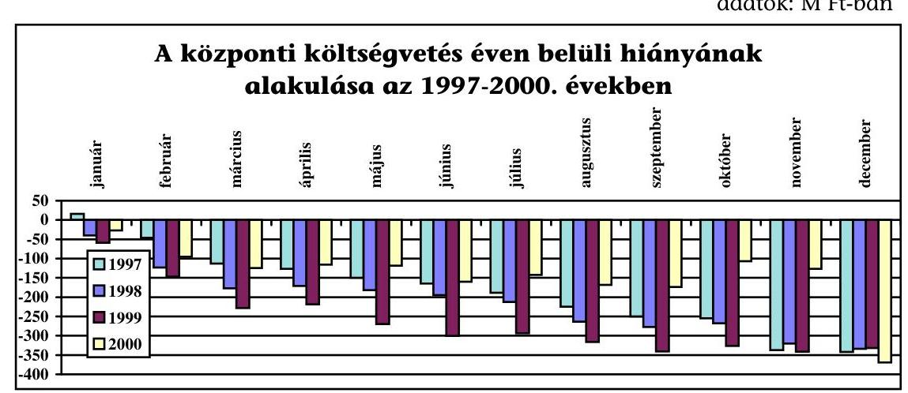

Megjegyzés: a 2000. évi adat előzetes
2. sz. táblázat adatok: M Ft-ban

| Bvek | Rány |  | Elbizés |
| :--: | :--: | :--: | :--: |
|  | MAK beszám . | zázszám . br. |  |
|  |  |  |  |
| 1997 | 340369,5 | 338471,4 | $-1898,1$ |
| 1998 | 541862,0 | 540190,1 | $-1671,9$ |
| 1999 | 329151,0 | 328319,2 | $-831,8$ |
| 2000 | 368434,9 | n.a | n.a |

A helyszíni ellenőrzés - az áttekintett dokumentumok alapján - a központi költségvetés éves hiányösszegénél adateltérést állapított meg.

A Magyar Államkincstár, a Magyar Államkincstár könyvvezetési és beszámolási kötelezettségéről szóló 257/1997. (XII. 21.) Korm. rendelet alapján elkészíti a zárszámadás előkészítésével kapcsolatos feladatként a kincstári éves beszámolót, amely fordulónapja december 31-e és elkészítésének határideje a tárgyévet követő év május 31-e. Az adatok lezárását követően, a december 31-ei állapotra vonatkozó, összességében milliárdos nagyságrendet elérő módosításokat a költségvetési törvény benyújtásáig terjedő 6-7 hónap alatt végzik el. Ezek a módosítások ellentétesek az államháztartás múködési rendjéről szóló 217/1998. (XII. 30.) Korm. rendelet 146. §-ában foglaltakkal, amely a módosításokra csak a tárgyévet követő év február közepéig ad lehetőséget.

A módosítások utólagosan megállapított - adatfeldolgozási, elszámolási hibák miatti - rendezést jelentenek döntően, amelyek a költségvetési szervek adatainak (pénzforgalom nélküli, valamint a függő, átfutó és kiegyenlítő elszámolások) pontosítása alapján megvalósított változásokat jelentik.

A központi költségvetés finanszírozási és adósságmúveleti igényét - az ellenőrzött években - alapvetően kötvény- és kincstárjegy-kibocsátásból biztosították. A KESZ egyenlege időnként jelentősen ingadozott, nagyságára egyre csökkenő mértékben hatott a privatizációból realizált bevételek alakulása, 1997. évben a havi záró egyenlege átlagosan 250,0 Mrd Ft volt. A Kincstár törekedett a túlzott likviditásbőség csökkentésére, azonban az Állami Számvevőszék zárszám-

---

adási ellenőrzéséről készült jelentésének megállapítása szerint „.... átlagos havi záró állomány volumene azt mutatja, hogy tevékenységében még mindig jelentős a reálisabb mértéket meghaladó biztonságra való törekvés". Az adósságkezelés taktikai döntéseivel megteremtett többletforrás indokoltságát és mértékét esetenként a rendkívüli pénzpiaci folyamatok igazolták. Az orosz válsággal összefüggő kereslet-visszaesés miatt a KESZ állománya pl. 1998. év utolsó negyedévében több héten keresztül az indokolt mérték alá süllyedt. Az 1999. évi feltöltése közel fél évet vett igénybe.

A túlfinanszírozás lehetővé tette, hogy az 1998-as pénzpiaci válság miatt visszaeső állampapír-kibocsátások ellenére a hiányfinanszírozás biztosított legyen, 1999-ben pedig biztosította az 1998-as orosz válság nyomán leépült KESZ állomány újbóli visszapótolását.

Az állampapírok nettó forintpiaci kibocsátásai évenként több hónapon át meghaladták az aktuális finanszírozási igényt. Ez mindannyiszor összhangban volt a központi költségvetés jóváhagyott finanszírozási tervével. A biztonságos finanszírozás egyik alapvető kérdése a KESZ állományának mindenkori nagysága. Az 1997. évben még nem szabályozták az állami feladatellátáshoz kapcsolódóan a számlán tartandó pénzmennyiség alakulásának mértékét (minimális, maximális szint). 1999 óta az ÁKK már folyamatosan készít előterjesztéseket a KT részére, amelyekben - számításokkal alátámasztottan - a KESZ minimális nagyságát határozza meg.

A KESZ tartásának azonban nemcsak költsége, hanem a jegybanki alapkamatnak megfelelő, 1998. január 1-jétől az MNB által az egy hónapos jegybanki passzív múveletre meghirdetett mértékű kamatbevétele is volt. Az ellenőrzött időszakban ennek nagysága folyamatosan csökkent ( 64 Mrd Ft-ról 31,9 Mrd Ft-ra). A kamatbevétel csökkenésében a számlapénz mindenkori nagysága mellett, az állomány után számított kamatszázalékok csökkenése is szerepet játszott (a kamat \%-ok a kiadási oldalon is csökkentek).

A központi költségvetés kiadásainak - a saját bevételét meghaladó - fedezetét a folyamatosan aktualizált éves finanszírozási tervek alapján biztosították.

A lakossági értékpapírok iránti érdeklődés megnövekedése 1998-ban és az orosz pénzpiaci válság, 1999-ben a központi költségvetés fő bevételeinek (adó, vám stb.) és kiadásainak ellentétes irányú változása tette szükségessé a módosítást. A tervezettnél alacsonyabb szintű év eleji befizetésekhez a folyó kiadások prognosztizáltat meghaladó mértékű növekedése tartozott. 2000-ben a kiadási többlet, illetve a nyugdíjemelés mértékét meghaladó bevételi többlet járult hozzá a terv módosításához.

A költségvetés finanszírozására kedvezően hatott, hogy az ellenőrzött időszakot megelőzően már kialakult és rendszerré vált az állampapírok kibocsátásának menetrendje. Az azonos heti, havi időpontokra tervezett kibocsátások a befektetők számára kiszámíthatóvá váltak. A kibocsátási naptár publikussá tétele, valamint következetes alkalmazása megerősítette a rendszer iránti befektetői bizalmat. A kibocsátások, lejáratok összehangolása növelte a finanszírozás biztonságát és a lejáró állampapírok egyidejű cseréjével lehetővé tette, hogy a pénzforgalmi költségek csökkenjenek. A költségcsökkentést segítette elő

---

az értékpapírok dematerializációjának bevezetése (az állampapírok egy részét csak elektronikus formában hozzák létre).

A lejárati szerkezetet is kedvezően befolyásolta, hogy az összetétel a hosszabb lejáratú diszkontpapírok irányába változott, a 6 és 12 hónapos papírok részaránya az összkibocsátás 70\%-a körül mozgott. A lejáratok közötti arányváltozás összhangban volt a kibocsátó szerkezetjavító törekvésével.

Az új kibocsátási rendszer bevezetésével (1999. július) megnövekedett a hetente értékesítésre kerülő papírok névértéke. A felajánlott mennyiségek - eseti elmaradásoktól eltekintve - általában teljes egészében értékesítésre kerültek. Az aukciókon értékesített mennyiség első féléves magas értékét likviditás kezelési megfontolások indokolták.

Az 1999. év első félévében erre az időszakra esett a költségvetési hiány éves előirányzatának 79\%-a, 2000 második negyedévében a költségvetési hiány kedvező alakulása következtében az aukción értékesített mennyiségek már kismértékben lefelé módosultak. A kiadások és a bevételek összehangolásának esetleges korrekciós igényét elsősorban a diszkont kincstárjegy aukciókon értékesített mennyiségekkel biztosították.

A lakossági kincstárjegyek 1997-ben 13\%-ot, míg 2000-ben már 16\%-ot képviseltek a teljes állampapír-értékesítésben. A lakossági kincstárjegyek tekintetében a teljes értékesítésen belüli aránynövekedés ellenére a 2000. évben az értékesítés volumenében jelentős (éves szinten mintegy 62 Mrd Ft ) elmaradás mutatkozott a tervekhez képest, amihez a reklámtámogatás hiánya is hozzájárult.

Az ellenőrzött időszakban nőtt a kincstári fiókhálózat finanszírozásban betöltött szerepe. Az ügyfélállomány 2000 júniusára meghaladta a 150 Mrd Ft-ot.

A finanszírozás 1,7\%-a történt 1998-ban a hálózatból. A nettó forgalmazás az összes piaci nettó értékesítés 1,6\%-át jelentette. 2000-ben már a bruttó állampa-pír-értékesítés $4,9 \%$-át forgalmazta a hálózat, a nettó forgalmazás meghaladta az összes piaci nettó értékesítés $2 \%$-át.

A nettó belföldi kincstárjegy-kibocsátások a vizsgált időszakban - a piaci viszonyok változása, a bizonytalanság, az elégtelen kereslet, a finanszírozási helyzet módosulása stb. következtében - különösen 1999-ben jelentősen (70,4\%-kal) eltértek az értékesítési, illetve kibocsátási tervek irányszámaitól.

A forintban és devizában denominált, illetve a külső- és belső államadósság egységes szerkezetben történő kezelése, valamint a forintpiac külföldiek felé nyitása segítette a piacgazdasági környezet kialakulását, az állampapírpiac fejlődését, a másodlagos forgalmazás likviditásának növelését.

Az adósságkezelési lehetőség korlátját jelenti, hogy az Áht. hatályos előírása szerint az állam pénzforgalmi számláján (KESZ-en) köteles tartani a pénzét, átmenetileg szabad pénzeszközeit - a monetáris politika számára semleges módon - a pénzpiacon szabadon nem helyezheti el. Erre a 2001 februárjában közigazgatási eljárás keretében egyeztetett Áht. módosítási törvényjavaslat (18/D. § (2) bekezdé-

---

se) szerint az adósságkezelő ÁKK Rt. helyett a Kincstárat tervezik felhatalmazni az előterjesztők (PM-IM).

Az adósságkezelés menedzselése nem merült ki a központi költségvetés hiányfinanszírozásában, a fejlődési folyamat része volt a költségvetés tervezési és végrehajtási funkciójának szétválasztása, a Kincstár 1996-os létrehozása. Az ÁKK a stratégia összeállítása során javaslatot és munkaprogramjában feladatot fogalmazott meg arra vonatkozóan, hogy a központi költségvetés finanszírozási és adósságkezelési intézkedései szétválaszthatók, eredményességük mérhető legyen. Jóváhagyás hiányában a megvalósítás külső körülményeinek megteremtésére (elkülönült számlavezetés) intézkedés nem történt. Az ÁKK és a Kincstár 2001. március 1-jétől történő szervezeti elkülönülése, a feladatelhatárolás törvényi rendezésének megvalósított módja miatt, kiemelt jelentőséggel bír a központi költségvetés (hiány) finanszírozási és az adósságkezelési (határok mérhetőségén túl) intézkedései mérhetőségének megteremtése. Biztosításának alapvető technikai feltétele a szervezetek elkülönült pénzforgalmi-számla vezetése.

A makrogazdasági folyamatok, a kamat-, az árfolyam- és a monetáris politikai intézkedések, valamint az azok hatására bekövetkezett változások, az államháztartás és az államadósság helyzete az ÁKK folyamatos elemző tevékenységének része. Rendszeres tevékenységük kiterjed a finanszírozásban rejlő kockázatok feltárására, mérésük és vállalhatóságuk mértékének lehetőségeire, esetleges következményeire.

Az adósságkezelés stratégiai célkitűzései, a kedvezőbb portfoliószerkezet elérésére vonatkozó célok nagyobb részt teljesültek. A piaci forintadósság állománya 1997. december 31-étől a 2000. év végére közel kétszeresére ( $88,5 \%$-kal) emelkedett, a teljes állományhoz viszonyított részaránya az induló $58,61 \%$-kal szemben $74,61 \%$-nak felel meg. Az államadósság állományának lejárati szerkezetét kettős folyamat jellemezte (lásd 7. számú melléklet). A hosszabb lejáratú zárt kibocsátások állománycsökkenése erőteljesen hatott a teljes állomány átlagos hátralévő futamidejére, amit csak részben tudott ellensúlyozni a piaci kibocsátások átlagos hátralévő futamidő növekedése. Az állam forintadósságának durationját tekintve viszont, a nem piaci állomány jelenértékével súlyozott lejáratig hátralévő futamidejének romlásánál, a piaci kibocsátású, azon belül is a fix kamatozású állomány javára történt arányeltolódás és a nagyobb átlagosan hátra lévő futamideje, a teljes forintadósság futamidő javulását eredményezte. Az új kibocsátási szerkezet tudatos átalakítása révén az állam piaci kibocsátású forintadósságánál az átlagos hátralévő futamidő - ha lassan is - de folyamatosan javult a 2000. év végére.

A forint belföldi államadóssági állományok és a költségvetési évek kamatfizetéseinek adatelemzése alapján megállapítható, hogy azok instrumentumokra számított összetétele nincs szinkronban. Míg az állományok között a rövid lejáratú kincstárjegyek - három év alatti - súlyának számottevő csökkenése ( $25,01 \%$-ról $19,44 \%$-ra) mutatható ki, addig az éves kamatfizetések hasonló mértékű részarány eltolódása az előbbivel ellentétes irányú.

---

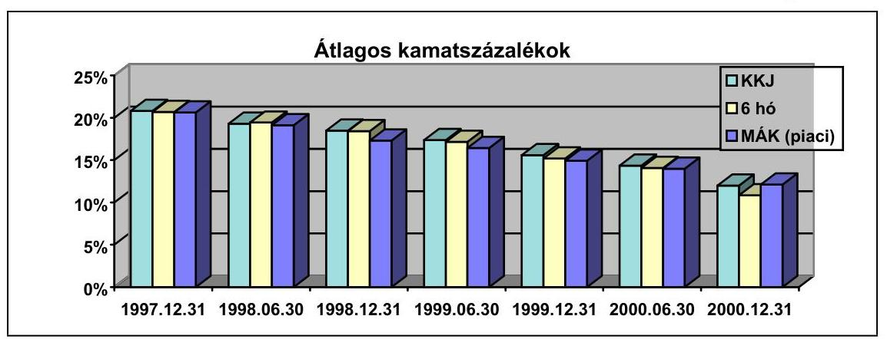

Az adatok az 1997. XII. 31-2000. év végi és félévi adatokra vonatkoznak
A rövid lejáratú papírok kamatos kamattal történő újrabefektetésének éves hozama - a mérési időpontokban - szinte kivétel nélkül meghaladta a hosszabb lejáratú állampapírok átlagos kamatkondícióit. Hosszabb időszakot (futamidőt) tekintve azonban, a rövid és hosszú lejáratú papírok tényleges reálhozam összehasonlításánál megmutatkozó előny/hátrány változó lehet.

Az ÁKK elemzést végzett azonos időtávra vetítve, a rövid és hosszú lejáratú papírok hozamának összehasonlítására. A múlt és jövőbeni adatok elemzése alapján megállapították, hogy a költségigényesség időről-időre változott, a teljes időszakra pedig szinte kiegyenlítődött.

Az államadósság-kezelési stratégia célkitűzéseitől eltérően, a kincstárjegyek átlagos hozam (kamat)százalékait figyelembe véve rövid távon úgy látszik a rövidebb lejáratú értékpapírokat érdemesebb a befektetőknek megvásárolni, azonban a kibocsátás szervezése tekintetében a papír életpályáját, az adósság teljes állományát kell az elemzés tárgyává tenni.
5. sz. grafikon
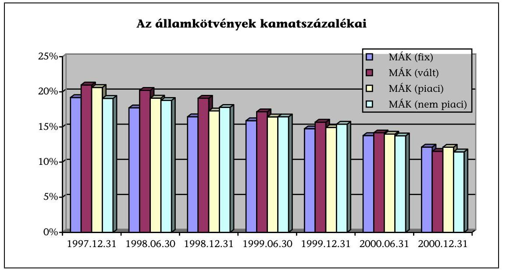

Az adatok az 1997. XII. 31-2000. év végi és félévi adatokra vonatkoznak

---

Az államkötvények átlagos kamatainak százalékadatait elemezve megállapítható, hogy azok igazolják az adósságkezelési stratégiában megfogalmazott célok (pl. a forintpiaci adósság átlagos futamidejének növelése, a fix adósság arányának emelése, a devizaadósság részarányának fokozatos csökkentése) helyességét. A fix és változó kamatozású kötvények hosszú távú költséghatékonysága - a helyszíni ellenőrzés tapasztalatai szerint - a két szélső értéket adja, ahol a legalacsonyabb kamatszázalékok a fix kamatozású kötvényekhez tartoznak. A tendencia nem egyértelmúen a kötvénykibocsátás kezdeti időszakának zárt kibocsátásaiból következik, hiszen az állomány más szempont szerinti csoportosítása a piaci kibocsátások „alacsonyabb" kamatszázalékait adja. Gyakorlatilag a legmagasabb kamatkockázat mellett, a legdrágábbnak bizonyultak a változó kamatozású kibocsátások, de a zárt kibocsátások is fajlagosan többe kerülnek az államnak. Utóbbiak többségének (mintegy 90\%) évenként egyszeri vagy kétszeri kamat-megállapítása a 3 hónapos, illetve a 3 és 6 hónapos diszkont kincstárjegyek átlaghozamaihoz kapcsolódik.

A helyszíni ellenőrzés, illetve az elemzés a különböző típusú, kamatozású állampapír-instrumentumok egész futamidejéhez tartozó teljes reálkamat tartalom összehasonlítására - az időkorlátok miatt - nem tudott vállalkozni.

# 2.2. Az elkülönített állami pénzalapok belföldi adóssága 

Az 1999. évi költségvetésről szóló 1998. évi XC. tv. 66. §-a az elkülönített állami pénzalapok számát hatról kettőre csökkentette (Munkaerőpiaci Alap, Központi Nukleáris Pénzügyi Alap), egyben a megszüntetett pénzalapokat kiemelt célelőirányzatként integrálta a felügyelő fejezetek költségvetésébe.

Belföldi hitelviszonyon alapuló fizetési kötelezettséggel - az ellenőrzött időszakban - a célelőirányzatok közül csak a Vízügyi Alap, valamint az Útalap rendelkezett.

A Vízügyi Alap - bevételeinek megelőlegezésére, valamint a lakosság közmúves vízellátásának fejlesztésére és a csatornahálózat bővítésére - 1988-ban hosszú lejáratú kölcsönt vett fel az Országos Kereskedelmi és Hitel Banktól. Ennek teljes összege 139 M Ft volt, amelyre a bank a pénzpiaci helyzettől függő jegybanki kamatváltoztatás érvényesítésének jogát fenntartotta. Az OKHB-val szemben 1997 végén fennállt tőketartozás ( 15 M Ft), valamint a kapcsolódó já-rulék-fizetési kötelezettség teljesítése 1998 novemberében zárult le.

Az 1992. évi XXXVIII. törvény módosításáról rendelkező 1994. évi XXIX. törvény úgy határozott, hogy az Alapok 1994. december 31. napjáig más alapok részére, - legfeljebb három évi időtartamra - szabad eszközeikből kölcsönt nyújthatnak. A kamat mértéke a mindenkori jegybanki alapkamattal egyező. Törvényi felhatalmazás alapján a közlekedési, hírközlési és vízügyi miniszter belső szabályzatban határozta meg a KHVM kezelésében lévő alapok (Távközlési Alap, Vízügyi Alap, Útalap) közötti kölcsönnyújtás feltételeit, valamint a kölcsönügyletek lebonyolításának rendjét.

Az Alap 1994. évben 800 M Ft jegybanki alapkamattal terhelt hitelt vett fel a Távközlési Alaptól, amelynek törlesztése 1997. év folyamán zárult le.

---

A Kormány - a vízkárelhárítás biztonságának megőrzése érdekében - a KHVM fejezet részére 1994. év során a központi költségvetés általános tartalékának terhére további 400 M Ft pótelőirányzat felhasználását engedélyezte.

A 800 M Ft-os kölcsön összegét a Kormány 2022/1994. (III. 23.) Korm. határozat szerint a vízügyi igazgatóságoknál végrehajtott szervezeti átalakítás finanszírozására fordították. Az Áht. 59. § (1) bekezdése - ha egyéb jogszabály másként nem rendelkezik - a központi költségvetési szervek átalakítását csak akkor engedélyezi, ha azok finanszírozása a megfelelő alap pénzeszközeiből történik. A fent említett kormányhatározat 1. pontjában értett egyet a vízügyi igazgatóságok átszervezésével és a létrejövő vízügyi Kft.-k indító finanszírozásával.

Az OVF Közgazdasági Főosztálya - a feladatkörébe tartozó teendőkön túlmenően - ellátja a Vízügyi céleIőirányzattal (VICE) összefüggő kezelési, pénzügyi és számviteli feladatokat. A VICE bevételeinek és kiadásainak számviteli nyilvántartása az APEH-SZTADI - SZÁMADÓ - programjával történik. A gazdasági múveleteket a kettős könyvvitel szabályainak megfelelően idő- és számlasorosan rögzítik. Az adósságkezeléssel kapcsolatos feladatokat ellátó munkatársak az előírt szakmai végzettséggel rendelkeznek.

A vizsgálati időszakon belül a VICE-nél belföldi hiteltartozás kezelésével összefüggésben csak kifutó feladatok jelentkeztek, mivel a Távközlési Alap részére a visszafizetés 1997 novemberében befejeződött.

Az Útalap elkülönített állami pénzalapként 1998. december 31-éig múködött, majd 1999. január 1-jei kezdettel Útfenntartási céleIőirányzatként (UFCE) az országos közúthálózat fejlesztési és fenntartási feladatainak finanszírozását vette át.

Az Útalap - a törvényi előírásoknak megfelelően - 1994. év folyamán a Távközlési Alaptól, jegybanki kamat mellett 3100 M Ft összegben hitelt vett igénybe a likviditási gondjainak áthidalására. A hitel teljes összege járulékaival együtt 1997. év januárjában került visszafizetésre.

Az Útalap belföldi bankoktól történt hitelfelvételeire az 1992-1994. években került sor. A visszafizetések két év türelmi idő elteltével, a szerződésekben foglaltak szerint 1995-től kezdődtek, lejárati idejük túlnyomórészt 2006.

Beruházásai teljes költségének (becsült költség 101-102 Mrd Ft) több mint 20\%-át belföldi pénzintézetektől felvett hitelből finanszírozta. Az Alap 1992-1993-ban a koncessziós autópálya-építés előkészítési munkáira (állami feladatként jelentkező területbiztosítás, tervezési költségek) 4000 M Ft -ot (OKHB I-II.) vett fel.

Az országos közúthálózat-fejlesztési program megvalósítása érdekében az Útalap belföldi bankoktól 1993-1994-ben összesen 22500 M Ft összegben vett fel hiteleket (OKHB III-IV.). A közremúködő bankok a hiteleket - a beruházások tőkeigényessége miatt - kizárólag kormánygaranciával folyósították.

Az Áht.-t is módosító, a Magyar Köztársaság 1994. évi költségvetéséről szóló 1993. évi CXI. törvénnyel összhangban kiadott határozatok (3177/1993.,3471/1993.) alapján a Kormány kezességet vállalt a hitelek visszafizetésére. Az OKHB IV. hitelcsomagra vonatkozó kölcsönszerződések egységes speciális előírásként tartalmazzák, hogy az 1995. augusztus 31-éig tartó időszakra já-

---

ró kamat havonta tőkésítésre kerül és a tőke teljes visszafizetésének időpontjáig a tőkésített kamat után is a tőke után járóval megegyező mértékű kamat fizetendő.

Adósságszolgálati kötelezettségeit az Alap - a szerződésekben előírtak szerint az átvállalás időpontjáig - maradéktalanul teljesítette. A számítógépes nyilvántartás mellett a hitelekről fajtánként kézi nyilvántartást is vezettek.

Az Útalap gazdálkodásához kapcsolódó pénzügyi-gazdasági feladatokat az Útgazdálkodási és Koordinációs Igazgatóság SZMSZ-e a Főkönyvelőséghez rendelte, amely az adósságkezeléssel összefüggő kötelezettségeket részfeladatként végezte. Az Útalapról szóló 1992. évi XXX. törvény szerint, az Alappal a közlekedési, hírközlési és vízügyi miniszter jogosult rendelkezni.

A főkönyvi számlakivonatok és az analitikus nyilvántartás között eltérés nem mutatkozott. Az operatív nyilvántartás vezetésére a könyvvizsgálat észrevételt nem tett.

Az elkülönített állami pénzalapok éves beszámolójának auditálásáról az államháztartásról szóló 1992. évi XXXVIII. törvény 57. § (3) bekezdése rendelkezik, ennek értelmében az Útalap 1997. és 1998. évi beszámolóit a könyvvizsgáló hitelesítette és záradékkal látta el.

Az Útalap 1998. december 31-én belföldi bankokkal szemben fennállt hiteltartozásait és járulékait a központi költségvetés átvállalta. A tartozás átadásaátvétele tételesen történt az Útalap és a Pénzügyminisztérium között. A hitelállomány 1999. december 31-én 17742 M Ft volt, kamatkiadásként 3198 M Ftot teljesítettek. A 2000. év végi záró állomány 14330 M Ft , a kifizetésre került kamatérték 1511 M Ft volt.

Az Alap tartozásainak 1999. január 1-jei hatállyal történt átvállalását követően a Kormánynak a kölcsönt nyújtó bankokkal a kamatkondíciókat újra kellett tárgyalnia. A tárgyalások eredményeként a korábbinál kedvezőbb fizetési feltételek kialakítása valósult meg. A megállapodás szerint az alapkamat minden tárgynegyedév első munkanapján kerül meghatározásra a közvetlenül megelőző három érvényes diszkont kincstárjegy - aukción kialakult átlaghozamok súlyozott átlaga - alapján. A kiegészítő fix összegű kamat mértéke $0,72 \%$.

Az OKHB III-IV. hitelcsomag keretében tervezett projektek megvalósultak, kivéve a Szekszárdi Duna-hiddal együttes útszakasz megépítését, melynek előirányzata területbiztosításra került felhasználásra (2117/1999. (V. 26.) Korm. határozat).

Az Útalap által felvett belföldi hitelek állományáról, törlesztéséről, a hitelek költségeiről a részletes adatokat a 8-9. számú mellékletek tartalmazzák.

# 2.3. A társadalombiztosítás pénzügyi alapjainak belföldi adóssága 

A társadalombiztosítási alrendszernél az államadósság (az alrendszer sajátossága miatt) a központi költségvetés adóssága, mivel az ellátások fedezetének KESZ-ről való finanszírozása átmeneti jellegű, és addig áll fenn, amíg az Alapok hiányának rendezésére - az Országgyűlés döntése alapján - a zár-

---

számadás keretében kerül sor. A hitellel történő finanszírozás miatt keletkezett adósság ebben az időszakban sem a társadalombiztosítás adóssága címén jelentkezik, hanem központi költségvetési pénzként. Az alrendszer látszólagos elhatároltsága mellett - végső soron - a központi költségvetés finanszírozza a társadalombiztosítás hiányát.

Az államháztartásról szóló 1992. évi XXXVIII. törvénynek a társadalombiztosítási alrendszer belföldi államadósságára vonatkozó szabályozása és más törvény sem tartalmaz - az alrendszer sajátosságaihoz igazodó - definíciót a társadalombiztosítás államadósságára, az összetevők számbavételére.

# 2.3.1. A társadalombiztosítási alapok belföldi adósságállománya 

Az Alapok adósságállományának nagysága szorosan összefügg az Alapok bevételeinek, kiadásainak, éves hiányának alakulásával.

#### Abstract

A társadalombiztosítási alapok együttesen a négy költségvetési évet az előirányzotthoz képest magasabb összegű hiánnyal zárták. A hiány rendezésében 1996ban még szerepet kapott az Áht.-t módosító 1996. évi CXXI. törvény alapján 1996. december 31-ével megszüntetett likviditási tartalék, az 1997., az 1998. és az 1999. évek hiányai az Alapoknak a Kincstári Egységes Számlához kapcsolódó megelőlegezési számláján fennálló hitelállományából elengedésre kerültek.

A társadalombiztosítási alapok adóssága keletkezésének oka - a bevételek és kiadások időbeli eltérésén túl - elsősorban a tartóssá vált forráshiány, azaz a bevételi előirányzat és a kiadások tervezettől eltérő alakulása, a hiány költségvetési megtérítési módja. (A tárgyévi hiány a következő évben, a tárgyévről készült éves zárszámadás elfogadásakor kerül rendezésre.) Az adósságállomány megjelenési formája jellemzően a hiányt finanszírozó hitel. Az adósságállomány a vizsgált időszakban növekedett a Postabank Rt.-vel kapcsolatos viszontgaranciális kötelezettséggel.

A két Alap együttes, előbbi jogcímeken fennálló belföldi bruttó adósságállománya 1999. december 31-én 55794 M Ft-ot tett ki, ami a Nyugdíjbiztosítási Alap, illetve az Egészségbiztosítási Alap között 15-85\%-ban oszlott meg. (Az előzetes adatok szerint 2000. december 31-én az Alapok belföldi bruttó adósságállománya 92004 M Ft volt, ami 30,9-69,1\%-ban oszlott meg az Ny. Alap és az E. Alap között.)

Az 1996. évhez képest az adósságállomány - a közbülső évek magasabb állománya mellett - 1999 végére 19\%-kal csökkent. Ez a tendencia nem fejezi ki azonban pontosan a helyzetet. Az adósságállomány legnagyobb hányadát kitevő - az Alapok pénzszükségletét finanszírozó - rövid lejáratú hitel december végi záró állománya ugyanis minden év végén jóval kisebb volt az év közbeni hitelszükségletnél.

Az Alapok - havi záró adatok alapján számolva - 1996-ban 70326 M Ft, 1997ben 98021 M Ft, 1998-ban 120099 M Ft, 1999-ben 151427 M Ft éves átlagos hitelállomány mellett látták el feladataikat. Évről-évre és szinte havonta nőtt az egyes hónapokban a hitel legnagyobb napi záró összege, nyílt az „olló" a hitel legnagyobb és legkisebb napi záró összege között. Miközben az Alapok év végi

---

záró hitelállománya 1996-ról 1999-re 28\%-kal csökkent, ugyanezen időszakban az átlagos hitelállomány $115,3 \%$-kal emelkedett.

Az Ny. Alap átlagos hiteligénye kisebb, mint az E. Alapé. 1999-ben az átlagos hitelállomány az Ny. Alapnál 51230 M Ft, az E. Alapnál 100197 M Ft volt. Ugyanakkor mindkét alap átlagos hitelállománya a négy év alatt megkétszereződött.

Az Alapokat terhelő ellátások folyamatos teljesítéséhez, a bevételek és kiadások időbeli eltéréséből adódó átmeneti pénzügyi hiányok fedezetére, a központi költségvetés által a Kincstár útján nyújtott hitelt az Alapok 1999-től kamatmentesen vehetik igénybe. Ezt megelőzően az igénybe vett hitel meghatározott része volt kamatmentes, aminek évenként változó nagyságrendjét a tárgyévi költségvetésről szóló törvények határozták meg.

A hitel - a kamatfizetéses időszakban - a kamatfizetési limit határát az Ny. Alapnál több ízben, az E. Alap esetében pedig rendszeresen meghaladta. A KESZ-hez kapcsolódó megelőlegezési számláról felvett limitet meghaladó hitel utáni (a jegybanki alapkamat mértékével megegyező) kamatfizetési kötelezettség megterhelte az Alapokat, különösen az 1996. és az 1997. években ( 4081 M Ft-tal és 3367 M Ft-tal), további deficitet okozva, különösen az E. Alap tekintetében.

Az Alapok likviditási helyzetét egyértelműen jellemzi, hogy ellátási kötelezettségüket csak a Kincstári Egységes Számla igénybevételével, egyre növekvő öszszegű hitelfelvétellel tudják teljesíteni, évről-évre növekvő átlagos hitelállománnyal. A hiány az ellátások fedezetének KESZ-ről való, az Országgyúlés zárszámadási törvényben történő döntéséig átmeneti jellegű finanszírozása miatt a KESZ-en hitelállománnyal, mint adóssággal a jövőben is tartósan számolni kell.

A Postabank Rt.-vel kapcsolatos viszontgarancia vállalásból származó teher abból ered, hogy a Postabank Rt. pénzügyi helyzetének 1997. évi megrendülését követően a Kormány 12 Mrd Ft összeghatárig úgy vállalt kezességet, ha a bank legnagyobb részvényesei viszontgaranciát vállalnak. A Postabank Rt. 1997-ben, a garancia beváltásának első ütemében 5628 M Ft, második ütemében 1998-ban 6232 M Ft inkasszót nyújtott be, amelyet a Magyar Állam teljesített.

A viszontgarancia vállalás miatt az Ny. Alapnak a két ütemben 2780 M Ft, illetve 3078 M Ft, összesen 5858 M Ft-os tőketörlesztési kötelezettsége keletkezett, az E. Alap tőkefizetési kötelezettsége a két ütemből együttesen 2343 M Ft, amit mindkét alapnak kamattal növelve 2003-ig részletekben kell törlesztenie.

Az időközben történt törlesztések után a viszontgarancia-vállalás miatti fizetési kötelezettség 1999. december 31-én az Ny. Alapnál 4393,7 M Ft, az E. Alapnál 1757,6 M Ft (az előzetes adatok szerint 2000. december 31-én az Ny. Alapnál 3222 M Ft, az E. Alapnál 1289 M Ft) összegben állt fenn. A kötelezettség teljesítésével összefüggő előirányzat tervezésével kapcsolatban az Állami Számvevőszék már több ízben kifogásolta, hogy az előirányzat az Alapok költségvetésében szerepel, mivel a társadalombiztosítási önkormányzatok megszűnésével a Postabank Rt. részvényei állami tulajdonba kerültek. A kötelezettségnek a vagyonbevételek oldaláról nincs fedezete, azt az Ala-

---

pok járulékbevételekből finanszírozzák, amit - az Alapok hiányának részeként - a költségvetés megtérít.

A társadalombiztosítási alapok ellenőrzött évek bevételi és kiadási adatait a 10., 10/a. és 10/b. számú mellékletek, a belföldi adósságállomány alakulását a 11. számú melléklet tartalmazza.

# 2.3.2. Intézkedések az adósságállomány csökkentésére 

Az Alapok, az adósságállomány csökkentésére a vizsgált időszakban - a korábban megvalósult vissztehermentesen juttatott ingyenes vagyonjuttatás alapján - vagyonértékesítést irányoztak elő. Az ingyenes vagyonjuttatás nem vált a bevételi források bővítésének, a hiány mérséklésének tartós eszközévé.

Egyrészt a két Alapnak az 1992. évi X. törvényt módosító 1995. évi LXXIII. törvény szerint a járulékbevételek megosztásának arányában 1995. december 31-éig együttesen legalább 55 Mrd Ft , legfeljebb 65 Mrd Ft értékű ingyenes vagyonjuttatásban kellett volna részesülnie, ami határidőre nem valósult meg, nagyobb része áthúzódott 1997-re. Másrészt a juttatott vagyon között átadásra kerültek olyan vagyonelemek, amelyek folyamatos veszteségforrást jelentettek az Alapoknak (pl. karbantartásuk, őrzésük költsége többet tesz ki, mint a hasznosításukból származó bevétel).

A társadalombiztosítási alapok hiányainak mérséklésére vagyonértékesítést a költségvetésük előirányzatairól szóló törvények több évben előirányoztak.

Az 1996. évben a pótköltségvetés decemberi elfogadása és kihirdetése miatt az Alapok hiányát vagyonértékesítésből származó bevétellel már nem lehetett mérsékelni, a két alapnál a hiány mérséklése céljából előirányzott 5000 M Ft vagyonértékesítésből a bevétel mindössze 45 M Ft volt. Az 1997. évben azonban a két alap együttesen már 9042 M Ft bevételre tett szert hiányrendező tételként.

A vagyonértékesítési kötelezettség 1999-ben a múködési célvagyon kivételével kiterjedt az Alapok teljes vagyonára.

A társadalombiztosítás pénzügyi alapjainak 1999. évi költségvetéséről szóló 1998. évi XCI. törvény 9. §-a szerint - amelyet az 1999. évi XCIII. törvény 20. §-a módosított - az Alapokhoz tartozó vagyont - az ingyenes vagyonjuttatás keretében átadott vagyonelemek elidegenítéséből származtatott Budapest VII. Wesselényi u. 20-22. szám alatti székház és parkoló ingatlan, valamint a múködést közvetlenül szolgáló vagyonelemek kivételével - értékesíteni kell.

A törvényben előírt 53700 M Ft-os bevételt az 1999. évi teljesítés 20134 M Ft-tal meghaladta. Az Ny. Alapnál 49449 M Ft, az E. Alapnál 24385 M Ft bevételből a vagyon értékesítésével járó kiadások és a Postabank garanciális kötelezettségének teljesítése után fennmaradó bevételi többlet az ellátások fedezetét biztosította.

### 2.3.3. A társadalombiztosítás belföldi adóssága kezelésének keretei

A társadalombiztosítási alapok szakmai feladatait a vizsgált években a társadalombiztosításról szóló 1975. évi II. törvény, majd hatályon kívül helyezését követően a társadalombiztosítás ellátásaira és a magánnyugdíjra jogosultakról, valamint e szolgáltatások fedezetéről szóló 1997. évi LXXX. tör-

---

vény, a társadalombiztosítási nyugellátásról szóló 1997. évi LXXXI. törvény, a kötelező egészségbiztosítás ellátásairól szóló 1997. évi LXXXIII. törvény szabályozza.

A társadalombiztosítási alapok adóssága keletkezésének oka - a bevételek és kiadások időbeli eltérésén túl - elsősorban a tartóssá vált forráshiány, azaz a bevételi előirányzat és a kiadások tervezettől eltérő alakulása. Így az adósságállomány megjelenési formája is jellemzően a hiányt finanszírozó hitel.

A társadalombiztosítás pénzügyi alapjai az éves költségvetési törvények felhatalmazásai alapján megelőlegezési hitel vehettek igénybe a KESZ terhére.

A hiteligénybevétel módja az 1997-1999. évek között változott. Az 1997-1998. évi költségvetési törvény előre meghatározott mértékig tette lehetővé a TB Alapok számára a KESZ-hez kapcsolt megelőlegezési hitel kamatmentes igénybevételét. További megelőlegezésre az Alapok jegybanki alapkamat fizetése mellett voltak jogosultak, annak ellenére, hogy az állami feladatellátásukhoz kapcsolódó bevételi és kiadási esedékességek időbeli eltéréséből adódott átmeneti likviditási problémájuk. A kamatot a központi költségvetésnek fizették. Az 1999-2000. évek költségvetési törvényei mennyiségi korlátozás nélküli felhatalmazást adtak.

Az 1997-1999. évek zárszámadási törvényjavaslatainak helyszíni ellenőrzése során az Állami Számvevőszék megállapította, hogy az Alapok egymástól eltérő szerkezetben és gyakorisággal összeállított likviditási tervei csak tájékoztató jelleggel voltak használhatók, a KESZ valós igénybevétele plusz-mínusz irányban, több Mrd Ft-os nagyságrendben tért el az előzetesen prognosztizált értéktől.

A KESZ megelőlegezési hitel igénybevételének előzetes tervezhetősége érdekében összeállított és folyamatosan aktualizált finanszírozási tervek közül az utóbbiak formálisan jóváhagyásra nem kerültek, a hitel utalványozása azonban rendben megtörtént. A társadalombiztosítás pénzügyi alapjainak megelőlegezési hitelbiztosítása ellenére a Kincstár elnöke csak 2000. I. 1-jétől rendelkezett az éves és havi finanszírozási tervek engedélyezésének eljárási rendjéről.

Az éves költségvetési törvényekkel biztosított megelőlegezési hitel igénybevételének átlagos havi szintje évről évre növekedett, és éven belül is egyre korábban következett be erőteljes emelkedés. A legmagasabb értékeket 1999-ben érte el. A 2000. évi KESZ igénybevétel szintjénél - a nyugdíjreformmal összefüggésben kieső bevételek évközi költségvetési pótlásának, valamint az eljárási fegyelem szigorodásának hatására is - erőteljes mértékcsökkenés volt megállapítható.

A társadalombiztosítás pénzügyi és szervezeti rendszerében az ellenőrzött időszakot megelőzően és az alatt is lényeges változások történtek, amelyek közvetlenül vagy közvetve hatással voltak a TB alapokra. A TB Alapok felügyelete és a társadalombiztosítás igazgatási szerveinek (OEP, ONYF) irányítása állami feladattá vált, a felügyeletet a Kormány - az igazgatási szervek irányítását a Kormány rendeletében meghatározott személy gyakorolja látja el. A TB Alapokhoz tartozó vagyon állami tulajdonba került.

---

A társadalombiztosítási alapoknál, illetve az azokat kezelő szervezeteknél az adósság-kezelési tevékenység gyakorlatilag a mindenkori likviditás biztosításának feladatát jelentette.

Az adósság (követelés) állomány-kezelés szervezeti kereteit, személyi feltételeit a TB alapokat kezelő OEP-nél és az ONYF-nél a pénzügyi folyamatokkal együtt, annak részeként alakították ki.

Az ONYF-nél a Pénzügyi Főosztály, a Számviteli Főosztály és a Vagyonkezelési Főosztály érintett az Ny. Alaphoz kapcsolódó adósság- (követelés) állomány kezeléséből eredő feladatok ellátásában.

Az OEP-nél a Járulék és Folyószámla Főosztály és a Behajtási és Végrehajtási Főosztály végezte a járulék-folyószámlák vezetését és nyilvántartását, illetve az elmaradt járulékbevételek behajtását 1999-ig, a tevékenységnek az APEH-hez kerüléséig. Az E. Alaphoz tartozó ellátási vagyonnal kapcsolatos döntés-előkészítési feladatok ellátását a Vagyongazdálkodási Főosztály, 1999-től a Vagyongazdálkodási Önálló Osztály, majd a Jogi és Szakigazgatási Főosztály szervezetében a vagyongazdálkodási szakmai terület végzi.

Az érintett szervezeti egységeknél tárgyi, technikai- (pl. korszerű számítógépek) és személyi feltételei (szakmai felkészültség stb.) végzettség adottak.

Az adósságállomány (követelések) kezelésére és nyilvántartására a jogszabályokban megfogalmazott feladatok végrehajtására vonatkozó követelmények, felelősségi és hatásköri előírások (kötelezettségek, döntési jogosultságok) az OEP és az ONYF vizsgálat témájában érintett egyes szervezeti egységei (főosztályai) feladatkörében - a főigazgatói utasítás formájában kiadott Szervezeti és Múködési Szabályzatban - szabályozottak.

Az SZMSZ keretein belüli szabályozások körét szabályozási rend írja elő, amely szabályozási lehetőséget, illetve kötelmet ír elő a szervezeti egységek vezetői részére. Az OEP és az ONYF, illetve igazgatási szervei ügyvitele és ügyintézése során követendő belső eljárási rendet főigazgatói utasítások, a jogszabályok végrehajtásának fő irányait és módszereit főigazgatói irányelvek szabályozzák.

A vizsgált témában érintett dolgozók munkaköri leírásában - a mintavétellel kiválasztott esetekben - megjelennek azok a munkaköri kötelezettségek, hatásköri, felelősségi viszonyok, amelyek a TB alapok kezelésével kapcsolatosan az adósságállomány (követelések) kezelésével, nyilvántartásával összefüggenek.

# 2.4. A helyi önkormányzatok belföldi adóssága 

Az Áht. 2. §-ában foglaltak szerint az államháztartást alkotó alrendszerek részét képezi a helyi önkormányzatok költségvetése. A helyi önkormányzatok adósságának és adósságterheinek nyilvántartásait az Áht. nem határozta meg, sem a pénzügyminiszter, sem a belügyminiszter feladataként, így az azokra vonatkozó adatok nem álltak rendelkezésre az állami közigazgatás adatbázisából.

A helyi önkormányzat hitelt vehet fel és kötvényt bocsáthat ki (1990. évi LXV. törvény 88. §); ennek fedezetéül az önkormányzati törzsvagyon és - a likvid hitel kivételével - a normatív állami hozzájárulás, az állami támogatás,

---

a személyi jövedelemadó, valamint az államháztartáson belülről működési célra átvett bevételek nem használhatók fel. Az állami hozzájárulás kivételével az önkormányzat dönt a célhoz nem kötött forrásai betétként történő elhelyezéséről és egyéb banki szolgáltatások igénybevételéről.

A helyi önkormányzat adósságot keletkeztető éves kötelezettségvállalásának felső határa - az Önkormányzati törvény szerint - a korrigált saját folyó bevétel éves előirányzatának 70\%-a.

Az önkormányzatok részére külföldi és belföldi bankok és szervezetek által devizában és forintban belföldön nyújtott hitelekre vonatkozó adatok az 1997. és 1999. évek között - az államháztartás információs rendjének hiányosságai miatt csak - az MNB-nél álltak rendelkezésre.

Az MNB-nek - a pénzügyi folyamatok elemzéséhez, a monetáris tervek elkészítéséhez, azok végrehajtásának értékeléséhez, a jegybanki ellenőrzéshez, valamint a devizagazdálkodási, pénzforgalmi és egyéb feladatai ellátásához - információkra van szüksége a hitelintézetek tevékenységéről. Az MNB-ről szóló, többször módosított 1991. évi LX. törvény alapján az MNB - a vizsgált éveket illetően is - a Pénzügyi Közlönyben jelenteti meg a pénzügyi intézmények és a kiegészítő pénzügyi szolgáltatást végző egyéb jogi személyek által a jegybanknak szolgáltatandó információk körét.

Az MNB havi és éves jelentése nemzetközi módszertanok előírásait közelítve, piaci értéken és eredményszemléletben mutatja be az államháztartás, illetve az egyes alrendszerek pénzügyi vagyonát, a vagyonváltozás összetevőit és az államháztartás hiányának finanszírozását. A pénzügyi követelések és tartozások - lehetőség szerint teljes körű - számbavétele érdekében az MNB valamennyi, számára elérhető információt felhasznál.

Az államháztartás pénzügyi eszközeinél egyetlen olyan eszközcsoport van, amely esetében az MNB nem közöl adatokat: a részesedések (részvények és egyéb tulajdonosi követelések). Ennek oka, hogy a részesedés vagyon piaci értékének becsléséhez eddig megfelelő módszertani megoldást nem sikerült kialakítani.

Az MNB által kimutatott - a helyi önkormányzatokhoz kapcsolódó - adatoknak négy fő forrása van: a hitelintézetek fedezeti kimutatása, amely az eszközöket és kötelezettségeket bekerülési értéken mutatja; az önkormányzatok évközi mérlegjelentése, amelyet az államháztartás múködési rendjéről szóló 217/1998. (XII. 30.) Korm. rendelet előírásai szerint készítenek (az adatokat az APEH-SZTADI bocsátja rendelkezésre); az MNB értékpapír statisztikája, amely negyedévente mutatja ki a különféle értékpapírok állományát nemzetgazdasági szektorok szerinti bontásban, piaci értéken; az MNB fizetési mérleg statisztikája, ezen belül az államháztartás külfölddel szembeni követelései és kötelezettségei. Az adatokat névértéken, havonta állítják össze. A helyi önkormányzatok követeléseinek és tartozásainak év végi, záró állománya - az ellenőrzött évekre vonatkozóan - a következők szerint alakult.

---

# A helyi önkormányzatok év végi követeléseinek és tartozásainak záró állománya 

3. sz. táblázat adatok: Mrd Ft-ban

|  | Jogcím | $\mathbf{1 9 9 7}$ | $\mathbf{1 9 9 8}$ | $\mathbf{1 9 9 9}$ | $\mathbf{2 0 0 0}$ |
| :-- | :-- | :--: | :--: | :--: | :--: |
| $\mathbf{1 .}$ | Követelések | 342,9 | 399,9 | 414,8 | 444,5 |
| $\mathbf{2 .}$ | Tartozások | 98,6 | 131,8 | 139,9 | 154,0 |
| $\mathbf{3 .}$ | Nettó pü-i követelés | 244,3 | 268,1 | 274,9 | 290,5 |

A követelések tartalmazzák a hitelintézeti betétek, a belföldre nyújtott hitelek, az állampapírok, az MNB kötvények, a befektetési jegyek, a részvények és egyéb tulajdonosi követelések, valamint az egyéb követelések adatait.

A tartozások a külföldieknél lévő kötvények, a belföldieknél lévő kötvények, a hitelintézeti hitelek, a külföldiek által nyújtott hitelek, a belföldiek által nyújtott hitelek, a társadalombiztosítás által nyújtott előleg, valamint az egyéb tartozások adatait tartalmazzák.

Az önkormányzati vagyonmérlegek adatai csak részben konszolidáltak. Ezt támasztja alá például az, hogy a befektetett pénzügyi eszközök között önkormányzati kötvények is szerepelnek. Ezért azok a pénzügyi követelések és tartozások, amelyek az államháztartás egyéb szereplőivel szemben állnak fenn, tartalmaznak önkormányzatok közötti tartozásokat és követeléseket, ezek a pontatlanságok torzítják az alrendszer tényleges követelés- és tartozásállományát.

A helyi önkormányzatok (és intézményeik) betét- és hitelállományáról a Hitelintézeti forint- és devizabetét, illetve forint- és devizahitel sorok adatai adnak információt.

A helyi önkormányzatok év végi betét- és hitelállománya - az ellenőrzött időszakban - a következők szerint alakult:
4. sz. táblázat adatok: Mrd Ft-ban

| Jogcím | $\mathbf{1 9 9 7}$ | $\mathbf{1 9 9 8}$ | $\mathbf{1 9 9 9}$ | $\mathbf{2 0 0 0}$ |
| :-- | :--: | :--: | :--: | :--: |
| Betétállomány | 115,8 | 123,5 | 126,4 | 141,9 |
| Hitelállomány | 30,3 | 44,4 | 50,0 | 57,2 |

A táblázat adataiból elsősorban a hitelállomány dinamikus növekedése állapítható meg, ami a külső források fokozott igénybevételét jelenti. A hitelés kölcsöntartozások 1998. évben bővültek kiugróan, majd az állomány növekedése mérséklődött. A helyi önkormányzatok belföldi „adóspozíciója" erőteljes szóródást mutat, amit az ellentétes előjelű követelések és kötelezettségek egyaránt növekvő összege is tükröz.

---

A zárszámadások mérlegadatai szerint a követelések több mint 30\%-át tartós betétek, kötvények és egyéb értékpapírok tették ki, de jelentősen emelkedett (1999. évben $27 \%$-ot tett ki) az állampapírokba fektetett szabad pénzeszközök aránya is.

Az önkormányzatok külföldi és belföldi pénzintézetektől, szervezetektől felvett forint- és devizahiteleiről először 1999. évben állt rendelkezésre az államháztartás pénzügyi információs rendszeréből adat, mivel a 217/1998. (XII. 30.) Korm. rendelet mellékletét képező adatlapokon, továbbá az éves költségvetési beszámoló 06. és 10. űrlapjain részletes információt kell szolgáltatni a külföldi és belföldi finanszírozás kiadásairól (hiteltörlesztéseiről) és bevételeiről (hitelfelvételeiről), vagyis a forgalmi adatokról.

A 217/1998. (XII. 30.) Korm. rendelet szerint az önkormányzatok múködési és fejlesztési célú bevételeinek (hitelfelvételének) és kiadásainak (hiteltörlesztésének) alakulását az 1999-2001. évek között külön bemutató mérlegben, a Költségvetési jelentésben, a Mérleg-jelentésben, továbbá az EU-csatlakozással, annak előkészítésével és a különféle nemzetközi segélyekkel kapcsolatos forrásokról és azok felhasználásáról részletes adatokat kell szolgáltatni.

E mellékletek kitöltése 1999. évtől biztosítja az önkormányzati alrendszer nemzetközi és belföldi hitelfelvételeinek (kötvény-kibocsátásainak) és hiteltörlesztéseinek (kötvény-visszafizetéseinek) adatait, s így pontos képet lehet kapni a devizahitelekről, az EU-csatlakozással kapcsolatos forrásokról, az előirányzatok céljáról, valamint azok éves felhasználásáról. Így a hosszú és rövid lejáratú hitelfelvétel és hiteltörlesztés adatai belföldi és külföldi pénzintézetek szerint is részletezve 1999. évtől már összesíthetők az önkormányzatok költségvetési beszámolóiból.

Ezek az adatok a korábbi évekre visszamenőleg nem állapíthatók meg a helyi önkormányzatok költségvetési beszámolóiból, így azokra összehasonlítást nem lehetett készíteni. Az ellenőrzött időszakra vonatkozóan az adatok elemzését, összehasonlítását és értékelését csak azokra az adatokra tudtuk elvégezni, amelyek 1997-1999. évekre egyaránt rendelkezésre álltak.

Az 1997-1998. években az önkormányzatok költségvetési beszámolóiból nem volt megállapítható, hogy a hosszú lejáratú kötelezettségek és a múködési célú hitelek mekkora összegű belföldi hitelt tartalmaztak. Ezért a mérlegadatok alapján - szúrópróbaszerűen - minden megyéből, az ellenőrzött időszak éves beszámolói alapján, külön-külön kiválasztottuk a 10 legnagyobb összegű hoszszú lejáratú kötelezettséget és múködési célú hitelt kimutató önkormányzatot, s mintegy 480 önkormányzattól információt kértünk a költségvetési beszámolóikban kimutatott - a belföldi államadósság részét képező - hosszú lejáratú kötelezettségről és múködési célú hitelekről. Az MNB-től a helyi önkormányzatok betét- és hitelállományáról évenkénti bontásban rendelkezésünkre bocsátott adatok megegyeztek a zárszámadási kötetekben közölt adatokkal.

Az önkormányzati alrendszernél a belföldi államadósság hitelintézetek, az MNB és az APEH-SZTADI adatbázisából nyert adatainak megbízhatósága, valódisága és teljes körűsége - a többoldalú egyeztetés által - biztosított. A pénzügyi szabályszerűség csak tételes ellenőrzéssel állapítható meg.

A helyi önkormányzatok belföldi adósságállományában a meghatározó hányadot a hosszú lejáratú tartozások jelentették, amelyek beruházásokhoz,

---

fejlesztésekhez, felújításokhoz kapcsolódtak, döntően az infrastrukturális igények gyorsított ütemű kielégítésével összefüggésben.

A vizsgált időszakban a rövid lejáratú hitelek átmeneti forráshiány pótlására szolgáló folyószámlahitelek, bérbeadásból származó bevételek megelőlegezésére szolgáló hitelek, áfa, illetve múködési bevételek megelőlegezésére szolgáló hitelek voltak.

A hosszú lejáratú hitelek céljai voltak a közmúhálózat fejlesztése, fütés korszerűsítés, energiatakarékossági hitel (szociális, egészségügyi, oktatási intézmények részére), lakásépítés- és vásárlás helyi támogatásának kiegészítésére szolgáló hitel, szennyvízberuházás, szennyvízhálózat korszerűsítése (csatornázás, szennyvízelvezetés), közvilágítás korszerűsítése, települési szilárd hulladéklerakó rekonstrukció, orvosi rendelő, iskolai tornaterem, uszodaépítés, szociális otthon, általános iskola felújítása, informatikai fejlesztés, gép-műszer beszerzés.

A hitelcélok között 50\%-ot meghaladó volt azoknak a feladatoknak az aránya, amelyek ugyan a költségvetési törvényben meghatározott támogatható céloknak megfeleltek, azonban a költségvetési források szűkössége miatt, csak hitelfelvétellel - költségvetési támogatás nélkül - voltak megvalósíthatók.

A kamatbevétel növekedése kis mértékben segítette az önkormányzatok rugalmas, a kamat saját bevételkénti felhasználásával is az ellátott feladatok minőségi színvonalának megtartását - néhol javítását - eredményező gazdálkodását. Ugyanakkor a hitelfelvétel jelentős kamatterhe növelte a múködési kiadásokat (Sümegi Önkormányzat), csökkentve a szabadon felhasználható saját bevételi források összegét. A Nagymányoki Önkormányzat például a kamatteher miatt a lejárati idő előtt visszafizette a hitelt.

Az ellenőrzött években, az ÁSZ különböző témaellenőrzéseinek megállapításai szerint, kevéssé volt tapasztalható az önkormányzatok közötti ésszerű összefogásra való hajlandóság az egyes önkormányzati - közszolgáltatási - feladatok korszerű és költségkímélő megoldása érdekében. Az önkormányzati gazdálkodásban - az ellenőrzött önkormányzatoknál tapasztaltak szerint - nem valósult meg a belső hatáskörök, a vezetői és a munkafolyamatba épített ellenőrzés szabályozása, állandósult a számviteli törvény és a kapcsolódó kormányrendeletek előirásainak megsértése. Különösen a falvakban, községekben múködő helyi önkormányzatok nem rendelkeztek gazdasági szakemberekkel, állandósult a pénzügyi apparátus nagyfokú leterheltsége és az egyre növekvő pénzügyi-számviteli követelményeknek nem tudtak maradéktalanul megfelelni.

A könyvvizsgálati tevékenység azáltal is segítette az önkormányzatok gazdálkodását, hogy a hiányosságok alapján megfogalmazott javaslatok és kötelezően elvégzendő feladatok ráirányították a képviselő-testületek figyelmét a számviteli rendszer hiányosságaira, a belső szabályozás fontosságára.

Az önkormányzatok belföldi adósságának alakulásáról a helyszíni ellenőrzés részletes megállapításait és az adatokat a 2. számú függelék, valamint annak mellékletei tartalmazzák.

---

# 3. A KÖZPONTI KÖLTSÉGVETÉS ÉS A TÁRSADALOMBIZTOSÍTÁS BELFÖLDI KÖVETELÉSEI 

### 3.1. A belföldi követelések meghatározása, jogi szabályozása

A központi költségvetésnek - a vizsgált időszakban - többféle jogcímen keletkezett nem minden elemében államadósságot képező követelése (pl. adók, járulékok, vámok, illetékek, támogatások, nyújtott kölcsönök). A követelések a Kincstár éves beszámolójában és a fejezetek összesített beszámolójában jelentek meg. A Kincstár beszámolójában, a vizsgált időszakban tervezet formában rendelkezésre álló számviteli politikában meghatározott követelések szerepeltek. Az Áht. nem rendelkezett a belföldi követelések egységes szerkezetben történő számbavételéről és bemutatásáról.

A külföldi követelésállománynál, annak alakulását követeléstípusonként, lejárat szerint, ezeken belül külön a lejárt és a kétessé vált állományt az Áht. 108/A. §-a alapján be kell mutatni a zárszámadás keretében az Országgyűlésnek. A belföldi követelésekre vonatkozóan ilyen szabályozás nincs.

Az előbbiek következményeként a belföldi követelések kimutatása a zárszámadásban nem található meg egy helyen, így a zárszámadásból nem állapítható meg a központi költségvetés követelése. A belföldi követelések közül csak az államháztartási körön kívüli adósokkal szemben fennálló belföldi követelésállományt tartalmazta az adott év költségvetésének végrehajtásáról szóló törvény második része.

A követelések prezentációjára vonatkozóan kialakult gyakorlat az általános elvárásoknak (ezek összesítése nem volt követelmény) megfelel - Áht. XI. fejezete -, hogy a követelések a nyilvántartások vezetésének a helyén kerülnek kimutatásra. A nemzetközi statisztikai rendszerekben azonban követelményként jelentkezik (pl. az ESA adatszolgáltatási tábla, GFS elszámolási rendszerében) a követelésállomány alakulásáról szóló beszámolási kötelezettség.

A vizsgált időszakban az adott évi zárszámadási törvényben bemutatott követeléseket nem minősítették az szerint, hogy azok lejártak vagy kétessé váltak.

A központi költségvetés összes követelésének állománya a fejezetek éves beszámolójából és a Kincstár nemzetgazdasági elszámolások könyoviteli mérlegéből határozható meg. Az így kapott állományok nem konszolidáltak.
A követelések vonatkozásában az éves beszámoló részletezettsége nem alkalmas arra, hogy információval szolgáljon az állományi adatok összetételéről, alakulásáról.

Az ellenőrzés során nem volt értékelhető, hogy a követelésállomány volumennövekedésében az egyes követeléselemek milyen szerepet játszottak (a követeléseken belül a lejárt és a kétessé vált állományt nem mutatták ki). A követelésállomány nagyobb része a Kincstár éves beszámolójában jelenik meg.

A bruttó adósságállomány és a belföldi követelésállomány volumene egyaránt növekvő tendenciát mutatott a vizsgált időszakban. A köve-

---

telésállomány növekedése dinamikusabb volt, különösen 1999. évben a fejezeteknél.

A fejezeti összesen tartalmazza a támogatásokhoz kapcsolódó követeléseket. A belföldi államadósság alakulására a belföldi követelésállomány változása is hatással van, mivel a követelésekkel összefüggésben keletkezett többletforrásigény (hitelfelvétellel, állampapír-értékesítés stb.) hatására az államadósság nő.

A vizsgált időszakban a központi költségvetés belföldi követelésállománya a bruttó államadósság 17\%-a körül alakult. A követelésállomány nagysága, ellentétben a bruttó államadóssággal, nem képezi a kiemelt mutatószámok alapját (pl. maastrichti kritérium, hogy a bruttó államadósság a GDP 60\%-át ne haladja meg), de ez nem jelentheti azt, hogy a központi költségvetés belföldi követeléseinek körét (elemeit, tartalmát) és összegét központilag nem szükséges kimutatni és annak változását értékelni, különös tekintettel arra, hogy a kimutatott követelések hány \%-a térül meg. A központi költségvetés követelésállományát nem csak számviteli, hanem közgazdasági értelemben is célszerú meghatározni.

Értékelni kell, hogy az állományváltozás miből adódott, és a kívánt hatás eléréséhez milyen intézkedések megtétele szükséges, hogy a meg nem térült követelések miatt milyen vesztesége keletkezett a költségvetésnek. A vizsgálat során nem találtunk olyan dokumentumokat, amelyek azt igazolták, hogy az állam követelésállományának alakulását elemezték, illetve csak annyiban, hogy a tervezés során számolnak a követelések várható megtérülésével.

Pozitív, hogy az 1999. évi költségvetés végrehajtásáról szóló törvény tartalmazott állományi adatokat a központi költségvetés hitel-, kölcsön- és betéti ügyleteiből származó követelések állományáról, összesített formában, (bár a belföldi követelések között olyan tételek is szerepeltek, amelyek számviteli értelemben nem minősültek követelésnek).

Pl. a KESZ számla forint-betétállománya mint forintkövetelés került bemutatásra a zárszámadásban, holott számviteli értelemben az nem minősül követelésnek. A Kincstár az alárendelt kölcsöntőke kötvényt ( 22068 M Ft) a befektetett eszközök között, a zárszámadásban pedig a követelések között mutatta ki.

Az adósságállományhoz hasonlóan törvényileg egyértelmúen nem szabályozott az államháztartás alrendszereinél a követelésállomány fogalma és a kintlévőségként számba vehető tényezők köre sem.

A számviteli törvény és a végrehajtására kiadott jogszabályok szerint a költségvetési szerveknél és a társadalombiztosítás követelésállományának kategóriájába beletartozik a mérlegében az eszközoldalon szereplő valamennyi követelése (pl. az áruszállításból és szolgáltatásból (vevők) származó követelések), amelyek finanszírozási forrást igényelnek.

A társadalombiztosítási alrendszerrel (a társadalombiztosítási alapokkal) szembeni, az ellátási tevékenységgel kapcsolatos tartozások állományában az éves zárszámadások tárgyalásakor a járulék-folyószámlán fennálló tartozásokat nevesítik.

---

# 3.2. A központi költségvetés államháztartási körön kívüli adósokkal szemben fennálló belföldi követelései 

Az államadósság részét képezi - az 1990. évi CIV. törvény 24. § (1) bekezdés g) pontja alapján - az Állami Fejlesztési Intézet Rt. (ÁFI Rt.) által ellátott állami feladatok finanszírozását szolgáló, az MNB által 1968-1990 között nyújtott refinanszírozási hitel 1990. december 31-éig (185,2 Mrd Ft) keletkezett tartozásállománya. A kölcsönből származó követelés szerződés szerinti törlesztése sem biztosítja a kihelyezett forrás reálértéken való megtérülését.

Az átvállalt követelések egy része állami alapjuttatásból származott. A kedvezményezetteknek a forrást 15 év alatt, járadék formájában kell visszafizetni (a fizetett járadéknak átlagosan a tőke $140 \%$-át kell fedeznie). A járadékot fizető adósoknak a járadékon felül kamatot nem kell fizetni. Az átvállalt követelések másik része az állami kölcsön volt, amelynek kamatát $16 \%$-ban állapították meg. A kamat mértéke a vizsgált időszakban nem változott.

Az állami kölcsön, az államháztartáson kívüli adósokkal szemben fennálló követelés 4,8\%-a volt 1999-ben. Az Államkincstár nyilvántartása alapján hatályban lévő szerződések szerint teljesítők legkésőbb 2009-ig tartozásukat visszafizetik, ezt követően esetleg a nemfizető vagy felszámolás alatt álló adósokkal szemben áll fenn követelés.

A vizsgált időszakban a Kincstár által szerepeltetett összes követelésnél, az államháztartáson kívüli adósokkal (állami alapjuttatás járadéka, állami kölcsön) szemben fennálló követelések aránya 7,8\%-ról (1996. év), 2,8\%-ra (1999. év) csökkent a nemzetgazdasági mérlegben.

A központi költségvetés összes követelésének állománya a fejezetek (és a céle1őirányzatok) éves beszámolójából (K 11 program felhasználásával, az állományi adatok nem konszolidáltak) és a Magyar Államkincstár nemzetgazdasági elszámolások könyvviteli mérlegéből határoztuk meg. Ennek megfelelően belföldi adósságállomány elemnek nem minősülő (pl. adó- és vámtartozások) követelések állományi adatai is szerepelnek. Viszonyítási alapként azonban az így kimutatott összeg feltüntetését szükségesnek tartottuk.
6. sz. grafikon adatok: M Ft-ban
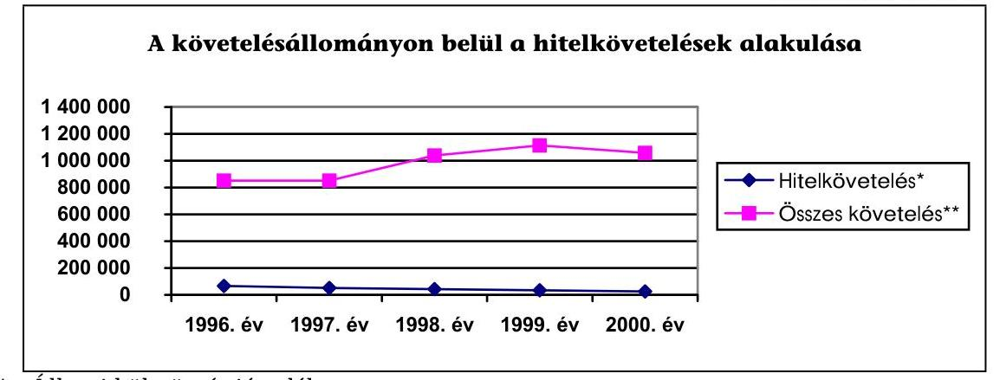

* Állami kölcsön és járadék
** Kincstár mérlegében (Mérleg II. követelések összesen sora alapján) belföldi követelés.

---

A vizsgált időszakban a Kormány - új hitelviszony keretében - nem nyújtott az államháztartáson kívülre beruházási támogatást, így az egyéb tényezők (pl.: követelés elengedés) együttes hatásaként a követelésállomány csökkenő tendenciát mutat. A nem egyenletes csökkenést az magyarázza, hogy 1997-ben a befejezett felszámolások miatt elszámolt veszteség a követelésállományt a többi évben elszámolt veszteségnél nagyságrendileg nagyobb mértékben csökkentette.

# 3.2.1. A követelésállomány kezelése, technikai és személyi feltételei 

Az ÁFI Rt. megszűnését követően az MNB által nyújtott refinanszírozási hitelkihelyezésekből származó követelések kezelését az Áht. 123/A. §-ában foglaltak és a 117/1996. (1996. I. 10.) számú pénzügyminiszteri alapítói határozat alapján 1996. február 29-ét követően a Magyar Államkincstár látja el.

Az ÁFI Rt. megszűnését követően azokat a jogszabályokat, amelyek az ÁFI Rt.-re vonatkoztak, az Áht. 123/A. §-a alapján - automatikusan mint jogutódra - az Államkincstárra is alkalmazták. A követelésállomány kezelését a Kincstár az ÁFI Rt.-re vonatkozó és jelenleg hatályos rendelkezések szerint látja el, kivéve a vagyonkezelés feladatát, amely a Kincstári Vagyoni Igazgatósághoz (KVI) került.

A követeléskezeléssel kapcsolatos jogszabályok aktualizálása nem történt meg. A szükséges jogszabály-módosításokat a Kincstár felmérte, de az Országgyúlés elé az előterjesztés nem történt meg.

A követelések kezelésére nem készített a Kincstár belső szabályzatot, mivel a jogszabályok szigorú keretek között korlátozták a Kincstár mozgásterét a követelések mobilizálására vonatkozóan.

A Kincstár számára a törvény csak csőd- és felszámolási eljárás keretében engedélyezi a követelések átütemezését, egyéb esetben nem. Az Áht. 108. §-a - az éves költségvetési törvényekben jóváhagyott kisösszegű követeléseken túl - az Országgyúlés kompetenciájává teszi a központi költségvetést megillető követelésről való lemondás jogát.

A követelésállomány nyilvántartása az ÁFI Rt.-ben kialakított rendszerben múködik, amely segítségével megállapítható az adósokkal szemben fennálló tőke- és kamatkövetelés.

A rendszer az adósra vonatkozó legszükségesebb adatokat tartalmazza olyan mélységben, hogy a vizsgált időszakban a PM felé a Kincstár eleget tudott tenni elszámolási kötelezettségének.

Az alkalmazott szoftver nem korszerű, mert az adósok állományi adataiból - a meghatározott új szempontok szerint - nem teszi lehetővé az adósok kigyűjtését, vagy csak számítástechnikusok közreműködésével oldhatók meg a nem rendszeresen végzett kigyűjtések.

Az állományi adatokból - a számítástechnikai háttér ellenére - csak a rendszeresen használt információk kérhetők le, különböző csoportosításban. A ritkán szükséges, egyedi igényeket szolgáló információk csak manuális kigyűjtéssel (adósonként) oldhatók meg. Az adósok számának csökkenése miatt ez egyre kisebb feladatot jelent, mert a hatályos szerződések alapján a normál adósok eseté-

---

ben az állami kölcsön (1 adós) 2004. évben, a járadék visszafizetése 2009. évben befejeződik. A hatályos szerződések szerint (2000. december 31-én) 161 adós 290 darab szerződését tartották nyilván.

A számítástechnikával (számítógép, nyomtató stb.) való ellátottság a követeléskezeléssel foglalkozó osztályon biztosított volt.

A követelésállomány kezelésének szervezeti struktúrája és személyi feltételei több alkalommal változtak a vizsgált időszakon belül, a változások és az átalakítás a helyszíni vizsgálat alatt is folytatódtak. A változásokat a Kincstár Szervezeti és Müködési Szabályzatában nem vezették keresztül, így az nem az aktuális helyzetet tükrözi. Az első munkaköri leírások 1998. szeptemberi keltezésűek, ezt követően a Követelés Kezelő Főosztályon 2000 júliusában kelt, új munkaköri leírást adtak a dolgozóknak, amelyben új feladatok nem jelentek meg.

A munkaköri leírások tartalmazták az osztály követeléskezeléssel összefüggő öszszes feladatait. A követeléskezeléssel foglalkozó munkatársak száma a feladat változásával összhangban - az ügyfelek száma csökkent - folyamatosan csökkent. 1997-ben még 7 munkatárs foglalkozott követeléskezeléssel, addig 2000-ben már csak 4 fő. Az osztályvezető mellett 1 referens, 1 ügyintéző foglalkozott követeléskezeléssel, valamint 1 főt megbízási szerződéssel alkalmaztak.

A követelés behajtásának szakmai színvonalát és folyamatosságát garantálta, hogy a szervezeti, illetve a szerkezeti változások ellenére a követeléskezelés gyakorlatilag azonos vezetéssel, csökkenő létszámmal, változatlan formában történt. A szervezeti változtatások folyamán a feladatellátás folyamatossága létszám és képzettség tekintetében egyaránt biztosított volt.

A munkaszerződésben a követeléskezeléssel kapcsolatban a jog- és hatáskört, valamint felelősségi kört nagyon általános formában - kiterjed a munkakörhöz tartozó feladatokra - határozták meg, de ennek ellenére a feladatellátás zavartalan volt.

# 3.2.2. A követelések behajtása 

A követelések hatékony kezelésére a Kincstárnak nagyon korlátozott volt a jogköre, mert döntési jogkörrel nem rendelkezett a követelések mobilizálását illetően. Jogszabály nem írta elő, hogy az adósokkal a szerződéseket a megváltozott jogi és gazdasági helyzetnek megfelelően aktualizálja a Kincstár. Az államháztartási körön kívüli követelések a rendszerváltozás előtt más gazdasági és jogi környezetben - a vizsgált időszak előtt - keletkeztek.

Pl. a szerződések megkötésekor még nem volt ismert, hogy az állami vállalatoknak át kell alakulni gazdasági társasággá, valamint a csődeljárásról, a felszámolási eljárásról és a végelszámolásról szóló 1991. évi IL. törvény (az 1992. évtől) és az Áht. is csak később - a szerződések megkötését követően - lépett hatályba.

A követelések eredményesebb behajtását nehezítette, hogy a szerződések megkötése idején a biztosítékok beépítése még nem volt gyakorlat, ezért a szerződések nem, vagy nem megfelelő biztosítékokat tartalmaztak.

---

A Diósgyőri Metallurgiai Gépgyárral szemben 1820 M Ft követelésre biztosítékot nem kötöttek ki a szerződésben, a követelésből részben sem származott megtérülés. Az Özdi Kohászati Üzemekkel szemben 489,8 M Ft bejelentett tőkekövetelés $50 \%$-a záloggal volt biztosítva, de ennek ellenére nem volt megtérülés.

Új szerződések megkötésére akkor került sor, ha az adós személyében változás történt. A Kincstár elsősorban a szerződések betartására figyelt, a határidőre nem fizető adósoknak felszólítást küldött. A követelések elengedése során nem kérték ki, illetve ha kikérte a PM a Kincstár véleményét nem mindig vette figyelembe.

A vizsgált esetek közül egy esetben fordult elő, hogy a gazdasági társaság (Északmagyarországi Téglaipari Rt.) adósságának ( $75,5 \mathrm{M}$ Ft állami kölcsön, 39 M Ft kamat, 3,7 M Ft járadék és 8,7 M Ft büntető kamat) átütemezését kérte a Kincstártól. Az adós által benyújtott likviditási terv alapján a Kincstár úgy ítélte meg, hogy a kötelezettségek teljesítésére a fedezet rendelkezésre áll és egyetértett volna a tartozás átütemezésével, de erre a Kincstárnak nem volt felhatalmazása.
Az Országgyúlés - a Magyar Köztársaság 2000. évi költségvetéséről szóló CXVIII. törvény 12. §-a alapján - mentesítette az Rt.-t az állami kölcsön és az ahhoz kapcsolódó kamattartozás megfizetése alól.
7. sz. grafikon
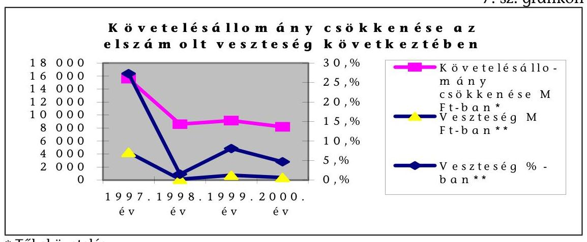

* Tőkekövetelés
**A veszteségként feltüntetett összegek és \%-ok nem végleges veszteségek, mert a követelések fejében az állam különböző vagyontárgyakat, részesedéseket stb. kapott.

A belföldi adósokkal szemben fennálló követelésállomány 5509 M Ft-tal csökkent (7. sz. grafikon) - a vizsgált időszakban - a befejezett felszámolások és követelés elengedések miatt. A követelés elengedés következtében átlagosan $13,3 \%$ volt a hitelezési veszteség (7. sz. grafikon), amit a kamatok és a késedelmi kamatok megtérülésének elmaradása tovább növelt.

A követelésállomány a vizsgált időszakban jelentősen csökkent azért is, mert az Országgyúlés - az éves költségvetés végrehajtásáról hozott törvényekben - az egyes adósokkal szemben fennálló követelésről lemondott. A Kincstárban nem álltak rendelkezésre azok a dokumentumok, amelyek magyarázatul szolgáltak volna. A követelések elengedésének döntési folyamatába a Kincstárat nem vonták be, illetve az Országgyúlés döntéséhez információt csak esetenként kértek.

---

Az 1998. évi XLVIII. tv. 18. §-a alapján 1997-ben 1123,8 M Ft, a 2000. évi CXVIII. tv. 16. §-a szerint 1999-ben 185,7 M Ft, és a 17. § alapján 2000-ben 72,5 M Ft , összesen 1382 M Ft összegű követelésről mondott le az Országgyűlés.

A követelés elengedésének döntési mechanizmusát, az érintett gazdálkodó szervezet működéséről meglévő információk figyelembevételét jogszabályban nem szabályozták. A követelésekről való lemondás célszerűsége nem került dokumentálásra így az nem volt ellenőrizhető. A követelések elengedését nem kötöttek feltételekhez. Az elengedett követelések hasznosulásáról nem gyűjtöttek információkat.

# A követeléséről való lemondást szabályszerűen, az Áht 108. § (2) bekezdésében foglaltaknak megfelelően hajtották végre. 

Befejezett felszámolásból 1997-ben 3134 M Ft vesztesége keletkezett a központi költségvetésnek, amely 25 cég felszámolásából adódott. Az elszámolt hitelezési veszteség megegyezik a felszámolások záró végzése alapján - a felszámolási adatlapon - kimutatott összeggel. Megjegyzendő, hogy az elszámolt veszteség kvázi veszteség, mert a felszámolás során a követelés ellenében engedményezett hitelezői követelések, ingatlanok és ingóságok, illetve értékpapírok értékesítéséből befolyt összegről nincs információ. A KVI (a volt Kincstári Vagyon Kezelő Szervezet) kompetenciája a követelés ellenében kapott ingatlanok és ingóságok értékesítése.

A követelések ellenében ingatlanok és ingóságok tulajdonjogához jutott a Kincstár (Pl. 1998-ban a Halasvin Rt. felszámolásából 5 M Ft értékben ingatlanhoz, a Karancs Mgtsz felszámolásából 12,7 M Ft értékben ingatlanhoz és ingósághoz). A valóságos hitelezési veszteség csak akkor válik ismerté, ha az ingóságok és ingatlanok értékesítése megtörtént. Hasonló helyzet állt fenn részvények esetében is (Pl. 1997-ben ÉMÁSZ, HÓDIKÖT Rt. részvényei), mivel a felszámolási eljárásban kapott részvényekből megtérült bevételekről szintén nem rendelkezik információval a Kincstár.

A Kincstár felszámolási eljárásban - a Kincstárhoz került vagyontárgyakkal az Áht. 123/A. § és a 104-109/C. §-aiban foglaltak szerint járt el. A felszámolási eljárásban a Kincstárhoz került ingatlanok, ingóságok és értékpapírok - át-adás-átvételi jegyzőkönyv alapján - átadásra kerültek a Kincstári Vagyoni Igazgatóságnak. A követelésekből - a felszámolási eljárás miatt - leírt veszteség elszámolása a megvizsgált esetekben szabályszerűen, a bírósági határozatban foglaltaknak megfelelően történt.

A követelések behajtásának eredményességét csökkenti, hogy 1999-ben a követelésállomány $33 \%$-a a felszámolás alatt lévő 94 adóssal szemben állt fenn, ezen követelések megtérülése bizonytalan, és a követelések megtérülésére a Kincstár nem tud hatni.

A követelések behajtásával kapcsolatban a Kincstár nem dolgozott ki hatékonysági mutatót és nem határozta meg, mit tekint hatékony követeléskezelésnek. A táblázatban jól látható, hogy a pénzbeli követelések megtérülése közel az előirányzott bevételeknek megfelelően alakult. A nem pénzbeli megtérüléssel nem számoltak, mert az bevételként nem, csak állománycsökkenésként jelenik meg a Kincstár beszámolójában, ezért az állományváltozás és a pénzbeni

---

megtérülés nem azonos.
8. sz. grafikon
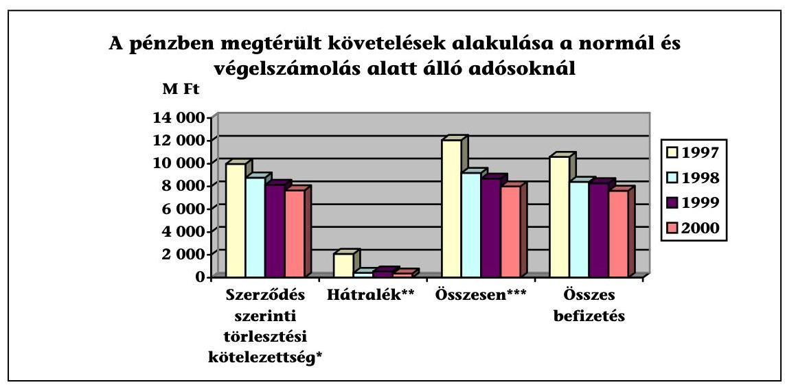
*Nem tartalmazza a felszámolás alatt álló adósokkal szembeni követeléseket.
** Határidőn túli (lejárt törlesztési határidejú) követelések év végi állománya.
***Összes törlesztési kötelezettség.
A követelésekből származó bevétel fokozatosan csökkent a vizsgálat időszakban (8. sz. grafikon). A bevételek a tervezettnek megfelelően alakultak, jelentősebb eltérést az előtörlesztések jelentettek, amelyről a tervezés időszakában még nem volt információ.

A követelések kezelésénél múködött a belső kontroll, 2000. év márciusában a Kincstár belső ellenőrzése az 1996-1999. évek vonatkozásában - célvizsgálat keretében - ellenőrizte a követelésállomány-kezelési tevékenységet. Az ellenőrzésről készült összefoglaló jelentésben javasolták, hogy a követelésállomány kezelésére vonatkozó belső utasítást dolgozzanak ki, tekintettel arra, hogy a jogszabályok a tevékenység végrehajtásának rendjét nem szabályozták. Az ellenőrzés javaslata megalapozott volt, a szabályzat elkészítése indokolt a köve-telésállomány-kezelési feladat ellátásához. A szabályzat azonban - a helyszíni ellenőrzés befejezéséig - nem készült el.

A Magyar Államkincstár tájékoztatása szerint a lejárt követelések már az 1999. illetve a 2000. évi zárszámadáshoz kimutatásra kerültek, 2000-re pedig a minősítés, tehát a követelések értékelése is megtörtént, a leltár nevesítetten is elkészült. A jelentés tárgyát képező követelések tekintetében - munkatervi feladatként - folyamatban van a belső követeléskezelési szabályzat kidolgozása, amely tervezet formájában 2001. június végére elkészül.

# 3.3. A társadalombiztosítás pénzügyi alapjainak belföldi követelései 

A társadalombiztosítási alapokkal szembeni, és az ellátási tevékenységgel kapcsolatos, belföldi tartozások állományából a vizsgált négy évben a Nyugdíjbiztosítási Alap Lakásfedezeti Államkötvény, az elmaradt járulékbefizetések emelhetők ki, mint amelyek az államadósságra hatással bírnak.

---

A Nyugdíjbiztosítási Alap Lakásfedezeti Államkötvény tőketörlesztése a törvényi előírások szerint bevonásra került a folyó finanszírozásba, így a megtérülés bevonásából származó bevétel 1996-ban 1160 M Ft, 1997-ben 1149 M Ft, 1998-ban 810 M Ft volt. Az államkötvény az 1999. évben a 4263 M Ft értékben eladásra került.

A tulajdonosi viszonyt megtestesítő Postabank Rt. részvények a hozzájuk kapcsolódó viszontgarancia következtében, kiemelt szerepűek az Alapok adósságállománya tekintetében.

A Postabank Rt. részvényeiből az Ny. Alap vagyonába, 4111,9 M Ft került. Az E. Alap összesen 4144,9 M Ft névértékű Postabank részvénnyel rendelkezett. Az 1998 decemberében végrehajtott tőkecsökkentés miatt, illetve az azt követő tőkeemelés következtében mindkét alapnál a névérték 2 M Ft-ra, a tulajdoni arány elenyészőre ( $1 \%$ alá) csökkent.

A társadalombiztosítás pénzügyi alapjai belföldi követeléseinek adatait a 12. számú melléklet, a járulék-követelések, a behajtására tett intézkedések, valamint a járulék-követelésállomány nyilvántartása helyszíni ellenőrzésének részletes megállapításait és adatait a 1. számú függelék és annak 1. és 2. számú mellékletei tartalmazzák.

# 4. A KORÁBBI ÉVEK ELLENŐRZÉSI MEGÁLLAPÍTÁSAINAK HASZNOSULÁSA 

Ajánlásokat fogalmaztunk meg a Kormány és a pénzügyminiszter részére az államadóssággal rendelkező alrendszerek - közöttük az önkormányzati alrendszer - nyilvántartási, számviteli elszámolási rendjének szabályozására, módosítására, a beszámolási kötelezettség összehangolására. Ez az államháztartás múködési rendjéről szóló 217/1998. (XII. 30.) Korm. rendelet hatálybalépésével részben teljesült. Az önkormányzatok belföldi pénzintézetektől, szervezetektől felvett hiteleiről először az 1999. évről állt rendelkezésre az államháztartás pénzügyi információs rendszerében adat, mivel a kormányrendelet mellékletét képező adatlapokon, valamint az éves költségvetési beszámolóban írták elő az adatszolgáltatást. Az adatszolgáltatás kialakított rendje azonban még mindig nem biztosítja az alrendszeren belüli halmozódások kiszűrését.

Az államadósság és ezen belül a belföldi adósságot érintő korábbi ellenőrzéseinkben - megállapításaink alapján - több javaslatot fogalmaztunk meg a feltárt hiányosságok megszüntetésére. Ezek egy része - az államháztartás reformfolyamatához is kapcsolódva - az elmúlt években megvalósult, más részük azonban továbbra is hiányosságként jelentkezik.

Az 1997. évi, valamint az 1998. évi zárszámadás helyszíni ellenőrzése alapvető munkafolyamat-szervezési és ellenőrzési hiányosságot tárt fel, a nyilvántartási és pénzforgalmi adatok közötti eltéréseket állapított meg, így azt az adatfeldolgozás zárt rendszerének és a végeredmény egyezőségének hiányában, megbízhatatlannak értékelte (T/42/1 Jelentés (1998.) 3 füzet 10.2. pont, 30. sz. pénzügyminiszternek címzett javaslat).

A Jelentésnek a munkafolyamatra, az államadósság állományához és változásához kapcsolódó adatfeldolgozási és elszámolási rendszerek előzőekben részle-

---

tezett megállapításai szerint, a pénzügyminiszter felé tett számvevőszéki javaslat hiányos, esetenként részleges megvalósítását tapasztalta a helyszíni ellenőrzés.

Az adósságkezelés stratégiai hiányára, máskor a jóváhagyásának elmaradására vonatkozó számvevőszéki megállapítás több jelentésben előfordult. Az ÁKK a stratégiát kellő gondossággal és körültekintéssel összeállította, jóváhagyása azonban a helyszíni ellenőrzés lezárásáig nem történt meg.

Az adósokról nem vezetnek olyan nyilvántartást, amely alapján a követelések megtérülésének kockázatát meg lehet határozni. Jogszabály módosítására a Kincstár tett javaslatot a követelések átütemezésével kapcsolatosan, de a javaslat alapján törvénymódosítás nem történt.

Az államadósság ellenőrzéséről készült jelentésben az ÁSZ javasolta az Áht. módosítását is, amely szerint az alrendszerek adósságpozícióját befolyásoló követelések számbavételének módját szabályozzák. A javaslattal kapcsolatban intézkedés nem történt.

Budapest, 2001. július

Melléklet: $\quad$ 1-12. sz. mellékletek (18 lap)

1. sz. függelék (6 lap), 1-2. sz. melléklet (2 lap)
2. sz. függelék (11 lap), 1-4/b. sz. melléklet (8 lap)

---

# MELLÉKLETEK 

Az államháztartás belföldi adóssága és a központi költségvetés belföldi követelésállománya kezelésének ellenőrzéséről szóló jelentéshez

2001. július

---

# MELLÉKLETEK 

| Sorszám | M E G N E VE Z É S |
| :--: | :--: |
| 1. sz. | A központi költségvetés tartozása 1997-2000 között |
| 2. sz. | Az államadósság-állományok alakulása 1997. XII. 31-2000. XII. 31. között (negyedévenként) |
| 2/a. sz. | Az állam rövid lejáratú kötelezettségei 1996. XII.31-1999. XII. 31. |
| 3. sz. | Tájékoztató az állam állampapírokban fennálló forintadósságának kibocsátásairól, forgalmazásáról és visszafizetéséről (a kincstári szabályozás szerint) |
| 4. sz. | A forint állampapír-értékesítések és visszafizetések értékpapírtípusonkénti összetételéről 1996-1999 között |
| 5. sz. | Az államkötvény-kamatok havonkénti alakulása az 1997-2000. évek között |
| 6 . sz. | A központi költségvetés folyó bevételeinek és kiadásainak alakulása az 1997-2000. évek között |
| 7. sz. | Az állam forintadósságának lejárati szerkezete 1997. XII. 31-2000. XII. 31. között (negyedévenként) |
| 8. sz. | Kimutatás az Útalap által felvett belföldi hitelek állományáról és törlesztéséről |
| 9. sz. | Kimutatás az Útalap által felvett belföldi hitelek kamatáról, bankköltségéről és forgalmi jutalékáról |
| 10. sz. | A társadalombiztosítási alapok bevételeinek és kiadásainak teljesülése 1996-2000. |
| 10/a. sz. | A Nyugdíjbiztosítási Alap bevételeinek és kiadásainak teljesülése 1996-2000. |
| 10/b. sz. | Az Egészségbiztosítási Alap bevételeinek és kiadásainak teljesülése 1996-2000. |
| 11. sz. | A társadalombiztosítás belföldi adósságállományának alakulása 1996-2000. |
| 12. sz. | A társadalombiztosítás összes belföldi követelésállományának ala- |

---

kulása 1996-2000.

---

# A központi költségvetés tartozása 1997-2000 között 

adatok: Mrd Ft-ban

| Megnevezés | 1996. XII. 31 | 1997. XII. 31 | 1998. XII. 31 | 1999. XII. 31 | 2000. XII. 31 |
| :--: | :--: | :--: | :--: | :--: | :--: |
| Hitelek | 631,41 | 502,67 | 434,96 | 380,21 | 303,84 |
| Állampapírok |  |  |  |  |  |
| a. Államkötvények | 1752,70 | 1746,90 | 2252,60 | 2644,00 | 3055,27 |
| b. Kincstári takarékkötvények |  |  | 11,52 | 28,90 | 35,23 |
| c. Kincstári takarékjegy 2 éves |  | 12,55 | 33,80 | 61,22 | 80,26 |
| Hosszú lejár. kötelezettség | 2384,11 | 2262,12 | 2732,88 | 3114,33 | 3474,60 |
| a. Diszkont kincstárjegy össz. | 560,20 | 661,30 | 689,90 | 826,70 | 837,30 |
| b. Kamatozó kincstárjegy | 90,10 | 154,80 | 186,20 | 216,10 | 174,13 |
| c. Kincstári takarékjegy 1 éves | 32,20 | 72,45 | 124,90 | 193,08 | 233,94 |
| Rövid lejár. kötelezettség   Kamatmentes adós. MNB-nél | $\begin{array}{r} 682,50 \\ 1563,31 \end{array}$ | 888,55 | 1001,00 | 1235,88 | 1245,37 |
| Forint állomány összesen   Ft á.papír dev. külföldieknél (-)   Dev.kötv.,hitel belf. banknál (+) | $\begin{array}{r} 4629,92 \\ 67,00 \\ 10,60 \end{array}$ | $\begin{array}{r} 3150,67 \\ 74,00 \\ 17,00 \end{array}$ | $\begin{array}{r} 3733,88 \\ 279,68 \\ 19,60 \end{array}$ | $\begin{array}{r} 4350,21 \\ 438,99 \\ 73,50 \end{array}$ | $\begin{array}{r} 4719,97 \\ 733,97 \\ 96,50 \end{array}$ |
| Belföldi kötelezetts. össz.   Változás 1997=100 \% (bázis)   Változás előző év=100 \% (lánc) | $\begin{array}{r} 4573,52 \\ 100,00 \end{array}$ | $\begin{array}{r} 3093,67 \\ 67,64 \\ 67,64 \end{array}$ | $\begin{array}{r} 3473,80 \\ 75,95 \\ 112,29 \end{array}$ | $\begin{array}{r} 3984,72 \\ 87,13 \\ 114,71 \end{array}$ | $\begin{array}{r} 4082,50 \\ 89,26 \\ 102,45 \end{array}$ |

[^0]
[^0]:    2000. XII. 31-ére vonatkozóan előzetes adatok álltak rendelkezésre

    1997-ben az aham MIND IeIe Iennano - es a Ienu ahanok kozou reszben szerepoo - auossaganak szerkezetvanozasa kovetkezeu be, a január 2-án devizaadósságra cserélt, lejárat nélküli, nulla kamatozású adósság, valamint a hozzákapcsolódó kamatozó kötvények részleges elötörlesztése miatt.

---

# Az államadósság-állományok alakulása 1997. XII. 31-2000. XII. 31. között 

(negyedévenként)
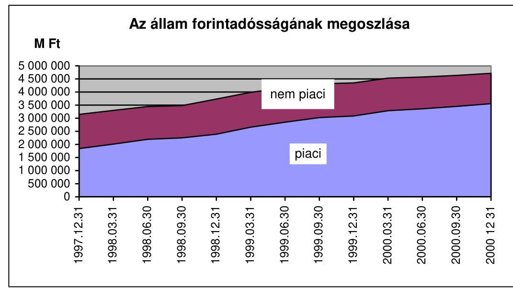

A 2000. december 31-ei adatok nem tartalmazzák a be nem váltott állományt.
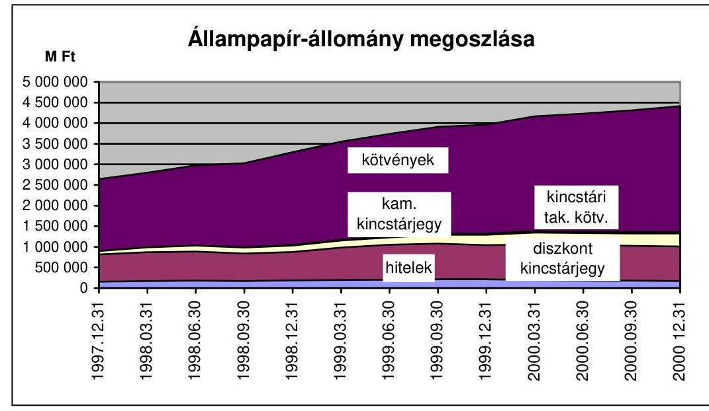

A 2000. december 31-ei adatok nem tartalmazzák a be nem váltott állományt.

---

# 3. sz. melléklet 

a V-19-104/2000-2001. sz. jelentéshez

## Tájékoztató

## az állam állampapírokban fennálló forintadósságának kibocsátásairól, forgalmazásáról és visszafizetéséről (a kincstári szabályozás szerint)

#### Abstract

Az ÁKK - 2001. március 1-jétől ÁKK Rt. - az állampapír-kibocsátás főszervezőjeként ellátja a forgalomba hozatallal, keletkeztetéssel kapcsolatos teendőket, kialakította a tevékenységek szervezetenkénti és átfogó lebonyolítói, nyilvántartási és ellenőrzési rendszerét. Megszervezte és lebonyolította az államkötvények és diszkont kincstárjegyek aukcióit és a jegyzéses kibocsátásokat (kincstári takarékkötvény, kamatozó kincstárjegy) a Budapesti Értéktőzsde (BÉT) által működtetett MMTS kereskedési programrendszer aukciós funkciójában. A jegyzési ajánlatok az MMTS hibás múködése esetén Reuters-terminálon, vagy floppyn érkeztek.

Az állampapírok mindkét formában történő értékesítésének pénzügyi elszámolása a KELER Rt. által üzemeltetett KID rendszer Valós Idejű Bruttó Elszámolási Rendszer (VIBER) funkciójában bonyolódik. Az MNB által fejlesztett és 1999 szeptemberétől üzemeltetett VIBER-ben a Kincstári Egységes Számlán kerül jóváírásra az elfogadott ajánlat ellenértéke. A kamatozó kincstári takarékjegy és a kincstári takarékkötvények pénzügyi elszámolása történik csak a GIRO rendszeren keresztül.

A KID rendszerben érkező kivonat egyeztetett adata az alapja a Kincstár értékpa-pír-kibocsátási számlán történő jóváírásnak. Ez rendszerint megelőzi a pénzügyi teljesítés számlán történő jóváírásáról való értesítés megérkezését, amiről az Elszámolási és Lebonyolítási Önálló Osztály könyvelési bizonylatot, valamint a Nemzetgazdasági számlák közötti átvezetések elvégzéséhez utalványt állít ki a Kincstár Államháztartási Összefoglaló Főosztálya részére. A „megelőlegezett" könyvelési bizonylat a VIBER-be érkező tételes lista végösszegének kevesebb manualitással történő ellenőrzése, illetve az egyezőség fennállásakor a pénzforgalmi rendszerbe való adatátvitel célját szolgálja.

A kamatozó kincstárjegy jegyzéséhez kapcsolódó ellenőrzést a T2000 előirányzatkezelési és pénzügyi teljesítési rendszeréből nyert információk alapján, vagy a Kincstár Budapesti Igazgatósága végzi, megállapításait visszaigazolja az ÁKK részére.

---

A Kincstár megyei fiókjai is részt vesznek a jegyzéssel történő állampapírértékesítés elsődleges kibocsátásában. Az állampapír-forgalmazáshoz kapcsolódóan a CLAVIS rendszerben a napi pénzforgalmi adatok analitikus könyvelését végzik, állományi adatokat összesítenek és elkészítik a napi jelentést. A CLAVIS rendszer „napzárás" funkciója a megyékben nem múködik - a programok tesztelése helyszíni ellenőrzésünk befejezésének időpontjában még folyt -, így azt az ÁEF rendszerben országosan hajtják végre. Az ÁEF rendszerben névértéken állományt és a pénzforgalomban kamat és tőke adatösszesítést végeznek.

A Kincstár fiókhálózatának forgalmi és állományi összesítéseit az ÁEF-ben a napzárást a Hálózatirányítási és Szabályozási Főosztály Összefoglaló Osztálya végzi el. A helyszíni ellenőrzés az állampapír-forgalmazás kincstári rendszere zártsági fokának tekintetében kedvezően értékeli, hogy a zárási feladat összefogása a Budapesti Igazgatóság feladatköréből - amely szervezet ugyancsak fiók - kiemelésre került. Az Összefoglaló Osztály az adatfeldolgozáshoz használt rendszereinek outputjait (feldolgozási eredményeit) páronként egyezteti. Az egyezőség fennállása esetén kerülnek a feldolgozott adatok a Nemzetgazdasági számlákra.

A folyamatos kibocsátású értékpapírok (kincstári takarékjegyek) kibo-csátás-, forgalmazás-, és visszaváltás-elszámolása a Postához és hálózatához kapcsolható.

A folyamatos kibocsátású értékpapírok (1-2 éves lejáratú kincstári takarékjegyek) kibocsátásáról, forgalmazásáról és visszaváltásról a Posta napi nettó elszámolást és pénzügyi átutalást teljesít a Kincstári Takarékjegy kibocsátási nemzetgazdasági számlára. Az ellenkező előjelű napi forgalom esetén a Kincstárnak ugyancsak naponta kell utalnia a megelőlegezett kifizetések különbözetét. A névértékre történő átszámításra, a tőke- és kamattérítésre, a Kincstár által vezetett nemzetgazdasági számlák közötti pénzügyi elszámolásra hetente kerül sor. A Posta és a Kincstár közötti bruttó elszámolást végző ügyintéző legkésőbb a tárgyhót követő 2. munkanappal egyezteti az ÁKK Tervezési és Elemzési Főosztály Tervezési Osztályával a hó végi forgalmat. Az iktatószámmal ellátott pénzforgalmi utalványokat mind a Kincstár Államháztartási Összefoglaló Főosztály Nemzetgazdasági Számlakezelő Osztálya, mind az ÁKK Számviteli Főosztálya megkapja.

Az ÁKK promtügyleteit a KELER Rt. teljesíti. A KID rendszeren bonyolított adásvételi ügyletek (terhelés és jóváírás) elszámolása az Értékpapír számlavezetési szabályzat alapján történik. Az értékpapírok pénzügyi teljesítése a VIBERben valósul meg, amiről „könyvelési bizonylatot" az Elszámolási és Lebonyolítási Önálló Osztály állít ki. Tárgynapon az ügylet ellenértékének a jogcímenként megfelelő nemzetgazdasági számlákra könyvelése utalvány alapján történik.

A Kincstár hálózati értékpapír-ügyletek összesített napi jelentése az alapja a nemzetgazdasági számlaforgalomnak és a közöttük történő rendezéseknek. Az előírás szerint a másodlagos piaci elszámolás ügyintézője és az ÁKK Elszámolási és Bonyolítási Önálló Osztály a tárgyhó végét megelőző 5. munkanappal bezárólag köteles a hó végi forgalmat egyeztetni. A hálózati állampapír-eladások és visszavásárlások, valamint az OTC elszámolások könyv szerint kimutatott és a pénzforgalomból nyert értékét, illetve a kamatelszámolásokat az ÁKK Szám-

---

viteli Főosztálya a Kincstár Nemzetgazdasági Számlakezelő Osztály nyilvántartásaival, a záró állományt pedig az ÁKK Tervezési, Elemzési Főosztály Tervezési Osztályának adatával köteles egyeztetni.

A kamat- és tőke-visszafizetések elszámolásának alapja a KELER Rt. által papíron és floppyn megküldött pozíció jelentés.

Az értékpapírszámlás (dematerializált, letéti számlás) állampapírok esetében a jelentés tartalmazza az értékpapír-forgalmazók tőzsdeforgalmi számláin és az MNB-nél, vagy a KELER Rt.-nél vezetett bank-, letéti számlákon elszámolandó tételeket. A Kincstár állampapír-forgalmazó hálózatára vonatkozó állományi adatokat a Budapesti Értékpapírpénztár (2000-től Hálózatirányítási és Szabályozási Főosztály Összefoglaló Osztály) foglalja jelentésbe (saját és ügyféltulajdonos szerinti bontás). A pozíció jelentések alapján kiállított, ellenőrzött és ellenjegyzett utalványt a Kincstár Budapesti Igazgatóság illetékes szervéhez továbbítják.

A fizikai kibocsátású állampapírok kamat- és tőke-visszafizetéseiről a kifizető helyek hetente küldött teljesítés igazolásai alapján a lebonyolítási számláról kerülnek pénzügyileg rendezésre az ÁKK-ban, vagy a Kincstár fiókhálózatában. A Kincstár Budapesti Értékpapírpénztára havonta egyezteti a kifizető helyek elszámolásait rögzítő jegyzőkönyvvel a megsemmisítésre beérkezett tőke-, kamatszelvények mennyiségét. A fizikai papírokkal kapcsolatos jogtalan lehívásokat - az előírás szerint - késedelmi kamat felszámításával szankcionálják. Az utalványról másolatot kap az ÁKK Számviteli Főosztály is.

Az elsődleges forgalmazók által forgalmazott papírok lejárat előtti visszavásárlása aukcióval bonyolódik. Az értékpapírok elektronikus kereskedésében (OTC) felkínált állampapírok mennyiségének és hozamának pénzügyi elszámolása a KID rendszer VIBER funkciójában történik.

A kincstári takarékkötvények futamidő alatti visszaváltása a forgalmazók KELER Rt.-vel egyeztetett értékpapír-letéti számla transzferek kamat- és tőketörlesztési összegeit a nemzetgazdasági számla megterhelése mellett - a következő napon, eltérés esetén a forgalmazókkal történt egyeztetést követően utalja a Kincstár az ÁKK utalványa alapján.

Budapest, 2001. július

---

# A forint-állampapír értékesítések és visszafizetések értékpapír-típusonkénti összetételéről 1996-1999 között

|  Megnevezés | 1997. december 31. |  |  | 1998. december 31. |  |  | 1999. december 31. |  |   |
| --- | --- | --- | --- | --- | --- | --- | --- | --- | --- |
|   | Értékesítés | Lejárat
visszavásárlás | Állományváltozás | Értékesítés | Lejárat
visszavásárlás | Állományváltozás | Értékesítés | Lejárat
visszavásárlás | Állományváltozás  |
|  Kamatozó takarékj | 154,33 | 89,49 | 64,84 | 186,43 | 155,28 | 31,15 | 200,56 | 170,98 | 29,62  |
|  Kincstári takarékj | 106,74 | 41,17 | 65,57 | 166,54 | 92,88 | 73,67 | 252,40 | 156,85 | 95,55  |
|  Lakossági kincstárj | 0,00 | 0,69 | $-0,69$ |  | 0,96 | $-0,96$ | 0,00 | 0,01 | $-0,01$  |
|  Diszkont kincstárj | 1136,27 | 1035,66 | 100,61 | 1133,09 | 1104,55 | 28,55 | 1376,27 | 1239,65 | 136,62  |
|  Összesen | 1998,55 | 1773,21 | 225,33 | 2288,17 | 1639,44 | 648,73 | 2645,04 | 1974,32 | 670,72  |

A táblázat nem tartalmazza a be nem váltott állományok miatti állományváltozást és egyéb pénzforgalmat nem érintő adósságművelete

---

# Az államkötvény-kamatok havonkénti alakulása az 1997-2000. évek között 

Adatok: Ft-ban
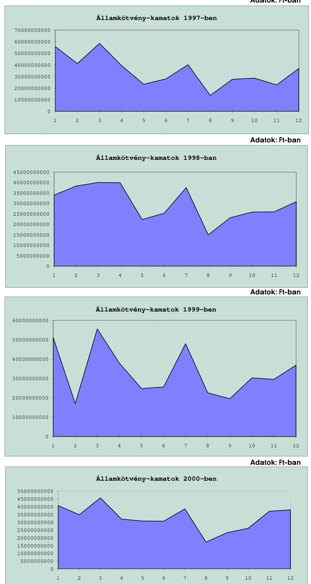

---

# A központi költségvetés folyó bevételeinek és kiadásainak alakulása az 1997-2000. évek között

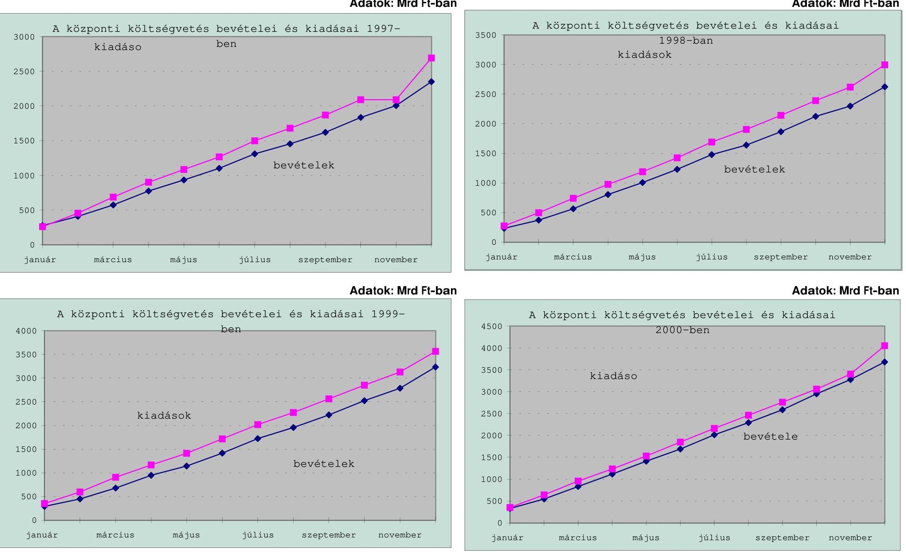

---

# Az állam forintadósságának lejárati szerkezete 1997. XII. 31-2000. XII. 31. között (negyedévenként) 

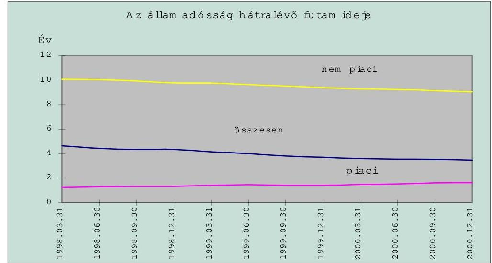
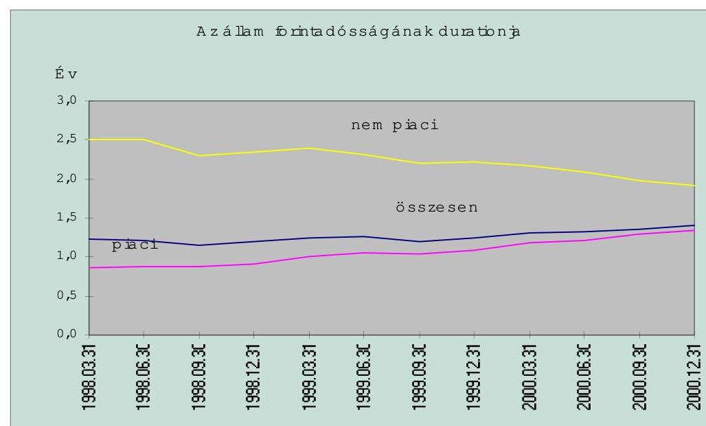

---

# KIMUTATÁS

az Útalap által felvett belföldi hitelek állományáról és törlesztéséről

|  Megnevezés /hitelfajtánként/ | Állomány | Törlesztés | Állomány | Törlesztés  |
| --- | --- | --- | --- | --- |
|   | 1997. december 31. E Ft | 1997. december 31. E Ft | 1998. december 31. E Ft | 1998. december 31. E Ft  |
|  OKHB I. | 1250000 | 250000 | 1000000 | 250000  |
|  OKHB II. | 1375000 | 250000 | 1125000 | 250000  |
|  OKHB III. | 4500000 | 750000 | 3750000 | 750000  |
|  OKHB IV. * | 7427699 | 873764 | 6553935 | 873764  |
|  OTP I. | 2250000 | 375000 | 1875000 | 375000  |
|  Befekt. és Fejl. Bank | 1141444 | 134287 | 1007156 | 134287  |
|  Magyar Külker. Bank | 3396634 | 399604 | 2997030 | 399604  |
|  OTP II. | 3225351 | 379453 | 2845898 | 379453  |
|  |   |   |   |   |
|  Összesen | 24566128 | 3412108 | 21154019 | 3412108  |

- A Postabank hitelállományát 1997-től a Kereskedelmi és Hitelbank kezeli.

---

# KIMUTATÁS

az Útalap által felvett belföldi hitelek kamatáról, bankköltségéről és forgalmi jutalékáról

|  Megnevezés
/hitelfajtánként/ | Hitelek kamata |  | Bankköltség és forgalmi jutalék összesen |   |
| --- | --- | --- | --- | --- |
|   | 1997. december 31.
E Ft | 1998. december 31.
E Ft | 1997. december 31.
E Ft | 1998. december 31.
E Ft  |
|  OKHB I. | 426078 | 234950 | 0 | 0  |
|  OKHB II. | 470090 | 268412 | $19832^{* *}$ | $17689^{* *}$  |
|  OKHB III. | 783938 | 745926 | $7700^{* * *}$ | $6430^{* * *}$  |
|  OKHB IV. * | 2266820 | 1481855 | 0 | 0  |
|  OTP I. | 601017 | 443215 | 0 | 0  |
|  Befekt. és Fejl. Bank | 262796 | 206012 | 0 | 0  |
|  Magyar Külker. Bank | 774524 | 605906 | 0 | 0  |
|  OTP II. | 799372 | 751641 | 0 | 0  |
|  |   |   |   |   |
|  Összesen | 6384635 | 4737917 | 27532 | 24119  |

- A Postabank hitelállományát 1997-től a Kereskedelmi és Hitelbank kezeli. ** A bankköltség valamennyi OKHB hitelre együtt. *** A forgalmi jutalék valamennyi OKHB hitelre együtt.

---

.

---

.

---

# A társadalombiztosítási alapok bevételeinek és kiadásainak teljesülése 1996-2000. 

|  |  |  |  |  | Millió Ft |
| :--: | :--: | :--: | :--: | :--: | :--: |
| Megnevezés | Eredeti elöirányzat | Módosított elöirányzat | Teljesités | Eltérés az elöirányzatokhoz képest |  |
|  |  |  |  | az eredeti elöirányzattól | a módosított elöirányzattól |
| 1996. év |  |  |  |  |  |
| Bevételi föösszeg | 956852 | 936 102* | 922209 | $-34643$ | $-13893$ |
| Kiadási föösszeg | 974662 | 996 218* | 990838 | $+16176$ | $-5380$ |
| Hiány | 17810 | 60 116* | 68629 | $+50819$ | $+8513$ |
| 1997. év |  |  |  |  |  |
| Bevételi föösszeg | 1136606 | 1121 369** | 1126817 | $-9789$ | $+5448$ |
| Kiadási föösszeg | 1150138 | 1171 728** | 1177350 | $+27212$ | $+5622$ |
| Hiány | 13532 | 50 359** | 50533 | $+37001$ | $+174$ |
| 1998. év |  |  |  |  |  |
| Bevételi föösszeg | 1359564 | - | 1342580 | $-16984$ | - |
| Kiadási föösszeg | 1381654 | - | 1433355 | $+51701$ | - |
| Hiány | 22090 | - | 90775 | $+68685$ | - |
| 1999. év |  |  |  |  |  |
| Bevételi föösszeg | 1569500 | 1573424 | 1570215 | $+715$ | $-3209$ |
| Kiadási föösszeg | 1611154 | 1619746 | 1616782 | $+5628$ | $-2964$ |
| Hiány | 41654 | 46322 | 46567 | $+4913$ | $+245$ |
| 2000. év*** |  |  |  |  |  |
| Bevételi föösszeg | 1717 149,0 | 1752 015,9 | 1737567,5 | $+20418,5$ | $-14448,4$ |
| Kiadási föösszeg | 1759 460,0 | 1797 765,0 | 1818 964,8 | $+59504,8$ | $+21199,8$ |
| Hiány | $-42311,0$ | $-45749,2$ | $-81397,3$ | $+39086,3$ | $+35648,1$ |

* A módosítás az Egészségbiztosítási Alapot és a Nyugdíjbiztosítási Alapot érintette.
** A módosítás az Egészségbiztosítási Alapot érintette. Az adatok az E. Alap módosított és az Ny. Alap változatlan előirányzatának összegzése.
***Előzetes adat. A módosított előirányzat a törvényi módosítás mellett tartalmazza a Kormány, illetve az intézményi hatáskörben történt módosítást is.

Forrás:
1996. évi XIV. törvény a társadalombiztosítás pénzügyi alapjai 1996. évi költségvetéséről
1996. évi CXX. törvény a társadalombiztosítás pénzügyi alapjainak 1996. évi pótköltségvetéséről
1996. évi CXXV. törvény a társadalombiztosítás pénzügyi alapjai 1997. évi költségvetéséről
1997. évi CXII. törvény az Egészségbiztosítási Alap 1997. évi pótköltségvetéséről
1997. évi CLII. törvény a társadalombiztosítás pénzügyi alapjai 1996. évi költségvetésének végrehajtásáról
1997. évi CLIII. törvény a társadalombiztosítás pénzügyi alapjainak 1998. évi költségvetéséről
1998. évi LXX. törvény a társadalombiztosítás pénzügyi alapjai 1997. évi költségvetésének végrehajtásáról
1998. évi XCI. törvény a társadalombiztosítás pénzügyi alapjai 1999. évi költségvetéséről
1999. évi XCIII. törvény a társadalombiztosítás pénzügyi alapjai 1998. évi költségvetésének végrehajtásáról
1999. évi CIX. törvény a társadalombiztosítás pénzügyi alapjai 2000. évi költségvetéséről

2000. évi CXIX. törvény a társadalombiztosítás pénzügyi alapjai 1999. évi költségvetésének végrehajtásáról

---

# A Nyugdíjbiztosítási Alap bevételeinek és kiadásainak teljesülése 1996-2000. 

|  |  |  |  | Millió Ft |
| :--: | :--: | :--: | :--: | :--: |
| Megnevezés | Eredeti elöirányzat | Módosított elöirányzat | Teljesités | Eltérés az elöirányzatokhoz képest |
|  |  |  |  | az eredeti elöirányzattól a módosított elöirányzattól |
| 1996. év |  |  |  |  |
| Bevételi föösszeg | 574188 | 564895 | 559989 | $-14199$ | $-4906$ |
| Kiadási föösszeg | 590441 | 586087 | 585132 | $-5309$ | $-955$ |
| Hiány | 16253 | 21192 | 25143 | $+8890$ | $+3951$ |
| 1997. év |  |  |  |  |
| Bevételi föösszeg | 615525 | - | 628607 | $+13082$ | - |
| Kiadási föösszeg | 625211 | - | 623392 | $-1819$ | - |
| Hiány /Többlet | 9686 | - | * $+5215$ | $-14901$ | - |
| 1998. év |  |  |  |  |
| Bevételi föösszeg | 786390 | - | 781119 | $-5271$ | - |
| Kiadási föösszeg | 786390 | - | 801161 | $+14771$ | - |
| Hiány | 0 | - | 20042 | $+20042$ | - |
| 1999. év |  |  |  |  |
| Bevételi föösszeg | 914665 | 913827 | 916706 | $+2041$ | $+2879$ |
| Kiadási föösszeg | 914665 | 913827 | 915580 | $+915$ | $+1753$ |
| Hiány | 0 | 0 | $*+1126$ | $+1126$ | $+1126$ |
| 2000. év** |  |  |  |  |
| Bevételi föösszeg | 992 408,0 | 994 113,6 | 1003 459,7 | $+11051,7$ | $+9346,1$ |
| Kiadási föösszeg | 992 408,0 | 996 091,3 | 1021 242,1 | $+28834,1$ | $+25150,8$ |
| Hiány | 0,0 | $-1977,7$ | $-17782,4$ | $+17782,4$ | $+15804,7$ |

* Bevételi többlet.
**Előzetes adat. A módosított előirányzat a törvényi módosítás mellett tartalmazza a Kormány, illetve az intézményi hatáskörben történt módosítást is.

Forrás:
1996. évi XIV. törvény a társadalombiztosítás pénzügyi alapjai 1996. évi költségvetéséről
1996. évi CXX. törvény a társadalombiztosítás pénzügyi alapjainak 1996. évi pótköltségvetéséről
1996. évi CXXV. törvény a társadalombiztosítás pénzügyi alapjai 1997. évi költségvetéséről
1997. évi CXII. törvény az Egészségbiztosítási Alap 1997. évi pótköltségvetéséről
1997. évi CLII. törvény a társadalombiztosítás pénzügyi alapjai 1996. évi költségvetésének végrehajtásáról
1997. évi CLIII. törvény a társadalombiztosítás pénzügyi alapjainak 1998. évi költségvetéséről
1998. évi LXX. törvény a társadalombiztosítás pénzügyi alapjai 1997. évi költségvetésének végrehajtásáról
1998. évi XCI. törvény a társadalombiztosítás pénzügyi alapjai 1999. évi költségvetéséről
1999. évi XCIII. törvény a társadalombiztosítás pénzügyi alapjai 1998. évi költségvetésének végrehajtásáról
1999. évi CIX. törvény a társadalombiztosítás pénzügyi alapjai 2000. évi költségvetéséről
2000. évi CXIX. törvény a társadalombiztosítás pénzügyi alapjai 1999. évi költségvetésének végrehajtásáról

---

# Az Egészségbiztosítási Alap bevételeinek és kiadásainak teljesülése 1996-2000. 

|  |  |  |  |  | Millió Ft |
| :--: | :--: | :--: | :--: | :--: | :--: |
| Megnevezés | Eredeti elöirányzat | Módosított elöirányzat | Teljesités | Eltérés az elöirányzatokhoz képest |  |
|  |  |  |  | az eredeti elöirányzattól | a módosított elöirányzattól |
| 1996. év |  |  |  |  |  |
| Bevételi föösszeg | 489489 | 476655 | 465473 | $-24016$ | $-11182$ |
| Kiadási föösszeg | 491046 | 515579 | 508959 | $+17913$ | $-6620$ |
| Hiány | 1557 | 38924 | 43486 | $+41929$ | $+4562$ |
| 1997. év |  |  |  |  |  |
| Bevételi föösszeg | 521081 | 505844 | 498210 | $-22871$ | $-7634$ |
| Kiadási föösszeg | 524927 | 546517 | 553958 | $+29031$ | $+7441$ |
| Hiány | 3846 | 40673 | 55748 | $+51902$ | $+15075$ |
| 1998. év |  |  |  |  |  |
| Bevételi föösszeg | 573174 | - | 561461 | $-11713$ | - |
| Kiadási föösszeg | 595264 | - | 632194 | $+36930$ | - |
| Hiány | 22090 | - | 70733 | $+48643$ | - |
| 1999. év |  |  |  |  |  |
| Bevételi föösszeg | 654835 | 659597 | 653509 | $-1326$ | $-6088$ |
| Kiadási föösszeg | 696489 | 705919 | 701202 | $+4713$ | $-4717$ |
| Hiány | 41654 | 46322 | 47693 | $+6039$ | $+1371$ |
| 2000. év* |  |  |  |  |  |
| Bevételi föösszeg | 724741,0 | 757902,2 | 734 107,9 | $+9366,9$ | $-23794,3$ |
| Kiadási föösszeg | 767052,0 | 801673,7 | 797722,7 | $+30670,7$ | $-3951,0$ |
| Hiány | $-42311,0$ | $-43771,5$ | $-63614,8$ | $+21303,8$ | $+19843,3$ |

*Előzetes adat. A módosított elöirányzat a törvényi módosítás mellett tartalmazza a Kormány, illetve az intézményi hatáskörben történt módosítást is.

Forrás:
1996. évi XIV. törvény a társadalombiztosítás pénzügyi alapjai 1996. évi költségvetéséről
1996. évi CXX. törvény a társadalombiztosítás pénzügyi alapjainak 1996. évi pótköltségvetéséről
1996. évi CXXV. törvény a társadalombiztosítás pénzügyi alapjai 1997. évi költségvetéséről
1997. évi CXII. törvény az Egészségbiztosítási Alap 1997. évi pótköltségvetéséről
1997. évi CLII. törvény a társadalombiztosítás pénzügyi alapjai 1996. évi költségvetésének végrehajtásáról
1997. évi CLIII. törvény a társadalombiztosítás pénzügyi alapjainak 1998. évi költségvetéséről
1998. évi LXX. törvény a társadalombiztosítás pénzügyi alapjai 1997. évi költségvetésének végrehajtásáról
1998. évi XCI. törvény a társadalombiztosítás pénzügyi alapjai 1999. évi költségvetéséről
1999. évi XCIII. törvény a társadalombiztosítás pénzügyi alapjai 1998. évi költségvetésének végrehajtásáról
1999. évi CIX. törvény a társadalombiztosítás pénzügyi alapjai 2000. évi költségvetéséről
2000. évi CXIX. törvény a társadalombiztosítás pénzügyi alapjai 1999. évi költségvetésének végrehajtásáról

---

# A társadalombiztosítás belföldi adósságállományának alakulása 1996-2000. 

|  |  |  |  |  | Millió Ft |
| :--: | :--: | :--: | :--: | :--: | :--: |
| Megnevezés | 1996.   XII. 31. | 1997.   XII. 31. | 1998.   XII. 31. | 1999.   XII. 31. | 2000.   XII. 31.* |
| Belföldi hitelek (KESZ) | 68833 | 76016 | 101764 | 49642 | 87493 |
| ebből: Nyugdíjbiztosítási Alap | 22748 | 0 | 18730 | 3782 | 25247 |
| Egészségbiztosítási Alap | 46085 | 76016 | 83034 | 45860 | 62246 |
| Postabank Rt. viszont garancia | - | 2780 | 7791 | 6152 | 4511 |
| ebből: Nyugdíjbiztosítási Alap | - | 2780 | 5565 | 4394 | 3222 |
| Egészségbiztosítási Alap | - | - | 2226 | 1758 | 1289 |
| Belföldi adósságállomány összesen | 68833 | 78796 | 109555 | 55794 | 92004 |
| ebből: Nyugdíjbiztosítási Alap | 22748 | 2780 | 24295 | 8176 | 28469 |
| Egészségbiztosítási Alap | 46085 | 76016 | 85260 | 47618 | 63535 |

*Előzetes adat.

Forrás: Országos Nyugdíjbiztosítási Főigazgatóság
Országos Egészségbiztosítási Pénztár

---

# 12. sz. melléklet 

a V-19-104/2000-2001. sz. jelentéshez

## A társadalombiztosítás összes belföldi követelésállományának alakulása 1996-2000.

| Megnevezés | 1996.   XII. 31. | 1997.   XII. 31. | 1998.   XII. 31. | 1999.   XII. 31. | 2000.   XII. $31^{*}$. |
| :--: | :--: | :--: | :--: | :--: | :--: |
| Társadalombiztosítási járulékkintlévőség | 221366 | 230013 | 251250 | 285218 | 117801 |
| ebből: Nyugdíjbiztosítási Alap |  |  |  | 181318 | 63153 |
| Egészségbiztosítási Alap |  |  |  | 103900 | 54648 |
| Lakásfedezeti Államkötvény | 9280 | 5673 | 4862 | - | - |
| ebből: Nyugdíjbiztosítási Alap | 9280 | 5673 | 4862 | - | - |
| Egészségbiztosítási Alap | - | - | - | - | - |
| Belföldi követelésállomány összesen | 230646 | 235686 | 256112 | 285218 | 117801 |

*Előzetes adat.
Forrás: Országos Nyugdíjbiztosítási Főigazgatóság
Országos Egészségbiztosítási Pénztár
Adó- és Pénzügyi Ellenőrzési Hivatal

---

# FÜGGELÉK 

## az államháztartás belföldi adóssága és a központi költségvetés belföldi követelésállománya kezelésének ellenőrzéséről készített V-19-104/2000-2001. sz. jelentéshez

1. sz. Függelék: A társadalombiztosítás pénzügyi alapjainak já-rulék-követelései és a behajtásra tett intézkedések
2. sz. Függelék: A belföldi államadósság alakulása az önkormányzatoknál

---

# A társadalombiztosítás pénzügyi alapjainak járulék-követelései és a behajtásra tett intézkedések 

## 1. A TÁRSADALOMBIZTOSÍTÁS PÉNZÜGYI ALAPJAINAK JÁRULÉKKÖVETELÉSEI

Az adósságállományhoz hasonlóan törvényileg nem szabályozott az államháztartás társadalombiztosítási alrendszerénél a követelésállomány fogalma és a kintlévőségként számba vehető tényezők köre sem.

A számviteli törvény és a végrehajtására kiadott jogszabályok szerint a költségvetési szerveknél és a társadalombiztosítás követelésállományának kategóriájába beletartozik a mérlegében az eszközoldalon szereplő valamennyi követelése (pl. az áruszállításból és szolgáltatásból (vevők) származó követelések), amelyek finanszírozási forrást igényelnek.

A társadalombiztosítási alrendszerrel (a társadalombiztosítási alapokkal) szembeni, az ellátási tevékenységgel kapcsolatos tartozások állományában az éves zárszámadások tárgyalásakor a járulékfolyószámlán fennálló tartozásokat nevesítik.

Az 1999. december 31-ei járulék-követelésállomány az évek óta halmozódó, nehezen behajtható tartozásokból áll, amelyek a megszűnt vagy felszámolás alatt álló munkáltatóknál képződtek.

A járulék-követelésállomány 1999 végén 285218 M Ft volt, az 1996. évhez képest $28,8 \%$-kal, 63852 M Ft-tal emelkedett. Az 1999. december 31-ei összes járulék-kintlévőségnek - adózói minősítő kód szerinti bontásban áttekintve -$63,4 \%$-a tőkekövetelés, $36,6 \%$-a késedelmi pótlék.

A járulék-követelésállomány mintegy felét ( 142218 M Ft ) az élő folyószámlákon tartják nyilván. Hasonlóan magas összegű járuléktartozás ( 113024 M Ft ) szerepel a felszámolási eljárásokkal kapcsolatos folyószámlákon. Gazdálkodási formakód szerint a hátralék 73,2\%-ban a gazdálkodók és a vállalkozások, 15,6\%-ban az

---

egyéni vállalkozók, 7,9\%-ban a magánszemélyek, 2,6\%-ban az egyéb (nonprofit) szervezetek $0,7 \%$-ban a költségvetési szervek között oszlik meg.

A járulék-folyószámlák száma az 1996. év végéről 1999. december 31-ére 14,4\%-kal emelkedett. A 2078908 folyószámla 57,4\%-a aktív folyószámla, aminek $95,7 \%$-a élő folyószámla.

A társadalombiztosítási tevékenységgel kapcsolatos egyéb bevételek legnagyobb részét kitevő késedelmi pótlék és bírság nagyságrendje az 1996-1998. években 17-19 Mrd Ft volt. E címen 1999-ben a 21600 M Ft összegben előirányzott bevétel helyett a teljesítés 3241 M Ft-ot tett ki.

Az elmaradásban közrejátszott, hogy 1999. január 1-jétől a tartozások megfizetési sorrendjének rangsorában első helyre került az egészségbiztosítási- és a nyugdíjjárulék a késedelmi pótlék és a bírság helyett, továbbá, hogy az 1999. évi LXIV. törvény rendelkezése szerint a járulékigazgatóságoknak lehetőségük volt a 10 E Ft-ot meg nem haladó járuléktartozások és az ezekhez kapcsolódó késedelmi pótlékok és bírságok elengedésére, ami az 1999. december 31-éig rendezett folyószámlák esetében 164 M Ft összegben valósult meg.

# 2. INTÉZKEDÉSEK AZ Alapok JÁRULÉK-KÖVETELÉSEINEK BEHAJTÁSÁRA 

Az Alapok követelésállományának (a velük szemben álló tartozások) rendezését a vizsgált időszakban az Alapokkal szembeni tartozások ellenében átvett vagyon, valamint az elmaradt járulékbevételek behajtására tett intézkedések segítették.

A társadalombiztosítás pénzügyi alapjairól és azok 1993. évi költségvetéséről szóló - többször módosított - 1992. évi LXXXIV. törvény alapján az Alapok követeléseik fejében az adósok által felajánlott vagyontárgyakat vehetnek át.

Az Alapok követeléseinek rendezéseként 1996-ban 1270 M Ft, 1997-ben 358 M Ft, 1998-ban 866 M Ft, az 1999. évben pedig 165 M Ft értékelésű vagyon került a társadalombiztosítási alapokhoz. Ebből egy részük felszámolási eljárás során, más részük pedig az 1992. évi LXXXIV. törvény 6. §-ának (3) bekezdésében szabályozott átvétellel (a társadalombiztosítási önkormányzatok határozata alapján) került társadalombiztosítási tulajdonba. A négy évben történt összesen 2659 M Ft vagyonátvételből 1567 M Ft az Ny. Alapot, 1092 M Ft az E. Alapot illette meg.

A felszámolási eljárás alatt álló társaságok tartozása fejében a bíróság által jogerősen megítélt vagyontárgyak a bírói végzésben meghatározott értéken kerülnek az Alapok vagyonába. Ez a bekerülési érték nem tükrözi a valós piaci értéket. Az Alapok ilyen esetekben nincsenek alkupozícióban, más megoldás hiányában veszik át a megítélt vagyontárgyakat, amelyek jelentős része értéktelen, nem hasznosítható vagyon, amire azonnal értékvesztést kell elszámolni.

A négy évben a vagyonelemek értékesítéséből összesen 2807 M Ft bevétel származott, ugyanezen időszak alatt a vagyonelemek értékvesztése 3506 M Ft volt. Előbbiek következtében a vagyonállomány 1999. december 31-én kevesebb mint egy milliárd forintot ( 991 M Ft ) tett ki.

---

Az adótörvény módosítása következtében 1999. január 1-jétől a csőd- és felszámolási eljárásokban az APEH képviseli a társadalombiztosítási alapokat. A járuléktartozás fejében átvett vagyonelemek értékesítéséből származó bevételek a vagyonelemre vonatkozó megoszlási arány alapján kerülnek megosztásra és könyvelésre az Alapok között.

A társadalombiztosítás bevételi előirányzatainak részét képező, az Alapok egyensúlyi helyzete szempontjából meghatározó jelentőségű és nagyságrendű tényezőjének, az elmaradt járulék-befizetéseknek a behajtására folyamatosan történtek intézkedések, nemcsak az OEP és az ONYF tevékenységéből eredően, hanem központi előirásként is. A behajtásból származó bevételek teljesülése érdekében a társadalombiztosítási alapok 1996. évi költségvetéséről szóló 1996. évi XIV. törvény 17. §-a rendkívüli behajtás megtételére kötelezte a társadalombiztosítási önkormányzatokat és a Kormányt.

A kintlévőségek behajtásából eredeti előirányzatként 24083 M Ft bevételt irányzott elő, majd azt a pótköltségvetés (1996. évi CXX. törvény) 7000 M Ft-ra mérsékelte, 4000 M Ft-ban az Ny. Alap és 3000 M Ft-ban az E. Alap számára. Kormányzati intézkedések elmaradása (a megvalósítás konkrét jogi módja meghatározásának hiánya) miatt azonban e címen 1996-ban bevételek nem folytak be az Alapokba.

Az 1996. évi XIV. törvény 17. §-a rendelkezett arról is, hogy a rendkívüli járulékbehajtásként előirányzott bevétel teljesülése érdekében a teljes követelésállomány felülvizsgálatát az Alapok kezelői végezzék el, és bocsássák a Kormány rendelkezésére. Emellett a törvény szerint a Kormánynak a társadalombiztosítási önkormányzatokkal együtt - az éves költségvetés időarányos teljesítésének értékelése keretében - negyedévenként értékelnie kellett a behajtási tevékenység eredményeit.

Az APEH és az OEP között 1997 júniusában megállapodás jött létre az adózás rendjéről szóló - többször módosított - 1990. évi XCI. törvény 32. §ának (3)-(4) bekezdésében foglalt rendelkezésnek a társadalombiztosítás területén történő érvényesítésére. A megállapodás értelmében lehetővé vált, hogy az áfát visszaigénylők, költségvetési támogatást igénylők nyilatkozatában szereplő társadalombiztosítási tartozásnak megfelelő összeget az adóhatóság a kiutalandó összegből - a visszaigényelt összeg erejéig - visszatartson, és az E. Alapnak, illetve az Ny. Alapnak átutaljon.

A Kormány az 1998 őszén hozott döntésével - 1999. január 1-jétől - a társadalombiztosítási járulékbeszedési, behajtási- és ellenőrzési tevékenység, valamint a folyószámla nyilvántartási feladatok az APEH hatáskörébe kerültek. A járulék-nyilvántartás átadására az APEH-OEP-ONYF 1998. december 14-én megkötött megállapodása alapján került sor.

A járulékbevételek és hozzájárulások bevétele évről-évre növekvő nagyságrendű, 1999. december 31-én 1373761 M Ft-ot tett ki. Az 1999. évi járulékbeszedési terv az előirányzathoz képest - a járulékkötelezettségek csökkenése ellenére - 1822 M Ft-tal túlteljesült. A kintlévőségek behajtásából származó járulékbevétel az évek során a teljes járulékbevételnek 4,5\%-át sem tette ki, az arány emellett a vizsgált években folyamatosan csökkent, 1999-ben 1,53\% volt. Az 1999. évi arányt né-

---

mileg lefelé torzítja az a tény, hogy az APEH a fizetés könnyítésre befolyt összegeket nem mutatja ki végrehajtási bevételként.

A járulék-kintlévőségek behajtására 1999-ben 45500 M Ft-ban előirányzott bevétel csak 20955 M Ft-ban teljesült. A visszaesés annak is a következménye volt, hogy a tartozások egyeztetése áthúzódott az első félévre. Ezen ok ismeretében azonban pozitívan értékelhető a teljesítés, mivel az APEH-nek végül is csak fél év állt rendelkezésére.

Valamennyi vizsgált évben a járulék-kintlévőségek behajtásában szerepet játszott a behajtást ténylegesen végző igazgatási szervek számára kialakított, 1995 óta múködő, direkt módon ösztönző érdekeltségi rendszer.

# 3. A TÁRSADALOMBIZTOSÍTÁS JÁRULÉK-KÖVETELÉS ÁLLOMÁNYÁNAK NYILVÁNTARTÁSA 

A vizsgált időszakban az Alapok esetében az államadósság számbavételének kritikus területe volt a követelések nyilvántartása, amely kintlévőségek a társadalombiztosítási járulék, késedelmi pótlék, bírság és egészségügyi hozzájárulás hátralékokban testesülnek meg.

A független könyvvizsgálói jelentés az E. Alap 1997. majd az 1998. december 31-ei konszolidált költségvetési beszámolójának vizsgálatakor megállapította, hogy a központilag múködtetett járulék-folyószámlarendszer - a rendszerbeli korlátai miatt - egyre kevésbé képes megfelelni a járulékfizetési kötelezettség bonyolult, éven belül is többször változó jogi szabályozásából adódó követelményeknek, kezelni a folyamatosan növekvő adatállományt.

A könyvvizsgálói jelentés szerint a társadalombiztosítási kiadások fedezetét képező befizetési kötelezettségek bevallásának és pénzügyi teljesítésének nyilvántartására és a főkönyvi könyvelés alapjául szolgáló folyószámla rendszer nem képes teljes körűen az adatok valóságnak megfelelő, megbízható eredményt biztosító feldolgozására és könyvelésére.

Nem volt zökkenőmentes a járulék-kintlévőségek nyilvántartása 1999. január 1-jétől sem egy ideig, az adatbázisnak az APEH-hez történt átadása után.

Az 1997. évi LXXX. törvény előírása szerint 1999. január hónaptól kezdődően a járulék bevallási és befizetési kötelezettségek nyilvántartását és az azokra teljesített befizetések elszámolását az APEH végzi. Az APEH adatszolgáltatások alapján a befizetett járulékok az E. Alapnál, illetve az Ny. Alapnál kerülnek bevételként elszámolásra, a folyószámlák egyenlegei az Alapoknál kerülnek adósként, illetve egyéb rövid lejáratú kötelezettségként kimutatásra.

Az Alapok követelés-nyilvántartásával kapcsolatos anomáliák - a feladatnak az APEH-hez kerülésével - a vizsgálat befejezésének időpontjáig megoldódtak.

Az E. Alap 1999. évről szóló költségvetési beszámolójának vizsgálatát végző független könyvvizsgáló a jelentése szerint nem tudta ellenőrizni az 1999. évben bevezetett folyószámla-nyilvántartási rendszer múködését, a folyószámlá-

---

kon elszámolt tételek helyességét azon korlátozás következtében, amelyet az APEH adótitok megsértése címén a könyvvizsgálat hatóköre tekintetében érvényesített.

Az APEH-től kapott tájékoztatás szerint az auditot végző KPMG Magyarország Kft. képviseletében eljáró személy részére 2000. május 2-án - az adótitok megtartása érdekében egyedileg nem azonosítható, ún. anonim - analitikus folyószámlák kerültek átadásra, amelyek segítségével a rendszer helyes működése vizsgálható és megállapítható volt.

Az átadást, illetve átvételt igazoló jegyzőkönyvet a KPMG munkatársa is ellátta kézjegyével. Az APEH értelmezése szerint az adózás rendjéről szóló 1990. évi XCI. törvény adótitokra vonatkozó előírásai a könyvvizsgálatot végző szervezet (személyek) tekintetében is fennállnak, amelyektől eltérni - jogszabályi felhatalmazás hiányában - nincs lehetőség.

A központi költségvetés adóbevételei, illetve a társadalombiztosítást illető adóés járulékbevételek realizálásának ellenőrzéséről 2000 augusztusában elkészült ÁSZ jelentés megállapítása szerint a társadalombiztosítási járulékok beszedésének informatikai hátterét az APEH nem tudta adaptálni, mivel a szoftverek a rendszertervező és kivitelező tulajdonában vannak. Ezért a saját működő rendszerének kibővítésével oldotta meg a feladatot, amely ellátását hátráltatta, hogy az OEP nem adta át teljes körűen a szükséges információkat, ideértve a rendszer adatbázisának dokumentációját, továbbá nem rendelkeztek kellő létszámú és felkészültségű informatikai szakemberrel sem.

Az 1999. évi LXIV. törvény értelmében 1999. december 31-éig kellett volna megállapítani a járulék-folyószámlák egyeztetett nyitó egyenlegét. Ezt azonban nem sikerült végrehajtani. Az ÁSZ vizsgálata szerint a megnyitott folyószámlák 39,3\%ának ( 510 ezer db) egyeztetése áthúzódott 2000-re, 2000 májusában még a számlák $15 \%$-át nem egyeztették le.

Az APEH-nél végzett helyszíni vizsgálat tapasztalata szerint a járulékfolyószámlák 1999. január 31-ei időponttal zárásra kerültek, és megkezdődött az 1999. év február 1-jei nyitó egyenlegek megállapítása, amely pénzforgalmi ellenőrzés keretében valósult meg.

Első feladatként az APEH a járuléktörzsszámok (társadalombiztosítási folyószámlaszámok) adóigazgatási számmal történő megfeleltetését végezte. Összesen 1196073 db folyószámla került az APEH rendszerében megnyitásra, amelynek pénzforgalmi egyeztetését folyamatosan kellett végrehajtani.

A beazonosított számlák nyitóegyenlegét illetően az igazgatóságok először a tevékenységet folytató („müködő"), majd ezt követően a tevékenységet már nem végző („megszűnt") adóalanyokkal folytatták le az egyeztetést. Ezt a feladatot a nem fővárosi székhelyű igazgatóságok az adóalanyok teljes körében - működő és megszűnt adóalanyok tekintetében - 2000. november 25 -éig pedig a fennmaradó adózók - ezen elsősorban megszűnt adózók értendők - nyitó egyenlegének egyeztetését kellett elvégezniük.

A társadalombiztosítás nyilvántartatási rendszerében szereplő azonosító adatok hiányossága miatt a járulékalanyok megfeleltetését adóalanyokkal a társadalombiztosítási folyószámlák 4\%-ánál ( 46540 db ) nem lehetett elvégezni.

---

Ezen számlák tulajdonosainak a beazonosítása jelenleg is folyamatosan történik.

A megjelölt határidőkre az APEH valamennyi igazgatósága a feladat elvégzésének - a beazonosíthatatlan állomány ( 46540 db ) kivételével - eleget tett. Ezzel a beazonosított valamennyi folyószámla felülvizsgált, illetőleg egyeztetett nyitóegyenleggel rendelkezik.

Az 1999. évről kiküldött folyószámla-kivonatokra érkezett észrevételek száma öszszességében a várthoz képest elmaradt. A kipostázott 1170881 db kivonatra 2000. december 31 -éig az adózók 117916 db észrevételt nyújtottak be, amelyből a járulékkal kapcsolatos kifogás 36865 db volt. Az észrevételek meghatározó része nem a társadalombiztosítástól átvett és pénzforgalmi egyeztetéssel egyeztetett 1999. február 1-jei nyitóegyenlegre vonatkozott, hanem többségében az 1999. évet megelőző hibás törzsadatokat kifogásolta, illetve a téves adónemre teljesített befizetés miatt az adónemek közötti átvezetések elvégzését kérte.

A tapasztalatokat figyelembe véve megállapítható, hogy a teljes járulékintegráció nem zárult negatív eredménnyel, bár az érintett szervezetek ezt eltérően ítélik meg.

Az APEH véleménye szerint a teljes járulékintegráció pozitív eredménnyel zárult, az OEP részére problémát jelentő bevallási, illetve késedelmi pótlék számítására és az ezekre vonatkozó - a járulékintegrációt megelőző időszakhoz viszonyítva - későbbi adatszolgáltatás az adózás rendjéről szóló, többször módosított 1990. évi XCI. törvényben foglaltak APEH részéről való betartásának következményei. A késedelmi pótlék bevételeinek különbsége elsősorban a korábban alkalmazott fizetési rangsorolásból adódott. Az elkülönített késedelmi pótlék elszámolást az Art 69. § (1) bekezdése sem teszi lehetővé, mivel „a más adóval kapcsolatban fennálló túlfizetés összege" csökkentő tényező.

Az OEP megítélése szerint az integráció következményei jelentős gondokat (az alappal való gazdálkodást jelentős mértékben nehezítette, hogy a bevételek alakulásával kapcsolatos információk komoly késéssel jutnak csak el az OEP-hez; a kintlévő́ségek összegére és alakulására vonatkozó információk is meglehetősen bizonytalanok az APEH által alkalmazott bevallási rend következtében; bevételek maradnak el, többek között a késedelmi pótlék kezelése miatt, a járulékokra nézve nincs elkülönített késedelmi pótlékelszámolás, az APEH valamennyi adónem késedelmi pótlékát összevontan, egyetlen számlán kezeli stb.) okoztak, illetve okoznak. További problémát jelent a járulékbevallás-befizetés, folyószámlaelszámolás - korábban meglévő - információinak hiánya, valamint a feladat átadásával a feladatot ellátó szakmai egységek, szakemberek APEH-hez kerülése a növekvő egészségbiztosítási feladatok ellátásában.

Megítélésünk szerint az integráció OEP szerint hátrányos következményei a szervezetek elkülönültségére és az APEH feladatellátására vonatkozó eltérő jogszabályi feltételekből erednek.

A társadalombiztosítás pénzügyi alapjainak járulék-követelései adatait a függelék 1. és 2. számú mellékletei tartalmazzák.

Budapest, 2001. július

---

## Eierlikör (1)

Menge: 1 Drink

2 Zentiliter Zitronensaft
2 Zentiliter Zuckersirup
1 Zentiliter Zuckersirup
etwas Zuckersirup
etwas Zuckersirup
etwas Zuckersirup
etwas Zitronensaft
etwas Zuckersirup
etwas Zuckersirup
etwas Zuckersirup
etwas Zuckersirup
etwas Zuckersirup
etwas Zuckersirup
etwas Zuckersirup
etwas Zuckersirup
etwas Zuckersirup
etwas Zuckersirup
etwas Zuckersirup
etwas Zuckersirup
etwas Zuckersirup
etwas Zuckersirup
etwas Zuckersirup
etwas Zuckersirup
etwas Zuckersirup
etwas Zuckersirup
etwas Zuckersirup
etwas Zuckersirup
etwas Zuckersirup
etwas Zuckersirup
etwas Zuckersirup
etwas Zuckersirup
etwas Zuckersirup
etwas Zuckersirup
etwas Zuckersirup
etwas Zuckersirup
etwas Zuckersirup
etwas Zuckersirup
etwas Zuckersirup
et

---

# A társadalombiztosítási járulék-kintlévőség és a folyószámlák alakulása december 31-én (adózói minősítő kód szerinti bontásban)

| Megnevezés | 1996 | 1997 | 1998 | 1999 |
| :--: | :--: | :--: | :--: | :--: |
| Folyószámlákon nyilvántartott járulék kintlévőség, millió Ft |  |  |  |  |
| Élő folyószámla* | 131424 | 132967 | 136367 | 142218 |
| ebből: késedelmi pótlék | 35683 | 41842 | 44328 | 43534 |
| Csődeljárás | 302 | 214 | 2262 | 109 |
| ebből: késedelmi pótlék | 71 | 64 | 1188 | 4 |
| Felszámolási eljárás | 64262 | 62269 | 73192 | 113024 |
| ebből: késedelmi pótlék | 19447 | 21425 | 26800 | 47119 |
| Végelszámolási eljárás | 3353 | 3759 | 3213 | 3961 |
| ebből: késedelmi pótlék | 1343 | 1813 | 1483 | 1699 |
| Megszünt ** | 22025 | 30804 | 36216 | 25906 |
| ebből: késedelmi pótlék | 10290 | 15555 | 18962 | 12163 |
| Aktív folyószámla | 221366 | 230013 | 251250 | 285218 |
| ebből: késedelmi pótlék | 66834 | 80699 | 92761 | 104519 |
| Passzív folyószámla*** | 0 | 0 | 0 | 0 |
| Járulék kintlévőség összesen | 221366 | 230013 | 251250 | 285218 |
| ebből: késedelmi pótlék | 66834 | 80699 | 92761 | 104519 |
| Tartozás-rendezési megállapodás | 55247 | 31966 | 28161 | 13725 |
| Ebből: késedelmi pótlék | 12681 | 5204 | 5433 | - |
| Folyószámlák száma (db) |  |  |  |  |
| Élő folyószámla* | 919821 | 872448 | 890316 | 1143062 |
| ebből: tartozásos folyószámla | 421169 | 421531 | 403736 | 453362 |
| Csődeljárás | 67 | 44 | 12 | 11 |
| ebből: tartozásos folyószámla | 49 | 29 | 10 | 9 |
| Felszámolási eljárás | 11847 | 13356 | 13589 | 9974 |
| ebből: tartozásos folyószámla | 9381 | 9846 | 9617 | 8455 |
| Végelszámolási eljárás | 7017 | 10212 | 11526 | 8492 |
| ebből: tartozásos folyószámla | 2340 | 3165 | 3386 | 2642 |
| Megszünt** | 225340 | 302674 | 282824 | 32668 |
| ebből: tartozásos folyószámla | 130810 | 185998 | 173957 | 12175 |
| Aktív folyószámlák száma | 1164092 | 1198734 | 1198267 | 1194207 |
| ebből: tartozásos folyószámla | 563749 | 620569 | 590706 | 476643 |
| Passzív folyószámlák száma*** | 653475 | 774948 | 879340 | 884701 |
| Összes folyószámla száma | 1817567 | 1973682 | 2077607 | 2078908 |
| ebből: tartozásos folyószámla | 563749 | 620569 | 590706 | 476643 |
| Tartozás-rendezési megállapodás | 54802 | 50819 | 59005 | ****9 677 |
| ebből: tartozásos folyószámla | 34439 | 31395 | 35298 | ****9 677 |

* Csőd, felszámolás, végelszámolás nélkül.** Egyenleggel rendelkező, tartozást, illetve túlfizetést mutat. ***Megszűnt, 0 egyenlegű **** Fizetési könnyítési határozat.
Forrás: Statisztikai évkönyv 1996, 1997, 1998, 1999. Országos Egészségbiztosítási Pénztár, Budapest
Aktív folyószámla: gyűjtőfogalom, ide tartoznak az élő, a csőd-, a felszámolási, a végelszámolási eljárás alatt álló, valamint a megszűnt (technikai megszűnt egyenleggel rendelkező) folyószámlák.
Élő folyószámla: nem megszűnt és nem csődörvény hatálya alá tartozó folyószámla. (Az adott határnappal cégbírósági határozattal nem szűnt meg a vállalkozás, az ügyfél nem adta vissza a vállalkozói igazolványt, a szervezet nem jelentett megszűnést stb.)

---

# A belföldi államadósság alakulása az önkormányzatoknál (kérdőíves felmérés és helyszíni ellenőrzés alapján) 

A helyi önkormányzatokról szóló 1990. évi LXV. törvény 88. §-a szerint: a helyi önkormányzat hitelt vehet fel és kötvényt bocsáthat ki; ennek fedezetéül az önkormányzati törzsvagyon és - a likvid hitel kivételével - a normatív állami hozzájárulás, az állami támogatás, a személyi jövedelemadó, valamint az államháztartáson belülről múködési célra átvett bevételei nem használhatók fel, dönt a célhoz nem kötött forrásai - az állam hozzájárulás kivételével; - betétként történő elhelyezéséről, és egyéb banki szolgáltatások igénybevételéről.

A helyi önkormányzat adósságot keletkeztető éves kötelezettségvállalásának felső határa - az Önkormányzati törvény szerint - a korrigált saját folyó bevétel éves előirányzatának 70\%-a.

Az Ötv. 90. §-a szerint: A helyi önkormányzat gazdálkodásának biztonságáért a képviselőtestület, a gazdálkodás szabályszerűségéért a polgármester felelős. A veszteséges gazdálkodás következményei az önkormányzatot terhelik, kötelezettségeiért az állami költségvetés nem tartozik felelősséggel.

A helyi önkormányzatok gazdálkodásában - így a hitelek felvételére vonatkozó döntések meghozatalában - elsődleges felelőssége van a képviselőtestületnek.

Az 1997-1998. években az önkormányzatok költségvetési beszámolóiból nem volt megállapítható, hogy a hosszú lejáratú kötelezettségek és a múködési célú hitelek milyen összegű belföldi hitelt tartalmaztak. Ezért a mérlegadatok alapján - szúrópróbaszerűen - minden megyéből, az ellenőrzött időszak éves beszámolói alapján, külön-külön kiválasztottuk a 10 legnagyobb összegű hosszú lejáratú kötelezettséget és múködési célú hitelt kimutató önkormányzatot. Így mintegy 480 önkormányzattól információt kértünk a költségvetési beszámolóikban kimutatott - a belföldi államadósság részét képező - hosszú lejáratú kötelezettségről és múködési célú hitelekről. Az MNB által a helyi önkormányzatok betét- és hitelállományáról - évenkénti bontásban - rendelkezésünkre bocsátott adatok megegyeztek a zárszámadási kötetekben közölt adatokkal.

---

A válaszokból egyrészt az derült ki, hogy az önkormányzatok - a jogszabályok keretei között - viszonylag széles körú belföldi hitelkínálatból választhattak, másrészt 1999 előtt az államháztartás pénzügyi információs rendszerében nem állt rendelkezésre olyan adatbázis, amely megbízható és teljes körű adatokat biztosított volna az önkormányzatok rövid és hosszú lejáratú, forintban és devizában folyósított belföldi hiteleiről. Ennek lehetősége először az 1999. évi költségvetési beszámolók feldolgozása során állt rendelkezésre, megteremtve az alapot az elkövetkező években a külföldi és belföldi hitelek állományi és forgalmi adataihoz kapcsolódó információk feldolgozásához, öszszehasonlításához, elemzéséhez.

A helyi önkormányzatok belföldi adósságállományában a meghatározó hányadot (a rövid lejáratú hiteleket 6,5-8,5-szeresen meghaladóak voltak) a hosszú lejáratú tartozások jelentették, amelyek beruházásokhoz, fejlesztésekhez, felújításokhoz kapcsolódtak, döntően az infrastrukturális igények gyorsított ütemű kielégítésével összefüggésben.

Az infrastrukturális fejlesztésekről a helyi adottságok, feltételek és szükségletek mérlegelése alapján döntöttek a testületek, a támogatási rendszer lehetőségeit is figyelembe véve. A külső források - hitelek - igénybevételénél mérlegelték ugyan az adósságszolgálat (tőketörlesztés és kamatterhek) negatív hatását, azonban a bevételek és kiadások sokszor ütemtelen alakulása miatt a kötelező feladatok finanszírozása feszültségeket okozott. A hitelekből megvalósított beruházások, fejlesztések jelentős mértékben hozzájárultak a települések fejlődéséhez, a lakosság életkörülményeinek javulásához, amelyek utóbb indokolták a hitelek felvételét.

A hitelfelvétel jelentős kamatterhe növelte a múködési kiadásokat (Sümegi Önkormányzat), csökkentve a szabadon felhasználható saját bevételi források összegét. A Nagymányoki Önkormányzat például a kamatteher miatt a lejárati idő előtt visszafizette a hitelt.

A tanúsítványok adatai szerint az éves kamatköltség a hitelállomány összegének 5-10\%-át tette ki, ami az amúgy is szűkös saját források miatt további forráscsökkenést jelentett.

A tartozásokon belüli legnagyobb hányadot a hitelintézeti forint- és devizahitelek jelentették, emellett jelentős hányadot képviseltek a külföldi hitelek, valamint az egyéb tartozások.

A könyvvizsgálati tevékenység azáltal segítette az önkormányzatok gazdálkodását, hogy a javaslatokban megfogalmazott hiányosságok és kötelezően elvégzendő feladatok ráirányították a képviselő-testületek figyelmét a számviteli rendszer hiányosságaira, a belső szabályozás fontosságára.

A vizsgált időszakban rövid lejáratú hitelek átmeneti forráshiány pótlására szolgáló folyószámlahitelek, bérbeadásból származó bevételek megelőlegezésére szolgáló hitelek, áfa-, illetve múködési bevételek megelőlegezésére szolgáló hitelek voltak.
A hosszú lejáratú hitelek céljai, a közmúhálózat fejlesztése, fűtés korszerűsítés, energiatakarékossági hitel (szociális, egészségügyi, oktatási intézmények részére), lakásépítés és -vásárlás helyi támogatásának kiegészítésére szolgáló

---

hitel, szennyvízberuházás, szennyvízhálózat korszerűsítése (csatornázás, szennyvízelvezetés), közvilágítás korszerűsítése, települési szilárd hulladéklerakó rekonstrukció, orvosi rendelő, iskolai tornaterem, uszodaépítés, szociális otthon, általános iskola felújítása, informatikai fejlesztés, gép-műszer beszerzés stb. voltak.

# 1. A HELYI ÖNKORMÁNYZATOK 1997. ÉVI ADÓSSÁGA 

Az 1997. évi gazdálkodási feladatokat 3173 önkormányzat végezte, a gazdálkodási feladatok végrehajtását az év végére 13-mal, 505-re bővült körjegyzőségek teljesítették. A helyi önkormányzatok az 1997. évi szabályozás alapján az őket megillető forrásból - az 1997. évi központi költségvetési számításokhoz és előirányzathoz képest - együttesen 14,6\%-kal nagyobb összegű tárgyévi bevételt értek el.

A bevételek túlteljesítése ellenére gondot okozott az áremelkedések kiadást növelő hatása, a legindokoltabb területeken a költségvetési előirányzatok emiatt elkerülhetetlen növelése. A bevételek és a kiadások ütemének összehangolása, a likviditás folyamatos fenntartása éven belüli, rövid lejáratú hitelek felvételével volt áthidalható.

A forráshiánnyal küzdő településeken a költségvetési egyensúly helyreállításához nagymértékben hozzájárult az a lehetőség, hogy a forráshiány pótlására utólagos elszámolási kötelezettség mellett finanszírozási előleget vehettek igénybe. Ennek összege az önkormányzat részére 1996. évben folyósított forráskiegészítő támogatás $50 \%$-át nem haladhatta meg, ezzel is csökkentve a jelentős kamatterhet magába foglaló likviditási hitelek felvételét. Azoknál az önkormányzatoknál, amelyeknél év közben likviditási nehézségek merültek fel és nem élhettek az előbbi lehetőséggel, a feladatok átütemezése, illetve a rövid lejáratú múködési hitelek felvétele jelentette a megoldást.

Az 1997. évi bevételi forrásokon - 1192,3 Mrd Ft - belül a hitel-, kötvénybevételek aránya 1,5\%-ot jelentett, a kamatbevételek összege 33,4 Mrd Ft volt, közel kétszerese az előző évinek.

A kamatbevétel növekedés nagy része az ÁPV Rt. által a helyi önkormányzatokat szabályszerűen megillető, de késedelmesen átutalt - főleg a belterületi földek értékével kapcsolatos - bevételek kamataiból keletkezett.

A kamatbevétel növekedése kis mértékben segítette az önkormányzatok rugalmas, a kamat saját bevételkénti felhasználásával is az ellátott feladatok minőségi színvonalának megtartását - néhol javítását - eredményező gazdálkodását.

A hitel- és kötvénybevételek összege meghaladta a 18 Mrd Ft-ot, ami részben újabb hitelfelvételt és kötvénykibocsátást jelentett. A hitelek alakulását alapvetően befolyásolta - a helyi önkormányzatok hitelfelvételi korlátozásának törvényi szabályozásán túlmenően - az önkormányzatok pénzügyi helyzetének alakulása, a vezetők és testületek döntéseiben megnyilvánuló gazdálkodási felelősség. A 17,6 Mrd Ft hitelfelvételből származó bevétel az előző évit 23,1\%-kal

---

haladta meg és megközelítőleg fele volt a költségvetési tervezés során prognosztizált összegnek.

Az állományi adatokat érintően a hitelintézeti forint- és devizahitel (belföldinek minősülő hitel) állománya - 30,3 Mrd Ft - 44\%-kal haladta meg a külföldiek által nyújtott hitelállományt.

# Az éven belüli értékpapírok vásárlásának és eladásának egyenlege, 

1997-ben - az MNB kimutatása szerint mintegy kétszeresére - emelkedett, amely egyes önkormányzatok likviditási helyzete javulására, stabilizálódására enged következtetni, s alapvetően összefüggött a helyi szinten bevezetett ún. „kiskincstári" gazdálkodás adta lehetőségekkel, továbbá a privatizációs bevételek hasznosításával.

Az önkormányzatok egyre növekvő része a saját gazdálkodásában az intézmények finanszírozására a Magyar Államkincstáréhoz hasonló - ún. „kiskincstári" rendszert vezetett be. Ezáltal javult a likviditási helyzet, elkerülhetők lettek a felesleges pénzmozgások, növekedett az átmenetileg kamatoztatható bevétel, és így jelentős kamatbevétel-többletet tudtak elérni.

Hosszú lejáratú értékpapírok vásárlására - amely befektetés elsősorban a sajáterős beruházások fedezetének megteremtését segíti elő - 31,0 Mrd Ft-ot fordítottak a helyi önkormányzatok, csaknem 150\%-kal többet az előző évinél.

A helyi önkormányzatok - az év közben és a korábbi években megszerzett, privatizációból, gáz, villamos energia cégek eladásából származó - részvényeiket év közben értékesítették, s készpénzből a tárgyi eszközök mellett hosszú lejáratú értékpapírokat vásároltak.

A követelések és rövid lejáratú értékpapírok állománya - az év elejei nyitó állományhoz képest, az előző évi kisebb volumenű értékesítésnek is köszönhetően - 28,6\%-kal és 121,7\%-kal növekedett. A rövid lejáratú értékpapírállomány növekedés arra enged következtetni, hogy az önkormányzatok szabad pénzeszközeiket értékpapírba fektették, év közben többször is megforgatva azokat.

Az értékpapírok értékesítéséből származó bevétel - hozam-bevétel, kárpótlási jegyek, állampapírok és egyéb értékpapírok értékesítése - 5,3 Mrd Ft-ra teljesült, ami $38 \%$-kal volt alacsonyabb az előző évi teljesítésnél.

Az önkormányzatok forint- és devizahitel számláinak állománya az év elejei 38,5 Mrd Ft-ról év végére 30,3 Mrd Ft-ra csökkent, ezáltal folytatódott az előző évben elkezdődött - az 1996. évi költségvetési törvényben bevezetett hitelkorlátozás miatti - csökkenő hitelfelvételi tendencia. A csökkenő tendenciához - a hitelkorláton túl - a magas kamatterhek is hozzájárultak. A hitelállományi adatok azonban különböző célú, igen összetett hitelműveleteket foglaltak magukba. Jelentős, mintegy 50 Mrd Ft értékű hitelforgalmat takartak, amelynek több mint $60 \%$-a rövid lejáratú, működési célú hitel volt, főként havi rendszerességű munkabérhitel és az átmeneti forráshiány áthidalására felvett egyéb hitelek.

---

A helyi önkormányzatok 1997. évi hitel bevételei és kiadásai makroszinten közel egyensúlyban és - az előző évhez hasonlóan - visszafizetési pozícióban voltak. Az állományi adatok tekintetében a hitelintézeti betétek december 31-én mintegy 85 Mrd Ft-tal haladták meg a hitelintézeti hitelek állományát (115,8 Mrd Ft), s ez részben hozzájárult a pozitív előjelű nettó pénzügyi követelés kialakulásához (244,3 Mrd Ft).

A helyi önkormányzatok múködési célú hiteleinek és hosszú lejáratú kötelezettségeinek - a beszámolók adatai alapján összesített - fővárosi, megyénkénti és országos adatait részletesebben ezen függelék 1. és 2. sz. mellékletei tartalmazzák.

# 2. A HELYI ÖNKORMÁNYZATOK 1998. ÉVI ADÓSSÁGA 

A helyi önkormányzatok 1998. évi gazdálkodási feladatait 3173 önkormányzat végezte. A saját és átengedett bevételekből, az állami hozzájárulásból és támogatásból, valamint az átvett pénzeszközökből az 1998. évi költségvetési előirányzathoz képest 14,8\%-kal magasabb összegű bevétellel gazdálkodtak. A saját folyó bevételeknél - ezen belül különösen a kamatbevételeknél és a helyi adóknál - jelentős volt a túlteljesítés ( $14 \%$-kal haladta meg az előző évit, és $38,5 \%$-kal volt magasabb a költségvetésben számítotthoz viszonyítva).

A bevételek kedvező alakulása mellett is gondot okozott az év során az áremelkedések, a piaci hatások költségvetési előirányzatokkal való szükségszerű követése a közszolgáltatások színvonalának megtartása érdekében.

Az 1998. évben, az előző évekhez képest mérsékeltnek mondható infláció ellenére is folytatódtak a feszített gazdálkodási körülmények, amelyek nagy erőfeszítést igényeltek az önkormányzatok és gazdálkodó szerveik részéről a bevételek és kiadások összehangolásában. Év közben - a likviditás folyamatos fenntartása érdekében - a megkérdezett önkormányzatok 50\%-át meghaladó része rövid lejáratú, éven belüli hitelek felvételére kényszerült.

Tartósan fizetésképtelen helyzetbe - az előző évinél - kevesebb önkormányzat került, az e célt szolgáló előirányzat terhére 4 önkormányzat részesült kiegészítő támogatásban. Az önhibájukon kívül hátrányos helyzetben lévő önkormányzatok mintegy $30 \%$-kal megnövekedett jogos támogatási igényének kielégítésére belső előirányzat átcsoportosítással biztosítottak fedezetet.

A helyi önkormányzatok költségvetésében mind az előző évi teljesítéshez, mind a tervezetthez képest jelentősen megnőtt a hitelforrások szerepe, a felvett hitelek összege. A hitelek elsősorban fejlesztési, beruházási, tehát felhalmozási célokat szolgáltak.

Az erőteljes növekedés 1998. évben mind a forgalmi, mind az állományi adatokból egyértelműen kitűnik (a forgalmi adatoknál 250\%-os, az állományi adatoknál 146\%-os a növekedés az előző évhez képest).

Az önkormányzatok a feszítettebb feltételek miatt nagyobb figyelmet fordítottak a működési költségeikre, azonban a kimutatható racionalizálási, feladat-elhagyási,

---

intézmény-megszüntetési célok elmaradtak. Jellemző volt a fejlesztések, beruházások folytatása, újabbak megkezdésének kezdeményezése.

Az önkormányzatok - az elért színvonal megtartása és a fejlesztések megvalósítása érdekében - szigorították gazdálkodásuk feltételeit. Az év közben felmerült forráshiányt, részben a feladatok átütemezésével, részben rövid lejáratú múködési hitelek igénybevételével oldották meg.

Az 1998. évben új fejlesztési támogatás, céljellegú decentralizált előirányzat állt rendelkezésre a megyei területfejlesztési tanácsok számára. Az új támogatási forrás valamennyi önkormányzati felújítási és beruházási cél megvalósítását és az önkormányzati vagyont sújtó, vis major okozta károk helyreállítása érdekében felmerülő többletkiadások részbeni vagy teljes támogatását biztosította, ezzel is csökkentve a hitelek felvétele iránti igényeket.

A tárgyévi bevételeken belül (1360,6 Mrd Ft) a hitel- és a kötvénybevételek aránya (1,5\%-ról 4,2\%-ra) és összege ( 18 Mrd Ft-ról 57,1 Mrd Ft-ra) jelentős növekedést mutatott. A kamatbevételek összege ( 34,3 Mrd Ft) közel azonosan alakult az előző évivel.

A helyi önkormányzatok adósságrendezési eljárásáról szóló, 1996. évi XXV. törvény hatálybalépését követően néhány önkormányzat - gazdálkodása során felhalmozott és lejárt kötelezettségei miatt - megindította az adósságrendezési eljárást. A költségvetési törvény módosítása, továbbá a 95/1996. (VII. 4.) Korm. rendelet megteremtette annak lehetőségét, hogy az adósságrendezés alatt lévő önkormányzatok múködési célú támogatást igényelhessenek a központi költségvetésből.

A hitelbevételek - az előző évhez képest két- és félszeres - emelkedést mutattak, ez az előbbiekben leírt okokkal magyarázható (az önkormányzatok a választás évében nagyobb mértékben éltek a hitelfelvétel lehetőségével), ezzel egészítve ki forrásaikat a fejlesztések, beruházások megvalósításához.

Az értékpapírok értékesítéséből származó bevételeken belül a hosszú lejáratú értékpapírok értékesítéséből 13,4 Mrd Ft folyt be az önkormányzatokhoz. A 44,0 Mrd Ft hitelbevétel mellett a hitelkiadások (visszafizetések) 23,09 Mrd Ftot tettek ki, az önkormányzati betétállomány december 31-ei összege 123,5 Mrd Ft, a hitelállomány pedig 44,4 Mrd Ft volt.

Az értékpapír-forgalom negatív egyenleget mutatott, mivel a vásárlásokra fordított kiadások összege meghaladta az eladásokból keletkezett bevételek öszszegét. Nagy volt a forgalom a rövid lejáratú értékpapíroknál, amelyeknél a többletbevétel 0,92 Mrd Ft-ot tett ki, s emellett a forgalom jelentős kamatbevételt biztosított az önkormányzatoknak. A hosszú lejáratú értékpapírok forgalmát illetően a 22,0 Mrd Ft értékű vásárlás mellett az eladásokból 13,0 Mrd Ft-ot meghaladó bevétel realizálódott. A rövid lejáratú értékpapír-állomány csökkenést mutatott 1997. évhez képest, ami árfolyamveszteségre enged következtetni.

A helyi önkormányzatok múködési célú hiteleinek és hosszú lejáratú kötelezettségeinek - a beszámolók adatai alapján összesített - fővárosi, megyénkénti és

---

országos adatait részletesebben ezen függelék 1. és 2. sz. mellékletei tartalmazzák.

# 3. A HELYI ÖNKORMÁNYZATOK 1999. ÉVI ADÓSSÁGA 

Az önkormányzatok 1999. évben feladataik teljesítését, intézményeik működtetését továbbra is jelentős erőfeszítésekkel, rendkívül takarékos, hatékonyságra törekvő gazdálkodással tudták megvalósítani. Belső szabályozással, kötelező előírásokkal szigorították a gazdálkodási feltételeket. Év közben több önkormányzatnál merült fel likviditási probléma, amelyet a feladatok átütemezésével, a nélkülözhető kiadások elhagyásával, illetve rövid lejáratú múködési hitelek igénybevételével oldottak meg.

Az önhibájukon kívül hátrányos helyzetben lévő, forráshiányos önkormányzatok az őket megillető kiegészítő állami támogatás terhére - utólagos elszámolási kötelezettség mellett - finanszírozási előleget vehettek igénybe.

Az önkormányzatok egy része folytatta az intézményi hálózat szűkítését, racionalizálását, élt a létszámleépítés lehetőségével, az önként vállalt feladatok megszüntetésével.

A működőképesség fenntartása mellett továbbra is kiemelt feladatként jelent meg az önkormányzatoknál a lakossági kommunális és szociális ellátás javítása, amelyek hozzájárultak az infrastrukturális ellátottsági színvonal fejlődéséhez is. Az önkormányzatok, a folyó bevételek között továbbra is kamatbevételt értek el az évközi rövid lejáratú értékpapírok forgalmából. A bevételek között meghatározó szerepe volt - az előző évhez képest többszörösen csökkent - privatizációs bevételeknek ( $21,9 \mathrm{Mrd}$ Ft). A fejlesztési kiadások finanszírozását az önkormányzatok egy részénél a folyó múködési mérleg többlete biztosította, bizonyos önkormányzatoknál pedig hitelfelvétel.

A helyi önkormányzatok tárgyévi teljesített bevételén belül mind arányaiban (4,2\%-ról 2,8\%-ra), mind összegében (57,4 Mrd Ft-ról mintegy 43,4 Mrd Ft-ra) csökkent az előző évhez képest a hitel, a kötvénybevétel és az értékpapír értékesítés bevétele.

Az önhibájukon kívül hátrányos helyzetben lévő (működési forráshiányos) helyi önkormányzatok - utólagos elszámolási kötelezettség mellett - továbbra is finanszírozási előleget vehettek igénybe ( $3,7 \mathrm{Mrd}$ Ft), a tartósan fizetésképtelen helyzetbe került önkormányzatok átmeneti támogatására fordított összeg $35,9 \mathrm{Mrd}$ Ft volt.

Az átmeneti támogatást három címen lehetett igényelni. Visszterhes kamattámogatást a helyi önkormányzatok adósságrendezési eljárásáról szóló 1996. évi XXV. törvényben szabályozott eljárás szerint; múködési támogatást, amelynek feltételeit az előbbi törvény végrehajtási rendelete, a 95/1996. (VII. 4.) Korm. rendelet írta elő; továbbá a helyi önkormányzatok adósságrendezési eljárásában közreműködő gondnokok díjazására igényelhető állami támogatást.

A hitelfelvétel (bevétel) összege a kiugróan magas 1998. évi adatnak még a felét sem érte el ( $20,1 \mathrm{Mrd}$ Ft), az értékpapírok, kötvények értékesítéséből származó bevétel ( $23,3 \mathrm{Mrd}$ Ft) azonban az előző évi teljesítést csaknem 74\%-kal

---

haladta meg. A hitel-visszafizetésre fordított kiadás 12,3 Mrd Ft volt, amit részben indokol a hitelfelvételek (bevételek) kisebb összege. Ugyanígy az állományi adatok növekedésének csökkenő tendenciáját tapasztaltuk. A hitelintézeti betétállomány 126,4 Mrd Ft, a hitelállomány 50 Mrd Ft volt.

Az önkormányzatok összes hosszú lejáratú értékpapírok vásárlására fordított kiadásának összege meghaladta a 23 Mrd Ft-ot, míg az éven belüli, rövid lejáratú értékpapírok vásárlásának és eladásának egyenlege mintegy 14 Mrd Ft vásárlási többlettel zárult, amit részben tükröz az állampapírok, befektetési jegyek állományának 104,6 Mrd Ft-ról 119,6 Mrd Ft-ra növekedett értéke.

Az éven belüli lejáratú értékpapírok vásárlásának és eladásának egyenlege 21,0 Mrd Ft, a hosszú lejáratú értékpapírok vásárlására - amely főként a saját erős támogatott beruházások forrásának megteremtését hivatott elősegíteni - fordított 23,4 Mrd Ft 1,3 Mrd Ft-tal haladta meg az 1998. évi összeget, ami racionálisabb, előrelátóbb gazdálkodásra enged következtetni. A megkérdezett önkormányzatok mérlegadataiban ugyanakkor az értékpapír-állomány összege a nyitó értékhez képest csökkent.

A hitelfelvételek mellett a helyi önkormányzatok bevételi forrásai között továbbra is megmaradt a tartósan fizetésképtelen helyzetbe került önkormányzatok átmeneti támogatása, amelyre 1999. évben 36 Mrd Ft-ot fordított a költségvetés.

A helyi önkormányzatok hitelszámláinak állománya a 44,4 Mrd Ft nyitó értékről december 31-re 50,0 Mrd Ft-ra emelkedett. A hitelállományi adatok igen változatos, sokféle hitelmúveletet jelentettek. A hitelforgalom egyenlege 7,1 Mrd Ft növekedést mutatott, amely mögött 33,0 Mrd Ft értékű bruttó hitelforgalom állt. Ennek jó része rövid lejáratú, múködési célú hitel, főként havi rendszerességű munkabérhitel, áfa- megelőlegezési hitel és egyéb likviditási gondok megoldására szolgáló hitel volt.

Az 1999. évi értékpapír-forgalom negatív egyenleget mutatott, vagyis a vásárlásokra fordított kiadások összege meghaladta az eladásokból keletkezett bevételek összegét. A rövid lejáratú értékpapíroknál a forgalom több száz milliárdos nagyságrendet jelentett, a kiadás egyenlege 14,1 Mrd Ft lett. A hosszú lejáratú érték-papír-forgalomban erre a célra fordított kiadás 23,4 Mrd Ft volt, míg az eladásokból lényegében ugyanennyi bevétel keletkezett.

A helyi önkormányzatok betétállománya több, mint 2,5-szeresen haladta meg 1999. december 31-én a hitelállományt, a nettó pénzügyi követelés is növekedést mutatott (274,9 Mrd Ft).

A helyi önkormányzatok múködési célú hiteleinek és hosszú lejáratú kötelezettségeinek - a beszámolók adatai alapján összesített - fővárosi, megyénkénti és országos adatait részletesebben a függelék 1. és 2. sz. mellékletei tartalmazzák.

A helyi önkormányzatok 1999. évi költségvetési beszámolói alapján a hitelek, értékpapírok, támogatási kölcsönök visszatérülése és igénybevétele, pénzforgalom nélküli bevételek, kiegyenlítő, függő, átfutó bevételek előirányzatainak és teljesítésének adatait - megyénként és országosan összesen - a függelék 3,

---

3/a. és 3/b. sz. mellékletei, a hitelek, kölcsönök nyújtása és törlesztése, értékpapírok beváltása és vásárlása, pénzforgalom nélküli kiadások, kiegyenlítő, függő, átfutó kiadások előirányzatainak és teljesítésének adatait - megyénként és országosan összesen - a függelék 4, 4/a. és a 4/b. sz. mellékletei tartalmazzák.

# 4. A FŐVÁROSI ÖNKORMÁNYZAT BELFÖLDI HITELEI A VIZSGÁLT IDŐSZAKBAN 

A fơvárosi önkormányzat gazdálkodásában az 1997-1999. éveket illetően a külföldi pénzintézetektől és szervezetektől felvett hitelek voltak jelen a minden tekintetben kedvező hitelfeltételek (kamat, lejárat, kezelési költség) miatt, a belföldi hitelek aránya jelentéktelen volt. A vizsgált időszakban belföldi hitel felvételére - az 1998. évi likviditási hitel kivételével - nem került sor. A fennálló belföldi adósságállományt az 1993. évben kibocsátott kötvény és az 1994. évben felvett, 1996-1997. években soron kívül viszszafizetett hitelek tették ki.

Az Ötv. az önkormányzatok gazdálkodási alapjogaként rögzíti a hitelfelvételt és a kötvénykibocsátást, és egyidejűleg meghatározza a joggyakorlás korlátait (kereteit).

A Főpolgármesteri Hivatal, mint az önkormányzat gazdálkodását lebonyolító költségvetési szerv - az Áht. előírása szerint -, hitelt a Közgyűlés által meghatározott keretek között vehet fel (az önkormányzat költségvetési intézményei hitelt nem vehetnek fel). A Közgyűlés az éves költségvetési rendeleteiben szabályozza hitelfelvétel és -visszafizetés kereteit. E szabályozás előirásainak betartásával fizették vissza a belföldi hiteleket.

A Fővárosi Önkormányzat 1997. április hóban visszafizette az OTP és Kereskedelmi Bank Rt. Budapesti Önkormányzati fiókjával 1994. június 8 -án kötött hitelszerződés alapján felvett - 1999. évben lejáró - 1000 M Ft összegű hitelét.

A Magyar Külkereskedelmi Bank Rt.-vel 1994. december 8-án kötött hitelszerződés alapján felvett - 2000. évben lejáró - 1000 M Ft összegű hitelt 1997. május hóban fizették vissza.

Az Unicbank Rt.-vel 1994. június 20-án kötött hitelszerződés alapján felvett 2001. évben lejáró - 800 M Ft összegű hitelt 1997. április hóban fizették vissza.

Ezen hitelek lejárat előtti visszafizetését - az EBRD-hitel visszafizetési kötelezettsége nélkül - az EBRD által elfogadott 10 Mrd Ft-os hitel-előtörlesztési keret lehetővé tette. Az előtörlesztéssel 431,8 M Ft-tal csökkent az 1997. évi kamatfizetés.

A felsorolt, lejárat előtti hitel-visszafizetések után, a Fővárosi Önkormányzat tényleges belföldi adósságállományát az 1993. évi 3 Mrd Ft összegű, fix kamatozású kötvénykibocsátásból még fennálló 2000 M Ft , illetve a Budapesti Kongresszusi Központ és az Észak-pesti forgalomirányító központ létesítéséhez a beruházók által felvett hitelek a Fővárosi Önkormányzat által 1992. év előtt átvállalt állományából fennálló adósság ( 24,0 , illetve $78,9 \mathrm{MFt}$ ) tette ki.

---

Az 1997. évi költségvetési törvény 56. §-a alapján a költségvetés 1997 januárjában átvállalta a Budapest Fővárosi Önkormányzat által az 1995-1996. években - a központi költségvetés kezességvállalása mellett - infrastrukturális fejlesztésekre felvett hitelekből keletkezett adósságot 9776,44 M Ft összegben. A Fővárosi Önkormányzat belföldi nettó adósságállománya 1997. évben - a kötvénykibocsátás 1000 M Ft törlesztését követően - 1,1 Mrd Ft lett.

Az 1997. évben előirányzott tőketörlesztésből a belföldi hitelekre 3814,3 M Ft-ot fordítottak, ennek kamata 598,9 M Ft volt. Az 1997. évben a Fővárosi Önkormányzat valamennyi - így a belföldi hitelekhez kapcsolódó - hitelszerződésből eredő tőke- és kamatfizetési kötelezettségét az előírt határidőre teljesítette.

Az Ötv. rögzíti, hogy a helyi önkormányzat jogosult dönteni célhoz nem kötött forrásainak (az állami támogatás kivételével) betétként való elhelyezéséről és egyéb banki szolgáltatások igénybevételéről. Az Áht. előírásainak megfelelően a Fővárosi Közgyűlés évente, a költségvetési rendeleteiben rögzíti az értékpapírvásárlás szabályait.

Az átmenetileg szabad pénzeszközből 1997. évben az előző évben vásárolt éven belüli értékpapír lejáratkor esedékes összege 11292,2 M Ft volt, ami a tárgyévi bevételek 5,8\%-át tette ki, az éven túli államkötvények visszaváltásából 565,3 $\mathrm{M} \mathrm{Ft}(0,3 \%)$ bevételt realizáltak.

Az EBRD-hitel előtörlesztéséhez - 1998. június hóban - 6,4 Mrd Ft átmeneti likviditási hitel felvételére került sor, amelyet július hóban az euró kötvényből befolyó bevételből visszafizettek.

A korábbi kötvénykibocsátásból 1998. évben a még fennálló 1,0 Mrd Ft belföldi adósságot - előtörlesztésként - is visszafizették. A Fővárosi Önkormányzat 1996. évtől nem vett fel belföldi hitelt, így 1999. évtől csak külföldi hitelintézettel szemben fennálló tőke- és kamattartozása volt.

A belföldi hitelekhez kapcsolódóan kifizetett kamat összege 1998-ban 222,6 M Ft volt, 1998. évben a Fővárosi Önkormányzat valamennyi - így a belföldi hitelekhez kapcsolódó - hitelszerződésből eredő tőke- és kamatfizetési kötelezettségét a módosított előirányzattal közel azonos összegben, az előírt határidőre teljesítette.

Az éven belüli értékpapír-forgalomból 1998. évben keletkezett bevételek összege 34727,7 M Ft, 1999. évben pedig 35374,2 M Ft volt. A 2000. évi terv 43379,8 M Ft volt. Az éven túli lejáratú értékpapírok visszaváltásából 1998. évben 5287,4 M Ft, 1999. évben 15 178,4 M Ft bevétel keletkezett. A 2000. évi tervezett összeg 25066,5 M Ft, ami az éven belüli lejáratú, beruházási célra felhasználható értékpapírokkal együtt a bevételek 24,85\%-át jelenti.

E bevételekkel biztosítható a pénzügyi stabilitás, egyrészt az adósságszolgálati kötelezettségek teljesítésének biztonsága, másrészt az eseti bevételek felhasználásának időbeni ütemezése. A Fővárosi Önkormányzat 1999. évi tényleges adósságszolgálata a tervezett összeg közel 70\%-át érte el. Ezen belül a tőketörlesztés teljesült, a kamatszolgálati terhek pedig döntően az elmaradt hitelfelvételek - kisebb részben a forint erősödése - miatt mérséklődtek.

---

A Fővárosi Önkormányzat könyvvizsgálója szerint a vizsgált időszak hitelfelvételei és adósságszolgálata, rövid és hosszú lejáratú befektetései a jogszabályokban és az önkormányzati rendeletekben meghatározott keretek között alakult, szabályosan zajlott.

A fővárosi önkormányzatai működési célú hiteleinek és hosszú lejáratú kötelezettségeinek - a beszámoló adatai alapján összesített - adatait a függelék 1. és 2. sz. mellékletei tartalmazzák.

A fővárosi önkormányzatai 1999. évi költségvetési beszámolója alapján a hitelek, értékpapírok, támogatási kölcsönök visszatérülése és igénybevétele, pénzforgalom nélküli bevételek, kiegyenlítő, függő, átfutó bevételek előirányzatainak és teljesítésének adatait a függelék 3/b. sz. melléklete, a hitelek, kölcsönök nyújtása és törlesztése, értékpapírok beváltása és vásárlása, pénzforgalom nélküli kiadások, kiegyenlítő, függő, átfutó kiadások előirányzatainak és teljesítésének adatait a 4/b. sz. melléklete tartalmazza.

Budapest, 2001. július

---

Hosszú lejáratú kötelezettségek alakulása az önkormányzati beszámolók alapján

| Megye | 1997 |  | Orsz. \%-ában | 1998 |  | Orsz. \%-ában | 1999 |  | Orsz. \%-ában |  |
| :--: | :--: | :--: | :--: | :--: | :--: | :--: | :--: | :--: | :--: | :--: |
| Budapest | 14235617 |  | 29,97 | 25742493 |  | 39,16 | 29737228 |  | 37,73 |  |
| Baranya | 573994 |  | 1,21 | 390775 |  | 0,59 | 1652986 |  | 2,10 |  |
| Bács-Kiskun | 1958452 |  | 4,12 | 1774357 |  | 2,70 | 2345769 |  | 2,98 |  |
| Békés | 429408 |  | 0,90 | 603395 |  | 0,92 | 1152185 |  | 1,46 |  |
| Borsod-Abaúj-Zemplén | 2751184 |  | 5,79 | 2444288 |  | 3,72 | 3580935 |  | 4,54 |  |
| Csongrád | 1143957 |  | 2,41 | 2621011 |  | 3,99 | 2433319 |  | 3,09 |  |
| Fejér | 2018615 |  | 4,25 | 2905188 |  | 4,42 | 4248213 |  | 5,39 |  |
| Gy*r-Moson-Sopron | 4262147 |  | 8,97 | 4168299 |  | 6,34 | 3099348 |  | 3,93 |  |
| Hajdú-Bihar | 2479808 |  | 5,22 | 2181384 |  | 3,32 | 2663249 |  | 3,38 |  |
| Heves | 344645 |  | 0,73 | 884707 |  | 1,35 | 990781 |  | 1,26 |  |
| Komárom-Esztergom | 1771851 |  | 3,73 | 2239197 |  | 3,41 | 3142569 |  | 3,99 |  |
| Nógrád | 641337 |  | 1,35 | 828138 |  | 1,26 | 1418493 |  | 1,80 |  |
| Pest | 4159598 |  | 8,76 | 4080414 |  | 6,21 | 5252367 |  | 6,66 |  |
| Somogy | 393689 |  | 0,83 | 594695 |  | 0,90 | 832756 |  | 1,06 |  |
| Szabolcs-Szatmár-Bereg | 1558162 |  | 3,28 | 1522992 |  | 2,32 | 1704725 |  | 2,16 |  |
| Jász-Nagykun-Szolnok | 1158420 |  | 2,44 | 1987843 |  | 3,02 | 2163399 |  | 2,75 |  |
| Tolna | 280096 |  | 0,59 | 348725 |  | 0,53 | 357522 |  | 0,45 |  |
| Vas | 809509 |  | 1,70 | 1050148 |  | 1,60 | 2700943 |  | 3,43 |  |
| Veszprém | 5657334 |  | 11,91 | 8164000 |  | 12,42 | 8067928 |  | 10,24 |  |
| Zala | 879110 |  | 1,85 | 1201160 |  | 1,83 | 1264420 |  | 1,60 |  |
| Országos összesen | 47506933 |  |  | 65733209 |  |  | 78809135 |  |  |  |

---

M$\cdot$ködési célú hitelek alakukása az önkormányzati beszámolók alapján

| Megye | 1997 |  | Orsz. \%-ában | 1998 |  | Orsz. \%-ában | 1999 |  | Orsz. \%-ában |
| :--: | :--: | :--: | :--: | :--: | :--: | :--: | :--: | :--: | :--: |
| Budapest | 643845 |  | 11,23 | 2993482 |  | 28,15 | 956420 |  | 7,76 |
| Baranya | 401083 |  | 7,00 | 889970 |  | 8,37 | 285869 |  | 2,32 |
| Bács-Kiskun | 216489 |  | 3,78 | 285704 |  | 2,69 | 566399 |  | 4,60 |
| Békés | 261920 |  | 4,57 | 383826 |  | 3,61 | 188279 |  | 1,53 |
| Borsod-Abaúj-Zemplén | 337165 |  | 5,88 | 859672 |  | 8,08 | 950945 |  | 7,72 |
| Csongrád | 27083 |  | 0,47 | 230978 |  | 2,17 | 108345 |  | 0,88 |
| Fejér | 259692 |  | 4,53 | 631124 |  | 5,94 | 831018 |  | 6,74 |
| Gy$\cdot$r-Moson-Sopron | 19875 |  | 0,35 | 11225 |  | 0,11 | 54217 |  | 0,44 |
| Hajdú-Bihar | 91220 |  | 1,59 | 121496 |  | 1,14 | 1032246 |  | 8,38 |
| Heves | 266054 |  | 4,64 | 229430 |  | 2,16 | 345800 |  | 2,81 |
| Komárom-Esztergom | 255609 |  | 4,46 | 178836 |  | 1,68 | 534777 |  | 4,34 |
| Nógrád | 274128 |  | 4,78 | 453557 |  | 4,27 | 727160 |  | 5,90 |
| Pest | 776528 |  | 13,54 | 742274 |  | 6,98 | 968891 |  | 7,86 |
| Somogy | 17887 |  | 0,31 | 153697 |  | 1,45 | 758150 |  | 6,15 |
| Szabolcs-Szatmár-Bereg | 458100 |  | 7,99 | 541024 |  | 5,09 | 744407 |  | 6,04 |
| Jász-Nagykun-Szolnok | 632423 |  | 11,03 | 886815 |  | 8,34 | 1598789 |  | 12,97 |
| Tolna | 357602 |  | 6,24 | 375467 |  | 3,53 | 524060 |  | 4,25 |
| Vas | 99000 |  | 1,73 | 102404 |  | 0,96 | 255075 |  | 2,07 |
| Veszprém | 333587 |  | 5,82 | 314255 |  | 2,96 | 403356 |  | 3,27 |
| Zala | 4178 |  | 0,07 | 248543 |  | 2,34 | 490798 |  | 3,98 |
| Országos összesen | 5733468 |  |  | 10633779 |  |  | 12325001 |  |  |

---

Hitelek, értékpapírok, támogatási kölcsönök visszatérülése és igénybevétele, pénzforgalom nélküli bevételek, kiegyenlít*, fü el*irányzatai és teljesítése az önkormányzatok 1999. évi költségvetési beszámolója alap

# F*város

|  Adatok ezer Ft-ban |  |  |   |
| --- | --- | --- | --- |
|  Megnevezés | Eredeti | Módosított | Teljesítés  |
|  Hosszú lejáratú hitelfelvétel egyéb belföldi forrásból | 211322 | 211322 | 185028  |
|  Rövid lejáratú hitelfelvétel egyéb belföldi forrásból | 1369380 | 0 | 100000  |
|  Hitelfelvétel államháztartáson kívülr*1 | 7871349 | 6088888 | 4725559  |
|  Belföldi hitelek felvétele | 7871349 | 6088888 | 4725559  |
|  Rövid lejáratú értékpapírok értékesítése | 36285419 | 47415681 | 232251737  |
|  Rövid lejáratú értékpapírok kibocsátása | 0 | 0 | 0  |
|  Hosszú lejáratú értékpapírok kibocsátása | 350000 | 0 | 0  |
|  Belföldi értékpapírok bevételei | 36635419 | 47415681 | 232251737  |
|  Belföldi hitelm*veletek bevételei | 44506768 | 53504569 | 236977296  |

---

Hitelek, értékpapírok, támogatási kölcsönök visszatérülése és igénybevétele, pénzforgalom nélküli bevételek, kiegyenlít*, fü el*irányzatai és teljesítése az önkormányzatok 1999. évi költségvetési beszámolója alap

# Megvék_összesen

|  Megnevezés | Adatok ezer Ft-ban |  |   |
| --- | --- | --- | --- |
|   | Eredeti | Módosított | Teljesítés  |
|  Hosszú lejáratú hitelfelvétel egyéb belföldi forrásból | 1340506 | 1415379 | 2372790  |
|  Rövid lejáratú hitelfelvétel egyéb belföldi forrásból | 2953278 | 3951476 | 5639206  |
|  Hitelfelvétel államháztartáson kívülr*1 | 51976275 | 50337991 | 75717388  |
|  Belföldi hitelek felvétele | 52693303 | 50715711 | 75852282  |
|  Rövid lejáratú értékpapírok értékesítése | 10352327 | 36758325 | 109217190  |
|  Rövid lejáratú értékpapírok kibocsátása | 0 | 0 | 14865  |
|  Hosszú lejáratú értékpapírok kibocsátása | 238948 | 1060000 | 1061140  |
|  Belföldi értékpapírok bevételei | 10591275 | 37818325 | 110293195  |
|  Belföldi hitelm*veletek bevételei | 63284578 | 88534036 | 186145477  |

---

Hitelek, értékpapírok, támogatási kölcsönök visszatérülése és igénybevétele, pénzforgalom nélküli bevételek, kiegyenlít*, fü el*irányzatai és teljesítése az önkormányzatok 1999. évi költségvetési beszámolója alap

# Országos_összesen

|  Adatok ezer Ft-ban |  |  |  |   |
| --- | --- | --- | --- | --- |
|  Megnevezés | Eredeti | Módosított | Teljesítés |   |
|  Hosszú lejáratú hitelfelvétel egyéb belföldi forrásból | 1551828 | 1626701 | 2557818 |   |
|  Rövid lejáratú hitelfelvétel egyéb belföldi forrásból | 4322658 | 3951476 | 5739206 |   |
|  Hitelfelvétel államháztartáson kívülr*1 | 59847624 | 56426879 | 80442947 |   |
|  Belföldi hitelek felvétele | 60564652 | 56804599 | 80577841 |   |
|  Rövid lejáratú értékpapírok értékesítése | 46637746 | 84174006 | 341468927 |   |
|  Rövid lejáratú értékpapírok kibocsátása | 0 | 0 | 14865 |   |
|  Hosszú lejáratú értékpapírok kibocsátása | 588948 | 1060000 | 1061140 |   |
|  Belföldi értékpapírok bevételei | 47226694 | 85234006 | 342544932 |   |
|  Belföldi hitelm*veletek bevételei | 107791346 | 142038605 | 423122773 |   |

---

ügg*, átfutó bevételek
pján

---

ügg*, átfutó bevételek
pján

---

ügg*, átfutó bevételek
pján

---

Hitelek, értékpapírok, támogatási kölcsönök visszatérülése és igénybevétele, pénzforgalom nélküli bevételek, kiegyenlít*, fü el*irányzatai és teljesítése az önkormányzatok 1999. évi költségvetési beszámolója alap

# F*város

|  Adatok ezer Ft-ban |  |  |   |
| --- | --- | --- | --- |
|  Megnevezés | Eredeti | Módosított | Teljesítés  |
|  Hosszú lejáratú hitelek visszafizetése (törlesztése) egyéb be | 124839 | 95582 | 110684  |
|  Rövid lejáratú hitelek visszafizetése (törlesztése) egyéb be | 1273200 | 270209 | 693200  |
|  Hosszú lejáratú belföldi értékpapírok beváltása | 0 | 0 | 0  |
|  Rövid lejáratú belföldi értékpapírok beváltása | 0 | 0 | 0  |
|  Rövid lejáratú értékpapírok vásárlása | 8891401 | 20141023 | 243318852  |
|  Belföldi finanszírozás kiadásai | 11760384 | 24518498 | 250559215  |

---

Hitelek, értékpapírok, támogatási kölcsönök visszatérülése és igénybevétele, pénzforgalom nélküli bevételek, kiegyenlít*, fü el$\cdot$irányzatai és teljesítése az önkormányzatok 1999. évi költségvetési beszámolója alap

# Megvék összesen

|  Megnevezés | Adatok ezer Ft-ban |  |   |
| --- | --- | --- | --- |
|   | Eredeti | Módosított | Teljesítés  |
|  Hosszú lejáratú hitelek visszafizetése (törlesztése) egyéb be | 835007 | 1333700 | 1788835  |
|  Rövid lejáratú hitelek visszafizetése (törlesztése) egyéb bel | 609985 | 2251302 | 4146370  |
|  Hosszú lejáratú belföldi értékpapírok beváltása | 20590 | 560889 | 560889  |
|  Rövid lejáratú belföldi értékpapírok beváltása | 479066 | 607343 | 793021  |
|  Rövid lejáratú értékpapírok vásárlása | 2322149 | 28053298 | 111398378  |
|  Belföldi finanszírozás kiadásai | 18796906 | 59128883 | 181913733  |

---

Hitelek, értékpapírok, támogatási kölcsönök visszatérülése és igénybevétele, pénzforgalom nélküli bevételek, kiegyenlít*, fü el$\cdot$irányzatai és teljesítése az önkormányzatok 1999. évi költségvetési beszámolója alap

# Országos_összesen

|  Adatok ezer Ft-ban |  |  |  |   |
| --- | --- | --- | --- | --- |
|  Megnevezés | Eredeti | Módosított | Teljesítés |   |
|  Hosszú lejáratú hitelek visszafizetése (törlesztése) egyéb be | 959846 | 1429282 | 1899519 |   |
|  Rövid lejáratú hitelek visszafizetése (törlesztése) egyéb be | 1883185 | 2521511 | 4839570 |   |
|  Hosszú lejáratú belföldi értékpapírok beváltása | 20590 | 560889 | 560889 |   |
|  Rövid lejáratú belföldi értékpapírok beváltása | 479066 | 607343 | 793021 |   |
|  Rövid lejáratú értékpapírok vásárlása | 11213550 | 48194321 | 354717230 |   |
|  Belföldi finanszírozás kiadásai | 30557290 | 83647381 | 432472948 |   |

---

ügg*, átfutó bevételek
pján

---

ügg*, átfutó bevételek
pján

---

ügg*, átfutó bevételek
pján