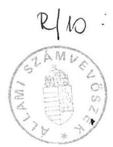
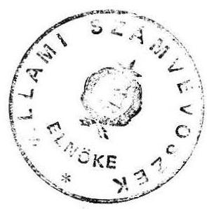

# Állami Számvevőszék

## Jelentés

a Magyar Köztársaság helsinki, koppenhágai, prágai nagykövetségeinek és a pozsonyi
főkonzulátusának 1990. évi pénzügyigazdasági ellenőrzéséről

---

# ÁLLAMI SZÁMVEVŐSZÉK

V-31-21/1990.

## JELENTÉS

A Magyar Köztársaság helsinki, koppenhágai, prágai nagykövetségeinek és a pozsonyi főkonzulátusának 1990. évi pénzügyi-gazdasági ellenőrzéséről

Az ellenőrzés célja a külképviseletek feladatainak és a rendelkezésre álló pénzeszközök összhangjának megítélése, valamint a gazdálkodás célszerűségi, eredményességi és törvényességi szempontok szerinti értékelése volt.

A helyszíni ellenőrzést a Külügyminisztériumnál végzett előzetes tájékozódás és ellenőrzés egészítette ki. Ennek keretében a minisztérium irányító, ellenőrző feladatának ellátását vizsgáltuk.

Az ellenőrzés alapvetően az 1987. I. 1. - 1990. IV. 30. közötti időszakra terjedt ki.
I.

Az ellenőrzés megállapításait a következőkben összegezzük:

1. A működés feltételei, a gazdálkodás célszerűsége

Az ellenőrzött viszonylatokban az anyagi-technikai feltételek és az éves költségvetések lehetővé tették a külképviseletek zavartalan működését.

---

A külképviseletek a Külügyminisztérium által meghatározott keretek között fejtik ki tevékenységüket. Költségvetésük tervezése és végrehajtása - az utóbbi időben bekövetkezett változások ellenére - a közvetlen irányítás jegyeit viseli. A külképviseleteket még részben önálló költségvetési szervnek sem minősítették, tényleges gazdálkodási lehetőségük igen korlátozott.

A kötött keretek (idegen állampolgárságú alkalmazottak bére, reprezentáció, bérleti díj stb.) a költségvetés 50-80%-át teszik ki. A saját hatáskörben átcsoportosítható ún. globál keret felhasználása is nagy mértékben determinált (távhő, gáz, energia stb. költségek).

A költségvetések kialakítása összességében reális volt. Egyes előirányzatok (anyagok, egyéb szolgáltatások) túltervezésével azonban tartalékot képeztek, ill. az előirányzatok más célú igénybevételének lehetőségét teremtették meg. (Helsinki, Koppenhága)

A külképviseletek működési bevételt nem terveztek, mivel ezek a bevételek teljes egészében a minisztériumot illetik. A kiadásokkal szemben jelentkező bevételeket esetenként térítéményként számolják el. (Prága, Koppenhága)

A költségvetésen kívül kezelik (külön hagyják jóvá és külön kell beszámolni a felhasználásáról is) a tájékoztatási keretet, amit sem a munka jellege, sem a keret nagysága nem indokol és a gazdálkodás szempontjából sem célszerű.

---

A költségvetési eszközök felhasználása többségében célszerűnek és takarékosnak minősíthető. Az előirányzatok felhasználását a nagykövetek havi gyakorisággal, helyetteseik folyamatosan figyelemmel kísérték. Hiányoljuk azonban, hogy a gazdálkodási jogköröket nem rögzítették. Előfordul, hogy hiányzik az utalványozás (Prága), vagy a gazdasági eseményeket követve jóval később kerül arra sor (Koppenhága). A kiadások jelentős részét reprezentálják a bérköltségek és a bérleti díjak.

Takarékos megoldást jelent a magyar alkalmazottak családtagjainak foglalkoztatása kisegítő (takarítási, főzési, rendezvény lebonyolító stb.) vagy adminisztrációs feladatokra. Ez által kiváltható a magasabb bérű külföldi munkavállalók foglalkoztatása. Az ebben rejlő lehetőségek nincsenek maradéktalanul kihasználva.

A bérleti díjak egyre inkább emelkednek az utóbbi időben. Így hosszú távon a saját tulajdonú ingatlanok fenntartása tekinthető gazdaságosnak. Megjegyezzük azonban, hogy a saját tulajdonú ingatlan nem megfelelő hasznosítására is van példa.

Helsinkiben a nagykövetség belvárosi, 64 m²-es lakása csak kis mértékben volt kihasználva. A lakás szálláskénti hasznosítását futárokra és más kiküldetésben lévő személyekre korlátozták. Az így befolyó esetenkénti 10-50 FIM szállásköltség térítés a lakás fenntartását nem teszi rentábilissá.

A dolgozókat terhelő költségtérítések több esetben nem reálisak. A lakásokban igénybe vett szolgáltatások (fűtés,

---

melegvíz) térítési díjai - a kifogásolt esetekben - nem állnak arányban a bérleti díjakkal, a lakások alapterületével, saját tulajdonú ingatlanoknál pedig az üzemeltetési költségekkel.

A térítési díjak a dolgozók valutaellátmányának 1-2%-át, a bérleti díjak 2-3%-át teszik ki és a Helsinkiben 1981-82. óta, Koppenhágában pedig 1985. óta változatlanok.

Egyes esetekben az álló és fogyóeszközök beszerzését nem kellő körültekintéssel, a gazdaságossági szempontokat figyelmen kívül hagyva végezték.

Koppenhágában 1989. dec. hónapban olyan eszközöket is beszereztek, mintegy 22 ezer DKR értékben, amelyeket a korábbi gyakorlat szerint hazai kiszállítással biztosítottak (bútorok, szőnyeg, ágynemű). Kedvezőtlen az is, hogy a reprezentációs célú magyar italokat dán kereskedőktől, magasabb költséggel szerezték be.

Kedvező, hogy az ésszerűsítésre és a takarékosságra való törekvés konkrét jelei is megjelentek a gazdálkodásban.

Helsinkiben a nagykereskedelmi, vámmentes beszerzés a hús- és konzervféléknél 60-70%-os, a kávénál 40-50%-os, a lisztnél és cukornál 15-25%-os, a tisztítószereknél és háztartási cikkeknél 10-30%-os megtakarítással jár.

A prágai nagykövetség gazdasági felelőse írásban kezdeményezte a racionálisabb létszámgazdálkodást (munkacsoportok összevonását) és a költségek csökkentését.

Költségtakarékos megoldást jelent általában a magángépkocsik hivatalos célú használata ill. az ennek ellenében fizetett átalány jellegű térítés. Esetenként azonban a térítés összegének számítása nem volt reális (Helsinki) vagy az átalány összegének felülvizsgálatára több éven át nem került sor (Koppenhága).

---

A feladatok ellátásának személyi feltételei általában adottak voltak. Helyenként azonban jelentős felkészültségbeli (nyelvtudás, szakmai ismeret) különbségek tapasztalhatók. (Pl. Helsinkiben a diplomaták esetében.) A gazdasági és ügyviteli feladatokat ellátó munkatársak felkészítése az operatív munkavégzésre esetenként nem megfelelő, ami zavarokat okoz a működésben.

A nagykövetségek elhelyezési körülményei általában jónak mondhatók. Az utóbbi időben felújításokra is sor került, ezek azonban esetenként célszerűtlen megoldásokkal jártak.

Koppenhágában a nagykövetség épületében a konzuli lakás áthelyezése a nagykövetség épületét nagyobb fogadások tartására alkalmatlanná tette és a funkcionális egységek összhangját is megbontotta (pl. a nagyköveti dolgozószoba és a tárgyaló elszakadt a fogadó helyiségektől). Prágában a helyi DTEI költségére és kivitelezésével megvalósult felújítás ellenére az irodai célra nem hasznosítható helyiségek túlméretezettek, ennek megfelelően fenntartásuk költséges.

A nagykövetségek alkalmazottainak lakáskörülményei - mind a nagykövetség épületében, mind a bérelt lakásokban - általában színvonalasak. A diplomaták esetében a lakáson történő vendégfogadásokra is lehetőség van.

Hivatali helyiségek és a lakások bútorzata, felszereltsége általában jó, a végrehajtott cserék és pótlások indokoltak voltak.

A külképviseletek pénzellátása ütemes, helyenként azonban túlfinanszírozást eredményezett.

---

Koppenhágában a konzuli díjak és a vízum bevételek szezonális megemelkedése 1989. márciusától a pénzeszközök jelentős mértékű megnövekedését eredményezte. A bankszámlára 1989. júniusában 200 ezer, augusztusban 150 ezer DKR-t helyeztek el. A számlán így 600 ezer DKR-t meghaladó - 4-5 havi felhasználásnak megfelelő -összeg gyűlt össze, ami csak 1990. májusára csökkent elfogadható szintre. Helsinkiben az ellátmányból 100 ezer FIM-et helyeztek ki - havi lekötéssel - kamatozó bankszámlára. A bankszámlán az ellenőrzés idején további 784,9 ezer FIM volt elhelyezve, ami céljellegű pénzforrás, igénybevételét a Külügyminisztérium Távközlési Osztálya irányítja.

# 2. A gazdálkodás törvényessége

A helyszíni pénztárellenőrzések alkalmával a talált készpénz, a bankszámlák, valamint a pénztárnapló egyenlegei között egyezőség állt fenn. Az egyezőséghez azonban több esetben a pénztárban lévő bonokat kellett figyelembe venni. (Az ellenőrzöttek minden esetben arra hivatkoztak, hogy a Külügyminisztérium lehetővé teszi a bonok alkalmazását, vagyis azt, hogy a különböző címen felvett előlegeket nem helyezik kiadásba a pénztárnaplóban. Eppen ezért az évenkénti kétszeri pénztárellenőrzés is elfogadja ezt a gyakorlatot.)

A bizonylatrend és fegyelem terén helyenként hiányosságok tapasztalhatók.

Például Prágában a bizonylatok a szükséges aláírásokat gyakran nem tartalmazzák; a pénztári eseményeket esedékességükkor több esetben nem könyvelték le; egyes beszerzések számláin hiányzott a magyar szöveg; a beszerzések bizonylatain az átvételt nem igazolták, a leltári számot nem jegyezték fel; reprezentációs költségek elszámolásakor a résztvevők számát esetenként nem tüntették fel.

---

A vízumdíj tömbök rendszeresítése kedvezőbb feltételeket teremtett az ellenőrzés számára. Továbbra sem megoldott azonban a konzuli bevételek (ideértve a vízumdíjakat is) nyilvántartása és elszámolása. Koppenhágában kedvező tapasztalatokat szereztünk. Helsinkiben viszont a korábbi és a jelenlegi konzulnál is pénzhiányt állapítottunk meg. (176, ill. 56,46 FIM.) A szabályozatlanság tág lehetőséget kínál a visszaélésre.

A külképviseleteknél általában nem a költségvetési szerveknél rendszeresített, szabvány szerinti bizonylatnyomtatványokat használják. Általánosságban megállapítható, hogy ennek hiánya kedvezőtlenül hat a bizonylatrendre. Ez elsősorban a házipénztári pénzkezelés, az előlegkezelés és a leltározás területén érzékelhető. (Nem megfelelő a repülőlapos nyugták, bonok stb. használata, hiányoznak a raktári fejlapok.)

A külföldi állampolgárok foglalkoztatása nem minden esetben felelt meg a rendelkezéseknek.

Prágában a munkaszerződések magyar változat nélkül készültek. A társadalombiztosítási kötelezettséget nem a tényleges kifizetett illetmény, hanem az alkalmazottak által bevallott alacsonyabb összeg után fizették.

A vagyonkezelés, vagyonnyilvántartás nem felel meg a követelményeknek. A nyilvántartás mind Helsinkiben, mind Koppenhágában eltért a tényleges állapotoktól. Egyes készletféleségek (főként a művészeti alkotások) eltérő csoportosítá-

---

sa, valamint a selejtezett, de tovább használt eszközök is növelték az eltéréseket. Ezekre az eltérésekre a Külügyminisztérium sem hívta fel a figyelmet.

Helsinkiben a leltári nyilvántartásban 135 db-os Herendi készlet szerepelt, míg a leltár mellékletében felsorolt db-szám meghaladta a 300-at. A nagykövetség Herendi készletét a művészeti alkotások között, míg a nagyköveti lakás hasonló márkájú étkészletét és lakásdíszítő tárgyait a fogyóeszközök között tartották nyilván. Ugyanitt egyes biztonsági felszerelések hiányoztak a nyilvántartásokból.

Koppenhágában a nyilvántartás vezetése - az ismeretlen időpontban végzett bejegyzések, módosítások - nem tette lehetővé a vagyoni helyzet változásának nyomon követését. Emellett a próbaszerű ellenőrzés alkalmával egyes leltári körzetekben nyilvántartott eszközök több esetben máshol voltak találhatók.

A reprezentációs és az ajándék készletek nyilvántartási rendje és kezelése több vonatkozásban nem felel meg a vagyonvédelmi előírásoknak.

Koppenhágában egyes reprezentációs árufélékről (cigaretta, konzervek, élelmiszerek stb.) nyilvántartást nem vezetnek, ezek felhasználása nem kísérhető figyelemmel. Az ajándéktárgyak nyilvántartása nem ad megfelelő áttekintést, mert a készletállományt nem egységesen, hanem beszerzésenként külön vezették.

Helsinkiben eltérések voltak a nyilvántartott és a tényleges készletek között (pl. pálinka, tokaji bor, pezsgő). Ezt a rendezvényeken megmaradt mennyiség visszavételezésének elmaradása okozta.
Az ajándékraktárban a többletet a kivételezett, de fel nem használt tárgyak okozták. Az 1989. évi karácsonykor mintegy 500 üveg különféle italt ajándékoztak, amely egyetlen esetben sem került viszonzásra.

Prágában a reprezentációs italkészlet kb. 2 évi szükségletet fedez.

A gazdálkodás rendjében tapasztalt hiányosságok a folyamatokba épített belső ellenőrzés és a minisztériumi belső ellenőrzés érdemibb, következetesebb ellátásával megelőzhetők lettek volna.

---

# II.

## Javaslatok

1. A Külügyminisztérium az ellenőrzés megállapításai alapján:

- kísérje figyelemmel a külképviseleteken az ellenőrzés által feltárt hiányosságok megszüntetését;
- vizsgálja felül és az indokolt mértékben emelje fel a dolgozókat terhelő lakás utáni költségtérítéseket;

2. A Külügyminisztérium külképviseleteket irányító és ellenőrző tevékenysége során:

- mérlegelje az érdekeltségi elemek erősítését a külképviseletek gazdálkodásának szabályozásában;
- fordítson nagyobb figyelmet a kiküldöttek felkészültségének elbírálására, illetve a kijelöltek felkészítésére;
- a személyi állomány kialakításánál a gazdaságossági szempontokat is következetesen érvényesíteni kell. Nagyobb figyelmet kell fordítani a kiküldöttek családi viszonyaira, illetve az elhelyezési adottságokra és foglalkoztatási lehetőségekre;
- szüntesse meg a tájékoztatási keret költségvetésen kívüli kezelését;
- gondoskodjon a tulajdonvédelem legfontosabb területein a költségvetési szerveknél rendszeresített szabvány szerinti bizonylatnyomtatványok alkalmazásáról;

---

- fokozottabban ellenőrizze a vagyonvédelmi követelmények betartását és szükség szerint érvényesítse a felelősséget;
- alakítsa ki a konzuli bevételek (vízumdíjak) nyilvántartásának és elszámolásának egységes zárt rendjét.

Budapest, 1990. július

Dr. Hagelmayer István
