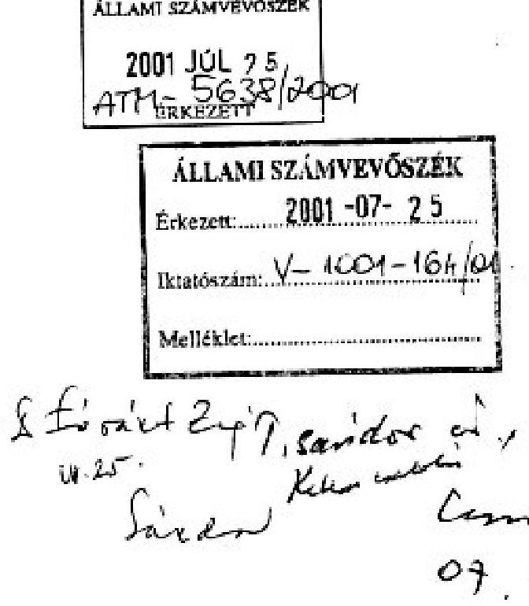

# JELENTÉS 

a helyi önkormányzatok beruházásaihoz és rekonstrukcióihoz nyújtott 2000. évi címzett és céltámogatások igénybevételének és felhasználásának vizsgálatáról
2001. július

---

# Az ellenőrzés végrehajtásáért felelős:   V.Önkormányzati és Területi Ellenőrzési Igazgatóság 

Dr. Lóránt Zoltán számvevő igazgató

## Az ellenőrzést vezette:   Farkas László   régióvezető főtanácsos

## Az ellenőrzés irányításában és a helyszíni vizsgálati jelentések feldolgozásában közremúködött:

Dr. Ernst László
számvevő tanácsos
Fercsik Gyula
számvevő tanácsos
Dr.Szirota István
számvevő tanácsos

## Az ellenőrzésben résztvevők névsorát az 1. sz. melléklet tartalmazza.

## A témakörrel foglalkozó ÁSZ vizsgálatok jegyzéke:

A helyi önkormányzatok beruházásaihoz és rekonstrukcióihoz nyújtott 1995. évi címzett és céltámogatások felhasználása (V-1001/1996.). (A Parlament számítógépes hálózatán a vizsgálat fájl neve: 0329 j 000 doc.)

A helyi önkormányzatok beruházásaihoz és rekonstrukcióihoz nyújtott 1996. évi címzett és céltámogatások felhasználása (V-1001/1997.). (A Parlament számítógépes hálózatán a vizsgálat fájl neve: 0388 j 000 doc.)

A helyi önkormányzatok beruházásaihoz és rekonstrukcióihoz nyújtott 1997. évi címzett és céltámogatások felhasználása (V-1001/1998.). (A Parlament számítógépes hálózatán a vizsgálat fájl neve: 9823 j 000 doc.)

A főváros és a megyei jogú városok szennyvíztisztítási programjára rendelkezésre álló források felhasználásának vizsgálata (V-1014/1997-98.). (A Parlament számítógépes hálózatán a vizsgálat fájl neve: 9805 j 000 doc.)

A helyi önkormányzatok beruházásaihoz és rekonstrukcióihoz nyújtott 1998. évi címzett és céltámogatások felhasználása (V-1001/1999.). (A Parlament számítógépes hálózatán a vizsgálat fáj neve: 9922 j 000 doc.)

A helyi önkormányzatok beruházásaihoz és rekonstrukcióihoz nyújtott 1999. évi címzett és céltámogatások felhasználása (V-1001-181/2000.). (A Parlament számítógépes hálózatán a vizsgálat fájl neve: 0022 j 000 doc.)

Jelentés a közbeszerzésekről szóló törvény végrehajtásának ellenőrzéséről (V-1009-252/2000-2001.). (A Parlament számítógépes hálózatán a vizsgálat fájl. Neve: 0109j000 doc.)

Jelentéseink az Országgyúlés számítógépes hálózatán és az Interneten a www.asz.hu címen is olvashatók, továbbá a Belügyminisztérim folyóirata, az „Önkormányzati Tájékoztató" rendszeresen közli, valamint a Megyei

Közigazgatási Hivatalvezetők részére is átadásra kerül.

---

# TARTALOMJEGYZÉK 

I. ÖSSZEGZŐ MEGÁLLAPÍTÁSOK, KÖVETKEZTETÉSEK, JAVASLATOK ..... 5
II. RÉSZLETES MEGÁLLAPÍTÁSOK ..... 10

1. Az önkormányzatok fejlesztési tevékenységének megalapozottsága, a be- ruházások szakmai, műszaki és pénzügyi előkészítése ..... 10
2. A beruházások megvalósítása, a pénzügyi teljesítés alakulása ..... 14
3. A központi támogatások igénybevételének jogszerűsége ..... 16
4. A beruházások műszaki átadása, üzembe helyezése, számviteli elszámolá- sa és belső ellenőrzése ..... 17
Mellékletek
Táblázatok
Függelék

---

.

---

# Jelentés 

## a helyi önkormányzatok beruházásaihoz és rekonstrukcióihoz nyújtott 2000. évi címzett és céltámogatások igénybevételének és felhasználásának vizsgálatáról

Az Állami Számvevőszék 2001. évi ellenőrzési terve alapján vizsgálta a címzett és céltámogatások 2000. évi igénybevételét és felhasználását.

Az ellenőrzés jogalapja az Állami Számvevőszékről szóló 1989. évi XXXVIII. törvény 2. § (5) bekezdése, az államháztartásról szóló 1992. évi XXXVIII. törvény (továbbiakban: Áht.) 121. § (3) bekezdése, valamint a Magyar Köztársaság éves költségvetési törvényei.

A Magyar Köztársaság 2000. évi költségvetéséről szóló 1999. évi CXXV. törvény a címzett és céltámogatásokra 52300 M Ft előirányzatot biztosított. Ezt az előirányzatot növelte az 1999. év végéig fel nem használt 34458 M Ft maradvány. Az évközi lemondásokat és visszafizetéseket, illetve az ezekből visszaforgatott összegeket is figyelembe véve a helyi önkormányzatoknak 2000. évben összesen 82563 M Ft címzett és céltámogatás állt rendelkezésükre. Ezen felül a saját forrás egy részének kiváltását, illetve kiegészítését szolgálták az egyes fejezeti kezelésű előirányzatokból Vízügyi céle1̋óirányzat (VICE), Környezetvédelmi alap célfeladat (KAC), továbbá a megyei területfejlesztési tanácsok (Fővárosi Közgyűlés) döntési körébe tartozó decentralizált pénzalapokból - területi kiegyenlítést szolgáló fejlesztési célú (TERKI) és céljellegú decentralizált alap (CÉDE) - pályázat útján kapott támogatások.

Az ellenőrzés célja annak megállapítása volt, hogy:

- az önkormányzatok megfelelően készítették-e elő, illetve valósították-e meg a beruházásokat, beszerzéseik (beruházásaik) során érvényesítették-e a közbeszerzésekről szóló 1995. évi XL. törvény (továbbiakban: Kbt.) előírásait;
- a támogatásokkal érintett önkormányzatok idejében rendelkeztek-e a feladat megvalósításához szükséges pénzügyi eszközökkel és ezt segítette-e a 263/1997. (XII. 21.) sz. Korm. rendelet, illetve annak hatályon kívül helyezését követően a 217/1998. (XII. 30.) sz. Korm. rendelet 78.-93. §-ai;
- a támogatások igénybevételénél és felhasználásánál érvényesült-e a törvényesség és szabályszerűség.

A helyi önkormányzatok címzett és céltámogatási rendszerét szabályozó 1992. évi LXXXIX. törvény (továbbiakban: Cct.) 1993. évi hatálybalépése után a vizsgálatok célja e törvény betartásának ellenőrzése volt. Az 1993. évtől eltelt nyolc éves időszak alatt az önkormányzatok mintegy 40\%-ánál 2034 feladat ellenőrzését végeztük el.

---

Ezévi helyszíni ellenőrzéseink során 18 megyében 96 önkormányzatnál 149 beruházást vizsgáltunk meg.

A helyi önkormányzatoknak 2000. évben rendelkezésre álló összes címzett és céltámogatások 33,9 \%-át, ezen belül a címzett támogatásoknak $12 \%$-át, a céltámogatásoknak $48,5 \%$-át vizsgáltuk meg.

A címzett támogatással megvalósuló beruházások közül 18 önkormányzatnál 20 feladatot ellenőriztünk, ezek ágazati besorolását tekintve 6 db a vízgazdálkodásba, 14 db az oktatás és kulturális szolgáltatásba tartozott.

A vizsgálatban 82 önkormányzatnál 129 db céltámogatott beruházás szerepelt, közöttük döntő súllyal a szennyvízelvezetés és -tisztítás jelentkezett 80 önkormányzatnál 127 db beruházással, míg az oktatás és kulturális szolgáltatás területén 2 önkormányzatnál 2 feladat ellenőrzésére került sor.

Az összes céltámogatás $90 \%$-a szennyvízelvezetésre és -tisztításra irányult, ezért súlyának megfelelően helyszíni ellenőrzéseink során a vizsgált céltámogatási előirányzatok $99 \%$-ában szennyvízelvezetési és -tisztítási fejlesztést ellenőriztünk.

Az 1997. évi címzett és céltámogatások ellenőrzése során 104 önkormányzatnál 210 beruházásra kapott állami támogatás felhasználását ellenőriztük, az összes előirányzat $40 \%$-át, jelentésünkben 489 M Ft jogtalanul igénybe vett támogatás visszafizettetésére, illetve 785 M Ft előirányzat csökkentésre tettünk javaslatot. Az 1998. évi felhasználás ellenőrzése során 103 önkormányzatnál végeztünk ellenőrzést, amely 191 beruházást érintett, az összes előirányzat $49 \%$-át vizsgáltuk és 469 M Ft jogtalan igénybevétellel összefüggésben tettünk visszafizetési javaslatot, továbbá 1100 M Ft előirányzat csökkentést javasoltunk. Az 1999. évi vizsgálatunkban 88 önkormányzat 127 feladatának helyszíni ellenőrzését végeztük el, ez az összes előirányzat $22 \%$-át jelentette és 191 M Ft jogtalan igénybevétellel összefüggésben tettünk visszafizetési javaslatot és 440 M Ft előirányzat csökkentést kezdeményeztünk.

# A vizsgált önkormányzatok és feladatok jegyzékét a 2. sz. melléklet tartalmazza. A 2000. évi címzett és céltámogatások ellenőrzéseinek arányát a 7. sz. táblázat mutatja. 

Az ellenőrzött időszak a 2000. év, de a befejezett beruházások esetében a beruházás megvalósításának teljes időszaka volt. A mintavételi szempont - az EU csatlakozási követelményeivel összhangban - elsősorban a szennyvízközművek fejlesztésének vizsgálata volt.

---

# I. ÖSSZEGZŐ MEGÁLLAPÍTÁSOK, KÖVETKEZTETÉSEK, JAVASLATOK 

Az Országgyűlés a támogatandó, társadalmilag kiemelt célokat a vízgazdálkodási, az egészségügyi, a szociális, a közoktatási, a kulturális, valamint a hulladékgazdálkodási ágazaton belül jelölte ki. A céltámogatásokban meghatározó súlyt képviselt a vízgazdálkodási ágazaton belül a szennyvízelvezetés és -tisztítás, jelezve az ország törekvését - az EU csatlakozás követelményeivel összhangban - a közmúolló zárására.
A címzett és céltámogatási rendszer - részben az Állami Számvevőszék korábbi javaslatai nyomán - a Cct. módosításával 1998-tól szabályozottabbá és ellenőrizhetőbbé is vált. A korszerűsítést eredményező változtatások hatása 1999-től érvényesült teljes körűen. A szabályozásban és a döntési rendszerben erősödtek azok az elemek, amelyek - a megvalósíthatósági tanulmány készítési kötelezettség előírásával - a célszerűbb, előnyösebb beruházások kiválasztását segítették elő, a szennyvízelvezetés és -tisztítás területén pedig a beruházások hatékonyságát célozták.

A vizsgált beruházások tekintetében a céltámogatás szerepe egyértelműen meghatározó volt a fejlesztések indításakor. A szennyvízelvezetéssel és -tisztítással összefüggő beruházások jelentősége a községekben az utóbbi néhány évben felértékelődött. Ezeken a településeken ugyanis a vezetékes ivóvízellátás szinte majdnem teljes kiépítése megnövelte a szennyvízkibocsátást.
A tőkeigényes szennyvízközmú beruházásoknál az önkormányzatok a céltámogatás elnyerése érdekében a szükséges „saját forrásokat" egyéb állami támogatásokból (VICE, KAC, TERKI, CÉDE) kívánták biztosítani. Ennek érdekében a központi támogatások elnyerését követően már a beruházás elkezdése után pályázatokat nyújtottak be egyéb állami támogatásokra. A fejlesztésekhez szükséges pénzek biztosítását az államháztartás múködési rendjéről szóló kormányrendelet ugyan szabályozta, azonban a gyakorlatban az alapok kezelőinek a céltámogatásokkal való időbeni összehangolást nem sikerült megoldani.

Továbbra is fennállt az a korábbi időszakban már jelzett probléma, hogy az egyéb állami támogatásoknak az elbírálása a központi támogatástól (céltámogatástól) időben és rendszerében is eltérően történt. Rendszerbeli hiányosságok voltak, hogy a céltámogatási igénybejelentésben külön kellett szerepeltetni a szennyvíztisztító telepet és a szennyvízcsatorna hálózatot, a többi pályázatnál egységes beruházásként, szennyvízközmúként. Ez megnehezítette a források kezelését, felhasználásuk komplex ellenőrzését. A beruházás összköltségének megítélése sem volt egységes. Részben a bruttó, részben a nettó összköltségek alapján történt a támogatások megállapítása és a finanszírozás. Az ÁFA levonhatóvá válására és a tárgyévben fel nem használt források átütemezésére nehézkesen, és nem egyformán reagáltak az egyéb állami pénzforrások kezelői; a döntési folyamat az alapokat kezelő szervezetek-

---

nél hosszadalmas volt, az önkormányzatok gyakran hosszú ideig nem kaptak visszajelzést ezekről a pályázatokról. Elutasításkor a döntéshozók a forráshiányra hivatkoztak.

Mindezek együttes hatásaként a támogatásokkal érintett önkormányzatok kétharmada nem rendelkezett idejében a feladat megvalósításához szükséges pénzügyi eszközökkel. Emiatt jelentősen elhúzódott a szennyvízközmú beruházások kezdése, szakaszolni kellett a fejlesztéseket, nem nyílt lehetőség a komplex megvalósításra, elhúzódtak a beruházások. Összegezve az önkormányzatok nem tudták igénybe venni a céltámogatási előirányzatokat. Így indokolatlanul kötöttek le központi költségvetési forrásokat, s rontották a címzett és céltámogatási rendszer múködésének hatékonyságát. Évek óta ezen „gyakorlat" miatt 22-23 Mrd Ft felhasználatlan pénzmaradvány keletkezett.

A közbeszerzési tevékenység bonyolítása során az önkormányzatoknál a kedvező tapasztalatok mellett olyan hibák, szakmai tévedések fordultak elő, amelyek révén egyes eljárások tisztasága, korrektsége vált kétségessé. A törvény megsértésére irányuló szándékos magatartás - ami esetleg személyes felelősség megállapítását tette volna szükségessé - az ÁSZ rendelkezésére álló eszközökkel nem volt megállapítható.

A közbeszerzésekre vonatkozó előírásokat 25 önkormányzat nem tartotta be: a közbeszerzési eljárást akkor is megindították, amikor még nem rendelkeztek a szerződés teljesítését biztosító pénzügyi fedezettel, vagy az arra vonatkozó biztosítékkal, hogy a teljesítés időpontjára a pénzügyi forrás rendelkezésre fog állni. A beruházás kivitelezőjének kiválasztásánál és a Kbt. egyéb előírásainak betartásánál is fordultak elő szabálytalanságok.

Nyolc önkormányzatnál a pályázatok értékelésével, a beruházás kivitelezőjének kiválasztásával, illetve az értékhatár megválasztásával kapcsolatban történtek törvénysértések, amelyek miatt a közbeszerzési eljárás során elutasított ajánlattevők hat alkalommal jogorvoslati eljárásokat kezdeményeztek a Közbeszerzések Tanácsa Közbeszerzési Döntőbizottságánál (továbbiakban: KD). A KD felülvizsgálata során megsemmisítette az eljárást lezáró önkormányzati döntést és bírságokat szabott ki.

A visszaigényelt ÁFA elszámolása tekintetében a közös beruházásoknál ellentmondásos helyzet alakult ki. A Cct. szabályai és az APEH által alkalmazott gyakorlat nincsenek összhangban a gesztor és a társult önkormányzatok esetében.

A szükséges saját források előteremtése érdekében az önkormányzatok szabálytalan megoldásokat is alkalmaztak, melynek során pénzügyi függő helyzetbe kerültek a kivitelezőkkel. Az önkormányzatok úthasználati-, ingatlan bérbeadási-, eszközhasználati- és szolgáltatási szerződéseket kötöttek a kivitelezőkkel, melyek révén aránytalanul nagy bevételekre tettek szert. A kivitelezők ezeket a többletköltségeket a vállalkozói díjban érvényesítették, ily módon a központi és az egyéb állami támogatásokkal váltották ki a szükséges önkormányzati saját források 70-80\%-át. Ez is rávilágított arra, hogy a központi támogatások segítségével megvalósult szennyvízelvezetési és tisztítási beruházások fajlagos költségei magasak. Az ezek figyelembevételével

---

meghatározott tervezett összköltségek - amelyek körül a közbeszerzési eljárás keretében a vállalkozói ajánlati díjak szóródtak - lehetővé tették, hogy a kivitelező a vállalkozási átalánydíjból fedezni tudta az önkormányzat által felszámított úthasználati-, bérleti-, eszközhasználati- és egyéb szolgáltatási díjakat. E gyakorlat várhatóan 2001. évtől megszűnik, mivel az ÁSZ javaslataira a Cct. módosítása során ezen lehetőségek korlátozásra kerültek.
Az országos adatok alapján a címzett és céltámogatások 2000. év végi összes maradványa 34462 M Ft, a 2000. évi előirányzat 42\%-a volt. A nagy összegű és mértékű maradványon belül a céltámogatások maradványa volt a meghatározó, hiszen ennek összege 27045 M Ft, amely a 2000. évben rendelkezésre álló előirányzat 55\%-ának felelt meg. Az összes maradványnak a döntő hányada, 90\%-a továbbra is a szennyvízelvezetés és -tisztítás ágazatban keletkezett, ami annyit jelent, hogy ezen a területen 2000-ben 23889 M Ft céltámogatási előirányzat maradt felhasználatlanul.

Az ellenőrzött címzett és céltámogatások összes maradványa 14564 M Ft, aránya 52\%; ezen belül a címzett támogatásoknál $47 \%$, a céltámogatásoknál $53 \%$ volt 2000. XII. 31-én. Az összes maradvány 99\%-a a szennyvízelvezetés és -tisztítás szakágazatban jelentkezett. A vizsgált 127 szennyvízelvezetési és -tisztítási feladatból 66 esetben (52\%) fordult elő nagy összegű maradvány, ahol az előirányzatból lényegében semmit sem használtak fel, döntően az önkormányzati saját források hiánya miatt (a vizsgált címzett és céltámogatások maradványait a 10. sz. táblázat mutatja be).

A szennyvízelvezetés és -tisztítás területén a nem kielégítő műszaki és főleg pénzügyi előkészítés, az önkormányzatok saját forrásának hiánya évek óta jelentkező probléma. Tartós lemaradás mutatkozik a csatornázottság és szennyvíztisztítás tekintetében, a közmúolló nem változik az Európai Unió környezetvédelmi követelményeinek megfelelően. Az ÁSZ már évek óta jelezte a kedvezőtlen folyamatot, s különösen a kiemelt (Főváros és megyei jogú) városok szennyvíztisztítási programjának vizsgálata során hívtuk fel a figyelmet az EU irányelveihez viszonyított elmaradásunkra.

Mindezek érdekében a települési szennyvíztisztításról szóló EGK irányelv hazai jogrendbe illesztésének gyorsításával összefüggő feladatokról és feltételekről szóló kormányhatározatban rögzített feladatok mielőbbi végrehajtása elengedhetetlen követelmény.

A helyszíni ellenőrzés során megállapítottuk, hogy a vizsgált önkormányzatok a befejezett beruházásokkal kapcsolatban költség- haszonelemzést nem végeztek.

A központi támogatás maradványok képződésében - a beruházások saját forráshiányból eredő időbeli csúszása mellett - szerepe volt a jogtalan előirányzat lekötéseknek és annak is, hogy az önkormányzatok - a Cct-ben előírt - a központi támogatási előirányzat lemondási kötelezettségüket csak késve, vagy egyáltalán nem teljesítették. A lemondási kötelezettségek fele az ÁFA levonhatóvá válásával összefüggésben keletkezett. A támogatási előirányzatokról való lemondási kötelezettségek elmulasztása a támogatási keretek indokolatlan le-

---

kötését eredményezte és a saját forrást biztosítani tudó önkormányzatok támogatási lehetőségeit csökkentette, ezen keresztül hátrányosan érintette a címzett és céltámogatási rendszer hatékony múködését.

Az ellenőrzött körben az önkormányzatoknál a fejlesztések, vagy el sem kezdődtek, vagy csak szerény mértékű felhasználás történt. A vizsgált önkormányzatoknál 34 db olyan céltámogatott beruházással találkoztunk, amelyek kivitelezését a 2000. évben nem kezdték el (ezeknek jegyzékét a 11. sz. táblázat tartalmazza).

A jelen vizsgálat az ellenőrzött 149 beruházásból - az előirányzat lemondási kötelezettséggel és a támogatás felhasználással összefüggésben - 18 szabálytalanságot állapított meg. A feltárt, az önkormányzatok által jogtalanul felhasznált, illetve lemondási kötelezettség miatt a központi támogatási előirányzat mindösszesen 394812 E Ft, az ellenőrzött beruházások 2000. évi támogatási előirányzatának 1,4\%a volt. A vizsgálat megállapításai alapján összesen 6500 E Ft jogtalanul igénybe vett címzett támogatás, továbbá 12052 E Ft jogtalanul igénybe vett céltámogatás visszafizetési, valamint 11255 E Ft címzett és 365005 E Ft céltámogatási előirányzatról történő lemondási kötelezettséget tártunk fel.
Az előző évek jogtalan igénybevételi összegeit figyelembe véve a törvényesség tekintetében némi javulás tapasztalható, ami annak is következménye, hogy az ÁSZ javaslatait is figyelembe vevő törvényi szabályozás folytán kikerültek a korábbi évek jogtalan igénybevételeit megalapozó tevékenységek. Ehhez hozzájárult az önkormányzatok beruházáselőkészítési, lebonyolítási gyakorlatának javulása is.

A támogatási rendszer bevezetésétől kezdődően napjainkig összesen 1881,2 M Ft jogtalan támogatás-igénybevételt, illetve 4920,1 M Ft jogtalan előirányzat lekötést állapítottunk meg vizsgálataink során. A kiugróan magas jogtalan igénybevétel és előirányzat-lekötés 1996-1997. években az ellenőrzött támogatásokhoz viszonyítva mintegy 20\%-os mértékű volt, ettől kezdve folyamatos csökkenést tapasztaltunk: 1998-ban 9,9\% , 1999-ben 6,0\%, 2000-ben 1,4\%.
A vizsgálat által feltárt visszafizettetési, illetve a központi támogatási előirányzat csökkentésére vonatkozó javaslatainkat a nem támogatott célra történő felhasználás, jogtalan ÁFA visszaigénylés, illetve a beruházási előirányzat maradványok miatt tettük meg.
A helyszíni vizsgálat lezárásáig (2001.május 5.) a vizsgált önkormányzatok az Állami Számvevőszék javaslata alapján - 501 E Ft jogtalanul igénybe vett címzett és 1086 E Ft céltámogatást fizettek vissza a Magyar Államkincstárba, továbbá 11255 E Ft címzett és 365005 E Ft céltámogatási előirányzatról való lemondási kötelezettségüknek tettek eleget. Az önkormányzatok által teljesített visszafizetés és lemondás az összes jogtalan felhasználás és előirányzat 94\%-a.

A címzett és céltámogatások számvevőszéki vizsgálata alapján jogtalan igénybevétel és előirányzat lekötés miatt tett visszafizetési, illetőleg előirányzat csökkentési, visszavonási javaslataink beépítésre kerülnek a 2000. évi zárszámadási törvényjavaslatba.

---

A helyszíni vizsgálatok tapasztalatai alapján a helyi önkormányzatoknak tett javaslatok a beruházási szabályzat kidolgozására, illetve korszerűsítésére, a Kbt. előírásainak betartására, a számvitelben a beruházások aktiválásának szabályszerű és minél gyorsabb végrehajtására, s az egyes céltámogatások elkülönített pénzügyi nyilvántartására hívták fel a figyelmet. A helyszíni vizsgálat megállapításaival kapcsolatban fegyelmi felelősségre vonást nem kezdeményeztünk.

# JAVASLATOK 

A vizsgálat tapasztalatai alapján - a címzett és céltámogatások felhasználásánál és igénybevételénél a törvényesség és a szabályszerűség érvényesülése érdekében - az Állami Számvevőszék javasolja, hogy:

## a pénzügyminiszter és a belügyminiszter

vizsgálják felül és ennek alapján kezdeményezzék az egyértelmű szabályozást - a közös beruházások esetében - az általános forgalmi adóról szóló 1992. évi LXXIV. törvény és a Cct. az ÁFA levonási eljárását, annak érdekében, hogy a beruházások megvalósítására társult önkormányzatoknál az ÁFA visszaigénylés ellentmondásos gyakorlata (gesztor, illetve társult önkormányzatoknál) megszűnjön.

## a belügyminiszter

kezdeményezze az ellenőrzés által feltárt 11255 E Ft címzett és 365005 E Ft összegekkel a céltámogatási előirányzat csökkentését - a képviselő-testületek által le nem mondott állami támogatási előirányzatok figyelembevételével - a Magyar Köztársaság 2000. évi költségvetésének végrehajtásáról szóló törvényjavaslatban (az 5. és 6. sz. mellékletek szerint).

## a pénzügyminiszter

kezdeményezze a vizsgálat által feltárt jogtalanul igénybe vett 6500 E Ft címzett támogatás és 12052 E Ft céltámogatás visszafizettetését - az önkormányzatok által időközben visszafizetett állami támogatások figyelembevételével - és büntető kamatainak megfizettetését a Magyar Köztársaság 2000. évi költségvetésének végrehajtásáról szóló törvényjavaslatban (a 3. és 4. sz. mellékletek szerint).

---

# II. RÉSZLETES MEGÁLLAPÍTÁSOK 

## 1. AZ ÖNKORMÁNYZATOK FEJLESZTÉSI TEVÉKENYSÉGÉNEK MEGALAPOZOTTSÁGA, A BERUHÁZÁSOK SZAKMAI, MÚSZAKI ÉS PÉNZÜGYI ELŐKÉSZíTÉSE

A községi önkormányzatoknál a beruházási célok kijelölését, a beruházások szakmai előkészítését megalapozó - a településre vonatkozó, több évre előretekintő - beruházási program vagy fejlesztési koncepció nem állt rendelkezésre. A vizsgált városi és községi önkormányzatok beruházási programja, koncepciója és beruházási döntéseik között nem volt szoros összefüggés. Különösen a szennyvízközmű beruházások esetében állt fenn az, hogy a valós lakossági igényeken, és az egyre inkább szorító környezetvédelmi problémák megoldására való törekvésen túl a céltámogatások és az egyéb állami támogatások által preferált célok (szennyvízelvezetés és szennyvíztisztítás) ösztönözték az önkormányzatokat arra, hogy a beruházásaikat megvalósítsák.

A fejlesztési célokat megfogalmazó önkormányzatok már a központi támogatási pályázatok előkészítése érdekében felvették a kapcsolatot az építőipari tervezésre és lebonyolításra szakosodott szervezetekkel és a szakhatóságokkal. Időközben ezeknek a szervezeteknek a tapasztalatai is gyarapodtak a beruházások szakmai-múszaki előkészítésében. A beruházások szakmaiműszaki előkészítésének színvonala a községi önkormányzatoknál szinte kizárólag a közreműködő külső szervek tevékenységének színvonalától függött, mivel hivatali szervezetük az ilyen feladatok ellátására nem volt felkészülve.

A központi támogatások segítségével megvalósításra tervezett beruházásoknál a beruházási célt az önkormányzatok képviselő-testülete határozattal hagyta jóvá, mert ez volt a címzett és céltámogatási pályázat elfogadásának feltétele.

A vizsgált szennyvízközmű beruházások 65-70 \%-a közös beruházás volt, amely azt jelezte, hogy az önkormányzatok felismerték az együttmúködésből származó előnyöket. A fő indítékot a közös beruházásokra nyújtott többlet céltámogatás jelentette, de szerepet játszott benne az is, hogy a közös üzemeltetés olcsóbb.

A közös beruházások közül egy olyan eset volt, ahol a beruházás közös volta megkérdőjelezhető, annak közös beruházásként való bejelentését kizárólag a céltámogatásból elnyerhető preferenciák indokolták (Babarc Függelék 1.12).

A céltámogatás segítségével megvalósuló közös beruházásoknál az érintett önkormányzatok - az előírásoknak megfelelően - együttműködési megállapodásokat kötöttek egymással.

---

A beruházások szakmai, műszaki előkészítése során elkövetett hibák (rossz helyszín kijelölés, áttervezések, műszaki tartalom változtatások, hiányos szerződések, technológia változtatások, nem megfelelő tervdokumentáció) miatt a kivitelezés folyamatába utólag is be kellett avatkozni (Gánt, Decs, Medina, Zsira, Aszód, Kaba, Gégény, Kartal, Rácalmás, Függelék 1.3 - 1.11ig).

Az oktatási fajlagos költségek nem teljes körűek, mert nem minden létesítményre tartalmaznak költségnormatívát (Villány F-1.1).

Egy önkormányzatnál (Szigetvár F-1.2) a szennyvízcsatorna hálózatra meghatározott fajlagos költségek által tervezett beruházási összköltség magasabb volt, mint a beruházó által adott kivitelezői árajánlat összege.

A beruházások lebonyolítóit és múszaki ellenőreit egy-két kivétellel nem versenyeztetéssel, hanem az előző beruházási tapasztalatok, a környező települések ajánlatai és referencia munkák alapján választották ki. A kiválasztáskor a címzett és céltámogatási pályázat elkészítésében már korábban is részt vevő, az önkormányzatokat szakmailag segítő vállalkozásokat részesítették előnyben.

A beruházások lebonyolítói a műszaki ellenőri feladatokat is ellátták. A beruházások lebonyolítóinak (műszaki ellenőreinek) megbízási díját a tervezett beruházási költség 1-1,7 \%-ában határozták meg, amit a beruházások folyamán nem módosítottak.

A vizsgálattal érintett önkormányzatok - az építési beruházásra előírt értékhatár elérése esetén (2000. évben 32 M Ft ) - a központi támogatás segítségével megvalósuló beruházások kivitelezőit közbeszerzési eljárás keretében választották ki. A központi támogatás segítségével beruházásokat végző községi önkormányzatok nem szabályozták saját rendeletben a közbeszerzési eljárás kiírását, elbírálását és az értékhatár alatti beszerzésekre vonatkozó szabályokat. A városi önkormányzatok közül Szigetvár önkormányzata nem aktualizálta a 29/1995. (XII.5.) Ök. számú rendeletét a közbeszerzésekről szóló törvény helyi végrehajtására, a Kbt. későbbi módosításait nem vezették át a rendeletükön.

A közbeszerzési eljárások előkészítésével és lebonyolításával Monor, Ráckeve, Kartal önkormányzatai külső szakértő céget bíztak meg, tekintettel a közműberuházások bonyolultságára és magas értékére. A lefolytatott eljárások esetében az egyes eljárási fajtákat (nyílt, meghívásos, tárgyalásos) a törvényi feltételeknek megfelelően választották meg.

A beruházások nagyságrendjéből adódóan a kétfordulós, előminősítéses, nyílt eljárások voltak jellemzőek. A részvételi felhívásokra több vállalkozás részéről nyilvánult meg érdeklődés, 10 felett is volt az ajánlattevők száma. A közbeszerzési eljárások lebonyolítása során a Kbt. rendelkezéseit az önkormányzatok négyötöde betartotta. Az ajánlati felhívásokban, valamint a részletes kiírási dokumentációkban a beruházások műszaki tartalmát a központi támogatás elnyerése érdekében benyújtott pályázatban rögzítettel azonosan szerepeltették. A Kbt. 32. § (2) bekezdésének előírásait viszont 25 önkormányzat nem tartotta be: a közbeszerzési eljárást akkor is megindították, amikor még nem rendelkez-

---

tek a szerződés teljesítését biztosító anyagi fedezettel, vagy arra vonatkozó biztosítékkal, hogy a teljesítés időpontjában a pénzügyi forrás rendelkezésre fog állni. A megvalósítani kívánt létesítmény pénzügyi fedezete a hirdetmény megjelenésének időpontjában nem állt teljes mértékben az érintett önkormányzatok rendelkezésére, ugyanis a hirdetmények közzétételekor a céltámogatási igénybejelentést már elbírálták de az egyéb állami támogatások elnyeréséről nem, vagy csak részben kaptak értesítést, illetve a tényleges önkormányzati saját források megszerzéséről csak a későbbiekben intézkedtek, így a Kbt. 32. § (2) és az Áht. 98. § (7)-(8) bekezdésében foglalt követelmények nem érvényesültek teljes mértékben (Nagyrécse, Galambok, Zalaszentiván, Nagypáli, Aszód, Kartal, Foktő, Solt, Kaszaper, Nyíradony, Túrkeve, Tiszasas, Tószeg, Újszász, Szamosszeg, Nábrád, Méhtelek és Gégény).

Nyolc önkormányzatnál a pályázatok értékelésével, a beruházás kivitelezőjének kiválasztásával, illetve az értékhatár megválasztásával kapcsolatban történtek törvénysértések, amelyek miatt a közbeszerzési eljárás során elutasított ajánlattevők hat alkalommal jogorvoslati eljárásokat kezdeményeztek a Közbeszerzések Tanácsa Közbeszerzési Döntőbizottságánál (továbbiakban: KD). A KD felülvizsgálata során megsemmisítette az eljárást lezáró önkormányzati döntést és bírságokat szabott ki (Tokaj, Csongrád, Celldömölk, Kartal, Újszász, Pápa - Függelék 2.1 - 2.6).

A jogorvoslati eljárás következtében az ismételt pályáztatás, a közbeszerzési eljárás időigénye, a forrásbiztosítás a beruházási folyamatokat lassította (Mátészalka, Tamási - Függelék 2.8 - 2.9).

Egy központi támogatással érintett önkormányzat (Őriszentpéter F-2.11) EU-s PHARE támogatásban is részesült, a beruházás kivitelezőjének kiválasztása nemzetközi pályáztatás keretében történt.

Az önkormányzatok a közbeszerzési eljárás nyerteseivel kötötték meg a kivitelezői szerződéseket. A központ támogatások segítségével megvalósuló beruházások kivitelezésére vonatkozó vállalkozói szerződések feltételei megegyeztek a közbeszerzési eljárás során a nyertes ajánlattevők által közölt ajánlati feltételekkel. Ez alól kivétel egy esetben, a részfeltételek rögzítésekor fordult elő (Zalaszántó).

A helyi önkormányzatok a céltámogatás elnyerése érdekében képviselőtestületi határozattal fedezet nélküli kötelezettségeket is vállaltak. A pályázatban a saját forrás vállalásának tartalma tulajdonképpen annyit jelentett, hogy vállalják a szükséges összeg költségvetésben való biztosítását. Az egyéb állami támogatásokra eséllyel csak a céltámogatást már elnyert önkormányzat pályázhatott.

A céltámogatások segítségével megvalósuló vizsgált beruházások $30 \%$-ának a pénzügyi előkészítése nem volt megfelelő a források és az időbeli ütemezés bizonytalanságai miatt. Az érintett önkormányzatok a beruházásokat pénzügyileg nem tudták megalapozni, erőfeszítéseik ellenére a fejlesztési feladatok és a pénzügyi források összhangját nem tudták biztosítani.

---

A közműberuházásokhoz a szükséges saját források kiváltása érdekében egyéb állami támogatások (KAC, VICE, TERKI, CÉDE) elnyerésére nyújtottak be pályázatokat, azonban - a Cct. szabályozásától eltérően - a céltámogatás elnyerését követően, vagy már a beruházás megkezdése után. Ezeknek az egyéb állami támogatásoknak az elbírálása a céltámogatástól időben és rendszerében is eltérően történt és az egyéb állami támogatások odaítélése vagy elutasítása időigényesnek bizonyult. A fejlesztések forrásbiztosításának folyamatában az 1998. és 2000. közötti években különösen a KAC támogatásra vonatkozó döntés elhúzódása okozott bizonytalanságot és késedelmet. A legnagyobb gondokat ez a késedelem az 1998-ban céltámogatás segítségével indított beruházásoknál okozta, hiszen ezek többsége forráshiányossá vált. A KAC kezelője, a Környezetvédelmi Fejlesztési Intézet kiegészítő dokumentumok megküldését kérte az önkormányzatoktól. A 2000. év végi döntések és értesítések következtében már eleve nem voltak ütemszerűen felhasználhatók a KAC 2000. évi támogatási előirányzatai, emiatt a 2000. év végén megkötött támogatási szerződéseket 2001. év elején módosítani kellett.

A 263/1997. (XII. 21.) sz. Korm. rendelet, illetve annak hatályon kívül helyezését követően a 217/1998. (XII. 30.) Korm. rendelet 78-93. §-ai, amelyek a központi és az egyéb állami pénzforrások összehangolását célozzák, nem érvényesültek. A vizsgált önkormányzatok mintegy $20 \%$-ánál okozott gondot az egyéb állami pénzalapok elbírálásával, döntési folyamatának elhúzódásával kapcsolatos bizonytalanság (Hímesháza, Vásárosdombó, Dudar, Szabadegyháza, Alcsútdoboz, Nagyrécse, Madocsa, Tengelic, Bonyhád, Uszód, Foktő, Solt, Kaszaper, Szalkszentmárton, Újkígyós, Mezőkovácsháza, Ásotthalom, Nagykálló, Gégény, Tószeg, Tiszafüred, Galambok - Függelék 3.1 - 3.22). Előfordult olyan eset is, hogy a KACra vonatkozó támogatási szerződés megkötésére a beruházás műszaki átadását követően került sor (Újkígyós), így a támogatáshoz csak utólag jutott az önkormányzat. A KAC támogatás egyébként is csak utólagos finanszírozásra ad lehetőséget, hiszen lehívása a már kiegyenlített számlák alapján történik. A támogatások bizonytalansága, illetve elmaradása a beruházások megvalósításának csúszását is okozta (Váralja F-3.25), a saját forrás kiegészítése érdekében az önkormányzatok különböző megoldásokat kerestek: kísérletet tettek nemzetközi támogatások megszerzésére, változtatták a műszaki tartalmat, nagyobb összegű társulati vagy egyéb hitelfelvételre kényszerültek, de szükségessé vált vállalkozói tőke bevonása, ingatlanvagyonuk értékesítése, vagy a vállalkozóval történő közterület foglalási-, ingatlanbérleti szerződés kötése is. Ez utóbbiak függő helyzetet teremtettek a kivitelezővel szemben és indokolatlanul növelték a beruházás összköltségét (Nagypáli F-3.23, Ugód F-3.24, Szeged, Hajdúsámson, Nemesszalók, Kisunyom, Vasvár, Somogyszentpál, Sárszentmihály, Nagyrécse, Pér, Szalkszentmárton, Szamosszeg, Méhtelek, Kartal, Rakamaz, Nagykálló, Tószeg, Újszász - Függelék 3.26 - 3.42).

Két esetben szabálytalan megoldásokat alkalmaztak: Dudar az ÁFA-ra jutó céltámogatás lemondását elmulasztotta és a visszaigényelt összeget felhasználta és nem fizette vissza. Nemesszalók (F-3.28) készfizetői kezességvállalással túllépte a kötelezettségvállalás felső határaként az Ötv. 88. §-ában meghatározott mértéket. Egy önkormányzat (Újszentmargita - Függelék 3.43) meg-

---

sértette a költségvetés tervezésének, ill. a címzett és céltámogatások pályázatának szabályait.

A forráskoordináció hiánya eredményezte azt az ellentmondást is, hogy indokolatlanul nagy különbségek alakultak ki önkormányzati beruházások állami támogatásának mértékében. A központi és az egyéb állami támogatásokat együttesen tekintve az állami támogatás mértéke a szennyvíz-csatorna-hálózat építésnél Szabadegyházán $43 \%$, Vértesacsán pedig $91 \%$ volt.

A forráskoordináció hiánya miatt az önkormányzatok pénzügyi tervezésének nincsenek biztos alapjai, nem számítható ki előre a fejlesztések forrásösszetétele.

A szennyvízközmű fejlesztések saját forrásának biztosítása érdekében az önkormányzatok víziközmú társadaltokat alakítottak A lakossági érdekeltségi egységre jutó hozzájárulás 25 E Ft és 300 E Ft között változik. A lakossági hozzájárulások megelőlegezésére a társulatok az önkormányzatok készfizető kezessége mellett hiteleket vettek fel.

A központi és az egyéb állami támogatásokra vonatkozó támogatás felhasználói és pénzintézeti finanszírozási szerződéseket a vizsgált települési önkormányzatok - egy kivételével - az előírásoknak megfelelően megkötötték. Villány önkormányzata az életveszélyessé vált általános iskolai tantermek kiváltása beruházás vonatkozásában a céltámogatás igénybevételéhez szükséges finanszírozási szerződést a vizsgálat időpontjáig nem kötötte meg számlavezető bankjával.

# 2. A BERUHÁZÁSOK MEGVALÓSÍTÁSA, A PÉNZÜGYI TELJESÍTÉS ALAKULÁSA 

Az előzőekben jelzett időbeli összehangolatlanságokból következik, hogy a központi támogatási előirányzatok felhasználása - mint ahogy azt az elmúlt négy évben folyamatosan jeleztük - igen kedvezőtlenül alakult. A korábbi évekhez képest némi javulás mutatkozott, azonban a céltámogatásoknál (ezen belül a szennyvízelvezetés és -tisztítás területén) különösen alacsony a pénzfelhasználás aránya. A 2000. évben országosan rendelkezésre állt 82563 M Ft címzett és céltámogatási előirányzat 58,3 \%-a került felhasználásra. A helyszíni ellenőrzés során vizsgált címzett és céltámogatások körében a teljesítés aránya $47,8 \%$-os, a céltámogatásoké $47,0 \%$, ezen belül a vizsgált szennyvízelvezetés és -tisztítás ágazatban $46,0 \%$. A 2000. évi címzett és céltámogatások országos előirányzatai felhasználását és ezek maradványát az 1., 2., 3. számú táblázatok, a vizsgált körre vonatkozóan pedig a 4., 5., 6. számú táblázatok tartalmazzák. A 2000. évben rendelkezésre álló előirányzatból országosan 34462 M Ft , az ellenőrzött 27907 M Ft előirányzatú beruházásból 14564 M Ft maradt felhasználatlanul, ez utóbbiból 12597 M Ft volt a szennyvízelvezetés és -tisztítás.

---

A rendkívül nagy összegű és mértékű céltámogatási előirányzat maradványok alapvető oka, hogy a támogatási előirányzatok a nagy költségigényű szennyvízelvezetés és -tisztítás ágazatban jelentek meg döntő süllyal és az érintett települési önkormányzatok a vállalt saját pénzforrásokat nem voltak képesek biztosítani. Az egyéb állami pénzforrások (VICE, KAC, TERKI, CÉDE) időben és teljes mértékben nem álltak rendelkezésükre, ezeknél a támogatásoknál a döntési rendszer továbbra sem igazodott a központi támogatásokéhoz.
A vizsgált címzett és céltámogatások 20\%-ot meghaladó 2000. évi maradványait tételesen és az okok szerinti részletezésben a 10. számú táblázat mutatja be. A címzett és céltámogatások, ezen belül a szennyvízelvezetési és tisztítási ágazat támogatásai és maradványai országos idősorát (19912000.) a 8. és 9. számú táblázatok részletezik.

A címzett és céltámogatások lehívása a támogatási arányoknak - egy önkormányzat (Szigetvár F-5.12) kivételével - megfelelően történt, az önkormányzatok ehhez a saját forrásokat biztosították. Ebben szerepet játszott az is, hogy már a kivitelezővel kötött vállalkozói szerződésekben a műszaki és pénzügyi ütemeket ténylegesen az anyagi lehetőségeikhez igazították. A saját források kiváltását célzó egyéb állami támogatások megszerzésének bizonytalansága, illetve elhúzódása, valamint a szennyvíztisztító telep építéseknél a tervezettől eltérő műszaki megvalósítási módok keresése, a beruházások - céltámogatási igénybejelentésben szereplő tervezett befejezési határidejéhez képest - néhány hónapos, egy vagy több éves időbeli csúszását eredményezték.

A beruházások tervszerűsége az időbeliség, illetve a műszaki megvalósítás szempontjából eltérően értékelhető. A vizsgált beruházások mintegy $30 \%$ ánál fordult elő, hogy a tervezett határidőket különböző okok miatt nem lehetett betartani (Vértesacsa F-4.1, Váralja F-3.25, F-4.2, Nemesszalók F-4.7, Kisunyom F-3.29, Sopron F-4.3, Poroszló F-4.4, Békés megye F-4.5, Mezőcsát F-4.6, Polgár F-4.8, Kaposfő 4.9).

A műszaki tartalom alapján értékelve megállapítható, hogy az önkormányzatok a pályázati feltételekben rögzített beruházási célokat valósították meg, ezért e területen kevesebb eltérést állapítottunk meg. Ezek a szakmai, műszaki előkészítés és a kivitelezés hiányosságaival függtek össze, amelyek tervmódosításokat tettek szükségessé, esetenként a beruházási költséget növelték (Decs F-1.4, Medina F-1.5, Zsira F-1.6, Aszód F-1.7, Kaba F-1.8, Gégény F-1.9, Kartal F-1.10, Rácalmás F-1.11)

Két önkormányzatnál (Gyomaendrőd, Pápa - F-4.10-4.11), a pályázatban megjelölt műszaki tartalomtól való eltérés következtében olcsóbb műszaki megoldást találtak, amely a megvalósítási határidőt is kedvezően befolyásolta.

A műszaki és pénzügyi teljesítés összehangolatlanságából adódott, hogy a számlára rávezetett készültségi fokot nem a ténylegesen felmért mennyiségek alapján, hanem becsléssel állapították meg (Bonyhád, Decs). A műszaki és pénzügyi teljesítés elsősorban a községi önkormányzatoknál nem volt mindig összhangban. A községi önkormányzatok folyamatos likviditási gondokkal küszködtek és a kivitelezői számlákat csak több részletben tudták kiegyenlíteni (Ugod, Nemesszalók, Dudar, Farkasgyepü). Előfordult olyan eset is, hogy már a közbeszerzési eljárás ajánlati felhívásában a pénzügyi ellenszolgáltatás

---

ütemezésénél azt fogalmazta meg az önkormányzat, hogy az első részszámlát csak a beruházás $50 \%$-os készültségi fokánál tudja fogadni (Kisunyom).

Két önkormányzatnál (Zalaszentiván F-5.1, Tengelic F-5.2) a kifizetések teljesítése gondokat okozott, amelyeket csak azonnali beavatkozással, folyószámla hitel felvételével tudtak megoldani.

Egy önkormányzat sajátos és bonyolult megoldást is alkalmazott (Nábrád F-5.3), a pénzügyi gondok enyhítését lakás-takarékpénztári előtakarékossággal, társulati tagi kötelezettségvállalással, közalapítvány létrehozásával igyekezett megoldani.

A vizsgálat évében a helyszínen ellenőrzött 149 beruházásból 34 esetben a kivitelezést az önkormányzatok el sem kezdték, ezekre ráfordítás nem történt. Ezek közül 8 beruházásnál a céltámogatást egy-két évvel a vizsgálati időszak előtt hagyták jóvá. Az el nem kezdett beruházási feladatokat a 11. számú táblázat mutatja be.

# 3. A KÖZPONTI TÁMOGATÁSOK IGÉNYBEVÉTELÉNEK JOGSZERÜSÉGE 

Az ellenőrzött 149 beruházásból - az előirányzat lemondási kötelezettséggel és a támogatás felhasználással összefüggésben - 18 fejlesztésnél tárt fel szabálytalanságot a vizsgálat.

A feltárt jogtalanul felhasznált, illetve lemondásra kötelezett központi támogatás mindösszesen 394812 E Ft, az ellenőrzött beruházások 2000. évi támogatási előirányzatának $1,4 \%$-a volt.

A vizsgálat 18552 E Ft jogtalanul igénybe vett címzett és céltámogatást állapított meg. Ezekből az önkormányzatok az ellenőrzés lezárásáig egy címzett beruházást érintően 501 E Ft és két céltámogatást illetően 1086 E Ft összegben a támogatást visszafizették. A vizsgálat megállapításai alapján az Állami Számvevőszék 6500 E Ft címzett, 12052 E Ft céltámogatás, együttesen 18552 E Ft jogtalanul igénybe vett támogatás visszafizettetését tartja indokoltnak. Az ÁSZ által feltárt jogtalanul igénybe vett címzett és céltámogatásokat tételesen a 3. és 4. számú mellékletek tartalmazzák.

A helyszíni ellenőrzés 12 beruházásnál 11255 E Ft címzett és 365005 E Ft céltámogatási - együttesen 376260 E Ft - előirányzatról való lemondási kötelezettséget tárt fel. A vizsgált önkormányzatok az ellenőrzés lezárásáig valamennyien teljesítették az Állami Számvevőszék által feltárt címzett és céltámogatás előirányzat lemondási kötelezettségüket. Ezzel összefüggésben 11255 E Ft címzett és 365005 E Ft céltámogatási előirányzat csökkentését, illetve visszavonását tartunk indokoltnak. Az ÁSZ által feltárt címzett és céltámogatási előirányzat lemondásokat, illetve csökkentéseket az 5. és 6. számú mellékletek tartalmazzák.

A helyszíni ellenőrzés során négy önkormányzatnál tapasztaltuk, hogy külső ellenőrzéstől függetlenül, esetenként ugyan szabálytalanul, de teljesítették ko-

---

rábban keletkezett lemondási kötelezettségeiket (Csősz F-5.4, Hímesháza F-5.5, Szigetvár F-5.6, Pér F-5.7).

A címzett és céltámogatások - vizsgálat által feltárt - jogtalan igénybevétele és jogtalan előirányzat lekötés a következő okok miatt történt:

- Nem támogatott célra történt céltámogatás igénybevétele.

A vizsgált fejlesztések közül két beruházásnál az igénybejelentésben nem szereplő feladatra, ill. nem támogatható műszaki tartalomra, azaz előközmúvesítésre, ill más műszaki feladathoz tartozó tevékenységre hívtak le 10966 E Ft összegű céltámogatást. A Cct. 14. § (5) bekezdése a./ pontja alapján a céltámogatás felhasználása jogtalan.

- ÁFA levonás (visszaigénylés) miatt keletkezett címzett és céltámogatás igénybevétel, illetve előirányzat lekötés.

Ezen a jogcímen négy beruházásnál 7586 E Ft visszafizetési és hat beruházásnál 209967 E Ft lemondási kötelezettséget állapított meg az ellenőrzés. A Cct. 16. § (3) bekezdése szerint az állami támogatás a le nem vonható (viszsza nem igényelhető) ÁFA-hoz jár. Amennyiben az önkormányzat levonja (visszaigényli) az ÁFA-t lemondási kötelezettsége, ill. a levonható (visszaigényelhető) ÁFA-ra lehívott központi támogatás esetén visszafizetési kötelezettsége is keletkezik.

- Egyéb okok.

Hat önkormányzat hat beruházásánál 166293 E Ft lemondási kötelezettséget állapított meg az ellenőrzés. A beruházások a tervezetthez képest alacsonyabb összköltséggel valósultak meg. A Cct. 14. § (4) bekezdése alapján az önkormányzatoknak lemondási kötelezettségük keletkezett.

A vizsgálat során négy önkormányzatnál tapasztaltuk, hogy a visszaigényelt ÁFA elszámolása tekintetében a közös beruházásoknál ellentmondásos helyzet alakult ki. A helyszíni APEH ellenőrzések jogtalannak minősítették a gesztor önkormányzatok ÁFA visszaigénylését, szerintük nemcsak a gesztor önkormányzat jogosult az ÁFA visszaigénylésre, hanem a társult önkormányzatok egyedileg. Az alkalmazott gyakorlat ellentmondásban van a Cct. pályáztatási, finanszírozási szabályaival (Farkasgyepú F-5.8, Kartal F-5.9, Balassagyarmat F-5.10, Medina F-5.11).

# 4. A BERUHÁZÁSOK MÚSZAKI ÁTADÁSA, ÜZEMBE HELYEZÉSE, SZÁMVITELI ELSZÁMOLÁSA ÉS BELSŐ ELLENŐRZÉSE 

Az önkormányzatok gondoskodtak a központi támogatások segítségével megvalósuló folyamatban lévő fejlesztések számviteli nyilvántartásba vételéről. Ezeket a beruházásokat az önkormányzatok befejezetlen állományként tartják nyilván. Előfordult olyan eset, hogy a beruházással összefüggő számvi-

---

teli-pénzügyi feladatokat szabálytalanul végezték, vagyis az elkülönített analitikus nyilvántartás előírásainak nem tettek eleget (Balassagyarmat F-6.1).

Az ellenőrzött önkormányzatok a TÁKISZ-ok által megküldött költségvetési beszámoló adatlapjain elszámoltak a céltámogatásokkal. A céltámogatások elszámolása szabályszerű volt.

Az elkészült beruházások múszaki átvétele, üzembe helyezése megtörtént. A 2000. évben befejezett beruházások számviteli rendezésére a 2000. évi költségvetési beszámoló keretében került sor (Rácalmás, Gánt, Hímesháza).

Egy önkormányzatnál (Jánosháza F-6.2) hatósági engedélyezési okok miatt nem került sor üzembe helyezésre. Hajdúböszörményben (F-6.3) viszont üzemeltetési engedély nélkül helyezték üzembe, ill. aktiválták a szennyvízcsatorna hálózatot.
Az önkormányzatok az üzemeltetést előzetes üzemeltetői szándéknyilatkozatokkal biztosították.

A beruházások múszaki ellenőrzését az erre szakosodott külső szervek ( a lebonyolítást végző vállalkozók, műszaki ellenőrök) látták el.

Az önkormányzatok a címzett és céltámogatások segítségével megvalósuló beruházások belső (pénzügyi) ellenőrzésére nem fordítottak megfelelő figyelmet, pedig a beruházások összköltségének nagyságrendje és bonyolultsága ezt mindenképpen indokolta volna. Mindössze két önkormányzatnál (Móraha- lom F-6.4, Kunágota F-6.5) tapasztaltuk, hogy a belső ellenőrzés vizsgálta a központi támogatások segítségével megvalósul beruházásokat.

A vezetői ellenőrzés keretében az érintett polgármesterek figyelemmel kísérték a beruházások műszaki megvalósítását, a műszaki és a pénzügyi teljesítések összhangját, a hivatal dolgozóit beszámoltatták a beruházások helyzetéről. A rendelkezésre álló pénzforrásokat a jegyzők (körjegyzők) is folyamatosan figyelték.

A munkafolyamatba épített pénzügyi ellenőrzés is csak részben érvényesült. Az esetek többségében a központi támogatással érintett önkormányzatoknál legfeljebb egy személy ismeri a Cct. előírásait. A beruházással kapcsolatban benyújtott számlák tartalmi és formai ellenőrzése, majd azt követően igazolása és érvényesítése megtörtént. A munkafolyamatba épített ellenőrzés hiányosságait jelzi, hogy az ÁSZ vizsgálatnak több esetben a kötelezettségvállalások és az utalványozások ellenjegyzésének hiányát, az érvényesítés jogszabályi követelményeinek be nem tartását kellett megállapítania (Galambok, Nagyrécse, Zalaszentiván, Nagypáli). Előfordult (Zalaszántó F-5.13), hogy a jogszabályban rögzített követelményeket, azaz a két beruházás (szennyvízcsatorna hálózat és szennyvíztisztító telep) költségeit nem elkülönítetten tartották nyilván.
A könyvvizsgáló az 1999. évi beszámoló auditálása során szabálytalan támogatás igénybevételt állapított meg egy önkormányzatnál (Aba F-6.6).

---

A vizsgált önkormányzatoknál a képviselő-testületek tájékoztatása folyamatos volt a beruházásokról, jellemzően a költségvetési gazdálkodás tervezési, beszámolási rendszeréhez igazodóan. A rendelkezésre álló információk, leggyakrabban szóbeli előterjesztések alapján a képviselő testületek a beruházásokkal kapcsolatban felmerülő szükséges - általában jogszabályi kötelezettségeken alapuló - döntéseket meghozták, (Pl. közbeszerzési eljárás nyerteséről, vállalkozási szerződés módosításáról). A döntéseket minden esetben határozatba foglalták.

A beruházások eredetileg tervezett forrás összetétele úgy változott, ahogy a saját forrás szerepét az egyéb állami támogatások vették át.

A vizsgálat során - a korábbi évekhez hasonlóan - most sem találkoztunk olyan esettel, hogy egy önkormányzat a központi támogatás segítségével megvalósított beruházás üzembe helyezését követően érdemben elemezte, értékelte volna a beruházás eredményességét.

Budapest, 2001. július „ „

Dr. Kovács Árpád
elnök

---

# A helyszíni vizsgálatot végzők 

## Baranya megye

dr. Ernst László számvevő tanácsos

## Bács-Kiskun megye

Tréfás Antal számvevő tanácsos

## Békés megye

Hirka Mihály számevő tanácsos

## Borsod-Abaúj-Zemplén megye

dr. Takács András számvevő tanácsos

## Csongrád megye

dr. Boda Sándor számvevő tanácsos

## Fejér megye

Czifra Erzsébet számvevő tanácsos
Ébner Vilmosné számvevő tanácsos

## Győr-Moson-Sopron megye

Kalmár István számvevő tanácsos

## Hajdú-Bihar megye

Pálfi András számvevő tanácsos

---

# Heves megye 

Maróti Sándor számvevő tanácsos
Puchy Márta számvevő

## Jász-Nagykun-Szolnok megye

Fodor Tivadarné számvevő

## Nógrád megye

Fercsik Gyula számvevő tanácsos

## Pest megye

Benczik Lászlóné számvevő tanácsos

## Somogy megye

Huszti István számvevő tanácsos

## Szabolcs-Szatmár-Bereg megye

Hadházy Sándor számvevő tanácsos
Kenéz Sándor számvevő tanácsos

## Tolna megye

Kispálné Wiedemann Györgyi számvevő tanácsos
Major Lászlóné számvevő tanácsos

## Vas megye

Horváth János számvevő tanácsos

## Veszprém megye

Komlósiné Bogár Éva számvevő tanácsos

## Zala megye

Tóthné Salamon Ildikó számvevő

---

# A vizsgált önkormányzatok (96) és feladatok (149) 

I. Címzett támogatások $(18+20)$

1. Vízgazdálkodás $(6+6)$
1/a Ivóvízellátás $(3+3)$

Békés megye
Gyomaendrőd város ivóvízminőség javítás

Fejér megye
Aba nagyközség közműves ivóvízellátás
Csősz község közműves ivóvízellátás
1/b Belterületi vízrendezés (2+2)

Győr-Moson-Sopron megye
Sopron mj. város csapadékvízelvezetés

Szabolcs-Szatmár-Bereg megye
Tiszabecs község belterületi vízrendezés

## 1/c Fürdő rekonstrukció (1+1)

## Csongrád megye

Mórahalom város fürdő tanmedence rekonstr.

---

# 2. Oktatás és kulturális szolgáltatás (13+14) 

## Bács-Kiskun megye

Kecskemét mj.város Bábszínház építése

## Borsod-Abaúj-Zemplén megye

Tokaj város alapfokú oktatási intézmény
Tokaj város kereskedelmi szakközépiskola
Pálháza nagyközség térségi művelődési központ
Sóstófalva község általános művelődési központ

## Csongrád megye

Szeged mj.város Műszaki Szakközépiskola
Csongrád város Gimnázium bővítés
Makó város Gimnázium rekonstr.
Mórahalom város Általános iskola

Győr-Moson-Sopron megye
Sopron mj.város Ált.isk. és szakközépisk.

## Hajdú-Bihar megye

Hajdúsámson nagyközség Ált. isk. rekonstr.

## Heves megye

Füzesabony város Ált. isk. rekonstr.
Szabolcs-Szatmár-Bereg megye
Mátészalka város Gimnázium rekonstr.

## Tolna megye

Tamás város Szakközépiskola

---

# II. Céltámogatások (82+129) 

## 1. Vízgazdálkodás (80+127)

1/a Szennyvízelvezetés és -tisztítás (80+127)

## Baranya megye

| Szigetvár | város | szennyvízcsatorna hálózat |
| :-- | :-- | :-- |
| Babarc | község | szennyvízcsatorna hálózat |
| Hímesháza | község | szennyvízcsatorna hálózat |
| Hímesháza | község | szennyvíztisztító telep |
| Vásárosdombó | község | szennyvízcsatorna hálózat |

## Bács-Kiskun megye

| Solt | város | szennyvízcsatorna hálózat |
| :-- | :-- | :-- |
| Solt | város | szennyvíztisztító telep |
| Bátya | község | szennyvíztisztító telep |
| Bátya | község | szennyvízcsatorna hálózat |
| Dusnok | község | szennyvízcsatorna hálózat |
| Dusnok | község | szennyvíztisztító telep |
| Foktő | község | szennyvízcsatorna hálózat |
| Szalkszentmárton | község | szennyvíztisztító telep |
| Szalkszentmárton | község | szennyvízcsatorna hálózat |
| Úszod | község | szennyvízcsatorna hálózat |
| Uszód | község | szennyvíztisztító telep |

## Békés megye

Mezőkovácsháza város
Mezőkovácsháza város
Újkigyós község
Kaszaper község
Kaszaper község
Kunágota község
Kunágota község szennyvíztisztító telep

## Borsod-Abaúj-Zemplén megye

Mezőcsát város
Mezőcsát város
Tokaj város
Tokaj város szennyvíztisztító telep
szennyvízcsatorna hálózat
szennyvíztisztító telep
szennyvízcsatorna hálózat

---

# Csongrád megye 

Makó-Kiszombor város
Makó-Kiszombor
Ásotthalom
Ásotthalom
észség
község
nagyközség
község
község
község
Szekszing
Szekszing
Szekszing
észség
szennyvízcsatorna hálózat
szennyvíztisztító telep
szennyvízcsatorna hálózat
szennyvíztisztító telep

## Fejér megye

Rácalmás
Alcsútdoboz
Gánt
Gánt
Sárszentmihály
Szabadegyháza
Vértesacsa
Vértesacsa

## Győr-Moson-Sopron megye

Sopron
Győrújbarát
Pér-Győrság
Zsira-Répcevis
nagyközség
község
község
község
község
mj.város
község
község
község
község
mj.város
község
község
mj.város
mj.város
szennyvízcsatorna hálózat
szennyvízcsatorna hálózat
szennyvízcsatorna hálózat
szennyvíztisztító telep
szennyvízcsatorna hálózat
szennyvízcsatorna hálózat
szennyvízcsatorna hálózat
szennyvízcsatorna hálózat
szennyvízcsatorna hálózat
szennyvízcsatorna hálózat
szennyvízcsatorna hálózat
szennyvízcsatorna hálózat
szennyvízcsatorna hálózat
szennyvízcsatorna hálózat
szennyvízcsatorna hálózat
szennyvízcsatorna hálózat
szennyvízcsatorna hálózat
szennyvízcsatorna hálózat
szennyvízcsatorna hálózat
szennyvízcsatorna hálózat
szennyvízcsatorna hálózat
szennyvízcsatorna hálózat
szennyvízcsatorna hálózat
szennyvízcsatorna hálózat
szennyvízcsatorna hálózat
szennyvízcsatorna hálózat
szennyvízcsatorna hálózat
szennyvízcsatorna hálózat
szennyvízcsatorna hálózat
szennyvízcsatorna hálózat
szennyvízcsatorna hálózat
szennyvízcsatorna hálózat
szennyvízcsatorna hálózat
szennyvízcsatorna hálózat
szennyvízcsatorna hálózat
sz

---

| Jász-Nagykun-Szolnok megye |  |  |
| :-- | :-- | :-- |
| Tiszafüred | város | szennyvízcsatorna hálózat |
| Tiszafüred | város | szennyvíztisztító telep |
| Túrkeve | város | szennyvízcsatorna hálózat |
| Újszász | város | szennyvízcsatorna hálózat |
| Tiszasas | község | szennyvíztisztító telep |
| Tiszasas | község | szennyvízcsatorna hálózat |
| Tószeg | község | szennyvízcsatorna hálózat |
| Nógrád megye |  |  |
| Balassagyarmat | város | szennyvízcsatorna hálózat |
| Balassagyarmat | város | szennyvízcsatorna hálózat |
| Balassagyarmat | város | szennyvíztisztító telep |
| Balassagyarmat | város | szennyvízcsatorna hálózat |
| Pest megye |  |  |
| Aszód | város | szennyvízcsatorna hálózat |
| Aszód | város | szennyvíztisztító telep |
| Monor | város | szennyvízcsatorna hálózat |
| Monor | város | szennyvíztisztító telep |
| Ráckeve | város | szennyvízcsatorna hálózat |
| Ráckeve | város | szennyvíztisztító telep |
| Kartal | nagyközség | szennyvízcsatorna hálózat |
| Kartal | nagyközség | szennyvíztisztító telep |
| Somogy megye |  |  |
| Barcs | város | szennyvíztisztító telep |
| Barcs | város | szennyvízcsatorna hálózat |
| Balatonöszöd | község | szennyvízcsatorna hálózat |
| Somogyszentpál | község | szennyvízcsatorna hálózat |
| Szabolcs-Szatmár-Bereg megye |  |  |
| Nagykálló | város | szennyvízcsatorna hálózat |
| Rakamaz | város | szennyvízcsatorna hálózat |
| Rakamaz | város | szennyvíztisztító telep |
| Gégény | község | szennyvízcsatorna hálózat |
| Méhtelek | község | szennyvízcsatorna hálózat |
| Méhtelek | község | szennyvíztisztító telep |
| Nábrád | község | szennyvízcsatorna hálózat |
| Szamosszeg | község | szennyvízcsatorna hálózat |
| Szamosszeg | község | szennyvíztisztító telep |

---

# Tolna megye 

Bonyhád
Decs
Madocsa
Madocsa
Medina
Medina
Tengelic
Tengelic
Váralja
város
nagyközség
község
község
község
község
község
Tengelic
Váralja
város
nagyközség
község
község
község
község
Tengelic
Váralja
szennyvízcsatorna hálózat
szennyvízcsatorna hálózat
szennyvíztisztító telep
szennyvízcsatorna hálózat
szennyvízcsatorna hálózat
szennyvíztisztító telep
szennyvízcsatorna hálózat
szennyvíztisztító telep
szennyvízcsatorna hálózat

## Vas megye

Celldömölk
Vasvár
Vasvár
Jánosháza
Öriszentpéter
Öriszentpéter
Kisunyom
Vaskeresztes
város
város
nagyközség
nagyközség
nagyközség
nagyközség
község
község
község
város
város
nagyközség
nagyközség
nagyközség
nagyközség
község
község
város
szennyvízcsatorna hálózat
szennyvízcsatorna hálózat
szennyvíztisztító telep
szennyvízcsatorna hálózat
szennyvízcsatorna hálózat
szennyvízcsatorna hálózat
szennyvízcsatorna hálózat
szennyvízcsatorna hálózat
szennyvízcsatorna hálózat
szennyvízcsatorna hálózat
szennyvízcsatorna hálózat
szennyvízcsatorna hálózat
szennyvízcsatorna hálózat
szennyvízcsatorna hálózat
szennyvízcsatorna hálózat
szennyvízcsatorna hálózat
szennyvízcsatorna hálózat
szennyvízcsatorna hálózat
szennyvízcsatorna hálózat
szennyvízcsatorna hálózat
szennyvízcsatorna hálózat
szennyvízcsatorna hálózat
szennyvízcsatorna hálózat
szennyvízcsatorna hálózat
szennyvízcsatorna hálózat
szennyvízcsatorna hálózat
szennyvízcsatorna hálózat
szennyvízcsatorna hálózat

---

# Oktatási és kulturális szolgáltatás (2+2) 

## Baranya megye

Villány város életvesz. ált. isk.

## Somogy megye

Kaposfő község életvesz. ált. isk.

---

# ÁSZ által feltárt jogtalanul igénybe vett címzett támogatások 

|  |  |  | Ezer Ft-ban |
| :--: | :--: | :--: | :--: |
| Önkormányzat   megnevezése | Feladat megnevezése | A feladat azonosítása   a címzett támogatást   odaítélő törvény   alapján | Visszafizetendő,   jogtalanul lehívott   címzett támogatás |
| 1 | 2 | 3 | 4 |

Le nem vonhatóként tervezett ÁFA levonhatóvá válása miatt az ÁFa-ra jutó arányosan lehívott címzett támogatások

## Fejér megye

Aba
közműves ivóvízellátás 1998. évi.V. tv. 5999
egyéb belterületen 1. sz. melléklet
(Belsőbáránd) 1. sorszám

Aba nagyközség önkormányzata a címzett támogatási pályázatban az ÁFA-át le nem vonhatóként tervezte, azonban a beruházás befejezését követően ÁFA önrevíziót nyújtott be, mely alapján jogosulttá vált a beruházással összefüggő számlák ÁFA tartalmának levonására. A 11998 E Ft ÁFa-ra, mint fel nem merült költségelemre jutó 5999 E Ft címzett támogatás jogosulatlan igénybevétel a Cct. 16. §-ának (3) bekezdése alapján.
A jogosulatlan támogatás igénybevételének időpontjai: 1999. 09. 28-án 50 E Ft, 1999. 09. 29-én 5127 E Ft, 1999. 11. 24-én 822 E Ft.

| Csősz | közműves ivóvízellátás | 1998. évi V. tv. | 501* |
| :-- | :-- | :-- | :-- |
|  | központi belterületen | 1. sz. melléklet |  |
|  |  | 22. sorszám |  |

Csősz község önkormányzata ÁFA alany volt, így a beruházással összefüggő ÁFA-át levonta. Az ellenőrzés megállapította, hogy 2 db számla esetében tévesen, a bruttó öszszeg alapján folyósították az önkormányzatnak a címzett támogatását. Az 1002 E Ft ÁFa-ra, mint fel nem merült költségelemre jutó 501 E Ft címzett támogatás ez esetben is jogosulatlan igénybevételnek számít, a Cct. 16 §-ának (3) bekezdése alapján.
A jogosulatlan támogatás igénybevétel időpontja: 2000. június 16.

---

a/ Visszafizetésre javasolt címzett támogatások összesen ..... 6500
b/ * Az önkormányzatok által a központi költségvetésbe időközben visszafizetett címzett támogatások ..... 501
c/ Az önkormányzatok által vissza nem fizetett, jogosulatlanul lehívott címzett támogatások ..... 5999

---

# ÁSZ által feltárt jogtalanul igénybe vett céltámogatás 

Ezer Ft-ban

| Önkormányzat   megnevezése | Feladat   megnevezése | A feladat azono-   sítása a céltámo-   gatást odaítélő   Kormányközle-   mény, ill. BM-   PM közlemény   alapján | Visszafizetendő,   jogtalanul lehi-   vott céltámoga-   tás |
| :--: | :--: | :--: | :--: |
| 1 | 2 | 3 | 4 |

## 1. Nem támogatott célra felhasznált céltámogatások

## Somogy megye

| Balatonöszöd | Szennyvízcsatorna-   hálózat építés | M.K. 1997./69   2. sz. m.   $223 / 19$ | 4060 |
| :-- | :-- | :-- | :-- |

A céltámogatásból 4060 E Ft-ot nem támogatható célra, építésre kijelölt terület előközművesítésére igényelték és használták fel. A 46/1993. (III.17.) Korm. r. 4.sz., illetve a 9/1998. (I. 23.) Korm. r. 4.sz. mellékletében foglalt előírások szerint támogatás nem igényelhető - többek között - építésre kijelölt terület előközművesítésére. A Cct. 14. § (8) bekezdése alapján az önkormányzatnak a jogtalanul felhasznált támogatást vissza kell fizetnie. A 4060 E Ft jogosulatlan támogatást 1999. június 24 -én vették igénybe.

## Zala megye

| Zalaszántó | Szennyvíztisztító   telep építése | Önk.K. 1998/7.   $218 / 193$ | 6906 |
| :-- | :-- | :-- | :-- |

Az önkormányzat nem az igénybejelentésben szereplő feladatra hanem az azzal párhuzamosan megvalósuló feladatra a szennyvízcsatorna- hálózat építésre hívott le céltámogatást. A szennyvízcsatorna- hálózat építéshez tartozó szennyvízátemelők szaghatásainak megszüntetésére 1520 E Ft-ot, , illetve a csatornahálózat kiépítésére pedig 5386 E Ft-ot, együttesen 6906 E Ft-ot céltámogatást jogtalan lehívása történt meg. A jogtalan igénybe-

---

vétel jogszabályi alapja a Cct. 14. § (5) bekezdésének a) pontja, illetve (8) bekezdése. Az önkormányzat a 6906 E Ft jogosulatlan támogatást 2000. 12. 27-én vette igénybe.

# 2. Le nem vonhatóként tervezett ÁFA levonhatóvá válása miatt az ÁFA-ra jutó, arányosan lehívott céltámogatások 

## Tolna megye

Medina
Szennyvízcsatorna- Önk.K.1998/10. 990*
hálózat építés
$223 / 19$

A jóváhagyott céltámogatás le nem vonható ÁFA-t tartalmazó beruházási összköltségen alapult. Időközben az ÁFA levonhatóvá vált, így Cct. 16.§ (3) bekezdése alapján az önkormányzatnak lemondási és visszafizetési kötelezettsége keletkezett, amelynek részben tett eleget, ugyanis a visszafizetett céltámogatás 990 E Ft-tal kevesebb volt az ÁFA-ra jutó arányos résznél. A 990 E Ft jogosulatlan támogatás igénybevételének időpontja: 2000. 10. 04 .

## Veszprém megye

Nemesszalók
Szennyvízcsatorna- Önk. k. 1998/10 96*
hálózat építése
$223 / 22$.

A jóváhagyott céltámogatás le nem vonható ÁFA-t tartalmazó beruházási összköltségen alapult. Az önkormányzat 1999. novemberétől jogosult az ÁFA levonására. Az ÁFA-ra jutó céltámogatás egy számla kifizetéséhez, 96 E Ft-os összegben lehívásra került, amely Cct. 16.§ (3) bekezdése alapján jogosulatlan igénybevételnek minősül és az önkormányzatnak vissza kell fizetnie.
a/ Visszafizetésre javasolt céltámogatások összesen 12052
$(1+2+3)$
b/ * Az önkormányzatok által a központi költségvetésbe 1086
időközben visszafizetett céltámogatások
c/ Az önkormányzatok által vissza nem fizetett jogosulatlanul 10966
lehívott céltámogatások

---

# Az ÁSZ által feltárt kötelező lemondás elmaradása miatti címzett támogatás előirányzat csökkentés 

Ezer Ft-ban

| Önkor-   mányzat   megnevezése | Feladat megnevezése | A feladat   azonosítása   a címzett   támogatást   odaítéló   törvény   alapján | Az ÁSZ   javaslata   a címzett   támogatási   elöirányzat   (keret) lemondá-   sára,   csökkentésére | Az előző alap-   ján 2001.   május 5-ig az   önkormányat   által képviselő   testületi hatá-   rozattal   lemondott   elöirányzat | Le nem   mondott,   ezért vissza-   vonásra, il-   letve csök-   kentésre ja-   vasolt elöi-   rányzat   (4-5) |
| :--: | :--: | :--: | :--: | :--: | :--: |
| 1 | 2 | 3 | 4 | 5 | 6 |

A címzett támogatás befejezett beruházáshoz való részbeni felhasználása miatt

## Fejér megye

Csősz Közműves ivóvízellátás központi belterületen

1998. évi
V. tv.
1.sz.melléklet
22. sorszám

Csősz község önkormányzatánál a beruházás 2000. évben - műszaki és pénzügyi szempontból is - befejeződött. A beruházás a tervezetthez képest alacsonyabb összköltséggel valósult meg, emiatt az önkormányzatnak 2000. év végén 11255 E Ft címzett támogatási előirányzat-maradványa volt, amelyről a Cct. 14 § (4) bekezdésének e) pontja alapján lemondási kötelezettsége keletkezett, melynek a 9/1998. (I. 23.) Korm. rend. 21. § (1) bekezdésében foglaltak előírások szerint tett eleget.
Címzett támogatások összesen:
$11255 \quad 11255$

---

# Az ÁSZ által feltárt kötelező lemondás elmaradása miatti céltámogatás előirányzat csökkentések 

|  |  |  |  |  | Ezer Ft-ban |
| :--: | :--: | :--: | :--: | :--: | :--: |
| Önkor-   mányzat   megnevezése | Feladat   megnevezése | A feladat   azonosítása   a cél-   támogatást   odaítélő   törvény   alapján | Az ÁSZ   javaslata   a cél-   támogatási   elöirányzat   (keret) lemondá-   sára,   csökkentésére | Az előző alap-   ján 2001.   május 5-ig az   önkormányzat   által képviselő   testületi hatá-   rozattal   lemondott   elöirányzat | Le nem   mondott,   ezért vissza-   vonásra, il-   letve csök-   kentésre ja-   vasolt elöi-   rányzat   (4-5) |
| 1 | 2 | 3 | 4 | 5 | 6 |

## 1. Le nem vonhatóként tervezett ÁFA levonhatóvá válása miatt az ÁFA-ra jutó, arányos céltámogatás

## Fejér megye

Vértesacsa Szennyvíztisztítótelep

| Önk. K. 1998./7. 15725 | 15725 | - |
| :-- | :-- | :-- | :-- | :-- | :-- |
| 1. sz. m. |  |  |
| $218 / 192$ |  |  |

Vértesacsa Szennyvízcsatornahálózat

| Önk. K. 1998./7. 67452 | 67452 | - |
| :-- | :-- | :-- | :-- |

A jóváhagyott céltámogatás le nem vonható ÁFA-t tartalmazó összköltségen alapult. Az önkormányzat a beruházásokat csak 2000. szeptemberében tudta elkezdeni. Kezdettől jogosult az ÁFA levonására, ezért nettó módon vette igénybe a céltámogatásokat, azonban az ÁFA-ra jutó céltámogatásról a Cct. 16 § (3) bekezdésében előírt lemondási kötelezettségének - a 9/1998. (I. 23.) Korm. rend. 21. § (1) bekezdésében foglaltak szerint - nem tett eleget. A céltámogatási előirányzatcsökkentés ütemei: a szennyvíztisztítónál 1998. évi ütem 5560 E Ft, 1999. évi ütem 10165 E Ft, a szennyvízcsatorna-hálózatnál pedig 1998. évi ütem 18199 E Ft, 1999. évi ütem 32835 E Ft, 2000. évi ütem 16418 E Ft.

---

# Győr-Moson-Sopron megye 

Győrújbarát szennyvízcsatorna- MK.1997/69. 5205852058 -
hálózat építése 1. sz. m.
$223 / 27$.

A jóváhagyott céltámogatás le nem vonható ÁFA-t tartalmazó összköltségen alapult. A bérüzemeltetési szerződés megkötésekor (1998. 07. 02.) az előzetesen felszámított ÁFA levonhatóvá vált. Az ÁFA-ra jutó céltámogatásból jogtalanul 2344 E Ft-ot vett igénybe az önkormányzat, melynek visszafizetése megtörtént, azonban az ÁFA-ra jutó céltámogatásról a Cct. 16 § (3) bekezdésében előírt lemondási kötelezettségének - a 9/1998. (I. 23.) Korm. rend. 21. § (1) bekezdésében foglaltak szerint - nem tett eleget. A céltámogatási előirányzat-csökkentés ütemei: 1997. évi ütem 9960 E Ft, 1998. évi ütem 21049 E Ft 1999. évi ütem 21049 E Ft.

## Hajdú-Bihar megye

Hajdúhadház Szennyvízcsatorna MK. 1997/49. 1387213872 -
hálózat építése $223 / 199$.

Az eredetileg vissza nem igényelhetőként tervezett ÁFA időközben visszaigényelhetővé vált. A 2000. évi céltámogatási ütem ÁFA tartalmáról az önkormányzat nem mondott le. Ennek jogszabályi alapja a Cct. 16. § (3) bekezdése.

| Újszentmargita | Szennyvízcsatorna hálózat építése | Önk.K.2000./7. $223 / 225$. | 49488 | 49488 | - |
| :--: | :--: | :--: | :--: | :--: | :--: |
|  | Szennyvíztisztító telep építése | Önk.K.2000./7. $218 / 132$. | 11372 | 11372 | - |

Helytelenül vissza nem igényelhetőként tervezték az ÁFA-t, ugyanis az önkormányzat az ÁFA visszaigénylésére jogosult volt a céltámogatási igény benyújtásának időpontjában is.
A céltámogatási ütemek ÁFA-tartalmáról az önkormányzat nem mondott le. A lemondási kötelezettség jogszabályi alapja a 31/2000. (III. 14.) Korm. rendelettel módosított 9/1998. (I. 23.) Korm. rendelet 8. §-a. Az előirányzat csökkentésből a csatornánál a 2000. évi ütem 2474 E Ft, a 2001. évi ütem 29693 E Ft, a 2002. évi ütem 17321 E Ft, a tisztítónál pedig a 2000. évi ütem 569 E Ft, a 2001. ütem 10803 E Ft.

## 2. Céltámogatás befejezett beruházáshoz való részbeni felhasználása miatt

## Fejér megye

| Rácalmás | Szennyvízcsatorna- | MK. 1997/49. | 75976 | 75976 | - |
| :-- | :-- | :-- | :-- | :-- | :-- |
|  | hálózat építése | 1. sz. m. |  |  |  |
|  |  | $223 / 228$. |  |  |  |

A beruházás a tervezett határidőre a tervezettnél kisebb beruházási költséggel valósult meg, ugyanis az igénybejelentés és a céltámogatás elnyerése közötti időszakban a lakóházakat is veszélyeztető

---

talajvíz miatt önkormányzati saját forrásból elkészült $1,5 \mathrm{~km}$ hosszúságú szennyvízcsatorna. A beruházás tervezettnél alacsonyabb összköltsége miatt az önkormányzatnak 2000. év végén 35731 E Ft előirányzat maradvány volt, amelyről a Cct. 14 § (4) bekezdésének e) pontja alapján lemondási kötelezettsége keletkezett. Az önkormányzat a céltámogatási pályázattól eltérően az ÁFA-t a beruházással kapcsolatos számlák után levonta, az ÁFA után nem vett igénybe céltámogatást, azonban az ÁFA-ra, mint fel nem merült költségelemre jutó 40245 E Ft céltámogatási előirányzatról a Cct. 16. § (3) bekezdésében foglaltak alapján szintén előirányzat lemondási kötelezettsége keletkezett. Az önkormányzat összességében 75976 E Ft céltámogatási előirányzatról való lemondási kötelezettségének a 9/1998. (I. 23.) Korm. rend. 21. § (1) bekezdésében foglaltak szerint nem tett eleget. A lemondásra javasolt előirányzat éves ütemei: 1997. évi ütem 13415 E Ft, 1998. évi ütem 13415 E Ft, 1999. évi ütem 49146 E Ft.

# 3. Egyéb okok 

## Hajdú-Bihar megye

Hajdúhadház Szennyvízcsatorna MK.1997./49. 19541954 -
A beruházás tényleges költsége kevesebb lett a céltámogatás igénybejelentésének alapját képező tervezett költséghez képest. A különbözetre jutó céltámogatást lemondási kötelezettség terheli, melynek jogszabályi alapja a Cct. 14. § (4) bekezdésének e, pontja. A céltámogatás csökkentés a 2000. évi ütemet érinti.

## Polgár

(Tiszagyulaháza, Szennyvízcsatorna Önk.K.1998/7. 6 6 Újtikos) hálózat építése 223/308.

A beruházás tényleges költsége kevesebb lett a céltámogatás igénybejelentésének alapját képező tervezett költséghez képest. A különbözetre jutó céltámogatást lemondási kötelezettség terheli, melynek jogszabályi alapja a Cct. 14. § (4) bekezdésének e, pontja. A céltámogatás csökkentés a 2000. évi ütemet érinti.

## Jász-Nagykun-Szolnok megye

Túrkeve Szennyvízcsatorna MK.1997./69. 53767 53767 -
hálózat építése $223 / 54$.

Az önkormányzat a céltámogatás igénybevételére 2000. XII. 31-ig volt jogosult, így a jelzett öszszegnek megfelelő támogatás múlt év végi maradványáról le kell mondania. E maradvány okai: magasak a tervezett fajlagos költségek, a műszaki és pénzügyi lebonyolítást a polgármesteri hivatal munkatársai végezték, mely jelentős megtakarítással járt, elmaradt két átemelő és egy km csatornaszakasz megépítése. A céltámogatási keretről való lemondás jogszabályi alapja a Cct. 12. § (2) bekezdése, 13. §-a és 14. § (4) bekezdésének f, pontja. A céltámogatás csökkentés az 1999. évi ütemet érinti.

---

# Szabolcs-Szatmár-Bereg megye 

| Nagykálló | Szennyvízcsatorna | Önk.K. 19998./7. | 23335 | 23335 | - |
| :-- | :-- | :-- | :-- | :-- | :-- |
| (Biri) | hálózat építése | $223 / 295$. |  |  |  |

A beruházás 2000. decemberében befejeződött, a tényleges költség alacsonyabb volt a tervezetthez képest. A jóváhagyott és a ténylegesen lehívott céltámogatás különbözetének lemondási alapja a Cct. 14. § (4) bekezdésének e, pontja. A céltámogatás csökkentés az 1999. évi ütemet érinti.

Céltámogatások összesen:
$365005 \quad 365005$

---

A helyi önkormányzatok 2000. évi címzett és céltámogatásai

| Megnevezés | Millió Ft |
| :--: | :--: |
| Összesen |  |
| 1. Rendelkezésre állt   a/ Címzett támogatások   - 1991 - 1999. évi maradvány   - 2000. évi keret   - Lemondás | $\begin{array}{r} 3895,2 \\ 29597,1 \\ -150,7 \end{array}$ |
| Címzett támogatások összesen: | 33341,6 |
| b/ Céltámogatások   - 1991 - 1999. évi maradvány   - 2000. évi keret   - Lemondás | $\begin{array}{r} 30562,5 \\ 24069,1 \\ -5410,3 \end{array}$ |
| Céltámogatások összesen: | 49221,3 |
| c/ Címzett és céltámogatások összesen: | 82562,9 |
| 2. Tényleges felhasználás   a/ Címzett támogatások   - Maradványból és 2000. évi keretből   - Maradvány 2001. évre   - Teljesítés \%-a   b/ Céltámogatások   - Maradványból és 2000. évi keretből   - Maradvány 2001. évre   - Teljesítés \%-a   c/ Címzett és céltámogatások összesen:   - Maradványból és 2000. évi keretből   - Maradvány 2001. évre   - Teljesítés \%-a | $\begin{array}{r} 25924,7 \\ 7416,9 \\ 77,7 \\ 22176,4 \\ 27044,9 \\ 45,1 \\ 48101,1 \\ 34461,8 \\ 58,3 \end{array}$ |

# Adatforrás: Magyar Államkincstár 

Megjegyzés: Keret = a költségvetési törvényben jóváhagyott előirányzat
+ a visszafizetés + egyéb címen visszaforgatott összeg

---

2.számú táblázat a V-1001-165/2001.sz. jelentéshez

A helyi önkormányzatok 2000. évi címzett támogatásainak felhasználása

|  Megnevezés | Millió Ft |  |  |  |  |  |   |
| --- | --- | --- | --- | --- | --- | --- | --- |
|   | Támogatás |  |  | Maradvány | Ágazati megoszlás \% |  |   |
|   | Keret | Felhasználás | $\%$ | 2001.évre | Keret | Felhasználás | Maradvány  |
|  1. Vizgazdálkodás | 868,5 | 240,7 | 27,7 | 627,8 | 2,6 | 1.0 | 8,5  |
|  - Ivóvízellátás | 286,5 | 72,2 | 25,2 | 214,3 | 0,9 | 0,2 | 3,0  |
|  - Szennyvíztisztítás | -- | $-7,8$ | -- | 7,8 | - | - | -  |
|  - Belterületi vízrendezés | 582,0 | 176,3 | 30,3 | 405,7 | 1,7 | 0,8 | 5,5  |
|  2. Egészségügyi és Szociális ellátás | 20392,3 | 16728,7 | 82,0 | 3663,6 | 61,2 | 64,5 | 49,4  |
|  3. Oktatás és kulturális szolgáltatás | 12080,8 | 8955,3 | 74,1 | 3125,5 | 36,2 | 34,5 | 42,1  |
|  Ö s s z e s e n : $(1+2+3)$ | 33341,6 | 25924,7 | 77,7 | 7416,9 | 100,0 | 100,0 | 100,0  |

# Adatforrás: Magyar Államkincstár

Megjegyzés: A keret az 1999. XII. 31-i maradvány és a 2000.évi előirányzat együttes összege a lemondással csökkentve.

---

A helyi önkormányzatok 2000. évi céltámogatásainak felhasználása

|  Megnevezés | Támogatás |  |  | Maradvány 2001.évre | Ágazati megoszlás \% |  |   |
| --- | --- | --- | --- | --- | --- | --- | --- |
|   | Keret | Felhasználás | $\%$ |  | Keret | Felhasználás | Maradvány  |
|  1. Vizgazdálkodás
- Ivóvizellátás
- Szennyvízelvezetés és -tisztítás | $\begin{array}{r} 44233,9 \ -8,5 \ 44242,4 \end{array}$ | $\begin{array}{r} 20344,3 \ -9,4 \ 20353,7 \end{array}$ | $\begin{array}{r} 46,0 \ - \ 46,0 \end{array}$ | $\begin{array}{r} 23889,6 \ 0,9 \ 23888,7 \end{array}$ | $\begin{array}{r} 89,9 \ 89,9 \end{array}$ | $\begin{array}{r} 91,7 \ - \ 91,7 \end{array}$ | $\begin{array}{r} 88,3 \ 88,3 \end{array}$  |
|  2. Egészségügyi és szociális ellátás
- Kórház rekonstrukció
- Szociális Otthon
- Eü. gép, müszer beszerzés | $\begin{array}{r} 1602,2 \ 52,3 \ 4,9 \ 1545,0 \end{array}$ | $\begin{array}{r} 481,3 \ 23,6 \ -7,2 \ 464,9 \end{array}$ | $\begin{array}{r} 30,0 \ 45,1 \ 30,1 \end{array}$ | $\begin{array}{r} 1120,9 \ 28,7 \ 12,1 \ 1080,1 \end{array}$ | $\begin{array}{r} 3,3 \ 0,2 \ 3,1 \end{array}$ | $\begin{array}{r} 2,2 \ 0,1 \ 2,1 \end{array}$ | $\begin{array}{r} 4,1 \ 0,1 \ 4,0 \end{array}$  |
|  3. Oktatási és kulturális szolgáltatás
- Alapfokú oktatás tanterem
- Középfokú oktatás tanterem
- Alapfokú oktatás tornaterem
- Középfokú oktatás tornaterem
- Alap- és középfokú oktatás kollégium
- Életveszélyessé vált ált. isk.tornaterem
- Nemzetiségi alapfokú tanterem | $\begin{array}{r} 1106,2 \ -- \ -- \ -- \ 10,7 \ -- \ -- \ -- \ 1095,5 \end{array}$ | $\begin{array}{r} 491,6 \ -- \ -- \ -- \ -- \ -- \ -- \ -- \ -- \ -- \ -- \ -- \ -- \ -- \ -- \ -- \ -- \ -- \ -- \ -- \end{array}$ | $\begin{array}{r} 44,4 \ -- \ -- \ -- \ -- \ -- \ -- \ -- \ -- \ -- \ -- \ -- \ -- \ -- \ -- \ -- \ -- \ -- \ -- \ -- \ -- \ -- \end{array}$ | $\begin{array}{r} 614,6 \ -- \ -- \ -- \ -- \ -- \ -- \ -- \ -- \ -- \ -- \ 603,9 \end{array}$ | $\begin{array}{r} 2,2 \ 2,2 \ 2,2 \ 2,2 \ 2,2 \end{array}$ | $\begin{array}{r} 2,2 \ 2,4 \ 2,2 \ 2,4 \ 2,2 \end{array}$ |   |
|  4. Szilárd hulladéklerakó telep építés | 2279,0 | 859,2 | 37,7 | 1419,8 | 4,6 | 3,9 | 5,2  |
|  Ö s s z e s e n $(1+2+3+4)$ | 49221,3 | 22176,4 | 45,1 | 27044,9 | 100,0 | 100,0 | 100,0  |

# Adatforrás: Magyar Államkincstár

Megjegyzés: A keret az 1999. évi maradvány és a 2000. évi előirányzat együttes összege a lemondással csökkentve.

---

A helyi önkormányzatok 2000. évi ellenőrzött címzett és céltámogatásai

| Megnevezés | Millió Ft |
| :--: | :--: |
| Összesen |  |
| 1. Rendelkezésre állt   a/ Címzett támogatások   - 1991 - 1999. évi maradványból   - 2000. évi keretből   - Lemondás | $\begin{array}{r} 1447,5 \\ 2673,6 \\ -109,9 \end{array}$ |
| Címzett támogatások összesen | 4011,2 |
| b/ Céltámogatások   - 1991 - 1999. évi maradványból   - 2000. évi keretből   - Lemondás | $\begin{array}{r} 16102,4 \\ 10732,9 \\ -2939,4 \end{array}$ |
| Céltámogatások összesen | 23895,9 |
| Címzett és céltámogatások összesen | 27907,1 |
| 2. Tényleges felhasználás   a/ Címzett támogatások   - Maradványból és 2000. évi keretből   - Maradvány 2001. évre   - Teljesítés \%-a   b/ Céltámogatások   - Maradványból és 2000. évi keretből   - Maradvány 2001. évre   - Teljesítés \%-a   c/ Címzett és céltámogatások összesen   - Maradványból és 2000. évi keretből   - Maradvány 2001. évre   - Teljesítés \%-a | $\begin{array}{r} 2111,0 \\ 1900,2 \\ 52,6 \\ 11232,3 \\ 12663,6 \\ 47,0 \\ 13343,3 \\ 14563,8 \\ 47,8 \end{array}$ |

Adatforrás: A vizsgált önkormányzatok 1/a és 1/b. sz. táblázatai

---

# A helyi önkormányzatok 2000. évi ellenőrzött címzett támogatásainak felhasználása 

|  |  |  |  | Millió Ft |
| :--: | :--: | :--: | :--: | :--: |
| Megnevezés | Támogatások |  |  | Maradvány   2001.évre |
|  | Keret | Felhasználás | $\%$ |  |
| 1. Vízgazdálkodás   - Ivóvizellátás   - Belterületi vízrendezés   - Fürdő | $\begin{array}{r} 203,5 \\ 108,1 \\ 86,0 \\ 9,4 \end{array}$ | $\begin{array}{r} 76,9 \\ 67,5 \\ -- \\ 9,4 \end{array}$ | $\begin{array}{r} 37,8 \\ 62,4 \\ -- \\ 100,0 \end{array}$ | $\begin{array}{r} 126,6 \\ 40,6 \\ 86,0 \\ -- \end{array}$ |
| 2. Oktatás és kulturális Szolgáltatás | $\begin{array}{r} 3807,7 \\ 4011,2 \end{array}$ | $\begin{array}{r} 2034,1 \\ 2111,0 \end{array}$ | $\begin{array}{r} 53,4 \\ 52,6 \end{array}$ | $\begin{array}{r} 1773,6 \\ 1900,2 \end{array}$ |

Adatforrás: A vizsgált önkormányzatok 1/a sz. táblázata

---

# A helyi önkormányzatok 2000. évi ellenőrzött céltámogatásainak felhasználása

|  Megnevezés | Támogatások |  |  | Minió Ft  |
| --- | --- | --- | --- | --- |
|   | Keret | Felhasználás | $\%$ | Maradvány
2001.évre  |
|  1. Vízgazdálkodás
- Szennyvízelvezetés és -tisztítás
2. Oktatás és kulturális Szolgáltatás
- Életveszélyessé vált általános iskolai tanterem kiváltás | $\begin{array}{r} 23806,8 \ 23806,8 \ 89,1 \ 89,1 \end{array}$ | $\begin{array}{r} 11210,0 \ 11210,0 \ 22,3 \ 22,3 \end{array}$ | $\begin{array}{r} 47,1 \ 47,1 \ 25,0 \ 25,0 \end{array}$ | $\begin{array}{r} 12596,8 \ 12596,8 \ 66,8 \ 66,8 \end{array}$  |
|  Ö s s z e s e n : (1 + 2) | 23895,9 | 11232,3 | 47,0 | 12663,6  |

Adatforrás: A vizsgált önkormányzatok 1/b sz. táblázata

---

A 2000. évi címzett és céltámogatások ellenőrzésének aránya

| Megnevezés | Millió Ft |  |  |
| :--: | :--: | :--: | :--: |
|  | Keret |  |  |
|  | Összesen | Ellenőrzött | $\%$ |
| 1. Címzett támogatások |  |  |  |
| a/ Vízgazdálkodás | 868,5 | 203,5 | 23,4 |
| - Ivóvízellátás | 286,5 | 108,1 | 37,7 |
| - Belterületi vízrendezés | 582,0 | 86,0 | 14,8 |
| - Fürdő | -- | 9,4 | -- |
| b/ Egészségügyi és Szociális ellátás | 20392,3 | -- | -- |
| c/ Oktatási és Kulturális   Szolgáltatás | 12080,8 | 3807,7 | 31,5 |
| Ö s s ze s e n: $(a+b+c)$ | 33341,6 | 4011,2 | 12,0 |
| 2. Céltámogatások |  |  |  |
| a/ Vízgazdálkodás   - szennyvízelvezetés és -tisztítás | $\begin{aligned} & 44233,9 \\ & 44242,4 \end{aligned}$ | $\begin{aligned} & 23806,8 \\ & 23806,8 \end{aligned}$ | $\begin{aligned} & 53,8 \\ & 53,8 \end{aligned}$ |
| b/ Egészségügyi és Szociális ellátás | 1602,2 | -- | -- |
| c/ Oktatási és Kulturális   Szolgáltatás   - ebből: életveszélyessé vált ált. isk. tanterem kiváltás | 1106,2 | 89,1 | 8,0 |
| d/ Szilárd hulladéklerakó telep építés | 2279,0 | -- | -- |
| Ö s s ze s e n : (a + b + c + d) | 49221,3 | 23895,9 | 48,5 |
| MINDÖSSZESEN $(1+2)$ | 82562,9 | 27907,1 | 33,8 |

---

A helyi önkormányzatok címzett és céltámogatásának alakulása

|  |  |  |  | Millió Ft |  |
| :--: | :--: | :--: | :--: | :--: | :--: |
| Év | Előirányzat | Teljesítés | \% | Maradvány | Lemondás |
| 1. Címzett támogatások |  |  |  |  |  |
| 1991. | 11814,5 | 11771,9 | 99,6 | 42,5 | - |
| 1992. | 10 109,2 | 9441,5 | 93,4 | 667,7 | 4,6 |
| 1993. | 12651,3 | 10391,0 | 82,1 | 2260,3 | - |
| 1994. | 13 928,7 | 12561,9 | 90,2 | 1366,8 | 10,5 |
| 1995. | 12460,4 | 10925,0 | 90,1 | 1535,4 | 0,4 |
| 1996. | 14891,0 | 10401,6 | 69,8 | 4489,4 | 45,1 |
| 1997. | 22051,7 | 16113,9 | 73,1 | 5 937,9 | 1126,6 |
| 1998. | 22438,5 | 19225,4 | 85,6 | 3213,1 | 690,1 |
| 1999. | 25 635,0 | 21739,8 | 84,8 | 3895,2 | 727,0 |
| 2000. | 33341,5 | 25 924,7 | 77,7 | 7416,9 | 150,7 |
| Összesen: |  | 148 496,7 | -- | -- | 2755,0 |
| 2. Céltámogatások |  |  |  |  |  |
| 1991. | 6210,8 | 5568,0 | 89,7 | 642,8 | 98,2 |
| 1992. | 16112,3 | 13239,7 | 82,2 | 2872,6 | 445,1 |
| 1993. | 19725,1 | 10936,6 | 55,4 | 8788,5 | 35,1 |
| 1994. | 29478,4 | 21573,2 | 73,2 | 7905,3 | 637,8 |
| 1995. | 28 187,1 | 19174,1 | 68,0 | 9013,0 | 2224,6 |
| 1996. | 28757,1 | 12794,8 | 44,5 | 15 962,3 | 2089,7 |
| 1997. | 36 615,1 | 15255,1 | 41,7 | 21359,9 | 4323,1 |
| 1998. | 40 847,9 | 16773,6 | 41,1 | 24074,3 | 7852,6 |
| 1999. | 48 077,6 | 17515,1 | 36,4 | 30562,5 | 7845,2 |
| 2000. | 49 221,3 | 22 176,4 | 45,1 | 27 044,9 | 5410,3 |
| Összesen: | -- | 155 006,6 | -- | -- | 30 961,7 |
| Mindösszesen: | -- | 303 503,3 | -- | -- | 33716,7 |

Megjegyzés: Az előirányzat oszlop tartalma:
adott évi előirányzat + előző évek maradványa - lemondások

---

A helyi önkormányzatok címzett és céltámogatásainak alakulása a szennyvízelvezetés és -tisztítás szakágakban

| Év | Előirányzat | Teljesítés | $\%$ | Maradvány | Lemondás |
| :--: | :--: | :--: | :--: | :--: | :--: |
| 1. Címzett támogatások |  |  |  |  |  |
| 1991. | - | - | - | - | - |
| 1992. | - | - | - | - | - |
| 1993. | 86,3 | - | - | 86,3 | - |
| 1994. | 379,3 | 216,7 | 65,8 | 162,6 | - |
| 1995. | 567,6 | 422,6 | 74,4 | 145,0 | - |
| 1996. | 557,0 | 506,7 | 91,0 | 50,3 | - |
| 1997. | 420,3 | 382,9 | 91,1 | 37,4 | - |
| 1998. | 1,4 | $-106,3$ | - | 107,7 | 35,9 |
| 1999. | $-2,4$ | $-10,2$ | - | 7,8 | 110,2 |
| 2000. | - | $-7,8$ | - | 7,8 | 7,8 |
| Összesen: | - | 1404,6 | - | - | 153,9 |
| 2. Céltámogatások |  |  |  |  |  |
| 1991. | 1250,4 | 1087,0 | 86,9 | 150,4 | - |
| 1992. | 5478,5 | 4468,2 | 81,6 | 1010,3 | 41,4 |
| 1993. | 7459,2 | 4527,8 | 60,7 | 2931,4 | 11,9 |
| 1994. | 13919,2 | 10133,0 | 72,8 | 3786,2 | 125,9 |
| 1995. | 16877,5 | 11942,3 | 70,8 | 4935,2 | 10476,8 |
| 1996. | 20852,4 | 8396,2 | 40,3 | 12456,2 | 988,1 |
| 1997. | 30064,7 | 12294,9 | 40,1 | 18351,8 | 2607,8 |
| 1998. | 35482,7 | 14097,2 | 39,7 | 21385,5 | 6924,1 |
| 1999. | 43554,2 | 15358,9 | 35,3 | 28 195,3 | 6948,1 |
| 2000. | 44242,4 | 20353,7 | 46,0 | 23 888,7 | 5081,2 |
| Összesen: | - | 102659,2 | - | - | 23776,3 |
|  |  |  |  |  |  |
| Mindösszesen: | - | 104063,8 | - | - | 23930,2 |

Megjegyzés: Az előirányzat oszlop tartalma:
adott évi előirányzat + előző évek maradványa -lemondások

---

# A vizsgált címzett és céltámogatások 2000. évi maradványai (20 \%-ot meghaladó maradványok) 

|  | Maradvány   2000.XII.31-én   Millió Ft | A 2000.évi keret   és az előző évek   maradványa \%-ában |
| :-- | :-- | :-- |

## I. Címzett támogatások

1. Saját forrás hiánya
a/ Vizgazdálkodás
Sopron belterületi vízrendezés 15,0 100,0
b/ Oktatás és kulturális Szolgáltatás
Sóstófalva ált.múv.központ 89,9 73,8
2. Kötelező lemondás elmaradása
(a tervezetnél alacsonyabb költség)
a/ Vizgazdálkodás
Gyomaendrőd ivóvízminőség javítás 29,3 35,3
Csősz ivóvízellátás 11,3 44,7
3. Közbeszerzési eljárás megismétlése
a/ Oktatás és Kulturális Szolgáltatás
Csongrád gimnázium bővítés 259,7 100,0
Mátészalka gimnázium rekonstr. 52,2 87,0
Tamási szakközépiskola bővítés 1218,6 99,1
4. Kivitelezési hiányosságok
a/ Vizgazdálkodás
Tiszabecs belterületi vízrendezés 71,0 100,0
b/ Oktkatás és Kulturális Szolgáltatás
Kecskemét bábszínház építés 31,1 77,8
Tokaj kereskedelmi szakközépisk. 6,0 24,0
Szeged müszaki szakközépisk. 114,9 41,7
Címzett támogatások összesen 1899,0

---

# II. Céltámogatások 

1. Saját forrás hiánya
a/ Vizgazdálkodás
(szennyvízelvezetés és -tisztítás)
Szigetvár 28,1 54,3
Babarc 54,2 100,0
Solt 4,9 100,0
Solt 6,0 100,0
Bátya 140,4 64,8
Bátya 361,6 56,0
Dusnok 221,6 56,8
Foktő 37,5 100,0
Szalkszentmárton 50,6 42,1
Szalkszentmárton 257,8 49,0
Mezőkovácsháza 40,4 100,0
Mezőkovácsháza 36,0 100,0
Mezőcsák 932,3 100,0
Mezőcsák 90,8 100,0
Ásotthalom 40,0 100,0
Ásotthalom 10,0 100,0
Szabadegyháza 264,2 53,5
Nyíradony 19,1 100,0
Nyíradony 54,0 100,0
Kaba 28,0 100,0
Újszentmargita 2,8 100,0
Újszentmargita 12,4 100,0
Tiszafüred 159,5 100,0
Tiszafüred 29,4 100,0
Tiszasas 169,8 30,9
Tószeg 144,1 66,3
Balassagyarmat 132,5 100,0
Balassagyarmat 219,1 100,0
Balassagyarmat 509,2 100,0
Aszód 195,0 58.0
Aszód 180,2 90,8
Monor 99,3 100,0
Monor 328,0 100,0
Ráckeve 1461,3 100,0
Ráckeve 300,2 100,0
Kartal 59,7 22,8
Barcs 23,6 100,0
Barcs 115,0 100,0
Rakamaz 212,2 29,6
Rakamaz 121,0 85,4
Gégény 423,4 99,6
Szamosszeg 19,4 51,0
Bonyhád 24,8 25,8

---

| Madocsa | 312,7 | 100,0 |
| :-- | --: | --: |
| Madocsa | 1539,3 | 100,0 |
| Medina | 59,7 | 24,3 |
| Medina | 65,8 | 100,0 |
| Vasvár | 9,4 | 100,0 |
| Vasvár | 163,4 | 100,0 |
| Óriszentpéter | 240,4 | 96,1 |
| Kisunyom | 9,1 | 100,0 |
| Farkasgyepű | 194,4 | 72,4 |
| Nemesszalók | 124,9 | 57,2 |
| Nemesszalók | 7,8 | 21,0 |
| Ugod | 82,9 | 32,6 |
| Ugod | 56,4 | 84,8 |
| Nagypáli | 23,9 | 100,0 |
| b/ Oktatás és kulturális Szolgáltatás |  |  |
| Villány életveszélyessé vált ált. isk. |  |  |
| $\quad$ tanterem kiváltás | 66,8 | 100,0 |
| 2. Kötelezö lemondás elmaradása |  |  |
| (ÁFA visszaigényelhetőség miatt) |  |  |
| a/ Vizgazdálkodás |  |  |
| (Szennyvízelvezetés- és tisztítás) |  |  |
| Rácalmás | 76,0 | 99,0 |
| Vértesacsa | 225,9 | 67,0 |
| Győrújbarát | 49,7 | 59,7 |
| Hajdúhadház | 15,8 | 22,8 |
| Pápa | 24,7 | 32,4 |
| 3. Közbeszerzési eljárás megismétlése |  |  |
| a/ Vizgazdálkodás |  |  |
| (Szennyvízelvezetés és -tisztítás) |  |  |
| Sárszentmihály | 139,5 | 18,1 |
| Celldömölk | 30,9 | 41,8 |
| Pápa | 19,8 | 100,0 |
| 4. Kivitelezési hiányosságok |  |  |
| a/ Vizgazdálkodás |  |  |
| (Szennyvízelvezetés és -tisztítás) |  |  |
| Tokaj | 90,8 | 100,0 |
| Tokaj | 297,3 | 100,0 |
| Alcsútdoboz | 115,6 | 55,2 |
| Zsira-Répcevis | 18,6 | 100,0 |
| Poroszló | 341,6 | 34,0 |
| Poroszló | 64,5 | 89,4 |
| Óriszentpéter | 91,2 | 92,7 |
| Túrkeve | 53,8 | 57,7 |

---

5. Egyéb okok /tender kiírás csúszás, banki átutalás késés)
a/ Vízgazdálkodás
(Szennyvízelvezetés és -tisztítás)
Makó-Kiszombor 105,3 100,0
Makó-Kiszombor 16,8 100,0
Vértesacsa 60,7 77,2
Sopron 16,9 23,7

| Céltámogatások összesen | 12431,7 |  |
| :-- | :-- | :-- |

# Címzett és céltámogatások összesen: 

$14330,7$

---

# Jegyzék 

## azon céltámogatott beruházásokról,

amelyek kivitelezését az önkormányzatok nem kezdték meg

| Önkormányzat   megnevezése | Beruházás   megnevezése | Céltámogatás   odaítélés éve |
| :-- | :-- | :-- |

Baranya m.
Villány életveszélyessé vált ált. 2000. isk. tanterem kiváltása

## Bács-Kiskun megye

Foktő
Solt
Csongrád megye
Makó
Ásotthalom

Békés megye
Mezőkovácsháza

## Hajdú-Bihar megye

Kaba
Nyíradony
Újszentmargita

## Jász-Nagykun-Szolnok megye

Tiszafüred
Szentmargita

## nézé

## Nógrád megye

Balassagyarmat
szennyvízcsatorna építése
szennyvízcsatorna építése
szennyvízisztító telep
szennyvízisztító telep
szennyvízisztító telep
szennyvízisztító telep
szennyvízisztító telep
szennyvízisztító telep
szennyvízisztító telep
szennyvízisztító telep
szennyvízisztító telep
szennyvízisztító telep
szennyvízisztító telep
szennyvízisztító telep
szennyvízisztító telep
szennyvízisztító telep
szennyvízisztító telep
szennyvízisztító telep
szennyvízisztító telep
szennyvízisztító telep
szennyvízisztító telep
szennyvízisztító telep
szennyvízisztító telep
szennyvízisztító telep
szennyvízisztító telep
szennyvízisztító telep
szennyvízisztító telep
szennyvízisztító telep
szennyvízisztító telep
szennyvízisztító telep
szennyvízisztító telep
szennyvízisztító telep
szennyvízisztító telep
sz

---

| Pest megye |  |  |
| :--: | :--: | :--: |
|  | szennyvízcsatorna építése szennyvíztisztító telep | 1999.kieg.jegyzék 1999.kieg.jegyzék |
|  | szennyvízcsatorna építése szennyvíztisztító telep | $\begin{aligned} & 2000 \\ & 2000 \end{aligned}$ |
| Somogy megye |  |  |
|  | szennyvíztisztító telep szennyvízcsatorna hálózat | $\begin{aligned} & 2000 \\ & 2000 \end{aligned}$ |
| Tolna megye |  |  |
|  | szennyvíztisztító telep szennyvízcsatorna hálózat | $\begin{aligned} & 1998 \\ & 1998 \end{aligned}$ |
|  | szennyvíztisztító telep | 1998 |
| Vás megye |  |  |
|  | szennyvízcsatorna hálózat | 2000. |
|  | szennyvízcsatorna hálózat | 2000. |
|  | szennyvíztisztító telep | 2000. |
| Veszprém megye |  |  |
|  | szennyvízcsatorna hálózat | 2000. |
| Zala megye |  |  |
| Nagypáli | Zalaegerszeg északi főgyűjtő regionális szennyvízcsatorna | 2000 |

---

# ADATOK ÉS TÉNYEK A VIZSGÁLT CÍMZETT ÉS CÉLTÁMOGATÁSOKRÓL 

## 1. A BERUHÁZÁSOK SZAKMAI, MŰSZAKI ELŐKÉSZÍTÉSE

1.1. Villány önkormányzata az életveszélyessé vált általános iskolai tanterem kiváltása feladat céltámogatási igénybejelentésénél a tervezett költségeket a fajlagos költségek alapján határozta meg. A 2000. évi fajlagos költségekről kiadott OM közlemény éppen a 7 tantermes létesítményekre nem határozott meg fajlagos költségeket. Az önkormányzat a 8 tantermes létesítmények fajlagos költségeivel számolt, bár a bruttó alapterületet tekintve a megvalósításra tervezett létesítmény a 6 tantermes létesítményeknél megjelölt alapterülethez állt közelebb. A ÁKISZ szerint a 8 tantermes létesítményeknél megjelölt, 30300 E Ft-os fajlagos költséget kellett alkalmazni a beruházás tervezett összköltségének meghatározásához, amit a szakminisztérium és a Belügyminisztérium is elfogadott. Az említett fajlagos költség indokolatlanul magas, mert a segítségével kiszámított tervezett összköltségnél alacsonyabb költségszinten megvalósítható lenne a létesítmény.
1.2. Szigetváron a céltámogatott szennyvízcsatorna-hálózat építési beruházásnál a támogatott műszaki tartalom tervezett költségeit a KHVM által 1998. évre meghatározott fajlagos költségek figyelembevételével számították ki. A nem támogatott műszaki tartalomra tervezett költségként a kivitelezői árajánlat 13331 E Ft-ot tartalmazott. Ugyanakkor ha a nem támogatott műszaki tartalom tervezett költségét a fajlagos költségek alapján számítjuk ki 26887 E Ft adódik, amely kétszerese a tételes költségvetés alapján készített kivitelezői árajánlatnak, és rávilágít arra, hogy a szennyvízcsatorna-hálózat építésre a KHVM által 1998. évre meghatározott fajlagos költségek lényegesen magasabbak voltak az indokoltnál.
1.3. Gánt önkormányzatának gesztorságával Gánt és Zámoly községek közösen szennyvíztisztító telepet és szennyvízcsatorna-hálózatot építettek 71992 E Ft, illetve 270944 E Ft céltámogatás felhasználásával. A szennyvíztisztító beruházás szakmai, műszaki előkészítését 1993-ban kezdték, ennek során sem derültek ki azonban olyan gondok, amelyek későbbiekben a kivitelezés folyamán előálltak. Pl. a kivitelezés megkezdése előtt a szennyvíztisztító telep eredeti helye Zámolyon víz alatt állt, ezért azt át kellett terveztetni. A szennyvízcsatorna beruházás műszaki előkészítése során nem derültek ki azok a kivitelezés során gondot okozó terep-és talajviszonyok, amelyek miatt a csatorna-hálózatot is át kellett terveztetni. A csatorna-hálózattal kapcsolatban részben műszaki tartalom változtatás miatt, részben határidő módosítás miatt a vízjogi létesítési engedélyt 6 alkalommal kellett módosítani.
1.4. A Decs és Őcsény települések szennyvízcsatorna-hálózatának kiépítését célzó

---

céltámogatásos beruházás műszaki előkészítése nem volt megfelelő. Az 1993. évre visszanyúló fejlesztés kiviteli terveit több alkalommal módosították. A gesztor önkormányzat a kivitelezésre vonatkozó vállalkozói szerződést rendkívül hiányos tartalommal kötötte meg , amely hozzájárult, hogy a megvalósítás folyamatában a műszaki és a pénzügyi teljesítés nem volt összhangban. A rossz múszaki előkészítés végigkísérte az egész beruházási folyamatot.
1.5. Medina és Szedres községek 1998-ban céltámogatást nyertek el szennyvíztisztító telep közös beruházásban történő megvalósításához. A beruházás műszaki előkészítése nem volt megfelelő. A beruházás elkezdését - a pénzhiány mellett döntően az akadályozta, hogy a vizsgálat tárgyát képező 2000. évben még vitatott volt a telep megépítésének szükségessége és keresték a szennyvíztisztítás tervezettől eltérő megoldási módját.
1.6. Zsira és Répcevis községek 2000. évben nyújtottak be céltámogatási igénybejelentést szennyvízcsatorna-hálózat építésre. A beruházás 1995. évi szakmaiműszaki előkészítését követően a gesztor önkormányzat a pályázat ismételt beadásakor nem fordított kellő figyelmet a korszerűségi felülvizsgálatokra, illetve a hasonló típusú rendszerek múködési tapasztalatainak figyelembe vételére. Tevékenysége csupán a vízjogi létesítési engedélyek érvényességének rendszeres hosszabbítására terjedt ki.
1.7. Aszódon az 1998-tól céltámogatott csatorna beruházására elkészített engedélyezési (műszaki) tervek hiányosak voltak. A tervdokumentációból hiányoztak olyan csatornaszakaszok műszaki tervei, illetve azok vízjogi létesítési engedélye, amely nélkül a beruházáshoz társult két település összegyűjtött szennyvizét az aszódi tisztító telepre fizikailag lehetetlen lett volna elvezetni. Emiatt a pályázatban megjelölt műszaki tartalmat a kivitelezés folyamatában módosítani kellett.
1.8. Kabán az első kiviteli tervet külön tervezővel készítettették el, s a vállalkozásba adás egy másik sokkal részletesebb, megbízhatóbb kiviteli terv alapján történt. A kiviteli terv korrigálta a 2000-es léptékű vízjogi engedélyes terv fogyatékosságait, műszaki jellemző mérőszámai esetenként eltértek a vízjogi engedélyes tervétől. Az indok az volt, hogy a 2000-es léptékű tervdokumentációból nem egyértelműen olvashatók ki a lejtési viszonyok, a kapott térkép nem volt naprakész, a telekkönyvi változások nem minden esetben lettek korrigálva, a meglévő közművezetékek a térképeken nem voltak feltüntetve.
1.9. Gégényen az 1998-tól céltámogatott szennyvízcsatorna beruházás vízjogi létesítési engedélyét a valós helyzetnek megfelelően módosították. Ezáltal az előző ÁSZ vizsgálat által feltárt - a korábbi engedélyben és a vállalkozási szerződésben szereplő, a vezeték hosszában lévő mennyiségi - eltéréseket megszüntették.
1.10. Kartal (Verseg) települések bel- és külterülete szennyvízcsatorna hálózatának kiépítésére vonatkozó beruházás szakmai- múszaki előkészítése nem volt megfelelő, mivel az önkormányzat a kivitelező műszaki változtatásra vonatkozó ajánlatát (a kedvezőtlen talajviszonyokból adódóan) elfogadta, így eltértek az engedélyezett műszaki tartalomtól. A kivitelezés során - építési naplóba bejegyzett - pótmunkákat is végeztek. A műszaki tartalom változtatására vonatkozó hatósági engedélyt nem kértek, illetve nem kaptak.

---

Az 1998-tól céltámogatott szennyvízcsatorna és -tisztító beruházás pénzügyi előkészítése nem volt megfelelő. Ebben szerepet játszottak a pénzügyi források biztosításának nehézségei, a különféle állami támogatásokra benyújtott pályázataik eredménytelensége. A közműberuházásokban érdekelt lakosság szervezését is késedelmesen kezdték meg, melynek következtében a társulati hitelhez is későn jutottak hozzá. A saját erő megteremtéséhez olyan pénzügyi konstrukciót alkalmaznak, amelynek az a lényege, hogy a víziközmű társulat tagjai által 98 hónapos futamidejű lakáselőtakarékossági szerződések alapján befizetett köz-mű-hozzájárulások (betétek) és a tagok által igénybe vett hitelek összegét a bankra átruházzák, mely a víziközmű társulat hitelfelvételének fedezete.
1.11. Rácalmás önkormányzatánál a szennyvízcsatorna-hálózat építésre vonatkozó közbeszerzési eljárás ajánlati felhívásában - melynek megjelentetésére a céltámogatási igénybejelentéstől számított több, mint egy év múlva került sor - az igénybejelentésben megjelöltnél 1567 fm -el rövidebb gerinccsatorna szerepelt, mert a céltámogatásra várakozva - a lakóházakat veszélyeztető magas talajvízszint miatt - rákényszerültek a csatorna tervezett II. üteme kiviteli munkáinak önkormányzati saját pénzeszközökből való megkezdésére. A beruházás műszaki tartalmának módosításait a Duna parti területeken levő jelentős mennyiségű talajvíz és talajszerkezeti problémák megoldása indokolta, melyeket az előzetesen elvégzett talajmechanikai vizsgálatok nem jeleztek.
1.12. Babarc önkormányzata a szennyvízcsatorna hálózat építésre vonatkozó pályázatát a szajki önkormányzattal közösen adta be, a közös beruházásra vonatkozó preferenciák kihasználása érdekében. Miután mindkét érintett község lakosságszáma 1000 fő alatti, a szennyvízcsatorna-hálózat építésre vonatkozó $30 \%$-os általános mértékű támogatáson felül $20 \%$-os többlet céltámogatásra voltak jogosultak, így a céltámogatás mértéke $50 \%$. A tervezett beruházási összköltségből Szajk részesedése mindössze 0,86\%. Az önkormányzatok "de jure" megfeleltek a közös beruházás követelményének, azonban az egyik önkormányzat beruházási költségekből való ilyen csekély részesdése felveti azt a kérdést, hogy egy ilyen beruházás "de facto" is közös beruházás-e.

# 2. A KÖZBESZERZÉSI TÖRVÉNY ELŐÍRÁSAINAK ÉRVÉNYESÜLÉSE 

1.1. Tokaj önkormányzatánál a címzett támogatás segítségével megvalósuló Kereskedelmi Szakmunkásképző és Szakközépiskola beruházás kivitelezésére kiírt közbeszerzési eljárással összefüggésben az egyik elutasított ajánlattevő jogorvoslati eljárást kezdeményezett. A KD az értékelési szabályok megsértése miatt 5000 E Ft bírsággal sújtotta az önkormányzatot, és 30 E Ft igazgatási szolgáltatási díj megfizetésére is kötelezte. Az előminősítés kérdésében a KD nem foglalt állást, annak ellenére, hogy a jogorvoslatot kérő nyilvánvalóan valótlanságot állított. A KD határozatával az önkormányzat nem értett egyet és kérte annak bírósági felülvizsgálatát.
1.2. Csongrád önkormányzata a címzett támogatásos Batsányi Gimnázium bővítésének kivitelezésére a Kbt. előírási szerint nyílt előminősítési eljárást hirdetett. Jogorvoslati eljárás során a KD megsemmisítette az eljárást lezáró önkormányzati döntést és megtiltotta a vállalkozói szerződés megkötését. A jelentős időbeli csúszás miatt az önkormányzat új nyílt közbeszerzési eljárás kiírásáról döntött.

---

A második közbeszerzési eljárást követően nem volt jogorvoslati kérelem. A nyertes kivitelezővel a szerződést a beadott ajánlatban szereplő feltételek szerint kötötték meg 2000. október 17-én. A jogorvoslati eljárás miatt a kivitelező közbeszerzési eljárás keretében történt kiválasztása csaknem egy évet vett igénybe, ami hozzájárult, hogy a címzett támogatás teljes előirányzata (259 661 E Ft) maradványként jelentkezett 2000. év végén.
1.3. Celldömölk önkormányzata a szennyvízcsatorna-hálózat építési beruházás kivitelezőjének kiválasztása során megsértette a Kbt. előírásait. A KD az egyik ajánlattevő jogorvoslati kérelmét megalapozottnak ítélte, és megállapította, hogy a nyertes kivitelező ajánlatának egy részét fogadta el az ajánlatkérő, így a nyertesként elfogadott ajánlat részajánlat, tehát az ajánlatkérő az eljárás nyertesére vonatkozó döntése meghozatalakor eltért az ajánlati felhívásban szereplő feltételektől. A KD határozatában a Kbt. 88. § (1) bekezdés szerinti jogkövetkezményként megállapította a jogsértés tényét és 2 millió Ft bírságot szabott ki, melyet az önkormányzat kifizetett.
1.4. Kartalon az 1998-tól céltámogatott szennyvízcsatorna és -tisztító beruházásnál lefolytatott közbeszerzési eljárás nem felelt meg a Kbt. előírásainak, mivel az egyik ajánlattevő jogorvoslati kérelmet nyújtott be a KD-hez az előminősítési eljárás döntésével összefüggésben. A KD határozata alapján a jogorvoslati kérelem alaposnak minősült, mert az önkormányzat megsértette a Kbt. 2. § (1) bekezdésében leírtakat. Az eljárás megsértése miatt a KD az érintett önkormányzatot megbírságolta.
1.5. Újszász, Szolnok, Zagyvarékás és Szászberek 1996-tól céltámogatott szennyvízcsatorna beruházásánál a Közbeszerzések Tanácsa elnöke kezdeményezte a jogorvoslati eljárást. A KD 1999-ben hozott határozatában megállapította, hogy a szennyvízcsatorna-hálózat építés kivitelezői nyertes ajánlata érvénytelen volt, mert az nem felelt meg az ajánlati felhívás és tenderdokumentációban meghatározottaknak. Az önkormányzatokat összesen 7 M Ft-ra bírságolta. Az érintett önkormányzatok a fenti döntőbizottsági határozatot keresettel megtámadták, a Fővárosi Bírósági eljárás a helyszíni vizsgálat idején folyamatban volt.

A műszaki ellenőr kiválasztásánál törvénysértő módon jártak el. E feladat ellátására megkötött szerződés összege ugyanis jóval meghaladta ( 22272 E Ft + ÁFA) a szolgáltatásra vonatkozó - 2000. évi 8 M Ft-os - közbeszerzési értékhatárt. A Kbt. 4. §-ának (7) bekezdése szerint - bár az előírt határidőn túl - a szerződéskötésről a Tájékoztatót közzététel céljából megküldték, erre jogorvoslat nem indult.
1.6. Pápa önkormányzata Dáka önkormányzatával közösen nyert el céltámogatást 2000-2003. évekre szennyvízcsatorna-hálózat építéshez. A beruházás kivitelezését 2000. évben nem tudták elkezdeni, mert a közbeszerzési eljárás elhúzódott. Az előminősítési eljárás eredménye ellen egy pályázó jogorvoslati kérelemmel élt, amely alapján a KD új eljárásra kötelezte a gesztor önkormányzatot.
1.7. Barcs és 16 másik település (Drávamenti Önkormányzati Társulás) céltámogatást nyert el a 4911783 E Ft tervezett összköltségű szennyvízcsatorna-

---

hálózat építési, illetve a 761987 E Ft tervezett összköltségű szennyvíztisztító létesítési programjának megvalósításához. A céltámogatás 2000. évi 144980 E Ft-os, illetve 23636 E Ft-os üteme teljes egészében év végi maradványként jelentkezik, amely döntően a közbeszerzési folyamatban résztvevő egyik pályázó felszólalása (fellebbezése) miatt elhúzódó eljárással, illetve azzal van összefüggésben, hogy a forráskoordináció a nagy volumenű szennyvízközmú beruházásnál nem megfelelő, hiszen még a vizsgálat időpontjában is bizonytalan volt, hogy milyen egyéb állami támogatásokat nyernek el a beruházások megvalósításához.
1.8. Mátészalka önkormányzata az Esze Tamás Gimnázium és Egészségügyi Szakközépiskola rekonstrukciós bővítéséhez 680830 E Ft címzett támogatás nyert el. A kivitelezésre vonatkozó közbeszerzési eljárás megismétlése miatt a tényleges kivitelezési munkálatok 2000. évben nem kezdődtek el. A kivitelező kiválasztásának közel 6 hónapos elhúzódása miatt nem lesz tartható a 2002. június 30 -i befejezési határidő és a beruházás tervezett költsége is emelkedni fog, melynek fedezetét az önkormányzatnak kell biztosítani.
1.9. Tamási önkormányzata a Vályi Péter Szakmunkásképző Intézet és Szakközépiskola bővítésére nyert el címzett támogatást. A 2000. év végi támogatási előirányzat- maradvány 123900 E Ft, a 2000. évi előirányzat 91,2 \%-a. A nagy összegű és mértékű maradvány keletkezésének oka, hogy az önkormányzat a kivitelezést az elmúlt évben nem tudta megkezdeni. A kivitelezésre meghirdetett közbeszerzési eljárás időigényét meghosszabbították a sorozatos jogorvoslati eljárás kezdeményezések, így az 10 hónapot vett igénybe, és a kiviteli szerződés megkötésére csak 2000. december 20-án kerülhetett sor.
1.10. Galambok és Zalakaros céltámogatás segítségével közösen szennyvízcsatornát épít. A közbeszerzési eljárás indításakor, a hirdetmény megjelenésekor a beruházás pénzügyi fedezete bizonytalan volt, mindössze céltámogatási igénybejelentésüket bírálták el. Az egyéb állami támogatásokra vonatkozó pályázataik eredményéről csak később kaptak értesítést, így a pénzforrások nem álltak rendelkezésre, ezért a Kbt. 32. § (2) és az Áht. 98. § (7)-(8) bekezdésében foglalt követelmények nem érvényesültek.
1.11. Őriszentpéteren a céltámogatásos szennyvízcsatorna beruházás II. üteme kivitelezőjének kiválasztása még nem történt meg. A tervezett források között PHARE támogatás is szerepelt, így nemzetközi pályáztatással lehet számolni, illetve a közbeszerzési eljárás megindítására csak akkor kerülhet sor, ha az önkormányzat rendelkezik a beruházáshoz szükséges pénzügyi fedezettel, vagy arra vonatkozó biztosítékkal, hogy a teljesítés időpontjában rendelkezésre fog állni. (Kbt. 32. § (2) bekezdés)
2. A BERUHÁZÁSOK PÉNZÜGYI ELŐKÉSZÍTÉSE, A FORRÁSKOORDINÁCIÓ ÉRVÉNYESÜLÉSE, A SAJÁT FORRÁSOK BIZTOSÍTÁSA
2.1. Hímesháza önkormányzata, mint gesztor a céltámogatott szennyvízközmű

---

beruházás megvalósítása érdekében a Központi Környezetvédelmi Alap (továbbiakban: KKA) elnyerésére vonatkozó pályázatát időben, 1998. júliusában adta be, viszont a KAC támogatásra vonatkozó pozitív döntésről csak 1999. november 19-én kapta meg az értesítést, amikor már csak néhány hónap volt hátra a beruházásból. A KAC támogatási szerződés aláírására 2000. május 17én került sor, amely gyakorlatilag egy utólagos finanszírozást tett lehetővé, kiváltva bizonyos önkormányzati saját forrásokat. Az elnyert 154967 E Ft KAC támogatásból a szennyvíztisztító telepre 34125 E Ft-ot, a szennyvízcsatornahálózat építésre pedig 120166 E Ft-ot használtak fel. A KAC-ra vonatkozó döntés elhúzódása miatt az érintett önkormányzatok keresték a saját forrás biztosításának lehetőségeit és ezt a koncessziós díjban találták meg, amit Hímesháza önkormányzata a beruházás saját forrásaként 117000 E Ft-os öszszegben szerepeltetett 2000. évi költségvetési rendeletében.
2.2. Vásárosdombó, mint a közös beruházással megvalósuló szennyvízcsatorna beruházás gesztor önkormányzata nem nyert el támogatást a KKA-ból és a Vízügyi Alapból (továbbiakban: VA) sem. A forráskoordináció hiánya miatt szakaszolni kellett a beruházást, figyelemmel a műszaki lehetőségekre és a célszerűségi szempontokra. A későbbiek során a gesztor önkormányzat sikeresen pályázott különböző támogatásokra.(VICE, TERKI) Kiemelést érdemel, hogy a 96038 E Ft-os TERKI támogatásból 50000 E Ft-ot a Tolna Megyei Területfejlesztési Tanács biztosított a két különböző megyében lévő önkormányzat közös beruházásához, oly módon, hogy ezt a keretösszeget átadta a Baranya Megyei Területfejlesztési Tanácsnak. Példaértékűnek tekinthetjük a más megyéhez tartozó települési önkormányzatok (Vásárosdombó, Kaposszekcső) együttműködését, közös beruházását, és ezen túl azt, hogy felismerve ennek társadalmi hatékonyságát, mindkét megyei területfejlesztési tanács saját kerete terhére TERKI támogatást nyújtott a fejlesztés megvalósításához.
2.3. Dudar gesztorságával 7 település céltámogatás segítségével szennyvíztisztító telepet és szennyvízcsatorna-hálózatot épített. A beruházást pénzügyi szempontból nem tudták megalapozni. Az egyéb állami támogatásokra első körben, 1998-ban benyújtott pályázataik eredménytelenek voltak. A saját forrás hiányát részben sikerült kiváltani az eredetileg tervezettnél háromszor nagyobb (618 millió Ft) közműtársulati hitellel. A pénzforrások biztosítása érdekében 1999-ben törvénytelen megoldást is alkalmazott a gesztor önkormányzat. Az ÁFA levonásra való jogosultság ellenére az ÁFÁ-ra jutó céltámogatásokról nem mondott le, sőt azokat igénybe is vette a beruházások finanszírozásához. (A jogtalanul igénybe vett támogatások rendezése 1999. év végén megtörtént). A forráskoordináció hiányát mutatja, hogy a KAC előirányzatból csak 2000. évben részesültek 372270 E Ft támogatásban az érintett önkormányzatok, amely a társulati hitel egy részét is kiváltotta.
2.4. Szabadegyháza, Perkáta és Sárosd önkormányzatai közös beruházásként szennyvízcsatorna-hálózatot építenek. A gesztor önkormányzata a beruházás 1997. évi kezdése óta többször is pályázott különböző állami pénzalapokra, fejezeti kezelésű célelőirányzatokra, azonban sikertelenül. Az 1997. évtől 2000. évig ütemezett csatorna beruházás 1754880 E Ft tervezett nettó összköltségéhez mindössze a Fejér Megyei Területfejlesztési Tanács alapjából kaptak 52182 E Ft támogatást, amely a beruházás tervezett összköltségének $3 \%$-át sem érte el. A beruházás állami támogatása a céltámogatással együtt csak

---

43\%-os. A már korábban elkészült szennyvíztisztító kapacitásának kihasználása rendkívül alacsony, $25 \%$ körüli, ugyanakkor a vizsgálat időszakában forráshiány miatt a szennyvízcsatorna-hálózat építése szünetelt.
2.5. Alcsútdoboz és Tabajd önkormányzatai 2000. évben két éves ütemezéssel 418046 E Ft céltámogatást nyertek el szennyvízcsatorna-hálózat építéshez. A korábbiak során a KAC-ból nyújtható támogatásra is pályáztak és 1999. év végén azt az értesítést kapták, hogy 87500 E Ft támogatásban részesülnek. A támogatási szerződés megkötését a gesztor önkormányzat szorgalmazta a Környezetfejlesztési Intézetnél, azonban annak megkötésére az ellenőrzés lezárásáig nem került sor.
2.6. Nagyrécsén 69162 E Ft céltámogatással szennyvízcsatorna-hálózatot építettek. A céltámogatási igény benyújtásakor az önkormányzat által vállalt saját forrás nem állt rendelkezésre. A saját források egy részének kiváltása érdekében pályázatokat nyújtottak be egyéb állami támogatásokra. A különféle pályázati anyagok a beruházás műszaki tartalmát és költségszámításait a céltámogatáshoz benyújtott pályázattal egyezően tartalmazták, a pénzügyi fedezet bemutatása tekintetében azonban pályázatonként alkalmazkodtak a - nem egységesen megfogalmazott - követelményekhez. A hosszadalmas döntési folyamatok eredményeként VA és CÉDE támogatásokban részesültek
2.7. Madocsa, Bölcske, Paks és Dunaföldvár települések Madocsa gesztorságával szennyvíztisztító telepet és szennyvízcsatorna-hálózatot kívántak építeni az 1998-2000. években céltámogatás segítségével. A szennyvízközmű tervezett beruházási összköltsége 4473463 E Ft. A beruházások kivitelezésének elkezdését a pénzügyi fedezet hiánya akadályozta. A vizsgálat időpontjában még nyitott kérdés volt a 880000 E Ft-os KAC pályázat sikeressége, ami a beruházás megvalósítását bizonytalanná tette. A gesztor önkormányzat a TERKI támogatás igénybevételéhez szükséges támogatási szerződést emiatt még nem kötötte meg és az érintett önkormányzatok a lakossági pénzeszközök bevonás érdekében még nem tettek intézkedéseket.
2.8. Tengelic önkormányzata a céltámogatással megvalósuló szennyvíztisztító telep és csatornahálózat építéshez nem rendelkezett idejében a szükséges pénzügyi eszközökkel. A fejlesztések pénzügyi megalapozása KAC-ból, illetve a Vidékfejlesztési Célelóirányzatból megítélt támogatással vált teljessé. A KAC-ra vonatkozó támogatási szerződés megkötése másfél évvel, a Vidékfejlesztési Célelóirányzatra vonatkozó támogatási és finanszírozási szerződés megkötése pedig több mint egy évvel a pályázat benyújtása után történt meg, tehát nem érvényesültek a forráskoordinációt célzó kormányzati törekvések. A tényleges önkormányzati forrás jelentős részét a fővállalkozó által a közút nem közlekedési célú igénybevételéért fizetett díj biztosította. ( 91747 E Ft)
2.9. Bonyhád és Cikó együtt szennyvízcsatornát épít céltámogatás segítségével. A gesztor önkormányzat 1999-ben a pénzügyileg megalapozatlan beruházáshoz hirdette meg a közbeszerzést. A 2001. januári befejezésre tervezett - de időközben átütemezett - beruházáshoz a forrásokat még nem tudták megszerezni. KAC pályázatuk elutasítását követően 2001. év februárjában kérelmet nyújtottak be a BM-hez egyszeri rendkívüli támogatásra.

---

2.10. Uszód gesztor (Dunaszentbenedekkel-Géderlakkal együtt) saját források, egyéb állami támogatások hiányában 2000. VI. 5-én lemondott az 1998ban szennyvízcsatorna hálózat- és tisztító építésére odaítélt 248,7 M Ft és 115,8 M Ft céltámogatásról. VICE támogatáson kívül más pályázati forrásokból (KAC és Megyei Területfejlesztési Tanács) támogatást nem nyertek, így a beruházások tervezett költségeinek mindössze 54, illetve $44 \%$ állt rendelkezésükre fedezetként. A KKA, majd a KAC felhívására 1998. márciusában benyújtott 147 M Ft-os igény és a 2000. VII. 25-én született döntés között több mint két év telt el, a döntés a lemondás határidejét (2000. VI. 9.) követően született, így felhasználása is lehetetlenné vált.
2.11. Foktőn a 2000. évtől céltámogatott szennyvízcsatorna beruházáshoz - ÁFA nélkül - 2000. IX. 15-én 100 M Ft támogatási igénnyel pályáztak a KAC-ra, 2000. XI. 29-én pedig 50 M Ft támogatási igénnyel pályáztak a VICE-re. E pályázatok eredményéről 2001. II. 7-ig nem kaptak értesítést.
2.12. Solton a 2000. évtől céltámogatott szennyvízcsatorna és -tisztító beruházásokhoz - ÁFA nélkül - 2000. X. 12-én 77,9 M Ft támogatási igénnyel pályáztak a KAC-ra (ebből 63,7 M Ft volt a vissza nem térítendő támogatás), 2000. XI. 30án pedig 78,7 M Ft támogatással pályáztak a VICE-re. A pályázatokat az alapok kezelői befogadták,de a döntésről az ellenőrzésig nem nyilatkoztak.
2.13. Kaszaperen az 1998. évi kiegészítő jegyzékben céltámogatott szennyvízcsatorna és -tisztító beruházások kivitelezésre vonatkozó pályázatok beadási határideje napján még csak a céltámogatásra, és a VA-ra vonatkozó pályázatokra volt döntés. A két forrás a beruházási összköltségnek csatorna esetében a $46 \%$-át, tisztítótelep esetében a $36 \%$-át fedezte. A hiányzó összeget - 370,2 M Ft-ot - az önkormányzat nem tudta volna biztosítani. 1998-ban eddig a TERKI támogatást már kiosztották. Az 1999. évi TERKI támogatásra irányuló pályázat nettó beruházási összköltsége $10,9 \mathrm{M}$ Ft-tal magasabb, mint a céltámogatásnál szereplő összeg. Ez ellentmond a Cct. 10. § (5) bekezdésében foglaltaknak, mely szerint a központi támogatással megvalósuló beruházáshoz az egyéb állami támogatásból ugyanazon beruházási költség alapján igényelhető támogatás. A KAC-ra vonatkozó kiértesítő levélben még a beruházás összköltsége megegyezik a céltámogatási pályázatban szereplővel, de a támogatási szerződésben már a magasabb - a TERKI-vel - egyező összköltség szerepel. A beruházásoknál a saját forrás aránya viszonylag magas, 33 és $26 \%$. Ennek ellenére a beruházás "nyereségesnek" bizonyult, mivel az üzemeltető Kft által 10 évre előre fizetett bérleti díj ( $92,7 \mathrm{M} F \mathrm{Ft}$ ) és a kivitelező által fizetett közterületfoglalási díj ( 40 M Ft ), valamint $8,1 \mathrm{M}$ Ft földlerakás meghaladta a szükséges saját forrás összegét ( $111,6 \mathrm{M} F \mathrm{Ft}$ ), a többletbevétel $29,2 \mathrm{M} F \mathrm{Ft}$.
2.14. Szalkszentmárton gesztor (Tass községgel együtt) az 1998-tól céltámogatott szennyvízcsatorna és -tisztító építéséhez 14 esetben nyújtott be különböző pályázatokat az egyéb állami támogatásokra és csak három pályázat járt eredménnyel.
2.15. Újkígyóson (Szabadkígyóson) az 1997-től céltámogatott szennyvízcsatorna beruházás utolsó szakaszához a KAC támogatásra vonatkozó szerződést a 2000. XI. 28-i műszaki átadás után, 2000. XII. 04-én kötötték meg. Így e támogatást az önkormányzatoknak tartalékolt pénzeszközből és hitelből kellett át-

---

menetileg pótolniuk.
2.16. Mezõkovácsházán a 2000-től céltámogatott szennyvízcsatorna és -tisztító beruházásokhoz a közbeszerzési pályázat eredmény-kihirdetése 2001. III. 6-án volt, de a vizsgálat idején (2001. február közepén) csak a céltámogatás és a KAC támogatás (2000. XI. 02-től) volt biztos ( $304,7 \mathrm{M} F \mathrm{Ft}$ ). Ez az összköltségnek a csatorna beruházásnál 74,8 \%-át, a tisztítótelepnél a 81,6 \%-át biztosította. A hiányzó forrásokra szóbeli ígéretek vannak (TERKI, VICE, decentralizált környezetvédelmi támogatás). A TERKI-re a pályázatot 253,9 M Ft igénnyel 2000. V. 24-én nyújtották be, azt forráshiány miatt 2000. VII. 13-án elutasították. A pályázatot az idén ismét benyújtják. A VICE-re 2000-ben a belvízi helyzet miatt nem volt lehetőség pályázatot benyújtani, ez évben ezen előirányzatra is pályáznak. A decentralizált környezetvédelmi támogatásból a két beruházásra 2000. X. 9-én igényelt összeg 41,6 M Ft. A Megyei Területfejlesztési Tanács 33 M Ft-os javaslatáról az FVM döntése 2001. II. 16-án még nem állt rendelkezésre. Ugyanakkor a kivitelezővel a szerződést kénytelenek megkötni, mivel a KAC pályázatnál erre 120 napot kaptak, másképp a támogatást elveszítik. Amennyiben az ígéretek nem valósulnak meg Mezőkovácsháza kénytelen lesz gázrészvényeit eladni.
2.17. Ásotthalmon a 2000-től céltámogatott szennyvízcsatorna és -tisztító beruházáshoz 2001-ben kívánják benyújtani a KAC pályázatot, mivel az új pályázati feltételek kedvezőbbnek ígérkeznek. Ezért a saját forrás megteremtése jelenleg bizonytalannak ítélhető. Az előminősítési eljárást a Közbeszerzési Értesítőben már meghirdették.
2.18. Nagykálló az 1998-tól céltámogatott szennyvízcsatorna beruházáshoz a KACból 350,6 M Ft támogatásban részesült a miniszter 1999. VIII. 4-i és 1999. október 29-i döntésével. A támogatási szerződést azonban csak 2000. IV. 5-én kötötték meg.
2.19. Gégény az 1998-tól céltámogatott szennyvízcsatorna beruházáshoz a KAC-ból 170 M Ft támogatásban részesült a miniszter 2000. XI. 2-i értesítése szerint. A támogatási szerződés az ellenőrzés időpontjáig - 2001. II. 12-ig - nem állt rendelkezésre.
2.20. Tószegen az 1997-től céltámogatott szennyvízcsatorna beruházás saját forrás biztosítása nagy erőfeszítést jelentett az önkormányzatoknak. A céltámogatás igénybevételéhez szükséges saját forrás csökkentése érdekében 1998-tól (tehát a korábban elnyert központi támogatás után) egyéb állami pénzalapokat (TERKI, KKA és TFC) pályáztak meg. Így a 217/1998. (XII. 30.) Korm. rendelet 78-93. §-ában megfogalmazottak, miszerint a központi és az egyéb állami pénzforrások összehangolása a cél, nem érvényesültek. Az önkormányzatok a közös beruházás folytatásához és befejezéséhez a szükséges saját forrás fedezetére a Cct. 2000. XII. 12-i módosítása alapján rendkívüli támogatás elnyerését remélik, amellyel mind a négy településen félbemaradt kivitelezést folytathatják.
2.21. Tiszafüreden a 2000-től céltámogatott szennyvízcsatorna-hálózat- és tisztító bővítés saját forrás igényének részbeni kiváltására a 2000. XII. 15-i képviselőtestületi döntés alapján 100 M Ft támogatásra pályáznak a VICE-ból. A tele-

---

pülés érintett az EU által támogatandó ISPA programban, melynek célja komplex fejlesztés keretében a szennyvízelvezetés és -tisztítás megoldása, valamint a szilárd hulladékkezelési létesítmények létrehozása Tisza-tó projekt elnevezéssel 24 településen. Az érdekelt önkormányzatok konzorciumot hoztak létre. 1999-ben elindult a szakmai előkészítés, ennek eredményeként elkészültek a megvalósíthatósági tanulmányok a szakhatósági tervekkel való rendelkezés fázisáig.
A jóváhagyott céltámogatást, amennyiben a tervezett EU támogatások odaítélése megtörténik, együttesen tervezik a szennyvízközműre felhasználni. Abban az esetben, ha az EU támogatás biztosítására nem kerül sor az önkormányzat anyagi terhe lényegesen növekedni fog, így a saját forrás biztosítására víziközmű társulat létrehozását és pályázat útján egyéb állami források bevonását tervezi az önkormányzat.
2.22. Galambok és Zalakaros a közösen megvalósítandó szennyvízcsatorna hálózatára az egyéb állami támogatásokra vonatkozó pályázatok eredményét későn, a közbeszerzési eljárás indítása után kapta meg, így a pénzforrások nem álltak rendelkezésre.
2.23. Nagypáli önkormányzatának gesztorságával öt település - egy város és négy község - közös beruházásaként, céltámogatás igénybevételével valósul meg a Zalaegerszeg Északi főgyűjtő regionális szennyvízcsatorna. A beruházás szak-mai- műszaki előkészítésének első lépéseként az önkormányzatok pályázatot nyújtottak be a Phare CBC program Kisprojekt Alaphoz a tervezési költségek támogatására. Miután eredeti pályázatuk nem járt sikerrel, azt az Európai Unió Phare programjához továbbították és eredményeként az előkészítési munkák költségeinek $90 \%$-át a nemzetközi támogatások finanszírozták.
2.24. Ugod, Csót és Béb együtt szennyvízcsatorna-hálózat és tisztító telep építéshez nyert el céltámogatásokat. Az építések kivitelezése az eredetileg tervezett 1998. augusztus 31-i időpont helyett ténylegesen csak 1999. október 14-én, illetve 2000. november 15 -én kezdődött el. A beruházások indításának késedelme azzal volt összefüggésben, hogy az érintett önkormányzatok nem rendelkeztek a szükséges saját forrással. A saját források jelentős részét egyéb állami támogatásokkal szándékoztak kiváltani. A KAC támogatásra vonatkozó döntés elhúzódása miatt a szükséges forrásokat csak 1999. év végére sikerül biztosítani. A szennyvíztisztító telep nem az eredeti műszaki tartalom szerint (hanem annál korszerűbb szennyvíztisztítási technológiát lehetővé tevő műszaki tartalom szerint) épül, de a céltámogatási pályázatban szereplő fejlesztési cél valósul meg.
2.25. Váralja, Györe és Izmény együtt a szennyvízcsatorna-hálózat építéshez céltámogatást nyert el 1998-ban. A beruházás időbeli csúszása alapvetően abból adódik, hogy az egyéb állami támogatások közül a meghatározó KAC támogatás ( 167317 E Ft) nem állt időben rendelkezésre. A forráshiány a közbeszerzési eljárás indítását, továbbá a kivitelezés megkezdését is késleltette. A vizsgálat tárgyát képező évben a kivitelezés folyamata lendületet vett, a kivitelezői szerződés módosítására nem került sor.
2.26. Szeged önkormányzata címzett támogatás segítségével a Gábor Dénes Műszaki Szakközépiskola rekonstrukciójához szükséges saját forrást az érintett évek

---

költségvetési rendeleteibe beépítette. A saját forrás biztosításához az önkormányzat 1999. évben 100 millió Ft hitelkeretre kötött szerződést a pénzintézettel, amely alapján a hitel lehívása 1999. július 29-én elkezdődött. Ennek is köszönhető, hogy sem a közbeszerzési eljárást, sem a beruházás tervszerű megvalósítását nem hátráltatta forráshiány.
2.27. Hajdúsámson önkormányzatának a címzett támogatással megvalósuló II. Rákóczi Ferenc Általános Iskola rekonstrukciójához és bővítéséhez szükséges saját források biztosítása gondot okozott. A saját forrást egyéb állami támogatásokkal szerették volna kiváltani. Az egyéb állami támogatásokra benyújtott pályázatoknál érdemi forráskoordináció nem volt tapasztalható. Az önkormányzat 2000. szeptember 20-án 25000 E Ft összegű hitel felvételére kényszerült.
2.28. Nemesszalók önkormányzatának gesztorságával megvalósuló közös szenny-vízcsatorna-hálózat építésnek az előkészítése pénzügyileg nem volt megalapozott. A források biztosításának elősegítése érdekében a Viziközmú Társulat az önkormányzatok készfizető kezességvállalása mellett 235765 E Ft hitelt vett fel a szennyvízközmú beruházások megvalósításához. A kezességvállalással a gesztor önkormányzat túllépte a kötelezettségvállalás felső határaként az Ötv 88. §-ában meghatározott mértéket. Az önkormányzatoknál a szükséges saját forrásokat nem álltak rendelkezésre, emiatt a céltámogatási előirányzatot a gesztor önkormányzat nem tudta leigényelni. Ez az oka a jelentős összegű és mértékű támogatási maradvány képződésének és annak, hogy a műszaki teljesítéstől mintegy $31 \%$-kal elmaradt a pénzügyi teljesítés.
2.29. Kisunyom önkormányzata 150 millió Ft tervezett összköltségű szennyvízcsa-torna-hálózatot épít céltámogatással. A beruházás ütemezését az önkormányzat pénzügyi lehetőségei határozták meg. Ez tükröződik a céltámogatás három évre megosztott ütemezésében is. A tervezés időszakában még a KAC támogatás is bizonytalan volt. A múszaki lehetőségek és a rendelkezésre álló pénzforrások közti feszültség feloldását segíti elő az ajánlati felhívásban és a vállalkozói szerződésben szereplő - az önkormányzat számára kedvező - pénzügyi üzemezés, amit a kivitelezést végző vállalkozás tőkeereje tett lehetővé.
2.30. Vasvár önkormányzata a céltámogatások segítségével megvalósuló szennyvíztisztító telep és szennyvízcsatorna-hálózatot építési beruházásokhoz szükséges saját források biztosításához mind a fejlesztési célú hitelt, mind a forgalomképes ingatlanvagyon hasznosítását számításba vette.
2.31. Somogyszentpál önkormányzata Balatonújlak és Kéthely önkormányzatokkal közösen céltámogatás igénybevételével szennyvízcsatorna-hálózatot épített. A KKA (KAC) utólagos finanszírozása miatt az önkormányzatok hitelfelvételre kényszerültek, melynek kamatterhe többletkiadást eredményezett számukra.
2.32. Sárszentmihály gesztorságával 6 önkormányzat közös beruházásként 2805832 E Ft tervezett összköltségű szennyvízcsatorna-hálózat építési beruházást valósít meg 1926377 E Ft céltámogatással. A társult önkormányzatok 2000. évre a kivitelezővel területfoglalási szerződést kötöttek, melyben a kivitelező 61880 E Ft bérleti díj megfizetésére vállalt kötelezettséget, amely az önkormányzati saját forrás növelésére szolgál. Az önkormányzatok 2001. évre

---

76632 E Ft, 2002 évre pedig 109008 E Ft területfoglalási díj bevételt terveznek.
2.33. Nagyrécsén a tényleges önkormányzati forrás jelentős arányát az önkormányzat és a vállalkozó között létrejött közterület használati-és bérleti szerződések útján biztosították, amelyek a beruházás költségeit is megnövelték.
2.34. Pér és Győrság szennyvízcsatorna-hálózat építési beruházása saját forrásainak megteremtésében jelentős szerepet játszottak az ingatlan bérbeadási (11500 E Ft) és a közterület-használati ( 87000 E Ft ) szerződések. A beruházást megelőzően Péren a helyi rendelet szerint $25 \mathrm{Ft} / \mathrm{m} / \mathrm{hó}$ volt a közterülethasználati díj, amit a $250 \mathrm{Ft} / \mathrm{m} /$ hóra, azaz tízszeresére növeltek.
2.35. Szalkszentmártonban a saját forrás hiányának mérséklésére az ajánlati felhívás részletezője alapján a pályázókkal 464,1 M Ft közterület foglalási díjat költségeltek a nettó vállalási árban. A közterület foglalási díjat a települések által közművesítésre létrehozott közhasznú alapítvány kapja meg, mely alapítványon és a víziközmú társulaton keresztül a lakossági lakáskassza bevétele lesz, amely újabb állami támogatási forrást jelent. A víziközmű társulat a beruházásokhoz 876,9 M Ft kedvezményes kamatozású hitelszerződést kötött. A hitel fedezete részben az előbb jelzett közterület foglalási díjból a lakástakarékpénztári befizetések majdan igénybe vehető összege, az ezek után elszámolható állami támogatás, valamint a lakossági visszaigényelhetőségű 15 \%-os állami támogatás. Az utóbbi két forrásból a lakosság írásban lemondott az önkormányzat javára, illetve a beruházás megépítésének céljára. E módszerrel csak enyhítették, de nem oldották meg forrásgondjaikat. 2001. II. 16-án is pályáztak 100 M Ft VICE támogatásra, melynek eredménye bizonytalan. E támogatás elnyerése esetén is mintegy 60 Millió Ft hiányzik a saját forrásból. Az igénybe vett hitel fedezete leköti az önkormányzat minden mobilizálható eszközét és ha nem jár eredménnyel a folyamatban lévő pályázat, akkor ellehetetleníti az önkormányzatot.
Szamosszeg, Nagydobos és Nyírparasznya az 1998-tól céltámogatott szennyvízcsatorna és -tisztító beruházásnál a generálkivitelező vállalta, hogy a beruházónak közterület használati díjat fizet, mely a beruházások nettó értékének 17,6 \%-át teszi ki. ( 187 M Ft ). Mind a három e beruházásban érintett önkormányzat megalkotta a "Közterület használatáról és közterület használati díjról" szóló helyi rendeletet, de a generál kivitelezővel megkötött megállapodásokban foglaltakkal azok nincsenek mindig összhangban. Mindhárom önkormányzat esetében ugyanis - a megállapodás szerint - a közterület használat díja közterületen $750 \mathrm{Ft} / \mathrm{m} / \mathrm{hó}$, az építési törmelék és építőanyag tárolóhely területhasználati díja pedig $320 \mathrm{Ft} / \mathrm{m} / \mathrm{hó}$. Ennek ellenére a szamosszegi helyi rendelet szerint a térítési díj $20 \mathrm{Ft} / \mathrm{m} / \mathrm{hó}$, a nyírparasznyai képviselő-testület 5/1991. (VII. 25.) Önk. rendelet 3. § (1) bek. b./ pontja szerint nem kell közte-rület-használati díjat fizetni az önkormányzat beruházásaival kapcsolatos közterület használatoknál.
A víziközmű társulat érdekeltségi hozzájárulásaként 25 E Ft/ingatlannal számoltak.
2.36. Méhteleken is hasonló gyakorlatot követve jutottak pótlólagos pénzügyi forráshoz. Az önkormányzatok által leszámlázott közterület használati díj és a földterület bérleti díja együttesen a beruházás nettó összegének 16,5 \%-át képviselte. E díjak megállapításának alapjául szolgáló rendeletekkel az adott ön-

---

kormányzatok nem rendelkeznek, vagyonnyilvántartásaikban szereplő menynyiségi adatok és a megállapodásokban feltüntetett területi nagyságok nem azonosíthatók.
2.37. Kartalon a közös beruházáshoz szükséges saját forrás mentesítése, előteremtése a kivitelezésre beérkezett versenyajánlatok kiértékelésénél döntő szempont volt. A nyertes kivitelező ajánlata tartalmazta többek között azt is, hogy önkormányzatoktól szolgáltatásokat is igénybe vesz bruttó 275 M Ft értékben és átmeneti forráshiánynál előfinanszírozást végez.

A kivitelező az önkormányzattól - bérbeadási szerződés alapján - bruttó 598 750 E Ft önkormányzati szolgáltatást vett igénybe (anyagraktározás, irodabérlet, hulladéklerakás, közterület-foglalás, víz biztosítása a próbaüzemhez) önkormányzati saját erő mentesítésére és 47 M Ft kamatmentes kölcsönt nyújtott a finanszírozási gondok enyhítésére.
Az igénybe vett előbbi szolgáltatásokért a kivitelező által fizetett összeg lett a fedezete a lakossági közmúfejlesztési hozzájáruláshoz nyújtott önkormányzati támogatásnak.
2.38. Rakamaz gesztor 1998-tól céltámogatott szennyvízcsatorna és -tisztító beruházásához a társberuházó önkormányzatok (Tiszanagyfalu, Timár) - az általuk vállalt készfizető kezesség mellett - törzsvagyonukba tartozó ingatlanokra is jelzálogjogot jegyeztettek be. A társberuházó önkormányzatok (előző kettő és Szabolcs) az egyetemleges készfizető kezesség vállalásakor nem vették figyelembe a többször módosított Ötv. 88. §-ában megjelölt mértéket, illetve annak összegét nem számolták ki.
A víziközmú társulatok a felvett hiteleket közvetlenül a gesztornak utalták át, így az a községek költségvetésében és pénzforgalmában nem jelent meg.
2.39. Nagykállón az 1998-tól céltámogatott szennyvízcsatorna beruházás saját erő megelőlegezése címén 68 M Ft kölcsönt vettek fel a kivitelezőtől évi 0,5 \%-os kamat mellett. E forrást a költségvetésbe nem építették be.
2.40. Tószegen az 1997-től céltámogatott szennyvízcsatorna építéshez a fővállalkozó közmúbérlet fejében fizetendő bruttó 750 M Ft bérleti díjat (befektetést) vállalt, amelyet a beruházás folyamán - a műszaki teljesítésnek megfelelően - annak $31,25 \%$-os arányában bocsátott rendelkezésre. A lakossági érdekeltségi hozzájárulás 40 E Ft/egység.
2.41. Újszászon az 1999-től céltámogatott szennyvízcsatorna beruházás saját forrásának előteremtését segítette a kivitelező azon garancia vállalása, hogy a beruházás végösszege és a rendelkezésre álló források közötti különbözetet (401,8 M Ft koncessziós díj) átvállalja.
2.42. Újszentmargitán a 2000-től céltámogatott szennyvízcsatorna és -tisztító beruházások vonatkozásában a 2000. évi költségvetésben nem jelenítették meg a több éves kihatással járó létesítmény várható terheit, illetve a tárgyévi ütemre vonatkozó előirányzatokat, ezáltal az önkormányzat saját forrás vállalására vonatkozó határozatának nem tett teljes mértékben eleget. A 2000. évi költségvetésben erre a célra saját forrásként 2500 E Ft-ot terveztek a tanulmányterv elkészítésére, melyet a céltámogatás elnyerése ellenére, a vizsgálat időpontjáig

---

nem módosítottak. A képviselő-testület határozatával 304305 E Ft saját erőt vállalt. A saját forrás fedezetét nem jelölték meg, nem nevesítették, hogy más pénzalapok terhére is kívánnak pályázni a saját erő biztosítása érdekében. A saját forrás föösszege a 2000. évi költségvetés főösszegének 2,3 szerese. A pályázat adatai az ÁFA-t is tartalmazzák, mivel az önkormányzat helytelenül így nyújtotta be, annak ellenére, hogy visszaigénylésre jogosult volt a pályázat elkészítésének időpontjában is.

# 3. A beruházások megValósítÁsáNAK TERVSZERŰSÉGE 

3.1. Vértesacsa, Bodmér és Vértesboglár községek önkormányzatai céltámogatás segítségével közösen szennyvíztisztító telep-és szennyvízcsatorna-hálózat építési beruházásokat valósítanak meg. A komplex szennyvízközmű beruházás - önkormányzatokon kívül álló okok miatt - jelentős, másfél év késéssel, 2000. szeptemberében indult. A késedelem oka, hogy a feladatok megvalósításához PHARE támogatást is elnyertek, így a kivitelezésre elindított közbeszerzési eljárásokat le kellett állítani és a PHARE szabványa szerint új eljárást kiírni. Adminisztrációs és egyéb önkormányzaton kívüli okok következtében az eredményhirdetés és a szerződéskötés egyaránt elhúzódott és törvénymódosításra volt szükség ahhoz, hogy a PHARE támogatást elnyert települések ne veszítsék el céltámogatási jogosultságukat.
3.2. Váralja, Győre és Izmény szennyvízcsatorna hálózat építését kezdte 1998ban. A beruházás időbeli csúszása alapvetően az egyéb állami támogatások időbeli késedelme miatt következett be. A forráshiány a közbeszerzési eljárás indítását, a kivitelezés megkezdését is késleltette.
3.3. Sopron önkormányzata csapadékvíz elvezetéshez 75217 E Ft címzett támogatásban részesült. A címzett támogatást jóváhagyó törvény kihirdetése és a beruházás közbeszerzési eljárásának megindítása között 1,5 év telt el, ami jelentős időbeli csúszásnak minősül. Ezt főképpen a saját forrás biztosításának nehézségei okozták.
3.4. Poroszló gesztorságával folyó, 1998-tól céltámogatott szennyvízcsatona- és tisztító beruházásnál Újlőrincfalva, Sarud, Tiszanána települések a jogvesztő határidő előtt két nappal kezdték meg a kivitelezést, míg a gesztor önkormányzat ehhez viszonyítva is közel másfél éves késéssel.
3.5. Békés megyében a befejezett beruházások céltámogatási pályázataiban szereplő tervezett befejezési határidő után (3-8 hónappal) készült el. A késés a kezdéskori pénzügyi nehézségek, valamint a nagy mennyiségű csapadék következtében kialakult talajvíz és belvíz miatti lassú építési ütem következménye volt.
3.6. Mezőcsáton az 1998-tól céltámogatott közös szennyvízcsatorna és -tisztító beruházás kivitelezésére a vállalkozási szerződést - az eredmény kihirdetést követő hét hónap múlva - csak 2000. VIII. 24-én kötötték meg. A beruházás kivitelezésének tényleges megkezdése (2000. XI. 21.) az eredeti tervhez képest két

---

évet késett. Ennek elsődleges oka a PHARE támogatás (305,7 M Ft, 16 \%) megítélésének eljárási rendje. Így a határidők számításánál a Cct. 11. § (4) bekezdése helyett a 12/A. § szabályai az irányadók. Előzőek miatt az 1998-1999-re jóváhagyott 1023 E Ft összes céltámogatás a 2000. év végén még maradványként jelentkezik.
3.7. Nemesszalók önkormányzatának gesztorságával közös beruházásként megvalósuló szennyvíztisztító telep építése erősen összefügg a csatornahálózattal, működése pedig a keletkezett szennyvíz mennyiségével. A próbaüzemeléshez a kapacitás $40 \%$-ának megfelelő szennyvízmennyiség kell hogy érkezzen a telepre, amit - megfelelő számú lakossági rákötés hiányában - 2000. év végéig nem sikerült biztosítani, ezért csúszott a tisztító telep kivitelezése is. A telep építésének befejezési határidejét és próbaüzemelés megkezdését a vállalkozási szerződésben 2001. március 31-re módosították.
3.8. Polgáron az 1998-tól céltámogatott szennyvízcsatorna és -tisztító beruházás műszaki átadás-átvétele 1999. XI-XII. hóban megtörtént. Az üzem behelyezési eljárás a 2000. XII. 28-án kelt jegyzőkönyv szerint azért nem volt hamarabb teljesíthető, mivel a szennyvíztisztító telep próbaüzemének lezárása időpontjáig a kivitelező a hiánypótlást nem végezte el. A vízjogi üzemeltetési engedélyt a polgármesteri hivatal kérte meg, viszont az első fokú vízügyi hatóság szerint ezt az üzemeltetőknek kell megkérniük, amely részben megtörtént. A városgondnokság olcsóbb üzemeltetési díja miatt a társult községek a vállalkozás helyett változtatva eredeti szándékukon - egyeztetést folytattak arról, hogy létesítményrészeiket is a városgondnokság üzemeltesse.
E sajátos helyzet miatt a létesítmény üzembe helyezésére, az érintett önkormányzatok közötti megosztása, aktiválása a vizsgálat lezárásának időpontjáig még nem történt meg, azt a gesztor önkormányzat folyamatban lévő beruházásként tartja nyilván.
3.9. Kaposfón közös beruházásként céltámogatás segítségével az általános iskola épületén az életveszély elhárítását, illetve a szükséges felújításokat végezték el. A kivitelezés során előre nem látható, de haladéktalanul elvégzendő feladatok merültek fel, melyek elvégzése miatt a beruházás a tervezett 36850 E Ft összköltséggel szemben 40190 E Ft összköltséggel valósult meg. A jóváhagyott 22883 E Ft céltámogatást teljes egészében felhasználták. A többletköltséget saját forrásból finanszírozták.
3.10. Gyomaendrődön címzett támogatás segítségével egészséges ivóvízellátást biztosító beruházást valósítottak meg. A támogatás szempontjából szabálytalan, hogy a beruházás műszaki tartalma eltér a támogatási igénybejelentésben szereplő műszaki tartalomtól. Ugyanakkor a megvalósult fejlesztés az eredetileg tervezettnél célszerűbb, hiszen rövidebb távvezetéket kellett építeni és nincs szükség a víz tisztítására sem. A beruházás tényleges összköltsége is 57,7 millió Ft-tal kevesebb volt a tervezettnél. Az egészséges ivóvíz az eredetileg megjelölt határidőnél 15 hónappal előbb jutott el Gyomaendrődre.
3.11. Pápán a szennyvíztisztító telep bővítése során az önkormányzat céltámogatás és egyéb állami támogatások segítségével a központi támogatás elnyerésére

---

vonatkozó igénybejelentésben szereplő beruházási célt valósítja meg. A kivitelezés folyamán a műszaki tartalomban - a korszerűbb megoldás érdekében jelentős módosításokat eszközöltek, amelyek következtében a beruházási összköltség is csökken.

# 4. A BERUHÁZÁSOK PÉNZÜGYI BONYOLÍTÁSA, A PÉNZÜGYI TELJESÍTÉS ALAKULÁSA 

4.1. Zalaszentiván önkormányzatának gesztorságával 13 önkormányzat céltámogatással, közös beruházásként a Zalaegerszeg Észak-keleti főgyűjtő regionális szennyvízvezeték rendszert építi. A gesztor önkormányzat éves költségvetési nagyságrendjét sokszorosan meghaladó beruházás már az előkészítéskor előrevetítette annak likviditási problémáit. Miután a KAC támogatásokat a pénzügyileg teljesített számlákhoz lehetett lehívni, továbbá az ÁFA visszatérítésekre is 30-45 napot kellett várni, az önkormányzat a kivitelező számláit saját forrásból nem tudta kiegyenlíteni. A számlák kiegyenlítésének fedezetére a kivitelezőtől felvett kölcsönök csak átmeneti megoldást jelenthettek. A likviditási gondokat véglegesen a számlavezető OTP Rt-vel kötött rulírozó hitel szerződéssel oldották meg.
4.2. Tengelic önkormányzata céltámogatás segítségével szennyvízközmű beruházást valósít meg. A KAC-ból és a Vidékfejlesztési Célelőirányzatból elnyert támogatást az önkormányzat utólag, a fővállalkozó számláinak kiegyenlítését követően igényelhette és kapta meg. Az utólagos finanszírozás, valamint az előzetesen felszámított ÁFA megelőlegezése miatt az önkormányzat folyószámlahitel felvételére kényszerült.
4.3. A Nábrádon megvalósuló, az 1998-tól céltámogatott szennyvízcsatorna beruházás pénzügyi fedezete 2000. január 1-én csak $70 \%$-ban állt rendelkezésre, a hiányzó saját forrás biztosítására sajátos megoldást választottak.
A víziközmű társulat 2000. IX. 25-én kölcsönszerződésben a szennyvízhálózat építésének részbeni fedezésére 60 hónapos futamidőre 95 M Ft kölcsönt vett fel. Az ingatlanonként számításba vett költségteher 250 E Ft, melynek fedezetét a lakosság lakástakarékpénztár által nyújtott előtakarékosság keretében biztosítja. Az említett teherből az ingatlan tulajdonosok - mint társulati tagok - havonta 200 Ft/ingatlan - 52 hónapon keresztül összesen 10400 Ft - befizetésére vállaltak kötelezettséget. A fizetési kötelezettség fennmaradó részét havi 2464 Ft-ot a közalapítvány vállalta magára. A tagok a belépési nyilatkozatukban az őket megillető $15 \%$-os közműfejlesztési hozzájárulásról a közalapítvány javára lemondtak.
A beruházó három önkormányzat képviselő-testülete alapítványt hozott létre, mely bejegyzésre került. Az alapítvány bevétele az ellenőrzés időpontjáig a vízműtársulati tagok által az alapítvány javára átengedett $15 \%$-os hozzájárulás, valamint a három önkormányzat által - egyébként az önkormányzatokat megillető - az alapítvány javára engedményezett 55 M Ft bevétel és a generálkivitelező által adott 5 M Ft kölcsön.

---

A generálkivitelező 2000. VIII. 28-án a polgármesterekkel megállapodást kötött "a generálkivitelező hozzájárult ahhoz, hogy az önkormányzatok 55 M Ft nagyságrendben közterület foglalási díjról (külterületi) adhatnak be számlát a Közinvest Kft felé, aki azt befogadja azzal a kritériummal, hogy az önkormányzatokhoz befolyt összeg csak az alapítvány támogatására használható."
Az önkormányzatok 2000. XI. hónapban a számlákat elkészítették, azonban ezen számlák az igénybe vett terület nagyságát és a díjtételt nem tartalmazzák. Az önkormányzatok a Közalapítvánnyal 2000. IX. 25-én kötött és az ERSTE Bank részére továbbított "Engedményezési és megbízási szerződés"-ben ezen összeget a Közalapítvány javára engedményezték. Az önkormányzatoknál a külterületek igénybevételéért felszámított - ÁFA mentes - díra, fizetési kötelezettség megállapítására vonatkozó önkormányzati rendelet nem áll rendelkezésre. Az igénybevételre külön megállapodás sem készült. Az önkormányzatok vagyonnyilvántartásából sem volt megállapítható az önkormányzati tulajdonú külterületi földek nagyságrendje, így az nem azonosítható a díj megállapításánál figyelembe vett területtel.
A bank 2000. IX. 25-én a "Nábrád-Panyola-Kérsemjén Szennyvízhálózatért" Közalapítvánnyal Óvadéki szerződést kötött, melyben foglaltak szerint az Alapítvány a Víziközmű Társulat által felvett kölcsön és járulékainak esedékessé válását követően nem teljesítés esetén jogosult a bank az őt megillető óvadéki joggal élni.
4.4. Csősz községben címzett támogatás segítségével a belterületi vezetékes ivóvízellátás megvalósítását célzó beruházás befejeződött, az üzem behelyezésre 2000. július 13-án került sor. A címzett támogatásnak 2000. év végén 11255 E Ft maradványa volt, melyről a szabályszerű lemondásra csak az ÁSZ vizsgálatot követően került sor.
4.5. Hímesháza önkormányzatának gesztorságával a vizsgálat tárgyát képező évben céltámogatás segítségével elkészült a szennyvízközmú beruházás mindkét része. A közös beruházásban résztvevő önkormányzatok a szennyvíztisztítótelephez jóváhagyott céltámogatást teljes egészében felhasználták, a szenny-vízcsatorna- hálózat megvalósításához jóváhagyott céltámogatási előirányzatból 1472 E Ft maradt. Ez utóbbi beruházás is befejeződött múszaki és pénzügyi szempontból egyaránt, ezáltal a céltámogatási előirányzatról az érintett önkormányzatoknak lemondási kötelezettsége keletkezett, melynek 2001. év januárjában eleget tettek.
4.6. Szigetvár önkormányzata 2000. évben a Délnyugati városrész szennyvízcsatorna beruházásával összefüggésben 17450 E Ft céltámogatási előirányzatról lemondott. A lemondás okaként az ÁFA visszatérítést és az alacsonyabb költséget jelölték meg. A lemondás nem volt szabályos és pontos.
4.7. Pér és Győrság önkormányzatai a céltámogatással megvalósuló szennyvíz-csatorna-hálózat múködtetésére 1998. december 14-én üzemeltetési szerződést kötöttek a térségükben üzemeltető vízmű rt-vel, ezáltal az előzetesen felszámított ÁFA levonhatóvá vált. Az önkormányzatok az ÁFÁ-ra jutó céltámogatás arányos részéről a lemondó határozatokat csak 1999. 04. 12-én, illetve 16-án hozták meg, ezzel megsértették a Cct. 16. §-ának (3) bekezdését, illetve a

---

9/1998.(I. 23.) sz. Korm. rendelet 21. §-ának (1) bekezdését, mivel nyolc napon belül nem mondták le a céltámogatást.
4.8. Farkasgyepú három másik településsel közösen céltámogatással szennyvízcsatornát épít. A vizsgálat tárgyát képező évben a Veszprém megyei APEH ellenőrzése jogtalannak minősítette a gesztor önkormányzat április és május havi ÁFA visszaigénylését, amely hátráltatta az amúgy is pénzügyi nehézséggel küzdő önkormányzatokat a beruházás megvalósításában. Az APEH által javasolt megoldás - mely szerint nem a gesztor önkormányzat jogosult az ÁFA viszszaigénylésre, hanem a Farkasgyepű - Csehbánya - Városlőd - Kislőd önkormányzatok tulajdonközössége - további feladatokat ró gesztor önkormányzatra.
4.9. Kartal és Verseg önkormányzatai - a céltámogatási pályázat benyújtásakor megállapodott abban, hogy a közös beruházás során a gesztori feladatokat Kartal lássa el és végezze a beruházás pénzügyi bonyolítását.

A megállapodás szerint a közös tulajdon létrehozásához Kartal 80 \%-os, Verseg 20 \%-os mértékben járul hozzá. A létrejövő vagyont is ilyen arányban fogják megosztani és a működtetését is közösen vállalják.

Az APEH Pest Megyei Igazgatósága 2000. november hónapban ellenőrzést tartott a Polgármesteri Hivatalban, megállapította, hogy a kifizetett számlák helytelenül a gesztor nevére szólnak. Az APEH álláspontja szerint a számláknak mindig az érintett önkormányzat(ok) nevére kell szólni.

Az APEH ellenőrzés továbbá azt is megállapította, hogy a létesülő közmű ezideig nem került az önkormányzatok közös tulajdonába és használatába, mivel a versegi önkormányzat részéről a közös üzemeltetésre vonatkozó szerződést még nem tudták bemutatni.

A gesztor önkormányzat finanszírozási gyakorlata ellentétes a Cct. előírásaival, ugyanis ha közös beruházást határoztak el az önkormányzatok és ha a céltámogatást is ilyen jogcímen kapták meg, az üzemeltetőt is közösen kell megbízniuk. Ebben az esetben a számláknak a gesztor önkormányzat nevére kell szólniuk. Így nem áll fenn az összhang a Cct., illetve az ÁFA visszaigénylési jogosultságra vonatkozó jogszabályi rendelkezés tekintetében.
4.10. Balassagyarmat gesztor a Balassagyarmat és térsége szennyvíz-csatornázási és szennyvízelvezetési rendszere, valamint a Balassagyarmati szennyvíztisztító telep kapacitás bővítése tárgyú 1999. évi kiegészítő jegyzékben céltámogatott három beruházás igénybejelentéséhez igazolást csatolt, mely szerint a gesztor ÁFA adóalany és a közműveket - üzem behelyezését követően - üzemeltetésre bérbeadja, így a beruházás során felmerülő ÁFA visszaigénylésére jogosult. Ezért a Beruházási Adatlapokon a le nem vonható ÁFA költséget nem szerepeltették, tehát céltámogatást az ÁFA-ra nem hagytak jóvá.

A társult négy önkormányzat 2000. novemberében - figyelemmel az APEH-nak a gesztor önkormányzati beruházások ÁFA-ja témakörben 2000-ben kiadott iránymutatásaira - új, részletes társberuházói megállapodást kötött, melyeket a képviselő -testületek is jóváhagytak. Ebben a vagyont a társult önkormányza-

---

tokra a településekre jutó beruházási költségaránynak megfelelő tulajdoni hányad alapján osztják fel; a felek az elkészült létesítmények üzemeltetésének feltételeiről és módjáról, valamint a közmú társulat alapításáról külön szerződésben fognak megállapodni.

A gesztor önkormányzat - a nevére szóló, felülvizsgált számlák alapján - saját forrásai terhére - a szakmai, múszaki és pénzügyi előkészítésre - ÁFA-val együtt 1999-ben 10 347,5 E Ft-ot, 2000-ben 5722 E Ft-ot fizetett ki. Céltámogatást még nem hívott le.

A gesztor számvitelében a beruházások között a fizetéseket 1999. évre ÁFA-val, 2000-re ÁFA nélkül tartják nyilván, mivel 2000-től az ÁFÁ-t visszaigénylik.

A 2000. év végén a teljes 1999-2000. évi céltámogatási keretmaradvány felhasználatlan volt, együttes összegük 860739 E Ft. Ennek alapvető okai, hogy: a beruházásokat 1999-ben a második körben, a kiegészítő jegyzékben hagyták jóvá, ezért abban az évben az 1999. évi ütemet felhasználni nem lehetett; az egyéb állami támogatásokra irányuló pályázatok elbírálása - részben azok átdolgozása, kiegészítése, aktualizálása - 2000-ben hosszú időt vett igénybe, egyeseknél a támogatás odaítélés áthúzódott a 2001. évre; az ÁFA visszaigénylés APEH és BM állásfoglalásai nem voltak összhangban, ezek bizonytalanságot okoztak.

A gesztor önkormányzat 2001. IV. 12-én írásban állásfoglalás kérésssel fordult a Belügyminisztériumhoz, mivel a beruházás bonyolítása során meg kívánnak felelni mind a céltámogatás felhasználásáról szóló jogszabályoknak, mind pedig az APEH által az ÁFA visszaigényelhetőségére előírt követelményeknek, hiszen az ÁFA és a céltámogatás olyan nagyságrendű, hogy bármelyik hiánya a beruházások megvalósítását lehetetlenné, az önkormányzatokat múködésképtelenné teheti.
4.11. Medina és Szedres céltámogatással szennyvízcsatorna-hálózatot épít. A céltámogatást ÁFÁ-val növelt beruházási költség alapján igényelték. Időközben az ÁFA levonhatóvá vált. Az ÁFA levonás gyakorlati érvényesítése érdekében, figyelemmel az APEH Értesítő 2000. évi 6. számában megjelent állásfoglalásra és az APEH Tolna Megyei Igazgatóságának véleményére- a gesztor önkormányzat arra kérte a fővállalkozót, hogy települések szerint bontsa meg a teljesítéseket és az érintett önkormányzatok részére külön számlát bocsásson ki. A fővállalkozó ennek a kérésnek 2000. év szeptember hónaptól eleget is tett. Ettől az időponttól a társönkormányzatok ezen számlák után igényelték a céltámogatást, amely viszont nem felel meg a Cct-ben foglalt előírásoknak, hiszen a gesztor önkormányzat a támogatás címzettje és a központi támogatás címzettje a beruházás megvalósításának időszakában nem változhat.
4.12. Szigetvár önkormányzata a Délnyugati városrész szennyvízcsatorna beruházással összefüggésben a céltámogatási előirányzat-lemondást és az alacsonyabb költségeket is jelezte a számlavezető pénzintézetnek, azzal a kéréssel, hogy ezekkel is módosítsa a finanszírozási szerződést . Ennek tudható be, hogy tévesen - az OTP Rt. a kivitelezői számlák nettó összegének $28,5 \%$-át hívta le céltámogatásként. A céltámogatás igénybevétele ily módon nem szabályszerű, mert nem érvényesül az 1992. évi LXXXIX. törvényben a szennyvízcsatornahálózat építésre meghatározott 30\%-os céltámogatási arány, amelyre az erede-

---

ti finanszírozási szerződés 8. pontjában is van utalás.
4.13. Zalaszántó Vindornyalakkal és Várvölggyel közösen, céltámogatás igénybevételével szennyvíztisztítót és szennyvízcsatornát épített. A két létesítményt mind az előkészítés, mind a megvalósítás időszakában az érintett önkormányzatok, a különböző szakhatóságok, illetve az egyéb állami támogatások felett diszponáló szervek együtt kezelték. A két beruházás elkülönítését csak a céltámogatási igénybejelentésben és a támogatás lehívásakor biztosították. A létesítményeket sem a közbeszerzési eljárásban, sem az azt követő szerződéskötés során nem különítették el. A gesztor önkormányzat a két párhuzamosan bonyolított beruházást a számviteli elszámolásokban sem különítette el, azokról létesítményenként analitikus nyilvántartásokat nem vezetett. A támogatott feladatok szerinti kiadásokat, valamint a fedezetükre kapott központi támogatásokat a helyszíni ellenőrzés ideje alatt gyűjtötték ki.

# 5. A BERUHÁZÁSOK ÜZEMBE HELYEZÉSE, SZÁMVITELI RENDEZÉSE, MŰKÖDTETÉSE, ÜZEMELTETÉSE ÉS AZ ELLÁTÁSI SZÍNVONAL JAVULÁSA 

5.1. Balassagyarmaton az 1996-tól céltámogatott szennyvízcsatorna beruházás ÁFA nélküli ráfordítása 8 E Ft-tal kevesebb volt a valóságosnál. Az önkormányzat 2000. III. hóban a TÁKISZ-on keresztül elszámolt a megvalósított beruházásról. Ennek keretében tényleges felhasználásként ÁFA-val együtt 49261 E Ftot mutattak ki, mely a számviteli nyilvántartásokban szereplőnél 1601 E Ft-tal több volt.

Az 1999-től céltámogatott két szennyvízcsatorna és a szennyvíztisztító fejlesztéseket a könyvekben nem előírásszerűen rögzítették, mivel ezeket az analitikus nyilvántartásban nem különítették el.
5.2. Jánosháza önkormányzata céltámogatással szennyvízcsatorna-hálózat építési beruházást valósított meg. A 2000. szeptember 13-án átadott közmű üzembe helyezése és aktiválása nem történt meg, mivel a szennyvíziszap elhelyezésére nem találtak megoldást. ( Az eredeti megoldásra adott engedélyt a ÁNTSZ viszszavonta).
5.3. Hajdúböszörményben az 1997-ben indult szennyvízcsatorna beruházást négy ütemben - a legutolsót 2000. XI. 21-én - valósították meg. Külön üzem behelyezési eljárást nem tartottak, a műszaki átadás-átvételi eljárás jegyzőkönyve szerint minden érintett hozzájárult az üzembe helyezéshez. Az üzemeltetőtől a vízjogi üzemeltetési engedély iránti kérelem a vizsgálat lezárásának időpontjáig, az első fokú vízügyi hatósághoz nem érkezett meg. Az előzőek ellenére a beruházást aktiválták, a létesítményeket az üzemeltetőnek átadták, használatba vették.
5.4. Mórahalom város címzett támogatással megvalósított Általános Iskola és

---

Szakiskola beruházásának kivitelezésére lefolytatott közbeszerzési eljárást vizsgálta az önkormányzat belső ellenőrzése és azt szabályosnak minősítette.
5.5. Kunágota, Nagykamarás és Alsókamarás önkormányzatok beruházásának legfontosabb ellenőrző szerve a Beruházási Munkacsoport volt, mely 9 fővel működött, arányosan képviselve a három települést. Ennek feladata volt a beruházás folyamatos, napi figyelemmel kísérése. A delegált tagokon kívül az ülésein részt vettek a jegyző́k és a pénzügyi ügyintézők is.

Az önkormányzat egyszeri megbízási szerződés alapján könyvvizsgálót bízott meg az önkormányzat átfogó pénzügyi-gazdasági (belső ellenőrzésének) ellenőrzésének az elvégzésével. Az ellenőrzési program kiemelten kezeli a szennyvíztisztító telep, és a csatorna-beruházás vizsgálatát. Az ellenőrzésre 2000. február március hónapban került sor. A vizsgálat kifogásolta, hogy

- a kiviteli szerződések nem tartalmazták az ajánlati kiírásban és az ajánlatban is szereplő úthelyreállítást,
- a kiviteli szerződésekhez nem csatolták a részszámlázás feltételeként meghatározott műszaki-pénzügyi ütemtervet,
- az I/b. ütem esetében hirdetmény nélküli tárgyalásos eljárást tartottak. (A tavalyi ÁSZ vizsgálat ezt a pénzügyi források összhangjának hiánya miatt jogosnak találta).
5.6. Aba nagyközség a közigazgatásilag hozzá tartozó Belsóbáránd településen címzett támogatás segítségével vezetékes ivóvízhálózatot épített ki. Az 1999. évi beszámoló auditálása során a könyvvizsgáló megállapította, hogy az ÁFA levonásra való jogosultság érvényesítése miatt 5999 E Ft címzett támogatás igénybevétele jogtalan volt, és javaslatot tett az önkormányzatnak az előirányzatról történő lemondásra és visszafizetésre, azonban az önkormányzat nem foganatosított intézkedést.

---

# BELÜGYMINISZTÉRIUM PARLAMENTI ÉS JOGI HELYETTES ÁLLAMTITKÁR

**Úgyiratszám:** 305-140/31/2001
**Hívszám:** V-1001-160/2001

**Dr. Kovács Árpád úr
elnök**

**Állami Számvevőszék**

**Budapest**

**Tisztelt Elnök Úr!**

Az Állami Számvevőszék „a helyi önkormányzatok beruházásaihoz és rekonstrukcióihoz nyújtott 2000. évi címzett és céltámogatások igénybevételének és felhasználásának vizsgálatáról” szóló jelentését - Miniszter Úr megbízásából - köszönettel vettem és az abban foglaltakkal egyetértek.

A jelentés 11. sz. táblázata tartalmazza azon vizsgált önkormányzati beruházásokat, amelyek kivitelezését a 2000. évben nem kezdték el. Megjegyezni kívánom, hogy a helyi önkormányzatok címzett és céltámogatási rendszeréről szóló 1992. évi LXXXIX. törvényben (Cct.) foglaltak alapján a beruházások kivitelezését a támogatási jogosultság kihirdetésétől számított tizenkét hónapon belül kell megkezdeni, a központi támogatásban 1999. évben első ízben részesült beruházásoknál pedig erre huszonnégy hónap áll az önkormányzatok rendelkezésére. Megítélésem szerint, így jelen esetben - Madocsa beruházásait kivéve - a törvényességi és szabályszerűségi követelmények érvényesülése nem tekinthető aggályosnak.

A Belügyminisztérium évek óta elsődleges szentpontként veszi figyelembe az Állami Számvevőszék által - az önkormányzati beruházások ellenőrzése során feltárt problémák, szabálytalanságok kiküszöbölésére - tett javaslatokat a Cct. módosításánál. Ennek köszönhetően a központi támogatással megvalósuló beruházások esetében a Cct. a címzett és céltámogatási rendszer még hatékonyabb érvényesülését biztosítja. A Belügyminisztérium ezen tevékenységéhez eddig nyújtott, valamint jövőbeni segítségét Elnök Úrnak ezúton is köszönöm.

**Budapest, 2001. július „/”**

**Tisztelettel:**

**Dr. Sipos Írén**

---

# IAGYAR KOZTÁRSASÁG

## PENZÜGYMINISZTÉR

**A. J. K. Árpad úrnak**

**Elnök**

**Állami Számvevőszék**

## BUDAPEST

**Pf. 54**

**1364**

**Tisztelt Elnök Úr!**

A helyi önkormányzatok beruházásához és rekonstrukcióihoz nyújtott 2000 évi címzett és céltámogatások igénybevételének és felhasználásának vizsgálatáról készült jelentés helyzetértékelésével és megállapításaival összességében egyetértek.

Az Állami Számvevőszék vizsgálata során feltárt, a helyi önkormányzatok által jogtalanul igénybe vett címzett és céltámogatás visszafizetését - az eddig kialakult gyakorlatnak megfelelően - a 2000. évi költségvetés végrehajtásáról szóló törvényjavaslat parlamenti vitája során kezdeményezni fogom.

Kérem Elnök Úrat a fentiek szíves elfogadására.

Budapest, 2001. július 13.

