# JELENTÉS 

## a települési önkormányzatok adóztatási tevékenységének vizsgálatáról

2001. július

---

# Az ellenőrzés végrehajtásáért felelős:   V. Önkormányzati és Területi Ellenőrzési Igazgatóság 

Dr. Lóránt Zoltán számvevő igazgató

## A vizsgálatot vezette és a jelentést összeállította:

Dr. Sallai Antal
vizsgálatvezető főtanácsos
Dankó Géza
számvevő tanácsos
Böröcz Imre
számvevő tanácsos
Szabó Tamás
számvevő
közreműködésével

Az ellenőrzésben résztvevők névsorát az 1. sz. melléklet tartalmazza.

## A témakörrel foglalkozó ÁSZ vizsgálatok jegyzéke:

Jelentés a helyi önkormányzatok adóztatási tevékenységének ellenőrzéséről (1996.)

Jelentés a Magyar Köztársaság 1998. évi (1999. évi) költségvetése végrehajtásának ellenőrzéséről
Vélemény a Magyar Köztársaság 2000. évi (2001-2002. évi) költségvetési törvényjavaslatáról

Jelentéseink az Országgyűlés számítógépes hálózatán
és az Interneten a www.asz.hu címen is olvashatók, továbbá a Belügyminisztérium folyóirata, az „Önkormányzati Tájékoztató" rendszeresen közli, valamint a

Megyei Közigazgatási Hivatalvezetők részére is átadásra kerül.

---

# TARTALOMJEGYZÉK 

I. ÖSSZEGZŐ MEGÁLLAPÍTÁSOK, KÖVETKEZTETÉSEK, JAVASLATOK ..... 4
II. RÉSZLETES MEGÁLLAPÍTÁSOK ..... 11

1. A helyi adók szerepe az önkormányzatok gazdálkodásában ..... 12
1.1. A helyi adó bevételek változása a vizsgált években ..... 12
1.2. Területi egyenetlenségek a helyi adó bevételekben ..... 14
1.3. Adóerőképesség figyelembevétele a forrásszabályozásban ..... 18
2. Az önkormányzatok helyi adók bevezetésével kapcsolatos rendeletalkotása ..... 21
2.1. A helyi adórendeletek és alkalmazott adónemek megoszlása ..... 21
2.2. Adókedvezmények, mentességek, a helyi adópolitika az önkormányzatok dönté- seiben ..... 24
3. Az önkormányzati adóhatóság feladatainak ellátása ..... 27
3.1. A személyi feltételek alakulása ..... 27
3.2. Az adók nyilvántartása, kezelése és elszámolása ..... 30
3.3. Az adókötelezettségek teljesítésének ellenőrzése ..... 33
3.4. A jogkövetkezmények alkalmazása ..... 37
3.5. A hátralékok behajtása, végrehajtása érdekében tett intézkedések ..... 38
4. A közigazgatási hivatalok szerepe a helyi adóztatás törvényességének ellenőrzésében ..... 41
4.1. A helyi adórendeletek törvényességi ellenőrzése ..... 41
4.2. A másodfokú adóhatósági feladatok ellátása ..... 44
5. A fővárosi és a kerületi önkormányzatok közötti forrásmegosztás ..... 46

---

2

---

# Jelentés 

## a települési önkormányzatok adóztatási tevékenységének vizsgálatáról

A helyi önkormányzatok gazdasági alapjainak megteremtése, bővítése érdekében a magyar adórendszerben 10 éve vannak jelen a helyi adók. A helyi adókról szóló 1990. évi C. törvény (Htv.) hatálybalépésének évében (1991. év) átmenetileg működtek a korábbi lakossági (ún. tanácsi) adók, azt követően a települési önkormányzatok alkotmányos alapjogává vált, hogy valamelyik helyi adónem (építményadó, telekadó, lakossági- és vállalkozói kommunális adó, idegenforgalmi adó, helyi iparüzési adó) bevezetéséről rendeletet alkossanak.

A helyi adókról szóló törvény alapján a települési önkormányzatok képviselőtestületei adóügyi feladat- és hatáskörükben

- meghatározzák illetékességi területükön a helyi adó bevezetésének időpontját és időtartamát, a helyi adózás részletes szabályait;
- megállapítják - a helyi sajátosságokhoz, az önkormányzat gazdálkodási követelményeihez és az adóalanyok teherviselő-képességéhez igazodóan a törvényben meghatározott felső határok figyelembe vételével - a bevezetett helyi adók mértékét; döntésük szerint bővíthetik a mentességi és kedvezményi szabályokat;
- megállapítják a gépjárműadóról szóló törvény keretei között a belföldi gépjárműadó tételeket;
- a jegyző beszámoltatása útján ellenőrzik az adóztatást; évente tájékoztatják a lakosságot a helyi adókból származó bevételekről.

A helyi adók, az önkormányzat költségvetését megillető más adók (pl. gépjárműadó), valamint az adók módjára behajtandó köztartozások körében az adóztatással kapcsolatos feladatokat I. fokon az önkormányzati adóhatóság (jegyző) látja el.
Az ellenőrzés a helyi adók, gépjárműadó bevételek önkormányzati gazdálkodásban betöltött szerepét, az adóztatásra vonatkozó jellemzőket (hátralékok alakulása, behajtás, adóellenőrzés stb.) az 1996-2000. évek közötti időszakra vonatkozóan tekintette át.

---

Az ellenőrzés célja annak vizsgálata és értékelése volt, hogy

- a helyi adó bevételek milyen hatást gyakoroltak a települési önkormányzatok gazdálkodására, milyen mértékben nőtt a szerepük az önkormányzati feladatok finanszírozásában;
- a települési önkormányzatok az adóztatással kapcsolatos rendeletalkotás során miként biztosították a törvényességet;
- az önkormányzati adóhatóság tevékenysége és feladatellátásának feltételei hogyan alakultak;
- hogyan befolyásolta az adóztatás törvényességét a másodfokon eljáró közigazgatási hivatalok helyi adóztatással kapcsolatos hatósági ellenőrző, felügyeleti tevékenysége.

Helyszíni ellenőrzésre a Fővárosi és 11 kerületi önkormányzatnál, valamint 14 megyében 5 megyei jogú és 21 városi, 11 nagyközségi, 23 községi önkormányzatnál, továbbá a fővárosi, megyei közigazgatási hivataloknál került sor. A vizsgált önkormányzatok az összes beszedett helyi adóból a vizsgált években 40%-ban részesedtek, így számarányukat meghaladó mértékben reprezentálják az önkormányzatok adóztatási tevékenységét.

A helyszíni ellenőrzések tapasztalatai mellett az 1997. január 1-jétől kialakított ún. kistérség központok önkormányzatainál adatlapos felméréssel tájékozódtunk a költségvetési gazdálkodás és az adóztatási tevékenység jellemzőiről. A helyszíni vizsgálatban nem érintett 132 kistérség központ közül 124 (94%) küldött adatlapot és a helyi adóztatással kapcsolatos véleményt. Az adatlapok azonban adathiány, adathiba miatt csak részben voltak feldolgozhatóak, azokat és a véleményeket a helyszíni vizsgálat összefoglalójában megfelelő módon jelezve építettük be.

Az Állami Számvevőszék az önkormányzatok adóztatási tevékenységének ellenőrzése keretében célul tűzte a fővárosi forrásmegosztás vizsgálatát is, amely a törvényi szabályozásnak gyakorlatban történő érvényesülésére, a forrásmegosztásnak a fővárosi és a kerületi önkormányzatok 1998-2000. évi gazdálkodására gyakorolt hatása vizsgálatára, értékelésére terjedt ki. A forrásmegosztás helyszíni vizsgálatának tapasztalatait az 1. sz. függelékben összegeztük.
Az Állami Számvevőszékről szóló 1989. évi XXXVIII. törvény 2. §. (4) bekezdése alapján a helyi önkormányzatok adóztatási tevékenységének ellenőrzése az Állami Számvevőszék (ÁSZ) feladata. Az ÁSZ legutóbb 1996. évben ellenőrizte a helyi önkormányzatok adóztatási tevékenységét. Ennek tapasztalatai alapján a helyi adók és a gépjárműadó korszerűsítésére több javaslatot tett, amelyek a helyi adók az önkormányzati források között betöltött szerepének növelésére, az adókapacitás önkormányzati szabályozásban történő figyelembevételére, a helyi adóhatóságok tevékenységének javítását célzó intézkedésekre, a gépjármű adóztatásban a költségkímélő, racionális megoldásokra irányultak.

# I. ÖSSZEGZŐ MEGÁLLAPÍTÁSOK, KÖVETKEZTETÉSEK,

---

# JAVASLATOK 

A helyi önkormányzatok adóztatási tevékenysége 1996. évi ÁSZ ellenőrzésének tapasztalatai alapján a Pénzügyminisztériumnak tett javaslatok a jogszabály előkészítési munkában részben hasznosultak. Az iparüzési adó miatti területi aránytalanságok mérséklése érdekében az adóerőképességet 1999. évtől figyelembe veszik az önkormányzati finanszírozási rendszer kiegészítő támogatásánál, illetve az elvonások meghatározásánál.

Az Államháztartási törvény 1998. január 1-től hatályos rendelkezése alapján a helyi adókról szóló törvényt érintő módosítások kihirdetése és hatályba lépése között legalább 45 napnak kell eltelnie, amely már az önkormányzati rendeletalkotás előkészítéséhez is megfelelő időt biztosít.

Az önkormányzati adók nyilvántartásával, kezelésével kapcsolatos pénzügyminiszteri rendelet korszerűsítése az egyes adónemek és a pótlékok, bírságok elszámolásának pontosítását szolgálta. A belföldi gépjárművek adóztatásában a január 1-i tulajdoni állapot szerinti adóztatásra való áttérés csökkentette az önkormányzati adóhatóságok adminisztrációs terheit.

Az előzőeken túlmenően a helyi adó rendszer korszerűsítésére a Pénzügyminisztérium több ízben részletes szakmai elképzelést is kidolgozott, amely elsősorban a helyi iparüzési adó átalakítását és az értékalapú ingatlanadóztatás bevezetését célozta. Az 1998. október 17-én értékalapú ingatlanadózásra vonatkozóan benyújtott törvénymódosítást az általános vitát követően a szükséges támogatottság hiányában az előterjesztő visszavonta, így a helyi adó rendszer átfogó reformjára sem került sor.

Az adóztatási feladatok, az adóellenőrzések törvényes és szakszerű ellátása érdekében javasolta az ÁSZ az önkormányzatok adóhatósági társulásainak ösztönzését. Az önkormányzatok társulásainak jogszabályi keretei és pénzügyi támogatás útján való ösztönzése az elmúlt években tovább korszerűsödött, azonban az adóhatósági társulások területén nem történt érdemi változás.

A helyi adókról szóló törvény az önkormányzatok saját bevételei növelésének, az önként vállalt önkormányzati feladatok forrásai bővítésének a lehetőségét teremtette meg, amellyel a települési önkormányzatok kezdetben visszafogottan éltek. A helyi adók bevezetésének évében (1991. év) az önkormányzatok bevételeinek 1%-át kitevő helyi adó bevétel mindössze 4 milliárd Ft volt. (Az átmenetinek szánt 1991. évben további 5,5 milliárd Ft adóbevétel származott a korábbi ún. tanácsi adókból.)

A helyi adó bevételek növekedése 1992. évtől kezdődően vált dinamikusabbá, azt követően az éves átlagos növekedési ütem 37,7%-os volt. A kezdeti időszakban az önkormányzatok 40%-a alkotott helyi adórendeletet, amely 1995. évben 52%-ra, a beszedett helyi adó 46,4 milliárd Ft-ra (270%-ra) nőtt. A helyi adókról szóló törvény 1995. évi módosítását követően megnőtt a helyi adópolitika alakításában az önkormányzatok mozgástere (szűkült a központi mentességek, kedvezmények köre, emelkedtek az adómértékek) és 2000. évig a helyi adót bevezető önkormányzatok aránya 94%-ra, a beszedett helyi adó

---

222,8 milliárd Ft-ra nőtt.
A vizsgált 1996-2000. évek közötti időszakban reálértékben csökkentek a központi támogatások (állami hozzájárulás, átengedett személyi jövedelemadó), az önkormányzati feladatok finanszírozásában, az önkormányzatok pénzügyi helyzetének stabilizálásában növekvő szerepet játszott a reálértékben is növekvő helyi adó bevétel, amelynek aránya a tárgyévi bevételeken belül az 1995. évi 5,7%-ról 2000. évben az előzetes adatok alapján 15%-ra nőtt.

A helyi adón belül 85%-os részarányával meghatározó a vállalkozások által fizetett iparüzési adó, amely a gazdaságilag fejlettebb térségekben koncentrálódik, a települési önkormányzatok pénzügyi helyzetét erőteljesen differenciálja.

A vizsgált önkormányzatok bevételein belül a helyi adó bevételek aránya 2000. évben 0,2-82% között szóródott. Az alacsonyabb adóerőképességű önkormányzatok az önhibáján kívül hátrányos helyzetű önkormányzatok kiegészítő támogatása igénylésének egyik feltétele teljesítése érdekében vezettek be helyi adót.

Országosan a helyi adó bevételek területi egyenetlenségét jelzi, hogy a főváros és a kerületek a helyi adókból 44%-ban, a községek csupán 12%-ban részesedtek. Jelentős a szóródás az egy állandó lakosra jutó helyi adó bevételekben is. A fővárosban az egy főre jutó adóbevétel 51.673 Ft (összes bevételen belüli aránya 22%), Szabolcs-Szatmár-Bereg megyében 8.687 Ft (bevételeken belüli aránya 5%) volt 2000. évben. A megyék átlagában háromszoros az eltérés a legalacsonyabb Szabolcs és a legmagasabb Fejér megye egy lakosra jutó helyi adó bevétele között.

Az önkormányzatok adóbevétele és pénzügyi helyzete egy vagy néhány nagyobb iparüzési adóalany adófizetési kötelezettségétől, adóalapot érintő központi intézkedésektől, az adóalap telephelyek közötti megosztása módszerének változásától is függött.

A helyi adó bevételek egy lakosra jutó átlagában nagyobb a megyék közötti eltérés, mint a gazdasági teljesítményeket kifejező bruttó hazai termék (GDP) egy főre jutó átlagában, amely jelzi az egyes térségek eltérő adóterhelését. A jelentős vagyonnal és egyéb saját bevétellel rendelkező önkormányzatok a helyi adópolitika eszközeivel (az adómérték mérsékelt emelése, a mentességek, kedvezmények körének bővítése) kedvezőbb befektetési, vállalkozási környezetet biztosítottak. A hátrányosabb helyzetű önkormányzatok - elsősorban költségvetési bevételi szempontok és kényszerek miatt - maximális adómértéket alkalmaztak és jelentősen emelték a vállalkozások adóterheit.

Az iparüzési adó területi eloszlása nagyobb különbségeket mutatott mint a személyi jövedelemadóé (SZJA), ennek ellenére az 1999. évet megelőzően az önkormányzatok csak az SZJA területi egyenetlensége miatt részesedtek kiegészítésben. A területi kiegyenlítés ellentmondásosságát jelzi, hogy SZJA-kiegészítésre voltak jogosultak a magas iparüzési adóval rendelkező önkormányzatok is. A forrásszabályozásában az 1999. évi költségvetési törvény bevezette az adóerőképesség vizsgálatát, amelynek alapján az önkormányzatokat

---

vagy kiegészítés illeti meg, vagy csökkentik a központi költségvetésből származó támogatásaikat. Kiegészítésben a települések 95%-a részesült, és 2,6%-át érintette az adóerőképesség miatti elvonás. A kiegészítés forrását 94%-ban a SZJA képezte, az iparűzési adóerőképesség alapján 55 önkormányzatnál 2,3 milliárd Ft-tal csökkent a költségvetési támogatás, a helyi adók megyék közötti szóródása számottevően nem módosult.

A befolyt iparűzési adó az önkormányzat adópolitikájától függően eltérhet a tényleges adóerőképességtől, ezért az elvonás-kiegészítés alapját egy bonyolult módon számított adóerőképesség alapján határozzák
 meg, amely az önkormányzatok által kezdeményezett korrekciókkal is módosul, így növeli a bevételek számbavételének bizonytalanságát.

A helyi adókról szóló törvény gyakori módosítása az önkormányzati rendeletalkotásra is terhet ró. A hatályos önkormányzati adórendeletek száma 2000. évben több mint 6.700 db volt, a helyi adót alkalmazó önkormányzatok átlagosan 2,3 adónem bevezetéséről alkottak az elmúlt években rendeletet. A vizsgált években 10 alkalommal módosult helyi adókról szóló törvényt nem követte a helyi rendeletalkotás. A közigazgatási hivatalok a vizsgált önkormányzatoknál 605 esetben (a megalkotott rendeletek 6\%-ában) tettek törvényességi észrevételt a jogsértő, pontatlan, nehezen, vagy nem értelmezhető helyi adórendeletre vonatkozóan. Az adót bevezető önkormányzati rendeletek számának többszöröse az azokat módosító önkormányzati rendeletek száma. Az önkormányzatok részéről hosszabb távon kiszámítható, stabil forrásszabályozás és helyi adórendszer igénye fogalmazódott meg.

Amennyiben az önkormányzatok az adó bevezetésekor nem mérték fel az adó várható összegét, a rendeletben biztosított mentességek, kedvezmények fizetendő adóra gyakorolt hatását, akkor rövid időn belül hatályon kívül helyezték adórendeletüket, vagy a határozott időre bevezetett adót a határidő lejárta után is alkalmazták, így törvénysértő adóztatási gyakorlatot folytattak.

Az iparűzési adó után - 9,9\%-os részesedésével - második legjelentősebb bevételt képező építményadó is elsősorban a vállalkozások adóterhét növeli. Az ingatlanok adóztatása 99\%-ban alapterület arányában történik, amely a vagyonarányos közteherviselés elvének érvényesülését gátolja. A fővárosban a kerületek által kivetett építményadóban az adómérték, a mentességek, kedvezmények igen eltérőek, az adómérték két szélső értéke között 3,6-szeres az eltérés.

Gépjárműadóban az önkormányzatok 84\%-a az alsó adómértéket alkalmazza. A vizsgált években a törvényben meghatározott minimális adómérték 300\%-kal, a beszedett gépjárműadó a motorizáció fejlődése következtében 400\%-kal nőtt. Az önkormányzatok által beszedett gépjárműadóból való részesedés az önkormányzati kezelésben levő utak fenntartásának, korszerűsítésének költségigényét összességében nem fedezte.

A helyi önkormányzati adópolitikában az elmúlt években átfogó koncepció, egységes elképzelés hiányában az önkormányzatok az adómértéket a költségvetés bevételi igényeihez igazították. Az adóbevételek növelésének szándéka mellett a lakossági terheket az önkormányzatok nem kívánták növelni, az állandó lakosoknak széles körben mentességet, kedvezményeket biztosítottak.
Az infrastruktúra, a helyi gazdaság fejlődését, a foglalkoztatás bővítését is ösztönözni kívánták az adópolitika eszközeivel. Az adóelőnyök azonban önmagukban nem voltak elégségesek a gazdaság meglévő szerkezeti problémáinak megoldásához. Ha a kedvezményekkel nem érték el a kívánt célt, akkor azokat szűkítették, vagy megszűntették. Eltérő mértékben határozták meg az önkormányzatok az iparűzési adóban a nettó árbevétel alapján az adómentesség alsó határát, amely 100 E Ft-tól 6 M Ft-ig terjedt a vizsgált körben.

A közvetett támogatásnak minősülő adókedvezményeket a költségvetés, illetve zárszámadás előterjesztésekor a képviselő-testületeknek nem, vagy csak részlegesen mutatták be, a mentességek adóalapra gyakorolt hatása bevallási, bejelentési kötelezettség hiányában teljes körűen nem ismert, az adóztatható vagyontárgyak teljes köréről nincsenek pontos információk. Az Európai Uniós (EU) előírások miatt is sürgető feladat a vállalkozások számára különböző jogcímeken nyújtott támogatások kimutatása, nyomon követése. Az önkormányzatok által iparűzési adóban nyújtott adókedvezmény a 2000. évben bevezetett adatszolgáltatás alapján 52 vállalkozás esetében 10,2 milliárd Ft értékben érte el az EU-s szabályok szerinti alsó határt (26 M Ft).

Az önkormányzati hivatalokon belül az adóigazgatási létszám átlagosan 8\% volt, amely a főváros kivételével csak mérsékelten emelkedett a vizsgált években. Az ügyintézők iskolai végzettsége, képzettsége javult, azonban a kisebb települések helyzete az átlagostól kedvezőtlenebb. Ennek ellenére az adóhatósági feladatok ellátására, vagy az adóellenőrzés, behajtási munka közös végzésére igazgatási társulások nem jöttek létre. Ez rányomja a bélyeget az adóellenőrzések számára, az adóhátralékok alakulására, a behajtási, végrehajtási munka színvonalára. A helyi adók meg nem fizetése esetén a törvényben biztosított jogkövetkezmények alkalmazásának elmulasztása következtében kimutatható volt a hátralékok növekedése.

Az önkormányzatok adórendeleteinek törvényességi ellenőrzése során a törvénysértés megszüntetésére a közigazgatási hivatalok által tett észrevételek nagyobb részben szóban, kisebb részben írásbeli felhívás formájában történtek. Az önkormányzati rendeletek törvényességének biztosításában az utólagos törvényességi ellenőrzés mellett a szakmai segítségnyújtás különböző módszerei is szerepet játszottak.

Az ügyészség által végzett vizsgálat alapján a helyi adót bevezető önkormányzati rendeletek jogszabálysértő rendelkezései miatt a közigazgatási hivataloknál 12 esetben törvényességi ellenőrzést kezdeményeztek, illetve óvással éltek az önkormányzatok felé.

A vizsgált közigazgatási hivatalok egyötödénél a másodfokú adóhatósági feladatok ellátásának személyi feltételei nem álltak összhangban a feladatokkal. A létszámhiány, fluktuáció miatt az általuk végzett adóhatósági ellenőrzések száma, az ellenőrzések mélysége is igen eltérő volt.

# Az Állami Számvevőszék az önkormányzatok adóztatási tevékenységének ellenőrzése keretében célul tűzte ki a fővárosi forrásmegosztás vizsgálatát, mivel a fővárosban realizálódott az összes iparűzési adó 44\%-a és ez a Fővárosi Közgyűlés rendeletében megosztott bevételek 75\%-át jelenti.

A főváros kétszintű önkormányzati rendszerének sajátosságai miatt az önkormányzati törvény forrásmegosztásra vonatkozó előírásai szerint a bevételek a ténylegesen gyakorolt feladat- és hatáskör arányában illetik meg a fővárosi, illetve a kerületi önkormányzatokat. A törvény nem határozza meg a bevételek megosztásának módszerét, a főváros és a kerületi önkormányzatok forrásai feladatokkal való összhangjának konkrét mértéke jogilag nem határozható meg, a forrásmegosztást az elmúlt években állandó vita kísérte.

A főváros és a kerületek közötti vagyoni, pénzügyi, infrastrukturális, ellátási különbségek miatti érdekellentéteket a forrásmegosztás önmagában nem volt képes kezelni. Az önkormányzati feladat- és hatáskör telepítés nem egyértelműen határolja el az állami (kötelező) és a helyi közügyek körébe tartozó önként vállalt önkormányzati feladatokat. Az önkormányzatok finanszírozását az állami feladatok „kiegészítő" jellegű támogatása jellemzi, kötelező feladataik bővülésével nem állt összhangban a központi források növekedése.

A feladatok központi támogatásokkal és megosztott forrásokkal való fedezettsége a fővárosi önkormányzatnál 1998. évben 98\%, 1999. évben már 102\% volt, szemben a kerületek 65\%-os, illetve 73\%-os fedezettségével. Néhány feladatnál eltérő számbavételi módszert alkalmaztak (a fővárosnál a tényleges kiadásokat ismerték el, a kerületeknél a tényleges kiadásoknál alacsonyabb normatívával számoltak az igazgatási, településüzemeltetési kiadásoknál). Nem vették figyelembe a lakásfenntartással, felújítással, fejlesztésekkel kapcsolatos szükségleteket, és a saját bevételek döntő részét sem. A bevételek megosztását nem a feladatok tényleges forrásigényéből, nulla bázisból kiindulva, hanem egyfajta átlagszámítással határozták meg. Számottevő a kerületek egy lakosra jutó működési kiadásainak szóródása (a két szélső érték közötti eltérés négyszeres), a kerületek eltérő pénzügyi-vagyoni helyzetéből adódó fejlődésbeli különbségek nem csökkentek.

A forrásmegosztás - 2000. évben megkezdett - három éves átalakításának első évében megvalósult a fővárosi átlagnormatíva számítás kiterjesztése új kiadási típusokra (lakásfenntartás, felújítás, fejlesztés), illetve egyes korábban vitatott kiadásokat új módszerrel, normatív módon vettek számításba, és bővült a forrásmegosztásba bevont bevételek köre. A kiadási szükségletek számítása során alkalmazott báziselv azonban (többek között a külső és belső kerületek eltérő fejlesztési igénye miatt) további vitákra adott okot, amely a 2001. évi forrásmegosztási rendelet megalkotásával sem zárult le.

Az ellenőrzött önkormányzatok, önkormányzati adóhatóságok felé a helyszíni vizsgálatok tapasztalatai alapján javaslatainkat megtettük, azokat az érintettek elfogadták. Az ellenőrzést végzők elsősorban a következőket javasolták:

- Az adóbevételekről és felhasználásukról a lakosság (adózók) tájékoztatását, valamint a döntések megalapozását szolgáló információk biztosítását, a közvetett támogatások (adóelengedések, adókedvezmények) bemutatását a képviselő-testületeknek és a jegyző beszámoltatását az adóztatási feladatok ellátásáról.

- Az adók nyilvántartási, elszámolási, kezelési rendjének teljes körű betartását, kiemelten az adóügyi dokumentumok kezelésére és az adóbeszedési számlákról történő költségvetési utalásokra vonatkozó szabályok érvényesítését.
- Az adókötelezettségek teljesítésének szélesebb körű adóhatósági vizsgálatát, ehhez a jegyző részéről az ellenőrzések szükségességének, gyakoriságának, helyi szabályainak meghatározását, a törvényben előírt kötelező ellenőrzések végrehajtását, a dokumentálás, egyszerűsített ellenőrzéskor az ügyfél részére adandó tájékoztatás követelményének betartását.
- Eredményes intézkedések megtételét a hátralékok növekedésének megállítására illetve mérséklésére, a tartozások felülvizsgálatára, az indokolt törlések végrehajtására.
- Az adózási morál javítása érdekében az adókötelezettséget elmulasztókkal szemben a törvényben meghatározott jogkövetkezmények következetes alkalmazását.

A települési önkormányzatok adóztatási tevékenységének, valamint a fővárosi és kerületi önkormányzatok forrásmegosztásának ellenőrzési tapasztalatai alapján az Állami Számvevőszék javasolja, hogy

# a pénzügyminiszter

1. kezdeményezze a helyi adó rendszer önkormányzati forrásszabályozással összhangban történő korszerűsítését az iparűzési adó okozta finanszírozási feszültségek megoldása érdekében,
2. kezdeményezze monitoring rendszer létrehozását a versenyt torzító állami támogatások tilalmát megfogalmazó EU-s rendelkezésekkel összhangban, amely a jelenlegi igen különböző helyi iparűzési adó kedvezmények mellett is biztosítja a közvetett állami támogatásnak minősülő helyi adó kedvezmények teljes körű figyelemmel kísérését,
3. adjon ki módszertani ajánlásokat az adóhatósági munka, az adóellenőrzés, az adóbehajtás-végrehajtás színvonalának javítását szolgáló adóhatósági igazgatási társulások alakításának elősegítése érdekében.

## a belügyminiszter és a pénzügyminiszter

1. kezdeményezzék az önkormányzati törvény felülvizsgálata keretében a feladat- és hatáskör, valamint a finanszírozási rendszer átfogó felülvizsgálatát, a kötelező feladatok ellátásában a finanszírozási kötelezettségek és garanciák egyértelműbb, számonkérhető meghatározását,
2. kezdeményezzék a fővárosi forrásmegosztásra vonatkozó törvényi előírások módosítása során a megosztásba bevont bevételek és kiadások körének, a felosztás módszerének egyértelmű meghatározását, érdemi véleménynyilvánítást biztosító jogi keretek megteremtését.

---

# II. RÉSZLETES MEGÁLLAPÍTÁSOK

## 1. A HELYI ADÓK SZEREPE AZ ÖNKORMÁNYZATOK GAZDÁLKODÁSÁBAN

### 1.1. A helyi adó bevételek változása a vizsgált években

Az 1996-2000. közötti időszakban a 63,5\%-os infláció mellett az önkormányzatok központi költségvetésből származó bevételei (állami támogatások, hozzájárulások, személyi jövedelemadóból átengedett rész) 58,8\%-kal növekedtek. A központi támogatások reálértékben csökkentek, az önkormányzati feladatok finanszírozásában, az önkormányzatok pénzügyi helyzetének stabilizálásában növekvő szerepet kaptak a saját bevételek, ezen belül a reálértékben is növekvő helyi adó bevételek. A vizsgált időszakban az önkormányzatok költségvetési kapcsolataiból és helyi adóból származó bevételei az alábbiak szerint alakultak:

| Megnevezés | 1996. évi   tény | 1997. év   tény | 1998. év   tény | 1999. év   tény | 2000. év   előzetes | 2000/1996.év   \%-ában |
| :--: | :--: | :--: | :--: | :--: | :--: | :--: |
| Éves infláció | 23,6 | 18,3 | 14,3 | 10,1 | 9,8 |  |
| Infláció növ. (1996=100) | 100 | 118,3 | 135,2 | 148,9 | 163,5 |  |
| Átengedett SZJA (Millió Ft) | 101275 | 135652 | 179090 | 191495 | 242314 | 239,26 |
| SZJA 1996. évi áron | 101275 | 114668 | 132463 | 128606 | 148204 | 146,34 |
| Állami támogatások és hj.   (Millió Ft) | 327367 | 348724 | 405653 | 449878 | 438330 | 133,90 |
| Állami tám. 1996. évi áron | 327367 | 294779 | 300039 | 302134 | 268092 | 81,89 |
| Állami támogatás és SZJA   együtt (Millió Ft) | 428642 | 484376 | 584743 | 641373 | 680644 | 158,79 |
| Állami tám. és SZJA 1996. évi   áron | 428642 | 409447,2 | 432502,2 | 430740,8 | 416296 | 97,12 |
| Helyi adó (Millió Ft) | 80813 | 111162 | 145826 | 198363 | 222800 | 275,70 |
| Helyi adó 1996. évi áron | 80813 |

 93966 | 107859 | 133219 | 136269 | 168,62 |

A gazdasági növekedés hatására nőtt az iparűzési adóban az adóalap számításánál meghatározó nettó árbevétel. Az önkormányzatok költségvetési bevételeik növelése érdekében bővítették a bevezetett helyi adónemek számát és emelték (elsősorban az iparűzési adóban) az adómértéket.
A helyi adók bevezetésének célja a települési önkormányzatok önálló gazdálkodása feltételeinek javítása volt. A helyi adókról szóló törvény 1996. január 1-jén hatályba lépett módosítása szűkítette a központilag meghatározott mentességek és kedvezmények körét, jelentős mértékben emelte a maximálisan alkalmazható adótételeket. Az ezt követően mutatkozó nagyobb mozgásteret az önkormányzatok az adómérték emelésével, új adónemek bevezetésével is igyekeztek a bevételek gyarapítására kihasználni. Nőtt a valamilyen helyi adónemet bevezető önkormányzatok száma, amíg 1995. évben 1.640, addig 2000. évben már 2.970 önkormányzat (az összes 94%-a) élt már a helyi adó bevezetésének lehetőségével.
A beszedett helyi adó 1995 és 2000 közötti időszakban 46,4 milliárd

---

Ft-ról 222,8 milliárd Ft-ra (1. számú táblázat), tárgyévi bevételekhez viszonyított aránya az 1995. évi 5,7%-ról 2000. évben az előzetes adatok alapján 15%-ra nőtt. A helyi adókon belül a legjelentősebb a vállalkozások által fizetett iparűzési adó, amelynek részaránya kezdettől fogva magas, 85% körüli. A beszedett iparűzési adó 2000. évben 1995. évhez képest ötszörösére, a többi helyi adónem (építményadó, telekadó, kommunális adó, idegenforgalmi adó együttesen) négyszeresére növekedett. A gazdaságilag fejlettebb térségekben koncentrálódó iparűzési adó következtében számottevő különbség jött létre a települések adóerőképességében. Kiegyenlítő mechanizmus hiányában 1999. évet megelőzően a települési önkormányzatok pénzügyi helyzetében erőteljes volt az iparűzési adó differenciáló hatása.

Az összes bevétel - ezen belül a költségvetési kapcsolatokból és a helyi adókból származó bevételek településtípusonkénti reálértékének - változását az ismert beszámoló adatok alapján a csatolt 2. számú táblázat szemlélteti. Reálértéken a megyei jogú városok bevételei 1996. évhez viszonyítva csökkentek, amelyben szerepet játszik az akkori bázisban szereplő egyszeri jellegű (vagyonértékesítésből és hitelfelvételből származó) bevételek magas szintje, valamint a központi hozzájárulások (állami hozzájárulás és SZJA) belső összetételének változása is.

A személyi jövedelemadó helyben maradó hányada az 1996. évi 20%-ról 5%-ra csökkent, az állami hozzájárulás egyidejű növekedése mellett, amely a különböző településtípusokat (településeket) eltérően érintette; az egy lakosra jutó SZJA magas szintje miatt a fővárosra és a megyei jogú városokra kedvezőtlenül hatott, ezzel szemben a községek egészében az alacsonyabb SZJA-ból való részesedés csökkenését pótolta az állami hozzájárulás növekedése.

A fővárosi és kerületi önkormányzatok a központi hozzájárulások reálértékének csökkenését saját bevételeik, valamint a helyi adók infláció mértékét meghaladó növelésével ellensúlyozták. Az önkormányzatok egészében a bevételek 2,28%-os reálérték növekedése 1996-1999. évek között a helyi adók jelentős emelésével volt biztosítható.
A vizsgált önkormányzatok által beszedett helyi adó 1996-2000. évek között 176,7%-kal nőtt (3. számú táblázat), helyi adó bevételeik aránya 2000. évben 0,2-82% között szóródott (Kékkúton 82%, Drávaiványiban, Diósviszlón 0,2%). Közülük 1996. évben 2 település (Drávaiványi és Nagydobos) még nem vezetett be helyi adót, 2000. évben már mind alkotott valamelyik adónem bevezetéséről helyi adó rendeletet. A kisebb adóerőképességű önkormányzatok az önhibáján kívül hátrányos helyzetű önkormányzatok kiegészítő támogatása (ÖNHIKI) igénylése egyik feltételének teljesítése érdekében vezettek be helyi adót, azonban az adóbevétel csekély összegű volt.

Drávaiványi Község Önkormányzata az ÖNHIKI-s pályázat feltételének teljesítése érdekében alkotott rendeletet a helyi iparűzési adó bevezetéséről. Az adó mértékét 0,5%-ban határozta meg, a befolyt iparűzési adó 2000. évben is csupán 69 E Ft volt.

Nagydobos Község Önkormányzata a telekadó 1996. január 1-jei bevezetéséről alkotott rendeletet, így formálisan eleget tett az ÖNHIKI-s pályázat feltételeinek. (Az adó mértékét a törvényi maximum 0,25%-ában, 0,5 Ft/m²-ben határozták meg.) A testület törvénysértő módon határozattal felfüggesztette a rendelet végrehajtását, majd 1997. évben az adó mértékét 0,4 Ft/m²-re csökkentette, ez alapján 1997. évre mindössze 35 E Ft telekadó kivetése történt meg.

Az adatot szolgáltató kistérség központok bevételeinek és kiadásainak változása, ezen belül a helyi adó bevételek növekedési üteme is alátámasztja, hogy az önkormányzatok gazdálkodásában növekvő szerepet játszik a helyi adó, azonban ez csak a kiugróan magas iparűzési adóbevétellel rendelkezőknél járt együtt az önként vállalt feladatok, felhalmozási kiadások növekedésével.
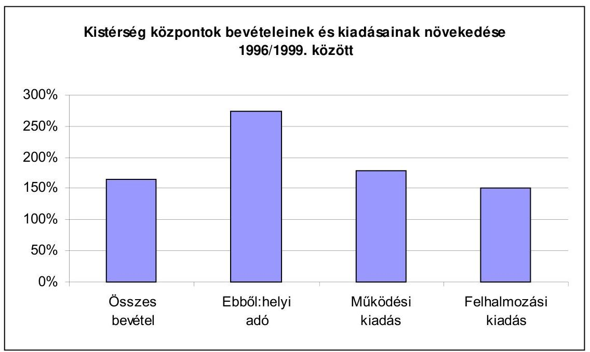

# 1.2. Területi egyenetlenségek a helyi adó bevételekben 

Összességében a községek a helyi adó bevételekből csak 12%-ban részesedtek, miközben a lakosság 36%-a él ott, ezzel szemben a főváros és a kerületek részesedése az adóbevételből 44%-os, a lakosság részaránya 18%, míg a városok adórészesedése (44%) és lakosságaránya (46%) közel azonos.

A vizsgálati mintában szereplő önkormányzatok egy főre jutó átlagos helyi adó bevétele a településtípusra jellemző átlagértéktől a községek kivételével számottevően nem tér el (4. sz. táblázat).

A helyszínen ellenőrzött községek átlaga néhány kiugróan magas adóerősségű település (pl. Algyő, Kékkút, Nagylengyel, Városföld, Csopak) miatt magasabb (1999. évben háromszorosa), mint a községek átlaga.

Jelentős a szóródás Budapest (Fővárosi és kerületi önkormányzatok együtt) és a megyék, valamint az egyes települések egy főre jutó helyi adó bevétele között. Az iparilag fejlett megyékben (településeken) a helyi adó bevétel 40-70% között szóródva átlagosan a költségvetés 20%-át éri el, ugyanakkor a magas munkanélküliséggel és a kedvezőtlen szociális helyzetből fakadó feszültségekkel küzdő - társadalmi-gazdasági szempontból hátrányos helyzetű térségekben a bevételeknek csupán 5-10%-át jelenti.

---

Székesfehérváron az 1995. évben bevezetett iparűzési adó a vizsgált időszakban kilencszeresére, 4,5 milliárd Ft-ra, ennek eredményeként a helyi adóbevétel aránya 9,2%-ról 28,6%-ra nőtt. (Az összes adóbevétel 98,4%-a iparűzési adóból származott.)

A területi egyenetlenségek szélső értékeit mutatja, hogy a fővárosban az egy főre jutó helyi adó bevétel 2000. évben 51.673 Ft, az összes bevételeken belüli aránya 22%, ezzel szemben Szabolcs-Szatmár-Bereg megyében 8.687 Ft/fő (aránya 5%). A megyék (vidék) átlagát tekintve 2000. évben is közel háromszoros az eltérés a legalacsonyabb (Szabolcs-Szatmár-Bereg) és a legmagasabb (Fejér) egy lakosra jutó helyi adó bevétel között.
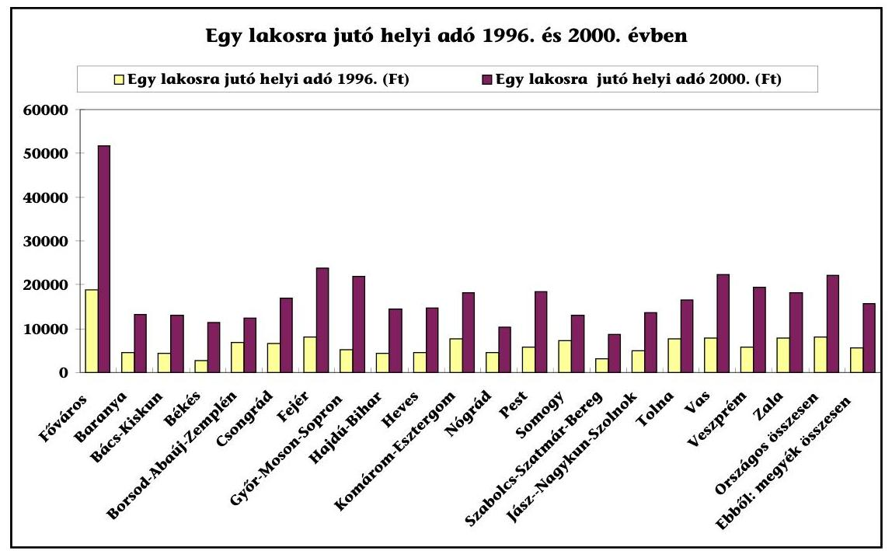

Hasonló aránytalanságok mutatkoznak az adatszolgáltató kistérség központ önkormányzatok egy főre jutó helyi adó bevételeiben (5. sz. táblázat). Az országos átlaghoz viszonyítva a Szabolcs-Szatmár-Bereg megyei 45% és a Tolna megyei 145% között háromszoros az eltérés. (A Tolna megyei átlag elsősorban Paks város kiugró adatával függ össze.)

Az adatok egyértelműen jelzik az ország térszerkezetében meglévő aránytalanságokat, amelyek az önkormányzatok bevételeiben, ezen belül helyi adó bevételeiben is megjelennek. Ennek egyik jellemzője a nagytérségi, regionális léptékben erőteljes megosztottság a Dunántúl és Kelet-Magyarország között. (A 9 dunántúli megyében Baranya megye kivételével átlag feletti értékek mutatkoznak, a keleti régiókban valamennyi megye adata átlag alatti.)

A nagytérségi, megyei adatokban meglévő főváros-vidék, illetve Nyugat-Kelet közötti számottevő különbségekkel szemben a kistérségekben sokkal differenciáltabb a helyzet.

Néhány kistérség központ városi önkormányzat jelezte, hogy egy-egy jelentős

---

adózó megszűnése, telephely felszámolása megrendítheti a helyi költségvetést (pl. Nyírbátor), vagy a településrészek önállósodásával az iparűzési adóbevételek elvesztése miatt az önkormányzat pénzügyi stabilitása megingott.

Kazincbarcika helyi adó bevétele 2000. évben Berente leválása miatt 490 M Ft-tal csökkent, és 208,5 M Ft ÖNHIKI-s támogatásban részesült, ugyanakkor a létrejött Berentei Önkormányzattól a lakosság számhoz viszonyított jelentős iparűzési adó miatt az adóerőképesség alapján a többletnek csak egy része - 2001. évben 32,5 M Ft - volt visszavonható a központi támogatásokból.

Az önkormányzatok folyamatosan törekedtek a helyi adó bevételek révén is saját bevételeik növelésére, de a lakossági terheket csak mérsékelten emelték, a vállalkozások által fizetendő adókban (vállalkozások kommunális adója, helyi iparűzési adó) viszont széles körben éltek a törvényben meghatározott maximális adómérték megállapításának lehetőségével.

A helyi adók GDP-hez viszonyított 1,8%-os aránya a jövedelemcentralizációban nemzetközi összehasonlításban alacsony, azonban döntő részét a vállalkozások fizetik. A vállalkozások adóterhe a társasági adó mellett az iparűzési adó is. (A társasági adó GDP-hez viszonyított aránya 2,2%.) A helyi adó azonban költségnövelő (költségként számolható el, így a veszteségesen gazdálkodó adóalanyok is fizetésre kötelezettek), a vállalkozások versenyképességére hatással van. (Ezzel szemben a társasági adót csak pozitív adóalap után kell megfizetni, és az adózott jövedelmet terheli.)

Az OECD országokban a helyi ingatlanadók (vagyonarányos közteherviselés elvét érvényesítve) a GDP 2-4%-át teszik ki, ezzel szemben Magyarországon ez az arány 0,2% jelenleg.

A helyi iparűzési adóban 1999. évben az adót alkalmazó önkormányzatok 11,5%-ában 100 E Ft alatt, 10%-ában 50 millió Ft felett volt a fizetendő iparűzési adó.
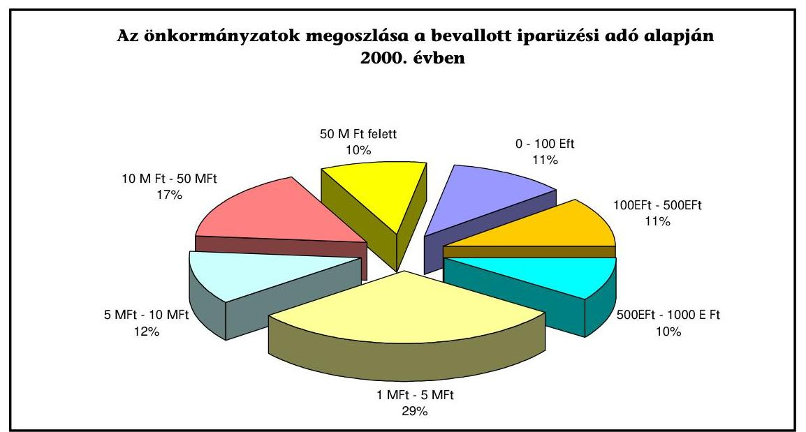

Az 1999. évre vonatkozó iparűzési adóbevallások feldolgozása szerint az átla-

---

gos adómérték országosan 1,47%, amely a törvényben biztosított 1,7%-hoz képest 86,5%-os adómérték kihasználtságnak felel meg. A vállalkozások kommunális adójában az átlagos adómérték a törvényi maximumhoz képest ugyanezen időszakban 87,6%-os mértéket ért el. Ezzel szemben a lakosságot terhelő kommunális adóban az adómérték kihasználtsága 30%-os (de az 1996. évi 15%-hoz képest megduplázódott), vagy a telekadónál csupán 9%-os.

Tápiószecső nagyközségben a helyi adó bevételek aránya igen alacsony volt a vizsgált években (0,6-1,3% között változott), az 1996. évben bevezetett iparűzési adó mértéke 2000. évben változatlanul 0,3% (a törvényi maximum 15%-a) volt.

Nagykálló városban az adóbevételek aránya 3%, az adómérték kihasználtsága csupán 15-25%-os és 1992. év óta változatlan.

Szarvas város iparűzési adóbevétele 1996-2000 között 104 M Ft-ról 312 M Ft-ra nőtt (300%), nagyobbrészt az adómérték 250%-os növelésének eredményeként. Az adómérték kihasználtsága iparűzési adóban 100%-os, a többi adónemben (építmény-, kommunális típusú adók) 33%-os.

Hort községben a helyi adó bevétel aránya 5,2%-ról 25,3%-ra nőtt a vizsgált időszakban. Ez részben új adónemek (építmény-, kommunális adó) bevezetésének és az iparűzési adómérték 100%-os emelésének köszönhető.

# Az önkormányzatok adóbevétele és pénzügyi helyzete egyetlen vagy néhány nagyobb iparűzési adóalany adófizetési kötelezettségétől, adóalapot érintő központi intézkedésektől, vagy az adóalap telephelyek közötti megosztása módszerének változásától is függött. 

Martfü városban 1998-ban 549 millió Ft (a tárgyévi bevételek 43,5%-a) származott döntő részben iparűzési adó befizetésből. Ezt követően az anyagköltség levonhatósága és az adóalanyok bevételeinek csökkenése miatt a helyi adó bevétel évről-évre kisebb összegben realizálódott. A 2000. májusi iparűzési adóbevallások alapján az előző évben fizetett adóelöleggel szemben a végleges adó számottevően alacsonyabb, összesen 184 millió Ft túlfizetés mutatkozott két adózónál. Ezt az önkormányzat fedezet hiányában nem tudta visszafizetni, jelenleg is nagy része túlfizetésként jelentkezik, miközben az adóerőképesség miatt 2000. évben az önkormányzattól 17,6 millió Ft elvonás történt. (A képviselő-testület az Alkotmánybíróságnál indítványozta a költségvetési törvény vitatott rendelkezése alkotmányellenességének megállapítását.)

Tiszavasvári város költségvetésében 1999. évig meghatározó szerepet játszott a helyi adóbevétel, amelynek aránya 8%-ról 15%-ra nőtt, azonban 2000. évben 3,8%-ra csökkent. Ennek oka, hogy egyetlen jelentős iparűzési adóalany adófizetési kötelezettségének változása miatt az iparűzési adóbevétel 180 millió Ft-tal csökkent.

Deszk községnek 1996. évben iparűzési adóból 127,3 millió Ft bevétele származott (az összes bevételének 56%-a). Egy jelentős iparűzési adóalany 1999. évtől megváltoztatta az adóalap megosztás módszerét és a továbbiakban nem fizetett helyi adót a községben,
 ezért a helyi adók aránya - új adónemek bevezetése ellenére is - 2000. évben 10,1%-ra, összege 24,9 millió Ft-ra csökkent.

Anarcs községben az iparűzési adó meghatározó hányadát (50%-ot) fizető adóalanynál az anyagköltség levonhatósága miatti adóalap-csökkenést az adómérték emelése nem ellensúlyozta, így a helyi adó 1997. évi 18,6%-os aránya (23,4

---

millió Ft) 2000. évig folyamatosan csökkent 2,3%-ra (3,3 millió Ft).
A helyi adó bevételek egy lakosra jutó átlagában nagyobb a megyék közötti eltérés, mint a gazdasági teljesítményeket kifejező bruttó hazai termék (GDP) egy főre jutó átlagában (6. számú táblázat). A vizsgált időszakban a KSH által megyékre lebontott egy lakosra jutó GDP növekedésében kisebb a szóródás, mint a helyi adóbevételek változásában. Amíg az egy lakosra jutó GDP növekedése a megyék között kiegyenlítettebb, addig a helyi adóbevételek növekedésében jelentősek a különbségek, amelyet az alábbi diagram szemléltet.
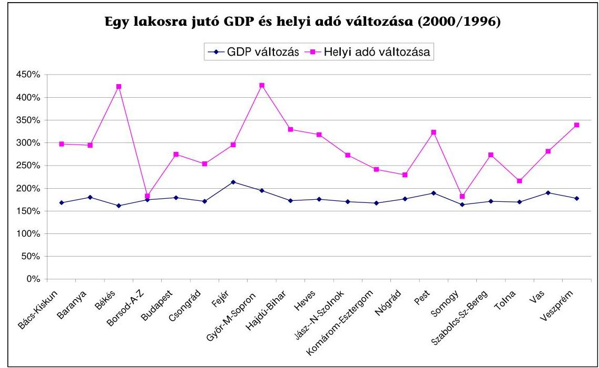

A gazdasági teljesítményeket figyelmen kívül hagyó helyi adóbevétel növelése elsősorban költségvetési bevételi szempontokkal függ össze, és számottevő eltérések jöttek létre az egyes települések (térségek) helyi adó terhelésében. A jelentős egyéb saját forrással (elsősorban vagyonértékesítésből származó bevételekkel) rendelkező önkormányzatok költségvetési bevételi kényszerek nem lévén - a helyi adópolitika eszközeivel (adómérték, mentességek, kedvezmények) is kedvezőbb befektetési, vállalkozási környezetet biztosítottak.

# 1.3. Adóerőképesség figyelembevétele a forrásszabályozásban 

A személyi jövedelemadóból 1998. évben a lakhely szerint helyben maradó rész 89,5 milliárd Ft volt, az SZJA kiegészítésre szolgáló összeg 33,3 milliárd Ft-ra, az előző évhez képest 75,5%-kal nőtt. A jövedelemkülönbségek mérséklése érdekében 1998. évben az SZJA kiegészítés az 1994. évihez képest megötszöröződött. Ugyanezen időszakban az iparűzési adó 27,3 milliárd Ft-ról 124,3 milliárd Ft-ra nőtt, azonban területi eloszlása nagyobb egyenetlenséget mutatott, mint a személyi jövedelemadóé. Az egy lakosra jutó iparűzési adó 1998. évben a fővárosban 28,4 E Ft, a váro-

---

sokban 14 E Ft, a községekben 3,5 E Ft volt, azaz a fővárosban 8-szorosa, városokban 4-szerese volt a községi átlagnak, de településenként még erősebb szóródást mutatott. Ezzel szemben az egy lakosra jutó SZJA-ban a községekhez viszonyítva a különbség a fővárosban 3,3-szoros, a megyei jogú városokban 2,2-szeres, az egyéb városokban 1,5-szeres volt.

Az 1998. évi kiegészítés eredményeként az SZJA lakóhely szerinti befizetésében mutatkozó területi különbségek (pl. egy lakosra vetítve a fővárosban 78.734 Ft, Szabolcs megyében 22.528 Ft, Fejér megyében 47.508 Ft) csökkentek. (Az 1998. évi SZJA megosztás alapját képező egy lakosra jutó SZJA és a kiegészítéssel korrigált önkormányzati részesedés megyék szerinti megoszlását a 7. számú táblázat szemlélteti.) Ebből megállapítható, hogy az egy főre jutó SZJA átengedés összegében a megyék között nincs jelentős különbség, de a befizetett SZJA-ból való részesedés mértéke már jelentős szóródást mutat (a két szélső érték a főváros 20%-os és Szabolcs megye 49,9%-os részesedése).

Az 1999. évet megelőzően alkalmazott - csupán az SZJA képződésében mutatkozó differenciát alapul vevő - kiegészítés emellett ellentmondásos volt, mert a jelentős iparüzési adóval rendelkező önkormányzatok is SZJA kiegészítésben részesültek.

Harkány városban a helyi adó bevételek aránya 1998. évben 20%, összege 155 millió Ft volt, az SZJA alacsony átlaga miatt 11,9 millió Ft kiegészítésben részesültek.

Nyergesújfalu városban 1998. évben a helyi adó bevételek aránya 31,9%, összege 254 millió Ft volt, miközben 1 millió Ft SZJA kiegészítésre vált jogosulttá.

A helyi adók és különösen az iparűzési adó jelentős növekedése következtében a helyi önkormányzatok bevételeiben olyan mértékű differenciálódás következett be, hogy a forrásszabályozás alapkövetelményei között az 1999. évi költségvetésben megfogalmazódott a legrosszabb jövedelmi helyzetben lévő önkormányzatok támogatásának hangsúlyosabbá tétele, a jövedelemkiegészítés, az esélyegyenlőség javítása.

Az átengedett személyi jövedelemadóból 37,9 milliárd Ft felhasználásával a bevételekben meglévő aránytalanságok mérséklése érdekében az 1999. évi központi költségvetésről szóló 1998. évi XC. törvény 20. §. (4) bekezdése szerint az adóerőképességnek 1 főre vetített összege alapján az önkormányzatokat vagy kiegészítés illeti meg, vagy csökkentik a központi költségvetési kapcsolatokból származó forrásaikat. Az adóerőképesség alapján 1999. évben 55 önkormányzatnál 2,3 milliárd Ft, 2000. évben 83 önkormányzatnál 4,9 milliárd Ft került beszámításra (elvonásra) a központi költségvetési kapcsolatokból származó forrásokból.

A kiegészítést a jövedelemkülönbségek mérséklése céljából széles körben alkalmazták (2000. évben a települések 95%-a részesült kiegészítésben, 2,6%-át érintette az adóerőképesség beszámítása miatti elvonás), az egy lakosra jutó SZJA és helyi adó bevétel megyék közötti szóródását csekély mértékben módosította.

---

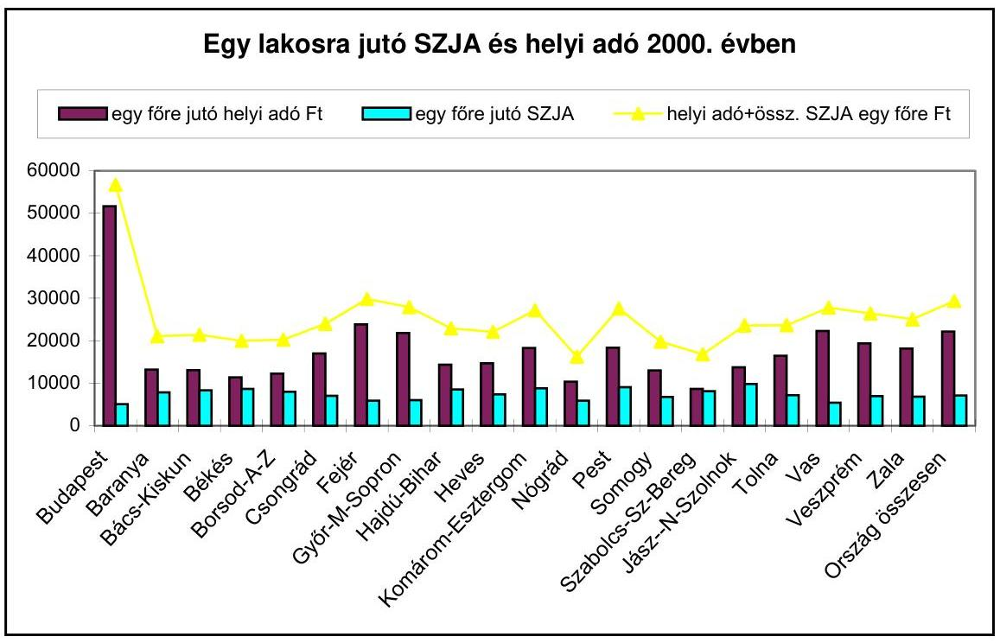

A korábbi évek tendenciájának megfelelően a 2001. évi költségvetésben az elvonás 83 önkormányzatot érintően 8,7 milliárd Ft. A kiugróan magas adóerőképességű önkormányzatoktól az elvonás mértékét az éves költségvetési törvény korlátozza (amely 2001. évben 12 önkormányzatnál 1,2 milliárd Ft-ot jelent), csökkentve az újraelosztható (kiegészítő) forrást.

Tekintettel arra, hogy az iparűzési adóban a 2001. adóévtől kötelezően új adóalap-megosztást kell alkalmazni (2000. évben még csak választható volt a személyi jellegű ráfordításokkal, vagy az ún. eszközértékkel arányos, illetve a 100 millió Ft-nál nagyobb adóalapot bevalló vállalkozásoknál az előző kettő kombinációját tartalmazó, komplex megosztási módszer alkalmazása), az iparűzési adófizetési kötelezettség változásából adódóan eltérhet a számított adóerőképesség és a ténylegesen realizált iparűzési adó.
A befolyt iparűzési adó az önkormányzat adópolitikájától függően - a bevezetésre, az adómértékre, mentességekre, kedvezményekre vonatkozó döntések miatt - eltérhet a tényleges adóerőképességtől, ezért nem ismert a települések tényleges iparűzési adóerőképessége. A jövedelemelvonásnál, kiegészítésnél a költségvetési törvényben meghatározott módon számított adóerőképesség kerül alkalmazásra. Ez az APEH által a foglalkoztatott létszám arányában településekre kimutatott társasági adóbevalláson és a Htv. szerinti korrekciókon, a nem társasági adóalany egyéni vállalkozókra vonatkozóan becslésen alapul.

---

# 2. Az önkormányzatok helyi adók bevezetésével kapcsolatos rendeletalkotása 

### 2.1. A helyi adórendeletek és alkalmazott adónemek megoszlása

A hatályos önkormányzati adórendeletek száma 2000. évben több mint 6.700 db, azaz a 2.970 helyi adót már alkalmazó önkormányzat átlagosan 2,3 adónem bevezetéséről alkotott rendeletet. Az adótörvények a leggyakrabban változó jogszabályok közé tartoznak, a helyi adó törvény a vizsgált években 10, a gépjárműadóról szóló törvény 5 alkalommal módosult, amely az önkormányzatokra is terhet ró a rendeletalkotásban. A hatályos helyi adó rendeleteket módosító adórendeletek száma többszöröse az alaprendeleteknek. Az önkormányzatok részéről hosszabb távon kiszámítható, stabil bevételi forrásszabályozás és helyi adó rendszer igénye fogalmazódott meg a beérkezett véleményekben.

A helyszínen vizsgált 72 önkormányzat közül iparűzési adót 58, építményadót 44, magánszemélyek kommunális adóját 36, telekadót 27, vállalkozások kommunális adóját 25, idegenforgalmi adót 18 működtetett 2000. évben. Egy-egy vizsgált önkormányzat 1995. évben átlagosan 2,1 db, 2000. évben már 2,9 db adónemet alkalmazott. Ezen belül a főváros iparűzési adót és tartózkodás után fizetendő idegenforgalmi adót, a fővárosi kerületek többnyire 1-2 adónemet (építmény és telekadó), a városok és községek 2-4 adónemet működtettek. (A városok, községek 80%-a iparűzési adót, 62%-a magánszemélyek kommunális adóját, 50%-a építményadót alkalmaz.)

A vizsgált önkormányzatok hatályban lévő 208 adórendeletének 85%-a 4 évesnél régebbi. Az 1996-2000. közötti időszakban 418 esetben módosították rendeletüket, amelyből 307 az adómérték emelésére irányult. Hasonló arányokat mutat a 124 kistérségi központ adórendeleteinek kora és módosításainak gyakorisága (adórendeleteik 80,4%-a 4 évnél régebbi, a hatályban lévő 439 adórendeletüket 846 esetben módosították).

A fővárosi XXIII. Kerületi Önkormányzat hatályban lévő építményadó és telekadó rendeletét 21 esetben módosította, amelyből 8 az adómérték emelésre, 13 az adómentesség, kedvezmények szabályainak változtatására irányult.

Az önkormányzatok a helyi adókról szóló törvény szerint határozott vagy határozatlan időre vezethetnek be helyi adót. Előfordult törvénysértő gyakorlat is, amikor a határozott időre bevezetett adót a határidő lejárta után is alkalmazták.

Fácánkert községben 1992. évben építményadó, telekadó és magánszemélyek kommunális adója bevezetéséről alkottak rendeletet 1993. december 31-ig tartó határozott időtartamra. A rendeletet csak 1997. évben módosították, a köztes időszakban törvénysértő módon folyt az adóztatás.

Zalakaros városban 1992. évben a magánszemélyek kommunális adóját 1999. december 31-ig terjedő határozott időre vezették be, amelyet csak 2000. év közben változtattak határozatlan időtartamra. Az adóteher évközben történő növe-

---

lésének tilalmába ütköző, törvénysértő megoldás, amely miatt az ügyészség kezdeményezte a jogszabálysértően kivetett adó törlését, és az adóhatóság vezetője (jegyző) ellen fegyelmi eljárás lefolytatását.

Az adó bevezetésekor konkrét célt is meghatároztak (pl. Gyöngyösön az infrastrukturális fejlesztések forrásaként jelölték meg a kommunális adót), de általánosságban a költségvetés bevételeinek biztosításában jelölték meg az adóztatás célját.

A magánszemélyek kommunális adója bevezetésének egyik indoka a lakossági kommunális hulladékszállítás költségeinek fedezése (a szemétszállítás dijának egyidejű megszüntetése mellett). Ilyen indokokkal vezették be a magánszemélyek kommunális adóját pl. Akasztón, Soltvadkerten, Nyergesújfaluban.

Amennyiben a helyi adó bevezetésekor nem mérték fel a várható adó összegét, a törvényben, illetve a helyi rendeletben biztosított adómentességek, kedvezmények fizetendő adóra gyakorolt hatását, rövid időn belül hatályon kívül helyezték az adórendeletet.

Tamási városban 1997. évben a lakások után 100 Ft/m² adómértékkel építményadót vezettek be. Az új lakásra vonatkozó mentességek miatt a kivetett adó csupán 156 E Ft bevételt jelentett, ezért 1998. évtől megszüntették az adórendeletüket.

A leggyakrabban bevezetett adónem a vizsgált években az iparűzési adó volt, 2000. évben az önkormányzatok 71%-a (a helyi adót alkalmazók 75%-a) élt a bevezetés lehetőségével. Az iparűzési adó bevétel éves átlagos növekedési üteme az infláció és a gazdasági növekedés, valamint az adómérték növelésének eredményeként a vizsgált években 30% volt, annak ellenére, hogy 1997. évtől kezdődően fokozatosan, 2000. évtől teljes körűen levonhatóvá vált az anyagköltség a nettó árbevételből az adóalap számításakor.

Korábban az adóterhek arányosítása érdekében az önkormányzatok eltérő (sávos) adómértéket is alkalmaztak az ipari termelő, szolgáltató tevékenységre, a kereskedelmi, banki és egyéb tevékenységekre. Az adóalap szűkítése és közelítése következtében az önkormányzatok fokozatosan szüntették meg az eltérő adómértéket, és a törvényben megszabott maximális adómértéket állapítottak meg.

A helyi adót bevezető önkormányzatok 63%-a alkalmazza a magánszemélyek kommunális adóját, azonban az ebből származó adóbevétel a helyi adóknak csupán 2%-át jelenti. Ez az adónem viszonylag alacsony költséggel működtethető és a lakosság által támogatott felhasználási cél esetén (pl. szemétszállítás költségeinek fedezete, lakókörnyezet tisztántartása) az adóhátralék más adónemekhez képest alacsonyabb.

Az adómérték alapján (2000. évben átlagosan 3.635 Ft) a törvényben biztosított lehetőséget az önkormányzatok csupán 30%-ban használták ki, de az országban 86 önkormányzat (4,6%) már az adómaximumot (12.000 Ft/év) alkalmazta. A vizsgált önkormányzatok 50%-a (36) vezette be a magánszemélyek kommunális adóját, ebből 11 az adómértéket külterület, belterület, lakás

---

és üdülőépületek és egyéb adótárgyak szerint differenciáltan állapította meg.
Építményadót a helyi adót bevezető önkormányzatok 23%-a alkalmazott a nem lakás célú építmények után (10%-uk lakás után is bevezetette az építményadót). Az ingatlanok adóztatása 99%-ban alapterület arányában történik. Ez az adónem a beszedett helyi adón belüli 9,9%-os részarányával a második legjelentősebb adónem. Az önkormányzatok az építményadón belül elsődlegesen a nem lakás céljára szolgáló, vállalkozások tulajdonában lévő
 építményeket adóztatják, a lakosság számára széles körben adómentességet biztosítanak. Az átlagos adómérték kihasználtsága a törvényi maximumhoz képest 1996. évben 23%-os, 2000. évben már 43%-os volt. Miközben az adónemből származó bevétel növekedése 264,6%-os volt, ez döntően (75%-ban) az adómérték emeléséből származott és nem új adótárgyak adóztatás alá vonásából.

A fővárosi kerületekben az építményadót 1999. évben már valamennyi, a telekadót 15, a kommunális adót 4 kerületi önkormányzat vezette be. Az adómérték, a mentességek, kedvezmények kerületenként igen különbözőek. Lakás céljára használt ingatlanra 4 kerületben vezettek be adót (I. XIV. XVI. és XX. kerület), de csak a bérbeadás útján hasznosított lakásokra. Az adómérték 150 Ft/m²-től a törvényben meghatározott 900 Ft/m² maximumig terjed. Az átlagos adómérték 557 Ft, az adómérték két szélső értéke között 467%-os eltérés van. Az adómérték 12 kerületben egységes, van ahol övezeti besorolástól, vagy az ingatlan alapterületétől függően sávosan növekszik, egyes kerületekben tulajdonos szerint eltérő (magánszemélyek esetében alacsonyabb) adómértéket alkalmaznak.

A kerületi önkormányzatok a lakosság tulajdonában lévő lakás- és nem lakás céljára szolgáló építményekre általában mentességet állapítottak meg. A képviselő-testületek az adómérték alkalmazásánál a fokozatosság elvét tartották szem előtt, az alkalmazott adómérték 7 kerületben éri el a törvényben rögzített maximális mértéket.

A XX. kerületben elsősorban a gazdasági tevékenységet szolgáló, a vállalkozások által használt építmények után állapítottak meg adókötelezettséget. Az adómértéket az 1994. évi övezetenkénti 100-200-300 Ft/m²-ről 350-650 Ft/m²-re növelték 1998. évben a maximális 900 Ft/m² adómértéken belül.

A gépjárműadóról szóló 1991. évi LXXXII. törvény (Gjt.) 1996. évi módosítását követően a belföldi gépjárművek adójának mértékét a törvényi keretek között az önkormányzat képviselő-testülete rendeletében állapítja meg. A gépjárműadó mértéke az adóalap (önsúly) minden megkezdett 100 kg-ja után legalább 600, de legfeljebb 1000 Ft volt 2000. évben. A minimális adómérték 1996. évben 100%-kal (200 Ft-ról 400 Ft-ra), azt követően 50%-kal emelkedett.

A gépjárműadó kivetési összesítők szerint az adómérték a vizsgált időszakban a minimális adómértéket csak kis mértékben haladta meg. Ennek oka, hogy 2000. január 1-jei állapot szerint az önkormányzatok 84%-a az alsó adótételt alkalmazta területén. (Különösen magas - 84-94% - az alsó adómértéket alkalmazó önkormányzatok száma Zala, Baranya, Somogy, Borsod-Abaúj-Zemplén megyében.) Az önkormányzatok közül 76 súlytól függően differenci-

---

ált - progresszív - adótételt határozott meg, de a sávok megválasztásában eltérő preferenciákat érvényesítenek. (Pl. a fővárosban 600 kg-ig 600 Ft, 1000 kg-ig 1000 Ft és e felett 1000 Ft az adómérték, de a gépjárművek jellemző önsúlya miatt a 2000. évi kivetési összesítő szerinti átlagos adómérték 891 Ft, míg az országos átlag 625 Ft.)

Az alsó adómértéknek megfelelő adó 50%-a, valamint az ezen felül megállapított gépjárműadó teljes összege az adót beszedő önkormányzatot illeti meg. A belföldi gépjárművek adójának 50%-át használhatták fel 1995. évben az önkormányzatok, amely 5,2 milliárd Ft volt. Ezzel szemben 2000. évben a beszedett 20,8 milliárd Ft adóból 12,5 milliárd Ft képezte az önkormányzatok bevételét.

Az önkormányzatok az 1999. évi beszámolók tanúsága szerint az őket megillető 11,4 milliárd Ft gépjárműadóval szemben helyi közutak létesítésére, felújítására 28,4 milliárd Ft-ot fordítottak.

A belföldi gépjárművek adóztatásával kapcsolatos feladat- és hatáskör 1996. évtől sajátosan oszlik meg a kerületek és a főváros között. Amíg a törvény keretei között az adómérték meghatározására a főváros egész területén a Fővárosi Közgyűlés rendeletével kerül sor, addig az adóztatással kapcsolatos feladatokat a kerületi adóhatóságok látják el.

A forrásmegosztásban az alapfeladatok fedezeteként számba vett gépjárműadóból ténylegesen realizált adóbevétel 1998. évben 2.475 M Ft, 1999. évben 2.985 M Ft, 2000. évben 4.435 M Ft volt, kerületenként erősen szóródott a gépjárművek számától függően.

# 2.2. Adókedvezmények, mentességek, a helyi adópolitika az önkormányzatok döntéseiben 

A helyi adóztatás jellemzője a széles körű önkormányzati autonómia. A képviselő-testületek döntenek a bevezetendő adónemekről, az adómértékről (a törvényi maximum korlát figyelembevételével), szabadon bővíthetik az adómentességek és adókedvezmények körét. Ennek során a helyi adókról szóló törvény szerinti kötelező előírásokat és a diszkrimináció tilalmára vonatkozó alkotmányos előírásokat kell figyelembe venniük.

A települések adottságai (az ipar fejlettsége, települési szerkezet, foglalkoztatási, szociális, vagyoni helyzet) meghatározóak a helyi adópolitika kialakításában, de nem elhanyagolható az önkormányzati testületekben képviselt különböző helyi érdekek megjelenése sem.

A lakosság, illetve a vállalkozások teherviselő képességét figyelembe vevő adómérték megállapításával, a mentességek, kedvezmények rendszerén keresztül kívánták az önkormányzati testületek a helyi adópolitikában a település fejlesztésének, a vállalkozások élénkítésének szempontjait is érvényesíteni. A kistérség központ önkormányzatok értékelése a helyi adópolitika céljairól, eszközeiről és eredményéről igen változatos képet mutat. Az önkormányzatok a helyi adópolitikában az elmúlt években átfogó koncepció, egységes elképzelés hiányában az adómértéket a költségvetés bevételi

---

igényeihez is igazították. 

A helyi adók elfogadtatásának lényeges eleme lehet az adófizetők megfelelő tájékoztatása. A helyi adókról szóló törvény előírja, hogy az önkormányzat a beszedett adó összegéről évenként köteles a költségvetési beszámoló részeként a település lakosságát tájékoztatni. E követelmény formailag úgy teljesül, hogy a kihirdetett zárszámadási rendelet az elfogadott költségvetéssel azonos szerkezetben tartalmazza az önkormányzat bevételeit. Azonban ennek részletezettsége (adónemek szerinti megbontás, hátralék alakulása, kedvezmények, mentességek) és a tájékoztatás további formája önkormányzatonként eltérő. Általánosan elterjedt forma a falugyülésen vagy közmeghallgatáson történő tájékoztatás, önkormányzati kiadványokban történő közzététel.

Az önkormányzatok folyamatosan törekedtek a helyi adókon keresztül is saját bevételi forrásaik növelésére (amit az alkalmazott adónemek és a beszedett helyi adó növekedése is igazol), azonban ennek során a lakossági terheket nem kívánták növelni, a településen élő állandó lakosok számára széles körben mentességet, kedvezményeket biztosítottak. A magánszemélyeket érintő helyi adó bevezetésére a kistérség-központok körében végzett adatlapos felmérésünk szerint azért nem került sor, mert a közműfejlesztésekben (víz, szennyvíz, gáz stb.) a lakossági tehervállalás jelentős volt az elmúlt években.

A mentességek, kedvezmények az infrastruktúra, a helyi gazdaság fejlődését, a foglalkoztatás bővítését kívánták ösztönözni, azonban az adóelönyök önmagukban nem voltak elégségesek a gazdaság meglévő szerkezeti problémáinak megoldásához, a foglalkoztatottság növeléséhez.

A Htv. szerint kötelező mentességek és kedvezmények bővítésére a következő területeken került sor:

- Az adóalanyok (magánszemélyek) személyi körülményeihez (életkor, szociális helyzet, munkaképesség csökkenés, jövedelem, eltartottak száma) igazodó mentességek, kedvezmények.
- Adótárgyakhoz kapcsolódó mentességek, kedvezmények (pl. lakás, gépkocsitároló, újonnan épült, meghatározott alapterületet el nem érő lakások esetében).
- Vállalkozás ösztönző, egyes tevékenységeket előnyben részesítő mentességek, kedvezmények (pl. ipari parkok területén beruházást megvalósító vagy a kezdő vállalkozások mentessége, meghatározott adóalaphoz kötött mentesség, mezőgazdasági őstermelő, ipari termék-előállító, szolgáltató tevékenységet végzők adókedvezménye, beruházásokhoz és foglalkoztatás bővítéséhez kapcsolódó kedvezmények).

Széles határok között szabályozták az önkormányzatok az iparűzési adóban a nettó árbevétel figyelembevételével az adómentesség alsó határát, 100 ezer Ft-tól 6 millió Ft-ig terjed az adómentes nettó árbevétel.

Győrben az adómentes nettó árbevételt 6 millió Ft-ban határozták meg, így az egyéni vállalkozóknak csupán 3%-a kötelezett iparűzési adó fizetésére.

---

A fővárosban iparűzési adóban 500 E Ft nettó árbevétel alatt (bolti kiskereskedelemben 1.500 E Ft alatt) adómentes a vállalkozási tevékenység. Ennek kihatása az összes iparűzési adóhoz képest 0,1% (a beérkezett, nem teljes körű bevallások alapján).

Az iparűzési adó 1999. évi bevallási összesítője szerint az adóalap 4,9%-át mentesítették az adó alól az önkormányzati rendeletekben, amelynek adója átlagos adómértékkel számolva - 8,2 milliárd Ft-ot tesz ki. További 12,9 milliárd Ft a számított iparűzési adóból igénybe vehető kedvezmény.

Az önkormányzatok döntése alapján biztosított, bevallásokban szereplő adómentesség, kedvezmény valamennyi adónemben a vizsgált időszakban 6,7 milliárd Ft-ról 22,7 milliárd Ft-ra nőtt, a bevallott adó százalékában némileg csökkent (12,6%-ról 11,7%-ra). A mentességek adóalapra gyakorolt hatása bevallási, bejelentési kötelezettség hiányában azonban nem teljes körűen ismert.

Az államháztartásról szóló 1992. évi XXXVIII. törvény (Áht) 118. §-a alapján a költségvetés előterjesztésekor, illetőleg zárszámadáskor a képviselő-testület részére tájékoztatásul be kell mutatni többek között a közvetett támogatásokat (pl. adóelengedéseket, adókedvezményeket) tartalmazó kimutatást szöveges indokolással együtt. (Ennek tartalmát azonban nem szabályozta a jogalkotó). Az Áht 2001. évtől hatályos módosítása szerint a közvetett támogatások bemutatását az önkormányzat rendeletében meghatározott tartalommal kell elkészíteni. A közvetett támogatásokról a vizsgált önkormányzatoknál nem, vagy csak részlegesen tájékoztatták a testületeket.

A fővárosi kerületek helyi adó rendeleteiben alkalmazott mentességek, kedvezmények az ingatlan használatának jellegére, vagy a tulajdonos szociális helyzetére tekintettel épültek be (pl. a lakosság tulajdonában lévő garázsok, hétvégi házak után nem kell az adót megfizetni), de az ezek révén kieső adóbevételekről - hasonlóan az adóztatható vagyontárgyak teljes köréről sem nincsenek pontos információk.

A XV. kerület 548,5 M Ft-ot mutatott ki mentesség, kedvezmény címén 1997-1999 évek között összesen, amely a beszedett vagyoni típusú adóknak 23%-a.

Közvetett támogatási formának minősül, amikor az önkormányzat lemond az adóbevétel meghatározott részéről, ha azt a rendeletében meghatározott célra ajánlja fel az adózó, vagy meghatározott célú felhasználását igazolja.

Nyíregyháza megyei jogú városban külön rendeletet alkotott a közgyűlés az iparűzési adó 1%-ának adózó rendelkezése szerinti felajánlásáról (pl. 1999. évben a versenysport és utánpótlás nevelés céljára 8,2 millió Ft felajánlása történt meg).

Tamási városban 1999. évtől az iparűzési adó 5%-áról rendelkezhetnek az adózók. Az adóhatóság az adózók rendelkezése alapján 1999. évben 2.378 E Ft-ot, 2000. évben 3.042 E Ft-ot utalt tovább a kedvezményezetteknek az adószámláról, miközben az önkormányzat forráshiányos volt.

Gyöngyös városban a helyi adó bevétel 2000. évben 980 millió Ft-ra (a bevételek 22%-a) nőtt. Iparűzési adóban a közvetett támogatásnak minősülő mentesség és kedvezmény összegeként 122 millió Ft-ot mutatott ki, miközben ÖNHIKI-s támogatást igényelt és kapott 39 millió Ft összegben.

---

Egyedi megoldást jelent, amikor egy adókedvezményt egy másik adónemmel kapcsolatos adófizetéstől tették függővé az önkormányzatok.

Zalakaros városban a tartózkodás utáni idegenforgalmi adóból 1,5 millió Ft-nál többet befizető adóbeszedésre kötelezett az iparűzési adójából 20% kedvezményre jogosult.

Bábolna nagyközségben 1998-ban vezették be az építményadót, de a sajátos mentességi szabályok miatt (nem kell az építményadót megfizetni a vállalkozónak 1998. évben, ha a helyi iparűzési adó előleg-fizetési kötelezettsége legalább 19%-kal haladja meg az előző évi adófizetési kötelezettségét) a bevezetés évében nem került sor adókivetésre.

Az Európai Uniós (EU) szabályok szerint az adókedvezményekre - mint közvetett támogatásokra - a közvetlen állami támogatásra vonatkozó előírásokat kell alkalmazni. Ez magában foglalja a helyi önkormányzatok által nyújtott támogatásokat, így a helyi adókban biztosított kedvezményeket, mentességeket is.

A támogatások - versenytorzító hatásuk miatt - általában szigorú korlátozás alá esnek. Ha az adott vállalkozásnak nyújtott támogatás értéke 3 év alatt együttesen nem haladja meg a százezer Euro-t (megközelítőleg 26 millió Ft), akkor a versenyre gyakorolt csekély hatása miatt nem tiltott. Az értékhatárt azonban a különböző jogcímeken nyújtott közvetlen és közvetett támogatások együttesen nem haladhatják meg.

Jelenleg nincs olyan megfigyelő rendszer, amely kimutathatóvá tenné, hogy egy adott
 vállalkozás különböző jogcímeken egy időszakban milyen összegű támogatásban részesült. A helyi adóban nyújtott kedvezmények, mentesség révén élvezett adóelőny összegének kimutatása érdekében 2000. január 1-jétől a települési önkormányzatok hatáskörébe tartozó adók és adók módjára behajtandó köztartozások nyilvántartásáról, kezeléséről és elszámolásáról szóló 13/1991. (V.21.) PM rendeletben az 500 millió Ft-ot meghaladó iparűzési adó alappal rendelkező adózókat az önkormányzati rendelet szerint megillető mentességekről, kedvezményekről külön adatszolgáltatást vezettek be. Az 1999. évre vonatkozó 2000. májusi iparűzési adóbevallások szerint összesen 12.189 millió Ft adóelőnyt biztosítottak az önkormányzatok döntése alapján az iparűzési adóalany vállalkozások számára. Ebből 26 millió Ft-nál nagyobb adóelőnyt realizált 52 vállalkozás 10.263 millió Ft összegben, de ennek 47%-át egyetlen, további 24%-át 8 adózó vette igénybe.

# 3. AZ ÖNKORMÁNYZATI ADÓHATÓSÁG FELADATAINAK ELLÁTÁSA 

### 3.1. A személyi feltételek alakulása

Az érintett önkormányzati adóhatóságoknál dolgozók átlaglétszáma 1996. és 2000. évek között 12%-kal (472 főről 529 főre) emelkedett, a hivatalok átlaglétszámán belül a közvetlenül adóigazgatással foglalkozók aránya átlagosan 7,8-8,1% között volt (mérsékelten növekedett) az utóbbi években.

---

A Fővárosi Önkormányzatnál az adóigazgatási átlaglétszám az 1996. évi 51 főről 2000. évre 85 főre (67%-kal) emelkedett. Ugyanezen időszakban Hódmezővásárhely és Nyíregyháza megyei jogú városokban minimális, 1-1 fős csökkenés történt, ugyanakkor a másik három vizsgált megyei jogú városban 18-40%-os volt a növekedés.

A létszámnövekedés szükségességét összességében az adóztatásra vonatkozó néhány mutató alakulása alátámasztja.
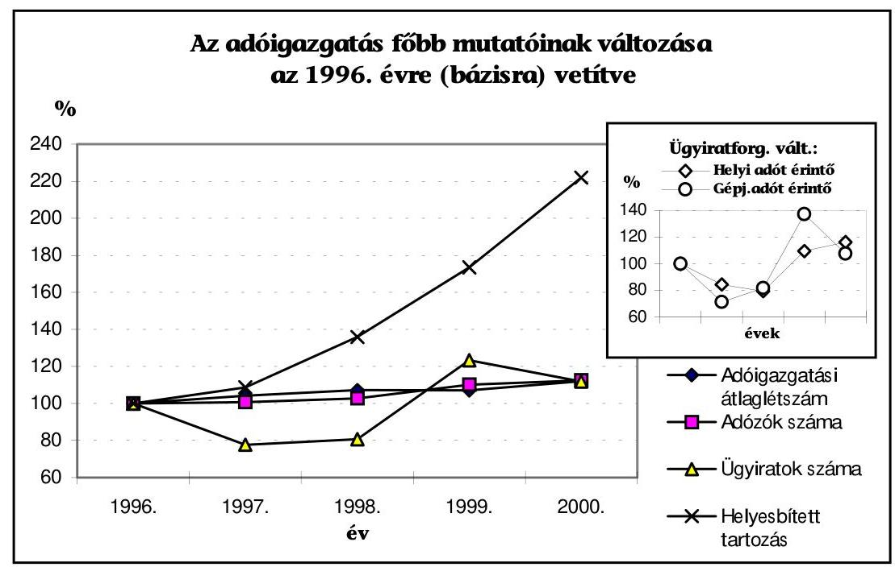

A nagyobb (nem csupán egy-két fős) adóhatóságoknál van esély a feladatváltozásnak megfelelő létszámmódosításra, viszont minél kisebb a település e lehetőség annál szűkebb.

A vizsgált községek 91%-ában, nagyközségek 55%-ában, városok egyharmadában lényegében minden vizsgált évben hasonló volt az adóigazgatási átlaglétszám, a nagyobb adóhatóságok közül csupán két kerületnél volt hasonló.

Az egy adóigazgatási létszámra jutó helyesbített tartozás szélső értékei között számottevő az eltérés (ezt mutatja a csatolt 1. számú diagram).
A 2000. évi átlaglétszám, az ügyiratszám, az adózók száma és a helyesbített tartozás megoszlását az egyes önkormányzat-csoportok között a jelentéshez csatolt 2/a. és 2/b. számú diagramok szemléltetik.
A Fővárosi Önkormányzatnál az adóigazgatási létszámnál nagyobb arányú az adózók számából és különösen az adóelőírásból való részesedés, ezzel szemben a kerületeknél a munkaerő igényesebb adóztatási feladatok miatt az arány fordított. A bevételekhez viszonyítva a legmagasabb a létszám a községekben.

---

Az arányokat valamelyest befolyásolja, hogy egyes településeken az adóügyintéző munkaköre valójában osztott, míg másutt esetenként külső segítőket is alkalmaztak.

A vizsgált községek több mint felében az adóügyintézők jellemzően a hivatali pénztárt is kezelik, vagy más érdemi munkaköri feladataik is vannak (feladataik többségét viszont adóigazgatásnak tekintik, a töredékidők szerinti létszámkorrekció reálisan munkanap-fényképezés után lenne lehetséges). Még városban (Zalakaros) vagy nagyközségben (Bábolna, Mátraterenye) is előfordult osztott munkakörben foglalkoztatott adóügyintéző.

A Fővárosi Önkormányzat adóhatóságánál megbízási szerződéses alkalmazásokkal egészítették ki belső munkaerő-kapacitásukat, Székesfehérváron a vásározóktól való adóbeszedésre, Balatonfüzfőn és Csopakon az idegenforgalmi adót beszedő helyek vendégkönyveinek ellenőrzéséhez alkalmaztak hasonló megoldást. Pápán, Deszken és Tatán külső szakértőt alkalmaztak adóellenőrzési feladatokra, a XXIII. kerületben, Tatabányán, Nyergesújfalun, Dévaványán közhasznú munkásokat alkalmaztak bizonyos (elsősorban postázási és egyéb ügykezelési) feladatok tartós vagy kampányszerű eseti megoldására.

# A vizsgált kör egyötödében a szakmai színvonal romlását előidéző személycsere, az adóigazgatás átmeneti munkaerőhiánya, vagy a dolgozók munkaköri feladatainak tisztázatlansága okozott problémát. 

Cibakháza nagyközségben az adóigazgatási három fős létszámból egy fő tartósan betegállományban van, a többiek cseréjével két olyan dolgozó végzi a munkát, akiknek kevés a gyakorlati tapasztalata, még nem látják át feladataik összefüggéseit.

Mátraterenye községben az adóügyi főelőadó közvetlen vezetője - a pénzügyi csoportvezető személye - többször változott, az adóügyi dolgozó hosszú ideig betegállományban volt, majd erre hivatkozva munkaviszonyát felmentéssel megszüntették, a munkavégzés alól mentesítették, majd később, az előírt képesítés nélküli dolgozóval pótolták.

Harkány városban az adóztatást közvetlenül irányító csoportvezetőnek, Fácánkerten az adóügyintézőnek nem készült munkaköri leírása, másutt (pl.: Hartán) hiányos volt a kiadott és hatályos dokumentum.

Az adóügyintézők iskolai végzettsége, képzettsége a vizsgált időszak alatt javult. (A végzettség szerinti megoszlást a csatolt 3/a. és 3/b. számú diagramok szemléltetik a vizsgált önkormányzatoknál és a kistérségközpontoknál.) A képzettség kedvező irányú változása minden vizsgált önkormányzat-csoportra jellemző volt és ma is gyakori a dolgozók továbbtanulása.

A helyszíni vizsgálatok szinte minden nagyobb adóhatóságnál jelezték, hogy egyes adóügyi dolgozók iskolai, szakmai képzése folyamatban van, többen adótanácsadói képesítést is szereztek.

Az önkormányzat nagysága és az adóügyi dolgozók képzettségi szintje között szoros összefüggés van, a kistelepüléseken fordul elő a szükséges szakképzettség hiánya.

---

Az elhelyezési feltételek jelentősen befolyásolják az adóügyi dolgozók munkáját, és emellett meghatározzák a hivatalban az ügyfelekkel való találkozás körülményeit is. A kistelepüléseken tapasztaltuk a közös helyiségben történő elhelyezést, ahol az ügyfélfogadás, a munkavégzés korszerű, elvárt körülményei a leginkább hiányosak. Kedvezőtlen elhelyezési feltételek azonban nem csupán a községekben fordulnak elő.

Simontornya városnál az ügyfélszolgálati helyiségben 4 dolgozó intézi a lakosok ügyeit. A csoportvezető és az adókönyvelést végző ügyintéző is kényszerűen egy szobában dolgozik.

Tata városnál az adóügyintézők elhelyezését korábban az épületen belüli széttagoltság jellemezte. Ezt sikerült megszüntetni, ugyanakkor a mai elhelyezést a zsúfoltság jellemzi, ahol a párhuzamos ügyfélfogadás lehetőségei igen korlátozottak, az ügyintézés gyakran korlátozza a másik dolgozó munkáját.

Külön ügyfélszolgálatok a vizsgált adóhatóságok egynegyedénél, jellemzően csak a nagyobbaknál működnek.

# 3.2. Az adók nyilvántartása, kezelése és elszámolása 

Az adók nyilvántartása, kezelése és elszámolása terén az egy-egy vagy néhány fős adóhatóságoknál, adóigazgatási egységeknél főként létszám és szakmai ismeretek hiányosságai miatt mutatkoztak alapvető gondok. A vizsgált önkormányzatok egyharmadánál tapasztaltak a helyszíni vizsgálatot végzők az ügyintézés, a nyilvántartások vezetése, a zárási összesítők területén hiányosságokat.

Fácánkert községben hiányos volt az adóügyiratok iktatása, az adókötelezettség előírásával és teljesítésével kapcsolatos iratok helyi kezelési rendje nem biztosította a határozatok, bevallások gyors és teljeskörű visszakeresését. A helyi adók számítógépes nyilvántartásából kimaradtak adóelőírások és befizetések, a vizsgált évekre vonatkozó adatállomány mentésének lemezei nem lelhetők fel a hivatalban.

Tiszavasvári városban előfordult, hogy 2000. február 23-án az adóhatóság értesült az adózó gépjármű-eladásáról, de határozat csak december közepén született.

Tarnaméra községben az adózók törzsadat-nyilvántartásában az adatok hiányosak (az adózó azonosító adatainak /pl. születési adatok, nők esetében leánykori név/ a rögzítése nem volt teljes körű).

Balatonfüzfő városban a zárási összesítők és a költségvetési beszámolók összevetése - ugyan nem jelentős összegekben, de - eltéréseket mutatott; amit több évben is hibás utalási kódok okoztak, 1997. évben pedig az, hogy 245 E Ft összegű adó-visszatérítést a költségvetési számláról teljesítettek (ez a zárási összesítőben nem jelent meg).

Csopak községben tévesen adóbevételként szerepeltettek 1996. évben 264 E Ft bérleti díjat, valamint későbbi években egy-egy kisebb összegű téves befizetést.

Lörinci városnál a főkönyv és zárási összesítő eltérését okozta 2000. évben, hogy 3.027 E Ft adózói túlfizetés visszautalásának fedezetét a költségvetés adószámlára

---

történő átutalása biztosította, ahol viszont azt adóbevételként kezelték átfutó tétel helyett.

A tulajdon alapján történő adóztatásnál hiányosság, hogy a Htv. és saját rendeleteik előírásaitól eltérően nem követelik meg, nem is tartják nyilván a tulajdonostársak adóalanyiságára vonatkozó megállapodásokat. (A több tulajdonos tulajdoni hányad aránya szerinti adóalanyiságától, csak valamennyi tulajdonos írásban megkötött és az adóhatósághoz benyújtott megállapodása alapján lehet eltérni.)

# Az adószámlákkal, azok kezelésével kapcsolatos szabályokban az utóbbi években alapvető változások történtek; 

- A települési önkormányzat hatáskörébe tartozó adók és adók módjára behajtandó köztartozások nyilvántartásáról, kezeléséről és elszámolásáról szóló 13/1991. (V. 21.) PM rendelet 1999. majd 2000. évtől hatályos módosuló rendelkezései szerint 1999. évtől a helyi adók és a gépjárműadó mellett az iparűzési adóra kiemelt, majd 2000. évtől adónemenként, illetve a pótlékra és bírságra mind külön-külön beszedési számla szolgál.
- A PM rendelet az adószámlákra befolyt bevételek költségvetési számlára (illetve gépjárműadó vonatkozásában a központi költségvetés felé is) utalásának szabályait 1999. évtől az államháztartás működési rendjéről szóló 217/1998. (XII. 30.) Korm. rendeletre hivatkozva határozza meg. Utóbbi az átutalásokat a korábbi helyi igények helyett havonkénti rendszerességgel írja elő (gépjárműadónál a negyedévenkénti utalást 2000. évtől váltotta fel a havonkénti utalás rendje).

A kisebb önkormányzatoknál továbbra is fennmaradt a helyi igények szerinti költségvetési számlára utalások gyakorlata.

Andornaktálya községben a gépjárműadó beszedési számláról 1996. év szeptember 29-én 764 E Ft átutalásra került az önkormányzat költségvetési számlájára a központi költségvetést megillető rész átutalásának mellőzésével. Utóbbi az adószámlára adott év decemberében került vissza, majd rendezése, utalása csak december 29-én (három hónapos késedelemmel) történt meg.

Cibakháza nagyközségben az adószámlák ürítése az önkormányzat fizetési nehézségei miatt szinte folyamatos, az adóalanyok túlfizetéseinek visszautalását likviditási zavarok késleltetik.

A vizsgált önkormányzatoknál a szükséges adószámlák nyitása - egy eset kivételével - megtörtént.

Diósviszló községben 1999. utolsó negyedévében döntött a testület az iparűzési adó bevezetéséről, ugyanakkor 2000. évre a vonatkozó számlát nem nyitotta meg, adóelőleg nem érkezett, a napi átalány alapján befizetett kisebb összegek (együtt is alig több mint 30 E Ft) a költségvetési számlán jelentek meg.

A beszedési számlák részletezettsége egyértelműen kedvező hatású az adatok, információk központi és helyi hasznosíthatósága, a tisztább kép szempontjából, még az átmeneti kedvezőtlen hatások (pótlékbevétel relatív csökkenése, tévesen nem a megfelelő számlára való befizetések növekedése) ellenére is.

---

A számlák között előforduló keveredést jelzi, hogy például Tata városban az adózók a külön felhívás ellenére sem mindig helyes számlára teljesítettek befizetést, így megnőtt az egyeztetéseket követő számlaátvezetések száma. Ez pl. 1998. évben 380 tételt jelentett, ami 1999. évben 1.052-re, 2000. évben 1.321-re nőtt, alapvetően az új számlák nyitásával összefüggésben. Tatabánya megyei jogú városnál a téves befizetések miatti átfutó tételek száma 2000. évben két és félszeresére nőtt az előző évhez képest és meghaladta a 2.500 db-ot.

Az elmúlt évtizedben nőtt a helyi adózók száma, intenzívvé vált a helyi adóbevételek növekedése és bővült a helyi adóztatással kapcsolatos központi és helyi információs igény is. Nélkülözhetetlenné vált a feladatok ellátásához az egyre szélesedő informatikai lehetőségek kihasználása.

A számítógépes rendszerek megfelelő alkalmazása alapvető segítséget jelentett a központilag meghatározott (többször módosított 13/1991. (V. 21.) PM rendelet szerinti) nyilvántartási, kezelési és elszámolási rend betartásához.

A területi államháztartási hivatalok szerepe a gépesítésben, a programok üzemeltetésében és a területfelelősök segítségével a számítógépes nyilvántartási-, feldolgozási- és adatszolgáltatási rendszer működtetésében, szakmai továbbképzésekben főként a kisebb települések vonatkozásában máig meghatározó.

Az adóigazgatásban a személyi számítógépek használata általánossá vált; a nagyobb településeken hálózatba szervezett, míg másutt egyedi gépek működnek. A géppark bővülése és korszerűsítése összességében folyamatos.

A XX. kerület adóigazgatásában korábban még 1 számítógépre 2,3 fő jutott, jelenleg már valamennyi adóügyintéző saját számítógéppel rendelkezik.

Karcag városnál folyamatban van a számítógépes hálózat kiépítése, a jogosultsági és az adatvédelmi rendszer kidolgozása.

A kedvezően változó informatikai ellátottság ellenére még kisebb városokban is előfordul, hogy adóügyintéző nem rendelkezik saját számítógéppel, a feladatellátást a szűk számítógép-kapacitás nehezíti.

Tiszaföldvár városnál
 az adózók adatainak nyilvántartására, a feldolgozásokra egyetlen számítógép áll rendelkezésre, így fennakadások, határidő-túllépések mutatkoztak elsősorban a kampányszerű feladatok elvégzésénél.

Harkány városnál az adócsoport vezetőjének nincs számítógépe, a munkájához szükséges adatokhoz az ügyféli gépen keresztül jut.

A vizsgált kör mintegy 85%-a (kistérség központok 92%-a) az „ONKADO” nevű programot alkalmazza, amelynek korszerűsítése a PM és az adóhatóságok igényei alapján lényegében folyamatos, ugyanakkor továbbra is még a DOS operációs rendszerre épül.

# A szoftver által biztosított lehetőségek kihasználása azonban ma sem teljes: 

- határozatok, továbbá fizetési meghagyások, értesítések készítésére a nagyobb, illetve csak a számítógép-felhasználói ismeretekben jártasabb hivatalokban került sor;

- a csekknyomtatás funkció kihasználatlan a kisebb településeken, ahol kézzel töltik ki az ügyintézők azokat, vagy az ügyirathoz csatolva üresen küldik meg az ügyfélnek;
- mágneslemezes adatbevitelt a befizetésekről csak a nagyobb hivatalokban alkalmazzák, bár kedvező városi példa is előfordult.

Gyöngyös városban 2000. január 1-től a napi számlaforgalmat mágneslemezen kapja az adóhatóság. Ehhez a legyártott befizetési csekket a kedvezményezett adóbeszedési számla, a kötelezett neve és adószáma adataival kitöltve küldik meg az adózónak. Mindezek eredménye, hogy a feldolgozás gyorsabbá, pontosabbá vált.

# 3.3. Az adókötelezettségek teljesítésének ellenőrzése 

Az adózókra vonatkozó információk megszerzése és a helyi adatokkal való bizonyos összevetése, egyeztetése az adóhatóságok kevéssel több mint felénél tekinthető összességében folyamatosnak, rendszeresnek, kellően széles körűnek.

Az információgyűjtés és egyeztetés - bár önmagában nem minősül adóellenőrzésnek - mindenképpen az adóhatósági munka elengedhetetlen és célszerű eleme, amely révén a helyi adóhatóságok feltártak addig látókörön kívül eső potenciális adótárgyakat, adóalanyokat.

Lőrinci város adóhatósága 1996. évben bejárással feltárt közel 200 horgásztanyát és ennél is több zártkerti ingatlant.

Nagykálló város adóhatósága az APEH-listával való egyeztetés alapján közel 400 olyan adóalanyt tárt fel, akik kimaradtak az adóztatásból.

Az adókötelezettség teljesítésének, a bejelentések, bevallások helyességének felülvizsgálata alapján adóhiányt, illetve adóbírságot állapítottak meg.

Városföld község adóhatósága a kapott információkkal történő egyeztetés során tárta fel, hogy 1997. évben 7 vállalkozás nettó árbevétele valójában meghaladta az adómentes határt, ez alapján a bírságot és adófizetési kötelezettséget előírták.

Bánk község adóhatósága 2000. év nyarán 7 db gépjárműről kért információt az érintett rendőrkapitányságtól, majd ez alapján keresték meg azok tulajdonosait, állapították meg a gépjárműadót valamint a mulasztási bírságot.

A vizsgált adóhatóságok adatszolgáltatása alapján felmérés készült az általuk végzett adóellenőrzések alakulásáról. Jelentős eltérések mutatkoznak az adóellenőrzés megítélésében, nagyságrendi különbség van egyes ellenőrzések jellege és tartalma, mélysége és az érintett adóalap (illetve adó) nagysága között, amit az adatok összegzése elfed. Az adóellenőrzések dokumentálásában, nyilvántartásában hiányosságok mutatkoznak, ezért az adóellenőrzések száma nem mindig volt egyértelműen megállapítható.
Általánosítható tapasztalat, hogy bizonyos egyeztetési feladatok ellátását nem követte kellő dokumentálás, ezért egyszerűsített ellenőrzésként ezek nem ismerhetők el.

Az adategyeztetések egy köre egyszerűsített ellenőrzésként figyelembe vehető lett volna, ugyanis az Art. 65. § (1) bekezdése szerint „az adóhatóság az őnadózási kötelezettség teljesítését a rendelkezésre álló adatok és a benyújtott adóbevallás egybevetésével is ellenőrizheti”. Nem tartották be viszont a hivatkozott paragrafus (2) bekezdését, amely a következő: „Az adóbevallás felülvizsgálatáról az adózót értesíteni kell. Ha a felülvizsgálat alapján az adóhatóság azt állapítja meg, hogy a bevallás a jogszabályok rendelkezéseinek megfelel, erről az adózót tájékoztatja.”

A korrigált adatok alapján az adóellenőrzések száma 1997. és 2000. évek között mintegy kétharmadával nőtt. A vizsgált körre számított 2000. évi 3,3 ezer ellenőrzés ugyanakkor nem éri el még a bevétel tekintetében meghatározó adóalanyokra (vállalkozásokra) vetített 1,2%-ot sem. Ezen arány az elévülési idő (5 év) alapján rendkívül alacsony.
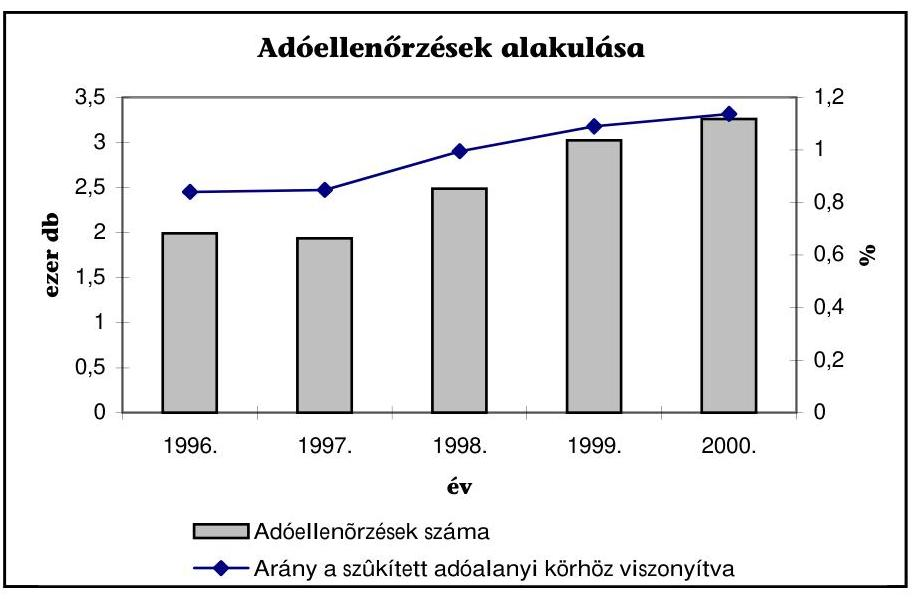

Az adóellenőrzések elmaradása, illetve alacsony aránya elsősorban a következő okokra vezethető vissza:

- Hiányzik az adóellenőrzések szükségességének, szempontjainak és szabályainak helyi meghatározása. Az adózás rendjéről szóló törvény 53. § (3) bekezdése szerint az ellenőrzés szükségességét, gyakoriságát - a kötelező eseteket kivéve - a célszerűség és a költségkímélés figyelembevételével az adóhatóság vezetője határozza meg. A vizsgált adóhatóságok közül az adókötelezettség ellenőrzésének helyi szükségességét, szempontjait és szabályait írásban rögzítők aránya alig több mint 5%, az éves adóellenőrzési ütemtervet készítőké csupán 20% volt.

Vonatkozó írásos intézkedést, illetve éves feladattervet a vizsgált községeknél, nagyközségeknél lényegében nem, a városok és a budapesti kerületek egyötödénél találtak a helyszíni vizsgálatok. Az ellenőrzött öt megyei jogú városból háromnál és a fővárosnál álltak rendelkezésre vonatkozó dokumentumok.

- Elégségesnek tartják (hiszen egyetlen ellenőrzést sem végeztek) az egyeztetéseket, el kívánják kerülni a helyi önkormányzat költségvetéséhez jelentősen hozzájárulók „zaklatását”.
- Hiányos a belső munkaerő-kapacitás, létszám és szakmai felkészültség.

A községekben és a kisebb városokban az alacsony ügyintézői létszám mellett nem marad idő helyszíni adóellenőrzési feladatokra. A szakmai képzettség áttekintése viszont azt is visszaigazolta, hogy a legjelentősebb adónemben történő, illetve eleve a vállalkozói kört érintő ellenőrzéseknek alapvető gátja a könyvvezetési ismeretek hiánya. A mérlegképes könyvelői végzettségű ügyintézőknek sincs kellő gyakorlata ahhoz, hogy adószakértőket, könyvvizsgálókat is alkalmazó társaságokat is ellenőrizzenek. A nagyobb települések (megyei jogú városok, kerületek, főváros) adóhatóságainál külön szervezeti egységet, vagy belső revizori létszámot biztosítottak, de sokkal inkább a lehetőség, mint az ellenőrzési szükséglet figyelembe vételével.

- A külső szakértők igénybevétele viszonylag szűk körben fordul elő.

Pápa város adóhatóságánál az Art. 58. § (3) bekezdésében biztosított lehetőség alapján könyvvizsgáló céget vontak be szerződésben tisztázott feltételekkel az iparűzési adózók ellenőrzésébe. Közel hasonló megoldással külső szakértőt vett igénybe ellenőrzéséhez Tata város adóhatósága is.

Csopak község és Balatonfűzfő város adóhatósága is megbízással foglalkoztat ellenőrt az idegenforgalmi adót beszedők vendégkönyveinek felülvizsgálatára. A községi adóhatóság által kötött szerződést az adótitokra vonatkozó szabályok hiánya és az ellenőrzések idejének Art. 56. § (1) bekezdésével ellentétes rögzítése miatt kifogásolta a számvevőszéki vizsgálat.

Martfű város adóhatósága egy Kft-t bízott meg adóellenőrzéssel, abban adóigazgatási dolgozó nem vett részt és az ellenőrzött által alá nem írt jegyzőkönyv alapján történt határozathozatal.

- Az együttműködésében rejlő lehetőségek kihasználtsága alacsony. A vállalkozások adóztatása az állami és a helyi adóhatóságoknak is feladata, így az együttműködésük az adóztatás gazdaságosságát, hatékonyságát és eredményességét is alapvetően befolyásolja. A kapcsolatot - néhány konkrét adózóra irányuló információkérésen, megkeresésen túl - az jelentette, hogy a jegyzők listákat kértek az APEH-től a vállalkozói körnek és az adóalapoknak a helyi nyilvántartásokkal, bevallásokkal való összevetéséhez. Csak két nagyobb helyi adóhatóság esetében fordult elő, hogy ennél jóval szélesebb körű együttműködésben állapodtak meg, de a megvalósítás gyakorlata ezen esetekben is szűkebb volt a tervezettnél, az együttes adóellenőrzések terén nem sikerült előbbre lépni.

Salgótarján önkormányzatának és az APEH megyei szervezetének vezetői 1996. áprilisában - az erről készült emlékeztető tanúsága szerint - többek között a gyors és rugalmas információcserében, a feketegazdaság elleni és az adókötelezettségüket nem teljesítőkkel szembeni fellépésekben, adóellenőrzési kapcsolatokban, vállalkozó adóalanyok és önkormányzat közötti szerződéses kapcsolatok egyes követelményeiben állapodtak meg. A kapcsolattartás és információcsere alapvetően folyamatos volt, de pl. a közös ellenőrzéseket nem sikerült a szándékok szerint szélesíteni.

A fővárosban a főpolgármester és az APEH elnöke által 1995-ben aláírt megállapodásban számos együttműködési formát rögzítettek (pl. a rendszeres és eseti információcserék, az együttes vizsgálatok és azok módszereinek kidolgozása, együttműködés tapasztalatainak legalább évenkénti értékelése). Ezzel ellentétben utoljára 1996. évben történtek egyeztetések a törzsadat-állomány tekintetében, a kapcsolat egyirányúvá vált az önkormányzat részéről és csak az egyes adózókkal kapcsolatos információk kérésére korlátozódott.

A vizsgált önkormányzatok az adóhatósági feladatok ellátására, vagy az adóellenőrzés, behajtási munka közös végzésére igazgatási társulás alakításának lehetőségével nem éltek. A helyi adóhatóságok ellenőrzési együttműködésére is alig akadt célszerű példa.

Egy rétsági Kft-nél a bánki, rétsági és tolmácsi adóhatóságok együttes ellenőrzést tartottak 1995-1998. évekre, az iparűzési és építményadóra. Az ellenőrzés 1.370,3 E Ft adóhiányt tárt fel.

A vállalkozó adóalany felszámolása (végelszámolása) esetén kötelező adóellenőrzések nagyrészt elmaradtak, részben a szükséges céginformációk hiánya miatt, részben pedig a helyi adóellenőrzés egészére kiható okok miatt.

Az érintett önkormányzatok háromnegyedénél a helyszíni vizsgálatok megállapítása az volt, hogy a hitelezői igény bejelentése történt csak meg, vagy a kötelező ellenőrzések szükségessége, száma és végrehajtása nem volt dokumentumokkal teljes körűen igazolható.

A számítógépes nyilvántartási rendszerek elvileg lehetőséget biztosítanak arra, hogy az adóalany vállalkozás felszámolásának ténye rögzítésre kerüljön. Ez a cég- és csődinformációk folyamatos figyelemmel kísérését követeli meg, ami viszont rendre elmarad, vagy hiányos azon adóhatóságoknál, amelyeknél nincs erre célszerű szervezeti, vagy munkaszervezési megoldás (pl. adórevizor(ok), behajtó(k) feladatkörébe építve). A szükséges információkhoz való hozzáférés feltételeit a községek mellett a városok egy részében sem teremtették meg.

Martfű város adóhatóságánál a megszűnő vállalkozásokról, felszámolási eljárásokról nincs teljes körű és folyamatos információ, a Cégközlönyt sem járatják.

Nyergesújfalu város adóhatóságának dolgozói a cégközlöny és a csődértesítő figyelemmel kísérésének hiányában csak főként hallott információkra támaszkodtak.

A naprakész céginformációk hiánya miatt az indokolt adóellenőrzéseknek, továbbá a hitelezői igények bejelentésének az elmaradása bevételkiesést jelent és hátraléknövekedéssel jár. Ennek pontos nagyságrendje azonban - éppen az adóhatóságok hiányos nyilvántartásai miatt - nem számszerűsíthető.

A vizsgált körben nem akadt arra példa, hogy a helyi képviselő-testület - még ha egyes napirendek kapcsán szóba is került - határozatban rendelte volna el konkrét adózó ellenőrzését.

# 3.4. A jogkövetkezmények alkalmazása 

A helyi adóhatóságok az Art. alapján - adóigazgatási eljárás keretében - az adókötelezettséget érintő felróható hiányosság, hiba miatt az adózók felé fizetési kötelezettséggel járó jogkövetkezményeket állapíthatnak meg.

Országos szinten 2000. évben a késedelmi pótlék és bírság előírása együttesen 4,7 milliárd Ft (2%) volt az adózók helyesbített folyó évi előírásán belül. Ennek háromnegyede az esedékesség napjától lényegében automatikusan számított pótlék, a fennmaradó egynegyed rész a bírság volt. A befizetések csaknem háromnegyede a vizsgált adóhatóságoknál folyt be.
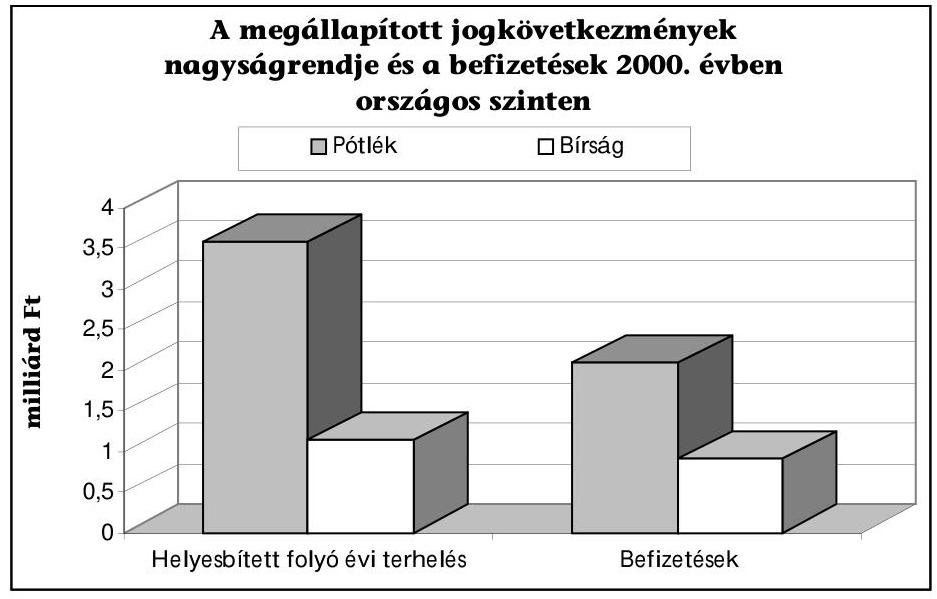

Elsősorban a számítógépes késedelmi pótlékszámítás és az adatgyűjtés, egyeztetés alapján indultak jogkövetkezményt megállapító adóigazgatási eljárások, a jogkövetkezmények töredékét alapozta csak meg dokumentált adóellenőrzés.

Az Art. jogkövetkezményekre vonatkozó előírásainak alkalmazása nem egységes, a késedelmi pótlékon túli szankcionálás nem kellően szigorú, illetve következetes. A szabályok nem teljes körű ismerete, illetve a túlzott engedékenység, a konfliktusok elkerülésének, vagy legalább a töketartozás befizetése elérésének szándéka miatt minden harmadik vizsgált településnél a szükséges szankciók maradtak el, vagy az adóhatóság túlzottan méltányosan, vagy az előírtnál szűkebb körűen alkalmazta a szankciót.

Hahót község adóhatósága nem vizsgálta, hogy az arra kötelezettek eleget tettek-e év végi (december 20-i) feltöltési kötelezettségüknek az iparűzési adó előlegénél.

Anarcs község adóhatósága a gépjármű adatok BM-listával való összevetése során mutatkozó eltérések ügyfeleit felszólította, de az arra sem reagálók esetén a tisztázás, az adóztatás, a szankcionálás is elmaradt.

Hort és Akasztó község adóhatóságánál, hogy adóbevallást késedelmesen, 30 napon túl adta be az adózó, de a mulasztás nem járt bírságolással.

Békésszentandrás nagyközség adóhatóságának figyelmét a közigazgatási hivatal is felhívta az Art. szerinti szankciók alkalmazására, ennek ellenére azt továbbra is elmulasztja.

Fadd nagyközség adóhatósága az adókötelezettség késedelmes teljesítését mulasztási
 bírsággal csak 1999. évtől szankcionálta. Nagydobos község adóhatósága a bevallásokat csak 1999. évtől érkezteti, azt megelőzően késedelem esetén a mulasztást és az ahhoz kapcsolódó bírságot nem állapította meg.

Tamási, Lőrinci város és a X. kerület adóhatósága ugyan több évben is adóhiányt állapított meg, azonban a törvényben meghatározott jogkövetkezményeket nem alkalmazta.

# 3.5. A hátralékok behajtása, végrehajtása érdekében tett intézkedések 

A helyi adók bruttó hátraléka a vizsgált adóhatóságok nyilvántartásai szerint az 1996. évi 15,7 milliárd Ft-ról 21,4 milliárd Ft-ra nőtt 2000. évben.

Az adóhátralék összegszerű növekedése több tényező együttes hatására az ellenőrzött önkormányzatok 85%-ánál volt jellemző. A bruttó hátralék aránya a helyesbített tartozáshoz viszonyítva összességében csökkent (ezen belül azonban a városokban, nagyközségekben és községekben nőtt), település típusonkénti alakulását az alábbi diagram szemlélteti.
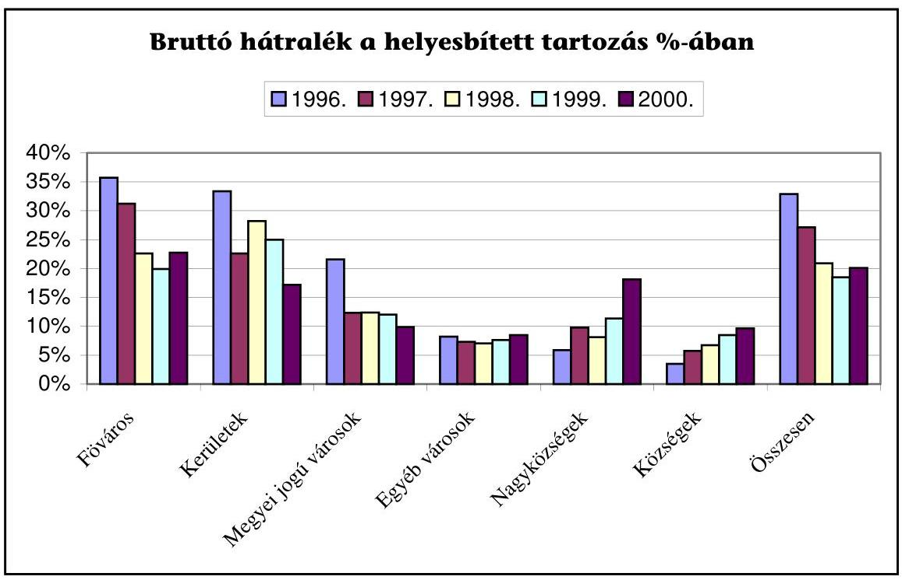

---

A hátralék alakulásában az adózói morál romlása is szerepet játszott, a hátralékos adózók - különösen az új adóalanyok - a megnövekedett adóterheket nem tudták, vagy nem akarták teljesíteni. A hátralék nagyságát befolyásolták az adóhatóságok behajtási és végrehajtási intézkedései
és a felszámolás és végelszámolás alatt álló gazdasági társaságok felé fennálló követelések összege.

A III. kerületben az építményadó 24,8%-át egyetlen cég adóssága tette ki, amely ellen felszámolási eljárás van folyamatban és a tartozás behajtásának esélyei annak ellenére csekélyek, hogy az önkormányzat adóhatósága igényét időben és megfelelő összegben benyújtotta.

A bankszámlával rendelkező hátralékossal szemben azonnali beszedési megbízást nyújthat be az adóhatóság. A vizsgált években a benyújtott inkasszók száma több mint ötszörösére, az érintett adó hátralék háromszorosára növekedett. Ennek ellenére az inkasszó alkalmazásának eredményessége nagyon változó képet mutatott a vizsgált körben.

Nagykállóban inkasszó kiadására évente 100-200 esetben került sor, azonban az ebből származó bevétel viszonylag kevés volt, mert a vállalkozások bankszámláin általában nem volt fedezet. Székesfehérvárott az alkalmazott beszedési megbízások eredményessége 50% körül alakult.

A bankszámlával nem rendelkező magánszemélyek köztartozása a munkabérükből tiltható le. Az adóhatóságok ezt a törvény biztosította lehetőséget a „kis" összeg miatt nem ítélték gazdaságosnak, ezért a behajtástól eltekintettek.

Az adóhatóságok közel 20%-a kezdeményezett - a fizetési hajlandóságot nem mutató és (vagy) a részletfizetési megállapodást felbontó adóalanyok esetében - ingó és ingatlan végrehajtást, amelynek száma a vizsgált időszakban kilencszeresére emelkedett. A szabályos meghirdetés és árverés időpontjáig lefoglalt ingóságok esetében tárolási és őrzési feladatok hárulnak az adóhatóságra, az ingóságok értékesítéséből befolyt összeg az esetek 90%-ában az adóhátralék összegét sem fedezi.

Pápa városban a helyi adóhatóság 972400 ezer Ft adótartozás miatt ingó lefoglalást kezdeményezett. Egy gazdasági társaság raktárában 17 új bútor garnitúrát foglaltak le 1021 ezer Ft+ÁFA összegben. Az értékesítésre meghirdetett és szabályszerűen lefolytatott árverésen azonban csak 387 ezer forint folyt be az adótartozás kiegyenlítésére.

A gépjárműadó hátralék nagysága a vizsgált önkormányzatoknál a bruttó adóhátraléknak az egyes vizsgált években 6,4-9%-át tette ki, amely magába foglalta a központi költségvetést megillető hányadot is. A gépjármű adóról szóló 1991. évi LXXXII. törvény 9.§ (3) bekezdése alapján amennyiben az adóalany tartozása az egy évi adótételt meghaladja, az adóhatóság kezdeményezheti a gépjármű forgalomból való kivonását.

Pápa városában a vizsgált időszakban 266 esetben kezdeményezték a

---

gépjárművek forgalomból való kivonását, amelyet minden esetben azonnali befizetés követett. Az adóhatóság határozott fellépése és a rendszeres ellenőrzések az előfordulások évenkénti számának csökkenését eredményezték.

A III. kerületben a gépjárműadó hátralék a vizsgált években a duplájára emelkedett. Ennek ellenére egyetlen gépjármű esetében sem kezdeményezték a forgalomból való kivonást.

Budapesten a taxis vállalkozók adóhátralékának csökkentése érdekében az adóhatóság a Fővárosi Kereskedelmi és Ipar Kamaránál kezdeményezte a vállalkozói engedélyek bevonását. Az eljárás hatékonyságát mutatja, hogy a vállalkozók minden esetben a határozat jogerőre emelkedése előtt készpénzben vagy csekken befizették tartozásukat.

A vizsgált körben jellemzően a megyei jogú városok és a nagyobb települések adóhatóságai hoztak létre külön behajtással foglalkozó csoportot. A legnagyobb létszámot (14 fő) a Fővárosi Önkormányzat foglalkoztatja, míg a városokban, kerületekben jellemzően néhány fővel látják el ezt a feladatot. A végrehajtási tevékenység maradéktalan ellátását mindenhol a behajtással foglalkozók hiánya nehezítette.

Behajthatatlan tartozások törlésére évente a vizsgált adóhatóságok 25-30%-ánál felszámolási eljárásokat követően - a hitelezői veszteség, illetve a vállalkozások cégbírósági törlése miatt - került sor.

A vizsgált időszakban az érintett körben törölt adótartozások 44 millió Ft-ról 1.064 millió Ft-ra, közel 25-szeresére növekedtek. Ennek 85-90%-át 1999. és 2000. évben a fővárosban alkalmazott törlés okozta.

A fővárosban a behajtási alosztály 1998. évben kezdte meg a befejeződött felszámolási eljárások miatt be nem hajtható követelés állományának törlését azoknál a társaságoknál, ahol a hitelezők követelésének kielégítésére nem állt fedezet rendelkezésre. Ennek következtében a törölt hátralék 1998/1996 viszonylatában a kilencszeresére nőtt, majd 2000/1998 éveket összehasonlítva ennek további kétszeresére emelkedett. A hátralékok törlését megelőzően egyeztették a folyószámlát, majd arról feljegyzést készítve - mellékelve a törlési javaslatot alátámasztó okmányokat - az ügyosztályvezető ideiglenesen törölte a hátralékot.

A felszámolás alatt álló adóalanyok esetében egy fővárosi kerület az adóhátralék behajtása érdekében egyedi megoldást alkalmazott.

A XIV. kerületben a felszámolás alatt álló gazdasági társaságokkal szemben fennálló követelés állományának egy részét engedményezte. Az engedményezés két lépcsőben történt. Első alkalommal - pályázat útján - 46881970 Ft tartozást vásárolt meg a pályázat nyertese 3100000 Ft-ért. A második pályázat során 63803301 Ft tartozást adott el az önkormányzat 4482886 Ft-ért. Az engedményezések útján az önkormányzat követeléseinek 7%-át tudta realizálni.

A helyi adó befizetése érdekében az adóhatóság eltekinthet a késedelmi pótlék alkalmazásától, és a hátralék megfizetésére részletfizetési lehetőséget biztosíthat az adóalanynak.

A X. kerületben az adóhatóság egy részvénytársaságnak az 1997. év óta fennálló 6 millió Ft tartozását törölte azzal, hogy a fennmaradó 35,8 millió Ft adót 6 hónapon belül befizetik. Szintén ebben a kerületben egy másik vállalkozás esetében 8,9 millió Ft elengedése történt meg azzal a feltétellel, hogy a 11,7 millió Ft-os hátralékát 8 napon belül befizeti.

Az ügyészségek 433 települési önkormányzat adóhatóságának adóbehajtási, jogalkalmazási tevékenységének törvényességét ellenőrizték, amely alapján 179 óvást nyújtottak be a törvénysértő és megalapozatlan határozatok ellen, továbbá két fegyelmi eljárást kezdeményeztek az adóbevallások elbírálásának és a hátralékosokkal szembeni végrehajtási intézkedéseknek az elmaradása, valamint az ügyintézési késedelmek miatt.

Komárom-Esztergom megyében a főügyészség által végzett vizsgálat megállapításaira reagálva a hivatalvezető megállapította, hogy a településeken az adóvégrehajtást a pénzintézetek és a munkáltatók csekély eredményességgel végzik, ugyanakkor az adóhatóság a részére biztosított törvény adta lehetőségeket nem használja ki. A helyi adók meg nem fizetése semmilyen jogkövetkezményt nem von maga után, amelynek következménye az adózási morál folyamatos romlása.

# 4. A KÖZIGAZGATÁSI HIVATALOK SZEREPE A HELYI ADÓZTATÁS TÖRVÉNYESSÉGÉNEK ELLENŐRZÉSÉBEN 

### 4.1. A helyi adórendeletek törvényességi ellenőrzése

A helyi önkormányzatokról szóló törvény alapján a Fővárosi Közigazgatási Hivatal és a megyei közigazgatási hivatalok látják el a helyi önkormányzatok törvényességi ellenőrzését. Egyrészt vizsgálják, hogy az önkormányzati döntések (ezen belül az önkormányzati adórendeletek) megfelelnek-e a jogszabályoknak, másrészt feladat- és hatáskörükbe tartozó ügyekben az önkormányzatok kérésére szakmai segítséget nyújtanak.

A közigazgatási hivatalok bírálják el a helyi adóval kapcsolatos hatósági ügyekben a jogorvoslati kérelmeket, felettes szervként ellenőrzik az önkormányzati adóhatóság adóztatással kapcsolatos tevékenységét.

A fővárosi és a megyei közigazgatási hivatalok szervezeti és működési szabályzata a törvényességi ellenőrzéssel és a hatósági ügyekkel és ellenőrzéssel kapcsolatos feladatokra két külön szervezeti egységet jelöl meg (törvényességi ellenőrzési, illetve hatósági főosztály). A törvényesség ellenőrzését területfelelősi rendszerben végzik, általában külön adóügyi szakreferens nincs.

Egy-egy ügyintézőre eltérő számú település törvényességi ellenőrzése jut (pl. Szolnok megyében 16-18, Veszprém megyében 30-40 település tartozik egy-egy területi referenshez). A fővárosban emellett az ágazati feladatok végrehajtása érdekében témánként felelősöket jelöltek ki, akik a munkakörükhöz kapcsolódóan látják el a szakterület gondozását, amelyről félévente elemzéseket készítettek és javaslatokat tettek az adott terület és tevékenység korszerűsítésére.

Az önkormányzati rendeletalkotás törvényességének biztosításában az utólagos törvényességi ellenőrzés mellett a szakmai segítségnyújtás különböző módszerei is meghatározó szerepet játszanak. A közigazgatási hivatalokat az ellenőrzés módszereinek kialakításában a jogszabály nem korlátozza, csak az informális szakmai egyeztetés eredménytelensége esetére

---

tartalmaz kötelező eljárási szabályt.
Súlyosabb szabálysértés, vagy a szóbeli észrevétel eredménytelensége esetén a hivatalvezető által kiadmányozott észrevételben a képviselő-testület felé jelezték a törvénysértést és felhívták a testületet annak megszüntetésére. A fővárosban és az érintett 14 megyében a vizsgált években több mint 10 ezer (többnyire már hatályos adórendeletet módosító) adórendeletet alkottak a képviselő-testületek, amelyek 6%-ában (605 esetben) tettek törvényességi észrevételt a közigazgatási hivatalok.

Szolnok megyében a vizsgált években a helyi önkormányzatok 524 adórendeletére 260 észrevételt tett a közigazgatási hivatal.

A Bács-Kiskun Megyei Közigazgatási Hivatal a hozzá beérkező 681 helyi adórendeletre csupán 16 észrevételt tett.

A törvényességi ellenőrzési főosztályok a vizsgált közigazgatási hivatalok felénél a hatósági osztályok munkatársainak adják át szakmai véleményezésre a beérkezett helyi adó rendeleteket és az önkormányzatok egyötöde a képviselő testület ülésére készült előterjesztéseket is megküldte a hivatalnak előzetes törvényességi vizsgálatra. Így lehetőség nyílott arra, hogy az esetleges törvénysértéseket kiszűrjék és korrigált rendelet-tervezet kerüljön elfogadásra.

A nagy számú (évente 35-39 ezer) önkormányzati rendelet törvényességi ellenőrzése során a közigazgatási hivatalok kialakították a szóbeli észrevétel módszerét, amelynek jogszabályi alapja nincs, azonban tilalma sem lelhető fel a jelenlegi szabályozásban. A kisebb jogsértések kiigazítására a szóbeli észrevételt, a felhívást megelőző egyeztetést a jegyzővel a hivatalok a megelőzés és segítségnyújtás fontosságára hivatkozva az adórendeletek esetében is széles körben alkalmazzák.

Békés megyében a vizsgált években a közigazgatási hivatal az adórendeletekben előforduló törvénysértés észlelése esetén először szóban tett észrevételt, amely elegendőnek bizonyult, így helyi adórendelettel kapcsolatban sem írásbeli törvényességi észrevétel kiadására, sem Alkotmánybíróság által történő felülvizsgálat kezdeményezésére nem került sor.

A Veszprém Megyei Közigazgatási Hivatal a törvényességi ellenőrzés keretében előtérbe helyezte a szóbeli észrevételeket, amelynek során a jegyzőkkel történő előzetes szakmai konzultációra, az előforduló törvényességi észrevételek szóbeli megbeszélés alapján történő rendezésére helyezték a hangsúlyt, s 30 napon belül kérik a jogszerű állapot helyreállítását.

A hivatalok a helyi jogalkotás és jogalkalmazás elősegítése érdekében szakmai körlevelekben, jegyzői értekezleteken hívják fel a figyelmet a jogszabályokban bekövetkezett változásokra, a helyi jogalkotásban tapasztalható törvénysértésekre.

Csongrád megyében a hivatal jegyzői fórumokon rendszeres tájékoztatást adott a rendelet alkotási kötelezettségekről és a központi szabályozás következtében szükségessé vált helyi rendeletek módosításáról.

Komárom-Esztergom megyében a törvényességi főosztály témavizsgálat kereté-

---

ben újra egyeztette és bekérte a hatályos helyi adórendeleteket, amely alapján ezek törvényességi felülvizsgálatára ismételten sor került.

Tolna megyében a törvényességi ellenőrzés tapasztalatairól a Kistérségi Értekezleteken adtak tájékoztatást. Fejér megyében a jogszabály változásokról az egységes jogértelmezés és a jogalkalmazás érdekében jegyzői szakmai körleveleket adtak ki.

A hivatalok által tett leggyakoribb törvényességi észrevételek között található a jogalkotásról szóló törvény jogszabály szerkesztési hiányosságokra visszavezethető megsértése, az adóalanyok, adótárgyak pontatlan meghatározása, az adómentességek szabálytalan megállapítása, a jegyző hatáskörének jogellenes korlátozása, az adóteher évközbeni súlyosbítása tilalmának figyelmen kívül
 hagyása.

A helyi adórendeletek színvonalát a jegyző felkészültsége, igényessége nagymértékben befolyásolta.

Nógrád megyében meghatározott önkormányzati körben még mindig gyakorlat, hogy a rendeleteket „minta" alapján „másolással" készítik el, ezáltal a helyi sajátosságok háttérbe szorulnak.

Tolna megyében a rendeletekkel kapcsolatos törvénysértések jellemzően (80%ban) kistelepülésen fordultak elő.

A vizsgált közigazgatási hivatalok a helyi adórendeletek törvénysértő rendelkezései miatt 13 esetben kezdeményezték az Alkotmánybíróságnál az önkormányzati rendeletek felülvizsgálatát. Az Alkotmánybíróság négy esetben megsemmisítette a rendeletet, három alkalommal elutasította a beadványt, a többi esetben folyamatban van az eljárás.

A közigazgatási hivatalok helyi adókkal kapcsolatos törvényességi ellenőrzését, valamint az önkormányzatok helyi adó rendeleteinek törvényességét az ügyészségek 2000. évben valamennyi megyében vizsgálták. A helyi adót bevezető önkormányzati rendeleteket különböző okok miatt megkifogásolták. A jogszabálysértések jellemző okai a Legfőbb Ügyészség összefoglaló jelentése szerint:

- A helyi adó rendelet alkotásnál követett ún. vegyes jogszabály szerkesztési gyakorlat homályos, megtévesztő és félrevezető. (A helyi rendeletalkotásnál a törvény szövegét részben átveszik, részben csak utalnak annak rendelkezéseire, törvénymódosítást követően nem vezetik át a helyi rendeleten a normaszöveg változását.)
- A törvény előírásaitól eltérően rendezték a hatásköri kérdéseket (pl. jegyzötől megvonták a méltányossági jog gyakorlásának jogát).
- Megsértették a kettős adóztatás tilalmára vonatkozó előírásokat, azonos adótárgy esetében (pl. építmény) két különböző adónem bevezetéséről döntöttek.
- Az adórendelet évközbeni módosítása során nem vették figyelembe, hogy az

---

naptári éven belül nem súlyosbíthatja az adóalanyok terheit.
Az ügyészségek a helyi adó rendeletek jogszabálysértő rendelkezései miatt a közigazgatási hivatalok vezetőinél 12 esetben törvényességi ellenőrzést kezdeményeztek, illetve jelzéssel éltek az önkormányzatok felé.

# 4.2. A másodfokú adóhatósági feladatok ellátása 

A hivatalokban a másodfokú adóhatósági feladatokat a hatósági (fő)osztályok látják el. A megyék nagyságától függően határozták meg az adóügyekkel foglalkozók létszámát, illetve a belső szabályozástól függően alakították ki a konkrét munkaköri feladatokat. Ügyintézési késedelmet okozott, ha az adóügyi létszám nem állt összhangban a beérkezett és feldolgozásra váró ügyiratok számával.

A Fővárosi Közigazgatási Hivatalban a vizsgálat megkezdésekor az adóügyi ügyintézői létszám csak részben volt betöltve. Míg 1999. évben 243 adóügy indult, amelyből 160 db-ot dolgozott fel az átlagosan két fő ügyintéző, addig 2000. évben az egy főre redukálódott létszám a 174 beérkezett ügyiratból csak 30 db-ot.

A hivatalok jogorvoslati körben hozott határozatainak száma eltérést mutatott a különböző években attól függően, hogy az önkormányzatok milyen ütemben vezették be a helyi adókat, és a már bevezetett adók kapcsán milyen tapasztalatokat szereztek és azokat hogyan hasznosították a jogalkalmazásban.

A vizsgált adónemek közül a helyi iparűzési adó megállapítása ellen éltek legtöbben jogorvoslati kérelemmel. Ezt az adónemet vezették be a legtöbb településen és összegszerűen is ez a legmagasabb bevételi forrás. Az adó megállapításának módszere itt a legösszetettebb, ebből adódóan itt merül fel a legtöbb értelmezési gond is.

A másodfokú döntéshozatalt hátráltatta, ha az adóalanyok fellebbezése nem tartalmazta az első fokú adóhatóság véleményezett javaslatát. További problémát jelentett, hogy az adóalanyok a Hivatalhoz nyújtották be a fellebbezésüket, így szükségessé vált az önkormányzati adóhatóság javaslatának pótlólagos beszerzése, amely az ügyintézési idő meghosszabbodását eredményezte.

A hivatalok a határozatok megsemmisítését és az új eljárásra utasítást a helyi adóhatóságok téves jogszabály értelmezése, vagy rossz törvényi hivatkozása miatt kezdeményezték.

Az adózók nagy száma és az alacsony adóügyintézői létszám miatt az első fokú határozatokat „sablonosan" készítik el, így azok nem, vagy nem megfelelő indoklást tartalmaznak a konkrét tényállásra vonatkozóan és nélkülözik a teljes bizonyítást.

A hivatalok másodfokú határozatainak felülvizsgálatára a törvény lehetőséget biztosít, amely alapján az érintettek közigazgatási pert kezdeményezhetnek a bíróságon. A hivatalok határozatai ellen a vizsgált időszakban 143 esetben nyújtottak be keresetet a bíróságon. A viták kialakulásának

---

legfőbb oka a jogértelmezésből származó bizonytalanságok.
Az iparűzési adóalanyisággal kapcsolatos határozatokkal szemben Csongrád megyében benyújtott keresetek alapján indult perekkel összefüggésben a Legfelsőbb Bíróság 4/1999. számú jogegységi határozatában kimondta az ügyvédek és ügyvédi irodák iparűzési adóalanyiságát.

Veszprém megyében a másodfokú határozatok ellen - többek között - a helyi iparűzési adó ügyekben nyújtottak be keresetet a több telephellyel rendelkező vállalkozók a nettó árbevétel megosztása miatt.

A közigazgatási hivatalok hatósági (fő)osztályai jóváhagyott ellenőrzési ütemterv alapján folytatják az önkormányzati adóhatósági munkát érintő vizsgálataikat. Az ellenőrzések száma a települések számához viszonyítva nagyon változó képet mutat.

Baranya, Zala, Jász-Nagykun-Szolnok megyékben volt a legalacsonyabb 11,6%, 10,8%, illetve 8,9%. A legtöbb ellenőrzést Szabolcs megyében végezték el (88), míg Heves, Bács-Kiskun, és Nógrád megyékben ez a szám elérte, illetve meghaladta a 30%-ot.

Az aránytalanságok összefüggnek a hivatalok eltérő adóügyi ügyintézői létszámával, valamint a fluktuáció miatti átmeneti létszámhiánnyal. A hivatalok éves ellenőrzési ütemterveiben betervezett ellenőrzések csak részben valósultak meg.

Budapesten a vizsgálatok csúszása miatt a kijelölt kerületek ellenőrzését a következő évekre kellett átütemezni. Pest és Zala megyékben 1996. évben és 1997. évben létszámhiány miatt nem végeztek helyszíni vizsgálatot a hivatalok.

Az önkormányzatok adóhatósági ellenőrzése komplex, cél-, illetve témavizsgálatok keretében valósult meg. Az ellenőrzések színvonala és dokumentáltsága az egyes megyékben eltérő volt.

Az adóhatóságok ellenőrzésének tapasztalatairól jegyzőkönyvet készítettek, kivéve Pest, Fejér megyéket, ahol feljegyzésekbe foglalták a megállapításokat, amelyben csak a bevezetett helyi adókat, azok mértékét, az adózók számát és a befolyt adóbevételek nagyságát rögzítették.

Tolna megyében a vizsgált években a hatósági főosztály 384 ellenőrzést végzett, azonban ebből mindössze 21 foglalkozott az adóhatóság tevékenységével.

A közigazgatási hivatalok véleménye szerint az első fokú adóhatóságok munkájára jellemző, hogy a benyújtott bevallások adatait ellenőrzés nélkül elfogadják így az adózói nyilatkozatok nem kerülnek kontroll alá, amely hosszú távon az adózási morál romlását eredményezi. Az adóellenőrzések alacsony száma miatt csak a bevallást benyújtókat adóztatják, az adókötelezettséget elmulasztókat nem tárják fel. Konkrét ellenőrzés tapasztalata szerint jelentős adókülönbözet állapítható meg.

Fejér megyében közérdekű bejelentés alapján a Közigazgatási Hivatal felülvizsgálta a megye valamennyi adóhatóságánál a gépjárműadó kivetését, mert a be-

---

jelentés szerint több gépjárműre szándékosan nem vetettek ki adót. A vizsgálat megállapításai alapján a megye adóhatóságai 7.000 gépjármű után 56.000 E Ft adót és 10.000 E Ft mulasztási bírságot pótlólag írtak elő.

A hivatalok évente szakmai napokat, fórumokat szerveztek az adóügyi ügyintézők részére. A továbbképzések fő célja az volt, hogy az adójogszabályok változásait, magyarázatát az érintettek megismerjék és hatékonyan alkalmazzák, és közvetlen kapcsolat alakuljon ki az adóügyi ügyintézők és a hivatalok munkatársai között.

A vizsgált években a Fejér megyei közigazgatási hivatal szervezésében országos szakmai értekezletet tartottak az illetékek mellett a helyi adó témákban is. Az értekezletről készült szakmai anyagot a résztvevő hivatalok részére utólag megküldték. Az általánosítható megállapításokat a negyedévente megjelenő Hírlevélben, Tájékoztatóban tették közre a hivatalok (Budapest, Tolna megye). Külön részben foglalkoztak az adóügyi igazgatással, az adózás és az adóigazgatási eljárás egyes folyamataival, problémáival oly módon, hogy az adott témában megadták a jogszabályi hivatkozásokat és esetekkel illusztrálták.

A Fővárosi Közigazgatási Hivatal az Állami Számvevőszék 1996. évben - a helyi adókkal kapcsolatban - végzett vizsgálatainak tapasztalatait rövidített formában az általa készített Tájékoztatóban adta közre.

# 5. A FŐVÁROSI ÉS A KERÜLETI ÖNKORMÁNYZATOK KÖZÖTTI FORRÁSMEGOSZTÁS 

A helyi adókon belül meghatározó iparűzési adó 44%-a 2000. évben a fővárosban realizálódott és a forrásmegosztás rendszerén belül is jelentős (75%) részarányt képvisel. Ezért az önkormányzatok adóztatási tevékenységének ellenőrzése keretében sor került a forrásmegosztás vizsgálatára is.

A fővárosi önkormányzati rendszer két szintű: a főváros és 23 kerület egyaránt települési önkormányzat, azonban feladat- és hatáskörét tekintve számottevő az eltérés közöttük. Meghatározó szerepe van a Fővárosi Önkormányzatnak a főváros működőképességének biztosítása, a nagyvárosi funkciók, a több kerületet, illetve a főváros területét meghaladó közszolgáltatások szervezésében, ellátásában.

A két szintű önkormányzati rendszer sajátosságai miatt az önkormányzati törvény forrásmegosztásra vonatkozó előírásai szerint a bevételek a ténylegesen gyakorolt feladat- és hatáskör arányában illetik meg a fővárosi, illetve a kerületi önkormányzatokat. A törvény nem határozza meg a bevételek megosztásának módszerét és azt sem, hogy a feladatarányosságot csak a megosztott forrásokra, vagy az önkormányzati bevételek szélesebb körére vonatkozóan kell-e értelmezni. A főváros és a kerületek közötti forrásmegosztást a közöttük évente lezajló alkura bízta a törvényhozó. A forrásmegosztásba bevont kiadások és bevételek köre, számbavételének módja meghatározó a bevételek megosztásában, ezek változását tükrözi az elmúlt évek gyakorlata.

A főváros és a kerületi önkormányzatok forrásai feladatokkal való arányosságának konkrét mértéke jogilag nem határozható meg, az arányosság csak politikai eszközökkel és döntésekkel hozható létre, illetve biztosítható. A Fővárosi Közgyűlés forrásmegosztási rendeletének megalkotásához 1994. évig a kerületek többségének egyetértése volt szükséges. Az önkormányzati törvény 1994. évi módosítása már csak a kerületek véleményének kikérését szabta a rendelet megalkotásának feltételéül, a véleményezés azonban nem köti a döntéshozót. A forrásmegosztással kapcsolatos alkufolyamat időigényét sem veszi figyelembe a véleményezésre biztosított 10 nap.

A forrásmegosztás 1998-2000. években alkalmazott módszerét értékelve megállapítható, hogy a forrásmegosztási rendszerben meglévő bizonytalanságok, az önkormányzati beszámolók esetenkénti pontatlansága, a gazdálkodás során vállalt többlet kötelezettségek és a pénzügyi lehetőségek összhangjának hiánya egyaránt nehezítik a gazdálkodás, a pénzügyi helyzet objektív értékelését.

A fővárosi és kerületi önkormányzatok bevételei a vizsgált években az önkormányzatok összes bevételeit meghaladó mértékben növekedtek, hitelfelvételre átmeneti likviditási gondok megoldása, vagy jelentősebb beruházási programok megvalósítása érdekében kényszerültek. Az önhibáján kívül hátrányos helyzetű önkormányzatok kiegészítő támogatási rendszerét 1999. évtől a Fővárosi Önkormányzat köteles működtetni. A kerületi önkormányzatok 1999-2000. évben a központilag kialakított módszertan alapján működési forráshiányt nem tudtak kimutatni, így kiegészítő támogatásra sem voltak jogosultak.

A fővárosi és a kerületi önkormányzatok eltérő vagyoni, pénzügyi helyzete, az infrastrukturális, ellátási különbségek miatt jelentősek az érdekellentétek, amelyet a forrásmegosztás nem képes kezelni, számottevő a kerületek egy lakosra jutó működési kiadásainak szóródása. (A legalacsonyabb XVIII. kerület és a legmagasabb V. kerület átlaga között 400%-os az eltérés az egy lakosra jutó korrigált működési kiadásokban.)

A fővárosi fejlesztések nagyobb hányadát a több kerületet érintő nagy programok (közlekedésfejlesztés, szennyvíztisztítás stb.) alkotják, kisebb része a kerületek és egyes feladatok támogatásán keresztül befolyásolja a városfejlesztést. A Fővárosi Közgyűlés a forrásmegosztásban tapasztalt problémák kezelésére, és egyes kiemelt célok támogatására az iparűzési adó terhére a forrásmegosztást megelőzően több alapot hozott létre, a törvényben kapott felhatalmazás alapján céltámogatási rendszert vezetett be (pl. szennyvízcsatorna hálózat, szociális ellátások fejlesztésére; iskolatej ellátásra; a közbiztonság megerősítésére). A forrásmegosztás keretében elkülönített alapok a 2000. évben meghaladták az 5 milliárd Ft-ot.

A kerületek infrastruktúrájában (csatornázottság, szilárd burkolatú utak kiépítettsége stb.) mutatkozó hiányok felszámolásához a fővárosi céltámogatási rendszerben rendelkezésre álló források az elmúlt években nem bizonyultak elégségesnek. Saját forrásaiból is létesített a Fővárosi Önkormányzat kötött felhasználási célú keretet (pl. a városrehabilitáció, az önkormányzati és a társasházak felújításának támogatására).

A közgyűlés rendelete szerint a kerületekhez szabályozott iparűzési adóból a 2001. évben elkülönített cél- és címzett támogatások
 (7.250 M Ft) közül - a Korrekciós Alap, a vagyonfelmérési célkeret és a szennyvízcsatornázás fővárosi céltámogatási keretéből áthúzódó kötelezettségek fedezete kivételével - csak az működtethető, amelyet a kerületi önkormányzatok többsége támogat, határozatáról 2001. március 31-ig tájékoztatja a főpolgármestert. A kerületek egyetértésének hiányában nem működtethető cél- és kiegészítő támogatásokra elkülönített iparűzési adó a Korrekciós Alapba kerül, és a forrásmegosztás évközi korrekcióját szolgálja.

Az önkormányzati feladat- és hatáskör telepítés nem egyértelműen határolja el az állami (kötelező) és a helyi közügyek körébe tartozó önként vállalt önkormányzati feladatokat. Ennek megfelelően a finanszírozási rendszert az állami feladatok „kiegészítő" jellegű támogatása jellemzi. Az önkormányzatok kötelező feladatai az ágazati törvények megalkotásával az elmúlt években folyamatosan bővültek, amellyel nem állt összhangban a központi források növekedése. Az önkormányzatok egy része (ezen belül egyes kerületi önkormányzatok is) a vagyonértékesítésből származó bevételeit is kénytelen a kötelező feladatok működtetésére felhasználni. Az önkormányzati forrásszabályozásban tapasztalható feszültségeket az Állami Számvevőszék a költségvetési törvényjavaslat véleményezésekor évek óta jelzi.

A fővárosi forrásmegosztás lényegében egy kiegyenlítő mechanizmusként működik. A forrásmegosztási számításokba bevont bevételek és kiadások az elmúlt években mindig tágabb kört jelentettek, mint a törvény szerint megosztandó bevételek, vagy mint a kötelező önkormányzati feladatok.

A vizsgált 1998-1999. évben a kétlépcsős forrásmegosztás keretében:

- Első lépésben az alapfeladatok előző évi tervadatokon alapuló fővárosi szintű normatívával számított működtetési kiadások támogatási igényét határozták meg. Ettől eltérő módszert alkalmaztak az igazgatási és a településüzemeltetési kiadásoknál (eltérő, lakosságszámhoz kötött fővárosi és kerületi normatívákat alkalmazva). A lakásfenntartással összefüggő kiadások, beruházások, felújítások forrásigényét nem tartalmazták a számítások, ennek megfelelően a bevételek sem teljes körűen kerültek fedezetként figyelembe vételre (pl. a kerületek által kivetett és beszedett helyi adó, a vagyonhasznosításból származó és hozamjellegű bevételek). A főváros által meghatározott alapfeladatok átlagnormatívával számított támogatási igényét meghaladta a számításba bevont bevételek összege, ezért azokat a forrásmegosztás során 7-8%-kal emelt normatívákkal vették figyelembe.
- Második lépésben az előző évi beszámoló szerinti, tényleges kiadásokon alapuló fővárosi átlagnormatívával számított támogatási igényt vették figyelembe, és a lakásfenntartással összefüggő kiadásokat is szerepeltették a számításokban. Ennek eredményeként 1998. évben 18 kerület 8.975 M Ft, 1999. évben 19 kerület 11.917 M Ft számított működési forráshiányt mutatott ki, ennek részbeni ellensúlyozását szolgálta a Támogatási Alap 1.200 M Ft-os előirányzata.

A forrásmegosztást kísérő viták miatt 1999. évben a Fővárosi Közgyűlés határozatot fogadott el a forrásmegosztás továbbfejlesztésére. Közel egy éves előkészítés, többszöri egyeztetés után a 2000. évi forrásmegosztást az alábbi főbb változások jellemezték:

- A korábbi tervadatokon alapuló forrásmegosztás helyett az előző évi beszámoló teljesítési adatai ismeretében év közben elvégezték a forrásmegosztás korrekcióját.
- A legtöbbet vitatott igazgatási és a településüzemeltetési kiadásokat új módon vették számításba, ezzel megszűnt a kiadások főváros és kerületek közötti eltérő számbavétele.
- A fejlesztési, felújítási igényekkel és a lakásfenntartás támogatásával is számoltak, ezzel párhuzamosan a bevételek bővebb körét vonták be a forrásmegosztási számításokba.
- A bevételek egy részénél a normativitást igyekeztek érvényesíteni (pl. a helyi adó bevételi előirányzatot alapterület-arányosan felosztották a az adónemet nem alkalmazó kerületekre is).

Az új számításokban a korábbi működési forrástöbbletet a fővárosnál a kismértékű megosztási aránycsökkentés mellett a felhalmozási kiadásoknál mutatkozó deficit finanszírozási igénye elfedte. A kerületek összessége részesedését a megváltozott módszer alapvetően nem érintette, elsősorban kerületek közötti átrendeződést eredményezett.

A főváros és a kerületek közötti forrásmegosztásban 2000. évet megelőzően alkalmazott módszer alapján a feladatok központi hozzájárulással és megosztott forrásokkal való fedezettségében a főváros javára jelentős különbségek mutatkoztak. Néhány feladatnál eltérő számbavételi módszert alkalmaztak: a fővárosnál a tényleges kiadásokat ismerték el, a kerületeknél a tényleges kiadásoktól alacsonyabb normatívával számoltak (pl. igazgatási, településüzemeltetési kiadások).

Az alapfeladatok fedezettsége - saját bevételek intézmények működtetésbe történő bevonását és ellátás-szervezési intézkedéseket is tükrözve - a kerületek között is jelentősen szóródik. Egyes kerületek sérelmezték, hogy a bevételek megosztása nem a feladatok tényleges forrásigénye, nulla bázisú tervezés alapján, hanem egyfajta átlagszámítás figyelembevételével került meghatározásra. Az alapfeladatok tényleges kiadásaiból kiinduló átlagszámítás nem tükrözi a tényleges igényeket, a teljesített kiadásokból nem lehet következtetni a nyújtott ellátások hatékonyságára, gazdaságosságára, amely csak átfogó szakmai és gazdasági ellenőrzés alapján ítélhető meg. A helyszíni ellenőrzések jeleztek több olyan intézkedést (vagy annak elmulasztását), amelyet az önkormányzatok a forrásmegosztás rendszerében kívánnak elismertetni. (Pl. önkormányzati lakások fenntartásának csupán 21%-át fedezte a lakbér 2000. évben, s egyes kerületekben magas a lakóház kezelést végző szervezetek költsége.)

Bár a forrásmegosztás alapvetően a kiadási szükségletek és a bevételek együttes figyelembevételére épül (amilyen mértékben a feladatokat és a bevételeket a számításokba bevonja), az önkormányzatok pénzügyi helyzetét a bevételek mellett ellátás-szervezési, hatékonyságbeli kérdések is meghatározzák. A tényleges kiadások alapján mérni a támogatási igényt több veszélyt rejt magában:

- A tényleges kiadások a helyi preferenciáktól, döntésektől, hatékonyságjavító intézkedések elmaradásától függően eltérhetnek az indokolt szükséglettől.
- A rosszabb pénzügyi helyzetben lévő önkormányzatoknál a tényleges kiadások - pénzügyi szükséghelyzetből adódóan - nem az elvárható működtetési színvonalat, szükségleteket tükrözik.
- A beszámolók készítésénél tapasztalható pontatlanságok miatt állandóan jelen van egy bizonytalansági tényező az elvégzett számítások megbízhatóságát illetően.

Az igazgatási kiadások figyelembevétele a forrásmegosztási számításokban eltérő normatívákon alapult a kerületeknél és a fővárosnál. Míg a kerületeknél alkalmazott normatíva alapján számított és a tényleges igazgatási kiadások között 1998. évben 13.991 M Ft, 1999. évben 9.288 M Ft eltérés (hiány) mutatkozott, addig a Fővárosi Önkormányzat igazgatási kiadásait teljes egészében elismerte a forrásmegosztás rendszere. A korszerűsítés keretében 2000. évtől a tényleges kiadásokból kiinduló, optimális apparátusi létszámmal szorzó egységes fővárosi normatívára és deficitarányos megosztásra tértek át, amely mérsékelte a korábban tapasztalt aránytalanságot.

Ugyanakkor az igazgatási kiadások között a kerületeknél olyan kiadást is elszámoltak, amelyek torzítják a valós igények megítélését (pl. társadalmi szervezetek támogatása, üdültetés, finanszírozási műveletek). A vizsgált években 5,7 milliárd Ft többletkiadással jártak az illetményalap emelésére hozott testületi döntések is.

A helyi adók tekintetében kialakított munkamegosztás alapján az iparűzési és az idegenforgalmi adóval kapcsolatos adóztatási feladatokat a Fővárosi Önkormányzat látja el, a vagyoni típusú és a kommunális adók bevezetésére a kerületi önkormányzatok jogosultak. Az iparűzési adó mértékének és a gazdasági növekedésnek köszönhetően a fővárosban az adónemből realizált bevétel a vizsgált időszakban 24,1 milliárd Ft-tal nőtt. Az összes helyi adó 81-85%-át a Fővárosi Önkormányzat által bevezetett, központilag beszedett rész képezi, az összes adóbevételből 46-52%-ban részesedett a főváros, a többi megosztásra került a kerületek között.

A kerületek által bevezetett építmény- és telekadóban nem egységes az adóztatási gyakorlat, az adómértékben ötszörös az eltérés. A lakosság tulajdonában lévő lakás- és nem lakás céljára szolgáló építményekre a vizsgált kerületek fele mentességet állapított meg.

Összegezve: a forrásmegosztást kísérő viták azoknak a feladatoknak a számításával voltak kapcsolatban, amelyeknél a normativitás nem érvényesült, és a főváros, kerületek kiadásait eltérő módon vették számításba (pl. igazgatási, településüzemeltetési kiadások). További igényként fogalmazódott meg a lakóházfenntartással, a felújításokkal, fejlesztésekkel kapcsolatos szükségletek figyelembe vétele a forrásmegosztás keretében.

A megfogalmazott kritikák alapján megkezdődött a forrásmegosztás korszerűsítése, amelynek főbb elemei 2000. évben megvalósultak. A figyelembe vett működési kiadások köre bővült, a felújítás és fejlesztés is bekerült a számításokba. Ennek során alkalmazott báziselv azonban a külső és belső kerületek eltérő fejlesztési igénye miatt további vitákra adott okot. A felújítási, fejlesztési feladatok és a működtetés szükséglet számításokon alapuló normatív figyelembe vétele képezte a tervezett reform további (2001. és 2002. évi) ütemét. Az eltérő adottságokra, lehetőségekre visszavezethető érdekellentétek, a bevételek megosztására vonatkozó jogi keretek mellett a véleménykülönbség, elégedetlenség a forrásmegosztás természetes velejárója.

Budapest, 2001. július

Dr. Kovács Árpád
elnök

# A helyszíni vizsgálatot végezték 

Baranya megye: Maczekó Károly számvevő tanácsos
Bács-Kiskun megye: Nagy János számvevő tanácsos
Békés megye: Vida László számvevő tanácsos
Csongrád megye: Benkéné Dr. Lavner Klára számvevő tanácsos
Heves megye: Nagy Sándorné számvevő tanácsos
Jász-Nagykun-Szolnok megye:
Csomán Mihály számvevő tanácsos
Komárom-Esztergom megye:
Böröcz Imre számvevő tanácsos
Nógrád megye: Fercsik Gyula számvevő tanácsos
Szabolcs-Szatmár-Bereg megye:
Dr. Szűcs Zoltán számvevő tanácsos
Tolna megye: Kopaczné Horváth Zsuzsanna számvevő
Veszprém megye: Varga József számvevő
Zala megye: Dér Lívia számvevő tanácsos
Főváros és Pest megye:
Szabó Tamás számvevő
Dr. Kőrös István számvevő
Nagy Józsefné számvevő tanácsos
Dr. Kiss Károly számvevő
Marosi Gyöngyi számvevő tanácsos
Vojcsekné Szabó Ágnes számvevő
György Árpád számvevő tanácsos
Borbély Zsuzsanna számvevő tanácsos

# Helyi adóbevételek alakulása a vizsgált időszakban (országos összesen)

|  Megnevezés | 1995. év tény | Megoszlás \% | 1996. év tény | Megoszlás \% | 1997. év tény | Megoszlás \% | 1998. év tény | Megoszlás \% | 1999. év tény | Megoszlás \% | 2000. év előzetes | Megoszlás \% | Növekedés %-a 2000/1995  |
|---|---|---|---|---|---|---|---|---|---|---|---|---|---|---|
|  Építményadó | 4145 | 8,9\% | 8313 | 10,3\% | 10752 | 9,7\% | 13056 | 9,0\% | 16629 | 8,4\% | 21995 | 9,9\% | 530,6\%  |
|  Telekadó | 813 | 1,8\% | 1296 | 1,6\% | 1717 | 1,5\% | 1811 | 1,2\% | 2262 | 1,1\% | 3001 | 1,3\% | 369,1\%  |
|  Magánszemélyek kommunális adója | 747 | 1,6\% | 1492 | 1,9\% | 1980 | 1,8\% | 2698 | 1,9\% | 3422 | 1,7\% | 4423 | 2,0\% | 592,1\%  |
|  Vállalkozók kommunális adója | 1075 | 2,3\% | 1174 | 1,5\% | 1178 | 1,1\% | 1161 | 0,8\% | 1354 | 0,7\% | 1175 | 0,5\% | 109,3\%  |
|  Idegenforgalmi adó tartózkodás után | 768 | 1,7\% | 1505 | 1,9\% | 1878 | 1,7\% | 2147 | 1,5\% | 2396 | 1,2\% | 2717 | 1,2\% | 353,8\%  |
|  Idegenforgalmi adó üdülő (építmény) után | 363 | 0,8\% | 461 | 0,6\% | 524 | 0,5\% | 637 | 0,4\% | 824 | 0,4\% | 866 | 0,4\% | 238,6\%  |
|  Iparűzési adó | 38472 | 82,9\% | 66130 | 82,3\% | 93133 | 83,8\% | 124316 | 85,2\% | 171476 | 86,4\% | 188623 | 84,7\% | 490,3\%  |
|  HELYI ADÓK ÖSSZESEN | 46383 | 100,0\% | 80371 | 100,0\% | 111162 | 100,0\% | 145826 | 100,0\% | 198363 | 100,0\% | 222800 | 100,0\% | 480,3\%  |
|  Belföldi gépjárműadó összesen | 5115 |  | 12522 |  | 13627 |  | 14584 |  | 19780 |  | 22480 |  | 439,5\%  |
|  Ebből: önkormányzatok részesedése | 2472 |  | 7056 |

  | 7910 |  | 8842 |  | 11444 |  | 12444 |  | 503,4\%  |
|  Termőföld bérbeadásból származó SZJA |  |  |  |  |  |  | 125 |  | 1632 |  | 2103 |  | 1682,4\%  |

---

# 2. sz. táblázat

Helyi önkormányzatok bevételeinek változása 1996- 1999. között

|   | 1996. év |  |  | 1999. év |  |  | 1999/1996. \% |  |  | Reálérték változás 1999/1996. |   |
| --- | --- | --- | --- | --- | --- | --- | --- | --- | --- | --- | --- |
|   | Összes bevétel MFt. | Ebből: állami hj.és SZJA | helyi adó | Összes bevétel MFt. | Ebből: állami hj.és SZJA | helyi adó | Összes bevétel MFt. | Ebből: állami hj.és SZJA | helyi adó | Összes bevétel MFt. | Ebből: állami hj.és SZJA  |
|  |   |   |   |   |   |   |   |   |   |   |   |
|  Főváros+kerületek | 245839 | 77779 | 35028 | 388944 | 99971 | 86425 | 158,2 | 128,5 | 246,7 | 106,3 | 86,3  |
|  Megyei jogú városok | 203716 | 83678 | 16354 | 259710 | 111819 | 44181 | 127,5 | 133,6 | 270,2 | 85,6 | 89,7  |
|  Egyéb városok | 239475 | 105178 | 20933 | 368436 | 162731 | 44585 | 153,9 | 154,7 | 213,0 | 103,3 | 103,9  |
|  Községek | 210618 | 125290 | 8499 | 349235 | 204313 | 23171 | 165,8 | 163,1 | 272,6 | 111,4 | 109,5  |
|  Megyei önkormányzatok | 130146 | 36715 | 0 | 202017 | 62539 | 0 | 155,2 | 170,3 |  | 104,2 | 114,4  |
|  Összesen | 1029794 | 428640 | 80814 | 1568342 | 641373 | 198362 | 152,3 | 149,6 | 245,5 | 102,3 | 100,5  |

---

# Helyi adóbevételek alakulása a vizsgált időszakban (vizsgált önkormányzatok összesen)

|  Megnevezés | 1996. év tény | Megoszlás \% | 1997. év tény | Megoszlás \% | 1998. év tény | Megoszlás \% | 1999. év tény | Megoszlás \% | 2000. év előzetes | Megoszlás \% | Növekedés \% a 2000/1996  |
| --- | --- | --- | --- | --- | --- | --- | --- | --- | --- | --- | --- |
|  Építményadó | 2380 | 6,1\% | 3376 | 6,5\% | 4312 | 6,3\% | 5492 | 6,2\% | 6922 | 6,4\% | 290,8\%  |
|  Telekadó | 572 | 1,5\% | 594 | 1,1\% | 813 | 1,2\% | 924 | 1,0\% | 1427 | 1,3\% | 249,5\%  |
|  Magánszemélyek kommunális adója | 159 | 0,4\% | 264 | 0,5\% | 283 | 0,4\% | 372 | 0,4\% | 485 | 0,5\% | 305,0\%  |
|  Vállalkozók kommunális adója | 121 | 0,3\% | 136 | 0,3\% | 152 | 0,2\% | 149 | 0,2\% | 164 | 0,2\% | 135,5\%  |
|  Idegenforgalmi adó tartózkodás után | 580 | 1,5\% | 565 | 1,1\% | 731 | 1,1\% | 723 | 0,8\% | 872 | 0,8\% | 150,3\%  |
|  Idegenforgalmi adó üdülő (építmény) után | 19 | 0,0\% | 21 | 0,0\% | 31 | 0,0\% | 38 | 0,0\% | 49 | 0,0\% | 257,9\%  |
|  Iparüzési adó | 32031 | 82,3\% | 44754 | 86,0\% | 58718 | 86,3\% | 76359 | 86,4\% | 95544 | 88,7\% | 298,3\%  |
|  Birság, pótlék befizetés | 3062 | 7,9\% | 2359 | 4,5\% | 3003 | 4,4\% | 4291 | 4,9\% | 2236 | 2,1\% | 73,0\%  |
|  HELYI ADÓK ÖSSZESEN | 38924 | 100,0\% | 52069 | 100,0\% | 68043 | 100,0\% | 88348 | 100,0\% | 107699 | 100,0\% | 276,7\%  |
|  Belföldi gépjárműadó összesen | 2494 |  | 2754 |  | 3165 |  | 3888 |  | 4063 |  | 162,9\%  |
|  Ebből: önkormányzatok részesedése | 1570 |  | 1823 |  | 2003 |  | 2548 |  | 2733 |  | 174,1\%  |
|  Termőföld bérbeadásból származó SZJA |  |  |  |  | 9 |  | 107 |  | 139 |  | 1544,4\%  |

---

# 4. sz. táblázat

Egy főre jutó helyi adó és a helyi adó bevételek aránya település típusonként

|  Megnevezés | Összesen |  |  |  | Vizsgált önkormányzatoknál |  |  |   |
| --- | --- | --- | --- | --- | --- | --- | --- | --- |
|   | 1996. év |  | 1999. év |  | 1996. év |  | 1999. év |   |
|   | egy főre jutó adó Ft/fő | összes bevétel %-ában | egy főre jutó adó Ft/fő | összes bevétel %-ában | egy főre jutó adó Ft/fő | összes bevétel %-ában | egy főre jutó adó Ft/fő | összes bevétel %-ában  |
|  Főváros+kerületek | 18818 | 14,2 | 48090 | 22,2 | 18974 | 13,6 | 48727 | 20  |
|  Megyei jogú városok | 7880 | 10,8 | 21634 | 17 | 7113 | 7,7 | 21935 | 17,1  |
|  Egyéb városok | 7989 | 8,7 | 18661 | 14,1 | 6486 | 7,3 | 15747 | 12,3  |
|  Községek | 2196 | 4 | 6138 | 6,6 | 7345 | 9,9 | 18287 | 20,2  |
|  Összesen | 8083 | 7,9 | 19205 | 12,7 | 12001 | 12,1 | 31632 | 19  |

---

# 5. sz. táblázat 

Kistérség központok egy főre jutó bevételei és kiadásai az országos átlag %-ában

| Megye | Működési kiadás |  | Felhalmozási kiadás |  | Összes bevétel |  | Ebből:helyi adó |  |
| :--: | :--: | :--: | :--: | :--: | :--: | :--: | :--: | :--: |
|  | 1996. | 1999. | 1996. | 1999. | 1996. | 1999. | 1996. | 1999. |
| Veszprém | $71 \%$ | $66 \%$ | $77 \%$ | $63 \%$ | $70 \%$ | $69 \%$ | $113 \%$ | $111 \%$ |
| Tolna | $100 \%$ | $86 \%$ | $98 \%$ | $110 \%$ | $74 \%$ | $89 \%$ | $196 \%$ | $145 \%$ |
| Pest | $86 \%$ | $93 \%$ | $61 \%$ | $98 \%$ | $81 \%$ | $90 \%$ | $84 \%$ | $118 \%$ |
| Szabolcs-Sz-Bereg | $85 \%$ | $84 \%$ | $68 \%$ | $53 \%$ | $81 \%$ | $78 \%$ | $47 \%$ | $45 \%$ |
| Hajdú-Bihar | $91 \%$ | $86 \%$ | $87 \%$ | $80 \%$ | $85 \%$ | $86 \%$ | $57 \%$ | $85 \%$ |
| Csongrád | $40 \%$ | $125 \%$ | $163 \%$ | $191 \%$ | $86 \%$ | $123 \%$ | $96 \%$ | $91 \%$ |
| Heves | $85 \%$ | $81 \%$ | $69 \%$ | $103 \%$ | $87 \%$ | $86 \%$ | $74 \%$ | $99 \%$ |
| Bács-Kiskun | $85 \%$ | $104 \%$ | $70 \%$ | $56 \%$ | $89 \%$ | $81 \%$ | $83 \%$ | $81 \%$ |
| Jász-N-Szolnok | $94 \%$ | $101 \%$ | $108 \%$ | $105 \%$ | $90 \%$ | $107 \%$ | $78 \%$ | $97 \%$ |
| Komárom-Esztergom | $84 \%$ | $81 \%$ | $186 \%$ | $88 \%$ | $99 \%$ | $80 \%$ | $84 \%$ | $90 \%$ |
| Békés | $103 \%$ | $108 \%$ | $84 \%$ | $89 \%$ | $103 \%$ | $111 \%$ | $109 \%$ | $89 \%$ |
| Baranya | $111 \%$ | $99 \%$ | $63 \%$ | $77 \%$ | $104 \%$ | $95 \%$ | $52 \%$ | $51 \%$ |
| Zala | $103 \%$ | $103 \%$ | $87 \%$ | $141 \%$ | $109 \%$ | $120 \%$ | $93 \%$ | $104 \%$ |
| Vas | $93 \%$ | $84 \%$ | $115 \%$ | $85 \%$ | $109 \%$ | $94 \%$ | $122 \%$ | $141 \%$ |
| Borsod-A-Z. | $127 \%$ | $104 \%$ | $93 \%$ | $67 \%$ | $117 \%$ | $99 \%$ | $131 \%$ | $91 \%$ |
| Fejér | $138 \%$ | $102 \%$ | $83 \%$ | $90 \%$ | $120 \%$ | $125 \%$ | $187 \%$ | $138 \%$ |
| Nógrád | $129 \%$ | $129 \%$ | $80 \%$ | $457 \%$ | $121 \%$ | $193 \%$ | $72 \%$ | $75 \%$ |
| Somogy | $135 \%$ | $118 \%$ | $106 \%$ | $103 \%$ | $124 \%$ | $117 \%$ | $120 \%$ | $100 \%$ |
| Győr-Moson-Sopron | $166 \%$ | $136 \%$ | $147 \%$ | $129 \%$ | $151 \%$ | $131 \%$ | $127 \%$ | $136 \%$ |

Kistérség központok egy főre jutó összes és helyi adó bevételei az országos átlag %-ában
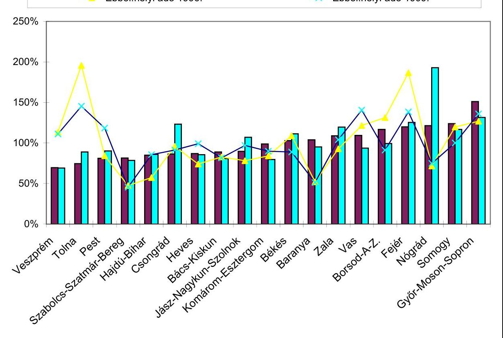

---

# 6. sz. táblázat 

Egy lakosra jutó GDP és helyi adó változása

| Megnevezés | Egy lakosra jutó GDP E Ft |  | Egy lakosra jutó helyi adó Ft |  |
| :--: | :--: | :--: | :--: | :--: |
|  | 1996. Év | 1998. év | 1996. év | 1998. év |

 Év | 2000. Év |
| Budapest | 1254 | 1858 | 18818 | 51673 |
| Győr-M-Sopron | 747 | 1204 | 5127 | 21875 |
| Vas | 740 | 1162 | 7928 | 22311 |
| Fejér | 699 | 1234 | 8071 | 23882 |
| Ország összesen | 676 | 997 | 8083 | 22184 |
| Zala | 631 | 901 | 7907 | 18187 |
| Csongrád | 628 | 889 | 6711 | 17023 |
| Tolna | 613 | 861 | 7628 | 16487 |
| Komárom-Esztergom | 605 | 838 | 7576 | 18305 |
| Veszprém | 547 | 803 | 5729 | 19429 |
| Megyék összesen | 544 | 805 | 5619 | 15694 |
| Hajdú-Bihar | 528 | 754 | 4368 | 14388 |
| Baranya | 526 | 783 | 4498 | 13253 |
| Békés | 517 | 691 | 2683 | 11381 |
| Bács-Kiskun | 512 | 713 | 4404 | 13090 |
| Jász-Nagykun-Szolnok | 511 | 720 | 5041 | 13758 |
| Somogy | 506 | 686 | 7153 | 13017 |
| Heves | 499 | 726 | 4631 | 14729 |
| Pest | 494 | 773 | 5697 | 18419 |
| Borsod-Abaúj-Zemplén | 478 | 690 | 6730 | 12316 |
| Szabolcs-Szatmár-Bereg | 400 | 567 | 3176 | 8687 |
| Nógrád | 387 | 565 | 4526 | 10391 |

Egy lakosra jutó GDP és helyi adó megyénként
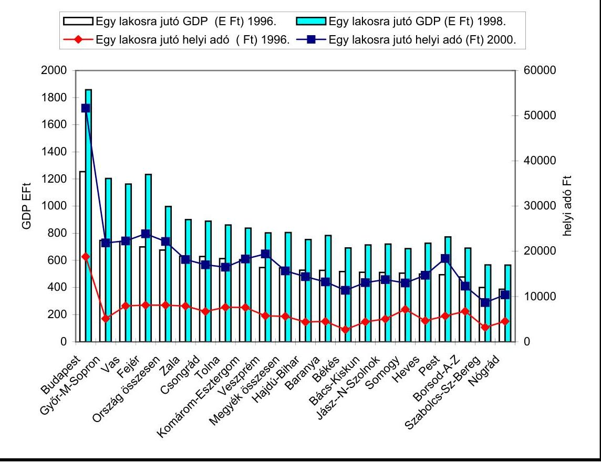

---

# 7. sz. táblázat 

1998. évi egy főre jutó SZJA + kiegészítés és aránya

| Megnevezés | 1998. évi   átengedett   SZJA E Ft | SZJA kiegészítés   E Ft | Egy főre jutó SZJA |  |
| :--: | :--: | :--: | :--: | :--: |
|  |  |  | összege   E Ft | aránya összes SZJA-hoz |
| Budapest | 29745719 | 0 | 15747 | 20,0\% |
| Baranya | 2782850 | 1651625 | 10566 | 31,9\% |
| Bács-Kiskun | 3147326 | 3106314 | 11104 | 39,7\% |
| Békés | 2462026 | 2113424 | 10966 | 37,2\% |
| Borsod-Abaúj-Zemplén | 4786256 | 3740153 | 10887 | 35,6\% |
| Csongrád | 3233448 | 1611487 | 10990 | 30,0\% |
| Fejér | 4109987 | 740423 | 11213 | 23,6\% |
| Győr-Moson-Sopron | 3921742 | 705150 | 10605 | 23,6\% |
| Hajdú-Bihar | 3595361 | 2654849 | 11002 | 34,8\% |
| Heves | 2302203 | 1214666 | 10413 | 30,6\% |
| Jász-Nagykun-Szolnok | 2695123 | 2340668 | 11491 | 37,4\% |
| Komárom-Esztergom | 2579918 | 654679 | 10107 | 25,1\% |
| Nógrád | 1265375 | 1181902 | 10656 | 38,7\% |
| Pest | 8571309 | 2288468 | 10757 | 25,3\% |
| Somogy | 2069092 | 1599512 | 10529 | 35,5\% |
| Szabolcs-Szatmár-Bereg | 2701524 | 4039507 | 11243 | 49,9\% |
| Tolna | 1874426 | 1155967 | 11675 | 32,3\% |
| Vas | 2330878 | 569059 | 10504 | 24,9\% |
| Veszprém | 3021792 | 1072094 | 10610 | 27,1\% |
| Zala | 2348663 | 909870 | 10551 | 27,7\% |
| Ország összesen | 89545018 | 33349817 | 11745 | 27,4\% |

SZJA átengedés és részesedés 1998. évben
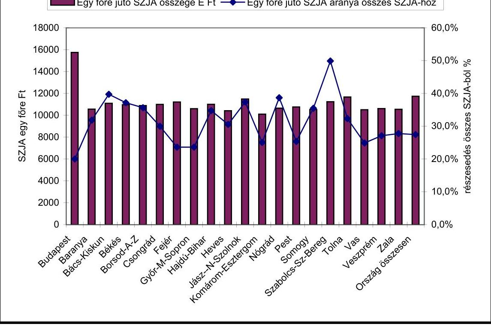

---

# Egy adóigazgatási átlaglétszámra jutó helyesbített adótartozás 2000. évben a vizsgált önkormányzatoknál 

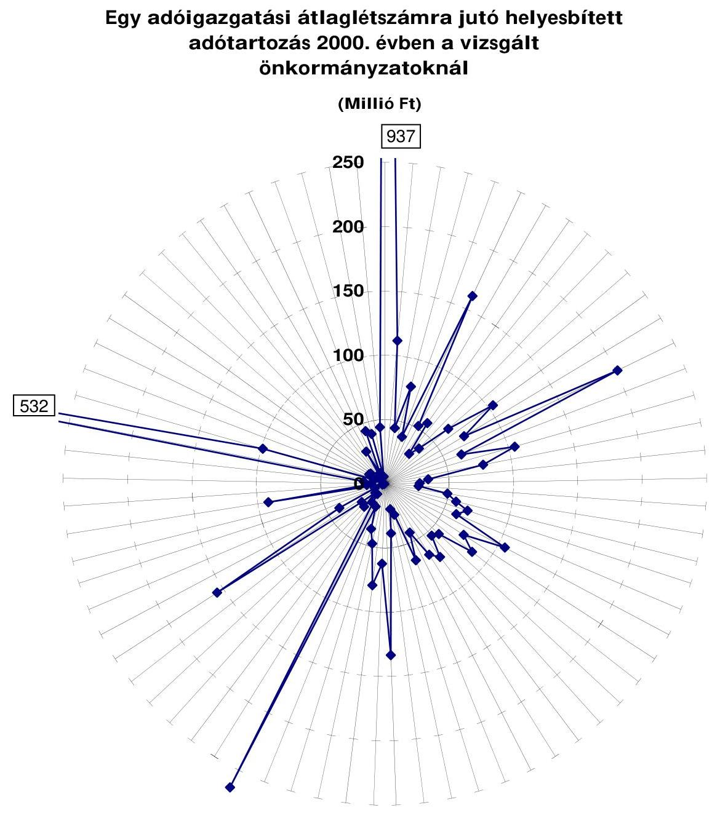

| Megnevezés | Átlag | Szélsőértékek   nélküli átlag |
| :-- | :--: | :--: |
| Főváros | 937 |  |
| Kerületek | 71 | 64 |
| Megyei jogú városok | 106 | 81 |
| Városok | 65 | 61 |
| Nagyközségek | 54 | 48 |
| Községek | 40 | 23 |

---

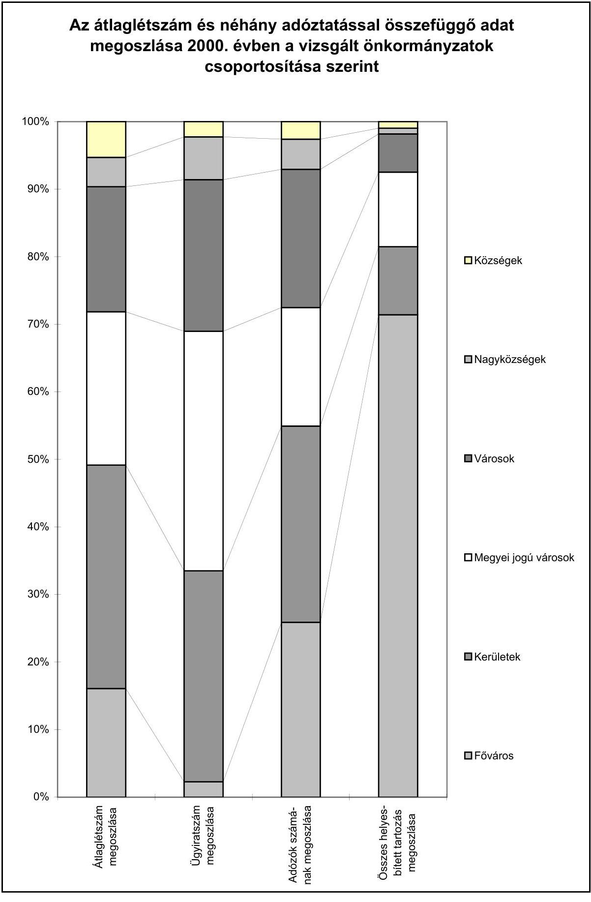

# Az átlaglétszám és néhány adóztatással összefüggő adat megoszlása 2000. évben a vizsgált önkormányzatok csoportosítása szerint

---

# Az átlaglétszám és néhány adóztatással összefüggő   adat megoszlása 2000. évben a vizsgált vidéki önkormányzatok csoportosítása szerint 

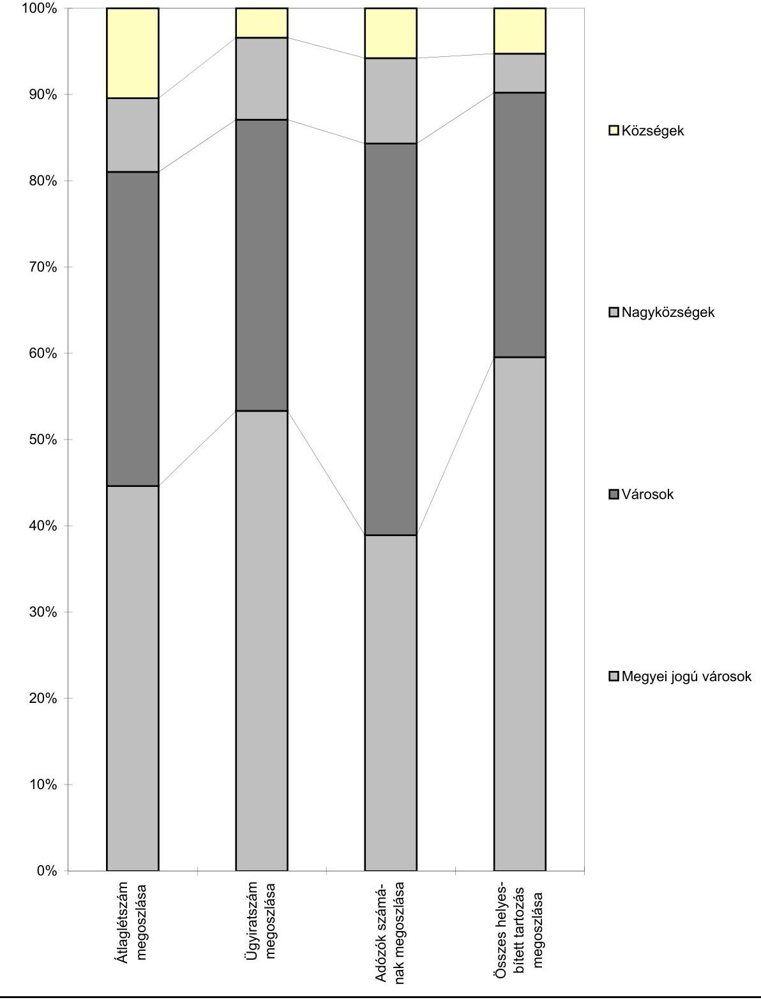

---

# Az adóigazgatási feladatokat ellátók megoszlásának alakulása iskolai végzettség, szakképzettség szerint a vizsgált önkormányzatoknál 

1996. év vége
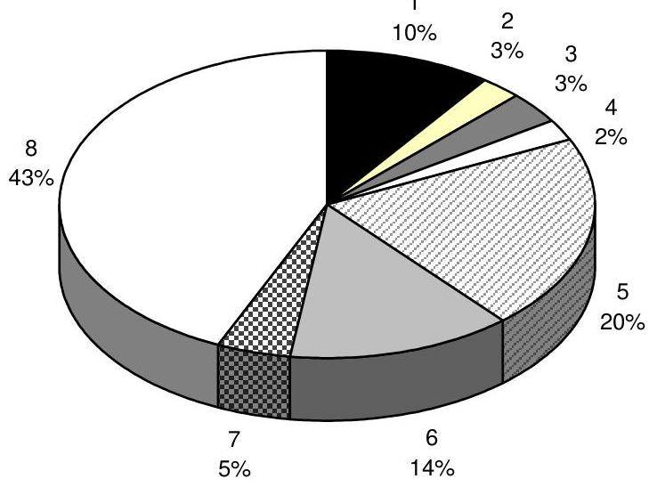
2000. év vége
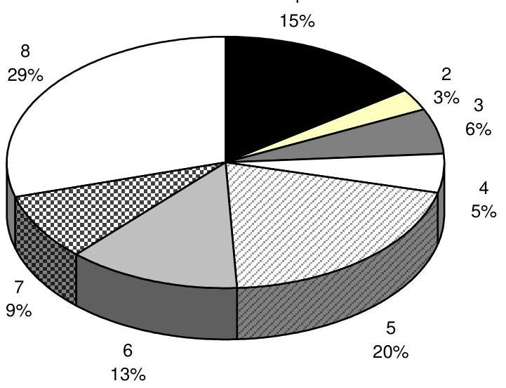

1=Egyetemi, főiskolai végzettségű /szakirányú vagy plusz szakképz./ (I.)
2=Tudományegyetemen, állam- és jogtudományi egyetemen végzett (I.)
3=Államigazgatási főiskolai végzettségű és felsőfokú pénzügyi, számviteli képzettségű (I.)
4=Egyéb I. besorolási osztályba sorolt
5=OKJ szerinti pénzügyi ügyintéző /adó- és illetékszakon/ (II.)
6=Számviteli ügyintéző (II.)
7=Mérlegképes könyvelő (II.)
(I.=felsőfokú)
8=Egyéb II. besorolási osztályba sorolt
(II.=középfokú)

---

# Az adóigazgatási feladatokat ellátók megoszlásának alakulása iskolai végzettség, szakképzettség szerint a kistérség központoknál 

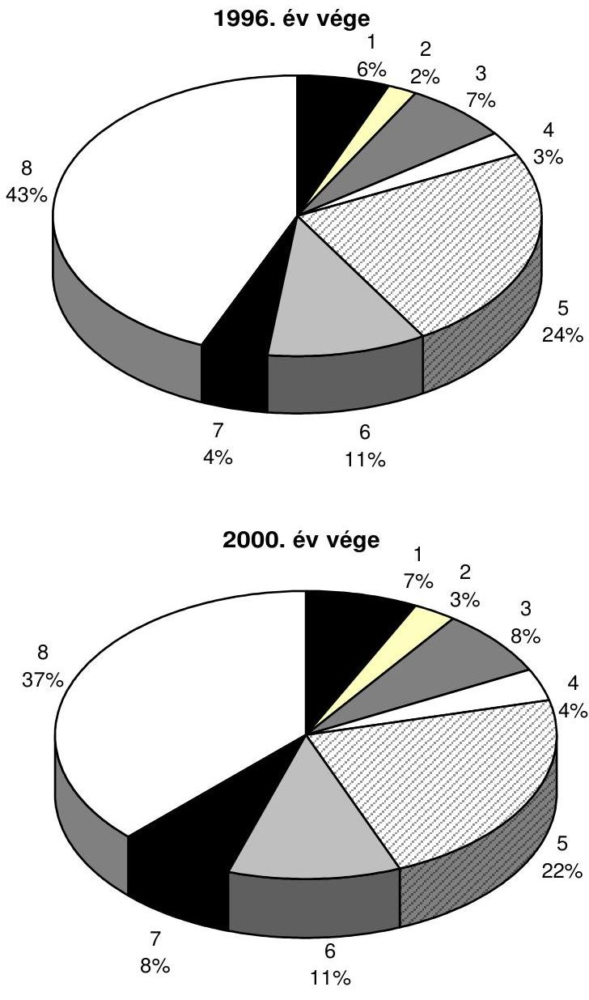

1=Egyetemi, főiskolai végzettségű /szakirányú vagy plusz szakképz./ (I.)
2=Tudományegyetemen, állam- és jogtudományi egyetemen végzett (I.)
3=Államigazgatási főiskolai végzettségű és felsőfokú pénzügyi, számviteli képzettségű (I.)
4=Egyéb I. besorolási osztályba sorolt
5=OKJ szerinti pénzügyi ügyintéző /adó- és illetékszakon/ (II.)
6=Számviteli ügyintéző (II.)
7=Mérlegképes könyvelő (II.)
(I.=felsőfokú)
8=Egyéb II. besorolási osztályba sorolt
(II.=középfokú)

---

# Függelék   a V-1015-3/2000-2001. sz. jelentéshez 

## A fővárosi és a kerületi önkormányzatok közötti forrásmegosztás

#### Abstract

Az Állami Számvevőszék (ÁSZ) az önkormányzatok adóztatási tevékenységének ellenőrzése keretében célul tűzte a fővárosi forrásmegosztás vizsgálatát. Ennek oka elsősorban az, hogy a helyi adókon belül meghatározó iparűzési adó a forrásmegosztás rendszerén belül is jelentős részarányt képvisel. A fővárosban realizálódott az összes iparűzési adó 44\%-a, amely a Fővárosi Közgyűlés rendeletében megosztott bevételek 75\%-át jelenti.

Az ÁSZ 1999. és 2000. évben a zárszámadáshoz kapcsolódóan a fővárosi és a kerületi önkormányzatok közötti forrásmegosztás rendszerét, az alkalmazott módszereket áttekintve, az ezzel kapcsolatos tapasztalatokat összegezve megállapította:

- A fővárosi és a kerületi önkormányzatok rendelkezésére álló források (ideértve a helyi adókból és a helyiség bérbeadásból származó bevételeket) nincsenek összhangban a kötelező feladatok forrásigényével, a főváros és a kerületek, illetve a kerületek között is jellemző az aránytalanság.
- A forrásmegosztás rendszerének átalakítása három éves program keretében 1999. évben megkezdődött, ennek célja a feladatarányosság javítása, a támogatásigény, a rendelkezésre álló források számítása és a megosztási módszerek területén a normativitás erősítése.
- A 2000. évi ÁSZ vizsgálat során a korábban kifogásolt megosztási problémák mindegyikében előre lépés történt.

Az ellenőrzés célja volt a forrásszabályozásra, a fővárosi forrásmegosztásra vonatkozó törvényi szabályozás és ennek gyakorlatban történő érvényesülésének, a fővárosi és a kerületi önkormányzatok 1998-2000. évi gazdálkodásra gyakorolt hatásának értékelése, amely különösen az alábbi kérdések vizsgálatára terjedt ki:

- miként értelmezhető az önkormányzati törvény (Ötv.) 64. §. (1) bekezdés szerinti feladatarányosság,
- kiegyenlítő feladatot, hatáskört ad-e a forrásmegosztás szabályozása a Fővárosi Közgyűlésnek,
- a kötelező feladatok fedezettségében milyen különbségek tapasztalhatók a főváros és a kerületek között,

---

- az igazgatási feladatok esetében alkalmazott finanszírozás megfelel-e a feladatarányosság követelményének.

Helyszíni vizsgálatra a Fővárosi Önkormányzatnál és 11 kerületi önkormányzatnál került sor, de adatszolgáltatást kérve valamennyi kerületi önkormányzatot megkerestük. A megküldött tanúsítványokban lévő adathiba, adathiány, valamint adatértelmezési, nyilvántartási problémák miatt (pl. a kötelező és önként vállalt önkormányzati feladatok kiadásai elkülönítésének, nyilvántartásának hiánya) elemzésre használhatatlannak bizonyultak. A helyszínen nem vizsgált kerületi önkormányzatokat felkértük a forrásmegosztás rendszerével kapcsolatos véleménynyilvánításra, azonban egyetlen kerület sem adott tájékoztatást.

# II. RÉSZLETES MEGÁLLAPÍTÁSOK 

## 1. A FŐVÁROSI ÉS A KERÜLETI ÖNKORMÁNYZATOK BEVÉTELEI

A fővárosi és a kerületi önkormányzatok 1998. évben 355 milliárd Ft, 1999. évben 405 milliárd Ft végleges bevétellel gazdálkodhattak (14,1\%-os növekedés, amely meghaladta az önkormányzatok bevételeinek 11\%-os átlagos növekedési ütemét). Ezen belül a kerületi önkormányzatok összes működési és felhalmozási célú bevétele 1999. évben az előző évhez képest 17\%-kal nőtt, a Fővárosi Önkormányzatnál az 1998. évi egyszeri 18,5 milliárd Ft-os kötvénykibocsátás miatt a növekedés 11,8\%-os volt. A fővárosi és a kerületi önkormányzatok a helyszíni vizsgálattal érintett években pénzügyi zavarok nélkül gazdálkodtak, az ezt meghatározó központi hozzájárulások és megosztott, valamint saját bevételeik kedvezően alakultak (1. és 2. sz. táblázat).

A bevételeken belül a felhalmozási célú bevételek aránya 21\% körül alakult mindkét évben, ezzel szemben a főváros a kiadásoknak 37-34\%-át, a kerületek 18-16\%-át fordították felhalmozásra.

Az önkormányzati forrásokon belül a saját bevételek viszonylag magas részarányt képviseltek (1998. évben a kerületeknél 55\%, 1999. évben 58\%, illetve a fővárosnál 43-53\%). Az eltérő feladatokat a főváros és a kerületek bevételeinek összetétele is tükrözi, az átvett pénzeszközök aránya a kórházak fenntartásával összefüggésben a fővárosnál 21\%, a kerületeknél csak 8\% volt. Az állami hozzájárulás és az SZJA aránya a fővárosnál 1999. évben 2\%-ponttal csökkent, a kerületeknél 1\%-ponttal nőtt.

Az előző évi pénzmaradvány igénybevétele 1998. évben 11 milliárd Ft-tal, 1999. évben 16,6 milliárd Ft-tal tette lehetővé a kiadások növelését. A kerületi önkormányzatok a költségvetésben a működési kiadásoknál a tervezés során kimutatott hiányt (1998. évben 13,7 milliárd Ft, 1999. évben már csak 4 milliárd Ft) nagyobbrészt felhalmozási célú bevételeikből, másrészt finanszírozási műveletekkel (rövid lejáratú hitelfelvétel, értékpapír eladás) kívánták fedezni. Rövid lejáratú hitel felvételével 1998. évben 11, 1999. évben 9 kerület számolt,

---

ténylegesen 5, illetve 4 kerület vett igénybe csökkenő mértékű, jellemzően a bevételek éven belüli ütemtelenségét áthidaló likviditási hitelt.

A Fővárosi Önkormányzat működési célú bevételei mindkét évben meghaladták a működési kiadásokat az eredeti előirányzatokban is (1998. évben 19,5 milliárd Ft-tal, 1999. évben 25 milliárd Ft-tal), amely részben fedezetéül szolgált a felhalmozási célú kiadások 51,9 milliárd Ft-os, illetve 41,5 milliárd Ft-os többletének. Külföldi hitel felvételére a Fővárosi Önkormányzat részéről a szennyvíz tisztítás, környezetvédelmi és infrastrukturális beruházások, közlekedési fejlesztések kapcsán került sor (az ÁSZ 2000. évben vizsgálta a külföldi államadósság kezelését az önkormányzatoknál).

Eltérő a kiadások szerkezete a fővárosnál és a kerületeknél: a működési kiadásoknak 1999. évben a kerületeknél 50\%-a volt a személyi juttatás és ennek járulékai, a fővárosban ez az arány 41\% volt. A működési célú kiadások növekedése - elsősorban a személyi jellegű juttatások emelkedése miatt - inflációhoz közeli volt a kerületeknél 1999. évben (9,4\%), a fővárosnál ezt meghaladó (12,2\%). A felhalmozási kiadások ezzel szemben az előző évhez képest alacsonyabb teljesítést mutatnak, de ennek a belső arányai is módosultak. A főváros 1999. évben a kiadások 11\%-át fordította pénzügyi befektetésekre az előző évi 8\%-kal szemben (éven túli lejáratú értékpapír vásárlásra).

A helyi önkormányzatok ellátnak az Ötv-ben és a szakmai-ágazati törvényekben meghatározott kötelező és önként vállalt, helyi közügyek körébe tartozó feladatokat egyaránt. Az ÁSZ korábbi ellenőrzései is megállapították, hogy a feladat- és hatáskör telepítés nem megfelelően határolja el az állami (ún. kötelező) és az önként vállalt önkormányzati feladatokat. Ezt tükrözi a finanszírozási rendszer, amelyet az állami feladatok „kiegészítő" jellegű támogatása jellemez. Az ágazati, szakmai törvényekben az önkormányzatok kötelező feladatai folyamatosan bővültek, amellyel nem állt összhangban a központi források növekedése. Ezért az önkormányzatok saját bevételeik növekvő hányadát - esetenként meglévő vagyonuk értékesítéséből származó bevételeiket -
 voltak kénytelenek a kötelező feladatokra fordítani.

Az Alkotmány az önkormányzati alapjogok körébe sorolja, hogy a képviselőtestület az önkormányzati törvényben meghatározott feladatainak ellátásához megfelelő bevételre jogosult, továbbá e feladatokkal arányban álló állami támogatásban részesül. Az Ötv szerint a kötelezően ellátandó önkormányzati feladat- és hatáskörök meghatározásával egyidejűleg az Országgyűlés biztosítja az ellátásukhoz szükséges anyagi feltételeket, dönt a költségvetési hozzájárulás mértékéről és módjáról. A gyakorlatban a „feladatokkal arányban álló" állami támogatás, megosztott bevételek mértéke a költségvetés jóváhagyása során alakul ki, ezek csak részben fedezik a kötelező feladatok működtetését. Az állami támogatások mértékére vonatkozó néhány garanciális szabály (pl. közoktatási normatíva esetében a korábbi évek tényleges kiadásai figyelembe vétele) is megszűnt 2001. évtől.

Az önkormányzati bevételek és kiadások összhangja a forrásszabályozás keretében a makroszintű számításokban alakul ki. A forrásképződés és az ellátandó feladatok közötti összhang javítását a szabályozó rendszerben külön támogatások segítik elő (pl. az önhibáján kívül hátrányos pénzügyi helyzetű önkormányzatok kiegészítő támogatása - ÖNHIKI - és egyéb, a hátrányos helyzet mérséklését szolgáló támogatások).

A 2000. évi költségvetési törvényjavaslat véleményezése keretében az ÁSZ jelezte, hogy az önkormányzati pénzügyi szabályozásban 10 év alatt bekövetkezett változások kedvezőtlen hatásai miatt indokolt annak felülvizsgálata, és a szükséges korrekciók elvégzése. A forrásszabályozás továbbfejlesztése azonban az önkormányzati feladat- és hatáskörök felülvizsgálatát igényelte volna, amelyre nem került sor a 2001-2002. évi költségvetés elfogadásáig.

Ez utóbbi véleményezése keretében az ÁSZ megállapította, hogy az állami hozzájárulások és támogatások 2001. évi számításoknál figyelembe vett többlete a hatályos törvények, jogerős bírósági döntések teljesítéséhez szükséges pénzügyi fedezetet nem tartalmazza teljes körűen, az önkormányzati feladatok és a rendelkezésre álló források között évek óta tartós feszültség oldása a következő években sem várható.

A vizsgálat keretében belül információt szerettünk volna kapni arra vonatkozóan, hogy az önkormányzatok megkülönböztetik-e kötelezően ellátandó és az önként vállalt, helyi igények kielégítését szolgáló feladatok kiadásait és ezek forrásait megbontják-e. Erre vonatkozóan csak 13 kerület tudott adatot szolgáltatni (3. sz. táblázat), azonban a besorolás egyértelmű kritériumainak hiányában 2-70% között szóródtak a kötelező és az önként vállalt feladatok arányai.

A IV. kerület 1998. évben a kötelező feladatok kiadásait 2.455 M Ft-ban jelölte meg (34,9%), a forrásmegosztásba bevont alapfeladatok kiadásai 6.152 M Ft-ot tettek ki.

# 2. A FŐVÁROSI ÉS A KERÜLETI ÖNKORMÁNYZATOK FORRÁSSZABÁLYOZÁSA 

A fővárosi önkormányzati rendszer kétszintű: a fővárosi és 23 kerületi önkormányzatból áll, amelyek települési önkormányzatok, alapjogaik tekintetében egyenlők, feladat- és hatásköreiket tekintve azonban számottevő eltérés van közöttük. Meghatározó szerepe van a Fővárosi Önkormányzatnak mind a főváros (mint település) működőképességének biztosításában, mind a nagyvárosi funkciók, a több kerületet illetve a főváros területét is meghaladó közszolgáltatások szervezésében, ellátásában.

Az Ötv. 63. §-a részletesen szól a fővárosi és a kerületi önkormányzatok közötti feladat- és hatáskör megosztásról. E szerint a Fővárosi Önkormányzat látja el azokat a kötelező és önként vállalt helyi, települési önkormányzati feladatokat és hatásköröket, amelyek a főváros egészét, vagy egy kerületet meghaladó részét érintik, valamint amelyek a fővárosnak az országban betöltött különleges szerepéhez kapcsolódnak. A törvény kiemeli többek között a városfejlesztés és városrehabilitációs program meghatározását, a lakásgazdálkodással, a tömegközlekedéssel, a fővárosi úthálózat fenntartásával, a közüzemi kommunális szolgáltatásokkal, a közvilágítással, a köztemetők létesítésével, fenntartásával,

a természeti környezet védelmével, az alapellátást meghaladó egészségügyi ellátással, középfokú oktatással, művészeti, közművelődési és közgyűjteményi feladatokkal kapcsolatos kötelezettségeket.

A törvény biztosítja a kerületi képviselő-testületeknek, hogy a települési önkormányzatok által ellátandó kötelező alapfunkciók mellett a Fővárosi Önkormányzattól egyes közszolgáltatások szervezését megállapodás megkötésével átvállalják. Az Ötv. szerint a kerületi önkormányzat működési területén köteles gondoskodni az óvodai nevelésről, az általános iskolai nevelésről és oktatásról, az egészségügyi és a szociális alapellátásról, az egészséges ivóvíz ellátásról, a helyi közutak fenntartásáról, a nemzeti és etnikai kisebbségek jogainak érvényesüléséről.

A kerületi önkormányzatok 1992-1996. között vették át a fővárostól az egészségügyi alapellátási feladatokat, s ennek keretében több kerület kérte a szakrendelők működtetésének átvételét is. A gimnáziumok nagyobb részt korábban is kerületi fenntartásban voltak. A közoktatási törvény szerint a Fővárosi Önkormányzat köteles gondoskodni többek között a középiskolai és szakiskolai ellátásról, ha a fővárosi kerületi önkormányzat a feladat ellátását nem vállalja.

# A kétszintű önkormányzati rendszerből adódó sajátosságok miatt az 

Ötv. külön szabályokat is megállapít a fővárosi és a kerületi önkormányzatok gazdálkodására. E szerint a bevételek a ténylegesen gyakorolt feladat- és hatáskör arányában illetik meg a fővárosi illetve a kerületi önkormányzatokat. A törvény az önkormányzati bevételek három csoportját alakította ki:

- A fővárosi és a kerületi önkormányzatokat is önállóan és közvetlenül megillető bevételek körében a feladatellátáshoz kapcsolódó normatív központi hozzájárulások, címzett és céltámogatások, a saját tevékenységből, vállalkozásból és az átengedett vagyon hozadékából származó nyereség, osztalék, kamat és bérleti díj, az átvett pénzeszközök, a tulajdonukban lévő közterületek hasznosításából származó díjak.
- A fővárost és a kerületeket osztottan megillető bevételek körébe tartozik a magánszemélyek jövedelemadójából (SZJA) az önkormányzatokat megillető rész, egyéb központi adók (gépjárműadó), az állandó népességhez kapcsolódó központi hozzájárulás (kivéve az igazgatási és közművelődési feladatokra meghatározott központi hozzájárulást) és a helyi adók (függetlenül attól, hogy a helyi adót a kerület, vagy a főváros szedi be). A megosztás a Fővárosi Közgyűlés hatáskörébe tartozik, az Ötv. 1994. évi módosítását követően a kerületek véleményének kikérése mellett.
- Amíg a kerületi önkormányzatokat kizárólagosan megillető bevételek körében az Ötv. csupán a jelentősnek egyáltalán nem tekinthető letiltás útján befolyó szabálysértési bírságot jelöli meg, addig a Fővárosi Önkormányzatot kizárólagosan megillető bevételek között több jogcímet sorol fel, amelyek közül az illetékbevétel a legjelentősebb (1999. évben 7.765 M Ft).

A költségvetési törvény - 2000. évtől kezdődően speciális szabályokat tartalmaz a forrásmegosztásra vonatkozóan - bevezette a „küszöbértékeket". 2000-ben a

fővárosi és a kerületi önkormányzatokat osztottan megillető SZJA-ból, egyéb központi adóból, állandó népességhez kapcsolódó központi hozzájárulásból (kivéve a fővárost megillető igazgatási és közművelődési feladatokat szolgáló központi normatív hozzájárulást) a bevételek legalább 50%-a, valamint a helyi adókból származó bevételek 45%-a illeti meg a kerületi önkormányzatokat.

Az Ötv. a forrásmegosztás alapelvének megfogalmazása mellett nem határoz meg konkrét módszereket, az önkormányzatok pénzügyi forrásai feladatokkal való arányosságának konkrét mértéke jogi eszközökkel nincs meghatározva, ez csak politikai döntésekkel garantálható. Nem egyértelmű a törvény abból a szempontból sem, hogy a feladatarányosság csak a megosztott forrásokra, vagy az önkormányzati források teljes körére vonatkozik-e.

A források megosztásának módszerét, mértékét különböző elvek, számítások alapján, egymástól jelentős mértékben eltérően lehet meghatározni. A forrásmegosztásnál figyelembe vett kiadások és bevételek köre a feladatarányosság, normativitás, esélyegyenlőség szempontjából különböző eredménnyel jár, amely a forrásmegosztás elmúlt években végrehajtott változtatásaiban is tükröződik. Az Ötv. forrásmegosztásra vonatkozó - feladatarányosságot megfogalmazó - rendelkezéséből nem vezethető le, hogy a kerületi önkormányzatok minden önként vállalt feladattal kapcsolatos többletkiadását a forrásmegosztás rendszerében kompenzálni kellene.

A fővárosi és a kerületi önkormányzatok a forrásszabályozás keretében önállóan is részesülnek támogatásban (az ellátott feladatok alapján járó normatív támogatások), de a fővárosi forrásmegosztás lényegében egy kiegyenlítő mechanizmusként működik. Hatókörét az határozza meg, hogy milyen bevételekre és feladatokra terjed ki. Az ún. forrásmegosztási számításokba bevont bevételek és kiadások az elmúlt években mindig tágabb kört jelentettek, mint a törvény szerint ténylegesen megosztandó bevételek, vagy mint a kötelezően ellátandó önkormányzati feladatok.

A kiadások és bevételek számba vétele egyaránt hatást gyakorol a főváros és a kerületek, valamint a kerületek egymás közötti forrásmegosztására, amelynek tükröznie kell:

- egyrészt a Fővárosi Önkormányzat és a kerületi önkormányzatok eltérő feladatait,
- másrészt a bevételek képződésében és a feladatokban a kerületek között meglévő különbségeket is.

A főváros és a kerületek között a feladatok központi hozzájárulással és megosztott forrásokkal való fedezettségében a vizsgált években jelentős különbségek mutatkoztak (4. és 5. sz. táblázatok).

A számításokban az alapfeladatok nem tartalmazzák az OEP által finanszírozott gyógyító-megelőző ellátásokkal és felújítással, felhalmozással, pénzügyi

műveletekkel kapcsolatos kiadásokat. Az önkormányzati igazgatási - kerületenként eltérő összetételű - kiadásoknál szükségessé vált a felhalmozással, értékpapír-forgalmazással, finanszírozással, különböző szervezetek támogatásával összefüggő tételek korrekciója. Az alapfeladatok közé több olyan tétel is besorolásra került, amely nem kötelező önkormányzati feladat (lapkiadás, kábeltévé üzemeltetés, helyi közgyűjteményi feladatok).

Az alapfeladatok normatív állami hozzájárulással és normatív SZJA-val való fedezettsége növekedett (1998. évben 28,7%, 1999. évben 32,2% volt). A fővárosi és a kerületi önkormányzatoknál a központi hozzájárulásokból az alapfeladatok 1998. évben közel azonos mértékben voltak fedezettek, 1999. évben a kerületek javára ez az arány 6%-ponttal javult. A kerületek között azonban jelentős szóródás figyelhető meg (1998. évben 15 és 40% közé esik a feladatok fedezettsége). A központi hozzájárulások aránya az intézmények működtetésére fordított önkormányzati bevételekkel fordított arányban változik.

A forrásmegosztási számításokba bevont bevételekből az alapfeladatok fedezettsége 1998. évben összességében 76%-os volt. A forrásmegosztási számításoknál figyelembe vett - 1997. évi költségvetési előirányzatokon alapuló alapfeladatokkal szemben az 1998. évi tényleges kiadások a kerületeknél 57 milliárd Ft, a fővárosnál 9 milliárd Ft többletet mutatnak. Ennek okai között az inflációs hatások, a tartalékok, pénzmaradvány felhasználása mellett a központosított előirányzatokból és saját bevételekből fedezett kiadásnövekedés egyaránt megtalálható, kerületenként eltérő mértékben.

Az alapfeladatok működési átlagnormatíváját 1998. és 1999. évben az előző évhez viszonyítva a 6. sz. számú táblázat mutatja. Az infláció mértékét (14%) meghaladóan nőtt 1998. évben néhány feladat egy feladatmutatójára jutó átlagnormatíva, egyes esetekben két év alatt megduplázódott (pl. szakképzést megalapozó iskolai oktatás).

Az alapfeladatok fedezettsége a központi hozzájárulásokból és megosztott forrásokból a Fővárosi Önkormányzatnál 1998. évben 94%, 1999. évben már 101,9% volt, így a forrásmegosztási számításokban figyelembe nem vett saját folyó bevételekkel együtt működési „eredményt" ért el.

# A fővárosi önkormányzatok között jelentősek a vagyoni, pénzügyi helyzetükből, az infrastruktúra fejlettségéből, a lakosság közszolgáltatások iránti igényeiből eredő különbségek. Kerületenként az egy 

lakosra jutó korrigált működési költségvetési kiadások, valamint az önkormányzati vagyon eltérő összetétele, nagysága miatt a hozamjellegű bevételek nagyságrendje is eltérő. A forrásmegosztás keretében nem minden vonatkozásban tudtak megoldást találni a bevételek képződése és a feladatok ellátásának forrásigénye közötti összhang megteremtésére.

Ezt jelzi az a tény is, hogy a forrásmegosztás korrekcióját szolgáló Támogatási Alap felosztásához készített számításokban 1998. évben 18 kerületnél 8.975 M Ft, 1999. évben 19 kerületnél 11.917 M Ft számított „működési forráshiányt" mutattak ki, az előző évi tényleges kiadások alapján számított átlagnormatíva és ezek fedezeteként figyelembe vett bevételek különbözeteként. Ugyanakkor a Fővárosi Önkormányzat 1999. évben 21.916 M Ft „működési eredményt" mu-

tatott ki a beszámolóban (azaz működési célú bevételei ennyivel haladták meg a működési célú kiadásokat).

A Fővárosi Önkormányzat 1998-1999. években privatizációból, pénzügyi befektetések visszatérüléséből, hitelfelvételből, kötvénykibocsátásból 62,3 milliárd Ft bevételt realizált, az éven belüli rövid lejáratú értékpapír forgalom 1998. évben 218 milliárd Ft, 1999. évben 230
 milliárd Ft volt.

A kerületi önkormányzatok értékpapír beváltásból származó bevételeinek aránya 1998. évben 24,5% volt. Rövid lejáratú értékpapír forgalmuk 1998. évben 31 milliárd Ft-ot, 1999. évben 13 milliárd Ft-ot tett ki.

A X. Kerületi Önkormányzat 1998. évben 15,8 milliárd Ft, a II. Kerületi Önkormányzat 2,6 milliárd Ft, a XV. Kerületi Önkormányzat 1,1 milliárd Ft értékben bonyolított le értékpapír forgalmazást. A kerületek tulajdonában lévő értékpapír állomány 1999. évben közel 3 milliárd Ft-tal nőtt az előző év végi állapothoz képest, és 11 milliárd Ft-ot ért el.

A kerületek egy főre jutó működési kiadásainak szóródása (7. és 8. sz. táblázatok) jelentős. A korrigált működési kiadás az ÖNHIKI-s támogatások igénylésénél alkalmazott küszöb értékként került a PM-BM módszertani útmutató alapján kiszámításra. (A korrigált működési kiadás a központi hozzájárulások, OEP finanszírozási kör, átvett pénzeszközök, kamatkiadások és szociális ellátások nélküli működési kiadás.) A kerületek 1998. évi 44.799 Ft/lakos átlagához képest az eltérés -47% és +226% között szóródik. A legalacsonyabb a XVII. kerület 24.187 Ft/lakos, a legmagasabb az V. kerület 98.581 Ft/lakos fajlagos értéke, amelyek között háromszoros az eltérés. Népességszám szerinti kategóriákba sorolva a kerületeket 10 nem éri el a településcsoportja átlagát, 13 meghaladja, amely mutatja a kerületek saját bevételeiben meglévő eltéréseket.

# 3. A FORRÁSMEGOSZTÁS MÓDSZEREINEK VÁLTOZÁSA 

A megosztandó bevételek körét a jogi szabályozás lényegében változatlanul hagyta az elmúlt egy évtizedben, azonban lényeges változást jelentett, hogy 1994. évig a forrásmegosztási rendelet megalkotásához a kerületek többségének egyetértése volt szükséges, az Ötv. 1994. évi módosítása már csak a kerületek véleményének kikérését szabta a rendelet megalkotásának feltételéül. Az ezzel kapcsolatos alkufolyamat időigényét sem veszi figyelembe a véleményezésre biztosított 10 nap.

Kisebb tartalmi módosulást jelentett a megosztandó központi hozzájárulásoknál, hogy 1999. évtől kikerült a forrásmegosztás köréből a főváros igazgatási és közművelődési feladataihoz kapcsolódó normatíva, és bekerült a népesség meghatározott korcsoportjai alapján számított központi hozzájárulás (normatív állami hozzájárulás és SZJA). A központi hozzájárulások az éves költségvetési törvény önkormányzati forrásszabályozásra gyakorolt hatása következtében változtak.

A forrásmegosztás deklarált alapelvét (az ellátott feladatokkal arányos bevételekhez juttatni az önkormányzatokat) az alábbi módon kívánták biztosítani (a módszerek 1998-1999. években alapvetően nem változtak):

---

- Évente a fővárosi szintű előző évi tervezett kiadások és a tervezett intézményi működési bevételek különbségeként ún. „fővárosi normatíva" és a tárgyévi tervezett feladatmutatók szorzataként meghatározták a közszolgáltatások, ún. alapfeladatok támogatás igényét.

1999. évben az általános szabályok szerint számított fővárosi normatívát azoknál a kerületeknél, ahol magasabb volt az alapfeladat átlagköltsége, ott a különbözet 20%-ával korrigálták.

Az önkormányzati alapfeladatok körét 1997. évben rögzítették, amelyek jelenleg is a számítások alapját képezik. Ebben a lakásfenntartás 2000. évet megelőzően nem szerepelt, az ezzel kapcsolatos tényleges kiadásokat a Támogatási Alap felosztásánál vették figyelembe.

A településüzemeltetési kiadásoknál a külön fővárosi, külön kerületi normatíva a tényleges költségek egy lakosra számított összege volt. Az egyes kerületeknél a népességük arányában került elismerésre a településüzemeltetéssel kapcsolatos kiadási szükséglet. A viták elsődleges tárgya a feladatokat jobban közelítő naturáliák alkalmazása volt a normatíva számításoknál. A kerületeknél a fővároshoz viszonyított korábbi alulfinanszírozottság (bázis) is torzította az elosztást. (A 2000-től alkalmazott módszer a településüzemeltetési kiadásokat szétbontja parkfenntartási, útfenntartási, egyéb településüzemeltetési kiadásokra, és az első két feladatnál a fenntartott alapterületi adatokat veszi figyelembe a normatíva számításánál.)

Az igazgatás működési kiadásai 1998. évtől differenciált (a kerületi önkormányzatoknál 3.800 Ft/állandó lakos, a Fővárosi Önkormányzat 2.900 Ft/állandó lakos) támogatási igénnyel kerültek figyelembevételre, amely 1999. évben a kerületeknél 4.900 Ft-ra, a fővárosnál 3.000 Ft-ra emelkedett. A forrásmegosztás egyik legvitatottabb pontja volt az igazgatási kiadások számba vételénél alkalmazott eltérő megoldás.

További jellemző, hogy a főváros által ellátott egyes feladatok egyediségük miatt a tervezett kiadások szintjén kerültek elismerésre (ilyen feladat a tömegközlekedés támogatása 1999. évben 15,1 milliárd Ft, a tűzvédelem és katasztrófavédelem 3,4 milliárd Ft, a színházi tevékenység 2,1 milliárd Ft, a városrehabilitáció támogatás 1 milliárd Ft összegben).

- Meghatározták az alapfeladatok támogatásának forrását biztosító bevételeket (forrásmegosztási számításokba bevont források), ezek köre bővebb, mint a ténylegesen megosztott bevételek. Az alapfeladatok támogatásának fedezete 2000. évet megelőzően meghaladta a támogatási igényt, ezért azt a figyelembe vett források szintjére emelték. (A támogatási igényt olyan %-ban növelték, mint a támogatási fedezetként figyelembe vett tervezett források azt lehetővé tették.)

---

| Megnevezés | 1997.évi   terv | 1998.évi   terv | 1999.évi   terv | 2000.évi   terv |
| :-- | :--: | :--: | :--: | :--: |
| Forrásmegosztásba bevont bevételek   (2000.év előtti szerkezetben) | 109278 | 127232 | 146307 | 142752 |
| 2000.évtől figyelembe vett egyéb   saját bevételek |  |  |  | 62541 |
| Alapfeladatok támogatásigénye a   forrásmegosztási számításokban | 96484 | 117396 | 135923 | 192096 |
| Fedezettség | 113,26% | 108,38% | 107,64% | 106,87% |
| 2000.évben figyelembe vett felújítások,   fejlesztések támogatás igénye |  |  |  | 65862 |
| Számított hiány |  |  |  | 52665 |

A forrásmegosztási számításokba bevont bevételek között közvetetten szerepeltek az 1997-1999. években az intézményi működési bevételek (ezekkel csökkentett támogatási igénnyel számolnak kiadási oldalon), illetve nem szerepeltek a kerületi kivetésű helyi adók, valamint az önkormányzatok egyéb sajátos bevételei (kamat- és egyéb hozambevételek, helyiségbérleti díjak). Ugyanakkor nem vették számításba a lakásfenntartással, az intézmények, a közterületek, utak felújításával és a fejlesztéssel kapcsolatos igényeket. Az ezzel összefüggő kiadásokat a fővárosi önkormányzatok a forrásmegosztásba be nem vont bevételekből fedezték. Az eltérő adóztatási képesség, forgalomképes vagyon, hozam jellegű bevételek miatt eltérő az egyes kerületek fejlődésének üteme.

A forrásmegosztás során az állandó népességhez kapcsolódó normatív állami támogatás, valamint feladathoz kötött ún. normatív SZJA megosztása a feladatarányosságot szolgálta, a személyi jövedelemadó átengedett része és az iparűzési adó kiegyenlítő (hiánypótló) szerepet kapott.

A vizsgálat során a Főpolgármesteri Hivatal kérésünkre elkészítette az 1998-1999. évre vonatkozó forrásmegosztási számításokat a 2000. évtől alkalmazott módszer alapján. A számítások szerint a forrásmegosztás korszerűsítése a megosztási arányokon érdemben nem változtatott. A kiadások és a forrásmegosztásba bevont bevételek különbözeteként számított kiadási deficitek alapján a részesedés változása 1998. évben a Fővárosi Önkormányzatnál 1.207 M Ft, 1999. évben a kerületeknél 3.316 M Ft pozíció javulást mutat az eredeti forrásmegosztáshoz képest. (A modell számítás eredményeként módosuló részesedés a megosztott forrásokból a 9. és 10. sz. táblázatokban található.)

A modell számítások fontosabb jellemzői.

- Az elismert alapfeladatok működési kiadásai az előző évi beszámoló adataiból vett átlagnormatívával kerültek kiszámításra. Kivételt képeztek ez alól az igazgatási és a lakásfenntartással kapcsolatos kiadások, amelyeknél a kerületek által a Támogatási Alap felosztásához közölt adatok kerültek figyelembevételre.

---

- A településüzemeltetési kiadásoknál a park- és zöldfelület és útfenntartási feladatoknál, valamint a lakásfenntartásnál az 1999. december 31-ei naturális (négyzetméter) adatokat vették figyelembe, mert korábban ilyen adatszolgáltatás nem volt.
- A felújítási és fejlesztési kiadások az előző évi tényszámokon alapultak (ezek figyelembevétele az összkiadásokon belüli viszonylag magas aránya miatt a Fővárosi Önkormányzat részesedését meghatározta).
- Az előző évi tényleges bevételek - az egyszeri és vagyonértékesítésből származó bevételek kivételével - kerültek az előzőek szerint számított kiadásokkal szembeállításra. Adathiány miatt kivételt képezett ez alól a kerületeknél a lakás- és helyiség bérbeadással kapcsolatosan a kezelő gazdasági társaságok által elért bevétel, amely 2000. évben 2.694 M Ft összegben szerepel a forrásmegosztási számításokban.

# 4. A FORRÁSMEGOSZTÁSHOZ KAPCSOLÓDÓ ALAPOK 

A forrásszabályozás módszere körüli viták következtében a Fővárosi Közgyűlés már 1995. évben határozatot hozott a korszerűsítésre. Az ezzel kapcsolatos közgyűlési anyag szerint 16 kerület véleményezte a nyolcféle változatot tartalmazó javaslatot. Ebből 10 kerület véleménye szerint - kisebb módosításokkal - alapjaiban maradjon érintetlen a forrásmegosztás rendszere, egy kerület minden változatot elutasított. Öt kerület értett egyet a működési forráshiány részbeni ellensúlyozására, a forrásmegosztás korrekciójára szolgáló Támogatási Alap iparűzési adóból történő elkülönítésével. (A Támogatási Alapból folyósított összegeket kerületenként a csatolt 11. sz. táblázat tartalmazza.)

A vizsgált 1998-1999. években lényegében kétlépcsős forrásmegosztást alkalmaztak:

- Első lépésben az alapfeladatok (a normatív állami hozzájárulással is érintett közszolgáltatások) előző évi tervadatokon alapuló fővárosi szintű normatívával számított kiadásait vették számításba (előző fejezetben részletezett módon).
- Második lépésben a Támogatási Alapból való részesedésnél az előző évi beszámoló szerinti, tényleges kiadásokon alapuló, fővárosi átlagnormatívákkal számított támogatási igényt vették figyelembe, és a lakásfenntartással összefüggő kiadásokat is szerepeltették, a számítások eredményeként megállapított „számított működési forráshiány" részbeni ellensúlyozására szolgált a Támogatási Alap.

Az Alap felosztásánál alkalmazott számítási módszer (a tényleges kiadásokból számított fővárosi átlagnormatíva és a tényleges feladatmutató szorzata) számos torzítást okozott. Az 1998. évi beszámoló adataiból végzett számítások a Támogatási Alapot igénylő 19 önkormányzatnál az alapfeladatok kiadásait 98.820 M Ft összegben tartalmazzák, amely feladatok tényleges kiadásai a bekért tanúsítványok szerint 85.762 M Ft-ot tettek ki (12. sz. táblázat). A fővárosi szintű normatívákkal számított kiadások a normatív állami hozzájárulással

---

érintett feladatoknál (szociális ellátás, közoktatás, közművelődés és sportfeladatok) 13.058 M Ft-tal haladják meg a kerületi önkormányzatok által jelen vizsgálat keretében közölt tényleges kiadások összegét.

A működési célú bevételek és kiadások teljesített adatai alapján csupán 5 kerületnél volt működési hiány 2.302 M Ft összegben, 14 kerületnél összességében 5.149 M Ft többlet mutatkozott. A számított forráshiánnyal érintett önkormányzatok által kimutatott összes működési célú teljesített bevétel 117.750 M Ft volt, míg az összes működési célú kiadás 114.902 M Ft 1998. évben. A ténylegesen teljesített bevételek és kiadások figyelembevételével csupán öt kerületnél mutatható ki hiány, azonban ennek okai között gazdálkodási, elszámolási problémák mutathatók ki.

#### Abstract

A VII. kerület adatszolgáltatása szerint a működési célú kiadások 864 M Ft-tal haladták meg az összes működési célú bevételeket. Azonban működési kiadásként szerepeltettek lakóház felújításra az ingatlankezelő szervezetnek átadott 864 M Ft-ot, amely felhalmozási jellegű kiadás, valamint az igazgatási kiadások között 798 M Ft értékpapír vásárlás is szerepel. A Polgármesteri Hivatal és az intézmények 1998. évben, megsértve a gazdálkodási fegyelmet, a testület által jóváhagyott kiemelt előirányzatokat túllépték (dologi kiadásoknál a túllépés 809 M Ft volt).

A XIV. kerület a 418 M Ft működési hiányát 1998. évben rövid lejáratú értékpapírok értékesítéséből fedezte (éven belül értékpapír forgalmazásból 802 M Ft többletbevétele származott).

A költségvetési törvény 1999. évtől a Fővárosi Közgyűlés hatáskörébe utalta az ÖNHIKI-s támogatással kapcsolatos feladatokat a törvény mellékletében meghatározott módszertan alkalmazásával. A Fővárosi Önkormányzat abban az esetben igényelhet támogatást, ha a saját és a kerületi önkormányzatok költségvetéseinek összesített adataiból a költségvetési törvény szerint számított forráshiány mutatható ki.

ÖNHIKI-s támogatási igényt 1999. évben 3 kerületi önkormányzat nyújtott be (a II.
 Kerületi Önkormányzat 145 M Ft, XVIII. Kerületi Önkormányzat 2.201 M Ft, XX. Kerületi Önkormányzat 192 M Ft összegben). A támogatási kérelmek felülvizsgálatát (a PM-BM által kialakított módszertan alapján) követően a II. és a XX. Kerületi Önkormányzat a támogatási igényét visszavonta, a XVIII. Kerületi Önkormányzat ismételten benyújtott pályázatában 934 M Ft működési bevételi többletet mutatott ki.

A törvény felhatalmazza a Fővárosi Közgyűlést, hogy a kerületek részére cél- és címzett támogatási rendszert vezessen be, meghatározhat olyan fejlesztési célokat, amelyekhez pályázatok útján, saját pénzeszközeik kiegészítése céljából juthatnak a kerületek. (Az Ötv. nem határozta meg ezek forrását.)

A Fővárosi Önkormányzat a lakások és helyiségek bérletére, valamint elidegenítésükre vonatkozó szabályokról szóló 1993. évi LXXVIII. törvény (Ltv.) alapján a kerületi önkormányzatok által értékesített lakások bevételéből befizetett 50%-ot elkülönített számlán kezelve, a bevételekből származó hozambevételekkel növelve működteti a „Városrehabilitációs keret" támogatási rendszerét a kerületi önkormányzatok részére. (A keret 2000. évi eredeti előirányzata $4.902,8 \mathrm{M}$ Ft volt, amelyből 1134,2 M Ft lekötetlen összegre pályázhattak a kerületi önkormányzatok.)

---

A Fővárosi Önkormányzat saját forrásai terhére működtette 1998-2000-ben a „Városrehabilitáció fővárosi támogatása" rendszerét a kerületi önkormányzatok, a társasházak részére. (A keret 2000. évi eredeti előirányzata 3.655,8 M Ft volt, amelyből 1.765 M Ft lekötetlen összegre pályázhattak a kerületi önkormányzatok és a társasházak.) A helyszíni vizsgálatot követően elfogadott 2001. évi forrásmegosztási rendelet szerint e keret forrása az iparűzési adóból került elkülönítésre - a kerületekkel közös tehervállalással - 1.000 M Ft összegben.

A Fővárosi Közgyűlés az iparűzési adó elkülönített részéből ténylegesen az alábbi alapokat hozta létre a kerületek egyes feladatai támogatására:
adatok millió Ft-ban

| Megnevezés | 1997. év | 1998. év | 1999. év | 2000. év |
| :-- | --: | --: | --: | --: |
| Szennyvízcsatorna hálózatfejlesztés | 371 | 1278 | 814 | 1348 |
| Szolidaritási Alap | 300 | 300 | 300 | 300 |
| Iskolatej ellátásra | 243 | 336 | 414 | 452 |
| Mikrohitel program támogatása | 335 | 429 | 482 | 75 |
| Közbiztonság megerősítésére |  |  | 300 | 300 |
| Támogatási Alap | 1200 | 1200 | 1200 |  |
| Korrekciós Alap |  |  |  | 2863 |
| Összesen | $\mathbf{2 4 4 9}$ | $\mathbf{3 5 4 3}$ | $\mathbf{3 5 1 0}$ | $\mathbf{5 3 3 8}$ |

A szennyvízcsatorna-hálózat építésének megvalósításához való elkülönítést a Fővárosi Közgyűlés 45/1995. (IX. 25.) rendeletében határozta meg. A fővárosi céltámogatás forrása a helyi iparűzési adóból az éves forrásmegosztási rendeletekben e célra elkülönített összeg. Az éves forrásmegosztási rendeletekben a szennyvízcsatorna-hálózat építésének megvalósításához kapcsolódó fővárosi céltámogatásra a jóváhagyott pályázatokban adott évre vállalt kötelezettségvállalásoknak megfelelő összegű iparűzési adót kell elkülöníteni.

A külső kerületek infrastruktúrával való ellátottsága több szempontból hátrányos. (Pl. a XX. kerületben jelenleg is 54 utca csatornázatlan és 59 km a földutak hossza, a XXIII. kerületben - annak ellenére, hogy a vizsgált években 6 km szilárd burkolatú út épült - a földutak aránya $55 \%$.) A kerületekben a szennyvízcsatorna építésre 2000-2001. évben lekötött fővárosi céltámogatás összege 1.265 M Ft, amelyet a céljellegű decentralizált támogatási keretből további 239 M Ft-tal támogat a Fővárosi Közgyűlés. Ebből a XXII. kerület 386 M Ft-tal, a XXIII. kerület 285 M Ft-tal, a XVII. kerület 230 M Ft-tal részesült.

A földutak szilárd burkolattal történő kiépítését a kerületekben 1998-2000. években céljellegű decentralizált keretből 507,6 M Ft, saját forrásaiból 331,6 M Ft támogatással segítette a főváros.

A Fővárosi Szolidaritási Alapról szóló 27/1996. (V. 29.) Főv. Kgy. rendelet szerinti támogatást a kerületi önkormányzatok pályázat útján vehetik igénybe meglévő szociális ellátási formák, eljárások fenntartása és továbbfejlesztésére, új szociális ellátási formák, eljárások, valamint több kerületi önkormányzat lakóira kiterjedő szociális ellátási formák, eljárások kialakítására.

A Fővárosi Tejalap 1997-től működik. A forrásmegosztási rendeletben évről évre meghatározták, hogy a "Fővárosi Tejalap" terhére a Főpolgármesteri Hiva-

---

tal köt szerződést közbeszerzési eljárás keretében a fővárosi rászoruló általános iskolások reggeliztetésének ellátására. A keretet minden évben felhasználták.

Szintén 1997-ben került az iparűzési adóból elkülönített keretbe a mikrohitelkeret növelésére történő átadásra tervezett összeg. Az összeg a Vállalkozásfejlesztési Alapítvány mikrohitel-keretének növelését célozta meg. Átadásának feltétele, hogy a budapesti gazdasági kamarák ugyanerre a célra azonos összeget utaljanak át. Mivel ez 1998-1999-ben a tervezetnél kisebb összegekben (20 millió Ft, 25 millió Ft) történt meg, így az ezen a feladaton tervezett összeg egy része is növelte az önkormányzatok között szétosztott részt.

A közbiztonság megerősítését szolgáló célkeretet az 1999. évi forrásmegosztásnál tervezték meg. Felhasználási és elszámolási rendszerét a főpolgármesternek 1999. március 31-ig, illetve 2000. április 30-ig kellett kidolgoznia. A keret egy részéhez (80 M Ft) a közbiztonság javítását, bűnmegelőzést szolgáló céljaik, programjaik támogatásához a kerületi önkormányzatok juthattak pályázat útján, 220 millió Ft-ot a rendőrség különböző szervei kapták.

# 5. A 2000. ÉVI FORRÁSMEGOSZTÁS

A forrásmegosztás körül zajló, szűnni nem akaró viták miatt 1999. évben a Közgyűlés határozatot fogadott el a forrásmegosztási rendszer továbbfejlesztésére. Közel egy éves előkészítés, többszöri egyeztetés után a 2000. évi forrásmegosztásnál alkalmazott főbb változtatások:

- A korábbi tervadatokon alapuló forrásmegosztás helyett áttértek a teljesítési adatokra (technikailag az előző évi beszámoló tényleges kiadásainak ismeretében elvégzik a forrásmegosztás korrekcióját, míg ezt korábban részlegesen szolgálta a Támogatási Alap felosztása).
- A legtöbbet vitatott igazgatási és a városüzemeltetési kiadásokat új módon vették számításba.
- A fejlesztési, felújítási igényekkel és a lakásfenntartás támogatásával is számoltak, de ezzel párhuzamosan a forrásmegosztásnál a bevételek bővebb körét (pl: a vagyonhasznosítási és hozamjellegű bevételeket, a kerületi kivetésű helyi adókat is) vették számba (kivéve az egyszeri vagyonértékesítés bevételeit).
- A bevételek egy részénél a normativitást igyekeztek érvényesíteni (pl. a helyi adó bevétel nemcsak az egyes adónemeket bevezető és beszedő kerületeknél került számbavételre, hanem alapterület arányosan felosztva a többi kerületnél is).

Az alkalmazott forrásmegosztási módszer körüli vitákról az ÁSZ elmúlt évi zárszámadás vizsgálata részletesen beszámolt. (A 2000. évi számítási módszerrel kapcsolatos véleményeket az 1. sz. mellékletben összegeztük.)

A forrásmegosztás korszerűsítése keretében 2000. évtől a feladatarányos megosztás elvét a megosztandó normatív állami hozzájárulásnál és személyi jövedelemadónál érvényesítették (a felosztás alapját képező népesség-

---

szám és a feladat közötti szoros kapcsolatot feltételezve). A megosztott források ún. „deficitarányos" elosztása új elemként került be a forrásmegosztás rendszerébe. A korábbi években az alapfeladatok támogatási igényét a forrásmegosztásba bevont (kerületek által beszedett helyi adók, vagyonhasznosításból származó bevételek nélkül számított) bevételek 13,3-7,6%-kal meghaladták, a „forráshiány" kifejezés csak a Támogatási Alap felosztás szóhasználatába épült be.

Bár a forrásmegosztás alapvetően a kiadási szükségletek és a bevételek együttes figyelembevételére épül (amilyen mértékben a feladatokat és a bevételeket a számításokba bevonja), az önkormányzatok pénzügyi helyzetét a bevételek mellett ellátás-szervezési, hatékonyságbeli kérdések is meghatározzák.

A közfeladatok kiadási szükségletét a tényleges kiadásokkal mérni több veszélyt rejt magában:

- A tényleges kiadások a helyi preferenciáktól, döntésektől, hatékonyságjavító intézkedések elmaradásától függően eltérhetnek az indokolt szükséglettől, pl. igazgatási kiadásoknál a törvényben meghatározott mértékűnél magasabb illetményalap, vagy a lakásfenntartás költségeire ráterhelt ingatlankezelő szervezet aránytalanul magas (gazdaságtalan) szervezet-fenntartási költségei.
- A rosszabb pénzügyi helyzetben lévő önkormányzatoknál a tényleges kiadások - pénzügyi szükséghelyzetből adódóan - nem az elvárható működtetési színvonalat, szükségleteket tükrözik.
- A beszámolók készítésénél tapasztalható pontatlanságok miatt állandóan jelen van egy bizonytalansági tényező az elvégzett számítások megbízhatóságát illetően.

A ráfordítások szükségletként történő elismerése eltérően érvényesül a Fővárosi Önkormányzat és a kerületi önkormányzatok vonatkozásában. Egyes feladatoknál a fővárosi átlagnormatíva a feladat egyedisége miatt a főváros tényleges kiadásait takarja (pl. tömegközlekedés, színházak, tűz- és katasztrófavédelem, vagy a 2000. évi forrásmegosztásnál figyelembe vett 1999. évi tényleges fejlesztési, felújítási kiadások). Az ún. normatív feladatok támogatásigényéből sem lehet következtetni a nyújtott ellátások hatékonyságára, gazdaságosságára.

Néhány vitatott támogatási igénnyel kapcsolatos tapasztalat erősíti az előzőekben vázolt veszélyeket.

A lakásfenntartás kiadásai az eredeti forrásmegosztásba bevont feladatok között csak 2000. évtől szerepelnek. Az önkormányzati lakásállomány egyenlőtlenül oszlik meg a kerületek között, és igen eltérő ezek szerkezete is (lakásméret, komfortfokozat, építési éve, felújítottsága). Különböző a lakóház kezelés szervezeti rendszere is, igen eltérő költséggel terhelve az önkormányzatok költségvetését. A fenntartási költségek meghatározását bonyolítja, hogy az összes önkormányzati tulajdonban

---

lévő lakás 39%-a kizárólag önkormányzati, 61%-a ún. vegyes tulajdonú lakóépületekben van, kerületenként erősen szóródva.

Az 1999. évi tényleges kiadások felmérése alapján a 100%-os önkormányzati tulajdonban lévő lakások fajlagos működtetési költsége több mint másfélszerese a vegyes tulajdonú lakóházakban lévő lakásokhoz képest.

Az üzemeltetés sajátos szervezeti megoldása a bevételek, költségek számbavételénél technikai jellegű problémát okozott, külön adatgyűjtést kellett végezni az önálló jogi személyiségű gazdasági társaságok lakásfenntartással kapcsolatos bevételeinek, kiadásainak 2000. évi forrásmegosztásban történő szerepeltetéséhez. (Ezek megismeréséhez nem minden kerület járult hozzá.)

A lakbér mértékét illetően is igen jelentős szóródás figyelhető meg. Az 1999. évi lakbérbevételek alapján az átlagos lakbérhez képest a kerületekben az egy m²-re jutó lakbér 42% és 165% között szóródik. Egy átlagos 50 m²-es lakás havi lakbére a felmérések szerint 2.470 Ft, amely összehasonlítva ugyanilyen lakásra jutó 12.133 Ft fenntartási költséggel igen alacsony. Az önkormányzati beszámolók szerint a lakóházfenntartással összefüggő kiadásoknak 1998. évben csupán 22%-át, a 2000. évi forrásmegosztás szerint 21%-át fedezte a lakbér, így 8.811 M Ft támogatási igény épült be a kerületi önkormányzatoknál.

A fenntartáson kívül a tulajdonost további kötelezettségek terhelik, a nagyobbrészt leromlott állapotú lakásállomány felújítása jelentős forrásokat igényel. Erre a célra a főváros külön alapot működtet, amelynek forrása a kerületi önkormányzatok tulajdonában lévő lakások értékesítéséből származó bevétel 50%-a (lakástörvényben meghatározott megosztás), valamint az alap fel nem használt részének pénz- és tőkepiaci hasznosításából származó hozam. 1999. évben az alapban rendelkezésre álló 4.289 M Ft-ból csupán 370,5 M Ft felhasználás történt, bár az alap nagyobb része lekötött.

Az igazgatási kiadások figyelembevétele 1998-1999. évben a forrásmegosztási számításokban eltérő normatíván alapult a kerületeknél és a fővárosnál, a kettős számbavételi módszer miatt rendszeres viták folytak. (A kerületeknél 1998. évben 3.800 Ft/állandó lakos, a Fővárosi Önkormányzatnál 2.900 Ft/állandó lakos normatívával, amely 1999. évben a kerületeknél 4.900 Ft-ra, a fővárosnál 3.000 Ft-ra emelkedett.)

A kerületeknél az 1998. évi forrásmegosztáskor figyelembe vett 6.936 M Ft kiadással szemben a testületek és a polgármesteri hivatalok működtetésével kapcsolatos kiadás 20.927 M Ft volt (az eltérés 13.991 M Ft). Ezzel szemben a fővárosnál a normatíva teljes egészében fedezte az igazgatási kiadásokat. 1999. évben a kerületek támogatásának növelésével és az igazgatás dologi kiadásainak csökkentésével némileg mérséklődött az eltérés, azonban a tényleges és a számításba vett igazgatási kiadások között a kerületeknél
 továbbra is 9.288 M Ft eltérés volt tapasztalható, a fővárosnál a mérsékelten növekvő normatíva fedezte az igazgatás tényleges költségeit.

A forrásmegosztás korszerűsítése keretében 2000. évtől a teljesítésként kimutatott kiadásokon alapuló, optimális apparátusi létszámmal szorzó egységes fővárosi normatívára tértek át, amely már reálisabb megosztást jelentett a főváros és kerületek között. (A kerületeknél 2000. évre a korrigált forrásmegosztási számításoknál az előző évihez képest az elismert igazgatási kiadás 12.051 M Ft-tal nőtt, a fővárosnál az előző évi szinten maradt.)

Az igazgatási kiadások a képviselő-testületek és a polgármesteri hivatalok működésével kapcsolatos kiadások mellett kerületenként eltérő mértékben, de több összetett költséget is tartalmaznak. Pl. társadalmi szervezetek támogatása, üdültetés, vagyonhasznosítással kapcsolatos feladatok, finanszírozási műveletek stb.

Az önkormányzatok igazgatási tevékenysége körében a testületek és a hivatalok működése mellett több más szervezet kiadását is figyelembe vették. (A kerületeknél az intézmények ellátó-kisegítő szolgálatai, a fővárosnál az adó- és pénzügyi igazgatási tevékenység - FÁKISZ -, egyéb számítástechnikai tevékenység - FŐSZINFORM - és más háttérszervezetek is megjelennek az igazgatási kiadások között.) Számos oda nem illő kiadás is szerepel az önkormányzatok igazgatási tevékenysége elnevezésű szakfeladaton, ezért a beszámolóban szereplő adatok felülvizsgálat nélkül nem tükrözték a valós támogatási igényeket.

A XV. kerületben 1998. évben az igazgatási kiadások között számolták el a normatív állami hozzájárulás visszafizetési kötelezettségét 41,5 M Ft összegben.

A X. kerületben az igazgatási kiadások között az alapítványoknak, társadalmi és egyéb szervezeteknek nyújtott kiadások szerepeltek 120,7 M Ft összegben 1998. és 1999. évben is.

A VII. kerületben az 1998. évi beszámolóban a lakóház kezelést végző szervezetnek történt pénzeszköz átadás, egészségügyi programok, táboroztatás támogatása címén 727 M Ft, értékpapír vásárlás címén 798 M Ft szerepelt az igazgatási kiadások között.

A képviselő-testületek a vizsgált években a törvényben meghatározottnál magasabb illetményalapot állapítottak meg. (A területi és központi igazgatási szerveknél ezekben az években az illetménykiegészítés, a pótlékok rendszerén keresztül térítették el az illetményeket a törvényben meghatározott mértéktől.)

Az illetményalap 1998. évben 20 kerületnél volt magasabb, a legnagyobb arányú eltérés 25%, a legkisebb mértékű eltérés 7,7%, 2000. évben már valamennyi kerület eltért a törvényben meghatározott illetményalaptól: a legmagasabb eltérés 40%, a legkisebb 13,7% volt. A Fővárosi Közgyűlés 1998. évben 25%-kal, 1999. évben 36,9%-kal, 2000. évben 32,9%-kal tért el rendeletében a központi illetményalaptól. (13. sz. táblázat) Összességében a főváros önkormányzatainál számításaink szerint 1998. évben 1,2 milliárd Ft, 1999. évben 2,1 milliárd Ft, 2000. évben már 2,4 milliárd Ft többletkiadással (bér- és járulékai) járt a központilag meghatározottnál magasabb illetményalap.

A X. kerületben az emelt mértékű illetményalap éves bérkihatása 1998. évben járulékkal együtt 41 M Ft-ot, 1999. évben 118 M Ft-ot jelentett. A köztisztviselőknek megállapított egyéb juttatások (jutalom, ruházati költségtérítés, üdülési és étkezési hj.) a két évben a rendszeres személyi juttatások 75%-át tették ki.

A kerületekben a testületek és a hivatalok működtetésével összefüggő személyi és dologi kiadások egy lakosra vetített átlaga 1999. évben 10.099 Ft volt (14. sz. táblázat), amely a megyei jogú városok egy lakosra jutó hasonló kiadásainak felel meg.

# 6. A HELYI ADÓKKAL ÉS A GÉPJÁRMÚADÓVAL KAPCSOLATOS ADÓZTATÁSI FELADATOK 

A fővárosi-kerületi önkormányzatokról szóló 1991. évi XXIV. törvénnyel módosított helyi adókról szóló 1990. évi C. törvény (Htv.) alapján a főváros vonatkozásában a helyi adók bevezetését, az egyes adók bevezetésére jogosultak körét a Fővárosi Közgyűlés rendeletében határozta meg. A fővárosi és a kerületi önkormányzatok által beszedett helyi adók a vizsgált években volumenükben és részarányukban is jelentősen növekedtek.

Az adóztatással kapcsolatos feladatokat és a megosztás utáni részesedést tükrözik a következő táblázat adatai:
adatok millió Ft-ban

|  | 1998. évi tény |  | 1999. évi tény |  | 2000. évi tény |  |
| :--: | :--: | :--: | :--: | :--: | :--: | :--: |
| Megnevezés | Kerületek | Főváros | Kerületek | Főváros | Kerületek | Főváros |
| Építményadó | 7028 |  | 9113 |  | 10859 |  |
| Telekadó | 1098 |  | 1420 |  | 1953 |  |
| Kommunális adó | 140 |  | 249 |  | 309 |  |
| Gépjárműadó | 2475 |  | 2985 |  | 4435 |  |
| Egyéb | 414 |  | 23 |  | 387 |  |
| Kerületek által beszedett adó | 11155 |  | 13790 |  | 17943 |  |
| Iparűzési adó | 19736 | 28759 | 28486 | 46365 | 33328 | 43121 |
| Idegenforgalmi adó | 210 | 316 | 223 | 354 | 279 | 368 |
| Főváros által beszedett adó | 19946 | 29075 | 28709 | 46719 | 33607 | 43489 |
| Mindösszesen | 31102 | 29075 | 42498 | 46719 | 51550 | 43489 |
| Az adóból mennyit szedett be ? |  |  |  |  |  |  |
| A kerületek | 18,54% |  | 15,46% |  | 18,88% |  |
| A főváros |  | 81,46% |  | 84,54% |  | 81,12% |
| Az adóból részesedés | 51,68% | 48,32% | 47,63% | 52,37% | 54,24% | 45,76% |

Amíg az összes adóbevétel 81-85%-át a Fővárosi Önkormányzat által bevezetett, központilag beszedett rész képezi, addig az adóbevételekből 46-52%-ban részesedik, a többi megosztásra kerül a kerületek között.

Az építményadót 1999. évben már valamennyi, a telekadót 15, a kommunális adót 4 kerületi önkormányzat vezette be. Az adómérték, a mentességek, kedvezmények kerületenként igen különbözőek. Lakás céljára használt ingatlanra 4 kerületben vezettek be adót (I, XIV, XVI. és XX. kerület), de csak a bérbeadás útján hasznosított lakásokra. Az adómérték m-ként 150 Ft-tól a törvényben meghatározott 900 Ft-os maximumig terjed. Az átlagos adómérték 557 Ft, az adómérték két szélső értéke között 467%-os eltérés van. Az adómérték 12 kerületben egységes, van ahol övezeti besorolástól, vagy az ingatlan alapterületétől függően sávosan növekszik, egyes kerületben tulajdonos szerint eltérő (magánszemélyek esetében alacsonyabb) adómértéket alkalmaznak. (15. sz. táblázat)

A kerületi önkormányzatok a lakosság tulajdonában lévő lakás- és nem lakás céljára szolgáló építményekre általában mentességet állapítottak meg. A képviselő-testületek az adómérték alkalmazásánál a fokozatosság elvét tartották szem előtt, az alkalmazott adómérték 7 kerületben éri el a Htv-ben rögzített maximális mértéket.

A XX. kerületben elsősorban a gazdasági tevékenységet szolgáló, a vállalkozások által használt építmények után állapítottak meg adókötelezettséget. Az adómértéket az 1994. évi övezetenkénti 100-200-300 Ft/m-ről 1998. évben 350-650 Ft/m-re növelték a maximális 900 Ft/m adómértéken belül.

A helyi rendeletekben alkalmazott mentességek, kedvezmények az ingatlan használatának jellegére, vagy a tulajdonos szociális helyzetére tekintettel épültek be (pl. a lakosság tulajdonában lévő garázsok, hétvégi házak után nem kell az adót megfizetni), de az ezek révén kieső adóbevételekről - hasonlóan az adóztatható vagyontárgyak teljes köréről sem - nincsenek pontos információk.

A XV. kerületben a mentességek, kedvezmények összege a vizsgált három évben összesen 548,5 M Ft-ot tett ki, amely a beszedett vagyoni típusú adóknak 23%-a.

Néhány kerület jelentősen növelte a helyi adók mértékét, és így nőtt az általuk beszedett helyi adó. A XXII. kerületben főként a vállalkozók által fizetett építményadó és telekadó összege 2000. évben 1998. évhez viszonyítva 315 M Ft-tal (40,5%-kal) nőtt.

A X. Kerületi Önkormányzat 2000. évben 500 Ft/m-ről 700 Ft/m-re emelte az adómértéket (a törvényi maximum 900 Ft/m), és ennek révén 335 M Ft-tal több építményadó bevétellel számolt.

A saját bevételek (ezen belül is a kerületi helyi adó bevételek) számbavételének sajátos problémáját jelentette, hogy ezeket a tényleges teljesítés, vagy a bevételi kapacitás alapján vegyék figyelembe a 2000. évi forrásmegosztási számításokban. (Korábban ezekkel a bevételekkel nem számoltak a forrásmegosztás során.)

A kerületek által beszedett vagyoni, valamint kommunális típusú adót a forrásmegosztás korszerűsítése során 2000. évben a kerületek között alapterület arányosan osztották fel, így a tényleges adókapacitás helyett a jelenlegi adóterhelést vették figyelembe.

A tényleges bevételek figyelembevételével „jutalmazták" volna az adókivetést, beszedést elhanyagoló kerületeket, közvetve azt ismerték volna el, hogy nincs különbség a tényleges és a potenciális adóbevétel között. Az adókapacitás figyelembevételének feltétele, hogy az adóztatható adótárgyakról pontos és megbízható adatok álljanak rendelkezésre. (A forrásmegosztás keretében az adatok pontosságának biztosítása érdekében 2000. évtől a kerületek adatszolgáltatását könyvvizsgálóval felülvizsgáltatták.)

A 2000. évi forrásmegosztásban a kerületek által 1999. évi ténylegesen beszedett helyi adókat alapterület arányában osztották fel a kerületek között, ennek során az adóztatható építmények alapterületére vonatkozó adatokat egy szakértői anyagból vették. Az így korrigált adóbevétel a számított „deficit" nagyságát befolyásolta.

Az építményadóban 11 kerületnél 2.250 M Ft csökkentést, 12 kerületnél ugyanilyen nagyságú növelést tartalmazott a korrekció. Az alapterületre vonatkozó adatok azonban a kerületek adatszolgáltatása és a tényleges adóalapok ismeretében pontatlanok, néhány kerület esetében számottevő az eltérés. 

# leges adóalapok ismeretében pontatlanok, néhány kerület esetében számottevő az eltérés. 

#### Abstract

A X. kerületben lakáscélú létesítmények alapterülete a szakértői anyagban 856.049 m². A kerület által közölt tényleges adóztatható, nem lakás céljára szolgáló építmény alapterülete (adóztatható alapterület) 2.125.549 m². A kétféle számítás közötti eltérés 537 M Ft (16. sz. táblázat). Az eltérés abból adódik, hogy a forrásmegosztásban szereplő 379 M Ft bevételcsökkentés helyett 158 M Ft növelést kellett volna végrehajtani az adóztatható alapterület figyelembevételével. (Hasonlóan kedvezően járt például a XXIII. kerület 632 M Ft-tal, a IX. kerület 382 M Ft-tal, a XXI. kerület 284 M Ft-tal, ugyanakkor a III. kerületnél 274 M Ft-tal, a XII. kerületnél 383 M Ft-tal magasabb építményadó bevételi tervszámot vettek figyelembe.)

Helyi iparűzési adóból a vizsgált években jelentős többletbevétel realizálódott, ezen belül 1999. évben a tervezett 58.220 M Ft-tal szemben 74.851 M Ft került átutalásra az adóbeszedési számláról. A jelentős többletteljesítés döntően az adószámlák „leürítésére" vonatkozó szabályok változásából, másrészt pontatlan tervezésből jelentkezett:

- Az államháztartás működési rendjéről szóló kormányrendelet 1999. évtől módosította az adószámlák ürítésének (az adóbevételek utalásának) rendjét. Korábban a tárgyhót (tárgyévet) követő hó 20-ig kellett az adószámlán lévő összeget a költségvetési számlára átutalni, 1999. évtől félévkor és év végén nem maradhatott egyenleg az adószámlán. Ezért 1998. évről az adószámla ürítésének áthúzódása miatt 5.029 M Ft, az 1999. decemberi adóbevételek tárgyévi átutalása miatt további 11.595 M Ft terven felüli iparűzési adóbevétel realizálódott. A többletbevételből a forrásmegosztási arányoknak megfelelően a kerületek 6.810 M Ft-tal, a Fővárosi Önkormányzat 10.240
 M Ft-tal részesedett.
- A helyi iparűzési adó alapja a gazdasági növekedés és az infláció együttes hatására növekedett, annak ellenére, hogy 1998. évtől az adóalapból az anyagköltség 33%-a levonható volt (1999. évben az anyagköltségnek 66%-a, 2000. évtől teljes összege levonható). A fővárosi iparűzési adóalanyok jelentős része nem anyagigényes tevékenységet folytat (1998. évben a nettó árbevétel 4,6%-a, 1999. évben 9%-a került anyagköltségként levonásra az adóalap számításakor). Az adóalap szűkítés következménye kisebb mértékben érintette az adófizetési kötelezettséget, mint az adómérték emelkedése (az 1998. évi 1,4%-os adómérték 1999. évben 1,7%-ra, majd 2000. évben 2%-ra nőtt). Az 1999. évi bevallási összesítőkben szereplő helyi iparűzési adó növekedés **58%**-ban az adómérték emelésével és 42%-ban az adóalap növekedésével függ össze.

A főváros által beszedett idegenforgalmi adó (1998. évben 526 M Ft, 1999. évben 577 M Ft, 2000. évben 647 M Ft) minden forintjához két forint normatív állami hozzájárulás is járult, az így rendelkezésre álló összeget 40-60%-os arányban osztották fel a kerületek és a főváros között. Az idegenforgalmi adó és a hozzá kapcsolódó üdülőhelyi normatív állami hozzájárulás (2000. évben a két Ft egy része normatív módon elosztott SZJA) megosztására a kerületek lakosságszáma alapján 2000. évet megelőzően a többi bevételtől elkülönítetten került sor, nem vették figyelembe az alapfeladatok támogatási fedezeteként.

---

A belföldi gépjárművek adóztatásával kapcsolatos feladat- és hatáskör 1996. évtől sajátosan oszlik meg a kerületek és a főváros között. Amíg a törvény keretei között az adómérték meghatározására a főváros egész területén a Fővárosi Közgyűlés rendeletével kerül sor, addig az adóztatással kapcsolatos feladatokat a kerületi adóhatóságok látják el. (Az 1000 kg feletti gépjárművek esetében az adómérték felső határát alkalmazzák.) A kerületi önkormányzatok a beszedett gépjárműadó alsó adótétellel számolt 50%-át kötelesek a központi költségvetésbe befizetni, az e feletti rész saját bevételeiket képezi.

A forrásmegosztásban az alapfeladatok fedezeteként számba vett gépjárműadóból ténylegesen realizált adóbevétel 1998. évben 2.475 M Ft, 1999. évben 2.985 M Ft, 2000. évben 4.435 M Ft volt, kerületenként erősen szóródott a gépjárművek számától függően.

Bár a gépjárműadó nem céladó, de a gépjárműadó törvény preambuluma szerint az adóztatás célja a kerületi önkormányzatok bevételeinek gyarapítása, valamint a közúthálózat karbantartásához, fejlesztéséhez szükséges források bővítése. Amíg a gépjárműadó bevételek 1997-1999. között 21,2%-kal nőttek, addig az út-híd fenntartásra fordított kiadások csak 15,4%-kal (17. sz. táblázat).

A II. Kerületi Önkormányzathoz az 1999. évben befolyt 159,6 M Ft gépjárműadóval szemben az út-híd fenntartásra elszámolt összeg csupán 34,6 M Ft volt. A XII. kerület 144,8 M Ft, a XXIII. kerület 171 M Ft gépjárműadó bevétel mellett út-híd fenntartási kiadást a megfelelő szakfeladaton 1999. évben nem mutatott ki.

A 2000. évi forrásmegosztás során az alapfeladatok támogatási igényének meghatározásakor az egyes kerületek által üzemeltetett utak területe alapján az 1999. évi tényleges út-híd fenntartási kiadásokat felosztották, ezzel az alacsony teljesítést mutató kerületek helyzete javult. (pl. a XII. kerületnél 68 M Ft-ot, a XXIII. kerületnél 25,8 M Ft-ot ismertek el az útfenntartás támogatási igényeként.)

A beszámolók adatai szerint összességében 1997. évben 1.092 M Ft, 1998. évben 876 M Ft és 1999. évben már 1.403 M Ft gépjárműadó részesedést nem útfenntartásra fordítottak a kerületek.

---

# Vélemények a 2000. évi számítási módszerről 

Az 1999. évi forrásmegosztásról szóló rendelet megalkotásával egyidejűleg hozott - a forrásmegosztási rendszer továbbfejlesztési munkáinak folytatását elrendelő 156/1999. (II.11.), a 157/1999. (II.11.) Főv. Kgy. határozatok végrehajtása érdekében - első lépésként - 1999. márciusában fővárosi munkacsoport alakult. A csoport munkájában a főváros vezetése által felkért külső szakértő, a Fővárosi Önkormányzat főpolgármester-helyettese, a Főpolgármesteri Hivatal Költségvetési, Tervezési és Gazdálkodási Ügyosztály vezetője, a Pénzügyi Bizottság elnöke, a IX. kerület polgármestere, a XVIII. kerület alpolgármestere, egy fővárosi képviselő (volt kerületi polgármester), a Városkutatás Kft és a GKI Rt vett részt.

A munkacsoport kidolgozott - a forrásmegosztás reformjára vonatkozóan - egy végszámok és modellszámítások nélküli elvi anyagot. Ez az elméleti tanulmány a kerületek észrevételeit és javaslatait is figyelembe véve - fokozatosan változott, bővült és 2000. januárjára kiegészült a konkrét számításokkal.

A tervezet négy alkalommal került megvitatásra, egyrészt szakértői értekezleteken a kerületi pénzügyi szakemberek részvételével, másrészt polgármesteri értekezleteken. A tanácskozásokról készült jegyzőkönyvek szerint a kerületek képviselőinek pozitív és negatív véleménye, kritikája továbbá javaslata - a teljesség igénye nélkül - a következők szerint foglalható össze.

Többen pozitívan értékelték a főváros és a kerületek között kialakult partneri viszonyt, az egyeztetések stílusát, a higgadt hangvételű vitákat és hangsúlyozták a megegyezés szükségességét. Pozitívan értékelték, hogy az igazgatási és településüzemeltetési normatíva úgy került be az anyagba, ahogy azt évek óta kérték a kerületek, hogy normatívvá kívánják tenni a lakásoldal bevételeit és kiadásait, kiszűrve a lakbér-megállapítási különbségeket, hogy ugyan nem teljes körűen, de a fejlesztés és felújítás is bekerült a rendszerbe, továbbá egyetértettek a reform több lépcsőben történő bevezetésével. Mindezek alapján úgy ítélték meg, hogy érdemi előrelépés történt a forrásmegosztási rendszer továbbfejlesztése, a feladatok pontosabb számbavétele, a rendelkezésre álló források igazságosabb elosztása területén.

Ugyanakkor volt olyan kerület, amely szerint az irányon fordítani kell. Vagyis nem a kiadásoktól, hanem a bevételektől kell kiindulni, a bevételek után azt kell számba venni, hogy milyen alapfeladatokat kell a kerületi önkormányzatoknak és milyeneket a fővárosi önkormányzatnak ellátni. A költségigényeket a bevételek mellé kell tenni és ezeket 100%-ban le kell fedni. A fennmaradó részt lehet fejlesztésre, vagy bármi másra fordítani. Ha mindez megtörtént, akkor lehet gondolkozni, hogy hogyan tovább.

Volt olyan vélemény is, amelyik a reformtervezetet a polgári vezetésű kerületek ellen előre megfontolt szándékkal indított politikai bosszúnak minősítette.

Elhangzott olyan kritikai észrevétel is, amely szerint torzak az átlagnormatívák, a deficit-elmélet szakmailag kezelhetetlen, nem igaz az, hogy ami normatív az igazságos, mivel sokféle alapon lehet normatívát képezni. A jelenlegi - kerületek kö-

---

zötti - egyenlőtlenségeket nem rendezi a javaslat, a reform hosszú, a külső kerületek szempontjából elégtelen és az egészségügy nem szerepel a rendszerben.

Egyik kerület az elosztás jogszerűségét vitatta, egy másik pedig az Ötv. és a forrásmegosztás megalkotandó fővárosi rendelete közötti jogharmonizáció szükségességére hívta fel a figyelmet.

Több kerület szükségesnek tartotta a sajátos kerületi elemek fokozottabb figyelembevételét, a fogalmak jelentésének, adattartalmának egzakt meghatározását, a fővárosi feladatellátás kontrollját (pl. megyei jogú várossal való összehasonlítás), az igazgatási és településüzemeltetési szükségletek meghatározásánál az egyes korrekciós tényezők hangsúlyozottabb figyelembevételét.

Kérték a hozambevételek 50%-os figyelembevételével számoló modellszámítás elvégzését és az eredmény figyelembevételét a véglegesítésnél, a szennyvízcsatorna építés támogatási rendszerének módosítását, a Korrekciós Alap értékének felemelését, az idegenforgalmi bevétel kivételét az általános elosztási rendszerből és a korábbihoz hasonlóan egyedi, valós feltételek alapján történő megállapítását, a forrásmegosztásból vesztesen kikerülő néhány kerület működési feszültségeinek kezelését szolgáló megoldás kidolgozását.

Volt olyan kerület, amelyik nem látott garanciát arra nézve, hogy a reformra vonatkozó elhatározás 3 év alatt megvalósul, ezért a bizalomerősítés érdekében valamilyen kontroll csoport létrehozását tartotta indokoltnak, amelyik őrködne a reform végrehajtása felett. Egy másik vélemény szerint ez a garancia az lehetne, ha a fővárosi közgyűlés nem dönthetne a kerületek egyetértése nélkül. Volt aki az utóelszámolás bevezetését javasolta a tényszámok alapján. Ezzel szemben elhangzott az is, hogy a tényszámokon alapuló korrekció bizonytalanná teszi az éves költségvetés készítését. Javaslatként felmerült, hogy 3 év helyett 2 év alatt valósuljon meg a reform, a 4 éves választási ciklusra figyelemmel. Ugyanakkor volt, aki kétségét fejezte ki aziránt, hogy 2002-re át lehet térni a bázisalapról a tényleges igényszintre.

Néhány technikai jellegű kérdés felvetése mellett megfogalmazódott a kerületi szakemberek fokozottabb bevonása iránti igény is.

Az egyeztetéseken elhangzott, a bizottság által jogosnak és végrehajthatónak ítélt vélemények átvezetésre kerültek és elkészült a „Javaslat a Fővárosi Önkormányzatot és a kerületi önkormányzatokat osztottan megillető bevételek 2000. évi megosztására" című előterjesztés.

A rendelet-tervezetet az önkormányzatok időben megkapták, vagyis véleményalkotásra rendelkezésükre állt az Ötv-ben rögzített 10 nap. Ezen belül 21 önkormányzat küldte meg észrevételeit a Fővárosi Önkormányzatnak.

A kerületeken kívül a tervezetet véleményezésre megküldték a Fővárosi Önkormányzati Érdekegyeztető Tanács, a Gazdasági Kamarák és a Kerületi Küldöttek Kollégiuma részére is.

A javaslatot 10 kerület nem fogadta el, további 2 kerület az „A" változatot, 8 kerület pedig a „B" változatot támogatta; egy kerület esetében a testületi határozat alapján nem dönthető el az elfogadás vagy az elutasítás ténye.

---

A rendelet-tervezet elutasításának indokaként - a testületi határozatok alapján az alábbiakra hivatkoztak: nem a ténylegesen gyakorolt feladat- és hatáskör arányában került sor a megosztásra, hátrányosan érinti a kerületet, nem szolgálja igazságosan a javak felosztását, nem fedezi az inflációt, vagyonfelélésre kényszerít, sérti az önálló vagyongazdálkodás jogát, nem veszi figyelembe az önkormányzat vagyonának működtetéséhez kapcsolódó összes kiadásokat, nem egységes a forrásmegosztás alapját képező adatszolgáltatás rendszere, nem értenek egyet az iparűzési és az idegenforgalmi adó elosztásának módszerével.

A rendelet-tervezetet támogatók a következő észrevételeket fűzték a javaslathoz: az iparűzési adó tervszámának esetleges csökkentését elfogadhatatlannak és törvényellenesnek tartják, a kiszámlázott termékek ÁFA-jának bevételek közötti szerepeltetését hibásnak tartják, az iparűzési adó dec. 31.-i utalási időpontját legalább dec. 21-re kérik módosítani.

A vizsgálat kapcsán négy kerületi önkormányzatnál is tájékozódás történt, hogy a forrásmegosztási rendszer témájában helyben kik és milyen mélységben alakítják ki a véleményeket. Mind a négy helyen a témával részletesen foglalkoznak, a bizottsági jegyzőkönyvekben, a testületi előterjesztésekben több kritikát is meg lehet találni, de a rendszerhez kapcsolódó, azt érdemben változtatni kívánó javaslatot csak a XVIII. kerület anyagában lehetett olvasni, amely szerint a 2001. évi forrásmegosztás első számításánál az 1999. évi tényadatokkal, a végleges számításnál a 2000. évi tényadatokkal számoljanak.

Az ellenőrzés megállapítása szerint az eltérő vélemények, az elégedetlenség a forrásmegosztás természetes velejárója. Egy városban, ahol az adottságok, a lehetőségek ennyire eltérnek egymástól, mindenki számára megfelelő rendszer kialakítása nem valószínűsíthető.

Az előző évekhez képest változás, hogy a számításokban szereplő működési kiadások köre bővült, valamint a felújítás és a fejlesztés is bekerült a számítási körbe. Ugyanakkor a felhalmozási kiadások ilyen jellegű számítása, az itt kialakított normativitás helyessége pontosan a belső és külső kerületek eltérő fejlesztési igénye miatt megkérdőjelezhető.

---

|  1. sz. táblázat |  |  |  |  |  |  |  |  |  |  |  |  |  |  |  |  |   |
| --- | --- | --- | --- | --- | --- | --- | --- | --- | --- | --- | --- | --- | --- | --- | --- | --- | --- |
|   | 
 |  |  |  |  |  |  |  |  |  |  |  |  |  |  |  |   |
|  Kerületi önkormányzatok összesen |  |  |  |  |  |  |  |  |  |  |  |  |  |  |  |  |   |
|  sor-
szám | Megnevezés |  |  | 1998. és |  |  |  |  |  |  |  |  |  |  |  |  |   |
|   |  |  |  |  |  |  |  |  |  |  |  |  |  |  |  |  |   |
|   |  |  |  |  |  |  |  |  |  |  |  |  |  |  |  |  | 1999. és  |
|   |  |  |  |  |  |  |  |  |  |  |  |  |  |  |  |  | 2000/98. év  |
|   |  |  |  |  |  |  |  |  |  |  |  |  |  |  |  |  |   |
|   | 1 | Intézményi működési bevétel |  | 17 389 673 |  | 21 189 848 |  | 21 139 414 |  | 19 683 563 |  | 23 934 009 |  | 25 190 536 |  | 119,16 |   |
|   | 2 | Önk. sajátos működési bevételei |  | 57 242 861 |  | 58 412 642 |  | 59 861 256 |  | 67 342 005 |  | 70 462 277 |  | 74 916 337 |  | 125,15 |   |
|   |  | ebből: helyi adók |  | 27 118 485 |  | 27 494 036 |  | 28 516 823 |  | 31 895 657 |  | 34 988 064 |  | 39 470 430 |  | 138,41 |   |
|   |  | SZJA |  | 18 842 607 |  | 18 842 607 |  | 18 842 607 |  | 23 507 209 |  | 22 414 736 |  | 22 414 736 |  | 118,96 |   |
|   |  | gépjárműadó |  | 2 132 955 |  | 2 213 400 |  | 2 475 430 |  | 2 679 984 |  | 2 929 357 |  | 2 984 743 |  | 120,57 |   |
|   |  | önkorm. egyéb sajátos bev. |  | 9 148 814 |  | 9 862 599 |  | 10 026 396 |  | 9 259 155 |  | 10 130 120 |  | 10 046 428 |  | 100,20 |   |
|   | 3 | Önk. működési kv-i támogatása |  | 26 544 466 |  | 29 731 149 |  | 29 731 469 |  | 30 372 031 |  | 31 762 498 |  | 31 762 370 |  | 106,83 |   |
|   | 4 | Működési célú pénzeszköz átvétel |  | 8 270 642 |  | 11 754 478 |  | 12 229 301 |  | 8 602 466 |  | 12 620 504 |  | 13 096 283 |  | 107,09 |   |
|   | 5 | Működési célú előző évi pm. igénybev. |  | 715 643 |  | 5 709 836 |  | 5 533 332 |  | 707 545 |  | 7 614 845 |  | 6 511 854 |  | 117,68 |   |
|   | 6 | Működési célú bev. össz. |  | 110 163 285 |  | 126 797 953 |  | 128 494 772 |  | 126 707 610 |  | 146 394 133 |  | 151 477 380 |  | 117,89 |   |
|   | 7 | Személyi juttatások |  | 41 581 286 |  | 45 521 900 |  | 43 662 585 |  | 48 290 589 |  | 52 213 252 |  | 50 203 389 |  | 114,98 |   |
|   | 8 | Munkáltatót terhelő járulékok |  | 18 706 537 |  | 20 219 996 |  | 19 366 868 |  | 19 492 631 |  | 20 917 114 |  | 20 137 432 |  | 103,98 |   |
|   | 9 | Dologi kiad. egyéb folyó kiad. kamat nélkül |  | 46 713 726 |  | 52 908 165 |  | 51 407 433 |  | 47 840 748 |  | 58 910 707 |  | 56 082 690 |  | 109,09 |   |
|   | 10 | Műk. célú pénzeszköz átadások |  | 3 818 207 |  | 5 374 973 |  | 4 458 872 |  | 4 160 849 |  | 5 096 456 |  | 4 773 830 |  | 107,06 |   |
|   | 11 | Társad. és szoc.pol. juttatások |  | 7 061 515 |  | 10 116 872 |  | 8 972 762 |  | 7 840 170 |  | 9 682 271 |  | 8 658 629 |  | 96,50 |   |
|   | 12 | Ellátottak pénzbeli juttatásai |  | 65 294 |  | 260 968 |  | 253 483 |  | 136 896 |  | 347 120 |  | 321 052 |  | 126,68 |   |
|   | 13 | Tartalékok |  | 5 919 384 |  | 2 694 769 |  | 0 |  | 8 309 802 |  | 3 216 721 |  | 0 |  |  |   |
|   | 14 | Működési célú kiadások összesen |  | 123 865 949 |  | 137 097 643 |  | 128 122 003 |  | 136 071 685 |  | 150 383 641 |  | 140 177 022 |  | 109,41 |   |
|   |  | Felhalmozási célú bev. és kiadások |  |  |  |  |  |  |  |  |  |  |  |  |  |  |   |
|   | 15 | Felhalm. és tőkejell. és sajátos bevételek |  | 33 388 077 |  | 33 506 981 |  | 27 543 218 |  | 33 771 951 |  | 32 160 541 |  | 32 887 573 |  | 119,40 |   |
|   |  | ebből: vagyonértékesítésből |  | 27 217 226 |  | 27 507 437 |  | 21 798 973 |  | 25 114 537 |  | 24 752 510 |  | 25 597 017 |  | 117,42 |   |
|   |  | pénzügyi befektetésekből |  | 6 170 851 |  | 5 999 544 |  | 5 744 245 |  | 8 657 414 |  | 7 408 031 |  | 7 290 556 |  | 126,92 |   |
|   | 16 | Felhalm. célú kv-i támogatások |  | 154 188 |  | 1 432 391 |  | 907 224 |  | 252 259 |  | 1 379 777 |  | 674 126 |  | 74,31 |   |
|   | 17 | Felhalm. célú pénzeszköz átvétel |  | 1 720 550 |  | 2 349 616 |  | 2 337 899 |  | 836 416 |  | 2 514 686 |  | 2 462 973 |  | 105,35 |   |
|   | 18 | Felhalm. célú hitel (kötvény) |  | 1 192 820 |  | 1 808 600 |  | 1 206 309 |  | 4 243 068 |  | 1 993 498 |  | 616 452 |  | 51,15 |   |
|   | 19 | Kölcsönök visszatérülése |  | 285 264 |  | 503 642 |  | 610 689 |  | 415 960 |  | 930 514 |  | 1 203 550 |  | 197,08 |   |
|   |

 20 | Pm. felhalm. célú igénybevétele |  | 0 |  | 2 067 597 |  | 1 999 569 |  | 157 864 |  | 1 941 111 |  | 1 426 650 |  | 71,35 |   |
|   | 21 | Felhalm. célú bevételek összesen |  | 36 740 899 |  | 41 668 827 |  | 34 604 908 |  | 39 677 518 |  | 40 920 127 |  | 39 271 324 |  | 113,48 |   |
|   | 22 | Felújítások (ÁFA-val együtt) |  | 8 472 301 |  | 12 218 295 |  | 8 914 946 |  | 9 030 816 |  | 10 761 204 |  | 7 746 263 |  | 86,89 |   |
|   | 23 | Beruházások, egyéb felhalm. kiad. |  | 12 782 260 |  | 17 032 164 |  | 13 093 396 |  | 11 780 148 |  | 17 528 437 |  | 11 548 195 |  | 88,20 |   |
|   | 24 | Felhalmozási célú pénzeszköz átadás |  | 2 867 526 |  | 5 916 945 |  | 4 451 928 |  | 6 269 384 |  | 8 333 216 |  | 3 846 760 |  | 86,41 |   |
|   | 25 | Pü-i befektetések, értékpapír vásárlás |  | 151 000 |  | 171 671 |  | 507 236 |  | 514 000 |  | 948 633 |  | 936 716 |  | 184,67 |   |
|   | 26 | Felhalm. hitel (kötvény) és kamatai |  | 780 235 |  | 699 865 |  | 791 918 |  | 716 592 |  | 1 254 515 |  | 1 231 110 |  | 155,45 |   |
|   | 28 | Kölcsönök nyújtása |  | 477 581 |  | 979 065 |  | 768 449 |  | 944 534 |  | 1 153 205 |  | 1 048 840 |  | 136,49 |   |
|   | 29 | Felhalmozási célú tartalék |  | 3 211 802 |  | 3 497 922 |  | 0 |  | 3 130 472 |  | 4 518 960 |  | 0 |  |  |   |
|   | 30 | Felhalm. kiadások össz. (24-30.) |  | 28 742 705 |  | 40 515 927 |  | 28 527 873 |  | 32 385 946 |  | 44 498 170 |  | 26 357 884 |  | 92,39 |   |
|   | 31 | Mük. és Felhalm. bevételek össz. |  | 146 904 184 |  | 168 466 780 |  | 163 099 680 |  | 166 385 128 |  | 187 314 260 |  | 190 748 704 |  | 116,95 |   |

---

|  sor-
szám | Megnevezés | 1998. év |  |  | 1999. év |  |  | Növ. 5-a  |
| --- | --- | --- | --- | --- | --- | --- | --- | --- |
|   |  | Eredeti | Mód.ci. | Teljesítés | Eredeti | Mód.ci. | Teljesítés | 1999/98. év  |
|  32 | Műk. és Felhalm. kiadások össz. | 152608654 | 177613570 | 156649876 | 168457631 | 194881811 | 166534906 | 106,31  |
|  33 | Rövid lejáratú hitelek bevételei | 4344321 | 3253423 | 5279059 | 3978281 | 4101027 | 4111281 | 77,88  |
|  34 | Rövid lejáratú értékpapír bevételei | 2600220 | 11538106 | 30716552 | 938201 | 12068463 | 10454440 | 34,04  |
|  35 | Rövid. lej. finanszírozási bevételek | 6944541 | 14791529 | 35995611 | 4916482 | 16169490 | 14565721 | 40,47  |
|  36 | Rövid lejáratú hitelek kiadásai és kamatok | 1180071 | 1206421 | 3307313 | 2823979 | 3897722 | 6680293 | 201,99  |
|  38 | Rövid lejáratú értékpapír kiadásai | 60000 | 4438318 | 30328655 | 20000 | 4704217 | 13488704 | 44,48  |
|  39 | Rövid lej. finansz. kiad.és kamat | 1240071 | 5644739 | 33635968 | 2843979 | 8601939 | 20168997 | 59,96  |
|  40 | Bevételek föösszege | 153848725 | 183258309 | 199095291 | 171301610 | 203483750 | 205314425 | 103,12  |
|  41 | Kiadások föösszege | 153848725 | 183258309 | 190285844 | 171301610 | 203483750 | 186703903 | 90,12  |

---

|  2. sz. melléklet |   |
| --- | --- |
|  |   |

|  Sorszám | Megnevezés | 1998. év |  |  | 1999. év |  |  | Növ. 8.- a 1999/98. év  |
| --- | --- | --- | --- | --- | --- | --- | --- | --- |
|   |  | Eredeti | Mód. | Teljesítés | Eredeti | Mód. | Teljesítés |   |
|   | Működési célú bevétel és kiadás |  |  |  |  |  |  |   |
|  1 | Intézményi működési bevétel | 24 273 903 | 28 712 259 | 30 273 137 | 27 649 793 | 31 604 556 | 32 174 140 | 106,28  |
|  2 | Önk. sajátos működési bevételei | 52 645 491 | 53 276 143 | 53 653 210 | 60 378 850 | 66 363 906 | 69 060 156 | 128,72  |
|   | ebből: helyi adók | 28 648 269 | 29 278 921 | 29 357 121 | 37 203 309 | 44 833 000 | 46 955 005 | 159,94  |
|   | illetékek | 6 500 000 | 6 500 000 | 6 729 971 | 7 300 000 | 7 300 000 | 7 765 517 | 115,39  |
|   | SZJA | 16 819 340 | 16 819 340 | 16 819 340 | 15 061 299 | 13 416 664 | 13 417 355 | 79,77  |
|   | gépjárműadó |  |  |  |  |  |  |   |
|   | önkorm. egyéb sajátos bev. | 677 882 | 677 882 | 746 778 | 814 242 | 814 242 | 922 279 | 123,50  |
|  3 | Önk. működési kv-i támogatása | 21 181 874 | 23 814 013 | 23 814 013 | 24 089 036 | 26 930 034 | 26 930 033 | 113,08  |
|  4 | Működési célú pénzeszköz átvétel | 33 347 387 | 36 400 643 | 36 399 827 | 35 829 705 | 39 995 447 | 40 748 624 | 111,95  |
|  5 | Működési célú előző évi pm. igénybev. | 72 754 | 3 898 951 | 3 008 696 | 62 780 | 7 979 951 | 6 801 277 | 226,05  |
|  6 | Működési célú bev. össz. | 131 521 409 | 146 102 009 | 147 148 883 | 148 010 164 | 172 873 894 | 175 714 230 | 119,41  |
|  7 | Személyi juttatások | 32 774 474 | 35 252 944 | 34 149 656 | 37 475 360 | 39 882 092 | 38 007 915 | 111,30  |
|  8 | Munkáltatót terhelő járulékok | 14 616 427 | 15 529 366 | 14 996 249 | 15 472 344 | 15 928 155 | 15 125 331 | 100,86  |
|  9 | Dologi kiad. egyéb folyó kiad. kamat nélkül | 52 003 322 | 62 127 132 | 58 732 631 | 57 966 546 | 73 209 741 | 68 107 426 | 115,96  |
|  10 | Műk. célú pénzeszköz átadások | 5 807 042 | 7 403 485 | 6 153 647 | 5 829 122 | 7 676 745 | 6 666 012 | 108,33  |
|  11 | Társad. és szoc.pol. juttatások | 59 672 | 220 430 | 189 718 | 16 206 | 203 563 | 181 265 | 95,54  |
|  12 | Ellátottak pénzbeli juttatásai | 410 856 | 439 105 | 407 987 | 434 670 | 560 744 | 518 405 | 127,06  |
|  13 | Tartalékok | 6 314 281 | 771 018 |  | 5 821 262 | 995 344 |  |   |
|  14 | Működési célú kiadások összesen | 111 986 074 | 121 743 480 | 114 629 888 | 123 015 510 | 138 456 384 | 128 606 354 | 112,19  |
|   | Felhalmozási célú bev. és kiadások |  |  |  |  |  |  |   |
|  15 | Felhalm. és tőkejell. és sajátos bevételek | 16 578 281 | 15 372 746 | 14 630 855 | 37 337 534 | 24 915 433 | 25
 005 687 | 170,91  |
|   | ebből: vagyonértékesítésből | 5 993 927 | 8 584 333 | 7 813 447 | 11 475 150 | 5 387 869 | 5 041 939 | 64,53  |
|   | pénzügyi befektetésekből | 10 584 354 | 6 788 413 | 6 817 408 | 25 862 384 | 19 527 564 | 19 963 748 | 292,83  |
|  16 | Felhalm. célú kv-i támogatások | 4 259 222 | 5 496 400 | 4 005 438 | 4 601 024 | 5 904 930 | 4 773 602 | 119,18  |
|  17 | Felhalm. célú pénzeszköz átvétel | 4 512 413 | 5 287 364 | 5 490 803 | 8 523 345 | 5 131 626 | 4 438 266 | 80,83  |
|  18 | Felhalm. célú hitel (kötvény) | 25 432 500 | 24 168 400 | 19 979 389 | 16 091 500 | 13 497 900 | 2 345 882 | 11,74  |
|  19 | Kölcsönök visszatérülése | 51 000 | 73 665 | 102 103 | 75 109 | 75 109 | 296 237 | 290,14  |
|  20 | Pm. felhalm. célú igénybevétele | 328 194 | 530 320 | 530 231 | 568 791 | 2 223 331 | 1 918 303 | 361,79  |
|  21 | Felhalm. célú bevételek összesen | 51 161 610 | 50 928 895 | 44 738 819 | 67 197 303 | 51 748 329 | 38 777 977 | 86,68  |
|  22 | Felújítások (ÁFA-val együtt) | 5 163 638 | 6 477 619 | 3 493 703 | 6 277 282 | 9 522 831 | 6 358 691 | 182,00  |
|  23 | Beruházások, egyéb felhalm. kiad. | 35 912 006 | 43 942 841 | 28 414 877 | 35 415 111 | 38 606 702 | 22 409 048 | 78,86  |
|  24 | Felhalmozási célú pénzeszköz átadás | 16 624 866 | 19 493 652 | 7 415 959 | 24 899 887 | 24 696 701 | 14 397 421 | 194,14  |
|  25 | Pü-i befektetések, értékpapír vásárlás | 21 557 500 | 14 711 965 | 14 711 965 | 25 600 000 | 21 093 220 | 21 096 708 | 143,40  |
|  26 | Felhalm. hitel (kötvény) és kamatai | 3 380 620 | 12 971 039 | 13 166 921 | 1 307 812 | 1 230 312 | 1 216 054 | 9,24  |
|  28 | Kölcsönök nyújtása | 69 500 | 116 231 | 125 652 | 1 120 400 | 1 166 876 | 421 346 | 335,33  |
|  29 | Felhalmozási célú tartalék | 20 316 509 | 9 795 825 |  | 24 048 782 | 9 796 408 |  |   |
|  30 | Felhalm. kiadások összesen | 103 024 639 | 107 509 172 | 67 329 077 | 118 669 274 | 106 113 050 | 65 899 268 | 97,88  |
|  31 | Mük. és Felhalm. bevételek össz. | 182 683 019 | 197 030 904 | 191 887 702 | 215 207 467 | 224 622 223 | 214 492 207 | 111,78  |

---

|  2. sz. melléklet |   |
| --- | --- |
|  |   |

|  Sorszám | Megnevezés | 1998. év |  |  | 1999. év |  |  | Növ. 8-a  |
| --- | --- | --- | --- | --- | --- | --- | --- | --- |
|   |  | Eredeti | Mód.ci. | Teljesítés | Eredeti | Mód.ci. | Teljesítés | 1999/98. év  |
|  32 | Mük. és Felhalm. kiadások össz. | 215 010 713 | 229 252 652 | 181 958 965 | 241 684 784 | 244 569 434 | 194 505 622 | 106,90  |
|  33 | Rövid lejáratú hitelek bevételei |  |  | 6 367 374 |  |  |  | 0,00  |
|  34 | Rövid lejáratú értékpapír bevételei | 34 727 694 | 34 727 694 | 217 674 121 | 35 348 718 | 35 384 017 | 221 982 597 | 101,98  |
|  35 | Rövid. lej. finanszírozási bevételek | 34 727 694 | 34 727 694 | 224 041 495 | 35 348 718 | 35 384 017 | 221 982 597 | 99,08  |
|  36 | Rövid lejáratú hitelek kiadásai és kamatok |  |  | 6 392 525 |  |  | 1 311 689 | 20,52  |
|  38 | Rövid lejáratú értékpapír kiadásai | 2 400 000 | 2 505 946 | 218 339 043 | 8 871 401 | 15 436 806 | 229 988 117 | 105,34  |
|  39 | Rövid lej. finansz. kiad.és kamat | 2 400 000 | 2 505 946 | 224 731 568 | 8 871 401 | 15 436 806 | 231 299 806 | 102,92  |
|  40 | Bevételek föösszege | 217 410 713 | 231 758 598 | 415 929 197 | 250 556 185 | 260 006 240 | 436 474 804 | 104,94  |
|  41 | Kiadások föösszege | 217 410 713 | 231 758 598 | 406 690 533 | 250 556 185 | 260 006 240 | 425 805 428 | 104,70  |

---

# A kötelező és az önként vállalt feladatok kiadásainak megoszlása az adatot szolgáltató önkormányzatoknál

|  Kerület |  | 1998. |  |  |  |  | 1999. |  |  |  |  | 2000. |  |  |   |
| --- | --- | --- | --- | --- | --- | --- | --- | --- | --- | --- | --- | --- | --- | --- | --- |
|   |  | feladat |  |  | müködési
kiadás | feladat |  |  | müködési
kiadás | feladat |  |  | müködési
kiadás |  |   |
|   |  | kötelező |  | önként vállalt |  |  | kötelező |  | önként vállalt |  |  | kötelező |  | önként vállalt |   |
|   |  | ezer Ft | $\%$ | ezer Ft | $\%$ | összesen | ezer Ft | $\%$ | ezer Ft | $\%$ | összesen | ezer Ft | $\%$ | ezer Ft | $\%$  |
|  1. | I. kerület | 2404673 | 75,76 | 769324 | 24,24 | 3173997 | 2513808 | 75,99 | 794388 | 24,01 | 3308196 | 2363560 | 72,99 | 874641 | 27,01  |
|  2. | III. kerület | 7187191 | 93,93 | 464281 | 6,07 | 7651472 | 8885132 | 95,36 | 432160 | 4,64 | 9317292 | 8092139 | 94,68 | 454889 | 5,32  |
|  3. | IV. kerület | 2455022 | 34,93 | 4572895 | 65,07 | 7027917 | 2733145 | 33,42 | 5445876 | 66,58 | 8179021 | 2586934 | 30,59 | 5869896 | 69,41  |
|  4. | V. kerület | 4071912 | 57,00 | 3071793 | 43,00 | 7143705 | 3627135 | 58,00 | 2626545 | 42,00 | 6253680 | 2953317 | 59,00 | 2052304 | 41,00  |
|  5. | VI. kerület | 5028253 | 76,51 | 1543439 | 23,49 | 6571692 | 4935982 | 80,28 | 1212730 | 19,72 | 6148712 | 2034700 | 57,49 | 1504484 | 42,51  |
|  6. | VII. kerület | 6403139 | 82,71 | 1338579 | 17,29 | 7741718 | 5136773 | 81,81 | 1142291 | 18,19 | 6279064 | 5498516 | 83,30 | 1102517 | 16,70  |
|  7. | IX. kerület | 3934294 | 70,72 | 1628722 | 29,28 | 5563016 | 4261821 | 67,26 | 2074204 | 32,74 | 6336025 | 4310089 | 68,24 | 2005996 | 31,76  |
|  8. | XI. kerület | 8365785 | 96,71 | 284364 | 3,29 | 8650149 | 9171250 | 97,16 | 268113 | 2,84 | 9439363 | 9419305 | 94,90 | 506074 | 5,10  |
|  9. | XIII. kerület | 6294415 | 78,93 | 1679816 | 21,07 | 7974231 | 7026775 | 77,20 | 2075080 | 22,80 | 9101855 | 8280745 | 87,80 | 1150393 | 12,20  |
|  10. | XVI. kerület | 3742869 | 67,31 | 1817932 | 32,69 | 5560801 | 3731811 | 92,44 | 305194 | 7,56 | 4037005 | 2869089 | 89,87 | 323343 | 10,13  |
|  11. | XVII. kerület | 3276907 | 84,91 | 582176 | 15,09 | 3859083 | 3934437 | 93,46 | 275261 | 6,54 | 4209698 | 4203366 | 88,93 | 523413 | 11,07  |
|  12. | XXI. kerület | 4377488 | 88,53 | 567092 | 11,47 | 4944580 | 5332980 | 90,30 | 572876 | 9,70 | 5905856 | 6091712 | 91,12 | 593301 | 8,88  |
|  13. | XXIII. kerület | 1256035 | 97,59 | 31020 | 2,41 | 1287055 | 1420177 | 97,53 | 35910 | 2,47 | 1456087 | 1374728 | 97,84 | 30390 | 2,16  |
|   | összesen |

 58797983 | 76,21 | 18351433 | 23,79 | 77149416 | 62711226 | 78,42 | 17260628 | 21,58 | 79971854 | 60078200 | 77,95 | 16991641 | 22,05  |

---

Az alapfeladatok fedezettsége az 1998. évi tényleges adatok alapján

|  kerületek | Alapfeladatok kiadásai | normatív támogatás |  |  |  | támogatások és megosztandó bevételek |  |  |  |  |  |  |   |
| --- | --- | --- | --- | --- | --- | --- | --- | --- | --- | --- | --- | --- | --- |
|   |  | állami hozzájárulás | személyi jövedelmadó | összesen | fedezettség aránya | Állami hozzájárulás és támogatások | Személyi jövedelmadó | iparüzési adó | idegenforgalmi adó és üdülőhelyi hozzájárulás | gépjárműadó | támogatási alap | támogatások összesen | fedezettség aránya  |
|  I. kerület | 2593982 | 514641 | 74465 | 589106 | 0,23 | 582164 | 316732 | 372344 | 69904 | 37788 | 0 | 1378932 | 0,53  |
|  II. kerület | 5018429 | 1185670 | 223930 | 1409600 | 0,28 | 1303234 | 819776 | 916154 | 23032 | 136016 | 52266 | 3250478 | 0,65  |
|  III. kerület | 7329156 | 1916921 | 421937 | 2338858 | 0,32 | 2166949 | 1382427 | 28082 | 140654 | 191071 | 5369387 | 0,73  |
|  IV. kerület | 6151820 | 1817846 | 362396 | 2180242 | 0,35 | 2069550 | 1280508 | 17044 | 103958 | 73788 | 4956855 | 0,81  |
|  V. kerület | 4753971 | 628954 | 99141 | 728095 | 0,15 | 699939 | 385613 | 440536 | 136029 | 80393 | 0 | 1742510 | 0,37  |
|  VI. kerület | 4604683 | 834102 | 163244 | 997346 | 0,22 | 963000 | 552095 | 596717 | 30449 | 53884 | 0 | 2196145 | 0,48  |
|  VII. kerület | 5370979 | 863803 | 241743 | 1105546 | 0,21 | 973215 | 702515 | 707555 | 18621 | 65878 | 0 | 2467784 | 0,46  |
|  VIII. kerület | 5821271 | 1018539 | 329104 | 1347643 | 0,23 | 1248920 | 835919 | 779262 | 37087 | 77200 | 34461 | 3012849 | 0,52  |
|  IX. kerület | 4688105 | 961053 | 241770 | 1202823 | 0,26 | 1089071 | 693007 | 693859 | 16730 | 87866 | 116420 | 2696953 | 0,58  |
|  X. kerület | 6516965 | 1310988 | 298154 | 1609142 | 0,25 | 1514229 | 877308 | 890523 | 17360 | 263125 | 0 | 3562545 | 0,55  |
|  XI. kerület | 7316513 | 1978319 | 394157 | 2372476 | 0,32 | 2405453 | 1390801 | 27618 | 227651 | 111924 | 5692906 | 0,78  |
|  XII. kerület | 3971206 | 953458 | 161271 | 1114729 | 0,28 | 1044338 | 589719 | 662002 | 19728 | 128551 | 22576 | 2466914 | 0,62  |
|  XIII. kerület | 7156062 | 1634055 | 395964 | 2030019 | 0,28 | 1807942 | 1179944 | 20990 | 154703 | 100520 | 4469817 | 0,62  |
|  XIV. kerület | 7215284 | 1704167 | 391028 | 2095195 | 0,29 | 1893605 | 1233642 | 17832 | 159946 | 63758 | 4662203 | 0,65  |
|  XV. kerület | 5417151 | 1299267 | 315190 | 1614457 | 0,30 | 1497464 | 959839 | 990982 | 16887 | 103000 | 45584 | 3613756 | 0,67  |
|  XVI. kerület | 3311651 | 994832 | 215319 | 1210151 | 0,37 | 1136873 | 712227 | 762903 | 16581 | 77185 | 98338 | 2804107 | 0,85  |
|  XVII. kerület | 3500710 | 1142516 | 258213 | 1400729 | 0,40 | 1304341 | 819829 | 863515 | 16581 | 111490 | 100624 | 3216380 | 0,92  |
|  XVIII. kerület | 5714740 | 1534727 | 348590 | 1883317 | 0,33 | 1738017 | 1089621 | 16571 | 112773 | 55191 | 4038642 | 0,71  |
|  XIX. kerület | 3178550 | 872635 | 205575 | 1078210 | 0,34 | 974156 | 661311 | 699442 | 16581 | 59445 | 74107 | 2485042 | 0,78  |
|  XX. kerület | 3318802 | 868472 | 242562 | 1111034 | 0,33 | 992760 | 683623 | 674318 | 16730 | 80275 | 76176 | 2523882 | 0,76  |
|  XXI. kerület | 4859676 | 1354107 | 295270 | 1649377 | 0,34 | 1510981 | 922506 | 964700 | 16581 | 95989 | 125756 | 3636513 | 0,75  |
|  XXII. kerület | 3145423 | 762129 | 164599 | 926728 | 0,29 | 896220 | 531055 | 563559 | 17675 | 72024 | 43151 | 2123684 | 0,68  |
|  XXIII. kerület | 1145547 | 338265 | 72605 | 410870 | 0,36 | 418960 | 222589 | 230496 | 16581 | 45636 | 11289 | 945551 | 0,83  |
|  kerületek össz. | 70790890 | 26489466 | 5916227 | 32405693 | 0,29 | 30231381 | 18842606 | 631274 | 2475430 | 1397000 | 73313835 | 0,65  |
|  üdülőhelyi hozzájárulás miatti átrendezés |  |  |  |  |  | 1040000 |  |  | -1040000 |  |  | 0 |   |
|  Főváros | 70790890 | 20141875 | 0 | 20141875 | 0,28 | 22774013 | 16819340 | 946926 | 0 | 0 | 66355733 | 0,94  |
|  mindösszesen | 112100676 | 46631341 | 5916227 | 52547568 | 0,29 | 54045394 | 35661946 | 538200 | 2475430 | 1397000 | 139669568 | 0,76  |

---

5. sz. táblázat

# Az alapfeladatok fedezettsége az 1999. évi tényleges adatok alapján

|  Kerületek | alapfeladatok kiadásai | normatív támogatás |  |  |  |  |  |  |  |  |  |  |  |   |
| --- | --- | --- | --- | --- | --- | --- | --- | --- | --- | --- | --- | --- | --- | --- |
|   |  | állami hozzájárulás | személyi jövedelmadó | összesen | fedezettség aránya |  |  |  |  |  |  |  |  |   |
|   |  |  |  |  |  | Állami hozzájárulás és támogatások | Személyi jövedelmadó | iparüzési adó |  | idegenforgalmi adó és üdülőhelyi hozzájárulás | gépjárműadó |  |  | támogatási alap  |
|  I. kerület | 2449025 | 536741 | 211516 | 748257 | 0,31 | 610472 | 361050 | 498758 | 73998 | 49991 | 0 | 1594269  |
|  II. kerület | 5653460 | 1308810 | 644701 | 1953511 | 0,35 | 1421961 | 1015889 | 1239336 | 24387 | 159602 | 29489 | 3890664  |
|  III. kerület | 7838068 | 2111339 | 1000459 | 3111798 | 0,40 | 2313641 | 1683380 | 2278307 | 29732 | 148785 | 130653 | 6584498  |
|  IV. kerület | 6830119 | 1992706 | 826500 | 2819206 | 0,41 | 2186868 | 1450138 | 2094119 | 18041 | 133109 | 87621 | 5969896  |
|  V. kerület | 4828319 | 693552 | 259381 | 952933 | 0,20 | 751705 | 422014 | 542284 | 143982 | 75489 | 0 | 1935474  |
|  VI. kerület | 4764755 | 877445 | 388361 | 1265806 | 0,27 | 992443 | 622140 | 773981 | 32238 | 62338 | 0 | 2483140  |
|  VII. kerület | 5266111 | 928321 | 544539 | 1472860 | 0,28 | 1073988 | 837184 | 976167 | 19709 | 82170 | 130204 | 3119422  |
|  VIII. kerület | 5898274 | 1085352 | 690891 | 1776243 | 0,30 | 1345427 | 1012944 | 1074579 | 39253 | 92908 | 52392 | 3617503  |
|  IX. kerület | 5225346 | 1015280 | 529521 | 1544801 | 0,30 | 1128112 | 824357 | 984468 | 17706 | 93955 | 93244 | 3141842  |
|  X. kerület | 7206254 | 1413063 | 653858 | 2066921 | 0,29 | 1601922 | 1022 |

 001 | 1 227 988 |  | 18 373 | 294 270 |  | 0 | 4 164 554  |
|  XI. kerület | 7 904 431 | 2 096 574 | 1 039 862 | 3 136 436 | 0,40 | 2 310 408 | 1 665 335 | 2 088 025 |  | 29 231 | 256 348 |  | 52 259 | 6 401 606  |
|  XII. kerület | 4 380 310 | 1 052 444 | 461 867 | 1 514 311 | 0,35 | 1 158 951 | 743 863 | 941 148 |  | 20 880 | 144 804 |  | 52 240 | 3 061 886  |
|  XIII. kerület | 7 966 409 | 1 711 027 | 884 270 | 2 595 297 | 0,33 | 1 891 556 | 1 406 675 | 1 743 158 |  | 22 363 | 205 363 |  | 77 295 | 5 346 410  |
|  XIV. kerület | 7 349 009 | 1 851 855 | 925 978 | 2 777 833 | 0,38 | 2 003 654 | 1 479 294 | 1 845 907 |  | 18 873 | 194 249 |  | 62 674 | 5 604 651  |
|  XV. kerület | 6 443 093 | 1 418 712 | 695 230 | 2 113 942 | 0,33 | 1 610 750 | 1 093 333 | 1 327 883 |  | 17 873 | 123 308 |  | 62 706 | 4 235 853  |
|  XVI. kerület | 3 574 774 | 1 057 372 | 519 803 | 1 577 175 | 0,44 | 1 167 242 | 856 507 | 1 123 099 |  | 17 539 | 98 383 |  | 74 929 | 3 337 699  |
|  XVII. kerület | 3 903 151 | 1 224 703 | 599 230 | 1 823 933 | 0,47 | 1 352 511 | 987 736 | 1 296 487 |  | 17 539 | 98 924 |  | 89 564 | 3 842 761  |
|  XVIII. kerület | 6 252 187 | 1 742 601 | 768 073 | 2 510 674 | 0,40 | 1 927 754 | 1 278 989 | 1 704 627 |  | 17 539 | 136 551 |  | 110 943 | 5 176 403  |
|  XIX. kerület | 3 616 975 | 933 147 | 491 845 | 1 424 992 | 0,39 | 1 041 768 | 800 794 | 1 031 053 |  | 17 539 | 70 286 |  | 58 100 | 3 019 540  |
|  XX. kerület | 3 355 144 | 936 502 | 525 217 | 1 461 719 | 0,44 | 1 043 491 | 847 449 | 1 075 292 |  | 17 559 | 106 928 |  | 59 408 | 3 150 127  |
|  XXI. kerület | 5 090 897 | 1 427 965 | 661 236 | 2 089 201 | 0,41 | 1 587 414 | 1 094 753 | 1 436 793 |  | 17 539 | 107 798 |  | 80 891 | 4 325 188  |
|  XXII. kerület | 3 543 181 | 814 613 | 393 594 | 1 208 207 | 0,34 | 935 560 | 637 663 | 814 140 |  | 18 707 | 78 162 |  | 60 129 | 2 544 361  |
|  XXIII. kerület | 1 270 197 | 374 438 | 162 644 | 537 082 | 0,42 | 431 375 | 271 249 | 368 474 |  | 17 539 | 171 022 |  | 15 259 | 1 274 918  |
|  kerületek össz. | 120 609 489 | 28 604 562 | 13 878 576 | 42 483 138 | 0,35 | 31 888 973 | 22 414 737 |  |  | 668 139 | 2 984 743 |  | 1 380 000 | 87 822 665  |
|  üdülőhelyi hozzájárulás miatti átrendezés |  |  |  |  |  | 1 140 522 |  |  |  | -1 140 522 |  |  |  | 0  |
|  Főváros | 81 548 193 | 21 981 221 | 566 117 | 22 547 338 | 0,28 | 25 789 511 | 13 416 664 |  |  |  |  |  |  |  |   |

---

# Budapest Főváros önkormányzatai által ellátott alapfeladatok tényleges fővárosi múködési átlagnormatíváinak változása

|  Alapfeladat |  |  |  |  |   |
| --- | --- | --- | --- | --- | --- |
|  Megnevezése | 1997. évben
Ft/fő (db) | 1998. évben
Ft/fő (db) | Változás
$\%-\mathrm{a}$ | 1999. évben
Ft/fő (db) | Változás
$\%-\mathrm{a}$  |
|  1 | 2 | 3 | 4 | 5 | 6  |
|  Óvodai Nevelés | 160937 | 188682 | 17,24 | 216381 | 14,68  |
|  Közoktatási feladatok (Főváros) | 111245 | 145065 | 30,4 | 147231 | 1,49  |
|  Alapfokú műv.megal.isk.okt.(Ker.) | 145497 | 168317 | 15,68 | 187902 | 11,64  |
|  Szakképzést megal. isk. okt. | 104042 | 156658 | 50,57 | 236848 | 51,19  |
|  Kollégiumi ellátás | 156327 | 126128 | $-19,32$ | 107956 | $-14,41$  |
|  Gyógypedagógiai int. ellátás | 462573 | 549586 | 18,81 | 721784 | 31,33  |
|  Alapfokú művészetoktatás | 68825 | 78211 | 13,64 | 84907 | 8,56  |
|  Egyéb oktatási feladatok |  |  |  |  |   |
|  Kerületi önkormányzatok | 39032 | 46359 | 18,77 | 53847 | 16,15  |
|  Fővárosi Önkormányzat | 65495 | 85766 | 30,95 | 95433 | 11,27  |
|  Bölcsőde | 815439 | 827525 | 1,48 | 697236 | $-15,74$  |
|  Nappali szociális ellátás | 174857 | 190349 | 8,86 | 176102 | $-7,48$  |
|  Bentlakásos és átm. elh. bizt. ellátás | 518360 | 650209 | 25,44 | 747155 | 14,91  |
|  Hajléktalanok átmeneti szállása - | 301332 | 497810 | 65,2 | 591447 | 18,81  |
|  Szoc. ell. szállásnyújt. nélkül | 6219 | 7493 | 20,49 | 7485 | $-0,11$  |
|  Gyermek és ifjúságvédelem | 786936 | 949746 | 20,69 | 1152867 | 21,39  |
|  Közművelődési és sportfeladatok | 1685 | 2086 | 23,8 | 2341 | 12,22  |
|  Település-üzemeltetés |  |  |  |  |   |
|  Kerületi önkormányzatok | 2247 | 2667 | 18,69 | 2883 | 8,10  |
|  Fővárosi Önkormányzat | 5699 | 6056 | 6,26 | 7232 | 19,42  |
|  Igazgatás |  |  |  |  |   |
|  Kerületi önkormányzatok | 9768 | 12324 | 26,17 | 11578 | $-6,05$  |
|  Fővárosi Önkormányzat | 2495 | 3461 | 38,72 | 3000 | $-13,32$  |

---

# A fővárosi önkormányzatok 1998. évi müködési kiadási szintje és átlagtól való eltérése 

| Kerület | Lakosság   száma   1998.jan.1. | Müködési   kiadás   E Ft | Korrigált   müködési   kiadás E Ft | Fajlagos   müködési   kiadás Ft/lakos | Tel. típus   fajlagos kiadás   Ft/lakos | Átlagtól   való   eltérés \% |
| :-- | :--: | :--: | :--: | :--: | :--: | :--: |
| I | 30197 | 3178429 | 2272530 | 75257 | 70707 | 106,43\% |
| II | 92950 | 5500090 | 3396760 | 36544 | 41457 | $88,15 \%$ |
| III | 135479 | 7546011 | 4253001 | 31392 | 31250 | $100,46 \%$ |
| IV | 108209 | 7042687 | 4371881 | 40402 | 31250 | $129,29 \%$ |
| V | 36277 | 5192267 | 3576207 | 98581 | 70707 | $139,42 \%$ |
| VI | 51425 | 6573763 | 4824403 | 93814 | 41457 | $226,29 \%$ |
| VII | 71098 | 7752893 | 6221262 | 87503 | 41457 | $211,07 \%$ |
| VIII | 85148 | 7180159 | 4721799 | 55454 | 41457 | $133,76 \%$ |
| IX | 67198 | 5596229 | 3776117 | 56194 | 41457 | $135,55 \%$ |
| X | 84215 | 7268778 | 5019648 | 59605 | 41457 | $143,78 \%$ |
| XI | 144393 | 8732449 | 5137568 | 35580 | 31250 | $113,86 \%$ |
| XII | 66342 | 4514089 | 3153869 | 47540 | 41457 | $114,67 \%$ |
| XIII | 117157 | 7977812 | 5163164 | 44070 | 31250 | $141,03 \%$ |
| XIV | 124259 | 8926842 | 5513733 | 44373 | 31250 | $141,99 \%$ |
| XV | 88373 | 5904144 | 3375271 | 38193 | 41457 | $92,13 \%$ |
| XVI | 70845 | 3781192 | 2052105 | 28966 | 41457 | $69,87 \%$ |
| XVII | 79474 | 3636137 | 1922237 | 24187 | 41457 | $58,34 \%$ |
| XVIII | 98988 | 6994566 | 4064151 | 41057 | 41457 | $99,04 \%$ |
| XIX | 67146 | 3900103 | 2239014 | 33345 | 41457 | $80,43 \%$ |
| XX | 67396 | 3643313 | 2157879 | 32018 | 41457 | $77,26 \%$ |

 | 41457 | $77,23 \%$ |
| XXI | 84015 | 4972766 | 2629121 | 31293 | 41457 | $75,48 \%$ |
| XXII | 52438 | 3169649 | 1988422 | 37919 | 41457 | $91,47 \%$ |
| XXIII | 21006 | 1323582 | 780570 | 37159 | 70707 | $52,55 \%$ |
| Össz. | 1844028 | 130307950 | 82610712 | 44799 | 39378 | 113,77\% |
| Főváros | 1844028 | 161834121 | 45877243 | 24879 | 26590 | $93,56 \%$ |
| Mind össz. | 1844028 | 292142071 | 128487955 | 69678 | 65969 | 105,62\% |

---

# A fővárosi önkormányzatok 1999. évi működési kiadási szintje és átlagtól való eltérése 

|  | Lakosság   száma   1998.jan.1. | Működési   kiadás   E Ft | Korrigált   működési   kiadás E Ft | Fajlagos   működési   kiadás Ft/lakos | Tel. típus   fajlagos kiadás   Ft/lakos | Átlagtól   való   eltérés \% |
| :-- | :--: | :--: | :--: | :--: | :--: | :--: |
| I | 29405 | 3361867 | 2235304 | 76018 | 89605 | $84,84 \%$ |
| II | 91101 | 6180685 | 3652158 | 40089 | 45341 | $88,42 \%$ |
| III | 134621 | 8125816 | 4362871 | 32409 | 38281 | $84,66 \%$ |
| IV | 107458 | 8179439 | 4863175 | 45257 | 38281 | $118,22 \%$ |
| V | 34735 | 6254005 | 4281043 | 123249 | 89605 | $137,55 \%$ |
| VI | 49195 | 6286621 | 4213215 | 85643 | 89605 | $95,58 \%$ |
| VII | 69173 | 6376758 | 4171356 | 60303 | 45341 | $133,00 \%$ |
| VIII | 84069 | 8026550 | 4938582 | 58744 | 45341 | $129,56 \%$ |
| IX | 66031 | 6370811 | 4076493 | 61736 | 45341 | $136,16 \%$ |
| X | 82718 | 8468152 | 5520352 | 66737 | 45341 | $147,19 \%$ |
| XI | 142419 | 9481158 | 5556954 | 39018 | 38281 | $101,93 \%$ |
| XII | 65308 | 4779359 | 3006410 | 46034 | 45341 | $101,53 \%$ |
| XIII | 114779 | 9104383 | 5772280 | 50290 | 38281 | $131,37 \%$ |
| XIV | 122100 | 9775118 | 5746609 | 47065 | 38281 | $122,95 \%$ |
| XV | 87967 | 6883757 | 3920142 | 44564 | 45341 | $98,29 \%$ |
| XVI | 71118 | 4040438 | 2068247 | 29082 | 45341 | $64,14 \%$ |
| XVII | 79914 | 4209923 | 2113481 | 26447 | 45341 | $58,33 \%$ |
| XVIII | 98635 | 7392877 | 3701589 | 37528 | 45341 | $82,77 \%$ |
| XIX | 66541 | 4309885 | 2272933 | 34158 | 45341 | $75,34 \%$ |
| XX | 67029 | 3972323 | 2196386 | 32768 | 45341 | $72,27 \%$ |
| XXI | 83485 | 5908139 | 3078479 | 36875 | 45341 | $81,33 \%$ |
| XXII | 52344 | 4147628 | 2299795 | 43936 | 45341 | $96,90 \%$ |
| XXIII. | 21179 | 1468098 | 806809 | 38095 | 89605 | $42,51 \%$ |
| Össz. | 1821324 | 143103790 | 84854663 | 46590 | 44559 | 104,56\% |
| Főváros | 1821324 | 196786674 | 56470223 | 31005 | 30092 | 103,03\% |
| Mind össz. | 1821324 | 339890464 | 141324886 | 77595 | 74651 | 103,94\% |

---

9/a.sz., táblázat Megosztási arányok változása 1998. évre

|  Önkormányzat | 1998. évi eredeti forrásmegosztásban |  |  |  |  |  |  |  |  |  |  |  |  |  |  |  |  |  | Megosztási arány változásba (13 - 12)  |
| --- | --- | --- | --- | --- | --- | --- | --- | --- | --- | --- | --- | --- | --- | --- | --- | --- | --- | --- | --- |
|   | Tervezhető források (eredeti) | Megoszlási arány | Idegenf.adó | Le : Gépjármű - adó |  |  |  |  |  |  |  |  |  |  |  |  |  |  |   |
|   |  |  |  |  |  |  |  |  |  |  |  |  |  |  |  |  |  |  |   |
|  1. | 2. | 3. | 4. | 5. | 6. | 7. | 8. | 9. | 10. | 11. | 12. | 13. | 14. | 15. | 16. | 17. | 18. | 19. |   |
|  I. | 1 206 655 | 0,95 | 14 820 | 25 562 | 1 195 913 | 514 641 | 9 290 | 74 465 | 579 816 | 616 097 | 0,81 | 0,65 | 14 553 | 193 347 | 279 102 | 10 140 | 497 142 | -0,16 |   |
|  II. | 2 933 297 | 2,31 | 36 036 | 67 732 | 2 901 601 | 1 185 670 | 28 354 | 223 930 | 1 381 246 | 1 520 355 | 1,99 | 1,77 | 39 629 | 526 499 | 760 016 | 27 612 | 1 353 756 | -0,22 |   |
|  III. | 4 783 263 | 3,76 | 58 656 | 97 423 | 4 744 496 | 1 916 921 | 41 045 | 421 937 | 2 297 813 | 2 446 683 | 3,20 | 3,53 | 79 034 | 1 050 024 | 1 515 738 | 55 068 | 2 699 864 | 0,33 |   |
|  IV. | 4 504 084 | 3,54 | 55 224 | 80 411 | 4 478 897 | 1 817 846 | 32 711 | 362 396 | 2 147 531 | 2 331 366 | 3,05 | 2,94 | 65 824 | 874 524 | 1 262 399 | 45 864 | 2 248 611 | -0,11 |   |
|  V. | 1 481 049 | 1,16 | 18 096 | 52 951 | 1 446 194 | 628 954 | 11 306 | 99 141 | 716 789 | 729 405 | 0,95 |  |  |  |  |  |  | -0,95 |   |
|  VI. | 1 985 075 | 1,56 | 24 336 | 37 562 | 1 971 849 | 834 102 | 16 022 | 163 244 | 981 324 | 990 525 | 1,30 |  |  |  |  |  |  | -1,30 |   |
|  VII. | 2 279 556 | 1,79 | 27 924 | 48 100 | 2 259 380 | 863 803 | 21 794 | 241 743 | 1 083 752 | 1 175 628 | 1,54 | 1,85 | 41 420 | 550 296 | 794 367 | 28 860 | 1 414 943 | 0,31 |   |
|  VIII. | 2 644 393 | 2,08 | 32 448 | 58 333 | 2 618 508 | 1 018 539 | 26 029 | 329 104 | 1 321 614 | 1 296 894 | 1,70 | 1,82 | 40 748 | 541 372 | 781 485 | 28 392 | 1 391 997 | 0,12 |   |
|  IX. | 2 408 030 | 1,89 | 29 484 | 102 598 | 2 334 916 | 961 053 | 20 467 | 241 770 | 1 182 356 | 1 152 560 | 1,51 | 1,63 | 36 494 | 484 855 | 699 902 | 25 428 | 1 246 679 | 0,12 |   |
|  X. | 3 260 730 | 2,56 | 39 936 | 236 410 | 3 064 256 | 1 310 988 | 25 594 | 298 154 | 1 583 548 | 1 480 708 | 1,94 | 2,00 | 44 778 | 594 914 | 858 775 | 31 200 | 1 529 667 | 0,06 |   |
|  XI. | 4 952 310 | 3,89 | 60 684 | 144 507 | 4 868 487 | 1 978 319 | 43 826 | 394 157 | 2 328 650 | 2 539 837 | 3,32 | 2,90 | 64 929 | 862 626 | 1 245 224 | 45 240 | 2 218 019 | -0,42 |   |
|  XII. | 2 281 398 | 1,79 | 27 924 | 119 744 | 2 189 578 | 953 458 | 20 276 | 161 271 | 1 094 453 | 1 095 125 | 1,43 | 1,50 | 33 584 | 446 186 | 644 081 | 23 400 | 1 147 251 | 0,07 |   |
|  XIII. | 4 067 174 | 3,20 | 49 920 | 121 478 | 3 995 616 | 1 634 055 | 35 733 | 395 964 | 1 994 286 | 2 001 330 | 2,62 | 2,63 | 58 884 | 782 312 | 1 129 289 | 41 028 | 2 011 513 | 0,01 |   |
|  XIV. | 4 313 234 | 3,39 | 52 884 | 159 088 | 4 207 030 | 1 704 167 | 37 811 | 391 028 | 2
 057 384 | 2 149 646 | 2,81 | 2,45 | 54 854 | 728 770 | 1 051 999 | 38 220 | 1 873 843 | -0,36 |   |
|  XV. | 3 265 179 | 2,57 | 40 092 | 75 505 | 3 229 766 | 1 299 267 | 26 664 | 315 190 | 1 587 793 | 1 641 973 | 2,15 | 1,89 | 42 316 | 562 194 | 811 542 | 29 484 | 1 445 536 | -0,26 |   |
|  XVI. | 2 467 990 | 1,94 | 30 264 | 43 632 | 2 454 622 | 994 832 | 21 194 | 215 319 | 1 188 957 | 1 265 665 | 1,65 | 1,72 | 38 509 | 511 626 | 738 546 | 26 832 | 1 315 513 | 0,07 |   |
|  XVII. | 2 888 016 | 2,27 | 35 412 | 114 963 | 2 808 465 | 1 142 516 | 23 691 | 258 213 | 1 377 038 | 1 431 427 | 1,87 | 2,13 | 47 689 | 633 584 | 914 595 | 33 228 | 1 629 096 | 0,26 |   |
|  XVIII. | 3 783 244 | 2,97 | 46 332 | 89 197 | 3 740 379 | 1 534 727 | 29 807 | 348 590 | 1 853 510 | 1 886 869 | 2,47 | 2,35 | 52 615 | 699 024 | 1 009 061 | 36 660 | 1 797 360 | -0,12 |   |
|  XIX. | 2 241 836 | 1,76 | 27 456 | 50 024 | 2 219 268 | 872 635 | 20 396 | 205 575 | 1 057 814 | 1 161 454 | 1,52 | 1,70 | 38 062 | 505 677 | 729 959 | 26 520 | 1 300 218 | 0,18 |   |
|  XX. | 2 248 554 | 1,77 | 27 612 | 59 775 | 2 216 391 | 868 472 | 20 349 | 242 562 | 1 090 685 | 1 125 706 | 1,47 | 1,64 | 36 718 | 487 830 | 704 195 | 25 584 | 1 254 327 | 0,17 |   |
|  XXI. | 3 284 423 | 2,58 | 40 248 | 102 378 | 3 222 293 | 1 354 107 | 25 399 | 295 270 | 1 623 978 | 1 598 315 | 2,09 | 2,60 | 58 212 | 773 389 | 1 116 407 | 40 560 | 1 988 568 | 0,51 |   |
|  XXII. | 1 898 021 | 1,49 | 23 244 | 75 848 | 1 845 417 | 762 129 | 15 701 | 164 599 | 911 027 | 934 390 | 1,22 | 1,29 | 28 882 | 383 720 | 553 911 | 20 124 | 986 637 | 0,07 |   |
|  XXIII. | 814 139 | 0,65 | 10 140 | 36 779 | 787 500 | 338 265 | 6 272 | 72 605 | 404 598 | 382 902 | 0,50 | 0,52 | 11 643 | 154 679 | 223 282 | 8 112 | 397 716 | 0,02 |   |
|  Ker. összesen | 65 991 650 | 51,87 | 809 172 | 2 000 000 | 64 800 822 | 26 489 466 | 559 731 | 5 916 227 | 31 845 962 | 32 954 860 | 43,09 | 41,51 | 929 377 | 12 347 448 | 17 823 875 | 647 556 | 31 748 256 | -1,58 |   |
|  Főváros | 61 240 386 | 48,13 | 750 828 |  | 61 991 214 | 20 141 875 | 1 679 191 |  | 18 462 684 | 43 528 530 | 56,91 | 58,49 | 1 309 545 | 17 398 271 | 25 114 874 | 912 444 | 44 735 134 | 1,58 |   |
|  Mindösszesen | 127 232 036 | 100,00 | 1 560 000 | 2 000 000 | 126 792 036 | 46 631 341 | 2 238 922 | 5 916 227 | 50 308 646 | 76 483 390 | 100,00 | 100,00 | 2 238 922 | 29 745 719 | 42 938 749 | 1 560 000 | 76 483 390 |  |   |

---

9/b. tábla

# Az egyes önkormányzatok "megosztott források"-ból való részesedésének változása

|   |  |  |  |  |  |  | Ezer Ft  |
| --- | --- | --- | --- | --- | --- | --- | --- |
|  Önkormányzatok |  |  |  |  |  |  |   |
|   |  |  |  |  |  |  | Részesedés változása a megosztott forrásoból 1998. évben  |
|   |  | Megosztott források |  |  |  | Megosztási arány |   |
|   |  | 1998. évi eredeti | 1998. évre újra | Változás | 1998. évi eredeti | 1998. évre újra | Változás  |
|   |  | forrásmegosztásban | számított | összege | forrásmegosztásban | számított | %  |
|   |  |  | forrásmegosztásban |  |  | forrásmegosztásban |   |
|  1 |  | 2 | 3 | 4 |  |  | 5  |
|  I. | kerületi önkormányzat | 616 097 | 497 142 | -118 955 | 0,81 | 0,65 | -0,16  |
|  II. | kerületi önkormányzat | 1 520 355 | 1 353 756 | -166 599 | 1,99 | 1,77 | -0,22  |
|  III. | kerületi önkormányzat | 2 446 683 | 2 699 864 | 253 181 | 3,20 | 3,53 | 0,33  |
|  IV. | kerületi önkormányzat | 2 331 366 | 2 248 611 | -82 755 | 3,05 | 2,94 | -0,11  |
|  V. | kerületi önkormányzat | 729 405 | 0 | -729 405 | 0,95 | 0,00 | -0,95  |
|  VI. | kerületi önkormányzat | 990 525 | 0 | -990 525 | 1,30 | 0,00 | -1,30  |
|  VII. | kerületi önkormányzat | 1 175 628 | 1 414 943 | 239 315 | 1,54 | 1,85 | 0,31  |
|  VIII. | kerületi önkormányzat | 1 296 894 | 1 391 997 | 95 103 | 1,70 | 1,82 | 0,12  |
|  IX. | kerületi önkormányzat | 1 152 560 | 1 246 679 | 94 119 | 1,51 | 1,63 | 0,12  |
|  X. | kerületi önkormányzat | 1 480 708 | 1 529 667 | 48 959 | 1,94 | 2,00 | 0,06  |
|  XI. | kerületi önkormányzat | 2 539 837 | 2 218 019 | -321 818 | 3,32 | 2,90 | -0,42  |
|  XII. | kerületi önkormányzat | 1 095 125 | 1 147 251 | 52 126 | 1,43 | 1,50 | 0,07  |
|  XIII. | kerületi önkormányzat | 2 001 330 | 2 011 513 | 10 183 | 2,62 | 2,63 | 0,01  |
|  XIV. | kerületi önkormányzat | 2 149 646 | 1 873 843 | -275 803 | 2,81 | 2,45 | -0,36  |
|  XV. | kerületi önkormányzat | 1 641 973 | 1 445 536 | -196 437 | 2,15 | 1,89 | -0,26  |
|  XVI. | kerületi önkormányzat | 1 265 665 | 1 315 513 | 49 848 | 1,65 | 1,72 | 0,07  |
|  XVII. | kerületi önkormányzat | 1 431 427 | 1 629 096 | 197 669 | 1,87 | 2,13 | 0,26  |
|  XVIII. | kerületi önkormányzat | 1 886 869 | 1 797 360 | -89 509 | 2,47 | 2,35 | -0,12  |
|  XIX. | kerületi önkormányzat | 1 161 454 | 1 300 218 | 138 764 | 1,52 | 1,70 | 0,18  |
|  XX. | kerületi önkormányzat | 1 125 706 | 1 254 327 | 128 621 | 1,47 | 1,64 | 0,17  |
|  XXI. | kerületi önkormányzat | 1 598 315 | 1 988 568 | 390 253 | 2,09 | 2,60 | 0,51  |
|  XXII. | kerületi önkormányzat | 934 390 | 986 637 | 52 247 | 1,22 | 1,29 | 0,07  |
|  XXIII. | kerületi önkormányzat | 382 902 | 397 716 | 14 814 | 0,50 | 0,52 | 0,02  |
|  Kerületek összesen |  | 32 954 860 | 31 748 256 | -1 206 604 | 43,09 | 41,51 | -1,58  |
|  Fővárosi Önkormányzat |  | 43 528 530 | 44 735 134 | 1 206 604 | 56,91 | 58,49 | 1,58  |
|  Mindösszesen |  | 76 483 390 | 76 483 390 |  | 100,00 | 100,00 |   |

---

Megoszlási arányok változása 1999. évre

|  Önkormányzat | 1999. évi eredeti forrásmegosztásban |  |  |  |  | 

 |  |  |  |  |  |  |  |  |  |  | Megoszlási arány változása (13 - 12)  |
| --- | --- | --- | --- | --- | --- | --- | --- | --- | --- | --- | --- | --- | --- | --- | --- | --- | --- |
|   | Tervezhető források (eredeti) | Megoszlási arány | Idegenf.adó + üdülőhelyi támogatás | Le : Gépjármű - adó | Korr. tervezhető forrás ( $2+4-5$ ) | Állami hozzájárulás + SZJA | Le : Település - üzemeltetés | Pénzbeli és term.szuc. és gy.j.ell. | Korrigált állami + SZJA ( $7-8+9$ ) | Megosztott források ( $6-10$ ) | Megoszlási arány | Kiadási defleit arány | Település - üzemeltetés | Átengedett SZJA | Iparűzési adó | Id.forg.adó + üdülőhelyi támogatás | Megosztott források ( $14+15+16+17$ )  |
|  1. | 2. | 3. | 4. | 5. | 6. | 7. | 8. | 9. | 10. | 11. | 12. | 13. | 14. | 15. | 16. | 17. | 18.  |
|  I. | 1340113 | 0,92 | 18136 | 43456 | 1314793 | 536741 | 4832 | 211516 | 743425 | 571368 | 0,70 | 0,62 | 6791 | 149568 | 336718 | 12276 | 505353  |
|  II. | 3471216 | 2,37 | 46977 | 156418 | 3361775 | 1308810 | 14872 | 644701 | 1938639 | 1423136 | 1,75 | 1,95 | 21359 | 470414 | 1059032 | 38610 | 1589415  |
|  III. | 5778078 | 3,95 | 78196 | 161752 | 5694522 | 2111339 | 21677 | 1000459 | 3090121 | 2604401 | 3,20 | 3,41 | 37352 | 822622 | 1851948 | 67518 | 2779440  |
|  IV. | 5225874 | 3,57 | 70723 | 119552 | 5177045 | 1992706 | 17314 | 826500 | 2801892 | 2375153 | 2,91 | 2,65 | 29027 | 639281 | 1439197 | 52470 | 2159975  |
|  V. | 1641822 | 1,12 | 22219 | 92452 | 1571589 | 693552 | 5804 | 259381 | 947129 | 624460 | 0,77 | 0,97 | 10625 | 234001 | 526800 | 19206 | 790632  |
|  VI. | 2185552 | 1,49 | 29578 | 62391 | 2152739 | 877445 | 8228 | 388361 | 1257578 | 895161 | 1,10 | 1,17 | 12816 | 282249 | 635419 | 23166 | 953650  |
|  VII. | 2621859 | 1,79 | 35482 | 75759 | 2581582 | 928321 | 11376 | 544539 | 1461484 | 1120098 | 1,37 | 2,01 | 22017 | 484889 | 1091617 | 39798 | 1638321  |
|  VIII. | 3046204 | 2,08 | 41225 | 88872 | 2998557 | 1085352 | 13624 | 690891 | 1762619 | 1235938 | 1,52 | 1,96 | 21469 | 472827 | 1064463 | 38808 | 1597567  |
|  IX. | 2727122 | 1,86 | 36907 | 101046 | 2662983 | 1015280 | 10752 | 529521 | 1534049 | 1128934 | 1,39 | 1,61 | 17635 | 388393 | 874380 | 31878 | 1312286  |
|  X. | 3719637 | 2,54 | 50339 | 302594 | 3467382 | 1413063 | 13474 | 653858 | 2053447 | 1413935 | 1,73 | 1,93 | 21140 | 465590 | 1048170 | 38214 | 1573114  |
|  XI. | 5692079 | 3,89 | 77032 | 261799 | 5507312 | 2096574 | 23103 | 1039862 | 3113333 | 2393979 | 2,94 | 2,68 | 29355 | 646518 | 1455490 | 53064 | 2184427  |
|  XII. | 2696329 | 1,84 | 36490 | 147834 | 2584985 | 1052444 | 10615 | 461867 | 1503696 | 1081289 | 1,33 | 1,35 | 14787 | 325671 | 733176 | 26730 | 1100364  |
|  XIII. | 4689060 | 3,20 | 63458 | 177907 | 4574611 | 1711027 | 18745 | 884270 | 2576552 | 1998059 | 2,45 | 3,38 | 37023 | 815385 | 1835655 | 66924 | 2754987  |
|  XIV. | 4990988 | 3,41 | 67544 | 183938 | 4874594 | 1851855 | 19881 | 925978 | 2757952 | 2116642 | 2,60 | 2,68 | 29355 | 646518 | 1455490 | 53064 | 2184427  |
|  XV. | 3692387 | 2,52 | 49970 | 118450 | 3623907 | 1418712 | 14140 | 695230 | 2099802 | 1524105 | 1,87 | 2,09 | 22893 | 504188 | 1135065 | 41382 | 1703528  |
|  XVI. | 2900758 | 1,98 | 39257 | 88763 | 2851252 | 1057372 | 11335 | 519803 | 1565840 | 1285412 | 1,58 | 1,59 | 17416 | 383569 | 863518 | 31482 | 1295985  |
|  XVII. | 3376946 | 2,31 | 45701 | 128214 | 3294433 | 1224703 | 12716 | 599230 | 1811217 | 1483216 | 1,82 | 2,15 | 23550 | 518662 | 1167650 | 42570 | 1752432  |
|  XVIII. | 4509757 | 3,08 | 61032 | 125360 | 4445429 | 1742601 | 15838 | 768073 | 2494836 | 1950593 | 2,39 | 2,38 | 26069 | 574147 | 1292562 | 47124 | 1939902  |
|  XIX. | 2626387 | 1,80 | 35544 | 68361 | 2593570 | 933147 | 10743 | 491845 | 1414249 | 1179321 | 1,45 | 1,56 | 17088 | 376331 | 847225 | 30888 | 1271532  |
|  XX. | 2735784 | 1,87 | 37024 | 92317 | 2680491 | 936502 | 10783 | 525217 | 1450936 | 1229555 | 1,51 | 1,63 | 17854 | 393218 | 885242 | 32274 | 1328588  |
|  XXI. | 3789458 | 2,59 | 51284 | 110386 | 3730356 | 1427965 | 13442 | 661236 | 2075759 | 1654597 | 2,03 | 2,48 | 27164 | 598271 | 1346871 | 49104 | 2021410  |
|  XXII. | 2186126 | 1,49 | 29584 | 82828 | 2132882 | 814613 | 8390 | 393594 | 1199817 | 933065 | 1,14 | 1,30 | 14241 | 313610 | 706021 | 25740 | 1059612  |
|  XXIII. | 987854 | 0,68 | 13368 | 52480 | 948742 | 374438 | 3361 | 162644 | 533721 | 415021 | 0,51 | 0,56 | 6135 | 135092 | 304132 | 11088 | 456447  |
|  Ker. összesen | 76631390 | 52,38 | 1037070 | 2842929 | 74825531 | 28604562 | 295045 | 13878576 | 42188093 | 32637438 | 40,04 | 44,11 | 483161 | 10641014 | 23955841 | 873378 | 35953394  |
|  Fóváros | 69675150 | 47,62 | 942930 |  | 70618080 | 21981221 | 800308 | 566117 | 21747030 | 48871050 | 59,96 | 55,89 | 612192 | 13482800 | 30353480 | 1106622 | 45555094  |
|  Mindösszesen | 146306540 | 100,00 | 1980000 | 2842929 | 145443611 | 50585783 | 1095353 | 14444693 | 63935123 | 81508488 | 100,00 | 100,00 | 1095353 | 24123814 | 54309321 | 1980000 | 81508488  |

---

10/b. tábla

# Az egyes önkormányzatok "megosztott források"-ból való részesedésének változása

Ezer Ft

|  Önkormányzatok |  | Részesedés változása a megosztott forrásoból 1999. évben |  |  |  |  |   |
| --- | --- | --- | --- | --- | --- | --- | --- |
|   |  | Megosztott források |  |  | Megosztási arány |  |   |
|   |  | 1999. évi eredeti | 1999. évre újra | Változás | 1999. évi eredeti | 1999. évre újra | Változás  |
|   |  | forrásmegosztásban | számított | összege | forrásmegosztásban | számított | \%  |
|   |  |  | forrásmegosztásban |  |  | forrásmegosztásban |   |
|  1 |  | 2 | 3 | 4 |  |  | 5  |
|  I. | kerületi önkormányzat | 571368 | 505353 | $-66015$ | 0,70 | 0,62 | $-0,08$  |
|  II. | kerületi önkormányzat | 1423136 | 1589415 | 166279 | 1,75 | 1,95 | 0,20  |
|  III. | kerületi önkormányzat | 2604401 | 2779440 | 175019 | 3,20 | 3,41 | 0,21  |
|  IV. | kerületi önkormányzat | 2375153 | 2159975 | $-215178$ | 2,91 | 2,65 | $-0,26$  |
|  V. | kerületi önkormányzat | 624460 | 790632 | 166172 | 0,77 | 0,97 | 0,20  |
|  VI. | kerületi önkormányzat | 895161 | 953650 | 58489 | 1,10 | 1,17 | 0,07  |
|  VII. | kerületi önkormányzat | 1120098 | 1638321 | 518223 | 1,37 | 2,01 | 0,64  |
|  VIII. | kerületi önkormányzat | 1235938 | 1597567 | 361629 | 1,52 | 1,96 | 0,44  |
|  IX. | kerületi önkormányzat | 1128934 | 1312286 | 183352 | 1,39 | 1,61 | 0,22  |
|  X. | kerületi önkormányzat | 1413935 | 1573114 | 159179 | 1,73 | 1,93 | 0,20  |
|  XI. | kerületi önkormányzat | 2393979 | 2184427 | $-209552$ | 2,94 | 2,68 | $-0,26$  |
|  XII. | kerületi önkormányzat | 1081289 | 1100364 | 19075 | 1,33 | 1,35 | 0,02  |
|  XIII. | kerületi önkormányzat | 1998059 | 2754987 | 756928 | 2,45 | 3,38 | 0,93  |
|  XIV. | kerületi önkormányzat | 2116642 | 2184427 | 67785 | 2,60 | 2,68 | 0,08  |
|  XV. | kerületi önkormányzat | 1524105 | 1703528 | 179423 | 1,87 | 2,09 | 0,22  |

 önkormányzat | 1524105 | 1703528 | 179423 | 1,87 | 2,09 | 0,22  |
|  XVI. | kerületi önkormányzat | 1285412 | 1295985 | 10573 | 1,58 | 1,59 | 0,01  |
|  XVII. | kerületi önkormányzat | 1483216 | 1752432 | 269216 | 1,82 | 2,15 | 0,33  |
|  XVIII. | kerületi önkormányzat | 1950593 | 1939902 | -10691 | 2,39 | 2,38 | -0,01  |
|  XIX. | kerületi önkormányzat | 1179321 | 1271532 | 92211 | 1,45 | 1,56 | 0,11  |
|  XX. | kerületi önkormányzat | 1229555 | 1328588 | 99033 | 1,51 | 1,63 | 0,12  |
|  XXI. | kerületi önkormányzat | 1654597 | 2021410 | 366813 | 2,03 | 2,48 | 0,45  |
|  XXII. | kerületi önkormányzat | 933065 | 1059612 | 126547 | 1,14 | 1,30 | 0,16  |
|  XXIII. | kerületi önkormányzat | 415021 | 456447 | 41426 | 0,51 | 0,56 | 0,05  |
|  Kerületek összesen |  | 12637438 | 15953394 | 3315956 | 40,04 | 44,11 | 4,07  |
|  Fővárosi Önkormányzat |  | 48871050 | 45555094 | -3315956 | 59,96 | 55,89 | -4,07  |
|  Mindösszesen |  | 81508488 | 81508488 |  | 100,00 | 100,00 |   |

---

# A Támogatási Alapból működési forráshiány részbeni fedezetére biztosított összegek 1996-1999. (tényadatok)

|  Önkormányzat | Adatok ezer Ft-ban |  |  |  |  |  |  |   |
| --- | --- | --- | --- | --- | --- | --- | --- | --- |
|   | 1996. |  | 1997. |  | 1998. |  | 1999. |   |
|   | Összeg | Megoszlás
%-a | Összeg | Megoszlás
%-a | Összeg | Megoszlás
%-a | Összeg | Megoszlás
%-a  |
|  I. kerület |  |  |  |  |  |  |  |   |
|  II. kerület | 41827 | 3,5 | 42737 | 3,2 | 52266 | 3,7 | 25643 | 2,1  |
|  III. kerület | 172161 | 14,3 | 177259 | 13,3 | 191071 | 13,7 | 113611 | 9,5  |
|  IV. kerület | 100692 | 8,4 | 26792 | 2 | 73788 | 5,3 | 76192 | 6,3  |
|  V. kerület |  |  |  |  |  |  |  |   |
|  VI. kerület |  |  |  |  |  |  |  |   |
|  VII. kerület |  |  |  |  |  |  | 113221 | 9,4  |
|  VIII. kerület |  |  | 82062 | 6,2 | 34461 | 2,5 | 45558 | 3,8  |
|  IX. kerület | 57974 | 4,8 | 115825 | 8,7 | 116420 | 8,3 | 81082 | 6,8  |
|  X. kerület | 66187 | 5,5 | 27591 | 2,1 |  |  |  |   |
|  XI. kerület | 76160 | 6,3 | 1225 | 0,1 | 111924 | 8 | 45443 | 3,8  |
|  XII. kerület |  |  | 12971 | 1 | 22576 | 1,6 | 45426 | 3,8  |
|  XIII. kerület | 98360 | 8,2 | 123615 | 9,3 | 100520 | 7,2 | 67213 | 5,6  |
|  XIV. kerület | 173620 | 14,5 | 186062 | 14 | 63758 | 4,6 | 54499 | 4,5  |
|  XV. kerület | 67972 | 5,7 | 65470 | 4,9 | 45584 | 3,3 | 54527 | 4,5  |
|  XVI. kerület | 60779 | 5,1 | 31554 | 2,4 | 98338 | 7 | 65156 | 5,4  |
|  XVII. kerület | 71657 | 6 | 98852 | 7,4 | 100624 | 7,2 | 77882 | 6,5  |
|  XVIII. kerület | 79042 | 6,6 | 140836 | 10,6 | 55191 | 4 | 96472 | 8  |
|  XIX. kerület | 30875 | 2,6 | 24469 | 1,8 | 74107 | 5,3 | 50522 | 4,2  |
|  XX. kerület | 37940 | 3,2 | 67266 | 5 | 76176 | 5,5 | 51659 | 4,3  |
|  XXI. kerület | 282 | 0 | 71080 | 5,3 | 125756 | 9 | 70340 | 5,9  |
|  XXII. kerület | 43787 | 3,6 | 9673 | 0,7 | 43151 | 3,1 | 52286 | 4,4  |
|  XXIII. kerület | 20685 | 1,7 | 28261 | 2,1 | 11289 | 0,8 | 13268 | 1,1  |
|  ÖSSZESEN | 1200000 | 100 | 1333600 | 100 | 1397000 | 100 | 1200000 | 100  |
|  Támogatás aránya a számított működési forráshiányhoz (%) | 19.510 |  | 21.106 |  | 15.565 |  | 12,06 |   |

---

Az 1999. évi Támogatási Alapnál számított forráshiány és a tényleges működési kiadások szerinti hiány

| Kerü-
let | Alapfela-
datok szá-
mitott kia-
dásai | Ebből | | | | Alapfela-
datok tény-
leges kia-
dásai | Ebből | | | | Figyelem-
be vett
bevétel | Számitott
forrás-
hiány | Összes
működési
célú bevé-
tel | Összes
működési
célú kia-
dás | Tényle-
ges
hiány |
| :--: | :--: | :--: | :--: | :--: | :--: | :--: | :--: | :--: | :--: | :--: | :--: | :--: | :--: | :--: | :--: |
| | | település
üzemel-
tetés | önkorm.
igazgatás | lakásfenn-
tartás | normati-
vás felada-
tok | település
üzemel-
tetés | önkorm.
igazgatás | lakásfenn-
tartás | normati-
vás felada-
tok | normati-
vás felada-
tok | | | | |
| II. | 4742951 | 247898 | 1145516 | 259145 | 3090392 | 4483647 | 524762 | 890786 | 335965 | 2732134 | 4488290 | 254661 | 8553574 | 8049372 | 504202 |
| III. | 8141060 | 361322 | 1669643 | 532229 | 5577866 | 6802742 | 306655 | 1078528 | 499816 | 4917743 | 7012768 | 1128292 | 8234761 | 7651472 | 583289 |
| IV. | 6893159 | 288593 | 1333568 | 211888 | 5059110 | 6032123 | 147367 | 1827094 | 524979 | 3532683 | 6136484 | 756675 | 7130036 | 7039298 | 90738 |
| VII. | 5213477 | 189618 | 876212 | 1702492 | 2445155 | 5157856 | 127247 | 2318261 | 1336327 | 1376021 | 4089058 | 1124419 | 6919085 | 7783240 | -864155 |
| VIII. | 5968615 | 227090 | 1049364 | 1964424 | 2727737 | 4121814 | 129724 | 1122067 | 1744885 | 1125138 | 5516171 | 452444 | 7722274 | 7181807 | 540467 |
| IX. | 4996368 | 179217 | 828148 | 1346743 | 2642260 | 3934294 | 152359 | 1042123 | 760578 | 1979234 | 4191127 | 805241 | 5791791 | 5676131 | 115660 |
| XI. | 7702478 | 385096 | 1779499 | 418339 | 5119544 | 6986789 | 257796 | 1868412 | 326058 | 4534523 | 7251177 | 451301 | 9352621 | 8653335 | 699286 |
| XII. | 3702317 | 176934 | 817599 | 289952 | 2417832 | 3971206 | 23886 | 974389 | 340094 | 2632837 | 3251187 | 451130 | 3758338 | 4212506 | -454168 |
| XIII. | 7408391 | 312458 | 1443843 | 1281504 | 4370586 | 5834073 | 298064 | 1181450 | 1364240 | 2990319 | 6740889 | 667502 | 8606691 | 7974231 | 632460 |
| XIV. | 7384687 | 331399 | 1531368 | 899409 | 4622511 | 6610203 | 514936 | 1705042 | 871460 | 3518765 | 6843444 | 541243 | 8490866 | 8909122 | -418256 |
| XV. | 5275818 | 235691 | 1089109 | 416667 | 3534351 | 5312419 | 233234 | 1047433 | 383985 | 3647767 | 4734304 | 541514 | 6306634 | 6016230 | 290404 |
| XVI. | 3797348 | 188944 | 873094 | 67888 | 2667422 | 3082694 | 172265 | 720483 | 90474 | 2099472 | 3150278 | 647070 | 5937429 | 5600122 | 337307 |
| XVII. | 4507956 | 211957 | 979438 | 149019 | 3167542 | 3516798 | 156325 | 877153 | 170957 | 2312363 | 3734500 | 773456 | 4050792 | 3635254 | 415538 |
| XVIII. | 6103319 | 264001 | 1219928 | 444128 | 4175262 | 5554243 | 456694 | 1665564 | 198746 | 3233239 | 5145245 | 958074 | 6953969 | 7504062 | -550093 |
| XIX. | 3617668 | 179078 | 827507 | 223598 | 2387485 | 2914112 | 219157 | 635934 | 210693 | 1848328 | 3115922 | 501746 | 4360422 | 3898574 | 461848 |
| XX. | 3689802 | 179745 | 830588 | 167001 | 2512468 | 3082607 | 61129 | 779059 | 259082 | 1983337 | 3176766 | 513036 | 3748269 | 3612948 | 135321 |
| XXI. | 5404015 | 224068 | 1035401 | 484554 | 3659992 | 3902267 | 72627 | 693562 | 503301 | 2632777 | 4705457 | 698558 | 7017233 | 7032816 | -15583 |
| XXII. | 3011735 | 139852 | 646246 | 137448 | 2088189 | 3294872 | 361128 | 1011630 | 77385 | 1844729 | 2492474 | 519261 | 3341140 | 3148290 | 192850 |
| XXIII. | 1258965 | 56023 | 258878 | 26486 | 917578 | 1166841 | 44413 | 408136 | 25455 | 688837 | 1127196 | 131769 | 1473716 | 1323582 | 150134 |
| Össz. | 98820129 | 4378984 | 20234949 | 11022914 | 63183282 | 85761600 | 4259768 | 21847106 | 10024480 | 49630246 | 86902737 | 11917392 | 117749641 | 114902392 | 2847249 |

---

# Illetményalap alakulása kerületenként

|   | 1998. |  |  |

 1999. |  |  | 2000. |  |   |
| --- | --- | --- | --- | --- | --- | --- | --- | --- | --- |
|  Költségvetési törvényben meghatározott illetményalap: | 26.000,- Ft |  |  | 26.000,- Ft |  |  | 28.150,- Ft |  |   |
|   | illetmény- | eltérés |  | illetmény- | eltérés |  | illetmény- | eltérés |   |
|   | alap | összege | $\%$ | alap | összege | $\%$ | alap | összege | $\%$  |
|  I. kerület | 31000 | 5000 | 19,23 | 31000 | 5000 | 19,23 | 34000 | 5850 | 20,78  |
|  II. kerület | 28000 | 2000 | 7,69 | 29500 | 3500 | 13,46 | 32000 | 3850 | 13,68  |
|  III. kerület | 28500 | 2500 | 9,62 | 32000 | 6000 | 23,08 | 34000 | 5850 | 20,78  |
|  IV. kerület | 26000 | 0 | 0,00 | 28000 | 2000 | 7,69 | 35000 | 6850 | 24,33  |
|  V. kerület | 31000 | 5000 | 19,23 | 35000 | 9000 | 34,62 | 39500 | 11350 | 40,32  |
|  VI. kerület | 28500 | 2500 | 9,62 | 31000 | 5000 | 19,23 | 33600 | 5450 | 19,36  |
|  VII. kerület | 30000 | 4000 | 15,38 | 30000 | 4000 | 15,38 | 33000 | 4850 | 17,23  |
|  VIII. kerület | 27800 | 1800 | 6,92 | 31000 | 5000 | 19,23 | 34000 | 5850 | 20,78  |
|  IX. kerület | 28000 | 2000 | 7,69 | 31000 | 5000 | 19,23 | 34000 | 5850 | 20,78  |
|  X. kerület | 30000 | 4000 | 15,38 | 35000 | 9000 | 34,62 | 39000 | 10850 | 38,54  |
|  XI. kerület | 32500 | 6500 | 25,00 | 32500 | 6500 | 25,00 | 35000 | 6850 | 24,33  |
|  XII. kerület | 29000 | 3000 | 11,54 | 30000 | 4000 | 15,38 | 32500 | 4350 | 15,45  |
|  XIII. kerület | 28000 | 2000 | 7,69 | 28000 | 2000 | 7,69 | 35000 | 6850 | 24,33  |
|  XIV. kerület | 31000 | 5000 | 19,23 | 34400 | 8400 | 32,31 | 37200 | 9050 | 32,15  |
|  XV. kerület | 26000 | 0 | 0,00 | 28000 | 2000 | 7,69 | 35000 | 6850 | 24,33  |
|  XVI. kerület | 29000 | 3000 | 11,54 | 29000 | 3000 | 11,54 | 33000 | 4850 | 17,23  |
|  XVII. kerület | 26000 | 0 | 0,00 | 29640 | 3640 | 14,00 | 32500 | 4350 | 15,45  |
|  XVIII. kerület | 30000 | 4000 | 15,38 | 30000 | 4000 | 15,38 | 32000 | 3850 | 13,68  |
|  XIX. kerület | 30000 | 4000 | 15,38 | 34000 | 8000 | 30,77 | 36890 | 8740 | 31,05  |
|  XX. kerület | 28000 | 2000 | 7,69 | 31000 | 5000 | 19,23 | 34000 | 5850 | 20,78  |
|  XXI. kerület | 30000 | 4000 | 15,38 | 32000 | 6000 | 23,08 | 35000 | 6850 | 24,33  |
|  XXII. kerület | 30000 | 4000 | 15,38 | 33000 | 7000 | 26,92 | 34000 | 5850 | 20,78  |
|  XXIII. kerület | 28000 | 2000 | 7,69 | 30000 | 4000 | 15,38 | 33000 | 4850 | 17,23  |
|  Főváros | 32500 | 6500 | 25,00 | 35600 | 9600 | 36,92 | 37400 | 9250 | 32,86  |

---

A fővárosi és kerületi önkormányzatok testületeinek és igazgatási apparátusának kiadásai 1997-1999. években

|  Kerületek | 1997. évi tény |  | 1998. évi tény |  | Növekedés %-a 1998/1997. |  | 1999. évi tény |  | Növekedés %-a 1999/1998. |  | Egy lakosra jutó kiadások |   |
| --- | --- | --- | --- | --- | --- | --- | --- | --- | --- | --- | --- | --- |
|   | Összes személyi kiadás Eft | Összes kiadás EFt | Összes személyi kiadás Eft | Összes kiadás EFt | személyi kiadás | Összes kiadás | Összes személyi kiadás Eft | Összes kiadás EFt | személyi kiadás | Összes kiadás | 1997 Ft | 1998 Ft  |
|  I. | 156597 | 316433 | 203152 | 448868 | 1,30 | 1,42 | 203830 | 399995 | 1,00 | 0,89 | 10218 | 15265  |
|  II. | 341956 | 639211 | 369989 | 699979 | 1,08 | 1,10 | 447391 | 767087 | 1,21 | 1,10 | 7042 | 7871  |
|  III. | 347427 | 755536 | 404128 | 866022 | 1,16 | 1,15 | 446520 | 732296 | 1,10 | 0,85 | 5577 | 6433  |
|  IV. | 331043 | 712496 | 362276 | 706873 | 1,09 | 0,99 | 493160 | 934781 | 1,36 | 1,32 | 6305 | 6311  |
|  V. | 365254 | 1030292 | 457362 | 1618279 | 1,25 | 1,57 | 418466 | 981545 | 0,91 | 0,61 | 28900 | 46589  |
|  VI. | 273905 | 478940 | 367046 | 917401 | 1,34 | 1,92 | 372165 | 897885 | 1,01 | 0,98 | 9313 | 18648  |
|  VII. | 382097 | 1187708 | 525257 | 1161229 | 1,37 | 0,98 | 517193 | 1048540 | 0,98 | 0,90 | 16349 | 16333  |
|  VIII. | 360719 | 759303 | 420657 | 883538 | 1,17 | 1,16 | 557540 | 1029703 | 1,33 | 1,17 | 8917 | 10510  |
|  IX. | 342656 | 642203 | 417422 | 794583 | 1,22 | 1,24 | 477231 | 850527 | 1,14 | 1,07 | 9413 | 11825  |
|  X. | 356904 | 889703 | 450284 | 970089 | 1,26 | 1,09 | 537280 | 882611 | 1,19 | 0,91 | 10565 | 11728  |
|  XI. | 586623 | 1259435 | 754071 | 1660750 | 1,29 | 1,32 | 791399 | 1449610 | 1,05 | 0,87 | 8621 | 11502  |
|  XII. | 367585 | 823659 | 398909 | 817427 | 1,09 | 0,99 | 416459 | 706897 | 1,04 | 0,86 | 12415 | 12516  |
|  XIII. | 309054 | 737704 | 377467 | 927452 | 1,22 | 1,26 | 393322 | 861779 | 1,04 | 0,93 | 6194 | 8080  |
|  XIV. | 366655 | 934106 | 496638 | 1278726 | 1,35 | 1,37 | 562141 | 1117107 | 1,13 | 0,87 | 7517 | 10473  |
|  XV. | 371973 | 764307 | 387044 | 751598 | 1,04 | 0,98 | 424439 | 759304 | 1,10 | 1,01 | 8507 | 8414  |
|  XVI. | 266275 | 614066 | 301240 | 686915 | 1,13 | 1,12 | 318435 | 577236 | 1,06 | 0,84 | 8692 | 9696  |
|  XVII. | 295901 | 524525 | 346785 | 620749 | 1,17 | 1,18 | 397592 | 664683 | 1,15 | 1,07 | 6642 | 7811  |
|  XVIII. | 243146 | 759049 | 378724 | 1466845 | 1,56 | 1,93 | 399063 | 919196 | 1,05 | 0,63 | 7745 | 15052  |
|  XIX. | 231173 | 486276 | 286080 | 586018 | 1,24 | 1,21 | 314758 | 588332 | 1,10 | 1,00 | 7477 | 8859  |
|  XX. | 254314 | 535249 | 304168 | 659915 | 1,20 | 1,23 | 312186 | 597373 | 1,03 | 0,91 | 7985 | 9899  |
|  XXI. | 223817 | 529229 | 250964 | 581531 | 1,12 | 1,10 | 286930 | 513798 | 1,14 | 0,88 | 6299 | 6966  |
|  XXII. | 230836 | 499669 | 241205 | 1475321 | 1,04 | 2,95 | 324949 | 569069 | 1,35 | 0,39 | 9529 | 28185  |
|  XXIII. | 145234 | 276781 | 187945 | 347165 | 1,29 | 1,25 | 201322 | 361803 | 1,07 | 1,04 | 14745 | 18281  |
|  Összesen | 7151144 | 16155880 | 8688813 | 20927273 | 1,22 | 1,30 | 9613771 | 18211151 | 1,11 | 0,87 | 8742 | 11465  |
|  Főváros | 1578917 | 3208958 | 2125802 | 4174475 | 1,35 | 1,30 | 2497119 | 4728630 | 1,17 | 1,13 | 1736 | 2287  |
|  Mind összesen | 8730061 | 19364838 | 10814615 | 25101748 | 1,24 | 1,30 | 12110890 | 22939781 | 1,12 | 0,91 | 10478 | 13752  |

---

Az építményadó mértéke, az adóalap a forrásmegosztási számításokban és a tanusítványokban 1999. évben

|  Kerület | Forrásmegosztás adóztatható alapterület $m^2$ | Szakértői anyag adóztatható alapterület $m^2$ | Tanusítványban jelzett adóztatható $m^2$ | Kerületek jelentett adóalap $m^2$ | Beszedett építményadó $EFt$ | Számított átlagadó $Ft/m^2$ | Tényleges átlagadó $Ft/m^2$ | Önk. rendelet szerinti adómérték  |
| --- | --- | --- | --- | --- | --- | --- | --- | --- |
|  I. | 314602 |  |  |  |  |  |  |  |

 | 319050 | 185494 | 185494 | 104096 | 326 | 561 | 300,600  |
|  II. | 995318 | 1089891 | 995318 | 505867 | 403971 | 371 | 799 | 900  |
|  III | 937375 | 999054 | 696779 | 696779 | 370827 | 371 | 532 | 500  |
|  IV | 690828 | 704943 | 843124 | 843124 | 615971 | 874 | 731 | 750  |
|  V | 610693 | 774075 | 720189 | 720189 | 696417 | 900 | 967 | 900  |
|  VI | 470928 | 534749 | 591341 | 304272 | 289698 | 542 | 952 | 900  |
|  VII | 457577 | 492188 | 402796 | 331072 | 261185 | 531 | 789 | 500,900  |
|  VIII | 438013 | 540233 | 664635 | 664635 | 358197 | 663 | 539 | 300-800  |
|  IX | 580695 | 938200 | 1474806 | 1474806 | 770764 | 822 | 523 | 600  |
|  X | 856049 | 825461 | 2125549 | 2125549 | 965412 | 1170 | 454 | 500  |
|  XI | 1120869 | 1196050 | 1197870 | 1197870 | 360436 | 301 | 301 | 150-450  |
|  XII | 854228 | 883477 | 363402 | 363402 | 192153 | 217 | 529 | 600  |
|  XIII | 689151 | 940702 | 1057087 | 1057087 | 986051 | 1048 | 933 | 900  |
|  XIV | 663847 | 826422 | 715655 | 715655 | 660158 | 799 | 922 | 800  |
|  XV | 733390 | 773058 | 709013 | 709013 | 556834 | 720 | 785 | 900  |
|  XVI | 453624 | 500779 | 298285 | 298285 | 159508 | 319 | 535 | 560 msz 50  |
|  XVII | 396763 | 428020 | 187000 | 187000 | 61295 | 143 | 328 | 300  |
|  XVIII | 451153 | 475525 | 464878 | 437758 | 180863 | 380 | 413 | 400 m.sz. 200  |
|  XIX | 339462 | 361827 | 265992 | 265992 | 128692 | 356 | 484 | 300-500 sávos  |
|  XX | 328573 | 355818 | 191362 | 191362 | 115260 | 324 | 602 | 350,650  |
|  XXI | 374105 | 402582 | 1021340 | 1021340 | 291734 | 725 | 286 | 250-400 sávos  |
|  XXII | 393258 | 429287 | 1703889 | 1703889 | 352459 | 821 | 207 | 528 msz 176-330  |
|  XXIII | 151634 | 165967 | 357920 | 357920 | 231036 | 1392 | 645 | 250-500  |
|  Összesen | 13302135 | 14957358 | 17233724 | 16358360 | 9113017 | 609 | 557 |   |

---

Az építményadónak az adóztatható nem lakáscélú létesítmények alapterülete szerinti korrekciója

|  Kerület | Nem lakáscélú létesítmények ösz- szes alapterülete $\mathrm{m}^{2}$ | Kerületek adatai adóztatható alapterület $\mathrm{m}^{2}$ | Tényleges építményadó bevétel ezer Ft | Számított, alapterület-arányos építményadó bevétel ezer Ft | ÁSZ vizsgálat szerinti alapterü- let arányos épít- ményadó ezer Ft | Bevételváltozás (5-4) ezer Ft | Bevételváltozás (6-4) ezer Ft | Eltérés (7-8) ezer Ft  |
| --- | --- | --- | --- | --- | --- | --- | --- | --- |
|  1. | 2. | 3. | 4. | 5. | 6. | 7. | 8. | 9.  |
|  I. | 314602 | 185494 | 104096 | 215527 | 98087 | 111431 | -6009 | 117440  |
|  II. | 995318 | 995318 | 403971 | 681872 | 526314 | 277901 | 122343 | 155558  |
|  III. | 937375 | 696779 | 370827 | 642176 | 368450 | 271349 | -2377 | 273726  |
|  IV. | 690828 | 843124 | 615971 | 473272 | 445835 | -142699 | -170136 | 27437  |
|  V. | 610693 | 720189 | 696417 | 418373 | 380829 | -278044 | -315588 | 37544  |
|  VI. | 470928 | 591341 | 289698 | 322623 | 312695 | 32925 | 22997 | 9928  |
|  VII. | 457577 | 402796 | 261185 | 313477 | 212994 | 52292 | -48191 | 100483  |
|  VIII. | 438013 | 664635 | 358197 | 300074 | 351452 | -58123 | -6745 | -51378  |
|  IX. | 580695 | 1474806 | 770764 | 397822 | 779862 | -372942 | 9098 | -382040  |
|  X. | 856049 | 2125549 | 965412 | 586461 | 1123968 | -378951 | 158556 | -537507  |
|  XI. | 1120869 | 1197870 | 360436 | 767884 | 633421 | 407448 | 272985 | 134463  |
|  XII. | 854228 | 363402 | 192153 | 585214 | 192163 | 393061 | 10 | 393051  |
|  XIII. | 689151 | 1057087 | 986051 | 472123 | 558977 | -513928 | -427074 | -86854  |
|  XIV. | 663847 | 715655 | 660158 | 454788 | 378431 | -205370 | -281727 | 76357  |
|  XV. | 733390 | 709013 | 556834 | 502430 | 374919 | -54404 | -181915 | 127511  |
|  XVI. | 453624 | 298285 | 159508 | 310768 | 157730 | 151260 | -1778 | 153038  |
|  XVII. | 396763 | 187000 | 61295 | 271814 | 98884 | 210519 | 37589 | 172930  |
|  XVIII. | 451153 | 464878 | 180863 | 309076 | 245823 | 128213 | 64960 | 63253  |
|  XIX. | 339462 | 265992 | 128692 | 232558 | 140654 | 103866 | 11962 | 91904  |
|  XX. | 328573 | 191362 | 115260 | 225099 | 101190 | 109839 | -14070 | 123909  |
|  XXI. | 374105 | 1021340 | 291734 | 256292 | 540074 | -35442 | 248340 | -283782  |
|  XXII. | 393258 | 1703889 | 352459 | 269413 | 900999 | -83046 | 548540 | -631586  |
|  XXIII. | 151634 | 357920 | 231036 | 103881 | 189264 | -127155 | -41772 | -85383  |
|  Összesen | 13302135 | 17233724 | 9113017 | 9113017 | 9113016 | 0 | 0 | 0  |

---

# A gépjárműadó bevétel és az út, híd fenntartás kiadásai 

| Kerület | Gépjárműadó bevétel E ft |  |  | Növ.\%-a | Ut, híd fenntartás E Ft |  |  | Növ.\%-a   1999/1997 |
| :--: | :--: | :--: | :--: | :--: | :--: | :--: | :--: | :--: |
|  | 1997 | 1998 | 1999 | 1999/1997 | 1997 | 1998 | 1999 |  |
| I | 30090 | 37788 | 49991 | 166,14 | 7059 | 22504 | 20798 | 294,63 |
| II | 114050 | 136016 | 159602 | 139,94 | 56860 | 92012 | 34650 | 60,94 |
| III | 137452 | 140654 | 148785 | 108,25 | 63526 | 76324 | 133106 | 209,53 |
| IV | 104725 | 103958 | 133109 | 127,10 | 3172 | 19087 | 29468 | 929,00 |
| V | 66354 | 80393 | 75489 | 113,77 | 9828 | 18141 | 14481 | 147,34 |
| VI | 56994 | 53884 | 62338 | 109,38 | 69392 | 113724 | 53638 | 77,30 |
| VII | 64019 | 65878 | 82170 | 128,35 | 78416 | 80083 | 20668 | 26,36 |
| VIII | 90959 | 77200 | 92908 | 102,14 | 39122 | 29880 | 26872 | 68,69 |
| IX | 89149 | 87866 | 93955 | 105,39 | 30912 | 29353 | 41029 | 132,73 |
| X | 270564 | 263125 | 294270 | 108,76 | 25345 | 41426 | 45285 | 178,67 |
| XI | 207676 | 227651 | 256348 | 123,44 | 106781 | 109260 | 194963 | 182,58 |
| XII | 114228 | 128551 | 144804 | 126,77 |  |  |  |  |
| XIII | 146242 | 154703 | 205363 | 140,43 | 73214 | 74929 | 89754 | 122,59 |
| XIV | 162533 | 159946 | 194249 | 119,51 | 236484 | 269764 | 216179 | 91,41 |
| XV | 102852 | 103000 | 123308 | 119,89 | 26348 | 34935 | 50024 | 189,86 |
| XVI | 73721 | 77185 | 98383 | 133,45 | 77839 | 83204 | 44877 | 57,65 |
| XVII | 154649 | 111490 | 98924 | 63,97 | 46155 | 43146 | 60343 | 130,74 |
| XVIII | 119014 | 112773 | 136551 | 114,74 | 261296 | 265500 | 268902 | 102,91 |
| XIX | 56981 | 59445 | 70286 | 123,35 | 28334 | 40774 | 48074 | 169,67 |
| XX | 88661 | 80275 | 106928 | 120,60 | 28983 | 39624 | 28253 | 97,48 |
| XXI | 97075 | 95989 | 107798 | 111,05 | 42800 | 42369 | 93571 | 218,62 |
| XXII | 67489 | 72024 | 78162 | 115,81 | 56809 | 63289 | 66801 | 117,59 |
| XXIII | 46767 | 45636 | 171022 | 365,69 | 1119 | 9675 |  | 0,00 |
| Összesen | 2462244 | 2475430 | 2984743 | 121,22 | 1369794 | 1599003 | 1581736 | 115,47 |
| füváros |  |  |  |  | 2590261 | 2604453 | 1839519 | 71,02 |
| Mind össz. |  |  |  |

  | 3960055 | 4203456 | 3421255 | 86,39 |

---

MAGYAR KÖZTÁRSASÁG
PÉNZÜGYMINISZTÉRIUM

15 342 /2001./G

Dr. Kovács Árpád úr
elnök
Állami Számvevőszék

Budapest

Tisztelt Elnök Úr!

A települési önkormányzatok adóztatási tevékenységének, valamint a fővárosi és a kerületi önkormányzatok forrásmegosztásának vizsgálatát tartalmazó jelentést köszönettel megkaptam, az abban foglaltakra a következő tájékoztatást adom.

A helyi adók és a gépjárműadó rendszerének önkormányzati működtetésével kapcsolatos összegző és részletes megállapításokat elfogadom, az önkormányzati rendelet-alkotási, illetőleg adóhatósági joggyakorlat értékelését korrektnek tartom. A javasolt intézkedésekre – azok sorrendjében – álláspontom a következő:

1. A helyi adórendszer korszerűsítésére irányuló javaslatokkal egészében és részleteiben is egyetértek, az ehhez szükséges koncepcionális előkészítő munkálatok jelenleg folyamatban vannak.

2. A versenyt torzító állami támogatások megszüntetésére vonatkozó EU-s jogharmonizációs kötelezettségünknek a helyi adózás területén a 2001. évi L. törvénnyel tartalmilag eleget tettünk. Az 500 millió forint iparűzési adóalapot meghaladó vállalkozások adókedvezményeinek, adómentességeinek statisztikai számbavétele – mint azt a részletes megállapítások is tartalmazzák – 2000. évtől már megtörtént, ezt indokoltnak tartom továbbfejleszteni. Ezen túlmenően valóban szükséges az Országos Támogatási Monitoring Rendszer kiegészítése az önkormányzati támogatások tekintetében, ennek megvalósítása még további vizsgálatot és döntést igényel.

3. Az adóhatósági munka színvonalát valóban növelné az adóhatósági igazgatási társulások minél szélesebb körben való elterjedése, az ezt elősegítő ösztönző elemek vizsgálata jelenleg folyamatban van. Szintén az adóigazgatási tevékenység javítását fogja szolgálni az a közelmúltban kiadott körlevél, amely valamennyi települési önkormányzatot és közigazgatási hivatalt tájékoztatja a Legfőbb Ügyészség által vezetett – helyi adózást érintő – ügyészségi vizsgálat fontosabb megállapításairól.

---

4. Az önkormányzati törvény feladat- és hatáskör, valamint finanszírozási rendszer átfogó felülvizsgálatának szükségességével is egyetértek, ennek előkészítése és végrehajtásának kezdeményezése kormányzati szintű feladat, amelyben meghatározó szerepe van - első helyen - a Belügyminisztériumnak valamint a Miniszterelnöki Hivatalnak.
5. A fővárosi és a kerületi önkormányzatok közötti forrásmegosztásra anélkül nehéz lenne bármilyen központi szabályt hozni, hogy az ne sértse az érintett önkormányzatok jelenlegi jogkörét. A központi normatív hozzájárulások a kialakult szabályok szerint azokat az önkormányzatokat illetik meg, amelyek a feladatot ellátják. Egyfelől a feladatok egy részének a főváros egészére kiterjedő jellege, másfelől a főváros és a kerületek, valamint a kerületek egymás közötti feladat és a hatáskör megosztás ambivalens módja lehetetlenné teszi a jelenlegin túlmutató forrásmegosztás központi meghatározását, 2/3-as törvénybe való „bebetonozását”.
A fentiekre is utalással a jelentést objektívnek, a további pénzügyminisztériumi munka szempontjából hasznosnak tartom.

Budapest, 2001. július 27.
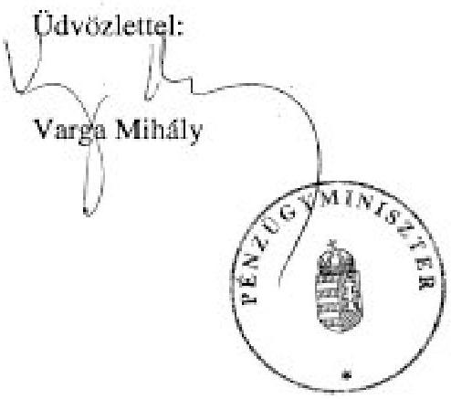

---

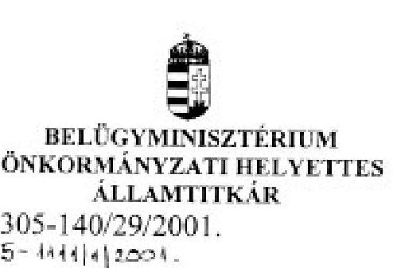

Dr. Kovács Árpád úrnak
elnök
Állami Számvevőszék

Budapest

Tisztelt Elnök Úr!

A települési önkormányzatok adóztatási tevékenységének vizsgálatáról
- dr. Pintér Sándor belügyminiszter úrnak címzett - jelentés tervezetet
köszönettel megkaptuk, megállapításaival és javaslataival alapvetően
egyetértünk.

Továbbra is megfontolásra ajánljuk, az összegző megállapítások
belügyminiszternek szóló feladatok 2. pontjának áttekintését. A jelenlegi
szabályozás - az önkormányzati törvény (Ötv.) 64. §-a - tételesen és konkrétan
meghatározza a fővárosi és kerületi önkormányzatokat önállóan és közvetlenül,
osztottan, valamint kizárólagosan megillető bevételek körét. A kerületi
önkormányzatokat megillető bevételi minimumokat a Magyar Köztársaság
2001. és 2002. évi költségvetéséről szóló 2000. évi CXXXIII. törvény
szabályozza. A forrásmegosztások szabályozásának esetleges módosítására így
csak az Ötv. módosítása során van lehetőség. Az ÁSZ által felvetett „érdemi
véleménynyilvánítást biztosító jogi keretek” megteremtésével egyetértünk. A
felosztás módszerének esetleges jövőbeni meghatározása során tekintettel kell
lenni a főváros és a kerületek közötti feladatellátás speciális jellegére.

Budapest, 2001. július 19.

Tisztelettel:

Dr. Kara Pál

---

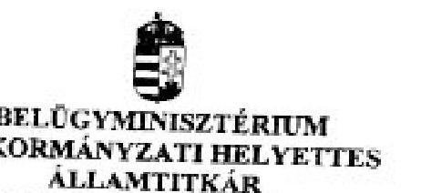

# Dr. Kovács Árpád úrnak

elnök
Állami Számvevőszék

## Budapest

### Tisztelt Elnök Úr!

A települési önkormányzatok adóztatási tevékenységének vizsgálatáról - dr. Pintér Sándor belügyminiszter úrnak címzett - jelentés tervezetet köszönettel megkaptuk, megállapításaival és javaslataival alapvetően egyetértünk.

Továbbra is megfontolásra ajánljuk, az összegző megállapítások belügyminiszternek szóló feladatok 2. pontjának áttekintését. A jelenlegi szabályozás - az önkormányzati törvény (Ötv.) 64. §-a - tételesen és konkrétan meghatározza a fővárosi és kerületi önkormányzatokat önállóan és közvetlenül, osztottan, valamint kizárólagosan megillető bevételek körét. A kerületi önkormányzatokat megillető bevételi minimumokat a Magyar Köztársaság 2001. és 2002. évi költségvetéséről szóló 2000. évi CXXXIII. törvény szabályozza. A forrásmegosztások szabályozásának esetleges módosítására így csak az Ötv. módosítása során van lehetőség. Az ÁSZ által felvetett „érdemi véleménynyilvánítást biztosító jogi keretek” megteremtésével egyetértünk. A felosztás módszerének esetleges jövőbeni meghatározása során tekintettel kell lenni a főváros és a kerületek közötti feladatellátás speciális jellegére.

Budapest, 2001. július 19.

Tisztelettel:

Dr. Kara Pál

---

# FAX

Dátum: 2001. VII. 19.

Lapok száma ezzel együtt: 3

Címzett:

Dr. Sallai Antal úr
társaság

Állami Számvevőszék

Telefon: 456-8317
Fax: 456-8317
Másolat:

MEGJEGYZÉS: [x] Sürgős [ ] Tájékoztatás [ ] Választ vár [ ] Véleményt kér

