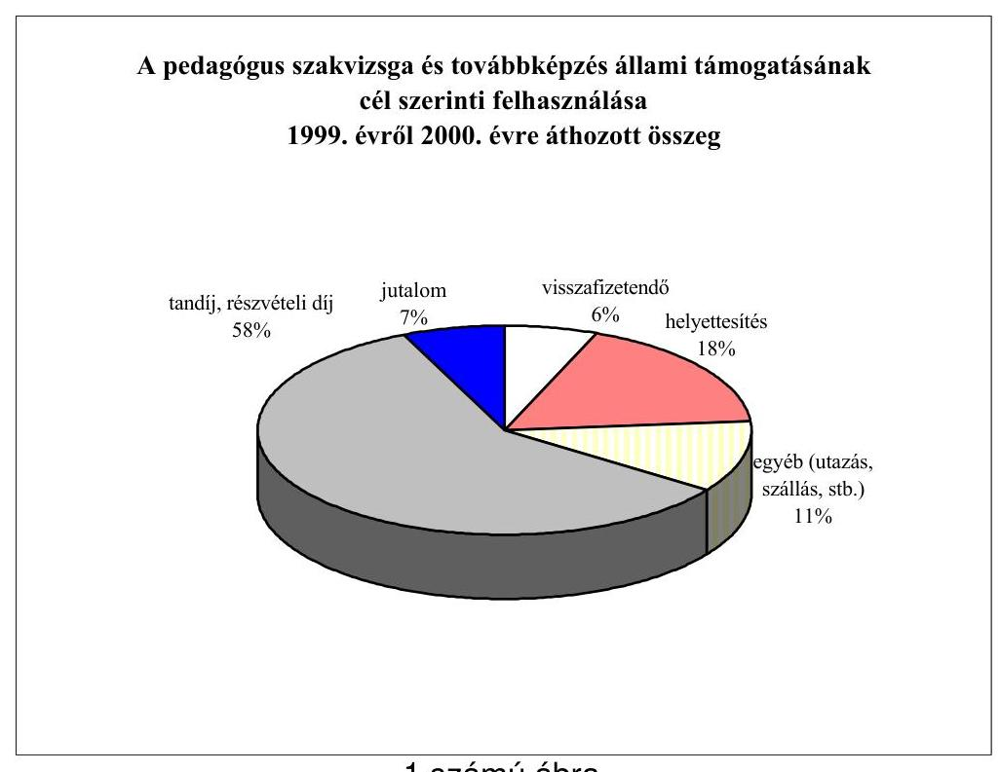
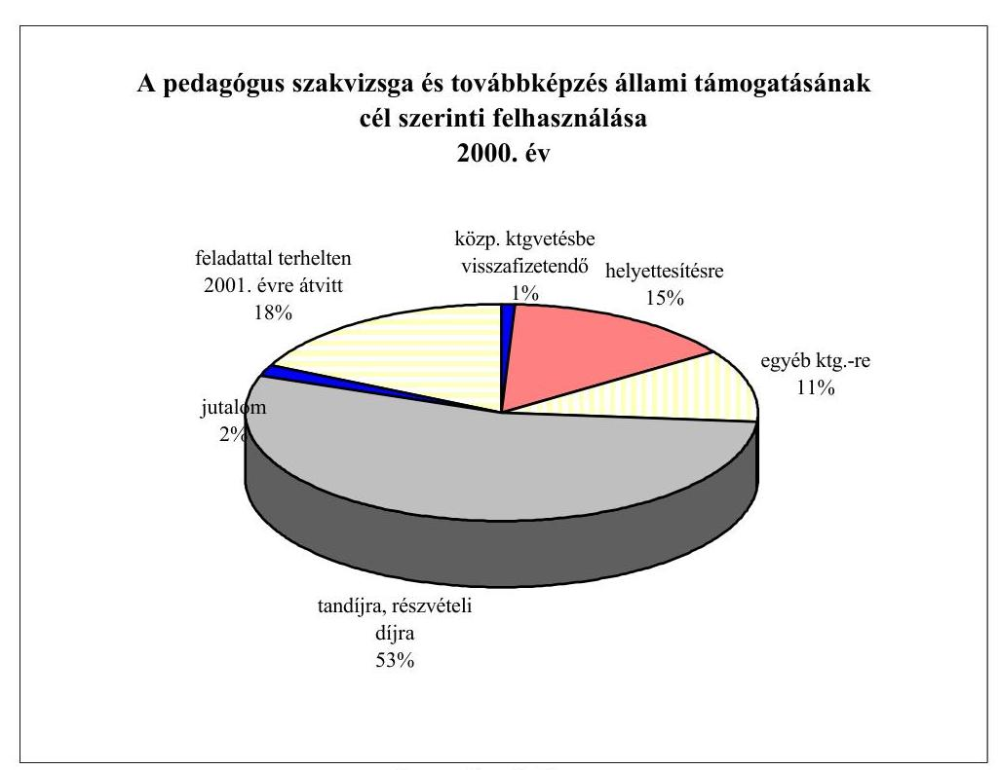
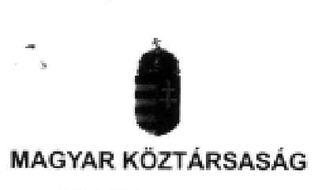
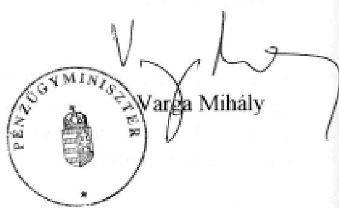
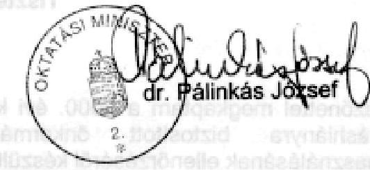

# JELENTÉS 

a kötött felhasználású és a működési forráshiányra biztosított önkormányzati támogatások igénylésének és felhasználásának ellenőrzéséről
2001. július

---

# Az ellenőrzés végrehajtásáért felelős:   V.Önkormányzati és Területi Ellenőrzési Igazgatóság 

Dr. Lóránt Zoltán számvevő igazgató

## Az ellenőrzést vezette:

## Turnheimné Lakos Zsuzsa

régióvezető főtanácsos

## A jelentés összeállításában közreműködtek:

Ambrus Lajos számvevő tanácsos dr. Klapcsik László számvevő tanácsos dr. Pál Lehelné számvevő dr.Vasváriné dr. Rózsa Anikó számvevő tanácsos

## Az ellenőrzésben résztvevők névsorát az 1. sz. melléklet tartalmazza.

## A témakörrel foglalkozó ÁSZ vizsgálatok jegyzéke:

A helyi önkormányzatok által igényelhető 1996. évi központosított előirányzatok felhasználásának ellenőrzése (V-1002/1997. A Parlament számítógépes hálózatán a vizsgálat fájl neve: 0389J000).

A helyi önkormányzatok által igényelhető 1997. évi központosított előirányzatok felhasználásának ellenőrzése (V-1002/1998. A Parlament számítógépes hálózatán a vizsgálat fájl neve: 9824J000).

A helyi önkormányzatok által igényelhető 1998. évi központosított előirányzatok felhasználásának ellenőrzéséről (V-1002/1999. A Parlament számítógépes hálózatán a vizsgálat fájl neve: 9921J000).

Jelentéseink az Országgyűlés számítógépes hálózatán
és az Interneten a www.asz.hu címen is olvashatók, továbbá a Belügyminisztérium folyóirata, az „Önkormányzati Tájékoztató" rendszeresen közli, valamint a

Megyei Közigazgatási Hivatalvezetők részére is átadásra kerül.

---

# TARTALOMJEGYZÉK 

I. ÖSSZEGZŐ MEGÁLLAPÍTÁSOK, KÖVETKEZTETÉSEK, JAVASLATOK ..... 5
II. RÉSZLETES MEGÁLLAPÍTÁSOK ..... 13

1. A vizsgálat által érintett támogatási jogcímek tartalmának változásai, az előirányzatok kialakítása, módosítása és felosztása ..... 13
1.1. Normatív, kötött felhasználású támogatás ..... 13
1.2. A központosított előirányzatok ..... 15
1.3. A működésképtelenné vált helyi önkormányzatok kiegészítő támogatása ..... 15
1.4. A működésképtelen önkormányzatok egyéb támogatása ..... 17
2. A közoktatáshoz kapcsolódó normatív kötött felhasználású támogatások ellenőrzési tapasztalatai ..... 18
2.1. A pedagógus szakvizsga és továbbképzés támogatása ..... 18
2.1.1. A szabályozási háttér változásával összefüggő problémák ..... 18
2.1.2. A továbbképzések tervezésével és a tanulmányi szerződésekkel kapcsolatos tapasztalatok ..... 20
2.1.3. A támogatás felhasználásának ellenőrzése ..... 22
2.1.4. A támogatás felhasználása és annak nyilvántartása ..... 24
2.2. A tanulók tankönyv-vásárlásának támogatása ..... 26
3. Egyes jövedelempótló támogatások kiegészítésére biztosított támogatások ellenőrzési tapasztalatai ..... 29
3.1. Rendszeres gyermekvédelmi támogatás ..... 29
3.2. Időskorúak járadéka ..... 33
3.3. Rendszeres szociális segély ..... 36
3.4. Személyes szabadságukban korlátozottak kárpótlása ..... 42
4. Önhibájukon kívül hátrányos helyzetben lévő (működési forráshiányos) helyi önkormányzatok támogatásához kapcsolódó ellenőrzési tapasztalatok ..... 42
5. Működésképtelen önkormányzatok egyéb támogatása ..... 46

---

.

---

# Jelentés 

## a kötött felhasználású és a működési forráshiányra biztosított önkormányzati támogatások igénylésének és felhasználásának ellenőrzéséről

A Magyar Köztársaság 2000. évi költségvetéséről szóló 1999. évi CXXV. törvény a helyi önkormányzatok által ellátandó feladatok finanszírozásához 71.870,3 millió Ft normatív kötött felhasználású és 13.806,1 millió Ft központosított előirányzatú állami támogatást, valamint a forráshiányos önkormányzatok önállóságának és működőképességének védelme érdekében 11.533,4 millió Ft kiegészítő támogatást biztosított.

Az állami támogatások igénybevételének, felhasználásának és elszámolásának vizsgálatára az Állami Számvevőszékről szóló 1989. évi XXXVIII. törvény 2. §. (5) bekezdése és az Államháztartásról szóló 1992. évi XXXVIII. törvény (Áht) 121. §. (3) bekezdése alapján, döntően törvényességi, szabályszerűségi szempontok szerint a 2000. évi zárszámadás ellenőrzéséhez kapcsolódóan került sor.

Az ellenőrzés alapvetően a 2000. évben igénybe vett támogatásokra terjedt ki. Abban az esetben azonban, ha az egyes ellenőrizendő ügyiratok alapján megállapítható volt, hogy korábbi időszakban vettek igénybe jogtalanul támogatást (egyes jövedelempótló támogatások), illetve a 2000. évre feladattal terhelt maradványként áthozott összeg felhasználása nem felelt meg az előírásoknak (pedagógus szakvizsga és továbbképzés támogatása), az ellenőrzés e megállapításokat is rögzítette.
A helyi önkormányzatoknál a részletes vizsgálat ebben az évben először terjedt ki a normatív kötött felhasználású állami támogatásokra, melyek 9 jogcíméből - a korábban a központosított előirányzatok között már vizsgált, az előirányzatok 60%-át kitevő

- a pedagógus szakvizsga és továbbképzés;
- a tanulók tankönyvvásárlása;
- egyes jövedelempótló támogatások (rendszeres gyermekvédelmi támogatás, időskorúak járadéka, rendszeres szociális segély, személyes szabadságukban korlátozottak kárpótlása)
jogcímekre,

---

# a működésképtelenné vált helyi önkormányzatok kiegészítő állami támogatásának 3 jogcíméből az előirányzatok 94%-át kitevő 

- az önhibájukon kívül hátrányos helyzetben levő (működési forráshiányos) helyi önkormányzatok támogatása;
- működésképtelen önkormányzatok egyéb támogatása
jogcímekre igényelt és a kapott összegekre terjedt ki.
A központosított előirányzatokhoz kapcsolódó ellenőrzésre - elaprózott volta és az önkormányzatok támogatásában képviselt alacsony részaránya miatt - csak a minisztériumoknál került sor, a 14 jogcímből az e támogatások 41%-át kitevő
- pincerendszerek és természetes partfalak veszély-elhárítási munkáinak támogatása;
- lakáscélú adósságkezelési támogatás;
- kiegészítő hozzájárulás nemzetiségi óvodák és iskolák fenntartásához;
- hozzájárulás létszámcsökkenéssel kapcsolatos kiadásokhoz
jogcímeket érintően.
A központosított előirányzatok vizsgálatának jogcímenkénti megállapításait a jelentés függeléke tartalmazza.

Az ellenőrzés célja annak megállapítása volt, hogy:

- érvényesült-e az állami támogatások feltételrendszerének jogcímenkénti szabályozása és a kapcsolódó ágazati-szakmai előírások közötti összhang;
- a központi költségvetésből a különböző feladatokra, illetve célokra biztosított támogatások mennyiben elégítették ki a jogos igényeket;
- a jogszabályi előírásoknak megfelelően történt-e az állami támogatások igénylése, felhasználása és elszámolása;
- az önkormányzatok belső és intézményi ellenőrzése vizsgálta-e érdemben a támogatások igénylését és elszámolását;
- szabályszerűen, célszerűen működik-e a támogatási rendszer.

A vizsgálandó önkormányzatok kijelölésénél alapvető szempont volt, hogy valamennyi önkormányzati típusra és kiválasztott előirányzat felhasználására általánosítható tapasztalatokat szerezzünk. A vizsgálathoz olyan önkormányzatokat választottunk, amelyeknél az elmúlt években ugyanezekben a témákban, a tárgyévben pedig átfogó ellenőrzést nem végeztünk.

Helyszíni ellenőrzést folytattunk a Pénzügy- és a Belügyminisztériumban, továbbá az ország 17 megyéjében összesen 90 települési önkormányzatnál. A Szociális és Családügyi, valamint az Oktatási Minisztériumnál - mivel a vizsgált támogatási formákat e helyeken a 2000. évi költségvetés tervezésekor már ellenőriztük - csak tájékozódtunk, illetve megállapításaink összegzéséről adtunk tájékoztatást. A vizsgálat során 187 önkormányzati intézmény - témához kapcsolódó - ellenőrzését végeztük el. A helyszíni vizsgálattal érintett önkormányzatok számára juttatott támogatásoknak az ellenőrzés tárgyát képező előirányzatok összegéhez viszonyított arányát a 2. számú melléklet mutatja be.

---

# I. ÖSSZEGZŐ MEGÁLLAPÍTÁSOK, KÖVETKEZTETÉSEK, JAVASLATOK 

Az önkormányzatok pénzügyi szabályozó rendszere az évek során főként a központi költségvetés pénzügyi lehetőségének függvényében alakult. Ezen belül a különböző kiegészítő támogatások arányai, jogcímei időről-időre az aktuális társadalompolitikai feladatok figyelembevételével változtak.

A kiegészítő támogatások részben az egyedi helyzetek kezelésére hivatottak, részben az önkormányzatok kiemelt jelentőséggel bíró konkrét feladatainak ellátásához járulnak hozzá. A felhasználási kötöttség e támogatások igénybevételi feltételeinek megfelelő mélységű ismeretét, a felhasználás pontos dokumentálását, elszámolását teszi szükségessé.

A 2000. évi normatív módon elosztott kötött felhasználású támogatások háromnegyedét a szociális jellegűek, valamint a közoktatáshoz kapcsolódóak teszik ki, így az ellenőrzés elsősorban ezek helyszíni vizsgálatára terjedt ki. A forráshiányos önkormányzatok támogatásának vizsgálatát az önkormányzatok széleskörű érintettsége - az önkormányzatoknak közel 44%-a részesült a vizsgált forrás-kiegészítő támogatások valamelyikéből - indokolta.

Az önkormányzatok pénzügyi szabályozási rendszerében a felhasználási kötöttségű normatív állami támogatások szerepe és súlya egyre nagyobb, miközben a forrásorientált szabályozási rendszer kiegészítő elemeként működő központosított előirányzatok száma és költségvetési aránya is csökkenő tendenciát mutat. Az elmúlt évek költségvetéseiben a központosított előirányzatok és a normatív kötött felhasználású támogatások között - részben az ÁSZ javaslatára - végrehajtott átcsoportosítást a kiszámíthatóság elve vezérelte; az önkormányzatok az őket alanyi jogon, feladatmutatók alapján, meghatározott fajlagos összeggel megillető állami támogatásokhoz - még abban az esetben is, ha ahhoz felhasználási kötöttség kapcsolódik - előre tervezhető módon, a normatív finanszírozás rendszerében jussanak.

A normatív, kötött felhasználású előirányzatok összege a 2000. évben 144,2%-kal magasabb volt az előző évinél, és az önkormányzatoknak biztosított állami támogatások, hozzájárulások és az átengedett személyi jövedelemadó együttes összegének 10,5%-át tette ki. A növekedést az „Egyes jövedelempótló támogatások" jogcím előirányzatának a normatív kötött felhasználású előirányzatok közé való átkerülése, ezen belül a központilag támogatható feladatok körének bővülése (rendszeres szociális segélyezés támogatása), az egyes feladatok támogatási arányának növekedése, valamint a lakossági támogatások alapjául szolgáló legkisebb öregségi nyugdíj emelkedése együttesen idézte elő.

A központosított előirányzatokról az átcsoportosításokat követően megállapítható, hogy céljuk többnyire a sajátos helyzetekből, feladatokból adódó önkormányzati többletforrás-szükséglet biztosítása. Ezen előirányzatok száma az 1999. évi 19-ről 14-re csökkent, összege az önkormányzatoknak biztosított állami támogatások és az átengedett személyi jövedelemadó együttes összegének 2000-ben - a korábbi évek 8-10%-os részarányával szemben - mindössze 2%-a volt.

---

A pénzügyi szabályozás továbbra is tartalmazza az önhibáján kívül hátrányos helyzetű önkormányzatok működőképességének biztosítása érdekében a kiegészítő mechanizmusként működő támogatási rendszert (ÖNHIKI). A 2000. évi eredeti előirányzat 1,4%-a volt az önkormányzatoknak juttatott állami támogatás és átengedett személyi jövedelemadó együttes összegének. Ez az arány az évközi előirányzat-módosítás eredményeként 1,8%-ra emelkedett, de ez még mindig kevesebb, mint az 1999. évi 1,9%. Új támogatási formaként lépett be 2000-ben a működésképtelen önkormányzatok egyéb támogatása jogcím, ami a likviditási problémák átmeneti megoldását kívánja elősegíteni.

Összességében - kiszűrve a feladatátrendeződések hatását - a kiegészítő támogatásként funkcionáló kötött felhasználású normatív támogatások, központosított előirányzatok és a működésképtelen önkormányzatok támogatása együttesen az önkormányzatoknak juttatott hozzájárulások, támogatások, átengedett személyi jövedelemadó bevételekből mintegy 2%-kal nagyobb részarányt képviseltek 2000-ben, mint az előző évben.

Az ellenőrzés körébe vont támogatások igénylésének, felhasználásának és elszámolásának rendjét a Költségvetési törvényen kívül az ágazati törvények, kormányrendeletek, évente megjelenő pályázati felhívások sora szabályozta, melyek sokasága önmagában is egyik oka volt a vizsgálat által megállapított szabálytalanságoknak. Az esetenként kiforratlan szabályokhoz társult az önkormányzatok hiányos jogszabályismerete, az igénylésekkel kapcsolatos többletadminisztráció és a felhasználási kötöttséggel összefüggő számviteli feladatok.

A támogatási igényeket az önkormányzatok a jogszabályi előírásoknak megfelelően, megalapozottan nyújtották be, de a felhasználás és annak dokumentáltsága nem felelt meg maradéktalanul a jogszabályi előírásoknak. A feltárt hibák vizsgálatunk megállapítása szerint belső- és felügyeleti ellenőrzéssel kiszűrhetők lettek volna. Az ellenőrzés hiányára utal, hogy az önkormányzatok a költségvetési beszámolóhoz kapcsolódóan jellemzően nem számoltatták el intézményeiket az oktatási támogatási jogcímek felhasználásáról, hanem az általuk szolgáltatott adatokat felülvizsgálat nélkül elfogadták.

A témavizsgálatot a költségvetési beszámoló elkészítése időszakában folytattuk le, így érvényesülhetett a vizsgálat preventív jellege, mivel az ellenőrzési megállapításokat az önkormányzatok figyelembe vehették annak összeállítása során. Nehezítette és időigényesebbé tette a helyszíni ellenőrzéseket ugyanakkor, hogy a költségvetési beszámoló és az ahhoz kapcsolódó elszámolások a vizsgálat időpontjában még nem álltak teljes körűen rendelkezésre.

A központosított előirányzatokat a célnak és az önkormányzati igényeknek megfelelően, a jogszabályi előírások és pályázati felhívások figyelembevételével biztosították az igényjogosultaknak. Az is megállapítható, hogy - főként a helyi önkormányzati és lakossági források hiánya miatt - a lakáscélú adósságkezelési támogatást, a létszámcsökkentési lehetőségek kimerülése miatt pedig az e célra eredetileg tervezett előirányzatot csak részben tudták igénybe venni az önkormányzatok. A 2001-2002. évi költségvetési törvény e központosított előirányzatok tekintetében már számol a szükséges módosításokkal.

---

Az önkormányzatok a közoktatáshoz kapcsolódó ellenőrzött normatív, kötött felhasználású támogatásokat alapvetően a rendeltetésüknek megfelelő célokra fordították. E támogatások szabályszerű és célszerű felhasználását azonban számos tényező - közülük néhány évről-évre visszatérően - nehezítette.

A pedagógus szakvizsga és továbbképzés költségeinek 1997. évtől bevezetett állami támogatása a pedagógusok számára kiemelkedő jelentőségű, hiszen lehetőséget biztosít szaktudásuk aktualizálásához.

A támogatás szabályozása aprólékos, ugyanakkor nincsenek összhangban az ágazati, a költségvetési és a beszámolási előírások. A naptári
 évhez igazodó költségvetés és a tanévekre készített beiskolázási tervek közötti összhang megteremtése nehézkes, jelentősen növeli a nyilvántartási és elszámolási feladatokat, a feladattal terhelten következő évre átvitt – 1999. és 2000. évi – támogatások elszámoltatására pedig nincs központi előírás.

A szabályozás további hiányossága, hogy a többféle statisztikai létszám közül az igénylésnél és elszámolásnál figyelembe veendőt nem rögzítette. Az átlaglétszámra alapozott támogatás a korábbinál bizonytalanabbá tette az éves beiskolázási terv finanszírozását.

A továbbképzést szabályozó kormányrendelet már a hatályba lépésekor is túlzott követelményeket támasztott az ötéves továbbképzési program és az éves beiskolázási terv tartalmi követelményeit illetően, ezért az előírásokat nem vagy csak részben tudta teljesíteni a közoktatási intézmények közel fele. Hiányosságokat elsősorban a helyettesítési és a finanszírozási alprogramoknál tapasztaltunk, amelyek információ és a központi iránymutatás hiányára vezethetők vissza, de a fenntartói és belső ellenőrzés sem minősíthető kielégítőnek.

Az intézmények 94%-ánál a támogatás felhasználása összhangban volt a jogszabályi feltételekkel, annak dokumentálása – a maradványra vonatkozó kötelezettségvállalás kivételével – 87%-ban megfelelt az előírásoknak. Ugyanakkor a továbbképzési programok kidolgozatlansága, a változások miatti felülvizsgálat és aktualizálás elmaradása következtében a finanszírozási alprogrammal való összhang nehezen volt megállapítható, értelmezhető. A részvételi díjból a pedagógusok önrészét az intézmények – néhány kivételtől eltekintve – megfelelően állapították meg, az intézmények közel kétharmada saját költségvetése terhére ezt az összeget részben vagy egészben átvállalta.

Az állami támogatás terhére történő jutalmazás elve helyileg nem szabályozott, mértékét és feltételeit nem határozták meg. Az állami támogatás 2000. évi 30%-os – kistelepüléseken 50%-os – csökkentése ugyanakkor a jutalmazás lehetőségét az intézmények többségénél már ki is zárta. Nem egyértelmű a szabályozás és egységes gyakorlat sem alakult ki a tanulmányi szerződéskötést illetően.

Az állami támogatás segítette a pedagógusok ismereteinek bővítését, korszerűsítését. A középtávú továbbképzési programok célkitűzéseinek teljesülése időarányosnak, illetve annál kedvezőbbnek tekinthető.

---

A tanulók tankönyv vásárlásának állami támogatását szabályozó miniszteri rendelet előírásaiból az intézmények több mint egyharmada nem tartotta be a szociális helyzet felmérésére, a támogatás legalább 25%-ának tartós tankönyv, segédkönyv beszerzésére vonatkozókat. Véleményük szerint ezen előírások rugalmatlanok, nem igazíthatók a helyi szükségletekhez, a támogatás terhére vásárolható segédkönyvek köre pontatlanul van meghatározva. A tartós tankönyvek szükségét azért nem érzik, mivel a tankönyvek kötése gyenge minőségű, hamar elhasználódnak, a szülők – anyagi helyzettől függetlenül – idegenkednek attól, hogy gyermekük más által már használt tankönyvekből tanuljon.

A központi költségvetésből kapott tanulói tankönyv támogatást az önkormányzatok – néhány kivételtől eltekintve – iskolatípustól függetlenül, differenciálás nélkül adták tovább intézményeiknek. A támogatás differenciált elosztása intézményi szinten sem volt jellemző, az iskolák 25%-a a tankönyvcsomagok árát, 18%-uk a tanulók szociális helyzetét figyelembe véve osztotta el a rendelkezésre álló támogatást.

A tanulók tankönyv vásárlásának állami támogatása a növekvő tankönyvárak egyre kisebb hányadát fedezi, ennek ellensúlyozására az önkormányzatoknak több mint 40%-a saját forrásaiból kiegészítette a központi költségvetési támogatást. A települések közel egyötödénél ingyenessé tették a tanulók egy részének vagy egészének tankönyvellátását.

A tankönyvtámogatás felhasználásának elszámolásait az intézmények és az önkormányzatok ellenőrizték, számszakilag felülvizsgálták. Ennek ellenére a támogatás átvétele ingyenes tankönyvellátás esetén egyáltalán nem, a támogatással csökkentett befizetendő összeget tartalmazó átvételi elismervények alkalmazása esetén pedig csak közvetett módon volt aláírással igazolva.

A központi támogatás helyi kiegészítése, az elszámolások dokumentáltsága és ellenőrzöttsége, valamint a Közoktatási törvényben is rögzített támogatási kötelezettség, de a tankönyvtámogatás társadalmi elfogadottsága miatt sem szükséges a felhasználási kötöttség további fenntartása.

A rászoruló családok széles köre és az önkormányzatok bővülő szociális feladatai következtében növekvő fontosságúak és egyre jelentősebb összeget tesznek ki a szociális jellegű állami támogatások. Ezek igénybevételével és felhasználásával kapcsolatban a vizsgálat kedvező tapasztalatokat szerzett. A segélyezéssel, a támogatások igénybevételével kapcsolatos joganyag kiforrott, jelentősebb jogszabályi változások az elmúlt évben nem voltak – és megfelelő eligazítást ad a végrehajtásban közreműködők számára. A feltárt hiányosságok a jogszabályi előírások helytelen értelmezéséből, figyelmetlenségből vagy a munka mennyiségével arányban nem álló személyi feltételekből adódtak.

A gyermekes családok részére – meghatározott jövedelemhatár alatt – alanyi jogon járó rendszeres gyermekvédelmi támogatás igénybevételét meghatározó jogszabályok egyértelműen szabályozzák a támogatás igénybevételének módját, feltételeit. A tanulmányaikat folytató nagykorúak esetében mégis szükség lenne a jogszabályok módosítására annak érdekében, hogy támogatásuk – a korábbi segélyezéstől függetlenül – azonos módon történhessen. A

---

nagykorúak támogatásával kapcsolatos törvényi értelmezés a vizsgált önkormányzatok 10%-ánál gondot okozott, ezért a vizsgálat jogosulatlan támogatás-igénybevételt is elsősorban ennek kapcsán állapított meg.

A támogatás igénybevételét meghatározó jogszabályok 2000. január 1-től a vagyonnyilatkozat kérési lehetőséggel módosultak. Ennek megfelelően a vizsgált önkormányzatok közel háromnegyede módosította helyi rendeletét. A helyi rendeletek 15%-ánál kisebb hiányosságokat állapított meg a vizsgálat.

A Gyermekvédelmi törvény által előírt analitikus nyilvántartást az önkormányzatok vezették, de azok a törvény által meghatározott információkat a vizsgált önkormányzatok közel 40%-ánál hiányosan tartalmazták. A támogatás megállapításához szükséges jövedelemnyilatkozatok és azok dokumentumokkal való alátámasztása tekintetében is tapasztalt a vizsgálat hiányosságokat. Az önkormányzatok – néhány kivételtől eltekintve – a támogatottak jövedelmi viszonyait évente felülvizsgálták.

Az időskorúak járadékában részesülők száma a támogatási forma 1998. évi bevezetése óta eltelt időszakban csökkent, kevés volt az új igénylő, ami a hagyatéki teher visszatartó hatásának tudható be. Az önkormányzatok a helyi szabályozásban a központi előírásokat követték, a járadékot a megfelelően dokumentált törvényi feltételek alapján, jogszerűen állapították meg.

A vizsgált kör egyötödére jellemző hiányosság, hogy a hagyatéki teher bejelentési kötelezettséget az önkormányzatok nem tüntetik fel a határozatokban. Ezzel meghiúsult a későbbi igényérvényesítés, a kifizetett járadék visszatérülésének lehetősége. A hagyatéki terhet bejelentő önkormányzatoknál több tényező – helytelen közjegyzői jogértelmezés, értékesítés elhúzódása – is akadályozta az abból származó bevétel realizálását. A vizsgálat megállapításai szerint a bevételhez jutó önkormányzatok közel fele nem tett eleget a központi költségvetés felé előírt befizetési kötelezettségének.

A rendszeres szociális segély 1997. évi bevezetése óta történt szabályozásváltozások több alkalommal módosították az ellátásban részesülők körét. A 2000. évben hatályba lépett törvénymódosítás hatására a segélyezettek létszáma megháromszorozódott. Az önkormányzatok a segély megállapításának, folyósításának feltételeiről a jogszabályi előírásokkal összhangban levő, a változásokat követő helyi rendeletet alkottak. Az ellátást kérelmezők a szükséges igazolásokat, nyilatkozatokat benyújtották. Hiányosságot a vagyonnyilatkozatok, iskolai bizonyítványok esetében állapított meg az ellenőrzés, az előbbieket az önkormányzatok 9%-ánál, az utóbbiakat 22%-uknál nem csatolták a kérelemhez. A segélyek megállapítása, szüneteltetése, megszüntetése során az önkormányzatok intézkedései szabályszerűek voltak.

A Szociális törvényben előírt, legalább 30 napos foglalkoztatást leggyakrabban a helyi kommunális feladatok ellátására, közcélú munka keretében biztosították. Az önkormányzatok a segélyezési időszak elején a foglalkoztatást nem tudták minden érintett esetében megoldani. Ennek oka elsősorban a felajánlható munka hiánya, a segélyezettek munkaalkalmasságának problémái, szer-

---

vezési gondok voltak. A segélyek felülvizsgálatával, a jogosulatlanul felvett ellátás visszatéríttetésével kapcsolatban előforduló hiányosságok az önkormányzatok 14%-át érintették. A nem egyértelmű időpont meghatározás miatt bizonytalanság volt a januárban esedékes kifizetések utáni állami támogatás igénylésével kapcsolatban, a vizsgált önkormányzatok egy tizedénél ezért pótlólagos juttatásra való jogosultságot állapított meg az ellenőrzés.
2000. évben az önkormányzatoknak több mint egyharmada részesült a működésképtelenné vált önkormányzatok kiegészítő támogatásában, az egy településre jutó támogatás összege – az utóbbi négy évben évi 0,9-1,6 millió Ft-tal, 9-22%-kal – évről évre nő. A támogatottak köre viszonylag változatlan, azaz évente ugyanazon önkormányzatok kerülnek működési forráshiányos helyzetbe. A társadalmilag, gazdaságilag elmaradt térségekben az alacsony lakosságszámú települések nem rendelkeznek kötelező feladataik ellátásához az állami hozzájáruláson felül szükséges helyi forrásokkal, és intézményeik kihasználtsága is elmarad az optimálistól. A működési forráshiányos önkormányzatok számát és a támogatási összeget növeli az is, hogy a jelenlegi szabályozás – elismerve ezen önkormányzatok jogos fejlesztési igényeit is – a felhalmozási célra fordítható bevételi forrásokat bővíti, és közvetett módon a működési kiadások növelésére ösztönöz.

Nagy előrelépés a forráshiány algoritmizált számítási módszere, ennek ellenére – elsősorban a kisebb községi önkormányzatok kevésbé megbízható költségvetési, számviteli rendszere miatt – ez is rejt hibalehetőséget, amit a többlépcsős ellenőrzés során végrehajtott korrekciók is alátámasztanak. A forráshiány bonyolult számítási metodikájának ellenőrzése nagy leterheltséget jelent mind a Területi Államháztartási Hivataloknak, mind a felülvizsgálatot végző PM-BM szakembereknek és nem utolsósorban jelentős munkát okoz a pályázati anyag elkészítése a kistelepülések önkormányzatainak is. Ugyanakkor rontotta e kiegészítő támogatási rendszer hatékonyságát, hogy egyrészt az eredeti feltételrendszertől eltérő tartalmú felülvizsgálati kérelmek kedvező elbírálására is sor került, másrészt az e támogatási forma alapján objektíven juttatható összegen felül a működésképtelen önkormányzatok egyéb támogatásából is részesülhettek egyes önkormányzatok.

A 2000. évi költségvetési törvény az igénybejelentés alapjául szolgáló feltételrendszer teljesüléséről elszámolási kötelezettséget ír elő az önkormányzatoknak. Ez az elszámoltatás azonban független a tényleges működési bevételek és kiadások alakulásától, ezért érdemi információt nem tartalmaz. A jóváhagyott és igénybe vett ÖNHIKI támogatást azon önkormányzatoknak sem kell visszafizetni, amelyeknek teljesítési adatai kedvezőbben alakulnak az elbíráláskor figyelembevettnél, és nincs ténylegesen elismerhető forráshiányuk.

Összességében az elmúlt évek változási tendenciáját értékelve az a következtetés vonható le, hogy a bonyolult igénylési rendszer és az évente szigorodó feltételek ellenére a forráshiányos önkormányzatok száma – az 1994. évihez képest két és félszeresére, de az 1996-98. évekhez képest is közel másfélszeresére – növekedett, ami a forrásszabályozási rendszer problémájára hívja fel a figyelmet.

---

Az önhibáján kívül hátrányos helyzetű önkormányzatok számának csökkenését az eredményezhetné, ha – összhangban az 1052/1999. (V. 21.) Kormány határozatban foglaltakkal – sor kerülne az önkormányzati feladat- és hatáskörök felülvizsgálatára, melynek alapján az önkormányzati szabályozásban a feladatok koncentrálása, a feladat- és hatáskörök megfelelő módon való rendeződésével együtt az önkormányzati forrásszabályozás megújulása is megvalósulna.

A vizsgálati megállapítások alapján a helyszíni ellenőrzést végző számvevők különböző intézkedések megtételét javasolták az önkormányzatoknak. Ezek jelentős része a támogatási jogcímek többségét érintően

- a helyi rendeletek, szabályzatok felülvizsgálatára, a központi szabályozással összhangban lévő pontosítására, módosítására,
- az analitikus nyilvántartások kiegészítésére, pótlására, a támogatás igénylés megalapozottságát szolgáló egyeztetések elvégzésére,
- a felügyeleti és belső ellenőrzésnek a támogatások elszámolásával kapcsolatos teendőire
hívta fel a figyelmet.
Az egyes támogatási jogcímekhez kapcsolódóan további javaslatokat tettünk:
- a pedagógus szakvizsga és továbbképzés támogatásával kapcsolatban a középtávú továbbképzési programok és a beiskolázási tervek felülvizsgálatára, kiegészítésére;
- a tanulók tankönyvvásárlási támogatása esetében az átvétel egyértelmű dokumentálására, a jogszabály által előírt felmérések, tájékoztatások elvégzésére;
- a gyermekvédelmi támogatásnál a nagykorú támogatottakkal, valamint az egyszeri gyermekvédelmi támogatással kapcsolatos helyi szabályok egyértelmű rögzítésére;
- az időskorúak járadéka esetében a hagyatéki teher ügyintézése során a törvényi előírások fokozottabb betartására.

E javaslatokat figyelembe véve a helyszíni ellenőrzést követően – az összefoglaló jelentés tervezet elkészültéig – az önkormányzatok 11%-a küldte meg a hibák megszüntetése érdekében az intézkedési tervét.

Összességében a helyszíni vizsgálattal egyenlegében 7564 ezer Ft állami támogatás elszámolási különbözetet állapítottunk meg, amelyből 3950 ezer Ft-ot az önkormányzatok éves költségvetési beszámolójukban
 figyelembe vették, így a zárszámadási törvénynek a fennmaradó 3614 ezer Ft-ra vonatkozóan kell intézkednie.

A vizsgálat során fentieken kívül 1997-re 10, 1998-ra 221, 1999-re pedig 2950 ezer Ft jogosulatlanul igénybe vett támogatást is feltártunk, amit a 6. sz. melléklet mutat be.

---

A helyszíni vizsgálatok lezártát követő önkormányzati zárszámadási és átfogó ellenőrzések során feltárt jogtalanul igénybe vett támogatásokat a 7. sz. melléklet mutatja be.

A vizsgálat tapasztalatai alapján az Állami Számvevőszék javasolja, hogy

# a Kormány 

1. A pedagógus-továbbképzésről, a pedagógus-szakvizsgáról, valamint a továbbképzésben résztvevők juttatásairól és kedvezményeiről szóló 277/1997. (XII. 22.) Korm. rendelet módosításával

- tegye egyszerűbbé, egyértelműbbé és ellenőrizhetőbbé a pedagógus szakvizsga és továbbképzés rendszerének szabályozását;
- szabályozza egyértelműen a részvételi díj 80%-a feletti állami támogatás elszámolhatóságának kritériumait, a tanulmányi szerződéskötés indokolt eseteit;
- hangolja össze az ágazati és pénzügyi szabályozást, a költségvetésre és beszámoltatásra vonatkozó jogszabályokat.

2. Szabályozza a korábbi támogatási előzményektől függetlenül a nagykorú, de nappali tagozaton nem középiskolai tanulmányokat folytató fiatalok - gyermekvédelmi támogatást felváltó - kiegészítő családi pótlék támogatását.

## a pénzügyminiszter

1. Gondoskodjon a zárszámadás keretében a helyszíni vizsgálat által feltárt - az 5. sz., valamint a 7. sz. mellékletekben felsorolt - jogtalanul igénybe vett támogatások és pótlólagos járandóságok, ennek keretében az önkormányzati beszámolókban nem szerepeltetett, 3614 ezer Ft-os egyenleg előirányzati szinten történő rendezéséről.
2. Dolgozza ki a folyamatosan működési forráshiányos önkormányzatoknak - utólagos elszámolás mellett - biztosítandó kiegészítő normatív támogatására vonatkozó javaslatát, hogy az a feladat- és hatáskörökhöz igazodó forrásszabályozás megvalósulásáig megoldást jelentsen e kör számára.
3. A 2001-2002-ben változatlan ÖNHIKI támogatási rendszer alkalmazása során

- a támogatás odaítélésekor kölcsönösen vegyék figyelembe az igénylő önkormányzatnak juttatott egyéb forráspótló támogatásokat (működési forráshiányos önkormányzatok egyéb támogatása, nemzetiségi óvodák és iskolák fenntartásához biztosított kiegészítő támogatás) is;
- felülvizsgálati kérelem lehetősége esetén ne fogadjanak be az eredeti feltételrendszertől eltérő tartalmú kérelmeket.

## az oktatási miniszter

1. Kezdeményezze, hogy a tanulók tankönyvvásárlásának támogatása épüljön be a felhasználási kötöttség nélkül biztosított normatív finanszírozás rendszerébe.

---

2. Fontolja meg a tankönyvtámogatás helyi felhasználására vonatkozó kötelező arány feloldásának lehetőségét.

# a szociális és családügyi miniszter 

1. Adjon útmutatást az időskorúak támogatásával foglalkozó önkormányzati szakapparátusok számára annak érdekében, hogy a hagyatéki teher rendezésével kapcsolatos feladataikat az előírásoknak megfelelően és eredményesen tudják ellátni.

## II. RÉSZLETES MEGÁLLAPÍTÁSOK

## 1. A VIZSGÁLAT ÁLTAL ÉRINTETT TÁMOGATÁSI JOGCÍMEK TARTALMÁNAK VÁLTOZÁSAI, AZ ELŐIRÁNYZATOK KIALAKÍTÁSA, MÓDOSÍTÁSA ÉS FELOSZTÁSA

A központosított előirányzatokból és a normatív kötött felhasználású támogatások előirányzatából támogatható feladatok körében 1999-2000. években - a korábbi ÁSZ vizsgálatok megállapításait, javaslatait is figyelembe véve - jelentős változások történtek. Azon feladatokat, amelyeknek támogatása feladatmutatók alapján, meghatározott fajlagos összeggel történt, a központosított előirányzatokból a normatív, kötött felhasználású támogatások körébe csoportosították át, a központosított előirányzatok között pedig újabb jogcímek (pl. kiegészítő támogatás nemzetiségi óvodák és iskolák fenntartásához, hozzájárulás a könyvvizsgálatra kötelezett helyi önkormányzatok számára) jelentek meg. A központi költségvetésben rendelkezésre álló előirányzatok - a támogatandó feladatok körének változása következtében - a korábbi évekhez képest jelentős mértékben átrendeződtek.

Az önkormányzatoknál ellenőrzött előirányzatok országos teljesítési adatait a 3/a, a központilag ellenőrzött központosított előirányzatokét pedig a 3/b. sz. melléklet mutatja be.

Az ellenőrzött önkormányzatok által igénybe vett, felhasznált, kötelezettségvállalással terhelt, illetve visszafizetendő támogatásokat a 4. sz. melléklet mutatja be.

### 1.1. Normatív, kötött felhasználású támogatás

Normatív, kötött felhasználású támogatás jogcímen 1999. évtől juthattak az önkormányzatok kiegészítő forrásokhoz, amikor a központosított előirányzatok közül az oktatással kapcsolatos jogcímek, valamint a helyi önkormányzati hivatásos tűzoltósági feladatok kerültek át ebbe a támogatási formába.

A 2000. évben az egyes jövedelempótló támogatások és a lakossági folyékony hulladék ártalmatlanításának támogatása is e jogcímbe került, ugyanakkor a

---

nemzeti, etnikai kisebbséghez tartozók oktatásához rendelt kiegészítő támogatások felhasználási kötöttsége megszűnt.

A normatív, kötött felhasználású támogatások eredeti költségvetési előirányzata az 1999. évi 29.426,7 millió Ft-ról a 2000. évi költségvetésben 71.870,3 millió Ft-ra növekedett. A 144,2%-os emelkedés oka elsősorban az „Egyes jövedelempótló támogatások kiegészítése" jogcím átkerülése és annak jelentős, előző évhez képest 80,2%-os előirányzat-növekedése. Ez utóbbi növekedést a támogatás alapjául szolgáló legkisebb öregségi nyugdíj 15.350 Ft-ról 16.600 Ft-ra történő emelése, az időskorúak járadékában és a rendszeres gyermekvédelmi támogatásban részesülők állami támogatási arányának 5%-os (70%-ról 75%-ra) növekedése tette szükségessé.

Bővült a támogatott feladatok köre is, mivel 2000. évtől a rendszeres szociális segélyezetteknek kifizetett támogatás összegének 75%-át is visszaigényelhették az önkormányzatok ezen előirányzat terhére. Az ágazati szakmai jogszabályok évközi változása (2000. május 1-től) következtében a rendszeres szociális segélyben részesülők után a közcélú foglalkoztatás időszakára felmerült kiadások egy részére (a rendszeres szociális segély 75%-ának mértékéig) szintén ez az előirányzat biztosított fedezetet. A vizsgálat megállapította, hogy ténylegesen a közcélú foglalkoztatás előirányzatának terhére biztosították e támogatást is. (A közcélú foglalkoztatás kiadásait a 2001-2002. évi költségvetési törvény alapján már nem az „egyes jövedelempótló támogatások kiegészítése" előirányzatból, hanem teljes egészében az azonos elnevezésű előirányzatból kell visszaigényelni.)

A központi költségvetésből az önkormányzatokat megillető források nagyságrendjét meghatározó ágazati szakmai törvények változásai közül megemlítendő a közoktatásról szóló törvény módosulása. A pedagógus továbbképzésre valamint a körzeti, térségi feladatokra tervezett támogatások mértékét a módosítás nem külön-külön, hanem együttesen határozza meg, így ezeket a normatív állami hozzájárulási összeg függvényében biztosítandó 7%-os támogatáscsomag részeként 7732,3 millió Ft-os összeggel tervezték. A garantált támogatások további részét a BM fejezet „Nem állami humánszolgáltatások normatív támogatása" költségvetési alcímén, illetve az OM fejezet „Közoktatási feladatfinanszírozás" alcímén, elkülönített előirányzatként tervezték meg.

A normatív, kötött felhasználású támogatások előirányzata évközi lemondások, intézményátadások miatt 71.803,7 millió Ft-ra csökkent. A módosított előirányzatot 87,2%-ban használták fel, a maradvány 9179,2 millió Ft, amelynek 72,3%-a az egyes jövedelempótló támogatások kiegészítésére biztosított 37.519,8 millió Ft-os előirányzat maradványa. E támogatási jogcím előirányzata több feladat ellátásához biztosít kiegészítő forrást, de az előirányzatot feladatok között nem bontották meg, így nem állapítható meg, hogy a maradvány melyik feladat túltervezéséből adódott. Jelentős maradvány képződött még az önkormányzatok által szervezett közcélú foglalkoztatás támogatásának 3773,0 millió Ft-os előirányzatából. A mindössze 30,6%-os felhasználás következtében az előirányzat maradványa 2616,3 millió Ft. Az új támogatási lehetőséget az önkormányzatok nem használták ki, a közcélú munka megszervezése - a helyszíni vizsgálati tapasztalatok alapján is - jelenleg még

---

akadozik annak ellenére, hogy a hatályos jogszabályok ennek megszervezését kötelező erővel előírják.

# 1.2. A központosított előirányzatok 

A központosított előirányzatokból finanszírozható feladatok száma az 1999. évi 19-ről 14-re csökkent, a jóváhagyott eredeti előirányzat (13.806,1 millió Ft) pedig az 1999. évinek 31,5%-a.
Az 1999. évi költségvetés végrehajtásáról szóló 2000. évi CXVIII. tv. 25.§ (7) bekezdése 18.806,1 millió Ft-ra módosította a központosított támogatások 2000. évi előirányzatát, mivel 5000 millió Ft-ot hagyott jóvá a szociális és gyermekjóléti feladatok ellátásában dolgozók egyszeri keresetkiegészítésére. Ezen kívül a létszámcsökkentéssel kapcsolatos kiadásokra jóváhagyott 4000 millió Ft-os eredeti előirányzatból a 2000. évi árvízkárok helyreállításához kapcsolódóan a vis maior tartalékba 1500 millió Ft-ot; az önhibájukon kívül hátrányos helyzetben lévő (működési forráshiányos) helyi önkormányzatok támogatásának II. üteméhez 430,7 millió Ft-ot csoportosítottak át. Az előirányzat átcsoportosítások a hatályos törvényi előírásoknak megfelelően történtek.

A központosított támogatások 2000. évi módosított előirányzatát (16.875,4 millió Ft) 96%-ban használták fel, a teljesítés 16.206,7 millió Ft. Előirányzat túllépés egyik jogcím esetében sem volt. A maradványok összege - egy kivételtől (lakáscélú adósságkezelési támogatás) eltekintve - nem jelentős.

### 1.3. A működésképtelenné vált helyi önkormányzatok kiegészítő támogatása

A működésképtelenné vált helyi önkormányzatok kiegészítő támogatására (ÖNHIKI) a 2000. évi költségvetési törvény az előző évhez képest 25,4%-kal több eredeti előirányzatot biztosított. A támogatás igényléséhez szükséges módszertani útmutatót a Pénzügyminisztérium a Belügyminisztériummal közösen a Költségvetési törvényben meghatározott határidőre elkészítette. Lényegesen szigorodtak a forráshiány kimunkálásának szabályai, amelynek következtében alapvetően csökkent a kimutatható forráshiány, illetve az elismerhető támogatási igény mértéke.

Ennek ellenére a működési forráshiányos önkormányzatok támogatására a 2000. évi költségvetési törvényben biztosított 9613,4 millió Ft eredeti előirányzat - tekintettel arra, hogy az önkormányzatok támogatási igénye meghaladta a rendelkezésre álló összeget, - kevésnek bizonyult, ezért két alkalommal módosították. A törvényi előírásoknak megfelelő átcsoportosítások eredményeképpen a támogatási jogcím előirányzata 12.378,8 millió Ft-ra, 28,8%-kal növekedett:
2000. júliusában - a Költségvetési törvény előírásaival összhangban - a normatív módon elosztott, központi költségvetési kapcsolatokból származó források lemondásából felszabaduló előirányzatokból 2308 millió Ft-tal emelték meg a támogatási jogcím előirányzatát.

---

A II. ütemű kérelmek fedezetéhez a diáksporttal kapcsolatos intézményátadásokból felszabaduló normatív, kötött felhasználású támogatás előirányzatából 0,4 millió Ft-ot, a tanulók tankönyvvásárlási támogatásának lemondásából felszabaduló előirányzatból 26,3 millió Ft-ot, a létszámleépítés központosított előirányzatából pedig 430,7 millió Ft-ot csoportosított át a pénzügyminiszter és a belügyminiszter.

A 2000. évi kiegészítő támogatás terhére - utólagos elszámolási kötelezettség mellett - 648 önkormányzat 4613,6 millió Ft összegben (a támogatási összeg eredeti előirányzatának 48%-a) kért előleget, amelyről részben vagy egészben 57 önkormányzat (8,8%) 147,8 millió Ft összegben lemondott. Az előleg igénybevételével kapcsolatosan 29,3 millió Ft kamatot fizettek be az önkormányzatok.

A benyújtott kérelmek számából és a támogatási igények összegéből megállapítható, hogy a forráshiányos önkormányzatok nagyrészt az I. ütemben éltek a kiegészítő támogatás igénylési lehetőségével, 1134 helyi önkormányzat igényelt támogatást 16.616,9 millió Ft összegben. A TÁKISZ-ok valamint a PM-BM felülvizsgálatát követően 1070 kérelmet (94,3%-ot) javasoltak támogatásra 11.013,8 millió Ft (a jelzett támogatási igény 66,3%-a) összegben.

A támogatási rendszer II. ütemében 293 önkormányzat nyújtotta be támogatási igényét 3542,6 millió Ft összegben. Ebből a felülvizsgálatokat követően 219 önkormányzat részesült 1364,9 millió Ft kiegészítő támogatásban. A támogatottak közül 81 volt az új igénylő önkormányzat, amelyeknek 459,8 millió Ft támogatást hagytak jóvá, és a felülvizsgálati kérelmet benyújtó önkormányzatok közül 138 (71,9%) részesült 905,1 millió Ft támogatásban. Ekkor 74 önkormányzat kérelmét utasították el jogosan, mivel a törvény feltételrendszere alapján forráshiányuk nem volt megalapozott.

Összességében a két ütemben benyújtott 1235 önkormányzati kérelemből 1151 önkormányzat részesült támogatásban, az elutasított kérelmek aránya 6,8%. Az önkormányzatok az igényelt támogatási összeg 61,4%-át, a módosított előirányzat egészét, 12.378,8 millió Ft-ot kapták meg.

A kiegészítő támogatásban részesülő önkormányzatok 92,2%-a községi, nagyközségi önkormányzat. Továbbá 7 megyei önkormányzat és egy megyei jogú város részesült a teljes támogatási előirányzat 6,2%-ának megfelelő összegű, átlagosan 96,7 millió Ft-os támogatásban. Ugyanakkor a városok és községek körében az egy települési önkormányzatra jutó támogatás átlagos összege 10,2 millió Ft volt. Területileg a forráshiány döntően azoknál az önkormányzatoknál keletkezett, amelyek gazdasági és társadalmi szempontból is az elmaradott térségekbe tartoznak. (Borsod-Abaúj-Zemplén valamint Szabolcs-Szatmár-Bereg megye, amelyek a jóváhagyott támogatási összeg 39,8%-át kapták meg a két ütemben együttesen).

A támogatás odaítéléséről készített közös javaslatot a pénzügyminiszter és a belügyminiszter a Költségvetési törvényben jóváhagyott határidőre bemutatta az Országgyúlés Önkormányzati és
 rendészeti bizottságának.

---

# 1.4. A működésképtelen önkormányzatok egyéb támogatása 

A működésképtelen önkormányzatok egyéb támogatása jogcímen 2000. évben első alkalommal biztosított a Költségvetési törvény a likviditási helyzet átmeneti megoldásához támogatást. A törvényben jóváhagyott előirányzat 1200 millió Ft volt, amelyet év közben nem lehetett növelni, felhasználása öt ütemben, 100%-ban megtörtént.
A támogatást visszatérítendő és vissza nem térítendő formában lehetett odaítélni, azonban csak az utóbbira került sor. A támogatás jóváhagyásának feltételeit a törvény nem határozta meg, szabályozási kötelezettséget - az egyedi problémák kezelhetősége érdekében - nem írt elő, elosztását a belügyminiszter hatáskörébe utalta.

A 342 kérelmet benyújtó önkormányzatból 259 részesült forrás-kiegészítő támogatásban. Egy önkormányzatra átlagosan 4,6 millió támogatás jutott. 83 önkormányzat kérelmét elutasították, amelynek visszatérő indoka az volt, hogy a forráshiányt az önkormányzat évközi teljesítési adatai nem támasztották alá, illetve az ÖNHIKI támogatás a likviditási problémát kezelni tudja.

Az első három alkalommal a támogatás odaítélése az önkormányzatok írásbeli kérelme alapján, az igényt alátámasztó dokumentum, melléklet előzetes kötelező benyújtása nélkül - a TÁKISZ véleményének kikérésével, kiegészítő dokumentum bekérésével - történt. Az első félév tapasztalatai alapján a belügyminiszter 25/2000. számú utasításában szabályozta a támogatással kapcsolatos döntéselőkészítési feladatokat. Az év második felében benyújtott kérelmekhez az utasításban meghatározott mellékleteket már csatolni kellett. A második félévben - az ÖNHIKI támogatás I. ütemének jóváhagyását követően - a támogatás iránti igény nagyobb volt az első félévinél. A támogatási kérelmekben elsősorban az ÖNHIKI által nem kezelt hitelállomány törlesztéséhez kértek segítséget az önkormányzatok.

A vizsgálat megállapítása szerint a támogatás elosztása az alábbi esetekben nem objektív alapon történt:

- A megromlott likviditási helyzet valós megítélésére a Belügyminisztérium rendelkezésére álló információk alapján nem volt lehetőség; az önkormányzatok kaptak támogatást az ÖNHIKI jogtalanul igénybe vett előlegének visszafizetésére, annak kamatára, a polgármesteri hivatal felújítási költségeinek támogatására, az igényelt és jóváhagyott ÖNHIKI támogatás különbözetére, ÁSZ vizsgálat által megállapított visszafizetési kötelezettség fedezetére stb.
- A támogatási ütemeken kívül, belügyminisztériumi vezetői intézkedésre 22 önkormányzat (ebből 3 megyei önkormányzat) részesült 394,3 millió Ft támogatásban. Ezzel a támogatási előirányzat 32,8%-át használták fel. Az egy önkormányzatra jutó támogatás összege ebben a körben 17,9 millió Ft, a legmagasabb jóváhagyott támogatási összeg 75 millió Ft volt, ami jelentősen meghaladta az átlagos támogatási mértéket.
- 12 önkormányzat két-három alkalommal is kapott támogatást az 1200 millió Ft-os előirányzat terhére, ebből 10 ÖNHIKI támogatásban is részesült.

---

A működési forráshiányos önkormányzatok egyéb támogatási rendszerében az objektív döntés feltételei nincsenek meg, adott a lehetősége annak, hogy különböző csatornákból a forráshiányukat meghaladó támogatáshoz jussanak az önkormányzatok.

A belügyminiszter a támogatás felosztásáról - a Költségvetési törvényben előírt 2001. február 28-i határidőre - tájékoztatta az Országgyűlés Önkormányzati és rendészeti bizottságát, amelyet az elfogadott.

# 2. A Közoktatáshoz KAPCSOLÓDÓ NORMATÍV KÖTÖTT FELHASZNÁLÁSÚ TÁMOGATÁSOK ELLENŐRZÉSI TAPASZTALATAI 

E támogatások közös jellemzője, hogy feladatmutató (időponti vagy átlaglétszám) alapján illeti meg az önkormányzatokat, de elszámoláskor a cél szerinti felhasználást (vagy a feladattal terhelt maradványt, illetve kötelezettségvállalást) is dokumentálni kell.

Az ellenőrzésbe bevont pedagógus szakvizsga és továbbképzéshez 2432,3 millió Ft, a tanulók tankönyvvásárlásához 3144,9 millió Ft eredeti előirányzatot biztosított 2000-ben a Költségvetési törvény.

A közoktatást érintő normatív kötött felhasználású támogatások közül a pedagógus szakvizsga és továbbképzés támogatását 187 intézménynél, a tanulók tankönyv vásárlásának támogatását pedig 128 intézménynél - közbeeső jegyzőkönyv felvétele mellett - ellenőriztük.

A vizsgált önkormányzatok az előbbi támogatási előirányzat 5,5%-át, az utóbbinak pedig 5,9%-át vették igénybe.

### 2.1. A pedagógus szakvizsga és továbbképzés támogatása

A jogszabályi keretek - a közoktatásról szóló törvény, a többször módosított 277/1997. (XII. 22.) Korm. rendelet, valamint az éves költségvetési törvények központi költségvetési támogatás biztosításával 1997. évtől lehetővé tették a pedagógusok számára a szakvizsgára vagy ezzel egyenértékű vizsgára történő felkészülés, illetve a hétévenkénti továbbképzés munkáltatók általi tervezését és finanszírozását.

### 2.1.1. A szabályozási háttér változásával összefüggő problémák

A pedagógus szakvizsga és továbbképzés állami támogatása központosított előirányzatból 1999. évtől lett normatív kötött felhasználású. Az 1999. és 2000. évi költségvetési törvények megváltoztatták a támogatás alapjául szolgáló pedagóguslétszám mérési időpontját, - az előző év december 31-i létszáma helyett - bevezették a költségvetési évet érintő két tanév nyitó (októberi) statisztikai létszámaából számítandó átlaglétszámot. E változtatás hibája egyrészt az, hogy a költségvetési év támogatási előirányzatának összege októberig bizonytalan marad, másrészt a szabályozás nem rögzítette, hogy konkrétan melyik statisztikai létszámot kell figyelembe venni, ezért az önkormány

---

zatok, illetve intézményeik nem követtek egységes gyakorlatot. (A 2001-2002. évi költségvetési törvény már más megoldást ad a problémára.)

Az egy főre jutó támogatás a korábbi differenciálást követően minden intézménytípus esetében azonossá vált, mértéke 1999. évben 21800 Ft/fő, 2000. évben pedig a szakvizsga kötelezettség eltörlésére hivatkozva 15182 Ft/fő összegre (30%-kal) csökkent. A kistelepüléseknél ezzel a korábbi differenciált összeg (32.700 Ft) felét sem érte el a támogatás.

Az intézmények a középtávú továbbképzési program és az 1999/2000. tanévi beiskolázási terv készítésénél a korábbi magasabb fajlagos összeg reálértékének megtartásával számoltak, e változtatással azonban felborultak az intézmények 5 éves középtávú pedagógus továbbképzési programjai, különösképpen a finanszírozási alprogramok.

A lecsökkentett egységes fajlagos összeg alapján képződő intézményi támogatási keret az 1-3 fő pedagógust alkalmazó óvodákban elégtelennek bizonyult, mivel nem adott módot az iskolarendszerű többféléves képzés költségeinek szabályozás szerinti mértékű átvállalására (pl. Sorokpolány, Tiszaalpár).

Az 1999. őszén megkezdett, diplomát adó képzések folytatása a jogszabályban rögzítettnél magasabb pedagógus önrészt és/vagy önkormányzati, intézményi hozzájárulást igényelt (pl. Inke, Tiszaalpár).

A jogszabály-módosítások alapján a tandíjaknál, részvételi díjaknál az előírt feltételek együttes fennállása esetén akár a teljes összeg is elszámolható a támogatás terhére, így csökkenő állami támogatásból csak a beiskolázások mérséklésével vagy más források bevonásával oldható meg a növekvő kötelezettségek finanszírozása.

A pedagógus szakvizsga és továbbképzés támogatási rendszerének szabályozása - a továbbképzési programok és beiskolázási tervek tartalmának meghatározásában - nagyon részletes, ugyanakkor - a jutalmazás, a részvételi díj teljes összegű átvállalhatósága tekintetében - hiányos is, és nincs szinkronban a Költségvetési törvény szerinti szabályozással. A naptári évre szóló költségvetés és a tanévekre készített beiskolázási tervek közötti összhang megteremtése nehézkes, jelentősen megnöveli a nyilvántartási és elszámolási feladatokat, mivel egymástól el kell különíteni az előző évről áthozott és a tárgyévi összegből felhasznált, valamint a következő évre átvitt támogatás dokumentálását.

A támogatásnak a fel nem használt, de feladattal terhelt része a költségvetési beszámolóval kapcsolatos kormányrendelet melléklete szerint átvihető a következő évre, a Költségvetési törvény szerint ugyanakkor csak a január 1. és december 31-e között felmerült kiadások számolhatók el. A feladattal terhelt maradvány felhasználásával kapcsolatos elszámoltatást a szaktárca nem végez, s az természetesen nem része a következő évi számszaki költségvetési beszámoló rendszernek sem.

Az önkormányzatok közel kétharmada továbbra is átvitte a fel nem használt összegeket a következő évre, míg 36%-uk 1999. és 2000. december

---

31-én nem mutatott ki feladattal (kötelezettségvállalással) terhelt támogatásmaradványt, áttért a költségvetési évi finanszírozásra.

# 2.1.2. A továbbképzések tervezésével és a tanulmányi szerződésekkel kapcsolatos tapasztalatok 

A pedagógusok hétévenkénti továbbképzésének ütemezésére a vizsgált intézmények 91%-a készített 5 évre szóló továbbképzési programot, amelyeket a nevelőtestületek is elfogadtak. Az intézmények mintegy egyötöde az előírt - 1998. május 31-i - határidő után, 9%-uk pedig egyáltalán nem készítette el programját. Az intézmények egy része nem programot, hanem továbbképzési szabályzatot (Szendrő), illetve 3 vagy 7 tanévre szóló továbbképzési tervet (pl. Heves, Kisköre) készített.

Az oktatási intézmények továbbképzéssel kapcsolatos középtávú tervezését több körülmény is - a konkrét beiskolázási lehetőségek köre, a fajlagos központi költségvetési támogatás mértéke, saját költségvetési kondícióik változása - bizonytalanná tette. Az elkészített továbbképzési programok 54%-a megfelelt, 36%-a részben, 10%-a nem felelt meg az előírásoknak. Ez részben annak tudható be, hogy a programkészítés időszakában nem voltak meg az előírások teljesítésének reális feltételei (a továbbképzések óraszáma, részvételi díja, helyettesítési igénye, pénzügyi forrása 5 évre nem volt reálisan felmérhető).

- A továbbképzési kötelezettséghez kapcsolódóan nem határozták meg, hogy tantárgyanként és munkakörönként hány személy és milyen időkeretben vehet részt a továbbképzésben (pl. Bük).
- Az intézmények 35%-ánál hiányoztak vagy hiányosak voltak a kormányrendelet szerinti finanszírozási és helyettesítési alprogramok, esetleg a jogszabályi előírás bemásolásával csak általános elveket rögzítettek (pl. Hajdúszoboszló).
- Az egy pedagógusra jutó hozzájárulás legkisebb összegét az intézményeknek csupán egytizede határozta meg (pl. Mezőszentgyörgy, Ják).
- Az intézmények mintegy 80%-a a kormányrendelet által elsőként finanszírozandó helyettesítési költségek mérséklésére törekszik, amit a hét végére, tanítási szünetekre szervezett továbbképzésekkel, az órarend képzésekhez igazodó alakításával, óracserékkel, óraátcsoportosítással igyekeznek biztosítani (pl. Onga, Üllés, Csákberény).
- Sehol nem került sor a jogszabályi és egyéb változások - létszámcserék, továbbképzések fajtáinak bővülése, tervezett továbbképzések elmaradása - miatt indokolt felülvizsgálatra és program-módosításra.

A továbbképzési programok a finanszírozási kérdéseknél általában csak a központi költségvetésből járó állami támogatás felhasználására szorítkoztak. Nem tértek ki az önkormányzati, az intézményi, és egyéb külső források bevonásának lehetőségére. A továbbképzés részvételi díjának 20%-át kitevő, pedagógust terhelő önrész teljes vagy részbeni intézményi átvállalását csak

---

kevés intézmény rögzítette a programjában. Nem határozták meg a 120 órás továbbképzést tanfolyami rendszerben teljesítők, továbbá az újabb diplomát szerzők jutalmazásának elveit, arányát.

Az 1997/98-as tanév, valamint az 5 éves program eddigi teljesítése alapján megállapítható, hogy a továbbképzésre kötelezett pedagógusok inkább a 120 órás továbbképzéseket választották, a további diplomát adó képzések aránya 23%.

A 2000. évben a vizsgált körben a pedagógusok 41%-a vett részt iskolarendszerű képzésben, vagy tanfolyami rendszerű 30-120 órás továbbképzésben.

Az 5 éves továbbképzési programok a pedagóguslétszám 76%-ának képzését, továbbképzését irányozták elő. A programot, illetve a jogszabály szerinti továbbképzési kötelezettséget 2000. december 31-ig a teljes pedagóguslétszám 50%-a teljesítette, a 120 órát többszörösen teljesítők aránya 12%. 2000. december 31-én a létszám 39%-ának folyamatban volt a képzése, továbbképzése, illetve a 120 órából részteljesítése volt. Ezek alapján az 5 éves program célkitűzései várhatóan teljesülni fognak.

A pedagógusok által teljesített továbbképzési óraszámok tekintetében jelentős szóródás tapasztalható. Az átlag mögött előfordul a kötelező 120 órát többszörösen meghaladó teljesítés, ugyanakkor helyenként számottevő (pl. Hajdúszoboszló egyes oktatási intézményeiben a pedagógusok 25-30%-át teszi ki) azon pedagógusok létszáma is, akik még nem kapcsolódtak be a továbbképzésbe.

A vizsgált intézmények 95%-a elkészítette a 2000. évet érintő - az 1999/2000-es, valamint a 2000/2001-es tanévekre szóló - éves beiskolázási terveket. Ezek részletezettsége, színvonala csak 52%-uknál volt a jogszabályi kritériumoknak megfelelő, nevelőtestületi jóváhagyásuk nem minden esetben volt dokumentálva, vagy késedelmesen történt.

A kormányrendeletben szereplő, a tárgyév március 15-re vonatkozó elkészítési határidőt az intézmények körülbelül egynegyede nem tartotta be. Ennek oka az, hogy márciusban még nem ismertek a továbbképzések oktatási napjai, valamint a szeptemberi tantárgyfelosztás és órarend, ebből következően a helyettesítés
 és finanszírozás tervezése sem lehet eléggé megalapozott.

A tényleges beiskolázások gyakran eltértek a továbbképzési programtól, de az éves beiskolázási tervektől is, a módosításra azonban nem került sor (pl. Székesfehérvár, Tiszakarád, Kömlő).

A finanszírozási terv betartását nehezítette, hogy a továbbképzést szervezők megváltoztatták az oktatás időpontját, tavaszi szünet vagy hétvége helyett tanítási napokra szervezték, ezért a helyettesítés költségei jelentősen megnövekedtek (pl. Tiszaalpár).

Nem volt egyértelmű a szabályozás és egységes gyakorlat sem alakult ki a tanulmányi szerződéskötést illetően. Az intézmények többsége a tanfolyami rendszerű továbbképzésekre nem, a további diplomát adó képzésekre viszont kötött tanulmányi szerződéseket. A részvételi díj 80%-on felüli rész-

---

ének központi támogatás terhére történő elszámolása esetén - mivel az előírt feltételek között szerepelt - a tanulmányi szerződéseket megkötötték az intézmények.

Az intézmények 29%-a kötött tanulmányi szerződést a második vagy további diplomát szerzőkkel (pl. Kemence, Füzesgyarmat, Megyaszó, Segesd). A jogszabály szerint indokolt esetben sem kötött tanulmányi szerződést az intézmények 32%-a, mivel szerződésszegés esetén sem látták biztosítottnak a támogatás visszatérítését (pl. Nagybajom). Szerződésszegéshez kapcsolódó támogatás visszafizetés csupán néhány intézménynél volt (pl. Megyaszó).

Az újabb diplomával járó beiskolázásoknál az intézmények 4%-a (pl. Bátonyterenye, Kisújszállás, Füzesgyarmat) csökkentette az érintett pedagógus heti kötelező óraszámát, de ennek költségkihatását nem számították ki.

# 2.1.3. A támogatás felhasználásának ellenőrzése 

Az önkormányzatok a pedagógus szakvizsga és továbbképzés támogatásának felhasználását az intézmények által szolgáltatott adatok, a bekért okmányok, alapbizonylatok alapján az ÁSZ vizsgálat időszakában ellenőrizték, de ezeknek mintegy fele csak formai volt, hibát, hiányosságot nem állapítottak meg, az intézményvezetők felelősségére alapozva összesítették az intézményi adatszolgáltatást. A számvevőszéki vizsgálat a kijelölt intézmények elszámolását tételesen ellenőrizte, melynek alapján az elszámolás helyesbítésére (pl. Tata városban a részvételi díj elszámolási aránya, egyéb költségek dokumentált helyesbítése) javaslatot tett az érintett önkormányzatoknak, amelyek ezt elfogadva a költségvetési beszámolóban már a felülvizsgált elszámolást szerepeltették.

A kormányrendelet az ellenőrzésre csak lehetőséget ad, de nem teszi kötelezővé azt az intézményfenntartók számára. Így a továbbképzések helyi pedagógiai programhoz, vagy a pedagógus által oktatott tantárgyakhoz való kapcsolódása nem mindig mutatható ki, mivel csupán a programok és tervek meglétét ellenőrizték, azok bekérésével. Néhány nagyobb településen a közszolgálati iroda, felkért szakértő, vagy a jegyző végzett szakmai ellenőrzést (pl. Füzesgyarmat, Heves, Kisköre), ami a vizsgált intézmények mintegy ötödét érintette. Az önkormányzatok egynegyede sem szakmai, sem pénzügyi ellenőrzést nem végzett.

Az önkormányzatok nem éltek a támogatás differenciált felosztásával, illetve az intézmények közötti ideiglenes, vagy végleges átcsoportosítással, - bár ezt jogszabály nem korlátozza, de nem is ösztönzi - a teljes összeget az igénylésnek megfelelően az intézmények rendelkezésére bocsátották.

Az önkormányzatokat pótlólag megillető támogatás vagy a központi költségvetésbe visszajáró összeg megállapítása elsősorban a pedagógusok tervezett és tényleges átlaglétszámának eltérésén alapult, esetenként a nem megfelelő elszámolás, vagy a következő évre átvitt támogatás nem kellő megalapozottsága miatt keletkezett.

---

Tata 62 fő óvodapedagógust nem szerepeltetett a létszámfelmérésben, ezért az elszámolás során jelentős összegű többlettámogatásra lett jogosult. Hasonlóképpen Hajdúszoboszlót is nagyobb összegű támogatás illeti meg.

Az állami támogatás felhasználása az intézmények 93%-ánál a finanszírozási terveknek megfelelően, a szabályozás szerinti kiadási jogcímekre, a kötelező sorrendiség betartásával történt 2000-ben. Az ötéves továbbképzési programokhoz - mivel azok összegszerűen nem foglalkoztak a finanszírozással - nem mindenütt lehetett a tényleges költségeket, illetve a cél szerinti felhasználást hasonlítani, de a vizsgálatot végzők megítélése szerint a továbbképzési program finanszírozási alprogramjával való összhang az intézmények 61%-ánál érvényesült.

Az ellenőrzött önkormányzatok közül 53 (59%) hozott át 1999. évről a 2000. évre feladattal terhelten 40.638 ezer Ft támogatást, ebből 38176 ezer Ft célirányosan felhasználásra került, 2462 ezer Ft költségvetésbe visszafizetendő összeg keletkezett, amely 17 önkormányzatot érint.

Az 1999. évről áthozott támogatásból jelentős, 20-98%-os - központi költségvetésbe visszafizetendő - maradvány keletkezett (pl. Abony 600 ezer Ft, Dunavecse 260 ezer Ft, Csákberény 218 ezer Ft, Sárvár 206 ezer Ft).

Az áthozott támogatás 1341 fő továbbképzéséhez szolgált volna fedezetül, de a tényleges felhasználás csak 1323 főt érintett. Egy ténylegesen támogatott főre így átlagosan 28.856 Ft támogatás felhasználás jutott. Jutalmazásra 14 önkormányzat egyes intézményei összesen 2729 ezer Ft-ot fordítottak. (Az áthozott összeg cél szerinti felhasználását az 1. sz. ábra mutatja be).

A korábbi években alkalmazott évközi elszámoltatási kötelezettség megszünése bizonytalanságot eredményezett az 1999. december 31-én feladattal (kötelezettségvállalással) terhelt maradványt illetően. Azok az önkormányzatok, amelyek elszámoltatták az intézményeket és a fel nem használt állami támogatást szabályszerűen vissza akarták az év folyamán fizetni, nehézségekbe ütköztek. Mivel az éves beszámoló csak az adott évi támogatás-felhasználásról kér elszámolást, látókörön kívül marad az előző évről áthozott összegek elszámoltatása. Ez azt is eredményezheti, hogy erről az önkormányzatok „elfelejtkeznek”.

A vizsgálat a 2000. évre vonatkozó állami támogatásból 40 önkormányzatnál (44%) 2693 ezer Ft központi költségvetésbe visszajáró összeget, és 12 önkormányzatnál (13%) 1446 ezer Ft központi költségvetést terhelő, pótlólag járó támogatást állapított meg.

Az ellenőrzött önkormányzatok együttesen az őket 2000. évre megillető támogatások 82%-át, 23.691 ezer Ft-ot használtak fel, a tárgyévi támogatás 18%-át (támogatást átvivőknél ez az arány 24%) feladattal terhelten vitték át 2001. évre. A felhasznált összegből 3590 főt támogattak közvetlenül átlagosan 30.082 Ft-tal. (A 2000. évi támogatás megoszlását a 2. sz. ábra mutatja be.)

A számvevőszéki vizsgálatok az önkormányzatok előzetes saját elszámolásait nem találták megfelelőnek, hibákat találtak bennük és azokhoz képest eltéréseket állapítottak meg.

---

- Olyan esetben is a részvételi díj 100%-át vették figyelembe egyes önkormányzatok az állami támogatás terhére, amikor a jogszabályi feltételek ehhez nem voltak adottak (pl. Tata, Egyek, Kondoros, Szabadkígyós).
- A pedagógus önrészt a támogatás terhére kifizetett jutalomból finanszírozták (pl. Kétegyháza).
- A képesítés nélküli pedagógusok alapképzésével kapcsolatos költségeket is az állami támogatás terhére számolták el (pl. Kondoros).
- A támogatás elszámolás továbbképzéshez nem kapcsolódó jutalmakat is tartalmazott (pl. Bátonyterenye).
- Olyan pedagógust is jutalmaztak, aki nem teljesítette a továbbképzési követelményt (pl. Egyek).
- Az előző évről áthozott kötelezettségvállalással terhelt maradvány terhére olyan pedagógusok továbbképzését kívánták elszámolni, akik csak 2000. március hónapban nyújtották be jelentkezésüket (pl. Kiskunmajsa, Lábatlan).
- A gazdasági vezető pénzügyi-számviteli szakellenőri továbbképzését jogtalanul az állami hozzájárulásból finanszírozta Nagyatád kollégiuma.

Az önkormányzatok a feltárt hibákat az ellenőrzés megállapításaira alapozva kijavították, így az ellenőrzés preventív jellege érvényesülhetett. Az ellenőrzött önkormányzatok 7%-a nem vette figyelembe beszámolója összeállítása során a számvevői megállapításokat.

# 2.1.4. A támogatás felhasználása és annak nyilvántartása 

A központi költségvetési támogatás legnagyobb részét, annak 2/3-át a részvételi díjak, tandíjak finanszírozására használták fel az intézmények. Az intézmények közel fele (pl. Paks, Füzesgyarmat, Szeghalom, Tass) a részvételi díj pedagógusokat terhelő 20%-át saját költségvetése terhére átvállalta, azonban ez egy-egy önkormányzaton belül sem volt egységes.
Az intézmények közel egyötöde a jogszabályi feltételek teljesülése esetén a részvételi díj 100%-át számolta el a központi támogatás terhére. Ezen esetekben az érintett pedagógusokat kötelezték a képesítés megszerzésére és tanulmányi szerződés megkötésére is sor került (pl. Hajdúszoboszló, Pilismarót, Mátyásdomb, Inke intézményei).
A helyettesítés költségére átlagosan a központi költségvetési támogatásnak 17-18%-át használta fel a vizsgált önkormányzatok 90%-a, 10%-uknál nem merült fel helyettesítési költség. Az óvodáknál nem volt jellemző a helyettesítésre való elsődleges támogatás-felhasználás, az iskolák is igyekeztek azt a lehető legkisebb mértékűre leszorítani.

Az utazási, szállás, szakkönyv és egyéb költségekre az állami támogatásnak átlagosan 13%-át használták fel az intézmények. Az intézmények egyötöde továbbra is csak a korábbi szabályozás szerinti 80%-os részt számolta el az állami támogatás terhére.

Az állami támogatás terhére jutalmazást a jogszabályi lehetőség ellenére csak az önkormányzatok 20%-ának egyes intézményei számoltak el.

---

Az e címen felhasznált összeg volt a legellentmondásosabb, mivel döntően maradékelvre épült, nem alakult ki egységes gyakorlat egy-egy település intézményeinél sem, sőt még a jutalmat elszámoló intézmény sem volt következetes, mert nem minden továbbképzést teljesítő pedagógust jutalmazott.

- A nagyobb települések egy részénél csak 1-2 intézmény számolt el a támogatás terhére jutalmazást (pl. Tata és Heves városok), vagy részben az intézmény jutalomkeretéből (pl. Lábatlan), az önkormányzatok 80%-ának viszont egyetlen intézménye sem fordított e célra a támogatásból, de saját jutalomkerete felosztásakor differenciáló tényezőként vette figyelembe a továbbképzést teljesítőket.
- Az intézmények 7%-a olyan esetekben is fizetett jutalmat, amikor a többi jogcímen elszámolt támogatás a jogszabályban meghatározottnál kisebb mértékű volt (pl. nem fizette a kiküldetési költséget).
- A továbbképzést teljesítők közül csak azokat a pedagógusokat jutalmazták, akik a tandíj, részvételi díj 20%-os önrészét maguk fizették be (pl. Heves város) vagy akik hétvégén vettek részt a továbbképzésben, így helyettesítés nem merült fel (pl. Kunmadaras).
- A zeneiskolák esetében az adott módot a továbbképzést teljesítők jutalmazására, hogy az órák itt nem helyettesíthetők, ezért óracserékkel a helyettesítést megtakarították (pl. Tata és Kisújszállás városok).

A pedagógus szakvizsga és továbbképzés finanszírozásához az állami támogatáson felüli források is rendelkezésre álltak. Az ellenőrzött intézmények jelentős hányada (közel 50%-a) vállalta át eredetileg betervezett előirányzata, megtakarításai, vagy többletbevételei terhére a képzési költségek 20%-át kitevő pedagógus önrészt. Az ellenőrzött önkormányzatok mindössze 17%-a 1851 ezer Ft támogatást nyújtott a központi támogatáson felül. A pedagógusok ténylegesen viselt önrésze a kimutatott teljes költség 9%-át tette ki. Külső forrás bevonására is sor került (pl. OM pályázat, megyei pedagógiai intézetek, PHARE és egyéb támogatások).

A tapasztalatok szerint az akkreditált képzéseket ajánló szervezetek köre igen széles, az általuk ajánlott tanfolyamok témakörei szinte áttekinthetetlenek, eltérő színvonalon és áron oktatnak.

Egyes intézményekben a tanfolyamok helyi lebonyolítása esetén terem és eszközhasználati díjat fizet a továbbképzést végző szervezet, amelyből a részvételi díj pedagógust terhelő 20%-os önrészét is át tudják vállalni (pl. Tata egyik iskolája). Más esetekben a szervező engedményt ad helyi lebonyolítás esetén a tanfolyam árából, így a résztvevők köre bővíthető (pl. Tata másik iskolája).

A normatív kötött támogatás felhasználásának dokumentálásához az oktatási intézmények 92%-a vezetett analitikus nyilvántartást, amely 87%-uknál megfelelt, a többieknél hiányzott az alapbizonylatra való hivatkozás, a költségek egy részének kimutatása, aláírások, stb. s emiatt nem felelt meg a követelményeknek. Az intézmények egy része az ágazati minisztérium által az 1997. és 1998. évi támogatás elszámolásaihoz kiadott nyomtatványokat használta aktualizálás nélkül.

---

# 2.2. A tanulók tankönyv-vásárlásának támogatása 

A tanulók tankönyv vásárlásának támogatása 1998. évben még a központosított előirányzatok között szerepelt, 1999. évtől került át a normatív kötött felhasználású támogatások közé. A támogatás igénybevételének és jogszerű felhasználásának feltételei az előző évekhez képest nem változtak, a fajlagos támogatás az előző évi 1700 Ft/fő-ről 2251 Ft/fő-re változott.

A központi költségvetésből biztosított állami támogatási keretet az önkormányzatok iskolatípustól függetlenül differenciálás nélkül biztosították az intézmények részére. A támogatás intézményekhez való kiutalása - tapasztalataink szerint - a ténylegesen
 beiratkozott tanulólétszám alapján történt. Az intézmények a szeptember 1-i tanulólétszám részére osztották ki a támogatást, a Költségvetési törvény szerint viszont az október 1-i közoktatási nyitó statisztika időpontjának tanulólétszáma – levonva a Közoktatási törvény szerint támogatásban nem részesíthetőket – szerint illeti meg a támogatás az önkormányzatokat. A két időpont közötti tanulólétszám csökkenés esetén az önkormányzatnak kell biztosítani a már kiosztott, de az állami támogatás terhére el nem számolható juttatás fedezetét.

Az intézmények – a tartós tankönyvekre, segédkönyvekre vonatkozó legalább 25%-os kötelező arányt kivéve – szabadon dönthetnek a központi költségvetési támogatás felosztási elveiről.

A tankönyvtámogatásra szociálisan rászoruló tanulók számát az ellenőrzött iskolák alig több mint fele, a rendelkezésre álló tartós tankönyv, segédkönyv állományt az iskolák 61%-a, a napközi és tanulószoba tartós tankönyv szükségletét az iskolák 63%-a mérte fel. A felmérés eredményéről a szülői szervezetet, iskolai diákönkormányzatot az iskolák 58%-a tájékoztatta. Mindezek figyelembevételével a tantestületek – az iskolaszékek és a szülői munkaközösségek véleményének kikérésével – döntöttek a tanulók tankönyvvásárlási támogatásáról.

Az ellenőrzött intézmények 56%-a egységesen, differenciálás nélkül minden tanuló részére közvetlenül biztosította a támogatást. Az iskolák egynegyede a tankönyvcsomag árához igazodóan, osztályonként eltérő, de egy-egy osztályon belül egységes tankönyvtámogatásban részesítette a tanulókat. Az iskolák 18%-a néhány fő részére szociális helyzetét figyelembe véve nyújtott felmérése alapján támogatást, amelyhez az önkormányzatok is biztosítottak külön keretet. Az önkormányzatok 1%-ánál egyéb szempontok érvényesültek.

Az ellenőrzött önkormányzatok mintegy 15-20%-a a tanulók egy részének (1-2. osztályosok, gyógypedagógiai oktatásban részesülők), vagy egészének ingyenesen biztosította a tankönyveket.

Pl. Szigetszentmárton, Tass és Üllés általános iskolái minden tanuló részére, Füzesgyarmat, Heves városok és Lábatlan az első osztályos tanulók részére ingyenesen biztosította a szükséges tankönyveket. Füzesgyarmaton a speciális osztályban tanulók is ingyen kapták a tankönyveket.

---

Az intézmények 41%-ánál állami támogatáson felüli forrás is rendelkezésre állt a tankönyvvásárlás támogatásához, amelyet csaknem teljes egészében az önkormányzatok biztosítottak, de intézményi, vagy alapítványi forrásból is történt kiegészítés (pl. Lábatlan, Bátonyterenye, Nógrádmegyer és Üllés), néhány településen (pl. Kajdacs) a cigány kisebbségi önkormányzat is támogatta a tankönyvvásárlást.

A központi költségvetésből kapott állami támogatás tanulóknak kifizetendő hányadát közvetlen pénzbeli kifizetéssel vagy a tankönyvcsomag árából való levonással biztosították.

A tartós tankönyvek, segédkönyvek számláit, a könyvek nyilvántartásba vételét és az intézményi elszámolásokat, valamint a tanulóknak kifizetett közvetlen támogatás átvételét az önkormányzatok hivatalai vagy az intézmények gazdasági hivatalai tételesen ellenőrizték, felülvizsgálták.

A tartós tankönyvek, segédkönyvek körét a tantestület szakmai javaslata alapján állapították meg, ezekre az iskolák az 5/1998.(II. 18.) számú MKM rendelet előírása alapján általában a központi támogatás 25%-át biztosították, vagy az ennek megfelelő összeget saját költségvetésükből fedezték, így a teljes központi támogatást a tanulók közvetlen támogatására fordították. Az iskolaigazgatók több mint fele kifejezte egyet nem értését a támogatás e célra történő kötelező felhasználásával kapcsolatban. Az iskolák 35%-a nem tartotta be a hivatkozott rendelet tartós tankönyvre, segédkönyvre vonatkozó előírását, mivel tapasztalatuk szerint a könyvek tartalma és állaga, valamint a tanulást segítő szövegkiemelések nem teszik lehetővé a tartós használatot. (A tankönyvtámogatás szabályai változtak a tankönyvpiac rendjét szabályozó törvény 2001. május végi elfogadását követően.)

Az intézmények 37%-a nem mérte fel a tartós tankönyv és segédkönyv igényt, egyes intézmények nem is vásároltak ilyen könyveket. Az iskolák negyede ugyan beszerzett tartós tankönyveket, segédkönyveket, de az e célra fordítandó állami támogatást a szükségleteknek megfelelő mértékben lecsökkentette. A tartós tankönyvek, segédkönyvek iskolai (könyvtári) nyilvántartásba vétele minden iskolában megtörtént.

Az ingyenes tankönyvellátást biztosító önkormányzatok iskolái egyáltalán nem szereztek be tartós tankönyvet, segédkönyvet (pl. Tass, Ópályi). Ezek az intézmények a felszabaduló állami támogatást a név szerinti közvetlen tanulói tankönyvvásárlásra használták fel.

Ilyen esetekben a helyszíni számvevőszéki vizsgálatok kifogásolták a jogszabályi előírás be nem tartását, de a közvetlen tanulói tankönyv vásárlásra való átcsoportosítás miatt nem kezdeményezték a támogatás elvonását (pl. Kajdacs és Tass községek).

Néhány intézmény – az általánostól eltérően – az állami támogatás 25%-ánál többet fordított tartós tankönyvek, segédkönyvek beszerzésére (pl. Nagyharsány, Miklós egyik iskolája, Heves város egyik iskolája, Felsőnána).

---

A közvetlen tanulói tankönyvtámogatás kiosztásának, dokumentálásának formájára központi előírás, vagy helyi szabályozás nincs. Többféle gyakorlat alakult ki, de csak a támogatás önálló vagy a tankönyvcsomag árát forrásonként (állami támogatás, önkormányzati támogatás, befizetendő összeg) részletező lista szülők vagy tanulók által történő aláírása dokumentálja egyértelműen az átvételt. A tanulók részére név szerint kifizetett vagy a tankönyvcsomagok árából levonásba helyezett támogatás átvételét – beleértve ebbe a közvetett megoldást is – az intézmények 83%-a elfogadható módon dokumentálta. Az átvételi elismervények közel 60%-ából nem állapítható meg, hogy az átvett tankönyvcsomag értékéből mennyi volt tanulónként az állami támogatás. Ingyenes tankönyvellátás esetén elmaradt a támogatás átvételének dokumentálása.

Ják községben a tankönyvtámogatást késedelmesen, december 28-án fizették ki a tanulók 35%-a részére.

Az ellenőrzött 90 önkormányzat közül tíznél nem keletkezett elszámolási különbözet, 56 önkormányzatnál 3185 ezer Ft központi költségvetésbe visszajáró, 24 önkormányzatnál 480 ezer Ft központi költségvetésből pótlólag járó különbözetet állapított meg a vizsgálat. Az ellenőrzés szerinti adatok 5 önkormányzatnál térnek el az éves költségvetési beszámolóban szereplőtől.

Az elszámolási különbözetek túlnyomó része a tényleges létszám tervezettől való eltérése miatt következett be, a cél szerinti felhasználás hiánya vagy jogtalan elszámolás csak néhány intézménynél volt tapasztalható.

A könyvtári könyvállomány fejlesztésével kapcsolatos kiadást a tankönyvtámogatás terhére számolta el Hajdúszoboszló, céltól eltérő felhasználás történt Hajdúdorogon.

Az önkormányzatokat megillető támogatási összeghez viszonyítva 10%-on felüli különbözet 3 önkormányzatnál (Ercsi, Mezőzombor, Inke) keletkezett, ami a tervezés bizonytalanságára volt visszavezethető.

Az ellenőrzött önkormányzatokat a központi költségvetésből rendelkezésre bocsátott 182.531 ezer Ft-tal szemben az éves elszámolás mutatószáma (tényleges tanulólétszám) szerint 180.743 ezer Ft illette volna meg, de az adott célra jogosan felhasznált összeg alacsonyabb volta (179.826 ezer Ft) miatt 15 önkormányzat 917 ezer Ft-tól esett el, amit nagyobb odafigyeléssel tartós tankönyv, segédkönyv vásárlására lehetett volna fordítani (pl. Szeghalom, Ercsi, Hajdúszoboszló, Abony, Nagyatád).

---

# 3. EGYES JÖVEDELEMPÓTLÓ TÁMOGATÁSOK KIEGÉSZÍTÉSÉRE BIZTOSÍTOTT TÁMOGATÁSOK ELLENŐRZÉSI TAPASZTALATAI 

Az egyes jövedelempótló támogatások kiegészítésére biztosított 37.519,8 millió Ft-os előirányzat a normatív kötött felhasználású támogatások több mint felét tette ki. A jogcímben együtt szerepeltetett gyermekvédelmi és szociális ellátások jogszabályi háttere különböző, más a támogatottak köre, tervezéskor is egymástól eltérő szempontokat kellett figyelembe venni. Közös vonásuk az, hogy a jövedelemhiányt kívánják kezelni és az állami támogatás igénylése a tényleges kifizetések alapján, havonta utólag történik. Mindezek alapján a négy támogatási jogcím elkülönített bemutatása is segítené a tendenciák jobb megismerését.

Változás történt a 2000. évben a támogatások mértékében és összetételében is. A rendszeres gyermekvédelmi támogatás és az időskorúak járadéka után visszaigényelhető állami hozzájárulás aránya 70%-ról 75%-ra növekedett. Az egyszeri gyermekvédelmi támogatás és a bentlakásos intézményben élőknek juttatott időskorúak járadéka esetében az ellátás 100%-a igényelhető állami támogatásként.

A központi költségvetés 2000. január 1-től az önkormányzatok által folyósított rendszeres szociális segély 75%-át is normatív kötött felhasználású támogatásként biztosítja. Tapasztalataink szerint bizonytalanság volt a tekintetben, hogy az 1999. december hónapra járó, 2000. január 5-ig kifizetett segélyek után igényelhető-e a támogatás, mert a 30/1993. (II.17.) Korm. rendelet konkrétan erről nem rendelkezett. A Pénzügyminisztérium és a Belügyminisztérium TÁKISZokon keresztül közvetített pozitív állásfoglalása alapján erre lehetőség volt, a támogatások év eleji igénylésénél a pénzforgalmi szemlélet érvényesült.

A jogcímhez tartozó ellátási formák közül a rendszeres és egyszeri gyermekvédelmi támogatás, az időskorúak járadéka, a rendszeres szociális segély megállapításának, kifizetésének, az állami hozzájárulás visszaigénylésének ellenőrzését végeztük el. A vizsgált körbe tartozó önkormányzatok a 2000. évben ezen jogcímekkel kapcsolatban együttesen 2383,3 millió Ft állami támogatást vettek igénybe, amely az országosan rendelkezésre álló előirányzat 6,4%-át, a tényleges teljesítésnek pedig 7,7%-át tette ki.

### 3.1. Rendszeres gyermekvédelmi támogatás

A gyermekvédelmi támogatás (2001. évtől kiegészítő családi pótlék) igénybevételének módját, feltételeit, az ezzel kapcsolatos önkormányzati feladatokat a gyermekek védelméről és a gyámügyi igazgatásról szóló 1997. évi XXXI. törvény, a 149/1997. (IX. 10.) Kormányrendelet határozza meg, illetve az 1/1999. (I. 26.) SzCsM irányelv nyújt segítséget a végrehajtáshoz. A törvény a gyermekvédelmi támogatást az öregségi nyugdíjminimum mindenkori összegénél nem magasabb átlagjövedelmű családok gyermekei számára alanyi jogon biztosítja. A jogosultság megállapításához az önkormányzat – amennyiben ezt helyi rendeletében is szabályozta – 2000. január 1-től vagyonnyilatkozatot is kérhe-

---

tett a támogatást igénylőktől. Ebben az esetben a támogatás megállapításának, folyósításának további feltétele, hogy a családban az egy főre jutó vagyon értéke ne haladja meg a Gyermekvédelmi törvényben előírt mértéket. A normatív alapú támogatás alapösszegét gyermekenként az öregségi nyugdíjminimum 20%-ában – 2000. évben 3320 Ft-ban – határozta meg a törvény.

A gyermekvédelmi támogatást valamennyi ellenőrzött önkormányzatnál folyósították a jogosultak részére. A Gyermekvédelmi törvény felhatalmazása alapján – Kótaj község kivételével – minden vizsgált önkormányzat eleget tett rendelet-alkotási kötelezettségének.

Az önkormányzati rendeletek 85%-a a jogszabályi előírásokkal összhangban határozta meg a támogatás igénybevételének helyi szabályait, a rendeletek 15%-ánál azonban hiányosságokat és hibákat állapított meg a vizsgálat.

- Egyes önkormányzatok helyi rendelete a Gyermekvédelmi törvény előírásaival ellentétes rendelkezéseket tartalmaz:

A nagykorúak részére támogatási előzmény nélkül is megállapítható a gyermekvédelmi támogatás, ha középfokú vagy felsőfokú intézmény nappali tagozatán tanul (pl. Kondoros).

A közép-, vagy felsőfokú tanulmányokat folytató tanulóktól megvonható a támogatás, ha a gyermek, illetve nagykorú osztályt ismétel (pl. Kisláng).

A nagykorúvá váló tanulók részére – a korábbi segélyezés és az egyéb feltételek fennállása esetén – sem biztosítja a támogatást (pl. Ajak).

- Az önkormányzati rendeletekben, vagy egyéb helyi szabályzatokban több részletkérdés szabályozása (például: igazolások, nyilatkozatok tartalmi kérdései, évenkénti felülvizsgálati kötelezettség, egyszeri támogatás folyósításának helyi szabályai, jövedelemnyilatkozatokkal szembeni követelmények, a támogatás természetben történő nyújtásának módja és elszámolása stb.) elmaradt (pl. Tata, Kunmadaras, Csákberény, Lábatlan, Pilismarót).
- Nem került sor a Gyermekvédelmi törvény módosításával összhangban a helyi rendeletek kiegészítésére, pontosítására Csökmő, Nagyharsány községek esetében.

A vizsgált körben az önkormányzatok 10%-a rendelkezett a támogatás alapösszegének saját forrásból történő kiegészíthetőségéről. Néhány vizsgált önkormányzatnál (pl. Csákberény, Nagyatád, Sümeg) a helyi rendelet a jövedelemhatárok 20-50%-os megemelésére ad lehetőséget, elsősorban a gyermekét egyedül nevelő szülő illetve beteg gyermek esetén. Ezen méltányossági esetekben az önkormányzatok jogosulatlanul állami támogatást nem vettek igénybe.

Az önkormányzatok 96%-ának helyi rendelete lehetővé teszi a gyermekvédelmi támogatás természetbeni ellátás formájában történő biztosítását is. Ez jellemzően az étkezési térítési díjak kifizetésében, ritkább esetben tanszervásárlásban, élelmiszer biztosításában valósul meg. A természetbeni ellátás és a gyermekvédelmi támogatás különbözetét az önkormányzatok – pénzben valamennyi vizsgált esetben kifizették a jogosultaknak.

---

A vagyoni helyzet vizsgálatának lehetőségét 66 önkormányzat helyi rendelete tartalmazta, a vagyonnyilatkozatban foglaltakat – elsősorban vállalkozókkal kapcsolatban – 82%-uk figyelembe vette.

A támogatásban részesülőkről a Gyermekvédelmi törvény által előírt analitikus nyilvántartást – négy kivételtől (Berekböszörmény, Inke, Monostorapáti,
 Sorokpolány) eltekintve - az önkormányzatok vezetik, azonban az a vizsgált önkormányzatok 38%-ánál teljeskörűen nem felelt meg a törvény előírásainak. Leggyakoribb hiányosság a jövedelmi adatok, a felülvizsgálati időpont és eredmény feltüntetésének elmulasztása (pl. Nógrádmegyer, Mátyásdomb, Mezőszentgyörgy, Ják, Sümeg).
A Gyermekvédelmi törvény nem egyértelmű megfogalmazásával magyarázható (a törvény értelmezése több önkormányzatnál is gondot okozott), hogy a korábban, kiskorúságuk idején támogatásban nem részesült nagykorúak részére kifizetett gyermekvédelmi támogatás után jogosulatlanul vették igénybe az állami támogatást a vizsgált önkormányzatok 8%-ánál. (A törvény folyamatban lévő módosítása pontosítani kívánja a nagykorúak támogatási szabályait.)

A felsőfokú intézmények nappali tagozatán tanulmányokat folytatók támogathatóságának felülvizsgálatát és valamennyi nagykorú egységes kezelését indokolná, hogy a felsőfokú tanintézmények hallgatói egyre szélesebb körben juthatnak olyan pénzügyi forrásokhoz, amelyek a jövedelemigazolásokban nem tükröződnek, illetve nagyon nehezen kontrollálhatók (pl. különböző formában elnyerhető szociális és tanulmányi ösztöndíjak, szélesedő munkavégzési lehetőség, bevezetendő diákhitel stb.). A gyermekvédelmi támogatásnak egyértelműen a 18. év alatti - illetve e fölötti középiskolás - korosztály támogatását kellene szolgálni.

A támogatás megállapításánál hiányosságot a jövedelemnyilatkozatokkal és azok dokumentumokkal való alátámasztásával kapcsolatban tapasztalt a vizsgálat. Több munkáltató nem hat havi átlagjövedelmet, hanem egy havi nettó (bruttó) kifizetést igazolt (pl. Csákberény, Ercsi, Kajdacs). Továbbra is problémásnak ítélték az önkormányzatok a vállalkozók és a mezőgazdasági őstermelők egy részének jövedelembevallását (Monostorapáti, Kiskunmajsa). Hiányoztak iskolalátogatási igazolások is néhány önkormányzatnál (Buják, Monostorapáti).

A beiskolázást segítő egyszeri gyermekvédelmi támogatás megállapítása és kifizetése az előírásoknak megfelelően történt. Néhány önkormányzatnál az óvodásoknak, illetve a támogatásra nem jogosult nagykorúaknak is megállapították az egyszeri támogatást, amit a vizsgálat jogosulatlan igénybevételnek minősített (pl. Fülöp, Pilismarót, Tata).

A vizsgált önkormányzatoknál - öt kivételtől eltekintve - a támogatottak jövedelmi viszonyait - a jogszabályi előírásnak megfelelően - évente felülvizsgálták. Az adatszolgáltatási kötelezettséget nem teljesítő, illetve a jövedelemhatárt túllépő támogatottak esetében a rendszeres gyermekvédelmi támogatás folyósítását határozati formában megszüntették.

Hajdúszoboszlón jelentős elmaradás tapasztalható a korábban megállapított támogatások felülvizsgálatánál: a mintavétellel ellenőrzött 20 segélyezettből hi-

---

vatalból 5 esetében, az ügyfél kezdeményezésére 8 esetben került sor felülvizsgálatra, míg 7 esetben ezt elmulasztották. Jogosulatlan igénybevétel esetén a visszafizetési kötelezettséget előírták, azonban ennek csak mintegy fele teljesült. A vizsgálat időpontjában közel 100 ezer Ft összegű 9-14 hónapja fennálló tartozást tartottak nyilván.

Balkányban 46 esetben, Ópályiban 30 támogatottnál szüntették meg a gyermekvédelmi támogatás folyósítását, mivel a felülvizsgálathoz kért dokumentumokat nem mutatták be az önkormányzatnak.

A támogatás megszüntetésére jellemzően a nagykorúság elérése, illetve a felülvizsgálat során megállapított jövedelemhatár túllépése miatt került sor. Az önkormányzatok ezekben az esetekben azonban nem vizsgálták, hogy a kedvezőbb jövedelmi helyzet mikortól következett be, a támogatottak a bejelentési kötelezettségüknek határidőben eleget tettek-e (pl. Ják, Buják, Székesfehérvár, Tata).

Bükön a felülvizsgálat során a jövedelemhatár túllépése egyértelműen látható volt, a támogatás jogtalan igénybevétele megállapításra került, azonban méltányosságból a visszafizetéstől az önkormányzat eltekintett. A jogtalanul igénybevett állami támogatást az önkormányzat saját költségvetése terhére visszafizette.

Az elvégzett felülvizsgálatok dokumentáltságát az ellenőrzés 84%-ban megfelelőnek minősítette, 12 önkormányzat esetében hiányosságokat állapított meg (pl. Siklós, Nagyharsány, Mágocs, Vaja).

A támogatás folyósításának kezdő időpontját öt önkormányzatnál úgy állapították meg, hogy az nem volt összhangban a törvényi illetve a helyi rendelet előírásaival (Berekböszörmény, Nógrádmegyer, Létavértes, Kajdacs, Csabrendek). A támogatás összegét az önkormányzatok határidőben kifizették a jogosultaknak, késedelem hat vizsgált önkormányzatnál fordult elő (pl. Egyek, Füzesgyarmat, Kunmadaras).

A támogatás folyósításához igénybe vett előlegekkel az önkormányzatok 2000. decemberében - Hajdúszoboszló kivételével - elszámoltak, amennyiben visszafizetési kötelezettségük volt, azt teljesítették.

A vizsgált önkormányzatok 2000. évben a központi költségvetésből 1934.614 ezer Ft támogatást igényeltek. Az ellenőrzés szerint a jogosulatlanul igénybevett támogatás 3974 ezer Ft volt, és az önkormányzatokat 128 ezer Ft pótlólagos juttatás illette meg (egyenlegében 3846 ezer Ft visszafizetendő támogatás). A vizsgálat által megállapított visszafizetési kötelezettségből 2752 ezer Ft-ot az önkormányzatok költségvetési beszámolóikban is kimutattak, így ezen összeg pénzügyileg rendezettnek tekinthető.

Az ellenőrzés a korábbi évekre visszamenőleg Tata, Lábatlan, Ják és Hajmáskér önkormányzatánál állapított meg jogosulatlan igénybevételt, amelyet a 6. számú melléklet tartalmaz.

---

# 3.2. Időskorúak járadéka 

Az időskorúak járadékának célja, hogy a nyugdíjkorhatáron felüli, jövedelemmel nem rendelkező, vagy alacsony jövedelmű idős emberek számára a megélhetéshez szükséges minimális ellátást biztosítsa. A Szociális törvény szabályozása szerint az idős személy akkor jogosult az ellátásra, ha a saját, illetve a házastársa figyelembevételével számított egy főre jutó havi jövedelme nem haladja meg az öregségi nyugdíj mindenkori legkisebb összegének 80%-át, egyedülálló esetén 95%-át. A járadék legmagasabb összege is hasonló mértékű lehet, tekintve, hogy az esetleges egyéb forrásból származó jövedelmet is erre a szintre kell kiegészíteni.

A vizsgálat tapasztalatai szerint a járadékban részesülők többsége a támogatási forma bevezetését - 1998. január 1-ét - megelőzően rendszeres szociális segélyben részesült, és zömében egyedülálló. Létszámuk az elmúlt években csökkent, míg 1998. évben országos átlagban havonta 9000 fő után igényeltek támogatást, 2000. évben ez a szám 8122 fő volt. A lakosság kor szerinti összetételének ismeretében a változást nem a jogosultak számának csökkenése okozza. Általánosnak tekinthető az a vélemény, amely szerint az ellátásra szoruló idős emberek a hagyatéki teher miatt nem igénylik a járadékot.

A vizsgálatra kijelölt 90 önkormányzat közül 79-nél folyósítottak 2000-ben időskorúak járadékát. Az ellenőrzött önkormányzatok 77%-a a járadék igénylésének, megállapításának, folyósításának feltételeit a törvényi előírásokkal összhangban levő helyi rendeletében szabályozta; 19% a helyi szabályozást nem tartotta szükségesnek, mivel a Szociális törvény és végrehajtási utasításai szerint járt el. Néhány önkormányzat rendeletében részben az előbbi jogszabályokkal ellentétesen döntött, a jogosultság megállapításánál figyelembe vehető jövedelemhatár lecsökkentésével (Berekböszörmény) a járadék kifizetési határidejének kitolásával (Nagyatád), illetve azzal, hogy a hagyatéki teher bejelentését az ellátottak ingatlanvagyonára szűkítette (Hajdúszoboszló).
Az önkormányzatok saját forrásaik terhére a járadék Szociális törvényben meghatározott mértékét nem egészítették ki.

Három önkormányzat nem tett eleget törvényi kötelezettségének, a feltételeknek megfelelő, korábban rendszeres szociális segélyben részesülőknek 1998. január 1-től határozattal nem állapította meg az időskorúak járadékát (Mezőzombor 5 fő, Sorokpolány 2 fő, Ercsi 1 fő esetében).
Az ellenőrzésre kiválasztott ügyiratok tételes vizsgálata alapján megállapítható, hogy az önkormányzatoknál hozott határozatok dokumentáltsága megfelelő volt, azokban a jogszabályi előírások figyelembevételével döntöttek. Szabálytalan járadék megállapításra, kifizetésre csak néhány esetben került sor.

Tatán 1 fő esetében a házastársi pótlékot, mint egyéb jövedelmet nem vették figyelembe a járadék összegének meghatározásakor. Az önkormányzat a hibát 2000. január 1-től korrigálta.

Sümegen a vakok személyi járadékát - helytelenül - jövedelemnek tekintették, az időskorúak járadékát 1998. évtől kezdődően ezzel csökkentve állapították meg. A 2000. szeptemberi felülvizsgálatkor a hibát korrigálták.

---

Sorokpolányban a 2 fő egyedülálló részére kifizetett járadék nem érte el az előírt mértéket, a minimum nyugdíj 95%-a helyett az csak a rendszeres szociális segélynek megfelelő 80% volt.

A Szociális törvényben foglaltak szerint az önkormányzatnak a folyósított járadék összegét hagyatéki teherként be kell jelenteni az illetékes közjegyzőnél. A bejelentés tényéről a járadékot megállapító határozatban rendelkezni kell. Nem tartotta be ezt az előírást az önkormányzatok mintegy 20%-a. A mulasztást három településen az önkormányzatok téves jogértelmezése idézte elő.

A jogalkotó célja a hagyatéki teher bejelentésével kapcsolatban az volt, hogy a járadékos halálát követően, ha erre mód van, a folyósított támogatás visszatérüljön. Mivel a kérelmezőnek vagyonnyilatkozatot nem kell benyújtania, így nem ismert a vagyon nagysága, és jelzálog jog bejegyzési lehetőség hiányában az önkormányzat annak a járadékos életében történő értékesítését sem tudja megakadályozni, mint ahogy ez előfordult pl. Siklóson.

A hagyatéki teher bejelentésével, annak érvényesítésével, a hagyatéki eljárás lefolytatásával, az abból származó bevétel realizálásával kapcsolatos megállapítások egyrészt felvetik a szabályozás pontosításának szükségességét, a végrehajtásban dolgozók hiányos ismereteit, másrészt jelzik, hogy az önkormányzatoknak a hagyatéki eljárások lezárása után gondoskodni kell követeléseik figyelemmel kíséréséről, behajtásáról, az állammal szembeni kötelezettségeik teljesítéséről.

Székesfehérváron a bejelentés és az igény érvényesítés rendje, az érintett szervezeti egységek együttműködése nem szabályozott. A 2000. évben elhunyt 3 fő járadékos esetében a hagyatéki eljárás során az önkormányzat hagyatéki igényének érvényesítésére nem került sor, ebből bevétel nem származott.

Az időskorúak járadékában részesülő személy halála után 19 érintett önkormányzat a hagyatéki terhet bejelentette az illetékes közjegyzőhöz.

Berekböszörményben a közjegyző jogértelmezése szerint csak akkor lett volna elismerhető a hagyatéki teher, ha a járadékost már életében az összeg visszafizetésére kötelezték volna, ezért a teljes vagyont az örökösök kapták meg. Az önkormányzat 2000. júniusában keresetet nyújtott be a bíróságra, hogy az örökösöket kötelezzék az igény befizetésére, az eljárás a helyszíni vizsgálat idején még nem zárult le.

Tíz vizsgált önkormányzat esetében a hagyatéki igény érvényesítése folyamatban van. A hagyatékból az önkormányzatot megillető bevétel realizálása elhúzódhat, esetleg annak várható időpontja meg sem határozható (pl. Kiskörén a hagyatékban lévő ingatlanra a túlélő férjnek haszonélvezeti joga van, Füzesgyarmaton a lakóházat nem tudták eladni).

Más önkormányzatok esetében is előfordult, hogy a hagyaték várhatóan nem fedezi teljes egészében a követelés összegét (Ják, Sümeg), amely a korábban fizetett rendszeres szociális segélyre vonatkozóan 100%-os önkormányzati, a járadékot illetően pedig az állam és az önkormányzat között megosztott igényt tartalmaz. A Szociális törvény nem tér ki az előbbiekben leírt, az előzmények

---

ismeretében feltehetően többször előforduló esetekben az állam és az önkormányzat közötti sorrendiség meghatározására.

A hagyatéki igény érvényesítéséből 9 önkormányzatnak származott bevétele 2000. évben, közülük 5 a központi költségvetést megillető hányadot befizette (Körösladány, Sándorfalva, Csongrád, Paks, Siklós). Négy önkormányzat a Szociális törvényben előírt befizetési kötelezettségnek nem tett eleget (Balkány, Kiskunmajsa, Létavértes, Mezőtúr), ezért a vizsgálat e jogcímen visszatérítési kötelezettséget állapított meg.

A Szociális törvény a folyósítási feltételek kétévenkénti felülvizsgálatát írja elő, amelyet az önkormányzatok közel 80%-a dokumentáltan teljesített, a többinél erre nem, vagy késve került sor. Az ellátásra való jogosultság megállapítása, a feltételekben bekövetkezett változás figyelemmel kísérése érdekében előírt nyilvántartás vezetésének az önkormányzatok jelentős többsége eleget tesz, e munkájukat különböző számítógépes programok is segítik. Az önkormányzatok 8%-ánál azonban nem voltak teljes körűek az adatok, nem tüntették fel a jogosultság megállapításához szükséges jövedelmeket, azok változásait.

Az önkormányzatok gondoskodtak a járadékok jogszabályban meghatározott időpontig, a tárgyhót követő hónap 5-ig való kifizetéséről. Néhány esetben erre már a tárgyhónap végén sor kerül (Kisláng, Kunmadaras, Sárvár). A téves helyi szabályozás miatt a kifizetés késve, a tárgyhót követő 15-ig történik Nagyatádon. A kifizetésekhez az önkormányzatok a központi költségvetés által biztosított előleget igénybe vették, azzal december hónapban elszámoltak, az esetleges maradványokat visszafizették.

Az önkormányzatok - néhány kivétellel - a támogatás igénylésénél a Szociális törvény és a 30/1993. (II. 17.) Korm. rendelet előírásai szerint jártak el.

Pontatlanul, illetve tévesen állapította meg a visszaigénylés alapját képező összeget Kondoros, Ercsi, Létavértes, Abony.

Az évközi visszafizetések miatt nem korrigálták az igénylést.
 Székesfehérvár, Csabrendek önkormányzatok.

A nem kielégítő belső információáramlás miatt a bentlakásos intézményben elhelyezettek járadéka után is csak 75% támogatást igényeltek Székesfehérváron, Egyeken, Sümegen.

Tiszalök a 2000. évben kifizetett járadék utáni állami támogatást a központi költségvetésből csak 2001. év elején igényelte vissza (10 fő járadéka után 1106 ezer Ft volt a támogatás).

Az ellenőrzött önkormányzatok 2000. évben 78.276 ezer Ft állami támogatást igényeltek a központi költségvetésből. A vizsgálat 1477 ezer Ft jogosulatlan igénybevételt állapított meg, és 59 ezer Ft pótlólagos támogatást javasolt. Az eltérésekből az önkormányzatok 486 ezer Ft visszafizetési kötelezettséget költségvetési beszámolóikban kimutattak.

---

Az ellenőrzés 1999. évre visszamenőleg Tata önkormányzatánál állapított meg 35 ezer Ft jogtalan igénybevételt (lásd 6. számú melléklet).

# 3.3. Rendszeres szociális segély 

A rendszeres szociális segély, mint rászorultsági alapú pénzbeli szociális ellátás törvényi szintű szabályozása 1997. január 1-től hatályos. Az akkori és azóta történt módosítások elsősorban a munkaerőpiaci folyamatok változásaihoz köthetők. 1997. évtől a munkanélküliek jövedelempótló támogatása folyósításának időtartamát 24 hónapra korlátozták. Emiatt az idős és rokkant személyek mellett rendszeres szociális segélyben részesülhettek a jövedelempótló támogatásra nem jogosult, megélhetést biztosító jövedelemmel, vagyonnal nem rendelkező személyek is. 1998. évtől az ellátási formából kikerültek a nyugdíjkorhatárt betöltöttek, részükre időskorúak járadéka állapítható meg.

A szabályozás 2000. évi változása a munkanélküli ellátásban részesülőket újbóli munkába állásra, aktívabb álláskeresésre kívánja ösztönözni. Ez azzal járt együtt, hogy a munkanélküli járadék folyósítási idejének felső határa 12 hónapról 9 hónapra csökkent, illetve 2000. május 1-től megszűnt a jövedelempótló támogatás. Az elhelyezkedni nem tudó, jövedelem nélkül maradt személyek a rendszeres szociális segély megállapítását kérhetik. A Szociális törvény előbbi időponttól hatályba lépett módosítása szerint a segélyt kérelmező, aktív korú nem foglalkoztatott személyek számára az önkormányzatok kötelesek legalább 30 munkanap időtartamú foglalkoztatást megszervezni.

Az előbbi intézkedések hatására a rendszeres szociális segélyben részesülők, ezen belül az aktív korú nem foglalkoztatottak száma erőteljesen növekedett, 2000. januárjában országosan 21.649 fő volt, amely decemberre 66.643 főre emelkedett.

A vizsgálatra kijelölt önkormányzatok mindegyike folyósított rendszeres szociális segélyt. A Szociális törvénynek erre az ellátási formára vonatkozó előírásai nem teszik kötelezővé az önkormányzati rendelet alkotását, ezt csak a jogszabály által kínált alternatívák választása esetén kell megtenni (hagyatéki teher, megállapítás, megszüntetés időpontja, segély mértékének kiegészítése, együttműködés bizonyos formái). Az önkormányzatok 98%-a mégis helyi rendeletben szabályozta a segély megállapításának, folyósításának feltételeit. Öt önkormányzat rendelete egyes pontjaiban nem felelt meg a hatályos központi szabályozásnak:

Nádasdladányban - annak ellenére, hogy a Szociális törvény szerint a segély mértékének felső határa az öregségi nyugdíj mindenkori legkisebb összegének 80%-a, aktív korú nem foglalkoztatottak esetében 70%-a - a rendelet szerint a segély összege az öregségi nyugdíj mindenkori legkisebb összegének 40%-ig terjedhet, és naptári évenként 6 hónapig folyósítható. Az önkormányzat állami támogatást nem vett igénybe.

Berekböszörmény rendelete a munkaképességüket legalább 67%-ban elvesztett és a vakok személyi járadékában részesülők részére egységesen havi 7000 Ft-ban állapította meg a segély mértékét, és a kifizetés után 2000. évben nem igényeltek támogatást.

---

Mátraverebélyen a rendeletet az időközben történt változásoknak megfelelően nem módosították teljes körűen, ezért az abban foglaltak szerint a 62. életévüket betöltöttek is - helytelenül - rendszeres szociális segélyben részesíthetők.

Mátyásdombon, Nagyatádon az ellátás kifizetésének időpontját a tárgyhó 10. napjáig írták elő, az helyesen a tárgyhó 5. napja.

Csupán 4 önkormányzat döntött arról, hogy a segély törvényben meghatározott mértékét saját pénzeszközei terhére kiegészíti (Tiszakarád, Székesfehérvár, Hajdúszoboszló, Tata).

A rendszeres szociális segély megállapítására irányuló eljárás a kérelem benyújtásával kezdődik, az ellátás is akkortól esedékes. A 32/1993. (II. 17.) Korm. rendelet tételesen meghatározza a kérelem mellékletét képező igazolásokat, nyilatkozatokat. Az írásbeli kérelem hiányát 2 önkormányzatnál (Inke, Monostorapáti) tapasztalta az ellenőrzés.

Inkén írásbeli kérelem hiányában az ellátás folyósításának kezdő napját - helytelenül - a munkanélküli járadék, illetve a foglalkoztatás megszűnését követő naptól állapítják meg. Kérelem megléte esetén is ez a hibás gyakorlat alakult ki Segesden, Böhönyén.

A kérelem mellékletei az alábbi kivételekkel megfeleltek a jogszabályi előírásoknak.

- Hajdúszováton két főnél a munkaképesség csökkenését igazoló orvosi szakvélemény hiányzott, egy fő az iktatás és nyilvántartás alapján 1997. év óta részesül segélyben, de az iratanyaga nem lelhető fel.
- A kérelem mellékleteként előírt vagyonnyilatkozat nem volt megtalálható 8 önkormányzatnál (9%). Ennek indokaként azt jelölték meg, hogy ügyfeleiket, azok életkörülményeit más ellátásokkal kapcsolatban megismerték, ezért nem tartották szükségesnek a vagyoni helyzet vizsgálatát.
- A kérelemhez csatolni kell a szakképzettséget, iskolai végzettséget igazoló okiratot, vagy annak hiteles másolatát. Nem történt ez meg 20 önkormányzatnál (22%), melyek negyedénél az ügyiratra vezették rá a végzettséget, vagy a kérelmezőt nyilatkoztatták. Főleg a 8 vagy ennél kevesebb osztályt végzetteknél okozott gondot a bizonyítvány bemutatása.

Az ellátásban részesülők összetételét vizsgálva megállapítható, hogy 2000. évben az aktív korú nem foglalkoztatottak létszáma dinamikusan növekedett, nem egy esetben az év eleji létszám többszörösére (pl. Füzesgyarmaton a májusi 28 főről decemberre 120 főre, Kétegyházán ugyanebben az időszakban 11 főről 79 főre, Szeghalmon január és december között 8 főről 93 főre). Az ellátást igénybevevők a munkanélküli járadék, illetve a jövedelempótló támogatás folyósítási idejét kimerítők közül kerültek ki. Ritkább az olyan önkormányzat, mint Székesfehérvár, ahol a kedvező munkalehetőségek következtében 180 főről 120 főre csökkent a segélyezettek száma. Az önkormányzatoknak többletterhet jelentett a megnövekedett ügyfélforgalom lebonyolítása, a segélyek megállapítása, szüneteltetése, a járulékos adminisztrációs feladatok elvégzése, a foglalkoztatás szervezése.

---

A feladat végrehajtását az ellenőrzés elsősorban szabályszerűségi szempontok alapján vizsgálta. Az ellenőrzésre kiválasztott ügyiratok közel 90%-a esetében a segélyek megállapításánál az önkormányzatok a központi és helyi szabályozás előírásai szerint jártak el, törekedtek a törvényesség betartására. A kérelem elbírálásánál összetett feltételrendszert kellett vizsgálni, és figyelemmel kellett lenni a jogosultságot tiltó, kizáró szabályokra is.

Az előforduló hibák, hiányosságok közül a folyósítás kezdő időpontjának helytelen megállapítása az önkormányzatok 11%-át érintette különböző súlylyal.

A helyi rendeletben való szabályozás 8 önkormányzatnál elmaradt, mégis napokra állapították meg az ellátást.

Fülöp községben a helyi szabályozás szerint a kérelem benyújtása napjától állapítható meg a segély, nem tartották be ezt az előírást 3 fő esetében.

Tatán a helyi rendelet a folyósítás kezdő időpontját nem szabályozta, a 30/1993. (II. 17.) Korm. rendelet szerint kellett volna eljárni, de 10 főnél a hónap utolsó napjaiban benyújtott kérelmek esetén is egész havi ellátást folyósítottak, amely után az állami támogatást jogtalanul vették igénybe.

A 30/1993. (II. 17.) Korm. rendelet megállapítási és megszüntetési időpontokra vonatkozó rendelkezései 2001. január 1-től már nem hatályosak, ezzel a napokra való számítás egységessé válik, és egyúttal megszűnik a fél, egész hónapra fizetett szociális segély és a napokra számított közcélú foglalkoztatás után járó állami támogatás központi szabályozás által előidézett átfedése.

Nem felelt meg a törvényi előírásoknak néhány esetben a rendszeres szociális segély megállapítása a család vagyonának mértéke (Ják), 1 főre jutó havi jövedelme (Inke), a nyugdíjkorhatár betöltése (Sárvár), a jogosultságot el nem érő munkaképességcsökkenés (Bátonyterenye) miatt.

A rendszeres szociális segély szüneteltetésére, megszüntetésére vonatkozó rendelkezéseket betartották. A szüneteltetésre a foglalkoztatási kötelezettség teljesítése miatt került sor, az ellátás megszüntetésének leggyakoribb okai: rendszeres pénzellátásra való jogosultság megszerzése, munkaviszony létesítése, együttműködési kötelezettség nem teljesítése.

A Szociális törvény rendelkezései szerint az önkormányzat a segélyt kérelmező igényjogosult, aktív korú nem foglalkoztatott személyek számára legalább 30 munkanap időtartamú foglalkoztatás megszervezésére köteles. A foglalkoztatási kötelezettség közmunkával, közhasznú vagy közcélú munkával teljesíthető, ha egyik forma sem biztosítható, akkor rászorultság esetén a segélyt meg kell állapítani.

A foglalkoztatás megszervezése nemcsak mennyiségében, de minőségében is új feladatot jelentett az önkormányzatoknak. A vizsgálat a végrehajtás kezdeti időszakát rendszerében tekinthette át.

---

Az önkormányzatok az aktív korú nem foglalkoztatott személyekkel kapcsolatos módosított törvényi szabályozásnak megfelelően jártak el, helyi rendeletüket is ezzel összhangban egészítették ki.

Az önkormányzatok 90%-a a kérelmezők részére a megfelelő munka felajánlása érdekében a munkaügyi központtal való együttműködést is előírta, és emiatt a törvényi előírásnak eleget téve megállapodást kötöttek az illetékes munkaügyi kirendeltségekkel. Ebben vállalták a kölcsönös információcserét, a kirendeltségek pedig fogadják a segélyezetteket, segítséget nyújtanak az álláskeresésben, felajánlják a munkaerőpiaci szolgáltatások igénybevételét.

A törekvések ellenére a foglalkoztatás biztosítása a vizsgált időszakban, eltérő okok miatt, de nem volt teljes körű. A szervezeti kereteket tekintve abban részt vállaltak, elsősorban kisebb településeken, a polgármesteri hivatalok, de koordinációs, adminisztrációs feladatokat elláttak GAMESZ-ok, kommunális szervezetek, családsegítő szolgálatok is.

Vésztőn a feladatra május 1-től Kommunális Tevékenységet Ellátó Szolgálatot hoztak létre (éves átlagban 110 fő foglalkoztatásával számolnak), Rákóczifalván október 1-től Falugondnokságot alapítottak. A foglalkoztatás jól szervezett rendszerét alakították ki Székesfehérváron, Sárváron.

Az önkormányzatok 60%-a a foglalkoztatási formák közül a közcélú munkát választotta, amelyet a települést érintő közfeladat ellátása céljából szerveztek. Ilyen tevékenységek voltak a parkgondozás, településtisztaság, házi szociális gondozás, takarítás, intézményi kisegítő munka, karbantartás. Emellett az előbbiekhez hasonló feladatokat közmunka, közhasznú munka keretében is végeztek a segélyezettek.

A vizsgálat során tapasztaltak szerint elsősorban ott volt jelentősebb arányú a foglalkoztatás, ahol központi programok biztosították annak lehetőségét, pl. a belvízkárok miatti helyreállításra szerveztek közmunkát, közhasznú munkát Kétegyházán, Körösladányban.

Több segélyezett ugyanabban a munkakörben történő egyidejű alkalmazásakor felvetődött a kérdés, hogy számukra tudtak-e elegendő, érdemben elvégezhető munkát biztosítani, ennek ellenőrzése azonban meghaladta e vizsgálat kereteit.

A kezdeti nehézségeken túlmenően a foglalkoztatással kapcsolatos problémák több irányúak, nagyobb számú segélyezett esetén nincs elegendő munkalehetőség, hiányoznak a munkaszervezés személyi és tárgyi feltételei, a segélyezettek egy része életvitele, egészségi állapota miatt munkavégzésre alkalmatlan.

Az önkormányzatok 93%-a vezeti a Szociális törvény előírásai alapján meghatározott adattartalmú nyilvántartást. Azok ötöde számítógépes programot használ, amelyek szélesebb körű elterjesztése a megnövekedett ügyfélforgalom miatti munkatöbblet csökkentése érdekében indokolt lenne. A meglévő számí

---

tógépes nyilvántartások hiányossága a gyakran előforduló párhuzamosság az igazgatási vagy szociális, illetve pénzügyi nyilvántartás között.

A nyilvántartások több mint harmada hiányos adattartalmú, leggyakrabban a jövedelemre, jogosultsági feltételekre, szakképzettségre, iskolai végzettségre vonatkozó adatokat nem tüntetik fel.

A Szociális törvény a rendszeres szociális segélyben részesülők jogosultsági feltételeinek évenkénti felülvizsgálatát írja elő. Az önkormányzatok közel 90%-a teljes körűen vagy részben a vizsgált időszakban esedékes felülvizsgálatot elvégezte, annak dokumentálása többségében a jogszabályi követelményeknek megfelelő volt. A jogosultságot alátámasztó igazolások, nyilatkozatok hiányosak voltak 4 önkormányzatnál.

Tatán vagyonnyilatkozatokat nem kértek, 11 fő megváltozott munkaképességű segélyezettnél az ügyintéző szóban kérdezett rá a vagyoni, jövedelmi adatokra, feljegyzésben rögzítette, és azt a jogosult aláírta. 11 fő aktív korú nem foglalkoztatottnál a felülvizsgálat dokumentumokkal nem volt alátámasztva, 6 főnél pedig elmaradt.

Ongán 1 fő munkaképesség csökkenést igazoló orvos szakértői véleményének érvényességi ideje 1998. áprilisában, Egyeken 1 főnél 1993. februárban lejárt (helyszíni vizsgálat lezárását követően pótolták), Hajdúszováton 4 fő esetében a lejárati időpontok 1993-1999. év közöttiek, illetve 3 főnél a hiányzó
 szakvélemény pótlásáról nem gondoskodtak (a helyszíni vizsgálat lezárása után szintén pótolták). Az utóbbi önkormányzatnál a felülvizsgálat során nem a vonatkozó kormányrendeletben előírt mellékleteket alkalmazták.

A felülvizsgálatot nem végezték el körültekintően Mezőszentgyörgyön, mert 1 fő segélyezett már elérte a reá irányadó nyugdíjkorhatárt, időskorúak járadékára lenne jogosult.

Az érintett önkormányzatok közel 100%-a a Szociális törvényben foglaltaknak megfelelően az előírásoktól való eltérés esetén a jogosulatlanul felvett ellátás visszatérítéséről intézkedett. Erre Szendrőn jövedelemhatár túllépése, Kislángon munkaviszony létesítése, több településen kettős ellátás, a segély és más rendszeres pénzellátás, jellemzően rokkantsági nyugdíj egyidejű igénybevétele miatt került sor (Rákóczifalva, Siklós, Nagyharsány, Doboz).

Nem jártak el kellő gondossággal 1 fő esetében Sorokpolányban, nem intézkedtek a kettős ellátás körülményeinek, időtartamának tisztázására, túllépték a törvényben a megtérítésre előírt jogvesztő határidőt, az esetleges követelés érvényesítésére nincs mód.

A szabályozás szerint a jogosulatlanul igénybevett ellátás visszatérítéséből befolyt összegből a költségviselés arányában be kell fizetni a központi költségvetést megillető részt. Az önkormányzatok e kötelezettségüknek eleget tesznek, de néhány esetben ettől való eltérést állapított meg az ellenőrzés. A visszafizetendő összeggel nem korrigálták a havi igényléseket Hajdúszováton, Hajdúszoboszlón, Kótajon, Sárváron, Csabrendeken, amely együttesen 259 ezer Ft-ot tesz ki.

Az önkormányzatok közel 100%-a a segélyezettek részére járó ellátást a jogszabályban meghatározott időpontig, a tárgyhót követő hónap 5-ig kifizeti, néhány esetben ezt már a tárgyhó utolsó napjaiban megteszik (Kisláng, Kunmadaras, Sárvár). A nem megfelelő helyi szabályozás miatt késéssel történik a kifizetés Nagyatádon, illetve arra csak az állami hozzájárulás megérkezése után, a tárgyhót követő hó 25-ig került sor Inkén.

Az állami támogatás igénylése során hibát elkövető 24 önkormányzat közül kilenc esetében a vizsgálat tárta fel, hogy a 2000. január 5-ig esedékes kifizetések után nem vett igénybe állami hozzájárulást, amelynek együttes összege 3572 ezer Ft.

Sárváron 1 fő esetében 9 hónapon keresztül a jogosan járó segélyt figyelmetlenségből havonta 1660 Ft-tal alacsonyabb összegben fizették ki.

A főkönyvi könyvelés, az analitikus nyilvántartások, a havi igénylések adatainak egyeztetése alapján 11 esetben volt kisebb eltérés, amelynek eredményeként összességében 157 ezer Ft pótlólagos támogatásra való jogosultságot állapított meg a vizsgálat. Nem volt teljes körű, illetve megalapozott a visszaigénylés Tiszalökön és Böhönyén.

Tiszalökön 2000. évben a rokkant személyeknek kifizetett segélyek után nem igényeltek 960 ezer Ft állami támogatást, amelyet 2001. évben pótolták.

Böhönyén a rokkant és a vakok személyi járadékában részesülők után nem, ugyanakkor a közhasznú foglalkoztatottak kifizetése után jogtalanul igényelték a támogatást, a helyes összeget figyelembe véve az önkormányzat pótlólagos állami hozzájárulása 348 ezer Ft.

Az önkormányzatok - élve a szabályozás adta lehetőséggel - a kifizetésekhez előleget vettek igénybe. Az előleggel az előírások szerint december hónapban elszámoltak, a maradványokat - két település kivételével (Körösladány, Hajdúszoboszló), ahol 2001. évre húzódott át az előleg elszámolás pénzügyi rendezése - még abban a hónapban visszafizették.

Likviditási gondjaik ellenére nem igényeltek előleget Inkén, ahol egyébként is a kifizetés helytelen időpontja miatt csak az azt követő második hónapban igényelték az állami támogatást.

A vizsgált önkormányzatok által 2000. évben igénybe vett állami támogatás 369.707 ezer Ft volt. Az ellenőrzés 4132 ezer Ft pótlólagos támogatásra és 584 ezer Ft visszafizetési kötelezettségre tett javaslatot. A vizsgálat által megállapított összességében 3548 ezer Ft pótlólagos támogatásból az önkormányzatok költségvetési beszámolóikban 2422 ezer Ft-ot kimutattak.

---

# 3.4. Személyes szabadságukban korlátozottak kárpótlása 

A vizsgált körben 16 önkormányzatot érintett a 93/1990. (XI.21.) Korm. rendelet alapján igényelhető állami támogatás.

Az Országos Kárrendezési és Kárpótlási Hivatal határozatai alapján az önkormányzatok a juttatásokat folyósították az érintetteknek, akik abban saját, vagy házastársi jogon részesülhettek.

A TÁKISZ-ok 2000. szeptemberben mérték fel az 1999. évi kifizetéseket, amit a központi költségvetés megtérített. Az érintett időszakban a vizsgált körben 28 fő részére 736 ezer Ft kifizetés történt, az állami támogatás ezzel egyező összegű. Az igényelt állami hozzájárulás összegét a főkönyvi nyilvántartások alátámasztották.

## 4. ÖNHIBÁJUKON KÍVÜL HÁTRÁNYOS HELYZETBEN LÉVŐ (MŰKÖDÉSI FORRÁSHIÁNYOS) HELYI ÖNKORMÁNYZATOK TÁMOGATÁSÁHOZ KAPCSOLÓDÓ ELLENŐRZÉSI TAPASZTALATOK

A helyi önkormányzatokról szóló 1990. évi LXV. törvény 87. §. /1/ bekezdése alapján önállósága és működőképessége megőrzése érdekében kiegészítő támogatás illeti meg az önhibájukon kívül hátrányos helyzetben lévő helyi önkormányzatokat. A támogatás igénybevételének 2000. évi feltételrendszerét és mértékét az Országgyűlés az 1999. évi CXXV. (költségvetési) törvény 6. sz. mellékletében szabályozta.

A 2000. évi költségvetési törvény az előző évi eredeti előirányzatnál több forrást biztosított a működésképtelenné vált helyi önkormányzatok kiegészítő támogatására. A támogatás rendszerében - 1999. évhez viszonyítva - néhány szigorítást és enyhítést is bevezetett. Szűkítette a támogatást igénybe vevők körét az, hogy nem igényelhetett támogatást 500 fő alatti helyi önkormányzat, ha nem tartozott körjegyzőséghez. Nem volt támogatható az az önkormányzat sem, amely - a polgármesteri hivatalon túl - intézményt nem tartott fenn, illetve az intézményenkénti kihasználtság a törvényben előírt minimális mérték alatt volt, és társulás útján történő közös fenntartását sem kezdeményezte. Szigorodtak a forráshiány kimunkálásának szabályai is, melyek alapvetően csökkentették a kimutatható hiányt, illetve az elismerhető támogatási igény mértékét. Kedvező változás volt a forráshiány számításánál, hogy bővült a felhalmozási célú bevételként figyelembe vehető összegek köre.

Az önkormányzatok működési forráshiányuk pénzügyi fedezetére a pályázatokat 2000. április 20. illetve szeptember 30. határidővel nyújtották be. A forráshiány számításának megalapozottságát szolgálta, hogy támogatási igényeiket számítógépen - központilag elkészített program segítségével - készíthették el, és a területileg illetékes TÁKISZ-ok is számítógép segítségével végezték el a felülvizsgálatot. A TÁKISZ-ok szükség esetén a döntéshozóknak indoklást készítettek

---

az általuk javasolt támogatás és az önkormányzat által jelzett támogatási igény összege közötti eltérések okairól.

A forráshiány számításának algoritmusa az elismerhető kiadásokat az előző évi tényleges működési kiadásból kiindulva a Költségvetési törvényből fakadó kötelezettségekkel, az államháztartás alrendszereitől a kötelező feladatokra átvett pénzeszközökkel korrigálva vette figyelembe. Az államháztartás tervezési paramétereinek megfelelően korrigált folyó bevételek képezték a működési forráshiány számításánál a bevételi oldalt.

A Pénzügyminisztérium a Belügyminisztériummal közösen a beérkezett pályázatokat ismételten felülvizsgálta, a szükségesnek tartott további korrekciókat elvégezte, amelynek okai a vizsgált körben is előfordultak, s jellemzően az alábbiak voltak:

- a szociális juttatások saját forrását az algoritmustól eltérően számították az önkormányzatok (pl. Sorokpolány, Kisujszállás);
- a 120% feletti fajlagos kiadási szinttel rendelkező önkormányzatoknál kiadási szintet csökkentő korrekcióként az egyszeri kiadásokat nem lehetett elfogadni (pl. Sümeg, Inke);
- a törvény szerint elvárható intézményi és sajátos önkormányzati bevételek alátervezése, az iparűzési adónak az adóerőképesség mértékéig történő kötelező számbavétele miatt növelték az önkormányzat működési forrásait (pl Tiszalök, Dombegyház);
- a forráshiányt csökkentette az előző évi, kötelezettség nélküli működési pénzmaradvány (pl. Abony, Tiszaalpár, Fülöp), ha az önkormányzat nem, vagy nem elegendő 1999. évi felhalmozási pénzmaradvánnyal rendelkezett, a felhalmozási kötelezettséget nem lehetett elismerni, így a pénzmaradvány ezen része a működési forrásokat növelte (pl. Ajak, Tiszaalpár);
- a 2000. évi többlet kiadásként jelzett igények - belvíz, árvíz, új önként vállalt feladatok stb. - nem kerülhettek elismerésre (pl. Inke, Kétegyháza);
- az önkormányzatoknál az ágazati törvények előírásaiból fakadó kiadási többletek sem kerülhettek elismerésre, csak úgy, mint a személyi juttatásoknak az általánosan elismerhetőn felül jelzett többletei;
- az algoritmizált rendszerből kifolyólag az egységes szempontok érvényesítése érdekében az önkormányzatok számítási hibáit is korrigálták.

A két ütemben jóváhagyott támogatási összegek, illetve az elutasított támogatási kérelmek a Magyar Közlönyben önkormányzatonként megjelentek, azonban az önkormányzatok a pályázatban általuk kimunkált forráshiány PM-BM által végzett korrekciójáról nem minden esetben kaptak tájékoztatást (pl. Bátonyterenye, Csongrád, Tiszalök, Sümeg).

A támogatás felülvizsgálat alapján történő jóváhagyásának lehetőségét a Költségvetési törvény nem tartalmazta. A Pénzügyminisztérium és a Belügyminisztérium által közösen készített tájékoztató (2000. szeptember 8.)

---

szerint azok az önkormányzatok kérhették ennek ellenére az I. ütemben benyújtott pályázatuk felülvizsgálatát, amelyek az I. ütemű kérelmükhöz kapcsolódóan számítási hibát tudnak hitelt érdemlően igazolni. Az ellenőrzés tapasztalata szerint a felülvizsgálati kérelmek alapján megítélt támogatási összegek megállapítása, a felosztás elvei nem voltak azonosak az algoritmusban megfogalmazottakkal és az első ütem gyakorlatával. Számítási hibán kívül önkormányzatok a 2000. évi költségvetésükben bekövetkezett változásokra való hivatkozással is jutottak többletforráshoz.

Tata Város Önkormányzata 22,7 millió Ft várható adókieséssel számolt. A várható adókiesésre való tekintettel - egyéb tényezőket is figyelembe véve - kapott többlettámogatást az önkormányzat. Ténylegesen ugyanakkor a városnak az eredetileg tervezettnél 32,2 millió Ft-tal több adóbevétele keletkezett.

Az önkormányzatok 2000. évben is a tárgyévi kiegészítő támogatás terhére utólagos elszámolási kötelezettség mellett - előleget vehettek igénybe. Az előleget az ellenőrzött önkormányzatok a központi szabályozással összhangban kérték, és számoltak el vele (pl. Berekböszörmény, Dunavecse).

A kiegészítő támogatás felhasználásának ellenőrzésénél figyelembe vettük, hogy a 2000. évi költségvetési törvény elszámolási kötelezettséget írt elő az önkormányzatoknak, amely azonban független a tényleges működési bevételek és kiadások alakulásától, így csak az igénybejelentés alapjául szolgáló feltételrendszer teljesülésére vonatkozott. A vizsgálat véleménye szerint ez az elszámoltatási mód tartalmi információk nélküli, nem teszi lehetővé a teljesítési adatok alapján a tényleges forráshiány ellenőrzését.

A helyszíni vizsgálat által érintett önkormányzatok közül 44 (48,9%) részesült összesen 963,3 millió Ft ÖNHIKI támogatásban, ami a módosított előirányzat 7,8%-át teszi ki. Az önkormányzatok kiegészítő támogatás iránti igénylése a TÁKISZ felülvizsgálat és az ÁSZ ellenőrzés alapján is megfelelt a Költségvetési törvény 6. számú mellékletében foglalt feltételeknek:

- A vizsgált önkormányzatok intézményeinek kapacitás-kihasználtsága ténylegesen is meghaladta a támogatás jogos felhasználásának feltételéül előírt mértéket.
- A támogatásban részesülő önkormányzatok a helyi adórendeletek alapján intézkedtek az adók beszedéséről.
- Lekötött tartós bankbetéttel - két önkormányzat kivételével - nem rendelkeztek. A tartós bankbetéttel rendelkező két önkormányzatnál (Bátonyterenye, Tiszaalpár) a lekötött bankbetét összege nem haladta meg a felhalmozási célú bevételeik átmenetileg fel nem használt részét.
- A benyújtott pályázatokban a törvény által elismerhető működési kiadások és elvárható működési bevételek dokumentálása a PM - BM útmutatóban rögzítettek szerint történt.

Kivételt ez alól Pilismarót önkormányzata jelentett, mivel ez 1999. évi működési célú szabad pénzmaradványát a valósnál kisebb összeggel vette figye-

---

lembe. Így nagyobb forráshiányt mutatott ki és a jogosan járó összegnél 1896 ezer Ft-tal több támogatáshoz jutott.

- A tényleges felhalmozási célú kiadások nem haladták meg a felhalmozási célú bevételeket. A Költségvetési törvény szerint az önkormányzatok számára akkor jogos - egyéb feltételek mellett - a kiegészítő támogatás felhasználása, ha a felhalmozási célú kiadásaik ténylegesen sem haladják meg a felhalmozási célú bevételeiket. A PM-BM e feltétel teljesítéséről nem kért a kiegészítő támogatásban részesülő önkormányzatoktól megfelelő részletességű elszámolást, de a helyszíni vizsgálat által érintett önkormányzatokra vonatkozóan rendelkezésünkre bocsátotta a felhalmozási egyensúlyt bemutató tényadatokat. A beszámolókból kigyűjtött adatokat 13 önkormányzat esetében (pl. Kétegyháza, Hajdúszovát, Tata, Felsőnána) korrigáltuk az önkormányzatok 1999. évi felhalmozási célú pénzmaradványával, mivel ezt az adatot az információs füzetekből összeállított, a felhalmozási egyensúlyt bemutató táblázatok
 nem tartalmazták. A korrekciókat követően valamennyi érintett önkormányzat fejlesztési mérlege egyensúlyban volt.

A forráshiányos önkormányzatok működési kiadási szintjét az azonos kategóriába tartozó települések működési kiadási szintje átlagának meghatározott %-áig ismerte el a törvény 6. számú melléklete (90%-ig kiegészítették, ezzel a forráshiányt növelték, míg a 120% feletti kiadást figyelmen kívül hagyták, amivel a forráshiányt csökkentették). Ez a szabályozás a forráshiányos önkormányzatok kiadásainak, áttételesen forráshiányának növelésére ösztönzött, mivel a kiadási szintet az azonos kategóriába tartozó települések átlagának 120%-áig ismerte el a törvény (2001. évben már csak a 110%-áig). Az önkormányzatoknak ezért az volt az érdekük, hogy az elismerhető szintet tényleges kiadásokkal megtöltsék.

A későbbiekben azonban az így megnövelt kiadásokból képződik a viszonyítási alapul szolgáló országos átlag, ami a kiadások, illetve a forráshiány mértékét önmagában is folyamatosan növeli.

Abony önkormányzata a költségvetési előirányzatok alapján nem volt forráshiányos, de fajlagos működési kiadási szintje csak 51,95%-a volt településkategóriája átlagos működési kiadási szintjének. A fajlagos működési kiadás 90%-ra történő korrigálása következtében az önkormányzat forráshiányossá vált, és támogatásban részesülhetett.

Heves város fajlagos működési kiadási szintje az országos kiadási szint 63,87%-a volt, ezért 90%-os mértékig kiegészítésre került az elismerhető forráshiány meghatározásánál. Az önkormányzat a jóváhagyott ÖNHIKI támogatás egy részét személyi juttatások növelésére, másik részét a dologi többletkiadásokra fordította.

Sümeg önkormányzatánál az egy főre jutó működési kiadási szint magasabb volt mint a településtípusnál figyelembe vehető fajlagos működési kiadás. Így az önkormányzat a forráshiány megállapításánál az előírásokkal összhangban az előírt szintre korrigálta a működési kiadását.

---

A kiegészítő támogatásban részesülő önkormányzatok a működési forráshiány mellett jelentős mértékű pénzeszközt fordítottak felhalmozási kiadásokra. A vizsgált működési forráshiányos önkormányzatok 2000. évben 4860,8 millió Ft fejlesztési kiadást valósítottak meg, ami ötszöröse a forráshiányra odaítélt 963,3 millió Ft-nak. Ezen belül a forráshiányos városok az ÖNHIKI támogatás 5,3-szeresének, a községek, nagyközségek 4,7-szeresének megfelelő pénzeszközt használtak fel felhalmozási kiadásokra.

# 5. MŰKÖDÉSKÉPTELEN ÖNKORMÁNYZATOK EGYÉB TÁMOGATÁSA 

A vizsgált önkormányzatok közül 19 részesült (21%) a működésképtelen önkormányzatok egyéb támogatása előirányzatból 8,6%-os arányban. Ebből 12 önkormányzat (63,2%) részére ÖNHIKI támogatást is jóváhagytak. A támogatást valamennyi önkormányzat vissza nem térítendő formában kapta. Egy önkormányzatra átlagosan 5,4 millió Ft támogatás jutott, jóval az átlag felett részesült támogatásban Ópályi község (15 millió Ft), Tiszalök város (15 millió Ft) és Sümeg város (11,4 millió Ft).

Az önkormányzatok támogatási kérelmüket a költségvetésükben tervezett működési forráshiánnyal, a működési célú hitelfelvétellel, illetve annak törlesztési kötelezettségével indokolták (Kiskunmajsa, Mátyásdomb, Kótaj, Ópályi).

Szigetszentmárton önkormányzata az ÖNHIKI pályázatában működési forráshiányt nem tudott kimutatni, ezért a működésképtelen önkormányzatok egyéb támogatására is benyújtotta kérelmét, mivel 2000. évi költségvetésében 10,4 millió Ft hitelfelvétel szerepelt. A jóváhagyott 0,7 millió Ft támogatással hitelfelvételi előirányzatát csökkentette az önkormányzat.

Tolna megyében három önkormányzat beruházási tevékenységéhez, a Belügyminisztérium felhívására nyújtotta be támogatási kérelmét.

Felsőnána, Kajdacs és Nagydorog községek önkormányzatai a Belügyminisztérium írásos megkeresésére nyújtották be pályázatukat a működésképtelen önkormányzatok egyéb támogatására. A Belügyminisztériumot az Országos Katasztrófavédelmi Főigazgatóság tájékoztatta arról, hogy nevezett önkormányzatok nehéz pénzügyi-gazdasági helyzetük miatt nem tudják megrendelni a polgári védelmi feladatok ellátásához nélkülözhetetlen - a Paksi Atomerőmű 30 km sugarú körzetét érintő - riasztó-tájékoztató eszközöket. A belügyminiszter a polgári védelmi feladatok zökkenőmentes ellátása, a lakosság teljesebb körű tájékoztatása és a működőképesség fenntartása érdekében mindhárom önkormányzatot támogatásban részesítette. Az önkormányzatok a támogatást tárgyévben már nem tudták felhasználni, az ellenőrzés időpontjában még nem volt ismert, hogy a sziréna korszerűsítéséhez való önkormányzati hozzájárulás teljesítése mikor lesz esedékes.

Országos szinten a riasztó-tájékoztató eszközök beszerzéséhez (és nem likviditási problémák megoldására) 26 millió Ft támogatási összeget hagyott jóvá a belügyminiszter.

A támogatási forma a támogatási rendszer normativitását gyengítette, a jogtalan felhasználáshoz kapcsolódó szankciókat semlegesítette azzal, hogy támogatásban részesültek önkormányzatok jogtalanul igénybe vett (ÁSZ vizsgálat által megállapított) céltámogatás visszafizetésére való hivatkozással, az ÖNHIKI előleg visszafizetési kötelezettsége miatt (pl. Ják, Kisnamény, Ózd), vagy céltámogatással megvalósuló szennyvíz-beruházás saját forrásának biztosítása okozta pénzügyi nehézségek miatt is (Tiszalök város).

A támogatás a vizsgált önkormányzatoknál átmenetileg enyhítette ugyan a likviditási problémákat, de végleges megoldást nem jelentett.

Budapest, 2001. július " "

Dr. Kovács Árpád

---

| Baranya megye: | Alexovics Ágota |
| :--: | :--: |
| Bács-Kiskun megye: | dr. Csikai Zsolt |
| Békés megye: | Kersmajer Ágota Koltay Zsoltné |
| Borsod-Abaúj-Zemplén megye: |  |
|  | Kerezsi Pál |
| Csongrád megye: | dr. Klapcsik László |
| Fejér megye: | Benn Imréné   Huberné Kuncsik Zsuzsa |
| Hajdú-Bihar megye: | Fórián Erika Kozák György |
| Heves megye: | dr. Tóth András |
| Jász-Nagykun-Szolnok megye: |  |
|  | dr. Csapó Anna |
| Komárom-Esztergom megye: |  |
|  | Ambrus Lajos |
| Nógrád megye: | Huszár Sándorné |
| Pest megye: | dr. Spilák Antal |
| Somogy megye: | Zsigmondné Preller Zsuzsa |
| Szabolcs-Szatmár-Bereg megye: |  |
|  | Szabó Zoltán   Valu Tibor |
| Tolna megye: | Péntek László |
| Vas megye: | dr. Pál Lehelné |
| Veszprém megye: | Koronczai Sándorné dr. Vasváriné dr. Rózsa Anikó |

---

2. sz. melléklet a V-1002/2001. sz. vizsgálathoz

Az ellenőrzött jogcímek 2000. évi igénybevétele a vizsgált körben

|  Sorszám | MEGNEVEZÉS | Eredeti | Módosított | teljesített | Összesen | Visszaállt kör aránya |   |
| --- | --- | --- | --- | --- | --- | --- | --- |
|   |  | el | irányzat |  | a vizsgált | Eredeti | Módosított |
|   | 1. | 2. | 3. | 4. | 5. | 6 | 7  |
|  1. | - Pedagógus szakvizsga és továbbképzés | 2432,3 | 2426,8 | 2426,8 | 132,9 | 5,5 | 5,5  |
|  2. | - Tanulók tankönyvvásárlása | 3144,9 | 3113,4 | 3113,4 | 182,5 | 5,8 | 5,9  |
|  3. | - Egyes jövedelempótló támogatások kiegészítése | 37519,8 | 37519,8 | 30882,7 | 2383,3 | 6,4 | 6,4  |
|  4. | Ellenőrzött kötött felhasználású normatív támogatási jogcímek összesen | 43097,0 | 43060,0 | 36442,8 | 2698,6 | 6,3 | 6,3  |
|  5. | - ÖNHIKI támogatás (működési forráshiányra) | 9613,4 | 12378,8 | 12378,8 | 963,3 | 10 | 7,8  |
|  6. | - Működésképtelen önkormányzat egyéb támogatása | 1200,0 | 1200,0 | 1200,0 | 103,1 | 8,6 | 8,6  |
|  7. | Ellenőrzött forráskiegészítő támogatási jogcímek összesen | 10813,4 | 13578,8 | 13578,8 | 1066,4 | 9,9 | 7,9  |

---

# EGYES NORMATÍV KÖTÖTT FELHASZNÁLÁSÚ ÉS FORRÁSKIEGÉSZÍTŐ JELLEGŰ ÁLLAMI TÁMOGATÁSOK ELŐIRÁNYZATÁNAK 2000. ÉVI TELJESÍTÉSE

|  Sorszám | MEGNEVEZÉS | Eredeti | Módosított | Teljesített | Teljesítés %-a (4/3)  |
| --- | --- | --- | --- | --- | --- |
|   |  | előirányzat |  |  |   |
|   | 1. | 2. | 3. | 4. | 5.  |
|  I. | Normatív kötött felhasználású támogatások összesen:
ebbe 1 :
- Pedagógus szakvizsga és továbbképzés | $\begin{gathered} 71870,3 \ 2432,3 \end{gathered}$ | $\begin{gathered} 71803,7 \ 2426,8 \end{gathered}$ | $\begin{gathered} 62624,5 \ 2426,8 \end{gathered}$ | $\begin{gathered} 87,2 \ 100,0 \end{gathered}$  |
|  2. | - Tanulók tankönyvvásárlása | 3144,9 | 3113,4 | 3113,3 | 100,0  |
|  3. | - Egyes jövedelempótló támogatások kiegészítése | 37519,8 | 37519,8 | 30882,7 | 82,3  |
|  4. | Ellenőrzött jogcímek összesen: | 43097,0 | 43060,0 | 36442,8 | 84,6  |
|  5. | A vizsgált jogcímek aránya % | 60,0 | 60,0 | 58,2 |   |
|  II. | Forráskiegészítő támogatások összesen:
ebbe 1 :
- ÖNHIKI támogatás (működési forráshiányra) | 11533,4 | 14298,8 | 13604,9 | 95,1  |
|  1. | - Működésképtelen önkormányzat egyéb támogatása | 9613,4 | 12378,8 | 12378,8 | 100,0  |
|  2. | - Működésképtelen önkormányzat egyéb támogatása | 1200,0 | 1200,0 | 1200,0 | 100,0  |
|  3. | Ellenőrzött jogcímek összesen | 10813,4 | 13578,8 | 13578,8 | 100,0  |
|  4. | A vizsgált jogcímek aránya % | 93,8 | 95,0 | 99,8 |   |

---

# A HELYI ÖNKORMÁNYZATOK ÁLTAL IGÉNYBEVETT KÖZPONTOSÍTOTT ELŐIRÁNYZATOK TELJESÍTÉSE 2000. ÉVBEN

|  Sor-
szám | MEGNEVEZÉS | Eredeti | Módosított előirányzat | Teljesítés | $\begin{gathered} \text { teljesítés %-a } (4 / 3) \end{gathered}$  |
| --- | --- | --- | --- | --- | --- |
|   | 1. | 2. | 3. | 4. | 5.  |
|  1. | Központosított előirányzatok összesen ebből - Pincerendszerek és természetes partfalak veszélyelhárítási munkái | $\begin{gathered} 13806,1 \ 1000,0 \end{gathered}$ | $\begin{gathered} 16875,4 \ 1000,0 \end{gathered}$ | $\begin{gathered} 16206,7 \ 1000,0 \end{gathered}$ | $\begin{gathered} 96,0 \ 100,0 \end{gathered}$  |
|  2. | - Lakáscélú adósságkezelési támogatások | 400,0 | 400,0 | 44,1 | 11,0  |
|  3. | - Kiegészítő támogatás nemzetiségi óvodák és iskolák fenntartásához
- Hozzájárulás létszámcsökkenéssel kapcsolatos kiadásokhoz | 300,0 | 300,0 | 299,1 | 99,7  |
|  4. | A vizsgált kör összesen | 5700,0 | 3769,3 | 3371,2 | 89,4  |
|   | A vizsgált kör aránya % | 41,3 | 22,3 | 20,8 |   |

---

# EGYES 2000. ÉVI NORMATÍV KÖTÖTT FELHASZNÁLÁSÚ ÉS FORRÁSKIEGÉSZÍTŐ JELLEGŰ ÁLLAMI TÁMOGATÁSOK FELHASZNÁLÁSÁNAK ÁSZ FELÜLVIZSGÁLATA 90 ÖNKORMÁNYZATNÁL

|  Sor-
szám | MEGNEVEZÉS | Központi költségvetésből rendelkezésre bocsátott összeg | Az éves elszámolás mutatószáma szerint járó összeg | Az ellenőrzés szerint az önkormányzat által |  | Visszafizetendő (-) Kiutalando (+) |   |
| --- | --- | --- | --- | --- | --- | --- | --- |
|   |  |  |  | Az adott célra jogosan felhasznált összeg | Kötelezettségvállalással terhelt II. 31-ig fel nem használt összeg | Az ellenőrzés szerint | Költségve-
tési beszá-
moló
szerint  |
|  1. | 2. | 3. | 4. | 5. | 6. | 7. | 8.  |
|  1. | Pedagógus

 szakvizsga és továbbképzés | 132934 | 133013 | 107995 | 23692 | $-1247$ | $-956$  |
|  2. | Tanulók tankönyvvásárlása | 182531 | 180743 | 179826 | 0 | $-2705$ | $-2178$  |
|  3. | Rendszeres gyermekvédelmi támogatás | 1934614 | 1930582 | 1930582 | 186 | $-3846$ | $-2752$  |
|  4. | Idős korúak járadéka | 78276 | 76797 | 76797 | 61 | $-1418$ | $-486$  |
|  5. | Rendszeres szociális segély | 369707 | 373198 | 373198 | 57 | 3548 | 2422  |
|  6. | Személyes szabadságukban korlátozottak kárpótlása | 736 | 736 | 736 | 0 | 0 | 0  |
|  7. | Normatív kötött támogatások (1-től 6-ig) összesen | 2698798 | 2669134 | 2669134 | 23996 | $-5668$ | $-3950$  |
|  8. | ÖNKIK támogatás működési forráshiányra | 963346 | 963346 | 963346 | 0 | $-1896$ | 0  |
|  9. | Működésképtelen önkormányzat egyéb támogatása | 103185 | 103185 | 103185 | 0 | 0 | 0  |
|  10. | Kiegészítő támogatások (8+9 sor) összesen | 1066531 | 1066531 | 1066531 | 0 | $-1896$ | 0  |
|  11. | Ellenőrzött támogatások (7+10) összesen | 3765329 | 3735665 | 3735665 | 23996 | $-7564$ | $-3950$  |

---

4. sz. melléklet a V-1002/2001. sz. vizsgálathoz

---

5. sz. melléklet a V-1002/2001.sz. vizsgálathoz

EGYES 2000. ÉVI NORMATÍV KÖTÖTT FELHASZNÁLÁSÚ ÉS FORRÁSKIEGÉSZÍTŐ JELLEGŰ ÁLLAMI TÁMOGATÁSOK JOGCÍMENKÉNTI VISSZAFIZETÉSI KÖTELEZETTSÉGE

|  Bor-
szám | Önkormányzat megnevezése | Pedagógus szakvizsga | Tanulók tankönyv | Gyermekvédelmi | Idős korúak járadéka | Rendszeres szoc.segély | ÖNKIK | Összesen | Önkormányzati beszámolóban szereplő összeg | Rendezetlen el irányzat  |
| --- | --- | --- | --- | --- | --- | --- | --- | --- | --- | --- |
|   | 1 | 2 | 3 | 4 | 5 | 6 | 7 | 8 | 9 | 10  |
|  1 | Alsószentmárton község | $-15$ | $-13$ | 0 | 0 | 0 | 0 | $-28$ | $-30$ | 2  |
|  2 | Mágocs nagyközség | $-15$ | 22 | 0 | 0 | 0 | 0 | 7 | 7 | 0  |
|  3 | Nagyharsány község | 0 | $-13$ | 0 | 0 | 0 | 0 | $-13$ | $-11$ | $-2$  |
|  4 | Siklós Város | 0 | 60 | 0 | 0 | 0 | 0 | 60 | 60 | 0  |
|  5 | Dunavecse nagyközség | 0 | 3 | 0 | 0 | 0 | 0 | 3 | 3 | 0  |
|  6 | Kiskunmajsa város | $-69$ | $-148$ | 0 | $-228$ | 0 | 0 | $-445$ | $-445$ | 0  |
|  7 | Tas község | $-15$ | 4 | 0 | 0 | 0 | 0 | $-11$ | $-11$ | 0  |
|  8 | Tiszaszőlős nagyközség | 0 | $-27$ | $-50$ | 0 | 0 | 0 | $-77$ | $-27$ | $-50$  |
|  9 | Mezőszilas község | 0 | $-18$ | 0 | 0 | 0 | 0 | $-18$ | $-18$ | 0  |
|  10 | Mezőzombor község | 0 | $-72$ | 5 | 0 | 0 | 0 | $-67$ | $-67$ | 0  |
|  11 | Onga község | $-66$ | $-27$ | 0 | 0 | 19 | 0 | $-74$ | $-74$ | 0  |
|  12 | Szendrő város | $-15$ | $-20$ | 15 | 0 | 346 | 0 | 326 | 326 | 0  |
|  13 | Tiszakarád község | $-121$ | $-56$ | 0 | 0 | 0 | 0 | $-177$ | $-177$ | 0  |
|  14 | Tiszalúc nagyközség | $-40$ | $-33$ | 22 | 0 | $-20$ | 0 | $-71$ | $-71$ | 0  |
|  15 | Doboz nagyközség | $-31$ | $-20$ | 0 | 0 | 4 | 0 | $-47$ | $-51$ | 4  |
|  16 | Dombegyház község | 15 | 2 | $-13$ | 0 | $-9$ | 0 | $-5$ | 17 | $-22$  |
|  17 | Püspökladány város | $-31$ | $-20$ | $-7$ | 0 | 0 | 0 | $-58$ | $-58$ | 0  |
|  18 | Kétegyháza nagyközség | 0 | $-22$ | 0 | 0 | 0 | 0 | $-22$ | $-22$ | 0  |
|  19 | Kondoros Nagyközség | $-190$ | 25 | $-73$ | $-7$ | 0 | 0 | $-245$ | $-245$ | 0  |
|  20 | Körösladány nagyközség | $-15$ | $-61$ | 0 | 0 | $-4$ | 0 | $-80$ | $-80$ | 0  |
|  21 | Szabadkígyós község | 0 | $-5$ | 0 | 0 | 0 | 0 | $-5$ | $-5$ | 0  |
|  22 | Szeghalom város | $-46$ | $-164$ | $-1925$ | 0 | 0 | 0 | $-2135$ | $-2135$ | 0  |
|  23 | Vésztő nagyközség | 0 | 11 | 0 | 0 | 0 | 0 | 11 | 11 | 0  |
|  24 | Csongrád város | $-61$ | $-90$ | 0 | 0 | 0 | 0 | $-151$ | $-151$ | 0  |
|  25 | Forráskút község | 0 | 40 | 0 | 0 | 0 | 0 | 40 | 40 | 0  |
|  26 | Sándorfalva nagyközség | 0 | 13 | 0 | 0 | 0 | 0 | 13 | 13 | 0  |
|  27 | Öllős község | 0 | $-36$ | $-12$ | 0 | 0 | 0 | $-48$ | $-48$ | 0  |
|  28 | Csákberény | 15 | 0 | 0 | 0 | 16 | 0 | 31 | 31 | 0  |
|  29 | Ercsi város | $-76$ | $-217$ | $-130$ | $-2$ | 525 | 0 | 100 | 265 | $-165$  |
|  30 | Kisláng | 0 | $-9$ | $-31$ | 0 | 122 | 0 | 82 | 82 | 0  |
|  31 | Mátyásdomb község | 0 | 0 | 0 | 0 | 0 | 0 | 0 | 0 | 0  |

---

5. sz. melléklet a V-1002/2001.sz. vizsgálathoz

EGYES 2000. ÉVI NORMATÍV KÖTÖTT FELHASZNÁLÁSÚ ÉS FORRÁSKIEGÉSZÍTŐ JELLEGŰ ÁLLAMI TÁMOGATÁSOK JOGCÍMENKÉNTI VISSZAFIZETÉSI KÖTELEZETTSÉGE

|  Sor-
szám | Önkormányzat megnevezése | Pedagógus szakvizsga | Tanulók tankönyv | Gyermekvédelmi | Idős korúak járadéka | Rendszeres szoc.segély | ÖNKIK | Összesen | Önkormányzati beszámolóban szereplő összeg | Rendezetlen el irányzat  |
| --- | --- | --- | --- | --- | --- | --- | --- | --- | --- | --- |
|   |  |  |  |  |  |  |  |  |  |  |
|   |  |  |  |  |  |  |  |  |  |  |
|   | 1 | 2 | 3 | 4 | 5 | 6 | 7 | 8 | 9 | 10 |
|  32 | Mezőszentgyörgy | 0 | 0 | 0 | 0 | 0 | 0 | 0 | 0 | 0 |
|  33 | Hádasladány község | 0 | 11 | 0 | 0 | 0 | 0 | 11 | 11 | 0 |
|  34 | Székesfehérvár város | -562 | -1087 | 0 | 0 | 1708 | 0 | 59 | 59 | 0 |
|  35 | Berekbőszörmény község | 0 | 9 | 0 | 0 | 0 | 0 | 9 | 9 | 0 |
|  36 | Csökös nagyközség | -76 | -25 | 0 | 0 | 0 | 0 | -101 | -25 | -76 |
|  37 | Egyek nagyközség | 45 | -36 | 19 | 47 | 5 | 0 | 80 | 9 | 71 |
|  38 | Fülöp község | 0 | 9 | -41 | 0 | -52 | 0 | -84 | -59 | -25 |
|  39 | Görbeháza község | 0 | -16 | 0 | 0 | 0 | 0 | -16 | -16 | 0 |
|  40 | Hajdúszoboszló város | 440 | -126 | 7 | 0 | 722 | 0 | 1043 | 653 | 390 |
|  41 | Hajdúszovát község | -15 | -13 | -10 | -588 | -174 | 0 | -800 | -28 | -772 |
|  42 | Létavértes város | -49 | -20 | -62 | -100 | 30 | 0 | -201 | -5 | -196 |
|  43 | Heves Város | -2 | -11 | 0 | 0 | 0 | 0 | -13 | -13 | 0 |
|  44 | Kisköre nagyközség | -30 | 39 | 0 | 0 | 0 | 0 | 9 | 9 | 0 |

 |
|  45 | Kömlő község | -127 | 25 | 7 |  |  |  | -95 | -95 | 0 |   |
|  46 | Pély község | 15 |  |  |  |  |  | 15 | 15 | 0 |   |
|  47 | Lábatlan nagyközség | -32 | -27 | -388 |  |  |  | -447 | -20 | -427 |   |
|  48 | Pilismarót község |  | 29 | -19 |  | 98 | -1896 | -1788 | 29 | -1817 |   |
|  49 | Tata város | 766 | -83 | -435 | -5 | 12 |  | 255 | 683 | -428 |   |
|  50 | Bátonyterenye város | -76 | -58 |  |  |  |  | -134 | -134 | 0 |   |
|  51 | Buják község | -28 | -13 |  |  |  |  | -41 | -41 | 0 |   |
|  52 | Mátraverebély község | -20 | -7 |  |  |  |  | -27 | -27 | 0 |   |
|  53 | Bőgrádmegyer község | -27 | -27 |  |  | 5 |  | -49 | -54 | 5 |   |
|  54 | Abony Város |  | -32 | 32 | -62 |  |  | -62 | -62 | 0 |   |
|  55 | Kemence község | 4 | 11 |  |  | 7 |  | 22 | 22 | 0 |   |
|  56 | Szigetszentmárton nagyközség |  | 13 |  |  |  |  | 13 | 13 | 0 |   |
|  57 | Vámosmikola körjegyzőség | -15 | 2 |  |  |  |  | -13 | -13 | 0 |   |
|  58 | Zebegény község | 18 | 15 | -15 |  | 32 |  | 50 | 50 | 0 |   |
|  59 | Bőhőnye község |  |  |  |  | 348 |  | 348 | 0 | 348 |   |
|  60 | Inke község |  | 34 | -2 |  | -11 |  | 21 | 21 | 0 |   |
|  61 | Nagyatád város | -26 | -47 | -10 |  |  |  | -83 | -83 | 0 |   |
|  62 | Nagybajom nagyközség |  | -7 |  |  |  |  | -7 | -7 | 0 |   |
|  63 | Segesd község |  | -18 |  |  |  |  | -18 | -18 | 0 |   |

---

5. sz. melléklet a V-1002/2001.sz. vizsgálathoz

EGYES 2000. ÉVI NORMATÍV KÖTÖTT FELHASZNÁLÁSÚ ÉS FORRÁSKIEGÉSZÍTŐ JELLEGŰ ÁLLAMI TÁMOGATÁSOK JOGCÍMENKÉNTI VISSZAFIZETÉSI KÖTELEZETTSÉGE

|  Sor-
szám | Önkormányzat megnevezése | Pedagógus szakvizsga | Tanulók tankönyv | Gyermek védelmi | Időskorúak járadéka | Rendszeres szoc.segély | ÖNHIKI | Összesen | Önkormányzati beszámolóban szereplő összeg | Rendszertelen el irányzat  |
| --- | --- | --- | --- | --- | --- | --- | --- | --- | --- | --- |
|   | 1 | 2 | 3 | 4 | 5 | 6 | 7 | 8 | 9 | 10  |
|  64 | Ajak nagyközség |  | -16 |  |  |  |  | -16 | -16 | 0  |
|  65 | Balkány nagyközség | -76 | -38 |  | -274 |  |  | -388 | -114 | -274  |
|  66 | Bököny Község | 15 |  |  |  |  |  | 15 | 15 | 0  |
|  67 | Kötaj község |  |  |  |  | -33 |  | -33 | -33 | 0  |
|  68 | Öpályi község |  |  |  |  |  |  | 0 | 0 | 0  |
|  69 | Tiszaeszlár község |  |  | -45 |  |  |  | -45 | -45 | 0  |
|  70 | Tiszalók város | -15 | 4 |  |  |  |  | -11 | -11 | 0  |
|  71 | Vaja község |  | -16 |  |  |  |  | -16 | -16 | 0  |
|  72 | Vásárosnamény város |  | -68 |  |  |  |  | -68 | -68 | 0  |
|  73 | Kisújszállás város | -30 | -52 |  |  |  |  | -82 | -82 | 0  |
|  74 | Kunmadaras nagyközség | -61 | -47 |  |  |  |  | -108 | -108 | 0  |
|  75 | Mezőtúr város | -198 | -17 | -519 | -187 | 1 |  | -921 | -921 | 0  |
|  76 | Kéköczifalva nagyközség | -15 | 11 |  |  | -27 |  | -31 | -31 | 0  |
|  77 | Tiszapúspőki község | -48 | -14 | 16 |  |  |  | -46 | -46 | 0  |
|  78 | Felsőnána község |  | -2 |  |  |  |  | -2 | -2 | 0  |
|  79 | Kajdacs község | -28 | -25 |  |  |  |  | -53 | -53 | 0  |
|  80 | Nagydorog község |  | -2 | -3 |  |  |  | -5 | -5 | 0  |
|  81 | Paks Város | 53 | -41 |  |  |  |  | 12 | 12 | 0  |
|  82 | Bük nagyközség |  | -7 | -62 |  |  |  | -69 | -69 | 0  |
|  83 | Zák község |  | -8 | -79 |  |  |  | -87 | -87 | 0  |
|  84 | Sorokpolány község |  | -7 | -23 |  | 9 |  | -21 | -7 | -14  |
|  85 | Sárvár város | -236 | 2 | 5 |  | -97 |  | -326 | -211 | -115  |
|  86 | Csabrendek község | 30 | -22 |  | -12 | -33 |  | -37 | -25 | -12  |
|  87 | Hajmáskér község | -4 | -25 | -20 |  |  |  | -49 | -10 | -39  |
|  88 | Monostorapáti község |  |  |  |  |  |  | 0 | 0 | 0  |
|  89 | Sümeg város | 30 | 86 |  |  |  |  | 116 | 116 | 0  |
|  90 | Várpalota város | -91 | -54 |  |  |  |  | -145 | -145 | 0  |
|   | Összesen | -1247 | -2705 | -3846 | -1418 | 3548 | -1896 | -7564 | -3950 | -3614  |

---

# 1999. évi kötött felhasználású normatív állami támogatásból visszafizetendő összeg 

|  |  |  |  |  | ezer Ft-ban |
| :--: | :--: | :--: | :--: | :--: | :--: |
| Sorszám | Önkormányzat megnevezése | Pedagógus szakvizsga továbbképzés | Gyermekvédelmi támogatás | Időskorúak járadéka | Összesen |
| 1. | 2. | 3. | 4. | 5. | 6. |
| 1 | Abony Város | 600 |  |  | 600 |
| 2 | Csákberény | 218 |  |  | 218 |
| 3 | Dunavecse nagyközség | 260 |  |  | 260 |
| 4 | Egyek nagyközség | 54 |  |  | 54 |
| 5 | Hajmáskér község |  | 12 |  | 12 |
| 6 | Ják község |  | 6 |  | 6 |
| 7 | Kiskunmajsa város | 44 |  |  | 44 |
| 8 | Kisláng | 250 |  |  | 250 |
| 9 | Kunmadaras nagyközség | 31 |  |  | 31 |
| 10 | Lábatlan község | 5 | 120 |  | 125 |
| 11 | Mátraverebély község | 166 |  |  | 166 |
| 12 | Nagyatád város | 99 |  |  | 99 |
| 13 | Nógrádmegyer község | 42 |  |  | 42 |
| 14 | Pély község | 62 |  |  | 62 |
| 15 | Rákóczifalva nagyközség | 185 |  |  | 185 |
| 16 | Sárvár város | 206 |  |  | 206 |
| 17 | Tas község | 20 |  |  | 20 |
| 18 | Tata város |  |  |  |  |

 |  | 315 | 35 | 350 |
| 19 | Tiszakarád község | 199 |  |  | 199 |
| 20 | Tiszapüspöki község | 21 |  |  | 21 |
|  | Összesen | 2462 | 453 | 35 | 2950 |

1997-1998. évi gyermekvédelmi állami támogatásból visszafizetendő összeg
ezer Ft-ban

| Önkormányzat   megnevezése | 1997. év | 1998. év | Összesen |
| :-- | :--: | :--: | :--: |
| Tata város | 8 | 179 | 187 |
| Lábatlan község | 2 | 42 | 44 |
| Összesen | 10 | 221 |  |

---

Az ÁSZ zárszámadási és átfogó ellenőrzései során feltárt 2000. évi jogtalanul igénybe vett támogatások

| Támogatás megnevezése | Önkormányzat | Jogtalanul igénybevett   támogatás (EFt) |
| :-- | :-- | :--: |
| Központosított előirányzatok: |  |  |
| Közműfejlesztési hozzájárulás | Bodony | 1419 |
| Hozzájárulás könyvvizsgálatra   kötelezett helyi önkormányzatok   számára | Mezőberény | 142 |
| Normatív módon elosztott kötött   felhasználású támogatások: |  |  |
| Pedagógus szakvizsga és továbbképzés | Szeleste | 136 |
| Pedagógus szakkönyvvásárlás | Aldebrő | 6 |
|  | Encs | 13 |

---

1. számú ábra

---

# FÜGGELÉK 

## Központosított támogatási előirányzatok ellenőrzési tapasztalatai

A központosított előirányzatok közül négy támogatási jogcím vizsgálatára került sor a minisztériumokban. E támogatási kör ellenőrzése a helyi önkormányzatoknál nem képezte a vizsgálat tárgyát.

## 1. Pincerendszerek és természetes partfalak veszélyelhárítási munkáinak támogatására

A feladat ellátására 1000 millió Ft előirányzatot hagyott jóvá a Költségvetési törvény, amelyet év közben nem módosítottak, felhasználása 100%-ban megtörtént.
a) A pincerendszerek veszélyelhárítási munkáival kapcsolatosan 126 önkormányzat nyújtotta be a Belügyminisztériumhoz 2000. évre vonatkozóan a komplex programját, illetve az éves munkatervét, amelyek közül tárgyévre 112 önkormányzat igényelt támogatást 792,2 millió Ft összegben. A támogatási keret felosztásáról a GM, KHVM, PM, FVM, MGSZ és BM képviselőiből álló Tárcaközi Bizottság döntött. A támogatás igénybevételének, felhasználásának, elszámolásának szabályait tájékoztatóban tették közzé, amelyben meghatározták a támogatás összegét befolyásoló döntési szempontokat is (veszélyeztetettség mértéke, a védendő objektumok értéke, településfejlesztési elképzelések megvalósulása). A támogatás odaítélésénél a Tárcaközi Bizottság mérlegelte azt is, hogy az előző évi elszámolások határidőben, az előírt tartalommal és mellékletekkel ellátva benyújtásra kerültek-e, illetve, hogy a korábbi években mennyi támogatást kapott a települési önkormányzat.

A feladat megvalósítására jóváhagyott előirányzat csak a veszélyelhárítás munkálataira volt elegendő, megelőzési tevékenységre források hiányában nem kerülhetett sor.

A támogatási forma a központosított előirányzatok között utoljára 2001. évben szerepel, 2002-től beépül a cél- és címzett támogatási rendszerbe. További változás, hogy 2000. évben még a belügyminiszter által vezetett Tárcaközi Bizottság hozta meg a támogatásra vonatkozó döntést, 2001.

---

évben már a Tárcaközi Bizottság javaslata alapján a belügyminiszter dönt a támogatás összegéről.
b) A partfalveszély elhárításának támogatásáról szintén Tárcaközi Bizottság döntött, amely a BM, FVM, GM, KHVM, PM, a Magyar Bányászati Hivatal és a Magyar Geológiai Szolgálat képviselőiből állt. A támogatás igénybevételi feltételeit pályázati felhívásban tették közzé. A támogatás összegének meghatározásakor elsősorban a veszélyeztetettségi szempontokat tartották szem előtt, öt veszélyességi csoportba sorolva a települések igényeit. Közvetlen életveszély vagy azonnali beavatkozást igénylő kérelmek esetén egyedi elbírálás alapján soron kívül juthattak támogatáshoz az önkormányzatok. A veszélyeztetettségi kategóriákat a Tárcaközi Bizottság írásban szabályozta, azonban a pályázati felhívásban ezt nem tették közzé. 2000. évben 95 önkormányzat nyújtott be 118 pályázatot a támogatás igényléséhez, amelyből 21 önkormányzat nem részesült támogatásban. Az igényelt támogatás összege 1225,3 millió Ft volt, ami több mint kétszerese a rendelkezésre álló előirányzatnak (500 millió Ft). Az elutasítás részben formai hibák, részben halaszthatóság, de nem utolsó sorban pénzhiány miatt történt a kevésbé veszélyeztetett kategóriába sorolt önkormányzatoknál. 2000. évben a támogatási előirányzat teljes összegét felhasználták. 2002. évtől ez a támogatási jogcím is a cél- és címzett támogatási rendszerbe épül be.

# 2. Lakáscélú adósságkezelési támogatás 

A 2000. évi költségvetési törvény a lakáscélú adósságkezelés támogatására 400 millió Ft eredeti előirányzatot hagyott jóvá, amelyet év közben nem módosítottak. Az előirányzat összegéből 44,1 millió Ft-ot használtak fel, a maradvány összege 355,9 millió Ft (89,6%). Az igen alacsony felhasználás is azt mutatja, hogy a támogatási forma nem keltette fel az önkormányzatok érdeklődését, mivel sem az eladósodott háztartások számához, sem a felhalmozódott adósság összegéhez viszonyítva érdemi elmozdulást, előrelépést nem eredményezett.

A Szociális és Családügyi Minisztérium elemzése szerint a legrászorultabb háztartások részben a szerény önkormányzati kötelezettségvállalás, részben egyes háztartások fizetésképtelensége következtében a központilag e célra előirányzott forrásokat nem tudták igénybe venni. Az adósságkezelési támogatás körébe bevonható lakossági hátralékok elsősorban a különböző szolgáltatási díjak hátralékai, valamint az önkormányzati tulajdonú lakások lakbérhátralékai voltak, a lakáshitel hátralékokra kevésbé vonatkoztak. Mindezen tapasztalatok, valamint a támogatási forma jogi szabályozása alapján is, a támogatási jogcím 2002. évtől megszűnik, a Költségvetési törvény erre a feladatra előirányzatot már nem tartalmaz.

---

# 3. Nemzetiségi óvodák és iskolák fenntartásához biztosított kiegészítő támogatás 

A 2000. évi költségvetési törvény az új támogatási formára 300 millió Ft központosított előirányzatot biztosított, amelyet év közben nem módosítottak. Az előirányzatból 299,1 millió Ft-ot (99,7%) használtak fel. A támogatási jogcímmel kapcsolatos pályáztatás, a pályázatok elbírálása, az önkormányzatok elszámoltatási rendjének kialakítása az Oktatási Minisztérium feladatkörébe tartozott.

A Költségvetési törvény előírásának megfelelően az oktatási miniszter - a belügyminiszter, az igazságügy miniszter valamint a pénzügyminiszter véleményének kikérésével - szabályozta a támogatás igénylését, a folyósítás rendjét, az elszámolás szabályait.

A támogatás igénybevételének pályázati felhívása a Költségvetési törvényben meghatározott határidőt követően jelent meg.

A pályázati felhívásra 75 önkormányzat nyújtotta be pályázatát. A támogatás összegének megállapítása a pályázati felhívásban közölteknek megfelelően történt. A meghatározott finanszírozási szint feletti támogatási igényeket elutasították (18 önkormányzat pályázata).

A támogatás első ütemében 284,8 millió Ft előirányzat felhasználása történt meg. A 15,2 millió Ft maradvány összegének felhasználására az Oktatási Minisztérium azt javasolta, hogy arra csak a cigány kisebbségi program szerint oktató-nevelő intézmények pályázhassanak, mivel az első ütemben részvételük nem volt jellemző.

Az Oktatási Minisztériumnak ez a javaslata nem volt szinkronban a Költségvetési törvényben foglaltakkal, mivel a törvény előírásához képest a támogatható kört szűkítette. Ezzel azonban a BM, PM és az IM Nemzeti és Etnikai Kisebbségi Hivatala egyetértett.

A támogatási maradvány alacsony összege miatt a felosztás nem a korábbi (I. ütemű) elveknek megfelelően, hanem egyedi mérlegelés alapján történt. Az előirányzatból számítási hiba miatt 0,9 millió Ft maradvány keletkezett.

A vizsgálat véleménye szerint a pályázati felhívás helyesen határozta meg a támogatás jogtalan igénybevételének esetét, ennek kimutatására azonban a költségvetési beszámoló jelenlegi formájában nem alkalmas, az Oktatási Minisztérium pedig nem ellenőrzi a támogatás jogszerű felhasználását.

---

Véleményünk szerint - mivel ez a támogatás a kisebbségi intézmények működtetési feladatainak megvalósítását általánosságban szolgálja, konkrét feladat megnevezése nélkül (az önkormányzati forrást váltja ki) - nem a központosított előirányzatok között, hanem a működési forráshiányra biztosított kiegészítő állami támogatás részeként kellene kezelni.

# 4. Hozzájárulás a létszámcsökkenéssel kapcsolatos kiadásokhoz 

A létszámcsökkentési kiadásokhoz való hozzájárulást az önkormányzatok 2000. évben is a belügyminiszter pályázati felhívása alapján - amely a Költségvetési törvényben előírt határidőre megjelent - vehették igénybe. A pályázati kiírásnak - a korábbi évekhez képest - két új eleme volt:

- a felszabaduló személyi juttatás felhasználásával kapcsolatosan az önkormányzatoknak nem kellett kötelezettséget vállalniuk;
- az érintett munkavállaló megszakítás nélküli továbbfoglalkoztatásáról a képviselőtestületnek nyilatkoznia kellett.

A Költségvetési törvényben a támogatás biztosításához eredeti előirányzatként 4000 millió Ft-ot hagytak jóvá annak ellenére, hogy korábbi évek teljesítési adatai ilyen nagyságú előirányzatot nem indokoltak. Az eredeti előirányzatot két alkalommal csökkentették (1500 millió Ft átcsoportosítása a vis maior tartalék keret terhére, illetve 430,7 millió Ft átcsoportosítása az ÖNHIKI előirányzatára). Az átcsoportosítások eredményeképpen a létszámcsökkentési kiadásokhoz való hozzájárulás előirányzata 2069,3 millió Ft-ra, az eredeti előirányzat 51,7%-ára módosult.

A hozzájárulás odaítéléséről a BM irányítása alatt működő Tárcaközi Bizottság döntött. A Bizottság munkájában új tagként a Szociális és Családügyi Minisztérium képviselője is részt vett azért, hogy a közalkalmazottak végkielégítési, felmentési kérdéseinek szakértői is jelen legyenek.

A pályázat első ütemében 963 fő munkaviszonyának megszüntetéséhez kapcsolatban 524 millió Ft összegű támogatásra, a második ütemben 2811 fő munkaviszonyának megszüntetéséhez kapcsolódóan 1696,4 millió Ft hozzájárulásra pályáztak az önkormányzatok. A két ütemben igényelt támogatás összege az eredeti előirányzat 55,5%-át tette ki. A pályázat első ütemében az 524 millió Ft-os támogatási igényből 420,7 millió Ft-ot ítélt jogosnak a Tárcaközi Bizottság. A jó-

---

váhagyott összegből 52,1 millió Ft kiutalására csak a köztisztviselők tartalékállományának lejártát követően - annak okirattal történő igazolása után - kerülhetett sor.

A pályázat első ütemében Szeged Megyei Jogú Város közgyűlése által benyújtott pályázatot - amely 137 fő létszámleépítésével kapcsolatban 42,6 millió Ft támogatási igényt tartalmazott - csak a technikai hibák kijavítása után javasolta a Tárcaközi Bizottság támogatásra.

A Tárcaközi Bizottság a pályázat második ütemében a támogatási igény 93%-át, 1577 millió Ft-ot ítélt jogosnak és kiutalandónak. A második ütem tartalékállományba helyezett köztisztviselői után járó támogatást - az előirányzat tárgyévi felhasználása érdekében - kiutalták az önkormányzatoknak, azonban a támogatást csak a tartalékállomány lejártát követően - annak okirattal történő igazolása után - használhatták fel.

A Tárcaközi Bizottság mindkét ütemben részletekbe menően foglalkozott azokkal a pályázatokkal, amelyekkel kapcsolatban az előzetes átvizsgálás során észrevétel, hiányosság merült fel (az első ütemben 48, a második ütemben 47 önkormányzat pályázata).

A pályázatok jellemző hiányosságai a pályázati felhívás egyes elemeinek figyelmen kívül hagyásából adódtak:

- az egyedi és testületi döntések is 1999. szeptember 30-a előttiek voltak;
- a dolgozók tovább-foglalkoztatásának lehetőségéről nem a képviselőtestület, hanem a polgármester nyilatkozott;
- a felmentésre és a korengedményes nyugdíjazásra vonatkozó összehasonlító táblát nem csatolták a pályázathoz;
- a létszámcsökkentés egészségügyi intézményben történt.

A problémás pályázatok 25%-a teljes összegben, 17,7%-a részben kapta meg az igényelt támogatási összeget, 32,3%-át elutasították, de a hiányosságok pótlása után újra pályázhattak. A pályázatok 25%-át véglegesen elutasították, ez azonban csak olyan esetekben történt, amikor az nem felelt meg a pályázati kiírásban megfogalmazott feltételeknek.

A pályázat két ütemében 2028,0 millió Ft támogatás kiutalását hagyta jóvá a Tárcaközi Bizottság, ami a feladatra jóváhagyott támogatási összeg eredeti előirányzatának 50,6%-a, a módosított (csökkentett) előirányzatának 97,9%-os felhasználását jelenti. Az előirányzat maradványa 41,3 millió Ft.

---

Dr. Kovács Árpád úrnak
elnök

Állami Számvevőszék

Budapest

Tisztelt Elnök Úr!
„A kötött felhasználású és a működési forráshiányra biztosított önkormányzati támogatások igénylésének és felhasználásának ellenőrzéséről" készült jelentéssel kapcsolatosan Miniszter úr megbízásából az alábbiakról tájékoztatom.

A jelentésben foglalt megállapításokkal egyetértek, tekintettel arra, hogy az egyeztetés korábbi időszakában az észrevételeink számottevő részét a jelentéstervezeten átvezették.

Megköszönöm az Önök
 előremutató, hasznos és az önkormányzatok gazdálkodását segítő megállapításait és javaslatait, melyeket munkánk során hasznosítunk.

Budapest, 2001. július 19.

Tisztelettel:

---

# MAGYAR KÖZTÁRSASÁG

PÉNZÜGYMINISZTÉRIUM

2001.04.23

ATM-5626/2001

443/Eln/2001

50/5/2001

V-1002-9112001

L

2 forint 2 y. 07.25.

ur.25.

Jane

Ikt.sz.: 16.449/3/2001.

Dr. Kovács Árpád úrnak,
az Állami Számvevőszék elnökének

## Budapest

### Tisztelt Elnök Úr!

A kötött felhasználású és a működési forráshiányra biztosított önkormányzati támogatások 2000. évi igénylésének és felhasználásának ellenőrzéséről készült jelentés helyzetértékelésével, illetve megállapításaival összességében és alapvetően egyetértek.

Az Állami Számvevőszék vizsgálata során feltárt, a helyi önkormányzatok által jogtalanul igénybe vett normatív kötött felhasználású támogatások visszafizetésére irányuló javaslat foganatosítását a Pénzügyminisztérium – az eddig kialakult gyakorlatnak megfelelően – a 2000. évi költségvetés végrehajtásáról szóló törvényjavaslat parlamenti vitája során kezdeményezni fogja.

Egyetértek azzal a javaslattal is, hogy a feladat- és hatáskörök újra telepítéséhez igazodó forrászás megvalósításáig a folyamatosan működési forráshiányos önkormányzati kör számára a normatív támogatási rendszeren belül kell megoldást találni. Tájékoztatom Elnök Urat, hogy a közelmúltban a Pénzügyminisztériumból elindult egy pontosan erre irányuló elemzési és modellezési munka, melynek eredménye legelőször a 2003. évről szóló költségvetési törvényjavaslatban realizálódhat.

---

Az ÖNHIKI támogatás jelenleg hatályos rendszerére - azaz 2001-2002-re szóló javaslatokra reagálva jelzem, hogy

- a törvény nem ad lehetőséget az igénylő önkormányzatnak juttatott „működésképtelen önkormányzatok egyéb támogatása” figyelembevételére a forráshiány megállapításakor,
- egyetértek viszont a felülvizsgálati kérelemre vonatkozó azon számvevőszéki javaslattal, miszerint a második ütem igénylése esetén is csak a törvényi feltételnek megfelelő önkormányzatok, illetve az első ütemben igazolhatóan számítási hibát ejtők igényeit fogadjuk el.

Kérem Elnök Urat, hogy a 2000. évi zárszámadási törvényjavaslatról készülő összesített számvevőszéki vélemény kialakítása során észrevételeimet figyelembe venni szíveskedjék.

Budapest, 2001. július 21.

---

# SZOCIÁLIS ÉS CSALÁDÜGYI MINISZTÉRIUM 2001.04.25. MINISZTER

Budapest, 2001. július 20.
Ikt.sz.: 58712-2/2001-3017.

Dr. Kovács Árpád úr
elnök
Állami Számvevőszék

Budapest

Tisztelt Elnök Úr!

A működési forráshiányra biztosított 2000. évi önkormányzati támogatások
igénylésének és felhasználásának vizsgálatáról készült ellenőrzés
megállapításaihoz észrevételt nem teszek.

Üdvözlettel:

Harrach Péter

---

Iktatószám: 29626-3/2001.
Hiv. szám: V-1002-33/2001

Dr. Kovács Árpád úr
elnök

Állami Számvevőszék

Budapest

ÁLLAMISZÁMVEVŐSZÉK

Érkezett: 2001. 04. 04. /Kérem Reper

Iktatószám: V-1002-52/2001-65/2001

Mellőzést: ATH-52458/2001

02.30

Tárgy: kötött normatív támogatás felhasználásának ellenőrzése

Tisztelt Elnök úr!

Köszönettel megkaptam a 2000. évi kötött normatív felhasználású és a működési
forráshiányra biztosított önkormányzati támogatások igénylésének és
felhasználásának ellenőrzéséről készült jelentés tervezetét.

Az elkészült jelentés reálisan tükrözi a kötött normatív finanszírozás helyzetét,
gondjait, problémáit. Ugyanakkor reálisan bemutatja közös munkánk eddig elért
eredményét, miszerint a normatívák igénylési szabályai egyszerűsödtek,
áttekinthetőbbé váltak.

A jelentés közoktatásra vonatkozó megállapításaival azonosulni tudok. A következő
költségvetés tervezése során kezdeményezni fogom, hogy a Pénzügyminisztérium
illetékes szakterülete kodifikációs munkája során azokat az előterjesztésbe építse be.

A pedagógus szakvizsga és továbbképzés támogatása szabályozásában bevezetett
változtatás, miszerint a támogatási előirányzat tervezése a tárgyévet megelőző
tanévi nyitó, és tárgyévi becsült létszám súlyozott létszáma alapján számítandó,
kétségtelen, hogy hordoz magban bizonyos tervezési bizonytalanságot, de a korábbi
számítási metódushoz képest makroszinten korrektebb tervezést biztosít.
Támogatom - és a költségvetési törvény felülvizsgálata során magam is
szorgalmazni fogom - azon javaslatát, hogy pontosítsuk, melyik statisztikai létszám a
támogatás alapja. Elvárásainkat, és helyszíni vizsgálatainkat igazolja vissza azon
megállapítása, hogy a továbbképzési program célkitűzései várhatóan teljesülni
fognak.

A tanulók tankönyvtámogatására vonatkozó szabályozás 2001. évben a
tankönyvpiac rendjét szabályozó törvény elfogadásával alapvetően változik.

---

Bővülnek a normatív támogatás felhasználása jogcímei. A tankönyvek beszerzésére, használatára, vonatkozó döntésekbe markánsabb beleszólást kap a szülői szervezet, és a diákönkormányzat. Reményem szerint az új szabályozással a jogalkotó és a számvevő feladatjobbító szándéka eredményesen találkozik.

A tankönyvvásárlás finanszírozása továbbra is igen kényes oktatás- és szociálpolitikai kérdés. Javaslatával, hogy a támogatási jogcím kerüljön át a nem kötött felhasználású normatívák közé, a folyamatokat ismerve nehezen tudok azonosulni. Álláspontom szerint az ilyen döntés elsősorban a hátrányos helyzetű önkormányzatok, és népesség körében a kívánt pedagógiai és szociálpolitikai célokkal ellentétes hatást vált ki.
Kérem Elnök urat, ebben a kérdésben a kialakított álláspontját felülvizsgálni szíveskedjék.

Budapest, 2001. július 24.

Üdvözlettel:

