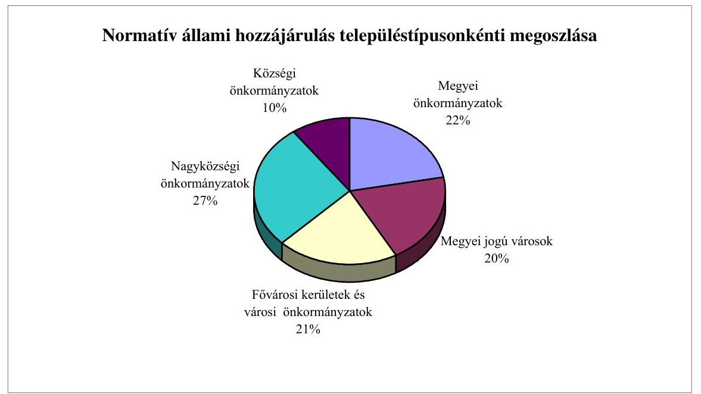
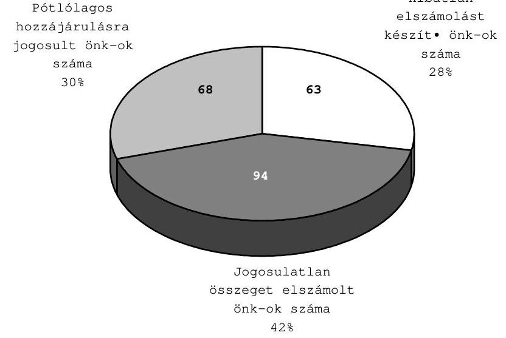
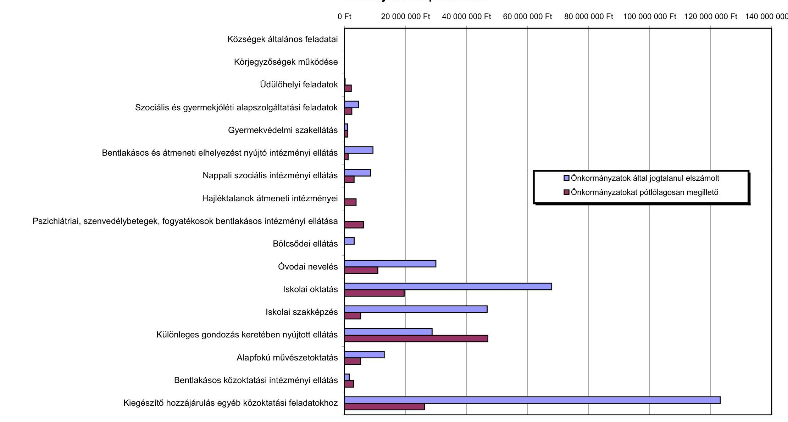

# JELENTÉS 

A helyi önkormányzatok 2000. évi normatív állami hozzájárulás igénylésének és elszámolásának vizsgálatáról

2001. szeptember

---

# Az ellenőrzés végrehajtásáért felelős:   V. Önkormányzati és Területi ellenőrzési Igazgatóság 

Dr. Lóránt Zoltán
igazgató
Az ellenőrzést vezette:
Csecserits Imréné
vizsgálatvezető főtanácsos
Az ellenőrzés irányításában és a helyszíni vizsgálati jelentések feldolgozásában közreműködött:

## Benczik Lászlóné

számvevő tanácsos

## Dr. Csapó Anna

számvevő tanácsos

## Dr. Kiss Károly

számvevő tanácsos

## Németh Gábor

számvevő tanácsos

## Az ellenőrzésben résztvevők névsorát az 1. számú melléklet tartalmazza.

## A témakörrel foglalkozó ÁSZ-vizsgálatok jegyzéke:

Jelentés a helyi önkormányzatok 1997. évi normatív állami hozzájárulás igénybevételének és elszámolásának ellenőrzési tapasztalatairól (V-1012/ 1998.) (A Parlament számítógépes hálózatán a vizsgálat fájl neve 9828J000.doc)

Jelentés a helyi önkormányzatok 1998. évi normatív állami hozzájárulás, valamint az ezekhez kapcsolt kiegészítő támogatások igénybevételének és elszámolásának ellenőrzéséről (V-1007/1999.) (A Parlament számítógépes hálózatán a vizsgálat fájl neve 9929J000.doc)

Jelentés a helyi önkormányzatok 1999. évi normatív állami hozzájárulás igénybevételének és elszámolásának ellenőrzéséről (V-1006/2000.) (A Parlament számítógépes hálózatán a vizsgálat fájl neve 0026J000.doc)

[^0]
[^0]:    Jelentéseink az Országgyűlés számítógépes hálózatán
    és az Interneten a www.asz.hu címen is olvashatók, továbbá a Belügyminisztérium folyóirata, az "Önkormányzati Tájékoztató" rendszeresen közli, valamint a Megyei Közigazgatási Hivatalvezetők részére is átadásra kerül.

---

# TARTALOMJEGYZÉK 

I. Összegző megállapítások, következtetések, javaslatok ..... 5
II. Részletes megállapítások ..... 10

1. A normatív állami hozzájárulások 2000. évi feltételrendszerének szabályozása ..... 10
2. A normatív állami hozzájárulás év végi elszámolásának belső ellenőrzése ..... 16
3. A normatív állami hozzájárulások elszámolása a helyi önkormányzatoknál ..... 17
3.1. A körjegyzőségek működése ..... 19
3.2. Üdülőhelyi feladatok ..... 19
3.3. Szociális és gyermekjóléti alapszolgáltatási feladatok ..... 20
3.3.1. Kiegészítő hozzájárulás falugondnoki szolgáltatás működtetéséhez ..... 21
3.4. Gyermekvédelmi szakellátás ..... 21
3.5. Bentlakásos és átmeneti elhelyezést nyújtó intézményi ellátás ..... 22
3.6. Nappali szociális intézményi ellátás ..... 23
3.7. Hajléktalanok átmeneti intézményei ..... 24
3.8. Pszichiátriai és szenvedélybetegek, valamint fogyatékosok bentlakásos intézményi ellátása ..... 24
3.9. Bölcsődei ellátás ..... 24
3.10. Óvodai nevelés ..... 25
3.11. Iskolai oktatás ..... 25
3.11.1. Általános iskolai oktatás ..... 25
3.11.2. Gimnáziumi és szakközépiskolai érettségire felkészítő oktatás ..... 26
3.11.3. Szakiskolai oktatás ..... 27
3.12. Iskolai szakképzés ..... 27
3.13. Különleges gondozás keretében nyújtott ellátás ..... 28
3.14. Alapfokú művészetoktatás ..... 28
3.15. Bentlakásos közoktatási intézményi ellátás ..... 29
3.16. Kiegészítő egyéb hozzájárulások közoktatási feladatokhoz ..... 30
3.16.1. Felzárkóztató oktatás ..... 30
3.16.2. Óvodába, általános iskolába bejáró gyermekek, tanulók ..... 30
3.16.3. Intézményfenntartó társulás ..... 31
3.16.4. 1100 főnél kisebb lakosságszámú településen óvodába, általános iskolába járó gyermekek, tanulók ..... 31
3.16.5. 3000 főnél kisebb lakosságszámú településen óvodába, általános iskolába járó gyermekek, tanulók ..... 32
3.16.6. A 3000 és 3500 fő közötti lakosságszámú településen óvodába, általános iskolába járó gyermekek, tanulók ..... 32
3.16.7. Szervezett közoktatási intézményi étkeztetés ..... 32
3.16.8. Az általános iskolai napközis foglalkozás ..... 33
3.16.9. Kisebbségi nyelven vagy két tanítási nyelven történő oktatás ..... 34
3.16.10. Nemzeti-etnikai kisebbséghez tartozó gyermekek kisebbségi program szerinti nevelése az óvodában, továbbá cigány kisebbségi és nyelvoktató kisebbségi nevelés, oktatás az iskolában ..... 34
3.16.11. A hátrányos helyzetű tanulók felzárkóztató oktatása ..... 35
Mellékletek: 1-10-ig

---

.

---

# JELENTÉS 

## a helyi önkormányzatok 2000. évi normatív állami hozzájárulás igénylésének és elszámolásának vizsgálatáról

Az Állami Számvevőszékről szóló 1989. évi XXXVIII. törvény 2. § (5) bekezdése, valamint az államháztartásról szóló 1992. évi XXXVIII. törvény 121. § (3) bekezdése alapján, a 2000. évi zárszámadási törvényjavaslathoz kapcsolódóan ellenőriztük a Magyar Köztársaság 2000. évi költségvetéséről szóló 1999. évi CXXV. törvény 17. § (1) bekezdésében a helyi önkormányzatok részére felhasználási kötöttség nélkül biztosított normatív állami hozzájárulások és normatív részesedésű átengedett személyi jövedelemadó együttes igénylésének, elszámolásának törvényességét, szabályszerűségét.

A vizsgálat célja annak megállapítása volt, hogy

- érvényesült-e a normatív állami hozzájárulások feltételrendszerének jogcímenkénti szabályozása és a kapcsolódó szakmai előírások közötti összhang;
- az önkormányzatok ellenőrizték-e a mutatószámok meghatározásához szükséges nyilvántartások meglétét, adatainak helytállóságát;
- a jogszabályi előírásoknak megfelelően történt-e a normatív állami hozzájárulások igénybejelentése (felmérése), évközi változtatása és elszámolása.

Teljes körű, minden feladatmutatóhoz kötött (17) normatív állami hozzájárulási jogcímre kiterjedő tételes helyszíni ellenőrzést 225 önkormányzatnál és ezen önkormányzatokhoz tartozó összesen 874 szociális, gyermekvédelmi, nevelési és oktatási feladatot ellátó intézménynél végeztünk. A vizsgált önkormányzatokról (megyénként és településtípusonként) a 2. és 3. számú mellékletek nyújtanak tájékoztatást.

Az ellenőrzött önkormányzatok kiválasztásánál az egyes településtípusok arányos megjelenítése mellett ez évben szempont volt a nagyközségekre való összpontosítás. A vizsgálat során összesen 38 körjegyzőséget a hozzá kapcsolódó 58 önkormányzattal együtt ellenőriztünk. Igazodtunk az 1991. év óta követett gyakorlatunkhoz, hogy évente más-más településtípusra koncentrálódik a vizsgálat, biztosítva ezzel, hogy minden önkormányzat ellenőrzése azonos eséllyel - bizonyos időközönként - megtörténjen.

Egyidejűleg vizsgáltuk a Pénzügyminisztérium, a Belügyminisztérium, az Oktatási Minisztérium, valamint a Szociális és Családügyi Minisztérium szerepét, intézkedéseit a normatív állami hozzájárulás igénylésének, elszámolásának feltételrendszere kialakításában, működtetésében.

A helyszíni vizsgálatokat az önkormányzati hivataloknál és intézményeiknél az 1999. és 2000. évi dokumentumok alapján végeztük. A vizsgálatot végzőknek részletes ellenőrzési útmutató állt rendelkezésre, amelyet - az elszámolást megelőzően - az önkormányzatok is megismerhettek.

Az ellenőrzésbe bevont önkormányzatok összesen 40732,8 millió Ft normatív állami hozzájárulással és normatív részesedésű átengedett személyi jövedelemadóval rendelkeztek. (Részletezését a 4. számú melléklet tartalmazza.) Ez az összeg a helyi önkormányzatok részére a központi költségvetésben ilyen címen tervezett eredeti előirányzat 9,51%-a.

---

# I. ÖSSZEGZŐ MEGÁLLAPÍTÁSOK, KÖVETKEZTETÉSEK, JAVASLATOK 

A helyi önkormányzatok forrás-finanszírozási rendszerében 1990. év óta meghatározó jelentőségű, de minden évben kismértékben változó tartalmú elem a normatív állami hozzájárulás. Ez a hozzájárulás a Magyar Köztársaság 2000. évi költségvetéséről szóló törvényben előirányzott támogatások és hozzájárulások 60,5%-át képviselte, azaz a 450,2 milliárd Ft eredeti előirányzatból 272,3 milliárd Ft volt a normatív költségvetési hozzájárulás.

A normatív költségvetési hozzájárulás összegét a normatív részesedésű átengedett személyi jövedelemadó összesen 156,1 milliárd Ft-tal egészítette ki. A kiegészítés tartalmazta a korábbi években a helyi önkormányzatokat normatívan megillető személyi jövedelemadó jogcímei közül öt, a központosított előirányzatok közül kettő, valamint a normatív, kötött felhasználású támogatások közül egy jogcím átcsoportosítását is. A normatív állami hozzájárulás és a normatív részesedésű átengedett személyi jövedelemadó együttes eredeti előirányzati összege (továbbiakban együtt: normatív állami hozzájárulás) 2000. évben 428,4 milliárd Ft volt. Az elmúlt években szerény (6-7%-os) mértékű emelkedés után 2000. évben az így kialakított együttes összeg az előző évhez viszonyítva jelentős (57,3%-os) emelkedést tett lehetővé az önkormányzatok által normatív módon - önkormányzati adatszolgáltatás szerinti feladatmutatók, mutatószámok alapján - igényelhető és felhasználási kötöttség nélkül elszámolható forrásoknál.

A személyi jövedelemadó 40%-a a helyi önkormányzatokat együttesen mind 1999. évben, mind 2000. évben megillette. Az önkormányzatok egészét tekintve a normatív költségvetési hozzájárulás költségvetési előirányzatának 288,4 milliárd Ft-ról 272,3 milliárd Ft-ra csökkenése (6%-kal csökkent) mellett az átengedett személyi jövedelemadó abszolút összegének 21,2%-os emelkedése jelentett tényleges többletforrást. A normatívan elosztható személyi jövedelemadó-rész 25%-ról 35%-ra emelése azonban az önkormányzatok közötti bevételi arányokat módosította.

A normatív állami hozzájárulások feltételrendszerének jogcímenkénti szabályozása és a kapcsolódó szakmai előírások közötti összhanghiányt nem tártunk fel.

A bentlakásos és átmeneti elhelyezést nyújtó intézményi ellátáshoz kapcsolódó igénylési feltételt meghatározó törvényi előírások közé 2000. évben bekerült a hozzájárulás felhasználási céljára vonatkozó előírás is: „A hozzájárulásból a családok átmeneti otthonából kikerülő ellátottakra vonatkozóan szükség szerinti támogatás biztosítható a család otthontalanságának megszüntetéséhez." A költségvetési törvény 3. számú mellékletében szereplő normatív állami hozzájárulások felhasználási kötöttség nélkül illetik meg a helyi önkormányzatokat, így ez az előírás nincs összhangban a helyi önkormányzatokról szóló törvényben foglaltakkal.

---

A normatív állami hozzájárulások jogcímeit és összegét a 2000. évi költségvetési törvény az előző évi 20 előirányzattal szemben 26 előirányzatban, illetve azok további megbontásával a korábbi 42 helyett, összesen 51 jogcímmel (fajlagos összeggel) határozta meg. A helyi önkormányzatok a 2000. évi igénybejelentésben és a költségvetési beszámolók elkészítése során ennél sokkal részletesebb elszámolást készítettek. Az államháztartásról szóló törvényben kapott felhatalmazás alapján a Belügyminisztérium és a Pénzügyminisztérium, az érintett ágazati minisztériumokkal közösen kialakított igénybejelentési adatlapot és a kapcsolódó kódjegyzéket alkalmazva állították össze normatív állami hozzájárulás igénylésüket és éves elszámolásukat 103 feldolgozási kódszámmal azonosított mutatószám-csoportban (1999. évben 138 mutatószám-csoport volt). A költségvetési törvényben meghatározottat kétszeresen meghaladó részletezettségű (jogcímbontásos) tervezés és elszámoltatás elsősorban közoktatási szakmai információk megszerzését biztosította, párhuzamosan a statisztikai jelentésekkel.

A normatív állami hozzájárulások igénybejelentésének és elszámolásának módosítását és a feldolgozási kódszámok csökkentését az Állami Számvevőszék 1997. év óta javasolja, mivel az nagymértékben megnehezíti az igénylési-elszámolási rendszer áttekinthetőségét.

A közoktatási alapfeladatokhoz kapcsolódó normatív állami hozzájárulási jogcímeken belül az alábontások számát a korábbi ÁSZ jelentésekben megfogalmazott javaslatok figyelembevételével csökkentették. Az egyéb közoktatási feladatokhoz biztosított kiegészítő hozzájárulások költségvetési előirányzata viszont 11 különböző fajlagos összegű hozzájárulási jogcímet tartalmaz és ezek további bontása, csoportosítása miatt a helyi önkormányzatok összesen 47 kódszámon igényelhették és számolhatták el a normatív állami hozzájárulások együttes összegének 9,8%-át képviselő hozzájárulási előirányzatot.

A közoktatási feladatokhoz kapcsolódó jogcímeket érintően a legtöbb hiányosságot a felzárkóztató oktatás, a különleges gondozás keretében végzett gyógypedagógiai ellátás, a szervezett közoktatási intézményi étkeztetés és az általános iskolai napközis ellátás, valamint az óvodai nevelés jogcímeknél észleltünk. Ezen jogcímeknél a feladatmutató meghatározása bonyolultnak bizonyult az önkormányzatok számára, ezt igazolja, hogy a legnagyobb összegű eltéréseket is ezeknél állapította meg a vizsgálat.

A kiegészítő hozzájárulás egyéb közoktatási feladatokhoz kapcsolódó jogcímek esetében azzal a feltétellel vehető igénybe, hogy a feladat a közoktatási intézmény alapító okiratában szerepel. Az e jogcímhez tartozó feladatok köre évről évre változott és emiatt az alapító okiratokat indokolatlan gyakorisággal kell módosítani.

A közoktatási célú normatív állami hozzájárulás együttes keretösszegének központi tervezéséhez a közoktatásról szóló törvény kötelező jellegű előírást tartalmaz, amely feltételeknek a 2000. évi eredeti előirányzat megfelelt.

A szociális ellátást érintően a működési engedélyek hiánya, illetve hiányosságai okoztak gondokat. A szociális és gyermekjóléti szolgáltatások jogcímei közül a személyi gondoskodást nyújtó intézmények ideiglenes működési engedélyei érvényességi idejének automatikus meghosszabbításánál, a családsegítő és/vagy gyermekjóléti szolgálatokhoz, a falugondnoki szolgáltatáshoz és a hajléktalanok nappali intézményéhez kapcsolódó mutatószám meghatározásánál, valamint a működési engedélyezési eljárásban az illetékesség megállapításának szabályozásánál tapasztaltunk hiányosságokat.

A nappali szociális intézményi ellátás keretében a hajléktalanok nappali intézményeiben ellátottak számának meghatározása továbbra sem egyértelmű, mivel itt az előírt taglétszám nem értelmezhető. A hajléktalanok a nappali melegedőt esetlegesen veszik igénybe, az intézménybe nem nyernek felvételt és nem válnak taggá.

Az előző években végzett számvevőszéki ellenőrzések során tett javaslataink és felelősségi felvetéseink ellenére a vizsgált önkormányzati hivataloknak csak egyharmada ellenőrizte a helyszínen az intézmények által közölt adatok valódiságát. A végrehajtott ellenőrzések nem terjedtek ki a szakmai jogszabályokban foglalt előírások betartására és az önkormányzati szintű összesítés, elszámolás ellenőrzése is elmaradt.

A normatív állami hozzájárulás központi tervezéséhez szolgáltatott adatokat az intézmények az önkormányzati hivatalok részére a jogszabályi előírások részleges figyelembevételével adták meg. A hiányosságot
 elsősorban az okozta, hogy az önkormányzati hivatalok az intézményeik részére nem adtak útmutatást a szakmai jogszabályokban megfogalmazott követelményekkel összhangban lévő adatszolgáltatás elkészítéséhez. Az éves elszámoláshoz bekért adatokra is ugyanez vonatkozik. Az önkormányzati hivatalok nem fordítottak kellő figyelmet arra, hogy az elszámolásba a megfelelő (nyilvántartási, statisztikai) alapadatokra épülő mutatószámok kerüljenek.

A helyszíni vizsgálatok során megállapított feldolgozási kódszámonkénti eltérések önkormányzati szintű egyenlegeként 94 önkormányzatnál 269,7 millió Ft jogtalanul elszámolt összeget, azaz a központi költségvetés részére történő visszafizetési kötelezettséget, 68 önkormányzatot érintően pedig 43,7 millió Ft központi költségvetésből biztosítandó pótlólagos járandóságot, azaz még kiutalandó hozzájárulási összeget tártunk fel. Az ellenőrzés során 63 önkormányzatnál az elszámolásban eltérést nem tapasztaltunk.

A helyszíni vizsgálatok során három önkormányzatnál állapítottuk meg, hogy egy-egy jogcímhez tartozó feladatot ellátó intézményüknek 2000. évben nem volt működési engedélye, azonban a költségvetési törvényben előírt feltételek teljesítése érdekében - felhívásunkra - kezdeményezték az érintett intézmények működési engedélyének kiadását és ezáltal azok ideiglenes, vagy végleges működési engedélyt kaptak. Ezen intézmények megkapták az illetékes szakhatóságoktól a működéshez szükséges hozzájárulást. Az önkormányzatok a helyszíni vizsgálatról készített jelentésre tett észrevételekben elismerték a feltárt szabálytalanságokat, de a hozzájárulás alapját képező feladat ellátására és a mulasztás pótlására hivatkozva kérték a megállapítások módosítását. Az országgyűlés döntésétől függően a jogosulatlanul elszámolt normatív állami hozzájárulás összege egyenlegében 25,1 millió Ft-tal csökkenthető. A javaslat elfogadása ese-

---

tén 93 önkormányzatnál a visszafizetési kötelezettség 244,7 millió Ft-ra és a 68 önkormányzatot érintő központi költségvetésből pótlólagosan kiutalandó hozzájárulás 43,8 millió Ft-ra változik. (Ennek megfelelő összegeket a pénzügyminiszter részére megfogalmazott - 1. a) számú - javaslat tartalmazza.)

A helyszíni vizsgálati jelentésekben az önkormányzatok részére normatív állami hozzájárulás igénylésének és elszámolásának szabályszerűbbé és célszerűbbé tétele érdekében, mintegy 400 javaslatot tettünk. Elsősorban a következő javaslatokat fogalmaztuk meg:

1. A normatív állami hozzájárulás igénylésénél, évközi módosításánál és elszámolásánál vegyék figyelembe az éves költségvetési törvény mellett az ágazati jogszabályok előírásait és saját ellenőrzéseik megállapításait.
2. Az intézményektől bekért adatok tartalmáról és helyességéről dokumentált ellenőrzés keretében győződjenek meg a költségvetésben és a beszámolóban felhasznált adatok pontosságának biztosítása érdekében, egyúttal szerezzenek érvényt a helyi önkormányzatokról szóló 1990. évi LXV. törvény 92. § (2) bekezdésben meghatározott előírásoknak.
3. A feladatellátás valamennyi területén helyezzenek kiemelt hangsúlyt a vezetői és a munkafolyamatba épített ellenőrzés rendszeres működtetésére, annak érdekében, hogy nyilvántartásaik és elszámolásaik pontosak, adataik egyértelműek, elszámolásaik pedig szabályszerűek legyenek és maradéktalanul feleljenek meg a vonatkozó törvényi előírásoknak, mivel az attól való eltérés a teljes normatív állami hozzájárulás elvonását eredményezheti az adott jogcímnél.
4. Pótolják, illetve vizsgálják felül a normatív állami hozzájárulásra jogosító feladatellátást végző intézményeik alapító okiratait és gondoskodjanak azok jogszabályi előírásokkal összhangban lévő módosításáról (Áht. 88. §, valamint a 217/1998. (XII. 30.) Korm. rendelet 10. §).
5. Kérjék meg pótlólag a hiányzó működési engedélyeket és alakítsák ki az előírás szerű működéshez, illetve feladatellátáshoz szükséges személyi és tárgyi feltételeket.

A vizsgálati jelentéseinkben szereplő megállapításainkat az önkormányzatok - három kivételével - elfogadták és már a vizsgálat ideje alatt intézkedtek a javaslatok végrehajtásáról, illetve hat önkormányzat adott tájékoztatást arról, hogy „Intézkedési terv"-et készített a felelősök és határidők megjelölésével.

A vizsgálati megállapítások alapján összesen két önkormányzatnál vetettük fel a jegyző felelősségét az ellenőrzési kötelezettség visszatérő elmulasztása, valamint jogosulatlan állami hozzájárulás igénylése és elszámolása miatt.

Az ellenőrzés részletes megállapításainak hasznosítása mellett az Állami Számvevőszék javasolja, hogy

---

# a pénzügyminiszter 

1. kezdeményezze, hogy az Országgyűlés a 2000. évi zárszámadási törvény elfogadása során
a) fontolja meg a jelentés 8/a számú mellékletében szereplő önkormányzatok által jogtalanul igénybe vett 25143650 Ft visszafizetésének elengedését tekintettel arra, hogy ezen önkormányzatok a hiányzó működési engedélyek beszerzéséről gondoskodtak és erről tájékoztatást adtak. Ezt figyelembe véve hagyja jóvá a jelentés 8. számú mellékletének 1. változata szerint az önkormányzatok által a központi költségvetésbe visszafizetendő 244660276 Ft-os, illetve az önkormányzatoknak a költségvetésből pótlólag kiutalandó 43843953 Ft-os összeget, vagy;
b) hagyja jóvá a jelentés 8. számú mellékletének 2. változata szerint az önkormányzatok által a központi költségvetésbe visszafizetendő 269699626 Ft-os, illetve az önkormányzatoknak a költségvetésből pótlólag kiutalandó 43739953 Ft-os összeget;
2. biztosítsa, hogy a jelenlegi bonyolult azonosító szám-rendszer (kódszámok) további egyszerűsítésével csak a normatív állami hozzájárulási előirányzatok költségvetési törvényben előírt részletezésű tervezésére és elszámolására terjedjen ki a szabályozás;
3. kezdeményezze, hogy a költségvetési törvényben meghatározott, felhasználási kötöttség nélkül igénybe vehető normatív állami hozzájárulások feltételei közé ne kerüljenek be - még ajánlási szinten sem - felhasználási célokra vonatkozó előírások;
4. vizsgálja meg annak lehetőségét, hogy a belső ellenőrzési feladatok ellátására - kistelepülési szinten - létrehozandó társulások ösztönzése az önkormányzatok forrásfinanszírozási rendszerében elősegíthető-e;

## a szociális és családügyi miniszter

1. kezdeményezze a gyermekjóléti és gyermekvédelmi személyes gondoskodást nyújtó intézmények működésének engedélyezéséről szóló 281/1997. (XII. 29.) Korm. rendelet módosítását annak érdekében, hogy a működési engedélyek kiadására a települési jegyzők az államigazgatási eljárás általános szabályairól szóló 1957. évi IV. törvény előírásaival összhangban kapjanak felhatalmazást.
2. pontosítsa az ellenőrizhetőség érdekében a nappali szociális intézményi ellátás jogcíménél a hajléktalanok nappali melegedőjét igénybe vevők mutatószámának meghatározási módszerét;

## az oktatási miniszter

kezdeményezze a költségvetési törvény 3. számú mellékletében szereplő kiegészítő szabályokon belül a közoktatási intézmények alapító okiratára vonatkozó előírásnak olyan módosítását, hogy az a kiegészítő hozzájárulás igénybevételére jogosító tevékenységeknek csak tételesen előírt körére vonatkozzon.

---

# II. RÉSZLETES MEGÁLLAPÍTÁSOK 

## 1. A normatív állami hozzájárulások 2000. ÉVI FELTÉTELRENDSZERÉNEK SZABÁLYOZÁSA

A Magyar Köztársaság 2000. évi költségvetéséről szóló 1999. évi CXXV. törvény (továbbiakban: költségvetési törvény) 3. számú melléklete 428,4 milliárd Ft eredeti előirányzatot tartalmaz a helyi önkormányzatok normatív állami hozzájárulásaként. Ebből 272,3 milliárd Ft az állami hozzájárulás és 156,1 milliárd Ft a normatív részesedésű átengedett személyi jövedelemadó.
(A normatív állami hozzájárulások évenkénti költségvetési törvényben megállapított eredeti előirányzatainak 1991-2000. évekbeli összegét az 5. számú melléklet tartalmazza.)

A 2000. évi költségvetési törvényjavaslat kialakítása, illetve elfogadása során a helyi önkormányzatok által kötöttség nélkül felhasználható normatív állami hozzájárulások közé került átcsoportosításra:

- a helyi önkormányzatokat normatívan megillető személyi jövedelemadó jogcímei közül a községek általános feladatai, a lakott külterülettel kapcsolatos feladatok, a társadalmi-gazdasági és infrastrukturális szempontból elmaradott és/vagy súlyos foglalkoztatási gondokkal küzdő települési önkormányzatok működéséhez történő hozzájárulás, a pénzbeli és természetbeni szociális és gyermekjóléti ellátások valamint a lakáshoz jutás és a lakásfenntartás feladatai, öt központilag számított hozzájárulásként;
- a központosított előirányzatként biztosított támogatások közül a körjegyzőségek működéséhez biztosított és az 1100 főnél kisebb lakosságszámú településen az óvodai nevelést és az 1-4. évfolyamos általános iskolai oktatást szolgáló hozzájárulás jogcímei;
- a normatív, kötött felhasználású támogatások közül a nemzeti-etnikai kisebbséghez tartozó gyermekek kisebbségi program szerinti óvodai neveléséhez, iskolai oktatásához, valamint a nem kisebbségi két tanítási nyelvű oktatáshoz járó hozzájárulás.

Az átcsoportosítások révén a normatív állami hozzájárulások költségvetési előirányzatainak száma az előző évi 20-ról 2000. évben 26-ra növekedett. A költségvetési előirányzaton belüli alábontások miatt a fajlagos hozzájárulás összegek (jogcímek) száma az előző évi 42-ről 51-re emelkedett.

A helyi önkormányzatoknak a Belügyminisztérium és a Pénzügyminisztérium által kiadott adatfelmérő lapon, valamint az éves költségvetési beszámolóban ennél részletezettebben, 103 (előző évben 138) kódszámra bontva kellett a normatív állami hozzájárulási igényüket bejelenteni, illetve elszámolásukat el-

---

készíteni. A közoktatási alapnormatívák esetében a jogcímen belüli alábontások számát a korábbi ÁSZ jelentésben megfogalmazott javaslat figyelembevételével csökkentették. A kiegészítő hozzájárulás egyéb közoktatási feladatokhoz előirányzat (24-es számú költségvetési előirányzat) viszont 11 különböző fajlagos összegű hozzájárulási jogcímet tartalmaz és azok további bontása, csoportosítása miatt 47 kódszámon igényelhették és számolhatták el a helyi önkormányzatok a hozzájárulást. Az igénylés és elszámolás túlzottan részletező módjára vonatkozó megállapítást támasztja alá, hogy 2000. évben volt olyan kódszám, amelyen nem igényelt és nem számolt el önkormányzat normatív állami hozzájárulást (1240148 feldolgozási kódszámú kiegészítő hozzájárulás kisebbségi nyelven, vagy két - kisebbségi és magyar - tanítási nyelven történő oktatás a szakiskolában, valamint nem kisebbségi két tanítási nyelvű oktatás különleges gondozásban részesülő tanulók esetén). Egy kódszámon pedig csupán egy helyi önkormányzat egy tanuló után 24 ezer Ft összegű hozzájárulást igényelt és számolt el (1240133 feldolgozási kódszámú kiegészítő hozzájárulás a 3000 és 3500 fő közötti lakosságszámú településen óvodába, általános iskolába járó gyermekek, tanulók után, akik számára különleges gondoskodás keretében kisebbségi tanítási nyelvű, kétnyelvű, vagy nyelvoktató nemzeti kisebbségi oktatást végeznek).

Három támogatott feladat esetén a feladatonként azonos fajlagos összegű hozzájárulást 6-6 kódszámon kellett elszámolni a közoktatási intézmény típusától függően a gyógypedagógiai ellátás, intézményi étkezés, valamint nemzetietnikai kisebbséghez tartozó gyermekek kisebbségi program szerinti nevelése az óvodában, továbbá cigány kisebbségi és nyelvoktató kisebbségi nevelés, oktatás az iskolában feladatok esetén. Ez bonyolult nyilvántartások vezetését tette szükségessé a közoktatási intézmények és a polgármesteri hivatalok számára.

A közoktatásról szóló 1993. évi LXXIX. törvény (továbbiakban: közoktatási törvény) 118. § (4) bekezdésének 1999. szeptember 1-től hatályos előírása nyolcvanról kilencven százalékra emelte a helyi önkormányzatok részére közoktatási feladatokhoz biztosított normatív költségvetési hozzájárulásnak a tárgyévet megelőző második évben közoktatáshoz kapcsolódó nettó működési kiadások összegéhez viszonyított arányát. Ennek figyelembevételével a közoktatási célú normatív állami hozzájárulások 2000. évi előirányzata 264,1 milliárd Ft-ra emelkedett az 1999. évi 211,5 milliárd Ft-ról, ami 24,8%-kal több az előző évinél. A költségvetési törvényben a közoktatási célra biztosított előirányzat meghatározásánál teljesültek a közoktatási törvény 118. § (4) bekezdésében foglalt garanciális követelmények.

A normatív állami hozzájárulások ilyen arányú növelését a személyi jövedelemadó feltétel nélkül helyben maradó részének 15%-ról 5%-ra történő csökkentése tette lehetővé.

A közoktatási feladatokhoz kapcsolódó normatív állami hozzájárulások fajlagos összege különböző mértékben emelkedett, az óvodai ellátás, az általános iskolai oktatás és az intézményi étkezés jogcímeknél a növekedés mértéke 25-25,3%-os volt, kevésbé emelkedett a hozzájárulás fajlagos összege a gimnáziumi és szakközépiskolai érettségire felkészítő oktatás (16,7%), a középiskolai szakképzés (10,6%) és a gyógypedagógiai ellátás (13,4%) esetében. Kiemelke-

---

dően jelentős mértékű volt a fajlagos hozzájárulás növekedése az általános iskolai napközis foglalkozás (172,7%), valamint a felzárkóztató oktatás körébe került súlyos beilleszkedési, tanulási, magatartási zavarral küzdő gyermekek, tanulók nevelése, oktatása (117%) jogcímeknél.

A szociális ellátásokhoz biztosított normatív állami hozzájárulások közül a nappali szociális intézményi ellátás fajlagos értéke növekedett legjobban, 25,2%-kal, a szociális és gyermekjóléti alapszolgáltatási feladatokhoz kapcsolódó legkevésbé, 6,7%-kal.

# A hozzájárulási jogcímek tartalmi változásai, hozzájárulások feltételeinek és a kapcsolódó jogszabályoknak a módosításai több korábbi számvevőszéki javaslat realizálását is jelentik: 

- A pszichiátriai és szenvedélybetegek, valamint a fogyatékosok bentlakásos intézményi ellátásához biztosított normatív állami hozzájárulásból a korábbi ÁSZ vizsgálati jelentésben jelzett mutatószám meghatározási problémák megoldására - a bentlakásos közoktatási intézményi ellátás jogcímű feladathoz került átcsoportosításra a fogyatékos tanulók diákotthoni ellátása. Így a továbbiakban e közoktatási jellegű feladathoz nem a szociális jellegű feladatoknál szokásos
 mutatószámot kellett alkalmazni.
- Az óvodai nevelés esetében - a közoktatási törvény előírásaival összhangban - a költségvetési törvény 3. számú melléklet 18. pontjánál is meghatározásra került az ellátásban részesíthető gyermekek alsó és felső korhatára. Ez azért volt indokolt, mert az óvodák a harmadik életévüket még be nem töltött gyermekeket is felvették - a kis lakosságszámú településeken a hiányzó bölcsődei ellátás részbeni pótlására - és a törvényi előírást megsértve utánuk is igénybe vették az önkormányzatok a normatív állami hozzájárulást.
- A költségvetési törvény 69. § (8) bekezdése a közoktatási törvény 1. számú melléklet második részét módosította. A normatív állami hozzájárulás meghatározásakor figyelembe vehető gyermek-, tanuló létszám megállapítására vonatkozó új előírás szerint egységesen egy gyermekként kellett figyelembe venni az óvodába felvett gyermeket, függetlenül attól, hogy az ellátást heti hány órára igényelték a szülők, valamint azokat a tanulókat, akik nem saját döntésük alapján magántanulók. A vendégtanulókat a normatív állami hozzájárulás elszámolásakor nem lehetett figyelembe venni.
- Az iskolai oktatási feladathoz kapcsolódó előirányzathoz került átcsoportosításra a művészeti szakmai vizsgára párhuzamos oktatás keretében történő szakiskolai és szakközépiskolai felkészítés a kiegészítő közoktatási hozzájárulások közül, ezzel jelentősen egyszerűsítve az elszámolás módját.
- Az iskolai szakképzés jogcímű hozzájárulás igénylési feltételeinek szabályozása egyszerűsödött, a szakképzéshez mind az oktatásról szóló 1985. évi I. törvény, mind a közoktatási törvény alapján szervezett oktatás esetén azonos mértékű hozzájárulás volt igénybe vehető a szakmai-elméleti, illetve szakmai gyakorlati oktatáshoz.

---

- A különleges gondozás keretében nyújtott gyógypedagógiai ellátás igénylési feltételei részletesebben kerültek meghatározásra, ez a hozzájárulás jár a közoktatási törvény 27. § (10) bekezdése szerinti speciális és készségfejlesztő szakiskolai és a (12) bekezdés szerinti előkészítő szakiskolai képzésben részesülő tanulók után is. A gyógypedagógiai ellátáshoz a költségvetési törvény szerint csak az illetékes szakértői és rehabilitációs bizottság szakvéleménye alapján gyógypedagógiai nevelésben, oktatásban részt vevő gyermek, tanuló után vehető igénybe a normatív állami hozzájárulás. A szakértői és rehabilitációs bizottságok részére a 14/1994. (VI. 24.) MKM rendelet 2000. évben hatályos szövege meghatározott időszakonként felülvizsgálati kötelezettséget írt elő. Nem volt egyértelmű azonban, hogy a felülvizsgálati kötelezettséget a jogszabály hatálybalépését követően végzett első vizsgálatot követően szükséges teljesíteni, vagy a már korábbiak után is. A nem egyértelmű szabályozás miatt a korábban kiadott, több év óta felülvizsgálatlan szakvéleményeket elfogadtuk az ellenőrzés során. A szabályozási bizonytalanságot az egyes oktatási jogszabályok módosításáról szóló 4/2001. (I. 26.) OM rendelet megszüntette.
- A korai fejlesztéshez, gondozáshoz és a fejlesztő felkészítéshez kapcsolódó létszám meghatározását a költségvetési törvény 3. számú melléklet kiegészítő szabályok 2. k) pontjában - az ÁSZ korábbi vizsgálati javaslatát is figyelembe véve - pontosították.
- Az alapfokú művészetoktatásnál megváltozott a művészeti ágak csoportosítása, csak a zeneművészeti ágon egyéni foglalkoztatás keretében történő hangszeres oktatásban részesülő tanulók után vehető igénybe a nagyobb fajlagos összegű normatív állami hozzájárulás.
- A kiegészítő hozzájárulás egyéb közoktatási feladathoz előirányzathoz tartozó jogcímek köre módosult;
- összevonásra került a szakiskolások felzárkóztató oktatásával a súlyos beilleszkedési, tanulási, magatartási zavarral küzdő gyermekek, tanulók ellátása;
- a központosított előirányzatokból (5. számú melléklet) ide került az 1100 főnél kisebb lakosságszámú településen óvodába, általános iskolába járó gyermekek, tanulók ellátása;
- az előző évi kötött felhasználású normatív támogatások közül 2000. évben felhasználási kötöttség nélkül illette meg a helyi önkormányzatokat a kisebbségi nyelven, vagy két - kisebbségi és magyar - tanítási nyelvű oktatás és a nemzeti-etnikai kisebbséghez tartozó gyermekek kisebbségi program szerinti nevelése az óvodában, továbbá cigány kisebbségi és nyelvoktató kisebbségi nevelés, oktatás az iskolában feladatok után elszámolható normatív állami hozzájárulás; új kiegészítő jogcímként került meghatározásra a hátrányos helyzetű tanulók felzárkóztató oktatása.

A helyszíni vizsgálatok során a jogszabályi előírások tekintetében az alábbi értelmezési és alkalmazási problémákat tapasztaltuk:

- A szociális intézmények esetében a költségvetési törvény a személyes gondoskodást nyújtó szociális intézmény működésének engedélyezéséről szóló 161/1996. (XI. 7.) Korm. rendelet szerinti működési engedély meglétét szabta

---

- többek között - a normatív állami hozzájárulás jogszerű igénybevétele feltételéül. A költségvetési törvény hatálybalépését megelőző napon e jogszabályt hatályon kívül helyezte a 188/1999. (XII. 16.) Korm. rendelet és az új engedély esetében már ennek előírásai szerint kellett eljárni. A rendelet 23. § (6) bekezdése a 161/1996. Korm. rendelet alapján kiadott 1999. december 31-ig érvényes ideiglenes működési engedélyek hivatalból való felülvizsgálatát elrendelve azok érvényességi idejét a felülvizsgálat befejezéséig meghosszabbította. A helyszíni vizsgálatok során gondot okozott, hogy a 161/1996. (XI. 7.) Korm. rendeletben a működési engedély kiadására jogosított jegyzők a tárgyi és/vagy személyi feltételek teljes körű teljesítésének hiányában nem ideiglenes, hanem 1999. december 31-ig érvényes határozott idejű működési engedélyt adtak ki. Ezeket a működési engedélyeket 2000. január 1-től ideiglenes működési engedélyként elfogadtuk, valamint felhívtuk az önkormányzatok figyelmét a felülvizsgálat kezdeményezésére és nem minősítettük jogszerűtlennek a normatív állami hozzájárulás igénybevételét.
- A gyermekjóléti és gyermekvédelmi személyes gondoskodást nyújtó intézmények működésének engedélyezéséről szóló hatályos 281/1997. (XII. 29.) Korm. rendelet 4. § (1) bekezdése nincs összhangban az államigazgatási eljárás általános szabályairól szóló 1957. évi IV. törvény 19. § (6) bekezdésében foglaltakkal. A kormányrendelet szerint az intézmény székhelye, telephelye szerinti jegyző adhatja ki a működési engedélyt. E felhatalmazás alapján a jegyzők saját intézményükre vonatkozó döntést hozhatnak, a törvényi előírás azonban tiltja, hogy közigazgatási szerv saját ügyének elbírálásában részt vegyen. Az előző évi ÁSZ vizsgálati jelentés ezen kormányrendelet módosítására tett javaslatot, a jogszabály módosítása még nem történt meg.
- Az egyes gyermekvédelmi és szociális jogszabályok módosításáról szóló 42/2000. (III. 24.) Korm. rendelet 2000. IV. 1-től hatályosan módosította a gyermekjóléti és gyermekvédelmi személyes gondoskodást nyújtó intézmények működésének engedélyezéséről szóló 281/1997. (XII. 29.) Korm. rendeletet. A rendelet 14. §-át új (9) bekezdéssel egészítették ki, mely szerint „az intézmény fenntartójának kérelme nyomán a (6) bekezdés alapján kiadott, ideiglenes működési engedély érvényességi ideje - ellátási érdekből - 2000. január 1-jei időponttól legfeljebb 2002. december 31-i időpontig meghosszabbítható". A módosító rendelet hatálybalépéséig a 281/1997. (XII. 29.) Korm. rendelet alapján 1999. december 31-ig érvényes ideiglenes működési engedéllyel rendelkező gyermekjóléti és gyermekvédelmi személyes gondoskodást nyújtó intézmények - a gyermekotthonok kivételével - 2000. évben már nem működtek jogszerűen. A kormányrendelet utólagos módosítása adott lehetőséget az ideiglenes működési engedélyek érvényességi idejének visszamenőleges időponttól való meghosszabbítására.
- A nappali szociális intézményi ellátás keretében a hajléktalanok nappali intézményeiben ellátottak számának meghatározása továbbra sem egyértelmű.

A költségvetési törvény 3. számú mellékletében a nappali szociális intézményi ellátásban részesülők számának meghatározására vonatkozó előírás

---

szerint az elszámolásnál az ellátottak gondozási naplója (esemény-, illetve látogatási napló) alapján naponta összesített tagok (ellátottak) számának alapulvételével kiszámított éves ellátási létszámot kell 261-gyel osztani. Ugyanakkor a nappali melegedőt igénybe vevők esetében taglétszámként kell figyelembe venni a 30 napnál folyamatosan hosszabb ideig távolmaradókat is. Az eseménynapló szerinti esetleges igénybevétel, valamint a taglétszám és az ahhoz kapcsolódó gondozási nap egymás mellett nappali melegedő esetében nem értelmezhető.
A 3. számú melléklet kiegészítő szabályok gondozási nap fogalommeghatározása szerint: egy gondozott egy napi intézményi gondozása, amely az intézményben történő felvétellel kezdődik és annak végleges elhagyásával fejeződik be. A hajléktalanok azonban a nappali melegedőt esetlegesen veszik igénybe, az intézménybe nem nyernek felvételt és nem válnak tagokká.

- A költségvetési törvény 3. számú mellékletében a normatív állami hozzájárulások igénylésére vonatkozó kiegészítő szabályok 2. q) pont második része az alapító okiratok szinte évenkénti módosítását várja el az önkormányzatoktól, mivel a normatív állami hozzájárulással támogatott egyéb közoktatási feladatok köre, meghatározása évről-évre jelentősen változik, átcsoportosításra kerül. A kiegészítő hozzájárulás egyéb közoktatási feladatokhoz előirányzat jogcímeinek egy részére az előírás nem értelmezhető (bejárók, intézmény-fenntartó társulás óvodájába, általános iskolájába járók, kis lakosságszámú településen óvodába, általános iskolába járók ellátásának támogatása), egy része pedig az önkormányzatok szakmai törvényben előírt kötelező feladata (napközis foglalkozás, felzárkóztató oktatás, intézményi étkezés).
- Az elfogadott költségvetési törvény több szabályozási megoldásában eltér az 1999. szeptemberben benyújtott azon törvényjavaslattól, amelyre a helyi önkormányzatok költségvetési hozzájárulásait és egyes támogatásait megalapozó országos mutatószám felmérés történt. Ezért a 217/1998. (XII. 30.) Korm. rendelet 52. § (5) bekezdése alapján a BM-PM kiegészítő felmérést végzett. A felméréshez együttes levélben adtak útmutatást az önkormányzatok polgármesterei részére. Ebben a kistelepülések támogatását biztosító három különböző fajlagos összegű hozzájárulási jogcímet nem az elfogadott törvényi előírással azonos igénylési feltételekkel szerepeltették. A kiegészítő felmérés és a kiegészítő hozzájárulás elszámolása ezen törvényértelmezés szerint történt.

A bentlakásos és átmeneti elhelyezést nyújtó intézményi ellátáshoz kapcsolódó igénylési feltételt meghatározó törvényi előírások közé 2000. évben bekerült a hozzájárulás felhasználási céljára vonatkozó előírás is: „A hozzájárulásból a családok átmeneti otthonából kikerülő ellátottakra vonatkozóan szükség szerinti támogatás biztosítható a család otthontalanságának megszüntetéséhez." A költségvetési törvény 3. számú mellékletében szereplő normatív állami hozzájárulások felhasználási kötöttség nélkül illetik meg a helyi önkormányzatokat, így ez az előírás nincs összhangban a helyi önkormányzatokról szóló 1990. évi LXV. törvény 84. § (2) bekezdésében foglaltakkal.

---

# 2. A normatív állami hozzájárulás év végi elszámolásának belső ellenőrzése

A normatív állami hozzájárulások tervezéséhez, valamint az év végi elszámolásához az intézmények által szolgáltatott adatok jelentik az alapot. Ezen adatok megalapozottságához alapvető érdeke fűződik az önkormányzatnak és ezért is fontos az intézményi adatszolgáltatás kontrollálása. Ehhez a helyi önkormányzatok és szervei feladat- és hatásköréről szóló 1991. évi XX. törvény 140. § (1) bekezdés e) pontja a jegyző számára a felügyeleti típusú ellenőrzések lefolytatásával adja meg a jogszabályi feltételt.

Az előző években végzett számvevőszéki ellenőrzések is kifogásolták az intézmények által közölt adatok valódiságát megalapozó nyilvántartások, dokumentációk ellenőrzésének elmaradását. Az önkormányzatok intézményi ellenőrző tevékenységében az ellenőrzések arányát tekintve az előző évihez viszonyítva 2000. évben pozitív irányú elmozdulás tapasztalható. Az önkormányzatok 32,9%-a 2000. évben dokumentáltan vizsgálta a normatív állami hozzájárulás elszámolásával kapcsolatos intézményi adatszolgáltatást. (1999. évben a vizsgált önkormányzatok 25,8%-a végzett ilyen ellenőrzést.) Ezen ellenőrzések hiányossága, hogy:

- a kerületi és városi önkormányzatoknál az ellenőrzések nem a teljes intézményi körre terjedtek ki;
- az intézményi ellenőrzések megállapításainak megalapozottságával kapcsolatos problémát jelzi, hogy az ellenőrzések közel 40%-a nem mutatott ki eltérést, illetve az önkormányzati ellenőrzések által feltárt 71 millió Ft eltéréssel szemben, az ugyanezen intézményi körre elvégzett számvevőszéki vizsgálatok 141,6 millió Ft kihatású normatív állami hozzájárulás eltérést állapítottak meg;
- az ellenőrzések elvégzését két önkormányzat olyan módon ütemezte, hogy annak megállapításait az elszámolás során már nem tudták érdemben átvezetni.

Az önkormányzati ellenőrzések elmulasztása, illetve az elvégzett ellenőrzések megállapításainak megalapozatlansága is közrejátszott abban, hogy a vizsgálatok során a községek általános feladatai, valamint a körjegyzőségek működése jogcímeken kívül valamennyi jogcím esetében az elszámolásban szereplő adatokhoz viszonyítva eltérést állapítottunk meg.

A belső
 ellenőrzési feladatok elmulasztásával az önkormányzatok megsértették az Ötv. 92. § (2) bekezdésében előírtakat.

A belső ellenőrzés egyes részterületeinek érvényesülése:

- A vezetői ellenőrzés megtörténte a normatív állami hozzájárulások esetében nem mutatható ki. Jellemzően kistelepüléseken előfordult, hogy az intézményi adatok helyszíni ellenőrzésében a jegyző is tevékenyen részt vett, azonban ez nem tekinthető vezetői ellenőrzésnek.

---

- A munkafolyamatba épített ellenőrzés a normatív állami hozzájárulás tervezése és elszámolása folyamán jellemzően a polgármesteri hivatal adatösszesítési tevékenységében jelenik meg. Az intézmények adatszolgáltatásán alapuló mutatószámok felhasználásával végezték a normatív állami hozzájárulás igénylését, illetve elszámolását. A normatív állami hozzájárulás igénylése során az önkormányzatok mintegy 90%-a az intézményektől kapott alapadatokat nem vizsgálta meg.
- A függetlenített belső ellenőrzési feladatokat a nagyobb település kategóriákban - fővárosi kerületek, városok, egyes nagyközségek - a polgármesteri hivatal szervezeti egységeként létrehozott revizori csoport, illetve főállású munkatárs látta el. A vizsgált 225 önkormányzat közül 23 rendelkezett belső ellenőri szervezettel.

Községi szinten a függetlenített belső ellenőrzés megoldatlan. Ezen település kategóriánál a feladatok volumene és az intézményhálózat nagysága nem is indokolná önálló szervezeti formában történő belső ellenőrzés létrehozását. Nem éltek azonban a községek az egyéb - a gazdálkodási lehetőségükhöz igazodó - megoldásokkal sem, így a társulásos, vagy megbízásos jogviszony keretében történő ellenőr alkalmazása sem volt jellemző.

A vizsgált önkormányzati körben mindössze három önkormányzat élt a társulás keretében megvalósított belső ellenőrzési feladatellátással, míg öt településen megbízásos jogviszonyban végezték ezen feladatot.

# 3. A NORMATÍV ÁLLAMI HOZZÁJÁRULÁSOK ELSZÁMOLÁSA A HELYI ÖNKORMÁNYZATOKNÁL 

A normatív állami hozzájárulások mutatószámainak és összegeinek tervezése, elszámolása a korábbi években megfogalmazott javaslataink ellenére nem egyszerűsödött.

Az önkormányzatok országos szintű elszámolása a bonyolult szabályozás, az intézményi adatszolgáltatás hibái, valamint az önkormányzati szakterületek közreműködésének hiánya következményeként - a jogosulatlanul elszámolt és a pótlólagos jogosultság egyenlegeként - 1,2%-os többlet-igénybevételhez vezetett.

A vizsgált önkormányzatoknál a tervezés alapján igénybe vett normatív állami hozzájárulás összege 0,5%-kal haladta meg az Állami Számvevőszék által felülvizsgált és jogosnak minősített összegeket. (Lásd 6. számú melléklet) Ez az arány az előző évben tapasztalt eltéréshez viszonyítva kismértékű növekedést jelent, így rámutat a helyi ellenőrzés hiányosságaira.

Az államháztartás működési rendjéről szóló 217/1998. (XII. 30.) Korm. rendelet 52. § (1) bekezdése alapján 2000. évben a helyi önkormányzatok feladat, illetve intézmény önkormányzati körön kívüli szervezetnek történt évközi átadásával kapcsolatosan 253,4 millió Ft normatív állami hozzájárulásról mondtak le. A kormányrendelet 52. § (3) bekezdésében biztosított évi egyszeri módosítási

---

lehetőséggel élve, az ott szabályozott módon a helyi önkormányzatok összesen 2275,9 millió Ft normatív állami hozzájárulási előirányzatról mondtak le a Területi Államháztartási Hivatal által kiküldött űrlapok felhasználásával.

Mindezek együttes hatására a 428,4 milliárd Ft eredeti előirányzat 426,2 milliárd Ft-ra módosult, ebből 270,1 milliárd Ft volt az állami hozzájárulás és 156,1 milliárd Ft a normatív részesedésű személyi jövedelemadó. A helyi önkormányzatokat ebből a költségvetési beszámolók 31-es űrlapjának összesített adatai szerint 424,3 milliárd Ft illette meg, saját elszámolásaik alapján 1915 millió Ft visszafizetési kötelezettségük keletkezett.

A helyi önkormányzatok 1999. évi normatív állami hozzájárulás igénybevételének és elszámolásának ellenőrzéséről készített ÁSZ jelentés alapján a Magyar Köztársaság 1999. évi költségvetésének végrehajtásáról szóló 2000. évi CXVIII. törvény (továbbiakban: zárszámadási törvény) 8. § (5) bekezdése 75,4 millió Ft visszafizetési kötelezettséget írt elő a helyi önkormányzatoknak és 14,2 millió Ft központi költségvetést terhelő kiegészítésről rendelkezett. A Pénzügyminisztérium rendelkezése alapján a Magyar Államkincstár a helyi önkormányzatokat megillető 14190737 Ft-ot minden érintett helyi önkormányzat részére átutalta.

Az ÁSZ vizsgálatához kapcsolódóan 1999. évre vonatkozóan 147 önkormányzatot terhelt visszafizetési kötelezettség, amelyek közül 81,6% 2001. január 28-ig legalább a jogosulatlanul elszámolt összegű normatív állami hozzájárulásnak megfelelő összeget visszafizette, a tőketartozását rendezte. A visszafizetésre kötelezett helyi önkormányzatok 10,9%-a csak részben tett eleget visszafizetési kötelezettségének, ezek felének azért van tőketartozása, mert a befizetett összegből először a megállapított büntetőkamatot írták le az előírásoknak megfelelően. A visszafizetési kötelezettség 7,1%-ával rendelkező 11 helyi önkormányzat 2001. január 28-ig még részben sem teljesítette a részére megállapított tőke- és kamat befizetést. Az önkormányzatok túlnyomó többsége - 94,5%-a - 2001. április 28-ig teljes körűen rendezte tartozását és csupán egy helyi önkormányzat nem kezdte meg eddig az időpontig visszafizetési kötelezettségének teljesítését.

A vizsgált önkormányzati elszámolásokban szereplő, kódszámonkénti adatokhoz viszonyítva 563,2 millió Ft jogtalanul elszámolt, valamint az önkormányzatokat pótlólagosan megillető 362,4 millió Ft hozzájárulást állapítottunk meg a 8/b számú melléklet szerint. Ezen túlmenően három önkormányzat a feladat folyamatos ellátása mellett a hiányzó működési engedély pótlására a vizsgálat ideje alatt intézkedett és ennek eredményét bemutatta. (Lásd 8/a. számú melléklet)

A jogcímekre történő összevonás során az egyes kódszámokhoz kapcsolódóan feltárt ± eltérések egymást részben ellentételezték, így **410,7** millió Ft a jogtalanul elszámolt, valamint 209,8 millió Ft az önkormányzatokat pótlólagosan megillető hozzájárulás. (A jogcímenkénti eltéréseket a 8/b és a 9. számú mellékletek részletezik.) Ez az eltérés az önkormányzati szintre történő összevonás során tovább mérséklődik.

A vizsgált 225 önkormányzatnál összesen 662 nevelési-oktatási feladatokat ellátó intézmény létszám-nyilvántartásának, statisztikai jelentésének ellenőrzé-

---

sét végeztük el, és vizsgáltuk az intézmények által alkalmazott nevelési-oktatási programok engedélyezettségét.

Kiterjedt az ellenőrzés az önkormányzatok szociális feladatait ellátó intézmények működésére is, amelynek keretében 212 intézményben ellenőriztük az intézményi alapító okiratok meglétét, azok tartalmát, továbbá a működési engedélyek jogszerűségét és a normatív állami hozzájárulás igénybevételét és elszámolását megalapozó dokumentációkat.

Az intézményi nyilvántartás ellenőrzése során az intézmény által megállapított és önkormányzati szinten összesített tényadatokat összehasonlítottuk az önkormányzati összevont elszámolással is. A közoktatási feladatok hozzájárulási jogcímeinél összesen 383,9 millió Ft többlet-hozzájárulás elszámolását és 190 millió Ft pótlólagos járandóságot állapítottunk meg. A szociális feladatokra biztosított hozzájárulásoknál a többlethozzájárulás összege 26,6 millió Ft, a pótlólagos járandóságé 17,6 millió Ft volt.

A vizsgálati megállapítások alapján a jogcímenkénti eltérésekről, az önkormányzatonként javasolt elvonásokról és pótlólagos hozzájárulások összegéről a csatolt mellékletek tájékoztatást nyújtanak, (lásd 9-10. számú mellékletek) ezért az eltérések okainak részletezésénél az érintett önkormányzatok ismételt felsorolásától eltekintettünk.

# 3.1. A körjegyzőségek működése 

A vizsgált körben 41 önkormányzat igényelte az alap-hozzájárulást, az ösztönző hozzájárulásokat 25 önkormányzat számolta el. Ezen normatív hozzájárulás esetében a vizsgálat minden érintett önkormányzat esetén a hozzájárulás igénybevételének jogosságát állapította meg.

## 3.2. Üdülőhelyi feladatok

Az önkormányzatoknak biztosított hozzájárulás az üdülővendégek tartózkodási ideje alapján beszedett idegenforgalmi adó minden forintjához 2 Ft. Ez a normatív állami hozzájárulási rendszer egyetlen 1990. év óta változatlan eleme.

A vizsgálatba bevont önkormányzatok közül 26 (11,6%) számolt el ezen a jogcímen hozzájárulást. Az ellenőrzés 22 önkormányzat elszámolását jogszerűnek minősítette, 4 önkormányzat elszámolásához viszonyítva eltérést állapított meg. A vizsgált körből 3-nál 2 151,9 ezer Ft még jogosan járó összeget, egynél 152,9 ezer Ft jogtalan igénybevételt állapított meg az ellenőrzés, így összesen 1999 ezer Ft az önkormányzatokat pótlólagosan megillető összeg, ami az e jogcímen elszámolt összegnek mindössze 0,5%-a.

Egy önkormányzatnál az 521,5 ezer Ft összegű eltérést az okozta, hogy az elszámolást a tervadat alapján végezték el. Nem a ténylegesen befolyt idegenforgalmi adót, hanem a költségvetési számlára átutalt idegenforgalmi adót vette figyelembe a hozzájárulás összegének megállapításakor három önkormányzat.

---

Ez a hibás eljárás két önkormányzatnál 1630,4 ezer Ft pótlólagosan még járó, egy önkormányzatnál pedig 152,9 ezer Ft jogtalanul elszámolt összeg megállapítását eredményezte.

# 3.3. Szociális és gyermekjóléti alapszolgáltatási feladatok 

Ezen gyűjtő jogcím keretében a helyi önkormányzat meghatározott feltételek teljesülése esetén az alap-hozzájáruláson felül kiegészítő jelleggel, két jogcímen - családsegítő és/vagy gyermekjóléti szolgálat és falugondnoki szolgálat működéséhez vehetett igénybe és számolhatott el normatív állami hozzájárulást.
a) Az alap-hozzájárulás - függetlenül attól, hogy biztosított-e az önkormányzat ilyen jellegű szolgáltatásokat - alanyi jogon járt minden települési önkormányzatnak az 1999. január 1-jei lakosságszám alapján. Ezt az összeget az elszámolások helyesen tartalmazták.
b) A családsegítő és/vagy gyermekjóléti szolgálat működéséhez a 175-175 Ft/fő kiegészítő hozzájárulást a helyi önkormányzatok a költségvetési törvény 3. számú mellékletének 11. pontjában előírt feltételek fennállása esetén vehették igénybe.

A vizsgált önkormányzatok 43,6%-a (98) családsegítő, míg 49,8%-a (112) gyermekjóléti szolgálat működését biztosította, illetve vette igénybe és számolta el ez alapján a hozzájárulást.

A vizsgálat során 81 önkormányzat elszámolásában a családsegítő, míg 95 önkormányzat elszámolásában a gyermekjóléti szolgálatok működtetéséhez igénybe vett és elszámolt hozzájárulást jogszerűnek minősítettük. Ezen önkormányzatoknál 2000. év egészében biztosított volt a szolgálat működése. (A feladat ellátása az önkormányzat által létrehozott, működési engedéllyel és alapító okirattal rendelkező szakmai szolgálattal, vagy alapítvány által fenntartott intézmény és az önkormányzat közötti ellátási szerződés útján, vagy intézményi társulás keretében történt, melynek törvényességét minden esetben igazolta a Közigazgatási Hivatal.)

A vizsgálat során a családsegítő és gyermekjóléti szolgálat működtetéséhez kapcsolódó jogcímen elszámolt hozzájárulásnál az eltérést - jogtalan elszámolást - az okozta, hogy:

- az önkormányzatok közül 7 figyelmen kívül hagyta a szociális igazgatásról és a szociális ellátásokról szóló 1993. évi III. törvény (továbbiakban: szociális törvény) és végrehajtási rendeletének azon előírását, mely szerint a családsegítő és gyermekjóléti szolgálat ellátása engedélyhez kötött,
- a társulási megállapodás törvényességét a közigazgatási hivatal vezetője nyilatkozatával egy önkormányzat nem tudta igazolni, egy önkormányzat hivatala a szolgálat létrehozása előtt igényelte a hozzájárulást, egy önkormányzat a gyermekjóléti feladatok ellátásához kiegészítő hozzájárulást igényelt, azonban a költségvetési törvény 3. számú melléklet 11. pont b) bekezdésében szabályozott feltételek közül a működési engedéllyen kívül az egyéb feltételek nem teljesültek, három önkormányzat esetében pedig abból adó-

---

dott az eltérés, hogy a szolgáltatást működési engedély hiánya miatt nem teljes évben működtették és ezért a kiegészítő hozzájárulásra csak időarányosan voltak jogosultak.

Az önkormányzatokat pótlólagosan megillető kiegészítő állami hozzájárulás összege 1346,7 ezer Ft volt. A családsegítő és gyermekjóléti szolgálat jogcímeknél az eltérés abból adódott, hogy

- kilenc önkormányzat a törvényi szabályozás helytelen értelmezése miatt nem igényelte töredékévi működés esetén az időarányos hozzájárulást.
- két önkormányzat esetében a hozzájárulás jogszerű igénybevételének feltételei adottak voltak, ennek ellenére az önkormányzat nem igényelte azt.

# 3.3.1. Kiegészítő hozzájárulás falugondnoki szolgáltatás működtetéséhez 

Az alap-hozzájárulás mellett azon kistelepülések, amelyek a költségvetési törvény szerinti feltételeknek és külön jogszabályban foglalt szakmai szabályoknak megfelelő falugondnoki szolgáltatást működtettek, egységesen egy millió Ft kiegészítő hozzájárulást kaphattak.

A vizsgált önkormányzatok közül 36-an számoltak el ezen a jogcímen hozzájárulást, a helyszíni vizsgálat további egy önkormányzat hozzájárulásra való jogosultságát állapította meg.

Az egy eltérést - 1 millió Ft pótlólagos járandóságot - az okozta, hogy az önkormányzat a normatív állami hozzájárulás tervezésekor azt nem igényelte és elszámolásában sem szerepeltette.

A szociális és gyermekjóléti alapszolgáltatások körébe tartozó falugondnoki szolgáltatáshoz kapcsolódó kiegészítő hozzájárulás igénylési feltételét a költségvetési törvényben hivatkozott külön jogszabály módosította, a falugondnoki szolgálat működését is engedélyhez kötötte. A falugondnoki szolgáltatás által ellátandó feladatokat a személyes gondoskodást nyújtó szociális intézmények szakmai feladatairól
 és működésük feltételeiről szóló 1/2000. (I. 7.) SzCsM rendelet határozta meg. A falugondnoki szolgálat működési engedélyét a 188/1999. (XII. 16.) Korm. rendelet 23. § (11.) bekezdése szerint a szolgálat fenntartójának 2000. május 31-ig kellett kérelmeznie. A kérelemhez a fenntartónak - többek között - csatolnia kellett a falugondnok képzéséről szóló tanúsítványt. A képzést biztosító tanfolyam elvégzéséről csak a kormányrendelet megjelenése után adtak ki tanúsítványt a korábbi időpontú tanfolyamok résztvevőinek, részben ennek következtében a tanúsítványok kiadása elhúzódott. A működési engedély kérelmezésére vonatkozó határidő emiatti elmulasztását nem kifogásoltuk.

### 3.4. Gyermekvédelmi szakellátás

A hozzájárulás megyei/fővárosi önkormányzat által, a gyermekek védelméről és gyámügyi igazgatásról szóló 1997. évi XXXI. törvény (továbbiakban: gyermekvédelmi törvény) alapján biztosított, működési engedéllyel rendelkező gyermekvédelmi szakellátásokhoz (otthont nyújtó ellátás, utógondozói ellátás, területi gyermekvédelmi szakszolgálat) kapcsolódik. Ehhez az önkormányzatok az éves költségvetési törvény 3. számú mellékletében meghatározott feltételek teljesülése esetén, két jogcímen igényelhettek és számolhattak el normatív állami hozzájárulást a gyermekvédelmi gondoskodásban élő ellátottak után.

A vizsgált önkormányzatok közül három megyei önkormányzat 23 gyermekvédelmi szakellátást nyújtó intézményének és három területi szakszolgálat feladatellátáshoz kapcsolódó nyilvántartásait ellenőriztük.

A gyermekvédelmi gondoskodásban részesülő gyermekek ellátását szolgáló 26 ellenőrzött intézmény rendelkezett az önkormányzat által jóváhagyott alapító okirattal és működési engedéllyel, a gondozásba vételhez szükséges gyámhivatali beutaló határozattal, illetve az előírt nyilvántartásokat vezették.

A vizsgált körből ezen előirányzat-csoportnál egy önkormányzat esetében 958,4 ezer Ft többlet-igénybevételt és egy önkormányzatnál 1056 ezer Ft pótlólagos járandóságot állapítottunk meg. Az eltérést az okozta, hogy az egyik önkormányzat nem megfelelő kódszámon, a másik pedig nem a ténylegesen teljesített gondozási nap figyelembevételével készítette el az elszámolást.

# 3.5. Bentlakásos és átmeneti elhelyezést nyújtó intézményi ellátás 

A hozzájárulást az ápolást, gondozást nyújtó otthonokban és egyéb rehabilitációs intézményekben, valamint a gyermekek, a családok, az időskorúak, a pszichiátriai és szenvedélybetegek és a fogyatékosok átmeneti elhelyezését biztosító intézményekben, valamint a gyermekek átmeneti gondozását biztosító helyettes szülőnél ellátottak után - a költségvetési törvényben előírt feltételek megléte esetén - igényelhette az önkormányzat.

Az önkormányzatok a normatív állami hozzájáruláshoz két jogcímen juthattak, a gondozási napok alapján 388.000 Ft/ellátott figyelembevételével számított összeghez, valamint a megyei és fővárosi önkormányzatok a módszertani feladatok ellátása jogcímen egységesen 6,2 millió Ft-hoz, amennyiben ezen feladatokat,

- rendeletükben szabályozták és meghatározták az ellátás igénybevételi feltételeit,
- rendelkeztek a vonatkozó kormányrendelet szerinti működési engedéllyel, továbbá
- a jogszabály által előírt személyi adatnyilvántartást biztosították.

A vizsgált önkormányzatok közül 3 megyei, 2 megyei jogú város, 3 fővárosi kerület és 21 helyi önkormányzat működtetett ilyen intézményt. Ezek közül kettőnél az intézményi ellátás jogcímnél 9312 ezer Ft jogtalan igénybevételt, háromnál pedig 1164 ezer Ft többletjogosultságot állapítottunk meg.

a) Az intézményi ellátás jogcím keretében jogtalan elszámolást okozott egy önkormányzat elszámolásában, hogy 22 főnél a gondozási napokat helytelenül vették figyelembe, míg egy másik önkormányzatnál összeadási hiba két fős eltérést okozott.
b) A vizsgálat a módszertani feladatok ellátása jogcímnél az ellenőrzött három megyei önkormányzat elszámolását jogszerűnek minősítette.

# 3.6. Nappali szociális intézményi ellátás 

A hozzájárulás az időskorúak, a fogyatékosok, a pszichiátriai és szenvedélybetegek és hajléktalanok nappali intézményeiben ellátottak után illeti meg az önkormányzatot.

Ilyen intézményeket - jellemzően idősek klubját - 82 vizsgált önkormányzat működtetett. Ezen önkormányzatok közül 58 önkormányzat elszámolását megerősítette az ellenőrzés, míg 24-nél eltérést állapított meg az elszámolt hozzájáruláshoz viszonyítva.

## E jogcím ellenőrzése során a következő hiba okokat tártuk fel:

- A naponkénti összesített taglétszám helytelen megállapítása 11 önkormányzat elszámolásában jelentkezett. A napi taglétszám helyett a naponta étkezőket, vagy a naponta megjelenteket vették figyelembe. Ez összességében 8 önkormányzat elszámolásában 7 fő utáni jogtalan igénybevételt okozott. A napi taglétszámot nem korrigálták megfelelően a 30 napon túl távollévőkkel, illetve a 30 napi távollét után visszatérőkkel, mely 3 önkormányzatnál három fő utáni jogtalan igénybevételt jelentett.
- A feladatellátást bizonyító nyilvántartásokat 4 önkormányzati intézménynél szabálytalanul vezették, ez összességében az elszámolásban szereplő adathoz viszonyítva öt fő eltérést okozott.
- A személyes gondoskodást nyújtó szociális intézmény működésének engedélyezéséről szóló kormányrendelet szerinti működési engedéllyel két önkormányzat három intézménye nem rendelkezett, emiatt öt fő után elszámolt hozzájárulás jogtalan igénybevételét állapítottuk meg. Két önkormányzati intézménynek csak elvi működési engedélye volt - amely nem jogosította fel az önkormányzatot a hozzájárulás igénylésére - 38 fő eltérést állapítottunk meg a normatív állami hozzájárulás elszámolásban szereplő adatokhoz viszonyítva.
- Egy önkormányzatnál az engedélyezettnél magasabb létszámra is igénybe vették a hozzájárulást. Ez összesen 18 fő eltérést jelentett az önkormányzat elszámolásához képest.
- Egy önkormányzat helytelenül nem az intézményi adatok alapján készítette el e jogcímen a normatív állami hozzájárulás elszámolását, mely 14 fő utáni normatív állami hozzájárulás jogtalan elszámolását okozta.
- További eltérést okozott a költségvetési törvényben előírt osztószám (261) helyett a tényleges nyitvatartási napokkal való osztás egy önkormányzatnál (két fős eltérést), három önkormányzatnál a normatív állami hozzájárulás elszámolásánál előforduló összeadási, kerekítési hiba.

# 3.7. Hajléktalanok átmeneti intézményei 

A hozzájárulás a működési engedéllyel rendelkező hajléktalanok átmeneti intézmény férőhelyszáma alapján illeti meg az önkormányzatokat.

A vizsgált önkormányzatok közül két megyei jogú város önkormányzata működtetett ilyen feladatot ellátó, összesen öt intézményt és ezek közül egynél tapasztaltunk a gondozási napok helytelen összeadása miatt eltérést, amely 3 753,2 ezer Ft többlet-hozzájárulás elszámolását eredményezte.

### 3.8. Pszichiátriai és szenvedélybetegek, valamint fogyatékosok bentlakásos intézményi ellátása

Ezen a jogcímen három megyei és két helyi önkormányzat számolt el hozzájárulást. A számvevőszéki vizsgálat egy megyei önkormányzat esetében 6 145,1 ezer Ft pótlólagos járandóságot állapított meg a kódszámok téves alkalmazása miatt.

### 3.9. Bölcsődei ellátás

E jogcímen hozzájárulás 1997. évtől kezdődően illeti meg az önkormányzatokat az általuk fenntartott (napos és/vagy hetes) bölcsődében ellátott gyermekek után.

A vizsgált önkormányzatok 8,8%-a (20) működtetett bölcsődét. A vizsgálat során összesen 74 bölcsőde ellenőrzését végeztük el.

Az állami hozzájárulás jogtalan elszámolását okozta egy önkormányzatnál, hogy az intézmény nem rendelkezett működési engedéllyel. További két önkormányzatnál a gyermekek bölcsődei felvételénél nem biztosították teljes körűen a gyermekek életkorára vonatkozó - a 15/1998. (IV. 30.) NM rendelet 36. § (1) bekezdésében előírt - korlátozó rendelkezések betartását, ugyancsak nem tartották be a hivatkozott rendelet 36. § (2) bekezdésében foglaltakat, amikor a harmadik életévüket betöltött gyermekek esetében az ellátás meghosszabbításához nem rendelkeztek a gyermekek testi és szellemi fejlettségét értékelő bölcsődei orvos állásfoglalásával. Ez a mutatószám meghatározásánál az önkormányzat normatív állami hozzájárulás elszámolásához viszonyítva hét fő esetében jogosulatlanul elszámoltnak minősült.

A jogtalan elszámolást egy önkormányzatnál 19 fő után az okozta, hogy két bölcsődei intézménye csak 2000. augusztus 31-ig rendelkezett ideiglenes működési engedéllyel, emiatt csak az eddig az időpontig teljesített gondozási napokból számított mutató alapján jogosultak a normatív állami hozzájárulásra.

Egy önkormányzat egyik bölcsődéjénél pedig az okozott 13 fő eltérést az elszámoláshoz képest, hogy az intézmény „gyermekhotel" szolgáltatást is nyújtott, melyre vonatkozó gondozási napok elszámolására a költségvetési törvény 3. számú melléklet 17. jogcím nem ad lehetőséget, míg egy másik önkormányzatnál két fő eltérés a tervadat tényként való szerepeltetéséből adódott.

# 3.10. Óvodai nevelés 

A vizsgált önkormányzatok közül 171 (76%) működtetett óvodát. A vizsgálat során 91 önkormányzatnál eltérést tártunk fel, ezen belül 61 önkormányzatnál 29900 ezer Ft jogtalan elszámolást és 30 önkormányzatnál 10900 ezer Ft pótlólagos járandóságot állapítottunk meg. A jogosulatlan elszámolás összeadási, kerekítési hibából adódott 9 önkormányzatnál és összesen 16 fő eltérést jelentett.

Jogtalannak minősült a három éves korhatár alatt felvett gyermekek, valamint a felvételre előjegyzett, de ténylegesen óvodába nem járó gyermek utáni elszámolás 38 önkormányzatnál.

A gyógypedagógiai ellátásban részesített gyermek után három önkormányzatnál tévesen az óvodai nevelés jogcímű hozzájárulást és egy önkormányzatnál az óvodai nevelés és a gyógypedagógiai ellátás jogcímen biztosított hozzájárulásokat együttesen elszámolták, annak ellenére, hogy csak a különleges gondozás jogcímnél tette lehetővé ezt a jogszabály.

A 8/12 - 4/12 arány alkalmazása helyett csak az 1999. évi vagy csak a 2000. évi statisztikai mérési időpont adatának figyelembevétele négy önkormányzatnál 1-3 fő, összesen 10 fő eltérést jelentett.

Az önkormányzatokat pótlólagosan megillető normatív állami hozzájárulás megállapítása számítási, kerekítési hibából adódott 21 önkormányzatnál (1-3 fő közötti, összesen 38 fő eltérést okozott.)

A téves számítási módszer:

- két önkormányzatnál a tervadat tényadatkénti elszámolása 5 fő eltérést jelentett;
- egy önkormányzatnál a 2000. évi havi átlagos gyermeklétszámot szerepeltették az elszámolásban és ez 29 fős eltérést okozott;
- három önkormányzatnál a gyógypedagógiai nevelésben részesítés a rehabilitációs és szakértői bizottság szakvéleménye 2-8 fő, összesen 18 gyermeknél nem alapozta meg;

### 3.11. Iskolai oktatás

### 3.11.1. Általános iskolai oktatás

Az általános iskolai oktatás jogcímen 40 önkormányzatnál 56992 ezer Ft jogosulatlanul elszámolt és 24 önkormányzatnál 18824 ezer Ft pótlólagos járandóságot állapítottunk meg.

Jogosulatlan volt az elszámolás az alábbi esetekben:

- összesen 14 fő összeadási, kerekítési hiba kapcsán 6 önkormányzatnál;
- a saját döntésük alapján magántanulókat (59 fő) 15 önkormányzatnál az elszámolásban nem hagyták figyelmen kívül;
- 187 fő fogyatékos tanuló után 10 önkormányzatnál az iskolai oktatás és a gyógypedagógiai ellátás jogcímen biztosított hozzájárulást is elszámolták;
- 32 fő nem magyar állampolgárságú tanulót (albán, kazah, kínai, jugoszláv, japán, örmény, amerikai, szíriai, vietnami) viszonossági megállapodás hiánya ellenére három önkormányzatnál az elszámolásban figyelembe vettek;
- a tervadatot tekintette tényadatnak három önkormányzat és az összesen 7 fő eltérést okozott.

# Az önkormányzatnak még járó állami hozzájárulást állapítottunk meg az alábbi esetekben: 

- összeadási hiba miatt 16 önkormányzatnál, összesen 45 fő esetében;
- négy önkormányzatnál a tanulók gyógypedagógiai oktatásban részesítését a rehabilitációs és szakértői bizottság szakvéleménye nem alapozta meg, ezért a vizsgálat a gyógypedagógiai oktatás jogcímnél figyelembe vételüket jogtalannak minősítette, utánuk az általános iskolai oktatás alapján igényelhető hozzájárulás elszámolása a jogszerű;
- a 8/12 - 4/12 arány felcserélése két önkormányzatnál 26 fő eltérést jelentett;
- tervadattal történő elszámolás 7 fő eltérést eredményezett egy önkormányzatnál;
- egy önkormányzatnál 76 fő általános iskolai tanulót tévesen gimnáziumi tanulóként vettek számításba.

### 3.11.2. Gimnáziumi és szakközépiskolai érettségire felkészítő oktatás

A gimnáziumi és a szakközépiskolai érettségire felkészítő oktatásra vonatkozóan hat önkormányzatnál 18774 ezer Ft jogosulatlan és három önkormányzatnál 7686 ezer Ft még járó normatív állami hozzájárulást állapítottunk meg.

A feltárt jogosulatlan elszámolást három önkormányzatnál az okozta, hogy a saját kérésre magántanulókat nem hagyták figyelmen kívül, valamint viszonossági megállapodás nélkül nem magyar állampolgár tanulót számításba vettek. Hibát követtek el az előző évi adat téves átmásolásával vagy csak az 1999. évi statisztikai mérési időpont adatával történő elszámolással is. Három önkormányzatnál eltérést okozott az egy jogcímen belüli feldolgozási kódszámok közötti helytelen besorolás.

Pótlólagos járandóságra jogosultságot tárt fel a vizsgálat három önkormányzatnál (61 fő), melyek a következők voltak:

- a 2000. évi átlagos tanulólétszámmal számoltak;
- a jogcímen belüli kódszám kiválasztás téves volt;
- a 2000. év októberi mérési időpont szerinti létszámból időarányosan figyelembe vehető
 átlaglétszámot, azaz 42 fő tanulót nem vettek figyelembe.

# 3.11.3. Szakiskolai oktatás 

A szakiskolai oktatásnál három önkormányzatnál 8395 ezer Ft pótlólagos járandóságot és három önkormányzatnál 7475 ezer Ft jogosulatlan elszámolást állapítottunk meg.

Pótlólagos járandóságot eredményezett egy nagyközségi önkormányzatnál az, hogy az elszámolásnál 61 fő után erre a jogcímre nem vette igénybe a jogszabály szerint járó hozzájárulást; egy nagyközségi önkormányzatnál 11 fő szakiskolai tanuló után helytelen volt a szakközépiskolai érettségi vizsgára felkészítő oktatás jogcímnél az elszámolás, helyette a szakiskolai oktatáshoz kapcsolódó hozzájárulásra volt jogosult az önkormányzat.

Jogtalan volt két önkormányzatnál a szakközépiskolai érettségire felkészítő oktatásnál elszámolt összesen 63 fő után a szakiskolai oktatás hozzájárulásának igénybevétele is.

### 3.12. Iskolai szakképzés

A szakmai-elméleti oktatás jogcímen hat önkormányzatnál 25241 ezer Ft jogosulatlan elszámolást állapítottunk meg. A szakmai gyakorlati képzés jogcímen 9 önkormányzatnál volt eltérés, ebből négy önkormányzatnál 21540 ezer Ft jogosulatlan elszámolást, valamint öt önkormányzatnál 5340 ezer Ft pótlólagos járandóságot állapítottunk meg.

A szakmai-elméleti oktatás jogcímnél kettő önkormányzat a tanulók oktatási formáját (szakközépiskola, szakiskola) tévesen határozta meg.

A szakmai-elméleti oktatásnál jogtalan volt két önkormányzatnál a gimnáziumi és a szakközépiskolai érettségire felkészítő oktatásnál figyelembe vett 230 fő után ennek a hozzájárulásnak az elszámolása is.

A szakmai gyakorlati képzésnél jogtalan volt 2 önkormányzatnál a gimnáziumi és a szakközépiskolai érettségire felkészítő oktatásnál számításba vett 331 fő után ezen a jogcímen is hozzájárulás elszámolása; 1 önkormányzatnál 14 fő nem iskolai szakmai gyakorlati képzése után helytelenül elszámolták ezt a hozzájárulást.

Pótlólagos járandóságot állapítottunk meg három önkormányzatnál, mert elmulasztották 80 fő iskolai szakmai gyakorlati képzése után elszámolni a hozzájárulást; 2 önkormányzatnál az oktatási forma (szakközépiskola, szakiskola, különleges gondozott) téves megállapítása indokolta nyolc főnél a többletjogosultság megállapítását.

---

# 3.13. Különleges gondozás keretében nyújtott ellátás 

A gyógypedagógiai ellátás jogcímnél 15 önkormányzatnál 46420 ezer Ft pótlólagos járandóságot és 20 önkormányzatnál 25960 ezer Ft jogosulatlan elszámolást, a korai fejlesztés-gondozás jogcímnél hat önkormányzatnál 2191 ezer Ft jogosulatlan elszámolást, a fejlesztő felkészítés jogcímnél 4-4 önkormányzatnál 1707 ezer Ft jogosulatlan elszámolást, illetve pótlólagos járandóságot tártunk fel.

A gyógypedagógiai ellátáshoz kapcsolódó normatív állami hozzájárulásnál összesen 93 fős eltérést állapítottunk meg 35 önkormányzatnál. Jogosulatlan az igénybevétel 7, míg 8 önkormányzatnál pótlólagos a jogosultság, mivel vagy nem rendelkeztek az ellátottak az illetékes szakértői bizottság szakvéleményével, vagy rendelkeztek, de mégsem számolták el utánuk a normatív állami hozzájárulást. Egy önkormányzatnál +173 fő eltérést okozott, hogy a beszédfogyatékos gyermekeket nem ezen a jogcímen, hanem az általános iskolai oktatás jogcímen szerepeltették.

Eltérést összeadási, kerekítési hiba miatt 11 önkormányzatnál állapítottunk meg. Tévesen a gyógypedagógiai ellátás hozzájárulása került elszámolásra 4 önkormányzatnál 36 fő után, a felzárkóztató oktatás hozzájárulási jogcím helyett. Jogtalan az elszámolás két önkormányzatnál, mert az intézmény alapító okirata nem tartalmazta a feladatot, két önkormányzatnál a gyógypedagógiai ellátás folytatását a szakértői és rehabilitációs bizottság felülvizsgálata nem alapozta meg és ez 29 fő eltérést okozott.

Korai fejlesztésre, gondozásra négy önkormányzatnál számoltak el úgy hozzájárulást, hogy nem végeztek ilyen tevékenységet, és ez 10 fő eltérést okozott; egy önkormányzatnál -5 fő az eltérés, mert nem biztosította a gyermekek részére az egyéni foglalkozás esetén az előírt óraszámot; egy önkormányzatnál -4 fő eltérést okozott a tervadattal történt elszámolás.

A fejlesztő felkészítés hozzájárulásra három önkormányzat pótlólag jogosult 8 fő után, mert helytelenül az óvodai nevelésre vonatkozó hozzájárulási jogcímnél számolták el a gyermekeket.

A szakértői és rehabilitációs bizottság szakvéleményében a 14/1994. (VI. 24.) MKM rendelet 14. § (1) bekezdés előírása ellenére nem jelölte ki az intézményt a gyógypedagógiai ellátás biztosítására és a szükséges feladatokat nem tartalmazta.

### 3.14. Alapfokú művészetoktatás

A helyi önkormányzat az általa fenntartott alapfokú művészetoktatási intézményben oktatott tanulók után - több tanszakos képzésben történő párhuzamos részvétel esetén is - csak tanulónként egyszer vehette igénybe a hozzájárulást.

A költségvetési törvény az oktatásban résztvevők számának meghatározására életkortól és foglalkozási időtartamtól függő szabályozást nem tartalmazott,

---

míg a közoktatási törvény 1996. szeptember 1-jétől hatályos szabályozása a tanítási év első napjáig huszonkettedik életévüket betöltő tanulókat és a hat év alatti gyerekeket kizárta az igényjogosultak köréből.

A vizsgált önkormányzatok közül 23-nál volt eltérés az ezen az előirányzaton elszámolt normatív állami hozzájárulásnál, ezek közül 12-nél 25467 ezer Ft jogtalan igénybevételt, 11-nél 17710 ezer Ft pótlólagos jogosultságot állapítottunk meg.

# Jogosulatlan igénybevételt az alábbiak okoztak: 

- öt önkormányzatnál nem osztották el kettővel azoknak a tanulóknak a számát, akik részére heti négy tanórai foglalkozásnál kevesebbet biztosítottak, ez négy önkormányzatnál összesen 37 fő eltérést okozott, továbbá egy önkormányzatnál 150 fő eltérést eredményezett;
- három önkormányzatnál a kizárólag csoportos főtanszakos zeneoktatásban részesülők esetében az oktatási forma téves megállapítása idézett elő (2 fő, 69 fő, illetve 170 fő) eltérést;
- két önkormányzatnál az előírásoknak nem megfelelően (szakkör jellegűen, zeneiskola kihelyezett tagozatán) oktatottakat is számításba vettek;
- két önkormányzatnál a 2-3 fő esetében jogszabályban megengedett kor alatti és feletti életkorúakat is figyelembe vettek;
- egy önkormányzatnál csak a statisztikai adatokkal számoltak, figyelmen kívül hagyva az intézmény tanügyi nyilvántartások alapján megadott adatait, és ez 17 fő eltérést jelentett.

## Pótlólagos járandóságot eredményezett:

- hat önkormányzatnál 1-5 fő közötti összesen 11 fő eltéréssel összeadási hiba;
- egy önkormányzatnál kilenc fő az eltérés, mert nem kellett volna kettővel elosztani azoknak a tanulóknak a számát, akik részére a heti négy tanórai foglalkozást biztosították;
- két önkormányzatnál összesen 12 fő az eltérés, mert az 1999/2000. tanév havi átlagos létszámával számoltak.

### 3.15. Bentlakásos közoktatási intézményi ellátás

Kollégiumi, externátusi nevelést, ellátást a vizsgált önkormányzatok közül 11 biztosított, melyből négynél volt eltérés; a két önkormányzatnál nyolc fő esetében 1560 ezer Ft jogosulatlan igénybevételt és két másik önkormányzatnál 13 fő esetében összesen 2945 ezer Ft pótlólagos járandóságot állapítottunk meg.

---

# 3.16. Kiegészítő egyéb hozzájárulások közoktatási feladatokhoz 

Ezen gyűjtő jogcím keretében a helyi önkormányzatok meghatározott feltételek teljesülése esetén az alap-hozzájáruláson felül kiegészítő jelleggel 11 jogcímen, az oktatáshoz döntően csak közvetetten kapcsolódó feladat, feltétel alapján vehettek igénybe és számolhattak el normatív állami hozzájárulásokat.

Az ezen az előirányzaton jogosulatlanul elszámolt összeg 45%-át, a pótlólagos járandóság 40%-át a szervezett intézményi étkeztetésben résztvevők számának helytelen megállapítása okozta.

### 3.16.1.Felzárkóztató oktatás

A felzárkóztató oktatás jogcímnél 29 önkormányzatnál volt eltérés, ebből 22 önkormányzatnál 17030 ezer Ft jogosulatlan igénybevételt és 7 önkormányzatnál 1482 ezer Ft jogosultságot állapítottunk meg.

Jogtalan igénybevételt okozott 17 önkormányzatnál 616 fő esetében, hogy az óvoda, iskola alapító okirata nem tartalmazta a felzárkóztató oktatási feladatot. Az óvodás gyermekeket, az általános iskolai tanulót a nevelési tanácsadó nem vette terápiás gondozásba súlyos beilleszkedési, tanulási, magatartási zavar miatt. Nem oldották meg a legfeljebb 15 fős csoportokban való teljes óvodai nevelést, oktatást.

Pótlólagos járandóságot eredményezett, hogy öt önkormányzatnál 28 tanulót nem vettek figyelembe, és kettő önkormányzatot pedig 29 tanuló esetében a különleges gondozás keretében nyújtott ellátásnál elszámolt normatív állami hozzájárulás helyett ez a hozzájárulási jogcím illette meg.

### 3.16.2. Óvodába, általános iskolába bejáró gyermekek, tanulók

Az óvodába, általános iskolába bejáró gyerekek, tanulók kiegészítő hozzájárulása jogcímével a vizsgálatba bevont önkormányzatok közül 134 volt érintett, amelyek közül 62 esetben állapított meg a vizsgálat eltérést. Pótlólagosan 36 önkormányzatot illetett meg ezen a jogcímen hozzájárulás, amelynek összege 4886 ezer Ft volt, míg 26 önkormányzat esetében 3052 ezer Ft összegű volt a jogosulatlan igénybevétel. A jogcímnél az eltérések legjellemzőbb okai a következők voltak:

- az intézmények pontatlan adatszolgáltatása, illetve a polgármesteri hivatalnál elkövetett összesítési hibák miatt 4 önkormányzat a tényleges bejárók után nem számolta el ezen hozzájárulást.
- az önkormányzat települési központjától viszonylag nagy távolságra lévő, de a település közigazgatási területéhez tartozó külterületi részekről - jellemzően tanyákról - bejáró gyermekek után is ezt a hozzájárulást számolta el 5 önkormányzat.
- a normatív állami hozzájárulás szempontjából figyelembe vehető intézményi létszám megállapításakor kimutatott eltérések ezen kiegészítő hozzájárulásra is hatással voltak (pl. magántanulók helytelen figyelembevé-

---

tele; a statisztikai mérési időpont előtti, illetve azt követő létszámváltozások nem megfelelő számbavétele).

# 3.16.3. Intézményfenntartó társulás 

Az intézményfenntartó társulás óvodájába, általános iskolájába járó gyermekek, tanulók ellátására 58 önkormányzat igényelt normatív állami hozzájárulást, amely közül 35 településnél eltérést állapítottunk meg. Jogosulatlanul vett igénybe hozzájárulást 26 önkormányzat, 9 önkormányzatot pedig pótlólagos hozzájárulás illetett meg, amelyek összege 2980 ezer Ft, illetve 1100 ezer Ft volt. A vizsgálatok alapján legjellemzőbb eltérési ok abból adódott, hogy olyan gyermekek után is elszámolták az önkormányzatok - 9 település - a hozzájárulást, akik nem a társult önkormányzatoktól jártak be a közoktatási intézményekbe. Három önkormányzat a hozzájárulás igénybevétele feltételeinek fennállása ellenére sem számolt ezzel. Az intézményi létszám ellenőrzése során kimutatott eltérések - pl. magántanulók; 3 év alatti gyermekek helytelen figyelembe vétele - szintén hatással voltak a hozzájárulás elszámolására. További módosulásokat okoztak az önkormányzati szintű összesítések során elkövetett hibák, pl.

- felcserélve alkalmazták egyes tanévi létszámadatok kiszámításánál a 8/12 és 4/12 részarány szorzókat,
- az intézményi adatszolgáltatásokból a számszaki adatok pontatlanul átvették,
- nem a helyes elszámolási kódszámot választották ki.

### 3.16.4.1100 főnél kisebb lakosságszámú településen óvodába, általános iskolába járó gyermekek, tanulók

Az 1100 főnél kisebb lakosságszámú településen óvodába, általános iskolába járó gyermekek, tanulók ellátása alapján 76 önkormányzat számolt el ilyen jellegű hozzájárulást. A vizsgálatok során 45 település esetében eltérést állapítottunk meg, melyből 25-nél 10396 ezer Ft a pótlólagos járandóság, 20-nál pedig 6716 ezer Ft a jogtalan igénybevétel.

Az eltérések okai a következők voltak:

- a törvényi előírások helytelen értelmezése miatt egy önkormányzat - amelynek lakosságszáma a 3000 főt meghaladta, de a 3500 főt nem érte el - az 1100 főnél kisebb lakosságszámú településen általános iskolába járók jogcíménél a nem társult településről bejárók után is elszámolta a hozzájárulást. A hozzájárulás igénybevételi feltételeinek fennállása ellenére öt önkormányzat nem élt az igénybevétel lehetőségével,
- az intézményi alaplétszámok megállapításánál kimutatott létszámeltérések - 3 év alatti gyermekek és magántanulók helytelen figyelembevétele - a kiegészítő hozzájárulásra is hatással voltak,

---

- az önkormányzat polgármesteri hivatalánál történő adatösszesítések során elkövetett hibák szintén eltéréseket okoztak.

# 3.16.5.3000 főnél kisebb lakosságszámú településen óvodába, általános iskolába járó gyermekek, tanulók 

A 3000 főnél kisebb lakosságszámú településen óvodába, iskolába járó gyermekek, tanulók után 77 település vette igénybe a normatív állami hozzájárulást. A vizsgálatok 52 településnél mutattak ki eltérést. A jogosulatlanul elszámolt 11424 ezer Ft 34 önkormányzatnál keletkezett, a pótlólagos jogosultság - 3168 ezer Ft - 18 önkormányzatot érintett. Az eltérések jellemzően - 23 önkormányzatnál - az alap-hozzájárulás mutatószámának megváltozása okozta (pl. magántanulók helytelen számbavétele, óvodában 3 év alatti gyermekek figyelembevétele). Problémát okozott az 1100 főnél kisebb lakosságszámú településen óvodába, általános iskolába járó gyermekek után igénybe vehető normatív állami hozzájárulás törvényi feltételeinek

 értelmezése. Emiatt fordult elő 7 településen a két jogcím-elem – mind a 24. d), mind a 24. e) – kettős igénybevétele, illetve nem a megfelelő hozzájárulásnál történő elszámolás.

### 3.16.6. A 3000 és 3500 fő közötti lakosságszámú településen óvodába, általános iskolába járó gyermekek, tanulók

A 3000 és 3500 fő közötti lakosságszámú településen óvodába, iskolába járó gyermekek, tanulók ellátása jogcímen 15 önkormányzat számolt el hozzájárulást. A vizsgálat négy önkormányzatnál fogadta el az elszámolás jogosságát, a többi településnél eltéréseket állapított meg. Két település esetében a pótlólagos jogosultság megállapítása történt meg 828 ezer Ft összegben, míg kilenc önkormányzatnál a jogosulatlan igénybevétel 396 ezer Ft-ot jelentett. Az eltérések alapvető oka – az előző két hozzájárulási jogcímnél bemutatottakhoz hasonlóan – az alapadatok változása volt. Egy önkormányzatnál a kétszeres mértékű – a kisebbségi tanítási nyelvű, kétnyelvű és nyelvoktató nemzeti kisebbségi nevelés-oktatás esetén – hozzájárulás igényléséhez kimutatott tanulói létszámok megalapozatlansága miatt történt meg a jogtalan igénybevétel megállapítása.

### 3.16.7. Szervezett közoktatási intézményi étkeztetés

Szervezett közoktatási intézményi étkeztetést különböző módon, de a vizsgált önkormányzatok mindegyike biztosított. Az önkormányzatok 37%-ánál (84) az ezen a jogcímen elszámolt összeg pontatlannak minősült a vizsgálatok során.

Az óvodai, iskolai étkezések mutatószámainál tapasztalt eltérések következtében összesen 67 önkormányzatnál 67300 ezer Ft jogtalan elszámolást és 17 önkormányzatnál 19480 ezer Ft pótlólagos hozzájárulást állapítottunk meg.

## Az eltérések okai a következők voltak:

---

- a tervadattal, a havonta étkezők létszámából számolt éves átlaggal, az egyes évek oktatási statisztikai jelentésében feltüntetett étkezésben résztvevők létszámának 8/12 illetve 4/12 részével, illetőleg az óvodában ellátottakkal számoltak, az étkezést naponta igénybe vevők éves átlagos száma helyett,
- az átlaglétszám meghatározásakor óvodai nevelési évre, oktatási évre összesítették naptári év helyett az étkezésben résztvevők naponként összesített létszámát, illetve az előírt osztószámtól eltérve, a tényleges étkeztetési napokkal számoltak,
- az élelmezési napok összesítésében a felnőtt dolgozók létszámát is szerepeltették. Nem vették figyelembe, hogy csak azon gyermek, tanuló után számolható el a normatív állami hozzájárulás, aki részére legalább a déli főétkezés biztosított,
- a naponta étkezők számát nem gyűjtötték, illetve rosszak voltak az összegzések (pl. az augusztusi iskolakezdéssel kapcsolatos augusztus havi étkezési napokat kihagyták az összesítésből, a tanítási szünet és a nyári tábor ideje alatt étkezők élelmezési napjait viszont figyelembe vették),
- az étkezők számát oktatási formák szerint nem utólagos kigyűjtéssel, hanem becsléssel állapították meg, vagy kétszeresen vették figyelembe az elszámolásban.

# 3.16.8. Az általános iskolai napközis foglalkozás 

Az általános iskolai napközis ellátást a vizsgált önkormányzatok 35%-a (78) biztosította intézményeinél. Összesen 76 önkormányzatnál az elszámolt összeghez viszonyítva az eltérést, 48 településnél (1070 fő esetében) 16050 ezer Ft jogtalan elszámolást és 28 településnél (951 fő után) 14265 ezer Ft pótlólagos járandóságot állapítottunk meg.

A napközis ellátásban ténylegesen részesülőkről az általános iskolák többségénél a vizsgálat során kellett a kigyűjtést és összesítést elvégezni, mivel az elszámoláshoz készített adatfeldolgozást és összesítést utólag nem tudták az intézmények és önkormányzatok bemutatni.

## Az eltérések okai a következők voltak:

- helytelenül a tervadatot, az érintett tanévek statisztikai mérési időponti létszámadatának 8/12 – 4/12 részét, vagy a nyári napközi napjait is, a napközis napok helyett napközis csoportok számát szerepeltették az elszámolásban,
- az átlaglétszámot naptári év helyett tanítási évre, a 2000. évre hatályos osztószámok helyett a tényleges nyitvatartási napokkal számoltak, vagy az élelmezési nyilvántartásból számították, illetve a beíratott tanulók létszámából határozták meg,

---

- a különleges gondozottaknak biztosított napközis foglalkozás átlaglétszámát nem szerepeltették, vagy az általános iskolai napközis foglalkozás jogcímén vették számításba,
- a foglalkozási naplók adatainak összesítésekor összeadási hibát vétettek, csoportokat kihagytak vagy kétszer vették számításba.

# 3.16.9. Kisebbségi nyelven vagy két tanítási nyelven történő oktatás 

Kisebbségi nyelven vagy két tanítási nyelven történő oktatás jogcímen mind a hat ilyen feladatot ellátó és elszámolást készítő önkormányzatnál eltérést állapítottunk meg. Jogtalan az igénybevétel négy önkormányzatnál 10701 ezer Ft, valamint pótlólagos járandóság két önkormányzatnál 82 ezer Ft.

Jogszerűtlen három önkormányzatnál 202 fő után a teljes összeg (8 282 ezer Ft), valamint egy önkormányzatnál 59 fő után egy részösszeg (2 419 ezer Ft) elszámolása, mert nemzeti-etnikai kisebbséghez tartozó tanulók kisebbségi oktatására tévesen ezen a jogcímen számolták el ezt a hozzájárulást.

### 3.16.10.Nemzeti-etnikai kisebbséghez tartozó gyermekek kisebbségi program szerinti nevelése az óvodában, továbbá cigány kisebbségi és nyelvoktató kisebbségi nevelés, oktatás az iskolában

Ezen jogcímnél 42 önkormányzatnál tártunk fel eltérést, ezek egyik felénél 12237 ezer Ft jogtalan elszámolást, a másik felénél 11797 ezer Ft pótlólagos hozzájárulást állapítottunk meg.

Az intézményi alaplétszámok megállapításánál kimutatott létszámeltérések ezen kiegészítő jellegű hozzájárulásra is hatással voltak.

Jogtalan volt az elszámolás egy önkormányzatnál 57 fő után, mert az oktatás 2000. április 1-jétől kezdődött, ezért csak a 2000/2001. tanévre a 4/12 rész elszámolására voltak jogosultak. Tévedésből e jogcímnél számolták el két önkormányzatnál 18 fő, 40 fő hátrányos helyzetű tanuló felzárkóztató oktatását.

Az oktatás előírt feltételeivel kettő önkormányzat nem rendelkezett (az alapító okiratban ezen oktatás nem szerepelt, az oktatási program sem tartalmazta ezt a tevékenységet) összesen 145 fő esetében; egy önkormányzatnál 88 fő eltérést okozott, hogy az oktatási intézmény nemzeti, etnikai kisebbségi feladatellátáshoz az országos kisebbségi önkormányzat írásbeli nyilatkozatával nem rendelkeztek.

A vizsgálat során a kisebbségi vagy két tanítási nyelvű oktatás jogcímnél négy önkormányzatnál jogtalannak vett 266 fő tanulólétszámot ennél a nyelvoktató kisebbségi nevelés, oktatás jogcímnél pótlólagosan járóként vettük figyelembe.

---

# 3.16.11. A hátrányos helyzetű tanulók felzárkóztató oktatása 

A hátrányos helyzetű tanulók felzárkóztató oktatása jogcímnél 22 önkormányzatnál 19200 ezer Ft jogtalan elszámolását, 6 önkormányzatnál 2625 ezer Ft pótlólagos hozzájárulási jogosultságot állapítottunk meg.

Az elszámolás előírt feltételeivel négy önkormányzat nem rendelkezett (az intézmény alapító okiratában nem szerepelt ezen feladat, a családi gondozásban lévő tanulók hátrányos helyzetét az iskolaigazgató javaslata alapján a jegyző nem állapította meg, az oktatást nem az előírt feltételek betartásával szervezték meg), ezért három önkormányzatnál 31 fő után, egy önkormányzatnál 1039 fő után jogtalannak minősült az elszámolás. Tévesen elszámolta ezt a hozzájárulást egy önkormányzat 9 fő felzárkóztató oktatásához kapcsolódóan, továbbá 12 önkormányzatnál a pontatlan összesítés és a kerekítési hiba 51 fős eltérést okozott.

Az önkormányzatokat pótlólagosan megillető állami hozzájárulás megállapítása három önkormányzatnál abból adódott, hogy rendelkeztek az előírt feltételekkel, de ennek ellenére 117 fő után nem vették igénybe a hozzájárulást, további egy önkormányzat pedig tervadattal számolt és ez 34 fő eltérést okozott.

Budapest, 2001. szeptember "..."

dr. Kovács Árpád
elnök

---

# Mellékletek felsorolása: 

| 1. számú | Helyszíni vizsgálatot végzők neve |
| :--: | :--: |
| 2. számú | Tájékoztató a vizsgált önkormányzatok megoszlásáról |
| 3. számú | Tájékoztató a vizsgált önkormányzatok részére az 3/2000. (I.27.) PM-BM e. rendeletben megállapított normatív állami hozzájárulás összegéről (Településtípusonként) |
| 4. számú | Tájékoztató a vizsgált önkormányzatok részére az 3/2000. (I.27.) PM-BM e. rendeletben megállapított normatív állami hozzájárulás teljes összegéről (Önkormányzatonként és megyénként összesítve) |
| 5. számú | Tájékoztató a helyi önkormányzatok részére 1991-2000. évben a PM-BM e. rendeletben megállapított normatív állami hozzájárulás elszámolásáról (országos összesítés) |
| 6. számú | Tájékoztató az Állami Számvevőszék által a normatív állami hozzájárulás vizsgálata során 1991-2000. évekre vonatkozóan feltárt eltérésekről |
| 7. számú | A feladatmutatókhoz, mutatószámokhoz kötött 2000. évi normatív állami hozzájárulások jogcímei és feldolgozási kódjai |
| 8. számú | Tájékoztató a vizsgált helyi önkormányzatoknál az ÁSZ ellenőrzés során 2000. évre vonatkozóan feltárt eltérésekről (Önkormányzatonként és megyénként összesítve) |
| 8/a. számú | Tájékoztató az 1/a pontban foglalt javaslathoz |
| 8/b. számú | Tájékoztató a vizsgált helyi önkormányzatok 2000. évi normatív állami hozzájárulás elszámolásának eltéréseiről |
| 9. számú | Tájékoztató a vizsgált helyi önkormányzatoknál az ÁSZ ellenőrzés során 2000. évre vonatkozóan feltárt eltérésekről (Jogcímenként összesen) |
| 9/a. számú | A vizsgált önkormányzatok 2000. évi normatív állami hozzájárulás elszámolásánál feltárt eltérések (Előirányzat-csoportonként) |
| 10. számú | Tájékoztató a vizsgált helyi önkormányzatoknál az ÁSZ ellenőrzés során 2000. évre vonatkozóan feltárt eltérésekről normatív állami hozzájárulási jogcímenként   (Önkormányzatonként és megyénként összesítve) |

---

# Helyszíni vizsgálatot végzők neve 

| Megye | Vizsgálatot végző neve |
| :--: | :--: |
| Baranya | Maczekó Károly számvevő tanácsos, Kéri Péter számvevő |
| Bács-Kiskun | dr. Csikai Zsolt számvevő tanácsos,   Nagy János számvevő tanácsos,   Baloghné Dakó Eszter számvevő |
| Békés | Koltay Zsoltné számvevő |
| Borsod-Abaúj-Zemplén | Bialkó Zsolt számvevő,   Kerezsi Pál számvevő tanácsos,   Nagy Attila számvevő,   dr. Takács András számvevő tanácsos |
| Csongrád | Benkéné dr. Lavner Klára számvevő tanácsos, dr. Boda Sándor számvevő tanácsos |
| Fejér | Benn Imréné számvevő |
| Győr-Moson-Sopron | dr. Lacó Bálintné számvevő tanácsos,   Kalmár István számvevő tanácsos |
| Hajdú-Bihar | Kozák György számvevő tanácsos, Pálfi András számvevő tanácsos |
| Heves | Maróti Sándor számvevő tanácsos, Korsósné Vígh Andrea számvevő, dr. Tóth András számvevő tanácsos |
| Jász-Nagykun-Szolnok | dr. Csapó Anna számvevő tanácsos |
| Komárom-Esztergom | György Árpád számvevő tanácsos |
| Nógrád | Bocsi Sándor számvevő tanácsos, Zeke József számvevő tanácsos |
| Somogy | Csepreginé Tancsik Erzsébet számvevő,   Huszti István számvevő tanácsos,   Tormáné Ivánfi Irén számvevő tanácsos |
| Szabolcs-Szatmár-Bereg | Hadházy Sándor számvevő tanácsos |
| Tolna | Major Lászlóné számvevő tanácsos |

---

| Megye | Vizsgálatot végző neve |
| :-- | :-- |
| Vas | Horváth János számvevő tanácsos |
| Veszprém | Szikszakiné Király Mária számvevő tanácsos |
|  | Varga József számvevő |
| Zala | Tóthné Salamon Ildikó számvevő |
| Pest és Főváros | Németh Gábor számvevő tanácsos |
|  | Benczik Lászlóné számvevő tanácsos |
|  | Gordos László számvevő tanácsos |
|  | Cséffai János számvevő tanácsos |
|  | dr. Kiss Károly számvevő |
|  | Kozma Gábor számvevő |
|  | Kőszegi Zsuzsa számvevő tanácsos |
|  | Nagy Ervin számvevő |
|  | Vojcsekné Szabó Ágnes számvevő |
| Külső szakértők: | Vermes Lajos |
|  | Dr. Szentpéteri Mária |
|  | Szücsné Kiss Zsuzsanna |

---

# Tájékoztató

a vizsgált önkormányzatok megoszlásáról

| Sor-
szám | Megye/főváros megnevezése | Megyei (fővárosi) | Megyei jogú városi | Városi és kerületi | Községi, nagyközségi |  |  | Összesen | Vizsgált önkormányzatok intézményeinek száma  |
| --- | --- | --- | --- | --- | --- | --- | --- | --- | --- |
|   |  |  |  |  | 1000
fő felett | 500-1000
fő között | 500
fő alatt |  |   |
|   |  | önkormányzat |  |

  |  |  |  |  |   |
|  1 | Budapest főváros |  |  | 5 |  |  |  | 5 | 163  |
|  2 | Baranya |  |  |  | 5 | 1 | 24 | 30 | 33  |
|  3 | Bács-Kiskun | 1 |  |  | 8 |  | 1 | 10 | 48  |
|  4 | Békés |  |  |  | 6 |  |  | 6 | 31  |
|  5 | Borsod-Abaúj-Zemplén | 1 |  |  | 6 |  |  | 7 | 65  |
|  6 | Csongrád | 1 |  |  | 6 | 3 |  | 10 | 53  |
|  7 | Fejér |  |  |  | 8 |  |  | 8 | 20  |
|  8 | Győr-Moson-Sopron |  | 1 |  |  |  |  | 1 | 102  |
|  9 | Hajdú-Bihar |  |  |  | 11 | 1 | 1 | 13 | 31  |
|  10 | Heves |  | 1 |  | 6 |  | 1 | 8 | 67  |
|  11 | Komárom-Esztergom |  |  |  | 6 |  | 1 | 7 | 20  |
|  12 | Nógrád |  |  | 1 | 10 |  | 1 | 12 | 26  |
|  13 | Pest |  |  |  | 12 |  |  | 12 | 52  |
|  14 | Somogy |  |  |  | 10 | 5 | 18 | 33 | 51  |
|  15 | Szabolcs-Szatmár-Bereg |  |  |  | 6 |  | 1 | 7 | 18  |
|  16 | Jász-Nagykun-Szolnok |  |  |  | 3 |  |  | 3 | 13  |
|  17 | Tolna |  |  |  | 6 | 2 | 2 | 10 | 27  |
|  18 | Vas |  |  |  | 4 | 3 | 5 | 12 | 17  |
|  19 | Veszprém |  |  |  | 7 | 1 | 5 | 13 | 22  |
|  20 | Zala |  |  |  | 2 | 1 | 16 | 18 | 15  |
|  Összesen |  | 3 | 2 | 6 | 122 | 17 | 76 | 225 | 874  |

---

# Tájékoztató 

a vizsgált önkormányzatok részére az 3/2000. (I.27.) PM-BM rendeletben megállapított normatív állami hozzájárulás összegéről
(Településtípusonként)

| Megnevezés | Vizsgált önkormányzatok száma | Normatív állami hozzájárulás összege (Ft) |
| :--: | :--: | :--: |
| Megyei önkormányzatok | 3 | 8926294024 |
| Megyei jogú városok | 2 | 8126339282 |
| Fővárosi kerületek és városi önkormányzatok | 6 | 8365526620 |
| Nagyközségi önkormányzatok | 78 | 11187199855 |
| Községi önkormányzatok | 136 | 4127447689 |
| Összesen | 225 | 40732807470 |

---

# Tájékoztató

## a vizsgált önkormányzatok részére a 3/2000. (I.27.) PM-BM rendeletben megállapított normatív állami hozzájárulás teljes összegéről

(Önkormányzatonként és megyénként összesítve)

|  Sor-
szám | BM | KSH | Önkormányzat megnevezése | Normatív állami hozzájárulás |  | Összesen  |
| --- | --- | --- | --- | --- | --- | --- |
|   |  |  |  | Népességszám | Feladatmutató |   |
|   |  |  |  | alapján |  |   |
|  Budapest Főváros |  |  |  |  |  |   |
|  1 | 3 | 0109566 | I. kerület | 218616375 | 554346050 | 772962425  |
|  2 | 3 | 0116586 | VI. kerület | 372055560 | 963839150 | 1335894710  |
|  3 | 3 | 0110700 | X. kerület | 652299767 | 1558862600 | 2211162367  |
|  4 | 3 | 0124299 | XIII. kerület | 876981655 | 1780405750 | 2657387405  |
|  5 | 3 | 0110214 | XXII. kerület | 404570689 | 876856800 | 1281427489  |
|   |  | Budapest Főváros összesen |  | 2524524046 | 5734310350 | 8258834396  |
|  Baranya megye |  |  |  |  |  |   |
|  1 | 5 | 0228583 | Áta | 2780833 | 4042000 | 6822833  |
|  2 | 5 | 0224749 | Baranyajenő | 6964461 | 40873950 | 47838411  |
|  3 | 5 | 0205485 | Baranyaszentgyörgy | 2370978 | 3072450 | 5443428  |
|  4 | 5 | 0207603 | Bánfa | 2765232 | 3000000 | 5765232  |
|  5 | 4 | 0231927 | Beremend | 24984064 | 86379560 | 111363624  |
|  6 | 5 | 0221892 | Bogádmindszent | 6946200 | 45883660 | 52829860  |
|  7 | 5 | 0228918 | Egerág | 7838090 | 49351210 | 57189300  |
|  8 | 5 | 0204543 | Feked | 2758704 | 3097650 | 5856354  |
|  9 | 5 | 0221023 | Hegyszentmárton | 8144644 | 8688000 | 16832644  |
|  10 | 5 | 0203285 | Hírics | 4435563 | 8006160 | 12441723  |
|  11 | 5 | 0206965 | Katádfa | 2675176 | 2760000 | 5435176  |
|  12 | 5 | 0205999 | Kárász | 3348034 | 4200000 | 7548034  |
|  13 | 5 | 0217464 | Kásád | 4118854 | 7710000 | 11828854  |
|  14 | 5 | 0206789 | Kemse | 1297140 | 1212650 | 2509790  |

---

|  Sorszám | BM | KSH | Önkormányzat megnevezése | Normatív állami hozzájárulás | Összesen  |
| --- | --- | --- | --- | --- | --- |
|   |  |  |  | Népességszám | Feladatmutató  |
|   |  |  |  | alapián |   |
|  15 | 5 | 0216975 | Kisherend | 2483684 | 3037450  |
|  16 | 5 | 0208110 | Kórós | 3746536 | 6238000  |
|  17 | 5 | 0218865 | Lúzsok | 4050720 | 4000000  |
|  18 | 5 | 0218661 | Özdfalu | 3074754 | 3610000  |
|  19 | 5 | 0207010 | Páprád | 3054118 | 3940000  |
|  20 | 5 | 0223506 | Piskó | 5226480 | 7479250  |
|  21 | 5 | 0204516 | Rózsafa | 4392325 | 18636660  |
|  22 | 5 | 0207694 | Szőkéd | 3224134 | 4071575  |
|  23 | 5 | 0209007 | Szalatnak | 5877880 | 26239500  |
|  24 | 4 | 0233765 | Szászvár | 26224598 | 81157660  |
|  25 | 5 | 0232009 | Szentdénes | 4522476 | 8760000  |
|  26 | 4 | 0228538 | Vajszló | 26646771 | 121299500  |
|  27 | 5 | 0218519 | Vejti | 4082598 | 3000000  |
|  28 | 5 | 0224402 | Vékény | 2228336 | 2525000  |
|  29 | 5 | 0220279 | Véménd | 13366945 | 54425860  |
|  30 | 5 | 0225122 | Zaláta | 4489368 | 20770360  |
|   |  | Baranya megye összesen |  | 198119696 | 637468105  |
|  Bács-Kiskun megye |  |  |  |  |   |
|  1 | 1 | 0300000 | Megyei Önkormányzat | 296272834 | 1885370100  |
|  2 | 4 | 0310180 | Bácsbokod | 24872477 | 71164500  |
|  3 | 4 | 0332823 | Bugac | 30529005 | 73996135  |
|  4 | 5 | 0333631 | Bugacpusztaháza | - | -  |
|  5 | 5 | 0310472 | Császártöltés | 21037536 | 63261000  |
|  6 | 4 | 0307861 | Dunapataj | 29760221 | 79809000  |
|  7 | 4 | 0318759 | Hajós | 30685606 | 62664000  |
|  8 | 4 | 0322530 | Kerekegyháza | 48655956 | 111045550  |
|  9 | 4 | 0316018 | Mélykút | 51522883 | 98591000  |
|  10 | 5 | 0315398 | Pirtó | 8644440 | 20664000  |
|   |  | Bács-Kiskun megye összesen |  | 541980958 | 2466565285  |
|  Békés megye |  |  |  |  |   |
|  1 | 4 |

 0431334 | Csabacsűd | 17 989 733 | 55 629 600  |
|  2 | 4 | 0426709 | Csorvás | 48 185 828 | 132 488 850  |
|  3 | 4 | 0409511 | Gádoros | 48 669 598 | 75 558 000  |
|  4 | 4 | 0431574 | Kevermes | 31 653 529 | 66 763 500  |

---

|  Sorszám | BM | KSH | Önkormányzat megnevezése | Normatív állami hozzájárulás | Összesen  |
| --- | --- | --- | --- | --- | --- |
|   |  |  |  | Népességszám | Feladatmutató  |
|   |  |  |  | alapján |   |
|  5 | 4 | 0430128 | Medgyesegyháza | 57240419 | 67128000  |
|  6 | 5 | 0419257 | Okány | 40499760 | 64106750  |
|   |  | Békés megye összesen |  | 244238867 | 461674700  |
|  Borsod-Abaúj-Zemplén megye |  |  |  |  |   |
|  1 | 1 | 0500000 | Megyei Önkormányzat | 386725947 | 3809313700  |
|  2 | 5 | 0525195 | Bogács | 17077701 | 68134000  |
|  3 | 4 | 0505315 | Borsodnádasd | 49207361 | 67211500  |
|  4 | 4 | 0504677 | Emőd | 70618017 | 119649850  |
|  5 | 4 | 0515936 | Gönc | 34325582 | 86602500  |
|  6 | 4 | 0511323 | Mezőkeresztes | 34983379 | 89231000  |
|  7 | 4 | 0503504 | Sajóbásony | 31075359 | 67657000  |
|   |  | Borsod-Abaúj-Zemplén megye összesen |  | 624013346 | 4307799550  |
|  Csongrád megye |  |  |  |  |   |
|  1 | 1 | 0600000 | Megyei Önkormányzat | 244923043 | 2303688400  |
|  2 | 5 | 0619062 | Árpádhalom | 8567851 | 16139500  |
|  3 | 4 | 0605379 | Csanádpalota | 26276099 | 96239450  |
|  4 | 5 | 0607834 | Derekegyház | 16869050 | 28641000  |
|  5 | 5 | 0622992 | Eperjes | 9501304 | 13060000  |
|  6 | 5 | 0619974 | Fábiánsebestyén | 19162195 | 59063160  |
|  7 | 4 | 0617233 | Nagymágocs | 28002826 | 48246500  |
|  8 | 5 | 0629179 | Nagytőke | 6063062 | 6346000  |
|  9 | 4 | 0631705 | Sándorfalva | 61068715 | 124274325  |
|  10 | 4 | 0632489 | Szegvár | 41458442 | 87418750  |
|   |  | Csongrád megye összesen |  | 461892587 | 2783117085  |
|  Fejér megye |  |  |  |  |   |
|  1 | 5 | 0708466 | Beloiannisz | 11702526 | 36642500  |
|  2 | 4 | 0713152 | Cece | 27431269 | 77380000  |
|  3 | 5 | 0732753 | Dég | 18559786 | 63717400  |
|  4 | 4 | 0720358 | Előszállás | 29544933 | 70891275  |
|  5 | 4 | 0707506 | Lajoskomárom | 18093918 | 57418000  |
|  6 | 4 | 0707269 | Lepsény | 26003489 | 73043000  |
|  7 | 4 | 0719354 | Perkáta | 33329650 | 74035000  |
|  8 | 5 | 0721005 | Tordas | 10558080 | 31328000  |
|   |  | Fejér megye összesen |  | 175223651 | 484455175  |

---

|  Sorszám | BM | KSH | Önkormányzat megnevezése | Normatív állami hozzájárulás | Összesen  |
| --- | --- | --- | --- | --- | --- |
|   |  |  |  | Népességszám | Feladatmutató  |
|   |  |  |  | alapján |   |
|  Győr-Moson-Sopron megye |  |  |  |  |   |
|  1 | 2 | 0825584 | Győr m. j. | 1 115 200 613 | 4 449 451 400  |
|   |  | Győr-Moson-Sopron megye összesen |  | 1 115 200 613 | 4 449 451 400  |
|  Hajdú-Bihar megye |  |  |  |  |   |
|  1 | 5 | 0927641 | Álmosd | 21 115 482 | 45 122 500  |
|  2 | 5 | 0925256 | Bihardancsháza | 2 954 580 | 5 016 250  |
|  3 | 4 | 0903258 | Földes | 43 712 778 | 86 304 200  |
|  4 | 4 | 0906266 | Hosszúpályi | 70 948 741 | 145 755 700  |
|  5 | 5 | 0925964 | Konyár | 19 323 648 | 55 416 500  |
|  6 | 5 | 0931033 | Mezőpeterd | 7 897 518 | 11 216 000  |
|  7 | 4 | 0906309 | Nagyrábé | 28 416 248 | 70 470 060  |
|  8 | 5 | 0932382 | Nyírmártonfalva | 31 581 832 | 51 649 000  |
|  9 | 4 | 0911837 | Pocsaj | 35 221 882 | 81 248 550  |
|  10 | 4 | 0923940 | Sárrétudvari | 38 451 302 | 81 026 000  |
|  11 | 5 | 0931042 | Tépe | 8 370 924 | 61 296 600  |
|  12 | 4 | 0908989 | Vámospércs | 74 396 566 | 122 114 550  |
|  13 | 5 | 0916762 | Váncsod | 18 507 200 | 27 128 000  |
|   |  | Hajdú-Bihar megye összesen |  | 400 898 701 | 843 763 910  |
|  Heves megye |  |  |  |  |   |
|  1 | 2 | 1020491 | Eger m. j. | 529 641 019 | 2 032 046 250  |
|  2 | 4 | 1032179 | Kál | 35 148 549 | 66 766 675  |
|  3 | 5 | 1023995 | Kompolt | 17 163 846 | 77 493 000  |
|  4 | 5 | 1031486 | Nagyréde | 27 912 060 | 52 826 000  |
|  5 | 4 | 1007436 | Parád | 17 794 898 | 62 336 250  |
|  6 | 4 | 1009609 | Recsk | 30 747 315 | 63 731 500  |
|  7 | 5 | 1009052 | Tarnaszentmária | 2 409 920 | 3 000 000  |
|  8 | 4 | 1024147 | Verpelét | 52 227 022 | 107 009 660  |
|   |  | Heves megye összesen |  | 713 044 629 | 2 465 209 335  |
|  Komárom-Esztergom megye |  |  |  |  |   |
|  1 | 4 | 1104428 | Ács | 56 497 506 | 124 748 950  |
|  2 | 5 | 1133640 | Csém | 4 422 689 | 3 082 425  |
|  3 | 5 | 1130553 | Környe | 40 181 100 | 73 949 500  |
|  4 | 4 | 1122372 | Nagyigmánd | 25 012 210 | 102 507 610  |

---

|  Sorszám | BM | KSH | Önkormányzat megnevezése | Normatív állami hozzájárulás | Összesen  |
| --- | --- | --- | --- | --- | --- |
|   |  |  |  | Népességszám | Feladatmutató  |
|   |  |  |  | alapján |   |
|  5 | 5 | 1120987 | Tárkány | 14303913 | 33303200  |
|  6 | 4 | 1108758 | Tát | 48950909 | 142790500  |
|  7 | 4 | 1114155 | Tokod | 37425252 | 73381900  |
|   |  |  | Komárom-Esztergom megye összesen | 226793579 | 553764085  |
|  Nógrád megye |  |  |  |  |   |
|  1 | 5 | 1209894 | Borsosberény | 9397732 | 32850160  |
|  2 | 5 | 1206743 | Diósjenő | 24831501 | 54931500  |
|  3 | 5 | 1208156 | Drégelypalánk | 12805120 | 33545000  |
|  4 | 5 | 1221582 | Érsekvadkert | 30230073 | 57066000  |
|  5 | 5 | 1208855 | Karancskeszi | 28585112 | 43767250  |
|  6 | 5 | 1226897 | Karancsság | 15827450 | 55691500  |
|  7 | 5 | 1219372 | Mátranovák | 17982724 | 41936000  |
|  8 | 5 | 1204330 | Mátraszólós | 21359669 | 33479000  |
|  9 | 5 | 1221102 | Nagylóc | 19570746 | 35392500  |
|  10 | 5 | 1217862 | Pusztaberki | 1070142 | 2770000  |
|  11 | 3 | 1223825 | Rétság | 38405224 | 68287000  |
|  12 | 5 | 1212520 | Ságújfalu | 14602116 | 39872900  |
|   |  |  | Nógrád megye összesen | 234667609 | 499588810  |
|  Pest megye |  |  |  |  |   |
|  1 |

 4 | 1331653 | Albertirsa | 98560923 | 140942100  |
|  2 | 4 | 1329735 | Gyömrő | 94246530 | 225718500  |
|  3 | 4 | 1307807 | Isaszeg | 81600543 | 182696800  |
|  4 | 4 | 1310816 | Kiskunlacháza | 62150820 | 314343550  |
|  5 | 4 | 1334157 | Kistarcsa | 71681391 | 160363350  |
|  6 | 4 | 1310922 | Maglód | 66929389 | 145051550  |
|  7 | 4 | 1313277 | Szigethalom | 96930998 | 218966900  |
|  8 | 4 | 1324916 | Szob | 19754123 | 83715250  |
|  9 | 4 | 1330720 | Taksony | 39452287 | 130763200  |
|  10 | 4 | 1314146 | Tápiószele | 46580438 | 96370900  |
|  11 | 4 | 1314571 | Tápiószentmárton | 45861758 | 82682000  |
|  12 | 4 | 1309593 | Tura | 68842280 | 163939750  |
|   |  |  | Pest megye összesen | 792591480 | 1945553850  |
|  Somogy megye |  |  |  |  |   |
|  1 | 5 | 1426277 | Bőszénfa | 4825452 | 3400000  |

---

|  Sorszám | BM | KSH | Önkormányzat megnevezése | Normatív állami hozzájárulás |  | Összesen  |
| --- | --- | --- | --- | --- | --- | --- |
|   |  |  |  | Népességszám | Feladatmutató |   |
|   |  |  |  | alapján |  |   |
|  2 | 5 | 1430474 | Babócsa | 26061952 | 67398060 | 93460012  |
|  3 | 4 | 1424907 | Balatonszárszó | 17959727 | 108364000 | 126323727  |
|  4 | 5 | 1421324 | Balatonszentgyörgy | 12678587 | 67805660 | 80484247  |
|  5 | 4 | 1430119 | Berzence | 22992218 | 58447900 | 81440118  |
|  6 | 5 | 1409946 | Hencse | 5290080 | 7564000 | 12854080  |
|  7 | 5 | 1413745 | Kőkút | 8349084 | 3000000 | 11349084  |
|  8 | 4 | 1426453 | Kadarkút | 23566837 | 158412660 | 181979497  |
|  9 | 5 | 1424387 | Kisbajom | 7192950 | 8070000 | 15262950  |
|  10 | 5 | 1409858 | Komlósd | 3076435 | 5930000 | 9006435  |
|  11 | 5 | 1418148 | Kötcse | 4924458 | 29191160 | 34115618  |
|  12 | 5 | 1428857 | Kutas | 20685375 | 60900160 | 81585535  |
|  13 | 5 | 1428291 | Lábod | 32197195 | 73773160 | 105970355  |
|  14 | 5 | 1420598 | Nagycsepely | 4723795 | 4806000 | 9529795  |
|  15 | 5 | 1415909 | Nágocs | 5710803 | 23286000 | 28996803  |
|  16 | 5 | 1407056 | Öreglak | 15653491 | 50555000 | 66208491  |
|  17 | 5 | 1429197 | Péterhida | 2493271 | 2985000 | 5478271  |
|  18 | 5 | 1405078 | Rinyabesenyő | 3860308 | 8846000 | 12706308  |
|  19 | 5 | 1420622 | Rinyaújlak | 4809514 | 7326000 | 12135514  |
|  20 | 5 | 1420321 | Rinyaújnép | 1144552 | 1185000 | 2329552  |
|  21 | 5 | 1432780 | Simonfa | 3181068 | 14331160 | 17512228  |
|  22 | 5 | 1413824 | Somodor | 6145869 | 9515000 | 15660869  |
|  23 | 5 | 1405500 | Somogyaracs | 3328955 | 5737000 | 9065955  |
|  24 | 5 | 1415981 | Somogydöröcske | 2682120 | 13194500 | 15876620  |
|  25 | 5 | 1428723 | Somogysárd | 11591931 | 45569000 | 57160931  |
|  26 | 5 | 1412973 | Szentgáloskér | 7641030 | 16932160 | 24573190  |
|  27 | 5 | 1423968 | Teleki | 2080954 | 3000000 | 5080954  |
|  28 | 5 | 1417844 | Tikos | 1926180 | 2460000 | 4386180  |
|  29 | 5 | 1419017 | Visnye | 3891598 | 4000000 | 7891598  |
|  30 | 4 | 1406008 | Zamárdi | 18549917 | 88084800 | 106634717  |
|  31 | 5 | 1433057 | Zics | 5701732 | 10982160 | 16683892  |
|  32 | 5 | 1424110 | Zselickislak | 2577257 | 3000000 | 5577257  |
|  33 | 5 | 1417491 | Zselicszentpál | 3214510 | 4000000 | 7214510  |
|   |  |  | Somogy megye összesen | 300709205 | 972051540 | 1272760745  |

---

|  Sorszám | BM | KSH | Önkormányzat megnevezése | Normatív állami hozzájárulás |  | Összesen  |
| --- | --- | --- | --- | --- | --- | --- |
|   |  |  |  | Népességszám | Feladatmutató |   |
|   |  |  |  | alapján |  |   |
|  Szabolcs-Szatmár-Bereg megye |  |  |  |  |  |   |
|  1 | 4 | 1511271 | Nyírlugos | 43339815 | 79615000 | 122954815  |
|  2 | 4 | 1513550 | Nyírtelek | 68042987 | 149512500 | 217555487  |
|  3 | 4 | 1531769 | Ököntőfülpös | 29331972 | 64879660 | 94211632  |
|  4 | 4 | 1517215 | Porcsalma | 36963835 | 88579500 | 125543335  |
|  5 | 5 | 1509061 | Rápolt | 2358744 | 4057500 | 6416244  |
|  6 | 4 | 1512593 | Tiszadob | 35595032 | 62175300 | 97770332  |
|  7 | 4 | 1509919 | Tuzsér | 33775337 | 113319825 | 147095162  |
|   |  | Szabolcs-Szatmár-Bereg megye összesen |  | 249407722 | 562139285 | 811547007  |
|  Jász-Nagykun-Szolnok megye |  |  |  |  |  |   |
|  1 | 4 | 1621111 | Jászladány | 52172404 | 135738500 | 187910904  |
|  2 | 4 | 1617145 | Kenderes | 62320674 | 187136050 | 249456724  |
|  3 | 4 | 1628006 | Öcsöd | 45306050 | 82660200 | 127966250  |
|   |  | Jász-Nagykun-Szolnok megye összesen |  | 159799128 | 405534750 | 565333878  |
|  Tolna megye |  |  |  |  |  |   |
|  1 | 5 | 1729230 | Dalmand | 12839551 | 32799400 | 45638951  |
|  2 | 5 | 1708448 | Értény | 10439274 | 9177000 | 19616274  |
|  3 | 5 | 1717950 | Fürged | 9953944 | 16205000 | 26158944  |
|  4 | 4 | 1730289 | Gyönk | 27966674 | 108420660 | 136387334  |
|  5 | 4 | 1726055 | Hőgyész | 41113410 | 106462500 | 147575910  |
|  6 | 5 | 1723296 | Kapospula | 8963460 | 7134100 | 16097560  |
|  7 | 5 | 1706512 | Kismányok | 3725044 | 3000000 | 6725044  |
|  8 | 5 | 1722433 | Kocsola | 16690175 | 36243450 | 52933625  |
|  9 | 4 | 1714030 | Nagymányok | 19679980 | 98948660 | 118628640  |
|  10 | 5 | 1720561 | Újireg | 5146519 | 4724950 | 9871469  |
|   |  | Tolna megye összesen |  | 156518031 | 423115720 | 579633751  |
|  Vas megye |  |  |  |  |  |   |
|  1 | 5 | 1805102 | Balogunyom | 7741441 | 23923160 | 31664601  |
|  2 | 5 | 1832124 | Bérbaltavár | 7521669 | 14436160 | 21957829  |
|  3 | 5 | 1806390 | Bozzai | 2208528 | 3000000 | 5208528  |
|  4 | 5 | 1803911 | Csákánydoroszló | 12642218 | 47282000 | 59924218  |
|  5 | 5 | 1826772 | Csánig | 3118716 | 3000000 | 6118716  |
|  6 | 5 | 1812724 | Csehimindszent | 3593327 | 40277100 | 43870427  |

---

|  Sorszám | BM | KSH | Önkormányzat megnevezése | Normatív állami hozzájárulás |  | Összesen  |
| --- | --- | --- | --- | --- | --- | --- |
|   |  |  |  | Népességszám | Feladatmutató |   |
|   |  |  |  | alapján |  |   |
|  7 | 5 | 1830906 | Gasztony | 4051923 | 7080000 | 11131923  |
|  8 | 5 | 1820880 | Hosszúpereszteg | 6165912 | 31514000 | 37679912  |
|  9 | 5 | 1802501 | Kisunyom | 2842657 | 3000000 | 5842657  |
|  10 | 5 | 1824837 | Nagytilaj | 2116089 | 2865000 | 4981089  |
|  11 | 4 | 1830881 | Répcelak | 23482110 | 103233360 | 126715470  |
|  12 | 4 | 1826426 | Vép | 30194354 | 80091160 | 110285514  |
|   |  |  | Vas megye összesen | 105678944 | 359701940 | 465380884  |
|  Veszprém megye |  |  |  |  |

 |   |
|  1 | 4 | 1922327 | Badacsonytomaj | 20163792 | 89274160 | 109437952  |
|  2 | 5 | 1928936 | Bakonygyirót | 1903366 | 2895000 | 4798366  |
|  3 | 4 | 1905148 | Balatonkenese | 31949751 | 105815060 | 137764811  |
|  4 | 4 | 1933127 | Berhida | 54552964 | 108341800 | 162894764  |
|  5 | 5 | 1922901 | Béb | 1895139 | 6422150 | 8317289  |
|  6 | 5 | 1932878 | Csót | 8845410 | 48042460 | 56887870  |
|  7 | 5 | 1905634 | Káptalantóti | 4066665 | 5892000 | 9958665  |
|  8 | 5 | 1904066 | Kőröshegy | 6725112 | 3203350 | 9928462  |
|  9 | 5 | 1914757 | Noszlop | 8912095 | 48375710 | 57287805  |
|  10 | 5 | 1924004 | Nyirád | 17499438 | 47670500 | 65169938  |
|  11 | 5 | 1916595 | Oroszi | 1962500 | 2382475 | 4344975  |
|  12 | 4 | 1905625 | Révfülöp | 9370016 | 72349500 | 81719516  |
|  13 | 5 | 1917507 | Románd | 2364246 | 19066160 | 21430406  |
|   |  |  | Veszprém megye összesen | 170210494 | 559730325 | 729940819  |
|  Zala megye |  |  |  |  |  |   |
|  1 | 5 | 2024864 | Batyk | 3965868 | 8575450 | 12541318  |
|  2 | 5 | 2031149 | Csonkahegyhát | 2277612 | 38902210 | 41179822  |
|  3 | 5 | 2032708 | Dobronhegy | 1291825 | 2548100 | 3839925  |
|  4 | 5 | 2007782 | Döbröce | 1272100 | 2535000 | 3807100  |
|  5 | 4 | 2023302 | Gyenesdiás | 22122995 | 70742275 | 92865270  |
|  6 | 5 | 2009812 | Kisgörbő | 2564320 | 29474160 | 32038480  |
|  7 | 5 | 2016364 | Kisvásárhely | 919876 | 1107775 | 2027651  |
|  8 | 5 | 2027526 | Miháld | 11123060 | 39602410 | 50725470  |
|  9 | 5 | 2002130 | Mihályfa | 3288165 | 30043285 | 33331450  |
|  10 | 5 | 2002662 | Milejszeg | 4145114 | 3140700 | 7285814  |
|  11 | 5 | 2005218 | Nagygörbő | 3278583 | 3087150 | 6365733  |

---

|  Sorszám | BM | KSH | Önkormányzat megnevezése | Normatív állami hozzájárulás |  | Összesen  |
| --- | --- | --- | --- | --- | --- | --- |
|   |  |  |  | Népességszám | Feladatmutató |   |
|   |  |  |  | alapián |  |   |
|  12 | 5 | 2018023 | Nemesrádó | 3898953 | 4127400 | 8026353  |
|  13 | 5 | 2025414 | Németfalu | 1771512 | 3084700 | 4856212  |
|  14 | 4 | 2031741 | Pacsa | 14919869 | 85860760 | 100780629  |
|  15 | 5 | 2029656 | Pat | 2914496 | 3386800 | 6301296  |
|  16 | 5 | 2014720 | Pálfiszeg | 1843494 | 3072100 | 4915594  |
|  17 | 5 | 2011800 | Vindornyaszőlős | 3243155 | 4141750 | 7384905  |
|  18 | 5 | 2016896 | Zalaigrice | 1708112 | 2317850 | 4025962  |
|   |  |  | Zala megye összesen | 86549109 | 335749875 | 422298984  |
|  225 |  | Országos összesen |  | 9482062395 | 31250745075 | 40732807470  |

---

# Tájékoztató 

a helyi önkormányzatok részére 1991-2000. évben a PM-BM együttes rendeletekben megállapított normatív állami hozzájárulás elszámolásáról (országos összesítés)

Adatok millió Ft-ban

| Év | Normatív állami hozzájárulás |  |  |  | Különbözet a normatív állami hozzájárulás %-ában |
| :--: | :--: | :--: | :--: | :--: | :--: |
|  | PM-BM   e.rendeletekben   megállapított   összege | Önkormányzati elszámolás szerint |  |  |  |
|  |  | önkormányzatok által jogtalanul elszámolt | önkormányzatokat pótlólagosan megillető |  |  |
| 1 | 2 | 3 | 4 | $5(4-3)$ | $6(5 / 2 * 100)$ |
| 1991. | 148527 | 1860,40 | 360,90 | - | 1499,50 | 1,01 |
| 1992. | 170314 | 1489,80 | 629,20 | - | 860,60 | 0,51 |
| 1993. | 207782 | 1206,30 | 831,30 | - | 375,00 | 0,18 |
| 1994. | 210828 | 1283,80 | 665,30 | - | 618,50 | 0,29 |
| 1995. | 204821 | 1442,60 | 501,20 | - | 941,40 | 0,46 |
| 1996. | 232183 | 1775,30 | 1257,20 | - | 518,10 | 0,22 |
| 1997. | 259127 | 3392,30 | 1234,80 | - | 2157,50 | 0,83 |
| 1998. | 277518 | 4075,10 | 1026,50 | - | 3048,60 | 1,10 |
| 1999. | 288368 | 3939,10 | 1439,40 | - | 2499,70 | 0,87 |
| 2000.* | 428402 | 3788,03 | 1873,48 | - | 1914,55 | 0,45 |

* 2000. év kivételével az Országgyűlés által jóváhagyott önkormányzati elszámolási adatok

Megjegyzés:
Az 1997. és 1998. évi adatok tartalmazzák az adott évi költségvetési törvény 8. számú melléklet szerinti normatív, kötött felhasználású támogatásokra vonatkozó összegeket.

---

# Tájékoztató 

## az Állami Számvevőszék által a normatív állami hozzájárulás vizsgálata során 1991-2000. évekre vonatkozóan feltárt eltérésekről

Adatok: millió Ft-ban

| Év | Normatív állami hozzájárulás |  |  |  |  |  | Különbözet a normatív állami hozzájárulás %-ában |
| :--: | :--: | :--: | :--: | :--: | :--: | :--: | :--: |
|  | PM-BM e.rendeletekben megállapított összege |  |  | Állami Számvevőszék vizsgálata szerint |  |  |  |
|  | országos adat | vizsgált   kör adata | vizsgált hozzájárulás aránya $\%$ | önk-ok által jogtalanul elszámolt | önk-okat pótlóla-   gosan megillető | különböz |  |
| 1 | 2 | 3 | 4 (3/2*100) | 3 | 8 | 7 (6-5) | 8 (7/3*100) |
| 1991. | 148527 | 48924 | 32,94 | 177,12 | 27,84 | -149,28 | -0,31 |
| 1992. | 170314 | 50705 | 29,77 | 136,20 | 16,92 | -119,28 | -0,24 |
| 1993. | 207782 | 77895 | 37,49 | 256,93 | 42,45 | -214,48 | -0,28 |
| 1994. | 210828 | 160150 | 75,96 | 240,09 | 106,58 | -133,51 | -0,08 |
| 1995. | 204821 | 66783 | 32,61 | 134,57 | 54,66 | -79,91 | -0,12 |
| 1996. | 232183 | 20670 | 8,90 | 66,29 | 19,97 | -46,32 | -0,22 |
| 1997. | 259127 | 36445 | 14,06 | 267,19 | 37,78 | -229,41 | -0,63 |
| 1998. | 277518 | 42996 | 15,49 | 376,47 | 14,02 | -362,45 | -0,84 |
| 1999. | 288368 | 15885 | 5,51 | 79,60 | 14,20 | -65,40 | -0,41 |
| 2000.* | 428402 | 40191 | 9,38 | 244,66 | 43,84 | -200,82 | -0,50 |

* a pénzügyminiszter részére megfogalmazott 1.a) javaslat elfogadása esetén

## Megjegyzés:

Az 1997. és 1998. évi adatok tartalmazzák az adott évi költségvetési törvény 8. számú melléklet szerinti normatív, kötött felhasználású támogatásokra vonatkozó összegeket.

---

# A feladatmutatókhoz, mutatószámokhoz kötött 2000. évi normatív állami hozzájárulások jogcímei és feldolgozási kódjai*

|  KÖZPONTILAG SZÁMITOTT HOZZÁJÁRULÁSOK : |  |  |   |
| --- | --- | --- | --- |
|  Feldolgozási kód | száma | Kültségvetési törvény mellékletei szerinti jogcím megnevezése |   |
|  112301010101 | 3.m. 1. | Községek általános feladatai 15000 Ft/fő, de legalább 1 mill. Ft és legfeljebb 3 mill. Ft községenként |   |
|  112301020101 | 3.m. 2. | Települési igazgatási, kommunális és sportfeladatok |   |
|  112301040101 | 3.m. 4. | Lakott külterülettel kapcsolatos feladatok |   |
|  112301050101 | 3.m. 5. | Körzeti igazgatási feladatok |   |
|  112301060101 | 3.m. 6. | Megyei, fővárosi igazgatási és sportfeladatok |   |
|  112301080101 | 3.m. 8. | A társadalmi-gazdasági és infrastruktúrális szempontból elmaradott és/vagy súlyos foglalkoztatási gondokkal küzdő települési önkormányzatok működéséhez történő hozzájárulás |   |
|  112301090101 | 3.m. 9. | Pénzbeli és természetbeni szociális és gyermekjóléti ellátások |   |
|  112301100101 | 3.m. 10. | A lakáshoz jutás és a lakásfenntartás feladatai |   |
|  112301250101 | 3.m. 25. | Helyi közművelődési és közgyűjteményi feladatok |   |
|  112301260101 | 3.m. 26. | Megyei, fővárosi közművelődési és közgyűjteményi feladatok egységesen 61.290 .000 Ft és lakosokra 243 Ft |   |
|  ÖNKORMÁNYZATI IGÉNYEK ALAPJÁN SZÁMITOTT HOZZÁJÁRULÁSOK : |  |  |   |
|  Feldolgozási kód | száma | Kültségvetési törvény mellékletei szerinti jogcím | Fajlagos hozzájárulás Ft  |
|  112301030106 | 3.m. 3. | Körjegyzőségek működése |   |
|  112301030101 | 3.m. 3.a | Alaphozzájárulás | 175680  |
|  112301030102 | 3.m. 3.ba | Két községből álló körjegyzőség, ha együttes lakosságszáma 1000 vagy több fő |

 | 155250  |
|  112301030103 | 3.m. 3.bb | Három, vagy több községből álló kör- | 120750  |
|  112301030104 | 3.m. 3.bc | Jegyzőség, ha együttes lakosságszáma 1000 vagy több fő | 241500  |
|  112301030105 | 3.m. 3.bd | A nagyközségi, városi (m.j.városi) székhelyű körjegyzőség ösztönző hozzájárulása | 86250  |
|  112301070101 | 3.m. 7. | Üdülőhelyi feladatok beszedett idegenforgalmi adó alapján | 2  |

---

|  Feldolgozási kód | Költségvetési törvény mellékletei szerinti jogcím |  | Fajlagos hozzájárulás Ft  |
| --- | --- | --- | --- |
|   | száma | megnevezése |   |
|  112301110105 | 3.m. 11. | Szociális és gyermekjóléti alapszolgáltatási feladatok |   |
|  112301110101 | 3.m. 11.a | Alaphozzájárulás (központilag számított) |   |
|  112301110102 | 3.m. 11.b | Családsegítő szolgálat kiegészítő hozzájárulása | 175  |
|  112301110103 | 3.m. 11.b | Gyermekjóléti szolgálat kiegészítő hozzájárulása | 175  |
|  112301110104 | 3.m. 11.c | Falugondnoki szolgálat kiegészítő hozzájárulása (legfeljebb 2000 lakos esetén) | 1000000  |
|  112301120106 | 3.m. 12. | Gyermekvédelmi szakellátás |   |
|  112301120101 | 3.m. 12.a | Otthont nyújtó ellátásban, utógondozói ellátásban 0-18 éves ellátott | 488000  |
|  112301120102 | 3.m. 12.a | Sorkatonai szolgálat által nem érintett utógondozott (24 éves korig) ellátott | 488000  |
|  112301120103 | 3.m. 12.a | Sorkatonai szolgálat által érintett állami gondozási napjaiból számított ellátott | 488000  |
|  112301120104 | 3.m. 12.ab | utógondozottak (24 éves korig) | sorkatonai szolgálati napjaiból számított ellátott  |
|  112301120105 | 3.m. 12.b | Területi gyermekvédelmi szakszolgálat | 40000  |
|  112301130103 | 3.m. 13. | Bentlakásos és átmeneti elhelyezést nyújtó intézményi ellátás |   |
|  112301130101 | 3.m. 13.a | Ellátott | 388000  |
|  112301130102 | 3.m. 13.b | Módszertani feladatok ellátására megyének, fővárosnak | 6200000  |
|  112301140101 | 3.m. 14. | Nappali szociális intézményi ellátás ellátott | 96500  |
|  112301150101 | 3.m. 15. | Hajléktalanok átmeneti intézményei férőhely | 170600  |
|  112301160101 | 3.m. 16. | Pszich. és szenv. betegek, valamint fogyatékosok bentlak. intézményi ellátása | 472700  |
|  112301170101 | 3.m. 17. | Bölcsődei ellátás ellátott | 143200  |
|  112301180101 | 3.m. 18. | Óvodai nevelés | 100000  |
|  112301190111 | 3.m. 19. | Iskolai oktatás |   |
|  112301190101 | 3.m. 19.a | Általános iskolai oktatás |   |
|  112301190102 | 3.m. 19.a | Általános iskolában | 104000  |
|  112301190103 | 3.m. 19.a | Nyolc évf., ill. hat évf. gimnázium első négy, ill. két évfolyamán | 104000  |
|  112301190104 | 3.m. 19.b | Gimnáziumi és szakközépiskolai érettségire felkészítő oktatás |   |
|  112301190105 | 3.m. 19.b | Gimnáziumban | 126000  |
|  112301190106 | 3.m. 19.b | Szakközépiskolában | 126000  |
|  112301190107 | 3.m. 19.b | Szakközépiskolában műv. szakmai vizsgára felkészítő párhuzamos oktatás | 252000  |
|  112301190108 | 3.m. 19.c | Szakiskolai oktatás |   |
|  112301190109 | 3.m. 19.c | Szakiskolában | 115000  |
|  112301190110 | 3.m.19.c | Szakiskolában műv. szakmai vizsgára felkészítő párhuzamos oktatás | 230000  |
|  112301200108 | 3.m.20. | Iskolai szakképzés |   |
|  112301200101 | 3.m. 20.a | Szakmai elméleti oktatás |   |
|  112301200102 | 3.m. 20.a | Szakközépiskolában | 104300  |
|  112301200103 | 3.m. 20.a | Szakiskolában | 104300  |
|  112301200104 | 3.m. 20.b | Szakmai gyakorlati képzés |   |

---

|  Feldolgozási kód | Költségvetési törvény mellékletei szerinti jogcím |  | Fajlagos hozzájárulás Ft  |
| --- | --- | --- | --- |
|   | száma | megnevezése |   |
|  112301200105 | 3.m. 20.b | Szakközépiskolában | 60000  |
|  112301200106 | 3.m. 20.b | Szakiskolában | 60000  |
|  112301200107 | 3.m. 20.b | Különleges gondozásban | 60000  |
|  112301210110 | 3.m. 21. | Különleges gondozás keretében nyújtott ellátás |   |
|  112301210101 | 3.m. 21.a | Gyógypedagógiai ellátás |   |
|  112301210102 | 3.m. 21.a | Óvodában | 220000  |
|  112301210103 | 3.m. 21.a | Általános iskolában | 220000  |
|  112301210104 | 3.m. 21.a | Nyolc évf. ill. hat évf. gimnáziumban | 220000  |
|  112301210105 | 3.m. 21.a | Érettségire felkészítő oktatásban | 220000  |
|  112301210106 | 3.m. 21.a | Szakiskolában | 220000  |
|  112301210107 | 3.m. 21.a | Szakmai elméleti oktatásban | 220000  |
|  112301210108 | 3.m. 21.b | Korai fejlesztés, gondozás | 115300  |
|  112301210109 | 3.m. 21.c | Fejlesztő felkészítés | 155200  |
|  112301220103 | 3.m. 22. | Alapfokú művészetoktatás |   |
|  112301220101 | 3.m. 22.a | Zeneművészeti ág | 60000  |
|  112301220102 | 3.m. 22.b | Képző-, ipar-, tánc-, szín-, bábművészeti ág | 470000  |
|  112301230103 | 3.m. 23. | Bentlakásos közoktatási intézményi ellátás |   |
|  112301230101 | 3.m. 23.a | Kollégiumi, externátusi nevelés, ellátás | 195000  |
|  112301230102 | 3.m. 23.b | Fogyatékos tanulók diákotthoni ellátása | 400000  |
|  112301240158 | 3.m. 24. | Kiegészítő hozzájárulás egyéb közoktatási feladatokhoz |   |
|  112301240101 | 3.m. 24.a | Felzárkóztató oktatás |   |
|  112301240102 | 3.m. 24.a | Óvodában | 26000  |
|  112301240103 | 3.m. 24.a | Általános iskolában | 26000  |
|  112301240104 | 3.m. 24.a | Szakiskolában | 26000  |
|  112301240105 | 3.m. 24.b | Óvodába, általános iskolába bejáró gyermekek, tanulók ellátásának támogatása |   |
|  112301240106 | 3.m. 24.b | Óvodában | 14000  |
|  112301240107 | 3.m. 24.b | Általános iskolában | 14000  |
|  112301240108 | 3.m. 24.b | Különleges gondozásban | 14000  |
|  112301240109 | 3.m. 24.c | Intézményfenntartó társulás óvodájába, általános iskolájába járó gyermekek, tanulók ellátása |   |
|  112301240110 | 3.m. 24.c | Óvodában | 20000  |
|  112301240111 | 3.m. 24.c | Általános iskolában | 20000  |
|  112301240112 | 3.m. 24.c | Különleges gondozásban | 20000  |
|  112301240113 | 3.m. 24.d | 1100 főnél kisebb lakosságszámú településen óvodába, általános iskolába járók ellátása |   |
|  112301240114 | 3.m. 24.d | Óvodában | 46000  |
|  112301240115 | 3.m. 24.d | Általános iskolában | 46000  |

---

|  Feldolgozási kód | Költségvetési törvény mellékletei szerinti jogcím |  | Fajlagos hozzájárulás Ft  |
| --- | --- | --- | --- |
|   | száma | megnevezése |   |
|  112301240116 | 3.m. 24.d | Különleges gondozásban | 46000  |
|  112301240117 | 3.m. 24.d | Óvodában kétszeres támogatás | 92000  |
|  112301240118 | 3.m. 24.d | Általános iskolában kétszeres támogatás | 92000  |
|  112301240119 | 3.m. 24.d | Különleges gondozásban kétszeres támogatás | 92000  |
|  112301240120 | 3.m. 24.e | 3000 főnél kisebb lakosságszámú településen óvodába, általános iskolába járók ellátása |   |
|  112301240121 | 3.m. 24.e | Óvodában | 24000  |
|  112301240122 | 3.m. 24.e | Általános iskolában | 24000  |
|  112301240123 | 3.m. 24.e | Különleges gondozásban | 24000  |
|  112301240124 | 3.m. 24.e | Óvodában kétszeres támogatás | 48000  |
|  112301240125 | 3.m. 24.e | Általános iskolában kétszeres támogatás | 48000  |
|  112301240126 | 3.m. 24.e | Különleges gondozásban kétszeres támogatás | 48000  |
|  112301240127 | 3.m. 24.f | 3000-3500 fő közötti lakosságszámú településen óvodába, általános iskolába járók ellátása |   |
|  112301240128 | 3.m. 24.f | Óvodában | 12000  |
|  112301240129 | 3.m. 24.f | Általános iskolában | 12000  |
|  112301240130 | 3.m. 24.f | Különleges gondozásban | 12000  |
|  112301240131 | 3.m. 24.f | Óvodában kétszeres támogatás | 24000  |
|  112301240132 | 3.m. 24.f | Általános iskolában kétszeres támogatás | 24000  |
|  112301240133 | 3.m. 24.f | Különleges gondozásban kétszeres támogatás | 24000  |
|  112301240134 | 3.m. 24.g | Óvodában, iskolában szervezett intézményi étkeztetés |   |
|  112301240135 | 3.m. 24.g | Óvodában | 20000  |
|  112301240136 | 3.m. 24.g | Általános iskolában | 20000  |
|  112301240137 | 3.m. 24.g | Gimnáziumban | 20000  |
|  112301240138 | 3.m. 24.g | Szakközépiskolában | 20000  |
|  112301240139 | 3.m. 24.g | Szakiskolában | 20000  |
|  112301240140 | 3.m. 24.g | Különleges gondozásban | 20000  |
|  112301240141 | 3.m. 24.h | Általános iskolai napközis foglalkozás |   |
|  112301240142 | 3.m. 24.h | Általános iskolában | 15000  |
|  112301240143 | 3.m. 24.h | Különleges gondozásban | 15000  |
|  112301240144 | 3.m. 24.i | Kisebbségi nyelven, vagy két - kisebbségi és magyar - tanítási nyelven történő oktatás az iskolában, valamint nem kisebbségi két tanítási nyelvű oktatás |   |
|  112301240145 | 3.m. 24.i | Általános iskolában | 41000  |
|  112301240146 | 3.m. 24.i | Gimnáziumban | 41000  |
|  112301240147 | 3.m. 24.i | Szakközépiskolában | 41000  |
|  112301240148 | 3.m. 24.i | Szakiskolában | 41000  |
|  112301240149 | 3.m. 24.i | Különleges gondozásban | 41000  |

---

|  Feldolgozási kód | Költségvetési törvény mellékletei szerinti jogcím |  | Fajlagos hozzájárulás Ft  |
  |
| --- | --- | --- | --- |
|   | száma | megnevezése |   |
|  112301240150 | 3.m. 24.j | Nemzeti-etnikai kisebbséghez tartozó gyermekek kisebbségi program szerinti nevelése az óvodában, továbbá cigány kisebbségi-, és nyelvoktató kisebbségi nevelés, oktatás az iskolában |   |
|  112301240151 | 3.m. 24.j | Óvodában | 27500  |
|  112301240152 | 3.m. 24.j | Általános iskolában | 27500  |
|  112301240153 | 3.m. 24.j | Gimnáziumban | 27500  |
|  112301240154 | 3.m. 24.j | Szakközépiskolában | 27500  |
|  112301240155 | 3.m. 24.j | Szakiskolában | 27500  |
|  112301240156 | 3.m. 24.j | Különleges gondozásban | 27500  |
|  112301240157 | 3.m. 24.k | Hátrányos helyzetű tanulók felzárkóztató oktatása | 15000  |

- Forrás: PM

---

# Tájékoztató

## a vizsgált helyi önkormányzatoknál az ÁSZ ellenőrzés során 2000. évre vonatkozóan feltárt eltérésekről (Önkormányzatonként és megyénként összesítve)

|  Sorszám | $\begin{gathered} \text { BM } \ \text { kód } \end{gathered}$ | KSH
kód | Önkormányzat megnevezése | Normatív állami hozzájárulás |  | Egyenleg |   |
| --- | --- | --- | --- | --- | --- | --- | --- |
|   |  |  |  | Önkormányzatok által jogtalanul elszámolt | Önkormányzatokat pótlólagosan megillető | Önkormányzat által vissza-
fizetendő (-) | Önkormányzat részére járó (+)  |
|  Budapest |  |  |  |  |  |  |   |
|  1 | 3 | 0109566 | I. kerület |  |  |  |   |
|   |  |  | 1. változat | 20440000 | 7786000 | 12654000 | -  |
|   |  |  | 2. változat | 40690050 | 7786000 | 32904050 | -  |
|  2 | 3 | 0116586 | VI. kerület | 48512000 | 4433000 | 44079000 | -  |
|  3 | 3 | 0110700 | X. kerület | 101936600 | 60372000 | 41564600 | -  |
|  4 | 3 | 0124299 | XIII. kerület | 19244000 | 12898500 | 6345500 | -  |
|  5 | 3 | 0110214 | XXII. kerület | 6264800 | 8876500 | - | 2611700  |
|   |  | Budapest Főváros összesen |  |  |  |  |   |
|   |  |  | 1. változat | 196397400 | 94366000 | 104643100 | 2611700  |
|   |  |  | 2. változat | 216647450 | 94366000 | 124893150 | 2611700  |
|  Baranya megye |  |  |  |  |  |  |   |
|  1 | 5 | 0224749 | Baranyajenő | 3982000 | 2707500 | 1274500 | -  |
|  2 | 4 | 0231927 | Beremend | 120000 | 556000 | - | 436000  |
|  3 | 5 | 0221892 | Bogádmindszent | 4511000 | 14000 | 4497000 | -  |
|  4 | 5 | 0228918 | Egerág | - | 29000 | - | 29000  |
|  5 | 5 | 0221023 | Hegyszentmárton |  |  |  | -  |
|   |  |  | 1. változat | 772000 | 521500 | 250500 | -  |
|   |  |  | 2. változat | 3088000 | 521500 | 2566500 | -  |
|  6 | 5 | 0203285 | Hrics | - | 74958 | - | 74958  |
|  7 | 5 | 0217464 | Kásád | 80000 | - | 80000 | -  |
|  8 | 5 | 0208110 | Kórós | 438000 | 72334 | 365666 | -  |

---

|  Sorszám | BM kód | KSH
kód | Önkormányzat megnevezése | Normatív állami hozzájárulás |  | Egyenleg |   |
| --- | --- | --- | --- | --- | --- | --- | --- |
|   |  |  |  | Önkormányzatok által jogtalanul elszámolt | Önkormányzatokat pótlólagosan megillető | Önkormányzat által visszafizetendő (-) | Önkormányzat részére járó (+)  |
|  9 | 5 | 0218865 | Lúzsok | - | 67666 | - | 67666  |
|  10 | 5 | 0207010 | Páprád | - | 57166 | - | 57166  |
|  11 | 5 | 0204516 | Rózsafa | 409000 | 669700 | - | 260700  |
|  12 | 5 | 0209007 | Szalatnak | 1104000 | 92000 | 1012000 | -  |
|  13 | 4 | 0233765 | Szászvár | 221500 | 232000 | - | 10500  |
|  14 | 5 | 0232009 | Szentdénes | 401000 | - | 401000 | -  |
|  15 | 4 | 0228538 | Vajszló | 258000 | 450000 | - | 192000  |
|  16 | 5 | 0218519 | Vejti | - | 63876 | - | 63876  |
|  17 | 5 | 0220279 | Véménd | 7954300 | 7977000 | - | 22700  |
|  18 | 5 | 0225122 | Zaláta | 924000 | - | 924000 | -  |
|   |  | Baranya megye összesen
1. változat
2. változat |  | 21174800
23490800 | 13584700
13584700 | 8804666
11120666 | 1214566
1214566  |
|  Bács-Kiskun megye |  |  |  |  |  |  |   |
|  1 | 1 | 0300000 | Megyei Önkormányzat | 10726500 | 4203000 | 6523500 | -  |
|  2 | 4 | 0310180 | Bácsbokod | 338000 | 72000 | 266000 | -  |
|  3 | 4 | 0332823 | Bugac | 761975 | 873000 | - | 111025  |
|  4 | 5 | 0310472 | Császártöltés | 55000 | 74000 | - | 19000  |
|  5 | 4 | 0307861 | Dunapataj | 548000 | - | 548000 | -  |
|  6 | 4 | 0318759 | Hajós | 1040000 | 2327500 | - | 1287500  |
|  7 | 4 | 0322530 | Kerekegyháza | 2470000 | 129000 | 2341000 | -  |
|  8 | 4 | 0316018 | Mélykút | 1460000 | 235500 | 1224500 | -  |
|   |  | Bács-Kiskun megye összesen |  | 17399475 | 7914000 | 10903000 | 1417525  |
|  Békés megye |  |  |  |  |  |  |   |
|  1 | 4 | 0431334 | Csabacsűd | 248000 | 15000 | 233000 | -  |
|  2 | 4 | 0426709 | Csorvás | 2160000 | - | 2160000 | -  |
|  3 | 4 | 0409511 | Gádoros | 114000 | 14000 | 100000 | -  |
|  4 | 4 | 0431574 | Kevermes | 415000 | 920000 | - | 505000  |
|  5 | 4 | 0430128 | Medgyesegyháza | 1635000 | 312000 | 1323000 | -  |
|  6 | 5 | 0419257 | Okány | 448000 | 20000 | 428000 | -  |
|   |  | Békés megye összesen |  | 5020000 | 1281000 | 4244000 | 505000  |
|  Borsod-Abaúj-Zemplén megye |  |  |  |  |  |  |   |

---

|  Sorszám | BM kód | KSH kód | Önkormányzat megnevezése | Normatív állami hozzájárulás |  | Egyenleg |   |
| --- | --- | --- | --- | --- | --- | --- | --- |
|   |  |  |  | Önkormányzatok által jogtalanul elszámolt | Önkormányzatokat pótlólagosan megillető | Önkormányzat által visszafizetendő (-) | Önkormányzat részére járó (+)  |
|  1 | 1 | 0500000 | Megyei Önkormányzat | 104649000 | 104990100 | - | 341100  |
|  2 | 5 | 0525195 | Bogács | 3896000 | 396000 | 3500000 | -  |
|  3 | 4 | 0505315 | Borsodnádasd | 96500 | 138500 | - | 42000  |
|  4 | 4 | 0504677 | Emőd | 1043200 | 465600 | 577600 | -  |
|  5 | 4 | 0515936 | Gönc | 5309000 | 1408000 | 3901000 | -  |
|  6 | 4 | 0503504 | Sajóbábony | 540000 | 110000 | 430000 | -  |
|   |  | Borsod-A-Z megye összesen |  | 115533700 | 107508200 | 8408600 | 383100  |
|  Csongrád megye |  |  |  |  |  |  |   |
|  1 | 1 | 0600000 | Megyei Önkormányzat | 8466700 | 24511700 | - | 16045000  |
|  2 | 5 | 0619062 | Árpádhalom | - | 868500 | - | 868500  |
|  3 | 4 | 0605379 | Csanádpalota | 30000 | - | 30000 | -  |
|  4 | 5 | 0629179 | Nagytőke | - | 146000 | - | 146000  |
|  5 | 4 | 0631705 | Sándorfalva | - | 100000 | - | 100000  |
|  6 | 4 | 0632489 | Szegvár | 760000 | - | 760000 | -  |
|   |  | Csongrád megye összesen |  | 9256700 | 25626200 | 790000 |

 17159500  |
|  Fejér megye |  |  |  |  |  |  |   |
|  1 | 5 | 0708466 | Beloiannisz | 1451500 | 74000 | 1377500 | -  |
|  2 | 4 | 0713152 | Cece | 492000 | 20000 | 472000 | -  |
|  3 | 5 | 0732753 | Dég | 2647500 | 1305000 | 1342500 | -  |
|  4 | 4 | 0720358 | Előszállás | 1664000 | 995000 | 669000 | -  |
|  5 | 4 | 0707506 | Lajoskomárom | 1168000 | 868000 | 300000 | -  |
|  6 | 4 | 0707269 | Lepsény | 321000 | 89000 | 232000 | -  |
|  7 | 4 | 0719354 | Perkáta | - | 404000 | - | 404000  |
|  8 | 5 | 0721005 | Tordas | 516000 | 689000 | - | 173000  |
|   |  | Fejér megye összesen |  | 8260000 | 4444000 | 4393000 | 577000  |
|  Győr-Moson-Sopron megye |  |  |  |  |  |  |   |
|  1 | 2 | 0825584 | Győr m. j. | 74035000 | 29534600 | 44500400 | -  |
|   |  | Győr-Moson-Sopron megye összesen |  | 74035000 | 29534600 | 44500400 | -  |
|  Hajdú-Bihar megye |  |  |  |  |  |  |   |
|  1 | 5 | 0927641 | Álmosd | 570000 | 300000 | 270000 | -  |
|  2 | 4 | 0903258 | Földes | - | 233000 | - | 233000  |
|  3 | 4 | 0906266 | Hosszúpályi | 600000 | 445500 | 154500 | -  |

---

|  Sorszám | BM. kód | KSH. kód | Önkormányzat megnevezése | Normatív állami hozzájárulás |  | Egyenleg |   |
| --- | --- | --- | --- | --- | --- | --- | --- |
|   |  |  |  | Önkormányzatok által jogtalanul elszámolt | Önkormányzatokat pótlólagosan megillető | Önkormányzat által visszafizetendő (.) | Önkormányzat részére járó (*)  |
|  4 | 5 | 0925964 | Konyár | 1369000 | 79500 | 1289500 | -  |
|  5 | 5 | 0931033 | Mezőpeterd | 140000 | 150000 | - | 10000  |
|  6 | 4 | 0906309 | Nagyrábé | - | 723500 | - | 723500  |
|  7 | 5 | 0932382 | Nyírmártonfalva | - | 360000 | - | 360000  |
|  8 | 4 | 0911837 | Pocsaj | 248000 | 681000 | - | 433000  |
|  9 | 4 | 0923940 | Sárrétudvari | 360000 | 393000 | - | 33000  |
|  10 | 4 | 0908989 | Vámospércs | 932500 | 1003500 | - | 71000  |
|  11 | 5 | 0916762 | Váncsod | 181000 | - | 181000 | -  |
|   |  | Hajdú-Bihar megye összesen |  | 4400500 | 4369000 | 1895000 | 1863500  |
|  Heves megye |  |  | Eger m. j. | 10905000 | 10219200 | 685800 | -  |
|  1 | 2 | 1020491 | Nagyréde | 638000 | 452000 | 186000 | -  |
|  2 | 5 | 1031486 | Parád | 2891375 | 1464000 | 1427375 | -  |
|  3 | 4 | 1007436 | Verpelét | 357500 | 1376000 | - | 1018500  |
|  4 | 4 | 1024147 |  | 14791875 | 13511200 | 2299175 | 1018500  |
|   |  | Heves megye összesen |  |  |  |  |   |
|  Komárom-Esztergom megye |  |  | Ács | 1283225 | 42000 | 1241225 | -  |
|  1 | 4 | 1104428 |  | - | 128000 | - | 128000  |
|  2 | 5 | 1130553 | Környe | - | 446000 | - | 446000  |
|  3 | 4 | 1122372 | Nagyigmánd | 3532800 | 896000 | 2636800 | -  |
|  4 | 5 | 1120987 | Tárkány | 255000 | 160000 | 95000 | -  |
|  5 | 4 | 1108758 | Tát | 1730850 | - | 1730850 | -  |
|  6 | 4 | 1114155 |  | 7247875 | 1226000 | 6149875 | 128000  |
|   |  | Komárom-Esztergom megye összesen |  |  |  |  |   |
|  Nógrád megye |  |  | Borsosberény | 351000 | 262000 | 89000 | -  |
|  1 | 5 | 1209894 | Diósjenő | 166500 | 361000 | - | 194500  |
|  2 | 5 | 1206743 | Drégelypalánk | 220000 | 399000 | - | 179000  |
|  3 | 5 | 1208156 | Érsekvadkert | 348000 | - | 348000 | -  |
|  4 | 5 | 1221582 | Karancskeszi | 1102000 | 239200 | 862800 | -  |
|  5 | 5 | 1208855 | Karancsság | 2604000 | 1621000 | 983000 | -  |
|  6 | 5 | 1226897 | Karancsság | 1679000 | 980000 | 699000 | -  |
|  7 | 5 | 1219372 | Mátranovák | 1859500 | 96500 | 1763000 | -  |
|  8 | 5 | 1204330 | Mátraszőlős |  |  |  |   |

---

|  Sorszám | BM kód | KSH kód | Önkormányzat megnevezése | Normatív állami hozzájárulás |  | Egyenleg |   |
| --- | --- | --- | --- | --- | --- | --- | --- |
|   |  |  |  | Önkormányzatok által jogtalanul elszámolt | Önkormányzatokat pótlólagosan megillető | Önkormányzat által visszafizetendő (-) | Önkormányzat részére járó (+)  |
|  9 | 5 | 1221102 | Nagylóc | 175000 | 27500 | 147500 | -  |
|  10 | 3 | 1223825 | Rétság | 709000 | 2038200 | - | 1329200  |
|  11 | 5 | 1212520 | Ságújfalu | 59000 | 623500 | - | 564500  |
|   |  | Nógrád megye összesen |  | 9273000 | 6647900 | 4892300 | 2267200  |
|  Pest megye |  |  |  |  |  |  |   |
|  1 | 4 | 1331653 | Albertirsa | 52000 | 400000 | - | 348000  |
|  2 | 4 | 1329735 | Gyömrő | 5252000 | 10231000 | - | 4979000  |
|  3 | 4 | 1307807 | Isaszeg | 2832000 | 2036000 | 796000 | -  |
|  4 | 4 | 1310816 | Kiskunlacháza | 720000 | 2261000 | - | 1541000  |
|  5 | 4 | 1334157 | Kistarcsa | 2662000 | 650000 | 2012000 | -  |
|  6 | 4 | 1310922 | Maglód | 2141000 | 210000 | 1931000 | -  |
|  7 | 4 | 1313277 | Szigethalom | 3665000 | 984428 | 2680572 | -  |
|  8 | 4 | 1330720 | Taksony |  |  |  |   |
|   |  |  | 1. változat | - | 104000 | - | 104000  |
|   |  |  | 2. változat | 2577600 | 104000 | 2473600 | -  |
|  9 | 4 | 1314146 | Tápiószele | 951000 | 1662000 | - | 711000  |
|  10 | 4 | 1314571 | Tápiószentmárton | 990325 | 146000 | 844325 | -  |
|  11 | 4 | 1309593 | Tura | 4004400 | 75000 | 3929400 | -  |
|   |  | Pest megye összesen |  |  |  |  |   |
|   |  |  | 1. változat | 23269725 | 18759428 | 12193297 | 7683000  |
|   |  |  | 2. változat | 25847325 | 18759428 | 14666897 | 7579000  |
|  Somogy megye |  |  |  |  |  |  |   |
|  1 | 5 | 1430474 | Babócsa | - | 48000 | - | 48000  |
|  2 | 4 | 1424907 | Balatonszárszó | 504000 | 1058000 | - | 554000  |
|  3 |

 5 | 1421324 | Balatonszentgyörgy | 244000 | 290000 | - | 46000  |
|  4 | 4 | 1430119 | Berzence | 485400 | 768000 | - | 282600  |
|  5 | 5 | 1409946 | Hencse | 452000 | 87500 | 364500 | -  |
|  6 | 5 | 1413745 | Kőkút | - | 119000 | - | 119000  |
|  7 | 4 | 1426453 | Kadarkút | 63000 | 569800 | - | 506800  |
|  8 | 5 | 1418148 | Kötcse | 428000 | 292000 | 136000 | -  |
|  9 | 5 | 1428857 | Kutas | 1135000 | 1384500 | - | 249500  |
|  10 | 5 | 1420598 | Nagycsepely | 20000 | - | 20000 | -  |
|  11 | 5 | 1415909 | Nágocs | 546000 | 732000 | - | 186000  |

---

|  Sorszám | BM
kód | KSH
kód | Önkormányzat megnevezése | Normatív állami hozzájárulás |  | Egyenleg |   |
| --- | --- | --- | --- | --- | --- | --- | --- |
|   |  |  |  | Önkormányzatok által jogtalanul elszámolt | Önkormányzatokat pótlólagosan megillető | Önkormányzat által visszafizetendő (-) | Önkormányzat részére járó (+)  |
|  12 | 5 | 1432780 | Simonfa | 834000 | 1498000 | - | 664000  |
|  13 | 5 | 1413824 | Somodor | 60000 | 161000 | - | 101000  |
|  14 | 5 | 1415981 | Somogydöröcske | 1411000 | - | 1411000 | -  |
|  15 | 5 | 1428723 | Somogysárd | 144000 | - | 144000 | -  |
|  16 | 5 | 1412973 | Szentgáloskér | 180000 | 170000 | 10000 | -  |
|  17 | 5 | 1419017 | Visnye | - | 49000 | - | 49000  |
|  18 | 5 | 1433057 | Zics | - | 146000 | - | 146000  |
|   |  |  | Somogy megye összesen | 6506400 | 7372800 | 2085500 | 2951900  |
|  Szabolcs-Szatmár-Bereg megye |  |  |  |  |  |  |   |
|  1 | 4 | 1511271 | Nyírlugos | 3579500 | 739000 | 2840500 | -  |
|  2 | 4 | 1513550 | Nyírtelek | 455000 | 761000 | - | 306000  |
|  3 | 4 | 1531769 | Ökördöfülpös | 2558000 | 424000 | 2134000 | -  |
|  4 | 4 | 1517215 | Porcsalma | - | 647500 | - | 647500  |
|  5 | 5 | 1509061 | Rápolt | 96500 | 1000000 | - | 903500  |
|  6 | 4 | 1512593 | Tiszadob | 924000 | 255000 | 669000 | -  |
|  7 | 4 | 1509919 | Tuzsér | 2922000 | 209500 | 2712500 | -  |
|   |  |  | Szabolcs-Sz-B. megye összesen | 10535000 | 4036000 | 8356000 | 1857000  |
|  Jász-Nagykun-Szolnok megye |  |  |  |  |  |  |   |
|  1 | 4 | 1621111 | Jászladány | 4842000 | 1100000 | 3742000 | -  |
|  2 | 4 | 1617145 | Kenderes | 3844900 | 1525000 | 2319900 | -  |
|  3 | 4 | 1628006 | Öcsöd | 180000 | 402500 | - | 222500  |
|   |  |  | Jász-N-Sz. megye összesen | 8866900 | 3027500 | 6061900 | 222500  |
|  Tolna megye |  |  |  |  |  |  |   |
|  1 | 5 | 1729230 | Dalmand | 744000 | 30000 | 714000 | -  |
|  2 | 5 | 1708448 | Értény | 27500 | - | 27500 | -  |
|  3 | 5 | 1717950 | Fürged | 40000 | 30000 | 10000 | -  |
|  4 | 4 | 1730289 | Gyönk | 4046000 | 1868500 | 2177500 | -  |
|  5 | 4 | 1726055 | Hőgyész | 5322000 | 2877000 | 2445000 | -  |
|  6 | 5 | 1723296 | Kapospula | 372000 | - | 372000 | -  |
|  7 | 5 | 1722433 | Kocsola | 150000 | 199000 | - | 49000  |
|  8 | 4 | 1714030 | Nagymányok | 2131500 | 758000 | 1373500 | -  |
|   |  |  | Tolna megye összesen | 12833000 | 5762500 | 7119500 | 49000  |

---

|  Sorszám | BM
kód | KSH
kód | Önkormányzat megnevezése | Normatív állami hozzájárulás |  | Egyenleg |   |
| --- | --- | --- | --- | --- | --- | --- | --- |
|   |  |  |  | Önkormányzatok által jogtalanul elszámolt | Önkormányzatokat pótlólagosan megillető | Önkormányzat által visszafizetendő (-) | Önkormányzat részére járó (+)  |
|  Vas megye |  |  |  |  |  |  |   |
|  1 | 5 | 1805102 | Balogunyom | 156000 | 184000 | - | 28000  |
|  2 | 5 | 1832124 | Bérbaltavár | - | 586000 | - | 586000  |
|  3 | 5 | 1803911 | Csákánydoroszló | - | 24000 | - | 24000  |
|  4 | 5 | 1830906 | Gasztony | - | 14000 | - | 14000  |
|  5 | 5 | 1820880 | Hosszúpereszteg | 166000 | - | 166000 | -  |
|  6 | 4 | 1830881 | Répcelak | - | 207000 | - | 207000  |
|  7 | 4 | 1826426 | Vép | 118000 | 782000 | - | 664000  |
|   |  | Vas megye összesen |  | 440000 | 1797000 | 166000 | 1523000  |
|  Veszprém megye |  |  |  |  |  |  |   |
|  1 | 4 | 1922327 | Badacsonytomaj | 1947000 | 1400000 | 547000 | -  |
|  2 | 4 | 1905148 | Balatonkenese | 260000 | 80000 | 180000 | -  |
|  3 | 4 | 1933127 | Berhida | 803000 | 627000 | 176000 | -  |
|  4 | 5 | 1932878 | Csót | 580000 | - | 580000 | -  |
|  5 | 5 | 1905634 | Káptalantóti | 186000 | - | 186000 | -  |
|  6 | 5 | 1914757 | Noszlop | 1768212 | 1907838 | - | 139626  |
|  7 | 5 | 1924004 | Nyirád | 7687500 | 5057000 | 2630500 | -  |
|  8 | 5 | 1916595 | Oroszi | - | 18316 | - | 18316  |
|  9 | 4 | 1905625 | Révfülöp | 1380000 | 1614020 | - | 234020  |
|  10 | 5 | 1917507 | Románd | 60000 | 14000 | 46000 | -  |
|   |  | Veszprém megye összesen |  | 14671712 | 10718174 | 4345500 | 391962  |
|  Zala megye |  |  |  |  |  |  |   |
|  1 | 5 | 2024864 | Batyk | 146000 | - | 146000 | -  |
|  2 | 5 | 2031149 | Csonkahegyhát | 194000 | 214000 | - | 20000  |
|  3 | 4 | 2023302 | Gyenesdiás | 663438 | 75000 | 588438 | -  |
|  4 | 5 | 2009812 | Kísgörbő | 184000 | - | 184000 | -  |
|  5 | 5 | 2027526 | Miháld | 534625 | 42000 | 492625 | -  |
|  6 | 5 | 2002130 | Mihályfa | 128000 | - | 128000 | -  |
|  7 | 4 | 2031741 | Pacsa | 1431000 | 604000 | 827000 | -  |
|  8 | 5 | 2029656 | Pat | 43400 | - | 43400 | -  |
|   |  | Zala megye összesen |  | 3324463 | 935000 | 2409463 | 20000  |
|  Országos összesen |  |  |  |  |  |  |   |

---

|  Sor-
szám | BM
kód | KSH
kód | Önkormányzat megnevezése | Normatív állami hozzájárulás |  | Egyenleg |   |
| --- | --- | --- | --- | --- | --- | --- | --- |
|   |  |  |  | Önkormányzatok által jogtalanul elszámolt | Önkormányzatokat pótlólagosan megillető | Önkormányzat által vissza-fizetendő (-) | Önkormányzat részére járó (+)  |
|   |  |  | 1. változat | 563237525 | 362421202 | 244660276 | 43843953  |
|   |  |  | 2. változat | 588381175 | 362421202 | 269699926 | 43739953  |

# Megjegyzés:

Az 1. változat a pénzügyminiszter részére megfogalmazott 1.a) számú javaslatban szereplő adatok részletezése

A 2. változat a pénzügyminiszter részére megfogalmazott 1. b) számú javaslatban szereplő adatok részletezése

---

# Tájékoztató

## az 1/a pontban foglalt
 javaslathoz

Adatok: forintban

|  Önkormányzat megnevezése | Érintett jogcím |   |
| --- | --- | --- |
|   | neve | ezen elszámolt összeg  |
|  Budapest Főváros |  |   |
|  I. kerület | Szociális és gyermekjóléti alapszolgáltatási feladatok | 10291750  |
|   | Nappali szociális intézményi ellátás | 7237500  |
|   | Bölcsődei ellátás | 2720800  |
|  Összesen |  | 20250050  |
|  Baranya megye |  |   |
|  Hegyszentmárton | Nappali szociális intézményi ellátás | 2316000  |
|  Összesen |  | 2316000  |
|  Pest megye |  |   |
|  Taksony | Bölcsődei ellátás | 2577600  |
|  Összesen |  | 2577600  |
|  Mindösszesen |  | 25143650  |

---

# Tájékoztató 

## a vizsgált helyi önkormányzatok 2000. évi normatív állami hozzájárulás elszámolásának eltéréseiről *

| Megnevezés | Önkormányzatok által jogtalanul elszámolt | Önkormányzatokat pótlólagosan megillető | Különbözet |
| :--: | :--: | :--: | :--: |
| 1 | 2 | 3 | $4(3-2)$ |
| 1. Kódszámonként és önkormányzatonként feltárt +, irányú eltérések | 563237525 | 362421202 | - 200816323 |
| 2. Jogcímenkénti és önkormányzatonkénti feltárt +, irányú eltérések | 410655613 | 209839290 | - 200816323 |
| 3. Önkormányzati szintű eltérések | 244660276 | 43843953 | - 200816323 |

A 2000. évi normatív állami hozzájárulás ÁSZ vizsgálata során kimutatott eltérések irányáról (önkormányzati összesítés)

* a pénzügyminiszter részére megfogalmazott 1. a) javaslat elfogadása esetén

---

# Tájékoztató

## a vizsgált helyi önkormányzatoknál az ÁSZ ellenőrzés során 2000. évre vonatkozóan feltárt eltérésekről * (Jogcímenként összesen)

|   |  |  |  | Adatok Ft-ban  |
| --- | --- | --- | --- | --- |
|   | Normatív állami hozzájárulás jogcíme | Önkormányzatok által jogtalanul elszámolt | Önkormányzatokat pótlólagosan megillető | Különbözet  |
|  1. | Községek általános feladatai | - | - | -  |
|  3. | Körjegyzőségek működése |  |  |   |
|  3.a | Alap-hozzájárulás | - | - | -  |
|  3.b | Ösztönző hozzájárulás | - | - | -  |
|  7. | Üdülőhelyi feladatok | 152892 | 2151948 | 1999056  |
|  11. | Szociális és gyermekjóléti alapszolgáltatási feladatok |  |  |   |
|  11.b | Kieg.hozzájárulás családsegítő és/vagy gyermekjóléti szolgálat működtetéséhez | 4599321 | 1346742 | 3252579  |
|  11.c | Kiegészítő hozzájárulás falugondnoki szolgáltatás működtetéséhez | - | 1000000 | 1000000  |
|  12. | Gyermekvédelmi szakellátás |  |  |   |
|  12.a | Ötthont nyújtó ellátás, utógondozói ellátás | 976000 | 976000 | -  |
|  12.ab | Gyermekvéd.szakell. - Sorkatona napjaiból szám. 24. évesig | - | 97600 | 97600  |
|  12.b | Területi gyermekvédelmi szakszolgálat működtetése | 80000 | 80000 | -  |
|  13. | Bentlakásos és átmeneti elhelyezést nyújtó intézményi |  |  |   |
|  13.a | Intézményi ellátás | 9312000 | 1164000 | 8148000  |
|  13.b | Módszertani feladatok ellátása | - | - | -  |
|  14. | Nappali szociális intézményi ellátás | 8492000 | 3088000 | 5404000  |
|  15. | Hajléktalanok átmeneti intézményei | - | 3753200 | 3753200  |
|  16. | Pszichiátriai és szenvedélybetegek, valamint | - | 6145100 | 6145100  |
|  17. | Bölcsődei ellátás | 3150400 | - | 3150400  |
|  18. | Óvodai nevelés | 29900000 | 10900000 | 19000000  |
|  19. | Iskolai oktatás |  |  |   |
|  19.a | Általános iskolai oktatás | 56992000 | 18824000 | 38168000  |

---

|  Normatív állami hozzájárulás jogcíme |  |  | Önkormányzatok által jogtalanul elszámolt | Önkormányzatokat pótlólagosan megillető | Különbözet  |
| --- | --- | --- | --- | --- | --- |
|   |  | Gimnáziumi és szakközépiskolai érettségi vizsgára | 18774000 | 7686000 | 11088000  |
|  19.b |  | felkészítő oktatás |  |  |   |
|  19.c |  | Szakiskolai oktatás | 7475000 | 8395000 | 920000  |
|  20. | Iskolai szakképzés |  |  |  |   |
|  20.a |  | Szakmai-elméleti oktatás | 25240600 | - | 25240600  |
|  20.b |  | Szakmai gyakorlati képzés | 21540000 | 5340000 | 16200000  |
|  21. |  | Különleges gondozás keretében nyújtott ellátás |  |  |   |
|  21.a |  | Gyógypedagógiai ellátás | 25960000 | 46420000 | 20460000  |
|  21.b |  | Korai fejlesztés, gondozás | 2190700 | - | 2190700  |
|  21.c |  | Fejlesztő felkészítés | 1707200 | 1707200 | -  |
|  22. |  | Alapfokú művészetoktatás |  |  |   |
|  22.a |  | Zeneművészeti ágon | 16020000 | 6900000 | 9120000  |
|  22.b |  | Képző- és iparművészeti, táncművészeti, szín- és bábművészeti ágon | 9447000 | 10810000 | 1363000  |
|  23. |  | Bentlakásos közoktatási intézményi ellátás |  |  |   |
|  23.a |  | Kollégiumi, externátusi nevelés, ellátás | 1560000 | 2145000 | 585000  |
|  23.b |  | Fogyatékos tanulók diákotthoni ellátása | - | 800000 | 800000  |
|  24. |  | Kiegészítő hozzájárulás egyéb közoktatási feladatokhoz |  |  |   |
|  24.a |  | Felzárkóztató oktatás | 17030000 | 1482000 | 15548000  |
|  24.b |  | Óvodába, általános iskolába bejáró gyermekek, tanulók ellátásának támogatása | 3052000 | 4886000 | 1834000  |
|  24.c |  | Intézményfenntartó társulás óvodájába, általános iskolájába járó gyermekek, tanulók ellátása | 2980000 | 1100000 | 1880000  |
|  24.d |  | 1100 főnél kisebb lakosságszámú településen óvodába, általános iskolába járó gyermekek, tanulók ellátása | 6716000 | 10396000 | 3680000  |
|  24.e |  | 3000 főnél kisebb lakosságszámú településen óvodába, általános iskolába járó gyermekek, tanulók ellátása | 11424000 | 3168000 | 8256000  |
|  24.f |  | A 3000 és 3500 fő közötti lakosságszámú településen óvodába, általános iskolába járó gyermekek, tanulók ellátása | 396000 | 828000 | 432000  |
|  24.g |  | Óvodába, iskolában szervezett intézményi étkeztetés | 67300000 | 19480000 | 47820000  |
|  24.h |  | Általános iskolai napközis foglalkozás | 16050000 | 14265000 | 1785000  |
|  24.i. |  | Kisebbségi nyelven, vagy két - kisebbségi és magyar - tanítási nyelven történő oktatás az iskolában, valamint nem kisebbségi két tanítási nyelvű oktatás | 10701000 | 82000 | 10619000  |

---

|  Normatív állami hozzájárulás jogcíme |  | Önkormányzatok által jogtalanul elszámolt | Önkormányzatokat pótlólagosan megillető | Különbözet  |
| --- | --- | --- | --- | --- |
|  24.j |  |  |  |   |
|   | Nemzeti-etnikai kisebbséghez tartozó gyermekek kisebbségi program szerinti nevelése az óvodában, további cigány kisebbségi és nyelvoktató kisebbségi nevelés, oktatás az iskolában | 12237500 | 11797500 | -440000  |
|  24.k |  |  |  |   |
|   | Hátrányos helyzetű tanulók felzárkóztató oktatása | 19200000 | 2625000 | -16575000  |
|   | Összesen | 410655613 | 209839290 | -200816323  |

- a pénzügyminiszter részére megfogalmazott 1. a) javaslat elfogadása esetén

---

# A vizsgált önkormányzatok 2000. évi normatív állami hozzájárulás elszámolásánál feltárt eltérések előirányzat-csoportonként 

---

# Tájékoztató 

## a vizsgált helyi önkormányzatoknál az ÁSZ ellenőrzés során 2000. évre vonatkozóan feltárt eltérésekről normatív állami hozzájárulási jogcímenként *

(önkormányzatonként és megyénként összesítve)

Adatok forintban

* a pénzügyminiszter részére megfogalmazott 1.a) javaslat elfogadása esetén

Megjegyzés: A kódszám szerinti eltérések jogcímekre történt összevonása során a (+, - ) összegek részben ellentételezték egymást, ezért az ezen tájékoztatóban szereplő (+, - ) eltérésekre vonatkozó adatok alacsonyabbak, mint a 8. számú mellékletben kimutatottak. Az eltérések egyenlege minden mellékletben azonos.

---

|  KSH szám | Megye/önkormányzat | Községek általános feladatai | Körjegyzőségek működése | Üdülőhelyi feladatok | Szociális és gyermekjóléti alapszolgáltatási feladatok | Gyermekvédelmi szakellátás | Gyermekvédelmi szakellátás | Bentlakásos és átmeneti elhelyezést nyújtó intézményi ellátás | Nappali szociális intézményi ellátás  |
| --- | --- | --- | --- | --- | --- | --- | --- | --- | --- |
|   |  | 1 | 3.a | 3.b | 7 | 11.b | 11.c | 12.a | 12.ab  |
|  Budapest Főváros |  |  |  |  |  |  |  |  |   |
|  0109568 | I. kerület |  |  |  |  |  |  |  |   |
|  0116586 | VI. kerület |  |  |  |  |  |  |  |   |
|  0110700 | X. kerület |  |  |  |  |  |  |  |   |
|  0124299 | XIII. kerület |  |  |  |  |  |  |  |   |
|  0110214 | XXII. kerület |  |  |  |  |  |  |  |   |
|   | Budapest Főváros összesen | - | - | - | - |

 - | - | - | -  |
|  Baranya megye |  |  |  |  |  |  |  |  |   |
|  0228583 | Áta |  |  |  |  |  |  |  |   |
|  0224749 | Baranyajenő |  |  |  |  |  |  |  |   |
|  0205485 | Baranyaszentgyörgy |  |  |  |  |  |  |  |   |
|  0207603 | Bánfa |  |  |  |  |  |  |  |   |
|  0231927 | Beremend |  |  |  |  |  |  |  |   |
|  0221892 | Bogádmindszent |  |  |  |  |  |  |  |   |
|  0228918 | Egerág |  |  |  |  |  |  |  |   |
|  0204543 | Feked |  |  |  |  |  |  |  |   |
|  0221023 | Hegyszentmárton |  |  |  | 521500 |  |  |  |   |
|  0203285 | Hince |  |  |  |  | 74958 |  |  |   |
|  0206965 | Katádfa |  |  |  |  |  |  |  |   |
|  0205999 | Kárász |  |  |  |  |  |  |  |   |
|  0217464 | Kásád |  |  |  |  |  |  |  |   |
|  0206789 | Kemse |  |  |  |  |  |  |  |   |
|  0216975 | Kisherend |  |  |  |  |  |  |  |   |
|  0208110 | Körös |  |  |  |  | 72334 |  |  |   |
|  0218865 | Lúzsok |  |  |  |  | 67666 |  |  |   |
|  0218661 | Özdfalu |  |  |  |  |  |  |  |   |
|  0207010 | Páprá |  |  |  |  | 57166 |  |  |   |
|  0223506 | Piskó |  |  |  |  |  |  |  |   |
|  0204516 | Rózsafa |  |  |  |  |  |  |  |   |
|  0207694 | Szökéd |  |  |  |  |  |  |  |   |
|  0209007 | Szalatnak |  |  |  |  |  |  |  |   |
|  0233765 | Szászvár |  |  |  |  |  |  |  |   |
|  0232009 | Szentdénes |  |  |  |  |  |  |  |   |
|  0228538 | Vajszló |  |  |  |  |  |  |  |   |
|  0218519 | Vejti |  |  |  |  | 63876 |  |  |   |
|  0224402 | Vekeny |  |  |  |  |  |  |  |   |
|  0220279 | Véménd |  |  |  |  |  |  |  |   |
|  0225122 | Zaláta |  |  |  |  |  |  |  |   |
|   | Baranya megye összesen | - | - | - | 521500 | 336000 | - | - | -  |
|  Bács-Kiskun megye |  |  |  |  |  |  |  |  |   |
|  0300000 | Megyei Önkormányzat |  |  |  |  |  | 976000 |  | 80000  |
|  0310180 | Bácsbokod |  |  |  |  |  |  |  |   |
|  0332823 | Bugac |  |  |  |  | 541975 |  |  |   |
|  0310472 | Császártöltés |  |  |  |  |  |  |  |   |
|  0307861 | Dunapataj |  |  |  |  |  |  |  |   |
|  0318759 | Hajós |  |  |  |  |  |  |  |   |
|  0322530 | Karakegyháza |  |  |  |  |  |  |  |   |
|  0316018 | Mélykút |  |  |  |  |  |  |  |   |
|  0315398 | Pirtó |  |  |  |  |  |  |  |   |

---

|  KSH szám | Megye/önkormányzat | Hajléktalanok átmeneti intézményei | Pszíchiátriai és szenvedélybelegei, v.fogyatékosok (sontakásos intézményi ellátása | Bölcsődei ellátás | Óvodai nevelés | Iskolai oktatás | Iskolai szakképzés  |
| --- | --- | --- | --- | --- | --- | --- | --- |
|   |  | 15 | 16 | 17 | 18 | 19 a | 19 b  |
|  Budapest Főváros |  |  |  |  |  |  |   |
|  0109566 | I. kerület |  |  |  | 400 000 | 7 488 000 | 1 008 000  |
|  0116586 | VI. kerület |  |  |  | 4 600 000 | 8 008 000 | 3 654 000  |
|  0110700 | II. kerület |  |  | 1 861 600 | 6 200 000 | 20 384 000 | 2 142 000  |
|  0124299 | XIII. kerület |  |  |  | 200 000 | 1 560 000 | 1 260 000  |
|  0110214 | XXII. kerület |  |  | 572 800 | 2 400 000 | 728 000 | 252 000  |
|   | Budapest Főváros összesen |  |  | 2 434 400 | 9 000 000 | 36 712 000 | 3 528 000  |
|  Baranya megye |  |  |  |  |  |  |   |
|  0228583 | Áta |  |  |  |  |  |   |
|  0224749 | Baranyajenő |  |  |  | 100 000 | 1 560 000 |   |
|  0205485 | Baranyaszentgyörgy |  |  |  |  |  |   |
|  0207603 | Bánfa |  |  |  |  |  |   |
|  0231927 | Beremend |  |  |  | 400 000 |  |   |
|  0221892 | Bogádmindszent |  |  |  | 100 000 | 520 000 |   |
|  0228918 | Egerág |  |  |  |  |  |   |
|  0204543 | Feked |  |  |  |  |  |   |
|  0221023 | Hegyszentmárton |  |  |  |  |  |   |
|  0203285 | Hince |  |  |  |  |  |   |
|  0206965 | Katádfa |  |  |  |  |  |   |
|  0205999 | Kárász |  |  |  |  |  |   |
|  0217464 | Kásád |  |  |  |  |  |   |
|  0206789 | Kemse |  |  |  |  |  |   |
|  0216975 | Kisherend |  |  |  |  |  |   |
|  0208110 | Körös |  |  |  | 300 000 |  |   |
|  0218865 | Lúzsok |  |  |  |  |  |   |
|  0218661 | Özdfalu |  |  |  |  |  |   |
|  0207010 | Páprá |  |  |  |  |  |   |
|  0223506 | Piskó |  |  |  |  |  |   |
|  0204516 | Rózsafa |  |  |  | 200 000 | 208 000 |   |
|  0207694 | Szökéd |  |  |  |  |  |   |

  0209007 | Szalatnak |  |  |  |  |  |   |
|  0233765 | Szászvár |  |  |  |  |  |   |
|  0232009 | Szentivános |  |  |  | 100 000 | 104 000 |   |
|  0228538 | Vajszló |  |  |  | 100 000 | 208 000 |   |
|  0218519 | Vajó |  |  |  |  |  |   |
|  0224402 | Vékény |  |  |  |  |  |   |
|  0220279 | Véménd |  |  |  | 100 000 |  |   |
|  0225122 | Zaláta |  |  |  |  | 312 000 |   |
|   | Baranya megye összesen |  |  |  | 200 000 | 2 496 000 |   |
|  Bács-Kiskun megye |  |  |  |  |  |  |   |
|  0300000 | Megyei Önkormányzat |  |  |  | 800 000 | 1 872 000 |   |
|  0310180 | Bácsbokod |  |  |  |  |  |   |
|  0332823 | Bugac |  |  |  |  |  |   |
|  0310472 | Császártöltés |  |  |  |  |  |   |
|  0307861 | Dunapataj |  |  |  | 100 000 | 208 000 |   |
|  0318759 | Hajós |  |  |  | 100 000 | 1 040 000 |   |
|  0322530 | Kerekegyháza |  |  |  | 200 000 |  |   |
|  0316018 | Mélység |  |  |  |  | 208 000 |   |
|  0315398 | Pirtó |  |  |  |  |  |   |

---

|  KSH
szám | Megye/önkormányzat | Különleges gondozás keretében nyújtott ellátás |  |  | Alapfokú művészetoktatás |  | Bentlakásos közoktatási intézményi ellátás |  | Kiegészítő hozzájárulás egyéb közoktatási feladatokhoz |   |
| --- | --- | --- | --- | --- | --- | --- | --- | --- | --- | --- |
|   |  | 21 a | 21 b | 21 c | 22 a | 22 b | 23 a | 23 b | 24 a | 24 b  |
|  Budapest Főváros |  |  |  |  |  |  |  |  |  |   |
|  0109566 | I. kerület | - | 220000 |  | - | 4140000 | 3196000 |  |  | 126000  |
|  0116586 | VI. kerület |  |  |  |  |  |  |  | 390000 | 420000  |
|  0110700 | X. kerület | 38080000 |  |  | - | 9000000 | 3666000 |  | - | 4498000  |
|  0124299 | XIII. kerület | - | 3080000 |  |  | 240000 | 47000 |  |  | 286000  |
|  0110214 | XXII. kerület | - | 880000 |  |  |  | 517000 |  |  | -  |
|   | Budapest Főváros összesen | 38080000 | - | - | - | 13380000 | 7426000 | - | - | 4602000  |
|  Baranya megye |  |  |  |  |  |  |  |  |  |   |
|  0228583 | Áta |  |  |  |  |  |  |  |  |   |
|  0224749 | Baranyajenő | 660000 | - | 115300 | - | 155200 | - | 720000 |  | -  |
|  0205485 | Baranyaszentgyörgy |  |  |  |  |  |  |  |  |   |
|  0207603 | Bánfa |  |  |  |  |  |  |  |  |   |
|  0231927 | Beremend |  |  |  |  | 60000 |  |  |  |   |
|  0221892 | Bogádmindszent |  |  |  |  |  |  |  |  | 156000  |
|  0228918 | Egerág |  |  |  |  |  |  |  |  |   |
|  0204543 | Feked |  |  |  |  |  |  |  |  |   |
|  0221023 | Hegyszentmárton |  |  |  |  |  |  |  |  |   |
|  0203285 | Hinca |  |  |  |  |  |  |  |  |   |
|  0206965 | Katádfa |  |  |  |  |  |  |  |  |   |
|  0205999 | Kárász |  |  |  |  |  |  |  |  |   |
|  0217464 | Kásád |  |  |  |  |  |  |  |  |   |
|  0206789 | Kemse |  |  |  |  |  |  |  |  |   |
|  0216975 | Kisherend |  |  |  |  |  |  |  |  |   |
|  0208110 | Kőrös |  |  |  |  |  |  |  |  |   |
|  0218865 | Lúzsok |  |  |  |  |  |  |  |  |   |
|  0218661 | Östfalu |  |  |  |  |  |  |  |  |   |
|  0207010 | Pápd |  |  |  |  |  |  |  |  |   |
|  0223506 | Piskó |  |  |  |  |  |  |  |  |   |
|  0204516 | Rózsafa |  |  |  | 155200 |  |  |  |  |   |
|  0207694 | Szőked |  |  |  |  |  |  |  |  |   |
|  0209007 | Szalatnak |  |  |  |  |  |  |  |  |   |
|  0233765 | Szászvár |  |  |  |  |  |  |  |  |   |
|  0232009 | Szentlétnes |  |  |  |  |  |  |  |  |   |
|  0228538 | Vajszló |  |  |  |  |  |  |  |  |   |
|  0218519 | Vajó |  |  |  |  |  |  |  |  |   |
|  0224402 | Vékény |  |  |  |  |  |  |  |  |   |
|  0220279 | Véménd |  | - | 115300 |  |  |  |  |  |   |
|  0225122 | Zaláta |  |  |  |  |  |  |  |  |   |
|   | Baranya megye összesen | 660000 | - | 230600 | - | - | 720000 | - | - | -  |
|  Bács-Kiskun megye |  |  |  |  |  |  |  |  |  |   |
|  0300000 | Megyei Önkormányzat | - | 8140000 | - | 576500 | - | 776000 |  |  |   |
|  0310180 | Bácsbokod |  |  |  |  |  |  |  |  |   |
|  0332823 | Bugac |  |  |  |  |  |  |  |  |   |
|  0310472 | Császártöltés |  |  |  |  |  | 60000 |  |  |   |
|  0307861 | Dunapataj |  |  |  |  |  |  |  |  |   |
|  0318759 | Hajós | 2200000 |  |  |  |  |  |  |  |   |
|  0322530 | Kerekegyháza |  |  |  |  |  |  |  |  |   |
|  0316018 |
 Mélykút | - | 220000 |  |  |  |  |  |  |   |
|  0315398 | Pirtó |  |  |  |  |  |  |  |  |   |

---

|  KSH szám | Megye/önkormányzat | Kiegészítő hozzájárulás egyéb közoktatási feladatokhoz | Összesen  |
| --- | --- | --- | --- |
|   |  | 24 c | 24 d  |
|  Budapest Főváros |  |  |   |
|  0109566 | I. kerület |  |   |
|  0116586 | VI. kerület |  |   |
|  0110700 | X. kerület |  |   |
|  0124299 | XIII. kerület |  |   |
|  0110214 | XXII. kerület |  |   |
|   | Budapest Főváros összesen | - | -  |
|  Baranya megye |  |  |   |
|  0228583 | Atase |  |   |
|  0224749 | Baranyajenő | 260 000 | -  |
|  0205485 | Baranyaszentgyörgy |  |   |
|  0207603 | Báta |  |   |
|  0231927 | Beremend |  |   |
|  0221892 | Bogádmindszent | 220 000 | -  |
|  0228918 | Egerág |  |   |
|  0204543 | Feked |  |   |
|  0221023 | Hegyszentmárton |  |   |
|  0203285 | Hince |  |   |
|  0206965 | Katádfa |  |   |
|  0205999 | Kérész |  |   |
|  0217464 | Késéd |  |   |
|  0206789 | Kemse |  |   |
|  0216975 | Kisherend |  |   |
|  0208110 | Kőröshegy |  | -  |
|  0218865 | Lúzsok |  |   |
|  0218661 | Öszfalu |  |   |
|  0207010 | Páprád |  |   |
|  0223506 | Piskó |  |   |
|  0204516 | Rózsafa | 20 000 | -  |
|  0207694 | Szokod |  |   |
|  0209007 | Szalatnak |  |   |
|  0233765 | Szászvár |  |   |
|  0232009 | Szentdénes |  | -  |
|  0228538 | Vajszló | 100 000 | -  |
|  0218519 | Vejti |  |   |
|  0224402 | Vékény |  |   |
|  0220279 | Vémend | 20 000 | -  |
|  0225122 | Zaláta | 80 000 | -  |
|   | Baranya megye összesen | 660 000 | -  |
|  Bács-Kiskun megye |  |  |   |
|  0300000 | Megyei Önkormányzat |  |   |
|  0310180 | Bácsbokod |  |   |
|  0332823 | Bugac | 40 000 | -  |
|  0310472 | Császártöltés |  |   |
|  0307861 | Dunapataj |  |   |
|  0318759 | Hajós |  |   |
|  0322530 | Karakegyháza | 120 000 | -  |
|  0316018 | Mélykút |  |   |
|  0315398 | Pirtó |  |   |

---

|  KSH
szám | Megye/önkormányzat | Községek általános feladatai | Körjegyzőségek működése | Üdülőhelyi feladatok | Szociális és gyermekjóléti alapszolgáltatási feladatok | Gyermekvédelmi szakellátás | Gyermekvédelmi szakellátás | Bentlakásos és átmeneti elhelyezést nyújtó intézményi ellátás | Nappali szociális intézményi ellátás  |
| --- | --- | --- | --- | --- | --- | --- | --- | --- | --- |
|   |  | 1 | 3.a | 3.b | 7 | 11.b | 11.c | 12.a | 12.ab  |
|   | Bács-Kiskun megye összesen | - | - | - | - | 541975 | - | 976000 | -  |
|  Békés megye |  |  |  |  |  |  |  |  |   |
|  0431334 | Csabacsüd |  |  |  |  |  |  |  |   |
|  0426709 | Csorvás |  |  |  |  |  |  |  |   |
|  0409511 | Gádoros |  |  |  |  |  |  |  |   |
|  0431574 | Kevermes |  |  |  |  |  |  |  |   |
|  0430128 | Medgyesegyháza |  |  |  |  |  |  |  |   |
|  0419257 | Okány |  |  |  |  |  |  |  |   |
|   | Békés megye összesen | - | - | - | - | - | - | - | -  |
|  Borsod-Abaúj-Zemplén megye |  |  |  |  |  |  |  |  |   |
|  0500000 | Megyei Önkormányzat |  |  |  |  |  | - 976000 | 97600 | 80000  |
|  0525195 | Bogács |  |  |  |  |  |  |  |   |
|  0505315 | Borsodnádasd |  |  |  |  |  |  |  |   |
|  0504677 | Emőd |  |  |  |  |  |  |  |   |
|  0515936 | Gönc |  |  |  |  |  |  |  |   |
|  0511323 | Mezőkeresztes |  |  |  |  |  |  |  |   |
|  0503504 | Sajóvárkony |  |  |  |  |  |  |  |   |
|   | Borsod-Abaúj-Zemplén megye összesen | - | - | - | - | - | - 976000 | 97600 | 80000  |
|  Csongrád megye |  |  |  |  |  |  |  |  |   |
|  0600000 | Megyei Önkormányzat |  |  |  |  |  |  |  |   |
|  0619062 | Árpádhalom |  |  |  |  |  |  |  |   |
|  0605379 | Csanádpalota |  |  |  |  |  |  |  |   |
|  0607834 | Derekegyház |  |  |  |  |  |  |  |   |
|  0622992 | Eperjes |  |  |  |  |  |  |  |   |
|  0619974 | Fábánsebestyén |  |  |  |  |  |  |  |   |
|  0617233 | Nagymágocs |  |  |  |  |  |  |  |   |
|  0629179 | Nagyér |  |  |  |  |  |  |  |   |
|  0631705 | Sándorfalva |  |  |  |  |  |  |  |   |
|  0632489 | Szegvár |  |  |  |  |  |  |  |   |
|   | Csongrád megye összesen | - | - | - | - | - | - | - | -  |
|  Fejér megye |  |  |  |  |  |  |  |  |   |
|  0708466 | Beloiannisz |  |  |  |  |  |  |  |   |
|  0713152 | Cece |  |  |  |  |  |  |  |   |
|  0732753 | Dég |  |  |  |  |  |  |  |   |
|  0720358 | Előszállás |  |  |  |  |  |  |  |   |
|  0707508 | Lajoskomárom |  |  |  |  |  |  |  |   |
|  0707269 | Lepsény |  |  |  |  |  |  |  |   |
|  0719354 | Perkáta |  |  |  |  |  |  |  |   |
|  0721005 | Tordas |  |  |  |  |  |  |  |   |
|   | Fejér megye összesen | - | - | - | - | - | - | - | -  |
|  Győr-Moson-Sopron megye |  |  |  |  |  |  |  |  |   |
|  0825584 | Győr

 m. j. |  |  |  |  |  |  |  |   |
|   | Győr-Moson-Sopron megye összesen | - | - | - | - | - | - | - | -  |
|  Hajdú-Bihar megye |  |  |  |  |  |  |  |  |   |
|  0927641 | Almosd |  |  |  |  |  |  |  |   |
|  0925256 | Bihardancsháza |  |  |  |  |  |  |  |   |
|  0903258 | Földes |  |  |  |  |  |  |  |   |
|  0906266 | Hosszúgályi |  |  |  |  |  |  |  |   |
|  0925964 | Könyár |  |  |  |  |  |  |  |   |

---

|  KSH szám | Megye/önkormányzat | Hajléktalanok átmeneti intézményei | Pezichiátriai és szenvedélybetegeik, v.fogyatékosok bentlakásos intézményi ellátása | Bölcsődei ellátás | Óvodai nevelés | Iskolai oktatás | Iskolai szakképzés  |
| --- | --- | --- | --- | --- | --- | --- | --- |
|   |  | 15 | 16 | 17 | 18 | 19.a | 19.b  |
|   | Bács-Kiskun megye összesen | - | - | - | 600 000 | 832 000 | -  |
|  Békés megye |  |  |  |  |  |  |   |
|  0431334 | Csabacsűd |  |  |  | 200 000 |  |   |
|  0426709 | Csorvás |  |  |  | 1 000 000 |  |   |
|  0409511 | Gádoros |  |  |  | 100 000 |  |   |
|  0431574 | Kevermes |  |  |  |  | 520 000 |   |
|  0430128 | Medgyesegyháza |  |  |  | 400 000 | 312 000 |   |
|  0419257 | Okány |  |  |  | 400 000 |  |   |
|   | Békés megye összesen | - | - | - | 2 100 000 | 832 000 | -  |
|  Borsod-Abaúj-Zemplén megye |  |  |  |  |  |  |   |
|  0500000 | Megyei Önkormányzat |  | 6 145 100 |  |  |  | 4 032 000  |
|  0525195 | Bogács |  |  |  |  | 728 000 |   |
|  0505315 | Borsodnádasd |  |  |  |  |  |   |
|  0504677 | Egerlövő |  |  |  |  |  |   |
|  0515936 | Gönc |  |  |  | 300 000 | 520 000 |   |
|  0511323 | Mezőkeresztes |  |  |  |  |  |   |
|  0503504 | Sajódrábony |  |  |  | 200 000 | 104 000 |   |
|   | Borsod-Abaúj-Zemplén megye összesen | - | 6 145 100 | - | 500 000 | 1 352 000 | 4 032 000  |
|  Csongrád megye |  |  |  |  |  |  |   |
|  0600000 | Megyei Önkormányzat |  |  |  |  |  |   |
|  0619062 | Árpádhalom |  |  |  |  |  |   |
|  0605379 | Csanádpalota |  |  |  |  |  |   |
|  0607834 | Derekegyház |  |  |  |  |  |   |
|  0622992 | Eperjes |  |  |  |  |  |   |
|  0619974 | Fábiánsebestyén |  |  |  |  |  |   |
|  0617233 | Nagymágocs |  |  |  |  |  |   |
|  0629179 | Nagyér |  |  |  | 100 000 |  |   |
|  0631705 | Sándorfalva |  |  |  | 100 000 |  |   |
|  0632489 | Szegvár |  |  |  | 300 000 |  |   |
|   | Csongrád megye összesen | - | - | - | 500 000 | - | -  |
|  Fejér megye |  |  |  |  |  |  |   |
|  0708466 | Beloiannisz |  |  |  | 300 000 | 624 000 |   |
|  0713152 | Cece |  |  |  | 300 000 |  |   |
|  0732753 | Dég |  |  |  | 500 000 | 312 000 |   |
|  0720358 | Előszállás |  |  |  | 700 000 | 624 000 |   |
|  0707508 | Lajoskomárom |  |  |  | 700 000 | 104 000 |   |
|  0707269 | Lepsény |  |  |  |  | 208 000 |   |
|  0719354 | Perkáta |  |  |  | 300 000 | 104 000 |   |
|  0721005 | Tordas |  |  |  | 400 000 | 208 000 |   |
|   | Fejér megye összesen | - | - | - | 3 200 000 | 1 976 000 | -  |
|  Győr-Moson-Sopron megye |  |  |  |  |  |  |   |
|  0825584 | Győr m. j. |  |  | 429 600 | 1 700 000 | 7 904 000 | 6 930 000  |
|   | Győr-Moson-Sopron megye összesen | - | - | 429 600 | 1 700 000 | 7 904 000 | 6 930 000  |
|  Hajdú-Bihar megye |  |  |  |  |  |  |   |
|  0927641 | Álmosd |  |  |  |  | 104 000 |   |
|  0925256 | Bihardancsháza |  |  |  |  |  |   |
|  0903258 | Földes |  |  |  |  |  |   |
|  0906266 | Hosszúpályi |  |  |  | 600 000 |  |   |
|  0925964 | Konyár |  |  |  | 200 000 | 728 000 |   |

---

|  KSH
szám | Megye/önkormányzat | Különleges gondozás keretében nyújtott ellátás |  |  | Alapfokú művészetoktatás |  | Bentlakásos közoktatási intézményi ellátás |  | Kiegészítő hozzájárulás egyéb közoktatási feladatokhoz |   |
| --- | --- | --- | --- | --- | --- | --- | --- | --- | --- | --- |
|   |  | 21.a | 21.b | 21.c | 22.a | 22.b | 23.a | 23.b | 24.a | 24.b  |
|   | Bács-Kiskun megye összesen | 6160000 | 576500 | 776000 | 60000 | - | - | - | - | 70000  |
|  Békés megye |  |  |  |  |  |  |  |  |  |   |
|  0431334 | Csabacsűd |  |  |  |  |  |  |  |  |   |
|  0426709 | Csorvás |  |  |  |  |  |  |  |  |   |
|  0409511 | Gádoros |  |  |  |  |  |  |  |  |   |
|  0431574 | Kevermes |  |  |  |  |  |  |  |  |   |
|  0430128 | Medgyesegyháza |  |  |  |  |  |  |  |  |   |
|  0419257 | Okány |  |  |  |  |  |  |  |  |   |
|   | Békés megye összesen | - | - | - | - | - | - | - | - | -  |
|  Borsod-Abaúj-Zemplén megye |  |  |  |  |  |  |  |  |  |   |
|  0500000 | Megyei Önkormányzat | 880000 | - | 465600 | - | - | 1560000 | 800000 | - | 546000  |
|  0525195 | Bogács |  |  |  |  |  |  |  |  |   |
|  0505315 | Borsodnádasd |  |  |  |  |  |  |  |  |

  |  |  |  |  |  | 56000  |
|  0504677 | Emőd |  | 461200 | 465600 |  |  |  |  | 234000 | 98000  |
|  0515936 | Gönc | 440000 |  |  |  |  |  |  | 2028000 |   |
|  0511323 | Mezőkeresztes |  |  |  |  |  |  |  |  |   |
|  0503504 | Sajódiallony |  |  |  |  |  |  |  |  |   |
|   | Borsod-Abaúj-Zemplén megye összesen | 440000 | 461200 | - | - | - | 1560000 | 800000 | 2262000 | 588000  |
|  Csongrád megye |  |  |  |  |  |  |  |  |  |   |
|  0600000 | Megyei Önkormányzat |  |  |  |  |  | 585000 |  |  | 70000  |
|  0619062 | Árpádhalom |  |  |  |  |  |  |  |  |   |
|  0605379 | Csanádpalota |  |  |  |  |  |  |  |  |   |
|  0607834 | Derekegyház |  |  |  |  |  |  |  |  |   |
|  0622992 | Eperjes |  |  |  |  |  |  |  |  |   |
|  0619974 | Fábiánsebestyén |  |  |  |  |  |  |  |  |   |
|  0617233 | Nagymágocs |  |  |  |  |  |  |  |  |   |
|  0629179 | Nagytőke |  |  |  |  |  |  |  |  |   |
|  0631705 | Sándorfalva |  |  |  |  |  |  |  |  |   |
|  0632489 | Szegvár | 440000 | - | - | - | - | 585000 | - | - | 70000  |
|   | Csongrád megye összesen | 440000 | - | - | - | - | 585000 | - | - | 70000  |
|  Fejér megye |  |  |  |  |  |  |  |  |  |   |
|  0708466 | Beloiannisz |  |  |  |  |  |  |  |  | 14000  |
|  0713152 | Cece |  |  |  |  |  |  |  |  |   |
|  0732753 | Dég | 660000 | - | - | 540000 |  |  |  | 234000 |   |
|  0720358 | Előszállás | 220000 | - | - | - | 611000 |  |  | 130000 | 14000  |
|  0707506 | Lajoskomárom |  |  |  |  |  |  |  |  |   |
|  0707289 | Lepsény |  |  |  |  |  |  |  |  |   |
|  0719354 | Perkáta |  |  |  |  |  |  |  |  |   |
|  0721005 | Tordas |  |  |  |  |  |  |  |  | 28000  |
|   | Fejér megye összesen | 880000 | - | - | 540000 | 611000 | - | - | 364000 | 42000  |
|  Győr-Moson-Sopron megye |  |  |  |  |  |  |  |  |  |   |
|  0825584 | Győr m. j. | 220000 | 230600 | - | 4980000 | 7990000 | 780000 | - | 1092000 | 2002000  |
|   | Győr-Moson-Sopron megye összesen | 220000 | 230600 | - | 4980000 | 7990000 | 780000 | - | 1092000 | 2002000  |
|  Hajdú-Bihar megye |  |  |  |  |  |  |  |  |  |   |
|  0927641 | Átmond |  |  |  |  |  |  |  | 442000 |   |
|  0925256 | Bihardancsháza |  |  |  |  |  |  |  |  |   |
|  0903258 | Földes |  |  |  |  |  |  |  |  |   |
|  0906266 | Hosszúpályi |  |  |  |  |  |  |  |  |   |
|  0925964 | Konyár |  |  |  |  |  |  |  | 52000 |   |

---

|  KSH szám | Megye/önkormányzat | Kiegészítő hozzájárulás egyéb közoktatási feladatokhoz | Összesen  |
| --- | --- | --- | --- |
|   |  | 24 c | 24 d  |
|   | Bács-Kiskun megye összesen | 80 000 | -  |
|  Békés megye |  |  |   |
|  0431334 | Csabacsüd |  |   |
|  0426709 | Csorvás |  |   |
|  0409511 | Gádoros |  |   |
|  0431574 | Kevermes |  |   |
|  0430128 | Medgyesegyháza |  |   |
|  0419257 | Okány |  |   |
|   | Békés megye összesen | - | -  |
|  Borsod-Abaúj-Zemplén megye |  |  |   |
|  0500000 | Megyei Önkormányzat |  |   |
|  0525195 | Bogács |  |   |
|  0505315 | Borsodnádasd |  |   |
|  0504677 | Emőd |  |   |
|  0515936 | Gönc | 60 000 | -  |
|  0511323 | Mezőkeresztes |  |   |
|  0503504 | Sajórábó |  |   |
|   | Borsod-Abaúj-Zemplén megye összesen | 60 000 | -  |
|  Csongrád megye |  |  |   |
|  0600000 | Megyei Önkormányzat |  |   |
|  0619062 | Árpádhalom |  |   |
|  0605379 | Csanádpalota |  |   |
|  0607834 | Derekegyház |  |   |
|  0622992 | Eperjes |  |   |
|  0619974 | Fábiánsebestyén |  |   |
|  0617233 | Nagymágocs |  |   |
|  0629179 | Nagyér | 46 000 |   |
|  0631705 | Sándorfalva |  |   |
|  0632489 | Szegvár |  |   |
|   | Csongrád megye összesen | 46 000 | 46 000  |
|  Fejér megye |  |  |   |
|  0708466 | Beloiannisz |  |   |
|  0713152 | Cece |  |   |
|  0732753 | Dég |  |   |
|  0720358 | Előszállás |  |   |
|  0707508 | Lajoskomárom |  |   |
|  0707269 | Lepsény |  |   |
|  0719354 | Perkáta |  |   |
|  0721005 | Tordas |  |   |
|   | Fejér megye összesen | - | -  |
|  Győr-Moson-Sopron megye |  |  |   |
|  0825584 | Győr m. j. |  |   |
|   | Győr-Moson-Sopron megye összesen | - | -  |
|  Hajdú-Bihar megye |  |  |   |
|  0927641 | Almádi |  |   |
|  0925256 | Bihardancsháza |  |   |
|  0903258 | Földes |  |   |
|  0906266 | Hosszúpályi |  |   |
|  0925964 | Könyár |  |   |

---

|  KSH
szám | Megye/önkormányzat | Községek általános feladatai | Közegyzőségek működése | Ödülőhelyi feladatok | Szociális és gyermekjóléti alapszolgáltatási feladatok | Gyermekvédelmi szakellátás | Gyermekvédelmi szakellátás | Bentlakásos és átmeneti elhelyezést nyújtó intézményi ellátás | Nappali szociális intézményi ellátás  |
| --- | --- | --- | --- | --- | --- | --- | --- | --- | --- |
|   |  | 1 | 3.a | 3.b | 7 | 11.b | 11.c | 12.a | 12.ab  |
|  0931033 | Mezőpeterd |  |  |  |  |  |  |  |   |
|  0906309 | Nagyrábé |  |  |  |  |  |  |  |   |
|  0932382 | Nyírmártonfalva |  |  |  |  |  |  |  |   |
|  0911837 | Pocsaj |

 |  |  |  |  |  |  |   |
|  0923940 | Sárrétudvari |  |  |  |  |  |  |  |   |
|  0931042 | Tépe |  |  |  |  |  |  |  |   |
|  0908989 | Vámospércs |  |  |  |  |  |  |  |   |
|  0916762 | Váncsod |  |  |  |  |  |  |  |   |
|   | Hajdú-Bihar megye összesen | - | - | - | - | - | - | - | -  |
|  Heves megye |  |  |  |  |  |  |  |  |   |
|  1020491 | Eger m. j. |  |  |  |  |  |  |  |   |
|  1032179 | Kál |  |  |  |  |  |  |  |   |
|  1023995 | Kompott |  |  |  |  |  |  |  |   |
|  1031488 | Nagyrédé |  |  |  |  |  |  |  |   |
|  1007436 | Perád |  |  |  | - 410 375 |  |  |  |   |
|  1009609 | Recsk |  |  |  |  |  |  |  |   |
|  1009052 | Tarraszentmária |  |  |  |  |  |  |  |   |
|  1024147 | Verpelét |  |  |  |  |  |  |  |   |
|   | Heves megye összesen | - | - | - | - 410 375 | - | - | - | -  |
|  Komárom-Esztergom megye |  |  |  |  |  |  |  |  |   |
|  1104428 | Ács |  |  |  | - 1 268 225 |  |  |  |   |
|  1133640 | Csém |  |  |  |  |  |  |  |   |
|  1130553 | Környe |  |  |  |  |  |  |  |   |
|  1122372 | Nagyigmánd |  |  |  |  |  |  |  |   |
|  1120987 | Tárkány |  |  |  |  |  |  |  |   |
|  1108758 | Tát |  |  |  |  |  |  |  |   |
|  1114155 | Tokod |  |  |  | - 1 151 850 |  |  |  |   |
|   | Komárom-Esztergom megye összesen | - | - | - | - 2 420 075 | - | - | - | -  |
|  Nógrád megye |  |  |  |  |  |  |  |  |   |
|  1209894 | Borsosberény |  |  |  |  |  |  |  |   |
|  1206743 | Diósjenő |  |  |  |  |  |  |  |   |
|  1208156 | Drégelypalánk |  |  |  |  |  |  |  |   |
|  1221582 | Ersekvadkert |  |  |  |  |  |  |  |   |
|  1208855 | Karancskeszi |  |  |  |  |  |  |  |   |
|  1226897 | Karancsság |  |  |  |  |  |  |  |   |
|  1219372 | Mátranóvák |  |  |  |  |  |  |  |   |
|  1204330 | Mátraszőlős |  |  |  |  |  |  |  |   |
|  1221102 | Nagylóc |  |  |  |  |  |  |  |   |
|  1217862 | Pusztabarki |  |  |  |  |  |  |  |   |
|  1223825 | Rátság |  |  |  |  |  |  |  |   |
|  1212520 | Ságújfalu |  |  |  |  |  |  |  |   |
|   | Nógrád megye összesen | - | - | - | - | - | - | - | -  |
|  Pest megye |  |  |  |  |  |  |  |  |   |
|  1331653 | Albertirsa |  |  |  |  |  |  |  |   |
|  1329735 | Gyömrő |  |  |  |  |  |  |  |   |
|  1307807 | Isaszeg |  |  |  |  |  |  |  |   |
|  1310816 | Kiskunlacháza |  |  |  |  |  |  |  |   |
|  1334157 | Kistarcsa |  |  |  |  |  |  |  |   |
|  1310922 | Magyartód |  |  |  |  |  |  |  |   |

---

|  KSH
szám | Megye/önkormányzat | Hajléktalanok átmeneti intézményei | Pezichiátriai és szenvedélybetegek, v.fogyatékosok bentlakásos intézményi ellátása | Bölcsődei ellátás | Óvodai nevelés | Iskolai oktatás | Iskolai szakképzés  |
| --- | --- | --- | --- | --- | --- | --- | --- |
|   |  | 15 | 16 | 17 | 18 | 19.a | 19.b  |
|  0931033 | Mezőpéterd |  |  |  |  | 104000 |   |
|  0906309 | Nagyrábé |  |  |  |  |  |   |
|  0932382 | Nyírmártonfalva |  |  |  |  |  |   |
|  0911837 | Pocsaj |  |  |  | 200000 |  |   |
|  0923940 | Sárrétudvari |  |  |  |  | 312000 |   |
|  0931042 | Tépe |  |  |  |  |  |   |
|  0908989 | Vámospércs |  |  |  | 200000 | 520000 |   |
|  0916762 | Váncsod |  |  |  | 100000 |  |   |
|   | Hajdú-Bihar megye összesen | - | - | - | 900000 | 936000 | -  |
|  Heves megye |  |  |  |  |  |  |   |
|  1020491 | Eger m. j. | 3753200 |  |  | 200000 |  | 5292000  |
|  1032179 | Kál |  |  |  |  |  |   |
|  1023995 | Kompott |  |  |  |  |  |   |
|  1031486 | Nagyréde |  |  |  | 100000 | 104000 |   |
|  1007436 | Parád |  |  |  | 600000 |  |   |
|  1009609 | Recsk |  |  |  |  |  |   |
|  1009052 | Tarraszentmária |  |  |  |  |  |   |
|  1024147 | Verpelét |  |  |  |  |  |   |
|   | Heves megye összesen | 3753200 |  | - | 900000 | 104000 | 5292000  |
|  Komárom-Esztergom megye |  |  |  |  |  |  |   |
|  1104428 | Ács |  |  |  |  |  |   |
|  1133640 | Csém |  |  |  |  |  |   |
|  1130553 | Környe |  |  |  | 100000 |  |   |
|  1122372 | Nagyigmánd |  |  |  | 300000 |  |   |
|  1120987 | Tárkány |  |  |  | 400000 | 728000 |   |
|  1108758 | Tát |  |  |  | 200000 |  |   |
|  1114155 | Tokod |  |  |  |  |  |   |
|   | Komárom-Esztergom megye összesen | - | - | - | - | - | - |

 | - | - | 800000 | 728000 | -  |
|  Nógrád megye |  |  |  |  |  |  |   |
|  1209894 | Borossberény |  |  |  |  |  |   |
|  1206743 | Diósperő |  |  |  | 200000 |  |   |
|  1208156 | Drégelypalánk |  |  |  |  |  |   |
|  1221582 | Ersekvadkert |  |  |  |  |  |   |
|  1208855 | Karancskeszi |  |  |  | 100000 | 104000 |   |
|  1226897 | Karancsság |  |  |  | 600000 | 728000 |   |
|  1219372 | Mátranovák |  |  |  | 600000 | 728000 |   |
|  1204330 | Mátraszőlős |  |  |  | 200000 | 832000 |   |
|  1221102 | Nagylóc |  |  |  |  |  |   |
|  1217862 | Pusztabarki |  |  |  |  |  |   |
|  1223825 | Rétság |  |  |  | 200000 | 104000 |   |
|  1212520 | Ságújfalu |  |  |  |  | 208000 |   |
|   | Nógrád megye összesen | - | - | - | 1100000 | 624000 | -  |
|  Pest megye |  |  |  |  |  |  |   |
|  1331653 | Albertirsa |  |  |  | 400000 |  |   |
|  1329735 | Gyömrő |  |  |  | 100000 | 4056000 |   |
|  1307807 | Isaszeg |  |  |  | 300000 | 1352000 |   |
|  1310816 | Kiskunlacháza |  |  |  |  |  |   |
|  1334157 | Kistarcsa |  |  |  | 400000 | 312000 |   |
|  1310922 | Maglód |  |  |  | 900000 | 624000 |   |

---

|  KSH szám | Megye/önkormányzat | Különleges gondozás keretében nyújtott ellátás |  |  | Alapfokú művészetoktatás |  | Bentiakásos közoktatási intézményi ellátás |  | Kiegészítő hozzájárulás egyéb közoktatási feladatokhoz |   |
| --- | --- | --- | --- | --- | --- | --- | --- | --- | --- | --- |
|   |  | 21.a | 21.b | 21.c | 22.a | 22.b | 23.a | 23.b | 24.a | 24.b  |
|  0931033 | Mezőpeterd |  |  |  |  |  |  |  |  |   |
|  0906309 | Nagyrábé |  |  |  |  |  |  |  |  |   |
|  0932382 | Nyírmártonfalva |  |  |  |  |  |  |  |  |   |
|  0911837 | Pocsaj | 440000 |  |  |  |  |  |  |  |   |
|  0923940 | Sárnéudvari |  |  |  |  | 282000 |  |  | 78000 |   |
|  0931042 | Tépe |  |  |  |  |  |  |  |  |   |
|  0908989 | Vámospércs |  |  |  |  |  |  |  |  |   |
|  0916762 | Vámoscsalád |  |  |  |  |  |  |  |  | 42000  |
|   | Hajdú-Bihar megye összesen | 440000 | - | - | - | 282000 | - | - | 78000 | 42000  |
|  Heves megye |  |  |  |  |  |  |  |  |  |   |
|  1020491 | Eger m. j. | 440000 |  |  |  | 1081000 | 780000 |  |  | 14000  |
|  1032179 | Kát |  |  |  |  |  |  |  |  |   |
|  1023995 | Kompolt |  |  |  |  |  |  |  |  |   |
|  1031486 | Nagyrőce | 220000 |  |  |  |  |  |  |  |   |
|  1007436 | Parád | 1320000 |  |  |  |  |  |  |  |   |
|  1009609 | Recsk |  |  |  |  |  |  |  |  |   |
|  1009052 | Tarnazsadány |  |  |  |  |  |  |  |  |   |
|  1024147 | Verpelét | 220000 |  |  | 300000 | 94000 |  |  |  | 14000  |
|   | Heves megye összesen | 2200000 | - | - | 300000 | 1175000 | 780000 | - | - | 28000  |
|  Komárom-Esztergom megye |  |  |  |  |  |  |  |  |  |   |
|  1104428 | Ács |  |  |  |  |  |  |  |  | 42000  |
|  1133640 | Csém |  |  |  |  |  |  |  |  |   |
|  1130553 | Környe |  |  |  |  |  |  |  |  | 28000  |
|  1122372 | Nagygimánd |  |  |  |  |  |  |  |  | 28000  |
|  1120987 | Tárkány | 1540000 | 691800 |  |  |  |  |  |  | 462000  |
|  1108758 | Tát |  |  |  |  |  |  |  |  |   |
|  1114155 | Tukod |  |  |  |  |  |  |  |  |   |
|   | Komárom-E. megye összesen | 1540000 | 691800 | - | - | - | - | - | - | 532000  |
|  Nógrád megye |  |  |  |  |  |  |  |  |  |   |
|  1209894 | Borosberény |  |  |  |  |  |  |  |  | 42000  |
|  1206743 | Diósjenő |  |  |  |  |  |  |  | 78000 |   |
|  1208156 | Drégelypalánk | 220000 |  |  |  |  |  |  |  | 14000  |
|  1221582 | Ersekvadkert |  |  |  |  |  |  |  | 78000 |   |
|  1208855 | Karancskeszi |  |  | 155200 | 60000 |  |  |  |  | 280000  |
|  1226897 | Karancsság | 440000 |  |  | 300000 | 94000 |  |  | 52000 | 84000  |
|  1219372 | Mátranovák |  |  |  |  |  |  |  |  | 84000  |
|  1204330 | Mátraszőlős |  |  |  |  |  |  |  |  |   |
|  1221102 | Nagylóc |  |  |  |  |  |  |  |  |   |
|  1217862 | Pusztabarki |  |  |  |  |  |  |  |  |   |
|  1223825 | Rétság | 220000 |  | 931200 |  |  |  |  | 78000 | 28000  |
|  1212520 | Ságújfalu |  |  |  |  | 47000 |  |  |  | 28000  |
|   | Nógrád megye összesen | 880000 | - | 1086400 | 360000 | 150000 | - | - | 206000 | 470000  |
|  Pest megye |  |  |  |  |  |  |  |  |  |   |
|  1331653 | Albertirsa |  |  |  |  |  |  |  | 52000 |   |
|  1329735 | Gyömrő | 220000 |  |  | 120000 | 141000 |  |  | 364000 | 532000  |
|  1307807 | Isaszeg | 220000 |  |  | 1020000 | 470000 |  |  |  | 56000  |
|  1310816 | Kiskunlacháza | 

 |  |  | 180000 | 2021000 |  |  |  |   |
|  1334157 | Kistarcsa |  |  |  | 180000 |  |  |  | 650000 | 70000  |
|  1310922 | Magód |  |  |  |  |  |  |  | 182000 |   |

---

|  KSH szám | Megye/önkormányzat | Kiegészítő hozzájárulás egyéb közoktatási feladatokhoz | Összesen  |
| --- | --- | --- | --- |
|   |  | 24 c | 24 d  |
|  0931033 | Mezőperend |  | 46 000  |
|  0906309 | Nagyrábé |  | 48 000  |
|  0932382 | Nyímártonfalva |  |   |
|  0911837 | Pocsaj |  |   |
|  0923940 | Sárrétudvari |  | 36 000  |
|  0931042 | Tépe |  |   |
|  0908989 | Vámospércs |  |   |
|  0916762 | Vámoscsalád |  | 24 000  |
|   | Hajdu-Bihar megye összesen |  | 46 000  |
|  **Heves megye** |  |  |   |
|  1020491 | Eger m. j. |  |   |
|  1032179 | Kál |  |   |
|  1023995 | Kompolt |  |   |
|  1031486 | Nagyrédé |  | 12 000  |
|  1007436 | Parád |  |   |
|  1009609 | Recsk |  |   |
|  1009052 | Tarraszentmária |  |   |
|  1024147 | Verpelét | 40 000 | 598 000  |
|   | Heves megye összesen | 40 000 | 598 000  |
|  **Komárom-Esztergom megye** |  |  |   |
|  1104428 | Acs |  |   |
|  1133640 | Csém |  |   |
|  1130553 | Környe |  |   |
|  1122372 | Nagyigmánd | 60 000 | 46 000  |
|  1120987 | Tárkány |  | 96 000  |
|  1108756 | Tát |  |   |
|  1114155 | Tököd |  |   |
|   | Komárom-Esztergom megye összesen | 60 000 | 46 000  |
|  **Nógrád megye** |  |  |   |
|  1209894 | Borosberény | 40 000 | 46 000  |
|  1206743 | Dióspatr |  | 48 000  |
|  1208156 | Drégelypalánk |  |   |
|  1221582 | Ersekvadkert |  |   |
|  1208855 | Karancskeszi |  | 24 000  |
|  1226897 | Karancsság | 40 000 | 138 000  |
|  1219372 | Mátranovák | 120 000 | 24 000  |
|  1204330 | Mátraszőlős |  | 240 000  |
|  1221102 | Nagylóc |  |   |
|  1217862 | Pusztaberki |  |   |
|  1223825 | Rátság | 420 000 | 138 000  |
|  1212520 | Ságújfalu | 20 000 | 138 000  |
|   | **Nógrád megye összesen** | 700 000 | 626 000  |
|  **Pest megye** |  |  |   |
|  1331653 | Albertirsa |  |   |
|  1329735 | Gyömrő |  |   |
|  1307807 | Isaszeg |  |   |
|  1310816 | Kiskunlacháza |  |   |
|  1334157 | Kistarcsa |  |   |
|  1310922 | Magdód |  |   |

---

|  KSH
szám | Megye/önkormányzat | Községek általános feladatai | Körjegyzőségek működése | Ödülőhelyi feladatok | Szociális és gyermekjóléti alapszolgáltatási feladatok | Gyermekvédelmi szakellátás | Gyermekvédelmi szakellátás | Bentlakásos és átmeneti elhelyezést nyújtó intézményi ellátás | Nappali szociális intézményi ellátás  |
| --- | --- | --- | --- | --- | --- | --- | --- | --- | --- |
|   |  | 1 | 3.a | 3.b | 7 | 11.b | 11.c | 12.a | 12.ab  |
|  1313277 | Szigethalom |  |  |  | 256428 |  |  |  |   |
|  1324916 | Szob |  |  |  |  |  |  |  |   |
|  1330720 | Taksony |  |  |  |  |  |  |  |   |
|  1314146 | Tápécs |  |  |  |  |  |  |  |   |
|  1314571 | Tápöszentmárton |  |  |  | - | 948325 |  |  |   |
|  1309593 | Tura |  |  |  |  |  |  |  |   |
|   | Pest megye összesen | - | - | - | 256428 | - | 948325 | - | -  |
|  Somogy megye |  |  |  |  |  |  |  |  |   |
|  1426277 | Bőszénfa |  |  |  |  |  |  |  |   |
|  1430474 | Babócsa |  |  |  |  |  |  |  |   |
|  1424907 | Balatonszánszó |  |  |  |  |  |  |  |   |
|  1421324 | Balatonszentgyörgy |  |  |  |  |  |  |  |   |
|  1430119 | Berzence |  |  |  |  |  |  |  |   |
|  1409948 | Hencse |  |  |  |  | 87500 |  |  |   |
|  1413745 | Kökút |  |  |  |  | 119000 |  |  |   |
|  1426453 | Kadarkút |  |  |  |  | 569800 |  |  |   |
|  1424387 | Kisbajom |  |  |  |  |  |  |  |   |
|  1409858 | Komlódpuszta |  |  |  |  |  |  |  |   |
|  1418148 | Kötcse |  |  |  |  |  |  |  |   |
|  1428857 | Kutas |  |  |  |  |  |  |  |   |
|  1428291 | Lábod |  |  |  |  |  |  |  |   |
|  1420598 | Nagycsepely |  |  |  |  |  |  |  |   |
|  1415909 | Nagyatád |  |  |  |  |  |  |  |   |
|  1407056 | Öreglak |  |  |  |  |  |  |  |   |
|  1429197 | Péterhida |  |  |  |  |  |  |  |   |
|  1405078 | Rinyabesenyő |  |  |  |  |  |  |  |   |
|  1420622 | Rinyaujlak |  |  |  |  |  |  |  |   |
|  1420321 | Rinyaszentkirály |  |  |  |  |  |  |  |   |
|  1432780 | Simonfa |  |  |  |  |  |  |  |   |
|  1413824 | Somodor |  |  |  |  |  |  |  |   |
|  1405500 | Somogyaracs |  |  |  |  |  |  |  |   |
|  1415981 | Somogyiföröcske |  |  |  |  |  |  |  |   |
|  1428723 | Somogyvámos |  |  |  |  |  |  |  |   |
|  1412973 | Szentgáloskér |  |  |  |  |  |  |  |   |
|  1423968 | Teleki |  |  |  |  |  |  |  |   |
|  1417844 | Tikos |  |  |  |  |  |  |  |   |
|  1419017 | Visnye |  |  |  |  | 49000 |  |  |   |
|  1406008 | Zamárdi |  |  |  |  |  |  |  |   |
|  1433057 | Zics |  |  |  |  |  |  |  |  |

 |
|  1417491 | Zselicszentpál |  |  |  |  |  |  |  |   |
|   | Somogy megye összesen | - | - | - | - | 825300 | - | - | -  |
|  Szabolcs-Szatmár-Bereg megye |  |  |  |  |  |  |  |  |   |
|  1511271 | Nyírtugos |  |  |  |  |  |  |  |   |
|  1513550 | Nyírtelek |  |  |  |  |  |  |  |   |
|  1531769 | Ököröfölös |  |  |  |  |  |  |  |   |
|  1517215 | Porcsalma |  |  |  |  |  |  |  |   |
|  1509061 | Rápolt |  |  |  |  |  | 1000000 |  |   |
|  1512593 | Tiszadob |  |  |  |  |  |  |  |   |
|  1509919 | Tuzsér |  |  |  |  |  |  |  |   |

---

|  KSH szám | Megye/önkormányzat | Hajléktalanok átmeneti intézményei | Pszichiátriai és szenvedélybetegek, v.fogyatékosok (intézményi ellátása) | Bölcsődei ellátás | Óvodai nevelés | Iskolai oktatás | Iskolai szakképzés  |
| --- | --- | --- | --- | --- | --- | --- | --- |
|   |  | 15 | 16 | 17 | 18 | 19 a | 19 b  |
|  1313277 | Szigethalom |  |  |  | 600 000 | 728 000 |   |
|  1324916 | Szob |  |  |  |  |  |   |
|  1330720 | Taksony |  |  |  |  | 104 000 |   |
|  1314148 | Tápiószele |  |  |  | 1 600 000 | 416 000 |   |
|  1314571 | Tápiószentmárton |  |  |  |  | 104 000 |   |
|  1309593 | Tura |  |  |  | 700 000 |  |   |
|   | Pest megye összesen | - | - | - | 400 000 | 5 824 000 | -  |
|  Somogy megye |  |  |  |  |  |  |   |
|  1426277 | Bőszénfa |  |  |  |  |  |   |
|  1430474 | Babócsa |  |  |  |  |  |   |
|  1424907 | Balatonszánszó |  |  |  |  |  |   |
|  1421324 | Balatonszentgyörgy |  |  |  |  | 104 000 |   |
|  1430119 | Berzence |  |  | 286 400 | 100 000 | 104 000 |   |
|  1409946 | Hercse |  |  |  | 300 000 |  |   |
|  1413745 | Kőkút |  |  |  |  |  |   |
|  1426453 | Kadarkút |  |  |  |  |  |   |
|  1424387 | Kisbajom |  |  |  |  |  |   |
|  1409858 | Komló |  |  |  |  |  |   |
|  1418148 | Kötcse |  |  |  | 100 000 |  |   |
|  1428857 | Kutas |  |  |  | 100 000 |  |   |
|  1428291 | Lábod |  |  |  |  |  |   |
|  1420598 | Nagycsepely |  |  |  |  |  |   |
|  1415909 | Németkér |  |  |  | 200 000 |  |   |
|  1407056 | Öreglak |  |  |  |  |  |   |
|  1429197 | Péterhida |  |  |  |  |  |   |
|  1405078 | Rinyabesenyő |  |  |  |  |  |   |
|  1420622 | Rinyújfalu |  |  |  |  |  |   |
|  1420321 | Rinyaszentkirály |  |  |  |  |  |   |
|  1432780 | Simonfa |  |  |  | 400 000 |  |   |
|  1413824 | Somodor |  |  |  | 100 000 |  |   |
|  1405500 | Somogyaracs |  |  |  |  |  |   |
|  1415981 | Somogyöböly |  |  |  |  |  |   |
|  1428723 | Somogyvámos |  |  |  |  |  |   |
|  1412973 | Szentgáloskér |  |  |  |  | 104 000 |   |
|  1423968 | Teleki |  |  |  |  |  |   |
|  1417844 | Tihany |  |  |  |  |  |   |
|  1419017 | Visnye |  |  |  |  |  |   |
|  1406008 | Zárdiváros |  |  |  |  |  |   |
|  1433057 | Zics |  |  |  | 100 000 |  |   |
|  1424110 | Zselickislak |  |  |  |  |  |   |
|  1417491 | Zselicszentpál |  |  |  |  |  |   |
|   | Somogy megye összesen | - | - | 286 400 | 1400 000 | 312 000 | -  |
|  Szabolcs-Szatmár-Bereg megye |  |  |  |  |  |  |   |
|  1511271 | Nyírtugos |  |  |  | 200 000 | 208 000 |   |
|  1513550 | Nyírtelek |  |  |  |  |  |   |
|  1531769 | Ökörödfűpös |  |  |  | 200 000 | 208 000 |   |
|  1517215 | Porcsalma |  |  |  | 200 000 | 104 000 |   |
|  1509061 | Rápolt |  |  |  |  |  |   |
|  1512593 | Tiszadob |  |  |  | 100 000 | 728 000 |   |
|  1509919 | Tuzsér |  |  |  | 100 000 | 416 000 |   |

---

|  KSH szám | Megye/önkormányzat | Különleges gondozás keretében nyújtott ellátás |  |  | Alapfokú művészetoktatás |  | Bentlakásos közoktatási intézményi ellátás |  | Kiegészítő hozzájárulás egyéb közoktatási feladatokhoz |   |
| --- | --- | --- | --- | --- | --- | --- | --- | --- | --- | --- |
|   |  | 21.a | 21.b | 21.c | 22.a | 22.b | 23.a | 23.b | 24.a | 24.b  |
|  1313277 | Szigethalom | - | 1100000 |  |  |  |  |  | 1950000 |   |
|  1324916 | Szob |  |  |  |  |  |  |  |  |   |
|  1330720 | Taksony |  |  |  |  |  |  |  |  |   |
|  1314146 | Tápiószele | - | 220000 |  |  |  |  |  |  | 42000  |
|  1314571 | Tápiószentmárton |  |  |  |  |  |  |  |  |   |
|  1309593 | Tura |  |  | - | 310400 |  |  |  |  | 14000  |
|   | Pest megye összesen | - | 880000 | - | - | 310400 | 2632000 | - | - | 3198000  |
|  Somogy megye |  |  |  |  |  |  |  |  |  |   |
|  1426277 | Bőszénfa |  |  |  |  |  |  |  |  |   |
|  1430474 | Babócsa |  |  |  |  |  |  |  |  |   |
|  1424907 | Balatonszárszó |  |  |  |  |  |  |  |  |   |
|  1421324 | Balatonszentgyörgy | - | 220000 |  |  |  |  |

 |  |   |
|  1430119 | Berzence |  |  |  |  | 600000 |  |  |  |   |
|  1409946 | Hencse |  |  |  |  |  |  |  |  | -  |
|  1413745 | Kőkút |  |  |  |  |  |  |  |  |   |
|  1426453 | Kadarkút |  |  |  |  |  |  |  |  |   |
|  1424387 | Kisbajom |  |  |  |  |  |  |  |  |   |
|  1409858 | Komlóod |  |  |  |  |  |  |  |  |   |
|  1418148 | Kötcse |  |  |  |  |  |  |  |  |   |
|  1428857 | Kutas |  |  |  |  |  |  |  |  |   |
|  1428291 | Lábod |  |  |  |  |  |  |  |  |   |
|  1420598 | Nagycsepely |  |  |  |  |  |  |  |  |   |
|  1415909 | Nágocs | - | 220000 |  |  |  |  |  | 26000 | -  |
|  1407056 | Öreglak |  |  |  |  |  |  |  |  |   |
|  1429197 | Péterhida |  |  |  |  |  |  |  |  |   |
|  1405078 | Rinyabesenyő |  |  |  |  |  |  |  |  |   |
|  1420622 | Rinyaujlak |  |  |  |  |  |  |  |  |   |
|  1420321 | Rinyasijnép |  |  |  |  |  |  |  |  |   |
|  1432780 | Simonfa |  | 880000 |  |  |  |  |  |  |   |
|  1413824 | Somodor |  |  |  |  |  |  |  |  |   |
|  1405500 | Somogyaracs |  |  |  |  |  |  |  |  |   |
|  1415981 | Somogydöröcske |  |  |  |  |  |  |  |  |   |
|  1428723 | Somogysárd |  |  |  |  |  |  |  |  |   |
|  1412973 | Szentgáloskér |  |  |  |  |  |  |  |  |   |
|  1423968 | Teleki |  |  |  |  |  |  |  |  |   |
|  1417844 | Tikos |  |  |  |  |  |  |  |  |   |
|  1419017 | Visnye |  |  |  |  |  |  |  |  |   |
|  1406008 | Zamárdi |  |  |  |  |  |  |  |  |   |
|  1433057 | Zics |  |  |  |  |  |  |  |  |   |
|  1424110 | Zselickislak |  |  |  |  |  |  |  |  |   |
|  1417491 | Zselicszentpál |  |  |  |  |  |  |  |  |   |
|   | Somogy megye összesen | 440000 | - | - | - | 600000 | - | - | - | 26000  |
|  Szabolcs-Szatmár-Bereg megye |  |  |  |  |  |  |  |  |  |   |
|  1511271 | Nyírtugos |  |  |  |  |  |  |  |  |   |
|  1513550 | Nyírttelek |  |  |  |  |  |  |  |  |   |
|  1531769 | Ökörtöfülpös |  |  |  |  |  |  |  |  |   |
|  1517215 | Porcsalma | 220000 |  |  |  |  |  |  |  |   |
|  1509061 | Rápolt |  |  |  |  |  |  |  |  |   |
|  1512593 | Tiszadob |  |  |  |  |  |  |  |  |   |
|  1509919 | Tuzsér |  |  |  |  |  |  |  | 182000 | -  |

---

|  KSH szám | Megye/önkormányzat | Kiegészítő hozzájárulás egyéb közoktatási feladatokhoz | Összesen  |
| --- | --- | --- | --- |
|   |  | 24 c | 24 d  |
|  1313277 | Szigethalom |  |   |
|  1324916 | Szob |  |   |
|  1330720 | Taksony |  |   |
|  1314146 | Tápöse |  |   |
|  1314571 | Tápöszentinárton |  |   |
|  1309593 | Tura |  |   |
|   | Pest megye összesen | - | -  |
|  Somogy megye |  |  |   |
|  1426277 | Bőszénfa |  |   |
|  1430474 | Babócsa |  |   |
|  1424907 | Balatonszánszó |  | 1 058 000  |
|  1421324 | Balatonszentgyörgy |  | 46 000  |
|  1430119 | Berzence |  |   |
|  1409946 | Hencse |  | - 138 000  |
|  1413745 | Kőkút |  |   |
|  1426453 | Kadarkút |  |   |
|  1424387 | Kisbajom |  |   |
|  1409858 | Komlósd |  |   |
|  1418148 | Kötcse | - 20 000 | - 46 000  |
|  1428857 | Kutas |  | 1 150 000  |
|  1428291 | Lábod |  |   |
|  1420598 | Nagycsepely |  |   |
|  1415909 | Nagóc | 40 000 | 46 000  |
|  1407056 | Öreglak |  |   |
|  1429197 | Péterhida |  |   |
|  1405078 | Rinyabesenyő |  |   |
|  1420622 | Rinyaujlak |  |   |
|  1420321 | Rinyaujnép |  |   |
|  1432780 | Simonfa |  | 184 000  |
|  1413824 | Somodor |  | 46 000  |
|  1405500 | Somogyaracs |  |   |
|  1415981 | Somogydöröcske |  |   |
|  1428723 | Somogysárd |  | -  |
|  1412973 | Szentgáloskér |  | 46 000  |
|  1423968 | Teleki |  |   |
|  1417844 | Tikos |  |   |
|  1419017 | Visnye |  |   |
|  1406008 | Zamárdi |  |   |
|  1433057 | Zics |  | 46 000  |
|  1424110 | Zselickislak |  |   |
|  1417491 | Zselicszentpál |  |   |
|   | Somogy megye összesen | 20 000 | 2 438 000  |
|  Szabolcs-Szatmár-Bereg megye |  |  |   |
|  1511271 | Nyírtugos |  |   |
|  1513550 | Nyírtelek |  |   |
|  1531769 | Ökörtöfülpös | - 40 000 |   |
|  1517215 | Porcsalma |  |   |
|  1509061 | Rápolt |  |   |
|  1512593 | Tiszadob |  |   |
|  1509919 | Tuzsér |  |   |

---

|  KSH
szám | Megye/önkormányzat | Községek általános feladatai | Körjegyzösségek működése | Ödülőhelyi feladatok | Szociális és gyermekjóléti alapszolgáltatási feladatok | Gyermekvédelmi szakellátás | Gyermekvédelmi szakellátás | Bentlakásos és átmeneti elhelyezést nyújtó intézményi ellátás | Nappali szociális intézményi ellátás  |
| --- | --- | --- | --- | --- | --- | --- | --- | --- | --- |
|   |  | 1 | 3.a | 3.b | 7 | 11.b | 11.c | 12.a | 12.ab  |
|   | Szabolcs-Szatmár-Bereg megye összesen |  | - | - | - | - | 1 000 000 | - | -  |
|  Jász-Nagykun-Szolnok megye |  | 

 |  |  |  |  |  |  |   |
|  1621111 | Jászladány |  |  |  |  |  |  |  |   |
|  1617145 | Kenderes |  |  |  |  |  |  |  |   |
|  1628008 | Öcsöd |  |  |  |  |  |  |  |   |
|   | Jász-Nagykun-Szolnok megye összesen | - | - | - | - | - | - | - | -  |
|  Tolna megye |  |  |  |  |  |  |  |  |   |
|  1729230 | Dalmand |  |  |  |  |  |  |  |   |
|  1708448 | Értény |  |  |  |  |  |  |  |   |
|  1717950 | Fürged |  |  |  |  |  |  |  |   |
|  1730289 | Győrkö |  |  |  |  |  |  |  |   |
|  1726055 | Hőgyész |  |  |  |  |  |  |  |   |
|  1723296 | Kapospula |  |  |  |  |  |  |  |   |
|  1706512 | Kismányok |  |  |  |  |  |  |  |   |
|  1722433 | Kocsola |  |  |  |  |  |  |  |   |
|  1714030 | Nagymányok |  |  |  |  |  |  |  |   |
|  1720561 | Újnép |  |  |  |  |  |  |  |   |
|   | Tolna megye összesen | - | - | - | - | - | - | - | -  |
|  Vas megye |  |  |  |  |  |  |  |  |   |
|  1805102 | Balogunyom |  |  |  |  |  |  |  |   |
|  1832124 | Bérbaltavár |  |  |  |  |  |  |  |   |
|  1806390 | Bozzai |  |  |  |  |  |  |  |   |
|  1803911 | Csákánydorosztó |  |  |  |  |  |  |  |   |
|  1826772 | Csánig |  |  |  |  |  |  |  |   |
|  1812724 | Csehimindszent |  |  |  |  |  |  |  |   |
|  1830906 | Gáztony |  |  |  |  |  |  |  |   |
|  1820880 | Hosszúpereszteg |  |  |  |  |  |  |  |   |
|  1802501 | Kisunyom |  |  |  |  |  |  |  |   |
|  1824837 | Nagytilaj |  |  |  |  |  |  |  |   |
|  1830881 | Rájosolaj |  |  |  |  |  |  |  |   |
|  1826426 | Vép |  |  |  |  |  |  |  |   |
|   | Vas megye összesen | - | - | - | - | - | - | - | -  |

---

|  KSH szám | Megye/önkormányzat | Hajléktalanok átmeneti intézményei | Pszichiátriai és szenvedélybetegek, v.fogyatékosok bentlakásos intézményi ellátása | Bölcsődei ellátás | Óvodai nevelés | Iskolai oktatás | Iskolai szakképzés  |
| --- | --- | --- | --- | --- | --- | --- | --- |
|   |  | 15 | 16 | 17 | 18 | 19 a | 19 b  |
|   | Szabolcs-Szatmár-Bereg megye összesen | - | - | - | - | 1 040 000 | -  |
|  Jász-Nagykun-Szolnok megye |  |  |  |  |  |  |   |
|  1621111 | Jászladány |  |  |  | 400 000 |  |   |
|  1617145 | Kenderes |  |  |  |  | 104 000 | 1 890 000  |
|  1628006 | Öcsöd |  |  |  | 100 000 |  |   |
|   | Jász-Nagykun-Szolnok megye összesen | - | - | - | 500 000 | 104 000 | 1 890 000  |
|  Tolna megye |  |  |  |  |  |  |   |
|  1729230 | Dalmand |  |  |  | 600 000 |  |   |
|  1708448 | Értény |  |  |  |  |  |   |
|  1717950 | Fürged |  |  |  |  |  |   |
|  1730289 | Győrkö |  |  |  |  |  |   |
|  1726055 | Hőgyész |  |  |  |  | 728 000 |   |
|  1723296 | Kapospula |  |  |  | 200 000 |  |   |
|  1706512 | Kismányok |  |  |  |  |  |   |
|  1722433 | Kocsola |  |  |  | 100 000 |  |   |
|  1714030 | Nagymányok |  |  |  | 200 000 |  |   |
|  1720561 | Újrégés |  |  |  |  |  |   |
|   | Tolna megye összesen | - | - | - | 1 100 000 | 728 000 | -  |
|  Vas megye |  |  |  |  |  |  |   |
|  1805102 | Balogunyom |  |  |  |  |  |   |
|  1832124 | Bérbaltavár |  |  |  | 100 000 |  |   |
|  1806390 | Bozzai |  |  |  |  |  |   |
|  1803911 | Csákánydorosztó |  |  |  |  |  |   |
|  1826772 | Csánig |  |  |  |  |  |   |
|  1812724 | Csehimindszent |  |  |  |  |  |   |
|  1830906 | Gáztony |  |  |  |  |  |   |
|  1820880 | Hosszúpereszteg |  |  |  | 100 000 |  |   |
|  1802501 | Kisunyom |  |  |  |  |  |   |
|  1824837 | Nagytilaj |  |  |  |  |  |   |
|  1830881 | Répcelak |  |  |  |  |  |   |
|  1826426 | Vép |  |  |  |  | 104 000 |   |
|   | Vas megye összesen | - | - | - | 200 000 | 104 000 | -  |

---

|  KSH
szám | Megye/önkormányzat | Különleges gondozás keretében nyújtott ellátás |  |  | Alapfokú művészetoktatás |  | Bentlakásos közoktatási intézményi ellátás |  | Kiegészítő hozzájárulás egyéb közoktatási feladatokhoz |   |
| --- | --- | --- | --- | --- | --- | --- | --- | --- | --- | --- |
|   |  | 21.a | 21.b | 21.c | 22.a | 22.b | 23.a | 23.b | 24.a | 24.b  |
|   | Szabolcs-Szatmár-Bereg megye összesen | 220000 | - | - | - | - | - | - | 182000 | 28000  |
|  Jász-Nagykun-Szolnok megye |  |  |  |  |  |  |  |  |  |   |
|  1621111 | Jászladány | - | 220000 |  |  |  |  |  | - | 3276000  |
|  1617145 | Kenderes |  |  |  |  |  |  |  | - | 598000  |
|  1628006 | Öcsöd |  |  |  |  |  |  |  |  |   |
|   | Jász-Nagykun-Szolnok megye összesen | - | 220000 | - | - | - | - | - | - | 3874000  |
|  Tolna megye |  |  |

 |  |  |  |  |  |  |   |
|  1729230 | Dalmand |  |  |  |  |  |  |  |  |   |
|  1708448 | Értény |  |  |  |  |  |  |  |  |   |
|  1717950 | Fürged |  |  |  |  |  |  |  |  |   |
|  1730289 | Győrök |  |  |  |  |  |  |  |  |   |
|  1726055 | Hőgyész |  | 660000 |  |  | 120000 |  |  |  |   |
|  1723296 | Kaposvár |  |  |  |  |  |  |  |  |   |
|  1706512 | Kismányok |  |  |  |  |  |  |  |  |   |
|  1722433 | Kocsola |  |  |  |  |  |  |  |  |   |
|  1714030 | Nagymányok |  |  |  | - | 300000 |  |  |  |   |
|  1720561 | Újfehértó |  |  |  |  |  |  |  |  |   |
|   | Tolna megye összesen |  | 660000 | - | - | - | 180000 | - | - | -  |
|  Vas megye |  |  |  |  |  |  |  |  |  |   |
|  1805102 | Balogunyom |  |  |  |  |  |  |  |  |   |
|  1832124 | Bérbaltavár |  |  |  |  |  |  |  |  |   |
|  1806390 | Bozzai |  |  |  |  |  |  |  |  |   |
|  1803911 | Csákánydoroszló |  |  |  |  |  |  |  |  |   |
|  1826772 | Csárig |  |  |  |  |  |  |  |  |   |
|  1812724 | Csehimindszent |  |  |  |  |  |  |  |  |   |
|  1830906 | Gasztony |  |  |  |  |  |  |  |  |   |
|  1820880 | Hosszúpereszteg |  |  |  |  |  |  |  |  |   |
|  1802501 | Kisunyom |  |  |  |  |  |  |  |  |   |
|  1824837 | Nagyföld |  |  |  |  |  |  |  |  |   |
|  1830881 | Rajka |  |  |  |  |  |  |  |  |   |
|  1826426 | Vép |  |  |  |  |  |  |  |  |   |
|   | Vas megye összesen |  | - | - | - | - | - | - | - | 14000  |

---

|  KSH szám | Megye/önkormányzat | Kiegészítő hozzájárulás egyéb közoktatási feladatokhoz | Összesen  |
| --- | --- | --- | --- |
|   |  | 24 c | 24 d  |
|   | Szabolcs-Szatmár-Bereg megye összesen - 40 000 | - | 48 000  |
|  Jász-Nagykun-Szolnok megye |  |  |   |
|  1621111 | Jászladány |  |   |
|  1617145 | Kenderes |  |   |
|  1628008 | Össöd |  |   |
|   | Jász-Nagykun-Szolnok megye összesen | - | -  |
|  Tolna megye |  |  |   |
|  1729230 | Dalmand |  |   |
|  1708448 | Értény |  |   |
|  1717950 | Fürged |  |   |
|  1730289 | Győrköny | 40 000 | -  |
|  1726055 | Hőgyész | 60 000 | -  |
|  1723296 | Kapospula |  |   |
|  1706512 | Kismányok |  |   |
|  1722433 | Kocsi |  |   |
|  1714030 | Nagymányok | 60 000 | -  |
|  1720561 | Újnép |  |   |
|   | Tolna megye összesen | - 80 000 | -  |
|  Vas megye |  |  |   |
|  1805102 | Balogunyom | 60 000 | -  |
|  1832124 | Bérbaltavár | 440 000 | -  |
|  1806390 | Bozzai |  |   |
|  1803911 | Csákánydoroszló |  |   |
|  1826772 | Csárog |  |   |
|  1812724 | Csehimindszent |  |   |
|  1830906 | Gasztony |  |   |
|  1820880 | Hosszúpereszteg | 20 000 | -  |
|  1802501 | Kisunyom |  |   |
|  1824837 | Nagytilaj |  |   |
|  1830881 | Répcelak |  |   |
|  1826426 | Vép |  |   |
|   | Vas megye összesen | 360 000 | -  |

---

|  KSH
szám | Megye/önkormányzat | Községek általános feladatai | Körjegyzőségek működése | Ödülőhelyi feladatok | Szociális és gyermekjóléti alapszolgáltatási feladatok | Gyermekvédelmi szakellátás | Gyermekvédelmi szakellátás | Bentlakásos és átmeneti elhelyezést nyújtó intézményi ellátás | Nappali szociális intézményi ellátás  |
| --- | --- | --- | --- | --- | --- | --- | --- | --- | --- |
|   |  | 1 | 3.a | 3.b | 7 | 11.b | 11.c | 12.a | 12.ab  |
|  Veszprém megye |  |  |  |  |  |  |  |  |   |
|  1922327 | Badacsonytomaj |  |  |  |  |  |  |  |   |
|  1928936 | Bakonygyirót |  |  |  |  |  |  |  |   |
|  1905148 | Balatonkeresztúr |  |  |  |  |  |  |  |   |
|  1933127 | Berhida |  |  |  |  |  |  |  |   |
|  1922901 | Béb |  |  |  |  |  |  |  |   |
|  1932878 | Csót |  |  |  |  |  |  |  |   |
|  1905634 | Káptalantóti |  |  |  |  |  |  |  |   |
|  1904066 | Küngös |  |  |  |  |  |  |  |   |
|  1914757 | Noszlop |  |  |  |  | 167 126 |  |  |   |
|  1924004 | Nyirád |  |  |  |  |  |  |  |   |
|  1916595 | Oroszi |  |  |  |  | 18 316 |  |  |   |
|  1905625 | Révfülöp |  |  |  | 1 374 020 |  |  |  |   |
|  1917507 | Románd |  |  |  |  |  |  |  |   |
|   | Veszprém megye összesen | - | - | - | 1 374 020 | 185 442 | - | - | -  |
|  Zala megye |  |  |  |  |  |  |  |  |   |
|  2024864 | Balatongyörök |  |  |  |  |  |  |  |   |
|  2031149 | Csörnek |  |  |  |  |  |  |  |   |
|  2032708 | Dobronhegy |  |  |  |  |  |  |  |   |
|  2007782 | Dobi |  |  |  |  |  |  |  |   |
|  2023302 | Gyenesdiás |  |  |  | 152 892 | 78 546 |  |  |   |
|  2009812 | Kisgörbő |  |  |  |  |  |  |  |   |
|  2016364 | Kisvárd |  |  |  |  |  |  |  |   |

  |
|  2027526 | Miháld |  |  |  |  | 156 625 |  |  |   |
|  2002130 | Mihályfa |  |  |  |  |  |  |  |   |
|  2002662 | Millepzeg |  |  |  |  |  |  |  |   |
|  2005218 | Nagygörbő |  |  |  |  |  |  |  |   |
|  2018023 | Nemesrádó |  |  |  |  |  |  |  |   |
|  2025414 | Németfalu |  |  |  |  |  |  |  |   |
|  2031741 | Pacsa |  |  |  |  |  |  |  |   |
|  2029656 | Pat |  |  |  |  | 43 400 |  |  |   |
|  2014720 | Pállíszeg |  |  |  |  |  |  |  |   |
|  2011800 | Vindomyászőlős |  |  |  |  |  |  |  |   |
|  2016896 | Zalagrice |  |  |  |  |  |  |  |   |
|   | Zala megye összesen | - | - | - | 152 892 | 278 571 | - | - | -  |
|   | Országos összesen: | - | - | - | 1 999 056 | 3 252 579 | 1 000 000 | - | 97 600  |

---

|  KSH szám | Megye/önkormányzat | Hajléktalanok átmeneti intézményei | Pszichiátriai és szenvedélybetegek, v.fogyatékosok bentlakásos intézményi ellátása | Bölcsődei ellátás | Óvodai nevelés | Iskolai oktatás | Iskolai szakképzés  |
| --- | --- | --- | --- | --- | --- | --- | --- |
|   |  | 15 | 16 | 17 | 18 | 19 a | 19 b  |
|  Veszprém megye |  |  |  |  |  |  |   |
|  1922327 | Badacsonytomaj |  |  |  |  | 416 000 |   |
|  1928936 | Bakonygyirót |  |  |  |  |  |   |
|  1905148 | Balatonkenese |  |  |  |  |  |   |
|  1933127 | Berhida |  |  |  | 100 000 | 208 000 |   |
|  1922901 | Béb |  |  |  |  |  |   |
|  1932878 | Csót |  |  |  | 200 000 |  |   |
|  1905634 | Káptalantóti |  |  |  | 100 000 |  |   |
|  1904066 | Küngös |  |  |  |  |  |   |
|  1914757 | Noszlop |  |  |  |  |  |   |
|  1924004 | Nyiráds |  |  |  | 800 000 | 2 496 000 |   |
|  1916595 | Oroszi |  |  |  |  |  |   |
|  1905625 | Révfülöp |  |  |  | 600 000 |  |   |
|  1917507 | Románd |  |  |  |  |  |   |
|   | Veszprém megye összesen | - | - | - | 200 000 | 1 872 000 | -  |
|  Zala megye |  |  |  |  |  |  |   |
|  2024864 | Bafyk |  |  |  | 100 000 |  |   |
|  2031149 | Csonkahegyhát |  |  |  | 100 000 |  |   |
|  2032708 | Dobronhegy |  |  |  |  |  |   |
|  2007782 | Döbrőce |  |  |  |  |  |   |
|  2023302 | Gyenesdás |  |  |  | 200 000 |  |   |
|  2009812 | Kisgörbő |  |  |  |  |  |   |
|  2016364 | Kisvásárhely |  |  |  |  |  |   |
|  2027526 | Miháld |  |  |  | 100 000 |  |   |
|  2002130 | Mihályfa |  |  |  |  |  |   |
|  2002662 | Millepzeg |  |  |  |  |  |   |
|  2005218 | Nagygörbő |  |  |  |  |  |   |
|  2018023 | Nemesrádó |  |  |  |  |  |   |
|  2025414 | Németfalu |  |  |  |  |  |   |
|  2031741 | Pacsa |  |  |  |  | 104 000 |   |
|  2029656 | Pat |  |  |  |  |  |   |
|  2014720 | Pállíszeg |  |  |  |  |  |   |
|  2011800 | Vindomyászőlős |  |  |  |  |  |   |
|  2016896 | Zalagrice |  |  |  |  |  |   |
|   | Zala megye összesen | - | - | - | 600 000 | 104 000 | -  |
|   | Országos összesen: | 3 753 200 | 6 145 100 | - | 3 150 400 | - | 19 000 000  |

---

|  KSH
szám | Megye/önkormányzat | Különleges gondozás keretében nyújtott ellátás |  |  | Alapfokú művészetoktatás |  | Bentlakásos közoktatási intézményi ellátás |  | Kiegészítő hozzájárulás egyéb közoktatási feladatokhoz |   |
| --- | --- | --- | --- | --- | --- | --- | --- | --- | --- | --- |
|   |  | 21.a | 21.b | 21.c | 22.a | 22.b | 23.a | 23.b | 24.a | 24.b  |
|  Veszprém megye |  |  |  |  |  |  |  |  |  |   |
|  1922327 | Badacsonytomaj |  |  |  |  |  |  |  |  | 1316000  |
|  1928936 | Bakonygyirót |  |  |  |  |  |  |  |  |   |
|  1905148 | Balatonkenese |  |  |  |  |  |  |  |  | 14000  |
|  1933127 | Berhida |  |  |  |  |  |  |  |  | 14000  |
|  1922901 | Béb |  |  |  |  |  |  |  |  |   |
|  1932878 | Csót |  |  |  |  |  |  |  |  | 28000  |
|  1905634 | Káptalantóti |  |  |  |  |  |  |  |  |   |
|  1904066 | Küngös |  |  |  |  |  |  |  |  |   |
|  1914757 | Noszlop |  |  |  |  |  |  |  |  | 28000  |
|  1924004 | Nyiráds | - | 6380000 |  |  |  |  |  | 728000 |   |
|  1916595 | Oroszi |  |  |  |  |  |  |  |  |   |
|  1905625 | Révfülöp |  |  |  |  |  |  |  |  | 56000  |
|  1917507 | Románd |  |  |  |  |  |  |  |  | 14000  |
|   | Veszprém megye összesen | - | 6380000 | - | - | - | - | - | 728000 | 1414000  |
|  Zala megye |  |  |  |  |  |  |  |  |  |   |
|  2024864 | Balyk |  |  |  |  |  |  |  |  |   |
|  2031149 | Csonkahegyhát |  |  |  |  |  |  |  |  | 14000  |
|  2032708 | Dobronhegy |  |  |  |  |  |  |  |  |   |
|  2007782 | Döbrőce |  |  |  |  |  |  |  |  |   |

  |  |  |  |  |  |  |   |
|  2023302 | Gyenesdiás |  |  |  |  |  |  |  |  | 14000  |
|  2009812 | Kiegörbő |  |  |  |  |  |  |  |  |   |
|  2016364 | Kisvárhely |  |  |  |  |  |  |  |  |   |
|  2027526 | Miháld |  |  |  |  |  |  |  |  |   |
|  2002130 | Mihályfa |  |  |  |  |  |  |  | 104000 |   |
|  2002662 | Milejszeg |  |  |  |  |  |  |  |  |   |
|  2005218 | Nagygörbő |  |  |  |  |  |  |  |  |   |
|  2018023 | Nemesrádó |  |  |  |  |  |  |  |  |   |
|  2025414 | Németfalu |  |  |  |  |  |  |  |  |   |
|  2031741 | Pacsa | - | 440000 |  |  |  |  |  | 442000 | 56000  |
|  2029656 | Pat |  |  |  |  |  |  |  |  |   |
|  2014720 | Páloszeg |  |  |  |  |  |  |  |  |   |
|  2011800 | Vindornyeszőlős |  |  |  |  |  |  |  |  |   |
|  2016896 | Zalalövő |  |  |  |  |  |  |  |  |   |
|   | Zala megye összesen | - | 440000 | - | - | - | - | - | 546000 | 56000  |
|   | Országos összesen: | 20460000 | - | 2190700 | - | 9120000 | 1363000 | 585000 | 800000 | 15548000  |

---

|  KSH szám | Megye/önkormányzat | Kiegészítő hozzájárulás egyéb közoktatási feladatokhoz | Összesen  |
| --- | --- | --- | --- |
|   |  | 24 c | 24 d  |
|  Veszprém megye |  |  |   |
|  1922327 | Badacsonytomaj | 600 000 | 46 000  |
|  1928936 | Bakonygyirót |  |   |
|  1905148 | Balatonkeresztúr | 40 000 | 46 000  |
|  1933127 | Berhida |  |   |
|  1922901 | Béb |  |   |
|  1932878 | Csót | 280 000 |   |
|  1905634 | Káptalantóti |  | 46 000  |
|  1904066 | Küngös |  |   |
|  1914757 | Noszlop | 420 000 | 1 656 000  |
|  1924004 | Nyirád |  |   |
|  1916595 | Oroszi |  |   |
|  1905625 | Révfülöp | 100 000 | 184 000  |
|  1917507 | Románd | 60 000 |   |
|   | Veszprém megye összesen | 1 500 000 | 1 794 000  |
|  Zala megye |  |  |   |
|  2024864 | Balyk |  | 46 000  |
|  2031149 | Cserszegtomaj | 40 000 | 46 000  |
|  2032708 | Dobronhegy |  |   |
|  2007782 | Dőbrő |  |   |
|  2023302 | Gyenesdiás |  | 48 000  |
|  2009812 | Kisgörbő | 40 000 |   |
|  2016364 | Kisvárhely |  |   |
|  2027526 | Miháld | 40 000 | 46 000  |
|  2002130 | Mihályfa |  | 24 000  |
|  2002662 | Mégzeg |  |   |
|  2005218 | Nagygörbő |  |   |
|  2018023 | Nemesrádó |  |   |
|  2025414 | Németfalu |  |   |
|  2031741 | Pacsa | 20 000 | 92 000  |
|  2029656 | Pat |  |   |
|  2014720 | Pátfiszeg |  |   |
|  2011800 | Vindornyeszőlős |  |   |
|  2016896 | Zalalövő |  |   |
|   | Zala megye összesen | 140 000 | 262 000  |
|   | Országos összesen: | 1 880 000 | 2 056 000  |

