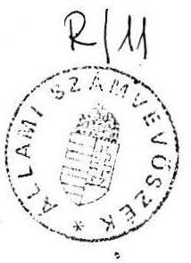
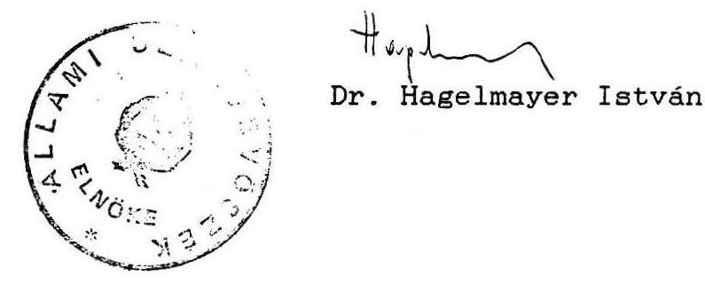

#  

## Jelentés

a Magyar Köztársaság helsinki, koppenhágai, prágai és pozsonyi kereskedelmi kirendeltségeinek 1990. évi pénzügyigazdasági ellenőrzéséről

---

# JELENTÉS

a Magyar Köztársaság helsinki, koppenhágai, prágai és a pozsonyi kereskedelmi kirendeltségeinek 1990. évi pénzügyi-gazdasági ellenőrzéséről

Az ellenőrzés célja a kirendeltségek feladatainak és a rendelkezésre álló pénzeszközök összhangjának megítélése, valamint a gazdálkodás célszerűségi, eredményességi és törvényességi szempontok szerinti értékelése volt.

A helyszíni ellenőrzést a Kereskedelmi Minisztérium Költségvetési Főosztályán végzett előzetes tájékozódás és ellenőrzés egészítette ki. Ennek keretében a minisztérium irányító, ellenőrző feladatának ellátását vizsgáltuk.

Az ellenőrzés alapvetően az 1987. I. 1. - 1990. IV. 30. közötti időszakra terjedt ki.
I.

Az ellenőrzés megállapításait a következőben összegezzük:

## 1./ A működés feltételei, a gazdálkodás célszerűsége.

A kirendeltségek gazdálkodását a Kereskedelmi Minisztérium szabályzatai, útmutatói irányítják. A szabályozottság az általános igényeket ugyan kielégíti, de esetenként az indokoltnál részletesebb kötöttségeket és elavult szabályokat tartalmaz. Új, aktualizált átfogó szabályzat kiadására hosszabb ideje nem került sor.

Az elmúlt években a költségvetési előirányzatok kialakításánál többségében figyelembe vették az előző időszak tényleges költségalakulását és a költségeket befolyásoló tényezőket /áremelkedést, helyi alkalmazottak előírt fizetésemelése, stb./. A KEM a kirendeltségek költségvetési javaslatait általában csökkentett összeggel hagyta jóvá.

---

A kirendeltségek költségvetéseik 2-7 kiadási rovatainak előirányzatait tervezték. Ezek az előirányzatok általában megfelelő pénzügyi feltételt teremtettek a működés számára.

A kirendeltségek éves kiadási előirányzatai 1987-1989 között a helyi körülményekhez képest kielégítő arányban, 6-7 %-kal nőttek. /Koppenhágában 3%-kal csökkentek./ Ezen belül legnagyobb ütemben a kirendeltségek reprezentációs és járműfenntartási kiadásai emelkedtek, elsősorban a Helsinkiben és Koppenhágában, ahol a növekedés 24-73%-os mértékű volt.

A kirendeltségi költségvetések a működési kiadásoknak azonban csak egy részét /pl. Prágában 40, Pozsonyban kevesebb, mint 50 %-át/ tükrözik. Ennek oka, hogy a központilag tervezett kötött előirányzatok /illetmény, bérleti díj, stb./ a kirendeltségi költségvetésben nem jelennek meg. Egyes esetekben pedig a bevételeket a kiadások térítémeként számolják el.

Helyenként a kiadásokat bevételekkel ellentételezték, ugyanakkor a bevételeket sem a valóságos értéken mutatták ki, mert azokból már elszámolásuk előtt egy sor kiadást teljesítettek. Prágában például 1989. évben a hotelházi bevételek terhére 174 ezer Kcs értékben nem csak a hotelet, de általában a kirendeltséget is illető beszerzési és felújítási költséget számoltak el.

A részleges költségvetések a kirendeltségek rugalmasabb és ellenőrizhetőbb gazdálkodásának megalapozását nehezítik. Sérelmet szenved a kiadások-bevételek bruttó elszámolásának követelménye, nem utolsó sorban pedig a kirendeltségi költségvetés csak kombinációkkal alkalmas a pénzellátás megalapozásához.

A kirendeltségek bevételeket egyáltalán nem terveztek. Bevételeik pedig helyenként jelentősek, sőt -igen helyesen és különösebb érdekeltség nélkül - mind több lépést tesznek az önfenntartó képesség fokozására /pl. Prága, Pozsony, Helsinki/.

Helsinkiben három irodahelyiség bérbeadásából, a tartósan lekötött 250 ezer FIM kamataiból, Koppenhágában a vállalati képviseleti teendők ellátásáért kapott évi 200 ezer DKK-ból és az ugyancsak tartósan lekötött 537,5 ezer DKK kamatából származik - egyebek között - jelentősebb bevétel. Prágában a kirendeltség, elsősorban "hotelházi" forgalma folytán, az évi 7-8 millió Kcs kiadással szemben csaknem 10 millió Kcs bevételt ér el. Kiadásainak 25%-át a pozsonyi intézmény is bevételeiből fedezi.

---

A tényleges kiadásokat általában megfelelő szinten tartották.

A magyar alkalmazottak illetményét és a bérleti díjakat is tartalmazó folyamatos működési költségek 1987. évről 1989. évre Helsinkiben 9%-kal csökkentek, míg Koppenhágában 11%-kal emelkedtek. /A változás mutatójánál a felújítási, beruházási ráfordításokat figyelmen kívül hagytuk, mivel azok nem egyenletesen, hanem ciklikusan merülnek fel./

A kirendeltségek személyi állományát igyekeztek a tényleges szükséglethez igazítani. Ennek érdekében az elmúlt évben létszámcsökkentésekre került sor.

A teljes munkaidejű magyar alkalmazottak létszámát Helsinkiben és Koppenhágában 14-14%-kal csökkentették. Emellett Helsinkiben a helyi alkalmazottak 3 fős létszámát 2 főre csökkentették.

A kirendeltségek bérelt irodahelyiségei jó feltételeket adnak a munkavégzéshez. Helyenként azonban a fenntartást gazdaságtalanná teszi, hogy a helyiségek nincsenek kellően kihasználva, ugyanakkor a bérleti díj igen magas. /pl. Koppenhága/.

A megtekintett lakások a helyi viszonyokhoz igazodva a családi állapot és a hivatali beosztás figyelembevételét tükrözték. A lakások bútorozásánál pazarló megoldással nem találkoztunk.

A bérleti díjak egyre inkább emelkednek, így hosszú távon a saját tulajdonú ingatlanok fenntartása tekinthető gazdaságosnak.

A dolgozókat terhelő költségtérítések megállapítása helyenként nem volt kellően megalapozott.

A lakásbérleti díjakban benne foglalt fűtés és melegvíz szolgáltatás térítési díját Koppenhágában a titkári lakásokra 1985 óta nem módosították, holott a bérleti díj évenként emelkedett. Helsinkiben ugyanezen térítési díjak mikénti kialakítását nem tudták dokumentálni.

A saját gépkocsi hivatali célú használatával összefüggő átalány jellegű költségtérítés alkalmazásának viszont vannak kedvező jelei. /Helsinkiben például a bevezetéstől eltelt rövid időben már megtakarítást hozott./

---

A kirendeltségek épületeiben működő vállalati képviseletek részére megállapítandó bérleti díj és egyéb költségtérítéseket az utóbbi időben rendezték a kirendeltségek.

Prágában azonban a szerződésekben indokolt lenne a bérleti díjakat differenciáltabban megállapítani, a különböző szolgáltatások utáni költségtérítéseket pedig konkrétabban megfogalmazni.

A vállalati minták kiváltásának költségeit is indokolt a vállalatokra áthárítani, de ez még várat magára /pl. Koppenhágában/.

A vizsgált időszak egyes éveiben jelentősebb összegű beruházásra, felújításra és beszerzésekre került sor. Ezeket általában körültekintően végezték, a ráfordítások szükséges igényeket elégítettek ki. /Nagyrészt a váltásokkal összefüggő lakásbútor, - továbbá irodabútor beszerzések, lakás és iroda felújítás, irodagépek beszerzése, hivatali gépkocsi csere./ Helyenként a ráfordításokkal a kirendeltségen és a lakásokon olyan színvonalú állapotot és felszereltséget teremtettek meg, hogy az elkövetkező néhány évben ilyen célú kiadásokkal nem kell számolni. /Elsősorban Koppenhágában/.

Beszerzésekre, felújításra a prágai kirendeltségen - az előirányzaton felül - további jelentős pénzforrás állt rendelkezésre a hotelházi bevételekből. Ennek ellenére célszerűtlen, pazarló megoldásokkal itt sem lehetett találkozni. A kirendeltség belső felújításával viszont az ellátottsági színvonal lényegesen javult.

A reprezentációs kiadások 1987-1989. között számottevően /helyenként 50-70%-kal/ emelkedtek, ami elsősorban a bővülő kapcsolattartásra, a több rendezvényre és az áremelkedésekre vezethető vissza.

A mértékletességet mutatja, hogy Helsinkiben az indokolatlanul magasan megállapított éves előirányzatot 1987-ben 48%-ban, 1988-ban pedig 58%-ban használták fel.

Tapasztalható a takarékos megoldásokra való törekvés.

Helsinkiben és Koppenhágában a vendéglátás étterem helyett a tanácsosok lakásán történik, az italokat árengedménnyel szerzik be, az ajándékozást szűkítették és főként italokat ajándékoznak.

A költséggazdálkodásban egyes esetekben a takarékosságnak ellentmondó megoldások is előfordultak.

---

Koppenhágában a kirendeltségi Volvo gépkocsiba beszerelt telefon működésének költsége 1989-ben az összes postaköltség közel 10%-át tette ki. Az autótelefont 5 évre bérelték. A tanácsosi lakás 1989. évi telefonköltsége több mint négyszerese volt az 1987. évinek és az összes postaköltség 12%-át tette ki.

A kirendeltségek pénzellátása a vizsgált kirendeltségeken többségében indokolatlanul bőséges volt /a pénzkészletek fél-egy évi kiadást fedeztek./

Erre utalnak a Helsinkiben, Koppenhágában lekötött bankbetétek is. Prágában a vállalatok stb. által a PK letétre befizetett összegeket ellátmányként azonnal saját pénztárukba vették át, a Minisztérium pedig a hazai ellátmányok leállítását iránt késve intézkedett. Pozsonyban és Koppenhágában viszont a főkonzulátussal, illetve a nagykövetséggel való együttműködés jó példájával találkoztunk. /A pénzügyi tranzakció Pozsonyban csak annyiban volt kifogásolható, hogy azt nem a PK napló közbeiktatásával bonyolították./

# 2./ A gazdálkodás törvényessége.

A pénz- és értékkezelés összességében szabályszerű, az utalványozási és bizonylatí fegyelem kielégítő volt. Hiányolható azonban, hogy a gazdálkodási jogkörök belső rendjét /kötelezettségvállalás, utalványozás, ellenjegyzés/ írásban nem rögzítették. Az analitikus nyilvántartások tekintetében a szabályozás és a gyakorlat kiegészítésre, pontosításra szorul /pl. elszámolásra kiadott pénzek nyilvántartása./

A pénztárakban fellelt készpénzkészletek a pénztári nyilvántartások adataival, a bankszámlák igazolt egyenlegei a vonatkozó naplók adataival a kirendeltségeknél megegyeztek. Prágában azonban ez az egyezőség csak kombinatív úton volt kimutatható.

A pénztár- és banknaplók már 1984 óta 8-9 millió Kcs nagyságrendű számvitelileg értelmezhetetlen egyenlegeket tükröznek. Az egyenlegek kialakulását, annak okait eddig nem vizsgálták ki és a rendezés érdekében sem intézkedtek. Az áttekintést zavarta, hogy Prágában és Pozsonyban a kirendeltségi és a vállalati pénzforgalom szétválasztása - az intézkedés ellenére - máig nem történt meg maradéktalanul.

---

Helyteleníthető, hogy Prágában az ellenőrzés időpontjában négy "pénztár" is működött, ennyi helyen tároltak jelentősebb pénzkészleteket és teljesítettek kifizetéseket. Ugyanitt évek óta tartottak készleten nyilvántartásban nem szereplő 1.501 USD-t.

Pozsonyban a pénztárolásra szolgáló helyiség biztonságát kifogásoltuk.

A számviteli, bizonylatí rend általánosan elfogadható színvonala ellenére - több vonatkozásban - korszerűsítésre szorul.

A vagyonkezelés, az állóeszközök és készletek megőrzése, védelme terén mind a gondos, szabályszerű megoldások, mind az ettől eltérő, kifogásolható gyakorlat előfordult.

A leltári nyilvántartások vezetését és az eszközök leltározását az előírások szerint vezették Prágában és Koppenhágában. Ezzel szemben Helsinkiben egyes leltárnyilvántartások - a sok javítás miatt - nehezen áttekinthetők, míg Pozsonyban a vásárolt anyagokból előállított készletek /pl. sötétítő függönyök, stb./ nyilvántartása volt kifogásolható.

A selejtezéseket Prágában vontatottan végezték. A kiselejtezett eszközök további sorsát hitelesen nem dokumentálták Helsinkiben.

A reprezentációs készletekről és ajándéktárgyakról szabályszerű nyilvántartást vezettek Helsinkiben és Koppenhágában. A szúrópróbaszerűen megvizsgált tételeknél a nyilvántartás szerinti és a tényleges készlet egyező volt. Ezzel szemben Prágában a nyilvántartás nem tekinthető hitelesnek, vezetése nem felel meg a követelményeknek, adataiból a raktározott készletek mennyisége megbízhatóan nem állapítható meg.

A külföldi munkavállalók alkalmazása több esetben nem felelt meg az előírásoknak. Előfordult írásbeli munkaszerződés nélküli foglalkoztatás /Helsinkiben, a gépkocsivezető esetében/. Gyakori, hogy a munkaszerződések csak idegen nyelven, magyar változat nélkül készültek. /Jellemző ez a bérleti szerződésekre is./ Ez a gyakorlat a kirendeltségek érdekeinek érvényesítését nehezíti, a magyar állam ellenőrzését pedig akadályozza.

---

# II.

## JAVASLATOK

A Nemzetközi Gazdasági Kapcsolatok Minisztériuma az ellenőrzés megállapításai alapján:

- kísérje figyelemmel a kirendeltségeken feltárt hiányosságok megszüntetését;
- a kirendeltségek gazdálkodásához kiadott korábbi útmutatókat, szabályzatokat - a mai követelményeket figyelembe véve - korszerűsítse;
- fordítson figyelmet a megfelelő szakképzettséggel és tapasztalattal rendelkező gazdasági felelősök kiválasztására;
- az önállóbb és rugalmasabb gazdálkodás érdekében a kirendeltségek részére a költségvetés olyan rendszerét vezesse be, amely tartalmazza a teljes kiadási és bevételi előirányzatot;
- bevételt termelő tevékenységek /pl. hotelházi tevékenység/ esetén vizsgálja meg az érdekeltség bevezetésének lehetőségeit. Ez lehetne például egy bevétel- illetve nyereségarányos jutalmazási /premizálási/ és többletbeszerzési rendszer;
- vizsgálja felül és az indokolt mértékben emelje fel a dolgozókat terhelő lakás utáni költségtérítéseket;
- a vállalati képviseletekkel kötött új bérleti szerződéseknél törekedjen a nyújtott szolgáltatás és a költségtérítések egyértelmű meghatározására;
- intézkedjen, hogy a feladatok finanszírozásához szükségtelen pénzkészleteket a kirendeltségek a PK naplóba fizessék be és ezek az összegek más magyar képviseletek vagy a kiutazók ellátmányaként felhasználásra kerülhessenek;
- tegyen határozott intézkedést a kirendeltségi és a vállalati pénztárak, valamint a bankszámlák pénzforgalmának maradéktalan szétválasztására;
- vizsgálja meg a prágai pénztár- és banknaplókban kialakult számvitelileg értelmezhetetlen egyenlegeket és intézkedjen, hogy a pénzkészletek hiteles könyv szerinti állománya megnyugtatóan megállapítható legyen;

---

- vizsgálja meg a kirendeltségek számviteli és analitikus nyilvántartási rendszerét és azt a tulajdonvédelmi szempontoknak megfelelően fejlessze tovább. Ennek keretében az ún. "hotelházi" tevékenység egységes nyilvántartási rendjét alakítsa ki;
- minden esetben követelje meg a

 külföldi féllel kötött különböző szerződéseknél /bérleti-, munkaszerződés/ a magyar nyelvű változat elkészítését.

Budapest, 1990. július

