# JELENTÉS 

a Budapesti Közgazdaságtudományi és Államigazgatási Egyetem működésének ellenőrzéséről
2001. szeptember

---

# Az ellenőrzés végrehajtásáért felelős: 

Bihary Zsigmond számvevő igazgató

## Az ellenőrzést vezette:

## Matusek István

igazgatóhelyettes

## Az ellenőrzésben részt vettek:

## Maklári Ferencné

számvevő tanácsos

## dr. Mihály Sándor

főtanácsadó

## Papp Sándor

főtanácsadó

## Varga Szabolcs

számvevő tanácsos

## Vértényi Gábor

fogalmazó

## Szatmári Dezső

külső munkatárs

## Az egyetemet érintő korábbi ellenőrzéseink:

A magyar egyetemi felsőoktatás ellenőrzése (1994. augusztus) (218)
A főiskolák és az egyetemek főiskolai karai állami támogatásának ellenőrzése (1996. szeptember) (318)

A központi költségvetés területén működő belső kontroll mechanizmusok ellenőrzése (2001. június) (533)

---

# TARTALOMJEGYZÉK 

I. ÖSSZEGZŐ MEGÁLLAPÍTÁSOK, KÖVETKEZTETÉSEK, JAVASLATOK ..... 5
II. RÉSZLETES MEGÁLLAPÍTÁSOK ..... 12

1. A feladatok, a szervezeti rendszer, a személyi és tárgyi feltételek összhangja ..... 12
2. A gazdálkodás értékelése ..... 24
3. A szakmai feladatok ellátása ..... 34
4. Az OM intézménnyel kapcsolatos szabályozó, ellenőrző és beszámoltató tevékenységének értékelése ..... 43
4.1. Az intézmény működését, gazdálkodását érintő felügyeleti szabályozás ..... 43
4.2. A felügyeleti költségvetési ellenőrzés tevékenységének értékelése ..... 44
5. sz. Függelék: Az Egyetem egyéb fontos működési mutatóinak értékelése
6. sz. Függelék: A 2000. évi beszámoló megbízhatósági ellenőrzése
Mellékletek

---

.

---

# JELENTÉS 

## a Budapesti Közgazdaságtudományi és Államigazgatási Egyetem működésének ellenőrzéséről

A Budapesti Közgazdaságtudományi és Államigazgatási Egyetem (BKÁE) az Oktatási Minisztérium (OM) felügyelete alatt működő állami felsőoktatási intézmény, önállóan gazdálkodó központi költségvetési szerv. A BKÁE a felsőoktatási intézményhálózat átalakítása keretében a Budapesti Közgazdaságtudományi Egyetem (BKE) és az Államigazgatási Főiskola (ÁF) integrációja eredményeként 2000. január 1-jével jött létre.

A BKÁE alaptevékenysége: egyetemi és főiskolai szintű alapképzés, kiegészítő képzés, szakirányú továbbképzés, akkreditált iskolai rendszerű felsőfokú szakképzés nappali, esti és levelező tagozaton, távoktatásban és e képzési formákban diplomát, oklevelet, illetve bizonyítványt ad ki. Továbbá doktori képzés, tudományos kutatás, tudományfejlesztés, valamint az alaptevékenységi feladatainak ellátásához kapcsolódó, azt elősegítő tevékenységek (tankönyv- és jegyzetkiadás, könyvtári szolgáltatás, kollégiumi ellátás, infrastruktúra fenntartása és fejlesztése stb.).

Az Egyetem a még jóvá nem hagyott Alapító okirata szerint az alaptevékenységén belül az alaptevékenység feltételeként rendelkezésre bocsátott és e célra csak részben lekötött személyi és tárgyi kapacitások kihasználásának elősegítésére, nem nyereség szerzési céllal folytat egyéb kiegészítő tevékenységeket. Vállalkozási tevékenységet nem végez. Telephelyeinek száma 13, ebből 10 budapesti, 1-1 veszprémi, salgótarjáni és lakitelki.

A BKÁE 2000-ben 3917 M Ft-os költségvetéssel rendelkezett. A kiadások 61%-át állami támogatás, a többit saját bevétele fedezte. Az egyesített intézmény számvitelben kimutatott vagyona 4,522 Mrd Ft. A foglalkoztatottak létszáma a 2000. évi költségvetés szerint 1.188 fő. Nappali képzésben részt vevő hallgatók létszáma 4.991 fő, egyetemi, főiskolai továbbképzésben 4000 fő, nem szakmai tanfolyami képzésben 1.120 fő vett részt. (Az Egyetem működését bemutató főbb adatokat az 1. sz. melléklet tartalmazza.)

---

Az OM mint felügyeleti szerv 2000 második félévében átfogó ellenőrzés keretében részletesen megvizsgálta, hogy az integráció során létrejött jogutód intézmény, illetve a jogelőd intézmények hogyan hajtották végre a törvényekben előírt szakmai és gazdálkodási feladatokat. Ugyanebben az időszakban az OM célvizsgálat keretében ellenőrizte az Egyetem egyházi ingatlan visszaadási kötelezettsége teljesítésének helyzetét.

Az Állami Számvevőszék az éves zárszámadások ellenőrzéséhez kapcsolódóan 2000. november-december hónapokban felmérte és értékelte a központi költségvetés területén működő belső kontroll mechanizmusokat. Az ellenőrzés kiterjedt az Egyetemre is.

A jelenlegi ellenőrzés célja az volt, hogy értékelje a BKÁE gazdálkodásának törvényességét, célszerűségét és eredményességét, ezen belül

- az integráció végrehajtását és az Egyetem működésére, gazdálkodására gyakorolt hatását;
- a likviditási problémák okait, a stabilizációs intézkedések eredményességét;
- az Egyetem 2000. évi elemi költségvetési beszámolójának megbízhatóságát és hitelességét, valamint az Szt-ben előírt alapelvek betartását és a vonatkozó egyéb jogszabályokban rögzített követelmények érvényesülését.

Az ellenőrzés a BKÁE 2000. évi működésére terjedt ki, de a helyszíni ellenőrzés befejezéséig (2001. május 11.) figyelemmel kísérte a pénzügyi-gazdasági folyamatokat. Indokolt esetben kitért az 2000. évet megelőző időszak gazdasági eseményeire is. Az ellenőrzés az Oktatási Minisztérium Egyetemmel kapcsolatos szabályozó, ellenőrző és beszámoló tevékenységét is értékelte.

Az ellenőrzés jogalapja: az Állami Számvevőszékről szóló 1989. évi XXXVIII. törvény 2. § (5) bekezdése, mely szerint az ÁSZ ellenőrzi az állami költségvetésből gazdálkodó intézményeket; az államháztartásról szóló többször módosított - 1992. évi XXXVIII. törvény 121. § (1) bekezdése, miszerint a számvevőszéki ellenőrzés keretében az ÁSZ az államháztartás forrásai felhasználásának és a vagyonnal való gazdálkodásának ellenőrzését végzi.

---

# I. ÖSSZEGZŐ MEGÁLLAPÍTÁSOK, KÖVETKEZTETÉSEK, JAVASLATOK 

A felsőoktatási intézmények integrációját elrendelő 1999. évi LII. törvény úgy rendelkezett - többek között -, hogy a Budapesti Közgazdaságtudományi Egyetem (BKE) és az Államigazgatási Főiskola (ÁF) egyesítésével 2000. január 1-jével egy új egyetemet kell létrehozni Budapesti Közgazdaságtudományi és Államigazgatási Egyetem (BKÁE) elnevezéssel, budapesti székhellyel.

A jogutód intézmény az alapvető szabályzatait (Alapító okirat, Szervezeti és Működési Szabályzat, Gazdálkodási Szabályzat) elkészítette, elfogadta és határidőre (1999. november 30.) felügyeleti szervének, az Oktatási Minisztériumnak (OM) megküldte.

Az Alapító okiratot a minisztériumi apparátus kedvezően véleményezte, de jóváhagyása - a helyszíni ellenőrzés befejezéséig (2001. május 11.) - az oktatási miniszter részéről - a pénzügyminiszterrel egyetértésben - nem történt meg, addig jogilag nem volt hatályos. (A miniszter 2001. július 5-én átadta a kézjegyével ellátott dokumentumot.)

Az ET a Gazdálkodási Szabályzatot 2000. március 24-én, az SZMSZ-t 2000. szeptember 22-én jóváhagyta.

A Magyar Köztársaság elnöke az Ideiglenes Intézményi Tanács javaslata alapján 2000. május 3. - 2003. július 31. közötti időszakra az Egyetem irányítási feladatainak ellátásával új rektort bízott meg.

Az integráció - a jogelőd intézmények egyetértésével - a szervezeti struktúra jelentős változását eredményezte: az ÁF Államigazgatási Karként a Közgazdaságtudományi, a Gazdálkodástudományi és a Társadalomtudományi Kar mellett az Egyetem negyedik kara lett, a Posztgraduális Kar megszűnt. A szakképzési struktúra változtatásával 7 oktatási egység megszűnt, 10-et létrehoztak, egyet átszerveztek, 6-ot a karok között áthelyeztek.

A 2000. év az Egyetem gazdasági szervezetében és működésében az átmenet éve volt. Ebben az évben az Egyetem egésze, valamint a központi igazgatás és a központi gazdálkodás szervezetei nevében a Gazdasági Műszaki Főigazgatóság (GMI) járt el. Az Államigazgatási Kar (ÁK) és a Vezetőképző Intézet (VKI) saját gazdasági szervezettel és önálló előirányzat-felhasználási alszámlával rendelkezett. Az egyetemi karoknak gazdasági szervezetük nem volt, de a részükre megállapított képzési és fenntartási normatíva felhasználására, valamint saját bevételeik terhére kötelezettséget vállalhattak.

---

A decentralizált gazdálkodási jogkörök 2001. január 1-jével megszűntek, a jogosultságokat az egységes Gazdasági és Műszaki Főigazgatóság vette át, a pénzügyi jogköröket központosították, a vagyongazdálkodást egységesítették.

A 2000. év költségvetési tervét 1999. július 15-re kellett elkészíteni. A tervezés során az akkor hatályos képzési és fenntartási normatívával és az 1999. április havi hallgatói statisztikai létszámmal kellett kimunkálni a normatívát. A normatívának ez a mértéke a BKÁE esetében egyik elődintézménynél sem biztosította az állami támogatás megelőző évi összegét, attól 64 M Ft-tal kevesebb volt. A normatívák összegét a Kormány 120/2000. (VII. 7.) rendelete az év kezdetétől visszamenőleges hatállyal állapította meg. Az új módosított normatíva a támogatási rendszerbe beemelte a minősített oktatók és a doktoranduszok minősített támogatását.

A képzés tényleges finanszírozása a 2000. év első félév folyamán a közgazdász képzésben elmaradt a normatívától, a főiskolai képzésben meghaladta azt. A különbözetet az OM 5 havi részletben pótlólag folyósította, az ÁK-tól intézményi hatáskörben ugyanennyi részletben a többletet elvonta.

A normatív alapú finanszírozás szabályai bevezetésük óta ellentmondásban voltak az intézményi költségvetés finanszírozásával. A bevételi oldalt képező normatívák a tanévhez, a kiadásokat szabályozó Kjt, valamint az államháztartás működési rendjét szabályozó kormányrendelet a naptári évhez kapcsolódott. Eddig nem sikerült kialakítani a közgazdaságilag megalapozott normatívát, amely az objektív alapú állami finanszírozás és a ráfordítások elszámoltathatóságának alapját képezhetné.

Az egyesítés, a szervezeti átalakulások és a létszámcsökkenést eredményező intézkedések együttes hatására a BKE 1998. évi 963 fős létszámához képest az integrált egyetemé 1059 főre növekedett. Az Egyetemen 2000-ben 73 Széchenyi ösztöndíjas oktató volt. Az oktatók 40 M Ft értékben nyertek el OM kutatási pályázatot, ezenkívül 6 nemzetközi pályázatban is részt vesznek.

Az Egyetem eszközellátottsága ellentmondásos képet mutat. A BKE karokon a számítógépek nagymértékben elhasználódtak, 70%-uk 0-ra leírt, elavult. A vásárolt szellemi termékek (programok) értéke a vizsgált időszakban közel 10szeresére nőtt ( $50,6 \mathrm{M} \mathrm{Ft}$ ). Az egy hallgatóra eső tárgyi eszközök bruttó értéke 20%-kal növekedett, azonban az értékcsökkenés jelentős emelkedésével a nettó érték 40%-kal csökkent. Az oktatási épületek egy hallgatóra jutó bruttó/nettó értéke a hallgatói létszám 1600 fős növekedése miatt csökkent. A kollégiumi épületek mutatója az ÁK értékesebb épületével növekedett (bruttó 32 E Ft/főről 47 E Ft/főre, nettó 21 E Ft/főről 31 E Ft/főre).

Az Egyetem működésében új helyzetet idézett elő a Közraktár u. 18. sz. alatti 17.500 m²-hasznos alapterületű beépített ingatlan kezelői jogának 1996-ban történt megvonása, egyházi célokra való visszaadása. Ellenértékeként a rendelkező kormányhatározat 2.752 M Ft kártalanítást állapított meg, amelynek alapját egy 1992-es felmérés adta. A határozat szerint az ingatlant kiürített állapotban 2000. július 31-ig birtokba kellett adni. A funkcióváltáshoz a kártalanítás ellenértéke éves ütemezésben (1996-1999) történő folyósítással kamatmentesen rendelkezésre állt. Ebből az összegből kellett volna a

---

tornatermet, a könyvtárat, az informatikai központot és 4.300 m² oktatási (tantermi és tanszéki) területet új helyre telepíteni. Ez a megállapított kártalanítási összeg irreális mértéke és az egyéb források hiánya, valamint az árviszonyok radikális változásai miatt nem volt megoldható.

Az informatikai központ elhelyezése 2001. év folyamán valószínűleg megoldódik a Fővám tér 13-15. sz. alatti (Sóház) ingatlan rekonstrukciójával, ahol oktatási helyiségek is kialakításra kerülnek. Az épület 2001. május 31-i befejezése a helyszíni ellenőrzés befejezésekor látható állapotában nem lehetséges, de a II. félévi befejezése valószínűsíthető.

A Veres Pálné u. 36. sz. alatti épületrekonstrukció és emeletráépítés kb. 1.100 m² fejlesztést jelentett volna, ami nem alkalmas a könyvtár és tornaterem funkciójára, de jelentős oktatási helyiségbővítést eredményezett volna, azonban építését más okokra hivatkozva leállították. Más helyszínű, konkrét terv nem ismert.

Az egyháznak át nem adott ingatlanok használatáért a felmerülő bérleti díjakra - az OM tudtával - az Egyetem fedezet nélküli kötelezettséget vállalt. Az OM becslése szerint a prognosztizálható bérleti díjak mintegy $233,3 \mathrm{M} \mathrm{Ft}$ összegűek lesznek.

Az Egyetem gazdasági-pénzügyi folyamatának áttekintését és irányítását, különösen a vezetői döntésekhez szükséges információk szolgáltatását az alkalmazott információs rendszer csak korlátozottan teszi lehetővé. A felsőoktatás céljára kifejlesztett információs rendszerek nem váltották be a várakozásokat, ezért nem vezették be, de nem alkalmazták a BKE megrendelésére kifejlesztett Vezetői Információs Rendszert sem, amelynél a tesztelések során kedvező tapasztalatokat szereztek.

A jogelőd intézmények pénzügyi-gazdasági helyzete az egyesülés időpontjában alapvetően eltért egymástól. Az ÁF gazdálkodása kiegyensúlyozott, lényegében zavartalan volt. A BKE gazdálkodása 1995-1999. években belső és külső okok következményeként megbomlott; kezdetben a belső "eladósodás" volt jelentős, 1999. év folyamán már a külső likviditási problémák is megjelentek ( 168 M Ft ). Az összes
 (külső-belső) hiány 475 M Ft-ra emelkedett. Az adósságállomány kezelésére, felszámolására válságkezelő programot dolgoztak ki, de a tervezett intézkedések az integráció előtt már nem valósultak meg.

A 2000. év gazdálkodásának kulcskérdése a folyó költségvetés bevételi és kiadási oldalának kiegyensúlyozása volt. Az adósságállomány rendezésére az Ideiglenes Intézményi Tanács a 2000. évi költségvetési tervben, a tervezett folyó kiadási többlet összegét 60 M Ft-ban maximálta és a szervezeti egységek vezetőit megtakarítást eredményező intézkedésekre utasította. Ennek érdekében 150 M Ft megtakarítást kellett elérni a bérek és járulékaik csökkentésével. Az év első öt hónapjában a tervezett célokat nem sikerült elérni, a kari költségvetések nem készültek el, az oktatási tevékenység szerkezete nem igazodott a

---

finanszírozási lehetőségekhez, a belső szolgáltatások ráfordításai részben ismeretlenek voltak, vagy nem térültek meg.

Az adósság kezelhetősége érdekében a BKÁE - visszatérítési kötelezettséggel - a köztartozások átütemezésében megállapodott az APEH-el, a Kincstárnál pedig elérte a költségvetési támogatás átütemezését.

A létszámcsökkentés átmeneti többletköltségeihez a Pénzügyminisztérium 136 M Ft támogatást bocsátott rendelkezésre. A működési költségek csökkentését elősegítette egyes, nem gazdaságos szolgáltatási tevékenységek vállalkozásba adása. A megtett intézkedések eredményeként az integrált egyetem pénzügyi egyensúlyát sikerült helyreállítani. Az egyensúlyi állapot még törékeny, mivel a belső adósság megszüntetése a megoldandó feladatok közé tartozik, a "kölcsönvett" összegekre az érintett karok számítanak.

A Kjt hatálya alá tartozó közalkalmazottak létszámának csökkentése igen sok munkaügyi konfliktussal járt, mert a tanterv megváltozása, a hallgatók érdektelensége a tantárgy iránt az oktató elbocsátását vagy részmunkaidőssé átminősítését nem alapozza meg. Ugyanez a probléma áll fenn a nem oktatói körbe tartozók esetében is.

Az oktatási célú helyiségek, a nyelvi laboratóriumok kihasználása a BKE karokon a pénteki nap kivételével teljes körű (napi 12-14 óra). A zsúfoltságot enyhítő átmeneti teremátcsoportosításra nem került sor. Az ÁK-n a helyiségek kihasználása kedvezőbb, egyes tantermek napi néhány órás elfoglaltságúak.

Az átvett pénzeszközök az összes bevételnek közel 40%-át (2,9 Mrd Ft) tették ki. A kiadások kiemelt előirányzatonként az egyéb bevételekkel, költségvetési támogatásokkal együtt szerepelnek, ennek következtében nem állapítható meg témaszámonként a pénzeszközök átvételéből származó kiadás tételes felhasználása.

A hallgatók állami támogatásának elosztása a Diákjóléti Bizottság feladata volt, az egyetemi hallgatók a juttatásokat időben megkapták. A hallgatói önkormányzat szervezetének (HOK) mandátuma 2000. novemberében lejárt, a helyszíni ellenőrzés időpontjáig az új szervezet nem működött. A hallgatói támogatás rendszerét módosító kormányrendelet szerint módosítani kellett volna a belső szabályzatot is, amely nem történt meg. A támogatások elosztását, a térítések fizetését a régi szabályok szerint rendezték.

A 2001. évi költségvetés megalapozottságát, kiegyensúlyozottságát nem sikerült az eredeti célnak megfelelően megvalósítani; a szervezeti egységek összesített bevételi terve 37,5 M Ft-ot tartalmaz az ET által előzetesen előirányzott 100 M Ft bevételi többlettel szemben.

Az Egyetem vezetése az intézményfejlesztési terv I. fejezetét a szakmai célok részletes meghatározásával 2000. június 15-re elkészítette és megküldte a felügyeleti szervnek. A koncepció "A" jelű, jó minősítést kapott az OM-től.

---

Az integrációs törvénnyel létrehozott egyetem által reprezentált tudományági szerkezet nem elégíti ki a Felsőoktatási törvényben meghatározott több tudományágat magában foglaló egyetemi követelményeket; eredményesen csak akkor akkreditálható, ha újabb tudományterületek felállítására kerül sor.

A BKÁE szakmai fejlesztési terve szerint az oktatott tudományágak bővítését egy Környezettudományi Kar és középtávon Informatikai Kar létrehozásával kívánják elérni; tervezik továbbá az Államigazgatási Kar egyetemi szintű közigazgatási szakkal való kiegészítését. A képzési struktúrát, a tanterv fejlesztését a piaci igények figyelembevételével korszerűsítik.

Az intézmény fejlesztési terv II. fejezetét, amely a szakmai célok erőforrásigényét és a tervezett beruházások ütemezését tartalmazta, 2001. február végén nyújtotta be az Egyetem. Ennek minősítése 2001. június 25-én megtörtént és az OM Értékelő Bizottsága átdolgozásra visszaküldte.

Az Egyetem fejlesztési elképzeléseit a Czuczor-Mátyás utcai tömb beépítésével kívánja megoldani. A fejlesztési terv más alternatívát nem tartalmaz, holott a pénzügyi fedezet bizonytalansága ezt indokolta volna. A rendelkezésére álló épületállomány egy részét csereként konvertálná az ügyletbe magánbefektető közbejöttével. Előzetes számítások szerint 16,6 Mrd Ft-ra becsülhetők a megvalósítás költségei, ebből az ingatlanértékesítés 3,5 Mrd Ft, az átvett forrás 10,5 Mrd Ft és a Világbanktól származó forrás 2,6 Mrd Ft. Ez utóbbira a pályázatot még nem nyújtották be és a késedelem azzal fenyeget, hogy külső forrás nem vehető igénybe és az intézményfejlesztési tervben foglaltak az eredeti szándékok szerint nem valósulhatnak meg.

Az oktatói teljesítmények jellemzői közül javulás állapítható meg az egy oktatóra jutó hallgatók mutatószámánál, amely 1998-ban 8,3 fő, 2000-ben az integrált intézménynél 9,1 fő volt. A nappali hallgatókhoz viszonyított arány közel hasonló mértékben változott (6,8 főről 8,3 főre).

Az oktatói kar heti óraterhelésének elemzése azt mutatja, hogy jelentős eltérések vannak a karok adatai között és még nagyobb a szóródás, ha a tanszékenkénti terhelést vizsgáljuk. Egyértelmű azonban az az összefüggés, hogy ahol az állami oktatásra fordított óraszám alacsony, ott magas az egyéb (többnyire fizető) oktatásban való részvétele az oktatóknak. Ilymódon az óraterhelések kiegyenlítettebbek, az oktatáshoz kapcsolódó jövedelmek azonban a térítéses oktatásban résztvevők javára eltérnek. Arra vonatkozóan az Egyetemen nincs adat, hogy az oktatók máshol milyen megbízásokat látnak el. A külső oktatók foglalkoztatásánál jellemző a személyi megbízások helyett a számlás megbízások alkalmazása (a megbízásos oktatás 4-szeresére, a számlás oktatás 14-szeresére nőtt 2000. évben).

Az Egyetem vezetése kidolgozott egy pontszámos teljesítmény-követelmény rendszert a teljes munkaidőben dolgozó oktatókra vonatkozóan, e szerint egy oktatónak évente legalább 100 pontnyi teljesítményt kell összegyűjtenie.

Az Egyetem 2001. évben elkészítette az egységes oktatói és kutatói követelményrendszer szabályzatának tervezetét. Ehhez előírták a heti kötelező óraszámot, a felkészülési időt oktatói besorolásonként. A szabályzat nem

---

rendelkezik azonban arról az esetről, ha a kötelező óraszám nem teljesül. Nem tartalmazza az állami finanszírozású és a térítéses oktatási forma megosztását, a teljesítménynek megfelelő bérezési rendszer kialakítását.

Az OM az Egyetemmel kapcsolatos szabályozó, ellenőrző, beszámoló tevékenysége keretében folyamatos útmutatásokkal, irányítással és közreműködéssel segítette annak szervezeti, szakmai és gazdasági átalakulását. A felügyeleti szerv rendszeresen képviseltette magát az Egyetemi Tanács, illetve a ITT ülésein. Ennek ellenére alkalmakként előfordultak kommunikációs zavarok, megkések, vagy elmaradtak a felvetett kérdésekre a minisztérium válaszai.

Az OM felügyeleti ellenőrzés keretében 1996-ban és 2000. II. félévben ellenőrizte átfogóan az intézmény működését, tevékenységét. Az 1996. évi felügyeleti ellenőrzés megállapításaira kidolgozott intézkedési terv csak részben valósult meg. A 2000. évi ellenőrzési jelentés az ÁSZ helyszíni ellenőrzésének befejezéséig nem készült el. Az egyházi ingatlanok ügyében végzett célvizsgálat sem volt az ÁSZ helyszíni ellenőrzésének befejezéséig lezárva. A felügyeleti ellenőrzésről szóló jelentés záradékolása és átadása végül 2001. július 4-én megtörtént. Ezen okokból a felügyeleti szerv álláspontja az integrációt követően felmerülő számos aktuális kérdésben nem ismeretes, illetve még nem alakult ki.

Az integrált Egyetemen a belső ellenőrzés működését nem szabályozták a 15/1999. (II. 5.) Korm. rendelet előírásai szerint és a feladatok végrehajtása nem felel meg az abban foglalt követelményeknek.

A Budapesti Közgazdaságtudományi és Államigazgatási Egyetem 2000. évi pénzügyi beszámolójának felülvizsgálata során az ellenőrzés olyan megállapításokat tett, amelyek azt igazolják, hogy a beszámolójelentés nem minden esetben felel meg a számviteli (valódiság, vállalkozás folytatása, világosság, teljesség) alapelveknek. A feltárt hiányosságok ugyan - figyelemmel a lényegesség elvére - nem kérdőjelezik meg a beszámolójelentés pénzforgalmi adatainak megbízhatóságát, a vagyoni adatok bizonylati alátámasztottsága viszont nem kielégítő. Mindezek figyelembevételével az egyetem vezetésének hatékony intézkedéseket kell tennie a kockázatok csökkentése érdekében.

Az ellenőrzés megállapításainak hasznosítása mellett javasoljuk

# az oktatási miniszternek: 

1. Tegye meg a szükséges intézkedéseket - a 2000. évi felügyeleti ellenőrzés megállapításait is figyelembevéve - az ellenőrzés során felmerült és függőben maradt ügyekben.
[^0]
[^0]:    * A kockázatok (eredendő és belső kontroll kockázatok) csökkentésében meghatározó szerepe van az intézményen belül kiépített és folyamatosan működő belső kontroll rendszernek.

---

2. Vizsgálja meg, hogy milyen módon biztosíthatók az egyházi ingatlanok kényszer-bérlésével kapcsolatban fedezetlenül vállalt bérleti díjak finanszírozási forrásai.
3. Kísérje figyelemmel az - OM Értékelő Bizottságának 2001. június 25-i értékelése alapján - az egyetemi fejlesztési terv II. fejezetének átdolgozását és a jóváhagyást követően tegyen lépéseket az abban foglalt beruházások megvalósítása érdekében és kezdeményezze a Kormánynál az ingatlankiváltással összefüggő pénzügyi források rendezését.
4. Tekintse át és tegyen javaslatokat - a megalapozottabb finanszírozás érdekében - a felsőoktatás egészét érintően a költségvetési év és a tanév eltéréséből adódó pénzügyi források kiegyenlítési lehetőségeire, hangsúlyosan a normatív alapú finanszírozás továbbfejlesztésére.
5. Írja elő az Egyetem vezetésének, hogy

- gondoskodjon a felügyeleti és a külső ellenőrzések keretében kidolgozott intézkedési tervek eredményes és hatékony végrehajtásáról;
- úgy oldja meg a korábban keletkezett belső adósságállomány felszámolását, hogy annak terheit az érintett karok viseljék;
- a belső ellenőrzést a 15/1999. (II. 5.) Korm. rendeletnek megfelelően szervezze meg és szabályozza;
- dolgozza ki a vezetői döntést is megalapozó információs rendszerét, mérlegelve a használatba nem vett BKE VIR-rendszer felélesztésének lehetőségét;
- tegyen intézkedéseket a hallgatói támogatások felhasználása és a térítések belső szabályzatának módosítására;
- tegye meg a szükséges intézkedéseket a 2000. évi beszámoló megbízhatósági ellenőrzése alapján feltárt hiányosságok megszűntetése érdekében (pl. gazdálkodási rendjének teljes körű belső szabályozása, a Gazdálkodási Szabályzat 13. §-ának összehangolása a Szabályzat más pontjaival; hatékony belső ellenőrzési rendszerek kiépítése; önköltségszámítás szabályozása; beruházási tevékenysége során kötött szerződések felülvizsgáltatása).

---

# II. RÉSZLETES MEGÁLLAPÍTÁSOK 

## 1. A feladatok, a Szervezeti RENDSZER, a Személyi És Tárgyi FELTÉTELEK ÖSSZHANGJA

### 1.1 A szakmai feladatok és a szervezeti felépítés összhangja, célszerűsége

A két jogelőd intézmény (Budapesti Közgazdaságtudományi Egyetem és az Államigazgatási Főiskola) integrációjának előkészítésével az 1999. évi LII. törvény alapján megbízott Ideiglenes Tanács (IIT) a jogutód intézmény (BKÁE) alapvető szabályzatait (Alapító okirat, Szervezeti és Működési Szabályzat, Gazdálkodási Szabályzat) elkészítette, elfogadta és határidőre (1999. november 30.) felügyeleti szervének, az Oktatási Minisztériumnak (OM) megküldte.

Az Egyetem Alapító okiratának jóváhagyása - a pénzügyminiszterrel egyetértésben - az oktatási miniszter hatáskörében a helyszíni ellenőrzés befejezéséig nem történt meg, ennél fogva az Egyetem jogilag hatályos Alapító okirattal nem rendelkezett. (Az OM Felsőoktatási Főosztálya 2000. január 14-én előzetesen elfogadta a dokumentumot, de ez által az még nem vált joghatályossá. A miniszter végül is 2001. július 5-én adta át a kézjegyével ellátott dokumentumot.)

Az Alapító okirat teljes körűen tartalmazza az intézmény alaptevékenysége körébe tartozó (oktatási, kutatási, infrastrukturális, közalkalmazotti, igazgatási, pénzügyi-gazdasági) feladatokat; az alaptevékenység ellátása mellett rendelkezésre álló szabad kapacitások hasznosítását kiegészítő tevékenységek végzésére; a vállalkozási tevékenység végzésének az SZMSZ-ben történő részletes szabályozását. Az Alapító okirat szerint az Egyetem szervezetével, vezetésével és működésével kapcsolatos hatásköröket, feladatokat az SZMSZ, illetve annak mellékletei tartalmazzák.

Az Egyetem jelenleg hatályos SZMSZ-ét az Egyetemi Tanács (ET) 2000. szeptember 22-én hagyta jóvá. Ezt megelőzően az év során több módosításra, kiegészítésre volt szükség
 annak érdekében, hogy az intézmény szervezete és működése igazodjon az alapító okiratbeli feladatokhoz. A döntések vezetői szinten (IIT) megszülettek, ezek nagyobb része átvezetésre került a hatályos SZMSZ-ben (kivéve az integrációs rektorhelyettes feladatköre, a főtitkári státusz megszüntetése, illetve az adminisztratív igazgatói státusz létesítése).

A szervezeti struktúrában jelentős változást hozott, hogy az Államigazgatási Főiskola Államigazgatási Karként - a Közgazdaságtudományi, a Gazdálkodástudományi, a Társadalomtudományi Kar mellett - az Egyetem negyedik karaként épült be. A szakképzési struktúra fejlesztésével, átalakításával 7 oktatási szervezeti egységet megszüntettek, 10-et létrehoztak, 1-et átszerveztek, 6-ot áthelyeztek a Karok között.

---

A megszűntetett oktatási szervezeti egységek: Alkalmazott Gazdaságtan Tanszék, Külgazdasági Tanszék, Alkalmazott Menedzsment Tanszék, Jövőkutatás Tanszék, Telekommunikációs és Média Kutatóközpont, Turizmus Kutatóközpont, Gazdasági Informatikai Tanszékcsoport.

Újonnan létrehozott oktatási szervezeti egységek: Nemzetközi és Európai Tanulmányok Tanszékcsoport, Módszertani Tanszékcsoport, Környezeti és Regionális Gazdaságtani Intézet, Közgazdasági Tanszékcsoport, Informatikai Intézet, Kisvállalkozás Fejlesztési Központ, Médiagazdaságtani és Telekommunikációs Tanszék, E-Business Kutatócsoport, Jövőkutatási Kutatóközpont, Szolgáltatásmenedzsment Tanszék.

Átszervezésre került oktatási szervezeti egység: Pedagógia Tanszék Pszichológia és Pedagógia Tanszékre.

A kari tanácsok döntési hatásköre kibővült önálló szervezeti egységek létrehozásával és megszüntetésével. A KK-n tanszéki csoportokat, a GK-n intézeteket, a TK-n kutató központot szerveztek.

Szabályozási hiányosságnak tekinthető, hogy az SZMSZ - a jóváhagyásra beterjesztett Alapító okirat előírásával ellentétben - nem tartalmazza az alap- és a vállalkozási tevékenység szétválasztásának elveit, a vállalkozási tevékenység szerződéskötési rendjét, a vállalkozási tevékenységeket és azok forrásait. Az SZMSZ mellékleteként nem készült el a Gazdasági és Műszaki Főigazgatóság ügyrendje, a karok önálló SZMSZ-e (kivéve az Államigazgatási Főiskolai Karét).

A BKÁE Gazdálkodási Szabályzatát 2000. március 24-én hagyta jóvá az ET. A jóváhagyást megelőzően indokolt volt kiegészíteni a belső elszámolást, az ügyvitel rendjére vonatkozó előírásokkal, továbbá arra való hivatkozással, hogy a vagyongazdálkodás részletes szabályait vagyongazdálkodási szabályzat tartalmazza. Az ellenőrzés befejezéséig a vagyongazdálkodási szabályzat nem készült el.

A Gazdálkodási Szabályzat a működés, a vagyon és a folyó gazdálkodás törvényi előírásai figyelembevételével részletesen taglalja a gazdálkodás hatáskörök szerinti megosztását; a bevételek forrását, elosztását; az erőforrásokkal való gazdálkodási jogosultságok és gyakorlásuk módját (személyi juttatások és járulékok, bér-, létszám-, ingatlangazdálkodás, pénzügyi finanszírozási, ügyviteli feladatok ellátása, a tervezési, információs és ellenőrzési rendszer működése). A szabályzat pontosan meghatározza a központi és a decentralizált keretekkel gazdálkodó részjogkörű szervezetek feladatait, a belső szabályzatokkal összhangban a pénzügyi jogkörök gyakorlásának ügymenetét.

A BKÁE működésében a 2000. év átmeneti időszak volt. Kisebb szervezeti változás a tanszékeket érintően az egyetemi karoknál történt; emellett egy szak akkreditálása és oktatása beindult (nemzetközi tanulmányok szak), két szak akkreditálása elkészült (gazdaságinformatika szak, környezetgazda szak) és két szak akkreditációjának előkészítése megkezdődött (politikatudományi szak, szociológiai szak).

Két gazdasági szervezet (a Vezetőképző Intézet és az Államigazgatási Kar) funkciója változatlan maradt, kivéve az adó, a munkabér, az állami

---

támogatás központi bankszámlán keresztül történő bonyolítását, főkönyvi könyvelését, valamint a vagyongazdálkodással kapcsolatos döntésekben az elődintézmények egyetértési jogának érvényesítését.

Az ismertté vált jelentős összegű adósságállomány kezelése, felszámolása, a fizetőképesség helyreállítása, a zavartalan működés biztosítása érdekében a BKE elődintézménynél a tervezett megszorító intézkedéseket - nagyobb szervezeti átalakítás nélkül - válságkezelési programban rögzítették. A rövidtávú, mintegy 7 hónapra tervezett intézkedések alapját képezték a kibontakozási folyamatnak, beépültek az új rektor kinevezése után hozott intézkedések sorozatába (a költséges nyelvi képzés üzleti alapokra helyezése, a szakképzési projektek elfogadásának felgyorsítása, a szabályzatok elfogadása, az operatív tanterv kidolgozása, megtakarítások elérése a Központi Könyvtárnál, az Informatikai Szolgáltató Központnál, a beszerzések visszafogása stb.). Mindezek hatására egy jobb irányú folyamat indult meg, amely nincs közvetlen összefüggésben az integrációval, a két intézmény összevonásával. Az intézkedések eredménye ezt követően mérhető le, de további intézkedésekre is szükség van, az integráció előnyeire alapozva.

Az integráció bevezetésének első évében az Egyetemen a gazdasági hatáskörök három szintre tagozódtak:

- az Egyetem egésze, valamint a Központi igazgatás és a Központi gazdálkodás szervezeti egységei nevében eljáró Gazdasági és Műszaki Főigazgatóság (GMI);
- a részjogkörű szervezeti egységek;
- a decentralizált kerettel rendelkező kari, karközi vagy központi keretgazdálkodó egységek.

Az Egyetem nevében eljáró GMI hatásköre az intézmény gazdálkodásának megszervezésére, irányítására, a központi bankszámla feletti rendelkezésre terjedt ki. A részjogkörű egységek közül az ÁK és a VKI előirányzatfelhasználási alszámlával, saját gazdasági szervezettel is rendelkezett; előirányzatfelhasználási alszámlával nem rendelkeztek az egyetemi karok (GK, KK, TK) és a Nemzetközi Oktatási Központ; a részjogkörű egységeknek a képzési és fenntartási normatíva felhasználására, saját bevételeik terhére kötelezettségvállalási joguk volt. A keretgazdálkodó szervek (központi és karközi keretgazdálkodó egységek) saját gazdálkodó szervezettel nem rendelkeztek, de a képzési és fenntartási támogatás, valamint saját bevételeik felett saját hatáskörben jártak el.

Lényeges változás történt 2001. január 1-jével a részjogkörű előirányzat felhasználási alszámlával rendelkező szervezeti egységek jogkörének megvonásával, ezen jogosultságoknak a Gazdasági és Műszaki Főigazgatósághoz való csatolásával, az Egyetem egységes, központi gazdasági szervezetének létrehozásával. A részjogkörű egységek (ÁK, VKI) előirányzatfelhasználási alszámlái és önálló gazdasági szervezetei megszüntek, a pénzügyi jogkörök gyakorlását központosították, a vagyongazdálkodást egységesítették. Az ÁK-nál az operatív, napi

---

feladatok intézésére 3 fős kontrolling csoportot állítottak fel, amely szakmai felügyeletileg a GMI-hez tartozik. Az átszervezés létszámcsökkenést is eredményezett. A gazdasági területen a feladatok ellátásánál a párhuzamos szervezeti működést a budapesti telephelyeken megszüntették.

Az elődintézmények 1999. 09. 01-jei gazdasági-műszaki területen foglalkoztatott 194 fős létszáma 2001. 01. 01-jén 69 fővel, 125 főre csökkent; a csökkenés egyharmada (23 fő) a GMI és a VKI GH-nál, kétharmada (46 fő) az Államigazgatási Karnál következett be. Az ÁK-nál a jelentős létszámcsökkenést a gazdasági-ügyviteli szervezet megszüntetésével, valamint a sportlétesítmény üzemeltetésének külső szolgáltató kft. kezelésébe adásával érték el.

Az oktatás területén eddig szerényebb előrelépés történt, de ez összefügg a szakmai integráció bonyolultabb és összetettebb átalakítási folyamatával, követelményeivel. Az egyetemi tanszékek felülvizsgálata alapján az átalakulás első szakasza lezárult (megszüntetés, áthelyezés, új létesítése). Az egyetemi karok és az ÁK összefüggésében a testnevelési tanszékek összevonása járt a párhuzamos szervezeti egységek megszüntetésével, a testnevelési képzés egységes szervezetté alakításával. Az ÁK többi tanszéke (9) jelenleg változatlan szervezeti felállásban működik. Az egyetemi karok és az ÁK tanszéki struktúrájának felülvizsgálata és az új feladatoknak megfelelő átalakítása a jelen időszakban vált időszerűvé az ÁK-n tervezett egyetemi szintű képzés előkészítésével. A leendő egyetemi szintű szakon, szakokon a közgazdaságtudományi, gazdaságtudományi, társadalomtudományi ismeretek képzését a meglévő egyetemi tanszékek végzik a tantervi követelményeknek megfelelően. Az ÁK egyetemi karrá fejlesztésével az intézmény hasonló profilú tanszékei összevonásra kerülhetnek, illetve a képzésben egységesen vehetnek részt. Ezekkel az intézkedésekkel elérhetővé válik, hogy a ma még meglévő párhuzamosságok tovább csökkenjenek.

Az Egyetem gazdasági mozgástere, autonóm működése a költségvetési pénzügyi források által korlátozott, ezért az üzleti, vállalkozó szféra bevonásával (vállalati finanszírozású 7 professzori státusz létesítése, szakmai továbbképzési, szakképzési szak indítása, mintegy 45-50 programmal), valamint a külföldi támogatások, pályázati lehetőségek igénybevételével igyekezett növelni saját bevételi forrásait. A saját bevételek (és az átvett pénzeszközök) súlya 2000. évben jelentős arányú volt - a költségvetési támogatások mellett - az összes bevételben és a kiadások finanszírozásában.

Az összes bevételből a saját bevételek és az átvett pénzeszközök aránya 63%-ot, a költségvetési támogatások aránya 37%-ot tett ki; a költségvetési támogatás az intézményi működési bevételnek 64%-át tette ki.

# 1.2. A költségvetési előirányzatok és a szakmai feladatellátás személyi, tárgyi feltételei biztosításának összhangja 

### 1.2.1. A költségvetési előirányzatok és egyéb bevételek tervezése

Az Egyetem működésére az évente kiadott felsőoktatás finanszírozásáról szóló kormányrendelet alapján meghatározott állami támogatás biztosít keretet.

---

A támogatás a fenntartásra nem elegendő, ezért az Egyetem ezt kiegészíteni kényszerül. A plusz bevételek forrása a saját bevételes tevékenység, amely döntően oktatási tevékenység. Az állami támogatás összbevételen belüli aránya kb. 60%-t tett ki (1/a-c mellékletek).

Az Egyetem működési és felhalmozási bevétele 1998-ban 3.421,4 M Ft, állami támogatása 2.016,0 M Ft (59%), 1999-ben 3.967,7 M Ft, illetve 2.425,2 M Ft (61%). Az integrált intézmény összes bevétele 2000-ben 4.494,8 M Ft, állami támogatása 2.739,1 M Ft-ot (61%) tett ki. Az Államigazgatási Főiskola összes bevétele 1998-ban 653,7 M Ft, ebből az állami támogatás 264,3 M Ft (40,4%), 1999-ben 811,0 M Ft, illetve 371,4 M Ft (45,8%) volt. A saját bevételekből a térítéses oktatás részaránya a döntő, az 1998. évi 488 M Ft-ról 2000-ben 1.232 M Ft-ra emelkedett.

A 2000. évi költségvetést az integrációra tekintettel 1999. július 15-ére el kellett készíteni. A működési támogatást az elődintézmények 1999. július 24-től hatályos képzési és fenntartási normatívával és az 1999. április havi hallgatói statisztika létszámadatával határozták meg. (A 2000. évben életbeléptetett és egész évre hatályos normatívák még nem voltak ismertek.)

A központi tervezés az intézmények finanszírozását "0" bázisú költségvetéssel, normatív alapon kívánta megvalósítani. A 112/1999. (VII. 16.) Korm. rendelet szerint érvényes normatívákkal (közgazdász hallgatók esetében 306 E Ft/fő/év, főiskolai hallgatók esetében 221 E Ft/fő/év) számított állami támogatás összességében 64 M Ft-tal kevesebb lett volna, mint a bázis alapon folyósított előző évi támogatás összege.

A 120/2000. (VII. 7.) Korm. rendelet visszamenőleges hatállyal 2000. január 1-jétől a közgazdasági képzés normatíváját 338 E Ft-ra, az államigazgatási főiskolai képzését 234 E Ft-ra emelte és a támogatási rendszerbe beemelte a minősített oktatók és a doktoranduszok ún. minősített támogatását. A számítások szerint a közgazdász egyetemi képzés tényleges finanszírozása 141.206 E Ft-tal elmaradt normatívától, az államigazgatási főiskolai képzésé pedig 64.254 E Ft-tal meghaladta a normatíva szerint járó összeget. A többlet nettó összegét, 76.952 E Ft-ot, augusztus 1-től 5 havi részletben folyósította az OM; az ÁK túlfinanszírozott összegét havi részletekben vonták el intézményi hatáskörben.

A normatíva-többlet elsődleges felhasználása körében az árvíz miatti elvonás visszaadását a szervezeti egységeknek (28.805 E Ft), a központi intézkedésre hozott vezetői pótlék-emelést (6.814 E Ft), a normatív kutatás többletét (5.540 E Ft), összesen 41.159 E Ft-ot ebből fedezték. A közös egyetemi célokra történt felhasználás összege 31.293 E Ft-ot tett ki, ebből 23.859 E Ft volt a nem oktatók központi intézkedésre történt jutalmazása a 2000. évben elmaradt bérfejlesztés ellensúlyozására. A különbözeti összeg (68.754 E Ft) a gazdasági főigazgató rendelkezésében maradt közös egyetemi célok felhasználására.

A képzések normatív finanszírozására és az intézményi költségvetés finanszírozására vonatkozó jogszabályok ellentmondásokat tükröznek. A költségvetés bevételi oldalát meghatározó normatív finanszírozás szabályozása a tanévhez, a kiadási oldalt szabályozó KJT valamint az államháztartás működési rendjéről szóló 217/1998. (XII. 30.) Korm. rendelet a

---

naptári évhez kötődik. A jogszabályok között logikai ellentmondás is van (a bevételi oldal normatív finanszírozása nincs kapcsolatban a teljesített szolgáltatás költségével; a kincstári oldalon a KJT nem kötődik konkrét szolgáltatáshoz, a 217-es rendelet nem a szolgáltatás finanszírozásáról, hanem az intézmény finanszírozásáról rendelkezik.)

Gondot okozott, hogy a képzési
 és a fenntartási normatívát évközben változtatták és a naptári év második felétől biztosították a forrásbővítést és csak 2000. évben a naptári év elejéig visszamenőlegesen. Ugyanakkor a dologi kiadásokat érintő áremelkedések a naptári év elején jelentkeznek, a személyi juttatások, KJT szerinti automatizmusok a naptári év első napjától érvényesek. A finanszírozás többletigénye a KJT változásoknál normatíván kívüli kiegészítő támogatással, a dologi kiadások növekedése bevételi többlet tervezéssel és fejezeti tartalék igénybevételével finanszírozható. Ezek a kiegészítő finanszírozási megoldások kívül esnek a normativitáson és azt támasztják alá, hogy a normatív finanszírozási rendszer valójában felülről történő elosztási alapon működik. A feltételek jelenleg ehhez adottak.

Az Egyetem 2000. évi költségvetés belső felosztásának módját a kontrolling szabályzat elvei tartalmazzák. A képzési és fenntartási normatíva 90%-át a karok között elsődlegesen az oda beiratkozott hallgatói létszám és a normatívák szorzata alapján; másodlagosan a normatíva átengedésével a karok között az átoktatás arányának megfelelően kellett volna elosztani. E helyett a 1997/1998-as tanév oktatási teljesítményének megoszlását követték. A kontrolling szabályzat szerint azért nem járhattak el, mert nem volt központi nyilvántartás arról, hogy a karok tanszékei hány hallgatót, hány idősávban oktatnak a társkarokon.

A számítási alapot az is torzítja, hogy az oktatott óraszámnál nem tesz különbséget az elméleti és szemináriumi óra között, valamint a diplomavédésekre fordított időt nem veszi figyelembe. Az előbbi nagy létszámú előadás keretében, az utóbbi kis létszámú csoportos foglalkozás keretében zajlik, mindkettő más-más figyelembe nem vett felkészültséget és nehézséget hordoz.

Az állami normatíva 10%-a, a térítéses képzések 10%-a (kivéve az államigazgatási kart) valamint a VKI és az ISC bevételeinek 15%-a az egyetemi közös célok fedezetére szolgál, az elvont összegek a közös célokat szolgáló és egyetemi kuratórium döntési jogkörébe tartozó támogatási (TÁM) számlára kerülnek.

A pályázati pénzekből származó bevétel 3%-a kezelési költség címén, 3%-a üzemeltetési kiadásokhoz valós hozzájárulás címén a központi igazgatáshoz, 6% pedig a TÁM számlára kerül.

Az üzemeltetési költségek terhelése az irodaterületekre (52%) és az oktatási területekre (48%) megosztásra került. Az oktatási helyiségek használata, különösen az egyházi ingatlan visszaadása következtében, nem a szükségletekhez igazodik, emiatt előfordul, hogy kisebb létszámú csoportok nagyobb alapterületű termekben kapnak elhelyezést és fordítva. Vagyis a ténylegesen használt terület eltér a reálisan szükségestől.

---

A karok támogatását a központi igazgatás működtetésének fedezetét biztosítandó, meghatározott mértékű elvonás terheli, emellett az oktatási és egyéb (kari adminisztrációs) helyiségek használatáért díjat fizetnek az Egyetemnek.

A térítési díj a közüzemi számlák, őrzés-védelem, gondnoksági tevékenység és karbantartás ráosztott költsége, ugyanakkor nem tartalmazza a helyiségekben levő eszközök használati díját.

A használati díj azonban nem tartalmazza teljes körűen az igénybevétel teljes kiadásait, így az Egyetem belső bevételei nem megalapozottak. A karok a berendezések használatáért valamint a jelentős értékkel bíró gépállomány pl. az oktatást is biztosító számítógép-állomány használata után díjat nem fizetnek. Ennek pótlását, cseréjét részben az Egyetem költségvetése, részben a karok által elnyert pályázati pénzek fedezik. A közös célokat szolgáló TÁM számla ezen kiadásokra nem nyújt kellő fedezetet.

A 2000. évi felújítási kiadások 96 M Ft-ot, a gépek berendezések vásárlása 108 M Ft-ot tett ki.

A TÁM számlára a kari pályázati pénzeszközök 6%-a került elvonásra, ennek összege 2000-ben 109 M Ft volt.

A karközi szolgáltató egységek (kollégiumok, Központi Könyvtár, Informatikai Szolgáltató Központ) költségeinek szétosztásánál szintén az oktatási teljesítmény megoszlását vették alapul, mert nem volt ismert az egyes kollégiumokban lakó hallgatók karonkénti megoszlása, az egyes szervezeti egységekhez tartozó létszám. Emiatt a költségeket nem lehetett a hallgatókkal arányosan a karokra terhelni. A könyvtári költségek felosztásánál sem lehetett a hallgatói létszám karonkénti megoszlását követni. A finanszírozási szükséglet belső "terv-alku" alapján alakult ki.

Az integrált intézmény 2000. évi költségvetése 1999. július - 2000. július között több változatban készült, folyamatosan módosult. Az OM-nek 1999. július hóban beküldött költségvetés I. változata 60 M Ft-ban maximálta a kiadási többletet. A II. változat már 322 M Ft kiadási többletet tartalmazott, amely elfogadhatatlanul magas volt és emiatt az intézménynek 2000. január 1-jével nem volt megalapozottan kidolgozott és az OM által jóváhagyott költségvetése.

A költségvetés további kimunkálásánál alapvető követelmény volt a folyó költségvetés bevételi és kiadási oldala egyensúlyának biztosítása. Ehhez 150 M Ft megtakarítást kellett elérni a bér és járulékok csökkentésével. A megtakarítás elérése az egyensúlyi zavarok miatt a BKE elődintézményére hárult a bér- és járulék kiadások csökkentésével.

A végső költségvetési változatban a szervezeti egységek költségvetési pozíciói az előírt megtakarításokkal együtt kerültek jóváhagyásra:

A kari struktúrában bekövetkezett átszervezések, a tanszékek átcsoportosítása a karok között, valamint az egyéni oktatói terhelési adatok alapján a karok közötti elosztási arányok megváltoztak. Nőtt az aránya a

---

Gazdálkodástudományi Karnak (oktatásnál 36,8%-ról 40,41%-ra; kutatásnál 35,8%-ról 37,55%-ra), az Idegennyelvű Oktatási Központnak (5,06%-ról 9,72%-ra), csökkent a Közgazdaságtudományi Karé (oktatásnál 39,6%-ról 35,39%-ra, kutatásnál 37,79%-ról 34,99%-ra), a Társadalomtudományi Karé (oktatásnál 17,47%-ról 13,15%-ra, kutatásnál 26,37%-ról 27,46%-ra nőtt).

A 2000. évi tervező munka elhúzódását, a tényleges költségvetés jóváhagyását részben olyan tényezők befolyásolták, amelyekkel a kezdeti időszakban, az előkészítés során számolni kellett volna, másrészt a szervezeti egységek nehezen vállalkoztak saját területükön a takarékossági források feltárására, ezzel gátolták a kitűzött célok megvalósítását.

A kari költségvetések nem készültek el, az oktatási tevékenység, a szak-, szakirányú és tantárgy struktúrák összhangja a finanszírozási lehetőségekkel nem valósult meg (létszámcsökkentés, foglalkoztatási jogviszony módosítása). A bevételek és a kiadások számbavételét torzította, hogy az Idegennyelvű Oktatási Központ térítésmentes oktatásának közvetlen költségei (tanterem, üzemeltetés) konkrétan nem kerültek számszerűsítésre; a karközi szolgáltatások kiterjesztése hiányzott a Vezetőképző Intézetnél, az Idegennyelvű Oktatási Központnál, a Közgazdasági Továbbképző Intézetnél, az ESCCA francia nyelvű főiskolai képzésnél. A Központi Könyvtár és az Informatikai Szolgáltató Központ szolgáltatásait a külső igénybevevők nem térítik meg; a Központi Könyvtár és az Informatikai Szolgáltató Központ bérleti díjára nem képeztek fedezetet. A TÁM alszámla összegét a közös fejlesztési célok helyett a folyó hiányok finanszírozására fordították.

# 1.2.2. A személyi feltételek alakulása az integráció során 

Az integráció előtt az oktatók részaránya az összes foglalkoztatottból a BKE-nél és a VKI-nél együtt 1998-ban 66%, 1999-ben 54%, az ÁF-nél 28% volt. Az integráció után az oktatók részaránya az összes foglalkoztatotton belül 60% körül alakult, ami 10%-os növekedést jelent az 1999-es állapothoz képest. Az arány növekedését döntően a nem oktatói létszám jelentős csökkenése okozta.

Az állami oktatásban az egy oktatóra jutó összes állami hallgatói létszám az egyetemi karokon kissé emelkedett (6,5-ről 8,0-ra), az ÁK-nál csökkent (23-ról 16-ra). Az egyesített intézménynél az egy oktatóra jutó összes hallgatói létszám 9-10 fő körül alakult. A két intézménynél együttesen az egy oktatóra jutó nappali hallgatói létszám az állami oktatásban 6,8 főről 8,3 főre emelkedett (Lásd: 1. sz. Függelék).

### 1.2.3. A tárgyi feltételek alakulása

Az integrált egyetem örökölt problémáját képezi a volt BKE-t érintő 2169/1996. (VII. 4.) Korm. határozat kihatásaként az egyetemi könyvtár és tornaterem elhelyezésének megoldatlansága és az oktatási célú helyiségek számának és területének csökkenése.

A határozat rendelkezései szerint a Közraktár u. 18. sz. alatti ingatlan kezelői jogát a BKE-től megvonták és az ingatlan a Dunamelléki Református Egyházterület tulajdonába került. A határozat alapján mintegy $17500 \mathrm{~m}^{2}$ területet kellett átadni, amelyből $4.300 \mathrm{~m}^{2}$ oktatási helyiség volt.

---

A kormányhatározatban megjelölt ingatlant 2000. július 31-ig kiürített állapotban kellett az Egyház részére birtokba adni.

Az oktatási helyiségek birtokba adása megtörtént, azonban az Informatikai és Számítástechnikai Központ (ISZOK), a tornaterem és a könyvtár elhelyezése mindeddig megoldatlan.

Az ISZOK elhelyezése az Egyetem központi épülete melletti ún. "Sóház" rekonstrukciójának megvalósulásával oldódik meg. A rekonstrukció 2001. május 31-ig nem fejeződött be, a II. félévi befejezés valószínűsíthető.

Az oktatási helyiségek részbeni pótlását a Veres Pálné utcai épületrekonstrukció és emeletráépítés tette volna lehetővé, de a rekonstrukció teljes körű lebonyolítását határozatlan ideig felfüggesztette az Egyetem rektora. A beruházás megvalósulása a könyvtár és tornaterem elhelyezésére egyébként sem lett volna alkalmas.

Az Egyetem fejlesztési terveihez kapcsolódóan a Czuczor-Mátyás utcai ingatlan beépítési tervét alakította ki, amelyhez rendelkezik 3 db telek megvásárlásához érvényes részprogram engedéllyel. Az ellenőrzés befejeződéséig semmilyen szinten nem volt döntés atekintetben, hogy a beruházás milyen forrásokból valósítható meg.

A tornaterem kiesése miatt az egyetemi hallgatók is az integrált egyetem kezelésébe került ÁK sporttelepet és uszodát veszik igénybe. A testnevelésben részesülő hallgatók száma 4-szeresére nőtt, s így a létesítmény kihasználása csak nem teljes mértékű. Az üzemeltetés saját tevékenység keretében való fenntartása gazdaságtalan lett volna, ezért takarékossági szempontok figyelembevételével a Ménesi úti sportlétesítmény és uszoda működtetésére használatba adási szerződést kötöttek. A szerződéses kötelezettség mintegy fele a saját kezelésben megvalósuló üzemeltetési kiadásnak.

Az uszoda fenntartási költsége évente mintegy 48 M Ft-ot tett volna ki. A testnevelésre jutó normatív támogatás $22,3 \mathrm{M}$ Ft mellett a finanszírozás a TÁM számláról további 26 M Ft igénybevételével lett volna biztosítható.

Az Egyetem hallgatói napi 9 órában (uszoda esetében 7) használhatják a két létesítményt, ennek fejében az Egyetem 20,2 M Ft díjat fizet. A bérlő a szabad kapacitást értékesítheti. A bérlő a létesítmény használatáért évi 4 M Ft+ÁFA díjat fizet, ezenfelül téríti az Egyetem által biztosított közüzemi szolgáltatások áthárított költségeit.

A tárgyi eszközök körén belül az oktatást és az egyéb tevékenységet egyaránt szolgáló számítógépállomány és annak kihasználtsága került részletes vizsgálatra. A PC gépállomány 1999. évet követően BKE karokon mintegy 16%-kal nőtt. Általánosan a gépek nagyfokú elhasználtsága a jellemző, átlagban 70%-uk 0-ra leírt. Az adatok az eszköznyilvántartás pontatlansága miatt nem megbízhatóak.

A PC gépállomány 1998-ban a BKE karokon 1175 db-ot, a 0-ra leírt állomány 827 db-ot (70%) tett ki.

---

A notebook állomány 2000. évben 148 db, bruttó értéke $48,8 \mathrm{M} \mathrm{Ft}$, nettó értéke 6,1 M Ft, az elhasználtság így 87%-os. A PC gépállomány 1520 db, a gépek elhasználtsága 89%-os, a 0-ra leírt gépek száma 1134 db (75%). A 33%-os leírási kulccsal számolva a 0 értékű gépek 4 évnél öregebbek.

Az Államigazgatási Karon (a jogelőd Főiskolán) 2000-ben a 156 db-os számítógépállományból 8 db szerver, a PC gépek 41%-a szolgálja az oktatást, ennek közel fele a könyvtár állományát képezi, vagyis közvetlen oktatási célra 41 db gép áll rendelkezésre.

Az egy hallgatóra jutó eszközök bruttó értéke 1998-ról 2000. évre 57 E Ft-ról közel 69 E Ft-ra növekedett, ezen belül azonban jelentősen nőtt az értékcsökkenés, 42 E Ft-ról 60 E Ft-ra és az eszközök nettó értéke pedig 15 E Ft-ról 9 E Ft-ra csökkent, s ebből következően az intézmény eszközállományának avulási mértéke fokozódott.

Az immateriális javak vásárlása a vizsgált időszakban összességében közel tízszeresére nőtt, 2000-ben 50,6 M Ft-ot tett ki. A növekedés
 döntően a különböző számítástechnikai programok vásárlása következtében a szellemi termékek körében történt.

A vagyoni értékű jogokra 1999-ben 21,8 E Ft-ot, 2000-ben 39,2 E Ft-ot költöttek, szellemi termékekre 3 M Ft-ot, illetve 35 M Ft-ot fordítottak.

Számítógépek és irodatechnikai gépek, szakmai gépek, műszerek egy hallgatóra jutó bruttó és nettó értéke
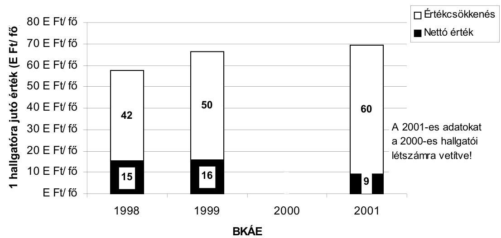

A hallgatói létszám növekedése, az egyházi tulajdonba visszaadott épületek együttes hatására csökkent az egy hallgatóra jutó épületállomány bruttó értéke:

---

Tárgyévi január 1-jei oktatási épület állomány az előző év október 5-ei hallgatói összlétszámra vetítve
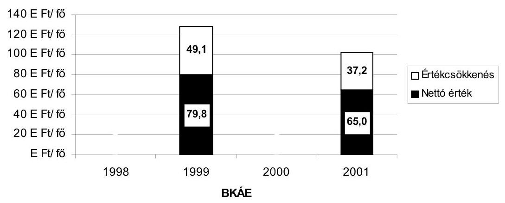

Az integrált intézmény kollégiumi épületek mutatója ellenkező irányú változásokat mutat, a volt ÁF jobb ellátottságának következtében.

Kollégiumi épületek egy hallgatóra jutó bruttó és nettó értéke
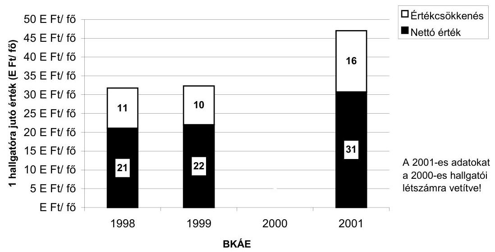

# 1.3. Az Egyetem nyilvántartási és információs rendszere 

Az integrált intézmény gazdasági-pénzügyi folyamatainak áttekintését és irányítását, a vezetői döntésekhez szükséges információk szolgáltatását az alkalmazott információs rendszer csak korlátozottan teszi lehetővé.

---

A használatos TÜSZ-rendszer (pénzügyi-számviteli informatikai program) széles struktúrájú, részletes adatok kigyűjtésére ad lehetőséget, igen hosszú időráfordítással. Téma szintig képes adatszolgáltatásra, de alkalmatlan összesített, aggregált táblák, kimutatások előállítására, olyan adatok kinyerésére az adatbázisból, amelyek az elemzésre, az ellenőrzésre is megfelelően felhasználhatóak.

Az Egyetem megbízása alapján egy külső cég 1999. 04. 15-én készített egy programot (BKE VIR rendszer) az intézmény vezetői információs rendszerének megvalósítására. A rendszerhez az alapadatokat a TÜSZ és a BERENC rendszer szolgáltatta volna. A feldolgozások tetszőleges kimutatás-változatok létrehozását tették volna lehetővé, számtalan megjelenítési variációval. A rendszer automatikusan képes a vezetői döntéshez tetszőleges összevont kimutatásokat, táblákat az adatbázisból összeállítani. Az egyes dimenziók (tevékenységek, régiók, idők) közötti váltás az új technikával rendkívül gyors megoldásra ad lehetőséget. A program alapján megjeleníthetők a kimutatások alapját képező analitikus adatok is.

A BKE VIR rendszert nem vezették be. Ez összefüggött azzal, hogy ebben az időben folyamatban volt a felsőoktatás egész intézményhálózatára tervezett informatikai alapú Egységes Gazdasági Rendszer (EGR) bevezetése, ami az integráció informatikai támogatását biztosította volna. Az előzetes tesztelések nem igazolták a rendszer megbízhatóságát, bevezetésére egyik felsőoktatási intézményben, így a BKE-n sem került sor. Az intézménynek azóta sincs egységes pénzügyi-gazdasági információs rendszere, amely a vezetői információs igényeket is kielégítené.

# A gazdasági folyamatok fontos elemét képező ingatlannal és a tárgyi eszköz vagyonnal való gazdálkodás nyilvántartása nem rendezett. 

Az ingatlanvagyon kincstári kataszterét, a szerződések nyilvántartási rendszerét - a KVI-vel közösen - új szoftverrel készítik elő. Hiányosság, hogy 2000-ben az Egyetem 12 ingatlanára vonatkozó vagyonkezelési szerződést nem rendezték és csak ez év áprilisában készítették el a 2000. január 1-jei visszamenőleges állapotnak megfelelő nyilvántartást és május elejére az aktuális állapot szerinti kiegészítést.

Az integrációval szükségessé vált a belső nyilvántartás korszerűsítése, ennek keretében az összes nettó terület újramérése, a tulajdoni lapok adatainak pontosítása, a bérleti szerződések, a területek használóinak rendezése. Ez az adatbázis várhatólag ez év közepére készül el. Az adatbázis kezelésére, nyilvántartására jelenleg kötelezően használt Felír-szoftver szerény lekérdezésre, információs kigyűjtésre ad lehetőséget (a helyiség használója, a helyiség természetes adatai, funkciója). E programmal nincs mód adatbővítésre, az információ-lekérdezés növelésére, a szervezeti egységek helyiséghasználati, üzemeltetési költségeinek kiszámítására, a terhelés behajtásának nyomon követésére.

Rendezettnek tekinthető az ingatlanok hasznosítása, amely eseti és tartós kiadással történik. Az eseti hasznosítás az egyetemi karok és a központi

---

helyiségek esetében a rendezvény-szolgálat útján, az ÁK-nál helyileg és az oktatási területtel való egyeztetéssel valósul meg. A tartós használatú bérbeadásnál a határozatlan időre szólóra törekednek a kártalanítás elkerülése érdekében. A fővárosi telephelyeken az integrációval biztosított a központi ingatlangazdálkodás, a Veszprémi Intézetnél ez nem valósult meg 2001. szeptemberéig az ÁK kezelésében hagyták.

Az Egyetemen 1998. év előtt a nappali hallgatók adatait a dékáni hivatalok tanulmányi osztályai vezették számítógépes háttér nélkül. A nyilvántartás nem volt áttekinthető, hiányzott a kreditrendszerrel való összekapcsolás lehetősége. Az információs rendszerhez szükséges nappali hallgatói adatok egységes számítógépes nyilvántartását 1998-ban az ún. Neptun program alapján alakították ki és 1999-ben állították rendszerbe.

Az Egyetem minden nappali hallgatójának információtartalmat hordozó adata a rendszerbe feltöltésre került, s előnye, hogy a kreditrendszert is tudja kezelni; alkalmas az egyéni tanterv készítésére, saját tanterv felvételére; lehetővé teszi az információk lekérését (beiratkozás, tantárgyfelvétel, tanulmányi átlagok, ösztöndíjak, kollégiumi elhelyezést stb.) az igényelt csoportosításban. Lényegében az indexet tükrözi elektronikus formában, de az adatok aggregált feldolgozására, kigyűjtésére is alkalmas.

A nappali tagozatos hallgatók adatait nyilvántartó rendszer működésével kapcsolatos probléma, hogy nem rendezett tulajdoni hovatartozása, azaz a rendszernek kik és milyen arányban a tulajdonosai (OM, Kft, a fejlesztésben résztvevő felsőfokú intézmények). A szoftver-technikai problémák megoldását éves szerződés alapján az SDA STÚDIÓ KFT végzi. A tulajdonjogi rendezés hiánya az üzemeltetési végleges szerződés megkötését is akadályozza. További hiányossága a Neptun szoftvernek, hogy nem tartalmazza a posztgraduális képzésben és a részidő-képzésben résztvevők adatait, valamint az oktatók terhelési adatait. Nem a rendszer működésével függ össze, hanem adatszolgáltatási probléma, hogy a tanszéki adatrögzítések késnek (pl. vizsgáztatási, óraterhelési adatok), emiatt a nyilvántartások nem aktuálisak, nem pontosak.

# 2. A GAZDÁLKODÁS ÉRTÉKELÉSE 

### 2.1. Az Egyetem adósságállományának alakulása

A jogelőd intézmény BKE a vizsgált időszakot megelőzően jelentős nagyságrendű adósságállományt halmozott fel, melyet évekig maga előtt görgetett. A pénzügyi likviditási helyzet alakulását az 1998-2000. évi adatok mutatják (3/a-d mellékletek). Az adósságok halmozódása 1995-től kezdődött, az ok hibás vezetői döntésekben is keresendő.

A BKE 1994-ben 5 éves időtartamra nagy értékű nyomdai berendezést bérelt, a bérleti díjra lejáratig 1,2 millió DEM-t fizettek ki. A kapacitás alacsony kihasználása miatt az éves bevétel mindössze 15 M Ft-t tett ki.

---

Az 1996. évi belső hiány 118,3 M Ft, az 1997. évi 196,6 M Ft volt. Tényleges külső hiányokról adat nincs, mivel az év végi szállítói számlák csak következő évben kerültek lekönyvelésre.

A jogelőd egyetem a külföldről belföldön igénybevett géplízing ÁFÁ-t nem vallotta be és nem fizette be. A tartozás rendezésére 1999-ben végrehajtott önrevízió 40 M Ft-os nem tervezett kiadást jelentett.

Emellett az adósságállomány kialakulásához a felsőoktatás normatív támogatás 2000-ig meglevő rendszere is hozzájárult. A támogatás normatív mértékéről rendelkező jogszabály minden év közepén jelent meg, nem visszamenőleges hatállyal. Az infláció hatása ugyanakkor év elejétől jelentkezett. Visszamenőleges hatályú rendelkezés csupán a 2000. évi támogatások esetében történt.

Az 1998. évi normatíva (290 E Ft/fő) 1999. július 15-ig volt hatályban, ekkortól a normatíva összege 306 E Ft/fő. Az egyenértékű hallgatói létszámmal számolva, az első félévre vetítetten ez kb. 90 M Ft támogatási hiányt eredményezett.

Az Áht előírásai értelmében a költségvetési tervet 0 szaldós egyenleggel kell készíteni. A valós külső hiány eltüntetésére az Egyetem a benyújtott éves költségvetések kiadási oldalán egyes dologi kiadásokat alátervezte, esetenként 0 összegű kiadási előirányzatot tüntetett fel.

Az 1998. évi tervben pl. üzemeltetési szolgáltatási kiadásokra 14 M Ft terveztek és ezzel szemben tényleges kiadás 225 M Ft. A szakmai tevékenységhez igénybevett szolgáltatások 67 M Ft tervezett előirányzattal szemben 162 M Ft-ban teljesült.

Az 1999. évi tervezés során pl. az egyéb dologi kiadások soron 0 M Ft eredeti előirányzatot terveztek, a tényleges teljesítés 226 M Ft volt. Dologi és egyéb folyó kiadás eredeti előirányzata 620 M Ft volt, ezzel szemben a teljesítés $1.210,7 \mathrm{M} \mathrm{Ft}$.

A karok az állami támogatás és a saját bevételeik meghatározott hányadát a közös kiadások fedezetére átadták, ez az összeg azonban a tényleges kiadásokra nem volt elégséges, s ezért az Egyetem a kari rendelkezésű forrásokat a finanszírozásba rendszeresen bevonta. Ennek az elosztási rendszernek az eredménye a belső hiány.

Az 1999. évi belső hiányból a térítéses képzések nettó maradványa 138 M Ft, a pályázatok, megbízások nettó maradványa 116 M Ft, a hallgatói juttatások nettó maradványa 78 M Ft.

A 2000. évi belső hiányból a térítéses képzések nettó maradványa 187,5 M Ft, a pályázatok, megbízások nettó maradványa 106,4 M Ft, a hallgatói juttatások nettó maradványa $94,6 \mathrm{M} \mathrm{Ft}$.

A saját bevételek, ezen belül a pályázati pénzek tervhez képest megvalósult elmaradása nagyban befolyásolta az adósság növekedését. A kiadások évente növekvő mértékét a bevételek növekedése nem fedezte. A tárgyévi folyó bevételekkel nem fedezett kiadás 1998-tól már a beszámolóban külső tartozásként megjelent.

Az 1999. évi bevételi teljesítés 31 M Ft-tal, a kiadási tényadat 119 M Ft-tal haladta meg a tervezettet. Vagyis a kiadások növekménye 88 M Ft-tal több.

---

A pályázati pénzek tervezett bevételét 1999-ben 124 M Ft-ra tervezték, a teljesítés 44 M Ft. Az eredeti előirányzat teljesülése hozzájárulhatott volna a hiány csökkentéséhez.

A vezetői értekezletek ülésein a gazdasági főigazgató rendszeres, dokumentált, gyakorlatilag napi figyelmeztetései alapján napirenden volt az Egyetem pénzügyi nehézségeinek tárgyalása. Alapvető, koncepcionális megoldásokat kerestek, javaslatok is születtek, ezek azonban az elhatározás szintjén maradtak. A személyi juttatások, ezen belül az oktatói alapilletmény 84 M Ftos csökkentését rektori utasítással a kari teljesítményekhez igazítottan kívánták végrehajtani. A rektor ezt az utasítást - a karok nyomásának engedve - nem bocsátotta ki.

A fizetőképesség 1999. júniusában megromlott, a hiány 1999. szeptemberére 316 M Ft-ot tett ki. A fizetőképességet átmenetileg szabad pénzforrások felhasználásával, esetenként jogszabályellenes kölcsönnel, illetve belső szabályzatellenes pénzátvételekkel, kari pénzeszközök befagyasztásával, különböző bérjellegű kiadások felfüggesztésével tartották fenn.

A BKTE Alapítványtól felvett 60 M Ft hitel a júniusi köztartozások fedezetét biztosította. A hitelfelvétel sértette az Államháztartásról szóló 1992. évi XXXVIII. tv 100. § előírásait, miszerint költségvetési szerv hitelt nem vehet fel. Ezenkívül 15 M Ft, az alapítványt illető, de az Egyetem számlájára érkezett átutalást szintén az átmeneti finanszírozásba vonták be.

Átmenetileg rendelkezésre álló pénzforrások közül a részidős képzések befizetéseit és a hallgatói támogatásokat - a gazdálkodási szabályzattal ellentétben - bevonták a folyó kötelezettségek finanszírozásába (104 M Ft).

A saját bevételes tevékenység szeptember 20-ig realizálódott 154 M Ft maradványának befagyasztásáról született döntés.

A KTI és VKI 20-20 M Ft-ot véglegesen átadott az Egyetemnek, a BKTE Alapítvány 25 M Ft összegű kiadások finanszírozását vállalta magára. A decemberi és januári vezetői pótlékok visszatartása átmeneti forrás felszabadítását jelentette.

A mutatkozó fizetési nehézségek ellenére a más célt szolgáló források bevonásának eredményeként, a 60 napon túli kötelezettségállomány a kincstári biztos kirendelését jelentő értékhatár alatt maradt.

Az 1999. évi tartozásállomány az év novemberében kritikussá vált, tartós likviditási hiány alakult ki, amelyet az integráció hatálybalépéséig már nem lehetett megszüntetni. Az Egyetem az 1999. évi mérlegében kimutatott kötelezettségek összege 168 M Ft-ot tett ki. Az Egyetem az adósság kezelhetősége érdekében az APEH-nál a 47 M Ft-ot kitevő köztartozások átütemezését, a Kincstárnál a havi előirányzat magasabb összegű finanszírozását kezdeményezte. A 89,4 M Ft-os kifizetetlen külső tartozások rendezésére a szállítókkal későbbi időpontban esedékes kiegyenlítésben állapodott meg. A vezetés a bérpótlék kifizetését 2000. évre halasztotta.

Az
 APEH a tartozások törlesztését az Egyetem kérésének megfelelően 4 részletben, 2000. február-május hónapokra engedélyezte.

---

A Kincstár a havi 1/12 résznél 19,5 M Ft-tal magasabb összegű előrehozott finanszírozáshoz járult hozzá.

Az adósságállomány kezelésének problémájával az Ideiglenes Intézményi Tanács (IIT) a 2000. évi költségvetési terv előterjesztése kapcsán határozatot hozott a pénzügyi egyensúly helyreállítása érdekében teendő lépésekről. A 6/1999. sz. határozatában az adósságállomány maximalizálásáról, megtakarítási intézkedésekről döntött. A hiány csökkentése érdekében a szervezeti egységek vezetőit megtakarítást célzó intézkedések meghozatalára kötelezte. Az integrációval egybeeső leépítések keretében az oktatói létszám kismértékű, 39 fős, az egyéb foglalkoztatott állomány 135 fős leépítésére került sor.

A folyó évi kiadási többlet maximális összegét 60 M Ft-ban határozta meg, emellett összesen 122 M Ft megtakarítást irányzott elő szervezeti egységenkénti megoszlásban.

A nem oktatási munkaerő létszám csökkentése, az egyes gazdaságtalanul fenntartott szolgáltatások, elsősorban az oktatási épületek kiszolgáló tevékenységeinek szerződésessé alakítása a kiadások csökkentését célozta.

Az oktatási épületekkel összefüggő takarítási és rendészeti feladatok ellátására kötött szerződés 154,7 M Ft kiadást jelent, a kiadott szolgáltatások és kapcsolódó kiadások az Egyetem becslése szerint mintegy 230 M Ft éves kiadást jelentettek korábban.

A saját bevételek elosztásának elve a hagyományos BKE karok esetében az, hogy a saját bevétel a bevételszerző egységet illeti. Az elosztási rendszerben a saját bevétellel nem vagy kismértékben rendelkező szervezeti egységek kiadásait a nagyobb bevételt elérő egységek többletéből fedezik.

A Nyelvi Tanszéknél a 63 M Ft állami támogatás és 37 M Ft saját bevétel mellett a "fedezeti hiány" 90 M Ft. A Könyvtár 221 M Ft-os kiadását 13 M Ft-os saját bevétel nem fedezte, a különbözetet az újraosztásnál kapott 214 M Ft-os támogatás biztosította. (2000. évi adatok)
Kritikus helyzetben lévőnek az Idegennyelvű Oktatási Központ költségvetése volt tekinthető. A hiányt az okozta, hogy a térítéses képzés kiterjesztése nem megoldott, a társintézményeknél folytatott nyelvi képzést nem vonták be a nyelvi tanszékekbe; a nyelvvizsga központ bevételeit nem forgatták vissza a nyelvi képzés finanszírozásába; a nyelvi képzés kínálata túl széles, külső források bevonása elmaradt.
Nem sikerült elérni a tervezett mértékben az állami finanszírozású bér és járulék előirányzatok betartását. A költségvetés időarányos előirányzatát 2000. I-V. hónapban 122 M Ft-tal haladta meg a tényleges bér és járulék felhasználása. A túllépés ledolgozásához meg kellett határozni az állami finanszírozású státuszokat illetményekkel együtt; a saját bevételekből, a külső forrásokból finanszírozottak körét, egyéb lehetőségek számbavételét (fizetés nélküli szabadságolás, munkaidő csökkentése); a Központi Könyvtár bérmegtakarításának elrendelését 20 M Ft összegben.

---

A 2000. évi költségvetés I. félévi túllépésének visszafogására operatív intézkedések váltak szükségessé; a bérkeretek betartását a dékánok nem tudták biztosítani. Ennek érdekében az állami támogatás I. félévi havi összege az OM támogatásával 19,214 M Ft-tal emelkedett, amelyet a II. félévben megtakarításból vissza kellett fizetni.

A kezelhetetlennek tűnő adósságállomány és az integrációval összefüggő feszültség következtében kialakult bizalmi válság hatására a hivatalban levő rektor lemondott. Az új rektor jelölését az ITT 2000. ápr. 19-én lefolytatott ülésén támogatta, kinevezése május 8. napjával megtörtént.

Az adósságállomány rendezésén az Egyetem a megtakarítási intézkedések és átütemezések, valamint a bérmegtakarítást eredményező létszámleépítés révén 2000-ben túljutott. Az adósságállomány felszámolásában a létszámleépítés fontos lépésnek bizonyult és a leépítés kiadásait nem saját forrásból, hanem a PM-től kapott 136 M Ft-os keretből fedezhették. A szervezeti egységek arányos teherviselőképességének érvényesítésével az ITT által meghatározott célok eredményesebben teljesíthetők lettek volna.

Az intézmény által az ellenőrzés számára összeállított tanúsítványokból készült ábra és elemzés a jelentés 1. sz. függelékében látható.

# 2.2. Létszám- és bérgazdálkodás 

Az Egyetemen a vizsgált időszakban részben az adósságállomány felszámolása, részben az integráció kapcsán jelentős létszámváltozások történtek. Az integráció az Államigazgatási Főiskola becsatlakozása révén létszámnövekedést, a gazdálkodási egységek összevonása leépítést eredményezett.

A BKE átlaglétszáma 1998-ban 963 fő volt. A BKÁE létszáma az integráció hatására 218 fővel nőtt, ezen belül az oktatói létszám (564 fő) 64 fővel. A leépítések eredményeként a 2000. évi átlagos létszám 1059 fő volt.

Az adósságállomány felszámolását célzó ITT döntés eredményeként a karok létszámcsökkentést hajtottak végre, ennek következtében az év hátralevő részében az ebből származó bérmegtakarítás 18,6 M Ft-ot tett ki.

A leépítés kapcsán az egyetemi karokon 39 fő munkaviszonyát szüntették meg, illetve távozott önként.

Az Államigazgatási Karon (a jogelőd Főiskolán) 1999-2000. évben (Budapesten és Veszprémben) 38 fő leépítése történt, ezenkívül 37 fő az Egyetem állományába került. A leépítés bérvonzata éves szinten 26,4 M Ft megtakarítást jelentett.

A létszám 2001-ben 144 főt tett ki, ezen belül az oktatói és nem oktatói létszám közel megegyező (63 fő, illetve 60 fő).

Az integráció következtében az elődintézmények strukturális átalakításával, a takarékos gazdálkodásra törekvés eredményeként az oktatási épületek

---

szerződéses üzemeltetésével a létszámleépítés lehetősége, illetve szükségessége merült fel. A létszámcsökkentés fedezetére PM 136 M Ft keretet biztosított.

A gazdasági műszaki területen a leépítés összességében 97 főt tett ki, elbocsátásukra döntően 1999. végén került sor. A bércsökkentés éves szinten 44 M Ft-t, járulékaival együtt mintegy 60 M Ft-ot tett ki.

Az Egyetem - a rektorokkal és főiskolai főigazgatókkal kapcsolatos munkáltatói jogkörök gyakorlásáról szóló 1/1995. (III. 17.) MKM rendelet 1. §-ával ellentétesen - egyetemi tanácsi hatáskörben, oktatási miniszteri jóváhagyás nélkül és a minisztérium javaslatával szemben - nem a 2000. évre vonatkozóan, hanem megbízásának 2003. június 30-ig terjedő időszakára állapította meg a rektor pótlékát 2000. május 8-i - azaz az új rektor beiktatásának napjára szóló - visszamenőleges hatállyal. Az Egyetem eljárását az OM helyettes államtitkárának F.100.588/99. számú leiratára alapozta. A pótlék mértéke a minisztériumi javaslattal megegyezett. Utólagos tájékoztatás szerint az ITT határozatát jóváhagyásra megküldték az oktatási miniszternek és a továbbiakban a miniszter döntése szerint járnak el.

Az Egyetem rektorának 2001. július 10-én kelt levele szerint a rektori pótlékra vonatkozó egyetemi tanácsi határozatot jóváhagyásra megküldik a miniszternek és e jóváhagyás hiányában a pótlék folyósítását megszüntetik.

Megjegyezzük, hogy a pótlék megállapításánál - figyelemmel az Egyetem gazdasági helyzetére - nem érvényesítették az óvatosság elvét. A minisztériumi rendelkezés az emelést az intézmény terhére, de lehetőségeikhez képest engedélyezte. A költségvetési törvényben a pótlékalap mértéke havonként 14,6 E Ft volt, a rektori pótlék így 292 E Ft/hó összegre emelkedett. A pótlék bevezetésekor az Egyetem éppen csak túljutott az 1999. évi adósságállomány rendezésén, és még nem állt rendelkezésre információ a jelentős bevételt biztosító saját bevételes képzések várható bevételéről.

Az állami normatív támogatásban nem részesülő, így a kari bevételekből finanszírozott idegen nyelvi oktatóközpont oktatói indokolatlanul magasabb bér besorolásban részesültek, mert az oktatók tudományos fokozatú besorolásnak megfelelő pótlékot kaptak, ugyanakkor ezzel a fokozattal nem rendelkeztek. Ezért elsődleges feladatok közé tartozott az idegen nyelvi képzés szervezeti és finanszírozási struktúrájának átalakítása. A tervezett korszerűsítésre tett kari előterjesztés szerint az általános nyelvi képzés és szaknyelvi képzés világosan elkülönül. A szervezeti korszerűsítés következtében mind létszámában mind az oktatók besorolásában jelentős változások történtek.

Az Idegennyelvi Oktatási Központ 2000. évi bevétele 123 M Ft, ebből az állami támogatás ráosztott mértéke 62,8 M Ft volt, a kiadások 160,5 M Ft-ot tettek ki, ebből a személyi juttatások és járulékai 138,3 M Ft összegűek voltak.

Az általános nyelvi képzés a diplomához szükséges Egyetem által előírt nyelvi vizsga megszerzését biztosítja, állami normatívából támogatottan heti két idősávban. A szaknyelvi képzés a gazdasági szaknyelvi vizsgához biztosítja a felkészülést.

---

A konszolidációs intézkedések keretében a nyelvi tanszéken 33 fő esetében a teljes munkaidős alkalmazást részmunkaidős alkalmazásra változtatták. Tudományos fokozatnak (docens) megfelelő pótlékban a továbbiakban mindössze 3 fő részesült. A bércsökkentés 2000. augusztus 1-jétől havi 3,7 M Ft-ot jelentett.

A 2001. évi bérfejlesztés során a jogszabályi változások következtében döntő szerepet kapott az oktatói bérrendszer változása, a minimálbéremelés, valamint a KJT szerinti előrelépés, mindez összességében 14,6%-ot tett ki. A béremelésre biztosított 133 M Ft költségvetési keret az emelésnek csak 61%-át fedezte, ez gyakorlatilag megfelelt az állami finanszírozás és saját bevételek arányának. A különbözetet az Egyetem saját forrásból kényszerült fedezni. A legkisebb szükséges bérnövelés a garantált minimumnak megfelelő beállás következtében az államigazgatási karon jelentkezett.

A bérfejlesztés kihatása a járulékkal együtt 221 M Ft-ot tett ki, így saját forrásból 88 M Ft-ot kellett finanszíroznia. Az Államigazgatási Kar bérnövekedése mindösszesen 18,5 M Ft-ot jelentett.

Az oktatási feladatokra irányuló tevékenységek béren kívüli kifizetései összességében 270 M Ft-ot tettek ki, ez az oktatási bérek és járulékaik 17%-a. A kifizetések nagyságrendje az oktatói létszámváltozást követve módosult, ugyanakkor struktúrájában átalakult. A megbízási díjak mind a külső, mind a belső oktatók esetében az 1998-as szinten stabilizálódtak, egymáshoz viszonyított arányuk változatlan maradt, ugyanakkor előtérbe került a számlás oktatás. Ez utóbbi az összes nem bérjellegű kiadások fele volt.

A megbízási díjak összege a belső oktatók esetében 2000-ben 53 M Ft volt, a külső oktatóknak kifizetett díjak ennek a duplája. A számlás oktatási kifizetések 2000-ben 143,8 M Ft-ot tettek ki, ez az 1998. évinek több mint négyszerese.

# 2.3. Az oktatási célú helyiségek kihasználása 

Az oktatási célú helyiségek igénybevétele a volt BKE karok esetében igen kedvezőtlen, túlzsúfolt (napi 12-14 óra), a hallgatók szemszögéből nézve igen hátrányos, esetenként késő esti tanórákkal is párosul. Az Államigazgatási kar minden tekintetben kedvezőbb helyzetben van, a szemináriumi termek átlagosan napi 7 tanórában vannak igénybe véve. Kivétel a pénteki nap, ekkor minden karon kevesebb a tantermek igénybevétele.

Az egyetemi karok rendelkezésére álló oktatási célú helyiségek összterülete 3530 m², a helyiségek kihasználtsága gyakorlatilag egész napos, az oktatások reggel 8-tól este 9 óráig tartanak. A pénteki napon a termek nagyobb része délután már felszabadul.

Az Államigazgatási Karon (a jogelőd Főiskolán) a közvetlen oktatási célú helyiségek területe 1115 m², a számítógépteremé és könyvtáré 963 m². A nagy előadó termek gyakorlatilag teljes kihasználtsággal működnek, a szemináriumi helyiségek kihasználtsága a BKE karokhoz viszonyítva lényegesen kisebb. Késő esti oktatások gyakorlatilag nincsenek, az oktatás általában 17 óra körül, pénteken dél körül befejeződik. Egyes tantermek esetében napi néhány órás használat is előfordul.

---

Az Egyetemen az OM felügyelete alá tartozó állami felsőoktatásban végrehajtandó intézményi integráció elveiről szóló 1157/1998. (XII. 9.) Korm. határozat az oktatási termek kihasználásának optimalizálása tekintetében nem valósult meg. Az Egyetem vezetése az egyházi ingatlan kiváltás miatti kényszerhelyzet megoldását jelentő átmeneti terem-átcsoportosításokat nem alkalmazta. Ennek részbeni oka, hogy az ÁK-n 90 perces órák, az Egyetemen 75 perces órák vannak, s az órarendi egyeztetések nem voltak megoldhatók.

Az idegen nyelvi tanszék oktatási laboratóriuma gyakorlatilag teljes kihasználtsággal működik, itt is a pénteki nap lazább leterhelése a jellemző. A tanszék épületének állaga ugyanakkor kritikán aluli, nem méltó felsőoktatási intézményhez és emberi tartózkodásra alkalmatlan. A napi kihasználtság oktatás,
 illetve vizsga céljára 5 és 8 tanóra között mozog, pénteken mindössze három órára foglalt a terem.

# 2.4. Az átvett pénzeszközök felhasználása 

A BKÁE 2000. évi költségvetési bevételeket és kiadásokat tartalmazó témaszámonkénti kimutatás a bevételeket jogcímenként (1999. évi maradvány, pénzeszköz átvétel, saját bevétel, költségvetési támogatás), a kiadásokat kiemelt előirányzatonként (felhalmozás, működési célú pénzeszközök átadása, személyi juttatások, járulékok, dologi kiadások, ellátottak pénzbeni juttatásai) tartalmazza. A nyilvántartásban az átvett pénzeszközök témánkénti adatai összesítésre kerültek, azonban a kiadások kiemelt előirányzatonként csak témabontásban szerepelnek az egyéb bevételek, költségvetési támogatások megbontásával együtt. Az összes kiadás és a maradvány adata az összes bevételre vetített forgalmi kiadási adatokat tartalmazza.

A BKÁE 2000. évi költségvetésében - a nyilvántartások szerint - az átvett pénzeszközök 2.917.262 E Ft összeget tettek ki, az összes bevételnek 39%-át.

Az átvett pénzeszközök a bevételek között 157 db témaszámon jelentek meg az intézmény költségvetésében. Ebből számszerűen nagyobb számúak voltak a K+F pályázatok, a programfinanszírozási pályázatok, az OTKA-pályázatok, nemzetközi ösztöndíjak, alapítványok támogatásai. A pénzeszközök volumene alapján az egyházi ingatlanok kiváltásával kapcsolatos 1999. évi maradvány (2.423 M Ft) az összes átvett pénzeszközök 83%-át tette ki.

Az átvett pénzeszközök felhasználása, maradványa kiemelt előirányzatonként a kapott nyilvántartásból témaszámonként nyomonkövethető, külön összesített kimutatás azonban nem állt rendelkezésre, amely alapján áttekinthetőbbé válna a kiadások, a felhasználások alakulásának számbevétele. Az adatok annak értékelésére, megítélésére nem adnak lehetőséget, hogy a bevételben megjelenő összes maradványból mennyi volt témaszámonként a pénzeszközök átvételéből származó kiadás tételes felhasználása.

Az ESCCA francia nyelvű főiskolai képzésre átvett 10 M Ft bevétel felhasználása nem különült el a saját bevételektől, a kiadási forgalomban az együttes felhasználás összege 6.199 E Ft volt. Az Aktuárius képzés átvett pénzeszköz összege 3.200 E Ft, a saját bevétele 5.337 E Ft, a kiadási forgalomban a

---

felhasználás 7.012 E Ft-tal jelent meg. A Központi Könyvtár átvett pénzeszközök felhasználása nyomon követését az is nehezíti, hogy a 13.309 E Ft összes bevétel mellett az összes kiadás 131.975 E Ft volt a 124.897 E Ft keretforgalommal együtt.

A 70205 sz. pályázat igényelt összege 13.500 E Ft volt az Egyetem 2.500 E Ft saját forrás támogatásával együtt. A kimutatás szerinti bevétel és a felhasználás egyaránt 9.864 E Ft volt. Az eredeti kiemelt előirányzati megbontás a csökkentett bevétellel a felhasználás tételei arányosan módosultak. A Központi Könyvtár fejlesztésére kapott OTKA támogatás 10.000 E Ft összegét - az előirányzatnak megfelelően - teljes egészében dologi kiadásokra, adatbázisok beszerzésére fordították. Ezeknél a témáknál a dokumentáció alapján megállapítható volt az előirányzatokhoz képest a felhasználás tételes alakulása.

# 2.5. A hallgatói juttatások elosztása 

Az ellenőrzött időszakban az első alap- és kiegészítő alapképzésben részt vevő hallgatók állami támogatásának elosztásáról és a hallgatók által fizetendő díjakról és térítésekről a 144/1996. (IX. 17.) Korm. rendelet volt hatályban. Az ET a belső szabályzatot 1998. március 9-én, 1998. szeptember 29-én és 2000. június 9-én módosította. A hallgatói normatíva elosztását, a fizetendő díjak körét, összegét az 1998. szeptember 29-ei módosítás érintette nagyobb mértékben. A változtatás lényege, hogy a normatíván belül 65%-ról 71%-ra emelték a tanulmányi ösztöndíj arányát, az összevont alapok arányát pedig 35%-ról 29%-ra csökkentették, az utóbbin belül a szociális ellátás és a lakhatási támogatás arányát emelték, az albérleti támogatást megszüntették, a hatályos kormányrendeletnek megfelelően. A tandíjfizetést kiterjesztették a másoddiplomás képzésre, kiegészítő alapképzésre, megismételt félévre és részben egységesítették a díj összegét (megismételt félévnél 6000 Ft/hó).

Az integrációval a szabályozást, a hallgatói önkormányzat szervezetét (HÖK) 2000. évben egységesíteni kellett volna. A HÖK mandátuma az Egyetemen és a Főiskolai Karon 2000. novemberében lejárt. Az integrált intézménynek ezt követően 2001. április végéig nem volt legitim hallgatói önkormányzati szervezete, mert a mandátumok elosztásáról nem tudtak megegyezni. A 147/2000. (VIII. 23.) Korm. rendelet módosította a 144/1996. (IX. 17.) Korm. rendeletet. A módosítások egy részét a 2000/2001. tanév kezdetétől kellett alkalmazni és az intézményi belső szabályzatot a rendelet hatálybalépésétől számított 3 hónapon belül kellett módosítani. A módosításra, az egységes szabályozás kidolgozására - a hallgatói önkormányzat megválasztása és működése hiányában - az ellenőrzés befejezéséig nem került sor. A támogatások elosztása, a térítések fizetése a még nem módosított belső szabályozás alapján történt. Az egyetemi karokon a hallgatói normatíva elosztása, a kiemelt ösztöndíjak, a szociális juttatások pályázatainak elbírálása - a HÖK felhatalmazása és a belső szabályzat alapján - a tovább működő Diákjóléti Bizottság feladata volt. Az egyetemi hallgatók a részükre járó juttatásokat időben megkapták, ezzel kapcsolatban a DJB-nél kifogás nem merült fel.

---

Az Egyetem Diákjóléti Bizottsága összegezte a hallgatói normatíva 2000/2001. tanév I. félévi pénzügyi felhasználását. (A 2000. naptári év I. félévének, ill. az 1999/2000. tanév II. félévének pénzügyi felhasználásáról nem állt rendelkezésre dokumentáció.)

A normatíva (70 E Ft/fő), valamint a létszám (4088 fő) alapján a felhasználható éves összeg 286.160 E Ft. Az előző évi maradvány 40.549 E Ft, az összesen rendelkezésre álló összeg 326.709 E Ft. A felosztási módszer alapján az összeg 1,8%-át a szabályzat meghatározott címekre különítette el (szakkollégiumok, TDK, külföldi tanulmányutak, diákszervezetek). A levonás után maradt összegből tanulmányi ösztöndíjra éves szinten 199.524 E Ft, I. (tan) félévben 99.762 E Ft, összevont alapra (kiemelt ösztöndíj, rendszeres, rendkívüli szociális támogatás) éves szinten 81.495 E Ft, félévre 40.748 E Ft jutott. Szabályozás hiányában rendezetlen az előző évekről halmozódott 40.579 E Ft maradvány felhasználása. A maradvány oka, hogy a normatívához képest az elsőéves hallgatók az I. félévben egységesen havi 3500 Ft alapösztöndíjban részesülnek és a normatívától eltérő különbözet felhasználásáról a szabályzat nem rendelkezik és tartalékként halmozódik.

Az Államigazgatási Karon a belső szabályozás szerint, a kari HÖK döntése alapján a hallgatói normatíva felosztása nem változott és eltér az egyetemi karokétól.

A tanulmányi ösztöndíj aránya 57,6%, a szociális támogatásé 37%, az egyéb támogatás aránya 5,4%. Az egyetemi karoknál 3,0 átlag felett, az ÁK-nál 3,5 felett adnak tanulmányi ösztöndíjat. A kiemelt ösztöndíj elnyerésének feltétele pályázat alapján a karokon az évfolyam átlag feletti tanulmányi eredmény, az ÁK-n az elérendő tanulmányi átlag 3,51. Az ÁK-n az ösztöndíjak kifizetése 2001-ben késett, pl. a februári kifizetésre március végén került sor.

# 2.6. A 2001. évi költségvetési terv 

A BKÁE 2001. évi költségvetésében 100 M Ft bevételi többlet elérését irányozták elő. A kollégiumi kiadásokat 29 M Ft-tal, a Központi Könyvtárét 25 M Ft-tal, az Idegennyelvű Oktatási Központét 41 M Ft-tal csökkenteni tervezték. A többletet az informatika, az oktatástechnika fejlesztésére kívánják fordítani. Az összesített bevételi előirányzatból az állami támogatás 2.712 M Ft-ot, a saját bevétel 1.862 M Ft-ot tesz ki (68%, az előző évinél 4%-ponttal több).

A tervezés eddigi szakaszában nem került kidolgozásra a múlt évi Kontrolling szabályzat elvei alapján egy elfogadható mérési mechanizmus. A támogatások, bevételek elosztásánál ugyanakkor törekedtek az áttekinthetőségre, a központi szolgáltató szervezetek forrásigényének kielégítésére, a központi célokhoz való hozzájárulás arányos érvényesítésére.

Új eleme az elosztásnak, hogy a képzési-, és létesítményfenntartási normatíva elvonását 10%-ról 20%-ra emelték az egyetemi képzésnél (központi célra 10%, az Informatikai Szolgálatközpontra 5%, a Központi Könyvtárra 5%), a főiskolai képzésnél csak a központi célú, 10%-os elvonást érvényesítik. A saját bevételek elvonása differenciált: az egyetemi képzésnél 22%, a főiskolai képzésnél 17%, a Nemzetközi Oktatási Központnál 17%. Az elvonásokból a közös célok mindhárom esetben 10%-ban részesednek; az informatika finanszírozása az egyetemi

---

képzésből 5%-kal, a főiskolai és a Nemzetközi Oktatási Központ képzéséből 2,5-2,5%-kal; a Központi Könyvtár finanszírozása az egyetemi képzési normatívából 5%-kal, a főiskolai és Nemzetközi Oktatási Központ képzéséből 2,5-2,5%; a kezelési költség egységesen 2-2%-kal részesedik mindhárom képzésnél.

A szervezeti egységek tervezett összes bevételi többlete 37,5 M Ft a vezetés által meghatározott 100 M Ft bevételi többlettel szemben. Az egyensúly érdekében hiányzó 55-65 M Ft többletbevételre a Közgazdasági Továbbképző Intézettől és az ESCCA francia nyelvi képzéstől számítanak névhasználati díj címén. A Nemzetközi Oktatási Központ 22,6 M Ft hiánya azzal függ össze, hogy a cserehallgatók és a magyar hallgatók képzésének költségeihez való havi hozzájárulásokról a megállapodások még nem készültek el. Az Idegennyelvű Oktatási Központ hiánya a 9 M Ft-hoz képest 33 fő teljes munkaidős besorolásának visszaállításával 53,5 M Ft-ra nőhet. A Testnevelési Központ hiánya 26 M Ft-ról nem csökkenhet, mert a Kinizsi u. tornaterem használati díja 6,8 M Ft kiadást okoz. Megoldatlan a BKE testnevelő tanárok bérének szintrehozása a Főiskolai tanárokéval (3 M Ft). Az egyetemi karoknál a diáksport támogatásának 6,8 M kiadása rendezetlen (a Főiskolai Kar 6 M Ft-tal támogatja sportegyesületét).

Az elkészült költségvetés tehát több nyitott kérdést tartalmaz, mert a folyó költségvetés egyensúlyát a kisebb bevételi többlet nem biztosítja. További finomítása, megalapozása szükséges a gazdálkodás egyensúlyának biztosítása, a források bővítése és célszerű felhasználása érdekében.

# 3. A SZAKMAI FELADATOK ELLÁTÁSA 

### 3.1. Az intézmény szakmai és intézményfejlesztési koncepciója

### 3.1.1. Az oktatás fejlesztési terve

Az Egyetem vezetése az OM által kiadott kézikönyv szempontjai alapján az intézményfejlesztési terv I. fejezetét 2000. június 15-re, II. fejezetét 2001. február végére elkészítette és megküldte a felügyeleti szervnek. Az I. fejezet szakmai koncepciója, céljai "A" jelölésű jó minősítést kapott az OM-től, a megvalósítás pénzügyi fedezetével kapcsolatban az értékelés nem foglalt állást, azt hatáskörét meghaladónak tartotta. A II. fejezet a szakmai célok erőforrás-igényét, a beruházások megvalósításának lebonyolítását, ütemezését tartalmazza; ennek minősítése az OM részéről 2001. június 25-én történt meg, de átdolgozásra visszaadták.

A meglehetősen önkritikus értékelés alapján a szakmai terület - oktatás, kutatás - feladatait, a várható kihívásoknak megfelelően rövid és hosszabb távú ütemezésben vázolták fel. A gazdasági terület átalakítását a hatékonyabb, egységesebb működés érdekében irányozták elő. Az infrastruktúra fejlesztésével az alaptevékenység, az alapító okiratban meghatározott feladatok korszerűbb működési feltételeit kívánják biztosítani.

Az Egyetem jövőjét az európai színvonal mértékével, a közép-kelet európai vonzerő megtartásával és a hazai közgazdasági felsőoktatásban való vezető szerep érvényesítésével határozták meg. A képzésben a diverzifikált,

---

minőségi, többnyelvű oktatás tere növekszik. Az állami finanszírozású hallgatói létszám minimális, legfeljebb 10%-os növekedésével számolnak a nappali képzésben. A térítéses képzést viszont - a kapacitás-lehetőségek mértékéig - bővítik a saját bevételek növelése érdekében. E célból új alapokra helyezik a vállalatokkal, az üzleti szférával az együttműködést, a szakirányú képzési, továbbképzési struktúrát a piaci igényekhez igazítják.

A következő években növelik a kutató teljesítmények elismerését, a pályázatok megragadását, a kiemelt kutatási programokra koncentrálnak (Széchenyi terv, Eu. 5. keretprogram).

Az Egyetem vezetése a koncepció kialakításánál, a jövőbeni lehetőségek felvázolásánál jelenlegi helyzetét, pozícióját több
 oldalú megközelítésben elemezte. Számol azzal, hogy az intézmény magas színvonalú képzése, az iránta megnyilvánuló kereslet és a nemzetközi kapcsolatok rendszere erőssége lesz tevékenységének. Képes arra, hogy új képzési profilok, szakok, a PhD-képzés, a szakképzés bővítésével, fejlesztésével európai színvonalú, elismertségű diplomát adjon hallgatóinak. Reálisan mérlegeli azonban a gyenge pontjait is működésének, mindenekelőtt a hallgató/oktató arány, a csökkenő pályázatok, a vegyes infrastruktúra, a tudományos fokozatok kedvezőtlen alakulását. Figyelembe veszi a korosztályi létszám csökkenését, a várható konkurencia hatását, a fizetőképes kereslet visszaesését, változását, a gazdasági szféra elszívó hatását.

Az integrált intézménynek a felsőoktatásról szóló törvény 3. §-ában és 122. §-ában előírt kötelezettsége, hogy 2002. június 30-ig az akkreditációs eljárások lefolytatásával, az új szakok beindításával képzési és szervezeti struktúráját megújítsa és az intézményt több tudományterületet művelő, szélesebb képzési profilt nyújtó egyetemmé fejlessze. Az integráció szervezeti kialakítását követően elvileg kidolgozottnak, elfogadhatónak értékelhető a szakmai továbbfejlődés megvalósítását előre vetítő azon elképzelés és törekvés, hogy a környezettudományi és az informatikai tudományterületek új kari szervezetet képezzenek a hozzájuk tartozó szakokkal, tanszékekkel együtt az Egyetem struktúrájában. Az Államigazgatási Kar főiskolai képzését egyetemi szintű képzéssel tervezik kiegészíteni, s ezzel a párhuzamos tanszékek összevonására, a meglévő oktatói kapacitások hasznosítására új tanszéki szervezet létrehozása nélkül nyílik lehetőség.

A képzésfejlesztésnek része a tantárgystruktúra átalakítása, amely az éves operatív tantervben ölt testet. A BKÁE 2000/2001-es tanév nappali tagozatú operatív tanterve a Gazdaságtudományi Kar, a Közgazdaságtudományi Kar, a Társadalomtudományi Kar képzését tartalmazza, az Államigazgatási Kar operatív tanterve nélkül. Az operatív tanterv részletezi az I-III. évfolyam általános közgazdasági és tanárképzés tanterv kapacitását, a három karon folyó képzési szakok, főszakirányok, mellékszakirányok kötelező és választható tantárgyait, az elérhető krediteket, a tanszékeket és a tantárgyfelelős oktatók megnevezését. Az egyes képzési szakok tárgyfelvételi lehetőségére a Tantervi tájékoztató és a Kreditrendszerű tanulmányi és vizsgaszabályzat levonatai eligazítást adnak. A 2000/2001-es operatív tantervből azonban nem

---

állapítható meg, hogy a képzési struktúra változása miként módosította a tantervet, a tantárgyi struktúrát, a változásnak milyen új eleme, tartalma volt az 1999/2000. tantervhez képest.

A 2001/2002-es közös közgazdasági képzés tanterve karonként tartalmazza az évfolyamok féléves kötelező és választható tantárgyak körét az elérendő krediteknek megfelelő idősávokkal együtt. A III. évfolyamtól a hallgatók felvezető törzstárgyakat, a IV. évfolyamtól a választott szaknak megfelelő szaktárgyakat vesznek fel. A kötelező tárgyak számát az I-III. évfolyamon a 2001/2002-es tanévben csökkentik az előző tanévhez képest (az I. évfolyam 1. félévében 9-ről 5-re, a 2. félévben 7-ről 4-re; a II. évfolyam 1. félévében 10-ről 4-re, a 2. félévben 9-ről 5-re; a III. évfolyam 1. félévében 6-ról 4-re, a 2. félévben 6-ról 3-ra). A választható tárgyak száma ugyancsak csökken.

A ET 2001. március 26-án megtárgyalta és elfogadta a 2001/2002-es oktatási év operatív tantervét karonkénti bontásban.

A Társadalomtudományi kar operatív tanterve szakonként (6), főszakirányként (8), mellékszakirányként (10) tartalmazza évfolyambontásban a kötelező és választható, új és megszűnő tantárgyakat a kreditpontokkal együtt.

A Közgazdaságtudományi Karon 2 szakon (közgazdász, közgazdász tanár) lehet diplomát szerezni. A Karon 8 főszakirányból van választási lehetőségük a hallgatóknak. Részletes kimutatás készült a képzési típusokhoz tartozó új tárgyakról (30) és a tárgyak törléséről (15).

A Gazdaságtudományi Karon 1 szakon (gazdálkodási szak) folyik képzés, amelyhez 14 fő szakirány, 11 mellékszakirány kapcsolódik. A kötelező szaktárgyaknál (6) az előadók személyében van változás. Egyes tantárgyak 2001/2002-es tanévben nem indulnak (nyitott gazdaság makroökonómiája, vezetői gazdaságtan), illetve új tárgyak indulnak (nemzetközi kereskedelempolitika, a sport üzleti kérdései).

Az Államigazgatási Karon 1 szakon (igazgatásszervező) szerezhető oklevél. A tervezett egyetemi szintű oktatás beindítása a szervező-szolgáltató közigazgatás számára magasan kvalifikált szakemberek képzését teszi lehetővé.

A 2001/2002-es operatív tanterv összesített, egyetemi szintű értékelését nehezítette, hogy a karonkénti előterjesztések nem egységes szerkezetben, esetenként eltérő, szűkebb-bővebb tartalommal készültek. A jóváhagyott, tényleges összesített operatív tanterv még nem készült el az ellenőrzés befejezéséig.

# 3.1.2. Az intézmény fejlesztési terve 

A fejlesztési tervnél mérlegelték az infrastruktúra, a tárgyi vagyon állapotát. Az ingatlan állomány szétszórtan (14 telephelyen) található, egy részük (Horánszky, Ráday, Veres Pálné u. épület) rossz állapotban van, fajlagos üzemeltetési költségük az átlagosnak többszöröse, az informatikai hálózat fizikailag elavult. Nehéz helyzetet okozott az Egyetem működésében a Kinizsi u. egyházi ingatlan visszaadása, ezzel az épületállomány területe, amely az oktatási tantermek, a könyvtár, a tornaterem, az informatikai központ elhelyezését szolgálta, 17.596 m²-rel csökkent. A visszaadott

---

ingatlannak része a költségvetési forrásból létesített Központi Könyvtár épülete is. Enyhítette a gondot, hogy bérleti díj fejében az ingatlant 2004-ig az

Egyetem tovább használhatja. (A bérleti díjnak nincs a költségvetésben előirányzott fedezete.)

Az Egyetem az egyházi ingatlan kiváltásának ellenértékeként a 2169/1996. (VII. 4.) Korm. határozat alapján 2.752 M Ft költségvetési támogatásban részesült. A kiváltás összegét 1992. évi árakon állapították meg és évenkénti ütemezésben négy részletben utalták át az Egyetemnek.

A Budapest IX. kerület, Közraktár utca 18. szám alatti, volt egyházi ingatlan tulajdoni helyzetének rendezéséről szóló 2169/1996. (VII. 4.) Korm. határozatban a 2,752 milliárd forintban megjelölt kártalanítási összeg pénzügyi rendezése a következő megosztásban történt: 1996-ban 300 M Ft, 1997-ben 750 M Ft, 1998-ban 790 M Ft, 1999-ben 912 M Ft. A kártalanítás összegének megállapítása a 90-es évek elején történt.

Az intézmény beruházási koncepciójának lényege, hogy a megszűnt (Kinizsi u. épület) és a szintén egyházi tulajdonba visszaadásra kerülő (Horánszky u. kollégium), a Ráday u. kollégium és a Veszprémi Intézet épületei helyett, melyek összterülete $34.731 \mathrm{~m}^{2}$, új épület-komplexumot létesítenek azonos nagyságú területtel a működési funkciók feltételeinek biztosításához (Központi Könyvtár, tantermek, nyelvi vizsgaközpont, laboratóriumok, irodák, apartmanok). Az új épület elhelyezése a Czuczor-Mátyás-Köztelek u. által határolt 7653 m² területű telken történne. A részprogram engedélyokirat elkészült. A 9 db telek árát 1998. évi áron 651.984 E Ft-ban állapították meg, jelenleg 700 M Ft-ra becsülik a fizetendő összeget. A tervezett beruházás megvalósítása a központi épülethez való közelsége miatt ideálisnak tekinthető. A terület méreténél fogva alkalmas a tervezett épületek létesítésére.

Az új helyen megvalósítandó beruházás konstrukciója a fedezet biztosítása érdekében újszerű és a folyó költségvetést kímélő, mert a megvalósítást magánbefektető közreműködésével úgy tervezi realizálni, hogy az ingatlanvagyont beruházási fedezetté konvertálja. A három helyett (Horánszky u., Ráday u, Veszprémi Intézet épületei) egy csereingatlan konvertálásával vállalná a magánbefektető az Egyetem beruházásának létesítését. Ezen felül azonban még szükség lenne a beruházás fedezetéhez a Kinizsi u. épület kiváltási összegét pótlólag 5.500 M Ft-tal felemelni.

Jelentős előrelépésnek minősíthető, hogy a volt Sóház épület rekonstrukcióját a 2.752 M Ft kiváltási összeg terhére 1.300 M Ft körüli ráfordítással megkezdték, jelenleg folyamatban van és várhatóan az év második felében fejeződik be. Az épületben kerül elhelyezésre az Egyetem számítógépközpontja, hallgatói laboratóriumokkal együtt.

Részbeni megoldást jelenthetett volna a Veres Pálné utcai épület emeletráépítése oktatási terület bővítésére, de a $6500 \mathrm{~m}^{2}$-es könyvtár elhelyezését nem biztosíthatta, ezért a jelenleg hivatalban levő rektor a rekonstrukciót leállította.

---

A beruházás megvalósításának forrásai összesen 16.549 M Ft-ra becsülhetők az előzetes számítások szerint. Ebből az ingatlanértékesítés (Veszprémi Intézet) 3.500 M Ft , az átvett forrás 10.499 M Ft és a Világbanki forrás $\mathbf{2 . 550} \mathbf{~ M ~ F t}$, ez utóbbira azonban a pályázatot még nem nyújtották be.

Az ingatlan visszaadása, valamint a kártalanítás összegének megállapítása és a visszafizetés ütemezése kormányhatározat alapján történt. A visszaadott épület pótlására felső döntés nem született, az Egyetem lehetőségeit pedig a már taglalt kártalanítási ütemezésből fakadó anomália és döntési hatáskör hiánya erősen behatárolta. Az Egyetem a beruházási források biztosítása tekintetében nincs döntési pozícióban.

A beruházás 2002. év végére a szükséges források hiánya miatt, a Világbanki pályázat benyújtásának elhúzódása miatt az intézményfejlesztési tervben foglaltak szerint nem valósul meg. Jelenleg még nincs elfogadott intézményi beruházási terv. A fejlesztési terv a kifejtett koncepció, beruházási terv mellett más alternatívát nem tartalmaz. A 2004-re a Kinizsi u. épülettömb végleges átadásával a lecsökkent ingatlanterület pótlása a működés biztosításához halaszthatatlan egyéb megoldásokat tenne szükségessé. A beruházás mielőbbi megoldása, így az oktatási helyiségek kulturált biztosítása, tekintettel a nyelvi tanszék elhelyezésére és az oktatási helyiségek túlzsúfoltságára, valamint a könyvtár mint nemzeti szellemi kincstár részének elhelyezése miatt sürgető. A beruházással kapcsolatos mihamarabbi döntés meghozatala a minisztérium felelősségi körébe tartozik.

# 3.1.3. Az oktatási teljesítmények alakulása 

A kari oktatási teljesítmények 1998-2001 időszak alapján, az oktatók egyéni óraterhelésének elemzése 1999-2000. tanév adatai alapján történt, mivel ezekre az időszakokra állt rendelkezésre teljes körű adat.

Az adatok nem órában, hanem az egyetemi gyakorlatnak megfelelően idősávban vannak feltüntetve, egy idősáv 75 perc, vagyis 1,67 tanóra.

Az állami finanszírozású képzésre fordított idő 1594,8 idősáv (2663,3 tanóra) volt, ez 60%-a az összes oktatási időnek (2636,1 idősáv).

Az összes állami finanszírozású oktatási időből a Gazdálkodástudományi kar részesedése 542 idősáv (34%), a Közgazdaságtudományi karé 718 idősáv (45%), a Társadalomtudományi karé 333,5 idősáv (21%).

Az oktatási mutatószámok tekintetében az egyetemi karok között jelentős eltérések tapasztalhatók. A főbb mutatószámok a belső-külső oktatók, ezen belül az állami finanszírozású, illetve térítéses oktatásban való tantervi óraterhelésüket tartalmazzák. Két kar esetében jellemző, hogy a térítéses képzésben a belső oktatók aránya igen magas, 70% feletti.

---

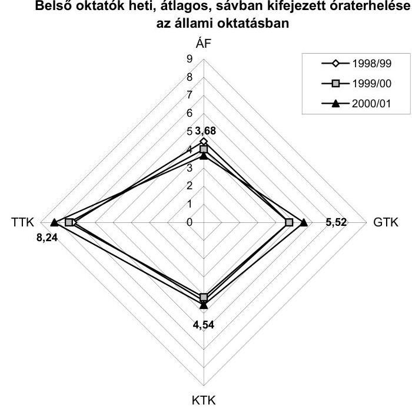

Belső oktatók heti, átlagos, sávban kifejezett óraterhelése a térítéses oktatásban
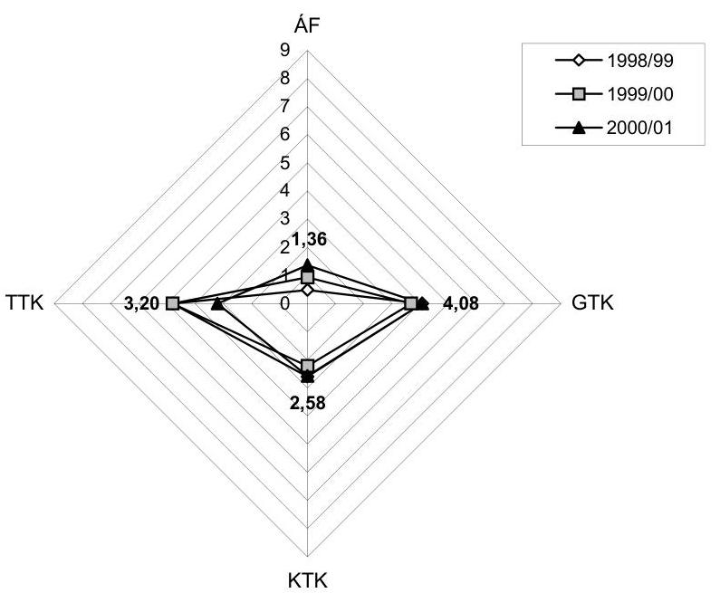

---

A legnagyobb súlyt képviselő Gazdálkodástudományi karon az állami oktatásban a belső oktatók átlagos óraterhelése kismértékben, 17%-kal nőtt, 4,72 sáv/hét-ről 5,52 sáv/hét-re (7,9-ről 9,2 tanórára). A belső oktatók térítéses képzésben való részvétele igen magas 70-80% közötti.

A Közgazdaságtudományi karon az állami finanszírozású oktatásban belső oktatók az óraterhelés 4,1-4,5 idősáv között ingadozott (6,8-7,5 tanóra). A térítéses oktatásban a belső oktatók 70-80%-a vesz részt.

A Társadalomtudományi karon az állami finanszírozású oktatásban a belső oktatók átlagos óraterhelése kismértékben, 14%-kal nőtt, 7,20 idősáv/hétről 8,24 idősáv/hétre (12-ről 13,73 tanórára). A belső oktatók térítéses képzésben való részvétele alacsony (10% körüli).

A fenti teljesítmény mutatók képzett számok, mivel a nem teljes munkaidős oktatók adatait is tartalmazza. Reális képet a munkaidő struktúra szerinti elemzés, ezen belül a teljes munkaidős oktatók óraterhelésének értékelése adhat. Ezek a mutatószámok a részmunkaidős viszonyszámoknál alacsonyabb terhelést mutatnak.

A tanszékek vizsgálata mutatja a legszélsőségesebb eltéréseket. Egyes tanszékeket jellemző magas (5,5-5,9 idősáv) óraterhelési mutatószám mellett, igen gyakori az igen alacsony óraterhelés (1 idősáv körüli) előfordulása.

Magas mutatószámokkal rendelkezik a Közgazdaságtudományi karon pl. a Matematika Tanszék (5,85), a Számítástechnikai Tanszék (5,6), a Matematikai Közgazdaságtan Tanszék (5,5) és a Társadalomtudományi kar több tanszéke (5).

Igen alacsony mutatószámok tapasztalhatók a Gazdálkodástudományi kar Agrár-közgazdasági Tanszékén (1,1), Külgazdasági Tanszékén (1,7), és a Közgazdaságtudományi kar pénzügyi tanszékén (1,7).

A tanszékeken belül egyes oktatóknak az állami finanszírozású oktatásban kimutatható óraterhelése alacsony, a heti
 terhelés 1-2 órát tesz ki. Egyes oktatóknak egyáltalán nincs kimutatott óraadási kötelezettsége. A teljes munkaidős oktatók állami finanszírozású oktatásban mért átlaga 4,2 idősáv (7 tanóra). Jellemző, hogy a legtöbb belső oktatónak a térítéses képzésben kimutatott óraterhelése magasabb, esetenként többszöröse az állami finanszírozású képzésben tapasztalt terhelésnek.

Az összterheléshez képest az állami finanszírozású képzésben alacsony terhelést mutatott pl. a Marketing Tanszék, ahol 37 oktatóból 23 teljes munkaidős oktató átlagos terhelése 1,1 idősáv/hét. Ugyanakkor ugyanezen oktatók összterhelése 64,5 idősáv, ez oktatónként 2,8 idősáv.

Az Emberi Erőforrások Tanszéken 7 teljes munkaidős oktatóból 4 fő az első félévben nem oktatott nappali tagozaton, 3 fő összterhelése 5 idősáv volt, az átlagterhelés így 0,7 idősáv/fő, ugyanakkor a térítéses képzésben összterhelésük 19 idősáv. (2,7 idősáv/fő).

Az Egyetemen a besorolás szerinti oktatók heti átlagos összesített óraszáma idősávban az állami oktatásban és a térítéses képzésben karonként eltérő mértékben alakult az 1998/99. és a 2000/2001. tanév viszonylatában.

---

A GTK-n az állami finanszírozású oktatásban az egyetemi tanárok idősávja 13,6%-kal, az egyetemi docenseké 9,6%-kal, az egyetemi adjunktusoké 25,6%-kal emelkedett, az egyetemi tanársegédeké 3,4%-kal és az egyéb oktatóké 11%-kal csökkent. A térítéses képzésben nagyobb volt a teljesítés az egyetemi docenseknél (146,40 idősáv, 22,4%), és az egyetemi adjunktusoknál (178,56 idősáv, 36%).

A KTK-n az állami finanszírozású oktatásban az egyetemi tanárok idősávja 9,6%-kal, az egyetemi adjunktusoké 7,3%-kal nőtt, nem változott az egyetemi docenseké és csökkent a tanársegédeké 3,9%-kal és az egyéb oktatóké 9,5%-kal. A térítéses képzésben nagyobb súlyú volt a részesedése az egyetemi docenseknek (102,00 idősáv, 39%) és az egyetemi tanároknak (95,20 idősáv, 36%).

A TTK-n az állami finanszírozású oktatásban az egyetemi tanároknál 6%-kal, a tanársegédeknél 11%-kal nőtt a teljesített idősáv, az egyetemi docenseknél nem változott, az egyetemi adjunktusoknál 24%-kal, a nyelv- és testnevelő tanároknál 54%-kal, az egyéb oktatóknál 12%-kal csökkent. A térítéses képzés összességében minimálisra csökkent 115 idősávról 18 idősávra.

Az ÁK-n az állami finanszírozású oktatásban az idősáv a főiskolai tanároknál nem változott, a főiskolai docenseknél 43%-kal, a főiskolai tanársegédeknél 2%-kal nőtt; csökkent a főiskolai adjunktusoknál 52%-kal, a nyelv- és testnevelés tanároknál 7%-kal. A térítéses képzésben az 1998/99-es tanévről 1999/2000. tanévre mindegyik oktatói kategóriában jelentős (169-440%-os) növekedés történt, kivéve az adjunktusokat, ahol változatlan maradt.

# 3.1.4. Az oktatási terhelés szabályozása, összegezett értékelése 

Az alacsony óraterhelés relatíve nagy oktatói létszámra és/vagy nem ésszerű struktúrára utal, ezért ezen a területen megtakarítási lehetőség mutatkozik. Az állami finanszírozású oktatásban dolgozók bére és járulékai 2000-ben a normatív támogatás 73%-át tették ki.

A nappali oktatásban dolgozók bér és járulék kifizetések a gazdasági igazgatóság kimutatása szerint 1.558 M Ft, az irányítás (könyvtárral és informatikával együtt) hasonló jogcímű kiadásaival együtt 1.847,2 M Ft. A normatív állami támogatás 2000-ben 2.535 M Ft volt.

A felsőoktatási intézmények képzési és fenntartási normatíva alapján történő finanszírozásáról szóló 120/2000. (VII. 7.) Korm. rendelet, ill. a megelőző 112/1999. (VII. 16.) Korm. rendelettel módosított 72/1998. (IV. 10.) Korm. rendelet előírásai szerint a képzési és fenntartási normatíva az oktatáson túl, egyéb pl. az oktatástól el nem különíthető kutatási tevékenység finanszírozására is szolgál.

Az oktatási tevékenységekhez kapcsolódó egyéb tevékenységekről adatok nem állnak rendelkezésre, ezek hiányában az egyéb oktatói feladatok mértékéről pl. az oktatáshoz kapcsolódó kutatási tevékenységről elemzés nem készülhetett. Az új szabályozás sem tartalmazza a jogszabályokban lefektetett egyéb kötelező tevékenységek naturális mutatók meghatározásának elveit.

Az Egyetem vezetése 1998-ban kidolgozott egy pontszámos teljesítményrendszert, amely valamennyi oktatási részfeladat figyelembe vételével

---

határozta meg tevékenységenként adható pontszámot. A teljes munkaidőben dolgozó oktatók tanévenként 100 pontot kellett összegyűjtenie.

A rendelkezés külön pontozza az egy idősávban töltött oktatást fajsúlyozva a foglalkozási csoport létszáma szerint, ezenkívül pontozza a szigorlatozást, illetve vizsgáztatást. Külön meghatározta pl. bizottsági tagság, a tankönyv, jegyzetírás és az oktatási segédlet után járó pontszámokat (függetlenül annak nehézségétől, időszükségletétől).

A közalkalmazottak jogállásáról szóló 1992. évi XXXIII. törvénynek a felsőoktatásban való végrehajtásáról szóló 33/2000. (XII. 26.) OM rendelet előírta a kötelező oktatási óraszámokat.

Az OM rendelet 8. § (1) szerint "A Munka Törvénykönyve 117. §-ának (1)-(2) bekezdése szerinti napi munkaidő tartamának alapulvételével a felsőoktatási intézményeknek az alkalmazás, az előmenetel, a folyamatos alkalmasság követelményeit meghatározó oktatói-kutatói követelményrendszerben az egyes oktatói munkaköröket illetően szabályozni kell az egyes oktatói munkakörök kötelező óraszámát."

Az Egyetem 2001-ben elkészítette az egységes oktatói és kutatói követelményrendszer szabályzatának tervezetét. Ebben követelményként írták elő a kötelező heti óraszámokat oktatói besorolásonként és az oktatói órákhoz szükséges felkészülési idő biztosítását. Általános alkalmasságként az oktatók négyévenkénti minősítése alapján történő értékelést jelöli meg. A szabályzat ugyanakkor nem rendelkezik arról az esetről, ha a kötelező óraszám nem teljesül.

A kötelező heti óraszám egyetemi tanárok esetében 4 óra, docens 6 óra, adjunktus egyetemi 8 óra, főiskolai 10 óra, tanársegéd egyetemi 10 óra, főiskolai 12 óra.

A követelményrendszer tervezete nem szabályozza a kötelező órák állami finanszírozású és a térítéses oktatási forma közötti megosztását. Ugyancsak nem ad választ arra, hogy az államilag finanszírozott, törvényben lefektetett bérrendszernek megfelelő bérért az állami finanszírozású oktatásban mennyit kell teljesíteni. Az elvárandó teljesítményt valamennyi, vagyis a nappali és térítéses képzésben kifejtett tevékenység alapján centralizált formában határozta meg, ez pedig éles ellentétben áll az Egyetem decentralizált gazdálkodási rendszerével. A rendszer bevezetése csak a gazdálkodási és finanszírozási szabályok komplex kezelésével valósítható meg.

A normatív támogatás elosztása az állami finanszírozású képzés kari teljesítménymutatói alapján történik, a térítéses képzések elvonások feletti bevétele pedig a karok saját bevételét képezi.

A rendszer annak lehetőségét veti fel, hogy az oktató a megkövetelt óraszám bizonyos hányadát az állami finanszírozású képzésben teljesíti, ezért teljes havi a tv-ben meghatározott bért kap. A kötelező óraszám fennmaradó hányadát a térítéses képzésben teljesíti plusz külön bérért.

---

Nem tisztázott a felkészülési idő elszámolása, ugyanis az állami finanszírozású oktatáshoz elszámolt felkészülés más pl. térítéses képzést, illetve más intézménynél vállalt oktatási tevékenységet is szolgál.

A felsőoktatásban dolgozók más intézménynél is vállalnak oktatást, erre vonatkozó hivatalos információkkal azonban az Egyetem nem rendelkezik.

# 4. Az OM Intézménynyel Kapcsolatos Szabályozó, Ellenőrző és Beszámoltató Tevékenységének Értékelése 

### 4.1. Az intézmény működését, gazdálkodását érintő felügyeleti szabályozás

Az elődintézmények szervezeti, szakmai, gazdasági átalakítása, az integrált intézmény működési rendjének korszerűsítése az 1999. évi LII. tv. alapján a felügyeleti szerv irányításával, közreműködésével történt, az Egyetem autonómiájának érvényesülése mellett.

A felügyeleti szerv az Egyetem által a törvényi előírásoknak megfelelően elkészített alapvető szabályzatokat (Alapító okirat, Szervezeti és Működési Szabályzat, Gazdálkodási Szabályzat) véleményezte, módosításokat javasolt a szöveg véglegesítésénél, amelyeket az Egyetem vezetése a jóváhagyott szabályzatokban figyelembe vett és érvényesített. Az intézményfejlesztési terv I. fejezetének értékelését a felügyeleti szerv elkészítette, a minősítés alapján a terv átdolgozására, kiegészítésére nem volt szükség. A II. fejezet beküldési határidejét a felsőoktatási helyettes államtitkár a kézikönyv kései elkészítése miatt 2000. november 30-ról 2001. február 15-re meghosszabbította. A módosított határidőre beküldött intézményfejlesztési terv kiértékelése 2001. június 25-én megtörtént és az OM Értékelő Bizottsága átdolgozásra visszaküldte.

Az átalakulás időszakában a felügyeleti szerv biztosította részvételét az Egyetemi Tanács ülésein, képviselője részvételével közreműködött a napirendi témák vitájában, szükség esetén kifejtette az OM álláspontját adott kérdésekben, s ezzel hozzájárult az ET döntések körültekintőbb meghozatalához.

Az OM és az Egyetem kapcsolatát ugyanakkor kommunikációs zavarok nehezítették; több esetben előfordult, hogy az intézmény levelére, megkeresésére az OM illetékesei nem válaszoltak, vagy túl későn reagáltak és a felvetett probléma megoldása halasztódott. Ennek oka főként azzal függ össze, hogy a levelekben jelzett kérdésekkel kapcsolatos állásfoglalás kialakításához az OM-n belüli több oldalú egyeztetés akadozva, nem kellően rugalmasan és nem folyamatosan működött. A szükséges egyeztetések az OM-n belül akkor is elmaradtak, amikor a többlet-támogatások előirányzatát a felsőoktatás és a gazdasági területnek együttes állásfoglalás alapján kellett volna kialakítania.

A 2000. évi költségvetés előkészítésével kapcsolatban, valamint az aktuális gazdasági feladatok végrehajtásának segítése érdekében az OM gazdasági helyettes államtitkára és a költségvetési főosztály vezetője részletesen

---

tájékoztatták az Egyetem vezetőit a tervezés és a gazdálkodás területén érvényesítendő követelményekről, szempontokról, a felmerült igények, támogatások teljesítésének módjáról, lehetőségéről. Egy-egy felmerült, felsőszintű döntést igénylő kérdés megoldását a hatáskörök eltérő értelmezése nehezítette.

Még a 2000. évi költségvetés tervezési körirat megjelenése előtt 1999. július 7-én előzetes irányelveket adtak ki az intézményi költségvetés tervezésének megalapozásához. A költségvetési javaslat funkcionális, illetve kiemelt előirányzat szerinti elkészítése és benyújtása után további adatszolgáltatást kértek az előirányzatok és azok teljesítése, valamint a létszám és a bérhelyzet 1999-2000. év alakulására vonatkozóan. A létszámleépítés többletkiadásainak fedezetére az OM 136.185 E Ft-tal felemelte az intézmény 2000. évi költségvetésének pénzforgalmi bevételi és kiadási előirányzatát. Az OM gazdasági helyettes államtitkára elfogadta az Egyetem rektorának támogatásütemezésére vonatkozó kérelmét és a pénzügyi konszolidáció érdekében tervezett intézkedések alapján támogatta a keret-előrehozási igény teljesítését (1999. december 22.).

Az OM segítséget nyújtott az intézménynek a gazdálkodási szabályzat kidolgozásához a minta gazdálkodási szabályzat megküldésével és javaslatokat fogalmazott meg a gazdálkodási szabályzat-tervezet módosítására, kiegészítésére vonatkozóan; felhívta a figyelmet az integráció miatt szükségessé váló számviteli, pénzügyi, gazdasági teendők figyelembevételére és végrehajtására (az 1999. évi beszámoló elkészítése, a leltározás készítése, az alszámla maradványának kezelése, a készpénz-záróegyenleg rendezése). A felügyeleti szerv felkérésére létrehozott Felsőoktatási Integrációs Bizottság ajánlásokkal segítette az intézményi szervezeti és működési szabályzatok kidolgozását.

Az Egyetem megkeresésére az OM részéről - a kapott dokumentumok alapján - nem született egyértelmű állásfoglalás a gazdasági helyettes államtitkár és a beruházási kormánybiztos hatáskörében a Kinizsi utcai épület átadása miatt a BÁV Rt-től bérbevett irodahelyiségek átalakítási, bérleti költségeinek fedezetéről.

# 4.2. A felügyeleti költségvetési ellenőrzés tevékenységének értékelése 

Az OM felügyeleti ellenőrzése keretében 1996. évben és 2000. II. félévében ellenőrizte az intézmény működését, tevékenységét. Az 1996. évi átfogó ellenőrzés alapján a BKE rektorhelyettese intézkedési tervet készített és azt 1997. április 11-én megküldte az Ellenőrzési Főosztály vezetőjének. Az intézkedési terv az Ellenőrzési Főosztály kiegészítésével és módosításával került elfogadásra. (Kiegészítő javaslatok voltak: a számlarend korszerűsítése, a pénzkezelési szabályzat felülvizsgálata és kiadása, a belső ellenőr munkaköri leírásának kiadása, a GMI ügyrendjének elkészítése.) A rektorhelyettes egy esetben, 1997. november 17-én adott tájékoztatást az intézkedési terv teljesítéséről (a karokon az oktatók és a tudományos kutatók munkaköri leírása elkészült).

Az intézkedési terv többi pontjának teljesítéséről az eltelt időszakban az Oktatási Minisztérium Ellenőrzési Főosztálya nem rendelkezett információkkal. Az intézkedési terv csak részben került végrehajtásra, mert több pontja nem teljesült (a számlarend nem készült el, a pénzkezelési szabályzatot

---

nem adaptálták, nincs belső ellenőr, a GMI ügyrendje nem készült el, a munkaköri leírások nem teljes körűek, nem
 kötötték meg a hasznosítási szerződést, az elszámolás nem rendezett; a leltározás dokumentációja hiányos; a selejtezési szabályzatot nem adaptálták.

A felügyeleti szerv által 2000. II. félévében végzett ellenőrzés az ÁSZ helyszíni ellenőrzésének befejezéséig nem zárult le, a megállapításokat és javaslatokat az Egyetem vezetése nem ismerte meg. Ugyanezen időszakban ellenőrizte az OM célvizsgálat keretében az egyházi ingatlanok kiváltásával kapcsolatos tevékenységeket, ez az ellenőrzés sem zárult még le, mindezen okok miatt a minisztérium álláspontja az ellenőrzés által feltárt tényekkel kapcsolatosan, és az általa szükségesnek tartott intézkedések nem ismeretesek.

Budapest, 2001. szeptember
Melléklet: 17 db és
2 db függelék (33 old.)
dr. Kovács Árpád
elnök

---

# 1. sz. függelék 

a V-4-40/2001. sz. jelentéshez

## Az Egyetem egyéb fontos működési mutatóinak értékelése az integráció előtt és után

## A kiemelt előirányzatok százalékos megoszlása a kiadásokban

A négy kiemelt előirányzat összesített aránya a teljesített kiadásokban a BKEnél 1998-tól 1999-re nem változott (83%); az egyes előirányzatok aránya kismértékben változott: nőtt a felhalmozásoké 6,5%-ról 12%-ra és csökkent a személyi kiadásoké 35%-ról 32%-ra, a dologi kiadásoké 30%-ról 28%-ra, az eltartottak pénzbeli támogatása 12%-ról 11%-ra.

Az ÁF-nél a négy kiemelt előirányzat összesített aránya a teljesített kiadásokban 84%-ról 80%-ra csökkent. Ezen belül a személyi kiadásoké (40%) nem változott, az eltartottak pénzbeni juttatásai 6,5%-ról 5,7%-ra, a dologi kiadásoké 31%-ról 29%-ra és a felhalmozási kiadásoké 7%-ról 6%-ra csökkent.

Az integrált intézmény négy kiemelt előirányzatának összesített aránya 2000-ben 82%-ot, ezen belül a személyi juttatásoké 34%-ot, a dologi kiadásoké 29%-ot, az eltartottaké 9%-ot, a felhalmozási kiadásoké 9%-ot tett ki.

Az összevont adatok alapján 1999-hez képest az arányok minimális eltérést mutatnak: a személyi kiadások 0,6%-kal, a dologi kiadások 0,4%-kal növekedtek, az eltartottak pénzbeli juttatásai 0,5%-kal, a felhalmozási

A kiemelt előirányzatok százalékos megoszlása a teljesített kiadásokban
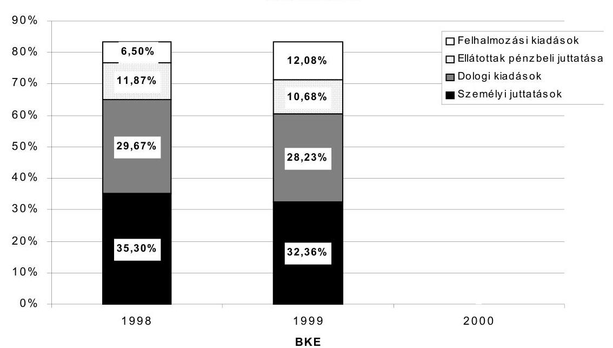

---

kiadások 1,8%-kal csökkentek.

A kiemelt előirányzatok százalékos megoszlása a teljesített kiadásokban
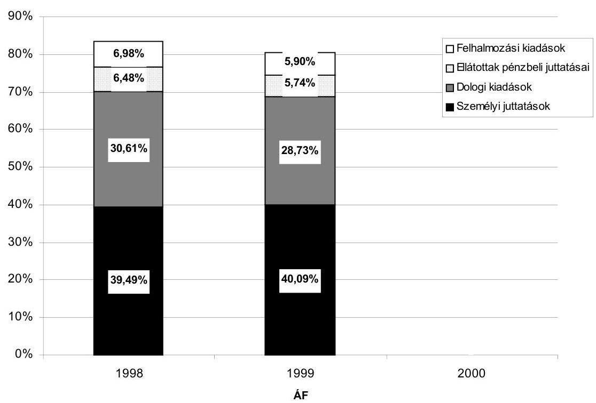

---

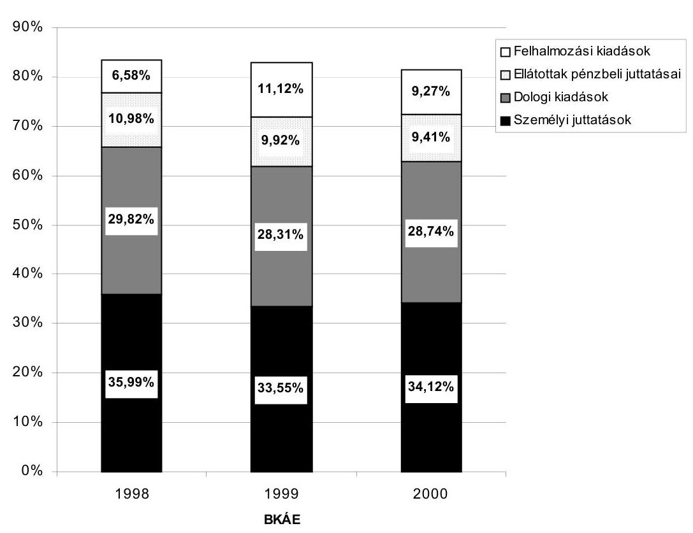

# A működési és felhalmozási célú állami pénzeszközök megoszlása jogcímenként 

A BKE-nél és a VKI-nél együttesen 1998-ról 1999-re a jogcímek megoszlási aránya kismértékben módosult; a felhalmozási célú állami pénzeszközöké 35%-ról 34%-ra, a képzési és fenntartási előirányzatoké 41%-ról 38%-ra csökkent. A hallgatói előirányzat, a programfinanszírozási előirányzat, a működési célú pénzeszközátvétel és az egyéb támogatás aránya összességében 3%-kal nőtt.

Az ÁF-nél a megoszlási arány változása jelentősebb volt: a képzési és fenntartási előirányzat 64%-ról 75%-ra, a felhalmozásié 7%-ról 13%-ra nőtt, a működési célú pénzeszközátvétel 15%-ról 12%-ra csökkent.

Az integrált intézménynél a pénzeszközök jogcímenkénti változása azt mutatja, hogy domináns a képzési és fenntartási előirányzat (56%) és a hallgatói előirányzat (18%) aránya, a többi jogcímé 1-8% között alakult és az integráció előtti évekhez viszonyítva csökkent.

---

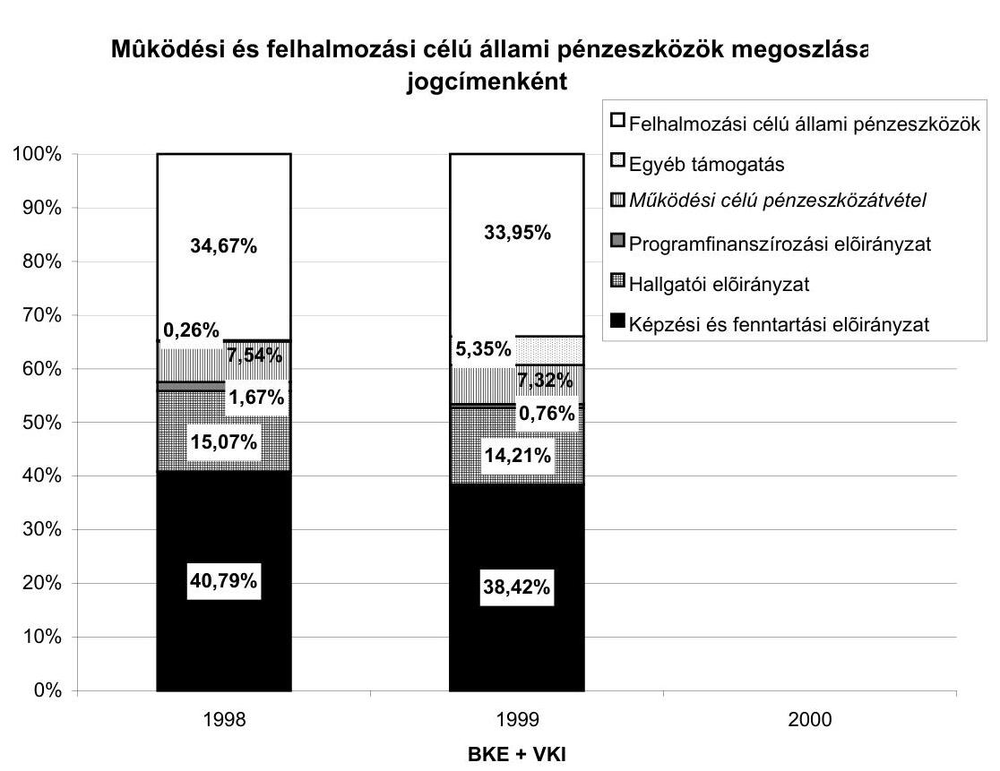

# Működési és felhalmozási célú állami pénzeszközök megoszlása jogcímenként

---

# Működési és felhalmozási célú állami pénzeszközök megoszlása jogcímenként 

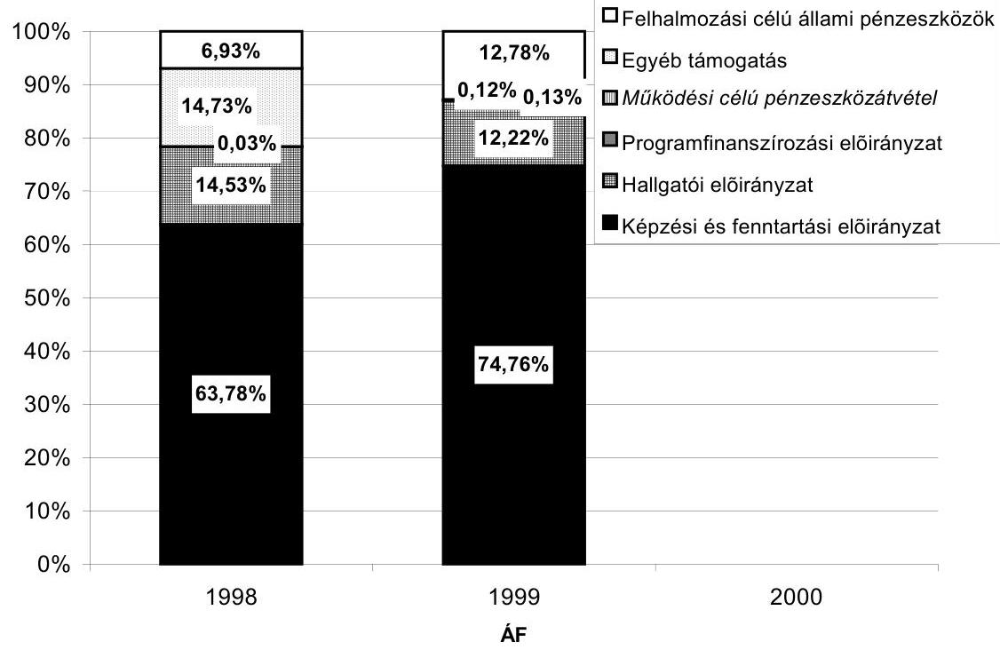

## Működési és felhalmozási célú állami pénzeszközök megoszlása jogcímenként

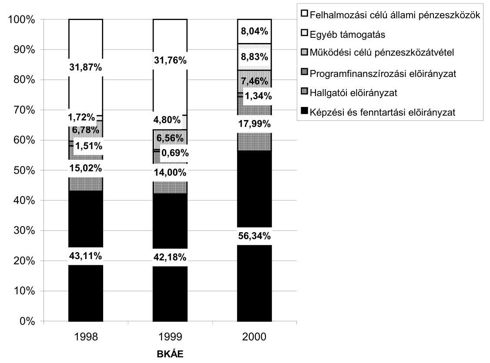

---

# A létszám és a költségvetési támogatások változása 

Az integráció előtt az oktatók részaránya az összes foglalkoztatottból a BKE-nél és a VKI-nél együtt 1998-ban 66%, 1999-ben 54%, az ÁF-nél 28% volt. Az integráció után az oktatók részaránya az összes foglalkoztatotton belül 60% körül alakult, ami 10%-os növekedést jelent az 1999-es állapothoz képest.

Az állami oktatásban az egy oktatóra jutó összes állami hallgatói létszám az egyetemi karokon kissé emelkedett (6,5-ről 8,0-ra), az ÁK-nál csökkent (23-ról 16-ra). Az egyesített intézménynél az egy oktatóra jutó összes hallgatói létszám 2000-ben 9 fő körül alakult. A két intézménynél együttesen az egy oktatóra jutó nappali hallgatói létszám az állami oktatásban 6,8 főről 8,3 főre emelkedett.

A BKE-nél és az ÁF-nél 1998-ról 1999-re külön-külön növekedett az egy egyenértékű hallgatóra eső központi költségvetési támogatás és összevontan a két intézménynél 24%-os volt az emelkedés. Az integrált intézménynél a költségvetési támogatás az előző növekedéshez képest nem változott. A tendenciát tekintve hasonló volt a változás az egy nappali hallgatóra jutó támogatás összegének alakulásánál is: 1998-ról 1999-re 22%-os, 1999-ről 2000-re 4%-os volt a növekedés. A költségvetési támogatás növekedése alatta maradt az éves infláció mértékének.

Összes oktató részaránya az összes foglalkoztatottakban, október 15-én
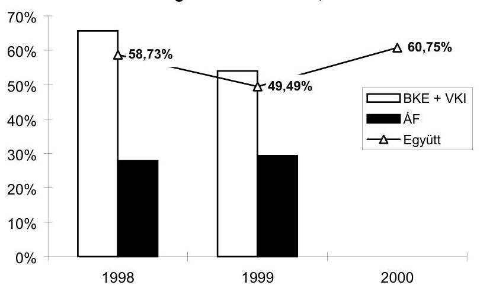

---

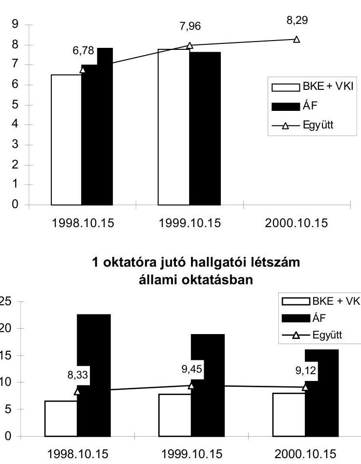

1 állami egyenértékű hallgatóra jutó
központi költségvetési támogatás
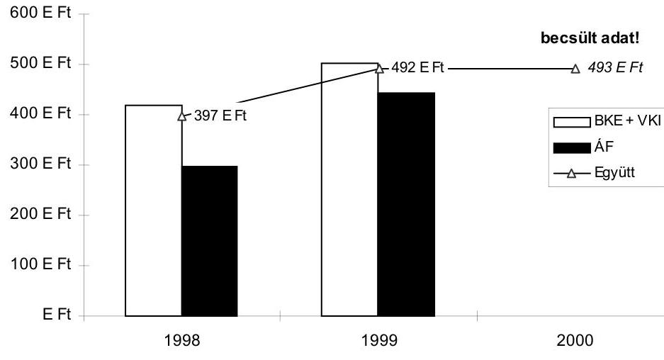

Budapest, 2001. szeptember

---

# 2. sz. Függelék 

a V-4-40/2001. számhoz

## A 2000. évi beszámoló megbízhatósági ellenőrzése

Az Állami Számvevőszék a Budapesti Közgazdaságtudományi és Államigazgatási Egyetem (a továbbiakban Egyetem) átfogó ellenőrzésének keretében a 2000. évi zárszámadás ellenőrzéséhez kapcsolódva - az Állami Számvevőszék financial audit módszertana szerint - minősítette az Egyetem elemi beszámolójának megbízhatóságát.

Az Egyetem tekintetében az ellenőrzött időszak (2000. év), több szempontból is sajátos. Egyrészről a megelőző időszakot pénzügyi nehézségek, válságjellegű likviditási problémák jellemezték, másrészről pedig rendkívüli szervezeti átalakulás ment végbe jogelőd intézmények integrációjával, a Budapesti Közgazdaságtudományi és Államigazgatási Egyetem megalakulásával. Mind a likviditási válságjellegű jelenségek folyamatos kezelése, mind a szervezeti átalakulás jelentős leterheltséget jelentett a létszámhiánnyal, fluktuációval is terhelt apparátus számára. Az előzményeket és a körülményeket is figyelembe véve vitathatatlanok az egyetem új vezetése által megtett intézkedések eredményei, ugyanakkor az elemi beszámoló megbízhatóságát és szabályosságát hátrányosan befolyásoló körülményt teljes körűen nem sikerült felszámolni.

Az egyetem 2000. évi elemi beszámolójának felülvizsgálata során az ellenőrzés a következő olyan megállapításokat tette, amelyek azt igazolják, hogy a beszámolójelentés nem teljes körűen felel meg a következő számviteli (valódiság, vállalkozás folytatása, világosság, teljesség) alapelveknek.
a) Sérült a valódiság elve:

- Az integráció folyamatában végzett vagyonfelmérés során a nyilvántartásoktól független leltárfelvétel megtörténte nem igazolt, a leltár nem kellően dokumentált. A vagyon-nyilvántartásokban elmaradt a leltározás megtörténtének jelzése, tényének írásbeli rögzítése. Ez a leltár szolgáltatott kiinduló alapot a 2000. évi nyitóadatok és a 2000. évi beszámoló adatainak a megállapítására. A tárgyi eszközök fizikai meglétének ellenőrzése és használhatósági állapotának felmérése a nyilvántartásoktól független módon nem történt meg 2000-ben.
- Hiányos és szabályozatlan a vagyonvédelem, különös tekintettel az informatikai eszközök esetében, ahol például rendkívüli esemény eszközhiány - is előfordult.

---

- Kívánnivalókat hagy maga után a tárgyi eszközök nyilvántartásának a rendszere, szabálytalanságok tapasztalhatók az egyes tárgyi eszközök tárolásánál.
- A selejtezések nem kellően dokumentáltak, nem tartalmazzák szakember véleményét a javíthatatlanságról és a további használat akadályairól.
- A Synergon Rt-től beszerzett hardver és szoftver között a jelentős mértékű járulékos költséget aránytalanul osztották meg. A nyilvántartásba vett eszköz így kialakított beszerzési ára nem valós.
- A teljesített oktatási, kutatási és egyéb szolgáltatások önköltségének megállapítása nem önköltségszámítási szabályzat alapján történik, így ezen szolgáltatások költségeinek az értékelése nem felel meg a számviteli törvény előírásainak.
- A befektetett pénzügyi eszközök között az ECONOMIX Rt-ben lévő részesedés után az értékvesztést nem számolták el.
- A vevők mérlegbeszámolóban kimutatott állománya csak részlegesen valós, a 2001. évi nyitás után a 2000. évi záróadatból 4,5 M Ft kivezetés miatt megszűnt.
- A saját bevételes tevékenységekről 2000. szeptembere óta vettek fel szerződés nyilvántartást, így a ténylegesen realizált bevételek szerződéses megalapozottsága és teljes körűsége nem biztosított.
b) sérült a vállalkozás folytatásának az elve:
- Az egyházi ingatlan átadásából adódóan több évre kiható kötelezettségvállalás történt az átadott épület kényszerű visszabérlésével. A kötelezettségvállalásra az Egyetem évenkénti költségvetése nem biztosít pénzügyi fedezetet. Ezen a megvalósult kötelezettségvállaláson felül további fedezetlen kötelezettségvállalások kockázata is fennáll. A változó bevételek állandó kiadásokat finanszíroznak, továbbá az alkalmazott tervezési és elszámolási rendszer esetenként kézi vezérléses beavatkozást igényel a fedezetlen kötelezettségvállalás megelőzése érdekében. Az Egyetem költségvetésének 35%-át fedezte 2000-ben saját bevételekből, így a bevételek csökkenése, részleges kiesése veszélyeztetheti az alapfeladat ellátását is.
c) sérült a világosság elve:
- Az értékcsökkenési leírás ingatlanokra vonatkozó részletes elszámolása 2000. évre vonatkozóan nem ellenőrizhető, ugyanis nem különítették el a kimutatásban a tárgyévi értékcsökkenési leírást.
- Az egyes tranzakciókat megalapozó bizonylatok (például beruházások, Synergon Rt. bizonylatai, számlás egyetemi oktatás bizonylatai, belföldi, külföldi kiküldetés bizonylatai) hiányosan kerültek kitöltésre, az összegek aláírás nélkül javítottak, illetve hiányoznak a szükséges aláírások.

---

d) sérült a teljesség elve:

- Jelentős összegű (7,1 M Ft) késedelmi kamat felszámításának lehetőségével nem élt az Egyetem.

A feltárt hiányosságok ugyan - figyelemmel a lényegességi küszöbre - nem kérdőjelezik meg a beszámoló jelentés pénzforgalmi adatainak megbízhatóságát, de jelzésértékűek abból a szempontból, hogy az Egyetem vezetőjének a kockázatok csökkentése érdekében hatékony intézkedéseket kell tennie:

- alakítsa ki teljes körűen a gazdálkodás rendjének belső szabályozását,
- hozzon létre hatékony ellenőrzési rendszereket, ideértve a függetlenített, a vezetői és a munkafolyamatba épített belső ellenőrzés rendszerét is,
- dolgozza ki az önköltségszámítás szabályozását a piaci szereplők részére teljesített szolgáltatásait tegye nyereségérdekeltségűvé,
- folytasson témavizsgálatot külső műszaki szakértők bevonásával a beruházási tevékenység során kötött tervezési, bonyolítói, kivitelezői szerződések ellenőrizhetősége és ellenőrzése érdekében.

Mindezek előrebocsátásával a Budapesti Közgazdaságtudományi és Államigazgatási Egyetem 2000. évi elemi beszámolója az Egyetem pénzügyi helyzetéről a vizsgálati szempontok figyelembevételével összességében a valóságnak megfelelő képet nyújtja. A vagyoni adatok bizonylati alátámasztottsága viszont nem kielégítő.

# A 2000. évi beszámoló megbízhatósági vizsgálatának részletes megállapításai 

## A működés szabályozottsága

A BKÁE 2000. január 1-jei integrációjával egyidejűleg szükségessé vált a szabályozórendszer aktualizálása és az Egyetem belső irányítási, gazdálkodási és ellenőrzési tevékenységének összehangolása.

A gazdálkodási szabályzatok kidolgozásában a Gazdasági és Műszaki Igazgatóság (GMI) partnere volt az Egyetemi Tanács mellett működő Pénzügyi és Költségvetési Bizottság, valamint a kontrolling szabályzat tervezetének összeállításánál a Vezetés-szervezési Tanszék.

---

A 217/1998. (XII. 30.) Korm. rendeletben foglaltak alapján a BKE-n az ellenjegyzési és érvényesítési jog gyakorlását 1999. július 20-tól visszavonásig rendelték el. Az integráció évében aktualizálására 2000. január 31-én került
sor január 1-re visszamenőleges hatállyal. 2000. január 1-től volt érvényben a kötelezettségvállalási és utalványozási jog integrált intézményre érvényes új szabályozása.

1999-ben elkészült a kincstári kártya használatáról szóló szabályzat, amely a BKÁE-re nem adaptált, majd az integráció első évében a Közbeszerzési Szabályzat, amit az IIT a 2000. július 3-i ülésén fogadott el. Mindkét szabályzat kitér a szigorú számadású nyomtatványok körére, beszerzésére. Nyilvántartásuk rendjét a Pénzkezelési Szabályzat tartalmazza, amely szintén nem adaptált. (1999. április 1-jei keltezésű). Tervezet szinten 2000. novemberében összeállították a Kontrolling Szabályzatot, de elfogadására a helyszíni ellenőrzés befejezéséig szintén nem került sor.

A Kontrolling Szabályzat a decentralizáció elveire épül és annak gyakorlati megvalósítását szolgálja. Az igényes és a részleteket is tartalmazó tervezet az ÁSZ belső kontroll mechanizmusokra kiterjedő vizsgálatával egyidőben készült.

Az Egyetem Számviteli politikájáról az ellenőrzés időszaka alatt állították össze a szabályzatot és fogadta el az Egyetemi Tanács.

Az érvényben lévő aktualizált szabályzatok átfogják az Egyetem szabályozási környezetét, az intézkedésre jogosultak és kötelezettek feladatait, a gazdálkodási tevékenység eljárási rendjét, összehangolt működését. Ennek ellenére a szabályozottság hiányos az intézménynél:

- A Gazdasági és Műszaki Főigazgatóság ügyrenddel nem rendelkezik -
 amit a célszerűségen kívül az államháztartás működési rendjéről szóló 217/1998. (XII. 30.) Korm. rendelet 17. § (5) bekezdése is előír.
- Szöveges számlarend nincs, ami a költségvetés alapján gazdálkodó szervek beszámolási és könyvvezetési kötelezettségéről szóló 54/1996. (IV. 12.) Korm. rendelet 37. § (1) bekezdése előírásának be nem tartását jelenti. Elkészítése folyamatban van. Az egyes számlákat a kormányrendelet 9. mellékletében foglalt - a számlaosztályok tartalmára vonatkozó - részletes előírások szerint vezetik.
- Önköltségszámítási Szabályzat nem készült, ami az 54/1996. (IV. 12.) Korm. rendelet 4. §-ának be nem tartását jelenti és hiánya a saját bevételek megalapozott tervezésénél - az Egyetem a saját szándékai szerint önköltségen végzi ezeket a tevékenységeket -, vagy az általános költségek felosztásánál jelent problémát. (Önköltségesnek nevezi az Egyetem az egyes tevékenységeit, de az önköltségre vonatkozó, saját belső szabályzat alapján végzett számításokkal nem rendelkezik.) A „keret forgalom", aminek alapján minden egyes munkahely, tevékenység és téma bevételei és kiadásai szembe vannak állítva egymással, nem helyettesíti az önköltségszámítási szabályzatot. A tevékenységek közötti pénzeszköz átcsoportosítások nem

---

csak az általános költségek szétosztását - fedezetükre a keretek elvonását jelentik, hanem az egyes tevékenységek támogatását is.

- Nem készült az Egyetemen Bérgazdálkodási szabályzat, ami a saját bevételek magas aránya miatt annak indokolt elosztását alátámasztaná. (A bevételek elérésében közreműködők részesedése a realizált bevételekből; a saját dolgozó munkaviszonyon kívüli más jogviszonyban való foglalkoztatása; a megbízásban végzett tevékenység ne tartozzon a megbízott belső dolgozó munkaköri feladatai közé és ne sértsék meg ezzel a Közalkalmazottak jogállásáról szóló 1992. évi XXXIII. törvény 42. §-ának tiltó előírását, valamint a vonatkozó SZJA és TB előírásokat.)
- A Szervezeti és Működési Szabályzatban foglaltaknak megfelelő Kari Szervezeti és Működési Szabályzatok - az Államigazgatási Főiskolai Kar kivételével - hiányoznak.
- A pénzkezelési, leltározási, valamint a felesleges vagyontárgyak feltárásáról, hasznosításáról és selejtezéséről szóló szabályzatok hatályon kívül helyezett törvényekre és kormányhatározatokra hivatkoznak, az integráció megtörténte után a jogutód Egyetemen nem került sor a szabályzatok aktualizálására.

# A belső kontroll mechanizmusok kockázatának minősítése 

Az előző év végén az ÁSZ által lefolytatott belső kontroll mechanizmus ellenőrzés alapján a BKÁE magas kockázati minősítést kapott.

Az egyetem 2000. évi költségvetési beszámolója valódiságának ellenőrzése során lényeges változást nem tapasztaltunk a helyszíni ellenőrzések során. Az Intézmény számviteli tevékenységének szabályozottsága a Számviteli politika 2001. évi jóváhagyásával javult, ami nem ad alapot a 2000. évi magas kockázat csökkentésére. Változatlanul nem dolgozták ki a számlarendet. Lényeges szabályozási hiányosságnak minősíthető, hogy a bizonylati rendet és az okmány-fegyelmet sem szabályozta az Egyetem.

Az informatikai eszközök vagyonvédelme továbbra sem megoldott, ami szintén növeli a kockázatot, mert az eszközök nagy része munkaszobákban található, a fizikai védelem feltételeit - a szerver szobák kivételével - az intézményi (épület) védelem biztosítja. Nem szabályozott az informatikai rendszerek fejlesztésének, üzembehelyezésének a folyamata sem.

A számviteli tevékenységben több, egymástól függetlenül készített szoftvert használnak, amelyek között a kapcsolat automatikus. A munkafolyamatba épített, valamint a belső ellenőrzés nem működött rendszeresen. (Lásd pl. a kiküldetési rendelvények.)

A pénzügyi, számviteli folyamatok és tranzakciók kiválasztott tételeinek helyszíni ellenőrzése alapján feltárt hiányosságok részben a munkafolyamat egyes elemeinek szabályozatlanságára vezethetők vissza.

---

A BKÁE-n - az ÁK kivételével - nem foglalkoztatnak belső ellenőrt, hiánya az elemi beszámoló megbízhatósága szempontjából kockázati tényező.

# A mások által végzett ellenőrzések megállapításainak felhasználhatóságának vizsgálata 

2000-ben felügyeleti és ÁSZ ellenőrzés volt az intézménynél.
Az OM ellenőrzés célja volt annak megállapítása, hogy az integráció során létrejött jogutód intézmény, illetve jogelőd intézmények hogyan hajtották végre a szakmai és költségvetési gazdálkodás együttes feladatait az 1999. évi LII. törvényből adódóan.

Az ÁSZ a belső kontroll mechanizmusok működését ellenőrizte az Egyetemen.
Mindkét összefoglaló jelentés munkapéldány. Ezért az OM vizsgálat eredményeit, megállapításait nem használtuk fel az ellenőrzés során. Az ÁSZ vizsgálat már írásba foglalt és az intézmény által nem vitatott megállapításait a belső kontroll mechanizmusok kockázatának minősítésekor kiindulásul elfogadtuk. (Ellenőrzésünk során a hivatkozott ÁSZ vizsgálatot követő esetleges változásokra helyeztünk hangsúlyt.)

## A tervezési és elszámolási rendszer

A BKÁE tervezési és elszámolási rendszere az egyetem szervezeti egységeinek nagyfokú önállóságán alapul. Az arra feljogosított szervezeti egységek (karok) saját hatáskörben tervezik meg a saját bevételeiket, amelyekkel - együtt a költségvetési támogatásból részükre lebontott összegekkel - önállóan gazdálkodnak, tervezik meg a hozzá rendelhető kiadásaikat. A decentralizált gazdálkodás keretszabályait a Gazdálkodási Szabályzat tartalmazza.

A tervezési és elszámolási rendszer belső elszámolási, teljesítménymérési és teljesítményértékelési szabályait a Kontrolling Szabályzat foglalja keretbe, ami a vizsgálat idején csak tervezet formájában létezett. Ennek hiányában a Gazdálkodási Szabályzat keretszabályozása és az Egyetem költségvetésének tervezéséről szóló gazdasági főigazgatói beszámoló tartalmazza a bevételek karok közötti megosztásának elveit. A szabályzat alanyai, az önálló gazdálkodásra jogosult szervezeti egységek számára a szabályok, mozgási lehetőségek, keretek ismertek és egyértelműek voltak.

A Gazdálkodási Szabályzat 4. § (3) bekezdése megtiltja a támogatási előirányzatokat meghaladó összegre, illetve a még nem teljesült bevétel terhére a kötelezettségvállalást, a 9. § (2) bekezdés pedig a pénzügyi ellenjegyzési jogot - a részjogkörű egységekre vonatkozó kivételek figyelembevételével - a gazdasági főigazgató hatáskörébe utalja azzal, hogy a főigazgató utasításban jelölheti ki az ellenjegyzésre és érvényesítésre jogosult személyeket.

A keretgazdálkodás több szintre tagozódik, amit 2000. évben még tovább bonyolított a „részjogkörű" szervezetek léte. A részjogkörű szervezetek, az integráció előtti teljes vagy részleges önállósággal rendelkező egységek - az Államigazgatási Kar és a Vezetőképző Intézet - nem csak önálló

---

keretgazdálkodásra voltak jogosultak, de felügyeleti engedéllyel önálló kincstári előirányzat elszámolási számlával is és a kötelezettségvállalásaik ellenjegyzési jogával is rendelkeztek. Erre 2000-ben, mint az integráció utáni első évben még volt lehetőség (Gazdálkodási Szabályzat 9. § (3) bek.).

Az Egyetem az őt megillető, a mindenkori költségvetési törvény szerinti támogatást egy jelenleg még nem elfogadott, de a gyakorlatban már alkalmazott rendszer alapján felosztja a decentralizált gazdálkodású keretgazdálkodók részére. A 2000. évi végleges elszámolás alapjául szolgáló felosztás elveit év közben többször módosították.

A decentralizált keretgazdálkodók hatásköréről a Gazdálkodási Szabályzat 13. §-a a következőképpen rendelkezik:

A decentralizált kerettel rendelkező egységek az éves költségvetésükben a részükre keretként számszerűsített képzési és fenntartási támogatás, valamint saját bevételeik felett önállóan rendelkeznek, azokra kötelezettségeket vállalhatnak. Bevételi többleteikkel kari és karközi keretgazdálkodók esetében a karok, központi keretgazdálkodók esetében a GMI egyetértésével rendelkeznek.

A szabályzat adott pontjával szemben a következő kifogások merülnek fel:

- Az alkalmazott gyakorlat és a szabályzat más pontja (26. §) - álláspontunk szerint helyesen - az itt idézett szöveggel ellentétesen, a keretgazdálkodók részére nem engedi meg teljes körűen a saját bevételeikkel való gazdálkodást, csak a bevételeik egy meghatározott hányada felett.
- A keretgazdálkodók (karok, karközi szervezetek) a saját bevételi többleteikkel a szabályzat szövege szerint rendelkeznek, itt álláspontunk szerint csorbul a gazdasági főigazgató engedélyező, ellenjegyző szerepe.
- Összességében a decentralizált gazdálkodás szabályai az összes szervezeti egység azonos tervszerű gazdálkodását feltételezik. Előfordult, hogy egyes szervezetek nem tudták teljesíteni bevételi tervüket és az egyensúly felborult. Ez bekövetkezhetett pl. a tervezési munka miatt, ha az ellátandó feladatokhoz nem sikerült pontosan az elegendő előirányzatot betervezni, vagy objektív piaci okok miatt, pl. ha bizonyos képzés iránt hirtelen csökkent a kereslet. Ekkor az adott szervezetnél hiány keletkezett. A többi szervezeti egység ugyanakkor - szabályosan - saját feladatai ellátása érdekében rendelkezik az előirányzatai felett. Nincs meg a szabályzatban a hasonló esetekre vonatkozó pénzeszköz átcsoportosítási lehetőség, ami egyetemi szinten fedezetlen kötelezettségvállalást is eredményezhet. A fedezetlenség azzal a követett gyakorlattal kerülhető el, hogy a felső vezetés - rektor, gazdasági főigazgató - a szabályzattal ellentétesen, „kézi vezérléssel" korlátozza az érintett szervezeteket jogaik gyakorlásában, a saját előirányzataik feletti rendelkezésben. Így alakul ki az intézmény gazdálkodásának egy sajátos fogalma a „belső hiány".

# A kötelezettségvállalások nyilvántartásának rendszere 

A kötelezettségvállalások nyilvántartási rendszerét szemrevételezés és interjú segítségével tekintettük át. A rendszer zárt körben, a követelményeknek megfelelően kezeli a kötelezettségvállalásokat és a teljesítéseket. A kötelezettségek nyilvántartása a Teljes körű Ügyvitelt Szolgáltató Rendszerrel

---

(TÚSZ) történik. A TÚSZ alkalmas arra, hogy minden gazdasági eseményt egyidejűleg három szempontból vegyen számba:

- szervezeti egységek ( költséghelyek),
- tevékenységek (költségviselők),
- bevétel és kiadás fajtái (költségnemek) szerint.

A témafelelősök a rendelkezésükre álló keret összegéig kötelezettséget vállalhatnak. A 2000-ben „élő" témák száma 760 db volt. A vállalt kötelezettségek egyedi azonosító számuk szerint kerülnek nyilvántartásra a TÚSZ-ben. Az egyedi szám jelöli a kötelezettségvállaló szervezetet, a munkahelyet, a témát és az évet. A kötelezettségvállalások (megrendelések, szerződések) nyilvántartásbavétel után kerülnek érvényesítésre a gazdasági főigazgató, vagy helyettese által. A kötelezettségvállalással azonosan történt teljesítéseket - a bejövő számlákat - rögzítik az adott kötelezettségvállalás egyedi nyilvántartásában. A kötelezettségvállalásokat kezelő pénzügyi előadók időszakonként egyeztettek a témafelelősökkel annak érdekében, hogy amelyikkel szemben teljesítés volt, várható-e még további kiadás. Azokban az esetekben, ahol meghiúsult a teljesítés vagy részteljesítés történt, illetve annak értéke nem érte el a vállalt kötelezettség mértékét, törölték az adott összeget és a keret felszabadításra került. Ebből a nyilvántartásból egyeztették és állapították meg év végén az áthúzódó kötelezettségvállalásokat.

# A saját bevételek minősítése 

Az Egyetem az Alapító Okirata szerint vállalkozási tevékenységet folytathat, de jelenleg nem folytat. A bevételorientált tevékenysége ugyanaz, mint az alaptevékenysége, az oktatás, tehát ezen az alapon nem minősül vállalkozási tevékenységnek. A finanszírozását tekintve viszont részben vagy egészben olyan tevékenységekről van szó, amelyek nem tartoznak az állami feladatellátás körébe. Az Egyetemnek a saját bevételekkel kapcsolatos ráfordításokat elkülönítetten kell kezelni annak érdekében, hogy a ráfordítások ne haladhassák meg a bevételeket. Ugyanakkor önköltségszámítási szabályzattal az egyetem nem rendelkezik (amelynek segítségével ez az előírás könnyen és ellenőrizhetően betartható lenne), ezzel megsértette az 54/1996. (IV. 12.) Korm. rendelet előírását. Ennek hiányában nem állapítható meg, illetve nem igazolható, hogy nem történt kereszt-finanszírozás az állami és a piaci alaptevékenység között.

A saját bevételes tevékenységeket úgynevezett „belsős megbízási díjjal" terhelik, ami az adott tevékenység ellátása érdekében foglalkoztatott alkalmazott munkakörön kívüli tevékenységre szóló - külön megbízását jelenti.

Annak mennyiségi meghatározásával nem találkoztunk az ellenőrzés során, hogy az ilyen megbízással is rendelkező alkalmazottaknak pontosan mennyi és milyen minőségű oktatási-kutatási, vagy adminisztratív feladatot kellett ellátniuk és ezzel kapcsolatosan hogyan igazolható, hogy valóban munkakörön kívüli külön feladatról volt szó. Ennek hiányában a folytatott gyakorlat ellentétes a Közalkalmazottak jogállásáról szóló 1992. évi XXXIII. törvény 42. §-ában foglaltakkal.

---

# A beszámoló megbízhatósági vizsgálata 

## A nyitóadatok ellenőrzése

## Az elődintézmények felkészülése az integrációra

Az integráció miatt szükségessé vált számviteli, pénzügyi teendőkről az Oktatási Minisztérium gazdasági helyettes államtitkára körlevélben tájékoztatta az intézményeket (15/1999. számviteli kérdés), kitért az 1999. évi beszámoló, a 0 -s mérleg, valamint a pénz/előirányzat maradványok elszámolásával kapcsolatos feladatokra. A tájékoztató alapján az
 intézmények pénzkészletét pénzeszköz-átadásként és pénzmaradvány-felhasználásként, a többi, a mérlegben szereplő eszközt és forrást (egyéb csökkenésként - egyéb növekedésként) a mérlegrendezési számlával (492) szemben könyvelték. A jogutód intézmény a hozzá átutalt banki pénzkészletet - az 1999. december 31-ei mérleg adataival egyezően - pénzeszköz-átvételként és tartalékba helyezésként könyvelte. Az aktív és passzív pénzügyi elszámolásokat a 42 főkönyvi számlával szemben könyvelték.

A számviteli rendezés szempontjából is jogelőd intézmények (a törzskönyvi nyilvántartásokban központi költségvetési szervként, PIR törzsszámmal szerepeltek) elkészítették a 0-s mérleget (nyitóadata megegyezett az 1999. december 31-ei záróadattal, záró állományi adata pedig 0), amelyet főkönyvi kivonattal alátámasztottak. Az év végi beszámolójelentés pénzforgalmi adatai tételesen megegyeztek a zárás előtti főkönyvi kivonat adataival, a mérlegben a zárás utáni számlák adatait rögzítették.

## A nyitóadatok leltárral való alátámasztottsága

Az integráció fordulónapjára az intézmények leltárösszesítőt készítettek, amelyet az integrációt megelőző hónapokban felvett leltárral támasztottak alá. Leltározási szabályzat mindkét jogelőd intézménynél volt.

A szabályzatok megfelelően tartalmazták a leltározás előkészítése során elvégzendő feladatokat, a leltározási egységek kijelölését, a személyi feltételeket, a bizonylati rendet, a speciális szabályokat (befektetett eszközök, készletek stb.), a leltárak feldolgozását, a leltárkülönbözetek megállapításának és rendezésének módját.

A BKE elődintézménynél az 1999. december 31-ei fordulónapi leltárhoz leltározási utasítást, ennek alapján leltározási egységenkénti értesítő leveleket, az ÁF elődintézménynél - ezen belül külön a Veszprémi Intézetnél - leltározási ütemtervet készítettek, amelyek megfelelően tartalmazták a leltározás előkészítésével, a leltár felvételével és értékelésével valamint az ellenőrzéssel kapcsolatos feladatokat és azok időpontjait.

Az integráció fordulónapjára (1999. december 31.) vonatkozó leltárösszesítő kimutatás tételesen megegyezik a főkönyvi kivonat és a mérleg adataival. Ugyanakkor a leltározás technikai lebonyolításával szemben a következő kifogásokat állapította meg az ellenőrzés:

---

A leltározáshoz a BKE elődintézménynél a TÚSZ program által készített, előnyomott leltáríveket használtak. A leltáríveken a könyv szerinti készletnek nem csak a megnevezése, leltári száma és egyéb azonosítója szerepel, hanem a könyv szerinti mennyiség is.

A leltározás folyamán a leltárba felvett tételeket nem jelölik.
E két hiányosság miatt a leltározási munka hibalehetősége és az eredmény kockázata jelentős mértékben megnövekszik, különösen, hogy együttesen merülnek fel. A könyv szerinti készlet ismerete által befolyásolva és a leltározás fizikai megtörténte dokumentálásának hiányában nem garantálható, hogy teljes körűen és a valóságban is megtörtént a mennyiségek egyeztetése. A jelölés elmaradása a többszöri felvétel lehetőségét sem zárja ki, valamint nem igazolható a leltár tényleges megtörténte. A hibalehetőség és a kockázat miatt az Egyetem nyitóadatait alátámasztó leltár nem megfelelően dokumentált, megbízhatósága nem éri el a kívánt színvonalat.

# A főkönyvi számlák megnyitása 2000. január 1-én 

Az év elejei nyitáshoz nem készült számlarend, az intézmény a részleges számlaösszefüggéseket is tartalmazó, az 54/1996. (IV. 12.) Korm. rendelet 9. sz. mellékletében előírt számlakeret tükör szerinti, az intézményi szükségleteknek megfelelően alábontott főkönyvi számlákra nyitotta meg könyveit.

A banki pénzkészletet pénzeszköz-átvételként és tartalékba helyezésként könyvelték, az aktív és passzív elszámolásokat a tartalék számlával szemben vették állományba. A mérlegben szereplő további eszközöket, illetve forrásokat az integráció fordulónapjára készített mérleg záró adataival forgalmi tételként (egyéb növekedés) a 492. Mérlegrendezési számlával szemben könyvelték. A főkönyvi kivonat adatai és a mérleg adatok között számszaki eltérés nem volt. Az analitikus nyilvántartás a nyitás időpontjában még nem volt teljes körű az integrálódott intézmények számviteli adatfeldolgozási rendszereinek technikai eltérősége miatt. A teljes körűség az Államigazgatási Főiskolai Kar eszközállományának egyenkénti bevitelével valósult meg.

A követelések és kötelezettségek összege a jogutód intézmény analitikus nyilvántartásának összegével megegyezett.

## A befektetett eszközök állományának ellenőrzése

## Immateriális javak

Az immateriális javak eszközcsoportjában 16,3 M Ft összértékű növekedés volt (ami megközelíti az 50%-ot) és 2000. végére elérte az 50,6 M Ft-ot.

A közel 36 M Ft-os (ÁFÁ-val növelten 45 M Ft-os) beszerzést lényegesen emelte az integráció során térítésmentesen átvett 110 M Ft értékű állomány. Csökkenést okozott az eszközcsoportban a selejtezés 0,2 M Ft, valamint az értékcsökkenési leírás 104 M Ft-os összege. A teljesen „0"-ra leírt immateriális javak bruttó értéke 63,7 M Ft.

---

A 2000. évi beszerzések között 39 E Ft értékű mobil-telefon belépési díj van (10 db készülék), 36 M Ft-ot szellemi termékek vásárlására fordítottak. A SYNERGON Informatika Rt-től nettó 12,2 M Ft-ért szoftvereket vásároltak, valamint informatikai eszközöket nettó 6,8 M Ft-ért. Ez utóbbi beszerzés számlájával kapcsolatos észrevételeink:
a 23,8 M Ft bruttó összegű számla számlaérvényesítő bizonylatán teljesítésigazolás és dátum nincs, a teljesítésigazolás külön csatolt jegyzőkönyv segítségével történt. A Ft összegek szignó nélkül javítottak, ugyancsak javított összegek vannak az állománybavételi bizonylaton, ahol a tesztelés, üzembehelyezés, garancia eredetileg téves 687.500 Ft-ja 6.875.000 Ft-ra javított. A garancia időtartama sor nincs kitöltve. Az elszámolt értékcsökkenés sorba írták az ÁFA összegét. A főkönyvi számlaszám és a szöveg javított. A szállító a számlába beállított nettó 5.500 E Ft, bruttó 6.875 E Ft-ot tesztelés, bevezetési konzultáció, üzembe helyezés, garanciális tevékenység jogcímen. Az üzembehelyezési bizonylat szerint ezt a teljes összeget az 1.550 E Ft bruttó árú számítógépre aktiválták, így a nyilvántartási ár nem az eszköz valós, tényleges értékét mutatja.

A vállalkozási szerződést az egyetem gazdasági főigazgatója, valamint szakmai részről a Technológia Transzfer Központ igazgatója írta alá. A kötelezettségvállalás megfelelő.

# Tárgyi eszközök 

A tárgyi eszközök esetében a leltározás említett nem kielégítő megbízhatósága miatt részletesebb, dokumentum alapú ellenőrzést folytattunk. A tárgyi eszközök állománya 2.084,5 M Ft, az 1999. évi állományhoz hasonlítva közel 10%-kal emelkedett, ami a beruházások és a járművek növekményéből, az ingatlanok és a gépek, berendezések állományának csökkenéséből adódott.

Az ingatlanok állománycsoportban a növekedés közel 263 M Ft összegben a központi kazántelep, a vészvilágítás, a garanciális visszatartás és egyéb területeken történt. Egyéb beruházást 261 M Ft összegben eszközöltek, ami ingatlan vásárlásokat, tervezési díjakat, rekonstrukciós számlákat, ügyvédi költségeket stb. tartalmaz.

Az ingatlanokon végzett beruházások bruttó értéke 291,1 M Ft. Épületfelújításra 76,7 M Ft-ot fordítottak. Az épületfelújításokat mintavételezés útján ellenőriztük, 22 tételből 6 db 5 M Ft, vagy afeletti összegű volt, a rekonstrukció számlája a legnagyobb, 16,2 M Ft.

A központi épület (Fővám tér 8.) kazánház rekonstrukciós munkái és a konyha felújítási munkák bruttó 45 M Ft (nettó 36 M Ft) három résszámlájának érvényesítése és a teljesítést igazoló jegyzőkönyv megfelel az elvárásoknak (kötelezettségvállalás, érvényesítés stb.).

Az ingatlanok összértéke az év során a befejezetlen beruházás és a fenti felújítás összegével növekedett és csökkent a nem aktivált beruházással (291,1 M Ft), valamint térítésmentesen a Református egyháznak kormányhatározattal átadott épületek értékével (217,8 M Ft).

---

Az átadott ingatlanokhoz tartozó értékcsökkenés (90,2 M Ft) kivezetése megtörtént, az értékcsökkenési leírás tárgyévi egyenlege 696 M Ft. A változások összevont hatására az ingatlanok nettó értéke 2000. év végén 1.250,3 M Ft volt.

Gépek, berendezések, felszerelések tárgyi eszköz csoportban 2000-ben bruttó 124 M Ft beszerzés, felújítás történt (ebből nem aktivált 2,5 M Ft), és közel 19 M Ft volt a selejtezés miatti csökkenés.

Ügyviteli és számítástechnikai eszközök selejtezésére 18,1 M Ft értékben került sor (nettó értékük 74 E Ft volt), közel „0"-ra leírt eszközök értékesítése történt 683 E Ft összegben.

Az eszköznövekedéshez és csökkenéshez tartozó gépek, berendezések értékcsökkenésének egyenlege 968 M Ft (csökkenéséhez tartozó értékcsökkenési leírás közel 19 M Ft volt).

A gépek, berendezések nyitó összege a térítésmentes átvétel sorban szerepel 1.066,5 M Ft-tal, ezzel az integrációra érvényes szabályok szerint jártak el.

A tárgyi eszközök mennyiségében bekövetkezett változások - növekedések - a főkönyvi kartonon ellenőrizhetők. Az analitikus nyilvántartások ellenőrizhetősége nehézkes, az áttekinthetősége és az adatállománya korlátozott.

A tárgyi eszközök 2000. évi nyitó állapotát tükröző mérleg-analitika lista, ami csak a központi telep adataiból készült, 300 oldal terjedelmű, az eszközök egyszerű felsorolását tartalmazza (eszköz nevét, beszerzését, üzembehelyezés dátumát, értékcsökkenési leírás százalékát és még néhány jellemző adatot) csoportosítás, a felhasználó egység stb. nélkül, bruttó értékkel.

A főkönyvi kartonon elkülönülnek az eszközök funkciók szerint, azon belül a beszerzés sorrendjében.

A számítástechnikai eszközök főkönyvi karton szerinti értéke 82,7 M Ft.
Kommunikációs eszközökre 2,2 M Ft-ot fordítottak, telefonszámla, telefonrészlet is elszámolásra került. 4,6 M Ft-ot bútor, 6,8 M Ft-ot egyéb eszközök vásárlására költöttek (utóbbi kivetítőt, víz alatti porszívót, sporteszközt fedezett 1-1 M Ft feletti összeggel).

A járművek esetében az Államigazgatási Főiskola által eladott személy- és teherszállító gépkocsik adás-vételi szerződéseit, valamint a hivatalos gépkocsiforgalmazóktól bekért értékeléseket ellenőrizve a beszámolóban értékesítés címen jelentkező összeget nem lehetett egyeztetni.

Az értékcsökkenés részletes elszámolása az ingatlanokra vonatkozóan „mérleg analitikai listán" elkészült, ahol tárgyévi adat nem szerepel, az ingatlanok értékcsökkenését halmozott címszó alatt egy sorban hozták, eltekintve attól, hogy hány éve használják az ingatlant. A számítógéppel készült lista végén kézzel korrigálták a 2001. évi aktivált összeget (3,7 M Ft-ot vontak le).

---

Sajátos jutalmazási formát választott a Vezetőképző Intézet (VKI). 1998-99-ben 21 fő részére 5,7 M Ft összegű tárgyi eszközt vásárolt, amiket a dolgozók otthon használnak. Az így átadott eszközök értéke személyenként 37 és 913 E Ft között szóródott (számítógépek, TV-k, hifi tornyok, bútorok, kerti bútorok, fűnyírógép, mosogatógép, videókamera stb.). A felelős kilétét az Egyetem nem kereste, a VKI gazdasági vezetője arról nyilatkozott, hogy a vezetői értekezleten elhangzottakról jegyzőkönyv nem készült. Az eszközökre egységesen 33% értékcsökkenést számoltak el azzal a céllal, hogy a nyilvántartásból minél előbb kivezethessék azokat.

Az ÁSZ ellenőrzés ideje alatt tárolási nyilatkozatot töltettek ki a dolgozókkal, miszerint a leltárban szereplő eszközöket munkavégzés céljából otthonukban használják (kanapé, szőnyeg, légtisztító stb.).

Két fő nem írta alá a nyilatkozatot, többek között a leltárfelelős sem, aki tavaly kilépett (373 E Ft leltárhiányát leírták).

Helyszíni ellenőrzésünk ideje alatt az értékcsökkenési leírásokat az előírt százalékoknak megfelelően javították és jogtanácsosnak adták át az ügyet rendezésre.

Fentiek alapján gondos tárgyi eszköz-gazdálkodásról nem beszélhetünk.
Leltározás az év végi fordulónappal nem készült. Leltár cím alatt a beszámoló mérleg sorainak adatait tüntették fel. Leltározási szabályzat, leltározási ütemterv stb. nem volt, a leltározási csoport megalakítása folyamatban van.

Az immateriális javak és tárgyi eszközök állománycsoportjában selejtezésből adódóan bruttó 18,4 M Ft, nettó 74,1 E Ft csökkenés következett be. Az értékesítési bevétel mindösszesen 158,6 E Ft volt, amit az Államigazgatási Karon realizáltak.

A selejtezési jegyzőkönyvek - kivéve az ÁK-t, a Jövőkutatás, Közszolgálati- és Matematika Tanszékeket - nem tartalmazzák szakember véleményét a javíthatatlanságról és a további használat akadályairól. Megsemmisítési jegyzőkönyv nincs, valamint a megsemmisítés módja nem ismert. A selejtezés engedélyezése főigazgatói hatáskör, aki a jegyzőkönyveket aláírta.
2000. június 15-21. között a Számítástudományi Tanszékről eltűnt a tanszék egyik számítógépe, egyedül ennek a gépnek a kiépítettsége tette lehetővé a nagy és korszerű adatbáziskezelő rendszerek használatát. A gépen a használó által kifejlesztett oktatási
 anyagok, valamint az általa írt, megjelenés előtti könyv nyomdakész anyaga is rajta volt, amiért erkölcsi és anyagi kár érte őt.

Rendőrségi vizsgálatot nem indítottak az ügyben, ezért - megítélésünk szerint - a gazdasági terület nem kellő gondossággal járt el, felelősségre vonásra, illetve felelősségre vonás kezdeményezésére, a felelősség megállapítására eljárást nem indítottak. Az 1998-ban beszerzett gép nyilvántartási értéke 1.685 Ft volt. Ennek alacsony összegére tekintettel a gazdasági főigazgató az eszköz leltárból és könyvelésből való kivezetését engedélyezte, nem vette figyelembe a gép használati értékét.

---

# Befektetett pénzügyi eszközök 

A befektetett pénzügyi eszközök mérleg szerinti értéke $9,1 \mathrm{M} \mathrm{Ft}$, amiben a részesedések 4,3 M Ft, a dolgozóknak adott kölcsönök 4,8 M Ft-ot tesznek ki.

A gazdasági társaságokba befektetett pénzeszközökről nyilvántartás készült a 2000. évi beszámoló összeállításának időszakában, a névértéken kimutatott összeg megegyezik a mérleg adatával. Értékvesztést nem számoltak el a tárgyévben.

Az integráció előtt a Vezetőképző Intézeté volt a VEKO Kft-nél és a KONZUMBANK Rt-nél vásárolt üzletrész, illetve részesedés. Ez utóbbi eredetileg Corvin Bank részvény volt, amely az 1997-es beolvadást követő részvénycserével vált Konzumbank részesedéssé. A vagyonkezelési szerződést a KVI és a BKÁE még nem kötötte meg, jelenleg van folyamatban.

A BKE-nek részesedése volt az ECONOMIX Közgazdász Egyetemi Rt-nél 2,5 M Ft névértékkel, 4 M Ft beszerzési árral, valamint a Nemzetközi Bankárképző Központ Rt-nél 0,1 M Ft névértékkel. Üzletrésze van a MUNDUS Magyar Egyetemi Kiadó Kft-nél 0,2 M Ft összeggel, valamint a jelenleg felszámolás alatt álló ECONOMIX Közgazdász Egyetemi Kft-nél (majd UNIECO Kft-nél) 4 M Ft beszerzési értékkel, névérték nélkül. Az ECONOMIX Rt-ben lévő részesedésre a tárgyévben értékvesztést nem számoltak el. A nyilvántartásból kiderül, hogy az Rt. jegyzett tőke - saját tőke aránya $34 \%$, amíg az Egyetemnél nyilvántartott részesedés névérték és beszerzési érték aránya $64 \%$. Azaz, további értékvesztés elszámolása szükséges. Az elszámolandó értékvesztés összege 1,1 M Ft az ECONOMIX Rt. saját tőke csökkenésének tartós jellege miatt.

A részesedésekről készített összeállítás adatai megegyeznek a főkönyvi és mérlegadatokkal. 2000. december 31-i dátummal a vagyonkezelői nyilvántartással egyező tartalmú adatlapokat töltöttek ki.

A dolgozóknak adott lakáskölcsönök állománya a főkönyvi kivonat alapján 9.244 E Ft, az analitikában kimutatott összeg 28 E Ft-tal több, 9.272 E Ft. Az eltérést a gazdasági főigazgató nyilatkozata alapján a felszámított késedelmi kamat okozta. A mérlegbeszámoló kitöltési utasítása és a számviteli törvény vonatkozó rendelkezése szerint az adott kölcsönökből a mérleg fordulónapját követő egy éven belül esedékes törlesztő részleteket - ami az analitika szerint 4,5 M Ft - nem a befektetett pénzügyi eszközök között kell kimutatni. Az adott kölcsönök állománya tehát a mérlegben ezzel a módosítással összhangban 4,8 M Ft.

A lakáskölcsönök analitikus nyilvántartása név szerint készült, tartalmazza a 2000-ben határidőre be nem fizetett részleteket, melyeknek az összege 18 E Ft, valamint ezen felül 17 olyan dolgozó nevét, akik a tartozásukat nem fizették vissza a határidő lejártáig.

Két fő tartozása 1999-ben lejárt, rendben visszafizették, ennek ellenére a nyilvántartásban szerepelnek; 15 fő tartozása 2000-ben járt le, akik szintén rendben visszafizették a tartozásukat. Néhány esetben nem jelentős összegű túlfizetés is történt, ami az OTP hibás kamatszámításából adódott.

## Fejlesztések

---

# Beruházások 

A beszámoló mérlegadata 2000. évre vonatkozóan 625,2 M Ft összegű beruházást mutat. Ez az adat az előző évi beruházást is tartalmazta, ami nem befejezett beruházás volt, hanem az egyházi ingatlan kiváltás része és aktiválására nem került sor. A 2000. évi összes beruházás 293,6 M Ft, ami 291,1 M Ft ingatlan és 2,5 M Ft értékű gép, berendezés növekedéséből adódik.

Az épületek folyamatban lévő beruházás állományát mutató listában eltérés van az építési beruházás ( 565 M Ft ), az ügyviteli és a számítástechnikai beruházás ( $52,8 \mathrm{M} \mathrm{Ft}$ ), valamint az egyéb gép, berendezés folyamatban lévő beruházás állománya ( $7,5 \mathrm{M} \mathrm{Ft}$ ) között (1999. és 2000. évi 38 -as űrlapokat összeadva).

A 10 M Ft feletti egyedi összegű 71 db számlából (bér, ösztöndíj és havi állami támogatás nélküli számlák) 11 kapcsolódik beruházáshoz, valamint felújításhoz ( $15,5 \%$ ), a számlák összegét tekintve is közel azonos az arány ( $15,8 \%$ ), 270 M Ft . A 10 M feletti értékben benyújtott számlákból 8 terhelte a beruházási keretet (221 M Ft ) és 3 a felújítási keretet ( 49 M Ft ).

Az 5-10 M Ft közötti 33 db bejövő számlából (bér, ösztöndíj és havi állami támogatás nélkül) 6 kapcsolódik beruházásokhoz és felújításokhoz (18 \%), értékben közel $20 \%(43,6 \mathrm{M} \mathrm{Ft})$.

A számlák tételes felülvizsgálata szerint öt kivitelező számlájára a következő átutalásokat teljesítették: 2000. márciusában 13,3 M Ft, majd 15,9 M Ft utalása történt számlák ellenében. A Fővám tér 13-15. és a Veres Pálné u. 36. alatti épületek rekonstrukció tervpályázatának lebonyolítási díját és költségeit számlázták. A megbízási szerződések a tervpályázat teljes körű lebonyolításán túl a zsűri tagok díjazására kifizetendő, együttesen 3,4 M Ft + ÁFA díjat, 2 M Ft + ÁFA megbízási díjat, valamint technikai költségátalány megtérítését is tartalmazták. A zsűritagok közül az Egyetem és az OM dolgozói is részesültek díjazásban, akiknek - az ellenőrzés megítélése szerint - a bírálatban való részvétel munkaköri kötelessége volt. A számlákon kötelezettségvállalás, ellenjegyzés, utalványozás, érvényesítés, kifizethető aláírások vannak, de teljesítésigazolás nincs.

Az Építőipari és Szolgáltató Kft-nek 13,4 M Ft-ot, valamint 15,1 M Ft-ot utaltak. A vállalkozói szerződést kétszer módosították, a vállalkozói díj összegét 9,6 M Ft-ról 37,3 M Ft-ra, majd 37,9 M Ft-ra emelték. Az utolsó számla teljesítésére 2000. decemberében került sor, a Kft-nek kifizetett összeg 42 M Ft lett. A módosítás indoka az volt, hogy „a szükségessé vált" bontási munkákat az első szerződéskötés előtt nem mérték fel. A rendelkezésünkre bocsátott szerződésekből a bontási munka megalapozott előkészítése nem állapítható meg.

Az Építész Stúdió Kft-vel két tervezési szerződést kötött az Egyetem 15 millió Ft, illetve 11,5 M Ft összegű munka elvégzésére. Az első szerződésben foglalt határidőt a Kft túllépte egy hónappal, az Egyetem a szerződés 8. pontjában rögzített késedelmes teljesítés esetén fizetendő kötbért nem érvényesítette a tervezővel szemben. A második szerződésben megállapodott összegen felül 1,7 M Ft-ot fizetett. Ezen két szerződésben foglaltakon túl 13,3 M Ft-ot utalt át az Egyetem az Építész Stúdió Kft-nek.

---

Szerződést kötöttek a Veres Pálné u. 38. alatti mélygarázs kiviteli tervdokumentációjának elkészítésére jogerős építési engedélyek birtokában. A szerződött összeg 3 M Ft. Ezzel szemben az egyházi ingatlan kiváltás kerete terhére 2000-ben 16,8 M Ft-ot utalt át az Egyetem, amely összeget megalapozó szerződés nem állt az ellenőrzés rendelkezésére. A gazdasági főigazgató nyilatkozata szerint ezt az összeget az épület teljes körű rekonstrukciója tervezéséért fizették ki. A mélygarázs tervezéséért járó $3 \mathrm{M} \mathrm{Ft}+$ áfás szerződést hatályon kívül helyező szerződésmódosítást nem mutatták be az ellenőrzésnek.

A BKÁE, 2000. november 20-án Vállalkozói Szerződést kötött a Fővám tér 13-15. rekonstrukciós munkáinak elvégzésére. Teljesítési határidőként 2001. július 30-át vállalta a kivitelező. A szerződéses árat bruttó egyösszegű prognosztizált átalányárban határozták meg 948 M Ft-ban. Az ellenőrzés megítélése szerint ilyen nagy összegű beruházás esetén tételesen ki kell mutatni az elvégzendő munkák bekerülési összegét. Az Egyetem nyilatkozata szerint a tételes kimutatás elkészült, amit az ellenőrzés részére nem mutattak be.

Ugyanez a kivitelező külön szerződést kötött az Egyetemmel a Fővám tér 8. központi épület kazánház rekonstrukciós munkáinak, valamint a konyha (gáz) felújítási munkáinak az elvégzésére, amiért négy számlára 55,3 M Ft-ot utalt át az Egyetem felújítási kerete terhére. Ugyancsak a kazánfelújítás kapcsán az egyházi ingatlan kiváltására rendelkezésre álló keret terhére 10,4 M Ft-ot fizettek a kivitelezőnek, azzal az indokkal, hogy ezzel a kazánfelújítással szándékoznak megoldani a Fővám tér 13-15. épület fűtését is.

A megrendelő a beruházási munkák lebonyolításával külön vállalkozót bízott meg.

A számlák, valamint a számlaérvényesítő bizonylatok megfelelően igazoltak, az egyházi ingatlan kiváltására rendelkezésre álló keretből fizetett 10,4 M Ft számláin a lebonyolító teljesítés igazolása is szerepel.

A BKÁE ingatlanbővítési koncepciójának jogi képviseletével ügyvédi irodát bízott meg. Annak közreműködésével került sor a Mátyás u. 3. alatt lévő ingatlan megvásárlására és az adás-vételi szerződés megkötésére $82,9 \mathrm{M} \mathrm{Ft}$ végösszeggel, amelynek átutalása 2000. XII. 15-én megtörtént az Ügyvédi Iroda letéti számlájára, letéti szerződés alapján. Az ÁB-Aegon Ált. Biztosítótól történt ingatlanvásárlást is fenti ügyvédi iroda bonyolította, a számla összértéke 52,3 M Ft (Mátyás u. 1. szám alatt lévő ingatlan ellenértéke). Az egyházi ingatlan kiváltásához kapcsolódóan egyéb feladatok teljesítéséért számlázott összegek is itt kerültek elszámolásra. (Köztelek u. 8, a gazdasági főigazgatóság elhelyezése érdekében 2,7 M Ft-nyi átalakítás, festés, számítógép hálózat kiépítése, számítógép-, bútorvásárlás; költözés, megbízási díjak, telefonhálózat stb.)

# A volt egyházi ingatlanok kiváltása. Az ingatlan visszaadásával kapcsolatos beruházási, fejlesztési tervek és azok megvalósulásának jelenlegi állása 

A volt egyházi ingatlanok tulajdoni helyzetének rendezéséről az 1991. évi XXXII. törvény rendelkezett.

---

Az Egyetem 3 érintett ingatlanából a Közraktár utca 18. szám alatti volt egyházi ingatlanra a Dunamelléki Református Egyház (továbbiakban: Egyház) fenntartotta az egyházi tulajdonjog visszaállításának igényét.

A rendezést szabályozó 2169/1996. (VII. 4.) Korm. határozat, majd annak alapján a Miniszterelnöki Hivatal egyházi ügyekért felelős helyettes államtitkára határozatában megjelölte az épület átadásának 2000. VII. 31-i határidejét, addig az Egyetem használati jogát. A kártalanításra 2.752 M Ft-ot biztosított és meghatározta a kifizetés 4 éves (1996-1999. közötti) ütemezését.

A Minisztérium kezdettől fogva azt az álláspontot képviselte, hogy a kiváltásra és a fejlesztésre külön építési ütemben kerüljön sor, az Egyetem fejlesztési igényének pénzügyi támogatását nem vállalta. Az Egyetem ezzel szemben a folyamat során végig azt képviselte, hogy az egyházi ingatlan kiváltását az egyetemi infrastruktúra mennyiségi és minőségi fejlesztésével indokolt végrehajtani. A kormányhatározatot követően többször is jelezte, hogy az 1995-ös beruházási árszínvonalon kalkulált kártalanítási összeg a kiváltásra sem nyújt fedezetet a 2000. VII. 31-i átadási határidő figyelembevételével. (Az 1995-ben készített költségszámítás a Lónyai utcai ingatlan 17.600 m²-es területére 135 E Ft/m² fajlagos költséggel készült.)

Az oktatási miniszter a Felsőoktatási Fejlesztési Program és az egyéb tárca beruházások összehangolására miniszteri biztost nevezett ki. Az OM és az Egyetem egyházi ingatlan kiváltással összefüggő további együttműködése a miniszter 1999. X. 11-i tájékoztató levele alapján a miniszteri biztos, illetve az általa irányított beruházási bizottság közreműködésével történt. 2000-ben különböző időpontokban a részprogramok engedélyezési okiratai módosításra kerültek és 2000. IX. 21-én 335,5 M Ft átcsoportosításával megnyitásra került a Czuczor utcai tömb részprogram engedélyezési okirata.

Az Egyetem 2000. július 31. előtt átadta az egyház birtokába az ingatlant, az összes hasznos alapterület 50,3%-át. Bérleményként továbbra is átmenetileg
 az Egyetem használatában maradtak a könyvtár, a tornaterem és az ISZOK eddig is használt egységei. Az átadott oktatási célú helyiségek alapterülete 8.859 m². Ezzel az Egyetem teljesítette a birtokba adásra kormányhatározatban meghatározott ingatlanátadási határidőt. Nem teljesült azonban az egyházi ingatlanok tulajdoni helyzetéről szóló törvény 10. §-a, amely szerint „a kártalanítást úgy kell meghatározni, hogy az ingatlan használójának elhelyezése megfelelően biztosítva legyen”.

Az oktatási helyiségek átadása miatt a folyamatos működés biztosítása érdekében az Egyetem többször jelezte a megkötésre kerülő bérleti szerződés kapcsán felmerülő problémákat. Az Egyházzal megkötött használói és szolgáltatási szerződés - az Egyház által is igényelt - bérleti díj fedezetének biztosítását az OM az egyetemi vezetés többszöri kérése ellenére írásban nem támogatta. (A politikai államtitkár 1999. XI. 23-i, a püspöknek írott levelében megerősítette, hogy az OM a tornateremre és könyvtárra vonatkozó szerződést aláírás után ellenjegyzi.)

---

Az Egyetem a BÁV Rt-vel 2000. IV. 25-én kötött, illetve az Egyházzal 2000. VI. 14-én kötött szerződések megkötésekor nem rendelkezett a bérleti díjak pénzügyi fedezetével, így a szerződéskötés fedezetlen kötelezettségvállalásnak minősül.

Az OM belső levelezésében (a kormánybiztos felsőoktatási helyettes államtitkárhoz írott 2000. VII. 28-i feljegyzésében a gazdasági helyettes államtitkárra hivatkozással) a működési költségtöbblet kötelezettségvállalójaként a felsőoktatási helyettes államtitkárt jelölte meg. Az ellenjegyzésre a vizsgálat idejéig nem került sor.

Az Egyetem üzemeltetési költség nélkül a 2000. év során 47.742 M Ft-ot fizetett az egyháznak és a BÁV Rt-nek. A minisztérium a kiadások részleges fedezetére egyszeri jelleggel 10 M Ft pótelőirányzatot biztosított. Az egyházi kifizetés pénzügyi forrását az Egyetem - nem jogszerűen - a létszámleépítés költségeinek fedezetére kapott 112,1 M Ft költségvetési támogatás fel nem használt részéből fedezte.

A várható helyzet szerint a Sóház 2001. X. 31-i átadása részleges megoldást jelent a BÁV Rt-től bérelt területek kiváltásával. A Veres Pálné utcai rekonstrukció, - amelynek befejezése a vizsgálat idején nem állapítható meg - az oktatási-elhelyezési lehetőségeket csak hosszabb távon segítheti. A két beruházással azonban a könyvtár és a tornaterem funkcióját nem lehet kiváltani. Az oktatási miniszter (2000. IX. 29-i levelében) utal arra is, hogy a könyvtár pótlását költségvetési forrásból, kb. 2,4 Mrd Ft értékben kell megépíteni. A bérleti díjakat fedezet hiányában az Egyetem csak a működési kiadások terhére tudja biztosítani. A könyvtár 2004. VII. 31-ig fizetendő bérleti díja (203,1 M Ft) felveti az OM szerepvállalásának szükségességét.

# Forgóeszközök 

## Készletek

Az Egyetem a mérlegében 2000. december 31-én 10.902 E Ft árukészletet mutatott ki. A készlet az Államigazgatási karon árusított jegyzetekből származik. Az eszközöket bizományos forgalmazza, aki havonta jelenti a változásokat az ÁK-nak, az ÁK félévente jelenti a változásokat a GMI Pénzügyi és számviteli osztályára. A kimutatott készletértékkel szemben a valóságban meglévő készlet értéke 3 E Ft-tal kevesebb.

Az eltérést az okozta, hogy az ÁK által a GMI-nek készített 2000. első félévi készletváltozási jelentés adatához képest - 20.356.963 Ft - a második félévi jelentésben elírás történt és az első félévi egyenlegként 20.353.963 Ft-ot adtak meg. A GMI ezt nem észlelte és ebből az adatból könyvelte a készletváltozást a tőkeváltozással szemben.

## Adósok

Az Egyetem a 2000. évi beszámolójában 30,1 M Ft vevőkövetelést mutatott ki. A beszámolóban közölt érték az analitikus nyilvántartással egyező. A fordulónapra vonatkozó egyeztetés, visszaigazolás kérés az adósokkal nem történt.

---

Az Egyetem részéről tett érdemi nyilatkozat szerint a vevőkkel nem a mérleg fordulónapjára vonatkozóan egyeztettek (leltároztak), hanem folyamatosan. Arra vonatkozó nyilvántartással nem rendelkeztek, hogy a kimutatott összegekből részleteiben mennyit realizáltak pénzügyileg a mérlegzárás, vagy az ellenőrzés idejéig (idő hiányában az ellenőrzés felkérésére sem készítettek kimutatást). Azt azonban megtették, hogy a vevőanalitikába beleírták a követelések kiegyenlítése esetén annak tényét. Az ellenőrzés ennek alapján elvégezte a kiegyenlített, törölt és kiegyenlítetlen követelések kigyűjtését. Megállapításunk alapján megalapozott az a vélemény, hogy az Egyetem 2000. december 31-ei vevőállománya csak részben mutatott ki valóságos, létező és pénzügyileg ténylegesen realizálható követeléseket.

A kigyűjtés szerint a december 31-ei vevőkintlévőségből a 2001. év első három hónapjában a fizetési határidőt követő kisebb-nagyobb késedelemmel, de rendben befolyt 38% (11,5 M Ft), törlés miatt megszűnt 15% (4,5 M Ft) és továbbra is fennáll 47%, amiből (a 14,3 M Ft-ból) 3,5 M Ft egy vevőnek az 1995 és 1996-ról áthúzódó tartozása (az „EN-KA Pékségnek”).

Az egyetem vevő-analitika nyilvántartási rendszere vevőnként képes a követelések kimutatására lejárt - le nem járt bontásban. A lejárt követelésekre a rendszer automatikusan késedelmi kamatot számol. Az ellenőrzésre átadott határidőn túli kintlévőség lista összesített adatokat nem tartalmaz. A nagyszámú előfordulás miatt elemző eljárások segítségével számítottunk megközelítő adatokat.

Azoknak a partnereknek a száma, amelyeknél esetenként, vagy rendszeresen a kötelezettségük késedelmes kiegyenlítése miatt késedelmi kamat felszámítása volt szükséges: 1.466 db. A 2000 évben azoknak a vevőknek a száma, akiknek az Egyetem számlát bocsátott ki: kb. 15 ezer. Azaz az üzleti partnerek közel 10%-ánál fordult elő, hogy késedelmesen teljesítette kötelezettségét az Egyetemmel szemben.

A fizetéssel késlekedők többségének a késedelme egyénenként nem jelentős, az összes számított késedelmi kamat mindössze 6%-át teszi ki. A legkisebb partnerszámú sáv (14 db), az 50.000 Ft-ot meghaladó késedelmi kamattal terhelhető partnerek sávja. Ide koncentrálódik az összes becsült felszámított késedelmi kamat 39%-a.

A felszámítható késedelmi kamat becsült összege 7,1 M Ft volt.
Az egyéb követelések között az Egyetem a dolgozói lakásépítési és lakásvásárlási kölcsönök éven belüli esedékes részletét mutatta ki a vonatkozó jogszabályok és saját gazdálkodási szabályzata alapján. Az ellenőrzés által tapasztaltak igazolták, hogy az egyéb követelések sor szabályszerű és megbízható adatot tartalmaz.

# Függő, átfutó, kiegyenlítő tételek 

Az aktív és passzív függő, átfutó és kiegyenlítő tételek összege megegyezik a főkönyv adataival. Állományának év végi összege nem jelentős a mérleg főösszegéhez képest, az aktív elszámolások 0,4%-ot, a passzív elszámolások 0,3%-ot tesznek ki és mindkét oldal analitikus nyilvántartással alátámasztott.

---

Az analitikából megállapítható, hogy a függő elszámolások számlát nem használták az előirányzat nélküli kötelezettségvállalás következő évre való átterhelésére.

A függő kiadások 4.963 E Ft összegéből 3 tétel (XII. havi előre utalványozott kötelező nyugdíjpénztári befizetés 1.483 E Ft, XII. havi előre utalványozott önkéntes nyugdíjpénztári befizetés 750 E Ft, APEH felé TB túlfizetés 1.569 E Ft) a kiadások 77%-át tette ki.

A függő bevételek 13.891 E Ft összegének legjelentősebb tétele az ajánlati biztosíték. A kiegyenlítő kiadások 14.797 E Ft összegéből a munkavállalókkal kapcsolatos kiadások állománya 13.636 E Ft-ot, az étkezési utalványok állománya 361 E Ft-ot tett ki. A költségvetésen kívüli 800 E Ft a dolgozókat terhelő kölcsön összege volt.

Valamennyi tétel - kettő kivételével - 2001. január hónapban rendezésre került. A februárban kifizetett 14.771 Ft fel nem vett novemberi és decemberi munkabér, a márciusban kifizetett 53.940 Ft a novemberben megrendelt bútorokból márciusban szállított tételek ára.

A dokumentum alapú vizsgálatok számszaki eltérést nem mutattak, az egyezőség mellett hét esetben fordult elő, a számszaki adatokat nem befolyásoló adminisztrációs hiányosság.

# Saját tőke 

Az Egyetem a 2000. évi beszámolóban a saját tőkét tőkeváltozásként szerepeltette az integráció technikai végrehajtása miatt. Az Egyetem 2000. január 1-jei induló vagyonának forrásaként szolgáló saját tőke induló tőkeként való kimutatása - összhangban az 54/1996.(IV. 12.) Korm.rendelet 15. § (3) bekezdésével - a valóságos helyzetet jobban jellemezné. Ugyanakkor az Egyetem a követett gyakorlatával a mérleg kitöltési utasításnak megfelelően járt el.

## Tartalékok

Az intézmény 1999. évi alaptevékenység előirányzat-maradványát a felügyeleti szerv jóváhagyta. Az 1999. évi előirányzat maradvány 2.441,9 M Ft volt, amelyből az egyházi ingatlan kiváltására biztosított beruházás forrás maradványa 2.423,4 M Ft-ot tett ki. A különbözet 18,5 M Ft, amelyet folyó kiadások finanszírozására használtak fel.

2000-ben az egyetemi integrációval létrejött utódszervezet kimutatott kiadási megtakarítása 2.390,6 M Ft. A költségvetési tartalék összege a bevételi lemaradás (31,7 M Ft) és az előző évi maradvány jóváhagyásából származó levonás (14,9 M Ft) miatt 2.344 M Ft volt. A tartalékból a központi beruházás kötelezettséggel terhelt, saját forrásként nyilvántartott összege 2.130,9 M Ft-ot tett ki. A mérlegadatokat a főkönyvi kivonat adatai alátámasztották.

## Kötelezettségek

---

Az intézmény hosszú lejáratú kötelezettsége a részletfizetésre vásárolt mobiltelefonok 316 E Ft összegű törlesztő részlete volt. A rövid lejáratú kötelezettségek összege 153,2 M Ft, aminek 98,8%-át a szállítói szolgáltatói kötelezettségek tették ki.

A beszámolóban szerepeltetett szállítói egyenleg és az egyéb rövidlejáratú kötelezettségek egyenlege analitikus nyilvántartással egyezően alátámasztott. A dokumentum alapú vizsgálatok a számszaki egyezőség mellett öt esetben a számszaki adatokat nem befolyásoló adminisztrációs hiányosságot mutattak.

---

# Bevételek 

A BKÁE bevételeinek szerkezetét 2000-ben, változását 1999-hez képest, valamint a 2000. évi összetételét és az előirányzathoz viszonyított alakulását a mellékelt táblázatok mutatják be (4/a, 4/b táblázatok).

A korrigált adatok alapján figyelembe vett saját bevételek összege 215 M Ft-tal, az összes bevételen belül az aránya 14%-kal emelkedett. A működés költségvetési támogatásának összege 311 M Ft-tal több, mint az előző két évi elődintézmény együttes adata.

Az eredeti előirányzathoz képest legnagyobb növekedés az átvett pénzeszközöknél következett be, aminek oka az, hogy a konkrét pályázatok kiírása nélkül a költségvetés készítésekor ez a jogcím nem tervezhető meg. Ezek a bevételek a pályázatok évközi kiírása után realizálódnak. Nem lehet az ellenőrzés rendelkezésére álló információk alapján egyértelműen kijelenteni, hogy az átvett pénzeszközökből származó bevételek elmaradása esetén milyen mértékben lenne képes az Egyetem a kiadásai csökkentésére a pénzügyi egyensúly fenntartása céljából. Az ellenőrzés álláspontja szerint magas a kockázata annak, hogy az egyes - pályázatokon nyert - bevételek részleges elmaradása esetén a költségeket nem lehet azzal a kellő rugalmassággal csökkenteni, hogy finanszírozási problémák ne jelentkezzenek.

## Költségvetési bevételek

A központi költségvetésből kapott támogatás összege 2.739,1 M Ft volt, amiből működési költségvetési támogatás 2.535,1 M Ft, intézményi felhalmozási kiadásokhoz kapcsolódó pedig 204,0 M Ft. A 2000. évre vonatkozó adatok helytállóságát az elvégzett tesztelések alátámasztották.

## Saját bevételek

Az intézményi működési bevételek 2000-re tervezett összege 1.505,9 M Ft, könyv szerinti teljesítése 1.753,0 M Ft, aminek 71,6%-a az alaptevékenység körében végzett szolgáltatások ellenértéke (1.254,7 M Ft) volt. A bevételek összesített adatait az elvégzett tesztelések alátámasztották.

Az egyetemi, főiskolai továbbképzésből származó bevétel önmagában 982 M Ft, ezt növelte 15 M Ft-tal a tankönyvek, jegyzetek, egyéb oktatási anyagok értékesítése, felvételi eljárási díj, önköltséges képzés vizsgadíja, telefonköltség, stb.

A pénzügyi főigazgató-helyettes feljegyzése alapján szerződés nyilvántartást 2000. szeptembere óta vezetnek, ezért nem tudják garantálni, hogy a 2000. januártól-decemberig kötött bevételes szerződések mindegyike szerepel a nyilvántartásukban.

Az egyetemen 12 féle saját bevételes képzést végeznek, ezek
 közül egy tartozik a Vezetőképző Intézethez.

A részidős egyetemi képzésről bevételi- és költségterv készült 2000-re, ami a továbbképzési bevételek egy része. A kimutatás tervezett hallgatói létszám adatokat tartalmaz. A bevételi tervben évfolyamonként 140, 100, illetve 90 E

---

Ft/fő/féléves tandíjjal számoltak az 1999/2000. tanév II. félévében, 140 és 105 E Ft/félév/fő összeggel a 2000/2001. tanév I. félévében. Az így kalkulált bevétel 120,5 M Ft, amit 49,4 M Ft egyetemi rezsi, valamint egyéb óra-és vizsgáztatási díjak, személyi juttatások, működési, felhalmozási és egyéb kiadások terhelnek további 65,2 M Ft összegben. Az előzetes számítások szerint szabad keretként 6 M Ft-tal számoltak.

Kollégiumi díjbevételekből 51,5 M Ft, uszodával kapcsolatos bevételekből (bérletek, napi jegyek, hajszárító, stb.) 46,6 M Ft nyilvántartás szerinti bevétele volt az Egyetemnek.

A saját bevételek nagy részét utalványon fizetik, így a tandíjak, 50-35-105 E Ft/fő (félév) összegben, tárgy-újrafelvételi díjak 2-4.000 Ft/fő, valamint könyvtári befizetések (késedelmi-, beiratkozási-, reprográfiai-, fénymásolás stb. díjak). A felvételi díj $5.000 \mathrm{Ft} /$ fő, diploma díja $1.500 \mathrm{Ft} /$ fő, új diákigazolvány $1.180 \mathrm{Ft} /$ fő.

A befizetések közül a 2000. február hónapból a 3., 4., 7., 8-i napokon beérkezett összegek tételes ellenőrzését végeztük el, kiegészítő mintavétellel.

A február hónap kiválasztására azért került sor, mert a tanév második félévi befizetései erre az időszakra estek. A négy napi 121 M Ft jóváírás mintegy 25%-a utalványos, különféle hallgatói befizetésekből tevődött össze.

A bevételi számlaérvényesítő bizonylatot minden esetben kitöltötték, azokon érvényesítő aláírás, illetve dátum mindig volt, több esetben későbbi, mint a teljesítés ideje. A pénzösszegeket több helyen javították, a javítás mellett nem volt szignó. Cégek is fizettek tandíjat, stb-t utalványon, számlamásolat azonban nincs mellékelve. Esetenként a számlát később küldik a befizetőnek, külön kérésre. A kiemelt négy nap utalványos befizetéseinek egyharmadát ellenőriztük tételesen (29,9 M Ft-ból 9,9 M Ft befizetését). A kiegészítő mintavételezés alapján az utalványos befizetések elszámolásait elfogadhatónak minősítettük.

Az Egyetem nem oktatáshoz kapcsolódó egyéb saját bevételei közül az ellenőrzés során kiemelt tételek a számlás bevételek voltak.
1998. március 1-től módosított szerződést (az eredetit nem) kaptunk az Egyetem Vezetőképző Intézete és az OTKA Iroda megállapodásáról, mely szerint az Iroda éves bérleti díja 12,4 M Ft+ÁFA volt. A szerződést 2000. elején újra módosították, amiben az eredeti díjat 15,7 M Ft+ÁFA-ra emelték meg.

A Fővám tér 8-ban az orvosi rendelő helyiségeiben az ECONOMED Bt. háziorvosi ellátást folytat. Az erre vonatkozó szerződést 1995. október 30-án kötötték, a felmerülő költségeket $5000 \mathrm{Ft} /$ hó+ÁFÁ-ban határozták meg. A visszavonásig érvényes szerződés módosítására - helytelenül - nem került sor, a költségátalány összege változatlan, bérleti díjat nem fizet a Bt. Az általunk kiemelt számla teljesítési időpontja 2000. január 24.

A Tarkaréti kollégium helyiségeit havi 2 alkalommal veszi igénybe a ROLLSTONE Kft. (évi bérleti díja 770 E Ft); az egyetem auláját eseti rendezvényekre szerződés alapján 540 E Ft+ÁFA összegért adják ki.

Mind a számla, mind a bevételi számlaérvényesítő bizonylatok, valamint az elszámolásuk megfelel a követelményeknek.

---

# Személyi jellegű ráfordítások 

## A személyi jellegű ráfordítások alakulása az előirányzatukhoz

A személyi juttatásokra jóváhagyott $1.809,5 \mathrm{M}$ Ft eredeti előirányzatot Kormány-, felügyeleti szervi-, valamint saját hatáskörű (1.963,1 M Ft-ra) módosítása után 1.725 M Ft-ra teljesítették, 238,1 M Ft maradvány jelentkezett.

Rendszeres személyi juttatásokra 1.076,4 M Ft-ot (62%), nem rendszeres személyi juttatásokra 513,1 M Ft-ot (30%), külső személyi juttatásokra 135,5 M Ft-ot (8%) használtak fel. A bizonylat alapú ellenőrzés során a számszaki adatokat befolyásoló eltérést nem tapasztaltunk.

A 238,1 M Ft maradvány 49%-a az alapilletményeknél keletkezett (117 M Ft), a nyugdíjas és állományba nem tartozó munkavállalóknál 43 M Ft. A nem rendszeres személyi juttatások körébe tartozó többletkiadások, illetve megtakarítások jelentős összegűek. A jutalom 300 E Ft-ra tervezett (ÁIK) összegével szemben a felügyeleti szerv által biztosított 19 M Ft-os többletelőirányzat ellenére a túllépés 51 M Ft volt. A kifizetett jutalom összege 70,3 M Ft, a teljesítés indexe 23.428%.

A gazdasági főigazgató helyettes levele alapján a jutalom alultervezésének oka az Egyetem év eleji felhalmozódott adósságállománya volt. Ebben a likviditási helyzetben jutalom kifizetését nem tervezhették. Év közben a saját bevételek nagyobb arányban nőttek a tervezettnél, ugyanakkor személyi előirányzataikban megtakarítás jelentkezett, aminek egy részét felhasználták, összesen 47.674 E Ft jutalmat fizettek ki. A másik rész az állami támogatás terhére kifizetett, összesen 22.609 E Ft jutalom volt, melynek a bérmegtakarítás és az év közben kapott normatíva emelés volt a fedezete. A megemelt összegben kifizetett jutalom forrására adott magyarázat elfogadható.

Az Egyetem gazdasági egységeitől kapott anyagokból nem tudtuk megállapítani, hogy mi indokolta az alapilletményekre felhasználható előirányzat 12,4%-os megtakarítását (a rendszeres személyi juttatások 10,6%-os megtakarítását).

A bérkifizetés ellenőrzéséhez az október hónap dokumentumait vizsgáltuk meg kiegészítőleg. A Kincstár részére átutaláshoz összeállított név szerinti lista végösszege korrekcióra szorult. A lista szerinti 99.201,5 E Ft tényleges átutalása 99.158,1 E Ft volt, melyet a Kincstár teljesített. A számlaérvényesítő bizonylaton az összeget tovább javították, hozzáírva az utalandó családi pótlék, Gyed stb. összegeket és levonva a kifizetői TB utáni bevételt. A korrigálások számszerűen egyeztethetőek és indokoltak voltak. A tesztelés alapján a számszaki adatokat befolyásoló eltérést nem tapasztaltunk.

## Megbízási díjak

Az összes külsős és belsős megbízási-, valamint felhasználói szerződésekre havonta, névszerint kifizetett összegek számfejtési listáját biztosították.

---

A lista adataiból, annak szerteágazó jellege miatt kiegészítő mintavételezést alkalmaztunk, aminek eredménye alapján a számszaki adatokat befolyásoló eltérést nem tapasztaltunk.

Az állományba nem tartozók megbízási díjaként 31,7 M Ft-ot, tiszteletdíj, valamint szerzői díj címén $22,5 \mathrm{M}$ Ft-ot számoltak el. Az így kifizetett 54,2 M Ft külsős megbízásból $29,8 \mathrm{M}$ Ft oktatáshoz és $24,4 \mathrm{M}$ Ft egyéb tevékenységhez kapcsolódott.

# Napidíjak 

A napidíjra előirányzott összeg 9,9 M Ft volt, mely a 10,5 M Ft-ra módosított előirányzattal szemben $22,1 \mathrm{M}$ Ft-ra teljesült. Az előirányzatokban nem különítettek el külön-külön keretet a bérfeladásban szereplő adózó és az azon kívüli adómentes napidíjra történő kifizetésre, a valóságban pedig ez történik. A bérfeladásban nyilvántartott napidíj $9,5 \mathrm{M} \mathrm{Ft}$, míg a béren kívül nyilvántartott összeg $12,6 \mathrm{M}$ Ft volt. A kiegészítő mintavételezés alapján számszaki adatokat befolyásoló eltérést nem tapasztaltunk.

## Dologi kiadások

## Dologi kiadások

A dologi kiadások eredeti előirányzatát az évközi módosításokkal jelentősen megnövelték. A módosítások 85%-ban saját hatáskörben történtek és az évközi bevételek előirányzat- és teljesítés növekedése adott rá fedezetet. Az intézményi hatáskörben végrehajtott előirányzat módosítás 682 M Ft volt, amit 32%-os arányban a saját bevételek előirányzat növelése, 62%-ban pedig a működési célú átvett pénzeszközök tettek lehetővé.

A dologi kiadások évközi előirányzat változtatásának szükségességét az okozta, hogy a felmerült kiadásokat csak azokkal a bevételekkel (saját működési bevételek és átvett pénzeszközök) tudták finanszírozni, amelyeket a költségvetés készítésekor még nem lehetett tervezni. Az eredeti előirányzathoz képest növekvő bevételek függvényében lehetett a dologi kiadások előirányzatát arányosan emelni. A bevételek növekedésével felmerültek a bevételekkel arányosan változó kiadási elemek is. Ugyanakkor az állandó költségek egy része a költségvetés készítésekor még nem tervezhető bevételekkel fedezhető, azok elmaradása a finanszírozási gondok újbóli megjelenését, az Egyetem gazdálkodásának jelentős kockázatát jelentené.

Az eredeti előirányzathoz képest a legnagyobb volumenű változásokat a szolgáltatások soron (157.781 E Ft), a készlet beszerzés soron (101.152 E Ft) tapasztalhatunk, de jelentős volt a mennyiségi változás (arányában az előbbi kettőt meghaladó mértékű is) a vásárolt közszolgáltatások soron is (95.256 E Ft, 147,68%).

## Számlás egyetemi oktatás

Az Egyetem a vásárolt közszolgáltatások körébe a megállapodási szerződések alapján teljesített egyetemi oktatási tevékenységet sorolta. Az egyetemi oktatási

---

teljesítmény „megvásárlását" az Egyetem szerint az tette szükségessé, hogy a folytatott oktatási tevékenység ellátására az Egyetemnek nincs elegendő szakmai - oktatási kapacitása. Ugyanakkor gyakori, hogy az igénybevett oktatási kapacitást biztosítók az Egyetemnél közalkalmazotti státuszban lévő személyek.

A Z-PR Bt-nél a szerződésben munkavégzésre megjelölt és a számlát az Egyetem felé kibocsátóként aláíró oktató az Egyetemnél is alkalmazásban áll.

A vásárolt közszolgáltatások jogcímen az Egyetem eredeti előirányzata 2000-ben $64,5 \mathrm{M}$ Ft volt, a módosított előirányzat $152,0 \mathrm{M}$ Ft, a kimutatott teljesítés $159,8 \mathrm{M}$ Ft, azaz az évközi előirányzatmódosítás és a teljesítés több mint kétszerese az eredetinek. A teljesítésből 143,8 M Ft-ot, azaz túlnyomó részt tett ki a „számlás egyetemi oktatás". Megállapítható, hogy a vásárolt közszolgáltatások jelentős tételt (az összes dologi kiadás 9%-át) képviseltek az Egyetem kiadásaiban. Mintavételezéses ellenőrzés során a számszaki adatokat befolyásoló eltéréseket nem tapasztaltunk.

Ellentmondás van a „számlás egyetemi oktatás" és a rendelkezésre álló kapacitások kihasználása érdekében végzett bevételszerző tevékenység között. Ha a bevételszerző tevékenység a meglévő kapacitások (személyi kapacitások) kihasználását célozza, akkor a kapacitásokat bővítő közszolgáltatások megvásárlása nehezen indokolható.
„A számlás egyetemi oktatás" kiadási tétel vizsgálatát véletlen mintavételezéssel végeztük el. A kiválasztott mintán belüli tételek összege a legkisebbnél 0,3 M Ft, a legnagyobbnál 1,1 M Ft volt, összértéke 15,3 M Ft, azaz a főkönyvi számla értékének több mint a 10%-a. A tételek átvizsgálása után az alábbiakat észleltük:
a teljesítés igazolása aláírással történik. Tanrendet nem mellékelnek a leadott órák időpontjának megjelölésével;
a kötelezettségvállalás ellenjegyzése a legtöbb esetben nem a szerződéskötéskor, hanem utólag, a dátum alapján megállapíthatóan a teljesítés után történik;
a teljesítési, utalási dátumok több esetben javítva vannak;
a megállapodásokon, számlaérvényesítő bizonylatokon javításokat eszközölnek, amelyeket a javító aláírásával nem erősítenek meg;
a saját dolgozóval, Bt-jével, Kft-jével kötött megállapodások esetén a munkavégzésre köteles személy meg van jelölve, aki sok esetben az Egyetemnél már alkalmazásban áll. A megállapodásban nyilatkoznak arról, hogy az ellátandó feladat nem tartozik a megbízott munkaköri kötelezettségei körébe. Munkaköri kötelezettségeit az érintett alkalmazottnak azonban nem csatolják. Ténylegesen az általánosan fogalmazó munkaköri leírás és a konkrétan meghatározott feladat - a szerződés tárgya - átfedések nélküli kapcsolatát csak nagy nehézségek árán lenne lehetséges igazolni;
ugyancsak a megállapodásban nyilatkozik a megbízott, hogy a tevékenysége ellátásához szükséges engedélyekkel rendelkezik. A nyilatkozat egy esetben hiányzott a megállapodás mellől, egy esetben mellékelték a társasági szerződést.

---

# ÁFA arányosítás 

Az Egyetem Számviteli Politikája foglalkozik az adójogi státusszal. Az Egyetem ÁFA mentes és ÁFA köteles tevékenységeket egyaránt folytat, ezért az előre felszámított adót megosztja, tételesen és arányosítással. A szabályzatban rögzített arányszámítási mód megfelel a jogszabály által előírt követelményeknek. Az arányosítás ellenőrzésére a november havi elszámolást használtuk. Az alkalmazott arányosítási számítás véleményünk szerint szintén megfelel fenti követelményeknek.

Az ÁFA bevallás és az arányosítást megalapozó számítások és analitikus kimutatások, valamint a főkönyvi adatok egy kivételével megegyeznek a 2000. novemberi állapot szerint. Az egyezőség hiánya a 2000. évi göngyölített arányosítási tényező (5,3%) és az ÁFA kimutatásban alkalmazott arányosítási tényező
 ( $7,7 \%$ ) eltérése miatt van. A bevallás havi adata a beszerzéseket terhelő előre felszámított ÁFA soron 948 E Ft, az analitikus kimutatásban 618 E Ft „egyenesen" levonható ÁFA, 478 E Ft „arányosított" ÁFA - 6.214 E Ft arányosítandó előre felszámított ÁFA után - együtt: 1.097 E Ft, az eltérés 149 E Ft. Az év végi elszámolásnál már a helyes arányra álltak rá.

A 2000. évi göngyölített adatok alapján meghatározták a 2001. évi levonhatósági arányt. A levezetésben hibát vétettek, a számításnál a nevezőben nem vették figyelembe az adóköteles tevékenység ellenértékét, 241 M Ft -ot, a jogszabálytól és a saját szabályzatuktól eltérően. Így a valóságosan, jogosan érvényesíthetőtől ( $6,09 \%$ ) némileg magasabb, ( $6,48 \%$-os) arányt eredményezett az erre vonatkozó fellelt számítás 2001-ben.

## Pénzeszköz átadások

Az Egyetemnél a működési célú pénzeszköz átadás összege 45,6 M Ft volt. Előirányzatot államháztartáson kívülre (non-profit szervezeteknek, európai uniós és magyarországi szervezeteknek) nem terveztek. A non-profit szervezeteknek a 27 M Ft módosított előirányzatból 6,2 M Ft-ot (23\%) juttattak és - tervezés és előirányzat-módosítás nélkül - 30,2 M Ft-ot biztosítottak az európai uniós magyarországi szervezetek részére. (Tempus támogatásoknak visszafizetési kötelezettséggel 13 M Ft-ot, Államigazgatási Kar által kezelt Tempus támogatásba bevont intézményeknek 17 M Ft-ot nyújtottak), korengedményes nyugdíjra 2,5 M Ft-ot fordítottak.

Az összeg 52\%-át a mintavétel alapján tételesen ellenőrzött 5 számla összege tette ki. A non-profit szervezetek közül az Egyetem előirányzat tervezése nélkül 2,5 M Ft-ot biztosított a BKTE Alapítvány részére, a ténylegesen kifizetett támogatás összege 3,04 M Ft volt, 17 hallgató részére. Az átadott összeg könyvelése a megfelelő főkönyvi számon történt, az átadás pénzügyi adminisztrációja, annak dokumentálása a szabályozásnak megfelelt.

## Felújítás, intézményi felhalmozás

Intézményi felhalmozási kiadásokra és felújításokra 247,6 M Ft-ot fordított az Egyetem. A támogatásokból fedezett bevétel 204,0 M Ft, saját bevétel 43,6 M Ft volt. Az

---

intézményi befektetési lehetőségeket nem tükrözte reálisan az Egyetem felújítási, intézményi befektetési eredeti előirányzata, a tényleges teljesítésnek mindössze 35,6\%-át tette ki. Ennek oka alapvetően az volt, hogy a miniszteri biztos 1999. évi kinevezését követően a beruházásokhoz, felújításokhoz szükséges volt az egyetértése.

A felújítások és felhalmozások program szerinti folyamatának tesztelése számítástechnikai eszközök beszerzése vizsgálatával (Synergon Rt), a nagy tételek bizonylat szerinti vizsgálatával (központi épület kazánházának és konyhai gázellátásának felújítása) történt. A bizonylat alapú tesztelésnél az immateriális javak tételei közül vizsgálatra került 9 tételből 5 esetében egyes dokumentumok kitöltése hiányos volt. A felújítások, felhalmozások tételei közül a vizsgálatra került 10 tételnél a dokumentumok kitöltése hiányosan történt. Számszaki eltérés a számlák és az analitikus nyilvántartás adatai között nem volt. A tapasztalt hiányosságoknak számszaki hatása nem volt. A beszámoló adatai az analitikus nyilvántartással egyezőek.

Budapest, 2001. szeptember
