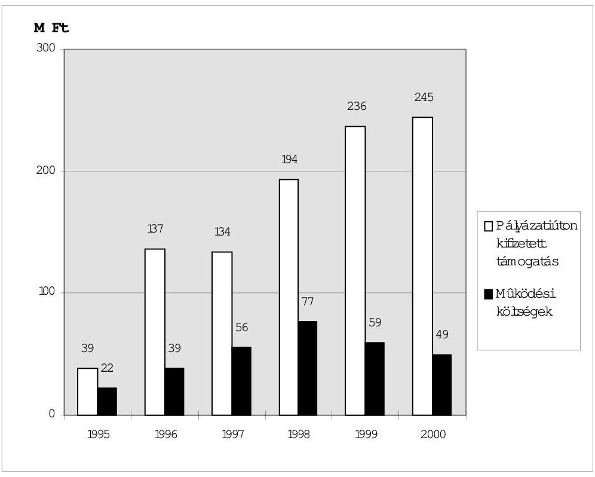
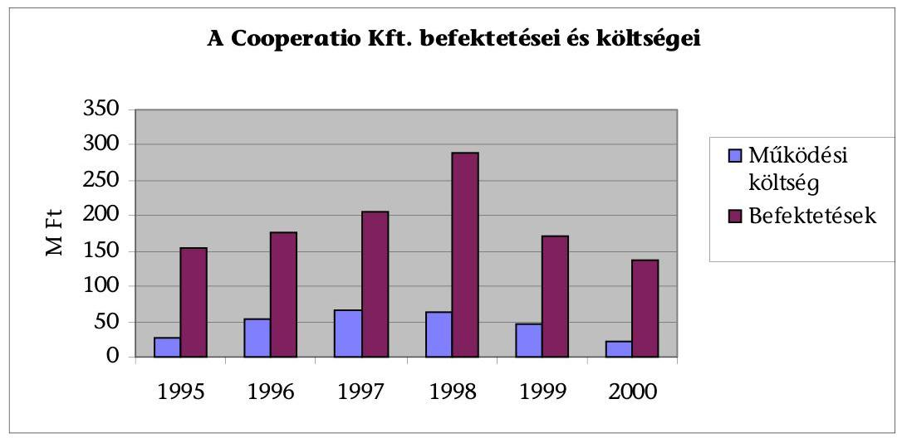
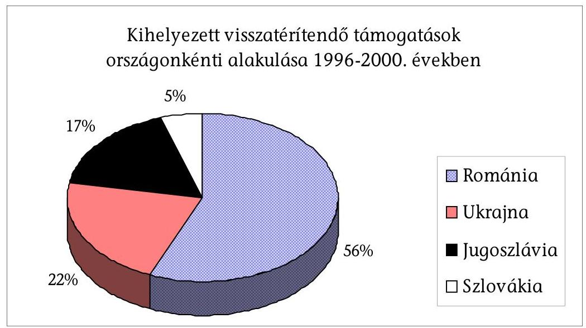
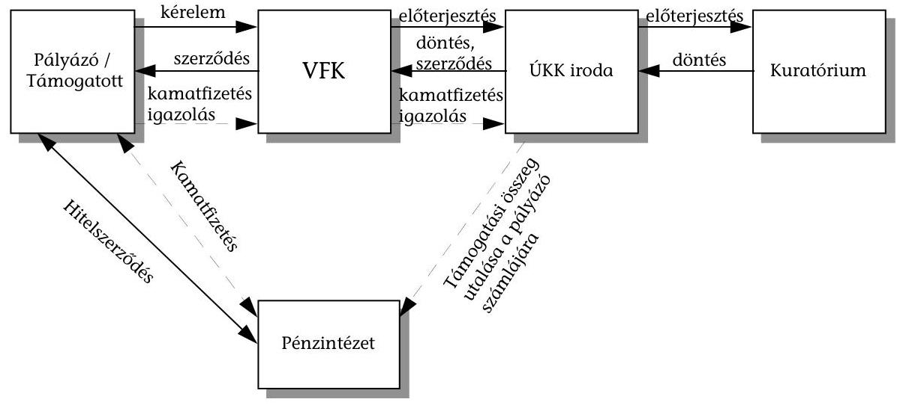

# JELENTÉS 

## az Új Kézfogás Közalapítvány gazdálkodásának ellenőrzéséről

2001. november

---

# Az ellenőrzés végrehajtásáért felelős: 

Dr. Lóránt Zoltán számvevő igazgató

## Az ellenőrzést vezette: Balázs Andrásné

számvevő főtanácsos

## Az ellenőrzésben részt vettek:

Pásztor Katalin számvevő tanácsos
Sas Imréné számvevő tanácsos
Solymár Ágnes számvevő
Szappanos Júlia számvevő
Az ÁSZ által eddig ellenőrzött közalapítványok, alapítványok listája:

1. Nemzeti Gyermek és Ifjúsági (Köz)alapítvány (1992, 1996, 2000)
2. Magyar Vállalkozásfejlesztési Alapítvány (1994, 1996)
3. Az alapítványoknak juttatott állami pénzek felhasználásának ellenőrzése 388 alapítványnál (1996)
4. Grassalkovich Kastély Közalapítvány (1996)
5. Magyarországi Nemzeti és Etnikai Kisebbségekért Közalapítvány (1996, 1997)
6. A Településekért, Régiókért Közalapítvány (1996)
7. 1956-os Forradalom Történetének Dokumentációs és Kutatóintézete Közalapítvány (1996)
8. Hadigondozottak Közalapítvány (1996)
9. Hungária Televízió Közalapítvány (1996)
10. Borsod-Abaúj-Zemplén Megyei Fejlesztési Közalapítvány (1996)
11. Szabolcs-Szatmár-Bereg Megyei Fejlesztési Közalapítvány (1996)
12. Illyés Közalapítvány (1996)
13. Pro Professione Alapítvány (1996)
14. Magyar Alkotóművészeti Közalapítvány (1996)
15. Magyar Rádió Közalapítvány (1997, 1998)
16. Magyar Televízió Közalapítvány (1997, 1998)
17. Gandhi Közalapítvány (1997)
18. Magyarországi Cigányokért Közalapítvány (1997)
19. Nemzetközi Pető András Közalapítvány (1998)
20. Magyar Nemzeti Üdülési Alapítvány (1995, 1999, 2000)
21. Sportcélú közalapítványok (NISZKA KA, NISKA KA, Mező Ferenc KA, UNIÓ KA, 1999)
22. A Fogyatékos Gyermekek, Tanulók Felzárkóztatásáért Országos Közalapítvány (1999)
23. Közoktatási Modernizációs Közalapítvány (2000)
24. Országos Foglalkoztatási Közalapítvány (2001)

---

# TARTALOMJEGYZÉK 

I. ÖSSZEGZŐ MEGÁLLAPÍTÁSOK, KÖVETKEZTETÉSEK, JAVASLATOK ..... 5
II. RÉSZLETES MEGÁLLAPÍTÁSOK ..... 13

1. A közalapítvány jogi, pénzügyi, szervezeti és működési feltételei ..... 13
1.1. A közalapítvány létrehozása ..... 13
1.2. Az induló vagyon és a törzsvagyon ..... 15
1.3. A kuratórium, az FB és a munkaszervezet ..... 16
2. A közalapítvány működésének, tevékenységének szabályozottsága ..... 17
2.1. A vezető tisztségviselők összeférhetetlenségére vonatkozó előírások betartása ..... 17
2.2. A kuratórium múködése ..... 17
2.3. Belső szabályzatok ..... 18
2.3.1. Szervezeti és múködési szabályzat ..... 18
2.3.2. Gazdálkodási szabályzatok ..... 21
2.4. A közalapítványi iroda múködése ..... 22
2.5. A felügyelő bizottság múködése ..... 23
3. A könyvvezetés és gazdálkodás szabályossága ..... 24
3.1. A számviteli nyilvántartások ..... 24
3.2. Az éves beszámolók ..... 25
3.3. Az ÚKK éves gazdálkodási terve és költségvetése ..... 27
3.4. A közalapítvány bevételei és kiadásai, ráfordításai ..... 28
3.4.1. A múködési költségek tervezése és pénzügyi teljesítése ..... 29
3.4.2. A múködési költségek alakulása jogcímenként ..... 30
3.4.3. Az ÚKK tisztségviselőinek tiszteletdíja és költségtérítése ..... 33
3.5. A pénzforgalmi számla vezetése, a közalapítvány likviditása ..... 34
4. A közalapítvány vagyonának alakulása ..... 35
4.1. A vagyon összetétele ..... 35
4.2. A Cooperatio Kft. létrehozása, tőkeszerkezete, eszközei és forrásai ..... 35
4.3. Az ÚKK tulajdonosi jogainak gyakorlása a Cooperatio Kft.-ben ..... 38
4.4. A Cooperatio Kft. vagyongazdálkodásának szabályozása ..... 39
4.5. A Cooperatio Kft. befektetései ..... 40
4.6. A Cooperatio Kft. bevételei és ráfordításai ..... 45
5. Az ÚKK-nak adott központi költségvetési támogatás felhasználása ..... 48
5.1. Az ÚKK támogatási rendszerének koncepciója ..... 50
5.1.1. Az 1995-1998. évi támogatások ..... 50

---

5.1.2. Az 1999-2000. évi támogatások ..... 54
5.2. A támogatások pályáztatási rendszere ..... 55
5.2.1. A pályázati kiírások, a pályáztatás lebonyolítása, a támogatások összege ..... 55
5.2.2. A támogatások felhasználására kötött megállapodások ..... 58
5.2.3. A pályázati feladatok teljesítésének ellenőrzése ..... 61
5.3. Az ÚKK pályázati úton nyújtott támogatásai ..... 63
5.3.1. Vissza nem térítendő támogatások ..... 63
5.3.2. Visszatérítendő támogatások ..... 65
5.3.3. Kamattámogatások ..... 68

---

# Állami Számvevőszék 

V-11-32/2001.
Témaszám: 456

## JELENTÉS

## az Új Kézfogás Közalapítvány gazdálkodásának ellenőrzéséről

Az Új Kézfogás Közalapítványt (ÚKK) a Kormány az Illyés Alapítvánnyal együtt alapította, az Illyés Alapítvány által alapított és megszüntetett „Kézfogás" Egzisztenciateremtő és Gazdaságélénkítő Alapítvány vagyonából. Az ÚKK által ellátott közfeladat az Alkotmány 6. § (3) bekezdésén alapul, mely szerint a Magyar Köztársaság felelősséget érez a határain kívül élő magyarok sorsáért és előmozdítja a Magyarországgal való kapcsolatuk ápolását. Az ÚKK-t a Fővárosi Bíróság 1995. március 27-én 5394. sorszám alatt vette nyilvántartásba, majd a 12.Pk.60. 331/1995/15. számú, 1999. május 12-én kelt végzésével kiemelkedően közhasznú szervezetté minősítette.

A Kormány az alapítói jogok gyakorlására - az alapító okiratban, illetve az alapításról szóló kormányhatározatban meghatározott terjedelemben - a külügyminisztert hatalmazta fel. Az ÚKK alapító okirata szerint az alapító képviseletét a Külügyminisztérium politikai államtitkára látja el és gyakorolja az alapító okirat módosítása kivételével - az alapítót megillető jogosultságokat.

Az ÚKK-tól az alapítók azt várták, hogy a határmenti magyar régiók és Magyarország közötti gazdasági együttműködés segítésével mozdítsa elő a magyar közösségek és a szórvány-magyarság gazdasági helyzetének javítását, sajátos gondjai megoldását, a következő tevékenységek támogatásával:

- a kis- és középvállalkozások közötti üzleti kapcsolatok kibontakoztatása, a vállalkozások gazdálkodási feltételeinek javítása;
- a gazdasági együttmúködést vizsgáló elméleti kutatások, szakmai- és menedzserképzés szervezése;
- kiállítások, üzletember találkozók szervezése;
- az együttmúködés információs bázisának létrehozása;
- a határon túli regionális vállalkozásfejlesztési központok kialakítása és múködtetése;
- tőkebefektetőként külföldi - magyar vegyes vállalkozásokban való részvétel (1999. évig);

---

- a határon túli kis- és középvállalkozások szakmai és anyagi gyarapodása érdekében különböző szolgáltatások nyújtása (1999. évtől);
- a határon túli önkormányzatoknál és más jogi személyeknél az elháríthatatlan külső ok (vis maior) miatt keletkezett károk enyhítése.

Az ÚKK induló vagyona 1995-ben 340,5 M Ft, saját tőkéje a 2000. év végén 1.008,3 M Ft volt. Eddigi múködése során összesen mintegy 1,7 Mrd Ft támogatást kapott a központi költségvetésből. Vagyonkezelési és befektetési (vállalkozási) feladatait a 100 \%-os tulajdonában lévő Cooperatio Vállalkozás és Gazdaságfejlesztő Kft. látta el, amelyet 1993-ban 5 M Ft jegyzett tőkével a Kézfogás Alapítvány alapított. Az ÚKK a kft. jegyzett tőkéjét 383 M Ft-ra növelte, de a veszteséges gazdálkodás és az elszámolt értékvesztés következtében a kft. saját tőkéje 2000. év végén 187,5 M Ft volt.

Az ÚKK és a Cooperatio Kft. éves beszámolóit az ellenőrzött időszakban könyvvizsgálók hitelesítették.

Az Állami Számvevőszék az ÁSZ tv. 2. §-ának (5) bekezdése alapján ellenőrzi az alapítványoknak a központi költségvetésből juttatott támogatás felhasználását, a Ptk. 74/G. §-ának (8) bekezdése alapján a közalapítványok gazdálkodásának törvényességét és célszerűségét, a Kht. 21. §-a alapján - többek között - a közhasznú szervezetként nyilvántartásba vett közalapítványoknál a költségvetési támogatás felhasználását. Az ÁSZ tv. 21. § (3) bekezdése alapján, ha egyes vizsgálati megállapítások kiegészítése válik szükségessé, és ehhez más szervnél is ellenőrzést kell végezni, az ÁSZ ellenőre jogosult az összefüggő tényeket ott vizsgálni. E törvényi felhatalmazás alapján kapcsolódó ellenőrzés keretében ellenőriztük a Cooperatio Kft.-nél az ÚKK által átadott vagyon hasznosítását.

# Az ellenőrzéssel arra kerestünk választ, hogy az Új Kézfogás Közalapítvány kuratóriuma 

- szabályosan gazdálkodott-e a rendelkezésére bocsátott induló vagyonnal és a központi költségvetési támogatással;
- közcélú támogatási és befektetési tevékenysége szabályos volt-e, összhangban állt-e az alapító okiratában meghatározott célokkal;
- törvényesen és eredményesen gyakorolta-e az egyszemélyes tulajdonában lévő Cooperatio Kft.-vel kapcsolatos tulajdonosi jogait, intézkedéseinek milyen hatása volt a kft. vagyongazdálkodására és saját tőkéjére, ezen keresztül az ÚKK vagyonára, a kft. eredményesen múködött-e közre a közalapítványi célok ellátásában és finanszírozásában.

Az ÚKK gazdálkodásának ellenőrzése - reprezentatív mintavétel alapján - az 1995. március 27-ei nyilvántartásba vételétől a 2001. június 30áig tartó időszakra terjedt ki.

---

# I. ÖSSZEGZŐ MEGÁLLAPÍTÁSOK, KÖVETKEZTETÉSEK, JAVASLATOK 

#### Abstract

Az ÚKK kuratóriuma múködését és gazdálkodását az alapító okiratban meghatározott közcélok teljesítése érdekében szervezte. A közalapítvány belső szabályzatai nem voltak összhangban a jogszabályok változásaival, a számvitelben, a tervezésben és a múködési költségekkel kapcsolatos gazdálkodásban hiányosságokat tártunk fel.

Az induló vagyont az alapítók a Kézfogás Alapítvány 1994. december 31-ei vagyoni állapotával azonos összegben, 340,5 M Ft-ban, az induló törzsvagyont 40 M Ft összegben határozták meg. A törzsvagyon az alapító okiratban minimálisan előírt szintnek megfelelően - illetve egyes években azt meghaladóan - növekedett, de ennek összegét a kuratórium határozatban nem rögzítette. A törzsvagyon tárgyévi összegéről a kuratórium által elfogadott éves beszámolók és ezek mellékletei adtak - utólag - információt. A hatályos alapító okiratban - a többszöri módosítás ellenére - a törzsvagyon nem a tényleges összegben szerepel, a törzsvagyonnak az alapítók által igényelt szintig történt növelésének teljesítése miatt a törzsvagyon feltöltésére vonatkozó szabályozás elavult.

A kuratórium az alapító okirat által előírtnál gyakrabban ülésezett, határozatait határozatképes üléseken, az előírt szótöbbséggel hozta. A jegyzőkönyvek és a döntéstár tartalmazták az ülések időpontját és határozatképességét, de az 1998-2000. évi nyilvántartásokban adminisztrációs hibák miatt pontatlanságok voltak.

Az ÚKK-nál 1995-től - az értékelési szabályzat kivételével - elkészültek és alkalmazták az Szt. és az alapító okirat által kötelezően előírt szabályzatokat, de ezeket kuratóriumi határozat nem hagyta jóvá. 2000-től a kuratórium jóváhagyta és hatályba léptette - az értékelési szabályzat kivételével mindazokat a szabályzatokat, amelyeket az Szt., a Kht. és az alapító okirat szerint kötelező volt elkészíteni. Az értékelési eljárásokat nem külön belső szabályzatban, hanem a számviteli politikában határozták meg. A számviteli politika, a számlarend, a leltározási szabályzat, a pénzkezelési szabályzat és a befektetési szabályzat a helyszíni ellenőrzés befejezésekor, 2001. június 30-án nem volt összhangban az Áht. és az Szt. 2001. január 1-jétől hatályos előírásaival, illetve az ÚKK pénzkezelési módszerével (bankkártya használata).

Ellentétes a Ptk.-val és az alapító okirattal, hogy a kuratórium az SZMSZ-ben és más belső szabályzatokban, illetve a kuratóriumi elnök egyedi meghatalmazással a képviseleti-, a bankszámla feletti rendelkezési- és az utalványozási jog gyakorlásával az alapító okiratban képviseleti joggal felruházott kuratóriumi elnökön és kuratóriumi titkáron túl más kurátorokat, illetve a közalapítványi iroda igazgatóját és alkalmazottait is felhatalmazott. A kuratóriumi határozatok végrehajtására vonatkozó korlátozó feltételt csak az aláírási rend és a képviselt könyv egy-egy pontja írt elő. A jogszerútlenül

---

kialakított szabályozás, illetve az egyedi felhatalmazás lehetővé tette, hogy az alkalmazott(ak) önállóan is rendelkezzen(ek) a közalapítvány vagyonával, jóllehet a vagyon kezelésére a kuratórium jogosult. A képviseleti jog átruházásával kapcsolatos megállapításokat a kuratórium elnöke vitatja, az Állami Számvevőszék azonban az álláspontját fenntartja.

Az ÚKK számviteli rendszere csak részben volt alkalmas a közalapítványi célú tevékenység közvetlen költségeinek számbavételére. A számviteli politikában nem határozták meg a múködési költségek (kiadások) körébe tartozó költségeket. Az 1995-1998. évek között - tévesen - közalapítványi célú költségeket is kimutattak a múködési költségek között, illetve 1999-től nem különítették el a közalapítványi célú tevékenység közvetlen költségeit a kuratórium és a munkaszervezet költségeitől és az egyéb közvetett költségektől. 2000. január 1-jétől - szabálytalanul - nem kötelezettségként, hanem bevételként, majd a továbbutaláskor ráfordításként számolták el azokat a támogatásokat, amelyeket az ÚKK az alapító okiratában meghatározott feladatai fedezetére kapott, de ezeket a feladatokat nem saját maga látta el, hanem pályázati úton végeztette. A leltározás nem felelt meg az Szt. vonatkozó előírásának, mert a tárgyi eszközök mennyiségi felvétellel felvett leltári adatainak kiértékelését, illetve a főkönyvi és analitikus nyilvántartás egyeztetését nem végezték el.

Valamennyi éves beszámoló helytelenül - az alapító okiratban megjelölt 340,5 M Ft helyett - 150 M Ft összegben tartalmazta az induló tőke összegét. Az eltérés a saját tőke összegét és a mérleg-főösszeget nem érintette, azok a valós értéket mutatták.

Az 1995-1998. évek között a kuratórium nem az alapító okirat előírásainak megfelelő gazdálkodási tervet készített, mivel nem tervezte meg a tárgyévben felhasználható forrásokat és a cél szerinti kifizetések összegét. A feladattervek csak a tervezett kifizetések arányát tartalmazták. 2000-től az új személyi összetételű kuratórium a tervekben számításba vette az összes felhasználható pénzügyi forrást és a várható kiadásokat, ezen belül a múködési költségeket, a kötelezettségvállalásokat, a programokra fordítható támogatási összeget. A tervek hiányossága volt, hogy a kiadások között a programokra elkülönített összegeken belül nem határozta meg a tárgyévben teljesítendő alapítványi célú kiadásokat, illetve a következő évre áthúzódó kötelezettségeket, emiatt a kuratórium a tervekből nem kapott információt a közalapítvány tárgyévben felmerülő, ténylegesen kifizetésre kerülő költségeiről és az átmenetileg szabad befektethető - pénzeszközeiről.

A kuratórium a múködési költségekre az alapító okiratban előírt felső korlátot - mely 1997-től a mindenkori éves költségvetési támogatás 10\%-a, 1999-től 7\%-a volt - minden évben túllépte. A múködési költségek elemzését és ez alapján az ésszerű csökkentésükhöz szükséges intézkedések megtételét gátolta, hogy a számvitelben 1998-ig csak részben, 1999-től egyáltalán nem különítették el a közalapítványi célú tevékenység közvetlen költségeitől. Az új személyi összetételű kuratórium intézkedéseinek hatására 1999-től csökkentek a támogatási rendszerek, valamint a kuratórium és a közalapítványi iroda múködési költségei.

---

Az 1995-2000. évek között az átmenetileg szabad pénzeszközök befektetéséből 341 M Ft hozam, a visszatérítési kötelezettséggel nyújtott támogatások törlesztésének árfolyamnyereségéből 14 M Ft folyt be. Az ellenőrzött időszakban az ÚKK pénzügyi helyzete stabil, likviditása jó volt.

# A kuratórium támogatási koncepciója és gyakorlata összhangban állt az alapító okiratában meghatározott célokkal, elősegítette más szervezetekkel együtt - a határmenti magyar régiók és Magyarország közötti gazdasági együttmüködést. Az ÚKK pénzeszközei önmagukban természetesen nem voltak és a jövőben sem lesznek elégségesek a határon túli magyar közösségek, szervezetek, a határmenti régiók gazdasági fellendülésének elindításához, ezért a meglévő források összehangolt felhasználása érdekében a kuratórium a 2000. év óta kezdeményezte az e tevékenységeket folytató magyarországi szervezetek közötti egyeztetést. 

Az 1995-2000. évek között a közalapítvány összesen 2.099 M Ft bevételhez jutott, melyből 1.744 M Ft ( $83 \%$ ) volt a központi költségvetési támogatás.

Az ugyanebben az időszakban teljesített 1.853 M Ft kiadásból 1.405 M Ft-ot ( $75,8 \%$-ot) az alapító okiratban meghatározott célokra használt fel a kuratórium, ebből a vissza nem térítendő támogatás 688 M Ft , a visszatérítendő támogatás 296 M Ft , a Cooperatio Kft.-n keresztül a határon túli vegyes vállalatokban megszerzett részesedés 332 M Ft , a támogatási céllal beszerzett tárgyi eszközök értéke 89 M Ft volt.

A nyilvánosság kontrollja az ÚKK eddigi múködése során - részben az alapítói jogokat gyakorló, részben a korábbi személyi összetételű kuratórium mulasztása miatt - korlátozottan érvényesült. A Ptk. és a vonatkozó kormányhatározat előírásaival ellentétben nem jelent meg hivatalos lapban az 1999 márciusában módosított alapító okirat. A Külügyminisztérium a Kormánytól kapott felhatalmazás alapján a 2001. áprilisában módosított alapító okirat hatályos szövegét egységes szerkezetben a Magyar Közlöny 2001. október 29-én megjelent 120. számában tette közzé. Az 1995-1998. évek között a kuratórium nem hirdette meg nyilvánosan a pályázatokat, azokról az érintettek csak meghatározott fórumokon, esetlegesen tudtak tájékozódni. Az új személyi összetételű kuratórium 1999-től a pályázati kiírásokat a helyi sajtóban, 2000. évtől Internetes honlapján is nyilvánosságra hozta.

Az ÚKK kuratóriuma a megalakulást követően országonként szociológiai jellegű helyzetfelmérést készített, hogy jobban megismerje a kis- és középvállalkozások támogatási igényeit, majd kidolgozta támogatási koncepcióját, kialakította és folyamatosan bővítette a döntéseit segítő információs bázist. A kezdettől múködő vissza nem térítendő támogatások mellett 1996-ban bevezette a visszatérítendő támogatási formát, majd 1999-től a vállalkozók által felvett hitelek kamatfizetéséhez is adott támogatásokat.

A kuratórium előre nem határozta meg, hogy az egyes környező országok milyen arányban részesedjenek a támogatásból, így a támogatások országonkénti megoszlása véletlenszerűen alakult ki. A pályázók felkészítésében, a kuratórium döntéseinek előkészítésében, majd a támogatások felhasználásának ellenőrzésében az ÚKK munkájába 1995-től folyamatosan és

---

eredményesen bekapcsolódtak a határon túli - önszerveződéssel létrejött vállalkozásfejlesztési központok.

A támogatások odaítélésénél a kuratórium mérlegelte azok környezeti hatását, célját, olyan társas és egyéni kezdő vállalkozásoknak adott támogatást, amelyek a saját egzisztenciájuk megszilárdításán túl újabb munkahelyet is teremtettek, ezzel is elősegítve a magyar nemzetiségű lakosság helyben maradását. A gazdasági racionalitás mellett - a közalapítványi célokkal ellentétesen - szociális szempontokat is figyelembe vett.

A határon túlra adott támogatások jellemzően különböző termelő eszközök és ingatlanok beszerzését, felújítását szolgálták, a magyarországi pályázók konferenciákhoz, kiállításokhoz, kiadványokhoz és oktatás szervezéséhez kaptak támogatást.

A visszatérítendő támogatások legnagyobb kockázatát a megfelelő biztosítéki rendszer kialakítása jelentette, mivel a kedvezményezettek országonként eltérő jogi és pénzügyi környezetben gazdálkodtak. A megítélt támogatások feltételeinek folyamatos szigorítása ellenére e támogatási formában tudta a kuratórium legkevésbé érvényesíteni a szerződésekben rögzített célokat. A visszatérítendő támogatásban részesült szervezetek $41 \%$-a szerződés szerint teljesítette törlesztési kötelezettségét, $45 \%$-a az esedékessé váló törlesztést a helyszíni ellenőrzésünk 2001. június 30 -ai befejezéséig nem kezdte meg, $14 \%$-a az előírt összegű törlesztésnél alacsonyabb összegben törlesztett. A kuratórium azokat a gazdálkodókat, akik törlesztési kötelezettségüknek nem tettek eleget, többször írásban felszólította a teljesítésre. A szerződéstől eltérő teljesítés miatt még nem alkalmaztak szankciókat.

A kuratórium az eseti helyszíni ellenőrzések során csak a támogatásból megvásárolt eszközök meglétét vizsgáltatta, a támogatások hasznosulását nem.

1999-től az új személyi összetételű kuratórium régiókra, illetve különböző vállalkozói rétegekre kidolgozott programok alapján piaci, profitelvű elvárásokat közvetített, a környező országok - kiemelten a magyar lakta régiók - és Magyarország gazdasági kapcsolatainak erősítését tűzte ki célul. A támogatásokat a tudás- és a technológiai transzfer támogatására, a mikro- és középvállalkozások múködési feltételeinek javítására, versenyképességük növelésére, a korszerű ismeretekkel rendelkező magyar nemzetiségű vállalkozói középosztály fejlődésének segítésére, a magyar közösségek gazdasági megerősödésére összpontosították.

A támogatáshoz kapcsolódó biztosítékrendszer érvényesíthetőségének bizonytalansága, valamint a támogatások kezelésének magas fajlagos költsége miatt az új személyi összetételű kuratórium 1999-től kezdődően a támogatásain belül csökkentette a visszatérítendő támogatások arányát.

Új támogatási formaként a Romániában és Szlovákiában múködő hitelképes kis- és középvállalkozásokat a kamatok átvállalásával támogatta a kuratórium. A támogatást utólag, a kifizetett kamatok banki igazolása alapján folyósítják. A támogatási formák közül ez bizonyult a legbiztonságosabbnak.

---

Két pályázóval megkötött szerződést kifogásoltunk, mivel ezeket kuratóriumi felhatalmazás nélkül írta alá a közalapítványi iroda igazgatója és munkatársa. A kuratórium meghatározott feltételek teljesítésének előírása mellett jóváhagyta a kérelmeket, rögzítette a támogatás kiszámításának algoritmusát, de nem határozta meg a támogatás konkrét összegét, hanem megbízta a közalapítványi irodát a szerződés elkészítésével. A szerződések jogszerű megkötésével kapcsolatos megállapításokat a kuratórium elnöke vitatja, az Állami Számvevőszék azonban az álláspontját fenntartja.

Kísérleti jelleggel, Romániában vezette be a kuratórium az életképes, de tőkehiányos kis- és középvállalkozások visszatérítendő támogatási formájaként a mikro-hitel konstrukciót. A kuratórium a hitelt gépek, felszerelések, eszközök beszerzésére, illetve más beruházásokra adta. A mikro-hitel kamatmentes volt, csupán egyszeri 1,5\%-os folyósítási jutalék terhelte. A mikro-hitelekkel kapcsolatos teendőket és a hitelnyújtáshoz szükséges pénzügyi alapot az ÚKK egy Romániában bejegyzett alapítványon keresztül szervezte meg. A nem fizetők aránya a kuratórium által korábban vélelmezett 10\%-on belül maradt.

# A befektetési döntéseknél a kuratórium célja a határon túli magyar 

nemzetiségú vállalkozók egzisztenciateremtésének a támogatása volt. Prioritást élveztek a termelő és szolgáltató szférában dolgozó, a régió gazdasági kapcsolatait erősítő kis- és középvállalkozások. A megszerzendő tulajdonrész arányát, nagyságát a kuratórium a pályázatok egyedi elbírálásakor határozta meg, vagyonrészt elsősorban már múködő, bejegyzett vállalkozásokban, esetenként többségi tulajdonosként is szerzett. A befektetések 2/3-a a termelő szférában, 1/3-a a kereskedelmi, szolgáltató szférában valósult meg. A befektetésekre vonatkozó döntéseket a kuratórium hozta, a Cooperatio Kft. döntés-előkészítő és végrehajtó funkciókat látott el. A kft. az 1995-2000. években kuratóriumi döntések alapján összesen 332 M Ft bekerülési értékben szerzett meg befektetéseket, melyek mintegy 70\%-a Romániába, 16\%-a Szlovákiába, 7\%-a Ukrajnába, 3\%-a Jugoszláviába és 4\%-a Magyarországra irányultak.

A befektetéseket igénylő pályázók többsége kezdő vagy kényszervállalkozó volt, akiknek nehézséget jelentett az adminisztratív, pénzügyi-számviteli fegyelem betartása, rosszul, vagy egyáltalán nem mérték fel a versenytársak helyzetét. Eredményes múködésüket megnehezítette a jogszabályok és a gazdasági környezet gyakori, sokszor kiszámíthatatlan változása. Az üzleti tervek a legoptimálisabb megtérülés feltételezésével készültek, a költségek változásának tendenciájával, az inflációval, külső versenytársak megjelenésével nem számoltak. Egyes befektetéseknél a kuratórium - szociális megfontolásokból mellőzte a gazdasági racionalitást.

A kuratórium úgy tervezte, hogy a vállalkozók tőkehiányának megoldására kihelyezett alapítványi vagyon megtérül és újból befektethető lesz, ezzel szemben a befektetett vagyon több, mint felét értékvesztés miatt le kellett írni. A vagyonvesztést az okozta, hogy a kuratórium befektetési koncepciója kialakítását és a befektetésekről szóló egyedi döntéseket nem alapozták meg a környező országok, a befektetésekkel érintett régiók gazdasági kilátásainak prognózisai. A Cooperatio Kft. döntés-előkészítő munkájának hiányosságai is hozzájárultak ahhoz, hogy a kuratórium nem számolt pl. az elhúzódó, magas

---

inflációval, a befektetéseihez kapott bankgaranciák beválthatatlanságával, a magyarországitól különböző gazdasági-pénzügyi jogi szabályozással, a joghézagokkal, összességében tehát a befektetések megtérülésének magas kockázatával. Azok a vegyes vállalatok, amelyekben az ÚKK forrásaiból származó befektetések révén a Cooperatio Kft. üzletrészt szerzett, az 1995-2000. évek között összességében veszteségesek voltak, így a befektetésekből nem származott osztalék, és az 1995-2000. években összesen 208 M Ft értékvesztést (a bekerülési érték 57\%-át) kellett elszámolni.

A Cooperatio Kft. az üzletrészek értékesítése céljából 1998 júniusától kezdődően megkezdte a portfoliójába tartozó vegyes vállalatokkal a tárgyalásokat, ezek azonban konkrét értékesítéseket nem eredményeztek. Az új személyi összetételű kuratórium szisztematikusan folytatta a külföldi vállalkozásokban meglévő üzletrészek értékesítését. A 2000. év végéig lebonyolított értékesítéseknél 5 éves részletfizetési kedvezményt biztosított, az eladási árak nem érték el a részesedések nyilvántartási értékét.

# A kuratórium törvényesen, a gazdasági társaságokról szóló törvény 

rendelkezéseinek, az ÚKK alapító okiratának és a kft. létesítő okiratának megfelelően gyakorolta a Cooperatio Kft.-vel kapcsolatos tulajdonosi jogait, a kft.-t érintő gazdasági (befektetési) döntései azonban célszerütlenek és megalapozatlanok voltak. A kuratórium intézkedései következtében 2000-től a kft. tevékenységi köre gyakorlatilag kiürült.

A kft. az ellenőrzött 1995-2000. években mindvégig veszteségesen múködött. Befektetései - melyeket az ÚKK közalapítványi céljai teljesítése érdekében, a kuratórium jóváhagyásával szerzett meg - 1995-1998. között 94 M Ft-ról 250 M Ft-ra növekedtek, az összes eszközvagyonon belüli részarányuk 26,6\%-ról $54,3 \%$-ra emelkedett, 1999-ben az elszámolt értékvesztés miatt a befektetések értéke 173 M Ft-ra (31\%-kal) csökkent. A befektetési döntéseket a kft. készítette elő, figyelembe véve a kuratórium befektetési irányelveit. A befektetést kezdeményező társaságokkal 3-5 éves távra szóló üzleti tervet készíttetett, melyeket helyi szakértők is felülvizsgáltak, elemeztek. A támogatás odaítélését megelőzően sem a kft, sem a helyi szakértők nem jelezték a kuratóriumnak, hogy az üzleti tervek megalapozatlanok voltak. A kft. ügyvezetése évenként utólag - reálisan elemezte a vegyes vállalatokkal kapcsolatos befektetői és vagyonkezelői tapasztalatokat, a felmerült problémákat, és ezekről beszámolt a kuratóriumnak. A kuratórium által folyamatosan szigorított feltételrendszer sem járt a befektetések hozamtermelő képességének a fokozásával.

A kuratórium, illetve a kft. ügyvezetése átfogóan nem értékelte a kft. gazdálkodási tevékenységét a költségek csökkentése, a veszteségforrások felszámolása érdekében. A közalapítványi célok teljesítésével összefüggő vagyonkezelői és befektetői feladatainak ellátására, valamint a kft. múködésére a kuratórium alkalmanként a kft. tőketartaléka javára adott át véglegesen - pénzeszközt, ez volt a forrása a kft. saját bevételeit meghaladó költségeinek.

A kft. költségein belül legnagyobb részarányt - 35\%-ot ( 97 M Ft-ot) - a személyi jellegű ráfordítások jelentették, melyek az 1995-1998. évek között az inflációt

---

meghaladóan, évente átlagosan 40\%-kal emelkedtek, majd 1999. évben az előző évhez képest 26\%-kal, 2000. évben pedig 90\%-kal csökkentek. A személyi jellegű ráfordítások amiatt is csökkentek, hogy a vagyonkezelői feladatokat az ÚKK közalapítványi irodájának munkatársai, illetve külső szakértők vették át. Ez az ÚKK-nál költségnövelő hatással járt, de a többi takarékossági intézkedés hatására a közalapítványnál is csökkentek a költségek. A kft. még megmaradt feladatai is elláthatók a közalapítvány szervezeti keretei között, így a vegyes vállalati tulajdonrészek értékesítését követően a kft. további fenntartása szükségtelen.

# Az ellenőrzés megállapításai alapján javasoljuk, hogy 

## a Külügyminisztérium politikai államtitkára, mint az Új Kézfogás

Közalapítvánnyal kapcsolatos egyes alapítói jogok gyakorlója

Tegyen javaslatot a Kormánynak, hogy az ÚKK alapító okiratában a tényleges állapotnak megfelelően helyesbítse a törzsvagyon összegét, továbbá törölje a törzsvagyon feltöltésére vonatkozó - a kuratórium által már teljesített előírásokat. Ha az alapító indokoltnak tartja a törzsvagyon további növelését, úgy a közalapítvány mindenkori éves központi költségvetési támogatási előirányzatának arányában célszerű megállapítani a kuratórium ezirányú kötelezettségét, a törzsvagyon kívánt összegének eléréséig.

## az Új Kézfogás Közalapítvány kuratóriuma

1. Gondoskodjék - a Kht. 7. § (2) bekezdése, az alapító okirat és az SZMSZ előírásait betartva - olyan nyilvántartás vezetéséről, amelyből a kuratórium határozatának azonosítási száma, tartalma, időpontja és hatálya, illetve a határozatot támogatók és ellenzők számaránya és személye megállapítható.
2. Módosítsa és korszerűsítse a belső szabályzatokat a következők figyelembevételével:
2.1. hozza összhangba a közalapítvány képviseletének jogosultságát a Ptk. előírásaival és az alapító okirattal vagy kezdeményezze az alapítónál a képviseletre feljogosított személyek körének bővítését;
2.2. zárja ki a bankszámla feletti rendelkezési és az utalványozási jog szabályozásánál az alkalmazottak önálló - a kuratóriumtól és/vagy a képviseleti joggal felruházott kurátoroktól független - rendelkezési jogát;
2.3. maradéktalanul érvényesítse a számviteli politikában, a számlarendben és a befektetési szabályzatban az Szt. és az Áht. hatályos előírásait;
2.4. dolgozza ki a leltározási szabályzatban előírt feladatokat a közalapítvány sajátosságainak megfelelően;
2.5. készítse el az értékelési szabályzatot;

---

2.6. egészítse ki a pénzkezelési szabályzatot a bankkártya használatára vonatkozó előírásokkal.
3. Intézkedjék, hogy a könyvvezetésben
3.1. különítsék el a közalapítványi tevékenység közvetlen költségeit (kiadásait), illetve a közalapítvány kuratóriumának és munkaszervezetének költségeit (kiadásait) és az egyéb közvetett költségeket (kiadásokat), a költségek megbontását a számviteli politikában részletesen határozzák meg;
3.2. azokat a kapott támogatásokat, amelyeket pályázati úton terveznek továbbadni, a pénzügyi teljesítésig a kötelezettségek között mutassák ki;
3.3. helyesbítsék az induló tőke összegét az alapító okiratnak megfelelően, az induló tőke és a tőkeváltozás között.
4. Szabályozza a pénzügyi tervezési folyamatot az alapító okiratban előírt éves gazdálkodási terv és költségvetés készítési kötelezettségnek megfelelően úgy, hogy a tervek mind a kuratórium információigényének, mind a racionális pénzgazdálkodásnak megfelelő részletezettséggel tartalmazzák a bevételeket és a kiadásokat, ezen belül a tárgyévi közalapítványi célú kiadásokat, a kezelő szervezet kiadásait és a következő évre áthúzódó kötelezettségeket.
5. Biztosítsa, hogy az éves múködési költségek az alapító okiratban meghatározott korlát alatt maradjanak.
6. Intézkedjék, hogy a leltározás során a tárgyi eszközök mennyiségi felvétellel felvett leltári adatainak kiértékelését, illetve a főkönyvi és analitikus nyilvántartás egyeztetését a munkaszervezet elvégezze.
7. Tekintse át a Cooperatio Kft. által még ellátott feladatok körét, indokoltságát, illetve a közalapítványi irodához vagy más szervezeti keretek közé való átcsoportosítás lehetőségét, ésszerűségét, és a részesedések értékesítését követően kezdeményezze a kft. megszüntetését.
8. Gyorsítsa fel a Cooperatio Kft. külföldi vegyes vállalatokban meglévő részesedéseinek értékesítését.
9. Vizsgálja felül a kuratórium jóváhagyása nélkül megkötött két kamattámogatási szerződést és a szerződést aláíró személyek felelősségét.
10. Érvényesítse a támogatási szerződések feltételeinek megszegésekor a szerződésekben rögzített szankciókat.

---

# II. RÉSZLETES MEGÁLLAPÍTÁSOK 

## 1. A KÖZALAPÍTVÁNY JOGI, PÉNZÜGYI, SZERVEZETI ÉS MŰKÖDÉSI FELTÉTELEI

### 1.1. A közalapítvány létrehozása

Az ÚKK által ellátott állami közfeladat az Alkotmány 6. § (3) bekezdésén alapul, mely szerint a Magyar Köztársaság felelősséget érez a határain kívül élő magyarok sorsáért, és előmozdítja a Magyarországgal való kapcsolatuk ápolását. Az alapító okirat szerint a közalapítvány célja e közfeladat folyamatos ellátása érdekében a határainkon túl élő magyar közösségek és a szórványmagyarság gazdasági helyzetének javítása, sajátos gondjaik megoldásának előmozdítása a határmenti magyarlakta régiók és Magyarország közötti gazdasági együttműködés elősegítésével.

Az ÚKK-t a Ptk. 74/G. § (3) bekezdése alapján a Magyar Köztársaság Kormánya - az 1021/1995. (III. 8.) Korm. határozattal - és az Illyés Alapítvány alapította a Kézfogás Alapítvány e célra felajánlott vagyonából. Az alapítói jogok gyakorlását a társalapító Illyés Alapítvány kuratóriuma teljes egészében átengedte a Kormánynak.

A Fővárosi Bíróság a közalapítványt 1995. március 27-én 5394. sorszám alatt vette nyilvántartásba, és egyidejűleg megszüntette a Kézfogás Alapítványt.

A Kézfogás Alapítványt az Illyés Alapítvány hozta létre 1992. szeptember 30-án. A Kézfogás Alapítvány kuratóriuma 1994. augusztus 31-én azonos célú közalapítvány létrehozása céljából az alapítvány teljes vagyonát felajánlotta a Magyar Köztársaság Kormányának, ehhez az Illyés Alapítvány kuratóriuma hozzájárult.

Az 1021/1995. (III. 8.) Korm. határozat 2. pontja szerint a Kormány a Ptk. 74/G. § (3) bekezdésében foglaltakkal összhangban elfogadta a felajánlást, és tudomásul vette az Illyés Alapítvány kuratóriumának 1994. augusztus 31-én hozott azon döntését is, mely szerint teljes egészében lemondott az új közalapítvány alapítóit megillető jogok gyakorlásáról a Kormány javára.

A Ptk. 74/G. § (3) bekezdése szerint a közalapítvány alapítói az alapítót megillető jogosultságokat - ha az alapító okirat eltérően nem rendelkezik - együttesen gyakorolják. Az ÚKK eredeti alapító okiratának 11.1. pontja azt tartalmazza, hogy „Az alapító Illyés Alapítvány az ugyancsak alapító Magyar Köztársaság Kormánya javára a Ptk. 74/G. § (3) bekezdése alapján lemond az őt megillető alapítói jogok gyakorlásáról, erre tekintettel a továbbiakban, ahol alapítóról szól jelen Alapító Okirat, ott a Magyar Köztársaság Kormányát kell érteni."

Az 1028/1999. (III. 18.) Korm. határozat módosította az ÚKK alapító okiratát. A módosított alapító okirat az Illyés Alapítványt, mint a másik alapítót már nem tüntetette fel. Ez a módosított alapító okirat nem került nyilvánosságra, jóllehet a Ptk. 74/G § (6) bekezdése szerint a közalapítvány

---

alapító okiratát hivatalos lapban közzé kell tenni, továbbá a fenti kormányhatározat 3. pontja szerint az alapító okiratot a bírósági nyilvántartásba vételt követően a Magyar Közlönyben közzé kell tenni.

A Kormány e határozata 2. és 3. pontjában a Külügyminisztérium politikai államtitkárát hatalmazta fel arra, hogy az alapító okirat módosításával összefüggésben az alapító nevében eljárjon, a Magyar Közlönyben történő közzétételéről gondoskodjon.

A Külügyminisztérium a Kormánytól kapott felhatalmazás alapján a 2001. áprilisában módosított alapító okirat hatályos szövegét egységes szerkezetben a Magyar Közlöny 2001. október 29-én megjelent 120. számában tette közzé.

Az 1117/1998. (IX. 18.) Korm. határozat szerint a Kormány az Új Kézfogás Közalapítvány tekintetében az alapítót megillető jogkör gyakorlására - az alapító okiratban, illetve az alapításról szóló kormányhatározatban meghatározott terjedelemben - a külügyminisztert hatalmazta fel.

A 1028/1999. (III. 18.) Korm. határozattal jóváhagyott, illetve a hatályos alapító okirat 17.5. pontja szerint a közalapítvány tekintetében az alapító képviseletét a Külügyminisztérium politikai államtitkára látja el és gyakorolja - az alapító okirat módosítása kivételével - az alapítót megillető jogosultságokat.

A megelőző kormányciklusban e jogokat a Miniszterelnöki Hivatal kisebbségi ügyekben illetékes politikai államtitkára gyakorolta.

A közalapítványt a Fővárosi Bíróság a 12.Pk.60. 331/1995/15. számú, 1999. május 12-én kelt végzésével 1998. január 1-jei visszamenő hatállyal kiemelkedően közhasznú szervezetté minősítette a Kht. 22. § (3) bekezdése - a határon túli magyarsággal kapcsolatos cél szerinti tevékenysége alapján.

A közhasznú szervezetté minősítés érdekében módosított alapító okirat és SZMSZ megfelel a Kht. 4. § (1) bekezdésében és a 7. §-ban megfogalmazott előírásoknak.

A közalapítványi iroda az ÚKK létrehozását követően a múködés megkezdéséhez szükséges intézkedéseket megtette.

Az ÚKK adószámot és TB törzsszámot kapott, a Kereskedelmi és Hitelbank Rt-nél folyószámlát nyitott, a kuratórium elnöke és a kuratórium által felhatalmazott, a folyószámla felett rendelkezni jogosult három kuratóriumi tag aláírását a pénzforgalmi szabályoknak megfelelően bejelentette. A közalapítványi iroda az induló vagyon részét képező pénzeszközt - a jogelőd alapítvány folyószámlájának egyidejú megszüntetésével - a közalapítvány számlájára átvezettette.

A közalapítvány 1996. év végéig a Miniszterelnöki Hivatal épületében (bérelt irodahelyiségekben) múködött, ezt követően és jelenleg is a Budapest, V. Deák Ferenc u. 10. sz. alatt (ugyancsak bérelt) irodahelyiségekben múködik.

---

# 1.2. Az induló vagyon és a törzsvagyon 

A közalapítvány induló vagyonát az alapító okirat 1. számú melléklete 340,5 M Ft-ban - a Kézfogás Alapítvány 1994. december 31-ei vagyoni állapotával azonos összegben - határozta meg.

Az induló vagyonból az alapítvány ún. közvetlen vagyona 130,3 M Ft volt. Ebből $86 \%$ ( $112,1 \mathrm{M}$ Ft) pénzeszköz, $13 \%$ ( $17,6 \mathrm{M}$ Ft) követelés, $1 \%$ ( $0,9 \mathrm{MFt}$ ) tárgyi eszköz volt, illetve a közvetlen vagyont $0,3 \mathrm{M}$ Ft átvett kötelezettség terhelte.

Az induló vagyonból 210,2 M Ft volt az ún. közvetett vagyon értéke, ezen belül az alapítvány 100\%-os tulajdonában lévő Cooperatio Kft. jegyzett tőke értéke 5 M Ft, a kft. részére befektetetésre átadott pénzeszközök értéke 140,9 M Ft, a kft. által kihelyezett befektetések értéke 64,3 M Ft volt, (ez utóbbi tételből 29,9 M Ft a tárgyieszköz-kihelyezés és 34,4 M Ft a pénzeszköz-kihelyezés volt).

Az alapító okirat a közalapítvány induló törzsvagyonát 40 M Ft összegben határozta meg és előírta, hogy mindaddig, amíg a közalapítvány törzsvagyonának hozadéka nem biztosítja a közalapítvány múködési költségeinek teljes fedezetét (1999-től a múködési költségek 75\%-át), a törzsvagyont évente legalább 10 M Ft-tal meg kell növelni. Az alapító okirat 9.2. pontja előírta, hogy a kuratóriumnak a közalapítvány vagyoni helyzete és bevételei ismeretében minden év elején döntenie kell a törzsvagyon növeléséröl. A kuratórium azonban évenként, a tervező munka folyamatában nem tekintette át azt, hogy a törzsvagyon hozadéka milyen arányban fedezi a múködési költségeket, milyen mértékben kell és lehet a törzsvagyont feltöltenie és az ellenőrzött időszakban az alapító okirattal ellentétesen - nem hozott határozatot a törzsvagyon növeléséröl.

Az alapító okirat 9.2. pontjában foglaltakat a kuratórium az esetben teljesítette volna maradéktalanul, ha az éves tervezés során külön-külön számításba veszi a már meglévő törzsvagyona tárgyévi tervezett hozadékát, a tárgyévi várható múködési költségeit, és amennyiben (1996 - 1998 között) a törzsvagyon tervezett hozadéka kevesebb, mint a múködési költségek tervezett összege, illetve (1999től) a törzsvagyon hozadéka nem biztosítja a múködési költségek legalább 75\%át, a tárgyévi bevételei terhére legalább 10 millió Ft-tal megemeli a törzsvagyont.

A kuratórium a szabad pénzeszközeit évente - a törzsvagyont meghaladó összegekben - tartós lekötések révén gyarapította.

Az éves beszámolók azt mutatják, hogy a törzsvagyon a minimálisan előírt szintnek megfelelően - illetve egyes években azt meghaladóan - növekedett. A tárgyévben megnövelt törzsvagyon összegéről azonban csak az egyes évek beszámolóihoz készített mellékletek adtak utólagos információt.

A kuratórium által elfogadott éves beszámolókhoz mellékelt ún. „Egyszerűsített pénzügyi kimutatás"-okban a törzsvagyont 1996. december 31-én 60 M Ft, 1997. december 31-én 70 M Ft, 1998. december 31-én 80 M Ft összegekben tüntették fel, az 1999. évi és 2000. évi közhasznúsági jelentésben 100-100 M Ft összegű törzsvagyon szerepelt. E dokumentumok kuratórium által történt elfogadása nem

---

azonos az alapító okirat 9.2. pontja harmadik francia bekezdésében előírt, a törzsvagyon növelésére vonatkozó kuratóriumi határozattal.

Az alapító okiratnak a törzsvagyonra vonatkozó szabályozása - a törzsvagyon növekedése miatt - elavult. Mivel a kuratórium az alapítónak nem jelezte a törzsvagyon összegének változását, az alapító okiratban a többszöri módosítás ellenére a törzsvagyon összege nem a valós mértékének megfelelően szerepel.

A törzsvagyonnak tekintett ún. maradványösszeget mind az 1028/1999. (III. 18.) Korm. határozattal, mind az 1046/2001. (IV. 28.) Korm. határozattal módosított alapító okirat továbbra is 40 millió Ft-ban rögzíti, jóllehet ez az összeg 1996. óta évenként növekedett.

Az ÚKK törzsvagyona 1999-ben elérte a 100 millió Ft-ot, így a kuratóriumnak az alapító okiratban meghatározott törzsvagyon-feltöltési kötelezettsége a 2000. évtől megszűnt.

Az alapító okiratban az alapítók rendelkeztek a vagyon felhasználásáról is.
Az induló vagyon, a vagyon hozadékai és a közalapítvány bevételei 40 M Ft maradványösszegig használhatók fel a múködési költségeknek a törzsvagyon hozadékát meghaladó része fedezésére; a törzsvagyon növelésére és a közalapítványi célokra pályázatok alapján.

# 1.3. A kuratórium, az FB és a munkaszervezet 

A közalapítvány létrehozásakor az alapítók 15 fős kuratóriumot neveztek ki a vagyon kezelésére. Az 1028/1999. (III. 18.) Korm. határozattal módosított alapító okirat a kuratórium létszámát 7 fóben határozta meg. Az alapító okirat név szerint megjelölte a kuratórium tagjait, a kuratórium elnökét, majd 1997. évtől a kuratórium titkárát is.

Az 1995. évben a kuratórium tagjait az alapítók a jogelőd Kézfogás Alapítvány kurátoraiból (4 fő), a PM, az MKM és az IKIM által jelölt személyekből (3 fő), valamint a pénzügyi és gazdasági szférából (8 fő) kérték fel, 4 éves időtartamra. Az 1999. évben 1 főt a KüM delegált, 6 kurátort a pénzügyi-, gazdasági szférából nevezett ki az alapító 4 évre.

A kuratórium személyi összetétele megfelelt a Ptk. 74/C. § (3) bekezdésében foglalt előírásoknak, mivel az alapító a kuratóriumban a vagyon felhasználására meghatározó befolyást nem gyakorolt.

Az ÚKK-nál induláskor 5 tagú, 1999. évtől 3 tagú FB múködött.
Az FB-be 1-1 tagot delegált a KHVM, az IKIM, a PM, az FM és a HTMH, tagjait az alapító 4 évre bízta meg. 1999-től az alapító a PM, a KüM és a HTMH képviselőiből bízott meg három főt 4 éves időtartamra.

Az ÚKK munkaszervezetét - mint operatív döntés-előkészítő és végrehajtó szervezetet - folyamatosan alakította ki a kuratórium.

---

# 2. A KÖZALAPÍTVÁNY MŰKÖDÉSÉNEK, TEVÉKENYSÉGÉNEK SZABÁLYOZOTTSÁGA 

### 2.1. A vezető tisztségviselők összeférhetetlenségére vonatkozó előírások betartása

A vezető tisztségviselők összeférhetetlenségére vonatkozó szabályokat az alapító okirat és az SZMSZ - a Kht. 7. § (1) bekezdése előírásának megfelelően, a 8. és 9. § - okkal összhangban - szabályozta.

E szabályok részletesen rögzítették a kuratóriumi és FB tagokra, továbbá a könyvvizsgálóra vonatkozó összeférhetetlenségi (döntéshozatali és alkalmazotti) szabályokat.

Az 1995-1999. évek között tisztségben lévő kurátorok az ÚKK közhasznúsági nyilvántartásba vétele során nyilatkoztak, hogy személyükkel kapcsolatosan a Kht.-ben meghatározott kizárási okok nem állnak fenn.

A jelenlegi kurátorok a kuratóriumi tagságot elfogadó nyilatkozatukban jelentették ki, hogy a kuratóriumi tisztséggel összefüggésben személyükkel kapcsolatosan nem állnak fenn a Kht.-ben és más jogszabályban foglalt kizáró okok.

Az FB tagjai arról nyilatkoztak, hogy tisztségük tekintetében a Kht. 8. § (2) bekezdésében és a 9. §-ban, továbbá más jogszabályban foglalt kizáró okok személyükkel kapcsolatosan nem állnak fenn.

Az ellenőrzött időszakban egy kuratóriumi tagnál merült fel döntéshozatali összeférhetetlenség. Az egyik támogatási program koordinálásával megbízott kurátor nem jelezte a kuratórium felé, hogy a közalapítvány 100\%-os tulajdonú kft.-je a testvére által vezetett céggel kötött szerződést a programmal kapcsolatban. Az ügyet a kuratórium elnöke felkérésére 1996. évben az FB ellenőrizte. Az FB megállapította többek között, hogy sem a jogelőd alapítvány amely a programot indította - sem az ÚKK akkor érvényes (és azóta e tárgyban módosított) SZMSZ-e nem tartalmazta konkrétan az összeférhetetlenségre vonatkozó előírásokat. Az érintett kurátor a vizsgálatot követően tisztségéről lemondott.

### 2.2. A kuratórium múködése

A kuratórium az alapító okirat által meghatározott negyedévi gyakoriságnál többször ülésezett, 1995-1996-ban évente 6, 1997-1998-ban évente 9, 1999-ben 12, 2000-ben 11 alkalommal. Az 1995-1996. években valamennyi ülés határozatképes volt, az átlagos részvételi arány 81 , illetve $65 \%$-os volt. Az 1997. és 1998. években két-két alkalommal nem volt határozatképes, ezért ismételt kuratóriumi ülés megtartására került sor.

Az 1999. évtől a kuratórium valamennyi ülése határozatképes volt, a tagok részvételi aránya 1999-ben $84 \%$, 2000-ben $75 \%$ volt.

---

A döntések végrehajtásának ellenőrzése folyamatosan épült be a kuratórium tevékenységébe, az írásos tájékoztatáson túl egy-egy tevékenységi területet külön megtárgyaltak.

1995-1998-ban a kuratóriumi határozatok 86\%-a a pályázatokkal és a Cooperatio Kft. befektetéseivel, 1999. évtől 55\%-a pályázatok elbírálásával, támogatások megítélésével, $45 \%$-a egyéb ügyekkel (elsősorban az ÚKK, és a Cooperatio Kft. müködésével) foglalkozott.

A jegyzőkönyvek, illetve a döntéstár tartalmazták az ülések időpontját, határozatképességét, a nyilvántartás azonban az alábbi esetekben nem felelt meg a Kht. 7. § (2) bekezdésének, illetve az SZMSZ előírásainak:

- a szavazás eredményét (a döntést támogatók és ellenzők számát) a jegyzőkönyvben nem rögzítették,
pl. a 139-149/1998.06.23., a 18-30/2000.03.07. számú határozatoknál;
- azonos sorszámú határozatok kétszer szerepeltek,
pl. az 1-76/1999-es döntések duplán szerepeltek a döntéstárban (eltérő tartalommal és dátummal), mivel 1999-ben a régi és az új kuratórium egyaránt egyes sorszámmal kezdte a döntések számozását ;
- 2001-ben a korábbiaktól eltérően a döntések számozása nem 1-es sorszámmal kezdődött.

# 2.3. Belső szabályzatok 

Az 1995-ben készült alapító okirat szerint a kuratórium kizárólagos hatáskörébe tartozik az SZMSZ és az egyéb belső szabályzatok elfogadása, módosítása, valamint a kuratórium ügyrendjének kialakítása.

### 2.3.1. Szervezeti és múködési szabályzat

Az SZMSZ-t a kuratórium a közalapítvány megalakulását követően elkészítette és az alapító okirat változásait követően felülvizsgálta, módosította.

Az SZMSZ meghatározta a közalapítvány belső jogviszonyait, szervezeti és irányítási rendszerét.

Az SZMSZ, a képviseleti könyv, az aláírási rend, az utalványozási rend és a közalapítvány irodaigazgatója részére szóló meghatalmazás a közalapítvány képviseletének, jegyzésének jogosultsága tekintetében nem volt összhangban a Ptk. 74/C. § (1) és (4) bekezdésével, illetve az alapító okirattal.

A Ptk. 74/C. § (1) bekezdése szerint az alapítvány képviselője az alapító által kijelölt, illetve létrehozott kezelő szerv, a (4) bekezdés szerint ha az alapító az alapítvány kezelésére külön szervezetet hoz létre, az alapító okiratban rendelkeznie kell annak összetételéről és meg kell jelölnie az alapítvány

---

képviseletére jogosult személyt, ha pedig a képviseletre többen jogosultak, úgy a képviseleti jog gyakorlásának módját, illetőleg terjedelmét is.

Az ÚKK alapító okiratának 11.3.1. pontjában az alapító - összhangban a Ptk. idézett részeivel - az ÚKK vagyonának kezelőjeként, a közalapítvány legfőbb döntéshozó szerveként a kuratóriumot jelölte meg, a 12. pontban pedig a közalapítvány képviseletével a kuratórium elnökét, illetve annak távollétében a kuratórium titkárát hatalmazta fel. Az alapító okirat 11.4.6. pontjában az alapító a kuratórium kizárólagos hatáskörébe utalta az SZMSZ és egyéb belső szabályzatok elfogadását, módosítását. Ezek a szabályzatok azonban nem lehetnek ellentétesek a Ptk.-val és a bíróság által felülvizsgált és nyilvántartásba vett alapító okirattal, így pl. nem bővíthetik az alapító okirattal szemben a képviseleti és rendelkezési jogot.

Álláspontunkat támasztják alá a tárgyban keletkezett bírósági eseti döntések, bár ezek alkalmazása nem kötelező erejú. A BH1997. 457. számú eseti döntés szerint a kuratórium és az alapítványi képviselő kijelölésének a joga csak az alapítót illeti meg, ezt a jogot más nem gyakorolhatja és ez a jog nem ruházható át a kuratóriumra. A BH/1997. 406. számú eseti döntés szerint a pénzintézet bankszámlaszerződés alapján csak a szabályszerű kifizetési (átutalási) megbízásokat köteles teljesíteni. Ha az alapítványt vagy változás esetén az alapítvány kuratóriuma nevében aláírásra jogosult személy aláírási jogosultságát a bíróság még nem vette nyilvántartásba, az általa aláírt megbízást a pénzintézet nem köteles teljesíteni, annak megtagadásával nem követ el szerződésszegést.

# Az alapító okirat a közalapítvány képviseletével csak a kuratórium elnökét, illetve annak távollétében a kuratórium titkárát hatalmazta fel, az alább felsorolt szabályzatok azonban a képviseleti, aláírási, utalványozási, jegyzési stb. jogosultságokra vonatkozóan az alapító okirattal ellentétes rendelkezéseket tartalmaztak vagy azon túlterjeszkedtek: 

- Az „SZMSZ" III. fejezete szerint a közalapítványt a kuratórium elnöke önállóan, vagy az elnök által a kuratórium tagjai közül írásban felhatalmazott személy(ek) képviseli(k).

A felhatalmazott személyeknél az átruházott képviseleti jogkörök gyakorlásánál korlátozó feltételként nem jelölte meg az SZMSZ, hogy csak a kuratóriumi határozatok végrehajtásakor alkalmazható.

- Az „Aláírási rend" 7. pontja szerint a közalapítványi iroda igazgatója jogosult a kuratóriumi elnökkel, a titkárral, illetve az elnök által felhatalmazottal együttesen maximum 10 M Ft-ig a közalapítvány jegyzésére többek között:
- az iroda múködéséhez szükséges szerződéseket aláíni;

Korlátozó feltételként nem jelölte meg a szabályzat, hogy csak a kuratóriumi határozatok végrehajtásakor alkalmazható.

- a kuratóriumi döntésekkel kapcsolatos szerződéseket, megállapodásokat aláíni az iroda egy másik alkalmazottjával közösen 100.000 USD-ig,
- a bankszámla felett első helyen rendelkezni.

---

Korlátozó feltételként nem jelölte meg a szabályzat, hogy csak a kuratóriumi határozatok végrehajtásakor alkalmazható.

- A „Képviseleti könyv" 3. pontja alapján a közalapítványi iroda igazgatója is jogosult a kuratórium képviseletére, képviseleti jogosultságának terjedelme az Alapító Okiratban, az SZMSZ-ben és a közalapítvány egyéb belső szabályzataiban foglalt feladatainak ellátásához kapcsolódik, az ezekben meghatározott jogosultság szerint.

Az alapító okirat nem engedélyezett a közalapítványi iroda igazgatója számára képviseleti jogosultságot.

Korlátozó feltételként nem jelölte meg a Képviseleti könyv, hogy csak a kuratóriumi határozatok végrehajtásakor alkalmazható.

- A kuratórium elnöke - a közalapítványi iroda igazgatójának adott „Meghatalmazás"-ban - 2000. szeptember 13-án meghatalmazta a közalapítványi iroda igazgatóját, hogy a közalapítvány működése során a közalapítvány által magánszemélyek és szervezetek részére külföldre juttatott támogatások kapcsán a közalapítvány képviseletében önállóan eljárva teljes hatályú jognyilatkozatot tegyen, minden szerződést, megállapodást megkössön.

Korlátozó feltételként nem jelölte meg a „Meghatalmazás", hogy csak a kuratóriumi határozatok végrehajtásakor alkalmazható.

- A közalapítványi iroda igazgatója a „Képviseleti Könyv" 4. pontja alapján felhatalmazást kapott arra, hogy első helyen írja alá a bankszámla feletti rendelkezéseket, illetve a kuratóriumi döntés alapján megkötendő szerződéseket.

A bankszámla feletti rendelkezéshez és a kuratóriumi döntés alapján megkötendő szerződések aláirásához minden esetben két jogosult személy együttes aláírása szükséges. Első helyen ír alá a kuratórium elnöke, titkára, a közalapítványi iroda igazgatója, második helyen írnak alá a közalapítványi iroda aláírási joggal felhatalmazott dolgozói („Képviseleti könyv" 4. pontja).

A kuratóriumi határozatokkal jóváhagyott támogatásokról a szerződéseket - pl. a tételesen ellenőrzött kamattámogatási szerződéseket - a közalapítványi iroda igazgatója és a projekt menedzser együttesen írták alá. A szúrópróbaszerűen kiválasztott megbízási szerződéseket - az aláírási rendtől eltérően - az irodaigazgató egyedül írta alá (pl. 2000. október 18-án a jogi szakértővel, illetve 1999. december 15-én egy bt.-vel PR tevékenységre kötött megbízási szerződést). A banki átutalásokat 1999. júliustól az irodaigazgató és egy - aláírásra felhatalmazott - közalapítványi dolgozó írta alá. A házipénztárból történt kifizetéseket a közalapítványi iroda igazgatója utalványozta.

- A közalapítványi iroda igazgatója az „Utalványozási rend" szerint az operatív feladatokra - a tevékenység gyorsabb és hatékonyabb ellátása érdekében - teljes körű utalványozási joggal rendelkezik, továbbá részleges, a múködésre kiterjedő, illetve írásban meghatározott feladatokra a közalapítványi iroda igazgatójának ellenjegyzése mellett utalványozási joggal rendelkezik a programiroda vezetője és a pénzügyi vezető. Az

---

# „Utalványozási rend" e pontja szerint a közalapítvány vagyona felett a kuratórium helyett az alkalmazottak is rendelkezhetnek. 

Korlátozó feltételként nem jelölte meg az „Utalványozási rend", hogy csak a kuratóriumi határozatok végrehajtásakor alkalmazható.

Az alapító okirat pontosan, személyre szólóan határozta meg a képviseletre jogosultakat, ezt a kört a belső szabályzatban nem lehet tágítani. A képviseletre feljogosított személyek körét csak az alapító bővítheti, az alapító okirat módosításával. Nem jogosult sem a kuratórium (határozattal), sem a kuratóriumi elnök (meghatalmazással) az alapító szándékával ellentétesen rendelkezni és a közalapítványi iroda igazgatóját képviseleti, valamint elsőhelyi aláírási jogkörrel felruházni.

### 2.3.2. Gazdálkodási szabályzatok

Az ellenőrzött időszak alatt az Szt. és a Kht. rögzítette a könyvvezetéshez kötelezően szükséges gazdálkodási szabályzatok körét. Így az ÚKK-nak ki kellett alakítani számviteli politikáját, ennek keretében az eszközök és a források leltárkészítési és leltározási szabályzatát, az eszközök és a források értékelési szabályzatát, a pénzkezelési szabályzatot, a számlarendet, valamint - mivel befektetési tevékenységet is folytatott - a befektetési szabályzatot.

- Az ÚKK-nak csak 1999. december óta van a kuratórium által elfogadott számviteli politikája. Számviteli politika a korábbi években is készült, de azt nem terjesztették a kuratórium elé jóváhagyásra. A számviteli politika hiányossága, hogy a vonatkozó jogszabályok változásával összhangban nem módosították.

A jelenleg hatályos számviteli politika a helyszíni ellenőrzés befejezésekor, 2001. I. félév végén még a 115/1992. (VII. 23.) Korm. rendelet 2001. január 1jével hatályát vesztett előírásait tartalmazta, ugyanakkor még nem szerepeltek benne, a számvitelről szóló - 2001. január 1-jétől hatályos - 2000. évi C. törvény, valamint a számviteli törvény szerinti egyes egyéb szervezetek beszámoló készítési és könyvvezetési kötelezettségeinek sajátosságairól szóló 224/2000. (XII. 19.) Korm. rendelet vonatkozó előírásai.

- A számlarend hiányossága, hogy a számviteli politikával ellentétesen nem a szokásos, hanem a rendkívüli ráfordítások között szerepeltette a közalapítvány cél szerinti támogatásait.
- A leltározási szabályzatot a kuratórium 2000. január 1-jére visszaható hatállyal 2000 novemberében - öt év késéssel - fogadta el. A szabályzat hiányossága volt, hogy egyrészt a közalapítványra nem jellemző fogalmakat, meghatározásokat is tartalmazott, másrészt nem terjedt ki a mérlegben szereplő valamennyi eszközre.

A közalapítványra nem jellemző meghatározások voltak pl. „vállalkozói tulajdon" védelme, a „vállalkozás" területén kívül tárolt eszközök.

---

A szabályzat a mérlegben nem szereplő eszközökre - pl. árukészletekre, raktári készletekre, csökkent értékű készletekre, személyi használatra kiadott készletekre előírta, ugyanakkor a mérlegben szereplő - a befektetett eszközök és követelések között (lejárati időtől függően) kimutatott - visszatérítendő támogatásokra nem írta elő a számbavételi, illetve egyeztetési kötelezettséget.

- A közalapítványnak - eltérően az Szt. 14. § (4) bekezdésétől - nem volt önálló értékelési szabályzata, az alkalmazott értékelési eljárások a számviteli politikában szerepeltek. Az értékelési eljárások tartalmi hiányossága, hogy 2001. I. félév végén még nem aktualizálták az Szt. 2000. évi módosításai alapján.
- A pénzkezelési szabályzat hiányos volt, mivel a bankkártya használatának szabályozását nem tartalmazta, jóllehet a közalapítványi iroda múködéséhez szükséges készpénz-felvételt és beszerzéseket 2000 októberétől a közalapítvány irodaigazgatójának nevére kiállított bankkártyával végezték. A kártya-fedezeti számla megnyitásáról nem a közalapítvány képviseleti jogával felruházott személyek rendelkeztek. A szabályozás hiánya ellenére a bankkártya használatot követő időszak készpénz-felvétel elszámolásainak tételes ellenőrzése során visszaélést nem tapasztaltunk.

A Kincstárnál vezetett kártyafedezeti számlára vonatkozó számlaszerződést a közalapítványi iroda igazgatója a banki aláírásra felhatalmazott közalapítványi dolgozóval együtt írta alá. A kártya-fedezeti számla megnyitásáról az alapító okiratban a képviseleti joggal felruházott kuratóriumi elnöknek vagy (távollétében) a kuratóriumi titkárnak kellett volna rendelkezni.

- A befektetési szabályzatban az átmenetileg szabad pénzeszközök befektetésére vonatkozó előírás nem felelt meg az államháztartásról szóló 1992. évi XXXVIII. törvény 18/C. § (6) bekezdés d.) pontja - 2000. január 1jétől hatályos - azon előírásának, mely szerint a közalapítványok átmenetileg szabad pénzeszközeiket a Kincstár hálózatában értékesített állampapírok vásárlásával hasznosíthatják. A befektetési szabályzat szerint a közalapítvány az átmenetileg szabad pénzeszközeiből elsősorban államilag garantált értékpapírokat, egyéb kötvényeket vásárolhat, illetve azt kamatozó betétben helyezheti el.

# 2.4. A közalapítványi iroda múködése 

Az adminisztratív, operatív ügyeket ellátó közalapítványi iroda tevékenységét az SZMSZ szabályozta. Az iroda élén a kuratórium által kinevezett irodaigazgató áll, akit közvetlenül az elnök irányít. Az 1999. évig a munkáltatói jogokat az irodaigazgató és az iroda alkalmazottai felett egyaránt a kuratórium elnöke gyakorolta, ezt követően az iroda alkalmazottai felett az irodaigazgató. Az ÚKK alkalmazottai szabályos munkaszerződéssel és részletes munkaköri leírással rendelkeztek.

A közalapítványi iroda létszáma és tevékenysége fokozatosan alakult ki.
A közalapítvány létrehozásakor az irodaigazgatón kívül egy főállású dolgozót foglalkoztattak, a támogatások döntés-előkészítését és végrehajtását zömében az

---

ÚKK egyszemélyes kft.-je végezte, a pénzügyi és számviteli tevékenységet megbízásos szerződés keretében végeztették.

Az 1997. év végére létrehozták a 4 fős döntés-előkészítő és a 3 fős pénzügyi csoportot. A támogatások döntés-előkészítését a kuratóriumi titkár irányításával a közalapítványi iroda, a befektetéseket és külföldi vegyes vállalatok alapítását továbbra is az ÚKK 100\%-os tulajdonú kft.-je végezte. 1997. december 31-én az ÚKK irodánál 9 főállású dolgozót foglalkoztattak.

A kuratórium a 14/1999. (05. 18.) számú határozattal közös munkaszervezet kialakításáról döntött, amelyben az irodaigazgató megbízási szerződéssel az ÚKK 100\%-os tulajdonú kft.-je ügyvezetői feladatait is ellátja. (Az irodaigazgatói és a kft. ügyvezetői feladatok nem összeférhetetlenek, mivel a kft. tulajdonosi jogait a kuratórium gyakorolja.) A közalapítványi iroda létszámát 9 főben állapították meg. A két munkaszervezet - ÚKK és Cooperatio Kft. - teljes létszámát 18 főről 8 főre csökkentették és a kft. eddigi feladatait a közalapítvány alkalmazottai vették át. A helyszíni ellenőrzés idején (2001. I. félévében) a közalapítványi irodánál 7 főállású dolgozót és megbízással jogi szakértőt alkalmaztak, a munkaügyi-, pénzügyi- és számviteli tevékenységeket külső céggel végeztették.

Az irodaigazgató az SZMSZ előírásainak megfelelően a közalapítványi iroda éves tevékenységéről rendszeresen beszámolt a kuratóriumnak.

# 2.5. A felügyelő bizottság múködése 

A kuratórium és a közalapítványi iroda tevékenységét 1999-ig 5 tagú, ezt követően 3 tagú FB ellenőrizte. Az FB elkészítette az ügyrendjét, ennek tartalma összhangban volt az alapító okirat előírásaival.

Az 1995-1998. években az FB elnöke, 1999-től az FB tagjai is részt vettek a kuratórium ülésein.

Az FB javaslatait és észrevételeit a kuratórium elfogadta és hasznosította.
Az alapító okirat 13.7. pontja szerint az FB tevékenységének eredményéről és a közalapítvány működéséről az alapítónak évente egy alkalommal jelentést tesz. Az FB oly módon tett eleget kötelezettségének, hogy a közalapítvány működéséről és gazdálkodásáról, valamint az éves beszámoló elfogadását tárgyaló üléséről készített jegyzőkönyvet eljuttatta az alapítónak. A rendelkezésünkre bocsátott dokumentumok szerint az ellenőrzött időszakban az FB csak egy alkalommal készített külön beszámolót tevékenységéről, ebben az 1995-1999 közötti négy éves munkájukról adott - az alábbiakban részletezett módon - számot.

Az FB 1995-1999 között összesen 13 alkalommal ülésezett. Rendszeresen megvitatta a kuratórium és az iroda éves tevékenységéről szóló beszámolókat, foglalkozott az ÚKK 100\%-os tulajdonú kft.-jében a tulajdonosi feladatok ellátásának ellenőrzésével, javasolta a kft. vezetésének megerősítését, javaslatot tett a befektetési tevékenység szűkítésére, illetve felfüggesztésére, véleményezte az SZMSZ-t és a belső szabályzatokat, javaslatot tett a támogatási formák között a pénzeszközök felosztásának arányaira. Az FB tagjai rendszeresen helyszínen ellenőrizték a vegyes vállalatok múködését és a kiemelt programok végrehajtását, tapasztalataikról jelentést készítettek a kuratóriumnak.

---

Célvizsgálat keretében - személyi összefonódás miatt - vizsgálták az egyik támogatási programot.

Az 1999. évtől a módosított ügyrendnek megfelelően az FB évente egyszer ülésezett. Megtárgyalta a közalapítvány és a 100\%-os tulajdonú kft.-je éves beszámolóját, az éves beszámolókról készült könyvvizsgálói jelentést elfogadásra javasolta, megvitatta az ÚKK közhasznúsági jelentését.

# 3. A KÖNYVVEZETÉS ÉS GAZDÁLKODÁS SZABÁLYOSSÁGA 

### 3.1. A számviteli nyilvántartások

A közalapítvány - a számviteli törvény szerinti egyéb szervezetek éves beszámoló készítésének és könyvvezetési kötelezettségének sajátosságairól szóló 8/1996. (I. 24.) Korm. rendeletnek és az ugyanezen címú 219/1998. (XII. 30) Korm. rendeletnek megfelelően - kettős könyvvitelt vezetett. A bér- és munkaügyi feladatokat 1999. júliustól, a könyvvezetést, a készpénz- és bankszámla forgalom lebonyolítását a 2000. évtől megbízás alapján külső cég látta el.

A könyvvezetés hiányossága, hogy az Szt. előírásától eltérően vezették a tárgyi eszközök egyedi nyilvántartását: a különféle irodai bútorokat és berendezési tárgyakat „bútorok" megnevezéssel beszerzésenként együttesen, és nem egyedileg tartották nyilván.

Az alapítványi célú tevékenység számbavételére az ÚKK számviteli rendszere csak részben volt alkalmas. A költségek (kiadások) elkülönítése nem felelt meg az alapítványok gazdálkodási rendjéről szóló 115/1992. (VII. 23.) Korm. rendelet 3. § (2) bekezdése előírásának.

Az alapítvány költségeit - ezen kormányrendelet értelmében - a vállalkozási tevékenység közvetlen költségei, az alapítványi célú tevékenység közvetlen költségei, az alapítvány kezelő szervének költségei és egyéb közvetett költségek részletezésben kell elkülöníteni és a számviteli előírások szerint nyilvántartani.

- Az ÚKK 1996-1998. években költségeit az iroda múködési költségei és a közalapítványi közvetlen és közvetett költségek szerinti csoportosításban különítette el, utóbbi tartalmazta a kuratórium és FB tevékenységével kapcsolatban felmerült költségeket is. A szétbontást valamennyi költségre elvégezték, az elkülönítés vezetői egyeztetésen alapult, az ellenőrzést végző számvevőknek erre vonatkozó szabályozást nem mutattak be.
- Az 1999. évtől nem különítették el a kezelő és munkaszervezet múködési költségeit az alapítványi célú tevékenység közvetlen költségeitől.

A közalapítvány 1999. január 1-jétől - a hatályos kormányrendelet előírásaitól eltérően - bevételként, majd a továbbutaláskor ráfordításként számolta el azokat a támogatásokat is, amelyeket az alapító okiratában meghatározott feladatai fedezetére kapott, de ezeket a feladatokat nem saját maga látta el, hanem pályázati úton végeztette (pl. a mikrohitel program beindításához 2000-ben egy alapítványnak adott 87 M Ft összegű támogatást).

---

Az Szt. 94. §-ának b) pontjában kapott felhatalmazás alapján a Kormány a 219/1998. (XII. 30.) Korm. rendeletben szabályozta a számviteli törvény szerinti egyéb szervezetek (közöttük a közalapítványok) éves beszámoló készítésének és könyvvezetési kötelezettségének sajátosságait. E kormányrendelet 22. § (6) bekezdése szerint az alapítványok, közalapítványok azokat a támogatásokat bevételként nem számolhatják el, amelyeket az alapító okiratukban meghatározott feladataik fedezetére kapnak, de ezen feladatokat nem saját maguk látják el, hanem azt pályázati úton végeztetik. Az így kapott pénzeszközöket kötelezettségként kell nyilvántartásba venniük, majd a továbbutaláskor onnan kivezetniük. A közalapítvány könyvvizsgálója észrevételezte, hogy a fenti jogszabály 22. § (6) bekezdésének ellentmond a 23. § (2) bekezdése, mely szerint az alapítótól nem tőkeemelésre kapott összegeket, támogatásokat az alapítványi célú tevékenység bevételeként kell nyilvántartásba venni. Álláspontja szerint a támogatások elszámolására vonatkozóan fenti kormányrendelet nem ad egyértelmű eligazítást, az Szt. szerint pedig a támogatásokat ráfordításként kell elszámolni.

# 3.2. Az éves beszámolók 

Az ÚKK az ellenőrzött időszak minden évére - a hatályos jogszabályok előírásait betartva - egyszerúsített éves beszámolót, majd 1998-tól közhasznúsági jelentést is készített.

Az éves mérlegadatokat az 1. számú, az eredmény-kimutatás adatait a 2. számú melléklet tartalmazza.

A közalapítvány az Szt. 94. § b) pontjának végrehajtásáról szóló 8/1996. (I. 24.) Korm. rendelet, majd a 219/1998. (XII. 30.) Korm. rendelet szerint egyszerúsített éves beszámoló készítésére volt kötelezett, ennek keretében egyszerúsített mérleget és eredmény-kimutatást, valamint 1998-tól - a Kht. előírásainak megfelelően - az éves beszámoló jóváhagyásával egyidejűleg közhasznúsági jelentést kellett készítenie.

Az éves beszámolókat, 1998-tól a közhasznúsági jelentéseket az FB véleményezte és a kuratórium egyhangúan elfogadta. A közhasznúsági jelentés - tartalmát és formáját tekintve - megfelelt a Kht. előírásának.

Az alapító okirat 11.4.8. pontja szerint a kuratórium köteles az alapítónak évente beszámolni múködéséről és gazdálkodásáról. Az ellenőrzött időszakban az éves beszámolót elfogadó kuratóriumi ülésre az alapító képviselőjét rendszeresen meghívták, részére az éves beszámolót előzetesen megküldték.

A kuratórium által elfogadott - 1995-1998. évekről készült - éves beszámolóknak az alapító részére történt megküldését a helyszíni ellenőrzés során a közalapítványi iroda igazgatója nem tudta igazolni.

A Ptk. 74/G. § (8) bekezdése és az alapító okirat előírja, hogy a közalapítvány tevékenységének és gazdálkodásának legfontosabb adatait nyilvánosságra kell hozni. E kötelezettségének az ÚKK eleget tett.

Az ÚKK 1995-1998. évi beszámolói a Saldó Rt. „Társasági Beszámolók" című kiadványában, az 1999. évi beszámoló a Magyar Nemzet napilapban jelentek meg.

---

A közalapítvány leltározási kötelezettségének teljesítése nem felelt meg az Szt. vonatkozó előírásának. Az ellenőrzött időszakban a tárgyi eszközöket mennyiségi felvétellel leltározták, a felvett leltári adatok kiértékelését, illetve a főkönyvi és analitikus nyilvántartás egyeztetését nem végezték el. Az analitikus nyilvántartást nem az Szt. vonatkozó előírásának megfelelően vezették.

A megbízott könyvvizsgálók a közalapítvány egyszerűsített éves beszámolóit korlátozás nélküli hitelesítő záradékkal ellátták és szöveges könyvvizsgálói jelentést készítettek.

Az alapító okirat előírásának megfelelően a könyvvizsgálók negyedévenként készítettek könyvvizsgálói jelentést. (Az ellenőrzött időszakban a könyvvizsgáló személye egy alkalommal változott.)

Az egyes mérlegtételekre vonatkozóan a következő hiányosságokat állapítottuk meg:

# - Induló tőke 

Az éves mérlegek az induló tőke összegét 340,5 M Ft helyett tévesen 150 M Ft összegben tartalmazták, így e mérlegsor tartalma nem felelt meg az alapítványok gazdálkodási rendjéről szóló 115/1992. (VII. 23.) Korm. rendelet 8. § (1) bekezdésének, mely szerint az alapítvány az alapító által az alapítvány céljára rendelt pénzeszközöket és eszközöket induló tőkeként köteles kimutatni. Az eltérés a saját tőke összegét és a mérlegfőösszeget nem érintette, azok a valós értéket mutatták (az induló tőke és tőkeváltozás mérlegsorokat érintette).

Az eltérést az okozta, hogy a mérlegkészítés során induló tőkének - a Ptk. 74/G. § (3) bekezdésével és a 115/1992. (VII. 23.) Korm. rendelet 8. § (1) bekezdésével ellentétesen - nem az újonnan alapított közalapítványnak adott $340,5 \mathrm{M} \mathrm{Ft}$ induló vagyont, hanem a Kézfogás Alapítványnak az 1992. szeptember 30-ai megalapításakor adott 150 M Ft induló vagyont tekintették. A Kézfogás Alapítvány a közalapítvány megalapításával megszűnt, vagyonát az új közalapítvány, az ÚKK megalakítására fordították. Az új közalapítvány induló vagyonának megállapítására a közalapítvány alapítói voltak jogosultak, akik a közalapítvány induló vagyonaként a megszűnt alapítvány 1994. december 31-ei zárómérlege szerinti $340,5 \mathrm{M}$ Ft-ot eszközértéket jelölték meg. A Fővárosi Bírósághoz benyújtott alapító okirat 1. számú melléklete is $340,5 \mathrm{M}$ Ft-ban rögzítette az ÚKK induló vagyonát. Az ÚKK könyvvizsgálója egyetértett az induló tőke mérlegsor összegét kifogásoló ellenőrzési megállapítással.

## - Tárgyévi eredmény

1995-1998 között az éves beszámolók eredmény-kimutatásában az összes ráfordítás és a tárgyévi eredmény nem a valós értéket mutatta, mivel az ÚKK könyveiben a kapott költségvetési támogatást helyesen - az egyéb bevételek között, a pályázó szervezetek részére nyújtott támogatásokat azonban nem ráfordításként, hanem - tévesen - közvetlenül a tőkeváltozással szemben számolták el.

---

A téves elszámolás eredményeként a tárgyévi eredményt a tárgyévben kifizetett támogatások nélkül, az összes bevétel és a múködési költségek különbözeteként állapították meg, a ráfordítások pedig nem tartalmazták a cél szerinti kifizetéseket (támogatásokat).

Ezt támasztja alá az 1. számú mellékletben a „tárgyévi eredmény" és a 2. számú mellékletben az „adózás előtti eredmény" sorok eltérése:

Adatok M Ft-ban

| Megnevezés | $\mathbf{1 9 9 5}$ | $\mathbf{1 9 9 6}$ | $\mathbf{1 9 9 7}$ | $\mathbf{1 9 9 8}$ |
| :-- | :--: | :--: | :--: | :--: |
| Mérleg szerinti eredmény, mely az ellenőrzési   megállapítások szerint helyes | 163,6 | 191,1 | 68,1 | 221,9 |
| Eredmény-kimutatás szerinti eredmény, mely az   ellenőrzési megállapítások szerint téves | 207,6 | 312,2 | 318,4 | 341,1 |
| Eltérés a mérlegtől | +44,0 | +121,1 | +250,3 | +119,2 |

Az 1999. évtől az új könyvvizsgáló javaslatára az elszámolási rendszert megváltoztatták, így 1999-2000-ben a ráfordítások már tartalmazták a kifizetett támogatásokat is.

# 3.3. Az ÚKK éves gazdálkodási terve és költségvetése 

Az 1995-1998. évek között a kuratórium az alapító okirat 11.4.6. pontjának megfelelő gazdálkodási tervet nem készített, mivel nem tervezte meg a tárgyévben felhasználható forrásokat, ezen belül a nyitó pénzeszközök és az éves bevétel összegét, továbbá a cél szerinti kifizetések összegét sem állapította meg. Ezekben az években a kuratórium ún. „feladatterv"-et készített, amelyben csak a tervezett kifizetések arányát határozta meg (pl. 1995-ben 2/3 rész volt a tervezett befektetés és $1 / 3$ rész a tervezett támogatás, 1996. II. félévétől 1/3-1/3 arányt terveztek kialakítani a befektetések, a vissza nem térítendő és a visszatérítendő támogatások között). A várható cél szerinti kifizetések százalékos meghatározása önmagában nem azonos az éves gazdálkodási tervvel.

Az alapító okirat 11.4.6. pontja szerint a kuratórium kizárólagos hatáskörébe tartozik a közalapítvány éves gazdálkodási tervének, költségvetésének elfogadása minősített (kétharmados) szótöbbséggel. Az éves gazdálkodási terv és a költségvetés tartalmát, a tervezés menetét, módszereit, határidőit stb. sem az alapító okirat, sem az SZMSZ nem szabályozta.

1999 márciusában a régi kuratórium megbízatása lejárt. Az alapító által kinevezett új kuratórium bővítette a támogatási formákat, megtervezte azok forrásigényét és év végén értékelte a pénzeszközök felhasználását.

A 2000. évben a kuratórium számba vette a felhasználható pénzügyi forrásokat, megtervezte a kiadásokat, ezen belül a múködési költségeket, a szerződéssel lekötött kötelezettségvállalásokat, a programokra fordítható támogatási összeget. Kifogásoltuk, hogy a kiadások között a programokra

---

elkülönített összegekből nem tervezték meg a tárgyévi alapítványi célú kiadásokat és a következő évre áthúzódó kötelezettségeket.

Pl. 2000-ben a támogatási programokra tervezett 760,7 M Ft-tal szemben (összes kiadás - működési költségek) a tényleges tárgyévi kifizetés 244,7 M Ft volt (4. számú melléklet).

2001-ben a kuratórium a közalapítvány rendelkezésére álló források törzsvagyon feletti összegének teljes elköltését tervezte.

A múködési költségek részletes tervét a közalapítvány az ellenőrzött időszak minden évére a könyvvezetéssel megegyező költség-csoportosításban elkészítette, melyeket a kuratórium elfogadott.

# 3.4. A közalapítvány bevételei és kiadásai, ráfordításai 

Az 1995-2000. évek között a közalapítvány összesen 2.099 M Ft bevételhez jutott, ebből 1.744 M Ft (83\%) a központi költségvetési támogatás volt. Az átmenetileg szabad pénzeszközök befektetéséből 341 M Ft hozam (a kapott költségvetési támogatás pénzügyi bevétele), egyéb bevételek címen (visszatérítési kötelezettséggel nyújtott támogatások törlesztésének árfolyamnyereségéből) 14 M Ft folyt be.

A közalapítvány bevételeit a 3. számú melléklet tartalmazza.
Ugyanebben az időszakban az összes kiadás 1.853 M Ft volt, melynek 75,8\%-át a közalapítvány cél szerinti tevékenységére (támogatásokra, a határon túli vegyes vállalatokba történt befektetésekre, a támogatott vállalkozóknak lízingbe adott tárgyi eszközök beszerzésére), 24,2\%-át az ÚKK és a Cooperatio Kft. múködésére fordította a kuratórium.

Az ÚKK múködési költségeinek alakulását a 3.4.2. pontban, a Cooperatio Kft. múködési költségeinek alakulását a 4.6. pontban elemeztük. A közalapítvány kiadásait a 4. számú melléklet tartalmazza.

1995-2000. között az összes kiadáson belül a kuratórium 984 M Ft összegű támogatást nyújtott, ezen belül a vissza nem térítendő támogatások értéke 688 M Ft (70\%), a visszatérítési kötelezettséggel nyújtott támogatások értéke 296 M Ft (30\%) volt. A befektetési tevékenység ellátására létrehozott (az ÚKK 100\%-os tulajdonában lévő) Cooperatio Kft. részére a kuratórium 567 M Ft-ot adott át. Ebből 378 M Ft volt jegyzett tőke emelése befektetési célokra, illetve vegyes vállalatok létesítésére, 189 M Ft volt a tőketartalék javára történt végleges átadás (a kft. múködési kiadásainak és veszteségének fedezésére, illetve a támogatott vállalkozóknak lízingbe adott tárgyi eszközök beszerzésére). A közalapítvány az ellenőrzött időszakban 302 M Ft müködési költséget számolt el. Az 1995-2000. évek között kihelyezett támogatások ( 984 M Ft) $31 \%$-át tette ki az ugyanebben az időszakban felmerült múködési költségek összege ( 302 M Ft ). Az 1999-2000. években az arány jelentősen javult, mértéke $25 \%$ illetve $20 \%$ volt.

---

A pályázatok alapján kifizetett cél szerinti támogatások és az ÚKK múködési költségei az egyes ellenőrzött években a következők szerint alakultak:

# 3.4.1. A múködési költségek tervezése és pénzügyi teljesítése 

A kuratórium a múködési költségekre az alapító okiratban előírt felső korlátot mind a működési költségvetés elkészítésékor, mind a tényleges kifizetéseknél túllépte.

Az alapító okirat 1997-től határozott meg felső korlátot, eszerint az ÚKK működési költségekre a kuratórium által évente meghatározott összeget, de legfeljebb a mindenkori éves költségvetési támogatás $10 \%$-át, 1999-től 7\%-át fordíthatta.

A kuratórium az FB-vel egyetértésben (különösen 1999-től) szorgalmazta, hogy az alapító emelje fel a múködési költségek felső határát vagy szüntesse meg a korlátozást.

A helyszíni ellenőrzés ideje alatt - 2001 júniusában - a bírósági nyilvántartásba vételhez beadott alapító okirat módosításban azonban az alapító újból a mindenkori költségvetési támogatás $10 \%$-át jelölte meg a múködési költségek felső korlátjaként.

---

Az ellenőrzött időszakban a közalapítvány működési költségei a következők szerint alakultak:

Adatok M Ft-ban

| Év | Tervezett   múködési   költség | Tényleges   múködési   költség | Alapító okirat   szerinti felső   korlát |
| :--: | :--: | :--: | :--: |
| $\mathbf{1 9 9 5}$ * | 16,7 | 21,8 |  |
| 1996 | 40,1 | 39,3 |  |
| 1997 | 54,1 | 55,8 | 30,6 |
| 1998 | 67,7 | 76,5 | 34,0 |
| 1999 | 63,5 | 58,9 | 21,2 |
| 2000 | 56,4 | 49,4 | 20,7 |

* Az adatok 8,5 hónapra vonatkoznak.

# A tényleges kifizetések három évben haladták meg a tervezett 

mértéket:

1995-ben 30\%-kal fizettek ki többet a viszonyítási alap nélkül tervezett összeggel szemben. Tállépés az egyéb költségeknél (filmkészítés és különféle kiadványok miatt) és az egyéb ráfordításoknál volt (a készletselejtezést és a beszerzést terhelő ÁFA költség miatt).

1997-ben 3\%-os volt a túllépés, ugyancsak az egyéb költségek jogcímnél (a közalapítványt bemutató Stádium című kiadvány megjelentetése miatt).

1998-ban a tényleges kifizetés $13 \%$-kal haladta meg a tervezettet. A többletköltséget az éves költségvetésben nem tervezett, de a kuratórium által külön-külön elfogadott programok idézték elő, amelyeknél tévesen múködési költségnek számoltak el közalapítványi célú közvetlen költségeket (pályázatok meghirdetése, értékelése, a felhasználás ellenőrzése stb.).

A beérkezett pályázatok száma 3,5-szeresére megnőtt az előző évhez képest, ezért a kuratórium - a megfelelő döntés-előkészítés és feldolgozás érdekében - külső szakértők megbízását engedélyezte. A támogatások felhasználásának ellenőrzésére a kuratórium helyszíni ellenőrzéseket rendelt el. A programokkal kapcsolatban felmerült többletköltségek megbízási- és szakértői díj, külföldi utazási költség és napidíj jogcímeken keletkeztek.

### 3.4.2. A múködési költségek alakulása jogcímenként

Az 1995-2000. évek között a közalapítvány összesen 302 M Ft múködési költséget számolt el, a kiadások összege 1998-ig évről-évre növekedett, 1999-től csökkent (4. számú melléklet).

---

Az összes kifizetésből az anyagjellegú ráfordítások 35 M Ft -ot (11\%), a nem anyagjellegú ráfordítások 83 M Ft -ot ( $28 \%$ ), az elszámolt értékcsökkenés 14 M Ft-ot (4\%), az egyéb ráfordítások 8 M Ft -ot (3\%) tettek ki, a legnagyobb összeget - 162 M Ft-ot (54 \%) - a személyi jellegú ráfordítások tették ki.

Az anyagjellegú ráfordítások értéke 1995-ben 2 M Ft, 1996-ban 5 M Ft, 1997-ben 6 M Ft, 1998-ban 10 M Ft, 1999-2000-ben évenként 6 M Ft volt.

A ráfordítások ( 35 M Ft ) közel $40 \%$-át, 13 M Ft-ot a telefon költség tette ki, összege 1998-ban volt a legmagasabb, 3,3 M Ft, 1999-től évi 2 M Ft-ra csökkent. A mobil telefonok száma és költsége - különösen a tisztségviselökre vonatkozóan - indokolatlan volt, mivel a közalapítvány tevékenységének jellege nem tette szükségessé az állandó kapcsolattartást.

A telefon költségnek átlagosan fele mobil telefonhasználat miatt merült fel. 1995-ben 5 db mobil telefont vásárolt a közalapítvány, azokat a kuratórium elnöke és titkára, az FB elnöke, az irodaigazgató, egy készüléket pedig szükség szerint felváltva használtak. 1999-től 3 készülék előfizetését szüneteltették.

A nem anyagjellegú szolgáltatások értéke 1995-ben 6 M Ft, 1996-ban 11 M Ft, 1997-ben 15 M Ft, 1998-ban 23 M Ft, 1999-2000. években évenként 14 M Ft volt. A ráfordítások ( 83 M Ft ) $45 \%$-át, 37 M Ft-ot bérleti dí címen számolták el. A közalapítvány tevékenysége, a támogatottakkal való kapcsolatrendszere nem indokolták, hogy a belvárosban béreljen magas bérleti díjú irodahelyiségeket.

A bérleti díj összege - a bérelt helyiség nagysága és az infláció függvényében -1998-ig emelkedett, azt követően csökkent. Kiemelkedően magas, 11,4 M Ft volt 1998-ban. A közalapítvány jelenlegi székhelyén 1997. február óta bérel irodahelyiségeket. A bérelt terület 1998-ra 170,6 m²-ről $271 \mathrm{~m}^{2}$-re nőtt, jelenleg $121 \mathrm{~m}^{2}$, a bérleti díjtétel 3 év alatt $26 \%$-kal emelkedett (mértéke 1997-ben 35 ezer $\mathrm{Ft} / \mathrm{m}^{2} / \mathrm{év}+\AA$ FA, 1998-ban 41 ezer $\mathrm{Ft} / \mathrm{m}^{2} / \mathrm{év}+\AA \mathrm{FA}, 2000$-ben 44 ezer $\mathrm{Ft} / \mathrm{m}^{2} / \mathrm{év}+\AA \mathrm{FA}$ ).

A kuratórium elnökének 2001. július 16-án kelt levele szerint a közalapítvány saját tulajdonú ingatlan megszerzését (megvásárlását) tervezi. Ennek érdekében tárgyalásokat folytatott iroda-vásárlásra, valamint az Illyés Közalapítvánnyal közösen pályázatot nyújtott be a civil szervezetek ingatlan juttatására meghirdetett pályázatra.

Értékcsökkenés címen 14 M Ft-ot számoltak el az immateriális javak és tárgyi eszközök után.

Az egyéb ráfordítások értéke 8 M Ft (adó- és adójellegú kifizetések).
A személyi jellegú ráfordítások összege ( 162 M Ft ) tette ki a múködési költségek $54 \%$-át.

Ezen belül a főfoglalkozású alkalmazottak bérköltsége 88 M Ft, a részmunkaidőben és egyszeri megbízással foglalkoztatottak kifizetése 9 M Ft , a költségtérítések összege 3 M Ft , a bérek és kifizetések közterhei 43 M Ft , a kuratórium elnöke és titkára részére 1999-ig kifizetett tiszteletdíj 8 M Ft , a külföldi kiküldetések napidíja és gépkocsi használat miatti költsége 8 M Ft , az elszámolt reprezentációs költség 3 M Ft volt.

---

A kifizetett bér és költségtérítés alakulását az 5. számú melléklet mutatja be.
Az ÚKK alkalmazottainak jövedelme átlagosan 20\%-kal volt magasabb az ÁSZ által ellenőrzött közalapítványokhoz képest, az 1995-1999. évek között az átlagjövedelem évenként 13-19\% között emelkedett, 2000-ben az előző évhez képest csökkent (3 munkatárs tartós betegállománya miatt).

A főfoglalkozású alkalmazottak bére és statisztikai átlaglétszáma alapján az átlagjövedelem a következők szerint alakult (az átlagjövedelem évenként tartalmazta a 13. havi illetményt és a különféle eseti - prémium, célprémium, jutalom - kifizetéseket):

- 1995-ben 109.177 Ft/hó
- 1996-ban 129.259 Ft/hó
- 1997-ben 146.313 Ft/hó
- 1998-ban 172.661 Ft/hó
- 1999-ben 206.200 Ft/hó (korrigálva a létszámcsökkentés miatti kifizetésekkel)
- 2000-ben 194.888 Ft/hó

A kuratórium elnöke a 2001. július 16-án kelt levelében a kialakult átlagbéreket azzal magyarázta, hogy a közalapítvány külföldre adott támogatási rendszerének kialakítása és az országonként eltérő jogszabályoknak megfelelő működtetése magas szakmai követelményeket támaszt az alkalmazottakkal szemben, akiknek 1999. után a Cooperatio Kft. tevékenységéhez, illetve a befektetések szanálásához kapcsolódó többletfeladatokat is el kell látni.

Az alkalmazottak számára - költségtérítésként - összesen 3 M-Ft-ot fizetett ki az ÚKK:

- az 1995-2000. években étkezési hozzájárulást, az SZJA előírása szerinti adómentes értékhatárig;
- az 1996-1998. években üdülési hozzájárulást nettó $20.000 \mathrm{Ft} /$ fő/év összegben;
- az 1995-1999. években munkaruha juttatást 30-65000 Ft/fő/év mértékben (beosztástól függően);
- az 1995-1998. években beiskolázási segélyt nettó 7500-8000 Ft/gyerek/év mértékben;
- a 2000. évben költségtérítést csak étkezési hozzájárulás jogcímen számoltak el, az SZJA előírása szerinti adómentes értékhatárig.

Az alapító által a működési költségek felső határaként meghatározott arány túllépését - főleg az 1999. előtti időszakban - a személyi jellegú ráfordítások és költségtérítések túlzott juttatásai okozták. A múködési költségek túllépéséhez azonban hozzájárult az is, hogy

---

1995-1998. évek között esetenként, 1999-et követően pedig folyamatosan nem különítették el a kuratórium és közalapítványi iroda működési költségeit a közalapítványi célú tevékenység közvetlen költségeitől, emiatt a múködési költségek között közalapítványi célú költségeket is elszámoltak.

# 3.4.3. Az ÚKK tisztségviselőinek tiszteletdíja és költségtérítése 

Az ellenőrzött időszakban az alapító okirat szabályozta a tisztségviselők (a kuratóriumi és FB tagok) tiszteletdíját és költségtérítését.

Az alapító okirat szerint a kuratórium elnöke, 1997-től a kuratórium titkára, 1999-től a kuratórium tagjai jogosultak tiszteletdíjra. Ennek mértékét a kuratórium állapíthatja meg, de a kifizetett tiszteletdíj éves összege nem haladhatja meg a mindenkori költségvetési támogatás $1 \%$-át.

A kuratórium az alapító okirat tiszteletdíjra vonatkozó előírását betartotta.
Az 1995-1999. évek között kifizetett tiszteletdíj összesen 7,8 M Ft volt, ebből a kuratóriumi elnök tiszteletdíja összesen 4,2 M Ft, a kuratóriumi titkár tiszteletdíja összesen 3,6 M Ft volt.

A kuratóriumi elnök tiszteletdíja 1995.03.08.-1996.08.30. között nettó 30.000 Ft/hó, 1996.09.01.-1997.12.31. között nettó 60.000 Ft/hó, 1998-tól bruttó 130.0000 Ft/hó volt.

A kuratóriumi titkár tiszteletdíja 1996.07.01.-1997.12.31. között nettó 50.000 Ft/hó, 1998-tól bruttó 120.000 Ft/hó volt.

Az alapító okirat szerint a kuratórium és FB tagjai költségtérítésre is jogosultak, annak módját és mértékét ugyancsak a kuratórium jogosult megállapítani. Az ellenőrzött években a kuratóriumi és FB tagok igazoltan felmerült költségeit a közalapítvány működési költségei között számolták el, utazási-, napidíj-, telefon-, és reprezentációs költség jogcímeken.

1997-ben a kuratórium tagjai 1,2 M Ft-ot ( $0,6 \mathrm{M}$ Ft utazási, $0,6 \mathrm{M}$ Ft telefon költséget), az FB tagok 0,7 M Ft-ot ( $0,5 \mathrm{M}$ Ft utazási, $0,2 \mathrm{M}$ Ft telefon költséget) számoltak el, együttes összegük az éves múködési költség 3,4\%-a.

1998-ban a kuratórium tagjai $0,7 \mathrm{M} \mathrm{Ft}(0,5 \mathrm{M}$ Ft telefon, $0,1 \mathrm{M}$ Ft utazási, $0,1 \mathrm{M}$ Ft reprezentációs költséget), az FB tagok $0,7 \mathrm{M} \mathrm{Ft}(0,5 \mathrm{M}$ Ft utazási, $0,2 \mathrm{M} \mathrm{Ft}$ telefon költséget) számoltak el, amely az éves múködési költség 1,8\%-a.

Az ellenőrzött időszakban - a kuratórium határozata alapján - a kuratóriumi tagok egyszeri jellegű díjazást kaptak, a közalapítvány tevékenységével összefüggő feladatok elvégzéséért.

Egy kurátor részére 1995-1998. évek között közalapítványi munkabizottság irányításáért havi bruttó 15.000 Ft-ot, 4 év alatt összesen 715.000 Ft-ot;

Egy kurátor részére 1995-ben a közalapítvány tevékenységét megalapozó tanulmány készítéséért (az ÚKK oktatási és képzési koncepciója) bruttó 70.000 Ftot,

---

Öt kurátor részére 1997-ben bruttó 230.000 Ft-ot a Stádium című kiadványban a közalapítvány tevékenységét, programjait bemutató cikkek írásáért.

Az új kuratórium elnöke, titkára és tagjai hivatalba lépésüktől kezdődően (1999 márciusától) tiszteletdíjat nem vettek fel, külön díjazásban nem részesültek, költségtérítést csak néhány kivételes esetben, a közalapítványi tevékenységhez kapcsolódóan (utazási költség, napidíj jogcímen) számoltak el.

# 3.5. A pénzforgalmi számla vezetése, a közalapítvány likviditása 

A kuratórium csak részben tett eleget az Áht. 18/C. § (6) d) pontjában foglalt, a pénzforgalmi számlavezetésre és a befektetésekre vonatkozó rendelkezésének: A visszatérítési kötelezettséggel nyújtott támogatások törlesztő részleteit - bár az ÚKK rendelkezik a Kincstárnál vezetett pénzforgalmi számlával - a támogatott szervezetek a Kereskedelmi és Hitelbank Rt.-nél vezetett folyószámlára utalták 2000. január 1. után is, illetve 2000 szeptemberéig nem a Kincstárnál, hanem a Takarék Bróker Rt.-nél fektették be az átmenetileg szabad pénzeszközöket államilag garantált értékpapírokba.

Az Áht. 18/C. § (6) d) pontja szerint a közalapítványok 2000. január 1-jétől a Kincstárban pénzforgalmi számlát kötelesek vezetni, más pénzintézetnél vezetett pénzforgalmi számlával nem rendelkezhetnek, átmenetileg szabad pénzeszközeiket a Kincstár hálózatában értékesített állampapírok vásárlásával hasznosíthatják.

Az ÚKK pénzügyi helyzete stabil, likviditása jó volt, a likvid eszközök értéke minden évben meghaladta a rövidlejáratú kötelezettségek értékét. A folyószámlán szabad pénzeszközt a folyamatos fizetőképesség fenntartása erejéig tartottak.

Az átmenetileg szabad pénzeszközöket az 1995-1997. években kamatozó betétszámlán kötötték le, az 1998-2000. években államilag garantált értékpapírokat vásároltak. A lekötött pénzeszközök összege év végén 1995-ben 120 M Ft, 1996-ban 329 M Ft, 1997-ben 455 M Ft, 1998-ban 294 M Ft, 1999-ben 426 M Ft, 2000-ben 544 M Ft volt.

A pénzeszközök lekötéséből az ellenőrzött időszak alatt összesen 341 M Ft pénzügyi bevételhez jutott a közalapítvány, az éves átlagos hozam 18\% volt.

Az értékpapír vásárlásokról az 1995-1998. években a kuratórium elnöke vagy titkára a kuratórium által aláírási joggal felhatalmazott kurátorral, 1999. II. félévtől az irodaigazgató a banki aláírásra bejelentett közalapítványi alkalmazottal együtt rendelkezett.

---

# 4. A KÖZALAPÍTVÁNY VAGYONÁNAK ALAKULÁSA 

### 4.1. A vagyon összetétele

Az ÚKK induló vagyonát az alapító okirat 1. sz. melléklete 340,5 M Ft-ban határozta meg, az éves beszámolók ezzel szemben az induló tőke összegét tévesen - 150 M Ft összegben tartalmazták (részletesen a 3.2. pontban).

Az 1995-2000. évek alatt a közalapítvány saját tőkéje 509 M Ft-ról 1008 M Ftra növekedett, az induló vagyont minden évben meghaladta. Az ÚKK saját tőkéjének részaránya az összes forrásállományon belül az 1995-2000. években átlagosan $99 \%$-os volt, az eszközeinek $99 \%$-át tehát saját forrásból finanszírozta. Hosszú lejáratú kötelezettsége nem volt, a rövid lejáratú kötelezettségei évente átlagosan 3,4 M Ft-ot tettek ki. Az eszközökön belül a befektetett pénzügyi eszközök aránya átlagosan $37 \%$ volt, mely a Cooperatio Kft. törzstőkéjét, az 1995. és 1996. években a Cooperatio Kft.-nek befektetésekre átadott pénzeszközt (mint adott kölcsönt) és a szintén adott kölcsönként kimutatott visszatérítendő támogatások éven túl esedékes részét tartalmazta.

A befektetett pénzügyi eszközök összege és az összes eszközön belüli részaránya 1995-ben 348 M Ft (68\%), 1996-ban 326 M Ft (46\%), 1997-ben 45 M Ft (6\%), 1998-ban 309 M Ft (31\%), 1999-ben 382 M Ft (40\%), 2000-ben 322 M Ft (31\%) volt.

Az eszközökön belül a forgóeszközök átlagosan 60\%-ot tettek ki. Az 1995-1997. években a forgóeszközök átlagosan $77 \%$-át a pénzeszközök, az 1998-2000. években az értékpapírok és a követelések képviselték. A követeléseken belül legnagyobb részaránnyal - 1997-ben 87\%, 1998-ban 68\% - a Cooperatio Kft.nek a Cégbíróságon még be nem jegyzett tőkeemelései szerepeltek.

Az 1997. évi 251 M Ft-os követelésállományból 219 M Ft, az 1998. évi 235 M Ft-os követelésállományból 159 M Ft volt a kuratórium mint tulajdonos által végrehajtott, de az adott évben a Cégbíróságon még be nem jegyzett tőkeemelés összege.

Az 1996-2000. években a követelések között mutatták ki a visszatérítendő támogatásoknak azt a részét, amelyek egy éven belül esedékesek.

Az eszközökön belül átlagosan 26\%-ot tettek ki a pénzeszközök. Az 1998. évtől kezdődően az átmenetileg szabad pénzeszközeit a közalapítvány államilag garantált értékpapírokba fektette, mely a három év alatt átlagosan az eszközök $42 \%$-át tette ki.

A közalapítvány eszközeit és forrásait az 1. számú melléklet tartalmazza.

### 4.2. A Cooperatio Kft. létrehozása, tőkeszerkezete, eszközei és forrásai

A Cooperatio Vállalkozás és Gazdaságfejlesztő Kft.-t a Kézfogás Alapítvány alapította 5 M Ft jegyzett tőkével, egyszemélyes társaságként 1993. július 15-én.

---

A kft. feladata az volt, hogy a kuratórium határozatait előkészítse, ezek alapján - elsősorban a határon túli területeken - vegyes vállalkozásokat hozzon létre, illetve azokban részesedéseket szerezzen, ezeket kezelje, múködésüket folyamatosan ellenőrizze.

A kft. gazdálkodása az 1995-2000. években - az 1995. év kivételével mindvégig veszteséges volt.

A Cooperatio Kft. jegyzett tőkéje a megalapítástól 2000. december 31-éig terjedő időszakban 5 M Ft-ról 383 M Ft-ra, összesen 378 M Ft-tal emelkedett.

A közalapítvány - mint tulajdonos - 567 M Ft pénzeszközt adott át a Cooperatio Kft.-nek, 378 M Ft-ot jegyzett tőkeemelésként, 189 M Ft-ot a tőketartalék javára, végleges pénzeszköz átadásként.

A jegyzett tőkeemelésként juttatott pénzeszköz célja az volt, hogy fedezetet képezzen a külföldi vegyes vállalatokban megszerzendő részesedéseknek.

A jegyzett tőkeemeléseket 100\%-ban az ÚKK mint egyszemélyes tulajdonos hajtotta végre, így a tulajdonosi szerkezet az ellenőrzött időszakban nem változott.

Tőkeemelés két alkalommal, 1997-ben és 1998-ban történt.
219 M Ft-os tőkeemelésről a kuratórium 1997. december 18-án határozott, ezzel egyidejűleg 149 M Ft pénzeszközt véglegesen átadott a kft. tőketartaléka javára. A tőkeemelést a közalapítvány és a kft. közötti pénzügyi elszámolás indokolta, számviteli szempontból helyes volt.

A kft. az ÚKK-tól befektetési célokra kapott pénzeszközt 1997-et megelőzően hosszúlejáratú hitelként tartotta nyilván, emiatt 1996-ban az eszközeit már 101\%-ban idegen forrás finanszírozta. Az elszámolás rendezésének módjáról az ÚKK és a kft. könyvvizsgálója készített előterjesztést a kuratórium részére. A kuratórium a tőkeemeléssel forrást teremtett a kft.-nek a közalapítvány felé fennálló hiteltartozása rendezéséhez.

A befektetési céllal átadott 149 M Ft a kft. tőketartalékát növelte, így a további befektetések forrása a kft. saját tőkéje lett.

159 M Ft összegű tőkeemelésről a kuratórium 1998. november 26-án határozott.

A Cooperatio Kft. 1998. évi éves beszámolójában a tőkeemelés összegét a hosszú lejáratú kötelezettségek között mutatta ki, mivel azt a tárgyévben a Cégbíróságon nem jegyezték be.

A közalapítvány 1995-2000. években összesen 189 M Ft végleges pénzeszközt adott át a Cooperatio Kft. tőketartaléka javára, 20 M Ft-ot 1996-ban, 149 M Ft-ot 1997-ben, 20 M Ft-ot 1998-ban.

A tőketartalékként átadott pénzeszköz célja az volt, hogy a kft.

---

- pótolja az 1996. év végéig felhalmozódó és az 1997. évben várható veszteségeket;

A kft. gazdálkodásából származó veszteségekkel kapcsolatos megállapításokat a 4. 6. pont tartalmazza.

- a támogatott vállalkozásoknak lízing vagy bérlet formájában átadható termelőeszközöket és berendezéseket vásároljon;

E célból a kft. összesen 89 M Ft értékű eszközt szerzett be.

- fedezze a kft. múködési költségeit.

Az ellenőrzött időszakban a kft. működési költsége - az elszámolt értékcsökkenés nélkül - összesen 182 M Ft volt, 1995-ben 20 M Ft, 1996-ban 31 M Ft, 1997-ben 37 M Ft, 1998-ban 44 M Ft, 1999-ben 36 M Ft, 2000-ben 14 M Ft.

A befektetett pénzügyi eszközök az eszközökön belül átlagosan 54\%-ot tettek ki.

A befektetett pénzügyi eszközök között a kft. a külföldi társaságokban lévő részesedéseit mutatta ki, melyek bekerülési értéke összesen 367 M Ft volt, ebből az ellenőrzött időszakban megszerzett részesedések értéke 332 M Ft-ot tett ki.

A befektetések után - a várt és nem realizálódott osztalékkal szemben - a kft.nek az 1995-2000. években összesen 208 M Ft értékvesztést (a bekerülési érték $57 \%$-át) kellett elszámolnia, a vegyes vállalatok veszteséges gazdálkodása és az árfolyamveszteség miatt.

Az értékvesztések 64 \%-át 1999-ben számolta el a kft., a korábbi években felhalmozódott, de el nem számolt értékvesztések miatt.

Az ellenőrzött időszak alatt összesen 22 külföldi vegyes vállalatnál kellett értékvesztést elszámolni, átlagosan 9 M Ft összegben. A 22 társaságból 9 esetében az átlagnál magasabb, ezen belül egy romániai székhelyű rt.-nél 36 M Ft volt az elszámolt értékvesztés.

A kft. befektetései 1995 - 1998 között folyamatosan ( 94 M Ft-ról 250 M Ftra) növekedtek, az összes eszközvagyonon belüli részarányuk (26,6\%-ról $54,3 \%$-ra) emelkedett. 1999-ben a befektetések értéke $31 \%$-kal csökkent (250 M Ft-ról 173 M Ft-ra), ami az elszámolt értékvesztésből adódott.

A kft. saját tőkéje a jegyzett tőkénél az ellenőrzött időszak alatt - az 1996. év kivételével - magasabb volt. A saját tőke részaránya - a tőkeellátottsági mutató - az összes forrásállományon belül 1995-ben mindössze 2,2\% volt, majd az 1996. évi negatív értékről 1997. évben 84,8\%-ra növekedett, mely az 1997. évi 219 M Ft-os jegyzett tőkeemelésnek és a 149 M Ft-os tőketartalék javára átadott pénzeszköznek volt köszönhető. 1998-ban a társaság tőkeellátottsági mutatója 53,3\%-ra visszaesett, majd az 1999-ben 82\%, 2000ben $81 \%$ volt.

---

A kft. eszközeinek idegen forrásból való finanszírozása 1995-ben 98\%os, 1996-ban 101\%-os, mivel a saját tőke aránya az összes forráson belül alacsony volt (1995-ben 3\%, 1996-ban negatív volt a saját tőke aránya).

Ennek oka az volt, hogy a kft. a közalapítványtól a befektetési tevékenységhez kapott pénzeszközt - mint kapott kölcsönt - a hosszú lejáratú kötelezettségei között tartotta nyilván.

A kft. és a közalapítvány között 1997-ben végrehajtott pénzügyi elszámolás eredményeképpen a kft. idegen forrásból való finanszírozása 1997-2000. években átlagosan $9,5 \%$-os lett.

1997-ben 0,53\%, 1998-ban 35,9\%, 1999-ben 0,9\%, 2000-ben 0,8\%.
A kft. likviditása az ellenőrzött időszak alatt végig kedvező volt, a likviditási mutatói az elvárt 1-es értéket minden évben jelentősen meghaladták, mivel a rendelkezésre álló pénzeszköz és követelés állománya a kötelezettségek átlag 48 -szorosát fedezték.

A Cooperatio Kft. eszközeit és forrásait a 6. számú melléklet tartalmazza.

# 4.3. Az ÚKK tulajdonosi jogainak gyakorlása a Cooperatio Kft.-ben 

Az ÚKK-nak és elődjének, a Kézfogás Alapítványnak - mint a Cooperatio Kft. egyszemélyes tulajdonosának - a tulajdonosi jogait a kft. társasági szerződése, valamint az SZMSZ rögzítette: a kft.-nél nem múködik taggyúlés, jogkörét az alapító (a kuratórium) gyakorolja. A társasági szerződés rendelkezett az alapító kizárólagos hatáskörébe tartozó döntési jogosultságokról is.

Az alapító hatáskörébe tartozó döntéseket minden esetben a közalapítvány kuratóriuma hozta meg, így:

- döntött a kft.-ben végrehajtott tőkeemelésekről;
- kinevezte a kft. ügyvezető igazgatóját, könyvvizsgálóját;
- évente jóváhagyta a társaság éves beszámolóját;
- az 1997. évtől kezdődően - a társasági szerződés 1997. évi módosításának megfelelően - évente jóváhagyta a kft. éves üzleti tervét.

A kuratórium ülése egyben a kft. taggyúlése is volt, a kft.-re vonatkozó kuratóriumi határozatokat egyben alapítói határozatoknak tekintették, azokat a kft. SZMSZ-ének előírása szerint - külön jelzéssel ellátták és róluk folyamatos nyilvántartást vezettek.

A kft.-nél 1997 decemberétől 1999 decemberéig háromtagú FB múködött, az 1997. december 18-ai kuratóriumi határozat alapján módosított társasági szerződés és az azzal összhangban lévő SZMSZ előírása szerint. Az FB megvizsgálta a kft. 1997. és az 1998. évi éves beszámolóit, a kuratórium felkérésére áttekintette a vagyonkezeléssel kapcsolatos tulajdonosi döntések

---

végrehajtását, és a kft. vagyonkezelői tevékenységét. E vizsgálatról 1998. június 10-ei keltezéssel jelentést készített a kuratórium részére.

Az FB e jelentésében megállapította, hogy a kft. nem, vagy csak részben tudta valóra váltani a vagyonkezelési tevékenységgel kapcsolatos tulajdonosi elvárásokat, mivel a befektetésektől sem közép-, sem hosszú távon újbóli kihelyezéssel visszaforgatható bevétel nem várható. Ennek okát az FB abban látta, hogy a befektetések folyamatos tőkehiánnyal küzdő kisvállalkozásokban valósultak meg, az üzletrészek visszavásároltatásának vagy értékesítésének a feltételrendszere egyik országban sem kimunkált.

A befektetések hatékony kezelése és a tulajdonosi érdek érvényesítése érdekében az FB a befektetések nagyságrendjének változtatására (növelésére), valamint a kft. portfoliójának „megtisztítására" tett javaslatot a kuratórium részére, mely javaslatokat a kuratórium hasznosította. Így az 1999. évben már csak két új társaságban szerzett tulajdonrészt összesen 46 M Ft nagyságban, megkezdte továbbá a vegyes vállalkozások társtulajdonosaival az üzletrészek kivásárlására vonatkozó tárgyalásokat.

A kft. éves beszámolóját megalakulása óta minden évben könyvvizsgáló felülvizsgálta és - az 1997. és 1998. év kivételével - hitelesítő záradékkal látta el. Az 1997. és 1998. években a könyvvizsgáló csak korlátozó záradékkal fogadta el az éves beszámolót, mert véleménye szerint sérült, korlátlanul nem érvényesült a vállalkozás folytatásának elve amiatt, hogy a kft. tartósan veszteséges volt, a tevékenységéből realizálódó bevétele nem nyújtott fedezetet a felmerülő költségeire.

A közalapítvány kuratóriuma mint a kft. tulajdonosa elé - az Szt. 76. § (4) bekezdésének megfelelően - a könyvvizsgáló által ellenőrzött és a záradékkal ellátott mérleget magában foglaló éves beszámolót terjesztette be a kft. ügyvezetője. A kuratórium a könyvvizsgálói korlátozó záradékkal ellátott éves beszámolókat elfogadta, a kft. veszteségét tőkeemelésekkel, illetve a tőketartalék javára történt pénzátadásokkal pótolta.

A kft. tartós veszteségességének okait és a rendezésre kialakított gyakorlatot a 4.6. pontban elemeztük.

# 4.4. A Cooperatio Kft. vagyongazdálkodásának szabályozása 

Az 1021/1995. (III. 8.) Korm. határozat 3. pontja befektetési irányelveket határozott meg a közalapítvány számára. A kuratórium- a Kormány által jóváhagyott irányelvekkel összhangban, azt kiegészítve - határozatban szabályozta a kft. befektetési tevékenységét:

- a befektetési döntések előkészítését minden esetben 3-5 éves üzleti tervre és helyi szakértőtől bekért piaci tanulmányra kell alapozni, teljes körű projektelemzést kell végezni;
- a befektetéseknek 4-5 éven belül meg kell térülnie;
- a Cooperatio Kft. részesedése maximálisan 49\% lehet;

---

- $25 \%$ alatti részesedés esetén a stratégiai döntések vonatkozásában vétójogot kell biztosítani a Cooperatio Kft.-nek;
- a társaságok igazgatóságában közvetlenül képviseltetnie kell magát a kft.nek, kötelező a társaságok közgyűlésein, taggyűlésein való részvétel;
- stratégiai döntések (pl. tőkeemelés, alapító okirat módosítás) meghozatalához a kuratórium jóváhagyása szükséges;
- minden tárgyévet követő március 31-éig átfogó, a befektetések értékét elemző értékelést kell készíteni a kft.-nek a kuratórium részére;
- a társaság múködésének megkezdését követően legalább 5 év múlva fel kell ajánlani a kft. üzletrészét a társtulajdonosnak, vagy külső befektetőnek.

A kuratórium a befektetési irányelveket az 1997. szeptember 2-ai ülésén az alábbiak szerint kiegészítette:

- a tulajdonostársak között a helyi (külföldi) tulajdonosoknak többségi tulajdoni hányaddal kell rendelkezniük;
- a közös vállalkozásoknak a határon túli régiókban kell tevékenységüket végezni;
- minden a Cooperatio Kft. befektetései között lévő társaságnak kell, hogy külön portfolió menedzsere legyen;
- a kft. érdekeltségéhez tartozó társaságoknak az alapítás utáni 3. évtől nem szabad veszteségesnek lenni;
- amennyiben a kft. üzletrész vagyonértéke az alapításkori névérték 75\%-ára csökken, azt jelezni kell a kuratóriumnak;
- amennyiben az üzletrész piaci értéke a névérték felére csökken, vagy 3 évig folyamatosan veszteséges a vállalkozás, az üzletrészt el kell adni.

# Az ellenőrzött időszakban a kft. részesedést kizárólag a kuratórium határozatainak megfelelően szerzett. 

### 4.5. A Cooperatio Kft. befektetései

A Cooperatio Kft. által kuratóriumi döntések alapján megszerzett befektetések bekerülési értéke összesen 367 M Ft-ot tett ki, amelyből 283 M Ft (77\%) készpénzzel, 84 M Ft (23\%) apporttal valósult meg. A 367 M Ft bekerülési értékből 35 M Ft bekerülési értékű részesedés az 1995. évet megelőző időszakban került a kft. tulajdonába, így az ellenőrzött időszakban megszerzett részesedések értéke 332 M Ft-ot tett ki. A kft. befektetéseinek száma az időszak alatt több mint kétszeresére nőtt (1995-ben meglévő 12 külföldi vállalkozás a 2000. évre 26 lett).

A kft.-nek 1995-ben 12, 1996-ban 17, 1997-ben 20, 1998-ban 21, 1999-ben összesen 24 vállalkozásban volt részesedése (a három új befektetés bekerülési értéke 57 M Ft-ot tett ki), 2000-ben a befektetések száma 26 lett (amelyből az

---

egyik még bejegyzés alatt volt, így a részesedések között még nem szerepelt). A két új részesedés bekerülési értéke 5 M Ft volt.

Az ellenőrzött időszakban a befektetések mintegy 70\%-a Romániába, 16\%-a Szlovákiába, 7\%-a Ukrajnába, 3\%-a Jugoszláviába és 4\%-a Magyarországra irányult.

A kuratórium a befektetési tevékenység céljának a határon túli kis- és közép vállalkozások tőkehiányának megoldására kihelyezett vagyon megtérülését és annak újbóli kihelyezését tekintette, így a Cooperatio Kft. befektetéseivel szemben, az alapító okiratban rögzített célokkal összhangban (az 1996. november 12-ei ülésén) a következő követelményeket támasztotta:

- a kft. portfoliójába tartozó társaságok vagyona gyarapodjon, a menedzsment teljesítménye javuljon;
- lehetőség szerint hatékonyan működjenek, nyereség (osztalék) képződjön;
- tartós munkahelyeket teremtsenek régiójukban;
- idővel a tulajdonostársak a Cooperatio Kft. üzletrészét kivásárolhassák.

A Cooperatio Kft. befektetői és vagyonkezelői feladatait az ÚKK kuratóriuma határozatai alapján végezte, a vegyes vállalkozásokra vonatkozóan részletes jelentésekben évente beszámolt a kuratóriumnak.

Az Erdélyben múködő befektetések helyzetéről a kft. külön megbízása alapján 1999-ben egy ügyvédi iroda is készített értékelő jelentést a kuratórium részére.

A beszámolók reálisan értékelték és elemezték a kft. vegyes vállalataival kapcsolatos befektetői és vagyonkezelői tapasztalatait, a felmerülő problémákat:

- a közalapítványhoz forduló pályázók többsége kényszervállalkozó volt;
- nehézséget jelentett a kezdő vállalkozók esetében az adminisztratív, pénzügyi-számviteli fegyelem betartása;
- a pályázók rosszul, vagy egyáltalán nem mérték fel a versenytársak helyzetét;
- az eredményes múködést megnehezítette a jogszabályok és a gazdasági környezet gyakori, sokszor kiszámíthatatlan változása;
- gyakori problémát okozott a jól képzett, rátermett vezetők hiánya;
- a befektetési döntések megalapozásához megkövetelt üzleti tervek a legoptimálisabb megtérülés feltételezésével készültek, a költségek változásának tendenciájával, az inflációval, külső versenytársak megjelenésével nem számoltak.

---

Az ÚKK befektetésekre vonatkozó szabály- és feltételrendszere az ellenőrzött időszak alatt folyamatosan változott, a tapasztalatok alapján szigorodott.

Az 1995. évben és az azt megelőző időszakban létrehozott befektetések közül 6 befektetésnél a kft. tulajdoni hányada meghaladta a $49 \%$-ot, átlagosan $58 \%$-os volt.

A kuratórium 1996. novemberi ülésén előírta többek között, hogy a Cooperatio Kft.-nek az egyes befektetésekben való részvétele maximálisan 49\%-os részarányú lehet.

A kuratórium által megfogalmazott - a tulajdoni hányad maximális nagyságára vonatkozó - szabályokat két esetben sem a kuratórium, sem a Cooperatio Kft. nem tartotta be, mivel tőkeemelés nélkül az érintett befektetések múködése ellehetetlenült volna:

- Egy ukrajnai kft.-ben az 1998-ban végrehajtott tőkeemelés hatására a Cooperatio Kft. tulajdoni hányada az eredeti 49\%-ról 53\%-ra növekedett. A tőkeemelést a vállalkozás által végzett termeléshez szükséges alapanyagok beszerzése indokolta.
- Egy romániai kft.-ben az 1997-ben végrehajtott 14 M Ft-ot kitevő készpénzes tőkeemelés hatására a Cooperatio Kft. tulajdoni részaránya 68 \% lett. A tőkeemelésre a befektetés céljaként megjelölt ingatlan-beruházás befejezésének finanszírozása miatt volt szükség.

A Cooperatio Kft. részesedéseit megtestesítő, külföldön bejegyzett vállalkozások adózás előtti eredménye az 1995-2000. években (Ft-ra átszámítva) összesen 59 M Ft veszteség volt. A legnagyobb, összesen 27 M Ft veszteséget az 1998. évben szenvedték el a vállalkozások.

A veszteségesen múködő vállalkozások száma folyamatosan növekedett, 1995ben 2 társaság, 1998-ban 13 társaság volt veszteséges. 1997-ben és 1998-ban több volt a nyereséges, mint a veszteséges társaság, de a realizált nyereség átlagos nagysága 1997-ben 0, 7 M Ft, 1998-ban 1,8 M Ft volt, a veszteség átlagos nagysága mindkét évben 3 M Ft volt. A legnagyobb, összesen 18 M Ft-os veszteséggel múködő társaság egy romániai, sörfőzdét üzemeltető kft. volt.

A 26 vegyes vállalkozás közül az 1995-2000. évek alatt összességében 7 vállalkozás ért el nyereséget. Ezen vállalkozások közül a legnagyobb, összesen 8 M Ft-os nyereséget egy Jugoszláviában múködő kft. ért el.

1995-2000 között a Cooperatio Kft. osztalékot nem kapott, így a befektetésekből hozama nem származott.

Reprezentatív kiválasztás alapján 12 vállalkozásnál ellenőriztük a befektetésről hozott döntések előkészítettségét, a Cooperatio Kft. - mint tulajdonos rendelkezési jogainak biztosítási módját, valamint az ÚKK kuratóriuma által meghatározott, a befektetési és vagyonkezelési tevékenységre vonatkozó, határozatokban rögzített előírásoknak a betartását.

A 12 társaság bekerülési értéke 267 M Ft-ot tett ki, ez a kft. összesen 367 M Ft összegű részesedése bekerülési értékének a $73 \%$-át jelentette. A mintába

---

választott társaságok 50 \%-a 1996. év végéig, 50 \%-a 1997. év után került a kft. részesedései közé. Az ellenőrzött társaságok közül 6 Romániában, 4 Szlovákiában és 2 Ukrajnában valósult meg.

A társaságok 67\%-a termelő tevékenységet folytatott, (ezen belül 4 az élelmiszeriparban, 1 a gyógyszeriparban, 1 a mezőgazdaságban, 1 a faiparban, 1 a nyomdaiparban), $33 \%$-a kereskedelmi, illetve vendéglátási tevékenységet végzett (2 a kereskedelemben, 2 a vendéglátásban).

A befektetésekről hozott döntések előkészítését minden esetben a kft. végezte. A pályázók által benyújtott kérelmek és az annak részét képező üzleti tervek, megvalósíthatósági tanulmányok eltérő minőségben és részletezettséggel készültek.

A kuratórium által jóváhagyott befektetési irányelv előírta, hogy a befektetési döntések előkészítését minden esetben 3-5 éves üzleti tervre és helyi szakértőtől bekért piaci tanulmányra kell alapozni, teljes körű projektelemzést kell végezni. Ezt az előírást csak a társaságok 3/4 részénél tartották be.

Az ellenőrzött 12 vegyes vállalatból 9-nél készült a társaság tevékenységének fejlesztési elképzeléseiről megvalósíthatósági tanulmány, üzleti terv. Három társaság esetében a befektetést megalapozó, a társaságok fejlesztésének gazdasági indokoltságát tartalmazó tanulmányok a közalapítvány dokumentumai között nem szerepeltek. Mindhárom társaság 1995. előtt került a kft. részesedései közé.

Bár az elkészített üzleti tervek mindegyike a tevékenység jövedelmezőségével számolt, több mint $80 \%$-uk ( 10 társaság) gazdálkodása veszteséges lett (összesen 53 M Ft veszteséget mutattak ki), csupán 20\% (2 társaság) realizált nyereséget.

Az egyik kft.-ben való részesedés megszerzését megelőzően készült megvalósíthatósági tanulmányt a Regionális Vállalkozásfejlesztési Alapítvány reálisnak minősítette, ennek ellenére a vállalkozás 1998-2000. évek alatt minden évben veszteséges volt, összesen 17,8 M Ft nagyságban.

Egy másik kft. esetében a befektetés megvalósítása előtti és a múködés során készült üzleti tervek kivétel nélkül pozitív eredmény elérését irányozták elő, ezzel szemben a társaság 1996-1999. évek között végig veszteségesen múködött.

A döntés-előkészítés szakaszában az ellenőrzött 12 vállalkozásból 4 esetében kértek az adott országban jogi szakvéleményt.

Pl. az egyik kft.-ben való befektetés döntés előkészítési szakaszában a vegyes vállalat megalakításával kapcsolatban jogi szakvéleményt kértek, amelynek a taggyúlés határozathozatalára és az apportálásra vonatkozó javaslatait figyelembe vették, ugyanakkor azt a javaslatot, mely szerint külön szerződésben rögzítsék a Cooperatio Kft. üzletrészének kivásárlási feltételeit, nem fogadták meg. A megkért jogi szakvélemények a vegyes vállalatok felügyelő bizottságába a Cooperatio Kft. részvételét javasolta, ami a társasági szerződések tanúsága szerint az adott társasági forma miatt nem valósult meg (a kft.-knek nem volt felügyelő bizottságuk).

---

A befektetések megszerzésekor, valamint a tőkeemelések alkalmával az eszközök kihelyezését (pénzeszköz, tárgyi eszköz) minden esetben a Pénzügyminisztérium engedélyezte.

Azokban az esetekben, amikor a külföldi társtulajdonos apporttal teljesítette a tőkeemelés rá eső részét, a Cooperatio Kft. gondatlanul járt el, mert nem minden esetben győződött meg arról, hogy az apport értéke megfelelő-e, valamint, hogy az apportálásra felajánlott eszköz tehermentes-e.

Pl. az egyik kft. esetében az időközben felszámolás alá került tulajdonostárs apportját a csődbiztos megtámadta, amit a bíróság elfogadott, ezért módosítani kellett a társaság alapító okiratát.

A társaságok mérlegét elfogadó közgyűlésein és taggyűlésein a Cooperatio Kft. képviselője, mint igazgatósági tag, részt vett. A társaságokat a helyszínen is meglátogatták, tapasztalataikról jelentést készítettek.

# A létrehozott vegyes vállalatok a közalapítvány forrásainak bővítésére - a megalapozatlan döntések és a hiányos döntés- 

előkészítő munka miatt - nem bizonyultak alkalmasnak. A kuratórium a támogatási koncepció 1995. évi megvalósítását értékelve arra a megállapításra jutott, hogy egy-egy projekt elbírálásánál nem minden esetben lehet vagy célszerű csak a gazdasági racionalitást figyelembe venni.

A kuratórium által 1996-ban elfogadott befektetési irányelvek szerint a társaságok működésének megkezdését követően legalább 5 év múlva fel kell ajánlani a kft. üzletrészét a társtulajdonosnak, vagy külső befektetőnek. Az ellenőrzött 12 társaság közül kettőnél nyilatkozott a tulajdonostárs az 5 éven belüli időszakra vonatkozó kivásárlási szándékáról, de ez a helyszíni ellenőrzés 2001. június 30 -ai befejezéséig nem realizálódott.

A Cooperatio Kft. a meglévő üzletrészeinek értékesítése céljából 1998 júniusától kezdődően megkezdte a portfoliójába tartozó vegyes vállalatokkal a tárgyalásokat. A Cooperatio Kft. valamennyi tulajdonostársat tájékoztatta arról, hogy tulajdonhányadát értékesíteni kívánja. E tárgyalások eredményeiről - melyek konkrét értékesítéseket nem eredményeztek - az ÚKK kuratóriumát is tájékoztatta (az 1998. június 23 -ai, 1998. szeptember 29-ei, 1998. november 26 -ai, 1999. október 5-ei, 1999. november 2-ai, 2000. május 8ai üléseken).

Az új kuratórium a Cooperatio Kft. tulajdonát képező külföldi vállalkozásokban meglévő üzletrészek értékesítésére intézkedési tervet készíttetett (49/1999.10.05. sz. határozat) és egy ügyvédi irodát hatalmazott fel a tulajdonostársakkal és külső befektetőkkel való tárgyalásra, a következő vételár keretek között:

- egy összegű készpénzfizetéskor a befektetett összeg 10-50\%-a,
- egy-három éves részletfizetés esetén a befektetett összeg 40-60\%-a;
- a három évnél hosszabb idejű részletfizetéskor a befektetett összeg 70-100\%$\mathrm{a} ;$

---

- a vételár meghatározásakor minden esetben figyelembe kell venni a társaság értékesítéskori anyagi helyzetét és fejlődésének lehetőségeit.

A Cooperatio Kft. 2000. december 31-éig négy társaságban lévő részvényét illetve üzletrészét értékesítette, az értékesítés elősegítésére a vevő egyéni sajátosságainak megfelelő kedvezmények alkalmazásával. Ezek az értékesítések összességében 2,9 M Ft vagyonvesztést okoztak.

- Két kft. üzletrészt a tulajdonostársak vásároltak meg, az egyik kft.-nél a bekerülési érték $25 \%$-áért, a másik kft.-nél a bekerülési érték $10 \%$-áért.
- Egy kft.-nél külső vevő számára értékesítették az üzletrészt, a bekerülési érték $25 \%$-áért.
- Egy rt. részvényeit a bekerülési érték 39\%-áért vette meg egy romániai társadalmi szervezet, amely a vételár fedezetét támogatásként kapta meg az ÚKK-tól, a romániai magyar tankönyvek nyomtatásának támogatása érdekében.

A négy társaságban értékesített részesedések könyvszerinti értéke összesen 19,6 M Ft, bekerülési értéke $61,8 \mathrm{M} \mathrm{Ft}$, értékesítési ára $16,7 \mathrm{M}$ Ft volt. A könyvszerinti érték és a bekerülési érték közötti 42,2 M Ft-os különbözet a közalapítvány által folyamatosan elszámolt értékvesztésből adódott. Az eladási érték a könyvszerinti érték $85 \%$-a, a bekerülési érték $27 \%$-a volt.

A Cooperatio Kft. további két kft.-nél a tulajdonostársakkal kötött pénzügyileg a helyszíni ellenőrzés 2001. június 30 -ai befejezéséig még nem realizálódott - megállapodást meglévő üzletrészei értékesítésére (névértéken, öt éves részletfizetési kedvezménnyel).

A befektetések értékesítésének felgyorsítása a már bekövetkezett és várhatóan bekövetkező vagyonvesztések ellenére racionális döntés volt, mivel az osztalékot nem termelő, a jelenlegi keretek között rentábilisan nem működtethető vállalkozásokban nem vész el a teljes befektetett tőke, hanem egy része visszanyerhető és a közalapítványi célok támogatására újból felhasználható.

# 4.6. A Cooperatio Kft. bevételei és ráfordításai 

A Cooperatio Kft. összes bevétele 1995-2000. években 241 M Ft volt.
Ennek összege évenként a következők szerint alakult:
1995-ben 2,3 M Ft, 1996-ban 21,3 M Ft, 1997-ben 48,2 M Ft, 1998-ban 59,7 M Ft, 1999-ben 48,0 M Ft, 2000-ben 61,5 M Ft.

Az értékesítés nettó árbevétele az időszak alatt összesen 32\% ( 78 M Ft ) volt, mely a társaság tárgyi eszközei között szereplő termelő berendezések lízingbe, illetve bérletbe adásából származott.

---

A kimutatott összes bevételen belül 68\%-ot tett ki a 163 M Ft összegű egyéb bevétel, mely az előző években képzett céltartalékok felhasználása volt, így tényleges pénzbevételt nem jelentett.

A Cooperatio Kft. által elszámolt költségek az 1995-2000. évek alatt 276 M Ft-ot tettek ki.

A Cooperatio Kft. 1997-től kezdődően készített éves múködési költségterveket, melyeket a kuratórium - változtatás nélkül - elfogadott.

A tervezett és a tényleges költségek alakulása és a költségterv teljesítése:

| Év | Tervezett költség   (M Ft) | Tényleges költség   (M Ft) | Tény/ Terv \% |
| :--: | :--: | :--: | :--: |
| 1995 | nincs adat* | 26 |  |
| 1996 | nincs adat* | 53 |  |
| 1997 | 76,8 | 65 | 84,6 |
| 1998 | 57,2 | 64 | 111,9 |
| 1999 | 61,1 | 46 | 75,3 |
| 2000 | 21,2 | 22 | 103,8 |

*A társasági szerződés csak 1997-től írta elő a kft.-nek a költségterv készítési kötelezettséget és ennek a kuratórium által történő jóváhagyását.

A költségeken belül legnagyobb részarányt - 35\%-ot - a személyi jellegú ráfordítás képviselt, amely az időszak alatt 97 M Ft -ot tett ki. A személyi jellegű ráfordítás összege az 1995-1998. évek között évente átlagosan 40\%kal emelkedett, majd 1999. évben az előző évhez képest 26\%-kal, 2000. évben pedig $90 \%$-kal csökkent.

A személyi jellegú ráfordítások csökkenését nem a hatékonyabb munkaszervezés eredményezte, ugyanis a vagyonkezelői feladatok egy részét a közalapítványi iroda munkatársai vették át és ennek pénzügyi terhei közvetlenül az ÚKK-nál jelentek meg, a feladatok további részét pedig a kft. nem saját alkalmazottakkal, hanem külső, megbízásos jogviszonyban álló munkatársakkal végeztette el.

Az ellenőrzött időszakban a személyi jellegű ráfordításokon belül az alkalmazottak bérköltsége 55 M Ft -ot, a személyi jellegű egyéb kifizetések 17 M Ft-ot, a bérek és kifizetések közterhei 25 M Ft-ot tettek ki.

A kft. átlagos állományi létszáma 1995-ben 6 fő, 1996-ban 7 fő, 1997-ben 8 fő, 1998-ban 7 fő, 1999-ben 3 fő, 2000-ben 1 fő volt.

Az alkalmazottak bére és az átlagos állományi létszám alapján az egy főre jutó átlagjövedelem 1995-ben $82.500 \mathrm{Ft} /$ hó, 1996-ban $108.300 \mathrm{Ft} /$ hó, 1997-ben 130.000 Ft/hó, 1998-ban 177.380 Ft/hó, 1999-ben 305.000 Ft/hó, 2000-ben

---

83.300 Ft/hó. 1999-ben a közel 60\%-os létszámleépítés pénzügyi vonzatai miatt volt magas az 1 főre jutó bérköltség. A létszámleépítésből adódó költségmegtakarítás a 2000. évben jelentkezett.

A költségeken belül a második legnagyobb részarányt a 34\%-ot kitevő értékcsökkenés jelentette, amely az ellenőrzött időszak alatt 94 M Ft-ot tett ki.

Ez a költség az 1997. évben volt a legmagasabb, 28,2 M Ft.
Az anyagjellegú ráfordítások 34 M Ft-ot (12\%), az egyéb költségek 51 M Ft-ot (19\%) tettek ki.

A kft. adózás előtti eredménye az 1995-2000. évek alatt az 1995. év kivételével mindvégig negatív volt, összesen 364 M Ft veszteség keletkezett. A veszteség nagysága évről évre növekedett (az 1996-os évi 23,3 M Ft-os veszteség 1999. évre 176,4 M Ft-ra, azaz 7,5-szeresére növekedett).

A kft. eredményének alakulását a 7. számú melléklet tartalmazza.
A kft. tartósan veszteséges gazdálkodását az okozta, hogy a tevékenységéből származó, pénzügyileg is realizált bevételei nem nyújtottak fedezetet a felmerült múködési költségeire.

Árbevétele csak a tulajdonában lévő termelőeszközök haszonbérleti és lízing díjaiból keletkezett, ugyanakkor a külföldi vállalkozásokba történő befektetések megszerzéséből és e befektetésekkel kapcsolatos vagyonkezelési feladatok ellátásából nem származott árbevétele, üzletrészei után nem kapott osztalékot.

A kft. nem készített éves bevételi terveket, így a kuratórium nem kapott előzetes információkat arról, hogy a kft. rentábilis múködéséhez - a kft. saját bevételein túl - várhatóan mennyi pótlólagos forrás biztosítása indokolt. A közalapítványi célok teljesítésével összefüggő vagyonkezelői és befektetői feladatok ellátására, valamint a múködésére - a kialakított finanszírozási gyakorlat miatt - a kuratóriumtól a kft. nem számla alapján kapott árbevételt, hanem alkalmanként a tőketartalék javára kapott - véglegesen - pénzeszközt. Ez volt a forrása a kft. saját bevételeit meghaladó költségeinek.

A kuratórium és a kft. ügyvezetésének gazdasági tisztánlátását zavarta, a takarékos költséggazdálkodást nem ösztönözte a fent részletezett finanszírozási gyakorlat.

- Az üzemi tevékenység eredménye az időszak alatt évente átlagosan 42 M Ft veszteséget mutatott, az összesen befolyt 78 M Ft-os árbevétellel szemben a múködési költségek 276 M Ft-ot tettek ki.

Az árbevétel 78\%-a (61 M Ft) export árbevétel volt, amelyet a kft. a tulajdonában lévő termelőeszközök haszonbérleti, illetve lízing díjaiból realizált.

- A pénzügyi múveletek vesztesége az időszak alatt összesen 123 M Ft volt, amelyet a részesedések után elszámolt értékvesztés okozott.

---

A kft. által végrehajtott befektetések (részesedések, tárgyi eszközök) bekerülési értékéhez mérten indokolatlanul és aránytalanul magasak voltak a kft. vagyonkezelési és múködési költségei, így pl. 1996-ban a felmerült költségek a befektetések nyilvántartási értéke 30,3\%-át, 1997-ben 31,6\%-át tették ki. A kft. által végrehajtott befektetések (részesedések szerzése és tárgyi eszközök beszerzése) és ezen tevékenysége érdekében felmerült működési költségeinek 1995-2000 közötti évenkénti alakulását a következő diagramm mutatja:

A befektetésekből, illetve azok értékesítéséből jövedelme a kft.-nek nem származott. A befektetések után osztalékot nem kapott, az ellenőrzött időszak végéig értékesített részesedésekből 2,9 M Ft vesztesége származott. Így - a közalapítvány kuratóriuma által megfogalmazott - a támogatás jellegú befektetésektől elvárt célok nem teljesültek.

1999-ben a közalapítvány új személyi összetételű kuratóriuma átértékelte a Coopeartio Kft. tevékenységét. Megállapította, hogy a kft. befektetéseinek hatékony, üzleti alapon történő kezelése lehetetlen, ezért a kft. feladataként a befektetések reális értékének megállapítását, majd azok értékesítését, valamint a kft. múködési költségeinek csökkentését határozta meg. E feladatai teljesítését a kft. 1999. évben megkezdte, a befektetések értékesítése megindult, a múködési költségek az 1999. évről a 2000. évre 52\%-kal csökkentek. 2000-ben elsősorban a befektetéseknél korábban elszámolt értékvesztések és értékesítések, továbbá a feladatátadások miatt javult a költségek/befektetések aránya (16\%).

# 5. AZ ÚKK-NAK ADOTT KÖZPONTI KÖLTSÉGVEtÉSI TÁMOGATÁs FELHASZNÁLÁSA 

A vizsgált időszakban az ÚKK bevételei 83\%-át (1.744 M Ft) a központi költségvetési támogatás tette ki.

Az 1995. évben 200 M Ft, 1996-ban 300 M Ft, 1997-ben 305,5 M Ft, 1998-ban 340 M Ft, 1999-ben 302,3 M Ft, 2000-ben 296,0 M Ft támogatás került átutalásra. A 2037/1997.(II. 12.) Korm. határozattal 4,5 M Ft, a 2028/1999.(II. 12.) Korm. határozattal 6,3 M Ft, és a 2076/2000. (IV. 11.) Korm. határozattal 6,3 M Ft-tal

---

csökkentette a Kormány az ÚKK-nak éves költségvetési törvényben jóváhagyott eredeti támogatási előirányzatát.

Az ÚKK támogatási előirányzatát 1995-1998. között a Miniszterelnökség fejezet fejezeti kezelésű előirányzatai, majd 1999-től - a kormányzati feladatok átrendezésével - a Külügyminisztérium fejezet célelóirányzatai között hagyta jóvá az Országgyúlés.

1995-1996. években a támogatás felhasználási céljával, folyósításának ütemezésével, a támogatás felhasználásának elszámolásával kapcsolatosan a fejezet felügyeletét ellátó szerv vezetője vagy meghatalmazottja nem kötött külön megállapodást a közalapítvánnyal. Az ÚKK a támogatást eltérő ütemezési rendszerben kapta meg. Az eltérő ütemezés nem okozott likviditási gondokat.

Az 1995. évben - a közalapítvánnyá alakulást követően - támogatást csak a harmadik negyedév végén (szeptember 29-én) kapott először az ÚKK, ekkor utalták az éves támogatás $71,1 \%$-át, majd novemberben és decemberben - nem egyenlő részletekben - a fennmaradó részt.

1996-ban az első és harmadik negyedévben havi arányos részletekben, míg a második és negyedik negyedévben negyedéves szinten utalták a támogatást, az ezt követő években pedig havi ütemezésben.
1997. évtől az alapítvány finanszírozását ellátó fejezetek a fejezeti kezelésű előirányzatokra vonatkozó évenkénti szabályzatban rögzítették az ÚKK támogatására és a támogatás elszámolására vonatkozó keretszabályozást.

E szabályzatok - összhangban a 208/1996. (XII. 23.) Korm. rendelet előírásaival - az ÚKK támogatását az 1997-1999. évek között az egyszerúsített programfinanszírozás körébe vont előirányzatok között tartalmazták. A „Programismertető"- k tartalmazták a támogatás összegét és ütemezését, ez alapján teljesítette a Kincstár az átutalásokat.

Az államháztartás múködési rendjéről szóló 217/1998. (XII. 30.) Korm. rendelet 4. számú melléklete a 2000-2001-2002. évekre vonatkozóan nem jelölte meg az ÚKK-nak jóváhagyott központi költségvetési előirányzatot a programfinanszírozás, illetve feladatfinanszírozás körébe tartozó fejezeti kezelésű előirányzatok között.

Az éves támogatások felhasználásáról az ÚKK-nak elszámolást kellett készítenie, melyet a kuratórium előzetes számszaki beszámoló formájában teljesített, megküldve azt a támogatást nyújtó fejezet illetékes vezetőjének.

Az elszámoltatás határideje az éves zárszámadás határidejéhez igazodott, ami megelőzte az alapítvány éves beszámolójának készítési határidejét, illetve annak kuratórium általi elfogadását.

Az alapítványi feladatok teljesítéséről szóló éves beszámolót, illetve az éves közhasznúsági jelentést a kuratórium jóváhagyását követően bocsátották az illetékes tárca rendelkezésére.

---

# 5.1. Az ÚKK támogatási rendszerének koncepciója 

A Kormány - mint alapító - az alapító okirat mellékleteként jóváhagyta az ÚKK vagyon- és pénzkezelési szabályzatát, valamint befektetési irányelveit. Ezzel a múködés első évére előírta a kuratóriumnak a vagyonkezelés irányelveit és a támogatási formákat, azok alkalmazási arányát.

Az alapító előírásai szerint a kuratóriumnak a vagyonnal úgy kellett gazdálkodnia, hogy az - a vagyon megőrzése, gyarapítása mellett - anyagi fedezetet biztosítson az alapító okiratban foglalt célkitúzések megvalósításához. A kuratórium a közalapítvány törzsvagyonon felüli vagyonrészével vállalkozási tevékenységet is folytathatott, de a profitorientált tevékenységéből keletkező nyereséget a közalapítványi célok megvalósítására kellett fordítania. Az egyes befektetések megszerzésekor a kuratóriumnak érvényesítenie kellett az alapító okirat mellékletében megfogalmazott befektetési irányelveket.

A befektetési irányelvek - a Ptk. 74/A. § (1) bekezdésével ellentétesen, mely szerint alapítvány elsődlegesen gazdasági tevékenység folytatására nem alapítható - a rendelkezésére álló forrásokra 2/3 rész profitorientált befektetési és $1 / 3$ rész támogatási célú felhasználást írtak elő.

1995-ben a gazdasági tevékenység túlsúlya miatt a Legfőbb Ügyészség a törvényességi felügyeleti ellenőrzés során jelzést tett az ÚKK kuratóriumának, mivel a kuratórium az 1995-ben 168,9 M Ft befektetést és 110,3 M Ft vissza nem térítendő támogatást hagyott jóvá. 1995-ben ténylegesen 108,9 M Ft-ot fizetett ki befektetésekre és mindössze 39 M Ft-ot a közfeladatok ellátásának támogatására.

1996-tól kezdődően a kuratórium a befektetési tevékenység visszaszorítását a Legfőbb Ügyészség jelzése és az FB ajánlásai szerint tette meg.

Az FB kétszer is felhívta a kuratórium figyelmét arra, hogy a közalapítvány gazdálkodásában magas arányt képvisel a befektetési tevékenység.

A gazdasági tevékenység túlsúlyának megszüntetését a vissza nem térítendő támogatások számának és összegének növelésével, pénzkihelyezések feltételeinek megteremtésével valósították meg.

### 5.1.1. Az 1995-1998. évi támogatások

Az ÚKK támogatási koncepciója az 1995-1998. évek között - kisebb módosítások mellett - alapvetően nem változott, módosultak azonban a célok megvalósításának eszközei és az elvégzendő feladatok prioritási rendje.

- A kuratórium 1995-ben vissza nem térítendő támogatásokat adott, vagy tőkebefektetésekkel vett részt egyes határon túli vállalkozásokban.

A támogatási elvek szerint elsőbbséget élveztek a kisvállalkozók számára hasznos ismereteket adó, a határon túli helységekben szervezett oktatási kezdeményezések.

Az alapítványi célok megvalósításának elősegítése érdekében a kuratórium kezdeményezte, hogy országonként helyzetfelmérés készüljön, támogatta a

---

kis- és középvállalkozásokat érintő szociológiai jellegű szolgáltatásokat, az információs bázis bővítését, az árubemutatókat.

E célokat segítette elő pl. a NETI Iránytű Magyarország kiadvány. Az információs rendszerek kiépítésének támogatására 1995-ben 11 M Ft -ot hagyott jóvá a kuratórium.

A támogatások prioritási sorrendjét évközben a határon túli kezdeményezések, támogatási igények, a lehetőségek változásai is befolyásolták.

A befektetési döntéseknél az alapvető cél az egzisztenciateremtés támogatása volt, vagyis a termelő és szolgáltató szférában elsősorban azok a vállalkozások élveztek prioritást, amelyek a piacgazdaság kialakulásának és múködésének alapját, illetve a régió gazdasági kapcsolatait kívánták megteremteni. A befektetett tulajdonrészek nagyságát a kuratórium a pályázatok egyedi elbírálásánál határozta meg. Elsősorban már múködő bejegyzett vállalkozásokba fektetett be. Az egy vállalkozásba bevihető vagyon nagysága a befektetési célú keret legfeljebb 10\%-a (max. 14 M Ft ) lehetett. A befektetések 2/3-a a termelő szférában, 1/3-a a kereskedelmi, szolgáltató szférában valósult meg.

- A kuratórium 1996-ban a vissza nem térítendő támogatások és befektetések mellett jóváhagyta a visszatérítendő támogatási forma bevezetését.

A visszatérítendő támogatási forma közgazdasági tartalmát tekintve kamatmentes hitel, de nem minősült pénzintézeti tevékenységnek, mert nem üzletszerűen és nem haszonszerzés céljából nyújtották.

A támogatási formák visszatérítendő támogatással való bővítése szükségessé tette az alapító okirat módosítását, melyet a kuratórium késedelmesen, csak az új támogatási forma bevezetését követően kezdeményezett.

Az ÚKK alapító okiratának módosítását, a visszatérítendő támogatások bevezetését az 1051/1997. (V. 16.) Korm. határozat hagyta jóvá.

A támogatási formák bővítése a befektetések arányának csökkenését eredményezte, a megítélt támogatások $48,8 \%-a(269,2 \mathrm{M} F t)$ volt befektetési, $33,7 \%-a(185,9 \mathrm{M} F t)$ vissza nem térítendő támogatás és $17,5 \%-a(96,5 \mathrm{M} F t)$ visszatérítendő támogatás.

# A kuratórium meghatározta a támogatások alapvető követelményeit és a pénzkihelyezések eljárási rendjét. 

A pénzkihelyezéseknél a kuratórium alapvető követelményként mérlegelte azok környezeti hatását, célját. Elsősorban olyan társas és egyéni kezdő vállalkozásokat kívántak támogatni, amellyel a lakosság helyben maradását segítik elő. Meghatározták a támogatási eszközönként adható összeg felső határát, azzal a kikötéssel, hogy ettől indokolt esetben, a pályázati cél értékelése alapján a kuratórium eltérhet.

A vissza nem térítendő támogatás esetén egy-egy pályázat maximum 3 M Ft -ot, visszatérítendő támogatásként 6-8 M Ft-ot kaphatott, befektetésekre (kft. és rt.

---

típusú vegyes vállalatok esetén) maximum 20 M Ft -ot lehetett felhasználni. A visszatérítendő támogatást elsősorban kisvállalkozások támogatására kívánták fordítani.

Az 1995-96. években a vissza nem térítendő támogatások 15,3\%-ában - 72 db pénzkihelyezésből 11 esetben nyújtottak 3 M Ft-nál nagyobb támogatást.

- Az 1997. évben a támogatási, befektetési döntések meghozatalához lényeges szempontként vették figyelembe azt, hogy az egzisztenciateremtésen túl mennyire segíti a pénzkihelyezés a támogatott közösséget, a támogatással mennyi munkahelyet teremtenek. Ez csak a döntések meghozatalakor volt szempont, a pénzkihelyezés utólagos értékelésekor a támogatott cél hasznosulását már nem figyelték, nem elemezték. Erre a közalapítvány beszámolói egyik évben sem tértek ki, az eseti helyszíni ellenőrzések is csak a támogatásból megvásárolt eszközök meglétét vizsgálták. Ez alól kivétel volt a befektetési tevékenység elemzése.

Az 1997. évben a támogatások 33,5\%-át vissza nem térítendő támogatás formájában nyújtották olyan kezdő vállalkozóknak vagy civil szervezeteknek, akik az alapellátásban tevékenykednek, és munkahelyeket teremtenek, vagy tartanak fenn.

Mind a vissza nem térítendő támogatások, mind a visszatérítendő támogatások jellemzően eszközbeszerzésre irányultak, bár a vissza nem térítendő támogatások esetében a magyarországi támogatások egyöntetűen konferenciák és kiállítások szervezési költségeinek a megtérítését, illetve kiadványokhoz és oktatási költségekhez való hozzájárulást szolgálták.

A kuratórium összesen 10 alkalommal lépte túl az egyes támogatási formákra megállapított felső határokat, de a túllépést kellően megindokolták, és ezt a kuratórium elfogadta.

A beterjesztett dokumentumok alapján az egyedi elbírálást és az általánosan alkalmazott értékhatártól történt eltérést indokoltnak tartottuk.

A kuratórium a vissza nem térítendő támogatások odaítélésekor 8 esetben lépte túl a 3 M Ft-ban maximalizált felső határt, továbbá 2 esetben a visszatérítendő támogatásoknál szavazott meg a 8 M Ft-ban maximalizált felső határ feletti támogatási összeget, árvízkárok elhárítására, illetve olyan vállalkozások beruházásainak támogatására, melyek tágabb közösségi célokat szolgáltak, továbbá két esetben a kuratórium célkitűzéseiben prioritást élvező mezőgazdasági gazdakör gépbeszerzéséhez nyújtottak támogatást.

A visszatérítendő támogatási forma részaránya az összes támogatáson belül 1997-ben 19\% volt, az 1996. évi bevezetéshez képest 1,5\%-kal növekedett.

A benyújtott 130 pályázati kérelem azt mutatta, hogy ez a támogatási forma rövid idő alatt ismertté vált.

A pályázóknak a pénzkihelyezés előtt kellő garanciát kellett biztosítani, emiatt a folyósítás elhúzódott. A visszatérítendő támogatás meghiúsulását jelentette, ha a biztonságos pénzkihelyezés garanciáit nem tudta a pályázó felmutatni.

---

- Az 1998. évben a kuratórium a támogatási koncepción alapvetően nem változtatott. A nyújtott támogatásoknál előtérbe helyezte a szülőföldön maradás elősegítését, illetve az 1998. évi árvíz következményeinek elhárítását.

A kuratórium 50,1 M Ft-tal támogatta pl. vetőmag és növényvédő vegyszerek vásárlását, ami a tárgyévi vissza nem térítendő támogatás $40,8 \%$-át jelentette.

A közalapítvány ún. kényszervállalkozóknak is adott visszatérítendő támogatást, akik a támogatás hatékony felhasználását megalapozottan nem tudták igazolni.

A kuratórium múködése egyik évében sem határozta meg, hogy az egyes környező országok milyen arányban részesedjenek a támogatásból. A kialakult arányok nem elöre tervezetten, hanem az igények és a feltételrendszer együttes hatásaként jöttek létre.

A cél szerinti kifizetések országonként az alábbiak szerint alakultak:

Adatok: \%-ban

|  | 1995 | 1996 | 1997 | 1998 |
| :-- | --: | --: | --: | --: |
| Románia | 62,0 | 58,1 | 24,2 | 46,9 |
| Jugoszlávia | 9,9 | 6,1 | 15,9 | 12,9 |
| Horvátország |  | 2,2 | 4,2 | 0,4 |
| Ukrajna | 10,7 | 10,0 | 34,0 | 25,5 |
| Szlovákia | 8,6 | 18,7 | 17,0 | 13,6 |
| Szlovénia | 1,3 | 0,7 |  |  |
| Magyarország | 7,5 | 4,2 | 4,7 | 0,7 |

Az ÚKK munkájába 1995-től folyamatosan bekapcsolódtak a határon túli önszerveződésként létrejött vállalkozásfejlesztési központok, melyek összekötők voltak a közalapítvány és a támogatottak között, elősegítették a pályázatok elkészítéséhez, a támogatások odaítéléséhez és célszerinti felhasználásához szükséges információáramlást. A kuratórium - a kezdeti tapasztalatok értékelése után - 1996. július 3-án megtárgyalta a határon túli vállalkozásfejlesztési központokkal kialakítandó együttmúködés elveit és gyakorlatát, meghatározta a számukra adható támogatások kereteit.

A támogatás hatására az ÚKK céljainak, követelményrendszerének meghirdetése és képviselete beépült a központok munkájába, a központok maguk is kezdeményeztek és előkészítettek projekteket, illetve azokat szakmailag véleményezték, majd közremúködtek a lebonyolításban is.

A kuratórium a központok és a közalapítvány együttmúködését teljesítményhez kötötte, melyet üzleti alapon értékelt, magának a központnak a múködéséhez csak átmeneti támogatást nyújtott.

A múködési feltételek megteremtéséhez, javításához az ÚKK támogatta a központoknak szükséges eszközök beszerzését, konferenciák szervezését, a munkatársak képzését.

---

A kuratórium 1995-98 között összesen 63,2 M Ft (ebből 5 M Ft visszatérítendő) támogatást adott 20 vállalkozásfejlesztési központnak infrastruktúrájuk kialakítására és az ÚKK által támogatott programok megvalósítására.

# 5.1.2. Az 1999-2000. évi támogatások 

Az alapító 1999. évben új személyi összetételű kuratóriumot bízott meg és az 1028/1999. (III.18.) Korm. határozattal módosította az alapító okiratot is.

Az eredeti alapító okiratban megfogalmazott közalapítványi célok nem változtak, de e célok elérésének eszközei módosultak, bővültek.

Az alapító okirat megszüntette a befektetési célú támogatásokat, új formaként engedélyezte a határon túli regionális vállalkozásfejlesztési központok támogatását, a határon túli kis- és középvállalkozások szakmai és anyagi gyarapodása érdekében különböző szolgáltatások támogatását, továbbá lehetővé tette elháríthatatlan külső okok által előidézett károk enyhítésében a határon túli önkormányzatok és más jogi személyek támogatását.

Az új személyi összetételű kuratórium alapvetően módosította a korábbi támogatási koncepciót azzal, hogy régiókra, illetve különböző vállalkozói rétegekre kidolgozott programok alapján piaci, profitelvü elvárásokat közvetített. A támogatás nyújtásakor a kuratórium - a nyilvánosság kontrollja mellett - társfinanszírozóként kívánt megjelenni, előtérbe helyezve a takarékos támogatási megoldásokat, az összehangolt forrásfelhasználást, illetve az együttmúködő partnerek körének bővítését.

Az új stratégia a környező országok - kiemelten a magyarlakta régiók - és Magyarország gazdasági kapcsolatainak erősítésére épült. Célul tűzte a tudásés a technológiai transzfer támogatását, a határon túli magyar mikro- és középvállalkozások működési feltételeinek javítását, versenyképességének növelését, az addicionális források bevonásának elősegítését, a korszerű ismeretekkel rendelkező magyar nemzetiségű vállalkozói középosztály fejlődésének segítését, a magyar közösségek gazdasági megerősödését.

A célokhoz igazodó támogatási formák kidolgozása a korábbi támogatási rendszer múködésének folyamatossága mellett indult meg.

- Az intézményrendszer fejlesztése keretében bővítették és megerősítették a vállalkozásfejlesztési központokat, hogy azok alkalmassá váljanak a befektetési és kereskedelmi kapcsolatok közvetítésére is.

Ennek érdekében új, teljesítményarányos támogatási rendszert dolgoztak ki, melynek keretében a központok a múködési költségeikhez is kaptak támogatást. Az 1999. évben - első lépésként - alapszolgáltatási szerződéseket, majd a közalapítvány támogatási rendszerének közvetítésére (pályázatok begyűjtése, véleményezése) támogatási formákhoz igazított, teljesítmény-követelményeket tartalmazó szerződéseket kötött a kuratórium a központokkal.

Az alapszolgáltatási szerződések a közalapítvány érdekében végzett állandó feladatokkal (tájékoztatás, fogadóóra, tanácsadás) kapcsolatos múködési

---

költségek megtérítésének feltételeit tartalmazták, elszámolási kötelezettség kikötésével. 14 vállalkozásfejlesztési központ összesen 8,0 M Ft múködési költség támogatásban részesült, 1 vállalkozásfejlesztési központ $10,2 \mathrm{M} \mathrm{Ft}$ támogatást kapott ingatlanvásárlásra.

- A Romániában és Szlovákiában múködő hitelképes kis- és középvállalkozásokat a kamatok átvállalásával támogatta a kuratórium, a támogatást utólag, a kifizetett kamatok banki igazolása alapján folyósították.
- Kísérleti jelleggel, Romániában vezette be a kuratórium az ún. mikrohitel konstrukciót az életképes kis- és középvállalkozások támogatására.

A hitelkonstrukciót a Magyar Vállalkozásfejlesztési Alapítvány által Magyarországon már bevezetett és alkalmazott mikro-hitel folyósítás mintájára dolgozták ki.

- Az elsődleges privatizációs programmal a kuratórium azokat a magyarlakta térségben múködő középvállalkozásokat támogatta, melyek legalább három éve eredményesen múködtek, rendelkeztek a tervezett fejlesztéshez megfelelő nagyságú önerővel és jogilag érvényes garanciát tudtak felajánlani a visszatérítendő támogatás biztosítékaként. A támogatás az önerő kiegészítése volt. Erre a támogatási formára 5 kérelem érkezett, melyből 3 kérelemre 31,4 M Ft értékű támogatást engedélyezett a kuratórium.
- Az ISO MR - ISO 9000 nevú vissza nem térítendő támogatás a Romániában és Szlovákiában múködő kis- és középvállalkozásoknak az EU szabványsorozat szerinti minőségbiztosítási rendszer kiépítéséhez és tanúsíttatásához nyújtott utólagos támogatást, a tanúsítás összértékének maximum 50\%-ához, illetve maximum 4000 USD értékben. A beérkezett 15 db kérelemből 10 kérelemre 10,1 M Ft-ot ítélt meg a kuratórium.
- A kuratórium vissza nem térítendő támogatási formában adott támogatást regionális projektek megvalósítására. Ezek az egyes országok sajátosságainak leginkább megfelelő, a helyi közösségek kezdeményezéseire alapozott projektek támogatását szolgálták.

2000-ben a beérkezett 147 db kérelemből 65 nyert támogatást 229,5 M Ft értékben, melyből 86,7 M Ft a Mikro-hitel programra megítélt összeg volt.

# 5.2. A támogatások pályáztatási rendszere 

### 5.2.1. A pályázati kiírások, a pályáztatás lebonyolítása, a támogatások összege

1995-1999 között az ÚKK kuratóriuma nem hirdetett meg nyilvános pályázatot, hanem folyamatosan fogadta a pályázati tájékoztatójában megjelölt különböző támogatási formákra a kérelmeket.

---

1995-ben, a múködés első évében a kuratórium még nem rögzítette a pályázati feltételeket, ezért a kuratórium követelményei és a pályázók elvárásai között nem volt összhang, a kuratórium a beérkezett kérelmeket igyekezett beilleszteni az időközben kialakított normarendszerébe.

1996-tól a kuratórium a pályázati feltételeket ún. eljárási rendben rögzítette, majd 1997-ben egységes pályázati követelményrendszert dolgozott ki.

Az elbírálási kritériumok a következők voltak:

- gazdasági hatékonyság, társadalmi jelentőség (fiatal kezdő vállalkozók támogatása, munkahelyek teremtése, demográfiailag stabilizáló hatás stb.);
- regionális érdekeket figyelembe vevő programok (településcsoportok közös finanszírozásához, településfejlesztési programokhoz, határon átnyúló programokhoz támogatás, befektetés);
- vissza nem térítendő támogatás esetében elsősorban közösségek és vállalkozók kapjanak támogatást;
- visszatérítendő támogatásnál a kisvállalkozások, befektetésnél a profitabilitás az elsődleges szempont.

A pályázati követelményrendszer a pályázatok tartalmi kellékeit is előírta, mely a vállalkozás alapadatait (név, cím, bankszámla szám, cégbejegyzés időpontja, engedélyezett tevékenységi köre, alkalmazottak száma, a vállalkozás vagyona, mérlegeredménye), valamint a vállalkozás dokumentumait (alapító okirat, banki információ, előző évi mérleg, költségvetés, árajánlatok) kérte csatolni kötelező alátámasztásként a pályázati kérelemhez.

A pályázatok benyújtásának határidejét nem határozták meg. (1998-ban a HTMH egyetértésével a kuratórium úgy döntött, hogy a pályázatok befogadását októberfől felfüggesztik, mivel a később benyújtott pályázatok elbírálására az addigi személyi összetételű kuratóriumnak már nem lesz módja.)

# A pályázati lehetőségeket 1995-1998 között a kuratórium nem hozta 

nyilvánosságra, azokról csak meghatározott fórumokon lehetett tájékozódni.

Pl. konferenciákon, a közalapítvány által szervezett helyi találkozókon, a vállalkozásfejlesztési központoknál, a közalapítvány Hírleveléből és a Duna Televízió Kézfogás című műsorából.

Az új személyi összetételű kuratórium 1999-től az új pályázati kiírásokat a helyi sajtótermékek útján is meghirdette, a 2000. évi pályázati lehetőségek pedig már az Interneten is elérhetők voltak.

A meghirdetett programokra pályázati felhívás, pályázati adatlap és a program múködtetéséhez szükséges eljárási rend is készült.

1995-2000 között a benyújtott pályázatoknak kevesebb, mint felét $(48,7 \%)$ az 1351 db kérelemből 658 db -ot fogadott el a kuratórium.

A pályázatok elbírálásáról a kérelmezőt levélben értesítették, az elutasítást megindokolták.

---

Az elutasítások okai a következők voltak:

- a kuratórium a benyújtott pályázatot nem tartotta üzleti szempontból megvalósíthatónak,
- a pályázó alternatívákra (több üzleti elképzelésre) nyújtott be vagylagosan kérelmet, és csak az egyik alternatíva kapott támogatást;
- formai hibák miatt pályázatot csak akkor utasítottak el, ha a kért hiánypótlásokat többszöri felszólításra sem pótolta a pályázó.

1995-1998 között a kuratórium a döntés-előkészítő munkában is részt vett. A beérkezett pályázatok elbírálásához 1995. második felében a kuratórium tagjaiból szakértői munkacsoportokat hoztak létre, a pályázatok számának növekedésével külső megbízott szakértőket is bevontak az értékelésbe.

# Az 1996. év első felében a meg nem tárgyalt, be nem terjesztett pályázatok száma meghaladta a 80-at. 

Ezért az 1995. évi tevékenység értékelése és az 1996-ban beérkezett pályázatok alapján a döntés-előkészítés feladatát leválasztották a Cooperatio Kft.-ről és a közalapítványi irodáról. Az iroda mellett 1997 áprilisától döntés-előkészítő csoport létrehozására került sor a kuratóriumi titkár szakmai irányításával.

A beérkezett pályázatok feldolgozási aránya 1997-ben sem javult, mivel a pályázatok száma 1997. évben az előző évhez képest közel háromszorosára nőtt meg.

1996-ban a beérkezett pályázatok száma 184 db, 1997-ben 540 db volt. Az év folyamán beérkezett pályázatok 40,2\%-át nem dolgozták fel 1997-ben.

Az 1998. szeptember 29-éig beérkezett 247 db pályázatot a külső szakértők bevonásával 1998. december 31-éig feldolgozták.

Az ellenőrzött időszakban elfogadott 658 db pályázatra 1.901 M Ft támogatást ítélt meg a kuratórium, ebből ténylegesen csak 1.322,4 M Ft-ot (69,5\%) fizettek ki. Az alacsony pénzügyi teljesítés oka részben technikai jellegű volt (a 2000. év végén jóváhagyott támogatások kifizetése áthúzódott a következő évre), hozzájárult azonban az is, hogy az ÚKK nem kapta meg egyes tervezett befektetéseihez a szükséges PM-, illetve a támogatások kiutalásához az MNBengedélyeket, egyes pályázók utólag visszaléptek vagy nem teljesítették a kuratórium által meghatározott, a kifizetés feltételeként megállapított feladatokat.

A kuratórium pl. a kifizetés feltételeként előírta a megvalósíthatóság alaposabb kidolgozását vagy a támogatás nyújtását más kapcsolódó támogatások megszerzésétől tette függővé. Ha az előírt feltételek nem teljesültek, a támogatást nem lehetett folyósítani.

A 2000. évről áthúzódó kifizetések legnagyobb tétele a kamattámogatásból adódott. A megítélt $96,7 \mathrm{M}$ Ft keretösszeget $4-5$ éves futamidőre nyújtották, melyből az adott évi kifizetés $8,5 \mathrm{M}$ Ft volt.

---

1995-1998 között az ÚKK kötelezettségvállalásairól nem volt megbízható nyilvántartás. A vissza nem térítendő támogatások analitikus nyilvántartási rendszere nem támasztotta alá a főkönyvi könyvelési rendszert.

Különböző kimutatások készültek külön a kuratórium által hozott támogatási és befektetési döntésekről, külön a pénzkihelyezésekről és külön az MNB felé elszámolt vissza nem térítendő támogatásokról. A meghiúsult döntéseket a nyilvántartások nem tartalmazták.

A főkönyvi könyvelésben a vissza nem térítendő támogatásokat az elszámolás lezárásáig (támogatottanként külön főkönyvi számlán) - esetenként 1-2 évig is a követelések között tartották nyilván. A kifizetett támogatásokat az elszámolás lezárását követően vezették csak át a tőkeváltozás számlára. Az analitikus nyilvántartást viszont csak a kifizetésekről vezették, azon az elszámolás tényét nem rögzítették. Az 1998. évtől elkezdték a számítógépes nyilvántartási rendszer bevezetését.

1999-ben a számítógépes analitikus nyilvántartási rendszer kompatibilis lett a főkönyvi rendszerrel. Az előző évek önellenőrzése eredményeként a korábbi években kifizetett $48,5 \mathrm{M}$ Ft vissza nem térítendő támogatást a ráfordítások között elszámolták, az eredmény-kimutatásban elkülönítetten mutatták ki.

1995-2000 között a kuratórium több, mint 1,3 Mrd Ft támogatást fizetett ki, ennek 52,3\%-a ( $688,5 \mathrm{M} \mathrm{Ft}$ ) vissza nem térítendő támogatás, 22,5\%-a ( 296 M Ft ) visszatérítendő támogatás, 25,2\%-a ( 332 M Ft ) társtulajdonosként való befektetés volt.

A támogatások (visszatérítendő és vissza nem térítendő támogatás) több, mint fele ( $\mathbf{5 5 , 2 \%}$ ) Romániába irányult, ezt követte Ukrajna 22,8\% (224,8 M Ft), Jugoszlávia 11\%, Szlovákia 2,8\%, Horvátország 2\%, Szlovénia 0,2\% támogatási aránnyal. A magyarországi szervezetek 6\%-os arányban részesedtek az ÚKK támogatásaiból, a határon túli együttmúködésben végzett feladataikért.

1996-ban egy esetben kuratóriumi döntés nélkül intézkedett a közalapítványi iroda vezetője céltámogatás jellegű pénzfelhasználásról.

A céltámogatás a gödöllői OMÉK kiállítás szervezésében való közremúködésre vonatkozott, melynek érdekében a közalapítványi iroda 3,5 M Ft-ot adott át a Cooperatio Kft.-nek. A kiállítás költségeit a kft. múködési költségei között számolta el. A kiállítással kapcsolatos szervező munkával kapcsolatosan a közalapítványi irodánál is merültek fel költségek, melyeket az iroda vissza nem térítendő támogatásként mutatott ki.

A kiállítás szervezésében való közremúködés részleteiről a kuratórium az ülésről készült jegyzőkönyv szerint egyetértő jelleggel tárgyalt, de nem hozott egyedi határozatot a felhasználható költségekről, illetve ezek elszámolási módjáról.

# 5.2.2. A támogatások felhasználására kötött megállapodások 

A közalapítvány által alkalmazható szerződéses garanciák az adott országok és Magyarország között létrejött államközi - gazdasági

---

vonatkozású - megállapodások, valamint Magyarország és a célország jogrendszerének függvénye volt.

A kuratórium a pályázatok külföldi nyerteseivel megállapodást, illetve szerződést kötött.

A szerződések az általános szerződési garanciákat tartalmazták, így a teljesítésről az elszámolási kötelezettséget, az ÚKK ellenőrzési jogát, a szerződés nem teljesítése esetén a kedvezményezett visszafizetési kötelezettségét írták elő.

Az ÚKK a támogatásokat devizában utalta át, melyhez a hatályos jogszabályok szerinti devizahatósági engedéllyel rendelkezett.

A devizaengedélyezés 1996 decemberéig minden esetben és támogatási formától függetlenül egyedi engedélyezési folyamat volt. Az MNB 1996. december 1-jétől, az MNB 1071-2/DEF/1996. sz. engedélyével keretengedélyt adott ki a vissza nem térítendő támogatásokra. Ettől kezdve az éves keretengedélyt mindig az adott évi állami támogatás mértékéig megkapta a közalapítvány.

Az MNB felé az egyedi engedélyeknél (visszatérítendő támogatás, befektetés és 1996. december 1-jéig vissza nem térítendő támogatás esetén is) tételes elszámolási kötelezettsége volt az alapítványnak. A keretengedély hatálya alá tartozó támogatásoknál az ÚKK igazolta az MNB felé a támogatottal való elszámolás tényét.

A visszatérítendő támogatásoknál a támogatási feltételek szerint a visszafizetés fedezetéül annak kétszeresét érő vagyontárgy szolgált. A törlesztési és futamidő vállalását olyan üzleti tervvel kellett alátámasztani, amiből egyértelműen kiderült, hogy a vállalkozónál képződő éves adózott eredmény legalább a kétszerese az aktuális évi visszafizetési kötelezettségnek. A kuratórium határozta meg a garanciaként elfogadható biztosítékot.

Horvátországban az érvényes jogrend szerint külföldi jogi személy nem vásárolhatott sem földet, sem ingatlant, éppen ezért a támogatás fedezetéül ezek nem voltak használhatók, csak a horvát állami bankok által kibocsátott bankgarancia levél volt érvényes a támogatás fedezeteként.

A kárpátaljai magyar régiókba kihelyezendő vissza nem térítendő támogatási szerződések megkötésekor problémát jelentett az olyan szerződéses garanciák megtalálása, amelyeket az ukrán törvények is ismernek, de még inkább kérdéses volt, hogy a rögzített garanciák az igények érvényesítésekor valóban garanciát jelentenek-e. A kuratórium 1997 decemberében elfogadta az egyik ukrán hitelszövetkezet garanciáját, mint biztosítékot azzal, hogy a támogatási szerződés megkötésével háromoldalú garanciavállaló szerződéseket is aláínak. A gyakorlatban azonban a garanciavállalást az ÚKK nem tudta érvényesíteni, mivel a hitelszövetkezet a behajtáskor már nem rendelkezett fedezettel.

A visszatérítendő támogatások múködtetése a gyakorlatban nem bizonyult hatékonynak. Az egyes országokban az eltérő jogi és gazdasági feltételrendszer miatt az engedélyezési eljárás hosszadalmas, a megtérülés bizonytalan volt.

---

A visszatérítendő támogatási szerződések magánjogi szerződések voltak, tartalmazták a biztosíték meglétének igazolását, a visszafizetési garanciákat. A költséges garanciaérvényesítési eljárások jogi útra tereléséhez az adott ország jogrendszerét ismerő jogászok alkalmazására lett volna szükség, melyre a múködési költségekre felhasználható pénzeszközök nem nyújtottak fedezetet.

A közalapítványi iroda 2000. december 31-ei állapot szerinti kimutatása alapján 15 támogatottnál a fennálló tartozás 56,2 M Ft. Ezekben az esetekben törlesztés még nem, vagy csak részlegesen történt meg. A felmérés szerint ezeknél az adósoknál nincs biztosíték, nem vagy csak magas költséggel érvényesíthető a követelés.

Az 1995-1998. évek között kihelyezett visszatérítendő támogatások közül pl. az Ungvári Vállalkozásfejlesztési Központ gazdaboltok létesítésére kapott 22.920 USD támogatást. A teljes összegből 2.995 USD folyt be, 13.680 USD-t vissza nem térítendő támogatássá minősített a kuratórium. Az átminősítést az árvíz sújtotta területeken lévő gazdaboltok terheinek csökkentése indokolta. A támogatás 6.245 USD maradványösszegének visszafizetésére nincs biztosíték.

1999-től az új személyi összetételű kuratórium egy romániai székhelyű, jogi-, pénzügyi- és helyismerettel rendelkező rt.-t bízott meg a Romániában lévő befektetések értékelésével, kezelésével, a visszatérítendő támogatások egyszeri ellenőrzésével. A vegyes vállalatok külföldi tulajdonosainál az rt. mint az ÚKK vagyonkezeléssel megbízott szervezete járt el. Az rt. vállalt kötelezettségeit csak részben teljesítette. Az rt.-vel kötött szerződéseket a közalapítvány a szerződések pontjai szerint tételesen értékelte.

Az rt.-vel a Cooperatio Kft. kötött megbízási szerződést 9 romániai cég vagyonkezelésére. A megbízás alapján a megállapított 1.800 USD 50\%-át átutalták az rt.-nek, a szerződési feltételek szerint a második 50\% kifizetésére csak a szerződés maradéktalan teljesítése után kerülhetett sor. Mivel az rt. a 2000. év harmadik negyedévétől - a kuratórium értékelése alapján - feladatai teljesítésével időarányosan elmaradt, ezért a fennálló követelést - a szerződés szerinti szankciókat alkalmazva - nem utalta át a Cooperatio Kft.

Az rt. az ÚKK- val megegyezett abban, hogy pályázati felhívásokat jelentet meg romániai országos napilapokban, melyek az általános tanácsadási szolgáltatások programjára és a közbirtokossági földkimérések támogatására vonatkoztak. Az rt. a számlához nem csatolta az igényelt összeg nagyságát alátámasztó bizonylatokat, számlákat, ezért követelését nem teljesítették.

Az 1999. évtől kidolgozott támogatási rendszerben alkalmazott támogatási eszközök egy része (kamattámogatás, egyéb vissza nem térítendő támogatás, ISO támogatás, intézményrendszer fejlesztése) utólagos finanszírozású, így biztosított az, hogy csak a teljesítés megtörténtét követően történjen meg a támogatás kifizetése.

A vissza nem térítendő támogatások utólagos finanszírozása alól kivétel a mikro-hitel konstrukció, amit az ÚKK hitelalapként biztosít a támogatást lebonyolító alapítvány részére. Az ÚKK számára szerződéses, többoldalú (a hitel kezelőinek minden szervezetére kiterjedő) biztosítékok állnak rendelkezésre. A hitel visszafizetésének garanciái (fedezetei) a hitelből vásárolt eszközök, valamint ezekre az eszközökre kötött biztosítás.

---

A visszatérítendő privatizációs támogatás garanciái rendezettek: szerződéses biztosítékok, jelzálog bejegyzés a tulajdonos magánvagyonát képező ingatlanra vagy bankgarancia.

# 5.2.3. A pályázati feladatok teljesítésének ellenőrzése 

Az ÚKK támogatásokkal kapcsolatos ellenőrzési rendszere az ellenőrzött időszakban fokozatosan épült ki, és a kedvezményezetti kör sajátosságaihoz alkalmazkodott.

A pályázatok ellenőrzése már a döntés-előkészítés keretében megkezdődött. Mivel a támogatásokat Magyarországtól eltérő jogrendű országokba helyezték ki, a pályázókat előtanulmányok és iratok alapján minősítették.

A döntés-előkészítési tevékenység tartalmi és szervezettségi színvonalának javulása, az információs kapcsolatok bővülése is hozzájárult ahhoz, hogy a kiutalt támogatások felhasználásáról évről-évre pontosabb adatokat szerzett be a döntés-előkészítő szervezet. A beszerzett információk megalapozottságát 2000. évtől már az előminősítést végző vállalkozásfejlesztési központok garantálják.

Az ÚKK munkatársai 1995-1999 között a pénzfelhasználást a kuratóriumi határozatok, a megkötött támogatási szerződések és az elszámolásra benyújtott bizonylatok alapján ellenőrizték.

Mivel a benyújtott bizonylatok nem magyar nyelvű számlák (illetve ezek fénymásolatai voltak), az ÚKK elfogadta a támogatott írásos tanúsítását arról, hogy a kapott támogatást a szerződéses célra használta fel, feltéve, hogy a beküldött számlák összege megfelelt a támogatás mértékének.

A támogatottak nem minden esetben tartották be a szerződésben vállalt elszámolási határidőt, ezt pl. az ellenőrzött kedvezményezettek között ketten 23 évvel túllépték. Volt, aki az elszámolási határidőt indokoltan, az ÚKK engedélyével lépte túl.

Az egyik alapítvány 1995. november 3-ai támogatásával 1997. május 6-án számolt el, egy támogatott egyházi szervezet az 1996. évi 3,1 M Ft támogatásával - az árvízre hivatkozva - csak 1999. március 18-án számolt el.

Egy esetben a támogatott a helyszíni ellenőrzés lezártáig nem számolt el.
A helyszíni ellenőrzés lezártáig nem számolt el az egyik kft. az 1999. évi 1,4 M Ftos támogatásával, az ÚKK többszöri felszólítására sem válaszolt.

Helyszíni ellenőrzést a közalapítvány munkatársai - költségkímélési szempontok és kapacitás hiányában - az összes kihelyezés 10-15\%-ára vonatkozóan végeztek, összekapcsolva más témájú ügyek intézésével.

Az 1998. évben átfogó munkaterv alapján végzett vissza nem térítendő támogatás ellenőrzést az ÚKK apparátusa, a támogatásból beszerzett eszközök meglétét, használatát, kihasználtságát ellenőrizték.

---

A helyszíni ellenőrzésekről jegyzőkönyvet vettek fel. Az ÚKK-nál fellelt és megtekintett jegyzőkönyvek a támogatásokból megvásárolt eszközök meglétét bizonyítják.

A kuratórium rendszeresen kért tájékoztatót a befektetések alakulásáról, értékeléséről, ez alapján értékelte a kuratórium a Cooperatio Kft. vagyonkezelési gyakorlatát. Az értékelés 1996-ban átfogó és alapvető hiányosságokat állapított meg mind a kuratórium, mind a kft. munkájában. A feltárt hiányosságok alapján a kuratórium részletesen szabályozta a vagyonkezelési tevékenységet.

Az értékelés a következő hiányosságokat tárta fel:
A közalapítvány nem határozta meg azt, hogy

- milyen időtávlatú tulajdonlásra kell az egyes társaságoknál felkészülni;
- milyen mértékig szükséges a társaságok ügyvezetésében részt venni;
- hogyan kell a stratégiai ügyekben a társaságok múködését befolyásolni;
- milyen jövedelmezőségi elvárásai vannak az ÚKK-nak a társaságokkal szemben.

A Cooperatio Kft. ügyvezetése túllépte hatáskörét, mikor kuratóriumi döntés nélkül határozott a portfolióba tartozó társaságok fúziójáról, vagy döntéstől eltérő pénzfelhasználást engedélyezett az egyik rt.-nél, illetve kft.-nél.

Az FB is végzett helyszíni ellenőrzést a támogatások felhasználásáról, ellenőrzési tapasztalatairól beszámolt a kuratóriumnak.

Az FB által végzett helyszíni ellenőrzések a bevezetett programok hasznosulására irányultak (pl.: Sörház program) vagy még a döntés-előkészítés szakaszában a kihelyezendő támogatás indokoltságát vizsgálták felül (pl. az egyik diákotthon és tanulmányház fenntartásához).

A közalapítványi iroda ellenőrzési rendszerének teljes kiépítése az 1997. évben valósult meg. Az ellenőrzés meghatározott módszerei a munkafolyamatba épített és vezetői ellenőrzési funkciókat foglalta magába. Függetlenített belső ellenőrt a kuratórium nem foglalkoztatott.

Az MNB felé történő elszámolási kötelezettség is az ellenőrzési folyamat részét képezte.

Az MNB az egyedi deviza engedélyekkel kiutalt támogatások tételes elszámolását ellenőrizte. Ezenkívül az ÚKK-nál helyszínen ellenőrizte 1997-ben a támogatások nyilvántartását, az elszámolások szabályosságát. Az ellenőrzés során a bizonylati fegyelem megsértését nem állapították meg.

---

# 5.3. Az ÚKK pályázati úton nyújtott támogatásai 

A támogatásokat reprezentatív módszerrel kiválasztott minta alapján ellenőriztük.

A mintavételi eljárást a 8. számú melléklet tartalmazza.

### 5.3.1. Vissza nem térítendő támogatások

A vissza nem térítendő támogatásokra 1995-2000 között a kuratórium 432 pályázatot fogadott el, a megítélt összeg 853,7 M Ft volt. Ebből a kihelyezett támogatás $688,5 \mathrm{M}$ Ft volt, vagyis a kihelyezés aránya $80,6 \%$, ami az alapítványi kihelyezések átlagánál (70\%) kedvezőbb volt.

- 1995-1998 között a vissza nem térítendő támogatást a kuratórium elsősorban egyedi, kis közösségeket érintő programokra nyújtotta. A programokat egyedileg bírálták el, a támogatás odaítélésének szempontjait évente határozta meg a kuratórium. A döntés-előkészítő apparátusnak szelektálási joga nem volt, az elutasításra javasolt pályázatokat is kuratórium elé vitték, a hiányos pályázatokról is tájékoztatást adtak.

## Az egy támogatottra jutó pénzösszeg az 1995. évi 2,4 M Ft-ról 1998-ra 1,2 M Ft-ra csökkent.

A reprezentatív mintában egy olyan támogatás volt, amelyre nem kötöttek támogatási szerződést.

Támogatási szerződés nélkül, de kuratóriumi döntéssel fizetett ki az ÚKK 1998ban a vállalkozásfejlesztési központok munkatársai továbbképzésére 523,8 E Ftot, a dávodi vállalkozásfejlesztési konferencia megrendezésére 479,9 E Ft-ot. A támogatás az ÚKK támogatásaként szerepelt az analitikus nyilvántartásban. A költségek elszámolása ellenőrizhető volt.

Az ÚKK az ellenőrzött támogatások közül egy esetben sem élt azzal a szerződésekben kikötött szankcióval, hogy a támogatási szerződésben foglaltak megszegése esetén a támogatás kamatokkal növelt összegét vissza kell fizetni.

- Az egyik rt. pályázatában arra kért támogatást, hogy a romániai privatizáció során kibocsátott kb. 100.000 db "kupont" lakossági megbízásra befektesse. A kuratórium 1995-ben 100.000 USD támogatást szavazott meg vissza nem térítendő támogatás formájában. Az rt. elszámolása nem a szerződésben kikötöttek szerint a hasznosított (begyűjtött és befektetett) kuponok (ez mindössze 24.007 db ) számán, hanem az akció során a gyűjtő irodákban felmerült költségeken alapult. Tehát a kuratórium 76.000 USD visszatérítését követelhette volna, de 1996-ban az rt. elszámolását elfogadta, mivel az rt. a pályázatban maga elé tűzött célt elérte, a kuponok cseréjét - még ha nagyobb részt csupán tanácsokkal - irányította. Az rt. végül is 183.070 db "kupon" elhelyezésében múködött közre, az ezzel felmerült költsége 347,6 M Lei (100 110 E USD) volt.
- Egy kft. 1996-ban úgy kapott 10 M Ft támogatást tanácsadói hálózat létrehozására, hogy az 1995 decemberében megítélt előző 10 M Ft összegű

---

támogatás felhasználásáról az elszámolását nem nyújtotta be. A két támogatás teljes összegének megfelelő elszámolását a kuratórium 1997. év végén elfogadta, de az elszámolás tartalmi egyeztetése nem történt meg, az elszámolás mintegy 400 ezer Lei halmozódást tartalmazott.

- 1999-től a vissza nem térítendő támogatás elsősorban nem egyes vállalkozások, hanem tágabb közösségek támogatását jelentette, egy meghatározott program keretében. A tágabb közösségeket (pl. egy romániai egyesület által megpályázott földvisszaigényléshez koordinációs iroda működtetése, a kárpátaljai földprivatizáció, a Magyar Világ 2000 kiállítás) érintő támogatások lebonyolítói a helyi vállalkozásfejlesztési központok voltak.
- A kuratórium 300 E USD vissza nem térítendő támogatást ítélt meg az ukrajnai kolhozok felbomlása után vagyonjeggyel rendelkező azon embereknek, akik a vagyonjegyüknek megfelelő nagyságú földterületet kimérették. A támogatás a földterület kimérésének földhivatali költségeit fedezte, azt közvetlenül a földhivatalnak utalta a megfelelő igazolások kiadása után. A támogatás feltétele $10 \%$ önrész vállalása volt, melyet a földet kimérető emberek fizettek be a földhivatalnak. A támogatás lebonyolítását két vállalkozásfejlesztési központ koordinálta, az adminisztrációs terheket is ők viselték, az egyes igénylők helyett is ők adták be a pályázatot. A 14.610 jelentkezőből 13.364 fő részére megtörtént a föld kimérése és a tulajdont igazoló okmány kiadása is. A közalapítvány 243.913 USD-t utalt át a földhivataloknak, a program bonyolítóí részére költségtérítésként a záró elszámolások megtörténte után várhatóan 40.092 USD kerül kifizetésre.
- A kuratórium 2001. február 14-ei döntése további 2000 pályázat befogadását engedélyezte 40.000 USD pótkerettel, ami 1.500 ha föld magánosítását jelenti majd.
- A privatizációs földprogramhoz szorosan kapcsolódik a 2001-2002. évi háztáji földprogram, mely a földhöz jutottaknak vetőmag és műtrágya vásárlási támogatást nyújt majd 120 M Ft értékben. (A program beindítását hátráltatta a 2001. évi árvíz.)
- Az 1995. évtől visszatérő pályázó az egyik szerbiai magyarlakta település önkormányzata. Az ellenőrzött időszakban vetőmag és műtrágya vásárlásra összesen 18,8 M Ft támogatást kapott a kuratóriumtól.

Ukrajnában nehézségbe ütközött a támogatás eljuttatása a címzetthez.
A támogatottak vagy magyarországi bankszámláról készpénzben vették fel a támogatást, vagy a támogatást megtestesítő eszközöket, anyagokat Magyarországon vásárolták és vitték a határon túli helyi közösségeknek.

A 2000. évtől bevezetett mikro-hitelekkel kapcsolatos teendőket egy Romániában bejegyzett alapítvány intézte, illetve irányította. Ez a megoldás indokolt volt, mivel Magyarországról ezt a támogatási formát pénzügyi, jogi és helyismeret nélkül nem lehet biztonságosan lebonyolítani. Az ÚKK az alapítvány részére a hitelkonstrukció fedezetét vissza nem térítendő támogatásként - ún. mikro-hitel alapként - beszámolási kötelezettség mellett adta, az alapítvány által kijelölt ún. mikro-hitel bizottságok döntöttek a hitel

---

folyósításáról, e döntés alapján folyósította a kijelölt két vállalkozásfejlesztési központ a hitelt. Mikro-hitel alapként az ÚKK 2000-ben két részletben összesen 86,7 M Ft-ot utalt át az alapítványnak.

A hitelt - a kuratóriumi irányelveknek megfelelően - gépek, felszerelések, eszközök beszerzésére, illetve más beruházásokra, a beruházás értékének 70\%áig adták. A hitelt 1000-4000 USD összegben, 2 éves futamidővel folyósították, biztosítékát a hitelből vásárolt eszközök, valamint a vállalkozó által a hitel fedezetéhez felajánlott eszközök képezték. A hitel kamatmentes volt, csupán egyszeri folyósítási jutalékként a hitel összegének 1,5\%-a terhelte.

A második részlet utalását megelőzte az első részlet felhasználásáról a beszámoltatás. Az alapítvány beszámolóját az ÚKK kuratóriuma elfogadta, a hitel-visszatérülést jónak minősítette, mivel a nem fizetők száma a korábban vélelmezett 10\%-os arányon belül maradt.

A hitelnyújtás feltételrendszerét, az eljárási rendet az ÚKK dolgozta ki. Szerződésben biztosította a hitelkonstrukció múködtetése feletti ellenőrzési jogát.

A program irányításáért - a megkötött szerződés szerint - az alapítvány lett a felelős, a rendelkezésére bocsátott pénzösszegből kizárólag a mikro-hitel konstrukció feltételei szerinti finanszírozást valósíthatta meg, a beérkezett kérelmekről és a jóváhagyott hitelügyletekről naprakész nyilvántartást kellett vezetnie.

A mikro-hitel konstrukció szakmai lebonyolítására két olyan vállalkozásfejlesztési központtal kötött az alapítvány és az ÚKK szerződést, melyek EU programokban is részt kívántak venni.

A kedvezményezett vállalkozások a mikro-hitel alap elkülönített számlájáról kapták meg a hitelt, tőketörlesztésük is ugyanerre a számlára folyik be.

A magyarországi támogatottak (egy alapítvány és egy egyetem) támogatásai oktatási célokat (határon túli szakemberek szakmai felzárkóztatása) szolgáltak. A támogatások felhasználása a meghatározott célnak megfelelően történt, nyilvántartása mindkét szervezetnél szabályos volt.

# 5.3.2. Visszatérítendő támogatások 

A kamatmentesen nyújtott, visszatérítendő támogatási formát a kuratórium 1996 közepe óta alkalmazta, ennek révén a tőkehiányos kis- és középvállalkozások maximum 8 M Ft támogatást kaptak gépek, berendezések és tenyészállatok vásárlására, valamint a vállalkozás folytatásához szükséges épületek felújítására, korszerűsítésére.

A visszatérítendő támogatás szabályait az ÚKK támogatási formáinak egységes feltétel- és követelményrendszere tartalmazta, amely meghatározta a támogatásban részesíthetők körét, a támogatható tevékenységeket, a visszatérítés feltételeit, a futamidő, türelmi idő meghatározásának szabályait. A visszafizetés garanciájának biztosítékait a kuratórium esetenként határozta meg.

A kuratórium 1996-2000 között összesen a 231 db benyújtott pályázatból 75 db pályázatot ítélt támogatásra érdemesnek, összesen 350 M Ft összegű

---

visszatérítendő támogatást hagyott jóvá, ezekből 59 db szerződést kötött meg és 296 M Ft-ot (85\%) helyezett ki.

A támogatásokból 166,2 M Ft (56\%-ot) Romániába, 63,9 M Ft (22\%) Ukrajnába, 50,4 M Ft (17\%) Jugoszláviába és 14,9 M Ft (5\%) Szlovákiába irányult.

A támogatás kamatmentes hosszú lejáratú hitelnek minősül, így a közalapítvány - az Szt. előírásainak megfelelően - a számviteli nyilvántartásában a kölcsönök összegét lejárati idejétől függően vagy a befektetett pénzügyi eszközök, azon belül az adott kölcsönök között, vagy a követelések között szerepeltette.

A támogatásokról kézi nyilvántartást vezettek, 2001. évtől kezdődően a kézi nyilvántartással párhuzamosan kialakították a számítógépes nyilvántartási rendszert is. A nyilvántartások tartalmazták a törlesztések esedékességét, összegét, kifizetését, az esedékes, de még ki nem fizetett és a hátralévő összeget.

# A kihelyezett pénzösszegekről minden esetben a kuratórium döntött. 

A pénzkihelyezések kuratóriumi döntéssel való alátámasztottságát tételesen ellenőriztük.

A kuratórium a támogatás megítélésekor meghatározta a kihelyezhető összeg nagyságát (devizában), a törlesztés futamidejét, a támogatási összeg biztosítékát.

A visszatérítendő támogatások törlesztésének összege 2001. április 30áig 69 M Ft volt, mely tartalmazta a pénzkihelyezés és a törlesztés között eltelt időszak árfolyamváltozásából eredő nyereséget is.

A kihelyezett visszatérítendő támogatásokból a 2001. április 30 -áig esedékessé vált tartozások kiegyenlítése a különböző országokban élő kedvezményezettek esetében igen eltérően alakult. Jugoszláviából a kihelyezett és esedékessé váló

---

tartozás 79\%-a, Romániából 71\%-a, Ukrajnából 30\%-a és Szlovákiából 8\%-a érkezett meg határidőre az ÚKK bankszámlájára.

Az ÚKK által nyújtott visszatérítendő támogatások szabályosságát és elszámolását reprezentatív mintán ellenőriztük.

A támogatási összeg nagyságára vonatkozó 8 M Ft-os előírást - egy esetet kivéve - a kuratórium betartotta.

1996-ban egy romániai rt. a kuratórium határozata alapján 65.000 USD, azaz 10,3 M Ft összegű visszatérítendő támogatásban részesült.

A visszatérítendő támogatásra - mint devizahitelre - az engedélyt a Magyar Nemzeti Bank a közalapítvány részére az ellenőrzött 22 támogatási szerződés esetében megadta.

A támogatási szerződésekben a támogatás visszafizetésének futamidejét két esetben (10\%) nem a feltétel és követelményrendszerben meghatározott szabályok szerint állapították meg.

Az 1997. szeptemberi kuratóriumi ülésen hozott döntés értelmében egy farmergazdasággal megkötött megállapodás szerint a támogatási összeg 3,4 M Ft volt, melynek futamidejét az 1 éves türelmi időt követően 36 hónapban állapították meg, míg a kuratórium által elfogadott eljárási rend értelmében ekkora támogatási összegnél 2,5 év a futamidő.

Az 1996. novemberi kuratóriumi ülésen egy kőműves- és ácsműhely 6,4 M Ft-os támogatására megkötött megállapodás szerint a futamidő az előírt 2,5 év helyett 4,5 év volt.

A kiválasztott és ellenőrzött 22 db támogatás - mely összesen 136 M Ft-ot tett ki - közül 10 szervezet (45\%) az esedékessé váló törlesztést 2001. április 30 -áig nem kezdte meg, 3 támogatott (14\%) az előírt összegű törlesztésnél alacsonyabb összegben, 9 támogatott (41\%) szerződés szerint teljesítette törlesztési kötelezettségét. A közalapítvány azokat a gazdálkodókat, akik törlesztési kötelezettségüknek nem tettek eleget, többször írásban felszólította a teljesítésre.

A visszatérítendő támogatások megtérülésének biztonsága érdekében szükséges jogi és pénzügyi garanciák lehetséges körét az 1996-ban kialakított eljárási rend még nem tartalmazta. Az 1998. január 1-jétől érvényes egységes követelményrendszerben - az időközben megszerezett tapasztalatokra építve már kidolgozták az alkalmazandó jogi és pénzügyi garanciákat, melyek szerint a támogatás visszafizetésének garanciájaként forgalomképes dolog fogadható el, így lehetséges ingatlan jelzálog bejegyzés, bankgarancia, hitelszövetkezeti garancia, részvények óvadékba helyezése.

E támogatási forma legnagyobb kockázatát a megfelelő biztosítéki rendszer kialakítása jelentette, mivel a kedvezményezettek különböző jogi és pénzügyi környezetben gazdálkodó szervezetek. A kockázat csökkentése érdekében a különböző országokban működő vállalkozások részére nyújtott támogatások visszafizetésének biztosítékrendszerét a közalapítvány az adott

---

ország jogi és pénzügyi környezetéhez igazodva folyamatosan felülbírálta, jogi szakvéleményekre alapozva szigorította.

Ukrajnában a hagyományosan elfogadott biztosítékok - pl. az ingó és ingatlan jelzálog - nem volt érvényesíthető, ezért kialakították a hitelszövetkezeti garanciavállalás rendszerét. Romániában a garanciák közül törölték a részvények letétbe helyezését, valamint az ingó javakra szóló zálogszerződést.

A támogatáshoz kapcsolódó biztosítékrendszer érvényesíthetőségének bizonytalansága, valamint a támogatások kezelésének magas fajlagos költsége miatt az új személyi összetételú kuratórium 1999-től kezdődően a támogatásain belül csökkentette a visszatérítendő típusú támogatási formát.

A közalapítvány a kiválasztott támogatások megítéléséről hozott döntésekhez a pályázóktól alapító okiratot, előző évi mérleget, eredmény-kimutatást, üzleti tervet kért, melyek ismeretében a közalapítványi iroda elkészítette a kuratórium részére a támogatási javaslatot is magába foglaló előterjesztést.

A támogatottakkal megkötött megállapodásokban rögzítették a támogatási összeget devizában, a támogatás felhasználását, a támogatás visszafizetésének feltételeit (türelmi idő, futamidő) a támogatás biztosítékát, valamint - ha a támogatást tárgyi eszköz beszerzésére nyújtották - az elidegenítési terhelési tilalmat.

Az 1999 júniusáig megkötött támogatási megállapodásokat a kuratórium elnöke vagy a kuratórium titkára, 1999 júliusától az irodavezető és egy projekt menedzser - közösen - írta alá.

Egy esetben a visszatérítendő támogatást a kuratórium átminősítette vissza nem térítendő támogatássá.

A reprezentatív mintába került visszatérítendő támogatásokkal a támogatottak minden esetben teljes körűen és szabályosan, számlákkal alátámasztva elszámoltak. A közalapítvány minden egyes támogatásról az MNB-nek megküldte az elszámolást.

# 5.3.3. Kamattámogatások 

A programot 1999-ben hirdette meg az ÚKK, a támogatás folyósítását a 2000. évben kezdték meg.

A kamattámogatás olyan vissza nem térítendő támogatási forma, amelynek elsődleges feladata - az alapítványi célokkal összhangban - a kis- és középvállalkozások gazdálkodási feltételeinek javítása, versenyképességének erősítése, az adott országban a pénzintézeti hitel felvételének támogatása. Romániában és Szlovákiában a hitelterhek magasak, így mérséklésük a vállalkozásoknak kedvező feltételeket biztosít.

A megvizsgált pályázatoknál 1999-ben és 2000-ben a román lei hitelkamatok 45\% - 71\% között voltak, míg az infláció 1999-ben 48,7\%, 2000-ben 45,7\% volt.

---

A pályázati kiírás szerint kamattámogatásban olyan magyar nemzetiségű természetes személyek tulajdonában vagy többségi tulajdonában álló kis- és középvállalkozások részesülhettek, amelyek az illető ország pénzintézetével hitelszerződést kötöttek beruházási, fejlesztési és elsődleges privatizációs hitel, termelőeszköz pénzügyi lízing, privatizációs lízing, hitelkeret és folyószámla hitelre, és pályázatukat valamelyik VFK közremúködésével kamattámogatás elnyerésére benyújtották. A pályázók köre Romániából, Szlovákiából és Ukrajnából került ki. A pályázók a támogatási feltételekről a VFK-n keresztül, a helyi sajtóból, az Internetről, illetve az ÚKK szervezésében megrendezett tájékoztató körutak keretében értesültek. A kamattámogatásra beérkezett kérelmeket a VFK előminősítette, azt ellenőrizve, hogy megfelelnek-e a pályázati kiírásban meghatározott követelményeknek.

Az előminősítés normatív séma alapján történt, amely tartalmazta az általános vállalkozói kockázat, a pénzügyi kockázat, a hitelcél és tevékenységi kockázat vizsgálatát. Az előminősítés után a közalapítványi iroda a kuratórium elé terjesztette a beérkezett kérelmet, elfogadása után elkészítette a kamattámogatási szerződést.

Az ÚKK a szerződésben vállalt kamattámogatási kötelezettségének abban az esetben tett eleget, ha a támogatott vállalkozás a számára hitelt adó pénzintézetnél az esedékes kamatot előzetesen kifizette, majd erről a banki átutalási bizonylatot és a bankszámlakivonat másolatot a VFK részére megküldte, s ezt a VFK az ÚKK részére igazolta. A kifizetések minden esetben dollárban történtek. A kamattámogatás elnyerése, ezáltal a hitelterhek, a magas hitelkamatok mérséklése javította a vállalkozási hajlandóságot és a vállalkozások növekedési képességét. A kamattámogatás mértéke a szerződés szerinti teljes futamidő alatt fejlesztési és beruházási hiteleknél az USD Libor kamat (a kuratórium által egységesen 7\%-ban meghatározott) 70\%-a, elsődleges privatizációs hitelek esetén 100\%-a volt. Romániában két hitelszövetkezet csatlakozott a meghirdetett kamattámogatási programhoz egy alapítvány kezdeményezésére. Az ÚKK a hitelszövetkezetektől felvett hitelekhez $+1 \%$ támogatást nyújtott a magyar nemzetiségű vállalkozók részére.

A kamattámogatási folyamatot a következő ábra szemlélteti:

---

A kuratórium 2000-ben 96,7 M Ft értékben vállalt kötelezettséget kamattámogatásra. A kamattámogatásról 2000-ben hozott kuratóriumi döntések száma 60 vállalkozást érintett, az odaítélt pályázatok száma 51, amelyből Románia területén 48 db (94,1\%), Szlovákiában 2 db , Ukrajnában 1 db volt.

A pályázókkal megkötött szerződések konkrét összegét 2 romániai vállalkozás esetében - (9. számú és 10. számú melléklet) - nem támasztotta alá kuratóriumi határozat, a helyszíni ellenőrzés 2001. június 30 -ai befejezéséig utólag sem terjesztették a kuratórium elé jóváhagyásra. A kamattámogatások kifizetésének első részlete 2002. évben, a második részlet 2003. évben esedékes.

A kuratórium elnökének álláspontja szerint a kuratóriumi határozat rögzítette a támogatás kiszámításának pontos algoritmusát, de nem tért ki a támogatás számszerú összegére, hanem ennek meghatározására és a támogatási szerződés megkötésére a közalapítványi irodát hatalmazta fel.

A kuratórium a támogatási kérelmeket a 2000. december 6-ai ülésén jóváhagyta (11. számú melléklet), és kérte az előterjesztésben (12. és 13. számú számú melléklet) megjelölt támogatás mértékének újbóli meghatározását. A szerződések megkötéséig a kuratórium a támogatások végleges összegéről nem döntött (keretösszegről sem). A kuratórium a tervezett támogatások mértékének újbóli meghatározását az illetékes vállalkozásfejlesztési központ, a kuratóriumi határozatban rögzített feltételeket figyelembevevő szerződések elkészítését pedig az alapítványi iroda feladatául szabta. A támogatások konkrét összegét a szerződés aláírását megelőzően már nem terjesztették elő a kuratóriumnak jóváhagyásra. A szerződéseket az ÚKK részéről az irodaigazgató és a projekt menedzser írták alá. A 2000. évről készített közhasznúsági jelentés a fenti kötelezettségvállalást pontatlanul, nem a megkötött szerződések szerinti összegben tartalmazta.

A támogatásokra kifizetett összeg 2000-ben 8,5 M Ft volt, amely tartalmazta az 1999-ben hozott döntésekben megítélt összegek időarányos kifizetését is. A kamattámogatás a 2000-ben kifizetett összes támogatás 3,5\%-a volt, 2001. I. negyedévében ez az arány $9 \%$-ra növekedett.

A 2001. I. negyedévi kötelezettségvállalások (23,7 M Ft) és az I. negyedévi kifizetések (5,5 M Ft) alapján a kamattámogatás emelkedő tendenciája egyrészt az igazolt kamatfizetések időbeni növekedése, másrészt a támogatási forma területi kiterjesztése miatt következett be.

Tételesen - a közalapítványnál lévő dokumentumok alapján - 14 szervezetet ellenőriztünk, reprezentatív mintavétellel történt kiválasztással.

Valamennyi - tételesen ellenőrzött - szervezet megfelelt a pályázati kiírás feltételeinek, a VFK előminősítése alapján a maximálisan adható 100 pontból 77 és 93 pont közötti értéket kaptak, átlagosan 84 pontot, az esedékes hitelkamatot időben megfizették.

A 2000-ben kamattámogatásban részesült szervezetek ellenőrzéséből megállapítottuk, hogy az egyes vállalkozások által felvett hitelek elsősorban beruházási, fejlesztési illetve privatizációs hitelek voltak.

---

A kamattámogatási kérelemmel érintett hitelek konkrét célja sokrétű volt.
Forgóeszközök fedezése, termelési tevékenység finanszírozása, új technológia bevezetése, nyersanyag-vásárlás, import vasötvözet-beszerzés, import gépvásárlás, tehergépkocsi vásárlás, ingatlan (üzlet és irodaház) vásárlás, épület bővítése és korszerűsítése, vágóhíd megvétele, saját üzletek kialakítása, dohányfelvásárlás az egyéni termelőktől, részvényvásárlás.

A hitelekből megvalósított beruházás-fejlesztés a VKF-k előminősítései szerint folyamatos munkát biztosított a dolgozóknak, mivel a társaságok így fenntartották termelésüket, sőt igényesebb megrendeléseknek is eleget tudtak tenni, továbbá a hatékonyságot növelve gazdasági növekedést idéztek elő, javították a versenyképességüket.

A 14 kiválasztott és ellenőrzött támogatott vállalkozásból 5 szervezetben volt magasabb a foglalkoztatottak száma 100-nál, átlagosan 148 fő. A 100 fő alatti vállalatoknál az átlagosan foglalkoztatottak száma 35 fő volt.

A kamattámogatási forma bevezetésével az ÚKK segítséget nyújtott a határainkon túl élő magyar kisebbség vállalkozói képességének erősítéséhez anélkül, hogy a kötelezettségként vállalt összeg veszélybe került volna. A támogatási formák közül a cél szerinti pénzkihelyezés e formája bizonyult a legbiztonságosabbnak.

Budapest, 2001. november

Melléklet: 27 lap

Dr. Kovács Árpád
elnök

---

7. számú melléklet a V-11-32/2001. számú jelentéshez

# A COOPERATIO Kft. eredményének alakulása 1995-2000. években 

adatok: M Ft-ban

| Megnevezés | 1995. | 1996. | 1997. | 1998. | 1999. | 2000. |
| :--: | :--: | :--: | :--: | :--: | :--: | :--: |
| Értékesítés nettó árbevétele | 2,3 | 21,0 | 29,6 | 9,9 | 0,0 | 15,5 |
| Egyéb bevétel | 0,0 | 0,3 | 18,6 | 49,8 | 48,0 | 46,0 |
| Anyagjellegú ráfordítás | 2,8 | 6,8 | 8,5 | 10,4 | 2,9 | 2,5 |
| Személyi jellegú ráfordítás | 10,0 | 15,8 | 21,9 | 27,2 | 20,0 | 1,9 |
| Értékcsökkenési leírás | 6,1 | 21,7 | 28,2 | 18,9 | 10,7 | 8,0 |
| Egyéb költség | 6,9 | 8,2 | 6,2 | 7,0 | 12,7 | 10,4 |
| Egyéb ráfordítás | 0,5 | 11,9 | 57,7 | 47,9 | 47,7 | 51,2 |
| Üzemi tevékenység eredménye | $-24,0$ | $-43,1$ | $-74,3$ | $-51,7$ | $-46,0$ | $-12,5$ |
| Pénzügyi műveletek bevételei | 24,3 | 18,5 | 5,0 | 4,2 | 4,0 | 2,1 |
| Pénzügyi műveletek ráfordításai | 0,0 | 0,0 | 9,9 | 13,5 | 134,4 | 23,1 |
| Pénzügyi műveletek eredménye | 24,3 | 18,5 | $-4,9$ | $-9,4$ | $-130,4$ | $-21,0$ |
| Szokásos vállalati eredmény | 0,3 | $-24,6$ | $-79,2$ | $-61,1$ | $-176,4$ | $-33,5$ |
| Rendkívüli eredmény | 0,8 | 1,3 | 27,6 | $-18,7$ | 0,0 | 0,0 |
| Adózás előtti eredmény | 1,1 | $-23,3$ | $-51,6$ | $-79,8$ | $-176,4$ | $-33,5$ |
| Mérleg szerinti eredmény | 0,9 | $-23,3$ | $-51,6$ | $-79,8$ | $-176,4$ | $-33,5$ |

---

# A mintavétel módszerei az ÚKK által adott támogatások felhasználásának ellenőrzéséhez 

### 5.3.1. A vissza nem térítendő támogatások ellenőrzéséhez

A közalapítvány nyilvántartásaiból a támogatott szervezetek és személyek közül 10\%-os mintát választottunk a következő szempontok szerint:

- országonként legalább 1 támogatott bekerüljön a mintába
- a magyarországi támogatásoknál mintába olyan szervezetek kerüljenek be, amelyek több évben is kaptak támogatást, így a támogatások hasznosulásáról a helyszíni ellenőrzés során átfogóbb képet lehetett kapni

A mintába került 71 támogatott szervezet, illetve magánszemély, akik (beleértve a mikro-hitelt is) a kifizetett támogatás $39,2 \%$-át kapták meg:

|  | 1995 | 1996 | 1997 | 1998 | 1999 | 2000 |
| :-- | :-- | :-- | :-- | :-- | :-- | :-- |
| Támogatottak   száma | 6 | 12 | 14 | 15 | 14 | 10 |
| A támogatás   összege (M Ft) | 19,0 | 45,7 | 32,1 | 24,1 | 34,6 | 114,4 |

| Ország/ Támo-   gatott szerveze-   tek száma | 1995 | 1996 | 1997 | 1998 | 1999 | 2000 |
| :-- | :-- | :-- | :-- | :-- | :-- | :-- |
| Magyarország | 3 | 2 | 2 | 1 | 2 | 1 |
| Jugoszlávia | 1 | 1 |  | 1 | 1 | 2 |
| Románia | 1 | 4 | 4 | 5 | 6 | 5 |
| Ukrajna | 1 | 2 | 5 | 5 | 4 | 1 |
| Horvátország | - | 1 | 1 | 1 | - | - |
| Szlovákia | - | 1 | 1 | 1 | 1 | 1 |
| Szlovénia | - | 1 | 1 | 1 | - | - |

### 5.3.2. A visszatérítendő támogatások ellenőrzéséhez

A közalapítvány nyilvántartásaiból a támogatott szervezetek és személyek közül a következő szempontok szerint választottunk mintát:

- Az egy szerződésre jutó átlagos támogatási összeg 1996-ban 4 M Ft, 1997ben 5 M Ft, 1998-ban 6 M Ft, 1999-ben 3 M Ft volt. Évenként az adott év átlagos támogatási összegénél nagyobb támogatásokról szóló szerződéseket az alapsokaságból kiemeltük és tételesen ellenőriztük. Ez 10 db szerződésből álló alapsokaságot és 75 M Ft támogatási összeget jelentett.

---

- A minta tükrözze a támogatások évenkénti megoszlását, de minden évben minden országból legalább egy szerződés ellenőrzésre kerüljön.

A támogatások 1996-1999. között 4 országba irányultak, ennek megfelelően a további 12 db szerződés kiválasztása a támogatás évenkénti megoszlását követte: 1996. év $10 \%, 1997$. év $13 \%, 1998$. év $44 \%, 1999$ év. $26 \%$, valamint figyelembe vette, hogy a mintába minden évben minden országból legalább egy szerződés bekerüljön. (A 2000. évben csak az előző év áthúzódó pénzügyi teljesítése történt meg, új odaítélés nem, így 2000. évi támogatás nem került a mintába.)

Mindezek figyelembevételével a mintasokaságba kerülő szerződések száma és a hozzá kapcsolódó támogatási összeg évenkénti bontásban a következőképpen alakult:

- 1996. év 4 db szerződés, 25 M Ft-os támogatási összeggel, 1997. év 6 db szerződés 32 M Ft-os támogatási összeggel, 1998. év 9 db szerződés 67 M Ftos támogatási összeggel, 1999. év 3 db szerződés 12 M Ft-os támogatási összeggel
- Az ellenőrzött időszakban (1995-2000. években) a visszatérítendő támogatások esetében a kihelyezett támogatási összeg 296 M Ft volt, melyre összesen 59 db szerződést kötött meg a kuratórium.

A kiválasztott minta 22 db szerződést (37 \%) és 136 M Ft-os támogatási összeget ( $46 \%$ ) tett ki.

|  | 1996 | 1997 | 1998 | 1999 | 2000 |
| :-- | :-- | :-- | :-- | :-- | :-- |
| Támogatottak   száma | 4 | 6 | 9 | 3 | - |
| A támogatás   összege (M Ft) | 25 | 32 | 67 | 12 | - |

| Ország/ Támo-   gatott szerveze-   tek száma | 1996 | 1997 | 1998 | 1999 | 2000 |
| :-- | :-- | :-- | :-- | :-- | :-- |
| Jugoszlávia | 1 | 1 | 1 |  | - |
| Románia | 1 | 2 | 5 | 2 | - |
| Ukrajna | 1 | 2 | 2 | 1 | - |
| Szlovákia | 1 | 1 | 1 |  | - |

# 5.3.3. A 2000. évben elindult kamattámogatások ellenőrzéséhez 

A közalapítvány nyilvántartásaiból a támogatott szervezetek és személyek közül a következő szempontok szerint választottunk mintát:

- A 2000-ben kötelezettségként vállalt 96,7 M Ft az 51 támogatásban részesülő szervezetre vetítve átlagosan $1,9 \mathrm{M} \mathrm{Ft}$ megítélt összeget jelentett. Az átlagosan megítélt összeg kétszeresénél nagyobb mértékű támogatásban ré-

---

szesülő szervezetek száma 7 volt, amelyek közül 2001. március 31-ig 5 vállalkozással kötöttek szerződést. Az ellenőrzött vállalkozások körét kiegészítettük 2 romániai egyedi elbírálású hitelvonal típusú támogatottal, 1-1 szlovákiai és ukrajnai vállalkozással, hogy a támogatási programban résztvevő valamennyi országból legalább egy szerződés szerepeljen a kiválasztott mintában, így a megítélt összeg $52 \%$-át ( 50 M Ft ) ellenőriztük tételesen.

- Az ÚKK által 2000-ben kamattámogatásra kifizetett 8,5 M Ft 25 vállalkozást érintett, a részükre átlagosan átutalt összeg 406 E Ft. 7 szervezet részesült nagyobb összegű támogatásban, ezek közül 3 ellenőrzése volt tételes, amely a kifizetett összeg $23 \%$-át tette ki.
- Ellenőriztük továbbá azt a 2 vállalkozást, amelynél már teljes összegben kifizetésre került a szerződés szerinti kamattámogatás.

A mintába 14 szervezet került, melyeknek a támogatással összefüggő adatait a rendelkezésre bocsátott dokumentumok alapján - tételesen ellenőriztük.

| Ország | 2000. évben támo-   gatott szervezetek   száma | Megítélt összeg (MFt) |
| :-- | :--: | :--: |
| Románia | 11 | 42 |
| Ukrajna | 1 | 4 |
| Szlovákia | 2 | 11 |
| Összesen | 14 | 57 |