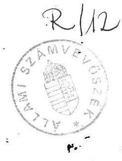
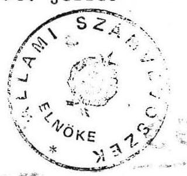

# Zillami Számvevőszék 

## Jelentés

a prágai és a helsinki katonai attaséi hivatal
1990. évi pénzügyi-gazdasági ellenőrzéséről

---

# ÁLLAMI SZÁMVEVŐSZÉK 

$\mathrm{V}-31-18 / 1990$

## J E L E N T É S

a prágai és a helsinki katonai attaséi hivatal 1990. évi pénzügyi-gazdasági ellenőrzéséről

Az Állami Számvevőszék 1990. I. félévi munkatervének megfelelően helyszíni ellenőrzést tartott a prágai és a helsinki katonai attaséi hivatalban.

Az ellenőrzés célja az attaséi hivatalok gazdálkodásának törvényességi és célszerűségi szempontból történő értékelése volt.

A helyszíni ellenőrzést a Honvédelmi Minisztérium attaséi hivatalokat irányító részlegénél végzett előzetes tájékozódás és ellenőrzés egészítette ki. Ennek keretében a minisztérium irányító, ellenőrző feladatának ellátását vizsgáltuk.

## I. Megállapítások

Az attaséi hivatalok működését, gazdálkodását a pénzügyi szolgálat és a vezérkar felderítő főcsoportfőnöke 1987. évi együttes utasítása szabályozza.

A valamennyi kérdésre kiterjedő, részletes, megfelelő formanyomtatványokkal, mintákkal ellátott szabályozás jó alapot ad a végrehajtáshoz. Az utasítás intézkedik az ellenőrzés módjáról és a gyakoriságáról is.

---

A hivatalok költségvetése két részből épül fel, tartalmazza a működés dologi kiadásait és az ún. operatív kiadások előirányzatát. Az utóbbiak cél szerinti vizsgálatával az ellenőrzés nem foglalkozott.

Az 5 rovatra bontott költségvetés a tervezéshez és a felhasználáshoz jó kereteket biztosít. Az előirányzatok mindkét helyen reálisak, a feladatoknak megfelelőek.

Tekintettel arra, hogy az attaséi hivatalok a nagykövetség épületében nyernek elhelyezést, a működési költségek egy része a KÜM költségvetésében kerül megtervezésre. Az elszámolásra a két minisztérium között évente kerül sor. Az ún. státusz költségekről a KÜM évente tételes - költségnemekre bontott - elszámolást készít, amit a HM felülvizsgál és kiegyenlít (a konvertibilis valutában fennálló követelést készpénzben, a többit átutalással).

A hivataloknak a működéssel kapcsolatos, gyakorlatilag fix költségek magas aránya miatt tényleges gazdálkodási lehetőségük nincs.

A tervezés - a hivatal "pénzszükségleti tervét" figyelembe véve - a minisztériumban történik. A jóváhagyott keretekkel való gazdálkodást a minisztérium folyamatosan figyelemmel kíséri és ellenőrzi. Az 1990. évi költségvetés az áprilisi ellenőrzésig nem került jóváhagyásra.

A bizonylatí fegyelem, a pénztárkönyv és a nyilvántartások vezetése mindkét helyszínen összességében megfelelő.

A vizsgált időszakban, de a korábbi attasé működése idején, 1988. szeptember 7-én a prágai katonai attasé a hivatalon keresztül 3.920,88 Kcs-ért NDK márkát vásárolt. Ennek ellenértéke nem került az adott hónapban befize-

---

tésre. A minisztériumi ellenőrzést követően a hiányzó összeget - a 2. csoportfőnökség tanúsítványa szerint 1989. októberben befizették, de erről sem bevételi bizonylat nem készült, sem pénztárnaplóban nem került lekönyvelésre. (A befizetés tényét csak a hóvégi záró és nyitóegyenleg különbsége jelzi.)

Az előleg folyósításának és nyilvántartásának rendjét egyik helyen sem tartották be maradéktalanul. A két helyszínen rögzített egybehangzó megállapítások a belső szabályozás, illetve a minisztériumi ellenőrzés hiányosságait jelzik.

A pénzellátmány automatikus átutalással érkezik a hivatalok folyószámlájára. A bankszámla egyenlegek jelentős összegű túlfinanszírozást mutatnak. Ennek megszüntetése és a valós pénzszükséglethez igazodó, legfeljebb 1-2 havi tartalékot jelentő ellátmány biztosítása intézkedést indokol.

Helsinkiben a "tartalékot" jelentő pénzkészletet - helyesen - kényszerűen névreszóló, kamatozó bankszámlán helyezték el. Hasonló megoldás Prágában is alkalmazható.

A prágai magyar képviseleteken, mindenekelőtt a kereskedelmi kirendeltségen - a vállalati befizetések következtében - saját szükségletet meghaladó összegek (Kcs) fekszenek el. Ezek a PK napló felhasználásával az attaséi hivatal, illetve más magyar képviseletek pénzellátásában hasznosíthatók. Az érintett minisztériumokkal, illetve a PK-val fel kell venni a kapcsolatot az elfekvő Kcs összegek hasznosítására.

A készletgazdálkodás, a leltározási rend, a selejtezési gyakorlat általában megfelelő. A prágai hivatal nyilvántartásában tapasztalt hiányosságok a minisztérium hibás intézkedésének köszönhetők.

---

A prágai hivatal nyilvántartásában szereplő 23 db bútort az attasé távollétében 1989. augusztus 10-én átvételi elismervény nélkül Budapestre szállítottak. A hazaszállított bútorok közül az értékesebb darabok sorsa nyomon követhető, a 7 db-os kovácsoltvas garnitúra (fogas, csillár, stb.) sorsa azonban nem volt kideríthető.

A bútorokat ez év áprilisában a BÁV-on keresztül a vállalat 1990. április 4-i értékbecslése alapján értékesítették. Az egyes bútorféleségek a nyilvántartásokban, a BÁV értékelésben, valamint az értékesítési okmányokban nem voltak megnyugtatóan azonosíthatók, mivel mind a leltári szám, mind a részletesebb leírás hiányzott. Az eladott bútorok ellenértékének befizetése 1990. május 8-án megtörtént.

# II. Javaslatok 

Az ellenőrzési megállapítások alapján a következő javaslatokat tesszük. A Honvédelmi Minisztérium

1/ tegyen intézkedést a katonai attaséi hivataloknál elfekvő pénzkészleteknek a reális szükséglethez igazodó lecsökkentésére;

2/ gondoskodjon a bizonylatí fegyelemmel, a nyilvántartási renddel kapcsolatos - jegyzőkönyvben rögzített - észrevételek hasznosításáról.

Budapest, 1990. július

dr. Hagelmayer István
