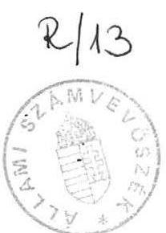
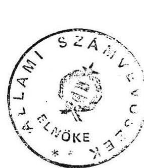

#  

## Jelentés

a prágai, a pozsonyi, valamint a helsinki kultúrális központok 1990. évi
pénzügyi-gazdasági ellenőrzéséről

---

# JELENTÉS

a prágai, a pozsonyi, valamint a helsinki kultúrális központok 1990. évi pénzügyi-gazdasági ellenőrzéséről

Az Állami Számvevőszék 1990. áprilisában a prágai és pozsonyi Magyar Kulturális Központban, 1990. májusában a helsinki Magyar Kulturális és Tudományos Központban helyszíni ellenőrzést végzett. Az ellenőrzés célja a központok gazdálkodásának törvényességi, célszerűségi és eredményességi szempontból történő értékelése volt.

A helyszíni ellenőrzést a Művelődési és Közoktatási Minisztérium kulturális központokat irányító részlegénél végzett előzetes tájékozódás és ellenőrzés egészítette ki. Ennek keretében a minisztérium irányító, ellenőrző feladatának ellátását vizsgáltuk.

## I. MEGÁLLAPÍTÁSOK

A Művelődési és Közoktatási Minisztérium a kultúrális központok működését mind szakmai irányítási, mind gazdálkodási szempontból jól kézbentartja.

A gazdálkodás a központokban az 1989-ben kidolgozott szabályzat szerint folyik.

---

A költségvetési kereteket - a központok munkaterve és költségvetési tervjavaslata alapján - a minisztérium hagyja jóvá. A kötött keretek száma lecsökkent, a központok gazdálkodási önállósága fokozódott, de a tervezés (és a felhasználás könyvelése) továbbra is indokolatlan részletességű rovat-tétel mélységben történik.

A prágai központnál gondot okoz az 1990-es költségvetés késői jóváhagyása és a keret drasztikus csökkentése. A minisztérium a csökkenő költségvetési támogatás ellensúlyozására Prágában a bevételi előirányzatot tudatosan alultervezi.

A pozsonyi központ költségvetésének - a tervtől jelentősen eltérő - több mint 300 ezer Kcs-vel történt megemelése nem indokolt.

A bevételi érdekeltség megteremtése helyes módszernek bizonyult.

Prágában a vendégszobák jobb kihasználása lehetőséget ad a bevételek további növelésére. A központ gazdálkodási önállósága és a tisztánlátás érdekében meg kell szüntetni a hivatalos kiküldöttek vendégszobai, illetve hotelházi térítésmentes elhelyezésének gyakorlatát.

A központok tényleges gazdálkodási lehetőségei - a fix költségek magas hányada miatt - általában erősen korlátozottak. (Helsinkiben pl. a központ tényleges mozgástere a költségvetés 6%-ára terjed ki.)

A prágai központ kedvező helyzete, a vezetés bevételnövelő törekvései és a költségvetés kimélése a tényleges gazdálkodási önállóság megteremtését indokolják. A köz-

---

pont önálló költségvetési szervként való működéséhez a feltételek adottak, illetve megteremthetők.

Az automatikus hazai pénzellátási gyakorlat helyett a központok finanszírozásánál a hazai átutalást a szükséges mértékre kell korlátozni.

Prágában és Pozsonyban a kereskedelmi kirendeltségeken a vállalati befizetésekből a kirendeltség pénzigényét meghaladó mértékű bevételek képződnek. Ezek a PK letét igénybevételével - a külképviseletek és az érintett minisztériumok közötti jobb együttműködéssel - a kulturális központok pénzellátásához is felhasználhatók.

A pozsonyi központ gazdálkodása - figyelemmel a tervezett építkezés megkezdésének nehézségeire történt jelentős összegű kifizetésekre, a költségvetést többszörösen meghaladó és indokolatlanul kihelyezett pénzkészletre, valamint az igazgató gazdálkodási kérdésekben mutatott tájékozatlanságára - nincs megfelelően kézben tartva. A főkonzulátus szabálytalanul foglalkoztatott gazdasági felelőse a rábízott pénztárosi részfeladatokat megfelelően ellátja, de megbízatása és felelőssége nem terjed ki a gazdálkodás egészére.

Az építkezés kezdése bizonytalan. A szükséges engedélyek kiadását a hatóságok nyilvánvalóan politikai okok miatt késleltetik. Időközben a szlovák hivatalos szervek részéről felvetődött esetleg más telek, vagy egy felújításra szoruló ingatlan felajánlása is.

A minisztérium ennek ellenére az ellenőrzés időpontjáig 314.765,80 Kcs összeg kifizetését különböző jogcímeken már engedélyezte és hozzájárult a SZÜVTERV részére még további 141.000 Kcs előleg kifizetéséhez. Ezek indokoltságát a helyszínen talált bizonylatokból megállapítani nem lehetett,

---

az "építkezés" helyzete a ráfordítások jogosságát nem igazolta.

Az engedély megszerzéséig a további kifizetéseket azonnal le kell állítani és intézkedni kell a pozsonyi központ bankszámláján elfekvő jelentős pénzkészlet hazautalásáról.

Amennyiben az építkezéshez a helyi hatóságok hozzájárulnak, a minisztériumnak gondoskodnia kell a kivitelezés pénzügyeinek ellátásának személyi feltételeiről.

A pozsonyi központ átmeneti elhelyezése nem megoldott, a zavartalan munkavégzés feltételei sem a vendéglátó főkonzulátus, sem a növekvő forgalmat lebonyolító központ számára nem biztosítottak.
A számviteli, bizonylati rendre vonatkozó észrevételeket a jegyzőkönyvek rögzítik. Az elfekvő anyag- és fogyóeszközkészletek selejtezésével kapcsolatos hatáskört a központok kezébe kell adni. Gondoskodni kell a prágai központ vagyontárgyainak, a prágai és helsinki központ pénztárának megfelelő biztonságáról.

A tájékoztatási, kulturális tevékenység összehangolásában és ésszerűsítésében a külképviseletek munkáját irányító minisztériumok közötti együttműködés javításával jelentős tartalékok rejlenek.

# II. JAVASLATOK

Az ellenőrzési megállapítások alapján a következő javaslatokat tesszük. A minisztérium
1/ az ellenőrzési megállapítások alapján vizsgálja felül a kulturális központok költségvetési tervezésének, a felhasználás könyvelésének, valamint pénzellátásának gyakor-

---

latát és ahol lehetséges gondoskodjon a saját bevételi lehetőségek maximális kihasználásán alapuló önálló gazdálkodás feltételeinek megteremtéséről;

2/ vizsgálja felül a Pozsonyi Kulturális Központ költségvetését, gondoskodjon a felesleges pénzkészlet hazautalásáról. Az engedélyek megszerzéséig intézkedjen az építkezéssel kapcsolatos további kifizetések azonnali leállításáról és vizsgálja meg az eddigi kifizetések indokoltságát, szükség esetén kezdeményezze az érdekeltek felelősségre vonását;

3/ a végleges megoldásig gondoskodjon a pozsonyi intézet átmeneti elhelyezéséről;

4/ intézkedjen a pozsonyi központ gazdálkodásának kézbentartásáról, a gazdasági felelős személyéről.

Budapest, 1990. július

dr. Hagelmayer István
