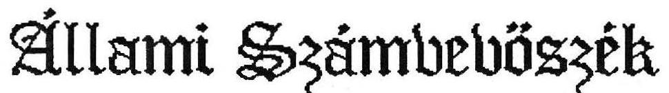
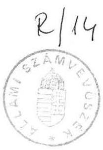
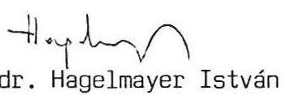
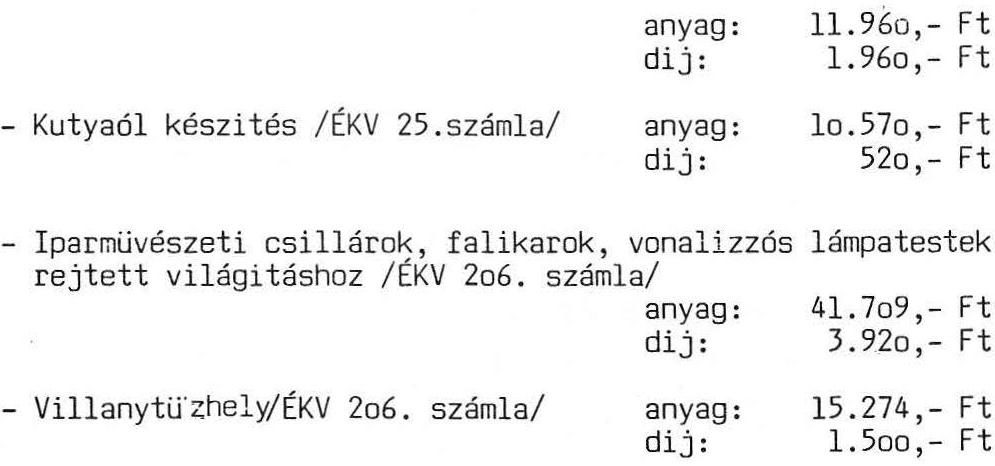
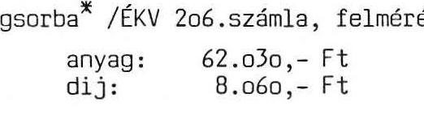

#  

## Jelentés

a Honvédelmi Minisztérium vezető tisztségviselői és a tábornoki kar szolgálati lakásaira fordított
költségvetési összegek felhasználásáról

---

# J E L E N T É S 

a Honvédelmi Minisztérium vezető tisztségviselôi és a tábornoki kar szolgálati lakásaira forditott költségvetési összegek felhasználásáról

Az Országgyülés 1990. március 1-i ülésén elfogadott 28/1990./III.13./ OGY határozata kötelezte az Állami Számvevőszéket arra, hogy "1985. január 1-től kezdôdően vizsgálja meg: a Honvédelmi Minisztérium vezető tisztségviselői és tábornoki kara szolgálati lakásaira forditott költségvetési összegek felhasználása jogszerü és indokolt volt-e."

Az Országgyülés által meghatározott ellenőrzési körbe 124 személy tartozik /a honvédelmi miniszter és helyettesei, a HM hat fôosztályvezetője, mint vezetõ tisztségviselők és a tábornoki kar/. Ehhez a személyi körhöz - az ellenőrzési idôszakban elôfordult költözések következtében összesen 164 - ebből lol szolgálati lakás kötődik. A szolgálati lskásokkal kapcsolatos költségvetési ráforditások összege - a vizsgált idũszakban -. 57,0 M Ft-ot tesz ki.

A költségvetési ráforditások jogszerűségének és indokoltságának megitéléséhez áttekintettük a szolgálati lakáshoz jutás jogi szabályozását, vizsgáltuk a lakáskiutaló határozatokat, a lakásvásárlás adásvételi szerződését, az uj beruházások költségadatait, a lakások felujitását megalapozó jegyzökönyveket, az egyes ráforditások kivitelezői alapbizonylatait /külső vállalati kivitelezés számláit, a saját erõs kivitelezés anyag- és munkalapjait/, az elvégzett munkák bérlőket terhelő számláit.

Nehezítette a költségvetési ráforditások számbavételét, hogy a HM számviteli rendjében a katonai objektumok és a szolgálati lakások, lakóépületek kezelésének költségei nem elkülönitettek, továbbá a honvédség az ingatlankezelési szakfeladatokat csak részben központilag, nagyobb részt a csapatok /63 önállóan gazdálkodó egység/ közremüködésével látja el. Emellett a lakásingatlanok kezelésével kapcsolatos felhasználások áttekinthetőségét kedvezőtlenül befolyásolta,

---

hogy a saját kivitelezésben végzett munkák költségvonzatai különböző bizonylatok /jegyzőkönyvek, anyag- és munkalapok/ összevetésével mutathatók ki, mivel az egyes lakásokra eső költségeket - ilyen irányu kötelezettség hiányában folyamatosan nem dolgozzák fel. Az anyag- és munkadijak együttes elszámolása csak olyan esetekben állt rendelkezésre, ha a bérlőt terhelő hányad megállapítására is sor került.

# I. Megállapitások 

## 1./ A szolgálati lakáshoz jutás jogi szabályozása.

A nyilvános jogszabályok, valamint a nem publikus belsõ - HM és MH - szabályok nem tartalmaznak az ellenőrzött személyi kört érintően számottevõ megkülönböztető rendelkezést a lakások építésére, vételére, cseréjére, felujitására és karbantartására. Igy általános jelleggel alkalmazzák a lakások elosztásáról és a lakásbérletről, a lakásépítési hozzájárulásról és a lakáshasználatbavételi dijról, továbbá a kedvezményekről, valamint a lakbérekről, az albérleti és ágybérleti di jakról szóló lakásügyi jogszabályok többször módositott rendelkezéseit.

A sajátosságok "A lakásügyi jogszabályok Magyar Néphadseregben történő alkalmazásáról szóló 50/1978./HK.27./ HM számu utasításban"/továbbiakban: HM Utasítás/ kerültek megfogalmazásra, amelynek hatálya egyrészt a HM rendelkezése alatt álló minden állami lakásra, másrészt a honvédség hivatásos állományu tagjaira terjed ki. Ennek figyelembevételével a HM vezető tisztségviselői és tábornokai is az ellenőrzött idôszakban a honvédség hivatásos állományu tagjaiként "alanyi jogon" tarthattak igényt szolgálati lakásra.

A HM gazdálkodásában meghatározó szerepe volt a diszlokációt alkalmazó védelmi doktrina szükségszerü következményének, hogy a hivatásos állomány tagja nem önszántából, hanem "szolgálati érdekbõl" kénytelen lakóhelyet változtatni. A fegyveres erők és testületek hivatásos állományának szolgálati viszonyáról szóló 1971. évi lo.sz.tvr. 32. § adta lehetôséggel élve a honvédelmi tárca vezetése azt a megoldást választotta, hogy a kényszerü költözködésekkel járó költségeket /az elhagyott lakás felujitását, a szállitás költségei egy részét és az uj szolgálati helyen a megfelelő lakás biztositását/ a HM átvállalta és a költségvetésbõl biztositotta. Ez eredményezte a HM lakásgazdálkodási mechanizmusában az általánostól eltérő jogtechnikai megoldásokat.

A tárcaszintü szabályozásban megkülönböztetésre csak az utal, hogy a HM Utasítás lehetôvé teszi a hadosztályparancsnok-helyettesi, illetve ennél magasabb beosztásban lévõ hivatásos állomány - ennélfogva az ellenôrzött személyi kör - részé-

---

re a lakásigény mértékének felső határán tul további egy lakószoba biztosítását. Ezen kivül az irásos szabályozás nem ad lehetőséget arra, hogy a lakásgazdálkodásban a vezető tisztségviselők más elbirálás alá kerüljenek, mint a hivatásos állomány bármely tagja. Az ésszerüen differenciált szabályok hiányának is betudható, hogy az előző ötéves terv végén "szóbeli" miniszteri döntés született a vidéki alakulatok parancsnoki állománya részére un. parancsnoki lakások /átlagosnál nagyobb alapterületü, garázzsal ellátott lakások/ építéséröl azzal a kikötéssel, hogy ezek költsége az átlagos lakásköltséget nem haladhatja meg. Ehhez katonai munkaerő igénybevételére is lehetőséget kapott az érintett parancsnoki állomány.

Az MH Építési és Elhelyezési Főnökség 1985-90-ig terjedő időszakra 24 helyőrségben 146 db parancsnoki lakás építését irányozta elő. Ebből eddig 5 helyőrségben összesen 30 db parancsnoki lakás épült, folyamatban van 1 helyörségben lo db lakás építése, tervek között szerepel még 1 helyörségben 7 db lakás építése. Ezt a programot azonban leállították, mert az indításnál meghatározott gazdaságossági követelményt nem tudták teljesíteni.

A vidéki alakulatok parancsnoki lakásépítési programjától függetlenül - hasonlóan szóbeli engedély alapján - Budapesten is épültek parancsnoki lakások, ezek zöldövezeti HM kezelésü kisebb telkeken /az építési övezet előirásainak betartásával/ épített, általában nagyobb alapterületü, garázzsal ellátott, átlagos felszereltségü lakások. Ezek a lakások nem névreszólóan készültek.

Az ellenőrzés tapasztalatai is alátámasztották, hogy a fegyveres szervekre jellemző módon több esetben érvényesül a szóbeli utasítások /parancsok/ meghatározó - helyenként "törvényrontó" - szerepe.

# 2./ A költségvetési összegek felhasználásának jogszerűsége és indokoltsága. 

A HM vezető tisztségviselői és a tábornoki kar szolgálati lakásaival kapcsolatos költségvetési ráfordítások aszerint csoportosíthatók, hogy a bérlő szolgálati érdekből költözött; minőségi lakáscserét hajtott végre; lakott lakás felujitására, illetve berendezési tárgyainak cseréjére került sor; a bérlő részére lakást vásároltak, vagy lakásberuházással megvalósított uj lakás első bérlőjévé vált /1.sz.melléklet/

Az ellenőrzött személyi körben többségében a lakás felujitások és a lakásberendezési tárgyak cseréjének költségei merültek fel, amelynek forrása a HM fejezet költségvetése. A ráfordítások közel 20 M Ft-ot tettek ki, ebből a bérlőkre 1,3 M Ft-ot terheltek.

---

A szolgálati lakásokkal kapcsolatos felhasználásokat különféle tartalommal számolták el a költségvetésben illetőleg a bérlők felé aszerint, hogy a Magyar Honvédség Fenntartási és Elhelyezési Föigazgatósága /továbbiakban: MH FEFI/ saját kivitelezésben, vagy külsõ vállalatokkal szerződéses kapcsolat utján végezte, illetve végeztette a munkákat. A költségvetésben a saját kivitelezésü munkáknak csak az anyag értéke, a vállalatba adott munkáknak pedig a számla szerinti értéke kerül elszámolásra.

A saját kivitelezésben végzett munkák költségeinek bérbeadó és bérlő közötti megosztásának alapját a lakás visszaadása, illetve felmérése alkalmával felvett jegyzőkönyvek képezték. A bérlő számláját az elvégzett javítások munkalapjairól, az érvényben lévô Épitőipari Irányáras Árgyüjtemény anyagár és dijtételeinek megfelelően, továbbá az ÁFA bevezetése után annak figyelembevételével állították össze.

A külső vállalatok által benyujtott - általában szabadáras számlákat az MH FEFI kollaudálta, majd ennek függvényében egyenlítette ki. A bérlőket terhelő tételekről külön számlákat készített, azonban az Épitőipari Irányáras Árgyüjtemény alapján, ami a bérlők számára kedvezőbb volt. A külső vállalatok bevonására a saját kapacitás hiánya miatt került sor és a kivitelezôt nem a bérlő választotta meg, ezért a saját kivitelezésü munkákhoz viszonyított többletköltséget nem volt indokolt a bérlőre háritani, így a különbözet a költségvetést terhelte. Ez nem jelentett kivételezést a magasabb beosztásu vezetôkre nézve, mivel más bérlők esetében is hasonlóan jártak el.

Az egyéb központi beruházási forrásból finanszirozott lakásépítés utján uj lakáshoz jutott 12 fô /ennek költségkihatása 35 M Ft volt/ és mindössze 1 fô részére történt lakásvásárlás közel 3 M Ft értékben. A 12 új lakás esetében beruházási költségen kivül további költségvetési felhasználás nem jelentkezett. Ezek a lakások /egy kivétellel/ egyedi tervezéssel, saját honvédségi bonyolitásu beruházásban épültek, bruttó költségük /2.915 E Ft/lakás/ 48\%-kal meghaladta az azonos idôszakban épített szolgálati lakások átlagos bruttó költségét. A magasabb költségráfordítás az építési övezet jellegének és az elõirások teljesítésének a következménye, nem a bérlők által támasztott igényekkel hozható összefüggésbe.

A magasabb vezetői körből 36 fô lakására költségvetési ráfordítás nem jelentkezett.
a./ Szolgálati érdekből költözött más lakásba 29 fô. E kategórián belül legjellemzõbb indok a hivatásos állomány tagjának más helyőrségbe áthelyezése /vidék és fôváros viszonylatában illetve vidéki helyőrségek között/. Ezek költségráfordításai 9.139,4 E Ft-ot tettek ki, ebből 54,9 E Ft-ot terheltek a bérlőre. /A 9.139,4 E Ft-ból 4.076,9 E Ft-ot három lakóépület teljes felujitására forditottak./

---

A bérlõ téritési kötelzettségéhez tartoznak ilyen esetekben az un. "saját hibák" kijavitása, az eredeti állapot helyreállitása, illetve az okozott kár, valamint az un. egyéni igények kielégítése érdekében végzett munkák költségei. A bérbeadó költségviselési terhét a HM utasitás ugy szabályozza, hogy a HM rendeltetésü lakásokat a bérlõnek uj - a régebbi lakások esetében karbahelyzett - állapotban, a lakásberendezéseket szükség szerint felujitva, illetve kicserélve kell átadni. Ezek költségviselõje a MH lakóházkezelõ szerve.

A szolgálati érdekbõl költözök közül 5 tábornok esetében /2.sz.melléklet/ a hatályos rendelkezésektõl eltérõ módon állapították meg a bérlõt terhelõ hányadot, emellett egyes lakáskiutalásoknál szabálytalanságok is felszínre kerültek.

- dr.Mórocz Lajos ny.vezérezredes - magasabb beosztását és az együttlakó személyek számát figyelembevéve - az igényjogosultság felsõ határát $1+1 / 2$ szobával meghaladó szobaszámu szolgálati lakást utaltak ki. A lakóépület teljes felujitási költsége 1,885.352.- Ft-ot tett ki. Ebbõl a bérlõt terhelõ egyedi igénynek minõsithetõ 119.124.- Ft értékü anyag és munkadij. További 180. 70\%- Ft összegü olyan költségráforditás volt kimutatható, ahol az általános és luxus igények közötti különbözet megállapitása elmaradt, vagy a felujitás müszaki indokoltságának dokumentálatlansága nem tette egyértelmüvé a teljes költségráforditás bérlõre háritását. Az egyedi igények kielégitését szolgáló munkák költségeit teljes egészét.en a luxus igényü, de müszakilag indokolt munkák esetében a bérlõi hányadnak megfelelõ összeget jogszabályellenesen vállalta át a honvédség.
- Borsits László altábornagy esetében az igényjogosultság mértékének felsõ határát - a kiutaló határozat szerint 1/2 szobával, a lakásnyilvántartási adatok szerint $1+1 / 2$ szobával - meghaladó szobaszámu lakás kiutalására került sor.

Az elõzõ bérlõ lakásátadásánál a karbahelyezési programot megalapozó müszaki állapot felmérést elvégezték, jegyzõkönyvezték. Rövid idõn belül bemutatták az uj bérlõnek a lakást és meghatározásra került a karbahelyezési program is, amely már a lakáson belül is lényegesen több és költségesebb feladatot tartalmazott. Igy a karbahelyezésbõl teljes felujitás lett 1,4 M Ft-os költségráforditással. A bérlõre terhelendõ költséghányadot az átvételi jegyzõkönyvben rögzitettek figyelembevételével 375 E Ftban állapították meg. Az MH FEFI állásfoglalása alapján a bérlõnek számlázott összeg 124 E Ft-ra csökkent, végül "elõljárói utasitásra" a bérlõt

---

terhelõ költség mindössze 8.708,- Ft maradt. A lakóépület teljes felujitásával nem vált indokolttá a bérlõi hányad ilyen mértékü csökkentése, a reális összeg mintegy 166 E Ft-ot tesz ki.

- Kéri György ny.vezérőrnagy az együttlakó személyek számát és a magasabb beosztást tekintve az igényjogosultságot kis mértékben meghaladó villalakásba költözött, amelynek alagsori- leromlott állagu l szoba komfortos lakásnak megfelelõ - helyiségeit is lakáshasználatbavételi dij fizetése nélkül, jogsértõ módon részére kiutalták. Az épületben az elõzõ bérlõ kiköltözése után elvégzett generál felujitás müszakilag indokolt volt. A 1,900.551,- Ft összegü felmujítási költségbõl azonban kimutatható 116.716,- R értékü egyedi igényeket szolgáló munkavégzés, ennek költségeit a honvédség jogszabályellenesen átvállalta. További 12.104.- Ft-os költségráforditásnál elmaradt a bérlõi hányad megállapítása.
- Horváth Dezső ny.mk.vezérőrnagy leadott szolgálati lakásával kapcsolatos költségek viselésétõl a rendelkezéseknek megfelelően mentesült, a részére kiutalt uj szolgálati lakás karbahelyezési költségei között azonban 33.540.- Ftot tett ki az átlagos szinvonalat meghaladó felujitási munkák értéke. Figyelembe véve, hogy az egyes lakásberendezési tárgyak cseréjének indokoltságát igazoló jegyzökönyv felvételére a felujitást megelôzõen nem került sor, a hivatkozott teljes összeg a bérlõt terheli, amit a jogszabályok értelmében a honvédség nem vállalhatott volna át.
- Gyuricza Béla vezérőrnagy szolgálati lakásának biztosítása érdekében az MH FEFI közel 3 M Ft értékü lakást vásárolt, amelynek forgalmi értékbecslésének megállapításai között rögzítették: "belső tereinek kiképzése és azok minősége hosszu ideig szükségtelenné teszi a felujitást." A bérlõ a lakás kiutalása elôtt 100-140 E Ft összegü karbahelyezési munkák elvégzését kérte. A tényleges költségek azonban 270 E Ft-ot tettek ki. Azon tul, hogy ilyen mértékü költségnövekedést engedélyezõ okirat sem volt elõtalálható, jogszerütlenül nem számláztak a bérlõnek 49.819.- Ft értékü egyedi igény céljából végzett munkát. További 32.400.- Ft összegü munkából az általános és luxus igények közötti különbözet szintén a bérlõt terheli.
b./ Lakott lakás felujítása és berendezési tárgyak javitás és cseréje történt 42 fõ esetében. A teljes ráforditás 6875,8 E Ft volt, amelybõl 5.533,3 E Ft-ot a volt honvédelmi miniszter által lakott /1970-ben épitett/ lakóépület bővitésére forditottak. Mindösszesen 435,8 E Ft-ot térítettek a bérlők. A volt honvédelmi miniszter részére térítési kötelzettséget nem irtak elõ. A lakásügyi

---

jogszabályok tisztázzák a bérbeadó és a bérlõ felujitási, pótlási és cserekötelezettségeit, valamint a rájuk háruló karbantartási feladatokat. Ezen tulmenően a Magyar Honvédség beruházási és fenntartási fônök 23/1983./HK.20./.sz. intézkedése lehetôséget ad a bérlônek arra, hogy a lakása karbahelyezését a honvédség lakáskezelõ szerve helyett elvégeztetheti és a felmerülõ költséget a lakáskezelõ tériti. A visszaélések lehetôségének kizárása érdekében a bérlõ és a bérbeadó elõzetes irásos megállapodásra kötelezett, amelyben a karbahelyezési munkák mennyiségi és minőségi felsorolását és várható költségkihatását is részletezni kell.

A szabályozás kategórikusan állást foglal abban, hogy a bérlõ nem tarthat igényt az átlagos szintet meghaladó mennyiségü vagy minőségü munkák többletköltségének visszatéritésére, kifejezésre juttatja a luxus igények kielégitésének tilalmát. Az intézkedés luxus jellegünek minősiti az olyan anyagok alkalmazását, vagy berendezés tárgy felszerelését, amelyet az uj állami lakásra vonatkozó bérleti jogviszony keretében a bérbeadó a bérlõ részére nem biztosít. A bérlõt terhelõ hányad megállapításának hiánya illetve indokoltsága következésképpen a jogszerüsége két esetben /3.sz.melléklet/ volt kifogásolható:

- Kárpáti Ferenc - korábban vezérezredes, honvédelmi miniszter - szolgálati lakása 1981-ben az alagsori épületrész lakhatóvá alakításával 3 és félszobás lett. Az átalakítás után ezt minőségi csereként részére ujra kiutalták és 12.500.- Ft használatbavételi dij-különbözet megfizetésére kötelezték. 1987-ben - a bérlõ miniszterré történt kinevezése után - a lakóépületben felujitást /a kiviteli tervek szerint lakásbõvitést-korszerüsitést/ végeztek 5,5 M Ft költségráforditással. A lakbérmegállapításához végzett adatfelvételezésnél nem számitották be az alagsori szintet, igy a toldalék alapterület növekedés ellenére a kimutatott lakásalapterület és szobaszám csökkent, következésképpen a lakáshasználatbavételi dij is kevesebb lett. Erre alapozva, de szabálytalanul a bérlõ részére 75.000 .- Ft használatbavételi dij különbözetet fizettek ki. A dij-különbözet kifizetésére a bérlõ akkor tarthatott volna igényt, ha az elõzõ lakását beköltözhetõ állapotban a honvédség rendelkezésére bocsátja.
A felujitás alkalmával - épitési napló bejegyzései szerint több esetben a bérlõ kifejezett kérésére - 222.837,- Ft értékben olyan munkát végeztek el, amelyek egyedi /és luxus/ igényeket elégitettek ki. Ezeket a költségeket a rendelkezések értelmében a honvédség a bérlõ magas tisztségére tekintettel sem vállalhatja át, egyértelmüen a bérlõt terhelik.

---

Ezen tulmenően 342.347.- Ft összegü munkákból az átlagos és a luxus igények közötti különbözetnek megfelelő költségek a bérlő kötelezettségeihez tartoznak. Mindezekről a bérlő részére számlát nem állitottak ki.

A lakóépület átalakítását azzal indokolták, hogy a bérlő magas tisztségbe kerülését követöen más villalakásra nem tartott igényt. A lakásbővitésként növelt alapterület közel $70 \%$-a terasz, mintegy $27 \%$-a a konyhánál és a kamra helyiségnél jelentkezett. Az összesen 20 m 2 toldalék-alapterület kivitelezésének az egyébként is szükséges munkák 420 E Ft-os költségét növelte, hogy a lakóépület melletti támfalat mintegy 270 E Ft bruttó költségráforditással áthelyezték. A nagyösszegü költségráforditáshoz hozzájárult, hogy a telken, nem az utcai fronton 565 E Ft értékben luxus kivitelü kerités épült, a burkolómunkák között előfordult 9 m 2 márványburkolat készités 85,6 E Ft költséggel. Mindezek megkérdőjelzik a választott megoldás gazdaságosságát, a költségráforditások indokoltságát.

- Török Mihály altábornagy szolgálati lakásában 1986-ban olyan felujitási munkákat végezték, amelyek teljes egészében a bérlőt terhelték volna. Ezzel szemben a bérlőre 1.664.- Ft jelképes összeget háritottak, a honvédség 26.327.- Ft-ot jogsértő módon vállalt át. Három évvel később ugyanabban a lakásban nem a müszaki állapot figyelembevételével, hanem a bérlő nyugállományba helyezésére hivatkozó kérelmének helyt adva újabb felujítási munkákat engedélyeztek. Ez alkalommal a költségekből 80.290,5 Ft bérlői hányad az MH Beruházási és Fenntartási Főnökség engedélyével, de a HM Utasitás megsértésével a honvédség költségeit növelte.
c./ Minőségi lakáscserék következtében a felujitással, berendezési tárgyak javitásával kapcsolatos - 3.896,3 E Ft összegü - költségráforditásokban az ellenőrzött személyi körből 20 fő volt érintve, a bérlőket terhelő hányad 762,2 E Ft-ot tett ki.

Az érvényes szabályok szerint a HM rendelkezésü lakások esetén minőségi lakáscsereként kell elbirálni: ha a bérlő abban a helyőrségben, ahol szolgálatot teljesit /munkaviszonyban áll/ a lakásigényének megfelelő szobaszámu lakással rendelkezik, de nagyobb szobaszámu, magasabb komfortfokozatu, előnyösebb fekvésü, illetve hadosztályparancsnok-helyettesi beosztásnál magasabb beosztására tekintettel további egy lakószobával növelt lakás

---

kiutalását kéri. A minőségi lakáscserét végrehajtó bérlõ köteles viselni a leadott lakása karbahelyezésével kapcsolatban felmerült tényleges költséget. A tényleges költség megállapításában irányadó, hogy csak azon munkák költsége számolható el, amelyek a lakás levételi jegyzőkönyvben a lakáskezelő szerv megbizottja által rögzítésre kerültek. Ilyen esetben a bérlőre kell terhelni a lakásberendezések szükség szerinti felujitásából, illetve cseréjéből eredő bérlőt terhelő költségeket. A minőségi lakáscserékkel összefüggésben négy esetben /4.sz.melléklet/ volt jogszerütlennek minősithető a bérlőt terhelő hányad megállapítása.

- Dr. Janza Károly vezérőrnagy minőségi lakáscseréje esetében a leadott lakás karbahelyezése a jogszabályoknak megfelelően levételi jegyzőkönyv alapján folyamatban van, a számlázásra ezért még nem került sor. Az uj lakás karbahelyezése mellett a bérlő egyedi igényeinek megfelelő átalakítási munkák elvégzését is kérte, az erről felvett korrekt jegyzőkönyvben vállalta a többletköltségeket. A bérlő részére összeállított teljes költségvetési összeg 385.266.- Ft volt, ezzel szemben a bérlő szóbeli kifogásait méltányolva az MH FEFI főigazgatója saját hatáskörben többszöri megalapozatlan bérbeadó költségátvállalással a bérlő részére 273.955.- Ft összegü végszámlát állapitott meg. Figyelembe véve, hogy az elvégzett munkák egyértelmüen a bérlő egyedi igényei voltak, müszaki megalapozottságuk nem mutatható ki, a bérlői hányad tapasztalt mértékü csökkentése indokolatlan és jogszerütlen volt.
- dr.Birkás János o.vőryy. leadott szolgálati lakásának karbahelyezési költségeit az előirásoknak megfelelően térítette. Az uj lakásának karbahelyezésével egyidejüleg lakáson belüli átalakításra is igényt tartott. A felujitás és átalakítás 821.653.- Ft-ot kitevő költségéből 164.791.-Ft-ot ot terheltek a bérlőre, ebből luxusigény kielégítésével kapcsolatban közel 40 E Ft-ot állapitottak meg. A lakáskezelő szerv hibájából nem megfelelő arányban lett kialakítva a bérbeadó és a bérlő költségviselése. Ezen kivül a bérbeszámitásra vonatkozó rendelkezések félreértelmezésével, megalapozatlan alkalmazásával - a bérlői hányadot mintegy 125 E Ft-tal bérbeszámitás címén csökkentették.
- H.Kovács Imre ny.vezérőrnagy részére a minőségi lakáscsere során kiutalt lakásban, az előző bérlőtől történt átvétel után 120.177.- Ft költségráfordítással a karbahelyezési munkákat külső kivitelezőkkel a bérbeadó elvégeztette. Ezt követően az uj bérlő - a lakásba költözése előtt - pófigénnyel lépett fel, ezeket a munkálatokat a bérbeadó ugyanazzal a ki-

---

vitelezővel - az előző karbahelyezési munkák után mindössze 4 hónapon belül - 48.665.- Ft költséggel elvégeztette. Mindezek mellett a kivitelezői számlák tartalmi átfedése is arra utal, hogy ebben az esetben egyedi igények kielégítése történt, igy a pótmunkák költségeinek átvállalása a honvédség részéről megalapozatlan és jogtalan volt.

- Szabó Béla ny. vezérőrnagy minőségi lakáscseréje következtében a leadott szolgálati lakás levételi jegyzőkönyvében a bérlőt, vagy a bérbeadót terhelő költséget nem állapitották meg. A leadott lakás ujbóli kiutalása előtt azonban 71.163.- Ft összegü karbahelyezési munkát végeztettek külső kivitelezővel. Az MH lakóházkezelő szervet terhelő költségek elszámolásából megállapitható volt, hogy a munkák mintegy háromnegyed részének finanszirozása a rendelkezések értelmében a szolgálati lakást leadó bérlő kötelzettsége lett volna. A jogszerütlen költségvállalás forrása a levételi jegyzőkönyvezésnél történt mulasztás volt.

A HM vezető tisztségviselőiből és tábornoki karából ll személy szolgálati lakásának költségráfordításaival összefüggésben volt megállapitható szabálytalanság /5.sz.melléklet/. A lakásügyi jogszabályokban és rendelkezésekben meghatározottaktól eltérő módon az igényjogosultság mértékét meghaladó szobaszámu lakáskiutalás fordult elő 3 esetben, a lakáshasználatbavételi dij megállapitása elmaradt, illetve indokolatlan dijkülönbözet kifizetésére került sor 2 bérlőnél, a lakásfelujításoknál és a berendezési tárgyak javításánál, cseréjénél az egyedi / illetve luxus/ igények 959,1 E Ft költségráforditását nem terhelték a bérlőkre /ez 9 főt érintett/, továbbá 6 bérlő esetében az indokolt, de az átlagos igényszintet meghaladó, összesen 803,5 E Ft-ot kitevő munkavégzést követően elmulasztották a bérlőt terhelő hányad megállapitását, következésképpen a leszámlázását.

A szabálytalanságok kialakulásában szerepe volt a fegyveres erőknél hagyományosan uralkodó erős függőségi viszonynak, amelyben tág tere van a szóbeli utasítások kritikátlan végrehajtásának. Ez a módszer pénzügyi-gazdasági döntéseknél nem alkalmazható.

---

Az ellenôrzés megállapításai alapján a következôket javasoljuk:
1./ A jelenlegi belsõ utasítás helyett új, nyilvánosan kihirdetett jogszabályban indokolt a honvédség hivatásos állománya szolgálati lakás jogosultságát szabályozni. Ennek keretében döntendõ el - általában és a jelentésben szereplő esetekben konkrétan -, hogy a rendfokozathoz igazodóan a vezetők számára mi a jogos lakásigény mértéke, milyen felszerelés igényelhetõ, illetve önálló ingatlan mikor lehet szolgálati lakás. A szabályozás egyértelmũen rögzítse a beruházással, elhelyezéssel és karbantartással foglalkozó szervezet és az előljárók viszonyát.
2./ A honvédelmi miniszter vizsgáltassa meg, milyen felelősség terheli a jelenlegi utasítással ellentétes módon eljáró személyeket, akik esetenként a szabályok rovására engedték érvényesülni a szóban elõadott kéréseket, illetve a szabályokkal ellentétes utasításokat végrehajtották.
3./ A költségvetés terhére szabálytalanul elszámolt és teljes egészében a bérlôt terhelő egyedi igények összesen 959,1 E Ft összegũ költségeit (lásd 5 sz. melléklet) a bérlőkkel utólag meg kell téríttetni.
4./ Az átlagos igényszintet meghaladó munkák 803,5 E Ft-os költségeiből (lásd 5. sz. melléklet) számszerũsíteni kell a bérlőket terhelőket és gondoskodni kell azok megfizettetésérõl.

B u d a p e s t , 1990. július 23.

---

# A HM vezető tisztségviselői és tábornoki kara szolgálati lakásaira 1985-1990. május 31-ig elszámolt ráfordítások 

|  | Érintett személyek száma * | Lakásfelujitás, karbantartás |  | Lakásberendezés javitás és csere |  | Együtt |  |
| :--: | :--: | :--: | :--: | :--: | :--: | :--: | :--: |
|  |  | Összes | Bérlőre terhelve | Összes | Bérlőre terhelve | Összes | Bérlőre terhelve |
| Szolgálati érdekböl történt lakóhelyváltozások | 29 | $9.010,9$ | 16,1 | 128,5 | 38,8 | $9.139,4$ | 54,9 |
| Lakott lakás felujitások | 14 | $6.544,0$ | 301,5 | 66,7 | 32,2 | $6.610,7$ | 333,7 |
| Lakott lakás berendezési tárgy javitásai, cseréi | 28 | - | - | 265,1 | 102,1 | 265,1 | 102,1 |
| Minőségi lakáscserék | 20 | $3.829,8$ | 735,7 | 66,5 | 26,5 | $3.896,3$ | 762,2 |
| Költségvetési ráforditás nem történt | 36 | - | - | - | - | - | - |
| Összesen: |  | 19.384,7 | 1.053,3 | 526,8 | 199,6 | $\underset{22.533,5}{19.911 .5}$ | $\begin{aligned} & 1.252,9 \\ & =\cos 22 \pi \end{aligned}$ |
| MH lakásvásárlás | 1 |  |  |  |  | 2.952,0 |  |
| MH lakásberuházás | 12 |  |  |  |  | 34.977,0 |  |

## Minöösszesen:

$\star$ A különböző célu ráfordítások esetében feltüntetett személyek számszerü összesítéseinek nincs jelentösége, figyelembe véve, hogy az ellenőrzött időszakban egy-egy fö több szempontból is érintett volt.

---

# Szolgálati érdekből történt lakásváltoztatással kapcsolatos 

szabálytalanságok

Dr.Mórocz Lajos ny,vezérezredes részére 1985-ben utalták ki a Budapest II., Csalán u.13.szám alatti 130 m2-es lakást a 915/166-3/1984.sz. kiutaló határozattal. A költözés szolgálati érdekbõl történt. A lakásba 3 fôt /bérlõ, feleség, 1 gyermek/ jelentettek be.

Az érvényben lévõ l/1971/II.8./ Korm.sz. rendelet lo.§/1/ bekezdése szerint a lakásügyi hatóság olyan szobaszámu bérlakást utalhat ki, amely a lakásigény mértékét nem haldja meg /3 fõ részére $11 / 2$ - $21 / 2$ lakószoba/.

A lakásügyi jogszabályok MH-ban történõ alkalmazásáról szóló 50/1978./HK.27/ HM utasitás lo.§/1/ bekezdése értelmében a hadosztályparancsnok-helyettesi, illetve ennél magasabb beosztásban lévõ, valamint tudományos munkát végzõ hivatásos állományu személyek részére a lakásigény mértékének felsõ határán tul, további egy lakószoba biztositható. Dr.Mórocz ny.vezds. beosztása további lakószoba biztosítását indokolta. Ennek értelmében részére 3 - 3 1/2 szobás lakás utalható ki.

A Bp.II., Csalán utcai - ténylegesen és az uj lakásbérleti szerzõdés szerint $4+21 / 2$ szobás lakás kiutalása tehát jogszabályellenes volt. A lakásnyilvántartásban, az elõzõ bérlõ lakásbérleti szerzõdésében a lakás ugyan $4+1 / 2$ szobásnák volt feltüntetve, de ez is meghaladta az uj bérlõ jogos lakásigényének mértékét. Az eltérés abból adódott, hogy az elõzõ bérlõ engedély nélküli átalakitással növelte a szobák számát.
A honvédelmi miniszter a lakáskiutalást jóváhagyta, az igényjogosultság mértékétõl történõ eltérés engedélyezésére a lakásügyi jogszabályok nem hatalmazták fel.

A hivatkozott HM utasitás 14.§ /3/ bekezdése szerint a H\# rendelkezésü lakásokat a bérlõnek uj - régebbi lakások esetében karbahelyezett - állapotban, a lakásberendezéseket szükség szerint felujitva, illetve kicserélve kell átadni. Ennek kapcsán felmerült költségeket a honvédség lakóházkezelõ szervei viselik.

---

A MH Beruházási és Fenntartási Főnök 23/1983./HK.20./ számu intézkedésének lo. pontja szerint a lakás festésénél, tapétázásánál, a nyilászáró szerkezetek mázolásánál, valamint a padlóburkolatok védőkezelésénél a honvédség az átlagos szintü igények kielégitésének költségeit fedezi, az ezt meghaladó igények feletti mennyiségü és minőségü munkák költségeinek téritésére a bérlő nem tarthat igényt.

A Bp. II., Csalán u. 13. sz. alatti lakásnak az 1985 évi kiutalás előtt mintegy másfél évig nem volt lakója. Az előző bérlőtől történt átvétel jegyzőkönyve /2/1458/161/83/ szerint a lakásberendezési tárgyak hiánytalanok, rendeltetésszerü használatra alkalmasak voltak, burkolatokat, kövezeteket, elektromos berendezéseket, nyilászárókat az összes helyiségben jónak minősitették. Egyedül a festő-mázoló munkák végzését tartották szükségesnek a bérbeadó részéről, de a munkamennyiség konkrét megjelölése nélkül.
1985. januárjában az MH Beruházási és Fenntartási Főnökség, az MH FEFI és a bérlő részvételével történt helyszinbejárás alkalmával került felvételezésre a lakás un. karbahelyezési programja. Ez a program képezte az Épitőipari Kivitelező Vállalatnál /továbbiakban: ÉKV/ megrendelt - már teljes felujitásnak minősitett - munkák alapját.

Az ÉKV végszámlája 1.885.352,- Ft összegü felujitási munkát tartalmazott. Ebből 119.124 E Ft-os költségráforditás egyértelmüen a bérlő igényeit szo1gálta, ezek az ÉKV 37/13/28/185. sz. számla alapján a következők:

Asztalos munka:

- szunyoghálók
$1.822,-F t$
- kutyaház készités
$4.260,-F t$
- elöszobafal készités, felszerelés
$5.540,-F t$
- elöszoba tükör 2 db
$3.293,-F t$
- ruhaszáritó szerelés
$628,-F t$
- lambéria tölgylaminált butor-
lapból
$7.100,-F t$
- beépitett szekrény tölgylaminált butorlapból * $6.130,-F t$
- garderob kibontása, kisebbre vétele, újra beépitve
$6.280,-F t$
Összesen: $\quad \underline{35} \underline{053} \underline{2} \underline{\underline{F t}}$

Megjegyzés a *gal jelölt tételhez:
A beépitett szekrények kimutatott költsége csak az uj szekrények költség-

---

ráforditását foglalja magába. A lakásbérleti szerződésben a bérlőt 3 beépített szekrény használatáért havi 9,- Ft dijfizetésre kötelezték, de a méretek nem azonosak a kivitelezői számlán feltüntetettel.

Szobafestô és mázoló munka:

- Tapétázás uj igénynek megfelelõ különbözete /153 m2/ 13.647,- Ft

Berendezési tárgyak:

- Madáretetõ, ruhaszáritó fogas, takarító létra 2.671,- Ft
- Reluxa készítés 5.967,- Ft

Összesen: $\underline{8} \underline{638} \underline{=} \underline{=} \underline{=} \underline{=}$

Elektromos szerelési munkák:

- Falikar 8 db , csillár 3 db
- Kábel TV csatlakozás kiépítése /Telekábel Hiradás és Vegyesip. KSZ. KA/229 számla/

$$
\begin{array}{r}
27.786,-F t \\
34.000,-F t \\
\text { Összesen: } 61.786, \underline{=} \underline{=} \underline{=} \\
\text { Mindösszesen: } 119.124, \underline{=} \underline{=} \underline{=}
\end{array}
$$

A felsorolt asztalos, szobafestő-mázoló, elektromos szerelési munkákat és a berendezési tárgyakkal kapcsolatos költségeket nem terhelték a bérlőre. A bérlő egyedi igényeire tekintettel ezek átvállalása a honvédség részéről még a teljes felujitás esetén is indokolatlan volt.

A felujitás - karbahelyezés összköltségéből 180.705,- Ft-ot tett ki az átlagos szinvonalat meghaladó, egyedi igényt szolgáló munkák költségráforditása, továbbá azon munkák értéke, amelyek elvégzésének müszaki indokoltságát bizonylatok /jegyzőkönyvek, karbahelyezési program/ nem támasztották alá.

Burkoló munka:

- Csempézés különbözõ szinü és méretü csempébõl valamennyi érintett helyiségben menyezet magasságig /lol m2/
$37.785,-F t$

---

Asztalos munkák:

- Karniskészités egyedi kivitelben /2 db/
- Beépitett szekrények javitása, átalakitása uj igény szerinti méretre
- Kamrapolcok /tölgy laminált butorlapból/ 4 db
- Kárpitos munka:
- Függönykészités-szerelés zöld bársonyból

Vizszerelési munkák:

- Szines és fehér talpas mosdó berendezés /2 db/
- Szines bidet /1 db/
- Szines és fehér fürdőkád /2 db/
anyag: $\quad 35.866,-F t$
dij: $\quad 2.872,-F t$
Összesen: $\underline{38.738 .-F t}$

A kimutatott burkoló, asztalos, kárpitos és vizszerelési munkák esetében a hatályos rendelkezések értelmében indokolt lett volna a bérlőt terhelő hányad megállapítása, amely összeget - az általános felujitásra hivatkozással - megalapozatlanul vállalta é a horvédség.

Borsits László altábornagy 1988-ban költözött - a szolgálat érdekében - a Bp. XI., Menta u. 2.sz. alatti lakásba harmadmagával. Az 56/71/1988. sz. kiutaló határozaton 4 szoba összkomfortos lakás szerepel, ez a hatályos lakásjogszabály és HM utasitás értelmében meghaladja az igényjogosultsága mértékét. Az előző bérlőtől történő levétel után derült ki, hogy a 120 m 2 alapterületü lakás egyik nagyméretü szobájából $/ 27,84 \mathrm{~m} 2 /$ két kisebb méretü lakószoba került kialakításra. Igy a jelzett lakás végsősoron 5 szobás és a lakásnyilvántartásban már igy szerepel.

A kiutaló határozatot a honvédelmi miniszter 1988. októberében jóváhagyta. Arra vonatkozó felhatalmazása azonban, hogy a jogos lakásigény mértékének tullépését engedélyezze, nem volt.

---

A Menta u. 2. sz. alatti lakás előző bérlőtől történt átvétele során 1988. augusztus 17 -én részletesen jegyzökönyvezték a müszaki állapotot, valamint a szükséges munkák költségviselésének előző bérlő és bérbeadó közötti megosztását. Ezt követően a lakás bemutatását az uj bérlőnek, illetve az elvégzendő munkákra a kivitelezési program meghatározását az MH FEFI főigazgatója végezte. E program alapján 1988. augusztus 29-én - az ESTO DELTA Ipari Szolgáltató Szövetkezet Szakcsoportjánál - megrendelték a felujitási munkákat, amelyben a hivatkozott jegyzőkönyvben szükségesnek itélt karbahelyezési munkákon kivül lényegesen nagyobb volumenü felujitási igény szerepelt. A kivitelezési program már külső munkákat/vakolatjavitás, homlokzatfestés, kerités elem bontás gépkocsi beálló készitéséhez, stb./ és jelentős további belső felujitási munkák /burkolat és berendezési, felszerelési tárgy cserét, stb./ is tartalmazott, ezek között szerepeltek az uj bérlő igényei. A lakóépület felujitása a honvédség éves felujitási tervében nem szerepelt, az MH FEFI főigazgatója az 1988. augusztus végén történt helyszini bejáráson adott utasitást ilyen program összeállitására.

Az épitési szerződést a kivitelezővel 1988. szeptember 6-án kötötték, az épitési napló szerint a munkálatokat még aznap elkezdték, de a költségvetés jóváhagyására csak 1988. szeptember 19-én került sor. /Szerződéses összeg 2,4 M Ft, a teljesités határideje 1988. december 31./. 1988. október 17-én egyeztetési jegyzőkönyvet vettek fel, amelyben a munkadijra vetitett 10 \% sürgősségi pótlék fizetése ellenében megállapodtak a befejezési határidő 1988. november 20-ra történő módosításában.A kivitelezői munkát az épitési naplóban felsorolt hiányosságokkal az MH FEFI 1988. november 19-én átvette. /A végszámlában sürgősségi pótlék címén fizetett összeg: 38.485,- Ft/

A kivitelezo által benyujtott számlák teljes összege 1,290.998,- Ft-ot tett ki, amit négy részletben /86/88, 94/88, 96/88 és 97/88. sz. számlák/ 1988. december 23-ig bezárólag kiegyenlítettek. Megállapítható volt, hogy az MH BTEIG a felujitáshoz további 112.256,- Ft összegben biztosított különböző anyagokat, /burkolólap, tapéta, gáztüzhely, kád, stb./. Igy a teljes felujitási költség 1,4 M Ft volt.

A felujitott lakásban az MH BTEIG készenléti szolgálata és gondoksága 1988. december 16-23 között - a bérlő beköltözése után - szabálytalanul garanciális jellegü munkákat végzett 56 munkaóra és 828,- Ft anyagfelhasználással /K 873 K 886, K 888 sz. munkalap és anyaglap/, ami mintegy 10 E Ft költségráforditásnak felel meg.

---

A felujitás kiviteli programjának és a lakás előző bérlőjével felvett átvételi jegyzőkönyvben rögzitett müszaki állapot figyelembevételével 1989. márciusában kimutatás készült a jegyzőkönyvben nem szereplő munkák költségeiről. A kimutatott összeg 374.605,- Ft volt, ennek bérbeadó és bérlő közötti megosztásáról az MH BTEIG előljárói állásfoglalást kért. /217/133/ 1987. nyt.sz. átirat/. Az MH FEFI főigazgatójának döntése alapján a bérlői költségtéritést 124.061,- Ft-ban határozták meg, erről a számlát 1989. május 3-i dátummal küldték el a bérlőnek. Ez a számla nem került kiegyenlitésre. 1989. május 25 -én - előljárói utasitásra - a számlát ismét módositoṭták, ebben a bérlőt terhelő költség mindösszesen 8.708,- Ft-ot tett ki /217/131/ 1987.sz. értesités, T-2125/89.sz. számla/.

A szolgálati lakások átadásával és átvételével, a bérbeadó és bérlő kötelezettségeivel, a költségviselés indokoltságával, a müszaki állapot pontos meghatározásával kapcsolatos rendelkezések - 50/1978/HM. sz. utasitás 14.§. és 16.§. /1/ bek.; 23/1983./HK.20./ MH BFF intézkedés lo. és 37. pont - értelmében, továbbá figyelembevéve, hogy a lakás müszaki állapotának felvétele és a felujitás megkezdése között alig három hét telt el, az MH BTEIG helyesen járt el, amikor különválasztotta az átvételi jegyzőkönyvben nem szereplő és az uj bérlő egyedi igényét szolgáló, átlagos igényszinten felüli munkákat.

Az MH FEFI főigazgatója azzal a döntésével, hogy a lakás karbahelyezési munkák elvégzésével egyidejüleg rendelte el a lakóépület felujitását is, olyan helyzetet teremtett, amelyben a bérbeadó felvállalhat a karbahelyezett állapot elérését meghaladó nivóju kialakítási költségeket is. Ez alkalmat adott arra, hogy összemosódjanak a bérlő átlagos szinvonalat meghaladó igényei és a bérbeadó használati értéket növelő elképzelései.

A lakóépület belső felujitási munkálatainak müszaki indokoltságát az előző bérlőtől történt átvételkor rögzitett állapoton kivül más - ettől eltérő adatot tartalmazó - felmérés nem támasztja alá. Azt az MH FEFI is elismerte, hogy az átlagosnál szinvonalasabb berendezési tárgy- és burkolatcseréket végeztek. Ennek olyan magyarázata, hogy"a bérlő nem kérte, igaz nem is emelt ellenük kifogást", egyrészt a rendelkezések szempontjából kezelhetetlen, másrészt ellentmond a kivitelezési programban rögzitetteknek. /P1. " a berendezési tárgyakat, a burkoló anyagokat, a tapétát, a konyhabutort az uj bérlő választja ki "./ Mindezekre tekintettel a lakóépület felujitására hivatkozással az bérlőt terhelő költségek 8.708,- Ft-ra csökkentése indokolatlan volt. Az ellenőrzés megállapitásaira alapozva az MH FEFI szakszolgálata a bérlőre háritható költséghányadot 166.084,- Ft-ban állapitotta meg.

---

Kéri György ny. vezérörnagy 1987-ben költözött a Bp.II.,Lepke u.16.fsz.l. sz. alatti 141 m 2 alapterületü 4,5 szobás lakásba feleségével és két gyermekével.

A hatályos rendelet és utasitás értelmében részükre - az igényjogosultságuk mértékének felső határát biztosítva / $3+1$ lakószoba/ - 4 szobás lakás utalható ki. A villalakás alagsorában lévő 47 m 2 alapterületü 1 szoba komfortos lakásnak megfelelő helyiségcsoportot - a lakáshasználatbavételi dij megfizetése nélkül - ugyancsak kiutalták a bérlő részére. Ezek figyelembevételével a kiutalás jogsértőnek minősíthető.

A nagyobb szobaszámu lakás kiutalását az MH FEFI utólag azzal indokolta, hogy a bérlő a 47 m 2 -es lakrészbe vejét is be kivánta jelenteni. Ennek egyrészt ellentmond a kiutaló határozat, másrészt erre alapozva nem lehet a lakásigény mértékét növelni. Emellett az MH fővárosi I. foku lakásügyi szervének hivatkozása, hogy olyan igényjogosult tiszti család nem volt, akinek a lakás kiutalható lett volna - tekintettel a 47 m 2 -es lakrész felujitására - szintén megalapozatlan.

A lakóépületben az előző bérlő kiköltözése után müszakilag indokolt volt egy jelentős felujitás elvégzése, teljes költsége 1.900.551,- Ft volt. E költségből azonban egyedi, luxus igények kielégítése is történt az alábbiak szerint:
1./ EKV 35/86/. sz. számla alapján:

- előszobafal készítése
- telefonasztal készítése
- réz kalaphorog felszerelése
- tükör felszerelés
- szekrény készítés*
- lambéria készítés
- karnis készítés, szerelés*
| anyag: | $1.680,-$ Ft |
| :-- | :--: |
| dij: | $218,-$ Ft |
| anyag: | $1.650,-$ Ft |
| dij: | $82,-$ Ft |
| anyag: | $2.438,-$ Ft |
| dij: | $380,-$ Ft |
| anyag: | $2.480,-$ Ft |
| dij: | $496,-$ Ft |
| anyag: | $27.750,-$ Ft |
| dij: | $3.610,-$ Ft |
| anyag: | $26.910,-$ Ft |
| dij: | $6.728,-$ Ft |
|  | $12.104,-$ Ft |

---

- szúnyogháló készités
$4.362,-F t$
- kutyaház készités
$3.260,-F t$
- csillárok, égők, fényerőszabályzó-
kapcsolók / a 38.558 .-Ft összegü tétel-
ből a bérlő a 004971/86. anyageladási
jegyen $19.410,50 \mathrm{Ft}$-ot befizetett./
$19.147,50 \mathrm{ft}$
összesen: $\qquad$ $113.295,50 \mathrm{Ft}$
2./ ÉKV 7/86. sz. pótmunkákat tartalmazó számlán:
- kerti szalonnasütő kialakítása
$8.845,-F t$
- falburkolat csempelapokból
$6.679,50 \mathrm{Ft}$
Összesen: $\qquad$ $15.524,50 \mathrm{Ft}$

Megjegyzés a $x$-gal jelölt tételekhez:

1. A bérlő a lakásfelujítást követően 5 db beépített szekrényért havi 28 ,- Ft használati dijat fizet.
2. A karnis készités, szerelés esetében - a luxus kivitelre, ugyanakkor a teljes felujitásra is tekintettel - a bérlőre csak költséghányad terhelése indokolt.

Az ellenőrzés megállapításai szerint tehát 116.716,- Ft összegben egyedi igényeket kielégitő munkák költségeit vállalta át a honvédség jogsértő módon, további 12.104,- Ft-os költségráfordításnál elmaradt a bérlői hányad megállapitása.

Horváth Dezső ny.mk.vezérőrnagy 1985-ben szolgálati érdekből költözött a Bp. Lepke u. 23. I./7.sz. alatti szolgálati lakásba.

Az MH kivitelezésében végzett felujítási munkák indokoltságát alátámasztó jegyzökönyvet nem vettek fel, a lakás karbahelyezésének programját a bérlő már nyugállományú beosztottja /helyettese/ határozta meg a kivitelező felé.

A rendelkezésre álló dokumentumok /munkalapok, anyaglapok/ alapján a következő egyedi igényeket kielégitő felujítási munkák elvégzését állapitottuk meg:

---

509/1985. munkaszámon végzett munkák:
-falicsillár 3 db /á 500,- Ft/
szerelés 6 óra

- beépített szekrény készítése $3 \mathrm{db}^{*}$

9.80o,- Ft

- fa burkolat készítése, felszerelése
$11.400,-F t$
- kalaptartó felszerelése
$180,-F t$
- bidet
$2.190,-F t$
- pipereszekrény
$2.400,-F t$
- felső tároló szekrény*
$1.500,-F t$
- színes fürdőkád
$4.150,-F t$
Mindösszeseo: $\qquad$
A kimutatott költségráfordítást a hatályos utasítás értelmében a honvédség nem vállalhatja át, ennek ellenére - jogszerütlenül - nem terhelték a bérlôre. /A x-gal jelölt berendezési tárgyak költségeinek bérlôre háritását indokolja, hogy nem felujitási, hanem uj igényként jelentkeztek, illetve a csere müszaki megalapozottsága nem bizonyitható./

Gyuricza Béla vezérőrnagy részére 1986. szeptember 3-án kelt adásvételi szerződés szerint szolgálati lakást vásároltak közel 3 M Ft értékben.
Erre azért került sor, mert lakásigénye mértékének felső határát közelítő szobaszámu szolgálati lakás a helyörségbennem állt üresen. A forgalmi értékbecslés megállapitásai szerint: "a lakóépület a város legkeresettebb, legszebb, központi részén áll. Belső tereinek kiképzése és azok minősége hosszu ideig szükségtelenné teszi a felujitást." /Ez nem zárja ki - elsősorban hygienes szempontokra tekintettel - a beköltözés elôtti festés, tapétázás jogos igényét./

A vásárolt lakás ilyen minősítése ellenére Gyuricza vőrgy. kérelemmel fordult parancsnokához - Török Mihály vőrgy-hoz -, amelyben a lakás kiutalás elôtti karbahelyezésének engedélyezését kérte. A kérelemhez mellékelt müszaki leírás alapján készített költségvetés 99.349,- Ft összeget irányzott elõ azzal a

---

megjegyzéssel, hogy a parketta müszaki állapotának függvényében a költségek 35-40 E Ft-tal növekedhetnek. Török Mihály vörgy. a munkák elvégzését engedélyezte.

Az 1986. december 29-én, a karbantartás, felujitás elvégzése után felvett jegyzőkönyv 269.624,- Ft összegü beépitett anyagköltséget tartalmazott. Ilyen nagyságrendü, több mint kétszeres költségnövekedést engedélyező okirat nem készült.

A következő berendezési tárgyakkal kapcsolatos költségráforditások a bérlő egyedi igényeire utalnak, meghaladták az átlagosnak minősithető szinvonalat:

- mintás, színes csempe
$13.208,8 \mathrm{Ft}$
- mohazöld kád
$5.040,-F t$
- fényfüggöny
$14.151,9 \mathrm{Ft}$
Összesen: $\quad \underline{32.400 .7 . E t}$

A hatályos utasitások figyelmen kivül hagyásával 32,4 E Ft-ot tett ki az az összeg, amelyböl indokolatlanul a bérlőt terhelő hányad nem került megállapításra és számlázásra.

Teljes mértékben a bérlő kötelezettségeihez sorolhatók az egyedi igény kielégitését szolgáló alábbi költségek, amelyeket a bérlő felé szintén nem számoltak:

- 5 águ csillár
$3.805,-F t$
- falikar /2 db/
$1.910,-F t$
- tátika II.o.
$1.672,-F t$
- szőnyeg
$42.432,-F t$
Összesen: $\qquad$ $49.819, \ldots$

---

# 3.sz.melléklet 

Lakott lakások felujitásával, berendezési tárgyak cseréjével kapcsolatos
szabálytalanságok

Kárpáti Ferenc ny. honvédelmi miniszter a Bp.XII., Mártonvölgyi u.24. B/1. alatti szolgálati lakás bérlője. A lakóépületben 1981. évben lakhatóvá alakították az alagsori épületrészt, igy a részére minőségi csereként ujra kiutalt lakást a loo/115/198o. sz. határozatban három és fél szobásnak és 133 m2 alapterületünek jelölték. A lakáskiutalással egyidejüleg - arra alapozva, hogy nagyobb szobaszámu és alapterületü lakásba költözött vissza a bérlő -12.500.- Ft lakáshasználatbavételi dijkülönbözet megfizetésére kötelezték.

A lakóépületben az 1987-ben készitett kiviteli terv szerint /322/8 DOK. NYTSZ/ lakásbővitést és korszerüsitést végeztek, amit az MH FEFI Lakásügyi Osztálya azzal indokolt, hogy a "bérlő miniszterré történt kinevezése után más beosztásu villalakásra nem tartott igényt". A lakóépület korszerüsitése után a lakás hasznos alapterülete - az építész müleírás szerint - csak a földszinti és emeleti alapterületet számitva - 118,95 m2 lett.

A bérlő részére 1987. októberében a szolgálati lakást ismételben kiutalták /40/467/1987. sz. határozat/. A lakás müszaki átalakításával kapcsolatos szobaszám és alapterület csökkenéssel indokolva egyben 75 E Ft lakáshasználatbavételi dijkülönbözetet fizettek ki a bérlőnek. A lakásbérleti szerződésben $2+2$ fél lakószobát és 111 m 2 figyelembe vehető alapterületet mutattak ki .

A lakáshasználatbavétel dijkülönbözet kifizetése több szempontból indokolatlan volt. Az 50/1978./HK.27./ HM utasitás 19.§ /6/ bekezdése szerint a bérlõ akkor tarthatott volna igényt a lakáshasználatbavételi dijkülönbözetre, ha előző lakását beköltözhető állapotban a honvédség rendelkezésére bocsátja. Ez nem teljesült, tehát a kifizetés jogszabályellenesnek minősithető. Ezen tulmenően az 1987. október 22-én kötöttlakásbérleti szerződés a valóságtól eltérően tünteti fel a lakásbérbeszámitás szempontjából figyelembe vehető alapterületet 111 m2-nek, mivel az un. alagsori helyiségeket /hobbi szoba, fürdőszoba, előtér és raktár/ - az 1/1971./II.8./ Korm.számu rendelet végrehajtására kiadott 1/1971./II.8./ ÉVM számu rendelet 4. - 7. §-aiban meghatározottak figyelmen kivül hagyásával - nem sorolták a lakásbérlet tárgyához.

Az 1987. évi korszerüsités elôtt a lakóépület földszinti és emeleti lakrésze a tervdokumentációk szerint $2+2$ félszobás volt. 1981. évben az alagsori

---

tárolóhelyiség átalakítása növelte a lakószobák számát, amit 1987. évben elvileg a szőnyegpadló felbontására tekintettel megszüntettek. Ugyanakkor az igy hobbiszobánaknevezett helyiséget $/ 23,8 \mathrm{~m} 2 /$ a korszerüsités folyamán 62,5 E Ft költségráforditással egyedi kivitelezésü svédpadló burkolattal látták el. Az alagsori előteret és fürdőszobát továbbra is meghagyták. Ezek alapján a lakbérbeszámitás szempontjából figyelembe vehető alapterület a kiviteli dokumentációban kimutathatóan mintegy 20 m 2 -rel nőtt, a lakáskiutaló határozatban hivatkozott 22 m 2 -es alapterület csökkenéssel szemben.

Az 1987 évben megkezdett és 1988 évre áthuzódó lakásbővités-korszerüsités összköltsége 5,533.319,- Ft-ot tett ki, ami csak a bérbeadót terhelte, bérlői hányad megállapítására nem került sor. A bérbeadót terhelő felujitások szükségességét a hatályos rendelkezések a müszaki állapothoz kötik, a magas beosztáshoz indokoltnak feltételezhető differenciálásra sem adnak lehetőséget. Ezzel szemben a Mártonvölgyi ut 24. B/1 sz. alatti lakóépület felujitási munkáinak programját - a bérlővel történt egyeztetés alapján az MH Beruházási és Fenntartási Főnökség vezetése határozta meg. A kivitelezendő feladatok között jelentős részt képeznek az egyedi, illetve luxus igényeket szolgáló munkák. Ezen kivül a generálkivitelező építési naplójában számos kivitelezői és müszaki ellenőri bejegyzés arra utal, hogy a bérlő a munka menetében további egyedi igényeket támasztott.

A lakásbővitéssel nőtt a konyha és a kamra alapterülete mintegy 5,5 m2-rel, uj 13,72 m2-es teraszt alakítottak ki, az egyik lakószoba kedvezőbb beosztásu lett és mintegy 6 m 2 -rel nőtt a hasznosítható alapterülete. Ezzel együttjárt - a toldalékrész mindenképpen szükséges kiviteli munkáinak 420 E Ft-os költségráforditása mellett - a lakóépület melleti támfal áthelyezése mintegy 270 E Ft bruttó költséggel és az uj lépcsőkialakítás lakatos és asztalos munkáinak 157 E Ft-os nettó költsége. A nagyösszeçü költségráfordításhoz hozzájárult, hogy a telken, nem - az utcai fronton 565 E Ft-os költséggel luxus kivitelü kerítés készült. Kisebb összegben, de szabálytalanul növelte a felujitás költségeit, hogy ezek között más lakás költségráfordítását is elszámolták /Hegyalja ut 13. 12.900,- Ft - ÉKV I-85.számla/
a./ A rendelkezésre álló dokumentációkból /számlák, felmérési naplók, építési naplók, stb./ megállapítható volt, hogy 222,8 E Ft-ot tett ki a bérlő egyértelmüen egyedi igényét szolgáló munkák költsége.
Ezek finanszírozása a rendelkezések értelmében a bérlő kötelezettségeihez tartozik, indokolatlanul sorolták a felujítási költségek közé. A teljes

---

egészében bérlőt terhelő költségráforditásnak a következők minősithetők:

- Fegyverszekrény 3 állásu komplett /ÉKV 206. számla/

- Beépített szekrény készítése alagsorba* /ÉKV 206.számla, felmérési napló 230192/6./
$216 \times 223 \times 96$ méretben
anyag: $\quad 62.030,-F t$
dij: $\quad 8.060,-F t$
- Nyitott könyvespölc 2db* /ÉKV 206. számla, felmérési napló 230192/7/

- Polcok készítése földszinten, alagsorba, garázsba /ÉKV 206. számla/
anyag: $\quad 22.731,-$ Ft
dij: $\quad 3.093,-$ Ft
b./ Az egyedi, illetve luxus igényt szolgáló munkák költségráforditása 342 E Ft volt, amelyböl a bérlőt terhelő hányad megállapítása a rendelkezések értelmében indokolt lett volna. Ezek a következők:
- Csempe falburkolat import anyagból 12 m 2 /ÉKV 206.számla/
anyag: $\quad 17.280,-$ Ft
dij: $\quad 2.388,-$ Ft
- Ütszögletü import padlóburkolat 15 m 2 /ÉKV 206.számla/
anyag: $\quad 22.200,-$ Ft
dij: $\quad 1.635,-$ Ft
- Butor anyagköltség* /ÉKV 292. pótszámla/
$170.618,-$ Ft
- Asztalos munka /ÉKV 292. pótszámla/ anyag: $\quad 6.386,-$ Ft
dij: $\quad 5.752,-$ Ft

---

- Tölgy lépcső-járólapok alagsorba /ÉKV 2o6.számla/

$$
\begin{array}{ll}
\text { anyag: } & 31.340,-F t \\
\text { dij: } & 7.830,-F t
\end{array}
$$

- Import fürdőszoba szett 2 db /ÉKV 2o6.számla/

$$
\begin{array}{ll}
\text { anyag: } & 17.520,-F t \\
\text { dij: } & 490,-F t
\end{array}
$$

- Vizcsatorna szerelés import szerelvényekkel /ÉKV 2o6.számla, Ép.napló 87427 old./

$$
\begin{array}{ll}
\text { anyag: } & 56.967,-F t \\
\text { dij: } & 1.941,-F t
\end{array}
$$

Megjegyzés a $x$-gal jelölt tételekhez:

1. A bérlő a lakásbérleti szerződés kiegészítése szerint a beépített szekrények légköbmétere alapján 73,- Ft/hónap használati dijat fizet, a jelzett méretü szekrény a nyilvántartásban nem szerepel.
2. A könyvespolcokat leltárba vették, használati dijat a bérlőnek ezek után nem kell fizetnie.
3. A földszinti konyha butorainak használati diját havi 39,- Ft-ban állapították meg.
c./ A generálkivitelező építési naplójának bejegyzéseiből megállapítható, hogy a kivitelezés tervezettől eltérő alakulását a különböző bérlői igények is befolyásolták:
- A 141233. oldalszámu bejegyzés szerint a bérlő kérte a bejárat előtti járda pietra burkolattal történő kivitelezését, valamint az emeleti terasz burkolatának pietra burkolatra cserélését. /Költségeit a pietra burkolattal kapcsolatos 61.869,- Ft-os számlaösszeg magában foglalja./ Megjegyzendő, hogy a későbbiek folyamán közel 9 m 2 alapterületen a pietra padlóburkolat felbontásra került és helyette márvány padlóburkolatot készítettek 85.578,- Ft anyag és munkadij ráfordítással. /ÉKV 446. számla/
- A 131677. oldalon történt bejegyzés alapján került sor a garázs feletti függőereszcsatorna tartók lecserélésére vörösrézre, továbbá faragott keménymészkő burkolat készítésére a betontámfal elé és a lépcső- lábazatra /költségkihatása: $4.178,-F t+81.850,-F t /$. A teraszburkolat megbontása ólomszigetelést tett szükségessé, ennek anyag és munkadija 119.298,- Ft-ot tett ki.

---

Ezenkivül figyelmet érdemel, hogy a felmérési naplókban több olyan lo-loo E Ft nagyságrendü tétel fordul elő, amelyeknél nem kellően részletezettek a munkavégzések helymeghatározásai, vagy a tényleges felhasználásra utaló adatok. Ezek bizonytalanná teszik az elszámolások pontosságát és más eltérések forrása is lehet.

Mindezek figyelembevételével megkérdőjelezhető a lakóépület magas költségráforditással kivitelezett felujitásának indokoltsága, a választott megoldás gazdaságossága. Az a./ és b./ pontok alatt kimutatott tételek költségeinek a honvédség részéről történt - teljes vagy részbeni - átvállalására a hatályos rendelkezések nem adtak lehetőséget, mert a bérlő egyedi illetve luxusigényei teljes felujitás esetén sem finanszirozhatók a bérbeadó terhére. A c./ pont alatti tételeknél a költségnövekedések alakulásához egyaránt hozzájárult a megrendelő, a kivitelező és a bérlő hozzáállása. Török Mihály altábornagy szolgálati lakásában a lakóházkezelő szerv 1986. junius hóban elvégezte a falfelületek és padlóburkolatok felujitását. Az 598/86. sz.munkalapon kimutatott munkák anyagköltségét 24.586,- Ft-ban állapították meg. Ugyanezen időszakban a 665/86. sz. munkalap szerint 3.450.- Ft költséggel parkettacsiszolást, lakkozást is végeztek a lakásban. A hatályos utasitás szerint ezen munkák költségei egyértelmüen a bérlőt terhelik. Ezzel szemben a lakóházkezelő szerv a 195/1986.sz. számlán csak az 598/86.sz. munkalapra hivatkozva mindössze jelképesnek tekinthető 1.664,- Ft-ot terhelt a bérlőre. Tehát megállapitható, hogy a honvédség 26.327,-Ft összegü költségráforditást jogsértő módon vállalta át.
1989. március 31-én kelt 56/1989./Elhe.sz. levélben Török altbgy. kérelemmel fordult az MH Beruházási és Fenntartási Főnökéhez, amelyben - nyugállományba helyezésére hivatkozva - lakása ujbóli felujitásának költségeiből a bérlőt terhelő hányad honvédségi átvállalását kérte. Indoklásként szerepel a kérelemben, hogy a korábbi években e téren kedvezményt nem kért és nem is kapott. Az MH BFF elhelyezési és ingatlangazdálkodási helyettese 1989. május 22 -én kelt 172/5/1989.sz. válaszában a "kérelemben foglaltak teljesitését lehetségesnek" itélte. /Az_MH ÉEF-ség tájékoztatása szerint a miniszter szóbeli parancsára/.

A kérelem mellékelteként felterjesztett költségvetés szerint a bérbeadó költségviselése 96.032,- Ft-ot, a bérlőé 52.178,- Ft-ot tett ki. A bérbeadó költségráforditásai között azonban 24.700,- Ft tapétázási költséget és 35 m 2 parketta csiszolásának - 3.412,50 Ft-ot kitevő - összegét szabálytalanul szere-

---

peltették, mivel a rendelkezések értelmében ezek egyértelmüen a bérlőt terhelik. A bérlõi hányad ilyenformán nem a mellékelt költségvetésben kimutatott 52.178,- Ft, hanem ténylegesen $80.290,50 \mathrm{Ft}$.

A karbantartási, felujítási munkák elrendelése indokolatlan volt, mert a szükséges munkálatok elvégzése a müszaki állapot és nem a bérlõ szolgálati viszonyának függvénye. A költségek megosztása tekintetében pedig a rendelkezések méltányossági kivételezésre nem adnak lehetőséget, ezért e költségek honvédségi átvállalása jogsértőnek minősithető.

---

# Minőségi lakáscserével kapcsolatos szabálytalanságok 

Dr. Janza Károly vezérőrnagy 1989-ben minőségi cserével változtatott lakást. A leadott - Bp. V., Néphadsereg tér 10. IV.em. 2.sz. alatti - szolgálati lakás karbahelyezése folyamatban volt, ezért az ellenőrzés időszakában a volt bérlőt terhelő költségek leszámlázására még nem került sor.

A bérlő részére kiutalt új lakásban /Bp. V., Néphadsereg tér 10/A I.lh. II.l.sz./ az 1989. szeptember 18-án felvett jegyzőkönyv szerint a bérlő olyan átalakítási munkálatok elvégzését is kérte a bérbeadót terhelő karbahelyezési munkákon kívül, amelyek egyedi igényeit szolgálták. Vállalta, hogy az ezekkel kapcsolatos költségeket a kivitelező számlája alapján kifizeti.

A jegyzőkönyv alapján a bérlő által meghatározott munkákra a kivitelező vállalat 484.430,- Ft végösszeget tartalmazó költségvetést készített az MH FEFI lakóházkezelő szervének megbízásából. A bérlő - miután ez a költségvetési összeg a tudomására jutott - szóban jelezte az MH FEFI föigazgatójának, hogy a költségvetési összeg csökkentése érdekében saját kivitelezésű munkát vállalna. A főigazgató ehhez hozzájárulását adta és 1989. októberében úgy döntött, hogy mind a bérbeadó karbahelyezési munkáit, mind a bérlő átalakítási munkáit kivitelező vállalat összevont költségvetése alapján fog a költségviselés megosztásáról határozni.
1989. november 20-án kelt jelentésben /Nytsz. 217/176/87./ a Lakóházkezelési Osztály vezetője a főigazgatónak beszámolt arról, hogy az összevont költségvetésből a bérlői hányad 265.803,- Ft, de ezt megemelte 119.463,- Ft-tal, így a bérlőt összesen 385.266,- Ft terhelné. Az emelést helyesen azzal indokolta, hogy a bérlő idôközben ilyen értékben különböző anyagokat vásárolt /beépített ajtókat, csempét, mázas kerámiát, beépített mosogatót/ és ezek költségeit a honvédség a jegyzökönyvi megállapodás ellenére kiegyenlítette.

Ezzel szemben 1989. december 5-én az MH FEFI főigazgatója 314.222,- Ft bérlőt terhelő költségelőirányzatról és megállapításáról magyarázatként írásban tájékoztatta a bérlőt /Nyt.sz. 217/183/87/B./. A költségátvállalásra vonatkozó főigazgatói intézkedés indokolatlan volt, mivel olyan anyag és díjtételeket érintett, amelyek a hatályos rendelkezések és a jegyzökönyvi megállapodás szerint is egyértel-

---

mũen a bérlõ kötelezettségei közé tartoztak. /A konyhabútor és a hidegburkolatok cseréjének mũszaki indokoltságát az elõírásszerũen felvett jegyzőkönyvek nem támasztották alá, a villanyszerelési munkákból átvállalt tételek elvégzése a bérlõ átalakítási igénye miatt jelentkezett, a szállítási költségek megosztási arányát nem a tényleges helyzetnek megfelelően alakították ki./ Az indokolatlan kötelezettség átvállalás költségkihatása mintegy 70 E Ft volt.

Az elvégzett munkákról 1990. január 2-án a bérlõt terhelõ költségként 299.944,- Ft összegról szóló számla készült /T 2315/1989./, de ezt a bérlõnek nem küldték el.

A bérlõ szóbeli kifogására az MH FEFI főigazgatója jelentést kért a lakóházkezelõ szerv vezetôjétől a bérlõi hányad megalapozottságának tisztázására. A jelentésbõl /Nytsz. 217/203/87/8./ kitünt, hogy a számlaösszeg további csökkentésére a rendelkezések betartása mellett nem volt lehetôség.

Ennek ellenére az 1990. január 31-én kelt 217/183/2/8. nyt. számú főigazgatói levéllel megküldött bérlõt terhelõ számla végösszege 273.955,- Ft lett. A kisérôlevél hangsúlyozta, hogy a bérlõ szóbeli megkeresésére történt a kivitelezo vállalat, illetve az anyagbeszerzés számláiból újabb és olyan tételek átvállalása, amelyek a korábbi állásfoglalások szerint a bérlõt terhelõ költségek voltak.

A 25.989,- Ft összegũ költségátvállalás megalapozatlansága a következõk miatt állapítható meg: a csempe és csemperagasztó anyag részköltség átvállalása - mint a költségvetési összeg csökkentésénél - ez esetben sem indokolta a hidegburkolatok jegyzőkönyvileg rögzített és a hivatkozott jelentéssel megerôsített mũszaki állapota; a gáztũzhely cseréjére csak a bérlõ igénye szerinti típusváltás miatt került sor; a vakolat javítás a bérlõ egyedi igényei miatt végzett válaszfal áthelyezések, a burkolómunkák és más kisebb helyreállítási munkák vonzata volt.

Mindezek figyelembe vételével mintegy 96 E Ft-ra tehetõ az az összeg, amelynek bérbeadói átvállalására a rendelkezések betartásával nem kerülhetett volna sor. A rendelkezések a méltányos elbirclás lehetőségére sem utalnak, így nem tudható be a honvédség részéról átvállalt összeg ellentételeként a saját kivitelezésben végzett munkák költségráfordítása.

---

Dr. Birkás János o. vezérőrnagy minőségi lakáscserével költözött a Bp. XIV. Abonyi u. 29. sz. alatti szolgálati lakásba. A leadott lakás karbahelyezésének bérlőt terhelő költségeit a levételi jegyzökönyv alapján térítette.

Az Abonyi u-i lakásban a bérlő egyedi igényeket kielégítő átalakításokat kért a karbahelyezéssel egyidejűleg.

Az MH BETEIG igazgató-helyettese a T-8432/1985. számú átiratában értesítette a bérlőt, hogy az átalakítási, felújítási költségekböl /821.653,- Ft/ a bérlőt terhelő hányad 164.791,- Ft, a melyböl luxusigény kielégítését szolgálja 39.331,- Ft. A bérlőt terhelő költségek megállapításakor azonban nem vették figyelembe a "dupla komfortosítás" /2 fürdőszoba/, az átlagos igényszintet meghaladó konyhabútor és garderobok, valamint a lambéria egyedi kivitelezésének költségeit, amelyeket a HM utasítás értelmében a bérbeadó nem vállalhat át.

Az indokolatlanul alacsony mértékű, bérlőt terhelő költség térítésére - a bérbeszámítás lehetőségének közbelktatásával - sajátos megoldást alkalmaztak. A 164.791.- Ft-ból az egyedi igény költségének levonása után 125.460,- Ft maradt. Az összeg $50 \%$-át egyösszegben a költségekből leírták, $50 \%$-ára pedig elfogadták a bérbeszámítást, azzal az indokkal, hogy a bérlő olyan átalakítást végzett, amely a lakószobák számát növelte.

Tekintettel arra, hogy a költségek bérlőt terhelő hányadát hibásan állapították meg, így a bérbeszámítás megalapozottsága is vitatható, tehát a térítés módja nem felel meg az elöírásoknak.

H. Kovács Imre ny. vezérőrnagy 1986. február 14-én költözött a Bp. XIII., Gidőfalvy u. 33. sz. alatti lakásba. A lakás előző bérlőtől történt levétele után a bérbeadó 120.177,- Ft költséggel felújítást végeztetett az Ơcsai "Vörös Október" Mgtsz. Mezipszolg. Szakipari részlegével, 1985. október 30-i határidővel.

A bérlő 1986. január 20-án az 1012/15/84. szám alatt iktatott igényjegyzékében

---

további felújítási munkák elvégzését kérte. A fenti kivitelezővel a honvédség újabb szerződést kötött és a munkálatokat 48.665.- Ft értékben - az 51-011/86. sz. számlán - az MH BTEIG-nek leszámlázták.

A számlák ellenőrzése során az alábbi átfedések tapasztalhatók:
1985. október hóban végzett munka 1986. február hóban végzett munka
pvc burkolat bontása

$$
-25 \mathrm{~m} 2 / 703,-\mathrm{Ft} / \quad-35 \mathrm{~m} 2 / 1.320,-\mathrm{Ft} /
$$

új pvc padló ragasztása

| - 25 m 2 anyag: | $4.700,-$ Ft | - 30 m 2 anyag: | $10.590,-$ Ft |
| :--: | :--: | :--: | :--: |
| díj: | 425,- Ft | díj: | 510,- Ft |
| összesen: | $5.125,-$ Ft | összesen: | $11.100,-$ Ft |

pvc lábazat ragasztása

| - 72,4 fm anyag: | $1.376,-$ Ft | - anyag: | 619,- Ft |
| :--: | :--: | :--: | :--: |
| díj: | 688,- Ft | díj: | 310,- Ft |
| összesen: | $2.064,-$ Ft | összesen: | 929,- Ft |

régi csempeburkolat lebontása

| - 1 m 2 | $30,-$ Ft | - 25 m 2 | 760,- Ft |
| :-- | :-- | :-- | :-- |

csempeburkolat ragasztása

| - 1 m 2 anyag: | 184,- Ft | - 25 m 2 anyag: | $5.152,-$ Ft |
| :--: | :--: | :--: | :--: |
| díj: | 117,- Ft | díj: | $3.276,-$ Ft |
| összesen: | 301,- Ft | összesen: | $8.428,-$ Ft |

Az igényjegyzék és a 4 hónapon belül elvégzett munkák ismétlődése arra utal, hogy ebben az esetben egyedi igények kielégítése történt. Az 1985. októberében végzett munkákat érintően garanciális reklamáció nem volt. Arra vonatkozó adat, hogy a felújítást követően a lakásban beázás, tűz, stb. kárt okozott volna, nem merült fel. A 48.665,- Ft átvállalása tehát a honvédség részéről indokolatlan volt.

---

Szabó Béla ny. vezérörnagy 1985. augusztus 30 -án - minőségi lakáscserével költözött a Veszprém, Muskátli u. 3. sz. alatti 2,5 szoba összkomfortos lakásba. A leadott lakás levételi jegyzökönyvében a bérlőt, vagy a bérbeadót terhelő költséget nem mutattak ki. A következő bérlő részére történt kiutalás előtt azonban a "Herend Vidéke" Mgtsz. /Márko/ által kiállított számla alapján egyértelmüen a korábbi bérlőt terhelik az alábbi költségráforditások:

| - festő-mázoló munka | anyag: $\quad 15.796,-$ Ft |  |
| :--: | :--: | :--: |
|  | díj: | $12.145,-$ Ft |
| - burkoló munka | anyag: | $19.870,-$ Ft |
|  | díj: | $3.860,-$ Ft |
| - asztalos munka | anyag: | $95,-$ Ft |
|  | díj: | $745,-$ Ft |
| - viz, csatorna szerelés | anyag: | $\begin{gathered} 1.100,- \mathrm{Ft} \\ 190,- \mathrm{Ft} \end{gathered}$ |

A $45 \%$ anyagkezelési költség és a $92,7 \%$ bruttó fedezet felszámításával a teljes költség 71.163,- Ft-ot tett ki. Ezt az összeget a lakóházkezelő szerv átutalta a kivitelezőnek.

Az adatokból megállapítható, hogy a lakás levételekor nagyvonalúan, szabálytalanul jártak el, a szükséges munkákat nem mérték fel. A minőségi lakáscserére vonatkozó utasítás szerint a festő-mázoló és a burkoló munka költségei $100 \%$-ban, az egyéb munkák esetében felmerülö költségek $50 \%$-ban a bérlőt terhelik. Ebben az esetben azonban a bérlői hányad megállapítása és számlázása a szabálytalan lakáslevétel miatt nem történt meg.

---

# KIMUTATÁS 

a költségvetés terhére szabálytalanul elszámolt a szolgálati lakásokkal kapcsolatos ráfordításokról
érték E Ft-ban

| NÉ V | Teljes egészében a bér-   lőt terhelő egyedi igé-   nyek költségei | Részben a bérlőt terhelő   átlagos igényszintet meg-   haladó munkák költségeix |
| :--: | :--: | :--: |
| Dr.Mórocz Lajos altbgy** | 119,1 | 180,7 |
| Borsits László vörgy** | 166,1 | - |
| Kéri György vörgy. | 116,7 | 12,1 |
| Horváth Dezső vörgy. | 33,5 | - |
| Gyuricza Béla vörgy. | 49,8 | 32,4 |
| Kárpáti Ferenc vezds. | 222,8 | 342,3 |
| Török Mihály altbgy. | 106,6 | - |
| dr.Janza Károly vörgy. | 96,0 | - |
| dr.Birkás János o.vörgy. | - | 164,8 |
| H.Kovács Imre vörgy. | 48,7 | - |
| Szabó Béla ny.vörgy. | - | 71,2 |
| Ơ s s z e s e n: | 959,1 | 803,5 |

* A feltüntetett összegekböl csak az átlagos igényszintet meghaladó munkák költségei terhelik a bérlőt.
** A kiutalt lakás szobaszáma meghaladta a bérlő jogos lakásigényének mértékét.
*** A kiutalás során a bérlőt nem kötelezték lakáshasználatbavételi dij megfizetésére, az elmaradt bevételt a 116,7 E Ft nem tartalmazza.
**** A hatályos rendelkezésekkel ellentétes a lakáshasználatbavételi di jkülönbözet térítése a bérlő részére.