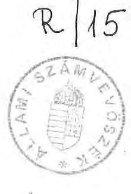
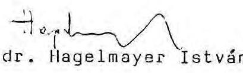
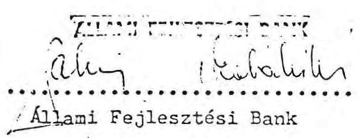
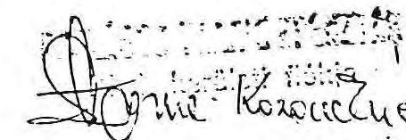
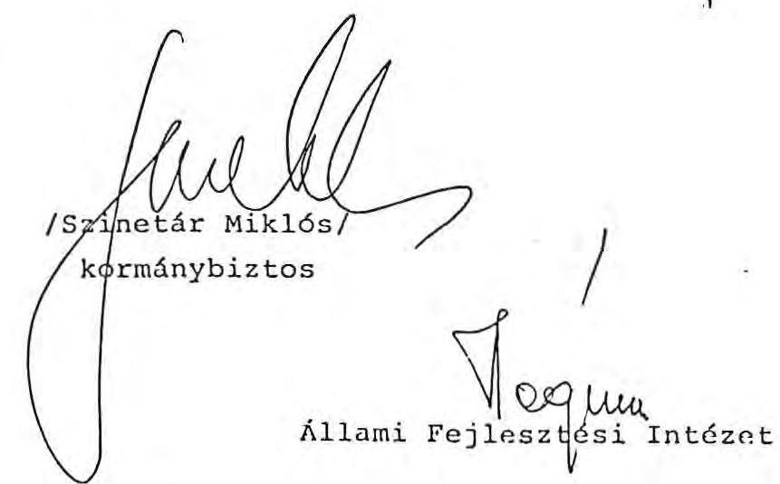

# Zillami Számbebösze 

## Jelentés

a Nemzeti Színház felépítését szolgáló pénzforrások ellenőrzéséről

---

Az ellenőrzést végezték:
dr. Csapodi Pál számvevö
Éva Katalin számvevö, tanácsos
Szabó József számvevö

Az ellenőrzést vezette és összefoglalta:

Hatusek István főtanácsos

---

# ÁLLAHI SZÁHVEVÜSZÉK 

Fejezeti Föcsoport
$V-13-14 / 1990$.

## J E L E N T É S

a Nemzeti Színház felépítését szolgáló pénzforrások ellenőrzéséről

A Gazdasági Bizottság 1964-ben döntött a Blaha Lujza téren álló Nemzeti Színház lebontásáról és egyidejűleg állást foglalt az új Nemzeti Színház (továbbiakban: Színház) felépítéséről, a tervpályázat kiírásáról. Az azóta eltelt több, mint 25 év alatt állami pénzeket fordítottak a Színház felépítésének előkészítésére, illetve társadalmi gyűjtési akciókat szerveztek a beruházás költségeinek fedezésére.

Az ellenőrzés célja annak megállapítása volt, hogy a Színház felépítését szolgáló, különböző forrásokból származó bevételek terhére elszámolt költségek mennyiben szolgálták közvetlenül a kitűzött cél megvalósulását. Megkülönböztetett figyelmet fordított az ellenőrzés a közadakozásból és nyilvánosan meghirdetett akciókból a Színház újjáépítésére összegyűjtött pénzeszközöknek a kezelésére, értékmegőrzésére. Kiterjedt az ellenőrzés a pénzkezelés és felhasználás célszerűségének, eredményességének, valamint törvényességének megítélésére. E mellett célunk volt az is, hogy bemutassuk a Színház "építésének" több mint negyedszázados - az újabb döntésekhez tanulságokkal szolválható történetét (Lásd függeléket és l. sz. mellékletet).

---

# I. Me gállapitások 

1/ A Színház előkészítésével kapcsolatos munkák költségei és azok finanszirozása

A Színház előkészitő munkálataira az állami költségvetés összesen 140-150 millió Ft-ot forditott az ellenőrzés befejezéséig.

Az 1964-1983 közötti időszakban az előkészítésre forditott összegekről, valamint azok forrásairól az OT-ban, az ÀFINál hiteles adat nem áll rendelkezésre. Az OT illetékesének szóbeli tájékoztatása, illetve a tervezésben közremüködő Középülettervező Vállalat (KÜZTI) vezető tervezőjének becslése alapján ezen időszakban a régi épület lebontására és a Színház tervezésére 20-30 millió Ft-ot forditottak. A kiadások az állami költségvetést terhelték.

A MT 1984. november 22-ei határozata alapján ténylegesen megkezdődött a Színház építése a Városliget szélén, a Dózsa György úton. A munkálatok lebonyolítását - az MM megbízásából - a MÜBER szervezte.

A MÜBER szerződéseket kötött a KÜZTI-vel az építési engedély dokumentációjának, a fejlesztési célterveknek, a beruházási javaslatnak és a programtervnek, valamint a kivitelezési tervdokumentációnak az összeállítására, majd 1985. évben a Középületépítő Vállalattal, a Fővárosi Kertészeti Vállalattal és a Budapesti Közlekedési Vállalattal az előkészítési munkák elvégzésére (szökőkút és WC elbontása, kerítés kialakítása, ideiglenes felvonulási épületek létesítése, fák és zöldnövényzet áttelepítése, a trolibusz új nyomvonalá-
$x / 1988$ - ig ÀFU

---

nak kialakítása stb.), továbbá a Posta Beruházó és Tervezõintézetével a dísztribün telefonkábelének kiváltására és a hírközlő hálózat kiépítésére, illetve megtervezésére.

Az 1983-1987. években (a beruházás leállításáig) felmerült beruházási költség 112,717.742 Ft volt, ami szintén - teljes egészében a költségvetés terhére került kifizetésre.

Az építtető mindössze 1984. évben kiadott és építésre nem jogosító elvi építési engedéllyel rendelkezett, ami nem tette lehetővé a pénzügyi lebonyolítással megbízott ÀFI-nak a kifizetések teljesítését. Végül is az ÀTB 5012/1984. sz. határozatának 4. pontja ("... a beruházási program jóváhagyása elôtt az építési engedélyhez és az alapozási munkákhoz szükséges mũszaki tervek elkészüljenek") és az OT hozzájárulása ("... az állami nagyberuházásként megvalósuló létesítmény fejlesztési céljával kapcsolatos szerződést az Állami Fejlesztési Bank befogadja") alapján az ÀFI a számlákat kiegyenlítette.

Az elszámolt költségek anyagi-müszaki összetétele a következö:
tervezés $\quad 77,103.209 \mathrm{Ft}$
építés $\quad 18,815.210 \mathrm{Ft}$
gép (színpadtechnikai piackutatás) 300.863 Ft
igazgatási költség ( $1,5 \%$ lebonyo-
lítási díj) $\quad 1,395.704 \mathrm{Ft}$
POTIBER (kábelkiváltás és hírközlö
hálózat) $\quad 15,012.756 \mathrm{Ft}$
keretátadás (2 telefonvonal) $\quad 90.000 \mathrm{Ft}$
összesen: $\quad 112,717.742 . \mathrm{Ft}$

---

A kifizetések szabályosan, a megkötött szerződések és a kollaudált számlák alapján, az ÀFI-n keresztül történtek. A HÜBER által vezetett nyilvántartások jol áttekinthetőek, pontosak és az ÀFI nyilvántartásaival egyezőek voltak.

A pénzügyi nehézségek mellett a társadalmi és a szakmai ellenérzés is fokozódott a Színház építésével szemben. Ezekre vezethető vissza, hogy 1987. június 30 -án az MM - ma már nem dokumentálható felső szintű elhatározás alapján - írásban felszólította a lebonyolító müBER igazgatóját, hogy "... a műszaki tervezési munkák leállításáról és pénzügyi lezárásáról intézkedjen, valamint gondoskodjon a felvonulási területként igénybe vett városligeti parkrész helyreállításáról és ennek pénzügyi elszámolásáról. "Egyidejüleg rendelkezett az ÀFI felé is, miszerint a beruházást kéri "leállítottnak" tekinteni.

A helyreállítás költségeire a müBER 3.586 ezer Ft-ot fizetett ki.
1988. elejétől napjainkig a Színházzal kapcsolatban közvetlenül 8,550.056 Ft kiadás merült fel. Ez az összeg a nagyberuházások előkészítésére biztosított központi keretből került kifizetésre és lényegében 1990. II. 28-ig fedezte a költségeket, -amikor a beruházás gondozása - felső szintű döntés eredményeként - az MM-tól a Minisztertanács Hivatalához került.

A MT 1987. novemberében a Színház végleges helyének meghatározására pályázat kiírásáról, 1988-ban pedig építési tervpályázat kiírásáról döntött.

A Minisztertanács 1006/1990. (I.11.) határozatában a szükséges munkálatok folytatása mellett foglalt állást. Részletes programtanulmány elkészítését írta elő, amelynek kidolgozá-

---

sára és a további előkészületekhez 30 millió Ft biztosításáról rendelkezett.

Az OT ellenezte a munkálatok folytatásának támogatását. Álláspontja szerint a Minisztertanácsnak végleges döntést kell hoznia az építkezés indításáról vagy halasztásáról. Nem vállalta a keret megnyitását nem. A PM Állami Költségvetési Főosztálya azonban 1990. febr. 15-én értesítette az AFI-t, hogy a programtanulmány elkészítéséhez 30 millió Ft-ot biztosít. A juttatás fedezete: "a beruházások költségvetési fedezetének központi tartaléka." Az AFI Költségvetési Tervosztálya felhívta a PM figyelmét arra a tényre, hogy az 1989. L. tv. szerint a beruházások költségvetési fedezete teljes egészében címzettre szétosztott. Központi tartalék hiányában a 30 millió Ft - amennyiben máshol nem ellentételezödik - a jóváhagyott előirányzat túllépését, a költségvetés tervezett pozíciójának torzulását okozza. (A 30 millió Ft-os keret megnyitásáról 1990. június 13án rendelkeztek.)

Ezen kívül az MM kezdeményezésére - az OT álláspontja ellenére - a Minisztertanács a 31181/1990. sz. határozatában engedélyezte a korábbi pályázatok során megtakarított 5,4 millió Ft összegnek a kormánybiztos rendelkezésére bocsátását a további előkészítési munkálatok finanszírozása céljából. A kormánybiztos rendelkezésére álló - 22 millió Ft kötelezettségvállalással terhelt - 35 millió Ft-ból a jelentés lezárásáig kifizetés nem történt.

A Színház beruházásának céljára rendelkezésre álló pénzügyi keretek kezelöje ez év elejéig az MM Terv- és Közgazdasági Főosztálya volt. Azóta az építkezés ügye átkerült a Minisztertanács Hivatalához.

---

A beruházással kapcsolatos nyilvántartás, számviteli rend az MM-nél nem volt vizsgálható, mert nyilvántartást nem vezettek, számlákat nem könyveltek arra való hivatkozással, hogy a feladatot a MÜBER-re bízták. Ilyen nyilvántartások nem találhatók azonban sem 1983. előtti időszakra vonatkozóan, sem 1987. után, amikor a beruházásokat az MM saját kezében tartotta.

A Színház építésével kapcsolatos kifizetések szabályosságáról teljes egészében meggyőződni nem volt mód, mert egyes tételeknél az MM rendelkezésre bocsátott iratanyagában számla nem, csak átutalási megbízás, vagy átutalást kérő levél volt található. Ezeket többségében az MM Terv és Közgazdasági Főosztályának vezetője írta alá. A pályázatok költségeinél a kifizetésekre Szinetár Miklós kormánybiztos tett javaslatot és Stark Antal, az MM államtitkára hagyta jóvá, illetve Somogyi László (a Bíráló Bizottság vezetője) tett javaslatot és Szinetár Miklós kormánybiztos hagyta jóvá.

Az MM-ben az elszámolt és kifizetett tételekről megfelelő analitikus nyilvántartást nem vezettek, csupán dossziéban gyújtötték a kapcsolódó levelezést. Az átutalások végösszege az elszámolásban szereplő összeggel és az ÀFI bankkivonatával megegyezett. Joggal kifogásolható viszont, hogy a Fővárosi Tanács Gazdasági Osztálya az 1988. évben a helykijelölési pályázat finanszírozása számára átutalt 4 millió Ft-tal csak 1990. június 18-án számolt el teljesen.

A Színház előkészítő munkálataval függnek össze a Védnökség, az Operativ Bizottság és a kormánybiztosi Titkárság müködésével kapcsolatos költségek is. Az előbbiek kiadásait külön kimutatás nélkül - az MM fedezte, igy azokról adat nem áll rendelkezésre. A kormánybiztos tevékenységének dologi költségeit a Minisztertanács Hivatalának kellett biztosítania. A Hivatal költségein belül a kormánybiztosi Titkárság müködésének közvetlen költségei (bér, TB-járulék stb.)

---

1988. évben 161; 1989. évben 202; 1990-ben - a jelentés 1 e zárásáig - 1.378 ezer Ft-ot tettek ki.

# 2/ Társadalmi akciók a források bővitésére 

Az ÁTB 1983. július 27-i határozata szerint a tervezett beruházási költség egy részét társadalmi felajánlásból, közadakozásból kell előteremteni. Ennek tervezett nagyságrendje kb. 1 milliárd Ft, illetve 1-1,5 millió $\$$ volt. Az akkor ismert tervvariáns prognosztizált költségeiből a tervezett összeg mintegy $40-50 \%$-ot fedezett volna.

A társadalmi közadakozásra szóló felhívást - a Minisztertanács döntése alapján - 1983. szeptember 21-én hirdették meg.

A törvényi szabályozás szerint a kötelezettségvállalás érvényességéhez és ahhoz, hogy az OTP e célra a csekkszámlát megnyissa, szükség van a cél szerint illetékes állami felGyyelő szerv írásos jóváhagyására. Ezt azonban az MM nem tudta az ellenőrzésnek bemutatni.

A Minisztertanács döntésének végrehajtása, a társadalmi közadakozás beindítása érdekében az OTP és az ÀFI megállapodást kötött, miszerint a Nemzeti Színház felépítésére az OTP-hez beérkező adományokat az első évben negyedévenként, egy év után félévenként átutalják az ÀFI részére.

A Nemzeti Színház Védnöksége, illetve Operatív Bizottsága nevében a gyüjtés kezelésével megbizott MH is megállapodást kötött az ÀFI-val.

Az 1983. november 21-én megkötött megállapodás szerint az adományok összegét az OTP az ÀFI-nál vezetett beruházási számla javára átutalja. A számlán kezelt pénz-összeg után a Nemzeti Színház finanszírozásához történő felhasználási időszakra az ÀFI negyedévenként

---

évi 9 \%-os kamatot számol el, mely a gyũjtésbõl származó adományok összegét növeli. Az ÀFI vállalta továbbá, hogy a társadalmi gyũjtés érdekében felmerülõ előzetesen egyeztetett célokra, számlákkal bizonyítható - nem beruházási költségeket az általános szerződéses elv és finanszírozási rend szerint fedezi. Az ÀFI csak az MM által aláírási jogosultsággal felruházott és az ÀFI-hoz bejelentett személyek által igazolt számlák alapján teljesít kifizetéseket, amelyeket a gyüjtésbõl befolyt források terhére, nem beruházási költségként számol el. Ilyen kifizetésre több esetben sor is került. (Az aláírás bejelentéseket az ellenőrzés rendben találta. A Bank csak az aláírási joggal felruházott személyek által igazolt számlákat fogadta el, illetve a beruházás lebonyolításával megbízott MÜBER számláit fizette ki.)

A megállapodásban kikötötték még, hogy az MM a szerződésbõl adódó jogait és kötelezettségeit a beruházás lebonyolításával megbízott vállalatra külön intézkedéssel átruházhatja. (2. sz. melléklet)

A megállapodás tartalmilag eltér a 30/1978. (XI.22.) sz. PH rendelet 3. \%-tól, amely a közérdekũ adományokat az OTPnél vezetett csekkszámlabetéten rendelte elhelyezni. (A késöbbiekben megjelent, a Színház felépítését szolgáló adományozás egyes kérdéseiről szóló 6/1984. (II.l.) PM-MM együttes rendelet "visszamenőleges alkalmazása" a megállapodás idópontjában nem jelent felmentést. A megállapodás megsérti a 28/1983. PM rendelet 3. \$. (2) bekezdésének elõirását is, miszerint az adományok után a mindenkori legmagasabb lakossági betétkamatot kell fizetni.

A megállapodás kamatkikötése a hivatkozott 6/1984. (II.l.) PM-MM rendelet 3. \$. (2) bekezdésének is ellentmond, amely úgy rendelkezett, hogy a Színház javára elhelyezett össze-

---

gek után a felhasználásig a közérdekũ célra juttatott adományokról vezetett csekkszámlabetétek mindenkori kamatánál 1 \%-kal magasabb kamatot kell fizetni.

A megállapodástól eltérően a pénzkezelő ÀFI-nak $9 \%$ helyett

| 1984. I. 1-től évi | $10 \%$, |
| :-- | :-- |
| 1987. V. 1-től évi | $11,5 \%$, |
| 1988.IV. 1-től évi | $16,625 \%$ |
| 1989. I. 1-től évi | $21,625 \%$ |

kamatot kellett volna tériteni.

A lehetségesnél alacsonyabb kamatláb folyósítása a szerződő felek (MM-ÀFI) hibájából jelentös kamatveszteséget okozott.

Az MM nem tett eleget a közérdekü kötelezettségvállalással kapcsolatos ellenőrzési kötelezettségének sem.
a/ A Színház felépítését elősegítō közérdekũ kötelezettségvállalás jogi szabályozása

A közérdekũ célra történő kötelezettségvállalások, illetve adományozások alapításának, felhasználásának törvényi feltételeit a Ptk. 593-597. §-ai rögzítik. A Ptk-ban meghatározott feltételek végrehajtását a pénzügyminiszter többször módosított és a 2/1990. (I.31.) PM sz. rendeletével hatályát vesztett 30/1978. (XI.22.) PH sz. rendelete szabályozta. Elvileg ennek keretébe tartozott a Színház felépítését szolgáló adományozás is.

A Színházról hozott 1984-es együttes rendelet részben eltért a korábbi általános szabályozásban foglaltaktól. A rendelet a felajánlás célját a Színház felépítésében határozta meg, címzettként azt jelölte meg. Az adományok elfogadását a Védnökség döntésére bízta, egyben kimondta, hogy gazdálkodó

---

szervezetek (Ptk. 685. \$. c. pont) és költségvetési szervek adományai nem fogadhatók el. Ez nem volt összhangban a Ptkval. A közérdekũ kötelezettségvállalásról szóló törvényi szabályozás (Ptk. 593. \$. (1) bek.) ilyen megszorítást nem tartalmaz.

A jogszabályok közötti összhangot végül is a - 6/1984. (II.l.) PM-MM sz. rendeletet módosító és ma is hatályban lévó - 22/1989. (V.26.) PM-MM együttes rendelet teremtette meg. Ennek alapján ugyanis a gazdálkodó szervezetek és a költségvetési szervek részére is lehetővé vált a Színház felépítéséhez történő anyagi hozzájárulás.

Jelenleg - az általános jogszabály hatályon kivül helyezése miatt - a Színház felépítését szolgáló adományozás kivételével más, közérdekũ célra szolgáló kötelezettségvállalásra vonatkozó végrehajtási rendelet nincs.
b/ Társadalmi gyũjtési akció megszervezése

Társadalmi gyüjtésböl 1990. április 30-ig 228,075.521,71 Ft folyt be, ami a tervezettnek 1/3-át sem éri el.

A beérkezett összegekről az OTP által vezetett nyilvántartás ad képet. (3. sz. melléklet)

Az infláció következtében a közadományból a várható beruházási költségek egyre kisebb hányada fedezhető, még a kamathozadék figyelembevételével is csak annak töredékét (jelenleg $3,2-3,7 \%$-át) teszi ki.

A gyüjtési akció tényleges, teljes költsége a téglajegy értékesítés kivételével nem állapítható meg, mivel azok viselésének, illetve elszámolásának szabályait a felek nem alakították ki és ebben egymással nem állapodtak meg. Az ellenőrzés által részben feltárt költségek egy részét a közremű-

---

ködő vállalatok, pénzintézetek a maguk költségei között elszámolták, egyes esetekben ugyanezt tették a költségvetési rend szerint gazdálkodó szervezetek (pl. a PM) is.

Pontosan még az sem volt megállapítható, hogy az MM-nek mennyi költsége merült fel az akciók szervezésével kapcsolatban.

A központi szervezésű akciók (pl. bélyegakció) költségeinek nagysága annak ellenére sem állapítható meg, hogy azokat az ÀFI-nál elkülönített alszámla-számon kezelték.

Az MM a kifizetésekkel kapcsolatos összeget nem könyvelte, alapbizonylatként csak az átutalási megbízást tudták bemutatni, a hozzákapcsolt számlákat nem. A számlákat már az ÀFI sem tudta a vizsgálat rendelkezésére bocsátani, mivel az átszervezésekkel együtt járó irattározási változások miatt az alapbizonylatok már nem voltak fellelhetők. Annyi biztonsággal megállapítható, hogy az ÀFI-nál nyilvántartott összeg, 597.050 Ft, csak a költségek egy részét teszi ki, mivel

- arra nézve dokumentum nem állt rendelkezésre, hogy az MM által megrendelt 50 ezer db emléklap $102.500^{-} \mathrm{Ft}$ előállítási árát minek a terhére fizették ki a Pénzjegynyomdának;
- az iratokból arra lehet következtetni, hogy a PM fizette ki a bélyegek grafikai munkáiért a 16.800 Ft-os összeget;
- nem tisztázható, hogy ki viselte annak az 1 millió db átutalási csekkszámlának a költségét, amely biztosította, hogy az adományok ellenértéke a XXII. kerületi OTP-hez fusson be;

---

- nem állapíthatóak meg az OTP azon költségei sem, amelyek a csekkek szétosztásával, a beérkező pénzek kezelésével kapcsolatos adminisztráció miatt merültek fel, mivel mindezt az OTP térítés nélkül végezte és a költségeket az általános költségei között elszámolta.

Az ellenőrzés helyszíni vizsgálat során tájékozódott az egyes társadalmi gyűjtési módok lebonyolításáról és a begyült pénzek elszámolásáról:
b.a/ Bélyegakció lebonyolítása

A megrendelt, legyártott, szétosztott, eladott és megmaradt bélyegekről hiteles és ellenőrizhető nyilvántartás nincs.

A vizsgálat részére az MM egy 1983. november 9-i keltezésű 2 millió db ( 135 millió Ft értékű) bélyegmegrendelés másolatát adta át az MM pecsétjével. Az Állami Nyomda egy 1984. február 6-i keltezésű levelet mutatott be - ugyancsak 135 millió Ft értékről szólóan - az MM pecsétjével ellátva. A nyomda bélyegnyilvántartó könyvében ezzel szemben megrendelöként 1983-ban a Pénzügyminisztérium, 1984-ben az MM szerepel. A megrendelt bélyegek dbszáma, illetve értéke egyébként megegyezik.

A 29/1978. (XI.14.) PM rendelet és módosításai a számvitel bizonylati rendjéről úgy rendelkeznek, hogy azt a nyomtatványt, amelynek beszerzése esetén annak értékét meghaladó, vagy névértékének megfelelő ellenértéket kell fizetni, szigorú számadású kötelezettség alá vont nyomtatványnak kell minősíteni. Ezek készletéről és felhasználásáról olyan nyil-

---

vántartást kell vezetni, amelybõl a felhasználó szerven kívül a felhasznált mennyiség is kitűnik. Az ilyen nyomtatványokat mindenkor elismervény ellenében kell átadni, illetve átvenni.

A gyakorlatban az MM a rendelet egyetlen pontját sem tartotta be.

Az értékesítésre kiadott bélyegek darabszámáról, illetve az átvevố szerv megnevezéséról az MM csak a megyei, illetve a Fövárosi Tanács esetében volt tájékozott. A szakszervezetek által értékesítésre átvett bélyegek értékéröl az MM illetékeseinek csak nagyon felszínes ismeretei voltak. Hozzávetőlegesen 70 millió Ft-ra becsülték a SZOT útján szétosztott bélyegek értékét. Ténylegesen a SZOT ennek valamivel több, mint a kétszeresét vette át 142.796 ezer Ft értékben.

Az Àllami Nyomda által legyártott, de értékesítésre szét nem osztott bélyegeket az MM megbízásából a KOMBER tárolja, a szigorú számadású nyomtatványokra vonatkozó szabályok megsértésével.

A tárolt bélyegek együttes névértéke (107,577.090,Ft) az ellenőrzés során megtartott leltározásig ismeretlen volt. A bélyegeket számolatlanul és jegyzökönyvezés nélkül helyezték el a KOMBER TÜK helyiségében egy normálzáras szekrényben.

A tárolásnak ez a módja nem felel meg az idevágó 99/1982. (XII.28.) PM sz. rendelet elöírásainak.

---

Nyilvántartás, valamint az eredeti hiteles bizonylatok (megrendelés) hiányában sem a ténylegesen legyártott, sem a szétosztásra került bélyegek db-számát, illetve névértékét teljes biztonsággal megállapítani nem lehet.

Az ellenőrzés az Àllami Nyomdától kapott információ, valamint a rendelkezésre álló átvételi elismervények alapján összeállított táblázata szerint, a szétosztásra és "tárolásra" került bélyegek dbszáma, illetve értéke meghaladja a legyártott bélyegek értékét - címletenként eltérő mértékben és összegben. (4. sz. melléklet)

A bélyegek terjesztését a munkahelyeken a SZOT, az oktatási intézményeknél a megyei (fövárosi) tanácsok vállalták. Az MM tevékenysége az akció megszervezésével kapcsolatban mindössze annyi volt, hogy az Állami Nyomda igazgatóját a megyei, illetve a Fövárosi Tanácsra "kimért" bélyegkeretekről értesítette. Az elszámoltatás és a pénzügyi szabályozás kérdésére útmutatót nem adott, az akciót magára hagyva úgymond bizalmi elv alapján kezelte.

A SZOT az átvett bélyegek terjesztését létszámarányosan leosztva, az ágazati szakszervezeteken keresztül, az alapszervezetek bevonásával végezte.

A kiadott bélyegek kezelésére, elszámolására és ellenőrzésére részletes irányelveket adott ki.

A SZOT az akció lebonyolításáról a mérlegbeszámoló mellékleteként 1987-ig rendszeresen, félévenként kimutatást kért az ágazatoktól. Az MM érdektelensége miatt a rendszeres informálódás megszakadt.

A helyszíni ellenőrzés az ágazati szakszervezetek közül a HVDSZ-re terjedt ki, ahol az akció lebonyo-

---

litását a SZOT iránymutatásának megfelelően rendben szervezték meg.

A SZOT a bélyegügy lezárását már többször kezdeményezte, de az MM-től erre vonatkozó érdemleges állásfoglalást mindeddig nem kapott. A szakszervezetek szervezeti változásai miatt egyre nehezebb a kiadott bélyegek sorsának nyomon követése.

A közép- és alsófokú oktatási intézményeknél a bélyegek terjesztése a megyei (fővárosi) tanácsokon keresztül bonyolódott le. Az ezzel kapcsolatos központi teendők ellátása az MM feladata volt.

A kiadott bélyegekről az MM-nél nyilvántartást nem vezettek. Azok értékére nézve az Állami Nyomda átvételi elismervényei adtak tájékoztatást. A 15 tanácstól visszavett bélyegekről csak a vizsgálat kérésére állítottak össze kimutatást. A visszavett bélyegek értéke: 4,012.420 Ft, amelyeknek tárolási módja (biztonsági zárral ellátott szekrény) nincs összhangban az érvényben lévő rendeletekkel.

A Fövárosi Tanácsnál szerzett helyszíni tapasztalatok szerint a bélyegek pénzügyi elszámolása szabályszerű volt.
b.b/ Téglajegyek értékesítése

A Skála Coop és az UTP Lottó Igazgatóság szervezésében és lebonyolításában az építendő színház céljaira 500.900 db Téglajegy ( 100 Ft névértékben) került kibocsátásra. A jegyek kibocsátásáúól származó és a Színház javára átutalt nettó bevétel 4.050 ezer Ft volt.

A Skála igen jól megszervezte az akciót. A reklámkampány tervezetében a reklámérvek, szlogenek és hirdetési szövegek részletes ismertetése mellett maximális és minimális tervvel

---

számolva előkalkulációt is készített. Hasonlóan jól szervezett a kapcsolódó könyvviteli nyilvántartás, illetve a pénzügyi elszámolás. Eszerint a költségek alakulása a következö volt.

Szállítóknak kifizetett költség:
1,330.292 Ft
Jutalék címén kifizetett összeg:

- Skála Reklám Stúdiónak közvetítési díjként: 448.676 Ft
- téglajegy terjesztésért: 650.300 Ft
2.504 .500 Ft

Az akció lezárása után a 12/1974. (V.3.) PM sz. sorsjátékról szóló rendeletnek megfelelően egyértelmű és pontos elszámolást lehetett készíteni. (Hiányzó tétel mindössze 18 db volt, amit helység és név szerint is ki lehetett mutatni.) (5. sz. melléklet) A nyertes sorsjegyek számjegyei és az ahhoz tartozó nyereményekről készült lista a mai napig is megtekinthető, a nyeremények átvételi igazolását is be tudták mutatni.

# b.c/ Feláras bélyegek kiadása 

Gyüjtés a MABEOSZ javaslatra indult, a bélyegkibocsátást a Posta is támogatta. A Magyar Posta elnökét a Minisztertanács hatalmazta fel a bélyegek kibocsátására. Az összes megrendelt mennyiség 240.802 db volt. Ebből 187.996 db-ot értékesítettek.

Az árusítás ideje alatt a posta a bélyegeket bérmentesítésre elfogadta. A bélyegblokk $20+10 \mathrm{Ft}$-os volt, amelyböl 20 Ft a postai dí lerovására volt használható, 10 Ft pedig a felár összege, amely a támogatás célját szolgálta. Az értékesített darabszám utáni felárat, összesen 1,879.960 Ft-ot, a XXII. kerületi OTP-hez utalták át.

---

A bélyegakció költségei egyáltalán nem állapíthatóak meg, mivel a blokkal kapcsolatos kiadási, szervezési, szétosztási, elszámolási teendök költsége a rezsiköltséget terhelte.
b.d/ Bizományi értékesítésböl befolyt adományok

A Bizományi Àruház 1983. szeptemberében kapcsolódott be a Színház építésével összefüggő akciókba:

- a vállalat átvette és értékesítette a lakosság által erre a célra felajánlott áruféleségeket. E forma keretében 20.266 Ft-ot utaltak át az OTP számlára;
- két alkalommal pályázatot hirdettek képző- és iparművészek számára, hogy azok műveikkel segítsék az építési költségek előteremtését. Az átvett 107 alkotás töredék része került eddig értékesítésre. A bevételből 71.440 Ft-ot a Színház építésére átutaltak, a művészek részére - akik a műveik értékesítéséből befolyt összeg egy részét ajánlották fel 78.515,80 Ft-ot fizettek ki;
- a füredi Anna-bálon tombolasorsolást rendeztek, amelynek bevételét ( 25.900 Ft-ot) szintén átutalták a Színház javára.

A BÀV számára a színházi akció csak költséget jelentett, mivel a színház javára átutalt összegek mellett a közvetlenül kimutatható költségek összege 165.133 Ft volt, amelyet a BÀV viselt.
c/ Az adományokból származó pénzeszközök értékmegörzése

Az MT 1057/1987. (XI.21.) sz. határozata elrendelte, hogy gondoskodni kell a Színház megépítése céljára gyüjtött összegek értékmegőrzéséről, illetve az addig különféle célokra kifizetett összegek visszapótlásáról. Ez utóbbi 1988.

---

február 11-én meg is történt, de csak a beruházási költségek vonatkozásában. A gyüjtési akció ÀFI-nál nyilvántartott közel 600 ezer Ft összegü költségei nem kerültek visszapot̂tlásra.

A 9 \%-os kamatmegtérüléssel együtt rendelkezésre álló 265 millió Ft értékének megőrzésére a kormánybiztos és az ÀFI megállapodást kötött, amely szerint az összeg befektetésére az ÀFI versenytárgyalást hirdet. Kikötés volt, hogy csak azok az ajánlások fogadhatók el, amelyek minimális kockázat mellett lehetővé teszik az érték maximális megőrzését. (6. sz. melléklet)

Az összegyűlt összeget versenytárgyalás alapján három alkalommal helyezték ki:

Első alkalommal az 1988. január 15-i versenytárgyalás alapján a befutó 14 ajánlat közül az alaptőkét gondos és részletes számításokkal alátámasztott mérlegelés után két bankhoz helyezték ki átlagosan 21,2 \%-os kamatra. A kihelyezett 265 millió Ft kamathozadéka 1990. év végére 158,4 millió Ft lesz (a megnövelt együttes összeg tehát 423,4 millió Ft).

Második alkalommal 1989.február 15-én az előző évben befolyt összegekből és kamataiból ismételten kihelyezésre került 10 millió Ft, amelynek évi kamata $20 \%$ volt, amelyet a nyertes pénzintézet további $2 \%$-kal kiegészített.

Harmadik alkalommal 1990. január 25-én hirdettek versenytárgyalást. A kihelyezendő összeg 19 millió Ft volt, (forrása: az előző évben elhelyezett 10 millió Ft és annak kamata 2,4 millió Ft, valamint az 1990. évben befolyt összeg). A legjobb feltételeket ajánló pénzintézettel megkötött szerződés szerint a lejárat ideje 1990. december 31., kamata $30 \%$.

---

A társadalmi gyũjtésbõl származó összegek kamattal együtt számított értéke tehát 1990. év végére közel a másfélszeresére, 448 millió Ft-ra nö. Ez sem változtat azon, hogy az alaptőke növekedése ellenére a várható építési költségek fedezésében a társadalmi gyüjtés hozama ma már marginális jelentöségũ.

A reálérték megőrzésére való törekvés csak részben sikerült, mivel a korábbi alacsonyan megállapított reálkamatokat a gyorsuló infláció rohamosan devalválta és ennek negatív hatását az újabban elért kamatbevételek nem tudják ellensulyozni.

# II/ KÖVETKEZTETÉSEK 

Az új Nemzeti Színház építésének eddigi elökészületi munkálatai az átgondolt, megalapozott és következetesen végigvitt politikai, kormányzati állásfoglalás hiányát jelzik. Jellemzõ volt az, hogy jogalkotási hatáskörrel nem rendelkezõ szervezetek (MSZMP Politikai Bizottsága, Gazdasági Bizottság, Állami Tervbizottság) hoztak olyan jogkövetkezménnyel, illetve pénzügyi-gazdasági kihatással járó döntéseket, amelyek a közadományokra vonatkoztak és amelyekben nem voltak illetékesek. Az ismétlődő határozatokat eleve maguk a döntést hozók sem vették komolyan, illetve más döntési fórumok rendszeresen olyan helyzetet termetettek, hogy azok végrehajthatatlanná, vagy anakronisztikussá váltak.

Az állami akarat nyilvánvaló határozatlansága, az eltökéltség hiánya, a döntések ellentmondásossága kudarcra ítélte az össznépi adakozásból összegyűlt összegek cél szerinti felhasználását is.

---

Az ügy magas szintű támogatására hivatott Védnökség összesen két ülésén a nevében megfogalmazott védö- és támogató lépések helyett a Színház létesítése szempontjából periférikus kérdésekkel foglalkozott.

Hosszú időn keresztül az Operatív Bizottság is csak nevében létezett, fontos döntéseket nem hozott, ilyeneket nem kezdeményezett. A társadalom aktív részvételének, ellenőrző, kezdeményező szerepének szervezeti feltételei nem voltak meg.

Az intézkedési feladattal megbizott szervek felelősségét és szerepkörét nem tisztázták. Azok hivatalos kötelezettségeiken kívüli, el nem hárítható feladatként teljesítették kapott megbízatásaikat (OTP, ÀFI, Operatív Bizottság stb.).

Az MI1-ben sem volt egyértelmüen meghatározva az irányításért való felelősség. Az ellátott feladatok többnyire megbízható irányítás és ellenőrzés nélkül szervezetlenül, esetenként nyomon követhetetlenül valósultak meg. Az ügyek viszonylagos rendezettsége csak a függetlenített kornánybiztos müködésének rövid idejére volt jellemző.

Az eljárók igen gyakran megszegték az alapvető állami előirásokat, jogszabályokat, a számviteli- és pénzügyi rendet. A személyes felelősség a többszörös személycserék és a munkaköri követelmények előírásának hiányában rendkívül nehezen határozható meg és a legfelső szintü vezetés következetlen, határozatlan lépései miatt érvényesíthetősége is erősen kétséges.

A költségvetés terhére eddig kimutatottan elköltött 140150 millió Ft felhasználásának célszerüsége a megvalósitás bizonytalansága miatt kétséges.

---

A közadakozásból összegyũjtött pénz a cél szempontjából mindeddig hasznosítatlan. Ennek az összegnek további sorsa a Színházzal együtt, illetve attól eltekintve is jogi-, pénzügyi és politikai rendezést igényel.

# III/ JAVASLATOK 

Az ellenőrzés során feltárt tények ismeretében a következö javaslatokat tesszük:

1/ A Színház ügye végleges döntést igényel. Amennyiben elhatározást nyer a Színház felépítése, az esetben
a/ pontosan meghatározott, garanciákat is tartalmazó pénzügyi tervet kell késziteni a beruházás pénzügyi fedezetéröl,
b/ ki kell jelölni a beruházásért felelős személyt, illetve szervezetet,
c/ dönteni szúkséges az elkészült beruházási programról.

2/ Amennyiben az épités véglegesen lekerül a napirendről, az eddigi tevékenységet meghatározott, rövid határidőn belül be kell fejeznĩ és a végsõ elszámolást el kell késziteni. Ennek keretében
a/ gondoskodni kell a beruházás szabályszerű lezárásáról,
b/ a cél megszünése miatt - a közérdekü kötelezettségvállalásra vonatkozó szabályoknak megfelelően a befizetett összegeket záros határidőn belül vissza kell tériteni. Egyidejüleg - a Ptk-val összhangban - javaslatot kell tenni az Országgyülésnek azon összegek

---

sorsának törvényes rendezésére, amelyeknek visszafizetését az adományozók a határidőn belül nem igénylik, vagy a visszatérítés - mivel az adományzó személye ismeretlen - nem lehetséges.

3/ A Müvelődési és Kőzoktatási Minisztérium kezdeményezze, hogy a közadományok betéte után jogszerűen járó, de a vonatkozó jogszabályoktól eltérően alacsonyabban megállapított kamatok különbözéét az ÀFI visszamenőlegesen térítse meg a közadományok javára.

4/ A bélyegakciót - annak spontán megszünése miatt - indokolt haladéktalanul lezárni. Az értékesítéssel megbizott szerveket a kiadott bélyegekkel el kell számoltatni és a felhasználatlan bélyegeket előirásszerűen meg kell semmisíteni.

5/ A Müvelődési és Közoktatási Minisztérium vizsgálja meg, hogy kit és milyen mértékü felelősség terhel a feltárt hiányosságokért /jogszabályok megsértése, kamatveszteség, nyilvántartások hiányossága, stb./ és az ellenőrzés elmulasztáséért.

6/ A Színház építésének ügyéről a források és a költségek alakulásáról, a közadományok sorsáról a közvéleményt indokolt tájékoztatni.

Budapest, 1990. augusztus

---

Az új Nemzeti Színház felépítésének fontosabb tervszámai

| Megnevezés | Me | 1970. évi árszint 1983. elöterjesztés 1984. elöterjesztés 1985. elöterjeszt. |  |  |  |  |  |  |  |  |  |  |  |  |  |  |  |  |  |  |  |  |  |  |  |  |  |  |  |  |  |  |  |  |  |  |  |  |  |  |  |  |  |  |  |  |  |  |  |  |  |  |  |  |  |  |  |  |  |  |  |  |  |  |  |  |  |  |  |  |  |  |  |  |  |  |  |  |  |  |  |  |  |  |  |  |  |  |  |  |  |  |  |  |  |  |  |  |  |  |  |  |

---

Az Uj Nemzeti Színház épitésére illetve előkészítésére valamint a gyüjtéssel kapcsolatban felmerült költségek

|  Beruházási jelzőszám: | Kifizetés: | költségvetésböl: | gyüjtésböl:  |
| --- | --- | --- | --- |
|  690 - 0005
/MÜBER/ | 97.704.986.- | 44.919.938.- | 52.785.048.-  |
|  590 - 0006
/POTIBER/ | 15.012.756.- | $\phi$ | 15.012.756.-  |
|  690 - 08602
/gyüjtéssel kapcsolatos költségek/ | 597.050.- | $\phi$ | 597.050.-  |
|  összesen kifizetve: | 113.314.792.- | 44.919.938.- | 68.394.854.-  |

Az adatok nyilvántartásainkkal egyezőek. Budapest, 1990. június 01.

---

# MEGÁLLA PODÁS 

amely létrejött a Nemzeti Színház Védnöksége, illetve Operatív Bizottsága által a Magyar Nemzeti Színház gyüjtés kezelésével megbizott Müvelődési Minisztérium - Budapest V., Szalay u. 10., a továbbiakban: MM - és az Állami Fejlesztési Bank - Budapest V., Deák F. u. 5., a továbbiakban: ÁFB - között az alábbiak szerint:
1./ Az új Nemzeti Színház felépítésére folyó társadalmi gyüjtés az Országos Takarékpénztár OTP 218-98220-546-621 sz. számláján történik. E számláról kifizetés semmilyen céllal nem teljesíthetó.

A társadalmi gyüjtésből beérkező adományok összegét az Országos Takarékpénztár az előbbiekben megnevezett számlájáról átutalja az ÁFB 218-98536 sz. központi elszámolási számláján keresztül az új Nemzeti Színház beruházására megnyitott 34-640 sz. számla javára. Az átutalás az OTP és ÁFB megállapodással összhangban a számla megnyitását követô első évben - 1983. szeptember 21.-1984. szeptember 20-a között - negyedévenként, a negyedév utolsó hónapjának 20. napján, egy év eltelte után félévenként, a félév utolsó hónapjának 20. napján - első alkalommal 1985. március 20án - esedékes.

Amennyiben az építkezés, illetve az Operatív Bizottság által elfogadott költségek finanszirozása megkívánja, az ÁFB fentiektől eltérően szükség szerint lehivást kezdeményez.
2./ A beruházások rendje alapján az ÁFB látja el az új Nemzeti Színház, állami nagyberuházás finanszirozásával kapcsolatban felmerülő feladatokat.
3./ Az ÁFB a társadalmi gyüjtés célkitüzéseinek megvalósitása, valamint a költségvetési eszközök kimélése érdekében a beruházással és a gyüjtéssel kapcsolatos kiadásokra elsősorban a befolyó adományokat használja fel.

---

4./ Az ÁFß a 34-640 számlán kezelt pénzösszeg után - a Nemzeti Színház finanszirozásához történő felhasználásáig terjedő idôszakra - évi $9 \%$-os, azaz kilenc százalékos kamatot számol el negyedévenként. A kamat a társadalmi gyüjtésbôl szánmazó adományok összegét növeli.
5./ Az ÁFß vállalja, hogy a társadalmi gyüjtés érdekében felmerüló - előzetesen egyeztetett célokra, számlákkal bizonyitható - nem beruházási költségeket az általános szerzôdéses elv és finanszirozási rend szerint fedezi.

Az ÁFß csak az MM által aláirási jogosultsággal felruhá* zott és az ÁFB-hez bejelentett személyek által igazolt szám- * lák alapján teljesít kifizetéseket: Ezt a gyüjtésból befolyt források terhére, nem beruházási költségként, a 690-8602-es számú számlán, elkülönittetten számolja el.'
6./ Az MM az e szerződésból adódó jogait és kötelezettségeit a beruinázás lebonyolításával megbízott vállalatra - az ÁFß egyidejü értesítése mellett - esetenként, külön intézkedéssel átruházhatja.
7./ Jelen szerzôdés mindkét fél által történô aláirással válik hatályossá.

Budapest, 1983. november
Budapest, 1983.

Állami Fejlesztési Bank

Nemzeti színház felépitésének Védnöksége illetve Operatív Bizottsága által megbizott Müvelődési Minisztérium

---

# ORSZÁGOS TAKAREKPÉNZTÁR

## 20. sz. melléklet

### Hiv, szám (je):

- **Hiv, szám (je)**: 1035
- **Szíves tájékoztatásul kiszalják az "Adomány az új Nemzeti Sejükrész" felépítéséhez: 1990. íg. 30.-?

### Beszámás:

|  Szíves beírzetés | 32.156 db | 223.075.521.71  |
| --- | --- | --- |
|  |   |   |

### Készletszíves:

|  Szíves beírzetés | 7.717 db | 16.800.910.21  |
| --- | --- | --- |
|  **Bezövető beírzetés** | 24.439 db | 211.274.811.50  |
|  **Páréret** | 10.489 db | 114.715.559.68  |
|  **Vidályi** | 20.479 db | 97.725.970.07  |
|  **Külpályi** | 473 db | 11.296.431.96  |
|  **Képviselői** | 704 db | 1.409.000.00  |
|  **Sáclájom** |  | 4.050.000.00  |
|  **Sáldíjom** |  | 1.879.960.00  |

F. 11. 21 - 20 - Vagy tájékoztatásul kiszalják az "Adomány az új Nemzeti Sejükrész" felépítéséhez, 1990. íg. 30.-.

Hiv, szám (je)

---

# KIMUTATÁS

"a Nemzeti Színház építése" címú bélyegakció adatairól

|  M E G N E V E Z É S | Bélyegek darabszáma |  |  |  |   |
| --- | --- | --- | --- | --- | --- |
|   | 20.-Ft | 50.-Ft
címletekben | 100.-Ft | Értéke Ft-ban |   |
|  1. Állami Nyomda bélyegnyilvántartó könyve alapján elkészítésre került bélyegek: Összesen: | $\begin{aligned} & 1983 . \ & 1984 . \end{aligned}$ | $\begin{aligned} & 500.000 \ & 500.000 \end{aligned}$ | $\begin{aligned} & 500.000 \ & 500.000 \end{aligned}$ | $\begin{aligned} & 1.000 .000 \ & 1.000 .000 \end{aligned}$ | $\begin{aligned} & 135.000 .000 \ & 135.000 .000 \end{aligned}$  |
|  2. Átvételi elismervény ellenében kiadásra került. ebből: tanácsok részére szakszervezet részére MM részére PM részére KOMBER-től 1984. V.9. 1984. X. 24 . | $\begin{aligned} & 950.029 \ & 379.000 \ & 550.000 \ & 21.000 \ & 29 \ & 159.542 \end{aligned}$ | $\begin{aligned} & 953.201 \ & 284.000 \ & 650.000 \ & 16.000 \ & 15 \ & 3.186 \end{aligned}$ | $\begin{aligned} & 999.423 \ & 284.000 \ & 992.960 \ & 16.000 \ & 20 \ & 43 \ & 6.400 \end{aligned}$ | $\begin{aligned} & 166.602 .930 \ & 21.780 .000 \ & 142.796 .000 \ & 1.220 .000 \ & 2.000 \ & 5.630 \ & 799.300 \end{aligned}$ |   |
|  3. KOMBER-nél "raktározott" | 159.542 | 100.739 | 993.493 | 107.577 .090 |   |
|  4. Összesen $(2+3)$ | 1.109 .571 | 1.053 .940 | 1.992 .916 | 274.180 .020 |   |
|  5. "Egyenleg" | $+109.571$ | $+53.940$ | - | 7.084 | $+4.180 .020$  |

---

# ELSZÁMOLÁS

6. sz. melléklet a V-13-14/1990. számhoz

## "A NEMZETI TÉGLALJEGY" akció lezárása!

**Kaidtam:** 500.900 db Tégséjegyet.

**Visszajött:** 435.112 db Tégséjegy

**Maradt:** 400 db Tégséjegy

**Befizetve:** - csekkek szerint - 5.904.200 Ft

**Ebből:** 65.370 db - 5.883.300 Ft - + befizetés - 20.900 Ft

**Számlán van:** 5.894.020 Ft

- 1.000 Ft - téves számlán / + /
- 9.180 Ft - még nem érkezett be
- 5.904.200 Ft

**Hiányzó tétel:** 18 db Tégséjegy!

- Várpálata - 5 db
- Bp. Erzsébet ÁH. - 1 db
- Gondosné Metró ÁH. - 12 db

**Dp.:** 1987. május 11.

**Kéntor Várkány**

---

7. sz. melléklet

a V-13-14/1990. számhoz

M e g á 1 l a p o d á s.

amely létrejött Szinetár Miklós kormánybiztos, az új Nemzeti Színház Operatív Bizottsága és az Állami Fejlesztési Intézet között, az alábbi feltételekkel:

1. Az 1057/1987. /XI.21./ Mt. számú határozat 2. pontja - egyebek között - akként rendelkezett, hogy az építési munkák megkezdése-ig gondoskodni kell a befolyt pénzösszeg értékének megőrzéséről. Az eddigi kifizetések visszapótlásával a befolyt pénzössz szeg 265 millió forintot tesz ki.

2. Az 1. pontban foglalt kötelezettségnek a felek oly módon tesznek eleget, hogy az Állami Fejlesztési Intézet versenytárgyalást hírdet az összeg befektetésére. A versenytárgyalás keretében azok az ajánlatok fogadhatók el, amelyek lehetővé teszik az érték - minimális kockázat melletti - maximális megőrzését, illetve gyarapítását. Az ajánlatok értévelezébe az Állami Fejlesztési Intézet bevonja a kormánybiztost, valamint az Operatív Bizottság képviselójét.

3. A jelen megállapodás megkötését követően befizetett adományok értékmegórzését illetően a felek abban állapodnak meg, hogy az Állami Fejlesztési Intézet folyamatosan gondoskodik ezek kamatozásáról, s félévenként - először 1988. szeptember 15-ig - javaslatot tesz a kormánybiztosnak és az Operatív Bizottságnak a befektetés módjára.

Budapest, 1988. január

Operatív Bizottság

---

# F Ü G E L E K 

a Nemzeti Színház felépítését szolgáló pénzforrások ellenőrzéséről készült jelentéshez

A Nemzeti Színház újbóli felépítésének ügye 1964-ig nyúlik vissza és napjainkban sem zárult le. Ez a több, mint negyedszázad három viszonylag jól elkülöníthető periódusra bontható: 1964-83; 1983-87; 1987-90. junius 15. A továbbiakban ebben a tagolásban foglaljuk össze az új Nemzeti Színház (a továbbiakban: Színház) felépítésével kapcsolatos eseményeket.

## 1/ Az 1964-1983 évek eseményei (Első periódus)

Az MSZMP Politikai Bizottsága először 1964-ben foglalt állást a Színház felépítése ügyében. Ezt követően a Gazdasági Bizottság 10137/64. sz. határozatával intézkedett a régi Nemzeti Színház épülete lebontásáról, az új Nemzeti Színház felépítéséről és ezzel kapcsolatosan a színház átmeneti elhelyezéséről, a tervpályázat kiírásáról, a tervezés, valamint az építés ütemezéséről. A társulat új helyéül átmeneti jelleggel a Hevesi Sándor téren a volt Magyar Színházat jelölték ki. A határozatnak megfelelően elvégezték a volt Magyar Színház épületének rekonstrukcióját és 1966. öszétól a Nemzeti Színház, mint ideiglenes otthonában itt működik. A Nemzeti Színház régi épületét - amely 50 éven keresztül volt ideiglenes otthona -ugyanebben az évben lebontották.

---

1964-ben - a kiírt pályázat eredményeként - a Városligetnek a Dózsa György út felőli szélét jelölték ki a Színház elhelyezésére. A Fövárosi Tanács 1965-ben meghatározta a Dózsa György út érintett szakaszának a rendezési tervét, majd ezt követően a Magyar Építőművészek Szövetsége rendezésében lezajlott a Színház kialakítására vonatkozó nemzetközi tervpályázat is.

A pályázati kiírás különleges kívánalomként tartalmazta azt, hogy a színházépülettel együtt kell megoldani az ünnepi felvonulások alkalmával szükséges dísztribünt és figyelemmel kell lenni a téren elhelyezkedö Lenin emlékmüre is.

A pályázatra 92 pályamü érkezett, ebből 36 magyar szerzők munkája volt. A zsűri I. díjat nem adott ki, megosztott II. díjat kapott Hofer Miklós kollektívája és a lengyel Bagus-lanski-Gniewiewski alkotópáros.

A nyertes pályamű alapján a Középülettervező Vállalat 1967. februárjára elkészítette a Színház beruházási programját. A programot a költségek csökkentése érdekében többször átalakították. Szerényebb igények alapján tervezték meg a közönségforgalmi részeket, a színpadot és egyéb üzemi részeket.

A terv szerint nézőtér befogadóképessége 900 fő, de ez a létszám esetenként növelhető 100-150 fővel. A színházteremmel egy szinten épült volna egy 300 fő befogadására alkalmas stúdiószínpad is. Felvetődött egy 1.200 fő befogadóképességü nézőtér kialakításának a gondolata is. A költségszámítások szerint a 900 fős nézőterü színház megvalósításának költsége 1970. január l-i árszinten 498 millió Ft, míg az 1.200 fős nézőterü színház költsége 642 millió Ft lett volna. A főhatósági egyeztetés után azonban jóváhagyásra és a kiviteli tervek elkészítésére anyagi okok miatt már nem került sor.

---

Az MSZHP Politikai Bizottsága 1971. április 21-i ülésén határozatot hozott a Színház felépítéséről és meghatározta az építéssel kapcsolatos teendőket, az ütemezést. A testület a korábbi elképzelésekkel szemben nagyobb, 1.200 férőhelyes színházterem építése mellett foglalt állást. Az elképzelés szerint az alapköletételére 1974. első felében került volna sor, az építkezést 1978-ban fejezték volna be. A IV. ötéves terv időszakában megoldandó feladatok anyagi fedezetét - a határozat szerint - kormányhatározattal kell biztosítani. A Politikai Bizottság ajánlása szerint az anyagi eszközöket a Mũvelődési Minisztérium beruházási keretei között e célra elöirányzott eszközökböl, a mũvelődési tárca rendelkezésére álló egyéb keretek átcsoportosítása, továbbá társadalmi akciók útján kell biztosítani. A beruházás 1975 után szükséges fedezetét az V. ötéves népgazdasági terv irányozza elő.

A Politikai Bizottság idézett döntéseinek végrehajtása azonban sorozatos halasztást szenvedett.

1977-ben a KÜZTI új alternatívát dolgozott ki a Nemzeti Színház és a Kongresszusi Palota közös funkcióit betöltendő épületegyüttes létesítésére, amelyek tervezett bekerülési értéke VI. ötéves tervi prognosztizált árakon 1,6-1,7 milliárd Ft lett volna. Ebből a kongresszusi funkció ellátása miatt felmerülő költséget kb. 250-300 millió Ft-ra kalkulálták.

A közös funkciójú épületegyüttesre vonatkozó javalatot a Gazdaságpolitikai Bizottság 1978. január 16-i ülésén tárgyalta meg. A Bizottság megállapította, hogy a rendelkezésére álló ismeretek nem teszik lehetővé a megalapozott döntést. Ezért úgy foglalt állást, hogy a mũszaki tanulmánytervek alternatív jelleggel - a prózai színház és a kongresszusi funkció együttes, illetve külön történő megoldására és ezek költségkihatására - készüljenek. A fejlesztési cél alapján a VI. ötéves tervezömunka részeként történjen döntés

---

a beruházási javaslat kidolgozásáról, a beruházás megkezdésének feltételeiről. A fejlesztési célnak az Állami Tervbizottságban történő megtárgyalását küvetően 1979. I. félévében készüljön a Politikai Bizottság számára jelentés az új színház építésének előkészítésével összefüggő munkákról. A GPB abban is állást foglalt, hogy mindaddig, amíg a fejlesztési cél, illetve megvalósításának körülményei nem kerülnek megalapozásra, nem indokolt az építéssel összefüggő felajánlások, társadalmi munkaakciók kezdeményezése.

A KÜZTI a Színház fejlesztési céljait 1979-re három változatban kidolgozta.
I. változat: Színházi épület és kongresszusi terem 2.000 fő befogadóképessségűre bővíthető - kongresszusi terem funkciót is ellátó - 1.000 fős színház.
II. változat: 800 fős prózai színház, zenés produkciók megtartására is alkalmas kialakítással, kapcsolódó beruházásként díszletkészítés és tárolás.
III. változat: 2.400 fő befogadóképességü kongresszusi és koncertterem.

A fejlesztési célhoz készített költségszámítás szerint a bekerülési érték a következö volt:
millió Ft

| Változat | Bázisáron | Prognosztizált áron |
| :--: | :--: | :--: |
| I. | 1.404 | 2.176 |
| II. | 1.232 | 1.909 |
| III. | 882 | 1.270 |

---

a beruházási javaslat kidolgozásáról, a beruházás megkezdésének feltételeiről. A fejlesztési célnak az Állami Tervbizottságban történő megtárgyalását követően 1979. I. félévében készüljön a Politikai Bizottság számára jelentés az új színház építésének előkészítésével összefüggő munkákról. A GPB abban is állást foglalt, hogy mindaddig, amíg a fejlesztési cél, illetve megvalósításának körülményei nem kerülnek megalapozásra, nem indokolt az építéssel összefüggő felajánlások, társadalmi munkaakciók kezdeményezése.

A KÖZTI a Színház fejlesztési céljait 1979-re három változatban kidolgozta.
I. változat: Színházi épület és kongresszusi terem 2.000 fő befogadóképessségűre bővíthető - kongresszusi terem funkciót is ellátó - 1.000 fős színház.
II. változat: 800 fős prózai színház, zenés produkciók megtartására is alkalmas kialakítással, kapcsolódó beruházásként díszletkészítés és tárolás.
III. változat: 2.400 fő befogadóképességú kongresszusi és koncertterem.

A fejlesztési célhoz készített költségszámítás szerint a bekerülési érték a következö volt:
millió $\boldsymbol{f t}$

| Változat | Bázisáron | Prognosztizált áron |
| :--: | :--: | :--: |
| I. | 1.404 | 2.176 |
| II. | 1.232 | 1.909 |
| III. | 882 | 1.270 |

---

Mindhárom változat mellett számolni kellett a müködési költségek jelentős növekedésével is. A továbbiakban a terv gazdasági nehézségek miatt lekerült a napirendről. A Politikai Bizottság az előzetes tervek ellenére nem tárgyalta újra az előterjesztést, így a terv a VI. ötéves terv fejlesztési céljai között nem kapott helyet, sőt a törvény végrehajtására kiadott 2026/1980. (XII.27.) Mth. sz. határozat 2.4 melléklete az állami nagyberuházásként tovább nem finanszírozható fejlesztések közé sorolta a Színházat.

Az Országos Tervhivatal 1981. februárjában kialakította a Színház felépítésére vonatkozó álláspontját. Ennek alapján - a felépítés indokoltságát nem vitatva - az új színház építésének megkezdésére, esetleg a felépítésére optimális esetben is csak 1985 utáni években kerülhet sor. Az UT vélemény szerint az építés végrehajtásához feltétlenül szükség van kormányzati szintű előkészítő programra, melyet a Hűvelődési Minisztériumnak és egy tanácsadó hatáskörű társadalmi bizottságnak kellene kidolgoznia. Figyelemmel a beruházást előkészítő munka igényességére és a gazdasági helyzetre a Színház alapköletételének javasolt időpontját 1987-ben jelöli meg. Ez az időpont az első Nemzeti Színház megalapításának 150. évfordulója. A beruházás politikai előkészítésének megkezdésére az 1982, vagy az 1983. évet jelöli meg.

Az 1983-1987 közötti fontosabb események (Második periódus)
1983. elején kerültek ismét előtérbe a Színház felépítésével kapcsolatos kérdések. Március 17-én a Középülettervező Vállalatnál Aczél György és Ilavasi Ferenc részvételével az előkészítő feladatokról megbeszélésre került sor, amelyen részt vettek az UT, az MH és az ÉVM képviselöi is. A megbeszélésen egyetértés alakult ki abban, hogy a Színház előkészítését és építését a VI. ötéves tervidőszakban meg kell kezdeni, amelyhez a KÖZTI még 1983. áprilisában kidolgozza a fő szak-

---

mai-, mũszaki és gazdasági paramétereket tartalmazó fejlesztési célokat. A további megállapítások, illetve döntések az alábbiakban rögzíthetők:

- A Színház elhelyezésére elvileg három alternatív lehetőséget mérlegeltek: a Dózsa György útat, az Engels teret és a Várban a volt HH épület helye. A megvalósíthatóság időtartama alapján a legkedvezőbb változat a Dózsa György úti elhelyezést itélték, mivel ez az 1968. évi tervpályázat dijnyertes változata, amely tervtanulmányi szinten előkészített, elhelyezésére érvényes területkijelölési határozat van. Mindezt figyelembe véve egy évvel rövidebb idő alatt építhető fel, mint a többi alternatívában szereplő objektum. (A Novotel Szálló mellett felépítésre kerülő többcélú kultúrális létesítmény felépítése amúgy is feleslegessé teszi a Színház kongresszusi hasznosítását.) A Színház fő játékszínpadának befogadóképességét kb. 1.100 fôben, a kamaraszínpadét 300 fôben határozták meg.
- A Színház építésére mũszakilag megalapozott költségszámítás még nem készült. A tervező, illetőleg a Mũvelődési Minisztérium 1977-ben kidolgozott költségbecslése szerinti prognosztizált 1,3-1,4 milliárd Ft teljes költséget az Országos Tervhivatal az akkori árbázis és árváltozási tendenciák ismeretében prognosztizált áron már 2,7-3,0 milliárd Ft-ra - mintegy 16 millió \$ tőkésimport szükséglettel - becsülte.
- Az építés pénzügyi fedezetének egy részét - a résztvevők szerint - belföldi társadalmi akció és külföldi szevezett felajánlások útján lenne indokolt megteremteni. A hazai társadalmi akcióból maximálisan 1 milliárd Ft, külföldön kb. 1 millió \$ teremthető elő. A társadalmi akciót 1983. öszén vagy 1984 elején lenne indokolt megindítani. A hazai hozzájárulásban a gazdasági szervezetek részvétele nem indokolt. A hazai és a külföldi közvélemény felé a felhívás

---

kidolgozására és a lebonyolításra a Hazafias Népfrontot, a Magyarok Világszövetségét és a művelődési minisztert lenne célszerű felkérni.

- A beruházás előkészítésével kapcsolatos feladatok ütemezése:
= A KÜZTI kidolgozza a beruházás fejlesztési célját, s azt a Mũvelődési Minisztérium 1983. májusában az Állami Tervbizottság elé terjeszti.
= Az MSZMP KB Politikai Bizottság június hónapban megtárgyalja a Színház építésének kérdéseit.
= A Kormány a VI. ötéves tervidőszakban állást foglal az előkészítés és a fejlesztési cél ügyében.
= A felső szintű állásfoglalások alapján december 15-ig a KÜZTI kidolgozza a beruházási javaslatot.
= 1984-ben - két szakaszban - készül el a kiviteli terv, az építés előkészítési terve, valamint az alapozás tervezése.

A megbeszélésen rögzített paraméterek figyelembevételével készített előterjesztést előbb a Politikai Bizottság tárgyalta meg, amely 1983. július 26 -án ismételten határozatot hozott a Színház felépítéséről. Ez a határozat mintegy 18.000 m $^{2}$ alapterületü, egy 1.100 fős szinpadteremmel és egy 200 fős kisteremmel rendelkező épületkomplexumról szól, a telepítés legalkalmasabb helyéül a Városligetet jelöli meg. A létesítmény erkélye egyben az ünnepi felvonulások dísztribünjeként szolgál, a beruházás becsült költségét prognosztizált áron 2,4 milliárd Ft-ban rögzíti azzal, hogy ez az összeg a megvalósulás során valószínúleg emelkedni fog. Az alapköletétel tervezett idöpontját 1985-re való́szi-

---

nűsíti és az építkezés legkésőbbi befejezési időpontjaként az 1989-es évet jelöli meg. Ez a határozat rögzíti, hogy egyetért egy országos társadalmi akció szervezésével, melynek keretében a felajánlások különféle formáira nyíljék lehetöség, de vállalati és állami intézményi anyagi forrásokat e célra ne lehessen igénybe venni. A határozat szerint a Színház felépítésével kapcsolatos teendők összehangolására Védnökség alakul és Minisztertanács a Múvelődési Minisztériumot - mint a beruházás felügyeleti szervét - bizza meg a Színház felépítésével kapcsolatos feladatok koordinálásával.

A politikai bizottságéval lényegében azonos tartalmú előterjesztést tárgyalt meg másnap az Állami Tervbizottság, amely az 5022/1983. sz. határozatával jóváhagyta a fejlesztési célra vonatkozó előterjesztést, egyben megbízta a művelődési minisztert a további előkészületi munkálatok elvégzésével, a társadalmi akció előkészítésével, megszervezésével és rendelkezett, hogy az állami nagyberuházás fedezetéül az Országos Tervhivatal 1983-ban 15, 1984-ben 30 millió Ft-ot biztosítson a Múvelődési Minisztérium részére.

Az ÁTB határozat nyomán a Múvelődési Minisztériumban megindultak a szervezési munkák. 1983. augusztus 8-án dr. Benedetti Tibort, az ELTE Rekonstrukciós Iroda igazgatóját - beosztásának változatlanul hagyása mellett - kinevezték a létesítendő Színház miniszteri biztosává. A kinevezéssel egyidejűleg jóváhagyásra került a miniszteri biztos hatásköre. 1983. augusztus 23-án dr. Benedetti Tibor és Aczél György között megbeszélésre került sor. A miniszteri biztos feljegyzésében rögzítette a feladatköréhez kapcsolódó, Aczél Györgyiől kapott instrukciókat, amelyek között szerepel az is, hogy az adott pénzügyi és műszaki paramétereken belül meg kell kísérelni a nézők férőhelyszámát 1.200-ra emelni.

A Múvelődési Minisztérium intézkedési javaslatokat dolgozott ki a Színház létesítésével kapcsolatosan, amelyet 1983.

---

szeptember 7-én megtárgyalt a miniszteri értékezlet. Ebben elkészítették az állami döntésről, valamint a társadalmi gyűjtésre való felhívásról szóló szöveg tervezetét, összeállították a Védnökség és a Bizottság felállítására és tagjaira vonatkozó javaslatot, a felkérő levelek tervezetét, továbbá a gyüjtési akció formáinak és módozatainak kialakítására, valamint az ügy nyilvánosságra hozatalának ütemtervére vonatkozó elképzeléseket.

# a/ A Védnökség és az Operativ Bizottság létrehozása és azok tevékenysége 

A beruházás előkészítő munkálataival kapcsolatos feladatok elvi és gyakorlati irányítása, a társadalmi aktivitás fenntartása, részben a Védnökségre, illetve a Bizottságra hárultak.

A Színház felépítésével kapcsolatos teendők Védnökséggel való segítésének gondolata először az MSZMP KB Politikai Bizottságának 1983. évi júliusi ülését előkészítő javaslatban szerepelt.

A Védnökség vezetőjének az Elnöki Tanács vagy a Minisztertanács helyettes elnökét javasolta az előterjesztés, - továbbá azt, hogy a tagok sorában foglaljanak helyet az akcióban érdekelt intézmények, szervezetek vezetői és magánszemélyek, továbbá az építkezés összes munkálatainak irányításával bízzanak meg kormánybiztost. A tömegkommunikációval kapcsolatos tevékenység koordinálására a Müvelődési Minisztérium alakítson Operatív Bizottságot, amelynek vezetője legyen tagja a Védnökségnek.

A javaslat fontosnak tartotta, hogy a közadakozásra történő felhívással egyidejűleg hozzák nyilvánosságra a Színház lé-

---

tesítésére vonatkozó kormányzati döntést és a Védnökség megalakulásáról szóló közleményt.

A Színház felépítéséről szólo előterjesztést a Minisztertanács szeptember 13-i ülésén tárgyalta meg és azt a 3259/1983. sz. határozatával jóváhagyta. Ez a döntés megerösíti az 1989. évi befejezést és a társadalmi közadakozás szükségességét.
1983. szeptember 21-én "Az ember tragédiájó"-nak centenáriumi díszelőadásán jelentette be Köpeczi Béla az akkori múvelődési miniszter a Minisztertanács döntését, s ekkor került nyilvánosságra a társadalmi szervezetek felhívása a Színház felépítését támogató társadalmi akcióról.
1983. szeptember 22-én megalakult a Védnökség.

Az alakuló ülésen Losonczi Pál bevezetőjében a Védnökség szerepéről beszélt, majd a művelődési miniszter tájékoztatta a tagokat a társadalmi adományozás, gyűjtési akció elképzelési formáiról. Az ülésen felmerült annak szükségessége, hogy a Védnökségi tagok köre egészüljön ki az iparban és a mezőgazdaságban dolgozókkal, illetve a nők arányát javítani kell. A társadalmi és tömegszervezetektől beérkezett javaslatok alapján erre sor is került, a Védnökség 12 fővel ( 9 nő és 3 férfi) egészült ki.

Az alakuló ülésen elhangzott javaslatok nyomán olyan döntés született, hogy az adakozásra már felkért külföldön élő magyarok körét bővítve levéllel forduljon a Védnökség mindenkihez, akitől erkölcsi, anyagi támogatást remélhet.

---

Az alakuló ülésen bejelentették, hogy a Színház megvalósításával kapcsolatos irányítási teendök segítésére a Múvelődési Minisztérium 11 tagú Koordinatív Bizottságot szervez. A Védnökség további üléseinek tervezett idöpontjaként a színház terveinek elkészültét, az építkezés megkezdését, késöbb az építkezésen történő helyszíni látogatást és gyüjtési akció befejezését jelölték meg.

A Védnökség második és egyben utolsó, Losonczi Pál elnökletével tartott 1984. január 26-i ülésére az Operatív Bizottság két tájékoztatót állított össze. Ezek közül az egyik a Védnökség 12 fővel történt kiegészítéséről, a másik a Színház tervezési előkészületi munkálatairól szólt. Ezzel azután a Védnökség müködése megszűnt. Ma már a védnökségi tagok egy része nem is él, míg mások nem töltik be azt a társadalmi, illetve politikai, gazdasági funkciót, amelynek köszönhetően a Védnökség soraiba kerültek.

A Védnökség megalakulásával egyidejüleg létrejött az ōperativ Bizottság is.

A Bizottság feladata a színház létesítését elősegitő társadalmi akciók koordinálása és további, a megvalósítással kapcsolatos tájékoztatás és program irányítása. A Bizottság a Védnökség által elfogadott elvek szem előtt tartásával

- kialakítja a társadalmi adományozás szervezésének módszerét;
- irányítja a gyüjtési akciót;
- összehangolja a társadalmi mozgósításban részt vevő szervek és szervezetek felajánlásokkal kapcsolatos tevékenységét;

---

- állást foglal a gyüjtéssel kapcsolatos igazgatási, pénzügyi és lebonyolítási kérdésekben;
- figyelemmel kíséri a gyüjtési akció lebonyolítását, a beruházás előkészítését és az építkezés menetét. Mindezek alapján kezdeményezően és folyamatosan orientálja a tömegkommunikációs szervek tájékoztató tevékenységét, időközönként sajtótájékoztatót tart az adományozás és az építkezés helyzetéről, a társadalmi akciók, illetőleg a beruházás lebonyolításában mutatkozó esetleges akadályok elhárítására intézkedést kezdeményez.

A Bizottság müködésének kezdetéről a formális müködés kézzel fogható, írásban megjelenő formájával alig lehet találkozni. A müködés ezen szakaszára az "operativitás" jellemző, a bizottsági feladatokat gyakorlatilag a művelődési Minisztérium, illetőleg annak főosztályai végezték. Hivatalosan összehívott bizottsági üléseket nem tartottak. Az esetenként ad hoc jelleggel összehívott megbeszélésekről írásos feljegyzés, levél, illetőleg emlékeztető nem készült.

Bár a Színház építését szolgáló pénzügyi kérdéseket szabályozó 6/1984. (II.1.) PH-MM számú rendelet a Védnökség, illetve az általa megbízott szervezet - Bizottság - feladatául jelölte meg az adományok elfogadását, a feladat ellátására nem került sor, mivel az adományokról csak az adományozás megtörténte után - az OTP értesítéséből - szereztek tudomást az érdekeltek.

A Színházzal kapcsolatos operatív bizottsági, illetőleg főosztályi munkákról a Bizottság vezetője, egyben művelődésügyi államtitkár, munkakapcsolat formájában, esetenként tájékoztatta a minisztert. A Védnökség részére - annak második ülését kivéve - a Bizottság nem készített információs

---

anyagokat, nem adott tájékoztatókat, holott ez a feladata lett volna.

# b/ A beruházási javaslat elkészitése 

A KÜZTI 1983. decemberében elkészítette a beruházási javaslatot és dokumentálta az ennek a tervezési szintnek megfelelő tervanyagot. A terveket az ÉVH és a Fövárosi Tanács öszszevont tervtanácsa a további tervezés alapjaként elfogadta.

Az Állami Tervbizottság újabb - 5012/1984. sz. - határozatában a beruházás előkészítésével foglalkozó kérdésekkel foglalkozott. Tudomásul vette a művelődési miniszternek a Színház nagyberuházás előkészítéséről szóló beszámolóját és felhatalmazást adott - az elfogadott mutatók (most már 25.300 m 2 és 3 milliárd Ft) alapján - a szükséges előkészítő munkák továbbfolytatására. Utasította a minisztert, hogy 1985. I. negyedévében terjessze az ÁTB elé a Színház beruházási programját. Egyetértett a határozat azzal, hogy a létesítmény beruházási programjának jóváhagyása előtt az építési engedélyezéshez és az alapozási munkákhoz szükséges műszaki tervek elkészüljenek. Az ÁTB felszólította a művelődési minisztert, hogy bővítse a társadalmi gyüjtés formáit és felkérte a Szakszervezetek Országos Tanácsát a társadalmi támogatás hatékony módjainak segítésére.

A beruházási javaslat tervanyagát továbbfejlesztve a KÜZTI 1984. május 15 -én adta ki az építési engedélyezési tervdokumentációt, amely betartotta az ÁTß által elfogadott műsza-ki-gazdasági mutatókat.

E terveket az ÉVH Tervtanácsa és a Fövárosi Tanács Városrendézési és Építészeti Albizottsága 1984. június 15-én megvitatta. A Tervtanács végleges állásfoglalást nem alakított ki, ajánlások figyelembevételét és a tervek ismételt bemutatását kérte.

---

Júliusban Lázár György miniszterelnök a kialakult helyzetröl tájékoztatást kért a Minisztertanács részére. A tájékoztatás megfelelö elkészítése érdekében a Múvelődési Minisztérium halasztást kért, mert időkőzben az ĖVH külföldi építészeket kért fel a tervek véleményezésére.

A beruházó az elkészült építési engedélyezési tervdokumentáció alapján 1984. júniusában az építési engedély iránti kérelmet az illetékes hatóságoknak benyújtotta, annak érdemi elbírálására azonban a Tervtanács egyetértő állásfoglalása hiányában nem került sor.

A tervező vállalat a terveket - föként a külsö megjelenés vonatkozásában - módosította, igyekezett figyelembe venni a Tervtanács ajánlásait.

Az elvi építési engedély alapjául szolgáló tervekről az ĖVH Tervtanácsa és a Fövárosi Tanács Városrendezési és Építészeti Albizottsága 1984. október 4-én közös tervbírálatot tartott. A vitában többen kifogásolták a Színház kiválasztott helyét, hangsúlyozva a belvárosi színháztelepítés hagyományát és az e nézetek szerint kiválasztott környezetet. A Magyar Építőmüvészek Szövetségének elnöksége összefoglaló véleményt is deklarált, amelyben a Színház építési helyét ellenzik. A szakvélemények és a tervtanács vitáját meghallgatva a Múvelődési Minisztérium mint építtető a bemutatott terveket minden vonatkozásban kielégítőnek tartotta. A telepítési helynek a mũvelődési tárca álláspontja szerint nincs jobb alternatívája, sem funkcionális, sem gazdasági vonatkozásban és elutasítja az Építőmüvészek Szövetségének véleményét, amelyet kellö érvekkel nem lát alátámasztottnak. A tárca véleménye az volt, hogy amennyiben a Tervtanács a megosztott vélemények miatt

---

nem ad ki hivatalos és egyértelmũ állásfoglalást, a vitát a kormányzati szerveknek kell lezárni.

A Mũvelődési Minisztérium 1984. decemberében jelentésben tájékoztatást adott a Minisztertanács részére a kialakult helyzetröl. A Minisztertanács a tájékoztató jelentést elfogadta és az idöközben ismét felmerült vári elhelyezéssel szemben megerősítette a Színház építésére hozott korábbi határozatát és felszólította a Fővárosi Tanácsot az elvi építési engedély kiadására.

# c/ A beruházási program jóváhagyása 

A létesítmény beruházási programját a Középülettervező Vállalat 1984. decemberében elkészítette. A beruházási programmal párhuzamosan elkészült az elvi építési engedélyezési terv, majd a kiadott elvi építési engedély birtokában elkészült a végleges építési engedélyezési tervdokumentáció is. Ugyancsak elkészült - a Budapesti Városépítési Tervező Vállalat tervezésében - az építésre kijelölt terület részletes rendezési terve, melyet a Fövárosi Tanács VB jóváhagyott.

A Színház terveit az építési engedély kiadása előtt a Tervtanács 1984. decemberében ismételten megtárgyalta. A Tervtanács 7/1984. (XII.30.) sz. állásfoglalása kitért a színház elhelyezésének, a környezet rendezésének kérdéseire, az épület belső funkciójának és építészeti formálásának szempontjaira. A Tanács állásfoglalása alapján véglegesített tervekre a Budapest, XIV. kerületi tanács VB az építési engedélyt 1985. június 10-én kelt határozatával megadta.

Ilyen előzmények után került 1985. augusztus 1-én a beruházási program az ÁTB elé. Az ÁTB 5035/1985. számú határozatában jóváhagyta a beruházási programot és felhatalmazta a mũvelődési minisztert, hogy az elfogadott mũszaki-gazdasági

---

mutatókkal ( 25.379 m 2 és az adományokkal együtt 3.009 millió Ft) a nagyberuházás engedélyokiratát kiadja. A megvalósítás pénzügyi és múszaki ütemezéséről úgy határozott, hogy 1986ban újabb költségvetési forrásokat ne kelljen igénybe venni és az 1987. évi finanszírozás is elsősorban saját forrásból történjen.

# d/ Kivitelezési elökészületek 

Hindent figyelembe véve ekkor a területelőkészítés 1985. II. félévi indításával, az alapkö 1986. II. félévi letételével a terv reálisnak tünt. A népgazdaság VII. ötéves terve (1985. évi VII. tv. IX. fejezet 68. \$. (2) bek.) is úgy fogalmazott, hogy "Meg kell kezdeni - a lakossági forrásokra is támaszkodva - a Nemzeti Színház építését...".

A VII. ötéves tervi várható beruházási ütem prognosztizálása kapcsán Lázár György miniszterelnök ismét foglalkozott a Színház ügyével. A miniszterelnök döntése nyomán az 1985. augusztus l-én jóváhagyott beruházási programot követöen szabályszerűen megkezdett előkészítési munkákat le kellett lassítani, erre a lebonyolító és a kivitelezö az építési és városfejlesztési minisztertól rövid úton utasítást kapott.
1985. októberében a múszaki tervezés mellett egyéb előkészítő munkák - trolibusz vezetékének áthelyezése, a dísztribün vezetékének áthelyezése, a dísztribünhöz futó postai kábelek áthelyezése, felvonulási terület kiépítése - is megkezdődtek. A dísztribün elbontását az 1986. május l-i felvonulás utánra tervezték, de a beruházás megkezdésének pénzügyi bizonytalanságait látva, Faluvégi Lajos miniszterelnökhelyettes, OT elnök kérésére a munkákat 1987. május l. utánra átütemezték.

Az 1986. május 30-i, a miniszterelnöknek írt művelődési minisztériumi tájékoztató szerint a múszaki tervezési munkák az

---

érvényes szerződések szerint még ugyanabban az évben befejeződnek, melyek várható kiadása 60 millió Ft. A szerződések alapján addig elvégzett mũszaki munkák, felvonulási anyagok utáni kötelezettség 20-25 millió Ft, mely kiadások az adományokból befolyt összegekböl fedezhetök. Az ÀT8 határozat ellenére nem várható 1987. évre költségvetési támogatás, az adományokból származó - akkor - 220 millió Ft feltehetóleg az alapozási munkák fedezetére elegendö.
1986. júniusában Faluvégi Lajos és Hetényi István a mũvelődési miniszterrel egyetértésben javasolták a 3259/1983. sz. minisztertanácsi határozat olyam módosítását, hogy az alapkö letételére 1987. második felében kerüljön sor és az építkezés 1992-ben fejeződjék be. A Minisztertanács új döntése az 5035/1985. sz. ÀTB határozatot is befolyásolná, miszerint "a megvalósítás éves pénzügyi és mũszaki ütemezését úgy kell kialakítani, hogy 1986-ban és 1987-ben költségvetési forrást ne kelljen igénybe venni. 1988-ban a saját források mellett 100 millió Ft költségvetési támogatást lehet felhasználni, 1989-90-ben pedig 500-500 millió Ft költségvetési eszközfelhasználást kell számításba venni."

A kialakult bizonytalan helyzetben, a mũvelődési tárca várakozó álláspont mellett döntött. A tervek elkészültek, az építkezés bármikor megindítható lett volna, de a beruházást csak akkor szabad indítani a mũvelődési tárca álláspontja szerint, ha a költségvetés garantálja a folyamatos, ütemes megvalósítás finanszírozását. Bár a kivitelezo a munka megkezdésére 1986. november elején felvonult, érdemi munkavégzés azonban nem történt.

Idöközben ismételten felmerült a Színház vári elhelyezésének a gondolata az ÉVH és mások részéről is. Ez esetben azonban

---

elkerülhetetlen új tervpályázat kiírása, amely több esztendős csúszást eredményezne.

# 3/ Az 1987-1990. juniusáig történtek (Harmadik szakasz) 

Az 1987. áprilisi Országgyưlésen Bánffy György képviselö̉ interpellált a Színház ügyében és azt követő sajtó visszhangok is elkezdtek foglalkozni a "legyen, vagy ne legyen" kérdésével, illetve a megfeneklett gyújtési akció holtpontról való elmozdításával. Az Országgyúlés tavaszi ülésszakán a képviselöi kérdésekre válaszolva Köpeczi Béla müvelödési miniszter kötelezettséget vállalt a Színház elfogadott terveinek felülvizsgálatára, kisebb költségigényt támasztó felépítési lehetőségeinek feltárására.

A minisztérium szakértők bevonásával végzett elözetes vizsgálata az ügyben arra a következtetésre jutott, hogy a Színház megvalósítására vonatkozó korábbi határozatok - idöben és tartalomban változatlan - végrehajtását a népgazdaság akkori helyzete nem teszi lehetővé. A társadalmi gyüjtés is a vártnál szerényebb eredményt hozott. A gazdasági mérlegelés mellett mũvelődéspolitikai döntések is indokolják a program felülvizsgálatát és ezzel összefüggésben az elhelyezésre vonatkozó korábbi döntések átértékelését. A Kongresszusi Központ ugyanis átvállalhatja a korábban még a Színháznak ítélt feladatok számottevö részét, így reálisan csökkenthető a Színház befogadóképessége. A drámai nagyszínháznak az optimális mérete 800 fős, nem szükséges, hogy az új Színház kapacitása ezt meghaladja. A Színház a nemzet rangban elsö színháza, ezért szerényen csökkentett programmal bár, de meg kell, hogy feleljen ennek a követelménynek. Elsösorban a szakmai (színházi és építészi) közvélemény alapján úgy vélték, hogy a program csökkentése mellett felül kell vizsgálni a korábbi helykijelölést is. Az elözmények,

---

a belföldi és külföldi pénzügyi hozzájárulásokkal kapcsolatos erkölcsi kötelezettségek miatt a színház felépítéséről lemondani nem lehet. A megváltozott körülmények miatt számítani lehet a társadalom megértésére és feltehetően további áldozatvállalására is, ha a kormányzat egyértelmú kötelezettséget vállal a Színház megépítésének pontos időpontjára, ami az építkezés 1990-ben való megkezdését és 1995-ben történő befejezését jelentheti. Ebben az esetben a szakmai és társadalmi szervezetekkel előzetesen konzultálva külön tervpályázat nélkül is meghozható a döntés és kiadható a tervezési megbízás. Amennyiben viszont az ország nincs olyan helyzetben, hogy felelősen kötelezettséget vállaljon a nyilvánosságra hozatal mellett, az építkezést bizonytalan idöre el kellene halasztani. Ez esetben a társadalmi adakozásból összegyűlt pénzalap elhelyezéséről - átmeneti befektetéséről - külön döntésre van szükség.

A Dózsa György úti építkezés leállításáról szóló döntést végül is a Múvelődési Minisztériuia Terv- és Költségvetési Föosztályának volt vezetöje szerint az MSZMP KJ instrukciöi alapján hozták. A döntést szóban közölték vele. Ennek értelmében ő szólította fel 1987. júniusában írásban a beruházás lebonyolítását végzö MÜDER igazgatóját az Állami Fejlesztési Intézet egyidejũ értesítése mellett arra, hogy intézkedjék a műszaki tervezési munkák leállításáról és pénzügyi lezárásáról, továbbá gondoskodjék a felvonulási területként igénybevett városligeti parkrész helyreállításáról és ennek pénzügyi elszámolásáról.

A művelődési miniszter 1987. októberében újabb előterjesztést készített a Színház ügyében a Minisztertanács részére. Még az előterjesztés megtárgyalása előtt a Minisztertanács a 3350/1987. sz. határozatával módosította a 3259/1983. sz. határozatát, amelyből törölte azt a mondatot, hogy "Tudomá-

---

sul veszi a beruházásra vonatkozó elképzeléseket és helyesli, hogy az alapkö letételére még a hatodik ötéves terv folyamán kerüljön sor és az építkezés legkésőbb 1989-re fejeződjék be."

Az előterjesztést a népgazdaság kedvezőtlen helyzetének alakulásával indokolták, miszerint az éves népgazdasági terv a beruházás megkezdéséhez szükséges feltételeket nem biztosította, s felmerült az építés halasztásának, továbbá egy olcsóbb, kisebb színház építésének a gondolata. Részben ezek következtében újabb vita indult szakmai körökben és szélesebb rétegekben a Színház elhelyezéséről is.

Az előterjesztés szükségesnek tartotta a közvélemény megfelelő tájékoztatását az addigi gyűjtésről, mert már tapasztalható volt a befizetett forint és deviza visszakérése, melyre a cél meghiúsulása esetén törvényes lehetőség van.

Az előterjesztés szerint a Színház Dózsa György úti telepítési helyéül történő kiválasztásnál az 1960-as években - városrendezési és közlekedési szempontok mellett - kedvező adottságnak minősült az, hogy a Színház erkélye ünnepek, tömegfelvonulások alkalmával dísztribünként szolgálhat. Az építészeti koncepció nyilvános bemutatása és társadalmi vitája során érzékelhetővé vált, hogy ezt az elhelyezést a közvélemény nem támogatja. Ezért a Színház helyét csak nagyon gondos előkészítés és vita választhatja ki. Célszerűnek látták, hogy a Fővárosi Tanács, az ÉVH és a Hűvelődési Minisztérium közös elhelyezési tervpályázatot írjon ki, amelynek szakmai programját a Színházmũvészeti és az Építőmũvészeti Szövetség bevonásával kell elkészíteni. A Színház helyének kiválasztása után szükséges, hogy a Minisztertanács határozza meg a színházépítés megkezdésének lehetséges időpontját, melynek ismeretében célszerű csak az építészeti tervpályázat kiírása.

---

Az elöterjesztök szerint a két tervpályázat 1988-89ben lebonyolítható ami lehetöséget ad arra, hogy a Színház 1996-ra, a honfoglalás 1.100. évfordulójára felépüljön.

A Minisztertanács az elöterjesztést megtárgyalta, és az 1057/1987. (XI.21.) sz. határozatában újabb döntést hozott. Egyetértett azzal, hogy a Színház helyének kiválasztására a Fövárosi Tanács elnöke, az építésügyi és városfejlesztési miniszter, valamint a múvelődési miniszter pályázatot hirdessen, melynek eredményéről, valamint a színházépítés egyéb előkészületeiről 1988. december 31-ig tájékoztatást kért.

A Minisztertanács ugyanezen ülésén hozott 1058/1987. (XI.21.) sz. határozatával Szinetár Miklóst - a Magyar Televízió förendezőjét - munkaköri kötelezettségeinek érintetlenül hagyásával - a Színház létrehozásával kapcsolatos kérdések kidolgozására, valamint az építéssel, a társadalmi támogatás megszervezésével kapcsolatos feladatok összefogására kormánybiztossá nevezte ki.

A kormánybiztos 1987. december 8-án a Minisztertanács Hivatalának vezetőjétől megkapta a munkakör leírását, melyben feladatául kapja az Operatív Bizottság müködtetését is.

Ettől az időtől kezdve rendszeressé váltak a bizottsági ülések. A Bizottság kb. havi gyakorisággal tanácskozott.

A megvitatásra kerülő legfontosabb témák között szerepeltek az adományok értékmegőrzésével, a helykijelölő pályázattal, az építészeti tervpályázattal, a Minisztertanács részére készített elöterjesztéssel, valamint a beruházási programmal kapcsolatos kérdések.

---

A Színház helykiválasztására kiírt pályázat meghirdetésére 1988. májusában került sor. A tervpályázat egy 800 fös nagyszínház és egy 200 fös stúdiószínház tervezéséről szólt 21.500 m 2 bruttó területtel.

A kormánybiztos 1988. július 7-én konzultáción vett részt Grósz Károly miniszterelnöknél, ahol Medgyessy Péter, Czibere Tibor, Urbán Lajos, Somogyi László, Raft Miklós, Iványi Pál, Kállai Ferenc, Kemenes Ernő és Pozsgai Imre is jelen voltak. Ekkor áttekintették a Bizottság munkáját és a kormánybiztos által készített munkaterv ütemezését. Ezzel összefüggésben a következö kérdésekben született megállapodás:

- a Színház helyének kijelölésére kiírt pályázatot 1988. közepéig kell elbírálni,
- a Színház felépítési helye ismeretében fel kell becsülni a beruházás várható költségeit,
- a helykijelölésre vonatkozó pályázat bírálatát követöen az építıezés helyéről a Fővárosi Tanács (testület) hozza meg a döntést,
- a Színház felépítésének anyagi forrását az állami költségvetés keretei között kell biztosítani, a különböző adományok - az állami pénzeszközök mellett - csak kiegészítő forrásként jöhetnek számításba,
- amennyiben Bécs-Budapest megkapja az 1995-ös világkiállítás rendezési jogát, célszerű ezzel összhangba hozni a színház felépítését és megnyitását (a színház nem a kiál-

---

# - 23 - 

litás miatt épül, de jól kapcsolható annak "Híd a jövöbe" programot adó jelszavához),

- a helykijelölés után tervpályázatot kell kiírni,
- az elökészítés szakaszában különösen óvakodni kell minden hangzatos, propagandasztikus megnyilvánulástól (ugyanakkor a pályázatok elbírálásának nyilvánosságát, demokratikus jellegét, a közvélemény széles körű tájékoztatását biztosítani szükséges),
- a kormánybiztos 1988. decemberében tegyen elöterjesztést a Minisztertanácshoz.

A helykijelöló pályázat beadási határideje 1988. szeptember 26-a volt, amelyre 90 pályamú érkezett. A bírálatot szeptember 29-e és december 5-e között folyamatosan végezte a bíráló bizottság. A bizottság rangsorolás nélkül négy pályázatot részesített 300.000 Ft-os kiemelt díjazásban, ebből kettő a Tanács krt-i, kettő pedig a vári helyszínre szólt. 220.000 Ft-os alacsonyabb összegű díjazásban egy Tanács krt-i pályázat részesült. 160.000 Ft-os megvételben két közraktár utcai, egy Engels téri és egy Madách téri pályamüvet részesítettek.

A kormánybiztos a miniszterelnöknél tartott konzultáción hozott döntés értelmében elkészítette a Színház építésének helyzetére és a további teendôkre vonatkozó elöterjesztését. A Minisztertanács a jelentést elfogadta és a 3271/1988. sz. határozatában úgy döntött, hogy be kell fejezni a helykijelölésre irányuló munkálatokat, az épület tervpályázatának kiírására 1989-ben kerülhet sor. Az építkezés kezdési és befejezési időpontjáról a Minisztertanács az 1990. évi tervmunkák során foglal állást.

---

A Fövárosi Tanács 1988. december 20-i ülésén a Színház elhelyezési tervpályázatának eredményeként úgy határozott, hogy két területet (Vár és Engels tér) biztosít a felépítendö színház számára.

A Színház építészeti kialakítására a KÖHÉM, az MM és a Fövárosi Tanács 1989. május 15 -én hirdette meg az országos, nyilvános és titkos tervpályázatot. A pályázat lebonyolítására 4 millió forint állt rendelkezésre. A pályázatot két helyszínre (Vár, Engels tér) írták ki olyan feltételekkel, hogy a színház egy 800-1050 nézőhelyes nagyszínházzal és egy 150-250 személyes stúdiószínházzal rendelkezzen.

A bírálatra 1989. október 27 -töl november 18 -ig került sor. A Fövárosi Tanács az 182/1989. sz. november 21-i határozatával az Engels téri telket térítésmentesen felajánlotta a Színház javára. A tervpályázat eredményhirdetésére 1989. december 8-án került sor. A tevpályázatra 32 pályamüvet adtak be. Első díjban Ligeti Béla (KÖZTI) és tervező kollektívája részesült. Az első két díjban részesített pályamú az Engels térre készült. A tervpályázat pályamüveit bemutató kiállítást a Budapest Galéria rendezte meg.

Még 1989. decemberében a kormánybiztos elöterjesztést készített a Minisztertanács számára a Színház felépítésének lehetőségeit és költségeit elemezve. A tervek ismeretében durván számítva is, 1989. évi árszinten mintegy 5 milliárd Ft ra becsülte az építési költségeket, mely összeg pontosítását a beruházási programtanulmánytól várta. Az elöterjesztés mellékletei tartalmazták a Színház igen gazdag és sokrétü esetenként erősen túlméretezett - szakmai programját is. A felépítés, illetve a megnyitás javasolt időpontja ekkor az 1995. évi Budapest-Bécs világkiállítás megrendezésének ideje. Az OT nem értett egyet a súlyos gazdasági helyzetben indítandó új nagyberuházással.

---

A Minisztertanács - az OT álláspontja ellenére - a kormánybiztosi jelentést, az építészeti zsűri döntését és a színház szakmai programját az 1006/1990. (I.11.) MT. sz. határozatával elfogadta és állást foglalt a szükséges munkálatok folytatása mellett. Szükségesnek tartotta a határozat, hogy a beruházás előkészítésének keretében részletes beruházási programtanulmány készüljön, amely kitér

- a beruházás részletes költségelemzésére,
- az építési költségek csökkentési lehetöségeire,
- a beruházás támogatására milyen újabb anyagi erőforrások vehetők igénybe,
- az Engels téri buszpályaudvar lebontásával és a földalatti parkoló tervezésével kapcsolatos munkák előkészítésére,
- a beruházást megvalósító non-profit jellegü beruházó szervezet lehetséges kérdéseire,
- a Magyar Néphadseregnek az építésben való közremüködés lehetöségeire.

A Minisztertanácsi határozat előírta, hogy a kész beruházási programtanulmányt 1990. május 31-ig be kell terjeszteni a Minisztetanács elé. A programtanulmány elkészítéséhez és az előkészületekhez szükséges 30 millió ft-ot a Kormány biztosította. Ezen összeg felett a kormánybiztos rendelkezik. A Minisztertanács egyetértett azzal, hogy a Színház beruházása kultúrpolitikai összefüggésben kapcsolódjék a világkiállítás programjához. A Minisztertanács megbízta a kormánybiztost, hogy a meglévőnél szűkebb körű operatív bizttságot hozzon létre, és elrendelte, hogy a kormánybiztos és az operatív bizottság müködési feltételeit a Minisztertanács Hivatala biztosítsa.

A minisztertanácsi döntéssel párhuzamosan - 1990. január 5töl - megszünt a kormánybiztosnak a Magyar Televiziónál betöltött funkciója és ettől az időponttól főfoglalkozásban látta el feladatát.

---

A kormánybiztos 1990. január 24-én a Középülettervező Vállalattal a beruházói programtanulmány elkészítésére megkötötte a szerződést, melynek határideje 1990. május 31. Ugyancsak május 31-i határidőre megbízást adott ki egy non-profit vállalat létesítéséről szóló tanulmány elkészítésére.

Létrehozta továbbá a szűkebb körű operatív bizottságot, melynek első ülését február 28-án tartották meg. 1990. március 2-án a Művelődési Minisztérium és a Minisztertanács Hivatala megállapodást kötött arról, hogy a Minisztertanács Hivatala február 28-i állapot szerint átveszi a beruházás további ügyeinek lebonyolítását. Ez a megállapodás összhangban van a minisztertanácsi döntéssel.

A Minisztertanács újabb, 3118/1990. sz. (III.29.) határozatával tudomásul vette, hogy a Színház beruházási programtanulmányának elkészítése a tervezettnél kevesebb költséget igényelt és felhatalmazta a kormánybiztost, hogy az ilyen módon megmaradt összeget további előkészítő munkákra (terü-let-előkészítés, közmú-kiváltás, szintalatti mérnöki létesítmények tervdokumentációjának elkészíttetése, a szükséges rezgésakusztikai vizsgálatok befejezése) fordítsa.

A kormánybiztos 1990. junius 15-i hatállyal benyújtotta a lemondását, amit a Kormány elfogadott.

Budapest, 1990. augusztus hó