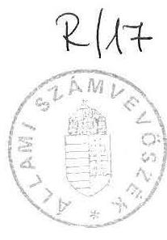
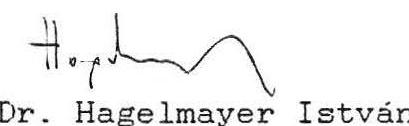
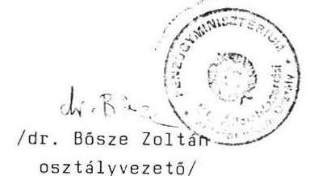

# 宅llami Számưeböszeé 

## Jelentés

az 1989. évi állami költségvetés pénzeszközei banki számlavezetésének és könyvelésének ellenőrzéséről

---

Az ellenőrzést végezték:

Bakonyvári Róbertné számvevõ, tanácsos
Bodonyi Miklós számvevõ, tanácsos
Horváth Sándor számvevõ, tanácsos

Az ellenőrzést vezette és összefogolalta:

Kolossváry György fôtanácsos

---

# ALLAMI SZAMVEVOSZEK 

$\mathrm{V}-50-12 / 1990$

## J E L E N T E S

az 1989. évi állami költségvetés pénzeszközei banki számlavezetésének és könyvelésének ellenőrzéséről

Az állami költségvetés a gazdaság pénzügyi irányításának egyik eszköze, amely mint naptári évre szóló pénzügyi terv, megvalósítja az állami feladatokat szolgáló jövedelmek központosítását és újraelosztását.

Az állami költségvetés eszközeit, bevételeit és azok felhasználását - a gazdálkodó szervekhez hasonlóan - a valódiság, a teljeskörüség és a törvényesség érvényesítésével nyilván kell tartani. A nyilvántartási feladatokat a Pénzügyminisztérium és a Magyar Nemzeti Bank látja el.

A költségvetés teljes pénzforgalma a Magyar Nemzeti Banknál - a Pénzügyminisztérium megbízásából - vezetett bevételi, beszedési, folyósítási és kiemelt kiadási számlákon bonyolódik le. Igy figyelemmel kísérhető az MNB napi számlakivonatai alapján a költségvetés pénzügyi teljesítése és likviditási helyzete.

A költségvetési mérleg (zárszámadás) összeállításánál a következö év elején, meghatározott időszakban teljesített

---

egyes bevételeket és kiadásokat is figyelembe veszik. Ez az u.n. pótkezelési idõszak.

A költségvetésen kívüli pénzeszközök kezelésére a letéti számlák szolgálnak.

Az ellenôrzés célja annak értékelése volt, hogy az 1989. évi állami költségvetés pénzeszközeinek számlavezetése és könyvelése kielégítette-e a törvényességi követelményeket, érvényesült-e a mérlegvalódiság elve.

# I. 

## Megállapítások

## 1./ Az állami költségvetés nyilvántartási rendszere

Az állami pénzügyekről szóló módosított 1979. évi II. tv. 18. paragrafusának a/ pontja a pénzügyminiszter feladatává tette az államháztartás pénzügyi mérlege tervezésének és elszámolásának részletes szabályozását. Az elszámolás (beleértve a nyilvántartás) rendjére irányuló szabályozás az Apt. 1985. június 1-i hatályú módosításától az ellenőrzés befejezéséig - nem készült el.

Az elôzõek következtében az állami költségvetés számviteli rendszere (az államszámvitel) nem alakult ki.

A fôkönyvi könyvelés alkalmazásának objektív akadályát jelentette, hogy az állami költségvetés nem rendelkezett önálló forgóalappal. Eppen ezért a likviditás érdekében a költségvetés központi számláin lévő pénzkészletek mellett olyan pénzeszközöket (budapesti központi költségvetési szervek bankszámláit) is fedezetnek tekintették, amelyek figyelembevétele viszont a

---

főkönyvi könyvelés zárt rendjébe nem illeszthető. A pénzügyminisztériumi nyilvántartás a pénzforgalom naplószerũ - 1989 nagyobbik felében manuális rögzítésére és a központi számlák többségének bevételi és kiadási jogcímek (mérlegsorok) szerinti analitikájára korlátozódik.

Az állami költségvetés (tágabban az államháztartás) bankszámlarendje - az adóigazgatás bankszámláinak kivételével - szabályozatlan. A Pénzügyminisztérium megbizásából megnyitott központi számlák kötelező tartalmára, a számlákon végezhető pénzforgalmi müveletek lehetőségére normatív követelményeket nem határoztak meg.

A számlák pénzforgalma felett közvetlen felügyeletet gyakorló Allami Költségvetési Főosztályon csak egy 1983-ban készült, azóta a karbantartás hiánya miatt elavult "Ismertető" lelhető fel. A főosztály az ellenőrzést követően aktualizálta ugyan az ismertetőt, azonban abban még mindig átfedések vannak (Különleges bevételek, bevételi számla - Vegyes bevételek, bevételi számla) és az egyes számlák pénzforgalmi jogcímei sem eléggé körülhatároltak.

A szabályozás hiányának következménye volt pl., hogy az éves zárlati utasítás keretében a Pénzügyminisztériumnak ismétlődően rendelkeznie kellett az MNB felé az egyes számlák záró egyenlegének átvezetéséről, mig egy szabályozott rendszerben ez az aktuális feladatok meghatározására korlátozódhatott volna. A finanszirozási konstrukciók változása mellett a kötelező számlatartalom tisztázatlanságával is összefüggött, hogy azonos jogcimũ átutalásokat a Pénzügyminisztérium néhány esetben (pl. személyi jövedelemadó bevétel átutalása, Lakás Alap támogatása) különbözö számlákról teljesített.

A költségvetési mérleg összeállításához kapcsolódó - a mérleg egyes sorainak és a bankszámlák forgalmi adatainak tartalmi eltérése miatt szükséges - számos átvezetés és korrekció müveleti leirását nem rögzítették írásban.

---

Az állami költségvetés 1989. évi mérlegének bankszámla összefüggéseit részletezõ leirást a Pénzügyminisztérium az ellenôrzés részére utólag megküldte. A leírás hiányosságai miatt azonban a költségvetési mérleg - annak alapján - teljeskörüen nem állítható össze.

A költségvetési mérleg gyors elkészitését elõsegitõ számítógépes program dokumentálása szintén elmaradt. A mérleg helyes összeállítására (a pénzforgalmi adatok mérlegsorokhoz rendezésére) igy csak a Pénzügyminisztérium illetékes osztályának néhány, a szükséges ismeretek birtokában lévõ szakembere jelent biztositékot.

A pénzforgalmi adatok mérlegsorokhoz rendezését az indokolja, hogy a bankszámlákat alapvetően nem a költségvetési mérleg egyes, rendszeresen változó tartalmu bevételi és kiadási jogcímeihez, hanem az adóigazgatási gyakorlathoz és más célszerüségi szemponthoz igazodóan nyitották meg. (Az adóalanyok költségvetési kapcsolatai az APEH adó- és támogatásnemenként vezetett bankszámláin bonyolódnak le. A nemzetközi kötelezettségek bevételi és kiadási pénzforgalma pl. egy-egy bankszámlán realizálódik, a forgalom egy része ugyanekkor az adósságszolgálatot, mint önálló mérlegsort érinti.)

Az állami költségvetés végrehajtására vonatkozó bevételi és kiadási pénzforgalom bankszámlák szerinti adatai a Pénzügyminisztérium és a Magyar Nemzeti Bank között év közben automatikusan megegyeznek, mivel azonos az adatbázis. A mérleg összeállításakor végrehajtott műveletek következtében viszont a föösszegek közül pénzforgalmilag már csak a mérleg két oldala közötti eltérés (hiány) összege egyeztethetõ.

---

2./ Az 1989. évi költségvetési mérleg valódisága

Az 1989. évi állami költségvetés végrehajtásáról készült mérleg adatai és a Magyar Nemzeti Bank 1989. december 29-i éves összesített, valamint a tárgyidőszakot követő, un. pótkezelési időszak pénzforgalmi adatai számszakilag egészében, a Pénzügyminisztérium által - az egyes számlák között - végrehajtott korrekciók eredményeként pedig részleteiben is egyezőséget mutattak.

A Pénzügyminisztérium az 1989. évi állami költségvetés teljesitését tükröző mérleget két alapváltozatban készítette el. A két változat abban különbözött, hogy az egyik az 1989. évi ténylegesen teljesített bevételi és kiadási pénzforgalom adatait, a másik az 1990-ben pótlólagosan elszámolt (az 1990-ben lebonyolított, de az 1989. évi költségvetésre terhelt) pénzforgalmi téte leket, valamint az egyes bankszámlák közötti korrekciók adatait is tartalmazta.
a./ A tényleges éves pénzforgalom szerinti mérleg

A Magyar Nemzeti Bank 1989. december 29-i számlakivonatai szerint a költségvetés éves kiadásai a megfelelő számlákon 601.732 millió Ft-ra, bevételei 553.588 millió Ft-ra teljesültek, a hiány összege 48.144 millió Ft volt. A Pénzügyminisztérium első változatú mérlegében a megegyező összegű hiányt 20.289 millió Ft-tal alacsonyabb kiadási és bevételi szint mellett mutatták ki.

---

Az eltérés abból adódott, hogy a szocialista államközi elszámolásokból származó 20.006 millió Ft bevétellel az ilyen címen nyújtott támogatásokat nettósitották. Az egyéni és társas vállakozások 258 millió Ft-os támogatásának átcsoportosításával szintén csökkentették a bevételeket és a kiadásokat is.

A fennmaradó különbség azzal függött össze, hogy az APEH az 1989. évben egy támogatás folyósítási számláról igénybevett 25 millió Ft fedezetet nem pótolta oda vissza, az összeget viszont nem lehetett költségvetési kiadásként elszámolni.

A pénzforgalmilag teljesült bevételek és kiadások nettósitásának törvényessége annyiban igazolható, hogy az éves költségvetés ilyen jogcímeken nem tartalmazott önálló bevételi, illetőleg kiadási előirányzatot. Alkalmazása prezentációs okokra - a támogatások látszólagos csökkentésére - volt visszavezethető.

A bevételek és kiadások mérlegsorokhoz rendezését - az egyes bankszámlák forgalmáról vezetett analitikák, az APEH kezelésében lévő adó- és támogatási bankszámlák részletezõ kivonatai és külsõ (MNB, PSZTI stb.) adatszolgáltatások alapján - az ellenőrzés tapasztalatai szerint megfelelően végezték el. A müveletek áttekinthetőségét és reprodukálhatóságát a szabályozás már említett hiánya nagy mértékben megnehezíti, ami a mérlegszerkezet és a számlarend korszerűsítésével várhatóan megoldódik.

---

# b./ A pótkezelési időszak elszámolásai 

A Pénzügyminisztérium az 1990. évben az 1989. évi állami költségvetés bevételeit 1,1 milliárd, kiadásait pedig 7.2 milliárd Ft-tal pótlólagosan növelő - a mellékletben részletezett - pénzforgalmat számolt el. Ezen felül további, együttesen 6,5 milliárd Ft összegben végzett számlák közötti - a bevételi és a kiadási szintet már nem érintő - rendezéseket. Ez utóbbiakat a Világbanki hitelkostrukció sajátosságai és egyéb utólagos korrekciók indokolták.

A pénzforgalmilag teljesitett és az állami költségvetés hiányát 6,1 milliárd Ft-tal, 54 milliárd Ft-ra növelő pótkezelések törvényessége, vonatkozó törvényi szabályozás hiányában, nem minősithető.

Ugyanakkor az IMF az 1989. évet érintő pótkezelést báziskorrekcióként tudomásul vette. Az 1990. évi IMF készenléti hitel-megállapodáshoz kapcsolódó memorandum szerint a pótidőszak államháztartási kifizetései közül az AFI beruházási és az OTP Lakás Alap ráfordításai, valamint a kincstárjegyek kamatterhei és a nemzetközi biztosítások költségei 1991. február 15-ig szintén elszámolhatók. A költségvetési pótkezelés eddig folytatott gyakorlata azonban ennél lényegesen tágabb volt.

A pótlólagosan elszámolt költségvetési bevételek döntő hányadát - az MNB és az OTP számlákra már 1989. december 29-én (a zárónapon) befolyt, de a központi számlára azon a napon jóvá nem irt - 1.063 millió Ft személyi jövedelemadó átutalása jelentette. A bevételi tételek többi része szintén az 1989-ben már realizálódott központi bevételek befizetésé-

---

vel és egyes célkeretek maradványainak januári visszautalásával függött össze.

A pótkezelésként elszámolt kiadások fedezetét az Előző évi forgóalap áthozott egyenlege elnevezésű bankszámlára a gazdálkodási- és pénzmaradvánnyal rendelkező központi számlákról rávezetett záró egyenlegek, a pótkezelési időszakban elszámolt költségvetési bevételek és forgóalap megtérülések, valamint - a Parlament által jóváhagyott 33 milliárd Ft hitelkeret terhére felvett - 4,5 milliárd Ft hitel képezték.

A kiadások áthuzódásának egy része gyorsabb és hibamentes ügyintézéssel megelőzhető lett volna. Igy pl. a Kereskedelempolitikai Alap 1 milliárd Ft-os támogatási igénye már december közepén, a kincstárjegyek forgalmazásának november havi 1,2 millió Ft-os költségelszámolása a hónap második felében a Pénzügyminisztériumba érkezett. A Piaci Intervenciós Alap 131 millió Ft-os támogatási igényének dátuma is december 14-e volt.

A Kereskedelmi Minisztérium és a Pénzügyminisztérium miniszterhelyettesi szintű megállapodása értelmében az alap támogatását a kávékassza többletéből kellett volna finanszirozni. Az összeg kiutalását - főosztályvezetői elhatározás alapján - nem a letéti számlán lévő forrásból, hanem pótkezelésként a költségvetés terhére számolták el.

Szintén még a költségvetési évben rendezhető lett volna az export hitel biztosítás fedezetére a Hungária Biztositónak 1990. január közepén teljesített 1.2 milliárd Ft-os átu-

---

talás. Az alkalmazott előleg-finanszirozási konstrukció az idózitést, az igénylés tartalma és a letéti számlán lévő részleges forrás az összeg mértékét tette indokolatlanná.

A Hungária Biztositó az 1989. december 29-én kelt 1,2 milliárd Ft összegú igénylésében IV. negyedévi pénzszükségletként olyan káreseményeket is megjelölt, amelyekről már tudomása volt ugyan, de felé még nem jelezték. Ezért ezek pénzügyi teljesitésére 1989-ben a Biztositó részéről már nem is kerülhetett sor.

Az 1988. évben a politikai kockázatokkal összefüggő káreseményekre a Pénzügyminisztérium 2.077 millió Ft-ot még a letéti számláról fizetett ki a Biztositónak, az ott felhalmozódott forrásból. Már abban az évben 404 millió Ft-ot a költségvetés terhére is elszámolt, holott a letéti számlán még 333 millió Ft állt rendelkezésre. A letét maradvány összegét 1989-ben - a 4,1 milliárd Ft mértékủ biztosítási teher ellenére - sem vették igénybe.

Téves elszámolások és átutalások utólagos korrekciója további 110 millió Ft kiadás pótlólagos elszámolását tette szükségessé.

Az állami alapjuttatások 1989. I. félévi kezelési költségeinek hibás kiszámítása miatt az AFI december végén nyujtott be 94,5 millió Ft-os pótigényt. A téves átutalások utólagos rendezése ezen felül 15 millió Ft kihatással járt.

A költségtérítések és jutalékok pótlólagos elszámolása - de a pótkezelés bevételeinek és a korábban említett kiadások egy része is - az állami költségvetés finanszirozási rendjének szabályozatlanságához kapcsolható. Az alkalmazott gyakorlat eredményeként az érintett tételek - szemben a költségvetési mérleg többi adatával - eredmény-szemléletüvé váltak, ami az egységes elvektől eltérést jelentett.

---

A ráfordítások megelõlegezésére kiutalt keretösszegek esetében a Pénzügyminisztérium nem mindenkor irja elõ az év végi, pénzforgalmilag is rendezendõ elszámolást (export hitel biztosítás stb).

A térítéses jellegü finanszirozásnál szintén nem egységes a gyakorlat. Az ilyen kifizetések többsége a pénzforgalmi teljesités időszakát terheli. A pótkezelésként elszámolt tételek ettől eltérést jelentenek (de csak az év végén, mert év közben az elszámolás ezeknél is pénzforgalmi szemléletü). Igy az állami költségvetés teljesitéseként vegyesen fordulnak elõ pénzforgalmi és eredmény-szemléletü adatok.

Az 1989. évi pótkezelés legnagyobb kiadási tétele a lakáshitelek elötörlesztésének kiegészitésére az OTP-nek - 1990. február 8-án - átutalt 4,5 milliárd Ft volt. Az összeg átutalása az 1990. január 15-ig meghosszabbitott kedvezményes elötörlesztési lehetőséghez kapcsolódott.

A Minisztertanács utólag, az 1989. évi állami költségvetés hiányának elözetes rendezéséröl hozott 1/1990. (II.14.) Ogy. sz. határozattal kapott felhatalmazást a kedvezményes kamatozású lakáshitelek elötörlesztési kedvezményének hitel terhére való elszámolására.

Az átutalt 4,5 milliárd Ft, mintegy 828 millió Ft-tal meg is haladta az OTP által írásban jelzett támogatási szükségletet.

Az OTP 1990. január 18-án kelt, a Pénzügyminisztérium részére megküldött irata szerint az 1989. november l 1990. január 15-e közötti időszakban történt rendkívüli törlesztések 45\%-os kedvezménye 9.672 millió Ft támogatási igénnyel járt. A Pénzügyminisztérium viszont az 1989. december 29-én teljesített 6 milliárd Ft átutalással együtt az akcióra 10,5 milliárd Ft-ot biztosított.
(Az OTP hivatkozott levelében feltüntetett adatok a hálózata előjegyzései alapján készültek. A tényszámok szerinti összegekről a Pénzügyminisztériumban nem állt rendelkezésre újabb adat.)

---

A pótkezelési gyakorlat következetlenségére utal ugyanakkor, hogy a lakásépités 1989. évi szociális kedvezményei kapcsán az állami költségvetés 4,2 milliárd Ft-tal maradt adósa az OTP-nek. Ennek a tartozásnak az 1990. évi kiegyenlitését már nem számolták el pótkezelésként, szemben a megelôzõ évi gyakorlattal.

Az 1989-re áthuzódott 167.5 millió Ft tartozás ellenében a Pénzügyminisztérium akkor 500 millió Ft pótlólagos kiadással terhelte az 1988. évi költségvetést.

Az állami költségvetés teljesitésének szabályszerűségi értékelését tovább bonyolítja, hogy az 1990. évi költségvetés tehermentesítése érdekében a Pénzügyminisztérium - a Parlament tájékoztatása mellett - még 1989. december 29-én két, együttesen 12 milliárd Ft összegű átutalás részeként 3,7 milliárd Ft-ot fizetett ki az Állami Fejlesztési Intézetnek (AFI) a jamburgi gázvezeték 1990-ben esedékes refinanszirozási hitel kamatának fedezetére. További 2,6 milliárd Ft is tulfinanszirozásnak bizonyult. (Megjegyezzük, hogy az átutalásokat az aznap felvett 28,3 milliárd Ft jegybanki hitelbõl teljesítették.)

Az AFI a beruházások és a vállalati alapok kiegészítésének zavartalan finanszirozása érdekében 4,5 milliárd Ft fedezetet igényelt a Pénzügyminisztériumtól. Az érvényes felhalmozási elõirányzatoknak és a jóváhagyott beruházási engedélyokiratoknak egyébként megfelelõ összeggel szemben az igénybevevõk csak 1,9 milliárd Ft támogatási szükségletet jelentettek be. A 2,6 milliárd Ft különbõzet év végi maradványként jelentkezett az AFI-nál és 1990-ben képezte forrását a beruházások műszaki áthúzódásának.

---

Figyelemmel arra is, hogy a Pénzügyminisztérium az AFI még 1988-ban esedékes - 1,8 milliárd Ft beruházási támogatás és 1,5 milliárd Ft refinanszirozási hitel kamat - követelését csak 1989. juniusában egyenlitette ki, a felhalmozási kiadások egyes évek közötti áthuzódásai közel 10 milliárd Ft-tal rontották az 1989. évi költségvetés pozícióját.

Szintén a költségvetés teljesítésének szabályszerűségével összefüggő kérdés, hogy a Pénzügyminisztérium 1989. december 28-án 14,4 milliárd Ft-ot utalt át az 1989. évi államadósság kamattörlesztési kötelezettsége címén a Magyar Nemzeti Banknak, a kötelezettség alapjának és mértékének jogi tisztázatlansága és a bizonylati alátámasztás hiánya ellenére.

A Pénzügyminisztérium magyarázata szerint az 1990. évi költségvetési törvényjavaslat szöveges indoklásának az 1989. évi állami költségvetés várható teljesítésével foglalkozó I. fejezete tartalmazta azt a követelményt, hogy a teljes államadósságra évi $6 \%$-os kamatot kellett visszamenőleg is számítani. (A Magyar Közlönyben közzé tett szöveg szerint: "A Magyar Nemzeti Banknak a költségvetési hiányt fedezõ és más, a költségvetés által átvállalt feladatok forrását képező hitel- és kölcsöntartozások után fizetendő kamat a tartozásállomány évi átlagban 451 milliárd forint - $6 \%-a, 27,1$ milliárd forint.")

Az ellenőrzésünk idején is hatályos költségvetési hitelés kölcsönszerződésekben azonban ettől eltérő kamatok szerepelnek. Az államadósság részét képező, korábban nem publikált, kamat- és lejárat nélküli kölcsönökre, a miniszterelnöki bejelentés óta, nem készült szerződés. Igy az idézett szövegrészen kivül a kötelezettségre törvényi, vagy szerződéses alap nem vonatkozik. A Pézügyminisztérium és az MNB tájékoztatása szerint folyamatban van a szerződés megkötése.

Az MNB sem a 14,4 milliárd Ft átutalását megelőzően, sem azt követően nem küldött a Pénzügyminisztériumnak az összeg mértékét, részletezését és esedékességét igazoló hivatalos okmányt.

---

A Pénzügyminisztérium által végrehajtott, pénzforgalmilag is lebonyolitott pótkezeléseknek a költségvetésen kívül is figyelmet érdemlõ hatásai voltak. A Magyar Nemzeti Bank jegybanki mérlegét is módositani kellett, 6 milliárd Ft belsõ szerkezeti változtatást okozva. A jegybanki mérleg fôösszegét a költségvetési pótkezelések nem befolyásolták, az AFI visszamenőleges elszámolásai azonban 5 milliárd Fttal megnövelték.

# 3./ A letéti számlák 1989. évi pénzforgalma 

A Pénzügyminisztérium 1989. évben három letéti számla felett rendelkezett:

- 80. Népgazdasági Elszámolások (Ng.E.) Pénzügyi lebonyolitások letéti számla, Budapest;
- PM Termelőszövetkezetek Visszatéritendő Állami Juttatási Alap letéti számla, Budapest;
- Ng.E. Hungarocamion Vállalat Világbanki Adósságszolgálati letéti számla.

A költségvetési gazdálkodási körön kivül eső letéti számlák nyitásának, a számlákon végezhető pénzforgalmi müveleteknek a szabályozása, a többi számlához hasonlóan, szintén rendezetlen.

A letéti számlák pénzforgalmi jogcímeinek meghatározása is - a már említett - hiányos és elavult "Ismertető"-ben volt fellelhető.

---

A letéti számlák pénzforgalmát - fôkönyvi könyvelés hiányában - ugyancsak naplószerũen, idősoros analitikus rendszerben rögzitik a Pénzügyminisztériumban.

A számítógépes analitikus nyilvántartás feltételei adottak, de technikai hiba miatt 1989. nagyobbik felében manuálisan végezték azt.
a./ 80.fejezet Ng.E.Pénzügyi lebonyolítások letéti számla

A számla 1989. január 1-i egyenlege 10,3 milliárd Ft volt, amely hosszú évek felsőszintü államigazgatási és pénzügyminisztériumi döntéseinek hatására alakult ki. Ezekre a döntésekre törvėnyi szintũ szabályozás hiányában kerülhetett sor.

A számla - az 1983. évi tartalmi meghatározás szerint - a legkülönfélébb pénzügyi müveletekből származó, föként eseti befizetések kedvezményezettje volt. Ide utalták pl. a költségvetési feladatok ellátásával kapcsolatban külön biztosított ellátmányok, fedezetek maradványait, a megszünt adókból, adójellegũ befizetési kötelezettségekből a megszűnést követően feltárt összegeket, egyes árkasszák többletét és egyéb elvonásokat. A számla jellemzôen ezen összegek tartalékolására, elkülönítésére, illetve eseti folyósítások, finanszírozások lebonyolítására szolgált.

A letéti számlán pl. az adott költségvetési elõirányzatok maradványából árviz- és belvizvédelmi tartalék címén - több év alatt - 1.2 milliárd Ft-ot gyüjtöttek össze. Kifogásolható az is, hogy ugyanakkor az egyes években a

---

Pénzügyminisztérium az elöirányzatokkal megegyezö összegü felhasználásról számolt be.

A számlán az MNB kimutatása szerint 22.7 milliárd Ft kiadási és 20.8 milliárd Ft bevételi, a Pénzügyminisztérium analitikus nyilvántartása szerint 20.7 milliárd Ft kiadási és 18.8 milliárd Ft bevételi forgalom után alakult ki az 1989. december 31-i 8.4 milliárd Ft-os záróegyenleg.

Az MNB és a Pénzügyminisztérium kimutatása közötti eltérés oka, hogy mig a bank valamennyi pénzmozgást regisztrál , a PM analitikus könyvelésében a számlára érkezö téves befizetéseket és visszautalásokat nettó módon könyvelik.

A letéti számlán elkülönitetten kezelt pénzeszközök döntő többsége, a látszólag magas forgalom ellenére, nem mozgott. A Pénzügyminisztérium részéről - a nyilvántartásban is - két csoportba sorolt összegek közül a számla meghatározó nagyságrendjét jelentő 7.7 milliárd Ft-os első csoport egyenlege több év alatt mindössze egy alkalommal változott.

Az eseti pénzmozgás egy 106.8 millió Ft-os, a Szakmunkásképzési Alapot érintő átutalással függött össze. Ilyen jogcimü befizetés a jövöben már nem várható, mivel a szakképzési hozzájárulásról és a szakképzési alapról szóló 1988. évi XXVIII. törvény szerint a további befizetések a Szakképzési Alapot illetik.

A számla 1989. év végi egyenlegét tekintve kisebb, mintegy 660 millió Ft-os másik csoportjába sorolt tételek a későbbiekben még felhasználásra kerülhetnek. Ebben
különböznek az első csoport tételeitől.

---

A második csoport év végi pénzállománya különbözö pozit-iv-negativ tételek egyenlegeként alakult ki, mivel ebben a csoportban kerültek feltüntetésre az egyes - más pénzügyi előirányzat, forrás hiányában - átutalt, mintegy 5,9 milliárd Ft-ot kitevő összegek.

A második csoportba tartozó több tétel finanszirozása a korábbi időszakban (1987-ben) a letéti számla helyett más konstrukcióban is megoldható lett volna.

A húsipari vállalatok beruházási és forgóalap mege-lőlegezési hitelével, valamint államkölcsön tar-tozásával összefüggő adósság állományát a költségvetés a letéti számla terhére átvállalta. A szándék szerint a letéti számláról csak átmeneti finanszirozásra került volna sor. Az adósságot 1987. II. félévében, törvényi felhatalmazás alapján, hosszú-lejáratú bankhitellel rendezték volna. Ez elmaradt, s a tartozás jelenleg is 912,9 millió Ft összegben negatív állományként szerepel a letéti számlán.

Az Őzdi Kohászati Uzemek és a Lenin Kohászati Müvek 1986. óta felhalmozódott 556,6 millió Ft adósságát szintén a letéti számláról finanszírozták.

A kétszintü bankrendszer 1987. év után kialakult egységeinél (Co-Nexus, Postabank, Innofinance, Garancia Biztosító) a letéti pénzeszközökböl vásárolt állami részvényhányadok, illetve az ezek után fizetett osztalékok, kamatok összegeinek költségvetésen kivüli kezelése sem tartalmi, sem vagyonnyilvántartási szempontból nem volt megnyugató.

Célszerű azokat átadni a már müködő Állami Vagyonügynökségnek. (A Pénzügyminisztérium legfrisebb tájékoztatása szerint ez folyamatban van.)

A letéti számla fogalmát olyan pénzforgalmi tételek és függő elszámolások is növelték, amelyeket nem indokolt ezen a számlán kezelni.

---

A rádió-televizió elơfizetési dijból a Magyar Rádiót megillető részt a Magyar Televizió havonta utalja a letéti számlára, ahonnan - függő tételként kezelve negyedévenként történik a továbbutalás. A testületi szervek (Honvédelmi Minisztérium, Belügyminisztérium) gépjármü biztosítási dijainak átfuttatása szintén feleslegesnek tekinthetö.

A számláról 1989. januárjában a Budapest Bank részére 1.0 milliárd Ft-ot, a társadalombiztosítás részére 2.0 milliárd Ft-ot utalt át a Pénzügyminisztérium ideiglenes jelleggel. A Budapest Bank (BB) részére átutalt összeg, az átutalás jogcíme szerint, kamatmentes letét volt; a Pénzügyminisztérium utólagos közlése alapján viszont kincstárjegy vásárlásra került felhasználásra. A társadalombiztosítás forgóalap megelólegezés címén kapta az összeget.

A BB részére átutalt összeg kamata, illetve annak megosztott része nem található a letéti számlán. Vélelmezhetően annak teljes összege - helytelenül - a bankot illette. (A Pénzügyminisztérium tájékoztatása szerint a letét kamatának beszedésére az intézkedés folyamatban van.)

Az említett két átutalás ügyirata az ellenőrzés ideje alatt nem volt fellelhető.

A letéti számla forgalmának döntő többségét a költségvetés ideiglenes finanszirozása tette ki. A letéti számláról különbözõ idõpontokban és összegben - együttesen mintegy 17.5 milliárd Ft-ot utaltak át a költségvetés forgóalap múveleti számlájára.

A Minisztertanács - a pénzügyminiszter elöterjesztésének figyelembevételével - 1990. május 8-án, a 3169/1990. sz. határozatával döntött a 80. Népgazdasági Elszámolások fejezet letéti számláján kezelt összegek sorsáról. A határozatnak megfelelően 7.7 milliárd forint befizetésre került a költségvetés forgóalapjára; a letéti számlán maradó összeg terhére elöírta a Társadalombiztosítási Alap 2 milliárd Ft

---

forgóalapjuttatásának, továbbá a Postabank és Takarékpénztár RT-nél, valamint a Magyar Külkereskedelmi Bank Rt-nél jegyzett részvények összegének végleges elszámolását. (Az elszámolások végrehajtására és az ezek teljesítése után fennmaradó összeg felhasználási javaslatának kidolgozására a Pénzügyminisztériumban intézkedtek.)
b./ Egyéb letéti számlák

- PM Termelőszövetkezetek Visszatéritendő Állami Juttatási Alap letéti számla

Az 1989. január 1-i 673.5 millió Ft nyitóegyenlegú számla éves 1026.6 millió Ft kiadási és 1.136 .5 millió Ft bevételi forgalmának jelentós része a számla tartalmi meghatározásában foglaltaknak megfelelően alakult.

Megitélésünk szerint azonban a letéti számla alkalmazása helyett cél- és szabályszerűbb lett volna, ha a meghatározott célra az APEH-nél, illetve jogelődjénél nyitnak egy elkülönített számlát.

A termelőszövetkezetek erre a letéti számlára teljesítik a visszterhes állami juttatás törlesztő részleteit, a juttatás járulékát, a részükre folyósitott szanálási és veszteségrendezési hitelek felszabadult óvadékfedezeteinek visszautalásait. Ide utalja át az APEH a termelési adóból törlesztett fejlesztési hozzájárulást. A számláról csak téves befizetés visszautalását, vagy a költségvetés javára történő kiutalást lehet teljesíteni.

Az 1989. év során a Pénzügyminisztérium erről a számláról is igénybevett átmenetileg 800 millió Ft-ot a költségvetés

---

likviditási problémáinak áthidalására. A rövidlejáratú hitel felvétele szempontjából kedvező megoldás a letéti összegek rendeltetéstől eltérő felhasználását jelentette.

- NG.E. Hungarocamion Vállalati Világbanki Adósságszolgálati letéti számla

A számlát a Pénzügyminisztérium 1988. januárjában nyitotta meg. A Hungarocamion Vállalat által az állam részére hiteltörlesztésként befizetett és számára visszaforgatott 56.2 millió Ft pénzforgalmán kívül a számlán nem volt mozgás.

A Világbank felé törlesztő magyar állam és a végső kölcsönigénylő Hungarocamion törlesztési ütemezése eltérő. A vállalat által előbb visszafizetésre kerülő összeg erejéig, az I. Közlekedési Program kölcsönének feltételei szerint, az államnak (ha arra a vállalat igényt tart) visszaforgatási kötelezettsége van. A vállalat, élve szerződéses jogával, az összeget visszaigényelte.

# II. 

## Következtetések, javaslatok

Az ellenőrzés tapasztalatait összegezve megállapitható, hogy az állami költségvetés 1989. évi teljesítésének mérlege számszakilag - a pótkezeléseket is figyelembe véve - megfelel a valódiság követelményének. A tartalmi szempontú megitéléshez a finanszirozási, elszámolási és prezentációs alapelvek rögzitésére, valamint az elszámolások rendjének részletes szabályozására van szükség. A korábbi gazdaság- és

---

pénzügypolitika napi igényeihez igazodó költségvetési gyakorlatot e tekintetben is törvényes keretek közé indokolt szoritani.

A letéti számlákon kezelt összegek jelentős része az elmúlt években hozott döntések következménye, ezeknél további befizetések nem várhatók. A Kormány erre tekintettel 7,7 milliárd Ft-ot el is vont innen a költségvetés forgóalapja javára. A számlákon kezelt összegek másik csoportja hatályos döntéseken alapuló befizetések eredménye. Ezek az összegek csak átfogóbb döntések meghozatala esetén szabadulnak fel.

A tapasztalatok alapján a következőket javasoljuk:

1. Törvényi szinten - célszerűen az államháztartási törvény keretében - indokolt szabályozni az állami költségvetés általános finanszirozási és elszámolási rendjét. Ennek keretében kell meghatározni
a/ az egyes kiadási jogcímek pénzellátási rendjét (előleg rendelkezésre bocsátásával, illetőleg utólagos térítéssel);
b/ a költségvetési kötelezettségek évek közötti áthúzódásának korlátait (megakadályozva a jogos és esedékes finanszirozási igények késedelmes teljesítését);
c/ a pótkezelési időszakban elszámolható tételek jogcímeit és az elszámolás normatív követelményeit ( a

---

pótkezelési lehetőség szük körű és mértékű maradjon, a pótkezelésről külön beszámolási kötelezettség legyen az Országgyúlés felé);
d/ a letéti számlák funkcióját, müködtetését és a számlák forgalmáról való beszámolás kötelezettségét.
2. Szabályozni kell az állami költségvetés számviteli (nyilvántartási) és bankszámlarendjét a tartalmi követelmények és összefüggések rendszerszemléletü meghatározása és az eljárási szabályok részletes, ellenőrzésre alkalmas rögzitése mellett.
3. Ki kell dolgozni azokat a pénzügytechnikai megoldásokat, amelyek lehetővé teszik a visszaforgatásra kerülő világbanki hitelek elkülönített, de nem letéti számlán való kezelését és figyelemmel kisérését.

B u d a p e s t, 1990. augusztus

---

Pótkezelés a 232-90120-0003. "Előző évi forgóalap áthozott egyenlege" elnevezésũ számlán belül

| Tény eges pénzmozgások |  |  |  | Ezer forintban! |  |
| :--: | :--: | :--: | :--: | :--: | :--: |
|  |  | Bevétel | Kiadás | Záró | Kivonat sz. |
| Nyitóegyenleg |  |  |  | $-7.878 .300$ |  |
| Határidôs tételek megtérítése |  | $8.423 .000^{*}$ |  |  |  |
| OKHB-tól | - Adósságszolgálat HAGE | 19.080 |  | 563.780 | 1. |
| Decemberi nyugdij megelõleg. visszaut. |  | $2.100 .000^{*}$ |  | 2.663 .780 | 2. |
| Decemberi nyudgij megelõleg |  | $200.000^{*}$ |  | 2.863 .780 | 3. |
| Dec. 29-i SZJA egyenlegek beutalása Kozp. |  | $\begin{aligned} & 224.773 \\ & 838.457 \end{aligned}$ |  | 3.088 .553 | 4. |
| OTP |  |  |  |  |  |
| Pest megye téves áll. tám. visszautalása |  | $5.000^{*}$ |  | 3.932 .010 | 5. |
| Adósságszolg.-ról | - AFI-nak alapjuttatás kez.kts. |  | 94.542 |  | 6. |
| Adósságszolg.-ról | - Diszkont megtérítése |  | 194.199 |  | 6. |
| Adósságszolg.-ról | - HAGE ref. hitelének torlesztése |  | 14.400 |  | 6. |
| Nemzetközi kiad.-ra | - Latin amerikai segèly mar. visszaut. | 1.118 |  | 3.629 .987 | 6. |
| Egyéb kiadásról | - Kincstárjegy kts. térítés |  | 1.160 |  | 7. |
| Adósságszolg.-ról | - Kincstárjegy kamat térítés |  | 7.602 |  | 7. |
| Pest'm. által visszautalt áll. tám. kiutalása Békés m. |  |  | $5.000^{*}$ | 3.616 .225 | 7. |
| Egyéb kiadásról | - HB-nek export hitel bizt. |  | 1.200 .000 |  | 8. |
| Alapok tám.-ról | - Intervenciós Alapra rubel exp. tám. |  | 131.006 | 2.285 .219 | 8. |
| Egyéb bevételröl | - VPOP-nak számla helyesbítés |  | 285 |  | 9. |
| Egyéb bevételröl | - Csopak Túja TSz-nek |  | 1 | 2.284 .933 | 9. |
| Egyéb kiadásról | - PK-nak értékörzési jutalék |  | 15.370 |  | 10. |
| Adósságszolg.-ról | - Intervenciós kamat tér. |  | 686 |  | 10. |
| Egyéb kiadásról | - Kincstárjegy kts. térítés |  | 1.361 |  | 10. |
| Alapok tám.-ról | - Ker.pol Alapnak dec.havi tám. |  | 1.000 .000 | 1.267 .515 | 10. |
| Egyéb kiadásra | - Somogy m. '89. évi foldmegv. maradv. | 405 |  | 1.267 .920 | 11. |
| Egyéb bevételröl | - PH-nek téves átutalás helyesb. |  | 126 | 1.267 .794 | 12. |
| Egyéb bevételre | - AFI-tól WB hitel torl. | 17.100 |  |  | 13. |
| Egyéb bevéteire | - AFI-tól alapjuttatás megelõleg. | 19.300 |  |  | 13. |
| Egyéb bevételre | - ATI-tól beruházási AFA visszaut. | 25.222 |  | 1.329 .416 | 13. |
| Egyéb kiadásra | - PK-tól 1989. évi elszámolás | 2.521 |  | 1.331 .937 | 14. |
| Egyéb kiadásra | - 1990.I.31-én felvett hitelböl ellátm. | $4.500 .00^{*}$ |  |  | 15. |
| Alapk tám-ról (egyéb kiad.) | - Lakás alapnak kedvezményes hitel |  | 4.500 .000 |  | 15. |
| Egyéb kiadásra | - Földmegváltási elöleg mar. befiz. | 274 |  | 1.331 .211 | 15. |
|  |  | 16.376 .250 | 7.165 .738 |  |  |
|  |  | - 15.228 .000 | 5.000 |  |  |
|  |  | 1.148 .250 | 7.160 .738 |  |  |

* A csillaggal megjelolt tételek a koltségvetésben nem szerepelnek.

Budapest, 1990. június 27.
