# Gizmi Sodajrház

## Jelentés

az Ipari Minisztérium fejezet 1990. évi pénzügyi-gazdasági ellenőrzéséről
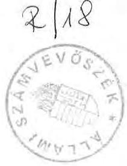

---

Az ellenőrzést végezték:
dr. Benkő János számvevő
Bodonyi Miklós tanácsos
dr. Burján Hargit számvevő
dr. Csemniczky Jánosné tanácsos
Csóry Györgyné tanácsos
Czunyi Lajos tanácsos
Sallai László külső szakértő

Az ellenőrzést vezette és összefoglalta:

Rádfai Tibor főtanácsos

---

# ÁLLAMI SZÁMVEVŐSZÉK 

$V-17-22 / 1990$.

## J E L E N T É S

az Ipari Minisztérium fejezet 1990. évi pénzügyi-gazdasági ellenőrzéséről

Az Ipari Minisztérium és 15 intézménye az 1987-1989. években 1,5-1,9 milliárd Ft pénzforrással gazdálkodott, emellett 1989-ben mintegy 2.800 főt foglalkoztatva közel 2,7 milliárd Ft értékű vagyont működtetett. Az intézmények száma 1987-től a vállalattá történt átminősítések és más felügyelet alá helyezések eredményeként közel egyharmaddal csökkent.

Feladatai ellátásához a fejezet az utóbbi két évben jelentősen (52%-kal) növekvő, 1989-ben 600 millió Ft-ot meghaladó költségvetési támogatást vett igénybe. A bevételi források között a támogatások részaránya az 1987. évi egynegyedről 1989-re - döntően az átszervezések és a növekmény hatására - egyharmadra emelkedett.

A Minisztérium - az ipari miniszter feladatáról és hatásköréről szóló, többször módosított 1011/1985. (III. 20.) Mt. határozatban foglalt - ágazati irányítási feladatok teljesítéséhez, a központi költségvetésből, az elkülönített állami pénzalapokból és egyéb csatornákból származó, évi 3,8-4,7 milliárd Ft további pénzforrás felett is rendelkezett. Ezek közül a meghatározó nagyságrendet (évi 3,5-4,3 milliárd Ft) a Minisztérium műszaki fejlesztési alapja jelentette.

---

Az ellenőrzés célja a fejezet gazdálkodásának, a feladatok és a rendelkezésre álló pénzeszközök összhangjának értékelése, valamint annak megítélése volt, hogy a gazdálkodásban és az ágazati irányításhoz rendelt pénzforrások felhasználásában érvényesültek-e a célszerűségi, eredményességi és a törvényességi követelmények.

Ellenőrzésünk jellemzően az 1988-1989. évekre terjedt ki. A műszaki fejlesztési alap forrásainak és felhasználásának alakulását tükröző tendenciák vizsgálatát ennél hosszabb, az 1986-1989. éveket felölelő időszakra végeztük el.

# I/ ÖSSZEFOGLALÓ MEGÁLLAPÍTÁSOK, JAVASLATOK 

Az Ipari Minisztérium a folyamatosan szűkülő nettó költségvetési kapcsolatok ellenére nem kellő határozottsággal és következetességgel vizsgálta felül a fejezet által ellátott állami feladatokat. A feszültségek oldására alkalmas célok szelektálását és a feladatok rangsorolását célzó intézkedések csak viszonylag szűk területen voltak megfigyelhetők. Ez a feladatok és a költségvetési források összhangjának megbomlásához, indokolatlanul többcsatornás, sok esetben szabálytalan finanszírozási megoldásokhoz vezetett.

Az intézmények gazdálkodói szemlélete helyes irányba változik. A lazán megállapított, vagy az igényektől függetlenül folyósított költségvetési támogatások azonban az intézményeknél nemegyszer lehetőséget nyújtottak azok befektetésére is.

E kihelyezésekre a központi költségvetés folyamatos likviditási gondjai ellenére és alkalmanként szabályellenesen került sor. Az ilyen pénzügyi akciók követésének számviteli feltételei is hiányosak. Így a költségvetés pénzügyi-gazdasági érdekei, a népgazdasági és kincstári vagyon védelme is bizonytalan.

---

Az iparirányítás ágazati feladataira rendelkezésre álló műszaki fejlesztési alap és a központi költségvetésből juttatott, vagy más állami pénzalapokból származó egyéb pénzeszközök kezelése, felhasználásuk cél- és szabályszerűsége sem volt megnyugtató.

A műszaki fejlesztési alap pénzforrásainak felhasználása szétforgácsolódott. Az alap pénzforrásainak egy tetemes része elfolyt a K+F területekről. Az alapból egyedül az Ipari Fejlesztési Bankhoz (IFB) kihelyezett több, mint 3 milliárd Ft túlnyomó része - rendkívül hátrányos kamatkondíciók mellett - a kereskedelmi banki üzletpolitikát szolgálta. Jelentős összegeket fordítottak az alap működtetésére, igazgatási, háttérintézményi feladatok finanszírozására és egyéb, rendeltetéstől eltérő célok, megoldások támogatására.

A fejezet előirányzataitól elkülönített, alapszerűen kezelt más pénzügyi keretek többnyire elégségesnek bizonyultak a támogatás nélküli finanszírozáshoz. A Minisztériumnál hosszabb ideig fel nem használt több száz millió Ft-tal így a központi költségvetést mentesíteni lehetett volna. Egyes keretek kezelése azért volt kifogásolható, mert azok is lehetőséget adtak a rendeltetéstől eltérő felhasználásra.

Az ellenőrzés megállapításai alapján a következőket javasoljuk.

1/ A Kormány - figyelemmel a gazdaság átalakítására, a sürgető struktúraváltás követelményeire - vizsgálja felül és korszerűsítse a K+F jelenlegi rendszerét. Ennek keretében javasoljuk

- a pénzforrások és támogatási elvek egységesítését;
- a támogatási jogcímek szelektálását és a koncentrált támogatások feltételeinek megteremtését, végül, hogy

---

- követelje meg a támogatások felhasználásának konzekvens ellenőrzését és annak eredményességéről a nyilvánosság előtti beszámoltatást.

Mindez az 1988. évi XI. tv. felülvizsgálatát és további módosítását igényli.

2/ A Pénzügyminisztérium

- tegyen intézkedéseket annak érdekében, hogy az elkülönített központi alapok pénzeszközeit az állami költségvetési pénzeszközökre vonatkozó szabályoknak megfelelően kezeljék, tartsák nyilván és számolják el;
- gondoskodjon a költségvetési pénzeszközök védelméről. Ennek érdekében intézkedjen, hogy - az állami költségvetés likviditási helyzetére is tekintettel - a folyamatos feladatok finanszírozását meghaladó ellátmányok ne kerüljenek kiutalásra, illetve azokat a fejezetek a banki lekötés helyett haladéktalanul utalják vissza;
- az erre vonatkozó törvények megalkotásáig intézkedjen, hogy az állami elkülönített pénzalapok (és az állami költségvetés pénzforrásai, valamint a kincstári vagyon) vállalkozásokba, alapítványokba csak egyedi előzetes vizsgálat és engedély alapján legyenek befektethetők;
- követelje meg az elszámoltatást a vállalkozásokba fektetett vagyonról és annak változásáról;
- 1991-től szüntesse meg a gazdasági miniszteri jutalmazási alap előirányzatát;
- rendezze a költségvetésen kívüli gazdálkodással, valamint a letéti számlák kezelésével kapcsolatos előírásokat és ehhez kapcsolódóan vizsgáljon meg az olyan pénz-

---

források szabályszerű biztosításának és kezelésének feltételeit is, mint pl. a világbanki kölcsönökhöz tartozó technikai segítségnyújtás forintfedezete.

3/ Az Ipari és Kereskedelmi Minisztérium

- végezze el az állami (hatósági) feladatok, valamint az intézményrendszer felülvizsgálatát, teremtse meg a feladatok és a pénzforrások összhangját, figyelemmel a működési költségek racionalizálása érdekében;
- gondoskodjon az állami vagyon védelméről és a vagyoni értékek előírás szerű bizonylati rendjének helyreállításáról, biztosítsa az intézmények mérlegbeszámolóinak valódiságát;
- a célszerűtlen, rendeltetéstől eltérő pénzfelhasználás, a jogszabályok és az etikai követelmények megsértőivel szemben (pl. reprezentációs kiadások, műszaki fejlesztési források célszerűtlen felhasználása stb.) kezdeményezzen felelősségre vonást;
- a műszaki fejlesztés támogatásában a megváltozott piaci követelményeket kielégítő kutatás-fejlesztéseket, az általános technológiai-technikai színvonalat fejlesztő rendszereket, licenceket, know-how-kat célszerű az állami támogatások előterébe állítani;
- a műszaki fejlesztési alap eddigi pénzügyi forgalmáról az 1990. év végéig tételes elszámolást, az alap vagyonáról alapleltárt állítson össze, figyelembe véve a kintlévőségeket is;
- a műszaki fejlesztést támogató rendszer korszerűsítésével összhangban módosítsa, illetve alakítsa ki döntési,

---

nyilvántartási, ellenőrzési és szankcionálási rendszerét, alapozza ezt meg belső utasításának megfelelő módosításával;

- erősítse meg a Minisztérium műszaki fejlesztését irányító, ellenőrző, valamint az alap pénzügyeit intéző apparátusát, a jelenlegi támogatási rendszer irányítási költségterheinek csökkentése mellett;
- vizsgálja felül a Minisztérium és az IFB kapcsolatrendszerét, a tárca érdekeinek képviseletét. A bank preferálását a műszaki fejlesztési alap terhére meg kell szüntetni.

# II/ RÉSZLETES MEGÁLLAPÍTÁSOK 

1/ A fejezet rendelkezésére álló pénzforrások alakulása és felhasználása

A Minisztérium és intézményei rendelkezésére álló pénzforrások együttes összege 1989. évben 1,9 milliárd Ft volt, 322 millió Ft-tal (17%-kal) több, mint 1987-ben.

A fejezet költségvetésében a pénzforrások és a feladatok összhangja alig volt érzékelhető. A feladatokban az igazgatási apparátus és a háttérszervezetek által végzett, valamint az alap- és szerződéses, a hatósági és egyéb állami feladatkörök átfedései jellemzők.

A különböző finanszírozási források (költségvetési előirányzatok, elkülönített alapok, a központi költségvetésből kiutalt külön előirányzatok és keretek, a letéti, vagy illegális bankszámlákon átfutó, de saját célokra is felhasznált központi és vállalatoktól begyűjtött pénzforrások) között jelentős párhuzamosságok tapasztalhatók. A költségvetésen kívüli gazdálkodás is széles méreteket öltött.

---

a/ A költségvetési támogatások, a költségvetésen kívüli gazdálkodás formái és számviteli feltételei

A csaknem kizárólag központi intézkedések (különféle automatizmusok, ár- és bérintézkedések, többletfeladatok) hatására emelkedő kiadások fedezetét nagyobbrészt a költségvetési támogatások összegének növekedése biztosította. Az 1989-ben több mint 600 millió Ft-os költségvetési támogatásnak a bevételek közötti egyharmados részaránya még viszonylag így is kedvező. (1. sz. melléklet)

A támogatások növekménye - bizonyos bér- és dologi automatizmust kivéve - konkrét feladatokhoz, illetőleg az adórendszer, a társadalombiztosítási kötelezettségek stb. részleges ellensúlyozásához kapcsolódott. Az 1988-1989. években végrehajtott összesen 124 millió Ft-os zárolás eredményeként a fejezet nettó költségvetési kapcsolatai nominálisan is szűkültek. (2. sz. melléklet) Mindez az intézményeket differenciáltan érintette.

A támogatások 87-91%-át felhasználó Minisztérium és a többi maradványérdekeltségű intézmény gazdálkodásának feltételei általában romlottak, működésük finanszírozásában esetenként napi gondok keletkeztek. A gazdálkodás feszültségeit a Kormány nem tervezhető zárolásai tovább élezték.

A pénzforrások reálértékének csökkenése indokolta volna a hagyományos állami feladatok, a költségvetési támogatásokból működtetett kapacitások, a szervezetek finanszírozásának felülvizsgálatát. A feszültségek oldására alkalmas, a célok szelektálását és a feladatok rangsorolását kifejező intézkedések azonban csak viszonylag szűk területen voltak megfigyelhetők. Ennek okai főleg arra vezethetők vissza, hogy

- az állami feladatok általános felülvizsgálatát is célul kitűző költségvetési reform előkészítése elhúzódott. Ezzel

---

is összefüggött pl. a Minisztérium sikondai utókezelő bányászszanatóriumának átadásának meghiúsulása (1. sz. példa);

- a fejezet gazdálkodásának irányításában is jellemző volt az érdemi döntések halogatása. Az egymástól elszigetelt lépések is addig húzódtak, amíg a feladatok és a pénzforrások összhangjának megbomlása véglegesen kritikussá nem vált (pl. Ipari Informatikai Központ, továbbiakban IPIK, Állami Energetikai és Energiabiztonságtechnikai Felügyelet, továbbiakban: Energiafelügyelet). E lépések között azonban példaértékű jó megoldások is előfordultak (pl. IpM Sportlétesítményeinek és Intézményeinek átadása);
- a kampányszerű intézkedések túlnyomórészt a szervezeti megoldásokra, egyes intézmények (pl. Szolgáltatási Kutató Intézet, sikondai szanatórium, három tanbánya) átadásának, néhány intézmény (pl. IPIK, szakmai és vezetőképző intézetek) vállalattá minősítésének elhatározására szorítkoztak. A feladatok csökkentésére csak elvétve lehetett példát találni (2. sz. példa);
- a már eldöntött lépések végrehajtása sem volt határozott és azok az érintettek sikeres ellenállása következtében nem, vagy csak késve valósultak meg (pl. IPIK vállalattá szervezése, a Minisztérium Szolgáltató Üzemének - jelentős létszámleépítéssel is járó - átszervezése, vagy a három önfenntartó tanbánya bányavállalatokhoz csatolása, ami pl. az 1989. júniusi miniszteri döntés ellenére máig sem történt meg).

Az intézmények gazdálkodói szemléletének helyes irányú változása mellett néhány - később nehezebben visszafordítható - kedvezőtlen tendencia is jelentkezett. Miközben a központi költségvetés folyamatos likviditási gondokkal küzd, a reálértékben csökkenő előirányzatok ellenére, esetenként lazán megállapított, vagy az igényektől függetlenül üteme-

---

zett költségvetési támogatások, valamint az alapok az intézményeknél lehetőséget nyújtanak a pénzeszközök tartós betétként, kincstárjegy-és államkötvény vásárlás stb. formában történő befektetésre.

A legnagyobb összeget (pl. 1989. második felében átlag 300-400 millió Ft-ot) a Minisztérium helyezte ki, döntően a fejezeti költségvetésen kívüli pénzforrásokból. (3-5. sz. példák)

A kihelyezésekre alkalmanként - az állami forgóalap védelme érdekében bevezetett korlátozást figyelmen kívül hagyva - szabályellenesen került sor. Egy rövid (1988. II. félévi) átmenetet kivéve az intézmények egy része nem tartja be a 19/1980. (XI.27.) PM sz. rendelet 21. §. (3) bek. előírásait, miszerint a szabad pénzeszközöket csak az MNB-nél lehet elhelyezni.(5-6. sz. példák)

A saját források működő tőkeként (vagyoni betétként, alap-, vagy törzstőkeként) való befektetése az eredményérdekeltségű intézményekre jellemző. Ezek azonban még nem képviseltek jelentősebb vagyoni hányadot.

Szabad pénzeszközeit nagyobb mértékben egyedül az Energiafelügyelet fektette be 47,8 millió Ft értékben. Az intézmény profiljához csak részben közelítő üzleti vállalkozások azonban összességében alacsony hozamot eredményeztek. (5. sz. példa)

Az intézmények újszerű gazdálkodási tevékenységeinek számviteli feltételei, ezen keresztül a költségvetés pénzügyigazdasági érdekei, a népgazdasági és kincstári vagyon védelme
 nem biztosított. Nem is ritkán előfordult, hogy nagy értékű pénzösszegekről, vagyontárgyakról, követelésekről semmiféle számvitelt nem vezettek, azokat nyilvántartásban, vagyonmérlegben nem szerepeltették.

---

Így pl. az IPM Sportlétesítményei és Intézményei által egy uszodára összegyűjtött 33,5 millió Ft-nak, illetve az ebből épült uszodának az intézmény mérlegében nincs nyoma. Ugyanitt egy értékesített ingatlan vételárából még követelt 10,5 millió Ft sem volt nyilvántartva, holott az ingatlan értékét már kivezették a könyvekből. (7. sz. példa)

Az IPIK részére a Pénzügyminisztérium által átutalt 38 millió Ft "kártérítési" összegnek, vagy a Minisztérium Világbank osztálya által szabálytalanul kezelt 32,5 millió Ft-nak hasonló volt a sorsa. (4. és 6. sz. példák)
b/ Saját bevételek

Fajlagosan a fejezet saját bevételei is számottevően nőttek, bár azok abszolút összege az elmúlt három év során - három intézmény vállalattá alakulása miatt - alig változott. Az intézmények személyi érdekeltségből, de életben maradásuk érdekében is mindent megtettek bevételeik növelésére. Gazdálkodási szemléletük fejlődött, de kihasználható adottságaik igen eltérőek voltak.

A bevételek alakulásában meghatározó szerepet játszó, a fejezet bevételeinek közel kétharmadát (évi mintegy 1 milliárd Ft-ot) teljesítő eredményérdekeltségű intézmények többsége - az árak és díjtételek emelésével - általában lépést tudott tartani az inflációval. (Egyedül az IPIK volt kénytelen súlyos veszteségeket elkönyvelni.)

Az eredményérdekeltségű szerveknél, a rendelkezésre álló kapacitások igénybevételével, egyre inkább előtérbe kerültek a vállalkozások. Ezek egy tetemes része viszont szorosabb-lazább kapcsolatban állt a hatósági jogkörben, illetve a háttérintézményi pozícióból ellátott feladatokkal.

---

A gazdálkodás eredményességét, a tényleges teljesítményeket lényegesen befolyásolja, hogy az intézményeknek e köre nem valóságos piaci feltételek között dolgozik, az adott földrajzi, vagy szakmai területen monopolhelyzetet élveznek és piaci helyzetüket jogszabályi előírások alapozzák meg. A hatósági jogkörben végzett tevékenységek jogszabályi előírása (szabályozása) és finanszírozása (ellenértékének meghatározása, érdekeltségi feltételei) egyre több ellentmondást hoznak felszínre.

Így pl. ipari miniszteri rendelet alapján ma is kötelező egy sor ipari termék és gyártási technológia (pl. fa, papír, bútor stb.) hatósági ellenőrzése. A vizsgálatok azonban nem egységesen a tevékenységekre, hanem csak a vállalatok egy régebben kialakult körére terjednek ki és az ellenőrzések eredménye nem tanúsítja a minőséget. Más, fontos területek hatósági ellenőrzése ugyanakkor nincs megnyugtatóan rendezve. (8. sz. példa) Amennyire bizonytalan a jogszabályi követelmények célja, értelme, annyira kérdéses e szolgáltatásokért fizetett díjak produktív jellege is.

A hatósági jogkörben végzett tevékenységek kezelése, finanszírozása egyre inkább nélkülözi az egységes elvi alapot. Általánosabb, országos szintű intézkedés hiányában a Minisztérium sem fordított ágazatában erre kellő figyelmet (pl. akkreditálási jog és feltételei). Hiányoznak azok a garanciák is, amelyek kizárnák az intézményi érdekek egyoldalú érvényesülését (a bevételi lehetőségek hatósági feladatok mögé bújtatott kiterjesztését, a potenciális megrendelői körre való ráhatást).

A már jogosítvánnyal rendelkező, monopolhelyzetet élvező intézmények díjtételeiket szabadon emelhették. A hatósági vizsgálatok díjai az utóbbi években számottevően - eseten-

---

ként a költségnövekedésnél magasabb arányban is emelkedtek. (2. és 12. sz. példák)

A Magyar Kézilőfegyver-vizsgáló Hivatal teljesítménye pl. az 1986. évet követően, a fegyverexport visszaesése miatt, a töredékére csökkent. Ezt a Hivatal, a hazai fegyverek kötelező felülvizsgálatára alapozva, díjtételeinek öt-hétszeresére való emelésével ellensúlyozta.

Más területeken ezzel szemben egységes elvek hiányában a korábban térítésmentes hatósági vizsgálatok körében a díjfizetési kötelezettség kiterjesztése vontatottan haladt és központi vezérlés helyett csak egyes támogatások kiváltására irányuló eseti törekvések domináltak.

Az előírt gyakoriságú költségvetési ellenőrzéseket a Minisztérium teljesítette. A jellemzően külső szakértőkkel végeztetett ellenőrzések azonban általában könyvvizsgálói szemlélettel a gazdálkodás szabályozottságára és szabályszerűségére, valamint az intézményi beszámolók adatainak helyességére irányultak. A tevékenységek szakmai és pénzügyi összefüggéseit, az állami feladatok és a támogatások összhangját még a komplex ellenőrzések során sem értékelték. A hagyományosan színvonalas ellenőrzések ezért a tárca irányító tevékenységéhez - erre vonatkozó igény hiányában - a szükségesnél kisebb mértékben járultak hozzá.

Az eredményérdekeltségű intézmények megrendeléseinél, bevételeinél a valóságos piaci feltételektől független tényező, a háttérintézményi pozíció is előnyös lehetőséget biztosított (pl. Energiafelügyelet, IPIK stb.).

A Minisztérium műszaki fejlesztési alapjából pl. szabály-, illetve törvényellenesen számos állami-gazgatási, háttérintézményi feladat rendszeres fi-

---

nanszírozását végezték. (2. és 9-10. sz. példák) Ezek felülvizsgálására és szelektálására kísérlet sem történt. Megelégedtek annyival, hogy a Minisztérium jóval tetemesebb igényének töredékét kielégítve a Pénzügyminisztérium 1988-ban 41 millió Ft többletelőirányzatot biztosított az alap kiváltására. Ezzel az alap szabálytalan felhasználása semmivel sem csökkent.

Mindezek következtében az eredményérdekeltségű szervek jövedelmezősége az 1987-1989. években stabil volt. Bevételarányos nyereségük - nem nagy szélsőségekkel - átlagosan 10-13 % körül változott. Az intézményi érdekeltségi rendszerek középpontjában a szervezeti egységekre lebontott bevételi tervek álltak. Ez a szisztéma önmagában is gerjesztette a hatósági és a szolgáltatási díjak emelését.

Az intézmények általában nem szakítottak a bázisszemléletű, túlzott óvatosságra törekvő bevételtervezéssel. Különösen a saját, vállalkozásból származó ár- és díjbevételeiket tervezték alacsonyan. Az alátervezés a fejezet szintjén a bevételi előirányzatok évente átlagosan 15-30 %-os (300-400 millió Ft) túlteljesítését tette lehetővé, biztosítva a tervezett tartalékokat. A központi költségvetés alakulására is kiható tervezési magatartással szemben sem a Minisztérium, sem a Pénzügyminisztérium nem lépett fel eredményesen.

A költségek csökkentésére ugyanakkor legfeljebb irányelvek "ösztönöztek", de ezekhez anyagi konzekvenciák általában nem kötődtek. A marketing és értékesítési szervezet nélküli intézmények a kizárólagos bevételi érdekeltség alapján a szellemi- és eszközkapacitások arányos kihasználása iránt érzéketlenek.

---

Általánosan jellemző volt az egy műszakos igénybevétel, a gépbérletek és a bérmunkák alacsony szintje. Az ebből származó veszteségeket többnyire áraik emelésével ellensúlyozták és az általános költségek aránytalan felosztásával nem ritkán a költségvetési támogatások (alapok) terhére hárították át. (10-14. sz. példák)

A gazdálkodási fegyelem lazulása, a tisztánlátásban való érdektelenség és az elnéző, sőt helyenként bátorító vezetői magatartás nem ritkán a közpénzek pazarló felhasználásához, az egyéni érdekek előtérbe kerüléséhez vezetett. Ennek egyik "intézményesült" formájaként vált gyakorlattá a megbízó szerv dolgozóinak alvállalkozói viszontmegbízása valamely társadalmi szerv (pl. a NTE5Z és tagszervezetei) égisze alatt. (15. sz. példa) Ide sorolhatók azok a hasonló formában lebonyolított, vagy szerzői jogvédelem alá helyezett megbízások is, amelyeket egyes intézmények - a béralap védelmére hivatkozva - saját dolgozóikkal kötöttek. (16. sz. példa) Kirívó példája volt az egyéni érdek intézményi érdekként való feltüntetésének a VRF volt igazgatója által a saját találmányának hasznosulása céljából kifejtett, mintegy két millió Ft kárt okozó, jogsértő tevékenysége. (17. sz. példa)

A nyereségből képzett érdekeltségi alapok - egyedi kivételtől (IPIK) eltekintve - lehetővé tették a személyi jövedelmek 10-15 %-os mértékű kiegészítését. Az intézmények elbizonytalanodását mutatja, hogy a költségként elszámolható prémiummal szemben megnőtt a nyereségrészesedés súlya.

A nyereségérdekeltségű szervek körében 1987-ben kifizetett 28,5 millió Ft prémium és 20,8 millió Ft

---

nyereségrészesedés 1989-re 23,4, illetve 31,6 millió Ft-ra változott.

Az intézmények többsége fejlesztési forrásait csak kismértékben egészítette ki nyereségéből, fejlesztéseikhez (szerződéses, pályázati úton) elsősorban külső forrásokat vettek igénybe. Mégis csak néhány intézetnél volt megfigyelhető, hogy erőforrásaival a szükségszerűen változó feladatkörét alapozta meg.

Ilyen kivételnek tekinthető pl. a Magyar Elektrotechnikai Ellenőrző Intézet (MEEI) és részben az Energiafelügyelet, amelyek a nemzetközi akkreditálási jogok elnyerését beruházásaiknak is köszönhették.

A két minőségellenőrző intézet, az IPIK és más területeken az Energiafelügyelet ezzel szemben a Minisztérium, valamint az DMFB műszaki fejlesztési alapjaiból származó, továbbá világbanki eredetű beruházási pénzeszközökből korszerűsítette alacsony hatékonyságú gép- és műszerparkjának tetemes részét. (10. és 18. sz. példák)

# 2/ A Minisztérium szervezetének gazdálkodása 

A Minisztérium - 1989. októberében kelt - Szervezeti és működési Szabályzata a szervezetkorszerűsítés utáni állapotoknak megfelelő, de a szabályzatot nem egészítették ki a főosztályonkénti ügyrendek. A költségvetési gazdálkodás (tervezés, jóváhagyás, módosítás, végrehajtás, ellenőrzés) belső rendje sem volt kellően szabályozott és alapvetően hagyományokon alapult.

A vizsgált időszakban a Minisztérium feszült pénzügyi helyzetben gazdálkodott, tartalékainak feltárása elkerülhe-

---

tetlenné vált. A többletkiadások fedezetére a pótelőirányzatok (3/a-b. sz. melléklet) mellett saját hatáskörű átcsoportosításokat hajtott végre, több szervezeti és takarékossági intézkedést tett.

A részterületeket érintő takarékossági intézkedések (pl. gépkocsigazdálkodás, telefon- és folyóiratköltségek, felújítások és beszerzések lebontása, gazdasági miniszteri alap felhasználásának mérséklése stb.) mellett a szervezeti megoldások jártak, illetve járhattak volna jelentősebb megtakarítással.

Így pl. korszerűsítették a Minisztérium szervezetét, csökkentették a létszámot. Értékesítették a gödi oktatási központot (16 millió Ft-ért), megszüntették a múzeumok támogatását (2,1 millió Ft) stb.

A Szolgáltató Üzem szervezeti korszerűsítése viszont nem hozta meg a kívánt eredményt. A kb. 450 főt foglalkoztató Minisztérium működtetéséhez túlzás egy 200-210 fős üzem fenntartása (19. sz. példa) Lehetőségek kínálkoznak más területeken is (pl. étterem, óvoda) a költségvetést terhelő indokolatlan kiadások áthárítására. (20. sz. példa)

A Minisztérium létszámának 30 %-os csökkentésétől eltekintve azonban csak a takarékosság részmegoldásaival találkozhattunk. A zömmel periférikus területeken feltárt kisebb, bár fontos megtakarítások más területeken a takarékosság, a célszerűség hiányát tükröző többletköltségek fedezetéül szolgáltak (beruházások, reprezentációs költségek, külföldi kiküldetések).

Az előirányzatok reálérték-csökkenését és az előirányzatok más területeken való túllépését a célkeretek szabálytalan,

---

vagy vitatható átcsoportosításával (pl. gazdasági miniszteri jutalmazási alap, kiküldetési célkeretek), vagy szabálytalan pénzforrások (pl. műszaki fejlesztési alap, letéti számla, illegális "kasszák") bevonásával fedezték.

# a/ A létszám- és bérgazdálkodás 

A Minisztérium létszámelőirányzata az 1988. évi 645 főről 1989 végére 457 főre (188 fővel, 29 %-kal) csökkent. A változást elsősorban a saját hatáskörben végrehajtott 216 fős (33 %-os) létszámcsökkentés eredményezte, amit szervezeti változások (pl. ÉVM-től átcsoportosítás) ellensúlyoztak. A tényleges létszám azonban szerényebb arányban csökkent. (4. sz. melléklet)

A Minisztérium béralapját terhelő tényleges kiadás 1989-ben 147,1 millió Ft-ot (105 %-ot) tett ki. (5/a-b. sz. melléklet) A bérautomatizmus megszünésével a vizsgált években béremelésre (leszámítva a felsőfokú műszaki végzettségűek központi bérrendezését) elsősorban létszámcsökkentésből (1989. évtől már egyéb megtakarításokból is) volt lehetőség. A létszám kedvezőtlen struktúraltsága, a feladatok változása mellett ez is elkerülhetetlenné tette a Minisztérium szervezetének és létszámának változtatását. (21. sz. példa)

Az 1989. szeptemberi szervezetkorszerűsítés azonban megítélésünk szerint nem járt optimális eredménnyel. A létszámcsökkentésnek racionálisabb arányokat kellett volna eredményezni. Az előremutató kezdeményezés hibája volt, hogy pl. a szükséges létszám meghatározását nagyobbrészt a szervezeti egységek belátására bízták. Így a létszám nem mindenhol csökkent az elvárható, lehetséges mértékben, a korábban gyengén ellátott szervezetek megerősítésére sem kerülhetett sor.

---

Az aránytalanságok alig mérséklődtek, sőt a közvetlen minisztériumi feladatokkal foglalkoztatott, de a Szolgáltató Üzem állományában lévő 13 dolgozó státuszát sem rendezték.

Az egyes szervezeti egységeknél jelentősebb létszámtúllépések, feleslegesen magas létszámok maradtak, más területeken a létszám továbbra is elégtelen a feladatok ellátásához. (22. sz. példa)

A Minisztérium létszámstruktúrája sem lett kedvezőbb. Az összetétel még az ellenőrzéskor is magán viselte a három minisztérium összevonásából, valamint a vezetőváltozásokhoz kapcsolódó többszörös átszervezésekből eredő örökséget. Ez nyilvánult meg többek között a vezetők és a címviselők viszonylag magas részarányában is. A csökkenés csaknem teljes egészében az ügyintézőknél jelentkezett. A vezetők létszáma (108 fő) közel bázisszinten alakult. A magas vezetői arányhoz egyes főosztályok túltagoltsága
 (pl. Nemzetközi együttműködési főosztály 7. osztálya) is hozzájárult.

Az átlagkeresetek nőttek, miközben azok összetétele is módosult. (6. sz. melléklet) A főfoglalkozású munkaviszonyból származó keresetek emelkedésében (114%) az átlagbér növekedése (120%) volt meghatározó. A jutalmak egy főre jutó összege csökkent (81%). Az 1988. és az 1990. január havi béreket összehasonlítva azonban a növekedés egészében több mint 58%-os volt az 1989. december 1-ével kiadott 20%-os "előrehozott" bérfejlesztés következtében, amit az 1990. évben várható (!) létszámmegtakarítás terhére osztottak ki.

Az átlagbér-fejlesztéseket kulcsszámonként vizsgálva a kép viszonylag kiegyensúlyozott, nagyobb szóródás (147-181% között) az ügyintézői kategóriánál figyelhető meg. Az egyes főosztályok között viszont már jelentősebb béraránytalanságok tapasztalhatók, amelyek lényegében az 1981. évi átszer-

---

vezés óta fennálltak. Az 1987. évi és 1990. év eleji korrekciók az átlagbérek közötti aránytalanságot csak valamelyest oldották. Az aránytalanságok okai sokrétűek:

- A szakértői csoportokba főmunkatársi besorolással korábban vezető beosztású dolgozók kerültek az átlagot jelentősen meghaladó bérrel.
- A létszámcseréknél a megüresedett helyeket már csak magasabb bérűekkel tudták feltölteni.
- Korábban a szervezeti egységek a bérmegtakarítás 40%-át béremelésre fordíthatták. A bérfejlesztés bér- és létszámarányos felosztása ezt az aránytalanságot csak tovább növelte.

Az 1988-1989. években 8, illetve 5 heti alapbérnek megfelelő összegű jutalmat fizettek ki (18,4, valamint 13,6 millió Ft összegben). Ezek forrását a bérmegtakarításon kívül a költségvetésben külön keretként jóváhagyott bányásznapi (évi 400 ezer Ft), valamint az anyagi ösztönzés rovaton megjelenő energiagazdálkodási jutalom (évi 750 ezer Ft) egészítette ki.

A rendkívüli munkák elismerésére évente kb. 1-1,5 millió Ft-os központi jutalmazási keretet különítettek el. Ennek egy részét azonban (évi 90-95 ezer Ft-ot) szociális jellegű kifizetésekre, születésnapi ajándékokra költötték.

A legjelentősebb tételt - 1988-ban pl. 601,2 ezer Ft-ot - "kiemelkedő munka" jutalmai címén fizették ki. A konkrét célok ezzel sokszor nem egyeztek meg (sajtópályázat zsűrijében való részvétel, helyettesítés, nyugdíjazás, tárgyalások előkészítése, felmondási idő alatti munkavégzés stb.).

---

# b/ A gazdasági miniszteri jutalmazási alap 

A Minisztérium gazdasági miniszteri alapjában 1988. évben 3,5, 1989-ben 2,4 millió Ft-os előirányzattal gazdálkodott. Az alap célját és felhasználási szabályait egy régi, 1968. évi pénzügyminisztériumi leiratban foglalt irányelv rögzítette, amely - még a munkaverseny-mozgalom és a célprémiumrendszer kiegészítő konstrukciójaként - lényegében megismételte a 79/5/1950. NT sz. határozat főbb elemeit. Ezek szerint az alap elsősorban a Minisztérium felügyelete alá tartozó vállalatoknál teljesítményükkel kitűnt dolgozók jutalmazására szolgált.

A Minisztérium a jutalmazásokra az előirányzatoknak csak mintegy felét (50-55%-át) használta fel, de a felhasznált összegek egy részét is a meghatározottól eltérő, szabálytalan célokra fordította.

Az alap előirányzatából két év alatt "megtakarított" 2,8 millió Ft-ot pl. a rendeltetéstől eltérően, fenntartási-működési (jórészt pl. reprezentációs) költségek fedezeteként használták fel.

Az alap terhére közvetlenül elszámolt kiadások között az 1988-1989. években már kevesebb volt a szabálytalan. Egyes esetekben azonban az alap terhére elszámolt kifizetések (pl. vállalatvezetők, szakszervezeti funkcionáriusok, miniszteri biztosok jutalmazása, szakértői díjak, sportolók jutalmazása, sajtópályázat díjai stb.) továbbra is kifogásolhatók voltak. (23. sz. példa) Az alap rendeltetésével ellentétes a többletexport-vállalásokat nem teljesítő vállalatok részére "méltányosságból" két év alatt kifizetett 870 ezer Ft is.

A többletexport-vállalások teljesítése esetén a Kereskedelmi Minisztérium a Kereskedelempolitikai Alap terhére évente jutalmakat osztott ki. Így pl.

---

az Ipari Minisztérium letéti számláján keresztül 1989-ben 191 iparvállalat 1062 munkatársának 78,1 millió Ft ilyen jutalom került kifizetésre. Néhány vállalatnak nem sikerült teljesíteni e jutalmazás feltételeit. Ezeket a Minisztérium az alapból "kárpótolta".

# c/ A külföldi kiküldetések 

A Minisztérium 1988. évben 21,3, az 1989. évben 17,4 millió Ft-ot költött külföldi utazásokra. Az 1988. évi eredeti előirányzatokat mintegy 8,7 millió Ft-tal (70%-kal) lépték túl. Az 1989. évi tervezés során már jobban számoltak az előző évek tényszámaival és a növekvő árakkal.

A Minisztérium nem rubel elszámolású devizakeretét 1989-ben 9900 ezer Ft-ra (43%-kal) emelték. Ennek változatlanul mintegy 40%-át fordították a minisztériumi utazásokra (40% a vállalati kiküldetéseket fedezte).

A Minisztérium 1988 óta három utazási célkerettel is gazdálkodott. A rubel elszámolású utakat fedező "INTER ASZU" és "SRAGY", valamint a nem rubel elszámolású, műszaki ismeretek megszerzésére szolgáló "NGKB" célkeretek szintén beépültek a költségvetésbe.

A Pénzügyminisztérium által juttatott keretekkel a Minisztériumnak nem kellett elszámolni. A célkeretek 1988. évi felhasználására a Minisztériumnál hiteles számviteli adatok nem is álltak rendelkezésre. Az 1989. évi adatokból viszont megállapítható, hogy a rubel elszámolású keretek zömét az eredeti céloktól eltérően használták fel.

Az 1989. évi 370 ezer Ft-os "SRAGY" keret 17%-át, a 2500 ezer Ft-os "INTER ASZU" keret mintegy 70%-

---

át egyéb, általános célú utazások fedezetére fordították. A nem rubel elszámolású NGKB keretet maradéktalanul kitöltötték utazásokkal.

A megemelt devizakeretek és költségvetési előirányzatok, valamint a célkeretek ellenére az itt elszámolt forintkiadások 1989-ben csökkentek, 16-17%-kal alatta maradtak az 1988. évi kiküldetési költségeknek. Takarékossági intézkedések enyhítették a növekvő utazási- és szállodaköltségek, valamint napidíj-keretek hatását. A forintköltségeket olyan intézkedések is mérsékelték pl., hogy rövidebb utak esetén vasút, saját személygépkocsi igénybevételét helyezték előtérbe.

Csökkent az utazások száma (25%-kal), a külföldön töltött napok száma (18%-kal), módosult azonban az utazások összetétele is.

- A rubel elszámolású viszonylatok költségeinek aránya és ezen belül elsősorban a forintban fizetett (pl. utazási) költségek összege számottevően csökkent, az ezekben az országokban töltött kevesebb nap arányában;
- a nem rubel elszámolású utak és utazási napok száma alig (csak 5-6%-kal) mérséklődött, sőt a nem rubel elszámolású viszonylatok részesedése (7. sz. melléklet) az európai utaknál 17%-ról 25%-ra, az összes kiutazásnál 28%-ról 36%-ra emelkedett;
- számottevően (28%-kal) bővült - az egyébként szinten maradó összes költségen belül - a devizában felmerült költség aránya, ami arra utal, hogy elsősorban az I. osztályú napidíjra, szállásra jogosultak utazásainak aránya nőtt.

A vezetők kiküldetése az egységes közös Piac kialakulásával, vegyesvállalati ügyekkel, exportlehetőségek feltárásával, együttműködési, bizottsági üléseken való részvétellel stb. volt kapcsolatos. (B. sz. melléklet)

A kiküldetési költségek elszámolása szabályszerű volt. Néhány esetben az indokoltnál magasabb előlegeket vettek fel, illetve az elszámolásnál nem tartották be az előírt határidőket. Az utazási jelentések rendben elkészültek. Azok tapasztalatainak szélesebb körű megismeréséhez a feltételek romlottak.

# d/ Reprezentációs költségek 

A reprezentációra vonatkozó pénzügyminisztériumi rendelet szerint 1988 óta az 1987. évivel megegyező éves reprezentációs előirányzatok voltak tervezhetők, amitől azonban év közben előirányzat-felhasználási hatáskörben, előre szabályozott módon, a költségvetési szervek eltérhettek. A Minisztérium az előirányzatait az elmúlt két év során jelentősen túllépte, miközben további reprezentációs költségeket más pénzforrások terhére is elszámolt.

Az 1988. évben az 1987. évivel egyezően tervezett 2,5 millió Ft-tal szemben 6,9 millió Ft-ot (278%) költöttek. A nagy arányú túllépéshez az is hozzájárult, hogy az 1987. évi költségek egy részét (mintegy fél millió Ft-ot) pénzügyi fedezet hiányában 1988-ban egyenlítették ki.

Az 1989. évben az előírástól eltérve, az eredeti előirányzatot már 4,3 millió Ft-ra bővítették (172%) és teljes egészében felhasználták. 1990-re is az előző évi tényleges felhasználást tüntették fel eredeti előirányzatként.

---

A tényleges reprezentációs kiadások azonban a fenti összegeket is tetemesen meghaladták. A Minisztérium letéti számlájára, valamint az egyes, nem is a felügyeletük alá tartozó intézményekhez (megállapíthatóan pl. a MEDOSZ Vendégházhoz és a SZOT Balatonfüredi Oktatási Központjához), külföldiek minisztériumi szervezésű vendégfogadásához és rendezvényekhez a vállalatoktól gyűjtöttek be összegeket.

Az így befizetett összegeket a letéti számlán szabálytalanul kezelték, a külső szervezeteknél létesített kasszák forgalmát a Minisztérium számvitelében nem is szerepeltették és bizonylatilag elfogadhatatlanul, a társadalmi tulajdont is veszélyeztető módon számolták el.

Így pl. a Minisztérium letéti számlájára 1987 végén az UNIDO Konferencia költségeire begyűjtött összegből (24. sz. példa) a Minisztérium protokollfőnöke mintegy 100 ezer Ft értékben a konferenciával semmiféle kapcsolatban nem álló kiadásokat is teljesített (pl. 19 ezer Ft-ért ezüst tálca a miniszter búcsúztatására, 24,8 ezer Ft-ért 160 db névre szóló tokaji bor a Minisztérium dolgozói részére).

A két külső intézményben 2-3 év alatt 1,5-1,6 millió Ft-ot gyűjtöttek be, amit rendezvények költségeire, delegációk fogadására költöttek el. A Minisztérium folyamatban lévő belső ellenőrzésének megállapítása szerint a Minisztérium protokollfőnöke által utólagos elszámolásra felvett, összesen mintegy 300 ezer Ft-ról elfogadható elszámolások (bizonylatok) nem álltak rendelkezésre.

A reprezentációs költségek alakulását, magas szintjét objektív és szubjektív tényezők egyaránt befolyásolták. Az árak emelkedésén túl

---

- a Minisztérium által vendégül látottak száma 1988-1989-ben elérte az évi 760-780 delegációt. Egy delegáció vendéglátására 1988-ban kb. 8,8, 1989-ben kb. 5,6 ezer Ft-ot költöttek;
- az állami vezetők vendéglátási és ajándékozási keretösszegeit 1987. év végén erőteljesen emelték (pl. a miniszter 1500-1700 Ft-tal szemben 1988-tól 4000 ezer Ft értékben ajándékozhatott). A Minisztériumban a miniszter mellett 10 államtitkár és miniszterhelyettes működött. A reprezentációs költségek mintegy 66%-át miniszteri, államtitkári és miniszterhelyettesi szintű tárgyalások, rendezvények, vagy utazások kapcsán használták fel.

A reprezentációs költségek mintegy negyed része ajándékozások, kb. 15%-a a VIP és kormányváró használata és az ottani fogyasztások, 35-40%-a vendéglátó helyek igénybevétele miatt merült fel.

Feltűnő a szovjet utazások alkalmával kivitt és kint felhasznált ajándékok, élelmiszerek, italok magas költsége, ami utazásonként elérte a 15-20 ezer Ft-ot. A nyugati országokba irányuló utazásoknál kivétel volt a miniszter dél-amerikai útja a kb. 110 ezer Ft-os ajándékozási kerettel.

Az ajándékok beszerzése, elszámolása és kiosztása nem kísérhető megnyugtatóan nyomon. A reprezentációs költségek elszámolása azonban más tekintetben sem elégíti ki a követelményeket.

Az egy-egy alkalomra összeállított és engedélyeztetett keret (költségvetés) egészében formális, hiszen a költségek egy része (pl. ajándékozás) azokon nem is szerepel. A tényleges költségeket ki sem mutatják, azok teljességének ellenőrzésére a könyvelési rendszer nem is alkalmas. (Az időrendben lerakott számlák azonosítása is lehetetlen hivatkozások hiányában, összevonások miatt stb.) A bizonylatokon az ellenőrzéshez nélkülözhetetlen adatok hiányoznak, vagy bizonytalanok. Az engedélyezettel a tényszámok nem is hasonlíthatók össze.

# e/ Állóeszköz- és készletgazdálkodás 

A Minisztérium állóeszköz-állománya az 1988-1989. években 18-19%-os növekedés mellett összetételében jelentősen átalakult. A Minisztérium 1988-1989. évi beruházásai csaknem kizárólag személygépkocsikra, számítástechnikai és irodatechnikai berendezésekre irányultak.

A gépek, berendezések közel megduplázódott részaránya alapvetően a számítástechnikai, irodatechnikai eszközök bruttó értékének mintegy 2,5-3-szoros növekedésével kapcsolatos.

Az arányok átrendeződésében a saját beruházásokon felül nem kis szerepe volt az IPIK-tól térítésmentesen, 1988-1989. években összesen 56,0 millió Ft értékben átvett és a műszaki fejlesztési alapból finanszírozott berendezéseknek.

E fejlesztések eredményeként egy jól kiépített számítógépes hálózat létesült. Ennek hatákonyságát - e vizsgálat keretében - nem értékelhettük, több jel is arra utal azonban, hogy a géppark hasznosítása még nem áll arányban annak ráfordításaival.

A géppark működtetése, karbantartása ugyanakkor olyan pénzügyi terhet jelent, amelyre a minisztérium költségvetése nem
 biztosít fedezetet, a kiadások csak más célra rendelkezésre álló (ugyancsak a műszaki fejlesztési alap) terhére teljesíthetők.

---

Az állóeszközök kapacitásának kihasználása - a minisztériumok újabb összevonását is tekintetbe véve - további intézkedéseket tesz szükségessé. Szükség lesz egyes létesítmények, férőhelyek értékesítésére.

Balatonszéplakon a férőhelyek 25, Boglárlellén 30 %-a kihasználatlan. Az Esztergom-Kerektói üdülőben - 6 hét kivételével - a férőhelyek bérbeadhatók. A két hétvégi pihenőház (Dunaterasz, velencei) kihasználtsága ugyancsak felülvizsgálatra szorul.

A Minisztérium készletgazdálkodásában erőteljesen mutatkozott meg az utóbbi évek pénzszűkének hatása. A beszerzések visszaesése - az áremelkedések, létszámcsökkentés, takarékosság, illetve a keretgazdálkodás bevezetése hatására mintegy 50 %-os.

A Minisztérium vagyonának védelme a Szolgáltató üzemnél kielégítően szabályozott, a költségvetési és belső ellenőrzések tapasztalatai szerint azonban az előírások betartása csak számos kisebb-nagyobb hiányossággal biztosított (selejtezések lebonyolítása, elszámolása, felesleges vagyontárgyak értékesítése, leltározások stb.).

Az ellenőrzések nyomán tett intézkedések kielégítőek voltak, de megvalósításuk vontatottan, hiányosan halad. Néhány kérdésben ellenőrzésünk kiegészítő és további intézkedéseket igénylő tapasztalatokat is szerzett. (25. sz. példa)

3/ Az ágazati feladatokra rendelkezésre bocsátott egyéb pénzforrások szerepe és felhasználása

A Minisztérium és intézményei jelentős összegű, a fejezet előirányzataitól elkülönített - a központi költségvetés-

---

ből, vagy állami pénzalapokból származó - pénzeszközt is kezeltek.

# a/ A Minisztérium műszaki fejlesztési alapjának felhasználása 

A Minisztérium az 1986-1989. években csaknem 14 milliárd Ft pénzforrással, ezen belül visszatérítésekből, kamatokból stb. közel két milliárd Ft bevétellel rendelkezett. A függelékként csatolt részletes jelentésünkben bemutatjuk, hogy az alap célszerű és szabályszerű felhasználása - a központi műszaki fejlesztési alapra vonatkozó 1988. évi XI. törvény hatálybalépése ellenére - nem volt kielégítő, az alap pénzforrásainak egy tetemes része nem a K+F területen került felhasználásra.

A Minisztérium, mint az alapot és az IFB-t egyaránt felügyelő szerv, nem törekedett kellő felelősséggel az alap törvényben meghatározott céljainak biztosítására. Fő részvényesként jogait nem kötötte ki, nem érvényesítette; pénzügyi kihelyezéseit előnytelen feltételek jellemezték; teret engedett az üzletpolitika szempontjából természetes, de a K+F célokat megrövidítő banki érdekek érvényesülésének; nem figyelt fel arra, hogy az alap felügyeletének államigazgatási teendői és az IFB-nél betöltött vezetőségi funkciók etikailag összeférhetetlenek.

A fejlesztések hatékonyságát összetett társadalmi és gazdasági feltételek befolyásolták. Az alappal való gazdálkodás egésze, a döntési és támogatási rendszer javításra szorul. Megemlítjük a pénzforrások felhasználásának nem kielégítő koncentrációját, a nagy átfogó programokkal, a tervezés 5 éves és éves szakaszolásával kapcsolatos gondokat, amelyek pénzügyileg a keretek mechanikus, a valóságos K+F igényektől

---

elszakadó feltöltéséhez, a pénzforrások szétforgácsolásához, ugyanakkor más helyeken a finanszírozás lehetetlenné válásához vezettek.

A minisztériumban kialakult és a korábbi állapotokhoz képest jelentősen fejlődött is a K+F támogatásokhoz kapcsolódó irányítási és ellenőrzési rendszer. Az erősen tagolt és kiterjedt szervezet azonban, elsősorban a nagytömegű és szerteágazó feladatok miatt, mégsem képes kellő hatékonysággal működni. A rendkívül differenciált felelősségi rendszer elnehezült, bürokratikussá vált és hiányosan is működik. Különösen a támogatott célok számonkérése és szankcionálása hiányos.

A K+F gazdasági eredmények előírásához, majd később megköveteléséhez sem a Minisztériumban, sem a fejlesztőknél nem állnak rendelkezésre megfelelő adatok. Az irányítási és ellenőrzési rendszer alapját képező, az alap tényleges forgalmáról, záróállományáról, követeléseiről és kintlevőségeiről, vagyonáról és befektetéseiről a nyilvántartás nem egységes és nem megbízható.
b/ Az állami költségvetés fejezeten kívüli egyes juttatásai

A fejezeten kívüli juttatások közül az 1988-ban 300,0, 1989-ben 214,7 millió Ft-ot kitevő, a hadiipari műszaki fejlesztést finanszírozó költségvetési támogatás volt a legjelentősebb. Tekintve, hogy biztosított volt a költségvetési támogatás nélküli finanszírozás is, ezekkel az összegekkel a központi költségvetést mentesíteni lehetett volna.

Az 1988. évben a vállalati támogatások tényleges összege 86,9 millió Ft-tal alatta maradt a költségvetési juttatás nélkül számított összes pénzforrásnak. Az 1989. évben pedig, a Minisztérium központi

---

műszaki fejlesztési alapjából e célokra elkülönített 250 millió Ft-tal együtt szintén elégséges forrás állt rendelkezésre.

Az elkülönített pénzeszközt a Kormány vonatkozó 1989. évi határozata szerint - indokolt vállalati igények hiányában a hadiipari kapacitások átállítására sem vették igénybe. Így a Minisztériumnál hosszabb ideje feleslegesen évi 300-400 millió Ft feküdt el.

Emellett a hadiipari termékek gyártásának 1989. évi drasztikus csökkenése miatt elengedett 218 millió Ft visszatérítési kötelezettségen felül a vállalatok 1990. év elején még - később esedékes - 742 millió Ft-tal tartoztak.

Ugyanakkor az alaposan kezelt pénzforrásokat a vizsgált időszakban - az azokat kezelő Iparszervezési főosztály számítástechnikai fejlesztésére költött 2,3 millió Ft kivételével - rendeltetésszerűen használták fel.

A központi költségvetés támogatása, az 1988. évi 12,0 és az 1989. évi 40,5 millió Ft kiutalása - az elért bevételi szint mellett - a Minisztérium által kezelt állami tartalékok finanszírozásánál nem volt indokolt.

Az energetikai propaganda és reklámtevékenység támogatására ugyancsak a központi költségvetésből rendelkezésre bocsátott 1988. évi 22, és 1989. évi 15 millió Ft-os keret kezelése lehetőséget adott a rendeltetéstől nagymértékben eltérő felhasználásra.

Az összegek jelentős részéből a kezeléssel megbízott Energiafelügyelet kiadványait és egyes intézményi költségeit finanszírozták. A kiadványok és a propagandaszerep kapcsolata vitatható, tekintve,

---

hogy a 200-300 db-os sorozatok 1.000-1.500 Ft/db-os önköltség mellett ilyen célra csak korlátozottan alkalmasak. A kiadványok tartalma feltűnő átfedést mutat, mintegy publikált változata a költségvetés és a műszaki fejlesztési alap terhére a Minisztérium által megrendelt témáknak.

Az elvétve megjelentetett pénzes kiadványok bevételét nem a keret térítékeként, hanem az Energiafelügyelet bevételeként számolták el. A Minisztérium az éves keretmaradványokat szabálytalanul az Energiafelügyelet számlájára utalta át, amit forgóeszköz-finanszírozásra és egyéb célokra évekig igénybe vettek. (26. sz. példa)

Indokolatlanok, illetve vitathatók voltak az IPIK-nek juttatott támogatások is. Az intézmény székházának egy részét, évi 3 millió Ft-ért, az OKHB-nak "kellett" bérbe adnia. Ennek fejében a Pénzügyminisztérium 50 millió Ft-ért megvásárolt és felújított egy épületet, amit az IPIK-nek bérbe adott, továbbá 1988-ban ingatlan vásárlásához 38 millió Ft-ot juttatott az intézménynek, amely területet bérbe adott feléért így tulajdonhoz jutott. Ezt az ingatlant az IPIK 1989-ben - 34 millió Ft-os tényleges ráfordítás után - 61 millió Ft-ért értékesítette a Postabanknak. A tényleges szükségletet, a kezelői jog fennmaradását és a bérleti díjat is figyelembe véve a költségvetési kiadás indokolatlan volt. (4. sz. példa)

Bár a fejezet pótelőirányzataként került elszámolásra, de említést érdemel az IPIK javára kiutalt másik juttatás is.

Az intézmény az elmúlt években rendkívül magas rezsiköltségekkel működött, amit egyrészt gazdálkodási lazaságai, másrészt az 1987-1989. években 52 millió Ft értékben bővített, az igényeket többszörösen meghaladó számítástechnikai eszközállományának igen gyenge kihasználtsága (10. sz. példa) okozott. Gazdálkodási nehézségei miatt forgóalapjának kellő feltöltését elmulasztotta. Az 1990. évi vállalattá szervezéskor viszont a Minisztérium támogatásával indokolatlan mértékű (30 millió Ft-os) pénzügyminisztériumi forgóalap-juttatásban részesült, amelyet kontroll és számítások nem támasztottak alá. (27. sz. példa) A juttatás 1989. év végi kiutalásának időpontja is vitatható volt.

# c/ A Minisztérium letéti számlája és a vállalatoktól begyűjtött egyes pénzforrások 

A Minisztérium letéti számláján lebonyolított 1988. évi 164,9 és 1989. évi 157,5 millió Ft-os pénzforgalom 72, illetve 93 %-a külső szervek és magánszemélyek átutalásainak szabályszerű továbbítását jelentette.

Az arányok közötti különbséget az ide utalt 30 millió Ft okozta, amelyet 1988-ban a tárca - a bérfizetések biztosítására (jogellenesen) - a költségvetési számlájáról e számlán mentett át.

A letéti számla jórészt technikai jellegű forgalma három - 1990-től már indokoltan megszüntetett - konstrukcióhoz kapcsolódott. Ezek közül az energiamegtakarítási jutalmazási keretet a Pénzügyminisztérium elszámolási kötelezettség nélkül utalta át. A keret maradványát a Minisztérium visszautalás helyett, "energiapropaganda" céljaira az Energiafelügyelethez utalta. (28. sz. példa)

A letéti számlára különböző célokra, pl. konferenciák és vendéglátások (UNIDO rendezvények) költségeire vállalatoktól

---

begyűjtött összegek felhasználása, elszámolása a reprezentációval foglalkozó résznél leírtak szerint több szempontból is kifogásolható volt.

Más esetekben a letéti számlától függetlenül, a Minisztérium pénzügyi vezetésének tudta és ellenjegyzése nélkül nyitottak gyűjtőszámlákat. Az összegekről és azok felhasználásáról szabályszerű könyvelést sem vezettek és a Minisztérium 1987-1989. évi beszámolói, mérlegei sem tartalmazták ezeket.

Egyes világbanki kölcsönök technikai segítségnyújtási programrészének forintfedezetére a Minisztérium Világbank Osztálya miniszterhelyettesi kezdeményezésre - szintén vállalati hozzájárulásokból 32,5 millió Ft-ot gyűjtött össze az IFB-nél nyitott számlákon. Az összegnek csak egy részét használták fel, a többi (20,2 millió Ft) mintegy két évig feküdt a banknál kamatmentesen.

A pénzeszközök ilyen kezelésével sértették az állami pénzügyekről szóló 1979. évi II. tv. 9. §-ának előírását, amely szerint az állami költségvetésnek minden bevétele és kiadása annak pénzkészletét növeli, vagy csökkenti, továbbá nem szereztek érvényt a fenti törvény 58. §-ában és a 19/1980. (XI.27.) PM sz. rendelet 4. és 5. §-ában a gazdasági szervezet vezetőjének kötelezettségeire és jogaira előírt feltételeknek.

Budapest, 1990. augusztus 30.
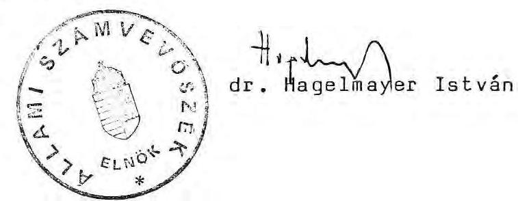

---

Az Ipari Minisztérium fejezet pénzforrásainak és kiadásainak alakulása az 1987-1989. években
millió Ft-ban
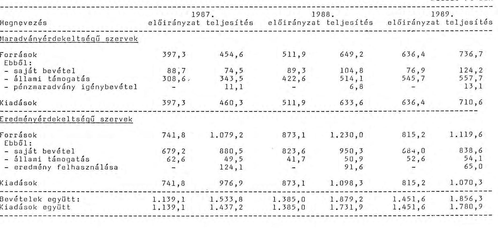

---

Az IpM fejezet szintű költségvetési támogatásának alakulása 1987-1989. évek között
1./ 1987. évi eredeti előirányzat ..... 432.212
2./ 1987. évi módosítások
- 3103/1987. sz. Mt hat. zárolt tartalék elvonás ..... -14.261
- 3103/1987. sz. Mt. hat. többlet zárolás ..... -16.000
- 5012/1987. sz. ÁTB. hat. zárolás ..... -4.322
- MM-től átcsoportosítás oktatási feladatokra ..... 370
- MM-től átcsoportosítás oktatási feladatokra ..... 20.504
- MM-től átcsoportosítás oktatási feladatokra ..... 3.357
- 3139/87. sz. Mt. hat. (akadémikusok bérrendezése) ..... 64
- SZÉ terv ..... 10.000
- polgári fegyveres őrség támogatása ..... 1.500
- szerkezeti változás ..... 65
- fogyasztói árintézkedés ..... 260
- fogyasztói árintézkedés szintrehozás ..... 40
- bérbruttósítás támogatása ..... 71.216
- általános forgalmi adó ..... 33.006
- 1987. évi bérszintfejlesztés szintrehozása ..... 238
- bérautomatizmus ..... 679
- pénzellátás automatizmusa ..... 136
- dologi automatizmus ..... 946
- állóeszköz karbantartás, nagyjavítás automatizmus ..... 2.366
- oktatási feladat fejlesztési többlete ..... 5.000
- 4 % zárolás ..... -17.684
módosítások összesen: ..... 97.480
3./ 1988. évi eredeti előirányzat ..... 529.692
4./ 1988. évi módosítások
- műszaki értelmiség bérrendezése (éves szinten) ..... 15.390
- tankönyvdotáció ..... 20.000
- INTERASZÚ, SZÉ-terv, polgári védelem ..... 15.500
- SRAGY (utazási keret) ..... 370
- Szolgáltatási Kutatóintézet miatt a KEM-hez ..... -4.450
- 88. évi bérszintfejlesztés korrigálása ..... +1.140
- KFH-nak keret átadás ..... -325
- KCST kiküldöttek bérkiegészítése ..... 4.500
- KMÚFA kiváltás ..... 41.000
- Társadalombiztosítási járulék felemelése miatt ..... 74.776
- 1988. évi bérfejlesztés 1 havi áthúzódása ..... 145
- 1989. évi bérautomatizmus ..... 9.590
- dologi automatizmus ..... 3.571
- állóeszköz karbantartás, nagyjavítás automatizmus ..... 2.082
- központilag elrendelt zárolás ..... -75.819
Módosítások összesen: ..... 108.270
5./ 1989. évi eredeti előirányzat ..... 637.962

Budapest, 1990. április 23.

---

# Kimutatás 

## az Ipari Minisztérium 1988. évi előirányzatának alakulásáról

Ezer Ft-ban

1. A költségvetési támogatás 1988. évi eredeti előirányzata
343.200
2. Évközi módosítások

- Az 1988. évi bérszintfejlesztés kiegészítése +848
- A bérbruttósításra jutó állami támogatás
12. havi részének zárolása
- Az oktatási törvény végrehajtására biztosított pótelőirányzat
- OT-tól átcsoportosítás (SRAGY) utazási keretre
- műszaki értelmiség bérrendezése (3383/1987. MT.hat.)1988. évi kihatása
- baleseti veszélyek elhárítása (3/383/1987. MT. HM. hat.)
- INTERASZU pótelőirányzat
- KGST kiküldöttek költségtérítéseinek fedezetére biztosított pótelőirányzat
- riasztó berendezések karbantartására biztosított pótelőirányzat
-

 saját hatáskörű átcsoportosítás a fejezet tartalék kerete, valamint az állóeszköznagyjavítás kerete terhére
$+49.978$

3. A költségvetési támogatás 1988. évi módosított előirányzata
1988. évi saját bevétel összege
4.891
1987. évi pénzmaradványból igénybevett összeg
$+4.567$
1988. évi bevételek összege
438.761
1989. évi kiadás
-440.355
kiegyenlítő, függő és átfutó bevételek és kiadások
különbözete
$+5.667$
1988. évi pénzmaradvány
Budapest, 1990. május 14.

---

# Kimutatás 

## az Ipari Minisztérium 1989. évi előirányzatának alakulásáról

Ezer Ft-ban

1. A költségvetési támogatás 1989. évi eredeti előirányzata
436.798
2. Évközi módosítások

- az Országgyűlés május 30-ai ülésének határozata szerint elrendelt 10%-os zárolás -43.680
- az építőanyagipar irányításának átvétele miatt, a volt ÉVM költségvetéséből átcsoportosítva +13.171
- a 3113/1989. sz. MT határozattal elrendelt 4 fő zárolás (átcsoportosítás) - 881
- tankönyvdotációra évközben kapott pótelőirányzat +20.000
- saját hatáskörű átcsoportosítás a fejezet tartalék kerete, valamint az állóeszköznagyjavítási keret terhére +13.084

3. A költségvetési támogatás 1989. évi módosított előirányzata 438.492

Az 1988. évi minisztériumi, valamint fejezet szintű pénzmaradványból igénybe vett összeg +13.232

A Gödi Oktatóház kezelői jogának átadásából befolyt bevétel
1989. évi saját bevételek (kezelői jog átadás bevétele nélkül) + 7.289

Kiszámlázott szolgáltatások ÁFÁ-ja + 4.644
1989. év tényleges bevétel 479.657
1989. évi kiadás -461.720
1989. évi maradvány 17.937
melyből a pénzmaradványelszámolás során az állami költségvetés javára elvonásra felajánlott összeg 16.000 E Ft, a Gödi Oktatóház kezelői jogának átadásából befolyt bevétel.

Budapest, 1990. május 15.

---

# 4. sz. melléklet 

a V-17-22/1990. számhoz

A béralap és létszám előirányzatok változása

|  | Létszám | Béralap |
| :--: | :--: | :--: |
| 1988. évi eredeti előirányzat | 645 fő | 137.356 e Ft |
| Évközi módosítások:   - saját hatáskörű létszámcsökkenés   - felsőfokú végzettségű műszakiak központilag elrendelt bérrendezése miatti pótelőirányzat (1988. évi kihatása)   - az 1988. évi bérszintfejlesztés kiegészítése   1988. évi módosított előirányzat | - fő   565 fő | $\begin{aligned} & +2.141 \text { e Ft } \\ & +816 \text { e Ft } \\ & 140.313 \text { e Ft } \end{aligned}$ |
| Tényleges kiadás, zárólétszám | 558 fő | 139.608 e Ft |
| 1989. évre tervezett változások   - műszakiak bérrendezésének 1989. évi kihatása   - az 1988. évi bérszintfejlesztés 12 havi része   - oktatási feladatok megbízási tiszteletdíja   1989. évi eredeti előirányzat | 565 fő | $\begin{aligned} & +2.998 \text { e Ft } \\ & +373 \text { e Ft } \\ & +19.615 \text { e Ft } \end{aligned}$ |
| Évközi módosítások:   - 1988. évi bérmegtakarítás   - ÉVM megszűnése miatt, a KÖHÉM-   től átcsoportosítás   - Központi állami feladatokra zárolás   - fenntartási, működési feladatokra saját hatáskörű átcsoportosítás   - saját hatáskörű létszámcsökkentés   1989. évi módosított előirányzat | $\begin{gathered} +32 \text { fő } \\ -4 \text { fő } \\ -136 \text { fő } \\ 457 \text { fő } \\ 474 \text { fő } \end{gathered}$ | $\begin{aligned} & +705 \text { e Ft } \\ & +5.321 \text { e Ft } \\ & -616 \text { e Ft } \\ & -4.000 \text { e Ft } \\ & 164.709 \text { e Ft } \end{aligned}$ |

---

$$
\begin{aligned}
& 5/a \cdot \text { sz. melléklet } \\
& \text { a V-17-22/1990. számhoz }
\end{aligned}
$$

Béralap + (jutalom)
1988.
adatok: ezer Ft-ban

| Megnevezés: | Eredeti előirányzat | Módosított | Tényleges kiadás |
| :--: | :--: | :--: | :--: |
| Béralap | 137.356,0 | 140.313,0 | 139.608,0 |
| Teljes munkaidőben foglalkoztatottak bére | 115.156,0 | 118.113,0 | 103.986,0 |
| Másodállás, mellékfogl. bére | 84,0 | 84,0 | 114,0 |
| Munkavégzésre ir. egyéb jogvisz. | $13.770,0$ | $13.770,0$ | $14.332,0$ |
| Ebből: megbízási-tiszteletdíj, ford.tolmács | $1.806,0$ | $1.806,0$ | $1.904,0$ |
| Felügy.biz.tiszteletdíj | $11.917,0$ | $11.917,0$ | $12.391,7$ |
| Nyugdijasok bére | 2.917,0 | 2.917,0 | 3.161,0 |
| Alkalmi munkaváll.bére | - | - | 4,3 |
| Jutalom | $5.429,0$ | $5.429,0$ | 18.011,0 |

---

$$
\begin{gathered}
5/b \text {. sz. melléklet } \\
\text { a V-17-22/1990. számhoz }
\end{gathered}
$$

Béralap + (jutalom)
1989.
adatok: ezer Ft-ban

| Megnevezés: | 1989. év |  | Tényleges   kiadás |
| :--: | :--: | :--: | :--: |
|  | Eredeti | Módosított |  |
| Béralap | $163.299,0$ | $164.709,0$ | 147.089,0 |
| Teljes munkaidőben foglalkozt. bére | $126.081,0$ | $126.396,0$ | $115.868,5$ |
| Másodállás, mellékfoglalkozás bére | 84,0 | 84,0 | 111,6 |
| Munkavégzésre ir. jogvisz. bérköltség | $33.865,0$ | $34.255,0$ | $14.825,5$ |
| Ebből: megbízási tiszteletdíj, fordító tolmács | $1.807,0$ | $1.807,0$ | 2.077,5 |
| Felügyelő bizottsági tiszteletdíj | $12.443,0$ | $12.833,0$ | $12.724,4$ |
| Oktatással kapcsolatos bérköltség | $19.615,0$ | $19.615,0$ | 23,6 |
| Nyugdijasok alapbére | $3.269,0$ | $3.269,0$ | $3.108,0$ |
| Jutalom |  | 705,0 | $13.175,3$ |

---

$$
\frac{6}{\text { a V-17-22/1990. számhoz }}
$$

# KIMUTATÁS 

a Minisztérium átlagbéreinek, -kereseteinek alakulásáról az 1988-1989. években

|  | 1988. |  | 1989. |  | Index % |
| :--: | :--: | :--: | :--: | :--: | :--: |
|  | Ft | % | Ft | % | 1989/1988 |
| 1 főre jutó (havi) átlagbér: | 16.361 | 85,6 | 19.603 | 89,9 | 119,8 |
| 1 főre jutó jutalom (havi) átl. összege: | 2.761 | 14,4 | 2.226 | 10,2 | 80,6 |
| Főfoglalkozású munkaviszonyból származó kereset (havi átl.): | 19.122 | 100,0 | 21.829 | 100,0 | 114,2 |

---

# A külföldi utazások földrajzi megoszlása 

| Földrész, reláció megnevezése | 1988. |  | 1989. |  |  |
| :--: | :--: | :--: | :--: | :--: | :--: |
|  | út | nap | út | nap |  |
| Európa | 92,6 | 86,7 | 92,0 | 86,8 |  |
| Rubel elsz. | 72,6 | 69,2 | 63,4 | 61,8 |  |
| Nem rubel elsz. | 20,0 | 17,5 | 28,6 | 25,0 | + |
| Ázsia | 5,7 | 9,7 | 4,5 | 7,7 |  |
| Rubel elsz. | 2,0 | 3,0 | 1,5 | 2,4 |  |
| Nem rubel elsz. | 3,7 | 6,6 | 3,1 | 5,3 | - |
| Afrika | 0,2 | 0,4 | 0,7 | 0,8 | + |
| Észak-Amerika | 1,3 | 2,7 | 2,4 | 3,9 | + |
| ebből Kuba | 0,6 | 0,8 | 1,2 | 1,9 | + |
| Dél-Amerika | 0,2 | 0,5 | 0,3 | 0,8 |  |
| Összesen: | 100,0 | 100,0 | 100,0 | 100,0 |  |

---

# Utazások szocialista és tőkés relációkra (1989) 

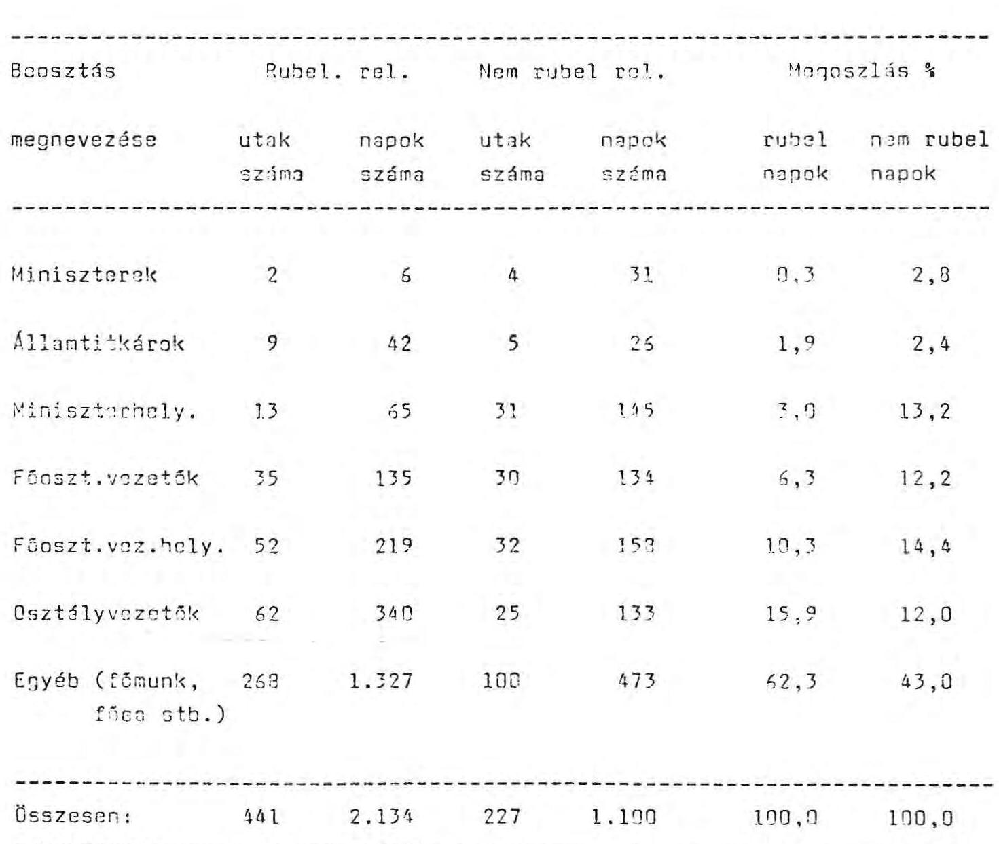

---

9. sz. melléklet a V-17-22/1990. számhoz

Az Ipari Minisztérium műszaki fejlesztési alap forrásai és felhasználása a pénzforgalmi adatok alapján az 1986-1989. években (A Minisztérium 1990. április 25-én készült kimutatása)

|  |   |   |   |   |   |
| --- | --- | --- | --- | --- | --- |
|  Forrás | 1986. | 1987. | 1988. | 1989. | Összesen  |
|  Hivatalos állomány | 3.4 | 230.7 | 10.9 | 12.7 | 257.7  |
|  Tartalék |  |  |  | 155.9 | 155.9  |
|  K-APRI átutalás | 2.644.6 | 2.293.3 | 3.328.6 | 3.500.7 | 11.767.2  |
|  Visszatérítés | 131.7 | 314.4 | 284.3 | 466.7 | 1.197.1  |
|  Ebből: -ÍpH közvetlen | 121.7 | 68.4 | 105.1 | 94.8 | 390.0  |
|  -ÍPB át-nél | 16.0 | 158.2 | 122.0 | 283.4 | 580.6  |
|  -OKKPT programoknál |  | 47.5 | 34.7 | 46.3 | 128.5  |
|  -T programoknál |  |  | 12.5 | 32.2 | 44.7  |
|  Banki kamat, osztalék | 6.8 | 21.1 | 63.4 | 158.5 | 249.8  |
|  Ebből: -ÍpH-nek oszt. |  | 13.4 | 42.7 | 115.0 | 171.1  |
|  -OKKPT-knek oszt. |  | 3.7 | 12.3 | 20.9 | 36.9  |
|  -T programoknál | 0.8 | 2.0 | 8.1 | 22.6 | 33.5  |
|  Egyéb forrás összesen | 232.0 |  |  | 31.8 | 263.8  |
|  Ebből: -ÍPB tartalék kurát | 62.0 |  |  |  | 62.0  |
|  -ÍpH nyertm. fejt. |  |  |  |  |   |
|  Jószaki ázis-ról | 220.0 |  |  |  | 220.0  |
|  -Készletértékesítés |  |  |  | 31.8 | 31.8  |
|  Forrás összesen | 3.362.5 | 3.459.5 | 3.448.2 | 4.328.3 | 14.598.5  |
|  Felhasználás |  |  |  |  |   |
|  | 1986. | 1987. | 1988. | 1989. | Összesen  |
|  KIKPT összesen | 1.012.3 | 1.393.7 | 1.414.9 | 1.634.9 | 5.455.8  |
|  Ebből: -KHUFA közvetlen | 1.312.3 | 1.340.2 | 1.337.6 | 1.567.7 | 5.557.8  |
|  -Visszatérítés |  | 47.9 | 34.7 | 46.3 | 128.9  |
|  -Kamat |  | 5.7 | 12.6 | 20.9 | 39.2  |
|  T programok összesen | 482.3 | 701.8 | 764.2 | 892.8 | 2.841.1  |
|  Ebből: -KHUFA közvetlen | 431.5 | 699.8 | 743.6 | 838.0 | 2.713.0  |
|  -Visszatérítés |  |  | 12.5 | 32.2 | 44.7  |
|  -Kamat | 0.6 | 2.0 | 8.1 | 22.6 | 33.5  |
|  Egyéb K-F | 325.6 | 633.9 | 515.8 | 612.0 | 2.087.3  |
|  Egyéb célú | 511.6 | 659.2 | 740.6 | 1.175.5 | 3.086.9  |
|  -1266.1.1. elnőtől áthúzódó kötelezettségekre | 358.5 |  |  |  | 358.5  |
|  -Banki kig és credencia |  | 10.3 | 27.0 | 41.3 | 78.6  |

 -Banki alapfelvételre | 35.0 | 445.0 | 267.1 | 637.7 | 1.234.3 **  |
|  -Egyéb kifizetések | 117.8 | 203.3 | 446.5 * | 406.5 | 1.108.8  |
|  Adott évre áthúzódó (céltalomány) | 230.7 | 10.3 | 12.7 | 11.1 | 11.1  |
|  Felhasználás összesen | 3.062.5 | 3.459.5 | 3.448.2 | 4.326.3 | 13.956.3  |
|  Megjegyzés: * tartalmazza az 1989. évben forrágmentes jelentkező tartalékot (155.9 Mév) **1266.1.1. elnök alapfelvételével együtt 1.504.6 Mév |  |  |  |  |   |

---

Az alap forrásainak tervezése, elszámolása és tényleges alakulása 1986-1989 között
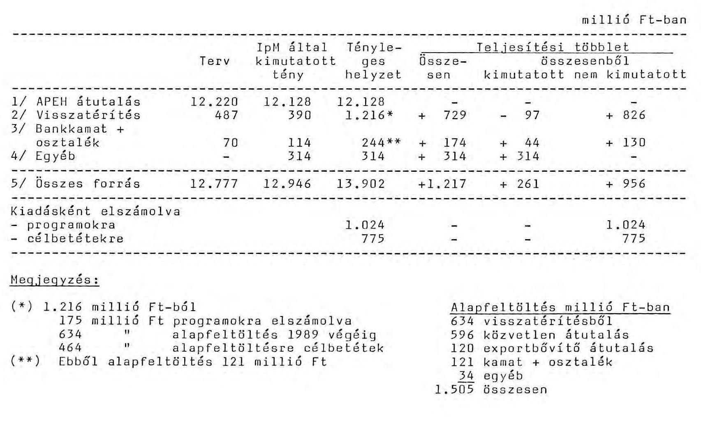

---

# Országos és tárcaprogramok visszatérítési előírásai az 1986-1989. években kötött szerződéses összegek %-ában 

| Program jele | Összesen | 1986. | 1989. |
| :-- | :-- | :-- | :-- |

Országos programok

| G/4 | 27,0 | 34,4 | 26,3 |
| :-- | :-- | :-- | :-- |
| G/5 | 15,4 | 8,7 | 39,3 |
| G/6 | 31,1 | 29,7 | 31,6 |
| G/7 | 19,2 | 16,8 | 22,2 |
| G/11 | - | - | - |
| Tárcaprogramok |  |  |  |
| T-1 | 17,4 | 26,7 | 17,4 |
| T-2 | 10,0 | x | x |
| T-3 | 38,3 | 39,9 | 45,0 |
| T-4 | 23,5 | - | 27,0 |
| T-5 | 15,1 | 7,0 | 19,0 |
| T-6 | 25,0 | 25,0 | 25,0 |
| T-7 | 40,0 | 43,0 | 43,0 |
| T-8 | 33,0 | 22,0 | 45,0 |
| T-9 | 51,6 | 44,6 | 49,5 |
| T-10 | 40,0 | 40,0 | 40,0 |
| T-11 | 41,0 | 42,0 | 26,0 |
| T-12 | 51,3 | 60,0 | 50,0 |
| T-13 | 57,1 | 78,0 | 47,6 |
| T-15 | 34,2 | 35,9 | 8,7 |

| Átlag: | 28,0 | 28,0 | 32,0 |
| :--: | :--: | :--: | :--: |

$\mathrm{x}=$ Nem értelmezhető.
Készült a programirodák adatainak felhasználásával.

---

Az 1986 óta átalakult, felszámolás alá vont Ipari Minisztérium felügyeleti körbe tartozó vállalatok
(1990. február 28-i állapot)

A/ 1986. I. 1-ével szétvált vállalatok:

1/ ELZETT
2/ Budapesti Bőripari Vállalat
3/ Elektromos Készülékek és Anyagok Gyára
4/ Innovatext K+F Vállalat
5/ Magyar Acélárugyár
6/ Szellőztető Művek
7/ Villamosberendezési és Elektronikai Vállalat

B/ 1987-1988-ban megszüntetett és/vagy felszámolási eljárás alá vont vállalatok:

1/ Tatabányai Szénbányák
2/ Országos Földtani Kutató és Fúró Vállalat
3/ Minőségi Cipőgyár
4/ Ganz-Mávag Mozdony- Vagon- és Gépgyár
5/ Kontakta Alkatrészgyár
6/ Csepel Művek Ipari Központ
7/ Soroksári Vasöntöde
9/ Láng Gépgyár
10/ Mecseki Szénbányák
11/ Péti Nitrogénművek
12/ Auróra Cipőgyár
13/ Elektronikai Vállalat
14/ Nógrádi Szénbányák
15/ Látszerészeti Eszközök Gyára

---

16/ Budapesti Finomkötöttárugyár
17/ Labor MIM
18/ Pannónia Szőrme Kikészítő
19/ Duna Cipőgyár
20/ Magyar Posztógyár
21/ Csepel Művek Egyedi Gépgyár
C/ "Kiürült" vagyonkezelő központtal működő vállalatok
a/ Állami gazgatási felügyeletűek:
1/ MDM
2/ BUDAPLAX
3/ BRG Mechatronikai Vállalat
b/ Önkormányzati vállalatok:
1/ MEDICOR
2/ GANZ-DANUBIUS
3/ Csavaripari Vállalat
4/ Szerszámgépipari Művek
5/ Szék- és Kárpitosipari Vállalat
6/ Csepel Művek Szerszámgépgyár
7/ Borsodi Vegyi Kombinát
8/ Ajkai Üveggyár
D/ Egyéb vállalatok:
1/ TUNGSRAM
2/ VIDEOTON

A jegyzékben feltüntetettek az Ipari Minisztérium Vállalkozás- és Vállalatfejlesztési Osztály adatszolgáltatásán alapulnak.

---

# IFB Rt alaptőke feltöltés alakulása az alapból 

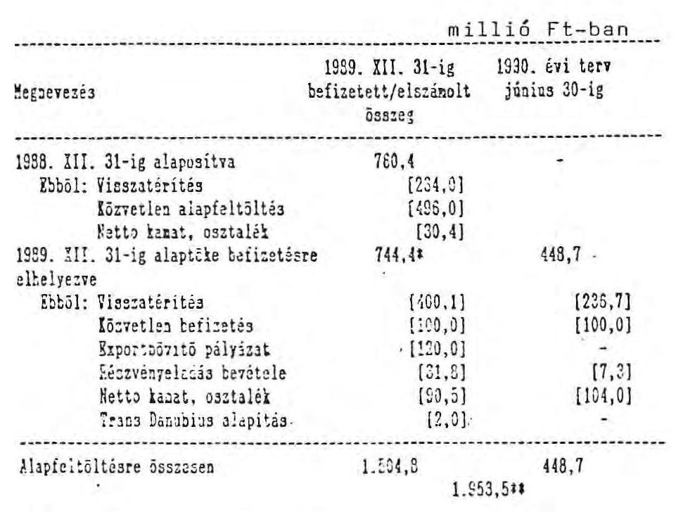

Alapfeltöltésre összesen
$1.554,5 \quad 448,7$
$1.953,511$

- Zöld 107,4 eft 1988. évi befizetés
11 A kötelezettségként vállalt: 2000 eft-ból leszámított ugy az IFB Rt-nek átadott 46,5 eft értékű részvény

Készült a bank elszámolása alapján.

---

A G/7 és T/9; T/10; T/13 programok számlái negyedévenkénti záróállományainak alakulása*
millió Ft-ban

|  |  | 1988. |  |  |  | 1989. |  |  |
| :--: | :--: | :--: | :--: | :--: | :--: | :--: | :--: | :--: |
|  |  | II. né. | III. né. | IV. né. | I. né. | II. né. | III. né. | IV. né. |
| G/7 program** |  |  |  |  |  |  |  |  |
|  | I. főirány | 128,70 | 107,26 | - | 10,30 | 146,70 | 56,47 | 76,70 |
|  | II. " | 59,79 | 77,36 | 0,86 | 6,30 | 68,75 | 52,68 | 53,32 |
|  | III. " | 18,38 | 18,38 | 15,21 | 0,28 | 39,56 | 19,28 | 2,82 |
|  | IV. " | 17,00 | 8,70 | 5,37 | - | 17,80 | 9,62 | - |
| T/9 program |  | $-\quad * *$ | 85,90 | 81,34 | 75,56 | 89,67 | 85,07 | 69,88 |
| T/10 | " | - *** | - | - | 15,34 | 23,26 | 13,56 | 6,26 |
| T/13 | " | - *** | 43,9 | 26,31 | 33.21 | 58.44 | 65.93 | 51,86 |
|  |  |  |  | 129,09 |  |  |  | 260,84 |

# Megjegyzés: 

* = Az IpH-nél rendelkezésre álló bankbizonylatok alapján.
** = Főirányonként külön számlákon vezetve a pénzforgalom.
*** = IpH-nél nincs adat.

---

15. sz. melléklet a V-17-22/1990. számhoz

Az Ipari Minisztérium IFB-től elhelyezett célbetétei
és az egyes programok bankszámláin nyilvántartott
1989. évi záróállománya

millió Ft-ban

Hugnevezés /. Záróállomány

a programok (GMMFT) 461,0
I programok (típuson) 542,5
I/ programok számlákon összesen: 1.023,5

T: 1 tartalék 125,0
Állandó gyűjtő célbetét 464,3
Alok pályázatok célbetéte 36,5
Műszaki célbetét 137,5
Cívódási szerződés 11,6
II/ IFB-től elhelyezett célbetétek összesen 773,2

Mindegyütt I+II. 1.798,7

Készült az IFB Rt adatainak felhasználásával.

---

Az alap felhasználása 1989-ben az 1988. évi XI. törvény 11. jogcímei szerint
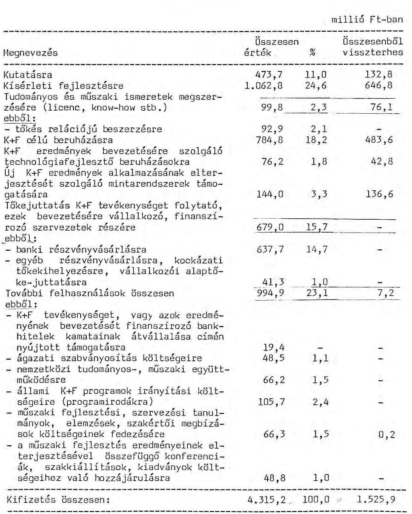

Készült az Ipari Minisztérium statisztikái szerint.

---

# Az alap lekötése az Ipari Minisztériumnál 

1986. január 1 - 1989. december 31 között

FORRÁSOK TERMÉRE VÁLTOZÁS 1. KÖTELEZETTSÉGEK A K+F témakörök kidolgozásának elősegítésére
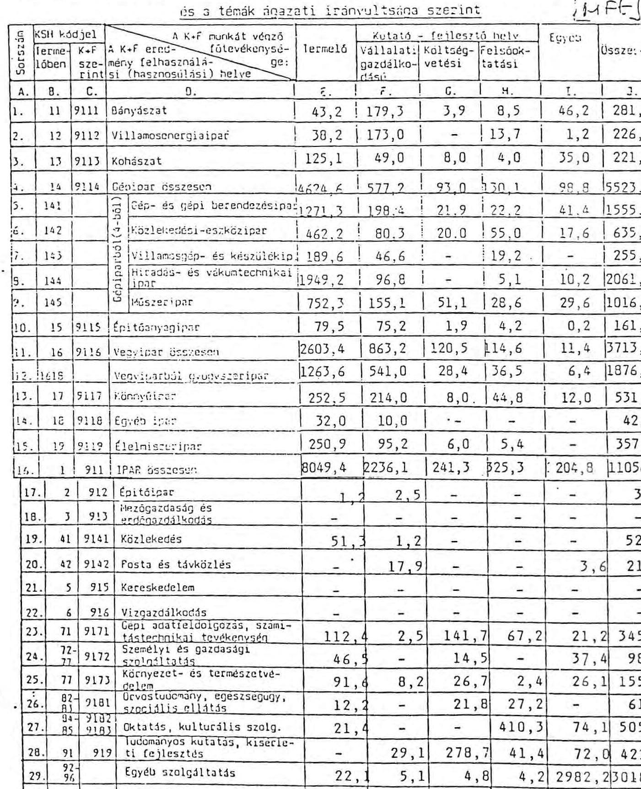

A minisztériumi statisztika szerint.

---

# Az Ipari Minisztérium VII. ötéves tervi   központi MÚFA felhasználási terve 

| Felhasználás célja szerint: | Előirányzat |  |
| :--: | :--: | :--: |
|  | Milliárd Ft | % |
| 1. OKKFT programok (4db) | 6,78 | 47,1 |
| 2. Tárca programok (13db) | 3,57 | 24,8 |
| 3. Tárcaközi programok (2 db) | 0,48 | 3,3 |
| 1-3. Programokra összesen:10,83 |  | 75,2 |
| 4. Technova Innovációs Bank alapfeltöltés | 0,30 | 2,1 |
| 5. Az iparvezetés információs rendszerének kialakítása | 0,10 | 0,7 |
| 6. A műszaki fejlesztés infrastrukturális területi megbízások | 1,20 | 8,3 |
| 7. Egyedi K+F feladatok | 0,47 | 3,3 |
| 8. Tartalék | 1,50 | 10,4 |
| 4-8. Egyéb célok összesen: | 3,57 | 24,8 |
| Mindösszesen | 14,40 | 100,0 |

---

# Az IpH által központi MÚFA-ból finanszírozott országos és tárcaprogramok, valamint felhasználási mutatóik

|  Program megnevezése |  |  |  | millió Ft-ban  |
| --- | --- | --- | --- | --- |
|   |  |  |  | (Keretmegállapodás Kifizetés 1986-1989-ben  |
|   |  |  |  | a VII. ötéves tervre összesen ebből beruházás  |
|  G/4 Az energiagazdálkodással kapcsolatos fontosabb |  |  |  |   |
|  feladatok a VII. ötéves tervben |  | 880,0 | 543,4 | 136,8  |
|  G/5 Elektronikai alkatrészek kutatás-fejlesztése |  |  |  |   |
|  célprogram |  | 1.600,0 | 1.234,6 | 295,3  |
|  G/6 A gyártásautomatizálás, a finommechanikával kapcsolódó elektronikai eszközök és előállításuk K+F feladatai |  | 2.100,0 | 1.542,7 | 583,9  |
|  G/7 A gyógyszer-, növényvédőszer- és intermediergyártás, valamint a vérterápiás és diagnosztikai készítmények fejlesztésével összefüggő K+F feladatok |  | 2.300,0 | 1.774,0 | 537,0  |
|  G/11 Atomenergetikai kutatási és fejlesztési feladatok |  | 205,3 | 143,7 |   |
|  DKKFT programok összesen: |  | 7.025,3 | 5.238,4 | 1.553,0  |
|  T/1 Az ipari környezetvédelem kutatási és fejlesztési feladatai |  | 210,0 | 148,0 | 12,4  |
|  T/2 Természeti kincseink gazdaságos hasznosításának kutatási és fejlesztési feladatai |  | 200,0 | 133,2 | 23,3  |
|  T/3 Dísznövény termelés és hasznosítás kutatási és fejlesztési feladatai |  | 1.023,0 | 711,8 | 162,9  |
|  T/4 Elektronikai berendezések gyártástechnológiájának kutatási és fejlesztési feladatai (G/5 kezelésében) |  | 260,0 | 129,7 | 57,4  |
|  T/5 Villamosenergia-rendszer kutatási és fejlesztési feladatai |  | 150,0 | 75,5 | 5,8  |
|  T/6 Villamosenergia elosztás, felhasználás, gépeinek, berendezéseinek és rendszereinek kutatási és fejlesztési feladatai |  | 150,0 | 94,0 |   |
|  T/7 Gazdaságos felhasználásra irányuló technológiák kutatási és fejlesztési feladatai |  | 300,0 | 164,6 | 24,7  |
|  T/8 Intermedierek gyártás- és gyártmányfejlesztése |  | 200,0 | 144,0 | 69,0  |
|  T/9 Műanyaggyártás, feldolgozás és alkalmazás kutatási és fejlesztési feladatai |  | 360,0 | 217,6 | 66,6  |
|  T/10 Orvosi komplett munkahelyek és a kórháztechnika eszközeinek és berendezéseinek rendszerszemléletű kutatási és fejlesztési feladatai |  | 200,0 | 149,7 |   |
|  T/11 Közúti járművek kutatási és fejlesztési feladatai |  | 204,0 | 143,5 | 23,1  |
|  T/12 Szerszámgépek kutatási és fejlesztési feladatai |  | 150,0 | 100,5 | 2,6  |
|  T/13 Könnyűipari gyártmány- és gyártástechnológiák kutatási és fejlesztési feladatai |  | 352,0 | 209,2 | 47,3  |
|  T/15 Az anyagmozgatás, csomagolás technológiáinak és eszközeinek kutatása-fejlesztése |  | 90,0 | 58,4 | 8,2  |
|  Tárcaprogramok összesen: |  | 3.849,0 | 2.479,7 | 502,5  |
|  Programok mindösszesen: |  | 10.934,3 | 7.718,1 | 2.055,5 (19 %)  |
|  Megjegyzés: * = Nincs adat. |  |  |  |   |

Készült az IpH Hőszaki Fejlesztési Főosztály tanúsítványa felhasználásával.

Nem tartalmazza az 1989-ben átvett építőanyagipari tárcaprogram (T/16) adatait

---

# 20. sz. melléklet 

a V-17-22/1990. számhoz

## Országos- és tárca-programirodai ráfordítások

millió Ft-ban

| Program jele | 1986. | 1987. | 1988. | 1989. | 1986-1989. |
| :--: | :--: | :--: | :--: | :--: | :--: |
|  |  |  |  |  | összesen |
| Országos programok |  |  |  |

  |  |
| G/4 | 1,50 | 4,50 | 4,00 | 3,90 | 13,90 |
| G/5 | 15,10 | 11,15 | 14,50 | 14,50 | 55,25 |
| G/6 | 10,23 | 13,19 | 13,49 | 15,35 | 52,26 |
| G/7 | 5,70 | 6,30 | 7,30 | 8,00 | 27,30 |
| G/8 | - | - | 1,80 | 2,84 | 4,64 |
| Összesen: | 32,53 | 35,14 | 41,09 | 44,59 | 153,35 |
| Tárcaprogramok |  |  |  |  |  |
| T/1 | - | 7,00 | 3,40 | 3,80 | 14,20 |
| T/2 | 0,37 | 0,55 | 0,75 | 1,20 | 2,87 |
| T/3 | 3,50 | 7,80 | 7,92 | 6,42 | 25,64 |
| T/4 | - | - | - | - | - |
| T/5 | 0,10 | 0,20 | 0,20 | 0,35 | 0,85 |
| T/6 | 0,60 | 0,60 | 0,60 | - | 1,80 |
| T/7 | - | 3,10 | 3,10 | 3,10 | 9,30 |
| T/8 | 1,00 | 1,00 | 1,20 | 1,20 | 4,40 |
| T/9 | - | - | - | - | - |
| T/10 | 0,50 | 0,50 | 0,14 | 0,44 | 1,58 |
| T/11 | 4,00 | 4,00 | 2,90 | 2,30 | 13,20 |
| T/12 | 1,53 | 1,07 | 0,70 | - | 3,30 |
| T/13 | 1,20 | 1,20 | 1,20 | 1,70 | 5,30 |
| T/15 | 3,03 | 2,00 | 0,70 | - | 5,73 |
| Összesen: | 15,83 | 29,02 | 22,81 | 20,51 | 88,17 |
| Mindösszesen: | 48,36 | 64,16 | 63,90 | 65,10 | 241,52 |

Készült: programirodai adatszolgáltatás alapján.

---

Az Ipari Minisztérium műszaki fejlesztési alapjából
finanszírozott
millió Ft-ban
1986. 1987. 1988. 1989. Összesen
a/ állami programok irányítási, lebonyolítási költségei:

| OKKFT | 32,53 | 35,14 | 41,09 | 44,59 | 153,35 |
| :--: | :--: | :--: | :--: | :--: | :--: |
| Tárcaprogramok | 15,83 | 29,02 | 22,81 | 20,51 | 88,17 |
| IpM közvetlen | 44,93* | 38,99* | 37,82 | 46,30 | 168,04 |
| Összesen | 93,29 | 103,15 | 101,72 | 111,40 | 409,56** |

b/ nemzetközi műszaki tudományos együttműködés ráfordításai:

| OKKFT | 3,00 | 2,50 | 5,10 | 12,70 | 23,30 |
| :-- | :-- | :-- | :-- | :-- | :-- |
| Tárcaprogramok | 10,00 | 10,70 | 3,90 | 4,00 | 28,60 |
| IpM közvetlen | 26,40 | 44,60 | 34,00 | 53,20 | 158,20 |
| Összesen | 39,40 | 57,80 | 43,00 | 69,90 | 210,10 |

# Megjegyzés: 

(*) Számítógépes kigyűjtés alapján készült. A Minisztérium által nem hitelesített adat.
(**) Ezen felül az alapból állami programokon kívüli akcióirodák, bizottságok, titkárságok részére 44,6 millió Ft kifizetés történt.

---

A vállalatok alap befizetései és az alapból kapott támogatása ágazatonként

|  Ágazat | 1986. | 1987. | 1988. | 1989. | 1986-1989. | Ipm KHÜFA támogatás |  |  |  | A befiz. arányá-  |
| --- | --- | --- | --- | --- | --- | --- | --- | --- | --- | --- |
|   |  |  |  |  |  | 1989. | \% | 1986-1989. | \% | ban \%  |
|  Bányászat | 332,6 | 344,1 | 263,8 | 70,1 | 1.010,6 | 62,2 | 3,1 | 281,1 | 2,6 | 27,8  |
|  Villamosenergiaipar | 141,9 | 180,2 | 230,7 | 106,0 | 658,8 | 53,5 | 2,7 | 226,1 | 2,1 | 34,3  |
|  Kohászat | 126,0 | 165,3 | 265,8 | 303,9 | 861,0 | 44,2 | 2,2 | 221,1 | 2,1 | 25,7  |
|  Gépipar | 2.939,1 | 3.028,5 | 2.218,9 | 965,5 | 9.152,0 | 1.137,8 | 56,9 | 5.523,7 | 51,6 | 60,4  |
|  Építőanyagipar | - | - | 102,0 | 119,8 | 221,8 | 33,9 | 1,7 | 161,0 | 1,5 | 72,6  |
|  Vegyipar | 1.073,3 | 1.257,8 | 1.082,5 | 939,5 | 4.353,1 | 568,8 | 28,4 | 3.713,1 | 34,7 | 85,3  |
|  Könnyűipar | 381,4 | 416,7 | 358,7 | 380,2 | 1.537,0 | 70,4 | 3,5 | 531,3 | 5,0 | 34,6  |
|  Egyéb ipar | 10,7 | 9,2 | 8,7 | 48,3 | 76,9 | 30,0 | 1,5 | 42,0 | 0,4 | 54,6  |
|  Ipar összesen
(élelmiszeripar nélkül) | 5.005,0 | 5.401,8 | 4.531,1 | 2.933,3 | 17.871,2 | 2.000,8 | 100,0 | 10.699,4 | 100,0 | 59,9  |

Forrás: - Beszámoló jelentés a szoc. ipar 1988. évi műszaki fejl.-i feladatairól (1986-87. év)

- Az éves mérlegbeszámolók ágazati feldolgozása, KSH (1988-89. év)
- Országgyűlési beszámolóhoz készített tárcaanyag IV, VII. táblázat

---

A "szocialista" ipar K+F ráfordítása

|  Ágazat | 1986. | 1987. | 1988. | 1989. | 1986-1989.   összesen | 1988/1987.   %ban | 1989/1988.   t | Az alapból való támogatás %-a |
| --- | --- | --- | --- | --- | --- | --- | --- | --- |
|  Bányászat | 572,0 | 694,6 | 698,5 | 762,9 | 2.692,0 | 100,6 | 109,2 | 10,4 |
| Villamosenergiaipar | 295,6 | 290,4 | 307,8 | 431,8 | 1.325,6 | 106,0 | 140,3 | 17,1 |
| Kohászat | 763,2 | 931,4 | 1.179,7 | 1.215,2 | 4.089,5 | 126,6 | 103,0 | 5,4 |
| Gépipar | 6.939,9 | 7.215,6 | 5.547,5 | 5.659,5 | 25.362,5 | 76,8 | 102,0 | 21,8 |
| Építőanyagipar | - | - | 247,2 | 287,0 | 534,2 | - | 116,1 | 30,1 |
| Vegyipar | 3.385,6 | 3.874,5 | 4.009,6 | 3.227,6 | 14.997,3 | 103,5 | 80,4 | 24,8 |
| Könnyűipar | 389,6 | 439,7 | 459,0 | 548,0 | 1.836,3 | 104,4 | 124,6 | 28,9 |
| Egyéb ipar | 22,7 | 26,3 | 24,2 | 14,9 | 88,1 | 92,0 | 61,5 | 47,7 |
| Ipar összesen (élelmiszeripar nélkül) | 12.368,6 | 13.472,5 | 12.473,5 | 12.610,9 | 50.925,5 | 92,6 | 101,1 | 21,0 |

Forrás: 1986-87. évi adatoknál - "Beszámoló jelentés" a szocialista ipar 1988. évi műszaki fejlesztési feladatairól (IpM)
1988-89. évi adatoknál - Az éves mérlegbeszámolók ágazati feldolgozása (KSH)

---

# FÜGGELÉK 

a Minisztérium műszaki fejlesztési alapjának vizsgálati megállapításai

A Minisztérium feladata - az ágazati irányítás keretében az ipar műszaki fejlesztésének fő irányait kidolgozni, az innovációt, valamint a kutatási tudományos tapasztalatok hasznosítását, a korszerű technika és technológia elterjesztését támogatni.

Ehhez a népgazdaság központi műszaki fejlesztési alapjának meghatározott részével - a vizsgált időszakban 42 %-ával rendelkezett.

A kitűzött feladatok végrehajtásában az irányítást az egymástól gyökeresen eltérő gazdaságpolitikai lépéssorozatok, (importkiváltás-importliberalizálás, szocialista piaci lehetőségek megítélése, piaci és tulajdoni reorientáció stb.), valamint egy szándékában erős restrikciós pénzpolitika jelentősen befolyásolták.

Az alap felhasználását az 1988. évi XI. törvény szabályozza.

A törvény azonban a fő hangsúlyt a forrásokra helyezi. Csak kis lépés történt a felhasználás kedvezőtlen gyakorlatának megváltoztatására, továbbra sem fogja vissza pl. az alapnak a költségvetési források pótlásában betöltött évek óta tartó és erősödő szerepét.

---

A Minisztérium az általa kezelt alap hatékonyságának fokozására több pozitív lépést tett (miniszteri belső utasítással szabályozta az alap kezelési rendjét, bevezette és teret nyert a támogatások pályázati rendszere, megvalósította a pénzeszközök korszerű kezelési rendjét, korszerűsítette a szerződések nyilvántartási rendszerét, megnövelte a visszatérítések szerepét a támogatásokban).

A pozitív elmozdulás ellenére sem kielégítő azonban az alap felhasználásának célszerűsége, eredményessége és szabályossága, ez visszahat a műszaki fejlesztést irányító tevékenység hatékonyságára, az ipar műszaki színvonalának alakulására.

# 1/ Az alap pénzforrásai 

Az 1986-1990. években népgazdasági szinten K+F célokra összesen 152-164 milliárd Ft felhasználásával számoltak. Ennek mintegy 23 %-át (35-37 milliárd Ft-ot) a műszaki fejlesztési alapokból tervezték biztosítani.

A Tudománypolitikai Bizottság az ötéves tervperiódusra a műszaki fejlesztési alapokban várhatóan rendelkezésre álló összegek 42 %-át, (14,6-15,1 milliárd Ft) bocsátotta az Ipar Minisztérium rendelkezésére. Az 1986-1989. években ebből a Pénzügyminisztérium által átutalt összeg 12,1 milliárd Ft. (9. sz. melléklet)

Ezen felül a Minisztérium e négy év során 1,8 milliárd Ft (visszatérítésből, kamatból és osztalékból származó) többletbevétellel is rendelkezett. Emellett - a 13,9 milliárd Ft összeg keretein belül - a bankszámlákon jelentősek (ugyancsak kb. 1,8 milliárd Ft) a kiadásként már elszámolt összegek. A pénzforrások valóságos értéke a Minisztérium finanszírozási és elszámolási gyakorlata mellett nem tekinthető át hitelesen és megnyugtatóan.

---

Az 1986-1989. években a Minisztérium bevételi terveiben a visszatérítésekből és a banki kamatokból esedékes bevételeknél jóval alacsonyabb összeggel kalkulált. A ténylegesen befolyt visszatérítések együttesen 1,2 milliárd Ft-os, a banki kamatok 244 millió Ft-os összegének a tervekben alig több, mint harmadát vették csak számításba.

Elsősorban az Ipari Fejlesztési Bank Rt (IFB)-hez, illetve a programirodákhoz visszatérítendő összegek maradtak ki a tervszámokból. Ezek jó részét a Minisztérium nem csak terveiben hagyta figyelmen kívül, de az 1986-1989. évek bevételeiből 130 millió Ft banki kamatot és osztalékot, valamint 826 millió Ft visszatérítést - összesen 956 millió Ft-ot - a Minisztérium hivatalos pénzforgalmi mérlegeiben bevételként ki sem mutatott (10. sz. melléklet) és az IFB-nél, valamint a programirodáknál hagyott vissza.

A tartalékok másik forrása a programirodákhoz kiutalt összegeknél volt fellelhető. A programok számláira negyedévenként átutalt összegek nem álltak összhangban a teljesítésekkel, a műszaki teljesítések elmaradása, a számlázások év végi torlódása folytán csak jelentős késedelemmel kerültek kifizetésre. Így tetemes összegek tartósan a banknál feküdtek el. (9-32. sz. példák)

A bankszámlák záróegyenlegei a pénzforrások között nem jelentek meg. Az alap egyes évek végén kimutatott pénzforgalmi záróállománya általában alacsony - az 1988. év végén pl. 12,7, az 1989. év végén csak 11,7 millió Ft - volt. A valóságos záróállományok összege nagyságrendekkel volt nagyobb és 1989 végén megközelítette az 1,8 milliárd Ft-ot.

---

A többletpénzforrások programok közötti szükségszerű allokációja, a támogatási arányok változása az éves tervekben csak igen korlátozott volt, ami az eredeti céltól eltérő felhasználást bővítette, a támogatások széttagoltságát stabilizálta. A visszatérített összegek csekély mértékben növelték a programok pénzügyi forrásait.

Az 1986-1989.
 években ezeknek csak 14-15%-át fordították OKKFT- és tárcaprogramokra. Az OKKFT forrásokat a "visszacsorgó" pénzek 3,5%-kal, a tárcaprogramokét 2%-kal növelték. A fennmaradó 85-86%, összesen mintegy 1.042 millió Ft, programokon kívüli célokat szolgált. Ezek évi összege 1986-1989 között 131,7 millió Ft-ról 388,2 millió Ft-ra emelkedve csaknem megháromszorozódott.
a/ Az alapot illető visszatérítések előírása és beszedése

A visszatérítésekből származó befizetések évről évre növekvő szerepet játszanak az alap bevételei között. Az 1986-1989. években az összes bevétel 8-9%-át reprezentálták. E bevételek azonban jóval nagyobbak lehetnének egy szigorúbb finanszírozási rend, továbbá egy elfogadható nyilvántartási és erre alapozható következetesebb behajtási gyakorlat esetében. A tapasztalt állapotok szerint azonban a Minisztériumnak

- a visszatérítések előírására, nyilvántartására a 3/1987. sz. miniszteri utasítás ellenére 1989 közepéig nem volt kialakított rendje,
- máig sem áll rendelkezésére olyan megbízható adat, amely az ilyen címen fennálló követelések összegét, lejárat szerinti bontását stb. hitelesen tükrözné.

---

Ez az erőforrások koncentrációjának és az eszközök hatékonyabb forgatásának problémáján túl az állami tulajdon nyilvántartásának, következetes védelmének hiányosságaira is utal.
aa/ A visszatérítések előírása

A K+F támogatások visszatérítését mind a régebbi, mind az újabb szabályozások lehetővé tették, de ennek konkrétabb követelményeit nem rögzítették. A hivatkozott utasítás szigorúbb előírásai az ellenőrzött időszakban még alig fejthették ki hatásukat. (Az utasítás kiadásáig a szerződések mintegy 50%-át már megkötötték, így az új rendelkezés az előírt visszterhek mértékét nem befolyásolhatta).

A Minisztériumnál az előírt visszatérítések aránya - az 1981-1985. évekhez képest - kissé növekedett, de még így is alig érte el pl. az OMFB-nél szokásos szint kétharmadát, s jelentősen elmarad a miniszteri utasítás elvárásaitól is.

A Minisztérium 1986 óta kötött szerződéseinek 44%-a volt visszterhes (1.250 db), de az ezekben előírt visszterh aránya átlagosan csak 20% volt (2,9 milliárd Ft).

Magasabb a visszterhesen kötött szerződések aránya a tárca- (továbbiakban T-) programoknál (70%), az OKKFT (továbbiakban G-) programoknál és a beruházásokhoz adott támogatásoknál (50%). Ezeknél átlagosan a támogatás 28%-ának visszatérítését írták elő, ami az utasításban említett aránytól szintén jelentősen elmaradt.

---

A programon kívüli 917 egyedi szerződésből (zömmel tanulmányok, elemzések, nemzetközi együttműködés stb.) csak 29 (3%) volt visszterhes. (33-34.sz. példák)

Egyes programoknál (pl. T/12, T/13) a korábban magasabb előírások évről évre csökkentek (pl. 60-80%-ról 50%-ra). Ezt az érintett (pl. könnyű-, szerszámgép) iparágak mélypontra kerülésével magyarázták. Ez azonban a hatékonysági követelmények lazítását, a juttatások "támogatási" jellegének erősödését is kifejezte.

Az előírt visszatérítések arányának átlaga programonként jelentősen változó, de csak kevésbé hozható összefüggésbe a témák fontossági sorrendjével. (11. sz. melléklet) A feladatok sajátosságainál jelentősebb szerepet kapott az egyes programokon belüli megegyezés. Csak elvétve (pl. a G/7 OKKFT programnál) alkalmaztak olyan - mind szakmailag, mind irányítási és lebonyolítási szempontokból munkaigényesebb - érdemi kritériumrendszert, amely figyelembe vette és megkülönböztette a kutatás: fejlesztés stádiumait, céljait, s ennek alapján ítélte meg a hozzájárulás és a kölcsönforrások mértékét. (35. sz. példa)

A várható eredmények iránti bizonytalanságot tükrözte, hogy a visszatérítést többnyire összegszerűen írták elő ahelyett, hogy a pályázatokban ígért haszon - importkiváltás, az exportbevétel stb. függvényében határozták volna meg.

Előfordult azonban, hogy az előírt visszatérítések mértékét a támogatott szervezetek gazdálkodási eredményétől tették függővé. (36. sz. példa)

---

Az akadémiai kutatóintézetek, egyetemek vállalkozás jellegű szerződései mentesek a visszatérítési kötelezettségek alól. (37. sz. példa)

Ugyanakkor e támogatásokból az egyetemek, kutatóintézetek birtokába kerülnek olyan számítógépek, műszerek, amelyek végső soron hozzájárulnak azok ár- és díjbevételeinek növeléséhez.
ab/ A kintlevőségek nyilvántartása

A Minisztérium a K+F pénzforrásokról és azok felhasználásáról nem rendelkezik olyan átfogó, egységes nyilvántartási rendszerrel, amelyre egyébként belső gazdálkodási szabályzata (utasítása) is alapoz. Az alap kezelése decentralizált, s ez tükröződik a nyilvántartásokban is (IpM Műszaki fejlesztési főosztálya, IfB, a programirodák). (38. sz. példa)

A jelenlegi belső adatszolgáltatási és nyilvántartási rendszer alkalmatlansága (39. sz. példa) miatt nem állapítható meg teljeskörűen, hogy az 1986 előtt megkötött szerződések alapján milyen gazdálkodó szervezeteknek mekkora visszterhes kötelezettsége állt fenn és abból mekkora összeg került elengedésre, illetve teljesítésre. E kötelezettségekről a megelőző öt év lezárása után sem készült részletes elszámolás. Az elengedett és módosított kötelezettségekről legfeljebb hiányos dokumentumok (levelezés, leírások stb.) találhatók. Az 1990. évben ismét lezárul egy "tervciklus", az elengedésekre azonban a szabályzati lehetőségek jelenleg is korlátlanul adottak.

Az alap kezelőjének a rendelkezésére álló állami pénzeszközök bevételeiről, kiadásairól és kintlevőségeiről áttekinthető, teljes és naprakész nyilvántartással kell-

---

lene rendelkeznie. Ehelyett az állami követelések kezelése távolról sem tekinthető megnyugtatónak. A szerződések alapján - a forgalom egy részéről - vezetett banki, valamint a programirodák technikai, szakmai felkészültségétől erősen függő nyilvántartások nem mentesítik a Minisztériumot, hogy a pénzügyi törvény előírásainak teljeskörűen eleget tegyen.

A helyzetet súlyosbítja, hogy a visszatérítések átütemezésének, elengedésének feltételei, szervezeti és adminisztratív követelményei sincsenek kellő mélységben szabályozva. Az egész folyamat nem kap megfelelő nyilvánosságot sem. Zömében - a főosztályt is kész tények elé állítva - a programfelelősök (ritkábban a programtanácsok) egyedül döntenek legtöbbször az adós anyagi helyzetére hivatkozva. (Még a bankot sem, vagy csak késve értesítik.) A felmentések okairól és azok értékeléséről rendszerint nincs adat. A szerződések módosítására sem minden esetben kerül sor.
ac/ A kintlevőségek behajtása

Az 1986-1989. években kötött mintegy 1.250 db visszterhes szerződésből adódó kötelezettségek esedékes összege 1989. év végén már meghaladta a 2 milliárd Ft-ot, s ez 1990. decemberére tovább növekszik. A visszafizetési fegyelem egyrészt a nyilvántartási, ütemezési hiányosságok, másrészt a gazdasági körülmények miatt is laza.

A visszatérítési kötelezettségek behajtásának következetlenségei elsősorban a Minisztérium szemléletére vezethetők vissza, amelyben még nem kellően érvényesülnek a takarékossági, nem utolsó sorban pedig a közpénzek szoros kezelésének szempontjai. E problémák konkrét megnyilvánulásai a visszatérítésekkel kapcsolatos pénzügyi folyamatok egészében fellelhetők.

---

Az elmúlt 4 évben 460 millió Ft visszterh befizetését irányozták elő. A szerződések 17%-át módosították, az elengedések és fizetési meghiúsulások a vizsgált időszakban megközelítették a 10%-ot. Felszólítás nélkül az adósoknak csak egy része fizet.

Az 1987. évi követeléseknek pl. közel háromnegyedét csak 1989-ben fizették be. Az 1988. évi visszatérítéseknek mintegy 10%-át még 1990. márciusában sem fizették meg. Az 1989. évi visszterhek 60%-a érkezett be időben, 25%-a csak 1990. I. negyedévében.

A behajtás gyakorlata nem egységes és nem következetes annak ellenére, hogy a programirodáknak a programok pénzügyi kérdéseiben is ellenőrzési kötelezettségük van. (40. sz. példa)

A behajtásban 1987 óta - sajátos, később részletezett okokból - leginkább a bank érdekelt. Az 1986-1989. években befolyt összegek mintegy kétharmada az IFB akcióinak eredményeként jelentkezett. (9. sz. melléklet)

A kötelezettségek teljesítésének elmulasztását nem szankciók, hanem átütemezések követik. (A szabályok sem írnak elő szankciókat.) (41-43. sz. példák) Peres úton ez ideig csak egy ízben szereztek érvényt a követelésnek.

A visszatérítések elmaradásában kétségtelenül az egyes ágazatok, iparágak (pl. könnyűipari, gépipari vállalatok), illetve vállalatok (pl. Mikroelektronikai Vállalat) gazdasági nehézségei is tükröződnek.

A szervezetileg, tulajdonilag átalakult, illetve felszámolási eljárás alá vont vállalatoknál az alap kintlevő-

---

ségei biztonságos visszatérülésének szerződéses garanciáit kiemelten vizsgáltuk. A Minisztérium adatai szerint az 1986-1989. években e körbe 41 - közöttük 15 felszámolás alá vont (és ebből 13 visszatérítéssel terhelt) vállalat tartozott. (12. sz. melléklet) A visszatérítési kötelezettség 29 vállalatnál összesen 564 millió Ft volt.

Az adatok teljessége nem garantált. A Minisztérium ugyanis e vállalatok tartozásairól, cégek szerinti összesítések hiányában, adatokkal nem rendelkezett. Így azokat több forrásból (főosztály, bank, programirodák) kellett összeállítani. A tételes egyeztetést a Minisztériumnak a bankkal és a programirodákkal mielőbb el kell végeznie.

E kötelezettségekből elengedtek 12,2 millió Ft-ot. A vizsgálat idejéig esedékessé vált 238,1 millió Ft-ból f. év március 13-ig az elmaradás csak 32,2 millió Ft (13%). 1990-re esedékes (számíthatóan) több, mint 310 millió Ft visszatérülése.

Pozitív, hogy a Minisztérium a szerződéseket és az ezekkel járó terheket a jogutódokkal általában rendben átvállaltatta annak ellenére, hogy e követelések tulajdonjogi státusza, különösen pedig ilyen helyzetben való kezelése sem a törvényben, sem minisztériumi utasításban nem szabályozott.

Az átalakult vállalatoknál e kintlevőségek biztosítása az általánosnál is nagyobb figyelmet és további garanciákat tesz szükségessé.

A (részben) át nem vállalt összegek eddigi felmérésünk szerint alig 5-6 millió Ft nagyságrendűek.

---

A felszámolás alá vont és visszatérítéssel terhelt 13 vállalatnál, érthetően, valamivel kedvezőtlenebb a helyzet. Ezektől 98,7 millió Ft-ot várnak vissza, aminek 60%-a 1990 után lenne esedékes. Az eddigi visszatérítési elmaradás 15,8 millió Ft volt, az elengedett tartozás 6,6 millió Ft-ot tett ki.

A fenti összegek döntő hányada három támogatott szervezethez (a Péti Nitrogénművekhez, a Kontaktához és a Labor MIM-hez) kapcsolódik. A G/5 program keretében 1990 után esedékes 198 millió Ft visszatérítése a Mikroelektronikai Vállalat csődhelyzete folytán előreláthatóan kritikus.
b/ Az alap pénzforrásait befolyásoló vállalkozások

Az 1989. és különösen folyó évtől az alap egyre gyorsuló ütemben vesz részt különféle társaságok (rt-ok, kft-k) finanszírozásában. Az 1986 óta kötött szerződések (kb. 3.000 db, 15,7 milliárd Ft) értékéből az alaptőke-hozzájárulások, részvények, vagyoni (cél)betétek és egyéb, az alapból elkülönített, nem közvetlen K+F célt szolgáló összegek értéke és aránya - a tárca adatai szerint is - rohamosan emelkedett. Az 1986-1989. években ez együttesen több, mint 2,9 milliárd Ft-ot, ebből 1989-ben 1,2 milliárd Ft-ot tett ki.
ba/ Az alap banki forráskénti funkcionálása

Az elmúlt években az alap a tartalékolt pénzforrásainak zömét az IFB alap- és forgótőkéjének megalapozására fordították. A Minisztérium által 1984. évben alapított TECHNOVA Ipari Innovációs Alap 1986-ban bankok és iparvállalatok bekapcsolásával betéti társulássá, majd 1988-ban részvénytársasággá alakult. E folyamat hatása az alappal való gazdálkodásra kedvezőtlen volt. A Minisztérium eredetileg helyes célkitűzése - a K+F támogatások

---

területén is alkalmazni a banki módszereket - időközben eltorzult, jórészt az alap erőforrásaira támaszkodó IFB üzletpolitikáját már nem a K+F célok és a Minisztérium, hanem a részvényesek rövid távú financiális érdekei határozzák meg. A Minisztérium semmilyen elsőbbségi jogot nem élvez és ezen az sem segít, hogy a bank elnöke egyben a Műszaki fejlesztési főosztályt felügyelő, a műszaki fejlesztésért felelős miniszterhelyettes volt.

Az IFB alaptőkéje 3,2 milliárd Ft, ebből a Minisztérium 2 milliárd Ft-ot jegyzett. Az 1986-1989. években - bár eredetileg csak 300 millió Ft-tal számoltak - az alap terhére 1,5 milliárd Ft alaptőke-feltöltés történt. (13. sz. melléklet)

Ebből 634 millió Ft a visszatérítésekből, 121 millió Ft a kamat- és osztalékbevételekből, az IFB-nél visszahagyott összegekből, 716 millió Ft kiutalásból származott. A hiányzó részt ez évben tervezik pótolni.

Az alaptőke-részesedésen felül a különféle programokra kiutalt, felhasználásként elszámolt, de valójában ott tartósan elfekvő felhasználatlan összegek 1989. év végi együttes záróállománya - egy év alatt 385 millió Ft-tal növekedve - elérte az 1.023,4
 millió Ft-ot, átlagos állománya pedig a mintegy 950 millió Ft-ot. (29, 32. sz. sz. példák, 14. sz. melléklet)

Az átutalások a záróállománytól és a tényleges felhasználástól többnyire függetlenül történtek. Volt olyan program, ahol a záróállomány ötszörösét tette ki az egész évi felhasználásnak (p1. T/12 program).

---

A Minisztérium megbízásából az IFB több célbetétet is kezel (5-12%-os kamattérítéssel). Ezek 1989. év végi záróállománya elérte a 775 millió Ft-ot, ami a pénzforgalmi mérlegben ugyancsak felhasználásként került kimutatásra. (15. sz. melléklet)

A K+F célok banki finanszírozásának gyakorlata az irányítás eszköztárát bővítette. Az 1988. évi XI. törvény a bank működésének jogosultságát - lehetőséget biztosítva az alap bankszerű kezelésére - megerősítette. Egy 3-5 milliárd Ft tőkével rendelkező bank évenkénti kihelyezéseivel hatékony eszköz lehet az iparpolitikai és szerkezetátalakítási célok megvalósításában. A pénzkezelés banki módszerei és az iparpolitikai ( $\mathrm{K}+\mathrm{F}$ ) célok gondozása azonban még nem hangolódott össze. Az alap forrásai a bankon keresztül eddig nem szolgálták hatékonyabban az ipar műszaki fejlesztését.

Fel kell hívni a figyelmet néhány visszás jelenségre, amelyek elsősorban a ma még egymás mellett élő hagyományos "államigazgatási" és a kereskedelmi jellegű banki finanszírozás (érdek és szemlélet) különbözőségéből fakadnak. Ezek közül néhánynak csak elvi alapjait kell tisztázni, másoknak azonban feltétlenül indokolt elejét venni.

Elvi tisztázást és törvényi szintű szabályozást indokol az állami alapok és a kereskedelmi tőke megismert módszerekkel való összeolvasztásának kérdése. Az IFB üzleti tevékenységét pl. az alap mintegy 3,2 milliárd Ft-ja (alaptőke és programok számlapénze, célbetétek) alapozza meg. Mintegy 552 millió Ft-ról bizonyítható, hogy valamilyen K+F célokat szolgál. A többi csak feltételezhető,

---

hogy a K+F tevékenység gyorsítását és nem a részvényesek vállalati likviditási problémáinak megoldását célozza.

A bank megalakításakor a Minisztérium azzal számolt, hogy az alaptőke összetétele és az alapszabály garanciát nyújt a minisztériumi majoritás megvalósítására, az alap eredeti célnak megfelelő felhasználására. Elsőbbségi jogaiknak érvényesítésében azonban a tárca nem volt következetes.

A bank legjövedelmezőbb üzletága a rövid lejáratú hitelkihelyezés (a hitelállomány felét, a rövid lejáratú forgóeszköz-hitelek kétharmadát részvényeseihez helyezte ki). Az 1989 végi 2,5 milliárd Ft-os rövid lejáratú forrásaiból legalább 1,3 milliárd Ft-ot az alap finanszírozott.

Az alapot az IFB kamatpolitikája miatt hátrányok érték. Az elmúlt évben a bank rövid lejáratú hitelkamatai 20-30% között változtak. (A vállalatok rövid lejáratú betétei után az IFB 1989-ben pl. 18%-ot fizetett.) A minisztériumi programszámlákon fekvő mintegy 1 milliárd Ft szabad pénzeszközök után ezzel szemben pl. az 1987-1988. években csak 2; 1989-ben átlagosan 5-6%-os kamatot fizetett az IFB.

A bank hosszú lejáratú tartós kihelyezésének állománya 1989 végén összesen 1,7 milliárd Ft volt. Ebből a tárca részvényeire eső rész nem határolható el. A műszaki fejlesztési kölcsönökre 552 millió Ft-ot ( $35\%$-ot), beruházási és egyéb hosszú lejáratú hitelekre és alapjuttatásra 1,1 milliárd Ft-ot ( $65\%$-ot) helyeztek ki.

---

Ez utóbbiak esetében a műszaki fejlesztési cél nem kritérium és nem is ellenőrizhető. (44. sz. példa)
bb/ Egyéb vállalkozások szerepe a forrásokban

Az alap pénzforrásainak terhére a Minisztérium kezdeményezése (illetve beleegyezése) alapján egyre több társaságot, alapítványt stb. finanszíroznak. Az IFB pl. - amely alaptőkéjében és a nála lekötött betétek formájában az alapból mintegy 2,5-3,0 milliárd Ft-ot birtokol - már 1988 végén 47 önálló, vagy gesztorált társaságban vállalt érdekeltséget.

A vizsgált esetekben azonban nem a meglévő tőkék koncentrációjáról, új pénzforrások bevonásáról, hanem a szűkös állami erőforrások további elaprózásáról, a finanszírozási csatornák számának növekedéséről és sok tekintetben az áttekinthetetlen, ellenőrizhetetlen folyamatok szaporodásáról volt szó. Ezek nagyobbrészt nem a műszaki fejlesztés felgyorsítását célozták. A társaságok közül többnek profilja az alap céljához közvetlenül nem kapcsolódott, de a közvetett illeszkedés is erősen vitatható (pl. Budapest Holding Rt 10 millió Ft /45. sz. példa/; Kisvállalkozási Fejlesztési Alapítvány és Magyar Vállalkozásfejlesztési Alapítvány együtt 17 millió Ft /46-47. sz. példák/).

Az Ipari Kockázati Tőke Kft. pl. - amelybe az alap 150 millió Ft-ot kötött le - alkalmas arra, hogy az üzleti veszteségeket közvetve az alap viselje. A Kft veszteségét 96%-ban az alap által juttatott vagyon csökkentésével írhatja le. Ugyanez a gyakorlatban:

A Kft. törzsbetétjének 96%-át az alap, 4%-át az IFB fedezte, de a szerződés szerint a bank osztalék-

---

részesedése 50%-nál kevesebb nem lehet. A Kft. 7 üzletrészt vásárolt meg az IFB-től 50 millió Ft névértéken. Amennyiben ezek tényleges értéke alacsonyabb, a leértékelési veszteséget már a Kft fogja elszámolni. (48. sz.példa) Az alap szempontjából hasonlóan előnytelen "üzletek"-kel állunk szemben: az alapítvány a műszaki haladásért ( 5 millió Ft), a Trans Danubius (Veszprémi) Innovációs Park (2 millió Ft, 49. sz. példa), az INNOTECH Innovációs Park GT ( 65 millió Ft, 50. sz. példa) esetében.

A különböző befektetések forgatásának tulajdonképpeni célja még akkor sem kísérhető nyomon, ha a társaság feladatai között említenek valamiféle fejlesztési, innovációs célt.

Amikor - az ugyancsak műszaki fejlesztési alapból elkülönített - Felsőoktatási Fejlesztési Alap 690 millió Ft-ját a Pro Renovanda Cultura Hungariae alapítványba fektették, szinte egyidejűleg a Minisztérium alapjából 100 millió Ft-tal egy Felsőoktatási Műszaki Fejlesztési Alapot létesítettek.

A társaságok, alapítványok közötti tőkemozgások - viszonylag rövid időszakon belül is - igen jelentősek, ami a juttatások és célok összhangjának ellenőrzését végleg lehetetlenné teszi. (51. sz. példa) Az alap társaságokhoz, alapítványokhoz kihelyezett vagyonáról, annak változásáról, hozamáról a Minisztériumnál hiteles nyilvántartás nincs. Így a rendeltetésszerű felhasználáson túl az esetleges további privatizációs lépések esetében az állami érdekek érvényesítése is nehézségekbe ütközhet.

Az alappal gazdálkodó államigazgatás (elsősorban a Minisztérium) és a társaságok között legális, etikailag mégis összeférhetetlen személyes kapcsolatok szövevénye

---

alakult ki. Példaként a legtöbb rt., kft. (pl. az IfB, a Budapest Holding Rt. is) említhető lenne. Az alap felhasználása körében, a programrendszerben kialakuló összefonódások, vitatható személyi jövedelmek más formáival is találkoztunk. Jellemző példaként említhető:

Az egyik G/4-es alprogram irányításában közreműködő személy részt vett saját Kft-je pályázatainak elbírálásában az alprogram irodánál. A 25 pályázatból az első öt között négyet az érintett Kft. nyert el. Ráadásul az alapból kapott támogatásokból a Kft. a Szerzői Jogvédő Hivatalon keresztül megbízta saját tagjait (többek között az említett személyt és annak rokonait), továbbá a Minisztérium egyik magas beosztású vezetőjét a munka elvégzésével. Az egyszeri jogdíjon felül még a létrejött szellemi termék értékesítéséből is részesedést kapnak. (52. sz. példa)

# 2/ Az alap felhasználása 

Az alap pénzforrásai terhére az 1986-1989. években összesen 13,9 milliárd Ft felhasználást számoltak el. A tényleges felhasználás ennél legalább 1,8 milliárd Ft-tal kevesebb volt.
a/ Az alap felhasználásának fő irányai, a támogatások döntési és szerződési rendje

Az iparirányítás részéről erőteljesen preferált hazai kutatások, fejlesztések támogatása alapvetően eltérő irányítási magatartást jelez a struktúrát sikeresen átalakító nemzetgazdaságokkal szemben. (16. sz. melléklet)

Alacsony a technikai-technológiai színvonalat növelő, a nemzetközi integrációból adódó előnyök hasz-

---

nosítását segítő támogatások aránya. Ezt a Minisztérium maga is kiemelte a szerkezetátalakításról szóló parlamenti, ez év februárjában készült beszámolójában. A licence, know-how vásárlások súlya rendkívül kicsi, csak 2-3%.

A klasszikus értelemben vett, konkrét technológiákhoz, termékekhez kötődő K+F támogatásra a felhasználás 36%-a, a K+F beruházásokra mintegy 19%-a jutott (programonkénti nagy, 0-36%-ig terjedő szóródással). (53. sz. példa)

Az 1986-1989. években vállalt kötelezettségekből a termelő szervezetek 53%-ban ( 8,4 milliárd Ft) részesedtek, a kutató-fejlesztő helyek összesen 25%-os ( 3,9 milliárd Ft) részesedésének a túlnyomó részét ( 3/5-ét) a vállalati kutató szervezetek kapták. (17. sz. melléklet) A támogatásokat csak néhány intézet (pl. IPIK, Ipari Technológiai Intézet, SZTAKI, Ipargazdasági Intézet, SZENZOR, STRUKTÚRA, PRODINFORM, KOGÉPTERV) használta fel.

Feltűnő az egyéb szervezetek viszonylag magas ( 23%-os) arányú részesedése, amiben a vállalkozások már említett finanszírozási módszerei és az alap felhasználásának cél- és szabályszerűségi gondjai egyaránt kifejeződnek.

Erre utal az is, hogy pl. az egyéb szervezeteknek négy év alatt kifizetett, összesen 3,4 milliárd Ft fele 1989. évben került folyósításra, meghaladva a termelő területek azévi összes támogatását.

Az alapból az 1986-1989. években az 5 OKKFT programra 5,5 milliárd Ft-ot, a 15 tárcaprogramra 2,8 milliárd Ft-ot fordítottak. (18. és 19. sz. mellékletek) Ez együtt az összes

---

felhasználás csaknem 60%-a. Ennek az aránynak az értékelésénél azonban figyelembe kell venni:

- A programokra elszámolt összegekből több, mint egy milliárd Ft nem került felhasználásra, ugyanakkor a programokat számos - ha egyenként nem is nagy kihatású - oda nem tartozó költség is terhelte.
- A programok - középtávú tervhez képest - relatíve csökkentett támogatása a terven felüli bevételek más célokra (egyéb témákra, pl. vállalkozásokra) fordításával függött össze.

Az OKKFT a műszaki fejlesztés 6 irányát jelölte meg (pl. anyag- és energiatakarékosság, elektronizálás stb.). E prioritások a fejlett országok hasonló céljaitól, a Minisztérium által kitűzött fő célok pedig az országos főirányoktól elvileg nem tértek el. A konkrét témák viszont lefedték az ipar egész területét, a témadiverzifikáció rendkívül magas.

Az eredeti szerződésekben az országos és tárcaprogramokat támogató alap aránya 43-45% között alakult. A tényleges arány az eddigi ráfordításokban megközelítőleg 50%. (54. sz. példa)

A programokra a vállalati saját forrásokat is figyelembe véve az elmúlt 4 évben megközelítőleg 17 milliárd Ft ráfordítás történt.

A Minisztérium az alap terhére az 1988-1989. években mintegy 3.000 esetben összesen 15,7 milliárd Ft értékben kötött támogatási szerződést, ami 12-13%-kal haladta meg az összes rendelkezésre álló pénzforrásokat. A nagyobb értékű támogatások, igen helyesen, többségükben pályázatok keretében kerültek odaítélésre. A döntési mechanizmusban (előkészítésben) a helyes irányú törekvések érvényesítését a pályázati

---

rendszer és a pályázatok tömegszerűségéből adódó bürokratikus hátrányok akadályozzák.

A pályázati rendszer előnyei közé sorolható azonban a versenyeztetés, a fokozottabb társadalmi ellenőrzés mellett az, hogy ennek révén nagyobb lehetőség nyílik kisebb vállalatok, szövetkezetek stb. bekapcsolódására.

A pályázatok 80-90%-a nyílt. (Ettől eltérő, zárt rendszert fogadott el pl. a T/6 program vezetése.) A 10-20%-os részarányt képviselő, meghívásos rendben bonyolódó pályázatok a forrásokból az átlagot meghaladó arányban részesedtek (pl. G/6 programnál 10% a források 42%-át élvezte).

A pályázatokat általában idejében és rendben közzétették. A támogatási igények a lehetőségeket jóval meghaladták, de az elbírálási rendszer nem szelektált kielégítően. Ez az erőforrások dekoncentrációjához vezetett.

A pályázatok kiértékelésénél a két szélsőséges pólust a G/6 program soklépcsős (programiroda, alprogram, szakmai tanács, műszaki tanács, programvezetés) rendszere és a T/6 program gyakorlatilag egyszemélyi elbírálása jelentette. A pályázatok elbírálásának gyakorlatát nehezíti, hogy

- nincs olyan egységes feltételrendszer, amely a különböző pályázatok összevetését és reális rangsorba állítását lehetővé tenné. A célok kijelölését gyakran nem előzte meg sokoldalú szakértői előkészítés, hiányosak a gazdasági megvalósíthatóságra vonatkozó minősítések;
- a pályázatok nagy száma miatt maguknak
 az alprogramoknak, a projekteknek a vezetése készíti a rangsorolást (p1. G/4 program), szélesebb körű informáltság hiányában azonban nem képesek valós szelektálást végezni. (A T-jelű kis

---

programoknál közismertebbek a pályázatok mögötti szellemi és műszaki kapacitások, valamint a várható eredmények);

- a pontozásos rangsorban a rövidebb (egy év alatti) határidőket értékelik, így eleve háttérbe szorulnak az idő- és munkaigényes, de ugyanakkor eredményeket ígérő célok;
- előre sorolják ugyan a nagyobb gazdasági előnyt ígérő pályázatokat, de ennek megvalósulását nem, vagy csak részben kérik számon. Szankciókat kirívó esetben sem alkalmaznak;
- az egyes programok vezető testületeiben döntően az érintett szervezetek vezetői, képviselői foglalnak helyet. A Minisztérium véleménye szerint ebben közrejátszott az a kialakult társadalmi környezet is, melyben a vezetői és szakértői hierarchia hivatalosan nem vált szét. Az objektív elbírálást nehezíti, hogy a műszaki fejlesztési eredményeket minden programnál egy-két monopol vállalat használja fel. A lebonyolítást végző programirodák pedig a kutatási piacon érdekelt intézményekben dolgoznak.

Előfordult, hogy a megbízó (Minisztérium, programiroda) a támogatás feltételeként szabta, hogy a támogatott kiket vonjon be alvállalkozónak (p1. T/3 program), vagy a támogatást vegyes vállalat alakításához kötötte (G/6 program).

A szerződések előkészítése, megkötése ugyancsak vegyes képet mutat. A megkötött szerződések jóváhagyása - a már elvégzett egyeztetések ellenére is - több hónapot késett (p1. T/12 program), emiatt az elvileg ötéves programidőszak eleve 4 évre szűkült.

---

A szerződések többnyire "keret jellegűek", így fellelhetők voltak késedelmes, visszamenőleges érvényű kötések (p1. T/10 programnál). Néhány esetben lényegében már elvégzett feladatra szólt a megállapodás, vagy jelentős - 4-10 millió Ft közötti - összeggel a megbízott korábbi költségeit vállalták át. (55-58. sz. példák)

Pozitív, hogy a szerződések többségénél a feladatok teljesítésének menete a megkívánt követelményekkel összevethető. Egyes nagyobb programok esetében azonban a 3-5 évre kötött szerződések 40-60%-át módosították (p1. T/3 program).

Más esetekben várakozási álláspontra helyezkedtek (p1. T/6, T/7, T/12 programoknál) és több ízben felbontották a szerződéseket. (59. sz. példa)

A megszüntetett szerződések esetében csak két programnál (G/6, T/12) találtunk példát az arányos visszatérítés melletti szankció alkalmazására (p1. többlet visszterhelés előírására).
b/ Az alap felhasználásának cél- és szabályszerűsége

Az alap cél- és szabályszerű felhasználását az elmúlt években sem sikerült maradéktalanul biztosítani. A gazdasági helyzet fokozatos romlására a kormányzati és ágazati irányítás nem az alap eszközeinek fokozott koncentrálásával, a célok szigorúbb válogatásával, hanem a gazdálkodás szabályainak és gyakorlatának további lazításával reagált.

Maga a kormányzat az elmúlt 4-5 év során a legkülönbözőbb szintű (országgyűlési, TPB, PM) döntések egész sorával közvetlenül beavatkozott az alap felhasználásának rendjébe. Ezzel az irányító szervek felelősségét is csökkentette és közvetve a belső követelményszintre is hatást gyakorolt.

---

Az alap forrásai terhére egyedül 1989-ben az OTKA-ra 1,2, a Felsőoktatási Fejlesztési alapra 0,7 milliárd Ft-ot csoportosítottak át. Bővítették az alap beruházási felhasználási lehetőségeit (p1. "technológiai" beruházások). Az ipar tőkehiánya ettől függetlenül is késleltette a K+F célok elérését, bevezetését. A feladatok szelektálása helyett több száz millió Ft-os nagyságrendben terhelték az alapot igazgatási, költségvetési kiadásokkal.

E körülmények összegezett hatására az alap részére elvont pénzforrások "felpuhulása" folytatódott, az alap egyre inkább a szigorodó költségvetési és vállalati szabályozórendszerek hatásának, a bevételi lehetőségek csökkenésének kiegyenlítésére szolgált.

A Minisztérium által kimutatott 1986-1989. évi 13,9 milliárd Ft összes felhasználásnak átlagosan 63-65%-át (8,8-8,9 milliárd Ft-ot) költötték közvetlen K+F feladatokra. A programok keretében támogatott célok között is számos akad, amely nem kapcsolódik konkrét termék-, vagy technológiai fejlesztéshez.

A G/5 program keretében 263 millió Ft (16%), a T/4 programnál 13,3 millió Ft (7%) a K+F célok szempontjából legfeljebb közvetett feladatokkal függött össze ("kutatóbázis-fejlesztés", információ-tár, szakemberképzés, minősítés stb.).

A "közvetett" (az egyedi és egyéb) célok relatíve magas 35-37%-os aránya (5,0-5,1 milliárd Ft) több problémát vetett fel.

Itt szerepelnek - a már említett - vállalkozásokba "befektetett" összegek (2,6 milliárd Ft). E ráfordítások másik felét

---

2/3 részben a törvény által elfogadott közvetett célokra (pl. koncepciók, kiállítások, szabványosítás, tudományos együttműködés stb.), mintegy 1/3 részben az alapból nem finanszírozható célokra költötték.

Kiemelést érdemel, hogy az 1986-1989. években a különféle programok irányítására, bizottságok, akcióirodák finanszírozására összesen mintegy 450 millió Ft-ot költöttek. Ebből az országos (G) és tárcaszintű (T) programokra 242 millió Ft-ot használtak fel, további, több mint 200 millió Ft-ot (45%-ot) egyedi támogatások formájában világban programok, illetve eseti megbízású bizottságok, titkárságok, akcióirodák céljaira költöttek. (20. és 21. sz. melléklet)

A cél- és szabályszerűség szempontjából kifogásolható ráfordítások - mintegy 700 millió Ft-os nagyságrendben - elsősorban az egyedi témák körében merültek fel. Ezek nagyrészt a Minisztérium irányítási, igazgatási feladatait finanszírozták.

Néhány példa: az energiagazdálkodási jogszabályok deregulációja; a magánlakás-építést befolyásoló tényezők; tárcaközi együttműködés a közművelődés fejlesztése érdekében; az OTKA lebonyolítási költsége; Bush elnök látogatására felkészítés; diplomamunkák értékelése; megváltozott munkaképességűek képzése stb. (60-61. sz. példák)

Az ilyen jellegű ráfordítások együttes évi hatását a Minisztérium, költségvetési előirányzatai emelését kérve, 1987-ben 350, 1988-ban mintegy 178 millió Ft-ban állapította meg.

Az 1988. évben a kimutatott összeghez további olyan, összesen 48 millió Ft-os (tanulmány-, modellszámítási, módszertani stb.) költség is járult, amely

---

nem csak szabálytalan, de szükségtelen is volt. (62. sz. példa)

Nagy összegeket fordítottak az alapból számítástechnikai fejlesztésekre. Nem hozható összhangba a törvény előírásaival, hogy

- 76,7 millió Ft-ot a Minisztérium számítástechnikai hálózatának kiépítésére, 27,9 millió Ft-ot az IPIK (mint költségvetési intézmény) eszközrendszerének, bázisának kiegészítésére költöttek;
- a Minisztériumnál, az IPIK-nél, a VEIKI-nél általános (gazdasági, kereskedelmi stb.) információs vezetési és egyéb nyilvántartási rendszerek kialakítására 61,2 millió Ft-ot fordítottak.

Az ilyen és hasonló (pl. nemzetközi együttműködéssel kapcsolatos) kiadásokból az elmúlt négy év folyamán 850 millió Ft a Minisztérium költségvetési háttérintézményeihez folyt be bevételként, aminek közel 70%-a nem volt K+F célnak minősíthető (pl. IPIK, Ipargazdasági Intézet).

# c/ Az irányítás és a támogatások eredményessége 

A műszaki fejlesztés hatékonyságát igen összetett társadalmi és gazdasági feltételek befolyásolják. Az alappal való gazdálkodás és a döntési, támogatási rendszer javítása szempontjából meghatározó a pénzforrások felhasználásának koncentrációja, valamint a támogatott célkitűzések jellege és körülményei.
ca/ A támogatások koncentrációja

A mérlegadatok szerint az iparvállalatok saját K+F ráfordításai az elmúlt négy év alatt lényegében nem vál-

---

toztak. Évente átlagosan 12,5 milliárd Ft-ot fordítottak erre a célra, ami reálértékben kb. 40-50% csökkenést jelent. Különösen szembetűnő 1987-1988 óta a K+F ráfordítások visszaesése a gépiparban (két év alatt 22%-kal) és újabban (1989-ben 20%-kal) a vegyiparban is. (22. sz. melléklet)

Ilyen helyzetben erősen felértékelődtek az ipar kiemelt területeire visszajuttatott K+F támogatások és az iparpolitika szerepe. Tapasztalataink nem kedvezőek.

Az alap az ipar összes (50,9 milliárd Ft) K+F ráfordítását átlagosan 21%-kal egészítette ki. Nem beszélhetünk egyes ágazatok preferált kezeléséről. Az alapból kapott támogatással a gépipar 22%-kal, a vegyipar 25%-kal, a nem preferált könnyűipar viszont 29%-kal emelhette saját ráfordításait. (22. sz. melléklet) Ezen az a pozitív tény sem változtat, hogy a program támogatások 50%-a a gépiparra, 40%-a a vegyiparra irányult és csökkent a központi eszközök felhasználása a visszafejlesztésre ítélt kohászati és bányászati iparágakban.

A pénzforrások koncentrációja nem kielégítő, így a támogatások hatása feloldódik és sem az ágazat sem alágazatainak fejlődésére nem gyakorolhat érzékelhető (kimutatható) hatást. Ez a korábbi gazdaság- és fejlesztéspolitikai gondolkodásra, de a Minisztérium tervezési és döntési rendszerére is egyaránt visszavezethető.

A támogatások átlagot meghaladó eredményessége regisztrálható a gyógyszeriparban, a műanyagfeldolgozásban, az

---

oktatásban és néhány - de nem ágazati kihatású - projektben az ipar egyéb területein.

Rendkívül kedvezőtlen, hogy az egész gazdaság műszaki, technikai hátterét meghatározó gépiparban annak ellenére sem javult az átlagos műszaki színvonal, hogy ezt az ipart az alapból két OKKFT és hat tárcaprogram is támogatta.

A források koncentrálása a célok szerteágazó rendszerében nem oldható meg. A gyakorlatban nem hozta meg az eredményt a nagy átfogó programokban való tervezés sem. A fejlesztési főirányok kijelölése, a főirányok programokkal, program főirányokkal, alprogramokkal és témákkal való csaknem teljes lefedése egy-egy nagyobb programon belül a témák százait eredményezte.

A négy OKKFT (G-) programban az 1986-1989. években kötött 994 szerződés átlagértéke 6,7 millió Ft-ról négy év alatt 3,9 millió Ft-ra (58%) esett vissza. Minden negyedik szerződés egy millió Ft alatti. A tárca (T-) programjainál az átlagérték az 1986. évi 4,5 és az 1989. évi 2,9 millió Ft-os (64%) átlagok között alakult ki. (63-64. sz. példák)

A tárcaprogramoknál az 1986-1990. években a szerkezetváltás igényeit messze meg sem közelítő Ft lekötésekkel találkozhattunk.

A programonként 5 évre elkülönített összeg 90-300 millió Ft volt és csak egy érte el az 1 milliárd Ft-ot. (A programokon belül néhány 10 millió Ft feletti, már nagynak számító szerződés mellett nagyon sok az egy millió Ft alatti tétel.) Mindezzel leszűkült a kiemelt célok érvényesítésének lehetősége és a szétaprózottság már a programok szintjén megteremtődött.

Az egyedi szerződések döntő része egy éven belüli határidejű, kis fajlagos értékű. A magasabb 20-30 millió Ft átlagértékek mögött is többnyire intézeti keretszerződések állnak nagyszámú önálló (kis) témát takarva (pl. Ipargazdasági Intézettel, Prodinformmal stb. kötött megállapodások).

A programok és témák címeinek, tartalmának általában rendkívül általános megfogalmazása is alapot teremt a célok és erőforrások elaprózásához

Pl. T/13 program célja "Könnyűipari gyártmány- és gyártástechnológiák kutatási fejlesztési feladatai" és a 65. sz. példa.

Az ötéves, éves terminusokra szóló programkeretek pénzügyi rugalmatlansága is rontja a közvetlen K+F célú tranzakciók lehetőségét és kedvez a rövid átfutású, kevésbé jelentős témáknak (pl. a szaporodó tanulmányoknak, esetenként a szabálytalan ráfordításoknak: 66. sz. példa).
cb/ A K+F támogatások az eredmények tükrében

A szerződések megkötését megelőző pályázati, döntési és előzetes ellenőrzési rendszer ellenére az eredményességet igen gyakran nem lehet érdemben megítélni, mert a döntési rendszer nem képes kiszűrni az irreális ígéreteket (pl. G/6 és T/2 program). A konkrét eredmények értékeléséhez sem a Minisztériumban, sem a fejlesztőknél

---

nem állnak rendelkezésre megfelelő adatok (p1. T/5 program), hiányoznak a számítási módszerek. A célok elérését már eleve nem teljesíthető feltételekhez kötötték (pl. G/4 program), vagy utólag már lehetetlen szétválasztani a megalapozatlanságot a gazdasági-pénzügyi feltételek változásának hatásaitól. (67. sz. példa)

Az 1986-1989. évekről (az DMFB részére) készített ún. eredmény-adatlapok sem adnak reális képet a valóságos eredményekről (p1. az árbevételi "többletek" valójában nem többletek stb.). A vállalati számvitelben a projektek eredményeinek elkülönített regisztrálását a támogatottak nem vállalják (!), a Minisztérium és a programirodák így becsült adatokra kényszerülnek hagyatkozni.

Egyes programoknál (p1. T/15, T/3) eleve csak a hazai piac kielégítését jelölték célként. (68. sz. példa) Másutt a témákat világviszonylatban is élenjárónak minősítették (p1. T/6 program), amelyeknek "így exportpiaci hatásuk szinte felbecsülhetetlen". A beszámolóban tényként közölt eredményekről azonban később leírták, hogy "az eddig
 lezárt témáknál a teljesülés tulajdonképpen még nem mérhető, a beszámolóban leírt adatok csak becsült értékek", hozzátéve, hogy "a fejlesztések hatásai naturáliában pontosan nem is mérhetők".

A támogatott témák - kivételektől eltekintve - nem tekinthetők sem ágazati, sem népgazdasági jelentőségűeknek, azok többségét vállalati kezdeményezésre, az egyes gazdálkodók érdekei figyelembevételével jelölték ki. Ez előnyös lenne, ha a kijelölt célok megvalósítását valóban konkrét érdekek mozdítanák elő. Az egyes programok (pl. T/11) és szerződések által ígért (és a támogatási döntésnél alapvető szempontként kezelt) gazdasági

eredmények azonban meghatározóan függtek a vállalatok érdekeinek és gazdasági helyzetének alakulásától. Az idő előrehaladásával arányosan csökkentek. (69. sz. példa)

A gyakori szerződésmódosítások esetei jelzik a hatékonysággal kapcsolatos főbb problémákat is. Jellemző és gyakori ok a feladatcsökkenés (szanálás, csődeljárás, átszervezés stb.) miatti érdekmúlás, a kivitelezői, szállítói késedelem és a nem várt többletköltség (pl. ÁFA) átvállalásának nehézségei.

A módosítások a határidők hosszabbodását, a ráfordítások növekedését és a vállalt gazdasági eredmények "visszatervezését" (pl. T/11, G/6 programok), illetve a saját hozzájárulás arányának tetemes csökkentését (pl. T/3 program) eredményezték. (70-75. sz. példák)

A reális képhez hozzátartozik, hogy néhány (kevésbé sikeres) fejlesztésnél ellentétes példákkal - az alaptámogatás csökkentésével - is találkoztunk (pl. T/7 programnál).

A K+F tevékenységek megismert műszaki-gazdasági eredményeiből világosan kirajzolódott, hogy pl. a gyenge eredményeket produkáló, rossz piaci helyzetben lévő vállalatok több tíz-száz milliós nagyságrendű támogatásokkal sem voltak képesek helyzetükön javítani. A K+F hatékonyságát széles körben rontja, hogy a témák eredményeit zömmel monopolhelyzetben lévő vállalatok hasznosítják. Ezek fokozódó gazdasági nehézségei, tönkremenetelük, átszervezésük az eredményesnek ígérkező fejlesztések egy részét (pl. G/6, T/10, T/11 program) is kudarcra ítélte. (76. sz. példa) Ezzel szemben a támogatások is ott hoztak eredményt (pl. gyógyszeripar, műanyagipar stb.), ahol a vállalatok gazdálkodási eredményei is kedvezőbbek voltak. (77-79. sz. példák)

A VIDEOTON pl. forgácsolástechnológiai mintarendszer fejlesztése (túlnyomórészt beruházása) keretében (lekötött alap 60 millió Ft) vállalati átszervezés, vállalati forráshiány, leálló építkezés miatt a műszaki célt csak erősen csökkentett szinten valósíthatja meg. (A tervezett "mintarendszer" szerződésleg "üzemi titok", így legfeljebb SZIM-referencia objektumának minősíthető.)

A G/5 "Elektronikai alkatrészek K+F feladatai" c. program kudarca nem csak a hibás, a belső piacra koncentráló döntéssel, de a Mikroelektronikai Vállalat tűzesetével, majd csődjével is szorosan összefüggött. A kitűzött céllal szemben a mikroelektronikai importalkatrészek hazai felhasználási aránya nem csökkent, hanem 50%-kal nőtt, az értékesített alkatrészek árbevétele 2,5-szeres növekedés helyett 1985 óta 3/4-ére esett vissza. A tűzesetet követően a csődhelyzet beálltáig viszont a vállalat összesen 787 millió Ft támogatást kapott az alapból. (80-81. sz. példák)

Az alap által ugyancsak támogatott fejlesztési eredmények olykor más célok kudarcához vezettek. Az IKARUS mintarendszeréhez a SZIM - állami díjas - marógépét (méretei: 12,0 × 4,8 × 5,0 méter, súlya 75 tonna, alapozási és installációs költségei 9 millió Ft-ba kerültek) másfél éve nem tudják üzembe helyezni, de a 48 millió Ft-ba került gép számítástechnikai vezérlése is elavult. A SZIM erre a fejlesztésre a T/12 programból 33 millió Ft támogatást vett fel. Az IKARUS-nál a beszerzést a G/6 program keretében 23 millió Ft-tal támogatták. Az eredeti

cél megvalósításához a SZIM gépét kiváltó nyugati gépre további 20 millió Ft támogatást helyeztek kilátásba.

A műszaki fejlesztés szellemi hátterének javítását - és egyben az egyetemi költségvetések kiegészítését - szolgálták az oktatás számítógépes eszközfejlesztéseit, rendszereit támogató összegek.

Összesen erre a célra mintegy fél milliárd Ft-ot, ebből a G/6 alprogramjában 378 millió Ft-ot hagytak jóvá. Ez utóbbiból a BME 181, és az NME 95 millió Ft-os részesedése együtt több, mint 70%-ot tett ki, 15% a műszaki főiskoláknak jutott. Helyszíni tapasztalataink e célok hasznosságára utalnak. Az alprogram sikere teljesebb lehetne, ha
a kitűzött műszaki feladatokat határidőzték volna, a BME gépnyilvántartásai hitelesen mutatnák a gépek oktatási-kutatási igénybevételét,
és a két egyetem érintett tanárai nem 3 év után tárgyalnák meg először a tapasztalatokat és a számítógépes tervező rendszerek alkalmazása valódi szelekciót indítana el az oktató állományban.

A műszaki teljesítmények problémái, akadályai elsősorban a fejlesztések átfutási idejében, eredménytelenségében tükröződtek. Egyes gépipari programoknál (pl. a 2,3 milliárd Ft keretű G/6 programnál) a nagy projektek többsége már az eddigi 4 év alatt fél-két éves késedelmet szenvedett. Alacsony műszaki teljesítési szintig jutottak el más programoknál is. A T/12 program 22 szerződéséből 5 zárult eredményesen, ezekből kettőt vették gyártásba.

A 14 jelentősebb (40-50 millió Ft/db) gyártásautomatizálási, vezérlési, szoftverfejlesztési nagyrendszer közül műszakilag megvalósítottnak eddig csak egy tekinthető.

Ez a Csepel Szerszámgépgyártó Rt-nél 74 millió Ft alaptámogatással megvalósuló fejlesztési nagyrendszer. Relatíve jól halad a FÉG 42 millió Ft támogatású mintarendszerének kiépítése is. Mindkét fejlesztésnél importszoftver alkalmazására került sor. A jelentősebb technológiai rendszereknél az alapból egyedül a SZTAKI-nál több, mint 200 millió Ft-tal támogatott hazai szoftverfejlesztés eredményei még nem tapasztalhatók.

A FÉG és a Csepel Szerszámgépgyártó Rt K+F munkái mellett ezt példázza az IKARUS "Integrált szerszámtervező és gyártó mintarendszer"-e is. A vállalatnál az 1987-1988. évi kísérletek 22,6 millió Ft összértékű hazai (KFKI és SZTAKI) szoftverekkel eredménytelennek bizonyultak. Az IKARUS - a FÉG-gel együttműködve - ugyancsak import szoftvert volt kénytelen alkalmazni.

A jórészt gazdasági okokból és érdekmúlásból felhagyott jelentősebb vállalati technológiai fejlesztésekhez készült - átlag 15 millió Ft-os alaptámogatást élvező szoftverek az üzemi kipróbálásig sem jutottak el, holott a szoftverfejlesztéseket az alap legtöbbször kétszeresen, a fejlesztés stádiumában és a felhasználónál az adaptáció, a felhasználás szakaszában is támogatta.

# 3/ Ellenőrzés és számvitel az irányítás szolgálatában 

A szerződések teljesítésének, a támogatások elszámolásának irányítási és ellenőrzési rendszere a korábbi állapotokhoz képest jelentősen fejlődött. Az ellenőrzések rendszeresebbé is váltak. A nagyobb programoknál ennek több fázisa alakult ki (beszámolók, a teljesítményekre utaló okmányok bekérése és vizsgálata, szakértők bevonása, zsűrizés, helyszíni ellenőrzések stb.). Néhány programnál már ellenőrzési szabályzat, ellenőrzési terv is készült (pl. G/6 program).

A tapasztalatok mégis arra utalnak, hogy az erősen tagolt és költséges szervezet elsősorban a nagy tömegű és szerteágazó feladatok miatt nem képes kellő hatékonysággal működni. A differenciált felelősségi rendszer a gyakorlatban elnehezült, bürokratikusabbá vált és hiányosan is működik. A további teendőkre szervezeti és működési problémák egyaránt utalnak. Ezek:

- A gazdálkodásról, az alap tényleges pénzforgalmáról, záróállományairól, követeléseiről és kintlévőségeiről, vagyonáról és befektetéseiről stb. megbízható számviteli adatok máig sem állnak rendelkezésre. Az alap bevételei, kiadásai - 1989. évben pl. 4,3 milliárd Ft nagyságrenddel - nem épülnek be a fejezet (a Minisztérium) költségvetésébe és vagyonkimutatásába. A részadatok feldolgozását szerkezeti és értelmezési eltérések is nehezítik 10-100 millió Ft-os eltéréseket okozva. (39-38. és 82-83. sz. példák)
- Az irányítás és ellenőrzés testületei és szervezetei (főosztály, programirodák) túldimenzionáltak és drágán működnek, a foglalkoztatott létszám nincs arányban az eredményekkel (pl. G/4 program). A programirodák működési kiadásaira, a programok irányítási költségeire évente növekvő összeget, 1989. évben már 111,4 millió Ft-ot, az évi 15-20 millió Ft kezelési költséggel együtt évi 125-130 millió Ft-ot költöttek. (Ez a Minisztérium költségvetését terhelő kiadások nélkül az alap összes pénzfelhasználásának kb. 3%-a.) Programirodánként a költségek jelentősen eltérnek egymástól.

- E magas költségek mellett az irányítás és ellenőrzés hatékonyságát rontja, hogy az irányító testületek hiányosan, vagy egyáltalán nem működnek (pl. T/3 program), a programtanácsok szerepe gyakorlatilag nem érvényesül; a többlépcsős ellenőrzések színvonala még nem egységes; a jegyzőkönyvek, szakértői vélemények érdemi állásfoglalást ritkán tükröznek. Ez azzal is összefügg, hogy a különféle bizottságokat zömmel a támogatottak képviselői alkotják és ők végzik - gyakran megbízásos alapon - egymás munkájának elbírálását is (pl. G/6 program).

A műszaki és pénzügyi teljesítmények komplex szemléletű ellenőrzésével leginkább csak a G/7 programirodánál találkoztunk, máshol ez hiányzik. A támogatások és a saját erő együttes felhasználását pedig csak a T/7 programiroda vizsgálta, a többi nem.

- A K+F célok számonkérés különösen hiányos. Az ellenőrzések, értékelések nem ítélték meg reálisan a K+F tevékenység előrehaladását, a vizsgálatokat szankciók sem követték. A ritka szankciók többsége a pénzügyi elszámolásokhoz kapcsolódott. Az intézkedések hibás, vagy hiányos volta pl. az egyedi témáknál mintegy 5 millió Ft-tal rövidítette meg az alapot. (84-85. sz. példák)

Budapest, 1990. augusztus 30.

# P É L D A T Á R 

az Ipari Minisztérium 1990. évi pénzügyi-gazdasági ellenőrzéséről készült jelentéshez

1/ A sikondai Bányászati Utókezelő és Éjjeli Szanatórium átvételétől a Szociális és Egészségügyi Minisztérium és a Baranya megyei Tanács is elzárkózott. Annak ellenére, hogy az egészségügyi tárca az intézmény tevékenységét az államilag garantált egészségügyi ellátás körébe nem tartozónak minősítette, a vállalati kezelésbe adást a Minisztérium nem kísérelte meg.

2/ Az Állami Energetikai és Energiabiztonságtechnikai Fej. ügyelet (Energiafelügyelet) információs és térítésmentes hatósági szolgáltatásai iránt, az 1980-as évek elejétől, megnőtt a tárca vezetőinek igénye. Az intézménynek biztosított állami támogatást azonban nem emelték a szükséges mértékben. Az Energiafelügyelet kimutatásai szerint évi 13-20 millió Ft összegű fedezetlen állami feladatra részben a vállalkozási alapon végzett szolgáltatások és a térítéses hatósági eljárások díjtételei biztosítottak pénzügyi forrást.

A tisztázatlan helyzetet tartósította az is, hogy a tárca jelentősebb, - az 1987-1989. években évi 10-15 millió Ft együttes összegű - a műszaki fejlesztési alapot terhelő szerződést is kötött az intézettel. Ezek többsége olyan tevékenységek ellátására irányult, amelyek egyúttal az Energiafelügyelet támogatott alapfeladatát képezték. Így pl. különböző távú energetikai és energiagazdálkodási tervek, koncepciók kidolgozása, abszolút és fajlagos energiafelhasználási adatok összesítése és elemzése, szabványok elkészítése stb.

Az intézmény rendszeres jelzései ellenére a támogatás és az annak ellenében végzendő feladatok összhangjára csak az 1990. évi költségvetési tervezés keretében fordítottak figyelmet. A szerződéses formára (feladatfinanszírozásra) történt áttérés a kétoldalú kötelezettségek számonkérhetősége mellett az intézmény eredményérdekeltségi rendszerével szinkronba kerülő finanszírozás szempontjából is kedvező volt.

3/ A Minisztérium Iparszervezési főosztálya az általa kezelt IpM Gyártmányfejlesztési forgóalap lebonyolítási és az IpM Céltartalékok lebonyolítási számlákról 1988. január 1. - 1990. február 15. között különböző időpontokban és változó összegben összesen 1.108,5 millió Ft-ért vásárolt kincstárjegyet. A pénzkihelyezések hozama 36,5 millió Ft volt, amit a nevezett számlákon jóváírtak.

A tárca a költségvetési és letéti számlái terhére 1989. szeptemberében - 90 napos lekötéssel és évi 20%-os kamat mellett - 28,7 és 4,8 millió Ft-ért vásárolt szintén kincstárjegyet. A Minisztérium közvetlen környezetébe tartozó Szolgáltató Üzem már 1988-ban 1,4 millió Ft összegben - bérfizetési okokra hivatkozva -, az óvoda és az üdülő 1989-ben 1-1 millió Ft erejéig ugyanezt a formát választotta.

4/ A kétszintű bankrendszer 1986-1987. évi kiépítése keretében az IPIK-nek az Arany János utcai székházban iroda-

területet kellett - bérbeadás formájában - átadni az Országos Kereskedelmi és Hitelbank Rt részére. Kárpótlásul a Pénzügyminisztérium a terület 50
 %-ának megfelelő telephelyet - szintén bérleti jogviszony formájában - biztosított az intézménynek és további 14 millió Ft-ot folyósított annak felújítási, berendezési céljaira. Az Arany János utcai épület irodáinak bérleti díjáért beszedett, évi 3 millió Ft-ot meghaladó összeggel szemben az IPIK - átköltözéssel összefüggő - éves bérleti költsége nem éri el a 2 millió Ft-ot.

A felajánlott további ingatlanokat az IPIK - az adatátviteli infrastruktúra hiányára hivatkozva - nem fogadta el. Felhatalmazás alapján az intézmény maga választotta ki a számára már megfelelőnek ítélt, XI. ker. Szüret utcai ingatlant, amelynek átépítéssel kalkulált vételárát, 38 millió Ft-ot a Pénzügyminisztérium 1988-ban átutalta. Az utalás azonban az IPIK egyszámlája helyett - kérésére - a Konzumbank kamatozó betétszámlájára történt.

Arra az ipari tárca 1989. év végi helyszíni ellenőrzése derített fényt, hogy az intézmény könyveiben és 1988. évi mérlegében sem a kamatozó betéti számlán elhelyezett 38 millió Ft, sem a nevezett ingatlan nem szerepelt.

5/ Az Energiafelügyelet az elmúlt években 6 vállalkozásba fektette be különböző arányban a szabad pénzeszközeit. A vállalkozások közül 3 valamilyen kapcsolatban volt az intézmény tulajdonát képező KORAL radiátor gyártásával és értékesítésével. A befektetések (24 millió Ft) hozama csekély volt, az 1983-1985 közötti alapításoktól számítva, 4-6 év alatt mindössze 1,5 millió Ft intézményi nyereséget eredményeztek.

Anyagi előnye elsősorban a feltalálóknak volt, miután díjazásukat az értékesített radiátorok mennyisége és nem

---

a nyeresége után kapták. Így a GELKA GT a veszteséges gyártási és forgalmazási tevékenység ellenére 5 év alatt 7,5 millió Ft találmányi díjat utalt át az Energiafelügyeletnek, amelyből 4,5 millió Ft-ot a feltalálók kapták. Az Energetikai Fejlesztő Iroda (ENFI) Műszaki Fejlesztő Leányvállalat 1,7 millió Ft-os átutalásából 1 millió Ft szintén a feltalálókat illette.

Elsősorban a radiátorok színezésére - a Rákosmezei MgTSz-szel és az ENFI-vel 1985-ben közösen - létrehozott KOLORPLAST nevű jogi személyiség nélküli társaság 1989-ben megszűnt. Az Energiafelügyelet 10 millió Ft-os vagyoni betétjét csak megközelítőleg reálértékben, 17,5 millió Ft-ért tudta értékesíteni 1990-1991-es fizetési ütemezéssel. Az intézmény másik három üzleti befektetésének jövedelmezősége is többnyire elmaradt a reálkamatláb mértékétől.

Az intézmény a befektetéseken túlmenően mintegy 20 millió Ft szabad pénzeszközt helyezett ki különböző bank-, részvény-, illetve kötvényügyletek révén, a pénzpiacon kialakult kondíciókkal. A kihelyezések során nem tartotta magára nézve kötelezőnek a költségvetési szervek szabad bankválasztásának tilalmára vonatkozó előírásokat.

6/ A Minisztérium Világbank osztálya az ipari szerkezetátalakítási program kohászati és közúti járműipari projektjeinek előkészítésére 1987-ben 6, illetve 26,5 millió Ft hozzájárulást gyűjtött be a programok kedvezményezettjeinek minősített vállalatoktól. A hozzájárulást az indokolta, hogy a világbanki hitelek technikai segítségnyújtással összefüggő programfelelős feladatra sem a központi költségvetésből, sem az ipari tárca pénzeszközeiből nem biztosítottak fedezetet.

---

8/ A vonatkozó ipari miniszteri rendelet értelmében még jelenleg is kötelező a fa-, papír-, nyomda-, bútor- és textilipari termékek és gyártási technológiák hatósági minőségellenőrzése. Az ellenőrzés azonban nem jelent automatikusan minőségtanúsítást, mert a feladatot ellátó intézmények még nem mindegyike rendelkezik akkreditálási joggal. Vizsgálataik az ipari tárca (volt) vállalataira és szokásjog alapján az egyéb gazdálkodóknak csak egy részére irányultak.

Nincs ugyanakkor jogilag sem megnyugtatóan rendezve a fokozottan veszélyes vegyi üzemek időszakos biztonságfelügyeleti, hatósági ellenőrzése. A Vegyi- és Robbanóanyagipari Felügyelet (VRF) - elnevezésével ellentétben - jellemzően csak új vegyipari létesítmények, illetőleg technológiák tűzrendészeti engedélyezéséhez kapcsolódva, megkeresés alapján és csak szakvélemény formájában gyakorol kontrollt.

9/ Az Ipargazdasági Intézet évi 20-25 millió Ft műszaki fejlesztési szerződései gyakorlatilag - néhány kivételtől eltekintve - intézményfinanszírozást jelentettek.

A VRF az ipari katasztrófaelhárítási információs rendszer kialakítására és működtetésére, a levegőszennyezettségi állapot felmérésére és a veszélyes hulladékok lerakására és kezelésére szolgáló országos hálózat kialakításával összefüggő feladatokra kapott évi 5-10 millió Ft támogatást az alapból.

A minőségellenőrző intézetek pl. az alapfeladataik közé tartozó szabványosítási munkákra kötöttek rendszeresen műszaki fejlesztési szerződést.

---

A beérkezett hozzájárulásokat az Ipari Fejlesztési Banknál helyezték el. A számlák megnyitásáról azonban nem konzultáltak a Költségvetési osztállyal és az utólagos értesítést is elmulasztották. A megmaradt összegek más világbanki programokhoz történő felhasználásáról, illetőleg - a befizetőkkel egyeztetett - visszautalásáról 1990. első felében intézkedtek.

7/ Az IpM Sportlétesítményei és Intézményei területén felépült uszoda vegyes forrásból, különböző szervek, intézmények, vállalatok támogatásából létesült. Az összegyűjtött 33,5 millió Ft-ból ellenőrzésünkig 28,4 millió Ft-ot fizettek ki a tervezésért és a kivitelezésért. Az intézmény mérlegében nincs nyoma sem a rendelkezésre bocsátott pénznek, sem a beruházásnak, sem a bankszámlán még meglévő összegnek.

Az uszoda vagyoni értéke hiányzik a kezelői jog átadás-átvételéről készült jegyzőkönyv mellékletéből is, holott egyes helyiségeit ( $600 \mathrm{~m}^{2}$ havi 60 ezer Ft bérleti díj és 65 ezer Ft közüzemi költség térítése ellenében) folyamatos használatra egy kft-nek bérbe adták. (Az 1986. évi 19,5 millió Ft-os kivitelezési költségelőirányzattal szemben az uszoda építése 33 millió Ft-ba került. A használatra alkalmatlan létesítmény műszaki átadása 1988 óta tart. A kár megtérítése ügyében peres eljárás van folyamatban.)

Az intézmény 1989-ben eladta a Budapest XX. ker. VíziSport utcában lévő $4.778 \mathrm{~m}^{2}$ alapterületű vízitelepét. A 12,5 millió Ft vételár négy részletben történő kiegyenlítéséről szóló megállapodás szerint eddig 2 millió Ft folyt be. A fennmaradó 10,5 millió Ft követelés számviteli előírása - az ingatlan nyilvántartási értékének kivezetésével szemben - a könyvekben nem jelent meg és az átadás-átvétel tárgyát sem képezte.

---

8/ A vonatkozó ipari miniszteri rendelet értelmében még jelenleg is kötelező a fa-, papír-, nyomda-, bútor- és textilipari termékek és gyártási technológiák hatósági minőségellenőrzése. Az ellenőrzés azonban nem jelent automatikusan minőségtanúsítást, mert a feladatot ellátó intézmények még nem mindegyike rendelkezik akkreditálási joggal. Vizsgálataik az ipari tárca (volt) vállalataira és szokásjog alapján az egyéb gazdálkodóknak csak egy részére irányultak.

Nincs ugyanakkor jogilag sem megnyugtatóan rendezve a fokozottan veszélyes vegyi üzemek időszakos biztonságfelügyeleti, hatósági ellenőrzése. A Vegyi- és Robbanóanyagipari Felügyelet (VRF) - elnevezésével ellentétben - jellemzően csak új vegyipari létesítmények, illetőleg technológiák tűzrendészeti engedélyezéséhez kapcsolódva, megkeresés alapján és csak szakvélemény formájában gyakorol kontrollt.

9/ Az Ipargazdasági Intézet évi 20-25 millió Ft műszaki fejlesztési szerződései gyakorlatilag - néhány kivételtől eltekintve - intézményfinanszírozást jelentettek.

A VRF az ipari katasztrófaelhárítási információs rendszer kialakítására és működtetésére, a levegőszennyezettségi állapot felmérésére és a veszélyes hulladékok lerakására és kezelésére szolgáló országos hálózat kialakításával összefüggő feladatokra kapott évi 5-10 millió Ft támogatást az alapból.

A minőségellenőrző intézetek pl. az alapfeladataik közé tartozó szabványosítási munkákra kötöttek rendszeresen műszaki fejlesztési szerződést.

---

10/ Az IPIK tevékenységét a Minisztériumtól való egyoldalú függés jellemezte. Előnyként jelentkezett, hogy a tárca a műszaki fejlesztési alapból nemcsak a folyamatos megrendeléseket biztosította, hanem - térítésmentesen - az intézmény számítástechnikai eszközállományának jelentős részét is (az utóbbi 3 évben pl. KSH forrással együtt 52 millió Ft összegben).

A nagy értékű és - az ipari ágazati statisztika feldolgozására és modellszámításokra alkalmas - nagy, a tárca igényeit többszörösen meghaladó teljesítményű számítógépek kihasználtsága alacsony színvonalú volt. A fajlagosan magas gép- és az átlagot lényegesen meghaladó intézményi rezsiköltségek következtében a legnagyobb megrendelések idején (1985-1987-ben) is csak mérsékelt nyereség képződött. Ráadásul az országos árszintnek megfelelő számítástechnikai díjak az eszközök amortizációs költségeinek elszámolására sem nyújtottak így már fedezetet, ami megkérdőjelezi a későbbi pótlás lehetőségét.

11/ A Minisztérium megrendeléseinek - részben az adatigények változásával, részben az időközben kiépült saját eszközbázissal összefüggő - csökkenése az IPIK-et felkészületlenül érte. Tett ugyan néhány, többnyire eredménytelen kísérletet új megrendelők - pl. a cégbírósági nyilvántartás országos hálózatának kiépítése kapcsán az igazságügyi tárca - megnyerésére, azonban még a kieső megbízások pótlását sem tudta teljesen biztosítani. Így az 1989. évben egy év alatt 32,6 millió Ft eredményromlást szenvedett el. A Pénzügyminisztériumtól kapott - és a 4. példában ismertetett - kártérítés nélkül 25,5 millió Ft veszteséggel zárta volna az évet.

12/ A VRF az általános költségeket a felmerült közvetlen bérek arányában osztotta fel az egyes tevékenységek kö-

---

zött. Figyelmen kívül hagyta, hogy az összes közvetlen költség mintegy 70%-a a bányaipari perforátorok kísérleti gyártásával összefüggő anyag- és szolgáltatási költségek miatt keletkezett. A nyilvánvaló aránytalanság következtében az élőmunka-igényes állami feladatokra és az alapból finanszírozott munkákra az indokoltnál magasabb rezsiköltségeket terhelt.

A FAIMEI hasonló költségelszámolási elvet alkalmazott. Esetében az 1989. évi költségnyilvántartás adatai szerint pl. a hatósági állami feladatokra a közvetlen bérek 47,5, az ábevételes szolgáltatásokra 52,5%-át számolta el. Az éves összes költség belső megoszlásában viszont az előbbi arány megfordult, az állami feladatokra 54,1, a szolgáltatásokra 45,9% ráfordítást mutatott ki. Az okra az intézmény vezetője nem tudott választ adni.

13/ Az Energiafelügyelet a felmerült közvetlen és általános költségeket havi gyakorisággal, az adott hónapban éppen folyó munkák munkaidő ráfordításai arányában számolta el. (Ez alól néhány kisegítő üzem költségfelosztása volt kivétel. Ezek költségeit nem a tényleges igénybevétel, hanem attól lényegesen eltérő, évek óta változatlan megoszlási arány szerint osztották fel. Az amortizációs költségek elszámolása szintén aránytalan volt.)

Az alkalmazott módszer a lökésszerűen jelentkező költségeket is - elhatárolás nélkül - a tárgyhavi feladatokra hárította a rezsiköltség vonzatukkal együtt. Hatásaként azoknak a szerződéses, vagy hatósági munkáknak az önköltsége, amelyek a prémiumok, bérmegtakarítási jutalmak stb. kifizetésének időszakába estek, indokolatlanul meg-

---

emelkedett, a többi viszont ilyen költségeket nem viselt. Így az egyes szerződések eredményessége rendkívül eltérően alakult és a fő tevékenységek gazdaságossága is csak az éves elszámolások lezárása után volt értékelhető.

14/ Az Energiafelügyelet szervezeti egységei az energiagazdálkodási terv- és modell-számítások, valamint egyéb adatfeldolgozások elvégzéséhez az 1980-as évek közepétől egyre inkább áttértek a személyi számítógépekre. Ebben az is vezérelte őket, hogy ne kelljen megosztani a bevételeket az R-55-ös számítógépet üzemeltető helyi számítóközponttal. Az évi 3-5 millió Ft költséggel működő számítóközpont leterheltsége - amely érdemleges külső megrendelés hiányában korábban sem volt kielégítő - minimálisra csökkent.

A számítógép 1989. évi eladásáig a felmerült költségek szinte kizárólag az állami feladatokat terhelték, jelentősen hozzájárulva az intézmény által rendszeresen hangoztatott fedezetlenséghez. Az 1990-ben - már külső kivitelezővel - végeztetett statisztikai adatfeldolgozás költsége kb. egyharmada lesz a korábbinak.

15/ Az 1987-1989. években az Energiafelügyelet évente 4-5 millió Ft körüli összeget utalt át az Energiaipari Tudományos Egyesület (ETE), a Műszaki és Természettudományi Egyesületek Szövetsége (MTESZ) és a Szerzői Jogvédő Hivatal részére szerződések teljesítése fejében. Ezen túlmenően történtek kifizetések az elkülönítetten kezelt energetikai propaganda- és reklámtevékenység számlájáról is ezeken és hasonló csatornákon.

A kifizetések mögött számos esetben olyan "alvállalkozói" munkák húzódtak meg, amikor az intézménynek megbí-

---

zást adó vállalatok dolgozói (elsősorban energetikusai) "vállaltak" feladatot. Több esetben előfordult az is, hogy a tárca műszaki fejlesztési alapja terhére kötött szerződéseket adtak így módon "alvállalkozásba", ahol a közreműködők között az Energiafelügyelet dolgozói is
 rendszeresen feltűntek.

Személyi jövedelemmé az alvállalkozói díjak fele vált, mert az összegek másik felét az "alvállalkozó" társadalmi szervezetek automatikusan visszatartották. Az ETE szerződések esetében az Energiafelügyelet igazgatója felváltva hol megbízóként, hol mint megbízott (az ETE főtitkára) írt alá.

16/ Az 1987. évi önkorlátozó belső intézkedésig rendszeresen, 1988-tól pedig külön igazgatói engedéllyel fordult elő az Energiafelügyeletnél a saját dolgozók Szerzői Jogvédő Hivatalon, vagy társadalmi szerveken keresztül történt megbízása is. A 26. példában említett esetekkel együtt a külön díjazott munkák rendszerint jelentős átfedésben voltak a munkaköri feladatokkal, illetőleg többletráfordítást nem igényeltek.

A "Csúcsidei villamosenergia-megtakarítás lehetősége a lakossági világítás korszerűsítésében" tárgyú, a Minisztérium műszaki fejlesztési alapjából finanszírozott 1989. évi szerződéses munkára pl. az Energiafelügyelet ugyanilyen tartalmú megbízási szerződést kötött a Magyar Elektrotechnikai Egyesülettel. A szerződés teljesítéseként 1990-ben átutalt 150 ezer Ft-ból az Egyesület 81 ezer Ft-ot fizetett ki. Ezek között pl. 24 ezer Ft-ot vett fel az Energiafelügyelet azon vezető beosztású dolgozója, aki a műszaki fejlesztési szerződés intézményi témafelelőse. (Az Egyesület nevével fémjelzett "tanulmány" mindössze 2 oldalas volt és eseményleírást tartal-

---

mazott. A "szerzők" között az Energiafelügyelet más dolgozói mellett a kísérlet építőipari kivitelezését végző szakmunkások is szerepeltek.)

17/ A Vegyi- és Robbanóanyagipari Felügyelet élére 1987-ben kinevezett igazgató a korábbi főiskolai munkahelyén harmadmagával kifejlesztett találmányt tovább kívánta fejleszteni, illetőleg alkalmazási lehetőségeit bővíteni. Az intézménnyel kötött tanulmányhasznosítási szerződést azonban a Minisztérium nem hagyta jóvá, így az nem lépett hatályba. Nem teljesítette a Minisztériumnak az üggyel kapcsolatos állásfoglalását, amely az összeférhetetlenség kizárását alapvető feltételnek minősítette.

A tisztázatlan jogi helyzet ellenére a találmányt jelentő villamos motor egyes típusainak fejlesztése, sőt kísérleti gyártása az igazgató 1990 elején történt felmentéséig folyt és 3,3 millió Ft költséggel járt. A korábbi értékesítés, valamint a megvásárolt anyagok és tartozékok, illetőleg a félkész motorok értékének együttesen 1,1 millió Ft összege csökkentheti az okozott kárt.

18/ Az Energiafelügyelet az 1985-1989. években pénzügyileg is realizált 86,6 millió Ft beruházáshoz pályázati úton 26,4 millió Ft fejlesztési forrást vett igénybe a Világbank által hitelezett energiaracionalizálási program keretében (az elfogadott pályázatban a fejlesztések eredményeként az intézmény évi 2,5 millió Ft értékű energiamegtakarítást ígért országos szinten!). Az időszakban további 4,7 millió Ft külső, az Országos Műszaki Fejlesztési Bizottság központi műszaki fejlesztési alapjából származó pénzforrás is felhasználásra került a hatósági feladatokat ellátó szervezetek műszerparkjának

---

korszerűsítési programja részeként elnyert 25 millió Ft-os keretből (a fennmaradó kb. 20 millió Ft támogatás várhatóan 1990-ben teljesül).

A beruházások összetételét az jellemezte, hogy a szakmai tevékenységek ellátására szolgáló műszereket és berendezéseket külső forrásból, a működéshez szükséges beruházásokat (építés, gépkocsi, fénymásoló és számítógép beszerzéseket) nagyobbrészt érdekeltségi alapból, illetve költségvetési támogatásból finanszírozták.

Jellemző az is, hogy az Energiafelügyelet a visszafizetési kötelezettség nélkül kapott forrásokból többnyire a vállalkozási tevékenységeihez használt műszereket szerezte be. Előfordult, hogy 4,7 millió Ft-ért pl. olyan berendezést (Gonio-fotométert) vásároltak konvertibilis forrásból, amelyet az intézmény területén - méretei miatt - fel sem tudtak szerelni és azóta sem használnak.

19/ A Szolgáltató Üzemnél végrehajtott szervezetkorszerűsítés - a szolgáltatási szerződés megújítása után - sem közelített a minisztériumi elképzelésekhez: kis létszámú önálló gondnokság, illetve a minisztériumi tevékenységhez nem szorosan kapcsolódó területek tevékenységére egy szolgáltató vállalat létrehozása. Ennek a koncepciónak tulajdonképpen az a motivációs háttere, hogy az Üzem - a tevékenységi és finanszírozási elv következtében - általános forgalmi adó fizetésére kötelezett és ebből eredően a szolgáltatások elszámolása során forgalmi adót számít fel. A Szolgáltató Üzem finanszírozásának módosítása, az új szolgáltatási szerződés biztosította az Üzem érdekeltségét a fenntartási költségek csökkentésében, azonban a mindenkori minisztériumi létszámhoz igazodó szervezet kialakítása továbbra is nyitott kérdés maradt.

---

20/ A Minisztérium épületében lévő étterem és büfé üzemeltetőjének a fenntartási költségekhez való hozzájárulása több szempontból is vitatható. Az energiaköltségeknek nem egészen egytizedét térítik meg, holott a minisztériumi dolgozókon kívül külsőknek is főznek. Az összes gépet - hűtőládákat, szekrényeket, háztartási gépeket - térítésmentesen kapják.

Megoldásra vár az óvoda finanszírozásával kapcsolatos kérdés, nevezetesen a díjak - a költségvetési támogatás csökkentését és az árak emelkedését ellensúlyozó - rendezése, a nem minisztériumi gyermekek szüleinek munkáltatójától fenntartási hozzájárulás kérése. Az erre vonatkozó pénzügyminisztériumi állásfoglalás szerint a Minisztérium vezetésétől függ, hogy ezzel a lehetőséggel él-e és az óvoda állami támogatásának csökkentését ily módon is ellensúlyozza-e.

21/ Az 1989. szeptemberi szervezetkorszerűsítésnél abból indultak ki, hogy a korábbi merev ágazati tagozódást csökkentsék, mivel az ipar belső fejlődési irányait formáló funkcióknak komplex szemléletű szervezeti formák felelnek meg.

A vállalatirányításra orientált irányítási forma helyett, a tevékenységirányítás következetes érvényesítése érdekében, a Szakmapolitikai főcsoport keretében létrehozták a Feldolgozóipari és alapanyagipari főosztályt.

Az ágazatközi integráló tevékenység biztosítására Iparpolitikai önálló osztályt szerveztek.

Az Ellenőrzési önálló osztály - súlyának megfelelően - a miniszter közvetlen irányítása alá került.

---

A korszerűsítés elemeként a megszűnt Kutatáspolitikai önálló osztály és Iparpolitikai főosztály feladatát is átvevő Terv- és közgazdasági főosztályt és Környezetvédelmi önálló osztályt is létrehoztak.

A szervezetkorszerűsítés előremutató vonásainak elismerése mellett a főosztályok létszámában továbbra is fellelhetők aránytalanságok. Ezzel kapcsolatban különösen problematikus azoknak a szervezeti egységeknek a helyzete, amelyek alacsony létszámuknál és feladataik sokrétűségénél fogva az egyes feladatoknak csak formálisan tudnak eleget tenni (pl. Ellenőrzési önálló osztály, Műszaki fejlesztési főosztály).

22/ A szervezettel kapcsolatos anomáliaként vethető fel az egyes témák, területek erőltetett integrálása (pl. Foglalkoztatási-szociálpolitikai és piacszervezési osztály). Erre egyébként 1989. novemberében a Jogi és igazgatási főosztály is felhívta a figyelmet, jelezve azokat a főosztályokat, ahol jelentősebb létszámtúllépés mutatkozik a tervbe vetthez képest (pl. Iparszervezési-, Közgazdasági főosztály stb.).

Jelenleg is vannak relatíve nagy létszámú szervezeti egységek, mint pl. a Nemzetközi (59 fő), az Iparszervezési főosztály (34 fő), az Országos Energiagazdálkodási Hatóság (40 fő). További tartalékot jelent - a megváltozott feladatokból eredően is - a Személyzeti és oktatási főosztály (20 fős) létszáma. Ezzel szemben pl. a Műszaki fejlesztési főosztály és az Ellenőrzési önálló osztály létszáma az ellátandó feladatokhoz mérten irreálisan alacsony volt és maradt.

---

23/ Szabálytalan kifizetések a gazdasági miniszteri jutalmazási alap terhére:

- Nyugdíjazás, születésnap alkalmával két év alatt összesen 10 esetben adtak az alap előirányzata terhére 5-7 ezer Ft/fő értékű ajándékot vállalatvezetőknek, szakszervezeti funkcionáriusoknak. Vállalati biztos (Labor MIM) részére 1989-ben - vállalati szabad forrás hiányában - innen fizettek ki 168 ezer Ft jutalmat.
- Az alap terhére, a Minisztérium szabályszerű előirányzatát kímélve, szakértőket is díjaztak. Így pl. felügyeleti ellenőrzésben résztvevők részére 38 ezer Ft-ot, a Hévízi-tó - nyírádi bauxitbánya üggyel kapcsolatos kormányzati döntés előkészítésében résztvevő - a MAT-tól, KBFI-tól, a Bakonyi Bauxitbányától, a Veszprémi Szénbányától felkért - szakértők részére 120 ezer Ft-ot fizettek ki.
- A Vasas SC olimpikonjai részére 1988-ban összesen 275 ezer Ft jutalmat folyósítottak (a korábbi években már többször kifogásolt hasonló gyakorlatnak megfelelően).
- Folytatódtak az "Ipari Sajtópályázat"-tal összefüggő, több szempontból is kifogásolható nívódíjak, tiszteletdíjak kifizetései. Így pl. 1988-ban ilyen címen összesen 440 ezer Ft-ot folyósítottak az alapból.

24/ Az 1987. november 29. - december 4. között megrendezett UNIDO Színesfém-kohászati Nemzetközi Konferencia várható 4 millió Ft-os költségeire a szakágazat vállalatai utaltak át hozzájárulást a letéti számlára. A számláról a konferenciát megelőzően a Minisztérium protokollfőnöke

---

774,3 ezer Ft készpénzt vett fel. Az UNIDO alkalmazottak és egyes külföldi résztvevők napidíjára szolgáló összegből azonban a megjelölt címen csak 576,4, szállásköltségként pedig további 86,1 ezer Ft-ot fizetett ki. A fennmaradó több, mint 100 ezer Ft-ból reprezentációs és a konferenciával semmiféle kapcsolatban nem álló kiadásokat teljesített.

A pénzügyi fegyelem színvonalát minősíti, hogy a reprezentációs kiadások elszámolása a minimális követelményeket sem elégítette ki. Az elszámolt számlák között pl. a konferencia idejétől eltérő, meg nem nevezett vendéglátások is előfordultak.

A konferenciára szánt pénzből 19,0 ezer Ft-ért ezüsttálcát vásároltak dr. Kapolyi László felmentett miniszter 1987. decemberi búcsúztatására. Az ajándékozásról - Látrányi Géza protokollfőnök írásos nyilatkozata szerint - a Minisztérium felső vezetőinek szűk körű értekezlete döntött. A kiadás elszámolási módjára, illetőleg megtérítésére utaló intézkedést sem a protokollfőnök, sem az elszámolást elfogadó pénzügyi dolgozók nem tudtak felmutatni. Ugyanez vonatkozik a minisztériumi dolgozók részére 24,8 ezer Ft-ért, névre szólóan vásárolt 160 üveg Tokaji bor költségének a konferencia terhére történt elszámolására is. A felvett összegből a konferenciával azonos időben rendezett KGST villamosipari tárgyalások kiadásai közül is kifizettek 16,3 ezer Ft-ot.

A letéti számlára begyűjtött vállalati hozzájárulások egyéb rendezvényekre (delegációk fogadására) felhasznált összegeinek elszámolása - bár lényegesen kevesebb jogtalan kifizetéssel - szintén számos kifogásolnivalót hagyott maga után.

---

25/ A Minisztérium a beszerzett számítógépek egy részét bérbe, illetve kölcsön adta. A Budapest Holding Kft-nek bérbeadtak egy gépet havi 30 ezer Ft-ért. A dokumentumok szerint idegen helyen tárol néhány "kölcsönbe adott" gép (pl. Budapesti Rendőr-főkapitányságon, Minisztertanácsnál, Külügyminisztérium Moszkvai Külképviseleténél, Ipari Informatikai Központnál, Ipargazdasági Intézetnél). A BRFK és a Külügyminisztérium tárolási, illetve átvételi bizonylata - bélyegző hiányában - nem tekinthető hitelesnek.

A Minisztérium kezelésében lévő - még a Nehézipari Minisztériumtól átvett - Budapest XII; Bartha u. 4/A. II. em. alatti, azóta is bérleményként hasznosított lakás értékesítése érdekében tett lépéseket - különösen ügyelve a reális forgalmi érték megállapítására - folytatni kell.

26/ Az energetikai propaganda- és reklámtevékenység éves pénzügyi keretei felett a Minisztérium egyik főosztályaként működő Országos Energiagazdálkodási Hatóság (OEGH) rendelkezett. A pénzügyi lebonyolítással és nyilvántartással az Energiafelügyeletet bízta meg. A támogatás
 felhasználásáról - éves terv jóváhagyásával - bizottságilag döntöttek ugyan, de az összegek túlnyomó többsége az Energiafelügyelet intézményi bevételeit, illetőleg dolgozóinak jövedelmét növelte.

A propagandakeretből pl. féléves-éves gyakorisággal az Energiafelügyelet különböző kiadványait jelentették meg. Így pl. 1989-ben az "Energetika rendszerfolyamatai" (1988. II. - 1989. I. félév, 650 ezer Ft), a "Fajlagos energiafelhasználási mutatók" (800 ezer Ft), az "1988. évben befejezett energiaracionalizálási beruházások" (400 ezer Ft, a korábbi évek 1,5-3,0 millió Ft ráfordít-

---

tásával szemben) időszakos kiadványokat finanszírozták. Abban az évben már a 10. füzetet jelentették meg abból a szakosított sorozatból, amely egyes ágazatok, munkaterületek energiamegtakarítási lehetőségeit tárgyalta (a kiadás 1988. és 1989. évben is 1,6 millió Ft volt).

A rendszeres kiadványok mellett gyakran előfordultak más munkák is az Energiafelügyelet gondozásában ("Magyarország távhőszolgáltatói rendszerei", "Energiatakarékos nátriumlámpák", "Takarékon a háztartás", "Energiaveszteség-feltáró vizsgálatok" stb.).

A szerzők, szerkesztők, lektorok között gyakran voltak az Energiafelügyelet és nem ritkán az OEGH dolgozói. Az Energiafelügyelet igazgatója a kiadóknak megküldött díjazási listák mellett arról is nyilatkozott, hogy a résztvevők munkakörön kívül látták el feladatukat.

A gazdálkodás etikai szabályainak megsértése mellett az ellenőrzés hiányát mutatta az a gyakorlat, hogy az árazott kiadványok bevételét az intézmény saját bevételként számolta el (Felsőfokú energetikusi tanfolyam jegyzetei, "Takarékon a háztartás"). Előfordult az is, hogy a propagandakeretből egyes intézményi vállalkozások reklámköltségeit fedezték. Rendeltetéstől eltérő felhasználást jelentett a kazánfelügyelők 1988. évi továbbképző tanfolyamának finanszírozása is. A Csongrád megyei TIT-nek a tanfolyam szervezéséért átutalt 600 ezer Ft-ból visszautalt 82 ezer Ft-ot - jogtalanul - szintén nem a propagandakeret javára térítették.

27/ Az IPIK alaptevékenységében számítástechnikai és nyomdai munkákat végez, éves bevétele 1989-ben 208,8 millió Ft volt. Az ellenőrzésünk számára összeállított kimutatás szerint a forgóalap szükségletét 89,2 millió Ft-ban határozta meg, amelyhez 1989. év végéig 28,3 millió Ft saját forgóalapot képzett. A forgóeszközök átlagos forgási sebessége számításai szerint 2,34 volt, ami az intézet profilját tekintve rendkívül alacsony. Ebben közrejátszik, hogy pl. az árukészlet finanszírozására 8, a nyomdai szolgáltatásokra 6, a fizetési késedelemre (önálló tényezőként) 4 hónap átlagos futamidőt jelzett. Ugyanakkor az egyes forgóeszközök (anyagok, áruk) állománya is magas (1989-ben 50 millió Ft), amit a Minisztérium költségvetési ellenőrzései is visszatérően kifogásoltak.

A Pénzügyminisztérium annak ellenére, hogy az 1989. májusában kelt miniszterhelyettesi leiratban a 30 millió Ft forgóalap-juttatás folyósítását az intézmény tényleges átszervezésének időpontjához kötötte, az összeget 1989. novemberében átutalta az ipari tárcának. Az átszervezésre 1990. januári dátummal került sor.

28/ Az energiaracionalizálási jutalmazási keret maradványából származó összegek az Energiafelügyelet költségvetési számlájára érkeztek részletes felhasználási cél és elszámolási követelmény meghatározása nélkül. Az intézmény részéről elkülönítetten nyilvántartott pénzeszköz amellett, hogy hozzájárult a likviditási helyzet javításához, forrásul szolgált egyes helyi vállalkozásokhoz is. Így pl. 1985-ben átmenetileg ebből az összegből utaltak át három részletben 5 millió Ft-ot az ENFI leányvállalatának alapítására, amit csak év végén rendeztek az érdekeltségi alappal szemben. A felsőfokú energetikusi tanfolyam jegyzeteinek 5,9 millió Ft-os költségéből szintén a pénzösszeg terhére, de a Minisztérium jóváhagyásával - 1988-ban 4,3 millió Ft-ot fedeztek.

---

29/ A pénzforgalmi záróállomány 6 gépiparral összefüggő program példáján az utóbbi két év végén (banki adat):
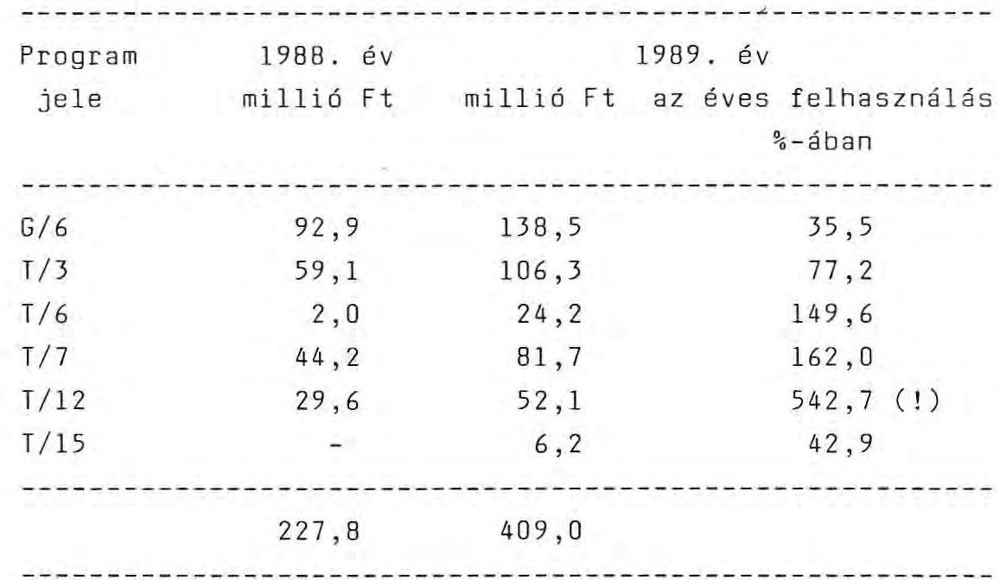

A 6 programnál az 1989. évi záróállomány 80%-kal volt nagyobb az 1988. évinél. A maradvány az éves kifizetések felének felelt meg.
Ezen belül a T/7-es tárcaprogram 1988. évi záróegyenlege 44,2; és a visszatérült összeg további 7,8 millió Ft-ja önmagában elegendő lett volna a teljes évi felhasználásra.

---

A minisztériumi átutalás ezzel szemben további 68,1 millió Ft-ot ért el több részletben és így a programbevételek és kiadások után a záróegyenleg 1989 végén 81,7 millió Ft-ra emelkedett. Ebből 1990. március 20-ig csak 33 millió Ft kifizetés történt, további 17,5 millió Ft alapátutalás mellett. Egy-egy program forráshiányát ugyanakkor banki kölcsönnel hitelezték meg.

30/ A T/12-es "szerszámgépek K+F feladatai" tárcaprogram 1988. és 1989. évi - a bank által kimutatott - tényleges felhasználása 19,6; a minisztériumi átutalás ugyanakkor mindkét évben 30-30 millió Ft - a tényleges szükséglet háromszorosa - volt. A program számláján az átlagos szabad banki forrás 1989-ben több mint 40; a záróállomány 52 millió Ft-ot ért el.

31/ Az Ipari Oktatástechnikai Vállalat eszközbeszerzéseire és működésének támogatására az Y-19181 sz. szerződésben, (az 1987-1989 közötti időszakra) 20 millió Ft keretet biztosítottak az alapból. Az összeget 1987. februárjában átutalták az IFB jogelődjének kezelésre. A felhasználás 1989. december 31-ig 8,9 millió Ft kifizetés és 8,952 ezer Ft banki kezelési költség volt. A fennmaradó 10.965 ezer Ft 3 évi lekötöttség után 1990. áprilisában került csak vissza az alap számlájára.

A programokon belül nem egy esetben, főként a felsőoktatási intézmények beruházási támogatásainál, az intézményi forráshiányra hivatkozással nem a teljesítéskor, hanem a szerződésben meghatározott, általában féléves ütemezés szerint folyósítják a hozzájárulást.

Pl. a G/6 "Gépgyártástechnológia ..." program 10.009. sz. "Oktatásfejlesztés a Nehézipari Műszaki Egyetemen"

---

c. témájára történt ütemes átutalás és az attól elmaradó kifizetések miatt a beruházási hozzájárulás halmozott maradványa 1987-1989. évek között sorrendben: 18,2, 21,4 , illetve 5,2 millió Ft volt.

32/ A Minisztérium az év elején meghatározott negyedéves bontásban utalja át a programok IFB-nél vezetett számláira a felhasználható összegeket. A programok teljesítése a harmadik és negyedik negyedévre koncentrálódik, a diszpozíciók alapján kifizetésük áthúzódik a következő év első negyedére. Így év közben magas és növekvő negyedévenkénti záróállománnyal lehet számolni.

A bank a programoknál lekötött pénzeszközök után 3%-os kamatprémiumot fizet, ha a kifizetési lehívásokat a teljesítések alapján a programirodák havi, vagy kéthetes bontásban ± 5%-os pontossággal előre megadják. A tervezettől eltérő teljesítéskor a kamatprémiumoktól a programiroda elesik. A kamatprémiumot 1989-ben maguk a programirodák használhatták fel, 1990-re azonban már csak a programtémák finanszírozására forgathatják. Így a programirodák érdekeltsége 1990-ben a kamatprémium tekintetében lényegében megszűnt.

Az előre megadott kifizetésekre vállalt kötelezettségek lehetővé teszik az IFB számára a számlákon lévő szabad eszközök rövid lejáratú hitelezésre történő felhasználását. A kamatrés az ilyen akciókon pl. a jelenlegi magas hitelkamatok mellett meghaladja a 20%-ot.

E tiszta kamatnyereség a bank eredményességét növeli, s az adózás után a Minisztérium ebből csak részvényei arányában részesedik.

---

33/ Az Ipari Információs Központtal az alap terhére közvetlenül egyedi, illetve programfinanszírozás formájában összesen 481,8 millió Ft értékben kötöttek szerződést az elmúlt 4 évben. Ebből csupán a 19.320 sz. "Az IPIK számítógépes eszközrendszerének fejlesztése" c. téma visszterhes, melynek szerződött és egyben átutalt összege 17,2, előírt visszatérítése 14,3 millió Ft,

34/ Egyedi K+F feladatok között jelentősebb összeggel, visszterhementesen támogatott vállalati, társasági témák (a teljesség igénye nélkül):
millió Ft

- INNOVATECH-BME Innovációs Park Rt
"BM Mikroelektronikai és Mechanikai
Tudományos Park alapítása" 65,0
- Mikroelektronikai Vállalat (kormányzati döntés szerint) "Szilícium alapú félvezető eszközök gyártásának kapacitásbővítése" 56,0
- Ipari Oktatástechnikai Vállalat
"Telekommunikációs és távoktatási rendszer" (2 db szerződés) 33,5
- SZENZOR Szervezési Vállalat
"Vezetőképzési igények felmérése" és
"Magyar Menedzserképző központ létre-
hozása" 19,5
- TAURUS Gumiipari Vállalat
"Acélradiál tehergépkocsi-abroncs
gyártásfejlesztés" 17,5
- Elektroakusztikai Gyár
"Távoktatás eszközrendszere" 10,0

---

- Finommechanikai Vállalat
"Nyugati partnerrel alapított közös vállalat által hasznosításra kerülő .... digitális rádiórelé áramköri ... minta" 10,0
- Kossuth Nyomda
"Montírozás automatizálása" 9,0

35/ Az OKKFT programok közül a G/7-es program visszafizetéseinek keretszabályozása a leginkább szelektív: a K+F célú beruházások esetén a visszatérítés mértéke 50% és az aktiválástól számított 3-4 éven belül fizetendő, a realizálás központú projektek esetén a visszatérítés mértéke 25% a megvalósítástól számított 5-6 éven belül fizetendő, a fejlesztés központú projekteknél a visszatérítési kötelezettség 25%, - a meghiúsulás esetén azonban a visszatérítés elmarad, - a kutatás központú témáknál nincs visszatérítés.

36/ A GANZ-MAVAG-gal összesen 108 millió Ft támogatásra kötöttek szerződést amiből mintegy 90 millió Ft-ot utaltak át. Már a megállapodáskor figyelembe vették a cég rossz anyagi helyzetét. Módosítások után visszterhe gyakorlatilag alig maradt (1,1 millió Ft).

37/ A G/6 program szerződéseiben előirányzott visszatérítés 648 millió Ft (33%). A program keretében jelentős - összesen 886 millió Ft (41%) - értéket képviselnek azok a tételek, amelyeknél nincs előírva visszafizetés. Ezek: a teljes oktatási (V) alprogram 378 millió Ft, két CIM mintarendszer 150 millió Ft, a SZTAKI keretszerződés 112 millió Ft, a BME-vel kötött egyéb (kutatási) szerződések 17 millió Ft, a NME-vel kötött egyéb (kutatási) szerződések 15 millió Ft, a program menedzs-

---

elésének, propagandájának, a KGST komplex program és egyéb költségek (6-os alprogram) 214 millió Ft. A visszteher nélküli két legnagyobb összeggel támogatott intézmény (nem számítva az alvállalkozóként közvetetten felvett összegeket) a BME és a SZTAKI. A BME-vel kötött szerződések összege 287,9 millió Ft, ebből az 1986-1989 között kifizettek 264,1 millió Ft-ot. A SZTAKI-val kötött 210,9 millió Ft-os szerződésekből az eddigi kifizetések elérték a 154,4 millió Ft-ot.

38/ A központi, a banki és a programirodák többsége által kimutatott év végi összesítő adatok közötti eltérés általában abból adódik, hogy

- a Minisztérium teljesítettnek, illetve kifizetettnek tekinti az IFB-nél elhelyezett program-célbetétekre történő átutalást, függetlenül annak tényleges felhasználásától;
- az IFB az éves, december 31-i tényleges pénzforgalmi záróállományt mutatja ki programonként;
- a programok az év végén benyújtott átutalási kérelmeket már kifizetésként számolják el függetlenül attól, hogy a számlák tényleges kiegyenlítése esetenként 1 hónapot is csúszik.

39/ A Minisztérium - a szerződések teljes körű nyilvántartásának szándékával - az új, illetve a módosított szerződésekről - a számítógépes adatlapok beküldését előírta ugyan a programirodáknak, de a teljesítést a gyakorlatban nem követelte meg. Így pl. 1990. március 8-án a T/6 programiroda 22, a Minisztérium számítógépes nyilvántartása 15 élő szerződést tartalmazott. Az eltérés oka, hogy az 1989. júliusától megkötött szerződésekről az iroda nem küldött nyilvántartó lapot, a Minisztérium pe-

---

dig a változás-jelentést nem kérte be, holott a saját maga által elrendelt 1989. évi belső ellenőrzés is már a központtól eltérő irodai adatokat mutatott ki.

40/ A programirodák a visszterhes szerződéseket rendkívül változatos módon kezelik. Eredményes megoldás az OKKFT G/7 I. főiránynál tapasztalható, ahol a lejárat előtt - itt a lejárat hónap pontosságú - két hónappal levélben felhívják a figyelmét a visszatérítésre kötelezett vállalatoknak a fizetésre. (Ez év február 1-re esedékes hét szerződéses kötelezettség közül négy visszafizetése megtörtént, két vállalattól három szerződésre a pénz sorbanállás miatt nem érkezett meg.)

A programirodák egy része (pl. T/10) a visszterhes kötelezettségeket nem is tartja nyilván a banki nyilvántartásra hivatkozva.

41/ A T/10 programban 6 téma összesen 22,4 millió Ft-os támogatási és 8,98 millió Ft-os visszatérítési összeggel meghiúsult. A programban az 1986-1988. évekre megkötött szerződésekre a kifizetések összege 98,3 millió Ft. A meghiúsulás aránya 23%. A programtanács a sikertelen, vagy nem realizálható fejlesztésekről szóló beszámolót tudomásul vette. Szankció, visszafizetés nem történt.
 A belső revízió 1989. márciusában megállapította, hogy az időarányos fejlesztési források felhasználása nem történt meg, miközben 1989-1990. évekre a Minisztérium elrendelésére - annak ellenére, hogy a fejlesztések mintegy negyede kudarcba fulladt - olyan terv készült, amely a lemaradásokat megszünteti és 1990. év végére az öt évre tervezett forrás felhasználásra kerül. Az így kialakított 1989. és 1990. évi előirányzat alapján e két évben 50%-kal magasabb az éves átlagos kifizetések nagysága az előző három év átlagánál (33 millió Ft/éves átlaggal szemben 50 millió Ft/év).

---

42/ Az 1986. óta kötött egyedi K+F szerződéseknél az elmaradt visszafizetés 3,8 millió Ft volt. Ebből 1987. évben esedékessé vált, de nem teljesített 2 millió Ft behajtására a jelen ellenőrzést követően intézkedtek.

43/ A Remix 4 db szerződésében 1986. évre összesen 4,8 millió Ft visszatérítési kötelezettség szerepelt. A vállalat ezt az összeget a Minisztérium engedélyével nem fizette vissza.

44/ Az IFB 1989. év végi (saját műszaki fejlesztési akciók kölcsöneiből és az exportpályázatokhoz kapcsolódó műszaki fejlesztési hitelekből) álló kölcsönállománya 552 millió Ft volt.

A saját kihelyezésekből mintegy 270 millió Ft értékű kölcsönnyújtás célját vizsgálva megállapítható, hogy azok a műszaki fejlesztési akciók megvalósítását szolgálják. Ezen belül kb. 40% az új technológia bevezetéséhez (paradicsomlé-nyerő hazai berendezés beruházás, haszonjárművek keréktárcsa-gyártása, berendezésorientált áramköröket gyártó mikroelektronikai kísérleti üzem), kb. 30% az új termék (tűzálló tolóajtók és tolókapuk, lineáris elmozdulásmérők) gyártásához kapcsolódó finanszírozás. A hitelek induló kamatlába 10-19% között változik. Kamatpreferenciáról a tárca egyedi mérlegelés alapján dönt, s azt a futamidő alatt átvállalja. A kamatpreferencia 3-50% között változik. A szerződések mintegy egyharmada részesült e kedvezményben.

A műszaki fejlesztési kölcsönre a bank külön kontingenst nem állított fel, az eddigi - a hitelnyújtási kritériumoknak megfelelő - igényeket ki tudta elégíteni, s ez a hitelképes igénylők nem túl nagy számára utal.

---

A Minisztérium a hosszú lejáratú exportfejlesztő pályázatokra 1988. év végéig az alapból 200 millió Ft-ot célbetéten helyezett el, s ebből a bank 106 millió Ft kölcsönt helyezett ki. 1988. év végétől e célbetétek részvénytőke befizetéseként funkcionálnak, s betétként megszűnnek. Az ebből finanszírozott hiteleket a bank a műszaki fejlesztési kölcsönállományba helyezte át. A műszaki fejlesztési kölcsön így egyben exportárualap-növekedéssel járó beruházásokat is szolgál.

Az újabb exportpályázatok finanszírozására 1989-től az alapból származó 120 millió Ft-tal további célbetétet szolgál, amely 1990. december 30-ig él. 1989-ben e célbetét terhére 3 db szerződést 31,6 millió Ft értékben fogadtak be, alapból térített 23% kamatpreferenciával (COLOR Ruházati Vállalat, Pécsi Faipari Szövetkezet, Kossuth Nyomda exportkapacitás-fejlesztéséhez). Az év végén további 71 millió Ft értékű igény lassú bírálata folyt.

45/ A Minisztérium öt pénzintézettel - IFB, MHB, MKKB, ÁB, BPB - közösen, 60 millió Ft-os alaptőkével 1989. április 13-án alapította meg az Első Hazai Vagyonkezelő Részvénytársaságot (a cég rövidített neve: Budapest Holding Rt). A zártkörű társaság alaptőkéjéből 10 millió Ft-ot jegyzett, amit az alapból fizetett be.

Az alapító okirat szerint a társaság tevékenységi jegyzékében szerepel ugyan a 7417-es számú "Műszaki fejlesztési szolgáltatás"-i tevékenység, a valóságban azonban ilyet nem folytat, így az alap pénzeszközeit nem rendeltetésszerűen használják fel.

Ugyanez állapítható meg az IFB által a társaságba bevitt 10 millió Ft-tal összefüggésben is, mivel a Bank alap-

---

tőkéjének nagyobb része szintén a központi műszaki fejlesztési alapból származik. Az Rt 1989. évre 21,1 millió Ft árbevételt és 10,9 millió Ft nyereséget mutat ki könyveiben.

A bevételnek kb. a fele (10,7 millió Ft) egyetlen "üzlet", a GANZ Árammérőgyár eladásához kapcsolódó tevékenység ellenértékeként kapott jutalék. További 3,6 millió Ft bevételt eredményezett a kihelyezett szabad tőkék kamata. A kihelyezés ún. "túlfinanszírozás" következményeként vált lehetővé.

Eközben az alapot tápláló termelő vállalatok többsége élet-halál harcot vív a pénzügyi problémák miatt.

A Holding vezetői és tisztségviselői 1989-ben az alábbi juttatásokban részesültek:
ezer Ft-ban
havi alapbér év végi részesedés

- vezérigazgató 50,0
- vezérigazgató h. 48,0
- marketing igazgató h. 45,0
- az igazgatóság 9 tagja 100,0/fő tiszteletdíj/év
- a felügyelő bizottság 4 tagja
- az 1 fő könyvvizsgáló 37,5/fő tiszteletdíj/év 330,0 tiszteletdíj/év

Az igazgatóság tagjai: a részvényesek vezető beosztású dolgozói, köztük minisztériumi főosztályvezető.

---

A felügyelő bizottságban volt miniszter, miniszterhelyettes és államtitkár is található.

46/ A Kisvállalkozás Fejlesztési Alapítvány (SEED) tevékenységi köre a vállalkozást támogató szervezetek létrehozása, az információ és kapcsolatközvetítés, tájékoztató anyagok, tanfolyamok szervezése, bonitásvizsgálat, hitelezésben való közreműködés, vállalati kockázat elemzése, közreműködés kül- és belföldi vállalkozás élénkítést, innovációt szolgáló alapok rendeltetésszerű felhasználásában stb.

Célja a Magyarországon létesülő új vállalkozások segítése, piacorientált fejlett műszaki színvonalon történő eredményes működésű előmozdítása. Az Alapítvány 1990. januárjában jött létre, többek között a PM, az IpM, az OMFB, a MÉM, az OKISZ, a Magyar Gazdasági Kamara, a VOSZ, két bank, az Állami Biztosításfelügyelet és az ÁBMH részvételével. Induló vagyona 20,9 millió Ft, melybe a Minisztérium az alapból 5 millió Ft-ot fizetett.

47/ A Minisztérium a Vállalkozásfejlesztési Alapítvány támogatására az alapból a Kormány nevében 12 millió Ft-ot utalt át. Az alapítvány kis- és közepes méretű egyéni és társas vállalkozások létesítését, a már működő ilyen vállalkozás beruházásait kedvezményes hitelforrással segíti, kereskedelmi bankok és szakosított pénzintézeteken keresztül. A bankok az alapítványtól pályázat útján nyerhetik el a hitelforrásokat. Alapítók: a Magyar Köztársaság Kormánya 2.988 millió Ft-tal, hat bank, a Gazdasági Kamara, a VOSZ, az OKISZ, további 574 millió Ft-tal. A Minisztérium részéről az alapítványhoz való hozzájárulást az államtitkár írta alá és rendelkezett az átutalásáról 1990. márciusában. Az alapítvány célja és az Ipari Kockázati Tőke Kft tevékenysége (1: 17. sz. példa) megegyezik.

---

48/ Az Ipari Kockázati Tőke Kft 1990. februárjában alakult 150 millió Ft (96%-os tulajdoni részarányt képviselő), az alapból finanszírozott és 5 millió Ft (4%-os tulajdonrészarányú), IFB által jegyzett törzsbetéttel. A társaság nyereségfelosztására vonatkozó szindikátusi szerződés ugyanakkor az osztalékról úgy intézkedik, hogy a bank részesedése 50%-nál kevesebb nem lehet. A veszteségek kezelésére a szindikátusi szerződés nem tér ki, a tulajdonosok közötti arányt külön nem rendezi.

Az Ipari Kockázati Tőke Kft a gyakorlatban jogi, szabadalmi ügyvivői, vagyonértékelési, ingéniering, azaz szolgáltatási tevékenységet végez. A társaság a jövőben a vállalkozói, befektetői és a kereskedelmi, technikai transfer üzletágakat kívánja tevékenységében előtérbe helyezni. Az új társaság tényleges tevékenységének minősítésére a gyakorlati tapasztalatok elégtelenek, mivel az első hónapok a telephely, a berendezkedési, a személyi ügyek, valamint az üzletpolitika és ügyrend kialakításával teltek el. Az éves üzletpolitikai terv szerint 1990-ben a költségek és bevételek 14-25 millió Ft között változhatnak. A telephely és az irodatechnikai eszközök költsége, mely egyben vagyonelemként is megjelenik, további 18,5-21,5 millió Ft. A tényleges tevékenységhez rendelkezésre álló szabadtőke - az eddigi üzletrészek megvétele és telephely végleges kialakítása után - így külső egyéb források nélkül a törzstőkének csak mintegy fele lehet. A Minisztériumnak 1991. február 1-ig kell a hátralévő 50 millió Ft-ot befizetni. Az ez évben kihelyezhető szabad kockázati tőke így 25 millió Ft lehet. A társaság jövedelmét döntően a vásárolt részvények eredményessége alapozhatja meg.

A 155 millió Ft törzstőke terhére a társaság az IFB-től 50 millió Ft névértéken hét társasági üzletrészt vett

---

át. A részvények tényleges értéke valószínűleg eltér a névértéken számított vételártól. Átértékelésüket az átvétel után fél évvel - ez év II. félévében - tervezik elvégezni. Az értékkülönbözet az IFB eredményét nem érinti. Az átvett üzletrészek egy részében a Minisztérium közvetlenül is résztulajdonos. Az alap így az üzletrészekben az IFB-n keresztül, a Kockázati Tőketársaságban mind a közvetlen, mind a közvetett csatornákon keresztül párhuzamosan finanszírozó. A Kockázati Kft tőkéjének bővítéséhez további támogatókat keres. Erre egyik megoldásként a Magyar Vállalkozásfejlesztési Alapítvány kínálkozik pályázat útján. Az alapítvány egyik támogatója - 12 millió Ft összegben maga a Minisztérium, forrása ugyancsak a műszaki fejlesztési alap. (lásd: melléklet + 51. sz. példa ábrája)

49/ Trans-Danubius Innovációs Park Kft 1988-ban 11,4 millió Ft-os törzstőkével jött létre, melyből a Minisztérium törzsbetétje 2 millió Ft az alap terhére. A Kft alakításának célja - az alapító okirat szerint - az innovatív folyamatok erősítésének országos igényével összhangban, az alapítók szellemi és anyagi erőforrásainak mind hatékonyabb kihasználása. Fő tevékenysége általános műszaki fejlesztési szolgáltatás, vegyipari kutatás, kísérleti fejlesztés.

A Minisztérium a részvényét utólag az IFB-re kívánta átruházni. Vállalta, hogy a kamatpreferencia elszámolásában kompenzálja a Trans Danubius Innovációs Park Kft osztaléka és az IFB osztaléka közötti tényleges különbséget 1990. december 31-ig.

---

1991-től, amennyiben a Park működése nem biztosítja a Bank átlagos hasznát, terv szerint közösen megvizsgálják részvételük feltételeit.

50/ Az 1987. decemberében az ipari innováció különféle eszközökkel való segítésére a BME gesztorságával létrejött az Innotech Innovációs Park Gazdasági Társaság. Induló vagyonát 285 millió Ft-ban határozták meg a következők szerint: Minisztérium 65; BME 175; IFB 5; Budapest Főv. XI. ker. Tanács 40 millió Ft. A Minisztérium közvetlen (65 millió Ft-os) támogatása az infrastruktúra tervezését és a kivitelezési munkákat (felújítás-beruházás) szolgálta.

Az Egyetem vagyonrésze három összetevőből állt:

- az OMFB-vel kötött külön szerződés szerinti 130 millió Ft támogatásból;
- 20 millió Ft összegű hozzájárulásként elismert egyetemi számítógépes tervező-megmunkáló (CAD/CAM) rendszer "rendelkezésre állásából". Ennek létrehozását az alapból a Minisztérium az OKKFT G/6-os programon keresztül 89,5 millió Ft összes, s benne több mint 70 millió Ft beruházási támogatása biztosította;
- 25 millió Ft vagyoni hozzájárulásként figyelembe vett gesztorságot és egyéb eszközök rendelkezésre bocsátását.

A tanács épületkomplexumot, a bank pénztőkét vitt be a társaságba. A társasági törvény előírásai miatt a GT időközben Kft-vé alakult, amiben a Minisztérium már tagként nem vett részt, csak a Felügyelő Bizottságba delegálta egyik osztályvezetőjét. Az 1989. végén fennmaradt

---

51. PÉLDA

A PÉNZÜGYI TRANZAKCIÓKRA
AZ ALAP, AZ IFB RT ÉS AZ IPARI KOCKÁZATI KFT KÖZÖTT
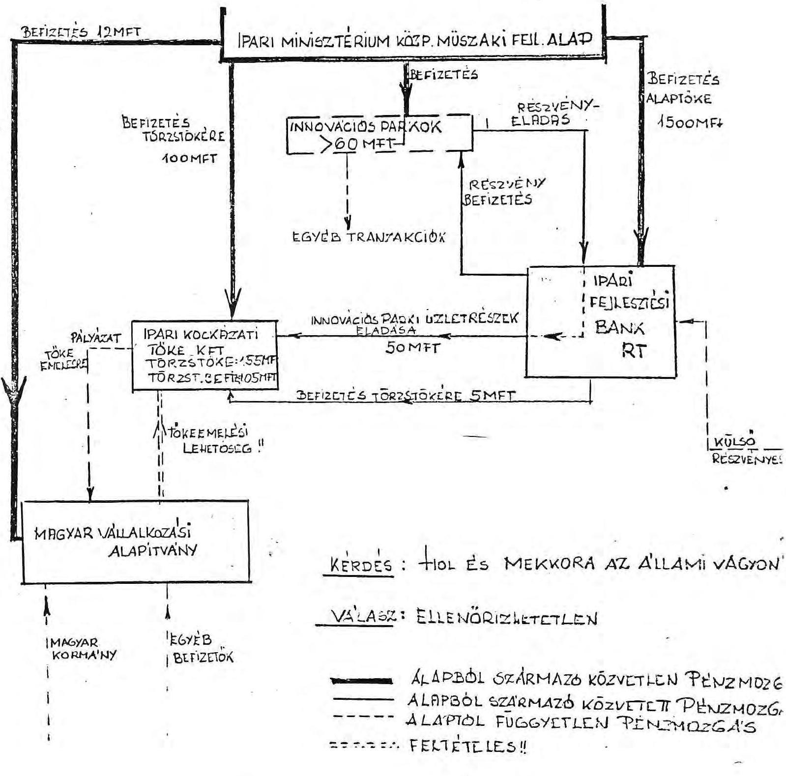

---

90 millió Ft tőkéből 32 millió Ft-ot tett ki a minisztériumi hányad banki betétben. A Minisztérium erről - a következők szerint - lemondott:

- 13,9 millió Ft-ról a Kft-ben a BME törzsbetétje javára (az infrastruktúrára fordított, egyéb minisztériumi forrásból eredő apport ezt 26,4 millió Ft-ra emeli);
- 18,1 millió Ft pedig a BME "Ipar a korszerű mérnökképzésért" alapítványát szolgálja.

52/ A G/4 program V. alprogramjában tapasztalt eset annak a mintapéldája, hogyan válhat a műszaki fejlesztési forrásokból indokolatlan mértékű személyi jövedelem, a szervezeti és személyi összefonódások segítségével. Az Országos Energiafelügyelet egyik dolgozója ebbéli minőségében részt vesz az alprogram pályázatainak elbírálásában. Ugyanakkor ez a személy két társával, a Rollykon Ipari Szolgáltató Kisszövetkezettel, valamint a COOPTIM Ipari Kisszövetkezettel megalakította a Mérnöki Fejlesztő és Energetikai Szolgáltató Iroda (MESZI) Kft-t (bejegyezve a Cégbíróságon 60.929 számon 1988. november 3-án).

A Kft alapítója részt vett a saját társasága pályázatainak elbírálásában
 1989. áprilisában, aholis 1989-re 4,5, 1990-re 10 millió Ft összegű kutatási megbízásokat nyertek el (a pályázatok elbírálásáról készített emlékeztető a mellékletben). Az így megszerzett kutatási munkákat a Szerzői Jogvédő Hivatalon keresztül (a személyi jövedelem további növelése céljából) részben az alapító rokonai, részben a Kft tagjai, részben a Minisztérium magas beosztású dolgozói kapták meg. A szerzők az egyes témákban kidolgozott szoftverek értékesítéséből is részesednek (80%-kal), később meghatározandó megoszlásban.

---

A MESZI Kft-t a Cégbíróság idén megszüntette. A szervezet újjáalakulva, Energia Szolgáltató Iroda Kft néven folytatja munkáját (a cégbírósági bejegyzési szám: 65.748).
53/ Az igen mérsékelt összeggel támogatott külföldi tudomá-nyos-műszaki ismeret (TMI) importból a legnagyobb volument, 115,5 millió Ft-ot, a G/4 programban használták fel.

A G/6 programban az elmúlt évben a támogatások 5%-át, 8 millió Ft-ot fordítottak licenc és 72 millió Ft-ot know-how vásárlásra. Hét tárcaprogramban nem volt egyáltalán ilyen irányú felhasználás.

Az egyedi témák között a TUNGSRAM "H-4 halogén fényszóró lámpa gyártósor technológiai know-how vásárlás" 38,5 millió Ft összegű támogatása címszerint e körbe tartozó, valójában azonban beruházási szerződést takar.
54/ Az OKKFT G/5 jelű program keretszerződése 1986-1990. között (5 évre) összesen 4.098 millió Ft ráfordítással számolt, melyből 1.600 millió Ft-ot (33%-ot) a központi és 2.498 millió Ft-ot (61%) a vállalati alap források finanszíroztak volna. Ezzel szemben az elmúlt 4 évben megkötött 89 db szerződés és 7 megállapodás a feladatok megoldására az 1986-1989 közötti időszakra 2.616 millió Ft ráfordítást tervezett, évente növekvő értékben. Ebből viszont a támogatás 1.342 millió Ft (51%). A finanszírozási arány a központi alap terhére változott. Az 1986-1989. években a központi források 92%-át, a vállalati vállalásoknak csak 78%-át fizették ki. A pénzügyi teljesítés együtt 2.226 millió Ft-ot, a négyéves előirányzat 85%-át érte el. A lemaradások főleg 1986. és 1987-ben következtek be, elsősorban a Híradástechnikai Anyag-

---

ok Gyára, a Mikroelektronikai Vállalat, a Kőbányai Porcelán és a TUNGSRAM Vállalatnál, a vállalati források hiánya miatt.

55/ Az Ipargazdasági Intézettel 4,4 millió Ft összegben Y19.600/88. számon kötött "Ipari Szerkezetátalakítási Program vaskohászati rekonstrukcióhoz külföldi konzultáns cég bevonása ... és saját vállalkozásban szakértői közreműködés" című szerződés teljesítésének előírt határideje 1988. november 10. A szerződésjóváhagyás ugyanakkor 4 nappal későbbi. A szerződés hivatkozik a megrendelő (IpM) és a vállalkozó előzetes megállapodására, amely szerint a feladat végrehajtása 1987. június 20-án megkezdődött. A Minisztérium Műszaki fejlesztési főosztálya az előzetes megállapodás dokumentumát nem tudta bemutatni.

56/ Az Y-19.135/86. számú minisztériumi szerződés "Olcsóbb kivitelű célorientált kijelző rendszer fejlesztésre" címmel az Elektroakusztikai Vállalattal jött létre. A szerződéstervezet beküldése 1986. december 8-án, jóváhagyása december 29-én történt. A feladat végrehajtási határidejét 1989. október 1-i befejezéssel rögzítették. A teljesítésre a számla benyújtása - a teljes, 7 millió Ft támogatásra - ugyanakkor már a szerződés jóváhagyása előtt (1986. december 27-én) megtörtént. A teljesítési jegyzőkönyvet a jóváhagyás napján vették fel, amit a Minisztérium szakmai és a funkcionális témafelelőse egyaránt aláírt. 1987. január 2-án a Minisztérium szakmai témafelelőse külön felhívta a Műszaki fejlesztési főosztály figyelmét a teljesítésre és a számla rendezésére, amire 1987. január 17-én sor került. Ilymódon ezen elvileg "új" K+F feladatnál a szerződés jóváhagyásától a kifizetésig csak egy hónap telt el. (A szerződés a cég év végi támogatását szolgálta).

---

57/ A Minisztérium a Budapesti Híradástechnikai Vállalattal (BHG) 1988. augusztus 29-én, az Y-19.594/1988. számon összesen 35-35 millió Ft alap-támogatást, illetve saját finanszírozást tartalmazó szerződést kötött. A támogatás az "EKR központok fejlesztéséhez szükséges műszaki tervdokumentáció és a fejlesztés eszközigényének biztosításá"-t szolgálta. A vállalat a KGST elkötelezettségre hivatkozott. A szerződést - miniszteri engedéllyel - megkötötték annak ellenére, hogy az előterjesztés szerint is "az EKR (Egységes Kapcsolástechnikai Rendszer) műszaki célkitűzései, a fejlesztés ütemezése, alkatrészbázisa, az alkalmazott szoftver technológiája alapján nem valószínűsíthető korszerű termékstruktúra létrehozása".

Az alap-támogatás részben (9,3 millió Ft értékben) a vállalat korábbi ráfordításait vállalta át, más jelzések (pl. a műszerbeszerzésre kért és biztosított előleg) arra utalnak, hogy a támogatás elsősorban a BHG anyagi problémáinak részbeni enyhítését szolgálta. Erre mutat az is, hogy a minisztériumi támogatás megfelelt a szerződés szerinti 35 millió Ft összegnek, de a saját kifizetés, a vállalt 35 millió Ft helyett, csak 14 millió Ft értéket ért el.

A támogatott konstrukció, az 1988-ban lefolytatott mintarendszer-vizsgálat jegyzőkönyve szerint sem a tartalom, sem az alkalmazott elvek tekintetében nem felelt meg a várakozásoknak (megbízhatósági, reakcióidőbeli, terhelhetőségi és egyéb problémák miatt).

58/ A szakmai berkekben is megoszlanak a vélemények arról, hogy szükség volt-e két kutatóhelyen (a BME-n és a SZTAKI-ban) egyidejűleg számítógépes tervező/technológiai (CAD/CAM) rendszer létrehozását támogatni (a miniszter személyesen rendelte el). Az 1988. év végi lemaradások miatt a kérdést maga a G/6 programmegbízott is felvetet-

---

te. A téma támogatása a BME-n 89,5, a SZTAKI-nál 60,5 millió Ft. A helyszíneken szerzett információk szerint a CAM-feladatok teljesítése az eredetileg tervezettől 1/2-1 éves elmaradásában van. A BME kizárólagos támogatása a kettős cél (oktatás-kutatás) miatt lett volna indokolt. Az eredetileg meghirdetett céllal szemben a SZTAKI CAO-rendszer az intézet belső fejlesztéseit szolgálja a vállalati igény hiányára hivatkozva.

59/ A T/7 programban megszüntettek 11 db, főként 1986-1987-ben létrejött szerződést, amelyek összes alap-terhe 45,2 millió Ft volt, de csak 4,1 millió Ft kifizetés történt. Ugyanakkor 1990-ben, április végéig megkötöttek 19 db-ot (!) összesen 53 millió Ft értékben, 90%-ban 1 éven belüli teljesítésre.

60/ Az alap néhány jellemzően nem műszaki fejlesztést célzó felhasználása az egyedi témák közül a teljesség igénye nélkül:
millió Ft

- Általános gazdasági, számítástechnikai szolgáltatások az IpM részére: 132,2
- Különféle ökonometriai, szakképzési és egyéb modellezés: 22,5
- Hatósági feladatok: 10,8
- Vállalatok átvilágítása: 7,3
- Technikusképzés tankönyvellátása: 7,6
ezer Ft
- "Baleset + alkohol" és "Targonca nem játék" c. film támogatása: 500,0
- IpM szociálpolitikai információs rendszer: 500,0
- Import lízing döntéselőkészítés: 326,0

---

- Cipőipari szabászversenyek: 90,0
- Magyar-Dél-koreai Vegyes Bizottság ülése: 70,0
- II. Nyomdász ifjúsági találkozó: 40,0
- Fodrász Grand Prix díj: 5,0

61/ Néhány nem műszaki fejlesztési célú támogatás a programtémák közül példaszerűen:

A G/6 programban:

- A MOFÉM termelő beruházási feladatainak 48 millió Ft-os támogatása.
- A gyártásautomatizálási kutatás-fejlesztési társaság működéséhez 1988-ban 1.000, 1989-ben 300 ezer Ft átutalása (holott a közvetlen támogatástól a Minisztérium 1988-tól elállt). A vállalatok érdeklődése a társaság iránt minimális.
- A program negyedévente megjelenő átlag 10-15 oldalas "Tájékoztató"-jának összeállítására 250 ezer Ft-ot, nyomdai költségeire 1.000 ezer Ft-ot kötöttek le 1989 végéig.

A T/1 program forrásaiból:

- 150 ezer Ft-ot utaltak át a KISZ KB Ifjúsági és Környezetvédelmi Tanácsa számára "Az 1987. évi Környezetvédelmi és Természetvédelmi Szaktáborok támogatása" címén.
- 150 ezer Ft-ot kapott 1987-ben az ÁISH "A Környezetvédelmi és természetvédelmi ifjúsági táborok támogatásá"-ra hasonló címen.

---

- 150 ezer Ft átutalására került sor 1988-ban a KISZ KB részére szintén Környezetvédelmi és Természetvédelmi táborok finanszírozására.
- 300 ezer Ft-ban részesült az ÁISH 1988-ban környezetvédelmi szaképítőtáborok szervezéséhez való hozzájárulás címén.

62/ A Minisztérium 1988. május 17-i keltu miniszteri értekezleti anyaga 178 millió Ft-ban állapította meg azokat az összegeket, amelyek 1988-ban az alapot terhelték, de nem oda tartoztak, hanem a költségvetés körébe. (Közöttük szerepel 42 millió Ft általános célú számítógép beruházás, 30 millió Ft nemzetközi együttműködési összeg.) Továbbá mintegy 37 millió Ft értékben - lényegében szükségtelennek ítélt - tételeket nevesített meg, amelyek nem képezték az államigazgatási feladat tárgyát, jogszabály sem írt elő ilyen kötelezettségeket és az alapból sem voltak fedezhetők, valamint 11 millió Ft intézményfinanszírozásra utalt.

63/ A kutatási és egyes (kis)gépfejlesztési programokban sok az alacsony Ft-értékű támogatási szerződés. A T/3/1 alprogramban 87 szerződés keretén belül 208 db (!) mezőgazdasági és élelmiszeripari gép fejlesztését támogatták. A tárcaprogramok közül a T/5 jelű 110 megkötött szerződésre összesen 108,6 millió Ft, tehát átlagosan 987 ezer Ft/db alap-hozzájárulást kötöttek le. A G/5 és a T/10 program szerződéseire 1,5, a T/13-beliekre 1,8 millió Ft/db támogatás jutott átlagban. Az 1989-ben átvett (volt ÉVM-2) "Építőanyagipari K+F" tárcaprogramban 700 ezer Ft/db az átlagos támogatás mértéke, s a témák 3/4 része egy intézethez (SZIKTI) kötődik.

64/ Az egy szerződésre jutó támogatások átlagos mértéke két programnál 1989-re 1/3-ára (a T/3-nál 3,2-ről 1,1; a

---

G/6-nál 19,8-ról 5,8 millió Ft/darabra) esett vissza. Jelentősebb műszaki tartalmú és Ft-kihatású szerződések 1989-ben annál az egy-két programnál jöttek létre, amelyek szerződésállománya korábban nem került kitöltésre, s a keret felhasználásának 1990 utáni áthúzódását is engedélyezte a Minisztérium (pl. T/12).

65/ A 300 millió Ft keretű T/7 "Gazdaságos felhasználásra irányuló technológiák K+F feladatai" program "minden-evő"-sége miatt nem kis gondot okozott az irodának a más programokban már támogatott témák kiszűrése.

A 90 millió Ft alacsony keretösszegű T/15 kis program is két egymástól erősen eltérő gépcsoporttal kapcsolatos fejlesztéseket tűzött ki: az anyagmozgató-, illetve a csomagoló gépekét, továbbá mindkét területnél a gépek gyártásának, illetve fenntartásának K+F feladatait.

66/ Az ÁGTI minisztériumi engedéllyel 1,8 millió Ft-ért fénymásoló gépet vásárolt a ZAZ kooperációra (szovjet-bolgár-magyar személygépkocsi-gyártás) szánt műszaki fejlesztési alap terhére, szabálytalanul.

67/ A T/2 program keretében az 1976-1990 közötti időszakra egy, a rá következő 5 évben pedig további 1,5 millió tonna kőolaj többlet kitermelését ígérték. A célkitűzések már induláskor irreálisak voltak. Az eredményeket a kutatásra fordított pénzeszközök csökkentése, egyes kutatások leállítása tovább mérsékelte.

A T/5 program tervezett eredményei, a villamosenergiarendszer működésének tökéletesítése, csak az áttételes gazdasági kihatások számszerűsítésével, akkor is csak feltételesen lenne meghatározható.

---

A G/4 program várható eredményeit igen diplomatikusan fogalmazták meg. A 900 millió tonna kőolajértéknek megfelelő energiamegtakarítást a 18-23 milliárd Ft értékű megújuló és a 6-9 milliárd Ft értékű új terméket csak az energiaracionalizálási kormánytámogatások folyósítása esetén ígérték. Mint ismeretes, ezek a támogatások 1988-ban megszüntek. Jelenleg folyik a program keretében - szakértők bevonásával - a várható eredmények felmérése.

68/ A T/3 program eredményei közül az 1986-1989. évi tervezett értékhez képest 18%-kal alacsonyabb tényleges összes K+F-ből eredő árbevétel, dollár- és rubelexport, s 40%-kal kisebb importkiváltás realizálódott. Ezen belül a mezőgazdasági és élelmiszeripari gépfejlesztésekkel elérhető árbevételnek több, mint 2/3-a legalább 50%-kal alacsonyabb lett az 1989. évre előirányzottnál. Gazdaságilag valóban sikeresnek a 87 megkötött szerződésből 3 mondható, elsősorban a viszonylag jelentősebb dollárexport bevételek miatt.

69/ A T/11-es program pl. induláskor 3,0, 1988-ban 2,3, 1989 végén pedig 2,0 milliárd Ft árbevételi többlettel számolt. A konvertibilis export tekintetében indulásként 1,4, majd 1,2 milliárd Ft-ot, 1989 végén már csak 320 millió Ft-ot terveztek. Ennél is bizonytalanabbak az importkiváltási "ígéretek", erre 400, majd 900, 1989 végén 580 millió Ft-ot prognosztizáltak.

70/ A G/6 program "Új generációs szerszámgép család kifejlesztése"
 c. szerződése eredetileg 38 millió Ft támogatással a vállalat (EMG) által korábban gyártott vezérléscsalád fejlesztését célozta. Később a SIEMENS céggel megállapodás történt vezérlés-licenc átvételére, illetve „0” szaldós kooperációs gyártásra. A programvezetés a fejlesztés mellett a licencvásárlás finanszírozását is vállalta. (Ezzel az alap terhelése 63 millió Ft-ra nőtt.)

71/ A Gránit „Programozható robotokkal üzemelő köszörűszerszám és égetőlap kezelő rendszer” alap támogatása 1986-1987-ben 11 millió Ft volt a G/6 program keretében. A műszaki tartalom változatlanul hagyásával a szerződés véghatárideje jelentősen (1987. december 15-ről 1989. március 31-re) módosult. A G/6 program által finanszírozott feladatok teljesültek, azonban a berendezés termelésbe állítása (amely pénzügyileg már kizárólag a megbízott feladata) vis maior-ra való hivatkozással az eredeti határidő után 3,5 évvel sem történt meg.

Az Ipari Műszergyárnak „Korszerű mikromotorok és robothajtások kifejlesztésére, gyártóbázis kiépítésének előkészítése céljából” 74,2 millió Ft támogatást irányoztak elő, s 16,2 millió Ft-ot fizettek ki. A fejlesztésnek csak egy része valósult meg, de a motorokra a minőségi és árproblémák miatt nem találtak felvevő piacot. A liberalizálás pedig végleg ellehetetlenítette az alapvetően importkiváltási szándékú (és műszaki szintű) rossz hatásfokú fejlesztést (11,5 millió Ft visszatérül).

72/ A T/12 programon belül a SZIM (BSZRT) „Moduláris esztergacsalád” c. téma költségeiből az alap támogatása 15, a vállalati ráfordítás 39,55 millió Ft. A SZIM átalakulását követően a szerződés teljesítésére a jogutód halasztást kért. A teljesítési határidő 1988-ról 1989 végére került átütemezésre, de 1990. áprilisáig még mindig nem zárult le (eddig 1,5 év csúszás). Az alap támogatása 1986 óta húzódik.

73/ A G/6 programiroda 10.040 számon kötött szerződést a Diósgyőri Gépgyárral lemezmegmunkáló gyártó-(minta-)rendszer létesítésére. A feladat elvégzésének véghatárideje 1990 vége, tervezett ráfordítása: összesen 120,2 millió Ft, ebből alap támogatás 60 millió Ft.

A szerződést kétszeri DIGÉP előterjesztés után 1989. szeptemberében módosították. Ebben rögzítették a véghatáridő 1 évvel későbbre történő csúsztatását. Ezen belül a lemezkivágó és lemezhajlító gyártócella telepítése az 1988. évi határidőkhöz számítva 2 évet csúszik, a lézerfejes kivágó beszerzése elmarad, a végösszeg 131,8 millió Ft-ra változik, míg az alap támogatása szinten marad. A Minisztérium a G/6 program keretében és közvetlenül is a DIGÉP és a (SZTAKI) FLEXIS Gyártásautomatizáló Rt-vel 1988. áprilisában már (43,7 millió Ft) szerződést kötött. A feladat az eredeti elképzeléshez képest megváltozott, ennek ellenére a G/6-DIGÉP szerződésmódosításra csak 1,5 évvel később került sor. A helyszíni tapasztalatok jelenleg sem túl biztatóak, bár a DIGÉP az 1 éves csúszáshoz mérten további lemaradással nem számol és a befizetést 1991 végére ígéri. A lemezkivágó (SZIM) alapgép jelenleg alacsony kihasználással K+F feladaton kívüli termelő munkát végez.

Az eredeti szerződésben időarányosan 53 millió Ft minisztériumi és 49,2 millió Ft DIGÉP ráfordítást terveztek. A valóságban eddig az alap terhére 51,5, a DIGÉP részéről - főként pénzügyi nehézségek miatt - 1990. március 31-ig csak 26,7 millió Ft ráfordítás történt, amely csak 54%-a az eddig tervezettnek. Az 1989-ben mintegy 450 millió Ft veszteséggel záró vállalat továbbra is nehéz helyzetben van. A K+F téma kiegészítő beruházására az IFB-től kért, de nem kapott hitelt. A tényekkel szemben a programiroda a fejlesztést már kiemelkedően eredményesnek jelentette le, ami a valóságnak nem felel meg.

74/ Hordozógyűrűs alumínium dugattyú gyártásának kifejlesztésére 1986. december 10-én kötött a QUALITÁL Könnyűfémöntöde és a T/11 program azzal a céllal, hogy 1988 végére évi 200 ezer db dugattyú gyártásának feltételei a vállalatnál kiépülnek. A gyártott dugattyúk jelentős részét az MVG építette volna be motorjaiba. Tárgyalások folytak a NÜRAL céggel gyártási know-how megvételéről, amely mind a minőséget, mind a márkanevet biztosította volna.
1988. I. félévében a NÜRAL arról nyilatkozott, hogy a tervezett darabszám gyártására létrehozandó üzem gazdaságosan nem működtethető, ezért vegyesvállalat alakítási szándékát visszavonta. Ezután szerződésmódosítás történt, mely szerint a QUALITAL a fejlesztést licencvásárlás nélkül, saját bázisán alvállalkozók bevonásával folytatja tovább, egyben a véghatáridőt 1 évvel meghosszabbították.

1988-ban az MVG 600 db-os kísérleti szériát rendelt. Ezt a mennyiséget a QUALITÁL 1988. IV. negyedévében legyártotta és előmunkálás után átadta a Csepel Autógyár Dugattyú- és Dugattyúgyűrű Gyártó Leányvállalatának. A csepeli gyár 1988 végén szállította az első megmunkált dugattyúkat (kb. 120 db-ot), amelyből 1989 elején eloxált állapotban 28 db-ot adtak át az MVG-nek. A vállalt határidőt kb. 1 évvel túllépve a csepeli gyár 1989. IV. negyedévében szállította le a további dugattyúkat, ezek azonban hibásak voltak, így az MVG-nek beépíthetőségi vizsgálatra csak 10 db-ot tudott átadni a QUALITÁL. Az MVG azonban minőségileg ezeket sem tartotta beépítésre alkalmasnak.

Három év után 1989. novemberében a Programtanács a fejlesztési kísérletek elhúzódására hivatkozással a szerződés lezárását javasolta, amivel a legjelentősebb potenciális felhasználó, az MVG is egyetértett. Az alap terhére 25,4 millió Ft-ot kötöttek le, s a lezárásig 3,3 millió Ft-ot utaltak át.

75/ Az Ipari Technológiai Intézettel a G/6 program keretén belül megkötött 10 db viszonylag jelentősebb szerződés közül 3 olyan akadt, amelyik (összesen 56,6 millió Ft támogatás mellett) ipari bevezetésre került. Ezzel szemben 4 db olyan szerződést, ahol a hosszabb távú feladatokat két fázisra tervezték megoldani, a piaci igénymúlásra hivatkozással az I. ütem után leállították, de az addig 46,6 millió Ft alap-támogatást emésztett fel. Egy téma a témavezető betegsége miatt csúszik (a lekötött alap-támogatás 17,5 millió Ft). A T/15 programban közel 9 millió Ft-ot fizettek ki tanulmány szintű megvalósításokra az Intézetnek, ebből a legnagyobb tételű szerződést - 5 millió Ft - a támogatás felhasználása után felbontották.

76/ A kritikussá váló szocialista export és ebből adódóan az IKARUS gazdasági problémái miatt a T/11 program keretében kidolgozott fejlesztések közül mintegy 15-20 megvalósítása kérdésessé válhat. Pl.:

- az önjáró merev buszalváz parabolikus, vagy légrugós felfüggesztéssel
- fröccsöntött műanyag ventillátor
- alumínium-légtartályok és üzemanyag-tartályok kifejlesztése stb.

77/ Az originális gyógyszerek kutatási eredményeinek hatására emelkedett e termékek részaránya a vállalatok árbevételén belül (ez az emelkedés a Kőbányai Gyógyszerárugyárban pl. a 4 év alatt 6% volt). Növekedett a szellemi termékek utáni árbevétel. A gyógyszeripar termelési értéke a 4 év alatt 44%-kal, tőkés exportja 106%-kal, a termelés hozzáadott értéke 58%-kal nőtt. A program eredménye ebből a 4 év alatt számszerűsítve 4,1 milliárd Ft árbevétel-többlet, 1,1 milliárd Ft közvetlen tőkés export, továbbá 0,4 milliárd Ft tőkés importkiváltás. A magyar vállalatok a világ nettó gyógyszerexportőrei közül a 6. helyet foglalják el.

78/ A műanyagfeldolgozó ipar termelése 4 év alatt az ipari átlagot jelentősen meghaladó ütemben, több mint 50%-kal emelkedett. A műanyagfeldolgozó ipari alágazat tőkés exportja 400 millió Ft-ról 2.300 millió Ft-ra nőtt. A műanyagipari termékek export-import egyenlege a nettó importőri helyzetből nettó exportőri pozícióra váltott. A hozzáadottérték-termelés éves növekedésének indexe a 4 év alatt átlagosan elérte a 8,5%-ot.

79/ A könnyűipari tárcaprogram eredményeinek kiértékelését a programiroda felmérette, majd ellenőriztette a vállalati „bevallásokat”. Az ellenőrzés során korrigált eredmények alapján a tárcaprogramban végrehajtott kutatás-fejlesztéssel 4 év alatt 600 millió Ft árbevétel-többlet, 420 millió Ft tőkés export, 200 millió Ft tőkés importkiváltás, 50 millió Ft anyagmegtakarítás és 150-180 fő élő-munka-kiváltás realizálódhatott.

80/ A Mikroelektronikai Vállalatnak (MEV) a G/5 programban meghatározó szerepe van. A vállalattal megkötött 17 db szerződés 1986-1990. évekre 823 millió Ft alap-felhasználást irányoz elő, ami a program teljes támogatásának (1.600 millió Ft) 51,4%-a (!). Ebből 1986-1989. évekre tervezett felhasználás 623,9, a teljesítés 605,8 millió Ft (9%). Vállalati forrásból a tervezett felhasználás az elmúlt négy évre 556,8 millió Ft volt, míg a tényleges ráfordítás 483,8 millió Ft (87%).

Az 1986-1989. évekre tervezett 28,2 millió Ft visszatérítési kötelezettséget a vállalat teljesítette. Az 1990-1995. évekre a G/5 programban fennmaradó kötelezettsége 97,7 millió Ft, aminek teljesítése a vállalat pénzügyi összeomlása miatt bizonytalan. 1989-ben a MEV a tervezett 4.094 millió Ft-os árbevételével szemben 2.914 millió Ft-ot (71%) realizált és az évet 246 millió Ft veszteséggel zárta.

Az 1990. március 31-i állapot szerint teljes tartozásállomány 2.892 millió Ft, amiből lejárt, vagy a tárgyévben esedékes 2.014 millió Ft. Az adósság jelentős (528 millió Ft) mértékben meghaladja a vállalati vagyon könyv szerinti értékét. 1990-re a vállalat 2.222 millió Ft-os árbevételt tervez. Az év során folyamatosan 1.900-1.600 millió Ft likviditási hiány jelentkezik, amely mellett a vállalat működése változatlan szervezeti felállásban nem finanszírozható.

Készletállomány 1.400 millió Ft, amely csak leértékelve eladható készáru, illetve fel nem használható alkatrész.

A csődhelyzetet a következőkkel indokolta a vállalat:

- Az elemgyár 1986. évi leégése után a katasztrófa következményeinek pontos felmérésére szanálást kellett volna kérnie a MEV vezetésének, ami elmaradt.
- A tűzeset után a vállalat „átvilágítására” került sor. Ennek eredményeként azonban egy olyan illuzórikus program készült, amely az 1990-es évre 5.200 millió Ft árbevétellel és 800 millió Ft nyereséggel számolt. A kibontakozási programot elfogadták. Végrehajtása törvényszerűen vezetett a mai helyzethez.

- A mikroelektronikában képződő alacsony eredményt, majd később veszteséget, az erőltetett mértékben felfuttatott, s a Szovjetunióba exportált mérőautomaták eredménye egészítette ki, illetve fedezte. Mindez viszont az alacsony forgóeszköz-állomány miatti jelentős újabb hitelekkel járt.
- A cégre a végső csapást az alkatrészimport 1989. évi liberalizálása és a szocialista piac összeomlása jelentette, mivel a felhasználók a mikroelektronikai alkatrész beszerzésnél előnyben részesítik a tőkés importot, a mérőautomaták gyártása és exportja pedig a szocialista piaci korlátozások miatt lecsökkent.

A vállalat megbízott vezérigazgatója 1990. március 27-én az ipari miniszternek írt levelében javasolta, hogy az IpM adja át a vállalatot az Állami Vagyonügynökségnek az őt megillető jogok alapján társaságok alapítása, illetve értékesítés céljából. Ha az nem lehetséges, úgy a miniszter előzetes egyetértését kéri, hogy a vállalat felszámolási eljárás lefolytatása iránti kérelmet terjesszen elő a Fővárosi Bírósághoz. A Minisztérium - 1990. április 10-én kelt - válaszában Pál László államtitkár az utóbbi javaslattal értett egyet. Ezt követően a vállalat megbízott vezérigazgatója felkereste Tömpe Istvánt az Állami Vagyonügynökség vezetőjét, aki nem zárkózott el a kérdés megtárgyalása elől.

A TPB 1986. augusztus 29-én kelt 30012/1986. sz. határozatában úgy intézkedett a MEV tűzeset után, hogy a kísérleti gyártósor kiegészítése és kapacitásának bővítése (20 ezer db szelet/év) mintegy 230 millió Ft értékű beruházásként valósuljon meg. Ennek forrásai a következők:

---

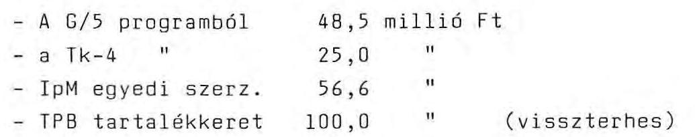

A kísérleti gyártósort 1989-ben műszakilag eredményesen valósították meg, működtetése viszont a vállalati csődhelyzet miatt nehézségekbe ütközik. Ezért a MEV vezérigazgatója 1989. december 6-án kelt, a Minisztérium Műszaki fejlesztési főosztályának küldött levelében kérte, hogy a Minisztérium a 100 millió Ft visszafizetési kötelezettségének MEV-re történő áthárításától tekintsen el. Így a vállalatnál a G/5 programnál említett 97,7 millió Ft-tal
 együtt 197,7 millió Ft visszatérítés teljesítése vált bizonytalanná.

81/ Az Elektronikai Központi Gazdaságfejlesztési Program (EKGP) 1986-1990. évi K+F feladatait az OKKFT G/5 program tartalmazza, amelyhez 1989-től csatlakozott a Tk-4 program is.

Az EKGP tervszámaiban meghatározott jelentőséget kapott a konvertibilis alkatrészimport folyamatos fékezése. A valóság ezzel éppen ellentétesen alakult. (Az 1990. évi tervszámokat - az 1985. évhez hasonlóan - a számítási anyagból vettük.)

| Elektronikai | 1980. | 1985. |  | 1990. | 1989. |
| :--: | :--: | :--: | :--: | :--: | :--: |
| alkatrész | bázis | terv | tény | terv | tény |
| belföldi gyártásból | 51 | 66-67 | 44,2 | 70-73 | 33,2 |
| szoc. importból | 16 | 13-14 | 20,7 | 12-13 | 17,3 |
| konvertibilis import | 33 | 20 | 35,1 | 18-14 | 49,5 |

---

A táblázatból kiderül, hogy a kitűzött célokat messze nem sikerült teljesíteni. A hazai szükséglet kielégítésében a belföldi gyártásból való részarány a növekedés helyett csökken. A konvertibilis import viszont a csökkenés helyett folyamatosan nő. Ez az elképzelésekkel szemben pontosan fordított. Szocialista viszonylatban 1989-ig az alkatrészek kölcsönös cseréje funkcionált, így a kielégítésben itt valósult meg csak a tervezett körüli arány.

A program sikertelenségét az elektronikai alkatrészek értékesítése bizonyítja:
millió Ft-ban

| 1985. | 1990. | $1990 / 85$. | 1989. | $1989 / 85$. |
| :-- | :-- | :-- | :-- | :-- |
| bázis | terv | terv % | tény | terv % |

Alkr. összesen $6.711,1 \quad 12.200 \quad 181,8 \quad 7.591,5 \quad 113,0$ ebből:
mikroelektr. $\quad 2.046,9 \quad 5.000 \quad 244,3 \quad 1.606,5 \quad 78,5$ ! nem mikroelektr. $4.664,2 \quad 7.200 \quad 154,3 \quad 5.985,0 \quad 128,3$

Az eredeti értékesítési struktúrához és volumenhez összesen 7,1 milliárd Ft beruházással számoltak (MEV 4,3, nem mikroelektronikai alkatrész fejlesztésére 2,8 milliárd Ft).

Az EKGP legnagyobb lemaradása - a tervhez képest - a mikroelektronikai alkatrészek gyártásában van, a program pénzügyi helyzete nem tette lehetővé a leégett mikroelektronikai üzem teljes kapacitású újra felépítését, s a pótlásként 230 millió Ft ráfordítással létesített kísérleti (pilot) sor is csak 1989-ben kezdte meg a termelést. (Ennek kapacitása 40 ezer db/év, s ez harmada a leégett üzemnek.)

---

A mikroelektronikai alkatrész termelés 1989-ben az 1985. évi 78,5 %-át érte el. Mikroelektronikai alkatrészekből 1989-ben a hazai szükséglet csupán 16 %-át elégítjük ki belföldi termelésből, a nem mikroelektronikai alkatrészekből pedig 38 %-át. A nem mikroelektronikai beruházásnak csak a fele valósul meg.

A program fejlesztési tervei mind a beszerzendő új gyártástechnológiák, mind a kiépítendő termelő kapacitás nagyságok tekintetében döntően a hazai várható igényeket vették alapul.

A program fejlesztési koncepciója hibás volt, mert olyan fejlesztést kellett volna megvalósítani, amely nem csak a bel-, hanem a külpiacon is eladható, versenyképes, korszerű termékek struktúráját eredményezi. (Az 1989. évi importliberalizáció miatt a versenyképesség megőrzése érdekében az elektronikai alkatrész gyártók a hazai felhasználók felé mintegy 30 %-os árcsökkentésre készültek.) Mindezek mellett a megvalósult fejlesztéseket az illetékes szervek műszakilag sikeresnek minősítik. Az alapból a G/5 program 1986-1990. közötti időszakra előirányzott támogatásokat időarányosan felhasználták. A Tk-4 programnál mintegy 51 millió Ft-os elmaradás várható az első két év (1986-1987.) kiesése és az átmeneti forráshiány miatt.

82/ A G/6 program 1988-ban lezárt 15 db "közvetlen hasznú" témáinak 1989. évi vállalati árbevétele 30 %-kal maradt el a szerződés szerint elvárttól. Az 1988-1989. évre együttes árbevétel alig nagyobb, mint a terv (4,1 milliárd Ft) fele. Ugyanakkor a programiroda a Minisztériumnak küldött beszámolójában 3,3 milliárd Ft terv- és 3,7 milliárd Ft tényszámot tüntetett fel.

---

83/ Az alapról történő országgyűlési beszámolóhoz 1990. április hóban - többszöri nekifutás után - véglegesített minisztériumi tájékoztató egyes táblázatos adatai megbízhatatlanok, pontatlanok voltak (pl. a T/12 program szerződésállományára 40 millió Ft eltéréssel két adat szolgált). Az egyéb célokra történő forráslekötéseket és kifizetéseket - amelyben az alap törvény szerint nem kifejezetten K+F célokra történő egyéb (kiállítás, konferencia, irodaköltség, szakértői díj) kötelezettségvállalásait kellene bemutatni - a Minisztérium évek óta nem itt, hanem az egyedi K+F témák között szerepelteti.

84/ Az Y-19135/86. sz. "Olcsóbb kivitelű célorientált kijelzőrendszer" szakértői vizsgálata (1987. június) megállapította, hogy az Elektronikai Vállalat részére a kispesti Honvéd-pályán időközben elhelyezett eredményjelző tábla költségeire 7 millió Ft helyett csak 3.054,7 ezer Ft kifizetése a megalapozott. A Minisztérium a 7 millió Ft-ot eközben átutalta. Nem intézkedett viszont arról, hogy az átutalt támogatás és a valóságban igazolt költség különbözete visszafizetésre kerüljön. Ezen intézkedés elmaradása végül is 4 millió Ft-tal rövidíti meg az alapot.
85/ Az Y-19240/87. "TECHNOPROGRESS Technológiai Fejlesztési és Kereskedelmi Egyesülés tevékenységének beindítása" c. szerződés célja (a Szovjetunióból behozott eszközök "rá-fejlesztésé"-vel) a hazai vállalatoknál a lehetséges tőkés gépimport kiváltása volt. Célt szolgáló lényegi eredmény nem született, de a nyugati import liberalizálása azt jobbára értelmetlenné is tette. Ezzel szemben a támogatás 6,3 millió Ft összegét 6 részletben a Minisztérium átutalta az Ipari Technológiai Intézet gesztorsága alatt létrehozott koordinációs irodának.

A Minisztérium végül is 1989. májusában felülvizsgáltatta a szerződés teljesítését. Konkrét megállapodás

---

- szovjet partnerrel - egy sem jött létre. Maguk az Egyesülés tagjai semmilyen hozzájárulást nem fizettek a cél érdekében, viszont az átutalt alapot felhasználták.

A 7 főre tervezett irodánál csak 2 fő dolgozott teljes munkaidőben, a többiek - köztük a vezetők - részmunkaidősként, s 1988-ban 90-120 ezer Ft-ot vettek fel fejenként.

A rezsianyag felhasználás között 59 db különféle szekrény, 44 db asztal, 58 db szék, illetve fotel szerepel, de beszereztek egy kisebb étterem részére elegendő étkészletet is (pl. 72 db mokkáskészlet, 240 db tányér stb.).

A Minisztérium 1989. júniusában a leírtak miatt 718 ezer Ft közvetlen anyagkülönbözet visszafizetését rendelte el az időközben feloszlott Egyesülés gesztoránál, amit az ITI a felszólítás után csak 3/4 év elteltével - a jelen (ÁSZ) ellenőrzés időszakában - teljesített. A költségösszetevők alapján számolva további 1.498 ezer Ft-ot kellett volna visszatéríttetni. Amennyiben a feladat ütemezéséből indulunk ki, akkor mintegy 3 millió Ft visszatérítése lett volna reális az elmaradó teljesítések miatt. A szabálytalan felhasználás miatt további (büntető) visszatérítés előírására sem került sor.

Budapest, 1990. augusztus
