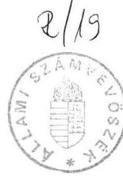
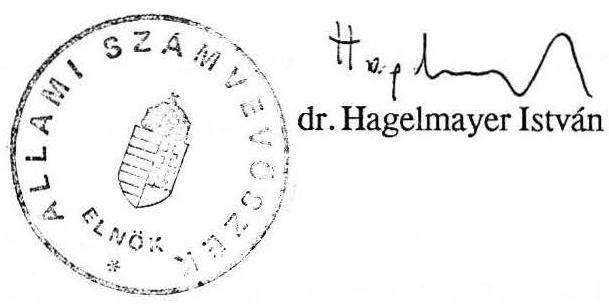

# Allami Számbriúszik 

## Jelentés

a Kiilügyminisztérium fejezet 1990. évi pénzügvi-gazdasági ellenőrzéséről

---

Az ellenőrzést végezték:
Belics János számvevõ, tanácsos
Horváth Sándor
Számvevõ, tanácsos
Nagy Akosné
számvevõ, tanácsos
Otto Tamás
számvevõ
dr. Solymár Károlyné
számvevõ, tanácsos
Varga Ildikó
számvevõ, tanácsos

Az ellenőrzést vezette:
Kolossváry György fôtanácsos

---

# JELENTÉS 

a Külügyminisztérium fejezet 1990. ̌̌vi pénzügyi-gazdasági ellenőrzéséről

A Külügyminisztérium a vizsgált időszakban (1987. I. 1.-1990. III. 31.) megközelítőleg változatlan szervezettel látta el feladatait. A fejezethez jelenleg a Minisztérium, a Külképviseletek, a Magyarok Világszövetsége és a Magyar Külügyi Intézet — mint önállóan gazdálkodó intézmények-tartoznak. ADiplomáciai Testületet Ellátó Igazgatóság 1988. XII. 1-ével vállalattá alakult át és így kivált a költségvetésből.

A fejezet költségvetésielőirányzata az 1987. évi 2,8 milliárd forintról 1990-re 4,0 milliárd forintra - $43 \%$-kal — növekedett. A tényleges felhasználás az 1987. évi 3,1 milliárd forinttal szemben 1989. évben 3,6 milliárd forint - $16 \%$-kal több—volt (ami reálértékben nem jelentett emelkedést). A foglalkoztatott létszám fejezeti szinten (a Minisztériumnál, külképviseleteknél és intézményeknél együttesen) 1987.évről 1989.évre 2118 fơről 1696 fôre - $20 \%$-kal — csökkent. (ADiplomáciai Testületet Ellátó Igazgatóság 1988. évi átlag létszáma 484 fô volt.)

Az ellenőrzés célja a fejezet gazdálkodásának, a feladatok és az ahhoz rendelt pénzeszközök összhangjának értékelése, valamint annak megítélése volt, hogy a gazdálkodásban érvényesültek-e a célszerűségi, eredményességi és a törvényességi követelmények.

---

# I. 

## Összefoglaló megállapítások, javaslatok

Az ellenőrzés tapasztalatai szerint a Külügyminisztérium fejezetnél a múködés és a gazdálkodás szabályozottsága, szervezettsége elmaradt a követelményektől. Hiányzik a feladatok magasabb szintű jogszabályi megfogalmazása. A Minisztérium és a Külképviseletek szervezetének, apparátusának korszerűsítése, ésszerűsítése megoldandó feladat. A pénzügyeket és a számvitelt fejezet szinten nem szabályozták, ugyanakkor a Minisztérium és a Külképviseletek területén hiányos vagy korszerűtlen a gazdálkodás szabá lyozása. A hatásköri rendszer nem zárt, esetenként a gazdálkodási jogkörök megállapítása nélkül folyik a gazdálkodás.

A gazdálkodás személyi feltételeit lényegesen rontja, hogy a Minisztérium gazdasági apparátusának munkatársai ciklikusan a külképviseletekre távoznak és így rendszeresített a fluktuáció. Az információs rendszer hiányosságai szűkítették a gazdálkodás értékelésének és ellenőrzésének lehetőségeit.

A múködési és a gazdálkodási rendszer fogyatékosságai vezettek olyan hiányosságokra, mint a költségvetési tervezés megalapozatlansága, a belső tartalékok nem kellő mozgósítása (a jelentős pénzmaradványok ellenére), valamint a takarékossági intézkedések csak részbeni végrehajtása, illetve esetenként a takarékossági követelmények figyelmen kívül hagyása. A vagyonvédelmet és a bizonylati rendet érintő intézkedések több esetben elmaradtak. A mérlegvalódiság az 1987. évi mérlegnél nem érvényesült, mivel jelentősösszegű konvertibilis valutát kivontak a költségvetési beszámolás alól.

A beszerzések, a reprezentáció, a bérlemények, az állóeszközgazdálkodás stb. terén tapasztalható eredményes megoldások jelzik a törekvést a gazdálkodás megújítására.

Az ellenőrzés tapasztalatai alapján a következőket javasoljuk:

## 1.) A Kormány

- tegye meg a szükséges intézkedéseket a Külügyminisztérium és a külügyminiszter feladatainak törvényszintű szabályozására;

---

- azállami protokoll tevékenységet komplex módon (előkészítés, jóváhagyás, finanszírozás, elszámolás) szabályozza újra;
- vizsgáltassa felül a miniszterek RK alapjainak működtetését, mérlegelje az alapok további fenntartását és szükségessége esetén alkossa meg annak jogszabályi alapját.
2.) A Külügyminiszter
- készítse el a minisztérium korszerűsített Szervezeti és Múködési Szabályzatát, valamint az azt kiegészítő különböző szabályzatokat és a számlarendet;
- a külképviseletek gazdálkodására készítessen olyan új szabályozást, amely a jelenlegi pénzügyi követelményeknek és a feladat sajátosságának megfelel;
- alakítson ki olyan egységes információs és adatkezelési rendszert, amely lehetővé teszi a gazdálkodás teljeskörű értékelését, a mindenkori összes pénzvagyon számbavételét;
- tegyen intézkedést a költségvetés tervezésénél és a végrehajtásánál a belső tartalékok feltárására, az elfekvő pénzeszközök mobilizálásával javítsa a fejezet önfinanszírozását, és ezzel enyhítse az állami költségvetés terheit;
- vizsgálja felül a gazdálkodási feladatokat ellátó dolgozók tekintetében a külföldi szolgálatra való kiküldés módszerét, és a minisztériumi gazdasági apparátus stabilizálására tegye meg a szükséges intézkedéseket;
- intézkedjen a külképviseletek hálózatának — a külpolitikai súlyponteltolódások figyelembevételével történő — felülvizsgálatára, ennek alapján a költségvetési eszközök és a létszám átcsoportosítására, illetve megtakarítására;
- a külképviseletek létszámgazdálkodását vizsgálja felül annak figyelembevételével, hogy az idegen állampolgárok, valamint a magyar alkalmazottak családtagjainak foglalkoztatásával hogyan lehetne a feladatellátást gazdaságosabbá tenni;
- vizsgálja felül a futárutak számát, fontosságát, a ráfordítások indokoltságát;
- dolgozza ki az elévülési időn belül (5 év) az RK alapból történt személyi jellegű kifizetések miatt elmaradt állammal szembeni kötelezettségeket és fizesse be a költségvetésbe;
- intézkedjen, hogy a költségvetési intézmények — feladatainak változásával összhangban - korszerűsítsék gazdálkodásukat és a saját bevételeik bővítésével javítsák az önfinanszírozó képességüket;
- gondoskodjon a nem közvetlenül államigazgatási feladatot ellátó részben önálló intézmények jobb kihasználásáról, hasznosításáról, különös tekintettel a Diákotthonra.

---

# 3.) A Pénzügyminiszter 

- intézkedjen a Minisztérium és a Külképviseletek egy intézménnyé való összevonásáról, amelyben a Külképviseletek önálló szakfeladatként szerepelne;
- vizsgálja felül a külföldön tartósan alkalmazottak járandóságát abból a szempontból, hogy a valutaellátmány - költségtérítés jellege miatt - a kiküldő szerveknél ne a béralapot, hanem a bérjellegủ egyéb kifizetéseket terhelje;
- kezdeményezze a külügyminiszternél a Magyarok Világszövetségének folyósított állami támogatás indokoltságának felülvizsgálatát, különös tekintettel a "Magyar Hírek" c. lap kiadására.

## II.

## Részletes megállapítások

## 1. A fejezet múködése

A Külügyminisztérium feladata a Magyar Köztársaság államközi kapcsolatainak gondozása és külpolitikai céljainak megvalósítása. Tevékenységi köréről (más tárcáktól eltérően) azonban magasabb szintű jogszabály nem rendelkezik. (Csak bizonyos részfeladatokat pl. nemzetközi szerződéskötések — szabályoztak.)

Saját kezdeményezésben 1987-ben elkészült egy törvénytervezet, de a jóváhagyásig nem jutott el.

A korábbi években az ország külpolitikáját közvetlenül az uralkodó párt irányította és alakította ki annak súlypontjait.

A meghatározónak tekinthetöszovjet orientáció mellett az 1970-es évek előtt a harmadik világ felé fordulás, az 1980-as évektől pedig fokozottabban az Európa centrikusság a jellemző. A külképviseletek elhelyezkedésében is mérhető ez az eltolódás.

A Magyar Köztársaság 1989. év végén a világ 135 országával állt — különböző szintű diplomáciai kapcsolatban 80 önálló ( 68 nagykövetség, 9 főkonzulátus, 3 misszió) és 8 , a kereskedelmi képviselettel közös ügyvivői képviselet útján.

---

Az ellenőrzött időszakban a külképviseletek száma változott. Politikai és gazdasági megfontolásból 1987-ben 82 külképviseletből 4 nagykövetséget (Accra, Conakry, La Paz és Nairobi), a párizsi UNESCO missziót, valamint a Kolozsvári Konzulátust megszüntettek. Az ezt követő években hazánkban lezajlott politikai változások, hangsúly áthelyeződések hatására Szöulban, Nicosiában, Tel-Avivban, Santiago de Chilében, legutóbb Zágrábban és Münchenben nyitottak meg külképviseletet. Folyamatban van a vatikáni külképviselet felállítása.

A fejezet a rendelkezésére bocsátott erőforrásokat a konkrétan meg nem határozott feladatrendszer finanszírozására használja fel. A kialakult feladatokat a tárca a felügyelete alá tartozó intézményeivel látja el.

A Minisztérium és a Külképviseletek külön-külön önálló intézményként való működtetése sem a célszerűségi, sem az eredményességi követelményeknek nem felel meg.

A Külügyminisztérium a Pénzügyminisztériummal együtt évtizedek óta külön intézményként kezelia külképviseletekösszességét. Ezzel szemben a Minisztérium és a Külképviseletek feladatai szorosan összefüggnek, szervesen egymásra épülnek. Sem a sajátosságok, sem a gazdálkodási feltételek hiánya nem teszi lehetővé a külképviseletek önálló költségvetési szervként való müködtetését. Emellett a pénzügyi törvény és végrehajtási rendelkezései erre irányuló jogszabályi követelményeinek nem felelnek meg.

A Külügyminisztérium sem pénzügyi, sem számviteli területen nem rendelkezik semmiféle fejezetszintű szabályozással.
Egységes pénzügyi-gazdasági és számviteli információs rendszert nem alakítottak ki. Ennek következményeként gyakran alapvető információk is hiányoznak.

A külképviseletek gazdálkodásának értékeléséhez, elemzéséhez nem rendelkeztek forintban összesített adatokkal egy-egy külképviselet fenntartási költségéről.
Nem teljeskörủ az információ arról, hogy az egyes külképviseleteken adott időpontban milyen tartós lekötésű, elkülönített pénzösszegek vannak. Helyszíni ellenőrzésünk egyes helyeken tapasztalta a pénzeszközök felhalmozódását (Koppenhága, Helsinki).

A fejezetszintű egységes pénzügyi-gazdasági irányítás kialakítását jelentősen fékezte a minisztériumban a gazdasági feladattal foglalkozók sajátos és számottevő fluktuációja. Az államigazgatási átlagnál alacsonyabb bérszínvonal miatt a külképviseleti munka lehetősége a leginkább ösztönző elem. A szervezet vezetői és munkatársai ugyanis ciklikusan a külképviseletekre távoznak, egyidejűleg az onnan visszatértek kerülnek a gazdasági

---

apparátusba. A "szervezett" munkaerőmozgás viszont azzal jár, hogy az e feladattal fogalkozók a gazdálkodást folyamatában nem ismerik, zömmel napi kérdésekkel foglalkoznak és kevésbé vállalkoznak — a gazdálkodás korszerűsítését is érintő — koncepcionális munkákra.

A fejezetszintű költségvetési tervezés az elmúlt években nem volt kellően megalapozott. Az előirányzatokat általában nem a tényleges feladatokhoz igazodóan alakították ki. Az egyes intézmények költségvetési előirányzatát a valóságos igénytől eltérően állapították meg, a Minisztériumét az igény alatt, a Külképviseletekét tartalékokat is beépítve. Emiatt a tényleges minisztériumi kiadások egy részét átterhelték a Külképviseletekre, az ott jelentkező többletfelhasználást viszont támogatási igényként fogalmazták meg az állami költségvetés felé.

Jellemző volt a működési bevételek mérsékelt tervezése, amelyet az évek során jelentősen túlteljesítettek. A bevételi többlettel az eredeti előirányzatot nem módosították és azzal a magasabb kiadási igény fedezeteként nem számoltak.

A költségvetési pótelőirányzatok előterjesztésénél több esetben nem jártak el megalapozottan, mert a tartalékokat, az év közben fel nem használt magas pénzmaradványt, valamint a már realizálódott többletbevételeket nem vették figyelembe. A feladatok változásához igazodóan az egyes intézmények és szakfeladatok között előirányzat átcsoportosítást nem végeztek. Bizonyos többletigényeket viszont esetenként az évvégi pénzmaradvány terhére elismertek.

A minisztérium a fejezetszintű előirányzataiból évről-évre jelentős összegű tartalékokkal rendelkezett.

Pl. 1990. évben a Külképviseletek béralapjában lévő 172 millió forint és a dologi előirányzatokban lévő 218 millió forint, valamint a társszervektől (HM, BM) költségtérítésként befolyt 96 millió forint.

A tartalékokra utal az is, hogy a fejezet jóváhagyott pénzmaradványa a vizsgált időszakban évről-évre jelentősen emelkedett (az 1987. évi 314 millió forint, az 1988. évi 423 millió forint az 1989. évi 745 millió forint volt). Ennek döntő hányada a Külképviseletek működési bevételének visszatartható $50 \%$-ából és az előző években fel nem használt pénzma-

---

radványból adódott (1988-ban a kettő együtt 255 millió forint, azaz $60 \%$, 1989-ben 539 millió forint, azaz $72 \%$ ). A pénzmaradványok még akkor is jelentős finanszírozási tényezőt jelentettek, ha évente mintegy $50 \%$-uk volt mobilizálható.

A Külképviseletek müködési bevételi többlete 1989. évben mintegy 62 millió forinttal magasabblehetett volna, de a PénzintézetiKözpont — forgóalapgondjaimiatt — ezt azösszeget nem tudta jóváirni. Az összegnek a nagyságáról azonban a Külügyminisztériumnak nem volt információja. A kintlevőségekről ugyanis analitikátnemvezetnekésezérta mérlegbensem mutatták ki.

A fejezetszintű gazdálkodásban esetenként érzékelhetők takarékossági kezdeményezések, azonban az intézkedések csak részben kerültek végrehajtásra. A Külképviseleteknél tervezett létszámcsökkentés például csak kis mértékben valósult meg.

A Külügyminisztérium a Kereskedelmi Minisztériumnál kezdeményezte egyes országokban (pl. harmadik világ) a helyiségek és a létszámok jobb kihasználása, illetve a költségcsökkentés érdekében a létesítmények közös használatát, a feladatok egy részének közös apparátussal való ellátását. Annak ellenére, hogy feltehetően jelentős megtakarítást lehetne elérni, eddig még nem született eredmény.

A forintleértékelések és a helyi inflációk hatása a fejezet gazdálkodásában elsősorban a külképviseleteknél a legkedvezőtlenebb. A hatások ellentételezésére 1988-tól kezdődően egyre kisebb mértékben szolgált központi forrás. A népgazdaság pénzügyi helyzete miatt előtérbe kerültek a fejezet takarékossági intézkedései, valamint a jelentkező kiadási többletek saját bevétellel történő ellensúlyozása.
A helyi inflációk hatásait többé-kevésbéellensúlyozza a külképviseletek pénzellátási rendszere oly módon, hogy a külképviseleteink a müködéshez biztosított konvertibilis valutát csak a szükségletnek megfelelő mennyiségben váltják át helyi fizetőeszközre.

# 2. Minisztérium gazdálkodása 

A Külügyminisztérium Szervezeti és Müködési Szabályzata — amelynek rendeltetése a feladat, az alapvető működési terület, a szervezeti tagoltság stb. szabályozása lenne — nem felel meg a követelményeknek. Egyes területeken túl tagolt, másutt pontatlan. Hiányzik a gazdálkodási tevékenység összehagolása és a jogkörök megfelelő kijelölése.

A bér- és létszámgazdálkodást a Bér- és Munkaügyi osztály, valamint a Személyzeti főosztály feladatköre is tartalmazza, a felelős kijelölése nélkül.

---

Az egyes keretgazdálkodó fóosztályok (osztályok) pénzügyi ellenjegyzés nélkül használják fel a leadott kereteket, ugyanakkor a tényleges kiadásokat nem értékeli központilag senki.

A gazdálkodás szervezettségét, szabályszerűségét és értékelhetőségét akadályozza, hogy a főbb területek részletes szabályozása hiányzik, a számviteli rend nem felel meg az előírásoknak.

Nem készítették el a pénztári pénzkezelési szabályzatot, ami kötelező volt. Fontosságát külön indokolja az, hogy a forint és a deviza pénztár együtt van és a két intézmény (Minisztérium és a Külképviseletek) készpénzét együtt kezelik. Ezen túlmenően a házipénztárban szabálytalanul még ún."idegen" készpénzt is tartanak (miniszteri RK alap, RK lakásalap).
Számlarend helyett csak számlatükör készült, amely nem fogadható el. Hiányoznak a számviteli munkát alátámasztó egyes analitikák. Az elkészített két számlatükör (Minisztérium, Külképviselet) sem egyértelmü, egyes feladatok könyvelését tévesen határozták meg (pl. a Minisztérium új épületének a beruházását a Külképviseletek számlatükrének a 192. Befejezetlen beruházások alszámláján könyvelik).

A Minisztérium költségvetési előirányzata az 1987. évi 208,6 millió forintról 1990. évre 315,4 millió forintra - $51 \%$-kal —emelkedett.*

Részaránya a fejezetszintű előirányzaton belül 7,4\%-ról 7,9\%-ra változott.

Az előirányzat növekedések döntő többségben a központi intézkedések hatásának (bérbruttósítás, társadalombiztosítási járulék fizetési kötelezettség $10 \%$-ról $43 \%$-ra elemelése) ellentételezéséből eredtek.

A Minisztérium tervező munkájában nem érvényesítették a feladat és előirányzat összhangjának követelményét, az intézmény költségvetését tudatosan elsorvasztották a Külképviseletek javára.

Az 1989. évi költségvetés nem tartalmazott tervszámot a készletbeszerzésre, szolgáltatásokra, s az anyagjellegủ kiadások nagyobb hányadára.

1990-ben előirányzatot csak béralapra és járulékára, állami protokoll és minisztériumi reprezentáció fedezetére terveztek.

[^0]
[^0]:    * Megjegyzés: Az előirányzatok összehasonlításánál az 1987-1990. éveket, míg a ráfordításoknál az 1987-1989. éveket vettük alapul. Kivételt képeznek az 1988. évi bérbruttósitással és a rovatrend változásával érintett költségnemek, ahol az 1988-1989. évek összehasonlítása volt indokolt.

---

Egyakorlat miatt a Minisztérium költségvetése a müködtetés valós igényét nem tükrözi, a kiadások és feladatok összhangja nem biztosított és a ráfordítások eredményessége nem értékelhető.

A Minisztérium egyesfőosztályai, osztályaia részükre jóváhagyott költségvetési keretekkel önállóan gazdálkodnak.

Megjegyezzük, hogy a gazdálkodó egységek gondjaira bízott keretek több mint $80 \%$-a a Külképviselet intézmény pénzeszköze.

A keretgazdálkodás bevezetésének előnye, a feladat megoldásának és finanszírozásának az összekapcsolása. Vannak viszont olyan feladatok, ahol a célszerűség érdekében ezt a tagoltságot meg kellene szüntetni.

A jelenlegi gyakorlat szerint egyes azonos típusú eszközök, anyagok beszerzése (számitástechnikai, néhány híradástechnikai eszköz stb.), szolgáltatások megrendelése (kiadványok megjelentetése, állóeszközjavítás, stb.) annyi helyen történik, ahány osztály vagy főosztály kapott rá keretet. Ilyen esetben a koncentrált lebonyolítás lenne az indokolt.

A főkönyvi könyveléshez kapcsolódóanalitikus nyilvántartási rendszer hiánya akadályozza a keretekfelhasználásánakfigyelemmel kísérését, amia munkafolyamatbaépítettellenőrzés körén is kívül maradt.

A keretek felhasználásáról nincs központilag előirt nyilvántartási rend, így ennek figyelemmel kísérése az adott ügyintézőre van bízva. A keretgazdálkodók részére kiadott előirányzatok felhasználását központilag nem értékelték.

Egyes keretgazdálkodó szerveknél (pl: Protokoll főosztály) találkoztunk költségkímélő, takarékosságra törekvő megoldásokkal is (termelői áron való beszerzés, vendéglátó szervekkel árengedményes szerződések stb.).

A Minisztérium béralap előirányzata az 1987. évi 85,1 millió forintról 1990. évre 171,7 millió forintra emelkedett (ami 102 \%-os növekedést jelent). Ez az intézmény összes kiadási előirányzatának $41 \%$-a, illetve $54 \%$-a. A tényleges felhasználás az 1987. évben 76,3 millió forint, 1989. évben 143,9 millió forint volt, ami az éves összes kiadás $40 \%$-át, illetve $41 \%$-át tette ki.

---

A Minisztérium bérgazdálkodása a bérfelhasználás nyilvántartási rendszerének megszervezésével, folyamatos vezetésével és esetenkénti értékelésével, az alkalmaztatások szabályszerűségének erősödésével javult. Hatékonysága ennek ellenére nem kielégítő. A bértömeggazdálkodás, a fejezeten belüli bérátcsoportosítás lehetőségével nem éltek kellően.

A bérfejlesztés központi előírásait általában megtartották. Fedezetét — az állami költségvetés helyzetének romlásával — növekvő mértékben a dologi kiadásaik és bértartalékaik terhére, valamint az intézmények közötti átcsoportosítással teremtették meg.

A bérfejlesztéseknél jobban kellett volna élni a differenciálás eszközével.

Az 1987. április 1-i $5 \%$-os és az 1990. január 1-i $16 \%$-os bérfejlesztést bérkarbantartásként kezelték és automatikusan azonos mértékben osztották fel. A szervezeti egységek közötti bérkülönbségeket nem vizsgálták, a felosztás elve általában $50 \%$ létszám, $50 \%$ bérarány volt.

Kiemelten kezelték viszont 1987-ben a rendkívül alacsonyan elismert két legalsó ügyintézői és az ügyviteli kategóriában dolgozókat. 1989-ben a pályakezdő fiatalok bérszintjének rendezése kapott figyelmet.

A bérszerkezet összetételében az alapbér a meghatározó.
Jelentősen — közel duplájára — nőtt a jutalom összege és így aránya. A bérmaradványból fizetett céljutalom általában az alapbérekhez igazodott. Differenciálásra inkább az évi 2,6-3 millió forintot kitevő miniszteri jutalmazási keret felhasználásánál törekedtek. A jutalmazás szerepe megnőtt, azonban az alacsony bérszínvonallal összefüggő munkaerőfoglalkoztatási gondokat nem oldotta meg.

Az intézményi átlagbér - a végrehajtott bérfejlesztések és létszámösszetétel változás együttes hatására - 1988.és 1989. évek viszonylatában 14.350 forintról 17.706 forintra $-23 \%$-kal nőtt.

A jutalom 1 fơre jutó összege közel kétszeresére ( $98 \%$-kal) emelkedett, s átlagon felüli volt a túlmunka ( $33 \%$-os) és a nyelvpótlék ( $36 \%$-os) növekedése. A fentiek következményeként az alapbér aránya az átlagbérben $85 \%$-ról $78 \%$-ra csökkent.

Az átlagbér — a bérfejlesztések ellenére — alacsony. A külügyminisztériumi dolgozók 1 fơre jutó bére a központi államigazgatás átlagától 1989-ben $15 \%$-kal elmaradt ( 24 főhatóság közül a 19. helyen vannak).

---

A Minisztérium, mint intézmény béralapja nem a foglalkoztatottak valós bérfelhasználásátés létszámát tükrözi — kisebbannál —, mivel a Külképviseletek bére kiegészítő forrásul szolgált e célra.

A létszámgazdálkodás nem kellően hatékony, a takarékossági, célszerűségi szempontok háttérbe szorultak. Az államigazgatási feladatok korszerűsítésére és ezzel összefüggésben a Minisztérium létszámának csökkentésére nem került sor annak ellenére, hogy erre a miniszter többször ígéretet tett.

A központi igazgatási létszám előirányzat nem csökkent, sőt a fejezeten belüli átcsoportosítással 1988-ban 6 fővel - 542 före - emelkedett. Nem eredményezte a központi igazgatási létszám csökkenését a Pártbizottság 1989. évi megszűnése sem. A felszabadult 11 fő a főosztályok státusz létszámának emelésére szolgált.

A tervezett intézkedések elmaradása a túlzott szervezeti tagoltság és esetenként a párhuzamos feladatellátás miatt is hátrányos.

A minisztérium fóosztályainak száma az 1990-ben végrehajtott szervezeti módosítással 29-ről 27-re változott. A struktúra továbbra is erősen tagolt maradt, ami a döntési körök indokolatlan szétaprózódásához vezet és koordinációs zavarok forrása.

Intézményi sajátosság a 9/1974. külügyminiszteri utasításban meghatározottak szerint a külszolgálati feladatra betanulók, illetve új beosztásba helyezésükig a hazatérők — az ún. ingók — létszámának és bérének elkülönített kezelése.

Az igazgatási létszám $20 \%$-át meghaladó ingó létszám tartalmi ellenőrzésénél tapasztaltuk, hogy az itt fizetett dolgozók mozgatása nem kellően tervszerű. Időnormájuk a szükségesnél hosszabb, tényleges itt tartásuk az előírtat meghaladja és ez indokolatlan költségtöbbletet jelent.

A más szervektől külföldi kihelyezés céljából átvett munkatárs a rendelkezés szerint kiutazásáig, illetve hazatérése után 12 hónapig tartható ingólistán.

A vizsgált időszakban ténylegesen besorolt összesen 67 fó átlag 3,7 hónapig szerepelt itt. Tervszerűbb mozgatással ez az időtartam csökkenthető lett volna. A külügyi állományba tartozó azon dolgozók, akik nem a korábbi munkakörüknek megfelelően kapnak beosztást, 2 hónapig tarthatók ingólistán, ezzel szemben az adott időszakban 301 fő e jogcímen átlag 3 hónapig szerepelt. E normán túli ingólistán foglalkoztatás évi 8 fő bér- és közterhével terhelte feleslegesen a Minisztérium költségvetését.

---

Az előírásokat megsértve bujtatottan az inglolista terhére foglalkoztattak központi igazgatási területeken dolgozókat.

1989-ben a központi igazgatáson engedélyezett 539 fön felül ingó létszámon szerepeltettek pl. a Sajtó fóosztály video részlegénél, az Építési Irodán dolgozókat. Ezen felül a miniszter külön utasításával ingolistára sorolt 130 fót, átlag 7,5 hónapig tartották ezen a feladaton, ami igen hosszú.

A Minisztérium anyagjellegủ kiadása az összes kiadáson belül kismértékben emelkedő tendenciát mutat (1988. évi 21,2 millió forintról 1989-re 23,3 millió forintra nőtt). E tételen belül a külföldi kiküldetési kiadások csökkenése ( 288 ezer forintról 95 ezer forintra), nem a takarékosság, hanem a Külképviselet intézmény költségvetése terhére végzett finanszírozás eredménye. Így ez az összeg irreális, nem tükrözi az apparátus tényleges külföldi utazásainak a ráfordításait.

A bérjellegủ kiadások teljesítése az 1988. évi 67 millió forintról 77,9 millió forintra emelkedett. E tételen a legnagyobb volument a reprezentációs kiadások képviselik, ezen belül is az önálló szakfeladaton megjelenő állami protokoll felhasználása.

A Kormányhoz és az Elnöki Tanácshoz rendelt országos jellegű rendezvények lebonyolítása az állami protokoll feladata, melyet a Külügyminisztérium Protokoll fóosztálya lát el. E tevékenység jellege miatt eltér az általános reprezentációs előírásoktól, ezért erre külön szabályozás vonatkozik (2028/1965. (X.10.) Korm.hat.). A kormányhatározat és az ennek végrehajtásáról — a pénzügyminiszterrel egyetértésben — kiadott külügyminiszteri utasítások és egyéb rendelkezések nem felelnek meg a célszerűségi és eredményességi követelményeknek. A gazdálkodás tervszerűségét nem biztosítják megfelelően, nem egyértelműek és egyes elemeiket tekintve ellentmondásosak. A 3410/1987. sz. MT határozatban jóváhagyott normák egyre kevésbé tarthatók be, takarékosságra nem ösztönöznek.

A jogszabályi felülvizsgálat elmaradása hozzájárult ahhoz is, hogy az állami protokoll tehére több olyan rendezvényt számoltak el, amelyek a kormányhatározat alapján vitathatók.

---

Pl.

A miniszterelnök személyes megbízottjaként eljáró nyugalmazott miniszterelnökhelyettes nyugati relációjú kül-és belföldi protokoll tevékenységének költségeit, a vendégeként érkezett ausztrál székhelyú lapkiadó vállalat tulajdonosának fogadási költségét;
nyugalmazott miniszter hivatalos külföldi kiküldetésének költségét, a FIAT elnökének látogatásával kapcsolatos ráfordítást;
a rendszerváltással, a többpártrendszer kialakulásával összefüggésben — különösen 1990-tól - egyes pártok nemzetközi kapcsolatainak költségeit esetenként az állami protokoll terhére számolták el, a jogszabályi háttér változtatása nélkül.

Az állami protokoll körébe tartozó vezetők nemzetközi kapcsolatainak szervezése és finanszírozása reláció szerint megosztott. A Minisztertanács hivatali szervezete végzi a KGST illetve a szocialista kétoldalú gazdasági együttmúködési bizottsággal kapcsolatos protokoll feladatokat és köteles egyeztetni a Külügyminisztérium Protokoll fóosztályával. Több esetben előfordult, hogy az MTH Protokoll osztálya az állami protokoll előirányzat terhére közvetlenül, egyeztetés nélkül is vállalt kötelezettséget. Ez nehezíti a takarékos gazdálkodást.

Jelenleg a küldöttségek sajtókísérete költségeit az állami költségvetés finanszírozza. A pártállamot jellemző sajtó irányítás megszűnésével, a független médiák múködésével ez a gyakorlat átértékelést kíván. Mérlegelendő, hogy a költségeket állami támogatásból finanszírozzák-e továbbra is - ha igen milyen körben és mértékben - vagy a költségek a sajtóorgánumokat terheljék.

A Minisztérium saját reprezentációs előirányzata tartalmazza az ország külpolitikai tevékenységével összefüggő és a minisztériumot terhelő rendezvények költségeit, a vezető állományú dolgozók részére engedélyezett személyes reprezentációt és az úgynevezett "rendelkezési alapot".

A rendezvényekkel összefüggő tevékenységet, pénzfelhasználást az állami protokollhoz hasonlóan külön szabályozták. Mivel a két feladat igen közel áll egymáshoz, esetenként össze is keveredik a finanszírozásuk.

Pozitívan értékelhető, hogy az állami és külügyi protokoll kereteket kezelő főosztályok (Protokoll és Sajtó) kellő figyelemmel voltak a ráfordítások tartalmi felülvizsgálatára, a normatív előírások megtartására.

---

A személyes reprezentációs összegek elszámolása előírásszerű. A minisztérium reprezentációs kiadásai között évente 2 millió forint összegű "rendelkezési alapot" (továbbiakban RK alap) számoltak el. Általában két részletben egy-egy millió forintot vettek fel készpénzben, melyet a házi pénztárban elkülönítettenkezeltek. A kifizetéseket minden esetben készpénzben teljesítették. Az RK alap 1989. évi záró egyenlege 3.985 ezer forint volt. A felhalmozódott pénzeszközök hasznosításáról nem gondoskodtak (pl. kamatozó betét, kincstárjegy).

Az RK alapról jogszabály nem rendelkezik. Tájékozódásunk szerint múködése a tárcáknál egy évtizedekkel korábbi elhatározáson, majd az ezt követőena "szokásjogon" alapult. Az RK alap felhasználási jogcímeiről, képzéséről, elszámolási rendjéről belső szabályozást nem készítettek. Az 1/1973. külügyminiszteri utasítás csak az RK alap feletti döntési jogkört szabályozza. A kialakult hagyományoknak megfelelően a vizsgált években az éves ráfordítások csekély hányada szolgált reprezentációs célokra. Az RK alap terhére többségében olyan kifizetéseket eszközöltek, melyekre azok jogcíme, vagy a vonatkozó költségvetési előirányzat kötöttsége egyébként nem adott lehetőséget. Jellemzően az RK alapból finanszírozott kifizetéseket terhelő állammal szembeni kötelezettségeket nem teljesítették (társadalombiztosítási járulék, nyugdíjjárulék, jövedelemadó levonás).

A reprezentációs célú kiadások aránya 7-10\%volt. A legjelentősebb tétel a dolgozóknak különböző célra (autóvásárlás, lakásfelújítás stb.) adott és jelentős összegű (pl. 100-150 ezer forint) kamatmentes kölcsön volt.

AzRK alapból lakásépítési kölcsön céljára "lakásépítésiRK alapot" különítettek el jogszabályi rendelkezések szerint képezhető lakásépítési alapon kívül. Erre 1989. évben 600 ezer forintot adtak át. A lakásépítési RK alap terhére "rövid lejáratú" kamatmentes kölcsönöket adtak a dolgozóknak készpénzben. (A lakásépítési alap készpénzben kezelt összege 1990. III. 28-án 1.288.960 forint volt.)

A saját dolgozóknak, külsőszemélyeknek eszközölt jövedelem jellegủ kifizetések aránya változó. A nem teljesített adó és járulék fizetési kötelezettség 1987. év és 1989. év között mintegy 500 ezer forintot teszki.

A Minisztériumban a szolgáltatásokra fordított kiadások csökkenő tendenciát mutatnak az összesenen belül (1988-ban 7,7\% 1989-ben 4,6\%). Erre is jellemző, mint majdnem minden tételre, hogy a teljesítések jó részét a Külképviseletekre terheltékát (pl. közüzemi díjak).

---

E tételcsoporton belül a legnagyobb összeget, mintegy $44 \%$-ot az állóeszközfenntartásra fordítottak. A folyamatos használatnak kitett eszközök javítására az illetékes szakipari vállalatokkal átalánydíjas karbantartási szerződéseket kötöttek (irodagépek, szövegszerkesztők, számítógépek, fénymásolók, lift), ami a nagy ütemben növekvő eszközállomány szempontjából gazdaságos.

A nagyjavításokra fordított kiadások 1987. évről 1989. évre mintegy a duplájára emelkedtek. (4,6 millió forintról 8,5 millió forintra.) A középtávú tervben 1986-1990-esévekre összesen 243,3 millió forintot terveztek a minisztériumi eszközállomány felújítására. Ennek meghatározó tétele volt a székház felújítása, emellett tervezték a monori rádióállomás és a Magyarok Világszövetsége székházának felújítását is.

A középtávú terv még azt tartalmazta, hogy a tervidőszakon belül a KüM székház épülettömbjének komplex, folyamatos nagyjavítását elvégzik, amelyre a 235 millió forintot irányoztak elő. Erre, a megváltozott ingatlan hasznosítási koncepció miatt nem került sor. Így nagyjavításokat, felújításokat lényegében az éves felújítási tervekben meghatározottak szerint - és inkább rövid távú spontán elgondolásokat kifejezve - végeztek, és a közvetlen munkavégzéshez kapcsolódó feltételrendszer javítását helyezték előtérbe.

Az 1987-89. évi nagyjavítási előirányzatokat sokféle célra, gyakran karbantartás jellegű munkák elvégzésére fordították. A költségelőirányzatot 1987-ben ( 9 millió forint) 74 \%-ban, 1988-ban ( 7,6 millió forint) $70 \%$-ban, míg 1989-ben ( 7,1 millió forint) $149 \%$-ban használták fel.

#### Abstract

A nagyjavítások tényleges teljesítésének megállapításánál az adatok egyeztetése nagy eltéréseket mutatott. Az Építési Iroda által adott teljesítési adatok, a Számviteli csoport bizonylatai és az analitikus könyvelés adatai eltéréseket mutattak. Azeltérések egyik oka, hogy helytelenül állóeszközfenntartás között számoltak el beruházási munkákat. (Így pl. a minisztériumi kiváltó épülethez készített tanulmányterv és tervdokumentáció, valamint a "B" és "C" épület szerkezeti vizsgálatának költségei.)

A három év alatt felújításokra fordított közel 22 millió forintból 14 millió forint a minisztérium épületeinek felújítását (ennek mintegy egyharmada a liftek nagyjavítását) szolgálta. Ugyanakkor 3 millió forintot fordítottak a jelenleg kihasználatlan Bérc utcai diákotthon fűtéskorszerűsítésére.

---

A minisztériumi fejlesztéseket az eszközállomány változása mutatja. A Minisztérium és a részben önálló intézményei állóeszközeinek bruttó értéke a három év alatt $41 \%$-kal növekedett.

Az értékváltozások nyilvántartása nem zárt rendszerủ, összemosódik a Minisztérium és a Külképviseletek eszközállománya.
A különböző eszközök beszerzését, tárolását és mozgatását egy-egy kerettel rendelkező főosztály végzi. Az évközi változásokról folyamatosan, naprakészen nem tájékoztatják a Számviteli csoportot.

Általánosnak mondható — fóleg a Távközlési és a Biztonsági osztály esetében —, hogy nagy értékủ távközlési célokat szolgáló eszközöket a saját eszközállományból különböző külképviseletek részére adnak át, illetve telepítenek ki és a változásokat nem jelzik, így a nyilvántartás azt nem követi.

A külképviseletekről az eszközök jelentős része is hivatalos dokumentáció nélkül kerül vissza a minisztériumba. Nincs eldöntve, hogy a külképviseleteken felszerelt biztonsági berendezések külképviseleti vagy a minisztériumi eszközállomány részei, nem minden esetben veszik a külképviseletek azt állományba, vagy ha igen, csak mennyiségileg.

Vagyonvédelem szempontjából sem engedhető meg, hogy jelentős összegeket kitevő berendezések, eszközök helyéről, sorsáról nincs pontos, a tényeknek megfelelő, nyomonkövethető nyilvántartás és az eszközmozgásokat csak a kétévenkénti leltár tárja fel.

A computer beszerzés például meghatározóan nem kész gépek megvételére irányult, hanem tartozékokra, és az összeszerelés "házilagos". Követhetetlen, hogy a beszerzett tartozékokból hány computer készült el, mennyi az új készülék előállításhoz, javításhoz felhasznált tartozék. A tartozékok azonosító számmal nem rendelkeznek, így a beépítés után nincs lehetőség az azonosításra.
Az 1989. évi leltárban 201 tartozék - klaviatúra, monitor - szerepelt érték nélkül, mondván, hogyállóeszközzé csak a computerbe való beépítés kapcsán válik. A jelenlegigyakorlat megbízhatatlan és rendezetlen.

A távközléssel és a számítástechnikával összefüggő gépbeszerzések nem kellően megalapozottak, mivel ezzel a feladattal a Távközlési osztály és a Számítástechnikai csoport egymástól függetlenül foglalkozik.

---

Az állóeszközgazdálkodási tevékenység pozitívumaként kell megítélni,

- a régi B és C épület — gazdaságtalan felújítása miatt — értékesítésére tett intézkedéseket

Az ingatlanok vételárát úgy határozták meg, hogy a vevő a Bolgár Elek téren épült külügyminisztériumi székház mellett egy $5.000 \mathrm{~m}^{2}$ bruttó szintterületü épületet kulcsra készen felépít. A minisztérium "A" épületének udvarát 12 hónapon belül beépíti, valamint a szerződés aláírásakor 350 millióforintnakmegfelelősvéd korona összeget 30 napon belüla City Bank Budapestnél osztatlan és vissza nem vonható letétbe helyez az eladó javára. Ezt az összeget a "D" épület müszaki átadását-átvételét követően kamataival együtt a bank az akkor érvényes árfolyamon számolva forintban kifizeti az eladónak.

- a Koreai Köztársaság nagykövetsége elhelyezésének megoldását.

A két állam között megállapodás született arra vonatkozóan, hogy mindkét ország a követsége kialakítására ingatlanvásárlási lehetőséget biztosít egymásnak. Ezzel a céllal értékesítésre került a minisztérium egyik kihasználatlan vendégháza a Mátyás király úton, valamint a Népköztársaság (Andrássy) úton lévőegyik — a DTEI kezelésében lévő — ingatlan összesen 4.650 ezer USD-ért.

Negatívum, hogy a Bérc utcában lévő kihasználatlan diákotthon hasznosításáról — az érdekképviselet tiltakozása miatt — nem intézkedtek. (A kapott információ szerint bérbeadásból mintegy 14 millió forint tiszta bevétel származna.)

A beruházási feladatokat a minisztérium a középtávútervkoncepciójában alakította ki az 1986-1990. közötti időszakra. A tervidőszak kezdetén súlyponti kérdés az új székház építése volt.

Az elhatározott feladatok tervezett költségigénye összesen 352,2 millió forint volt (önálló iroda építése, gyermekotthon és Magyarok Világszövetsége épületének fútéskorszerűsítése, a rádió adó-vevő állomás rekonstrukciója, gépkocsik évenkénti cseréje).

Az úgynevezett "kiváltóépület" megépítésével — amely az eddigi Bem téren lévőközponti épületek túlzsúfoltságát, valamint a minisztérium egyes főosztályainak, intézményeinek tagolt elhelyezését volt hivatott rendezni — 1984-től már különböző hatóságok foglalkoztak (ÁTB, OT). A Kormány azzal fogadta el az ÁTB 5007/1987. sz. határozatát, hogy a Külügyminisztérium is járuljon hozzá saját forrásból a beruházás összegéhez. Ennek figyelembevételével a Külügyminisztérium vállalta, hogy 3 éven keresztül a többletbevételéből 60-60 millió forintot, azaz 180 millió forintot erre fordít. A Pénzügyminisztérium

---

az 1986. évi külügyi fejezeti pénzmaradványból az induláshoz 35 millió forintot visszaadott, az Országos Tervhivatal a központi beruházások között 135 millió forintot a beruházásra és 8,5 millió forintot a tervezési munkákra elkülönített. Így a feladat megoldására 358,5 millió forint állt a Minisztérium rendelkezésére.
Az ÁTB által jóváhagyott kiváltó épület beruházási programja azzal számolt, hogy a meglévő székház felújításra kerül, és ezt követően a fővárosban szétszórtan elhelyezett külügyminisztériumi részlegek itt lesznek elhelyezhetők. Ebben a koncepcióban változás következett be a minisztérium két — B és C — szárnyának időközbeni eladása miatt.

A két szárny értékesítése következtében a kiváltóépület további bővítése vált szükségessé, amely kapcsán ujabb $5000 \mathrm{~m}^{2}$ épület megépítésére kerül sor. A Külügyminisztérium elhelyezése mindemellett két helyen lesz, a kibővített kiváltó épületben és a bővített, felújított jelenlegi "A" épületben.

Az ÁTB a beruházást úgy hagyta jóvá, hogy előirányzata nem léphető túl. Ezért a munkák megkezdése előtt a költségek csökkentése érdekében a minisztérium a kiviteli tervek módosítását határozta el, amelynek kapcsán az eredetileg $8.974 \mathrm{~m}^{2}$ hasznos alapterület 7.964 $\mathrm{m}^{2}$-re csökkent (ezen belül az irodai szintekre eredetileg tervezett terület $6.714 \mathrm{~m}^{2}$-ről $5.367 \mathrm{~m}^{2}$-re változott).

A beruházás költsége a vizsgálat idején — ÁFA nélkül — 10,5 \%-kal, 38 millió forinttal magasabb volt az előirányzatnál.

A pénzügyi teljesítés nem tükrözi a beruházás tényleges költségeit, mivel nem itt számolták el az épület berendezését, a különböző gépek, felszerelések, a távközléssel kapcsolatos berendezések költségét.

A beruházás pénzigényénél 4,5 millió forint belföldi gép-berendezés beszerzéssel számoltak, a teljesítésnél mindössze fél millió forint került elszámolásra. A pénzügyi terv importot nem tartalmazott, ugyanakkor a telefonkészülékeket külképviseleten devizáért szerezték be.

A beruházás jóváhagyásánál követelményként fogalmazódott meg az ésszerű takarékosság érvényre juttatása is. A megjelenésében jó összképet mutató berendezésnél a célszerűségi, takarékossági szempontok csak részben érvényesültek, egyes esetekben pedig a szükségesség is megkérdőjelezhető.

---

Beszereztek például 20 ezer forintos íróasztalokat, 11.6 ezer forintos gépíróasztalokat - amivel szemben a System elemes irodabutor családjából az íróasztalok 5-6 ezer forintért, a gépíróasztalok 3 ezer forintért kaphatók - továbbá 3.6 ezer forintos világos huzatos karosszékeket, 7 ezer forintos réz álló- és 6 ezer forintos állólámpákat. Csak a lámpák értéke 1.434 ezer forint volt.

A vizsgálat idején a beruházás még nem zárult le, különböző pótmunkák (garázstechnológia, kocsimosóvíztisztítás, biztonságtechnikai rendszer, portai fogadó) folyamatban voltak.

A Minisztérium összes bevételi előirányzatából a saját bevételek részaránya alacsony. 1987. évben 6,9 millió forint, ami 3,3 \%, 1990-re - változatlan nagyságrend mellett -$2,2 \%$-ra csökkent az összes előirányzathoz képest. Ugyanakkor a teljesítés az 1987. évi 6,6 millió forintról 1989. évre 7,8 millió forintra emelkedett.

A múködési bevételek növekedése a Konzuli osztály által kiszabott (1/1988. (II.29.) KüM rendelet) konzuli illeték felső határának a felemeléséből adódott és nem új forrásból, vagy intézményeik jobb hasznosításából. A jogszabály biztosította emelés 1989-ben egyértelműen bevétel növekedést eredményezett, de az 1990-es évi költségvetés megállapításánál ezt még sem vették figyelembe.

# 3. Intézmények irányítása és múködtetése 

a) Külképviseletek müködése, gazdálkodása

A diplomáciai testületek (szervezetek) képviselik a Magyar Köztársaságot a fogadó államban, védelmezik a politikai, gazdasági, kultúrális és tudományos, valamint a magyar állampolgárok és jogi személyek érdekeit. Előmozdítják és fejlesztik a magyar és a fogadóállamközötti politikai, gazdasági, kultúrális és tudományos kapcsolatokat. Ezt a feladatot egy intézmény — jelenleg 80 külképviseletre részben leosztott pénzügyi keretekkel — finanszírozza.

---

A Külképviseletek intézmény önálló Szervezeti- és Müködési Szabályzattal nem rendelkezik, a Minisztérium SZMSZ-ének utolsó bekezdése utal a feladat ellátására. Ennek következtében az egyes képviseleteken is hiányoznak a helyi adottságokhoz igazodó, a müködésüket szabályozó intézkedések.

Az intézményi gazdálkodást, a számviteli munkát elősegítő számlarenddel nem rendelkeznek (csak számlatükör készült), ezen belül a számlákhoz kapcsolódóegyes analitikus nyilvántartások hiányoznak. A létszám és bérgazdálkodás szabályozására a külön döntés után sem került sor.

A Külképviseletek gazdálkodása elvileg jelenleg is az 1/1965. illetve a 2/1975. számú miniszteri utasítások alapján folyik. A gazdálkodás tartalma, feltételei azóta lényegesen megváltoztak. Az utasítások módosítását már 1983-ban megkezdték, de az a többszöri próbálkozás ellenére sem fejeződött be. A minisztérium Gazdálkodási fóosztálya az utasítások elavultságát körlevéli rendelkezésekkel igyekezett pótolni, ez azonban nem elegendő.

A Gazdálkodási főosztály a külképviseletek gazdálkodását felkészítő tanfolyamok tartásával, körlevelekkel, ellenőrzéssel igyekszik segíteni. A kiküldöttek felkészítésére készült tananyag azonban - ami vezérfonal a gazdálkodáshoz - elavult. Jogszabálygyűjtemény kiadására utoljára 1978- ban került sor, jóllehet egyes kérdéskörökre (a dolgozók munkaviszonyáról és járandóságairól) önálló anyagokat is közzétettek. A segédanyagok kezelése nem pénzügyi szakemberek számára nehéz.

A külképviseletek részére a feladatok ellátásához szükséges pénzt bankátutalással, készpénzküldéssel, vagy a Pénzintézeti Központ (PK) naplóból történő átvétellel bocsátják rendelkezésre. A leggyakoribb megoldás a szükséges pénz banki átutalása.

A külképviseletek egy részénél (különösen egyes szigorúan kötött devizagazdálkodást folytató, illetve a fejlődő világ országaiban) a bankátutalás több nehézséggel jár. Ezekben az országokban előfordul, hogy az átutalt konvertibilis valuta a külképviselet számlájára nem, vagy késve érkezik meg (pl. Mexikó, Bulgária).

---

Jelentős gondot okoz, hogy a KGST tagországok egy részénél a vízumdíjakból, konzuli cselekményekből származó bevételt nem fizethetik be a folyószámlára (Szovjetunó, Mongólia, Románia, Lengyelország).

Az 1970-es évek közepétől a külképviseletek pénzellátásánál egyre inkább előtérbe került az ún. PK napló alkalmazása.

A Külügyminisztérium Pénzügyi osztályán, illetve a Számviteli csoportjánál sincs olyan nyilvántartási rendszer, amely biztosítaná a PK által megküldött számlakivonat és a fejezetnél meglévő PK naplóban szereplő tételek egyeztetését, kontrollját.

A sajátosságokra tekintettel a Pénzügyi osztály a Külképviseletek részére általában egyhavi, ritkábban ennél magasabb ellátmánytartalékot engedélyezett.
A tapasztaltak szerint ezt a gazdálkodási előírást a Pénzügyi osztály hallgatólagos tudomásával egyes külképviseletek nem egy esetben többszörösen is túllépték.
1989. év végén a külképviseletek összesen 503 millió forintnak megfelelő készpénzegyenleget mutattak ki. Az 1990. évi költségvetési terv szerint az egy havi ellátmányigény 201,8 millió forint, az engedélyezett ellátmánytartalék 194,3 millió forint volt. Kiemelkedően magas a záróegyenleg Bécsben, Damaszkuszban, Stockholmban, Tokióban.

A külképviseletek a pénztárnaplót és az alapbizonylatokat havonta beküldik a minisztériumba. Ez lehetővé teszi a keretfelhasználás cél- és szabályszerűségének értékelését. A külképviseleteknél általában szabályszerűen kezelik a pénzeket.

A külképviseleteknél nem a költségvetési szerveknél rendszeresitett, szabvány nyomtatványokat használják, aminek a hiánya kedvezőtlenül hat a bizonylati rendre. Ez elsősorban a házipénztári pénzkezelés, az előlegkezelés és a leltározás területén érzékelhető.

A külképviseletek döntő többségénél a váratlan pénztárellenőrzések megtörténtek. A pénztár- és okmányellenőrzések jegyzőkönyveit a minisztérium belső ellenőre tartalmi, szabályszerűségi szempontból ellenőrzi.A minisztériumban a külképviseletek gazdálkodásával összefüggően kialakított folyamatos ellenőrzési és kapcsolattartási rendszer megfelelő.

A Külképviseletek intézmény 1987. évi eredeti előirányzata 2.215 millió forintról 1990. évre. 3.619,9 millió forintra, azaz $63 \%$-kal emelkedett. Ez 1987-ben a fejezet rendelkezésére állóösszes előirányzat $78 \%$-a, illetve 1990 -ben $90 \%$-a.

---

A tervezési és elszámolási gyakorlat torzítja a kiadások valós kimutatását, ezáltal nem ad reális információt a vezetés számára.

A Minisztérium külföldi kiküldetési költségeit 1989 óta a Külképviseleteknél tervezik és számolják el.

A Sajtó fóosztályon a meghívott külföldi újságírók belföldi utaztatásának költségeit a Külképviseletek külföldi kiküldetés rovat-tételén tervezik és számolják el.

A Gazdasági O. a Minisztériumban használt tehergépkocsik, személygépkocsik csereként történő beszerzését, egyes fóosztályok igényeinek kielégítésére szolgáló különböző eszközöket (IBM írógépek, másológépek, porszívók), a Bolgár Elek téri épület lamellás sötétítő függönyét stb. a Külképviseleteknél tervezte és számolták el.

A személyzeti apparátus (személyzeti, munkaügyi, pénzügyi, gazdasági, raktári alapnyilvántartások stb.) munkáját segítő számítástechnikai fejlesztéseket a Külképviseleteken tervezték és finanszírozták;

A Külképviseletek béralapjában tervezték meg és számolták el a nyelvtanárok, továbbá a nyugdíjas és munkaviszonynak nem minősülő egyéb jogviszonyban foglalkoztatottak egy részének illetményét.

A tervezés során, a külképviseleti előirányzatok felosztásánál — mind a minisztériumi gazdálkodó egységek, mind pedig a külképviseletek esetében - jelentősebb tartalékokat képeztek.

A dologi előirányzatok között 1987-ben 83,9 millióforint, 1988-ban 244,0 millió forint, 1989ben 348,4 millió forint tartalékot képeztek, ami a Külképviseletek eredeti költségvetési elöirányzatának 1987-ben $4 \%$-át, 1988-ban $10 \%$-át, 1989-ben $12 \%$-át tette ki.

A külképviseletek gazdálkodásában 1988. óta változást jelentett az ún. "globál keretek" meghatározása.

A globál keretek, a rovatok összevont, egy összegben történő előirányzata (tartalma szerint: a hajtó- és kenőanyagok, tüzelőanyag, egyéb anyagjellegủ kiadások, távhő-, gáz-, vill.energia, egyéb szolgáltatás, állóeszközfenntartás, bankköltség összevont előirányzata) mozgásterét leszükíti az az évenkénti előírás, mely szerint a keret rovat-tétel mélységú külképviseleti felosztását (pl: 1990-ben április 15-ig) a Pénzügyi osztály részére jelenteni kellett.

---

A kötöttkeretek a külképviseletek költségvetésének 50-80\%-átteszik ki, sa globál keret felhasználása is erősen meghatározott. Külön kerül jóváhagyásra az ún. tájékoztatási és a külföldi magyarok közötti propaganda keret, amelyek közül az előbbit helyenként költségvetésen kívül kezelik.

A tájékoztatási vagy sajtókeret külön kezelése csak ott indokolt, ahol a külképviselet mellett sajtóiroda is müködik (Bécs, Kairó, London, New Delhi, Párizs, Róma, Stockholm). A többi külképviselet tájékoztatási keretének nagysága (5-450 ezer forint közötti összegek) és a munka jellege nem indokolja a költségvetésen kívüli kezelést.

A Külképviseletek kiadási előirányzatait többségében célszerűen és szabályszerűen használták fel. Kifogásolható azonban, hogy a minisztérium önálló gazdálkodó egységei a rendelkezésre bocsátott külképviseleti előirányzatok teljesítését általában nem értékelték. (Ennek elkészítését a Pénzügyi osztály nem követelte meg, így a felhasználás jellemzői nem ismertek.)
Az előirányzatok felhasználását a helyi külképviseletek vezetői időszakonként (általában havi gyakorisággal), a gazdálkodásért felelős diplomaták folyamatosan figyelemmel kísérték. Kifogásolható ugyanakkor, hogy a bizonylatok kezelésénél, a felhasználások összesítésénél az előírásokat nem mindig tartották be.

Több esetben nem állítottak ki kiadási bizonylatot, csak a pénztárnapló szöveg részéből derült ki a felhasználás jogcíme. Ilyenkor a bizonylatokon találhatószignalizáció. (pl.:Nicosia, Rabat). Üzemanyagfelhasználásnál, reprezentációs kiadások elszámolásánál elvárható - és a Pénzügyminisztérium ellenőrzése által is már korábban kifogásolt -összesítések nem készültek el, vagy hiányosak (pl.: Rabat, Nicosia, Ho Si Minh).

A külképviseletek területén központi elhatározással 1987-ben takarékossági intézkedéseket hoztak.

1987 első negyedévében — a népgazdaság helyezetéből adódó központi állami költségvetési megszorítások és a megvalósult forintleértékelés következtében - a minisztérium átfogó takarékossági tervet dolgozott ki, melyet az 1987. április 6-i miniszteriértekezlet tárgyalt és hagyott jóvá.

---

A takarékossági intézkedések eredményeként a külképviseleteknél (a kiküldetési előirányzatok $10 \%$-os, a reprezentációs keret $15 \%$-os, a központi utazások $5 \%$-os csökkentése, a Sajtó fóosztály hatáskörébe tartozótájékoztatási-, az Emigrációs Politikai fóosztály külföldi magyarok közötti propaganda keretének abszolút összegben meghatározott csökkentése) összességében 13.655 ezer forint kiadási megtakarítást sikerült elérni, amelyet a minisztérium különböző gazdálkodási osztályainak döntően külképviseletekhez tervezett előirányzatai csökkentésével 35.630 ezer forintra sikerült növelni.

A takarékos gazdálkodásra a Gazdálkodási fősztály minden évben nyomatékosan felhívta a külképviseletek figyelmét, melynek eredményei esetenként érzékelhetők.

Az élelmiszerek, nyersanyagok nagykereskedelmi, vámmentes beszerzése 15-17 \%-os, a háztartási cikkeknél és tisztítószereknél 10-30 \%-os megtakarítást eredményezett (pl.: Helsinkiben).
A gépkocsik üzembentartásánál törekedtek kedvezményes benzinjegy beszerzésével az üzemeltetési költségeket csökkenteni (Lisszabonban ezáltal a tényleges fogyasztói ár $68 \%$-át, Madridban $52 \%$-át kitevő költségcsökkentést értek el).

A Külképviseletek költségvetési előirányzatában az adott helyi beszerzések kisebb hányadot képeznek. Döntő részben a minisztérium központilag — önálló gazdálkodó egységei által a külképviseletek részére, illetve a saját gazdálkodási céljára — végzett beszerzését tartalmazza. Esetenként előfordult a takarékosságnak ellentmondó beszerzés is.

Minisztériumi felhasználásra 1989-ben 20 dbV 380 tip. Elektrolux porszívót 555 USD/dbáron (megközelítőleg 30 ezer forint/db) szereztek be. Hasonló teljesítményú gépek 6-7 ezer forintért a hazai kereskedelmi hálózatban is kaphatók, javításuk és a szükséges alkatrész-utánpótlás forintért könnyebben megoldható.

Célszerűtlen, felesleges és a takarékossági elveknek ellentmond a fénymásológépek, asztali számológépek, elektromos írógépek devizáért történő beszerzése is, mivel ilyen árfekvésű eszközök hazánkban is megvásárolhatók.

A Távközlési osztály 1989. év végén — többek között — 1 db MD 110 típ. telefonközpont beszerzésére kért és kapott engedélyt, (a székház addigi telefonközpontjának cseréjére), amit 1990. I. negyedévében 441.480.- SEK összegért leszállítottak. A régi központot szintén a Távközlési osztály szakvéleménye és javaslata alapján 6-7 éve cserélték a felsőbb hivatalvezetés engedélyével.

A minisztérium a Külképviseleteknél a jogszabályi előírásoknál szigorúbb leltározási kötelezettséget írt elő, amit azonban több helyen nem teljesítettek.

---

Helyenként indokolatlanul késett, vagy elmaradt a leltározás (pl: Párizs, Kijev, Belgrád). A korábbi ellenőrzések is kifogásolták, hogy:

- a szobaleltárak kialakítása nem volt megfelelő, ill. ahol felújítás volt, ott nem volt ellenőrizhető (Bukarest, Moszkva),
- két leltározás között csak egy kockás füzetben jegyzik fel a változásokat (Tirana).

A Külképviseletek béralapelőirányzata 1987. évi 629,3 millió forintról 1.131,2 millió forintra, $79,8 \%$-kal emelkedett. A bérelőirányzat a külföldön foglalkoztatott magyar állampolgárok bérét és ellátmányát, valamint az idegen alkalmazottak bérét és sztk-ját együttesen tartalmazza.

A külképviseletek tekintetében közgazdasági értelemben bérgazdálkodás nem volt. A vizsgált időszakban a külképviseletek bérrendszere kétszer is változott. Az utóbbi a forint bért és a valutaellátmányt egyértelműen szétválasztotta, és ez a változás nem okozott növekedést a bérkifizetésben.

Többlet bérkiáramlást eredményezett a külügyminiszter azon rendelkezése, amely szerint a szabadságidőre, illetve az itthontartózkodás idejére megszüntetett forinttérítmény ellensúlyozására a szorzószámokat egységesen 0,1 ponttal megemelte, ami kb. 5 \%-os - 40 millió forint - többletet eredményezett. (Megítélésünk szerint a szorzószám megállapításának szempontjai között ilyen indok nem szerepelt, így a miniszter sem jogosult ilyen intézkedésre.)

Nem értünk egyet azzal a rendelkezéssel sem, amely szerint a ki nem vett szabadságokat a régi módon kell elszámolni, illetve amely szerint a hivatalosan hazarendelt kiküldöttek részére az ellátmányt nem kell csökkenteni.

A bér és a költségtérítést szolgáló valutaellátmány egyértelmű külön választása után nem indokolt, hogy az ellátmányt továbbra is bérként tervezzék és számolják el. Megítélésünk szerint az ellátmányt a családi pótlékkal együtt egyébszemélyi költségként kellene tervezni és elszámolni.

A külképviseleteken megfelelő felkészültséggel nem rendelkező dolgozók számfejtik és fizetik ki az idegen állampolgárságú dolgozók bérét és a magyar állampolgárok ellátmányát, ami a minisztérium utólagos ellenőrzése mellett is, nagy hibaforrást jelent. Megítélésünk szerint a béreket és az ellátmányokat minden esetben a minisztériumban kellene számfejteni, amihez a számítógépes kapacitás is rendelkezésre áll.

---

A társszervek (Belügyminisztérium, Honvédelmi Minisztérium, TESCO) külképviseletekre rendelt dolgozóinak bérét és költségeit, mint a saját dolgozókét számolják el, amit később megállapodás alapján megtérítenek.

A Pénzügyminisztérium a költségvetési tárgyalásokról felvett jegyzőkönyvekben 1988-ig évente hozzájárult ahhoz, hogy a társszervek ilyen befizetését a Külügyminisztérium "kiadáscsökkentő térítményként" kezelje. A költségvetési gazdálkodás változása folytán 1989-tól ilyen jegyzőkönyvek nem készültek, ezáltal a térítményként való elszámolásra engedély nincs.

A Külügyminisztérium a társszervekkel - a végrehajtásban döntő súllyal bíró Belügyminisztériummal $50 \%$ előleg kérése mellett — utólag számolt el a forint és a deviza költségekkel egyaránt. A H.M. 1986. október 1-től 1988. december 31-ig 1989-ben egy összegben számolt el. A forint befizetéseket többségében közvetlenül, a valutát - amit készpénzben fizettek be letéti napló közbeiktatásával (többször jelentős késedelemmel, ez néha az éves elszámolást is érintette) a házi pénztár vette át. A társszervek (vevők) számla terhére 1988-ban két tételben mintegy 81 millió forintot a canberrai beruházásra utaltak át.

A társszervi számlán 1987. végén 24 millió forint, 1988. végén 31 millió forint, 1989. végén 97 millió forint volt, ami a vizsgálatunk idejére 165 millió forintra emelkedett, miközben az 1989. évi tartozásokból mintegy 600 ezer dollár elszámolására még nem került sor. A szóban kapott tájékoztatás szerint a számlán lévő összegek rendeltetését még nem tisztázták.

Az 1987. végén az előlegként a Belügyminisztérium által a házi pénztárba befizetett 600 ezer dollárt a letéti naplóba átvezették, majd 1988. elején újból visszavezették. Ezzel a fentiösszeget az éves elszámolásból, a devizát a deviza elszámolásból kivonták. A társszervi befizetéseket az 1989. évi mérleg " 0 " saldóval tartalmazza. (A pénzeszközöket a banki és a pénztári számlák tartalmazzák, amit vevői követeléssel ellensúlyoztak. A fentiekből kitűnően a vevői követelés ténye nem állt fenn.)

A Külügyminisztérium a társszervek térítményét a költségvetési elszámolásból kivonta és külön kezelte megfelelő gazdálkodási funkció nélkül. A számlán lévő pénzek így gyakorlatilag forgóalapként funkcionáltak, amire pedig folyamatosan nyilván nem volt szükség. Az összegeknek a gazdálkodásból való kivonása, illetve hasznosításának elmaradása néhány 10 millió forint nagyságrendú kamatbevétel kiesését eredményezte.

A társszervi dolgozók költségeinek elszámolására a TESCO-val szerződést kötöttek. A megállapodás szerint a forintban felmerült költségeket megtérítették, a követségen devizában kifizetett bért és családi pótlékot pedig a megbízottjuk a helyszínen a pénztárba befizette.

---

A forintban felmerült és elszámolt költségeket 1989-ig téritményként könyvelték le. A külföldi kifizetéseket 1988-ig devizában megtéritették. Az ilyen befizetéseket hol téritményként, hol illetményelőleg visszafizetéseként, hol pedigegyéb bevételként számolták el. Az 1989-1990 évi devizaköltségek megtéritésére még nem intézkedtek.

A külképviseletek létszámkereteit — magyar állampolgárok tekintetében —összetétel szerint felső szintű (miniszteri értekezlet, miniszter) döntések állapították meg. Az egyes követségek konkrét státuszát és összetételét a felügyelő miniszter, vagy miniszterhelyettes határozta meg. A Személyzeti főosztály a státusz szerinti létszám biztosítását tartotta feladatának. A kapcsolódó bérgazdálkodási lehetőségekről, problémákról és feladatokról nem volt megfelelő áttekintése.

A feladat végrehajtásáhozévente diplomata-váltási tervet készített, ami - a társszervekkel is egyeztetve - tartalmazta a tervezett váltási feladatokat és megoldásuk módját. A tervek érdemben realizálódtak, a státusz feltöltését mennyiségileg jó színvonalon biztosították.

A státusz szerinti létszámnyilvántartást folyamatosan vezetik és azt a Bér és Munkaügyi osztállyal rendszeresen egyeztetik. A külképviseleteken szervezett álláshelyekről azonban nem vezetnek folyamatos nyilvántartást, csak a december 31-i ténylegesen betöltött álláshely adat megbízható.

A diplomata státuszhelyek betöltésére pályázati rendszert vezettek be, ami jónak ítélhető. A pályázati rendszert az adminisztratív-technikai státuszhelyek betöltésére nem alkalmazzák, a munkatársak kiválasztása hagyományos módon a minisztériumi munkahelyekről történik.

Az idegen állampolgárok alkalmazása belső utasítással nincs szabályozva, a létszám-és bérgazdálkodásba nincs szervesen beépítve. Az alkalmazási lehetőséget azévente ilyen címen biztosított béralap határozza meg. A létszám nagyságát az intézményi létszámirányszám nem tartalmazza. A külképviseletek 1989. végén 327 idegen állampogárt alkalmaztak. A foglalkoztatás tapasztalatait nem értékelték.

Az idegen állampolgárok alkalmazása általában a helyi igényekhez igazodik. Legnagyobb számban az ázsiai, afrikai, délamerikai külképviseletek (kb. $52 \%$ ), de egyes szocialista országokban müködő külképviseletek is sokat foglalkoztatnak (kb. $37 \%$ Moszkva, Kijev, Leningrád, Prága, Szófia, Varsó). A legfejlettebb tőkés országok többségében viszont egyáltalán nem, vagy csak kisszámú ilyen alkalmazott van (Washington, New-York, London, Brüsszel, Bonn, Athén, Stockholm, Bern, Belgrád, Genf, Hága, Ottawa, Oslo).

---

Megítélésünk szerint az idegen állampolgárok alkalmazását gazdasági kérdésnek kell tekinteni, nemcsak igénykielégítésnek.A legfejlettebb országokba akkreditált admi-nisztratív-technikai magyar személyzet csak $50 \%$-os nagyságrendben idegen állampolgárra váltása ötven-százmilliós megtakarítást tenne lehetővé.

Az 1987. április 6-i miniszteri értekezlet határozata szerint az idegen állampolgárságú alkalmazottak számát $20 \%$-kal kellett csökkenteni ott, ahol kettőnél több ilyen alkalmazott van. A határozat értelmében ki kellett dolgozni a külszolgálati létszám 5-10\%-os csökkentéséről szóló javaslatot. A 90 fős, illetve 85 fős létszámcsökkentési feladatból csak 40 realizálódott.

A határozat végrehajtására a Személyzeti és a Gazdálkodásifőosztály konkrét javaslatot készített. Hiányossága volt a javaslatoknak, hogy a követségek vezetőinek ellenvéleményére nem számított, így a $100 \%$-os teljesítés eleve lehetetlenné vált.

A Külügyminisztérium 1989-ben a fejlődő országok 34 nagykövetségének létszámellátottságát — af eladatellátás függvényében — ismételten felülvizsgálta. A vizsgálat az idegen állampolgárságú alkalmazottakra nem terjedt ki, jóllehet $52 \%$-uk ezeken a külképviseleteken dolgozik. A folyamatban lévő változások és végleges koncepció hiányában nem képezte vizsgálat tárgyát egyes külképviseletek fenntartásának indokoltsága sem, bár néhány külképviselet felszámolásának a lehetőségét többen is jelezték.

A felmérés javaslata alapján a külügyminiszter 1990-ben az érintett helyeken 22 diplomata (a kint dolgozó állomány egyötöde) és 14 adminisztratív-technikai státusz csökkentését hagyta jóvá, amit a jelen vizsgálat idején még nem teljesen hajtottak végre. Az intézkedés hatását 65,8 millió forintra becsülték. Más viszonylatokban ilyen mélységú átvilágításra — az ellenőrzés befejezéséig — még nem került sor, pedig a külképviseletek feladatainak változása és a létszám összhangjának egyeztetése szükségessé válna. Az itt elérhető megtakarítási lehetőségek lényegesek.

A magyar állampolgárok létszáma - a fejlesztéseket is figyelembevéve - 60,5 fővel csökkent, 43,5 álláshely felszámolása elmaradt.

---

Az anyagjellegű kiadások a Külképviseletek összesenjéből 15-16\%-ot tettek ki. Ezen belül a külföldi kiküldetés kiadásai 1987-89. között több mint $30 \%$-kal növekedtek, elsősorban az árfolyamváltozás és az időközben bevezetett repülési illeték következtében.

A külképviseletek részére ténylegesen tervezett előirányzat azonban ezekben az években, a Külképviselet összes előirányzatának 6-8\%-a között mozgott.

A kiadások zömét a minisztérium szervezeti egységeinek tervezett és elszámolt költségei tették ki (pl.: a Futár osztály külföldi kiküldetési előirányzatai között tervezték a Biztonsági osztály, Távközlési osztály, Építési Iroda stb. külföldi kiküldetéseit is).

Az 1987-ben elhatározott takarékossági intézkedések nem érintették egyformán a külképviseletek és a minisztériumi szervezeti egységek előirányzatait és felhasználását. A kiküldetési előirányzatot összességében $10 \%$-kal csökkentették, de a minisztériumi szervezeti egységek kiutazásai lényegében szinten maradtak.
A Külképviseletek külföldi kiküldetési költségei közötttervezik és számolják el a futárszolgálat kiadásait is. A futárutak száma 1987-ben 103 volt és 1989-re 92-re csökkent. Az átlagosan számított egy futárútra eső kiadás a $11 \%$-os út szám csökkenéssel szemben $51,1 \%$-kal növekedett.

A Külképviseletek előirányzatai között a bérjellegű kiadások a 1987.évről 1989.évre $70 \%$-kal emelkedtek.

A külképviseleteknél a reprezentációs előirányzatok és ráfordítások a bérjellegủ kiadások 15-22 \%-át teszik ki. A keret felhasználását a központ folyamatosan ellenőrzi. A keret összege a takarékossági intézkedések következtében csökkenő tendenciát mutat. További megtakarítást eredményezhet a reprezentációs tevékenység kívánatos terjedelmének meghatározása. (Jelentős különbségek alakultak ki ui. a külképviseleteken — egyébként szabályos keretek között folyó — reprezentációs tevékenység tartalmában, gyakoriságában.) Ez elsősorban a bevezetett takarékossági intézkedésnek és a szigorú, központ által ellenőrzött gazdálkodásnak köszönhető.

1987-ben a takarékossági intézkedések között, az eredetileg jóváhagyott 53.647 ezer forintos keret $15 \%$-kal került csökkentésre. A tényleges reprezentációs felhasználás 38.623 ezer forint volt, ami közel $28 \%$-os csökkenésnek felel meg.

---

A reprezentációs és az ajándék készletek nyilvántartási rendje és kezelése több helyen nem felelt meg a vagyonvédelmi előírásoknak.

A helyszíni ellenőrzés megállapította, hogy Koppenhágában egyes reprezentációs árufélékről (cigaretta, konzervek, élelmiszerek stb.) nyilvántartást nem vezetnek, a felhasználás nem követhető nyomon. Helsinkiben a nyilvántartások és a készletek között eltérés volt.

A Külképviseletek összes kiadásai közül a legnagyobb részt — közel $40 \%$-ot — a szolgáltatásokért fizetett összegek tették ki. Ezek között a kiadások között is a legmagasabb ráfordítást a helyiségek (lakás, ingatlan) bérleti díja jelentette (a felhasználás mintegy $50 \%$-a).

A külképviseletek döntő többsége bérelt ingatlanban múködik, s a kiküldöttek is bérleményekben nyernek elhelyezést. A bérleti díjak a külképviseletek kiadási előirányzatainak jelentős részét képezik.

A Gazdálkodási főosztály felhívásának eredményeként túlzó lakásbérletekre nem került sor. Ennek ellenére az ellenőrzött években a tényleges bérleti díj kiadások a tervezettet jelentősen meghaladták. Ez elsősorban a tervezés és teljesítés időpontja közötti forint árfolyamváltozás következménye.

1987-ben 313 millió forint, 1988-ban 384,6 millió forint, 1989-ben 423 millió forint kiadást terveztek bérleti dijra. A tényleges kiadás ezzel szemben 375,7 millió forint, 533,7 millió forint és 602,2 millió forint volt.

Többletkiadást eredményezett az ellenőrzött években az, hogy esetenként a bérleti időszak egy részére, vagy teljes egészére előre kifizették a bérleti díjakat. (1988-ban a Tokiói Külképviselet 4 évre előre rendezte a bérleti díját.)

A szerződések megkötésénél a külképviseletek helyenként törekedtek arra, hogy lehetőség szerint - a bérbeadót terhelő bizonyos szolgáltatások a szerződés részét képezzék (pl. Buenos Aires, Lima).

Az összes bérleti szerződésből csak kb. 30 esetben állt rendelkezésre magyar nyelvű változat. (Ennek hiányát már a korábbi ellenőrzések is kifogásolták.)

---

A bérleti díjak folyamatos emelkedése, az utóbbi években a forintleértékelés arra ösztönözte a minisztériumot, hogy hosszú távon saját tulajdonú ingatlanokban helyezze el a külképviseleteket, mert fenntartásuk így gazdaságosabb. (Jelenleg 58 helyen pl. Algirban, Ankarában, Berlinben, Bécsben, Rómában már van saját igatlan.)

A nagykövetségek elhelyezési körülményei általában jók. Az utóbbi években jelentősebb felújításokat is végeztek, ezek azonban helyenként célszerűtlen megoldással jártak.

Koppenhágában a nagykövetségépületében a konzulilakásáthelyezése a nagykövetségépületét nagyobb fogadások tartására alkalmatlanná tette és a funkcionális egységek összhangját is megbontotta.

A nagykövetségek alkalmazottainak lakáskörülményei általában megfelelőek, helyenként színvonalasak. A diplomaták esetében a lakáson vendégfogadásokra is lehetőség van.

A külképviseletek fejlesztési kiadásaik nagy részét a beruházási feladatok finanszírozása teszi ki. Jelenleg Canberrában, New Yorkban, Szöulban épül külképviselet.

A saját bevételek tervezésénél nem jártak el kellő körültekintéssel. A jogszabályi díjemelő - változásokat követően realizálódott többletbevételeket nem vették kellő mértékben figyelembe.

Az 1990-es évre tervezett 2 milliárd forint saját bevétel azonban irreális volt, mivel akkor már rendelkeztek azzal az információval, hogy az NSZK vízumkényszert eltörlik és ez jelentős bevételi kiesést eredményez. Így feltehetően a múködési bevételi többlet $50 \%$-át sem fogják év végén az állami költségvetésbe befizetni, sőt évközi pótelőirányzat igényüket is benyújthatják.

A saját bevételek (működési, ár- és díjbevétel) 1987. évi 1246,9 millió forintról 1989. évre 2.268,5 millió forintra emelkedtek, az évenként tervezett eredeti előirányzatokat lényegesen túlteljesítve.

A Külképviseletek múködési bevétele döntő hányadban a vízumdíjakból és a konzuli tevékenységgel összefüggő fizetési kötelezettségből származik.

---

A külképviseletek 1989. augusztusáig a jogszabály adta lehetőségen belül a konzuli illetékek mértékét maguk állapították meg.

A külügyminiszter 1989. augusztusától a konzuli illetékek mértékét egységesen a felső határban állapította meg azzal, hogy a helyi pénznemre átszámított összeget a forintleértékelések esetén nem lehet csökkenteni.

A külképviseletek az illetéken felül további — 300-350 forintnak megfelelő — költségátalányt is felszámolnak (helyi fizetőeszközben).

A külképviseletek döntő többsége — a többszörösen változtatott — jogszabályi mértékektől eltérve 1985-ben már magasabb vízumdíjat szedett.

Ez abból adódott, hogy az alaptételekhez — a konzuli cselekményekhez hasonlóan — felszámítottak átlagosan 500 forintátalányt is. Ezen felül a nemzeti valuták és az amerikai dollár közötti árfolyammozgások is befolyásolták a konkrét díjtételeket.

A külképviseletek 1988. decemberében arra kaptak utasítást a Külügyminisztériumtól, hogy 1989. január 1-től a devizában szedett díjakat $50 \%$-os mértékben emeljék fel.

A külföldiek magyarországi tartózkodásáról szóló 7/1982.(VIII.26.) BM rendelet nem tartalmaz olyan rendelkezést, amely fölhatalmazná a külügyminisztert a vízumdíj saját hatáskörben történő felemelésére. (Általános felhatalmazás sem létezik, nem lévén a külügyminiszter hatás- és jogköréről szóló jogszabály.) A vízumdíj 1989. évi emeléséről a vonatkozó BM rendelet mellékletének módosításával lehetett volna dönteni, ennek hiányában a külügyminiszter eljárása nem volt jogszerü.

A konzuli cselekményekből és a vízumdíjakból származó bevételek — a vizsgált időszakban — dinamikus növekedést mutattak. Ennek oka egyrészt a növekvő idegenforgalom, másrészt az 1989. évi vízumdíjemelés, amelyek következtében a működési bevétel 1987. és 1989. között 1.125 millió forintról 2.201 millió forintra nőtt, vagyis $96 \%$-os az emelkedés.

Magyarország és a Német Szövetségi Köztársaság, illetve Olaszország között 1990ben megszűnt a vízumkényszer. Az NSZK vízumkényszer megszüntetése $10 \%$ körüli forgalomnövekedést feltételezve várhatóan 1 milliárd forint bevételkiesést jelent. Ehhez kapcsolva az olaszországi és a legközelebbi jövőben más országokkal megszűnő vízumkötelezettségek várható bevételi elmaradása együttesen 1,4 milliárd forint.

---

Az NSZK és olasz vízumkényszer megszűnésének ellensúlyozására a Pénzügyminisztérium az 1990-es költségvetésben 1,4 milliárd forint folyamatos jellegű pótelöirányzatot biztosított.

Külképviseleti bevételt képeznek a tartós külszolgálatot teljesítők térítései. A dolgozók által fizetett legjelentősebb költségtérítés a bérelt lakásokban (vagy a követségi épületben) igénybevett szolgáltatások (fűtés, melegvíz, stb.) térítési díjai. Tapasztalataink szerint a térítési díjak több esetben nem állnak arányban a bérleti díjakkal, a lakások alapterületével, saját tulajdonú ingatlanoknál pedig az üzemeltetési költségekkel.

A bevételek elszámolásához a külképviseleteken konzuli és vízum alnaplókat vezetnek.
Az alnaplókból a PK naplóba havonta átvezetett összegeket a Pénzintézeti Központ jóváirja a Külügyminisztériumnak. A Külügyminisztérium a bizonylatokkal nem rendelkezik, így a konzuli és vízum bevételek együtt jelennek meg az 51/9 tételen.

Kedvezőtlen, hogy a konzuli bevételek és a vízumdíjak elszámolási, nyilvántartási rendszere nem zárt és így lehetőséget kínál a visszaélésre.
b) A Külügyminisztérium felügyelete alá két önálló költségvetési szerv, a Magyarok Világszövetsége és a Magyar Külügyi Intézet tartozott.

A Magyarok Világszövetsége — külföldön élő magyarsággal való kapcsolatépítés érdekében — intenzív egyesületi tevékenységet fejt ki, illetve az ún. Anyanyelvi Konferencia Védnöksége és a Magyar Fórum keretében nyelvi táborokat, szakmai konferenciákat szervez. A Magyar Külügyi Intézet — jóllehet elsősorban kutatási célok érdekében hozták létre — tevékenységében a legfontosabb részt a szakértői, elemző és a politikai funkciók, a nemzetközi kapcsolatok ápolása jelentik. Az intézmények költségvetése együttesen a fejezetszintű előirányzatok mintegy $2 \%$-át teszi ki.

A gazdálkodási feszültségek feloldására a Magyar Külügyi Intézet sikeres erőfeszítéseket tett külső finanszírozási források bevonására. Egyrészt akadémiai (OTKA, TS) pályázatokat nyertek el kutatási projektjeik szükséges forrás kiegészítésére, másrészt olyan együttmúködési megállapodásokat kötöttek kereskedelmi bankokkal, amelyek külföldi rendezvényeken való részvételük és hazai nemzetközi konferenciák (előadássorozatok) megrendezésének lehetőségét biztosítják.

---

A hagyományos tevékenységi struktúrából származó feladatok közül a meghatározó pénzügyi terhet a lapkiadás okozta az intézményeknél. Hozzáa árult ehhez, hogy a papír és nyomdaipari költségek évról-évre emelkedtek és tetemes a postaköltség is.

A Magyar Külügyi Intézet a következtetéseket levonva megszüntette a "Külpolitika" c. lap kiadását. Helyette - sikerrel kecsegtető - angol nyelvű külpolitikai kiadvány megjelentetését tervezi.

A Magyarok Világszövetsége csak az állami támogatás folyósítása miatt van a Külügyminisztérium költségvetésébe beépítve. Az egyesületi törvény megjelenésével a minisztérium felügyeleti jogköre megszűnt. Az állami támogatás mintegy $50 \%$-át az intézmény a "Magyar Hírek" c. lap finanszírozására fordítja. A lap terjesztése döntő hányadban térítésmentes, az állami támogatás igénybevétele felülvizsgálatra szorul.

Budapest, 1990. szeptember
