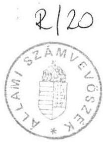
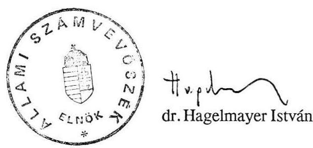
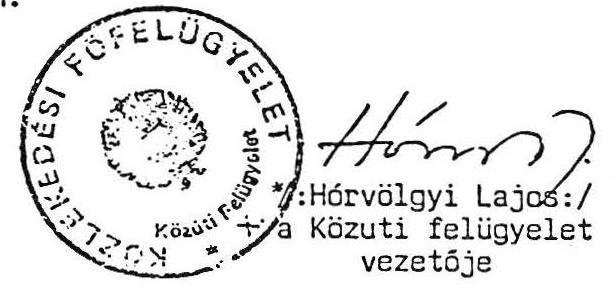
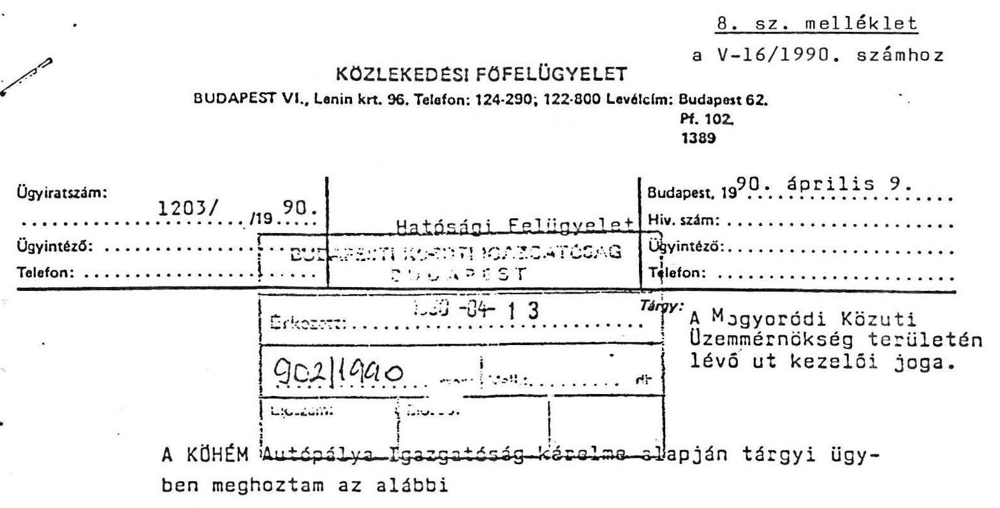

# Allami Számbeböszik 

## Jelentés

a Hungaroring épitéséhez, fenntartásához és iizemeitetéséhez felhasznált költségvetési források ellenőrzéséról

1990 .
20.

---

Az ellenőrzést végezték:
dr. Benkő János számvevõ
dr. Burján Margit számvevõ
Csóry Györgyné számvevõ, tanácsos

Az ellenőrzést vezette és összefoglalta:

Rádfai Tibor fôtanácsos

---

# JELENTÉS 

a Hungaroring építéséhez, fenntartásához és üzemeltetéséhez felhasznált
költségvetési források ellenőrzéséről

Az 1983. évben indult hazai és nemzetközi előkészületek után a Kormány 1985. elején döntött a Forma-1 versenyek megrendezéséről. A döntésben politikai és gazdasági szempontok egyaránt szerepet játszottak. Az építés és a versenyek lebonyolításának koordinálásával a közlekedési minisztert bízták meg és a versenypálya létrehozására, a versenyek megrendezésére a Kormány garanciát vállalt. A vállalkozás lebonyolítására először 5, majd 12 tagúra bővült gazdasági társaság (továbbiakban: GT) alakult, zömében a tárca felügyelete alá tartozó vállalatokból (1. sz. melléklet). A GT 1989. december 28 - 1990. december 31. közötti időszakra közkereseti társasággá alakult át.

A beruházás - a minisztérium vezetésének operatív irányításával — 1986. augusztusára rekordidő alatt készült el. A létesítményt mintegy 4.200 méter hosszú versenypálya, a közúthálózattal összekötő utak, a központi épület, a lelátók, a hírközlési és kommunális objektumok együttese alkotja (továbbiakban: Hungaroring).

Az ellenőrzés célja a Hungaroring építéséhez, fenntartásához és üzemeltetéséhez az állami költségvetés és az elkülönített állami pénzalapok terhére elszámolt ráfordítások törvényességének, maradéktalan kimutatásának, célszerűségének és a vagyonmegőrzés feltételeinek ellenőrzése volt.

---

# I. 

## Megállapítások

## 1. A Hungaroring építésére fordított állami források

A Hungaroringre 1986. év végéig — az aktíválásig — 419,7 millió forint költségvetési forrást használtak fel, amely 1989. év végére 747,8 millióra növekedett. E költségvetési ráfordítások 1986. év végére a tervezett csaknem két és félszeresét, 1989. végére pedig már négyszeresét érték el. A szabálytalanul felhasznált központi pénzeszközök aránya 1986-ig $60 \%$ volt; 1989-ig megközelítette a $70 \%$-ot.

Az 1989.év végéig 620,8 millió forintból beruházást, 84,5 millió forintból fenntartási költségeket, 42,5 millió forintból veszteséget finanszírozott azállam. A költségvetésből származó beruházási összegből a versenypálya ( 428,5 millió forint) mellett 79,6 millió forintba került a hírközlési létesítmény, 95,3 millió forintba a bekötő utakés 17,4 millió forintba a Hungaroring fenntartására szolgáló gépek (4.sz. melléklet).

A Hungaroringre 1989. év végéig a GT-t is beleszámítva 962,0 millió forintot fordítottak. Ez az összeg 1990-ben a költségvetési felhasználások további emelkedése miatt — ez utóbbiak 800 millió forintos részesedésével — meghaladja az 1 milliárd forintot.

## a) Az aktiválásig felhasznált források

A Pénzügyminisztériumban 1985. augusztusában rögzített miniszterhelyettesi megállapodás szerint a Hungaroringet vállalati beruházásként kellett felépíteni és a 200 millió forintos teljes beruházási költséghez az állam 170 millió forinttal ( 85 millió forintos költségvetési támogatással, és 85 millió forintos visszatérítendő állami alapjuttatással) járul hozzá.

További állami forrásként a Belkereskedelmi Minisztérium a GT részére 15 millió forintot biztosított az építéshez. Mivel az ÁISH az ígért 10 millió forint alapjuttatást nem adta át, induláskor a beruházáshoz 185 millió forint költségvetési és központi alapból származó forrást terveztek felhasználni.

Az érdemi munka megkezdése után néhány hónappal —a GT 1985. decemberi ülésén — azonban már megállapították, hogy az építés költségeinek összege várhatóan 340

---

millió forint lesz. Az 1986. augusztusi átadásig ezzel a 340 millió forintos beruházási ráfordítással számoltak.

Az erőteljes költségnövekedésről az 1986. február1 KM-BkM 651.600/1986. GB előterjesztés nem tett említést, $20 \%$-os költségnövekedést helyeztek kilátásba. (Az előterjesztés jelezte a távközlési létesítmények további 40 milliós beruházási szükségletét is, amelyeta Magyar Posta finanszíroz.)

Az első Forma-1 futam előtti napokban jelentette be a kivitelező Aszfaltútépítő Vállalat, hogy a beruházás - a hírközlési létesítmények nélkül — közel 440 millió forintba fog kerülni.

A különböz et fedezésére a GTeggyel növelte tagjainak számát, továbbá 57 millió forint hitelt vett fel és a Minisztérium utasítására az Országos Tervhivataltól a MÁV megsegítésére tartalékkeretből 50 milliós támogatást kért, amelyet azután szabálytalanul a Hungaroring építési költségeinek fedezésére fordítottak. (2.sz. melléklet)

Az újabb központi források és ezek szabálytalan felhasználási lehetőségét a Minisztérium vezetésének az az utasítása teremtette meg, amely a Hungaroringet állami tulajdonba vetette és kezelőjeként 1986. augusztus 1-től a Budapesti Közúti Igazgatóságot jelölte ki. Ez tette lehetővé, hogy az elszámolt és nyilvánosságra hozott építési költségeken felül 1986-ban további 138,1 millió forintot fordítsanak a Hungaroring építésiés fenntartási munkálataira, így bekötő utakra, vízelvezetésre, gépbeszerzésre, a beruházás további fedezetlen költségeinek finanszírozására (4.sz. melléklet).

E nagymértékủ szabálytalan forrásfelhasználás mellett sem nyílt mód a lelátók beruházási költségeinek pénzügyi rendezésére, ezért az ehhez szükséges 34,3 millió forint 5 évre elosztva lizing dijként kerül kifizetésre.

A beruházási költségek mintegy $120 \%$-os növekedése végeredményben a tervezés 3,0, a közművesítés 34,1 , a magasépítés 68,5 , a mélyépítés 58,4 millió forintos többletéből adódott.

Ezen kívül 70 millió forint értékủ, a szerződésben nem rögzített munkát is végeztek (kamionparkoló, pályaviztelenítés stb.). A Hungaroring hírközlési kapcsolatait biztosító létesítmény már félkész állapotban is többc került a tervezettnél.

A források megoszlása alapjána Hungaroring központi beruházásként épülhetett volna meg, ez esetben azonban nem lett volna megkerülhető az előírásszerű előkészítés és

---

jóváhagyás (fejlesztési cél meghatározása, beruházási javaslat kidolgozása stb.), amelyekre azonban - a kivitelezésre rendelkezésre álló rendkívüli rövid, 9 hónapos idő miatt — nem volt lehetőség. A beruházás megfelelő előkészítésének hiánya nagy többletköltségekhez, a költségvetési források szabálytalan felhasználásához vezetett.

A beruházás 1985. szeptemberi indításakor még programszintű terv sem állt rendelkezésre, nem volt létesítményjegy zék, helykijelölési dokumentáció, közmüellátási terv.

Az Aszfaltútépitő Vállalat által 1985. decemberére elkészített létesítmény jegyzék csupán 13 tételben sorolta fel az építendő objektumokat, azok érdemi paramétereinek leírása nélkül. E munkával párhuzamosan folyt a tervezés, a kivitelezés, a hatósági egyeztetés és az engedélyeztetés.

A kivitelezés során jelentősen eltértek a felületesen elkészített tervektől, a faszerkezetes helyett vasbeton magasépítményeket készítettek, körvezetékes víz- és kettős vezetékes elektromos ellátást hoztak létre, számottevően növelték a lelátóhelyek számát.

A többletköltségek egyik fő oka az volt, hogy a beruházás ráfordításait rendkívül alacsonyra tervezték. A hozzávetőleges becslés a korábbi, lényegesen egyszerűbb megoldásokra - pl. jóval kevesebb földmunkát tartalmazó helykijelölésű (Népliget, Velencei-tó) létesítményekre alapozott. A tervezésben és kivitelezésben egyre fokozottabban érvényesült az Aszfaltútépítő Vállalat monopolhelyzete. A tervezésnél a nemzetközi tapasztalatokkal is rendelkező UVATERV háttérbe szorult.

A Minisztérium vezetése a hangsúlyt a többletforrások előteremtésére helyezte, nem tartotta kézben a felhasználások és az azok mögötti teljesítmények ellenőrzését. A külső ellenőrzések tapasztalataira sem fordítottak kellő figyelmet.

Az Állami Fejlesztési Bank (ÁFB) — 1988-tól ÁFI — 1985. októberi vizsgálata során már figyelmeztetett a beruházás előkészítetlenségére, a várhatóan jelentős költségtöbbletekre, a pénzforrások bizonytalanságára. A GT részére 1987. elején a beruházásról készült ellenőrzés a ráfordítások indokoltságával és a kivitelezői számlákkal kapcsolatban komoly kifogásokat támasztott.

# b) Az aktiválás után felhasznált források 

Az ÁFB 1986. decemberében a beruházást lezártnak nyilvánította, a létesítmény azonban több tekintetben nem volt befejezve. Megoldatlan maradt a csapadékvíz-elvezetés, a füvesítés, hiányoztak egyes aszfaltozási munkák. A nemzetközi szakszövetségek kívánalmai is továbbifejlesztéseket tettek szükségessé. Ezekre a ráfordításokra-a lezárt

---

beruházás és a GT veszteséges gazdálkodása miatt — a Minisztérium vezetése újabb, a közúti költségvetési előirányzatok szabálytalan felhasználásával járó intézkedésekkel teremtett fedezetet.

Ennek szervezeti kereteit a Hungaroring üzemmérnökséggé (14 fő) alakításával, valamint utólagosan, 1988-ban közúttá nyilvánításával hozta létre a Minisztérium (3. sz. melléklet). A kezelői jog korábban történt átadására, valamint a közúttá nyilvánításra a miniszter tájékoztatása mellett miniszterhelyettesi döntés alapján került sor.

A Hungaroringenévenként végzett munkákat — eseti és részengedélyekkel, leiratokkal — operatív módon a Minisztérium Közúti Főosztálya finanszírozta.

Előfordult pl., hogy a fagykárok korrigálására szolgálóforrások elosztásáról készült miniszteri előterjesztésben is szerepeltek a Hungaroring épitési költségei.

Az 1987-1989. években a közúti költségvetésből szabálytalanul 255,8 millió forintot fordítottak a Hungaroring félbemaradt beruházási munkáinak, továbbá fenntartásának finanszírozására. (6. sz. melléklet) Ez idő alatt a hírközlési létesítményre további 35,0 millió forintot költöttek. Így az csaknem duplájába került a tervezettnek.

Így került sor — többek között — a beruházás további kifizetetlen számláinak rendezésére, a főépületi terasz-, híd- és többszöri burkolatépítésre, kanyarátvágásra, korlátmegemelésre. A közúti költségvetés terhére számoltákel részben a pálya amortizációját és a tribünök lízingdiját is.

A költségvetési forrásokat nemcsak a beruházások és fenntartás finanszírozására, hanem a Hungaroringet üzemeltető GT veszteségeinek ellensúlyozására is felhasználták.

AzIdegenforgalmi Alapból a fenti célokra 1987.és 1989.között 42,5 millió forintot fordítottak. 1990-re már 40 millió forint támogatást helyeztek kilátásba.

# 2. A Hungaroring költségvetésből és központi alapokból származó vagyona nyilvántartásának és kezelésének feltételei, a forgalmi érték alakulása 

A Hungaroring költségvetési forrásokból származó vagyonának nyilvántartása nem megfelelő, megbízható adatok csak a költségráfordításokról állnak rendelkezésre. A vagyonnyilvántartás már az 1986-os aktiváláskor (5. sz. melléklet) sem volt biztosított, ugyanis csak a "hivatalos" állami ráfordításokat nyilvánították beruházásnak. A közúti költségvetésből származó - szabálytalan — forrásfelhasználásból keletkezett vagyont az

---

Autópálya Igazgatóság ma sem tartja értéken nyilván, azt nem minősítettékállóeszköznek és csupán mint útfenntartási költséget regisztrálták.

Ennek oka kettős: az útfenntartási költségekből létrejött vagyontárgyakat, (mivel nem beruházások) a számvitel szabályai szerint nem lehet aktiválni, továbbá, hogy az utakat és úttartozékokat - az előírások szerint - nem is kell aktiválni, csak az útkataszterben, müszaki paraméterek szerint érték nélkül nyilvántartani.

Miután a Hungaroringet — benne a szabályos költségvetési támogatás felhasználásából származó vagyontárgyakat — is közúttá nyilvánították, 1989. január 1. óta azok is csak az útkataszterben, érték nélkül szerepelnek (241,2 millió forint). Ebből a költségvetési részesedés 132 millió forintra tehető. Egyedül a hírközlési létesítmény aktiválása és nyilvántartása rendezett.

A létesítményt kezelő Budapesti Közúti Igazgatóságtól, majd az Autópálya Igazgatóságtól, a költségvetésből származó vagyon nyilvántartásának és kezelésének feltételeit a Minisztérium 1989-ig egyáltalán nem kérte számon. A két igazgatóság csak a Minisztérium által kezdeményezett, 1989. és 1990. évi vizsgálatok során összesítette a Hungaroringre felhasznált költségvetési forrásokat és határozta meg azokból az építési, valamint a fenntartási ráfordításokat. Ekkor mutatták ki, hogy utólagos leltározással, milyen értékű vagyontárgyak lennének aktíválhatók. Ennek nagyságrendje 165,8 millió forint (6. sz. melléklet). A minisztériumi vizsgálat óta érdemi előrelépés nem történt, így az állami vagyon nyilvántartásának és megőrzésének feltételei nem biztosítottak.
1989. végén a 747,8 millió forintos költségvetési ráfordításnak csak töredéke, $24 \%$-a volt állóeszköz-értéken nyilvántartva. A felhasználás további $18 \%$-a - korábban már aktivált állóeszköz - útkataszterben érték nélkül szerepel. A költségvetési ráfordítások $17 \%$-a veszteségtámogatás és fenntartási költség volt. A fennmaradó $41 \%$ ( 307,5 millió forint) zöme azonban valamilyen vagyontárgyban testesül meg, ezért annak utólagos kimutatása elengedhetetlenül szükséges. (7.sz. melléklet)

Az ellenőrzés szerint aktiváláskor a ráfordítások alapján 67, 1989. végén pedig $78 \%$-os volt a költségvetés részesedése a Hungaroringen, a hírközlési létesítményt, a veszteségtámogatásokat és a fenntartási költségeket is beleszámítva. Ez utóbbi három tétel nélkül a költségvetési források részesedése 1986. végén $63 \%, 1989$. végén pedig $72 \%$ volt.

A Minisztérium — a létesítménybe fektetett tényleges források alapján — 1990-ben kezdeményezte a tulajdonviszonyok rendezését. Eszerint az eddig visszafizetett költségvetési támogatást a társaság vagyonkéntszámolták volna el, a hátralékot pedig az ÁFI vállalta volna át. A GT tagjainak 3-3 \%-os részesedése és $9 \%$-os ÁFI tulajdon mellett az állami vagyon ( $55 \%$ ) kezelő-

---

jének azAutópálya Igazgatóságot tervezték kijelölni. Két tagvállalat (a GYESEV és a MALÉV) tulajdon és kezelői jogáról lemondott azállam javára.

Ezzel a Hungaroring $70 \%$-ban állami tulajdon (állami kezelésben), további $18 \%$-ban állami tulajdon (vállalati kezelésben), $12 \%$-ban egyébgazdálkodó szervezetek tulajdonát képezhetné. A tulajdonviszonyok rendezésére irányuló szerződést az Autóklub és az ÁFI nem írta alá, így az jelenleg függóben van.

A Hungaroringbe fektetett költségvetési források arányának megállapítását a létesítés óta folyó tulajdonjogi, vagyonrészesedési viták és szabálytalanságok sorozata is hátráltatja.

- A föld — amelyen a létesítmény felépült — a mai napig sincs telekkönyvileg kivezetve a Rákosvölgye MgTSz tulajdonából, jóllehet annak árát ( 13,2 millió forintot) a GT kifizette. A föld vételére irányuló két szerződés egyaránt érvénytelen, mivel a GT-nek abban a formában - egyszemélyi aláírással — nem volt vagyonszerzési joga.
- A GT-be alakuláskor a Cooptourist a saját vagyonrészét — mint szövetkezeti tulajdont — szabálytalanul, egyszemélyi döntéssel vitte be.
- 1986. augusztus 1-én a GT összes vagyonának térítésmentesen (könyvjóváírással történő állami tulajdonba adása, a Cooptourist szövetkezeti tulajdonrésze miatt, jogszerűtlen volt. Az akkori törvények szerint ugyanis az állam javára a szövetkezeti tulajdonról nem lehetett lemondani.
- Nem volt törvényes a létesítmény 1988. december 31-től közúttá történő nyilvánítása. A közúti törvény indoklása szerint "A közút gyalogosok és járművek közlekedésére szolgáló közterület, amelyet közlekedési célból — azaz rendeltetésszerűen — bárki igénybe vehet". Ez a feltétel pedig akkor és azóta sem teljesült.
- A Hungaroring építéséhez eleve úgy fogtak hozzá a társult vállalatok, hogy az elkészülte után állami tulajdonba kerül. A GT tagjai ezt előre tudták és 1986. augusztusában bele is egyeztek az átadásba, a tulajdon kérdése azóta is állandó vitákat és konfliktusokat okoz. A GT az átadási okmányban szereplő kitétel - "A fentiek szerint kimutatott értéket az átadó könyveiben állóeszközállomány csökkenéseként számolja el" — ellenére mérlegében az átadott vagyonértéket továbbra is nyilvántartja.

A létesítmény kezelőjének időről-időre történő változása (a GT, a Budapesti Közúti Igazgatóság, majd az Autópálya Igazgatóság) nehezíti a vagyon nyilvántartást, megőrzést. Új fordulatot jelentett a Kormány gazdasági kabinetjének döntése, amely a Hungaroringet 1989. végén sportlétesítménnyé minősítette, azonban új kezelőt nem jelölt ki. Azóta a Hungaroringet hivatalosan is törölték a közutak sorából (8. sz. melléklet).

---

A Hungaroring forgalmi értékének meghatározásánál a jövedelemtermelő képességből kiindulni nem lehet, mert a társaság veszteségesen gazdálkodik, a nemzetgazdasági szinten jelentkező idegenforgalmi bevételeket pedig legfeljebb csak becsülni lehet.

A létesítmény újraelőállítási költségeit a Minisztérium a nettó érték évi $15 \%$-os indexálásával határozta meg. A kivitelezést vezető szakemberek szerint azonban a mai építési költség ennél jóval magasabb lenne.

A föld értéke a Hungaroring közelében az elmúlt években 4-5-szörösére emelkedett, így a földterület 55-70 millió forintot érhet. A hírköztési létesítmény jelenleg a postai szakemberek becslése szerint 140-150 millió forintba kerülne. A versenypálya és a hozzá tartozó épületek az eddigi ráfordítások kétszereséért, azaz mintegy 1,5 milliárd forintért lennének felépíthetők. Összesen tehát a Hungaroring új bekerülési költsége elérheti az 1,7-1,8 milliárd forintot.

# 3. A Hungaroring üzemeltetésének tapasztalatai 

## a) A Forma-1 GT gazdálkodása

A vállalkozás eddigi múködése nem eredményezte a létrehozásra és fenntartásra befektetett mintegy 34 milliárd forint költségvetési forrás megtérülését. A müködtetés inkább további ráfordításokat tett szükségessé. A GT — az általánosnál kedvezőbb szabályozási feltételek, valamint a fenntartás költségeinek a közúti költségvetés által történő szabálytalan átvállalása ellenére - veszteségesen gazdálkodik. Az Idegenforgalmi Alapból kapott 34,5 millió forint közvetlen támogatás mellett az elmúlt négy évben a GT vesztesége elérte a 129 millió forintot ( 9 . sz. melléklet), aminek következtében nem tud eleget tenni a beruházási támogatás utáni mozgójáradék fizetési kötelezettségének sem.

A veszteséges gazdálkodás okai sokrétűek. A jogi személyiség nélküli GT, valamint a létrejött tulajdonosi konstrukció korlátozza a vállalkozást, amelynek múködése magán viseli a Minisztérium vezetése által a tagvállalatokra kényszerített feladatokból fakadó érdektelenséget is. A GT-ben résztvevők nem a vállalkozás nyereségessé tételét, hanem saját tevékenységük értékesítését tartják fơ célnak, tehát a parciális érdekek érvényesülnek.

A vállalkozás gazdálkodása szabályozatlan. Néhány ember kezdeményezőkészségére, lelkiismeretességére van bízva a több milliós haszon lehetőségét magában hordozó müködtetés. A jegyzőkönyvek tanusága szerint a GTülésein résztvevőkmunká ja nem mentes az amatőrségtól, a hozzá nem értésből eredő bizonytalanságtól, az egymás előnyeinek hangoztatásától.

---

A Hungaroring forgalmi értékének meghatározásánál a jövedelemtermelő képességből kiindulni nem lehet, mert a társaság veszteségesen gazdálkodik, a nemzetgazdasági szinten jelentkező idegenforgalmi bevételeket pedig legfeljebb csak becsülni lehet.

A létesítmény újraelőállítási költségeit a Minisztérium a nettó érték évi $15 \%$-os indexálásával határozta meg. A kivitelezést vezető szakemberek szerint azonban a mai építési költség ennél jóval magasabb lenne.

A föld értéke a Hungaroring közelében az elmúlt években 4-5-szörösére emelkedett, így a földterület 55-70 millió forintot érhet. A hírközlési létesítmény jelenleg a postai szakemberek becslése szerint 140-150 millió forintba kerülne. A versenypálya és a hozzá tartozó épületek az eddigi ráfordítások kétszereséért, azaz mintegy 1,5 milliárd forintért lennének felépíthetők. Összesen tehát a Hungaroring új bekerülési költsége elérheti az 1,7-1,8 milliárd forintot.

# 3. A Hungaroring üzemeltetésének tapasztalatai 

## a) A Forma-1 GT gazdálkodása

A vállalkozás eddigi múködése nem eredményezte a létrehozásra és fenntartásra befektetett mintegy 34 milliárd forint költségvetési forrás megtérülését. A müködtetés inkább további ráfordításokat tett szükségessé. A GT — az általánosnál kedvezőbb szabályozási feltételek, valamint a fenntartás költségeinek a közúti költségvetés által történő szabálytalan átvállalása ellenére - veszteségesen gazdálkodik. Az Idegenforgalmi Alapból kapott 34,5 millió forint közvetlen támogatás mellett az elmúlt négy évben a GT vesztesége elérte a 129 millió forintot ( 9 . sz. melléklet), aminek következtében nem tud eleget tenni a beruházási támogatás utáni mozgójáradék fizetési kötelezettségének sem.

A veszteséges gazdálkodás okai sokrétűek. A jogi személyiség nélküli GT, valamint a létrejött tulajdonosi konstrukció korlátozza a vállalkozást, amelynek múködése magán viseli a Minisztérium vezetése által a tagvállalatokra kényszerített feladatokból fakadó érdektelenséget is. A GT-ben résztvevők nem a vállalkozás nyereségessé tételét, hanem saját tevékenységük értékesítését tartják fơ célnak, tehát a parciális érdekek érvényesülnek.

A vállalkozás gazdálkodása szabályozatlan. Néhány ember kezdeményezőkészségére, lelkiismeretességére van bízva a több milliós haszon lehetőségét magában hordozó müködtetés. A jegyzőkönyvek tanusága szerint a GTülésein résztvevők munkájá nem mentes az amatőrségtól, a hozzá nem értésből eredő bizonytalanságtól, az egymás előnyeinek hangoztatásától.

---

A Hungaroring beruházási költségeinagyobbak lettek a tervezettnél, a már veszteséges GT 1986-ban további beruházási hitel felvételére kényszerült, s ezek pénzügyi terhei a GT állandó költségeit számottevően megnövelték.

A versenyek rendezési költségei is túl magasak, így a bevételek (sőt a Hungaroring összes bevételei) sem érik el az állandó költségek szintjét. A FOCA-val (Autókonstruktőrök Nemzetközi Szövetségével) kötött — a Forma-1 verseny rendezési költségeire vonatkozó - szerződést a GT számára kedvezőtlenül módosították. Ez nemcsak a GT-nek, de a nemzetgazdaságnak is veszteséget okoz. (1989-ben a veszteség 16,5 millió forint volt.)

Az eredeti változat szerint a GT-nek a Forma-1 versenyért 600 ezer \$-\$ (majd ennek évente 10 \%-kal növelt értékét), valamint a konvertibilis elszámolású országokban eladott maximum első tízezer tribünjegy bevételének a felét kellett volna fizetni. Ez a változat a FOCA-t érdekelté tette volna a konvertibilis jegyforgalom növelésében. Ehelyett a magyar fél a maximum tízezer jegy felének ellenértékét 300 ezer $\$$-ral és annak évente $10 \%$-kal történő emelésével megváltotta. E megoldás legalább 600 ezer \$jegybevétel eseténlett volna kifizetődő. (A hiány már első évben 172 ezer $\$$ volt, ami azóta tovább növekszik.)

A GT nem biztosította magát a várható forintleértékelés kedvezőtlen hatásai ellen sem, amiből pl. 1989-ben 17 millió forint veszteség származott. A GT költséggazdálkodása is laza, nem tartják be az utalványozási hatásköröket. A tagvállalatok évente 10-12 millió forint értékű tiszteletjegyet használnak fel. E jegyek egy része teljes áron ugyan nem kelne el, de értékesítésükkel mégis 5-6 millió forint bevételt el lehetne érni. A jegyek nagy száma miatt nem fogadható el az az érvelés, hogy a tiszteletjegyekkel számos munka olcsón és gyorsan "elvégeztethető".

Az árbevételek 1987. óta emelkednek, a költségekhez képest azonban alacsonyak és ezeknek egyre kisebb hányadára nyújtanak fedezetet. Az árbevételek szerkezete is mind kedvezőtlenebbül alakul. A növekedés kisebb részben az eladott jegyek számának bővüléséből, nagyobb részt az árak emeléséből és a forintleértékelés hatásából származott. A jegyáremelésnek is korlátai vannak (a belföldön értékesített főtribün-jegy vasárnapra 4.400 forint és a 3 napos állóhely-bérlet is 900 forintba kerül).

A konvertibilis bevételek csökkenésének alapvető oka a jegyárak mérsékeltebb emelkedése, valamint a konvertibilis értékesítés kényszerének 1987-től kezdődő megszủnése. A hazai jegyek például az NSZK-beli hockenheimi jegyáraknak átlagosan csak $55 \%$-át érik el (főtribünjegy vasárnapra az NSZK-ban 230 DM, nálunk 126, a nem fedett tribün ára az NSZK-ban 185, nálunk 103 DM-be kerül).

---

Számottevően csökkenti a konvertibilis jegyforgalmat, hogy a Hungaroring környékén létesült fizetővendég hálózatban forintért vásárolt jegyekkel és bérletekkel várják a nyugati turistákat.

A nem konvertibilis országokból — köztük elsősorban Csehszlovákiából - pedig azért esett vissza a forgalom ( $20-40 \%$-kal), mert az államközi egyezmény nem biztosít többletkeretet az egyéni turisták részére.

A pálya és annak létesítményei (vendéglátás és hírközlés) a versenyeket leszámítva kihasználatlanok. A rendezvények folyamatossága nem biztosított. A GT nem tudta elérni, hogy a FOCA részére általa vásárolt 2.000 szállodai éjszaka után a szállodáktól a szokásos $10 \%$-ot megkapja. (Ez 1989-ben 1,7 millió forintot jelentett volna.)

A kereskedelmi és a reklámjogok értékesítésének lehetőségeit még csak kezdetlegesen hasznosítják (1989-ben mintegy 5,0 millió forint bevételcsökkenés történt). A GT reklámtermékek gyártásával és gyártatásával nem foglalkozik, ez bevételi lehetőségeit tovább korlátozza. Jóllehet az egyéb bevételek 1986-ról 1989-re csaknem a négyszeresükre növekedtek, számos kiaknázatlan lehetőség van ezen a területen.

A Hungaroringhez vezetőutakon szinte nincs reklámtevékenység, túl kedvezményesen értékesítik a kereskedelmi jogokat. A Hungaroringnek - mint másutt — nincs rendszeres, tőkeerős szponzora. A pályán kapott szükös reklámlehetőségeket sem tudták kellően kihasználni. A GT sem aHungaroringen, sem a városban állandóan nyitvatartóüzlettelnem rendelkezik, így elesik az a jándéktárgyak, video-felvételek, reklámcikkek értékesítéséből származó haszontól.

# b) A GT és a tagvállalatok gazdálkodásának összefüggései 

A tagvállalatok az elmúlt 4 év alatt a vállalkozásba bevittegyenként 16,6 millióforintos tőke mellett, további 11,5 millió forintnyi térítést is fizettek a veszteségek ellensúlyozására. Ennek ellenére azonban a GT tagok többségének jelentős - 4 év alatt 350-400 millió forintra tehető — bevétele is származott a Hungaroring hasznosításából. A jegyértékesítés jutalékából, gesztorálásból, a versenyekhez nyújtott szolgáltatásokból, a tiszteletjegyekből, a tagvállalatok átlagosan 30-34 millió forint bevételhez jutottak. Mindehhez közvetett előnyök is járultak.

A Hungarocamion pl. 3 éven keresztül, a pályán rendezett versennyel, európai reklámlehetőséghez jutott. A Hungaroringen folytatott kereskedelemből és reklámból, valamint a szolgáltatások értékesítéséből származó előnyöket a tagvállalatok verseny nélkül érték el, mivel más vállalkozók részvétele szóba sem kerülhetett.

---

A versenyek alatt miniszteri utasításra a vendéglátó szolgáltatásokat az Utasellátó Vállalat nyújtotta. Nem volt verseny a propaganda, protokoll és a sa jtó munkával kapcsolatos szolgáltatások területén sem, azokat mindannyiszor az Idegenforgalmi Propaganda Vállalat látta el.

A tagvállalatok egy részének a Hungaroring üzemeltetéséből valamilyen formában haszna származott és ellensúlyozni tudta a vállalkozás éves veszteségeiből ráeső befizetési kötelezettségeket. A vállalatok másik része rosszabb piaci pozíciói vagy passzivitása miatt ugyanakkor erre nem volt képes. Annak ellenére, hogy a GT vállalatai a Hungaroring hasznosításának kizárólagos jogát 10 évre megszerezték, 1990. év után változatlan feltételek mellett már nem vállalják a versenyek további megrendezését.
c) A Hungaroringgel összefüggö, de nem közvetlenül a pályán keletkező állami, vállalati bevételek és hasznok

A Hungaroringen rendezett hazaiversenyek haszna - a politikai és gazdasági reklámon túl — leginkább az idegenforgalomban csapódik le, hiszen a pályához év közben és a versenyen kapcsolódó kereskedelmi tevékenység a többi országokhoz képest szegényes.

A kapcsolódó idegenforgalmi bevételek nagyságának meghatározására irányuló kísérleteink csak részben jártak sikerrel. A szállodák, ha nem is kivétel nélkül, de elismerték a kapcsolódó többletbevételek tényét, ezek nagyságrendjének körülhatárolására azonban nem voltak hajlandók. Ezzel kapcsolatban tehát csak az idegenforgalmi szakemberek szakvéleményei és becslései állnak rendelkezésre (10.sz. melléklet). Ezek szerint a verseny három-öt napos időszaka alatt többszáz milliós bevételnövekmény keletkezik (amelynek nagy része konvertibilis forgalom) fóként a szállodaiparban.

---

# II. 

## Következtetések, javaslatok

A Hungaroring építéséhez, fenntartásához és üzemeltetéséhez a tervezett költségvetési források négyszeresét használták fel. E jelentős központi ráfordítások 60-70\%-át nem a rendeltetésnek megfelelő forrásokból, a törvényes előírások megkerülésével finanszírozták.

A beruházás során és azt követően felmerült problémákat a Minisztérium késve indított ellenőrzései sem tudták megoldani. Az ellenőrzések pártatlansága sem volt mindig biztosított. A vizsgálatok után a szabálytalanságokat elkövetőkkel szemben nem kezdeményeztek felelősségrevonást.

A felhasznált költségvetési források elszámolási, nyilvántartási rendje sem megfelelő, elszámolások hiányában megnyugtatóan nem állapítható meg, hogy a kifizetések beruházási vagy fenntartási célt szolgáltak-e, illetve azokat milyen vagyontárgyakra fordították.

A vagyon többsége a létrejött vagyontárgyak (utak és úttartozékok) jellege, szabálytalanságok és munkavégzési hiányosságok folytán, értéken nincs nyilvántartva. Emiatt nemcsak a vagyonmegőrzés feltételei kritikusak, de a részvénytársasággá való átalakulás előfeltételei is bizonytalanok.

A Hungaroringhez kapcsolódó 34 milliárdos költségvetési ráfordítás megtérülése közvetlenül nem biztosított, a közvetett hasznok pedig megbízhatóan nem számszerűsíthetők. Nem vitatva a rendezvény nemzetgazdasági szinten jelentkező eredményeit, alapvető követelménynek tartjuk, hogy a Hungaroring - és ezen keresztül az abban megtestesülő állami vagyon mikroszinten is jövedelmező legyen. Ezt tükrözi a Minisztertanács — ellenőrzésünk befejezését követően hozott — határozata, amely szerint

- a versenyek megrendezését, a létesítmény hasznosítását fontosnak tartja és támogatja a részvénytársasággá való átalakulást;
- tudomásul veszi, hogy - a részvénytársasággá való átalakulás esetleges elhúzódása miatt — "a magas állami tulajdoni hányadra tekintettel", a várhatóan többségi külföldi érdekeltséggel létrejövő hasznosító szervezettel a közlekedési és hírközlési miniszter bérleti szerződést köt és évi 20 millió forint erejéig hozzájárul a pályafenntartási költségekhez.

---

Az ellenőrzés tapasztalataira, valamint a Minisztertanács említett határozatára tekintettel szükségesnek tartjuk, hogy a Minisztérium

- haladéktalanul intézkedjen a Hungaroringen —általában és ezen belül — költségvetési forrásokból létrejött vagyon teljes körű, tételes leltározással történő felméréséről, valóságos értékének és összetételének a megállapításáról;
- biztosítsa ennek keretében a fellelt vagyontárgyak utólagos aktiválását, az út és úttartozékok értékének kimutatását is, rendezze az esetleges vitás, nyitott vagyoni kérdéseket;
- gondoskodjon a vagyon pontos nyilvántartásáról, felelős kezeléséről, megőrzéséről;
- tegyen lépéseket - a jelentős költségvetési források szabálytalan felhasználása miatt — a felelősség megállapítására.

Budapest, 1990. szeptember

---

1. sz. melléklet
a V-16/1990. számhoz

A Forma-1 Gazdasági Társaság tagvállalatai

Magyar Autóklub
MÁV
GYESEV
Utasellátó Vállalat
Aszfaltútépító Vállalat
IBUSZ
COOPTOURIST
Idegenforgalmi Propaganda Vállalat
MALÉV
Hungarocamion
VOLÁN TEFU Vállalat
Állami Biztosító

---

# 2. sz. melléklet

a V-16/1990. számhoz

## Faluvégi Lajos elvtárs,

az Országos Tervhivatal elnöke

## Budapest

## Kedves Faluvégi Elvtárs!

Kérem, hogy a Magyar Államvasutak megsegítésére folyó évben többlet költségvetési juttatásként vállalati döntési körbe tartozó beruházásaihoz, a szakszolgálati fejlesztések belsőli gépbeszerzéséhez népgazdasági költségvetési tartalékkeretből 50 millió forintot engedélyezni szíveskedjék.

Budapóst, 1956. október hó

/Párdányi/

MF. B.

Elvtársi üdvözlettel:

Elvtársi üdvözlettel:

/ Dr. Várszegi/

/ Urbán Lajos /

---

KÖZLEKEDÉSI FÔFELÜGYELET BUDAPEST VI. LENIN KRT. 96. Telefon: 124-290; 122-800 Levélcim: Budapest 62. Postafiók: 102 1389

Közuti felügyelet 986/1988.

Előadó: Kiss Zoltán 226-061 $4 / 2-717$

Tárgy: Mogyoródi üzemmérnökséghez vezetô ut kezelôi joga
$\times 3$ iu'll Hiv.sz.: 47/MA/1988.
L: Reinuach of
Laicros of us
Brosn of
Határozat

A Budapesti Közuti Igazgatóság a hivatkozott számu felterjesztésében a Mogyoródi üzemmérnökség belsõ utjának, valamint az üzemmérnökségheo vozototutnak a felvételét kórte az országos közuthálózatba.
A reitúresztest megvizsgatva, valamint az ercekeitekkel történt egyeztetéseket követôen az alábbiak szerint döntöttem.
1./ 1988. január 1-i hatállyal felveszem az országos közuthálózatba - 301 j. utként - és egyuttal a Budapesti Közuti Igazgatóság kezuissese acom az M3 autópálya 18 km sz.-ben lévô pihenôhely és a Mogyoródi üzemmérnökség kapuja közötti 1290 m hosszu utat.
Az utszakasz a mogyoródi 0246 és $0281 / 3$ hrsz-u utterületen, valamint a mogyoródi $0242,0265 / 1,0278 / 1$ és $0283 / 4$ hrsz-u ercôterületbôl kivonandó területrészeken fekszik.
2./ Az 1. pontban leírt uthoz folytatólagosan csatlakozó, a Budapesti Közuti Igazgatóság Mogyoródi üzemmérnökség területén lévô, mintegy 4100 m hosszu utat 1988. január 1-i hatállyal az országos közuthálózat részévé nyilvánítom és kezelôjévé a Budapesti Közuti Igazgatóságot jelölöm ki. Az' ut területét az Üzemmérnökség zárt területénbelül érdekelt tulajdonosok - "Rákosvölgye" MGTSZ., Cooptourist, Bp-i KIG - közötti megállapocás alapján kell rögziteni a Fölchivatalhoz benyujtandó megosztási vázrajzon.
3./ Kötelezem a Budapesti Közuti Igazgatóságot, hogy
3.1. Az ingatlannyilvántartásban bekövetkezõ változások átvezetése érdekében a szükséges munkarészeket készittesse el és azok birtokában járjon el az illetékes göcöllõi Fölchivatalnól.
3.2. A határozat jogerôre emelkedését követô 90 napon belül tegyen eleget a 18/1984. /XII.13./ EVM sz. rendelet 3.§-ban olôirt adatszolgáltatási kötelezettségének a VÁTI Külterületi Nyomvonalas Létesitmények Nyilyantartasa fete.

---

4./ Az utak kezelői jogváltozására azok jelenlegi állapotában, térítésmentesen kerül sor.

E határozat ellen, annak kézhezvételétől számított 15 napon belül lehet fellebbezni. Az illetékkel ellátott fellebbezést a közlekedési miniszternek cimezve, de a Közlekedési Fôfelügyelethez kell benyujtani.

# Indokolás 

A Budapesti KIG a 47/MA/1988 számul levelében kérte a mogyoródi üzemmérnökséghez vezetô ut, valamint annak belsõ utjának felvételét az országos közuthálózatba.
A felterjesztést megvizsgáltam, az eljáráshoz szükséges, de hiányzó adatokat pótlólag - rövid uton - bekértem, az érdekeltekkel egyeztetô megbeszéléseket folytattam.
Ezek alapján megállapítottam, hogy a Bp-i KIG Mogyoródi üzemmérnökséghez vezetô utnak, valamint az üzemmérnökség területén lévô utnak - funkciójukból eredôen - helye van az országos közuthálózatban, igy azok felvételéről intézkedtem.
Megállapitottam továbbá azt is, hogy a kezelôi jog földhivatali rendezéséhez szükséges adatck, térképek különbözô okok miatt teljes egészében nem állnak rendelkezésre. Ezért ezek elkészíttetése, valamint a fölchivatali átvezetések megtétele érdekében köteleztem - határidô megjelölése nélkül - a Budapesti KIG-et arra, hogy a gödöllői Földhivatal felé eljárjon.

Hatírozatomat a 34/1962. /IX.16./ Korm. sz. rendelet 9.5-ban biztosított jogkörömben eljárva, a 8/1985. /IX.5./ KM sz. rendeletben foglaltakra figyelemmel hoztam.

Budapest, 1988. március 30.

A határozatot kapjâk:
1./ Budapesti Közuti Igazgatóság - Bp.
2./ Földhivatal - Gödöllõ azzal, hogy a Budapesti Közuti Igazgatóság megkeresését követôen az ingatlannyilvántartásban szükséges átvezetéseket megtenni szíveskedjenek.
Továbbá szíves tájékoztatásul:
3./ KM. Közuti fôosztály - Bp.
4./ "Rákosvölgye" MGTSZ. - Mogyoród
5./ Községi Tanács V.B. - Mogyoród

---

# 4. sz. melléklet a V-16/1990. számhoz 

A lkngaroring épitásáre és fenntartására forditott források 1985-1939. övekben

|  | 1985. | 1986. | 1937. | 1988. | 1989. | össze-   sen | berak. | E 5 b 61   fennt. | tämog. | $\begin{gathered} \text { GT folyó- } \\ \text { számla } \end{gathered}$ |
| :--: | :--: | :--: | :--: | :--: | :--: | :--: | :--: | :--: | :--: | :--: |
| Költségyetési juttatás | 85,0 | - | - | - | - | 85,0 | 85,0 | - | - | - |
| Állami alapjuttatás | 15 | 70,0 | - | - | - | 85,0 | 85,0 | - | - | - |
| Idegenforgalai Alap juttatás | - | $17,0^{(1)}$ | $2,0^{(4)}$ | $10,0^{(4)}$ | $30,5^{(4)}$ | 59,5 | 17,0 | - | 42,5 | - |
| Költsgyetési juttatás   (HAV-on keresztül) | - | $50,0^{(4)}$ | - | - | - | 50,0 | 50,0 | - | - | - |
| Közuti Költségvetés:   - up. Küzúti Ig. és   Autójálya Ig. | - | $55,4^{(4)}{ }_{105,9}^{(4)}{ }_{103,9}^{(4)}$ | $45,3^{(4)}{ }_{310,5}$ |  |  | 226,0 | 84,5 | - | - |  |
| - fenntartási gépek   (Up.Küzúti Ig.) | - | $17,4^{(4)}$ | - | - | - | 17,4 | 17,4 | - | - | - |
| - bekötőüt épités   (Up.Küzúti Ig.) | - | $65,3^{(4)}$ | $0,7^{(4)}$ | - | - | 66,0 | 66,0 | - | - | - |
| Hagyar Posta (2) | - | 44,6 | $29,3^{(4)}$ | - | - | 74,4 | 74,4 | - | - | - |
| Összes költségvetési   forrás: | 100,0 | 319,7 | 138,4 | 113,9 | 75,8 | 747,8 | 620,3 | 84,5 | 42,5 | - |
| Ebből szabálytalan | - | 138,1 | 138,4 | 113,9 | 75,8 | 516,2 |  |  |  |  |
| Gazdasági Társaság:   - alapítói hozzájár. | 5,0 | 194,0 | - | - | - | 199,0 | 193,5 | - | - | 5,5 |
| - lelátók lizingdíja (3) | - | 11,3 | - | - | 3,9 | 15,2 | 15,2 | - | - | - |
| Összes GT forrás: | 5,0 | 205,3 | - | - | 3,9 | 214,2 | 208,7 | - | - | 5,5 |
| Mindösszesen: | 105,0 | 525,0 | 138,4 | 113,9 | 79,7 | 962.0 | 329,5 | 84,5 | 42,5 | 5,5 |

## Hengimyzés:

(1) = Ebből 2 millió forint tájékoztató táblákra.
(2) = További 5,2 millió forintot a költségvetési juttatásból fedeztek.
(3) = A többi éveikhen a Budapesti Küzúti Igazgatóság ráfordításiban.
(4) = Szabálytalan felhasználás.

---

A HUNGARORING-en 1986, december 31-ig aktivált vagyontárgyak
ezer Ft

| M E G N E V E Z E |  |  | Kapacitás |  | aktivált | nettó érték |
| :--: | :--: | :--: | :--: | :--: | :--: | :--: |
|  |  |  | egys. | mérték | érték | 1989.XII.31. |

| Autóversenypálya | m 2 | 48.500 | 165.852 | 152.584 |
| :--: | :--: | :--: | :--: | :--: |
| Központi épület |  | 3.242 | 54.263 | 52.463 |
| Beép. butor | db | 1 | 787 | 761 |
| Elsősegélynyujtó hely | m2 | 311 | 4.760 | 4.603 |
| TV közv. ép. | m2 | 321 | 9.881 | 9.555 |
| Porta ép. | m2 | 24 | 1.360 | 1.315 |
| WC ép. | blokk | 13 | 12.427 | 11.519 |
| Kerítés /beton/ | fm | 3.964 | 12.345 | 11.357 |
| -"- /drót/ |  | 1.250 | 2.250 | 2.070 |
| " /acélid./ |  | 6.500 | 9.897 | 9.105 |
| -"- /TV körül/ | m2 | 40 | 40 | 36 |
| Tároló | m2 | 360 | 1.800 | 1.656 |
| Közuti átjáró hid | db | 1 | 8.801 | 8.097 |
| Átjáró tartozék | db | 1 | 659 | 607 |
| Nézőtér /füves/ | m2 | 30.000 | 12.361 | 11.373 |
| Ülőhely lelátó | fô | 32.000 | 8.533 | 7.851 |
| Közl. ut /lelátónál/ | m2 | 15.500 | 1.103 | 1.013 |
| -"- /versenypályánál/ | m2 | 5.000 | 600 | 552 |
| -"- /közuti hidnál/ | m2 | 3.300 | 3.540 | 3.256 |
| Bokszok elötti burk. | m2 | 1.270 | 1.500 | 1.380 |
| Gk.tároló /depó/ | m2 | 37.240 | 42.292 | 38.908 |
| Térvilágitás | db | 1 | 880 | 810 |
| Vizvezeték | fm | 7.200 | 18.650 | 17.160 |
| Elektromos ellátás | db | 1 | 17.052 | 15.688 |
| Térplasztika | db | 1 | 412 | 412 |
| Helikopter leszálló | m2 | 326 | 300 | 276 |
| Üzemanyagtároló | m2 | 1.125 | 180 | 166 |
| Irányitótáblák | - | - | 2.399 | 2.399 |
| Lélegeztető berendezés | db | 1 | 717 | 559 |

| $\ddot{O} s s z$ e s e n : | - | - | 395.641 | 367.541 |
| :-- | :-- | :-- | :-- | :-- |

---

A közúti költségvetésböl a Hungaroring-re
forditott források szerkezete
millió Ft

| Ev | R | Á | F | 0 | R | D | I | T | Á | S |
| :--: | :--: | :--: | :--: | :--: | :--: | :--: | :--: | :--: | :--: | :--: |
|  | Összesen | Fenntartás | É P I TÉS, GÉP BESZERZÉS |  |  |  |  |  |  |  |
|  |  |  | Összesen |  | P | A | L | Y | A | Hozzájáró utak | ebböl:   akti-   vált |
|  |  |  |  | Összesen |  | Aktiválható |  | Nem aktiválható |  |  |  |
| 1986. | $138,1^{* /}$ | 14,2 | 123,9 | 29,3 |  | 29,2 |  | 0,1 | 94,6 |  | 17,4 |
| 1987. | 106,6 | 24,3 | 82,3 | 82,3 |  | 71,6 |  | 10,0 | 0,7 |  | - |
| 1988. | 103,9 | 25,6 | 78,3 | 78,3 |  | 57,5 |  | 20,8 | - |  | - |
| 1989. | 45,3 | 20,4 | 24,9 | 24,9 |  | 24,9 |  | - | - |  | 5,8 |
| Összesen: | 393,9 | 84,5 | 309,4 | 196,7 |  | 165,8 |  | 30,9 | 95,3 |  | 23,2 |

*/ Tartalmazza a 65,3 milliós utépitést és 17,4 milliós fenntartási gép beszerzést is

---

# A Hungaroringre forditott forrásokból aktivált vagyon alakulása 

/a létesítmény aktiválásától 1989. végéig/
millió Ft:

|  | Aktiválásig (1986. végéig) Aktiválás után(1987-89 között) Ü . s . s . z . e s e n |  |  |  |  |  |  |  |  |
| :--: | :--: | :--: | :--: | :--: | :--: | :--: | :--: | :--: | :--: |
|  | Költs.   vetés-   ből | GT | Üsz-   sze-   sen | Költs.   vetés-   ből | GT | Üsz-   sze-   sen | Költs.   vetés-   ből | GT | Üsz-   sze-   sen |
|  | F |  | 0 | R | R |  | A | S |  |
| Aktivált | 278,8 | 178,8 | 457,6 | 34,5 | - | 34,5 | 313,3 | 178,8 | $492,1$ |
| - pálya | 216,8 | 178,8 | 395,6 | 5,8 | - | 5,8 | 222,6 | 178,8 | $401,4^{\star}$ |
| - hírközl.lét. | 44,6 | - | 44,6 | 28,7 | - | 28,7 | 73,3 | - | 73,3 |
| - pályafenntar-   tás gépei | 17,4 | - | 17,4 | - | - | - | 17,4 | - | 17,4 |
| Nem aktivált | 140,9 | 31,5 | 172,4 | 293,6 | 3,9 | 297,5 | 434,5 | 35,4 | 469,9 |
| ebből: |  |  |  |  |  |  |  |  |  |
| - utólag aktiválható | 27,0 | 11,3 | 38,3 | 148,2 | 3,9 | 152,1 | 175,2 | 15,2 | 190,4 |
| - nem aktiválható ebből: | 113,9 | 20,2 | 134,1 | 145,4 | - | 145,4 | 259,3 | 20,2 | 279,5 |
| $\begin{aligned} & \text { * } \\ & \text { = közut } \end{aligned}$ | 81,5 | - | 81,5 | 0,7 | - | 0,7 | 82,2 | - | 82,2 |
| = fenntart.ktg. | 14,2 | - | 14,2 | 70,3 | - | 70,3 | 84,5 | - | 84,5 |
| = támogatás | - | - | - | 42,5 | - | 42,5 | 42,5 | - | 42,5 |
| = folyószámlán | - | 5,5 | 5,5 | - | - | - | - | 5,5 | 5,5 |
| = egyéb | 18,2 | 14,7 | 32,9 | 31,9 | - | 31,9 | 50,1 | 14,7 | 64,8 |
| Összesen: | 419,7 | 210,3 | 630,0 | 328,1 | 3,9 | 332,0 | 747,8 | 214,2 | 962,0 |

*/ Ebből /1989. január 1-től/ 241,2 millió forintot már nem tartanak értéken nyilván.
**/ A közutként szereplő értékek kisebbek a 6. sz. mellékletben szereplő nagyságrendeknél, nyilvánvalóan a két közuti igazgatóságnn a közuti költségvetési ráfordítások utólagos, tételes bontásában bekövetkezett átfedések miatt.

---

A KÜHÉM Autopálya Igazgatósáa kórolma aJapján tárgyi ügyben meghoztam az alábbi
h a t á r o z a t o t .

A Budapesti Közuti Igazgatóság illetōleg jogutódja az Autópálya Igazgatóság Mogyóródi Üzemmérnöksége területén lévô 4100 m hosszu utat az országos közülalózatból törlöm, azaz a Közlekedési Föfelügyelet tárgyban kiadott 986/1988. sz. határozata 2. pontjának rendelkezését viszszavonom.

Határozatom ellen annak kézhezvételétől számitott 15 napon belül a Közlekedési Hirközlési és Épitésügyi Minisztériumhoz cimzett, hatóságomnál benyujtott fellebbezésnek van helye.

# In d o k o l á s 

A Budapesti Közuti Igazgatóság 1988. év elején kérte hatóságomtól a Mogyoródi Üzemmérnökségéhez vezetō út, valamint az Üzemmérnökség belsõ utjának felvételét az crszágos közuthálózatba. A kérelmet megvizsgáltam és megállapítottam, hogy az utak funkciója olyan, hogy nincs akadálya országos közuthálózatba való felvételüknek. Ezért azokat 986/1988. sz. határozatommal országos közuttá nyilvánítottam és kezelőjükként a budapesti Közuti Igazgatóságot jelöltem ki.

---

Folytatás a 8.sz. mell.-hez

$$
-2-
$$

Az azóta eltelt idôszakban az Üzemmérnökség belso utjának jellege megváltozott, az a terület amelyen az ut halad ma már kizárólag sport létesítményként funkcionál. A megváltozott körülményekre tekintettel, az Autópálya Igazgatóság - mint a Budapesti Közuti Igazgatóság jogutódja - hatóságomtól az ut országos közuthálózatból való törlését kérte. A kérelem alapján az ut jellegét ismételten felülvizsgáltam és a Közlekedési, Hírközlési- és Épitésügyi Minisztérium álláspontját is figyelembe véve a rendelkezo részben foglaltak szerint döntöttem. Határozatom meghozatalánál a közuti közlekedésról szóló 1988. évi I. törvény és az államigazgatási eljárás általános szabályairól szóló 1981. évi I. törvény rendelkezését alkalmaztam.

Budapest, 1990. április 9.

/ Dr. Balla István / fôosztályvezetõ

A határozatot kapja:
1./ Autópálya Igazgatóság Budapest
2./ Budapesti Közuti Igazgatóság, Budapest
3./ Országos Közuti Fôigazgatóság, Budapest
4./ Közlekedési Hírközlési és Építésügyi Minisztérium Jogi- és Igazgatási Fôosztálya, Budapest
5./ Irattár

---

|   | 1986.   tény | 1987.   tény | 1988.   tény | 1989.   tény | 1990.   terv  |
| --- | --- | --- | --- | --- | --- |
|  BEVÉTELEK: | 118.538 | 63.653 | 102.706 | 127.582 | 156.500  |
|  KÖLTSÉGEK: | 131.018 | 107.515 | 133.972 | 169.296 | 197.772  |
|  EREDMÉNY: | -12.480 | -43.862 | -31.266 | -41.714 | -41.272  |
|  BEVÉTELEK: |  |  |  |  |   |
|  FORMA-1 jegybevétel | 110.978 | 57.705 | 73.560 | 85.216 | 95.000  |
|  ebből jutalék | - | -5.770 | -6.797 | -8.933 | -9.500  |
|  NETTÓ BEVÉTEL | 110.978 | 51.935 | 66.763 | 76.243 | 85.500  |
|  EGYÉB BEVÉTEL |  |  |  |  |   |
|  1./ Pályahasznosítás |  | 6.313 | 11.653 | 10.449 | 12.000  |
|  2./ Hirdetés |  | 2.164 | 10.805 | 5.795 | 5.000  |
|  3./ Kisker+egyéb | 7.560 | 1.236 | 3.485 | 12.555 | 14.000  |
|  4./ OIH támogatás | - | 2.005 | 10.000 | 22.500 | 40.000  |
|  ÜSSZESEN: | 7.560 | 11.718 | 35.943 | 51.299 | 71.000  |
|  BEVÉTELEK MINDÖSSZESEN: | 118.538 | 63.653 | 102.706 | 127.582 | 156.500  |

---

|   | 1986. | 1987. | 1988. | 1989. | 1990.  |
| --- | --- | --- | --- | --- | --- |
|   | tény | tény | tény | tény | tény  |
|  Költégek |  |  |  |  |   |
|  1. FORMA-1 verseny rendezési költsége |  |  |  |  |   |
|  1./ FOCS-val szembeni kötelezettség |  |  |  |  |   |
|  a: Rendezési költség | 41.428 | 48.249 | 54.689 | 76.517 | 90.002  |
|   | /900.000 USD/ | /1.010.000 $ / / | /1.111.000 $ /1.222.100 $ /1.344310 $ / |  |   |
|  b: 2000 szobaójszaka | 8.921 | 8.275 | 11.392 | 16.596 | 18.000  |
|  c: Biztosítás | 3.014 | 2.518 | 1.383 | 1.350 | 1.500  |
|  ÖSSZESEN: | 53.363 | 59.042 | 67.464 | 92.229 | 109.502  |
|  2./ Sportszakmai költség | 13.450 | 6.978 | 6.995 | 8.275 | 7.500  |
|  3./ Rendezői költség |  | 1.519 | 1.436 | 1.649 | 1.200  |
|  4./ Protokoll-VIP szolg. | 1.190 | 1.059 | 4.669 | 5.946 | 6.400  |
|  5./ Reklám-prop. nyomda ktg. | 5.762 | 8.310 | 9.108 | 10.991 | 10.000  |
|  6./ Sajtókültség | 1.850 | 1.269 | 1.200 | 1.619 | 1.700  |
|  7./ Megbízási díjak+Sztk járulék | 3.766 | 459 | 1.008 | 943 | 2.500  |
|  8./ Egyéb költségek/betétverseny kiküld.beszerzés,száll.ktg. kölcsönzés,hangosítás,posta, telefon,telex és egyéb szolg./ | 15.126 | 5.804 | 3.521 | 4.940 | 4.600  |
|  9./ Közbiztonság,közrend | 3.290 | 1.050 | 1.250 | 1.100 | 1.100  |
|  10./Vállalkozói díj | - | 2.000 | 880 | 995 | -  |
|  11./Egyéb költség/1cltár hiány/ | - | 55 | 98 | 200 | 200  |
|  Összesen: Mindösszesen: | 44.434 | 28.502 | 30.165 | 36.658 | 35.200  |
|   | 97.797 | 87.544 | 97.629 | 128.887 | 144.702  |
|  MAK költségeihez hozzájárulás | 3.988 | 1.500 | 1.000 | 1.000 | 1.500  |

---

|   | 1986.
tény | 1987.
tény | 1988.
tény | 1989.
tény | 1990.
terv  |
| --- | --- | --- | --- | --- | --- |
|  II. BERUHÁZÁSHOZ KAPCSOLODÓ KTG-ek |  |  |  |  |   |
|  1./ Állami támogatás fix jár. | 8.500 | 8.500 | 8.500 | 8.500 | 8.500  |
|  2./ Lelátok lizing díja | 11.300 | - | - | - | 8.970  |
|  3./ Beruházási hitel | - | 5.076 | 17.200 | 17.200 | 17.200  |
|  4./ Kereskedelmi hitel és egyéb kamatterhek | 8.623 | 555 | 727 | 3.309 | 2.500  |
|  **ÖSSZESEN:** | **28.423** | **14.131** | **26.427** | **29.009** | **37.170**  |
|  II. A-GT. éves működési, valamint az egyéb bevételekkel összefüggő költségek |  |  |  |  |   |
|  1./ Fő-mellék-és részfogl. dolg. bére, bérpótléka, SZTK-járuléka, megbízási díjak | 810 | 1.829 | 2.934 | 2.665 | 3.900  |
|  2./ Egyéb működési költségek |  | 1.458 | 1.805 | 2.642 | 3.500  |
|  3./ Bevételekkel összefüggő ktg. |  | 1.053 | 4.177 | 5.093 | 7.000  |
|  **ÖSSZESEN:** | **810** | **4.340** | **8.916** | **10.400** | **14.400**  |

---

|  KÖLTSÉGEK ÖSSZESÍTÉSE | ezer Ft.  |
| --- | --- |
|   | 1986. tény  |
|  1. A FORMA-1 VERSENY RENDEZÉSI KÖLTSÉGEI | 97.797  |
|  II. BERUHÁZÁSHOZ KAPCSOLODÓ KÖLTSÉGEK | 28.423  |
|  III. A GT.MÜKÖDÉSI, VALAMINT AZ EGYÉB DEVÉTELEKKEL ÖSSZEFÜGÖT KÖLTSÉGEK | 810  |
|  IV. MAK/IPV ÁLTALÁNOS KÖLTSÉGEIHEZ HOZZÁJÁRULÁS | 3.988  |
|  ÖSSZESEN | 131.018  |

Budapest, 1990. május 17.

|  Dövikiné Németh Ágnes | Dövikiné Németh Ágnes  |
| --- | --- |
|  |   |

---

# Az idegenforgalmi szakemberek véleménye a Forma-1   nemzetgazdasági hasznáról 

A Forma-1 nemzetgazdasági haszna a világon mindenütt a verseny vonzataként megnövekedett idegenforgalom és kereskedelmi tevékenység után befizetett adóbevételekből képződik. További közvetett és pénzben nehezen mérhető haszon az a reklámhatás, amelyet a tv közvetítés, a nagyszámu nézőközönség jelent a rendezô országnak.

A Hungaroringen rendezett futamot több, mint 50 ország televíziója, valamint az 1,3 milliárdos nézettségü Eurosport adó is közvetíti. A verseny elôtt mindig bemutatnak egy háromperces filmet Magyarországról, Budapestről és a Hungaroringről. Ezt, valamint magát a közvetítés együttes reklámértékét a becslések több száz milliós nagyságrendüre (egyesek milliárdos értéküre) teszik.

További reklámhatása van annak, hogy 1990-től a Hungaroring a világ egyetlen pályája, amelyen három nagy nemzetközi autós és motoros világversenyt rendeznek. Ugyanis a Forma-1 futamon kivül - jól lehet kisebb érdeklődés mellett - itt tartották meg a SUPERBIKE motorversenyt és ôsszel kerül sor a motoros Grand Prix megrendezésére is.

A Hungaroringre, a piacgazdaságokból érkezők jó része, még a kongresszusi túristáknál is többet költ. Így a verseny idején legalább 15-20\%-os többletbevétel jelentkezik a szállodákban, föként az étel, ital és szolgáltatás fogyasztás megnövekedése miatt.

---

A verseny a szállodai vendégek számát nem emeli, hiszen augusztusban amugyis idegenforgalmi csucsszezon van. Ilyen hatást csak az elsõ két-három évben mutatott ki (5-20 \%-os férőhelykihasználás emelkedés formájában) az Országos Idegenforgalmi Hivatal.

A privát szálláshelyek bevételeibõl - az idegenforgalom közel $50 \%$-át már ez a szektor bonyolitja le - a költségvetésben az indokoltnál jóval kevesebb csapódik le adók formájában. Ezen jövedelmek növekedése és számottevõ mértéke egyébként a Hungaroring közelében lévõ Mogyoród ház-, vendéglõés panzió építésein jól lemérhetõ.

A verseny hetében 250-400 millió Ft-os többletbevétel keletkezik az idegenforgalomban és a kereskedelemben. (Az adatokat a KSH adatai alapján 20-30 ezer külföldi vendég jelenlétével kalkulálva határozták meg.)

Mind többen úgy vélekednek, hogy mivel a Hungaroring mũködésébõl számottevõ idegenforgalmi bevételek származnak, ennek a területnek erõteljesen részt kell vennie a rendezés finanszírozásában.

A GT tagjai - közte a két idegenforgalmi vállalat - javaslatot tett arra, hogy a nemzetközi gyakorlatnak megfelelôen nálunk is szállodai felárakat alkalmazzanak ( $12 \%$-os mértékben). Annak ellenére, hogy az Idegenforgalmi Hivatal ez elõl nem zárkózott el, ezidáig a szállodák nem mutattak készséget a dijak megemelésére.

Üsszességében tehát a Hungaroring üzemeltetése népgazdasági szinten nem tekinthetõ ráfizetésesnek, hiszen a becslések szerint az állam az idegenforgalom növekedésével jelentős de-viza- és adóbevételekhez jut. Ezen felül nehezen meghatározható - és nálunk még kellõen nem értékelt - a világ szinte minden pontjára eljutó reklámot jelent az országnak a ver-

---

seny megrendezése. Igy a Hungaroring épitésére és fenntartására forditott állami források megtérülésére - ha jóval lassabban is, mint a termelő beruházásoknál - számitani lehet.