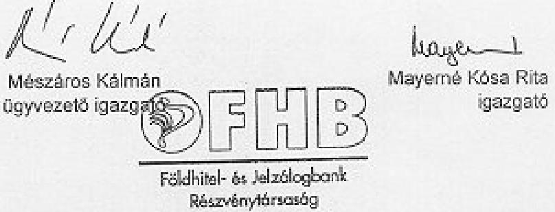
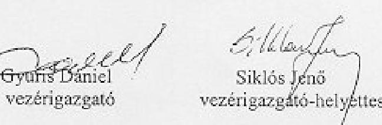

# JELENTÉS 

a Földhitel- és Jelzálogbank Rt. 2000. évi tevékenységének ellenőrzéséről
2002. április

---

# Az ellenőrzést felügyeli: 

Bihary Zsigmond
föigazgató

## Az ellenőrzés végrehajtásáért felelős:

az ÁSZ 2. Államháztartás Központi Szintjét Ellenőrző Igazgatósága

## Kemény Emil

főcsoportfőnök

## Az ellenőrzést vezette:

## Makkai Mária

főcsoportfőnökhelyettes

## Az ellenőrzést végezték:

## Hajagos Józsefné

főtanácsadó
Dr. Jártas Ágnes
számvevő tanácsos
Nagy Ákos
számvevő
Németh Béláné
tanácsadó
Dr. Ocskovszky Jánosné
főtanácsadó
Dr. Szöllősi Géza
számvevő tanácsos
Tornai József
számvevő tanácsos
Verő Tünde
számvevő

---

# TARTALOMJEGYZÉK 

I. ÖSSZEGZŐ MEGÁLLAPÍTÁSOK, KÖVETKEZTETÉSEK, JAVASLATOK ..... 5
II. RÉSZLETES MEGÁLLAPÍTÁSOK ..... 9

1. A Bank feladat- és szervezeti rendszere, személyi és tárgyi feltételeinek megteremtése, a működés szabályozottsága ..... 9
1.1. A Bank alapítása ..... 9
1.2. A tőkehelyzet és a tulajdonosi struktúra alakulása ..... 9
1.3. A Bank tevékenységének összhangja a törvényekkel ..... 11
1.4. Szervezeti változások a stratégiaváltás következtében ..... 12
1.5. A banki működés szabályozottsága ..... 13
1.6. A Bank információs rendszere ..... 15
2. A társaság gazdálkodása ..... 16
2.1. A bank egyes évekre kialakított üzletpolitikája, az üzletpolitika irányváltásai 1998-2000 között ..... 16
2.2. Az egyedi kölcsönszerződések értékelése ..... 17
2.3. A kamatbevételek és -kiadások alakulása ..... 18
2.4. A kamatkondíciók megállapítása ..... 21
2.5. A lakáscélú támogatások érvényesítése és elszámolása ..... 22
2.6. A Bank forrásbiztosítási tevékenysége, a jelzáloglevelek kibocsátása, az alkalmazott kamatkondíciók ..... 24
2.6.1. A jelzáloglevél kibocsátás ..... 24
2.6.2. A jelzáloglevelek fedezete ..... 26
2.7. A működési költségek alakulása ..... 27
2.8. A befektetett eszközök állományának alakulása ..... 29
2.9. A Bank eredményét befolyásoló tényezők ..... 30
2.10. A jogszabályokban előírt mutatók betartása ..... 31
3. A tulajdonosi irányítás és az ellenőrzési rendszerek ..... 32
3.1. A tulajdonos szerepe a lakásfinanszírozási program elősegítésében ..... 32
3.2. A Felügyelet ellenőrzései és megállapításainak hasznosulása ..... 33
3.3. A Bank jelentéstételi kötelezettsége a Felügyelet és az MNB felé ..... 35
3.4. A Felügyelő Bizottság ügyvezetést ellenőrző tevékenysége ..... 36
3.5. A belső ellenőrzési szervezet vizsgálatai, megállapításai és azok hasznosulása ..... 37
3.6. A független vagyonellenőr tevékenysége ..... 37
Mellékletek

---

2

---

# JELENTÉS 

## a Földhitel- és Jelzálogbank Rt. 2000. évi tevékenységének ellenőrzéséről

A Földhitel- és Jelzálogbank Rt.-t (továbbiakban: Bank) 1997. október 21-én alapították. Működési engedélyét az Állami Pénz- és Tőkepiaci Felügyelet 1998. március 6-án adta ki, amely meghatározta a Bank által végezhető tevékenységeket, illetve a tevékenységek végzésének feltételeit.

A Bank szakosított hitelintézet, alapvető tevékenységi köre: jelzálogjoggal terhelt ingatlanok fedezete mellett hosszú lejáratú hitelek folyósítása, illetve speciális értékpapír (jelzáloglevél) kibocsátása, melyekkel az állam lakáspolitikai céljainak teljesítését támogatja.

A Bank működését a hitelintézetekről és a pénzügyi vállalkozásokról szóló 1996. évi CXII. tv., valamint a jelzálog-hitelintézetről és a jelzáloglevélről szóló 1997. évi XXX. tv. szabályozza.

Az alapítók zártkörű alapítással, 3 milliárd Ft jegyzett tőkével hozták létre a részvénytársaságot. Alapításkor a közvetlen állami tulajdon 1,1 milliárd Ft volt (36,7 %). 2000. év végén a társaság jegyzett tőkéje 4,1 milliárd Ft volt és ebből a közvetlen állami részesedés 56,1 %. További tulajdonosok a Magyar Fejlesztési Bank Rt. (35,36 %) és a Bank (8,54 %), így a Bank közvetlenül és közvetve 100 %-os állami tulajdonban van. A Bank a tartósan állami tulajdonban maradó társaságok között szerepelt, de 2001. második félévétől már nem tartozik e körbe.

Az állam nevében a tulajdonosi jogokat a pénzügyminiszter gyakorolja.
A Bank részvénytársaság, a gazdasági társaságokról szóló 1997. évi CXLIV. tv. alapján önállóan gazdálkodó szervezet.
2000. év végén a Bank mérlegfőösszege 20,2 milliárd Ft, hitelállománya 15,6 milliárd Ft volt, amely 3700 hitelszerződést takar.

---

Az Állami Számvevőszékről szóló 1989. évi XXXVIII. tv. 2. § (6) bekezdése és az államháztartásról szóló 1992. évi XXXVIII. tv. 121. § (1) bekezdése alapján a Bank tevékenységét az Állami Számvevőszék jogosult ellenőrizni.

Az ellenőrzés célja annak értékelése volt, hogy:

- a Bank működése, tevékenysége megfelel-e a törvényi előírásoknak, az állam - mint tulajdonos - speciális elvárásainak (pl. jelzáloghitelezés, lakáspolitikai koncepció megvalósítása) és a belső szabályzatoknak;
- a szabályozási környezet megfelelően közvetíti-e a biztonságos és jövedelmező működés követelményeit;
- a szakosított hitelintézet vagyoni helyzetének, eszközeinek alakulásában mely tényezők játszottak szerepet, illetve biztosították-e azok megfelelő fedezettségét.

Az ellenőrzés megalakulásától tekintette át a Bank működését, de a hangsúlyt a 2000. évi gazdasági eseményekre, folyamatokra helyezte.

---

# I. ÖSSZEGZŐ MEGÁLLAPÍTÁSOK, KÖVETKEZTETÉSEK, JAVASLATOK 

Magyarországon - több mint 50 év után - 1997-ben teremtette meg újra az Országgyűlés a jelzáloghitelezés intézményi lehetőségét. A hitelintézet létrehozásának célja volt a magyar tőkepiac további fejlődési lehetőségének megteremtése hosszú lejáratú hitelek nyújtásával, illetve hosszú lejáratú értékpapírok forgalomba hozásával.

A Bank alapítása, működése, tevékenysége megfelelt a jogszabályi előírásoknak és a tulajdonosi elvárásoknak, annak ellenére, hogy az előzőek szerinti cél fokozatosan, csak 2000. év végére valósult meg, mind a hitelezés, mind az értékpapír kibocsátás területén.

Ebben szerepet játszott egyrészt a tulajdonos Bankkal kapcsolatos többszöri koncepcióváltása, másrészt az alapítást követően a piac fogadókészségének hiánya a kínált hiteltermékek iránt. A kettő együttes hatásaként a Bank hitelkihelyezése (aktivitása) nem növekedett a tervezett mértékben.

Az alapítást követően a termőföldre alapuló hitelezést tűzték ki célul, de ezt az akkori társadalmi és piaci környezet miatt - különös tekintettel arra, hogy a földnek nem volt megfelelő értéke - a kereslet nem igazolta vissza. 1999-ben a tulajdonosi elvárásnak megfelelően a Bank erőforrásait a privatizációra való felkészülés kötötte le az év végéig. A privatizációra kiírt pályázat eredménytelen volt. Ezt követően az ÁPV Rt., mint a tulajdonosi jogok gyakorlója felkérte a Bank igazgatóságát, hogy olyan új stratégiát dolgozzon ki, amely összhangban áll a Kormány lakáspolitikai koncepciójának változásával.

A Bank hitelkihelyezési tevékenysége a stratégiaváltás eredményeként 2000. évre megélénkült. Mérlegfőösszege az 1998. évi 5,5 milliárd Ft-ról 20,2 milliárd Ft-ra növekedett. A lakáshitelek kamata a pénzpiacon érzékelhetően csökkent, amelyben szerepet játszott a Bank üzleti aktivitása is.

A Bank tőkehelyzete megalakulásától kezdve folyamatosan rendezést igényelt, alapításkor a törvényben előírt minimális tőkével hozták létre és a 3 év alatt további mintegy 5,5 milliárd Ft végleges állami ráfordítás és 1,5 milliárd Ft alárendelt kölcsöntőke juttatás vált szükségessé annak érdekében, hogy mutatói a jogszabályi előírásoknak megfeleljenek.

A Bank valamennyi tevékenysége részletes szabályzatokkal lefedett, melyek összhangban állnak a biztonságos működés követelményeit közvetítő jogszabályi előírásokkal. A szabályzatokat folyamatosan karbantartották, és az új termékekre is időben megalkották.

A szabályzatok alkalmazását nehezítette azok számossága, a rendszerszemlélet és a szabályzatok közötti összhang hiánya. A tevékenységek részben túlszabályozottak, a szervezeti egységek működését viszont ügyrend nem szabályozza.

---

A Bank vezetése 2000-ben megkezdte szabályzatainak felülvizsgálatát, azonban a rendszerszemlélet hiánya az átdolgozások után is fennmaradt.

A jóváhagyást igénylő szabályzatokat a Pénzügyi Szervezetek Állami Felügyelete (korábban Állami Pénz- és Tőkepiaci Felügyelet továbbiakban: Felügyelet) elfogadta, és azokat a prudens működés szempontjából megfelelőnek minősítette.

A Bank a bankrendszerben elfoglalt helye, nagysága szerint a kisbankok közé sorolható, fiókhálózata nincs. Saját ingatlannal nem rendelkezik, tevékenységét bérelt irodaépületekben végzi. Tulajdonában egy társaság van. Tárgyi eszközeit a működéséhez szükséges gépek, berendezések, járművek alkotják, ezek mérlegfőösszeghez viszonyított aránya 0,5 %.
2000. december végén a Bank eszközállományának mintegy 70 %-át az ügyfelekkel szembeni követelések tették ki. Ennek összege mintegy 14 milliárd Ft volt, az 1999. évi 5,3 milliárd Ft-tal szemben. A több mint két és félszeres növekedés a lakásfinanszírozásban betöltött sikeres szerep következménye volt.

A Bank - eltérően a többi hitelintézettől - a törvény alapján forrásait nem betétgyűjtéssel, hanem jelzáloglevél kibocsátással teremtheti meg. Ennek feltétele, hogy megfelelő hitelállománnyal rendelkezzen a kibocsátandó értékpapírok fedezetéül. A kezdeti időszakban forrásgyűjtésre ezen a módon nem volt lehetősége, mivel nem/vagy alacsony mértékű hitelállománya volt. Ezzel összefüggésben 1998-ban egy (780 millió Ft), 1999-ben kettő (összesen 2.040 millió Ft) és 2000-ben hét (6.680 millió Ft) sorozat értékpapírt bocsátott ki a Bank, aktivitásának növekedésével összhangban.

# A jelzáloglevél kibocsátások során a Bank a törvényi előírásokat betartotta. A kibocsátások zárt körben történtek, amelynek előnye volt a gyors lebonyolítási lehetőség és a kis sorozatnagyság. A kibocsátások eredményeként 2000. évben a Bank forrásainak már 47 %-át jelzáloglevél alapján teremtette meg. 

A jelzáloglevelek visszafizetéséhez hosszabb távon nem minden időpontban nyújt fedezetet a hitelállományból befolyó törlesztés, és ez időszakos fedezetlenséget jelent/jelenthet. Ez az időszaki fedezetlenség azonban nem veszélyezteti a Bank egészének likviditását. A Felügyelet előírta a Bank számára, hogy 2001. évtől a jelzáloglevél kibocsátásokhoz készített tájékoztatóban is mutassa be a forráskockázat kezelésére vonatkozó megoldásokat.

A szemléltető példaként kiválasztott egyedi kölcsönügyletek ellenőrzése több hiányosságot tárt fel, ezek azonban nem érintették a Bank kockázatát, hanem alapvetően a saját szabályzataiktól való eltérésből fakadtak. A hitelek jóváhagyásáról minden esetben az arra jogosult fórum döntött. A hitelbiztosítéki értéket a szabályzatoknak megfelelően állapították meg, a szerződéseket közokiratba foglalták. Általános hiányosság a hiteldossziék vezetésében, valamint a hitelgondozási tevékenységben volt megállapítható.

A Bank eddigi működésének 3 évében veszteséges volt. A Bank gazdálkodása a pozitív eredmény eléréséhez szükséges kamatkülönbözetet egyik évben sem biz-

---

tosította. Ez összefüggésben volt a Bank aktivitásának - stratégiaváltás miatti tervezettől eltérő alakulásával. A Bank tőkehelyzetének három ízbeni rendezése nem olyan mértékű volt, amely az aktivitás tervezett növekedését biztosította volna, azok alapvetően a jogszabályban előírt banki mutatók helyreállítását szolgálták. A jelzáloglevél kibocsátáshoz szükséges hitelállomány, mint fedezet biztosítása érdekében a Bank pénzpiaci forrás igénybevételére kényszerült, amely tovább növelte kamatkiadásait. A kamatkülönbözet alakulására hatással volt továbbá a tőke- és pénzpiaci kamatváltozás, a hitelek és források eltérő kamatperiódusa.

A kamatkülönbözet a bank működési költségeit egyik évben sem fedezte, 2000-ben annak csak 37 %-ára volt elégséges. A Bank aktivitása, mérlegfőösszege még nem érte el a középtávú üzleti terveiben optimálisnak ítélt 30 milliárd Ft-os értéket. A működési költségek az aktivitáshoz képest magasak voltak. A működési költségek mintegy 60 %-a az aktivitástól független volt, illetve a koncepcióváltást nem követhette rugalmasan (személyi jellegű ráfordítások értékcsökkenési leírás, bérleti díj); közel 23 %-a az aktivitás növekedésének elősegítése érdekében merült fel, (marketing költség); 17 %-a pedig az aktivitással arányosan emelkedett.

A 2,3 milliárd Ft működési költség meghatározó tételei a személyi jellegű ráfordítások (942 millió Ft) és az egyéb költségek (829 millió Ft) voltak, az 1999. évi adatokhoz képest 250, illetve 480 millió Ft-tal növekedtek. A Bank alkalmazottainak átlagos bruttó keresete az előző évhez képest csökkent, mivel a létszámösszetétel az alacsonyabb keresetűek felé tolódott el. Változatlan létszámösszetétellel számolva a növekedés 2000. évben nem kiugró mértékű, 9,7 % volt.

A Bank a felsővezetők és a központi vezetők javadalmazása során az igazgatóság által jóváhagyott ösztönzési rendszertől eltért. Az ösztönzési rendszer előírásai lehetőséget biztosítottak indokolt esetben az abban meghatározottak felülvizsgálatára, módosítására, de ezzel a Bank vezetése nem élt. A lakáshitelek iránti igények megnövekedése miatti többletmunka elismerése indokolt volt, de a választott eljárási mód arra utal, hogy az anyagi ösztönzés szabályozása 2000. évben formális volt.

A Bank 2000. évi üzleti tervében az
 igazgatóság úgy hagyta jóvá a működési költségek előirányzatát, hogy az ebbe a körbe tartozó további költségek (208 millió Ft) nem voltak ismertek előtte. Ezzel a működési költségek tekintetében rejtett tartalékot biztosított a terv és a valóságosnál kedvezőbb hatékonyságot mutatott. Fontos hatékonysági mutató egy bank gazdálkodásában a működési költség/mérlegfőösszeg aránya, ezért a költségek nem teljes körű kimutatása nem elfogadható gyakorlat. A rosszul meghatározott adatoknak tervszinten azért nem volt eredményt rontó hatása, mert a további költségeket az egyéb ráfordítások között szerepeltették.

A Bank 2000. évi tényleges működési költsége 350 millió Ft-tal haladta meg a tervezettet. Ebben szerepet játszott a működési költségek rossz csoportosítása, továbbá az, hogy a Bank a tulajdonos engedélye nélkül a marketing tevékenység költségét 185 millió Ft-tal túllépte.

---

A Bank működését mind a külső, mind a belső ellenőrző szervezetek (FB, függetlenített belső ellenőrzés) támogatták. A Felügyelet a törvényi előírás értelmében évente átfogó helyszíni ellenőrzést végzett; jelentéseiben a Bank prudens működését érintően - a tőkehelyzet kivételével - negatív megállapítást nem tett, megállapításai, ajánlásai az átláthatóság, a szabályozás egyes módosításaira vonatkoztak. A Bank az ajánlásokat elfogadta és a szabályzatok átdolgozásakor figyelembe vette.

A Felügyelő Bizottság és a szakmai irányítása alatt álló belső ellenőrzés működése megfelel az alapító okiratban és az ügyrendben foglaltaknak.

A Bank vezetése a jelentést megismerte, az ellenőrzés megállapításait tudomásul vette, pontosító észrevételét a jelentés tartalmazza. A Bank vezetése arról is nyilatkozott, hogy a jelentés bank- és üzleti titkot nem tartalmaz. (8. sz. melléklet)

A helyszíni ellenőrzés megállapításainak hasznosítása mellett javasoljuk

# a pénzügyminiszternek 

1. Értékelje a Bank eddigi működését, a kormányzati célok teljesülését, a Bank jövőbeni stratégiáját és erről tájékoztassa a Kormányt.
2. Kezdeményezze a Bank igazgatóságánál

- a szabályzatok korszerűsítését és azok rendszerszemléletű érvényesítését,
- az egyes költségek és ráfordítások tartalmuknak megfelelő tükröztetését az üzleti tervben,
- az ösztönzési rendszer előírásainak maradéktalan betartatását.

---

# II. RÉSZLETES MEGÁLLAPÍTÁSOK 

## 1. A BANK FELADAT- ÉS SZERVEZETI RENDSZERE, SZEMÉLYI ÉS TÁRGYI FELTÉTELEINEK MEGTEREMTÉSE, A MŰKÖDÉS SZABÁLYOZOTTSÁGA

### 1.1. A Bank alapítása

A jelzálog-hitelintézetről és a jelzáloglevélről szóló 1997. évi XXX. törvény (a továbbiakban: Jht.) megteremtette a jelzáloghitelezés jogi alapjait (hatályos 1997. június 7-től).
1997. október 21-én a Magyar Állam, az MFB Rt., a PK Bank Rt., a Mezőbank Rt., és a Postabank Rt. létrehozták a Földhitel- és Jelzálogbank Részvénytársaságot a Jht.-ben előírt minimális, 3 milliárd Ft jegyzett tőkével. A Kormány 2231/1997. (VII. 29.) határozatával a költségvetés 1997. évi általános tartalékából 1,1 milliárd Ft-ot biztosított arra, hogy a Magyar Állam közvetlen tulajdont szerezzen a Földhitel és Jelzálogbank Rt-ben (a tulajdonosi jogokat a pénzügyminiszter útján gyakorolta).

A Bank alapítói között létrejött szindikátusi szerződés alapján az alapítók célja az volt, hogy a Bank, mint szakosított hitelintézet "szigorúan üzleti alapon, az elérhető legnagyobb nyereségre törekedve" működjön, és hogy a társaságot mielőbb bevezessék a tőzsdére.

A Földhitel- és Jelzálog Bank Rt.-t a cégbíróság 1998. március 18-án jegyezte be, ugyanebben a hónapban (1998. március 5.) kapta meg jelzálogbanki működési engedélyét a Felügyelettől.

### 1.2. A tőkehelyzet és a tulajdonosi struktúra alakulása

A Banknak indulásától kezdődően tőkeproblémái voltak. A Bank saját tőkéje már a működés első hónapjában (1998. március) a jegyzett tőke alatt volt és a tőkehelyzet folyamatosan romlott. A társaság első működési évét 286 millió Ft veszteséggel zárta, ezáltal szavatoló tőkéje és jegyzett tőkéje a törvényes minimum (3 milliárd Ft) alá csökkent. Év végére a saját tőke 10%-kal, a szavatoló tőke 41%-kal volt kevesebb, mint a jegyzett tőke.

A folyamatos tőkevesztés a Bank jogszerű működését veszélyeztette, ezért a Felügyelet a hitelintézetekről és a pénzügyi vállalkozásokról (továbbiakban Hpt.) szóló 1996. évi CXII. törvény 72. § (2) bekezdése alapján kötelezte az igazgatóságot a közgyűlés összehívására a tőkehelyzet rendezése céljából.

---

Az 1999. május 31-i rendkívüli közgyűlésen a Magyar Államot képviselő ÁPV Rt. által 500%-os ázsióval végrehajtott 100 millió Ft alaptőke emelés nem volt elégséges a törvényben előírt tőkehelyzet biztosítására, a saját tőke és a szavatoló tőke továbbra sem érte el a jegyzett tőke mértékét. Az ÁPV Rt. júniusban 1.500 millió Ft alárendelt kölcsöntőkét is nyújtott a Banknak piaci feltételekkel. Ezzel az intézkedéssel csak a szavatoló tőke összege emelkedett a jegyzett tőke fölé, a saját tőke továbbra sem elégítette ki a törvényi előírásokat. A Felügyelet a tőkehelyzet rendezésére a tervezett privatizáció lezárásáig, legkésőbb 1999. december 31-ig adott határidőt.

A tőkehelyzet rendezése érdekében a Kormány két ízben - 2003/2000. (I. 18). és 2296/2000. (XII. 7.) - határozataival kötelezte az ÁPV Rt.-t arra, hogy emelje meg a Bank jegyzett tőkéjét 500-500 millió Ft névértéken, 500%-os árfolyamon. Ennek hatására a Bank jegyzett tőkéje 4,1 milliárd Ft, tőketartaléka pedig 4,4 milliárd Ft lett. 2000. december 31-én a tőkeemelések eredményeként a Bank szavatoló tőkéje, a törvényi előírásoknak megfelelően, meghaladta a jegyzett tőkét, összege 6 milliárd Ft volt.

A Bank jegyzett tőkéje és a tulajdonosi szerkezet az alapítástól 2000. év végéig többször változott, melynek eredményeként a közvetlen állami tulajdon aránya folyamatosan növekedett.

# A tulajdonosi struktúra változásai 

Tulajdoni hányad %-ban

| tulajdonos | 1998.   december* | 1999.   december | 2000.   jan. 28. | 2000.   dec. 15. | 2000.   dec. 31. |
| :-- | --: | --: | --: | --: | --: |
| Magyar állam | 36,7 | 38,7 | 47,2 | 53,66 | 56,1 |
| MFB | 48,3 | 46,8 | 40,3 | 35,36 | 35,36 |
| PK Bank | 10 | 9,7 | 8,3 | 7,32 | - |
| Erste Bank | 3,3 | 3,2 | 2,8 | - | - |
| Postabank | 1,7 | 1,6 | 1,4 | 1,22 | - |
| ÁPV Rt. | - | - | - | ${ }^{* *2,44}$ | - |
| FHB (saját) | - | - | - |  | ${ }^{* * *8,54}$ |
| Összesen   Közvetett és   közvetlen ál-   lami tulajdon | 100 | 100 | 100 | 100 | 100 |

*megalapítástól
** az ÁPV Rt. részvényeit átvette a PM 2001. elején
***2001. decemberig értékesíteni kell

Az alapításkor az állami szándék az új típusú hitelintézet létrejöttének elősegítése volt. Az állami szereplők csak átmenetileg, a földjelzálog-

---

hitelezés kialakulása és stabilizálása időszakára kívántak tulajdonosként részt venni a társaság tevékenységében.

A Gazdasági Kabinet 1999 májusában döntött a Bank részvényeinek értékesítéséről, melynek érdekében az ÁPV Rt. a szükséges intézkedéseket megtette. A 100%-os állami tulajdon elérése érdekében az ÁPV Rt. és a Bank az alapítóktól a társaság részvényeit megvásárolta, illetve a szükséges tőkeemeléseket a Magyar Állam nevében az ÁPV Rt. hajtotta végre.

A Bank alapító okiratának módosításaiban nyomon követhető az alaptőke és a társaság tulajdoni viszonyainak változása. Az 1997. október 21-én kelt létesítő okiratot 2000. december 31-ig hat alkalommal módosították, ebből három alkalommal alaptőke-emelés, egyszer jogszabályi változás, két ízben pedig egyéb pontosítások miatt (cégnév, igazgatóság stb. változás). A gazdasági társaságokról szóló 1997. évi CXLIV. törvény szerint kötelező alapító okirat módosításokat végrehajtották, a bejegyzések megtörténtek.

A Bankkal kapcsolatos állami szándék 1997-2000 között többször változott. A Bank létrehozásával az új típusú hitelintézet meghonosítása, a hosszú lejáratú hitelezés és új, hosszú lejáratú befektetési forma bevezetése volt a cél. 1999. őszén a tulajdonosi szándék változásának megfelelően a Bank termékstruktúráját markánsan megváltoztatta, fő profilja a lakáshitelezés lett.

A Bank megalapításától kezdődően a 2231/1997. (VII. 29.) Korm. hat. alapján a pénzügyminiszter; 1998. július 28-tól képviseleti meghatalmazás alapján az ÁPV Rt.; 1999. január 1-jétől, a privatizációs törvény szerint ugyancsak az ÁPV Rt.; 2000. december 22-től meghatalmazás, majd 2001. január 1-jétől a privatizációs törvény alapján a pénzügyminiszter gyakorolta a tulajdonosi jogokat.

# 1.3. A Bank tevékenységének összhangja a törvényekkel 

A Jht 3. § (2) bekezdése szabályozza a Bank által végezhető pénzügyi szolgáltatási, befektetési, illetve kiegészítő befektetési szolgáltatási tevékenységek körét.

A törvény értelmében a Bank forrást - betét gyűjtésének kivételével - csak visszafizetendő pénzeszköz nyilvánosságtól való elfogadásával, pénzkölcsön nyújtást pedig csak Magyarország területén lévő ingatlanon alapított jelzálogjoggal biztosított fedezet vagy jelzálogjog nélküli kölcsönt állami készfizető kezességvállalás mellett nyújthat. Sajátosság továbbá, hogy bankári kötelezettséget csak ingatlanfedezet mellett, és csak ügyfelei felé vállalhat. További korlátozó előírás, hogy befektetési szolgáltatásokat kizárólag saját kibocsátású értékpapírhoz kapcsolódóan folytathat a Bank.

A Bank 2000-ben kölcsönt a törvényi előírásoknak megfelelően csak jelzáloghitelezéssel és jelzálogjoggal biztosított fedezetek mellett nyújtott, állami készfizető kezességvállalás mellett hitelkihelyezés nem volt, be-

---

fektetési, illetve kiegészítő befektetési szolgáltatásokat, kamatláb-, deviza csereügyleteket nem végzett.

A Jht. előírása szerint a Bank összes tőkekövetelésének állománya nem haladhatja meg az együttes hitelbiztosítéki érték hetven százalékát. Ennek az előírásnak a Bank mindhárom évben eleget tett.

A hitelbiztosítéki érték a Bank által nyújtott kölcsönök fedezetéül szolgáló ingatlanok meghatározott jogszabályok szerint számított értéke.

Az ingatlan hitelbiztosítéki értéke óvatos becslés alapján meghatározott összeg: az ingatlan forgalmi értéke, csökkentve a felmért kockázatok pénzben kifejezett értékével.

# 1.4. Szervezeti változások a stratégiaváltás következtében 

A Bank szervezetét és létszámát tekintve kis bank, 2000. december 31-én fiókhálózattal nem rendelkezett.

A Bank 1999. elején 7 területi képviselettel rendelkezett. Májusban az akkori üzletpolitika alapján a vállalkozási hitelkihelyezések növelése érdekében majdnem minden megyében területi képviselőt, majd asszisztenseket alkalmaztak. 2000. év elején a Bank 8 regionális irodát működtetett, amelyek főleg koordinációs feladatokat láttak el. Tevékenységük az értékesítési partnerekkel való kapcsolattartás, a vidéki ingatlanok értékbecslése, földhivatali ügyintézés, meghatározott termékek esetén a hitelkérelem befogadása és továbbítása volt az ügyfél felé.

A lakáscélú támogatásokról szóló 106/1988. (XII. 26.) MT rendelet módosításának (1/2000. (I. 14.) Korm. rendelet) 2000. február 1-jei hatályba lépésével ugrásszerűen megnőtt a lakosság érdeklődése a jelzálog hitelintézet útján nyújtott 3%-os kamattámogatás igénybevételére.

A tulajdonos előírta, hogy a Bank szüntesse meg a fiókhálózatát, saját jogon ne fogadjon be lakáshitelt, az értékesítést az ügynökökön és a konzorciális partnereken (kereskedelmi bankok) keresztül végezze.

A tulajdonos döntése szerint az üzleti terv 2000. végére 100-125 fős létszámot irányozott elő, a foglalkoztatottak száma azonban 142 lett.

A Bank a létszám tervezettől, illetve a tulajdonosi döntéstől eltérő alakulását az ügyfelek számának növekedésével indokolta, a túllépés jóváhagyása nincs dokumentálva, azt az igazgatóság 2000. november 22-ei ülésén vette tudomásul.

A Bank szervezetét az új stratégiai feladatokhoz igazították, a szervezet korszerűsítése átláthatóbb rendszert eredményezett.

Egy igazgatóságot megszüntettek, illetve beolvasztották egy újonnan felállított főosztályba (Értékpapír és Vállalatfinanszírozási Igazgatóság, Kockázati Főosztály), az Üzleti Igazgatóság profilját megtisztították, levált a Hitelkezelési Főosztály, a banki kockázatvállalást és eszköz-

---

forrásgazdálkodást
 magasabb szintre emelték, közvetlen vezérigazgatói hatáskörbe vonták.

A szervezeti változások alapján újraszabályozták a különböző egységek közötti együttműködést és az egyes területek vezetőinek felelősségi és hatásköri viszonyait.

A Bank a Felügyelet véleménye szerint is rendelkezik a pénzügyi szolgáltatás nyújtásához szükséges - a Hpt. 17.§-ában előírt - személyi és tárgyi feltételekkel.

A technikai, informatikai, műszaki biztonsági felszereltség megléte biztosítja a működés alapvető feltételeit. A különleges biztonsági követelményeket igénylő helyiségek, berendezések (pl. giró szoba, a Bankbiztonsági Szabályzatban is rögzített számítógép szerver-terem, irattárak a hitelek és a fedezetek iratanyagainak) rendelkezésre álltak, azokat a Felügyelet és az arra illetékes szerv (a giro-szoba esetében) megfelelőnek találta.

A Bank felszereltsége megfelelő, biztonsági helyzete az ügyfélkiszolgálás színvonala szempontjából az ügyfélforgalom jelenlegi módja miatt azonban kifogásolható.

A lakossági hitelezés 2000. és 2001. évi ugrásszerű megnövekedése miatt a földszinti ügyfélforgalmi iroda kapacitása már alkalmatlan a banki tevékenység teljes lebonyolítására. Az ügyfelek szerződéskötési ügyekben az I. emeleti irodákban, a teljesítések, egyeztetések stb. céljából pedig a számvitel II. emeleti irodahelységeiben, illetve folyosóin nagy számban fordulnak meg naponta. Az ügyfélforgalom a munkaterületeken is zajlik, és ez csökkenti a Bank biztonságát.

# 1.5. A banki működés szabályozottsága 

A Bank rendelkezik a törvényben meghatározott és a prudens működéshez szükséges alapvető szabályzatokkal, azok a jogszabályi előírásokkal összhangban vannak. A szabályozás kiterjed a Bank minden tevékenységére.

A belső működés rendjének biztosítása érdekében rendkívül sok előírást, szabályzatot készítettek, így azok nagy száma, mennyisége olykor az áttekintést, és az alkalmazást is nehezítette.

Az 1997-2000 között kiadott és 2001 augusztusában hatályos utasítások száma 100 volt, amiből 25 a speciális, végrehajtási utasítás, a többi vezérigazgatói rendelkezés.

Első ízben a működési engedély kiadásához szükséges alapvető szabályzatokat készítették el (pl. SZMSZ, pénzmosási, pénz- és értékkezelési, fedezetértékelési, hitelfedezeti érték megállapítási szabályzatok stb.), ezen kívül az éppen időszerű szabályozási feladatokat oldották meg (pl. jogszabály-, szervezeti felépítés változás miatt). A belső utasítások nagy száma ezzel van kapcsolatban és tükrözi a rész-tevékenység szabályozására való törekvést is.

---

A Bank működésének első időszakában készült belső utasítások közel 70%-a változatlan tartalommal, a többi egy-két módosítással a vizsgálat időszakában is hatályos volt (például a számlarend és a Fedezetnyilvántartási, Bankbiztonsági, Hitelbiztosítéki érték megállapítási Szabályzat).

A működés, belső irányítás rendjének szabályozásában fontos szakasz a 2000. év, amikor a jogszabályi környezet, a tulajdonosi célkitűzések, az üzleti stratégia meghatározásával a tevékenység irányultsága egyértelművé vált. Ez a belső szabályozásra is kihatott (pl. az üzleti területen a lakossági hitelezések újabb formáit alakították ki).

A szabályzatok összeállítása nem tükröz rendszerszemléletet, ami összefügg azzal, hogy első jelzálogbank lévén nem rendelkeztek kellő tapasztalatokkal. Ezen túlmenően a stratégia - a tulajdonosi elvárások változásai miatti - kialakulatlansága is hatott a belső szabályozásra, amely megnyilvánult az üzleti területen a termékkínálat, a termékleírások, az eljárási rendek (végrehajtási utasítások) folyamatos változtatásaiban.

A szabályzatok összhangja teljes körűen nincs biztosítva, az egyes szabályzatok között 2000. évben is vannak átfedések vagy nehezen megtalálható és értelmezhető előírások.

Az átdolgozott Fedezetértékelési Szabályzatban például hat belső szabályzatot egybeszerkesztettek és így az egész értékelési folyamatot egyberendezték, de pl. a kockázatvállalás kérdései az ügyletminősítési és értékelési, valamint a kockázatvállalási utasításokban is egyaránt megmaradtak, vagy a katasztrófa terv készítési szabályozás része lehetne a Bankbiztonsági Szabályzatnak.

A Bank működési engedély kérelméhez elkészített Szervezeti és Működési Szabályzata (továbbiakban: SZMSZ) 1997. október 29. és 1999. július 23. között volt érvényben. Az ezt követően hatályba léptetett SZMSZ-t a belső szabályzatok meghatározott rend szerint csoportosított gyűjteményeként adták ki, amelyben a Bank működési rendjét meghatározó és "általános vezetési elvek" kategóriába sorolt szabályzatokat tételesen felsorolták.

Az SZMSZ újszerű felépítése nem kifogásolható, de gyakorlati alkalmazását nehezíti, hogy az egyes részterületekre vonatkozó szabályok az összevont utasítás címekből nem, vagy nehezen állapíthatók meg.

Nem egyértelmű, hogy a munkaköri és címhasználati rendre, a munkáltatói jogok gyakorlására, utalványozási jogra, cégbélyegzők használatára vonatkozó előírások melyik szabályzatban találhatók. Emellett a teljesség szempontjából az SZMSZ nem konzekvens, például a pénzmosás megelőzési szabályzat benne van a felsorolásban, a pénz- és értékkezelési nincs, vagy a kockázatvállalási igen, az üzletszabályzat, és a hitelezési szabályzat pedig hiányzik. A segédletben felsorolt szabályzatok döntően a számvitelre vonatkoznak, vagy hirdetményeket, szerződésmintákat tartalmaz a felsorolás.

---

Az SZMSZ szervezeti részében az egyes szervezeti egységek tevékenységét mindössze néhány mondatból álló tömör megfogalmazással rögzítették, részletes ügyrendek nem készültek, annak ellenére, hogy már 1997-ben előírták, hogy "minden szervezet vezetője köteles 60 napon belül elkészíteni és jóváhagyatni a vonatkozó ügyrendet, az általa tovább bontott szervezet vonatkozásában és a munkaköri leírásokat kiadni". Ezt a rendelkezést csak annyiban hajtották végre, hogy a munkaköri leírásokat kiadták.

A szabályozottság helyzetét a függetlenített belső ellenőrzés átfogóan vizsgálta, az ellenőrzést intézkedések követték.

A függetlenített belső ellenőrzés átfogó vizsgálatát követően néhány fontos szabályzatot felülvizsgáltak és újraalkottak. Ilyenek például a minősítési és céltartalékképzési, a munkáltatói, az adósminősítési szabályzatok, a lakossági hitelformák eljárási rendjei, a Cenzura Bizottság (továbbiakban: CB), valamint a Treasury működési rendje. Ekkor módosították a "Bank új szervezeti felépítése és az együttműködés és felelősségi körök új szabályai" címen az SZMSZ II. fejezetét is (2001. júniusában változtatták a szervezeti felépítési részét).

A feladatok egy részét nem hajtották végre, a felülvizsgálat továbbra is aktuális, a rendszer- és folyamat-szabályozási szemlélet pedig még nem érvényesül. Ez utóbbi megállapítás különösen az üzleti tevékenység sokirányú (kockázatvállalás, az ügyfélminősítés, hitelezési eljárási rendek, termékleírások stb.), jó színvonalú szabályzataira vonatkozik.

# 1.6. A Bank információs rendszere 

A döntések megalapozásához szükséges belső információk a Vezetői Információs Rendszeren (VIR) keresztül jutnak a bank különböző szintű vezetőihez.

A VIR többdimenziós elemzést nyújt a termékekre, szervezeti egységekre, meghatározott ügyfelekre, időszakokra vonatkozóan. Táblázatos vagy grafikus formában jeleníti meg a terv- és tényadatokat, meghatározott időpontra vagy időszakra vetítve. Segítségével havi gyakorisággal elemezhető az eredmény, valamint az egyes termékek átlagos kamatlábainak alakulása és változási tendenciái. Alkalmas a felsővezetők számára aggregált elemzések összeállítására vagy üzleti eredmény költség- és profit center szintű elemzésére.

A VIR által szolgáltatott adatok forrásai a főkönyvi kivonat és az analitikus nyilvántartások. Miután a VIR adatok kontrolling szemléletben (tevékenységekhez kapcsolva) jelennek meg, közvetlenül nem vethetők össze a beszámoló adataival. Ez azonban nem befolyásolja azt a tényt, hogy a VIR tartalma és annak a számviteli elszámolásokkal való egyezősége ellenőrizhető.

---

# 2. A TÁRSASÁG GAZDÁLKODÁSA 

### 2.1. A bank egyes évekre kialakított üzletpolitikája, az üzletpolitika irányváltásai 1998-2000 között

A Bankra vonatkozó tulajdonosi elképzelések rövid időn belül háromszor változtak. A management az irányváltozásokat követve megváltoztatta a Bank üzleti stratégiáját, a megcélzott ügyfélkört, a hiteltermékeket, és az értékesítési hálózatot. A változtatás hatással volt a Bank üzleti aktivitására is.

A működés első évében (1998.) a Bank konkrét stratégiával nem rendelkezett. A Bank hitelállományát döntően agrárhitelekből (40 %); területfejlesztési hitelekből (25 %); ipar-, és kereskedelem-finanszírozási hitelekből (19 %); kis mértékben lakáshoz kapcsolatos ügyletekből (16 %) tervezte felépíteni. A termőföldre alapuló hitelezés a gyakorlatban nem igazolta az előzetes üzleti elgondolásokat, ezzel szemben a lakásfinanszírozás területén mutatkozott nagyobb hitel-kihelyezési lehetőség.

A Bank hitelállománya 1998. év végén 3,2 milliárd Ft volt a tervezett 6,0 milliárd Ft-tal szemben, amelynek 64%-át, 2,05 milliárd Ft-ot a vállalati, közel 25%-át a lakossági, 11%-át pedig a kis- és középvállalati hitelek alkották, agrárhitelezés nem volt.

A Bank 1999 januárjában meghatározott - a tervek szerint 2000. december 31-ig, a privatizáció lebonyolításáig szóló - stratégiája nem vetette el a mezőgazdasági hitelezést, de a fő hangsúlyt a vállalati hitelezésre, az értékesítési célú vállalkozói lakásépítésre és az önkormányzati infrastruktúra-fejlesztési projektekre helyezte.
1999. december végére - az utolsó tervmódosítás szerint - a vállalati hitelek arányát 49%-ban (e körben tervezték az agrárhitelek előirányzatát is, amely nagyságrendileg 1-2 %), a kis- és középvállalkozói hitelekét 10%-ban, a lakás- és lakossági hitelekét 29%-ban, a projektfinanszírozását pedig 12%-ban határozták meg. 1999. év végén a Bank hitelállománya 5.339 millió Ft volt, megoszlása: vállalati hitelek 2.830 millió Ft (53 %), lakossági 2.090 millió Ft (39,2 %), a kis- és középvállalkozói 418 millió Ft (7,8 %).

Az 1999. évi tényszámok a lakossági hiteligény arányának növekedését, illetve a stratégiaváltás szükségességét igazolták.

Az év végén született kormányzati döntésnek megfelelően a Bank vezetése a tulajdonos utasítására kidolgozta új üzleti stratégiáját, mely szerint megváltozott a megcélzott ügyfélkör (vállalatok helyett a lakosság), a hiteltermékek köre (új termékek kidolgozása, pl. lakásépítési kölcsön, lakáshitel kiváltási kölcsön), az értékesítési csatornák (saját értékesítés helyett üzleti partnerek bevonása), a bank szervezeti felépítése (az igazgatóságok számának csökkentése) és belső munkaszervezése. Az új stratégia teljes pályamódosítást jelentett a Bank életében az előző két év tevékenységéhez képest.

---

A Bank új stratégiája szerint 2000. évtől a hitelezési tevékenység középpontjában a lakáscélú ingatlanok vásárlásának és fejlesztésének finanszírozása állt. Ennek alapján összesen mintegy 21,7 milliárd Ft hitelállomány elérését tervezte a Bank 2000. év végére, melyből 15,7 milliárd Ft (72,4 %) a lakossági és 6 milliárd Ft (27,6 %) az értékesítési célú és az ingatlan projekt-finanszírozás. Ezzel szemben a lakossági hitelek állománya 11,5 milliárd Ft-ra (81,8 %), az ingatlan projekt-finanszírozás 2,6 milliárd Ft-ra (18,2 %) teljesült. A 2000. év végi hitelállomány megoszlása bizonyította a stratégiaváltás irányának helyességét.

# 2.2. Az egyedi kölcsönszerződések értékelése 

A szemléltető példaként minden hitel típusból véletlenszerűen kiválasztott 38 hitelügylet esetében az ellenőrzés a hitelszerződések megkötésének előkészítésére, a szerződéskötés gyakorlatára, a folyósítás feltételeinek teljesítésére, a hiteltörlesztésekre és annak ellenőrzésére, valamint a minősítések és a céltartalékképzés szabályosságára terjedt ki. Az értékelés a hiteldossziék, a fedezetértékelési dossziék és a Bank Masterből legyűjtött adatokon alapult.

A kiválasztott hitelügyletekhez tartozó hiteldossziék általános hiányossága, hogy nem elégítették ki a kezelésükre vonatkozó végrehajtási utasítás előírásait.

A hiteldossziék nem tartalmazták a záradékkal ellátott tartalomjegyzéket, nem az előírt regisztert alkalmazták, nem voltak ellátva hitelazonosító számmal, regiszterszámmal sem, a hitelgondozással kapcsolatos dokumentumok hiányosak voltak, egyenlegközlő értesítések és a kötelező minősítések iratanyagai hiányoztak, az előtörlesztéssel megszüntetett egyes hitelügyleteknél hiányzott a vagyonellenőr hozzájárulása a jelzáloghitel összegének a rendes fedezetek nyilvántartásából való törléséhez.

A kölcsönszerződéseket minden esetben közokiratba foglalták, de elszigetelt problémaként jelentkeztek az abban rögzítettektől való alábbi eltérések.

A Bank az adós rossz fizetési fegyelme esetén nem élt a készfizető kezessel szemben fennálló jogával, felszólítást sem küldött számára.

Egy lakásvásárlási hitelügyletnél úgy engedélyezték a fedezetcserét, hogy az engedély feltételeként nem követelték meg az új fedezetre a kötelező vagyonbiztosítás meglétét.

Egy lakáskorszerűsítési kölcsön szerződésének egyes fejezetei között a vagyonbiztosításra vonatkozó rendelkezések esetében ellentmondás volt, biztosítási összegként más értéket írtak elő.

A folyósítás feltételeként előírt tulajdoni lapokon - melyeken a Bank jelzálogjoga, az elidegenítési és terhelési tilalom
 bejegyzésének kellett szerepelnie – azok banki átvételének időpontja nem igazolt.

---

A Bank hitelgondozási tevékenységével kapcsolatban a következő példák illusztrálják a tapasztalt hiányosságokat.

Egy problémásnak minősített lakásvásárlási hitel esetében nem a szabályzatban foglaltak szerint küldték meg a hitelfelmondást, illetve indították meg a végrehajtást.

Nem tartották be a hitelgondozási szabályzat szerinti előírást egy előre meg nem határozott célra nyújtott fogyasztási hitelnél. Az adós Bankkal szembeni fizetési késedelme miatt az alapminősítés rendkívüli felülvizsgálatát nem végezték el, ezért a Bank kockázata növekedett.

A hitelcél megvalósításának ellenőrzését a szerződésben kikötötték, amelyet a Bank két hitelnél több hónapos késedelemmel végzett el és három esetben az igazolások tartalma nem felelt meg az előírásoknak.

A hitel fedezetéül szolgáló ingatlan hitelbiztosítéki értékének kötelezően elvégzendő éves felülvizsgálatát határidőre nem teljesítették egy nagyértékű ingatlanon végzett korszerűsítéshez nyújtott kölcsönnél.

A vizsgálatba vont hitelek körében a Bank a minősítési és céltartalékképzési utasítást betartotta, a minősítési kategóriának megfelelő céltartalékokat megképezte.

# 2.3. A kamatbevételek és -kiadások alakulása 

A Bank működésének első három évében kamatkülönbözete nem nyújtott fedezetet összes ráfordításaira. A működési költségeket figyelembe véve 1998-ban annak 64%-a, 1999-ben 44%-a és 2000-ben mintegy 37%-a volt (a bevételeket és kiadásokat az 1. sz. melléklet tartalmazza). Ennek alapvető oka, hogy a Bank hitelezési tevékenysége, aktivitása, mérlegfőösszege még nem érte el az optimális mértéket, amelyet a Bank középtávú üzleti terveiben 30 milliárd Ft-ban jelölt meg és annak realitását a Felügyelet sem vitatta, ezért az aktivitásához képest a működési költségek magasak voltak.
2000. évben a Bank mérlegfőösszege 20,2 milliárd Ft-ra növekedett az 1999. december 31-i 8,6 milliárd Ft-tal szemben. A több mint kétszeres állomány alapvetően a bruttó kamatozó eszközök 11,6 milliárd Ft-os emelkedéséből adódott. Ezen belül a fokozott hitelkihelyezések eredményeként az ügyfelekkel szembeni követelések állománya 8,7 milliárd Ft-tal növekedett, melynek hatására a 2000. évi kamatbevételek 1,8 milliárd Ft-os összegén belül a hitelállományhoz kapcsolódó kamatbevétel 78,5%-ot, 1,4 milliárd Ft-ot ért el.

A kamatbevételek között 2000. évben új bevételi elem, a jelzáloglevelek kamatához kapcsolódó kamattámogatás. Az állam 2000. február 1-jétől már nem csak a hitelfelvevőknek nyújtott kamatkedvezményeket, hanem, kizárólag a Bank részére, a jelzáloglevelek kamataihoz kapcsolódóan 3% támogatást adott, ebből származó kamatbevétele 63,9 millió Ft volt.

---

A kamatjellegű bevételek 82 millió Ft-ot tettek ki és a megnövekedett hitelállománnyal kapcsolatos folyósítási jutalékot és kezelési költséget tartalmazták.

A fizetett kamatok és kamatjellegű jutalékok címén a Banknak 950 millió Ft kiadása keletkezett, melynek 70%-át a jelzáloglevelek, 19%-át az alárendelt kölcsöntőke után fizetett kamatok alkották. A jelzáloglevelek éves átlagos állománya az öt alkalommal történt kibocsátás hatására 5,5 milliárd Ft-ot ért el.

Mind összegét, mind részarányát tekintve az 1999. évi 40,3%-os részesedéshez képest lényegesen alacsonyabb volt a bankközi felvételek kamatkiadása, mindössze 10%-ot képviselt. Ennek oka, hogy a jelzáloglevelekből befolyó forrás elegendő volt a hitelek kihelyezéséhez és így ez évben már nem volt szükség a drágább pénzpiaci források felvételére.

# 2000. évben a forrás és eszköz oldalon egyaránt csökkent a kamatszint és ez jellemző volt az egész bankszektorra. 

Új elem a kamatkiadások között a partnerbankok részére fizetett kamat. Miután az 1/2000. (I. 14.) kormányrendelet csak a Bank számára biztosította a jelzáloglevelek kamattámogatását, a tulajdonosi jogok gyakorlója a versenysemlegesség fenntartása érdekében korlátozta a Bank közvetlen hitelezési tevékenységét és közvetett értékesítési csatornák kialakítását írta elő, amelyben a konzorciális szerződések keretében a kereskedelmi bankok vettek részt. A kereskedelmi bankok és a Bank közösen hiteleztek és a hitelkockázatot is megosztották. Az e címen elszámolt kamatkiadás mintegy 6 millió Ft volt.

A Bank hat kereskedelmi bankkal együttműködési keretszerződést és kiegészítő megállapodást kötött. Az együttműködés célja, hogy a Bank jelzáloglevél kibocsátásán keresztül igénybe vehető állami támogatás mellett – a rendelet feltételeinek megfelelő – lakáshitelek minél szélesebb körben történő felvételét biztosítsa a lakosság számára. E hitelezés keretében a kereskedelmi bankok csak a Bank lakásvásárlásra, bővítésre, korszerűsítésre kidolgozott termékeit értékesíthetik.

A kölcsönt a bankok folyósítják a kölcsönfelvevő részére, 99%-ot saját forrásukból, 1%-ot pedig a Bank által nyújtott forrásból. A kölcsön folyósítását követő legkésőbb 30 napon belül a Bank átveszi a bankoktól a kölcsönszerződés szerint fennálló részesedésüket, annak tőkeösszegét, időarányos kamatával együtt a partner banknak megfizeti. A partner bankok a Bank nevében és javára jogokat szereznek, terhére kötelezettségeket vállalnak.

A konzorciális szerződések megkötése előtt a Bank szakemberei gazdaságossági számítást végeztek annak érdekében, hogy meghatározzák azokat a díjakat, amelyek megfizetése esetén az együttműködés gazdaságilag eredményesnek ítélhető. A számítási anyagot a Bank Eszköz-Forrás Bizottsága (továbbiakban: EFB) megtárgyalta, de döntéséről határozatot nem hozott. A Bank igazgatósága utólag, közvetve vette tudomásul a számítási anyag alapján a már megkötött konzorciális szerződésekben alkalmazott díjakat.

---

A Bank további értékesítési csatornája az ügynöki hálózat. Az ügynöki tevékenység végzésére 2000. év végéig a Bank együttműködési szerződést, illetve megbízási szerződést kötött 3 társasággal és 48 takarékszövetkezettel. A megbízás célja, hogy az ügynöki tevékenységet vállaló társaságok saját hálózatukon keresztül magánszemély ügyfelek részére kínálják a lakáshitel termékeket. Az ügynökök díjazás ellenében a Bank nevében kötelezettséget nem vállalnak, a hiteligénylőket tájékoztatják, segítik a kölcsönkérelem elkészítését, ellenőrzik a kérelmet, befogadják stb. A konzorciális partnereken és az ügynöki hálózaton keresztül 2000. december végén a jelzálogbank lakáshitel termékei az érdeklődők számára 289 értékesítési helyen voltak elérhetők.

# A 2000. évben a Bank realizált kamatkülönbözete 884 millió 

Ft volt, az 1999. évi összeget 285 millió Ft-tal haladta meg, amely még mindig nem volt elegendő ahhoz, hogy a Bank ráfordításait fedezze.

A Banknak kamatkockázatot jelent az előtörlesztésekből fakadó esetleges kamatkiesés, amely az eredeti, illetve az előtörlesztéssel felszabaduló források kihelyezésekor elérhető kamatkülönbözetből adódhat. Ennek csökkentése érdekében a bank a törvényi felhatalmazás adta lehetőség alapján azoknál a kihelyezéseknél, ahol üzletileg lehetséges, él az előtörlesztések tiltásával, vagy a kamatperiódusok fordulónapján teszi lehetővé az előtörlesztést. Az új kamatkondíciókat ugyanis a kamatperiódusok lejáratakor állapítja meg a Bank, így a felszabadult forrás kihelyezése már, az akkor megállapított piaci kamatozású forrásokból történhet.
2000. évben összesen 49 esetben történt előtörlesztés, 314 millió Ft értékben. Ebből 14 esetben – 120 millió Ft értékben – a problémásnak minősített hitelek adósai teljesítettek előtörlesztést. Az előtörlesztések többsége 42 hitel – teljes összegű visszafizetésre vonatkozott, 7 hitelnél pedig részleges előtörlesztés volt.

## Kamatkockázat

A Bank a bankrendszer többi szereplőjétől eltérő, az egyedi tevékenységből és ennek megfelelően törvényi szabályozásából adódóan sajátos eszköz-forrás struktúrával rendelkezik. Ez abban nyilvánul meg, hogy forrásai jelentős része tőkepiaci forrás (jelzáloglevél) fix vagy változó kamatozással, a jelzáloglevelek kibocsátási időpontjai közötti időszakok között jelentős a bankközi források aránya, melyek kamata gyorsan és gyakran változik, továbbá hitelei között az öt évnél hosszabb futamidejű hitelek a meghatározóak, egy vagy ötéves kamatperiódussal.

Mindezekből adódóan a Banknak kamatkockázata keletkezhet a következők miatt:

- a fix kamatozású jelzáloglevél forrásköltsége, amely – a csökkenő hitelkamatok miatt – meghaladja a futamidő alatt az egyéb források költségeit,

---

- a hitelek és források eltérő árazása, kamatperiódusa. Az előbbinél éves és ötéves kamatperiódus, valamint az öt éves fix kamatozás, az utóbbinál az 5-7 éves fix kamatozású és változó kamatozású egy éves kamatperiódussal,
- a hitelkihelyezések és jelzáloglevelek kibocsátása közötti időszak alatt változó tőke- és pénzpiaci hozamok,
- a hitelek előtörlesztése, amelyek esetében a csökkenő hitelkamat szintek miatt az újbóli kihelyezéssel szemben a korábban kibocsátott jelzáloglevél magasabb fix kamata állhat,
- a jelzáloglevél kamattámogatása mellett kihelyezett hitelekhez egyéb külső források bevonása, amelynek a költsége nem építhető be a hitelkamatba.

A kamatkockázat csökkentése érdekében különböző módszereket dolgozott ki és alkalmaz a Bank és azt vezérigazgatói utasításban szabályozta. A Bank eszköz-forrás gazdálkodási limitrendszerére vonatkozó szabályzata feltárta a lehetséges kockázatokat, meghatározta az egyes limiteket, azok figyelmeztető szintjét és megjelölte az intézkedésre köteles szakterületet is. A kamatkockázat mérséklésének egyik leghatékonyabb eszközeként a források és eszközök lejárati szerkezetének közelítését és az átárazódási periódusok megfeleltetését jelölte meg a Bank. E szerint például az új kihelyezések kamatát a fennálló és a jövőbeni források költségeiből határozza meg, szükség esetén havonta, továbbá törekszik a kellő gyakorisággal történő jelzáloglevél kibocsátásokra, melyekkel egyenletesebben lehet elosztania az átárazódási időpontokat (1999. évben 2, 2000. évben 5 alkalommal volt kibocsátás).

Meghatározta az igazgatóság az elfogadott vezérigazgatói utasításban a kamatkockázat menedzselés kereteit és felelősségi köreit is. A Bankban az operatív kamatmenedzselésért felelős szakterület a treasury, de a módszerek és limitek betartása a Bank valamennyi vezetőjének feladata. A kamatkockázat menedzselésére meghatározott limiteket eddigi működése során a Bank betartotta.

# 2.4. A kamatkondíciók megállapítása 

A Bank kihelyezéseinél három kamatozási típust alkalmazott, az egy- és az ötéves kamatperiódusú, valamint az ötéves fix kamatozást (ez utóbbit egyedileg állapították meg).

A Bank termékárazási gyakorlata szerint a különböző hiteltípusoknál alkalmazott kamatlábakat minden hónapban, az adott hó elsején történő hatálybalépéssel állapította meg.

A kamatmódosításokat több tényező indokolta, alapvetően a jelzáloglevél kibocsátás, az állami lakástámogatási jogszabály változása, a kiegészítő kamattámogatás mértékének meghatározásához alapul szolgáló egy-, illetve ötéves futamidejű állampapírok referencia hozamai előző féléves átlagának változása, – melyet az Államadósság Kezelő Központ (továbbiakban: ÁKK) folyamatosan közölt a Bankkal – valamint a Bank

---

saját elhatározású, üzleti érdekeinek megfelelő, változtatása a piaci helyzet figyelembevételével.

A Bank által kialakított kamatkondíciókat az EFB hagyta jóvá a treasury előterjesztése alapján. A különböző időpontokban végrehajtott árazás áttekintése alapján megállapítható, hogy

- a Bank a jogszabályokban előírt módon állapította meg a jelzáloglevél kamattámogatású hitelek kamatát (jelzáloglevél kamata +1,5%);
- a kiegészítő kamattámogatásos hiteleknél a referencia hozamokból kiindulva, a lakáscélú támogatásokról szóló rendeletben meghatározott mértékű támogatás levonásával alakította ki a Bank az alkalmazott kamatlábat;
- a Bank a jogszabályi módosításokat, a referencia hozamváltozásokat nyomon követte és a kamatkondíciók megállapításakor végrehajtotta.

# 2.5. A lakáscélú támogatások érvényesítése és elszámolása 

A Bank által a különböző lakáscélok megvalósítására nyújtott kölcsönökhöz többféle állami támogatás vehető igénybe. Ezek 2000. évben a lakásépítési kedvezmény, a lakásépítési kedvezmény lakásbővítésre, az adóvisszatérítési támogatás, az akadálymentesítési támogatás, a kiegészítő kamattámogatás, az 1994-2000. évek közötti feltételű kamattámogatás mellett nyújtott hitel kiváltása FHB kölcsönnel, és a jelzáloglevél kamattámogatás voltak.

A lakáscélú támogatások feltételeit 2000. év végéig a többször módosított 106/1988. (XII. 26.) MT. rendelet tartalmazta (e rendelkezést a 12/2001. (I. 31.) Korm. rendelet helyezte hatályon kívül).

A Pénzügyminisztérium és a Bank között 1999. május 10-én Megbízási szerződés jött létre a lakástámogatások lebonyolítása és elszámolása érdekében. A Bank az ügyfeleinek lakástámogatás címén nyújtott összeget negyedévente lehívhatta a PM-től. A tevékenység ellátásáért, azaz az igénybe vett támogatások feltételeinek ellenőrzéséért, folyósításáért, az ezzel kapcsolatos dokumentumok összeállításáért, az adminisztrációs feladatok elvégzéséért stb., az
 elszámolt összegek után költségtérítés illeti meg a bankot.

Az 1/2000. (I. 14.) Korm. rendelet vezette be a kamattámogatásokon belül a jelzáloglevelek kamattámogatását. Ennek alapján a megbízási szerződést kiegészítették, melyben értelmezték a jelzáloglevél kamattámogatásával kapcsolatos előírásokat és szabályozták annak elszámolását. A szerződés szerint a Bank a támogatást a jelzáloglevél kamatfizetésekor igényelheti a Magyar Államkincstártól, amely az elszámolásig előleget ad a Bank részére.

---

Az esedékessé vált jelzáloglevél kamattámogatás és az 1%-os költségtérítés - melyet a Bank fizet a pénzintézeteknek a tőlük megvásárolt hitelállomány után - együttesen adja az összes jelzáloglevél oldali támogatást.
2000. évben a kibocsátott jelzáloglevelekhez kapcsolódóan a Banknak 3 ízben volt kamatfizetési kötelezettsége (július 2-án, augusztus 25-én, és december 1-jén). Az ehhez kapcsolódó elszámolások közül a decemberi "bevallást", illetve elszámolás ellenőrzését követően megállapítható, hogy a Bank a PM-mel kötött megbízási szerződésben a jelzáloglevél kamattámogatásra vonatkozóan rögzített eljárási rendet, elszámolási módot betartotta.

A szemléltető példaként véletlenszerűen kiválasztott 5 hitel megfelelt a jelzáloglevél kamattámogatásra vonatkozó jogszabályi előírásoknak. Mind a kölcsöncél (lakásépítési, lakásvásárlási, lakásbővítési, lakáskorszerűsítési), a kölcsön összeg (maximum 30 millió Ft-ig), a folyósítás időpontja (mindegyik 2000. február 1-je utáni), mind a támogatás futamideje (legfeljebb öt év) összhangban vannak a jogszabályban rögzítettekkel. A szerződésekben alkalmazott kamatkondíciók megfeleltek az adott időszakra vonatkozó hirdetményben közzétett kamat- és kezelési költség mértékeknek.

A kiegészítő kamattámogatás nyújtását a rendelet abban az esetben teszi lehetővé, ha a lakáshitel kamata és a törlesztés alatt bármilyen címen felszámított költség nem haladja meg:

- a változó, illetőleg a legfeljebb egy évig állandó kamatozású kölcsön esetén az egyéves futamidejű,
- egy évnél hosszabb időszakra szóló, állandó kamatozású kölcsön esetén az ötéves futamidejű
állampapír referencia hozamai előző féléves átlagának 4 százalékponttal növelt értékét.

A kiegészítő kamattámogatás elszámolása is megfelelt a megbízási szerződésben előírtaknak. A kiválasztott 5 kölcsön adósai a rendeletben előírt feltételeknek megfeleltek, a Bank a szerződésekben az akkor érvényes hirdetménye szerinti kamatokat alkalmazta. A kölcsönszerződésen kívül külön szerződésben rögzítették az adóvisszatérítési támogatás és a lakásépítési kedvezmény nyújtására vonatkozó jogokat és kötelezettségeket.
2001. év elején az APEH vizsgálatot végzett a Bankban a lakáscélú támogatásokról szóló rendeletek alapján folyósított és elszámolt kamattámogatásokkal kapcsolatban. Jelentésében rögzítette, hogy a tételesen megvizsgált 30 ügylet, továbbá a költségvetéssel történő elszámolás ellenőrzésekor a jogszabályokban foglaltakhoz képest eltérést nem talált. A lakáscélú állami támogatások eljárási és nyilvántartási rendjét a Bank belső ellenőrzése is vizsgálta 2000. évben. A 2000. december 15-én

---

készült vizsgálati jelentés nem állapított meg jogszabállyal ellentétes gyakorlatot.

# 2.6. A Bank forrásbiztosítási tevékenysége, a jelzáloglevelek kibocsátása, az alkalmazott kamatkondíciók 

A Bank, mint szakosított hitelintézet forrásbiztosítását a Hpt., valamint a Jht. szabályozza. Az utóbbi 3. §-a rögzíti, hogy a Bank pénzkölcsönt nyújt a Magyarországon lévő ingatlanon alapított jelzálogjog fedezete mellett, amelyhez forrásait jelzáloglevél kibocsátásával gyűjti.

A jelzáloglevél a Jht. szerint bemutatóra, vagy névre szóló, átruházható értékpapír. A törvény indokolása értelmében a jelzáloglevél a magyar tőkepiac élénkítésére szolgál azáltal, hogy alacsony kockázatú, hosszú lejáratú értékpapír. A jelzáloglevél formai és tartalmi követelményeit a Jht. szabályozásán túlmenően a kötvényről szóló 1982. évi 28. törvényerejű rendelet, forgalomba-hozatalát pedig az értékpapírok forgalombahozataláról, a befektetési szolgáltatásokról és az értékpapír-tőzsdéről szóló 1996. évi CXI. törvény (továbbiakban: Épt.) szabályozza.

A Bank mindhárom évben legfőbb forrásának (52,3 %, 44,5 %, 56,9 %) a jelzáloglevél kibocsátást tervezte. A tervezett kibocsátás egyik évben sem teljesült, az ebből származó forrás részaránya 14,1 %-ról 47 %-ra növekedett. (A Bank forrásainak alakulását 1998-2000. között a 2. sz. melléklet, a kibocsátott jelzáloglevelek főbb adatait a 3. sz. melléklet részletezi.)

A jelzáloglevél kibocsátás feltétele a megfelelő fedezet rendelkezésre állása, amely a jelzáloghitel kihelyezések - a Bank aktivitásának - függvénye.

Valamennyi jelzáloglevelet a Bank zárt körben hozta forgalomba, melynek indoka a kis sorozatnagyság és a gyors lebonyolítási lehetőség volt.

### 2.6.1. A jelzáloglevél kibocsátás

A Bank 1998 és 2000 között 10 sorozatot bocsátott ki összesen 9,5 milliárd Ft névértékben, amelyből 5 fix (5.240 millió Ft névértékben), illetve 5 változó (4.260 millió Ft névértékben) kamatozású volt.

A jelzáloglevél kibocsátás időpontját nem csupán a fedezetek megléte határozta meg, hanem a tőkepiac pillanatnyi helyzete, a referencia hozamok alakulása is. Az első kibocsátás időpontja egybeesett az 1998. évi nemzetközi pénzügyi piacon mutatkozó pénzügyi válság jegyeinek megjelenésével és ennek is tulajdonítható, hogy a kibocsátás össznévértéke 30 millió Ft-tal haladta meg a tervezett 750 millió Ft-os minimális szintet, továbbá a kamat mértékét is változtatni kellett.

---

A jelzáloglevél kibocsátásról 2000. márciusáig az EFB döntött, majd ezt követően e jogosultságot az igazgatóság saját hatáskörébe vonta, tekintettel arra, hogy az a Bank prudens működését befolyásolja.
2000. évben valamennyi kibocsátásról elvi igazgatósági döntés született. A végső árazás és a kibocsátás konkrét időpontjának meghatározása azonban továbbra is az EFB hatásköre maradt.

A jelzáloglevelek végső árazását a jegyzés előtti néhány nappal (1-3 nap) végezték, alapja az állampapírok referencia hozama volt, amit az ÁKK tett közzé.

A forgalomba-hozatal feltételeként előírt információs összeállítások formailag kielégítették az Épt. 57. §-ában és a Jht. 13. § (2) bekezdésében foglaltakat. Minden összeállítás részét képezte a vagyonellenőr nyilatkozata a kibocsátás alapjául szolgáló rendes és pót fedezetek meglétéről, továbbá az összesített fedezetnyilvántartási kimutatás, amely bemutatta a törvényi limitek betartását is, az új és a teljes jelzáloglevél állomány fedezeti igénye, valamint a lejárati összhang tábla.

A kibocsátott jelzáloglevelek és a rendes fedezeti hitelállomány hosszú távú lejárati összhangja időszaki fedezetlenséget mutatott. Ezt a jelzáloglevelek és az azok fedezetéül szolgáló jelzáloghitelek eltérő futamideje okozta.

A jelzáloglevelek lejárata 5-7 év. A Jht. 5. §. (1) bek. előírása szerint a Bank teljes hitelállományában legalább 80%-os arányt kell képviselnie az 5 éves, illetve az azt meghaladó lejáratú jelzáloghiteleknek. 2000. évben a hitel portfolióban 67,5%-ot tett ki a 10 évnél hosszabb futamidejű jelzáloghitel.

A Bank és a Felügyelet álláspontja szerint az időszakos fedezetlenség azonban nem veszélyezteti a Bank egészének likviditását. Ezzel együtt a Felügyelet a tájékoztatók véleményezésekor kifogásolta a lejárati összhang problémájának kezelését és 2001. júliusától kezdődően elrendelte, hogy a Bank a kibocsátási tájékoztatóban is jelezze meg az átmeneti fedezetlenséget, illetve mutassa be a fedezetlenség menedzselésére vonatkozó elgondolásokat (pl. kötvénykibocsátás).

A Jht. 18. §-a a forgalomban lévő jelzáloglevelekkel és a fedezetükkel kapcsolatban negyedévenkénti tájékoztatási kötelezettséget ír elő. A Bank a törvényi kötelezettségének eleget tett. A 2000. december 31-i (negyedik negyedévi) állományt közzétette a Magyar Tőkepiac, illetve a Magyar Hírlap 2001. január 26-ai számában.

---

# 2.6.2. A jelzáloglevelek fedezete 

A Jht. 14. §-a előírja, hogy a Banknak mindenkor rendelkeznie kell legalább a forgalomban lévő jelzáloglevelek még nem törlesztett névértéke és kamata összegével megegyező fedezettel. A fedezet alapvetően rendes fedezet, amelynek minimális aránya az összes fedezeten belül 80 %. Rendes fedezetnek minősül a jelzáloghitelből eredő tőkekövetelés és a szerződés alapján járó kamat.

Minden egyes jelzáloglevél kibocsátásnál a vagyonellenőr igazolta a fedezetek meglétét. 1998-2000. években a Jht. 14. § (5) bekezdése minden jelzáloglevél kibocsátásnál teljesült, a fedezet 100%-ban rendes fedezet volt.

A Bank fedezet-nyilvántartási szabályzatát - a Jht.-nak megfelelően - elkészítette és a Felügyelet határozattal jóváhagyta.

A fedezet-nyilvántartás a Bank analitikus nyilvántartási rendszereiben (hitel, ingatlan, jelzáloglevél, értékpapír) rögzített adatokból készített egyedi és összevont kimutatásokból áll.

A rendes fedezetek egyedi nyilvántartása hitelügyletenként tartalmazza mindazokat az adatokat, amelyek a fedezetek meglétének ellenőrzésére szükségesek. Az egyedi nyilvántartás szerint a Jht. 14. § (4) bekezdésben rögzített arányossági követelményt a Bank betartotta a rendes fedezet megállapításánál.

A szabályzat értelmében a lejárati összhang ellenőrzését az összesített lejárati nyilvántartás biztosítja a forgalomban lévő és még nem törlesztett jelzáloglevelekhez kapcsolódó kötelezettségek, valamint a rendes és a pótfedezetet jelentő hitelkövetelések havi bontású adattartalmával.

A Bank pótfedezetként csak állampapírokkal rendelkezett, amelyek nyilvántartása megfelelt a szabályzatban foglaltaknak. Minden esetben kimutatták az egyes állampapírok névértékét, a zárolt és a szabad rendelkezésű állományt.

A fedezet-nyilvántartást ugyan nem mindenben az 1997. évben készített szabályzatnak megfelelően vezették, de az alkalmazott gyakorlat a racionalitást tükrözte.

Az összesített nyilvántartásokat hetente kell elkészíteni, valamint a jelzáloglevél kibocsátását megelőzően - az Értékpapír szakterület által megállapított napra - és a tőketörlesztését, illetve kamatfizetését követően az esedékesség napjára. Hasonlóképpen a hitelkövetelések tőketörlesztése és kamatfizetése után is. Továbbá minden hónap 15. és utolsó napjára vonatkozó adatokkal. Ez a szabályozás túlszabályozást jelent, ezért indokolt volt az attól való eltérés.

---

A rendes és a pótfedezetek meglétét, a fedezetek nyilvántartásba vételét, a fedezeti értékek módosítását, a fedezeti kódok megváltoztatását minden esetben a vagyonellenőrnek hitelesítenie kell. A véletlenszerűen kiválasztott ügyletek ellenőrzés alapján megállapítható, hogy a vagyonellenőr a hitelesítéseket elvégezte.

# 2.7. A működési költségek alakulása 

A Bank igazgatósága által elfogadott üzleti tervekben a mérlegfőösszeghez viszonyított működési költségek hányada mutatószám csökkentését irányozták elő; 1999. évben 10,1 %-ot, 2000. évre pedig 8,6 %-ot. A tényleges mutatószámok azonban meghaladták az előirányzottakat, mivel az üzleti aktivitás alacsonyabb lett, mint amit az igazgatóság tervezett; 1999. évben 15,8 %-os, 2000. évben pedig 11,8 %-os lett a működési költségek aránya a mérlegfőösszeghez viszonyítva.

Az igazgatóság által meghatározott arányok nem kielégítő teljesítésének alapvető oka, hogy az 1998. I. negyedév végi működés megkezdődésétől 1999. év végéig háromszori stratégiaváltás történt, amely a kínált termékek változását, az ügyfélkör módosítását vonta maga után és ez negatívan hatott a Bank jövedelemtermelő képességére. Így a működési költségeket a Bank nem tudta bevételekkel egalizálni, illetve a bevétel kieséssel a költségek nem csökkentek arányosan.

A Bank a működési költség előirányzatot 1998. és 1999. évben betartotta (1,2 milliárd Ft, és 1,4 milliárd Ft).

A 2000. március 28-án jóváhagyott üzleti tervben az új stratégiára való felkészülés érdekében az igazgatóság 2.047,2 millió Ft-os működési költség előirányzatot rögzített. Ez az előző év tényszámát 51 %-kal haladta meg (689 millió Ft-tal), melyből a stratégiaváltás miatti széleskörű tájékoztatási kötelezettség teljesítésére 372 millió Ft-ot hagytak jóvá. (A működési költségeket a 4. sz. melléklet tartalmazza). Enélkül a működési költségek tervezett növekedése 23 %-os volt, amelyet a koncepcióváltás következtében tervezett üzleti aktivitás indokolt.

Ez a tervszám nem tartalmazta a működési költségek közé tartozó 208 millió Ft tervezett kiadást. A helyes tervszámnak 2.255 millió Ft-nak kellett volna lennie. Ennek figyelembevételével a tervezett növekedés 66 %-os, amely 9,5 %-os működési költség/mérlegfőösszeg aránynak felel meg.

A Bank az igazgatósághoz benyújtott üzleti tervében a valójában működési költséget jelentő 208 millió Ft-ot, mint eredményre ható tényezőt egyéb ráfordítások között vette figyelembe, de megjegyzés formájában sem utalt arra, hogy ez működési költség és a jegyzőkönyv szerint szóban sem tájékoztatta erről az igazgatóságot.

---

A 2000. évi működési költségek tényleges összege
 2.397 millió Ft lett. Ez az igazgatóság által jóváhagyotthoz képest 350 millió Ft (17 %) túllépést jelent. Az ellenőrzés által helyesnek tartott 2.255 millió Ft-hoz viszonyítva a túllépés 142 millió Ft (6,3 %), ebben szerepet játszott az, hogy a működési költségek tervszámában figyelembe nem vett 208 millió Ft 117,5 millió Ft-ban teljesült.

A működési költségek között markánsan a következő két jogcím miatt felmerült kiadások játszottak szerepet:

- a marketing tevékenységhez kapcsolódó költségek, - melyeket helyesen számvitelileg két helyen számolt el a Bank - 182 millió Ft-tal haladták meg a tervezettet,
- a személyi jellegű ráfordításoknál a többlet felhasználás mintegy 100 millió Ft volt.

Az egyéb költségeknél mutatkozó megtakarítás több tényezőből adódott, egyrészt az egyes jogcímek szerinti kiadás az előirányzat alatt teljesült, másrészt a marketing tevékenység miatti többletráfordítás egy része (87 millió Ft) az anyagjellegű ráfordítások között szerepelt.

A Bank a marketing tevékenység költségeinek tervezésekor 349,8 millió Ft-tal számolt, melyet évközben - tulajdonosi jóváhagyásra hivatkozva - 185 millió Ft-tal megemelt. A többletköltségről tulajdonosi jóváhagyás nincs. Az igazgatóság az üzleti terv és benne a marketing költség módosítását azzal a feltétellel támogatta, hogy a tulajdonos hozzájárulását is szükségesnek tartotta. A pénzügyminiszter 2000. november 23-ai kelű levelében nem értett egyet az igazgatósággal abban, hogy a Bank 2000. évi üzleti tervét november hónapban módosítsák.

A személyi jellegű ráfordítások esetében a Bank nem tartotta be saját szabályzatát, az ügyvezetés és a központi vezetők javadalmazása nem felelt meg az igazgatóság által elfogadott ösztönzési rendszer előírásainak.

Az érvényes igazgatósági határozat és a tulajdonos döntése értelmében az ügyvezetés éves szinten az alapbér 25 %-ában, a központi vezetők átlagosan éves bérük 17 %-ában részesülhettek volna prémium címén. Ezzel szemben az ügyvezetők éves bérük 33 %-ának, a központi vezetők pedig átlagosan 34 %-ának megfelelő (prémium és jutalom) juttatásban részesültek. A többlet (8 %) kifizetésére igazgatósági jóváhagyás nem volt.

Nem vitatva a stratégiaváltás miatti többletmunka elismeréseként kifizetett jutalom indokoltságát, nem fogadható el, hogy a Bank a szabályzatokat, az igazgatósági határozatokat figyelmen kívül hagyva járt el. Az igazgatóság által jóváhagyott ösztönzési rendszer D. pontja lehetőséget adott az ösztönzési rendszer felülvizsgálatára, de ezzel a Bank nem élt. Ezáltal az ösztönzési rendszert érintő szabályozás formális.

---

# 2.8. A befektetett eszközök állományának alakulása 

A Bank mérlegfőösszege az 1998. évi 5,5 milliárd Ft-ról 2000. december 31-ére 20,2 milliárd Ft-ra növekedett. Ezen belül a befektetett eszközök értéke minden évben mintegy 1 milliárd Ft volt. A befektetett eszközök közül a pénzügyi eszközök értéke változatlanul 65 millió Ft, az immateriális javak 820 millió Ft-ról 670 millió Ft-ra csökkentek, a tárgyi eszközök értéke 255 millió Ft-ról 315 millió Ft-ra emelkedett.

A befektetett pénzügyi eszközöket a Bank 100 %-os tulajdonában álló FHB Szolgáltató Rt. részvényei alkotják.

Az immateriális javak értékét az 1997. évi alapítás-átszervezés 703,8 millió Ft-os aktivált összege határozta meg. Ezen költségek között azokat a kiadásokat számolták el, amelyek közvetlenül az alapítás érdekében merültek fel. Ilyenek a különféle engedélyezési és eljárási illetékek és díjak, továbbá a banküzem kialakításában, a szabályzók megalkotásában, az informatikai rendszer megtervezésében és megvalósításában, valamint a Bank működtetésében közreműködő társasági tisztségviselők, vezetők és munkatársak járandóságai, azok terhei és ezekkel a személyekkel közvetlenül összefüggésbe hozható költségek. Az alapítás-átszervezés összegét az igazgatóság határozata értelmében öt év alatt egyenlő részletekben számolják el értékcsökkenésként.

Az immateriális javak növekedését mindhárom évben a Bankmaster szoftver termékek állományának bővülése határozta meg (a növekedés mértéke: 1998-ban: 96, 1999-ben 88; 2000-ben 81 millió Ft).

A termékeket az igazgatóság határozata alapján, a legkedvezőbb ajánlatot nyújtó szállítóktól szerezték be.

A tárgyi eszközök állományának értéke 1999. évről 2000. évre 62 %-kal emelkedett, a növekedés az idegen ingatlanon létesített beruházásból (Váci úti székház kialakítása), valamint műszaki berendezések, felszerelések, számítástechnikai eszközök és gépkocsik vásárlásából adódott.

A Bank ingatlanállománya 115 millió Ft, tekintettel arra, hogy tevékenységét - az egyetlen debreceni kirendeltség kivételével - bérelt ingatlanokban végzi.
2000. évben a Bank - a szervezet átalakításával összhangban - tíz városban kirendeltségeit, illetve a képviseleteit felszámolta, a bérleteit megszüntette, öt városban módosította, Budapesten pedig új székházat bérelt. Erre annak érdekében volt szükség, hogy a megnövekedett lakossági banki szolgáltatásokat megfelelő körülmények között tudják ellátni.

A bérelt ingatlanon végzett beruházás, az irodaépület berendezése és a giró szoba, valamint a biztonsági rendszerek kialakítása együttesen 157,5 millió Ft-ot tett ki. A tárgyi eszközök növekedésének további jelentős tétele a számítástechnikai eszközök beszerzése volt 58 millió Ft értékben, valamint a személygépkocsi vásárlása 17 millió Ft értékben.

---

A beruházás lebonyolítása, a beszerzések megvalósítása a Bank szabályzatának megfelelően történt.

# 2.9. A Bank eredményét befolyásoló tényezők 

A Bank gazdálkodása 2000. év végéig minden évben veszteséges volt. Adózás előtti eredménye 1998-ban 286 millió Ft, 1999-ben 832 millió Ft, és 2000-ben - közel kétszeresére növekedve - 1.538 millió Ft volt. (Az adózás előtti eredmény alakulását az 1. és az 5. sz. melléklet tartalmazza.) A Bank realizált kamatkülönbözete egyik évben sem nyújtott fedezetet működési költségeire. A banküzem beindításához szükséges szervezet kiépítése, a személyi és tárgyi feltételek biztosítása 1998. évben történt, a hitelek kihelyezése csak az év utolsó negyedében indult el, így a bank működési költségei nem voltak arányban hitelezéséből származó bevételeivel.
1999. évben a Bank pénzügyi tervében a mérlegfőösszeg 2,1 szeres emelkedését tűzte ki célul, a vállalkozások részére történő hitelkihelyezések volumenének dinamikus felfuttatásával, de az új termékek kialakítása időigényes volt, így a hitelállomány növekedése elmaradt a tervezettől. (A mérlegfőösszeg az előző évi 1,6 szerese lett.) A realizált kamatkülönbözet a működési költségek 44 %-ára biztosított csak fedezetet.
2000. évben a Bank kamatkülönbözete 884 millió Ft volt. Növelte a Bank bevételeit az egyéb pénzügyi szolgáltatás bevétele, (hitelbírálati díj 105 millió Ft), és az értékesített tőke eladási ára (94,4 millió Ft). A Bank 2000. évi összes bevétele 1.134 millió Ft volt.

Az értékesített tőke eladási ára olyan követelések értékesítését takarja, melyek adósai fizetési kötelezettségüknek nem tettek eleget. A Bank követelésének behajtása végrehajtással, árveréssel, peres ügyekkel - növekvő mértékű céltartalék képzés mellett - hosszú időt vett volna igénybe a megtérülés mértékének számottevő változása nélkül. A követelések értékesítését minden esetben a Bank Cenzúra Bizottsága engedélyezte.

A problémás követeléseket a Bank egy esetben saját társaságának az FHB Szolgáltató Rt.-nek értékesítette, ún. "csendes" engedményezés formájában, a mérlegpozíció javítása érdekében. A "csendes" engedményezés keretében a Bank a követelés kezelését továbbra is ellátta, de a portfolióját a problémás hiteltől megtisztította. A vevő társaság nem rendelkezik követelésvásárlási és értékesítési jogosítvánnyal, de egy követelés megvásárlását a jogszabályok nem tiltják, illetve nem minősítik üzletszerű tevékenységnek. A többi három követelést külső cégeknek, illetve magánszemélyeknek adta el a Bank. A tranzakció, figyelembe véve a követelések nyilvántartási értékét, a vételárat, a megképzett, felhasznált, illetve felszabadított céltartalékot, 28,5 millió Ft pozitív hatással volt a Bank 2000. évi eredményére.

A 2,7 milliárd Ft összes 2000. évi ráfordítás közel 90 %-át a működési költségek tették ki. A fennmaradó 10 % döntő része a követelések egyéb ráfordítások között elszámolt értékesítése (101 millió

---

Ft) és a céltartalék-képzés, valamint a biztosítási díj, az értékbecslés és az ügynöki jutalék (együttes összege 85 millió Ft) miatt merült fel. Az ügyfelekkel szembeni követelések kockázati céltartalék állománya ez utóbbi összegen belül 58 millió Ft volt, több mint kétszerese az előző évinek, és a megnövekedett hitelállománnyal volt összefüggésben.

A Bank összes követelése az 1999. év végi 5.969 millió Ft-ról (631 db szerződés) 2000. év végére 15.742 millió Ft-ra növekedett (3.755 db szerződés). A problémamentesnek minősített követelések állományának aránya az előző évben 90,8 %, 2000. december 31-én pedig 93,6 % volt. A fennmaradó 6,4 %-ból a külön figyelendő 5,2 %, az átlag alatti 0,4 %, a kétes 0,7 % volt és a rossz minősítésű állomány nem érte el a 0,1 %-ot sem. Ez utóbbi kategóriába egy hitel tartozott, a képzett céltartalék a követelés 71 %-át tette ki. A minősített követelések állományának összetétele alapvetően összefügg azzal, hogy a kihelyezések még rövid élettartamúak, a hosszú futamidejű törlesztésekből még csak 1-2 év telt el, továbbá a Bank a céltartalék összegének megállapításakor az egyes minősítési kategóriákra előírt határokon belül az alsó értékhez közeli százalékos mértéket alkalmazta. (A követelések minősítését és a kockázati céltartalék állomány alakulását az 6. sz. melléklet tartalmazza.)

A lakásfinanszírozás valós kockázati szintje csak a későbbi években ítélhető meg reálisan, mivel a hosszú lejáratú hitelek törlesztési kötelezettségének időtartamából még csak maximum három év telt el. A jövőben ezért egyre nagyobb jelentősége lesz a hitelek gondozásának, a megfelelő minősítésnek és az ahhoz kapcsolódó céltartalék képzésnek.

A Bank a minősítések és a céltartalékok képzése során a jogszabályi előírásokat és belső szabályzatait betartotta, melyet a könyvvizsgáló külön jelentése is alátámasztott.

A Bank gazdálkodása, működése 2000. év végéig még nem eredményes. Az állam az eredetileg befektetett közel 3,0 milliárd Ft-on túl további, összesen 7,0 milliárd Ft-ot kényszerült a közpénzekből áldozni a jelzálogbankra. A tőkepótlások ellenére a Bank három év alatt felhalmozott vesztesége 2,7 milliárd Ft.

# 2.10. A jogszabályokban előírt mutatók betartása 

A Bank mind a Hpt., mind a Jht. különböző mutatókra vonatkozó rendelkezéseit eddigi működése alatt - a szavatoló tőke mértékének kivételével - betartotta.

A saját tőke és a szavatoló tőke - azaz a mindenkori fizetőképesség és a kötelezettségek teljesíthetősége érdekében szükséges tőke - előírt mértéke 1998. évben nem felelt meg a jogszabályi előírásoknak, az év végén a saját tőke 90 %-a, a szavatoló tőke 59 %-a volt a jegyzett tőkének. A működés első évében a szavatoló tőke csökkenését elsősorban az immateriális javak és az aktivált alapítási

---

költségek okozták. (A saját tőke és a szavatoló tőke alakulását a 7. sz. melléklet tartalmazza.)
1999. és 2000. években több kormányzati és tulajdonosi intézkedés történt a szavatoló tőke és a saját tőke törvényben előírt mértékének helyreállítása érdekében, ezek azonban csak átmenetileg biztosították a Bank megfelelő tőkehelyzetét, mivel:

- a Bank aktivitása nem növekedett a kívánt mértékben, működési költsége pedig többszörösére emelkedett;
- az elaprózott (100, 500-500 millió Ft) tőkeemelés mindig a már kialakult helyzet rövidtávú, részbeni rendezését biztosította;
- az alárendelt kölcsöntőke juttatásával csak a szavatoló tőke haladta meg a jegyzett tőkét;

Az 1999. május 31-i közgyűlésen elhatározott alárendelt kölcsöntőke nyújtás végrehajtása érdekében az ÁPV Rt. és a Bank 1999. június 14-én szerződést kötött. A szerződés kitért minden olyan feltételre, egyetértésre, amelyet a Hpt. a kölcsön nyújtásához előírt. A kölcsönből 750 millió Ft
 kamatozású, kamata évi 12,0 % és évente egyszer fizetendő, a további 750 millió Ft változó kamatozású.

- a 2000. év elején hatályba lépett 35/1999. (XII. 26.) PM rendelet megváltoztatta a szavatoló tőke számítási módját, melynek hatására a mutató értéke az év első hónapjában már újra az előírt minimum alatt volt.

2000. december 31-én a tőkeemelések eredményeként a Bank saját tőkéje és szavatoló tőkéje, a törvényi előírásoknak megfelelően, meghaladta a jegyzett tőkét, összegük 5,8 milliárd Ft, illetve 6 milliárd Ft volt.

A Bank tőkemegfelelési mutatója 1998-ban 55 %, 1999-ben 65 % volt, majd 2000. évben a mutató 59,9 %-ra csökkent. A csökkenés a hitelezési tevékenység növekedésével függ össze, de a mutató - az előírt 8%-hoz képest - magas értéke a Bank aktivitásának elégtelenségét takarta.

A Bank könyvvizsgálója a 38/1997. (XII. 18.) PM rendelet alapján minden évben elkészítette a külön kiegészítő jelentést a Felügyelet részére. A jelentések többek között kitértek a Hpt. által előírt, valamint a szakosított hitelintézetekre vonatkozó különféle előírások betartásának ellenőrzésére. A könyvvizsgálói jelentés a kimutatott értékeket és a számított mutatókat valósnak ítélte és megállapította, hogy a Bank - a szavatoló tőkén kívül - az előírt mutatókat minden évben betartotta.

# 3. A TULAJDONOSI IRÁNYÍTÁS ÉS AZ ELLENŐRZÉSI RENDSZEREK 

### 3.1. A tulajdonos szerepe a lakásfinanszírozási program

---

# elősegítésében 

Az ÁPV Rt., mint 1999. év végéig a tulajdonosi jogok gyakorlója felszólította a Bank vezérigazgatóját, hogy a stratégiát a kormányzati szándékoknak megfelelően - a Pénzügyminisztériummal egyeztetetten - a 2000. január 28-ra összehívott rendkívüli közgyűlésre dolgozza át.

A Bank a stratégiát elkészítette, melyet az igazgatósága 1999. decemberében elfogadott.

## A 2000. január 28-i rendkívüli közgyűlésen a tulajdonosok a Kormány lakásfinanszírozási programjához igazított stratégiát elfogadták.

A tulajdonosi jogokat gyakorló pénzügyminiszter a stratégia végrehajtásával kapcsolatban több szempont érvényesítését kérte, nevezetesen:

- a Bank koncentráljon a kereskedelmi bankokkal való együttműködésre,
- saját jogon ne fogadjon be lakáshitelt,
- az év végére a kereskedelmi bankokkal való együttműködésben a refinanszírozáshoz közelítsen.

Ezen szempontok alapján összeállított 2000. évi üzleti tervet az igazgatóság elfogadta, de a létszámalakulást a konzorciális és ügynöki rendszer tevékenységének arányától (2/3-1/3) tette függővé.

A 2000. december 15-én tartott együttes igazgatósági és FB ülésen a tulajdonosok részéről a PM képviselője kijelentette, hogy a Bank a kormányzati szándékoknak eleget tett, de az értékelés nem tért ki arra, hogy az elvárások nem teljesültek maradéktalanul.

A konzorciális értékesítés dominanciája helyett az ügynöki volt a meghatározó a lakáshitel kihelyezésben. 2000-ben a lakosságnak lakásfinanszírozáshoz 7.392,9 millió Ft hitelt helyeztek ki, ebből 15,31 % volt a saját, 76,12 % az ügynökök általi és csak 8,57 % a konzorciális hitelkihelyezés. 2000. I. félévében az arányok még inkább eltértek az elvárttól, 49,93 % volt a saját, 49,0 % az ügynöki és 1,07 % a konzorciális hitelkihelyezés.

Az ÁPV Rt. feladata 2000-ben a tőkerendezések finanszírozására szűkült.

### 3.2. A Felügyelet ellenőrzései és megállapításainak hasznosulása

A Jht. 22. §-a értelmében a Felügyelet a Hpt.-ben és az Épt.-ben meghatározottakon túl különleges felügyeletet gyakorol, legalább évente átfogó helyszíni ellenőrzést végez vizsgálati terv alapján.

A Felügyelet minden évben elvégezte a Bank átfogó ellenőrzését, azokról jelentést készített. A vizsgálat lezárása, továbbá a véleményeltérés tisztázása céljából zárótárgyalást tartottak. A Felügyelet a vizsgálatot "Felügyeleti levél" kiadásával zárta.

A Felügyelet ellenőrzéseinek egyik sarkalatos kérdése volt a Bank tőkehelyzetének rendezése.

Az 1998. évre vonatkozó vizsgálat alapján felhívta a Bank figyelmét a "hitelkoncentráció növekedésének elkerülésére, illetve a meglévő koncentráció csökkentésére". Ez súlyponti kérdés volt a Bank vállalt kockázataiban, tekintettel a megkötött hitelszerződések számára. A lakásfinanszírozási program felfutásával a hitelkoncentráció fokozatosan csökkent. A Felügyelet további megállapításai is a hitelezési gyakorlatra vonatkoztak, többek között a CB a hitelezési szabályzat betartásával döntsön, illetve az attól eltérő döntéseket megfelelően dokumentálja, fejlessze tovább az adósminősítés gyakorlatát, tekintettel a széles körben alkalmazott adósazonosításra, a hitelbiztosítéki érték megállapításánál biztosítsák a transzparenciát, valamint annak megfelelő alátámasztását és biztosítsák a konszolidált alapú kockázatot. A Felügyelet előírásait a szabályzatok átdolgozásakor figyelembe kell venni.

A felügyeleti levélben előírtakra a Bank elkészítette az intézkedési tervet a felelősök és határidők megjelölésével, amelyet az igazgatóság jóváhagyott.

Az 1999. évre vonatkozó vizsgálatában a Felügyelet tételesen vizsgálta korábbi előírásainak teljesítését és megállapította, hogy a Bank összeségében teljesítette az elnöki levélben foglaltakat, bár a vállalati hiteleknél továbbra sem megfelelő az alkalmazott transzparencia szint, az adósminősítési szabályzat további finomításra szorul, tekintettel az új üzletpolitikára.

Az 1999. és 2000. évre vonatkozó felügyeleti ellenőrzést lezáró levél utasításokat nem tartalmazott. A vizsgálatot lezáró levelek a megállapításokat megfontolásra, az ajánlásokat betartásra javasolták. Az 1999. évre vonatkozó vizsgálatnál, a Felügyelet - tekintettel a Kormány új lakásfinanszírozási koncepciójára - rögzítette, hogy a korábbi megállapítások végrehajtása elvesztette aktualitását.

Az 1999. évi ajánlások a Bank prudens működéséhez, illetve a tulajdonosi döntésekhez kapcsolódtak.

A Felügyelet a zárólevélben felszólította a Bankot, hogy negyedévente adjon tájékoztatást az ajánlások betartásáról.

A Felügyelet a 2000. évről készített jelentésében a korábbi ajánlásainak teljesítésére hozott intézkedéseket megfelelőnek minősítette. A Felügyelet a vizsgálatot lezáró levelében megállapította, hogy a prudens működést befolyásoló szakmai hibát nem tárt fel a helyszíni vizsgálat, de az ellenőrzés megkönnyítésére, az átláthatóság érdekében valamint a törvény-

---

követő szabályozás módosítására ajánlásokat tett. Ezek a következők voltak:

- az informatikai rendszer fejlesztése a hitelgondozás egyszerűbb ellenőrizhetősége;
- a megfelelő dokumentálás a hitelbiztosítéki érték megállapításakor, valamint a hiteldossziék kötelező formai és tartalmi követelményeinek betartásánál a vonatkozó saját szabályzataiknak megfelelően, továbbá az eszköz és forrás leltározás záró jegyzőkönyvében;
- a számviteli szabályzatok teljes körű átdolgozása a hatálybalépett új számviteli törvény alapján, mely biztosítja a főkönyvi számlák és analitikák összefüggéseinek bemutatását;
- a tervezési módszer újragondolása, terv variánsok készítése, a származtatott értékelő mutatószámrendszer bővítése;

A Bank az ajánlásokkal kapcsolatban az intézkedéseket megtette, és tájékoztatta a Felügyeletet azokról.

# 3.3. A Bank jelentéstételi kötelezettsége a Felügyelet és az MNB felé 

A Hpt. értelmében a hitelintézet rendszeres időközönként köteles adatot szolgáltatni a Felügyeletnek a helyszínen kívüli ellenőrzési feladatainak ellátása érdekében. A jelentés tartalmának, formájának, a jelentésadás módjának és időpontjának megállapítására a pénzügyminiszter kapott felhatalmazást a Hpt. 235. § (2) bekezdés g) pontjában. A 2000. évi jelentéstételt a 35/1999. (XII. 26.) PM rendelet szabályozta.

Az adatszolgáltatás alapját a számviteli jogszabályok szerint vezetett főkönyvi és analitikus nyilvántartások képezik. A Bank köteles - a 198/1996. (XII. 22.) Korm. rendelet 3. § (3) bekezdése alapján - a számviteli rendjét úgy kialakítani, hogy adataiból a Felügyelet információs igényét év közben is ki tudja elégíteni.

A jelentés célja, hogy segítse a Felügyeletet feladatainak ellátásában úgy, hogy annak alapján a PSZÁF fel tudja hívni a figyelmet a veszélyeztető tényekre, folyamatokra. A 2000. évről készített felügyeleti jelentés rögzítette, hogy a "Bank a vizsgált időszakban a helyszínen kívüli ellenőrzés körében előírt havi, negyedéves és éves jelentéstételi kötelezettségének mindig határidőben, a megfelelő tartalommal, kifogástalanul eleget tett".

Az alaptőke, valamint szavatoló tőke módosításakor, a tulajdonosi szerkezet változásakor szintén eseti jelentéstételi kötelezettséget írt elő a 17/1998. (VI. 26.), illetve a 35/1999. (XII.26.) PM rendelet, melyeket a Bank teljesített. Hasonlóképpen a jogszabályban rögzített

---

időszakos jelentéstételi kötelezettségének (a hitelintézeti vezetők, FB tagok változása) is eleget tett, bejelentette az igazgatósági tagok és az FB tagok összetételében bekövetkezett változást.

A Hpt. a Banknak adatszolgáltatási kötelezettséget ír elő az MNB felé is. Az MNB Statisztikai Főosztály minden évben abból a szempontból értékelte a hitelintézetek adatszolgáltatásainak teljesítését, hogy azok feldolgozása során milyen többlet munkát jelentett számukra, illetve a hibás adatszolgáltatás a feldolgozás eredményeként készült elemzéseket negatívan befolyásolta-e. A Bank mindhárom évben az MNB megítélése szerint megfelelő szinten készítette el adatszolgáltatását a jegybank számára.

# 3.4. A Felügyelő Bizottság ügyvezetést ellenőrző tevékenysége 

A Bank alapító okirata az FB üléseivel kapcsolatban rögzíti, hogy annak elnöke indokolt esetekben, de évente legalább három alkalommal köteles a bizottságot összehívni. Az alapító okiratban az FB számára meghatározott legfontosabb feladatok megfelelnek a GT idevonatkozó előírásainak. Az öt főből álló FB 1999. és 2000. években 7-7 alkalommal ülésezett.

Az FB rendelkezik a közgyűlés által jóváhagyott ügyrenddel, működése megfelel az ügyrendben előírtaknak.

Az FB az 1998-2000. évi tevékenysége során rendszeresen foglalkozott a Bank életét alapvetően befolyásoló körülményekkel, mint a veszteséges gazdálkodás, vagy a koncepcióváltás által felvetett problémák, továbbá az igazgatóság és az ügyvezetés munkájával. Elemezték a mindenkori helyzetet, összefoglalták a menedzsment előtt álló feladatokat és esetenként előrejelzéseket adtak a várható változások hatásairól.

Az FB feladatainak eleget tett, véleményezési kötelezettsége teljesítésénél azonban megállapításainak egy részét nem, vagy csak részlegesen foglalta írásba.

Az FB az ellenőrzési rendszer kiépítésével, működtetésével kapcsolatos tevékenysége során: rendszeresen megtárgyalta, véleményezte a Bank belső szabályzatait, illetve azok módosításait. Továbbá működtette a szakmai felügyelete alatt álló függetlenített belső ellenőrzési szervezetet. Az éves munkatervek jóváhagyásakor, az egyes ellenőrzési munkaprogramok tartalmának kialakításakor gondoskodott arról, hogy a belső ellenőrzés vizsgálja a vezetői és a munkafolyamatba épített ellenőrzés működését. Ez utóbbiról a függetlenített belső ellenőrzés 2000. évben 7 jelentést készített. A vizsgálatok során feltárt hiányosságok kiküszöbölésére tett ellenőri javaslatokat az ügyvezetés figyelembe vette és folyamatosan gondoskodott a hibák kijavításáról.

### 3.5. A belső ellenőrzési szervezet vizsgálatai, megállapí-

---

# tásai és azok hasznosulása 

A Bank utasításban részletesen szabályozza belső ellenőrzési rendszerét, amely magában foglalja a vezetői, a munkafolyamatba épített, továbbá a függetlenített belső ellenőrzést.
2000. évben a Bank Belső Ellenőrzési Osztálya két főből állt. A függetlenített belső ellenőrök az általános szakmai követelményeknek úgy képzettségük, mint szakmai gyakorlati idejük alapján megfelelnek.

A szabályzat szerint a belső ellenőrzési szervezet ellenőrzési tevékenységét elsődlegesen éves munkaterv alapján végzi. A munkatervet a vezérigazgató véleményének figyelembevételével az FB hagyja jóvá.

A belső ellenőrzés munkatársai 2000. évben a munkatervben szereplő 14 vizsgálatot maradéktalanul elvégezték. A vizsgálatok főbb témai voltak pl. a Bank belső szabályozottsága, a fedezetértékelések, a bankbiztonság, a lakossági lakáshitelezési üzletág szabályozásának, a konzorciális együttműködési rend, valamint a fedezetnyilvántartás ellenőrzése. A Bank a jelentések megállapításait, javaslatait az utasítások aktualizálása során figyelembe vette, illetve beépítette azokat.

Ezeken kívül 6 vizsgálat foglalkozott a panasz-ügyekkel. Továbbá 13 db témakörben adott véleményt a belső ellenőrzés (zömmel szabályzattervezetek).

A lakossági lakáshitelezéssel kapcsolatban a Bankhoz érkezett panaszügyekkel a belső ellenőrzés két vizsgálatában foglalkozott. A vizsgálatok tapasztalatai alapján újraszabályozták a panaszügyek intézésének rendjét.

A 2000. január 1. és 2001. május 31. között beérkezett 39 panaszból 27-et elutasítottak a többi ügyben az ügyfélre nézve kedvező döntés született.

A Felügyelet a 2000. évről szóló jelentésében azt a megállapítást tette, hogy a hitelszerződések számához mérten kevés a panaszügy, és az azokkal kapcsolatos eljárási rend megfelelő.

### 3.6. A független vagyonellenőr tevékenysége

A Jht. a Bank
 számára kötelezően előírja a vagyonellenőr alkalmazását. A Bank egy könyvvizsgáló társasággal 1998. február 25-én kötött szerződést, amelyet 1999. januárjában a vagyonellenőr társaság névváltozása miatt módosítottak. A szerződésmódosítás a tevékenység végzését érdemben nem érintette.

A megbízási szerződésben a vagyonellenőr feladatait a jogszabályoknak (a Jht., a 25/1997. (VIII. 1.) PM és az 54/1997. (VIII. 1.) FM rendeletek) megfelelően rögzítették.

A Felügyelet a Bank hitelintézeti tevékenységének engedélyezési határozatában a vagyonellenőr megbízását elfogadta.

---

A Jht. 17. §-a taxatíve felsorolja a vagyonellenőr kötelezettségeit. Ennek megfelelően a vagyonellenőr:

- valamennyi jelzáloglevél kibocsátáshoz megvizsgálta és igazolta a fedezet meglétét;
- a fedezet-nyilvántartásba bejegyzett zálogtárgyakra, valamint a rendes és a pótfedezetre vonatkozó törlési javaslatokat megvizsgálta és a törléseket aláírásával engedélyezte;
- a jelzáloglevelek rendes fedezetét biztosító zálogtárgyak, azok ingatlan-nyilvántartási adatainak és hitelbiztosítéki értékének ellenőrzését folyamatosan ellátta;

Hiányosságként jelentkezett, hogy a jelzett időtartam alatt az ingatlanok becsértékének ellenőrzése során a vagyonellenőr helyszíni szemlét nem tartott, munkáját a Bank által alkalmanként rendelkezésre bocsátott helyiségben végezte. A megkapott banki dokumentumokat összevetette az ingatlanpiaci nyilvántartásokkal, illetve ellenőrizte az alkalmazott értékelési módszert.

- ellátta a kölcsönszerződések módosítása esetén fennálló ellenőrzési és engedélyezési feladatát.

Budapest, 2002. április

Dr. Kovács Árpád
elnök

Melléklet: ........ lap

---

MELLÉKLETEK

---

1. sz. melléklet a V-21-58/2001-2002. sz. jelentéshez

Bevételek és kiadások alakulása jogcímenként adatok: ezer Ft

|  Jogcím | 1998. | 1999. | 2000.  |
| --- | --- | --- | --- |
|  Bankközi kihelyezések kamatai | 125.726 | 97.837 | 161.694  |
|  Ügyfél hitel kihelyezéshez kapcsolódó kamatok | 159.900 | 970.043 | 1.374.947  |
|  Értékpapírokból származó kamatok | 282.901 | 149.260 | 174.552  |
|  Egyéb kamatok | 8.207 |  |   |
|  Jelzálog levél kamattámogatás |  |  | 63.927  |
|  Rendelkezésre tartási jutalékok | 354 | 388 | 33  |
|  Folyósítási jutalék |  |  | 25.468  |
|  Kezelési költségek | 26.175 | 21.927 | 56.441  |
|  Kapott kamatok és kamatjellegű jutalékok | 603.263 | 1.239.455 | 1.857.062  |
|  Értékpapírok vételárában lévő kamatok | 38.967 | 22.673 | 23.092  |
|  Bankközi felvét kamat kiadásai | 80.549 | 249.333 | 97.787  |
|  Jelzáloglevelek után fizetett kamatok | 9.937 | 269.033 | 663.747  |
|  Partnerbankkal elszámolt kamatok |  |  | 5.896  |
|  Alárendelt kölcsöntöke után fizetett kamatok |  | 99.772 | 182.684  |
|  Fizetett kamatok és kamatjellegű jutalékok | 129.453 | 640.811 | 973.206  |
|  Kamatkülönbözet | 473.810 | 598.644 | 883.856  |
|  Kapott osztalékok és részesedések |  |  |   |
|  Hitelbírálati díjak | 34.493 | 33.697 | 105.471  |
|  Szerződés módosítási díjak | 30 | 12.070 | 19.948  |
|  Lebonyolítási jutalék |  |  | 6.326  |
|  Egyéb nem kiemelt pénzügyi szolgáltatások bevételei | 16 | 2 | 1  |
|  Egyéb pénzügyi szolgáltatások bevételei | 34.539 | 45.769 | 131.746  |
|  Értékesített eszközök bevételei | 6.591 | 19.674 | 4.786  |
|  Céltartalék felhasználás |  | 22.500 | 10.459  |
|  Értékesített tőke eladási ára |  | 2.500 | 94.373  |
|  Egyéb bevételek | 62 | 2.139 | 3.814  |
|  Egyéb bevételek | 6.653 | 46.813 | 113.432  |
|  Forgatási célú értékpapírok árfolyamnyeresége | 3.404 | 3.656 | 4.716  |
|  Befektetési szolgáltatás bevételei | 3.404 | 3.656 | 4.716  |
|  Pénzforgalmi és számlavezetési jutalékok | 2.139 | 2.468 | 5.326  |
|  Hitelintézeti lebonyolítási díj |  |  | 3.332  |
|  GIRO díjak | 5.935 | 271 | 1.922  |

---

|  Jogcím | 1998. | 1999. | 2000.  |
| --- | --- | --- | --- |
|  Egyéb nem kiemelt ráfordítások | 12 | 15 | 7  |
|  Egyéb pénzügyi szolgáltatás ráfordításai | 8.086 | 3.254 | 10.587  |
|  Értékesített befektetett eszközök nyilvántartási értékei | 6.955 | 21.310 | 8.099  |
|  Egyéb befektetett eszközökkel kapcsolatos ráfordítások |  | 4.184 | 787  |
|  Értékesített követelések |  | 25.000 | 101.267  |
|  Adók | 8.349 | 15.131 | 19.463  |
|  Bankfelügyelettel elszámolt díjak | 2.857 | 4.377 | 6.249  |
|  Céltartalék képzés és felhasználás | 27.220 | 83.265 | 116.941  |
|  Egyéb nem kiemelt ráfordítások | 4.628 | 2.482 | 3.038  |
|  Egyéb ráfordítások | 50.009 | 155.749 | 255.844  |
|  Forgatási célú értékpapírok árfolyamnyeresége | 4.353 | 6.658 | 8.340  |
|  Jelzáloglevél kibocsátáshoz kapcsolódó kiadások | 850 | 60 | 1.597  |
|  Befektetési szolgáltatás ráfordításai | 5.203 | 6.718 | 9.937  |
|  Anyagjellegű költségek | 45.595 | 102.508 | 258.343  |
|  Személyi jellegű költségek | 416.423 | 693.990 | 951.820  |
|  Értékcsökkenési leírás | 33.675 | 224.696 | 281.772  |
|  Egyéb költségek | 245.784 | 337.198 | 905.390  |
|  Pénzügyi és befektetési szolgáltatás költségei | 741.477 | 1.358.392 | 2.397.325  |
|  Pénzügyi és befektetési szolgáltatás eredménye | $-286.369$ | $-829.231$ | $-1.539.943$  |
|  Nem pénzügyi és befektetési szolgáltatás nettó árbevétele | 236 | 757 | 1.762  |
|  Nem pénzügyi és befektetési szolgáltatás ráfordításai |  |  |   |
|  Nem pénzügyi és befektetési szolgáltatás eredménye | 236 | 757 | 1.762  |
|  Szokásos vállalkozási eredmény | $-286.133$ | $-828.474$ | $-1.538.181$  |
|  Rendkívüli bevételek |  | 3.373 | 7.552  |
|  Rendkívüli ráfordítások |  | 6.998 | 7.577  |
|  Rendkívüli eredmény | 0 | $-3.625$ | $-25$  |
|  Adózás előtti eredmény | $-286.133$ | $-832.099$ | $-1.538.206$  |
|  Mérleg szerinti eredmény | $-286.133$ | $-832.099$ | $-1.538.206$  |

Budapest, 2001. október 16.

---

# A Bank forrásainak alakulása

|  Források | 1998. |  |  |  | 1999. |  |  |  | 2000. |  |  |   |
| --- | --- | --- | --- | --- | --- | --- | --- | --- | --- | --- | --- | --- |
|   | terv |  | tény |  | terv |  | tény |  | terv |  | tény |   |
|   | M Ft | index | M Ft | index | M Ft | index | M Ft | index | M Ft | index | M Ft | index  |
|  Kötelezettség hitelintézetekkel szemben | 1332 | 14,20% | 1900 | 34,40% | 930 | 7,80% | 1500 | 17,50% | 2071 | 8,73% | 2650 | 13,10%  |
|  Jelzáloglevél | 5000 | 53,20% | 780 | 14,10% | 5280 | 44,50% | 2820 | 32,80% | 13500 | 56,89% | 9500 | 47,00%  |
|  Passzív időbeli elhatárolások | 280 | 3,00% | 102 | 1,80% | 478 | 4,00% | 328 | 3,80% | 869 | 3,66% | 601 | 3,00%  |
|  Céltartalék | 58 | 0,60% | 27 | 0,50% | 111 | 0,90% | 61 | 0,70% | 209 | 0,88% | 136 | 0,70%  |
|  Hátrasorolt kötelezettség | 0 |  | 0 |  | 0 |  | 1500 | 17,50% | 1500 | 6,32% | 1500 | 7,40%  |
|  Saját tőke | 2722 | 29,00% | 2714 | 49,10% | 5064 | 42,70% | 2382 | 27,70% | 5580 | 23,52 | 5844 | 28,90%  |
|  Források összesen | 9393 | 100,00% | 5523 | 100,00% | 11863 | 100,00% | 8591 | 100,00% | 23729 | 100,00% | 20231 | 100,00%  |

---

FHB Földhitel- és Jelzálogbank Rt.
3. sz. melléklet a V-21-58/2001-2002. sz. jelentéshez

Jelzáloglevél kibocsátás 1998 - 2000. években
adatok:Ft-ban

| Sorozat   FHB-kódja | Kibocsátás   időpontja | Sorozat   nagyság | Név érték | Kamat %   (induló) | Kamat %   (jelenlegi) | Futam   idő |
| :-- | :--: | :--: | :--: | :--: | :--: | :--: |
| FJ03AA01 | 1998.12.01 | 780000000 | 10000000 |  | 15,50% | 5 év |
| FJ06ZF01 | 1999.07.02 | 800000000 | 10000000 |  | 12,80% | 7 év |
| FJ07ZF01 | 2000.02.25 | 1000000000 | 10000000 |  | 9,70% | 7 év |
| FJ05ZF01 | 2000.09.19 | 1510000000 | 10000000 |  | 9,70% | 5 év |
| FJ06ZF02 | 2000.11.28 | 1150000000 | 10000000 |  | 11,10% | 5 év 4   hónap |
| FJ06ZV01 | 1999.07.02 | 1240000000 | 10000000 | 15,70% | 11,30% | 7 év |
| FJ07ZV01 | 2000.02.25 | 500000000 | 10000000 | 11,30% | 11,20% | 7 év |
| FJ08ZV01 | 2000.07.13 | 1000000000 | 10000000 | 11,30% | 12,20% | 7,5 év |
| FJ07ZV02 | 2000.10.25 | 1420000000 | 10000000 | 12,90% | 12,90% | 7 év |
| FJ07ZV03 | 2000.11.28 | 100000000 | 10000000 | 12,30% | 12,30% | 7 év |

Budapest, 2001. október 01.

---

# A működési költségek alakulása

|  Megnevezés | 1998. év | 1999. év |  |  | 2000. év |  |  | Bázis index  |
| --- | --- | --- | --- | --- | --- | --- | --- | --- |
|   | tény | terv | tény |

 Terv teljesít és %-a | terv | tény | Terv teljesítés %-a | 2000.
tény/1999.
tény  |
|  Anyagjellegű ráfordítások | 47931 | 89890 | 102508 | 114,04 | 262585 | 258343 | 98,38 | 252,02  |
|  Személyi jellegű ráfordítások | 605916 | 745772 | 693991 | 93,06 | 852101 | 951820 | 111,70 | 137,15  |
|  Értékcsökkenési leírás | 37031 | 224640 | 224697 | 100,03 | 273279 | 281772 | 103,11 | 125,40  |
|  Egyéb költségek | 472882 | 318442 | 337198 | 105,89 | 1052227 | 905390 | 86,05 | 268,50  |
|  Számviteli működési költségek összesen | 1163760 | 1378744 | 1358394 | 98,52 | 2440192 | 2397325 | 98,24 | 176,48  |

|  SZÁMVITELI ÉS VIR ADATOK MEGFELELŐSÉGE |  |  |  | 2000. év |  |  |   |
| --- | --- | --- | --- | --- | --- | --- | --- |
|   |  |  |  | terv | tény | Terv
teljesítés
%-a |   |
|  Számviteli működési költségek összesen |  |  |  | 2440192 | 2397325 | 98,24 |   |
|  Az Igazgatóság által 2000.március 28.-án elfogadott |  |  |  |  |  |  |   |
|  tervben
-"EREDMENY" táblázat "egyéb ráfordítások" 294 millió Ft-ból
azok a tételek, amelyek a |  |  |  | -208000 | -117480 | 56,48 |   |
|  - Igazgatóság, Közgyűlés által tudomásul vett marketing
költség többlettel korrigált |  |  |  | 2232192 | 2279845 | 102,13 |   |
|  - Igazgatóság, Közgyűlés által tudomásul vett marketing
költség többlet |  |  |  | -185000 | 0 | 0,00 |   |
|  - Igazgatóság, Közgyűlés által tudomásul vett marketing
költség többlet korrekció nélkül terv-tény összesen (VIR) |  |  |  | 2047192 | 2279845 | 111,36 |   |
|   |  |  |  | 2000. év |  |  |   |
|   |  |  |  | terv | tény | Terv
teljesítés
%-a |   |
|  Az Igazgatóság által 2000. március 28.-án elfogadott |  |  |  |  |  |  |   |
|  Tervben az "EREDMÉNY" kimutatásban egyéb |  |  |  | 208000 | 117480 | 56,48 |   |
|  Vagyoni jellegű biztosítási díj |  |  |  | 34000 | 22176 | 65,22 |   |
|  Ügynöki jutalék |  |  |  | 27000 | 18403 | 68,16 |   |
|  Értékbecslési munkák szakértői díja |  |  |  | 142000 | 45159 | 31,80 |   |
|  Bankot terhelő kifizetői SZJA |  |  |  | 5000 | 31742 | 634,84 |   |

---

# Az adózás előtti eredmény alakulása 

|  | Ezer Ft |  |  |
| :--: | :--: | :--: | :--: |
|  | 1998. | 1999. | 2000. |
| Kamatkülönbözet | 473810 | 598644 | 883856 |
| Egyéb pénzügyi szolgált. bevétel | 34539 | 45769 | 131746 |
| Egyéb bevételek | 6653 | 46813 | 113432 |
| Befektet. Szolgáltatás bevételei | 3404 | 3656 | 4716 |
| Egyenleg | 518406 | 694882 | 1133750 |
| Egyéb pénzügyi szolgált. ráf. | 8086 | 3254 | 10587 |
| Egyéb ráfordítás | 50009 | 155749 | 255844 |
| Befektetés szolgáltatás ráford. | 5203 | 6718 | 9937 |
| Pénzügyi és befekt.szolg. költségei | 741477 | 1358392 | 2397325 |
| Ráfordítások összesen: | 804775 | 1524113 | 2673693 |
| Pénzügyi és befekt.szolg. eredménye | -286369 | -829231 | 1539943 |
| Nem pénzügyi és befekt. szolg. eredménye | 236 | 757 | 1762 |
| Szokásos vállalati eredmény | -286133 | -828474 | -1538181 |
| Rendkívüli eredmény | - | -3625 | -25 |
| Adózás előtti eredmény | -286133 | -832099 | -1538206 |

---

Földhitel és Jelzálogbank Rt.

Ügyfelekkel szembeni követelések minősítése és a kockázati céltartalék állomány alakulása

6. sz. melléklet a V-21-58/2001-2002. sz. jelentéshez

adatok ezer Ft-ban

|  Év | 1998.12.31 |  |  |  | 1999.12.31 |  |  |  | 2000.12.31 |  |  |  |  |   |
| --- | --- | --- | --- | --- | --- | --- | --- | --- | --- | --- | --- | --- | --- | --- |
|   | Hitel összege (ezer Ft) |  |  |  | Hitel összege (ezer Ft) |  |  |  | Hitel összege (ezer Ft) |  |  |  |  |   |
|   | Követelés | Kötelezettségvállalás | Összesen | db | Céltartalék | Követelés | Kötelezettségvállalás | Összesen | db | Céltartalék | Követelés | Kötelezettségvállalás | Összesen | db  |
|  Problémamentes | 2 881 255 | 217 008 | 3 098 263 | 227 | 0 | 4 702 103 | 716 560 | 5 418 663 | 577 | 0 | 12 958 097 | 1 777 668 | 14 735 765 | 3 643  |
|  Külön figyelendő | 307 535 | 0 | 307 535 | 11 | 0 | 278 431 | 0 | 278 431 | 26 | 4 500 | 809 341 | 9 540 | 818 881 | 79  |
|  Átlag alatti | 0 | 0 | 0 | 0 | 0 | 75 852 | 0 | 75 852 | 9 | 0 | 66 993 | 0 | 66 993 | 13  |
|  Kétes | 0 | 0 | 0 | 0 | 0 | 84 098 | 0 | 84 098 | 10 | 300 | 113 536 | 0 | 113 536 | 19  |
|  Rossz | 0 | 0 | 0 | 0 | 0 | 112 353 | 0 | 112 353 | 9 | 22 500 | 6 750 | 0 | 6 750 | 1  |
|  Összesen | 3 188 790 | 217 008 | 3 405 797 | 238 | 0 | 5 252 838 | 716 560 | 5 969 398 | 631 | 27 300 | 13 954 718 | 1 787 208 | 15 741 926 | 3 755  |

Budapest, 2001.10.02

P. H.

Földhitel- és Jelzálogbank Részvényháztartó

aláírás

---

Saját tőke alakulása

|  |  |  | ezer Ft |
| :--: | :--: | :--: | :--: |
|  | 1998. | 1999. | 2000. |
| Jegyzett tőke   - ebből   visszavásárolt saját r.   egyéb   Tőketartalék (ázsió)   Eredménytartalék   Mérlegszerinti eredmény | $\begin{aligned} & 3000000 \\ & - \\ & 3000000 \\ & 3000000 \\ & - \\ & -286133 \\ & -286133 \end{aligned}$ | $\begin{aligned} & 3100000 \\ & 3100000 \\ & 400000 \\ & -286133 \\ & -832099 \end{aligned}$ | $\begin{aligned} & 4100000 \\ & 350000 \\ & 3750000 \\ & 4400000 \\ & -1118232 \\ & -1538206 \end{aligned}$ |
| Saját tőke | 2713867 | 2381768 | 5843562 |
| Források összesen | 5523244 | 8590626 | 20231185 |

Szavatoló tőke alakulása

|  |  |  | millió Ft |
| :--: | :--: | :--: | :--: |
|  | 1998. | 1999. | 2000. |
| Alapvető tőkeelemek: |  |  |  |
| Jegyzett tőke | 3000 | 3100 | 4100 |
| Tőketartalék | - | 400 | 4400 |
| Eredménytartalék | - | -286 | -1118 |
| Mérleg szerinti eredmény | -286 | -832 | -1538 |
|  |  |  | 5844 |
| Visszavásárolt saját részvény | 2714 | 2382 | -315 |
| Immateriális javak és alapítási ktg. | -817 | -736 | -670 |
| Alapvető tőke | 1897 | 1646 | 4859 |
| Járulékos tőkeelemek: |  |  |  |
| Alárendelt kölcsöntőke | - | 1500 | 1200 |
| Nagykockázat miatti túllépés | -126 |  |  |
| Szavatoló tőke | 1771 | 3146 | 6059 |

---

# Kemény Emil Úr 

főcsoportfőnökök

Állami Számvevőszék

Budapest

## Tisztelt Főcsoportfőnökök Úr!

Az FHB Földhitel-és Jelzálogbank Részvénytársaság ellenőrzéséről készített, átdolgozott jelentés-tervezetüket köszönettel megkaptuk.
Örömmel vettük, hogy az egyeztetés során tett észrevételeinket Önök hasznosították, ugyanakkor tudomásul vesszük, hogy bizonyos kérdésekben Önök továbbra is fenntartják álláspontjukat.

Az átdolgozott jelentés-tervezet egyetlen mondatához kívánunk észrevételt fűzni.
A 7. oldal utolsó előtti bekezdésében a működési költségek túlteljesítésében Önök szerepet tulajdonítanak a "rossz tervezésnek". Megítélésünk szerint pontosabb lenne a következő kijelentés: "Ebben szerepet játszott a működési költségek rossz csoportosítása, továbbá az…."

Kérjük javaslatunkat megfontolni szíveskedjenek.
Nyilatkozzuk továbbá, hogy a jelentés-tervezet bank- és üzleti titkot nem tartalmaz.

Megköszönve együttműködésüket, tisztelettel:
Budapest, 2002. március 13.

Földhitel- és Jelzálogbank
Részvénytársaság

