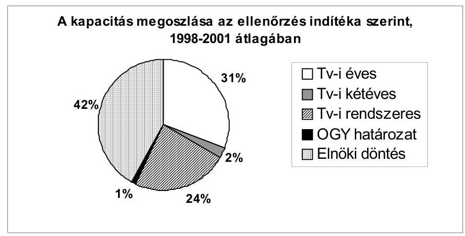
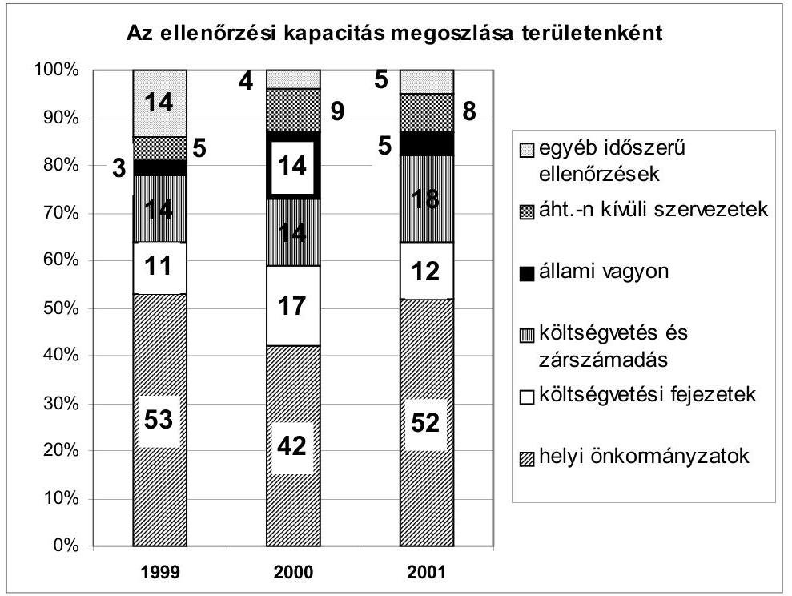
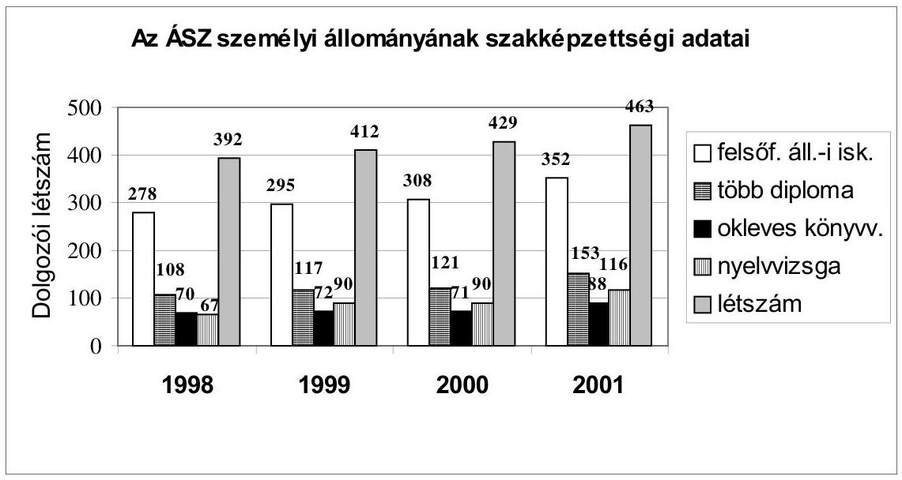
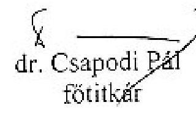

# JELENTÉS 

## az Állami Számvevőszék 2001. évi tevékenységéről

J/8.
2002. április

---

Jelentéseink az Országgyűlés számítógépes hálózatán és az Interneten a www.asz.hu címen is olvashatók.

---

# Tartalomjegyzék 

1. Az Országgyűlés szolgálatában ..... 4
1.1. A jelentések megtárgyalása, határozatok és az országgyűlési kapcsolatok ..... 4
1.2. Az Országgyűlés figyelmébe ajánlott legfontosabb tapasztalatok, következtetések ..... 7
1.3. Az Országgyűlés által támogatott intézményfejlesztés ..... 12
2. Az ÁSZ 2001. évi tevékenysége ..... 13
2.1. Az ellenőrzési feladatok és súlypontok ..... 13
2.2. A 2001. évi ellenőrzési tapasztalatok részletezése ..... 17
2.3. Az ÁSZ ellenőrzések hasznosítása ..... 27
2.3.1. A számvevőszéki tapasztalatok hasznosítása a vizsgált szervezeteknél ..... 27
2.3.2. A javaslatok érvényesülése a kormányzat szintjén és a megtett intézkedésekben ..... 29
2.3.3. Büntető feljelentések, közérdekű bejelentések. ..... 31
2.3.4. Az ellenőrzések hasznosításának sajátos módja: a nyilvánosság tájékoztatása. ..... 35
3. Az ellenőrzési munka minőségének fejlesztése ..... 36
3.1. Humán erőforrás gazdálkodás, fejlesztés ..... 36
3.2. A minőségbiztosítás ..... 40
3.3. Az ellenőrzési munkát segítő hazai és nemzetközi kapcsolatok ..... 41
3.4. A számvevőszéki stratégia megújítása ..... 43
4. Az intézmény működtetése, gazdálkodása ..... 45
4.1. Költségvetési gazdálkodás, beruházás és fejlesztés ..... 45
4.2. Az ellenőrzést és a belső irányítást segítő informatika ..... 46
MELLÉKLETEK
Adatok az ÁSZ jelentések bizottsági tárgyalásairól 1998-2001 között (1. sz. melléklet)
2000-ben és 2001-ben tett, még meg nem valósult jelentősebb jogszabályalkotásra vonatkozó ÁSZ javaslatok (2. sz. melléklet)
A számvevőszéki összefoglaló jelentések számának alakulása 2001-ben (3. sz. melléklet)
2001. évi jelentések jellemzői (4. sz. melléklet)

Az ÁSZ ellenőrzési jelentéseiben a kormánynak és a fejezetek vezetőinek megfogalmazott javaslatokra adott válaszok (5. sz. melléklet)
Könyvvizsgálói jelentés és záradék (6. sz. melléklet)

## FÜGGELÉK

Összefoglalók a 2001-ben befejezett ellenőrzések tapasztalatairól

---

# 2

---

# Jelentés   az Állami Számvevőszék 2001. évi tevékenységéről 

#### Abstract

Az Állami Számvevőszék (ÁSZ) ellenőrzési tapasztalatairól - a titokvédelmi szabályoknak megfelelő kevés kivételtől eltekintve, a közvélemény és a külföldi érdeklődők számára is hozzáférhető módon - teljes terjedelmű jelentésekben tájékoztatja az Országgyűlést. E jelentések a törvényi feladatokkal összhangban, az Országgyűlés Számvevőszéki Bizottsága ajánlásainak figyelembevételével véglegezett éves ellenőrzési terv alapján végzett vizsgálatok tapasztalatait foglalják össze.

Az év lezárásával az ÁSZ önálló beszámoló jelentést is készít éves tevékenységéről az Országgyűlésnek. Bár a számvevőszéki törvény nem rendelkezik egyértelműen e kötelezettségéről, az ÁSZ minden évben elkészítette jelentését éves tevékenységéről. Az elmúlt években az Országgyűlés fokozott figyelmet fordított ezekre az összefoglaló dokumentumokra, ami alapvető fontosságú a szervezet munkájának hasznosulása szempontjából.

A beszámolási lehetőség alkalmat ad az államháztartás egyes területein végzett ellenőrzések által szerzett tapasztalatok és a megtett intézkedések összefoglaló ismertetésére, rendszerszemléletű általánosításokra és - figyelemmel az országgyűlési ciklus lezárására -, több évet átfogó folyamatok bemutatására is. A beszámoló jelentés mindezek mellett - az évközi szakmai ellenőrzések kötött formáján és tartalmán túllépve - egyéb, az intézmény tevékenységével összefüggő, azt befolyásoló tényezőkről is tájékoztatást ad.

A jelen - a 2002. április 8-i elnöki értekezleten minősítő megállapításaiban lezárt beszámoló részletezi az ÁSZ 2001. évi tevékenységét, tapasztalatait, az ellenőrzések hasznosítását, s mindazokat a tevékenységeket, amelyeket az ÁSZ az Országgyűlés törvényhozó és ellenőrző funkciója betöltésének támogatása érdekében végzett. A jelentés három fő részre - szerkezeti egységre - tagolódik. Az első számot ad az Országgyűlés szolgálatában végzett munkáról, az ellenőrzési tapasztalatokról, az ellenőrzési kapacitások felhasználásáról, valamint az ÁSZ intézményi működéséről. A második a mellékleteket foglalja magában, áttekinti a 2001-ben készült jelentések bizottsági tárgyalásait, fontosabb jellemzőit és a javaslatok hasznosulását. A harmadik (függelék) rész a jelentések rövid összefoglalóját, legfontosabb megállapításait mutatja be.

A beszámoló igyekszik elkerülni az ismétléseket, átfedéseket, azonban néhány esetben a különböző feltételek, összefüggések bemutatása, valamint a különböző szempontú megközelítés miatt ez nem volt teljesen kikerülhető.

Az ÁSZ a 2001. évi pénzügyi gazdálkodásáról az éves zárszámadás alkalmával számol be az Országgyűlésnek. Ezt az intézmény - pályázaton kiválasztott magyar könyvvizsgáló cég által - hitelesített beszámolója alapozza meg. A könyvvizsgáló jelentését mellékeljük.

---

# 1. Az Országgyűlés szolgálatában 

### 1.1. A jelentések megtárgyalása, határozatok és az országgyűlési kapcsolatok

Az Állami Számvevőszék az Országgyűlés pénzügyi-gazdasági ellenőrző szervezete. Az 1998-2002-es parlamenti ciklus során 161 számvevőszéki jelentéssel járult hozzá az Országgyűlés tevékenységéhez. Plenáris üléseken a központi és a társadalombiztosítási költségvetésre adott számvevőszéki vélemények, illetve ezek zárszámadásáról készített jelentések, valamint az éves számvevőszéki beszámoló jelentés szerepeltek. Ez időszakban az országgyűlési bizottságok 79 jelentést tárgyaltak meg. Emellett a számvevőszéki jelentések megállapításai és javaslatai napirend előtti képviselői hozzászólásokban, interpellációkban, képviselői önálló indítványok indokolásában, kormányzati hivatkozásokban és a politikai vitanapon is hasznosultak. Az ÁSZ jelentések bizottsági tárgyalásainak adatait az 1. sz. melléklet foglalja össze.

Évente 10-15 állandó bizottság, illetve több esetben albizottság, vizsgálóbizottság vette napirendjére az ÁSZ jelentéseit, jellemzően a plenáris ülésen szereplő törvényjavaslatokhoz, bizottsági meghallgatásokhoz kapcsolódva. Legtöbb jelentést (28-at) 1999-ben vitattak meg a bizottságok, a tárgyévben készült (az éves beszámolót is magában foglaló) 37 jelentés több mint 70%-át. 2001-ben a bizottságok 25 jelentést 62 napirendi pont keretében tárgyaltak. Évről évre folyamatosan növekvő számban a Gazdasági bizottság napirendjén szerepelt a legtöbb jelentés, 2001-ben 16.

Az ÁSZ 2001-ben is eleget tett a törvényekben előírt valamennyi esedékes ellenőrzési kötelezettségének, melyekről jelentésben számolt be az Országgyűlésnek.

A zárszámadási törvényjavaslatokhoz kapcsolódó jelentéseket a parlamenti tárgyalási rendnek megfelelően a plenáris ülést megelőzően valamennyi bizottság megtárgyalta. Az ÁPV Rt., MTI Rt. éves beszámolói és a kapcsolódó számvevőszéki jelentések az elmúlt évben sem kerültek a plenáris ülés napirendjére, a bizottságok azonban megtárgyalták azokat, és a jelentésekben foglaltakat is tudomásul vették. A megállapítások érdemi hivatkozási alapként szerepeltek az országgyűlési képviselők hozzászólásaiban, interpellációikban.

Az 1998-2002-es parlamenti ciklusban vált gyakorlattá, hogy az ÁSZ éves beszámoló jelentését a plenáris ülés is rendszeresen megtárgyalta. Az évek során a plenáris ülést megelőzően egyre több bizottság tűzte napirendre a beszámolót (2001-ben 7 bizottság). Az éves beszámoló jelentések feletti értékelő, elemző viták országgyűlési határozattal zárultak. E határozatok nemcsak az előző év tevékenységének elismerését, hanem az ÁSZ-szal szembeni követelményeket is megfogalmazták. Emellett támogatták a további időszakra vonatkozó fejlesztési szándékot, irányt.

A plenáris üléseken napirendre tűzött számvevőszéki jelentések tárgyalásánál az ÁSZ választott tisztségviselői minden alkalommal részt vettek, és szóbeli tájékoztatójukkal is hozzájárultak a jelentés hangsúlyai bemutatásához.

---

2001-ben Sándor István alelnök betöltötte a tisztségéhez törvényben előírt felső korhatárt, s egyben 12 éves megbízatását. A 2000. évi beszámoló jelentés tárgyalásakor elmondott hozzászólásában búcsúzott el a törvényhozó testülettől. Dr. Nyikos László alelnök 12 éves mandátumának lejártakor, a 2000. évi költségvetési zárszámadási törvényjavaslathoz kapcsolódó expozéja során köszönte meg az együttműködést Országgyűléssel.

Az országgyűlési bizottságokkal a munkakapcsolat az évek során folyamatosan fejlődött. Az Országgyűlés ellenőrző szerepének szolgálatával összhangban a bizottságok a tárgyév előtt már tervezet formájában megkapták az ÁSZ következő évi ellenőrzési tervét, s szóban, írásban tett javaslataikat a terv véglegesítése során figyelembe vettük, és így terjesztettük megtárgyalásra a Számvevőszéki bizottság elé. A bizottság a kötelezően előírt témákon túl évente tárgyalta az ÁSZ ellenőrzési tervét, éves beszámoló jelentését, intézményi költségvetési javaslatát és annak végrehajtását, valamint a középtávú számvevőszéki stratégiát. Számos törvénymódosítási javaslattal segítette az ÁSZ tapasztalatainak hasznosulását és az intézményi működés fejlesztését.

Az ÁSZ kapcsolatot tartott az Országgyűlés tisztségviselőivel. Kísérő levéllel küldte meg valamennyi jelentését, a levélben kiemelve a legfontosabb megállapításokat, következtetéseket. Az ÁSZ vezetése az országgyűlési ciklus elején és végén azzal kereste meg a képviselő csoportokat, hogy véleményüket kérje a számvevőszéki tevékenység, az Országgyűlés szolgálata teljesítéséhez. Valamennyi képviselőcsoport segítő észrevételeket tett, tanácsokat adott, amelyeket a munkában hasznosítottunk.

Az illetékes állandó bizottságok félévente értesítést kaptak az elkészült jelentésekről, így a bizottsági munkatervek összeállítása során figyelembe tudták venni a számvevőszék ellenőrzési anyagait is. Az ÁSZ élt azzal a jogával és lehetőségével, hogy tanácskozási joggal részt vehet a bizottságok ülésein. Az ÁSZ jelentései tárgyalásán túl, vezetői-szakértői szinten a feladatkörét, ellenőrzéseit érintő napirendek tárgyalásán is részt vett. A Költségvetési és pénzügyi bizottság önálló napirendi pont keretében kért és kapott tájékoztatást 2001. októberében az ÁSZ elnökétől az ÁSZ 2000-2001. évekre vonatkozó munkájáról, a tervezett szervezeti változásokról.

Az állandó bizottságokkal való folyamatos együttműködésen túl az ÁSZ 1999 óta meghívottként részt vett a közbeszerzésekről szóló törvény érvényesülését vizsgáló bizottság munkájában, s a bizottság jelentése meghatározóan épített az ÁSZ tapasztalataira.

A parlamenti kapcsolatok sokszínűségét jelzi, hogy 2001-ben az országgyűlési bizottságok önkormányzati témakörben két alkalommal tartottak parlamenti nyílt napot, melyen az ÁSZ hozzászólásokkal, bemutatóval, illetve írásos tájékoztatóval működött közre. Az 1998-2002-es parlamenti ciklusban 2001-ben fordultak először az ÁSZ elnökéhez képviselők írásbeli kérdéssel, három alkalommal.

---

#### Abstract

Az ÁSZ tájékoztatást adott a pártfinanszírozás szabályozásának hiányosságával, az önkormányzati költségvetési szervek részéről tiltott vagyoni hozzájárulással kapcsolatos törvényes állapotok helyreállításával kapcsolatban; az önkormányzatoknak nyújtott segélyek elosztási kérdéseiről, illetve a bel- és árvízkárokra biztosított összegek felhasználásáról. A Légiforgalmi és Repülőtéri Igazgatóságnál, a MALÉV Rt.-nél zajló vagyongazdálkodással kapcsolatos kérdések megválaszolására az LRI 2003-ban történő ellenőrzése, illetve az ÁPV Rt. 2001. évi tevékenységének ellenőrzése nyújt lehetőséget.

Az Országgyűlés főtitkárságával szoros munkakapcsolatot tart fenn az ÁSZ. Ez nagyban elősegítette a bizottsági és plenáris ülések előkészítését, az információs kapcsolat kialakítását. Az Országgyűlés és az ÁSZ közötti, folyamatosan fejlődő informatikai kapcsolat lehetővé tette a parlamenti számítástechnikai hálózat közvetlen elérhetőségét. Így az Országgyűlés, illetve az ÁSZ munkájával kapcsolatos információk folyamatosan, a lehető legrövidebb időn belül kölcsönösen rendelkezésre álltak.

Az ÁSZ folyamatosan nyomon követi ajánlásai hasznosulását. Különösen az Országgyűlés 82/1999. (X. 22.) sz. határozata óta bővültek a javaslatok hasznosítását bemutató információk az éves beszámolókban. A törvénymódosítási javaslatok megvalósítását - egyben az ÁSZ munkájának hasznosítását - segítené, ha az erre vonatkozó és a címzettek által kedvezően fogadott javaslatok bekerülnének az Országgyűlés Jogi Főosztálya által készített, az Országgyűlés feladatait tartalmazó kimutatásba. Ez előrelépést jelentene abból a szempontból, hogy az Európai Bizottság 2001. évi országjelentése a számvevőszéki tevékenységet megfelelőnek értékeli ugyan, de szól a számvevőszéki javaslatok nyomon követése zárt rendszerű biztosításának szükségességéről. Erre is tekintettel jelen beszámoló 2. sz. melléklete bemutatja a 2000. és 2001. évi ellenőrzések során tett, az érintettek részéről elfogadott, de még nem teljesült jelentősebb törvénymódosítási javaslatokat.

A számvevőszéki ellenőrzések alapján tett ajánlások egyrészt a vizsgált és az irányító szervezetek intézkedései révén, másrészt az Országgyűlés törvényhozó és ellenőrző tevékenysége által hasznosulhatnak, amennyiben kellő figyelemben részesülnek. Az elmúlt négy évben benyújtott 161 jelentésében az ÁSZ több mint 1000 javaslatot tett az Országgyűlésnek, a Kormánynak és a fejezetek (minisztériumok) vezetőinek. A javaslatok több mint 60%-ának címzettje a Kormány és a pénzügyminiszter volt. A javaslatok mintegy 20%-a törvénymódosításra irányult. 2001-ben a címzetteknek tett közel 200 ajánlás egyharmada a Kormánynak szólt, melynek 40%-a törvénymódosításra vonatkozott. A Kormánytól és a tárcáktól érkezett visszajelzések szerint
 a - kiemelt címzetteknek tett - törvénymódosító javaslatok közül megvalósult, illetve előkészítés alatt áll az indítványok mintegy fele.

2001-ben a pénzügyi tárgyú törvények módosításáról szóló 2001. évi L. törvény és a 2000. évi költségvetés végrehajtásáról szóló 2001. évi LXXX. törvény Áht-t módosító rendelkezéseiben már hasznosult a Magyar Államkincstár és az ÁKK Rt. közötti feladatelhatárolásra (pl. a hiányfinanszírozás, az adósságkezelési feladatok) és az adósságrendezési eljárás megindítására vonatkozó javaslat.

---

A pénzügyeket szabályozó egyes jogszabályok módosításáról szóló 2001. évi LXXIV. törvény a közbeszerzési törvény módosításakor figyelembe vette az ÁSZ elsősorban a bírálati eljárással és szempontrendszerrel kapcsolatos javaslatait.

Az Országos Betétbiztosítási Alap, a Befektető-védelmi Alap és a Pénztárak Garancia Alapja működésének ellenőrzési megállapításai a tőkepiacról szóló 2001. évi CXX. törvény rendelkezései között hasznosultak.

Az éves költségvetési törvényekben folyamatosan változott a helyi önkormányzatoknak juttatott állami támogatások, hozzájárulások szerkezete, jogcímeinek tartalma, pontosultak, esetenként szigorodtak az igénybevételi feltételek, szabályok. A címzett és céltámogatási vizsgálatok nyomán 2001-ben a helyi önkormányzatok címzett és céltámogatási rendszeréről szóló 1992. évi LXXXIX. törvényben szigorodott a beruházások pénzügyi megalapozásának követelményrendszere.

Az önkormányzati tulajdonban lévő kórházak gazdálkodásának vizsgálata során tett megállapításokkal összhangban az egészségügyi közszolgáltatások nyújtásáról, valamint az orvosi tevékenység végzésének formáiról szóló 2001. évi CVII. törvény szerint szakellátási tevékenységet a központi és önkormányzati költségvetési szerv mellett közhasznú társaság is végezhet.

A tapasztalatok tartalmi hasznosulásáról elmondható, hogy legnagyobb arányban a költségvetési zárszámadáshoz kapcsolódó javaslatok a különböző hibák, szabálytalanságok korrekciójaként realizálódnak. Ugyanakkor azok a javaslatok hasznosulnak kevésbé – bár jellemzően a kormányzati szervek is egyetértenek velük – amelyek érdemi, rendszerbeni előrelépést szolgáló változásokat igényelnek. Ezek a jogalkotói munkában még kevéssé tükröződnek. Esetenként egy-egy javaslat megvalósításához a mindennapi gazdálkodási gyakorlat, a munkaszervezési megoldások, a vezetési szemlélet számottevő változásán túlmenően több, egymással kölcsönhatásban álló jogszabály összehangolt módosítása is szükséges. Az átfogó rendszerszemléletű változtatások csak a pénzügyi kormányzattal, a szaktárcákkal folyamatosan konzultálva, egyeztetve, az ellenérdekeltségek enyhítésével, fokozatosan juthatnak érvényre.

# 1.2. Az Országgyűlés figyelmébe ajánlott legfontosabb tapasztalatok, következtetések 

Az Országgyűlés 2001-ben ismételten felkérte az ÁSZ-t 29/2001. (V. 11.) OGY határozatával, hogy fokozott figyelmet fordítson az államháztartás korszerűsítését előmozdító ellenőrzésekre. Az ÁSZ ezért az éves ellenőrzési tapasztalatokon túl, a jobbítás szándékával ajánlja az Országgyűlés és a Kormány figyelmébe a korábbi jelentéseiben ismétlődően megtett – ma is időszerűnek tartott – javaslatait.

Az államháztartás alrendszereinek működésében számos pozitív változás figyelhető meg. Ezek megvalósulásában – a tapasztalatok hasznosulásának gondjait jelző megjegyzés mellett – a számvevőszéki ellenőrzés és a javaslatok hasznosítása is közrejátszott.

---

Így kiemelést érdemel, hogy a költségvetési intézményi gazdálkodás és feladatellátás színvonalában, a törvényességi-pénzügyi-szabályossági követelmények megtartásában, elsősorban a Kincstár működésének köszönhetően, javuló tendencia érzékelhető. Az államháztartás egyes alrendszereinek működésében és gazdálkodásában, a közfeladatok ellátásában mutatkozó, visszatérően tettenérhető hiányosságok túlnyomó része ugyanakkor rendszerbeni problémákra vezethető vissza.

Ezzel magyarázható, hogy a vizsgálati tapasztalatok visszatérően kénytelenek felvetni a központi költségvetés szintjén a feladat- és hatáskörök rendezésének, az elérendő célok és az elvégzendő feladatok egyértelmű meghatározásának hiányából eredő problémákat, a gazdálkodási, a finanszírozási, az információs és a beszámolási rendszer hiányosságait, a vezetés-irányítás, a visszacsatolás és a belső ellenőrzés gyengeségeit.

Az intézményi gazdálkodás átfogó szabályozása (számviteli politika, leltározás, eszközök és források értékelése, pénzkezelés), a meglévő szabályzatok aktualizálása, a fejezetek intézményeinek többségénél hiányos. A költségvetési beszámoló valódisága szempontjából kockázati tényező a gazdálkodás szabályozottságának és a belső irányítás és ellenőrzés rendszerének – EU éves országjelentésekben is kritikaként megjelenő – nem kielégítő kiépítettsége, működése.

A belső kontroll mechanizmusok ellenőrzéséről szóló ÁSZ jelentés – tekintettel a nemzetközi, illetve az EU Számvevőszék érdeklődésére – teljes terjedelmében angol nyelven is rendelkezésre áll.

Az egységes, törvényi szintű államszámviteli rendszer kidolgozására és bevezetésére vonatkozó javaslatát az ÁSZ többször megismételte. Az államszámviteli rendszer újbóli kidolgozása, a jelenlegi követelményeknek megfelelő bevezetése és alkalmazása az egyik alapfeltétele az államháztartás központi költségvetési alrendszere által kezelt pénzeszközök áttekinthetőségének, zárt rendszerének és maradéktalan ellenőrizhetőségének.

A társadalombiztosítási alrendszert érintő ellenőrzési tapasztalatok szerint a könyvvezetésben, az elszámolások megbízhatóságában, a nyilvántartások pontosságában fejlődés mutatkozott. Az alapok költségvetési beszámolóinak könyvvizsgálata – eltérően a korábbi évektől – teljes körűen hitelesítő záradékkal fejeződött be. Az alrendszer egészének pénzügyi helyzetét tekintve azonban nem történt pozitív irányú elmozdulás, sőt a költségvetési egyensúlyi pozíciójuk romlott. A társadalombiztosítási alrendszer saját bevételei nem fedezik a nyugdíj- és egészségbiztosítás kiadásait.

Bár jelentős lépések történtek, 2001-ben nem került sor az államháztartás társadalombiztosítási alrendszere egészének – minden tekintetben reformértékű – megújítására, az ellátórendszer (elsősorban az egészségügyi ellátás) korszerűsítésére vonatkozó szakmai és finanszírozási szempontból egyaránt egységes alapelveket alkalmazó elképzelés megalkotására.

---

A helyi önkormányzatok mind a kötelező, mind az önként vállalt feladataikat teljesítették, biztosították intézményeik működését, ehhez azonban gazdálkodásuk feltételeinek szigorítására volt szükség. Ennek érdekében folytatták az intézményi struktúra szűkítését, racionalizálását, helyi kincstári típusú gazdálkodást vezettek be. A változtatások terén megtett lépéseik nem kielégítőek. A vizsgált önkormányzatok fele romló pénzügyi feltételek között gazdálkodott. Az államháztartás önkormányzati alrendszerénél kell kiemelni azt, hogy az ún. nagy ellátó rendszerek hatékonyabbá tétele össztársadalmi érdek. Ezen belül is az egyik legfontosabb feladat az oktatás, az egészségügyi feladatellátás hatékonyabbá tétele, az állam, az önkormányzatok és az üzleti szféra közötti szerepvállalás meghatározásával.

Az önkormányzatok pénzügyi szabályozásában az elmúlt 10 év alatt nem történt átfogó felülvizsgálat. Jelenleg az önkormányzatok egyharmada forráshiányos, számuk növekszik. Ez arra hívja fel a figyelmet, hogy a forrásszabályozási rendszer reformja elodázhatatlan. E – nem csupán támogatási – kérdéskör kezelése tapasztalataink szerint egyaránt igényli a területfejlesztési, foglalkoztatáspolitikai, munkahelyteremtési koncepciók kidolgozását és az ezekhez szükséges gazdasági eszközök biztosítását is.

A normativitás, a feladatfinanszírozás erősítése, a kiegészítő mechanizmusok finomítása, a helyi adórendszer többszöri módosítása, a forráskoordinációra hozott intézkedések nem hoztak érdemi elmozdulást a területi kiegyenlítődésben, az önkormányzatok pénzügyi egyensúlyi helyzetének javításában, a közszolgáltatási feladatok ellátásában, ezáltal az állami pénzek hatékony felhasználásában.

Az állami támogatással, a címzett, de különösen a céltámogatással megvalósuló önkormányzati beruházások önkormányzati saját forrás részének biztosítása – a rendszer működésének kezdetétől fogva – problémákat okozott a vizsgált önkormányzatok többségénél. Az ÁSZ jelentések minden évben rámutattak arra a kedvezőtlen jelenségre, melyet a támogatások év végi maradványa jelzett. A fel nem használt pénzeszközök aránya 1998-2000. években 40-50% között mozgott. Keletkezésük legfontosabb oka, hogy az önkormányzatok a beruházásokhoz szükséges saját forrást nem teljes körűen vagy egyáltalán nem tudták biztosítani. Az önkormányzatok a saját forrás megteremtéséhez az elkülönített állami pénzalapokból, és később az ún. fejezeti célelőirányzatokból igényelhető támogatásra is számítottak. Ezek elbírálása azonban a céltámogatástól időben és rendszerében is eltérően történt, amint azt az évek során jeleztük.

A közfeladatok hatékonyabb ellátásának egyik meghatározóan fontos eleme a beruházások, beszerzések, szolgáltatások szakmailag kifogástalan, a közösségi szféra egészére kiterjedő, átlátható megvalósítása. Az átláthatóság biztosításának legjelentősebb eszköze a közbeszerzés rendszere, ami a megelőzést szolgáló felfogásban a korrupció elleni harc egyik fontos feltétele.

---

Bár a helyi önkormányzatok és a központi költségvetési szervek évről-évre növekvő számban és értékben, szélesedő körben vállalkoztak közbeszerzési eljárások lebonyolítására, a folyamatokban való részvételük, a közbeszerzési eljárások keretében megvalósuló beszerzéseik értéke jelentősen elmarad az itt realizálódó közpénzek nagyságrendje alapján elvárható mértéktől. Ugyanakkor kedvező, hogy a hirdetmény nélküli tárgyalásos eljárások aránya az EU tagországokban szokásos szintre csökkent.

A közbeszerzés kívánatosnál lassúbb és ellentmondásosabb terjedése, az előforduló hibák elsősorban a jogalkalmazók felkészületlenségére, eltérő érdekekre, illetve szemléleti okokra vezethetők vissza. A tapasztalatok azt is megerősítették, hogy a problémák az államháztartási finanszírozás szabályozásával összefüggő előírások ellentmondásaiból és gyakorlati megoldásai egyenetlenségeiből származnak. Az ÁSZ a közbeszerzés szabályozási és intézményrendszeréről, működése mechanizmusáról számos kritikai észrevételt fogalmazott meg, ugyanakkor a tapasztalatok azt is megerősítik, hogy a törvény – az összes korrekcióra váró hibájával együtt – működik. Az ÁSZ elsősorban olyan szabályozásbeli megoldások alkalmazását javasolta, amelyek nem az általános jogi szigorításra, a jogalkalmazási mozgástér szűkítésére, hanem a jelenleg is érvényes előírások fokozott betartására, azok érvényességi határainak egyértelműbbé tételére ösztönöznek.

A köz- és a magánszféra új együttműködése, a közszolgáltató rendszerek és szervezetek átalakításának folyamata, a közszféra hatékonyságának növelésére irányul. A feladatellátás során nem az a meghatározó, hogy ki látja el a feladatot, hanem annak hatékonysága. Meg kell határozni azonban az állami szerepvállalás módját, tartalmát és mértékét. Az intézményrendszer fejlesztése, a feladatok finanszírozása, a magánszféra közreműködésének növekedése új ellenőrzési feltételeket is követel, és a finanszírozás szabályosságának ellenőrzése mellett mind jobban igényli a teljesítmények vizsgálatát.

A nemzeti számvevőszékeknek, így az ÁSZ-nak is, ellenőrzéseikkel alkalmazkodniuk kell ahhoz az egyre inkább elfogadott és terjedő feladatellátási módhoz, ahol a közszolgáltatás, beruházás ellátása magánvállalkozás bevonásával történik. A jelenlegi hatásköri korlátok között a közpénzek útja a végső felhasználóig követhetetlen, sőt e probléma még a közvetett állami tulajdonú és az önkormányzati tulajdonú társaságok esetében is jelentkezik. A közpénzek felhasználásának ellenőrzése így ma még nehezen képes felderíteni, és felszámolásukban segíteni azokat a konkrét hibákat, szakmai tévedéseket, amelyek előfordultak, és amelyek révén egyes eljárások tisztasága is kétségessé vált.

---

A kincstári vagyon tartalma, vagyonkezelési, gazdálkodási és ellenőrzési feladatai szabályozottak, de egységes vagyontörvény hiányában nehezen áttekinthető működési környezet alakult ki. Megkezdődött a kincstári vagyon teljes körű nyilvántartására alkalmas rendszer kifejlesztése, de még nem sikerült elérni, hogy az állam vagyonáról állami szinten egységes nyilvántartás, továbbá emellett a kezelő szervezeteknél hiteles, valóságos vagyonnyilvántartás álljon rendelkezésre.

Nem történt meg a kincstári vagyonnal való gazdálkodás rendszerének átfogó rendezése, az egységes vagyontörvény megalkotása, a gazdálkodás fegyelmének szigorú számonkérése.

A demokratikus intézményrendszer, a civil szféra átlátható, közbizalomnak megfelelő működtetéséhez kapcsolódnak az ÁSZ-nak azon feladatai, amelyek a politikai pártok, társadalmi szervezetek, közalapítványok gazdálkodása, valamint a választások pénzügyi feltételei ellenőrzésére irányulnak.

A pártok, az országos kisebbségi szervezetek, az általános és az időközi választásokra fordított pénzeszközök ellenőrzései több, részben a szabályozatlanságból, másrészt a szabályozás koordinálatlanságából következő hiányosságot tártak fel.

A választási eljárásról szóló törvény nem határozza meg a választási kampány, a választási költség és azon belül a dologi költség fogalmát, nem határozza meg a költségvetési támogatás kifizetőhelyét. A törvény szerinti és a pénzügyi szempontból figyelembe vehető tényleges kampányidőszak a gyakorlatban egymástól eltérhet. A törvény nem határozza meg, hogy milyen formában kell a választásra fordított összegeket és azok forrásait nyilvánosságra hozni, továbbá azt sem, hogy a választási kampányhoz nem pénzben nyújtott támogatásokat a választási források és kiadások között hogyan és milyen mértékben kell figyelembe venni. A pártok által közzétett elszámolások (beszámolók) formája és tartalma – kötelező előírás hiányában – nem mutatott egységes képet. A választási költségek Magyar Közlönyben való közzétételi kötelezettségének elmulasztásához a törvény szankciót nem rendel.

A megállapítások ismételten felvetik a párt, a választási és a számviteli törvények, valamint
 az államháztartás működési rendjére vonatkozó kormányrendelet több éve hangoztatott módosításának szükségességét, amelyről tudjuk, hogy az Országgyűlés előtt álló és megoldásra váró feladatok között szerepel, de az ÁSZ a munka felgyorsítását különösen sürgetőnek tartja.

A számvevőszéki ellenőrzések több évet átfogó, középtávú időhorizontra kitekintő megállapításai éppen a szóban forgó hiányosságok folytán az éves beszámoló jelentésben ismételten hasonlóan összegezhetők.

---

A sokrétű ellenőrzési tapasztalatok, nem kevésbé az ajánlások, javaslatok megvalósításának eredményei és problémái egyaránt arra engednek következtetni, hogy a pénzügyi rendszer és az államháztartás nagyobb léptékű, az EU-követelményekhez is igazodó átalakításának, reformjának felgyorsítása nélkül érdemben és tartósan nem küszöbölhetők ki az ellenőrzésekkel (is) felszínre hozott hibák, hiányosságok, ellentmondások.

Az ÁSZ tudatában van annak, hogy az államháztartási reform folyamatok nem vihetők végig egy-egy kormányzati ciklus alatt. A több éves ellenőrzési munka alapján az előzőekben javasolt változtatásokat a megvalósítás érdekében ezért ismételten az Országgyűlés figyelmébe ajánljuk.

# 1.3. Az Országgyűlés által támogatott intézményfejlesztés 

Az ÁSZ az Országgyűlés támogatásával 2001-ben folytatta a korábban megkezdett, a működési (jogi, gazdasági stb.) környezet változásaiból adódó fejlesztéseket, amelyek tevékenysége személyi és tárgyi feltételeinek javítását, és az intézmény nemzetközi szerepvállalását biztosítják.

Folytatódott az ellenőrzési tevékenység új törvényi kötelezettségekhez igazítása. Az új feladatok közül kiemelkedik a Magyar Nemzeti Bank működésének ellenőrzése, melyet az Országgyűlés – figyelemmel az EU részéről felmerült igényekre is – számvevőszéki hatáskörbe sorolt.

A változások nyomán kibontakozó lehetőségekhez illeszkedik a 2002. január 1-jétől kialakított új szervezeti struktúra, amely egyszerűbbé tette a szervezet felépítését, s egyenrangúan kezeli a központi (kormányzati), valamint a helyi (önkormányzati) költségvetés ellenőrzését. Két – az ellenőrzési kapacitást tekintve azonos nagyságrendű – igazgatóság működik (belső tagolásuk is azonos: pénzügyi szabályszerűségi, teljesítmény-, valamint átfogó ellenőrzéseket végző vizsgálati osztályokból álló főcsoportok). A harmadik nagy szervezeti egység az intézmény irányításának és működtetésének feladatát látja el. Emellett az elmélyültebb szakmai munkát – többek között kapcsolattartással, szakcikkek, publikációk összeállításával – segíti az ÁSZ elnökének Tanácsadó Testülete és a megújult, szellemi alkotó műhely szerepét betöltő szakmai háttérintézmény, az ÁSZ Fejlesztési és Módszertani Intézete (FEMI).

Országgyűlési határozat erősítette meg az ÁSZ nemzetközi szakmai szerepvállalását is, és biztosította az ehhez szükséges forrásokat. Az ÁSZ nemzetközi kapcsolataiban rejlő lehetőségek kihasználása nem csak a hazai ellenőrzési feladatok ellátásának minőségét javítja. A kapcsolatépítés, elsősorban az INTOSAI keretében való jelentős szerepvállalás, a külföldi partnerek számára pénzügyi rendszerünk rendezett működésének egyfajta tükre és garanciája. Ez elősegíti az uniós integrálódást és egyben nemzeti érdekeink érvényre jutását is előmozdítja.

---

Az utóbbi években előtérbe került és felgyorsult az EU-csatlakozásra való felkészülés. Az Országgyűlés döntése alapján lehetővé vált, hogy az ÁSZ – a NATO, az Európai Unió, illetve olyan nemzetközi szervezet felkérésére, amelynek a Magyar Állam tagja, továbbá az Országgyűlés vagy a Kormány által vállalt nemzetközi szerződésből eredő kötelezettség teljesítésére – ellenőrzést folytathasson, ügykörébe tartozó szakértői tevékenységet végezhessen belföldön és külföldön.

Kedvezően érintette az ÁSZ-t a köztisztviselői törvény – és ehhez kapcsolódóan a számvevőszéki törvény – változása, ami megteremtette a differenciáltabb, a jobb munkateljesítményt ösztönző javadalmazás feltételeit. A magasan képzett számvevőszéki szakemberek közé fiatalabb, egy vagy több idegen nyelvet beszélő új munkatársak is felvételt nyertek, s így az átlagéletkor csökkent. Részben ezért kaptak nagyobb szerepet és folytatódtak tovább a gyakorlati ismeretek megszerzésére irányuló belső képzések.

Az ÁSZ az utóbbi négy évben az 1998-ban közreadott stratégiája alapján dolgozott. Ennek eredményeként ellenőrzéseiben egyre nagyobb teret nyert a zárszámadás vizsgálata kapcsán a pénzügyi szabályszerűségi ellenőrzés (financial audit), és tovább fejlődött a teljesítményellenőrzés (performance audit). Az Országgyűlés határozataival támogatta az ÁSZ megváltozott elvárásokhoz jobban igazodó, teljesítményellenőrzések és pénzügyi ellenőrzések irányába elmozduló belső szakosodását (49/2000. (V. 26.) és 29/2001. (V. 11.) OGY határozatok). Az ÁSZ a változó gazdasági és pénzügyi feltételekre figyelemmel átformálja, megújítja stratégiáját, annak érdekében, hogy tudatosan előmozdítsa munkájának, ellenőrzési tevékenysége minőségének javítását (erről lásd 3.4. pontban foglaltakat).

# 2. Az ÁSZ 2001. ÉVI TEVÉKENYSÉGE 

### 2.1. Az ellenőrzési feladatok és súlypontok

Az ÁSZ államszervezetben elfoglalt helyéből, a hatályos jogrend előírásaiból adódóan mindenekelőtt az Országgyűlés törvényhozó és ellenőrző funkciójának érvényre juttatásához járul hozzá, az Alkotmányban, a számvevőszéki törvényben és egyéb más törvényekben megszabott kötelezettségei és jogosultságai alapján. E törvényekben meghatározott rendszeres, illetve visszatérő ellenőrzési kötelezettségek az ellenőrzési kapacitás – négy év átlagában – 60%-át lekötik. E feladatok mellé elnöki döntés alapján olyan ellenőrzések kerülnek az éves ellenőrzési tervbe, melyek nagy kockázattal működő szervezetek, illetve folyamatok ellenőrzésére irányulnak, s azok egyenként és különösen a belőlük levonható következtetések szintetizálásával, az azokból adódó javaslatokkal, ajánlásokkal elősegítik az elszámoltathatóság, a közpénzek elköltésének átláthatósága feltételeinek megteremtését.

---

Az ÁSZ 2001-ben is az elnök által jóváhagyott – az országgyűlési bizottságok elnökeinek előzetesen megküldött és a Számvevőszéki bizottság ajánlásait figyelembe vevő – ellenőrzési tervben foglaltak szerint végezte munkáját. A 2001. évi ellenőrzési tervben összesen 56 ellenőrzés szerepelt. Ezek közül 15 ellenőrzés 2000-ben kezdődött meg és 2001-ben fejeződött be, 21 ellenőrzés 2001-ben kezdődött meg és fejeződött be, 20 ellenőrzésről pedig 2002-ben adjuk közre a jelentést, terv szerint.
2001. évi befejezési határidővel került jóváhagyásra 36 vizsgálat, és a tervezettel azonos számú befejezett ellenőrzésről készült jelentés. A végrehajtott ellenőrzési feladatok számának és témájának alakulását a 3. sz. melléklet mutatja.

Az ÁSZ 2001-ben közel 3000 helyszíni ellenőrzést teljesített, a korábbi évek 2200-2600 ellenőrzésével szemben. Az összegző megállapításokat tartalmazó jelentések száma ezzel szemben némileg csökkent. Ennek egyik oka, hogy – az országgyűlési elvárásokhoz igazodva – a jelentősebb ellenőrzési kapacitást igénylő, szakmailag összetettebb tényfeltáró és elemző munkával járó vizsgálati feladatok aránya megnőtt. A másik pedig az, hogy a jelentések szélesebb területet fognak át, s egyre inkább alkalmasak általánosítható tapasztalatok feltárására, új döntések megalapozására. Emellett növekvő ellenőrzési kapacitást igényel a zárszámadási ellenőrzés keretében végzett, az elszámolások megbízhatóságát tanúsító pénzügyi szabályszerűségi ellenőrzések körének bővítése, valamint az Országgyűlés támogatásával 2001-től rendszeresebbé váló, a helyi önkormányzatok gazdálkodásának egészét lefedő, átfogó ellenőrzés.

Az ÁSZ 2001-ben – a 2000. év zárszámadásának ellenőrzése keretében – 7 fejezet, 2 különleges jogosítvánnyal rendelkező költségvetési cím, 11 intézmény és 4 fejezeti kezelésű előirányzat, valamint a központi költségvetés közvetlen bevételei pénzügyi szabályszerűségi ellenőrzését végezte el.

Kiemelt feladatként kezeli az ÁSZ azon önkormányzatok gazdálkodásának átfogó ellenőrzését, amelyek működése, költségvetésük és vagyonuk nagyságrendjéből adódóan, esetenként a központi költségvetés szintjén is jelentős kockázatokkal járhat. Az önkormányzatok átfogó ellenőrzéséről készített összefoglaló jelentés mögött mintegy 200 önkormányzat vizsgálati tapasztalata, s e vizsgálatokról készített egyedi jelentések állnak.

A 2001-ben elkészült jelentések jellemzőit (a jelentés tárgya, száma, a jelentést készítő igazgatóság, az ellenőrzés jogszabályi alapja és indoka, célja, a költségvetési nagyságrend) a 4. sz. melléklet tartalmazza.

Az ÁSZ vizsgálati feladatai között meghatározóak az évenkénti ellenőrzési kötelezettségek (a központi költségvetés és a társadalombiztosítási alapok zárszámadása, az önkormányzati feladatokhoz kapcsolódó állami támogatások felhasználása, valamint az ÁPV Rt. és az MTI Rt. ellenőrzése). Ebben a tárgykörben 7 ellenőrzési jelentés készült.

A kétévenkénti ellenőrzési kötelezettségként jelentkező feladatok közül 2001-ben 8 párt gazdálkodásának ellenőrzésére került sor.

---

A rendszeres ellenőrzési feladatok teljesítéseként 5 önálló vizsgálati jelentés készült. (Több évre visszanyúló átfogó ellenőrzés a központi költségvetés két fejezeténél, egy elkülönített állami pénzalapnál és a helyi és kisebbségi önkormányzatoknál, valamint a 2001. évi időközi választási kampányra fordított pénzeszközök felhasználásának szabályszerűségi ellenőrzése.)

A rendszeres ellenőrzési feladatok körébe tartoznak azok az ellenőrzési kötelezettségek, amelyeknél a törvény a feladat teljesítésének „rendszerességét” írja elő, illetve ahol a törvény nem rendelkezik a feladat teljesítésének gyakoriságáról, de gyakoriság nélkül a feladat nem értelmezhető.

A rendszeres kötelezettségeken kívüli körben 16 vizsgálat fejeződött be.
Az ÁSZ 2001-ben is a törvényben előírt feladatok végrehajtására és azokon túl a gazdasági, társadalmi szempontból időszerű és lényeges területekre, folyamatokra, szervezetekre összpontosította figyelmét, különösen azokra, ahol a működés és a feladatok teljesítése számottevő pénzfelhasználással és kockázattal jár együtt. Ennek jegyében került sor az államháztartás belföldi adóssága és a központi költségvetés belföldi követelésállománya kezelésének, a Nyugdíjbiztosítási Alap, a központi költségvetés területén működő belső kontroll mechanizmusok, illetve a Szigetköz környezetvédelmi céljaira fordított források felhasználásának ellenőrzésére.

A központi költségvetéstől kapott támogatások reálértékének alakulása miatt, mint fontos bevételi lehetőséget, vizsgáltuk a települési önkormányzatok adóztatási tevékenységét. A korrupciós jelenségek előtérbe kerülése tette kiemelt feladattá a módosított közbeszerzési törvény végrehajtásának az ellenőrzését.

Az ÁSZ évről évre ellenőrzi a lakossági ellátás szempontjából is jelentős szolgáltatásokat végző egy-két nagy állami társaság működését, az állami vagyonnal való gazdálkodását. Erre alapozva valósult meg 2001-ben a nagyvárosi tömegközlekedés feladatellátásának és finanszírozásának ellenőrzése.

A számvevőszéki törvényben előírt általános hatáskörű ellenőrzési (véleményezési, ellenjegyzési) felhatalmazást, kötelezettséget, jogosultságot mintegy 30 törvény részletezi. A részletező jogszabályi előírások köre tovább bővült. Az Országgyűlés 2001-ben új feladatokat határozott meg

---

az ÁSZ számára, melyek közül kiemelkedik a Magyar Nemzeti Bankról szóló 2001. évi LVIII. törvényben foglalt felhatalmazás. A korábbi törvényi szabályozáson túl az ÁSZ feladata a jegybank működésének ellenőrzése, javaslattétel a könyvvizsgáló személyére, valamint visszahívásának kezdeményezése a közgyűlésnél. A jegybank ellenőrzésére 2001 második félévében megkezdődött a felkészülés.

Az egyes közhatalmi feladatokat ellátó, valamint közvagyonnal gazdálkodó tisztségeket betöltő személyek összeférhetetlenségéről és vagyonnyilatkozattételi kötelezettségéről szóló 2001. évi CII. törvény alapján az ÁSZ feladata lett az Országgyűlés és a Kormány által alapított közhasznú szervezetek vezető tisztségviselői vagyonnyilatkozatának ellenőrzése. Ez eltér a korábbi klasszikus számvevőszéki ellenőrzési feladatkörtől.

A hírközlésről szóló 2001. évi XL. törvény az Egyetemes Távközlési Támogatási Alap és Egyetemes Postai Támogatási Alap pénzügyi-számviteli ellenőrzését írja elő az ÁSZ számára.

A Polgári Törvénykönyv módosítása során az ÁSZ feladatköréből kikerült az önkormányzati alapítású közalapítványokhoz hasonlóan, a kisebbségi önkormányzatok képviselő-testületei által alapított közalapítványok gazdálkodásának ellenőrzése.

Az ellenőrzési kapacitás területenkénti megoszlását az alábbi ábra szemlélteti.

---

# 2.2. A 2001. évi ellenőrzési tapasztalatok részletezése 

A 2000. év zárszámadásának ellenőrzése során folytatódott a korábban megkezdett "financial audit" típusú, az elszámolások megbízhatóságát tanúsító ellenőrzés több szervezetre való kiterjesztése. Az így vizsgált fejezetek pénzfelhasználásukat tekintve a költségvetésnek még csak néhány százalékát reprezentálják, alkotmányossági szempontból azonban meghatározóak. Az ÁSZ pénzügyi szabályszerűségi ellenőrzéssel a központi költségvetés kiadási főösszegéből 70 Mrd Ft-ot, bevételi főösszegéből 2.000 Mrd Ft-ot fedett le.

A „financial audit típusú” vizsgálati körben a megállapításaink azt tükrözik, hogy a fejezeti, intézményi és fejezeti kezelésű előirányzatok beszámolójelentései – a Földművelésügyi és Vidékfejlesztési Minisztérium (FVM) Gazdálkodó Szervezete kivételével – hitelesek, a vagyoni és pénzügyi helyzetről megbízható, valós képet adnak. Az FVM Gazdálkodó Szervezet beszámoló jelentése lényeges szintű hibákat tartalmaz, amelyek felhatalmazás nélküli és szabálytalan kifizetéseket jelentettek.

A központi költségvetést megillető adóbevételek a zárszámadási törvényjavaslatban számszakilag valamennyi adónemnél egyezőséget mutattak a nemzetgazdasági
 számlákon teljesült 2000. évi pénzforgalom év végi záró egyenlegével.

A beszámolási rendszer fejlesztésére az elmúlt években számos javaslatot tettünk. A javaslatok közül néhány hasznosult, így technikailag fejlődött a számszaki háttéranyag előállításának folyamata. A társadalombiztosítás és a központi költségvetés zárszámadásainak egyidejű előterjesztésével lehetővé vált az államháztartási alrendszerek közötti összefüggések bemutatása. Az elmúlt években végrehajtott módosítások javulást mutatnak ugyan, de - az ÁSZ észrevételeinek hasznosítása mellett - néhány területen az évente megtett azonos tartalmú észrevételek, javaslatok ellenére sem történt változás.

A kincstári rendszer bevezetésének ötödik évében sem egyeztek meg teljes körűen a fejezetek zárszámadási adatai a Kincstár által bemutatott adatokkal. Az összegében csökkenő eltérések változatlanul az elszámolás rendszerbeni különbségéből, az intézmények hibáiból adódtak.

A vizsgált fejezetek a fennálló gazdálkodási feszültségek mellett is, eredményesen törekedtek gazdálkodásuk biztonságára, megőrizték költségvetési egyensúlyi pozíciójukat. Intézményeik a rendelkezésükre álló forrásokból általában fenntartották működőképességüket. Ugyanakkor néhányuknál a gazdálkodás feszültségei állandósultak, illetve pénzügyi helyzetük kritikussá vált.

Két ellenőrzött országos jelentőségű intézménynél (Budapesti Közgazdaságtudományi és Államigazgatási Egyetem, Magyar Nemzeti Filharmóniai Zenekar) különböző - külső és belső - okokra visszavezethetően a költségvetés egyensúlya felbomlott, a likviditási problémák tartóssá váltak, amelyek megszüntetése pótlólagos forrás biztosítása mellett a feladatok és források összhangjának megteremtését szolgáló, szervezeten belüli (feladat- és szervezeti struktúrát érintő, illetve bevételt növelő, költségcsökkentő) intézkedéseket követelt.

---

A feladatrendszer és a szervezeti, működési rend, gazdálkodási feltételek összhangjára, valamint a közpénzekkel való gazdálkodási, felügyeleti és ágazatirányító tevékenység értékelésére irányuló átfogó ellenőrzést két fejezetnél (Igazságügyi Minisztérium és Országgyűlés) zártuk le. A több évet átfogó fejezeti vizsgálat során a költségvetés tervezési módszerének véleményezésénél - a kezdeti korszerűsítési törekvések elismerése mellett - hiányoltuk az állami feladatok következetes racionalizálásának elmaradását és ettől el nem választható módon a költségvetésből nyújtott támogatásokhoz és egyéb bevételekhez kapcsolódó teljesítmény-követelmény, feladatfinanszírozás érvényesítését. A vizsgált körben a büntetés-végrehajtás szervezeténél állandósult gazdálkodási feszültségek oldásának eszközét a megalapozott feladatfinanszírozás jelentheti, amellyel kapcsolatos előkészítő munkálatok a szervezet részéről megtörténtek.

Az előirányzat-átcsoportosítások szabályszerűsége, dokumentáltsága tovább javult. A fejezeten belüli előirányzat-átcsoportosítások - eseti kivételtől eltekintve - szakmailag indokolt időpontban és mértékben, a hatásköri és a kiemelt előirányzatokra vonatkozó előírásoknak megfelelően történtek. Átcsoportosításokra az előre nem látható többletfeladatok, realizált többletbevételek, illetve tervezési hiányosságok miatt került sor. Betartották a törvényi előírásokat a fejezetek közötti átcsoportosításoknál is.

A fejezeti kezelésű előirányzatok nagyrészt pályázati úton történő felhasználása jellemzően a jogszabályban engedélyezett jogcímeken és rendeltetéssel, nyomonkövethető módon, analitikus nyilvántartásokkal alátámasztottan valósult meg. Az ágazati célok, feladatok teljesítési eredményeit fékezte, hogy a rendelkezésre álló forrásokhoz mérten változatlanul jelentős, egyes fejezeteknél 40%-ot meghaladó - a részben elkerülhető okokra (a felhasználással kapcsolatos döntési mechanizmusok, az eljárások elhúzódása stb.) visszavezethető - a kifizetések elmaradása. A fejezeti kezelésű előirányzatok mintegy 30%-át kitevő, a szigorúbb kötöttségű programfinanszírozás alá vont forrás tekintetében is folyamatos a maradványképződés.

A költségvetési szervek tevékenységi körén kívül eső, de nem állami feladatellátást finanszírozó pénzeszközök letéti kezelésére az előírások megtartása volt jellemző. A 2001-ben feltárt szabálytalan számlavezetés a vonatkozó törvényi rendelkezést figyelmen kívül hagyó kormányintézkedéshez kapcsolódott. E megállapítás azáltal hasznosult, hogy az év végén a miniszterelnök bejelentette, a kifogásolt gyakorlatot megszüntetik. Ugyanakkor több fejezetnél a letéti számlákon tapasztalt forgalomhiány felveti a számlavezetés indokoltságának áttekintését.

A központi költségvetés főbb bevételi jogcímei közül az adó és vámbevételek növekedést mutattak. Az adóbevételek növekedésében a jogszabályi változások hatása mellett az adóztatási tevékenység javulása is megmutatkozott. Az APEH - korábbi javaslatainkra is figyelemmel - az elmúlt évben lényegesen nagyobb figyelmet fordított a kis és közepes összegű hátralékok behajtására. A behajthatóság szempontjából kedvezőbbé vált a hátralékállomány összetétele. A kintlevőségi állomány csökkenését - a tartozás behajtás eredményei mellett - az engedményezés, valamint a behajthatatlanság, elévülés és méltányosság miatti törlések is befolyásolták.

---

A koncesszióba adott állami tevékenységek vizsgálatának tapasztalatai szerint az 1991-ben hozott koncessziós törvény megfelelő keretszabályozást jelent a kizárólagos állami tulajdon működtetéséhez, ugyanakkor a piaci versenyhelyzet kialakulását célzó törvényhozói szándék csak korlátozottan valósult meg. Az állami feladatellátásba koncesszió révén bevont magántőke - a hírközlés területétől eltekintve - nem gyakorolt számottevő befolyást a piaci szerkezet átalakítására. A koncessziós társaságok szerződésekben vállalt kötelezettségeiknek eleget tettek, a pályázati kiírásokban megfogalmazott kormányzati célok megvalósultak. Nem ítélhető meg azonban a koncessziós tevékenységek gazdaságossága az állam szempontjából, mivel a közvetlen bevételekről és kiadásokról elkülönített pénzügyi kimutatás nem készült.

Az ÁSZ a korábbi években az egyes ellenőrzések keretében szervezeti szinten vizsgálta a belső kontroll rendszerek kiépítettségét. 2001-ben átfogóan vizsgáltuk a központi költségvetési fejezetek és egyes önállóan gazdálkodó költségvetési intézményeik belső kontroll mechanizmusainak kiépítettségét és működését. A vizsgálatok döntően a költségvetési beszámoló megbízhatóságának ellenőrzése szempontjából fontosnak ítélt területekre irányultak. A belső kontroll rendszer elemei közül alacsony kockázatot képviselt a számviteli tevékenység szabályozottsága és informatikai támogatottsága, közepes kockázatú volt a működés, gazdálkodás rendjének szabályozottsága, magas kockázatot jelentett a függetlenített belső ellenőrzés, valamint az informatikai környezet szabályozottsága és az informatikai rendszer működése. A felügyeleti költségvetési ellenőrzés a beszámoló valódiságával kapcsolatos témákat jellemzően nem a zárszámadáshoz ütemezetten, hanem a szakmai feladatok és a költségvetés összefüggéseire irányuló, három évenkénti gyakoriságú átfogó ellenőrzések keretében vizsgálta. Ez azt eredményezi, hogy a fejezet vezetője ugyan felelős az Országgyűlésnek benyújtott beszámolóért, de annak valódiságáról, hitelességéről érdemben nem tud meggyőződni. A pénzügyi ellenőrzés teljesebb körűvé tétele érdekében a jogi szabályozás továbbfejlesztést igényel.

Az Európai Unió Közösségi Vívmányai átvételének Nemzeti Programjában szereplő célok megvalósítása feltételezi a különböző külső ellenőrzések és a számvevőszéki ellenőrzés rendszerszemléletű összekapcsolását. E körben különösen fontos a zárszámadáshoz kapcsolódóan a kormányzati és a felügyeleti ellenőrzés - előzőekben említett - szerepvállalása.

A vizsgált időszakban 1997-1999 között az államadósság-kezelés feltételei javultak, de a belföldi államadósság nyilvántartási és elszámolási rendszerének zártsága továbbra sem volt biztosított. Az adósságkezelési stratégiában megfogalmazott, a kedvezőbb portfoliószerkezet elérésére vonatkozó célok nagyobb részt teljesültek. Számottevően csökkent az állammal szembeni megkülönböztetett hitelezési gyakorlatból származó kedvezményes hitel állománya.

Az államháztartás egészének átfogó korszerűsítésére irányuló igényt indokolja, hogy a központi költségvetés összesített belföldi adósságállománya folyamatosan növekedett. A központi költségvetés az ellenőrzött években hitelt nem vett fel, az éves költségvetési törvényekkel azonban más hiteladósok tartozásainak tőke- és kamatfizetési kötelezettségeit átvállalta. Forrásbevonási műveleteket kellett végezni a központi költségvetés hiánya, az éves költségvetési törvények-

---

ben - az államháztartás más alrendszerei részére - biztosított kincstári egységes számla (KESZ) megelőlegezési hitel igénybevétele, valamint az adósságszolgálati kiadások pénzügyi fedezetének megteremtése érdekében.

A központi költségvetés belföldi követelésállománya növekvő tendenciájú volt (a bruttó államadósság 17%-a körül alakult). Az államháztartásról szóló törvény nem rendelkezik a központi költségvetés követelésállományának egységes szerkezetben történő számbavételéről és bemutatásáról. A zárszámadási törvényjavaslatokban a követelések minősítése nem történt meg a kétséssé válás szempontjából.

A Nukleáris Pénzügyi Alap költségvetési előirányzatait a jogszabályban előírtaknak megfelelően alakította ki, költségvetési egyensúlya stabil, az ellenőrzött években egyenlege - a bevételek és kiadások különbözete - közel megkétszereződött. Hiányosságként jeleztük, hogy a felhalmozási kiadások teljesülése egyes előirányzatoknál - számos bizonytalansági tényezővel terhelt.

A társadalombiztosítás pénzügyi alapjai könyvvezetésében, az elszámolások megbízhatóságában, a nyilvántartások pontosságában mutatkozó fejlődés mellett az alrendszer egészének pénzügyi helyzetét tekintve nem történt pozitív irányú elmozdulás, sőt a költségvetési egyensúlyi pozíciójuk romlott. Az alapok hiánya alapvetően egyes költségvetési előirányzatok reálistól eltérő tervezése miatt következett be.

A társadalombiztosítás pénzügyi alapjait érintő törvényi szabályozás - elsősorban az államháztartásról és a társadalombiztosítás pénzügyi alapjairól szóló törvények egyes előírásai - nem követte a társadalombiztosítás irányításában bekövetkezett változásokat.

A társadalombiztosítási alapok pénzügyi biztonságának, működőképességének fenntartásában évek óta erősödik a központi költségvetés részvétele. Az alapok finanszírozásában a központi költségvetésből különböző címeken teljesített megtérítések, támogatások összege már meghaladta a 150 Mrd Ft-ot. Ez az állami hiányrendezéssel együttesen azt jelentette, hogy a társadalombiztosítási kiadások közel 13%-át költségvetési források fedezik.

A nyugdíjbiztosítás kötelező rendszerét folyamatos átalakulás jellemezte. A rendszer egészének alapvonása ugyanakkor a jogi szabályozás és a mindenkori gazdasági helyzet általi meghatározottság, ami a bevételeket és a kiadásokat egyaránt érinti. A Nyugdíjbiztosítási Alap működését átfogóan ellenőriztük 1993. évi önállósulásától kezdődően.

A Nyugdíjbiztosítási Alapot kezelő Országos Nyugdíjbiztosítási Főigazgatóság (ONYF) a jogszabályi előírásoknak megfelelően, szabályszerűen látja el az ellátási és az igazgatási feladatokat. A nyugdíjfolyósítás központosított feladatát végző igazgatási szerv a Nyugdíjfolyósító Igazgatóság tevékenysége jól szervezett, korszerű.

---

A Nyugdíjbiztosítási Alap a kötelező nyugdíjbiztosítás hozzá tartozó feladatainak ellátásához alapvetően biztosította a megfelelő pénzügyi kereteket, a törvényes és célszerű működés feltételeit. Az ellátások finanszírozása a meghatározó munkáltatói és munkavállalói járulékokból már nem biztosítható és egyre nagyobb mértékben kell a Nyugdíjbiztosítási Alap szempontjából „külső" forrásokat is bevonni.

A Nyugdíjbiztosítási Alap és az ONYF irányítási-felügyeleti rendszere is számos alkalommal változott, de a kormányzati struktúrán belül mindeddig nem sikerült a nyugdíjbiztosítás szakmai, pénzügyi-költségvetési kérdéseinek hosszabb távon is működőképes, végleges megoldását megtalálni.

A helyi önkormányzatok gazdálkodása továbbra is meghatározóan a központi pénzellátás függvénye. Az állami támogatások, hozzájárulások, az átengedett bevételek, valamint az államháztartás más alrendszereitől átvett pénzeszközök együttes aránya a bevételek között a tárgyévben 55% volt. A helyi önkormányzatok költségvetési kapcsolatainak szabályozásában - az ÁSZ javaslatainak hatására is - számos szerkezeti és tartalmi változás, korrekció következett be. Erősödött a források elosztásának normativitása, nőtt a feladatfinanszírozás szerepe. A kiegészítő támogatások rendszere átláthatóbbá vált, nőtt a felhasználási kötöttségű normatív állami támogatások aránya, a forráshiányos önkormányzatok támogatása pedig egyre inkább objektív számításokon alapul.

Az állami hozzájáruláson és támogatáson belül továbbra is meghatározó nagyságrendileg megközelíti a kétharmados arányt - a működési célú normatív hozzájárulások aránya. A 2000. évi költségvetési törvényben (42-ről 51-re) nőtt ezek jogcímeinek száma. Az ÁSZ javaslatainak ellenére még mindig magas az áttekinthetőségét megnehezítő kódok, mutatószám-csoportok száma (1999-ben 138, 2000-ben 103).

A legtöbb szabálytalanság a közoktatási, szociális és gyermekjóléti szolgáltatásokhoz kapcsolódóan merült fel a feladatmutató meghatározása, valamint a működési engedélyek hiányosságai következtében. Az ÁSZ ezekhez kapcsolódóan tette meg a hozzájárulások visszavonására vonatkozó javaslatai döntő többségét.

A rászoruló családok széles köre és az önkormányzatok bővülő szociális feladatai következtében a szociális jellegű támogatások fontossága nő és egyre jelentősebb összegűek. A szociális törvény 2000-ben hatályba lépő módosításának hatására a rendszeres szociális segélyezettek létszáma megháromszorozódott. A segélyek megállapításának, folyósításának feltételeiről kialakított helyi rendeletek megfelelnek a vonatkozó jogszabályoknak.

A szociális törvényben előírt legalább 30 napos foglalkoztatási követelményt az önkormányzatok nem minden érintett esetében tudták megoldani, elsősorban felajánlható munka hiánya, a segélyezettek munkaalkalmasságának problémái, szervezési gondok miatt. A közoktatáshoz kapcsolódó normatív, kötött felhasználású támogatásokat az önkormányzatok a rendeltetésüknek megfelelő célokra fordították, célszerű felhasználásukat azonban olykor éppen a jogszabályi kötöttségek akadályozták.

---

A működőképesség fenntartása érdekében nyújtott kiegészítő támogatások összege 2001-ben tovább nőtt, a helyi források növelését
 és a jövedelemkülönbségek fokozottabb kiegyenlítését, a társulások pénzügyi ösztönző rendszerének átalakítását szolgáló törvényi szabályozás ellenére. A helyi források elégtelensége miatt az önkormányzatok közel 40%-a (2000-ben 1.167, 2001-ben pedig 1.206 önkormányzat) részesült kiegészítő állami támogatásban. A támogatott kör viszonylagos változatlanságának oka az, hogy a társadalmilag, gazdaságilag elmaradt térségekben az alacsony lakosságszámú települések nem rendelkeznek a kötelező feladataik ellátásához az állami hozzájáruláson felül szükséges helyi forrásokkal és az intézmények kihasználtsága sem megfelelő. A jellemzően kis költségvetésű önkormányzatoknál az igénybevett hitelállomány miatt megnövekedett tőketartozás és a kamatterhek jelentősen hozzájárultak a működési forráshiány kialakulásához.

A cél- és címzett támogatásoknál továbbra is fennáll az a kedvezőtlen folyamat, amelyet az ÁSZ vizsgálatai évek óta jeleztek. A központi költségvetésből e célra biztosított pénzeszközöknél az év végén fel nem használt pénzeszközök aránya az elmúlt években 45% körül mozgott. Ezen belül a céltámogatások maradványa a meghatározó (55%), melynek 90%-a a szennyvízelvezetés és tisztítás ágazatban keletkezett. Ennek legfőbb oka, hogy az önkormányzatok egy része a beruházásokhoz szükséges saját pénzügyi forrást nem teljes körűen, vagy egyáltalán nem tudta biztosítani. Az önkormányzatok a címzett, de különösen a céltámogatással megvalósuló beruházások saját forrását a tárgyévben is az egyéb állami támogatásokból kívánták fedezni.

Az érintett önkormányzatok esetében lefolytatott közbeszerzési eljárások is törvénysértőek voltak, mivel megindították az eljárást anélkül, hogy a teljes pénzügyi fedezet rendelkezésre állt volna. Ez azonban csak utólagosan, a beruházás megvalósulásának függvényében értékelhető, hogy mikor tekinthető a pénzügyi fedezet biztosítottnak. A kivitelezés folyamatában derülhet ki több olyan kérdés (pl. a tervezett műszaki tartalomtól történő eltérés), ami megkérdőjelezi a közbeszerzési eljárás törvényességét is.

# A központi költségvetési támogatások, hozzájárulások igénylésének, 

felhasználásának és elszámolásának jogszerűsége javult. Míg a visszafizetési kötelezettség összege 1999-ben 864,8 M Ft, addig 2001-ben mindössze 221,4 M Ft volt. A jogalap nélkül igénybe vett támogatások többségét (92%) a múlt évben a normatív állami hozzájárulások, támogatások vizsgálata tárta fel.

1996-2000 között összességében reálértékben csökkentek a központi támogatások (állami hozzájárulás, átengedett személyi jövedelemadó). Az önkormányzati feladatok finanszírozása, az önkormányzatok pénzügyi helyzetének stabilizálása, a központi források elégtelensége következtében a saját bevételek növelésére ösztönözte és kényszerítette az önkormányzatokat.

A helyi adóbevételek képviselték az önkormányzati saját források legjelentősebb tételét, részarányuk - a tárgyévi bevételeken belül - 1995-2000 között megháromszorozódott.

---

#### Abstract

Az önkormányzatok a gazdasági környezet változásával összhangban az előző évinél nagyobb számban és mértékben vetettek ki helyi adót. Ebből következően a helyi adóbevétellel nem rendelkező önkormányzatok száma évről évre csökken (1999-ben 363, 2000-ben 207 önkormányzat). Az alacsonyabb adóerő-képességű települések önkormányzatai sok esetben az önhibáján kívül hátrányos helyzetű önkormányzatok kiegészítő támogatásához (ÖNHIKI) kapcsolódó egyik igénylési feltétel teljesítése érdekében vezettek be helyi adót.

A helyi adó legjelentősebb összetevője változatlanul a vállalkozók által fizetett iparűzési adó, melynek a gazdaságilag fejlettebb térségekben való koncentrálódása miatt számottevő különbség jött létre a települések adóerő képességében. A kialakult területi aránytalanságok mérséklése érdekében került bevezetésre a forrásszabályozásban 1999-től az adóerőképesség vizsgálat, amelynek alapján az önkormányzatokat kiegészítés illeti meg, vagy csökkentik a központi költségvetésből származó támogatásaikat. Hátrányos helyzete miatt a települések 94%-a részesült kiegészítésben és 2,6%-át érintette az adóerőképesség miatti elvonás.

A helyi önkormányzatok adópolitikai eszközrendszerére vonatkozó átfogó koncepció kialakítását akadályozta a forrásszabályozás, illetve annak részeként a helyi adóztatásról szóló jogszabály stabilitásának hiánya. A helyi adótörvény az elmúlt években tíz alkalommal módosult, amit az önkormányzati rendeletalkotás nem volt képes megfelelően követni. Az ÁSZ a helyi adók rendszerének önkormányzati forrásszabályozással összhangban történő korszerűsítését, valamint a versenyt torzító állami támogatások tilalmát megfogalmazó európai uniós rendelkezésekkel összhangban, monitoring rendszer létrehozását javasolta.

A felhalmozási jellegű bevételek növekedését a tárgyi eszközök, a részvény- és vállalatértékesítés, a belterületi földek ÁPV. Rt. általi magánosításából származó források, valamint a privatizált gázközmű-vagyon miatt felmerült önkormányzati járandóságok részleges teljesítése okozta.

A helyi önkormányzatok számviteli nyilvántartások szerinti saját vagyona 10 év alatt tízszeresére nőtt. A dinamikus növekedést a befektetett eszközök és a forgóeszközök együttes bővülése okozta. A vizsgálati tapasztalatok szerint a vagyon változása - néhány kivételtől eltekintve - nem az önkormányzatok tudatos, hosszú távú tervezésének következményeként valósult meg, hanem eseti döntések hatására. A vagyon számviteli nyilvántartása hiányos, pontatlan, nem a valós helyzetet tükrözi. Az éves zárszámadáshoz csatolt vagyonleltárral az önkormányzatoknak csak alig egyötöde tett eleget tájékoztatási kötelezettségének, s ezeknél is sok volt a hiányosság.

Az önkormányzatok a tulajdonukban lévő és nem általuk alapított gazdasági társaságok részvényeit jellemzően értékesítés révén hasznosították. Nyilvántartott vagyonuk csökkenését vonta maga után a beruházási célra államháztartáson kívülre (pl. gazdasági társaságnak) történt pénzeszköz átadás. A pénzeszköz átadások jellemzően a közműberuházásokhoz - pl. útépítés, vízközmű rekonstrukció, közműhálózat bővítés - kapcsolódtak és az elkészült létesítmény a támogatást átvevő gazdasági társaság tulajdonába került. Ily módon ezen gazdasági társaságok ellenszolgáltatás nélkül jelentős vagyonhoz jutottak. Az önkormányzatok nem éltek a tulajdonjog megtartásának lehetőségével.

---

A vagyon számbavétele, hasznosítása terén továbbra sem alakult ki egységes nyilvántartáson alapuló, célszerű gazdálkodási gyakorlat. A vagyonkimutatások nem felelnek meg a valódiság és áttekinthetőség követelményének. Mindez megerősíti többek között a vagyonnyilvántartás és vagyongazdálkodás rendezésének, az egységes vagyontörvény megalkotásának szükségességét.

# A vizsgált önkormányzatok fele romló pénzügyi feltételek között 

gazdálkodott. Ugyanakkor az intézményi struktúra felülvizsgálata, átalakítása, az intézmények működésének korszerűsítése, a szervezeti keretek változtatása terén megtett lépéseik nem kielégítőek. Az önkormányzati feladatellátást továbbra is a hagyományos intézményi struktúra jellemzi, annak ellenére, hogy a gazdasági kényszer hatásaként az önkormányzatok növekvő számban kísérlik meg a közszolgáltatások szervezeti kereteinek változtatását vállalkozások, non-profit szervezetek bevonásával. A szervezeti intézkedések nyomán a településüzemeltetés több területe került az intézményi kereteket elhagyva vállalkozásokhoz, közhasznú szervezetekhez.

Az önkormányzati alapítású, vagy többségi részesedésű gazdasági társaságok leginkább hőszolgáltatási, vagyon- és lakásgazdálkodási, kéményseprési, parkfenntartási, településtisztasági, hulladék-, ivóvíz- és szennyvízkezelési és temetkezési feladatokat látnak el.

Az önkormányzatok gazdálkodásának tartalmát, szervezeti formáinak kialakítását, szabályozottságát befolyásolják a településszerkezet adottságai. A városiasodott településszerkezetű megyékben a nagyobb lélekszámú települések főként a kedvezőbb szakember-ellátottság miatt színvonalasabb gazdálkodást folytatnak. A körjegyzőségek száma 508-ról 535-re emelkedett, a hozzájuk tartozó települések száma pedig 1.403-ról 1.458-ra nőtt. Ennek ellenére az 1000 fő lakosságszám alatti önkormányzatok közel egyharmada még jelenleg is körjegyzőségen kívül működik. Változatlan tapasztalat, hogy egyes körjegyzőségekben részt vevő önkormányzatok csupán a támogatás megszerzése érdekében kötnek együttműködést. Továbbra is tisztázatlan a körjegyzőség jogszabályi fogalma, kidolgozatlan a szakmai követelményrendszer, amely biztosítaná, hogy csak a jogszabályban meghatározott feltételeknek megfelelő körjegyzőség kapja a központi támogatást.

Nem történt előrelépés a térségi feladatok pénzügyi finanszírozásában. A települési önkormányzatok gyakran nem képesek, vagy nem kívánják felvállalni a térségi feladatokat ellátó intézményeik működtetéséhez az önkormányzati kiegészítést és kezdeményezik a megyei fenntartásba való átadást. Az átadások gyakorlatilag a települési önkormányzatok működésében jelentkező forráshiány egy részének továbbgördítését jelentették a megyei önkormányzat költségvetésébe. A megyei önkormányzatok forráshiányos helyzetbe kerülése több esetben a körzeti feladatokat ellátó intézmények átvételével volt kapcsolatos.

A helyi önkormányzatok vizsgálatai kapcsán is kiemelt figyelmet kapott a felügyeleti és belső kontroll mechanizmusok értékelése. A tárgyévben végzett vizsgálataink megerősítették a korábbi évek kedvezőtlen tapasztalatait. Az önkormányzatok a felügyeleti ellenőrzési kötelezettségüknek eltérő gyakorisággal és színvonalon tettek eleget. Elsősorban a kisközségek esetében alacsony a

---

pénzügyi-gazdasági ellenőrzések száma, nem kielégítő a gyakorisága. A belső ellenőrzési rendszert az önkormányzatok csaknem kétharmadánál nem tekinthetjük kiépítettnek az önkormányzati gazdálkodást végrehajtó hivataloknál és intézményeiknél. A témavizsgálatok során szerzett tapasztalatok is alátámasztották a belső kontroll mechanizmus kiépítettségének és működésének a hiányosságait.

Az önkormányzatok a közbeszerzési eljárások növekvő száma ellenére beruházási, felújítási, dologi kiadásaik alig egyötödét realizálták a közbeszerzési eljárások keretében. Nem történt előrelépés a beszerzések gazdaságosságát növelő eszközrendszert illetően, sem a beszerzések centralizált megvalósítása, sem pedig a központosított közbeszerzéshez történő csatlakozás terén. A kisebb önkormányzatok érdekérvényesítő képessége a megtakarítások elérésében - beszerzéseik nagyságrendje és a személyi feltételek hiányában - továbbra sem kielégítő. Hiányosságot tárt fel az ellenőrzés az eljárások lefolytatását illetően, amelyek többek között az összeférhetetlenség kiszűrhetőségéhez, a pénzügyi fedezet elégtelenségéhez, hiányos és néhány esetben érvénytelen ajánlatokhoz, az elbírálás szubjektivitásához kapcsolódtak. A belső ellenőrzés a közbeszerzési tevékenység ellenőrzésével nem foglalkozott, de elmaradt az intézmények tevékenységének az ellenőrzése is, holott épp a folyamatba épített ellenőrzés előzhetné meg e területen a hibákat, törvénysértéseket, mivel a külső ellenőrzés csak utólag képes ezek felderítésére. Személyes felelősség megállapítását szükségessé tevő szándékos szabálysértés az ÁSZ rendelkezésére álló eszközökkel nem minden esetben volt megállapítható. Az ellenőrzött körben 306 intézkedési javaslatot fogalmaztunk meg, egy döntőbizottsági eljárást és 5 személyi felelősségrevonást kezdeményeztünk.

Az ÁSZ tudatosan törekszik arra, hogy a társadalmilag időszerű, a lakossági ellátás szempontjából jelentős szolgáltatásokat végzők működését ellenőrizze. Ennek jegyében került sor 2001-ben a nagyvárosi tömegközlekedés feladatellátásának és finanszírozásának, a Szigetköz környezetvédelmi céljaira fordított források felhasználásának ellenőrzésére.

A nagyvárosi tömegközlekedés ellenőrzése megállapította, hogy a vizsgált nagyvárosokban a továbbra is jelentős mértékű, de nem normatív közösségi támogatás mellett, az ellátás színvonalának mutatói nem javultak. A követési időközök nőttek, a zsúfoltság nem oldódott, a járműpark elöregedése folytatódott. A társaságoknak juttatott vagyon minősítése nem szabályos, a szolgáltatás ellátásának és finanszírozásának hatályos törvényi szabályozása nem következetes, belső ellentmondásokat tartalmaz.

Az ÁSZ minden vizsgálata érinti - közvetve - valamilyen formában a környezetvédelem ügyét. Külön, közvetlen e célokkal függött össze a Szigetköz térségében a környezeti károk mérséklésére fordított források felhasználásának ellenőrzése. Ennek alapján a források hasznosulása eredményesnek tekinthető. A vizsgálat során tapasztalt kisebb-nagyobb hiányosságok alapvetően arra vezethetőek vissza, hogy a kárenyhítési feladatok meghatározásához és menetközben - a körülmények változásához igazodóan - sem készült átfogó, koncepcionális program a természet-, a környezet- és tájvédelmi, valamint a területfejlesztési teendőkre.

---

A privatizáció történetében először 2000-ben az ÁPV Rt. nem befizető, hanem költségvetési pénzeszközt felhasználó szervezetté vált. A privatizációs tartalékállományt a költségvetési törvény módosítása által biztosított költségvetési forrás növelte (72,3 Mrd Ft). A korábbi években az ÁPV Rt. értékesítési és vagyonhasznosítási bevételei kiegyensúlyozott gazdálkodást biztosítottak, 2000-ben azonban a hozzárendelt vagyonból származó bevétel a felét sem érte el az előző évinek. Ebben szerepe volt a privatizációhoz szükséges kormányzati döntések elmaradásának.

A 2000. évről szóló költségvetési törvény az ÁPV Rt. bevételei - tervezéskor már meglévő - bizonytalanságainak ismeretében sem rendelkezett arról, hogy a tervezett források realizálásának hiányában hogyan teljesülhetnek az előírt kiadások. Az ÁPV Rt. az átmeneti likviditási gondjainak áthidalására a saját vagyon és a tartalék pénzeszközeiből - vagyonelemcserével - átcsoportosításokat hajtott végre a privatizációs bevételek számlára, ezt a módszert azonban a privatizációs törvény előírásai nem engedik meg.

A nemzeti hírügynökségi törvény rendelkezése alapján az MTI Rt. gazdálkodását az ÁSZ évente ellenőrzi. Ennek
 keretében 2001-ben a társaság üzleti tervének a megalapozottságára, a társaság gazdálkodására, valamint a korábbi javaslatok, ajánlások hasznosulására irányult a vizsgálat. A 2000. évi és a korábbi ellenőrzések tapasztalatai alapján kiemelt odafigyelést érdemelnek azok a jelenleg is meglévő jogi- és belső szabályozási hiányosságok, amelyek megszüntetésére több alkalommal is felhívta az ÁSZ az érintettek figyelmét. A társaság napi működése szempontjából legfontosabb megállapítás az, hogy a részvénytársaság hatékonyabb tulajdonosi irányítása, ellenőrzése és működtetése átfogó tulajdonosi felülvizsgálatot és összehangolt szabályozást igényel.

A Reorg-Apport Rt. - céltársaság jellegéből adódóan - minimális jegyzett tőkéje kétezerszeres összegének megfelelő kötelezettségállománnyal és nehezen értékesíthető, ugyanolyan összegű eszközállománnyal jött létre. A kötelezettségállomány - a kamat és annak tőkésítése miatt - nem azonos mértékben csökkent a keletkezett bevétellel és a befizetett törlesztéssel, e folyamatok önmagukban hordozták a veszteség keletkezését, vagyis azt a lehetőséget, hogy az állam közvetlen vagy közvetett beavatkozása szükségessé válhat. Az eltelt két év azt bizonyította, hogy az állami kezességvállalás gyakorlatilag csak az 1998. év végén végrehajtott postabanki konszolidáció befejezésének időbeli meghosszabbítása volt és az állami költségvetés olyan konstrukcióban állt helyt, amely a 2001. év helyett a 2000. évet terhelte.

Az Országos Betétbiztosítási Alap, Befektető-védelmi Alap és a Pénztárak Garancia Alapja létrehozásának célja, működése, felügyelete, szabályozása több területen megegyezik, de a különbségek is számottevőek. A közérdeket szolgáló, de nem közpénzekből finanszírozott pénzügyi alapok, mint szervezetek alkalmasak feladatuk betöltésére. Törvényi kötelezettségük a kártalanítás, melynek eltérő módon tettek, illetve tesznek eleget. Működésük megfelelt a törvényi rendelkezéseknek, tevékenységük során betartották a források gyűjtésére, a kifizetésekre és a szabad pénzeszközökkel való gazdálkodásra vonatkozó előírásokat.

---

Mint jeleztük, sajátos feladatcsoportot jelent a pártok, alapítványok, választási pénzek és társadalmi szervezetek vizsgálata. Az ÁSZ a párttörvény módosítását 1995 óta folyamatosan szorgalmazza. Akkor és 2001-ben is elkészült - a tárcákkal és az ÁSZ-szal egyeztetett - szakmai oldalról megfelelőnek ítélt tervezet, de országgyűlési beterjesztésére nem került sor, így a pártok számviteli nyilvántartási és beszámolási rendszerét érintő ellentmondás változatlanul fennáll.

A számviteli törvény 1992-es hatálybalépése óta folyamatosan gondot okoz, hogy a párttörvény 1992. évi módosítása során az éves pártbeszámoló tartalmának meghatározásakor nem vették figyelembe a számviteli törvény által megszabott alapvető követelményeket.

Változatlanul általánosítható tapasztalat volt, hogy egyes önkormányzatok olyan módon támogatták a területükön működő pártokat, hogy ingyenesen, illetve aránytalanul kedvezményes feltételek mellett engedtek át pártszervezeteknek irodahelyiségeket és berendezési tárgyakat, esetenként átvállalták a működtetés költségeit.

A választásra fordított pénzeszközök forrásait és azok felhasználásának módját a választási eljárásról szóló törvény 1997. évi hatálybalépése óta harmadik ízben ellenőrizte az ÁSZ a pártoknál. A 2001. évi időközi országgyűlési választás ellenőrzésének tapasztalatai alapján harmadik alkalommal kellett felhívni a törvényalkotók figyelmét a választási törvény szükséges pontosítására, mely hiányában a kampánypénzek eredetének és felhasználásának átláthatósága nem biztosítható, s a törvényi kötelezettség alapján végrehajtandó számvevőszéki ellenőrzés csak formálisnak tekinthető.

A közalapítványok és alapítványok 2001. évi ellenőrzése a korábbiakkal egyező tapasztalatokat hozott. A vállalkozási célra átadott állami vagyont a kuratóriumok vagyonvesztéssel működtették. Általános tapasztalat, hogy vállalkozási bevételekkel nem lehet számolni a közhasznú feladatok finanszírozásánál. Az eddig ellenőrzött kuratóriumok nem voltak képesek valódi tulajdonosként kezelni vállalkozói vagyonukat. A Kormány - az ÁSZ jelzéseit is hasznosítva - az elmúlt évben is több intézkedést tett a feltárt hiányosságok megszüntetésére (tartósan állami tulajdonban lévő társaság tulajdonosi jogainak gyakorlása, alapító okiratok módosítása, nyilvánosságra hozása, egyes alapítói jogok ellátásának átruházása, a kuratóriumok személyi összetételének változtatása).

# 2.3. Az ÁSZ ellenőrzések hasznosítása 

### 2.3.1. A számvevőszéki tapasztalatok hasznosítása a vizsgált szervezeteknél

A törvényesség helyreállítására irányuló jogi realizálás kezdeményezésén túl a számvevőszéki javaslatok figyelembevételére nincs általános érvényű törvényi előírás. A célszerűségi és eredményességi szempontú javaslatok figyelembe vétele - a gazdálkodói felelősség oszthatatlansága elvéből is kiindulva - az érintettek belátásán múlik. A törvényességi, szabályszerűségi

---

problémákat jelző javaslatokra ugyanakkor intézkedési tervek készülnek. Ennél fogva kiemelt fontosságú az a törekvés, hogy az ellenőrzöttek már az ellenőrzés lefolytatása során fogadják el a megállapításokat és az ezekből következő - javító szándékú - javaslatokat. (A kisebb anyagi ráfordításokat igénylő, nagyobb részt pusztán ésszerűsítéssel, belső szervezéssel megvalósítható javaslatok esetében ez rendszerint megtörténik.)

A számvevőszéki vizsgálatok forrásokat jelenthetnek az államháztartás diszfunkcionális jelenségei, a bűncselekményhez, korrupcióhoz vezető kockázati elemek megismeréséhez. Az állami (gazdasági) irányító, illetve a jogalkotó szerveknek lehetősége nyílik ez által a rendszerbeli hibák megismerésére, okaik és hatásaik elemzésére, s a hibák, hiányosságok jövőbeni ismétlődését nehezítő feltételek kialakítására. A jelentések akár évek múlva is adalékul szolgálhatnak a különféle hatóságoknak eljárásaik lefolytatásához. Példaként említhetők az Földművelésügyi és Vidékfejlesztési Minisztérium (FVM) fejezet vizsgálatával, a Nemzeti Üdülési Alapítvány, a Nemzeti Gyermek és Ifjúsági Alapítvány számvevőszéki ellenőrzése nyomán, illetve azok tapasztalataira is támaszkodva indult büntetőeljárások.

Az utóbbi négy évben vált rendszeressé a számvevőszéki javaslatok hasznosításának nyomon követése. Így a korábbi évek gyakorlatának megfelelően az ÁSZ 2001-ben is tájékoztatást kért a minisztériumok vezetőitől az éves ellenőrzések kapcsán tett ajánlások hasznosulásáról. A megkeresésnek az érintettek eleget tettek. Részletes választ adtak a felvetett problémák megoldási lehetőségeiről, a már kidolgozott, vagy kidolgozás alatt álló koncepciókról, jogszabályokról.

Bár az egyes javaslatok tárgya, tartalma és jelentősége eltérő, s megvalósulásukkal, hatásukkal kapcsolatban esetenként csak közelítő jellegű szemléltetésül szolgálhatnak, mégis fokozott figyelmet érdemelnek a miniszterek válaszai.

A 2001. évi ajánlásokra megfogalmazott válaszok szerint a javaslatok közel felénél konkrét intézkedés történt. Az esetek közel 20%-ában a javaslatban megfogalmazott probléma megoldása jogszabályi rendezésen keresztül valósult meg. A javaslatok 35%-val kapcsolatban a minisztériumok tájékoztatása szerint az ajánlásban felvetett kérdések megoldása folyamatban van.

Előfordult néhány javaslat esetében, hogy az éves jelentés összeállításához bekért tájékoztatás kapcsán a választ adók utólag kétségbe vonták a korábban lefolytatott egyeztetés során a minisztérium (a miniszter) által elfogadott javaslatok célszerűségét. Jellemzően a Pénzügyminisztérium és a Miniszterelnöki Hivatal jelezte utólagosan véleményeltérését. Ilyenek például a koncessziós törvénnyel összhangban a közúti ágazatra vonatkozó végrehajtási szabályok megalkotásának szükségességére; a közlekedési és vízügyi miniszter feladatkörében a koncesszió jogintézményével összefüggő szerződéskötésre és ellenőrzésre vonatkozó feladatok megállapítására; a pedagógus-továbbképzésről, a pedagógus szakvizsgáról, valamint a továbbképzésben részt vevők juttatásairól szóló kormányrendelet módosítására irányuló javaslatok. Ezekben az esetekben az ÁSZ csak akkor tudna azonosulni a korábbiaktól eltérő állásfoglalással, észrevétellel, ha az kormányzati döntés vagy a körülmények megváltozásának eredménye.

---

Az FVM fejezetnél és a Miniszterelnökség fejezet „Országkép-építés és tájékoztatási feladatok" célelőirányzatát kezelő Országimázs Központnál végzett számvevőszéki ellenőrzések során feltárt pénzügyi-számviteli szabálytalanságok miatt az ÁSZ elnöke levélben kérte a személyi felelősség tisztázását. Az FVM minisztere az ismételt kérésre azt a tájékoztatást adta, hogy a személyi felelősség megállapítása a hatáskörrel érintett munkakörökben a sorozatos személyi változások miatt nem volt lehetséges. A miniszterelnöki hivatalt vezető miniszter kilátásba helyezte a felelősség tisztázását célzó intézkedések megtételét, de a teljesülésről az ÁSZ eddig nem kapott információt.

Az ÁSZ a válaszlevelekben közölt intézkedések végrehajtását ellenőrzései során figyelemmel kíséri. A legfontosabb ajánlásokat és az ezekre adott válaszokat az 5. sz. melléklet foglalja össze.

# 2.3.2. A javaslatok érvényesülése a kormányzat szintjén és a megtett intézkedésekben 

Az ÁSZ ellenőrzési megállapításai, javaslatai a jogszabályi környezet javítására, a feladatellátás feltételrendszerének jobbítására, a végrehajtás nyomon követését szolgáló intézkedések meghozatalára, illetve azok kezdeményezésére irányultak 2001-ben is. E mellett felvetették a jogalkotói munka erősítésének szükségességét.

Egyes javaslatok már az adott évi jelentést követően megvalósulnak. Ennek oka részben az, hogy azok az ÁSZ felvetését megelőzően már előkészítés alatt állnak az érintett szakmai körökben, részben pedig, hogy olyan munkakapcsolat alakult ki az ÁSZ és a törvényelőkészítők között, amely lehetővé teszi egy-egy javaslat közvetlen figyelembevételét.

Az államháztartás belföldi államadóssága és a központi költségvetés belföldi követelésállománya kezelésének ellenőrzéséről szóló jelentésben a pénzügyminiszternek tett javaslatok alapján módosult az államháztartás működési rendjéről szóló 217/1998. (XII. 30.) Korm. rendelet, az egyes pénzügyi tárgyú kormányrendeletek módosításáról szóló 141/2001. (VIII. 8.) Korm. rendelet 146. §-a, az Államháztartási Hivatal beszámolási és könyvvezetési kötelezettségének sajátosságairól szóló 253/2000. (XII. 24.) Korm. rendelet.

Az Igazságügyi Minisztérium fejezet működésének ellenőrzéséről szóló jelentésben az ÁSZ javasolta az igazságügyi szakértőkkel kapcsolatos tárca szintű szabályozások összehangolását (az igazságügyi szakértőkről szóló, többször módosított 2/1988. (V. 19.) IM rendelet, a bírák és a bírósági titkárok pályaalkalmassági vizsgálatáról szóló 1/1999. (I. 18.) IM-EüM együttes rendelet). Az igazságügyi reform keretében folyik az igazságügyi szakértői tevékenység újraszabályozása. Ebben olyan általános törvényi szabályozás került kidolgozásra, amely rendezi mind az igazságügyi szakértők státuszát, mind a szakértői működés alapvető feltételrendszerét. Az igazságügyi szakértői tevékenységről szóló törvényjavaslat Országgyűléshez történő benyújtása megtörtént, a javaslatot az Országgyűlés nem fogadta el.

---

A helyi önkormányzatok vagyongazdálkodásával foglalkozó vizsgálatok során megfogalmazott javaslatokat is figyelembe véve 2001-től változott az ingatlanvagyon nyilvántartási és adatszolgáltatási rendjének szabályozása. Az önkormányzatok kötelesek ingatlankataszterüket felülvizsgálni és a jogszabálynak megfelelően módosítani. Módosult továbbá az eszközök számviteli nyilvántartására és értékelésére vonatkozó előírás is.

A települési önkormányzatok adóztatási tevékenységének vizsgálatával összefüggésben módosult az önkormányzatok hatáskörébe tartozó adók nyilvántartására, kezelésére és elszámolására vonatkozó rendelet.

Az önkormányzati tulajdonban lévő kórházak gazdálkodásának vizsgálata során tett megállapításokkal összhangban az amortizáció fedezetére vonatkozó javaslatokkal összefüggésben 2001-től kormányrendelet szabályozza a vállalkozó háziorvosi szolgáltatók felhalmozási célú kiadásainak támogatását a szakmai minimumfeltételek közé tartozó gép-műszer, berendezés, számítógép-beszerzést illetően.

A helyi kisebbségi önkormányzatoknál a kötelezettségvállalás és utalványozás ellenjegyzésének jegyzői hatáskörbe történő utalásával kapcsolatos javaslatoknak megfelelően módosult az államháztartás működési rendjéről szóló kormányrendelet.

Az ÁSZ javaslataival összhangban a kincstár nyilvántartási rendszere alkalmassá vált a költségvetési törvény végrehajtásának önkormányzatonkénti és jogcímek szerinti regisztrálására, az év végi tételes elszámolásra.

# A 2001-ben lezárt ellenőrzések során tett javaslatok csaknem fele az önkormányzati gazdálkodás célszerűségének, hatékonyságának a javítására irányult annak ellenére, hogy a számvitellel, belső és felügyeleti ellenőrzéssel, hivatalszervezéssel kapcsolatos ajánlásaink többségét már az ellenőrzés során hasznosították az önkormányzatok. Jellemzően a városi önkormányzatok esetében tettünk javaslatot az intézményrendszer átalakítására, az intézmények összevonására, a már megkezdett racionalizálási folyamat továbbvitelére. 

Az önkormányzati ellenőrzések kapcsán a törvényes állapot helyreállítására a felhívások közel 40%-a irányult. A törvényes állapotnak való meg nem felelés sok esetben a helyi rendeletek és az államháztartási törvény végrehajtására vonatkozó szabályok összhangjának hiányából ered. Az önkormányzatok a törvényi előírásokat gyakran sajátosan értelmezik, a jogszabályok helyi viszonyokra történő adaptálása sokszor elmarad.

Támogatás visszavonására, illetve pótlólagos kiutalására a javaslatok 20%-a vonatkozott, amelyet az Országgyűlés nagy többségében elfogadott. Munkajogi felelősségre vonás kezdeményezésére 21 önkormányzat esetében került sor.

A javasolt intézkedések megtételéről nem minden esetben kap az ÁSZ visszajelzést. A vizsgálati megállapítások fogadtatásáról, a javaslatok hasznosulásáról csak a helyszíni ellenőrzések során szerezhető pontos információ. A vizsgált szervezetektől (központi költségvetési szervek, helyi önkormányzatok, állami tulajdonban lévő vállalkozások stb.) beérkezett intézkedési
 tervekben foglalt

---

feladatokat - végrehajtásuk esetén - alkalmasnak ítéljük a feltárt hibák, hiányosságok, szabálytalanságok megszüntetésére. Az ÁSZ csak néhány esetben kért kiegészítő intézkedést. Ugyanakkor megjegyezzük, hogy a törvényi előírások nem teszik kötelezővé az ellenőrzöttek számára az intézkedési terv készítését.

Az ÁSZ jelentéseiben foglalt megállapítások hasznosulásaként fogható fel, hogy azokat a Kormányzati Ellenőrzési Hivatal (KEHI) is felhasználja munkájában, illetve a hatáskörében folytatott ellenőrzéseknél figyelmet fordít a korábban tett ÁSZ javaslatok megvalósulása helyzetére is. Jelentős segítséget jelentene az ún. „financial audit" típusú ellenőrzéseinknél, ha a KEHI részt tudna vállalni az intézmények belső kontroll rendszereinek folyamatos felülvizsgálatában.

# 2.3.3. Büntető feljelentések, közérdekű bejelentések 

A szabályszerű és hatékony működést és gazdálkodást elősegítő következtetések és javaslatok mellett szükség esetén természetesen a jogi konzekvenciákkal is együttjáró realizálás eszközeivel is él az ÁSZ, annál is inkább, mert a számvevőszéki és a büntetőeljárási törvény is előírja az intézmény feljelentési kötelezettségét.

Az eddig folytatott következetes gyakorlat szerint, amennyiben bűncselekmény alapos gyanúja állt fenn, a büntető feljelentés megtörtént. Az ÁSZ eddigi működése során összesen 28 vizsgálata alapján tett feljelentést összesen 83 személy ellen. A feljelentések jellemzően a számviteli fegyelem megsértése, hűtlen, illetve hanyag kezelés, csalás és jogosulatlan gazdasági előny megszerzése címén történtek.

Az ÁSZ 2001-ben három büntetőeljárást kezdeményezett, egy jelzéssel élt az illetékes hatóság felé, egy feljelentés előkészítés alatt áll, amit 2002-ben a beszámoló jelentés benyújtását megelőzően tett meg az ÁSZ.

Az Országos Örmény Kisebbségi Önkormányzat elnöke ellen hanyag kezelés alapos gyanúja miatt történt feljelentés. A Budapesti Rendőrfőkapitányság megtagadta a nyomozást azzal az indokkal, hogy a gazdálkodási jogosítványok az önkormányzat testületeit illetik, az önkormányzat elnökének ilyen hatásköre nincs, ezért a hanyag kezelés bűncselekményét sem valósíthatta meg. Az ÁSZ a határozat ellen panasszal élt a Fővárosi Főügyészséghez. A számviteli fegyelem megsértése, mint maradvány bűncselekmény tekintetében az APEH Bűnügyi Igazgatósága fogja elbírálni a feljelentést.

Ismeretlen tettes elleni feljelentésre került sor hanyag kezelés alapos gyanúja miatt a Duna-Ipoly-völgyi Nemzeti Park egyik Fejér megyei telephelyén történt vizsgálat eredményeként. A gépekben, tárgyi eszközökben bekövetkezett 10 M Ft-os leltárhiány okozati összefüggésben áll azzal, hogy a nyilvántartási, leltározási kötelezettségnek nem tett eleget az ellenőrzött. A nyomozóhatóság a nyomozást megtagadta, amely ellen az ÁSZ panasszal élt, kérve az ügyészséget a nyomozás megindítására. A számviteli fegyelem megsértése, mint maradvány bűncselekmény tekintetében az APEH Bűnügyi Igazgatóságához került áttételre a feljelentés.

---

Hanyag kezelés alapos gyanúja miatt került sor feljelentésre Szelevény község önkormányzatának polgármestere ellen. A vizsgálat megállapította, hogy a polgármesteri hivatal a különféle pénzeszközök kezelése, elszámolása kapcsán nem tartotta be az előírásokat és ezzel összefüggésben legalább 2,5 M Ft kár keletkezett. Ebben az ügyben a rendőrség a nyomozást megindította.

Jelzéssel éltünk a Vám- és Pénzügyőrség Országos Parancsnoksága és az APEH felé, mert a vizsgálat megállapította, hogy a határátkelőhelyek korszerűsítésére kapott Phare támogatás elköltése kapcsán szabálytalan, hamisított számlák alapján került sor kifizetésre. Az APEH ellenőrzési főosztálya vezetőjének tájékoztatása szerint nagy valószínűséggel fennáll a bűncselekmény alapos gyanúja, melynek kapcsán pótlólagos információkat kérnek az ÁSZ-tól. Ezt követően kerülhet sor a büntetőeljárás megindítására.

A számviteli előírások be nem tartása, a könyvelési kötelezettség tartós elmulasztása miatt a Drágszél község önkormányzatánál folytatott számvevőszéki ellenőrzést fel kellett függeszteni, a feljelentésre már 2002-ben került sor.

Tavaly került sor a Postabankkal kapcsolatos ügyben az igazgatóság külső tagjai elleni nyomozás megszüntetésére bizonyítottság hiányában (gazdasági társaság vezető tisztségviselőjének visszaélése). A menedzsment tagjai ellen tovább folyik az eljárás.

A Nemzeti Gyermek- és Ifjúsági Közalapítvány kuratóriumi tagjai ellen 2000-ben tett feljelentést az ÁSZ csalás és hűtlen kezelés alapos gyanúja miatt. A megindult eljárásokat a nyomozó hatóság 2001-ben megszüntette. Az Ifjúsági és Sportminisztérium az ÁSZ vizsgálatra támaszkodva 2001-ben tett feljelentést, és az eljárást újból megindították.

Az ÁSZ a Nemzeti Üdülési Alapítvány vizsgálata kapcsán nem tett feljelentést, mivel nem látta fennállónak az alapos gyanút. Hatáskör hiányában az alapítvány vagyonkezelő szervezetének gazdálkodását nem vizsgálhattuk. Az alapítvány (új) kuratóriumának elnöke azonban az ÁSZ vizsgálatra támaszkodva feljelentést tett az alapítvány 100%-os tulajdonában álló Hunguest Vagyonkezelő Rt. korábbi vezérigazgatója ellen. A rendőrség a közelmúltban a cég több vezető tisztségviselője ellen nyomozást indított.

A büntetőeljárás az ÁSZ eddigi feljelentései nyomán az esetek döntő többségében megindult, s csak mintegy negyede volt az ügyeknek, ahol a nyomozás megtagadására került sor. A feljelentések nyomán indult büntetőeljárások alakulásáról nincs pontos információ, ugyanis a büntetőeljárási szabályok szerint a nyomozó hatóság csak a megtagadó, vagy megszüntető határozatot küldi meg. A vádemelési javaslatról, a bírósági szakban született intézkedésekről és határozatokról nem történik hivatalos tájékoztatás.

A hatékonyabb fellépést, a jogkövető magatartást segítené, ha az ellenőrző szervezetek - így az ÁSZ is - hivatalos tájékoztatást kapnának az általuk kezdeményezett ügyekben a vádemelésről, továbbá a bírósági szakaszban történtekről.

A számvevőszéki vizsgálatok általában is számos információval szolgálnak, kiindulást jelentenek elsősorban a gazdasági és vagyonelleni bűncselekmények feltárásához. A nyomozó hatóságoktól több megkeresést kap az ÁSZ, melyekben korábbi vizsgálati jelentésekről kérnek in-

---

formációkat az egyéb okból indult büntetőeljárások kapcsán. Ezekben az esetekben a vizsgálati jelentéseket természetesen az illetékes szerv rendelkezésére bocsátja az ÁSZ. Bár a számvevők hatósági jogosítványok, tanúmeghallgatás lehetősége hiányában, illetve az érintettek munkaviszonyának megszűnése esetén nem tudják a tényállás minden elemét feltárni, a megállapítások nyilvánosságra kerülése lehetőséget biztosít másoknak is, hogy saját egyéb információik birtokában, állampolgári jogukkal vagy hatósági, gazdálkodási felelősségükkel élve büntetőeljárást kezdeményezzenek.

A többnyire pénzügyi-számviteli végzettségű számvevők a munka és a belső képzés során szerzett jogérzékükre és tapasztalataikra hagyatkozhatnak, amikor mérlegelniük kell, hogy a helyszíni vizsgálat során tapasztalt adatok megalapozzák-e valamely bűncselekmény alapos gyanúját. Ebben segítségükre van az ÁSZ jogi apparátusa, amely a számvevők jelzése alapján jogi szakmai szempontból is értékeli a jegyzőkönyvben felvett adatokat, és indokolt esetben az osztályvezető saját hatáskörében dönt a büntetőeljárás kezdeményezéséről. Eszközök hiányában azonban nem tudnak egyértelmű következtetésre jutni az ügy személyes meghallgatást igénylő elemeit illetően. A szándékosság, gondatlanság, célzatosság indíték, motívum feltárása így az ÁSZ részéről esetenként korlátokba ütközik, s az csak a nyomozó hatóság részéről lehetséges. Ettől függetlenül, a különféle hatóságok és az ÁSZ együttműködése eredményeképpen számos eljárás, illetve egyéb vizsgálat indult, melyek alapját számvevőszéki vizsgálati anyagok képezik.

A legutóbbi négy évben összesen mintegy 900 közérdekű beadvány érkezett, ebből 2001-ben 264 közérdekű bejelentés és panasz, 74 megkeresés, valamint 16 közérdekű bejelentéshez kapcsolódó tájékoztató levél címzettje volt az ÁSZ. A bejelentések témáiban nem tapasztalható változás. Érthető módon - összefüggésben a lakosságot, az adófizető állampolgárokat érintő szolgáltatásokkal, a mindennapi életvitelt befolyásoló helyi igényekkel, lehetőségekkel és korlátokkal - a helyi önkormányzatok gazdálkodásával, a vonatkozó szabályozás hiányosságaival, s - részben ezzel összefüggésben - az önkormányzati vezetők vélt, vagy valós visszaéléseivel, továbbá az önkormányzatoknak juttatott állami költségvetési támogatásokkal kapcsolatos bejelentések aránya a meghatározó, évente átlagosan a beadványok közel kétharmadát teszik ki.

# A közérdekű bejelentések megoszlása 2001-ben témájuk szerint 

| Helyi önkormányzatokkal kapcsolatos | 152 | $58 \%$ |
| :-- | --: | --: |
| Kisebbségi önkormányzatokkal kapcsolatos | 11 | $4 \%$ |
| Állami támogatás felhasználásával kapcsolatos | 17 | $6 \%$ |
| Állami szervekkel, intézményekkel kapcsolatos | 16 | $6 \%$ |
| Egyéb, a fentiekbe nem sorolható | 68 | $26 \%$ |
|  | Összesen | $\mathbf{2 6 4}$ |

---

A bejelentések egy része más szervek (közigazgatási hivatalok, APEH, ügyészségek) áttétele folytán került az ÁSZ-hoz. Ezek a bejelentések szinte kivétel nélkül az önkormányzatok gazdálkodásának ellenőrzését kérik.

Az ÁSZ, mint ellenőrző szervezet állásfoglalás kiadására nem jogosult. Az eddigi gyakorlatnak megfelelően a bejelentők mellett hivatalos szervek is gyakran kérnek az ÁSZ-tól állásfoglalást. Ez jelzi azt a valós igényt, hogy különböző indítékból adódóan fontosnak tartanák az ÁSZ szakmai megítélésének és állásfoglalásának megismerését. A hatáskör hiánya miatt e bejelentéseket és megkereséseket - megfelelő tájékoztatás mellett - sorra el kellett utasítani.

2001-ben a bejelentések 15%-a hasznosult az ellenőrzésekben oly módon, hogy az éppen folyamatban levő vagy tervezett ellenőrzés kitért a jelzett probléma vizsgálatára. Előfordult, hogy kifejezetten a bejelentésre tekintettel került sor az ellenőrzés ütemezésére. A bejelentések közel 20%-át hatáskör hiánya miatt az ÁSZ elutasította, illetve áttette az illetékességgel rendelkező más szervhez. A hatáskör hiányában, a tájékoztatás kérése céljából más szervhez részben vagy egészben áttett bejelentésekkel, panaszokkal kapcsolatosan a megkeresett szervek megfelelően tájékoztatták az ÁSZ-t. A bejelentések 30%-ában - az ellenőrzési tervre tekintettel - közvetlen ellenőrzés elrendelésére nem volt lehetőség kapacitás hiánya miatt.

Ugyanezek a nagyságrendek, arányok voltak jellemzők az elmúlt négy évben, mint ahogyan az is, hogy a bejelentéseknek nagyságrendileg 25-30%-a (2001-ben 27%-a) névtelenül érkezett. Ezek, valamint a vizsgálatot nem kérő, tájékoztató bejelentések a kialakult gyakorlatnak megfelelően általában további intézkedést nem igényelnek, kivéve, ha az intézkedést a bejelentés súlya indokolja, illetve a bejelentésben bűncselekmény alapos gyanújáról számolnak be. Az utóbbi esetben a szükséges intézkedés érdekében a bejelentés áttételre kerül az illetékes hatósághoz.

# A közérdekű bejelentések megoszlása 2001-ben az előterjesztő szerint 

| Névtelen | 72 | $27 \%$ |
| :-- | --: | --: |
| Magánszemély | 107 | $41 \%$ |
| Önkormányzati képviselő, polgármester, jegyző | 34 | $13 \%$ |
| Áttétel hivatalos szervtől | 27 | $10 \%$ |
| Egyéb, fentiekbe nem sorolható | 24 | $9 \%$ |
|  | Összesen | $\mathbf{2 6 4}$ | $\mathbf{100 \%}$ |

---

# 2.3.4. Az ellenőrzések hasznosításának sajátos módja: a nyilvánosság tájékoztatása 

Az ellenőrzések hasznosításának egyik fontos eleme az adófizetőkkel, tágabban a nyilvánossággal való kapcsolat. Az ÁSZ él a nyilvánosság lehetőségével, s törekszik arra, hogy jelentései, következtetései és javaslatai minél szélesebb körben megismerhetők legyenek.

Ezért amellett, hogy munkájáról elsősorban az Országgyűlést tájékoztatja, jelentéseit megküldte mind nyomtatott, mind elektronikus formában a könyvtáraknak, kutatóintézeteknek, egyetemeknek, főiskoláknak is. A jelentések összefoglalóját megjelentette a Magyar Köztársaság hivatalos lapjának, a Magyar Közlönynek a mellékletét képező Hivatalos Értesítőben, valamint a 3200 helyi önkormányzathoz eljutó Önkormányzati Tájékoztatóban. Az ÁSZ vezetői és munkatársai az ellenőrzési tapasztalatokkal, módszerekkel kapcsolatban rendszeresen jelentetnek meg publikációkat a Pénzügyi Szemlében, a Magyar Közigazgatásban és az Ellenőrzési Figyelőben.

Az ÁSZ érdemi kapcsolatokat tart fenn (előadások, kerek-asztal viták, konferenciák) a pénzügyi rendszerrel, valamint a nemzetgazdasági folyamatokkal, a versenyszférával, a modern vezetéssel, menedzsmenttel foglalkozó társadalmi-tudományos egyesületekkel. Vezető szerepet vállal a Magyar Pénzügyi-Gazdasági Ellenőrök Egyesületében. A hazai ellenőrzési szakma társadalmi-tudományos fejlesztését előmozdító egyesület elnöki tisztjét az ÁSZ elnöke tölti be. Emellett folyamatos a szakmai tartalmú együttműködés a Gazdálkodási és Tudományos Társaságok Szövetségével, a Magyar Közgazdasági Társasággal, a Szervezési és Vezetési
 Tudományos Társasággal. Az ÁSZ képviselői közreműködnek az egyesületek vezetésében.

A jelentések teljes szövege, valamint a szervezettel kapcsolatos számos információ, továbbá a jelentésekről készült angol nyelvű összefoglaló az internetes honlapon is elérhető (www.asz.hu). A legutóbbi parlamenti ciklus folyamán ez utóbbi vált a legnépszerűbb információs forrássá, melyet az ÁSZ továbbfejleszt oly módon is, hogy a közeljövőben „chat-oldalon" keresztül lehetőség nyílik a közvetlen véleménycserére, állampolgári kérdésfeltételre.

A sajtó szerkesztőségein túl számos érdeklődő van. Az ÁSZ honlapjára 2000-ben mintegy 25 ezer, 2001-ben közel 35 ezer látogató jelentkezett be. Az ÁSZ megállapításaival, javaslataival, valamint nemzetközi kapcsolataival foglalkozó tudósítások száma évek óta mintegy háromezer darab körül ingadozik.

A negyedévente tartott sajtótájékoztatókon minden jelentős sajtóorgánum, a közszolgálati és a kereskedelmi televíziók és rádiók megjelentek. Néhány számvevőszéki jelentés így, külön ismertető keretében került először a nyilvánosság elé. A negyedévben közzétett jelentésekről külön az újságírók számára nyomtatott összefoglaló készül.

---

Sajtótájékoztató témája volt a nagyvárosi tömegközlekedés feladatellátásának ellenőrzése. Az ÁSZ két alkalommal meghívta a sajtótájékoztatókra az ellenőrzött terület szakmai felügyeletét ellátó, illetve a gazdálkodást irányító vezetőt annak érdekében, hogy intenzívebb szakmai párbeszéd alakuljon ki az ellenőrzött szervezetekkel, erősödjön az elhatározottság az ÁSZ javaslatainak megvalósításában, valamint a közvélemény is részletesebb, komplexebb tájékoztatást kapjon. Az újságíróknak módjuk volt kérdéseket feltenni az ellenőrzöttek képviselőinek, a tájékoztatók ismeretében tartalmasabb, elmélyültebb tudósítást készíthettek.

Az ÁSZ folyamatosan keresi az eszközöket arra, hogy jelentései az előzőekben leírtakon túl, a lehetőségek még hatékonyabb felhasználásával, mind közvetlenebb módon jussanak el a széles nyilvánosság elé, megismertetve azt az ellenőrzési munka tapasztalataival, eredményeivel.

# 3. AZ ELLENŐRZÉSI MUNKA MINŐSÉGÉNEK FEJLESZTÉSE 

Az ÁSZ ellenőrzési tevékenységének fejlesztése, az ellenőrzések minőségének jobbítása elsődleges stratégiai cél. Az intézményi működés egésze, valamint az ellenőrzést szolgáló összes háttér-tevékenység (humán erőforrás gazdálkodás, információ-technika kiterjedt alkalmazása és lehetőségei kihasználása, továbbképzés, hazai és nemzetközi kapcsolatok, minőségbiztosítás) és a stratégia megújítása befolyásolja az ellenőrzési munka minőségét, hatásfokát.

### 3.1. Humán erőforrás gazdálkodás, fejlesztés

2001. december 31-i állapot szerint az ÁSZ-nak 463 munkatársa volt. Kinevezett számvevőként (számvevő vezetőként) 352 fő dolgozott. A felkészültség a feladatok ellátására megfelelő, 150 számvevő többdiplomás, folyamatosan növekszik az okleveles könyvvizsgálók száma (88 fő). További teendők vannak azonban az idegennyelvi-, főként az angol ellenőrzési szaknyelvi ismerettel rendelkezők arányának növelésében.

A köztisztviselői törvény 2001. júliusi módosításával 38 ügyviteli, illetve kisegítő számvevőszéki dolgozónak szűnt meg a köztisztviselői jogállása. Rájuk a Munka Törvénykönyve alkalmazási és foglalkoztatási szabályai vonatkoznak.

A szervezet összlétszáma, az Országgyűlés támogatásával, évről-évre folyamatosan bővült. E létszámból eredő kapacitás többlet tudatosan célzott ellenőrzési területeken hasznosult és mindig feladatbővüléshez kapcsolódott. Az utóbbi években jelent meg az ÁSZ új feladataként a gazdasági kamarák, a SAPARD támogatások, a MNB gazdálkodásának ellenőrzése. Jelentős kapacitás többletet igényel a helyi önkormányzatok gazdálkodásának átfogó ellenőrzése, valamint az állami költségvetés zárszámadásához kapcsolódóan az elszámolások megbízhatóságának számvevőszéki tanúsítása.

---

Az új álláshelyek betöltése nyilvános pályázat útján történt. Tízszeres túljelentkezés mellett 2001-ben 56 új munkatárs került számvevőszéki állományba (a felvettek átlagéletkora 42 év). Ez 31 fő létszámnövekményt jelentett a 25 fős kilépői létszám mellett. Ezzel az átlagéletkor 51 évről 48 évre csökkent. Bekerült az ÁSZ-törvénybe a „számvevő gyakornok" besorolási kategória, amely - a szakmailag indokolt mérsékelt létszámban - méltányos javadalmazás mellett teremt lehetőséget pályakezdőnek minősülő munkatársak alkalmazására.

Az ellenőrzési munka minőségének fejlesztésére irányuló folyamatos erőfeszítések eredményeként - azzal, hogy belső munkaszervezési megoldásokkal az ellenőrzésben részt vevők arányát megnöveltük az összlétszámon belül - számottevően javult a humán erőforrás hasznosításának hatásfoka. Ezt juttatja kifejezésre, hogy míg az elmúlt négy évben az összlétszám 18%-kal, addig az ellenőrzésekre felhasználható munkaidőalap (ellenőrzési kapacitás) 38%-kal növekedett.

# Az ÁSZ ellenőrzési kapacitásának változása 1998-2001 

|  | $\mathbf{1 9 9 8}$ | $\mathbf{1 9 9 9}$ | $\mathbf{2 0 0 0}$ | $\mathbf{2 0 0 1}$ |
| :-- | :--: | :--: | :--: | :--: |
| Összlétszám (fő) | 392 | 412 | 429 | 463 |
| Ellenőrzési kapacitás (ellenőri nap) | 36.210 | 38.340 | 40.860 | 50.040 |
| Egy ellenőri nap költsége (Ft) | 50.500 | 57.800 | 58.900 | 73.100 |

A szervezetkorszerűsítő és állományfejlesztő lépésekhez pozitív háttérül szolgált a köztisztviselők jogállásáról szóló - és ahhoz kapcsolódóan az ÁSZ-ról szóló törvény 2001. július 1-jei módosítása. Ez érzékelhetően előmozdította a számvevők anyagi-erkölcsi megbecsülését, annak szervezeti és személyi távlatait. (A különböző költségvetési kiadások növekedése mellett mindenekelőtt a köztisztviselői törvény változásából adódó illetményemelésekre vezethető vissza, hogy - amint azt a fenti táblázat mutatja - 2001-ben érzékelhetően nőtt az egy ellenőri nap költsége.)

A közszolgálatban kulcsszerepet betöltő vezetők és tisztviselők vagyonnyilatkozatadási kötelezettsége - mivel a pénzügyi-gazdasági ellenőrzés e tekintetben minősített szakmai-szolgálati terület - az ÁSZ mintegy 350 számvevőjét (vezetőjét) érintette. A munkatársak kötelezettségüknek idejében és maradéktalanul eleget tettek. Vagyonnyilatkozatukat a 2001. évi CII. törvény szerint az ÁSZ elnöke tartja nyilván és ellenőrzi.

Az erkölcsi-anyagi megbecsülést szolgálja, hogy a kiemelkedő számvevői tevékenységért évente három munkatárs részesül Elnöki Oklevél elismerésben. Az ÁSZ elnöke 2000-ben alapította a Hagelmayer István-díjat, melyet azoknak a természetes személyeknek adományozhat, akik a pénzügyi ellenőrzés területén kimagasló munkát végeztek, tevékenységükkel jelentősen hozzájárultak a közpénzek hatékonyabb felhasználásához, a pénzügyi ellenőrzési rendszer továbbfejlesztéséhez, az ÁSZ nemzetközi kapcsolatainak elmélyítéséhez. A Hagelmayer István-díjat először az 1990-1994-es választási ciklusban az Országgyűlés elnöki tisztjét betöltő Szabad György, ezt követően 2001-ben az ÁSZ leköszönő alelnöke Sándor István kapta.

A számvevőszéki munka színvonalát alapvetően a munkatársak képzettsége, ellenőrzési tapasztalatai és a személyi állomány szakmai összetétele garantálja. A tudatos szakmai utánpótlás építés, valamint a korszerű, célirányos továbbképzési gyakorlat eredményeként érzékelhető a kvalifikáltság növekedése. Erre utal például, hogy az elmúlt négy évben a felsőfokú végzettségűek aránya 71%-ról 76%-ra növekedett az összlétszámon belül, s még inkább figyelemre méltó a több diplomával rendelkezők súlyának növekedése, 27%-ról 38%-ra, nem kevésbé az, hogy - a vezetés törekvéseinek megfelelően - számottevően (mintegy 25%-kal) nőtt szervezetünknél az okleveles könyvvizsgálók száma.

Az ÁSZ ellenőreinek tapasztalata és alapképzettsége mellett is komoly kihívást jelent az intézménynek, hogy felkészítse számvevőit az EU-ban alkalmazott munkamódszerekre. Ezért a humán erőforrás gazdálkodás és fejlesztés, a szakmai felkészülés erősítése szempontjából is kiemelkedő jelentőségű, hogy az ÁSZ az 1998. évi PHARE programból támogatást nyert el intézményfejlesztési programjának megvalósításához. Ennek célja az EU csatlakozásból eredő ellenőrzési feladatokra való felkészülés, illetve a modern pénzügyi és teljesítmény-ellenőrzési módszerek adaptálása volt. A PHARE támogatást az ÁSZ 1999-2001 között ikerintézményi együttműködésre fordította alapvetően a Brit, emellett a Bajor és a Dán Számvevőszék szakmai támogatásával.

Az ellenőrzési eljárásoknak és módszereknek a nemzetközi ellenőrzési sztenderdekkel, és a legjobb nemzetközi gyakorlattal összehangolt korszerűsítése e program keretében megvalósult. Ennek alapján készültek el a pénzügyi és teljesítmény-ellenőrzési útmutatók, amelyeket az ÁSZ ellenőreinek ezirányú továbbképzése során már hasznosított.

---

A kétéves tanulmányi program keretében a saját és a kormányhivatalok ellenőrzési dolgozói közül 200 fő pénzügyi-szabályszerűségi, illetőleg 75 fő teljesítmény-ellenőrzési képzéséről kellett gondoskodni. Saját munkatársaink részvételi aránya meghaladta a tervezettet. A számvevők 68%-a elvégezte a pénzügyi ellenőrzési (financial audit), 40%-a pedig a teljesítményellenőrzési (performance audit) tanfolyamot. A vizsgáló állomány egyharmada mindkét továbbképzésben részt vett. A twinning-képzésben gyakorlatilag valamennyi számvevő-vezető részesült. Kiemelendő, hogy a minisztériumok, hivatalok ellenőrzési osztályairól félszáz kolléga ugyancsak számvevőszéki szervezésben szerezhette meg a vonatkozó szakismereteket.

Az ÁSZ twinning programja kiterjedt az EU tagországoknak az EU költségvetés javára történő költségvetési hozzájárulása, illetve az EU pénzalapjaiból juttatott különböző támogatási formák (mezőgazdasági, strukturális és kohéziós alapok) végrehajtásának ellenőrzési gyakorlataira is. A program keretében egy 17 fős számvevői csoport részesült képzésben a beáramló EU források, illetve Magyarország EU csatlakozását követően az EU költségvetésbe fizetendő hozzájárulások ellenőrzésére.

A program 2001. évi zárását követően az ÁSZ tovább folytatja együttműködését fő twinning partnerével, a Brit Számvevőszékkel (NAO) egy kétoldalú megállapodás és finanszírozási konstrukció keretében. A 2003. júliusig tartó együttműködési program célja az újonnan bevezetett pénzügyi és teljesítményellenőrzési módszerek gyakorlati alkalmazásának támogatása, a SAPARD program elő-akkreditációs, illetve igazoló szervezeti ellenőrzésének segítése, valamint az ÁSZ további módszertani és stratégiai fejlesztéseinek támogatása.

# Az Európai Bizottság 2001. évi országjelentése elismeri az ÁSZ által a twinning együttműködés keretében végrehajtott képzési programot, valamint az információtechnológia alkalmazása területén elért eredményeket. 

A számvevőszékek közötti kapcsolatok fejlesztése terén végzett munkássága elismeréseként a Magyar Köztársasági Érdemrend középkeresztje a csillaggal (polgári tagozata) kitüntetést kapta Sir John Bourn, a Brit Számvevőszék legfőbb számvevője.

További belső továbbképző foglalkozások 36 különböző szakmai témakörben összesen 1.036 regisztrált számvevői részvétellel történtek. Kiemelésre érdemes néhány fokozott érdeklődést keltő, sikeres rendezvény.

A NATO Nemzetközi Számvevő Testület vezető munkatársai májusban kétnapos szemináriumot tartottak, a NATO számvevőszék módszereinek megismertetésére. A Német Számvevőszék szakembereinek közreműködésével az autópályaberuházások ellenőrzésével foglalkozó szemináriumra került sor. Ugyancsak eredményesek voltak vizsgálat-metodikai szempontból a Szigetköz-térség környezetvédelmi vizsgálatához kapcsolódó szakmai felkészítő értekezletek.

---

A pénzügyi ellenőrzést és a statisztikai mintavételt támogató IDEA szoftver oktatásán 28 munkatárs vett részt. Előrelépés, hogy 2001-ben - megelőzve a vonatkozó központi kormányzati kezdeményezéseket - 23 munkatárs minden modulra kiterjedően megszerezte már a nemzetközi informatikai jogosítványt (ECDL). E mellett ugyanennyien indulnak jó eséllyel, hogy hónapokon belül megszerezzék a végzettséget.
2001. december 31-én közel 150 tanulmányi szerződés volt érvényben a munkatársakkal, az ECDL-programon kívül nagyobb számban pénzügyiszámviteli képzettség vagy további diploma megszerzésére. Az informatikai kormánybizottság „otthoni számítógép-használatra" kiírt pályázatát elnyerő 35 számvevő tanulmányi szerződése ezen túl értendő.

A tanulmányi támogatások 10%-a idegennyelvi ismeretek fejlesztésénél hasznosult. Kiemelt hangsúlyt kapott az EU intézményeiben általánosan előnyben részesített angol és francia nyelv magasabb szintű, illetve ellenőrzés-szaknyelvi elsajátítása, begyakorlása. Az ÁSZ ehhez a belső anyagi lehetőségek mellett minden olyan támogató forrást vagy szervező segítséget felhasznál, amit központilag, vagy a kulturális-nyelvi intézetektől kaphat.

# 3.2. A minőségbiztosítás 

A munkatársak képzettsége, továbbképzése mellett 2001-ben is fontos garanciális elemként működött az ÁSZ ellenőrzési véleményének megbízhatóságát, az ellenőrzési megállapítások és javaslatok megalapozottságát biztosító belső minőségbiztosítási rendszer. Valamennyi számvevőszéki jelentés tervezete - az ellenőrzött szervezetekkel történő egyeztetésekkel párhuzamosan - átesett a kétszeri ellenőrzés-szakmai és jogi kontrollon. Az érintetteknek történő átadást megelőzően felülvizsgálatra kerültek azok a számvevői jelentéstervezetek is, amelyek személyes felelősséget vetettek fel.

A számvevőszéki jelentések elnöki aláírására csak az eredményes felülvizsgálatokat igazoló tanúsítványok bemutatása, a felelősséget felvető számvevői jelentések átadására a szükségesnek ítélt korrekciók elvégzése után kerülhetett, illetőleg került sor. A zárszámadás keretében vagy ahhoz is kapcsolódóan elvégzett, az éves költségvetési beszámolók megbízhatóságát minősítő pénzügyi ellenőrzések végrehajtásának minőségbiztosítási kontrollja a deklarált magas fokú ellenőrzési bizonyosság elérését volt hivatott igazolni. Az ellenőrzésekért felelős igazgatóságoktól függetlenített
 Minőségbiztosítási, valamint Jogi és Igazgatási Osztály által gyakorolt kettős felülvizsgálatnak is szerepe volt abban, hogy a véglegesített jelentések megállapításainak és javaslatainak helytállóságát - a hivatalos egyeztetés során, szakmai alapon - az ellenőrzöttek nem vitatták.

A belső minőségbiztosítás eddigi, bevált gyakorlatát továbbfejlesztve célul tűzte ki az ÁSZ alaptevékenysége belső kontrolljának hézagmentessé tételét. Ennek érdekében 2002-től az ellenőrzési igazgatóságokon belül is kialakult és működik a folyamatba épített felülvizsgálati és értékelési rendszer. Ezáltal már a számvevői jelentésekbe is csak többszörösen felülvizsgált, kiérlelt ellenőrzési vélemények és javaslatok, azokat tényszerűen megalapozó megállapítások kerülhetnek. A szervezeti átalakítás keretében a függetlenített szakmai és jogi kontroll feladatok ellátását a - közvetlen elnöki irányítás alá került - Minőségbiztosítási Önálló Osztály végzi, egyszerűsítve az eljárási rendet. Tovább folytatódik a különböző típusú ellenőrzések - legjobb nemzetközi gyakorlathoz igazodó - szabályozása, a már elkészült belső szakmai útmutatók, tematikák kiegészítése, pontosítása. Ezzel az ÁSZ szándéka szerint fontos lépéseket tesz az egységesebb minőség, a mérhető és számonkérhető teljesítmények meghatározása irányába.

# 3.3. Az ellenőrzési munkát segítő hazai és nemzetközi kapcsolatok 

Az ÁSZ-nak alapvető érdeke, hogy szakmai ellenőrző szervezetként a közkapcsolatok mellett ápolja és fejlessze a szakma különféle területein kialakított kapcsolatait, együttműködését.

Az ÁSZ évek óta folyamatos szakmai kapcsolatot tart a központi kormányzati szervezetekkel, mindenekelőtt a Pénzügyminisztériummal, az Igazságügyi Minisztériummal, valamint a Miniszterelnöki Hivatallal a pénzügyi rendszert érintő eredmények és problémák szakértői és vezetői szintű áttekintése érdekében.

Az ÁSZ - ellenőrzési tevékenységével összefüggésben - közreműködik különböző munkacsoportok, bizottságok tevékenységében (így pl. az Európai Integrációs Tárcaközi Bizottság munkájában). Ebben az összefüggésben említhető, hogy korábban, a kormány felkérésére az ÁSZ koordinálta a pénzügyi ellenőrzés témakörében az EU Bizottságánál Brüsszelben sikerrel lefolytatott átvilágítási tárgyalásokra való felkészülést, valamint a tárgyalásvezetést is.

Kiemelést érdemel a Magyar Könyvvizsgálói Kamarával évek óta meglévő és fejlődő - együttműködési megállapodáson nyugvó - szakmai kontaktus, amelynek túl nem becsülhető jelentősége van abban, hogy a nemzetközi számvevőszéki szabványokat és sztenderdeket közvetíti a hazai könyvvizsgálóknak, s egyidejűleg a számvevők is sok és hasznos gyakorlati ismeretet szerezhetnek arról, hogyan sikerül a nemzetközi könyvvizsgálói sztenderdeket, eljárástechnikákat adaptálni. Mindemellett a folyamatos kapcsolat lehetőségeket nyújt arra is, hogy az ÁSZ esetenként konkrét ellenőrzési tapasztalataival, a könyvvizsgálói tevékenységre vonatkozó jelzésekkel megkeresse a Kamarát.

Az ÁSZ évek óta építi, bővíti kapcsolatait az egyetemekkel, főiskolákkal. Szakmai együttműködési megállapodások keretében a korszerű pénzügyi ellenőrzés graduális oktatásának megalapozásában, valamint a - már kialakult és fejlődő - posztgraduális ellenőrképzésben is szerepet vállal. A kooperáció célja a tapasztalatcsere, a számvevőszéki munkatársak aktivizálása a felsőoktatásban, az egyetemi-főiskolai tapasztalatok értelemszerű alkalmazása az ellenőrzések megalapozásában, a megállapítások és következtetések szintetizálásában.

A közös munka kiterjed a szakmai kapcsolatépítésre, a külföldi tapasztalatcsere lehetőségek feltárására, a hazai és nemzetközi szakmai rendezvényeken való részvételre. További együttműködés az oktatásban, a pénzügyi, illetve ellenőrzési szak akkreditációjának előkészítésében való részvétel.

Ez idő szerint szerződésben foglalt az együttműködés a Budapesti Közgazdaságtudományi Egyetemmel (külön annak államigazgatási karával, a volt Államigazgatási Főiskolával), valamint a Budapesti Gazdasági Főiskolával (az eredeti szerződést egyik jogelődjével, a Pénzügyi és Számviteli Főiskolával kötötte az ÁSZ), továbbá a Pécsi Tudományegyetemmel. A megállapodások köre bővíthető. Információcsere valósul meg a Szolnoki Főiskolával, a Szent István Egyetemmel, a Nyugat-Magyarországi Egyetemmel (Sopron).

Az ÁSZ az ezredforduló követelményeihez igazodva annak érdekében alakítja nemzetközi kapcsolatait, hogy a különböző két- és többoldalú együttműködésekben, nemzetközi szervezetekben való részvétele az EU követelményeihez is igazodó metodikai- és intézményfejlesztést érdemben mozdítsa elő.

A nemzetközi ellenőrzési szervezetek közül az ÁSZ legfontosabb partnere az INTOSAI, a Számvevőszékek Nemzetközi Szervezete. 2001 októberében az INTOSAI XVII. (szöuli) Kongresszusán megerősítették, hogy az INTOSAI következő kongresszusának megrendezésére 2004-ben Budapesten kerüljön sor. Az ÁSZ elnökét egyidejűleg megválasztották az INTOSAI alelnökévé, s ez azt jelenti, hogy az ÁSZ elnöke 2004-2007 között az INTOSAI Kormányzó Tanácsának elnöki tisztét tölti be. Ennek következtében Budapest a nemzetközi ellenőrzési együttműködés egyik irányító központja lesz. Az ÁSZ nemzetközi szakmai szerepvállalását az Országgyűlés 49/2000. (V. 26.) és a 29/2001. (V. 11.) OGY határozataiban támogatta.

Azzal, hogy az ÁSZ elnöke betölti az INTOSAI alelnöki funkcióját, egyben az európai regionális szervezet, az EUROSAI Kormányzó Tanácsának (értsd: elnökségének) is meghívott résztvevője, s tovább erősödött az e szervezettel már korábban kialakult együttműködés. Ez jut kifejezésre abban is, hogy ez év májusában, Moszkvában, az EUROSAI V. kongresszusán az államháztartási ellenőrzéssel foglalkozó szekció munkájának szakmai vezetését az ÁSZ látja el.

Az INTOSAI Privatizációs Munkacsoportja 2001 júniusában Budapesten tartotta nyolcadik ülését. Kiemelkedő esemény volt emellett az Európai Unió és a csatlakozni kívánó közép- és kelet-európai országok, valamint Ciprus és Málta számvevőszéki elnökeinek találkozója, ahol arról konzultáltak, hogyan lehet és kell szakmailag felkészülni az EU szerepvállalásra.

Az INTOSAI képzési szervezetével (International Development Initiative - IDI) a szorosabb kapcsolat, a magas színvonalú képzés eredményeképpen az ÁSZ rövidesen több, nemzetközileg is elismert képzettségű oktatóval rendelkezik majd. Tematikailag ide kapcsolódik, hogy a munkatársak az élenjáró nemzetközi megoldásokkal (az ún. legjobb gyakorlattal) aktív, mindennapi praktikum keretében ismerkedhetnek meg nemzetközi ösztöndíjas programokban való részvétellel (kiemelkedőek ebből a szempontból az Egyesült Államok Számvevőszéke, az Európai Számvevőszék, s az Indiai Számvevőszék programjai).

Szakmai szempontból jelentős eredmény volt, hogy az ÁSZ-t felvették a regionális ellenőrzési intézmények nemzetközi szervezete, az EURORAI tagjai közé.

2001-ben több jelentős kétoldalú találkozóra is sor került (pl. az osztrák, az orosz, a szlovák, a szlovén partnerszervezet vezetőivel). A szomszéd országok számvevőszékeivel fenntartott kapcsolatokban kiemelkedő jelentőségű, hogy első ízben került sor párhuzamos ellenőrzésre a szlovák (Mária-Valéria híd újjáépítése) féllel.

Az ÁSZ és a NATO Nemzetközi Számvevő Testület szakmai kapcsolatai tovább erősödtek. Az ÁSZ részt vett a Testület éves munkájáról szóló beszámoló jelentés elkészítésében és megvitatásában.

Egyre többször fordul elő, hogy az ÁSZ vezetői, vezető szakértői rangos nemzetközi szakmai konferenciákon meghívott előadóként is szerepelnek. A Kormányzati Pénzügyekkel Foglalkozó Nemzetközi Társaság (ICGFM) XV. Nemzetközi Konferenciáján 2001 áprilisában az ÁSZ elnöke előadást tartott arról, milyen lehetőségei és korlátai vannak a számvevőszéki ellenőrzés hasznosításának a korrupció okainak feltárásában és veszélyforrásainak visszaszorításában.

# 3.4. A számvevőszéki stratégia megújítása 

Az ÁSZ 1998-ban intézményi stratégiában jelölte ki a középtávú (négy évre vonatkozó) cselekvési irányokat, meghatározta és összefoglalta működésének alapelveit, céljait és az ezek eléréséhez elvégzendő feladatokat.

A stratégiában megjelölt feladatok mára jórészt teljesültek, illetve megvalósítás közeli állapotba kerültek. (Ezt a folyamatot érzékelteti jelentésünk 3. „Az ellenőrzési munka minőségének fejlesztése" c. fejezete.)

A törvényekben előírt kötelezettségek ellátásához a folyamatosan változó környezet új feltételeket és lehetőségeket teremt, s egyben kihívást is jelent. Az új kihívásoknak való megfelelés érdekében az ÁSZ felelőssége és feladata, hogy a rendelkezésre álló erőforrások keretei között - azokat hatékonyan felhasználva - kiegyensúlyozottan és eredményesen teljesítse ellenőrzési kötelezettségeit.

A stratégia alapelve változatlan: olyan számvevőszéki ellenőrzésre van szükség, amely elősegíti a közpénzek és a közvagyon felhasználásának átláthatóságát és elszámoltathatóságát.

A megújuló számvevőszéki stratégia - az előző időszak eredményeire építve - középtávon az alábbi alapvető célok elérését tűzi ki.

Az ÁSZ végigviszi és lezárja a számvevőszéki ellenőrzés technológiájának, metodikájának korszerűsítését. Ennek következtében a vizsgálatok lebonyolítása, eljárás-technikája teljes mértékben megfelel majd a nemzetközi sztenderdeknek, az európai uniós elvárásoknak.

Az ÁSZ teljesebbé teszi a zárszámadás ellenőrzését.
Az ÁSZ korszerűsíti a helyi önkormányzatok ellenőrzését.
Az ÁSZ megfelelő ellenőrzési módszerek és ellenőrzési technikák alkalmazásával, esetenként a partner ellenőrző szervezetekkel és kutatóintézetekkel is együttműködve, a közpénzek és a közvagyon felhasználásáról átfogó, értékelő véleményt formál.

A stratégia egyértelművé teszi, hogy a zárszámadási ellenőrzés részeként az ÁSZ megbízhatósági szempontból minősíti a költségvetési fejezetek igazgatási címeit, a fejezeti kezelésű előirányzatok beszámolóit, valamint a nemzetgazdasági elszámolásokat.

A helyi önkormányzatok gazdálkodását választási ciklusonként ellenőrzi, egyrészt a működésük, gazdálkodásuk egészére kiterjedő átfogó ellenőrzés, másrészt a zárszámadási ellenőrzés keretében.

A közfeladatok ellátásának hatékonyságát és színvonalát a teljesítményellenőrzés módszerével ellenőrzi az ÁSZ.

A közfeladatokat ellátó szervezetek és intézmények működésének és gazdálkodásának fokozatos átformálódása miatt középtávú stratégiai feladattá vált a köz- és magánpénzek felhasználása közötti átjárás ellenőrzésére való felkészülés, valamint annak elérése, hogy a számvevőszéki ellenőrzés a végfelhasználóig követhesse a költségvetési forrásokat.

A stratégia alakításának, az ellenőrzések tematikai súlypontozásának, a szinte folyamatosan bővülő feladatokhoz viszonyítva korlátozott ellenőrzési kapacitás hatékony hasznosításának összefüggésében meghatározó jelentősége van annak, hogy az ÁSZ ma nincs abban a helyzetben, hogy elsősorban (kizárólag) közgazdasági, költségvetési-pénzügyi és kockázatelemzési szempontok alapján ellenőrzési kapacitása egésze vagy nagyobb része vonatkozásában saját hatáskörében döntsön ellenőrzéseiről. A törvényi szinten előírt rendszeres, illetve visszatérő ellenőrzési kötelezettségek ugyanis a vizsgáló kapacitásnak több év átlagában hozzávetőlegesen 60%-át eleve lekötik, determinálják.

A szervezet függetlenségének szándékolt továbbfejlesztése, s ellenőrzéseinek az államháztartás működésének hatékonyságát és kiegyensúlyozottságát előmozdító erőteljesebb hatása csak akkor valósulhat meg, ha az ÁSZ az eddigieknél nagyobb arányban dönthetné el, hogy az államháztartást milyen közgazdasági és pénzügyi összefüggések, lényegességi kritériumok és kockázati küszöbök alapján ellenőrzi.

# 4. Az intézmény működtetése, gazdálkodása 

### 4.1. Költségvetési gazdálkodás, beruházás és fejlesztés

Az ÁSZ 2001. évi feladatainak ellátására fejezeti szinten 3.992,6 M Ft-ot használt fel. Az összegből 3.655,7 M Ft az ÁSZ intézmény, 133,8 M Ft a Továbbképzési és Módszertani Intézet kiadása, 203,1 M Ft az EU-hoz való csatlakozás programjával összefüggő - PHARE támogatás és az ahhoz kapcsolódó társfinanszírozás terhére megvalósult - intézményi fejlesztés. A szakmai tevékenység zavartalan ellátásához szükséges pénzügyi és technikai feltételek biztosítottak voltak.

A 2001. évi gazdálkodásról szóló beszámolóját az ÁSZ független könyvvizsgálóval hitelesíttette. A könyvvizsgálat megállapította, hogy az ÁSZ Gazdálkodó Szervezete költségvetési beszámolóját a jogszabályi előírásoknak megfelelően állította össze. A beszámoló az ÁSZ vagyoni és pénzügyi helyzetéről megbízható és valós képet ad. A könyvvizsgáló jelentését a 6. sz. melléklet mutatja be.

Az Apáczai Cs. J. utcai székház NATO irattárának működéséhez 2,5 M Ft beruházási pénzeszköz állt rendelkezésre, amely biztosította az üzembe helyezési folyamat lefolytatását.

A számvevőszéki épületek felújítására fordított felhalmozási keretek felhasználása a következőkre történt: Az Apáczai Cs. J. utcai központi székház épületére 2001-ben kevés felhalmozási keret jutott. A veszélytelenítési és tervezési munkák elvégeztetésén és néhány munkaszoba felújításán kívül az intézmény múltját bemutató kiállítás készült. A központi székház félemeletén 2000-ben a tanácsterem kiépítésével egyidejűleg az V. kerületi önkormányzat a lakás megszűnése miatt 2 db gépkocsi parkolási megváltási befizetési kötelezettségét írta elő 4 M Ft értékben. Tovább folytatódtak a munkaszobák festés-mázolási, helyreállítási munkái 11,2 M Ft értékben. A mágneskártyás beléptető rendszer megfelelő használata miatt szükségessé vált átépítés az aulában megtörtént.

A Lónyay u. 44. szám alatti irodaházban folytatódott az 1999-től megkezdett felújítás. Az épületben 10 új munkaszoba és egy zárt gépkocsi tároló épült, valamint egy további új szint építésével 13 munkaszoba és
 egy tárgyaló készült el a szociális helyiségekkel együtt. A beruházás költsége tervezéssel, megfelelő szakvélemények készítésével, építéssel együtt összesen 157,7 M Ft.

A megyei kirendeltségeken a 2001-re tervezett beruházások teljesültek, három megyében az irodák festési, mázolási, illetve elektromos felújítási munkái áthúzódnak 2002-re. A felújítási munkák összesen 11,9 M Ft-ot vettek igénybe.

Gépek, berendezések (fénymásoló, fax, klímagép, iratmegsemmisítő) beszerzésére 9,9 M Ft került felhasználásra. Nyolc megyében történt meg a fénymásológépek cseréje. A budapesti irodaházakban 5 új fénymásológép állt üzembe. A nyomdai kötőgép és tűzőgép vásárlásával a nyomdai munka minősége javult. A belső továbbképzések tárgyi feltételeinek javítása érdekében multimédia projektor állt üzembe a központi székházban.

---

Bútorok beszerzésére a 2000. évihez képest mintegy négyszeres beruházási összeg jutott. Ez biztosította mind a budapesti, mind a megyei irodákban a létszámnövekedésnek megfelelő munkaeszköz-ellátást. A megyékben az önkormányzati tulajdonban lévő bútorok jelentős mennyiségét sikerült kiváltani.

A gazdaságtalan karbantartási költségek miatt 2001-ben 1 db Audi típusú és 1 db VW Passat gépkocsi került beszerzésre, egyidejűleg a régi (2 db Audi és 1 db Opel) gépkocsikat értékesítettük.

Az ÁSZ 2001-ben a külföldi kiküldetésekre 32,8 M Ft-ot használt fel, amelyből 6,9 M Ft-ra a PHARE társfinanszírozási keret nyújtott fedezetet. A számvevőszéki munkatársak 55 alkalommal utaztak külföldre, egy úton átlagosan 2 fő vett részt. Az ÁSZ belső szabályzata szerint - a költségtakarékosság jegyében - a számvevőszéki vezetők és szakértők a repülőgépeken turistaárkategóriájú jeggyel utazhatnak.

Állami vezetőnek minősülő 9 számvevőszéki vezető (elnök, alelnökök, igazgatók) összesen 123 napot töltött két- és többoldalú kötelezettségek keretében külföldön, az erre felhasznált összeg 10,4 M Ft volt. Ezen belül az ÁSZ elnöke 14 úton vett részt, összesen 54 napot töltött külföldön. Egy elnöki út átlagos költsége 382 E Ft volt.

Az utazásokról minden esetben meghatározott tartalom és forma szerinti útijelentés készült. Az ÁSZ az elnöki utazásokról készült jelentéseket megküldi az Országgyűlés elnökének, a Számvevőszéki Bizottság elnökének és a külügyminiszternek (esetenként az illetékes szaktárca vezetőjének). Valamennyi útijelentés mindenki számára hozzáférhetően megtalálható az ÁSZ könyvtárában.

Az ÁSZ külföldi útjain tolmácsot nem vesz igénybe, a különféle konferenciákra felkért előadásokért díjat nem vesz fel, ezekben az esetekben az utazási költségeket a külföldi fél viseli.

# 4.2. Az ellenőrzést és a belső irányítást segítő informatika 

Az intézmény informatikai célkitűzése a folyamatos, de mértéktartó fejlesztés. Ennek során az ÁSZ átveszi az informatikai és a távközlési iparág (technológiai) fejlődésének eredményeit, tartós lemaradást nem enged meg. A fejlődés nyomon követésének mértéktartó megvalósítása azt jelenti, hogy csak a gyakorlatban már bevált technológiai megoldásokat (szoftver, hardver) alkalmazza.

Az ÁSZ központosított közbeszerzési eljárással 2001-ben 96 db asztali személyi számítógépet vásárolt. A létszámnövekedéshez igazodva 40 db új munkaállomás létesült. Ezzel a számvevők körében közel 80%-ossá vált az ellátottság. A fennmaradó gépek az elavult munkaállomások cseréjére szolgáltak. Ennek ellenére további 100 db 6 évnél idősebb gép szorul cserére a jövőben. 2001-től egységes irodai programcsomag működik minden munkaállomáson (Office97). Az év során olyan számítógépes faxrendszer állt üzembe (Lotus Fax for Domino), amely két telefonvonalon működve, integrálódik a meglévő ügykövető és iktató rendszerhez.

---

Az ÁSZ számítógépes ellátottságának alakulása

|  | $\mathbf{1 9 9 8}$ | $\mathbf{1 9 9 9}$ | $\mathbf{2 0 0 0}$ | $\mathbf{2 0 0 1}$ |
| :-- | :--: | :--: | :--: | :--: |
| Hálózati végpontok száma:   a központi épületben * | 684 | 715 | 765 | 794 |
| Lónyay utcai irodaházban | -- | 338 | 565 | 714 |
| megyei kirendeltségeknél | -- | -- | 544 | 544 |
| Asztali PC-k száma összesen | 268 | 246 | 369 | 402 |
| Notebook-ok száma összesen | 30 | 32 | 32 | 38 |
| Nyomtatók összesen | 80 | 79 | 83 | 87 |
| Szerverek száma** | 8 | 9 | 10 | 10 |

* A nemzetközi szabványoknak is megfelelő, struktúrált kábelezésű kommunikációs (számítógép, nyomtatás, telefon, fax) hálózat 1995-ben épült ki a központi irodaházban.
** Az adatbázisok tárolását, az adat-és levélforgalmat, a nyomtatást, a hálózat működtetését, a vírus- és adatvédelmet, valamint az informatikai fejlesztést biztosító nagyteljesítményű központi számítógépek.

Jelenleg minden számvevőszéki munkaállomás rendelkezik a korszerű irodaautomatizálási szoftverekkel: szövegszerkesztő, táblázatkezelő, vírusfigyelő rendszer, az ellenőrzést támogató szoftverek és adatbázisok (pl. az ellenőrzést segítő IDEA szoftver, CD Jogtár, Lotus Notes levelező rendszer, stb.). 2001-től az ÁSZ minden irodaépületére kiterjedő hálózaton keresztül hozzáférhetők a központi székházban rendelkezésre álló belső hálózati szolgáltatások és az Internet. E szolgáltatások négy éve csak a központi irodaházban voltak elérhetőek. A Lónyay utcai irodaházban 1999-ben, a Bécsi utcai és a megyei kirendeltségeknél 2000-ben épült ki a számítógépes hálózat.

Az Apáczai Cs. J. utcai központi székházban és a Lónyay utcai irodaházban további telekommunikációs végpontok kiépítése történt meg az új munkatársak munkaállomásainak (telefon, számítógép) rendszerbe kapcsolhatósága érdekében. A két említett irodaház között - az egyre növekvő mértékű felhasználás megfelelő kiszolgálása érdekében - az adatátviteli hálózat sebességének 10 Mbit/sec sávszélességre történő bővítésére is sor került.

2001-ben a hardver és szoftver környezet kialakítását követően a Magyar Államkincstár szakemberei installálták az 1999. évi teljes forgalmi adatbázist, valamint a kezelő szoftvereket az ÁSZ szerverén és 20 kijelölt munkaállomáson. 2001 májusában szintén kincstári szakemberek közreműködésével került sor a 2000. évi tranzakciós adatállomány telepítésére. Az éves zárszámadási vizsgálatban érintett intézmények, illetve költségvetési számlák forgalmi adatait a Kincstár külön rendelkezésre bocsátotta a mintavételezéshez szükséges adatformátumban.

A szakmai elvárásoknak megfelelően megtörtént a tűzfal szoftver frissítése és a licenc jogok kiterjesztése a vidéki kirendeltségeken működő munkaállomásokra is. Ennek befejeződésével vált lehetővé - telephelytől függetlenül - minden munkaállomásról az Internet biztonságos használata.

---

A helyszíni ellenőrzések munkálatait segítő, auditálást támogató szoftver magyar változata felkerült a tanfolyamot végzett munkatársak számítógépeire (IDEA). Notebook-okra, valamint a külső telephelyek számítógépeire telepítése a felhasználók igénye szerint történik. A szoftver jelenleg 25 gépen elérhető, ebből 5 vidéki irodákban működik. Az auditálást támogató szoftver oktatása az elmúlt évben két tanfolyamon történt.

2001-ben megkezdődött a számvevőszéki vizsgálat-nyilvántartó és nyomonkövető szoftverrendszer (SZEKRETER) továbbfejlesztése. A rendszerben lehetőség van a vizsgálatok határidőinek, felelőseinek, munkaidő-elszámolásoknak nyilvántartására, a kapacitáskihasználás folyamatos figyelemmel kísérésére. A korábbiaknál részletesebb lehetőséget ad az ÁSZ jelentésekben tett javaslatok, ajánlások sorsának érdemi nyomon követésére, a javaslatok alapján tett intézkedések figyelemmel kísérésére.

Az ÁSZ Könyvtára folyamatosan építette a saját fejlesztésű, 1999-ben indított elektronikus sajtófigyelő adatbázisát, amely sokoldalú használhatósága miatt más szervezetek, például a Pénzügyminisztérium számára is mintául szolgált. A 2001. évi adatbázis 1.093 db újságcikkről készített tételt és 351 db elektronikus médiában elhangzott tételt tartalmaz. Ezzel egyidejűleg a könyvtár a napi gyorsszemlét továbbra is eljuttatta a munkatársakhoz. A sajtófigyelést kiterjesztette az internetes hírcsatornákra is. A 2000-ben indított TINLIB integrált könyvtári rendszer szolgáltatásait tovább fejlesztette. Egységesítette a korábbi rendszerből konvertált anyagokat és megkezdte az elektronikus dokumentumok feldolgozását.

Budapest, 2002. április 8.

Dr. Kovács Árpád
elnök

---

# MELLÉKLETEK 

Adatok az ÁSZ jelentések bizottsági tárgyalásairól 1998-2001 között (1. sz. melléklet) ..... 1
2000-ben és 2001-ben tett, még meg nem valósult jelentősebb jogszabály-alkotásra vonatkozó ÁSZ javaslatok (2. sz. melléklet) ..... 11
A számvevőszéki összefoglaló jelentések számának alakulása 2001-ben
(3. sz. melléklet) ..... 15
2001. évi jelentések jellemzői
(4. sz. melléklet) ..... 17
Az Állami Számvevőszék 2001. évi ellenőrzési jelentéseiben a kormánynak és a fejezetek vezetőinek megfogalmazott javaslatokra adott válaszok (5. sz. melléklet) ..... 27
Könyvvizsgálói jelentés és záradék (6. sz. melléklet)

---

## Eierlikör (1)

Menge: 1 Drink

2 Zentiliter Zitronensaft
2 Zentiliter Zuckersirup
1 Zentiliter Zuckersirup
etwas Zuckersirup
etwas Zuckersirup
etwas Zuckersirup
etwas Zuckersirup
etwas Zitronensaft
etwas Zuckersirup
etwas Zuckersirup
etwas Zuckersirup
etwas Zuckersirup
etwas Zuckersirup
etwas Zuckersirup
etwas Zuckersirup
etwas Zuckersirup
etwas Zuckersirup
etwas Zuckersirup
etwas Zuckersirup
etwas Zuckersirup
etwas Zuckersirup
etwas Zuckersirup
etwas Zuckersirup
etwas Zuckersirup
etwas Zuckersirup
etwas Zuckersirup
etwas Zuckersirup
etwas Zuckersirup
etwas Zuckersirup
etwas Zuckersirup
etwas Zuckersirup
etwas Zuckersirup
etwas Zuckersirup
etwas Zuckersirup
etwas Zuckersirup
etwas Zuckersirup
etwas Zuckersirup
etwas Zuckersirup
et

---

# 1. sz. melléklet 

## Adatok az ÁSZ jelentések bizottsági tárgyalásairól 1998-2001 között

|  | 1998 | 1999 | 2000 | 2001 | Összesen |
| :--: | :--: | :--: | :--: | :--: | :--: |
| Összes ÁSZ jelentés * | 44 | 37 | 43 | 37 | 161 |
| Az éves tevékenységről beszámoló jelentést tárgyaló bizottságok száma | - | 5 | 6 | 7 |  |
| A Magyar Köztársaság éves költségvetéséhez kapcsolódó ÁSZ véleményt tárgyaló bizottságok száma | 20 | 20 | 20 | - |  |
| Az éves TB költségvetéshez kapcsolódó ÁSZ véleményt tárgyaló bizottságok száma | 2 | 3 | - | - |  |
| A Magyar Köztársaság éves zárszámadásához kapcsolódó ÁSZ jelentést tárgyaló bizottságok száma | 19 | 20 | 21 | 20 |  |
| Az éves TB zárszámadáshoz kapcsolódó ÁSZ jelentést tárgyaló bizottságok száma | 2 | 3 | 3 | 3 |  |
| Egyéb tárgyalt ÁSZ jelentések száma | 3 | 22** | 14 | 22 |  |
| Tárgyévben készült és tárgyévben megtárgyalt jelentések száma | 6 | 24 | 13 | 17 |  |
| Összes tárgyalt jelentés száma | 8 | 28 | 18 | 25 | 79 |
| Bizottsági tárgyalási események száma | 48 | 88 | 69 | 62 | 267 |

* Az összes ÁSZ jelentésbe az összes ellenőrzési jelentés, valamint az ÁSZ éves tevékenységéről beszámoló jelentés is beleértendő
** Az ÁSZ 1997. és 1998. évi tevékenységéről beszámoló jelentést is 1999-ben tárgyalták a bizottságok

---

# 1/A. sz. melléklet 

## ÁSZ jelentések az országgyűlési bizottságok napirendjén 1998-ban

| Sorszám | A jelentés   ÁSZ OGY   száma | A jelentés címe | A jelentést tárgyaló bizottság | A   tárgyalás időpontja |
| :--: | :--: | :--: | :--: | :--: |
| 1. | 395 | Jelentés az Országgyűlés fejezet működésének pénzügyi-gazdasági ellenőrzéséről | Számvevőszéki | II.18. |
| 2. | 401 | J/5237 | Jelentés az ÁPV Rt. 1996. évi tevékenységének ellenőrzéséről | Gazdasági | III.4. |
| 3. | 9806 |  | Jelentés a Magyar Rádió Közalapítvány és - kapcsolódó ellenőrzésként - a Magyar Rádió Rt. gazdálkodásának ellenőrzéséről | Kulturális és sajtó | XI.3. |
| 4. | 9826 | T/42/1 | Jelentés a Magyar Köztársaság 1997. évi költségvetése végrehajtásának ellenőrzéséről | 19 bizottság | IX.8.-14. |
| 5. | 9829 | J/22/1 | Jelentés a Magyar Távirati Iroda költségvetési fejezet és a Magyar Távirati Iroda Részvénytársaság pénzügyi-gazdasági ellenőrzéséről | Költségvetési és pénzügyi Kulturális és sajtó | $\begin{gathered} \text { XI.11. } \\ \text { XI.3. } \end{gathered}$ |
| 6. | 9837 | T/251/1 |

 | Jelentés a társadalombiztosítás pénzügyi alapjai 1997. évi zárszámadásának ellenőrzéséről | Költségvetési és pénzügyi Egészségügyi és szociális | $\begin{gathered} \text { X. } 28 . \\ \text { X. } 28 . \end{gathered}$ |
| 7. | 9838 | T/326/1 | Vélemény a társadalombiztosítás pénzügyi alapjainak 1999. évi költségvetési törvényjavaslatáról | Költségvetési és pénzügyi Egészségügyi és szociális | $\begin{gathered} \text { XI.11. } \\ \text { XI.11. } \end{gathered}$ |
| 8. | 9839 | T/325/1 | Vélemény a Magyar Köztársaság 1999. évi költségvetéséről | 20 bizottság | XI.10-12. |

---

# 1/B. sz. melléklet

## ÁSZ jelentések az országgyűlési bizottságok napirendjén 1999-ben

|  Sorszám | A jelentés ÁSZ OGY száma |  | A jelentés címe | A jelentést tárgyaló bizottság | A tárgyalás időpontja  |
| --- | --- | --- | --- | --- | --- |
|  1. | 9815 | J/36 | Jelentés az Állami Számvevőszék 1997. évi tevékenységéről | Számvevőszéki Gazdasági Költségvetési és pénzügyi Környezetvédelmi Önkormányzati és rendészeti | IV.27.
IV.27.
IV.26.
IV.27.
IV.28.  |
|  2. | 9829 | J/22/1 | Jelentés a Magyar Távirati Iroda költségvetési fejezet és Magyar Távirati Iroda Részvénytársaság pénzügyigazdasági ellenőrzéséről. | Számvevőszéki Emberi jogi, kisebbségi és vallásügyi | IV. 7.
III. 17.  |
|  3. | 9830 | J/57 | Jelentés az ÁPV Rt. hozzárendelt vagyonnal kapcsolatos 1997. évi tevékenységéről | Számvevőszéki
Gazdasági
Költségvetési
és pénzügyi | II.2.
XII.8.
XII. 9.  |
|  4. | 9840 |  | Jelentés a szénbányászat szerkezetátalakítására hozott kormányprogram végrehajtásának ellenőrzéséről | Gazdasági | IV.8.  |
|  5. | 9901 |  | Jelentés a FIDESZ Magyar Polgári Párt 1996-97. évi gazdálkodása törvényességének ellenőrzéséről | Számvevőszéki | IV.27.  |
|  6. | 9902 |  | Jelentés a Magyar Demokrata Fórum 1996-97. évi gazdálkodása törvényességének ellenőrzéséről | Számvevőszéki | IV.7.  |
|  7. | 9903 | J/951 | Jelentés az ÁSZ 1998. évi tevékenységéről | Számvevőszéki
Gazdasági
Költségvetési
és pénzügyi
Környezetvédelmi
Önkormányzati
és rendészeti | IV.27.
IV.27.
IV.26.
IV.27.
IV.28.  |
|  8. | 9904 |  | Jelentés a társadalombiztosítás informatikai rendszerének ellenőrzéséről | Gazdasági | VI.9.  |
|  9. | 9905 |  | Jelentés az önkormányzati egészségügyi intézmények gép-műszer ellátottságának, valamint egyes diagnosztikai részlegek teljesítményének vizsgálatáról | Egészségügyi és szociális Önkormányzati és rendészeti | VI.9.
XII.8.  |
|  10. | 9907 |  | Jelentés a sportcélú közalapítványok működésének pénzügyi-gazdasági ellenőrzéséről | Ifjúsági és sport | VI.9.  |

---

|  11. | 9909 |  | Jelentés a települési önkormányzatok vízrendezési és csapadékvíz elvezetési feladatai ellátásának és az ehhez kapcsolódó állami támogatás felhasználásának vizsgálatáról | Gazdasági | IX.22.  |
| --- | --- | --- | --- | --- | --- |
|  12. | 9910 |  | Jelentés a polgári nemzetbiztonsági szolgálatok gazdálkodásának ellenőrzéséről | Nemzetbiztonsági | X.12.  |
|  13. | 9911 |  | Jelentés az Országos Testnevelési és Sporthivatal költségvetési cím pénzügyi-gazdasági ellenőrzéséről | Ifjúsági és sport | IX.21.  |
|  14. | 9913 |  | Jelentés a helyi önkormányzatok által nyújtott pénzbeli szociális ellátások helyzetének vizsgálatáról | Egészségügyi és szociális | VIII.31.  |
|  15. | 9914 |  | Jelentés a központi költségvetés vám- és egyes adóbevételei realizálásának pénzügyi-gazdasági ellenőrzéséről | Gazdasági | IX.22.  |
|  16. | 9917 |  | Jelentés az Értelmi Fogyatékosok és Segítőik Országos Érdekvédelmi Szövetsége gazdálkodásának ellenőrzéséről | Egészségügyi és szociális Ellenőrzési albizottsága Foglalkoztatási és munkaügyi Rehabilitációs albizottsága Társadalmi szervezetek | IX.22.
XI.3.
XII. 15.  |
|  17. | 9918 |  | Jelentés a Mozgáskorlátozottak Egyesületeinek Országos Szövetsége gazdálkodásának ellenőrzéséről | Egészségügyi és szociális Ellenőrzési albizottsága Foglalkoztatási és munkaügyi Rehabilitációs albizottsága Társadalmi szervezetek | IX.22.
XI.3.
XII. 15.  |
|  18. | 9919 |  | Jelentés a 2000. évi dátumváltással kapcsolatos informatikai feladatok végrehajtásának az államháztartás egyes szervezeteinél történt ellenőrzéséről | Gazdasági | X.13.  |
|  19. | 9920 |  | Jelentés az 1997. évi népszavazásra, továbbá az 1998. évi országgyűlési, valamint a helyi és kisebbségi önkormányzati képviselő választások lebonyolítására felhasznált pénzeszközök vizsgálatáról | Önkormányzati és rendészeti | XII.2.  |
|  20. | 9923 |  | Jelentés a Munkaerőpiaci Alap működésének pénzügyi-gazdasági ellenőrzéséről | Foglalkoztatási és munkaügyi | IX.21.  |
|  21. | 9924 | J/1302/1 | Jelentés a Magyar Távirati Iroda Részvénytársaság 1998. évi tevékenységének pénzügyi-gazdasági ellenőrzéséről | Kulturális és sajtó | XI.23.  |
|  22. | 9926 | J/1514/1 | Jelentés az ÁPV Rt. 1998. évi működésének és a központi költségvetés végrehajtásához kapcsolódó tevékenységének ellenőrzéséről | Gazdasági
Költségvetési és pénzügyi | XII.8.
XII.9.  |
|  23. | 9927 | T/1506/1 | Jelentés a Magyar Köztársaság 1998. évi költségvetése végrehajtásának ellenőrzéséről | 20 állandó bizottság | IX.15-23.  |
|  24. | 9928 | T/1507/1 | Jelentés a társadalombiztosítás pénzügyi alapjai 1998. évi költségvetés végrehajtásának ellenőrzéséről | Számvevőszéki Egészségügyi | IX.21.  |

---

|  |  |  |  | és szociális   Költségvetési   és pénzügyi | IX. 22.   IX. 21. |
| :--: | :--: | :--: | :--: | :--: | :--: |
| 25. | 9930 |  | Jelentés az állami erdővagyon működtetésének ellenőrzéséről a "Gyulaj" Erdészeti és Vadászati Rt. és az "Ipoly" Erdő Rt. 1997-98. évi gazdálkodása tükrében | Gazdasági | XI.3. |
| 26. | 9931 |  | Jelentés a határmenti együttműködést (Cross Border Cooperation - CBC) támogató Phare programok ellenőrzéséről | Foglalkoztatási   és munkaügyi   Területfejlesztési | XI.3.   XI.3. |
| 27. | 9932 | T/1658/1 | Vélemény a Magyar Köztársaság 2000. évi költségvetéséről | 20 állandó bizottság | X.11-14. |
| 28. | 9933 | T/1659/1 | Vélemény a társadalombiztosítás pénzügyi alapjainak 2000. évi költségvetéséről | Számvevőszéki   Egészségügyi   és szociális   Költségvetési   és pénzügyi | $\begin{gathered} \text { X.11. } \\ \text { X.11. } \\ \text { X.11. } \end{gathered}$ |

---

# 1/C. sz. melléklet 

## ÁSZ jelentések az országgyűlési bizottságok napirendjén 2000-ben

| $\begin{gathered} \text { Sor- } \\ \text { szám } \end{gathered}$ | A jelentés   ÁSZ OGY   száma | A jelentés címe | A jelentést tárgyaló bizottság | $\begin{gathered} \text { A } \\ \text { tárgyalás } \\ \text { időpontja } \end{gathered}$ |
| :--: | :--: | :--: | :--: | :--: |
| 1. | 9830 | J/57 | Jelentés az Állami Privatizációs és Vagyonkezelő Rt. hozzárendelt vagyonnal kapcsolatos 1997. évi tevékenységének ellenőrzéséről | Mezőgazdasági   Környezetvédelmi | II.22.   II.22. |
| 2. | 9904 |  | Jelentés a társadalombiztosítás informatikai rendszerének ellenőrzéséről | Egészségügyi és szociális | II. 22. |
| 3. | 9924 | J/1302/1 | Jelentés a Magyar Távirati Iroda Rt. 1998. évi tevékenységének pénzügyi-gazdasági ellenőrzéséről | Költségvetési és pénzügyi | II. 22. |
| 4. | 9926 | J/1514/1 | Jelentés az ÁPV Rt. 1998. évi működésének és a központi költségvetés végrehajtásához kapcsolódó tevékenységének ellenőrzéséről | Számvevőszéki   Mezőgazdasági   Környezetvédelmi | II.22.   II. 22.   II. 22. |
| 5. | 9931 |  | Jelentés a határmenti együttműködést (Cross Border Cooperation - CBC) támogató Phare programok ellenőrzéséről | Európai integrációs ügyek | II.2. |
| 6. | 0002 |  | Jelentés a Nemzeti Gyermek és Ifjúsági Közalapítvány működésének pénzügyi-gazdasági ellenőrzéséről | Ifjúsági és sportbizottság ellenőrzési albizottsága Ifjúsági és sportbizottság Foglalkoztatási és munkaügyi bizottság | III. 13.   III. 14.   IV. 4. |
| 7. | 0006 | J/2435 | Jelentés az Állami Számvevőszék 1999. évi tevékenységéről | Számvevőszéki   Költségvetési és pénzügyi Önkormányzati és rendészeti Gazdasági Területfejlesztési   Környezetvédelmi | IV. 25.   IV. 26.   IV. 26.   IV. 26.   IV. 26.   IV. 26. |
| 8. | 0010 |  | Jelentés a helyi és helyi kisebbségi önkormányzatok pénzügyi-gazdasági tevékenységének 1999. évi ellenőrzési tapasztalatairól | Önkormányzati és rendészeti | XII.6. |
| 9. | 0012 |  | Jelentés az önkormányzati feladatellátás szervezeti formáiról és működésük célszerűségének ellenőrzéséről | Önkormányzati és rendészeti | XII. 13. |
| 10. | 0018 |  | Jelentés a nemzetközi segélyek monitoring rendszerének ellenőrzéséről | Külügyi | IX. 20. |

---

| 11. | 0019 |  | Jelentés a Magyar Máltai Szeretetszolgálat Egyesülete gazdálkodásának ellenőrzéséről | Emberi jogi, kisebbségi és vallásügyi | XI.29. |
| :--: | :--: | :--: | :--: | :--: | :--: |
| 12. | 0020 |  | Jelentés a Műszaki és Természettudományi Egyesületek Szövetsége gazdálkodásának ellenőrzéséről | Társadalmi szervezetek bizottságának ellenőrzési albizottsága | IX.19. |
| 13. | 0022 |  | Jelentés a helyi önkormányzatok beruházásaihoz és rekonstrukcióihoz nyújtott 1999. évi címzett és céltámogatások felhasználásának vizsgálatáról | Önkormányzati és rendészeti | XI.22. |
| 14. | 0023 |  | Jelentés az önkormányzati tulajdonban lévő kórházak pénzügyi helyzetének, gazdálkodásának vizsgálatáról | Egészségügyi és szociális | VIII.29. |
| 15. | 0024 | T/3008/1 | Jelentés a Magyar Köztársaság 1999. évi költségvetése végrehajtásának ellenőrzéséről | 20 állandó +   Ifjúsági és   sportbizottság   ellenőrzési al-   bizottsága | IX.13-20. |
| 16. | 0025 | T/3009/1 | Jelentés a társadalombiztosítás pénzügyi alapjai 1999. évi költségvetése végrehajtásának ellenőrzéséről | Számvevőszéki   Költségvetési   és pénzügyi   Egészségügyi   és szociális | $\begin{gathered} \text { IX.19. } \\ \text { IX. } 21 . \\ \text { IX. } 20 . \end{gathered}$ |
| 17. | 0029 | J/2711/1 | Jelentés a Magyar Távirati Iroda Rt. 1999. évi gazdálkodásának ellenőrzéséről | Kulturális és   sajtó | X.31. |
| 18. | 0034 | T/3122/1 | Vélemény a Magyar Köztársaság 2001. és 2002. évi költségvetési törvényjavaslatáról | 20 állandó bizottság | X.9-12. |

---

# 1/D. sz. melléklet 

## ÁSZ jelentések az országgyűlési bizottságok napirendjén 2001-ben

| Sorszám | A jelentés ÁSZ OGY száma | A jelentés címe | A jelentést tárgyaló bizottság

 | A tárgyalás időpontja |
| :--: | :--: | :--: | :--: | :--: |
| 1. | 9934 | Jelentés a Postabank és Takarékpénztár Rt. gazdálkodása, működése és a Magyar Fejlesztési Bank Rt. 1998. évi veszteségének ellenőrzéséről | Gazdasági | V.2. |
| 2. | 0003 | Jelentés a kizárólagos állami tulajdon nyilvántartása helyzetéről | Gazdasági | IX.19. |
| 3. | 0019 | Jelentés a Magyar Máltai Szeretetszolgálat Egyesület gazdálkodásának ellenőrzéséről | Egészségügyi és szociális | II.6. |
| 4. | 0027 | Jelentés az államháztartás külföldi adóssága és a központi költségvetés külföldi követelésállománya kezelésének ellenőrzéséről | Gazdasági | V.2. |
| 5. | 0031 | J/3132 | Jelentés az Állami Privatizációs és Vagyonkezelő Rt. tevékenységének, a hozzárendelt vagyon alakulásának, privatizációjának és működtetésének ellenőrzéséről | Gazdasági   Foglalkoztatási és munkaügyi Költségvetési és pénzügyi Környezetvédelmi Számvevőszéki | $\begin{aligned} & \text { IX.19. } \\ & \text { V.22. } \\ & \text { V.23. } \\ & \text { V.21. } \\ & \text { VI.5. } \end{aligned}$ |
| 6. | 0032 |  | Jelentés a Szociális és Családügyi Minisztérium fejezet működésének ellenőrzéséről | Egészségügyi és szociális | II.28. |
| 7. | 0035 |  | Jelentés az állami tulajdonú földterület-ingatlanok nyilvántartásának ellenőrzéséről | Gazdasági | V.23. |
| 8. | 0042 |  | Jelentés a Phare támogatások felhasználásának vizsgálatáról | Gazdasági   Európai integrációs ügyek   Területfejlesztési | $\begin{gathered} \text { V.2. } \\ \text { X.10 } \\ \text { II.7. } \end{gathered}$ |
| 9. | 0101 |  | Jelentés a Magyar Nemzeti Üdülési Alapítvány vagyongazdálkodásának ellenőrzéséről | Idegenforgalmi | III.20. |
| 10. | 0102 |  | Jelentés a Központi Nukleáris Pénzügyi Alap működésének ellenőrzéséről | Gazdasági | III.22. |
| 11. | 0104 | J/4006 | Jelentés az Állami Számvevőszék 2000. évi tevékenységéről | Gazdasági   Egészségügyi és szociális   Költségvetési és pénzügyi   Környezetvé-   delmi   Mezőgazdasági Önkormányzati és rendészeti Számvevőszéki | $\begin{aligned} & \text { IV.10. } \\ & \text { IV.10. } \\ & \text { IV.11. } \\ & \text { IV.9. } \\ & \text { IV.11. } \\ & \text { IV.11. } \\ & \text { IV.10. } \end{aligned}$ |

---

| 12. | 0105 |  | Jelentés az Országos Betétbiztosítási Alap, Pénztárak Garancia Alapja működésének ellenőrzéséről | Gazdasági | V.2. |
| :--: | :--: | :--: | :--: | :--: | :--: |
| 13. | 0109 |  | Jelentés a közbeszerzésekről szóló törvény végrehajtásának ellenőrzéséről | Gazdasági   Költségvetési és pénzügyi Számvevőszéki | VIII.28.   VIII.27.   VIII. 28. |
| 14. | 0110 |  | Jelentés az Igazságügyi Minisztérium fejezet működésének ellenőrzéséről | Emberi jogi, kisebbségi és vallásügyi | X.31. |
| 15. | 0113 |  | Jelentés a helyi és a helyi kisebbségi önkormányzatok átfogó ellenőrzéséről | Gazdasági   Emberi jogi,   kisebbségi és   vallásügyi | $\begin{gathered} \text { X.9. } \\ \text { X.31. } \end{gathered}$ |
| 16. | 0114 |  | Jelentés a koncesszióba adott állami tevékenységek vizsgálatáról | Gazdasági | X.30. |
| 17. | 0115 |  | Jelentés a központi költségvetés területén működő belső kontroll-mechanizmusok ellenőrzéséről | Gazdasági   Foglalkoztatási és munkaügyi Ellenőrzési albiz. | IX.18.   X.30. |
| 18. | 0117 |  | Jelentés az Országos Foglalkoztatási Kózalapítvány gazdálkodásának ellenőrzéséről | Foglalkoztatási és munkaügyi | XII.4. |
| 19. | 0119 |  | Jelentés a Nyugdíjbiztosítási alap kezelésének és felhasználásának ellenőrzéséről | Egészségügyi és szociális | IX.19. |
| 20. | 0120 |  | Jelentés a helyi önkormányzatok beruházásaihoz és rekonstrukcióihoz nyújtott 2000. évi címzett és céltámogatások igénybevételének és felhasználásának vizsgálatáról | Gazdasági | X.9. |
| 21. | 0123 |  | Jelentés a nagyvárosi tömegközlekedés feladatellátásának és finanszírozásának ellenőrzéséről | Gazdasági | X.10. |
| 22. | 0124 | J/4864 | Jelentés a Magyar Távirati Iroda Rt. 2000. évi gazdálkodásának ellenőrzéséről | Kulturális és sajtó | X.10. |
| 23. | 0125 |  | Jelentés a Szigetköz környezetvédelmi céljaira fordított források felhasználásának ellenőrzéséről | Környezetvédelmi | IX.19. |
| 24. | 0126 | T/4955/1 | Jelentés a Magyar Köztársaság 2000. évi költségvetése végrehajtásának ellenőrzéséről | 20 állandó bizottság | IX.18-20. |
| 25. | 0127 | T/4977/1 | Jelentés a társadalombiztosítás pénzügyi alapjai 2000. évi költségvetése végrehajtásának ellenőrzéséről | Egészségügyi és szociális Költségvetési és pénzügyi Számvevőszéki | IX.19.   IX.20.   IX.18. |

---

# 2000-ben és 2001-ben tett, még meg nem valósult jelentősebb jogszabályalkotásra vonatkozó ÁSZ javaslatok 

## Vélemény a Magyar Köztársaság 2001. és 2002. évi költségvetési törvényjavaslatáról

A Kormány kezdeményezze az Áht. 41. §-ának módosítását, hogy az éves költségvetési törvények végrehajtásánál, a kül- és belgazdasági folyamatok kedvező és kedvezőtlen elmozdulásának hatására, a kiadási- és bevételi előirányzatok alul- és túlteljesítése esetén szabályozott eljárási rend érvényesüljön.

## Jelentés az erdőgazdálkodás ellenőrzéséről

A Kormány kezdeményezzen törvénymódosítást annak érdekében, hogy állami pénzeszközökből kincstári tulajdonon megvalósuló beruházások kincstári vagyont eredményezzenek, ne válhassanak társasági tulajdonná. Intézkedjen az erdővagyont érintő állami támogatások jelenlegi számviteli elszámolásának megváltoztatására, megszüntetve az erdőtelepítések jelenlegi számviteli elszámolása gyakorlatából adódó tulajdonjogi problémákat.

## Jelentés az önkormányzati feladatellátás szervezeti formáiról és működésük célszerűségének ellenőrzéséről

A Kormány a helyi önkormányzatok feladat- és hatáskörének felülvizsgálata során szerezzen érvényt a differenciált hatáskör telepítésében rejlő szakmai, gazdaságossági, célszerűségi és jogharmonizációs szempontoknak, különös figyelemmel a körzeti jellegű közszolgáltatások ellátását biztosító intézményrendszer fenntartásának helyzetére.

A pénzügyminiszter az ellátott közszolgáltatások teljes körű figyelemmel kísérésének igényét érvényesítve helyezze új alapokra, és eszerint szabályozza a törzskönyvi nyilvántartás rendszerét. A feladatrendszerből kiindulva, annak kialakult szervezeti megoldásait számba véve olyan integrált törzskönyvi rendszer kialakítása célszerű, amely a teljesség igénye és a nyilvántartott információk szakmai egységesítése mellett a közszolgáltatás céljára rendelt vagyon nyilvántartására is kiterjed, ezáltal alapul szolgálhat az állami feladatvállalás rendező elveinek megfogalmazásához.

---

# Jelentés a Magyar Köztársaság 2000. évi költségvetése végrehajtásának ellenőrzéséről 

A Kormány gyorsítsa fel az államszámviteli törvény megalkotására irányuló munkálatokat és ennek keretében

- tekintse át és módosítsa a kormányzati pénzügyi beszámoló, a zárszámadási törvényjavaslat szerkezetét, elkészítésének módszereit annak érdekében, hogy az biztosítsa az elszámoltatást, az áttekinthetőséget és az ellenőrizhetőséget.
- dolgozza ki - az Áht. 124. § (2) bekezdés j) pontjában kapott felhatalmazás alapján - az államháztartás alrendszerei vagyonnyilvántartásának részletes szabályait. Alakítson ki olyan nyilvántartást, ami alapján a vagyonelemek állománya és változása a valóságnak megfelelően, természetes mértékegységben is követhető és bemutatható.
- alakítsa ki az önkormányzati specialitásokra is figyelemmel az Áht. 118. §-ában felsorolt mérlegek és kimutatások tartalmát, és hozza összhangba az Ötv. 78. § (2) bekezdésével.

## Jelentés a társadalombiztosítás pénzügyi alapjai 2000. évi költségvetése végrehajtásának ellenőrzéséről

A Kormány tekintse át a társadalombiztosítás pénzügyi alapjai költségvetésének tartalmi kérdéseit, ezzel összefüggésben az Áht. és az A.T. szabályozásának kapcsolatát (például az alapok vagyonának zárszámadásban történő bemutatása tekintetében) és intézkedjen az ellentmondások feloldására, az előírások szükséges módosítására.

## Jelentés a Pártok gazdálkodása törvényességének ellenőrzéséről

A Kormány kezdeményezze a korábbi pártvizsgálatok alapján tett jelzésekre is figyelemmel azon, a pártok számviteli nyilvántartási és beszámolási rendszerét érintő ellentmondások feloldását, amelyek a pártok működéséről és gazdálkodásáról szóló többször módosított - 1989. évi XXXIII. törvény, valamint a 2001. január 1. napjától hatályos új Számviteli törvény között továbbra is fennállnak.

## Jelentés a közbeszerzésről szóló törvény végrehajtásának ellenőrzéséről

Az Igazságügyi Minisztérium - az érintett minisztériumok (PM, BM) bevonásával - a közbeszerzésekről szóló 1995. évi XL. törvény módosításának előkészítése során

- tegye egyértelművé a közbeszerzési tevékenység önkormányzati szintű szabályozásának szükségességét, meghatározva annak konkrét területeit,
- a Kbt. 1. §-ában nevesített önkormányzati érdekeltségű jogalanyok és a helyi közszolgáltatásban közreműködő egyéb szervezetek esetében az ellátási felelősséggel összhangban erősítse meg az önkormányzat felelősségét a közpénzekből megvalósuló beszerzéseknél,
- gondoskodjon arról, hogy központi költségvetési szerv saját szervezetén belül legyen köteles a közbeszerzési eljárások lebonyolítására, külső szerveket csak kivételesen indokolt esetben bízhasson meg a közbeszerzések technikai lebonyolításával,

---

- szélesítse a közbeszerzési folyamatok ellenőrzésében és a jogorvoslatok kezdeményezésében a Magyar Államkincstár szerepét,
- tegye teljesebbé a közbeszerzés monitoring rendszerét, hogy az a jelenleginél jobban biztosítsa a Kbt. megkerülésével lefolytatott beszerzések nyilvánosságra kerülését, ezzel egyidejűleg a törvénysértők felelősségre vonását.

# Jelentés a települési önkormányzatok adóztatási tevékenységének vizsgálatáról 

A pénzügyminiszter kezdeményezze a helyi adórendszer önkormányzati forrásszabályozással összhangban történő korszerűsítését az iparűzési adó okozta finanszírozási feszültségek megoldása érdekében.

---

# 1.3.2.2.2 Integrals 

### 1.3.2.2.3 Integrals with the First Kind

## 1.3.2.3.1 Integrals with the First Kind

### 1.3.2.3.2 Integrals with the First Kind

## 1.3.2.4 Integrals with the First Kind

### 1.3.2.4.1 Integrals with the First Kind

### 1.3.2.4.2 Integrals with the First Kind

## 1.3.2.5 Integrals with the First Kind

### 1.3.2.5.1 Integrals with the First Kind

## 1.3.2.5.2 Integrals with the First Kind

### 1.3.2.6 Integrals with the First Kind

## 1.3.3. Integrals with the First Kind

### 1.3.3.1 Integrals with the First Kind

## 1.3.3.2 Integrals with the First Kind

### 1.3.3.3.1 Integrals with the First Kind

## 1.3.3.3.2 Integrals with the First Kind

### 1.3.3.3.3.1 Integrals with the First Kind

## 1.3.3.3.2 Integrals with the First Kind

### 1.3.3.4 Integrals with the First Kind

## 1.3.4 Integrals with the First Kind

### 1.3.4.1 Integrals with the First Kind

## 1.3.4.2 Integrals with the First Kind

### 1.3.4.2.1 Integrals with the First Kind

## 1.3.4.2.2 Integrals with the First Kind

### 1.3.4.2.3 Integrals with the First Kind

## 1.3.4.3 Integrals with the First Kind

### 1.3.4.3.1 Integrals with the First Kind

## 1.3.4.3.2 Integrals with the First Kind

### 1.3.4.3.3 Integrals with the First Kind

## 1.3.4.4 Integrals with the First Kind

### 1.3.4.4.1 Integrals with the First Kind

## 1.3.4.4.2 Integrals with the First Kind

### 1.3.4.4.3 Integrals with the First Kind

## 1.3.4.4.4.1 Integrals with the First Kind

### 1.3.4.4.2 Integrals with the First Kind

## 1.3.4.4.3 Integrals with the First Kind

### 1.3.4.4.4.1 Integrals with the First Kind

## 1.3.4.4.2 Integrals with the First Kind

### 1.3.4.4.3 Integrals with the First Kind

## 1.3.5.1 Integrals with the First Kind

### 1.3.5.1.1 Integrals with the First Kind

## 1.3.5.1.2 Integrals with the First Kind

### 1.3.5.1.3 Integrals with the First Kind

## 1.3.5.1.4 Integrals with the First Kind

### 1.3.5.1.5 Integrals with the First Kind

## 1.3.5.1.6 Integrals with the First Kind

### 1.3.5.1.7 Integrals with the First Kind

## 1.3.5.1.8 Integrals with the First Kind

### 1.3.5.1.9 Integrals with the First Kind

## 1.3.5.1.10 Integrals with the First Kind

### 1.3.5.1.11 Integrals with the First Kind
 Kind

## 1.3.5.1.2 Integrals with the First Kind

### 1.3.5.1.31 Integrals with the First Kind

## 1.3.5.1.4 Integrals with the First Kind

### 1.3.5.1.5 Integrals with the First Kind

## 1.3.5.1.6 Integrals with the First Kind

### 1.3.5.1.7 Integrals with the First Kind

## 1.3.5.1.8 Integrals with the First Kind

### 1.3.5.1.9 Integrals with the First Kind

## 1.3.5.1.10 Integrals with the First Kind

### 1.3.5.1.11 Integrals with the First Kind

## 1.3.5.1.2 Integrals with the First Kind

### 1.3.5.1.31 Integrals with the First Kind

## 1.3.5.1.4 Integrals with the First Kind

### 1.3.5.1.5 Integrals with the First Kind

## 1.3.5.1.6 Integrals with the First Kind

### 1.3.5.1.7 Integrals with the First Kind

## 1.3.5.1.8 Integrals with the First Kind

### 1.3.5.1.9 Integrals with the First Kind

## 1.3.5.1.10 Integrals with the First Kind

### 1.3.5.1.11 Integrals with the First Kind

## 1.3.5.1.2 Integrals with the First Kind

### 1.3.5.1.31 Integrals with the First Kind

## 1.3.5.1.4 Integrals with the First Kind

### 1.3.5.1.5 Integrals with the First Kind

## 1.3.5.1.6 Integrals with the First Kind

### 1.3.5.1.7 Integrals with the First Kind

## 1.3.5.1.8 Integrals with the First Kind

### 1.3.5.1.9 Integrals with the First Kind

## 1.3.5.1.10 Integrals with the First Kind

### 1.3.5.1.11 Integrals with the First Kind

## 1.3.5.1.2 Integrals with the First Kind

### 1.3.5.1.31 Integrals with the First Kind

## 1.3.5.1.4 Integrals with the First Kind

### 1.3.5.1.5 Integrals with the First Kind

## 1.3.5.1.6 Integrals with the First Kind

### 1.3.5.1.7 Integrals with the First Kind

## 1.3.5.1.8 Integrals with the First Kind

### 1.3.5.1.9 Integrals with the First Kind

## 1.3.5.1.10 Integrals with the First Kind

### 1.3.5.1.11 Integrals with the First Kind

## 1.3.5.1.2 Integrals with the First Kind

### 1.3.5.1.31 Integrals with the First Kind

## 1.3.5.1.4 Integrals with the First Kind

### 1.3.5.1.5 Integrals with the First Kind

## 1.3.5.1.6 Integrals with the First Kind

### 1.3.5.1.7 Integrals with the First Kind

## 1.3.5.1.8 Integrals with the First Kind

### 1.3.5.1.9 Integrals with the First Kind

## 1.3.5.1.10 Integrals with the First Kind

### 1.3.5.1.11 Integrals with the First Kind

## 1.3.5.1.2 Integrals with the First Kind

### 1.3.5.1.31 Integrals with the First Kind

## 1.3.5.1.4 Integrals with the First Kind

### 1.3.5.1.5 Integrals with the First Kind

## 1.3.5.1.6 Integrals with the First Kind

### 1.3.5.1.7 Integrals with the First Kind

## 1.3.5.1.8 Integrals with the First Kind

### 1.3.5.1.9 Integrals with the First Kind

## 1.3.5.1.10 Integrals with the First Kind

### 1.3.5.1.11 Integrals with the First Kind

## 1.3.5.1.2 Integrals with the First Kind

### 1.3.5.1.31 Integrals with the First Kind

## 1.3.5.1.4 Integrals with the First Kind

### 1.3.5.1.5 Integrals with the First Kind

## 1.3.5.1.6 Integrals with the First Kind

### 1.3.5.1.7 Integrals with the First Kind

## 1.3.5.1.8 Integrals with the First Kind

### 1.3.5.1.9 Integrals with the First Kind

## 1.3.5.1.10 Integrals with the First Kind

### 1.3.5.1.11 Integrals with the First Kind

## 1.3.5.1.2 Integrals with the First Kind

### 1.3.5.1.31 Integrals with the First Kind

## 1.3.5.1.4 Integrals with the First Kind

### 1.3.5.1.5 Integrals with the First Kind

## 1.3.5.1.6 Integrals with the First Kind

### 1.3.5.1.7 Integrals with the First Kind

## 1.3.5.1.8 Integrals with the First Kind

### 1.3.5.1.9 Integrals with the First Kind

## 1.3.5.1.2 Integrals with the First Kind

### 1.3.5.1.31 Integrals with the First Kind

## 1.3.5.1.32 Integrals with the First Kind

### 1.3.5.1.4 Integrals with the First Kind

## 1.3.5.1.5 Integrals with the First Kind

### 1.3.5.1.6 Integrals with the First Kind

## 1.3.5.1.7 Integrals with the First Kind

### 1.3.5.1.8 Integrals with the First Kind

## 1.3.5.1.9 Integrals with the First Kind

### 1.3.5.1.10 Integrals with the First Kind

## 1.3.5.1.11 Integrals with the First Kind

### 1.3.5.1.2 Integrals with the First Kind

## 1.3.5.1.32 Integrals with the First Kind

### 1.3.5.1.4 Integrals with the First Kind

## 1.3.5.1.5 Integrals with the First Kind

### 1.3.5.1.6 Integrals with the First Kind

## 1.3.5.1.7 Integrals with the First Kind

### 1.3.5.1.8 Integrals with the First Kind

## 1.3.5.1.9 Integrals with the First Kind

### 1.3.5.1.10 Integrals with the First Kind

## 1.3.5.1.11 Integrals with the First Kind

### 1.3.5.1.2 Integrals with the First Kind

## 1.3.5.1.31 Integrals with the First Kind

### 1.3.5.1.4 Integrals with the First Kind

## 1.3.5.1.5 Integrals with the First Kind

### 1.3.5.1.6 Integrals with the First Kind

## 1.3.5.1.7 Integrals with the First Kind

### 1.3.5.1.8 Integrals with the First Kind

## 1.3.5.1.9 Integrals with the First Kind

### 1.3.5.1.10 Integrals with the First Kind

## 1.3.5.1.11 Integrals with the First Kind

### 1.3.5.1.2 Integrals with the First Kind

## 1.3.5.1.31 Integrals with the First Kind

### 1.3.5.1.4 Integrals with the First Kind

## 1.3.5.1.5 Integrals with the First Kind

### 1.3.5.1.6 Integrals with the First Kind

## 1.3.5.1.7 Integrals with the First Kind

### 1.3.5.1.8 Integrals with the First Kind

## 1.3.5.1.9 Integrals with the First Kind

### 1.3.5.1.10 Integrals with the First Kind

## 1.3.5.1.11 Integrals with the First Kind

### 1.3.5.1.2 Integrals with the First Kind

## 1.3.5.1.32 Integrals with the First Kind

### 1.3.5.1.4 Integrals with the First Kind

## 1.3.5.1.5 Integrals with the First Kind

### 1.3.5.1.6 Integrals with the First Kind

## 1.3.5.1.7 Integrals with the First Kind

### 1.3.5.1.8 Integrals with the First Kind

## 1.3.5.1.9 Integrals with the First Kind

### 1.3.5.1.10 Integrals with the First Kind

## 1.3.5.1.11 Integrals with the First Kind

### 1.3.5.1.2 Integrals with the First Kind

## 1.3.5.1.32 Integrals with the First Kind

### 1.3.5.1.4 Integrals with the First Kind

## 1.3.5.1.5 Integrals with the First Kind

### 1.3.5.1.6 Integrals with the First Kind

## 1.3.5.1.7 Integrals with the First Kind

### 1.3.5.1.8 Integrals with the First Kind

## 1.3.5.1.9 Integrals with the First Kind

### 1.3.5.1.10 Integrals with the First Kind

## 1.3.5.1.11 Integrals with the First Kind

### 1.3.5.1.2 Integrals with the First Kind

## 1.3.5.1.31 Integrals with the First Kind

### 1.3.5.1.4 Integrals with the First Kind

## 1.3.5.1.5 Integrals with the First Kind

### 1.3.5.1.6 Integrals with the First Kind

## 1.3.5.1.7 Integrals with the First Kind

### 1.3.5.1.8 Integrals with the First Kind

## 1.3.5.1.9 Integrals with the First Kind

### 1.3.5.1.10 Integrals with the First Kind

## 1.3.5.1.11 Integrals with the First Kind

### 1.3.5.1.2 Integrals with the First Kind

## 1.3.5.1.31 Integrals with the First Kind

### 1.3.5.1.4 Integrals with the First Kind

## 1.3.5.1.5 Integrals with the First Kind

### 1.3.5.1.6 Integrals with the First Kind

## 1.3.5.1.7 Integrals with the First Kind

### 1.3.5.1.8 Integrals with the First Kind

## 1.3.5.1.9 Integrals with the First Kind

### 1.3.5.1.10 Integrals with the First Kind

## 1.3.5.1.11 Integrals with the First Kind

### 1.3.5.1.2 Integrals with the First Kind

## 1.3.5.1.32 Integrals with the First Kind

### 1.3.5.1.4 Integrals with the First Kind

## 1.3.5.1.5 Integrals with the First Kind

### 1.3.5.1.6 Integrals with the First Kind

## 1.3.5.1.7 Integrals with the First Kind

### 1.3.5.1.8 Integrals with the First Kind

## 1.3.5.1.9 Integrals with the First Kind

### 1.3.5.1.10 Integrals with the First Kind

## 1.3.5.1.11 Integrals with the First Kind

### 1.3.5.1.2 Integrals with the First Kind

## 1.3.5.1.32 Integrals with the First Kind

### 1.3.5.1.4 Integrals with the First Kind

## 1.3.5.1.5 Integrals with the First Kind

### 1.3.5.1.6 Integrals with the First Kind

## 1.3.5.1.7 Integrals with the First Kind

### 1.3.5.1.8 Integrals with the First Kind

## 1.3.5.1.33 Integrals with the First Kind

### 1.3.5.1.4 Integrals with the First Kind

## 1.3.5.1.5 Integrals with the First Kind

### 1.3.5.1.6 Integrals with the First Kind

## 1.3.5.1.7 Integrals with the First Kind

### 1.3.5.1.8 Integrals with the First Kind

## 1.3.5.1.32 Integrals with the First Kind

### 1.3.5.1.4 Integrals with the First Kind

## 1.3.5.1.5 Integrals with the First Kind

### 1.3.5.1.6 Integrals with the First Kind

## 1.3.5.1.7 Integrals with the First Kind

### 1.3.5.1.8 Integrals with the First Kind

## 1.3.5.1.33 Integrals with the First Kind

### 1.3.5.1.4 Integrals with the First Kind

## 1.3.5.1.5 Integrals with the First Kind

### 1.3.5.1.6 Integrals with the First Kind

## 1.3.5.1.7 Integrals with the First Kind

### 1.3.5.1.8 Integrals with the First Kind

## 1.3.5.1.34 Integrals with the First Kind

### 1.3.5.1.5 Integrals with the First Kind

## 1.3.5.1.6 Integrals with the First Kind

### 1.3.5.1.7 Integrals with the First Kind

## 1.3.5.1.8 Integrals with the First Kind

### 1.3.5.1.9 Integrals with the First Kind

## 1.3.5.1.10 Integrals with the First Kind

### 1.3.5.1.11 Integrals with the First Kind

## 1.3.5.1.2 Integrals with the First Kind

### 1.3.5.1.32 Integrals with the First Kind

## 1.3.5.1.4 Integrals with the First Kind

### 1.3.5.1.5 Integrals with the First Kind

## 1.3.5.1.6 Integrals with the First Kind

### 1.3.5.1.7 Integrals with the First Kind

## 1.3.5.1.8 Integrals with the First Kind
 the First Kind

### 1.3.5.1.9 Integrals with the First Kind

## 1.3.5.1.10 Integrals with the First Kind

### 1.3.5.1.11 Integrals with the First Kind

## 1.3.5.1.2 Integrals with the First Kind

### 1.3.5.1.33 Integrals with the First Kind

## 1.3.5.1.4 Integrals with the First Kind

### 1.3.5.1.5 Integrals with the First Kind

## 1.3.5.1.6 Integrals with the First Kind

### 1.3.5.1.7 Integrals with the First Kind

## 1.3.5.1.8 Integrals with the First Kind

### 1.3.5.1.35 Integrals with the First Kind

## 1.3.5.1.4 Integrals with the First Kind

### 1.3.5.1.5 Integrals with the First Kind

## 1.3.5.1.6 Integrals with the First Kind

### 1.3.5.1.7 Integrals with the First Kind

## 1.3.5.1.32 Integrals with the First Kind

### 1.3.5.1.36 Integrals with the First Kind

## 1.3.5.1.4 Integrals with the First Kind

### 1.3.5.1.5 Integrals with the First Kind

## 1.3.5.1.6 Integrals with the First Kind

### 1.3.5.1.7 Integrals with the First Kind

## 1.3.5.1.37 Integrals with the First Kind

### 1.3.5.1.8 Integrals with the First Kind

## 1.3.5.1.38 Integrals with the First Kind

### 1.3.5.1.5 Integrals with the First Kind

## 1.3.5.1.6 Integrals with the First Kind

### 1.3.5.1.7 Integrals with the First Kind

## 1.3.5.1.32 Integrals with the First Kind

### 1.3.5.1.4 Integrals with the First Kind

## 1.3.5.1.5 Integrals with the First Kind

### 1.3.5.1.6 Integrals with the First Kind

## 1.3.5.1.7 Integrals with the First Kind

### 1.3.5.1.35 Integrals with the First Kind

## 1.3.5.1.4 Integrals with the First Kind

### 1.3.5.1.5 Integrals with the First Kind

## 1.3.5.1.6 Integrals with the First Kind

### 1.3.5.1.7 Integrals with the First Kind

## 1.3.5.1.32 Integrals with the First Kind

### 1.3.5.1.37 Integrals with the First Kind

## 1.3.5.1.4 Integrals with the First Kind

### 1.3.5.1.5 Integrals with the First Kind

## 1.3.5.1.6 Integrals with the First Kind

### 1.3.5.1.7 Integrals with the First Kind

## 1.3.5.1.33 Integrals with the First Kind

### 1.3.5.1.4 Integrals with the First Kind

## 1.3.5.1.5 Integrals with the First Kind

### 1.3.5.1.6 Integrals with the First Kind

## 1.3.5.1.34 Integrals with the First Kind

### 1.3.5.1.5 Integrals with the First Kind

## 1.3.5.1.35 Integrals with the First Kind

### 1.3.5.1.4 Integrals with the First Kind

## 1.3.5.1.5 Integrals with the First Kind

### 1.3.5.1.6 Integrals with the First Kind

## 1.3.5.1.7 Integrals with the First Kind

### 1.3.5.1.8 Integrals with the First Kind

## 1.3.5.1.37 Integrals with the First Kind

### 1.3.5.1.4 Integrals with the First Kind

## 1.3.5.1.5 Integrals with the First Kind

### 1.3.5.1.6 Integrals with the First Kind

## 1.3.5.1.7 Integrals with the First Kind

### 1.3.5.1.38 Integrals with the First Kind

## 1.3.5.1.39 Integrals with the First Kind

### 1.3.5.1.4 Integrals with the First Kind

## 1.3.5.1.5 Integrals with the First Kind

### 1.3.5.1.6 Integrals with the First Kind

## 1.3.5.1.7 Integrals with the First Kind

### 1.3.5.1.35 Integrals with the First Kind

## 1.3.5.1.4 Integrals with the First Kind

### 1.3.5.1.5 Integrals with the First Kind

## 1.3.5.1.6 Integrals with the First Kind

### 1.3.5.1.7 Integrals with the First Kind

## 1.3.5.1.32 Integrals with the First Kind

### 1.3.5.1.37 Integrals with the First Kind

## 1.3.5.1.4 Integrals with the First Kind

### 1.3.5.1.5 Integrals with the First Kind

## 1.3.5.1.33 Integrals with the First Kind

### 1.3.5.1.56 Integrals with the First Kind

## 1.3.5.1.34 Integrals with the First Kind

### 1.3.5.1.56 Integrals with the First Kind

## 1.3.5.1.35 Integrals with the First Kind

### 1.3.5.1.56 Integrals with the First Kind

## 1.3.5.1.37 Integrals with the First Kind

### 1.3.5.1.57 Integrals with the First Kind

## 1.3.5.1.38 Integrals with the First Kind

### 1.3.5.1.58 Integrals with the First Kind

### 1.3.5.1.59 Integrals with the First Kind

### 1.3.5.1.66 Integrals with the First Kind

### 1.3.5.1.76 Integrals with the First Kind

### 1.3.5.1.39 Integrals with the First Kind

### 1.3.5.1.77 Integrals with the First Kind

### 1.3.5.1.59 Integrals with the First Kind

### 1.3.5.1.78 Integrals with the First Kind

### 1.3.5.1.35 Integrals with the First Kind

### 1.3.5.1.66 Integrals with the First Kind

### 1.3.5.1.33 Integrals with the First Kind

### 1.3.5.1.56 Integrals with the First Kind

### 1.3.5.1.57 Integrals with the First Kind

### 1.3.5.1.58 Integrals with the First Kind

### 1.3.5.1.59 Integrals with the First Kind

### 1.3.5.1.66 Integrals with the First Kind

### 1.3.5.1.76 Integrals with the First Kind

### 1.3.5.1.59 Integrals with the First Kind

### 1.3.5.1.78 Integrals with the First Kind

### 1.3.5.1.67 Integrals with the First Kind

### 1.3.5.1.69 Integrals with the First Kind

### 1.3.5.1.79 Integrals with the First Kind

### 1.3.5.1.70 Integrals with the First Kind

### 1.3.5.1.67 Integrals with the First Kind

### 1.3.5.1.68 Integrals with the First Kind

### 1.3.5.1.69 Integrals with the First Kind

### 1.3.5.1.70 Integrals with the First Kind

### 1.3.5.1.69 Integrals with the First Kind

### 1.3.5.1.71 Integrals with the First Kind

### 1.3.5.1.69 Integrals with the First Kind

### 1.3.5.1.67 Integrals with the First Kind

### 1.3.5.1.69 Integrals with the First Kind

### 1.3.5.1.72 Integrals with the First Kind

### 1.3.5.1.68 Integrals with the First Kind

### 1.3.5.1.69 Integrals with the First Kind

### 1.3.5.1.73 Integrals with the First Kind

### 1.3.5.1.69 Integrals with the First Kind

### 1.3.5.1.67 Integrals with the First Kind

### 1.3.5.1.69 Integrals with the First Kind

### 1.3.5.1.74 Integrals with the First Kind

### 1.3.5.1.67 Integrals with the First Kind

### 1.3.5.1.68 Integrals with the First Kind

### 1.3.5.1.69 Integrals with the First Kind

### 1.3.5.1.75 Integrals with the First Kind

### 1.3.5.1.69 Integrals with the First Kind

### 1.3.5.1.67 Integrals with the First Kind

### 1.3.5.1.69 Integrals with the First Kind

### 1.3.5.1.77 Integrals with the First Kind

### 1.3.5.1.69 Integrals with the First Kind

### 1.3.5.1.68 Integrals with the First Kind

### 1.3.5.1.69 Integrals with the First Kind

### 1.3.5.1.69 Integrals with the First Kind

### 1.3.5.1.69 Integrals with the First Kind

### 1.3.5.1.69 Integrals with the First Kind

### 1.3.5.1.70 Integrals with the First Kind

### 1.3.5.1.69 Integrals with the First Kind

### 1.3.5.1.67 Integrals with the First Kind

### 1.3.5.1.69 Integrals with the First Kind

### 1.3.5.1.68 Integrals with the First Kind

### 1.3.5.1.69 Integrals with the First Kind

### 1.3.5.1.70 Integrals with the First Kind

### 1.3.5.1.69 Integrals with the First Kind

### 1.3.5.1.69 Integrals with the First Kind

### 1.3.5.1.67 Integrals with the First Kind

### 1.3.5.1.69 Integrals with the First Kind

### 1.3.5.1.68 Integrals with the First Kind

### 1.3.5.1.69 Integrals with the First Kind

### 1.3.5.1.69 Integrals with the First Kind

### 1.3.5.1.69 Integrals with the First Kind

### 1.3.5.1.69 Integrals with the First Kind

### 1.3.5.1.69 Integrals with the First Kind

### 1.3.5.1.69 Integrals with the First Kind

### 1.3.5.1.69 Integrals with the First Kind

### 1.3.5.1.69 Integrals with the First Kind

### 1.3.5.1.69 Integrals with the First Kind

### 1.3.5.1.69 Integrals with the First Kind

### 1.3.5.1.69 Integrals with the First Kind

### 1.3.5.1.69 Integrals with the First Kind

### 1.3.5.1.69 Integrals with the First Kind

### 1.3.5.1.69 Integrals with the First Kind

### 1.3.5.1.69 Integrals with the First Kind

### 1.3.5.1.69 Integrals with the First Kind

### 1.3.5.1.69 Integrals with the First Kind

### 1.3.5.1.69 Integrals with the First Kind

### 1.3.5.1.69 Integrals with the First Kind

### 1.3.5.1.69 Integrals with the First Kind

### 1.3.5.1.69 Integrals with the First Kind

### 1.3.5.1.69 Integrals with the First Kind

### 1.3.5.1.69 Integrals with the First Kind

### 1.3.5.1.69 Integrals with the First Kind

### 1.3.5.1.69 Integrals with the First Kind

---

# A számvevőszéki összefoglaló jelentések számának alakulása 2001-ben 

| Ellenőrzések | Terv | Tény |
| :-- | :--: | :--: |
| 2000-ben megkezdett, 2001-re áthúzódó ellenőrzések | 15 | 15 |
| 2001-ben megkezdett, 2001-ben befejezett ellenőrzések | 21 | 20 |
| 2000-ről áthúzódó, 2001-re nem tervezett ellenőrzések | - | 1 |
|  | Összesen: | 36 |

1. A 2001-ben befejezni tervezett ellenőrzési feladatokban történt tartalmi változások:

- Törlésre került a tervből a 25. témasorszámú „A földrendezést támogató TAMA projekt pénzfelhasználása eredményességének ellenőrzése" című ellenőrzési feladat a kis összegű magyar ráfordítás miatt. A projekt hatásának ellenőrzésére a soron következő FVM fejezeti vizsgálat keretében kerül majd sor.
- Az ellenőrzési terv kiegészült a „2001. március-áprilisi időközi országgyűlési választási kampányra fordított pénzeszközök ellenőrzése" című új feladattal.
- Az ellenőrzési tervben 8. témasorszámú "A megyei, városi és fővárosi kerületi önkormányzatok gazdálkodásának ellenőrzése" jelentés tartalmilag módosult és új címen került kiadásra.
- A 36. témasorszámú „Az országos kisebbségi önkormányzatok pénzügyi ellenőrzése" feladat végrehajtása megtörtént, de a jelentés lezárása 2002-re húzódott át.

2. 2000-ről áthúzódó, 2001-re nem tervezett ellenőrzés a "Magyar Nemzeti Üdülési Alapítvány vagyongazdálkodásának ellenőrzéséről" készült jelentés.

---

# 16

---

|  2001. évi jelentések jellemzői |  |  |  |  | 4. számú melléklet  |
| --- | --- | --- | --- | --- | --- |
|  Sorszám | A jelentés tárgya, száma | Jelentést készítő igazgatóság | Az ellenőrzés jogszabályi alapja és indoka | Az ellenőrzés célja | A költségvetési nagyságrend  |
|   | I. 2000-ben megkezdett, 2001-re áthúzódó ellenőrzések |  |  |  |   |
|  1. | Jelentés az Igazságügyi Minisztérium fejezet működésének ellenőrzéséről (átfogó ellenőrzés) | Költségvetési Ellenőrzési Ig. | törvényben előírt rendszeres ellenőrzési kötelezettség | annak értékelése, hogy a fejezet szervezeti, irányítási, működési rendszere, költségvetése, személyi és tárgyi feltételei megfelelően igazodnak-e a feladatokhoz; megítélni a tárca intézményirányító tevékenységének célszerűségét, eredményességét, az intézmények gazdálkodásának célszerűségét, a fejezeti kezelésű előirányzatok szabályozottságának, felhasználásának törvényességét, célszerűségét és eredményességét; továbbá áttekinteni, hogy az intézményi pénzügyi beszámolók felülvizsgálata milyen szerepet kapott a felügyeleti költségvetési ellenőrzésben; | kiadási előirányzat 30,6 Mrd Ft  |
|  2. | Jelentés az államháztartás belföldi adóssága és a központi költségvetés belföldi követelésállománya kezelésének ellenőrzéséről (átfogó ellenőrzés) 0118 | Költségvetési Ellenőrzési Ig. | ÁSZ Elnök döntése alapján végzett egyéb ellenőrzés | az államháztartás belföldi adósságállománya nagyságának, összetételének, az állományváltozás okainak, összetevőinek értékelése, figyelemmel a változások törvényességére, dokumentális alátámasztottságára és mindezek alapján a belföldi államadósság 2000. év végi záróállománya megbízhatóságára; a belföldi államadósság kezelése törvényességének, célszerűségének és eredményességének, továbbá az adósságkezelés szervezeti, személyi és technikai feltételeinek a megítélése; | központi költségvetés tartozása: 1996-ban 4 629,92 Mrd Ft 1997-ben 3 150,67 Mrd Ft 1998-ban 3 733,88 Mrd Ft 1999-ben 4 350,21 Mrd Ft 2000-ben 4 719,97 Mrd Ft  |
|  3. | Jelentés a központi költségvetés
 területén működő belső kontroll mechanizmusok ellenőrzéséről (pénzügyi szabályszerűségi ellenőrzés) 0115 | Költségvetési Ellenőrzési Ig. | ÁSZ Elnök döntése alapján végzett egyéb ellenőrzés | a belső kontroll mechanizmusok kialakításának felmérése, működésének értékelése és ezzel széles körű információ szolgáltatása az éves zárszámadások ellenőrzéséhez; annak megítélése, hogy a belső kontrolljaink milyen kockázatot jelentenek a költségvetési pénzeszközökkel való hiteles, megbízható elszámolások szempontjából; |   |

---

|  Sorszám | A jelentés tárgya, száma | Jelentést készítő igazgatóság | Az ellenőrzés jogszabályi alapja és indoka | Az ellenőrzés célja | A költségvetési nagyságrend  |
| --- | --- | --- | --- | --- | --- |
|  4. | Jelentés a nagyvárosi tömegközlekedés feladatellátásának és finanszírozásának ellenőrzéséről (átfogó ellenőrzés) 0123 | Vagyonellenőrzési Ig. | ÁSZ Elnök döntése alapján végzett egyéb ellenőrzés | annak feltárása, hogy a nagyvárosi tömegközlekedéssel kapcsolatos feladatellátásáról az érintett önkormányzatok miképpen gondoskodtak, hogyan alakult a közlekedést végző egységek támogatási rendszere, a közlekedési vállalatoknál biztosított-e a hatékony, takarékos gazdálkodás, a KHVM szakmai irányító tevékenységének és a feladatellátásra fordított források hogyan hasznosultak; a fővárosi tömegközlekedést naponta közel 4 millió, a többi nagyvárosban pedig közel 1,5 millió ember veszi igénybe; | a BKV és a vizsgált nagyvárosok bevétele 2000-ben: áll. támogatás össz.: 1,3 Mrd Ft önkorm. tám. össz.: 18,9 Mrd Ft árkiegészítés össz.: 18,5 Mrd Ft menetdíj össz.: 31,1 Mrd Ft  |
|  5. | Jelentés az önkormányzati korlátozottan forgalomképes törzs-vagyon-gazdálkodás vizsgálatáról (egyéb szabályszerűségi ellenőrzés) 0108 | Önkormányzati és Területi Ellenőrzési Ig. | ÁSZ Elnök döntése alapján végzett egyéb ellenőrzés | annak megállapítása, hogy a korlátozottan forgalomképes törzsvagyonba tartozó eszköz célszerű használata biztosított-e; a gazdálkodáshoz szükséges nyilvántartásokkal rendelkeznek-e, a működés során a jogszabályi előírásokat betartották-e; a vagyongazdálkodás során betartották-e a közbeszerzési szabályokat; | a vizsgált önkormányzatok saját vagyona Bp. 1997-ben 467102538 M Ft 1998-ban 499912791 M Ft 1999-ben 535986914 M Ft Egyéb vizsgált önkormányzat 1997-ben 42480172 M Ft 1998-ban 45914499 M Ft 1999-ben 55650505 M Ft  |
|  6. | Jelentés a közbeszerzésekről szóló törvény végrehajtásának ellenőrzéséről (egyéb szabályszerűségi ellenőrzés) 0109 | Önkormányzati és Területi Ellenőrzési Ig. | ÁSZ Elnök döntése alapján végzett egyéb ellenőrzés | annak áttekintése és értékelése, hogy a központi költségvetési szerveknél, az önkormányzatoknál és intézményeiknél, állami tulajdonú vállalatoknál miként valósult meg a közpénzek felhasználásának szabályossága, a közbeszerzések végrehajtása és ellenőrzése szabályozott-e és mennyiben hatékony; korábbi vizsgálataink által megfogalmazott javaslataink figyelembevételre kerültek-e; | a vizsgált önkormányzatoknál 1997-2000 években végzett közbeszerzések száma 1427 db értéke 99,4 Mrd Ft  |

---

|  Sorszám | A jelentés tárgya, száma | Jelentést készítő igazgatóság | Az ellenőrzés jogszabályi alapja és indoka | Az ellenőrzés célja | A költségvetési nagyságrend  |
| --- | --- | --- | --- | --- | --- |
|  7. | Jelentés a települési önkormányzatok adóztatási tevékenységének vizsgálatáról (egyéb szabályszerűségi ellenőrzés) 0121 | Önkormányzati és Területi Ellenőrzési Ig. | ÁSZ Elnök döntése alapján végzett egyéb ellenőrzés | annak megítélése, hogy az önkormányzatok a helyi adókra, gépjárműadóra vonatkozó rendelkezéseknek eleget tettek-e, éltek-e a törvényben foglalt lehetőségekkel; a főváros területén érvényesült-e a hatáskör megosztás a helyi adók bevezetése tekintetében, hatással volt-e a fővárosi és a kerületi önkormányzatok adóztatási képességére, forrásmegosztásra; | a vizsgált önkormányzatoknál a vizsgált időszakban a helyi adók összesen 1996-ban 38,9 Mrd Ft 1997-ben 52,1 Mrd Ft 1998-ban 68 Mrd Ft 1999-ben 88,3 Mrd Ft 2000-ben 107,7 Mrd Ft  |
|  8. | Jelentés a helyi és a helyi kisebbségi önkormányzati átfogó ellenőrzéséről (átfogó ellenőrzés) 0113 | Önkormányzati és Területi Ellenőrzési Ig. | rendszeres ellenőrzési kötelezettség | annak feltárása, hogy a kiemelt városi önkormányzati körben a gazdálkodás törvényessége, szabályszerűsége biztosított-e; a feladatok és források célszerű és hatékony összehangolására történtek-e eredményes helyi intézkedések; az önkormányzati vagyonnal való gazdálkodás megfelelően szolgálta-e a helyi lakosság ellátását, a vagyon megőrzésére, gyarapítására tettek-e intézkedéseket; érvényre juttatták-e a közbeszerzési törvényben foglaltakat; az önkormányzati felügyeleti és belső ellenőrzés elősegítette-e a törvényes és szabályszerű gazdálkodást. A kiemelt önkormányzati körbe (8 %) 263 város tartozik, a rendelkezésre álló forrás és az általuk kezelt vagyon mintegy 80%-a e körben koncentrálódik; | a vizsgált önkormányzatok mérlegfőösszege 1997-ben 221,3 Mrd Ft 1999-ben 304,3 Mrd Ft  |
|  9. | Jelentés a Központi Nukleáris Pénzügyi Alap működésének ellenőrzéséről (átfogó ellenőrzés) 0102 | Költségvetési Ellenőrzési Ig. | törvényben előírt rendszeres ellenőrzési kötelezettség | annak értékelése, hogy a felhasznált pénzeszközök hatékonyan segítették-e a radioaktív hulladékok végleges elhelyezését, a kiégett üzemanyagok átmeneti és végleges elhelyezésére szolgáló tárolók létesítését, üzemeltetését; a kezelést végző és az abban résztvevő szervezetek létrehozása, irányítása, működése, az ellenőrzési tevékenység szabályozottsága biztosította-e az alap törvényes és célszerű felhasználását; | költségvetési támogatás 1999-ben 227,9 M Ft 2000-ben 1 132,1 M Ft  |

---

|  Sorszám | A jelentés tárgya, száma | Jelentést készítő igazgatóság | Az ellenőrzés jogszabályi alapja és indoka | Az ellenőrzés célja | A költségvetési nagyságrend  |
| --- | --- | --- | --- | --- | --- |
|  10. | Jelentés a Nyugdíjbiztosítási Alap kezelésének és felhasználásának ellenőrzéséről (átfogó ellenőrzés) | Költségvetési Ellenőrzési Ig. | ÁSZ Elnök döntése alapján végzett egyéb ellenőrzés | annak értékelése, hogy az alap és az alapkezelő (ONYF) szervezeti, irányítási és működési rendszere, személyi és tárgyi feltételei biztosítják-e a feladatok célszerű és eredményes ellátását; az ONYF törvényesen, célszerűen és eredményesen látta-e el alapkezelő és intézményi gazdálkodást irányító, felügyelő feladatait; az ONYF, a NYUFIG, illetőleg a területi igazgatási szervek törvényesen, célszerűen látják-e el nyugdíj-megállapítási és folyósítási feladataikat; | kiadások 1997-ben 623,4 628,6 1998-ban 801,1 781,1 1999-ben 915,6 916,7 2000-ben 1 020,3 1 003,7  |
|  11. | Jelentés a FIDESZ Magyar Polgári Párt 1998-1999. évi gazdálkodása törvényességének ellenőrzéséről (egyéb szabályszerűségi ellenőrzés) 0103 | Vagyonellenőrzési Ig. | törvényekben előírt kétévenkénti ellenőrzési kötelezettség | annak megállapítása, hogy a párt által készített és közzétett beszámolók a törvényi előírásoknak megfeleltek-e, gazdálkodásuk során szabályszerűen igénybe vehető forrásokat használtak-e fel; nem folytatott-e a párttörvény által tiltott gazdálkodó tevékenységet, illetve nem fogadott-e el tiltott adományt; | költségvetési támogatás 1998-ban 377 M Ft 1999-ben 573 M Ft  |
|  12. | Jelentés a Magyar Demokrata Fórum 1998-1999. évi gazdálkodása törvényességének ellenőrzéséről (egyéb szabályszerűségi ellenőrzés) 0106 | Vagyonellenőrzési Ig. | törvényekben előírt kétévenkénti ellenőrzési kötelezettség | annak megállapítása, hogy a párt által készített és közzétett beszámolók a törvényi előírásoknak megfeleltek-e, gazdálkodásuk során szabályszerűen igénybe vehető forrásokat használtak-e fel; nem folytatott-e a párttörvény által tiltott gazdálkodó tevékenységet, illetve nem fogadott-e el tiltott adományt; | költségvetési támogatás 1998-ban 189 M Ft 1999-ben 78 M Ft  |
|  13. | Jelentés a Reorg-Apport Rt. tevékenységének ellenőrzéséről (átfogó ellenőrzés) 0107 | Vagyonellenőrzési Ig. | ÁSZ Elnök döntése alapján végzett egyéb ellenőrzés | annak megítélése, hogy a Postabank Rt. konszolidációja következtében a REORG-APPORT Rt.-hez került állami pénzeszközök felhasználására a szabályoknak megfelelően, hatékonyan, gazdaságosan került-e sor; | 2000. évi költségvetési juttatás támogatás 13 Mrd Ft veszteség térítés 7 Mrd Ft kölcsön 5 Mrd Ft  |
|  14. | Jelentés az Országos Foglalkoztatási Közalapítvány gazdálkodásának ellenőrzéséről (átfogó ellenőrzés) 0117 | Vagyonellenőrzési Ig. | ÁSZ Elnök döntése alapján végzett egyéb ellenőrzés | annak értékelése, hogy a közalapítvány a vagyonát, illetve a Munkaerőpiaci Alaptól kapott támogatást rendeltetés szerűen és célszerűen hasznosította-e a foglalkoztatás elősegítése, és a munkanélküliség mérséklése érdekében; gazdálkodása, vállalkozási tevékenysége megfelelt-e az alapító okirat célkitűzéseinek és a jogszabályi előírásoknak; | 1997-2000. évek gazdálkodási forrásai MAT 4,2 Mrd Ft PHARE 0,3 Mrd Ft befektetés eredm. 1,8 Mrd Ft visszatér. tám. 0,4 Mrd Ft  |

---

|  Sorszám | A jelentés tárgya, száma | Jelentést készítő igazgatóság | Az ellenőrzés jogszabályi alapja és indoka | Az ellenőrzés célja | A költségvetési nagyságrend  |
| --- | --- | --- | --- | --- | --- |
|  15. | Jelentés az Országos Betétbiztosítási Alap, Pénztárak Garancia Alapja működésének ellenőrzéséről (egyéb szabályszerűségi ellenőrzés) 0105 | Vagyonellenőrzési Ig. | ÁSZ Elnök döntése alapján végzett egyéb ellenőrzés | annak értékelése, hogy mindhárom alap gazdálkodása során a szabályoknak megfelelően, gazdaságosan és hatékonyan használta-e fel pénzeszközeit, feladatait a hatályos törvények alapján látja-e el; | a vizsgált alapok mérleg eredménye OBA 1997 5,5 Mrd Ft 1998 4,6 Mrd Ft 1999 3,2 Mrd Ft BEVA 1998 0,7 Mrd Ft 1999 -0,6 Mrd Ft PGA eszközértéke 1998 0,1 Mrd Ft 1999 0,4 Mrd Ft  |
|  16. | Jelentés a Magyar Nemzeti Üdülési Alapítvány vagyongazdálkodásának ellenőrzéséről (átfogó ellenőrzés) 0101 | Vagyonellenőrzési Ig. | ÁSZ Elnök döntése alapján végzett egyéb ellenőrzés | annak megállapítása, hogy az alapításkor átadott 5,1 Mrd Ft értékű vagyon működtetése, hasznosítása, az átadott vagyon hozama, az értékesített vagyon eladási ára megfelelte a törvényességi, célszerűségi szempontoknak; hozzájárult-e a kedvezményes üdültetés támogatásához, céljainak megfelelően kiváltotta-e a központi költségvetési támogatást; | ingatlan érték induló 4 000 M Ft jelenlegi 42 M Ft  |
|   | II. 2001-ben induló, 2001-ben befejezett ellenőrzések |  |  |  |   |
|  17. | Jelentés a Magyar Köztársaság 2000. évi költségvetése végrehajtásának ellenőrzéséről (egyéb szabályszerűségi; pénzügyi-szabályszerűségi ellenőrzés) 0126 | Elemző Minőségbizt. és Informatikai Ig. Vagyonellenőrzési Ig. Költségvetési Ellenőrzési Ig. Önkormányzati és Területi Ellenőrzési Ig. | törvényekben előírt évenkénti ellenőrzési kötelezettség | annak megállapítása, hogy az előterjesztett törvényjavaslat teljes körűen és helyesen tartalmazza-e a költségvetési év lezárásához szükséges rendelkezéseket; a központi költségvetés teljesítését bemutató adatok, információk valósághűen tükrözik-e a 2000. évi folyamatokat; a Kormány és a költségvetést végrehajtó szervezetek betartották-e az államháztartás gazdálkodására vonatkozó jogszabályi előírásokat; a zárszámadás és az azt megalapozó nyilvántartások, dokumentumok megfelelnek-e a szabályszerűség és a valódiság követelményének; | A központi költségvetés teljesített kiadásainak főösszege 4 049,7 Mrd Ft  |

---

|  Sorszám | A jelentés tárgya, száma | Jelentést készítő igazgatóság | Az ellenőrzés jogszabályi alapja és indoka | Az ellenőrzés célja | A költségvetési nagyságrend  |
| --- | --- | --- | --- | --- | --- |
|  18. | Jelentés a társadalombiztosítás pénzügyi alapjai 2000. évi költségvetés végrehajtásának ellenőrzéséről (egyéb szabályszerűségi ellenőrzés) | Elemző-Minőségbiztosítási és Informatikai Ig. Költségvetési Ellenőrzési Ig. | törvényekben előírt évenkénti ellenőrzési kötelezettség | annak értékelése, hogy a társadalombiztosítás pénzügyi alapjai 2000. évi költségvetési törvényének előírásait hogyan hajtották végre; az alapok pénzügyi egyensúlya, bevételi és kiadási előirányzatai hogyan és milyen tényezők hatására teljesültek; biztosított-e törvényjavaslat normaszövegének, törvényi mellékleteinek és indokolásának belső összhangja;

 | a társadalombiztosítás pénzügyi alapjai költségvetés teljesített kiadási főösszege 1,8 Mrd Ft  |
|  19. | Jelentés az Országgyűlés fejezet működésének ellenőrzéséről (átfogó ellenőrzés) | Költségvetési Ellenőrzési Ig. | törvényben előírt rendszeres ellenőrzési kötelezettség | annak értékelése, hogy a fejezet szervezeti, irányítási, működési rendszere, költségvetése, személyi és tárgyi feltételei megfelelően igazodnak-e a feladatokhoz, a költségvetési gazdálkodás során érvényesültek-e a törvényességi, célszerűségi szempontok, továbbá hogyan hasznosította a fejezet az előző ellenőrzésünk megállapításait; | teljesített kiadások 1998-ban 7,5 Mrd Ft 1999-ben 7,4 Mrd Ft 2000-ben 8,5 Mrd Ft  |
|  20. | Jelentés a Magyar Nemzeti Filharmóniai Zenekar, Énekkar és Kottatár működésének ellenőrzéséről (átfogó ellenőrzés) 0133 | Költségvetési Ellenőrzési Ig. | ÁSZ Elnök döntése alapján végzett egyéb ellenőrzés | annak értékelése, hogy az intézmény szervezeti, működési rendszere, költségvetése, személyi és tárgyi feltételei megfelelően igazodnak-e a feladatokhoz; megítélni a gazdálkodás törvényességét, célszerűségét és eredményességét, ezen belül a pénzügyi feszültségek keletkezésének okait, a stabilizációs intézkedések hatását; | költségvetési támogatás 1999-ben 0,5 Mrd Ft 2000-ben 1,1 Mrd Ft 2001-ben 1,6 Mrd Ft  |
|  21. | Jelentés a Budapesti Közgazdaságtudományi és Államigazgatási Egyetem működésének ellenőrzéséről (átfogó ellenőrzés) 0132 | Költségvetési Ellenőrzési Ig. | ÁSZ Elnök döntése alapján végzett egyéb ellenőrzés | annak értékelése, hogy a felsőoktatás integrációjának hatása hogyan érvényesült a BKÁE-n; sikerült-e kialakítani a működéshez szükséges normatíva rendszert; a stabilizációs intézkedések eredményesnek bizonyultak-e; az integráció előkészítése, végrehajtásának törvényessége, milyen hatást gyakorolt a gazdálkodásra; | 2000. évi költségv. támogatás 2,7 Mrd Ft saját bevétel 1,8 Mrd Ft  |

---

|  Sorszám | A jelentés tárgya, száma | Jelentést készítő igazgatóság | Az ellenőrzés jogszabályi alapja és indoka | Az ellenőrzés célja | A költségvetési nagyságrend  |
| --- | --- | --- | --- | --- | --- |
|  22. | Jelentés a helyi önkormányzatok beruházásaihoz és rekonstrukcióihoz nyújtott 2000. évi címzett és céltámogatások igénybevételének és felhasználásának vizsgálatáról (egyéb szabályszerűségi ellenőrzés) 0120 | Önkormányzati és Területi Ellenőrzési Ig. | törvényekben előírt évenkénti ellenőrzési kötelezettség | annak megállapítása, hogy a címzett és céltámogatások döntési rendszere hatékonyan segítette-e a fejlesztések megvalósítását; a beszerzések (beruházások) során érvényesültek-e a közbeszerzésekről szóló törvényi előírások; a támogatások felhasználása a törvényben megfogalmazott célra történt-e; | beruházásokra és rekonstrukciókra nyújtott cél és címzett támogatás összesen 82,1 Mrd Ft  |
|  23. | Jelentés a kötött felhasználású és a működési forráshiányra biztosított önkormányzati támogatások igénylésének és felhasználásának ellenőrzéséről (egyéb szabályszerűségi ellenőrzés) 0122 | Önkormányzati és Területi Ellenőrzési Ig. | törvényekben előírt évenkénti ellenőrzési kötelezettség | annak megállapítása, hogy a központi költségvetésből a különböző feladatokra normatívan vagy pályázati rendszerben juttatott támogatások felhasználása a 2000. évi költségvetési törvényben meghatározott módon történt-e; a támogatási igények benyújtásánál, a támogatások odaítéléséről, felhasználásánál és elszámolásánál a helyi önkormányzatok betartották-e a jogszabályi vonatkozó előírásokat; az állami források felhasználása hatékonyan, az igénybevétel szabályszerűen valósult-e meg; | 2000. évi támogatás normatív 71,9 Mrd Ft forrás kiegészítő 12,4 Mrd Ft  |
|  24. | Jelentés a helyi önkormányzatok 2000. évi normatív állami hozzájárulás igénylésének és elszámolásának vizsgálatáról (egyéb szabályszerűségi ellenőrzés) 0128 | Önkormányzati és Területi Ellenőrzési Ig. | törvényekben előírt évenkénti ellenőrzési kötelezettség | annak megállapítása, hogy a 2000. évre vonatkozó költségvetési törvényben előírtaknak megfelelően tervezték és vették-e igénybe az önkormányzatok az őket megillető normatív állami hozzájárulásokat. Gondoskodtak-e a szükséges nyilvántartások, dokumentumok folyamatos, pontos vezetéséről; megfelelően ellenőrizték-e az intézményeik által közölt adatszolgáltatás helyességét; | 2000. évi normatív állami hozzájárulás 40,7 Mrd Ft  |
|  25. | Jelentés a Szigetköz környezetvédelmi céljaira fordított források felhasználásának ellenőrzéséről (teljesítmény ellenőrzés) 0125 | Vagyonellenőrzési Ig. | ÁSZ Elnök döntése alapján végzett egyéb ellenőrzés | annak megítélése, hogy a vízlépcső beruházás részleges megvalósítása következtében a Szigetköz térség környezetvédelmének helyrehozatalát, a térség kárainak felmérését és mérséklését szolgáló programok, beruházások szabályossága és eredményessége hogyan értékelhető; a vízháztartás és vízi közművek felügyeletére fordított pénzeszközök felhasználása szabályszerűen történt-e; | környezetvédelmi célok teljesített előirányzata 1993-2000 években 3,9 Mrd Ft  |

---

|  Sorszám | A jelentés tárgya, száma | Jelentést készítő igazgatóság | Az ellenőrzés jogszabályi alapja és indoka | Az ellenőrzés célja | A költségvetési nagyságrend  |
| --- | --- | --- | --- | --- | --- |
|  26. | Jelentés az ÁPV Rt. 2000. évi működésének és a központi költségvetés végrehajtásához kapcsolódó tevékenységének ellenőrzéséről (átfogó ellenőrzés) | Vagyonellenőrzési Ig. | törvényekben előírt évenkénti ellenőrzési kötelezettség | annak megállapítása, hogy a 2000. évi költségvetési törvényben az ÁPV Rt. tevékenységét érintő előirányzatok, kötelezettségek, garanciavállalások a törvényi előírásokkal összhangban teljesültek-e; a társaság működési bevételei, ráfordításai az üzleti tervében meghatározott célkitűzéseknek megfelelően, a törvényben előírt keretek között alakultak-e; a társaság gazdálkodásában érvényesültek-e a szabályszerűségi, takarékossági szempontok; az előző számvevőszéki ellenőrzés megállapításait, javaslatait hasznosították-e; | tervezett bevétel 95,3 Mrd Ft teljesített bevétel 58,8 Mrd Ft elmaradt bevételei miatt a kötelezően képzett privatizációs tartalékból költségvetési forrás 72,3 Mrd Ft  |
|  27. | Jelentés a koncesszióba adott állami tevékenységek vizsgálatáról (egyéb szabályszerűségi ellenőrzés) 0114 | Vagyonellenőrzési Ig. | ÁSZ Elnök döntése alapján végzett egyéb ellenőrzés | annak megállapítása hogy a kiválasztott területeken az állami tulajdonú vagyon koncesszióval megvalósuló vagyonkezelése megfelel-e a jogszabályi előírásoknak; a koncesszióba adott vagyon fejlesztését és működtetését meghatározó egyéb előírások, továbbá a koncessziós szerződésben foglaltak teljesítésével biztosított-e az állami tulajdonnal való felelős gazdálkodás; | 1991-2000. években költségvetési bevétel 394 Mrd Ft kiadás 40 Mrd Ft  |
|  28. | Jelentés a Magyar Távirati Iroda Rt. 2000. évi gazdálkodásának ellenőrzéséről (egyéb szabályszerűségi ellenőrzés) 0124 | Vagyonellenőrzési Ig. | törvényekben előírt évenkénti ellenőrzési kötelezettség | annak értékelése, hogy a nemzeti hírügynökségről szóló 1996. évi CXXVII. tv. előírásai szerint látta-e el a részvénytársaság közszolgálati tevékenységét, gazdálkodása során mennyiben érvényesítette a vonatkozó jogszabályok előírásait; | 2000. évi nettó árbev. 1 632 M Ft nyereség 96 M Ft költségv. tám. 1 322 M Ft  |
|  29. | Jelentés a Független Kisgazda-, Földmunkás- és Polgári Párt 1999-2000. évi gazdálkodása törvényességének ellenőrzéséről (egyéb szabályszerűségi ellenőrzés) 0137 | Vagyonellenőrzési Ig. | törvényekben előírt kétévenkénti ellenőrzési kötelezettség | annak megállapítása, hogy a párt által készített és közzétett beszámolók a törvényi előírásoknak megfeleltek-e, gazdálkodásuk során szabályszerűen igénybe vehető forrásokat használtak-e fel; nem folytatott-e a párttörvény által tiltott gazdálkodó tevékenységet, illetve nem fogadott-e el tiltott adományt; | költségvetési támogatás 1999-ben 348,5 M Ft 2000-ben 378,3 M Ft  |

---

|  Sorszám | A jelentés tárgya, száma | Jelentést készítő igazgatóság | Az ellenőrzés jogszabályi alapja és indoka | Az ellenőrzés célja | A költségvetési nagyságrend  |
| --- | --- | --- | --- | --- | --- |
|  30. | Jelentés Magyar Demokrata Néppárt 1998-1999. évi gazdálkodásának ellenőrzéséről (egyéb szabályszerűségi ellenőrzés) 0111 | Vagyonellenőrzési Ig. | törvényekben előírt kétévenkénti ellenőrzési kötelezettség | annak megállapítása, hogy a párt által készített és közzétett beszámolók a törvényi előírásoknak megfeleltek-e, gazdálkodásuk során szabályszerűen igénybe vehető forrásokat használtak-e fel; nem folytatott-e a párttörvény által tiltott gazdálkodó tevékenységet, illetve nem fogadott-e el tiltott adományt; | költségvetési támogatás 1998-ban 20,9 M Ft 1999-ben 27,6 M Ft  |
|  31. | Jelentés a Magyar Igazság és Élet Pártja 1999-2000. évi gazdálkodása törvényességének ellenőrzéséről (egyéb szabályszerűségi ellenőrzés) 0130 | Vagyonellenőrzési Ig. | törvényekben előírt kétévenkénti ellenőrzési kötelezettség | annak megállapítása, hogy a párt által készített és közzétett beszámolók a törvényi előírásoknak megfeleltek-e, gazdálkodásuk során szabályszerűen igénybe vehető forrásokat használtak-e fel; nem folytatott-e a párttörvény által tiltott gazdálkodó tevékenységet, illetve nem fogadott-e el tiltott adományt; | költségvetési támogatás 1999-ben 211,1 M Ft 2000-ben 229,0 M Ft  |
|  32. | Jelentés a Szabad Demokraták Szövetsége 1999-2000. évi gazdálkodása törvényességének ellenőrzéséről (egyéb szabályszerűségi ellenőrzés) 0131 | Vagyonellenőrzési Ig. | törvényekben előírt kétévenkénti ellenőrzési kötelezettség | annak megállapítása, hogy a párt által készített és közzétett beszámolók a törvényi előírásoknak megfeleltek-e, gazdálkodásuk során szabályszerűen igénybe vehető forrásokat használtak-e fel; nem folytatott-e a párttörvény által tiltott gazdálkodó tevékenységet, illetve nem fogadott-e el tiltott adományt; | költségvetési támogatás 1999-ben 266,1 M Ft 2000-ben 288,8 M Ft  |
|  33. | Jelentés az Agrárszövetség-Nemzeti Agrárpárt 1998-1999. évi gazdálkodása törvényességének ellenőrzéséről (egyéb szabályszerűségi ellenőrzés) 0112 | Vagyonellenőrzési Ig. | törvényekben előírt kétévenkénti ellenőrzési kötelezettség | annak megállapítása, hogy a párt által készített és közzétett beszámolók a törvényi előírásoknak megfeleltek-e, gazdálkodásuk során szabályszerűen igénybe vehető forrásokat használtak-e fel; nem folytatott-e a párttörvény által tiltott gazdálkodó tevékenységet, illetve nem fogadott-e el tiltott adományt; | költségvetési támogatás 1998-ban 17,3 M Ft  |

---

|  Sorszám | A jelentés tárgya, száma | Jelentést készítő igazgatóság | Az ellenőrzés jogszabályi alapja és indoka | Az ellenőrzés célja | A költségvetési nagyságrend  |
| --- | --- | --- | --- | --- | --- |
|  34. | Jelentés a Magyar Szocialista Párt 1999-2000. évi gazdálkodása törvényességének ellenőrzéséről (egyéb szabályszerűségi ellenőrzés) 0134 | Vagyonellenőrzési Ig. | törvényekben előírt kétévenkénti ellenőrzési kötelezettség | annak megállapítása, hogy a párt által készített és közzétett beszámolók a törvényi előírásoknak megfeleltek-e, gazdálkodásuk során szabályszerűen igénybe vehető forrásokat használtak-e fel; nem folytatott-e a párttörvény által tiltott gazdálkodó tevékenységet, illetve nem fogadott-e el tiltott adományt; | költségvetési támogatás 1999-ben 680,4 M Ft 2000-ben 737,6 M Ft  |
|  35. | Jelentés az Új Kézfogás Közalapítvány gazdálkodásának ellenőrzéséről (pénzügyi-szabályszerűségi ellenőrzés) 0136 | Vagyonellenőrzési Ig. | ÁSZ Elnök döntése alapján végzett egyéb ellenőrzés | annak értékelése, hogy a közalapítvány a vagyonát, illetve a központi költségvetésből kapott támogatást rendeltetésszerűen és célszerűen hasznosította-e a határon túl élő magyar közösségek érdekében, a saját tulajdonú kft./jének profitorientált tevékenysége hogyan hatott a közalapítványi célok ellátására, illetve finanszírozására; | költségvetési támogatás 1995-ben 200 M Ft 1996-ban 300 M Ft 1997-ben 305,5 M Ft 1998-ban 340 M Ft 1999-ben 302,3 M Ft 2000-ben 296 M Ft  |
|  36. | Jelentés a 2001. évi időközi országgyűlési választási kampányra a jelölő szervezetek által fordított pénzeszközök ellenőrzéséről (pénzügyi-szabályszerűségi ellenőrzés) 0135 | Vagyonellenőrzési Ig. | törvényben előírt rendszeres ellenőrzési kötelezettség | annak megállapítása, hogy a 2001. évi időközi országgyűlési képviselőválasztásokon indult jelölő

 szervezetek betartották-e a választási eljárásról szóló 1997. évi C. törvény 92. § (1) bekezdésének előírását, amely szerint „A független jelöltek, illetőleg a jelölő szervezetek a választásra a 91. §-ban foglalt költségvetési támogatásokon felül jelöltenként legfeljebb egymillió forintot fordíthatnak"; |   |

---

# Az Állami Számvevőszék 2001. évi ellenőrzési jelentéseiben a kormánynak és a fejezetek vezetőinek megfogalmazott javaslatokra adott válaszok 

## A kormánynak tett javaslatok

| 0102. Jelentés a Központi Nukleáris Pénzügyi Alap működésének ellenőrzéséről, 2001. január |  |
| :--: | :--: |
| Javaslat: | Intézkedjen a kis- és közepes aktivitású radioaktív hulladéktároló létesítését szolgáló előkészítő munkálatok felgyorsítására, és a kivitelezés megkezdésére. |
| Válasz: | A gazdasági miniszter jóváhagyta a kutatási programot 2005-ig, lezajlott a közbeszerzési eljárás, megtörtént a szerződéskötés a BÁTATOM konzorciummal. |
| 0105. Jelentés az Országos Betétbiztosítási Alap, a Befektető-védelmi Alap és a Pénztárak Garancia Alapja működésének ellenőrzéséről, 2001. március |  |
| Javaslat: | Kezdeményezze az értékpapírok forgalomba hozataláról, a befektetési szolgáltatásokról és az értékpapír-tőzsdéről szóló törvény módosítását és annak keretében   - nevesítse az éves bevételek felhasználási jogcímei között a BEVA működésének költségeit,   - határozza meg újra a díjfizetés alapját és szüntesse meg az éves díj felső határát,   - pontosítsa a törvénynek a befagyott befektetői követelésekkel foglalkozó rendelkezéseit. |
| Válasz: | Az Országgyűlés elfogadta a tőkepiacról szóló törvényt, mely rendezi a javaslatban megfogalmazott problémákat. |
| Javaslat: | Teremtse meg az összhangot a Magyar Köztársaság költségvetéséről, valamint a magánnyugdíjról és a magánnyugdíjpénztárakról szóló törvények között a tekintetben, hogy a PGA költségvetési támogatásának lehetősége általános érvényű legyen. |
| Válasz: | A PM álláspontja szerint a két törvény között nincs ellentmondás. |
| 0107. Jelentés a Reorg-Apport Rt. tevékenységének ellenőrzéséről, 2001. június |  |
| Javaslat: | A jogszabályokban rögzített üzleti titok tartalmát szűkítse, különösen, ha a gazdálkodó szervezet működését közpénzzel támogatja a Magyar Állam. |
| Válasz: | Az üzleti titok fogalmát a 2001. évi LXXIV. törvény újrafogalmazta, a kérdésben érintett további törvények módosítására az IM tesz javaslatot. |

---

0109. Jelentés a közbeszerzésekről szóló törvény végrehajtásának ellenőrzéséről, 2001. május
Javaslat: A Kormány a közbeszerzés hatékonyságának és törvényességének javítása érdekében

- teremtse meg a közbeszerzési szabályok és a különböző támogatási rendszerek pályázati, igénybevételi feltételeinek összhangját, segítse elő a valós forráskoordinációt, a támogatások koncentráltabb felhasználását.
- támogassa és forrásoldalról is ösztönözze a közbeszerzések önkormányzati szintű centralizálását, és a központosított közbeszerzésekhez való csatlakozás lehetőségét,
- támogassa az önkormányzati közbeszerzési társulások létrehozását,
- vizsgálja felül a központosított közbeszerzés szabályait, szervezeti és működési feltételrendszerét, a keretszerződések figyelemmel kísérésének szabályait, ellenőrzési rendszerét és tegyen intézkedést a Kbt. alapelveinek maradéktalan érvényesítésére.
- gyorsítsa fel a központosított közbeszerzés szabályaival összehangolt elektronikus közbeszerzés intézményének a bevezetését.
Válasz: Az összehangolás előkészítése a MeH és az MKGI bevonásával megkezdődött.
A Kormány biztosítja az önkormányzatok részére a központosított közbeszerzésekhez való csatlakozás lehetőségét.
A központosított közbeszerzésekhez való csatlakozás biztosított, és megbízás alapján egyes szervezetek segítik az önkormányzatok beszerzéseit.
Az MKGI a javaslatban megfogalmazott problémákra is tekintettel szervezeti átalakítást hajtott végre. Továbbra is gondot okoz a keretszerződések figyelemmel kísérése, melynek kezelésére az elektronikus közbeszerzési rendszer képes lesz.
A 2155/2001. (VI.20.) Korm. határozat meghatározta az elektronikus közbeszerzési rendszer (EKR) koncepcióját. Ennek keretében az MKGI feladatainak elhatárolása megtörtént. Az EKR kialakításának koordinálására munkacsoport jött létre.
0110. Jelentés az Igazságügyi Minisztérium fejezet működésének ellenőrzéséről, 2001. május
Javaslat: Kísérje figyelemmel az IM fejezetet érintő rendelkezéseinek teljesítését, aktualitását, a tárcának felhatalmazással adott szabályozási jogosítványok érvényesülését, az egyes célok megvalósítása érdekében tegye meg a szükséges intézkedéseket.
Válasz: Az 53/1993.(IV.2.) Korm. rendelet módosítása megtörtént, a 2182/1999.(VII. 23.) Korm. határozattal kapcsolatosan további feladatok várnak megoldásra. A 2211/1995.(VIII. 4.) Korm. határozattal kapcsolatban a minisztérium kialakította álláspontját, illetve a végrehajtás megtörtént. A 2072/1998.(III. 31.) Korm. határozat értelmében 3 bv. intézetben a beruházás ez évben befejeződik, és további 2-ben elkezdődik. A 2017/1999.(II. 10.) Korm. határozatot a 2166/2001.(VI. 29.) Korm. határozat hatályon kívül helyezte.

---

| 0114. Jelentés a koncesszióba adott állami tevékenységek vizsgálatáról, 2001. július |  |
| :--: | :--: |
| Javaslat: | Intézkedjen egy egységes eljárási rend kidolgozása érdekében a késedelmes teljesítésből eredő késedelmi kamatkövetelések érvényesítésére vonatkozóan. |
| Válasz: | A Ktv. 19. § (1) bekezdése kimondja, hogy a Ptk. szabályai szubszidiárius jelleggel alkalmazásra kerülnek. |
| Javaslat: | Állapítsa meg a közlekedési és vízügyi miniszter feladatkörében a koncesszió jogintézményével összefüggő szerződéskötésre és ellenőrzésre vonatkozó feladatait. |
| Válasz: | A tárca tájékoztatása szerint nem készítenek ilyen tartalmú kormánydöntést igénylő előterjesztést. |
| 0115. Jelentés a központi költségvetés területén működő belső kontrollmechanizmusok ellenőrzéséről, 2001. június |  |
| Javaslat: | Intézkedjen annak érdekében, hogy a költségvetési ellenőrzés rendszere 2003. évben alkalmas legyen a Magyar Köztársaság éves költségvetésének végrehajtásáról szóló törvényjavaslat alapját képező költségvetési beszámolók számviteli alapelvekkel való megfelelésének évenkénti felülvizsgálatára. Ehhez kapcsolódóan:   - dolgoztassa ki a feladatellátás feltételrendszerét,   - gondoskodjon a jogszabályok módosításáról, valamint   - a feladat-ellátás pénzügyi feltételeiről. |
| Válasz: | Teljesen új koncepció alapján újraszabályozásra kerül az 1992. évi XXXVIII. törvény, melynek során a javaslatokat figyelembe veszi a PM. |
| Javaslat: | Írja elő kötelezően a feladatfinanszírozás területén a kincstári ellenőrzést a pénzügyi lebonyolítás keretében, megteremtve egyúttal az ehhez szükséges feltételeket. |
| Válasz: | Az Áht. újraszabályozásakor a javaslatban jelzett problémát a PM figyelembe veszi. |
| Javaslat: | Egészítse ki a feladatfinanszírozás körébe vont előirányzatok felhasználására vonatkozó jogi szabályozást azzal, hogy a meghatározott időtartamot (határidőt) meghaladóan képződő előirányzat-maradványt a pénzügyminiszter vizsgálja felül. |
| Válasz: | A 217/1998. (XII. 30.) Korm. rendelet módosítása a javaslatot figyelembe vette, és azt a 2002-ben képződő maradványok esetében alkalmazni kell. |
| Javaslat: | Alakítsa ki az informatikai rendszerek biztonságos alkalmazásához szükséges jogi szabályozást, meghatározva az intézmények által szabályozandó területeket. |
| Válasz: | A szabályozást a 2001. évi CVIII. törvény a Miniszterelnöki Hivatalt vezető miniszter hatáskörébe utalta. |
| 0118. Jelentés az államháztartás belföldi adóssága és a központi költségvetés belföldi követelésállománya kezelésének ellenőrzéséről, 2001. július |  |
| Javaslat: | Kezdeményezze az Áht. módosítását, tegyen javaslatot a MÁK és az ÁKK Rt. közötti feladatmegosztásra vonatkozó összhang megteremtésére, valamint a társadalombiztosítás pénzügyi alapjai államadósságot befolyásoló kötelezettségeinek és követeléseinek számbavételére irányt mutató szabályok meghatározása érdekében. |
| Válasz: | A 2001. évi Áht. módosítás érintette a költségvetés likviditásának és a hiány finanszírozásának kérdését. |

---

| Javaslat: | Fordítson figyelmet - az államadóssággal kapcsolatos döntéseinek megalapozására összeállított előterjesztéseknél - a hatályos jogszabályi és az állami irányítás egyéb jogi eszközei közötti összhang biztosítására. Kérje számon - a részdöntéseknél is a rendezésre váró probléma komplex kezelését, a megoldási lehetőségek alternatíváinak kidolgozását és azok várható hatásainak számításokon alapuló bemutatását. |
| :--: | :--: |
| Válasz: | A javaslatban foglalt általános követelményeknek - a PM véleménye szerint - a működő döntés előkészítési procedúra eleget tesz. Konkrét problémákat az ÁSZ nem jelzett. |
| Javaslat: | Kezdeményezze, hogy a TB alapok kezelői minősítsék az Alapok teljes belföldi adósságállományát, tekintsék át az alapok ellátási vagyonát. Az APEH minősítse a TB alapok követelésállományát. |
| Válasz: | Az elmúlt években az alapok hiányát a központi költségvetés átvállalta, és az adósság többi elemével együtt finanszírozta. Az alapok ellátási vagyonát a mérlegükben kimutatták, értékesítése a KVI útján történik. A járulék folyószámlák követelésállományának rendezésére az APEH folyamatosan intézkedik. |
| 0119. Jelentés a Nyugdíjbiztosítási Alap kezelésének és felhasználásának ellenőrzéséről, 2001. augusztus |  |
| Javaslat: | Dolgozza ki a kötelező nyugdíjbiztosítás ellátási feladatai, a szükséges és elégséges források közötti tartós összhangot biztosító megoldást. |
| Válasz: | A javaslat 2002-ben a nyugellátási szabályok kialakításakor fog hasznosulni. |
| Javaslat: | Tegyen javaslatot az Ny. Alap és az ONYF tekintetében az irányítási és felügyeleti hatáskörök, illetőleg a munkamegosztás kormányzati szintű rendezésére. |
| Válasz: | A hatáskörök és a munkamegosztás jogszabályilag megoldott. |
| Javaslat: | Tekintse át a TB pénzügyi alapjait érintő törvényeket (az Áht. és az AT. érvényes szabályait, összhangját) és intézkedjen a szükséges jogszabály-módosításokra. |
| Válasz: | A jogszabályok módosítására a Áht. átfogó módosítása során kerül sor. |
| Javaslat: | Segítse elő a bankszámlákra jogalap nélkül kiutalt ellátások a folyósító szervnek történő visszajuttatását, gondoskodjék a szükséges intézkedések megtételéről. |
| Válasz: | A visszajuttatásra vonatkozóan az OEP és az ONYF megállapodást kötött. Ezt a célt szolgálja a 168/1997. (X. 6.) Korm. rendelet 2002. január 1-től hatályos módosítása. |
| Javaslat: | Intézkedjen a személyi kárpótoltak után özvegyi jogon járó életjáradékok megállapításához szükséges törvénymódosításról. |
| Válasz: | Az IM vizsgálja a törvénymódosítás szükségességét. |

---

0122. Jelentés a kötött felhasználású és a működési forráshiányra biztosított önkormányzati támogatások igénylésének és felhasználásának ellenőrzéséről, 2001. július
Javaslat: A pedagógus-továbbképzésről, a pedagógus-szakvizsgáról, valamint a továbbképzésben résztvevők juttatásairól és kedvezményeiről szóló 277/1997. (XII. 22.) Korm. rendelet módosításával

- tegye egyszerűbbé, egyértelműbbé és ellenőrizhetőbbé a pedagógus szakvizsga és továbbképzés rendszerének szabályozását,
- szabályozza a részvételi díj 80%-a feletti állami támogatás elszámolhatóságának kritériumait, a tanulmányi szerződéskötés indokolt eseteit,
- hangolja össze az ágazati és pénzügyi szabályozást, a költségvetésre és beszámoltatásra vonatkozó jogszabályokat.

Válasz: Az OM az ajánlással nem értett egyet, ezt a véleményét az ÁSZ-nak megküldte.
0123. Jelentés a nagyvárosi tömegközlekedés feladatellátásának és finanszírozásának ellenőrzéséről, 2001. július
Javaslat: Vizsgálja felül az Önkormányzati törvénynek, a Vagyontörvénynek, a Ptk.-nak, a Vasúti törvénynek és a Gt.-nek egymással való harmonizációját.

Válasz: Az új Ptk. alapján lehetőség lesz a jogszabályok felülvizsgálatára.
Javaslat: Vizsgálja meg annak lehetőségét, hogy a Ptk. köztulajdonra vonatkozó külön szabályai ne csak az állami, hanem az önkormányzati köztulajdon tárgyait is határozzák meg, rendelkezzenek a gazdálkodásról, valamint a tulajdon védelméről.

Válasz: A Ptk. folyamatban lévő újraszabályozása a köztulajdon fejezetet is érinti.
Javaslat: Fontolja meg a nagyvárosi személyszállítási szolgáltatások fejlesztése érdekében normatív támogatási rendszer bevezetését.

Válasz: A BM-nél koncepció készült, de a törvény módosítására csak a következő kormányzati ciklusban lesz lehetőség.
0124. Jelentés a Magyar Távirati Iroda Rt. 2000. évi gazdálkodásának ellenőrzéséről, 2001. július

Javaslat: Kezdeményezze a nemzeti hírügynökségről szóló törvény és az MTI Rt. Alapító Okiratának módosítását a tulajdonosi jogosítványok megosztása, az eljárási rendek, döntési folyamatok, valamint a közfeladatok támogatása szabályozása érdekében.

Válasz: A törvények módosítása ebben a kormányzati ciklusban nem fog megtörténni.
0125. Jelentés a Szigetköz környezetvédelmi céljaira fordított források felhasználásának ellenőrzéséről, 2001. július
Javaslat: Dolgoztassa át az országgyűlési határozatban foglaltakkal összhangban a Szigetköz térségre vonatkozó rehabilitációs és térségfejlesztési stratégiát.

Válasz: A szakértői tárgyalások folyamatban vannak, a két ország közötti megállapodás alapján lehet a további
 fejlesztési koncepciókat kidolgozni.
Javaslat: Biztosítsa a környezeti kárenyhítéssel összefüggő feladatok koordinálásához szükséges szervezeti feltételeket a térségi érdekképviseleti szervezetek bevonásával és vizsgáltassa felül a Dunai Kormánybiztos feladat- és hatáskörét.

Válasz: A szervezeti feltételek biztosítása és a hatáskörök rendezése megtörtént.

---

| 0127. Jelentés a társadalombiztosítás pénzügyi alapjai 2000. évi költségvetése végrehajtásának ellenőrzéséről, 2001. augusztus |  |
| :--: | :--: |
| Javaslat: | Kötelezze jogszabályban az ÁPV Rt.-t az alapok megmaradt vagyonának értékesítésére és szerezzen érvényt az Áht. azon előírásának, hogy az alapokkal szembeni tartozások fejében átvett vagyont a KVI mielőbb értékesítse. |
| Válasz: | A problémát a 2001. évi LXXXIV. törvény 14. §-a rendezi. |
| 0133. Jelentés a Magyar Nemzeti Filharmonikus Zenekar, Énekkar és Kottatár működésének ellenőrzéséről, 2001. szeptember |  |
| Javaslat: | Vizsgálja meg a miniszteri biztosi jogintézményt és alkosson szabályokat a hatásköri párhuzamosságok elkerülése érdekében. |
| Válasz: | A miniszteri biztosra vonatkozó szabályokat az egyes tárcáknak kell megalkotniuk, a jogintézmény főbb elemeinek összehangolása emellett indokolt. |
| 0103., 0130., 0131., 0134., 0137. Jelentés a Pártok 1998-1999-2000. évi gazdálkodása törvényességének ellenőrzéséről, 2001. március, október, november, december |  |
| Javaslat: | Kezdeményezze a korábbi pártvizsgálatok alapján tett jelzésekre is figyelemmel a pártok működéséről és gazdálkodásáról szóló 1989. évi XXXIII. törvény, valamint a 2000. évi C. törvény összehangolását. |
| Válasz: | Eddig nem sikerült összehangolt, a parlamenti pártok által is elfogadható álláspontot kialakítani. Az IM és PM által előkészített előterjesztés a következő ciklusban kerül benyújtásra. |
| Javaslat: | Gyorsítsa fel az önkormányzati tulajdonú ingatlanok használatával kapcsolatosan az 1989. évi XXXIII. törvény 4. § (2) bekezdése módosításának folyamatát. |
| Válasz: | Az önkormányzati tulajdonú ingatlanok használatával kapcsolatos jogszabálysértő gyakorlat megszüntetésére a BM önkormányzati helyettes államtitkára intézkedett. |

---

# Minisztereknek tett javaslatok 

## Belügyminiszter

| 0108. Jelentés az önkormányzati korlátozottan forgalomképes törzsvagyon-gazdálkodás vizsgálatáról, 2001. május |  |
| :--: | :--: |
| Javaslat: | Kezdeményezze, hogy az Ötv. 79. § (2) bekezdésében meghatározott korlátozottan forgalomképes törzsvagyonná nyilvánítás lehetősége a közvetlenül nem feladat- és hatáskör ellátását szolgáló vagyontárgyakra is kiterjedhessen. |
| Válasz: | Az Ötv. helyi önkormányzatok törzsvagyonára vonatkozó rendelkezései újraszabályozást igényelnek. A gyűjtőfogalmakra vonatkozó rendelkezések megújítására az Ötv. reformja kapcsán kerül sor. |
| Javaslat: | Igényelje az önkormányzat tulajdonában lévő ingatlanvagyon nyilvántartások adataiból készülő statisztikai feldolgozások párhuzamosság nélküli, jelenleginél szélesebb körű, ellenőrzött adatok alapján történő országos szintű feldolgozását. |
| Válasz: | A 48/2001 (III. 27) Korm. rendelet megalkotásával lehetővé vált a statisztikai adatok szélesebb körű országos szintű feldolgozása és a ingatlanvagyonról szóló adatszolgáltatás felülvizsgálata. |
| Javaslat: | Hívja fel a megyei közigazgatási hivatalok figyelmét az önkormányzatok korlátozottan forgalomképes törzsvagyonba tartozó eszközeiről szóló testületi döntései, és az előírt vagyonleltár csatolásának ellenőrzésére. |
| Válasz: | A minisztérium felhívta a közigazgatási hivatalok vezetőinek figyelmét arra, hogy a forgalomképes törzsvagyonról szóló képviselő-testületi döntések megalapozottságát és az éves zárszámadáshoz előírt vagyonleltár meglétét kiemelten ellenőrizzék. |
| Javaslat: | A PM-mel együttműködve segítse elő, hogy a kimutatott önkormányzati vagyon szükségtelen csökkenésének elkerülése érdekében az önkormányzatok gazdasági társaságoknak csak indokolt esetben és csak a jegyzett tőke egyidejű, azonos összegű emelése mellett nyújtsanak támogatást; |
| Válasz: | A probléma megoldásaként a minisztérium kezdeményezte a PM felé, hogy az önkormányzati tulajdonú közművek esetében is nyíljon lehetőség a szerződéses vagyonkezelésre. |

---

| 0113. Jelentés a helyi és a helyi kisebbségi önkormányzatok átfogó ellenőrzéséről, 2001.   június |  |
| :--: | :--: |
| Javaslat: | Ajánlás formájában segítse tovább az önk-ok gazdasági programjainak elkészítését. |
| Válasz: | Szakmai útmutatót, ajánlást 2002-ben kíván készíteni a minisztérium. |
| Javaslat: | A pénzügyminiszter bevonásával vizsgálja felül az Ötv. korszerűsítése kapcsán a   15/1999. (II.15.) Kormányrendelet egyes rendelkezéseinek a helyi önkormányzatokra történő kiterjesztésének lehetőségét. |
| Válasz: | A 280/2001. (XII. 26.) Korm. rendelet rögzíti a területi államháztartási hivatalok ellenőrzési jogkörének gyakorlásához szükséges eljárási szabályokat, mely alapján a széleskörű és rendszeres ellenőrzés biztosított. A rendelkezés várhatóan javítja a helyi önkormányzatok gazdálkodási fegyelmét. |
| 0120. Jelentés a helyi önkormányzatok beruházásaihoz és rekonstrukcióihoz nyújtott 2000. évi címzett és céltámogatások igénybevételének és felhasználásának vizsgálatáról 2001. július |  |
| Javaslat: | Kezdeményezze az ellenőrzés által feltárt 11255 E Ft címzett és 365005 E Ft összeggel a céltámogatási előirányzat csökkentését a Magyar Köztársaság 2000. évi   költségvetésének végrehajtásáról szóló törvényjavaslatban. |
| Válasz: | Az előirányzat csökkentése megtörtént. |
| Javaslat: | A PM-mel együttműködve vizsgálja felül és ennek alapján kezdeményezze az egyértelmű szabályozást az általános forgalmi adóról szóló törvény és a Cct. ÁFA levonási eljárását illetően, annak érdekében, hogy a beruházások megvalósítására társult önkormányzatoknál az ÁFA visszaigénylés ellentmondásos gyakorlata megszűnjön. |
| Válasz: | A minisztérium az APEH egyetértésével a PM-mel közös körlevelet tervez kiadni az önkormányzatok felé. |
| 0121. Jelentés a települési önkormányzatok adóztatási tevékenységének vizsgálatáról 2001. július |  |
| Javaslat: | A pénzügyminiszterrel együttműködve kezdeményezzék   - az Ötv. felülvizsgálata során a feladat- és hatáskör, és a finanszírozási rendszer felülvizsgálatát, a kötelező feladatok ellátásában a finanszírozási kötelezettségek és garanciák számon kérhető meghatározását.   - a fővárosi forrásmegosztásra vonatkozó törvényi előírások módosítása során a felosztás módszerének egyértelmű meghatározását, érdemi véleménynyilvánítást biztosító jogi keretek megteremtését. |
| Válasz: | Az önkormányzati szabályozó rendszer és az állami támogatási rendszer korszerűsítési munkálatai a már elkészített szakmai javaslattal kezdődnek meg. A fővárosi forrásmegosztás alapelveinek egyszerűbb szabályozására a továbbfejlesztések kapcsán kerül sor. |

---

# Egészségügyi miniszter 

| 0114. Jelentés a koncesszióba adott állami tevékenységek vizsgálatáról, 2001. július |  |
| :--: | :--: |
| Javaslat: | Ellenőrizze rendszeresen a koncesszió jogosultjánál a koncessziós szerződésben meghatározott kötelezettségek teljesítését. |
| Válasz: | A minisztérium közvetlen és közvetett ellenőrzést is végzett, mely utóbbi több szabálytalanságot állapított meg. A szabálytalanságok esetében intézkedéseket foganatosított. |
| 0127. Jelentés a társadalombiztosítás pénzügyi alapjai 2000. évi költségvetése végrehajtásának ellenőrzéséről, 2001. augusztus |  |
| Javaslat: | Értékelje az irányított betegellátás modellkísérletének tapasztalatait és határozza meg az egészségügyi ellátórendszer továbbfejlesztésében betöltendő szerepét. |
| Válasz: | Az értékelés egészségpolitikai, pénzügyi és informatikai szempontok alapján kormányzati és szakmai részvétellel folyamatban van. A tervek szerint az elemzés 2002. márciusára, a modell továbbviteléhez szükséges jogi és pénzügyi keretek meghatározása 2002. április 15-ig, a jogszabálytervezetek kidolgozása 2002. június 15-ig megtörténik. |
| Javaslat: | Intézkedjen a külföldön történő nagy értékű kiemelt egészségügyi ellátások szabályszerű teherviselésére, az E. Alapból felhasznált források visszapótlására. |
| Válasz: | A javaslattal kapcsolatos minisztériumi vélemény kialakítása folyamatban van. |
| Javaslat: | Tekintse át (az OEP főigazgatójának bevonásával) a nemzetközi egyezményekkel összefüggő egészségügyi kiadások várható alakulását és dolgozzon ki megoldási javaslatot a jövőbeni arányos teherviselésre. |
| Válasz: | A külföldi állampolgárok magyarországi gyógykezelésének költségeit a minisztérium figyelemmel kíséri. Kidolgozásra került a Magyar Köztársaság és más államok között a szociális biztonságról szóló egyezmény mintájának tervezete. |

## Gazdasági miniszter

| 0114. Jelentés a koncesszióba adott állami tevékenységek vizsgálatáról, 2001. július |  |
| :-- | :-- |
| Javaslat: | Dolgozza ki a koncessziós tevékenység eredményeként keletkezett bányászati kutatási adatok tulajdonjogának rendezésére szolgáló ágazati szabályokat. |
| Válasz: | A szabályok pontosítása megtörtént. |
| Javaslat: | Hívja fel a koncessziós pályázati kiírásokban a pályázók figyelmét arra, hogy az érintett terület kutatásához azok tulajdonosainak hozzájárulása szükséges. |
| Válasz: | A minisztérium a pályázatok kiírásakor figyelmet fordít arra, hogy az érintett terület kutatásához a pályázók a tulajdonosok engedélyét megszerezzék. |

---

| Javaslat: | Különítse el költségvetésében a bányászati törvényben meghatározott regionális érzékenységi, terhelhetőségi vizsgálatokhoz szükséges pénzügyi forrásokat. |
| :-- | :-- |
| Válasz: | Regionális érzékenységi és terhelhetőségi vizsgálatok jelenleg nem folynak, erre a tárca két éves költségvetési előirányzatai nem is tartalmaznak összeget. |
| 0117. Jelentés az Országos Foglalkoztatási Közalapítvány gazdálkodásának ellenőrzéséről, 2001. június |  |
| Javaslat: | Tegyen javaslatot a Kormánynak az alapító okirat módosítására:   - az OFA kuratóriuma és munkaszervezete működési költségeinek mértékét a közhasznú tevékenységek tárgyévi tényleges kiadásainak %-ában célszerű engedélyezni. A fedezetet elsősorban az átmenetileg szabad pénzeszközök lekötéséből származó hozam képezze,   - az alapító okirat a jogszabályokban használt fogalmakra alapozva rögzítse a gazdálkodás, vagyonfelhasználás szabályait, vagy a jelenleg hatályos alapító okiratban használt fogalmak pontos tartalmát definiálja. |
| Válasz: | Az OFA Alapító Okiratát a minisztérium a Miniszterelnöki Hivatallal együttműködve felülvizsgálta. A módosítás során meghatározták a kuratórium és a munkaszervezet működési költségeinek keretét, és rögzítették a gazdálkodás és vagyonfelosztás szabályait, a módosított okirat hatálybaléptetése folyamatban van. |

# Igazságügyi miniszter 

| 0109. Jelentés a közbeszerzésről szóló törvény végrehajtásának ellenőrzéséről, 2001. május |  |
| :--: | :--: |
| Javaslat: | Az - az érintett minisztériumok (PM, BM) bevonásával - a közbeszerzésekről szóló 1995. évi XL. törvény módosításának előkészítése során   - tegye egyértelművé a közbeszerzési tevékenység önkormányzati szintű szabályozásának szükségességét, meghatározva annak konkrét területeit,   - a Kbt. 1. §-ában nevesített szervezetek esetében erősítse meg az önkormányzat felelősségét a közpénzekből megvalósuló beszerzéseknél,   - konkrétabban határozza meg a bírálati szempontrendszer működtethetősége érdekében a szempontrendszer érvényesítésének részletszabályait,   - gondoskodjon arról, hogy központi költségvetési szerv külső szerveket csak indokolt esetben bízhasson meg a technikai lebonyolítással,   - szélesítse a közbeszerzési folyamatok ellenőrzésében és a jogorvoslatok kezdeményezésében a Magyar Államkincstár szerepét,   - tegye teljesebbé a közbeszerzés monitoring rendszerét, hogy az biztosítsa a Kbt. megkerülésével lefolytatott beszerzések nyilvánosságra kerülését, a törvénysértők felelősségre vonását. |
| Válasz: | A Kbt. 2001. évi módosítása elvi változásokat nem eredményezhetett, a módosítások a gyakorlati tapasztalatok hasznosításán alapultak, és a korrupció elleni küzdelem egyes követelményeit teljesítik. A módosítás figyelembe vette a bírálati szempontrendszer továbbfejlesztésére vonatkozó javaslatot. A koncepcionális kérdéseket érintő javaslatok a Kbt. 2002. évi módosítása során kerülnek hasznosításra. |

---

| 0110. Jelentés az Igazságügyi Minisztérium fejezet működésének ellenőrzéséről, 2001. május |  |
| :--: | :--: |
| Javaslat: | Gondoskodjon   - az IM SZMSZ-ének és gazdálkodási szabályzatainak pontosításáról,   - a szakmai szervezeti egységek hatékonyabb közreműködéséről a gazdálkodási feladatok végrehajtásában,   - a költségvetési tervezést megalapozó és a teljesítést értékelő tevékenység szervezeti hátterének kialakításáról, a fejezet informatikai stratégiájának kidolgozásáról,   - a felügyeleti költségvetési, és

 a belső ellenőrzés jogszabályi előírásainak betartásáról, a BVOP közreműködésének megszervezéséről,   - az igazságügyi szakértőkkel kapcsolatos tárca szintű szabályozások összehangolásáról,   - a büntetés-végrehajtás normatív finanszírozását megalapozó feladatmutatók kimunkálásáról,   - a büntetés-végrehajtás előtt álló fejlesztési feladatok komplex kezeléséről,   - a gt-k hatékonyabb menedzselésének megszervezéséről. |
| Válasz: | A minisztérium SZMSZ-ének, és gazdálkodási szabályzatainak aktualizálása, valamint a Közszolgálati Szabályzat elkészítése folyamatban van.   A szakmai feladatok ellátásának elemzésébe a szakma szervezeti egységek fokozottan bevonásra kerülnek.   Az IM informatikai stratégiájának kialakítása folyamatban van, ezt több, már elkészült belső informatikai szabályzat segíti.   A felügyeleti költségvetési ellenőrzés, és a belső ellenőrzés jogszabályi előírásainak betartásáról, a BVOP közreműködésének hatékony megszervezéséről a minisztérium gondoskodott.   Sor került az igazságügyi szakértői tevékenység újraszabályozására törvényi szinten.   A büntetés-végrehajtás normatív finanszírozását megalapozó feladatmutatók kidolgozás alatt állnak. A kialakított rendszert (költségvetési beszámoló adatait kiegészítő szakmai mutatók információs rendszere) néhány intézet teszteli.   A büntetés-végrehajtás előtt álló fejlesztési feladatok komplex kezelésében jelentős előrelépés történt.   A gazdasági társaságok hatékonyabb menedzselése érdekében az illetékes főosztály egy fő státuszt kapott koordinációs feladatokkal. |
| Javaslat: | Intézkedjen a büntetés-végrehajtás gazdasági társaságai működését befolyásoló jogszabályi környezet felülvizsgálatára. |
| Válasz: | A jogszabályi környezet felülvizsgálata folyamatban van, tekintettel az EU joganyag harmonizációjára is. |

---

# Környezetvédelmi miniszter 

| 0125. Jelentés a Szigetköz környezetvédelmi céljaira fordított források felhasználásának ellenőrzéséről, 2001. július |  |
| :--: | :--: |
| Javaslat: | Vizsgálja felül a "Szigetköz térség kárainak mérséklése" címén ellátandó feladatait és határolja el a szakmai feladatokat. Határozza meg a térség rehabilitációs operatív feladatait, figyelembe véve a pénzügyi kereteket. Fontolja meg kiemelt előirányzat feladat-finanszírozási körbe vonását. |
| Válasz: | A minisztérium a környezetvédelmi helyettes államtitkár koordinálásával felkérte a Szigetközi Rehabilitációs Felügyelő Bizottságot a rehabilitáció koncepciójának kidolgozására. |
| Javaslat: | Pontosítsa az elszámolási kötelezettség mellett nyújtott támogatások analitikus nyilvántartását és végeztesse el a megvalósított beruházások aktiválását. Határozza meg az önkormányzatok elszámoltatásának részletes szabályozását. |
| Válasz: | A támogatások analitikus nyilvántartásának pontosítása megtörtént, a beruházások aktiválása folyamatos. Az önkormányzatoknak nyújtott támogatások elszámolását a 2001. évben kötött megállapodások tartalmazzák. |
| Javaslat: | Dolgozza át a szigetközi monitoring stratégiát, fejlesztesse ki a központi számítógépes adatbázisát és gondoskodjon az adatok aktualizálásáról, |
| Válasz: | Intézkedés történt a monitoring rendszer felülvizsgálatára, a számítógépes adatbázis rendszer fejlesztésére a MEH Dunai Kormánybiztos Titkárságának felkérésével. |
| Javaslat: | Vetesse nyilvántartásba a talajvízszintmérő kutakat, mérőhelyeket és biztosítsa az azok üzemeltetéséhez szükséges forrásokat. |
| Válasz: | A mérőhálózat hidrológiai részének felülvizsgálatára 2002-ben kerül sor. |

## Közlekedési és Vízügyi miniszter

| 0114. Jelentés a koncesszióba adott állami tevékenységek vizsgálatáról, 2001. július |  |
| :-- | :-- |
| Javaslat: | Alkossa meg a koncessziós törvénnyel összhangban a közúti ágazatra vonatkozó   végrehajtási szabályokat. |
| Válasz: | A közúti ágazatban a koncesszió jogintézménye nem váltotta be a hozzá fűzött reményeket. A miniszteri rendeletben történő szabályozást a tárca nem tartja jogilag   kivitelezhetőnek. |
| Javaslat: | Jelölje ki a közúti koncessziós tevékenységek ellenőrzését végző szervezetet, és   készíttessen összefoglaló beszámolót a koncessziós társaságok tevékenységéről. |
| Válasz: | A minisztérium közigazgatási államtitkára felhívta a Közúti Főosztály figyelmét a   koncessziós szerződésből fakadó ellenőrzési feladatok ellátására, valamint az éves   összefoglalók összeállítására. |

---

| 0123. Jelentés a nagyvárosi tömegközlekedés feladatellátásának és finanszírozásának ellenőrzéséről, 2001. július |  |
| :--: | :--: |
| Javaslat: | Vizsgálja meg a közlekedési szolgáltatásokkal kapcsolatban fennálló szabályozási anomáliák és belső ellentmondások feloldásának ágazati lehetőségeit. |
| Válasz: | A közlekedési szolgáltatások szabályozásának megújítása az EU jogszabályok harmonizációját jelenti, és felhatalmazásokat építenek be a belső ellentmondások szabályozással történő megszüntetésére. Az ágazati törvények módosítására várhatóan 2002. második félévében kerül sor. 2001-ben megkezdődött a tömegközlekedés viteldíj-reformjához kapcsolódó szakmai tevékenység is. |
| Javaslat: | Kezdeményezze a tömegközlekedésnek, mint szolgáltatásnak a beépítését a Fogyasztóvédelmi törvénybe. |
| Válasz: | A javaslat teljesítése érdekében a minisztérium a GM-mel közösen kezdeményezte a Fogyasztóvédelmi törvény módosítását. |
| 0125. Jelentés a Szigetköz környezetvédelmi céljaira fordított források felhasználásának ellenőrzéséről, 2001. július |  |
| Javaslat: | Egyeztesse a KöM-mel a hullámtéri és a mentett oldali vízpótló rendszer üzemeltetési és fenntartási költségeinek finanszírozási módját és a fejlesztéseket. |
| Válasz: | A minisztérium KöM-mel készít elő megállapodást ebben a kérdésben, a szakértői egyeztetések folyamatban vannak. |
| Javaslat: | Vetesse nyilvántartásba a talajvízszint kutakat, mérőhelyeket és gondoskodjon az azok üzemeltetéséhez szükséges forrásokról. |
| Válasz: | A kutak nyilvántartása megoldott, a KöViM hatáskörébe tartozó „vízrajzi törzshálózat”-i kutak kezelését, illetve észlelését a Minisztérium folyamatosan finanszírozza. A KöM kompetenciájába az ún. Duna Monitoring kutak kezelése és finanszírozása tartozik. |
| Javaslat: | Készíttessen országos szintű felmérést a bányatavakról és az egyéb célból létesített mesterséges tavakról, melynek alapján értékeltesse ezeknek a tavaknak az ország távlati vízbázisaira gyakorolt hatását. |
| Válasz: | A 239/2000 (XII. 23.) Korm. rendeletnek megfelelően a minisztérium felmérést készít 2002-ben a bányatavak és „látványtavak” helyzetéről és a szükséges intézkedésekről. |

---

# Miniszterelnöki Hivatalt vezető miniszter 

| 0107. Jelentés a Reorg-Apport Rt. tevékenységének ellenőrzéséről, 2001. június |  |
| :--: | :--: |
| Javaslat: | Gondoskodjon arról, hogy állami tulajdonú szervezet, társaság konszolidálásakor, eszközértékesítés esetén történjen meg az elvégzésért felelős szervezet kijelölése is. |
| Válasz: | A Reorg-Apport Rt. kötvénytörlesztésekor az auditálás kikötése és a felelős megjelölése megtörtént. |
| 0116. Jelentés az ÁPV Rt. 2000. évi működésének és a központi költségvetés végrehajtásához kapcsolódó tevékenységének ellenőrzéséről, 2001. június |  |
| Javaslat: | Utasítsa az ÁPV Rt. igazgatóságát, hogy a saját vagyonból elvont 4 milliárd Ft készpénzt visszahelyezze és az MTV székházat az eredeti nyilvántartási értéken a hozzárendelt vagyonba visszavezesse. |
| Válasz: | A javaslat szerinti eredeti állapot visszavezetése és a pénzügyi rendezés megtörtént. |
| Javaslat: | Kötelezze az ÁPV Rt. igazgatóságát, hogy a hozzárendelt vagyonba tartozó Regionális Fejlesztési Holding Rt. kötelezettségeihez a saját vagyon terhére nyújtott jogsértő kezességvállalást a törvények által nyújtott lehetőség keretei között váltsa ki. |
| Válasz: | A saját vagyon terhére vállalt készfizető kezesség kockázatát csökkentette a 2063/2000. (III. 29.) Korm. határozat, 2001. január 1-től pedig jogszabályváltozás miatt az ÁPV Rt. a Gt. szerint gazdálkodik, kezességet is ez alapján vállalhat. |

## Nemzeti kulturális örökség minisztere

| 0126. Jelentés a Magyar Köztársaság 2000. évi költségvetése végrehajtásának ellenőrzéséről, 2001. augusztus |  |
| :--: | :--: |
| Javaslat: | Intézkedjen, hogy az önálló színházat fenntartó, illetve színházat, vagy színházi produkciót támogató helyi önkormányzatok a részükre felhasználási kötöttséggel juttatott állami támogatás felhasználásáról számoljanak el. |
| Válasz: | A minisztérium felméri az állami támogatásban részesült színházak működési költségeit annak érdekében, hogy azt a 2003. évi költségvetés tervezése során figyelembe lehessen venni. A minisztérium tájékoztatása szerint a központi színházi támogatásról történő elszámolás tárgyát adekvátan csak abban tudja meghatározni, hogy az előirányzatokat valóban a színházi tevékenységre fordították-e. |
| 0133. Jelentés a Magyar Nemzeti Filharmonikus Zenekar, Énekkar és Kottatár működésének ellenőrzéséről, 2001. szeptember |  |
| Javaslat: | Határozzon meg pontosabb és teljes körű feladatrészletezést, mérhető szakmai követelményeket az alapító okirat módosítása és az SZMSZ jóváhagyása során. |
| Válasz: | A MNFZÉK 2002 januárjától Kht. formában működik. Az Alapító Okirat tartalmazza az alapító szakmai és gazdálkodási elvárásait. Az SZMSZ-szel kapcsolatban konzultáció folyik. |

---

| Javaslat: | Tekintse át 2001. év végéig zenei szakemberek bevonásával a zenekari létszám   helyzetét. |
| :-- | :-- |
| Válasz: | A Kht. üzleti és szakmai tervet fogadott el a 2002. évre és középtávra. |
| Javaslat: | Vizsgálja felül és a tapasztalatok alapján módosítsa a MNFZÉK művészközalkalmazottakra vonatkozó minősítési rendeletet. |
| Válasz: | 2002. január 1-től megszűnt a közalkalmazotti státusz, az új minősítési rendszer   kidolgozása folyamatban van. |
| Javaslat: | Fordítson kellő figyelmet az intézmény elhelyezésének megoldására készített   tanulmánytervben foglaltakra. |
| Válasz: | Az elhelyezésre vonatkozóan kormányzati döntés született. |
| Javaslat: | Követelje meg a MNFZÉK vezetésétől:   - a zenekar és az énekkar középtávú művészeti koncepciójának elkészítését,   - az intézményi stratégiai tervek elkészítését, kiemelten a saját bevételek növelési   lehetőségeinek számbavételét és kihasználását,   - a közalkalmazotti művész-minősítési rendszer tapasztalatainak összegzését,   nyújtson segítséget a minősítési rendelet megváltoztatásához,   - a hangszerbeszerzési terv kiegészítését a szükséges adatokkal,   - kölcsönbérleti szerződésrendszer kialakítását. |
| Válasz: | A művészeti koncepció elkészítésére gondot fordított a Kht. új vezetése.   A Kht. forma szabadabb gazdálkodási lehetőséget biztosít többek között a saját be-   vételek növelésére, az ügyvezető igazgató feladata lesz a tervek elkészítése.   A közalkalmazotti státusz megszűnt, a még költségvetési intézményi formában működő   művészegyüttesek segítése érdekében a minisztérium felkérte a MNFZÉK vezetését a tapasztalatokat összefoglaló beszámoló elkészítésére.   A hangszerbeszerzés az új Kht. feladata, a gazdasági szempontok érvényesítésére   hangsúlyt fektetnek.   A saját hangszerüket használó művészekkel az intézmény 2001. szept. 1-én megállapodást kötött. |

# Oktatási miniszter 

| 0122. Jelentés a kötött felhasználású és működési forráshiányra biztosított önkormányzati támogatások igénylésének és felhasználásának ellenőrzéséről, 2001. július |  |
| :--: | :--: |
| Javaslat: | Kezdeményezze, hogy a tanulók tankönyvvásárlásának támogatása épüljön be a felhasználási kötöttség nélkül biztosított normatív finanszírozás rendszerébe. |
| Válasz: | Kormányzati szándék a tanulók tankönyvellátásában való nagyobb állami szerepvállalás, ezért nem kezdeményeztek intézkedést. |
| Javaslat: | Fontolja meg a tankönyvtámogatás helyi felhasználására vonatkozó kötelező arány feloldásának lehetőségét. |
| Válasz: | A tankönyvtámogatásra vonatkozó szabályozás megváltozott a 2001. évi XXXVII. törvénnyel. |

---

| 0128. Jelentés a helyi önkormányzatok 2000. évi normatív állami hozzájárulás igénylésének és elszámolásának vizsgálatáról, 2001. szeptember |  |
| :--: | :--: |
| Javaslat: | Kezdeményezze a közoktatási intézmények alapító okiratára vonatkozó előírás módosítását, hogy az a kiegészítő hozzájárulás igénybevételére jogosító tevékenységeknek csak tételesen előírt körére vonatkozzon. |
| Válasz: A javaslat csak a 2003. évi költségvetés összeállításánál vehető figyelembe. |  |
| 0132. Jelentés a Budapesti Közgazdaságtudományi és Államigazgatási Egyetem működésének ellenőrzéséről, 2001. szeptember |  |
| Javaslat: | Tegye meg a szükséges intézkedéseket az ellenőrzés során felmerült és függőben maradt ügyekben. |
| Válasz: | A minisztérium felhívta az egyetem vezetésének figyelmét a felügyeleti ellenőrzések kapcsán előírt intézkedési tervek betartására. |
| Javaslat: | Vizsgálja meg, hogy milyen módon biztosíthatók az egyházi ingatlanok kényszerbérlésével

 kapcsolatban fedezetlenül vállalt bérleti díjak finanszírozási forrásai. |
| Válasz: | A bérleti díj fizetési kötelezettség teljesíthetősége érdekében 50 M Ft támogatást biztosított a minisztérium. |
| Javaslat: | Kísérje figyelemmel az egyetemi fejlesztési terv átdolgozását, tegyen lépéseket a beruházások megvalósítására és kezdeményezze a pénzügyi források rendezését. |
| Válasz: | Az egyetem lépéseket nem tett, de az intézkedési terv kidolgozását a felsőoktatási törvény által biztosított autonómia miatt nem lehet kikényszeríteni. |
| Javaslat: | Tegyen javaslatokat a költségvetési év és a tanév eltéréséből adódó pénzügyi források kiegyenlítésére, a normatív alapú finanszírozás továbbfejlesztésére. |
| Válasz: | Az új finanszírozási rendszer kidolgozása megkezdődött. |
| Javaslat: | Írja elő az Egyetem vezetésének, hogy   - gondoskodjon a felügyeleti és a külső ellenőrzések keretében kidolgozott intézkedési tervek eredményes és hatékony végrehajtásáról,   - úgy oldja meg a korábban keletkezett belső adósságállomány felszámolását, hogy annak terheit az érintett karok viseljék,   - a belső ellenőrzést szervezze meg és szabályozza,   - dolgozza ki a vezetői döntéseket megalapozó információs rendszerét,   - tegyen intézkedéseket a hallgatói támogatások felhasználása és a térítések belső szabályzatának módosítására,   - tegye meg a szükséges intézkedéseket a 2000. évi beszámoló megbízhatósági ellenőrzése alapján feltárt hiányosságok megszüntetésére. |
| Válasz: | Az intézmény beszámolt az előírt feladatok többségének végrehajtásáról.   Az egyetem megszüntette a pénzmaradványok felhasználhatóságát, fokozta a kari bevételek centralizációját, átalakította a tanszéki struktúrát, intézkedéseket tett a belső adósság keletkezési okainak mérséklésére.   A belső ellenőrzésről szóló szabályzat tervezete elkészült, 1 fő belső ellenőrt alkalmaztak.   Az egyetem a rendszer kidolgozását az OM-VIR fejlesztésével összhangban tervezi.   A hallgatói támogatások felhasználására vonatkozó szabályzat elkészült.   A szabályzatok teljes körűen március 31-ig készültek el, a beruházási szerződések felülvizsgálata befejeződött. |

---

# Pénzügyminiszter 

| 0106. Jelentés a Magyar Demokrata Fórum 1998-1999. évi gazdálkodása törvényességének ellenőrzéséről, 2001. április |  |
| :--: | :--: |
| Javaslat: | A tiltott gazdálkodásból származó 726.711 Ft bevételnek megfelelő összeggel a Párt 2001. évi költségvetési támogatását csökkentse. |
| Válasz: | A támogatás csökkentése megtörtént. |
| 0108. Jelentés az önkormányzati korlátozottan forgalomképes törzsvagyon-gazdálkodás vizsgálatáról, 2001. május |  |
| Javaslat: | Kezdeményezze az Ötv. 78. § (2) bekezdésében, az Áht. 118. §-ban és a számvitelről szóló 2000. évi C. törvény 69. §-ban előírt vagyonleltár, vagyonkimutatás, illetve leltár fogalmak tartalma közötti jogszabályi összhang biztosítását. |
| Válasz: | A minisztérium az Áht. 118. §-a módosításában látja a megoldást, valamint a 249/2000. (XII. 24.) Korm. rendeletben előírta a könyvvizsgáló feladataként a vagyonkimutatásban szereplő értékadatok mérlegben kimutatott adatokkal való egyezőségének vizsgálatát. Az ingatlanok értékelését a tárca előírta. |
| Javaslat: | A BM-mel együttműködve segítse elő, hogy a vagyon szükségtelen csökkenésének elkerülése érdekében az önkormányzatok gt-knek csak indokolt esetben és a jegyzett tőke egyidejű, azonos összegű emelése mellett nyújtsanak támogatást. |
| Válasz: | A probléma megoldására a minisztérium törvényi szabályozást lát szükségesnek azzal, hogy indokolt esetben az egyszeri támogatást nem zárná ki. A BM-mel közösen folynak munkálatok a szabályozás előkészítésére. |
| 0113. Jelentés a helyi és a helyi kisebbségi önkormányzatok átfogó ellenőrzéséről, 2001. június |  |
| Javaslat: | Az Áht. módosítása során érvényesítse, hogy a helyi kisebbségi önkormányzat kötelezettség-vállalása és az utalványozás ellenjegyzése kizárólag a települési önkormányzati jegyző, vagy az általa megbízott személy feladatkörébe tartozzon. |
| Válasz: | A jelzett probléma az Áht. 2001. évi módosítása során megoldódott. |
| Javaslat: | Kezdeményezzen törvényi szabályozást, hogy a helyi önkormányzatok által ellátott feladatok közül mely tevékenységekre kell költségvetési szervezetet létrehozni és milyen tevékenységek végezhetők a polgármesteri hivatali szakfeladaton. |
| Válasz: | A javasolt jogszabály módosítás az Ötv. 81. § (1) bekezdésben rögzített alapelvet változtatná meg, ezért a tárca nem tartja célszerűnek. |
| 0114. Jelentés a koncesszióba adott állami tevékenységek vizsgálatáról, 2001. július |  |
| Javaslat: | Alakítson ki egyértelmű szabályozást a minisztérium és a Szerencsejáték Felügyelet közötti munkamegosztásra a koncesszióba adás eljárási feladataira vonatkozóan. |
| Válasz: | A 2001. évi LXXIV. törvény módosította a szerencsejáték szervezéséről szóló törvényt, a 25/1991. (X. 16.) PM rendelet (végrehajtási rendelet) módosítása folyamatban van. |

---

| Javaslat: | Intézkedjen a koncessziós díjfizetés késedelmes teljesítéséből eredő, még behajtható késedelmi kamatkövetelések érvényesítésére. |
| :--: | :--: |
| Válasz: | Az intézkedést a minisztérium szerint az egyes konkrét esetekben a koncessziós szerződés alapján a koncesszióba adó fél teheti meg. |
| Javaslat: | Módosítsa a PM iratkezelési szabályzatát, hogy a játékkaszinó koncessziós szerződések dokumentumai fellelhetők és vizsgálhatók legyenek. |
| Válasz: | A minisztérium az Iratkezelési szabályzat tervezetét 2001. decemberben elkészítette, a kiegészítés a közeljövőben várható. |
| 0118. Jelentés az államháztartás belföldi adóssága és a központi költségvetés belföldi követelésállománya kezelésének ellenőrzéséről, 2001. július |  |
| Javaslat: | Gondoskodjon az államháztartás számviteli rendjének szabályozása keretében a kincstári adatbázis, valamint a költségvetési szervek és fejezetek könyvvezetésének, beszámolásának adategyezősége érdekében szükséges rendszer kialakítására. |
| Válasz: | Az adategyezőség biztosítását a 217/1998. (XII. 30.) Korm. rendeletet módosító 141/2001. (VIII. 8.) Korm. rendelet lehetővé teszi. |
| Javaslat: | Gondoskodjon az államháztartás valamennyi alrendszerének belföldi államadósságot befolyásoló kötelezettségeinek és követeléseinek nyilvántartásáról. |
| Válasz: | A minisztérium álláspontja szerint a javaslat összhangban áll a PM elképzeléseivel, a megvalósítás az átfogó Áht. reform részét képezi. |
| Javaslat: | Dolgoztasson ki az államháztartási alrendszerek teljes körű adósságának bemutatását lehetővé tevő rendszert. |
| Válasz: | A minisztérium a 253/2000. (XII. 24.) Korm. rendelet módosításakor az Államháztartási Hivatalon kívüli „analitikus helyek” adatszolgáltatási kötelezettségét és annak tartalmát előírta. |
| Javaslat: | Intézkedjen, hogy az államadósság kezelése elfogadott stratégia alapján, az abban rögzített követelmények szerint történjen. |
| Válasz: | Az ÁKK Rt. kidolgozott adósságkezelési stratégiát, ennek elfogadása a felmerült módosítási igények kidolgozása után lehetséges. |
| Javaslat: | Gondoskodjon a Kincstár és az ÁKK Rt. közötti feladatelhatárolás megvalósításáról és a központi költségvetés hiányfinanszírozási és adósságkezelési feladatok végrehajtásának „technikai” feltételét jelentő, elkülönült pénzforgalmi számla nyitásáról. |
| Válasz: | A feladatelhatárolást a 2001. évi L. törvény, és a 2001. évi LXXX. törvény vonatkozó részei biztosítják. A javasolt technikai pénzforgalmi számla megnyitására nem került sor. |
| Javaslat: | Kezdeményezze, hogy a társadalombiztosítási alapok költségvetésében ne szerepeljen kiadási tételként a Postabank Rt. garanciális kötelezettségének teljesítése. |
| Válasz: | A minisztérium álláspontja szerint nem releváns a garanciális kötelezettség társadalombiztosítási pénzügyi alapból, vagy közvetlenül a központi költségvetésből történő kiegyenlítése, ezt az álláspontot a 2001-2002. évi költségvetési törvény elfogadása is megerősítette. |

---

| Javaslat: | Dolgoztassa ki, milyen feltételek teljesülése esetén engedhető el az államháztartási körön kívüli adósokkal szemben fennálló követelés. Tegyen javaslatot az Országgyűlés számára az elengedett adósság fejében teljesítendő kötelezettségekről. |
| :--: | :--: |
| Válasz: | A minisztérium álláspontja szerint törvényi szabályozásra van szükség a követelés elengedése esetén a teljesítendő kötelezettségek meghatározására, mivel csak PM által beterjesztett javaslat esetén van lehetősége a minisztériumnak ilyen kritériumok meghatározására. Egyéni képviselői indítvány esetén nincs erre lehetőség. |
| Javaslat: | Intézkedjen a követelés-kezeléssel kapcsolatos átütemezési jogkör felülvizsgálatáról, valamint a követelésállomány minősítéséről. |
| Válasz: | A jogkör módosítására vonatkozó javaslatot a minisztérium már kidolgozta, a feladat a 2002. évi munkatervben szerepel. A követelésállomány minősítésére tett javaslat végrehajtása már a 2000. évi Nemzetgazdasági Elszámolások Mérlegéhez megtörtént, és a továbbiakban erre évente sor kerül. |
| Javaslat: | Követelje meg, hogy a Magyar Államkincstár elnöke   - pótolja, illetve módosítsa a hiányzó vagy elavult belső szabályzataikat,   - gondoskodjon az informatikai fejlesztés koncepciójának kidolgozásáról,   - auditáltassa a központi költségvetés kiemelt jelentőségű folyószámla vezető, valamint az értékpapír-forgalmazási és elszámolási rendszerét,   - gondoskodjon a Nemzetgazdaság könyvviteli mérlegében szereplő eszközök és források leltárral történő alátámasztásáról. |
| Válasz: | A pótlás, korszerűsítés megtörtént 2001-ben.   Az ÁHH és a Magyar Államkincstár közötti szétválás informatikai feladatainak megvalósítása 2002. I. negyedévben fejeződik be. Az informatikai stratégia kidolgozása ezután kezdődik meg.   A Magyar Államkincstár felkérte hivatalos könyvvizsgálóját a számlavezető rendszer és az értékpapír kezelő rendszer auditálására.   A Számviteli törvény és az ÁHH-ra vonatkozó kormányrendeletek előírják a mérlegtételek leltárral történő alátámasztását, a leltárkészítési szabályzat elkészítésének kötelezettségét. |
| 0119. Jelentés a Nyugdíjbiztosítási Alap kezelésének és felhasználásának ellenőrzéséről, 2001. augusztus |  |
| Javaslat: | Kísérje figyelemmel az ONYF-nél az integrált pénzügyi irányítási rendszer bevezetését, a megvalósítás folyamatát, a kapcsolódó kiértesítési projekt megvalósítását. |
| Válasz: | A kor-engedményes nyugdíjtartozások behajtásának eredményéről a 2001. évi költségvetés zárszámadása részletes beszámolót fog tartalmazni, az SAP rendszer bevezetésének és a biztosítottak kiértesítésének évközi figyelemmel kísérése megtörtént. |
| Javaslat: | Tegyen lépéseket az egyéni vállalkozók nyugdíj-megállapításához az APEH-től átvett iratanyag feldolgozásához szükséges pénzügyi fedezet megteremtésére. |
| Válasz: | Az iratanyag feldolgozása a nyugdíj megállapításokhoz igazodóan folyik, ennek a pénzügyi fedezete a költségvetésben biztosított. |

---

| Javaslat: | Vizsgálja meg az ONYF és az APEH adatbázisai közötti közvetlen kapcsolat kialakításának jogilag szabályozott módját. |
| :--: | :--: |
| Válasz: | A feldolgozás ütemének gyorsítása, az adatbázisok közötti közvetlen kapcsolat kialakítása az ún. Egyéni számlás nyugdíjrendszer kialakításához kapcsolódik. |
| Javaslat: | Követelje meg, hogy az ONYF főigazgatója   - tegyen érdemi intézkedéseket az Ny. Alap járuléktartozásokon kívüli követeléseinek beszedése érdekében,   - értékelje az integrált pénzügyi irányítási rendszer bevezetésének kezdeti tapasztalatait, az elért megtakarításokat,   - tekintse át az ügyviteli kockázatok csökkentésének lehetőségeit a kiértesítési projekt sikeres lebonyolítása érdekében,   - intézkedjen az ONYF informatikai koncepciójának mielőbbi megalkotására, gondoskodjon a nyugdíjbiztosítási szolgáltatások hatékonyságát kifejező teljesítmény-mutatók kidolgozásáról és általános alkalmazásáról. |
| Válasz: | A pénzügyminiszter felügyeleti hatáskörben figyelemmel kíséri az ONYF főigazgatójától megkövetelni javasolt intézkedések megvalósulását. |
| 0120. Jelentés a helyi önkormányzatok beruházásaihoz és rekonstrukcióihoz nyújtott 2000. évi címzett és céltámogatások igénybevételének és felhasználásának vizsgálatáról 2001. július |  |
| Javaslat: | A BM-mel együttműködve vizsgálja felül az általános forgalmi adóról szóló 1992. évi LXXIV. törvény és a Cct. ÁFA levonási eljárását, annak érdekében, hogy a beruházások megvalósítására társult önkormányzatoknál az ÁFA visszaigénylés ellentmondásos gyakorlata megszűnjön. |
| Válasz: | A visszaigénylésekkel kapcsolatosan felmerült problémák megoldása érdekében szakmai egyeztetések történtek a PM, BM, APEH bevonásával. 2002-ben közös állásfoglalások kiadása várható. |
| Javaslat: | Kezdeményezze a vizsgálat által feltárt jogtalanul igénybe vett 6500 E Ft címzett támogatás és 12052 E Ft céltámogatás visszafizettetését a Magyar Köztársaság 2000. évi költségvetésének végrehajtásáról

 szóló törvényjavaslatban. |
| Válasz: | A visszafizetési kötelezettség előírása a zárszámadási törvényben megtörtént, ennek naprakész nyilvántartására komplex számítógépes rendszert hoztak létre. |
| 0121. Jelentés a települési önkormányzatok adóztatási tevékenységének vizsgálatáról 2001. július |  |
| Javaslat: | Kezdeményezze a helyi adó rendszer önkormányzati forrásszabályozással összhangban történő korszerűsítését. |
| Válasz: | A helyi adórendszer korszerűsítésére legkorábban 2002. év folyamán tehető javaslat. Ez csak az önkormányzati forrásszabályozással összhangban történhet. |
| Javaslat: | Kezdeményezze monitoring rendszer létrehozását a versenyt torzító állami támogatások tilalmát megfogalmazó EU rendelkezésekkel összhangban, biztosítsa a helyi adó kedvezmények teljes körű figyelemmel kísérését. |
| Válasz: | A jogharmonizációs követelményeket figyelembe veszi a 2001. évi L. törvény. A 13/1991 (V. 21.) PM rendelet módosítása pedig a statisztikai számbavételt biztosítja. A monitoring rendszer emellett szükséges, megvalósítása további vizsgálatot és döntést igényel. |

---

| Javaslat: | Adjon ki módszertani ajánlásokat az adóhatósági munka javítását szolgáló adóhatósági igazgatási társulások alakításának elősegítése érdekében. |
| :--: | :--: |
| Válasz: | Az adóztatási tevékenység javítása érdekében a minisztérium körlevélben tájékoztatja az önkormányzati adóhatóságokat az időszerű kérdésekről. |
| Javaslat: | A BM-mel együttműködve kezdeményezze az Ötv. felülvizsgálatakor a feladat- és hatáskör, és a finanszírozási rendszer felülvizsgálatát, a kötelező feladatok ellátásában a finanszírozási kötelezettségek és garanciák számon kérhető meghatározását. |
| Válasz: | A koncepció kialakítása folyamatban van, a pénzügyi szabályozó rendszer egyszerűbbé, áttekinthetőbbé tétele a feladat és hatásköri rendszer megváltoztatásával összhangban történhet. |
| Javaslat: | A BM-mel együttműködve kezdeményezze a fővárosi forrásmegosztás módszerének egyértelmű meghatározását, érdemi véleménynyilvánítást biztosító jogi keretek megteremtését. |
| Válasz: | Az Alkotmányban rögzített önkormányzati alapjog, és a kerületi önkormányzatok érdemi véleménynyilvánításának védelmét is figyelembe véve az Ötv.-t 2002. december 31-ig kell módosítani. |
| 0122. Jelentés a kötött felhasználású és a működési forráshiányra biztosított önkormányzati támogatások igénybevételének és felhasználásának ellenőrzéséről, 2001. július |  |
| Javaslat: | Gondoskodjon a helyszíni vizsgálat által feltárt, jogtalanul igénybe vett támogatások és pótlólagos járandóságok rendezéséről. |
| Válasz: | A befizetési kötelezettségek rendezése az Áht. vonatkozó rendelkezései szerint történik. A pótlólagos állami hozzájárulás átutalásáról 2002. január 3-án az ÁHH intézkedett. |
| Javaslat: | Dolgozza ki a folyamatosan működési forráshiányos önkormányzatok kiegészítő normatív támogatására vonatkozó javaslatát. |
| Válasz: | A támogatási rendszer normatív szabályozásba illesztésére modellezési munkák indultak meg. A 2003. évi költségvetési törvényjavaslatba e kiegészítő támogatást a minisztérium be kívánja építeni. |
| Javaslat: | A 2001-2002-ben változatlan ÖNHIKI támogatási rendszer alkalmazása során   - a támogatás odaítélésekor kölcsönösen vegyék figyelembe az igénylő önkormányzatnak juttatott egyéb forráspótló támogatásokat is,   - felülvizsgálati kérelem lehetősége esetén ne fogadjanak be az eredeti feltételrendszertől eltérő tartalmú kérelmeket. |
| Válasz: | Az ÖNHIKI rendszere figyelembe veszi a nemzetiségi óvodák és iskolák fenntartásához biztosított kiegészítő támogatást, a működési forráshiányos önkormányzatok egyéb támogatását viszont nem, valamint a két fajta támogatáshoz való hozzájutás időben elválik egymástól. A minisztérium a támogatások összehangolásának lehetőségét kiemelten vizsgálja a 2003. évi szabályozás során.   A minisztérium tájékoztatási szerint másodízben csak számítási hiba esetén van lehetőség a támogatásra. |

---

| 0126. Jelentés a Magyar Köztársaság 2000. évi költségvetése végrehajtásának ellenőrzéséről, 2001. augusztus |  |
| :--: | :--: |
| Javaslat: Gyorsítsa fel az államháztartás tervezési, gazdálkodási és elszámolási rendjének korszerűsítésére irányuló munkát. Fordítson figyelmet a Kincstár és a költségvetési szervek közötti gyorsabb egyeztetésre. Kezdeményezze, hogy a jelenlegi bonyolult kódszám-rendszer helyett csak a költségvetési törvényben előírt részletezésű normatív állami hozzájárulási előirányzatok tervezésére és elszámolására terjedjen ki a szabályozás. |  |
| Válasz: | Előterjesztés készül az államháztartási rendszer továbbfejlesztési irányairól. Ennek része az Áht. és a költségvetéssel összefüggő jogszabályok módosítása, a kincstárnoki rendszer bevezetése, az államszámviteli rend átalakítása, a 2064/2000. (III. 29.) Korm. határozat feladatainak végrehajtása, az egyéni számlás nyugdíjrendszer feltételeinek kialakítása, az önkéntes kölcsönös, és magánnyugdíjpénztárak átalakítása. A mutatószámok felmérését megalapozó kódszám rendszer a költségvetési törvényben elfogadott normatív állami hozzájárulások jogcímrendszeréhez kapcsolódik. |
| Javaslat: | Kezdeményezze, hogy a Kincstár és az FVM Agrárrendtartási Hivatal, a Hitelgarancia Rt., valamint az Agrárvállalkozási Hitelgarancia Alapítvány közötti információcsere feltételeit dolgozzák ki és készítsék elő az Országos Támogatási Monitoring Rendszerhez történő csatlakozást. |
| Válasz: | Az OTMR az információcserére felkészült. A Széchenyi Tervet lebonyolító MVF Kht-vel a kapcsolatrendszer bevezetése tesztelés alatt áll. Az ÁHH Támogatási Monitoring Osztálya - jogszabályban meghatározott feladatai kapcsán - nem került kapcsolatba a javaslatban megnevezett szervezetekkel. |
| Javaslat: | Kezdeményezze a 217/1998. (XII. 30.) Korm. rendelet olyan módosítását, amely elősegíti a programfinanszírozott előirányzatok tervszerű felhasználását. |
| Válasz: | A 280/2001. (XII. 26.) Korm. rendelet tartalmaz szigorításokat a fejezeti kezelésű előirányzatokat érintő kötelezettségvállalásokra, illetve a programfinanszírozás okmányainak korszerűsítésére. |
| 0127. Jelentés a társadalombiztosítás pénzügyi alapjai 2000. évi költségvetése végrehajtásának ellenőrzéséről, 2001. augusztus |  |
| Javaslat: | Vizsgálja felül a társadalombiztosítás bevételeinek és kiadásainak tervezési módszereit és gyakorlatát. |
| Válasz: | A bevételi előirányzatok megalapozottabbá tételére vonatkozó észrevételt a minisztérium nem fogadta el. |
| Javaslat: | Fontolja meg az alapok 2000. évi zárszámadási törvényjavaslatából a 4. és az 5. számú mellékletek elhagyását, vagy azokat dolgozza át. |
| Válasz: | A jelzett mellékleteket a minisztérium a 2001. évi költségvetés zárszámadása elkészítésétől kezdve kívánja elhagyni, a járuléktartozás fejében átvett vagyon részletezését pedig az indokolás részben kívánja megjeleníteni. |

---

| Javaslat: | Jelenítse meg a normaszövegben és az 1., 2. számú törvényi mellékletekben egyaránt, hogy a kiadás forrása az előző évi bevételi többlet. |
| :--: | :--: |
| Válasz: | 2001-ben az ÁHH Társadalombiztosítási Főosztálya rendszeres egyeztetést folytatott a két TB alap kezelőjével a kincstári és könyvviteli adatok egyezőségére vonatkozóan. Az eltéréseket feltárták, a rendezésre javaslatot tettek. |
| 0128. Jelentés a helyi önkormányzatok 2000. évi normatív állami hozzájárulás igénylésének és elszámolásának vizsgálatáról, 2001. szeptember |  |
| Javaslat: | Kezdeményezze, hogy az Országgyűlés a 2000. évi zárszámadási törvény elfogadása során   - fontolja meg a 8/a számú mellékletében szereplő önkormányzatok által jogtalanul igénybe vett 25143650 Ft visszafizetésének elengedését tekintettel arra, hogy ezen önkormányzatok a hiányzó működési engedélyek beszerzéséről gondoskodtak és erről tájékoztatást adtak. Ezt figyelembe véve hagyja jóvá a 8. számú mellékletének 1. változata szerint az önkormányzatok által visszafizetendő 244660276 Ft-os, illetve a költségvetésből pótlólag kiutalandó 43843953 Ft-os összeget, vagy;   - hagyja jóvá a 8. számú mellékletének 2. változata szerint az önkormányzatok által a központi költségvetésbe visszafizetendő 269699626 Ft-os, illetve a költségvetésből pótlólag kiutalandó 43739953 Ft-os összeget. |
| Válasz: | Az országgyűlés az I. változatot emelte törvényerőre. |
| Javaslat: | Kezdeményezze, hogy a költségvetési törvényben meghatározott, felhasználási kötöttség nélkül igénybe vehető normatív állami hozzájárulások feltételei közé ne kerüljenek felhasználási célokra vonatkozó előírások. |
| Válasz: | A 2003. évi költségvetés előkészítése során lesz lehetőség az ajánlás hasznosítására. |
| Javaslat: | Vizsgálja meg, hogy a belső ellenőrzési feladatok ellátására létrehozandó társulások ösztönzése az önkormányzatok forrásfinanszírozási rendszerében elősegíthető-e. |
| Válasz: | A minisztérium a javaslatban jelzett lehetőség vizsgálatát az Áht. átfogó módosításához kapcsolódóan tervezi. |
| 0134. Jelentés a Magyar Szocialista Párt 1999-2000. évi gazdálkodása törvényességének ellenőrzéséről, 2001. november |  |
| Javaslat: | A Párt költségvetési támogatását a meg nem engedett gazdálkodásból származó 4.163.037 Ft összeggel csökkentse. |
| Válasz: | A támogatás csökkentése megtörtént. |

---

# Szociális és családügyi miniszter 

| 0122. Jelentés a kötött felhasználású és működési forráshiányra biztosított önkormányzati támogatások igénylésének és felhasználásának ellenőrzéséről, 2001. július |  |
| :--: | :--: |
| Javaslat: | Adjon útmutatást a hagyatéki teher rendezésével kapcsolatos feladatok előírásoknak megfelelő és eredményes ellátására. |
| Válasz: | A minisztérium munkatársai rendszeresen előadóként részt vesznek az önkormányzati hivatalokban dolgozó köztisztviselők továbbképzésein, konzultációin, ahol a hagyatéki teherrel kapcsolatos helyes joggyakorlat ismertetésére is kitérnek. |
| 0128. Jelentés a helyi önkormányzatok 2000. évi normatív állami hozzájárulás igénylésének és elszámolásának vizsgálatáról, 2001. szeptember |  |
| Javaslat: | Kezdeményezze a 281/1997. (XII. 29.) Korm. rendelet módosítását annak érdekében, hogy a működési engedélyek kiadására a települési jegyzők az 1957. évi IV. törvény előírásaival összhangban kapjanak felhatalmazást. |
| Válasz: | A gyermekvédelemről szóló törvény folyamatban lévő módosítása a működési engedélyek kiadásának jogkörét a városi önkormányzatok hatáskörébe adja. A 281/1997. (XII. 29.) Korm. rendelet módosítása a törvény elfogadása után, 2002-ben valósul meg. |
| Javaslat: | Pontosítsa a nappali szociális intézményi ellátás jogcíménél a hajléktalanok nappali melegedőjét igénybe vevők mutatószámának meghatározási módszerét. |
| Válasz: | A minisztérium fenntartja álláspontját, hogy az 1/2000 (I. 7.) SzCsM rendelet megfelelően szabályozza a nyilvántartási kötelezettséget az eseménynapló segítségével. A tárca módszertani útmutatóval segíti a dokumentáció rendjének értelmezését. |

## Minden fejezet vezetőjének tett javaslatok

| 0109. Jelentés a közbeszerzésekről szóló törvény végrehajtásának ellenőrzéséről, 2001.   május |  |
| :-- | :-- |
| Javaslat: | Szerezzen érvényt a központosított közbeszerzés személyi hatálya alá sorolt szervezeteket érintő regisztrációs kötelezettség teljesítésének.   Segítse a közbeszerzési döntési folyamatokban a helyi sajátosságok érvényesítését. |
| BM: | A helyi sajátosságokat fokozottan veszi figyelembe a 45/2001. (BK.22.) BM utas-  ítás, mely a beszerzési tervek vonatkozásában is tartalmaz szabályokat. |
| GM: | A fejezet intézményei és a célelőirányzatok kezelői felülvizsgálták és korszerűsített-  ék a közbeszerzésre vonatkozó szabályzataikat. A költségvetési szervek évente ter-  vet készítenek, a felelős szakmai vezetők konzultációkon vesznek részt. |
| KöM: | A tárcánál figyelembe veszik a helyi sajátosságokat a közbeszerzés folyamatában.   2001. júliusban hatályba lépett az új közbeszerzési szabályzat. |
| NKÖM: | A minisztérium a központosított közbeszerzés hatálya alá sorolt szervezetek eseté-  ben a regisztrációs kötelezettség teljesítését figyelemmel kíséri. |
| OM: | A hatályos beszerzési szabályzat megfelel az aktuális jogszabályoknak. A felügyeleti  jogkör gyakorlása megvalósul. |
| PM: | A tárca felhívja a fejezethez tartozó szervezetek figyelmét a regisztrációs kötelezettségre. |

---

| 0115. Jelentés a központi költségvetés területén működő belső kontroll mechanizmusok ellenőrzéséről, 2001. június |  |
| :--: | :--: |
| Javaslat: | Intézkedjen annak érdekében, hogy a felügyeleti költségvetési ellenőrzés minden évben vizsgálja felül - az ÁSZ által rendelkezésre bocsátott módszertan szerint - a fejezethez tartozó intézmények költségvetési beszámolóinak megbízhatóságát, szabályszerűségét és a belső kontroll mechanizmusok kiépítettségét és működését. |
| BM: | A költségvetési szervek vizsgálatát 2001 II. félévében megkezdte a minisztérium. |
| EüM: | A minisztérium áttért a fejezethez tartozó intézmények kétévenkénti átfogó pénzügyi-gazdasági ellenőrzésére, ahol kiemelt szempont a mérlegvalódiság

 és a költségvetési beszámoló ellenőrzése. Minden intézménynél a minisztérium vizsgálja a belső kontroll-mechanizmus kiépítettségét. |
| GM: | Az ÁSZ jelentését a költségvetési szervek, és a célelőirányzatok kezelői megkapták azzal, hogy beszámolási kötelezettség mellett dolgozzanak ki a javaslatoknak megfelelő intézkedési tervet. |
| FVM: | A pénzügyi-szabályszerűségi ellenőrzések módszertanára épülő, az adatok feldolgozásához szükséges szoftver karbantartásához az ÁSZ összefogó szerepe nélkülözhetetlen. |
| IM: | Az ajánlás technikai okok miatt nem teljesülhetett. |
| KöM: | Az intézményi belső kontroll mechanizmusok ellenőrzése a felügyeleti ellenőrzés vizsgálatainak részét képezi. Az ÁSZ módszertan szerinti ellenőrzést a minisztérium még nem vezette be személyi és tárgyi feltételek hiánya miatt. |
| KVM: | A tárca részletes intézkedési tervet készített. Az Ellenőrzési Önálló Osztály munkatársai részt vettek az ÁSZ módszertani oktatásán, a tesztlapokat a gyakorlatban is hasznosították. |
| NKÖM: | A javaslat végrehajtása jogi szabályozást, az ellenőrzést végzők tekintetében könyvvizsgálói felkészültséget és jelentős többletlétszámot igényel. |
| OM: | A javaslatot a minisztérium a 3 évente esedékes átfogó ellenőrzésnél tudja hasznosítani. |
| PM: | A minisztérium nem ért egyet az ellenőrzési rendszer gyorsított ütemű bevezetésével. |
| SzCsM: | A felügyeleti ellenőrzés évenkénti megvalósításának létszám akadálya van. Az ÁSZ által rendelkezésre bocsátott útmutató azonban segíti a munkát. |
| Javaslat: | Tegyen eleget a fejezeti kezelésű előirányzatokkal kapcsolatban az Áht.-ban előírt szabályozási, nyilvántartási kötelezettségeknek, pótolja a feltárt hiányosságokat. |
| BM: | A minisztérium elvégezte a fejezeti kezelésű előirányzatok átfogó, szabályozási és nyilvántartási kérdésekre kiterjedő ellenőrzését. |
| EüM: | A minisztérium rendelkezési jogkörébe tartozó nevesített szervezetek, alapítványok előirányzatainak ellenőrzésére rendszeresen sor kerül. A minisztérium tervezi a szervezetek pénzügyi nyilvántartási kötelezettségének részletesebb szabályozását. |
| GM: | A fejezethez tartozó előirányzatok szabályozottságát, nyilvántartási rendszerét folyamatosan felülvizsgálják. |
| FVM: | A szabályzat korszerűsítése és bővítése folyamatban van. |
| IM: | A feltárt hibák, hiányosságok javítása folyamatban van. A cigánytanulók ösztöndíjára tervezett előirányzat utókövetését megállapodás és pályázati kiírás szabályozza, a kisebbségi célú feladatokra nyújtott fejezeti kezelésű előirányzat felhasználásának ellenőrzésére a tárca kijelölte a Nemzeti és Etnikai Hivatal Gazdasági Főosztályát. |
| KöM: | A fejezeti kezelésű előirányzatok 2002. évi felhasználásának szabályairól miniszteri utasítás készül. |

---

| KVM: | A tárca elkészítette a fejezeti kezelésű előirányzatok bevételeinek és kiadásainak kezelésére vonatkozó belső szabályzatot. |
| :--: | :--: |
| OM: | A tárca Ellenőrzési Főosztálya az előirányzatok felhasználását rendszeresen ellenőrzi. A szabályzatot a minisztérium kiadta. |
| PM: | Az ajánlás jelentős segítséget adott az Áht. és a 217/1998. Korm. rendelet jogszabály karbantartási feladatai során. |
| SZCSM: | Az ellenőrzés a Minisztériumnál nem tárt fel hiányosságot. |
| Javaslat: | Intézkedjen az informatikai belső szabályzatok felülvizsgálata alapján azok kiegészítésére, a hiányosságok pótlására. Mérlegelje az informatikai szervezet megerősítését, kiemelt figyelemmel az informatikai biztonság, védelem és az informatikai kontrollok működése szempontjaira. |
| BM: | Az informatikai biztonsági kérdések komplex kezelésére megalakult az Informatikai Biztonsági Osztály. Az egységes és átfogó biztonságpolitika kidolgozása folyamatban van. 2002. januárjában az informatikai környezet biztonsági szempontú auditja megindult. Az informatikai kontrollok működésének érdekében a minisztérium megrendelte a számviteli programok továbbfejlesztését. |
| EüM: | Az informatikai üzemeltetési és védelmi szabályzat kidolgozása folyamatban van. |
| GM: | Az informatikai biztonsági, a szoftvergazdálkodási és a vírusvédelmi szabályzat bevezetés előtt áll, a biztonsági felügyelő kijelölése folyamatban van. A minisztérium áthelyezése miatt informatikai biztonsági audit lefolytatását tervezik. |
| FVM: | Az Informatikai Szabályzatot a tárca folyamatosan aktualizálja. A minisztérium kötelezővé tette szerveinél a hibanapló vezetését. |
| KöM: | 2002-ben átfogó informatikai vizsgálatra kerül sor a tárcához tartozó intézményeknél, melyben kiemelt szempont a biztonság. |
| KVM: | Az informatikai környezet belső szabályzatainak felülvizsgálata 2002-ben megtörténik. |
| NKÖM: | A Pénzügyi Integrált Rendszer bevezetése a kockázatokat minimalizálta. Az informatikai biztonsági és védelmi szabályzatok kidolgozása folyamatban van. |
| OM: | Az átfogó szabályzat elkészült, az informatikai rendszerek és kontrollok terv szerint folyamatosan felülvizsgálatra kerültek. |
| PM: | A minisztérium intézményei informatikai rendszereinek koordinált működtetési és fejlesztési környezeteinek megvalósítására miniszteri biztost nevezett ki. A komplex munka megindult. |
| SzCsM: | Intézkedési terv készült a feltárt problémák megoldására, melynek végrehajtása folyamatban van. |
| Javaslat: | Gondoskodjon arról, hogy a fejezethez tartozó intézmények megismerjék a számvevőszéki ellenőrzés általánosítható tapasztalatait. |
| BM: | A minisztérium körlevelet adott ki. |
| EüM: | A minisztérium továbbítja az érintett intézményeknek az ÁSZ javaslatait. |
| KöM: | A jelentést és a javaslatokat az intézmények vezetői megkapták. |
| KVM: | A jelentést és a javaslatokat az intézmények vezetői megkapták. |
| OM: | A tapasztalatokat a minisztérium a főigazgatói értekezleteken és a célzott továbbképzéseken hasznosítja. |
| PM: | A tárca a jelentéseket az intézmények rendelkezésére bocsátja. |

---

# Független könyvvizsgálói jelentés 

az Állami Számvevőszék Gazdálkodó Szervezete 2001. évi költségvetési beszámolójának könyvvizsgálatáról

Megbízó: Állami Számvevőszék
(1052 Budapest, Apáczai Csere János u. 10.)
Megbízott: Audit Könyvszakértő és Tanácsadó Kft.
(1077 Budapest, Izabella u. 2.)
Megbízott témafelelőse: dr. Horváth József ügyvezető igazgató

A vizsgálatot végezték: dr. Jenei Tibor
bejegyzett könyvvizsgáló
Ludányi István
bejegyzett könyvvizsgáló
A vizsgálat időszaka: 2002. március 18. - április 15.

Budapest, 2002. április 15.

Dr. Horváth József ügyvezető igazgató

---

# 1. Előzmények, bevezetés 

### 1.1. Előzmények

Az Állami Számvevőszék (ÁSZ) elnöke által a 2001. évben kiírt és az Audit Könyvszakértő és Tanácsadó Kft. (Audit) által elnyert pályázat alapján az ÁSZ és az Audit 2002. január 22-én megbízási szerződést kötött az ÁSZ Gazdálkodó Szervezete 2001. 2002. és 2003. évi költségvetési beszámolójának könyvvizsgálatára. E szerződés alapján került sor az ÁSZ Gazdálkodó Szervezete 2001. évi költségvetési beszámolójának könyvvizsgálatára.

### 1.2. A könyvvizsgálat célja/feladata

Az ÁSZ Gazdálkodó Szervezet 2001. évi költségvetési beszámolójának auditálása, illetve annak megállapítása, hogy a beszámoló összhangban van-e a számvitelre és a beszámoló készítésére vonatkozó jogszabályi előírásokkal, a számviteli alapelvekkel, valamint megbízható és valós képet ad-e az ÁSZ Gazdálkodó Szervezetének vagyoni és pénzügyi helyzetéről.

A megbízó kérésének megfelelően, a könyvvizsgálat kiterjedt az ÁSZ 2001. évi külföldi kiküldetési költségeinek ellenőrzésére is.

Az auditálás módszere: a szerződésnek megfelelően mintavételes.

### 1.3. Jogszabályi háttér

A könyvvizsgálat során figyelembe vett jogszabályok: a Magyar Köztársaság 2001. és 2002. évi költségvetéséről szóló 2000. évi CXXXIII. törvény, az államháztartásról szóló többször módosított 1992. évi XXXVIII. törvény, a számvitelről szóló 2000. évi C. törvény, az Állami Számvevőszékről szóló 1989. évi XXXVIII. törvény, valamint a felsorolt törvények hatályos végrehajtási rendeletei és egyéb vonatkozó jogszabályok.

## 2.) A gazdálkodás szabályozottsága, szervezettsége

Az ÁSZ szervezetét, feladatait és működési mechanizmusát a 2001. évben az 1995. májusában kiadott - és azóta többször módosított - Szervezeti és Működési Szabályzat (SzMSz) egységes szerkezetben naprakészen és áttekinthetően tartalmazza.

---

Az Országgyűlés 29/2001. (V. 11.) számú határozatával jóváhagyott, az ÁSZ szervezeti korszerűsítését tartalmazó határozat alapján az ÁSZ elkészítette az új, 2002. január 1-jétől hatályos SzMSz-ét, és egyidejűleg a régi SzMSz-t hatályon kívül helyezte.

A vizsgálat idején az ÁSZ (2002. március 1-jei állapot szerint) összesen 59 db hatályos elnöki utasítással, illetve ezekhez kapcsolódó belső szabályzattal rendelkezett. A 2001. évben 15 db, és 2002. évben (március 1-jéig) 10 db elnöki utasítást módosítottak, és 7 db-ot hatályon kívül helyeztek.

Az 59 db hatályos szabályzatból 23 db az ÁSZ gazdálkodására vonatkozik, a többi pedig a működés egyéb területeit szabályozza.
Rendelkezik az ÁSZ a hatályos számviteli törvényben előírt aktualizált szabályzatokkal is. A múlt évben elkészítette a számviteli politikáról, a számlarendről, az eszközök és források értékeléséről és a pénzkezelésről szóló új szabályzatokat. A számviteli politika keretében kötelezően előírt szabályzatok közül csak a 27/1998. sz. Elnöki utasítással kiadott, a leltározás rendjéről szóló szabályzatát nem aktualizálta. Ezért javasolja a vizsgálat ennek újbóli elkészítését, különös tekintettel a leltározási és a leltár készítési folyamatok megkülönböztetésére, továbbá a vonalkódos leltározás bevezetésére.

Az ÁSZ a belső szabályzatokat folyamatosan karbantartja. A szabályzatok egymással, valamint az SzMSz-szel összhangban vannak. A viszonylag nagy számú és sokféle szabályzat ellenére sem állapítható meg túlszabályozottság. A belső szabályozottság alkalmas a gazdálkodás szabályszerű és ésszerűen takarékos végzéséhez, illetve a hibák, szabálytalanságok megelőzéséhez.

# 3.) A belső ellenőrzés vizsgálata 

Az SzMSz alapján a belső ellenőrzést a vezetői -, a munkafolyamatokba épített - valamint a függetlenített belső ellenőrzés útján kell működtetni. A függetlenített belső ellenőrzés - az SzMSz szerint és a gyakorlatban is - az ÁSZ elnökének közvetlen felügyelete alá tartozik. A belső ellenőr a 2001. évi ellenőrzési tevékenységét az ÁSZ elnöke által jóváhagyott ellenőrzési munkaterv, illetve ezen kívül külön elnöki megbízás alapján végezte.
A belső ellenőr a munkatervi és a külön megbízások alapján kapott feladatait teljesítette. A vizsgálatok jelentős, nagy volumenű gazdálkodási - pénzügyi feladatokra irányultak. A vizsgálatok megállapításairól készített jelentéseket a belső ellenőr minden esetben átadta az elnök részére. A jelentések - kül-

---

földi hivatalos utak ellenőrzésén kívül - nem tartalmaztak olyan megállapításokat, amelyek külön elnöki (realizáló) intézkedést igényeltek volna.
A múlt évi könyvvizsgálat javasolta az ÁSZ-nak - a 15/1999. (II. 5.) Korm. rendeletnek megfelelően -, a függetlenített belső ellenőrzésről szóló, elavult belső szabályzat aktualizálását. Ez megtörtént az 5/2002. sz. elnöki utasítás kiadásával, illetve a 8/1994. és 9/1998. sz. elnöki utasítások egyidejű hatályon kívül helyezésével.
A múlt évi és jelen vizsgálatunk is javasolja a belső ellenőrzés komplex és hatékony működésének növelése érdekében, hogy a belső ellenőr kétháromévenként vizsgálja meg / tekintse át a vezetői és a folyamatokba épített belső ellenőrzési alrendszerek működését.

# 4.) A 2001. évi költségvetési előirányzatok és azok teljesítése 

A Magyar Köztársaság 2001. és 2002. évi költségvetéséről szóló 2000. évi CXXXIII. törvény (Kv. tv.) 1. sz. melléklete szerint az V. Állami Számvevőszék fejezeti költségvetésében az ÁSZ Gazdálkodó Szervezet kiadásának összege 3.159,3 MFt, a saját bevétel 5,9 MFt, a támogatás pedig 3.153,4 MFt (az összes bevétel 3.159,3 MFt).
Az ÁSZ elemi költségvetésében (alapokmányában) szereplő részletes előirányzatok összege megegyezik a hivatkozott Kv.tv. 1.sz. mellékletében meghatározott kiemelt előirányzatok összegével.
Az ÁSZ 2001. évi eredeti előirányzata az előző évihez képest 41,2%-kal, a módosított előirányzata 55,4%-kal, a tényleges kiadása pedig 52,0%-kal emelkedett. Az emelkedés részben feladatbővülés és az azzal együtt járó kiadások (beruházás), részben a keresetfejlesztés és az infláció miatt következett be.
A kiadásokon belül - a mértékét és az összegét tekintve is - legjelentősebb növekedések:

- a személyi juttatásoknál
59,8% (484,5 MFt)
- a járulékoknál
56,4% (261,0 MFt)
- a beruházásoknál
165,6% (222,2 MFt)

A személyi juttatásoknál és járulékoknál kimutatott növekedés okaival a jelentésünk 9.pontjában részletesen foglalkozunk.

A beruházások túlnyomórészt a 2001. évi költségvetésben, illetve

 felhalmozási tervben megtervezettek szerint alakultak. Ezek a következők: NATO

---

irattár befejezése, budapesti és vidéki irodaépületek, központi garázs felújítása, gépek és berendezések beszerzése (kommunikációs eszközök, fénymásolók, faxok stb.), irodabútorok beszerzése, gépkocsik felszereléseinek beszerzése, szoftverek és számítástechnikai eszközök beszerzése.

Figyelemre érdemes, hogy a dologi és folyó (üzemeltetési) kiadások emelkedése jóval az összes kiadás növekedésének mértéke alatt marad, mindössze 12,5% és az összege csupán 46,8 MFt.

A 2001. évi eredeti bevételi előirányzat teljesítése 120,3%, s ezen belül a saját bevételeké több mint hatszoros (5,9 MFt-36,4 MFt), a támogatásé pedig 118,1%.
A saját bevételek teljesítése 2001-ben az előző évhez viszonyítva 220,6% (16,5 MFt-ról 36,4 MFt-ra). A saját bevételek megoszlása: működési bevételek 10,3 MFt, működési pénzeszköz átvétel 16,3 MFt, felhalmozási bevételek 6,8 MFt és lakáskölcsön visszatérülés 3,0 MFt.

A működési bevételek 18%-kal haladják meg az előző évit, a növekedés döntően az infrastruktúra magáncélú igénybevételéből, valamint kötbér, bírság és kártérítés címén befizetett összegekből adódik.

A Magyar Államkincstár által az ÁSZ Gazdálkodó Szervezet részére megküldött, a 2001. évi költségvetési előirányzatok egyeztetését tartalmazó kimutatás fő összegei megegyeznek az ÁSZ által készített 2001. évi pénzforgalmi részletes előirányzatok és teljesítések eredeti és módosított előirányzati összegeivel.
Az egyeztető kimutatás szerint

- az eredeti előirányzat összege
- előirányzat módosítás összesen
ebből:
komány hatáskörben 496.360 eFt
felügyeleti szervi hatáskörben 102.366 eFt
intézményi
" 39.063 eFt
- módosított előirányzat
3.797.089 eFt

A 2001. évi előirányzat módosítások az érvényes jogszabályokban meghatározott hatáskörök figyelembe vételével történtek.

A vizsgálat megállapítása szerint az előirányzatok felhasználása - a szakmai feladatok ellátásával összhangban - a vonatkozó jogszabályi előírásoknak megfelelően, az ésszerű takarékossági szempontok figyelembe vé-

---

telével történt. Év végén a módosított előirányzathoz képest 141,4 MFt kiadási megtakarítás és 2,3 MFt bevételi többlet keletkezett. Az ÁSZ kiadásainak és bevételeinek összehasonlító, részletes alakulását a csatolt melléklet tartalmazza.

# 5. A könyvviteli mérleg vizsgálata

A könyvviteli mérleg és a hozzá kapcsolódó táblázatok a számviteli előírásoknak megfelelően vezetett könyvelés alapján készültek.

A 2001. január 1-től érvényes számviteli politika és számlarend összhangban áll a számviteli törvény, az államháztartási törvény előírásaival, valamint a vonatkozó kormányrendeletekkel. A számlarendben számlaosztályonként, számlacsoportonként írták elő a tartalmi követelményeket.

A könyvvizsgálat alapjául a 2002. március 5-én készült komplex főkönyvi kivonat szolgált, amelynek adatait az azokkal egyező analitikus nyilvántartások támasztják alá.

A könyviteli mérleg a következők szerint alakult:

### 5.1 Immateriális javak

Az immateriális javak 2001. évi alakulását az alábbi összeállítás mutatja.

|   |  |  | eFt  |
| --- | --- | --- | --- |
|  Megnevezés | Nyitó | Záró | Index (\%)  |
|  Vagyoni értékű jogok | 6.523 | 959 | 14,7  |
|  Szellemi termékek | 38.685 | 44.643 | 115,4  |
|  Egyéb immateriális javak | 695 | 225 | 32,4  |
|  Összesen: | 45.903 | 45.827 | 99,8  |

A vagyoni értékű jogoknál a számviteli törvény előírása szerint nettó 5.126 eFt átvezetésre került az ingatlanokra. Az értékcsökkenési leírás 2001. évi összege 438 eFt volt.

A szellemi termékeknél beszerzés 36.600 eFt, térítésmentes átvétel 1.658 eFt volt. Az értékcsökkenési leírás összege 2001 évben 32.300 eFt.

---

Az egyéb immateriális javaknál átvezetésre került művészeti alkotások értéke 312 eFt. Az egyéb immateriális javaknál az értékcsökkenési leírás összege 96 eFt, míg az értékcsökkenés egyéb növekedése 62 eFt volt.

# 5.2. Tárgyi eszközök 

A tárgyi eszközök összetétele és az előző évhez viszonyított aránya a következő:

|  |  |  | eFt |
| :-- | --: | --: | --: |
| Megnevezés | Előző év | Tárgyév | Index |
| Ingatlanok | 613.151 | 824.648 | 134,5 |
| Gépek és berendezések | 123.696 | 258.175 | 208,7 |
| Járművek | 34.227 | 38.449 | 112,3 |
| Összesen: | $\mathbf{771.074}$ | $\mathbf{1.121.272}$ | $\mathbf{145,4}$ |

A tárgyi eszközök nettó értékének változását az alábbi táblázat szemlélteti:

|  |  |  | eFt |
| :--: | :--: | :--: | :--: |
| Megnevezés | Ingatlanok | Gépek, berendezések | Járművek |
| Beszerzés, létesítés | $+220.944$ | $+222.761$ | $+27.499$ |
| Állományrendezés | $+5.126$ | $+242$ | $+70$ |
| Selejtezés | - | $-591$ | $-7.349$ |
| Egyéb változás | - | $+46$ | $-38$ |
| 2001. évi értékcsökkenési leírás | $-14.573$ | $-87.979$ | $-15.960$ |
| Összes változás | $+211.497$ | $+134.479$ | $+4.222$ |

A tárgyi eszközök állományváltozásait részletesen a szöveges beszámoló tartalmazza.

### 5.3. Befektetett pénzügyi eszközök

A befektetett eszközökön belül a tartósan adott kölcsönök szerepelnek a mérlegben.

Az adott kölcsönök kizárólag dolgozói lakáskölcsönök, amelyeknek az előző évhez viszonyított aránya a következő:

---

| Megnevezés | Előző év | Tárgyév | Index |
| :-- | :--: | :--: | :--: |
| Adott kölcsönök | 13.878 | 11.892 | 85,7 |

A mérleg 15. sorában kimutatott hosszú lejáratú kölcsönállomány 11.892 eFt, amely a 2003. január 1-től - azaz az egy éven túl - esedékes visszafizetési kötelezettségeket tartalmazza, és az előző évivel szemben 14,3%-os csökkenést mutat.

Az Állami Számvevőszéknél a visszafizetendő kölcsön állománya, szerződésenként és a lejárat esedékessége szerint, analitikus nyilvántartásba kerül, és ennek összege megegyezik a főkönyvi számla egyenlegével.

# 5.4. Készletek 

A mérleg 20. sorában szereplő anyagkészletek állománya és változása a következő:

|  |  |  | eFt |
| :-- | --: | --: | :--: |
| Megnevezés | Előző év | Tárgyév | Index |
| Anyagok | 8.681 | 10.045 | 115,7 |

Az anyagok 2001. évi beszerzése 1.364 eFt-tal haladta meg a felhasználás és a selejtezés együttes összegét. Az év végi anyagkészlet az analitikus nyilvántartással megegyező és leltárral alátámasztott.

### 5.5. Követelések

A követelések a vevők, az egy éven belül esedékes, visszafizetési kötelezettséggel járó lakáskölcsönök állományát, valamint az egyéb, rövid lejáratú követeléseket tartalmazza a következő összetételben:

|  |  |  | eFt |
| :-- | --: | --: | :--: |
| Megnevezés | Előző év | Tárgyév | Index |
| Vevők | 598 | 348 | 58,2 |
| Rövid lejáratú kölcsönök | 3.808 | 4.243 | 111,4 |
| Egyéb követelések | 42 | 112 | 266,7 |
| Követelések összesen: | 4.448 | 4.703 | 105,7 |

---

A vevőkövetelések a vizsgálat időpontjáig kiegyenlítésre kerültek.
A rövid lejáratú lakáskölcsönöket analitikus nyilvántartás támasztja alá (lásd 5.3. pont).

Az egyéb követelések a munkavállalókat terhelő telefonköltség és tandíjtárités összegeiből adódik.

# 5.6. Pénzeszközök 

A pénzeszközök állománya és változása a következő:

|  |  | eFt |
| :-- | --: | --: |
| Megnevezés | Előző év | Tárgyév |
| Pénztár | 379 | 132 |
| Előirányzat-felhasználási számla | 38.699 | 145.623 |
| Saját pénzeszközök összesen: | 39.078 | 145.755 |
| Lakásalap számla | 4.838 | 5.492 |
| Pénzeszközök összesen : | 43.916 | 151.247 |

A mérleg 39. sorában szereplő összeg megegyezik az előirányzatfelhasználási számla év végi zárókivonatán szereplő záróértékkel. A saját pénzeszközök állománya mintegy 107 MFt-tal magasabb az előző évinél. Az előirányzat-maradvány 105 MFt-tal, a finanszirozási összeg pedig 2 MFt-tal növekedett. A lakásalap számla növekedése 654 eFt.

A pénztár áprilisi havi, illetve az előirányzat-felhasználási számla szeptembere havi tételeinél a teljeskörű vizsgálat megállapította, hogy a kifizetések lebonyolítása szabályszerűen történt. A szakmai teljesítés igazolások, az érvényesítések, az utalványozások, a kötelezettség-vállalási előjegyzések, a könyvelési és az átutalási időpontok rögzítése, az átvételek elismerése rendben megtörténtek.

---

# 5.7. Egyéb aktív pénzügyi elszámolások

Az egyéb aktív pénzügyi elszámolások állománya és változása a következő:

|   |  | eFt  |
| --- | --- | --- |
|  Megnevezés | Előző év | Tárgyév  |
|  Aktív függő elszámolások | 3.439 | -  |
|  Aktív átfutó elszámolások | 40 | 595  |
|  Aktív kiegyenlítő elszámolások | 10.275 | 3.090  |
|  Összesen: | 13.754 | 3.685  |

Az egyéb aktív pénzügyi elszámolások év végi egyenlege 3.685 eFt, amelyből átfutó kiadásként az előre kifizetett TB ellátás és munkabér, kiegyenlítő kiadásként a még vissza nem fizetett illetmény előlegek és a megelőlegezett TB szolgáltatási ellátások összegei szerepelnek.

### 5.8. Saját tőke

A saját tőke összetétele és változása a következő:

|   |  |  | eFt  |
| --- | --- | --- | --- |
|  Megnevezés | Előző év | Tárgyév | Index  |
|  Induló tőke | 90.995 | 90.995 | 100,0  |
|  Tőkeváltozások | 756.362 | 1.077.771 | 142,5  |
|  Saját tőke összesen: | 847.357 | 1.168.766 | 137,9  |

Az induló tőkében - összhangban a vonatkozó Kormányrendelet előírásaival - nincs változás, a tőkeváltozás viszont 42,5%-kal emelkedett a következők miatt:

---

|  |  | eFt |
| :--: | :--: | :--: |
| Megnevezés | Növekedés | Csökkenés |
| Nyitóállomány: | 756.362 |  |
| Immateriális javak vásárlása | 38.258 |  |
| Tárgyi eszközök vásárlása | 471.204 |  |
| Értékcsökkenési leírás |  | 151.346 |
| Tárgyi eszközök selejtezése |  | 7.940 |
| Immateriális javak és tárgyi eszközök egyéb változása |  | 54 |
| Hosszú lejáratú kölcsönök |  | 1.986 |
| Készletek | 1.364 |  |
| Követelések | 255 |  |
| Idegen pénzeszközök | 654 |  |
| Rövid lejáratú kötelezettségek |  | 29.000 |
| Tőkeváltozás összesen: | 321.409 |  |
| Záróállomány: | 1.077.771 |  |

A tőkeváltozásként könyvelt tételek összhangban vannak az előírásokkal, és egyeztetéssel alátámasztottak.

# 5.9. Költségvetési tartalékok 

A költségvetési tartalékok összetételében lényeges változás következett be azáltal, hogy a kiadási megtakarítás közel négyszerese az előző évinek. A bevételeknél a tárgyévben is túlteljesítés jelentkezik:

|  |  | eFt |
| :-- | --: | --: |
| Megnevezés | Előző év | Tárgyév |
| Kiadási megtakarítás | 38.189 | 141.389 |
| Bevételi túlteljesítés | 874 | 2.351 |
| Költségvetési tartalékok összesen: | 39.063 | 143.740 |

Az előirányzatok és a teljesítések dokumentáltak. Az előirányzatokkal és azok teljesítésével a 6. fejezetben foglalkozunk részletesen.

### 5.10. Rövid lejáratú kötelezettségek

A mérlegben rövid lejáratú kötelezettségek között, az előző évben és a tárgyévben is csak olyan szállítói kötelezettségek szerepelnek, amelyek az

---

összes kötelezettségből az éven belül esedékeseket tartalmazzák az alábbi megoszlás szerint:

|  |  | eFt |
| :-- |

 --: | --: |
| Megnevezés | Előző év | Tárgyév |
| Tárgyévi költségvetési szállítói kötelezettségek | 1.465 | 28.878 |
| Tárgyévet követő év szállítói kötelezettségek | - | 1.587 |
| Rövid lejáratú kötelezettségek összesen: | 1.465 | 30.465 |

A rövid lejáratú kötelezettségeket analitikus nyilvántartás részletezi, amelyek egyeztetéssel alátámasztottak.

Az egyes kötelezettségeket a szerződés szerinti dokumentációban vizsgáltuk.

# 5.11. Egyéb passzív pénzügyi elszámolások 

A mérleg 91. sorában megjelenő passzív pénzügyi elszámolások összege az alábbiak szerint alakult:

|  | eFt |
| :-- | --: |
| 2000. XII. 31. | 15.234 |
| 2001. XII. 31. | 5.700 |

A passzív átfutó elszámolások 5.700 eFt-os év végi egyenlege a Lónyay utcai épület felújítási munkáival kapcsolatos jó teljesítési biztosítékként visszatartott összeg.

## 6.) Pénzforgalmi jelentés

6.1. Költségvetési előirányzatok egyeztetése, eredeti és módosított előirányzatok

A pénzforgalmi jelentés, mint a beszámoló második része az előirányzati és a teljesítési oszlopok tekintetében a 249/2000 (XII.24.) Kormányrendelet 9. sz. mellékletében előírt Számlatükör szerinti év végi főkönyvi kivonattal egyezően került kitöltésre.

---

| Kiadások | Eredeti előirányzat | Módosított előirányzat | Teljesítés |
| :--: | :--: | :--: | :--: |
| Működési kiadások | 2.800.700 | 3.382.202 | 3.253.467 |
| Felhalmozási kiadások | 169.600 | 400.713 | 388.062 |
| Pénzeszköz átadás | 189.000 | 11.174 | 11.171 |
| Kölcsönnyújtás | - | 3.000 | 3.000 |
| Finanszírozás | - | - | $-10.069$ |
| Kiadások összesen: | 3.159.300 | 3.797.089 | 3.645.631 |

| Bevételek | Eredeti előirányzat | Módosított előirányzat | Teljesítés |
| :--: | :--: | :--: | :--: |
| Működési bevételek | 4.900 | 10.000 | 10.289 |
| Átvett pénzeszközök | - | 14.506 | 16.380 |
| Korábban nyújtott kölcsön visszafizetése | - | 3.000 | 3.000 |
| Felhalmozási bevétel | 1.000 | 6.600 | 6.788 |
| Költségvetési támogatás | 3.153.400 | 3.723.920 | 3.723.920 |
| Pénzforgalom nélküli bevétel | - | 39.063 | 39.063 |
| Finanszírozás | - | - | $-8.069$ |
| Bevételek összesen: | 3.159.300 | 3.797.089 | 3.791.371 |

# 6.2. Előirányzat felhasználások 

### 6.2.1. Kiadási előirányzatok teljesítése

A finanszírozásra rendelkezésre álló 3.797.089 eFt-ból 3.655.700 eFt összegű pénzügyi folyósítás történt, amelynek kiadásnemenkénti csoportosítása a következő:

|  | eFt |
| :-- | --: |
| Személyi jellegű kiadások | 2.107.155 |
| Munkaadókat terhelő járulékok | 723.862 |
| Dologi kiadások | 422.450 |
| Pénzeszköz átadás, egyéb támogatás | 11.171 |
| Felhalmozási kiadás | 388.062 |
| Kölcsönnyújtás | 3.000 |
| Kiadási előirányzat teljesítése összesen: | 3.655.700 |
| Kiadási megtakarítás | 141.389 |

---

# 6.2.2. Bevételi előirányzatok teljesítése 

A módosított bevételi előirányzat 3.797.089 eFt volt.
A bevételi előirányzat teljesítése a következőkből tevődik össze:

|  | eFt |
| :-- | --: |
| Költségvetési támogatás | 3.723.920 |
| Korábban nyújtott kölcsön visszatérülése | 3.000 |
| Tárgyi eszközök értékesítése ÁFÁ-val | 6.257 |
| Kötbér, bírság, kártérítés | 8.485 |
| Egyéb működési bevételek | 2.335 |
| Átvett pénzeszközök | 16.380 |
| Előző év előirányzat-maradványának igénybevétele | 39.063 |
| Bevételi előirányzat teljesítése összesen: | 3.799.440 |
| Bevételi túlteljesítés | 2.351 |

Mindezek alapján megállapítható, hogy az Állami Számvevőszék bevételei és kiadásai jogszabályi keretek között mozogtak.

## 7. Előirányzat maradvány kimutatás

Az Állami Számvevőszéknél a 2001. évi költségvetési tartalék az alábbiak szerint alakult:

|  | eFt |
| :-- | --: |
| Kiadási előirányzat | 3.797.089 |
| Kiadási előirányzat teljesítése | 3.655.700 |
| Kiadási megtakarítás | 141.389 |
| Bevételi előirányzat | 3.797.089 |
| Bevételi előirányzat teljesítése | 3.799.440 |
| Bevételi túlteljesítés | 2.351 |
| Kiadási megtakarítás+bevételi túlteljesítés összesen: |  |
|  | 143.740 |

Fenti "kiadási megtakarítás+bevételi túlteljesítés összesen" összege (143.740 eFt) megegyezik a mérleg 59. sorában szereplő tárgyévi állományi értékkel.

---

# 8. Kiegészítő melléklet

A vonatkozó Kormányrendelet a kiegészítő melléklet céljaként azt rögzíti, hogy bemutassa az állami pénzek felhasználását, az eszközök nagyságát és összetételét, s mindezt a valóságnak megfelelően, hűen tükrözze. Ebből a következők emelhetők ki.

### 8.1. Költségvetési előirányzatok egyeztetése

Az előirányzat nyilvántartás, illetve a könyvvitel adatai alapján kitöltött 23. űrlap a pénzforgalmi előirányzat és annak teljesítéséről szóló adatlapokkal egyezően került kimunkálásra. A bevételi és kiadási előirányzatok, azok módosításai, illetve a teljesítések elszámolásai összhangban vannak a jogszabályi előírásokkal. Ez részletesen kimutatásra került a pénzforgalmi jelentés fejezetben.

### 8.2. Pénzforgalom egyeztetése

A pénzforgalom a következőképpen alakult:

|   | eFt  |
| --- | --- |
|  Pénzkészlet a tárgyidőszak elején | 39.078  |
|  Bevételek (23. űrlap 29. sor) | 3.791.371  |
|  Pénzforgalom nélküli bevétel (23. űrlap 25. sor) | -39.063  |
|  Kiadások (23. űrlap 20. sor) | -3.645.631  |
|  Pénzkészlet a tárgyidőszak végén (mérleg 39. sor) | 145.755  |

### 8.3. Szöveges magyarázat

A kiegészítő melléklet kitér azokra a pontokra, amelyeket a vonatkozó Kormányrendelet kötelező jelleggel előír, nevezetesen: > Az előirányzatok tervezettől eltérő felhasználása; > A pénzügyi helyzet; > Az eszközök nagysága és összetétele; > A költségvetés összeállításánál még nem ismert tényezők bemutatása.

---

# 9.) Bér-és létszámgazdálkodás vizsgálata

Az ÁSZ összes kiadásán belül legnagyobb arányt a tevékenység jellegéből adódóan a személyi juttatások és ezek járulékai képezik. A 2001. évben az összes kiadás 57,6%-át a személyi juttatások, 19,8%-át pedig a járulékok tették ki (együtt 77,4%). A vizsgálat ezért a bérgazdálkodással kiemelten foglalkozott.

A költségvetési törvény 1. sz. melléklete az ÁSZ 2001. évi személyi juttatások (eredeti) előirányzatát 1.785,5 MFt összegben tartalmazza, ez megegyezik az ÁSZ elemi költségvetésében szereplő összeggel. A módosított előirányzat 2.158,2 MFt, a teljesítés pedig 2.107,1 MFt. Az eredeti előirányzat teljesítése 118%, az előző év teljesítéséhez, 1.318,0 MFt-hoz viszonyítva pedig 159,8%. Az előirányzat-módosítások az érvényes jogszabályokban meghatározott hatáskörök figyelembe vételével történtek. A személyi juttatások részletes tényszámai 2001-ben az előző évhez képest az alábbiak:

|   | Tény
2000. év | Tény
2001. év | Elt.össz.
2000.-től | $\begin{gathered} 2001./2000. \%-\mathrm{a} \end{gathered}$  |
| --- | --- | --- | --- | --- |
|  Alapilletmény | 551.744 | 805.645 | 253.901 | 146,0  |
|  Illetm. kiegészítés | 314.733 | 545.377 | 230.644 | 173,3  |
|  Nyelvpótlék | 13.396 | 25.079 | 11.683 | 187,2  |
|  Vezetői pótlék | 29.078 | 44.146 | 15.068 | 151,8  |
|  Egyéb pótlék | 42.821 | 56.436 | 13.615 | 131,8  |
|  Egyéb jutt. (jutalom) | 76.966 | 141.340 | 64.374 | 183,3  |
|  Részmunkaidősök | - | 8.122 | 8.122 | -  |
|  Rendszeres szem.juttatás összesen | 1.028.738 | 1.626.145 | 597.407 | 158,1  |
|  Nem-rendszeres szem.juttatás összesen | 259.626 | 406.414 | 146.788 | 156,5  |
|  Ebből: jutalom | 112.105 | 203.021 | 90.916 | 181,1  |
|  Külső szem.juttatás | 30.560 | 74.596 | 44.036 | 244,1  |
|  Személyi juttatás össz: | 1.318.924 | 2.107.155 | 788.231 | 159,8  |

A táblázat szerint 2001-ben az ÁSZ személyi juttatásokra összesen 788,2 MFt-tal, azaz 59,8%-kal nagyobb összeget használt fel, mint 2000-ben.

---

A rendszeres személyi juttatásokon belül legnagyobb összegű és mértékű az alapilletményeknél mutatkozó 253,9 MFt összegű (46%-os), az illetménykiegészítéseknél mutatkozó 230,6 MFt összegű (73,3%-os) és a 14. havi illetménynél mutatkozó 64,4 MFt összegű (83,3%-os) többletfelhasználás.

A nem rendszeres személyi juttatásokon belül legnagyobb az eltérés a jutalomnál, melynek összege 90,0 MFt, a mértéke pedig 81,1%. A jutalom forrása az előző évi előirányzat maradvány és a tárgyévi bérmegtakarítás, illetve létszámmegtakarítás. Az év közben képződött bérmegtakarítás közel kéthavi bérnek megfelelő jutalom kifizetését tette lehetővé.

A jubileumi jutalom 2001. évi eredeti előirányzata 34,4 MFt, a teljesítés pedig 67,9 MFt volt. A majdnem kétszeres kifizetést a 35 éves jubileumi jutalom bevezetése és a Ktv módosítás következtében megnövekedett bérek indokolják.

Az ÁSZ 2001. évre jóváhagyott létszáma 474 fő, az éves átlagos statisztikai állományi létszám 440 fő és az év végi munkajogi záró létszám 463 fő volt. A vizsgált évben újonnan belépők száma 56 fő, a kilépőké pedig 25 fő volt. A munkaerő hullámzási mutató (56+25:440 x 100) 18,4%, majdnem megegyezik az előző évi 18,2%-kal, és kisebb az ezt megelőző évieknél.

Az ÁSZ illetményrendszere, a munkavállalók alkalmazási, besorolási és a személyi juttatások gyakorlata megfelel a köztisztviselők jogállásáról és az ÁSZ-ról szóló törvény előírásainak. A törvények ÁSZ-on belüli végrehajtásáról több elnöki utasítás, illetve belső szabályzat részletesen rendelkezik.

# 10. A külföldi kiküldetési költségek ellenőrzése 

Az ÁSZ elnöke - a vizsgált évben - a 9/2001. számú elnöki utasításban, a vonatkozó jogszabályokkal összhangban, részletesen szabályozta a külföldi kiküldetésekkel kapcsolatos tevékenység lebonyolításának és elszámolásának rendjét. Ez év február 7-én az elnök ezt az utasítást hatályon kívül helyezte és a tapasztalatok alapján, a 8/2002. sz. elnöki utasítással új szabályzatot adott ki.

Az ÁSZ Gazdálkodó Szervezet 2001. évi költségvetésében külföldi kiküldetés címén (napidíj, szállás, utazás, biztosítás és egyéb költségek) 34.700 eFt eredeti és 34.145 eFt módosított előirányzat szerepel. A teljesítés összege 25.828 eFt. Az előző évhez képest a külföldi kiküldetésre felhasznált összeg 1.325 eFt-tal, azaz 12%-kal kevesebb volt. A 2001. évi módosított előirányzathoz viszonyítva pedig a felhasználás 75,6%, a megtakarítás összege 8.317 eFt.

---

A teljesség kedvéért megemlítjük, hogy a fentieken kívül az ÁSZ Irányító Szervezet a 2001. évi költségvetésében előirányzott (twinning társfinanszirozásban, ikerintézményekkel kötött szerződések alapján) külföldi kiküldetési költségek címén még elszámolt 6.924,7 MFt-ot. A 2000. évben ugyanazon címen a felhasználás majdnem azonos, 6.967,7 MFt volt.

Igen kedvezően alakult a külföldi kiküldetések fajlagos költsége. Az egy kiküldetési napra eső összes költség 2000-ben 132.564 Ft, míg 2001-ben 62.171 Ft volt, a csökkenés mértéke 113,2%. Ennek legjelentősebb oka, egyrészt az utazási költségek csökkenése, a 2001. évben ugyanis az európai országokba történő utazásoknál minden kiutazó az olcsóbb turistaosztályt vette igénybe. Másrészt 2001-ben egy személy folyamatosan 147 napot töltött el az USA-ban, melynek az átlagosnál lényegesen kedvezőbb volt a fajlagos mutatója (35.656 Ft). Ezen túlmenően a fajlagos költség kedvező alakulásában közrejátszott, hogy 2000-ben összesen
 202 napot, míg 2001-ben 416 napot töltöttek külföldön a kiutazók. Ez relatíve jelentősen javította a fajlagos mutatót, mert a kiutazások száma mindkét évben közel azonos volt.

Az utazási költségek csökkentése érdekében 2001. július 1-jétől a Chemol Travel Utazási Iroda Kft.-vel – közbeszerzési eljárás nyerteseként – szerződést kötött az ÁSZ, mely szerint a Kft. teljes körűen lebonyolítja az ÁSZ vezetőinek és munkatársainak külföldi hivatalos útjait.

Az ÁSZ állami vezetői besorolású tisztviselői (elnök, elnökhelyettesek, igazgatók) külföldi utazási költségei az összes költségen belül csökkentek, a 2000. évi 10,4 MFt-ról 8,2 MFt-ra, a kiküldetési napok száma is csökkent, 135-ről 102 napra.

Az ÁSZ elnökének utasítására a függetlenített belső ellenőr 2001-ben vizsgálta a külföldi kiküldetési költségeket. Ennek során megállapította, hogy a vonatkozó elnöki utasítás 5. sz. mellékletében foglalt, az úti jelentések tartalmára és elkészítésük határidejére vonatkozó előírások maradéktalanul nem teljesültek. Ezzel kapcsolatban elnöki intézkedés történt.

A vizsgálat megállapítása szerint a külföldi kiküldetések lebonyolításánál, elszámolásánál a belső szabályzat előírásait – az említettek kivételével – betartották. A kiküldetési elszámolások szabályszerűsége ellenőrzésénél a vizsgálat szabálytalanságot nem állapított meg.

---

# 11. Összefoglaló és hitelesítő záradék 

Az Állami Számvevőszék tulajdonosának:
Elvégeztük az Állami Számvevőszék 2001. évi december 31-i mérlegének – melyben az eszközök és források egyező végösszege 1.348.671 eFt – pénzforgalmi jelentésének, valamint előirányzat-maradvány kimutatásának és kiegészítő mellékletének (továbbiakban: a mérleg, a pénzforgalmi jelentés, az előirányzat-maradvány kimutatás és a kiegészítő melléklet együtt: pénzügyi kimutatás) vizsgálatát, melyeket az Állami Számvevőszék 2001. évi éves költségvetési beszámolója tartalmaz. Az éves beszámolónak, amely a pénzügyi kimutatásokból és a szöveges beszámolóból áll, az elkészítése az Állami Számvevőszék vezetésének feladata. A mi feladatunk a pénzügyi kimutatás véleményezése könyvvizsgálatunk alapján, valamint annak megítélése, hogy a szöveges beszámolóban közölt számviteli információk összhangban vannak-e a pénzügyi kimutatásokban foglaltakkal.

Hivatkozva a 2001. március 7-én kiadott jelentésünkre, közöljük, hogy 2000. évre vonatkozó könyvvizsgálatunk alapján korlátozás nélküli záradékot adtunk ki.

A könyvvizsgálatot a Magyar Könyvvizsgálati Standardok és Magyarországon a könyvvizsgálatra vonatkozó érvényes törvények és egyéb jogszabályok alapján hajtottuk végre. A fenti szabványok értelmében a könyvvizsgálat elvégzése révén kellő bizonyosságot kell szereznünk arról, hogy a pénzügyi kimutatások nem tartalmaznak lényeges hibás állításokat. A könyvvizsgálat magában foglalja a pénzügyi kimutatás tényszámait alátámasztó bizonylatok mintavételen alapuló vizsgálatát. Emellett tartalmazza az alkalmazott számviteli alapelvek és a pénzügyi kimutatások bemutatásának értékelését.

Meggyőződésünk, hogy munkánk megfelelő alapot nyújt a könyvvizsgálói vélemény (záradék) megadásához.

---

Véleményünk szerint az éves beszámolót a számviteli törvényben és az általános számviteli elvekben foglaltak szerint állították össze. Az éves beszámoló az Állami Számvevőszék 2001. december 31-én fennálló vagyoni és pénzügyi helyzetéről megbízható és valós képet ad.

Budapest, 2002. április 15.

Ludányi István
bejegyzett könyvvizsgáló
kamarai szám: 003562
dr. Jenei Tibor
bejegyzett könyvvizsgáló
kamarai szám: 003487

# AUDIT 

Könyvszakértő és Tanácsadó Kft.

Dr. Horváth József
ügyvezető igazgató
kamarai szám: 000026

---

Az ÁSZ kiadásainak és bevételeinek alakulása (MFt-ban)

| Megnevezés | 2000.évi eredeti előir. | 2000.évi módosított előir. | 2000. évi tény | 2001. évi eredeti előir. | 2001. évi módosított előir. | 2001. évi tény | 2001/ 2000. évi előir. növ. %-a | 2001/2000.évi tény növ. %-a |
| :--: | :--: | :--: | :--: | :--: | :--: | :--: | :--: | :--: |
| Kiadások | 1.282,9 | 1.319,6 | 1.318,9 | 1.785,5 | 2.158,2 | 2.107,1 | 139,2 | 159,8 |
| Személyi |  |  |  |  |  |  |  |  |
| Járulék | 475,5 | 478,8 | 462,9 | 594,5 | 739,9 | 723,9 | 125,- | 156,4 |
| Dologi és folyó | 341, | 392,7 | 375,6 | 420,7 | 484,1 | 422,4 | 123,4 | 112,5 |
| Egyéb | 9, | 12,- | 10,7 | 189,- | 14,2 | 14,2 | 2.100,- | 131,8 |
| Beruházás | 57,7 | 136,2 | 134,2 | 82,7 | 367, | 356,4 | 143,- | 265,6 |
| Felújítás | 71,9 | 104,- | 102,8 | 86,9 | 33,7 | 31,7 | 120,9 | 30,8 |
| Összesen | 2.238, | 2.443,3 | 2.405,1 | 3159,3 | 3.797,1 | 3.655,7 | 141,2 | 152,- |
| Bevételek |  |  |  |  |  |  |  |  |
| Saját | 5,1 | 15,9 | 16,5 | 5,9 | 34,1 | 36,4 | 115,7 | 220,6 |
| Támogatás | 2.232,9 | 2.317,1 | 2.317,1 | 3.153,4 | 3.723,9 | 3.723,9 | 141,2 | 160,7 |
| Előző évi pénzmaradvány | - | 110,3 | 110,6 | - | 39,1 | 39,1 | - | 35,3 |
| Összesen | 2.238,- | 2.443,3 | 2.444,2 | 3.159,3 | 3.797,1 | 3.799,4 | 141,2 | 155,4 |

---

# Teljességi nyilatkozat 

Felelősségem tudatában kijelentem, hogy a 2001. évi költségvetési beszámoló ellenőrzéséhez és hitelesítéséhez kért és felhasznált adatok, információk, a legjobb tudásom szerint

- a tényleges helyzet megállapításához szükséges bizonylatokat, dokumentumokat, teljes körűen tartalmazzák és azok
- a számvitelre vonatkozó és egyéb jogszabályi előírások szerint kerültek összeállításra. Így a valós adatokat, információkat tartalmazzák.

Kijelentem, hogy a tárgyra vonatkozóan adatokat, információkat nem titkoltam el.

Budapest, 2002. április 15.

---

# FÜGGELÉK

---

# **Chemistry**

## **Chemical Reactions**

### **Balancing Chemical Equations**

1. **Write the unbalanced equation:**
   - Example: $$C_3H_8 + O_2 \rightarrow CO_2 + H_2O$$

2. **Balance the equation:**
   - Example: $$2C_3H_8 + 7O_2 \rightarrow 6CO_2 + 8H_2O$$

3. **Balance the equation:**
   - Example: $$2C_3H_8 + 7O_2 \rightarrow 6CO_2 + 8H_2O$$

### **Types of Reactions**

1. **Combination Reaction:**
   - Example: $$2H_2 + O_2 \rightarrow 2H_2O$$

2. **Decomposition Reaction:**
   - Example: $$2H_2O_2 \rightarrow 2H_2O + O_2$$

3. **Single Displacement Reaction:**
   - Example: $$Zn + 2HCl \rightarrow ZnCl_2 + H_2$$

4. **Double Displacement Reaction:**
   - Example: $$AgNO_3 + NaCl \rightarrow AgCl + NaNO_3$$

5. **Combustion Reaction:**
   - Example: $$CH_4 + 2O_2 \rightarrow CO_2 + 2H_2O$$

## **Stoichiometry**

### **Mole Concept**

- **Mole (mol):** The amount of substance containing as many particles (atoms, molecules, ions) as there are atoms in exactly 12 grams of carbon-12.
- **Avogadro's Number:** $$6.022 \times 10^{23}$$ particles per mole.

### **Molar Mass**

- **Molar Mass:** The mass of one mole of a substance.
- Example: The molar mass of water ($$H_2O$$) is 18.018 g/mol.

### **Calculations**

1. **Moles to Mass:**
   - Formula: $$n = \frac{m}{M}$$
   - Example: Calculate the number of moles of $$H_2O$$ in 18 grams of water.
     - $$n = \frac{18.018 \, g}{18.018 \, g/mol} = 1 \, \text{mol}$$

2. **Moles to Moles:**
   - Formula: $$m = n \times M$$
   - Example: Calculate the mass of 2 moles of $$H_2O$$.
     - $$m = 2 \, \text{mol} \times 18.018 \, \text{g/mol} = 36.036 \, \text{g}$$

## **Gas Laws**

### **Ideal Gas Law**

- **Equation:** $$PV = nRT$$
- **Variables:**
  - $$P$$: Pressure (atm)
  - $$V$$: Volume (L)
  - $$n$$: Number of moles (mol)
  - $$R$$: Ideal gas constant (0.0821 L·atm/mol·K)
  - $$T$$: Temperature (K)

### **Boyle's Law**

- **Equation:** $$P_1V_1 = P_2V_2$$
- **Variables:**
  - $$P_1$$: Initial pressure (atm)
  - $$V_1$$: Initial volume (L)
  - $$P_2$$: Final pressure (atm)
  - $$V_2$$: Final volume (L)

### **Boyle's Law (Boyle's Law)**

- **Equation:** $$\frac{P_1V_1}{T_1} = \frac{P_2V_2}{T_2}$$

## **Thermochemistry**

### **Enthalpy (H)**

- **Definition:** The heat content of a system at constant pressure.
- **Equation:** $$\Delta H = q_p$$
- **Variables:**
  - $$\Delta H$$: Change in enthalpy (J)
  - $$q_p$$: Heat transferred at constant pressure (J)

### **Hess's Law**

- **Statement:** The enthalpy change for a reaction is the same whether it occurs in one step or multiple steps.
- **Equation:** $$\Delta H_{\text{reaction}} = \sum \Delta H_{\text{products}} - \sum \Delta H_{\text{reactants}}$$

### **Hess's Law (Hess's Law)**

- **Statement:** The enthalpy change for a reaction is the same whether it occurs in one step or multiple steps.
- **Equation:** $$\Delta H_{\text{reaction}} = \sum \Delta H_{\text{products}} - \sum \Delta H_{\text{reactants}}$$

## **Electrochemistry**

### **Oxidation and Reduction**

- **Oxidation:** Loss of electrons.
- **Reduction:** Gain of electrons.

### **Galvanic Cells**

- **Definition:** A cell that converts chemical energy into electrical energy.
- **Components:**
  - Anode: Oxidation occurs.
  - Cathode: Reduction occurs.
  - Salt Bridge: Connects the two half-cells.

### **Nernst Equation**

- **Equation:** $$E = E^\circ - \frac{RT}{nF} \ln Q$$
- **Variables:**
  - $$E$$: Cell potential (V)
  - $$E^\circ$$: Standard cell potential (V)
  - $$R$$: Ideal gas constant (8.314 J/mol·K)
  - $$T$$: Temperature (K)
  - $$n$$: Number of electrons transferred
  - $$F$$: Faraday constant (96485 C/mol)
  - $$Q$$: Reaction quotient

## **Organic Chemistry**

### **Functional Groups**

- **Alkanes:** -C-C-
- **Alkenes:** C=C
- **Alkynes:** C≡C
- **Alcohols:** -OH
- **Aldehydes:** -CHO
- **Ketones:** -C(=O)-
- **Carboxylic acids:** -COOH
- **Esters:** -COO-
- **Amines:** -NH2
- **Amides:** -CONH2

---

# TARTALOMJEGYZÉK A JELENTÉSEK ÖSSZEFOGLALÓIRÓL 

I. A KÖLTSÉGVETÉS VÉGREHAJTÁSÁVAL ÉS A KÖLTSÉGVETÉS ELŐIRÁNYZATAINAK VÉLEMÉNYEZÉSÉVEL KAPCSOLATOS ELLENŐRZÉSEK ..... 5

1. Magyar Köztársaság 2000. évi költségvetése végrehajtásának ellenőrzéséről ..... 5
2. A társadalombiztosítás pénzügyi alapjai 2000. évi költségvetése végrehajtásának ellenőrzéséről ..... 7
II. A KÖZPONTI KÖLTSÉGVETÉSSEL KAPCSOLATOS ELLENŐRZÉSEK ..... 8
3. Az Igazságügyi Minisztérium fejezet működésének ellenőrzéséről ..... 8
4. Az államháztartás belföldi adóssága és a központi költségvetés belföldi követelésállománya kezelésének ellenőrzéséről ..... 10
5. A központi költségvetés területén működő belső kontroll mechanizmusok ellenőrzéséről ..... 13
6. Az Országgyűlés fejezet működésének ellenőrzéséről ..... 15
7. A Magyar Nemzeti Filharmonikus Zenekar, Énekkar és Kottatár működésének ellenőrzéséről ..... 16
8. A Budapesti Közgazdaságtudományi és Államigazgatási Egyetem működésének ellenőrzéséről ..... 17
9. A 2001. évi időközi országgyűlési választási kampányra a jelölő szervezetek által fordított pénzeszközök ellenőrzéséről ..... 18
III. A HELYI ÖNKORMÁNYZATOKKAL KAPCSOLATOS ELLENŐRZÉSEK ..... 21
10.A nagyvárosi tömegközlekedés feladatellátásának és finanszírozásának ellenőrzéséről ..... 21
11. Az önkormányzati korlátozottan forgalomképes törzsvagyon-gazdálkodás vizsgálatáról ..... 24
12. A közbeszerzésekről szóló módosított 1995. évi XL. törvény végrehajtásának ellenőrzéséről ..... 27
13. A települési önkormányzatok adóztatási tevékenységének ellenőrzéséről ..... 29
14. A helyi és a helyi kisebbségi önkormányzatok – 2000. évben végzett – átfogó ellenőrzéséről ..... 31

---

15. A helyi önkormányzatok beruházásaihoz, rekonstrukcióihoz nyújtott 2000. évi címzett- és céltámogatások igénybevételének, felhasználásának ellenőrzéséről ..... 33
16. A kötött felhasználású
 és a működési forráshiányra biztosított önkormányzati támogatások igénylésének és felhasználásának ellenőrzéséről ..... 36
17. A helyi önkormányzatok 2000. évi normatív állami hozzájárulás igénylésének és elszámolásának vizsgálatáról ..... 39
IV. AZ ELKÜLÖNÍTETT ÁLLAMI PÉNZALAPOKKAL KAPCSOLATOS ELLENŐRZÉSEK ..... 41
18. A Központi Nukleáris Pénzügyi Alap működésének ellenőrzéséről ..... 41
V. A TÁRSADALOMBIZTOSÍTÁSI ALAPOKKAL KAPCSOLATOS ELLENŐRZÉSEK ..... 43
19. A Nyugdíjbiztosítási Alap kezelésének és felhasználásának ellenőrzéséről ..... 43
VI. AZ ÁLLAM VÁLLALKOZÓI ÉS KINCSTÁRI VAGYONÁVAL KAPCSOLATOS ELLENŐRZÉSEK ..... 45
20. A Szigetköz környezetvédelmi céljaira fordított források felhasználásának ellenőrzéséről ..... 45
21. Az Állami Privatizációs és Vagyonkezelő Rt. 2000. évi működésének és a központi költségvetés végrehajtásához kapcsolódó tevékenységének ellenőrzéséről ..... 48
22. A közúti és távközlési koncesszió-köteles állami tevékenységek ellenőrzéséről ..... 51
23. A Magyar Távirati Iroda Rt. 2000. évi gazdálkodásának ellenőrzéséről ..... 53
VII. AZ ÁLLAMHÁZTARTÁSON KÍVÜLI SZERVEZETEKKEL KAPCSOLATOS ELLENŐRZÉSEK ..... 55
24. A Magyar Nemzeti Üdülési Alapítvány (MNÜA) vagyongazdálkodásának ellenőrzéséről ..... 55
25. A FIDESZ Magyar Polgári Párt 1998-1999. évi gazdálkodása törvényességének ellenőrzéséről ..... 57
26. A Magyar Demokrata Fórum 1998-1999. évi gazdálkodása törvényességének ellenőrzéséről ..... 59
27. A Reorg-Apport Rt. tevékenységének ellenőrzéséről ..... 62
28. Az Országos Foglalkoztatási Közalapítvány (OFA) gazdálkodásának ellenőrzéséről ..... 65
29. A Független Kisgazda-, Földmunkás- és Polgári Párt 1999-2000. évi gazdálkodása törvényességének ellenőrzéséről ..... 67
30. A Magyar Demokrata Néppárt 1998-1999. évi gazdálkodása törvényességének ellenőrzéséről ..... 69
31. A Magyar Igazság és Élet Pártja 1999-2000. évi gazdálkodása törvényességének ellenőrzéséről ..... 71

---

32. A Szabad Demokraták Szövetsége 1999-2000. évi gazdálkodása törvényességének ellenőrzéséről ..... 73
33. Az Agrárszövetség-Nemzeti Agrárpárt 1998-1999. évi gazdálkodása törvényességének ellenőrzéséről ..... 74
34. A Magyar Szocialista Párt 1999-2000. évi gazdálkodása törvényességének ellenőrzéséről ..... 75
35. Az Új Kézfogás Közalapítvány gazdálkodásának ellenőrzéséről ..... 77
VIII. A KÜLFÖLDI SEGÉLYPROGRAMOKKAL KAPCSOLATOS ELLENŐRZÉSEK ..... 80
IX. EGYÉB ELLENŐRZÉSEK ..... 80
36. Az Országos Betétbiztosítási Alap, a Befektető-védelmi Alap és a Pénztárak Garancia Alapja működésének ellenőrzéséről ..... 80

---

# 4

---

# ÖSSZEFOGLALÓK 

## a 2001-ben befejezett ellenőrzések tapasztalatairól

## I. A KÖLTSÉGVETÉS VÉGREHAJTÁSÁVAL ÉS A KÖLTSÉGVETÉS ELŐÍRÁNYZATAINAK VÉLEMÉNYEZÉSÉVEL KAPCSOLATOS ELLENŐRZÉSEK

Az Állami Számvevőszék 2001. évben is ellenőrizte a Kormány beszámolóit az államháztartás alrendszerei 2000. évi költségvetéseinek végrehajtásáról, amely kiterjedt az államháztartás egészének bruttó kiadására, közel 8.000 Mrd Ft-ra. A 2000. évi zárszámadás számvevőszéki ellenőrzése keretében a költségvetés végrehajtásának helyszíni vizsgálatakor a központi költségvetés valamennyi fejezeténél és 172 helyi önkormányzatnál ellenőriztük pénzügyi beszámolóik és gazdálkodásuk szabályszerűségét, valamint 415 önkormányzatnál és 874 intézménynél az állami támogatás és hozzájárulás igénylését és felhasználását, továbbá lefolytattuk a Kormány által az Országgyűléshez beterjesztett zárszámadási törvényjavaslatok törvényességi és számszaki vizsgálatát. Ennek során értékeltük, hogy

- a Kormány és a költségvetést végrehajtó szervezetek betartották-e az államháztartás gazdálkodására vonatkozó jogszabályi előírásokat,
- a zárszámadás és az azt megalapozó nyilvántartások és dokumentumok megfelelnek-e a szabályszerűség és a valódiság követelményének,
- a költségvetés teljesítését bemutató adatok, információk helyesen tükrözik-e a 2000. évi pénzügyi folyamatokat,
- az Országgyűlés elé beterjesztett törvényjavaslatok normaszövege teljes körűen és helyesen tartalmazza-e a 2000. év lezárásához szükséges rendelkezéseket.
Zárszámadási vizsgálataink magukban foglalták a társadalombiztosítás pénzügyi alapjainak, a Nyugdíjbiztosítási és Egészségbiztosítási Alap költségvetése végrehajtásáról szóló törvényjavaslat ellenőrzését is. A társadalombiztosítás pénzügyi alapjai költségvetése végrehajtásának ellenőrzését egyidejűleg és összehangoltan végeztük a központi költségvetés zárszámadásának vizsgálatával.

## 1. Magyar Köztársaság 2000. évi költségvetése végrehajtásának ellenőrzéséről

Az államháztartás központi költségvetési alrendszerét érintően 2000-ben többirányú ellenőrzést végeztünk. Vizsgálataink súlypontja - stratégiai célkitűzéseinknek megfelelően - a költségvetés végrehajtásának megbízhatóságára irányuló pénzügyi szabályszerűségi típusú ellenőrzés körének bővítésére, továbbfejlesztésére, az ehhez kapcsolódó kockázatok rendszerszemléletű felmérésére helyeződött. A 2000. évi zárszámadás ellenőrzése során - az Állami Számvevőszék által a központi költségvetési szervek elemi beszámolójának pénzügyi szabályszerűségi ellenőrzésére kidolgozott - nemzetközileg elfogadott sztenderdekkel összhangban álló módszertana szerint minősítettük - hét fejezetnél, két fejezeti jogosítvánnyal rendelkező költségvetési címnél, nyolc fejezet igazgatási címénél, három költségvetési

---

intézménynél, továbbá két fejezetnél két-két fejezeti kezelésű előirányzat törvényi sorok beszámoló jelentéseit - megbízhatósági szempontból. Ezen túlmenően a központi költségvetés közvetlen bevételei közül az adóbevételek alakulását - szintén az e témában kidolgozott metodika szerint - un. financial audit típusú módszerrel értékeltük. Összességében pénzügyi szabályszerűségi ellenőrzéssel a központi költségvetés kiadási főösszegéből 70, a bevételi főösszegéből 2.000 Mrd Ft-ot fedtünk le.
Minden évben, így tavaly is néhány témát kiemelten kezeltünk a zárszámadási ellenőrzések során. 2000-ben ez a külföldi utazások, a reklám és propaganda, valamint a reprezentáció és vendéglátás ellenőrzése volt. Így került sor a Miniszterelnöki Hivatal fejezeti kezelésű előirányzatai között az Országimázs Központ ellenőrzésére.
Az Országimázs Központ átfogó ellenőrzése keretében megállapítottuk, hogy az OK szerződéseket aláíró és a teljesítéseket igazoló munkatársai nem minden esetben tartották be a pénzügyi-számviteli szabályokat, ezért a Miniszterelnöki Hivatalt vezető miniszternek a felelősség tisztázását javasoltuk.
Az átfogó ellenőrzésünk megállapításaival összefüggésben a Miniszterelnöki Hivatalt vezető miniszter elkészítette az intézkedési tervet, amely az ÁSZ elnökének kiegészítő javaslataival alkalmas lehet a pénzügyi-számviteli szabálytalanságok, munkahibák megismétlődésének megelőzésére.
Az ÁSZ eddigi működése alatt folyamatosan jelezte az államháztartás tervezési, szabályozási és gazdálkodási rendszerében tapasztalt hiányosságokat, a pénzügyi reform folytatásának szükségességét. Évek óta szükségesnek tartja a zárt rendszerű államszámviteli rend megalkotását (költségvetési számviteli rend, vagyonnyilvántartás, teljesítménymutatók, az államháztartás teljes körű elszámolását biztosító mérlegrendszer kialakítását), a költségvetési információs rendszer felülvizsgálatát, korszerűsítését. E kérdések időszerűségét a 2000. évi zárszámadáshoz kapcsolódó számvevőszéki ellenőrzések ismételten megerősítik.
A 2000. évi költségvetés végrehajtásával kapcsolatban elmondható, hogy a zárszámadási beszámolás rendje folyamatosan fejlődik, pontosabb és teljesebb, mint tíz évvel ezelőtt volt. A költségvetési törvényben kapott felhatalmazások teljesítéséről a törvényjavaslat általános indokolása - az elmúlt évekhez képest - teljesebb körben számol be. Miután a zárszámadási elszámolás módja nem szabályozott, nincs egyértelműen és teljes körűen szabályozva a zárszámadási törvényjavaslat dokumentumának tartalma, szerkezete és összeállításának metodikája -, így az elszámolás teljessége nem állapítható meg.
Az 1996. évi zárszámadási törvénnyel indult és azóta folytatott gyakorlat, hogy a zárszámadási törvényjavaslatban a költségvetési évet lezáró rendelkezések mellett helyet kap a folyó évi központi és társadalombiztosítási költségvetési törvények esetenként az államháztartási törvény - módosítása. Ezeken túl a zárszámadási törvényjavaslatok többször tartalmaznak utólagos felhatalmazást az év közben már megtett költségvetési gazdálkodási intézkedésekre. Ez a gyakorlat érvényes a 2000. évi zárszámadási törvényjavaslatra is.

A fejezetek és intézményeik zárszámadási adatai és a Kincstár adatai között az egyezőség jellemzően a teljesítési adatoknál nem áll fenn. Az eltérések, a kincstári adatszolgáltatási rendszer fejlődése ellenére, elsősorban az intézmények gazdálkodási fegyelmének hiányosságai miatt ismétlődnek.
Az önkormányzati támogatások elosztásában a normativitás erősödött. A működésképtelen önkormányzatok kiegészítő támogatása területén a feltételrendszer szigorodott. Ennek ellenére a működőképesség fenntartása érdekében nem történt

---

érdemi elmozdulás a központi szabályozásban. A helyi források elégtelensége miatt az önkormányzatok egyharmada részesül évről-évre növekvő összegű támogatásban. Évek óta elmarad az önkormányzati feladatellátás és forrásszabályozás rendszerének, a helyi önkormányzatok feladat- és hatáskörének felülvizsgálata, finanszírozási és gazdálkodási rendszerének továbbfejlesztése. A cél- és címzett támogatási rendszer működése továbbra sem hatékony. Jellemző a fejlesztések indításának, kivitelezésének elhúzódása a szükséges saját erő hiánya, valamint a nem kielégítő műszaki és pénzügyi előkészítés miatt. A cél- és címzett támogatások maradványa minden évben magas.

A feladatot a 2001. évi ellenőrzési terv 16. pontja tartalmazta. A jelentés nyilvánosságra hozatalának ideje 2001. augusztus hónap, sorszáma: 0126
A jelentést 20 állandó bizottság megtárgyalta.
A vizsgálat előkészítésétől a jelentés-tervezet elkészítéséig ráfordított ellenőri napok száma: 5917

# 2. A társadalombiztosítás pénzügyi alapjai 2000. évi költségvetése végrehajtásának ellenőrzéséről 

A 2001. évtől hatályos törvényi rendelkezés szerint megváltozik a társadalombiztosítás pénzügyi alapjaival kapcsolatos törvényjavaslatok előterjesztésének rendje, vagyis költségvetésük, illetve zárszámadásuk nem külön, hanem az állami költségvetés, illetve az annak végrehajtásáról szóló beszámoló részeként jelenik meg. Így ez az utolsó év, amikor az alapok zárszámadását önálló törvényben hagyja jóvá az Országgyűlés.
A társadalombiztosítási alapok zárszámadási ellenőrzése során számszaki jellegű megállapításokra az ÁSZ részéről mind ritkábban, csak egyedi esetekben kerül sor, mivel ezek általában a törvényjavaslat kidolgozása során - folyamatos egyeztetések keretében - tisztázódnak. Évek óta visszatérő megállapításunk azonban az, hogy a bevételi és kiadási előirányzatok többségét, a költségvetés meghatározó tételeit alultervezik, aminek következményeivel a végrehajtáskor szembesülni kell. A reálisabb tervezés indokoltságát az ÁSZ minden évben felveti. A tervezési hiányosságok következtében - ugyan pótköltségvetés megalkotása nélkül - rendszeresen szükségessé vált a társadalombiztosítás pénzügyi alapjairól szóló törvény módosítása, amelyre az előző évhez kapcsolódóan már a tárgyidőszak végén, a zárszámadásról szóló törvény elfogadásakor kerül sor. A társadalombiztosítási alapok pénzügyi helyzete 2000-ben is a vártnál kedvezőtlenebbül alakult, az összesített hiány a tervezettnek csaknem kétszerese. Az alapok pénzügyi biztonságának és működőképességének fenntartásában - a növekvő hiány finanszírozásában - évek óta erősödik a központi költségvetés részvétele.

A feladatot a 2001. évi ellenőrzési terv 17. pontja tartalmazta. A jelentés nyilvánosságra hozatalának ideje 2001. augusztus hónap, sorszáma: 0127
A jelentést az Egészségügyi és szociális, a Költségvetési és pénzügyi, valamint a Számvevőszéki bizottság megtárgyalta.
A vizsgálat előkészítésétől a jelentés-tervezet elkészítéséig ráfordított ellenőri napok száma: 502

---

# II. A KÖZPONTI KÖLTSÉGVETÉSSEL KAPCSOLATOS ELLENŐRZÉSEK 

## 3. Az Igazságügyi Minisztérium fejezet működésének ellenőrzéséről

Az Igazságügyi Minisztérium fejezet működését korábban 1995-ben ellenőrizte átfogó jelleggel az Állami Számvevőszék. A most lezárult ellenőrzés alapvetően az Igazságügyi Minisztérium költségvetési fejezetet irányító, felügyelő tevékenységének értékelésére koncentrált.
A felügyeleti jogkört érintő változások következtében a bíróságokkal kapcsolatos igazgatási feladatok ellátásától mentesült a tárca, a nemzeti és etnikai kisebbségekkel, valamint a kárpótlással összefüggésben új feladatok jelentkeztek. Az igazságügy-miniszter kormányzati munkamegosztásban betöltött hagyományos szerepe lényegében nem változott. Megmaradt az évek óta finanszírozási gondokkal működő büntetés-végrehajtás irányításának felelőssége, valamint az igazságügyi szakértők és a közvetlen alárendeltségbe tartozó intézmények tevékenységének szabályozása, illetve felügyelete.
Az ellenőrzött időszak egészére jellemző volt, hogy az éves fejezeti és intézményi költségvetések kialakításánál a szervezeti változásokon túl a kormányprogramokból és a jogszabályi változásokból adódó feladatokat kiemelten kezelték. A költségvetés tervezése menetében felállított prioritások érvényesítése viszont nagymértékben függött attól, hogy a tárca részére feladatot meghatározó jogszabályok rendelkeztek-e a költségvetési forrás biztosításáról is.
A tárca feladatai között prioritást kapott az euro-atlanti integrációra való felkészülés, a közösséghez való jogharmonizációs tevékenység programozása, a közösségi joganyag magyarra fordításának összehangolása, a közösségi joggal való összeegyeztethetőség szempontjából a jogszabálytervezetek véleményezése. E tevékenységek eredményes végrehajtását a szervezeti keretek és a rendelkezésre álló költségvetési források biztosították.
A tárca - a büntetés-végrehajtás visszatérő likviditási gondjaira figyelemmel - kiemelten kezelte a testület költségvetési gazdálkodását. A büntetés-végrehajtási szervezet jogos, pénzügyileg alátámasztott igényeit elismerve sem voltak képesek áttörni a központi költségvetés tervezésének évek óta fennálló - bázisszemléleten és diktált sarokszámokon alapuló - mechanizmusát. A büntetés-végrehajtás vezetése az utóbbi időben a feladatmutatók alapján történő finanszírozás előkészítését szorgalmazta. A munka folytatását szükségesnek tartottuk abból a szempontból is, hogy a tervezés összhangban legyen az
 államháztartás működési rendjében, valamint pénzügyi rendszerének továbbfejlesztési irányaként meghatározott követelményekkel.
A fogvatartottak elhelyezésére szolgáló intézetrendszer sem kapacitása, sem épületei állaga szempontjából nem tekinthető megfelelőnek. A büntetés-végrehajtás előtt álló feladatok szinte állandóan fejlesztéseket indukáltak, melyek különböző közelítésű beruházási, illetve fejlesztési programokban, dokumentumokban jelentek meg. Ezek közös jellemzője volt, hogy az állami feladatok ellátását nem elemezték kellően a teljesíthetőség oldaláról. A fejlesztési igények komplex kezelése csak az utóbbi időben volt érzékelhető. Az ellenőrzés hangsúlyozta, hogy a büntetés-végrehajtás, mint állami feladatellátás racionális kereteinek kialakítása - ami alapvetően a tárca feladata - elengedhetetlen követelmény. Ennek teljesülése viszont a központi költségvetést hozza olyan helyzetbe, hogy a büntetés-

---

végrehajtást a feladatfinanszírozás érvényesülésével (vagy reális alapon álló bázisszemléletben) finanszírozza.
A fogvatartottakat foglalkoztató - az igazságügyi miniszter által alapított - gazdálkodó szervezetek (kft-k) jelentős veszteséget halmoztak fel, speciális többletköltségeiket a költségvetés csak részben kompenzálta. Működtetésük úgy a BVOP-nál, mint a tárcánál szinte állandóan napirenden van, keresve a kedvezőbb megoldást. Ehhez javasoltuk áttekinteni a gazdasági társaságok működésének jogszabályi hátterét - az állami feladatra tekintettel - kedvezőbb szabályozási feltételek kialakítása érdekében. Az alapítói-tulajdonosi képviselet keretében hatékonyabbá tehető a gazdasági társaságok menedzselése. Ugyanakkor a kft-k eredményeinek mérlegelésénél nem hagyható figyelmen kívül az Európai Tanács által deklarált elv sem, miszerint a tagállamokban a fogvatartottak munkavégzése kötelező és a profitszerzés nem lehet elsődleges a munkáltatással szemben.
Az igazságügyi szakértői terület korszerűsítésének igényére már az 1995. évi ellenőrzéskor felhívtuk a figyelmet, a javasolt feladatok végrehajtása halasztódott. E területen az államilag ellátandó feladatok meghatározását erre az évre ütemezte a tárca. Az ágazati irányítás keretében a szakértők továbbképzésének miniszteri szintű szabályozása is elmaradt.
A tárca új feladatát jelentette az országos kisebbségi önkormányzatok támogatása, mely összegek a tárca fejezeti kezelésű előirányzatai között szerepeltek. A kapcsolódó szabályozások a kezelés, beszámolás és ellenőrizhetőség szempontjából számos ellentmondást hordoznak. Ezért tartottuk szükségesnek a Kormány gondoskodását a kisebbségi célok támogatásában irányadó jogszabályok előírásainak összehangolásáról, hogy azok mind a támogatásban részesülők, mind az előirányzatot kezelők számára egyértelmű eligazítást adjanak és az Országgyűlés is meggyőződhessen a támogatások célszerű felhasználásáról.
A minisztérium munkamegosztásában a pénzügyi-gazdasági ügyek kezelése általában nem kapott a szakmai területek részéről megfelelő támogatást, annak ellenére, hogy a gazdálkodási feladatokat - az államháztartás működési rendjére vonatkozó jogszabályok - a szakmai feladatellátással szoros összefüggésben határozták meg. Így felhívtuk a tárca vezetés figyelmét a gazdálkodási feladatok végrehajtásában a szakmai szervezeti egységek hatékonyabb közreműködésének jelentőségére.
A felügyeleti költségvetési ellenőrzés létszám feltételei 1999. évtől alakultak kedvezően, ezzel együtt nem tették lehetővé a jogszabályi kötelezettségek maradéktalan teljesítését. Az elvégzett felügyeleti ellenőrzések realizálása megfelelő volt, de az elmaradt felügyeleti ellenőrzések, valamint a minisztériumi belső ellenőrzés személyi feltételeinél tapasztaltak szükségessé tették, hogy a tárca vezetés figyelmét ráirányítsuk a költségvetési és belső ellenőrzés feltételeinek felülvizsgálatára.
A büntetés-végrehajtási intézetek, intézmények gazdálkodásának felügyeleti ellenőrzése az 1999. évi szabályozást követően egyértelműen tárcaszintű feladattá vált. Ugyanakkor a büntetés-végrehajtás törvényes működéséről az országos parancsnoknak kell gondoskodnia, ehhez az intézetei, intézményei felett rendelkeznie kell - a belső ellenőrzés jelenlegi kereteit meghaladó - ellenőrzési jogosítvánnyal. Ez esetben a büntetés-végrehajtást érintő sajátosság túlmutat a tárca problémáján, így a költségvetési ellenőrzés kormányrendeletbe foglalt előírásait célszerűnek tartottuk az országos hatáskörű, intézményhálózattal rendelkező szervekre vonatkozóan tovább finomítani.

---

Az ellenőrzés során feltártakkal összefüggésben a Kormány figyelmébe ajánlottuk még néhány olyan korábbi - igazságügyi tárcát érintő - rendelkezésének áttekintését, melyek teljesítése elmaradt, halasztódott vagy éppen az aktualitása kérdésessé vált.

A feladatot a 2001. évi ellenőrzési terv 01. pontja tartalmazta. A jelentés nyilvánosságra hozatalának ideje 2001. május hónap, sorszáma: 0110
A jelentést az Emberi jogi, kisebbségi és vallásügyi bizottság megtárgyalta.
A vizsgálat előkészítésétől a jelentés-tervezet elkészítéséig ráfordított ellenőri napok száma: 906

# 4. Az államháztartás belföldi adóssága és a központi költségvetés belföldi követelésállománya kezelésének ellenőrzéséről 

Az Állami Számvevőszék a vizsgálat keretében az államháztartás belföldi adósságának, valamint a központi költségvetés követelésállományának alakulását (nagyságát, összetételét stb.) és kezelésük törvényességét, célszerűségét, eredményességét értékelte az 1997-2000. évekre vonatkozóan.
Az MNB adatai alapján az államháztartás összes belföldi adóssága (leértékelési vagy MNB devizaadósság nélkül) az 1997. évi 3238 Mrd Ft-ról - az előzetes adatok szerint a 2000. év végére 49,2%-kal, 4833 Mrd Ft-ra emelkedett. A belföldi tartozás GDP-hez viszonyított aránya 37,9%-ról 37,5%-ra csökkent. Ezen belül a meghatározó a központi költségvetés adósságállománya volt, amelynek összege az előzetes adatok szerint, 2000. december 31-én 4720 Mrd Ft-ot tett ki.
A Kormánynak, illetve a pénzügyminiszternek adott törvényi felhatalmazások ellenére sem szabályozási, sem feladatszervezési oldalról nem megoldott, hogy az államháztartás egyes alrendszerei (a központi kormányzat, társadalombiztosítás, helyi önkormányzatok, elkülönített állami pénzalapok) adósságát és összevont, együttes bemutatását, esetleges konszolidálását mely szervezet és milyen módon végezze el.
Az államháztartás jellemzően alrendszerenként működtetett információs rendszere - az ellenőrzött szervezetek nyilvántartásában jelentkező eltérések, valamint a denomináció és az önkormányzatokkal kapcsolatos nyilvántartások problémája miatt - az ellenőrzött években nem tette lehetővé a belföldi adósság államháztartási szinten egységes, megbízható számbavételét. (Az önkormányzatok részére a külföldi és belföldi bankok, valamint szervezetek által devizában és forintban belföldön nyújtott hitelekre vonatkozó adatok az 1997. és az 1999. évek között az államháztartás információs rendjének hiányosságai miatt - csak az MNB-nél álltak rendelkezésre. Az 1997-1998. években az önkormányzatok költségvetési beszámolóiból nem volt megállapítható, hogy a hosszú lejáratú kötelezettségek és a működési célú hitelek mekkora összegű belföldi hitelt tartalmaznak.)
A kialakított és működtetett nyilvántartási és elszámolási rendszer zártsága az ellenőrzött években nem volt biztosított. A megfelelő adatbázis hiánya miatt az államháztartás belföldi adósságának pénzügyi megbízhatósági ellenőrzésére és minősítésére nem volt lehetőségünk. A központi költségvetésnél - az év végi állományösszesítő kimutatásokból - az állományok összegszerű ellenőrzését végeztük el. A többi alrendszer esetében (pl. társadalombiztosítás) a szabályozás hiánya is nehezítette a belföldi államadósság meghatározását.
A központi költségvetést terhelő adósság (és hiány) finanszírozási, törlesztési, megújítási, államadósság-kezelési és gazdálkodási, nyilvántartás-vezetési felada-

---

tainak ellátásáról a pénzügyminiszter a Magyar Államkincstár útján gondoskodik. Az ellenőrzött évek hiányfinanszírozási és adósságkezelési feladatát a Kincstáron belül elkülönült szervezet, az ÁKK végezte, ez 2001. március 1-jétől az ÁKK Rt.-nél történik. A módosítás - a költségvetés finanszírozási feladatának két szervezetnél való megjelenítése - bár a szervezetkorszerűsítés előrelépés a korábbiakhoz képest törvényen belüli összhanghiányt okoz, mivel nem egyértelmű a két szervezet közötti munkamegosztás és kapcsolattartás módja.
Az adósságkezelési stratégiában megfogalmazott, a kedvezőbb portfóliószerkezet elérésére vonatkozó célok (pl. a forintpiaci adósság átlagos futamidejének növelése, a fix adósság arányának mérséklése, a devizaadósság részarányának fokozatos csökkentése) nagyobb részt teljesültek. Az ellenőrzött évek év végi záró állományánál a volumen változása mellett belső szerkezeti változás is bekövetkezett. Az államkötvények átlagos kamatozásának százalékadatai igazolják az adósságkezelési stratégiában megfogalmazott célok helyességét.
A rendelkezésre álló nyilvántartások alapján a központi költségvetés belföldi adósságánál az egyes nyilvántartási helyek között adateltérések is előfordultak, de az adategyezőség többségében fennállt. Az 1999. évi mérleg főkönyvi kivonattal alátámasztott volt, az állampapír-forgalom azonban leltárral nem. Az 1999. december 31-ei leltárként a kincstári fiókhálózat állampapír-forgalmát feldolgozó számítógépes rendszerből kinyomtatott állományösszesítő kimutatások, valamint a kibocsátáskor az elsődleges forgalmazói rendszerben lebonyolódó, az állam kötelezettségeinek többségét kitevő állampapír-állományról az ÁKK összesítő kimutatása állt rendelkezésre.
Az adósságszolgálat kiadásainak és bevételeinek elszámolására szolgáló technikai fejezetek szerkezeti rendje 1999-től megváltozott. A kiadási és bevételi előirányzatok kialakítására a denominációnak megfelelően került sor. A GFS rendszerben készülő költségvetési és zárszámadási törvények „vonal alatt" (a központi költségvetés hitelfelvételi és tőketörlesztési) fejezetében nem teljes körűen szerepelnek sem az előirányzati, sem azok teljesítési adatai. Az ellenőrzött években nem tartalmazta a fejezet a belföldi hitelfelvételek és állampapír-kibocsátások adatait, illetve az éven belüli többszöri ismétlődésük miatt - a rövid lejáratú kincstárjegyek visszafizetéseinek adatát.
Az állam a hatályos hitelszerződéseiben, az állampapír-kibocsátások nyilvános ajánlataiban, a jegyzések kibocsátási terveiben vállalt adósságszolgálati kötelezettségeinek maradéktalanul eleget tett. A kamatfizetések összhangban voltak a hitelfelvételkor, illetve állampapír-kibocsátáskor vállalt kötelezettségekkel.
A két, korábban elkülönített állami pénzalapnál (Vízügyi Alap, Útalap) a belföldi bankoktól felvett hitelek kezelése, az adósságok törlesztése a törvényi keretek között megfelelően szabályozott. Az adósságkezeléssel és a nyilvántartással kapcsolatosan az ellenőrzés szabálytalanságot nem tárt fel.
A társadalombiztosítás pénzügyi alapjainak bruttó belföldi adósságállománya (év végi hiánya) az 1997. év végi összegről - az előzetes adatok szerint - a 2000. év végére 33,7%-kal, 92 Mrd Ft-ra növekedett, amely összeg 30,9-69,1%-ban oszlott meg a Nyugdíjbiztosítási Alap és az Egészségbiztosítási Alap között. Az adósságállomány jellemzően a Kincstári Egységes Számlával szemben fennálló hitelállományból, ezen túlmenően a Postabank Rt. viszontgaranciális kötelezettségből állt. Észrevételeztük, hogy ez utóbbit a Tb Alapok költségvetésében tervezték. Ez zavarja az áttekinthetőséget, mivel a garanciális kötelezettség nem kapcsolódik szorosan az Alapok ellátási feladatához, és a társadalombiztosítási önkormányzatok megszűnésével a Postabank Rt. részvényei állami tulajdonba kerültek.

---

A helyi önkormányzatok belföldi adósságállománya - az előzetes adatok szerint 2000. december 31-én 60 Mrd Ft-ot tett ki, ami 94,8%-kal haladta meg az 1997. év végi állományt. Az adósságállományban a meghatározó hányadot a hosszú lejáratú tartozások képviselték, amelyek beruházásokhoz, fejlesztésekhez, felújításokhoz kapcsolódtak, döntően infrastrukturális igények kielégítésével összefüggésben.
A központi költségvetésnek a vizsgált időszakban többféle jogcímen (pl. adók, járulékok, vámok, illetékek, visszterhes támogatások, nyújtott kölcsönök) keletkezett követelése. A belföldi követelésállomány vonatkozásában az Áht. nem rendelkezett a központi költségvetés követelésállományának egységes szerkezetben történő számbavételéről és bemutatásáról. Az adósságállományhoz hasonlóan törvényileg egyértelműen nem szabályozott az államháztartás alrendszerei tekintetében a követelésállomány fogalma és a kintlévőségként számba vehető tényezők köre sem.
A központi költségvetés követelésállománya (a fejezetek és célelőirányzatok adataival együtt) az 1997. év végi összegről - az előzetes adatok szerint - 2000. december 31-ére 1116 Mrd Ft-ra, 11,2%-kal növekedett (az adat halmozódást tartalmaz). Ebből - ugyanezen időszak alatt - a hitelkövetelések összege 50,7%-kal, 25 Mrd Ft-ra csökkent.
A társadalombiztosítás pénzügyi alapjainak belföldi követelései közül a járulékkövetelések is hatással vannak az állam belföldi követelésállományára, ezért ellenőriztük alakulásukat és a behajtásukra tett intézkedéseket. Az 1999. december 31-ei 285 Mrd Ft járulék-követelésállomány - összetételét tekintve - nehezen behajtható, évek óta halmozódó tartozásokból áll.
A jelentés - megállapításainak hasznosítása mellett - a Kormánynak elsősorban az Áht-nak a központi költségvetés hiányfinanszírozását szabályozó paragrafusai módosítását (Magyar Államkincstár és az ÁKK Rt. közötti feladatmegosztás összhangja), a Tb Alapok államadósságot befolyásoló kötelezettségeinek és követeléseinek számbavételére irányt mutató szabályok meghatározását, a Tb Alapok vagyonának minősítését, ellátási vagyonuk, követelésállományuk áttekintését javasolja. A pénzügyminiszternek tett ajánlások az államháztartás számviteli rendjének szabályozását érintik, gyakorlati megvalósításként kapcsolódnak a Kormány számára tett javaslatokhoz (pl. az államháztartási alrendszerek teljes körű adósságának bemutatását lehetővé tevő rendszer kidolgoztatása, a
 Kincstár és az ÁKK Rt. közötti feladat elhatárolása), intézkedést javaslunk arra vonatkozóan, hogy a Tb Alapok költségvetésében ne szerepeljen kiadási tételként a Postabank Rt. garanciális kötelezettségének teljesítése.

A feladatot a 2001. évi ellenőrzési terv 02. pontja tartalmazta. A jelentés nyilvánosságra hozatalának ideje 2001. július hónap, sorszáma: 0118
A vizsgálat előkészítésétől a jelentés-tervezet elkészítéséig ráfordított ellenőri napok száma: 634

---

# 5. A központi költségvetés területén működő belső kontroll mechanizmusok ellenőrzéséről 

Magyarország uniós csatlakozási folyamatának keretében megtörtént a pénzügyi ellenőrzési rendszer áttekintése is, amely összességében pozitív minősítéssel zárult. Nyilvánvalóvá vált ugyanakkor, hogy a magyar ellenőrzési rendszert alkalmassá kell tenni arra, hogy az INTOSAI (a Legfőbb Ellenőrzési Intézmények Nemzetközi Szervezete) normák követelményeinek megfelelő bizonyosságot szerezzen az állami pénzeszközök szabályszerű felhasználásáról.
A nemzetközileg elfogadott ellenőrzési módszerek adaptálása és már alkalmazása érdekében az Állami Számvevőszék ikerintézményi szerződést kötött az Egyesült Királyság Számvevőszékével (NAO). Az együttműködés keretében elkészült módszerek alkalmazásával - a Magyar Köztársaság éves költségvetése végrehajtásának ellenőrzése során - a Számvevőszék független véleményt alkot a költségvetési fejezetek beszámolóinak megbízhatóságáról.
Az ellenőrzésre fordított erőforrások hatékonysága szempontjából nagy jelentősége van a központi költségvetés területén kiépített és működő irányítási, szabályozási rendszereket, azok környezetét, valamint a kontroll eljárásokat magában foglaló belső kontroll mechanizmusokra való támaszkodásnak.
A belső kontroll mechanizmusok működésének és az ezekben rejlő kockázatoknak a felmérése, értékelése megalapozza a pénzügyi szabályszerűségi ellenőrzéseket. Választ ad ugyanis arra, hogy a belső kontroll mechanizmusokat megfelelően építették-e ki a hibák megelőzése, feltárása és helyesbítése érdekében, s hogy azok eredményesen működtek-e az egész időszakon keresztül.
Jelenlegi ellenőrzésünk - a központi költségvetés 20 fejezetére, azon belül 651 intézményre kiterjedő felmérés és 40 intézménynél folytatott helyszíni ellenőrzés alapján a költségvetési beszámoló és a gazdálkodás szabályszerűségének szempontjából alapvető irányítási, szabályozási eszközökről, valamint a kontroll eljárások kulcsfontosságú folyamatelemeiről (számviteli tevékenység és annak informatikai támogatottsága, függetlenített belső ellenőrzés, a kincstári adatszolgáltatáshoz kapcsolódó ellenőrzés), illetve azok hiányosságairól kaptunk átfogó képet. Ellenőrzésünk kiterjedt a felügyeleti költségvetési ellenőrzés, a Kormányzati Ellenőrzési Hivatal (KEHI) és a Magyar Államkincstár (Kincstár) ellenőrző tevékenységének értékelésére is az 1999-2000. I. féléves időszakra vonatkozóan.
Az intézmények belső kontroll mechanizmusaira irányuló felmérés eredményei alapján a 651 költségvetési szerv 22%-ánál alacsony, 50%-ánál közepes, 28%-ánál magas kockázatú volt a belső kontroll mechanizmusok kiépítettsége. Alacsony kockázatot képviselt a kincstári adatszolgáltatáshoz kapcsolódó ellenőrzés, a számviteli tevékenység szabályozottsága és informatikai támogatottsága. Magas kockázatú volt a függetlenített belső ellenőrzés, az informatikai rendszer működése és az informatikai környezet szabályozottsága.
Ellenőrzéseink - többek között - rámutattak arra, hogy az informatikai környezet szabályozottsága a minisztériumoknál, illetve központi közigazgatási szerveknél több esetben nem volt megfelelő. Az önálló informatikai szervezettel nem rendelkező intézményeknél a felügyeletet ellátó szervezet koordinatív szerepe nem érvényesült. A munkafolyamatba épített ellenőrzés az intézmények felénél nem terjedt ki a gazdálkodási, számviteli tevékenység egészére. A függetlenített belső ellenőrzés feladatainak meghatározásánál, az elemi beszámoló valódisága szempontjából fontos kérdések az intézmények 20%-ánál nem kaptak prioritást, egyharmaduknál nem végeztek ilyen ellenőrzést. A felügyeleti költségvetési ellenőrzés terüle-

---

tén az intézményi beszámolók megbízhatósági ellenőrzésének hiányoznak a személyi, tárgyi feltételei. A fejezeti kezelésű előirányzatok felhasználásának szabályozottsága és ellenőrzése nem segítette a kontroll kockázatok mérséklését.
A KEHI 1999. évi ellenőrzéseinek több mint fele érintette a költségvetési szervek elemi beszámolója megbízhatóságának szempontjából lényeges kérdéseket. A fejezeti felügyeleti és az intézményi belső ellenőrzés felépítésére és működésére irányuló vizsgálatok néhány javaslata a belső kontroll rendszer erősítését szolgálta. A Kincstár munkafolyamatba épített ellenőrzése, adatszolgáltató és tájékoztató tevékenysége hozzájárult az intézmények elemi beszámolója megbízhatóságához. Hiányolható volt ugyanakkor, hogy a programfinanszírozás körében a Kincstárnak nem volt lehetősége a dokumentumok tartalmi ellenőrzésére. A többéves programoknál a felhalmozódott előirányzat-maradvány felveti a programok előkészítettségének és a források célirányos felhasználásának kérdését. A nemzetgazdasági elszámolások körében végzett helyszíni ellenőrzésünk tapasztalatai alapján a Kincstár számlavezető és számviteli rendszere zárt, a munkafolyamatba épített ellenőrzés megfelelően működött.
Ellenőrzésünk kiemelte, hogy az éves költségvetés végrehajtásáról szóló törvényjavaslat megalapozott előkészítésének lényeges feltétele a fejezeti beszámolók valódisága, ezen belül az annak részét képező intézményi beszámolók megbízhatósága. A felügyeleti szerv felelős a fejezeti beszámolóért, ebből következően felül kell vizsgálnia az intézményi beszámolókat abból a szempontból is, hogy azok megfelelnek-e a jogszabályi előírásoknak. Rámutattunk ugyanakkor arra, hogy a jelenlegi jogszabályok nem írják elő kötelezően az éves zárszámadások időszakához kapcsolódóan az intézményi elemi beszámolók valódiságának ellenőrzését.
Mindezek alapján javasoltuk a Kormánynak, hogy a jogszabályi előírások módosításával és a pénzügyi források biztosításával intézkedjen annak érdekében, hogy a költségvetés ellenőrzési rendszere 2003. évben alkalmas legyen az éves zárszámadási törvényjavaslat alapját képező költségvetési beszámolók számviteli alapelvekkel való megfelelése évenkénti felülvizsgálatára. Írja elő kötelezően a feladatfinanszírozás (programfinanszírozás) területén a pénzügyi lebonyolítás keretében a kincstári ellenőrzést, biztosítva a szükséges feltételeket. A feladatfinanszírozás körében a meghatározott határidőt meghaladóan képződő előírányt-maradványt a pénzügyminiszter vizsgálja felül. Javasoltuk továbbá az informatikai rendszerek biztonságos alkalmazásához szükséges jogi szabályozás kialakítását.
A fejezetek felügyeletét ellátó szervek vezetőinek javasoltuk, hogy a felügyeleti költségvetési ellenőrzés minden évben terjedjen ki az intézmények beszámolóinak megbízhatóságára, s a belső kontroll mechanizmusok működésére, továbbá fordítsanak gondot a fejezeti kezelésű előirányzatok felhasználásának ellenőrzésére, az informatikai környezet szabályozottságára.
A helyszínen ellenőrzött intézmények vezetőinek javasoltuk, hogy gondoskodjanak a belső kontrollok kiépítéséről, működéséről.

A feladatot a 2001. évi ellenőrzési terv 03. pontja tartalmazta. A jelentés nyilvánosságra hozatalának ideje 2001. június hónap, sorszáma: 0115
A jelentést a gazdasági, Foglalkoztatási és Munkaügyi bizottság, Ellenőrzési albizottság megtárgyalta.
A vizsgálat előkészítésétől a jelentés-tervezet elkészítéséig ráfordított ellenőri napok száma: 1340

---

# 6. Az Országgyűlés fejezet működésének ellenőrzéséről 

Az Állami Számvevőszék harmadik alkalommal ellenőrizte átfogóan az Országgyűlés fejezet működését. A jelenlegi ellenőrzésünk célja annak értékelése volt, hogy a fejezet szervezeti, irányítási, működési rendszere, költségvetési előirányzatai megfelelően igazodtak-e a feladatokhoz; a költségvetési gazdálkodásban hogyan érvényesültek a törvényesség és a célszerűség szempontjai, továbbá az, hogy milyen eredménnyel hasznosultak korábbi ellenőrzéseink javaslatai. Ellenőrzésünk az 1998. január 1-től, a 2000. december 31-ig terjedő időszak feladatellátására és költségvetési gazdálkodására irányult.
A fejezet feladat-ellátásának középpontjában az Országgyűlés munkájának folyamatos, zavartalan biztosítása állt. Az Országgyűlés 1998. június 18-tól 2000. december 31-ig 333 törvényt (211 új törvényt és 122 törvénymódosítást) alkotott meg.
Az Országgyűlés munkaszervezete, az OGY Hivatala alapfeladatainak rendszere és az azzal összehangolt fő szervezeti struktúrája az ellenőrzött időszakban nem változott. A szervezeti rendszerhez igazodtak a személyi feltételek.
Az OGY Hivatalának belső kontroll rendszere - amely a kialakított és működő irányítási és szabályozási rendet, továbbá azok környezetét és a kontroll eljárásokat foglalja magában - kiépült és kiegyensúlyozottan működött az ellenőrzött időszak folyamán.
A fejezeti irányítás a költségvetési előirányzatok megalapozott tervezése, valamint a szabályszerű és megfelelően dokumentált előirányzat-módosítások útján megteremtette a szakmai feladatok ellátása és a kiegyensúlyozott gazdálkodás feltételeit.
A létszámmal és a személyi juttatásokkal való gazdálkodás a jogszabályokhoz igazodó belső szabályozás és szigorú keretgazdálkodás követelményei alapján valósult meg. A rendelkezésre álló személyi juttatások előirányzata lehetőséget nyújtott a Ktv. előírásai szerinti differenciált alapilletmény-emelésre, továbbá személyi illetmény megállapítására is.
A beruházások, felújítások előirányzatai nagy értékű fejlesztési programok ütemezett teljesítéséhez járultak hozzá, lebonyolításuknál a közbeszerzési törvény előírásait betartották.
Az ingatlanok kihasználtsága az Országházban és a Képviselői Irodaházban magas. Az OGY Könyvtára az OGY Hivatalának intézkedései ellenére tárolási, raktározási gondokkal küzd.
A képviselőcsoportok hivatalai az OGY Hivatalának részjogkörű költségvetési egységei, működési keretükkel önállóan gazdálkodtak. Az ellenőrzött időszakban javult gazdálkodásuk szabályozottsága, a bizonylati rend, az okmányfegyelem és a vagyonvédelem. A pénzügyi jogkörök gyakorlásánál ugyanakkor típushibák fordultak elő, továbbá a házipénztárak ellenőrzési rendjének kialakítása nem volt teljes körű. A működési kerettel való gazdálkodásban a manuális elemeket hordozó sajátos elszámolási rendszer, a költségvetési beszámoló megbízhatósága szempontjából kockázati tényező.

---

A fejezeti kezelésű előirányzatokat szabályosan és célirányosan használták fel. Az 1998. évi országgyűlési képviselőtestület-váltás kiadási előirányzatának ütemterv szerinti felhasználása biztosította a ciklusváltás zökkenőmentes lebonyolítását.
Ellenőrzésünk megállapításai alapján javaslatokat tettünk az OGY Hivatala gazdasági főigazgatójának a képviselőcsoportok hivatalai gazdálkodásában feltárt hiányosságok felszámolására, továbbá az OGY Könyvtára raktározási feltételeinek javítására irányuló intézkedésekre.

A feladatot a 2001. évi ellenőrzési terv 18. pontja tartalmazta. A jelentés nyilvánosságra hozatalának ideje 2001. szeptember hónap, sorszáma: 0129
A vizsgálat előkészítésétől a jelentés-tervezet elkészítéséig ráfordított ellenőri napok száma: 636

# 7. A Magyar Nemzeti Filharmonikus Zenekar, Énekkar és Kottatár működésének ellenőrzéséről 

A Magyar Nemzeti Filharmonikus Zenekar, Énekkar és Kottatár (MNFZÉK) - alapító okirata szerint - feladata az egyetemes és a magyar zeneirodalom szimfonikus, oratorikus és kamarazenei műveinek a nemzeti alapintézmény rangjának megfelelően magas színvonalú, belföldön és külföldön történő bemutatása, a kortárs szerzők alkotásainak műsorra tűzése, kiváló hazai és külföldi zeneművészek, valamint a legtehetségesebb fiatal művészek számára fellépési lehetőség biztosítása és a Nemzeti Kottatár működtetése.
Az intézmény 1998. január 1-jétől kiemelt kulturális intézményként működik. Alapításának időpontjában anyagi válsággal és belső feszültségekkel volt terhes az intézmény működése, amelyek az alapítási célok megvalósíthatóságát gátolták.
A szükséges változások végrehajtásának irányítására a Nemzeti Kulturális Örökség Minisztériumának minisztere átruházott felügyeleti jogkörrel felhatalmazva miniszteri biztost nevezett ki, a gazdasági helyzet megváltoztatása érdekében pedig jelentősen növelte a költségvetési támogatást.
Az Állami Számvevőszék ellenőrzésének célja annak vizsgálata volt, hogy az intézkedéseknek milyen eredménye volt, és a gazdálkodás törvényes, célszerű és eredményes volt-e.
Az ellenőrzés törvénysértést nem állapított meg, de a helyszíni ellenőrzés befejeződéséig az MNFZÉK-nek nem volt jóváhagyott Szervezeti és Működési Szabályzata, amelynek elkészítésére a miniszteri biztos kapott megbízást. Az általa összeállított tervezet 2001 márciusában készült el.
A miniszteri biztos feladata volt a zenekar és énekkar tagjait érintő minősítés megszervezése. A zenekart nemzetközi, az énekkart hazai zsűritagból álló bizottság hallgatta meg és minősítette.
A minősítés következményeként 25 fő közalkalmazotti jogviszonyát szüntették meg a zenekarból, az énekkari minősítésen mindenki megfelelt. Az eljárás során a szakmai alkalmatlanság megítélése volt vitás, mert a vonatkozó miniszteri rendeletben megállapított kritériumok nem felelnek meg a közalkalmazotti törvényben foglalt tartós alkalmatlanság feltételeinek.
A személyi összetétel minőségi váltása volt a feltétele a megnövelt állami támogatásnak. A 2000. évi 1089,6 M Ft támogatás több mint kétszerese volt az előző évinek, a 2001. évi előirányzat 1630 M Ft összegű költségvetési támogatás megnöve-

---

kedése lehetővé tette az illetmények rendezését, jelentős emelését, közel kétszeresre növelését.
Nem megoldott még a zenekari tagok illetményének megfelelő arányosítása, amely az énekkar számára még hátrányosan különbözik a szakmailag indokolt mértéktől.
A jelentős állami támogatás már halaszthatatlanná teszi az intézmény stratégiai fejlesztési terveinek, ezen belül a távlatos művészeti koncepció kialakítását, amelyek még nem készültek el.
A költségvetési gazdálkodás általában szabályszerű volt, de minőségi továbbfejlesztésére szükség van. A tények ismeretében indokolt a létszámszükséglet felülvizsgálata, a létszám csökkentése. Növelni kell a koncertek számát és az onnan származó
 bevételeket. Jobb marketing munkával növelhető a jelentős zenei eseményeken való részvétel, a protokoll jellegű rendezvényeken kívül is. Fejlesztésre vár a tárgyi eszközök állományának, a hangszerek minőségének javítása. Nem megfelelő az intézmény elhelyezése, a bérelt helyiségek csak bizonyos kompromisszumok árán felelnek meg az ellátandó feladatoknak.
A miniszteri biztos megbízásának lejártával az intézmény vezetésének döntési jogosultsága újból teljes lett, joga és kötelezettsége az alapítási cél minél eredményesebb megoldása.
Az első szakmai reagálások, amelyek a művészi teljesítményeket értékelik, kedvező változásokat jeleznek.

A feladatot a 2001. évi ellenőrzési terv 19. pontja tartalmazta. A jelentés nyilvánosságra hozatalának ideje 2001. szeptember hónap, sorszáma: 0133
A vizsgálat előkészítésétől a jelentés-tervezet elkészítéséig ráfordított ellenőri napok száma: 319

# 8. A Budapesti Közgazdaságtudományi és Államigazgatási Egyetem működésének ellenőrzéséről 

Az ellenőrzés az integráció során egyesített felsőoktatási intézmény első gazdasági évének vizsgálatára terjedt ki, amely szervezeti és gazdálkodási szempontból átmeneti időszak volt, az átalakulás folyamata még több szempontból nem zárult le.
Az integrált szervezetnek az ellenőrzött évben még nem volt jóváhagyott Alapító okirata, az oktatási miniszter által jóváhagyott dokumentum átadására 2001. júliusában került sor.
A volt Budapesti Közgazdaságtudományi Egyetem és a volt Államigazgatási Főiskola utódaként létrejött egyetem a 2000. évben 3,9 Mrd Ft-ot meghaladó költségvetéssel gazdálkodott, vagyona meghaladta a 4,5 Mrd Ft-ot. Hallgatóinak létszáma közel 5000 fő volt, alkalmazottainak létszáma 1188 fő. Továbbképzésben 4000 fő, szakmai tanfolyami képzésben 1120 fő vett részt.
Az integráció természetes velejárójaként szervezeti átalakításokra került sor, negyedik karként jött létre az Államigazgatási Kar és megszűnt a Posztgraduális Kar. Ezen kívül megszűnt 7 oktatási egység, 10 új létesült, egyet átszerveztek és 6-ot a karok között áthelyeztek.
Korlátozták a decentralizált gazdálkodási jogköröket, de teljes megszüntetésükre csak 2001. január 1-jétől került sor, amikortól a gazdálkodás irányítása teljesen a Gazdasági és Műszaki Főigazgatóság hatáskörébe került.

---

Az egyetem jogelőd intézményei készítették elő a 2000. év költségvetési tervét az Oktatási Minisztérium iránymutatásai szerint, a tervezéshez nem volt meg minden szükséges információ és feltétel. A tervezés és finanszírozás alapját képező normatívák egyik intézménynél sem biztosították az állami támogatás előző (1999.) évi szintjét, az ebből eredő problémák csak 2000. júliusától oldódtak meg. Különösen nehézzé tette az egyesített gazdasági tervezés helyzetét, hogy a BKE pénzügyi nehézségeire kidolgozott intézkedési terv nem valósult meg az integrálódás időpontjáig, sőt, még a 2000. év márciusáig tovább súlyosbodott a helyzet, amikor radikális intézkedésekre kényszerült az Egyetemi Tanács. Év végéig stabilizálódott a pénzügyi egyensúly, annak tartósítása belső egyeztetéseket kíván.
Az egyesített egyetem összesített létszáma valamivel több az előző évinél, a különbség a gazdasági egyensúly szempontjából nem számottevő.
Az egyetem legsúlyosabb problémája az egyetemi könyvtár és a tornaterem elhelyezésének megoldatlansága és a tantermek területének szűkössége. Helyiségek bérlésével oldották meg egyelőre a szükséges elhelyezéseket, de a bérleti díjak forrásának hiányát lényegében csak szabálytalanul volt képes az egyetem pótolni, ez is hozzájárult a pénzügyi problémái kialakulásához.
Az egyetem vezetése által kidolgozott intézményfejlesztési koncepciót az Oktatási Minisztérium jónak értékelte, de annak feltételeit képező erőforrás igényt és beruházási terv ütemezését átdolgozni rendelte.
A tárgyi eszköz-állomány állapota - különösen a volt BKE területén - nem kielégítő, sem az épületek, sem a gépek, berendezések vonatkozásában. Jobbak a feltételek az Államigazgatási Karnál. Annak még csak kezdeti jelei vannak, hogy a személyi és tárgyi feltételeik jobb kihasználására közösen törekednek.
A gazdasági szervezetek tevékenysége 2000. évben elsősorban az egyesítéssel járó adminisztratív és szervező munkára, valamint a pénzügyi egyensúly helyreállítására irányult.
A vezetési információs rendszer kiépítése, a veszteségforrások feltárása és megszüntetése nem kapott elegendő figyelmet. Az éves pénzügyi beszámoló felülvizsgálata is számos hibát tárt fel. Az egyetemnek gazdasági tartalékai vannak még a bevételek növelése, az oktatói teljesítmények javítása, az integrációban rejlő lehetőségek jobb kihasználása terén.
Az ellenőrzés tapasztalatai alapján az ÁSZ ilyen értelmű javaslatokat tett az oktatási miniszternek és általa az egyetemi vezetésnek.

A feladatot a 2001. évi ellenőrzési terv 20. pontja tartalmazta. A jelentés nyilvánosságra hozatalának ideje 2001. szeptember hónap, sorszáma: 0132
A vizsgálat előkészítésétől a jelentés-tervezet elkészítéséig ráfordított ellenőri napok száma: 557

# 9. A 2001. évi időközi országgyűlési választási kampányra a jelölő szervezetek által fordított pénzeszközök ellenőrzéséről 

Az 2001. évi időközi választások lebonyolítására a választási eljárásról szóló törvény rendelkezéseit kellett alkalmazni. Az Állami Számvevőszék az 1998. évi általános választást követően elkészült jelentéseiben jelezte a törvény azon hiányosságait, amelyek nehéz feladat elé állítják az ellenőrzést. A jelentések javaslatokat fogalmaztak meg a Kormánynak, hogy kezdeményezze a választási eljárásról szóló törvény helyett egy új, a kampányfinanszírozás átláthatóságát is biztosító átfogó törvény megalkotását az Országgyűlésnél. Az új törvény megalkotása, il-

---

letve a régi törvény módosítása még nem történt meg, ezért az időközi választásokat a korábbi hiányos szabályozás alapján kellett végrehajtani. A törvény ma sem határozza meg pénzügyi szempontból a választási kampány fogalmát, a választási költség fogalomkörébe sorolható kiadásokat, a kampányidőszakot, továbbá a beszámoló közzétételével kapcsolatos szabályok is kiegészítésre, pontosításra szorulnak.
A vizsgálatok feltételeiről és körülményeiről szükséges rögzíteni, hogy a választási eljárásról, valamint a pártok működéséről és gazdálkodásáról szóló törvények jelenleg nem biztosítják a választási kampánypénzek eredetének és felhasználásának teljes átláthatóságát. Így az Állami Számvevőszék nem tudja teljes mértékben betölteni a választási eljárás átláthatóságával kapcsolatosan azt a szerepét, amelyet az alkotmányos szabályozás megkívánna.
Az Állami Számvevőszék ennek következtében - az 1998. évi általános választásokat és az 1999. és 2000. évi időközi választásokat követő ilyen tárgyú vizsgálataival azonosan - tudomásul vette, hogy csak az minősül kampányköltségnek, amit valamely jelölő szervezet annak minősít, és ami az elszámolási határidőig megjelent a számviteli nyilvántartásokban.
A választási eljárásról szóló törvény előírja, hogy „minden jelölő szervezetnek és független jelöltnek a választás második fordulóját követő 60 napon belül a Magyar Közlönyben nyilvánosságra kell hoznia a választásra fordított állami és más pénzeszközök, anyagi támogatások összegét, forrását és felhasználásának módját."
A nyilvánosságra hozott adatok tartalmára vonatkozóan a Választási füzetek 1998. évi 44. számában az ÁSZ ajánlást tett közzé.

Az ellenőrzési program alapján, a helyszínen ellenőrzött három párt beszámolási kötelezettségét 2001. évben teljesítette. A FIDESZ-MPP a 2001. dabasi országgyűlési képviselőválasztásról szóló elszámolását a Magyar Közlöny 2001. évi 56., az MSZP pedig 2001. évi 53. számában az előírt határidőben hozta nyilvánosságra.
Az időközi országgyűlési képviselő választás nyolc jelöltjéhez kapcsolódóan az előzőeket is figyelembe véve öt közzététel határidőre (FIDESZ-MPP, KDNP, MIÉP, MSZP, SZDSZ,), kettő azon túl valósult meg (MDNP, Zöld Demokraták), egy jelölő szervezet jelentésünk elkészítéséig nem tett közzé beszámolót (Harmadik Oldal Magyarországért Egyesület).
A nyilvánosságra hozatali kötelezettség elmulasztását a törvény nem szankcionálja. Az ellenőrzött szervezetek által megjelentetett választási beszámolók bevételi- és kiadási főösszegei megegyeznek a pártok számviteli nyilvántartásaiban szereplő adatokkal. A választási eljárásról szóló törvény a jelölő szervezetek számára azt írta elő, hogy az egy jelöltre jutó kampányköltség - az állami támogatáson felül - nem haladhatja meg az 1M Ft-ot.
A FIDESZ-MPP 2001-ben 64.562 Ft-tal lépte túl a törvényben biztosított összeghatárt. A túllépést a Párt az ÁSZ vizsgálat megkezdése előtt önrevízió keretében észlelte és a túllépés összegének kétszeresét - a törvényi rendelkezéseknek megfelelően - befizette a központi költségvetésbe.

Az MDF, valamint az FKGP nyilatkozata szerint a 2001. évi időközi országgyűlési választási kampányban a FIDESZ-MPP-vel közösen állított jelöltet, de pénzügyi támogatást nem biztosított.
Az MSZP 2001-ben betartotta a limitet.

---

A beszámolókban szereplő adatok számviteli alátámasztottsága a helyszíni ellenőrzések tapasztalatai alapján megfelelő volt. A kampányköltségeket bizonylatokkal támasztották alá, ezek megfeleltek a vonatkozó törvények támasztotta alaki és tartalmi követelményeknek.
A helyszínen ellenőrzött pártok már korábban külön belső szabályzatot készítettek a kampánypénzek elszámolására, amelyben a maguk számára párton belül szabályozták a törvényben nem definiált fogalmakat (kampányköltség, kampányelszámolással kapcsolatos feladatok stb.).
A dabasi országgyűlési képviselőválasztáson a szintén jelöltet állító Harmadik Oldal Magyarországért Egyesület az Állami Számvevőszék felhívására sem tette közzé a Magyar Közlönyben a választásra fordított pénzeszközök, anyagi támogatások összegét, forrását és felhasználásának módját. A tapasztalt törvénysértésről az Állami Számvevőszék a legfőbb ügyészt tájékoztatta.

A feladatot a 2001. évi ellenőrzési terv nem tartalmazza. A jelentés nyilvánosságra hozatalának ideje 2001. december hónap, sorszáma: 0135
A vizsgálat előkészítésétől a jelentés-tervezet elkészítéséig ráfordított ellenőri napok száma: 38

---

# III. A HELYI ÖNKORMÁNYZATOKKAL KAPCSOLATOS ELLENŐRZÉSEK 

## 10. A nagyvárosi tömegközlekedés feladatellátásának és finanszírozásának ellenőrzéséről

A nagyvárosi tömegközlekedés a menetrendszerű helyi közforgalmú személyszállítási szolgáltatás része. Célja és feladata a lakosság mindennapi életviszonyaival, azaz a rendszeres munkába járással, az oktatással, az egészségügyi ellátással, a szabadidő hasznosítással, a kulturális programokkal, az állampolgári ügyintézéssel és a bevásárlással kapcsolatos utazási szükségletek kielégítése.
1996-ig részben a politikai, a társadalmi és a gazdasági rendszerváltozás, részben a motorizáció felgyorsult növekedése következtében a tömegközlekedési igények megváltoztak. A személygépkocsi forgalom megnövekedése és a korábbi nagyvállalatok megszűnése miatt a tömegesen munkába járók száma csökkent. A vizsgált nagyvárosokban a közlekedési társaságok kapacitásukat és járműállományukat csökkentették.
A szolgáltatás jelentősége azonban változatlan. A fővárosi tömegközlekedést naponta közel 3,8 millió, a többi nagyvárosban 1,8 millió ember veszi igénybe. A tömegközlekedés elérhetősége, gyorsasága, árszínvonala és kulturáltsága az állampolgárok minőség közérzetét befolyásoló tényező.
A vizsgált nagyvárosokban a közlekedési társaságok 1996-tól - nagyságrendileg változatlan mennyiségben - összesen 3920 járművel szolgálják ki a közlekedési igényeket. Ebből Budapesten 1440 db autóbusz, 802 db villamos, 168 db trolibusz, 410 db metró és földalatti, valamint 294 HÉV kocsi üzemel. A négy vidéki nagyvárosban 623 db autóbusz, 96 db villamos, 87 db trolibusz működik. A közlekedési hálózat hossza lényegében nem változott, Budapesten 1090 km, a vizsgált városokban összesen 600 km. A vizsgált vidéki nagyvárosokban a közlekedési társaságok eszközértéke 17,7 Mrd Ft, melyből a saját tőke 11,3 Mrd Ft. Budapesten a BKV Rt. eszközértéke 188,2 Mrd Ft, melyből a saját tőke értéke 153,5 Mrd Ft.
A BKV Rt. személyszállítási bevétele 1996-ban 35,8 Mrd Ft volt; ebből 13,6 Mrd Ft a menetdíj bevétel, 9,4 Mrd Ft a fogyasztói árkiegészítés, 10,8 Mrd Ft az önkormányzati és 2,0 Mrd Ft az állami támogatás. 2000-ben a személyszállítási bevétele 58,3 Mrd Ft-ra emelkedett, amelyből a menetdíj bevétel 25,3 Mrd Ft, a fogyasztói árkiegészítés 14,5 Mrd Ft, az önkormányzati támogatás 18,0 Mrd Ft és az állami támogatás 0,5 Mrd Ft volt.
Az Állami Számvevőszék célszerűségi, eredményességi és törvényességi szempontok szerint megvizsgálta Budapest, Szeged, Debrecen, Miskolc és Győr tömegközlekedését. Az ellenőrzés célja annak feltárása volt, hogy a feladatellátásról az önkormányzatok miképpen gondoskodtak, hogyan alakult a közlekedést végző társaságok támogatási rendszere, biztosította-e a hatékony, takarékos gazdálkodás, miként alakult a szakmai irányító tevékenység.
A vizsgálat feltárta a mérhető szolgáltatás, ellátás elemeit, az egyes rendszerek irányítási, feladat-ellátási, finanszírozási előnyeit, hátrányait, a
 finanszírozás anomáliáit. A jelentés bemutatja az eszközállomány (járműpark és villamospálya) műszaki állapotának helyzetét, fejlesztésének elengedhetetlenül szükséges körét, figyelemmel a szolgáltatás színvonalának és környezetvédelmi feltételeinek javítására. Egységes képet ad a nagyvárosi tömegközlekedésről és valós problémáiról. Támogatja az állami szabályozási és irányítási rendszer meg-

---

kezdett és az EU-csatlakozás előkészítéséhez is szükséges átalakítását. A tulajdonosi irányítás számára elősegíti a vállalati gazdálkodás és szolgáltatási színvonal megítélését.
A vizsgálat arra keresett választ, hogyan változott - javult illetve romlott-e - a nagyvárosi tömegközlekedési szolgáltatás színvonala, növekedtek-e a szolgáltatásra fordítható források illetve a források változásával arányos-e az ellátás minőségi változása; van-e kimutatható különbség a vidék és Budapest között; valamint, hogy az utazóközönség számára hoztak-e érzékelhető javulást a szolgáltatásra fordított támogatások.
Megállapítottuk, hogy a közlekedési szolgáltatások minőségi mutatói összességében - Szeged kivételével - nem javultak, a BKV Rt.-nél és a debreceni DKV Rt.-nél csökkent a járművek keringési sebessége. Az autóbusz-közlekedést ellátó Volán társaságok - Győr kivételével - ahol javult a keringési sebesség, nem mérik ezt a szolgáltatási mutatót. A zsúfoltság Budapesten növekedett, míg a vidéki nagyvárosokban stagnált. A társaságok napjainkra kialakult közlekedési kínálatát nem előzte meg és nem igazolja a közlekedési igények konkrét felmérése.
A járműpark elöregedése valamennyi közlekedési társaságnál folytatódott. Debrecen, Szeged és Miskolc városok villamosparkjának kivételével a vizsgált városok járműállományának átlagos életkora folyamatosan növekedett. A BKV Rt. legutóbbi villamos-beszerzése sem változtat a társaság villamos járműállományának átlagos életkorán. A társaságok járműállományának folyamatos elöregedése, amivel együtt jár a fajlagos üzembentartási és karbantartási költségek megnövekedése is, a közösségi vagyon elértéktelenedését eredményezi, függetlenül attól, hogy ez állami vagy önkormányzati felelősségi körben történik.
A személyszállítási közszolgáltatások tekintetében az alapellátás körének nincs konkrét jogszabályi meghatározása. A hazai szakmai felfogás szerint ez a szolgáltatás a mindennapi életviszonyokkal kapcsolatos utazási szükségletek menetrendszerinti közforgalmú közlekedési eszközökkel való kielégítése, az ellátásért felelős állam vagy önkormányzat által meghatározott színvonalon és követelmények szerint. Az alapellátás számszerű meghatározása a közforgalmú személyszállításban nem lehetséges. Az Európai Unió közösségi jogszabályai sem határozzák meg az alapellátás fogalmát, hanem közszolgáltatási kötelezettségről - újabb tervezet szerint - követelményről szólnak, amelyeket a szolgáltatóval megkötendő szerződés rögzít. A helyi tömegközlekedési szolgáltatás ellátását, megszervezését és biztosítását a vasútról, a közúti közlekedésről és a helyi önkormányzatokról szóló törvények szabályozzák. E törvények alapján a helyi tömegközlekedés ellátása a települési önkormányzatok feladata.
A szolgáltatás színvonalának fejlesztését szolgáló és kötelező érvényű - közgyűlés által elfogadott - fejlesztési koncepcióval, illetve stratégiával nem minden önkormányzat rendelkezik. A fejlesztési koncepción alapuló szerződéses jogviszony létesítése, - az önkormányzat és a szolgáltató társaságok között a feladat ellátásának mennyiségi és minőségi követelményeiről, illetve az ehhez biztosítandó önkormányzati eszközökről - nem általános gyakorlat.
A személyszállítási közszolgáltatások, ezen belül a nagyvárosi tömegközlekedés végzése veszteséges vállalkozás. Az utazóközönség által elvárt ésszerű mértékű rendelkezésre állás, - mint az elfogadható menetrendi sűrűség és üzemidő - a csúcsidőszakon kívüli órákban kihasználatlan kapacitásokat és kevesebb bevételt eredményez.

---

A nagyvárosi tömegközlekedést áttekintő korábbi ÁSZ vizsgálatok és a jelenlegi vizsgálat adatainak összevetése azt mutatja, hogy az önkormányzatok és a társaságok elsősorban a járműállomány fejlesztésének elhalasztásával könnyítenek finanszírozási gondjaikon.
A hatályos törvényi szabályozás rendszere nem következetes, és belső ellentmondásokat tartalmaz. A nem normatív alapon működő és szűkös forrásokkal bíró állami, illetve önkormányzati finanszírozási rendszerben, ha az önkormányzati támogatás nem követi a növekedett forrásigényt, az ellátást végző társaságok az elvárt szolgáltatások szűkítésére vagy más, - a szolgáltatás színvonalára ugyancsak kedvezőtlenül és hosszú távon károsan ható - bevételt pótló források igénybevételére kényszerülnek, mint a vagyonfelélés és az eszközállomány fejlesztésének elhalasztása.
Az országgyűlési határozattal összhangban hozott, közlekedéspolitikáról szóló kormányhatározat elveket, stratégiai irányokat és célokat fogalmazott meg a szolgáltatás ellátásának felelőssége, mértéke, fejlesztése és finanszírozása, valamint az árszabályozás, a tarifapolitika és a pénzügypolitika vonatkozásában. E határozatok meghozatalát megelőzően a KHVM szakmai irányítása kevésbé foglalkozott a városi tömegközlekedéssel. Ennek alapvető oka az volt, hogy a helyi közszolgálatú személyszállítás ellátása önkormányzati hatáskörbe tartozik. A helyi személyszállítási szolgáltatás ellátásának kétféle - állami és önkormányzati - formája, a fennálló közlekedési ágazatokra tagolódó jogszabályi keretek között, nem kedvez egy egységes, jól követhető ágazati irányítás megvalósításának.
Az önkormányzati tulajdonú közlekedési vállalatokat 1994-1996 között részvénytársaságokká alakították át. Az új gazdasági társaságok a jogelőd kezelésében lévő köztulajdont általában teljes körűen társasági tulajdonba kapták. Így a valamikori állami, majd önkormányzati köztulajdon társasági magántulajdonná vált. Ennek következtében a közfeladat-ellátáshoz rendelt törzsvagyon az önkormányzat tulajdonából kikerülve már nem hasznosítható az állam vállalkozói vagyonához hasonlóan piaci feltételekkel. Az önkormányzati törzsvagyonnal rendelkező társaságok monopolhelyzetet élveznek, így az Európai Unió szabályozásának átvétele nehézségekbe ütközhet.
Az önkormányzati törvény nem tartalmaz garanciákat és megfelelő ellenőrzési lehetőséget a köztulajdon védelmére az önkormányzati területen. Az önkormányzatok felelősségének megállapítása - a korlátozottan forgalomképes köztulajdon társasági tulajdonná alakítása miatt - a jogszabályok egyértelműségének és összhangjának hiányában akadályokba ütközik. A Ptk. szabályai csak a köztulajdon egyik formájának, az állami tulajdonnak tárgyait határozzák meg, rendelkeznek a tulajdonnal való gazdálkodásról, a tulajdon védelméről. A köztulajdon másik formája, az önkormányzati tulajdon a Ptk. köztulajdonra vonatkozó külön szabályaiban meg sem jelenik.
A tömegközlekedést végző társaságok stratégiája a működőképesség, az elvárt szolgáltatási színvonal megtartására irányul, mivel általános pénzügyi helyzetük és a gazdálkodási körülményeik nem teszik lehetővé a szükséges és műszakilag is indokolt eszközpótlásokat és az időszerű fejlesztéseket.
A közlekedési társaságok eredményének alakulása ellentmondásos. A hatósági ár csak részben piaci, a költségek viszont a piaci viszonyok függvényei. A társaságok üzleti eredményei, gazdaságossági, hatékonysági mutatói nem objektívek.
A vizsgált nagyvárosokban a továbbra is jelentős mértékű, de nem normatív közösségi támogatás mellett, az ellátás színvonalának mutatói nem javultak, a követési időközök nőttek, a zsúfoltság nem oldódott, folytatódott a járműpark elöre-

---

gedése. A társaságoknak juttatott vagyon minősítése nem szabályos, a szolgáltatás ellátásának és finanszírozásának hatályos törvényi szabályozása nem következetes, belső ellentmondásokat tartalmaz.
Az Állami Számvevőszék az ellenőrzés tapasztalatai alapján javasolta, hogy a Kormány kezdeményezze az Önkormányzati és a Vagyontörvény módosítását, a közfeladat ellátását közvetlenül szolgáló vagyon teljes körű törzsvagyonná minősítése érdekében. Fontolja meg a nagyvárosi személyszállítási szolgáltatások fejlesztése érdekében normatív támogatási rendszer bevezetését. A közlekedési és vízügyi miniszterrel együtt vegye figyelembe a folyamatban lévő jogharmonizációs munka során a fennálló szabályozási anomáliákat és belső ellentmondásokat. A vizsgált önkormányzatoknak a társaságokba jogszabályellenesen bevitt vagyonelemek felülvizsgálatát és a menetrendek tényleges forgalom-felmérési adatokhoz igazodó kialakítását javasolta.

A feladatot a 2001. évi ellenőrzési terv 04. pontja tartalmazta. A jelentés nyilvánosságra hozatalának ideje 2001. július hónap, sorszáma: 0123
A jelentést a Gazdasági bizottság megtárgyalta.
A vizsgálat előkészítésétől a jelentés-tervezet elkészítéséig ráfordított ellenőri napok száma: 3922

# 11. Az önkormányzati korlátozottan forgalomképes törzsvagyon-gazdálkodás vizsgálatáról 

Az önkormányzatok vagyonáról, a vagyon struktúráját, annak változását befolyásoló, meghatározó tényezőkről átfogó jelleggel a 2000. évben lezárt „a helyi önkormányzatok vagyonszerkezetének, vagyonhasznosítási és nyilvántartási tevékenységének vizsgálatáról" készített jelentés tartalmaz megállapításokat. Ennél az átfogó jellegű, országos szintű összegzésnél figyelembe vettük a vagyongazdálkodás, nyilvántartás egy-egy részterületére kiterjedő korábbi, összesen 14 ÁSZ jelentés megállapításait is. Ez az áttekintés nyújt alapot az Ötv. alapján az önkormányzatoknál kialakított főbb vagyoncsoportokra - forgalomképtelen, korlátozottan forgalomképes törzsvagyonra, törzsvagyonon kívüli egyéb vagyonra (amelyet gyakran vállalkozói vagyonnak neveznek) - előirányzott további vizsgálatoknak. Jelen vizsgálat a vagyongazdálkodással foglalkozó vizsgálati ütemezés második egysége, amelyet az önkormányzati vállalkozói vagyonnal való gazdálkodás vizsgálata követ majd.
A vizsgálat célja annak megállapítása volt, hogy az önkormányzatok korlátozottan forgalomképes vagyonának meghatározása és az ezek feletti rendelkezési jog szabályozása a törvényi előírásokkal összhangban történt-e; teljes körű és szabályos-e a korlátozottan forgalomképes törzsvagyon nyilvántartása, ez megalapozott tájékoztatást ad-e a helyi önkormányzatok gazdasági-, pénzügyi döntéseihez, vagyonvédelméhez és a vagyongazdálkodás értékeléséhez; milyen tényezők befolyásolták e vagyoni kör nagyságának és összetételének alakulását; a gazdálkodás során betartották-e a jogszabályi előírásokat, biztosítják-e ezen eszközök rendeltetési célok szerinti működését.
Az önkormányzati törvény alapján a közvetlenül kötelező önkormányzati feladat- és hatáskör ellátását, vagy a közhatalom gyakorlását szolgáló önkormányzati tulajdon nyilvánítható törzsvagyonnak. A törzsvagyon korlátozottan forgalomképes részeként nevesíti a törvény az önkormányzati tulajdonban lévő köz-

---

műveket, intézményeket és középületeket, valamint lehetőséget biztosított arra, hogy más törvény vagy maga az önkormányzat további ingatlanokat és ingókat is e vagyoni körbe soroljon. Hiányzik azonban a törvényben megjelölt vagyoncsoportok tartalmi meghatározása. Ennek következményeként a vizsgált 65 önkormányzat közül 58 csak ingatlanokat sorolt be a korlátozottan forgalomképes törzsvagyon közé, néhány önkormányzat viszont a költségvetési intézményeinek teljes, vagyonmérleg szerinti eszközállományát is ilyennek nyilvánította.
A korlátozottan forgalomképes törzsvagyon elkülönített nyilvántartásának kötelezettségét az önkormányzati törvény, ennek módját pedig a költségvetési szervek beszámolási és könyvvezetési kötelezettségét meghatározó kormányrendelet tartalmazza. E kötelezettségének a vizsgált önkormányzatok 29%-a tett eleget. A számviteli nyilvántartásuk hiányos és pontatlan vezetése miatt azonban ezen önkormányzatok adatai sem tükrözik a valós helyzetet.
A helyi önkormányzatokról szóló törvényben meghatározott leltárt, illetve az államháztartásról szóló törvényben szereplő vagyonkimutatást az évenkénti önkormányzati zárszámadáshoz csatolni kell, azonban ezek a követelmény meghatározása és a jogszabályok közötti összhang hiánya miatt szintén nem adnak részletes, pontos információt a korlátozottan forgalomképes törzsvagyon állományról. Az önkormányzat vagyoni helyzetét bemutató vagyonleltárt (vagyonkimutatást) a vizsgált önkormányzatok 17%-a készítette el különböző hiányosságokkal.
Az önkormányzatok saját vagyonán belül a vizsgálat során részben korrigált, kiegészített nyilvántartások szerint a korlátozottan forgalomképes törzsvagyon mintegy 50%-ot képvisel. A korlátozottan forgalomképes törzsvagyon 80%-át a közművek és intézményi ingatlanok adják. A fővárosi önkormányzat vagyonszerkezete ettől eltérő, mert az intézményeknél lévő teljes eszközállományt korlátozottan forgalomképesnek nyilvánították, továbbá e vagyoni körbe sorolták az egyszemélyes közszolgáltató társaságok jegyzett tőkéjét képviselő részvényeket, üzletrészeket is.
A vizsgált önkormányzatok tulajdonában lévő intézményi ingatlanok 29%-át oktatási intézmények használják. A fővárosi önkormányzat egyedi feladatkörének megfelelően a szociális, gyermekvédelmi és egészségügyi ingatlanok 66%-os részarányt képviselnek.
A közműveket az önkormányzatok - három kivételével - gazdasági társaságoknak üzemeltetésre átadták. Az üzemeltetésre vonatkozó szerződéseket hiányosan kötötték meg, azok alapján a vagyonvédelem nem biztosítható. Hiányoznak az ellenőrzést lehetővé tevő átadáskori részletes vagyonleltárak.
Az önkormányzati forrásból létesített közművagyon értékének számvitelileg kimutatott növekedése az önkormányzati vagyonmérlegekben elmaradt e vagyonelem tényleges növekedésének mértékétől. A közműhálózatok fejlesztését az ÁFA megtakarítása miatt úgy oldják meg az önkormányzatok, hogy a fejlesztés fedezetét önkormányzati vagyonként megjelenő ellentételezés nélkül átadják a szolgáltatást végző gazdasági társaságnak. Az így elérhető beruházási költségmegtakarítás érdekében lemondanak a hosszabb távon és esetlegesen hasznosítható tulajdonjogról. A tulajdonjog átadásának kötelezettségét a hatályos jogszabályok nem írják elő, de a természetes monopolhelyzetben lévő szolgáltatók gazdasági érdekeltségük miatt igénylik azt.

---

A vizsgált önkormányzatoknál a korlátozottan forgalomképes vagyon fejlesztését célzó beruházások, felújítások összhangban voltak a gazdasági programokkal, költségvetési koncepciókkal és elősegítették a települések infrastruktúrális ellátottságát, a
 jogszabályi előírásoknak megfelelő intézményi feladatellátást.
Az önkormányzatok vagyongazdálkodással kapcsolatos rendeletei a korlátozottan forgalomképes vagyoni körre vonatkozó speciális előírásokat csak kivételesen tartalmaznak, hiányoznak a tulajdonosi ellenőrzés módjára, gyakoriságára és az ellenőrzési tapasztalatok hasznosítására irányuló szabályozások.
A munka színvonalának javítása érdekében kezdeményeztük, hogy az önkormányzatok pénzügyi bizottságai tárgyalják meg a számvevőszéki vizsgálat tapasztalatait, hozzanak határozatokat a feltárt hiányosságok megszüntetése érdekében és kísérjék figyelemmel a rendező intézkedések végrehajtását. A pénzügyi bizottságok vezetői és a polgármesterek tájékoztassák az önkormányzati testületeket a számvevőszéki vizsgálat megállapításairól és a megtett intézkedésekről. A vizsgálat ideje alatt már 11 önkormányzat megkezdte felhívásaink és javaslataink végrehajtását és azok folytatásához intézkedési tervet készített.
Az önkormányzatok korlátozottan forgalomképes törzsvagyonával történő gazdálkodás szabályszerűbbé, hatékonyabbá és ellenőrizhetőbbé tétele érdekében javasoltuk az önkormányzati, az államháztartási és a számviteli törvényben előírt vagyonleltár, vagyonkimutatás, illetve leltár fogalmak tartalma közötti jogszabályi összhang biztosítását. Az Ötv.-ben szereplő gyűjtőfogalmak egyértelmű, pontos értelmezését, különös tekintettel a közművek, intézmények és középületek kifejezésekre. Kezdeményeztük, hogy a korlátozottan forgalomképes törzsvagyonná nyilvánítás lehetősége ne csak a közvetlenül kötelező önkormányzati feladat és hatáskör ellátását vagy a közhatalom gyakorlását szolgáló önkormányzati tulajdonra vonatkozzon, hanem az önkormányzat saját - rendeleti úton hozott döntése szerint - egyéb vagyontárgyakra is kiterjedhessen. Készüljön el az önkormányzat tulajdonában lévő ingatlanvagyon nyilvántartási és adatszolgáltatási rendjéről szóló kormányrendelet alapján vezetett nyilvántartások adatai alapján végzett statisztikai feldolgozások párhuzamosság nélküli, jelenleginél szélesebb körű, ellenőrzött adatok alapján történő országos szintű feldolgozása. A megyei közigazgatási hivatalok figyelmét felhívni annak ellenőrzésére, hogy az önkormányzatok a korlátozottan forgalomképes törzsvagyonba tartozó eszközökről a helyi önkormányzat rendeletében meghatározott feltételek szerint rendelkeztek-e testületi döntéseikben, valamint az éves zárszámadáshoz az előírt vagyonleltárt csatolták-e. A számviteli előírások szerint kimutatott önkormányzati vagyon szükségtelen csökkenésének elkerülése érdekében az önkormányzatok gazdasági társaságoknak csak indokolt esetben és csak a jegyzett tőke egyidejű, azonos összegű emelése mellett nyújtsanak támogatást.

A feladatot a 2001. évi ellenőrzési terv 05. pontja tartalmazta. A jelentés nyilvánosságra hozatalának ideje 2001. május hónap, sorszáma: 0108
A vizsgálat előkészítésétől a jelentés-tervezet elkészítéséig ráfordított ellenőri napok száma: 1861

---

# 12. A közbeszerzésekről szóló módosított 1995. évi XL. törvény végrehajtásának ellenőrzéséről 

A közbeszerzésekről szóló 1995. évi XL. törvény előírásai 1995. november 1-jétől hatályosak, így működéséről több mint 5 év tapasztalata alapján alkotható vélemény.
A törvényt a közpénzek felhasználásának átláthatóságára, a beszerzések vállalkozásba adásának versenyeztetésére, a versenyeztetés mérhető gazdasági eredményességének igényére mind a mai napig széleskörű társadalmi érdeklődés kíséri.
Miközben ugyanis a törvény az európai normákhoz igazodóan felvállalta a közszféra beszerzési piacának nyilvánossá, ellenőrizhetővé tételét, időnként felszínre kerülnek olyan különböző súlyú, a közbeszerzési eljárás tisztaságát sértő és veszélyeztető cselekmények, amelyek aránytalanul nagyobb, esetenként kellő konkrétság nélküli nyilvánosságot kapnak. A közvélemény ezeket az eseteket a közbeszerzési eljárások egészére általánosítja, - a törvényt indokolatlanul a korrupció melegágyának tekinti - ugyanakkor épp a közbeszerzési eljárások azok, ahol a nyilvánosság kontrollja az egyik, de nem egyedüli eszköze lehet a korrupció visszaszorításának.
Kétségtelen ugyanakkor, hogy a közpénzekkel való gazdálkodás tisztasága és felelőssége olyan társadalmi alapigény, amely nem tűr el semmiféle visszásságot, így minden eszközt igénybe kell venni azok visszaszorítására. Tapasztalataink szerint azonban csak olyan szabályozásbeli megoldásokat célszerű alkalmazni, amelyek nem az általános jogi szigorításra, a jogalkalmazási mozgástér szűkítésére, hanem a jelenleg is érvényes Kbt-beli előírások fokozott betartására ösztönöznek.
A közbeszerzési törvényben foglalt jogalkotói szándék érvényesülését az Állami Számvevőszék az elmúlt évben második alkalommal ellenőrizte. Az előző, 1997-ben lezárt vizsgálat - a törvény kiigazítását, értelmezését célzó javaslatai mellett - kritikai éllel fogalmazta meg, hogy törvény hatálya alá tartozó szervezetek jogkövető és jogalkalmazó készségének, szemléletének hiányosságaira visszavezethetően a közbeszerzés intézménye nem épült be a költségvetési gazdálkodás rendszerébe. Ehhez sok esetben a törvény értelmezési problémái, hiányosságai is hozzájárultak.
A módosított törvény végrehajtására irányuló vizsgálatunk - amely főként az önkormányzatokra és intézményeikre, szűkebb körben pedig a központi költségvetési szervek beszerzéseinek áttekintésére terjedt ki -, alapvetően nem változtatta meg a közbeszerzési tevékenységükről eddig kialakult képet.
Bár az országos és a vizsgált szervezetek adatait feldolgozva igazolható, hogy a közbeszerzések értéke 1996-ról 2000-re folyamatos növekedés mellett három és félszeresére nőtt, az eljárások nyilvánossága szélesedett, az eljárásokat lefolytató önkormányzatok és intézményeik, a központi költségvetési szervek részesedése egyaránt bővült - 2000-ben együttesen már az összes eljárás 64%-át képviselték - a közbeszerzések térhódítása korántsem elégséges.
Az ellenőrzés körébe vont önkormányzatok ugyanis a vizsgálat éveiben együttvéve 434,5 Mrd Ft-ot használtak fel beruházási, felújítási, dologi kiadásaikra, s ennek csak alig több mint egyötödét realizálták közbeszerzési eljárásokat követő vállalkozói szerződések keretei között. Az ellenőrzött minisztériumoknál és intézményeiknél ez az arányszám kedvezőbb, de itt is csak az előirányzatok 29,6%-át tették ki a saját hatáskörű és a központosított közbeszerzések.

---

Különösen az a szembetűnő, hogy a működési-fenntartási kiadások körében alacsony a beszerzések és szolgáltatások közbeszereztetése, az 1997-től számított kismértékű folyamatos bővülés ellenére az önkormányzatoknál 10%, a központi szerveknél 15% közelében alakult.
Az önkormányzati beruházások, felújítások esetében a közbeszerzések - bár többnyire a fejlesztésekhez kapcsolódó támogatási-pályázati források kényszerítő feltételeinek hatására - az 1997. évi 26,5%-os részesedésről 2000-re a duplájára (52%) emelkedtek. A központi költségvetési szervek esetében a részarány bővülés 18%-os (48,8%-ról 66,7%-ra).
A vizsgálati tapasztalatok szerint a törvény tárgyi hatályának értelmezését - azaz a költségvetési éven belül egybeszámítandó beszerzések, szolgáltatások körének és mértékének megállapítását - az 1999. évi jogszabályi pontosítások ellenére is számos bizonytalanság kíséri. Különösen érzékelhető mindez az egészségügyi intézmények gyógyszer, vegyszer, szakmai eszköz beszerzése tekintetében.
Nincs előrelépés a beszerzések éves tervre alapozott előkészítésében, nem javult lényegesen az önkormányzatok helyi szabályozási tevékenységének színvonala sem. A központosított közbeszerzések intézményrendszere nem elég átlátható, célszerűsége és hatékonysága a jelenlegi körülmények között nehezen igazolható.
Mindez felveti a várható elektronikus közbeszerzés rendszeréhez igazodó, eljárási rendjében, teljesítési fegyelmében szigorúbb, de beszerzési megoldásaiban rugalmasabb beszerzési rend kialakításának szükségességét.
Kellő szankcionálás, fenyegetettség hiánya miatt még mindig gyakori a közbeszerzési előírások - tudatosan vállalt vagy azok felszínes értelmezéséből származó - megkerülése.

A ténylegesen lefolytatott közbeszerzések esetében az eljárásrend zökkenőmentesebbé vált, tartalmi elemei - különösen a bírálati szempontrendszer működtetése - azonban további konkretizálást igényelnek.
Hasonlóképpen törvényi beavatkozást kíván - elsősorban a korrupcióellenes kormányzati stratégia célkitűzéseinek ismeretében - a közbeszerzési eljárásokat lezáró szerződéskötések monitoring rendszerének kialakítása és működtetése.
A Számvevőszék jelen vizsgálatát követően a Kbt-nek csak kisebb mértékű módosítását tartja indokoltnak. Ennek keretében - többek között - javasolja a Kormánynak, hogy tegye egyértelművé a közbeszerzési tevékenység önkormányzati szintű szabályozásának szükségességét, határozza meg annak területeit. Tekintse át és a jelenleginél konkrétabban határozza meg a bírálati szempontrendszer működtetésének szabályait. Tegye teljesebbé a közbeszerzések monitoring rendszerét, szélesítse az ellenőrzés területeit, gyorsítsa fel az elektronikus közbeszerzés intézményének bevezetését, teremtse meg a közbeszerzési szabályok és a különböző pályázati feltételek összhangját.

A feladatot a 2001. évi ellenőrzési terv 06. pontja tartalmazta. A jelentés nyilvánosságra hozatalának ideje 2001. május hónap, sorszáma: 0109
A jelentést a Gazdasági, Költségvetési és pénzügyi, Számvevőszéki bizottság megtárgyalta. A vizsgálat előkészítésétől a jelentés-tervezet elkészítéséig ráfordított ellenőri napok száma: 2336

---

# 13. A települési önkormányzatok adóztatási tevékenységének ellenőrzéséről 

A helyi önkormányzatok gazdasági alapjainak megteremtése, bővítése érdekében a magyar adórendszerben 10 éve vannak jelen a helyi adók. A helyi adókról szóló törvény hatálybalépését követően a települési önkormányzatok alkotmányos alapjogává vált, hogy valamelyik helyi adónem (építményadó, telekadó, lakossági- és vállalkozói kommunális adó, idegenforgalmi adó, helyi iparűzési adó) bevezetéséről rendeletet alkossanak.
Az ellenőrzés a helyi adók, gépjárműadó bevételek önkormányzati gazdálkodásban betöltött szerepét, az adóztatásra vonatkozó jellemzőket (hátralékok alakulása, behajtás, adóellenőrzés stb.) 82 települési önkormányzatnál az 1996-2000. évek közötti időszakra vonatkozóan tekintette át.
A helyi adókról szóló törvény az önkormányzatok saját bevételei növelésének, az önként vállalt önkormányzati feladatok forrásai bővítésének a lehetőségét teremtette meg, amellyel a települési önkormányzatok kezdetben visszafogottan éltek.
A helyi adókról szóló törvény 1996. január 1-jén hatályba lépett módosítása szűkítette a központilag meghatározott mentességek és kedvezmények körét, jelentős mértékben emelte a maximálisan alkalmazható adótételeket. Az ezt követően mutatkozó nagyobb mozgásteret az önkormányzatok az adómérték emelésével, új adónemek bevezetésével is igyekeztek a bevételek gyarapítására kihasználni. Nőtt a valamilyen helyi adónemet bevezető önkormányzatok száma, amíg 1995. évben 1640, addig 2000. évben már 2970 önkormányzat (az összes 94%-a) élt már a helyi adó bevezetésének lehetőségével.
A beszedett helyi adó 1995 és 2000 közötti időszakban 46,4 Mrd Ft-ról 222,8 Mrd Ft-ra, tárgyévi bevételekhez viszonyított aránya az 1995. évi 5,7%-ról 2000. évben az előzetes adatok alapján 15%-ra nőtt. A helyi adókon belül a legjelentősebb a vállalkozások által fizetett iparűzési adó, amelynek részaránya kezdettől fogva magas, 85% körüli. A beszedett iparűzési adó 2000. évben 1995. évhez képest ötszörösére, a többi helyi adónem (építményadó, telekadó, kommunális adó, idegenforgalmi adó együttesen) négyszeresére növekedett. A gazdaságilag fejlettebb térségekben koncentrálódó iparűzési adó következtében számottevő különbség jött létre a települések adóerő-képességében.
A vizsgált önkormányzatok bevételein belül a helyi adó bevételek aránya 2000. évben 0,2-82% között szóródott. Az alacsonyabb adóerő-képességű önkormányzatok az önhibáján kívül hátrányos helyzetű önkormányzatok kiegészítő támogatása igénylésének egyik feltétele teljesítése érdekében vezettek be helyi adót.
Országosan a helyi adó bevételek területi egyenetlenségét jelzi, hogy a főváros és a kerületek a helyi adókból 44%-ban, a községek csupán 12%-ban részesedtek. Jelentős a szóródás az egy állandó lakosra jutó helyi adó bevételekben is. A megyék átlagában háromszoros az eltérés a legalacsonyabb Szabolcs és a legmagasabb Fejér megye egy lakosra jutó helyi adó bevétele között.
A helyi adó bevételek egy lakosra jutó átlagában nagyobb a megyék közötti eltérés, mint a gazdasági teljesítményeket kifejező bruttó hazai termék (GDP) egy főre jutó átlagában, amely jelzi az egyes térségek eltérő adóterhelését.
Az iparűzési adó területi eloszlása nagyobb különbségeket mutatott mint a személyi jövedelemadóé (SZJA), ennek ellenére az 1999. évet megelőzően az önkormányzatok csak az SZJA területi egyenetlensége miatt részesedtek kiegészítésben. A területi kiegyenlítés ellentmondásosságát jelzi, hogy SZJA-kiegészítésre voltak jogosultak a magas iparűzési adóval rendelkező önkormányzatok is. A forrássza-

---

bályozásban az 1999. évi költségvetési törvény bevezette az adóerő-képesség vizsgálatát, amelynek alapján az önkormányzatokat vagy kiegészítés illeti meg, vagy csökkentik a központi költségvetésből származó támogatásaikat. Kiegészítésben a települések 95%-a részesült, és 2,6%-át érintette az adóerő-képesség miatti elvonás. A kiegészítés forrását 94%-ban a SZJA képezte, az iparűzési adóerő-képesség alapján 55 önkormányzatnál 2,3 Mrd Ft-tal csökkent a költségvetési támogatás, a helyi adók megyék közötti szóródása számottevően nem módosult.
Az iparűzési adó után - 9,9%-os részesedésével - második legjelentősebb bevételt képező építményadó is elsősorban a vállalkozások adóterhét növeli. Az ingatlanok adóztatása 99
 %-ban alapterület arányában történik, amely a vagyonarányos közteherviselés elvének érvényesülését gátolja. A fővárosban a kerületek által kivetett építményadóban az adómérték, a mentességek, kedvezmények igen eltérőek, az adómérték két szélső értéke között 3,6-szeres az eltérés.
Gépjárműadóban az önkormányzatok 84%-a az alsó adómértéket alkalmazza. A vizsgált években, a törvényben meghatározott minimális adómérték 300%-kal, a beszedett gépjárműadó a motorizáció fejlődése következtében 400%-kal nőtt. Az önkormányzatok által beszedett gépjárműadóból való részesedés az önkormányzati kezelésben levő utak fenntartásának, korszerűsítésének költségigényét összességében nem fedezte.
Az Állami Számvevőszék az önkormányzatok adóztatási tevékenységének ellenőrzése keretében célul tűzte ki a fővárosi forrásmegosztás vizsgálatát, mivel a fővárosban realizálódott az összes iparűzési adó 44%-a és ez a Fővárosi Közgyűlés rendeletében megosztott bevételek 75%-át jelenti.
A főváros kétszintű önkormányzati rendszerének sajátosságai miatt az önkormányzati törvény forrásmegosztásra vonatkozó előírásai szerint a bevételek a ténylegesen gyakorolt feladat- és hatáskör arányában illetik meg a fővárosi, illetve a kerületi önkormányzatokat. A törvény nem határozza meg a bevételek megosztásának módszerét, a főváros és a kerületi önkormányzatok forrásai feladatokkal való összhangjának konkrét mértéke jogilag nem határozható meg, ezért a forrásmegosztást az elmúlt években állandó vita kísérte.
A főváros és a kerületek közötti vagyoni, pénzügyi, infrastrukturális, ellátási különbségek miatti érdekellentéteket a forrásmegosztás önmagában nem volt képes kezelni. Az önkormányzati feladat- és hatáskör telepítés nem egyértelműen határolja el az állami (kötelező) és a helyi közügyek körébe tartozó önként vállalt önkormányzati feladatokat. Az önkormányzatok finanszírozását az állami feladatok „kiegészítő" jellegű támogatása jellemzi, kötelező feladataik bővülésével nem állt összhangban a központi források növekedése.
A feladatok központi támogatásokkal és megosztott forrásokkal való fedezettsége a fővárosi önkormányzatnál 1998. évben 98%, 1999. évben már 102% volt, szemben a kerületek 65%-os, illetve 73%-os fedezettségével. Néhány feladatnál eltérő számbavételi módszert alkalmaztak (a fővárosnál a tényleges kiadásokat ismerték el, a kerületeknél a tényleges kiadásoknál alacsonyabb normatívával számoltak az igazgatási, településüzemeltetési kiadásoknál). Nem vették figyelembe a lakásfenntartással, felújítással, fejlesztésekkel kapcsolatos szükségleteket, és a saját bevételek döntő részét sem. A bevételek megosztását nem a feladatok tényleges forrásigényéből, nulla bázisból kiindulva, hanem egyfajta átlagszámítással határozták meg. Számottevő a kerületek egy lakosra jutó működési kiadásainak szóródása (a két szélső érték közötti eltérés négyszeres), a kerületek eltérő pénzügyi-vagyoni helyzetéből adódó fejlődésbeli különbségek nem csökkentek.

---

A forrásmegosztás - 2000. évben megkezdett - három éves átalakításának első évében megvalósult a fővárosi átlagnormatíva számítás kiterjesztése új kiadási típusokra (lakásfenntartás, felújítás, fejlesztés), illetve egyes korábban vitatott kiadásokat új módszerrel, normatív módon vettek számításba, és bővült a forrásmegosztásba bevont bevételek köre. A kiadási szükségletek számítása során alkalmazott báziselv azonban (többek között a külső és belső kerületek eltérő fejlesztési igénye miatt) további vitákra adott okot, amely a 2001. évi forrásmegosztási rendelet megalkotásával sem zárult le.
A helyi önkormányzatok a feltárt hiányosságok megszüntetésére tett javaslatainkat elfogadták. A pénzügyminiszternek a helyi adórendszer további korszerűsítését, az adóztatási tevékenység módszertani segítését, a belügyminiszternek az önkormányzati feladat- és hatáskörök, valamint a finanszírozási rendszer átfogó felülvizsgálatát és korszerűsítését, illetve a fővárosi forrásmegosztás módszerének egyértelmű meghatározását javasoltuk.

A feladatot a 2001. évi ellenőrzési terv 07. pontja tartalmazta. A jelentés nyilvánosságra hozatalának ideje 2001. július hónap, sorszáma: 0121
A vizsgálat előkészítésétől a jelentés-tervezet elkészítéséig ráfordított ellenőri napok száma: 1304

# 14. A helyi és a helyi kisebbségi önkormányzatok - 2000. évben végzett - átfogó ellenőrzéséről 

A helyi önkormányzatokról szóló törvény értelmében a helyi önkormányzatok gazdálkodását az Állami Számvevőszék ellenőrzi. Az önkormányzatok gazdálkodásának ellenőrzése - a költségvetési gazdálkodás értelmezése alapján - az átfogó vizsgálatok keretében végezhető el. Az átfogó ellenőrzés olyan vizsgálat, amelynek tartalma, mélysége és irányultsága következtében lehetővé teszi a költségvetési gazdálkodás törvényességének, a feladatellátás és pénzügyi feltételei összhangjának, és az önkormányzati belső ellenőrzés szélesebb áttekinthetőségét. Az Állami Számvevőszék 1992. óta végez (pénzügyi-gazdasági) átfogó ellenőrzést az önkormányzati szférában. Korábban a költségvetési gazdálkodás törvényességét ellenőriztük, később az ellenőrzés terjedelme bővült az önkormányzati feladatellátási kérdésekkel.
Az ún. jelentős költségvetési kapcsolatokkal és vagyonnal bírókra, elsősorban a városokra terjedt ki 2000. január 1-től az ellenőrzés, így 84 helyi (ebből 63 városi, megyei és fővárosi kerületi) 67 helyi kisebbségi önkormányzatot vizsgáltunk.
Az önkormányzatok által ellátott feladatok a törvények által kötelezően előírt, vagy önként vállalt feladatok körébe tartoznak. A kötelező feladatok „feltérképezését" nehezítette, hogy az érintett törvényekből egyértelműen nem olvasható ki a feladat-ellátás kötelező jellege. Ez csak hozzávetőlegesen volt lehetséges a feladatok feltérképezése, mivel egyes kötelező feladatot ellátó intézmények önként vállalt feladatot is elláttak, ám ezek költségvetésen belül a számvitelben nem különültek el.
Tapolca város önkormányzata SZMSZ-ében például az önként vállalt feladatokra vonatkozóan mindössze annyi került rögzítésre, hogy az önkormányzat önként vállalja minden olyan helyi közügy önálló megoldását, amelyet jogszabály nem utal más szerv hatáskörébe.

---

Izsák város hatályos SZMSZ-e részletezi a kötelező és önként vállalt feladatokat, ugyanakkor a ténylegesen ellátott zeneoktatást, fogyatékos oktatást, kollégiumi ellátást a szabályozás már egyik kategóriába sem sorolja be.
Az önkormányzatok a kommunális, közüzemi és település-üzemeltetési feladataikat többségében gazdasági társaságok útján végeztetik. Ezeken a társaságokon keresztül biztosítani tudják a közszolgáltatások folyamatos ellátását, de azok működésének zavarai szinte mindenütt tapasztalhatók. A társaságokban felhalmozódott adósság, a saját tőke elvesztése, a tulajdonosi jogkör gyakorlásának hiányosságaira, az esetenként megalapozatlan tulajdonosi döntésekre is visszavezethetőek.
A kötelező feladat-ellátást nehezíti az önként vállalt feladatok mennyisége, mivel az önkormányzatok egy meghatározott körében az előírt kötelezettségeik teljesítésére a rendelkezésre álló forrásaik nem elégségesek.
A vizsgált önkormányzatok fele stabil, egyötöde romló és egyharmada pedig kifejezetten rossz pénzügyi helyzetben gazdálkodott.
A működési forráshiányos önkormányzatok 72%-a pályázott forrás-kiegészítő támogatásra. Általános tapasztalat, hogy a támogatás az önkormányzatok számára jelentős, de végeredményét tekintve átmeneti segítséget jelentett, hiszen a forráshiány évente újratermelődött. A fenti helyzetkép mögött az eltérő adottságú önkormányzatok eltérő lehetősége és eredményei húzódnak meg. A helyi önkormányzatok bevételei reálértékének a megtartása, a saját bevételek arányának a növekedése, vagyonuk gyarapodását jelzi.
Az önkormányzatok vagyona 1995. és 1999. között másfélszeresére gyarapodott, így 2000. év végére elérte a 2800 Mrd Ft-ot. A növekedést főképpen a beruházások során belépett, köztük a cél- és címzett támogatással épített létesítmények használatba vétele és a korábban érték nélküli eszközök (földek, utak, járdák) értékadatának a megállapítása eredményezte.
A helyi önkormányzatok az önkormányzati törvény értelmében kötelesek saját intézményeik pénzügyi-gazdasági ellenőrzését ellátni, valamint a saját gazdálkodásukat folyamatos belső kontroll alatt tartani. A gazdálkodásuk garanciális eleme a megfelelően kiépített és működtetett belső ellenőrzési rendszer. A vizsgált önkormányzatok 66%-a rendelkezett ellenőrzési szabályzattal, melyben részletesen meghatározták a gazdálkodásuk ellenőrzésének célját és feladatait. Az intézményi ellenőrzési kötelezettségüknek különböző gyakorisággal, de rendszeresen eleget tettek. Változatlanul gondot jelent, hogy az önkormányzati gazdálkodást végrehajtó polgármesteri hivatal és az önkormányzati intézmények belső ellenőrzési rendszerét az önkormányzatok 60%-ánál teljes körűen nem építették ki. Az önkormányzati gazdálkodás szabályozottságában és szabályszerűségében előforduló hiányosságok alapvetően a belső ellenőrzés hiányára vezethetők vissza.
A helyi vizsgálatok megállapításait, javaslatait a vizsgált önkormányzatok intézkedései követték. Az ÁSZ-hoz megküldött intézkedési tervek többsége a hiányzó belső szabályzatok elkészítését, aktualizálását, a számviteli nyilvántartások vezetésének a pontosítását, a munkafolyamatba épített ellenőrzés kiegészítését ígérik. Az intézkedések eredményességéről az ÁSZ utóvizsgálat, illetve a következő vizsgálat során meggyőződik.

A feladatot a 2001. évi ellenőrzési terv 08. pontja tartalmazta. A jelentés nyilvánosságra hozatalának ideje 2001. június hónap, sorszáma: 0113
A jelentést a Gazdasági, Emberi jogi, kisebbségi és vallásügyi bizottság megtárgyalta.
A vizsgálat előkészítésétől a jelentés-tervezet elkészítéséig ráfordított ellenőri napok száma: 5378

---

# 15. A helyi önkormányzatok beruházásaihoz, rekonstrukcióihoz nyújtott 2000. évi címzett- és céltámogatások igénybevételének, felhasználásának ellenőrzéséről 

A Magyar Köztársaság 2000. évi költségvetéséről szóló törvény a címzett és céltámogatásokra 52300 M Ft előirányzatot biztosított. Ezt az előirányzatot növelte az 1999. év végéig fel nem használt 34458 M Ft maradvány. Az évközi lemondásokat és visszafizetéseket, illetve az ezekből visszaforgatott összegeket is figyelembe véve a helyi önkormányzatoknak 2000. évben összesen 82563 M Ft címzett és céltámogatás állt rendelkezésükre. Ezen felül a saját forrás egy részének kiváltását, illetve kiegészítését szolgálták az egyes fejezeti kezelésű előirányzatokból - Vízügyi célelőirányzat (VICE), Környezetvédelmi alap célfeladat (KAC), továbbá a megyei területfejlesztési tanácsok (Fővárosi Közgyűlés) döntési körébe tartozó decentralizált pénzalapokból, illetve a területi kiegyenlítést szolgáló fejlesztési célú (TERKI) és céljellegű decentralizált alapokból (CEDE) - pályázat útján kapott támogatások.
A helyszíni ellenőrzéseink során 18 megyében 96 önkormányzatnál 149 beruházást, a helyi önkormányzatoknak 2000. évben rendelkezésre álló összes címzett és céltámogatások 33,9%-át, ezen belül a címzett támogatásoknak 12%-át, a céltámogatásoknak 48,5%-át vizsgáltuk meg.
A címzett támogatással megvalósuló beruházások közül 18 önkormányzatnál 20 feladatot ellenőriztünk, ezek ágazati besorolását tekintve 6 db a vízgazdálkodásba, 14 db az oktatás és kulturális szolgáltatásba tartozott.
A vizsgálatban 82 önkormányzatnál 129 db céltámogatott beruházás szerepelt, közöttük döntő súllyal a szennyvízelvezetés és -tisztítás jelentkezett 80 önkormányzatnál 127 db beruházással, míg az oktatás és kulturális szolgáltatás területén 2 önkormányzatnál 2 feladat ellenőrzésére került sor.
A helyi önkormányzatok címzett és céltámogatási rendszerét szabályozó törvény 1993. évi hatálybalépése után a vizsgálatok célja e törvény betartásának ellenőrzése volt. Az 1993. évtől eltelt nyolc éves időszak alatt az önkormányzatok mintegy 40%-ánál 2034 feladat ellenőrzését végeztük el.
Az 1997. évi címzett és céltámogatások ellenőrzése során 104 önkormányzatnál 210 beruházásra kapott állami támogatás felhasználását ellenőriztük, az összes előirányzat 40%-át. Jelentésünkben 489 M Ft jogtalanul igénybe vett támogatás visszafizettetésére, illetve 785 M Ft előirányzat csökkentésre tettünk javaslatot. Az 1998. évi felhasználás ellenőrzése során 103 önkormányzatnál végeztünk ellenőrzést, amely 191 beruházást érintett. Az összes előirányzat 49%-át vizsgáltuk és 469 M Ft jogtalan igénybevétellel összefüggésben tettünk visszafizetési javaslatot, továbbá 1100 M Ft előirányzat csökkentést javasoltunk. Az 1999. évi vizsgálatunkban 88 önkormányzat 127 feladatának helyszíni ellenőrzését végeztük el, ez az összes előirányzat 22%-át jelentette. Jogtalan igénybevétellel összefüggésben 191 M Ft-ra tettünk visszafizetési javaslatot és 440 M Ft előirányzat csökkentést kezdeményeztünk.
A címzett és céltámogatási rendszer - részben az Állami Számvevőszék korábbi javaslatai nyomán - a Cct. módosításával 1998-tól szabályozottabbá és ellenőrizhetőbbé is vált. A korszerűsítést eredményező változtatások hatása 1999-től érvényesült teljes körűen. A szabályozásban és a döntési rendszerben erősödtek azok az elemek, amelyek - a megvalósíthatósági tanulmány készítési kötelezettség előírásával - a célszerűbb, előnyösebb beruházások kiválasztását segítették elő, a

---

szennyvízelvezetés és -tisztítás területén pedig a beruházások hatékonyságát célozták.
A tőkeigényes szennyvízközmű beruházásoknál az önkormányzatok a céltámogatás elnyerése érdekében a szükséges „saját forrásokat" egyéb állami támogatásokból (VICE, KAC, TERKI, CÉDE) kívánták biztosítani. Ennek érdekében a központi támogatások elnyerését követően már a beruházás elkezdése után pályázatokat nyújtottak be
 egyéb állami támogatásokra. A fejlesztésekhez szükséges pénzek biztosítását az államháztartás működési rendjéről szóló kormányrendelet ugyan szabályozta, azonban a gyakorlatban az alapok kezelőinek a céltámogatásokkal való időbeni összehangolást nem sikerült megoldani.
Tovább fennállt a korábbi időszakban már jelzett probléma, hogy az egyéb állami támogatásoknak az elbírálása a központi támogatástól (céltámogatástól) időben és rendszerében is eltérően történt. Rendszerbeli hibák is adódtak, de az ÁFA levonhatóvá válására és a tárgyévben fel nem használt források átütemezésére nehézkesen, és nem egyformán reagáltak az egyéb állami pénzforrások kezelői. A döntési folyamat az alapokat kezelő szervezeteknél hosszadalmas volt, az önkormányzatok gyakran hosszú ideig nem kaptak visszajelzést ezekről a pályázatokról. Elutasításkor a döntéshozók a forráshiányra hivatkoztak.
Mindezek együttes hatásaként a támogatásokkal érintett önkormányzatok kétharmada nem rendelkezett idejében a feladat megvalósításához szükséges pénzügyi eszközökkel. Emiatt jelentősen elhúzódott a szennyvízközmű beruházások kezdése, szakaszolni kellett a fejlesztéseket, nem nyílt lehetőség a komplex megvalósításra, elhúzódtak a beruházások. Összegezve az önkormányzatok nem tudták igénybe venni a céltámogatási előirányzatokat. Így indokolatlanul kötöttek le központi költségvetési forrásokat, s rontották a címzett és céltámogatási rendszer működésének hatékonyságát. Évek óta ezen „gyakorlat” miatt 22-23 Mrd Ft felhasználatlan pénzmaradvány jelentkezett.
A közbeszerzésekre vonatkozó előírásokat 25 önkormányzat nem tartotta be: a közbeszerzési eljárást akkor is megindították, amikor még nem rendelkeztek a szerződés teljesítését biztosító pénzügyi fedezettel, vagy az arra vonatkozó biztosítékkal, hogy a teljesítés időpontjára a pénzügyi forrás rendelkezésre fog állni. A beruházás kivitelezőjének kiválasztásánál és a Kbt. egyéb előírásainak betartásánál is fordultak elő szabálytalanságok.
A visszaigényelt ÁFA elszámolása tekintetében a közös beruházásoknál ellentmondásos helyzet alakult ki. A Cct. szabályai és az APEH által alkalmazott gyakorlat nincsenek összhangban a gesztor és a társult önkormányzatok esetében.
A szükséges saját források előteremtése érdekében az önkormányzatok szabálytalan megoldásokat is alkalmaztak, melynek során pénzügyi függő helyzetbe kerültek a kivitelezőkkel. Az önkormányzatok úthasználati-, ingatlan-bérbeadási-, eszközhasználati- és szolgáltatási szerződéseket kötöttek a kivitelezőkkel, melyek révén aránytalanul nagy bevételekre tettek szert. A kivitelezők ezeket a többletköltségeket a vállalkozói díjban érvényesítették, ily módon a központi és az egyéb állami támogatásokkal váltották ki a szükséges önkormányzati saját források 70-80%-át. Ez is rávilágított arra, hogy a központi támogatások segítségével megvalósult szennyvízelvezetési és -tisztítási beruházások fajlagos költségei magasak. Az ezek figyelembevételével meghatározott tervezett összköltségek - amelyek körül a közbeszerzési eljárás keretében a vállalkozói ajánlati díjak szóródtak - lehetővé tették, hogy a kivitelező a vállalkozási átalánydíjból fedezni tudta az önkormányzat által felszámított úthasználati-, bérleti-, eszközhasználati- és egyéb szolgáltatási díjakat. E gyakorlat várhatóan 2001. évtől megszűnik, mivel az ÁSZ javaslataira a Cct. módosítása során e lehetőségek korlátozásra kerültek.
Az országos adatok alapján a címzett és céltámogatások 2000. év végi összes maradványa 34462 M Ft, a 2000. évi előirányzat 42%-a volt. A nagy összegű és mértékű maradványon belül a céltámogatások maradványa volt a meghatározó, hiszen ennek összege 27045 M Ft, amely a 2000. évben rendelkezésre álló előirányzat 55%-ának felelt meg.
Az országoshoz hasonló arányokat mutatnak az ellenőrzött önkormányzatok összesített adatai. A kimutatott összes maradvány 14564 M Ft, az előirányzathoz viszonyított aránya 52%; ezen belül a címzett támogatásoknál 47%, a céltámogatásoknál 53% volt 2000. XII. 31-én. Az összes maradvány 99%-a a szennyvízelvezetés és -tisztítás szakágazatban jelentkezett. A vizsgált 127 szennyvízelvezetési és -tisztítási feladatból 66 esetben (52%) fordult elő nagy összegű maradvány, ahol az előirányzatból lényegében semmit sem használtak fel, döntően az önkormányzati saját források hiánya miatt. A vizsgált önkormányzatoknál 34 db olyan beruházással találkoztunk, amelyeknek a kivitelezését 2000. évben nem kezdték el. A szennyvízelvezetés és -tisztítás területén a nem kielégítő műszaki és főleg pénzügyi előkészítés, az önkormányzatok saját forrásának hiánya évek óta jelentkező probléma. Tartós lemaradás mutatkozik a csatornázottság és szennyvíztisztítás tekintetében, a közműolló nem változik az Európai Unió környezetvédelmi követelményeinek megfelelően. Az ÁSZ már évek óta jelezte a kedvezőtlen folyamatot. A jelen vizsgálat az ellenőrzött 149 beruházásból - az előirányzat lemondási kötelezettséggel és a támogatás felhasználással összefüggésben - 18 szabálytalanságot állapított meg. A feltárt, jogtalanul felhasznált, illetve lemondásra kötelezett központi támogatási előirányzat mindösszesen 394812 E Ft, az ellenőrzött beruházások 2000. évi támogatási előirányzatának 1,4%-a volt. A vizsgálat megállapításai alapján összesen 6500 E Ft jogtalanul igénybe vett címzett támogatást, továbbá 12052 E Ft jogtalanul igénybe vett céltámogatás visszafizettetést, valamint 11255 E Ft címzett és 365005 E Ft céltámogatási előirányzatról történő lemondást tártunk fel.
A vizsgálat által feltárt visszafizettetési, illetve a központi támogatási előirányzat csökkentésére vonatkozó javaslatainkat a nem támogatott célra történő felhasználás, jogtalan ÁFA visszaigénylés, illetve a beruházási előirányzat maradványok miatt tettük meg.
Az előző évek jogtalan igénybevételi összegeit figyelembe véve a törvényesség tekintetében némi javulás tapasztalható, ami annak is következménye, hogy az ÁSZ javaslatait is figyelembe vevő törvényi szabályozás folytán kikerültek a korábbi évek jogtalan igénybevételeit megalapozó tevékenységek.

A feladatot a 2001. évi ellenőrzési terv 21. pontja tartalmazta. A jelentés nyilvánosságra hozatalának ideje 2001. július hónap, sorszáma: 0120
A jelentést a Gazdasági bizottság megtárgyalta.
A vizsgálat előkészítésétől a jelentés-tervezet elkészítéséig ráfordított ellenőri napok száma: 1115

---

# 16. A kötött felhasználású és a működési forráshiányra biztosított önkormányzati támogatások igénylésének és felhasználásának ellenőrzéséről 

Az önkormányzatok pénzügyi szabályozó rendszerében az elmúlt évek során - az ÁSZ javaslatait is figyelembe véve - jelentős szerkezeti és tartalmi változások következtek be. Ezen belül a kiegészítő támogatások rendszere is kiszámíthatóbbá vált, mivel erősödött normatívitása: a felhasználási kötöttségű normatív állami támogatások szerepe és súlya növekszik, miközben a központosított előirányzatok száma és költségvetési aránya is csökkenő tendenciát mutat, a forráshiányos önkormányzatok támogatása pedig egyre inkább objektív számításokon alapul. A különböző kiegészítő támogatások jogcímei, arányai időről-időre az aktuális társadalompolitikai feladatok figyelembevételével módosultak. Összességében a kötött felhasználású normatív támogatások, központosított előirányzatok és a működésképtelen önkormányzatok támogatása az önkormányzatoknak juttatott hozzájárulások, támogatások, átengedett személyi jövedelemadó bevételekből mintegy 14%-os részarányt képviseltek 2000-ben.
A kiegészítő támogatások részben az egyedi helyzetek kezelésére hivatottak, részben az önkormányzatok kiemelt jelentőséggel bíró konkrét feladatainak ellátásához járulnak hozzá. A felhasználási kötöttség e támogatások igénybevételi feltételeinek megfelelő mélységű ismeretét, a felhasználás pontos dokumentálását, elszámolását teszi szükségessé.
A 2000. évi normatív módon elosztott kötött felhasználású támogatások háromnegyedét a szociális jellegűek, valamint a közoktatáshoz kapcsolódóak teszik ki, így az ellenőrzés elsősorban ezek helyszíni vizsgálatára terjedt ki. A forráshiányos önkormányzatok támogatásának vizsgálatát az önkormányzatok széleskörű érintettsége - az önkormányzatoknak közel 44%-a részesült a vizsgált forrás-kiegészítő támogatások valamelyikéből - indokolta.
A normatív, kötött felhasználású előirányzatok összegének 2000. évi közel másfélszeres növekedését az egyes jövedelempótló támogatások előirányzatának a normatív kötött felhasználású előirányzatok közé való átkerülése, ezen belül a központilag támogatható feladatok körének bővülése (rendszeres szociális segélyezés támogatása), az egyes feladatok támogatási arányának növekedése, valamint a lakossági támogatások alapjául szolgáló legkisebb öregségi nyugdíj emelkedése együttesen idézte elő. A rászoruló családok széles köre és az önkormányzatok bővülő szociális feladatai következtében növekvő fontosságúak és egyre jelentősebb összeget tesznek ki a szociális jellegű állami támogatások. Ezek igénybevételével és felhasználásával kapcsolatban a vizsgálat kedvező tapasztalatokat szerzett. A segélyezéssel, a támogatások igénybevételével kapcsolatos joganyag megfelelő eligazítást ad a végrehajtásban közreműködők számára. A feltárt hiányosságok a jogszabályi előírások helytelen értelmezéséből, figyelmetlenségből vagy a munka mennyiségével arányban nem álló személyi feltételekből adódtak.
A gyermekes családok részére - meghatározott jövedelemhatár alatt - alanyi jogon járó rendszeres gyermekvédelmi támogatás igénybevételét meghatározó jogszabályok egyértelműen szabályozzák a támogatás igénybevételének módját, feltételeit. A tanulmányaikat folytató nagykorúak esetében mégis indokoltnak tartjuk a jogszabályok módosítását annak érdekében, hogy támogatásuk - a korábbi segélyezéstől függetlenül - azonos módon történhessen.
Az időskorúak járadékában részesülők száma a támogatási forma 1998. évi bevezetése óta eltelt időszakban csökkent, kevés volt az új igénylő, ami a hagyatéki teher visszatartó hatásának tudható be. Az önkormányzatok a helyi szabályozásban a központi előírásokat követték, a járadékot a megfelelően dokumentált törvényi feltételek alapján, jogszerűen állapították meg.
A vizsgált kör egyötödére jellemző hiányosság, hogy a hagyatéki teher bejelentési kötelezettséget az önkormányzatok nem tüntetik fel a határozatokban. Ezzel meghiúsult a későbbi igényérvényesítés, a kifizetett járadék visszatérülésének lehetősége. A hagyatéki terhet bejelentő önkormányzatoknál több tényező - helytelen közjegyzői jogértelmezés, értékesítés elhúzódása - is akadályozta az abból származó bevétel realizálását. A vizsgálat megállapításai szerint a bevételhez jutó önkormányzatok közel fele nem tett eleget a központi költségvetés felé előírt befizetési kötelezettségének.
A rendszeres szociális segély 1997. évi bevezetése óta történt szabályozásváltozások több alkalommal módosították az ellátásban részesülők körét. A 2000. évben hatályba lépett törvénymódosítás hatására a segélyezettek létszáma megháromszorozódott. Az önkormányzatok a segély megállapításának, folyósításának feltételeiről a jogszabályi előírásokkal összhangban levő, a változásokat követő helyi rendeletet alkottak. Az ellátást kérelmezők a szükséges igazolásokat, nyilatkozatokat benyújtották. Hiányosságot a vagyonnyilatkozatok, iskolai bizonyítványok esetében állapított meg az ellenőrzés, az előbbieket az önkormányzatok 9%-ánál, az utóbbiakat 22%-uknál nem csatolták a kérelemhez. A segélyek megállapítása, szüneteltetése, megszüntetése során az önkormányzatok intézkedései szabályszerűek voltak. A Szociális törvényben előírt, legalább 30 napos foglalkoztatást az önkormányzatok a segélyezési időszak elején nem tudták minden érintett esetében megoldani. Ennek oka elsősorban a felajánlható munka hiánya, a segélyezettek munkaalkalmasságának problémái, szervezési gondok voltak.
Az önkormányzatok a közoktatáshoz kapcsolódó ellenőrzött normatív, kötött felhasználású támogatásokat alapvetően a rendeltetésüknek megfelelő célokra fordították. E támogatások szabályszerű és célszerű felhasználását azonban számos tényező nehezítette.
A pedagógus szakvizsga és továbbképzés költségeinek 1997. évtől bevezetett állami támogatása a pedagógusok számára kiemelkedő jelentőségű, hiszen lehetőséget biztosít szaktudásuk aktualizálásához. Az intézmények 94%-ánál a támogatás felhasználása összhangban volt a jogszabályi feltételekkel, annak dokumentálása - a maradványra vonatkozó kötelezettségvállalás kivételével - 87%-ban megfelelt az előírásoknak. Ugyanakkor a továbbképzési programok kidolgozatlansága, a változások miatti felülvizsgálat és aktualizálás elmaradása következtében a finanszírozási alprogrammal való összhang nehezen volt megállapítható, értelmezhető. A részvételi díjból a pedagógusok önrészét az intézmények - néhány kivételtől eltekintve - megfelelően állapították meg, az intézmények közel kétharmada saját költségvetése terhére ezt az összeget részben vagy egészben átvállalta.
A tanulók tankönyv vásárlásának állami támogatását szabályozó miniszteri rendelet előírásaiból az intézmények több mint egyharmada nem tartotta be a szociális helyzet felmérésére, a támogatás legalább 25%-ának tartós tankönyv, segédkönyv beszerzésére vonatkozókat. Véleményük szerint ezen előírások rugalmatlanok, nem igazíthatók a helyi szükségletekhez. A tartós tankönyvek kötése gyenge minőségű, hamar elhasználódnak, a szülők - anyagi helyzettől függetlenül - idegenkednek attól, hogy gyermekük más által már használt tankönyvekből tanuljon.

A helyszíni ellenőrzés tapasztalatai alapján a központi támogatás helyi forrásból történő kiegészítése, az elszámolások dokumentáltsága és ellenőrzöttsége, valamint a
 Közoktatási törvényben is rögzített támogatási kötelezettség, de a tankönyvtámogatás társadalmi elfogadottsága miatt sem szükséges a felhasználási kötöttség további fenntartása.
A vizsgált központosított előirányzatokat a célnak és az önkormányzati igényeknek megfelelően, a jogszabályi előírások és pályázati felhívások figyelembevételével biztosították az igényjogosultaknak. Az is megállapítható, hogy - főként a helyi önkormányzati és lakossági források hiánya miatt - a lakáscélú adósságkezelési támogatást, a létszámcsökkentési lehetőségek kimerülése miatt pedig az e célra eredetileg tervezett előirányzatot csak részben tudták igénybe venni az önkormányzatok. A 2001-2002. évi költségvetési törvény e központosított előirányzatok tekintetében már számol a szükséges módosításokkal.
A pénzügyi szabályozás továbbra is tartalmazza az önhibáján kívül hátrányos helyzetű önkormányzatok működőképességének biztosítása érdekében a kiegészítő mechanizmusként működő támogatási rendszert (ÖNHIKI). A 2000. évi eredeti előirányzat 1,4 %-a volt az önkormányzatoknak juttatott állami támogatás és átengedett személyi jövedelemadó együttes összegének. Ez az arány az évközi előirányzat-módosítás eredményeként 1,8%-ra emelkedett, de ez még mindig kevesebb, mint az 1999. évi 1,9%. Új támogatási formaként lépett be 2000-ben a működésképtelen önkormányzatok egyéb támogatása jogcím, ami a likviditási problémák átmeneti megoldását kívánja elősegíteni.
2000. évben az önkormányzatoknak több mint egyharmada részesült a működésképtelenné vált önkormányzatok kiegészítő támogatásában, az egy településre jutó támogatás összege évről-évre nő. A támogatottak köre viszonylag változatlan, azaz évente ugyanazon önkormányzatok kerülnek működési forráshiányos helyzetbe. Ennek oka az, hogy a társadalmilag, gazdaságilag elmaradt térségekben az alacsony lakosságszámú települések nem rendelkeznek kötelező feladataik ellátásához az állami hozzájáruláson felül szükséges helyi forrásokkal, és intézményeik kihasználtsága is elmarad az optimálistól.
Az elmúlt évek változási tendenciája alapján az a következtetés vonható le, hogy a bonyolult igénylési rendszer és az évente szigorodó feltételek ellenére a forráshiányos önkormányzatok száma - az 1994. évihez képest két és félszeresére, de az 1996-98. évekhez képest is közel másfélszeresére - növekedett, ami a forrásszabályozási rendszer problémájára hívja fel a figyelmet. Annak érdekében, hogy csökkenjen az önhibáján kívül hátrányos helyzetű önkormányzatok száma, az önkormányzati feladat- és hatáskörök felülvizsgálatára, a feladatok koncentrálására - az Önkormányzati törvény módosítására -, ezt követően pedig az önkormányzati forrásszabályozás megújulására van szükség.
A vizsgálati megállapítások alapján az önkormányzatoknak a tapasztalt hibák, hiányosságok kiküszöbölésére, az illetékes kormányzati szerveknek pedig az egyes támogatások igénybevételi feltételeit meghatározó jogszabályok pontosítására, egyértelműbbé tételére tettünk javaslatot, illetve az önkormányzati szakapparátusoknak adandó útmutatás szükségességére is felhívtuk figyelmüket.

A feladatot a 2001. évi ellenőrzési terv 22. pontja tartalmazta. A jelentés nyilvánosságra hozatalának ideje 2001. július hónap, sorszáma: 0122
A vizsgálat előkészítésétől a jelentés-tervezet elkészítéséig ráfordított ellenőri napok száma: 1163

---

# 17. A helyi önkormányzatok 2000. évi normatív állami hozzájárulás igénylésének és elszámolásának vizsgálatáról 

A helyi önkormányzatok forrás-finanszírozási rendszerében 1990. év óta meghatározó jelentőségű, de minden évben kismértékben változó tartalmú elem a normatív állami hozzájárulás, amely a Magyar Köztársaság 2000. évi költségvetéséről szóló törvényben előirányzott támogatások és hozzájárulások 60,5%-át képviselte, azaz a 450 Mrd Ft eredeti előirányzatból 272 Mrd Ft volt a normatív költségvetési hozzájárulás.
A normatív költségvetési hozzájárulás összegét a normatív részesedésű átengedett személyi jövedelemadó összesen 156 Mrd Ft-tal egészítette ki. A kiegészítés tartalmazta a korábbi években a helyi önkormányzatokat normatívan megillető személyi jövedelemadó jogcímei közül öt, a központosított előirányzatok közül kettő, valamint a normatív, kötött felhasználású támogatások közül egy jogcím átcsoportosítását is. A normatív állami hozzájárulás és a normatív részesedésű átengedett személyi jövedelemadó együttes eredeti előirányzati összege (továbbiakban együtt: normatív állami hozzájárulás) 2000. évben 428 Mrd Ft volt. Az elmúlt években szerény (6-7%-os) mértékű emelkedés után 2000. évben az így kialakított együttes összeg az előző évhez viszonyítva jelentős (57,3%-os) emelkedést tett lehetővé az önkormányzatok által normatív módon - önkormányzati adatszolgáltatás szerinti feladatmutatók, mutatószámok alapján - igényelhető és felhasználási kötöttség nélkül elszámolható forrásoknál.
A személyi jövedelemadó 40%-a a helyi önkormányzatokat együttesen mind 1999. évben, mind 2000. évben megillette. Az önkormányzatok egészét tekintve a normatív költségvetési hozzájárulás költségvetési előirányzatának 288 Mrd Ft-ról 272 Mrd Ft-ra csökkenése mellett az átengedett személyi jövedelemadó abszolút összegének 21,2%-os emelkedése jelentett tényleges többletforrást. A normatívan elosztható személyi jövedelemadó-rész 25%-ról 35%-ra emelése azonban az önkormányzatok közötti bevételi arányokat módosította.
Teljes körű, minden feladatmutatóhoz kötött normatív állami hozzájárulási jogcímre kiterjedő tételes helyszíni ellenőrzést 225 önkormányzatnál és ezen önkormányzatokhoz tartozó összesen 874 szociális, gyermekvédelmi, nevelési és oktatási feladatot ellátó intézménynél végeztünk.
A helyszíni vizsgálatok során megállapított feldolgozási kódszámonkénti eltérések önkormányzati szintű egyenlegeként 94 önkormányzatnál 269 M Ft jogtalanul elszámolt összeget, azaz a központi költségvetés részére történő visszafizetési kötelezettséget, 68 önkormányzatot érintően pedig 44 M Ft központi költségvetésből biztosítandó pótlólagos járandóságot, azaz még kiutalandó hozzájárulási összeget tártunk fel. Az ellenőrzés során 63 önkormányzatnál az elszámolásban eltérést nem tapasztaltunk.
A közoktatási feladatokhoz kapcsolódó jogcímeket érintően a legtöbb hiányosságot a felzárkóztató oktatás, a különleges gondozás keretében végzett gyógypedagógiai ellátás, a szervezett közoktatási intézményi étkeztetés és az általános iskolai napközis ellátás, valamint az óvodai nevelés jogcímeknél észleltünk. Ezen jogcímeknél a feladatmutató meghatározása bonyolultnak bizonyult az önkormányzatok számára. Ezt igazolja, hogy a legnagyobb összegű eltéréseket is ezeknél állapította meg a vizsgálat.
A közoktatási intézmények alapító okiratában az ellátandó feladat meghatározása - elsősorban az alapfeladatokhoz kapcsolódó kiegészítő tevékenységeket érintően - nincs összhangban a normatív állami hozzájárulás kapcsolódó jogcímeinél leírt követelményekkel.
A szociális ellátásban a működési engedélyek hiánya, illetve hiányosságai okoztak gondokat. A szociális és gyermekjóléti szolgáltatások jogcímei közül a személyi gondoskodást nyújtó intézmények ideiglenes működési engedélyei érvényességi idejének automatikus meghosszabbításánál, a családsegítő és/vagy gyermekjóléti szolgálatokhoz, a falugondnoki szolgáltatáshoz és a hajléktalanok nappali intézményéhez kapcsolódó mutatószám meghatározásánál, valamint a működési engedélyezési eljárásban az illetékesség megállapításának szabályozásánál tapasztaltunk hiányosságokat. A nappali szociális intézményi ellátás keretében a hajléktalanok nappali intézményeiben ellátottak számának meghatározása továbbra sem egyértelmű, mivel itt az előírt taglétszám nem értelmezhető.
Az előző években végzett számvevőszéki ellenőrzések során tett felelősségi felvetéseink ellenére a vizsgált önkormányzati hivataloknak csak egyharmada ellenőrizte a helyszínen az intézmények által közölt adatok valódiságát. A végrehajtott ellenőrzések szakmai színvonala nem volt megfelelő, nem terjedtek ki a szakmai jogszabályokban foglalt előírások betartására és az önkormányzati szintű összesítés, elszámolás ellenőrzése is elmaradt.
A helyszíni vizsgálati jelentésekben az önkormányzatok részére a normatív állami hozzájárulás igénylésének és elszámolásának szabályszerűbbé és célszerűbbé tétele érdekében mintegy 400 javaslatot tettünk. Megállapításainkat az önkormányzatok - három kivételével - elfogadták és jellemzően már a vizsgálat ideje alatt intézkedtek a javaslatok végrehajtásáról.

A feladatot a 2001. évi ellenőrzési terv 23. pontja tartalmazta. A jelentés nyilvánosságra hozatalának ideje 2001. szeptember hónap, sorszáma: 0128
A vizsgálat előkészítésétől a jelentés-tervezet elkészítéséig ráfordított ellenőri napok száma: 1751

---

# IV. AZ ELKÜLÖNÍTETT ÁLLAMI PÉNZALAPOKKAL KAPCSOLATOS ELLENŐRZÉSEK 

## 18. A Központi Nukleáris Pénzügyi Alap működésének ellenőrzéséről

Az Állami Számvevőszék a Központi Nukleáris Pénzügyi Alapnál a működés, a gazdálkodás törvényességét, célszerűségét 1998-2000. I. félévre vonatkozóan értékelte. Az ellenőrzés a radioaktív hulladékok, a kiégett üzemanyagok elhelyezését szolgáló tárolók létesítésére, üzemeltetésére terjedt ki.
Magyarország, mint az atomsorompó szerződéshez csatlakozott ország nemzetközi ellenőrzés alá helyezte a nukleáris tevékenységét, erről biztosítéki egyezményt kötött a Nemzetközi Atomenergia Ügynökséggel. A NAÜ folyamatos ellenőrzései a szerződésben vállalt kötelezettségtől eltérő cselekményt nem állapítottak meg.
Az atomenergia alkalmazását Magyarországon törvény szabályozza, melynek alapvető rendeltetése a lakosság egészségének, biztonságának és a környezetnek a védelme. A törvény a Kormány feladatává tette az atomenergia biztonságos alkalmazásának irányítását és felügyeletét. A feladatok végrehajtásáról a Kormány - az Országos Atomenergia Bizottság (OAB), az Országos Atomenergia Hivatal (OAH), valamint az érintett miniszterek útján - gondoskodik. A törvény rendelkezett a feladatok finanszírozásáról, létrehozva a Központi Nukleáris Pénzügyi Alapot, amelynek a vizsgált időszakban 22.964 M Ft bevétele és 8.342 M Ft kiadása volt. A Kormány, az atomenergia biztonságos alkalmazását szem előtt tartva, megbízta az OAH-t, hogy hozza létre az RHK Kht-t, amely üzemelteti a radioaktív hulladék tárolókat és foglalkozik a tárolók létesítésével.
A meglévő és a jövőben kivitelezésre kerülő radioaktív hulladék tárolók térségében alapvető követelmény az ott élő lakossággal való nyílt kapcsolat kialakítása, az információ igények kielégítése, az együttműködésre kész közhangulat kialakítása. Ennek érdekében az országban négy helyen információs társulást hoztak létre, ezek közül kettő működő létesítmény (Paks, Püspökszilágy), kettő tervezett létesítmény (Boda, Bátaapáti) érdekeltségi területén található. A társulások tevékenységéhez az atomenergiáról szóló törvény felhatalmazásával támogatás adható, erre az Alapból a vizsgált időszakban 249 M Ft-ot fordítottak. Azok az önkormányzatok, melyek nem csatlakoztak az érintett társuláshoz - mivel az előkészítő kutatással, később a tároló megépítésével nem értettek egyet - a hatályos jogszabályi előírásokkal összhangban az Alapból pénzbeli támogatásban nem részesültek. A támogatott körön kívül került Ófalu és Véménd, így területükön kutató munkálatok nem folytak. Ez utóbbi önkormányzat 2000. év októberében belépett a Bátaapáti központú társulásba, mivel már nem ellenezte a kutatási munkálatokat.
A társulásokhoz csatlakozó önkormányzatokkal szerződést kötött a Kht., amelyben rögzítették, hogy a pénzbeli támogatás felhasználásáról, a teljesítésről igazolást kell adni. A törvény azonban nem határozta meg az Alap céljaival összhangban álló támogatható feladatokat, az ettől eltérő felhasználás esetén a támogatás visszavonásának lehetőségét, illetve a támogatást nyújtó ellenőrzési kötelezettségét. Így az információs tevékenységről az önkormányzatok nem csatoltak tételes dokumentumokkal alátámasztott bizonylatokat, számlákat, megállapításaink szerint a támogatást nem csak a szerződésben foglalt feladatokra, hanem más önkormányzati célokra is felhasználták.
Bátaapáti község Üveghuta térségében (Tolna megye) a kis- és közepes aktivitású radioaktív hulladék végleges elhelyezésére tároló létrehozását tervezték. A telephely kiválasztásával kapcsolatos vizsgálatokat az OAB 1999. áprilisában megfelelőnek találta. Az Országgyűlés Környezetvédelmi bizottsága májusban megtárgyalta a telephely kijelölését, a meghívott szakértők egy része nem tartotta megalapozottnak a kutatási eredményeket, illetve felmerült a lakosság ellenvéleményének lehetősége is. Ezek hozzájárultak ahhoz, hogy az OAB elnöke átmenetileg felfüggesztette a kutatásokat, egyúttal nemzetközi szakértőcsoportot bízott meg a felvetett problémák tisztázására. A nemzetközi szakértőcsoport vizsgálata nem támasztotta alá a felvetett kifogásokat, ezért az OAB elnöke 2000. II. félévében engedélyezte a további kutatásokra vonatkozó pályázatok elkészítését. Az Alapból az üveghutai kutatásokra 1.184 M Ft-ot fordítottak.
A nagy aktivitású radioaktív hulladékok végleges elhelyezésére szolgáló tároló létesítésére a szakemberek előzetesen Boda község területén levő geológiai képződményt tekintették alkalmasnak. Az OAB 1999. áprilisában megtárgyalta a bányamélységű kutatás folytatásáról szóló előterjesztést. A bizottság elnöke a mélységi kutatás folytatását elvetette, mivel szakértői vélemények szerint a további kutatások a felszínről is folytathatóak nagyobb költséghatékonysággal. A kutatások leállításáig az Alapból erre a célra 227 M Ft-ot fordítottak.
A Paksi Atomerőmű kiégett üzemanyag kazettáit 1995-ig visszaszállították Oroszországba. Mivel 1992. végén már problémák merültek fel a visszaszállítással kapcsolatban az OAB úgy
 határozott, hogy meg kell oldani a kiégett kazetták átmeneti tárolását. A KKÁT beruházásánál az Alap létrehozása után 1999-re elkészült a beruházás I. ütemének 2. fázisa - amelynek aktivált értéke 4.536 M Ft -, majd 2000-ben megkezdték a 3. fázis létesítésének az előkészítését.
Megállapításaink szerint az üveghutai és a bodai térségű kutatások, illetve a KKÁT I. ütem 2. és 3. fázisa beruházásának költségei között számolták el a lakosság támogató véleményének elnyerését szolgáló kommunikációs tevékenység költségét, ami nem felel meg a számvitelről szóló törvényben foglalt előírásoknak. Az Európai Parlament és a Nyugat-Európai Nukleáris Hatóságok Szövegsége tárgyalta a közép- és kelet-európai országok nukleáris biztonságával kapcsolatos kérdéseket. Az elért magyar eredményekről megállapították: „Az összes kelet-európai ország közül Magyarország áll legközelebb a nyugati szabványokhoz és gyakorlathoz." „A jövőbeni együttműködés potenciálisan leghasznosabb területe a kutatás, amelyben a magyarok az Európai Unióval egy szinten állnak a gyakorlatukat és szakértelmüket tekintve."

A feladatot a 2001. évi ellenőrzési terv 09. pontja tartalmazta. A jelentés nyilvánosságra hozatalának ideje 2001. január hónap, sorszáma: 0102
A jelentést a Gazdasági bizottság megtárgyalta.
A vizsgálat előkészítésétől a jelentés-tervezet elkészítéséig ráfordított ellenőri napok száma: 220

---

# V. A TÁRSADALOMBIZTOSÍTÁSI ALAPOKKAL KAPCSOLATOS ELLENŐRZÉSEK 

## 19. A Nyugdíjbiztosítási Alap kezelésének és felhasználásának ellenőrzéséről

Az Állami Számvevőszék a Nyugdíjbiztosítási Alap (Ny. Alap) kezelésének és felhasználásának vizsgálata keretében a kötelező társadalombiztosítási nyugdíjrendszer működésének jogszabályi, pénzügyi, szervezeti és felügyeleti-irányítási kérdéseit tekintette át, az Alap 1993-ban bekövetkezett önállósulásától napjainkig, a hangsúlyt az 1997-2000. közötti időszakra helyezve.
Az államháztartás társadalombiztosítási alrendszerének részét képező Ny. Alapból az öregségi nyugdíjakat, a különféle hozzátartozói ellátásokat, a korhatárt betöltött személyek rokkantsági, baleseti rokkantsági nyugellátásainak kiadásait finanszírozzák. Az Alapból 2,4 M fő részére összesen 3 M ellátást folyósítanak.
A nyugdíjbiztosítás kötelező rendszerét a 80-as évek végétől a folyamatos átalakulás jellemezte. (A változtatás szándéka ma is fennáll, a társadalombiztosítási nyugdíjrendszer átalakításának előkészületei már megkezdődtek.)
Az állami nyugdíjrendszer egészének alapvonása a jogi szabályozás és a gazdasági tényezők általi determináció, ami az Ny. Alap esetében a bevételek és a kiadások alakulását, az alapszerű működés és gazdálkodás mozgásterét egyaránt meghatározza.
A nyugdíjkiadásokat, a kiadások növekedését - egyéb tényezők mellett - döntően a nyugdíjak évenkénti rendszeres emelése alakítja. Az emelés mértéke minden esztendőben eltérő volt, függően az adott időszakban érvényes szabályoktól, a keresetek, illetőleg a fogyasztói árak makrogazdasági mutatóinak teljesülésétől. Az Ny. Alap kiadásainak összege az 1994. évi 397 Mrd forintról 2000-ben 1020 Mrd forintra emelkedett.
A bevételek, kisebb-nagyobb eltérések mellett, követték a kiadások alakulását, az 1994-2000. években öt alkalommal hiány, kétszer pedig kismértékű többlet alakult ki. A 15-25 Mrd forint közötti éves hiány nagysága eddig soha nem veszélyeztette az ellátórendszer működőképességét.
A viszonylagos pénzügyi egyensúly ellenére azonban látni lehet a nyugdíjrendszer fő feszültségpontjait, diszfunkcionális elemeit. Pénzügyi szempontból a feladatok és az ellátásukhoz szükséges források összhangját vizsgálva el kell jutni ahhoz a felismeréshez, hogy az egyensúly csak látszólagos.
A nyugdíjkiadások finanszírozása szempontjából a fő bevételt a befizetett járulékok képezik, ám e tétel egyre csökkenő arányban (2000-ben például 88,7 %-os mértékig) volt képes a fedezetet biztosítani. Ennek oka alapvetően a magánnyugdíj pénztárakba fizetett tagdíjak, továbbá a munkáltatók által fizetett nyugdíjbiztosítási járulék mértékének forráscsökkentő hatása.
A kötelező társadalombiztosítási nyugdíjrendszer finanszírozásában erősödött a más bevételek szerepe, az átmenetinek tekinthető vagyonbevételek mellett 1998-tól - a költségvetési törvényben előírt kötelezettségként - megjelent a központi költségvetés pénzátadása. A költségvetés szerepvállalása az Ny. Alap működésében mára már meghatározóvá vált, ami a nyugdíjrendszer átalakítása során sem mellőzhető körülmény.
Az Ny. Alapot az Országos Nyugdíjbiztosítási Főigazgatóság (ONYF) kezeli. Ez az alapkezelői tevékenység azért „formális", mert az Alap bevételeivel és kiadásaival az ONYF csak rendkívül korlátozottan gazdálkodhat, kivéve a szervezet működési

---

költségvetésének előirányzatait. Ugyanakkor teljes felelősséggel működteti a nyugdíjbiztosítás ellátó rendszerét, az irányítása alá tartozó szervek útján ellátja a törvényekben és más jogszabályokban megszabott nyugdíj-megállapítási és folyósítási feladatokat. Az ONYF és a nyugdíjigazgatási szervek feladatellátását az ÁSZ összességében szabályszerűnek és megfelelő színvonalúnak minősíti.
A nyugdíj-megállapítás folyamatában rendkívül nagy jelentősége van a nyugdíjbiztosítási szervek által működtetett, az ellátások megállapításához szükséges - a szolgálati időre és a kereseti adatokra épülő - adatszolgáltatási és kapcsolódó nyilvántartási rendszereknek. E rendszerek a vizsgált időszakban sokat fejlődtek. Ugyanakkor tény, hogy a jelenleg rendelkezésre álló adatok feldolgozottsága, személyre szóló teljes körűsége és megbízhatósága ma még nem biztosított. Ez a valós kereseti és ténylegesen befizetett járulékadatokra nézve különösen igaz, sőt a járulékokat 1999. óta beszedő APEH nélkül meg sem oldható.
A nyugdíjbiztosítási adatok nyilvántartásainak helyzete, továbbfejlesztésének lehetősége a nyugdíjrendszer már említett átalakításának is az egyik kulcsfontosságú kérdése.
A nyugellátások megállapításához az esetek jelentős részében nem elegendőek az ONYF szerveinél fellelhető adatok, hanem külső szervek megkeresése és adatszolgáltatása is szükséges. A pótlólagos adatok beszerzése még ma is időigényes feladat. A megállapítás (ami a végső szakaszban már számítástechnikai úton történik) átlagosan 43 napot vesz igénybe, ebben azonban igazgatóságonként jelentős a szóródás.
A nyugdíjfolyósítás központosított feladatát a Nyugdíjfolyósító Igazgatóság (NYUFIG) végzi. A megállapító határozat megérkezését követően 15 napon belül intézkedni kell az ellátás folyósítására, amit a NYUFIG szinte minden esetben tartani tud. A szervezetre a napi folyósítási teendőek mellett nagy munkaterhet ró a nyugellátások emelésének lebonyolítása, amit azonban szintén mindig határidőre teljesítenek.
A nyugdíjbiztosítási szolgáltatások és a pénzügyi folyamatok informatikai hátterének megteremtésére a vizsgált időszakban jelentős pénzösszegeket fordítottak, aminek összehangolt fejlesztése - az ágazat előtt álló feladatokra is tekintettel továbbra is meghatározó jelentőségű.
Az Ny. Alap felügyeletében és az ONYF irányításában két markánsan elkülönülő időszak (1998. közepéig az önkormányzati irányítás, majd ennek felszámolását követően az állami felügyelet és irányítás időszaka) volt, amin belül több változtatás is bekövetkezett.
A jelenlegi helyzetet értékelve meg kellett állapítani, hogy a kormányzati struktúrán belül mindeddig nem sikerült az ellátórendszer szakmai, pénzügyi-költségvetési kérdéseinek tartós, illetőleg végleges megoldását megtalálni, ami pedig a továbbfejlesztés lépéseinek meghatározása szempontjából is igen fontos kérdés.
A jelentés - megállapításainak hasznosítása mellett - a kormánynak és a pénzügyminiszternek fogalmazott meg javaslatokat a nyugdíjrendszer továbbfejlesztéséhez kapcsolódóan megtehető intézkedésekre, a szükséges jogszabályi változtatásokra, valamint az ONYF irányításához és feladatellátásához fűződően.

A feladatot a 2001. évi ellenőrzési terv 10. pontja tartalmazta. A jelentés nyilvánosságra hozatalának ideje 2001. augusztus hónap, sorszáma: 0119
A jelentést az Egészségügyi és szociális bizottság megtárgyalta.
A vizsgálat előkészítésétől a jelentés-tervezet elkészítéséig ráfordított ellenőri napok száma: 759

---

# VI. AZ ÁLLAM VÁLLALKOZÓI ÉS KINCSTÁRI VAGYONÁVAL KAPCSOLATOS ELLENŐRZÉSEK 

## 20. A Szigetköz környezetvédelmi céljaira fordított források felhasználásának ellenőrzéséről

A Duna 1992. október 25.-i elterelésekor a folyam átlagos vízhozama egynegyedére csökkent, megváltozott a terület vízháztartása, a talajvízszint lesüllyedése miatt visszafordíthatatlan ökológiai folyamatok indultak meg. Sürgető feladattá vált az egyedülálló természeti értéket képviselő térségben a vízszint emelése, azonban a vízhozam szabályozására alkalmas, mesterséges eszközök üzemeltetése nem Magyarország hatáskörébe tartozott.
Az Országgyűlés 1993-ban, határozatban írta elő a környezeti kárenyhítés stratégiai céljait. Specifikus célként egyrészt a kormány figyelmébe ajánlotta, hogy kerülje a végleges műszaki megoldásokat, amelyek kényszerhelyzetet teremthetnének az elterelés előtti állapothoz viszonyítva - különös tekintettel a nemzetközi viták lezárására -, másrészt meghatározta a vízszint növelésének igényét. E célok elérését a kísérleti jelleggel alkalmazott szivattyús vízpótlás, majd az 1843 fkm-nél létesített fenékküszöb szolgálta.
A Duna elterelésével a Szigetközben keletkezett környezeti károk mérsékléséhez a KöM, a KöViM és a MEH fejezetek központi és területi szervezeteikkel ellátott feladataikra 1993-2000. között összesen 3,8 Mrd Ft-ot fordítottak. Ebből az építési jellegű ráfordítások 18 %-kal, a szakértői dokumentációk készíttetése 28 %-kal, az üzemeltetési feladatok ellátása 54 %-kal részesült.
A Szigetköz laza, hordalékos talajszerkezete miatt a csatornázottság hiánya és a vízszintcsökkenés együttesen veszélyeztette az ország kiemelt ivóvízbázisát jelentő, felszín alatti vízkészleteket. A kritikus területeken 1996-ra megépítették a csatornahálózatot és a szennyvíztisztító telepeket lakossági, önkormányzati és pályázatokon elnyert forrásokból 3 Mrd Ft-ot felhasználva e célra. A hálózatokba bekötött lakások aránya 1992-1996. között 0,5 %-ról közel 63,3 %-ra nőtt, meghaladva ezzel a magyarországi átlagot. Viszont a rákötések aránya településenként egyenetlen, 34-100 % között változik, így az üzemeltetés tényleges műszaki jellemzői nem az eredetileg tervezett módon alakultak, a rendszerelemek műszaki berendezéseinek idő előtti megrongálódását okozva.
A rácsatlakozási arány növelése és a kihasználatlan kapacitásból származó műszaki megrongálódások megszűntetése érdekében javasoltuk a Kormánynak, hogy vizsgálja meg és határozza meg a Szigetköz térség települései esetében a kiépített szennyvízcsatorna hálózatoknál alkalmazható támogatási formákat.
Összességében a megvalósított beruházások elősegítették a felszín alatt meglévő és az elterelést megelőző mennyiség mintegy 70 %-ára lecsökkent ivóvíz védelmét, továbbá hozzájárultak az elterelés következtében megkezdődött káros ökológiai változások mérsékléséhez, növelték a Dunában és mellékágaiban lecsökkent víz mennyiségét, illetve a talajvízszintet.
Az Országgyűlés által elfogadott céloknak megfelelően a környezeti kárenyhítés bekövetkezett, az ideiglenes jelleggel létesített beruházások vízszint-növelő hatásúak voltak, amelyet a megfelelő gyakorisággal és összetételben mért monitoring adatok igazolnak. A környezeti károk mérséklésére fordított pénzeszközök hasznosulását eredményesnek tekintjük, annak ellenére, hogy egyrészt az alkalmazott, a vízpótlást szolgáló megoldások vízügyi és környezetvédelmi szakmai viták tár-

---

gyai. Másrészt az elterelést követően mind a döntéshozatalban, mind a végrehajtásban koncepcionális hiányosságokat és koordinációs zavarokat tapasztaltunk. Ezek a hiányosságok egyaránt végigkísérték az elterelés által okozott károk meghatározását, a kárenyhítési feladatok megszervezését, végrehajtását és finanszírozását, valamint befolyásolták a kormányzati szervek, azok regionális szervezetei és a térségi önkormányzatok együttműködését. Az eredményesség mértéke nem állapítható meg, mivel a célkitűzés számszerűsített paramétereket nem tartalmazott.
A vízpótlás zavartalan működtetése érdekében javasoltuk a Kormánynak, hogy gondoskodjon a vízpótló rendszer üzemeltetési feladatok és azok finanszírozása közötti összhang megteremtéséről, valamint arról, hogy a vízügyi feladatok és a hozzárendelt források a szakmai cél szerinti fejezetben átláthatóan, azonosíthatóan jelenjenek meg. Javasoltuk, hogy a környezetvédelmi és a vízügyi tárca egyeztesse a hullámtéri és a mentett oldali vízpótló rendszer üzemeltetési és fenntartási költségeinek finanszírozási módját a hatályos jogszabályi előírásokkal összhangban és azokat a fejlesztéseket, amelyek a hullámtéri és a mentett oldali vízpótló rendszer zavartalan és biztonságos működtetéséhez, a mentett oldali vízpótló rendszer továbbépítéséhez szükségesek.
Az elterelés által okozott károk kérdőíves meghatározása - a KÖM szervezésében - sikertelen volt mind a helyi lakosság körében, mind a mezőgazdaságban. A KTM a naturális mutatókban mérhető kárelemek esetében darabszámlálással és súlyméréssel, illetve becsléssel - 1998. évi piaci értéken, az elterelés miatt - egyszeri kárként mintegy 500 M Ft-ot, az évente kimutatható károkozásra 570 M Ft/év összeget állapított meg, a mezőgazdaságra, a fa-, és halállományra, a flóra és fauna értékcsökkenésére vonatkozóan. A helyi önkormányzatok saját hatáskörükben a környezeti változásból eredő károkat nem vizsgálták.
A Szigetköz rehabilitációja, a kárenyhítési feladatok meghatározása érdekében a
 szaktárcák tervszerű előkészítést nem végeztek. Az államközi szerződést Magyarország már 1989-ben felmondta, ennek ellenére a "C-variáns" megépítésére, a várható változásokra való felkészülést alátámasztó dokumentumokat nem találtunk. Az Országgyűlés határozatához illeszkedő koncepciót nem fogadtak el, annak ellenére, hogy azt országgyűlési képviselők csoportja és a térség képviselői többször is kezdeményezték.
A Kormánynak tett javaslatunk arra irányult, hogy dolgoztassa át az országgyűlési határozatban foglaltakkal összhangban - a megváltozott körülményeknek megfelelően - a Szigetköz térségre vonatkozó rehabilitációs és térségfejlesztési stratégiát.
A kárenyhítési feladatokat különböző szakértői dokumentumok, tanulmányok alapján határozták meg, amelyek céljukat, tartalmukat, kidolgozottságukat és hasznosításukat tekintve rendkívül változatosak. A környezetvédelmi és vízügyi tárca, a területi vízügyi hatóság, valamint a Dunai Kormánybiztos Titkársága által kiállított tanúsítványok szerint 229 különböző tanulmány és szakértői dokumentáció elkészítését finanszírozták az 1993-2000. közötti időszakban. A szakértői dokumentációkra fordított, folyóáron 1 Mrd Ft-ot meghaladó összeg viszonylagosan magas, azonban a tanulmányok szakmai szempontok szerinti csoportosítása utal azok közvetett és közvetlen hasznosulására egyaránt. A szakértői tanulmányok hozzájárultak a szigetközi rehabilitációs elképzelések, tervek megalapozásához, a kormányzati döntések kialakításához.
Az összeg 66%-át a monitoring rendszer nyolc éven át történő működtetése során az éves folyamatos adatgyűjtésekre (észlelések, kiértékelések, laboratóriumi munkák) és a rendszeres jelentés készítésére, tájékoztatásra fordították, amelyek végső eredményét szakértői tanulmányokba foglalták. Ezek a jelentések szolgáltak alapul a szlovák-magyar közös környezeti monitoring jelentés elkészítéséhez is, amelyet a két ország közötti vízmegosztásra vonatkozó megállapodás részletesen előírt. Ezen túlmenően az összeg 20%-át a vízügyi feladatok és beavatkozások hatásainak előzetes és utólagos elemzésére, értékelésére fordították. Ennek keretében megvizsgálták a vízpótlási változatokat az ökológiai egyensúly fenntartása érdekében és a felszín alatti ivóvízbázis hasznosítható vízkészletének változását elemezték. Az összeg közelítően 7%-át fordították a hágai ítélet végrehajtásáról szóló kétoldalú tárgyalásokon a magyar tárgyalási pozíció megerősítésére. A fennmaradó összeget (7%) részben a műszaki tervezéshez, előkészítéshez kötődően használták fel, részben egyéb (pl. UNESCO kiadvány - 1995, angol tanulmányok - 1994, lakosság ökológiai érzékenység - 1995, térképkészítés stb.) környezeti állapotváltozással összefüggő kiadványok, anyagok készítésére használták fel.
A Szigetköz környezeti állapotát elemző tanulmányok, értekezések, szakértői dokumentációk, szakvélemények összegyűjtése, kategorizálása a vizsgálat lezárásáig teljes körűen nem történt meg. A Dunai Kormánybiztos titkárságán létrehozott adatbázis - az átadott listák felhasználásával végzett szúrópróbaszerű ellenőrzés alapján - nem teljes körű. A fejezeti kezelésű előirányzatokból e célra fordított forrásokon túl a fejezetek egyes intézményei (pl.: a területileg illetékes vízügyi hatóság, a Fertő-Hanság Nemzeti Park) önállóan, a számukra biztosított saját forrásaikból is finanszíroztak szakértői dokumentációkat.
A Szigetközben 1992-től kiegészítették a meglévő és kiépítették az új szárazföldi és vízi megfigyelő rendszerek, az ún. monitoring rendszerek elemeit, amelyek adatai a kárenyhítési feladatok megalapozását és a megtett beavatkozások hatásainak értékelését segítették. Nem épült ki azonban az a központi adatbázis, amely összesíthetné és értékelhetné a monitoring eredményeket. Nem teljes körű a mérési adatok, eredmények hasznosítása, ezért e feladatok elvégzésére javaslatot tettünk a környezetvédelmi miniszternek, hogy dolgozza át a megváltozott körülményeknek megfelelően a szigetközi monitoring stratégiát és fejlesztesse ki a környezeti monitoring központi számítógépes adatbázisát és gondoskodjon az adatok aktualizálásáról, valamint hasznosításáról a vízügyi és a környezetvédelmi kárenyhítési további feladatok meghatározásában.
Nem hozták létre az 1994 óta tervezet formában létező, tavaly aktualizált terv szerint a Duna Nemzeti Parkot, amely lehetővé tenné a területen folyó, a környezetre káros hatású gazdálkodási tevékenységek korlátozását.
A bányászati, vízügyi és környezetvédelmi helyszíni bejárások alapján komoly veszélyforrásnak tekinthetők az ásványvagyont folyamatosan csökkentő, az ivóvízbázist potenciálisan szennyező bányatavak és látványtavak. Javaslatot tettünk a közlekedési és vízügyi miniszternek, hogy készíttessen országos szintű felmérést a bányatavakról és az egyéb célból létesített mesterséges tavakról (pl. látványtavakról). A felmérés alapján értékeltesse ezeknek a tavaknak az ország távlati vízbázisaira gyakorolt hatását és kezdeményezze a jogszabályok módosítását úgy, hogy azok szigorú feltételek között biztosítsák a mindenkori vízbázis védelmét.
A KöViM-ben az 1995-től működő vízpótló rendszer üzemeltetéséhez kapcsolódó feladatok és az ellátásukhoz szükséges források összhangja 1995-1998. között biztosított volt, azonban 1999-2000-ben a szükséges előirányzatoknak csak az 50%-a állt rendelkezésre, a másik felét a KöM biztosította. A két minisztérium szakmai együttműködése, megegyezése tette lehetővé, hogy a vízpótló rendszer folyamatos üzemeltetéséhez szükséges források rendelkezésre álljanak. E vízügyi feladatra, valamint a szakmai felügyelet és felelősség két minisztérium közötti megosztására, a KöM által történt pénzeszközátadásra a szükséges jogszabályi felhatalmazás nélkül került sor, nem a közlekedési és vízügyi miniszter feladat- és hatásköréről szóló kormányrendeletben előírtak szerint jártak el. A KöViM-ben a vízpótló rendszer üzemeltetésére elkülönített célelőirányzat nem ad valós képet az e feladat ellátásához biztosított összes költségvetési forrásról. Ennek szabályozási és végrehajtási rendezését javasoltuk a két szaktárca vezetőjének.
A térség 1999-2000-ben a közös finanszírozással kedvezőtlenebb helyzetbe került, összességében ugyanazokra a feladatokra együttesen - éves szinten változatlan kiadást feltételezve - 1999-ben 51 M Ft-tal, 2000-ben 31 M Ft-tal kevesebb forrás állt rendelkezésre a vízpótlás üzemeltetésére.
A költségvetési előirányzatok felhasználásának törvényben rögzített eljárási szabályai alkalmazásánál hiányosságot tapasztaltunk 14 M Ft értékben a KöM és egy térségi önkormányzat esetében. Nem a feladatokhoz rendelték hozzá a finanszírozást és nem történt meg az elszámolás az előirányzattal.
A megyei közgyűlés által létrehozott rehabilitációs bizottság tevékenységének eredménye, hogy olyan szakmai javaslatokat dolgoztak ki, amelyet a döntéshozók figyelembe vettek a források elosztásánál. Szakmai személyi összetétele lehetővé tette a konszenzuson alapuló érdekegyeztetést, kidolgozott javaslatainak érvényesítését és koordinációs feladatokat is ellátott.

A feladatot a 2001. évi ellenőrzési terv 24. pontja tartalmazta. A jelentés nyilvánosságra hozatalának ideje 2001. július hónap, sorszáma: 0125
A jelentést a Környezetvédelmi bizottság megtárgyalta.
A vizsgálat előkészítésétől a jelentés-tervezet elkészítéséig ráfordított ellenőri napok száma: 780

# 21. Az Állami Privatizációs és Vagyonkezelő Rt. 2000. évi működésének és a központi költségvetés végrehajtásához kapcsolódó tevékenységének ellenőrzéséről 

Az ellenőrzés célja annak a megállapítása volt, hogy a 2000. évre szóló költségvetési törvényben az ÁPV Rt. tevékenységét érintő előirányzatok, kötelezettségek, garanciavállalások hogyan teljesültek, összhangban voltak-e a törvényi előírásokkal, a társaság működési bevételei, ráfordításai az üzleti tervében meghatározott célkitűzéseknek megfelelően, a törvényben előírt keretek között alakultak-e, a társaság gazdálkodásában érvényesültek-e a szabályszerűségi, takarékossági szempontok.
Az Állami Számvevőszék eddigi ellenőrzései során - többségében - az ÁPV Rt. éves beszámolója rendelkezésre állt. A jelenlegi vizsgálat (tekintettel az ÁPV Rt. megszűnésével kapcsolatos törvényjavaslat várható tárgyalására) az előző évek gyakorlatától eltérően az éves beszámoló elkészítése előtt, 2001. április 13-án lezárult. Eddig az időpontig még az Állami Számvevőszék számára készítendő, 2000. évről szóló jelentés sem készült el. Az adatokat a könyvvizsgáló még nem auditálta.
Az ellenőrzés a rendelkezésre bocsátott tanúsítványok pénzügyi-számviteli adataira támaszkodott. A tanúsítványok terv és tényadatai több esetben nem egyeznek az ÁPV Rt. üzleti tervében, illetve a nyilvántartásokban szereplő adatokkal. Ennek ellenére azok a tendenciák bemutatására alkalmasak voltak.

Az ÁPV Rt. 2000. évi működési körülményei eltértek a megalakulása óta tartó, privatizációból származó bevételek adta lehetőségtől. A korábbi években az értékesítés és vagyonhasznosítás bevételei kiegyensúlyozott gazdálkodást biztosítottak, 2000. évben azonban a hozzárendelt vagyonból származó bevétel a felét sem érte el az előző évinek. Ebben szerepe volt a privatizációhoz szükséges kormányzati döntések hiányának. Ma már felelősséggel nem számszerűsíthető az elmaradt megfelelő időben, a piac értékítéletével és keresletével találkozó döntések hatása az ÁPV Rt. privatizációs bevételeire, de feltételezhető, hogy azok megléte esetén a bevétel magasabb lett volna.
Az ÁPV Rt.-nek 2000-ben, a költségvetési törvényben foglaltak szerint 126 Mrd Ft volt a kiadási előirányzata. Az üzleti-pénzügyi tervben a célok eléréséhez 95,3 Mrd Ft bevételt irányoztak elő, amelyből 78 Mrd Ft volt az értékesítésből származó bevétel. A tervezés több bizonytalanságot tartalmazott. A privatizációból befolyó bevétel tervezésekor az ÁPV Rt. nem számolhatott azon kockázati tényezőkkel, amelyek befolyásolása kívül esett hatáskörén, azaz olyan társaságok értékesítését is tervezték, amelyeknél a privatizáció módjának és időpontjának meghatározása nem az ÁPV Rt. kompetenciája.
Az üzleti-pénzügyi terv elfogadásakor már érzékelhető volt, hogy nem teljes mértékben biztosított annyi bevétel realizálása a hozzárendelt vagyonból, amennyi a kiadások maradéktalan teljesítéséhez szükséges és lehetővé tenné a privatizációs tartalék feltöltését is.
Az ÁPV Rt. összes bevétele 58,8 Mrd Ft-ra teljesült. Az értékesítésből és vagyonhasznosításból 21,9 Mrd Ft bevétel keletkezett, amelyből 3,3 Mrd Ft a korábbi években részletfizetéssel megvalósított privatizációból folyt be.
A bevételek elmaradása ellenére év közben több kormányhatározat írt elő fizetési kötelezettséget az ÁPV Rt. részére. A társaság a kormányhatározatokban rögzítettek évközbeni teljesítését csak a privatizációs tartalék meglévő készpénzállományából tudta végrehajtani.
A bevételek - tervezéskor már meglévő - bizonytalanságának ismeretében sem rendelkezett a költségvetési törvény arról, hogy bevétel hiányában az ÁPV Rt. milyen megoldási módokat alkalmazhat az előírt kiadások teljesítésére. Az ÁPV Rt. azt a rendezési módot választotta, hogy átmeneti likviditási gondjainak áthidalására a saját vagyon és a tartalék pénzeszközeiből - vagyonelemcserével - átcsoportosításokat hajtott végre a privatizációs bevételek számlára, melyekre a privatizációs törvény előírásai nem adnak lehetőséget.
Már az év első félévében nyilvánvalóvá vált a költségvetési törvény - az ÁPV Rt. kötelezettségeit érintő kiadási előirányzatok teljesíthetetlensége miatti - módosításának szükségessége.
A 2000. december 8-án módosított költségvetési törvény törölte a költségvetési befizetési kötelezettséget, csökkentette a reorganizációs kifizetések és az egyéb szerződéses kötelezettségek előirányzatát, valamint az alacsony kamatozású államadósság törlesztését e hitelből. A törvény az állam gazdaságpolitikai tevékenységét támogató intézkedések veszteségeire, válsághelyzetek megszüntetésére felhasznált pénzeszközök forrásául a privatizációs tartalékot jelölte meg. A kiadási előirányzat 126 Mrd Ft-ról 76 Mrd Ft-ra módosult.
A privatizációs tartalék 2000. évi felhasználási céljai között 73%-os arányban nem a privatizációval összefüggő kiadások, hanem egyéb gazdaságpolitikai (gázközművagyon miatti önkormányzati igények, ún. reverzális levelek utáni teljesítések, kárpótlási jegyek életjáradékra váltásával kapcsolatos kiadások) és az állam vagyonpolitikai intézkedéseinek végrehajtásával kapcsolatos feladatok szerepeltek.
A tartalékállományt - a privatizáció történetében először - 72,3 Mrd Ft költségvetési forrás növelte, melyet a költségvetési törvény módosítása biztosított. Így az ÁPV Rt. nem befizető, hanem költségvetési pénzeszközt felhasználó szervezet lett. Ezáltal a költségvetés adó, vám, egyéb bevételei finanszírozták azokat a kötelezettségeket, melyeket a törvény ezideig kizárólag a privatizációs bevételből engedett meg. Ezekről a kiadásokról (tőkeemelés az MFB Rt.-nél 32 Mrd Ft, a Tokaj Kereskedőház Rt.-nél 1,5 Mrd Ft, a Regionális Fejlesztési Holding Rt.-nél és a Földhitel és Jelzálogbank Rt.-nél 2,5-2,5 Mrd Ft, a Corvinus Rt.-nél 3 Mrd Ft, és két ingatlanvásárlás 9 Mrd Ft összegben) év közben a Kormány döntött, de a fedezet biztosítására a költségvetés kényszerült, ami a költségvetési törvény módosításával teljesült. A Kormány vagyonpolitikai intézkedéseire és a tartósan állami tulajdonú társaságok tőkehelyzetének rendezésére az ÁPV Rt. a biztosított költségvetési forrásból 50,5 Mrd
 Ft-ot fordított, mintegy 20 Mrd Ft a privatizációs tartalékban maradt.
A privatizációs tartalék rendeltetése, vagyis a privatizációs, vagyonkezelési kötelezettségek teljesítése, a tényleges felhasználásokat tekintve, háttérbe szorult, a teljes kiadási összegnek 27%-os hányadát fordították a privatizációs kötelezettségekre. Az ÁPV Rt. a felhasználásokon belül 22,4 Mrd Ft-ot a privatizáció kapcsán felmerült kötelezettségek teljesítésére (jótállások, szavatosságok, önkormányzati járandóságok, stb.) fordított. Ebből az összegből a Mátrai Erőmű Rt. privatizációjával összefüggésben 7,7 Mrd Ft-ot fizettek ki.
Az ÁPV Rt.-nek külön feladata volt az 1998. évi alkotmánybírósági határozatra visszavezethető, gázközmű vagyonnal kapcsolatos önkormányzati igények címén esedékes, 2000. évre előírt, készpénzben történő teljesítések lebonyolítása. A vonatkozó törvény még nem született meg, a Kormány két határozatában is úgy döntött, hogy a kisebb összegű önkormányzati igényeket készpénzben rendezi. Ennek forrásszükséglete összesen 6 Mrd Ft volt. 2000-ben a gázközművagyon miatti állami tartozásoknak mintegy 10%-át rendezték.
Az ÁPV Rt. 2000. december 31-én, a nem végleges adatok szerint a privatizációs tartalékot érintő 203 Mrd Ft körüli kötelezettséget tartott nyilván.
Az ÁPV Rt. a költségvetési törvény előírása alapján jogosult arra, hogy a hozzárendelt vagyonból származó bevételeiből a működési kiadásokra forrást különítsen el. A költségvetési törvény 2000. évben az ÁPV Rt. saját működésére 4,5 Mrd Ft-ot engedélyezett felhasználni. Ez a bevételi forrás a működési bevételek 93%-át jelentette.
Az ÁPV Rt. kiadási terve 89%-ra teljesült, így 501 M Ft-os mérleg szerinti eredményt mutattak ki. Ennek döntő többsége a személyi jellegű ráfordításnál - további hányada az egyéb költségeknél - mutatkozó megtakarításokból származott. Ez azonban nem minden esetben a költségkímélő felhasználás, hanem a nem kellően megalapozott költségtervezés eredménye.
Az ellenőrzés megállapításai alapján az ÁSZ az ÁPV Rt. igazgatósága részére egy kötelezettségvállalással és egy, a saját vagyon és a hozzárendelt vagyon közötti átvezetéssel kapcsolatban tett javaslatot.

A feladatot a 2001. évi ellenőrzési terv 26. pontja tartalmazta. A jelentés nyilvánosságra hozatalának ideje 2001. június hónap, sorszáma: 0116
A vizsgálat előkészítésétől a jelentés-tervezet elkészítéséig ráfordított ellenőri napok száma: 399

---

# 22. A közúti és távközlési koncesszió-köteles állami tevékenységek ellenőrzéséről 

A kizárólagos állami tulajdon hatékony működtetésének, e tevékenységek gyakorlásának egy lehetséges módja a koncessziós szerződések alapján történő átengedés. Az ellenőrzés célja annak megállapítása volt, hogy a koncesszió jogintézménye lehetővé teszi-e a koncesszióról szóló törvény által meghatározott tevékenységek eredményes ellátását. A központi költségvetési szervek által a törvény hatályba lépése óta kötött valamennyi koncessziós szerződést áttekintettük, ezen belül a közúti és a távközlési koncessziók kiemelt és részletes vizsgálatát végeztük el, különös tekintettel az állami kötelezettségvállalásokra, valamint a koncessziós szerződésekben meghatározott kizárólagos jog időtartamára.
A koncesszió jogintézménye alapján az állam tételesen meghatározott tevékenységeinek gyakorlási jogát engedi át a koncessziós pályázat nyertesének, visszterhes szerződés alapján, meghatározott időre, pontosan rögzített feltételek mellett, miközben a jogosultnak részleges piaci monopóliumot biztosít. E tevékenységek gyakorlása egyrészt meghatározott vagyontárgyak működtetésében nyilvánulhat meg (közlekedési-, közmű infrastruktúra), másrészt azokhoz a kizárólagos állami tevékenységekhez kapcsolódik, amelyek nemzetgazdasági szempontból stratégiai jelentőségű közszolgáltatás nyújtására irányulnak, vagy amelyek kiemelt extraprofitot eredményezhetnek a vállalkozóknak (távközlési szolgáltatások, játékkaszinók). Az első koncessziós szerződéseket 1992-ben kötötték meg, így az azóta eltelt 9 év tapasztalata megalapozottá teszi e jogintézmény működésének átfogó megítélését.
A koncesszió sajátosságaiból adódóan együtt jelennek meg az állami bevétel növelésének és az állam számára kötelezően előírt tevékenység eredményes ellátásának szempontjai. Ebből adódóan az állami bevételek alakulását és a feladat ellátását együttesen vizsgáltuk. Az értékelésünk kialakításakor mindkét fenti szempontot figyelembe vettük, amelyek mérhető és nem mérhető paraméterekkel jellemezhetőek. Az értékelés kialakítását nehezítette az állami paraméterek hiánya. A vizsgálati jelentésünkben a koncessziós tevékenység eredményességének megítélése a mérhető paraméterek elemzésén alapul.
A koncessziós területek meghatározásánál és a koncessziós jog átadása folyamatában nem határozták meg nemzetgazdasági szinten a primátusokat, ezért nem érvényesültek dominánsan sem az állami költségvetési, sem a gazdaságpolitikai szempontok. A döntéseket olyan gazdaságpolitikai külső szorítások (telekommunikációs hálózatfejlesztés, autópálya-építés) és költségvetési pozicionálási problémák (forráshiány, forráselosztás) befolyásolták, amelyek eleve kizárták az optimális döntéseket. Vizsgálatunk értékelése nem támasztja alá, hogy a jelenlegi feltételrendszer mellett a koncessziós jogintézmény az eredetileg kitűzött állami célokat eredményesen szolgálja.
A kizárólagos állami tulajdon működtetésének, az e körbe tartozó tevékenységek gyakorlásának az ágazati sajátosságokhoz rugalmasan illeszkedő, megfelelő keretszabályozást határozott meg a jogalkotó 1991-ben a koncessziós törvényben. E szabályozás alkalmazása azonban vegyes képet mutat, csak részleges eredményességgel valósultak meg, vagy nem teljesültek az eredetileg meghatározott fő célok, egyrészt a magántőke olyan mértékű bevonása az állami feladat ellátásba, ami lehetővé teszi a piaci szerkezet átalakítását, másrészt a többszereplős versenypiaci helyzet kialakítását.

---

A mindenkori Kormány koncesszióra vonatkozó elképzelése 1991. óta folyamatosan módosult, amint az a koncessziós törvény módosításaiból nyomon követhető. A 12 törvénymódosítás során a kizárólagos állami tulajdon tárgyainak, az állam monopol tevékenységeinek szűkülésével a koncesszióba adható tevékenységek köre fokozatosan csökkent. A kezdetben a törvény hatálya alá sorolt tevékenységek kikerültek onnan, még abban az esetben is, ha időközben az adott területre megkötött koncessziós szerződés volt érvényben.
1991-2000. között a törvényben tételesen felsorolt 17 lehetséges tevékenységből mindössze 8 területen kötöttek, illetve van érvényben koncessziós szerződés. A koncesszió jogintézményének alkalmazására az egyes minisztériumok végrehajtási gyakorlata eltérő, nem alakult ki egységes elveket követő eljárási rend a koncesszióba adható vagyonelemek vagyonkezelését ellátó szervezeteknél.
A pályázati kiírásban megfogalmazott kormányzati célok alapján a koncessziós szerződések rögzítették a koncessziós tevékenység végrehajtásának feltételeit. A koncessziós társaságok a szerződésekben vállalt kötelezettségeiknek eleget tettek. Megvalósult a hazai és külföldi magántőke bevonása az állami feladatok teljesítésébe. A piaci verseny korlátozottan érvényesült a koncessziós szerződéssel átengedett tevékenységhez kapcsolódó kizárólagos jogok időszakos átadásával. A szerződésekben meghatározott fejlesztések az ütemezéseknek megfelelően megvalósultak. A koncessziós szerződésekkel átvállalt szolgáltatások folyamatosak voltak.
A vizsgált időszakban 81 koncessziós szerződést kötöttek, amelyekből a vizsgálat lezárásakor (2001. március 30.) 63 volt érvényben. Ebből három olyan szerződés van, amelyeket a koncessziós törvény előírásai nem indokolnak, de törvénysértés nem történt.
Az 1991-2000 közötti vizsgált időszakban megkötött koncessziós szerződésekből, folyó áron összesítve mintegy 394 Mrd Ft költségvetési bevétel származott, a kiadások összesen mintegy 40 Mrd Ft-ot tettek ki. Két esetben történt állami kötelezettségvállalás, egyrészt a vasút villamosítás koncesszió esetében 325 M DEM értékben, másrészt az M1/M15 autópálya koncesszió esetén 52 Mrd Ft értékben.
Az EU gyakorlatát áttekintve, különösen szembetűnők az eltérések a konstrukció alkalmazásában az európai uniós tagországok gyakorlatában. Nemzetközi összehasonlításban fellendülőben van a magántőke bevonása az állami feladatok ellátásába. A fejlett országok a koncessziós szerződések alapján a hazai vállalkozásokat részesítették előnyben, ami élénkítette a belső munkaerőpiacot is.
Javasoltuk a koncessziós jog átengedésének folyamatát átláthatóvá tenni és a koncesszióval kapcsolatos költségvetési kiadások és bevételek elkülönített nyilvántartását, továbbá egységes eljárási rend kidolgozását a késedelmes teljesítésből eredő késedelmi kamatkövetelések érvényesítésére vonatkozóan. A Pénzügyminisztérium és a felügyelete alá tartozó Szerencsejáték Felügyelet közötti munkamegosztásra vonatkozóan egyértelmű szabályozás készítését a koncesszióba adás eljárási feladataira. A Pénzügyminisztérium iratkezelési szabályzatának módosítását és az előírások betartásának ellenőrzését annak érdekében, hogy a miniszter által megkötött érvényben lévő játékkaszinó koncessziós szerződések dokumentumai fellelhetők és vizsgálhatók legyenek.

---

A koncessziós bányászati kutatási adatok tulajdonjogának rendezését, valamint a közúti koncessziós tevékenységek ellenőrzését végző szervezet kijelölését, és évente összefoglaló beszámoló készítését a koncessziós társaságok tevékenységéről. A távközlési koncessziók esetében a koncessziós díj ÁFA tartalmát felülvizsgálni a vonatkozó APEH állásfoglalással összhangban mindazoknál a szerződéseknél, amelyeknél nem egyértelmű a koncessziós díj és az ÁFA viszonya.

A feladatot a 2001. évi ellenőrzési terv 27. pontja tartalmazta. A jelentés nyilvánosságra hozatalának ideje 2001. június hónap, sorszáma: 0114
A jelentést a Gazdasági bizottság megtárgyalta.
A vizsgálat előkészítésétől a jelentés-tervezet elkészítéséig ráfordított ellenőri napok száma: 481

# 23. A Magyar Távirati Iroda Rt. 2000. évi gazdálkodásának ellenőrzéséről 

Az MTI Rt. gazdálkodását a Nemzeti hírügynökségi törvény rendelkezése alapján az ÁSZ évente ellenőrzi. A törvényi kötelezettség alapján 2001-ben az MTI Rt. 2000. évi üzleti tervének a megalapozottságát, a társaság gazdálkodását, valamint a 2000. évi ÁSZ-jelentés javaslatainak, ajánlásainak hasznosulását ellenőrizte az ÁSZ.
Az MTI Rt. 2000. évi üzleti terve - a stratégiai tervvel összhangban - a gazdasági események várható negatív hatásainak a figyelembevételével, de alultervezve készült. A 2000. évi kedvező hatások (pl. olimpiai támogatás, költségvetési elvonás elmaradása) csak részben indokolták a tervezett veszteség és a realizált eredmény közötti különbséget. Az árbevétel nem várt mértékű növekedése mellett a tervezettnél nagyobb volt a költségnövekedés is. A legtöbb költségelem a tervnél magasabb értéken realizálódott, meghatározó összegű költségnövekedés a személyi jellegű ráfordításokban és humán jellegű kifizetésekben volt. Az előző ÁSZ vizsgálat alkalmával is kifogásolt belső megbízási szerződések száma 2000-ben nem csökkent. Aggályos a szerzői díjas kifizetések adójogi megítélése.
Az MTI Rt.-nél az alapítása óta a harmadik teljes gazdálkodási év telt el. A Társaság 2000-ben 1920 M Ft saját bevétel és 1358 M Ft költségvetési támogatás mellett 96 M Ft mérleg szerinti nyereséget ért el. Az MTI Rt. 2000-ben hosszú lejáratú kötelezettség nélkül gazdálkodott. A társaság vevőállománya nőtt, szállítóállománya csökkent. Ez a folyamat kedvezőtlenül hatott az Rt. likviditására.
A 100%-ban MTI Rt. tulajdonú társaságok rontották az MTI Rt. eredményességét. Az ingyenesen, vagy kedvezményesen bérbe adott helységek be nem folyt bérleti díja 2000-ben is okozott veszteséget az MTI Rt.-nek. A társaságnak Budapesten a Károly krt.-on lévő ingatlanon bérleti joga van. Az ingatlan 2/3-ad része évek óta kihasználatlan, a fennmaradó rész hasznosítása tisztázatlan.
A társaság részvétele a költségvetési támogatás összegének kialakításában - az Rt. megalakításával - az Országgyűlési fejezethez való kapcsolással megszűnt. A működési támogatás összege 2000-ben 1322 M Ft volt. E támogatás felhasználásának a folyamatát nem szabályozták sem a tulajdonosi jogok gyakorlói, sem a támogatás folyósítói.
Az Magyar Távirati Iroda Rt.-nek nincs termékekre, szolgáltatásokra vonatkozó elő- és utókalkulációja, így azokon alapuló árképzése sincs.

---

A 2000. évi és a korábbi ellenőrzések tapasztalatai alapján kiemelt odafigyelést érdemelnek azok a jelenleg is meglévő jogi- és belső szabályozási hiányosságok, amelyek megszüntetésére az ÁSZ több alkalommal is felhívta az érintettek figyelmét. A társaság napi működése szempontjából legfontosabb megállapítás az, hogy a részvénytársaság hatékonyabb tulajdonosi irányítása, ellenőrzése és működtetési folyamata átfogó tulajdonosi felülvizsgálatot és összehangolt szabályozást igényel.
A nemzeti hírügynökség befolyásmentessége érdekében megosztott tulajdonosi joggyakorlás törvényi szabályozása elnagyolt, mert e szervezetek, testületek feladat- és hatásköri szabályozása pontatlan, a szabályozás összehangolásában hiányosságok vannak, a tulajdonos négy éve nem fogadta el a társaság mérlegét, nem intézkedett az eredmény felosztásáról. Nem alkották meg az Nht.-ban rögzített - a választási időszakban, a rendkívüli és szükségállapot idején végzendő feladatokra vonatkozó - külön törvényeket. A speciális nemzeti hírügynökségi törvény és a
 társaság alapító okirata nem szabályozta a tulajdonosi jogok gyakorlóinak egymás és a társaságuk közötti, a működés során alkalmazandó eljárási rendet. A jogszabályok és az Rt. alapító okirata sem ad eligazítást abban, hogy a társaság közszolgálati feladatai ellátásához szükséges mértékű állami támogatás összegét kinek, milyen kritériumrendszer és számítás alapján kell megalapozni, a javaslatot kinek kell benyújtani, a támogatás összege mire nyújt fedezetet.
Az MTI Rt. elnöke minden évben intézkedési tervet készített az ÁSZ-jelentésben feltárt hiányosságok megszüntetésére, az FB minden évben ellenőriztette az intézkedési terv végrehajtását a társaság belső ellenőrével. Az utasításban elrendelt intézkedések közül a társaság működésének a szabályozásában és a működés gyakorlatában több olyan kérdésben nem volt intézkedés, amelyet az ÁSZ többször kifogásolt.
Az Állami Számvevőszék javasolta a kormánynak, hogy vizsgáltassa felül a nemzeti hírügynökségről szóló törvényt, az MTI Rt. Alapító Okiratát és kezdeményezzen jogszabály módosítást az MTI Rt.-re vonatkozó tulajdonosi jogosítványok megosztása tekintetében.
Javasolta az Rt. Elnökének, intézkedjen az évenként ismétlődő ÁSZ-jelentések megállapításai alapján kiadott intézkedési tervek végrehajtásáról. Egységesítse az egymástól tartalmában el nem különíthető megbízási szerződéseket. A megbízási és vállalkozási szerződésekben biztosítsa a feladat-meghatározás, a teljesítés és a számonkérés összhangját.

A feladatot a 2001. évi ellenőrzési terv 28. pontja tartalmazta. A jelentés nyilvánosságra hozatalának ideje 2001. július hónap, sorszáma: 0124
A jelentést a Kulturális és sajtó bizottság megtárgyalta.
A vizsgálat előkészítésétől a jelentés-tervezet elkészítéséig ráfordított ellenőri napok száma: 161

---

# VII. AZ ÁLLAMHÁZTARTÁSON KÍVÜLI SZERVEZETEKKEL KAPCSOLATOS ELLENŐRZÉSEK 

## 24. A Magyar Nemzeti Üdülési Alapítvány (MNÜA) vagyongazdálkodásának ellenőrzéséről

Az 1992. évi alapításkor a MNÜA-nak adott induló ingatlan-vagyon nyilvántartási értéke 4 Mrd Ft volt. Az alapítást követő években folyamatosan készült értékbecslések szerint a vagyon tényleges értéke megközelíthette a 12 Mrd Ft-ot, jóllehet az értékbecsléseket készítő szakértők szerint az ingatlanok erősen leromlott állapotban voltak. Az alacsony nyilvántartási érték lehetőséget teremtett arra, hogy a mérlegben kimutatandó vagyoncsökkenés nélkül az ingatlanok egy részének értékesítésével biztosítani lehessen a szükséges rekonstrukciókat, fedezet képződhessen az üdülési támogatásra, amelyhez az eredeti elképzelések szerint az állam csak átmenetileg nyújtott volna költségvetési támogatást. Jelenleg a MNÜA-nak már csak 42 M Ft értékű, az induló érték 1%-át kitevő ingatlan van a közvetlen tulajdonában. Az üdülési célra nem használt ingatlanokat a kuratórium részben tőketartalékként (1993), részben apportként (1995) értékesítésre átadta a vagyonkezelési céllal létrehozott Hunguest Rt-nek, részben saját tulajdonként értékesítette. Az 1993-1998. évek között a Hunguest Rt az üdülőingatlanokat térítésmentesen használta, illetve hasznosította az általa alapított szálloda-üzemeltető kft-ken keresztül. A MNÜA az üdülőingatlanait 1998 februárjában e kft-kbe apportálta, az így szerzett kft üzletrészeket pedig a Hunguest Rt-be. E folyamat következményeként a MNÜA közvetlenül már nem tulajdonosa az ingatlanvagyonnak, az 1999. évi mérleg szerinti 9,6 Mrd Ft vagyonát (saját tőkéjét) csaknem teljes egészében a 100%-os tulajdonában lévő Hunguest Rt részvényei képezik.
A számviteli adatokra alapozott számításaink szerint a MNÜA vagyonában 3 Mrd Ft-ra tehető a vagyonvesztés, ebből mintegy 2,8 Mrd Ft értékű a Hunguest Rt-nél következett be. A vagyonvesztést az árbevétellel nem fedezett működési kiadások, a felújításokhoz és a likviditás fenntartásához felvett hitelek kamatai, a befektetéseken elszenvedett veszteségek, az rt saját szervezetének működtetési kiadásai stb. okozták. Becslések szerint a Hunguest Rt piaci értéke magasabb a nyilvántartási értéknél (ezt egy független szakértő 1998 végén 13,1-14,3 Mrd Ft közé tette). Jelenleg azonban a vagyon értékesítési lehetősége a 15 évre szóló vagyonkezelési szerződés, illetve az 50% alatti tulajdonrész miatt korlátozott, e kötelezettségek negatívan hatnak a piaci árra.
A kuratórium személyi összetétele és elnöke az eltelt 8 év alatt többször változott, s a személyi összetételben bekövetkezett gyakori módosulások önmagukban is nehezítették az átgondolt, folyamatos gazdálkodói döntések meghozását, az ezekhez kapcsolódó felelősség érvényesítését. A kuratórium tagjai 1999 végéig - más területen végzett főfoglalkozású munkájuk mellett - tiszteletdíj nélkül látták el vagyonkezelői feladataikat. A személyi összetételében többször változó kuratórium az átadott vagyont illetően az elmúlt években nem bizonyult jó tulajdonosnak. A vagyonát érintő döntésekben nem tudta az általa alapított gazdasági társaságokkal szemben az alapítvány, mint tulajdonos érdekeit képviselni és megvédeni, miközben - a korábbi számvevőszéki ellenőrzés megállapításai szerint - az üdülési támogatások szociálpolitikai szempontok szerinti differenciált odaítélését megfelelően végezte. A kuratórium az ingatlanvagyon kezelésére létrehozott vagyonke-

---

zelő társasággal, a 100%-os tulajdonában lévő Hunguest Rt-vel szemben nem alakított ki következetes és számon kérhető vagyongazdálkodási szabályokat, nem ellenőrizte érdemben az átadott vagyon alakulását. A Hunguest Rt a stratégiai döntések egy részét a kuratórium megkerülésével vagy utólagos tájékoztatásával hozta (pl. a Hunguest Hotels Rt megalakítása, ebben a többségi részesedés átengedése, a szindikátusi szerződés megkötése a külső befektetőkkel), az rt érdekei előtérbe kerültek a MNÜA alapító okiratában meghatározott céljaival szemben. A Hunguest Rt és az üdülőket (szállodákat) üzemeltető kft-k az alapítványi célvagyon működtetése révén elért bevételeikből az eltelt nyolc év alatt mindössze 150 M Ft-tal járultak hozzá a szociális üdültetés támogatásához (1996-ban és 1998-ban), míg ugyanezen időszak alatt a MNÜA számára a központi költségvetés 6 Mrd Ft-ot meghaladó támogatást adott. A Hunguest Rt szervezete és létszáma a ténylegesen ellátott feladatokkal nincs összhangban.
A Hunguest Rt külső befektetőket vont be a szállodák felújításának finanszírozása érdekében az eredetileg 100%-os tulajdonában lévő Hunguest Hotels Rt-be. A tőkebevonás következményeként ma már csak a részvények 49,14%-ának a tulajdonosa. Egy - eredetileg ugyancsak általa alapított kft -, a Hunguest Management Tőkebefektetési Kft 1996-ban a Hunguest Hotels Rt akkori igazgatóságától árkedvezménnyel megvásárolta a „mérleg nyelvének" szerepét jelentő részvénycsomagot, e kft jelenlegi tulajdonrésze 0,84%. Meghatározó (51%) szavazati joga van e kft-ben nyolc magánszemélynek, akik közül 4 főnek már 1996-ban sem volt, jelenleg pedig már egyikőjüknek sincs munkajogi vagy tisztségviselői kapcsolata a Hunguest Rt-vel. A kisebbségi tulajdonlásból származó hátrányt ún. „aranyrészvény"-nyel kívánták ellensúlyozni, de az ehhez fűződő szavazatelsőbbségi jog tartalma az 1998. január 1-től bevezetett üdülési csekkek miatt értelmüket vesztette (a kedvezményes szociális üdültetés már nem csak a Hunguest Hotels Rt üdülőingatlanai használatával valósulhat meg, üdülési célra a csekket elfogadó valamennyi szállodát igénybe lehet venni).
A MNÜA-nak adott üdülővagyon jelenlegi tulajdonosi struktúrája következtében a vagyon értékének megőrzése, gyarapítása, a nyereség felosztása a MNÜA, mint tulajdonos rendelkezése alól kicsúszott. Az alapítványi célok finanszírozásához, a szociálisan rászorulók kedvezményes üdültetéséhez szükséges anyagi források biztosításához az alapítványnak átadott vagyonból számottevő forrás középtávon nem várható, a jövőben is csak kiegészítő központi költségvetési támogatással tartható fenn a kedvezményes üdültetés. Meghiúsult az alapítványnak az fő célja, hogy az alapítók által átadott vagyon működtetéséből származó jövedelem fedezze a szociális üdültetés támogatását.
A kialakult helyzetért felelősség terheli a közreműködő minisztériumok döntéselőkészítő apparátusait az alapítvány megalakulásának nem kellő előkészítéséért, a működés hiányos, megalapozatlan feltételei kialakításáért, továbbá a kuratórium működése során az állami érdekek érdemi képviseletének elmaradásáért. Különböző mértékben terheli a felelősség a MNÜA kuratóriumának, illetve a Hunguest Rt és a Hunguest Hotels Rt igazgatóságának korábbi tagjait, de alapvető felelőssége a Hunguest Rt korábbi elnök-vezérigazgatójának van. A vagyont érintő nagy horderejú döntések meghozatalában a testületeknek szükségszerűen támaszkodniuk kellett a felkért szakértőkre, illetve az rt alkalmazottaira, melynek során a döntést hozók a döntéseket előkészítők kiszolgáltatottjaivá váltak. A jelentésben bemutatott kedvezőtlen folyamatok a döntéseket előkészítő alkalmazottak és szakértők felelősségét is felvetik.

---

A jelenlegi helyzetben alapvető fontosságú a megmaradt vagyon megőrzése, a további vagyoncsökkenés határozott megállítása, a működtetésből származó jövedelem maximalizálása a szociális üdültetés támogatása érdekében. Ezért javasoltuk az alapítóknak, hogy az ellenőrzés megállapításai alapján értékeljék az általuk megbízott kurátorok munkáját; a MNÜA kuratóriumának, hogy javítsa döntés-előkészítő munkájának módszereit, vizsgálja meg a Hunguest Rt átszervezését a megmaradó feladatokra és a MNÜA bevételeinek növelésére figyelemmel, tekintse át a kártérítési eljárások megindításának lehetőségét; a Hunguest Rt igazgatóságának, hogy kezdeményezzen tárgyalásokat a Hunguest Hotels Rt-vel kötött vagyonkezelési szerződés módosítására, továbbá a Hunguest Hotels Rt többi tulajdonostagjával, hogy visszaszerezze közvetlen többségi tulajdoni hányadát a Hunguest Hotels Rt-ben.

A feladatot a 2001. évi ellenőrzési tervben nem tervezett. A jelentés nyilvánosságra hozatalának ideje 2001. január hónap, sorszáma: 0101
A jelentést az Idegenforgalmi bizottság megtárgyalta.
A vizsgálat előkészítésétől a jelentés-tervezet elkészítéséig ráfordított ellenőri napok száma: 452

# 25. A FIDESZ Magyar Polgári Párt 1998-1999. évi gazdálkodása törvényességének ellenőrzéséről 

A párt az előző, 1999. év elején lezárt ÁSZ jelentés megállapításainak figyelembevételével, az 1999-ben újjáalakult Számvizsgáló Bizottság részvételével új Számviteli Politikát és Számlarendet készített, illetőleg azokat kiegészítette. Számlarendjében rögzítette a beszámoló összeállításának módszerét, azonban annak tartalma nem kellően részletezett. Emiatt a beszámolók összeállításának tényleges gyakorlata ugyan nem volt törvénysértő, de egyes sorainak tartalma eltért a Számlarend előírásaitól. Így tartalmaznak olyan tételeket, amelyeket a Számlarendben nem jelöltek ki, és nem tartalmaznak olyanokat, amelyeket kijelöltek. A Párttörvény 1. sz. mellékletében előírt beszámoló tartalmának törvényi szabályozása hiányában nem törvénysértő, de szakmailag vitatható, hogy az eszközbeszerzésre fordított kiadások között az 1999. évi beszámolóban szerepeltetik a részletfizetési feltételekkel visszavásárolt, tulajdonukba visszakerült székház teljes beszerzési értékét.
Mindkét vizsgált évre vonatkozóan önellenőrzést hajtottak végre, amely módosította mindkét év könyvelt adatait. (A bevételeket -0,3%-kal, illetőleg -0,2%-kal, a kiadásokat +1,09%-kal, illetőleg +3,8%-kal). A változásokkal módosított beszámolókat 2000. évben ismételten megjelentették. A módosított adatokat alátámasztó főkönyvi könyvelés alapján nem állapítható meg, mely tételek és milyen okból módosultak az önrevízió folyamán, az önellenőrzéssel érintett tételeket nem dokumentálták, a módosulások az alapbizonylatokon sem követhetők. Ezzel megsértették a valódiság számviteli alapelvét.
A könyvvezetés adatai - az önrevízió dokumentálásának hiánya kivételével - megfelelőek, követhetők, kívülállók számára is megállapíthatók.
Az ÁSZ-nak a párt könyvvezetésével és beszámoló készítésével kapcsolatos észrevételei ezúttal is rávilágítanak a Párttörvény és az Számviteli törvény beszámolókészítésre vonatkozó szabályai összhangjának hiányára, arra, hogy a

---

beszámolóhoz nem készült kitöltési útmutató, az nem nevezhető sem pénzforgalmi, sem költségszemléletű beszámolónak.
A gazdálkodás során alkalmazott egyéb jogszabályok előírásait betartották, a központi költségvetést illető befizetéseket teljesítették.
Az önálló gazdálkodást nem folytató alacsonyabb szintű helyi szervezetek gazdálkodási adatainak számbavételét belső szabályzatban megoldották, azonban az Alapszabály vonatkozó rendelkezéseit nem módosították.
A párt 1998-1999. években csak a Párttörvény által engedélyezett gazdálkodó tevékenységből ért el bevételt, névtelen adományt nem fogadott el. Egyes szervezeti egységei - más pártokkal azonos elvek alapján - ingyenesen vagy névleges, alacsony bérleti díj ellenében bérelnek önkormányzati tulajdonú ingatlant. Ez a vagyoni hozzájárulás a Párttörvény rendelkezése szerint nem megengedett, tiltott bevételnek minősül. A tiltott, nem pénzben nyújtott vagyoni hozzájárulás nagyságrendjét a többi érintett párt ingatlanhasználatával egyetemben az Állami Számvevőszék külön eljárás során - a rendezés általános
 elveit figyelembe véve vizsgálja, illetőleg állapítja meg. Az önkormányzatok vagyongazdálkodását érintő törvényellenes bérleti jogviszonyok megszüntetésére a Belügyminisztérium közigazgatási államtitkára intézkedett.
Az európai jogharmonizáció jegyében alkotott és 2001. január 1. napjától hatályos új Számviteli törvény úgy rendelkezik, hogy a hatálybalépéstől számított 90 napon belül a gazdálkodóknak aktualizálniuk, módosítaniuk kell számviteli politikájukat. Ennek során ki kell javítani a jelentésben részletezett - a valós összképet egyébként nem lényegesen befolyásoló - hibákat. Számviteli politikáját, ezzel összefüggésben a számviteli gyakorlatot, annak a szabályozással való összhangját a törvény értelmében a pártnak is felül kell vizsgálnia.
Az Állami Számvevőszék javasolta a Kormánynak, hogy az Állami Számvevőszék korábbi pártvizsgálatai alapján tett ajánlásokra is figyelemmel kezdeményezze a pártok működéséről és gazdálkodásáról szóló törvény, valamint a hatályos számviteli törvény - a pártok nyilvántartási és beszámolási rendszerét érintő - ellentmondásainak feloldását. Kezdeményezzen továbbá jogszabály-módosítást az önkormányzati tulajdonú ingatlanok használatával kapcsolatos - az Állami Számvevőszék korábbi jelentéseiben is megfogalmazott, a pártok működéséről és gazdálkodásáról szóló, többször módosított 1989. évi XXXIII. törvény 4. § (2) bekezdésébe ütköző - törvénytelen gyakorlatnak a megszüntetése érdekében.

A feladatot a 2001. évi ellenőrzési terv 11. pontja tartalmazta. A jelentés nyilvánosságra hozatalának ideje 2001. március hónap, sorszáma: 0103
A vizsgálat előkészítésétől a jelentés-tervezet elkészítéséig ráfordított ellenőri napok száma: 202

---

# 26. A Magyar Demokrata Fórum 1998-1999. évi gazdálkodása törvényességének ellenőrzéséről 

A párt az 1998. és 1999. évi gazdálkodásáról készült beszámolókat a Párttörvényben előírt határidőre és a törvény meghatározott formában a Magyar Közlöny 1999. évi 35. és 2000. évi 39. számaiban hozta nyilvánosságra.

A párt által készített beszámolók azonban nem mindenben felelnek meg a Párttörvény és a Számviteli törvény előírásainak. A beszámolók tartalmi helyessége nem állapítható meg, mivel a beszámolók egyes sorain szereplő adatok a könyveléssel nem összehasonlíthatók. Nem biztosították a helyi szervezetek teljes körű beszámoltatását, pénzforgalmi adatainak hibátlan feldolgozását és a párt éves beszámolóiba történő teljes körű beépítését. A beszámoló-készítés és a könyvvezetés során megsértették a teljesség, a valódiság, a világosság, a következetesség és a bruttó elszámolás számviteli alapelveket.
Az 1998. évi beszámolóban a bevételek között nem mutattak ki 85.948 Ft összegű külföldi adományt. A 100 E Ft feletti külföldi adományokat pedig nem minden esetben nevesítették. Két esetben a név mellett nem a tényleges adomány összegét tüntették fel.
Az 1999. évi beszámolóban nem mutattak ki 14.877 E Ft összegű bevételt. Így 5 E Ft tagdíjbevétel, 3.000 E Ft kötvény visszaváltás értéke, és az Otthon 300 Kft. 11.872 E Ft összegű kölcsöntörlesztése nem szerepel a bevételek között.

A 118.282 E Ft kiadás összegéből nem állapítható meg, hogy milyen módszer alapján történt - az összes kiadás 79%-át kitevő - működési és politikai kiadások elkülönítése. Ez az összeg 12.651 E Ft-tal kevesebb a könyvelésben szereplő adatoknál. E mellett a számítási anyag áttekinthetetlensége miatt a tényleges működési kiadások összege sem állapítható meg.
Az Országos Hivatal könyvvezetési kötelezettségének kettős könyvvitel vezetésével tesz eleget. A megyei irodák és a helyi szervezetek önálló jogi személyként működtek és naplófőkönyvet vezettek. A párt 1998. év végén kiadott új alapszabályával is ellentétes a megyei szervezetek önálló könyvvezetése, mivel a megyei irodák az Országos Hivatal részei és így ezen szervezetek adatainak a központi könyvelésben kellene szerepelni.
A jogszabályok helytelen értelmezésből fakadó gyakorlat megszüntetése érdekében az új pártigazgató - a helyszíni vizsgálatot megelőzően - körlevélben intézkedett a megyei irodák gazdasági tevékenységének és könyvvezetésének központosítására.
A Számlarend hiánya is közrejátszott abban, hogy a könyvvezetés gyakorlata, a számvitel rendje egyik évben sem felelt meg az Számviteli törvény előírásainak. A könyvelés nem biztosította a beszámolók előírásoknak megfelelő elkészítését, a könyvviteli nyilvántartások adatai nem mutatják áttekinthetően, a valóságnak megfelelően az eszközökben és forrásokban bekövetkezett változásokat. Az eszközök és források könyvelési adatai év végi leltárral nincsenek alátámasztva. A főkönyvi számlák és az analitikus nyilvántartások egyezőségét sem biztosították. Ezért a számviteli adatok nem tükrözik az Országos Hivatal tényleges vagyoni helyzetét.
A könyvelésben nyilvántartott befektetett eszközök nem a tényleges állapotot tükrözik, mert ezeknek az eszközöknek egy részét nem vették nyilvántartásba, illetve a tárgyi eszközöket nem a tényleges beszerzési értéküknek megfelelő összegben könyvelték. A saját Kft-k törzstőkéjét, tőkeemelését, egy évnél hosszabb idejű tar-

---

tozásait egyáltalán nem vették nyilvántartásba a befektetett pénzügyi eszközök között.
A szabálytalan könyvelések miatt a forgóeszközök és források tényleges értékét egyik évben sem lehet megállapítani.
A könyvelésben rögzített adatok nem tartalmazzák egyes követelések keletkezésének időpontját és a tartozás kiegyenlítésére kötelezett megnevezését. A könyvelési adatokból nem lehet megállapítani továbbá, hogy az Otthon 300 Kft. mennyivel tartozik az Országos Hivatalnak.
Az áttekinthetetlen és megfelelő bizonylatokkal alá nem támasztott könyvelési tételek miatt a rendelkezésre álló források, ezen belül a tényleges kötelezettségek egyik évben sem állapíthatók meg. Az 1998-ban megfelelő bizonylat nélkül mérlegrendezés címén elkönyvelt 448.049.573 Ft, illetve 10.126.088 Ft forrásnövekedés jogcíme, továbbá 6.218.615 Ft összegű előző évek szállítói tartozásának jogossága, valamint 3.133.925 Ft összegű passzív időbeli elhatárolás oka bizonylati alátámasztás nélkül nem állapítható meg.
A könyvelésben rögzített gazdasági események bizonylati alátámasztottsága a vizsgált időszakban romlott.
A párt tulajdonában álló gépjárművek üzemeltetésének, futásteljesítmény és üzemanyag költség elszámolásának rendjét nem szabályozták, és az alkalmazott gyakorlat sem felelt meg a jogszabályi követelményeknek.
A párt céljaira használt magántulajdonú gépjárművek igénybevételének és költségelszámolásának rendjét nem szabályozták sem szabályzatban, sem szerződésben. Az elszámolás gyakorlata sem felel meg a jogszabályi követelményeknek. Az alkalmazott gyakorlat miatt az igénybevétel jogszerűsége és valódisága nem állapítható meg.
Adózási és járulékbefizetési kötelezettségüknek a könyvelési adatokkal egyezően eleget tettek. A TB járulék bevallási kötelezettségüket ugyanakkor 7%-ban hibásan teljesítették, a havi adóbevallások helyett pedig jogszerűtlenül éves bevallást készítettek.
Az Országos Hivatal 1997. január 1-je óta ingyenesen használta a Budapest, Bem tér 3. sz. alatti ingatlan 2500 m² alapterületű részét. Az ingyenes használatban megvalósuló nem pénzbeni vagyoni hozzájárulás értékét azonban az 1998. és 1999. évi beszámolókban nem mutatták ki.

A párt elnökének nyilatkozata szerint a párt különböző szervezetei a vizsgált időszakban 63 esetben a Párttörvénybe ütköző módon - ingyen vagy jelképes térítés ellenében - használtak önkormányzati tulajdonú ingatlanokat a párt céljaira. Ez a vagyoni hozzájárulás a Párttörvény rendelkezése szerint nem megengedett, tiltott bevételnek minősül. A tiltott, nem pénzben nyújtott vagyoni hozzájárulás nagyságrendjét - hasonlóan a többi párt ingatlanhasználatához - az Állami Számvevőszék külön eljárás során, a rendezés általános elveit figyelembe véve vizsgálja, illetőleg állapítja meg.
A XIX. kerületi pártszervezet különböző gazdasági társaságoknak bérbe adta a tulajdonát nem képező Budapest, XIX., Táncsics Mihály u. 7. sz. alatti ingatlan egy részét. Ez a bérbeadás a Párttörvényben nem engedélyezett tiltott gazdálkodásnak minősül, melyből a pártnak 726.711 Ft bevétele származott.
Az előző ÁSZ vizsgálat megállapításai alapján feltárt, tiltott gazdálkodásból származó bevételt a központi költségvetésbe a jelen vizsgálat befejezéséig nem fizették be. A befizetés teljesítésére az APEH Észak-Budapesti Igazgatósága 12 havi pótlékmentes részletfizetést engedélyezett.

---

Jelen helyszíni vizsgálatot követően az ÁSZ megállapításainak ismeretében az új pártigazgató intézkedési tervet készített, melynek megfelelő és következetes végrehajtásával a törvényes állapot helyreállítható.
A jelentésben foglalt megállapítások figyelembevételével az Állami Számvevőszék felhívta a párt elnökét a törvényes állapot helyreállítása érdekében tegye meg a szükséges intézkedéseket. Így többek között:
Újra készíttesse el és tegye közzé a párt 1998-1999. évi gazdálkodásáról szóló beszámolókat.
Intézkedjen az 1998. és 1999. évi illetmény számfejtések felülvizsgálatáról, szükség esetén könyvelési helyesbítéséről, valamint az adók és járulékok önellenőrzéséről. Saját hatáskörben rendeljen el vizsgálatot annak tisztázására, hogy a párt szervezetei által használt, nem a párt tulajdonában álló ingatlanok használata nem ütközik-e a Párttörvény előírásaiba. A XIX. kerületi pártszervezetnél megállapított, a Párttörvényben nem engedélyezett tiltott gazdálkodó tevékenységet szüntesse be. A tiltott gazdálkodásból származó bevételeknek megfelelő 726.711 Ft összeget a jelentés kézhezvételétől számított 15 napon belül a központi költségvetésbe fizesse be.
Az Állami Számvevőszék javasolta az APEH elnökének, hogy rendeljen el adóvizsgálatot az Otthon 300 Kft-nél annak tisztázására, hogy a párt részére biztosított ingyenes ingatlan használattal összefüggésben nem történt-e jogtalan ÁFA visszaigénylés, valamint, hogy a Kft. a párt részére a vagyoni hozzájárulást adózott eredménye terhére nyújtotta-e.
Az Állami Számvevőszék javasolta a pénzügyminiszternek, hogy a Párttörvénybe ütköző, tiltott gazdálkodásból származó 726.711 Ft bevételnek megfelelő összeggel a párt 2001. évi költségvetési támogatását csökkentse.
Az Állami Számvevőszék javasolta a Kormánynak - hivatkozva a korábbi pártvizsgálatok alapján tett jelzésekre is -, hogy kezdeményezze a pártok számviteli nyilvántartásai és beszámolási rendszerét érintő ellentmondások feloldását. A pártok működéséről és gazdálkodásáról szóló törvény, valamint a 2001. január 1. napjától hatályos Új Számviteli törvény között továbbra is fennállnak ellentmondások. Kezdeményezzen jogszabály-módosítást az önkormányzati tulajdonú ingatlanok használatával kapcsolatos - az Állami Számvevőszék korábbi jelentéseiben is megfogalmazott, a pártok működéséről és gazdálkodásáról szóló, többször módosított törvénybe ütköző - törvénytelen gyakorlatnak a megszüntetése érdekében.

A feladatot a 2001. évi ellenőrzési terv 12. pontja tartalmazta. A jelentés nyilvánosságra hozatalának ideje 2001. április hónap, sorszáma: 0106
A vizsgálat előkészítésétől a jelentés-tervezet elkészítéséig ráfordított ellenőri napok száma: 201

---

# 27. A Reorg-Apport Rt. tevékenységének ellenőrzéséről 

A vizsgálat feladata a Postabank Rt. konszolidációjának részeként a Reorg-Apport Rt.-hez került - általa megvásárolt - egyes minősített követelések, valamint részesedések (befektetések) értékesítésének és a konszolidáció további költségvetésre gyakorolt hatásának, az állami pénzeszközök felhasználásának ellenőrzése volt. A Postabank Rt. konszolidálása érdekében kifejezetten erre a célra alapított 20 M Ft jegyzett tőkével rendelkező, faktoring tevékenység végzésére jogosított ReorgApport Rt. minősített eszközöket vásárolt a Postabank Rt.-től. A minősített eszközök megvásárlását a Reorg-Apport Rt. 2 év és 26 napos lejáratú 41,5 Mrd Ft névértékű, Postabank Rt. által lejegyzett kötvény ellenértékéből finanszírozta, melyre a Magyar Állam készfizető kezességet vállalt. A Társaság feladata az volt, hogy a megvásárolt eszközök értékesítésével, behajtásával, hasznosításával minél nagyobb megtérülést érjen el és mérsékelje a költségvetés - kezességbeváltása miatti várható terheit.
A társaság köteles volt 2000. december 31-ig a tulajdonában lévő eszközöket behajtani, értékesíteni, vagy megtérülésük egyéb formáit biztosítani. Feladatainak csak részben tett eleget, mivel az eszközportfoliónak csupán 57%-át értékesítette, és mintegy 18 Mrd Ft vételáron nyilvántartott eszközállomány maradt tulajdonában.
A Reorg-Apport Rt. üzletpolitikája szerint is célkitűzése volt a lehető legnagyobb mértékű megtérülés elérése „a vállalt kötelezettségek teljes körű betartása mellett". E célkitűzés nem más, mint annyi bevétel elérése, amennyi a kötvény törlesztéséhez szükséges, ehhez pedig legalább névértéken történő értékesítés tartozott volna. Ez volt a pénzügyminisztériumi állásfoglalás szerinti elvárás is, amely a névérték alatti értékesítést megengedhetetlennek tartotta. Az értékesítés azt bizonyította, hogy a névértéken való eladást nem lehetett realizálni, és ezt mint a
 piacértékítéletét a Pénzügyminisztérium is tudomásul vette. A társaság 23,5 Mrd Ft értékű követelést, részvényt, üzletrészt értékesített.
A Reorg-Apport Rt.-nek a megvásárolt követelések több mint 80%-ából származott bevétele. A mobilizált követelések összegének döntő többségét a Reorg-Apport Rt. az adósokkal közvetlenül rendezte - kamatkedvezménnyel, megállapodás szerinti törlesztéssel - így ezen ügyletek véglegesen lezárultak mind az adós, mind a Reorg-Apport Rt. oldaláról. A követelések kisebb hányadát harmadik fél számára értékesítették, illetve egyedi megállapodással zárták le.
A befektetési portfolió hasznosításából a társaságnak 6,5 Mrd Ft bevétele származott. Az üzletrészeket és részvényeket 2,8 Mrd Ft veszteséggel értékesítette. Ebből 6 befektetést kamattal növelt, illetve eredeti vételáron tudott értékesíteni. Ezt az tette lehetővé, hogy 2 befektetést a Postabank Rt. vásárolt vissza (kamattal), 4 befektetést pedig a Reorg-Apport Rt. tulajdonosi határozattal egy társaságának értékesített, vételáron. Három társaságot külső szereplők vásároltak meg már csak 80% árfolyamon.
A további 12 befektetés esetében, amelyek az eredeti postabanki értékhez képest 48%-os vételáron kerültek a Reorg-Apport Rt. birtokába az eladáskor elért árfolyam, tovább csökkenve, 72% volt, az eredeti érték 35%-a.
A Reorg-Apport Rt. a követelések és a befektetések értékesítése során szabályzatainak megfelelően járt el.
A Reorg-Apport Rt. bevételei a kötvény és kamatai 2001. január 25-én esedékes törlesztésére nem nyújtottak teljes mértékben fedezetet. A törlesztési kötelezettség -

---

figyelembe véve a két év alatt teljesített folyamatos előtörlesztéseket - 28,6 Mrd Ft volt, melynek teljesítésére a Reorg-Apport Rt. 3 Mrd Ft-tal rendelkezett.
Az állami garancia beváltásának elkerülése érdekében az ÁPV Rt. a 2000. évi központi költségvetésből biztosított forrás terhére 25 Mrd Ft-ot juttatott a társaságnak. Ebből 13 Mrd Ft vissza nem térítendő támogatás, 7 Mrd Ft az ÁPV Rt. kezességvállalási szerződése alapján a 2000. évi veszteség megtérítése és 5 Mrd Ft egy éves lejáratú kölcsön volt.
A Reorg-Apport Rt.-nek mintegy 0,6 Mrd Ft vitatott kötelezettsége maradt a Postabank Rt.-vel szemben.
A Postabank Rt. 1998. évi konszolidációjához nyújtott állami pénzeszköz 152 Mrd Ft volt. A Reorg-Apport Rt.-nek - ÁPV Rt.-n keresztül - juttatott vissza nem térítendő támogatással, a tőkeemeléssel (4,5 Mrd Ft) és a veszteség megtérítésével együtt a bank helyzetének rendezésére a Magyar Állam 2001. január 25-ig összesen 176,5 Mrd Ft-ot fordított.
Az értékesítést követően 2001. január 25-én a Reorg-Apport Rt.-nél 18 Mrd Ft vételáron nyilvántartott portfolió maradt, melynek 78%-a részvény és üzletrész. Az eladatlan befektetési állomány fennmaradásának egyik oka, hogy az auditálás elmaradása miatt a vételár magas volt. Abban a szerződésben, amelyben a vételár korrekciójához szükséges auditot előírták, a szerződést kötő felek nem rögzítették, hogy a feladat elvégzése mely társaság kötelezettsége. Ez hiányzik a szerződésből annak ellenére, hogy az a Postabank Rt. minősített eszközei értékesítésének „legfontosabb jogi, gazdasági, pénzügyi feltételeit" rögzítette. E feltételek között szerepelt, hogy az értékesített banki eszközök vételára egyenlő az adás-vétel napjára számított, auditált, céltartalékkal csökkentett könyv szerinti értékkel. A Pénzügyminisztérium értelmezése szerint a szerződés a Postabank Rt.-re vonatkozóan „sem kötelezettséget, sem további feladatot nem tartalmazott". Emiatt a bank a Reorg-Apport Rt.-vel az auditálás hiányával kapcsolatban kialakult vitában ezt a kötelezettséget nem ismerte el. A céltartalék állomány 1998. december 31-ei állapotra történő auditálása elmaradt.
A Reorg-Apport Rt.-nél maradt mintegy 14 Mrd Ft nyilvántartási értékű befektetési portfoliónál - a spanyol ügyletek és még egy társaság kivételével - a beszerzési ár azonos volt a postabanki, eredeti befektetési értékkel.
A bank által jónak minősített, céltartalék nélküli, ezért nyilvántartási értéken átadott befektetéseket a társaság a meghirdetés ellenére nem tudta értékesíteni. 44 pályázati hirdetésből 24-re nem érkezett ajánlat, 20 kiírásra 25 pályázatot adtak be az érdeklődők és ebből kettő volt érvényes, egy szerződés jött létre. Ez is azt támasztja alá, hogy az ármeghatározás módja azt eredményezte, hogy olyan eladási áron kellett volna a társaságnak értékesíteni az eszközöket, amelyet valóságos piaci érdeklődés nem támaszthatott alá. Ezt a későbbi piaci megmérettetés is bizonyította.
Az értékesítést nehezítette továbbá, hogy a befektetések 41,5%-a kisebbségi részvény, illetve üzletrész volt és emiatt a piac szereplői nem érdeklődtek irántuk. Ezen túl nem zárható ki a befektetők magatartásában a kivárás sem, miután ismert volt előttük, hogy a társaságnak 2 éven belül kell értékesítenie az eszközemeket. Mintegy 4 Mrd Ft nyilvántartási értékű az a követelésállomány, melyet a ReorgApport Rt. 2001. január 25-én könyveiben kimutat. Ebből 58%-ot képviselnek a szerződéssel, illetve megállapodással rendezett követelések, törlesztésük 2001. évben várható. A fennmaradó és jogi útra terelt követelések megtérülése időben és értékben is bizonytalan. A felszámolási eljárás alatt álló adósok esetében a ReorgApport Rt. egy a hitelezők között, bevétele nem becsülhető.

---

A társaságnál maradt 18 Mrd Ft értékű portfolióval szemben - figyelembe véve az ÁPV Rt. által kölcsön formájában juttatott összeget - 5 Mrd Ft kötelezettség áll fenn. Ez azonban nem azt jelenti, hogy az eszközök értéke a kötelezettség szintjével azonos. Mindezért elkerülhetetlenül szükséges a Reorg-Apport Rt. tulajdonában maradt eszközvagyon auditálása.
A társaság gazdálkodása nem hasonlítható a folyamatos, hosszú távú működésre, eredményorientáltságra létrejött társaságok gazdálkodásához. Céltársaság jellegéből adódóan minimális jegyzett tőkéje (20 M Ft) kétezerszeres összegének megfelelő kötelezettségállománnyal és nehezen értékesíthető, ugyanolyan összegű eszközállománnyal jött létre. A kötelezettségállomány a kamat és annak tőkésítése miatt nem azonos mértékben csökkent a keletkezett bevétellel és a befizetett törlesztéssel, melynek már önmagában nem lehetett más eredménye mint veszteség. A veszteség keletkezését növelte az eszközök sikertelen értékesítése.
A konstrukció kialakításakor mindez magában hordozta azt a lehetőséget, hogy az Állam közvetlen vagy közvetett beavatkozása szükségessé válhat. Az eltelt két év azt bizonyította, hogy az állami kezességvállalás gyakorlatilag az 1998. év végén végrehajtott postabanki konszolidáció befejezésének időbeli meghosszabbítása volt.
Az állami kezesség beváltásának elkerülése érdekében a választott megoldással is a központi költségvetés állt helyt a Reorg-Apport Rt. helyett, más költségvetési évet - 2001. helyett 2000. évet - terhelve.

Ez a megoldás egyúttal azzal a következménnyel járt, hogy a Reorg-Apport Rt.-nél nem keletkezett a kezesség beváltása miatt állammal szembeni, adók módjára behajtandó kötelezettség. A költségvetés helytállása miatt azonban a társaságnál maradt vagyon értékesítése során elért - az ÁPV Rt. részére törlesztendő 5 Mrd Ft kölcsönön és a működési költségen felül - esetleges többletbevétellel a központi költségvetés terheit indokolt mérsékelni.
A Reorg-Apport Rt. 2001. január 25-ig az eszközök hasznosításából 22,8 Mrd Ft bevételt ért el. Ugyanezen időszak alatt a kötvény és kamatainak értéke 52,2 Mrd Ft-ra növekedett.
A teljes portfolió kezelése az értékesített állománnyal kapcsolatos költségekkel együtt összesen 1,4 Mrd Ft ráfordítást igényelt. A Reorg-Apport Rt.-nek az értékesítendő portfolión kívül más vagyona nincs, ezért az összes felmerült ráfordítás a feladat ellátását szolgálta. Ezen belül a Reorg Rt. társaságainak fizetett díj 39%-ot képvisel.
Az üzleti titok kezelése miatt javasoltuk a Kormánynak, hogy a korrupcióval szembeni kormányzati stratégia keretében, a jogszabályokban rögzített üzleti titok tartalmát szűkítse.
A megállapítások alapján ajánlottuk az ÁPV Rt.-t felügyelő miniszternek, hogy a későbbiekben esetlegesen előforduló konszolidáció során az eszközök auditálása ne csak állami elvárás legyen, hanem a döntéskor jelöljék ki az annak végrehajtásáért felelős szervezetet.
Az ÁPV Rt. igazgatóságának tett javaslataink egyrészt a költségvetés terheinek enyhítésére, másrészt a Reorg-Apport Rt.-nél az elvárható megtérülési érték meghatározása érdekében az eszközállomány auditálására irányultak.

A feladatot a 2001. évi ellenőrzési terv 13. pontja tartalmazta. A jelentés nyilvánosságra hozatalának ideje 2001. június hónap, sorszáma: 0107
A vizsgálat előkészítésétől a jelentés-tervezet elkészítéséig ráfordított ellenőri napok száma: 606

---

# 28. Az Országos Foglalkoztatási Közalapítvány (OFA) gazdálkodásának ellenőrzéséről 

Az OFA jogelődjét, az Országos Foglalkoztatási Alapítványt 1992-ben alapította a Munkaügyi Minisztérium, majd 1996-ban az alapítvány vagyonát hasonló célú közalapítvány létesítése céljából felajánlotta a Kormánynak. Így jött létre 2.527 M Ft induló vagyonnal az OFA, mely az 1997-2000. évek között összesen 6,7 Mrd Ft-tal gazdálkodott. Ebből 4,2 Mrd Ft támogatást a Munkaerőpiaci Alap adott.
A kuratórium működésével elősegítette az alapító okiratban meghatározott célok és feladatok megvalósítását, ezen keresztül a foglalkoztatási helyzet javítását. A Munkaerőpiaci Alap rendszeres évi támogatásának elnyerése érdekében támogatási programokat készített, ezekhez felmérte és elemezte a társadalmi-, gazdasági-, szociális- és foglalkoztatáspolitikai szükségleteket és a Kormány éves foglalkoztatáspolitikai irányelveiben megfogalmazott célokat. E támogatások továbbadásakor változatos és eredményes módszerekkel működött közre a munkanélküliség csökkentésében, pl. az új munkahelyek teremtésével, a munkaerő-piaci beilleszkedés elősegítésével közvetlenül is bővítette a foglalkoztatási lehetőségeket. A szociális partnerek és a nonprofit szervezetek szakmai rendezvényeinek, kiadványainak, tevékenységének, valamint a munkaügyi tárgyú kutatások támogatásával lehetőséget teremtett a bevált módszerek megismertetésére, elterjesztésére, szélesebb körben történő alkalmazására. A foglalkoztatáspolitika aktív eszközeit bővítve és felhasználva újszerű foglalkoztatási lehetőségeket tárt fel a programjaiba bekapcsolódott tartósan munka nélkül lévő és/vagy hátrányos helyzetű állampolgárok számára, akik így segély helyett esélyt - szakképzettséget, egyéniségükre szabott felkészítést és munkajövedelmet - kaptak. Az 1997-2000. évek időszakában az OFA összesen 67 programot hirdetett meg, melyekre 1.897 db pályázat érkezett. Ebből 794 db-ot (42%) fogadott el és támogatott a kuratórium. A kuratórium négy év alatt összesen 5,6 Mrd Ft támogatást hagyott jóvá, amely 109.085 fő munkaerő-piaci helyzetének javítását segítette elő. Munkahelyteremtő beruházással új munkahely létesült fent megjelölt létszám 9%-a számára, 13% kapott munkahely megtartó támogatást, 78% részesült reintegrációt elősegítő munkaerő-piaci szolgáltatásban. Az odaítélt támogatások közül kifogásoltuk a szociális partnerek felkészítése keretében egyes munkaadói szövetségek éves közgyűléseinek megrendezéséhez adott támogatást, valamint azt, hogy az SzCsM, a GM, az Országos Munkaügyi Módszertani Központ és az Országos Munkaügyi és Munkabiztonsági Felügyelőség saját költségvetési előirányzatai helyett az OFA kuratóriuma fedezte a „Szociális partnerek közös felkészülésének programja Magyarország Európai Unióhoz történő csatlakozására, a csatlakozás előkészítése" című pályázat keretében e szervezetek dolgozóinak részvételi költségeit.
A kuratórium törvényesen és eredményesen gyakorolta a jellemzően megváltozott munkaképességű dolgozókat foglalkoztató, állami tulajdonban lévő hat gazdasági társaságnál az állam tulajdonosi jogait, előtérbe helyezte a foglalkoztatottak, ezen belül a megváltozott munkaképességű dolgozók létszámának megtartását és indokolt mértékű növelését, a foglalkoztatottak munkaképességének megfelelő tevékenységek kialakítását, a legalább nullszaldós eredmény elérését, a kedvezőbb adottságú társaságoknál a dotáció csökkentésével a költségvetési terhek mérséklését. Piaci pozíciójuk és versenyképességük megtartására, valamint átmeneti likviditási zavaraik elhárítására végleges tőkét juttatott, illetve tagi kölcsönt folyósított. A célszervezeteknél foglalkoztatott összes létszám az 1997-2000. években évente 7.200-8.200 fő között volt, ebből megváltozott munkaképességű 5.400-

---

6.400 fő volt. A célszervezeteknél négy év alatt a létszám összesen 975 fővel (13%-kal), a megváltozott munkaképességűek létszáma 988 fővel (18%-kal) emelkedett. A kuratórium eredményesen gazdálkodott a kapott
 állami támogatással és a rendelkezésére bocsátott vagyonnal, az éves mérlegeiben kimutatott források azonban a helyes mérleg-főösszegen belül - az induló vagyont és a kötelezettségeket illetően - pontatlannak bizonyultak, egyes belső szabályzatok hiányoztak vagy hiányosak voltak. A vagyonkezelést kilenctagú kuratórium végezte. Az alapító okirattal és az SZMSZ-szel ellentétes működési gyakorlatot nem tapasztaltunk. Az alapítók az alapító okiratban szabályozták a vagyongazdálkodást, meghatározták a működési költség felső határát, ezeket az előírásokat a kuratórium betartotta. Az alapítók azonban célszerűtlen számítási módszert alkalmaztak, így nem ösztönözték a kuratóriumot a működési költségek, illetve az egyes évek között áthúzódó, nagy összegű pénzmaradványok ésszerű csökkentésére. Kifogásoltuk a közalapítvány éves költségvetési terveinek tartalmát, mivel a kuratórium nem tervezte meg a tárgyévi alapítványi célú kiadások pénzügyi teljesítését és a következő év(ek)re áthúzódó kötelezettségeket, melyet pedig az előző év(ek)ről áthúzódó és a tárgyévben vállalt kötelezettségek jellemzően alacsony pénzügyi teljesítési adatai minden évben indokolttá tettek volna. Az előzőek miatt rendkívül magas, évente mintegy 3 Mrd Ft volt az értékpapírok és pénzeszközök együttes nyitó-, illetve záró állománya. Az OFA által támogatott programok jellemzően egy évnél hosszabb időtartamúak voltak, a támogatási összeget pedig több (általában három) részletben bocsátotta a kedvezményezettek rendelkezésre. A támogatási programokhoz kapcsolódó kifizetések átlagosan 73 %-a - évente több mint 1 Mrd Ft - áthúzódott a következő év(ek)re. Az OFA pénzügyi helyzete stabil, likviditása jó volt, a likvid eszközök értéke meghaladta a rövidlejáratú kötelezettségek értékét. A szabad pénzeszközökkel a kuratórium célszerűen és szabályosan gazdálkodott, az átmenetileg szabad pénzeszközöket lekötötték, az így keletkezett hozamból az OFA összesen mintegy 1,6 Mrd Ft pénzügyi eredményt realizált.
A kuratórium a törvények, valamint az alapítók által előírt beszámolási és nyilvánosságra hozatali (tájékoztatási) kötelezettségének eleget tett, ezek ellenőrzése során azonban több számviteli mulasztást tártunk fel. Az 1997-1999. években az éves mérlegben kimutatott 0,3 Mrd Ft induló tőke eltért az alapítók által jóváhagyott 2,527 Mrd Ft induló vagyon összegétől, a mérleg-főösszeg azonban a valós értéket mutatta. A hatályos előírástól eltérően nem szerepeltek az 1999. évi éves mérlegben a támogatási szerződésekből eredő, következő év(ek)re áthúzódó kötelezettségek. A cél szerinti tevékenység érdekében felmerült közvetlen költségeket, valamint a kezelő- és a munkaszervezet működési költségeit nem különítették el teljeskörűen, emiatt a működési költségek között egyes alapítványi célú közvetlen költségeket is elszámoltak. Az OFA - szakértők közreműködésével - szakmai és pénzügyi szempontból is ellenőriztette a benyújtott pályázatokat, a támogatott programokat, a kifizetések szabályszerűségét, jogosságát. Az ellenőrzések eredményeként a kuratórium érdemi segítséget kapott mind a pályázatok elbírálásához, mind az egyes konkrét programok, támogatások felhasználásáról, eredményességéről. A kuratórium már a helyszíni ellenőrzést követően megkezdte a feltárt hiányosságok rendezését.

---

Az ellenőrzés megállapításai alapján javasoltuk az alapítóknak, hogy úgy pontosítsák az alapító okiratot, hogy abban a kuratóriummal szemben támasztott gazdálkodási, vagyonkezelési követelményeik egyértelműek és ösztönzők legyenek. Javasoltuk a gazdasági miniszternek, hogy a Munkaerőpiaci Alap Irányító Testülete a jövőben ne adjon pénzügyi támogatást olyan feladatokra, melyeket a központi költségvetési szerveknek a jóváhagyott éves költségvetési előirányzatukból kell finanszírozniuk. Az Országos Foglalkoztatási Közalapítvány kuratóriumának javasoltuk a feltárt szabályozási, számviteli, elszámoltatási hiányosságok rendezését.

A feladatot a 2001. évi ellenőrzési terv 14. pontja tartalmazta. A jelentés nyilvánosságra hozatalának ideje 2001. június hónap, sorszáma: 0117
A jelentést a Foglalkoztatási és munkaügyi bizottság megtárgyalta.
A vizsgálat előkészítésétől a jelentés-tervezet elkészítéséig ráfordított ellenőri napok száma: 247

# 29. A Független Kisgazda-, Földmunkás- és Polgári Párt 1999-2000. évi gazdálkodása törvényességének ellenőrzéséről 

A Független Kisgazda-, Földmunkás- és Polgári Párt előző évi gazdálkodásáról szóló beszámolóit mindkét vizsgált évben, a Párttörvényben előírt határidőn belül a törvény 1. sz. mellékletében meghatározott minta szerint tette közzé a Magyar Közlönyben.
A beszámoló készítése során betartották a számvitelről szóló, a vizsgált időszakban hatályban volt törvényben rögzített alapelveket. A párt egyes szervezeteinek egymás közötti pénzmozgása nem okozott halmozódást.
A párt rendelkezik Számviteli politikával, Számlarenddel, egyéb szükséges belső utasításokkal, amelyek rögzítik a beszámoló-készítés, a gazdálkodás szabályait. A Számviteli politika és a Számlarend előírásai az értékcsökkenési leírás elszámolása témakörben hiányosak voltak a Számviteli törvényben megfogalmazott követelményekhez képest.
Az ellenőrzött időszakban hatályos belső szabályozásokat a párt a számvitelről szóló 2001. január 1-jétől hatályos új törvény előírásai alapján korszerűsítette.
A párt a könyvvezetési kötelezettségének kettős könyvvitel alkalmazásával tett eleget, a gazdasági események bizonylatait számítógépes program alapján dolgozták fel. A közzétett beszámolók csak kis számú és -jelentőségű kontírozási hibákból adódó pontatlanságokat tartalmaznak, ezek nagyságrendje a megbízható és valós kép megállapítását nem befolyásolja.
A belső szabályozások közül a gépjárműhasználat költségtérítésének szabályozása nem egységes, a szabályzaton túlmenően körlevél rendez egyes témaköröket, az utalványozás rendjének szabályozása ellentmondásos, a Szervezeti és Működési Szabályzatot összhangba kell hozni a pénzügyi tárgyú belső szabályzattal.
A párt a Számviteli törvényben előírt és a belső szabályzatokban rögzített analitikus nyilvántartásokat vezette. Az analitikus nyilvántartások köre, azok tartalma, vezetése általában megfelelt a törvényi követelményeknek.
A bizonylati fegyelem megfelelő, érvényesültek a Számviteli törvény előírásai, a könyvvezetést minden esetben alapbizonylatok támasztották alá. Ugyanakkor a bizonylatokkal szembeni egyes tartalmi követelmények (utalványozás, aláírások)

---

a helyi szervezeteknél - a munkaköri feladatellátás hiányának következtében nem érvényesültek.
Az adózásra, a járulékfizetésre és az azokhoz kapcsolódó nyilvántartások vezetésére vonatkozó követelményeknek a párt eleget tett.
A gazdálkodás során a párt a gazdasági igazgatója által adott nyilatkozat szerint betartotta a törvényi előírásokat. Tiltott gazdálkodó tevékenységet nem folytattak, részvényt nem vásároltak, többszemélyes kft-ben, vagy más gazdasági társaságban részesedést nem szereztek. Az ellenőrzés a nyilatkozatban foglaltakkal ellentétes tényt nem állapított meg.
A párt kialakította belső ellenőrzési rendszerét, amely a vezetői, a munkafolyamatokba épített ellenőrzés és az országos, valamint a megyei szinten működtetett Ellenőrző Bizottságok ellenőrzési tevékenysége révén valósul meg. Az előzőeken túlmenően szerződés alapján okleveles könyvvizsgáló is végez havi rendszerességgel ellenőrzést, közzététel előtt pedig az éves beszámolót vizsgálja felül. Az Országos Ellenőrző Bizottság munkájának színvonalát nagymértékben befolyásolja a megyék által delegált szakemberek eltérő képzettsége, amely esetenként a jelentések megalapozatlan megállapításait eredményezi.
Az előző ellenőrzés megállapításai alapján az ÁSZ felhívta a párt elnökét a törvényes állapot helyreállítására. A párt a felhívásban foglaltaknak eleget tett, korszerűsítette belső szabályzatait, a külföldi kiküldetések napidíja után bevallott és befizetett személyi jövedelemadóval kapcsolatban végrehajtották az önrevíziót. Továbbá körlevélben fordultak a megyei szervezetek elnökeihez, amelyben felhívták a figyelmet arra, hogy önkormányzati tulajdonú ingatlant ingyenesen a párt szervezetei nem használhatnak.
A megállapítások alapján az Állami Számvevőszék felhívta a párt elnökét, hogy az utalványozás rendjére vonatkozó SZMSZ rendelkezéseket hozza összhangba a pénzügyi tárgyú belső előírásokkal, valamint a belső ellenőrzés kellő színvonalának biztosítása érdekében gondoskodjon az ellenőrzést végző munkacsoportok megfelelő szakember összetételéről. Az Állami Számvevőszék javasolta a párt elnökének, hogy intézkedjen a gépjárműhasználat költségtérítésének egységes elnöki szintű szabályozásáról.
Az Állami Számvevőszék - a korábbi pártvizsgálatok alapján tett jelzésekhez hasonlóan - javasolta a Kormánynak, hogy a Párttörvény módosításával oldja fel a pártok számviteli nyilvántartási és beszámolási rendszerének ellentmondásait.

A feladatot a 2001. évi ellenőrzési terv 29. pontja tartalmazta. A jelentés nyilvánosságra hozatalának ideje 2001. december hónap, sorszáma: 0137
A vizsgálat előkészítésétől a jelentés-tervezet elkészítéséig ráfordított ellenőri napok száma: 106

---

# 30. A Magyar Demokrata Néppárt 1998-1999. évi gazdálkodása törvényességének ellenőrzéséről 

A Magyar Demokrata Néppárt 1998. és 1999. évi gazdálkodásáról szóló beszámolóját az előírt határidőre, szabályos formában hozta nyilvánosságra.
A párt a beszámoló-készítés belső szabályait - az Alapszabály rendelkezése alapján - országos érvényű Pénzügyi Szabályzatba foglalta. Ez „keretszabályként" hangolta össze a beszámolás és könyvvezetés rendjét. Az ennek szabályozására hivatott Számviteli Politikát a párt nem készítette el, így módszerében és gyakorlatában nem alakultak ki a törvényi követelményeknek megfelelő eljárások. Elmaradt az eszközök és források értékelési, leltározási szabályzatának kiadása, illetve az amortizációs politika kialakítása is.
A párt mulasztásával figyelmen kívül hagyta a Számviteli törvény Számviteli Politikára vonatkozó rendelkezését. Következménye, hogy egyik évben sem elfogadható a közzétett pénzügyi beszámoló, mivel nem érvényesült a valódiság, a teljesség, a bruttó elszámolás, valamint a következetesség számviteli alapelve.
A beszámoló nem tartalmazza teljes körűen a helyi szervezetek pénzforgalmát. A kötelezetteknek 1998-ban 13 %-a, míg 1999-ben 20 %-a nem küldött jelentést. Részarányuk a párt Országos Hivatalának sürgetése ellenére növekedett.
Mindkét időszakban kimaradt a pénzforgalomból az átmeneti pénzhiány miatt szükségessé vált tagi kölcsönök felvétele és visszafizetése, a nem pénzbeli vagyoni hozzájárulás feltüntetése.
Az 1999. évi beszámolóban 860 E Ft összegű bevételi és kiadási hibát okozott a gépjárműcsere nem megfelelő bizonylatolása és könyvelése.
Az éves beszámolók elkészítésénél nem tartották be a belső szabályzat előírásait.
A beszámolók felsorolt hibáival és hiányosságaival nemcsak a Számviteli törvény, hanem a Párttörvény rendelkezései is sérültek. A párt 1998-ban nem tette közzé az 500 E Ft felett adományozó személyek nevét és hozzájárulásának összegét.
A döntően szabályozatlanságból fakadó törvénysértő állapot megszüntetése már a 2001. január 1-jén hatályba lépett - az európai jogharmonizáció jegyében született - új Számviteli törvény alapján lehetséges, mely ide vonatkozó rendelkezéseinek a törvény hatálybalépésétől számított 90 napon belül kell eleget tenni.
A párt a lehetséges könyvelési módok közül az egyszeres könyvvitelt alkalmazta. Az Alapszabállyal ellentétes, hogy az Országos Hivatal naplófőkönyve nem tartalmazza a könyvelési feladást teljesített regionális irodák gazdasági eseményeit. A belső előírásokkal az sem összeegyeztethető, hogy a Budapest XIV. kerületi pártszervezet csak időszaki pénztárjelentést vezetett.
Az Állami Számvevőszéknek a párt könyvvezetésével és beszámolójával kapcsolatos jelen ellenőrzési megállapításai is megerősítik a Párttörvény és a Számviteli törvény beszámoló-készítésre vonatkozó szabályai összhangjának hiányát.
A párt szabályszerű leltározást nem végzett, ennek sajátos előírásait nem szabályozta. Kizárólag a tárgyi eszközökre kiterjedő számbavételt hajtották végre, azt is formálisan, ugyanis nem korrigálták a jelentős értékű vagyonelemek nyilvántartási hibáit.
A párt szabályozta az analitikus nyilvántartások rendszerét. Ezek vezetése nem felel meg a belső rendelkezéseknek. A tartozásokról, követelésekről nyilvántartást nem vezettek, a tárgyi eszközök, illetve a szigorú számadású nyomtatványok nyilvántartása hiányos.
A kötelezettségvállalás és utalványozás rendje szabályozott, de aktualizálása indokolt, mivel az Országos Hivatalnál gazdasági felelős nincs kijelölve, az irodave-

---

zetőnek pedig nincs gazdasági vezetői hatásköre, feladata. A kialakult feltételek között az Országos Elnökség vezetői utalványoztak, több esetben azonban az elmaradt.
A párt betartotta az adó- és járulék-bevallási határidőket, és fizetőképességéhez igazodva teljesítette befizetési kötelezettségeit.
A párt egyes szervezetei - más pártokkal azonos elvek alapján - ingyenesen vagy névleges, alacsony bérleti díj ellenében bérelnek önkormányzati tulajdonú ingatlant. Ez a vagyoni hozzájárulás a Párttörvény rendelkezése szerint nem megengedett, tiltott bevételnek minősül. A tiltott nem pénzben nyújtott vagyoni hozzájárulás nagyságrendjét - hasonlóan a többi pártingatlan használatához - az Állami Számvevőszék külön eljárás során, a rendezés általános elveit figyelembe véve vizsgálja, illetőleg állapítja meg.
A párt kialakította belső ellenőrzésének
 rendszerét, melynek centrumába a hierarchikusan kiépített számvizsgáló bizottságok működését helyezte. Az Alapszabály külön rendelkezik az Országos Számvizsgáló Bizottság hatásköréről, amely elsődleges ellenőrzési feladatnak a költségvetés végrehajtását jelöli. A testület a párt 1998. évi beszámolóját megjelentetés előtt nem, az 1999. évit pedig érdemben nem ellenőrizte. A vezetői és munkafolyamatba épített ellenőrzés hiányosságait a könyvvezetés és bizonylatolás megállapított szabálytalanságai jelzik.
Az Állami Számvevőszék első alkalommal vizsgálta a párt működését és gazdálkodását. A törvényességi ellenőrzés megállapított hiányosságai a kezdeti nehézségekből fakadnak.
Az Állami Számvevőszék többek között felhívta a párt elnökét, hogy: Tegyék közzé ismételten a párt önellenőrzéssel módosított 1998. és 1999. évi gazdálkodásáról szóló beszámolóját. Készíttesse el a párt Számviteli Politikáját. Szerezzen érvényt a belső szabályzatok előírásainak, biztosítsák a kötelezettségvállalás és utalványozás szabályszerű működésének feltételeit, valamint szüntessék meg az önkormányzati ingatlanokra kötött törvénysértő bérleti jogviszonyokat, illetve módosítsa a bérleti szerződéseket, hogy azok összhangban legyenek a Párttörvény előírásaival. Intézkedjen az ingyenes vagy kedvezményes ingatlanhasználatból származó bérleti, térítési díj-különbözet rendezéséről.

A feladatot a 2001. évi ellenőrzési terv 30. pontja tartalmazta. A jelentés nyilvánosságra hozatalának ideje 2001. június hónap, sorszáma: 0111
A vizsgálat előkészítésétől a jelentés-tervezet elkészítéséig ráfordított ellenőri napok száma: 150

---

# 31. A Magyar Igazság és Élet Pártja 1999-2000. évi gazdálkodása törvényességének ellenőrzéséről 

A Magyar Igazság és Élet Pártja (továbbiakban: Párt) az 1999. és 2000. évi gazdálkodásáról szóló pénzügyi beszámoló elkészítésekor betartotta a Számviteli törvényben megfogalmazott alapelveket, de a beszámolók alapját képező könyvelési adatok hitelessége csak a bizonylatonkénti szabálytalanságok teljes megszüntetésével válhat teljes körűvé.
A Párt az Állami Számvevőszék előző vizsgálata által feltárt hiányosságokat, a beszámolókkal kapcsolatos szabálytalanságok megszüntetését új főkönyvelő és új könyvelési program alkalmazásával és az 1999. évi teljes anyag újrakönyvelésével oldotta meg. Az 1999. évi pártbeszámoló határidőre elkészült, de az idő rövidsége miatt a helyi szervezetek elszámolásaiban még mindent rendezni nem tudtak. Az 1999. évi könyvelés átdolgozása után az újonnan elkészített módosított pártbeszámolót ismételten közzétették. Az 1999. évi két beszámoló (beszámoló és a módosított beszámoló) eltérése megfelelően dokumentált a könyvelésben, az újonnan elkészített számlatükör és számlarend szerinti számlákon tételesen nyomon követhető. A 2000. évi beszámoló már a javított adatokra és tételes leltárra épült. A kiemelkedő szakmai színvonalon szervezett könyvvezetés már biztosítja a szabályos és megbízható elszámolások feltételeit.
A Párt a beszámolókat a Párttörvényben megjelölt határidőn belül, az abban meghatározott tartalommal, és az előírt formában hozta nyilvánosságra. A között - módosított tartalmú - beszámolók a főkönyvi nyilvántartásokra visszavezethetőek, és a Párt szabályzatában rögzített előírások szerint készített nyilvántartásokon alapultak. A Párt beszámolójában szereplő bevételi és kiadási összegek összesen adatai megegyeztek a főkönyvi könyvelés és az egyéb szabályzatai szerinti nyilvántartások adataival.
A Párt számviteli rendje jól szabályozott. A Párt a számviteli politikájában a könyvvezetési módok közül a kettős könyvvitel szerinti könyvvezetést választotta. Mindkét vizsgált évben ugyanazt a számítógépes programot alkalmazták. A helyi szervezetek költségvetésük erejéig önállóan gazdálkodnak, de könyvvezetésük központosított.
A főkönyvi könyveléshez kapcsolódó, a számviteli politikában előírt analitikus nyilvántartások vezetése csak részben felel meg a jogszabályi és a belső előírásoknak. Az elszámolásra kiadott előlegek kifizetésekor nem történik meg az elszámolási határidő és a felhasználási cél meghatározása. Így ezeket az adatokat a szabályozás ellenére a nyilvántartás sem tartalmazza. A szigorú számadású nyomtatványok nyilvántartása csak az Országos Iroda által felhasznált nyomtatványokat tartalmazza. Az Országos Irodában a pénztárzáráskor nem készítettek címletjegyzéket, amely a pénztári egyeztetés egyik feltétele.
A kötelezettségvállalás és az utalványozás rendjét a Gazdálkodási Rend határozza meg. Az azonban a kis értékű kiskereskedelmi beszerzések kivételével csak a Párt elnökének ad kötelezettségvállalási jogot. Az engedélyezett költségvetésen belül azonban a helyi szervezetek vezetői gyakorolnak kötelezettségvállalási jogot. Központi szerződés-nyilvántartás nincs, így szerződéstől eltérő számlakifizetés is történt.
A bizonylati fegyelem betartása - megfelelő szabályozás ellenére - nem volt megfelelő. 1999-ben több mint 10,5 MFt, 2000-ben több mint 7,5 MFt értékben fogadott be és fizetett ki a Párt olyan számlákat, amelyek nem feleltek meg a Számviteli törvény előírásainak, mert azoknál a gazdasági esemény tényleges tartalma,

---

vagy mennyisége nem volt megállapítható. Ugyanakkor a készpénzes kifizetések során a felvételre jogosult nevét nem tüntették fel a kiadási pénztárbizonylaton. Ezekben az esetekben az sem ellenőrizhető, hogy a pénzt az arra jogosult vette-e fel.
A Párt a hivatali célú gépjármű használat és elszámolás rendjét megfelelően szabályozta. A gyakorlat az 1999-ben tapasztalt elszámolási hiányosság kiküszöbölése után 2000-ben már megfelelt a követelményeknek.
A Pártnál a vizsgált időszakban személyi jövedelemadó, társadalombiztosítási járulékok, továbbá a munkaadói és munkavállalói járulék-fizetési kötelezettség nem keletkezett.
A Párt a nyilatkozata alapján a vizsgált időszakban részvényt nem vásárolt, gazdasági társaságban részesedést nem szerzett, szabad pénzeszközeit tiltott módon nem használta. Ezzel ellentétes tényt az ellenőrzés nem állapított meg. Egyes szervezeti egységei - más pártokkal azonos elvek alapján - ingyenesen vagy névleges, alacsony bérleti díj ellenében használnak önkormányzati tulajdonú ingatlant. Ez a vagyoni hozzájárulás a Párttörvény rendelkezése szerint nem megengedett, tiltott bevételnek minősül. A tiltott, nem pénzben nyújtott vagyoni hozzájárulás nagyságrendjét - hasonlóan a többi párt ingatlanhasználatához - az Állami Számvevőszék külön eljárás során, a rendezés általános elveit figyelembe véve vizsgálja, illetőleg állapítja meg.
A gazdálkodás belső ellenőrzése szabályozott volt és javuló színvonalon működött.
A Párt az utóvizsgálat megállapítása szerint a korábbi ÁSZ ellenőrzés által feltárt hibák döntő többségét megszüntette. Nem vizsgálta felül azonban a Párt szervezetei által használt helyiségek használati jogviszonyának a Párttörvény előírásaival való összhangját, és nem biztosította a házipénztári készpénzállomány ellenőrzését sem.
A vizsgálat megállapításai alapján az Állami Számvevőszék felhívta a Párt elnökét a hibák kijavítására. Így pl. fordítsanak nagyobb figyelmet a kötelezettségvállalás, az elszámolási előlegek, valamint a szigorú számadású nyomtatványok igénylésének megfelelő szabályozására és helyes alkalmazására. Biztosítani kell, hogy a bizonylatok hitelt érdemlően támaszszák alá a könyvelésben és a beszámolóban rögzített adatokat. Gondoskodni kell arról, hogy a házipénztár kezelése és ellenőrzése feleljen meg a belső szabályzatban előírtaknak.
A vizsgált többi párthoz hasonlóan az Állami Számvevőszék elnöke a MIÉP-et is felszólította, hogy szüntesse meg a Párt által használt önkormányzati tulajdonú ingatlanokra kötött - még meglevő - törvénysértő bérleti jogviszonyokat, illetőleg módosítsa a bérleti szerződéseket, hogy azok összhangban legyenek a Párttörvény előírásaival. Intézkedjen az ingyenes vagy kedvezményes ingatlanhasználatból származó bérleti, térítési díj-különbözet rendezéséről.
Az Állami Számvevőszék javasolta a Kormánynak, hogy gyorsítsa fel a korábban kezdeményezett jogszabály módosítás folyamatát az önkormányzati tulajdonú ingatlanok használatának rendezése érdekében.

A feladatot a 2001. évi ellenőrzési terv 31. pontja tartalmazta. A jelentés nyilvánosságra hozatalának ideje 2001. október hónap, sorszáma: 0130
A vizsgálat előkészítésétől a jelentés-tervezet elkészítéséig ráfordított ellenőri napok száma: 149

---

# 32. A Szabad Demokraták Szövetsége 1999-2000. évi gazdálkodása törvényességének ellenőrzéséről 

A Szabad Demokraták Szövetsége (továbbiakban: Párt) 1999. és 2000. évi gazdálkodásáról szóló beszámolóját az előírt határidőben és a Párttörvény 1. sz. mellékletében meghatározott mintának megfelelő formában jelentette meg a Magyar Közlönyben.
A beszámoló-készítés során betartották a Számviteli törvényben rögzített alapelveket, a valódiság és az összemérés alapelvek kivételével. A főösszeget nem módosító kis számú kontírozási hiba miatt a beszámoló egyes sorai a lényegességi szintet el nem érő mértékben eltérnek a tényleges állapottól. Az elkövetett hibák nem számottevő mértéke miatt a beszámoló ismételt megjelentetése nem indokolt.
A közzétett beszámolók tartalmazzák a Párt valamennyi működő szervezeti egységének bevételeit és kiadásait, a Párt egyes szervezeteinek egymásközti pénzmozgása nem okoz halmozódást.
A Párt rendelkezik olyan belső szabályozással és számítási anyaggal, amely biztosítja a könyvvezetés és az éves beszámoló összhangját, a nyilvántartásokból az egyes beszámoló sorok tartalma egyértelműen levezethető.
A Párt a számviteli politikát és a kapcsolódó belső szabályzatokat elkészítette, ezek azonban nem minden tekintetben feleltek meg a törvényi követelményeknek. A 2001. január 1-jétől hatályos, az európai jogharmonizáció elérése jegyében született új, számvitelről szóló törvény úgy rendelkezett, hogy a hatálybalépéstől számított 90 napon belül a gazdálkodóknak aktualizálniuk kellett számviteli politikájukat és a kapcsolódó szabályzatokat. A Párt intézkedett saját hatáskörben a szabályzatok módosítására, így a szabályozások korszerűsítésére felhívás az ÁSZ részéről nem indokolt.
A Pártnál az Országos Egészségbiztosítási Pénztár „átfogó témaellenőrzést" tartott 1996. évtől kezdődően, az APEH pedig az éves bevallás késedelmes benyújtása miatt az 1999. évben bírságot szabott ki. Egyebekben a Párt teljesítette a vizsgált időszakban az adózás rendjéről szóló törvényben előírt kötelezettségeit.
A gépkocsi használat és költségelszámolás szabályozása és dokumentálása csak részben felel meg a törvényi rendelkezéseknek, újraszabályozása indokolt. A kötelezettségvállalás és utalványozási jog átfogó, hézagmentes szabályozása nem történt meg, pótolni szükséges. A leltározás dokumentációja és a tárgyi eszközök egyedi nyilvántartó lapjainak vezetése hiányos.
A Párt a nyilatkozata alapján a vizsgált időszakban részvényt nem vásárolt, gazdasági társaságban részesedést nem szerzett, szabad pénzeszközeit tiltott módon nem használta. Ezzel ellentétes tényt az ellenőrzés nem állapított meg.
A Párt egyes szervezeti egységei - más pártokkal azonos elvek alapján - ingyenesen vagy névleges, alacsony bérleti díj ellenében használnak önkormányzati tulajdonú ingatlant. Ez a vagyoni hozzájárulás a Párttörvény rendelkezése szerint nem megengedett, tiltott bevételnek minősül. A tiltott, nem pénzben nyújtott vagyoni hozzájárulás nagyságrendjét - hasonlóan a többi párt ingatlanhasználatához - az Állami Számvevőszék külön eljárás során, a rendezés általános elveit figyelembe véve vizsgálja, illetőleg állapítja meg.
A vizsgálat megállapításai alapján az Állami Számvevőszék elnöke felhívta a Párt elnökét a hibák kijavítására. Belső szabályzatban rögzíteni kell a gépkocsi használat és költségelszámolás részletes rendjét a személyi jövedelemadóról szóló törvény előírásainak megfelelően. Meg kell szüntetni a leltárkészítés és a tárgyi esz-

---

közök nyilvántartásának hiányosságait. Átfogó szabályozást kell készíteni a kötelezettségvállalási és utalványozási jog megfelelő alkalmazásáról.
A vizsgált többi párthoz hasonlóan az Állami Számvevőszék elnöke a Pártot is felszólította, hogy szüntesse meg a Párt által használt önkormányzati ingatlanokra kötött törvénysértő bérleti jogviszonyokat, illetőleg módosítsa a bérleti szerződéseket, hogy azok összhangban legyenek a Párttörvény előírásaival. Intézkedjen az ingyenes vagy kedvezményes ingatlanhasználatból származó bérleti, térítési díj-különbözet rendezéséről.
Az Állami Számvevőszék javasolta a Kormánynak, hogy gyorsítsa fel a korábban kezdeményezett jogszabály módosítás folyamatát az önkormányzati tulajdonú ingatlanok használatának rendezése érdekében.

A feladatot a 2001. évi ellenőrzési terv 32. pontja tartalmazta. A jelentés nyilvánosságra hozatalának ideje 2001. október hónap, sorszáma: 0131
A vizsgálat előkészítésétől a jelentés-tervezet elkészítéséig ráfordított ellenőri napok száma: 156

# 33. Az Agrárszövetség-Nemzeti Agrárpárt 1998-1999. évi gazdálkodása törvényességének ellenőrzéséről 

Az Agrárszövetség-Nemzeti Agrárpárt az 1998. évi gazdálkodásáról szóló pénzügyi beszámoló elkészítésekor betartotta a Számviteli törvényben megfogalmazott alapelveket, ennek következtében érvényesült a teljesség, a következetesség, a valódiság, a folytonosság, a bruttó elszámolás, a lényegesség elve. Az 1999. évi beszámoló-készítés során a teljesség és a következetesség elve sérült, mivel az 1999.
 évben a párt tulajdonában lévő és a tisztségviselők által más célra is használt mobiltelefon-használat költségeinek továbbszámlázott összegét (360.000 Ft-ot) a naplófőkönyvben a bevételek és kiadások között is lekönyvelték, de a beszámolóban a bevételek és kiadások között nem szerepeltették.
A párt a beszámolókat a Párttörvényben megjelölt határidőn belül, az abban meghatározott tartalommal, de nem az előírt formában hozta nyilvánosságra. A közzétett beszámolók a főkönyvi nyilvántartásokra visszavezethetőek, és a párt szabályzatában rögzített előírások szerint készített egyedi nyilvántartásokon alapultak. A beszámolókban szereplő bevételi és kiadási összegek összesen adatai a fent említett bevételt és kiadást is érintő összeg kivételével megegyeztek a naplófőkönyv adatainak összesen adataival.
A párt számviteli rendje szabályozott. A szabályozás azonban néhány esetben nem következetes és nem naprakész. Így például nem határozza meg, hogy egyes bérjellegű kiadásokat és azok közterheit mikor kell a politikai tevékenységek között szerepeltetni és nem vezette át a szervezeti és személyi változásokat a párt pénzkezelési és utalványozási szabályzatában. A párt a Számviteli Politikájában a könyvvezetési módok közül az egyszeres könyvvezetést választotta, és azt is alkalmazta. Mindkét vizsgált évben a naplófőkönyvet kézzel vezették. Gazdálkodási tevékenységet csak a párt Országos Központja végzett. A könyvvezetés gyakorlata, a bizonylatok kezelése, az analitikus nyilvántartások vezetése megfelelt az előírásoknak.

---

A párt a vizsgált időszakban a személyi jövedelemadó, a társadalombiztosítási járulékok, továbbá a munkaadói és munkavállalói járulék levonási, bevallási és befizetési kötelezettségét teljesítette.
A párt a nyilatkozata alapján a vizsgált időszakban részvényt nem vásárolt, gazdasági társaságban részesedést nem szerzett, szabad pénzeszközeit tiltott módon nem használta. Ezzel ellentétes tényt az ellenőrzés nem állapított meg.
A gazdálkodás belső ellenőrzése szabályozott volt és jól működött.
A párt az utóvizsgálat megállapítása szerint a korábbi ellenőrzés által feltárt hibákat részben megszüntette. A belső szabályozást kiegészítették és az eszköznyilvántartást a hatályos jogszabályokkal összhangban vezették. A párt a mobiltelefon-használat továbbszámlázott térítési díjával kapcsolatos pénzmozgást az egyes évek beszámolóiban eltérő módon tüntette fel, ezért továbbra sem érvényesült maradéktalanul a következetesség számviteli alapelve. A megszűnt megyei szervezetek hiányzó alapbizonylatait nem tudták begyűjteni, így az adatok teljeskörűsége hiányában nem tudták módosítani az 1996. és 1997. évi beszámolók tartalmát.
Az Állami Számvevőszék elnöke felhívta a párt elnökét: Jelentesse meg újra az 1999. évi beszámolóját úgy, hogy az tartalmazza mind bevételi, mind kiadási oldalon a jelentésben kifogásolt - mobiltelefon-használat miatti - 360.000 Ft-ot. Intézkedjen a Párttörvényben előírt formájú beszámoló sorainak tartalmát meghatározó előírások pontosítására. Aktualizálják a párt pénzkezelési és utalványozási szabályzatát, valamint érvényesítsék a következetesség számviteli alapelvét a beszámolók összeállításakor.

A feladatot a 2001. évi ellenőrzési terv 33. pontja tartalmazta. A jelentés nyilvánosságra hozatalának ideje 2001. június hónap, sorszáma: 0112
A vizsgálat előkészítésétől a jelentés-tervezet elkészítéséig ráfordított ellenőri napok száma: 134

# 34. A Magyar Szocialista Párt 1999-2000. évi gazdálkodása törvényességének ellenőrzéséről 

A Magyar Szocialista Párt az előző évi gazdálkodásáról szóló beszámolóit mindkét vizsgált évben, a Párttörvényben előírt határidőn belül a törvény 1. sz. mellékletében meghatározott minta szerint tette közzé a Magyar Közlönyben.
A beszámolók tartalmazzák a párt valamennyi szervezeti egységének gazdasági adatait.
A beszámolók bevételei és kiadásai jogcímenként és főösszegükben mindkét évben megegyeztek a könyvvezetés összesített adataival. A könyvvezetésben feltárt könyvelési hibák a beszámolók bevételi és kiadási főösszegeit - a Párt Számviteli politikájában meghatározott küszöbhöz képest - lényegesnek nem minősülő mértékben érintették. A hibákat egyes területi Szövetségek könyvvezetésében követték el azáltal, hogy egyes gazdasági eseményeket nem a tényleges tartalmuknak megfelelően rögzítették.
A párt rendelkezik az egész pártra érvényes Számviteli politikával, és az azt kiegészítő, az Alapszabály mellékleteként jóváhagyott Gazdálkodási Szabályzattal, illetőleg a területi Szövetségek saját szabályzatokkal, amelyek rögzítik a gazdálkodás, a pénzkezelés és a beszámoló-készítés szabályait.

---

A vizsgált időszakban a párt által alkalmazott számviteli szabályozás, az ezzel összhangban kibocsátott egyszeres könyvviteli program biztosította a könyvvezetés terén a Számviteli törvény előírásainak betartását, és alkalmas volt a pénzügyi beszámoló - követelményeknek megfelelő - összeállítására. A párt bizonylati rendje és fegyelme - egyes megyei Szövetségek, így pl. Pest megye kivételével - megfelelő volt.
A párt 2000. január 1-jei hatállyal elfogadott Alapszabálya új Gazdálkodási Szabályzatot léptetett életbe, amelyben előírányozták a könyvvezetés kettős könyvvitelen alapuló szabályozását, a gazdálkodási, elszámolási és nyilvántartási rendszer központosítását. A tervezett intézkedés végrehajtása - tekintettel a számvitelről szóló új törvény kihirdetésére és hatályára - 2001. évre tolódott el. Az elszámolási és nyilvántartási rendszer központosítása lehetővé teszi a felügyeleti és munkafolyamatba épített ellenőrzés hatékonyságának növelését a területi szervezetek gazdálkodásában.
A gazdálkodás során betartották az egyéb jogszabályi előírásokat, így eleget tettek az adózásra és a társadalombiztosítási járulék fizetésére vonatkozó törvényi előírásoknak.
A párt - illetőleg a Győr-Moson-Sopron megyei Szövetsége - mindkét vizsgált évben a Párttörvényben meg nem engedett gazdálkodó tevékenységet folytatott, azáltal, hogy nem a tulajdonában álló helyiségeket hasznosított. Ebből 1999. évben 2.072.754 Ft, 2000. évben 2.090.283 Ft tiltott bevétele származott. A két évben összesen 4.163.037 Ft vonatkozásában a Párttörvényben meghatározott jogkövetkezményeket kell alkalmazni. Ennek következtében a párt rendelkezésére álló pénzeszközök összege 2002. évben összesen 8,3 M Ft-tal csökken.
Az állam tulajdonában és a pártok használatában álló ingatlanok hasznosításának rendezéséről szóló törvény végrehajtása során a párt elvesztette a korábban általa használt állami tulajdonú ingatlanok jelentős részének ingyenes használati jogát, továbbá az önkormányzatok egy része is megszüntette az ingyenes bérleti jogviszonyokat. Ennek ellenére a vizsgált időszakban is előfordult - mint más pártok esetében is - hogy egyes önkormányzatok a tulajdonukban álló helyiségek használatáért csak jelképes összegű bérleti díjat kértek a párttól.
Az ÁSZ álláspontja továbbra is az, hogy a pártok csak a Párttörvényben megengedett módon részesülhetnek a központi költségvetésből származó támogatásból mindaddig, amíg a Párttörvény nem módosul. Ezért az ÁSZ elnöke felhívta a párt elnökét, hogy szüntesse meg a párt által használt önkormányzati ingatlanokra fennálló törvénysértő bérleti jogviszonyokat, illetőleg módosítsa a bérleti szerződéseket úgy, hogy azok összhangban legyenek a Párttörvény előírásaival, továbbá intézkedjen a kedvezményes ingatlanhasználatból származó bérleti, térítési díjkülönbözet rendezéséről.
A párt egy esetben magánszemélytől kapott vagyoni hozzájárulást ingyenes ingatlanhasználat formájában, amelynek értékét nem határozta meg. Az ÁSZ elnökének felhívására ezt pótolnia kell.
A központi, valamint a területi Pénzügyi Ellenőrző Bizottságok nem tárták fel és nem küszöbölték ki a könyvvezetésben és a gazdálkodásban elkövetett hibákat. Ezért a párt elnökének meg kell vizsgáltatnia a gazdálkodás szabályszerűségének betartására, illetőleg annak ellenőrzésére hivatott személyek és testületek felelősségét is.
Az Állami Számvevőszék javasolta a Kormánynak, hogy gyorsítsa fel az önkormányzati tulajdonú ingatlanok használatával kapcsolatos, az Állami Számvevőszék korábbi és a jelen jelentéseiben is megfogalmazott, a pártok működéséről és

---

gazdálkodásáról szóló törvénybe ütköző gyakorlat megszüntetése érdekében a Párttörvény módosításának folyamatát.
Az Állami Számvevőszék azt is javasolta a Kormánynak, hogy - a korábbi pártvizsgálatok alapján tett jelzésekhez hasonlóan - a Párttörvény módosításával oldja fel a pártok számviteli nyilvántartási és beszámolási rendszerének ellentmondásait.
Az Állami Számvevőszék javasolta a pénzügyminiszternek, hogy a Párttörvény értelmében a párt költségvetési támogatását a meg nem engedett gazdálkodásból származó 4.163.037 Ft összeggel csökkentse.

A feladatot a 2001. évi ellenőrzési terv 34. pontja tartalmazta. A jelentés nyilvánosságra hozatalának ideje 2001. november hónap, sorszáma: 0134
A vizsgálat előkészítésétől a jelentés-tervezet elkészítéséig ráfordított ellenőri napok száma: 172

# 35. Az Új Kézfogás Közalapítvány gazdálkodásának ellenőrzéséről 

Az Új Kézfogás Közalapítványt (ÚKK) a Kormány az Illyés Alapítvánnyal együtt alapította, az Illyés Alapítvány által alapított és megszüntetett „Kézfogás" Egzisztenciateremtő és Gazdaságélénkítő Alapítvány vagyonából. Az ÚKK induló vagyona 1995-ben 340,5 M Ft, saját tőkéje a 2000. év végén 1.008,3 M Ft volt. A hatályos alapító okiratban - a többszöri módosítás ellenére - a törzsvagyon nem a tényleges összegben szerepel. A közalapítvány vagyonkezelési és befektetési (vállalkozási) feladatait a 100%-os tulajdonában lévő Cooperatio Vállalkozás és Gazdaságfejlesztő Kft. látta el. A pályázók felkészítésében, a kuratórium döntéseinek előkészítésében, majd a támogatások felhasználásának ellenőrzésében az ÚKK munkájába 1995-től folyamatosan és eredményesen bekapcsolódtak a határon túli vállalkozásfejlesztési központok.
A kuratórium, illetve a kuratóriumi elnök a képviseleti, a bankszámla feletti rendelkezési és az utalványozási jog gyakorlásával - az alapító okiratban előírtakkal ellentétben - a kuratóriumi elnökön és kuratóriumi titkáron túl más kurátorokat, illetve a közalapítványi iroda igazgatóját és alkalmazottait is felhatalmazta. Ez lehetővé tette, hogy az alkalmazottak önállóan is rendelkezzenek a közalapítvány vagyonával, jóllehet a vagyon kezelésére csak a kuratórium jogosult.
A közalapítvány valamennyi éves beszámolója helytelenül tartalmazta az induló tőke összegét, de a saját tőke és a mérleg főösszege a valós értéket mutatta. Az ÚKK számviteli rendszere csak részben volt alkalmas a közalapítványi célú költségek számbavételére. A kuratórium a működési költségekre az alapító okiratban előírt felső határt minden évben túllépte. E költségek körét a számviteli politikában nem definiálták, elemzését, az ésszerű csökkentéshez szükséges intézkedések megtételét gátolta, hogy elkülönítésük a könyvelésben esetleges volt.
Az 1995-2000. évek között a közalapítvány összesen 2.099 M Ft bevételhez jutott, melyből 83% volt a központi költségvetési támogatás. Az átmenetileg szabad pénzeszközök befektetéséből összesen 341 M Ft hozam, a visszatérítési kötelezettséggel nyújtott támogatások törlesztésének árfolyamnyereségéből 14 M Ft folyt be. Az ellenőrzött időszakban az ÚKK pénzügyi helyzete stabil, likviditása jó volt.

---

Az ugyanebben az időszakban teljesített 1.853 M Ft kiadásból 75,8%-ot az alapító okiratban meghatározott célokra használt fel a kuratórium, ebből a vissza nem térítendő támogatás 688 M Ft, a visszatérítendő támogatás 296 M Ft, a Cooperatio Kft.-n keresztül a határon túli vegyes vállalatokban megszerzett részesedés 332 M Ft, a támogatási céllal beszerzett tárgyi eszközök értéke 89 M Ft volt.
A nyilvánosság kontrollja az ÚKK eddigi működése során korlátozottan érvényesült. 1995-1998. évek között nem hirdették meg nyilvánosan a pályázatokat, a hatályos alapító okiratot csak 2001 októberében - helyszíni ellenőrzésünk ezzel kapcsolatos megállapításait megismerve - hozták nyilvánosságra.
A közalapítvány által adott támogatások országonkénti megoszlása véletlenszerűen alakult ki, mivel a kuratórium nem határozta meg előre, hogy az egyes környező országok milyen arányban részesedjenek a támogatásból.
A befektetési célú pályázatok elbírálása során egyedileg döntött a kuratórium a megszerzendő tulajdonrészek arányáról és nagyságáról. Vagyonrészt - esetenként többségi tulajdonrész, üzletrészt - elsősorban már működő, bejegyzett vállalkozásokban szerzett. A befektetésekre vonatkozó döntéseket a kuratórium hozta, a Cooperatio Kft. döntés-előkészítő és végrehajtó funkciókat látott el. A kuratórium úgy tervezte, hogy az így kihelyezett alapítványi vagyon megtérül és újból befektethető lesz, ezzel szemben a befektetések több, mint felét értékvesztés miatt le kellett írni. Azok a vegyes vállalatok, amelyekben az ÚKK forrásaiból származó befektetések révén a Cooperatio Kft. üzletrészt szerzett, az 1995-2000. évek között összességében veszteséget produkáltak,
 így a befektetésekből összesen 208 M Ft értékvesztést (a bekerülési érték 57%-át) kellett elszámolni.
A Cooperatio Kft. az üzletrészek értékesítése céljából 1998. júniusától kezdődően megkezdte a portfoliójába tartozó vegyes vállalatokkal a tárgyalásokat, ezek azonban konkrét értékesítéseket nem eredményeztek. A 2000. év végéig lebonyolított értékesítéseknél 5 éves részletfizetési kedvezményt biztosított, az eladási árak nem érték el a részesedések nyilvántartási értékét.
A visszatérítendő támogatásban részesült szervezeteknek csak 41%-a teljesítette szerződés szerint a törlesztési kötelezettségét. A kuratórium azokat a szervezeteket, amelyek törlesztési kötelezettségüknek nem tettek eleget, többször írásban felszólította a teljesítésre. A felajánlott fedezetek realizálásának esetlegessége, valamint a magas fajlagos kezelési költség miatt 1999-től kezdődően a kuratórium csökkentette a visszatérítendő támogatások összegét és arányát az összes támogatáson belül.
A Romániában és Szlovákiában működő hitelképes kis- és középvállalkozásokat a kamatok átvállalásával segítették. A támogatási formák közül eddig ez bizonyult a legbiztonságosabbnak.
Kísérleti jelleggel Romániában vezette be a kuratórium a kamatmentes mikrohitel konstrukciót. Az ezzel kapcsolatos teendőket és a hitelnyújtáshoz szükséges pénzügyi alapot az ÚKK egy Romániában bejegyzett alapítványon keresztül szervezte meg.
A kuratórium törvényesen gyakorolta a Cooperatio Kft.-vel kapcsolatos tulajdonosi jogait, a kft.-t érintő gazdasági (befektetési) döntései azonban célszerűtlenek és megalapozatlanok voltak. A kuratórium, illetve a kft. ügyvezetése átfogóan nem értékelte a kft. gazdálkodási tevékenységét. A kft. az ellenőrzött 1995-2000. években mindvégig veszteségesen működött. Feladatai ellátására és működésére a kuratórium alkalmanként a kft. tőketartaléka javára adott át - véglegesen - pénzeszközt, ez volt a forrása a kft. saját bevételeit meghaladó költségeinek. A ku-

---

ratórium intézkedései következtében a 2000. évtől a kft. tevékenységi köre gyakorlatilag kiürült.
Az ellenőrzés megállapításai alapján kezdeményeztük az alapítónál, hogy az alapító okiratban helyesbítse a törzsvagyon összegét. Javasoltuk a kuratóriumnak, hogy a számviteli nyilvántartásokban pontosítsa az induló tőkét, egészítse ki és módosítsa a belső szabályzatokat, a könyvvezetésben különítse el a közalapítványi célú közvetlen költségeket a kuratórium, illetve a munkaszervezet költségeitől, valamint az egyéb közvetett költségektől. Szükségesnek tartjuk, hogy a kuratórium gyorsítsa fel a részesedései értékesítésének folyamatát, szerezzen érvényt a támogatási szerződések előírásainak, szankcionálja a feltételeket nem teljesítőket. A Cooperatio Kft. által még ellátott feladatok a közalapítványi irodához átcsoportosíthatóak, így a kft. további működtetése szükségtelenné válik.

A feladatot a 2001. évi ellenőrzési terv 35. pontja tartalmazta. A jelentés nyilvánosságra hozatalának ideje 2001. november hónap, sorszáma: 0136
A vizsgálat előkészítésétől a jelentés-tervezet elkészítéséig ráfordított ellenőri napok száma: 335

---

# VIII. A KÜLFÖLDI SEGÉLYPROGRAMOKKAL KAPCSOLATOS ELLENŐRZÉSEK 

## IX. EGYÉB ELLENŐRZÉSEK

## 36. Az Országos Betétbiztosítási Alap, a Befektető-védelmi Alap és a Pénztárak Garancia Alapja működésének ellenőrzéséről

Az Állami Számvevőszék törvényi kötelezettségének eleget téve ellenőrizte az Országos Betétbiztosítási Alap, a Befektető-védelmi Alap és a Pénztárak Garancia Alapja gazdálkodását.
A téma jelentősége, hogy mindhárom alap a Magyar Köztársaság polgárai széles rétegeinek érdekvédelmét szolgálja. Az OBA a betétesekét, a PGA a magánnyugdíjpénztár tagokét, a BEVA a befektetőkét.
Az állampolgárok legszélesebb rétege a betétesek, amelyeknek száma az utóbbi években a társadalom szokásainak, illetve a bankrendszer szolgáltatásainak megváltozásával számottevően növekedett. Ilyen változás a munkabérek kifizetése banki átutalással, a bankkártya széleskörű elterjedése, a gazdálkodó társaságok és vállalkozók számának növekedése a gazdaság szerkezeti átalakításával. Az OBA szerepvállalására a törvény alapvetően két lehetőséget biztosít. Egyrészt egy adott hitelintézet válsághelyzetének rendezése illetve segítése a működőképesség fenntartása érdekében, másrészt amikor a Felügyelet (Pénzügyi Szervezetek Állami Felügyelete) a hitelintézet működését kockázatosnak minősíti és engedélyét visszavonja.
A BEVA akkor nyújt vagyoni biztosítást a kisbefektetők számára, amikor a károk nem tekinthetők a befektetéssel szükségszerűen együtt járó kockázatból eredőnek. A letétként elhelyezett ügyfélvagyon kockáztatásakor, amikor a befektetők átmenetileg átengedik a rendelkezési jogot, és a brókercégek üzletszerű és nagytömegű ügyfélvagyon-kezelési tevékenységet folytatnak, a fokozott védelem, a biztosítás szükségessé válik. A kár ebben az esetben a befektetési szolgáltatók közreműködéséből származik, a befektetők a legnagyobb körültekintéssel sem képesek azt elkerülni.
Az egységes társadalombiztosítási nyugdíjrendszer megváltozott és megalakultak a tőkefedezeti elven működő magánnyugdíjpénztárak. A PGA létrehozásának és feladat-meghatározásának célja a magánnyugdíj pénztáraknál gyűjtött megtakarítások védelme. Kimondatlan célja volt az Alap létrehozásának az is, hogy a nyugdíjak állami garanciájának biztosítása mellett a központi költségvetés forrásainak felhasználását kiváltsák, amennyiben a magánnyugdíj pénztárak a nyugdíjak kifizetését a kívánt időben és mértékben nem tudják teljesíteni.
Az OBA a legkorábban létrehozott Alap, jogszabályi rendezése a legkiforrottabb, melyhez hozzájárult az ÁSZ 1996-ban lefolytatott ellenőrzése is.
A BEVA már 3 éves, a PGA 2 éves működési tapasztalattal, illetve elkészített mérlegbeszámolóval rendelkezett. Ezen két Alapnál - a létrehozására, munkaszervezetének kialakítására, működésének szabályozottságára, illetve jogszabályi támogatottságára irányuló - vizsgálatot az Állami Számvevőszék még nem végzett.

---

A három alap létrehozásának célja, működése, felügyelete, szabályozása több területen megegyezik, de a különbségek is számottevőek. Közös vonásuk, hogy közérdeket szolgálnak, de nem közpénzekből. A tevékenységükhöz szükséges forrást a tagintézetek (a hitelintézetek, a befektetési szolgáltatók és a magánnyugdíjpénztárak) biztosítják, törvényi kötelezettség alapján.
Az OBA és BEVA esetében törvény limitálja a kártalanítás maximális mértékét, melynek értéke 1 M Ft. A PGA-nál a kártalanítás jövőbeli nyugdíjakhoz, az állampolgár követeléseihez kapcsolódik.
Az előbbi két alap esetében a kártalanítás mértékének reálértéke folyamatosan csökkent, a PGA esetében ez nem áll fenn. A legnagyobb reálérték csökkenést az OBA általi kártalanítási összeg szenvedett. Az 1 M Ft-os kártalanítás értéke - a fogyasztási árindexek figyelembevételével - jelenleg 322 E Ft.
Az OBA és a BEVA, mint valamilyen védelmet biztosító intézmény az EU-ban is működik. Az EU direktívák szerint a kompenzáció összege mindkét esetben 20 ezer ECU. Az EU ajánlás 10%-os önrész bevezetését is ajánlja a kártalanításkor. A Parlament az OBA feladatait és a kártalanítás mértékét az EU irányelvekhez igazította a 2000. decemberében elfogadott törvénnyel. Hatálybalépését azonban az EU-hoz való csatlakozási szerződésről szóló törvény kihirdetéséhez kötötte. A befektető védelem esetében a teljes jogharmonizáció még nem áll fenn.
Az ellenőrzés során az alábbi megállapításokat tettük:
Az alapok jogállása, az irányító és ellenőrző testületek összetétele, továbbá működése a törvényi előírásoknak megfelel.
Az alapok működése megfelelt a törvényi rendelkezéseknek, tevékenységük során betartották a források gyűjtésére, a kifizetésekre és a szabad pénzeszközökkel való gazdálkodásra vonatkozó előírásokat.
Az alapok, mint szervezetek alkalmasak a közérdek szolgálatára. Törvényi kötelezettségük a kártalanítás, melynek eltérő módon tettek, illetve tesznek eleget.
Az OBA létrehozása óta több hitelintézet felszámolásához kapcsolódóan fizetett kártalanítást a betéteseknek, illetve elégítette ki az ügyfelek követeléseit, a közérdeket eddig hiánytalanul szolgálta. A kártalanításhoz rendelkezésre álló tartalékok 1%-os forrás lefedettséget biztosítanak, amely a nemzetközi összehasonlítás alapján kielégítőnek minősíthető.
A BEVA befektetői érdekvédelmi feladatát rajta kívül álló okok miatt nem tudta maradéktalanul ellátni. 1998. és 2000. évek között a Felügyelet 11 befektetési szolgáltató tevékenységét függesztette fel az ügyfélkövetelések befagyása miatt. Az Alapnak e miatt több mint 4,4 Mrd Ft fizetési kötelezettsége keletkezett. A BEVA a kártalanítási igényeket csak részben tudta teljesíteni, mivel a tagok rendes és rendkívüli díjbefizetései már elérték a törvényi maximumot és összegük nem nyújtott fedezetet a teljes kötelezettségre.
A PGA helytállására nem volt szükség, mivel a magánnyugdíj-pénztáraknak jelenleg nincs kifizetési kötelezettségük a pénztártagok felé, ez 2013-tól lesz esedékes. Amennyiben a magánnyugdíjpénztárak a kötelezettségüknek nem tudnak eleget tenni, akkor lép be a PGA garanciális helytállása.
Az OBA bevételei 1999-ben mintegy 1,5 Mrd Ft-tal csökkentek a Díjfizetési Szabályzat módosítása miatt. A módosítást az indokolta, hogy azok a tagintézetek fizették a magasabb díjat - törvényi szabályozásból következően -, amelyekben magas a betét koncentráció és nem azok, ahol a védett betétek aránya volt a magas.

---

Az Alap 1996. és 1999. évek között a betétesek érdekében kifizetéseket teljesített az Iparbankház Rt. és a Realbank Rt. működési engedélyének visszavonásával kapcsolódóan.
Az Iparbankház Rt. válsághelyzetének kezelése a bank „csendes kivezetését", ezt követően a működési engedély visszavonását és a felszámolás megindítását jelentette. Az Alap az Iparbankháznak 990 M Ft hitelt nyújtott, amely a csendes kivezetéséhez biztosította a forrást. A bank törlesztése, az MNB szerepvállalása a csendes kivezetésben és a hitel biztosítékaként átvett eszközök értékesítése után az OBA-nak ezidáig 63 M Ft vesztesége keletkezett, vagyis úgy oldotta meg a hitelintézet válságkezelését, hogy a vagyonát nem kockáztatta. Ugyanakkor a bank felszámolása nem fejeződött be, az Alap a hitelintézettel szemben átszállt követelésként 349 M Ft hiteltartozást és 296 M Ft kamattartozást tart nyilván illetve igényt jelentett be a felszámoló felé.
Az Alap a Realbank Rt. esetében két címen, 1998-ban és 1999-ben is teljesített kifizetést, összesen 8.198 M Ft értékben. 1998-ban a bank tőkehelyzetének rendezésében vett részt, amelyhez 3.062 M Ft-ot használt fel. Az Alap 1999-ben összesen 5.036 M Ft-ot fizetett ki kártalanításként és 60 M Ft volt a hozzá kapcsolódó járulékos kiadás. A válsághelyzet kezelése nem volt kellően átgondolt, mivel a tőkeemelés nem járt eredménnyel és nem tudta megakadályozni a betétek befagyását. Az Alapnak - a bank felszámolójának bejelentett - betétesek kártalanításából származó igénye 2000-ben nem térült meg, mert a felszámoló azokat a vitatott igények közé sorolta.
A BEVA-t 1997. áprilisában alapították. Az első ügyfél követelés befagyások már 1998. elején bekövetkeztek, ekkor nyolc brókercég tevékenységét függesztette fel a Felügyelet. 1999-2000-ben további három befektetési szolgáltató tevékenységét függesztették fel. Az ügyfélkárok miatt, a BEVA által biztosított tevékenységeket, valamint az 1 M Ft-os értékhatárt figyelembevéve az Alapnak összesen közel 4,4 Mrd Ft értékű kártalanítási kötelezettsége keletkezett. A károsult ügyfelek száma a bejelentett és elfogadott igényeket alapulvéve, csaknem 7000. (A végleges szám ennél jóval magasabb lesz, elérheti a tízezret is). A kifizetett kártalanítási összeg, 2000. novemberi állapot szerint, csaknem 2 Mrd Ft volt. A BEVA három alkalommal is rendkívüli befizetést rendelt el, a vagyoni fedezet ennek ellenére nem volt elegendő az igényekhez képest. A nem teljesített összeg csaknem teljes egészében a London Bróker Rt. ügyfelei felé fennálló kötelezettség. Ezeket a követeléseket "sorba" kell állítsa a BEVA, a késedelem pedig a 2000. áprilisi befagyás-megállapítást figyelembe véve igen jelentős.
A kártalanítások miatt a BEVA 1998-ban kimutatott vagyona 1999. december 31-ére jelentősen lecsökkent, a saját tőkéje 670 M Ft-ról 68 M Ft-ra csökkent. A saját vagyon alakulása jelezte a pénzügyi helyzet romlását is. A BEVA bevételeit teljesen felhasználta, és az induló vagyonának közel felét is elvesztette. Az eszközállományon belül a likvid értékpapírok és a pénzeszközök arányai és összege is minimálisra csökkent. A likviditási helyzet a korábbi időszakokban is zavarokat tükrözött, az egyes párhuzamosan futó kártalanítások pénzfedezetét már 1999. II. negyedévében sem tudták folyamatosan biztosítani, a kifizetéseket halasztani kellett. A BEVA-nak a London Bróker Rt. károsultjai felé közel 2,4 Mrd Ft összegű teljesítetlen
 kötelezettsége is keletkezett.
Az Alap megfelelő forráshoz jutás érdekében hitelfelvételre kényszerül. A Kormány 2000. december 11-ei határozatával döntött a kezességvállalás megadásáról és így a hitelfelvétel lehetősége megteremtődött.

---

A BEVA a kártalanítási igényeket a pénzforrások időszakos, majd a legutolsó és legnagyobb befektetői kört érintő befagyásnál (London Bróker Rt.), 2000. áprilisa óta állandósult hiánya következtében késve, illetve az utóbbinál csak minimális mértékben tudta kielégíteni. Ugyancsak gond volt az eljárások időbeli elhúzódása. Mind a forráshiány, mind az eljárások elhúzódása a BEVA tevékenységén kívüli okokra vezethető vissza. Az Alap munkája a kártalanítás folyamán a Felügyelet befagyást megállapító, vagyonfelmérő és a felszámolási eljárást előkészítő, hosszú időt igénylő tevékenységére épül, így kényszerpályán mozog. A BEVA hatáskörén belül pedig az ügyek elbírálásának időigénye, valamint az időszakos pénzhiány miatt volt 30 napnál hosszabb a folyamat. A kártalanítás több hónapos, egy-egy ügy esetében másfél évet is elérő időtartamú volt.
Mind a sorozatos forráshiány a kártalanításhoz, illetve a hiteltörlesztéshez, mind az ügyfélkövetelések befagyását megállapító gyakorlat törvénymódosítást indokol.
A PGA esetében az 1998-2000. közötti évek átmeneti időszak volt, tekintettel arra a tényre, hogy a magánnyugdíj-pénztáraknál a tagok száma folyamatosan változhatott a már biztosítottak választási lehetősége miatt, így az Alap bevételei sem voltak egzakt módon tervezhetőek.
A járulék megosztás törvényi rendelkezés miatt változatlan maradt, ezért az Alap garancia díjbevételének növekedése is elmaradt.
Az Alap 1998-ban és 1999-ben is költségvetési támogatásban részesült. Az 1999. évi támogatás törvényi alapját a költségvetési törvény ugyan megteremtette, de ez nem volt összhangban az Mpt. vonatkozó előírásaival.
Az Állami Számvevőszék javasolta a kormánynak, hogy kezdeményezze az értékpapírok forgalomba hozataláról, a befektetési szolgáltatásokról és az értékpapírtőzsdéről szóló törvény módosítását. Nevesítse az éves bevételek felhasználási jogcímei között a BEVA működésének költségeit, határozza meg újra a díjfizetés alapját annak megfelelően, hogy az biztosítsa a kártalanítások és a hiteltörlesztés forrását. Tükrözze a BEVA biztosítása alá eső szolgáltatók tevékenységét és kockázatát, továbbá szüntesse meg az éves díj felső határát. Pontosítsa a törvénynek a befagyott befektetői követelésekkel foglalkozó rendelkezéseit úgy, hogy a befagyás a befektetési szolgáltató egészére vonatkozzon. Teremtse meg az összhangot a Magyar Köztársaság költségvetéséről, valamint a magánnyugdíjról és a magánnyugdíj-pénztárakról szóló törvények között a tekintetben, hogy a PGA költségvetési támogatásának lehetősége általános érvényű legyen.

A feladatot a 2001. évi ellenőrzési terv 15. pontja tartalmazta. A jelentés nyilvánosságra hozatalának ideje 2001. március hónap, sorszáma: 0105
A jelentést a Gazdasági bizottság megtárgyalta.
A vizsgálat előkészítésétől a jelentés-tervezet elkészítéséig ráfordított ellenőri napok száma: 704
