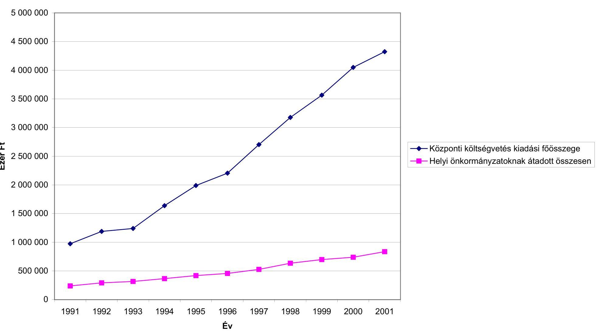
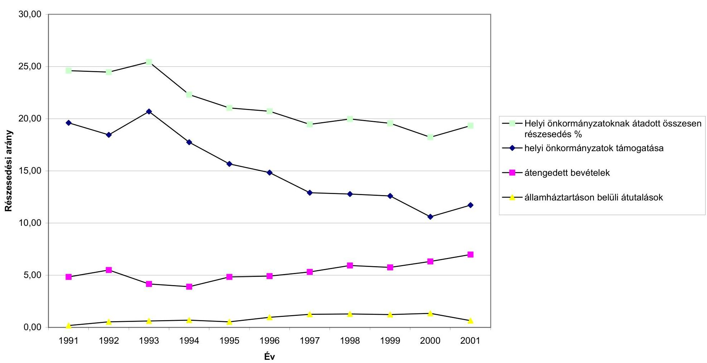
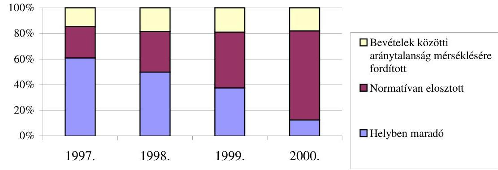

# JELENTÉS 

a Belügyminisztérium fejezet működésének ellenőrzéséről
2002. május

---

# Államháztartás Központi Szintjét Ellenőrző Igazgatóság átfogó Ellenőrzési Főcsoport 

V-16-144/2001-2002.
Témaszám: 571

## Az ellenőrzést felügyelte:

Bihary Zsigmond főigazgató

## Az ellenőrzés végrehajtásáért felelős:

Hegedüsné dr. Müllern Veronika főcsoportfőnök

## Az ellenőrzést vezette:

## Hudik Zoltán

számvevő igazgatóhelyettes

## Az ellenőrzésben részt vettek:

## Németh Gábor

osztályvezető főtanácsos

## Kenéz Sándor

számvevő tanácsos irodavezető

## Maczekó Károly

számvevő tanácsos irodavezető

## Berényi Magdolna

számvevő tanácsos főtanácsadó

## dr. Pósch Gábor

számvevő tanácsos főtanácsadó

## Fogarasi Miklós

számvevő tanácsos főtanácsadó

## Kiss Istvánné

számvevő tanácsos főtanácsadó

## Tóth Bálint

számvevő tanácsos főtanácsadó

## Trenovszki István

számvevő tanácsos főtanácsadó

## dr. Király László

számvevő tanácsos tanácsadó

## dr. Pataki Magdolna

számvevő tanácsos tanácsadó

## Karsai Lászlóné

számvevő tanácsos tanácsadó

## Bamberger Mária

számvevő tanácsos

## Bank Lajos

számvevő tanácsos

## Domonkosné Kurilla Edit

számvevő tanácsos
dr. Botta Tibor
számvevő tanácsos

Jelentéseink az Országgyűlés számítógépes hálózatán és az Interneten a www.asz.hu címen is olvashatók, továbbá a Belügyminisztérium folyóirata, az "Önkormányzati Tájékoztató" rendszeresen közli, valamint a Megyei

Közigazgatási Hivatalvezetők részére is átadásra kerül.

---

## dr. Szikszai Bertalan

számvevő tanácsos

## Gömöri József

számvevő tanácsos

## Hadházy Sándor

számvevő tanácsos

## Kapronczai Gabriella

számvevő tanácsos

## Pálfi András

számvevő tanácsos

## Patai Tamás

számvevő tanácsos

## Tóthné Salamon Ildikó

számvevő tanácsos

## Vida László

számvevő tanácsos

## Baloghné Dakó Eszter

számvevő

## Juhász József Gábor

számvevő

## Laskai Ede

számvevő

## Villányi Antal

számvevő

## Zaroba Szilvia

számvevő gyakornok

## Jakab Péter

külső szakértő

# A fejezetet érintő korábbi ellenőrzéseink címei: 

1. A minisztériumok, országos hatáskörű szervek költségvetési és vállalati felügyeleti ellenőrzési tevékenységének, valamint a belső ellenőrzési rendszer működésének vizsgálata (1993. április) (142.)
2. A fejezetek és intézmények által az alapítványoknak juttatott állami pénzek és -vagyon felhasználásának, működtetésének pénzügyigazdasági ellenőrzése (1994. június) (210)
3. A Belügyminisztérium fejezet pénzügyi-gazdasági ellenőrzése (1995. február) (237.)
4. A főiskolák és az egyetemek főiskolai karai állami támogatásának ellenőrzése (1996. szeptember) (318)
5. A közbeszerzésről szóló törvény 1995-1996. évi végrehajtásának ellenőrzéséről a központi költségvetési szerveknél és az elkülönített állami pénzalapoknál (1997. szeptember) (394)
6. A PHARE program helyzete Magyarországon (1997. november) (402)

---

7. A központi költségvetési szervek jóléti célú kiadásainak és jóléti intézményei működésének pénzügyi-gazdasági ellenőrzése (1999. augusztus) (9925)
8. A központi költségvetés területén működő belső kontrollmechanizmusok ellenőrzése (2001. augusztus) (0115)
9. A zárszámadás és a költségvetési előirányzatok tervezésének ellenőrzése (évente)

---

# Rövidítések jegyzéke 

| Áht | Államháztartásról szóló 1992. évi XXXVIII. törvény |
| :--: | :--: |
| Ámr | az államháztartás működési rendjéről szóló 217/1998. (XII. 26.) Korm. rendelet |
| ANP | Az Európai Unió közösségi vívmányainak átvételéről szóló Nemzeti Program |
| ÁNTSz | Állami Tisztiorvosi és Népegészségügyi Szolgálat |
| APEH | Adó- és Pénzügyi Ellenőrzési Hivatal |
| ÁSZ | Állami Számvevőszék |
| BÁH | Bevándorlási és Állampolgársági Hivatal |
| BK Rt | Beszerzési és Kereskedelmi Rt |
| BM | Belügyminisztérium és Intézményei |
| BM KH | BM Központi Adatfeldolgozó, Nyilvántartási és Választási Hivatal |
| BM OKF | Belügyminisztérium Országos Katasztrófavédelmi Főigazgatóság |
| COP | Nemzeti Operatív Program |
| DIS | Decentralized Implementation System (a PHARE programok megvalósításának decentralizált rendszere) |
| ENSZ | Egyesült Nemzetek Szervezete |
| ESZT | Eszköz Szükségleti Táblázat |
| EU | Európai Unió |
| EURO | Az EU fizetési eszköze 1999. január 1-től |
| FB | felügyelő bizottság |
| GSZ | gazdálkodási szabályzat |
| HM | Honvédelmi Minisztérium |
| HŐR | Határőrség |
| Hőr tv. | a határőrizetről és a Határőrségről szóló 1997. évi XXXII. törvény |
| HŐROPK | Határőrség Országos Parancsnokság |
| Hszt | fegyveres szervek hivatásos állományú tagjai |

---

|  | szolgálati viszonyáról szóló 1996. évi XLIII. törvény |
| :--: | :--: |
| HUB | Helyreállítási és Újjáépítési Tárcaközi Bizottság |
| HVB | Helyreállítási és Újjáépítési Tárcaközi Bizottság |
| IM | Igazságügyi Minisztérium |
| ISM | Ifjúsági és Sport Minisztérium |
| ITB | Informatikai Tárcaközi Bizottság |
| KANYVH | Központi Adatfeldolgozó, Nyilvántartó és Választási Hivatal |
| KÁT | közigazgatási államtitkár |
| Kbt | Közbeszerzésekről szóló 1995. évi XL. törvény |
| KEHI | Kormányzati Ellenőrzési Hivatal (korábban Iroda) |
| KEI | Kormányzati Ellenőrzési Iroda (ma Hivatal) |
| KGFI | Központi Gazdasági Főigazgatóság |
| KH | Központi Hivatal |
| KKB | Kormányzati Koordinációs Bizottság |
| KMB | Központi Monitoring Bizottság |
| Koordinációs Központ | Szervezett Bűnözés Elleni Koordinációs Központ |
| KÖZIGTAD | Központi Közszolgálati nyilvántartás |
| KPSZE | Központi Szerződéskötő Egység Decentralized Implementation System (a PHARE programok megvalósításának decentralizált rendszere) |
| KTK | Közigazgatási Továbbképzési Kollégium |
| Ktv | Köztisztviselők jogállásáról szóló 1992. évi XXIII. törvény |
| KVI | Kincstári Vagyoni Igazgatóság |
| MEH | Miniszterelnöki Hivatal |
| MKI OMI | Magyar Közigazgatási Intézet Oktatási és Módszertani Intézet |
| MMH | Menekültügyi és Migrációs Hivatal |
| NATO | Észak-Atlanti Szövetség (North Atlantic Treaty Organisation) |
| OGY | Országgyűlés |
| OKF | BM Országos Katasztrófavédelmi Főigazgatóság |
| OKFI | BM Országos Közbeszerzési Főigazgatóság |
| OKFKJÜ | BM Országos Katasztrófa Főigazgatóság Központi Javító Üzem |

---

| OKV | Országos Közigazgatási Vizsgabizottság |
| :--: | :--: |
| OMAS | Organisation External Monitoring and Assessment Service for the PHARE Programme (az EU megbízásából a PHARE programok lebonyolítását ellenőrző szervezet) |
| OMB | Országos Monitoring Bizottság |
| OMI | Magyar Közigazgatási Intézet oktatási és Módszertani Igazgatósága. |
| ORFK | Országos Rendőr-főkapitányság |
| PERSEUS | A PHARE támogatások felhasználásáról készült pénzügyi információs rendszer |
| PHARE | Poland-Hungary Aid for Restructuring the Economy |
| PM | Pénzügyminisztérium |
| PRAG | Practical Guide to PHARE, ISPA and SAPARD contract procedures (Gyakorlati Utmutató a PHARE, ISPA és SAPARD szerződéskötési eljárásaihoz) |
| Pv | Polgári védelem |
| PVOP | Polgári Védelem Országos Parancsnokság |
| RSzVSz | Rendvédelmi Szervek Védelmi Szolgálata |
| SIS | Schengeni Információs Rendszer (Schengen Information System) |
| SPO | Szakmai Programengedélyező (Senior Programme Officer) |
| SZANYUH | Számviteli és Nyugdíjmegállapító Hivatal |
| SzMSz | Szervezeti és Működési Szabályzat |
| TÁH | Területi Államháztartási Hivatal |
| TÁKISZ | Területi Államháztartási és Közigazgatási Információs Szolgálat |
| TARTINFO | Köztisztviselői tartalékállomány nyilvántartás |
| TNM | tárcanélküli miniszter |
| TOP | Tűzoltóság Országos Parancsnoksága |
| VP | Vám- és Pénzügyőrség |

---

# TARTALOMJEGYZÉK 

BEVEZETÉS ..... 3
I. ÖSSZEGZŐ MEGÁLLAPÍTÁSOK, KÖVETKEZTETÉSEK, JAVASLATOK ..... 7
II. RÉSZLETES MEGÁLLAPÍTÁSOK ..... 23

1. A minisztérium fejezet-irányító és felügyeleti tevékenysége ..... 23
1.1. A belügyminiszteri hatáskörbe utalt irányítási, felügyeleti feladatok ellátása ..... 23
1.1.1. A közbiztonság védelmi feladatok ..... 23
1.1.2. Az államhatár védelme, őrizete ..... 25
1.1.3. A katasztrófák elleni védekezés, minősített időszaki feladatok ..... 27
1.1.4. Általános közjogi feladatok ..... 29
1.1.5. Közigazgatás-szervezéssel kapcsolatos feladatok ..... 32
1.1.6. A helyi önkormányzatokkal kapcsolatos feladatok ..... 37
1.1.7. Az európai integrációból eredő feladatok ..... 41
1.2. Az ágazati irányítás és felügyelet rendje, a szervezeti felépítés és a működés ..... 42
1.2.1. A minisztériumi szervezet működése ..... 42
1.2.2. A belső kontrollmechanizmus egyes szabályozási elemei ..... 48
1.2.3. A szakmai felügyelet és az ellenőrzés működése ..... 51
2. A fejezet költségvetési gazdálkodásának irányítása, felügyelete ..... 54
2.1. A költségvetési gazdálkodás szabályozottsága ..... 54
2.2. A költségvetési tervezési információs rendszer működése ..... 59
2.3. A költségvetés végrehajtási és beszámolási információs rendszer működése ..... 61
2.4. A tárca államháztartáson kívülre szervezett tevékenységei ..... 65
2.5. A 2000. évi belső kontrollmechanizmusok utóellenőrzése és a 2001. évi audit előkészítése ..... 71
3. A belügyi informatikai rendszer fejezeti irányítása ..... 73
3.1. Az ágazati informatikai stratégia és összefüggései ..... 73
3.2. Az informatikai feladatok fejezeti irányítása ..... 76
3.3. Az informatikai stratégia pénzügyi megalapozottsága és finanszírozása ..... 79
3.4. Az informatikai beruházások szakmai megalapozottsága, a megvalósított rendszerek megbízhatósága ..... 82
4. Az EU követelményeinek megfelelő határellenőrzési rendszer megvalósításához kapott PHARE támogatások felhasználása ..... 86
5. sz. Függelék: A rendvédelmi szervek működésének, gazdálkodásának egyes kérdései
6. sz. Függelék: A helyi önkormányzatokkal kapcsolatos tárca szintű feladatok ellenőrzésének főbb tapasztalatai
7. sz. Függelék: Az EU követelményeinek megfelelő határőrizeti rendszer megvalósításához kapott PHARE támogatások felhasználása

---

2

---

# JELENTÉS 

## a Belügyminisztérium fejezet működésének ellenőrzéséről

## BEVEZETÉS

A Belügyminisztérium 1995. évi átfogó ellenőrzését követő időszakban a feladatokat és az intézményi struktúrát is módosították, az államháztartási információs szolgálatokkal összefüggő költségvetés kikerült a tárca felügyelete alól. A fejezethez a 2001. év adatai szerint 83 intézmény tartozott és 7 alcímen összesen 38 jogcímen rendelkezett fejezeti kezelésű előirányzattal.
Az utóbbi években a tárca célkitűzései között a Rendőrségnél a technikai fejlesztések megindítása, a korábbi időszakban felhalmozódott adósság megszüntetése, a Határőrségnél a sorozott állomány hivatásos állománnyal történő fokozatos kiváltása, ezzel összefüggésben a határőrizetet és a határrendészeti feladatot ellátó szervezet jelentős átalakítása, továbbá a Tűzoltóság és a Polgári védelem összevonásával a katasztrófavédelem egységes irányító és vezető szervezetének kialakítása kapott prioritást.
A Kormány - a jogelőd megszüntetésével, 2000. január 1-jei hatállyal - önálló központi szervezeti egységként létrehozta a Bevándorlási és Állampolgársági Hivatalt, melynek költségvetését a BM fejezet költségvetésében elkülönítetten szerepeltetik. A Hivatal működésének, tevékenységének finanszírozására 2001-ben 2,2 Mrd Ft-ot tartalmazott a fejezet kiadási előirányzata.
Az Európai Unióhoz történő csatlakozással összefüggésben az egységes határellenőrzési rendszer megvalósítását célzó feladatok összehangolásában, végrehajtásában kiemelt szerepe van a belügyi tárcának. Az éves költségvetésben - ágazati célfeladatként - az "Európai integrációs feladatok" és a "PHARE program" jogcímeken tervezett előirányzatok (a 2001. évi költségvetésben 6,1 Mrd Ft) tartalmazták a határellenőrzés Schengeni követelményeinek érvényesítéséhez kapcsolódó sajátos kiadásokat.
A belügyminiszter helyi önkormányzatokkal kapcsolatos feladatkörében alapvetően a működés közigazgatási és a gazdálkodás pénzügyi szabályozásában érintett, többek között gondoskodik a címzett és céltámogatási rendszer, az önkormányzati fejlesztési támogatások finanszírozásáról és elszámolási rendjéről, valamint ennek információs rendszere működtetéséről, továbbá összehangolja a helyi önkormányzatok működésével összefüggő fejlesztés, tervezés és gazdálkodás kormányzati feladatait. Az állami költségvetés a helyi önkormányzatok támogatására - a Belügyminisztérium fejezetnél - 1995-ben 310,6 Mrd Ft, 2001-ben már 506,3 Mrd Ft kiadási előirányzatot biztosított.
Az 1995. évi átfogó ellenőrzést követő időszakban a fejezetnél végzett számvevőszéki ellenőrzések az éves költségvetések tervezését, zárszámadását, témavizsgálat keretében a közbeszerzést, a PHARE támogatások felhasználását, a jóléti kiadásokat, illetve az úgynevezett belső kontrollmechanizmusokat érintették.

A jelenlegi átfogó ellenőrzés végrehajtására az Állami Számvevőszékről szóló 1989. évi XXXVIII. törvény 2. § (3) és a 17. § (3) bekezdésében foglaltak adnak jogszabályi alapot.

Az ellenőrzés célja annak értékelése volt, hogy a Belügyminisztérium

- szervezeti felépítése, működésének szabályozása, az ágazat-irányítás és felügyelet kialakított rendje összhangban van-e a tárca részére jogszabályokban meghatározott feladatokkal (beleértve a közigazgatás szervezésével és a helyi önkormányzatokkal összefüggő, belügyminiszteri hatáskörbe utalt feladatokat is, az önkormányzatoknál korábban végzett számvevőszéki ellenőrzések tapasztalatai alapján);
- a fejezet költségvetési gazdálkodásának irányítását, intézményeket felügyelő tevékenységét célszerűen, eredményesen látta-e el (különös tekintettel a Rendőrség költségvetési gazdálkodásának célszerűségi és eredményességi szempontjaira); a költségvetés tervezési, végrehajtási és beszámolási információs rendszere
 biztosította-e a különböző jogcímeken rendelkezésére álló közpénzek szabályszerű, célszerű és eredményes felhasználását;
- az ágazati informatikai rendszert a kormányzati államigazgatási informatikai fejlesztési koncepcióhoz igazodóan alakította és működtette-e; a központi igazgatás és az intézmények informatikai rendszereinek szabályozottsága, működtetése, fejlesztése megfelel-e a célszerűségi és megbízhatósági szempontoknak, a források költség-hatékony felhasználásának;
- az Európai Unió előírásainak megfelelő határellenőrzési rendszer kialakításának folyamatában szabályszerűen, célszerűen és eredményesen használta-e fel a megvalósításhoz rendelkezésre álló PHARE támogatásokat és egyéb forrásokat.

Az ellenőrzés az 1995. évi átfogó ellenőrzést követő időszak gazdálkodására irányult, részletesebb elemzés alá véve a 2000-2001. évek pénzügyi-gazdasági folyamatait, melyet figyelemmel kísértünk a helyszíni ellenőrzés lezárásáig. Az ellenőrzés keretében áttekintettük a korábbi számvevőszéki ellenőrzések - ezen belül kiemelten a központi költségvetés területén működő belső kontroll mechanizmus vizsgálat - megállapításainak, ajánlásainak hasznosulását, a kapcsolódó tárca intézkedések végrehajtását. Az Állami Számvevőszék a BM fejezet Igazgatás cím 2001. évi elemi beszámolójának megbízhatóságát a 2001. évi zárszámadás ellenőrzése keretében minősíti. Ennek előkészítéseként végeztük el az I. félévi pénzforgalmi adatok valódiságára irányuló ellenőrzést is.

---

A határátkelőhelyek kialakítása és üzemeltetése a PM Vám- és Pénzügyőrség hatáskörébe tartozik, továbbá részesültek a határellenőrzési rendszer fejlesztésére kapott PHARE támogatásban is. A PHARE támogatások felhasználásának ellenőrzése ennek megfelelően kiterjedt a PM Vám- és Pénzügyőrség kapcsolódó tevékenységére is.

A fejezet átfogó ellenőrzése ugyanakkor nem terjedt ki az országgyűlési képviselőválasztásra fordított állami pénzeszközök, anyagi támogatások felhasználására - ami egyébként a választási eljárásról szóló 1997. évi C. tv. 92. § (3) bekezdésben kapott felhatalmazás alapján szintén számvevőszéki feladat - mivel az ÁSZ ez irányú kötelezettségének a választásokhoz igazodó ütemezésben, külön meghatározott program alapján tesz eleget.

A Belügyminisztérium fejezet működésének ellenőrzéséről szóló jelentéshez csatolt három függelék - a tárca felügyelete alatt álló rendvédelmi szervek működésével, a helyi önkormányzatokkal összefüggő tárca szintű feladatok végrehajtásával, valamint a határellenőrzés fejlesztéséhez kapott PHARE támogatások felhasználásával kapcsolatos - részletesebb megállapításokat foglalja össze.

---

.

---

# I. ÖSSZEGZŐ MEGÁLLAPÍTÁSOK, KÖVETKEZTETÉSEK, JAVASLATOK 

A központi költségvetés egyik legnagyobb fejezeténél az elmúlt években - a változó feladatokra is figyelemmel - stabil szervezeti struktúra nem alakulhatott ki. A meglévő szervezetek átalakítása, összevonása mellett a közelmúltban alapított, új feladatrendszerű, önálló költségvetési szervezeteket (Szervezett Bűnözés Elleni Koordinációs Központ, a Közszolgálati Ellenőrzési Hivatal) soroltak a fejezethez, amelyek tovább bővítették az egyébként is széles feladatkört. Az önkormányzatokhoz átadott szervezetek és tevékenység részben szűkítették a fejezet által ellátott állami feladatokat, ugyanakkor az ágazati felügyelet továbbra is a tárca hatáskörébe tartozik.

A Magyar Köztársaság 2001. és 2002. évi költségvetéséről szóló 2000. évi CXXXIII. törvény a Belügyminisztérium fejezet bevételi előirányzatát a 2001. évre 36,1 Mrd Ft-ban, kiadási előirányzatát - az önkormányzatokhoz kapcsolódó előirányzatok nélkül - 247,8 Mrd Ft-ban határozta meg, ami - a bekövetkezett változásokra is figyelemmel -, mintegy 161 Mrd Ft-tal haladja meg az 1995. évi kiadási előirányzatot. A fejezet költségvetésében az éves kiadási előirányzatok több mint fele (2001-ben 147,7 Mrd Ft, a kiadások közel 60%-a) a rendvédelmi feladatokat ellátó szervezeteknél jelentkezett. A fejezet összlétszáma 2001. évben 52.828 fő volt, amiből a minisztérium 613 főt, a rendőrség 40.192 főt foglalkoztatott.

Az Európai Unióhoz való csatlakozásból adódó feladatok folyamatosan épültek/épülnek be a tárca és a felügyelt szervezetek tevékenységébe. A felkészüléssel, a nemzetközi kapcsolatok bővülésével összefüggésben a Közösségi vívmányok átvételének Nemzeti Programjában (ANP) rögzített feladatokhoz igazították az intézményi háttér kialakítását is, a feladatok végrehajtását helyettes államtitkári irányítás alá szervezve. A tárca a 2000-2003. évi fejlesztési koncepciójában további módosításokat fogalmazott meg. Ezek között kiemelkedő jelentőségű a határőrség és a rendőrség összevonása, mivel a magyar közigazgatásban újszerű, egységes rendvédelmi szerv létrehozásának számos politikai, társadalmi és nem utolsó sorban jogszabály módosítást (alkotást) igénylő vonzata van.

A belügyminiszter feladat- és hatásköre rendkívül széles, jogszabály írja elő számára - a közbiztonság védelmével, az államhatár őrizetével és a határforgalom ellenőrzésével, az élet- és vagyonbiztonság védelmével, a közigazgatás szervezésével, a helyi önkormányzatokkal stb. kapcsolatos - igazgatási, irányítási-felügyeleti feladatokat. A BM fejezet felépítése - a végrehajtó szervek hierarchikus jellegére, országos kiterjesztésű intézményhálózataira tekintettel - sokkal összetettebb, mint az a struktúra (minisztérium és intézményei), melynek szem előtt tartásával a költségvetési gazdálkodás általános érvényű szabályait megfogalmazták. Ilyen körülmények között mind a fejezeti irányításban, felügyeletben, mind az intézmények működésében számos sajátos helyzet

---

alakult ki, annak ellenére, hogy a szakmai területeken és a gazdálkodásban egyaránt igyekeztek a jogszabályi előírásoknak érvényt szerezni.

A Kormány és a tárca szervezetkorszerűsítési intézkedései hatására profiltisztábbá vált a rendőrségi feladatkör. A rendőrség központi szervezetének (ORFK) átalakításánál érzékelhető volt az irányítói és végrehajtói feladatok különválasztására irányuló törekvés. Az EU elvárásokhoz igazodó korszerűsítési célkitűzések (mint a tömeges bűnözéssel szemben eredményesen fellépő rendőri szervezet) megvalósítását kedvezőtlenül érintette a létszámfejlesztések leállítása. A koncepciók kiforratlanságára utalt a Kormány által támogatott rendőrőrs program intenzív indítása, majd leállítása, ezt követően önerős folytatása.

Az államhatár őrzését és védelmét, valamint a határrendészeti feladatokat a kettős rendeltetésű, sajátos jogállással rendelkező fegyveres testület, a BM Határőrség látja el. Az EU csatlakozáshoz megkezdett felkészülés, a Schengeni Egyezményben lefektetett alapelvek érvényesítése a tárcán belül legkézzelfoghatóbb módon a határőrség feladatainak és szervezeteinek módosításaiban jelent meg.

Az első, stratégiai kérdésekkel részletesebben foglalkozó dokumentumot („A magyar határőrizeti rendszer az európai uniós követelmények tükrében") 1998. januárjában készítették el, mely alapul szolgált a Nemzeti Operatív Program (COP) és a nemzeti segélyprogramok összeállításához, az eljárási rend és szervezeti háttér változtatásához, irányt szabott a fejlesztéseknek, szakaszolta a csatlakozási felkészülés főbb feladatait. Már ennek alapján egyértelművé vált, hogy alapvetően a határőrség rendészeti feladatait kell erősíteni. Közel azonos időben módosult a minisztériumi irányítás rendje, a miniszter közvetlenül gyakorolt jogköre operatívabbá tette az irányítást és felügyeletet. Ezzel együtt a határőrség vezetésének a felelőssége is növekedett a fejlesztési elképzelések kidolgozásában.

Az átalakítási folyamat egyaránt érintette a személyi állományt (erőteljes létszámcsökkentés, sorozott állomány kiváltása hivatásos állománnyal) és a technikai eszközök összetételét (módosították a felszerelést, csökkentették a katonai technikai eszközöket). Az integrációs feladatokhoz illeszkedve - a tervezett EU belső határok figyelembevételével - a feladatok átrendezésével csökkentették a jogi személyiségű határőr igazgatóságok számát, más szervezeti egységeket érintően funkcióváltásról rendelkeztek.

A kormányzati és tárca elképzeléseket tartalmazó dokumentumok (határozatok, 2000-2003. évekre szóló fejlesztési koncepció) eligazítást adtak az EU elvárásokhoz kapcsolt korszerűsítés megkezdéséhez. Szembe kell nézni azonban azzal a ténnyel, hogy a határőrség az átalakítás megkezdése előtt sem rendelkezett kedvező költségvetési kondíciókkal. (A korábbi számvevőszéki átfogó ellenőrzés már rámutatott arra, hogy a határőrség a gazdálkodásában fegyelmezetten tudomásul vette a költségvetési korlátokat, ez viszont egyes esetekben feladat elmaradásokhoz, eszköz és ingatlan állagromláshoz stb. vezetett.)

Az EU elvárások teljesítésénél ezért még jobban figyelemmel kell lenni arra, hogy a határőrség a fejlesztéseket milyen pozícióból kezdte meg. Továbbá az is lényeges szempont, hogy a Schengeni Egyezményből eredő (pl. a mélységi határellenőrzésre vonatkozó) követelmények teljesítése járulékos (jellemzően infrastrukturális) fejlesztéseket is generál és ezek hogyan finanszírozhatók. E szempontok és a fejlesztések tapasztalt elhúzódása teszik indokolttá a fejlesztési koncepciók racionalizálását, ennek alapján a határidőre végrehajtható és finanszírozható feladatok meghatározását.

A belügyminiszter az élet- és vagyonbiztonság védelmére irányuló feladatai körében irányítja a tűz elleni védekezést, a polgári védelmi tevékenységet és a katasztrófák elleni védekezést. A szakirányú feladatok törvényi szabályozásával került nyugvópontra a feladatok tárca szintű irányítása, felügyelete, majd - a BM Országos Katasztrófavédelmi Főigazgatóság és az irányítása alá rendelt megyei (fővárosi) igazgatóságok létrehozásával - a szervezeti háttere. Ezzel jól irányítható, takarékosabb felépítésű egységes katasztrófavédelmi szervezet jött létre, melynek költségvetési gazdálkodását központosították, hasonlóan más rendvédelmi szervek gazdálkodásához.

A katasztrófa elleni védekezés, a katasztrófa-helyzetek kezelése több tárca részvételét igénylő feladat, ezeknél a kormányzati koordináció állandó, illetve veszélyhelyzetben ad hoc bizottság munkáján keresztül érvényesült/érvényesül (Kormányzati Koordinációs Bizottság, Helyreállítási és Újjáépítési Tárcaközi Bizottság).

A belügyminiszter általános közjogi feladatkörében vesz részt a menekültügy igazgatási feladatainak jogi szabályozásában, irányítja a menekültügyi szervek működését. Az ún. „migrációs törvénycsomaggal" vált lehetővé a Schengeni Végrehajtási Egyezmény szabályainak teljes körű átvétele és az annak megfelelő vízumrendszer bevezetése. A migrációs törvénycsomag ez évi bevezetését, a törvények végrehajtását segítik - az eljárási renddel, a menekültügy szervezeti rendszerével, a befogadó állomások feladataival stb. kapcsolatos tárca szintű rendelkezések.

A feladatok végrehajtásában kiemelt szerepet betöltő Bevándorlási és Állampolgársági Hivatal (BÁH) létrehozásánál alapvető szempontként kezelték az egységes jogalkalmazás megteremtését, a rendvédelmi szervek idegenrendészeti tevékenysége feletti „civil" közigazgatási kontroll növelését, a közreműködő szervezetek, szervezeti egységek felelősségének nyomon-követhetőségét, továbbá a nemzetközi együttműködésben a Magyar Köztársaság migrációs politikai érdekeinek egységes megjelenítését. A BÁH működésének szabályozottsága közel teljes körűnek mondható, a munkaköri leírásokat, a szükséges főigazgatói intézkedéseket kiadták.

A közigazgatási személyzetpolitikai feladatok terén jelentős előrelépés történt a köztisztviselők szervezett keretek közötti képzésében, továbbképzésében és a vezetőképzésben. A végrehajtás szabályozása és szervezeti háttere az 1999. évben vált teljes körűvé. A képzési rendszer működtetését és finanszírozását érintően sajátos megoldást jelentett a szervezési, előkészítési és koordinációs feladatok más költségvetési fejezethez történt telepítése (MEH fejezet - Magyar Közigazgatási Intézet Oktatási és Módszertani Igazgatósága).

A köztisztviselői képzések állami feladat jellegére tekintettel, a pénzügyi és személyi feltételekről - jogszabályban deklaráltan - a Kormány gondoskodik. Ezt az államháztartás központi szintjén foglalkoztatott köztisztviselők esetében

---

a tárca fejezeti kezelésű előirányzatai és a központi költségvetés fejezeteinek e célra rendelkezésre álló előirányzatai elvileg biztosítják. Más a helyzet a helyi önkormányzatok esetében, mivel az alap és szakvizsgáztatás költségeit saját költségvetésükből kell fedezniük. Mindkét szféra köztisztviselőinek képzése, továbbképzése ütemezhetőségét alapvetően a rendelkezésre álló források befolyásolták/befolyásolják. Megbízható központi közszolgálati nyilvántartás adataira építve, az állami feladat finanszírozási elvének további kifejtésével tehető tervszerűbbé, megalapozottabbá a köztisztviselők képzése, továbbképzése.

A belügyminiszter helyi önkormányzatokkal kapcsolatos feladatait ellátó minisztériumi szervezet többszöri módosítást élt meg. E területen is tapasztalható volt a szabályzatok késedelmes módosítása, néhány szervezeti egységnél a munkaköri leírások aktualizálásának elmaradása. A jogszabályi háttér változását nem teljes körűen követték a belső szabályozások (minisztériumi szabályzat, megyei, fővárosi közigazgatási hivatalok alapító okirata).

A köztisztviselők jogállásáról szóló törvénnyel elrendelt közszolgálati ellenőrzések előkészítését a jogszabályi előírások betartásával végezte el a minisztérium. A szakmai felügyeleti ellenőrzéseik hatékonyságának növelésével lehet/kell elérni, hogy a megyei (fővárosi) közigazgatási hivatalok az önkormányzati hivatalok közszolgálati ellenőrzését - a tapasztalt hiányosságok felszámolásával - megfelelő színvonalon végezzék el. A kötelezettségként előírt - a Kormány részére készülő - tájékoztatókat csak a kellő körültekintéssel végzett vizsgálatok alapozhatják meg. (A megoldás irányába mutattak a belügyi tárca kezdeményezése alapján a 2001. év végén kiadott kormányrendeletek és a 2002. évben megjelent belügyminiszteri rendelet.)

A közigazgatási hivatalok és a helyi önkormányzatok gazdálkodásának ellenőrzése terén a jogszabályi háttér több ponton nem ad
 kellő útmutatást, így a közigazgatási hivatalok átfogó ellenőrzésére, a helyi önkormányzatok belső ellenőrzésére, valamint a helyi önkormányzatok által alapított költségvetési szervek felügyeleti és belső ellenőrzésére vonatkozóan. A jogszabály az átfogó ellenőrzést - melynél a szakmai és gazdálkodási összefüggéseket együttesen kell vizsgálni - csak elrendelte, de a felelősséget nem tisztázta azokra az esetekre, amikor a szakmai irányítás több tárcához tartozik (a központi, a társadalombiztosítási és a köztestületi költségvetési szervek kormányzati, felügyeleti, valamint belső költségvetési ellenőrzéséről szóló 15/1999. (II. 5.) Korm. rendelet). A helyi önkormányzatok és intézményeik költségvetési (felügyeleti és belső) ellenőrzésének végrehajtásáról - szabályozási kompetencia hiányára hivatkozva - nem rendelkezett a Kormány, a törvények mindössze a felelősöket határozták meg. Az önkormányzati kört érintően is szükségesnek ítélhető az ellenőrzések rendjének kidolgozása, hasonlóan a költségvetési gazdálkodás általános szabályozásához (mint az Áht. végrehajtási rendeletei).

A központi költségvetésből a helyi önkormányzatok részesedését (hozzájárulások, támogatások, átengedett bevételek és államháztartáson belüli átadások) évente - a költségvetés tervezés kialakított rendjében - lényegében a kormányzat határozta meg. Ebben a belügyi tárcának - a saját ágazatához tartozó területek kivételével - érdemi beleszólása nem volt. Előrelépést eredményezhet a polgármesteri hivatali modellek alapján meghatározott - köztisztviselői létszámot figyelembe vevő - ún. közigazgatási normatíva alkalmazása, melynek előkészületi lépéseit a belügyi tárca megtette.

A címzett és céltámogatással folyamatban lévő beruházások befejezéséhez nyújtott egyszeri rendkívüli támogatások, valamint a működésképtelen önkormányzatok egyéb támogatásának elosztásánál nem kellő körültekintéssel járt el a tárca. Ennek következtében a szabályozott feltételek figyelmen kívül hagyásával, megalapozatlanul részesültek önkormányzatok támogatásban, ugyanakkor a jogkövető magatartású, megalapozott tervek alapján beruházó önkormányzatok méltánytalanul hátrányos helyzetbe kerültek annak ellenére, hogy mindent megtettek a saját forrás biztosításához.

Az egyszeri rendkívüli támogatásokkal kapcsolatos rendelkezések - a címzett és céltámogatási rendet szabályozó törvénybe építésük következtében - ellentmondásba kerültek a törvény változatlanul hatályos részével (helyi önkormányzatok címzett és céltámogatási rendszeréről szóló 1992. évi LXXXIX. törvény (Cct.) módosító 2000. évi CXXXI. törvény, melyet egyébként országgyűlési képviselő terjesztett az Országgyűlés elé.) Egyetértve az ilyen támogatással folyamatban lévő beruházások mielőbbi befejezésére irányuló jogalkotói szándékkal, célszerűtlen volt az egyszeri és rendkívüli támogatás különös szabályait az alaptörvénybe illeszteni. A módosító rendelkezések átmeneti érvényességére tekintettel, pl. önálló szabályozással, a koherencia-zavar elkerülhető lett volna, így azonban intézkedni kell a megszüntetésére. (Az ellentmondásos helyzet a Cct. legközelebbi módosításával oldható fel.)

Az ország közigazgatási tagozódásának, területszervezésének eljárási rendjét 1999. évtől szabályozta törvény. A helyi önkormányzatokról szóló törvény (a többször módosított 1990. évi LXV. tv.) korrekciójával, jogi, anyagi rendelkezések beépítésével érhető el a szétváló települések érdekegyensúlya, ami megszüntetné az új község - jelenlegi szabályozási keretek között fennálló - hátrányos helyzetét a vagyon- és területmegosztásban.

A településfejlesztés támogatására kialakított eszközrendszer - a megosztott források és ágazati irányítás - mellett a belügyi tárca nem rendelkezett a településfejlesztés koordinációjához szükséges feltételekkel, ezért ehhez a kormányzat hatékony beavatkozása, közreműködése szükséges.

A minisztérium működésének feltételeit - a feladatokat, szervezeti felépítést, irányítási-felügyeleti jogköröket - meghatározó Szervezeti és Működési Szabályzatot (SzMSz) többször módosították, részben a kormányzati döntéseket követő változtatások miatt, részben belső indíttatású korszerűsítések érdekében. A minisztériumi főosztályok, minisztériumi tevékenységet segítő hivatalok köre többször változott, alapvetően a jogszabályi kötelezettségek teljesíthetőségére tekintettel. Ugyanakkor érzékelhető volt a belső korszerűsítési törekvések nem kellő átgondolása is.

A változtatásokat az SzMSz módosítása rendszeresen elmaradással követte, ami kedvezőtlenül befolyásolta az ügyrendek és a munkaköri leírások naprakészségét is. Az utóbbi időben pozitív irányú elmozdulás érzékelhető, ezzel együtt a tárcának következetesebben kell figyelmet fordítani a belső kontrollmechanizmus szabályozási elemeire (a feladatok és a szervezet összhangjára, a szervezeti

struktúra célszerűségére és az ezeket megjelenítő szabályozási háttér aktualizálására).

A Belügyminisztérium hatályos SzMSz-e jól tükrözi a szervezet-irányítás és felügyelet rendjét, a felső vezetés (miniszter, államtitkárok, parlamenti és jogi, önkormányzati, informatikai, közgazdasági és nemzetközi ügyekért felelős helyettes államtitkárok) munkamegosztását. A minisztériumi testületek működési és értekezleti rendje szabályozott. A miniszteri irányítás operatív eszköze a miniszteri értekezlet, mely - az érintettek bevonásával - a tárcára háruló feladatok (kevés kivétellel, mint pl. a központi költségvetésből az önkormányzatok részesedése) érdemi tárgyalására alkalmat adott. A miniszteri értekezletek tematikája, előterjesztései, döntései alapvetően dokumentáltak.

Az országos hatáskörű rendvédelmi szervek (rendőrség, határőrség, katasztrófavédelem) jogszabályban megfogalmazott közvetlen miniszteri irányításának szervezett kereteit is - az 1998. évi átalakítást követően - a miniszteri értekezlet jelentette. A szakmai felügyeletet és ellenőrzést a miniszteri alárendeltségben működő Felügyeleti és Ellenőrzési Hivatal látja el. Az országos hatáskörű szervezetek vezetői a miniszteri közvetlen irányítás ilyen formáját kedvezőbbnek ítélték, mint amikor a minisztériumi szervezet esetenként sértette a rendvédelmi szervek vezetőinek operatív irányítási hatáskörét. Ezzel együtt megfontolásra ajánlható, hogy a rendvédelmi szervek stratégiájával kapcsolatos feladatokat szervezett minisztériumi keretek között végezzék.

A BM közigazgatási államtitkára hatékony, eredményes munkaszervezéssel végezte a tárca szakmai irányítását. Ugyanakkor a minisztériumi működési rendbe iktatott közigazgatási államtitkári értekezletek irányításban betöltött szerepe - a feladatok ez irányú szabályozottsága ellenére - nem érvényesült. Az információk jellemzően az alacsonyabb vezetői szinten tartott értekezleteken elsősorban szóban - jutottak az érintett szervezetekhez.

A minisztériumi szervezetek, illetve egyes vezetői beosztások besorolásánál a jogszabályi előírásokkal nem harmonizáló megoldásokat is alkalmaztak (főosztályvezető irányítása alá rendeltek más főosztályi jogállású szervezetet, a Felügyeleti és Ellenőrzési Hivatal jogállását nem szabályozták, vezetőjét a helyettes államtitkárokkal azonos szintre sorolták). A köztisztviselők jogállásáról szóló törvény - (többször módosított 1992. évi XXIII. tv. - Ktv.) - kategorikusan három szinten tette lehetővé vezetői beosztások létrehozását. Ezért ennek és egyben a közigazgatás továbbfejlesztésének 2001-2002. évekre szóló kormányzati feladattervéről szóló rendelkezés (1057/2001. (VI. 21.) Korm. határozat) előírásainak figyelembevételével és természetesen az ellátandó feladatok függvényében kell megoldást találni az ellenmondásos helyzet feloldására.

A minisztérium - a korábbi „civilesítés" eredményeként - jellemzően köztisztviselői állományt foglalkoztat. A tárcához rendelt - elsősorban a rendvédelmi szervek felügyeletével és a szervezett bűnözés elleni koordinációval összefüggő feladatok ellátása tette indokolttá, hogy az utóbbi időben nőtt a berendelt, vezényelt hivatásos állományúak létszáma (arányuk 2001-ben meghaladta a 15%-ot). A Rendvédelmi Szervek Védelmi Szolgálatáról rendelkező kormányrendelet tisztán hivatásos személyi állományt nevesített, ezzel szemben egyes beosztások közalkalmazottakkal történt feltöltése indokolt - mégis a szabályozással ellentétes - lépés volt. A Szervezett Bűnözés Elleni Koordinációs Központ létrehozását, irányítását, feladatait törvény írta elő, de gazdálkodásának felügyeleti, belső ellenőrzéséről egyetlen szabályozás sem rendelkezett (a költségvetési gazdálkodás szabályaiban előírt kötelezettség ellenére). A speciális feladatokat ellátó szervek esetében is ki lehet és ki kell alakítani az ez irányú kötelezettségek érvényesülésének módját.

A BM felügyeletéhez tartozó költségvetési szervek alapító okiratait és törzskönyvi nyilvántartását az ellenőrzés nem találta rendezettnek. Az alapító okiratok aktualizálását az egyes pénzügyi törvényeket módosító törvényben előírt határidőre - 1996. II. félévében - nem fejezték be (1995. évi CV. tv. 116. § (6) bek.), több szervezet - ORFK, Rendvédelmi Szervek Védelmi Szolgálata, stb. - nem rendelkezett érvényes alapító okirattal. (Az alapító okiratok rendezését, valamint törzskönyvi nyilvántartás számítógépes alapokra helyezését már a helyszíni ellenőrzés indítása előtt megkezdték.)

A tárca - az 1995. évi átfogó számvevőszéki ellenőrzés javaslatait elfogadva kialakította a minisztérium gazdálkodó szervezetét. Ezzel részben javult a minisztériumi gazdálkodás áttekinthetősége, ugyanakkor a szervezet alacsony létszáma miatt az önálló költségvetési szervvel szemben támasztott gazdálkodási követelményeket teljes egészében nem képes teljesíteni (a feladatok egy részét megállapodás alapján háttérintézmény - BM KGFl - végezte). A működés ilyen szabályozása következtében, a több csatornás ellátási rendből adódóan a minisztériumi szervezetek működési kiadása egzakt módon nem állapítható meg. Emellett a két önálló költségvetési szervezethez (alcímhez, címhez) kapcsolódó közös gazdálkodási és ellátási tevékenység magában hordozta a hibázás lehetőségét. Mindezek kedvezőtlenül befolyásolták a belső kontrollmechanizmust, növelve a szabályos működés és a megbízható elszámolások kockázatát, amelyet a külső és belső ellenőrző szervezetek tapasztalatai is alátámasztottak.

A fejezeti költségvetési gazdálkodás irányításának és felügyeletének szervezeti rendje a munkamegosztás több lépcsőben és több irányban végrehajtott ésszerűsítése eredményeképpen vette fel jelenlegi formáját. Az irányítás szerkezetét racionalizálták, az alacsony hatékonyságú kisegítő szerveket - feladataik szétosztása mellett - felszámolták, a jellemzően szolgáltató tevékenységeket (nyomda, beszerzés, járműjavítás) az államháztartáson kívülre szervezve piaci alapokra helyezték.

A fejezeti szintű szabályozás, az intézményi koordináció, valamint a fejezeti költségvetés kialakítása és karbantartása, a pénzügyi információs rendszer működtetése a közgazdasági helyettes államtitkár közvetlen irányításával és felügyeletével 1999-től a Közgazdasági Főosztály feladata lett, mely elvégzéséhez a szükséges személyi és tárgyi feltételek folyamatosan rendelkezésre álltak.

A költségvetési források felhasználásának fejezeti irányultságát a tárca számára törvényi és kormányzati úton előírt szakmai feladatrendszer és az ennek alapján megfogalmazott prioritások határozták meg. A belügyi ágazattal szemben támasztott növekvő és differenciált követelményekkel a költségvetés működtetése és szabályozása több vonatkozásban nem volt képes lépést tartani.

A fejezeti költségvetési rendszer alapvető szabályozó elemének szánt miniszteri utasítással kiadott és módosított gazdálkodási szabályzat nem követte megfelelően sem a jogszabályi rendelkezéseket (pl. a kincstári rendszer vagy a közbeszerzési törvény szerinti módosítások késedelme), sem az intézményi és feladatkör változásait, ezért tényleges szabályozó szerepe kevésbé érvényesült. Egyes esetekben az előírások önmagukban szabálytalan helyzetet teremtettek (pl. a központi igazgatás gazdálkodási jogkör szerinti besorolásánál), más oldalról az előírás hiánya (pl. a kötelezettségvállalási, ellenjegyzési jogosultságok esetében) adott lehetőséget szabálytalanságra.

A költségvetési felügyeletet a dinamikus változások kezelhetőségéért - döntően 2001-ig - a decentralizálás szellemében szabályozták, mely a szabályozást az intézményi önállóságra építve inkább keretjellegűvé tette, az intézményi sajátosságok érvényesítését az érintettekre bízta. Ez a gyakorlat nem bizonyult célszerűnek, mert ennek következtében a költségvetés fejezeti irányításának több területén nem volt áttekintés arról, hogy egyrészt a keretszabályokat betartották-e, másrészt a sajátosságokat érvényesítették-e, illetve ha érvényesítették, az megalapozottan történt-e. Így például olyan kulcskérdések, mint a számviteli rend, a vagyonvédelem előírásai, az önálló és részben önálló költségvetési szervek munkamegosztásának és felelősségvállalási rendjének helyessége, a fejezeti kezelésű pénzeszközök szabályszerű felhasználása nem kellő alapossággal és mélységben volt a fejezeti irányítás kontrollja alatt. Az érdemi kezelés hiánya az intézményeknél esetenként a helytelen, heterogén és elégtelen szabályozottság körülményeit is engedte érvényesülni.

A fejezetnél a gazdálkodás rendszerével összefüggő hiányosságokat a korábbi számvevőszéki ellenőrzések visszatérően jelezték, azokról 2000-ben a BM felügyeleti költségvetési ellenőrzése is átfogó képet mutatott. A fejezeti irányító szerv a feltárt hiányosságok költségvetési beszámolók auditjára gyakorolt hatásával szembesülve, 2002. elejére átfogó ütemtervet készített (rövid távra szólóan a hibák felszámolására és egyben a szabályozási, szervezeti háttér megfelelő kialakítására).

A BM költségvetési fejezet működésében érvényesülő belső kontrollmechanizmusok - a 2000. évi számvevőszéki ellenőrzés megállapításaira tett intézkedések hatására - javuló tendenciát mutattak ugyan, de a központi igazgatás elemi beszámoló auditjának előkészítésénél a feltárt rendszerbeli és számviteli hiányosságok arra engednek következtetni, hogy
 az ellenőrzések hasznosítása a tárcánál nem volt kielégítő. A fejezet intézményei költségvetési beszámolójának auditálásához a fejezet költségvetési ellenőrzési apparátusa megkezdte a felkészülést, de a teljes intézményhálózat beszámolóinak majdani auditálásához az ellenőrző szervezet létszámbővítést igényel.

A fejezet felügyeleti költségvetési ellenőrzését - az ellenőrzendő terület nagysága és az ellenőri kapacitás összhangjának hiánya miatt - sajátos módon szervezték (a jogszabály az országos hatáskörű szervek bevonására adott lehetőséget az intézményhálózatuk ellenőrzéséhez, ehelyett a komplett felügyeleti ellenőrzést végezték el). Az államháztartás működési rendjéről szóló jogszabály 2002. évtől hatályos módosítása a gazdálkodásban is elismerte a középirányító szerv létjogosultságát és lehetővé tette a szakmai feladatok végrehajtásához szükséges pénzügyi feltételek ellenőrzésének átruházását a fejezet középirányító

---

szervére. A 15/1999. (II. 5.) Korm. rendelet - mely változatlan tartalommal maradt hatályban - csak fejezeti és intézményi szinten osztotta meg a felügyeleti, illetve belső ellenőrzési feladatokat, ezért célszerű a felügyeleti költségvetési ellenőrzések végrehajtását a középirányító szervek gazdálkodásban betöltött szerepének figyelembe vételével szabályozni.

A rendőrség létszám- és személyi juttatás gazdálkodásában ellentmondásos következménye volt annak, hogy a tényleges átlaglétszám minden évben alatta maradt a költségvetési létszámnak. Az állapot fenntartása az állományban levők bérezését javíthatta, de egyes rendőr-főkapitányságoknál az állandósult létszámhiány már gondot okozott a munkavégzésben. A létszám- és személyi juttatás gazdálkodásának reális alapokra helyezését nem kerülheti el a tárca, beleértve a rendőrség állománytábla szerinti és költségvetési létszáma között -1995-2000. években folyamatosan - tapasztalt eltérések felszámolását is. Ez általános problémának tekinthető, mivel nem csak a rendőrségnél, hanem valamennyi belügyi szervnél, továbbá a Ktv. és a Hszt. hatálya alá egyaránt tartozó központi költségvetési szervnél is előfordul. Ezért ennek több tárcát érintő kezeléséhez a kormányzat közreműködése indokoltnak tekinthető.

A rendőrség alapvetően központosított gazdálkodást folytat, emellett a megyei főkapitányságok (főkapitánysági jogkörű szervezetek) a rendelkezésükre bocsátott előirányzatokkal önállóan gazdálkodnak, ami felöleli az alárendelt rendőri szervezeteik gazdálkodási feladatait is. A költségvetési gazdálkodás általános szabályainak közelmúltban végrehajtott módosítása - az ún. középirányítói szerepkör elismerésével - ennek a gyakorlatnak legális keretet adott.

A rendőri feladatok jellegéből következik, hogy egyes feladatokhoz az állományt, a szervezeteket azonos eszközökkel lássák el, amit a rendszeresítési eljárásokkal alapoztak meg. A közbeszerzési eljárással beszerzett eszközökre vonatkozó szabályozás hiánya is szerepet játszott abban, hogy eltértek a rendszeresítés hagyományos rendjétől (elmaradt a bizottság megalakítása, az eszközök rendszeresítésének miniszteri jóváhagyása). Ennek következményeként az adott szakmai feladatra nem azonos típusú eszközöket (motorkerékpár, rendőr járőrkocsi, megkülönböztető fényjelzés stb.) vettek használatba. Azt a rendszeresítés intézményének korszerűsítése keretében - a tárca rendvédelmi szerveinek szakmai követelményei és a beszerzési lehetőségek összevetésével - célszerű áttekinteni, hogy mely eszközök rendszeresítése indokolt. Ezzel együtt szükséges gondoskodni a rendszeresítési és közbeszerzési eljárások tárca szintű összehangolt szabályozásáról.

A fejezeti költségvetésben kiemelkedő aránnyal (pl. 2001. évben már mintegy 111 Mrd Ft kiadási előirányzattal) szereplő Rendőrség címet a költségvetési fejezet irányítása 1997. óta megkülönböztetetten kísérte figyelemmel, tekintettel az adott év végére a címnél felhalmozódott mintegy 7,3 Mrd Ft-os adósságállományra. A rendőrség 1995. óta görgetett maga előtt halmozódó szállítói tartozásokat, melyek részben az elégtelen finanszírozás, részben a forrásokhoz képest túlzott - a szabálytalanságoktól sem mentes - kötelezettségvállalások eredményeképpen alakultak ki. Az eladósodás folyamatában az adósság szerkezetének átalakításával - növekvő hányadának az állammal szembeni tartozásokra váltásával (szja., tb., járulékfizetés elmulasztása) - érte el a cím azt,

---

hogy a vele szemben egyre jobban megingó üzleti bizalom mellett a működéséhez szükséges beszerzésekre továbbra is találjon szállítókat.

A rendőrség likviditási gondjait különböző kormányzati és fejezeti póttámogatások, tartozás átütemezések, radikális takarékossági intézkedések és visszafogott, illetve elhalasztott fejlesztések árán lehetett megoldani 1998-ra. Egyes szervezeteknél kincstári biztosok kirendelése vált szükségessé, akik zárójelentéseikben az adósságok okainál többek között kiemelték, hogy a rendőrszakmai döntések gazdasági kihatását nem vizsgálták, a többlet feladatokat nem ellentételezte elegendő forrás, a költségvetés nem feladatokat, hanem szervezetet finanszírozott, a feladatok eszköz- és létszámigénye nem volt tisztázott stb.

A rendőrség feladatai az adósság rendezése óta is évről-évre bővültek, a feladatok és finanszírozásuk összhangját az éves költségvetések, valamint az évközi előirányzat-növelések továbbra sem biztosították teljes körűen. Az évközi új feladatok - törvényi változások és kormánydöntések hatására - többnyire nem vontak maguk után kiadási előirányzat növelést. A többlet feladatok csak dologi jellegű kiadási többletei 1999. óta évente 4 Mrd Ft-ra tehetők (pl. a fiatalkorúak fogvatartási szabályainak változása 800 M Ft , tanúvédelem, rendőri kíséret 2 Mrd Ft stb.).

A feladatbővülés kiadásait az időlegesen kevésbé fontos, halasztható feladatok terhére finanszírozták meg (felújítás, javítás, beszerzés), amit pénzügyi technikákkal igyekeztek ellensúlyozni (tartozás átütemezés, halasztott fizetés). Az elmúlt években a Kormány továbbra is változatlan gyakorlatként - többségében az év második felében - a központi tartalékból pótolta részben az évközi hiányokat. Példázza ezt a működéshez elengedhetetlen járműpark, az életvédő eszközök (golyóálló mellény, vegyivédelmi eszközök), az informatikai fejlesztések, a létszám megtartását biztosító lakásállomány, az egyenruházat, a személyi juttatások terén jellemző egyedi kormányzati döntésekkel juttatott póttámogatások sorozata, mely a biztonságos és kiegyensúlyozott gazdálkodás helyett alkalmanként a legégetőbb feladatok megoldására teremtett - vont el más oldalról - költségvetési forrásokat. Az elhalasztott feladatok azonban újratermelik a hiányt, valószínűsítik annak egyre drágább - ezen keresztül pazarlást is magában hordozó - pótlásait.

A likviditási gondok akkor kerülhetőek el, ha egyfelől a rendőrségi költségvetések megalapozottabban, intenzív fejezeti módszertani támogatás és kontroll mellett készülnek, másfelől érvényre jut a már többször hangoztatott elv, hogy a feladat meghatározásakor, illetve a jogszabály megalkotása előtt a végrehajtás feltételeit is vizsgálni kell. Az integrációs folyamatban a rendőrségre, illetve általánosítva a tárcákra háruló feladatokat nem lehet folyamatos kormányzati pénzügyi függőségi viszonyok között, ad hoc megoldásokkal finanszírozni.

Az 1999. év óta létrehozott négy BM tulajdonú gazdasági társaság alapításának előkészítésében mutatkozott járatlanság (jogszabályok értelmezési problémája) esetenként hibás lépések forrásává vált. Ezzel is összefüggésbe hozható, hogy a költségvetési intézmények és a társaságok gazdasági kapcsolataiban, mindkét oldalon több esetben szabálytalan számviteli megoldásokat (pl. nettó elszámolást) alkalmaztak, a Kbt. és a szabadkézi eljárásról szóló kormányrendelet előírásaitól eltérő beszerzéseket végeztek.

---

A BM költségvetési szervek és a BM társaságok kapcsolatrendszere elavult, illetve pontatlan szabályozáson alapul, a gazdasági társaságok színre lépését követően új eljárási rendet nem alakítottak ki. A beszerzési szabályzatot változatlanul hagyták annak ellenére, hogy az egyes pontjainak jogi alapját képező, a központosított közbeszerzésekről szóló kormányhatározatot 2000-ben hatálytalanították. A tárca szintű gazdálkodási szabályzat egyik változata sem határozta meg azokat a termékeket, melyeket a belügyi szerv csak központi készletből szerezhet be. (A központi készletet a BM Beszerzési és Kereskedelmi Rt. megalapítása előtt a BM Országos Közbeszerzési Főigazgatóság képezte. A fővárosi belügyi szervek nehéz gépjárműveit - a korábbi költségvetési szerv, az OKF Központi Javító Üzem bázisán létrehozott - BM Heros Rt. alapítása előtt csak ez a költségvetési szerv javíthatta. Az Rt. létrehozásával egyidejűleg a feladatmegosztást a tárca nem módosította.)

A beszerzések, szolgáltatások igénybevételére vonatkozó szabályozások elhúzódásában annak is szerepe volt/van, hogy a szolgáltatást teljesítők a vállalkozási szférában már más szabályozási környezetbe kerültek. A miniszternek alapvetően eltérő irányítási és beavatkozási lehetősége van a költségvetési gazdálkodás területén, mint a tulajdonosi jogok gyakorlásában. Az viszont elodázhatatlan feladat, hogy a szabályozatlanságot meg kell szüntetni, gondoskodni kell - a jogszabályokban biztosított eszközökkel élve - a látszólag ellentmondó érdekek összehangolásáról.

A költségvetési információs rendszer működtetése során a fejezeti szintű szakmai és költségvetési együttműködés nem valósult meg, nem vált következetes gyakorlattá költségvetési előirányzat meghatározása a minisztérium hivatali szervezetei részére, ami a kiegyensúlyozott gazdálkodást akadályozta. Ez különösen az informatikai és gazdasági szervezetek közös feladatainál jelentkezett.

A tervezéshez reális alapot szolgáltató feladatmutatókat csak a létszámadatokra vetítve dolgoztak ki. Ezzel a módszerrel - a PM által elfogadhatatlan - többlet támogatás igényt mutattak ki. A létszáma vonatkoztatott fajlagos mutatók alkalmazása nem lehet megfelelő tervezési alap azoknál a szervezeteknél, melyeknél az ellátottak kevésbé pontosítható létszáma határozza meg a feladatokat és ezen keresztül a ráfordítási igényt (pl. a Bevándorlási és Állampolgársági Hivatalnál, a Központi Kórháznál stb.).

A BM által kialakított működési kiadási tervszámok általában megfelelően dokumentált számítási háttérre támaszkodtak és ezek többnyire érvényesíthetőek is voltak. Jellemzően a fejlesztési igények realizálása maradt el a BM által kívánatosnak tartott mértéktől, melynek következtében a saját bevételek tervezését időnként kényszerűen túlzott mértékűre irányozták elő, s ez teljesíthetetlenségük miatt egyedi kormányzati és fejezeti beavatkozásokat tett szükségessé.

A költségvetés végrehajtási folyamatát a fejezetgazda rendszeres beszámoltatásokon keresztül igyekezett figyelemmel kísérni, ennek igénye az utóbbi években erősödött. Az előirányzat-átcsoportosítások megalapozottságáról azonban csak a beszámolási időszakban tudott tájékozódni. Esetenként az intézményi finanszírozás előrehozásait kellő körültekintés nélkül kezelte, amely indokolatlan

---

kincstári pénzeszközlekötést váltott ki néhány intézmény vonatkozásában (pl. ORFK, BM központi igazgatás).

A tárca informatikai rendszerei országos és egyre inkább EU-konform feladatokat támogatnak - választások, bűnüldözés, idegenrendészet, határőrizet stb. -, így működésük hatékonysága és biztonsága kiemelt jelentőséggel bír.

A BM 1998-tól a belügyi tevékenység egészét átfogó fejlesztési koncepcióhoz illesztve, a kormányzati és az ennek megfelelő szakmai prioritások figyelembevételével - a kormányzati szervek között elsőként - alakította ki az informatikai stratégiáját és folyamatosan aktualizálja azt. A belügyi informatikai stratégiát az Informatikai Tárcaközi Bizottság (ITB) mintának ajánlotta más tárcák számára. Ezzel együtt megállapítható volt, hogy a belügyi tárca a stratégia elkészítésénél és kivitelezésénél több vonatkozásban nem érvényesítette az ITB ajánlásait, ami a tárca egészére nézve hiányossá tette az informatikai rendszerek működtetésének szabályozási környezetét és hátrányosan befolyásolta a működés hatékonyságát.

A tárcának nincsen a felső vezetés által elfogadott és következetesen végrehajtott biztonságpolitikája és egységes biztonsági stratégiája, ezért a fokozott biztonsági elvárásoknak a Belügyminisztérium informatikai rendszerei nem felelnek meg maradéktalanul. Az informatikai rendszerek katasztrófatűrő képessége rendkívül alacsony, a fejezet nem rendelkezik az ITB ajánlásainak megfelelő szolgáltatások folytonosságára és katasztrófa helyreállításra vonatkozó tervvel. Ennek következtében az informatikai technológiával tárolt adatok védelme nem elégíti ki a nemzetközi szintű - és már hazai viszonylatban is követelményként támasztható - igényeket.

Általános érvényű, egységes szabályozás - projektvezetési és minőségbiztosítási eljárásrend - hiányában az előkészítés és a rendszerszervezés elégtelensége többször eredményezett elhúzódó, heterogén, alacsony hatékonyságú fejlesztéseket, a vizsgált időszak első éveiben a rendőrségnél célszerűtlen és kevéssé eredményes beruházáshoz is vezetett (bevetés-irányítás).

Mindebben szerepe van annak is, hogy a magyar jogszabályok nem határozták meg teljes körűen az informatikai rendszerek konkrét információvédelmi feladatait. Jogszabályi előírások hiányában a közigazgatás egészére nézve fennáll annak a veszélye, hogy kellően meghatározott támpontok nélkül az informatikai rendszerek működtetésében a biztonsági követelmények nem érvényesülnek megfelelően. Mindez felveti a közigazgatásban alkalmazott informatikai rendszerek biztonsági kérdéseinek - az ITB ajánlásain túlmutató - szabályozási igényét.

A szabályozás és működtetés
 negatívumait felerősíti az, hogy a BM informatikai stratégiájához nem illeszkedik - a kormányzati elvárásokban megfogalmazott és BM utasításban is megkövetelt - megalapozott pénzügyi ütemterv. Ennek hiánya vitathatatlanul kihat a fejlesztések eredményességére, nem egy esetben gátolta a források költség-hatékony felhasználását kényszermegoldások, átütemezések, halasztások formájában.

---

A vizsgált időszak kezdetétől folyamatosan nőtt az informatikai fejlesztés forrásigénye, 1999. óta évente meghaladja a 10 Mrd Ft-ot. Néhány cím - pl. Rendőrség, Határőrség - esetében az utóbbi néhány év alatt az informatikai kiadások megtöbbszöröződtek, elsősorban az EU csatlakozással összefüggésben a tárcára háruló informatikai feladatok teljesítése kapcsán. A BM vezetése a költségvetési tervekben nem tudta minden esetben érvényesíteni a jogszabályokban meghatározott többlet feladatokhoz szükséges támogatást. A kedvezőtlen pénzügyi feltételek kialakulásához hozzájárult az is, hogy a BM-et informatikai ráfordításokkal érintő jogszabálytervezetek nem alapultak megalapozott költségelemzéseken. (Pl. a Központi Adatfeldolgozó, Nyilvántartó és Választási Hivatal több törvényi kötelezettségen alapuló intézményi feladatát, vagy a központosított illetményszámfejtés bevezetését nem követte megfelelő támogatás.)

A tárcánál az informatika fejezetszintű szakmai irányítása, szervezeti modellje már megfelel a kormányzati elvárásoknak, azonban a biztonsági vonatkozások szervezeti megoldásai még kezdeti stádiumban vannak.

A szakmai szervezet pozitív irányú korrekcióit nem követte az ezzel összefüggő pénzügyi-gazdasági munkamegosztás racionalizálása. A finanszírozási források felhasználását nem kísérte a fejezeti költségvetési irányítás folyamatos kontrollja, az informatika szakmai és költségvetési tervezése során az érintett szervezeti egységek érdemi együttműködése nem jött létre. Ennek következtében fordulhatott elő, hogy a krónikusan jelentkező forráshiányt nem egy esetben az államháztartási és a számviteli szabályok figyelmen kívül hagyásával hidalták át, ami szükségszerűen a költségvetési címek pénzügyi információs rendszerének megbízhatóságára is kihatott.

Az utóbbi két évben a BM fejezeti irányításban pozitív elmozdulás következett be az informatikai rendszerek homogenitása, a központi stratégiai célkitűzések, valamint a biztonsági követelmények tudatos érvényesítésében. Ez a fejlesztések korábban jellemző szervezet-centrikusságának megszüntetésében és elsősorban a Schengeni Egyezményhez kötődő PHARE projektek megvalósításában érzékelhető.

Az informatikai szabályozás és ellenőrzés következetessége javult, a biztonsági feladatok 2001. közepétől fokozatosan előtérbe kerültek. Ugyanakkor az ágazati stratégiai célkitűzések és az azt realizálni hivatott szabályozás összhangja továbbra sem tekinthető teljes körűnek. A helyszíni ellenőrzés időszakában még nem körvonalazódtak azok a koordinációs alapok sem, melyek az informatikai fejlesztések esetében garantálják az államháztartási szabályok maradéktalan érvényesítését.

A magyar határellenőrzési rendszer fejlesztésére kapott PHARE támogatások felhasználásában érintett tárcák (Belügyminisztérium, Pénzügyminisztérium) a rendelkezésükre álló forrásokat a Központi Pénzügyi és Szerződéskötő Egység közreműködésével - több mint 90%-os arányban - szerződésekkel lekötötték. A forrásmaradvány a tervezettnél kedvezőbb árajánlatok beérkezésének következménye volt. Az ellenőrzött szervezetek tevékenysége illeszkedett az EU Közösségi vívmányok átvételének Nemzeti Programjában (ANP) és a Nemzeti Opera-

---

tív Programokban (COP) jóváhagyott célkitűzésekhez, a támogatások odaítélését a PHARE eljárási szabályoknak megfelelően végezték.

Az EU csatlakozással összefüggő ún. külső határátkelőhelyek korszerűsítését, a határellenőrzés informatikai háttér fejlesztését folyamatosan végezték. A határforgalmi ellenőrző eszközök beszállítása és rendszerbe állítása időarányosan teljesült. A beruházások eredményeként vizsgálócsarnokok, kamionterminálok és a határforgalom lebonyolítását segítő egyéb építmények készültek el.

A fejlesztések hozzájárultak a határátkelőhelyek eszközellátottságának javulásához, a szolgálatot teljesítő állomány szakmai felkészültségének növeléséhez. A fejlesztések jelenlegi (közbenső) stádiumában, azok hatékonyságának átfogó értékelése még nem volt időszerű. A képzett mutatók önmagukban értékelhetők voltak, de a fejlesztésekkel összefüggő hatáselemzés - azok befejezetlen állapotára tekintettel - megalapozatlan végkövetkeztetéshez vezetne. További következtetések levonásánál szembe kell nézni azzal is, hogy a határforgalommal kapcsolatos mutatók csak akkor fejezhetik ki a magyar oldal fejlesztéseinek hatékonyságát, ha a fogadó ország határátkelőhelyei is hasonló paraméterekkel rendelkeznek.

A PHARE projektek mintavételen alapuló ellenőrzése helytelen szerződésmódosítási gyakorlatra mutatott rá, a pénzügyi elszámolásoknál, nyilvántartások vezetésénél számviteli hiányosságokat tárt fel, melyek a projektek koordinációjában és lebonyolításában érintett szervek körültekintőbb munkavégzésének a szükségességére hívják fel a figyelmet. Hasonló esetek előfordulási esélyének minimalizálása érdekében hatékonyabban kell megszervezni a munkafolyamatba épített ellenőrzést, amit az érintett szervezeteknél a PHARE eljárási rend részletesebb szabályozásával célszerű megalapozni. Meg kell jegyezni, hogy a tapasztalt szabálytalanságok a határellenőrzési rendszer fejlesztésére kitűzött alapvető célok teljesítését nem akadályozták. (A helyszíni ellenőrzés lezárása után a tárca a „PHARE segélyből és költségvetési, társfinanszírozási forrásokból finanszírozott építési beruházás megvalósítás, tárgyi eszköz beszerzés tárgyában született szerződések felelősségi, valamint a szerződéses javak üzembe helyezésének, átvételének, nyilvántartásának, átadásának fejezeti rendjéről,, szóló szabályzatot dolgozott ki.)

# Az ellenőrzés részletes megállapításainak hasznosítása mellett javasoljuk: 

## a Kormánynak:

1. Követelje meg, hogy a jogszabály-előterjesztések minden esetben mutassák be a költségvetési összefüggéseket és adjanak számot a végrehajtás feltételeinek - a többször módosított 1987. évi XI. törvényben előírt - vizsgálatáról;
2. Gondoskodjon
a) a közigazgatás információvédelmének érvényesítése érdekében a közigazgatásban alkalmazott informatikai rendszerek biztonsági követelményeinek szabályozásáról;
b) a településfejlesztés hatékony kormányzati koordinációjáról;

---

c) a köztisztviselők jogállásáról szóló 1992. évi XXXIII. tv. és a fegyveres szervek hivatásos állományú tagjainak szolgálati viszonyáról szóló 1996. évi XLIII. tv. hatálya alá tartozó központi költségvetési szervek létszámkeretének megállapításáról és kérje fel az érintett minisztereket a költségvetési és a rendszeresített létszám összehangolására, az állománytáblában jóváhagyott létszámoknak megfelelő költségvetési irányszámok alkalmazására.
3. Intézkedjen a Pénzügyminisztérium és az érintett tárcák felé a felügyeleti költségvetési ellenőrzés és a belső ellenőrzés szabályainak (15/1999. (II. 5.) Korm. rendelet) felülvizsgálatáról, annak érdekében, hogy

- a fejezeti felügyelet alatt álló - kiterjedt területi és helyi hálózattal rendelkező - országos hatáskörű szervek gazdálkodásban betöltött középirányítói szerepe érvényesüljön a költségvetési ellenőrzés területén is, továbbá
- a felügyeleti átfogó ellenőrzésre vonatkozó rendelkezések egyértelmű útmutatást adjanak a végrehajtáshoz, különös tekintettel a több tárca szakmai felügyelete alatt álló költségvetési szervek ellenőrzésében.

# a belügyminiszternek: 

1. Gondoskodjon:
a) a feladat- és hatásköréről szóló 147/1994. (XI. 17.) Korm. rendelet és a minisztérium Szervezeti és Működési Szabályzatának összhangjáról, a gazdálkodással összefüggő szabályzatok pontosításáról, az ügyrendek, a munkaköri leírások és a költségvetési szervek alapító okiratainak aktualizálásáról, az államháztartás működési rendjéről szóló 217/1998. (XII. 30.) Korm. rendeletben előírt törzskönyvi nyilvántartás vezetéséről;
b) a rendszeresítési eljárások racionalizálásáról, a rendszeresítés és a közbeszerzés összehangolt tárcaszintű szabályozásáról;
c) a BM gazdasági társaságai és költségvetési szervei gazdasági kapcsolatrendszerének szabályszerű és optimális kialakításáról, a beszerzések lebonyolításával és a szolgáltatások igénybevételével összefüggő eljárási rend szabályozásáról;
d) a hazai és nemzetközi normák figyelembevételével a fejezet átfogó informatikai biztonsági stratégiájának, informatikai szolgáltatásfolytonossági és katasztrófa-elhárítási tervének elkészítéséről, az ezek megvalósításához kapcsolódó egységes szabályozások (projektvezetés, minőségbiztosítás stb.) kidolgozásáról;
e) az informatikai fejlesztések - ezek között a PHARE projektek - eredményes és szabályszerű végrehajtása érdekében az informatikai stratégia megalapozott pénzügyi terveinek elkészítéséről, a fejlesztésekben közreműködő szakmai és gazdálkodó szervek eljárásrendjének (koordinációjának, munkamegosztásának, ellenőrzésének) kidolgozásáról;

---

f) a tárca intézményei költségvetési beszámolóinak auditálásához történő eredményes felkészülés érdekében:

- a külső és a belső ellenőrzések által feltárt számviteli hiányosságok felszámolásáról, az ellenőrzési megállapítások hatékony hasznosításáról, valamint
- az auditálásban közreműködő költségvetési ellenőrző szervezet személyi, tárgyi feltételeinek biztosításáról.

2. Követelje meg a fővárosi, megyei közigazgatási hivatalok által végzett közszolgálati ellenőrzések szabályszerű, eredményes végrehajtását.
3. Kezdeményezze:
a) a helyi önkormányzatok és költségvetési szerveik belső ellenőrzése tartalmának és eljárási rendjének jogszabályban történő meghatározását;
b) a helyi önkormányzatokról szóló, többször módosított 1990. évi LXV. törvény olyan célú kiegészítését, hogy a vagyon és területmegosztásban a szétváló települések érdekegyensúlya biztosítva legyen;
c) helyi önkormányzatok címzett és céltámogatási rendszeréről szóló, többször módosított 1992. évi LXXXIX. törvény módosítását a kiegészítő támogatásokkal kapcsolatos rendelkezésekkel összefüggő koherenciazavar megszüntetése érdekében.
4. Intézkedjen a törvényi feltételek teljesülése szempontjából a céltámogatással folyamatban levő beruházásokhoz nyújtott kiegészítő támogatások felülvizsgálatáról.

---

# II. RÉSZLETES MEGÁLLAPÍTÁSOK 

## 1. A MINISZTÉRIUM FEJEZET-IRÁNYÍTÓ ÉS FELÜGYELETI TEVÉKENYSÉGE

### 1.1. A belügyminiszteri hatáskörbe utalt irányítási, felügyeleti feladatok ellátása

### 1.1.1. A közbiztonság védelmi feladatok

A belügyminiszter a közbiztonság védelmével kapcsolatos feladatkörében készíti elő a rendőrség jogállásával, feladatkörével, szervezetével és működésével összefüggő szabályozást, irányítja a rendőrség tevékenységét, működését.

A rendőrség felépítése, a szervezeti egységek összetétele, a feladatok módosulásával, esetenként a Kormány és a felügyeleti szerv által elrendelt szervezet korszerűsítés hatására több alkalommal változott. A párhuzamosságot több területen megszüntető, korszerűbb szervezeti rend irányába léptek előre. Az Európai Uniós integrációs feladatokra is figyelemmel a jelenlegi állapot nem tekinthető véglegesnek.

A rendőrség 1997-98. évi korszerűsítését az motiválta, hogy egy olyan működőképes, irányítható, a feladatokra orientált szervezetet alakítsanak ki, amely fel tudja venni a harcot a tömeges méreteket öltő bűnözéssel szemben. Emellett kényszerűen hatott az a kormányzati döntés is, amely a korábbi létszámfejlesztést leállította. (A létszámfejlesztés elmaradásából adódó létszámot szervezeti ésszerűsítésből kompenzálták, prioritást kapott a szervezeteknél az őrs program önerőből való folytatása.)
A kormányzati elvárásokkal összefüggésben, a feladatok jelentős profiltisztításával - az igazgatási, idegenrendészeti feladatok civil (önkormányzati, vagy más minisztériumi tevékenységet segítő) szervezeti keretek közé történt átirányításával, illetve egyes tevékenységeknek a tárca működési keretei közé sorolásával (pl. a középfokú oktatási intézetek esetében) - tisztábbá vált a rendőrségi feladatkör. A szervezeti korszerűsítések, az ORFK szervezetének és létszámának csökkentése a hatékonyabban és gazdaságosabban működő szervezet-kialakítás irányába mozdultak el, törekedve az irányítói és a végrehajtói feladatok különválasztására. Ezt a célkitűzést alapvetően teljesítették, de esetenként továbbra is maradt végrehajtói tevékenység a rendőrség központi szervezeténél (pl. a bűnüldözési feladatot ellátó szervezet esetében). Az 1998. évi módosítással az ORFK központi szervezeteinél 43-mal csökkentették a különböző szintű szervezetek számát.

Az utóbbi időszakban, a rendőrség központi szervezeteinél és a gazdasági területeken is végrehajtott szervezeti módosítások alapvető célkitűzése volt, hogy a központi szerveknél a napi operatív feladatok csökkenése mellett erősödjön a

---

stratégia feladatok és iránymutatások kidolgozása. 1995-2001. között - az irányítói feladatokat is ellátó - gazdasági szervezeteknél a feladatok változása nem járt a létszám növekedésével, mivel a gazdasági terület létszámát csökkentették az alapfeladatokat végrehajtó szervezetek megerősítése érdekében. A gazdasági szervezetek feladatai között eltérő súllyal, de többségében a napi operatív gazdálkodási feladatok végrehajtása szerepelt, a stratégiai kérdésekkel való foglalkozás, a szervezetek irányítása, a felügyeleti tevékenység még nem érte el a célkitűzésben megfogalmazott kívánatos mértéket.

A többszöri átszervezés, a gazdálkodási jogköröket érintő decentralizálási törekvések ellenére a hierarchikus felépítésből adódóan a központosítás továbbra is jellemző maradt azzal együtt, hogy a rendőrség címen belül a kiadási előirányzatokból való részesedés aránya az ORFK és háttérintézményeinél, a budapesti rendőr-főkapitányság esetében csökkenő tendenciát mutatott (pl. az eredeti előirányzatból való részesedés 1996-ban 23,3%, 2001-ben 14%), a megyei rendőr-főkapitányságoknál a szervezet nagyságával, az üzemeltetett technikai eszközökkel összefüggésben nőtt (1996. évben átlagosan 5,3%, 2001. évben 6,4%). Meg kell jegyezni, hogy a budapesti rendőr-főkapitányság rész-arány-csökkenését alapvetően az összevont elhelyezés következtében csökkenő működési kiadások idézték elő.

A rendőrség központi szervének (ORFK) költségvetési besorolása - a gazdálkodásban betöltött szerepére, felelősségére figyelemmel - elmaradt, a helyszíni ellenőrzés időszakában csak az alapító okirat tervezete állt rendelkezésre. A rendőrség cím és az intézményi szintű gazdálkodásával összefüggő
 feladatok ellátását háttérintézmény (ORFK Gazdasági Ellátó Igazgatóság) segíti, a korábban részben önálló szervezetként működő szervezet besorolását - alapító okirat hiányában - a BM Gazdálkodási Szabályzata 2001-ben, részjogkörű szervezeti egységgé minősítette. A besorolás átgondolását igényli, hogy az ORFK Gazdasági Ellátó Igazgatóság ténylegesen az ORFK gazdasági, számviteli feladatait, továbbá több szervezet - köztük a részjogkörű költségvetési egységeknek nem minősített szervezetek - gazdálkodásával, számvitelével kapcsolatos feladatokat is ellátja.

A gazdálkodás megyei rendőr-főkapitánysági szintű tagoltsága, a kezelt költségvetési előirányzat nagysága is meghatározó volt abban, hogy a főkapitányságok önálló gazdasági szervezetet hoztak létre a költségvetési feladatok végrehajtására. Bár költségvetési oldalról valamennyi feltétellel rendelkeznek, a szakmai hierarchikus szervezeti felépítést követő megyei rendőrfőkapitányságok és a főkapitánysági jogkörű szervezetek - a felügyeleti szerv jóváhagyásával - részben önálló költségvetési szervek. A központosítottan kezelt előirányzatokat meghaladóan a rendelkezésükre álló előirányzatokkal önállóan gazdálkodnak. Ezzel a besorolással lényegében a költségvetésben 2002. évig el nem ismert középirányítói feladatok végrehajtását tették lehetővé.

A rendőrség költségvetési javaslatai alapvetően a folyamatos működéshez szükséges pénzeszközök biztosítását és emellett az európai integrációs feladatok szem előtt tartásával a távolabbi (közép- és hosszú távú) fejlesztéseket célozták meg. Ugyanakkor a költségvetési források biztosítása a feladatbővüléseket rendre csak részben, illetve késéssel követte. A részben önálló rendőrségi költségvetési szervek gazdálkodási önállóságának növelése a helyi tartalékok feltárásával kis mértékben hozzájárult a gazdálkodási feszültségek enyhítéséhez, de markáns megoldást nem jelentett. A költségvetési hiány kezelésére, a költségvetési egyensúly kialakítására fejezeti és több kormányzati beavatkozás, rendkívüli előirányzat jóváhagyása vált szükségessé. A felügyeleti, kormányzati szervek által tett intézkedések csak átmeneti eredményt hoztak.

A rendőrség gazdálkodására kedvezőtlenül ható - már az 1994. évi számvevőszéki ellenőrzéskor jelzett - folyamatok nem szűntek meg. A kormányzati elképzelések és kezdeti kísérletek ellenére a feladat finanszírozása még nem valósult meg, amit tovább nehezít, hogy a feladatok pontos meghatározása, erőforrás (létszám, eszköz) igénye sem kellően tisztázott. A tárca vezetése a rendőri szervezetek szakmailag indokolt fejlesztési igényeit elismerve sem volt képes áttörni a központi költségvetés tervezésének fennálló mechanizmusát (ami évek óta változatlanul bázisszemléleten és a deklarált sarokszámokon alapul). A tárca pénzügyi-gazdasági apparátusa - a rendőrség visszatérő likviditási gondjaira figyelemmel - kiemelten kezeli költségvetési gazdálkodását, rendszeres (2000-től havi) pénzügyi beszámoltatáson keresztül kap információt annak helyzetéről. (A Rendőrség működésének, gazdálkodásának egyes kérdéseit az 1. számú Függelék I. fejezete részletezi.)

# 1.1.2. Az államhatár védelme, őrizete 

A Magyar Köztársaság Alkotmánya, a honvédelmi, továbbá a határőrizetről és a Határőrségről szóló törvény szabályozott keretek között irányítási jogkört biztosít az Országgyűlés, a köztársasági elnök, a Kormány és a belügyminiszter számára. A belügyminiszter a Határőrség feladatai végrehajtásáért felelős szakminiszter, e jogkörében a jogszabályokban és az állami irányítás egyéb eszközeiben meghatározott feladatok végrehajtását irányítja, felügyeli. (A Határőrség működésének, gazdálkodásának egyes kérdéseit az 1. számú Függelék II. fejezete részletezi.)

A Határőrség kettős rendeltetésű, sajátos jogállással rendelkező fegyveres testület, a haza katonai védelmét (államhatára őrzése és védelme) a fegyveres erőkre vonatkozó szabályozások, a határrendészeti feladatait a határőrizetről és a Határőrségről szóló 1997. évi XXXII. törvény rendelkezései, valamint egyéb jogszabályok határozzák meg.

Az utóbbi időszakban kapott prioritást az Európai Unióhoz történő csatlakozási felkészülés, a Schengeni Egyezményben lefektetett alapelveknek való megfelelés, ezek rövid, közép- és hosszú távú feladatainak végrehajtása. A csatlakozásra való felkészülés megkövetelte a Határőrség feladatrendszerének, szervezetének módosítását is. Ehhez a folyamathoz illeszkedik a Határőrség - mint fegyveres erő - tevékenységében a rendvédelmi jelleg erősödése, amit kifejezett a határőrizetről és a Határőrségről szóló 1997. évi XXXII. törvény (Hőr tv.) hatályba lépése. Ennek alapján lényegesen csökkent a Határőrség létszáma, módosult, átstrukturálódott a felszerelése, a katonai technikai eszközök mennyiségét csökkentették, illetve részben megszüntették. Megkezdődött az évtizedeken keresztül foglalkoztatott sorozott állomány hivatásos állománnyal való felváltása.

A minisztérium 1998-ban - közvetlen miniszteri felügyelettel - operatívabbá tette a Határőrség irányítását, felügyeletét, ezzel módosítva a korábbi rendet. A minisztériumi szervezetek a tárcaszintű utasításokban meghatározottak szerint kapcsolódtak az irányítás és a felügyelet rendszerébe (az éves költségvetés készítésében a BM közgazdasági helyettes államtitkár és a felügyelete alatt álló szervezet, a szakmai tevékenység és a gazdálkodás felügyeleti ellenőrzése a BM Felügyeleti és Ellenőrzési Hivatal feladatát képezi). A közvetlen felügyelet, irányítás szabályozott kereteit a BM SzMSz-e jelentette, amely rendelkezett a minisztériumi szervezet és a Határőrség kapcsolatáról. A Határőrség hierarchikus felépítéséből adódóan az országos parancsnok vezeti, a belügyminiszter egyedi utasítást a Határőrség részére a törvényben vagy kormányrendeletben meghatározott hatáskörben csak az országos parancsnok útján adhat.

A Határőrség központi szervezete, az Országos Parancsnokság (HŐR OPK) önállóan gazdálkodó szervezet, e jogkörében végzi a költségvetési cím, valamint az alcím gazdálkodási tevékenységét, az alárendeltségéhez tartozó igazgatóságok vonatkozásában szakmai felügyeleti és irányító tevékenységet lát el. A HŐR OPK ellátási-biztosítási rendszere a Gazdasági Ellátó Központ (gazdasági, ellátási tevékenység) létrehozásával, a szakirányú gazdálkodó osztályok, munkakörök nem kellően átgondolt megszüntetésével átmenetileg (2000-ben) megbomlott a végrehajtandó feladatrendszer és a feltételrendszer összhangja.

Az állomány leterheltsége esetenként - az év végi és az év eleji időszakokban - kritikussá vált. A kényszerűen végzett túlmunka díjazására nem volt megfelelő pénzügyi háttér, szabadidővel történő megváltás (kompenzálására) a szűkülő létszám kapacitás miatt csak részleges megoldást jelentett.

Az eszközpark és a gazdálkodási feladatrendszer átalakítását, módosítását nem követte a gazdasági szervezet (és létszámának) hozzáigazítása, az érzékelhető feszültséget az EU szakértők ajánlásait is figyelembe vevő, későbbi (2000. január 1., és 2001. július 1.), szervezeti módosításokkal szüntették meg. A vezetői beosztások csökkentésével kialakított szervezet egységesebbé vált, megteremtve a szakmai és gazdálkodási feladatok végrehajtási feltételeit.

A Határőrség vezetése a szervezet átalakításakor a gazdálkodást a központosítás irányába fejlesztette. A HÖR OPK gazdasági szervezete gazdálkodik az igazgatóságokat is érintő felhalmozási forrásokkal, végzi az ezzel összefüggő évközi előirányzat-módosításokat, az összesített TB ügyintézést. Feladatait, jogállását az állománytáblázat, az SzMSz, a beosztásokhoz kötődő feladatellátás rendjét az ügyrend és a munkaköri leírások rögzítették. Az igazgatóságok éves beszámolóit, adatközléseit (előirányzatok teljesítése, éves, féléves beszámolók) a HÖR OPK tartalmi és formai szempontból felülvizsgálta, a tervezési és adatszolgáltatási kötelezettséget - minden esetben - a felügyelet által előírt határidőre teljesítette.

A határőr igazgatóságok a részjogkörű, részben önálló gazdálkodó jogkörből adódóan felhalmozási kiadási előirányzattal nem rendelkeznek, kincstári alanyok, intézik a gazdasági események számviteli feldolgozását, az illetményszámfejtést, a pénzforgalom nyilvántartását, elemi költségvetésük (működési előirányzati keretszámaik) felett önállóan rendelkeznek. Ehhez a technikai és szoftver feltételeket egységesen, megfelelő színvonalon alakították ki.

Az önállóan és részben önállóan gazdálkodó költségvetési szerveket felhatalmazták a kincstári vagyon (ingatlanok, berendezések, felszerelések, járművek, készletek, immateriális javak stb.) használatára, kezelésére, ennek megfelelően kötötték meg a Magyar Állam tulajdonosi jogait képviselő Kincstári Vagyoni Igazgatósággal (KVI) a „Vagyonkezelési Szerződés"-t. A szerződésben foglaltakat az éves gazdálkodás folyamán betartották, az ellenőrzött gazdasági eseményekből ettől eltérő gyakorlat nem volt megállapítható.
A BM Felügyeleti Ellenőrzési Hivatal hatásköre a BM SzMSz-e szerint kiterjed - más vezetők jogosítványait nem érintve - a Határőrség központi, területi és helyi szervei tevékenységének ellenőrzésére. A hivatal vezetője a felügyeleti és ellenőrzési tevékenysége gyakorlása során a miniszter jogkörében jár el, jogosult a felügyelet, ellenőrzés által feltárt jogszabálysértő működés megszüntetésére, a jogszerű állapot helyreállításához szükséges intézkedések megtételére. Ugyanakkor a Hőr tv. alapján a HŐR OPK szakmai felügyeleti és költségvetési belső ellenőrzési feladatok végrehajtására kötelezett, felelős a költségvetési gazdálkodás törvényességéért. Az általános gazdálkodási jogszabályokban kategorikusan kétfelé választott (felügyeleti, belső) ellenőrzési funkciót összevontan értelmezték és szabályozták.
A HŐR OPK 1996-2001 között végrehajtott átfogó, felügyeleti ellenőrzései során feltárt hibák, hiányosságok kiküszöbölésére az ellenőrző bizottság nem javaslatokat, hanem határidőhöz kötött feladatokat, felelős munkaköröket (személyeket) határozott meg, amelyet a határőrség országos parancsnoka jóváhagyott. Ezzel mintegy előírták, hogy az ellenőrzött határőr igazgatóság „Intézkedési Terv"-e azonos tartalmú legyen. Ugyanakkor részben elvonták azt a jogot az ellenőrzött szerv vezetőjétől, hogy az intézkedéseit a sajátos helyzete és feladatai figyelembevételével állítsa össze.

# 1.1.3. A katasztrófák elleni védekezés, minősített időszaki feladatok 

Az 1996. évben a tűz elleni védekezésről, a műszaki mentésről és a tűzoltóságról, valamint a polgári védelemről szóló törvényi szabályozások rendezték az alapvető feladatokat. A törvényeket jelentős mennyiségű alacsonyabb szintű jogszabály (a tűzvédelemmel kapcsolatban öt kormány és közel harminc miniszteri rendelet, a polgári védelemre vonatkozóan négy kormányrendelet és hat miniszteri rendelet) kiadása követte, amelyek teljessé tették a szabályozási kört.

A katasztrófavédelmi törvény irányítási és szervezeti szempontból integrálta a tűzoltóságot és a polgári védelmet, míg a tűzvédelmi, illetve a polgárivédelmi törvényben meghatározott szakmai feladataikat változatlanul hagyta. A tűzoltóság és polgári védelem megszűnő országos és megyei parancsnokságai összevonásával, a BM Országos Katasztrófavédelmi Főigazgatóság (BM OKF) és az irányítása alatt működő megyei, fővárosi igazgatóságok - 2000. január 1-jei - létrehozásával olyan egységes, takarékosabb felépítésű katasztrófavédelmi szervezet jött létre, amely megfelelő keretet biztosít a belügyminiszternek az irányítási jogkörök érvényesítéséhez (2001. januártól ide telepítették a kormányzati szintű feladatot ellátó Kormányzati Koordinációs Bizottság Titkárságát is).
A belügyminiszter jogszabályokban nevesített feladata a minősített időszaki eseményekre való felkészülés, illetve a minősített időszakban történő irányító tevékenység. A honvédelemről szóló törvény a rendkívüli állapot idején végzendő feladatokat szabályozza, melyek tekintetében a belügyminisztérium és irányítása alá tartozó szervezetek vonatkozásában a szakmai feladatokat a Védelmi Hivatal látja el.

A katasztrófák elleni védekezés irányításáról, szervezetéről és a veszélyes anyagokkal kapcsolatos súlyos balesetek elleni védekezésről szóló törvény (veszélyhelyzeti és szükségállapoti minősítés) a Kormányzati Koordinációs Bizottságot (KKB) jelölte meg a kormányzati döntések előkészítőjeként, összehangolójaként. Ennek állandó szervezete, a KKB Titkárság beépült a katasztrófavédelemért felelős szakmai és végrehajtó szervezet, a BM OKF szervezetébe.

Országos katasztrófavédelmi információs rendszer létrehozását is feladatul szabta a katasztrófavédelmi törvény, melyet a jogelőd szervezetek (tűzoltóság, polgári védelem) korábban működtetett riasztási, jelentési rendszereinek, ügyeleti szolgálatainak a katasztrófavédelem egységes szervezetébe integrálásával valósítottak meg. A BM OKF bázisán működő Veszélyhelyzeti Központ állandó ügyeleti szolgálattal biztosítja a katasztrófákkal összefüggő hazai és külföldi információk gyűjtését, elemzését és az érintettek részére történő biztosítását.

A katasztrófavédelmi törvény a veszélyes létesítményekre és a veszélyes tevékenységekre vonatkozó hatósági engedélyezést a BM OKF-re ruházta. Részletes szabályait, a veszélyes anyagokkal kapcsolatos súlyos balesetek elleni védekezésről szóló 2/2001. (II. 17.) Korm. rendelet szabályozza, meghatározva a rendeletben alkalmazott fogalmakat is. A hatályba lépő rendelkezéshez igazodóan alakították ki a hatósági főigazgató-helyettes szervezetét. Az előírt nyilvános tájékoztatási rendszerre vonatkozóan az OKF informatikai stratégiája (tervezet 2001. jún.) tartalmaz bizonyos nagyvonalú elképzeléseket, bevezetése még várat magára.

A tárca a központosított gazdálkodás irányába fejlesztette a katasztrófavédelem költségvetési gazdálkodását. A kialakított rend közelít a 2064/2000. (III. 29.) Korm. határozat előírásához, az intézményeknél a szakmai végrehajtás került előtérbe, a gazdálkodás nagyobb részt az OKF szintjén összpontosul. A katasztrófavédelem
 országos illetékességgel és hatáskörrel rendelkező központi szervezete önállóan gazdálkodó költségvetési szervként működik, az OKF kezdeményezésére a megyei fővárosi igazgatóságok részben önálló részjogkörű besorolást kaptak.

A katasztrófavédelmi szervezet a részére a 2000-2001. évekre meghatározott költségvetésből és a rendkívüli esetekben megadott pótelőirányzatokból a tervezett és rendkívüli feladatokat végrehajtotta. Intézményeknél a feladatok végrehajtását, a gazdálkodást segítette, az évente kiadott BM OKF Főigazgatói intézkedés, amely meghatározta a gazdálkodás főbb irányait és az intézmények költségvetési keretszámait.

Az 1999-2001. évek során visszatérően kialakult katasztrófa-helyzetekben a Kormány határozatok sorával intézkedett a védekezés, a kárenyhítés, valamint a helyreállítás és újjáépítés elveiről (részleges vagy teljes kártalanítás), megvalósítási módjáról (decentralizáltan az önkormányzatok bevonásával vagy centralizált módon a központi igazgatás útján). A keletkezett károk rendezése, az újjáépítési munkák szervezésére, az érintett tárcák képviselőiből ideiglenesen -

---

a feladat végrehajtás idejéig - a Kormány által létrehozott Helyreállítási és Újjáépítési Tárcaközi Bizottság (HUB) megfelelő keretet biztosított a munkák elvégzéséhez. A kormányzati döntések előkészítését a 179/1999. (XII.16.) Korm. rendelet előírásának megfelelően a belügyminiszter vezette KKB végezte, a döntéseket követően a feladatokat az OKF és területi szervei állományából főigazgatói vezényléssel létrehozott ad hoc szervezet hajtotta végre.

A helyreállítási és újjáépítési munkák fedezetére a központi költségvetésből alapvetően a Belügyminisztérium és a Közlekedési és Vízügyi Minisztérium fejezet részére, nagyságrendileg kisebb összegben más tárcák (Földművelésügyi és Vidékfejlesztési Minisztérium, a Környezetvédelmi Minisztérium, a Szociális és Családügyi Minisztérium) költségvetésében biztosítottak előirányzatokat. A védekezésben, a védekezési költségek megtérítésében, a helyreállításban és az újjáépítésben a kormányzati döntések függvényében egyaránt jelentős feladatok hárultak a belügyi tárca intézményeire. (Ezek rövid áttekintését az 1. számú Függelék III. fejezete tárgyalja.)

# 1.1.4. Általános közjogi feladatok 

A belügyminiszter általános közjogi feladatai körében - többek között - részt vesz a menedéket kérő külföldiek menekültként való elismerésével, magyarországi tartózkodásával, bevándorlásával kapcsolatos jogi szabályozás előkészítésében, irányítja a menekültügyi szervek működését, összehangolja a menekültek társadalmi beilleszkedésének elősegítésével kapcsolatos igazgatási tevékenységet.

Az Európai Unióhoz történő csatlakozási felkészülés indokolta a területet lefedő jogszabályok áttekintését és módosítását, az idegenrendészeti és migrációs politikában stratégiai elemként megjelenő, a tiszta „civil" ügyintézésre való áttérést. Az idegenrendészeti törvény harmonizálja az adatkezelés szabályait és megteremti az egységes idegenrendészeti nyilvántartás jogszabályi feltételeit. A külföldiek beutazásáról és tartózkodásáról, a menedékjogról, az állampolgárságról, valamint a határőrizetről és a Határőrségről szóló jogszabályok kiadásával, illetve módosításával - az úgy nevezett „migrációs törvénycsomaggal" - vált lehetővé a Schengeni Végrehajtási Egyezmény Szabályai teljes körű átvétele és az annak megfelelő vízumrendszer bevezetése.

A menedékjogról szóló törvény módosítása az Európai Uniós fogalmak (pl. menedékes, kísérő nélküli kiskorú, biztonságos harmadik ország) átvételével és eljárások közelítésével (Dublini egyezmény) valósítja meg a közösségi vívmányok átvételének Nemzeti Programját. Az állampolgársági törvény módosítása lehetővé teszi az 1997-ben aláírt Európai Állampolgársági Egyezmény kihirdetését. A bevándorlás helyett bevezetett letelepedési engedély külön szabályozza az Európai Gazdasági Térség polgárainak beutazását és tartózkodását.

A „migrációs törvénycsomaggal" módosított törvények 2002. január 1-jei bevezetésére 1,2 Mrd Ft költségvetési forrásigényt prognosztizáltak. Ez az összeg tartalmazta a Bevándorlási és Állampolgársági Hivatal (BÁH) regionális területi szervek elhelyezését és a feladatátcsoportosítások - Rendőrség, Határőrség, BÁH - egyszeri költségeit, az új vízumrendszerhez szükséges okmányok gyártási és a kapcsolódó informatikai fejlesztések szükségletét, de nem foglalta magába a határőrizetről és a Határőrségről szóló törvény módosításából adódó kiadásokat. A

---

prognosztizáltnál felüli összeget a Kormány a tartalék terhére 2001. év végén biztosította (1,8 Mrd Ft-ot épület vásárlásra, 1,2 Mrd Ft-ot működési költségekre).

A migrációs törvénycsomag 2002. január 1-jétől történő bevezetését, az új felépítésű és hatáskörű szervezet működési feltételeit pontosította, hogy megjelentek a törvények végrehajtását segítő fontosabb, az eljárási rendet tartalmazó jogszabályok (24/2001. (IX. 21.) BM rendelet, a menekültügy szervezeti rendszeréről, valamint a befogadó állomás feladatairól, 25/2001. (IX. 21.) BM rendelet, a külföldiek beutazásáról és tartózkodásáról szóló 2001. évi XXXIX. törvény végrehajtásáról). A munkavégzéshez szükséges miniszteri szintű szabályozások tervezeteit elkészítették, azokat megküldték államigazgatási egyeztetésre.

Az Európai Uniós elvárásoknak való megfelelés, valamint közbiztonság helyzetének javítását célzó kormányzati akarat a bonyolult szervezeti rendszer, az irányítási szintek elkülönültsége következményeként nem érvényesülhetett egységesen, ez 1999. végére érzékelhetővé vált. Az évi több tízezres ügytömeget széttagolt szervezet rendszer kezelte.

A vízumkiadásban a Külügyminisztérium és külképviseletei, a rendőrfőkapitányságok, a határőr-igazgatóságok és határforgalmi kirendeltségek, valamint a Belügyminisztérium kijelölt egysége, a bevándorlás iránti kérelem elbírálásában a közigazgatási hivatalok és a külképviseletek rendelkeztek hatáskörrel. A központi menekültügyi szerv, a Menekültügyi és Migrációs Hivatal látta el a másodfokú bevándorlási hatósági feladatokat a (többször módosított 43/1993. (III. 3.) Korm. rendelet).

A 2000. január 1-jével létrehozott Bevándorlási és Állampolgársági Hivatala (BÁH) végzi a hatáskörébe utalt menekültügyi, idegenrendészeti és állampolgársági feladatokat. Feladatköréhez tartozik a Kormány migrációs politikáját érintő döntések, a migrációra vonatkozó jogszabály-tervezetek előkészítése, a migrációval kapcsolatos nemzetközi szerződésekből adódó kötelezettségek teljesítése is. Kapcsolatot tart a migrációs kérdésekkel foglalkozó nemzetközi szervezetekkel, a hazai kormányzati és nem kormányzati szervekkel.

A BÁH működésének szabályozottsága megfelelő, a szükséges főigazgatói intézkedéseket megtették. (A munkaköri leírások, felügyeleti és ellenőrzési szabályzat, leltározási szabályzat, kötelezettségvállalási szabályzat, értékelési szabályzat, selejtezési szabályzat, pénzkezelési szabályzat, számviteli politika és számlarend, együttműködési megállapodás a részben önálló befogadó állomásokkal rendelkezésre állnak.)

Az eltelt időszak tapasztalata és gyakorlata alapján a BÁH kezelésében lévő befogadó állomások kapacitása elegendőnek bizonyult, az időszakos menekülthullámokkal érkező menekültek elhelyezéséhez pedig a szerződéses szállásokat használják fel.

A menekültek, menedékesek, befogadottak jogait és kötelességeit a menedékjogról szóló 1997. évi CXXXIX. törvény határozza meg. A hivatkozott törvény 27.§ a)-b) pontjai alapján a menekültek, a menedékesek részére a befogadó állomás elhelyezést, illetve szállást köteles biztosítani. A befogadó állomások, továbbá a két szerződéses szállásadó 2001. szeptember 27-i állapotnak megfelelően 2.053 főnek 8.854 m² lakószoba összterületet biztosított. E létszám mellett az egy menekültre jutó lakóterület 4,31 m².

---

Az idegenrendészeti, menekültügyi feladatok ellátásának fedezetét az állam biztosítja, illetve megelőlegezi és a végrehajtási szabályokban előírtakat figyelembe véve nyújt ellátást az érintettek számára. A költségek megalapozott tervezését nehezítette/nehezíti, hogy a rendszerbe be- és kilépők száma a végrehajtó szervezettől függetlenül, nehezen prognosztizálható módon alakult, mindeközben a szervezet és a feladatrendszer is változott.

1996-ig a menekültügyi szervezet működtetésének finanszírozása a BM fejezet költségvetéséből, míg a menekültek ellátása a Menekülteket Támogató Alapból történt. Az 1996. évi költségvetésről szóló 1995. évi CXXI. törvény az Alapot megszüntette és az átvett feladatokat a BM fejezetbe utalta.
A befogadó állomásokon tartózkodó külföldiek (a továbbiakban: menekültek) ellátásáról, támogatásáról a 25/1998. (II. 18.) Korm. rendelet rendelkezett. A meghatározott ellátások és támogatások egy része az intézményhez (személyi juttatás, munkaadók járuléka, elhelyezési, üzemeltetési költségek), másik része az ellátottak számához kötődik (étkezési költség, pénzbeli ellátások), ezáltal az előirányzatok teljesítése mindig a menekülthullám nagyságától függ.
2000. évben a hivatal három befogadó állomást működtetett. A befogadó állomásokon tartózkodó menekültek átlagos létszáma 1996. évben 1.285 fő, 1997. évben 726 fő, 1998. évben 959 fő, 1999. évben 1.861 fő, 2000. évben 1.599 fő és 2001. év első félévében 1.406 fő volt. A befogadó állomások összkiadásának 60%-át a menekültek közvetlen személyes ellátására fordított kiadások képezik.

A menekültek ellátásában fontos szerepet játszanak a természetbeni és a pénzbeli adományok, azon belül az ENSZ menekültügyi szervezetének adományai. Az ENSZ pénzbeni támogatásai a menekültek foglalkoztatását segítik elő, illetve a törvényben előírt, de a dologi költségekben csak részben fedezett tolmácsolási költségekhez járulnak hozzá. A nemzetközi szervezet a támogatást projektszerződések formájában adta úgy, hogy fenntartotta magának a teljesítmény ellenőrzés jogát.

Egy 1995-ben készült értékelés szerint az MMH használatában 260 M Ft bruttó értékű, ENSZ tulajdonú eszköz volt. Ezek az 1988-94 között beszerzett eszközök napjainkra teljesen elhasználódtak. 1998-2000 között újabb ENSZ adományok kerültek a Hivatalhoz, összesen 21,5 M Ft értékben. 2000-ben az ENSZ 60 M Ft bruttó értékű eszközt leselejtezett és tulajdonjogát átadta a magyar félnek. Így 2001-ben a BÁH használatában 220 M Ft bruttó értékű ENSZ tulajdonú eszköz van, amelyből az 1998 előtt beszerzett mintegy 198 M Ft bruttó értékű eszközre van selejtezési javaslat. A tárca 1999. évi ellenőrzési megállapítása szerint a befogadó állomásokon pazarlást feltételező elfekvő készletek találhatók, de elfogadták, hogy ezek az adományok, készletek mindaddig nem selejtezhetők, amíg ahhoz a tulajdonos (adott esetben az ENSZ Menekültügyi Főbiztossága) hozzá nem járul.

Migrációs ügyekben más BM szervek is rendelkeznek törvényes feladattal és hatáskörrel. Ez az állapot még a migrációs törvénycsomag 2002-es hatályba lépése után csökkentett mértékben, de fennmaradt (pl. a Határőrség által üzemeltetett idegenrendészeti fogda). A migrációs ügyekkel kapcsolatban teljesített szolgáltatások mérése és elszámolása azonban nem volt kellően szabályozott. Kidolgozták szakmai anyagként a BÁH-HŐR-ORFK közös utasítás tervezetét - az új törvénnyel összhangban - a feladatmegosztásról és a kölcsönös elszámolásról, amely hatályba léptetését 2002. január 1-jére tervezték, kiadása húzódik.

---

Az idegenrendészeti hatóság a külföldiek beutazásáról, magyarországi tartózkodásáról és bevándorlásáról szóló (1993. évi LXXXVI.) törvényben meghatározott esetekben a Magyar Köztársaság területéről kiutasíthatja a külföldit. A légi úton történő kitoloncolás esetében, annak megszervezése, a kitoloncoltak célországba történő szállítása a BÁH feladata. A kényszerintézkedések megtételére azonban nem jogosult, ezért a kitoloncolt kíséréséről - a 38/1999. BM utasítás alapján - a Készenléti Rendőrség köteles gondoskodni.

Légi úton 2000. évben 277 főt toloncoltak ki, melynek a hivatalra eső költsége 50 M Ft, a készenléti rendőrségre jutó költsége (az Országos Rendőr-főkapitányság adatszolgáltatása alapján) 62 M Ft volt. A rendőri kísérés költségeit (a külföldi belföldön történő szállítása, a kísérők repülőjegye, szállásköltsége, napidíja és dologi kiadása) a Készenléti Rendőrség viseli.

A kiutasítást elrendelő hatóság megelőlegezi a kiutasítás költségeit, ha sem a kiutasított, sem meghívó nem rendelkezik megfelelő anyagi fedezettel, melyet a külföldi, vagy meghívás esetén a meghívó köteles megtéríteni. A kitoloncolással kapcsolatban megelőlegezett költségeket kiadásként elszámolták, de a BÁH-nál - a számviteli előírásoktól eltérően - tartozásként nem könyvelték, illetve a mérlegben követelésként nem mutatták ki. (Ezt a hiányosságot a 2002. költségvetési évben felszámolták.) Megfontolandó egyébként a kitoloncolással összefüggő be nem hajtható követelések leírási rendjének szabályozása.

# 1.1.5. Közigazgatás-szervezéssel kapcsolatos feladatok 

A belügyminiszter közigazgatás-szervezési, közigazgatási személyzetpolitikai feladatkörében elvégzendő tevékenységekről a többször módosított 147/1994. (XI. 17.) Korm. rendelet rendelkezett. A feladatok irányítását, koordinálását, elvégzését a BM önkormányzati helyettes államtitkára és a felügyelete alá tartozó 14 fős Közszolgálati Főosztály részére határozta meg a minisztériumi SzMSz.

A köztisztviselők szervezett keretek között megvalósuló oktatása (alap- és szakvizsga, továbbképzés, vezetőképzés) a köztisztviselők jogállásáról szóló 1992. évi XXIII. törvény (Ktv.) hatályba lépésével kezdődött, a végrehajtás szabályozása, szervezeti kerete 1999. év végére teljesedett ki. Az egyes rendszerek működtetési feltételeit - az irányadó jogszabályok megjelenését követően - folyamatosan alakította ki.
 a tárca, létrehozták az előírt bizottságokat, elkészítették a szükséges vizsgadokumentumokat (Országos Közigazgatási Vizsgabizottság, vizsgaszabályzat, vizsganyilvántartás stb.).

A köztisztviselői oktatás első lépcsőjét a közigazgatási és az ügykezelői alapvizsgát szabályozó 51/1993. (III. 31.) Korm. rendelet képezte, amelyet a közigazgatási szakvizsgáról hatályba lépett kormányrendelet követett (előbb a 46/1995. (IV. 24.) Korm. rendelet, majd 1998. március 6-tól a 35/1998. (II. 27.) Korm. rendelet). Az oktatás terén szerzett tapasztalatok alapján a közigazgatási szakvizsgáról szóló rendelet előírásait a 107/2001. (VI. 21.) Korm. rendelet módosította (növelte a vizsgadíjat, szigorította a felkészítő tanfolyami részvételt).

A köztisztviselők oktatását, vizsgáztatását, a vezetőképzést a köztisztviselők továbbképzéséről és a közigazgatási vezetőképzésről kiadott 199/1998. (XII. 4.) Korm. rendelet tette teljessé. Ez rögzítette, hogy a köztisztviselők iskolarendszeren kívüli képzése, továbbképzése, a vezetőképzés állami feladat, amelynek pénzügyi

---

és személyi feltételeiről a Kormány gondoskodik, továbbá lehetővé tette a köztisztviselők számára, hogy négyévente legalább 30 óra továbbképzésben vegyenek részt.

Az oktatásban, vizsgáztatásban közreműködő, jogszabályban nevesített szervezetek - Országos Közigazgatási Vizsgabizottság (OKV), Közigazgatási Továbbképzési Kollégium (KTK) - működési rendjüket kialakították, írásban rögzítették, figyelembe véve a vonatkozó kormányrendeletek előírásait. Az OKV és a KTK elnöki feladataira - jogszabályok alapján - a BM politikai államtitkárát, a titkári feladatok ellátásával a BM Közszolgálati Főosztály vezetőjét bízta meg a belügyminiszter.

A felkészült, korszerű ismeretekkel rendelkező köztisztviselői állomány kialakítását, a hosszabb távú képzés tervezhetőséget segíti a 1035/1999. (IV. 21.) Korm. határozat. Ez meghatározta a kormányzati és a kiemelt képzési célokat (EU ismeretek, idegennyelv tudás, számítógép alkalmazási képességek), ugyanakkor a keret-jellegéből adódóan az oktatási tervek, programok összeállításánál, az intézmények igényei szerinti képzéshez is tág teret biztosít. A képzések színvonalát, aktualitását, tervezhetőségét hivatott biztosítani, hogy a képzési programokat kezdésük előtt akkreditálják, az oktatókat miniszteri jóváhagyással veszik fel az oktatói névjegyzékbe.

Az 1035/1999. (IV. 21.) Korm. határozat alapján az éves továbbképzési terveket 47 tervkészítő szervezet állítja össze (27 központi közigazgatási szerv a saját és a felügyelete alá tartozó államigazgatási szervek, 20 megyei (fővárosi) közigazgatási hivatal a saját és az illetékességi területén működő települési önkormányzatok köztisztviselői részére). A továbbképzési programokat a KTK akkreditálja 3 évre (elbírálja, jóváhagyja, engedélyezi). 2001. szeptemberében a belügyminiszter által jóváhagyott oktatói névjegyzékben 1526 fő szerepelt, alapvizsgáztatásra 502 fő, szakvizsgáztatásra 807 fő jogosult országosan.

A közigazgatási alap- és szakvizsgáztatás szervezését, koordinálását, a felkészülési segédanyagok elkészítését (készíttetését), az OKV és a KTK titkársági feladatai ellátását (az oktatói, vizsgáztatói névjegyzékbe vétel, pályáztatás stb.) a Magyar Közigazgatási Intézet (továbbiakban: Közigazgatási Intézet) Oktatási és Módszertani Igazgatósága (OMI) feladatává tették. A Miniszterelnöki Hivatal (MEH) költségvetési fejezethez sorolt Közigazgatási Intézet SzMSz-e elavult, a feladatokat nem jeleníti meg szervezeti egységenként, ezért megújításra, pontosításra szorul. A Közigazgatási Intézet más költségvetési fejezethez sorolása a gazdálkodás szempontjából sajátos helyzetek forrása. A feladat és finanszírozása szétvált, ami ellentmond a költségvetési gazdálkodás általános elveinek.

A Közigazgatási Intézet irányítása a közigazgatás-korszerűsítési kormánybiztosi intézmény megteremtésével a BM-től a MEH fejezethez került át. Az ellenőrzött időszakban az intézeti profil a kutatás egyre inkább a továbbképzési feladatok felé tolódott el.

A Közigazgatási Intézet az 1997. évi módosított alapító okirat szerint a Miniszterelnöki Hivatal és a Belügyminisztérium alapította önálló jogi személyiségű, teljes jogkörrel önállóan gazdálkodó költségvetési szerv. Általános irányítását a MEH, az OMI szakmai irányítását a BM, az európai uniós integrációs képzés szakmai irányítását a KÜM látja el az intézet főigazgatóján keresztül. A Közigazgatási Intézet működési előirányzatait a MEH fejezet önálló címe tartalmazza. Az OMI

---

feladatai ellátásához az ingatlant és annak üzemeltetését a BM biztosította. Az épület üzemeltetési költségeit a BM a szolgáltatóknak közvetlenül fizette - mintegy 11,5 M Ft-ot évente - mintha más fejezet feladatait finanszírozná. (Ilyen címen költségek az OMI kiadásai között nem szerepeltek.)

Az OMI a közigazgatási továbbképzési feladatok (módszertan kialakítás, vizsgák és felkészítő tanfolyamok szervezése, segédletek készítése stb.) ellátásához létszámot, költségvetési támogatást nem kapott. A belügyminiszter a fejezeti kezelésű, köztisztviselői továbbképzést szolgáló előirányzat terhére évente dönt arról, hogy szakmai irányítása alá tartozó feladatokhoz mekkora kiadásokra biztosít fedezetet. Az OMI feladatait saját létszámával, valamint szerződéses jogviszonyban álló alkalmazottakkal és külső megbízásokkal végzi el.

A köztisztviselői képzés, továbbképzés finanszírozásához a BM fejezet éves költségvetésében fejezeti kezelésű előirányzatként 1997. év óta jelentek meg a költségvetési támogatásból biztosított pénzügyi források (1997. évben 30 M Ft , 1998. évben 300 M Ft, 1999-2001. években évi 200-200 M Ft). A továbbképzési kormányrendelet szerint a Közigazgatási Továbbképzési Kollégium javaslatára az előirányzat felosztásáról a belügyminiszter döntött, a kötelezettségvállalásra a Kollégium elnöke jogosult. Ezeken az előirányzatokon évente maradvány keletkezett, amelyet - tényleges fizetési kötelezettség nélkül - rendre kötelezettségvállalással terhelten mutatott ki a tárca (1997-ben 30 M Ft, 1998-ban 475,6 E Ft, 1999-ben 9,3 M Ft, 2000-ben 6,9 M Ft). Ezzel az előírásoktól eltérően biztosították a maradványok következő évi felhasználását.

A Kormány a továbbképzésre, vezetőképzésre vonatkozó szabályozásában felhatalmazta a belügyminisztert, hogy egyéb oktatási célokat is meghatározzon (199/1998. (XII. 4.) Korm. rendelet 17. § (3) bekezdés). Ezzel élve 1998. évben a köztisztviselői továbbképzési rendszer és a közigazgatási vezetőképzés működési feltételeire tervezett 300 M Ft előirányzatból támogatásban részesítették a BM központi igazgatást is ( $86,6 \mathrm{M} \mathrm{Ft}$ ). A tárca részéről azonban elmaradt a felhasználás elszámoltatása (milyen és hány db eszközt vásároltak).

A köztisztviselői képzési, továbbképzési rendszer szélesedésével nőtt a forrásigénye is, amíg a korábbi években a fejezeti kezelésű előirányzaton maradvány mutatkozott, 2001. évtől már nem mutattak ki maradványt. A tervszerű továbbképzés és intézményei fejlesztéséhez az 1005/2000. (I. 18.) Korm. határozat 2001. január 1-jétől a korábbinál lényegesen nagyobb mértékű célelőirányzat biztosítását írta elő. A támogatási összeg növelésére irányuló kormányzati szándék a tervezésnél nem realizálódott, csak a következő évben, 450 M Ft többlettámogatás jóváhagyásával (2294/2001. (X. 11.) Korm. határozat).

A köztisztviselői képzés, továbbképzés a 199/1998. (XII. 4.) Korm. rendelet szerint állami feladat, melynek anyagi feltételeit vagy a közigazgatási szervek költségvetéseiben, vagy a központi célelőirányzatban kellene megteremteni. A BM Közszolgálati Főosztály és az MKI OMI számításai szerint a köztisztviselői továbbképzés rendszerszerű működtetése évi mintegy 2,0-2,5 Mrd Ft-os célelőirányzatot igényel (90 ezer fő, évi 7,5 órányi továbbképzése, a továbbképzési díjirányelv költségtérítéseit figyelembe véve). A képzés, továbbképzés költségei alapvetően a munkáltató dologi kiadásait terhelik, ezért a továbbképzések többsége az 1999-2001. években nem a központi tervezés szerint valósult meg. A köztisztviselőket alkalmazó szervezetek az egyéb forrásaikból finanszírozott továbbképzéseiket az ágazatilag fontosnak tartott célokat a kormányzati kép-

---

zési célok elé helyezték, ezzel azok megvalósulását lassították (a BM Közszolgálati Főosztályának, illetve az MKI OMI-nak sem rálátása, sem ráhatása nincs a költségvetési szervek továbbképzési forrásaira, ha nem igényelnek központi továbbképzési támogatást, az ágazati döntést befolyásolni sem tudják).

A köztisztviselői alap- és szakvizsgáztatás, a továbbképzés rendszerszerű működéséhez a központi és helyi költségvetési szerveknél, a települési önkormányzatoknál meglévő anyagi erőforrások csekélyek. Az önkormányzati önállóság folytán a tervkészítő (megyei, fővárosi közigazgatási hivatal) nem kényszerítheti ki a települési önkormányzati köztisztviselők továbbképzését.

A továbbképzések ellenőrzési rendszerét a tárca még nem alakította ki. Az 1999-2001. években az oktatás minőségét alapvetően a tervkészítők beszámolói alapján, az oktatások költségvetéseit a miniszteri díjirányelv alapján (tételes ellenőrzés nélkül) ítélte meg a KTK, illetve az OMI. Előrelépés tapasztalható az ellenőrzések beindításában, folyamatossá tételében, mivel 2000. évben 4 tervkészítő oktatásait már a helyszínen is szúrópróbaszerűen ellenőrizték. Az ellenőrzési rendszer kialakítását megfelelő keretek közé helyezheti a 199/1998. (XII. 4.) Korm. rendelet módosítására 2001. októberében készített előterjesztés, a szabályozást kiterjesztve a továbbképzések minőségének és költségeinek ellenőrzésére.

A központi közszolgálati nyilvántartást (KÖZIGTAD) a BM vezeti, a köztisztviselőt foglalkoztató szervezet közszolgálati alapnyilvántartása, illetve adatszolgáltatása alapján. Ennek szabályait a köztisztviselők jogállásáról szóló 1992. évi XXIII. törvény alapján a módosított 68/1993. (V. 5.) Korm. rendelet határozta meg. A részletes eljárási szabályokat belügyminiszteri rendeletekben fogalmazták meg, melyeket aktualizáltak.

A belügyminiszteri rendeletek határozták meg a közszolgálati alapnyilvántartás adatlapjait, az adatszolgáltatás, valamint a KÖZIGTAD működési rendjét, a közszolgálati adatvédelmi szabályzat alapvető tartalmi követelményeit, a számítógépes információs rendszer szakmai felelősét (BM Közszolgálati Főosztály) és üzemeltető rendszergazdáját (BM Központi Adatfeldolgozó, Nyilvántartó és Választási Hivatal), a köztisztviselői tartalékállomány információs rendszerét. A BM kiadta, majd 1998. évben aktualizálta a KÖZIGTAD kitöltési útmutatóját és kötelező kódrendszerét.

Az adatbázisba a megyék települési önkormányzatai és a helyi költségvetési szervezetek a megyei (fővárosi) közigazgatási hivatalon keresztül, a megyei közigazgatási hivatalok és a központi közigazgatási szervezetek (minisztériumok, OGY, ÁSZ, stb.) a BM Közszolgálati Főosztályon keresztül küldik adataikat a KÖZIGTAD üzemeltetőjének. Az adatbázisból rendszeresen elkészítették, illetve továbbították az előírt összesítéseket, elemzéseket, a közigazgatási vezetés, az OGY, illetve a közszolgálati érdekegyeztetés résztvevői számára.

A központi közszolgálati nyilvántartás kizárólag az adatszolgáltatók jelentésein alapul. A kimutatható egyezőségi hibákat, a hiányos adatszolgáltatást a BM Közszolgálati Főosztálya hivatalos és informális úton is rendszeresen javíttatja, ennek eredményességét rontja, hogy a hibás adatszolgáltatásnak nincs szankciója. Az intézkedéseik hatására 1999. június 30. - 2001. június 30. közötti időszakban javult az adatközlés pontossága 2001. évben az általánosan elfogadható 5%-os túréshatáron belül maradt.

---

A közigazgatásban bekövetkezett változások együttes hatására (szervezetek megszűnése, összeolvasztása, körjegyzőségek alakítása, néhány új intézmény létrehozása) az adatszolgáltatók száma csökkent (1996. III. 31-én 3140, 2001. március 31-én 2963 adatszolgáltatót tartottak számon). A köztisztviselői kar 1996 és 1998 között 107.699 főről 103.296 főre csökkent, azóta emelkedik (2001. III. 31-én 116.116 fő). A létszám megoszlása az ellenőrzött években néhány százaléknyi eltérés mellett közel azonosan alakult (a köztisztviselők 65-70%-ban nők, 30-35%-ban férfiak; kb. 40%-uk önkormányzatok, kb. 60%-uk állami intézmények dolgozója).

A köztisztviselői tartalékállomány jogintézményét a Ktv.-t módosító 1997. évi CI. törvény 1998. szeptember 1-től hívta életre, majd a 150/1998. (IX. 18.) Korm. rendelet intézkedett a tartalékállomány nyilvántartásáról (TARTINFO), illetve a betöltetlen köztisztviselői álláshelyek nyilvános közzétételéről. A rendszer működtetése nem igényel számottevő költséget, de az adatszolgáltatás adminisztrációs igényéből, a közintézmények állásbetöltési gyakorlata mellett a megvalósult áthelyezések számából, valamint a kiadási megtakarítás mértékéből nem lehet a TARTINFO működtetésből számottevő eredményekre következtetni. Javíthatta volna a működés eredményességét a felmentett köztisztviselőt fogadó közigazgatási szerv érdekeltté tétele az érintett továbbfoglalkoztatásával (pl. ha megkapja az áthelyezés következtében megtakarított végkielégítés valamilyen hányadát). Erre a belügyi tárca a tartalékállomány jogintézmények létrehozásakor javaslatot is tett, de ezt a Pénzügyminisztérium - az államigazgatási egyeztetés során - pénzügytechnikai okokra hivatkozva elvetette.

A TARTINFO működtetésének első teljes éve 1999-ben volt. A 497 fő tartalékállományba került köztisztviselő közül 7 fő áthelyezése, illetve 44 fő saját kérésére történt tartalékállományból való törlése államháztartási szinten - a tárca számítása szerint - 7,6 M Ft kiadási megtakarítást jelentett. 2000. évben
 444 fő került tartalékállományba, ebből 11 fő áthelyezése, illetve 32 fő saját kérésére történő tartalékállományból való törlése 12,7 M Ft kiadási megtakarítást jelentett.
A betöltetlen köztisztviselői álláshelyek nyilvánossá tétele (Önkormányzati Értesítőben, interneten) a közszolgálat nyitottságát hivatott szolgálni. A BM a rendszer működéséről csak bizonytalan napi adatokkal rendelkezett, mivel az állásüres-ség-betöltés adatai naponta változtak, a bejelentés nem kötelező, az adatfrissítés elmaradása nem járt szankcióval (2001. október elején országosan 649 üres köztisztviselői álláshely volt bejelentve).

A közszolgálati ellenőrzést a Kormány évente határozta meg a belügyminiszter számára, előírva az ellenőrzés tárgyköreit, helyszíneit, az ellenőrzött időszakot, az ellenőrzésekről történő beszámolás módját, idejét (1018/1999. (II. 12.), 1009/2000. (I. 28.), 1004/2001. (I. 17.) Korm. határozat), amelyet a tárca rendre teljesített. Az elrendelt közszolgálati ellenőrzés végrehajtása a központi közigazgatási szerveknél a BM Közszolgálati Főosztálya, a területi, helyi államigazgatási szerveknél és települési önkormányzatoknál a megyei (fővárosi) közigazgatási hivatalok vezetői feladatkörébe tartozott. Az ellenőrzés egységes végrehajtását célozta a minisztérium közigazgatási államtitkára jóváhagyásával évente kiadott részletes módszertani útmutató (ellenőrzési program). Az útmutató ellenére az ellenőrzés végrehajtása nem vált egységessé, a végrehajtó szervezetek eltérően készítették el jelentéseiket. A közszolgálati ellenőrzések utóellenőrzése mind a BM, mind a megyei (fővárosi) közigazgatási hivatalok részéről „szükség szerinti”, végrehajtását fogalmazták meg, azok végrehajtása

---

az ellenőrzés realizálása nem maradhat el. (A Közszolgálati Főosztály 2002. évben ismételten felhívta a hivatalok figyelmét a módszertani útmutató alapján történő színvonalas ellenőrzésre és az utóellenőrzésre.)

A BM Közszolgálati Főosztálya az ellenőrzési jelentéseket a véglegesítés előtt általában egyeztette az ellenőrzöttekkel. A szúrópróbaszerűen kiválasztott megyei közigazgatási hivatalok (Somogy, Győr-Moson-Sopron, Szabolcs-Szatmár-Bereg) egyedi ellenőrzési jelentései hiányosak voltak. Nem volt megállapítható például, hogy az ellenőrzött önkormányzat kapott-e a jelentésből, kellett-e reagálnia a megállapításokra, emellett a megyei összefoglalók nem jelezték, hogy a feltárt szabálytalanságok kijavítása érdekében mit tettek az év folyamán.

Meg kell jegyezni, hogy pl. a közigazgatási továbbképzési programok ellenőrzésére, valamint a továbbképzési források átláthatóbb felhasználására vonatkozóan a 234/2001. (XII. 10.) Korm. rendelet eredményeként a belügyi tárca megtette a szükséges lépéseket. Ugyancsak a megoldás irányába mutat a közszolgálati nyilvántartás adatszolgáltatási hibák felszámolásában az időközben elfogadott 233/2001. (XII. 10.) Korm. rendelet, valamint a 7/2002. (III. 12.) BM rendelet.

A belügyminiszter a közszolgálati ellenőrzések tapasztalatairól - az 1999. és 2000. években - az előírásoknak megfelelően adott tájékoztatást a Kormány részére, ismertetve a főbb tendenciákat, megállapításokat és javaslatokat. Az 1999-2000. évi közszolgálati ellenőrzések tapasztalatai lényegében a Ktv.-t módosító 2001. évi XXXVI. törvénybe épülve hasznosultak (pl. állás pályázatokhoz kapcsolódó előírások, jegyző áthelyezése szabályai, kinevezéssel egyidejű tájékoztatás tartalma, szakmai tanácsadó illetménye, képviselőtestület kártérítési felelőssége stb.).

# 1.1.6. A helyi önkormányzatokkal kapcsolatos feladatok 

A belügyminiszter helyi önkormányzatokkal kapcsolatos feladatkörében - melyet az önkormányzati helyettes államtitkár közreműködésével lát el - alapvetően a működés közigazgatási és a gazdálkodás pénzügyi szabályozásában érintett, összehangolja a helyi önkormányzatok működésével összefüggő fejlesztés, tervezés és gazdálkodás kormányzati feladatait, továbbá gondoskodik a címzett és céltámogatási rendszer, az önkormányzati fejlesztési támogatások finanszírozásáról és elszámolási rendjéről, valamint az ezt segítő információs rendszer működtetéséről. (A helyi önkormányzatokkal kapcsolatos feladatok ellátásának ellenőrzési tapasztalatait a 2. sz. Függelék részletezi.)

A feladatot ellátó minisztériumi szervezetet több alkalommal is módosították. A szervezeti változásokhoz csak jelentős késéssel igazították a Belügyminisztérium SzMSz-ét (a Védelmi Iroda közigazgatási államtitkár irányítása alá való átszervezését például öt és fél hónap múlva). A Belügyminisztérium hatályos SzMSz-e a belügyminiszter részére meghatározott feladatokat nem tartalmazza teljes körűen. Egyes minisztériumi szervezetek ügyrendjei, illetve munkaköri leírásai is pontosításra, aktualizálásra szorulnak (pl. a Településfejlesztési Iroda ügyrendje, az Önkormányzati Gazdasági Főosztály munkaköri leírásai).

A Területi Államháztartási és Közigazgatási Információs Szolgálatok (TÁKISZ) általános irányítását 1999. XII. 29-től a pénzügyminiszter feladatköréhez sorolták. A szakmai irányítás még egy évig - a TÁKISZ-ok Területi Államháztartási Hiva-

---

talokká (TÁH) szervezéséig - megosztott (BM, PM) maradt. Ezt követően a Kormány a TÁH-ok irányítását teljes körűen a pénzügyminiszterre ruházta.

A Védelmi Iroda 2000. január 1-től a közigazgatási államtitkár közvetlen irányítása alá került, ezzel egyidejűleg megszűnt az önkormányzati helyettes államtitkárnak a Tűzoltóság Országos Parancsnokság és a Polgári Védelmi Országos Parancsnokság irányításával kapcsolatos közreműködési feladata.

Új, főosztályi jogállású szervezeti egységként jött létre 2000. március 1-jén az Önkormányzati és Településfejlesztési Főosztályból kiválva a Településfejlesztési Iroda, majd 2000. április 1-jén az Önkormányzati Gazdasági Főosztályból leválasztva a Településüzemeltetési Iroda.

A 34/2001. (Bk. 15.) BM utasítással kiadott SzMSz nem tért ki a belügyminiszter feladat- és hatásköréről szóló, többször módosított 147/1994. (XI. 17.) Korm. rendelet 3. § (2) bekezdés d) pontjára (miszerint közreműködik a helyi önkormányzatokat megillető normatív költségvetési hozzájárulásokra, a központosított előirányzatokra, valamint a központi adókból való részesedés mértékére és az elosztás módjára vonatkozó javaslatok előkészítésében), az i) pontbeli feladatot pedig leszűkítette az önkormányzatok tervezett, új kötelező feladataira.

A közigazgatási hivatalok irányítását a Kormány átmenetileg (1998-2000) a Miniszterelnöki Hivatalt vezető miniszterhez rendelte, ami viszont nem érintette a belügyminiszter helyi önkormányzatok törvényességi ellenőrzésével kapcsolatos feladat- és hatáskörét. A közigazgatási hivatalok működéséhez a költségvetési törvény a Belügyminisztérium fejezetben tartalmazott előirányzatokat. Az irányítás megosztása nem váltotta be az átszervezésnél célként megfogalmazottakat, ezért a közigazgatási hivatalok a - 213/1999. (XII. 26.) Korm. rendelettel módosított 191/1996. (XII. 17.) Korm. rendelet értelmében - ismét a belügyminiszter irányítása alatt állnak. A kormányrendeletben meghatározott feladatok esetében azonban a Miniszterelnöki Hivatalt vezető miniszternek továbbra is maradtak kezdeményezési és ellenőrzési jogosítványai. A kormányrendelet a közigazgatási hivatalok vezetésére vonatkozó rendelkezéseket megváltoztatta, a hatályos alapító okirat vonatkozó részei azonban ezekkel a módosításokkal nincsenek összhangban. A közigazgatási hivatalok SzMSz-ei sem követték a jogszabályi változásokat, a fogyasztóvédelmi felügyelőség és a gyámhivatal integrálását és a hivatalok felügyeleti irányításának módosulását.

A fővárosi és megyei közigazgatási hivatalok ellenőrzésének tárca szintű szabályozása - az ellenőrzések gyakoriságát és irányultságát tekintve - nem volt teljes összhangban az irányadó jogszabály (a központi, a társadalombiztosítási és a köztestületi költségvetési szervek kormányzati, felügyeleti, valamint belső költségvetési ellenőrzéséről szóló 15/1999. (II. 5.) Korm. rendelet) rendelkezéseivel. A jogszabály hatályba lépését követően mintegy két évig kevesebb ún. átfogó ellenőrzés végrehajtását írta elő az akkor hatályos SzMSz. A háromévenkénti átfogó ellenőrzést a szakmai feladatok oldaláról szűkebben értelmezték azáltal, hogy a hatályban levő SzMSz a közigazgatási hivatalok vonatkozásában csak az ágazatot érintő feladatok ellenőrzésének megszervezéséről rendelkezett. Ennek ellenére a 2000. és 2001. években 2-2 megyei közigazgatási hivatalnál - a társminisztériumok bevonásával - a szakmai feladatok teljes körére kiterjedt az ellenőrzés. Mindez azért következhetett be, mert az ellenőrzési jogszabály az átfogó ellenőrzések szakmai irányultságára nem adott eligazí-

---

tást, így a több tárca szakmai irányítása alatt álló intézmények felügyeleti ellenőrzésével kapcsolatban sem.

A helyi önkormányzatok működésének törvényességét - a helyi önkormányzatokról szóló törvény alapján - a Kormány a belügyminiszter közreműködésével, a fővárosi, illetve megyei közigazgatási hivatalok bevonásával ellenőrzi. A helyi önkormányzatok gazdálkodásának ellenőrzését az Állami Számvevőszék végzi, így a külső szervek által végzett ellenőrzések szabályozottnak tekinthetők.

A helyi önkormányzatok belső ellenőrzési kötelezettségét több törvény is meghatározta, a költségvetési szerveik külső pénzügyi-gazdasági ellenőrzésének kötelezettségét is előírják a jogszabályok, de ezek végrehajtását segítő részletes szabályozás nem készült.

A belső ellenőrzéséről jogszabályban meghatározott képesítésű ellenőr útján a helyi önkormányzat gondoskodik (1990. évi LXV. törvény (95., 98., 99. § és 92. §a). A helyi önkormányzat által alapított és működtetett költségvetési szerv pénzügyi-gazdasági ellenőrzését a jegyzőnek kell ellátnia (1991. évi XX. törvény 140. § (1) bekezdés e) pont), a belső ellenőrzés megszervezéséért és működtetéséért a költségvetési szerv vezetője a felelős (Áht. 97. §).
A belügyminiszter a helyi önkormányzatok gazdálkodásával kapcsolatos feladatkörében - a pénzügyminiszterrel együttesen - látja el a központi költségvetés előkészítéséből és végrehajtásából, valamint a zárszámadásból adódó, helyi önkormányzatokat érintő kormányzati teendőket és szervezi az azok megalapozásához szükséges információszolgáltatást. A közös feladatszabás is arra enged következtetni, hogy a helyi önkormányzatokat megillető központi költségvetési előirányzatok tervezésében nem a Belügyminisztériumé az irányító szerep.

A központi költségvetésből a helyi önkormányzatok támogatása - a mindenkori pénzügypolitika eredményeként - folyamatos, de lassú növekedést mutatott, ugyanakkor a részesedési arány - az ellátandó feladatok rendszeres növekedése ellenére, az 1991. évi 24,6%-ról a 2000. évi 18,22%-ra - csökkent. A helyi önkormányzatoknak átengedett adóbevételek felhasználhatósága - a normatív elosztáshoz kötött részesedés arányának növelése következtében - feladatarányosabbá vált.
A Belügyminisztérium szűkebb körben, az ágazatához tartozó feladatokhoz kapcsolódóan tudta a helyi önkormányzatok érdekeit képviselni, a támogatások és hozzájárulások igénylési feltételeinek kialakítását eredményesen tudta befolyásolni (pl. a körjegyzőségek és az önkormányzati társulások alakításának ösztönzését érintően). Ugyanakkor alárendelt szerepet tölthettek be az ágazati minisztériumok a szociális, a gyermekjóléti, gyermekvédelmi és a közoktatási feladatok ellátásához szükséges források megállapításánál. A más tárca szakirányításához kapcsolódó önkormányzati feladatok - központi költségvetésből történő - támogatásának képviseletét alapvetően az ágazati minisztériumok látták el. A Belügyminisztérium a kormányzati munkamegosztás keretében képviselte a helyi önkormányzatok érdekeit, illetve részt vett a támogatások, hozzájárulások igénylési feltételeinek kialakításában.
A tárca kidolgozta a települések lakosságszámától függő hivatali modelleket, meghatározta annak köztisztviselői létszámszükségletét. Ennek alapján tett javaslatot - a 2001. és 2002. évi költségvetés tervezése keretében - az önkormány-

---

zati pénzügyi szabályozórendszer továbbfejlesztésére, a köztisztviselői létszám modell normatív finanszírozására. Az ún. közigazgatási normatíva bevezetése megalapozottabbá teheti a települési önkormányzatok állami feladatellátásának finanszírozását, csökkenthetné az önhibáján kívül hátrányos helyzetűnek minősülő önkormányzatok számát.

A működésképtelen önkormányzatok egyéb támogatásának igénylési feltételeit nem pályázati formában hirdették meg, mivel azt a költségvetési törvény nem szabta meg. A döntés előkészítésre vonatkozó feladatokat, a döntéselőkészítés során érvényesítendő elveket, a legfőbb feltételeket belügyminiszteri utasításban - a költségvetési törvénnyel összhangban - határozták meg. Ezeket azonban a miniszteri döntések közel felénél figyelmen kívül hagyták, tekintettel arra, hogy a BM utasítás mérlegelés és kivételt engedő rendelkezéseket is tartalmazott (amivel élt is a belügyminiszter).

Az önkormányzatok működés támogatása helyett felhalmozási célra jogosulatlanul igénybe vett költségvetési hozzájárulás, -támogatás visszafizetési kötelezettségére, normatív állami hozzájárulásuk kétszeres finanszírozására is kaptak támogatást. A támogatásban részesült helyi önkormányzatok 47%-ánál volt magasabb a köztisztviselői illetményalap a költségvetési törvényben meghatározottnál.

A céltámogatással folyamatban lévő beruházások befejezéséhez nyújtott egyszeri rendkívüli támogatásra vonatkozó rendelkezéseknek a helyi önkormányzatok címzett és céltámogatási rendszeréről szóló törvénybe történt beépítése koherencia-zavart eredményezett (a helyi önkormányzatok címzett és céltámogatási rendszeréről szóló 1992. évi LXXXIX. törvényt (Cct.) módosító 2000. évi CXXXI. törvény).

A céltámogatás a Cct. alapján normatív módon és alanyi jogon járt a pályázati feltételeknek megfelelő önkormányzatoknak. A módosító rendelkezés értelmében az egyszeri rendkívüli támogatásról a belügyminiszter jogosult dönteni.

Minden folyamatban lévő céltámogatással megvalósuló beruházásnak a céltámogatási előirányzatból való kiegészítő támogatása a Cct. 5. §-ában szereplő azon alapvető előírás figyelmen kívül hagyásával
 történik, hogy a beruházás befejezéséig a támogatás aránya nem változtatható.

A Cct. 9. § (1) bekezdése alapján az adott évi címzett és céltámogatási előirányzatból céltámogatásban részesülő önkormányzatok jegyzékét - a beruházás teljes időszakára vonatkozóan - a külön jogszabályban szereplő beruházási adatlapon feltüntetett éves támogatási ütemekkel a Kormány teszi közzé. Ezzel szemben a 21/D. § (4) bekezdése szerint a 21/D. § (1) bekezdés b) pontja és a (2) bekezdés szerinti előirányzat felhasználásáról a belügyminiszter dönt, de részére nyilvános közzétételi kötelezettséget nem írtak elő.

Az egyszeri rendkívüli támogatások odaítélésénél több esetben nem érvényesítették a törvényi előírásokat, minek következtében egyes önkormányzatok megalapozatlanul jutottak támogatáshoz. A támogatások nagyobb hányadánál (69 beruházásból 65 esetben) nem volt előtalálható a belügyminiszteri döntés egyéb konkrétumokat (a beruházás megnevezését, a támogatás összegét, illetve indoklását) tartalmazó dokumentuma. A támogatásról szóló - helyi önkormányzatokkal kötött - megállapodásokat (öt megállapodás kivételével)

---

más tárcák miniszterei írták alá, amire indoklást a belügyi tárca nem tudott adni, a megállapodásokban rögzített kötelezettségek vállalására jogosítványuk nem volt.

Az ország közigazgatási tagozódásának, területszervezésének eljárási rendje - az Alkotmánybíróság felhívására, a Belügyminisztérium által előkészített - 1999. évi XLI. törvény hatályba lépésével vált szabályozottá. A szabályozás célszerűtlen eleme, hogy a kiválással létrejövő község érdekeit - az új község alakítására vonatkozó döntéseket követő átmeneti időszakban (a következő önkormányzati választásig, illetve a vagyon- és területmegosztás kötelező határidejéig) - nem kellően védi, mivel ebben az időszakban teret enged a vagyon- és területmegosztás az új község számára hátrányos módosításának is.

A településfejlesztés támogatására kialakított eszközrendszer nem biztosítja a rendelkezésre álló források összehangolt, hatékony felhasználását. A településpolitika célok megvalósításához a források, valamint az igénylési és felhasználási feltételek szabályozása - központi költségvetés fejezetei között - megosztott. A fejlesztések (beruházások) tartalmi oldalának harmonizálásáról az államháztartás működési rendjéről szóló kormányrendelet már rendelkezett, de az időbeli összehangolást még nem oldották meg.

A településfejlesztéshez kapcsolódó célokra a költségvetési törvények több fejezeten belül tartalmaztak előirányzatokat (a BM fejezetnél Címzett és céltámogatásokat, Területi kiegyenlítést szolgáló fejlesztési célú támogatást, Céljellegű decentralizált támogatást és a Helyi önkormányzatok által felhasználható központosított előirányzatok egyes jogcímeit. Más költségvetési fejezeteknél Környezetvédelmi alap célfeladatokat, illetve a Vízügyi alapfeladatokat.)

A településfejlesztéshez biztosított központi költségvetési források közül rendszeresen, évente vizsgálta az Állami Számvevőszék a címzett és céltámogatásokat. Továbbra is fennállt az a korábbi időszakban már jelzett probléma, hogy az egyéb állami támogatásoknak az elbírálása a központi támogatástól (céltámogatástól) időben és rendszerében is eltérően történt, ami megnehezítette a források kezelését, felhasználásuk komplex ellenőrzését. A beruházás összköltségének (részben a bruttó, részében a nettó) meghatározása sem volt egységes.

A belügyminiszter hatáskörébe tartozó településpolitikai feladatokat kis létszámú apparátussal (Településfejlesztési Iroda) feladatköréhez tartozott. A településfejlesztések koordinációja - a széttagolt ágazati irányításra tekintettel - meghaladta a belügyi tárca lehetőségeit.

# 1.1.7. Az európai integrációból eredő feladatok 

A Belügyminisztériumban az integrációs feladatokat és a nemzetközi tevékenységeket a közigazgatási államtitkár felügyeletével, a nemzetközi ügyekért felelős helyettes államtitkár közvetlen irányítása alá tartozó EU Integrációs Hivatal, a NATO Koordinációs Főosztály és a Nemzetközi Főosztály látja el. A nemzetközi ügyekért felelős helyettes államtitkár, mint a PHARE programok/projektek szakmai programengedélyezője a szerződés szerinti teljesítéseket és a kifizetések jogosságát közvetlenül ellenőrzi.

---

Az EU Integrációs Hivatal feladatait BM utasítás szabályozta (34/2001 (BK. 15.). Az ügyrendjében megfogalmazott feladatok, valamint a munkaköri leírások összhangban vannak a hivatkozott utasításban szereplő feladatkörökkel, azonban a PHARE eljárásokkal kapcsolatos konkrét feladatok végrehajtására belső szabályzatot nem adtak ki. Ennek következtében az elkészült PHARE beruházások aktiválása és azok pénzforgalom nélküli átadásának elhúzódása vált jellemzővé. Az ÁSZ észrevételeinek hatására a szabályozási hiányosságot 2002. márciusára pótolták.

Az EU Integrációs Hivatal a felelős az EU felkészülési feladatok tárca szintű szervezéséért, koordinálásáért, ennek érdekében szoros munkakapcsolatot tartott fenn a BM főosztályaival és intézményeivel. A programok/projektek szakmai és pénzügyi megalapozottságát a szakmai főosztályok bevonásával biztosították.

A BM EU Integrációs Hivatal feladatköréhez tartozik az uniós tagállamok kétoldalú segélyeinek koordinációja is. A BM integrációs felkészülését - kétoldalú megállapodás alapján - a német belügyminisztérium támogatja, a támogatási keretet is a német fél kezeli.

A BM NATO Koordinációs Iroda 2000. január 1-jével alakult meg, amely a Nemzetközi Ügyekért Felelős Helyettes Államtitkárság létrehozásával egyidejűleg - 2001. február 1-jétől BM NATO Koordinációs Főosztály néven működik. A feladatai közé tartozik a NATO polgári veszélyhelyzet tervezés feladatainak hazai koordinálása és azok végrehajtásának figyelemmel kísérése, a kapcsolódó jogszabályok, illetve kormányhatározatok előkészítése, valamint az EU polgári válságkezelési képességeinek kialakítására vonatkozó tárca szintű feladatok ellátása.

A Koordinációs Főosztály minősített iratait elkülönítetten kezelték, de az erre vonatkozó - „a nemzetközi szerződés alapján átvett, vagy nemzetközi kötelezettségvállalás alapján készített minősített, valamint korlátozottan megismerhető adat védelmének eljárási szabályairól" szóló - titokvédelmi szabályzatot a megalakuláshoz képest késedelemmel - csak 2001. július 17-én hagyták jóvá. A tárca - a NATO minősített iratok kezelésére - akkreditált irattárral és irattározási renddel 2001. végétől rendelkezik.

# 1.2. Az ágazati irányítás és felügyelet rendje, a szervezeti felépítés és a működés 

### 1.2.1. A minisztériumi szervezet működése

A fejezethez tartozó szervezetek működésének átalakítási folyamata követte és jelenleg is követi a politikai, gazdasági környezet változásait. A szervezet és feladatrendszer állandósulása, a tárca szervezetkorszerűsítési távlati elgondolása - figyelemmel az Uniós csatlakozási feladatokra - még várat magára.

A Belügyminisztérium 2000-2003. évi fejlesztési koncepciójában, szervezetfejlesztési elképzelésként - tekintettel az EU csatlakozás követelményeire - megfogalmazódott az egységes rendvédelmi szerv létrehozása, a határőrség és a rendőrség összevonásával.

---

A nemzetközi kapcsolatok bővülése, továbbá az integrációs feladatok is hatással voltak arra, hogy a 2001. évben a korábban több vezető által felügyelt, integrációs és a nemzetközi feladatokkal kapcsolatos szervezeteket helyettes államtitkári irányítás alá sorolták. Ezt az tette lehetővé, hogy a tárca helyettes államtitkári létszáma 2001-től négy főről ötre emelkedhetett (többször módosított 1138/1998. (X. 30.) Korm. határozat).

A tárcát érintő szervezeti és hatásköri változásokat a kapcsolódó jogszabályok alapján hajtották végre, a miniszter, a minisztériumi szervezetek feladatait érintő változásokat a jogszabályokon a jogalkotási rend szerint átvezették. A belügyminiszter feladatairól szóló kormányrendelet azon szakaszának, amely a Tűz- és Polgári Védelem Országos Parancsnokság irányítását határozza meg, pontosító változtatása elmaradt (147/1994. (XI. 17.) Korm. rendelet 5. § (4) e). Bár ennek nem volt kedvezőtlen hatása, mivel az egységes katasztrófa elleni védekezést irányító szervezetet létrehozó törvény részletesen meghatározta, a miniszteri irányítással, a felügyelttel kapcsolatos feladatokat, célszerű a miniszteri feladatokat meghatározó kormányrendeleten a változást átvezetni.

Az irányítás, a felügyelet jogszabályi elvárásaihoz igazodó minisztériumi, illetve a fejezet szervezetének feladatokhoz alkalmazkodó kialakítása, az igazgatás helyes arányának és szervezetének kialakítása szinte folyamatosan napi renden volt. Az átalakítás, a stabil szervezeti felépítés kialakításának elhúzódásában külső tényezőként szerepeltek a jogszabályi háttér folyamatos változása, valamint a tárcát érintő országgyűlési, kormányzati és tárcadöntések (Pl. Bevándorlási és Állampolgársági Hivatal létrehozása, BM Oktatási Igazgatóság kialakítása).

A feladatokat, a vezetői felügyeletet, a szervezeti felépítést meghatározó minisztériumi Szervezeti és Működési Szabályzatot (SzMSz) az ellenőrzött időszakban nyolc alkalommal módosították. Ezeket általában késedelmesen, időben egymást követő szervezeti, illetve jogszabályi változás után hajtották végre. A késedelemből adódóan - elsősorban az ellenőrzött időszak elején - előfordult, hogy olyan vezetői felügyeletet és szervezetekre határozott meg feladatokat, amelyeket időközben átalakítottak vagy megszüntettek. (Pl. az 1994-ben kiadott, változásokkal 1998-ig érvényes szabályozásban a Menekültügyi és Migrációs Hivatalt a menekült és migrációs ügyek címzetes államtitkára felügyelte. Ugyanakkor 1995-1998. években a felügyeletet a politikai államtitkár látta el.)

Az SzMSz tartalmazta a szervezeti felépítés sorrendjében a szervezeti egységek fő feladatait, a felügyeleti szervezetnek alárendelt költségvetési szervek felügyeletét, a minisztérium vezetése, testületei feladatait, a felügyeleti feladatot ellátó szervezeti egységek általános tevékenységi körét, az ellenőrzési rendszer működési rendjét. Részletesen meghatározták a vezetők, általánosan az ügyintézők, az ügykezelők és a fizikai alkalmazottak feladatait.

Mivel az SzMSz írta elő az ügyrendek és munkaköri leírások készítését, a feladatokat csak az SzMSz kiadását követően, késedelmesen végezték el. Az ügyrendek jóváhagyásában közreműködő minisztériumi szervezet - az utóbbi időben megkülönböztetett figyelmet szentelt az aktualitását vesztett szabályozások karbantartására, a kapcsolódó ügyrendek, munkaköri leírások naprakésszé tételére, ezek végrehajtását sürgette.

---

Az SzMSz-ben nem szabályozott időszakban, a változásban érintett, létrehozott szervezeti egységek a döntés-előkészítő előterjesztésben megfogalmazott körben végezték feladataikat, jóváhagyott ügyrenddel nem rendelkeztek (pl. az 1998-ban létrehozott Oktatási Főosztály ügyrendjét 2000. februárban terjesztették fel jóváhagyásra, a Közkapcsolatok Főosztályt 2000. augusztusban alapították, az ügyrendet 2001. május hónapban terjesztették fel jóváhagyásra).

Az SzMSz-ek rendre előírták, hogy a munkavállalók feladatait munkaköri leírásban kell meghatározni, amely a szervezetre vonatkozó ügyrend mellékletét képezi, illetve egy példány elhelyezését a személyügyi nyilvántartásban is elrendelték. A munkaköri leírás tartalma, formája alapvetően egységes. Az áttekintett munkaköri leírások a személyre szóló feladatokat megfelelő részletezettséggel határozták meg. Elkészítését, aktualizálását a minisztériumi vezetők nem kezelték súlyuknak megfelelően (az Önkormányzati Gazdasági Főosztályon a munkaköri leírások aktualizálása 1993. óta elmaradt). A meglévő hiányosság megszüntetését jelentheti a minőségbiztosítással kapcsolatos miniszteri döntés végrehajtása, mivel a munkavállalók tervezett teljesítményértékelése megköveteli a munkaköri leírások meglétét, naprakészségét (a felülvizsgálatot a minisztérium állománya tekintetében megkezdték).

A minisztérium hivatali szervezetei besorolására, a tárca egységes elvet nem dolgozott ki. A köztisztviselők jogállásáról szóló törvény elveit alkalmazva a munkamegosztás szempontjából elkülönült, önálló szervezeti egységeket alapvetően főosztálynak, többet Iroda, valamint Hivatal megnevezéssel főosztályi jogállású szervezetnek minősítettek. A szervezetek vezetése főosztályvezetők feladatkörébe tartozott. Az általánosan alkalmazott főosztályi minősítés azzal is járt, hogy főosztályi jogállású szervezeti egység részére ugyanilyen minősítésű szervezet irányítását határozták meg (pl. a Miniszteri Kabinet, illetve az alárendeltségéhez tartozó Belügyi Szemle Szerkesztősége, valamint a Titokvédelmi Iroda főosztályi jogállású). A kialakított irányítási rend kedvezőtlen hatása nem volt érzékelhető, ugyanakkor célszerű a köztisztviselők jogállásáról szóló törvény szerinti elvet alkalmazni.

A köztisztviselői törvény hatálya alá tartozó minisztériumoknál a vezetői szintek korlátozását jelenti, hogy kizárólag három szinten, csak a munkamegosztás szempontjából elkülönült szervezeti egység vezetésére lehet vezetői beosztásokat létrehozni. Ezt az elvet rögzítette a szervezési állománytáblára vonatkozóan a 11/1997. (II. 18.) BM rendelet is.

A miniszter közvetlen alárendeltségében működő, főosztályokból és titkárságból álló Felügyeleti és Ellenőrzési Hivatal jogállását az SzMSz nem szabályozza, megkülönböztetetten kezeli, vezetőjét a helyettes államtitkárokkal azonos szinten minisztériumi felső vezetői körbe sorolta. A főosztályi szervezetből való kiemelés - a szervezetébe tartozó főosztályokra, valamint a hivatalvezető által közvetlenül irányított Rendvédelmi Szervek Védelmi Szolgálatára - indokoltnak tekinthető.

A Kormány tagjai és az államtitkárok jogállásáról és felelősségéről szóló 1997. évi LXXIX. törvény lehetőséget ad arra, hogy a Kormány az államigazgatási szervnél kormányzati feladatot ellátó személynek államtitkári, a miniszterelnök pedig helyettes államtitkári illetményt, illetőleg juttatásokat biztosítson (52. § (2) bekezdés). Ez viszont nem jelentheti a minisztériumi szervezetben

---

újabb vezetői szintet.
 kialakítását (Ktv. 31.§), ezért a Felügyeleti és Ellenőrzési Hivatal jogállása még rendezésre vár.

A Kormány munkarendjéhez igazodva félévenként a minisztériumi fő feladatokat a munkaprogram foglalta össze, megjelölve a munkavégzés irányait (a tárca által készítendő kormány-előterjesztések tárgyköreit, a miniszteri, államtitkári értekezleten tárgyalandó témaköröket, továbbá a kiadásra tervezett miniszteri rendeleteket és az állami irányítás egyéb jogi eszközeit). A minisztériumi testületek működési és értekezleti rendje szabályozott, azt féléves tervek tartalmazzák. A miniszteri értekezletek napirendjén a minisztérium szervezetét és a tárca irányítása alá tartozó szervezeteket érintő kérdések, valamint a jelentősebb kiadással járó, illetve miniszteri és jelentősebb, felső szintű vezetői döntések szerepeltek (szakmai irányító és felügyelet meghatározása, a költségvetési gazdálkodás, a szervezetek munkája, jelentősebb kérdés, koncepció).

A szervezeti módosulásokhoz igazodóan változott a miniszteri értekezleten részt vevő vezetői kör, az államtitkárok, helyettes államtitkárok, kabinetfőnök, miniszteri titkárság vezetője állandó részvevők voltak, amely kör kiegészült az aktuális téma szerint érintett további vezetőkkel (informatikai és távközlési miniszteri biztos, a Sajtó és Kommunikációs főosztály vezetője stb.). Az országos hatáskörű rendvédelmi szervezetek (rendőrség, határőrség, katasztrófavédelem), jogszabályban meghatározott közvetlen miniszteri irányításának szervezett kereteit 1998-tól a miniszteri értekezlet jelentette, amelyen az országos hatáskörű szervezetek vezetői részt vesznek.

A szakmai felügyeleti szervezetet átalakították, 1998-tól a miniszter felügyeletéhez tartozik, feladatai között elsősorban koordinációs és ellenőrzési feladatot határoztak meg. A szervezet (Felügyeleti Ellenőrzési Hivatal) vezetője a miniszteri értekezlet állandó résztvevője (BM SzMSz 55. § (3) bekezdés).

A miniszteri értekezletek tematikája, előterjesztései alapvetően dokumentáltak, követhetők. A miniszteri értekezleten - ide értve az operatív miniszteri értekezletet is - meghozott döntések általánosságban az írott emlékeztetőben jelennek meg, amelyek tartalmazzák a hozott döntéseket, a végrehajtási határidőt és a felelős személyek megnevezését. Az értekezlet hanganyagát is elérhetővé tették a résztvevők számára, amely három hónapig áll rendelkezésre. Az irányítás folyamatában a döntéseket írásban, az értekezlet jegyzőkönyvének megküldésével adják tovább a miniszteri értekezlet részvevői számára.

A miniszter, súlyának megfelelően - főleg az utóbbi időben - kiemelten kezeli az országos hatáskörű rendvédelmi szervek irányítását, vezetését és felügyeletét. A miniszteri értekezleten rendszeressé vált a felügyelt szervezetek beszámoltatása. A miniszter az előterjesztések és szóbeli kiegészítések figyelembevételével határidőzött feladatokat adott ki, amelyek teljesítésének helyzetéről tájékoztatást kért, illetve ellenőriztette azok végrehajtását.

A szervezetek tekintetében egyes hatásköröket nem ruházott át, azokban közvetlenül döntött (pl. fejlesztés irányai, szervezeti és működési szabályzat jóváhagyása, szervezet létrehozása, illetőleg megszüntetése, az országos parancsnokok és helyetteseinek kártérítési ügye stb.).

---

A miniszteri értekezlet, a felállítást követően rövid idő múlva - 2000. első negyedévben - értékelte az újonnan megalakított intézmények (Bevándorlási és Állampolgársági Hivatal, Országos Katasztrófavédelmi Főigazgatóság) működése megkezdésének tapasztalatait, döntött a további feladatokról.

A közigazgatási államtitkár tanácsadó testületeként definiálták a minisztériumi működési rendbe beiktatott közigazgatási államtitkári értekezletet. Az értekezletek ütemezése, megtartása, az elhangzottak és a döntések írásos rögzítése, a feladatok meghatározottsága ellenére nem vált gyakorlattá. Az irányítás folyamatában, a minisztériumi szervekre vonatkozó a döntéseket helyettes államtitkár, hivatal-, iroda- és főosztályvezető vezette értekezleten adják tovább a vezetők.

A minisztériumi szervezet, a vezetői felügyeleti rend változtatására szervezetfejlesztési koncepcióval a tárca nem rendelkezett, azt esetenként elemzés, illetve egyedi előterjesztés alapján hozott vezetői döntések határozták meg. A miniszter, a politikai, illetve a közigazgatási államtitkár, a helyettes államtitkárok felügyeletéhez tartozó minisztériumi főosztályok, minisztériumi tevékenységet segítő hivatalok köre többször változott.

A Központi Adatfeldolgozó, Nyilvántartási és Választási Hivatal, illetve jogelődjei felügyelete évente módosult, ellátta a közjogi helyettes államtitkár, a közigazgatási államtitkár, az informatikai és távközlési miniszteri biztos, azt követően Informatikai és távközlési helyettes államtitkár alárendeltségébe sorolták.

A belügyi állomány egészségügyi ellátását végző Központi Kórház és Intézményei felügyeletét más-más szintű vezetőhöz sorolták (államtitkár, helyettes államtitkár, főosztályvezető). Az 1997-ben létrehozott egészségügyi szakfelügyeletet a közigazgatási államtitkár alárendeltségébe, újabb módosítást követően a személyügyi területhez sorolták be.

Az egyedi esetekre vonatkozó döntés-előkészítésben szabályozott a vezetői véleményezési rend, ami alapvetően megfelelően működött. Néhány esetben előfordult, hogy országos hatáskörű szervezet felépítését, létszámát, az állományi kategóriákat és képzettségi követelményeket tartalmazó állománytábla miniszteri jóváhagyását megelőzően - a BM SzMSz-ben meghatározott eljárási rendet kibővítve - újabb egyeztetési lépcsőt (kabinetfőnöki ellenjegyzést) is beiktattak. Ez irányú kötelezettséget, illetve jogosultságot a kabinetfőnök részére a belső rendelkezések (SzMSz, egyéb BM utasítások) nem határozták meg, ezért szükséges ezek felülvizsgálata.

A belügyminiszter az SzMSz-ben, gazdálkodási szabályzatban és egyéb utasításokban előírtak szerint ruházta át a jogszabályokban meghatározott jogait, kötelezettségeit, a költségvetés végrehajtásának irányítását, a felügyeleti jogosítványok gyakorlását, a gazdálkodás döntési mechanizmusát. A leadott hatáskörök megfelelő keretet biztosítottak a költségvetési gazdálkodási feladatok jogszabályok szerinti ellátásához. A miniszter megbízásából a politikai államtitkár felügyeli, továbbá jogszabály keretei között irányítja a Parlamenti Főosztályt, illetve ellátja az Országos Vizsgabizottság elnöki, valamint a Közigazgatási Továbbképzési Kollégium elnöki teendőit, ugyanakkor a minisztériumi szervezet tekintetében személyzeti hatásköröket csak a miniszter akadályoztatása esetén - helyettesítő jogkörében - gyakorolja.

---

A közigazgatási államtitkár vezeti a minisztérium szervezeti egységeit. Egyrészt közvetlenül, másrészt a szakmai területeket irányító helyettes államtitkárok, továbbá néhány esetben szakmai főosztály bevonásával felügyeli a tárcához tartozó, nem miniszteri közvetlen irányítás alatt álló szervezetek működését (Központi Gazdasági Főigazgatóság, Bevándorlási és Állampolgársági Hivatal, Központi Kórház és Intézményei, BM Dunapalota és Kiadó, közigazgatási hivatalok). Szakmai munkáját a Közigazgatási Államtitkári Hivatal segíti, amely önálló szervezeti egység, élén a hivatalvezető áll.

A felügyeleti jogosítványok gyakorlását - átruházott jogkörben - elsősorban helyettes államtitkárok látják el, de átmenetileg alkalmazott más formát is a tárca (miniszteri biztos kinevezése). A miniszteri, államtitkári, helyettes államtitkári felügyelet mellett - 1998-tól - a miniszter által közvetlenül irányított szervezeti egység, a Felügyeleti és Ellenőrzési Hivatal részére is meghatároztak felügyeleti tevékenységet.

A Felügyeleti és Ellenőrzési Hivatal vezetője - a miniszter számára fenntartott hatáskörök kivételével - közvetlenül irányítja a szakmai felügyeletet és a költségvetési ellenőrzést ellátó minisztériumi szervezetet, valamint irányítási és felügyeleti jogokat gyakorol a Rendvédelmi Szervek Védelmi Szolgálata működése felett.

A helyettes államtitkárok, köztük a közgazdasági helyettes államtitkár általános vezetői feladatait az SzMSz összevontan tartalmazza, aki számára a gazdálkodási jogosítványokkal kapcsolatban szűkszavúan, mindössze a tárca többségi tulajdonú gazdasági társaságainak működését illetően írt elő koordinációs feladatokat. A minisztériumhoz tartozó költségvetési szervek gazdálkodásának felügyeletével, irányításával kapcsolatos közgazdasági helyettes államtitkári hatáskört a BM Gazdálkodási Szabályzata tartalmazza részletesen. Az átruházott jogok gyakorlása általában megfelelő keretet biztosított a költségvetési szervek gazdálkodási tevékenységének felügyeletére (tervezés, felhasználás, előirányzat-módosítás, beszámolás).

A minisztérium hivatali szervezetei, a minisztérium hivatali tevékenységét segítő szervezetek, valamint a belügyminiszter irányítása alá tartozó szervezeteknél, az információk áramlását számítógépes információs rendszer segíti. A kialakított rendszer folyamatosan bővül, növekszik a tárolt adatok mennyisége, az adatbázis feltöltését az adatkezelők biztosítják, a hozzáférési jogosultság szabályozott (pl. 14/1999. (BK 10.) BM utasítás). A számítástechnikai háttér mellett továbbra is a papíralapú információ hordozó alkalmazása az általános. A rendszeres időszakonkénti tájékoztatási kötelezettség, a miniszteri értekezletek dokumentumai (előterjesztés, jegyzőkönyv, beszámoló) biztosítják a vezetők számára a döntéshez szükséges információkat.

A minisztérium létszáma 1995-2000. évek között alig változott, a létszámcsökkentéseket a növekvő feladatokhoz biztosított státusok alapvetően ellensúlyozták. Az évek során a minisztériumban a vezetői beosztások száma növekedett, több esetben módosult a szervezeti egységek szintje (pl. osztályok főosztállyá minősítésével). A létszámon belül a vezetők száma magasnak minősíthető (az egy vezetőre jutó beosztottak száma átlagosan 6 fő).

Az 1996. évi állománytáblában 573 fős összlétszámból 87 vezető státust (állami vezető, főosztályvezető, főosztályvezető-helyettes, osztályvezető) engedélyeztek, a

---

2001. évi állománytáblában 605 fő létszámból az engedélyezett vezetői létszám 102 fő.

A minisztérium szervezeteinél, a Ktv. hatályba lépését követően elsősorban köztisztviselői álláshelyeket rendszeresítettek, ezeket azonban a szervezeti változások során módosították. Az egységes köztisztviselői munkahelyekből álló minisztériumi szervezet heterogénebbé vált, mivel - a köztisztviselői foglalkoztatás általánosan alkalmazott elve mellett - a szabályozás megengedte a köztisztviselői helyeken a hivatásos állományú, illetve egyes területeken közalkalmazottak foglalkoztatását. Ennek hatására az utóbbi időben a rendvédelmi jelleg erősödése érzékelhető, növekedett a berendelt, vezényelt hivatásos létszám, a minisztériumban foglalkoztatott hivatásosok aránya 2001-ben meghaladta a 15%-ot.

Hivatásos állományt elsősorban a Felügyeleti és Ellenőrzési Hivatalban alkalmaznak, ennek megfelelően szerepeltették az állománytáblázatban. A hivatásos állomány esetében a berendelés, a vezénylés intézményét - törvény, kormányrendelet felhatalmazása alapján - miniszteri rendeletben szabályozott módon, más minisztériumi szervezeti egységeknél is rendszeresen alkalmazta a tárca (9/1997. (II. 12.) BM rendelet).

A minisztérium hivatali szervezeteit meghaladóan, alapvetően köztisztviselőket és közalkalmazottakat foglalkoztató háttérintézményeknél is rendszeresítettek hivatásos státusokat, amelyek betöltését a rendészeti szervek állományából berendeléssel, továbbá közszolgálati státuszra vezényléssel oldották meg. A vezényelt (berendelt) hivatásos állományúak eltérő illetményrendszere az érintettek körében feszültség kialakulásához vezetett. Ennek rendezése érdekében - a miniszteri értekezlet 2000. évi döntése alapján - a vezényeltek illetményét a minisztériumi gazdálkodó szerv biztosította, ami nem tekinthető véglegesen elfogadható megoldásnak.

A minisztérium köztisztviselőinek átlagilletménye 2000-ben 139.966 Ft, az ugyanolyan képzettséggel és gyakorlati tapasztalattal rendelkező berendelt hivatásos állományú munkatárs esetén ez 198.634 Ft volt. Ugyanezen adatok 2001-ben 225.622 és 281.045 Ft. Ez abból adódott, hogy a hivatásos állomány esetén a beosztáshoz tartozó magasabb szorzó szám és a vezénylés (berendelés) esetén a jogszabályban megállapított illetmény kiegészítés különbözetet (beosztási illetmény 25-30%-a) kellett biztosítani.

Egyes háttérintézményeknél (Központi Adatfeldolgozó és Nyilvántartó Hivatal, Központi Gazdasági Főigazgatóság, Bevándorlási Állampolgársági Hivatal) a fegyveres szervek hivatásos állományú tagjainak szolgálati viszonyáról szóló 1996. évi XLIII. törvény (Hszt.) által biztosított lehetőség alapján vezényeltek hivatásos állományú alkalmazottat.

# 1.2.2. A belső kontrollmechanizmus egyes szabályozási elemei 

Az államháztartásról szóló 1992. évi XXXVIII. törvény és az ahhoz kapcsolódó egyes törvényi rendelkezések módosításáról szóló 1995. évi CV. törvényben meghatározott alapító okiratok felülvizsgálatát a tárca döntő többségében elvégezte. A kötelezően meghatározottaktól eltérően a fejezethez sorolt költségvetési szervek nem mindegyikében rendezték ezt a jogszabályban meghatározott határidőig. A tárca felügyeleti és belső ellenőrzései az alapító okiratokkal

---

kapcsolatban már korábban is feltártak több hiányosságot. Ezek rendezésére a hiányolt alapító okirat tervezetek egy részét ellenjegyzésre a Pénzügyminisztériumnak megküldték.

A helyszíni ellenőrzés időszakában nem rendelkezett érvényes alapító okirattal a rendőrség központi szervezete, az Országos Rendőr-főkapitányság, az 1995. évben kormányrendelettel létrehozott Rendvédelmi Szervek Védelmi Szolgálata, a Köztársasági Őrezred, az ORFK Gazdasági Ellátó Igazgatósága, az ORFK Híradástechnikai Szolgálata. (A Rendvédelmi Szervek Védelmi Szolgálat alapító okiratának hiányát 2001-ben a felügyeleti ellenőrzés jelezte.)

Az Országos Rendőr-főkapitányságot (ORFK), mint a rendőrség központi szervezetét nevesítette a Rendőrségről szóló 1994. évi XXXIV. törvény (az ORFK, mint gazdálkodó szervezet költségvetési besorolására utalás nem történt). Az alapító okirat is alkalmas lett volna a költségvetési besorolás rögzítésére, ez azonban nem készült el. Ezek ellenére a tárca - korábbi, 13/1997. (BK 15.) BM utasítással, majd az aktuális, 37/2001. (BK 17.) BM utasítással kiadott - gazdálkodási szabályzata gazdálkodásban betöltött szerepére, felelősségére figyelemmel önállóan gazdálkodó szervként
 említette. (Az alapító okirat tervezetét az ORFK elkészítette, a helyszíni ellenőrzés befejezéséig az arra jogosultak még nem írták alá.)

A belügyminiszter kormányrendeletben kapott felhatalmazást, hogy a felügyelete alá tartozó költségvetési szervek törzskönyvi nyilvántartását saját hatáskörben vezesse (217/1998. (XII. 30.) Korm. rendelet 159. § (2) bekezdés). Részben a részletes szabályozás – az adattartalom előírásának – hiányára vezethető vissza (mivel a törzskönyvi nyilvántartási rend alapjainak meghatározása a pénzügyminisztert terhelte), hogy a fejezetnél egységes szemléletű törzskönyvi nyilvántartás helyett, ún. szabadlapos kimutatást vezettek.

A szabadlapos feldolgozás nem biztosította a teljes körű, ellenőrizhető adatnyilvántartást. Költségvetési szervként létre nem hozott szervezeteket is nyilvántartottak, más esetben a jogi személyiséggel nem rendelkező szervezetek minősítettek költségvetési szervnek, továbbá a gazdálkodás szerinti jogkör tért el az alapító okiratban, illetve jogszabályban meghatározottól. (A hiányosságokat az ellenőrzés ideje alatt számítógépes nyilvántartás bevezetésével egyidejűleg szüntették meg.)

A jogi személynek nem minősített ORFK Gazdasági és Informatikai Főigazgatóság Híradástechnikai Szolgálat a BM 1997-ben kiadott Gazdálkodási Szabályzatában részben önálló, a BM Rendvédelmi Szervek Szolgálata önálló gazdálkodó költségvetési szerv. Az utóbbi szervezet alapító okiratát jogi személyiség hiányára való hivatkozással a Pénzügyminisztérium 2000-ben nem jegyezte ellen (a kérdéskör rendezését 2001-ben indították újra, a vonatkozó jogszabály – 49/1995. (V. 4.) Korm. rendelet – módosításával).

A jogszabály szerint a Köztársasági Őrezred (69/1997. (XII. 29.) BM rendelet), valamint a Készenléti Rendőrség (27/1999. (VIII. 13.) BM rendelet) gazdálkodás szerinti besorolása részben önálló részjogkörű költségvetési szerv, ugyanakkor a BM (1997, 2001. évi), valamint az ORFK 1998. évi gazdálkodási szabályzata is részben önálló, előirányzata felett teljes jogkörrel rendelkező költségvetési szervnek definiálta.

A középfokú oktatási intézmények előző években (1998-1999) megkezdett

---

átalakítása folytatásaként az Oktatási Főosztály alárendeltségéhez sorolták – a BM TOP Tűzvédelmi Kiképző Intézet bázisán kialakított – BM Katasztrófavédelmi Oktatási Központot. Ezzel a korábbi széttagolt, az önálló belügyi szervek irányítása helyébe a középfokú oktatási intézmények felügyeletét egy szervezethez összpontosították, ami az irányítás centralizálását is jelentette. Az egységes felügyelet biztosította annak lehetőségét, hogy az intézmények tanrendje egységessé váljon, valamennyi rendvédelmi szerv számára biztosítsa a tiszthelyettesi utánpótlást.

Az oktatási intézményeknél kialakított szervezeti rendet, a költségvetési felügyeletet rövid időn belül más szervezeti forma váltotta fel. Az irányítást és felügyeletet két (szakmai, illetve gazdasági) szervezet számára határozták meg. A BM Oktatási Főosztály szakmai irányítást végez, ugyanakkor az önálló költségvetési szervként létrehozott BM Oktatási Igazgatóság az intézmények gazdálkodását koordinálja és felügyeli. (BM Oktatási Igazgatóság – 2001-től – önálló költségvetési szerv, alapító okirata szerint összefogja, irányítja a hozzá sorolt részben önálló oktatási intézmények gazdálkodását). Az oktatási intézmények szakmai irányítási feladatainak minisztériumi szintre hozása mellett az már nem tekinthető szükségszerű megoldásnak, hogy egy új önálló költségvetési szervet is létrehoztak a gazdálkodási feladatok koordinálására. A gazdálkodási feladatok elláthatók a minisztérium háttérintézményeként létező önálló költségvetési szerv (BM KGFI) keretei között is.

A kijelölt szervezeteknél a belügyminiszter gondoskodik a belső bűnmegelőzési célú ellenőrzéséről és a bűnfelderítésről, az állomány szolgálati, közszolgálati, közalkalmazotti viszonyának időtartama alatt kifogástalan életvitelének ellenőrzéséről. A feladat végrehajtására a Belügyminisztérium szervezeti egységeként a Rendvédelmi Szervek Védelmi Szolgálatát (RSzVSz) jelölte ki (49/1995. (V. 4.) Korm. rendelet).

Az RSzVSz a belügyi tárcán kívül más tárcák irányításához tartozó szervezetek állománya tekintetében is ellátja az előírt ellenőrzési feladatot, a 49/1995. (V. 4.) Korm. rendelet – az együttműködési és tájékoztatási feladatait tartalmazó ügyrend kiadását a belügyminiszter számára az érintett miniszterek egyetértésével határozta meg. Ezt a kötelezettséget a tárca rendre teljesítette, azonban 2000-ben az RSzVSz részére önálló Szervezeti és Működési Szabályzatot is jóváhagyott a miniszter.

A Rendőrségről szóló törvény felhatalmazása alapján végzett tevékenységre, illetve figyelemmel a 49/1995. (V. 4.) Korm. rendeletre a Szolgálat működését szabályzó SzMSz-t az érintett tárcákkal nem egyeztették. Ezzel egy időben az RSzVSz működési rendjéről szóló belügyminiszteri utasítás (2/2000. (BK 3.) BM utasítás) mellékleteként adták ki – az igazságügyi és a pénzügyminiszterrel egyetértésben – a kormányrendeletben kötelezettségként előírt ügyrendet. (A tárca úgy értelmezte, hogy a jogszabály alapján az ügyrendben meghatározottakat az SzMSz-ben kell részletezni, ezt fogalmazta meg a miniszteri utasítás 3. pontja, amely az RSzVSz vezetőjét kötelezte az ügykezelés, az adatvédelem, a belső munkarend szabályozására).

Az ügyrendben a kormányrendelethez képest a személyi állományra meghatározottakat kibővítve értelmezték, lehetővé téve közalkalmazottak állományba

---

vételét. A megoldás a működés szempontjából célszerű, de a kormányrendelettel ellentétes, mivel az csak hivatásos állományú rendőröket említ.

A 49/1995. (V. 4.) Korm. rendelet szerint az RSzVSz személyi állománya a Hszt. 248. §-a alapján munkavégzésre berendelt rendőrökből áll, más állomány alkalmazására (pl. közalkalmazott) nem ad további eligazítást, illetve felhatalmazást. Az RSzVSz-nél a jóváhagyott szervezési állománytábla és a költségvetési beszámolók alapján az összlétszám mintegy 15-17%-a közalkalmazott. (A helyszíni ellenőrzés időszakában kezdeményezte az RSzVSz a kérdéskör rendezését, a vonatkozó jogszabály módosítását.)

A minisztérium az SzMSz hatályát – jogszabályi meghatározottságra tekintettel – a Kormánynak alárendelt Szervezett Bűnözés Elleni Koordinációs Központra (Koordinációs Központ) nem terjesztette ki. Emiatt a minisztérium ellenőrzési szervezeteinek feladatai között sem jelenik meg a Koordinációs Központ költségvetési felügyeleti és belső ellenőrzésével kapcsolatos kötelezettség.

A Szervezett Bűnözés Elleni Koordinációs Központról szóló 2000. évi CXXVI. törvény új, a szervezett bűnözés elleni tevékenységet támogató, koordináló, a Kormány irányításához tartozó, önállóan gazdálkodó központi költségvetési szervet – Szervezett Bűnözés Elleni Koordinációs Központot – hozott létre. A törvény előírta, hogy a Koordinációs Központ a Kormány irányítása alatt áll, amelyet a belügyminiszter útján irányít, távollétében a közigazgatási államtitkár helyettesíti (2000. évi CXXVI. törvény 11. § (1), (2) bekezdés).

A Koordinációs Központ szervezetében belső ellenőri státuszt nem alakítottak ki, ez irányú feladatot más formában sem fogalmaztak meg. A jogszabályi előírások betartása és a gazdálkodás folyamatos figyelemmel kísérése is indokolja a költségvetési ellenőrzési rendszer valamennyi elemének a működtetését, a szervezet sajátosságainak megfelelő ellenőrzési feladatok mielőbbi megszervezését, mivel a jogszabályi kötelezettségen túl, ennek hiánya a költségvetési beszámoló auditálásának ellenőrzési kockázatát is kedvezőtlenül érinti.

A Koordinációs Központ működéséhez szükséges előirányzatot a fejezet költségvetése csak részben tartalmazza, mivel a vezényelt állomány személyi juttatása a közreműködő, a vezénylést elrendelő szervek költségvetését terheli. Ezért a Koordinációs Központ által ellátott feladat tényleges költségvetési szükséglete a belügyi tárcánál nem állapítható meg.

# 1.2.3. A szakmai felügyelet és az ellenőrzés működése

A minisztérium a szakmai és gazdálkodási tevékenységének a felügyeleti ellenőrzésének szervezeti rendszerét a működés lényeges elemének tartva – a hatályos jogszabályi előírásokhoz alkalmazkodva – alakította ki. A rendőrség, határőrség, katasztrófavédelem hierarchikus (középirányító funkciót betöltő szervezeteinek) felépítésére tekintettel sem kért – a jogszabály adta lehetőség ellenére – az általános szabályozás alól mentesítést vagy egyedi szabályozást.

A rendvédelmi szervek központosított gazdálkodása, hierarchikus felépítése, többszintű vezetése stb. meghatározóak voltak abban, hogy az ellenőrzések szabályozási, szervezeti rendje nem a hatályos jogszabályokban előírt módon igazodott ezek szervezeti és gazdálkodási struktúrájához, a szolgálati, valamint a szakmai alá- és fölérendeltség rendszeréhez. A jogszabályokban kategorikusan kétfelé választott (felügyeleti, belső) ellenőrzési funkciókat és azok különböző szervezeti szintekhez rendelését – nem utolsó sorban kapacitás gondok miatt – összevontan értelmezték és szabályozták. (Az ilyen jellegű ellenőrzés szervezésére és végrehajtására a fegyveres erők és testületek tekintetében az 1999-ig hatályban lévő – az Áht. hatályba lépésekor nem aktualizált 58/1988. (XII. 24.) PM rendelet biztosított jogszabályi hátteret.)

A BM SzMSz szerint a Költségvetési Ellenőrzési Főosztály csak az önállóan gazdálkodó költségvetési szerveknél folytatott ellenőrzést, az országos hatáskörű szervek ellenőrzési apparátusai pedig az alárendeltségükbe tartozó részben önállóan gazdálkodó, illetve részjogkörrel rendelkező költségvetési szerveknél. Ez utóbbiakat a hatályos jogszabályok alapján az önállóan gazdálkodó költségvetési szerv belső ellenőrzés keretében vizsgálhatta volna. A központi, a társadalombiztosítási és a köztestületi költségvetési szervek kormányzati, felügyeleti, valamint belső költségvetési ellenőrzéséről szóló 15/1999. (II. 5.) Korm. rendeletben (Er.) 3. § (3) bekezdésben kapott felhatalmazással – felügyeleti ellenőrzésbe az országos hatáskörű szervek bevonásával – a tárca még nem élt. A végrehajtás eljárási rendjét – a pénzügyminiszterrel egyetértésben – miniszteri rendeletben kell szabályozni (Er. 42. § (2) bekezdés).

Az ellenőrzött években felügyeleti jellegű költségvetési ellenőrzést a Felügyeleti és Ellenőrzési Hivatal Költségvetési Ellenőrzési Főosztályán kívül az ún. középirányító szinten elhelyezkedő országos hatáskörű szervek ellenőrzési apparátusai is végeztek. A feladatok megosztása 1999. óta a jogszabályi előírásokkal ellentétes volt.

A 2000-ben elkészített rendelet tervezetét a tárca felső vezetése a 2001. év végén írta alá, de a véglegesítést – a PM javaslatával egyetértve – az Er. módosítása után tartják célszerűnek. A határőrség, a rendőrség, az OKF, Központi Gazdasági Igazgatóság felügyeleti ellenőrzésbe való bevonását emiatt – sajátos módon – az SzMSz függelékében szabályozták (34/2001. (BK. 15.) BM utasítás). A minisztérium által felügyelt szervek felügyeleti ellenőrzésbe való bevonását erősítette továbbá a fokozott ellenőrzést és felügyeletet elrendelő miniszteri utasítás.

Az ellenőrzést részletesen szabályozó SzMSz kiadását követően, öt hónappal később kiadott miniszteri utasítás ismételten elrendelte a belügyminiszter irányítása alá tartozó szervek, valamint személyi állományuk tevékenységére vonatkozó szakmai és magatartási szabályok betartásának, érvényesülésének fokozott ellenőrzését. Az ellenőrzési feladatok koordinálásával, a felügyelt szervezetektől az állomány bevonásával az ügykör szerint feladatokat végző minisztériumi szervezeti egységet bízta meg a miniszter (30/2000. (BK 18.) BM utasítás).

A szakmai, valamint a költségvetési ellenőrző szervezetek felügyeletét 1998. évet megelőzően nem azonos szintű minisztériumi felső vezetőkhöz rendelték. A rendvédelmi szervek felügyeleti ellenőrzési és az irányítási feladatait (1997-ben) a rendészeti helyettes államtitkár irányításához sorolták, a szakmai felügyeleti és ellenőrzési feladatokat a Felügyeleti Ellenőrzési Főosztály feladatának határozták meg. A felügyeleti ellenőrzést végzők, besorolásából, a szakmai vezénylési státusából adódóan az ellenőrzés függetlensége sem volt minden tekintetben biztosított, amelyet 2000-ben a berendelés bevezetésével oldottak meg. Ugyanakkor az 1994-1998. években a felügyeleti költségvetési

---

ellenőrzését végző Költségvetési Ellenőrzési Főosztály irányítását magasabb szintű vezetőhöz, a közigazgatási államtitkárhoz sorolták.

A felügyeleti és ellenőrzési tevékenységet tárca szinten egységes feladatként értelmezték, a minisztériumi szakmai felügyeleti és a költségvetési ellenőrzési területet közvetlen miniszteri irányítású szervezetbe integrálták. 1998. második félévében közvetlen miniszteri irányítással, a minisztériumi szervektől független, egységes ellenőrzési szervezetet a Felügyeleti Főosztály és a Költségvetési Ellenőrzési Főosztály feladatai és szervezete integrálásával – Felügyeleti Ellenőrzési Hivatalt – alakítottak ki, megteremtve ezzel a szakmai és a költségvetési ellenőrzés egységes szervezeti feltételét.

A Költségvetési Ellenőrzési Főosztály saját ügyrendjét 2001. szeptember elején állította össze, vezetői jóváhagyásra felterjesztette. A minisztérium vezetése a főosztály ügyrendjét nem hagyta jóvá, figyelemmel arra, hogy a főosztály részletes feladatait a Felügyeleti és Ellenőrzési Hivatal ügyrendje tartalmazza.

A szakmai feladatellátás és a költségvetési gazdálkodás együttes ellenőrzési igényét tükrözi, hogy az alapvetően a rendészeti orientáltságú szakmai felügyeleti szervezet módosítását követően, a nem rendvédelmi területek ellenőrző szervezetét (Intézmény-felügyeleti Osztály) a szakmai főosztály szervezetébe való integrálásával,
 egységes szakmai felügyeleti főosztályt alakítottak ki, ezzel vált teljessé a minisztérium felügyeleti ellenőrzési területe. A kialakított szervezet - a közigazgatási hivatalok felügyeletéhez sorolt államigazgatási szervek (gyámhivatalok, fogyasztóvédelmi felügyelőségek, a szociális, a közoktatási, az adóigazgatási, az építésügyi stb.) esetében is - elegendő kapacitási keretet biztosít a felügyeleti ellenőrzés végrehajtásához.

A közigazgatási hivatalokba integrált államigazgatási szervek - gyámhivatalok, fogyasztóvédelmi Felügyelőségek -, a szociális, a közoktatási, az adóigazgatási, az építésügyi és a hadigondozottakkal kapcsolatos feladatok ellenőrzése a társminisztériumok bevonásával végzett ellenőrzések programjában szerepel.

Az ellenőri kapacitás megfelelő kialakítása esetenként később követte a változásokat (a korrupció ellenes küzdelemmel összefüggő feladatokra figyelemmel 2000-ben a Felügyeleti és Ellenőrzési Hivatal létszámát 12 fővel bővítették).

A szakmai ellenőrzési szervezet (főosztály) szakirányú tagozódásához igazodva a tervezett és a soron kívül elrendelt felügyeleti ellenőrzés rendszeresen érintette valamennyi rendvédelmi szervezet területét (határőrség, rendőrség, katasztrófavédelem, rendvédelmi szervek védelmi szolgálata). A szakmai felügyeleti ellenőrzések elsődlegesen az intézmények működésének ellenőrzésével segítették a szakmai feladatok ellátása során előforduló hibák, hiányosságok feltárását, intézkedések megtételével a megszüntetésüket.

Az elrendelt felügyeleti ellenőrzés megállapította a Készenléti Rendőrség, a megyei rendőr-főkapitányságok terror elhárítási feladatokra való felkészültségét, továbbá azt, hogy a szervezetek megfelelnek a velük szemben támasztott követelményeknek.

A rendőrőrs hálózat, valamint a körzeti megbízott szolgálat fejlesztés kapcsán rögzítette a felügyeleti ellenőrzés, hogy a minisztérium három éves fejlesztési koncepciójában tervezettek csak részben valósultak meg. Az eltérést alapvetően a

---

fejlesztés alapját képező kormányhatározat módosítása, majd hatályon kívül helyezése okozta.

Az éves tervezett ellenőrzéseken túl rendszeressé vált a terven felüli ellenőrzések végrehajtása, amelyek általában az aktuális működés, a gazdálkodás, a vezetés egyes részkérdéseit, területeit érintette (gépjárművezetők túlmunka elrendelése és elszámolása, rendőrség, határőrség szociális oktatási tevékenysége, fogdáj szökés körülményei, hivatásos állomány eltérő státuszon való foglalkoztatása stb.).

A szakmai követelmények szempontjai szerint a felügyeleti ellenőrzés keretei között a tárca szinten kiemelt fejlesztési programok végrehajtását folyamatosan figyelemmel kísérték. A tapasztalatokról, a hiányosságokról (automatizált határforgalom-ellenőrzési rendszernél szoftver problémák, leolvasási hibák) a minisztérium vezetését, a szakmai szervezetet menet közben tájékoztatták, segítve a további fejlesztési feladatok végrehajtását, a döntések meghozatalát. Az ellenőrzések hasznosulását segítette az ellenőrzési jelentéseknek az ellenőrzött szervezet felügyeletét ellátó helyettes államtitkár, államtitkár részére való megküldése, illetve miniszteri értekezleten való megtárgyalása.

A Robotzsaru-2000 informatikai rendszer működésének ellenőrzésekor (2000. és 2001. évek) megállapították, hogy a BM utasításban meghatározott határidőket nem tartották be, vagy a feladatot nem hajtották végre a szervezetek (oktatás, újabb verzió bevezetése stb.). A meghatározott feladatok végrehajtására vezetői intézkedést adtak ki.

A minisztérium SzMSz-e valamennyi szakmai főosztály számára megfogalmazta feladatként a tárcához tartozó szervezetek szakmai felügyeletéből adódó feladat végrehajtását, ez a napi operatív feladatok miatt egyes területeken kevésbé hatékonyan működik. A minisztériumi szintű elemző, felügyelő tevékenység esetenként hiányzik.

A Műszaki Főosztály szervezete, feladata folyamatosan változott, amelyhez létszámcsökkentés, illetve a feladatok bővülése kapcsolódott. A munkavégzésben - mint azt a főosztály éves szakmai beszámolói is tartalmazzák - háttérbe szorult a tervezési, a felügyeleti, az ágazati stratégiai szabályozási és ellenőrzési tevékenység.

# 2. A FEJEZET KÖLTSÉGVETÉSI GAZDÁLKODÁSÁNAK IRÁNYÍTÁSA, FELÜGYELETE 

### 2.1. A költségvetési gazdálkodás szabályozottsága

A fejezeti gazdálkodás szervezeti rendszere feladatkövetően alakult, a hatáskörök megosztása és szabályozása azonban esetenként következetlen volt, ami a működés szabályszerűségét egyes vonatkozásokban gátolta.

A 9/2000. (BK 8.) BM utasítás a közgazdasági helyettes államtitkár feladatait a Gazdálkodási Szabályzatban meghatározottak körébe utalta, ugyanakkor sem abban, sem az egyéb szabályzatokban 2001. második félévéig nem biztosítottak számára ellenjegyzési jogosultságot a központi igazgatási alcím költségvetése terhére történő miniszteri, közigazgatási államtitkári kötelezettségvállalás esetén.

---

Célszerűtlen és indokolatlan volt ez a gazdálkodási gyakorlat, mivel a vezetői, illetve a munkafolyamatba épített ellenőrzési lehetőséget szűkítették le a minisztérium intézményi gazdálkodása területén, továbbá szerződéskötéseknél formai szabálytalanságot eredményezett (pl. az informatikai eszközök beszerzésénél).

A korábbi időszakban kialakított, nem átlátható, megosztott fejezeti gazdálkodási gyakorlatot megszüntették, egy szervezetbe vonták össze a fejezeti felügyeleti hatáskörű gazdálkodási feladatokat, melyeket teljes körűen 1999. közepétől lát el a BM Közgazdasági Főosztálya, felügyelete a közgazdasági helyettes államtitkár hatáskörébe tartozik.

A Főosztály személyi feltételei az állomány képzettségi szintje és szakmai gyakorlata alapján megfelelőek. A feladatokhoz rendelkezésre álló tárgyi eszközök biztosítják a munkavégzés feltételeit.

A korábban a Főosztály közvetlen alárendeltségében működő kisegítő háttérintézményeket (Számviteli és Nyugdíjmegállapító Hivatal - SZANYUH, Költségvetési Hivatal) elégtelen hatékonyságuk, egyes vonatkozásokban jogszabálytól eltérő működési gyakorlatuk miatt 1996-ban (SZANYUH), illetve 1999-ben (Költségvetési Hivatal) a felső vezetés megszüntette, feladataikat a végrehajtásra alkalmas főosztályainak adta át.

A felügyeleti számviteli feladatokat a minisztérium Közgazdasági Főosztálya, a számvitelt segítő informatikai feladatokat a minisztérium Informatikai Főosztálya, a hivatásos állomány nyugdíj-megállapításával kapcsolatos feladatokat a minisztérium Személyügyi Főosztálya vette át.

A tárca a gazdálkodási szervezet korszerűsítéseként 1997-ben Országos Közbeszerzési Főigazgatóságot hozott létre, amely 2000-től a minisztérium részvénytársaságaként végzi a belügyi szervek közbeszerzéssel kapcsolatos feladatait. A döntés kedvezőtlen hatásaként értékelhető, hogy a hadi- és rendőri technikai eszközök egy részénél (fegyverek, vegyvédelmi eszközök, sebességmérő műszerek) a középjavítás, a hitelesítést helyettesítő mérési feladatok is kikerültek a rendszerből, így pl. a haditechnikai eszközök javítására kapacitással nem rendelkező rendőrség az alkatrészcserés kisjavításokon túli javításokat térítés ellenében, vállalkozásoktól veszi igénybe.

1995-ben az Igazgatási Főosztályhoz sorolva a tárca kialakította a minisztériumi szervezetek ellátását végző, a költségvetési előirányzatokkal önállóan gazdálkodó, pénzügyi-gazdasági szervezetét, a Költségvetési és Gazdasági Osztályt, mely 1998-tól főosztályként a közgazdasági helyettes államtitkár felügyelete alatt áll. Alacsony létszáma miatt (8 fő) a besorolása szerinti önálló költségvetési szervvel szemben támasztott gazdálkodási követelmények nem mindegyikét tudja teljesíteni. A feladatokat megállapodás alapján a minisztériumi tevékenységet segítő háttérintézmény, a BM Központi Gazdasági Főigazgatóság végzi, amely biztosítja a házipénztár működtetésével, a számviteli feladatokkal, az ingatlan felújításával, az illetmény számfejtésével, továbbá a főfoglalkozású gépjárművezetők foglalkoztatásával kapcsolatos feladatokat.

A BM központi igazgatás és a BM Központi Gazdasági Főigazgatóság között meglévő gazdálkodási és ellátási rendszerből adódóan a minisztérium teljes szervezetének működtetéséhez szükséges költségvetési előirányzat pontosan

---

nem állapítható meg. A minisztérium működésével kapcsolatos kiadásokat döntően (közel 90%-ban) a központi igazgatás alcím előirányzatai tartalmazzák. Emellett a BM Központi Gazdasági Főigazgatóság (ami egyben költségvetési cím is) teljesít kiadást a minisztérium részére, melyet a saját költségvetése terhére számol el (gépjárművezető, központi épület gondnoksági alkalmazottak személyi juttatásai és járulékai, munkavállalók lakásvásárlási támogatása stb.).

A BM a minisztérium és az irányítása alá tartozó intézmények gazdálkodási jogkör szerinti besorolását a miniszteri utasítással kiadott Gazdálkodási Szabályzatban rögzítette.
2000. júniusáig 55, 2000. júniustól 32, 2001. januártól 33 intézmény rendelkezett a fejezetnél önálló gazdálkodási jogkörrel. A részben önállóan gazdálkodó intézmények száma 1995-ben 39, 2001-ben 57 volt.

A rendvédelmi szervek tevékenységét - külön törvények alapján - ún. középirányítói szintű, országos hatáskörrel rendelkező parancsnokságok irányítják. Az ebből következő gazdálkodási jogköröket érintő speciális, az államháztartás szokásos működési rendjétől eltérő szabályozást - jogszabályi felhatalmazás ellenére - a tárca nem kezdeményezte. 2002. jan. 1-jétől a 280/2001. (XII. 26.) Korm. rendelet rögzíti a gazdálkodás középirányító szervi hatásköri szintjének fogalmát és meghatározza a felügyeleti gazdálkodási jogosítványok megosztásának rendjét és annak jogi kereteit. A rendeletnek megfelelő döntési, hatásköri, felelősségi viszonyok kialakítását a BM közigazgatási államtitkára által kiadott feladatterv szerint megkezdték.

A nem rendvédelmi feladatokat ellátó intézmények egy részéhez országos hatáskör kapcsolódott, de szakmai feladataikat nem hierarchikus rendben látták el (KGF, BÁH, Oktatási Igazgatóság). Esetükben a gazdálkodáshoz tartozó hatásköri, felelősségi viszonyokat az Ámr. alapján az önálló és részben önálló jogköri besorolással megfelelően elhatárolták.

Az önállóan és részben önállóan gazdálkodó költségvetési szervek közötti munkamegosztás és felelősségvállalás rendjének - az Ámr. 14. § (5) bek. szerint előírt - felügyeleti jóváhagyása még nem történt meg. A Közgazdasági Főosztály a 2001. évi Gazdálkodási Szabályzat kiadását követően intézkedett a megállapodások teljes körű felülvizsgálatáról. Tekintettel az Ámr. 2001. év végi módosítására - a középirányító szint deklarálására -, most már valóban célszerű a költségvetési szervek közötti munkamegosztás és felelősségvállalás rendjét az ilyen irányú változások figyelembevételével együtt meghatározni, majd jóváhagyni.

A pénzügyi információs rendszer működtetése során a Közgazdasági Főosztály valamennyi önállóan gazdálkodó költségvetési intézménye számára adott ki segédletet a tervezéshez és a beszámoláshoz a PM köriratok kiegészítéseként, azonban az előzetes költségvetés összeállításához a fejezeti vagy intézményi sajátosságokat érvényesítő tervezési előírásokat, prioritásokat nem fogalmazta meg.

A fejezeti szintű szakmai és költségvetési együttműködés nem valósult meg. A szakmai főosztályok csak a szakmai feladatokat egyeztették a felügyelt intézményekkel, azok költségvetési összefüggéseit a Közgazdasági Főosztállyal

---

nem tárgyalták meg. A források megtervezése külön, az intézmények gazdasági vezetői és a Közgazdasági Főosztály alkumechanizmusában zajlott. A rendvédelmi szervek előterveinek véleményezése a feladatok és finanszírozási szükséglet összhangja szempontjából felső vezetői értekezleteken történt, amelyeken a költségvetési felügyeletet a közgazdasági helyettes államtitkár képviselte.

A beszámoláskor az intézmények kitértek saját feladatteljesítésükre, de az a kiadások és bevételek főbb tételeinek, valamint az elvégzett szakmai feladatoknak a felsorolásából állt. Az Ámr. 149. § (3) bekezdése szerint a költségvetési előirányzattal összefüggően jóváhagyott feladatok szakmai teljesítésének, illetve a pénzügyi teljesítés és feladatmegvalósítás összhangjának értékelése nem valósult meg. A pénzügyi teljesítés és a feladatmegvalósítás összhangjának tárcaszintű értékelését a kiemelt szakterületek vonatkozásában miniszteri vezetői értekezleteken végezték el.

Az intézményi költségvetési beszámolók felügyeleti szervi ellenőrzése az utóbbi 3 évben tartalmasabbá vált, eredményeként az intézményi beszámolókban a készítés közben észlelt hibákat a véglegesítés előtt korrigálták.

A 2000. évre vonatkozó pénzügyi felülvizsgálat tapasztalatait a Közgazdasági Főosztály írásban, részletesen dokumentálta és az érintett intézményvezetőknek tájékoztatásul megküldte.

A BM Közgazdasági Főosztály osztály-szerkezetének átalakításával, valamint a belső feladatmegosztás megváltoztatásával folyamatosan igyekezett megteremteni a 2064/2000. (III. 29.) Korm. határozatban megfogalmazott, fejezeti döntési szerepkör megnöveléséhez szükséges feltételeket. A költségvetési szervek részére jóváhagyott központi, intézményi beruházás, felújítási előirányzatokkal való gazdálkodás szabályozásánál erősödött a központosítás. A tárgyévre jóváhagyott fejlesztési tervben nem tervezett fejlesztés indítását, a kötelezettségvállalást 2000-től előzetes miniszteri engedélyhez kötötték.

A belügyminiszter a felügyelete alá sorolt szervezetek szakmai és gazdasági tevékenységének szabályozására folyamatosan adott ki utasításokat, de ezek nem követték megfelelően sem a jogszabályi rendelkezéseket, sem a fejezet intézményi körének változásait, emiatt nem töltötték be kellő mértékben szabályozó szerepüket.

A 3/1994. BM Utasítással kiadott GSZ-t a kincstári rendszer életbelépése, valamint a közbeszerzési törvény hatálybalépése kapcsán csak mintegy 2 éves késéssel módosították. A 13/1997. BM Utasítással kiadott GSZ 2001. októberig hatályban tartott előírásai 1999. január óta nem voltak összhangban a 217/1998. (XII. 30.) Korm. rendelet egyes előírásaival. Az intézményi kör 1995-2001. évek közötti változásai miatt a szabályzat függelékét egyszer sem módosították, ami a használhatóságot rontotta.

A GSZ mellett a szakterületekre vonatkozóan önálló rendelet, utasítás, szükség szerint eseti szabályozás rendelkezett. Előfordult, hogy egyes részterület átfogó szabályozása késedelemmel realizálódott, illetve az aktualizálása elmaradt.

Az elhelyezési szakutasítást az 1991. évi dereguláció hatályon kívül helyezte, a szakterületet szabályzó miniszteri utasítást 2000-ben adták
 ki.

---

A technikai szabályzat többek között rendelkezik arról, hogy a használhatatlan, elkobzott fegyvereket selejtezésre, értékesítésre a BM Központi Tárintézetbe kell beszállítani. A Tárintézetet megszüntették, a szervezet jogutódját - BM Közbeszerzési Főigazgatóságot - gazdasági társasággá alakították, ugyanakkor az eszközök értékesítési, selejtezési rendjének, az aktuális állapotokat tükröző szabályozása még nem készült el (18/1989. (06. 06.) BM utasítás, a Belügyminisztérium technikai szabályzata).

A Közgazdasági Főosztály fejezeti számviteli szabályozásként ún. „mintaszabályzatokat" készített, melyekben az intézményi sajátosságok érvényesítését az önállóan és részben önállóan gazdálkodó költségvetési szervek vezetőinek hatáskörébe utalták. A költségvetés alapján gazdálkodó szervek beszámolási és könyvvezetési kötelezettségéről szóló kormányrendeletben a rendvédelmi szervek sajátos számviteli rendjének kialakításában nem érvényesítették felügyeleti szerepüket (54/1996. (IV. 12.) Korm. rendelet 40. §) 2001-től az új rendelkezések értelmében a felügyeletnek ilyen jellegű kötelezettsége már nincs.

A hatályos SzMSz-ek a minisztérium Költségvetési Ellenőrzési Főosztályának feladatai között nevesítették az intézményi gazdálkodás szabályozottságának ellenőrzését. Az intézmények számára előírt számviteli szabályozási feladatok végrehajtásáról gyakorlatilag a háromévenkénti felügyeleti költségvetési ellenőrzések adtak képet. A fejezeti költségvetési ellenőrzések az elmúlt három évben számos hiányosságot tártak fel.

A vagyonvédelem fejezeti érvényességű előírásait a BM Gazdálkodási Szabályzat (pl. kisösszegű követelés behajtása, rendkívüli események jelentése, alapítványok, társadalmi szervezetek támogatása, biztosítások kötése, a vagyonkezelők kötelezettségei), és az ún. „mintaszabályzatok" (leltározási, selejtezési, értékelési szabályzatok) tartalmazták. A bizonylati renddel, fegyelemmel kapcsolatos „minta pénzkezelési szabályzat" keretjelleggel fogalmazta meg a felügyeleti szerv elvárásait, a konkrét - sajátosságokra épülő - szabályozás az intézmények feladata volt.

A Költségvetési Ellenőrzési Főosztály vagyonvédelemre, bizonylati fegyelemre irányuló ellenőrzéseinek megállapításai szerint az intézmények egy részénél hiányzott, vagy hiányos volt ezek szabályozása, illetve megvalósításukat is kifogásolták, főleg a leltározás végrehajtásánál és a készpénzforgalomnál.

A tárcánál a fejezeti kezelésű előirányzatok tervezésére vonatkozó szabályzat kiadására a jogszabályban meghatározott határidőt egyik évben sem tartották be, a szabályzatok tartalma még a 2001. évben sem felelt meg maradéktalanul a törvényi előírásoknak. A fejezeti és az ÁSZ ellenőrzések javaslatainak figyelembevételével a 22/2001. (BK 9.) BM utasítással kiadott szabályzatot - a helyszíni ellenőrzésünk időszakában - 2001. végén módosította és december 27-én kiadta.

A fejezeti kezelésű előirányzatok felhasználásának szabályozását és az előirányzatok cél szerinti felhasználását az ÁSZ az éves zárszámadással kapcsolatos ellenőrzései során ellenőrizte, a BM Költségvetési Ellenőrzési Főosztály a 2001. évben vizsgálta először (ez az 1998-2000. évek közötti időszakot ölelte fel). Megállapításaik szerint az éves szabályozás sok tekintetben nem felelt meg a jogszabályi előírásoknak, nem foglalkoztak kellő hangsúllyal a célelőirányzatot felhasználó intézmények beszámoltatásával, a fejezeten kívülre adott fejezeti kezelésű pénzeszközök hasznosulását nem kísérte figyelemmel stb.

A fejezeti és az ÁSZ ellenőrzések javaslatainak figyelembevételével a Közgazdasági Főosztály a 22/2001. (BK 9.) BM utasítással kiadott szabályzatot helyszíni ellenőrzésünk idején kiegészítve és módosítva 2001. december 27-én kiadta.

A BM intézményeinél bevezetésre kerülő eszközök rendszeresítése miniszteri utasítás formájában szabályozott. A rendszeresítési eljárások irányítása és koordinálása a Műszaki Főosztály feladata. A rendszeresített eszközök költségviselője általában a kezdeményező költségvetési szerv (cím), egyenruházat tekintetében a fejezeti felügyeleti szerv biztosít forrást a hivatásos állomány ruházati utánpótlási illetményének előirányzatából.

A miniszter döntési hatáskörébe a joghatással járó (pl.: ittasság ellenőrzése), az emberi élet kioltására alkalmas (pl.: lőfegyver) és az egyéni védelmi (pl.: lövedékálló mellény) eszközök, mint szakmai főcikkek tartoznak. A közgazdasági helyettes államtitkár a felsoroltakon kívüli eszközök rendszeresítésbe vonásáról dönt.

# 2.2. A költségvetési tervezési információs rendszer működése 

Az állami feladatellátás alapján indokolt finanszírozási kötelezettség és az államháztartási kondíciókhoz való alkalmazkodás teljes összhangja jellemzően nem volt megteremthető.

A BM felső vezetése minden évben a költségvetési tervjavaslat PM-nek történő megküldését követően meghatározta azon feszültségpontokat, amelyek vonatkozásában - megítélése szerint - a feladatok ellátásához szükséges finanszírozási források nem álltak a fejezet rendelkezésére.

A hiányok keletkezésében szerepet játszott a költségvetés báziselvű tervezési gyakorlata, valamint az, hogy a fejezet a tervezés során nem tárta fel a pótlólagos belső erőforrásokat, mivel nem vizsgálta felül teljes körűen a feladatok végrehajtásának racionalitását.

A Közgazdasági Főosztály a tervezés során lehetőség szerint figyelembe vette az évközi teljesítéseket, szervezeti- és feladatváltozásokat. Az intézmények részére így meghatározott bevételi előírások összességében általában nem érték el a megkívánt keretszámot, ezért a szükséges bevételi többletet arányosítással szétterítette a címek, alcímek között. A 2064/2000. (III. 29.) Korm. határozat alapján a fejezeti felügyeleti szerv az intézményeivel kidolgoztatott feladatmutatókat, azokat azonban - a határidő rövidsége és megfelelő iránymutatás és tapasztalat hiányában - csak a létszámra vonatkoztatva határozták meg.

A tárca szerint általánosítható tapasztalat volt, hogy a fajlagos mutatók képzése nem nyújt reális tervezési alapot azon szervezetek esetében, amelyeknél az ellátottak, a szolgáltatást igénybevevők nehezen pontosítható száma határozza meg a feladatokat és azok költségigényét (BM Bevándorlási és Állampolgársági Hivatal, Rendőrtiszti Főiskola, Szakközépiskolák, Katasztrófavédelmi Kiképző Intézet, Központi Kórház).

---

A 2001. és a 2002. évi költségvetés tervezése során a megkövetelt tervezési normatívák, feladatmutatók alkalmazásával közel 90 Mrd Ft többletforrás igényt mutattak ki a BM szervezetei, melyből a tervegyeztetést követően 18,8 Mrd Ft igényt ismert el a PM.

A fejezeti kezelésű előirányzatok tervezését alapvetően a BM Közgazdasági Főosztály végezte, a tervjavaslat készítésébe nem vonták be a feladatot végző szerveket. A fejezeti kezelésű előirányzatokra a javaslatokban elfogadott források általában lehetővé tették a feladatok végrehajtását, néhány célelőirányzat egyéb - működési, felhalmozási - források bevonását is igényelte.

Az 1998. évi választási feladatokra a Központi Nyilvántartó és Választási Hivatal által tervezett igény 7,7 Mrd Ft volt, a PM-mel történt egyeztetéssel a megállapodott sarokszám 6,5 Mrd Ft lett. Ezzel szemben az 1998. évi költségvetés javasolt összege - figyelmen kívül hagyva a megállapodást - 5,1 Mrd Ft. A választások tényleges kiadása 8,2 Mrd Ft-ot tett ki.

A Polgári Védelem NATO Békepartnerségi Programmal kapcsolatos szerepe miatt jelentkező kiadásai már 1997-ben is meghaladták a fejezeti kezelésű előirányzatok között jóváhagyott támogatási keretet (19 M Ft). A feladat jelentkezése óta a többletkiadásokat a Polgári Védelemnek kell kigazdálkodnia. (A támogatás hiányát 1998-ban a BM 70 M Ft-ban állapította meg.)

Az INEX-2 HUN nemzetközi nukleárisbaleset-elhárítási gyakorlat költségei 93 M Ft-ot tettek ki. A Kormány döntése értelmében a gyakorlatot végre kellett hajtani, azonban a feladathoz az 1999. évi költségvetési tervjavaslat többlet pénzügyi fedezetet nem biztosított.

A „Nemzetközi követelményeknek megfelelő okmánycsalád bevezetése" megnevezésű ágazati célfeladat végrehajtásához a 2001. évi költségvetési tervjavaslat szinten tartott (9,1 Mrd Ft) támogatást tartalmazott. A jogszabályban meghatározott feladatok tárca szerinti költségigénye a 2001. évben 11,4 Mrd Ft, így a forráshiány 2,3 Mrd Ft volt.

A személyi juttatás tervezésénél a PM által megadott tervezési sarokszámokat a fejezet minden esetben betartotta, az intézmények által beküldött létszám- és bérterveket a Közgazdasági Főosztály ellenőrizte. A tervezést szolgáló információk köre megfelelő alapot szolgáltatott a tervezés kiinduló pontjainak meghatározásához. Így pl. a személyi juttatások, a gépjármű ellátás, a központi (építési) beruházások tervszámai pontos nyilvántartásokra épültek.

Az éves költségvetés tervezésében a súlyponti feladatok a cím szintű gazdálkodó szervezetre hárultak. A tárca költségvetési vezetése nem tudott kellően hatékony segítséget adni a Rendőrség cím tervezési tevékenységéhez, a rendőrségi költségvetési érdekeket pedig kellően nem tudta érvényesíteni.

1995-től erőteljesebben érvényesült a dologi kiadások megszorítása és a növekvő bűnügyi, közbiztonsági, vagyonvédelmi feladatok ellátási kötelezettségének az ellentmondása. A támogatás elégtelensége részben már a vizsgált időszak előtt mutatkozott, de a kormányzati beavatkozások ellenére - átmeneti javulás után - 1997-ben érte el mélypontját és mintegy 7,3 Mrd Ft-os költségvetési likviditási hiányt idézett elő.

---

A rendőrségi költségvetés tervezésében prioritást - a magas létszám miatt értelemszerűen - a személyi juttatás és a hozzá kapcsolódó járulék jelenti, a további kiadásokat a diktált keretszámból visszaosztással rendelkezésre álló maradvány határozza meg. Emellett a rendőrségi tervtárgyalásokon évek óta visszatérő probléma a külső személyi juttatás előirányzat elégtelen mértéke, mivel a szakértői díjakat ebből fedezik. A szakértők igénybevételét, következésképpen a szakértői díjak alakulását a rendőrség nem tudja befolyásolni, ezért megalapozott tervezése sem megoldható.

Az egyes évek elején már látható volt, hogy a dologi kiadások - a meghirdetett takarékossági célok ellenére is -, csak komoly korlátozással elegendőek a feladatok finanszírozására. Ez viszont azzal járt, hogy a bővülő feladatok és finanszírozásuk összhangját az éves költségvetések és az évközi előirányzat-növelések nem biztosították teljes körűen, a forráshiány rendre megjelent.

A hiányt tovább növelték a saját erőből történő, szakmai szükségszerűségből következő olyan fejlesztések, amelyek nélkülözték a kellő pénzügyi megalapozást (pl. bevetésirányítás). Az így halmozódó hiány mellett a napi működés érdekében kényszerűen történt előirányzaton túli kötelezettségvállalás, amely már 1995-ben likviditási gondokat okozott. Emiatt pl. a költségvetési gazdálkodási szabályok megsértésével olyan előirányzatból teljesítettek kifizetéseket, amelyiken éppen volt fedezet.

Az adósságállomány csak az 1998. évben tudták felszámolni, mivel az azt megelőző években nyújtott többlettámogatások ellenére az adósságállomány nem szűnt meg. (A rendőrség finanszírozási gondjainak kezelését az 1. sz. Függelék részletezi.)

A támogatási módszerek - a meg nem alapozott tervezés utólagos egyedi korrekciói - nem változtak sem a kormányzat, sem a fejezeti felügyelet oldaláról. A feladatok és finanszírozásuk összhangját az éves költségvetések, valamint az évközi előirányzat-növelések továbbra sem biztosították teljes körűen. Az évközi új feladatok - törvényi változások és kormánydöntések hatására - ismételten nem vontak maguk után kiadási előirányzat-növelést.

A 2001. évi rendőrségi költségvetés a rendőri vezetés érvelése ellenére a szakma számára kedvezőtlen lett. Az ún. tervtárgyalásokon a rendőri szervezetek több mint fele jelezte, hogy a részükre jóváhagyott személyi juttatás előirányzat szükségleteiket nem fedezi - a fedezetlenség 900 M Ft. A nem rendszeres személyi juttatás előirányzata a 2000. évi szinten maradt, ami továbbra is fenntartja az egyebek mellett - ebből fedezett bűnügyi eljárások szakértői díjainak forráshiányát, amelyek alakulására a rendőrségnek ráhatása nincs.

# 2.3. A költségvetés végrehajtási és beszámolási információs rendszer működése 

A fejezet eredeti kiadási előirányzata 1995-2001. évek között 210 %-kal, 79,9 Mrd Ft-ról 247,7 Mrd Ft-ra nőtt, a teljesítés 238 %-kal emelkedett - 85,1 Mrd Ft-ról 287,8 Mrd Ft-ra.

---

A kiadások szerkezetében - abszolút értékük 128 %-os növekedése mellett - a személyi juttatások teljesítésének részaránya csökkenő, a dologi kiadások változatlan és a felhalmozási kiadások - döntően a PHARE támogatásokkal összefüggésben - növekvő tendenciát mutatott.

Az 1995. évi személyi juttatások és járulékai (54,3 Mrd) a teljes kiadás 64 %-át adták, 2001. évre ez a mutató (124 Mrd Ft) 43 %-ra mérséklődött.

A személyi juttatások növekedésének mértéke 1996-ban 11,3 %, 1997-ben 26,6 %, a továbbiakban 23,8 %, 15,0 %, 2000-ben 5,2 %, 2001-ben 11 %.

Az eredeti bevételi előirányzat a 2001. évben 217 %-kal volt több az 1995. évinél, a teljesítés pedig minden évben meghaladta az eredeti előirányzatot. A vizsgált
 időszakban a fejezet saját bevételei dinamikusan és jelentősen nőttek, így finanszírozási lehetőség nyílt a minisztérium, illetve az intézmények vezetése számára az évközi forráshiány mérséklésére.

A kincstári finanszírozási rendszer a működési kiadások folyamatos pénzellátásában fennakadást nem okozott. A felmerülő likviditási hiányt a támogatási előirányzatok előrehozásával biztosítani lehetett, melyet az intézmények megfelelő ütemezéssel törlesztettek.

A felügyeleti kontroll az előrehozások esetében gyengén, illetve következetlenül működött. Az előrehozásokat egyes intézmények indoklások nélkül továbbították a fejezet felé annak ellenére, hogy a Gazdálkodási Szabályzat tartalmazza az indoklások szükségességét. Az ilyen esetekben az indoklás szóban került pontosításra.

Az engedélyezett szabálytalan, illetve a kontrollálatlan előfinanszírozás következménye lett, hogy a fejezet intézményeinek egy része több hónapon keresztül felhasználatlan előirányzattal rendelkezett, amely a KESZ indokolatlan lekötését eredményezte (ORFK, BM központi igazgatás 2001-ben).

Pl. egy 2000. március 14-i felterjesztés szerint a Borsod-Abaúj-Zemplén megyei Rendőr-főkapitányság 40,5 M Ft pótelőirányzatához az ORFK előrehozást kért. A felterjesztésben jelzett összeg elköltésére csak 9 hónap elteltével, az év végén került sor.

Néhány önállóan gazdálkodó költségvetési szerv az előirányzat felhasználási keretszámláján rendelkezésre álló fedezet ellenére sem fizette meg köztartozását és az esedékességi időn túli szállítói tartozását (Pest Megyei Rendőr-főkapitányság; Rendvédelmi Szervek Védelmi Szolgálata).

A felügyeleti gazdálkodó szerv a havi költségvetési jelentésekből, a kincstári tájékoztatásból és egyéb információs csatornákon keresztül nyomon követte az irányítása alá tartozó intézmények gazdálkodását, pénzügyi helyzetét. A feszültségek megelőzése érdekében a beavatkozások általában eredményesnek bizonyultak. A többletfeladatok, illetve a feladatváltozások miatt a módosított előirányzatok aránya folyamatosan nőtt, 1999 óta az eredeti tervszámokat kb. kétötöd arányban módosították évente.

Az előirányzat-módosításokhoz nem minden esetben készítettek indoklásokat, illetve előfordult, hogy nem a megfelelő időben hajtották végre. Így pl. a

---

Rendőrség és a Határőrség címeknél 1995-1999 között indoklás nélkül csoportosítottak át előirányzatokat. E címek néhány intézménye az Áht. 12/A §-ának rendelkezéseivel ellentétesen túllépett kiemelt előirányzatokat, mert azokat elmulasztották időben módosítani (ezáltal fedezetlenül vállaltak kötelezettséget). A 2000-2001. években, amikor a címgazda költségvetésében levő központosított előirányzatból végeztek átcsoportosítást, szintén elmaradtak az indoklások.

A túllépések okairól a felügyeleti szerv az intézményektől indoklást, magyarázatot egy évben sem kért. A részükről kezdeményezett előirányzatmódosítások szabályszerűségét év közben nem ellenőrizte, azt csak az éves beszámoló során tette meg. Fejezeti szinten 1995-1998. között a dologi kiadások, 1995. és 1996. években az egyéb működési célra átadott pénzeszközök teljesítése haladta meg a módosított előirányzatot.

A Kormány hatáskörű előirányzat-módosítások többletfeladatokhoz, feladatátcsoportosításhoz kapcsolódtak, illetve pótolták a feladatok éves költségvetési törvényekben nem biztosított forrásszükségletét. Az előirányzatok felügyeleti szintű módosítása általában megfelelő volt. Az intézmények közötti feladatváltozás miatti előirányzat átadását jegyzőkönyvben dokumentálták, azonban előfordult, hogy a módosítás elhúzódott (pl. 1999-ben a Központi Gazdasági Főigazgatóság, a Költségvetési Hivatal, illetve a központi igazgatás szervezeti változtatásokkal összefüggő feladatváltozásait késedelemmel követte az előirányzatok rendezése).

A fejezet 2000. évi előirányzat-maradványa 9,5-szerese volt az 1995. évi pénzmaradványnak. A növekedésben elsősorban a fejezeti kezelésű előirányzat maradványok emelkedése játszott szerepet, amelyhez hozzájárult a pályázati kiírások késedelme is. Az intézményi maradványok keletkezésének jellemző oka a póttámogatások év végi folyósítása, vagy az év utolsó napjaiban befolyt többletbevételek.

A maradványokat a fejezet minden évben szinte teljes összeggel kötelezettségvállalással terheltként jelentette a PM felé. A lekötetlen maradvány a teljes előirányzat-maradványokhoz képest 1997-ben 6,5%-ot, 2000-ben 1%-ot tett ki.

Az érvényes jogszabályoknak megfelelően a beszámoló készítési kötelezettségnek az intézmények határidőre eleget tettek. A fejezet intézményei beszámolóinak kiadási és bevételi adatai a kincstári beszámoló adataihoz képest minden évben eltéréseket mutattak, melyek okait a fejezet részletesen indokolta. A különbségek döntően rendszerbeli okokból - pl. a Kincstáron kívül vezetett lakásalap és devizaszámlák okozta eltérésekből - és intézményi hibákból, kódtévesztésekből származtak.

A költségvetési adatszolgáltatásokhoz kapcsolódó archiválást 1997. január 1-jétől határozza meg kötelezően jogszabály, az archiválás módjára, tartalmára vonatkozóan azonban nincs előírás. A fejezet önálló szabályozást erre a feladatra nem adott ki. Az intézményi és tárca beszámolókat tartalmazó adatállomány esetén a BM SZMSZ - iratkezelést meghatározó - mellékletének előírását alkalmazták, amely a gazdálkodásra vonatkozó iratok megőrzését általánosan 5 évben határozta meg.

---

Az adatok biztonságát a központilag archivált adatállományok lezárásával, utólagos módosítás kizárásával oldották meg, amelyekhez hozzáférésre az Informatikai Főosztály kijelölt szakemberei kaptak jogosultságot. Az operatív feladatok végrehajtását lehetővé tették a Közgazdasági Főosztály számára elkülönített adatbázis elérhetőségével. A szerverhibából adódó adatvesztés elkerülése megoldott, az adatokat mágneslemezen is tárolják. A tárolási biztonság növelésére, valamint a nagy mennyiségű adatállományra figyelemmel az adatok CD-re történő írására is tettek lépéseket.

A felügyeleti szerv a beszámolókat elektronikus úton továbbítja a Pénzügyminisztériumnak. Az intézmények az adatszolgáltatási kötelezettségüknek papíralapú beszámolóval, illetve az adatállományok elektronikus levél útján való továbbításával tesznek eleget.

A fejezeti kezelésű előirányzatok nyilvántartása, a kincstári számlák forgalmának és a fejezethez befolyó bevételek könyvelésére - 1992-től - alkalmazott könyvelő rendszer hálózati verziója megfelelően működik, ugyanakkor hiányossága, hogy több felhasználó részére az egyidejű használatot nem teszi lehetővé. Az évente változó jogszabályokat a program követi, az új verziókat a szállító automatikusan küldi, a hozzáférési jogosultságok tisztázottak, azonosító megadása kötelező.

A programrendszer környezeti változása nem követte a számítástechnikai fejlődést, a feldolgozási követelményeket - pl. az adatmentés nincs külön menüpontban megoldva. A módosítások dokumentáltak, azonban egységes szerkezetű leírás hiányában nehézkes a kezelés a felhasználók számára.

A program minimális gépi konfigurációra épülő DOS operációs rendszer alatt fut, felhasználóbarát grafikus megjelenítést nem tesz lehetővé, szünetmentes áramforrás hiányában az áramkimaradás esetén előforduló hibák ellen nem védett.

A fejezethez tartozó szervek többsége - az OKF, a KANYVH és néhány közigazgatási hivatal kivételével - egységes, a fejezet által központilag biztosított számviteli és nyilvántartó programot alkalmaz. A könyvelő program rendszerbeli hiányosságaira figyelemmel, 1999-ben hozzákezdtek egy integrált bér-, munkaügyi, számviteli és kontrolling rendszer, a BM Gazdasági Információs Rendszer kialakításához. Azonban a 2064/2000. (III. 29.) Korm. határozattal felmerült a központosított államszámvitel lehetősége, mely megkérdőjelezte a projekt célszerűségét. Így a beruházás nem valósult meg, kivitelezése a rendszerterv elkészültével abbamaradt.

A címek, költségvetési szervek kiadásait és bevételeit tartalmazó havi adatszolgáltatást a felügyeleti szerv 1995-ben vezette be. Az 1996. évi módosítást követően az adatok elemzésével, indoklásával és szöveges értékelésével kiegészítve BM INFO néven nyújtott információkat a felső vezetés részére. Költségvetési forráshiány miatt az adatfeldolgozás nem épült rá az alkalmazott pénzügyi-számviteli programokra, így az adatbevitelt manuálisan hajtották végre, ami esetenként hibás teljesítési adatok révén téves információt eredményezett.

Jelentős változást 2000-től a BM INFO-t felváltó BM Kontrolling rendszer jelentette, amely a számviteli programokból közvetlenül átvéve csoportosítja az adatokat, megszüntetve az adatbeviteli hibát. A tájékoztató és ellenőrzési funk-

---

ciót segítő továbbfejlesztése - a 2001 szeptemberében létrehozott Kontrolling Osztállyal - már lehetőséget biztosít átfogó döntéstámogató és vezetői információs rendszer kialakítására és megteremtheti az összhangot a tervezési, irányítási, ellenőrzési és beszámolási rendszerek között.

A felügyeleti költségvetési ellenőrzés szervezeti feltételei megfeleltek a jogszabályokban foglaltaknak, az ellenőrzés független működése biztosított volt. Az átfogó ellenőrzéseket a hatályos jogszabályok előírásainak megfelelő gyakorisággal teljesítették. A megállapítások hasznosítására realizáló levelekkel, illetve realizáló megbeszélésekkel került sor. A Költségvetési Ellenőrzési Főosztály több esetben tett személyi felelősségre vonási javaslatot a feltárt hiányosságok miatt.

A helyszínen ellenőrzött okmányok tanúsága szerint az ellenőrzött szervezet valamennyi esetben készítettek intézkedési tervet, amelyek végrehajtását utóellenőrzés, illetve a következő átfogó ellenőrzés keretében a felügyeleti ellenőrzés vizsgálta. Az intézkedési tervekben foglaltak végrehajtására tett intézkedések többségükben megfeleltek a követelményeknek.

Jelenleg folyamatban van az intézményi gazdálkodási kockázatok felmérésének, elemzésének beépülése az ellenőrzési tevékenységbe. A főosztály munkatársainak az intézményi beszámolók ún. financial audit típusú vizsgálataira való felkészítése, képzése megindult, 2002-ben a minisztérium vezetői által meghatározott intézményeknél (a tervek szerint a Rendőrség címnél) elkezdődik ez a fajta - az Európai Unióban szokásos - költségvetési ellenőrzés.

# 2.4. A tárca államháztartáson kívülre szervezett tevékenységei 

A Belügyminisztérium az államháztartáson kívülre szervezett feladatainak ellátására 4 gazdasági társaságot alapított, valamennyit az elmúlt két és fél évben. A társaságok alapítása azonban mind a minisztérium, mind a fejezethez tartozó intézmények feladataiban olyan változásokat hozott, melyeket az arra irányuló szándékok ellenére sem sikerült minden tekintetben szabályozottan és célszerűen megoldani.

A belügyminiszter 1999-ben a korszerű okmánycsalád bevezetésével összefüggő intézkedésekről szóló 2181/1999. (VII. 23.) Korm. határozat alapján létrehozta a „Korszerű Okmányfejlesztő Közhasznú Társaságot", amely eredeti célja szerint bankhitel felvételével lett volna hivatott az okmányprojektet finanszírozni és kivitelezni. Az alapítás után egy hónappal a Kormány megváltoztatta az okmánykorszerűsítés finanszírozási módját (2231/1999. (IX. 8.) Korm. hat.), mert a hitel helyett költségvetési támogatást biztosított ahhoz.

A funkcióját vesztett Okmányfejlesztő Kht-t nem szüntették meg, ugyanakkor csak egy évvel megalapítását követően találták meg azt a feladatkört, ami megfelelt mind társasági formájának, mind a BM érdekeinek. A neve többszöri változtatás után BM Belügyi Általános Kht. lett (Kht.), mely a 2001. év elejétől a közlekedésigazgatási feladatok ellátásához, logisztikai támogatást nyújt a BM KANYVH részére, 2001. április óta pedig a BM Duna Művészegyüttest és a Központi Zenekart működteti. A Kht. 3 M Ft összegű alaptőkéje, majd annak 5 M Ft-os növelése a BM fejezet egyik intézményének mérlegében sem szerepelt.

---

Az ÁSZ ellenőrzéséhez bekért tanúsítványokban a Kht-t nem szerepeltették a BM társaságaként (pontosítását követően újabb tanúsítványt küldött a minisztérium).

A művészeti együttesek Kht-ba történt átszervezésekor nem állapítottak meg, hogy a BM fejezet összesen milyen összeget fordított a bázisnak tekintett 2000. évben erre a célra. Így a közhasznú szerződésben csak az az összeg szerepelhetett, amit kimutattak: a személyi kiadások és minimális dologi fenntartási kiadások. A működéshez szükséges további feltételeket továbbra is a korábbi módon, természetben biztosítja a BM. Így azonban nem sikerült jogszerű helyzetet teremteni a ráfordítások elszámolásában.

Az Ámr. 61. § a) pontja előírta, hogy a költségvetési szervek a saját társaságuk részére biztosított ingatlanok használatáért legalább a fenntartást fedező bérleti díjat kötelesek megállapítani. Ezzel szemben a BM bérleti szerződést sem kötött pl. a Fót-Akácos objektum használatáért, a Kht. irodahasználatáért. A Kht. által a művészegyüttesek használatára átvett ingatlanrészekért viszont a szerződésben sem bérleti díjat nem kért az ingatlan fenntartója (KGF), sem a fenntartási költségek arányos részét nem számlázza le a Kht-nek, azzal az indokkal, hogy bizonyos számú előadást teljesítenek az együttesek. Azok ellenértékét azonban nem határozták meg, így egyrészt az ingatlan használat költségeihez nem viszonyíthatóak az előadások árai, másrészt ha azok lennének is, a megvalósított gyakorlat a számvitel bruttó elszámolási elvet sérti.

A BM KANYVH a BM helyettes államtitkár utasítása - a Kht. részére - biztosított munkaerő költségeit a KANYVH nem téríttette meg a Kht-val, így ezzel az Ámr. 61. § b) pontjában foglaltakat hagyták figyelmen kívül.

A közlekedésigazgatási feladatok ellátásához kapcsolódó Kht. és a végzett szolgáltatást megrendelő KANYVH
 közötti szerződések sem biztosítják a bruttó elszámolás elvének betartását. A szerződéssel megsértették az 54/1999. (XII. 25.) BM rend. és a 11/1998. (IV. 17.) KHVM-BM együttes rendelet azon előírásait, mely szerint az igazgatási szolgáltatási díjaknak a KANYVH-hoz kell befolyni. Ehelyett a Kht. a szerződés szerint a szolgáltatási díjjal csökkentett összegeket utalta a KANYVH részére, így ott csak a befolyt nettó bevételt könyvelték. A szolgáltatások díja a nettósítás miatt nem jelenik meg a BM KANYVH-nál költségvetési kiadásként, holott annak nagyságrendje (évi 160 M Ft körüli összeg) közbeszerzési eljárás lefolytatását indokolta volna.

A BM véleménye szerint nem célszerű ezt a tevékenységet külső cégre bízni, különös tekintettel arra, hogy a gépjárműlopások visszaszorítása éppen ezzel az új típusú nyilvántartási renddel és eredetvizsgálattal vált lehetővé.

A probléma megoldásaként közbeszerzési ill. szolgáltatási díj helyett a Kht. társasági formája által biztosított lehetőség kihasználása kínálkozik, azaz a BM vagy a BM KANYVH közhasznúsági szerződés keretében biztosítaná a Kht. működéshez szükséges támogatást.

Az eredetvizsgálathoz 2001. január 1. előtt a jogszabályok nem írták elő kötelezően az adatok egyeztetését a központi nyilvántartással. A BM KANYVH azonban már 2000. évben szorgalmazta volna az adatok - többek között - ilyen

---

célú értékesítését. Az erre vonatkozó szerződésekben azonban a tarifákat nem az azt szabályozó 54/1999. (XII. 25.) BM rendelet szerint állapították meg.

Itt kell megjegyezni, hogy ez a rendelet több pontján félreértelmezhető, nem lehet egyértelműen alkalmazni az adatok értékesítése során. Így pl. nem ad egyértelmű eligazítást arra, hogy a 100000 adatot hogyan kell értelmezni a kedvezményes díjazás megállapításához: azt elérve csak az afeletti vagy az egész éves adatforgalomra számítható a kedvezményes díj.

A BM Belügyi Általános Kht. ügyvezetését ellátó személlyel a közigazgatási államtitkár a BM költségvetése terhére kötött megbízási szerződést az 1999. 07. 28. - 2000. 04. 30-ig tartó időszakra, azzal a megjegyzéssel, hogy minisztériumi feladatokat is ellát. A Kht. ügyvezetésére vonatkozó felelősség így ezen időszakban elmosódott, mivel hivatali felettese a BM kabinetfőnöke volt, ügyvezetőként azonban kötelezettségvállalásaiért önállóan kellett felelnie. A 2000. május 1-jétől december 31-ig tartó időszakra az ügyvezetésre vonatkozóan semmilyen szerződést nem kötött a miniszter az ügyvezetővel.
1999. végén a belügyminiszter létrehozta a BM Nyomda Kft-t, a 2000. év elején az Országos Közbeszerzési Főigazgatóság (OKFI) jogutódjaként a BM Beszerzési és Kereskedelmi Rt-t (BK Rt). A két társaság alapítása egyszerre kezdődött, azonban a Nyomda Kft. aláírt alapító okiratának a cégbírósághoz történt benyújtását a szükséges engedélyek hiányában jogszerűtlennek minősítette már a PM is. Ennek ellenére tudomásul véve a kialakult helyzetet, az egyéves működés eredményességéhez kötötte végleges engedélyét. A költségvetési szervek társaság alapítására vonatkozó jogszabálya (Áht. 94. § (4) bek.) erre nem adott lehetőséget a PM-nek. Az apport kincstári körből való kivonásának engedélyeztetését a cégbírósági bejegyzést követően indította a BM, így arra is egyéves ideiglenes engedélyt kaptak.

A 2001. évben az előírt engedélyek birtokában írta alá a miniszter a BM Heros Rt. alapító okiratát. Az Rt. május 1-jén kezdte meg tevékenységét, a jogelőd OKF Központi Javító Üzem megszüntetésének napja az Rt. cégbírósági bejegyzésével azonos volt (2001. aug. 3.). A megszüntetéssel összefüggő feladatokra részletes feladattervet készített az OKF gazdasági vezetője, melyet teljesítettek.

A BM Heros Rt. alapító okiratában megjelölte telephelyként a javítóműhely Ezüstfa utcai címét. A Cégbíróság és a Fővárosi Önkormányzat kifogásolta ezt, tekintettel arra, hogy a telek a fővárosé, annak telekkönyvi rendezése napjainkig nem történt meg. A cégbejegyzési kérelem felgyorsította a rendezési folyamatot, de az a bejegyzést követően sem történt meg az ÁSZ helyszíni ellenőrzésének lezárásáig.

A társaságok alapítása során az apportot könyvvizsgálók értékelték. Az apportot valamennyi társaságnál megfelelő összegűnek és összetételűnek minősítették.

Az alapító okiratokban a feladatokat megfelelően határozták meg, azok indokolt módosítását kellő időben kezdeményezték. Az alapítói jogokat - az alapító okiratokkal összhangban - általában a belügyminiszter gyakorolja. A társaságok vezetőivel kötött munkaszerződések közül néhányat a miniszter helyett a közigazgatási államtitkár írt alá, amihez nem volt jogosultsága. (Pl. a Kht.

---

ügyvezetőjével 2001. jan. 1-jétől, a BM BK Rt. Igazgatóság elnökével 2000. május 1-jétől, a BM Nyomda Kft ügyvezetőjével 2000. március 7-től.) A BM Nyomda Kft. tulajdonosi jogai közül a vagyonnal összefüggőeket a BM közigazgatási helyettes államtitkár javaslatára a miniszter átruházta a BM KGF főigazgatója részére. Ezt azonban az alapító okiratban nem vezették át, így az átruházás nem jogszerű.

A társaságokra vonatkozó alapvető döntéseket a belügyminiszter hozta meg, a felügyelő bizottságok (FB) tagjait kinevezte, díjazásukat jóváhagyta. Az FB ülésekről készült jegyzőkönyveket rendszeresen, időben felterjesztették részére, a társaságokról rendszeresen tájékoztatták. A társaságok üzleti terveit, mérlegbeszámolóit és üzleti jelentéseit számára jóváhagyásra felterjesztették. A társaságok fontosabb szabályzatait és az FB-k ügyrendjét a miniszter hagyta jóvá.

A vezetők (tisztségviselők, ideértve a felügyelő-bizottsági tagokat is) kiválasztására vonatkozó döntések abból a szempontból helyesek voltak, hogy többségük az érintett szakterületen hasznosítható szakmai tapasztalattal rendelkezett. Ugyanakkor azáltal, hogy nem észrevételezték a fentebb jelzett anomáliákat, működésük hatékonysága nem tekinthető megfelelőnek.

Az átalakítás a feladatok vonatkozásában jogutódként létrehozott társaságoknál erőltetettnek, előkészítetlennek minősíthető annak szempontjából, hogy a társasági formák létrehozása hogyan változtatta meg a korábban kialakult munkamegosztást a fejezeten belül, s ez megfelelően elő volt-e készítve.

A BM Beszerzési és Kereskedelmi Rt. létrehozásának előkészítését és a működését biztosító jogi keretek nem teljes körűen tisztázottak és nem harmonizálnak a kapcsolódó szabályzatokkal.

Az OKFI megszüntetését és az Rt. létrehozását a BM közalkalmazottainak jogállásáról szóló BM rendelet többszöri módosításában rendelte el a miniszter (17/2000. (VI. 8.) és 22/2000. (VIII. 23.) BM rendeletek). Az Rt. feladatait azonban egyikben sem sikerült helyesen megfogalmazni, ezért - már tárcaegyeztetés nélkül - kézirat-helyesbítésként jelent meg az utolsó, ma is hatályos erről szóló mondat a Magyar Közlöny 2000/90. számában. Eszerint az Rt. az OKFI jogutódjaként ellátja annak korábbi feladatait.

Az alapításhoz való hozzájárulás feltételéül szabta a pénzügyminiszter, hogy a BM fejezeti központosított beszerzéseit szabályozó 1007/1997. (I. 30.) Korm. határozatot hatálytalanítani kell. A PM szerint ugyanis fejezeti szinten kiemelt termékek, szolgáltatások közbeszerzését gazdasági társaság nem végezheti, viszont az előterjesztésből a PM számára is ki kellett derüljön, hogy a gazdálkodási rendben semmilyen változást nem tervezett a BM. Azzal, hogy az 1007/1997. (I. 30.) Korm. hat. hatálytalanítását a PM megkövetelte, a BM hozzáállása nem változott meg ezen termékek, szolgáltatások beszerzésének módjához, ezt a továbbiakban is központosítottan végezték az Rt. útján.

Az OKFI feladatait a 12/1997. (BK 14.) utasítás határozta meg alapvetően, mellyel a BM Beszerzési Szabályzatát adták ki. Ezek azonban 2002. évben is változatlan formában maradtak, annak ellenére, hogy a 61-67. pontjainak jogi alapját képező 1007/1997. (I. 30.) Korm. határozatot az 1074/2000. (IX. 8.) Korm. határozat hatálytalanította.

---

A BM Gazdálkodási Szabályzata (sem az 1997-ben, sem a 2001-ben kiadott) nem szabályozta azoknak a termékeknek a megnevezését, melyeket BM szerv csak központi BM készletből szerezhet be. Ezt a központi készletet korábban a BM Beszerzési Szabályzat szerint az BM OKFI képezte.

A vonatkozó BM rendeletben ezen szempontból kijelölt jogutód Rt. ugyanúgy az 1007/1997. (I. 30.) Korm. határozatban felsorolt, fejezeti szinten központosított termékek beszerzését végzi, de azokat „speciális eszközöknek" nevezik az üzleti tervben, ill. az Rt. elszámolásaiban.

A fejezeti kiemelt termékek beszerzésére az OKFI-t feljogosító kormányhatározat hatálytalanítását követően az Rt. jogszerűen csak a BM közbeszerzések lebonyolításában vehetne részt, közbeszerzési díj ellenében. A BM szerveket azonban nem lehet kötelezni arra, hogy ezeket a termékeket az Rt-től szerezzék be. A problémát az okozza, hogy az országos hatáskörű szervek működéséhez szükséges anyagok, eszközök egységesítése természetes és indokolt volt és ma is az, de eltérő szabályozást, ami ezt a problémát megoldhatná, a BM nem készített. Így jelenleg az Rt-től való beszerzés jogszerűtlenül működik, mivel a szállítási lehetőséget nem szabadkézi vagy közbeszerzési eljárásban nyerte el az Rt. Célszerű lenne olyan megoldást találni, amellyel az Rt-nél felhalmozódott tudást, tapasztalatokat a fejezet érdekében hasznosítani lehet, pl. a fejezet szinten egységes beszerzések, a műszaki és egyéb követelmények összehangolt meghatározása érdekében.

Amíg az Rt. elődje, az OKFI létezett, egyértelmű volt a helyzet, a fejezet vezetője a feladatokat elosztva az OKFI-nek azt szabta, hogy közbeszerzéseket bonyolítson le. Az átalakítás utáni Rt. azonban piaci viszonyok között működik, szolgáltatásainak igénybevételére a közbeszerzés szabályainak kellene vonatkozni, tehát a tevékenységéért felszámított díj összege alapján szabadkézi vagy közbeszerzési eljárásban kellene kiválasztani a megbízotti feladatra jelentkezők közül. Jelenleg ez alól a közbeszerzésekről szóló 1995. évi XL. tv. (Kbt.) nem ad felmentést, tehát egyedüli megbízottként BM utasítás nem jelölheti ki az Rt-t a fejezet közbeszerzőjévé.

A megbízást adó BM szervek a BM Beszerzési Szabályzatot alkalmazva, tehát folyamatosan megsértették a közbeszerzésekről szóló 1995. évi XL. törvény (Kbt.), illetve a központi költségvetési szervek szabadkézi vétellel történő beszerzéseinek szabályairól szóló 126/1996. (VII. 24.) Korm. rendeletet.

A BM 1999-ben átszervezte a gépjárműjavítást, a budapesti BM szervek tehergépjárműveit és 15 fősnél nagyobb autóbuszait csak az OKF KJÜ javíthatta, mint költségvetési szerv. A Heros Rt. létrehozásával egyidejűleg a feladatmegosztást vagy annak módját a BM nem módosította. Az érintett intézmények akkor járnak el jogszerűen, ha az összeghatár függvényében a Kbt., vagy a szabadkézi beszerzés szabályai (126/1996. (VII. 24.) Korm. rend.) szerint választják ki a javítást végző szolgáltató szervezetet. Így az OKF KJÜ által végzett feladatkört a BM utasításból törölni kellett volna.

A rendszámtáblák beszerzési folyamatának felülvizsgálata - a Kht. tevékenységének vizsgálatával összefüggésben - célszerűnek látszik mivel a gyártótól beszedett, az árakban érvényesített díj nincs szinkronban az egyéb közigazgatási szolgáltatási díjak rendszerével. A rendszámok nyilvántartását, kiadását, a dolgozók ösztönzését nem a gyártó által beszedett árból való részese-

---

désből kellene megoldani, mivel a rendszámmal való ellátás a vonatkozó jogszabályok szerint igazgatási feladat. A módszert a BM KANYVH megörökölte a Rendőrségtől, de már ott sem volt ez szabályszerű. A rendszámra vonatkozó eredeti szerződésekben még nem is szerepel erre vonatkozó utalás. Ezek rendezése a gyártó személyétől függetlenül indokolt.

Az elmúlt évtizedben kialakult helyzetben a rendszámtáblákat már közel 50%-ban külföldi tulajdonú, 2005-ig monopolhelyzetben lévő, az árak megállapításában meglehetős szabadságot élvező Kft. gyártja.

A Belügyminisztérium korábbi, majd a 2001-ben kiadott SzMSz-e érintőlegesen foglalkozott a gazdasági társaságokkal. A 9/2000. (BK. 8.) BM utasítással kiadott SZMSZ szerint a Közgazdasági Főosztály „közreműködik a fejezet irányítása alá tartozó szervek vállalkozási alapokra történő helyezésével kapcsolatos kezdeményezések elbírálásában, engedélyezésében, tevékenységének felügyeletében." (41. § (6) bek.); „a közgazdasági helyettes államtitkár gyakorolja a Gazdálkodási Szabályzatban részére meghatározott jogköröket" (8. § (9) bek.), valamint a miniszter által hatáskörébe utalt ügyekben (4) bek. A 2001. október 3-ig hatályos Gazdálkodási
 Szabályzatban azonban erre vonatkozó jogkört nem határoztak meg, a közgazdasági helyettes államtitkárt csupán az alapításra vonatkozó kérelem címzettjeként szerepeltették.

A 34/2001. (BK. 15.) BM utasítással kiadott SZMSZ szerint a közgazdasági helyettes államtitkár koordinációs feladatokat végez a BM többségi tulajdonú gazdasági társaságok működését illetően (8. § (8) b). Ugyanakkor a Miniszteri Kabinet döntés-előkészítéssel kapcsolatos tevékenységet végez. A kabinetfőnök pedig jogosult intézkedni mindazon ügyekben, melyekre vonatkozóan a minisztertől felhatalmazást kapott (6. § (4) g). A korábbi SzMSz-ben a Közgazdasági Főosztály feladata kibővült azzal, hogy „ellátja a miniszter által a közhasznú társaságok irányítási jogköréből leadott részjogosultságokat".

A Kht-t azonban a Közgazdasági Főosztály nem tájékoztatta arról, hogy a főosztály kapott-e ilyen részjogosultságot, azon túl, hogy a Kht. FB tagjává delegálta a miniszter a számviteli osztályvezetőt (ez a feladat azonban személyre szóló, a Gt. szerint tevékenységéért saját vagyonával felel).

Az újonnan kiadott, 2001. októbertől hatályos Gazdálkodási Szabályzat továbbra sem határozott meg a helyettes államtitkár számára jogkört társaság alapítására vonatkozóan.

A közgazdasági helyettes államtitkár és a Közgazdasági Főosztály közreműködési jogosultságát és kötelezettségét gyengíti az a tény, hogy a felügyelő bizottságok és az igazgatósági elnökök közvetlenül az alapító miniszterrel állnak kapcsolatban, az esetek többségében a kabinetfőnök útján. A BM nem hozott létre olyan szervezeti egységet, amelynek kizárólagos feladata lenne a társaságok irányításában való közreműködés, a miniszteri döntések előkészítésének koordinálása, a Felügyelő Bizottságok összefogása, a társaságok érdekeinek képviselete a minisztérium szakmai szervezetei felé.

Ilyen célszervezet hiánya is hozzájárult a jelzett hiányosságok, hibák előfordulásához, mivel a felsorolt feladatokat a meglévő szervezetek nem tudták hatékonyan és célzottan ellátni.

---

# 2.5. A 2000. évi belső kontrollmechanizmusok utóellenőrzése és a 2001. évi audit előkészítése 

A belső kontroll mechanizmusokat érintő számvevőszéki ellenőrzés megállapításai alapján a Költségvetési Ellenőrzési Főosztály 2001. július 20-i dátummal készített miniszteri jóváhagyással intézkedési tervet.

A belső kontroll mechanizmusok 2000. évi működésének ellenőrzése során - többek között - megállapítást nyert, hogy a minisztériumnál a függetlenített belső ellenőri státusz betöltetlensége, a belső ellenőrzési szabályzat és terv hiánya, a jogszabálynak megfelelő felügyeleti ellenőrzési ügyrend elkészítésének elmaradása, a fejezeti kezelésű előirányzatok szabályozásának problémái, az előirányzatok felhasználása ellenőrzésének hiánya miatt a felügyeleti és belső ellenőrzés mint kontroll területek - növelték a 2000. évi beszámoló megbízhatóságának kockázatát.

Ezzel összefüggő megállapítás volt, hogy az informatikai rendszer heterogén, az intézmények az ellenőrzött időszakban saját választással szerezték be a pénzügyi-számviteli feladatokhoz szükséges gépeket és szoftvereket, az informatikai biztonsági kérdések nem szabályozottak kellő mértékben.

Az utóellenőrzés keretében a megtett intézkedések a 2001. évi beszámolók megbízhatóságának kockázata szempontjából történt értékelése alapján megállapítható volt, hogy azok a kockázat csökkentése irányába hatottak.

A minisztérium belső ellenőri státuszát 2001. év közepén betöltötték. Elkészítették a belső ellenőrzési tervet és az aktualizált munkaköri leírást is. A belső ellenőr 2001. év második felétől folyamatosan ellenőrzi a BM központi igazgatás gazdálkodásának különböző területeit.

Az ÁSZ javaslatai alapján a Költségvetési Ellenőrzési Főosztály 2001. február-március között leellenőrizte az 1998-2000. évekre jóváhagyott fejezeti kezelésű előirányzatok felhasználását és a felhasználás szabályozását. A javaslatukra készített intézkedési terv mind a központi gazdálkodó szerv, mind a felügyeleti költségvetési ellenőrzés számára fokozottabb, hatékonyabb ellenőrzési kötelezettséget ír elő a jövőre vonatkozóan.

A 2001-ben kiadott 4/2001. (BK. 2.) BM utasítása kimondja: „Csak az informatikai és távközlési helyettes államtitkár engedélyével valósítható meg informatikai és távközlési beruházás, fejlesztés." Ez a követelmény garanciát látszik biztosítani arra, hogy a központi felügyelet az informatikai környezet heterogén jellegét pozitívan befolyásolja.

További előremutató lépés, hogy a Belügyminisztérium Szervezeti és Működési Szabályzatának módosításáról szóló 34/2001. (BK 15.) BM utasítás kibővítette az Informatikai Főosztály tevékenységi és felelősségi körét az informatikai biztonsági követelmények érvényesítéséhez kapcsolódó feladatokkal és létrejött az Informatikai Biztonsági Osztály.

A BM központi igazgatás és a BM Központi Gazdasági Főigazgatóság közötti pénzügyi-számviteli feladatok megosztottsága miatt a KGF egyes belső kontroll területei 2001. évi kockázatának minősítése is megtörtént, mivel azok a központi igazgatás 2001. évi beszámolója megbízhatóságának kockázatát befolyásolják.

---

A KGF esetében a számviteli tevékenység informatikai támogatottsága továbbra is magas kockázatú volt, de 2001-ben némi javulás bekövetkezett, mivel megoldották az előirányzatok és a pénzforgalom egyeztetésének számítógépes támogatását.

Az informatikai környezet szabályozottsága és az informatikai rendszer működése belső kontrollelemek 2001. évi kockázata - a kapcsolódó kérdésekre kapott válaszok alapján - közepesnek feltételezhető (2000-ben magas volt).

Eszerint a szabályozottság egyes kérdéskörökben (informatikai rendszerek készítésének, üzembe-helyezésének folyamata, adat-karbantartási folyamat) teljes körűvé vált, a biztonsági szabályozás 2001. évben szabvány szerint történt. Az adathordozók védelmét megoldották, a hozzáférések ellenőrzését és azok dokumentálását szabályozták.

Egyes részkérdésekben azonban az előző évhez képest romlott a helyzet, az informatikai rendszer működése nem változott pozitívan.

A 2001. évben nem készítettek fejlesztési módszertant, az adatok besorolása és ennek megfelelő informatikai kezelésük nem történt meg. 2001-ben csak 50%-ban oldották meg a vírusvédelmet. A naplók ellenőrzése nem volt folyamatos, csak esetenkénti. A bizonylatok bevitele azok keletkezésekor, illetve beérkezésekor nem kerül bele a számítógépes rendszerbe. (2000-ben az önértékelés szerint 70%-os volt a naprakészség.) Az adathelyesség vizsgálatát a számítógépes rendszer 2000. évben 50%-ban automatikusan elvégezte, 2001-ben egyáltalán nem.

Összességében a BM központi igazgatás 2001. évi beszámolója megbízhatóságát a KGF informatikai belső kontroll területének közepesként feltételezett kockázata negatívan befolyásolta.

A számviteli rendszer 2001. évi működésével kapcsolatban helyszíni tapasztalataink kedvezőtlenek voltak, melyeket a központi igazgatás alcím 2001. évi elemi beszámolója minősítésének előkészítése támaszt alá, mivel ennek keretében a féléves pénzforgalom adatbázisából a financial audit módszertan szerint kiválasztott tranzakciók értékelése rendszerbeli hiányosságokat hozott felszínre.

Figyelemmel a tapasztalt hiányosságok súlyára, még a helyszíni ellenőrzés lezárása előtt az ÁSZ külön feljegyzésben tájékoztatta a fejezet vezetését a beszámoló jelentés megbízhatóságát, a mérleg valódiságát kedvezőtlenül befolyásoló jelenségekre. Felhívta a figyelmet arra, hogy a feltárt szabálytalanságok kijavításához olyan intézkedések megtétele szükséges, amelyek lehetővé teszik a 2001. évi mérlegbeszámolóra a megbízható minősítésű vélemény kiadását.

A hiányosságok felszámolására - a közigazgatási államtitkár jóváhagyásával és a közgazdasági helyettes államtitkár egyetértésével - a BM Közgazdasági Főosztály készített stratégiai feladattervet, valamint részletes és konkrét feladatokat és határidőket is tartalmazó ütemtervet, melyek következetes végrehajtása esetén lehetséges a feltárt hibák kijavítása, az elfogadható beszámoló készítése.

---

# 3. A BELÜGYI INFORMATIKAI RENDSZER FEJEZETI IRÁNYÍTÁSA 

A Belügyminisztérium és felügyelt szervezeteinek informatikai rendszerei országos szintű feladatokat támogatnak (választási rendszer, személyi nyilvántartások, közszolgálati nyilvántartások, idegenrendészet, határőrizet rendszer, bűnüldözés stb.), így működésük hatékonysága és biztonsága kiemelt jelentőséggel bír.

### 3.1. Az ágazati informatikai stratégia és összefüggései

A BM szervezetei az informatika és távközlés legnagyobb kormányzati alkalmazói között szerepelnek. A vizsgált időszak kezdetétől folyamatosan nőttek a fejezeti fejlesztési igények, 1999. óta évente folyamatosan meghaladták a 10 Mrd Ft-ot.

A Határőrségnél 1995-ben az informatikai és híradástechnikai felhalmozási kiadások még a 120 M Ft-ot sem érték el, 1998-ban ez az összeg már 307 M Ft, 2001-re pedig 654 M Ft volt. A COP'98 PHARE forrás felhasználás 881 M Ft, társfinanszírozása pedig 1.298 M Ft-ot tett ki 2000-ben. Az ORFK informatikai beruházása 1997-ben 70 M Ft volt, 2000-ben ez már közel tízszeres értékű lett.

A vonatkozó kormányhatározatok alapján a tárca és a szervezetek szintjén készültek informatikai stratégiai tervek, azonban a stratégiai tervezés egységes fejezeti szabályozását - az informatikai és távközlési szakterületet egyként informatikának értelmezve - a 6/1998. (BK 5.) BM utasítás teremtette meg, mely az időközben bekövetkezett szervezeti változások miatt aktualizálásra szorul.

Az utasítás alapján - a belügyi terület egészének fejlesztési stratégiájába ágyazva - készült el „A Belügyminisztérium Ágazati Szintű Informatikai Stratégiája 1999-2002." c. dokumentum, mely az ágazati informatika irányítási alapjának és a belügyi stratégia egyik kulcsfontosságú részstratégiájának tekinthető. Ehhez képest a fejlesztési célkitűzések tényleges kivitelezéséhez nem szolgáltattak teljes körűen határozott és konkrét tartalmi alapot, mivel a dokumentum nem elemezte a stratégia alapjául szolgáló kiinduló helyzetet, annak csak általános kritikáját fogalmazta meg:
„...a jelenlegi informatikai háttér az egyes szervezetek saját elképzelése szerint alakult ki, a szervezetek együttműködése az informatikai kérdésekben sem a társ tárcákkal, sem az ágazaton belül a szervezetek között nem kellő mértékű. Emellett a hatékonyságot jelentősen rontja az esetenként még tapasztalható technicista szemlélet, az informatikai háttér öntörvényű, nem a szakmai igények kiszolgálásából levezetett fejlesztése."

A helyzetelemzés szükségességét az utóellenőrzésként vizsgált Ügyeleti és Járőrszolgálat Irányítási Rendszer - ismertebben az ún. bevetésirányítás - tapasztalatai is alátámasztják. Az 1,3 Mrd Ft-os költségvetési forrású beruházás szabálytalan körülmények között eredménytelen és célszerűtlen volt. Jelentősen hozzájárult a Rendőrség 1997. évre kritikussá vált gazdasági helyzetének kialakulásához, mivel az addigra felhalmozódott 7,3 Mrd Ft-os adósságállomány 17,8%-át tette ki az elköltött összeg.

Az ORFK gazdasági főigazgatójának a bevetés-irányítás utóellenőrzéséhez fűzött értékelése, miszerint „a pénzügyi veszteségek mellett a projekt igazi vesztese

---

maga a Rendőrség", fokozottan hívja fel a figyelmet az országos (sőt, egyre inkább nemzetközi) kiterjedésű és jelentőségű fejlesztések rendszerszemléletű kezelésére.

A Rendőrség gazdasági helyzetének stabilizálásáról szóló 11/1998. (BK 9.) BM utasítás - többek között - felülvizsgálatra rendelte az informatikai rendszer Rendőrségnél működő hálózatát és fejlesztési koncepciójának kidolgozását. Ennek keretében a rendszer sikertelenségének okait a Rendőrségnél értékelték, melynek legfontosabb megállapítása, hogy "a ma meglevő struktúrában nem lehet hatékony egyközpontú megyei, vagy budapesti közterületi erőforrásgazdálkodást megvalósítani. Mindaddig, amíg a területi elv vagy az erőforrások feletti rendelkezés elve a mai módon működik, semmiféle beruházással nem lehet látványosan és főként eredményesen javítani a közterületi reagálás hatékonyságát".

Az értékelés ellenére azonban alapvetően a rendszerszervező munka helyzetfelmérő, értékelő, elemző fázisai hiányolhatóak, különösen azért, mert az ellenőrzött időszak korábbi fejlesztéseinek sikertelenségére, pontosabban érdemi következtetések levonására utaló elemzés nem volt található.

Ez tükröződik a Rendőrség középtávú informatikai stratégiájában, ahol ismét csak általánosított kritika fogalmazódik meg: "sikeresnek csak részben tekinthető fejlesztés-sorozat jelentős anyagi ráfordítást igényelt és a remélt rendőrszakmai előnyök sem jelentkeztek a megfelelő gyorsasággal, sőt az elhúzódó, vagy sikertelen rendszerfejlesztések jogos türelmetlenséget, ellenérzést váltottak ki mind a rendőri vezetésből, mind pedig a végrehajtói állományból".

Az elemző tevékenység igényét 2001-ben, a Rendőrség Testületi Stratégiájában megfogalmazták, azáltal, hogy hangsúlyozták a tevékenységirányító kísérleti rendszerek (bevetési központok) tapasztalatainak értékelése és a következtetések alapján a leghatékonyabb módszerek általános bevezetésének szükségességét.

Az elnagyolt helyzetértékelés miatt a központi stratégia átfogó ágazati jellege kevésbé érvényesül, melyet a BM 3 éves fejlesztési koncepciója bizonyos vonatkozásokban pótol.

Például az ún. bevetésirányítási rendszer 1997. évi kudarca - egyebek mellett - a tűzoltóság pénzeszközök hiánya miatti bevonhatatlanságából is következett. Az ebből adódó stratégiai konzekvenciák nem jelentek meg, ugyanígy a nemzetközi egyezményeken alapuló veszélyes ipari balesetek megelőzéséhez és elhárításához kapcsolódó 2000-2001. évi informatikai feladatok sem.

Ugyanakkor a fejlesztési koncepcióban döntési javaslat, hogy a fejlesztési ciklus első
 évében valósuljon meg a tűzoltóság és a polgári védelem csatlakozását megalapozó vonali ellátás az egységes távbeszélő hálózat kialakításánál a „112" segélyhívó szám telepítéséhez.

Az informatika hatékonyságának növelése érdekében kiemelten megfogalmazott célok között a biztonsági tényezők nem szerepeltek.

A stratégiában - az informatika kiszolgáló jellegének hangsúlyozásával - a szakmai prioritások követése, az EU csatlakozásból következő feladatok világo-

---

san megjelentek, érvényre jutnak a kormányzati informatikai fejlesztési koncepciók is. Kiemelt feladatok például a határregisztrációs rendszer, a belügyi kezelésű alapnyilvántartások fejlesztése, a közhitelességhez kapcsolódó alkalmazások kialakítása stb.

A központi stratégia meg nem valósított pozitív jellemzője az informatika hierarchikus tervezési folyamatának követelménye, amely a belügyi szakmai feladatrendszert jól körülhatárolt funkcionális területekre bontva ad meg tervezési feladatokat, melyek egyrészt a központi prioritásokra épülnének, másrészt alapul szolgálnának a továbbiakban a sajátosságokat tükröző szervezeti, intézményi stratégiák számára.

A kijelölt területekre vonatkozó önálló funkcionális informatikai stratégiák nem készültek el. Az intézményi stratégiák készítéséhez a Belügyminisztérium „Útmutatót" dolgozott ki, amely csupán logikai, szerkesztési irányvonalat határozott meg.

A funkcionális stratégiák hiányában az önálló stratégiával rendelkező intézmények az ágazati stratégia sajátos értelmezésével és feladataik alapján készítették azt. Ezzel a valójában pozitív egységes fejlesztési törekvés ellenére továbbra sincs biztosíték arra, hogy a korábbi negatív tendenciákat hordozó „szervezetcentrikusság" felszámolható. Annak a veszélye is megmarad, hogy lényeges és sürgős fejlesztések kimaradnak a tervezésből.

Például az OKF ipari balesetek kezeléséhez szükséges rendszerére, melynek bekerülési költsége $1.002,4 \mathrm{E} F \mathrm{Ft}$, egyik évben sem terveztek előirányzatot.

Megállapítható, hogy a BM ágazati szintű Informatikai Stratégiája az ITB ajánlásainak szempontjából - az arra való hivatkozás ellenére - elkészítési módjában, tartalmában, illetve formai, szerkezeti elemeit illetően inkább egy informatikai, jellemzően technológiai koncepciónak tekinthető, mivel nem felel meg a kormányzati standardként elfogadott Informatikai Tárcaközi Bizottság 2. és 3. számú ajánlásának.

Ezt támasztja alá a már említett helyzetelemző rész hiánya, továbbá, hogy a stratégiai dokumentumban attól idegen elemek kapnak helyet (pl. az Internet hozzáférés korlátozásának szabályzatba illő kérdései, vagy a projektportfolióba tartozó kérdések). Az elkészült központi informatikai stratégia stílusában, tartalmában ellentmondásos. Pl. időnként értelmezhetetlenül általános követelményeket fogalmaz meg, ugyanakkor hangsúlyozza a szakmai követelményekhez való igazodást, a költséghatékonyságot stb.

Hiányoznak az informatikai rendszerek eszközkiválasztásának szempontjainál az elvárt, preferált szabványokra, fejlesztési elvekre, ITB ajánlásokra, fejlesztő eszközökre, minőségi követelményekre, hardware-software architektúrákra stb. vonatkozó egyértelmű irányelvek, utalások.

Ezzel összefüggésben a BM szervezeteinél nincsen elfogadott, megkövetelt és általánosan érvényesítendő standard fejlesztési módszertan, rendszerdokumentációs szabálygyűjtemény, valamint olyan szabvány vagy ajánlás gyűjtemény, amely biztosíthatná egy adott rendszer teljes életciklusa alatt az informatikai fejlesztések egységes szemléletű, garantált minőségben történő kifejlesztését és hasznosulását (követelmény ill. feladat felmérés, rendszerspecifikáció, megva-

---

lósíthatóság vizsgálat, rendszertervezés, programozás, beszerzések, tesztek, dokumentálás, rendszerátadás, üzemeltetés, selejtezés, stb.). E standardizálás hiányában dokumentált módon ugyanígy nincsenek meghatározva azok az általánosan érvényesítendő biztonsági követelmények sem, melyeket egy-egy rendszer fejlesztésekor minimálisan be kell tartani.

# 3.2. Az informatikai feladatok fejezeti irányítása 

A BM informatikai feladatainak változását az irányítás szervezeti átalakítása követte, az SZMSZ-t ennek megfelelően rendszeresen aktualizálták.

A fejezeti hatáskörű főosztályok ügyrendje meghatározott, feladataikat részletes féléves munkatervek alapján végzik, félévente szakmai beszámolót készítenek. Nincs azonban érdemi együttműködésük a pénzügyi szakterülettel, ami az informatikai költségvetési keretek rendszeres túllépésében, a tervek utólagos módosításában, a szakmai tervek és beszámolók felügyeleti költségvetési kontroll nélküli készítésében nyilvánul meg.

Az informatikai munkamegosztási rendszer megfelel a kormányhatározatnak, miszerint minisztériumi szinten csak az ágazati stratégiai, szabályozási és ellenőrző feladatok maradjanak, melyeket a terület felelős vezetője, az informatikai és távközlési helyettes államtitkár, közvetlen alárendeltségében az Informatikai Főosztály és a Távközlési Főosztály látnak el. Az operatív feladatvégzés a Központi Adatfeldolgozó, Nyilvántartó és Választási Hivatal (KANYVH), mint önálló költségvetési intézmény tevékenységi körébe tartozik, szintén közvetlen helyettes államtitkári felügyelet mellett.
1999. március 1-jével a 13/1999. (II. 1.) Korm. rendelet országos illetékességű központi hivatalként összevonással hozta létre a Belügyminisztérium Központi Adatfeldolgozó, Nyilvántartó és Választási Hivatalt, Alapító Okiratát 2001. évben írták alá, az SzMSz-ét már ezt megelőzően kiadták. Az SzMSz változásaiból megállapítható volt a feladatok és a szervezeti egységek folyamatos összehangolása, munkaköri leírások is ezt tükrözték.

Az Országos Személyiadat- és Lakcímnyilvántartó Hivatal, továbbá a BM Központi Nyilvántartó és Választási Hivatal, illetve a BM Adatfeldolgozó Hivatal került összevonásra.

A KANYVH, mint a Belügyminisztérium egyik informatikai központja a jogszabályok előírásainak megfelelően informatikai rendszereket hoz létre. Működteti és koordinálja ezek nyilvántartó, számítógépes adatfeldolgozó és szolgáltató tevékenységeit, fejleszti és üzemelteti a Belügyminisztérium országos számítógépes kommunikációs hálózatát, továbbá annak központi számítógépes erőforrásait (pl. a polgárok személyi adatainak és lakcímének nyilvántartása, személyazonosító igazolvány nyilvántartás, a választási eljárások bonyolítása, bűnügyi nyilvántartások, központi útlevél nyilvántartás, „Magyar igazolvány" kiadása stb.).

A KANYVH, illetve a kapcsolódó szervezetek feladatai az adatkezelés vonatkozásában jogszabályokban meghatározottak, adatszolgáltatási tevékenységének szervezettsége a jogszabályi kötelezettségek teljesítésére alkalmas, a hivatali és a felhasználói oldal együttműködése szabályozott keretek között megfelelő.

---

Az informatikai tevékenység tárgyi feltételei folyamatosan bővülnek és korszerűsödnek, de problémát jelent a kvalifikált munkaerő megszerzése, illetve megtartása, mivel a köztisztviselői bérek - bár a különbség csökkent - még mindig jelentősen elmaradnak a versenyszférában kínált bérektől.

A feladatok minőségi vonatkozásában a BM-nél és intézményeinél hiányzik az egységes, fokozott biztonsági szemléletet érvényesítő szervezeti rendszer, mely az adott szervezet biztonsági funkcióinak és feladatainak egészét lefedné és ellenőrizhetné, a szükséges integrációt és együttműködést létrehozná, illetve szükség esetén kikényszerítené. Nehezíti a helyzetet, hogy a miniszteri biztos által felügyelt fejlesztések gyakorlatilag kikerülnek a BM informatikai helyettes államtitkár koordinálása alól.

Az egységes szemlélet hiánya a komplex biztonsághoz tartozó munkamegosztási gyakorlatban úgy nyilvánul meg, hogy más-más szervezeti egység foglalkozik az objektumvédelemmel, a titokvédelemmel, az informatikai rendszer védelmének egyes elemeivel, és más a biztonság humán vonatkozásaival.

Előremutató, hogy a stratégiai és szervezeti hiányosságokat felismerve a BM Szervezeti és Működési Szabályzatának módosításáról szóló 34/2001. (BK 15.) BM utasítás kiterjesztette az Informatikai Főosztály tevékenységi és felelősségi körét az informatikai biztonsági követelmények érvényesítéséhez kapcsolódó feladatokra.

A fejezeti felügyeleti feladatok koordinációját elsősorban PHARE projektek, rendszerfejlesztési, illetve a központi beruházások körébe tartozó programok esetében munkacsoportok látják el, egyes esetekben miniszteri biztosi felügyelettel (pl. Robotzsaru). Átfogó szabályozás erre a tevékenységre nem készült, a munkacsoportok működése az idők során kialakult gyakorlaton alapul. Jellemzően a kiemelt feladatok megoldását kísérő kollektív együttműködésre adtak ki miniszteri utasításokat, mint például a 2000. évi dátumváltás vagy a schengeni rendszerhez való csatlakozás. A kialakult gyakorlat helyességének, alkalmasságának vizsgálata az egyes fejlesztések sikerével kapcsolatban nem merült fel.

A kollektív együttműködésre vonatkozó miniszteri utasítások ellenére több ízben volt tapasztalható, hogy a munkacsoportok működésében elsősorban koordinációs és kommunikációs zavarok merültek fel.

A már hatályon kívül helyezett „Robotzsaru-2000" integrált ügyviteli és ügyfeldolgozó rendszer bevezetéséről szóló 27/1999. (VIII.18.) BM utasítás miniszteri biztosok kijelölésével határozta meg a rendszer irányítását, koordinálását. Tevékenységüket a BM Kabinetiroda vezetője felügyelte, aki jogosult volt feladatot meghatározni és annak végrehajtását ellenőrizni. Az utasítás külön-külön határozott meg feladatot a Főosztályok vezetői számára, ugyanakkor nem kötötte ki az ágazati felügyeletért felelős államtitkárnak történő beszámolást. Így előfordult, hogy nem mutatták be a fejezeti informatika első számú vezetőjének azokat a terveket, amelyek a rendszer központi adatbázisokra illeszthetőségéről szólt.

A fejlesztésért felelős munkacsoporttal szemben eleinte számtalan koordinációs probléma vetődött fel a megyei kapitányságokon a telepítéssel, a működtetéshez szükséges pénzügyi eszközökkel, a hiányzó hardver és szoftver eszközökkel stb.

---

kapcsolatban, így még a telepítés után két évvel is bevezetéshez kapcsolódó zavarok elhárítása zajlott.

A stratégia szerinti homogén és koordinált informatikai fejlesztések igényét szabályozott formában csak 2001-től, a 100/2000. (VI. 23.) Korm. rendeletnek megfelelő utasítás révén érvényesítik /4/2001. (BK. 2.) BM ut./, mely arra kötelezi a belügyi szerveket, hogy elemi költségvetésük "jóváhagyását követően" az informatikai és távközlési beruházásaikról, fejlesztéseikről tervet készítsenek és azt jóváhagyásra az informatikai és távközlési helyettes államtitkár részére terjesszék fel. Az utasításban célszerűbbnek látszana az elemi költségvetések jóváhagyása előtt, azaz még a tervezés periódusában e kötelezést érvényesíteni. Így egyrészt a felügyelet ítélheti meg a szervezeti fejlesztés illeszkedését az ágazati koncepciókhoz, másrészt még idejében lehetne a költségvetési forrásokat ennek megfelelően elosztani. Az utóbbi két évben váltak jellemzővé - több részterületen - pl. az Internet, az egységes szoftverhasználat, a robotzsaru alkalmazás - a miniszteri utasítások útján meghatározott egységes követelmények, melyeket számon is kérnek.

A BM szervezeti egységek informatikai tevékenységének felügyelete és ellenőrzése az áttekintett évek során következetesebb lett, az utóbbi három évben a szakmai és költségvetési felügyeleti ellenőrzésekben informatikai munkatársak is részt vettek. A KANYVH szerteágazó tevékenységének minősítését elvégezte a Belügyminisztérium 2001-ben lefolytatott felügyeleti átfogó ellenőrzése, mely a belügyi adatvagyon kezelésével összefüggésben megállapította, hogy az érdemi munkát nehezítő körülmények - átszervezés - ellenére színvonalas hatósági tevékenység folyik a hivatalban.

A felügyeleti ellenőrzés az adatszolgáltatások állapotát a főbb nyilvántartások mentén vizsgálva az okmánynyilvántartást minősítette a legjobbnak, megfelelő minősítést kapott a személyi és lakcímnyilvántartás, a bűnügyi, a közlekedésrendészeti nyilvántartás, valamint az ügyfélfogadás kialakítottsága és rendszere. A megfelelő minősítést támasztja alá, hogy az írásos panaszok száma nem érte el évenként a tíz darabot. Az adatszolgáltatást a jogszabályban előírt, vagy szerződésben vállalt határidőkig teljesítették.

Az elmúlt három évben a KANYVH az okmányirodai rendszer kialakításával és működtetésével kiemelkedő feladatot látott el, melyre 30 Mrd Ft-ot meghaladó összegű kiadása volt. A feladat végrehajtásának eredményességéről a felügyeleti szervnek készített beszámolójukban azt a végkövetkeztetést vonták le, „hogy az okmányprogram 2001-től folyamatosan önfenntartóan, és a költségvetés számára jelentős többletbevételeket biztosító 'közigazgatási vállalkozásként' működik". A megállapítás vitatható, mivel a bevételek között olyan, a közlekedésigazgatási ágazathoz tartozó állami bevételt is figyelembe vettek - saját számításaik szerint 13255 M Ft összegben - mint a vagyonszerzési illeték, amelynek önmagában nincs köze az okmányprogram eredményességéhez.

A KEHI 2001. évi vizsgálata az okmányirodák technikai és költségvetési megvalósításáról az eljáró KANYVH-nál szervezési, előkészítési hiányosságokat állapított meg, amelyek a mérlegvalódiságot is kedvezőtlenül befolyásolták. (A mérlegadatokat - a technikai akadályokat felszámolva - 2000-re korrigálták és a KEHI ellenőrzés realizálásaként készített intézkedési terv szerint a 2001. évre vonatkozóan 2002-ben helyreállítják.)

---

# 3.3. Az informatikai stratégia pénzügyi megalapozottsága és finanszírozása 

Az informatikai stratégia nem rendelt konkrét projekteket a célkitűzéseihez, nincs hozzá szervesen illeszkedő, pénzügyileg megalapozott és reálisan ütemezhető megvalósítási program, melyet a 6/1998 (BK 5.) BM utasítás írt elő. A 2001-2002. évekre már készült kimutatás a stratégia költségvonzatairól, ez azonban tartalmában túlmutatott a stratégiában megfogalmazott kiemelt feladatokon, a megfelelő hivatkozásokat nem tartalmazta, ezért a stratégia megvalósítható pénzügyi terveként megalapozottsága nem elégíti ki az utasítás követelményeit.

A "Belügyminisztérium 3 éves fejlesztési koncepciója" tartalmazza, de nem helyettesíti az informatikai stratégia kiemelt programjainak pénzügyi ütemezését. A fejlesztési koncepció túlmutat a 6/1998 (BK 5.) BM
 utasításnak az informatika pénzügyi megalapozásához rendelt követelményén, mivel gyakorlatilag ez tekinthető a BM ágazati-szakmai stratégiája alapdokumentumának, melyet a tervek szerint évenként aktualizálnak. Ez a különböző informatikai fejlesztéseket nem önálló projektként, hanem egyes szakmai célcsoportokat egy projektnek értelmezve, azok egy-egy önálló részprojektjeként jeleníti meg.

Ebben a rendszerezésben például a 2. sz. Projekt „A rendvédelmi szervek reagálóképességének javításához szükséges technikai erőforrások fejlesztése", amibe beletartozik többek között a rendvédelmi szervek átfegyverzése és a BM egységes távbeszélő hálózatának kialakítása, a „112" segélyhívó szám telepítése is. A 6. Projektben a dátumváltás informatikai kezelése éppúgy projektelem, mint az egyenruházati reform.

Az informatikai stratégia pénzügyi megalapozottságát a három éves fejlesztési koncepció aktualizált változatában bemutatott projekt teljesítési mutatók csak részben támasztják alá.

A 2.5. számon az egységes belügyi digitális hálózat (EBDH) 2000. évi előirányzata 735 M Ft volt, a felhasználás 451 M Ft lett. Ellenben a 2.6. számon a „112" hívószám telepítésére a tervezett 460 M Ft-tal szemben 1.101 M Ft teljesítés történt.

A 2.7. számú rádió-távközlésre tervezett 770 M Ft-os előirányzat 140 M Ft-ra teljesült. A 2.8. számon az egységes adatátviteli hálózat kiterjesztése a meglévő rendszer adaptációjával 417 M Ft-os előirányzattal volt tervezett, a felhasználás saját költségvetésből 607 M Ft, egyéb (PHARE) forrásból 879, összesen 1.486 M Ft.

A fejlesztési koncepció informatikai vonatkozású kiadási tételei 3 évre - 2000-től 2002-ig - összességükben 35,2 Mrd Ft-ot tesznek ki, ugyanakkor a már említett két évre összeállított finanszírozási szükséglet ennek közel kétszerese. A fejlesztési koncepció informatikai kalkulációja inkább alultervezettnek, míg a stratégia költségvonzatának összefoglalója túltervezettnek tekinthető, amit a teljesítési adatok igazolnak.

A fejlesztési koncepció és az ágazati informatikai stratégia lényeges elvi eltérést mutat a közbeszerzés lehetőségeinek megítélésében és határozott a szemléletbeli különbség a költségek meghatározásában is. Míg a koncepció a közbeszerzés előnyeinek kiaknázását hangsúlyozta, a stratégia az eljárás nehézségeire, hátrányaira utalt. A stratégia rámutatott, hogy a költségek meghatározásánál nem csak a fejlesztési költségekkel kell számolni, hanem egyre inkább az egyéb, pl. üzemeltetési költségek lesznek a dominánsak. A fejlesztési koncepció következetesen kikerülte a működtetéssel járó költségek figyelembevételét.

Az elvi és pénzügyi eltérések a szakmai és a pénzügyi irányítás koordinációjának zavaraira utalnak, valamint ráirányítják a figyelmet a dokumentumok elkészítésében részt vevő különböző külső szakértők tevékenységének elégtelen koordinációjára is.

Különböző külső cégek működtek közre a központi stratégia, a kapcsolódó egyéb stratégiák illeszkedése, illetve fejlesztési koncepciók kidolgozásában. 1999-ben és 2000-ben ilyen jellegű megbízásokra 56,9 M Ft-ot fizetett ki a BM központi igazgatás.

A tárca az informatikai fejlesztések többségét törvényi vagy egyéb jogszabályi rendelkezések következtében indította, azonban még nem általános gyakorlat, hogy a jogalkotásról szóló többször módosított 1987. évi XI. törvény elvárásainak megfelelően egy-egy jogszabály létrehozására vagy módosítására vonatkozó döntés előtt a megfelelő elemzéseket elvégeznék. Így több esetben fordult elő, hogy jogszabályi kötelezés alapján kezdeményezett fejlesztéseket a szükségestől elmaradó mértékű költségvetési támogatás mellett kellett végrehajtani, annak ellenére is, hogy a fejlesztések jelentős része túlmutatott a belügyi ágazat információs rendszerei egyszerű üzemképességének biztosításán. Az EU csatlakozást érintő feladatok megoldására, kormányzati politikai döntések végrehajtására sem állt rendelkezésre elegendő fedezet.

Többletforrás nélküli többletfeladata volt a KANYVH-nak 2000-ben okmányfelügyeleti és ellenőrzési osztály felállítása és működtetése (10 fővel), mely a körzetközponti jegyzők által működtetett okmányirodák tevékenységét kíséri figyelemmel, az okmányirodák ellenőrzésének tervezése és helyszíni személyes ellenőrzések stb. a feladata. Hiányzott a forrás a közúti közlekedési előéleti pontrendszerről szóló 2000. évi CXXVIII. törvény alapján a hatósági feladatok ellátásához és ahhoz az informatikai támogatás biztosítására, valamint a Központi Okmányiroda üzemeltetéséhez, hasonlóan a 263 okmányirodához, amelynek keretében ellátja azokat a szükséges számítás- és irodatechnikai eszközökkel, egyéb dologi tényezőkkel és az ügyintézők bérét is biztosítja.

2001-ben többletforrás nélkül maradtak a külföldiek beutazásáról és tartózkodásáról szóló 2001. évi XXXIX. törvényből, valamint a menedékjogról szóló 1997. évi CXXXIX. törvény módosításából adódó többletfeladatok, melyek a Bevándorlási és Állampolgársági Hivatal (BÁH) által ellátandó feladatokhoz igényelnek a KANYVH oldaláról kiadásokat. Ugyanez volt a helyzet a bűnügyi nyilvántartásról és a hatósági erkölcsi bizonyítványról szóló 1999. évi LXXXV. törvényből következő intézményi feladatoknál is.

A központosított illetményszámfejtés bevezetéséhez szükséges informatikai infrastruktúra bővítését a központosított illetményszámfejtésről szóló 172/2000. (X. 18.) Korm. rendelet tette indokolttá, amely a BM-nek nem tervezett 25 M Ft többletkiadást eredményezett, amit a 2000. évi fejezeti kezelésű beruházási előirányzatainak terhére kellett megvalósítania.

Megállapítható, hogy a kormányzati prioritások követését a költségvetési lehetőségek is megnehezítették, egyes vonatkozásokban egyenesen veszélyeztetheti Pl. az informatikai rendszer katasztrófatűrő képességének kialakításánál, vagy a schengeni kötelezettségek teljesítésénél, ahol az informatikai katasztrófatűrő képesség alapkövetelmény.

A 2000. évi árvíz miatti elvonás általánosan bázisba épülő elvonásként jelent meg, így például a Rendőrség beruházási előirányzati bázisa 1,2 Mrd Ft-tal csökkent. Az elvonásokat a többi intézmény szintén a beruházásainál érvényesítette. A felhalmozási pénzkeretek zárolása az informatikai rendszerek szakszerű, biztonságos működtetéséhez szükséges amortizációs cserék időben történő végrehajtását akadályozta, pl. a Határőrségnél.

A költségvetés tervezési gyakorlatában a dologi kiadásokat csak a saját bevétel növekedése esetén lehetett emelni. Ez a szemlélet egyes esetekben megalapozatlan bevételi előirányzatokat generált, ami az informatikai kiadási előirányzatok teljesítését akadályozta, ami közvetve tovább rontotta a fejlesztések finanszírozhatóságának lehetőségeit.

A KANYVH-nál bevétellel alá nem támasztható előirányzatokat kényszerültek kialakítani a 2001-2002. évekre, mivel kibővült feladataihoz többletforrásokat támogatás formájában csak részben kapott, a korábbi fejlesztésekhez és az újabbakhoz kapcsolódó dologi kiadások növekedését pedig fejezeti szinten nem tudták elismertetni. Ebből adódóan az előző évekhez képest több mint tízszeres (!) bevételt kellett tervezniük, aminek a harmadát sem tudták realizálni (8,8 Mrd Ft saját bevételi előirányzattal szemben 2,5 Mrd Ft teljesítés történt 2001-ben). A működés forráshiányát - a költségvetési gazdálkodásban nem ismeretlen módon - a fejlesztési forrásokból lehetett pótolni.

Összességében megállapítható, volt, hogy a Kormányprogramban megfogalmazott informatikai prioritások, illetve ezekből a BM-re háruló kiadások a Magyar Köztársaság 2001. és 2002. évi költségvetéséről szóló 2000. évi CXXXIII. évi törvényben nem tükröződtek teljes mértékben, a fejezet ezirányú tevékenységét a források elégtelensége mellett fejtette és fejti ki. A jogszabályi alapon vagy azok folyományaként indított, de támogatással nem kellően megalapozott fejlesztések következtében egyedi kormányzati költségvetési beavatkozások, illetve fejezeti hatáskörű előirányzat-módosítások válnak szükségessé, amelyek egyrészt a fejlesztési költségek túlméretezéséhez vezethetnek, másrészt gátolhatják a kiegyensúlyozott fejezeti gazdálkodást.

Tekintettel arra, hogy a 100/2000. (VI. 23.) Korm. rendelet alapján a Kormánybiztosság jogszabályi előkészítő feladatkörében tárcaközi egyeztetést végez, illetve gondoskodik a hírközlési és informatikai célfeladatok költségvetésének tervezésével és végrehajtásával kapcsolatos feladatok ellátásáról, várhatóan hatékonyabban lesznek érvényesíthetőek a fejezeti informatikai érdekek.

A rendelet hatályba lépését követően a Kormánybiztos megkeresésére a BM informatikai fejezeti vezetése széles körű tájékoztatás megadása mellett egyeztető megbeszéléseket kezdeményezett, azaz a helyzetének leendő javítására alkalmas jog adta lehetőségeivel élt.

A kiadások elszámolása a BM központi igazgatás gyakorlatának szabályszerűségében jelentett zavart, mivel más költségvetési szervek számára központilag végzett informatikai eszköz- és szoftver beszerzések, szakértői tanácsadások megfelelő számviteli rendezése - (bevételezés, elszámolás, mérlegeken való átvezetés stb.) - nem történt meg, illetve nem volt következetes.

Az informatikai szakterület irányító és összefogó jellegének változása az utóbbi három évben eredményezte azt a gyakorlatot, hogy a központi igazgatás tevékenységéhez nem kapcsolódó informatikai fejlesztések bonyolítása is itt történt. A korábbi években kizárólag csak a beszerzések és hálózatépítések bonyolódtak rajtuk keresztül, amelyek a központi épületet és a minisztérium szűken vett személyi állományát érintették.

2001-ben a központi igazgatás dologi kiadásainak hiányából 36 M Ft-tal részesedett az alcímhez nem tartozó informatikai témákhoz kapcsolódó szakértői díjak költsége.

A BM Költségvetési és Gazdasági Főosztály tervezett feladataiban előremutató, hogy szükségesnek tartják azon feltételek átgondolását, amelyek az informatikai beszerzések utóbbi évekre jellemző változásai következtében a központi igazgatás szabályszerű számvitelét hátrányosan befolyásolják. Nem hagyható figyelmen kívül, hogy e változások, illetve a központi igazgatás ezzel kapcsolatos elszámolási nehézségei begyűrűznek és halmozottan válthatnak ki szabálytalan megoldásokat az érintett intézmények számvitelében is.

A 2001. évben a BM Költségvetési Ellenőrzési Főosztály - az 1 M Ft feletti szerződéskötésekre irányuló - célellenőrzése egyebek mellett informatikai pénzügyi szabálytalanságokat tárt fel (a közbeszerzés Kbt.-ben tiltott részekre bontása, több ízben pénzügyi ellenjegyzés nélkül történt kötelezettségvállalás előzetes előirányzati terv, pénzügyi fedezet nélkül stb.), melyeket a helyszíni ellenőrzés is - a 2001. évi intézményi beszámoló auditjának előkészítése keretében - megerősített. Ezekkel összefüggésben intézkedéseket - többek között személyes felelősségre vonást - kezdeményeztek.

# 3.4. Az informatikai beruházások szakmai megalapozottsága, a megvalósított rendszerek megbízhatósága 

A BM informatikai beruházásainak nincs elfogadott, megkövetelt és általánosan érvényesítendő standard projektvezetési és minőségbiztosítási módszertana és eljárásrendje.

Deklarációk szintjén ugyan történtek hivatkozások a kormányzati de facto szabványként elfogadott ITB ajánlások SSADM rendszerszervezési és a PRINCE projektvezetési módszertanára, ugyanakkor a vizsgált időszakban a fejlesztések, beruházások lebonyolításánál ezen módszertanok alkalmazására és a fejlesztések projektszerű lebonyolítására jellemzően csak a BM 1999-2001. évi Informatikai Stratégiájában szereplő fejlesztések kapcsán (pl. NSIS projekt, Okmánykorszerűsítési projekt, SZEMSZÁM projekt) került sor.

Azokban az esetekben, ahol a fejlesztéseket projektszerűen hajtják végre, a projektvezetés szakszerűen, jól dokumentált. Az utóbbi mintegy két évben ez a pozitív tendencia a jellemző, sőt egyes esetekben külsős, minőségbiztosításban jártas tanácsadókat is igénybe vettek. A projektszerűen indított fejlesztések eredményeinek értékelése, visszamérése többnyire megtörtént, a visszamérések eredménye beépül az adott fejlesztésekbe. A projektszerűen indított fejlesztések előkészítő dokumentumaiból azonban nem állapítható meg, hogy az adott projektalapító okiratban vázolt és elfogadott fejlesztési tervet milyen előkészítő munka előzte meg (számba lettek-e véve a lehetséges megvalósítási alternatívák és ha voltak ilyenek, milyen szempontok alapján került kiválasztásra a konkrét megoldás).

A beruházásokat nem előzte meg megfelelő tervezési folyamat. A fejlesztéseket a tudatos építkezés helyett, az aktuálisan rendelkezésre álló - általában szétaprózva, különböző jogcímeken megszerzett - költségvetési keretek adta lehetőségeken belül végezték.

A rendőrségi szakmai munkát támogató globális alkalmazások nem tekinthetők egységesnek abból a szempontból, hogy egymástól független, redundáns adatbázisokból dolgoznak. Egységes rendszerterv, rendszerfejlesztési módszertan hiányában nem alakítottak ki az egyes rendszerek között megfelelő adatkapcsolatot. Ennek révén a fölöslegesen redundáns információk tárolása mellett azok nem adnak lehetőséget semmilyen összehasonlításra és elemzésre sem. Így a folyamatosan gyarapodó, rendőrszakmai és állampolgári biztonság szempontjából felbecsülhetetlen jelentőségű információk mind a mai napig döntően egymástól elszigetelt adatbázisokban találhatóak. Nem került kihasználásra az információk között meglévő kapcsolatok bűnmegelőző, bűnfelderítő, információs tartalma. E problémát a BM felismerte, IT Stratégiájának célkitűzései között szerepel ezen állapot felszámolásának a megkezdése.

Az informatikai fejlesztések végrehajtására, az üzemeltetésre, a fejlesztésre, az ügyvitelszervezésre, ezek minőségbiztosítására nincs megfelelően szabályozott, egységes, dokumentált, ellenőrzött környezet kialakítva.

A magyar jogszabályi környezet rendkívül kevés támpontot nyújt az informatikai rendszerek információvédelmi feladatait illetően. Nincsen olyan egyértelmű és konzisztens jogszabályi környezet, nincsenek
 olyan kötelező szabványok, műszaki előírások vagy normatívák, melyek e területet minden lényeges részét lefednék. A Belügyminisztérium informatikai környezete biztonsági követelményeiről az e rendszer működését meghatározó szabályok jellemzően csak általánosságban, közvetett módon rendelkeznek, a hivatkozások a napi gyakorlat számára közvetlenül hasznosíthatatlan követelményeket megfogalmazó magas szintű jogszabályokra történnek.

A témát érintő jogforrások - pl. az adatvédelemről szóló 1992. évi LXIII. törvény, az államtitok és szolgálati titok kezeléséről szóló 1995. évi LXV. törvény - általában homályosan fogalmaznak, rendkívül széles minőségi skálán mozgó implementációs gyakorlatot tesznek lehetővé, és így a "megfelelő biztonság" fenntartását megvalósító követelmény- és eszközrendszert illetően kevés támpontot nyújtanak.

A követelmények megvalósítása különböző módokon valósítható meg, nehezen dönthető el, hogy mi a megfelelő vagy az elvárt, ezért rendkívül nehéz akár a rendszerfejlesztések, akár ezek üzemeltetése, vagy e rendszerek biztonságának megítélése.

---

A Belügyminisztérium és felügyelt szervezetei informatikai rendszereinek rendkívüli körülmények közötti megbízható működése - tekintettel speciális feladatokat ellátó rendszereikre - alapvető követelmény. Figyelemmel a fokozott rendelkezésre állási elvárásokra, illetve a rendszerek által a kezelt adatok érzékenységére (állam és szolgálati titok, személyiségi jogokat érintő adatok stb.) a Belügyminisztérium informatikai rendszereivel szemben fokozott - az ITB 12. ajánlás terminológiája szerinti - biztonsági követelményeket kell támasztani, illetve ezen igényeket kell kielégíteni. Ezen biztonsági követelményeknek a Belügyminisztérium informatikai rendszerei jelentős része nem felel meg maradéktalanul. A legnagyobb problémát a krízishelyzetekben várható rendelkezésre állás, ezen belül is katasztrófatűrési képesség jelenti.

A Belügyminisztérium és szervezetei nem rendelkeznek rendszerezett kockázatelemzési módszertanon alapuló, a felső vezetés által elfogadott, megkövetelt és következetesen végrehajtott biztonságpolitikával és az informatikai rendszert is átfogó egységes biztonsági stratégiával. Ebből következően az egyes informatikai rendszerek és környezetük (hardware, software, szabályozott környezet, biztonsági követelmények) biztonsági kockázatokat is jelentő módon heterogének, jelentős biztonsági színvonal eltérést mutatnak egymáshoz és a kockázatarányos védettséget jelentő színvonalhoz képest is. Hiányzik az a konzisztens belső szabályzási környezet az irányító és irányított szinteken egyaránt, mely e szervezetek informatikai rendszerei kockázatarányos és egységes elvek szerint felépülő védelmét biztosíthatná.

Megjegyzendő, hogy a kiadmányozásra nem került BM Informatikai Üzemeltetési és Biztonsági Szabályzata sem tartalmi, sem formai oldalról nem elégíti ki az ITB vonatkozó ajánlásainak követelményeit.

Az ITB ajánlásoknak megfelelő adat- és rendszerminősítési követelményeket nem a BM és felügyelt szervei teljes körére határozták meg. Az ezt leíró szabályozás hiányában nem történt meg az alkalmazott rendszerek és az általuk kezelt adatok mindenre kiterjedő biztonsági értékelése és biztonsági osztályokba sorolása sem. Ezzel összefüggésben nem alakították ki maradéktalanul az ily módon minősített rendszerelemek (objektumok, adatok, személyek, eljárások, dokumentumok stb.) differenciált, kockázatarányos kezelési rendjét, szabályozási környezetét és az ehhez kapcsolódó felelősségi és döntési hatásköröket sem.

Ezt a szabályozást nem pótolják az adott rendszerek létrehozását, tartalmát, funkcionalitását és felhasználói körét szabályozó magas szintű jogszabályok, mivel ezek alapvetően jogi, közigazgatási, illetve esetenként adatvédelmi szempontok szerinti előírásokat tartalmaznak csak.

A vonatkozó 33/1999. számú belügyminiszteri utasítás csak a személyes és a közérdekű adatok belügyi igazgatási területen történő kezelésének szabályairól rendelkezett.

Az informatikai rendszereket illetően a biztonság, megbízhatóság, a rendelkezésre állás kérdése - megfelelő fenyegetettség elemzés hiányában - a potenciális fenyegetettség, illetve ennek összetevői ismeretének hiánya a tényleges kockázatok alulértékelését is eredményezheti. A kérdés kezelésének nem volt, illetve csak 2001. közepétől kezdett kialakulni megfelelő szintű szabályozási és szervezeti formája.

---

A belügyi terület kulcsfontosságú alapnyilvántartásait kezelő informatikai központok gyengén védhető objektumokban találhatóak, az informatikai technológiával tárolt adatok nemzetközi szinten elfogadott szintű védelmét nem alakították ki. Jellemzően nem teljesítik a fokozottan védendő informatikai rendszerek rendszerkörnyezetére vonatkozó ajánlásokat.

Az adatkezelő rendszerek fizikai hozzáférés-védelme általában megoldott, de a befogadó környezet egyéb fizikai védelmi megoldásait illetően színvonalukban jelentősen eltérnek egymástól (pl. tűzvédelmi megoldások, beléptető rendszerek). A hiányosságok alapvetően a számítógéptermek zavarvédelme (sugárzott és vezetett zavarok, másodlagos villámvédelem), tűzvédelme, illetve az általuk befogadott rendszerek katasztrófatűrési képességének területén vannak.

A BM és felügyelt szervei nem rendelkeznek rendszerezett módszertan alapján készült Szolgáltatásfolytonossági és Katasztrófa-helyreállítási Tervvel. A BM ugyan foglalkozott a belügyi informatikai háttér katasztrófatűrő képességének javításával összefüggő feladatokkal, de elfogadott dokumentum vagy intézkedési terv nem készült. Tekintettel a BM informatikai adatbázisainak kiemelt fontosságára, e kérdés napirendre tűzése sürgető feladat.

A BM területén PC-s, közép- és nagygépes rendszerek, hálózati eszközök és protokollok rendkívül heterogén együttese található meg még ma is. A sokszínűség önmagában is kifejezett biztonsági kockázatokat hordoz a fejlesztések, a biztonsági menedzsment, a képzett személyzet biztosíthatóságát illetően. Emellett rendkívül nehézkessé vagy lehetetlenné teszi olyan architektúrák kialakítását, melyek az adott rendszert szükséghelyzetben áttelepíthetővé tennék egy hasonló rendszerkörnyezetre.

A BM által kezelt adatbázisok közül jelentős számú az olyan, melynek életciklusa akár több évtizeddel ezelőtt kezdődött és ennek megfelelően magán viseli a korabeli technológiai színvonalat. A technológiaváltást, e rendszerek korszerű környezetekbe történő migrálásának költségei, a rendelkezésre álló szakembergárda ismeretei, képzettsége is nehézkessé teszi.

A humán kockázatok kezelését illetően a köztisztviselők alkalmazásakor lefolytatott biztonsági ellenőrzések megfelelő biztonságot nyújtanak.

A BM a PHARE finanszírozású COP'99 program keretében számos, az informatikai biztonságot pozitívan befolyásoló fejlesztést valósított meg (pl. korszerű számítógépközpontok beszerzése, védett környezetbe telepítése, adatkommunikáció fejlesztése). Előremutató, hogy a biztonsági kérdések intenzíven kerültek előtérbe az utóbbi egy évben a BM fejezeti irányításnál.

A BM aktualizált ágazati informatikai stratégiája a biztonsági szint lényeges javítását tűzte ki célként; Az ITSEC, illetve az ITB. 12. ajánlása alapján - kormányrendelet tervezetként - kidolgozta az informatikai rendszerek alap, fokozott és kiemelt biztonsági osztályainak követelményrendszerét; 2001. évben megjelent a BM 36/2001. (BK 15.) utasítása, mely az Internet belügyi igénybevételének szabályozása mellett meghatározza az informatikai biztonsági ellenőrzések, engedélyezések, illetve engedélyek visszavonásának rendjét; 2001. októberétől az ITB vonatkozó ajánlásainak megfelelően megkezdődött a BM egységes és átfogó biztonságpolitikájának előkészítése, melynek keretén belül 2002. évben kezdetét veszi a BM COBIT módszertanon alapuló auditja. Erre alapozva tervezik elkészíteni

---

a BM biztonsági stratégiáját és koncepcióját, valamint informatikai biztonsági szabályzatát.

# 4. Az EU követelményeinek megfelelő határellenőrzési rendszer megvalósításához kapott PHARE támogatások felhasználása 

Magyarország a schengeni követelményeknek megfelelő egységes határőrizeti rendszer kialakítására kormányzati koncepciót dolgozott ki. A Külügyminisztérium elkészítette az EU Közösségi Vívmányai Átvétele Nemzeti Programot, amelyet az Európai Bizottság elfogadott és a megfogalmazott célkitűzések megvalósítását támogatta.

A határellenőrzéssel szemben támasztott EU követelmények teljesítésére felhasznált támogatások és hazai források, mintegy 27 milliárd Ft-ot tettek ki. Ebből a vizsgált időszakok vonatkozásában a Belügyminisztérium és intézményei (továbbiakban: BM) mintegy 7 Mrd Ft-ot, míg a PM Vám- és Pénzügyőrség (továbbiakban: VP) több mint 20 Mrd Ft-ot használt fel. (Ez utóbbi tartalmazza az 1995. év és 2001. októbere közötti, a PHARE szerződéseken kívül megvalósított - határellenőrzésre fordított - beruházási költségeket is.) A PHARE támogatások és a hazai ráfordítások aránya a BM esetében 50-50%, míg a VP esetében ez az arány 40-60%.

A határellenőrzési rendszer schengeni követelményekre való felkészülése többek között a határátkelőhelyek kialakítására és azok üzemeltetésére, a leendő külső határokon a határátkelőhelyek közötti határszakaszok védelmére, a leendő belső határokon a hatékony ellenőrzés - szükség szerinti - ideiglenes visszaállításának lehetőségére, a Schengeni Információs Rendszer (SIS) kialakítására terjedt ki.

A PHARE eljárás alá tartozó projektek megvalósítására részletes tervek készültek, amelyek segítették a határellenőrzési rendszer ütemezett fejlesztését, az EU követelményekre történő felkészülését, az EU Közösségi Vívmányai Átvétele Nemzeti Programjában, valamint a 2013/2001. (I. 17.) Korm. határozatban megfogalmazott célkitűzések megvalósítását. (Az EU követelményeinek megfelelő határellenőrzési rendszer megvalósításához kapott PHARE támogatások felhasználásának részletes ellenőrzési megállapításait a 3. sz. Függelék tartalmazza.)

A támogatások odaítélésének eljárását az ellenőrzött szervezetek a PHARE eljárási szabályoknak megfelelően folytatták le, gondoskodtak a tenderdokumentációk minőségbiztosításáról, koordinálták a munkafeladatok meghatározását, a technikai specifikáció kidolgozását. Az odaítélési eljárás során a tenderdokumentációkat és az Értékelő Bizottság összetételét az EU jóváhagyta.

A kormányzati koncepcióval összhangban az intézményfejlesztés keretében többek között az okmányvédelemmel, okirat-hamisítással, az embercsempészettel, az illegális migrációval, információgyűjtéssel kapcsolatos szakmai képzések, a határellenőrzés informatikai hátterének fejlesztése, a határforgalmi ellenőrző eszközök beszállítása (endoszkóp, okmányvizsgáló, kábítószer teszt, járőrhajó, mobil hőérzékelő készülék stb.) és rendszerbe állítása időarányosan teljesültek.

---

A BM által megfogalmazott célkitűzések az 1998. évi program keretében történt informatikai fejlesztések során teljesültek. A beszerzett eszközök a már meglévő határőrizeti rendszerbe illesztetten működnek, az adatátviteli vonalak országos szinten funkcionálnak. Az 1999. évi programban történő informatikai beszerzések a helyszíni vizsgálat során még folyamatban voltak, de a célkitűzések teljesítése a megkötött szerződések alapján biztosítottnak látszik.

A várható külső határátkelőhelyek korszerűsítése részben megtörtént. A beruházások során vizsgálócsarnokok, kamionterminálok és a határforgalom lebonyolítását segítő egyéb építmények készültek el. A határellenőrzést segítő eszközök használatára az állomány kiképzése megtörtént, a nyelvoktatás hozzájárult a szolgálatot teljesítő állomány hatékonyabb kommunikációjához.

A PHARE támogatásból finanszírozott fejlesztések eredményeként - a korszerűsítés jelenlegi fázisában - mindössze az állapítható meg, hogy a határátkelőhelyek eszközellátottsága javult, a szolgálatot teljesítő állomány szakmai felkészültsége növekedett. A fejlesztések további hatékonysági értékelése egyrészt csak határátkelőhelyenként elvégezve adhat objektív képet, mivel figyelembe kell venni az adott határátkelő utas- és áruforgalmának, valamint az elkövetett szabálysértések, bűncselekmények, illegális határátlépések számának alakulását, másrészt az eszközellátottság és a beruházások készültségének eltérő szintjét tekintve még ezek figyelembevételével sem lenne időszerű. Az ellenőrzés közbenső értékelést végzett ugyan, de ezekből általános következtetés nem vonható le. (3. sz. Függelék 1.5. fejezet)

A projektek megvalósítása, illetve pénzügyi lebonyolítása során mind a belügyi tárcánál, mind a PM Vám- és Pénzügyőrségnél előfordultak szabálytalan megoldások. A hatás-, felelősség- és feladatkörök, valamint a jogosultságok nem kellő szabályozottsága gátolta a határellenőrzési rendszer fejlesztésének szabályos megvalósítását. Az ellenőrzésünk által feltárt hibákat a folyamatba épített ellenőrzés nem szűrte ki.

A BM EU Integrációs Hivatal koordinációs hatáskörében - a szakmailag illetékes határőrségi és fejezeti informatikai főosztályok közreműködésével - inkorrekt szerződés-módosítást tett lehetővé, a PHARE előírások sajátos értelmezésével. A módosításokról az EU Delegáció nem szerezhetett tudomást, mivel az információ csak a Magyar Államkincstár keretei között működő Központi Pénzügyi és Szerződéskötő Egyséig jutott el. Az ÁSZ helyszíni intézkedésére EU Delegációtól közelmúltban kért állásfoglalás alapján az ilyen „gyakorlatot" utólag is szabálytalannak lehet minősíteni. Egyértelművé tették, hogy minden módosításról információval kívánnak rendelkezni, kisebb mértékű módosításoknál szignalizáció útján, jelentősebb esetekben módosító szerződések kötésével. (A Központi Pénzügyi és Szerződéskötő Egység ennek szellemében megkezdte a kiegészítő megállapodással történt módosítások felülvizsgálatát.)

Az ellenőrzött 11 szerződésből 6 esetben a szerződéskötést követően a szerződések mellékletében meghatározott szállítandó eszközök, míg 1 esetben a beszállítási határidő módosítása történt meg kiegészítő megállapodás keretében. A BM mint kedvezményezett, szerződő félként írta alá a kiegészítő megállapodásokat, továbbá egyik megállapodást sem küldték meg a Központi Pénzügyi és Szerződéskötő Egységen (továbbiakban: KPSZE) keresztül a EU Delegációnak előzetes
 kontroll és hátirattal történő ellátás céljából. A szakmai programengedélyező (SPO) a kiegészítő megállapodással módosított szállítói teljesítést - az eredeti szerződést aláíró KPSZE, mint szerződő fél írásbeli beleegyezése és az Európai Unió jóváhagyása nélkül - igazolta.

A határőrség számára beszerzett informatikai eszközök párhuzamos, az előírásoktól eltérő nyilvántartását eredményezte az aktiválás és a pénzforgalom nélküli átadás elhúzódása. Ehhez hozzájárult a projekt lebonyolítását koordináló BM EU Integrációs Hivatal gondatlansága.

A BM Határőrségnél a COP'98 keretében beszerzett informatikai eszközök állományba vételi bizonylatán eltérő volt az üzembe helyezés időpontja és az analitikus nyilvántartásba vétel időpontja. Az informatikai eszközök után az értékcsökkenést - a számvitelről szóló törvény előírásaitól eltérően - nem az üzembe helyezés (aktiválás) időpontjától számítják, így az eszközök nyilvántartási értéke nem felel meg a számviteli előírásoknak.

A PM Vám- és Pénzügyőrséget érintő projekteknél a hazai (nem PHARE) forrásból finanszírozott beruházásoknál előfordult, hogy elmaradt a kivitelezők pályáztatása, egyes kifizetések teljesítéséhez időben nem állt rendelkezésre költségvetési forrás, a beruházás teljesítési igazolásánál nem érvényesítettek indokolt minőségi kifogást, a PERSEUS kimutatás alapját képező bizonylatok - az iratmegőrzési kötelezettség ellenére - nem álltak rendelkezésre. (3. sz. Függelék 2. fejezet)

A projektek pénzügyi lebonyolításánál több, a számviteli előírásokkal ellentétes eseményt tárt fel az ÁSZ ellenőrzés. Adott esetben figyelmen kívül hagyták a bruttó elszámolás elvét, a befejezett beruházás aktiválási értéke a PHARE támogatások után visszaigényelt általános forgalmi adót is tartalmazta, az elkészült beruházásról (A magyar állam tulajdonában lévő, VP által kezelt épületekről, építményekről) a Kincstári Vagyoni Igazgatóságnak (a 2000. december 31-i állapotról) a valóságtól eltérő adatokat szolgáltattak, befogadtak hiányos tartalmú számlákat.

Az ÁSZ a számlázásokkal kapcsolatos aggályait a helyszíni ellenőrzés folyamatában jelezte a VPOP parancsnokának és az APEH-nak. Erre reagálva a VPOP parancsnoka teljes körű belső ellenőrzést rendelt el, ami további hasonló jelenséget tárt fel. Mindezek figyelembevételével szignalizációval élt az APEH felé, egyúttal a PHARE beruházásokkal kapcsolatos belső szabályozások szigorítására intézkedett. Az APEH a jelzések alapján vizsgálatot indított.

A VPOP a helyszíni ellenőrzés megállapításait elfogadva - a számviteli hiányosságok felszámolása, valamint a további beruházások ellenőrzését szolgáló rendszer hatékonyabbá tétele érdekében - szükséges intézkedéseket megtette.

A Fejezeti Monitoring Bizottság félévente megvizsgálta a BM PHARE programjainak alakulását, s azt kielégítőnek találva intézkedéseket nem tartott indokoltnak. Mivel a Bizottság a fő folyamatokat tekintette át, a munkafolyamatba épített ellenőrzés pedig nem működött kifogástalanul, a feltárt hiányosságok és szabálytalanságok ezért nem kerültek a Bizottság látókörébe.

A BM Fejezeti Monitoring Bizottsága minden évben írásban beszámolt a Központi Monitoring Bizottságnak (KMB) az eltelt időszak tevékenységéről, valamint a nemzetközi segélyprogramok helyzetéről. A KMB a tárcával kapcsolatban intézkedést igénylő észrevételt nem tett.

A PM Vám- és Pénzügyőrség projektjeinél a KEHI és az EU megbízásából a PHARE programok lebonyolítását ellenőrző szervezet (OMAS) ellenőrzések és értékelések a problémák feltárásával és az eredmények bemutatásával, a széles körű javaslatok megtételével járultak hozzá a célkitűzések megvalósításához. A belső ellenőrzés által a Beruházási és Elhelyezési Hivatalnál feltárt hiányosságok kiküszöbölésére pénzügyi főigazgatói intézkedés történt, az ellenőrzési javaslatok realizálását 2001-ben megkezdték.

Budapest, 2002. május „ „

# Függelékek: 

1. sz. Függelék: A rendvédelmi szervek működésének, gazdálkodásának egyes kérdései (28 lap)
2. sz. Függelék: A helyi önkormányzatokkal kapcsolatos tárca szintű feladatok ellenőrzésének főbb tapasztalatai (18 lap)
3. sz. Függelék: Az EU követelményeinek megfelelő határőrizeti rendszer megvalósításához kapott PHARE támogatások felhasználása (18 lap)

Dr. Kovács Árpád elnök

# 1. SZ. FÜGGELÉK 

a Belügyminisztérium fejezet működésének ellenőrzéséről készített V-16-144/2001-2002. sz. jelentéshez

# Az ellenőrzést felügyelte: 

Bihary Zsigmond
főigazgató
Az ellenőrzés végrehajtásáért felelős:
az ÁSZ 2. Államháztartás Központi Szintjét Ellenőrző Igazgatóság
Átfogó Ellenőrzési Főcsoportja
Hegedűsné dr. Müllern Veronika
főcsoportfőnök
Az ellenőrzést vezette:
Hudik Zoltán
számvevő igazgatóhelyettes

Az ellenőrzésben részt vettek:

Az ÁSZ által a témában eddig készített jelentések:

# TARTALOMJEGYZÉK 

I. A Rendőrség működése, gazdálkodása ..... 2
1 A gazdálkodás szabályozása ..... 3
2 A feladatok és a költségvetési források összhangja ..... 4
3 a rendőrség finanszírozási gondjainak megszüntetésére tett intézkedések. ..... 8
4 A rendőrség részvétele az eszköz rendszeresítésben ..... 12
5 A beszerzett eszközök hatása a feladatok végrehajtására. ..... 13
II. A Határőrség működése, gazdálkodása ..... 21
1 A feladatok és források összhangja ..... 22
2 Humán erőforrás gazdálkodás ..... 24
3 Anyagi-technikai fejlesztés. ..... 24
4 Ingatlan gazdálkodás ..... 28
5 A szakmai és költségvetési ellenőrzés ..... 30
6 Felkészülés a nyugat-európai határellenőrzési követelmények teljesítésére, az államhatár rendjének fenntartására ..... 32
III. A tűzvédelem, a polgári védelem és a katasztrófavédelem működési feltételeinek alakulása ..... 36
1 A tűz elleni védekezés szabályozása, szakmai felügyelete, műszaki fejlesztése ..... 36
2 A polgári védelem szabályozása, szakmai felügyelete, eszköz ellátása ..... 38
3 Katasztrófavédelem irányítása, információs rendszere ..... 40
4 A katasztrófa-helyzetek kezelése ..... 46

# A RENDVÉDELMI SZERVEK MŰKÖDÉSÉNEK, GAZDÁLKODÁSÁNAK EGYES KÉRDÉSEI 

## I. A rendőrség működése, gazdálkodása

A Rendőrség alapvető feladata a közrend, a közbiztonság fenntartása, a bűnözés megelőzése, a közlekedés rendjének biztosítása. A kormányintézkedések hatására a korábbi években dinamikusan, napjainkban lassabban növekedett a rendőrség létszáma. Évről évre több milliárdos nagyságrendű, korszerű tárgyi eszköz beszerzéshez állt rendelkezésre költségvetési forrás a központi költségvetésben.

A Belügyminisztérium fejezet Rendőrség cím költségvetése dinamikus növekedése (1996. évi 48,8 Mrd Ft, 2001-re 111,1 Mrd Ft) ellenére reálértéke, az ellenőrzött időszak első felében csökkent. A rendőrség létszáma 38-42 ezer fő között mozgott. A fejezeti költségvetés közel felét (mintegy 43-55%-át) - nem számítva az önkormányzatok részére jóváhagyott előirányzatokat - fordították az ORFK és az irányítása, felügyelete alá tartozó rendőri szervek (24) működésére.

A rendőri feladatok létszámigényére tekintettel, a változó feladatokkal összefüggésben a létszám 1996. január- 2001. december között 5,6%-kal növekedett, a központi költségvetés legnagyobb létszámú szervezetévé vált. Ennél a költségvetési címnél foglalkoztatják a legtöbb hivatásos állományú (32-34 ezer fő) személyt is. A létszámnövekedés megítélésénél nem hagyható figyelmen kívül, hogy a létszámcsökkentést maga után vonó szervezeti, feladat mérséklés hatására esetenként csökkent az ORFK által felügyelt szervezetek száma, és ezek létszáma (rendőrképző iskolák, kiképző központ, integrált javítóműhely kialakítása stb.).

Az ORFK és a hozzá tartozó szervezetek költségvetése 1997-től azonosan, azt megelőzően más csoportosításban jelent meg a központi költségvetés szerkezeti rendjében, amely az összehasonlíthatóságot csak közvetett úton biztosította. Az ORFK az alárendelt intézmények beszámolói adatait összevonva és részletezetten is beszámol a költségvetés, valamint a szakmai feladatok végrehajtásáról.

A Rendőrség cím 1996-ban mindössze hat önálló alcímet tartalmazott (a megyei rendőr-főkapitányságok költségvetését összevontan, az ORFK és háttérintézményei, Budapest Rendőr-főkapitányság, a Készenléti Rendőrség, Köztársasági Őrezred, Híradástechnikai Szolgálat). Ezt követő években önálló alcímet alkot minden megyei rendőr-főkapitányság költségvetése.

1998-ban 25 önálló alcímet alkotott, azt követően 24 alcímet tartalmaz (a Központi Bűnüldözési Igazgatóság, illetve utód szervezete költségvetését az ORFK és háttérintézményei alcím tartalmazza).

# 1 A GAZDÁLKODÁS SZABÁLYOZÁSA 

A rendőrség költségvetési gazdálkodásának végrehajtására, számvitelére, beszámolási kötelezettségeire - a speciális működési kiadásokkal kapcsolatos kiadások kivételével - az általános jogszabályi rendelkezések vonatkoznak. Az államháztartásról szóló 1992. XXXVIII. törvény (Áht.) 124. §-a szerint a Kormány kapott felhatalmazást a fegyveres erők, a nemzetbiztonsági szolgálatok, a rendvédelmi szervek gazdálkodásának és nyilvántartásának az Áht. előírásaitól eltérő részletes szabályok megállapítására, de a tárca a rendőrség tekintetében ezt nem kezdeményezte. Az eltérő szabályozás hiánya miatt az egyes területeken (gépjármű amortizáció stb.) az általános szabályokat kell alkalmazni még akkor is, ha azok a rendőrség számára kedvezőtlenek.

A Rendőrség Gazdálkodási Szabályzatát (RGSZ) 1998-ban adták ki, az akkori szervezeti felépítéshez igazodóan az időközben végrehajtott szervezeti módosítások, valamint a BM Gazdálkodási Szabályzat (BM GSZ) részben megváltoztatta a rendőri szervezetek költségvetési besorolását. Ezek külön-külön és összességében is szükségessé teszik a rendőrség gazdálkodását szabályzó utasítás megújítását.

Pl. ezt sürgeti az is, hogy a rendőrségi szabályzat részben önálló költségvetési szervnek minősítette az ORFK Központi Bűnüldözési Igazgatóságot, amelyet 1998. évi átalakítását, feladat és hatáskör módosítását követően a Bűnügyi Főigazgatóság szervezetébe integrálták - az 1997-ben kiadott, majd a 2001-ben módosított BM szabályzat költségvetési szervként nem sorolt be, alapító okirattal nem rendelkezik.

A rendőrségi szabályok mielőbbi módosítását igényli továbbá az önkormányzatok, társadalmi és gazdálkodó szervezetek, magánszemélyek általi adományok elfogadásának szabályaiban bekövetkezett kormányzati, minisztériumi szabályozás módosítása, amelytől a korábban kiadott rendőrségi szabályozás jelentősen eltér (a szabályzat tervezetet az érintett szervezetek részére egyeztetésre megküldték).

A megyei rendőr-főkapitányságokat és a főkapitánysági jogkörű szervezeti egységeket egységesen részben önállóan gazdálkodó szerveknek sorolta minisztérium, a rendelkezésükre álló előirányzatok felett önállóan gazdálkodnak. A megyei szintű gazdálkodás tagoltsága, a kezelt költségvetési előirányzat nagysága is szerepet játszott abban, hogy a főkapitányságok önálló gazdasági szervezetet hoztak létre a feladatok végrehajtására, amely célszerűnek minősíthető.

A minisztériumi és a rendőrségi szabályozás is rögzítette, hogy a fejezet, a rendőrség cím alatt működő költségvetési szerv kötelezettséget csak a tárgyévi előirányzat mértékéig, a likviditási lehetőségek figyelembevételével tehet. A gazdálkodás minőségének javulását is eredményezte az utóbbi időben a kötelezettségvállalás szabályainak következetesebb betartása, betartatása. A gazdálkodási területen a felügyeleti, az ORFK szintű ellenőrzések a feltárt hiányosságok egy részét a folyamatos szervezeti módosítás, a gazdálkodó szervezetek számának módosulása, az egymás mellé rendelt szervezetek egymás közötti kapcsolatának nem mindig egyértelműen rendezett helyzetével hozták összefüggésbe.

A Rendőrség központi szervezeténél, az ORFK-nál kiépítették a cím szintű gazdálkodás végrehajtásához, koordinálásához, felügyeletéhez szükséges gazdasági szervezeteket, azokat az ORFK szervezeti felépítésében a jogszabályban meghatározott szintre sorolták be.

A rendőrség szakmai feladatai végrehajtása során felmerülő költségek, a dologi kiadások többségében azonnal jelentkeznek. Ez azzal jár együtt, hogy a szakmai és gazdasági szervezetek felelőssége szorosan illeszkedik egymáshoz. A nem tervezett feladat végrehajtásához igénybe vett technika, valamint a végrehajtó személy költségei (személygépjármű üzemeltetése, üzemanyag felhasználás, a hírközlési vonalak használata, a túlóra) azonnal jelentkeznek. Ebből adódik, hogy a szakmai feladatok tervezésénél, végrehajtásánál a gazdálkodási lehetőségek értékelése nem maradhat el.

Az ORFK Közgazdasági Főosztály a részben önálló költségvetési szervek, intézmények részére - a minisztérium, illetve a PM tervezési, zárszámadási elvárásai mellett - saját prioritásokat ritkán jelölt ki. A vezetői tájékoztatáshoz szükséges információkon túl, a fejezeti igények figyelembevételével alakította ki pénzügyi-gazdasági információs rendszerét.

Az ORFK Közgazdasági Főosztály a rendőrségi költségvetési szervek részére a számviteli feladatokat - igazodva a BM 1997-ben kiadott szabályozásához az RGSZ-ben határozta meg. Alapvetően minisztériumi szintű szabályozás alkalmazását rendelték el, az általános jogszabályok figyelembevételével. A szabályozás alapján a költségvetési szervek saját hatáskörben készítették el a számviteli politikát, ennek keretében az eszközök és források leltározási és leltárkészítési, az eszközök és források értékelésének, a pénzkezelési szabályzataikat. Ehhez a minisztérium mintaszabályzatai nyújtottak segítséget.

A megyei rendőr-főkapitányságok számviteli politikája és ahhoz kapcsolódó szabályzatok az irányadó jogszabályok alapján készültek el. A helyi sajátosságokat megfelelően tartalmazzák, alkalmasak a követelmények szerinti könyvelés és mérlegkészítés végrehajtására. Pontosítást igényel viszont a rendőrség központi, önállóan gazdálkodó szervezetének számviteli politikája, a kapcsolódó szabályzatok (számlarend, számlatükör
 stb.).

A 2001-ben kiadott számviteli politika nem kellően részletesen tartalmazza azokat a számviteli nyilvántartást, ellenőrzést is befolyásoló gazdasági eseményeket, amelyeket a Bűnügyi Főigazgatóság Bűnügyi Ellátó Igazgatósága, továbbá az ORFK Gazdasági Ellátó Igazgatóság feladatait képezik. Ezen kapcsolatrendszernek, az egyes szervezetek számviteli feladatait célszerű az önálló költségvetési szerv szabályzataiban meghatározni, ennek hiányában részletesen meghatározni azokat a feladatokat, amelyek a szervezetek felelősségi körébe tartoznak.

# 2 A feladatok és a költségvetési források összhangja

A rendőrség számára biztosított előirányzat keretből az intézmények szükségletei figyelembevételével összeállított költségvetési tervezés nem válhatott általánossá. Az éves költségvetés tervezésében a súlyponti feladatok a cím szintű gazdálkodó szervezetre hárultak. Az eredeti előirányzatok levezetésénél, a felügyeleti szerv konzekvensen a költségvetés szervezeti változás, szintrehozás és fejlesztés PM keretszámait vette/vehette figyelembe a cím költségvetési javaslatában.

A rendőrség költségvetésének mintegy 70%-át a személyi juttatások és járulékaik teszik ki. A rendőrség állománytábla szerinti és költségvetési létszáma (hivatásos, köztisztviselő, közalkalmazott) 1995-2000. években folyamatosan eltért egymástól, a költségvetési létszám többnyire alacsonyabb volt. A tényleges átlaglétszám viszont minden évben 1500-2000 fővel alatta maradt a költségvetési létszámnak. Ez a meglévő létszám kedvezőbb bérezését segítette ugyan, de a létszám feltöltést ugyanezért gátolta.

A rendőrségi tervtárgyalásokon a nem rendszeres személyi juttatás előirányzat mértéke, évek óta visszatérő probléma, mivel a szakértői díjakat ebből fedezik. A szakértői díjak alakulását a rendőrség nem tudja befolyásolni, ezért felvethető lenne erre a célra a rendőrség, esetleg a BM költségvetésében egy nyitott végű előirányzat létrehozása.

A rendőrség dologi kiadásai az ellenőrzött években a költségvetés mintegy 20%-át teszik ki. Az eredeti dologi kiadási előirányzat a megelőző év tényleges teljesítéséhez képest 1996. évtől a következő: 98,6%, 105,4%, 97,6%, 101,8%, 91,9%, 108%. A tényleges teljesítés az előző évi tényleges teljesítéshez képest az 1996-2000. években: 117%, 122%, 115%, 102%, 105%. A dologi kiadási előirányzat, illetve teljesítése változásai a tényleges infláció mértékét sem érték el.

1996-2000. évek között a személygépkocsik száma 2%-kal, a futásteljesítmény 5%-kal, az üzemanyag-felhasználás 13%-kal csökkent, miközben az átlagos üzemanyagár 194%-ra növekedése miatt a felhasznált üzemanyag költsége 170,1%-ra nőtt.

Az 1995-2000. években a rendőrség összes bevételének átlagosan 94%-a költségvetési támogatás volt (kivéve 1997. és 1999. éveket, amikor 84%, illetve 90% volt), a saját bevételek a kiadások teljesítéséhez csak kis mértékben járultak hozzá. A rendőrség saját bevételei 18 szabályozott jogcímen keletkezhetnek. A diktált saját bevételi előirányzatot az 1995-2000. években a Rendőrség cím teljesítette.

A rendőrség és a Kincstár kapcsolata rendezett. A kezdeti nehézségek (többlet adminisztráció, határidők betartása, a kincstári és rendőri beszámolók adattartalmának összehangolása) megszüntetését követően az esetenként felmerülő kisebb, nagyobb részt rövid időn belül korrigálható problémák a többi kincstári szervezetekhez hasonlóak (kerekítési eltérések, téves KTK alkalmazás, hibásan kitöltött kiegészítő szelvények, fel nem adott előirányzat módosítások). Az eltérések rendezését nem segítette, hogy a Kincstár és a költségvetési szervek könyvelésének zárási határideje - jogszabályi előírás szerint - nem esik egybe, ez lerövidíti az eltérések rendezési lehetőségét (Kincstár január 31, költségvetési szerv február 28-ai határidő szerint működik).

A költségvetési egyensúly érdekében fejezeti és több kormányzati beavatkozás, rendkívüli előirányzat jóváhagyása vált szükségessé. A felügyeleti, kormányzati szervek által tett intézkedések átmeneti eredményt hoztak, de az adósságállomány újra képződött. A pótlólag biztosított előirányzatok az adott év hiányát csökkentették, esetleg megszüntették, mivel ezek nem minden esetben épültek be - a rendőrség nem építhette be - a bázisba, a hiány újraképződött.

1995-től erőteljesebben jelentkezett, hogy a tervezésben a dologi kiadások tekintetében a kiadások megszorítása és a növekvő bűnügyi, közbiztonsági, vagyonvédelmi feladatok ellátási kötelezettsége is közrejátszott abban, hogy nem tudták megteremteni a feladatok és a források összhangját. A költségvetési hiány részben már a vizsgált időszak előtt éreztette hatását, a kormányzati beavatkozások hatására, átmeneti javulást követően mélypontja 1997. évre csúcsosodott ki és eredményezett mintegy 7,3 Mrd Ft-os költségvetési hiányt.

A kiadások nagyobb részénél a várható érték alapvetően pontosan meghatározható. A költségvetés tervezésében prioritást - kényszerűen - a személyi juttatás és a hozzá kapcsolódó járulék jelentette/jelenti, a további kiadásokat a diktált keretszámból visszaosztással rendelkezésre álló maradvány határozta meg. A dologi kiadásoknál, a meghirdetett takarékossági célok mellett is már az évek elején látható volt, hogy csak komoly korlátozással elegendőek a feladatok finanszírozására.
1996. évben a rendőrség költségvetése eredeti dologi előirányzata az előző évi teljesítés 98,6%-át tette ki, a tényleges 1996. évi dologi kiadások az 1995. évit 117%-kal - alapvetően az infláció mértékével - haladták meg.

Az éves költségvetés készítésénél - az új és többlet feladatok ismeretében is - az ORFK betartotta, a szervezetek részére is előírták a tervezésre vonatkozó előírások betartását (részben önállóan gazdálkodó költségvetési szervek a sarokszámokból visszafelé terveztek). Az egyszeri többleteket nem lehetett a következő évre betervezni, automatizmus csak esetenként - 1997, 2001-2002 - volt, 5,9 Mrd Ft és 8 Mrd Ft összegben. E tekintetben a 2002. évi költségvetés megalapozottsága vitatható, mivel a 2001. évi módosítás áthúzódó hatása nem épülhetett be a cím költségvetésébe.

Az éves költségvetést, a tervezett országgyűlési prezentációnak megfelelő részletezésben, főkapitányi döntést követően küldték meg a felügyeletnek (BM Közgazdasági Főosztály részére). A költségvetési alku-mechanizmus során a minisztérium az alárendelt szervezet jogos többletigényeit (működéshez, fejlesztéshez) kevésbé tudta érvényesíteni. Ez viszont azzal járt, hogy a feladatok és finanszírozásuk összhangját az éves költségvetések és az évközi előirányzat növelések nem biztosították teljes körűen, a forráshiány rendre megjelent.

Az évközi új feladatok - törvényi változások és kormánydöntések hatása - többnyire kiadási előirányzat növelés nélkül érték a rendőrséget. A folyamatosan felmerülő feladatai elvégzéséhez - dologi kiadásaira - sem a feladat elrendelésekor, sem éves költségvetéseiben költségvetési támogatást a rendőrség nem kapott, amely számításai szerint évente mintegy 4 Mrd Ft támogatást igényel.

A jogszabályi változásból adódó költségvetési igényt a fiatalkorúak fogvatartási szabályainak változása 800 M Ft, a DNS vizsgálatok elvégzése, a bűnügyi fényképkészítése (1999. évi LXXXV. törvény, 8/2000. (II. 16.) BM-IMPM együttes rendelet) 800 M Ft, a büntetőeljárásról szóló 1973. évi I. törvény módosításai (rendőri kisérés, tanúvédelem, ingyenes másolatadás stb.) 2 Mrd Ft, házi őrizet végrehajtása (2/2000. (II. 26.) IM-BM együttes rendelet) kb. 125 M Ft, Schengeni Egyezményben foglaltak végrehajtása (201/1998. (XII. 17.) Korm. rendelet) 120 M Ft, a légi úton történő kitoloncolás kiadásai (1993. évi LXXXVI. törvény) 50 M Ft feladatok végrehajtása indokolták.

Az elmúlt években az évközi feladat növekedés, bővülés kiadásait a rendőrség az időlegesen kevésbé fontos, halasztható feladatok terhére megfinanszírozza (felújítás, javítás, beszerzés), amit pénzügyi technikákkal igyekszik ellensúlyozni (tartozás átütemezés, halasztott fizetés - bár ezek esetenként kamatfizetéssel járnak), a Kormány pedig időszakonként - többségében az év második felében - a központi tartalékból a működéshez vagy céllal nagy mértékű támogatást nyújt számára. Mivel az éves vagy évközben felmerülő nem finanszírozott feladatokat is el kell végeznie, a rendőrség a céltámogatásokat esetenként többcélúan hasznosítja - egy részét az egyéb feladatok során felmerült forráshiány csökkentésére használja.

A likviditási gondok elkerülése érdekében folytatott folyamatos elvonás, átcsoportosítás akkor kerülhető el, ha a rendőrségi költségvetések a végrehajtandó feladatoknak megfelelőbben készülnek, továbbá ha érvényre jut a már többször megfogalmazott elv, hogy a feladat meghatározásakor annak pénzügyi feltételéről is rendelkezni kell.

A jogszabályokban meghatározott tevékenységének végrehajtásához, a rendőrség jelentős mennyiséget és értéket megtestesítő eszközöket (jármű, műszer, számítástechnikai eszköz, híradástechnikai berendezés) halmozott fel és működtet. A feladatok végrehajtása megköveteli, hogy az eszközök folyamatosan korszerűsödjenek, az európai országok átlagos szintjéhez viszonyított elmaradás ne növekedjen. A rendőrség folyamatos fejlesztését, a feladatai által igényelt költségvetési források rendelkezésre állását az ismertté vált bűncselekmények növekvő száma is kényszerítővé tette. A korábbi időszakban elindított fejlesztések eredményeként értékelte a rendőrség, hogy az ismertté vált bűncselekmények számának a növekedése lassult, majd stagnált.

Az ismertté vált bűncselekmények száma az 1998. évi mintegy 650.000-ről, közel 25%-kal csökkent, 2000. végére alig haladta meg a 450.000-t.

A tárgyi eszköz beszerzés rendjét, ideértve az amortizációs cserét, a fejlesztést, felújítást, a beruházást az elemi költségvetésben kell szerepeltetni, illetve elszámolni. Ennek kidolgozott rendszerét a rendőrség középtávú fejlesztési koncepciói testesítik meg, amelyeket legutóbb 2000-2003. évek időintervallumára dolgoztak ki. A rendőrségi fejlesztési koncepcióban szereplő prioritásokat a fejezet döntő többségében beépítette a BM szintű fejlesztési koncepcióba. A szervezetek tevékenységének elemzését követően kidolgozott hosszabb távúra szóló fejlesztési koncepció - az időközben született kormányzati és tárca szintű döntések miatti felülvizsgálatot követően - rendszeresen módosult.

Általános elvként a költségvetési gazdálkodás egyes szakterületén, a beruházás, felújítás összkiadáshoz viszonyított arányát, a szinten tartás, a minimális fejlődés érdekében még elfogadható alsó szintként 8-10%-ban határozzák meg, amelytől a rendőrség a vizsgált években rendszeresen elmaradt.

Az éves költségvetési kiadás összegének átlagosan 5,8%-át tervezték az intézményi beruházásokra, összege a 2000. év kivételével növekedett, az 1995. évi 2,5 Mrd Ft-ról 2000-re 5,7 Mrd Ft-ra.

A nagy mennyiségű tárgyi eszköz, valamint a jelentős értékű, de kedvezőtlen ingatlan műszaki állapot ellenére a felújításra szerény mértékű felújítási előirányzat tervezésére adódott lehetőség, amely az értékmegőrzést, a korábbi években felgyülemlett elmaradást nem pótolhatta. A felújításra fordított kiadás évente növekedett, a kiadáshoz viszonyított aránya 1,3% körül szóródott, értéke 0,8-1,6 Mrd Ft között változott.

A dologi kiadások, de a beruházási lehetőségek szűkössége miatt is a rendőrség rákényszerül a legkülönbözőbb adományok elfogadására (bútor, szőnyeg, konyha- és iroda felszerelés, műszaki- és számítástechnikai eszközök, jármű, pénz). Az adományozók általában megjelölték, hogy melyik rendőri szervezetet (kmb, őrs, osztály, kapitányság) kívánták az adományozott eszközzel, pénzzel megsegíteni. Az adományok több mint fele pénzbeni támogatás, ötöde gépkocsi. Az adományozók közbiztonsági és egyéb alapítványok (40%), települési önkormányzatok (50%) gazdálkodó szervezetek, magánszemélyek, külföldi szervezetek (nagykövetség).

Az adományok elfogadásának, nyilvántartásba vételének módját a gazdálkodási szabályok (BMGSZ, RGSZ) részletesen rögzítik. Ezek értéke 1996-1999. évek között növekvő tendenciát mutat, azt követően csökkent (értékek az évek sorrendjében: 231,6 M Ft, 609,6 M Ft, 620,5 M Ft, 894,3 M Ft, 689,2 M Ft, 2001. június 30-ig 462,0 M Ft).

A nyilvántartott értéknél több az adományok értéke, mivel az adományozói megállapodásban az adományozók többször vállalják - az érték megjelölése nélkül - az adomány későbbi javítása, szervizelése, üzemeltetése, biztosítása költségeit is (jármű, számítógép, fénymásoló esetében).

Az adományok rendőrségi szintű kezelését, az adományozó és az adományozott összekapcsolódásának elkerülését hivatott biztosítani a Kormány által létrehozott Biztonságos Magyarországért Közalapítvány. Ez a helyes döntés 2002. évtől - átmenetileg - csökkentheti az adományozási hajlandóságot, figyelemmel arra, hogy a kuratórium köteles visszautasítani a felajánlást az önkormányzati felajánlásokat kivéve - ha az adományozás feltétele, hogy azt meghatározott
 személy, illetve szervezet kapja meg.

A 1070/2001. (VII. 10.) Korm. határozat létrehozta Biztonságos Magyarországért Közalapítványt (alapító nevében a belügyminiszter jár el), amelyet októberben a Fővárosi Bíróság 8365. sorszám alatt nyilvántartásba vett. A Közalapítványhoz bárki csatlakozhat, akinek az adományát a kuratórium elfogadja.

# 3 A RENDŐRSÉG FINANSZÍROZÁSI GONDJAINAK MEGSZÜNTETÉSÉRE TETT INTÉZKEDÉSEK 

A rendőrség központi szervezete, az ORFK, mint középirányító szerv (e fogalmat jogszabály 2001-ben vezette be) dolgozza ki a rendőrség gazdálkodási koncepcióját, irányítja, ellenőrzi az alárendeltek gazdálkodását, költségvetési tervezését, beszámolását, felhasználási szabályokat alkot, elosztja a fejlesztési forrásokat, a szabályozás szerint felelős a címet alkotó szervezetek pénzügyi-gazdasági tevékenységéért. Az alárendelt, részben önállóan gazdálkodó szervek gazdálkodási lehetőségét a költségvetési támogatás szűkössége, de egyéb tényezők (fejlesztések, beruházások központi kezelése stb.) miatt is viszonylagossá teszik.

Az irányítás, a gazdálkodás központosításai és specialitásaira figyelemmel az általános szabályoktól való eltérésre kezdeményezések voltak 1997-ben, amelyet a belügyi tárca nem támogatott, így a kihirdetett jogszabály csak a honvédelmi tárcához tartozó szervezetekre vonatkozik (90/1997. (V. 30.) Korm. rendelet).

Az önállóan, illetve részben önállóan gazdálkodó szervek közötti, jogszabályban előírt megállapodásokat az ORFK és a 23 alárendelt szervezet megkötötte. A rendőri szervezetek ezzel a jogszabályi előírásnak eleget tettek, de a munkamegosztás és a felelősség tekintetében nem jelentett lényegi változást. A megállapodás minden pontja ugyanis az érvényben lévő BMGSZ és RGSZ előírásait erősítette meg, amelyet a felügyeleti szerv, a BM tudomásul vett (217/1998. (XII. 30.) Korm. rendelet 14. § (5) b) bekezdés).

Az ÁSZ 1995. évi jelentése részletesen értékelte a saját erőből történő rendőrségi fejlesztéseket, illetve a napi működés érdekében tett néhány túlzott kötelezettségvállalást. Ezek hatása 1995. évben likviditási gondokat okozott, a rendőrségi vélemények szerint a gazdálkodás területén válságmenedzselés folyt (abból az előirányzatból teljesítettek kifizetéseket, amelyiken volt fedezet). A költségvetési lehetőségek bővítése, valamint a többletfeladatokhoz kapcsolódó többlettámogatás (2365/1995. (XI. 28.) Korm. határozat 635 M Ft többlettámogatásról) ellenére az 1995. évet mintegy 1,5 Mrd Ft-os - döntő mértékben szállítói - adósságállománnyal zárta a rendőrség.

Az eladósodási folyamat 1996-ban nem állt meg, a kormányzati és fejezeti hatáskörben a rendőrség 2,8 Mrd Ft többlettámogatást (személyi juttatás és járuléka, intézményi beruházás, mintegy 700 M Ft dologi kiadás céljaira) kapott, az előző évi adósság törlesztése és a napi működés növekvő költségei miatt az adósságállomány 1996. év végére 3,5 Mrd Ft-ra növekedett. A működés ellehetetlenülését, a szállítóknál előálló presztízsveszteség megelőzését a tartozásállomány szerkezet megváltoztatásával érték el (a tartozásnak már csak 56%-a a szállítókat, 44%-a az államot és a TB alapokat - szja, járulék be nem fizetése - érintette).

A Kormány már 1997. év elején foglalkozott a rendőrség helyzetével, határozatot hozott, amelyben az adósságrendezésre, személyi feltételekre, technikai fejlesztésekre összesen 1,6 Mrd Ft többlettámogatást adott, további 500 M Ft fejezeti pénzeszközt a rendőrséghez történő átadására utasította a BM felügyeleti szervet (2072/1997. (III. 26.) Korm. határozat). A többlettámogatás nem mutatkozott elegendőnek az adósság megszüntetésére, a költségvetés szűkössége miatt a rendőri szervezetek az év utolsó hónapjaiban az adó és TB előirányzatok terhére teljesítettek kifizetéseket. A rendőrség személyi juttatás előirányzatát megterhelte az 1996. év végén kifizetett jutalmak járulékkötelezettsége, valamint a módosított Hszt-ben előírt kötelező 1997. évi kifizetések, amelyek a költségvetésben nem voltak/nem lehettek megtervezve. Az adósság nagyságrendje miatt, az eladósodás felszámolása érdekében nem volt elkerülhető kincstári biztosok kijelölése sem.

1997. év folyamán 9 rendőri szervezetnél kincstári biztosok működtek, változó eredményességű tevékenységük áthúzódott 1998-ra. Részben a felesleges eszközök értékesítésével, a kiadások erőteljes csökkentésével, a tartozások átütemezésével, egyéb intézkedések bevezetésével (szerződés- illetve keretnyilvántartások felfektetésével stb.) igyekeztek az adósság növekedését megállítani. A kincstári biztos zárójelentésekben megállapították, hogy a rendőrszakmai döntések gazdasági kihatásait nem vizsgálták; a felügyeletet gyakorló szervezet intézkedéseit nem mindig ellentételezi pénzügyi forrással; a költségvetés nem feladatokat, hanem szervezetet finanszíroz; a feladatok pontos körülírása, eszköz és létszám igénye nem tisztázott; az új feladatok megjelenése nehezen, pontatlanul számszerúsíthető stb.

Az év végi újabb, különböző módon nyújtott kormányzati segítség hatására az 1997. év végi adósságállomány 2,8 Mrd Ft-ra csökkent. A póttámogatásról rendelkező kormányhatározat egyben előírta, hogy az adósságot 1998. év végére meg kell szüntetni.
1997. decemberében a rendőrség adósságállománya mintegy 7,3 Mrd Ft volt (62% szállítók, 13% állam, 21% TB, 4% egyéb).

Az adósság rendezéséhez a 2431/1997. (XII. 20.) Korm. határozat 2,5 Mrd Ft-ot biztosított, az 1996. évi központi költségvetés végrehajtásáról szóló 1997. évi CXI. törvény 21. §. (10) bekezdésével az Országgyűlés elengedte a Teve utcai beruházás kapcsán fennálló ÁFA befizetési kötelezettséget (1,3 Mrd Ft), a Kormány általános tartalékából 500 M Ft-ot, továbbá a BM fejezettől 340 M Ft-ot kapott.

A megkülönböztetett kormányzati támogatással az adósságállományt 1998. évben felszámolták, az évet adósság nélkül zárták, teljesítve a 2431/1997. (XII. 20.) Korm. határozat 2. pontja előírását.

A rendőrség működését az éves költségvetésen felül további 6 Mrd Ft-tal támogatta a Kormány (1035/1998. (III. 27.) Korm. határozat 4 Mrd Ft, a 2201/1998. (IX. 9.) Korm. határozat 2 Mrd Ft).

Az 1999-2000. években jelentősebb adósságállomány nem képződött, részben a rendszeres adósságfigyelés (Kincstár, BM, ORFK), részben a többlettámogatások többcélú felhasználása, részben a korábban a rendőrségnél nem alkalmazott fizetési technikák meghonosodása (tartozás átütemezés, halasztott fizetés), részben a takarékossági, illetve korlátozó intézkedések folytán. A szükségletekhez képest alacsony költségvetések miatt számos rendőri szervezet korlátozta az albérleti díj, a túlszolgálati díj, a különféle juttatások (utazási, különélési) fizetését, csökkentették a készenléti szolgálatokat, csak a legszükségesebb mértékben eszközölnek beszerzéseket, végeznek javításokat.

Az 1999. évi rendőrségi költségvetést az árvízi elvonás 2,6 Mrd Ft-tal, továbbá a fejezet átszervezések miatt 506 M Ft-tal csökkentette, de a 2245/1999. (IX. 29.) Korm. határozat a Robotzsaru 2000 programhoz 1 Mrd Ft-ot biztosított a fejezeten keresztül, továbbá az 1999. évi költségvetésről szóló 1998. évi XC. törvény 114. §-a 2,4 Mrd Ft-ot adott a szervezett bűnözés elleni fellépés technikai megalapozásához (ennek kb. 30%-a a napi működéshez került felhasználásra.

A 2000. évben a rendőrség az eredeti költségvetésen felül három alkalommal kapott jelentős költségvetési támogatást. A 2159/2000. (VII. 1.) Korm. határozat a költségvetés általános tartalékából a túlórakeret növelésére 1.699,3 M Ft-ot biztosított. A túlszolgálat szabadidővel megváltható, ez azonban veszélyeztetheti a feladatok ellátását. A támogatás személyenként és havonta 5 órára nyújtott fedezetet.

A hivatásos állomány pénzben megváltott egy főre számított túlórája 1999. évben 7 óra, 2000. évben 5 óra, 2001. I-IX. hónapban 3 óra/fő/hónap volt.

A 2303/2000. (XII. 15.) Korm. határozat az eltérő beosztásba kinevezettek illetménykülönbözetéhez 1,4 Mrd Ft többletfedezetet biztosított (voltaképpen korábbi kifizetések miatt felmerült más tartozásokat rendezett), továbbá a fejezet adott 858,6 M Ft-ot fejlesztések és átszervezések kapcsán.

A 2001. évi rendőrségi költségvetés a rendőri vezetés érvelése ellenére a szakma számára kedvezőtlen lett. Az ún. tervtárgyalásokon a rendőri szervezetek több mint fele jelezte, hogy a részükre jóváhagyott személyi juttatás előirányzat szükségleteiket nem fedezi - a fedezetlenség 900 M Ft. A nem rendszeres személyi juttatás előirányzata 2000. évi szinten maradt (ebből fedezik egyebek mellett a bűnügyi eljárások szakértői díjait, amelyek alakulására a rendőrségnek ráhatása nincs). A 2001. évi dologi kiadási előirányzat ugyan 8%-kal több mint a 2000. évi tényleges dologi kiadás, de ennek 15%-át saját bevételből kellett teljesíteni, amely nem realizálódott (9,09 Mrd Ft tervezettel szemben 3,76 Mrd Ft teljesült).

Az ORFK tájékoztatta a BM vezetését, hogy a 2001. évi célok megvalósításához az előirányzatok nem nyújtanak elégséges fedezetet. A minisztérium 3 éves fejlesztési koncepciója időarányos megvalósításához sincs forrás. A többletszolgálatok kifizetésének minimális szintre korlátozása - a létszámhiány fenntartása mellett - a szociális juttatások visszafogása, helyenként a rossz munkahelyi elhelyezési körülmények a rendőrség fluktuációját növelhetik.

A terrorizmus elleni harc céljára a Kormány 2001. október hó közepén 5,6 Mrd Ft többlettámogatást helyezett kilátásba a rendőrség részére. A 2000. évi költségvetés végrehajtásáról szóló törvény november hóban jóváhagyta a többlettámogatást. Az összeg felosztási tervezetéből több feladat az év során, az egyéb feladatok terhére - utasítás szerint - már megoldódott, a kiadás így visszapótlásra kerül (Interpol közgyűlés 446 M Ft, Nemzeti Lovas Díszegység 98,5 M Ft, a Ktv módosítás többletigénye 997,5 M Ft, belső adósság - átütemezések - rendezése 754 M Ft, DNS műszer beszerzés 50 M Ft stb.)

A gazdálkodási szabályok (BMGSZ, RGSZ) alapján az előirányzat módosításokat, átcsoportosításokat a rendőrség tekintetében a címgazda ORFK kezdeményezte (sürgős, egyedi esetben a rendőri szervezet közvetlenül is fordulhattak a felügyeleti szervhez). Az ORFK kezdeményezte előirányzat átcsoportosítások, módosítások szűkszavú szöveges indoklások ellenére - a telefonos kapcsolattartás alapján - általában jóváhagyást nyertek a felügyeleti szerv részéről.

A felügyeleti szervnél közvetlenül kezdeményezett igényére, 2000. évben a belügyminiszter tudomásával a Köztársasági Őrezred 1 M Ft-ot kapott intézményi beruházásra a BM fejezet költségvetéséből magántulajdonú lakás biztonságtechnikai rendszere kiépítéséhez.

A fejezet költségvetéséből a köztársasági elnöki rezidencia megfelelő színvonalú működtetéséhez 2001. évben, a Köztársasági Őrezred 7,5 M Ft előirányzatot kapott (1,5 M Ft intézményi beruházás, 6 M Ft dologi kiadás). A 2000. évi XXXIX. törvény 27. § (1) bekezdése szerint a rezidenciák, vendégházak igénybevétellel kapcsolatban felmerült költségeket a központi költségvetésnek az adott tisztségviselő hivatali szervezetét tartalmazó fejezete fedezi, az Őrezred feladatát a rezidenciák, vendégházak biztonságtechnikai működtetése képezi.

# 4 A RENDŐRSÉG RÉSZVÉTELE AZ ESZKÖZ RENDSZERESÍTÉSBEN 

A Belügyminisztérium szerveinél alkalmazásra kerülő haditechnikai, rendészeti, vegyivédelmi termékek és tárgyi eszközök rendszeresítését, használatba vételük eljárási rendjét miniszteri utasításban szabályozta a tárca (23/1993. BM utasítás (1993. november 8.)). A korábban alkalmazott rendszeresítést szabályozó belügyi rendelkezést 1990-ben a dereguláció keretei között hatálytalanították, az új szabályozás kiadása késedelmesen valósult meg, ebből adódóan a terület átmenetileg (1990-1993) szabályozatlanul működött.

A rendszeresítést meghatározó miniszteri utasítás késői kiadása azzal járt, hogy 1990-1993-as időszakban beszerzett eszközöknél nem folytatták le a rendszeresítési eljárást. Szélesítette a rendszeresítés nélkül alkalmazott eszközök körét az is, hogy a fejezet mentesítette az eljárás lefolytatása alól a versenytárgyalás keretében ezen időszakban a Belügyminisztérium rendszerébe került eszközöket.

A rendszeresítést elrendelő miniszteri utasítás hatályba lépésének időpontjában már rendszerben lévő eszközöket nem vették fel a rendszeresített eszközöket tartalmazó nyilvántartásba. Emiatt jelenleg nem áll olyan kimutatás a szakterületek, a minisztérium, a rendőrség rendelkezésére, amelyből belügyminisztériumi, illetve rendőrségi szinten megállapítható lenne a rendszeresített eszközök köre.

A szabályozás, illetve a közbeszerzésekről szóló törvény (1995. évi XL törvény) hatályba lépését követően új helyzet állt elő a közbeszerzési eljárás lefolytatásával beszerzett eszközök vonatkozásában. A közbeszerzési eljárással beszerzett eszközök esetében az utasításban előírt rendszeresítési bizottság megalakítását, erre vonatkozó szabályozás hiányában az eszközök rendszeresítésének jóváhagyását nem kezdeményezték. Ez olyan helyzet
 kialakulásához vezetett, hogy az egyébként miniszteri jóváhagyáshoz kötött rendszerbe vételről - a közbeszerzési szerződés megkötésével - lényegesen alacsonyabb szintű döntés született.

A közbeszerzési eljárás alkalmazásával beszerzett eszközök rendszeresítési eljárásának elhagyása továbbá azzal is járt, hogy több technikai területen, az adott szakmai feladatra gyakorlatilag nem egy, hanem több típust vettek használatba (a rendőrség területén többféle motorkerékpár, rendőr járőrkocsi, megkülönböztetett fényjelzés, stb. van használatban). Ezzel a rendszeresítés egyik célját, adott feladatra, valamint a szervezetek azonos eszközzel való ellátását, kiszolgálásához szükséges (javítás, utánpótlás) egységes rendszer kialakítását nem érték el.

---

Az utasítás hatálybalépését követően (1993.) kezdeményezett belügyminisztériumi, ezen belül a rendőrségi rendszeresítési eljárások lefolytatása, a rendszerbe vett eszközöket tartalmazó nyilvántartás rendezett. A kimutatásból a rendszeresített eszköz jellemző adatai, a rendszerbevétel engedélyezése, a felhasználó, az eljáráshoz csatlakozott szervezet is megállapítható (speciális szervezetek fegyverei, lövedékálló mellény, stb.).

A használatra tervezett eszközök, anyagok rendszeresítési eljárásában a bizottságok munkájában a rendőri szervek megfelelően képviseltetik magukat. Együttműködésük a koordináló minisztériumi szervezettel biztosítja a tervezett feladathoz jól illeszkedő és megfelelő minőségű eszközök, vagy anyagok alkalmazásba vételét, rendszeresítését. Megfelelő az együttműködés a belügyminiszter irányítása alá tartozó szervek hivatásos állománya egyenruházat korszerűsítési eljárásában is. E téren arról is döntöttek, hogy figyelemmel a tervezett beszerzés költségvetési hatására - az állomány ellátását mintegy négy év alatt valósítják meg (2001-2005. évek). A rendszeresítési eljárást szabályzó belügyminiszteri utasításból adódóan a fejlesztés költségét az ORFK költségvetésében tervezték meg, arra központi forrás belügyi szinten nem állt rendelkezésre.

A központi forrás hiánya játszott szerepet abban is, hogy a tárca szinten egységes egyenruha bevezetésénél meghatározó tényezővé vált, hogy a Határőrség (az OGY határozat szerinti 12000 fő) ellátására forrásként - nemzetközi engedélyhez kötött - BTR-80 harcjármű és METISZ páncéltörő komplexum értékesítéséből származó bevételt is megjelölték. A ruházat beszerzés forrás igénye $2,5 \mathrm{Mrd}$ Ft.

Emellett az új rendszeresítésű nyári egyenruha beszerzéséhez szükséges forrás biztosításához az állomány utánpótlási ruhapénz felhasználását is figyelembe vették, mivel a költségvetésből erre előirányzatot nem lehetett reálisan tervezni (egy öltözet bekerülési ára nyári ruha esetén $32,5 \mathrm{E} Ft$, téli ruházatnál 112,9 E Ft, amelyek a tervbe vett 23000 főnél a 4,3 Mrd Ft-ra prognosztizálták a kiadást). A rendőrség saját forrásának hiányát 2001-ben a fejezet az évvégén kapott támogatásból tervezte kiegészíteni (2001. évi - 19,2 Mrd Ft - többlettámogatásból a téli ruházat beszerzésére 1,7 Mrd Ft összeget a tárca elkülönített.

# 5 A BESZERZETT ESZKÖZÖK HATÁSA A FELADATOK VÉGREHAJTÁSÁRA 

A mozgékonyság fontos szerepet tölt be a rendőrségi tevékenységben, ez jelentős mennyiségű jármű alkalmazásával jár. A rendőrségi szervezetek használatában mintegy 5800 jármű van, amelyből jelentős súlyt az alapvető mobilitást segítő személygépjármű (66-70%) kategória jelenti, száma mintegy 3800 db. A gépjárművekre alkalmazandó amortizációs kulcs, illetve a tervezett és a tényleges futásteljesítmények alapján a járműpark 20-25%-ának évenkénti cseréjéhez, frissítéséhez ütemezett költségvetési fedezet a rendőrség, a fejezet részére nem állt rendelkezésre.

A korlátozó rendelkezések hatására az üzemeltetett személygépjárművek száma ugyan csökkent (1994. évi 3949 db-ról, 1997. évre 3851 db-ra), a futásteljesítmény azonban növekedett, gyorsította az elhasználódást. 1997-re már érzékelhetővé vált, hogy a csere tovább nem halasztható, mivel a tárca nem rendelkezett forrással, kormányzati beavatkozást tett szükségessé. A be-

---

szerzés éves mennyisége nem érte el a pótlásra tervezett mennyiséget, 1995-96-ban mindössze 190 db beszerzése realizálódott. A műszaki színvonal, a megbízható mobilitás fenntartása igényelte volna az ütemezett cserét, évente mintegy 650-700 db személygépkocsi mennyiségében. 1997-ben kritikus helyzet jött létre, a személygépkocsik elhasználódása, amortizációs szintje meghaladta a 63%-ot, amely már veszélyeztette a rendőri alapfeladatok ellátását, a működést (megnövekedett az amortizálódott gépjármű száma).

A rendőrség és a tárca szintjén már nem kezelhető helyzetet a rendőrség hosszú távú fejlesztését meghatározó kormányrendelet oldotta fel, amely többek között, 3 éves futamidejű gépjármű cserét, illetve fejlesztést engedélyezett. A költségvetésből több évben nyújtott, összesen 3 Mrd Ft-os támogatás mintegy 1200 db gépjármű beszerzésére nyújtott fedezetet (2072/1997. III. 26.) Korm. határozat). A közbeszerzési eljárást követően, alig egy év alatt 1128 db jármű beszerzésével a rendőrség gépjármű állomány közel egy harmadát megújították. Az 1997-98. évi beszerzés az amortizációs szintre kedvező hatású volt, az amortizációs csapda elodázását jelentette. A kormánydöntés további jelentősége abban áll, hogy a Belügyminisztérium fejezet költségvetésben 1998-tól fejezeti kezelésű előirányzatot tervezett a rendvédelmi szervek gépjármű állományának cseréjére, amely azonban az összeg nagyságrendjéből adódóan nem biztosíthatta az optimálisnak tartott mennyiség cseréjét.

A személygépkocsi ellátásban meghatározó segítséget jelentett az orosz államadósság terhére beszerzett 900 db Lada Niva terepjáró, amelyek üzembeállítása kedvezően javította a járműpark műszaki állapotát. Ugyanakkor az összes személygépkocsi több mint 20%-os részarányát kitevő mennyiség megváltoztatta a korábban kialakított személygépjármű park összetételét, szélesítette a szolgálati használatú jármű típusok számát. További kedvezőtlen hatása a dologi kiadásoknál jelentkezett, a fogyasztási adatok nem kedveztek a hajtó- és kenőanyag felhasználásnak, megnövelték a kiadást, az üzemeltetésük drágább, mint a hasonló kategóriájú korábban is használt jármű típusoké.

Kedvezően hatott a feladatok ellátására az Országos Balesetmegelőzési Bizottság támogatásával az 1997. évben korszerű sebességmérő készülékkel ellátott 23 db személygépkocsi beszerzése, valamint a fővárosi önkormányzat által finanszírozott 20 db motorkerékpár átvétele. Egyes területen már minőségi csere végrehajtását biztosították a költségvetési források, 1999-ben a rendőrség motorkerékpár állománya korszerű eszközből állt.

A rendőrség által üzemeltetett gépjármű mennyiség a 1997. évet követően lassan növekedésnek indult, az új szervezet ellátásán túl, ez bővítette a mobilitás lehetőségét, de az éves futásteljesítmény növekedése nem követhette, sőt csökkent. Az üzemeltetési kiadások növelését az erre a célra fordítható költségvetési keretek nem tették lehetővé, aminek elsődleges tényezőjévé az üzemanyag árak lendületes növekedése vált.

A közúti járműmennyiség az 1998. évi 5290 db-ról 2000-re 6,2%-os (5620 db), növekedése mellett a futott kilométerek számát mintegy 7,4%-kal csökkentették (130,5 millió km-ről 120,4 millió km-re). A csökkenő futásteljesítmény és üzemanyag felhasználás ellenére, az időközben bekövetkezett hajtóanyag ár-

---

változás hatására a jelzett időszakban a kiadás 1,9 Mrd Ft-ról 2,1 Mrd Ft-ra emelkedett.

A szolgálati járművek számának mérsékelt növekedése ellenére 1999-2000. években nem csökkent a magántulajdonban lévő, szolgálati célra rendszeresen igénybevett járművek száma, illetve a kapcsolódó kiadások teljesítése. Szabályozott keretek között a mobilitást növelte a magántulajdonú jármű több mint 10%-kal növekedő bevonása a szolgálati feladat ellátásba, ez viszont a kiadások dinamikus növekedését vonta maga után.

A szolgálati célra rendszeresen igénybe vett gépjármű szám az 1999. évi 604 db-ról 2000-re 745-re, a kiadás 94 M Ft-ról, 60%-kal növekedett (151 M Ft).

A fenntartott szolgálati jármű állomány másik kritikus pontját a hajók műszaki állapota jelentette. A vízi jármű kihasználtsága nem mutat kedvező képet, éves szinten, átlagos teljesített üzemóra szám alapján rendszeresített, a meglévő eszközmennyiség fenntartása nem látszik indokoltnak. A vízi jármű mennyiség csökkentését a rendőrség gazdasági területe, az üzemeltetési adatok alapján már korábbi években felvetette, érdemi döntés még várat magára.

Bár a korszerűsítési program első lépésének végrehajtását követően csökkent a kishajó állomány mennyisége, a műszaki állapot átlagos színvonala nem emelkedett. Az elhasználódott eszközök cseréjére, 1995-ben elindított program 12 hajó (110 M Ft) 1996. évi cseréjét, rendszerbe állítását követően a korszerűsítés gyakorlatilag leállt. A további időszakban a cserék helyett a hangsúly a rendszerben lévő eszközök állagmegóvása (javítás, kisebb felújítás) irányába helyeződött át.

A rendőrség személyi állománya a szakterületekre rendszeresített fegyverekkel ellátott. A speciális szervezetek, majd a további állomány részére rendszeresített fegyverek cseréjét egyrészt az indokolta, hogy a rendőri szervezetek alapvetően a katonai célra tervezett pisztollyal, valamint rendőrségi célra kevésbé szükséges nagy teljesítményű, harcászati feladatokra tervezett gépkarabéllyal (köznyelven géppisztollyal) vannak ellátva. Másrészt sürgette a fegyverek váltását, a bűnüldöző szervezetek korszerű fegyverrel való ellátását, a speciális beavatkozó szervezetek eszközeinek a cseréjét a városi környezetben végrehajtott beavatkozási feladatok is.

A fegyverezeti és védőeszközök fejlesztésére és cseréjére pénzügyi fedezet hiányában csak lassú ütemű végrehajtást fogalmaztak meg a fegyverzetkorszerűsítési tervek. A rendőrség vezetése a szakmai feladatok szerint differenciált, több évre való beszerzését és elosztását határozta meg, amely kedvezőbb feltételeket jelentett a költségvetési források elosztásának, felhasználásának. A rendőrség szervezeteinél rendszeresített pisztoly, gépkarabély kiváltása, megfelelő magyar gyártmány hiányában hazai gyártású eszközzel csak részben valósulhatott meg. A speciális szervek feladatai által determinált követelményeknek megfelelő fegyverek (pisztoly, géppisztoly) beszerzése az import eszközök beszerzése irányában tolódott el. Az eszközök kiválasztásánál, rendszeresítésénél figyelembe vették az ismertté vált uniós szabványosítási irányelveket.

---

A magyar gyártmányú pisztoly rendszeresítése 1998-ban fejeződött be, ezt követően nyolc évre ütemezetten (1998-ban 1500 db, 1999-ben 3400 db, 2000-ben 2000 db), a rendőrségi szolgálati ágak prioritásának meghatározása mellett hajtották/hajtják végre a cserét.

Az érintett állomány (mintegy 12500 fő) biztonsága szem előtt tartásával, a cserénél prioritásként a rendőrség speciális területei lövedékálló mellénnyel való ellátását határozta meg döntés-előkészítésben a szakmai szervezet. A korábbi időszakban beszerzett lövedékálló mellények szavatossága (1996.) lejárt, védőképessége csökkent. A kialakított, fontossági sorrend megjelölésével évekre ütemezett beszerzés célszerűségét, szükségességét az előre nem látott rendkívüli események is megerősítették. A tárca szintű együttműködés, a határőrség által átadott (900 db) lövedékálló mellény javította az ellátást, biztonságosabbá tette a szolgálati feladatellátást.

A bűnügyi és a közbiztonsági állomány ellátását szolgálta az 1997. évben közbeszerzési eljárást követően (két típusból) kiválasztott lövedékálló mellényből 2075 db beszerzése 212 M Ft értékben.

Az állomány további ellátását segítette a költségvetés általános tartalékának méltányossági célú felhasználásáról szóló kormányhatározat, amely 170 M Ft soron kívüli támogatást hagyott jóvá lövedékálló mellény beszerzésre (2354/1999. (XII. 23.) Korm. határozat (8.) pont).

A rendőrségi alapfeladat végrehajtásánál nem előtérben lévő, a személyi állomány védelmét szolgáló vegyivédelmi eszközök fejlesztésének, az utánpótlási cserék rendszeres halasztásából adódott, hogy a meglévő eszközök szavatossági ideje lejárt, a védőképessége csökkent, használatra alapvetően alkalmatlanná vált. A rendszeres utánpótlás elmaradása azzal járt, hogy a csere költségvetési igénye jelentősen emelkedett, a prognosztizált adatok szerint mintegy 4,5 Mrd Ft, az elégséges ellátáshoz 1 Mrd Ft költségvetést igényel. A költségvetési keret elsősorban az azonnali reagálású szervezeti egységek, illetve néhány megyei rendőr-főkapitányság részbeni ellátását biztosította. A szerény mértékű beszerzés (mintegy 60 M Ft) a belső szabályzatokban meghatározott norma minimális (3-5%) feltöltését tette lehetővé.

A rendőrség anyagi-technikai színvonalában, a szinten tartást meghaladó fejlesztés hatására az elmúlt években lassú fejlődés következett be, de egyes területeken továbbra is elmarad a technológiai élvonaltól. Az egyes években milliárdos nagyságrendű korszerű tárgyi eszköz beszerzéséhez pótlólag biztosított költségvetési forrás, amely egy része a korszerűtlen, elavult eszközök cseréjére korlátozódott, már kisebb részt szolgálta a fejlesztés lehetőségét. A középtávú fejlesztési tervekben meghatározott fejlesztésekhez, az új feladatokhoz a tárca, illetve eseti kormányzati
 forrásokat biztosítottak.

A rendőri tevékenység során keletkezett információk közös adatbázisának létrehozását, az ügyfeldolgozást segítő Robotzsaru 2000 programhoz 1999-ben 1 Mrd Ft-ot biztosított a Kormány (2245/1999. (IX. 29.) Korm. határozat).

A szervezett bűnözés elleni fellépés technikai feltételeinek kialakításához nyújtott segítséget az 1999. évi állami költségvetésről szóló törvényben jóváhagyott 2,4 Mrd Ft (1998. évi törvény XC. 114. §).

---

A szakmai munkát segítő eszközök tervezését kiemelten kezelték, a szakmai szervezetek javaslatai alapján rendszeressé vált a középtávú fejlesztést tartalmazó terv készítése. A rendőrség az eszközellátásra és fejlesztésre középtávú koncepciókkal rendelkezett, amelyet rendszeresen aktualizáltak. A tervek kijelölték a fejlesztés hosszabb távon követhető elképzeléseit, költségvetési igényei rendre meghaladták a költségvetés adta lehetőségeket.

A koncepciók tárcán belüli összehangolását 1999-ben a Közgazdasági Főosztály végezte, a 2000-2003. évekre vonatkozó koncepció, bár erre vonatkozó feladatai az SzMSz-ben, illetve más rendelkezésekben sincs megállapítva, a Kabinet Iroda koordinálásával készült. A koncepció a tárca irányításához tartozó szervek részkoncepcióira, illetve a felügyeleti feladatot ellátó minisztériumi egységek részkoncepcióira épült, azok lényegi felülvizsgálata nélkül, fogadta el a minisztérium vezetése.

A rendőrségi fejlesztési tervet alapvetően tartalmazó minisztériumi 3 éves fejlesztési koncepció (2000-2002, 2000-2003) is hordozza a költségvetési bizonytalanságot, bár a pontosított, egy évvel távolabbi időt tartalmazó koncepció is tartalmaz. Egyes területen a fejlesztéshez nem rendelt forrást, későbbi időpontra tolta ki (kommunikációs rendszer, rendvédelmi szervek személyi állománya közvetlen védelmét biztosító eszközök fejlesztése, gépjárműcsere stb.), mivel a rendőrséget érintő időarányos megvalósításához, a működés folyamatos biztosítása mellett, saját hatáskörben nem tudott forrást rendelni. A rendőrség közvetlen miniszteri irányítása adta a lehetőséget, hogy az ORFK vezetése tájékoztatta a BM vezetését a forrás szűkösségéről, arról, hogy a szervezet számára jóváhagyott előirányzati – középtávú koncepcióból az adott évre ütemezett – célok (pl. 2001. évi) megvalósításához az nem elegendő, nem nyújt fedezetet valamennyi tervezett feladat végrehajtásához (a saját bevételi előirányzat bizonytalan teljesíthetősége, az ismertté vált többletfeladatok miatt).

A rendőrségi munka eredményessége az elkövetés és a beavatkozás közötti idő függvénye. Az idő lehetőség szerinti minimálisra csökkentésében a mobilitás, az információáramlás, a szakmai képzettség szintje kiemelkedő szerepet játszik. A technikai fejlesztésen túlmenően a rendőri munka szervezése meghatározza a felderítés és beavatkozás eredményességét. A bűnözés, a közbiztonság, a közlekedési fegyelem, az ország belső biztonságérzetének módosulásával a rendőrség szervezetének, technikai, technológiai szintjének folyamatosan változnia kell (pl. internetes bűnözés stb.) a fejlesztések alapvetően a bűnmegelőzési, bűnfelderítési feladatok végrehajtását segítik, ezt nem lehet figyelmen kívül hagyni.

Kedvezően hatott a központi és a budapesti szervezetek közötti együttműködésre a több évig tartó előkészítést és beruházást követően a rendőrség központi vezető szervezetei önálló épületbe költözése. A Teve utcai épületben elhelyezésre tervezett szervezetek körének tárca szintű módosítását követően vált kedvezővé a rendőrség fővárosban működő (ORFK, BRFK, Pest Megyei Rendőr-főkapitányság) szervezetei számára.

Korábban rendőrségi, tűzoltósági és polgári védelmi igazgatási szervek elhelyezésére tervezték az épületet, kormányhatározatban meghatározottak szerint. A korszerű épületegyüttesben csak rendőrségi szervezeteket helyeztek

---

el, az ingatlant az Országos Rendőr-főkapitányság, a Budapesti és a Pest megyei rendőr-főkapitányságok központi apparátusa részére jelölték ki (a polgári védelem és a tűzoltóság szervezeteinek összevonásával egységes katasztrófa elleni védelmi szervezet igazgatását más belügyi kezelésű ingatlanba helyezték el).

A 2090/1994. (X. 29.) Korm. határozat az új Országos Rendőrségi, Tűz- és Polgári Védelmi Központ létesítéséről rendelkezett. A kiemelt beruházáshoz, átmeneti bizonytalanságot követően forrást biztosított. Az épületben elhelyezendő szervek körének módosításáról, új határozat kiadásáról a Kormány nem rendelkezett. A határozatot, felülvizsgálatot követően 2001. július 1-jei hatállyal hatályon kívül helyezték (2166/2001. (VI. 29.) Korm. határozat).

Az állami lakások 1990-es évek elején elindított elidegenítési folyamata, a szolgálati lakásépítés minimális száma, erre a célra rendelkezésre álló költségvetési források igényekhez viszonyított alacsony szintje, a munkavállalók átlagéletkorának csökkenése, a fluktuáció is közrehatott abban, hogy a rendőrség – elsősorban hivatásos – állománya lakáshoz jutása, illetve elhelyezése területén állandósult az igények teljesíthetetlensége. A rendőri szervezetek által kimutatott lakás (szállás) igények teljesítésére a tárca szervezetei, köztük a rendőrség rendelkezésére álló keretek felhasználásával az igények egy részét tudta csak teljesíteni.

A lakás ellátás, valamint szállón való elhelyezési lehetőségek szűkülése a rendőrség létszámfeltöltésben is éreztette hatását, elsősorban a fővárosban. Lakhatási lehetőség hiányában, a jelentkezők közül – a rendőrség megállapítása szerint – többen nem vállalták a hivatásos állománnyal szemben támasztott kötöttségeket.

1995-2000. évek között – az ORFK tanúsítványa szerint – mindössze 219 lakás építése, vásárlása realizálódott, amellyel a rendőri szervezetek által kimutatott lakás (szállás) igények egy részét tudta csak teljesíteni.

A lakásépítés helyett a magánerős lakásmegoldás támogatásának preferálása vált általánossá. A rendőrség szervezetei a rendelkezésre álló források rugalmas felhasználásával a munkavállalói igények minél szélesebb körű teljesítésére törekedtek, a rendelkezésre álló előirányzat az igények teljesítésére nem minden évben bizonyult elégségesnek. A keretnövelést tette lehetővé például, hogy 1997-ben lakásépítésre a tervezett előirányzatból kisebb részt használtak fel, nagyobb részt a tervezett céltól eltérően – pénzügyminisztériumi egyetértéssel – több munkavállaló igényének teljesítésére munkáltatói támogatásra használták fel.

Például 1997-ben a visszatérülő kölcsönök ismételt felhasználásával mintegy 1 Mrd Ft-ot fordítottak lakáscélú kölcsönök nyújtására, amelyből 1479 fő, átlagosan 570 E Ft támogatásban részesült. Ugyanebben az évben az év végén nyújtott 260 M Ft felhasználásával 62 lakást vásárolt a rendőrség.

A rendőrség fővárosi lakás, illetve elhelyezési gondjainak enyhítését célzó kormánydöntés végrehajtásának gátjává vált az időközben kiadott jogszabályváltozás, valamint az ingatlan átadásban érintett szervezetek álláspontjában lévő különbség. A döntést követően módosított Áht. megszigorította az állam költségvetési és vállalkozói vagyona közötti átjárást, illetve az épületek funkcióváltását (lakásból szálló) az érvényes jogszabályok alapján

---

az illetékes önkormányzat, illetve a tárca szakemberei sem tartották megoldhatónak. Az átvétel elhúzódásához, meghiúsulásához a jogszabály módosuláson túl az együttműködő szervezetek hozzáállása következtében a tárca nem tudta realizálni az épületek átvételét, a rendőrség fővárosban meglévő elhelyezési gondjainak enyhítése elmaradt.

A Kormány határozatában utasította az állami privatizációs szervezetet felügyelő tárca nélküli minisztert, a CD Hungary Rt. kezelésében lévő Budapest, Budakeszi út 55/d. szám alatti épületek (3 db), korábban diplomáciai célú lakások (64 db) rendőrségi célra történő átadás vizsgálatára, amely végrehajtása elmaradt (1027/1998. (II. 13.) Korm. határozat 9. pont).

A rendőrségi lakásgondok komplett rendezését tartalmazó előterjesztés készítését, módosítást követően 1999. szeptember 30-ára határozta meg. Rendezésre újabb előterjesztést a Kormányhoz a tárca nem nyújtott be. A feladatot elrendelő határozat jelzett szakaszát, – a feladat megoldása nélkül – erre vonatkozó előterjesztést követően a Kormány hatályon kívül helyezte (2149/2000. (VI. 30.) Korm. határozat).

Az alkalmazottak lakásépítésének támogatására fordítható összeg elégtelensége is arra ösztönözte a tárcát, hogy a rendelkezésre álló forrásokra alapozva átalakítsa a lakás, a munkáltatói támogatás rendszerét. Az személyi állomány széles körét érintő intézkedések bevezetését megelőzően, figyelemmel a Kormány lakástámogatási elképzelésére dolgozta ki a hosszabb távra vonatkozó lakáskoncepcióját. A lakáskoncepció egyik célkitűzése, hogy a szolgálati lakás intézménye – néhány kivételtől eltekintve – a belügyi szerveknél csökkenjen (gondnoki lakás, vezetői stb.). A feladatok végrehajtásához szükséges szolgálati lakások tekintetében szigorított elv alkalmazása, miszerint a lakás csak a szolgálati beosztás betöltéséig illeti meg a dolgozót, célszerűnek minősíthető. A szolgálati lakásban elhelyezettekkel kötött szerződésben egyértelműen követelményként szerepel a kiköltözési kötelezettség.

A koncepció számolt a szolgálatilakás-értékesítésből származó bevételre, ez érdekeltté tette a tárca szervezeteit abban, hogy a szolgálati lakások eladási értékét reálisan állapítsák meg. Ehhez az értékesítést megelőzően külső szervezettel egyedi felértékelést is végeztettek. A koncepció további célja, hogy a belügyi állomány saját tulajdonú lakáshoz jutását minél nagyobb mértékben támogassa, így a lakhatáshoz való juttatásban részesíthető kör, a hivatásos állományon túl a köztisztviselői, közalkalmazotti körre – az életpálya kidolgozásával összefüggésben – kiterjedt. A koncepcióhoz igazodó, 2000. év végén kiadott szabályozásban a munkáltatói támogatás előnyben részesítése megjelent. A munkáltatói támogatás összege a költségvetésben nem bővült, az adható magasabb munkáltatói kölcsön összeg odaítélése azzal járt, hogy a támogatásban részesülők száma csökkent. Az már ma is látható, hogy a kialakított támogatási rendszer kedvező hatása rövid, illetve a kedvezményekre figyelemmel hosszabb távon is csak a költségvetési előirányzat növelése esetén jelentkezik.

A rendőrőrs program már közel egy évtizede (kisebb, nagyobb intenzitással) szerepel a fejlesztések között, azokkal párhuzamosan. A Belügyminisztérium támogatva a rendőri vezetés rendőrszakmai elképzelését, a Kormányhoz fordult a közbiztonság javításához szükséges feltételek megteremtése érdekében. Az őrsök számának növelésével a Kormány is többször foglalkozott, hatá-

---

rozatot hozott a fejlesztésére, ezek eredményességét rontotta az ellenmondásos kezelése. A kiadásokat is bemutató előterjesztés alapján a Kormány elfogadta az őrs program végrehajtására határozatban rendelkezett, a fejlesztési célok kijelölése mellé költségvetési forrásokat nem rendelt, azokat a mindenkori éves költségvetés részeként a fejezetnek kellett beterjesztenie. A program szerint számított többletkiadások, az éves költségvetési tervezés részeként nem sok esélye maradt a fejezetnek pénzügyi tárca általi elismertetésére (1053/1997. (III. 17.) Korm. határozat).

A rendőrség hároméves középtávú fejlesztési programja rendőrőrsök dinamikus továbbépítését, az ehhez szükséges létszámbővítéseket, az anyagitechnikai eszközellátást tartalmazta. A középtávon a meglévő őrsök működtetése mellett további 92 őrs felállítását tűzték ki célul. A rendőrőrsök rendszerbe állításának sorrendjét, a prioritást is meghatározta. A fejlesztés végrehajtásához öt évre mintegy 3400 fő fejlesztéssel számolt (1053/1997. (V. 28.) Korm. határozat (3) bekezdés).

A programot elindító határozat, hatálybalépését követő évben – mire a fejlesztés megvalósítás szakaszához érkezett – újabb döntésével a Kormány, az őrsök kialakításának egyik alapját képező, létszámfejlesztés felfüggesztéséről rendelkezett. Ez gyakorlatilag a program felfüggesztését jelentette, mivel a rendőrség számára a rendelkezésére álló létszám, valamint költségvetési keret, a tervezett őrsprogramot nem tette végrehajthatóvá (1035/1998. (III. 27.) Korm. határozat).

A létszámfejlesztést meghatározó feladatot már a határozat kiadását követő évben (1998) – a rendőrség költségvetési gazdálkodásában meglévő feszültségre, a feladatok egyidejű felülvizsgálatával – felfüggesztették. További egy év múlva a határozat többi részét is hatálytalanította a Kormány. Mivel az őrsök kialakításához megfelelő forrást az éves költségvetések nem tartalmaztak, a kitűzött középtávú célok teljesítése rendre meghiúsult (a minimális számú őrsöt a megyei rendőrfőkapitányságok költségvetésük és meglévő létszámkeretük terhére alakítottak ki).

A közbiztonság javítását szolgáló középtávú tervben meghatározott, nem végrehajtott feladatok törlését jelentette az újabb Kormány határozat, amely hatályon kívül helyezte a korábban jóváhagyott hároméves fejlesztési programot (2125/1999. (V. 28.) Korm. határozat).

A közbiztonság javítását célzó terv hatálytalanításával közel egy időben már zajlott a tárca és a rendőrség szervezeteinél az újabb, valamennyi belügyi tevékenység csoportra kiterjedő középtávú fejlesztési koncepció készítése. Ebben tervezett feladatként a korábbi határozat végre nem hajtott feladatainak egyes elemei is megjelennek. A 2000-2002-re szóló, még inkább a 2000-2003-ra szóló fejlesztési koncepció már lényegesen visszafogottabban kezeli az őrsprogramot. Gyakorlatilag átmeneti, döntés-előkészítési időszaknak tekinti a 2003-ig tartó időszakot, addig mindössze a működő őrsök megerősítése, működőképességük javítását célozta
 meg.

Az őrs program rendőrségi, tárca szintű megítélésének módosulását vetíti előre a költségvetési háttér meghatározása is. A feladatra, 1999-ben a középtávú koncepcióban (2002-ig), az ORFK költségviselése mellett 1,9 Mrd Ft költségvetési forrást jelöltek, az egy évvel később készített újabb koncepció

---

(2000-2003) már csak mindössze - a 2000. évi 147 M Ft felhasználását is figyelembe véve - 459 M Ft ráfordítást tervezett. Tovább árnyalja a rendőrőrs program rendőrségi megítélését, a 2001. novemberében készített „A rendőrség testületi stratégiája" dokumentuma. Az új bűnüldözési modell bevezetése keretében, az elérhetőség és a reagáló képesség javítása főbb lehetőségei között többek között a közterületi rendőri jelenlét fokozását fogalmazta meg. Ebben az őrsprogram és a körzeti megbízott (kmb.) székhelyek bővítésének (bűnügyi fertőzöttség területi elosztásának elemzése alapján) újragondolását határozták meg.

A közigazgatás utóbbi időben állandósult létszámcsökkentési tendenciája hosszabb távon nem látszik járhatónak a rendőri szervek tekintetében. A rendőrségi szervezet legdrágább eleme az élőerő. A létszám technikai korszerűsítésekkel, szervezéssel részben kiváltható, az alapfeladatok ellátására átcsoportosítható. A rendelkezésre álló és a tervezett létszám befolyásoló tényezőként van jelen a kiképzési, az elhelyezési, a lakhatási feltételek megteremtésében. Előzőek egyenként és összességükben is eszközbeszerzést, beruházást, ingatlan felújítást, bővítést, azaz költségvetési kiadást tesz szükségessé. Emellett figyelembe kell azt is venni, hogy a személyi feltételek fejlesztésének hozadéka kevésbé jelentkezik azonnal, eredményessége csak hosszabb távon várható.

# II. A Határőrség működése, gazdálkodása 

A Határőrség fegyveres testület, az államhatár őrzését és védelmét a fegyveres erőkre vonatkozó szabályozások, a határrendészeti feladatait alapvetően a határőrizetről és a Határőrségről szóló 1997. évi XXXII. törvény (Hőr tv.) rendelkezései határozzák meg.

Az Országgyűlés 73/1997. (VII. 17.) határozatában rendelkezett a Határőrség átalakításáról, állományából a hadkötelezettség alapján sorkatonai szolgálatot ellátók kivonásáról, hivatásos határőrizet megvalósításáról. A részletes szabályokat megállapító határozat szerinti átállást, mintegy kétéves időszak alatt (1997. május 31. - 1999. december 31.) eredményesen végrehajtották, egyes egységek megszűntek, más szervezeti egységeknél funkcióváltás következett be (2141/1997. (V. 30.) Korm. határozat). A megszűnő igazgatóságok személyi állományából elsősorban a határ őrizetét közvetlenül ellátókat más igazgatóságokhoz irányították át, nem volt jelentős a nyugállományba vonultak, illetve a szolgálati viszonyukat megszüntetők száma.

A tervezett EU belső határokat figyelembe véve a jogi személyiségű határőr igazgatóságok számát a feladatok átrendezésével csökkentették (Zalaegerszeg, Sopron), a határszakasz őrzését a csatlakozó igazgatóságokhoz telepítették. Az államhatár őrizetét, felügyeletét továbbiakban 10 határőr igazgatóság látja el, közötte a budapesti, amely a Ferihegyi repülőtéren látja feladatait. Az átszervezésekkel - a határőrség megítélése szerint - a határőrizeti munka szakmai színvonala emelkedett. Hatására változott a költségvetés összetétele, a sorállomány ellátására fordított előirányzat - a dologi kiadás-

---

ból a személyi juttatásra átcsoportosítása - részben fedezetet nyújtott a hivatásos állomány feltöltésének megkezdésére, illetve az állomány illetmények rendezésére.

A határőrség központi szervezete, az Országos Parancsnokság (HŐR OPK) önállóan gazdálkodó szervezet, e jogkörében végzi a költségvetési cím, valamint az alcím gazdálkodási tevékenységét, az alárendeltségéhez tartozó igazgatóságok vonatkozásában szakmai felügyeleti és irányító tevékenységet lát el.

# 1 A feladatok és források összhangja 

A Határőrség költségvetése nominálisan növekedett, de nem követte a reálérték-növekedést. A gazdálkodás további korlátját jelentette a jogszabályban meghatározott többletfeladatok (pl. fedett nyomozók alkalmazása, valamint a fedőintézmények létesítése) finanszírozásának elmaradása. A feladatok és az erőforrás összhangja, a feladatfinanszírozás és az automatizmus hiányából adódóan nem valósulhatott meg. A többéves alulfinanszírozottság áthúzódó hatásait nehezen tudták kezelni (a feladatok, költségigényét nem követte) a dologi kiadások 2000. évi eredeti előirányzata az 1999. évi felhasználás 77,5 %-a volt, abszolút értékben is csökkent.

A Határőrség 1999. évi eredeti költségvetési kiadási előirányzata 23,4 Mrd Ft, módosított előirányzata 24,9 Mrd Ft, teljesítés 24,8 Mrd Ft. A bevételi előirányzata 511,4 M Ft, módosított előirányzata 437,2 M Ft, teljesítés 528,0 M Ft. A 2000. évi eredeti költségvetési kiadási előirányzata 22,4 Mrd Ft, módosított előirányzata 24,2 Mrd Ft, teljesítés 24 Mrd Ft. Bevételi előirányzat 589,6 M Ft, módosított előirányzata 632,8 M Ft, teljesítés 518,2 M Ft. A kiadási előirányzat 1999. évi módosítását a határregisztrációs rendszer kialakításra nyújtott 600 M Ft-os támogatás, valamint az orosz államadósság keretében beérkező eszközök elszámolására jóváírt 2,5 Mrd Ft indokolta.

A költségvetés belső arányai a dologi kiadások terhére módosultak kedvezőtlenül, feszültséget generált azon automatizmusok hiánya, amelyek az inflációs (üzemanyag árváltozás stb.) hatások ellentételezését szolgálták volna.

A Határőrség költségvetési cím éves költségvetését, a cím felügyelete alá tartozó alcímek költségvetési javaslatai alapján a HÖR Közgazdasági Főosztály állította össze, az országos parancsnoki jóváhagyást követően gondoskodott a felügyeleti szerv részére való megküldéséről.

A HÖR OPK - a kapott útmutatók (PM, BM) alapján - intézkedés kiadásával segítette a költségvetés tervezését a részben önálló szerveknél, amelyek kötelezően érvényesítendő követelményeket, a módszertant, a bevételi és kiadási keretszámokat, az alapfeladatokkal kapcsolatos változásokat tartalmazták. A határőr igazgatóságok, a feladatok ismeretében a jogszabályok, belső normák, tapasztalati adatok alapján összeállított tervei, részletesen tartalmazták a kiadásokat, a gazdálkodó főosztályok, és egyéb területektől bekért információk segítették tervek megalapozásában a HÖR OPK Közgazdasági Főosztályt.

A részjogkörű költségvetési szervek, határőr igazgatóságok a HÖR OPK által központilag tervezett felhalmozási kiadás, tárgyi eszköz beszerzést termék, szolgáltatás (előirányzat) vonatkozásában szükségleti tervet, állítottak össze,

---

amelyek alapot nyújtottak az elemi költségvetés összeállításához (tartalmazta a feladatrendszerben bekövetkezett változást, azok költségvonzatát és szövegesen tételesen indokolták).

A gazdálkodó szervezetek a költségvetésének visszaigazolását szabályozott keretek között hajtották végre, azokat tervtárgyalás előzte meg. A költségvetésben az OPK figyelembe vette az előző évi jegyzőkönyvben rögzítetteket meghaladó feladatváltozásokat, az okmányokkal alátámasztott információkat, amelyet jegyzőkönyvben rögzítettek. Az tartalmazta még a létszám- és bérgazdálkodási, a közbeszerzési kötelezettséget, a szakmai prioritásokat, a fejlesztéseket, a tárgyi eszköz beszerzéseket, a munkáltatói támogatással kapcsolatos feladatok rendjét, az egyeztetett ingatlan felújítási elképzeléseket, a beruházások végrehajtását. A jogszabályi előírások, a fejezeti irányítás eszközei, a Határőrség gazdálkodási szabályzata figyelembe vételével a költségvetési gazdálkodás vitelét az évenként gazdálkodási körirat kiadása segítette.

A HŐR OPK az intézmények felé érvényesítette a költségvetési beszámoló részletes tartalmi és formai követelményeit, amelyet a BM fejezet határozott meg. A naptári évről összeállított, a cím felügyelete alá tartozó alcímek beszámolóit, a Magyar Államkincstár által megküldött kincstári költségvetési kimutatás eltérések indoklásával országos parancsnoki jóváhagyást követően küldték meg a felügyeleti szerv részére.

A költségvetési kiadások engedélyezésénél a bevételi elmaradás lehetőségével is számoltak, „bevételfüggő" kiadásokat határoztak meg, amelyek feltételeként az intézményi bevételek teljesítését határozták meg (2000. év végén mintegy 114,6 M Ft-os bevétel nem teljesült). A források gazdaságos, takarékos felhasználása a feladatok teljesítését az egyes években (1999., 2000.) bevezetett szigorító intézkedések segítették, emellett a HŐR OPK-ság figyelemmel kísérte az intézmények fizetőképességét. Az éves feladattervbe meghatározott feladatokat a szűkös források adta lehetőségekhez igazítva, adósságállomány felhalmozása nélkül hajtotta végre.

A felújítási és felhalmozási kiadási előirányzat nem követte a szükségletet, emiatt az EU csatlakozás által megkövetelt beruházásokat is halasztani kellett (az 1999. évi központi beruházási előirányzat összege nem érte el a 3 évvel korábbi összeg 60 %-át). Kiemelten szerepeltek ingatlan felújításokban, a közösségi szállásokra fordítható összegek (felújításra 1999-ben 460,8 M Ft-ot, 2000-ben 456,2 M Ft-ot fordítottak).

A felhalmozási kiadás 1999. évi eredeti előirányzata 1,9 Mrd Ft, módosított előirányzata 4,5 Mrd Ft, a teljesítés 4,3 Mrd Ft volt. A 2000. évi eredeti előirányzat 1,5 Mrd Ft, a módosított előirányzat 2,6 Mrd Ft, amelyet tervezetten felhasználtak.

A fegyveres erők részeként a békeidőszakban elérhető legmagasabb létszámot az OGY határozatában állapította meg, amely feltöltéséhez külön forrást nem rendelt, azt az éves költségvetés keretei közé utalta. Az EU elvárásai már ismertek a leendő külső határok tekintetében, amelynek végrehajtásához tervezett létszám feltöltését akadályozta 1999-2000-ben a személyi juttatások előirányzat hiánya. Az éves személyi juttatás előirányzat növekménye alapvetően a meglévő állomány bérfejlesztését fedezte, (bírósági döntésből) a távolléti díjak visszamenőleges kifizetésére forrással nem rendelkezett.

---

# 2 Humán erőforrás gazdálkodás 

A Határőrségnél szolgálatot ellátó sorállomány létszáma - 1997. január 1-jén - 6.516 fő volt, megszüntetésével a felszabaduló költségkeret átcsoportosítással 1.389 fő hivatásos tiszthelyettes felvételét fedezte. A megváltozott feladatrendszerhez igazodva fegyveres rendészeti őrizeti munkakörökre hivatásos tiszthelyettes, objektum fenntartására, üzemeltetésére (gépkocsi-szerelő, szakmunkások, éttermi dolgozók, ügyviteli alkalmazottak) közalkalmazotti besorolásúvá minősítette. A döntés megalapozott volt, a közalkalmazottak alkalmazásának költségvonzata (alapilletmény, közterhek) lényegesen alacsonyabb volt, mint a hivatásos állományé.

A helyszíni ellenőrzés időszakában a 2001. október 1-i helyzet alapján a Határőrség létszáma 1514 fő tiszt, 2.948 fő zászlós, 4.052 fő tiszthelyettes (ebből 821 fő szerződéses), 143 fő köztisztviselő, 1.341 fő közalkalmazott, összesen 9.998 fő volt.

A 124/1997. (XII. 18.) OGY határozat megállapította, hogy a Határőrség létszáma - a költségvetési forrástól, illetve BM döntésétől függően - elérheti 14000 főt (szervezetekhez 13367 fő, 488 fő rendelkezési állomány és 145 fő főiskolai hallgató). A költségvetési forrás hiánya is közrejátszik abban, hogy a feltöltöttség a működőképesség alsó határához közelít (71,4 %).

Az EU csatlakozást követően, a teljes jogú schengeni státus biztosításig az OGY által meghatározott létszám - átmeneti növelésére is sor kerülhet - akkor még nem lesz számottevő átcsoportosításra lehetőség a belső határról. Ennek költségvetési fedezete még nem látható, amely nagyságánál figyelembe kell azt is venni, hogy a szolgálati lakás ellátás megoldatlan, az átcsoportosítást vállalónak kell vállalni a költözés, lakásvásárlás kiadásait, amely nem várható el.

A tervezett létszám az átmeneti időszakban ideiglenesen megközelítheti a 16000 főt, amely a teljes jogú schengeni tagsággal áll vissza az OGY határozat szerinti békében engedélyezett létszámra (14.000 fő).

Az EU követelményeknek is megfelelő létszámösszetétel 2.167 fő tiszt, 4.597 fő zászlós, 5.238 fő tiszthelyettes, 181 fő köztisztviselő, és 1.607 fő közalkalmazott, ösztöndíjas állomány: 120 fő.

## 3 Anyagi-technikai fejlesztés

A Határőrség szolgálati feladatainak végrehajtásához bevezetésre kerülő termékek és tárgyi eszközök rendszeresítését, használatba vételét a belügyminiszter 23/1993. BM utasítása, a belügyminiszter 18/1989. BM utasítással kiadott Technikai Szabályzat IV. fejezet 40-41. pontok előírásainak megfelelően hajtották végre.

A Határőrség szervezeti fejlesztéséről szóló 2141/1997. (V. 30.) Korm. határozat, valamint a Határőrség stratégiai terve alapvetően meghatározta a gazdálkodás rendjét. A Határőrség alaprendeltetéséből adódó feladatai ellátásának anyagi-technikai, ingatlan biztosítását, szakmai irányítását, ellenőrzését a Gazdasági Főigazgatóság végzi. A határőrség országos parancsnoka döntéséhez szükséges gazdasági számításokat, az értékelő-elemző munkát,

---

az üzemeltetési mutatókat, az Eszköz Szükségleti Táblázat (továbbiakban: ESZT), járműnyilvántartási jegyzék (továbbiakban: JNYJ) alapján a határőr igazgatóságok ellátottságának helyzetét folyamatosan naprakészen tartotta.

Az ellenőrzött időszakban a Határőrség eleget tett az állammal, a személyi állománnyal szembeni fizetési kötelezettségének, szigorú takarékossági intézkedés megvalósításával megőrizte likviditását, alapfeladatait adósságállomány felhalmozása nélkül, teljesítette. Ezzel azonban a szűkös erőforrások következtében elégséges, de közel sem optimális szinten tudta finanszírozni alapfeladatai ellátásához szükséges anyagi-technikai eszközeinek és ingatlanainak fenntartását, működtetését.

A BM hároméves fejlesztési program (2000-2002) gyenge
 pontját annak finanszírozási oldala jelentette. A jóváhagyottakhoz képest már az első két évében 1,1 Mrd Ft elmaradás volt érzékelhető, az átszervezés és az egyenruházati reform nem valósult meg a tervezett mértékben. Emellett a három éves fejlesztési program, a kitűzött célok harmonizációja ellenére nincs összhangban a Nemzeti Program, a Schengeni Egyezmény, illetve az egységes határellenőrzési kormánykoncepcióval.

A programrészek kiadási irányszámai egyes területen, mint feladat, illetve eszközfejlesztésként is megjelenik (pl. a mobilitásnál beszerezésre tervezett gépjármű költsége a speciális erők, valamint a határőrizet fejlesztésnél is szerepel) a részprogramban. (A hiányosságot a program későbbi felülvizsgálatánál megszüntették.)

A tervezett kiadási előirányzat 2000. évben 6,8 Mrd Ft, 2001. évre 8,5 Mrd Ft, a teljesítés az évek sorrendjében 5,3 Mrd Ft, és 8,8 Mrd Ft.

A hivatásos határőrizetre történő átállás során gondot okozott az új felszerelő állomány (főleg nők esetében) alapfelszereléssel történő maradéktalan ellátása. A gépjármű-technikai eszközök ellátottsági szintje 1999-ben kritikus pontot ért el, amely már veszélyeztette az alapfeladat ellátását.

A Határőrség járőr-gépkocsi parkja 2000. évben került megújításra, feltöltésre. A Határőrség járműveinek beszerzése a Miniszterelnökség Közbeszerzési és Gazdasági Igazgatóság, a BM Országos Közbeszerzési Főigazgatóság - figyelemmel a HŐR OPK szakmai követelményeinek teljesítésére - szerződései alapján történt.

A Határőrség járművekkel való ellátottsága a vizsgált időszakban közel 100%-os, ez alól kivételt képez az 1999. év, ekkor az ellátottság 71% volt. Ennek oka, hogy a tervezett beszerzés csak részben került végrehajtásra, a Tiszai árvíz következtében 150,0 MFt, valamint a 12/2000. sz. BM utasítás alapján 286,5 MFt elvonásra került. 2000. évben 885 db különböző típusú jármű került beszerzésre 2.962,1 MFt értékben, az ellátottság év végére 99,9%-os volt.

A JNYJ különböző autóbusz típus összesen kell állománya 250 db - 2001. november -, ezzel szemben 178 db van, amelyek 50%-a nullára amortizálódott. A fennálló hiány 72 db, a szükséglet közel 30%-át éri el, amely alapvetően a határőr igazgatóságok feladatai végrehajtása - szolgálati helyre való szállítás - területén okoz napi gondot.

---

A Határőrség folyamatosan végezte a nullára amortizálódott, kényszerűségből túlüzemeltetett járműveinek rendszerből történő kivonását, értékesítését. Az 1996-2000. közötti időszakban 1050 db járművet kivont a rendszeréből, amelyek értékesítés utáni bevétele 228,8 MFt volt. A vizsgált időszakban 1348 db gépjármű beszerzése történt, összesen 4.959,5 MFt értékben.

A Magyar Köztársaság államhatárainak közel harmada vízi határszakasz. Ennek kellő hatékonyságú ellenőrzése, illetve őrizete érdekében a korszerű navigációs és felderítő technikával felszerelt járőrhajókat a COP '99 program keretében biztosítottak, ellátottsága 75%-os, a 48 db vízi jármű szükséglettel szemben 36 db-al rendelkezett 2001-ben, a meglévő vízi járműből összesen 14 db került 1995. után beszerzésre.

A rendszeresítés nélkül - katonai védelmi célra - alkalmazásba vett BTR-80 típusú páncélozott szállító harcjárművek a csatlakozási folyamat eredményeként feleslegessé váltak. A harcjárműveket a feladatellátásból kivonva a kijelölt határőr igazgatóságok tárolják, ahol mindössze a Kiskunhalasi határőr igazgatóságon volt egyedül lehetőség zárt, fedett helyen való tárolásra. A tárolási mód, továbbá a költségvetés, a rendszeresített állomány hiánya is közrejátszott, hogy a konzerválás, a tartós tárolásba helyezés elmaradásához, emiatt a harcjárművek állaga romlik, értékük csökken. A METISZ páncéltörő rakéta komplexumokat a Magyar Honvédség Nyírteleki bázisa tárolja, őrzés-védelmük, technikai kiszolgálásuk biztosított.

A határőrség országos parancsnoka 1999-ben a prognosztizált hiány negatív hatásának csökkentésére szigorító takarékossági intézkedést adott ki. Elmaradt 4 db hőkamerás rendszer beszerzése, kirendeltségek épületeinek felújítása, biztonságtechnikai létesítése, gépjárművek beszerzése.

Az összesített ESZT alapján a fegyverzeti anyagokból a személyi jogosultság ellátottsága néhány eszköz (távcső, rendőrbot, kézi bilincs, stb.) közel 100%-os. A Határőrség rendszeréből - a sorállomány kiváltását követően - folyamatos volt a feleslegessé vált fegyverzet rendszerből való kivonása, amely a BM Beszerzési és Kereskedelmi Rt. fóti bázisán került tárolásra, továbbértékesítésre.

A nukleárisbaleset elhárítással összefüggő korszerű műszer és egyéni védőeszköz beszerzésére forrás hiányában az ellátottság 2-3%-os. A rendszerben lévő vegyivédelmi anyagok 97-98%-a korszerűtlen, lejárt szavatossági idejű. A nukleárisbaleset-elhárítás helyzetéről és a fejlesztés szükséges intézkedésekről szóló 2241/1997. (VII. 29.) Korm. határozat alapján a Határőrség kidolgozta a vegyivédelmi fejlesztési tervet az 1997., 1998., 1999. évekre. A Kormány a központi költségvetés általános tartaléka terhére a Határőrség által bemutatott többletigény indokoltsága alapján 1997-ben 11,7 MFt támogatást biztosított a nukleárisbaleset-elhárítás feladatainak finanszírozására.

A szükségleti terv alapján a tárca 1998. évre 71,7 M Ft-ot, 1999. évre 172,5 M Ft-ot mutatott be többletigényként. A Kormány indoklás nélkül 1998-ban a további fejlesztést felfüggesztette, így a Határőrség kényszerűen halasztotta többek között a védőruha, gázálarc, az IH-95. sugárszint-szennyezettség mérőműszer beszerzését. Elmaradt a katasztrófa törvényben meghatározott fe-

---

ladatra bevonható, a Határőrség létszámának megfelelő 93 M. gázálarc (15.900 készlet) és 93 M. védőruházat (14.211 készlet) beszerzése.

A Határőrség vegyvédelmi biztosítása terén 1995 óta nem tudott alapvető változást elérni az előző években kialakult, a követelményeknek csak részben megfelelő helyzeten. A Határőrség készletében döntő többségében jelenleg a lejárt szavatosságú védőeszközök vannak, amelyek gumi része előregedett, így funkcionálisan használhatatlanok. A vegyi-sugár felderítő eszközök ellátottsága megfelel a ESZT-ben meghatározott szintnek, de nem felelnek meg a kor követelményeinek, nemzetközi szerződésekben meghatározott mérési feltételeknek.

A Határőrség személyi állományának ellátottsága a 2001. novemberi helyzet alapján 93 M. gázálarcból 402 készlet 2,53%-os, 93 M. védőruhából 302 készlet 2,12%-os. A rendszeresített eszközökkel történő ESZT alapján meghatározott ellátottsági szint elérésének költsége a 2000. évi árak alapján 4,2-4,5 MrdFt.

A Határőrség élelmezési ellátásához szükséges élelmezéstechnikai felszerelés biztosított, az igények kielégítése elsősorban a határőr igazgatóságok közötti átcsoportosítással rendezhető volt.

Az élelmezési szakterület a hatályos élelmezési normák és a vonatkozó jogszabályok alapján végezte tevékenységét. A HŐR OPK-n, a határőr igazgatóságokon a munkahelyi étkeztetés térítés ellenében biztosított, az állomány étkezési hozzájárulásban részesül, amelynek mértéke az ellenőrzés időpontjában 1.400,- Ft/fő/hó volt. A közösségi szállásokon elhelyezettek napi háromszori étkeztetése megoldott, az étrend összeállításánál figyelembe vették a vallási, etnikai szokásokat is. Az 1999-ben megállapított norma összege nettó 312,- Ft/fő/nap volt, amelyet folyamatosan az áremeléseknek megfelelően módosítottak, a Határőrségnek norma módosítására 2000-ben nem volt lehetősége, 2001-ben a norma értéke nettó 400,- Ft/fő/napra változott, amely biztosítja a szükségletet.

A Határőrségnél - a szervezeti és személyi, tárgyi feltételek hiányában - a rendszerben lévő egyenruházat ellátása a Magyar Honvédség (MH) ellátási rendszerére épült. Az egységes BM ellátási rendszer kialakítását jelenleg tervezi a minisztérium megvalósítani. A Határőrség részéről problémaként jelentkezett, hogy az ellátásért felelős szervezet MH Ruházati Ellátó Központ (MH REK) az ellátási célra átadott előirányzatból 2000. év végre 84,8 M Ft-ot nem használt fel (ebből 9,8 M Ft 1999. évi, illetve 75 M Ft a 2000. évben átutalt összeg). E mellett a Határőrség rendelkezésére állt továbbá az MH REK-nél tárolva 100,0 M Ft értékű anyag, amely a igények teljesítését szolgálta. Az átadott előirányzat és a tárolt anyag elszámolási, vagyonnyilvántartását a BM 2000. évi átfogó ellenőrzését követően felülvizsgálva rendezte a BM Határőrség (az összegeket a gazdasági tartalmával egyezően készletbeszerzésre adott előlegként kezelik).

Az MH Logisztikai Főigazgatóság a Határőrséggel 1999-ben kötött megállapodást 2001-ben felmondta oly módon, hogy az MH REK-et ellátási kötelezettség terheli 2002. június 30-ig, ebben a folyamatban a tárolt készlet és az ellátásra felhasználható előirányzat-maradványt fokozatos megszüntetését tervezték.
A sorállomány megszűnésével felszabaduló készleteket az MH REK részére 73,2 M Ft értékben értékesítették.

---

A Határőrség ruházati ellátásban 1998. évtől kezdődően több ruházati cikk (87 M. eje. ruha, fésűs öltöny, társasági öltöny, esőkabát, stb.) vonatkozásában érzékelhető probléma, emiatt a férfi és a női állománynál újfelszerelők alapellátása csak részben valósult meg, a fennálló problémát 2001. első félévig sem sikerült maradéktalanul megoldani.

A Határőrségnek az új egyenruha rendszeresítését követően számolnia kell az állománya ruházatának a hatályos szabályzat követelményeinek való megfelelés visszaesésével. A jelenlegi alapellátási illetményből (250.000 Ft) a még rendszerben lévő ruházati cikkek sem voltak maradéktalanul megvásárolhatók. A Határőrségnél az új egyenruhára történő átállása egy viszonylag hosszabb átmeneti időszak alatt történhet, amikor az állomány „vegyes típusú" ruházattal rendelkezik. A Határőrségnek különösen nagy figyelmet kell fordítania, hogy az előre tervezett ütemben történjen a szerződéskötés a gyártóval, az első ellátás, az utánpótlás biztosítása és ezzel párhuzamosan szabályozást igényel a még rendszerben lévő egyenruha kihordási határidejének meghatározása. (Az új egyenruhára való áttérését több ütemben tervezték 2001-től 2003-ig, illetve 2004-ig.)

A BM utasítása alapján a Határőrség a Rendőrséggel párhuzamosan csapatpróbát kezdett meg 100 rend határőr fejlesztésű és 100 rend rendőr fejlesztésű, kék alapszínű szolgálati egyenruházattal, mintegy 16,5 M Ft értékben. A BM az egységes rendvédelmi ruházat kialakítását szem előtt tartva megindult az egyenruházati cikkek fejlesztése, korszerűsítése. Ennek keretében a Határőrség részére kifejlesztettek, egyrészt közterületi feladatok, másrészt járőrszolgálat ellátására alkalmas ruházatot. A rendvédelmi feladatok ellátására kialakított ruházati anyagok csapatpróbáját végrehajtották. Ezek ismeretében belügyminiszteri döntés született egységes rendvédelmi szolgálati ruházat bevezetésére. (A nyári és téli szolgálati ruha kék alapszínű, a hadiruházat, illetve az ékítményrendszer további korszerűsítéséről a Határőrség önállóan dönthet.)

A belügyminiszter 42/2001. (BK 19.) BM utasításában intézkedett a belügyminiszter irányítása alá tartozó önálló költségvetési szervek hivatásos állományú tagjai részére rendszeresített egységes nyári szolgálati egyenruházat bevezetéséről, az ellátás határidejét 2001. december 31-ig határozta meg. Az egységes nyári szolgálati egyenruházat bevezetésére a 2001. évi ruházati utánpótlási illetmény visszatartott része (32.050,- Ft/fő) nyújtott fedezetet. Az utasítás 8. pontja a közgazdasági helyettes államtitkár részére egy központi egyenruházati bolt kialakítását határozta meg úgy, hogy az ellátás 2002. január 01-től biztosított legyen. A téli szolgálati ruha ellátást előreláthatóan 2002-2003. évekre tervezték, finanszírozása várhatóan 50-50%-os megosztásban a hivatásos állomány utánpótlási illetményéből, illetve BM forrásból történik.

A hivatásos állomány az EU elvárásoknak megfelelő létszám 12.202 fő, amely alapján a Határőrség hivatásos állománya az új ruházattal történő ellátásához 3.050,5 M Ft igényt fogalmazott meg.

# 4 Ingatlan Gazdálkodás

A HŐR OPK vagyonkezelői feladatát is a Határőrség kezelésében lévő ingatlanokkal való gazdálkodás feladatainak szakirányítására létrehozott Ellátási és Fenntartási Főosztály látja el. A vagyonkezelői jogokat, az ingatlant, a

---

tárgyi eszközöket használó igazgatósághoz telepítették, ennek megfelelően kötötték meg a vagyonkezelési szerződéseket a Kincstári Vagyoni Igazgatósággal (KVI).

A sorállomány kiváltásából, a feladatváltozásból adódóan, illetve az új határőrizeti rendszerben feleslegessé vált ingatlanokat - miniszteri engedéllyel ütemezetten értékesítik, amelyre - a HŐR OPK és a BM Műszaki Főosztály felügyelete mellett - a KVI-vel kötöttek megállapodásokat. A határőr objektumoktól távol eső, - a földhivatali nyilvántartás alapján - végrehajtott felülvizsgálatakor nagyobb mennyiségű (777 db) üres területet tártak fel, melyek vagyonban tartását a feladatok nem indokoltak. A korábbi értékesítési tapasztalatokra alapozva az egy hektár alatti
 földterületeket a KVI (elidegenítés költsége, felmérés, felértékelés, pályázat meghaladja a várható bevételt) részére térítésmentesen átadták.

2000-ben 14 db használaton kívüli felépítményes ingatlant adtak el, a szerződéses értéke 108 M Ft, 2001-ben 38 db üres, feleslegessé vált felépítményes ingatlanból 11 db-ot 257,0 M Ft-értékben értékesítettek, a bevételeket az előírások betartásával használták fel.

A szervezeti elemek elhelyezése, a közösségi szállások kialakítása új prioritást jelentett (7 közösségi szállást, kezelésében lévő ingatlanban, illetve 1-et Budapesti Határőr Igazgatóság - az LRI-től bérelve működtet a Határőrség. A hivatásos határőrizet követelményeihez igazodva 1997-től megkezdődött, a korábban a sorállományi elhelyezésre használt épületek felújítása, közösségi szállásokká alakítása, a határőr kirendeltségek fejlesztése elmaradt. A határőr őrs épületek átalakítása hivatásos állományú határőr kirendeltség funkcióra való átalakítása 80-100 M Ft-os kiadást igényel.

Az állagromlás megállítását szolgálta a 2001-2002. évekre a felújítási előirányzatok szükséglethez közelítő tervezése, amely jelentősen emelkedett (2001-re 945,8 M Ft, 2002-re 1.008,8 M Ft), emellett az utóbbi évre ingatlan beruházásra 509 M Ft-ot tervezett. Ezt megelőző években ingatlanállomány állagának romlásához vezetett, hogy az ingatlanbeszerzésre, a létesítésre, a felújításra fordítható kiadási előirányzat elmaradt a szükséglettől. 1996 és 2000. között 1,2 - 1,5 Mrd Ft/év igényt számszerűsítettek, az éves költségvetésekben ennek mintegy 30-40%-ka állt rendelkezésre (az évek sorrendjében 461,8 M Ft, 400,6 M Ft, 439,7 M Ft, 489,7 M Ft, 455,9 M Ft).

A 2001 - 2002. évi felújítási és beruházási tervet a közösségi szállás kialakítási program befejezése és a diszlokáció változás, az Európai Unió és a Schengeni Egyezmény normáinak megfelelő a határőr kirendeltségek kialakítási, felújítási programja motiválta.

Kedvezően értékelhető, hogy csökkenést mutat a bérlemények száma (140 db, 26000 m²). A 2000. évi felülvizsgálatot követően a HŐR OPK objektumába költöztették a Határőrség képes havilapjának szerkesztőségét, ami mintegy 5,0 M Ft/év összeggel csökkenti a kiadásokat. Egyéb bérlemények után 1997-ig a bérleti díjat valamint az üzemeltetési kiadásokat fizettek. 1998-tól a VPOP, MÁV Rt., LRI-vel kötött bérleti szerződéseket követően a Határőrség által használt objektumok után az üzemeltetési költséget téríti, bérleti díj fizetési kötelezettsége nincs.

---

Bérleti díjra 1996-ban a 86,0 M Ft, 1997-ben 92,0 M Ft, 1998-ban a bérleti díjat csak az LRI részére 40,8 M Ft-ot fizettek ki.

A Schengeni Egyezmény a követelményeket a mélységi határellenőrzésre helyezi. A határőr őrsök objektumai korábban közvetlenül a határvonalra épültek. Ez előrevetíti annak igényét, hogy a Schengeni Egyezményből fakadó követelmények miatt ingatlanok vásárlása, új objektumok építése válik szükségessé a feladatok megoldásához (egy kirendeltség 2001. évi árakon 250-300 M Ft-ot kiadást jelent).

Helyszínrajz alapján - 1990-től, mintegy 10 éves időszak alatt - pontosították a határterületen lévő ingatlanokat (2001. júliusban befejeződött), ezt követően rendelkezik a Határőrség megbízható adatokkal.

A lakásállomány a vizsgált időszakban folyamatosan csökkent. A saját kezelésű lakások értékesítése folytatódott, illetve a jogszabályi feltételeknek megfelelően a bérlők részére biztosították a vételt. A folyamat nem áll meg, jogszabályok alapján a bérbe adott lakás elidegenítése folytatódik, a lakásállomány tovább csökken.

2000-ben 569 saját kezelésű és 319 bérlőkijelölésű lakással rendelkezett a határőrség, amely 2001-ben 541-re és 297-re csökkent.

# 5 A SZAKMAI ÉS KÖLTSÉGVETÉSI ELLENŐRZÉS 

A HŐR OPK a 15/1999. (II. 5.) Korm. rendelet alapján háromévenként elrendelt átfogó ellenőrzés keretében együttesen vizsgálja az igazgatóságok szakmai munkáját és a költségvetési gazdálkodás folyamatát. A Határőrség belső ellenőrzését az Ellenőrzési Főosztály, a vezetői, a munkafolyamatba épített ellenőrzést a belső szabályozásban meghatározott szervezetek/személyek valósították meg. Az ellenőrzés a Határőrség minden szervezetére és tevékenységére kiterjedt, lefedetlen terület nem maradt.

A HŐR OPK által jóváhagyott átfogó-felügyeleti ellenőrzéseket a Határőrség Ellenőrzési Főosztálya, valamint szakmai főosztályoktól időszakosan bevont állomány, mint bizottság végezte. A határőrség országos parancsnoka az ellenőrzött szervezet intézkedéseiről, azok hatásáról az ellenőrzött írásos jelentésének tanulmányozásával az esetek egy részében utóellenőrzés végrehajtásával győződött meg.

A HŐR OPK főosztályai, osztályai, az igazgatóságok, az oktatási intézmények (1998-ig) az általuk végrehajtott különböző szintű, terjedelmű és célú ellenőrzésekről negyedévente írásos tájékoztatót terjesztenek fel a Határidős Jelentések Táblázatában meghatározott tartalommal a HÖR OPK részére. Ezekből az ellenőrzési tapasztalatokból negyedévenként az Ellenőrzési Főosztály összegző elemző jelentést készít. A felterjesztett információk alapján az összegző jelentésben kiemelt hangsúlyt kapott az ellenőrzések által a talált állapot, helyzet lényeges elemeinek bemutatása, a meghatározott feladatok realizálásának nyomon követése.

Az ellenőri és az összegző jelentésekből megállapítható volt, hogy a hiányosságok jelentős része ismétlődő jellegű. Az ellenőrzések tapasztalatait a különböző szintű vezetés mindennapi munkája során nem következetesen hasznosította. A követelményektől eltérő jelenségek ok-okozati összefüggé-

---

seit, a vizsgált terület meghatározó negatív tendenciáit az egyes munkaterületek szakirányítói, ellenőrei nem minden esetben tárták fel kellő alapossággal.

Fegyverkiadás-visszavétel dokumentálásának elmulasztása, így a fegyverek mennyiségi megállapítása bonyolultabbá vált, járőrszolgálatban - főleg a nyári időszakban - viszonylag gyakori az elalvás, a gyakoribb a korrupció gyanús helyeken szolgálatot ellátók részletesebb szociológiai, pszichológiai vizsgálata szükséges stb.

Az összefoglaló ellenőrzési jelentések - a minősítési ügykörjegyzékre hivatkozva - „Titkos" minősítéssel készültek, így ezek tartalmát csak a betekintésre jogosultak ismerhették meg. Abban az esetben, ha a részjelentés nem tartalmaz titkosnak minősített adatot, úgy az ezekből készített összefoglaló jelentést sem célszerű jövőben „Titkos"-nak minősíteni.

Az éves ellenőrzési tervekben felvett ellenőrzések 90-95%-ban végrehajtották, az elmaradást általában terven felül elrendelt témavizsgálat és célellenőrzés volt érzékelhető. A 15/1999. (II. 5.) Korm. rendeletet hatálybalépését követően pozitív változás következett be az ellenőrzések tervezése és végrehajtása területén. A HŐR OPK által készített összefoglaló ellenőrzési jelentések elemzése azt mutatta, hogy azon határőr igazgatóságok átfogó ellenőrzései a hatékonyabbak, amelyeknél egy időben - vagy közel azonos időben került végrehajtásra a szakmai és a pénzügyi-gazdasági ellenőrzés. Az átfogó ellenőrzés hatékonyságát növelte, hogy az ellenőrzés teljes időtartama alatt a bizottság tagjai között is szoros együttműködés volt, jövőre vonatkozóan is célszerű ezt a módszert követni.

A HŐR OPK a vizsgálat időszakában az összes végrehajtott ellenőrzések száma 1996-ban 5060, 1997-ben 5268, az 1998-1999. években 4658-ra, illetve 4630-ra csökkent, 2000. évben összesen 3778 ellenőrzés került végrehajtásra, amely az 1999. évhez viszonyítva közel 18%-os csökkenést mutat.

A Határőrség akció szolgálatát a rendészeti főigazgató közvetlen alárendeltségében hozták létre (1994. január 1-i hatállyal). A szervezet egy gyorsan és rugalmasan alkalmazható erő, amely alkalmas a határőrizet, a határforgalom ellenőrzésére, a kialakult váratlan helyzetek kezelésére, a korrupciós cselekmények Határőrség szervezetén belüli megelőzésére, felfedésére. Az Akció Osztály önállóan és az Ellenőrzési Főosztállyal közösen, valamint más főosztályokkal együttműködve látta el feladatát, az ellenőrzésre fordítható idejének több mint 40%-át a korrupciós jellegű cselekmények megelőzésére, felderítésére fordította.

A korrupció ellenes harc során - a belső és a külső együttműködés erősítése mellett - többféle módszert alkalmaztak. Mindezek ellenére a felfedett korrupciós cselekmények száma nőtt, 1994-ben 38 eset, addig 2000-ben 60 eset került feltárásra. A vizsgált időszakban korrupció miatt keletkezett fegyelmi ügyek is arra engednek következtetni, hogy a HŐR OPK és az igazgatóságok a meglévő és újonnan fellépő hiányosságok csökkentésére, felszámolására tett intézkedéseikkel a kívánt hatást nem teljes mértékben érték el.

A korrupció megjelenési formáinak (vesztegetés, hivatali visszaélés) terjedését a statisztikai adatok is alátámasztották, 1996-1999. években a gyors és

---

könnyű haszonszerzés lehetőségét felismerve egyre nagyobb mértéket és szervezett jelleget öltöttek az ilyen jellegű cselekmények. A növekvő felderítés, eljárás mellett, ugyanakkor csökkent a jogerősen elítéltek száma.

Korrupciós ügyek mennyisége 1994-ben 38 eset, 1995-ben 35 eset, 1996-ban 26 eset, 1997-ben 24 eset, 1998-ban 39 eset, 1999-ben 58 eset, 2000-ben 60 eset.
1997-ben 26 főből jogerősen 18 főt, 1999-ben 69 főből 11 főt, 2000-ben 69 főből 7 főt ítéltek el jogerősen.

# 6 FELKÉSZÜLÉS A NYUGAT-EURÓPAI HATÁRELLENŐRZÉSI KÖVETELMÉNYEK TELJESÍTÉSÉRE, AZ ÁLLAMHATÁR RENDJÉNEK FENNTARTÁSÁRA 

## A felkészülés szakaszai

A nyugat-európai határellenőrzési követelmények teljesítésére történő felkészülés mintegy egy tíz éves folyamatot ölel fel, amely magába foglalja a Határőrség jogi, szervezeti, személyi, képzési, technikai és költségvetési feltételek megteremtését, a megfelelő eljárási rend kialakítását. A Határőrség - hazánk EU csatlakozási szándékának kinyilvánításától - aktív felkészülést folytat, kezdeményezője volt a határőrizet, a határforgalom-ellenőrzés és a határvédelem nyugat-európai mintára való átalakításának.

A felkészülés első szakasza (1989-1998) alapvetően rendészeti feladatot ellátó szervvé való átalakítás megvalósításáig tartott, alapvetően a jogállami követelménynek megfelelő jogszabályi háttér és a hivatásos szervezet kialakítására irányult, mindig egy-egy súlyponti kérdésre koncentrálva.

A külső határ ellenőrzési rendszerének teljes kiépítését és a belső határ ellenőrzési rendszere átalakítását követően veheti kezdetét a belső határon a határforgalom-ellenőrzés megszüntetése. A Schengeni tagországok tapasztalatai és gyakorlatát figyelembe véve a határellenőrzési rendszer megváltozik elsősorban a belső határon. A határforgalom-ellenőrzés megszűnésével, az idegenrendészeti ellenőrzés a határterületen, a közigazgatási központokban, a határ irányába vezető utakon és tömegközlekedési eszközökön kerül előtérbe.

A Határőrségnek EU elvárásoknak megfelelő képzettségi szint elérése érdekében folytatnia kell a szakmai és idegen nyelvi képzést. Az új joganyagok, technikai eszközök megjelenésével, új eljárási rend kerül bevezetésre, amelynek oktatása elengedhetetlen. A rendszerbe kerülő határőrizeti, határforgalmi-, valamint a bűnügyi és felderítő és informatikai eszközök kezelésére, kiszolgálására az állomány felkészítése válik elsődlegessé.

A második szakasz - átfedve az elsőt - 1996-tól 1999-ig tartott, az Európai Uniós követelmények figyelembevételétől a csatlakozási stratégia és a fejlesztési tervek kidolgozásában valósult meg, hangsúlyossá vált a határőrségi írott stratégia kidolgozása a csatlakozásig és az azt követő időre.
1998. januárjában készült el „A magyar határőrizeti rendszer az európai uniós követelmények tükrében" dokumentum, az első részletes magyar határőrségi stratégia az EU határőrizeti elvárásainak teljesítésére. Ez szolgált alapként a COP, és a nemzeti segélyprogramok összeállításához az eljárási rend és szervezeti háttér változtatásához, irányt szabott a fejlesztésnek, meghatározta és

---

szakaszolta a csatlakozáshoz szükséges fő feladatokat jogi-, szervezeti-, létszám-, technika- és pénzügyi területen.

A Határőrség átfogó fejlesztésének feladatait az Európai Unió Közösségi Vívmányainak átvételéről szóló Nemzeti Program, illetve az egységes határellenőrzésre vonatkozó (2013/2001 (I. 17.) Korm. határozat tartalmazza. A kiemelt feladat végrehajtását belügyminiszteri szinten a BM három éves (2000-2002.) fejlesztési koncepciója, határőrségi szinten „Az Európai uniós normáknak megfelelő külső és belső határellenőrzési rendszer kiépítésének Határőrséget érintő feladatai" című dokumentumok tartalmazzák, azonban a végrehajtás első évében, a költségvetési források biztosításában jelentkeztek problémák.

Az EU elvárásoknak megfelelő határellenőrzési rendszer kiépítését szakaszolása (első időszak 2000. év elejétől a külső határellenőrzési rendszer kiépítéséig, a második a külső határellenőrzési rendszer teljes kialakításával a belső határokon a határőrizet átalakításától a határforgalom-ellenőrzési rendszer lebontásáig tart). A megvalósítás határidejét jelentős mértékben befolyásolja a szükséges források biztosítása.
A csatlakozásig várható feladatok, a jogszabály módosítás, a szervezeti átalakítás részben megvalósult, a létszám, a technikai fejlesztés vonatkozásában pedig a lépcsőzetes megvalósítás kezdeti stádiumába érkezett, ehhez az induló PHARE (COP) programok adtak megfelelő keretet.

A PHARE technikai segélyéből
 megkezdődött a határforgalom ellenőrzését segítő eszközök, mobil hőkamerák és járőrhajók beszállítása, rendszerbe állítása, alkalmazása. Befejeződött a határregisztrációs rendszer telepítése a közúti és légi határátkelőhelyeken.
A Határőrség rendészeti feladatainak erősítése, a katonai jelleg szűkítése, a Schengeni Egyezmény joganyagának tisztázásával vált egyértelművé. A rendőr-határőr képzés integrációjával tovább erősödött a rendészeti jelleg, az EU normáktól való elmaradás a képzettségi szakmai szint és nyelvtudás területén jelentkezett, amely megszüntetése érdekében e területeken is továbbképzéseket szerveztek.

A Schengeni Egyezmény követelményeinek megfelelő határőrizetre történő felkészítésben mintegy 2000 fő, PHARE támogatással 1000 fő nyelvképzésen vett részt. A PHARE támogatású technikai eszközök, berendezések kezelésére és alkalmazására végrehajtott felkészítésen 2000-ben 434 fő vett részt.
Az Európai Unió szakértői csoportja (német, francia, osztrák) részt vett a leendő külső-belső határok felmérésében, átvilágításában, a tapasztalataik alapján javaslatot tettek a határellenőrzési rendszer további fejlesztésére. A határellenőrzési rendszer működésére, a csatlakozás, illetve a teljes integráció gyakorlati végrehajtása szempontjából fogalmaztak meg javaslatot, a megvalósítás ütemezésére, amely alkalmas arra is, hogy a Határőrséget felkészítse az Európai Uniós Bizottság - csatlakozási készenlétet érintő - ellenőrzésére.

# Informatikai feladatok 

Az EU csatlakozás a Schengeni Egyezmény követelményeire való felkészülés keretében 1997-ben és 1998-ban a tagállamok szakértői csoportja előzetes vizsgálatot végzett a magyar határellenőrzés körülményeiről. Az ellenőrzésről készült jelentés (PHARE Megvalósíthatósági Tanulmány) a szükséges infrastruktúra és felszerelés hiányosságait jelezte. (Ezek a következő területeken jelentkeztek: a távközlési infrastruktúra fejlesztése; a határforgalom ellenőrzésében alkalmazott, amortizálódott számítógépek cseréje; a zöldhatár őrizete vonatkozásában a szilárd határellenőrzési rendszer kiépítése; az alkalmazott erők mobilitásának, a vezetés operativitásának fokozása; a Schengeni Információs Rendszerhez (SIS-hez) történő kapcsolódás informatikai előkészítése.)

A tanulmány alapján a Határőrség - a központi költségvetés és a PHARE COP '98 és COP '99 programok integrációs pénzügyi forrásai felhasználásával - 1999-ben megkezdte az informatikai feladatok megvalósítását. A PHARE COP '98 program finanszírozás keretében számítástechnikai eszközök (PC-k, hordozható számítógépek, nyomtatók, szoftverek, stb.) kerültek beszerzésre, az elosztás súlypontját a tervezett külső határ képezte.

A Határőrség informatikai rendszer létrehozásának alapját a korszerű távközlési infrastruktúra adta, az a csillagrendszerű hálózat, amely megfelel a vezetés-irányítás rendszerének, a diszlokációnak, a tervezett információforgalomnak. Ezen a bázison került kifejlesztésre a távhívóhálózat, a rádió- és a számítástechnikai rendszer. A Határőrség rádiórendszere a bázisállomások telepítésével megoldott, a kirendeltségek távhívó hálózattal rendelkeznek, ezáltal biztosított a BM, MATÁV, HŐR mellékállomások hívása. A rendszer részét képezi 1781 db mobil készülék, amelyből 30% amortizálódott, cseréjük indokolttá vált, megoldásra váró feladatként jelentkezik a titkosítás, beszédfedés, a besugárzás optimalizálása.

A Határőrség számítástechnikai rendszere elsősorban a határforgalom ellenőrzését támogatja, a határregisztrációs rendszer telepítésével jelentős előrelépés történt. A beruházás értéke 2,1 MrdFt volt, a teljes körű kiépítéshez mintegy 600 MFt szükséges. Az EU, a Schengeni Egyezményhez való csatlakozás feltételei megteremtéséhez szükségessé vált a Határőrség országos hálózatának rekonstrukciója. Ezzel összefüggő fejlesztési feladat a Határőrség számítástechnikai rendszerének összekapcsolása az együttműködő szervezetekkel (BM, ORFK, IH, NBH, VPOP, Ügyészség, HM, MH, stb.), illetve a jogszabályokban meghatározott más szervezetek számítástechnikai (adatkezelési) rendszerével.

A leendő külső határokon az erők koncentrálását jelzi, hogy a határvadász alegységek a jelenlegi 19 diszlokációs helyről 9 térségben összpontosulnak. (Nyírbátor, Fehérgyarmat, Kisvárda, Biharkeresztes, Orosháza, Szeged, Kiskunhalas, Letenye, Nagykanizsa.) A Budapesti Határőr Igazgatóság alárendeltségében működő Idegenrendészeti Szolgálat jelentős megerősítését Budapest és környéke hatékonyabb idegenrendészeti ellenőrzése indokolja. Az igazgatóságokon, az Idegenrendészeti és Szabálysértési Osztályok szervezetének feladatarányos módosítása, a közösségi szállások átadását követően az őrizeti feladatokat lehetővé tevő Idegenrendészeti Központok létrehozása válik szükségessé.

# Katonai védelmi feladatok 

A Határőrség a Magyar Köztársaság Alkotmányában (19/E §) meghatározott minősített időszaki, veszélyhelyzet, szükségállapot, rendkívüli állapot feladatellátására, készenlétbe helyezésre, mozgósításra BM utasítás rendelkezett, amely megfelelő keretet ad a feladatok végrehajtásához.

A belügyminiszter 28/2001. BM utasítása intézkedett a Belügyminisztérium szervezetei, valamint a megyei és fővárosi közigazgatási hivatalok készenléte fokozásáról, a minősített időszaki működésük elveiről.

A Határőrség a hatályos jogszabályok, kidolgozott és pontosított tervek alapján végezte a minősített időszaki feladatokra való felkészülést. A Határőrség béke létszámát az OGY határozta meg 14.000 főben, a minősített időszak hadi létszám megállapítása elmaradt. Ez egyfajta bizonytalanságot hozott létre a HŐR OPK-n, amely az azóta eltelt időben is jól érzékelhető.

A Határőrség vezetése ismételten áttekintette a minősített időszaki feladatra vonatkozó jogszabályi hátteret és a végrehajthatóság feltételeit, valamint az „M" személyi állomány lebiztosításának helyzetét és további szükségességét. Arra a következtetésre jutottak, hogy az „M" lebiztosított állomány rendészeti feladatokba való bevonásának feltételei nem adottak, ezért kezdeményezte a belügyminiszternél a tartalékos állomány lemondását, következésképpen a béke és hadi létszám azonos megállapítását. A meglévő eszközök egy része már csak részben biztosítja a minősített időszaki feladatok végrehajtását. A Határőrség a védelmi tervek egyeztetését a Honvéd Vezérkarral együttműködve végezte, évente pontosította.

Az 1999. március 8-i belügyminiszteri értekezlet tárgya volt a BM alárendeltségébe tartozó szervezetek tartalékos állomány szükségletének felülvizsgálata, a Határőrség tartalékos állományával kapcsolatosan döntés nem született. A Magyar Köztársaság honvédelmének egészét érintő stratégiai felülvizsgálat koncepcióról szóló 2322/1999. (XII. 17.) Korm. hat. II/8. pontjában megfogalmazott feladatok végrehajtására létrehozott BM - HM munkacsoport tartalékos állománnyal foglalkozó szekciócsoport megbeszélése alapján a Határőrség továbbra is kiállt a korábban kialakított véleménye mellett, javasolta a lebiztosított tartalékos állomány megszüntetését. Konkrét BM döntés hiányában a Határőrség a vizsgált időszakban folyamatosan pontosította a lebiztosított tartalékos állomány létszámát.

A tartalék vezetési pontok (TVP) kijelölését a 45/1995 HŐR OPK intézkedés, a minősített időszaki igénybevételét, előkészítés rendjét a 0067/1995. HŐR OPK intézkedés szabályozta. A TVP-ket békeidőszakban alapvetően a határőrségi dolgozók üdültetésére, pihentetésére használták fel. A TVP-k igénybevételét az országos parancsnok, illetve a területileg illetékes határőr igazgatóságok engedélyezték, a meghatározott térítési díj befizetése ellenében. A TVP-ok békeidőszakban történő ellenőrzését negyedévente elvégezték. A HŐR OPK és a határőr igazgatóságok a TVP-k működésének végrehajtási tervét és a kapcsolódó okmányokat elkészítették, azokat folyamatosan pontosították. Azokon szükség szerint biztosított a tartalék vezetés működése.

A TVP-k felújítására 1996-ban 5,0 MFt, 1997-ben 55,3 MFt, 1998-ban 47,5 MFt, 1999-ben 12,7 MFt, 2000-ben 12,0 MFt, összesen: 122,5 MFt-ot fordítottak.

A Határőrség „M" időszaki feladatai végrehajtására mintegy 24 féle alapvető ruházati cikkel rendelkezik, amelyeket a határőr igazgatóságok raktáraiban tárolnak. A felső ruházatot 65 M gyakorlózubbony-, nadrág-, kabát- és kabátbélés alkotja, amely már nem illeszkedik a Határőrség jelenleg rendszeresített és a jövőben rendszeresítésre kerülő gyakorló ruházatához. A meglévő „M" ruházatot az egységes rendvédelmi ruházat biztosítását követően a ruházati fejlesztésre biztosított előirányzat alapján célszerű ismételten átgondolni.

A BM, a Határőrség Országos Parancsnokság és az igazgatóságok riasztással kapcsolatos felkészültségét, a tervek meglétét, azok ismeretét évente egy-két esetben célellenőrzés keretén belül váratlanul ellenőrizte, a minősítésük összességében megfelelő volt.

# III. A tűzvédelem, a polgári védelem és a katasztrófavédelem működési feltételeinek alakulása 

## 1 A TŰZ ELLENI VÉDEKEZÉS SZABÁLYOZÁSA, SZAKMAI FELÜGYELETE, MŰSZAKI FEJLESZTÉSE

A tűz elleni védekezésről, a műszaki mentésről és a tűzoltóságról szóló 1996. évi XXXI. törvény (Tűzvédelmi törvény) 60 év után ismét jogi szabályozás legmagasabb szintjén rendezte a tűzvédelem és a tűzoltóságságok tevékenységét, irányítását, szakmai felügyeletét. A törvényt jelentős mennyiségű alacsonyabb szintű jogszabály (öt kormány és közel harminc miniszteri rendelet) megjelenése követte, amelyekben részletesen meghatározták a tűzvédelmi, műszaki mentési feladatokat, az ebben részt vevő szervezetek tevékenységét. A szabályozás olyan új elemekkel bővült (tűzvédelmi bírság, biztosítók tűzvédelmi hozzájárulási díja) gyarapodott, amely a hivatásos és önkéntes tűzoltóságok műszaki fejlesztését hosszú távon szolgálja.

A Tűzvédelmi törvény (1996. évi XXXI. törvény) létrehozta az osztott tűzvédelmi hatósági jogkört, amit a jegyzők és a hivatásos önkormányzati tűzoltó-parancsnokságok együttműködve gyakorolnak. Az osztott jogkör részletesen szabályozott, működése megfelelő alapot biztosít a feladatok végrehajtására.

A hivatásos önkormányzati tűzoltó-parancsnokságok évente mintegy 18 ezer tűzvédelmi hatósági ellenőrzést végeztek, 60-70 ezer szakhatósági eljárásban vettek részt. A hatósági jogkörgyakorlása során a 2000. év során mintegy 300 ügyben hoztak szankcióval járó határozatot, melyre az érintettek - a 180/1998. (XI. 6.) Korm. rendelet alapján - összesen 4 M Ft-nyi tűzvédelmi bírságot fizettek be a BM fejezeti számlájára, amit a tűzoltóság műszaki fejlesztésére fordítottak.

A helyi önkormányzatokról szóló 1990. évi LXV. törvény a tűzvédelemről való gondoskodást a települési önkormányzatok feladatkörébe utalta, amelyet az 1991. évi XX. ún. hatásköri törvény tett markánssá, a hivatásos önkormányzati tűzoltóságok székhelye szerinti települési önkormányzatok kötelező közszolgáltatási feladataként határozta meg a tűzoltást és a műszaki mentést. A tűzvédelmi hatósági jogkör elsőfokon az önkormányzati tűzoltóság székhelye szerint illetékes jegyző, fővárosban a főjegyző hatáskörébe került. Az önkormányzati jegyző-tűzoltó parancsnokság együttműködésével létrehozott osztott hatósági jogkör, az 1999-ben végzett BM átfogó ellenőrzés szerint bevált, probléma és súrlódásmentesen működik. Ugyanakkor a működő rendszer kritikájaként értékelendő, hogy a tűzvédelem középtávú fejlesztési koncepciója, amely a megelőzési-hatósági tevékenység fejlesztési lehetőségeit tartalmazó változataiban a tűzvédelmi hatósági jogköröket egy szervezethez, a megyei katasztrófavédelmi igazgatóságokhoz javasolja telepíteni.

A tűzvédelmi törvényből adódó közel teljes körű szabályozásban fehér folt volt 2001-ig, a tűzoltási, műszaki mentési és az ehhez kapcsolódó tűzvédelmi technika tervezése, fejlesztése, rendszeresítése, felülvizsgálata és javítása követelményeiről és ellenőrzési rendszeréről szóló belügyminiszteri rendelet hiánya. A 2001. végén megjelent BM rendelet, amelyet igen hosszú - 1997. szeptembere óta - szakmai és jogi egyeztetés előzött meg, a nagy értékű tűzoltástechnikai eszközök - gépjárműfecskendő - javításában, a vállalkozók minősítésében és a kontárok kiszűréséhez ad támpontot. A hatálybalépés aktualitását az adja, hogy a Katasztrófavédelmi Főigazgatóság Központi Javító Üzeme részvénytársasággá alakításával 2001-től a piac egyenrangú szereplőjévé vált.

A hivatásos önkormányzati tűzoltóságok tárgyi és költségvetési átadás-átvételének rendjéről szóló 59/1995. (V. 30.) Korm. rendelet meghatározta azt a kötelező legkisebb gépjármű-fecskendő és különleges szer állományt, amellyel a város, község tűzoltóságának rendelkeznie kell. A tűzoltóságok önkormányzatoknak történő átadás során a már érezhetővé vált, hogy az elavult technika működtetésére, fenntartására és fejlesztésére a rendelkezésre álló pénzeszközök nem elegendőek.

Az 1996-ban indított hároméves gépjármű-fecskendőfejlesztési program 1997-1999 között évi 70-80 db - összesen 220 db - eszköz beszerzésével számolt, mintegy 8,5 Mrd Ft értékben (1121/1996. (XII. 17.) Korm. határozat). A fejlesztés egyik forrását a Tűzvédelmi törvény alapján a biztosítók vagyonbiztosításból befolyt díjak 1%-ának befizetése teremtette meg (1999-2000-ben összesen mintegy 2,8 Mrd Ft). A forrás késleltetett belépése (biztosítók 1999-től, az Alkotmánybírósági döntést követően módosított törvény alapján fizették a díjat) nem hátráltatta a program megvalósítását, közbeszerzési eljárást követően 1997. júniusában 220 db tűzoltógépjármű fecskendő szállítására kötött szerződést a BM beszerző szervezete.

A szerződés alapján 174 db tűzoltógépjármű fecskendőt 8,8 Mrd Ft értékben vett át a tárca. A tervezett mennyiségtől való eltérésre a kormányhatározat és a szerződés lehetőséget adott, amit az árban bekövetkezett változás, a forint/osztrák schilling árfolyamváltozás indokolt.

A hivatásos önkormányzati tűzoltóságok a
 programban beszerzett eszközökhöz, évente közzétett pályázat útján juthattak hozzá, jellemzően 5-15%-os önrész biztosításával.

A műszaki fejlesztésen túl a beszerzés további pozitív hatását jelentette, hogy lehetőség nyílt, az önkormányzatok régi, de még használható eszkö-

---

zeiket az önkéntes egyesületi tűzoltóságoknak adják át, az eszköz értékét az önrészbe beszámítják. Ezzel a módszerrel az önkéntes egyesületi tűzoltóságok évente 100 M Ft értékben technikai eszközfejlesztésben részesültek.

A biztosítóktól befizetett, tervezhető és a tűzvédelmi bírságból származó bevétel - évi mintegy 1,6 Mrd Ft - nyújt lehetőséget további programok meghatározására. A forrásra figyelemmel 2000-ben a tárca újabb programot hagyott jóvá, melynek céljai között a tűzoltóságok és a katasztrófavédelmi szervezetek technikai fejlesztését fogalmazták meg (PHARE pályázatok realizálása, a tűzoltóságok egyéni védőruházattal való ellátása, a hivatásos önkormányzati tűzoltóságok tűzoltógépjármű fejlesztése, az önkéntes tűzoltóságok technikai fejlesztése, a hivatásos önkormányzati tűzoltóságok nagyértékű tűzoltási és műszaki mentési szak- és védőfelszerelésekkel való ellátása, stb.).

A bevételekből 2000-2001. évek során több mint 2000 db bevetési védőruházatot, magasból mentő kosaras tűzoltó gépjárműveket, nagyértékű tűzoltási és műszaki mentési szakfelszereléseket szereztek be. Az ország területére tervezett 9 műszaki mentőbázisból álló hálózatából PHARE segéllyel 3 állomás kialakítása megvalósult (Budapest, Szolnok, Veszprém), amelyhez az önrész megfizetését is a jelzett forrás biztosította.

# 2 A POLGÁRI VÉDELEM SZABÁLYOZÁSA, SZAKMAI FELÚGYELETE, ESZKÖZ ELLÁTÁSA 

A polgári védelemről szóló 1996. évi XXXVII. törvény (Pv törvény) felhatalmazásának megfelelően a tárca - bevonva polgári védelmi szakembereket - elkészítette a végrehajtási rendeleteket, amelyek teljessé tették a szabályozási kört (kormányrendelet, BM rendelet). Ezek olyan fontos területeket érintettek, mint a települések polgári védelmi besorolása és a védelmi követelmények, a lakosság riasztása, a kitelepítés és a befogadás, az Országos Nukleáris-baleset Elhárítási rendszer stb., amelyeknek napi aktualitása volt. A polgári védelmi szakemberek folyamatosan közreműködtek a más minisztériumok rendeleteinek előkészítésében, illetve mindazon BM utasítások, szabályzatok kidolgozásában, amelyek érintették a polgári védelem feladatrendszerét.

Rendezett a polgári védelmi szakhatósági jogkör gyakorlása, polgári védelmi ügyekben az elsőfokú hatósági jogkört a polgármester, a másodfokú hatósági jogkört a megyei közgyűlés elnöke gyakorolja. Részletes szabályokat a Kormány a 196/1996. (XII. 22.) rendeletében határozta meg, amelyre a Pv törvényben (1996. évi XXXVII. törvény) kapott felhatalmazást. A később kiadott katasztrófavédelemről szóló törvény megjelenése ezt a feladatot változatlanul hagyta.

A megyei (fővárosi) hivatásos polgári védelmi szerv elsőfokú szakhatóságként a nukleáris létesítményekkel, a környezeti hatásvizsgálati, és felülvizsgálati eljárásban, az ivóvíz, vetőmag és szaporítóanyag készletek, gyógyszer és kötszer készletek előállítására, tárolására szolgáló jelentősebb ipari létesítmények helykijelölésével, létesítésével és üzembe helyezésével kapcsolatos eljárásban vesz részt.

---

Az óvóhelyi védelem és az egyéni védőeszköz-ellátás általános megvalósítására már 1994-ben szakértői elképzelések születtek, forrás hiányában csak részmegoldásig jutottak el, kormányrendeletekben szabályozták (életvédelmi létesítmények egységes nyilvántartási és adatszolgáltatási rendje). Az általános megoldást jelentő szabályozás a Pv törvény (1996. évi XXXVII. törvény) és a felhatalmazása alapján kiadott kormányrendelet jelentette (60/1997. (IV. 18.) Korm. rendelet), amely az általános feladatok meghatározásán túl konkrétan előírja, hogy az atomerőmű, kutatóreaktor közvetlenül veszélyeztetett ( $0-9 \mathrm{~km}$-es) és az atomerőmű közvetetten veszélyeztetett ( $9-30 \mathrm{~km}$-es) körzetében a lakosság részére egyéni védőeszközt, illetve menekülő felszerelést kell biztosítani a polgári védelem központi készletéből.

A 2001. októberében készített felmérés rámutatott arra, hogy a katasztrófavédelem rendelkezésére álló egyéni védőeszközökkel (országosan mintegy 13 ezer db biomaszk és 51 ezer db menekülő kámzsa) az érintett lakosság védelme nem biztosítható. Az eszközök területi megosztása a veszélyeztetettségi helyzetnek megfelelően súlyozott, azonban Bács-Kiskun és Tolna megyében (a Paksi atomerőmű 30 km -es körzetében) közel 180 ezer fő lakik, így az e területre lebiztosított mintegy 11 ezer db menekülő kámzsa nem tekinthető a lakossággal és a feladattal arányos ellátás megvalósításának.

A feladat általános megoldásához a vizsgált időszakban a lakosság tájékoztatásán és a szokásos oktatóanyagokon túl nem született olyan szabály, vagy közgazdasági ösztönző, amely az állampolgárt saját védelmében érdekeltté tenné. Ennek okai között a viszonylag stabil biztonságpolitikai helyzet, illetve az erre a célra fordítható költségvetési források hiánya volt a meghatározó.

A vizsgálat időszakában munkaanyagként állt rendelkezésre „a lakosság életvédelmi létesítményekkel való ellátásának feladatairól" című kormányelőterjesztés-tervezet, amely a szükséges prioritások meghatározására, az államigazgatási munkamegoszlás ésszerűsítésére és bizonyos gazdasági ösztönzők (kedvezményes hitel, adójóváírás) bevezetésére tesz javaslatot. Döntés hiányában az előterjesztés a jelenleg is alacsony 9%-os ellátottsági szint további romlását vetítette előre.

A kijelölt különleges rendeltetésű polgári védelmi létesítmények sorába 20 db vegyes tulajdonú és kezelői viszonyú védett vezetési pont tartozik. A megyei vezetési pontok jelenleg funkció és feladat nélküliek, ún. „takarékos üzemmódban" működnek, ami az egyébként nagyértékű mélylétesítményi berendezések rövid időn belüli - a visszafogott ráfordítás ellenére - teljes tönkremeneteléhez vezet.

A megyei igazgatóságok a felszíni létesítményeket legfőképpen raktározási célokra használják, illetve Hajdúszoboszló, Isaszeg, Kishomok létesítményeiben az alapfunkció szempontjából alacsony hatékonyságú kiképzőbázis működik.

Két kiképző központot (Isaszeg és Kishomok) 2000. évben 103 M Ft költséggel felújítottak, a kezelésben lévő különleges létesítmények üzemeltetése évente mintegy 60-80 M Ft-ba kerül, amelyet az OKF költségvetése biztosít.

---

# 3 KATASZTRÓFAVÉDELEM IRÁNYÍTÁSA, INFORMÁCIÓS RENDSZERE 

Az Országgyűlés 94/1998. (XII. 20.) határozatával elfogadta a Magyar Köztársaság biztonság- és védelempolitikai alapelveit, az új típusú kihívások és kockázatok kezelésében a nemzetközi együttműködés mellett kiemelte a belügyi katasztrófavédelmi szervezetek tevékenységét. Ez a határozat az 1990-es évtized folyamán tervezetként több változatban készült katasztrófavédelmi törvény véglegesítését felgyorsította, amelyet az Országgyűlés 1999-ben elfogadott és kihirdetett (1999. évi LXXIV. törvény a katasztrófák elleni védekezés irányításáról, szervezetéről és a veszélyes anyagokkal kapcsolatos súlyos balesetek elleni védekezésről).

A katasztrófák megelőzése és az ellenük való védekezés nemzeti ügy, minden állampolgárnak joga, hogy megismerje környezetének veszélyeztetettségét és kötelessége a védekezésben való közreműködés; a védekezés irányítása állami feladat. A védekezést és a következmények felszámolását az állami, önkormányzati és civil szervezetek egységes irányítási rendszerben végzik, amely kidolgozott, a résztvevő szervezetek/személyek (Kormány, a Kormányzati Koordinációs Bizottság, a belügyminiszter, az illetékes miniszterek, a megyei, fővárosi és helyi védelmi bizottságok és elnökeik, a polgármester) feladat- és hatásköre rendezett, azokat a törvény részletesen rögzíti.

A katasztrófavédelmi törvény irányítási és szervezeti szempontból integrálja a tűzoltóságot és a polgári védelmet, míg a tűzvédelmi-, illetve a polgárivédelmi törvényben meghatározott szakmai feladataikat változatlanul hagyja. Ez azt jelenti, hogy a szervezetileg egységes katasztrófavédelmen belül a szakmai feladatok harmonizációja, a közös technikai eszközbázis megteremtése, az eljárások egységesítése egy hosszabb szerves fejlődés eredményeként várható.

A katasztrófák elleni védekezés, a végrehajtásba bevont szervek és szervezetek védekezéssel összefüggő költségeit az állam viseli, amelyet az állami költségvetés térít meg és a Kormány döntése szerint a katasztrófa-sújtotta területen folytatott kárenyhítést is. A jogszabályok egymásra épült rendszerében a védekezésben, a következmények felszámolásában, helyreállításában résztvevő kormányzati szerveknek a kár felmérésével, helyreállítással, ellenőrzéssel kapcsolatos feladat-meghatározása nem egységes. Az egyes fogalmak értelmezését a jogszabályok nem tartalmazzák, emiatt ugyanaz, vagy közel ugyanaz a feladat több szervezet (OKF, KKB) számára is megfogalmazást nyert, amely nem segíti az adott jogkör egyértelmű gyakorlását (nincs meghatározva katasztrófavédelem fogalomkörébe illően a helyreállítás és újjáépítés fogalma).

A katasztrófavédelmi törvény (a védekezésről és a következmények felszámolásáról, a károk enyhítéséről) végrehajtására kiadott kormányrendelet a KKB-vel kapcsolatban a helyreállítási feladatok irányításáról, a következmények felszámolásáról és a helyreállítás során szervező, ellenőrző tevékenységről fogalmaz meg teendőket (179/1999. (XII. 10.) Korm. rendelet 7. § (3), 8. § (3),(4) bekezdés).

Belügyminiszteri rendelet az OKF főigazgató irányítási hatáskörébe utalta a helyreállítással kapcsolatos operatív feladatokat és a károk felmérését (48/1999. (XII. 15.) BM rendelet 10. §), emellett a 2000-ben és 2001-ben ki-

---

adott kormányhatározatok a feladatokat a Helyreállítási és Újjáépítési Tárcaközi Bizottság hatáskörébe utalták.

Az aktuális (2001. október 15-től hatályos) OKF SzMSz szerint a Felügyeleti és Ellenőrzési Főosztály feladatai kapcsolódnak a helyreállításhoz, újjáépítéshez. A Főosztály az operatív irányítást és a felügyeletet a 2001. évi beregi újjáépítés során gyakorolta (jelentés árvíz-védekezési munkákról és a helyreállítás megkezdéséről, rendkívüli ellenőrzési ütemterv a beregi térség helyreállítási és újjáépítési munkáinak, a karitatív adományok felhasználásának ellenőrzésére).

A különböző szinten kiadott - kormány és belügyminiszteri rendelet, kormányhatározat - előírások a katasztrófát követő helyreállításra, újjáépítésre felhasznált pénzeszközök ellenőrzésével kapcsolatos feladatokat több szervezet számára határozták meg, ezek összehangolására intézkedés kiadása elmaradt. További egyeztetést igényel a helyreállításra biztosított költségvetési pénzeszközök ellenőrzésének rendszerszerű szabályozása, az ebben résztvevő szervezetek feladat és hatáskörének meghatározása.

A károk felmérését, a kormányzati pénzeszközök, segélyek felosztását, a helyreállításra biztosított pénzeszközök felhasználását és azok ellenőrzését a megyei közigazgatási hivatal és TÁH (korábban TÁKISz) bevonásával a KKB végzi (179/1999. (XII. 10.) Korm. rendelet 8. §). Ugyanezt a feladatot belügyminiszteri rendelet az országos katasztrófavédelmi főigazgató ellenőrzési kötelezettségeként határozza meg (48/1999. (XII. 15.) BM rendelet 10. § (3) b) bekezdés).

Konkrét esetben a Helyreállítási és Újjáépítési Tárcaközi Bizottságot létrehozó 1059/2000. (VII. 11.) Korm. határozat 5. pont arról rendelkezett, hogy a katasztrófa célelőirányzatból történő kifizetések szabályszerű felhasználásának ellenőrzése a Bizottság feladata. A 2001. évi tiszai árvíz során károsodott Szabolcs-Szatmár-Bereg megyei települések helyreállítására és újjáépítésére vonatkozó 1033/2001. (IV. 12.) Korm. határozatban a Kormány a belügyminisztert kérte fel az előirányzatok felügyeletére és ellenőrzésére. A feladatot a BM SzMSz (22. §) a Felügyelet Ellenőrzési Hivatal számára határozza meg.

A 2000-2001. évi katasztrófahelyzetekben vált érzékelhetővé a különböző szervezetek közötti hatáskörök meghatározásának jogszabályi bizonytalansága. A közvetlen veszélyhelyzet elmúltával, de még a védekezés időszakában a Helyreállítási és Újjáépítési Tárcaközi Bizottság látta el a védekezés irányítását és annak a kiszolgálási feladatait gyakorlatilag a katasztrófavédelem teljes állományát igénybevevő ad-hoc szervezet végezte.

A 2001. novemberi kimutatásban a katasztrófavédelem teljes (1834 fő) állományára vetítve 2-3%-os túlmunkát, az OKF állományára (210 fő) vetítve 4-5%-os túlmunkavégzést jelentett. Ez az átlagos túlmunka terhelés az érdemi munkatársak és a vezetők körében 10-20%-os túlterhelést is jelent, ami akár szervezeti változást is indokolhat.

A védekezéshez, helyreállításhoz, felújításhoz kapcsolódó normatív pénzügyi forrásszabályozás, ez irányú kormányzati szándék ellenére még nem létezik. Ezt fogalmazta meg a 1058/2000. (VII. 11.) Korm. határozat, a költségvetési szervektől vagy az önkormányzatoktól történő külön pénzelvonás nélkül biztosítható állandó pénzügyi keret létesítésének igényével (szakmai anyagok tervezete elkészült, de kormánydöntés nem született).

---

A védekezésben résztvevők költségei megtérítésének szabályozására a Kormány kapott felhatalmazást, de részletes szabályozás nem jelent meg. Egy területre állapított meg szabályokat a 158/1999. (XI. 19.) Korm. rendelet (katasztrófa-egészségügyi ellátásra vonatkozóan, amely az ÁNTSZ, az Egészségügyi Készletgazdálkodási Intézet és az Egészségbiztosítási Alap feladatait rögzíti).

A védekezési költség megtérítéséről BM rendelet készült, azonban az IM ennek jogszabályi rendezését jogilag kifogásolta. Ezt követően egy - tartalmilag hasonló - tervezet készült, amelyet a Kormányzati Koordinációs Bizottság elnöke a KKB legközelebbi ülésére kíván beterjeszteni, s az jogilag kötelező erővel bíró
 tájékoztatóként funkcionál.

A katasztrófavédelmi törvény veszélyes anyagokkal kapcsolatos súlyos balesetek elleni védekezés szabályai fejezetében (30. § (1) bekezdés) a veszélyes létesítményekre és a veszélyes tevékenységekre vonatkozó engedélyezést a BM OKF-re ruházta. Részletes szabályait a veszélyes anyagokkal kapcsolatos súlyos balesetek elleni védekezésről szóló 2/2001. (II. 17.) Korm. rendelet szabályozza, meghatározza a rendeletben alkalmazott fogalmakat is. A hatályba lépő rendelkezéshez igazodóan alakították ki a hatósági főigazgatóhelyettes szervezetét. Az előírt nyilvános tájékoztatási rendszerre vonatkozóan az OKF informatikai stratégiája (tervezet 2001. jún.) tartalmaz bizonyos nagyvonalú elképzeléseket, bevezetése még várat magára.

A katasztrófavédelmi törvény megváltoztatta az intézményi hátteret, az irányítás rendjét. A megszűnő tűzoltóság és polgári védelem országos parancsnokságainak és megyei parancsnokságainak összevonásával, a BM Katasztrófavédelmi Főigazgatóság és az irányítása alatt működő igazgatóságok (megyei, fővárosi) - 2000. január 1.-ei - létrehozásával olyan egységes, takarékosabb felépítésű katasztrófavédelmi szervezet jött létre, amely biztosítja a belügyminiszternek az irányítási jogkörök hatékony érvényesítését (2001. januártól ide telepítették a kormányzati szintű feladatot ellátó Kormányzati Koordinációs Bizottság Titkárságát is).

A két országos parancsnokság korábbi, több mint 300 fős létszáma az összevonás után 210 főre (mintegy 30%-kal) csökkent. A főigazgatóságot funkcionális elvek alapján szervezték, hatósági, veszélyhelyzet kezelési, gazdasági és hivatali szervezetre tagolták. A megyei parancsnokságok hasonló struktúrában működnek.

Az összevont katasztrófavédelmi szervezet létszám-keretét 425 státusszal csökkentve, 1929 beosztási helyet állapítottak meg (az összevonást mindössze 151 fő felmentésével oldották meg). További - 130 fős költségvetési - létszámcsökkentést és profiltisztítást eredményezett a Központi Javító Üzem gazdasági társasággá alakítása 2001-ben.

Rendezett a BM Országos Katasztrófavédelmi Főigazgatóság (OKF) minisztériumi szintű irányítása. A jogszabályi előírásokhoz igazodva, közvetlen miniszteri besorolású szervezetként működik.

A tárca a központosított gazdálkodás irányába fejlesztette katasztrófavédelem költségvetési gazdálkodását. A kialakított rend közelít a 2064/2000. (III. 29.) Korm. határozat előírásához, az intézményeknél a szakmai végrehajtás került előtérbe, a gazdálkodás nagyobb részt az OKF szintjén összpontosul. A

---

katasztrófavédelem országos illetékességgel és hatáskörrel rendelkező központi szervezete önállóan gazdálkodó költségvetési szervként működik, az OKF kezdeményezésére a megyei fővárosi igazgatóságok részben önálló részjogkörű besorolást kaptak.

A jogelőd szervezetek elkülönült, önálló gazdálkodást folytattak, a jogszabályok, a felügyeleti szerv és saját szabályaik szerint. Az irányított költségvetési szervek eltérő jogállásúnak minősültek, a polgári védelmi szervek részjogkörű, a tűzoltóságok önálló költségvetési szervként működtek.

A költségvetési előirányzatok az egyes években rendre biztosították az alapfeladatok ellátását a polgári védelem és a tűzoltóság területeken. 1996-1999. között a Polgári Védelem Országos Parancsnoksága (PVOP) éves kiadási főösszege (teljesítés) 1,4 - 3,1 Mrd Ft között változott. A Tűzoltóság Országos Parancsnoksága (TOP) a fenti időszakban azonos gazdálkodási jogosítványokkal rendelkezett és a költségvetésének kiadási főösszege (teljesítés) 4,4-3,8 Mrd Ft között változott. (az előirányzat csökkenése a tűzoltóság helyi önkormányzatokhoz való átadásából adódik).

A katasztrófavédelmi szervezet részére 2000-2001. évekre meghatározott költségvetésből a feladatok finanszírozhatóak voltak, azok végrehajtása forrás hiányában nem maradt el. A központosított, OKF szintű gazdálkodást segítette az évközi beavatkozásra adott lehetőséget a belső szabályzatban meghatározott módon képzett tartalék (a 2001. év közben társasággá alakított Központi Javító Üzem kiválását követő időre eső arányos 5,2 M Ft előirányzat is). Az intézményeknél a feladatok végrehajtását, a gazdálkodást segítette az évente kiadott BM OKF Főigazgatói intézkedés, amely meghatározta a gazdálkodás módjának főbb irányait és az intézmények költségvetési keretszámait.

A BM OKF költségvetési tervei, illetve a költségvetési beszámolói megalapozottak, tényleges tervszámokon alapultak, tartalmilag és formailag igazodott a PM köriratban előírt követelményekhez. Más költségvetési szervekhez hasonlóan a költségvetés mintegy kétharmadát a személyi juttatás és járulékai teszik ki, aránya növekszik 2000. évi 66,8%-ról 2001-re 69,4%-ra változott.

A Kormány katasztrófavédelemmel kapcsolatos döntései előkészítéséért, a döntések összehangolásáért a katasztrófatörvényben meghatározottak szerint (9. §) megfelelően a Kormányzati Koordinációs Bizottság (KKB) a felelős. A KKB összetételét, szerveit, általános és részletes feladatait, hatáskörét, a Kormány tagjainak és a katasztrófavédelemben érintett állami és egyéb szervek részletes feladatait, a segélynyújtás, a pénzügyi anyagi ellátás szabályait a Kormány rendeletében szabályozta (179/1999. (XII. 10.) Korm. rendelet).

Az időszakosan működő KKB tevékenységét állandó szervezet, a KKB Titkárság segíti (a megalakuló KKB Titkárság 2000-ben a BM Védelmi és Koordinációs Hivatal, 2001-ben az OKF szervezeti egysége). A Titkárság szervezeti besorolás-változása nem akadályozta a folyamatos munkavégzést. A szervezeti és működési rendet a Kormány határozatában fogadta el, amely és az éves munkaterv, valamint az eljárási szabályok megfelelő keretet biztosítottak a KKB munkájához, amelynek tevékenységét ME határozattal létrehozott Tudományos Tanács segíti (2266/2000. (XI. 17.) Korm. határozat, 33/2000. (XII. 12.) ME határozat).

---

A 2000-2001. évek folyamán a KKB, a belügyminiszter elnökletével mintegy tíz ülésen hozta meg azokat az ajánlásokat és határozatokat, amelyek alapján a Kormány döntött az adott évek katasztrófa eseményeinek védekezési és helyreállítási, újjáépítési munkáiról, illetve hozta meg a pénzügyi eszközök biztosítására vonatkozó határozatokat. A döntések előkészítését a BM, OKF és az érintett minisztériumok, országos hatáskörű szervek bevont szakemberei végezték.

A katasztrófatörvény (1999. évi LXXIV. törvény) a Kormány feladatává tette az országos katasztrófavédelmi információs rendszer létrehozását, működtetését, részletes szabályait kormányrendelet állapítja meg. A KKB az OKF bázisán állandó jelleggel működteti a Veszélyhelyzeti Központot, amelynek személyi és tárgyi feltételeit a katasztrófavédelmi szervezet biztosítja.

Az információs rendszer nem előzmény nélküli, a jogelőd szervezetek (tűzoltóság, polgári védelem) korábban egyaránt működtettek riasztási, jelentési rendszereket, ügyeleti szolgálatokat, amelyeket a katasztrófavédelem egységes szervezetben integrált.

A Veszélyhelyzeti Központ a BM OKF szervezeti elemeként állandó ügyeleti szolgálattal biztosítja a katasztrófákkal összefüggő hazai és külföldi információk gyűjtését, elemzését és az érintettek részére történő biztosítását.

A jogszabályi felhatalmazás szerint a KKB kijelölte a védekezési rendszer riasztásához, működtetéséhez, a riasztáshoz szükséges információs rendszerbe bevonható kormányzati szerveket és eszközöket, amelyektől a KKB térítésmentesen kapja az előrejelző és információs adatszolgáltatást. Az információs rendszer működése, az abból nyert adat biztosítja a nemzetközi kötelezettség teljesítését (információkból a KKB évente jelentést készít az Európai Unió illetékes szervének).

A Veszélyhelyzeti Központ ellátja a Katasztrófavédelmi Információs rendszer országos szintű központjának feladatait (a beérkezett jelentéseket összegzi, elemzi, és 3 óránként, szükség esetén haladéktalanul tájékoztatja a BM OKF főigazgatóját, valamint a KKB Titkárságát és az Operatív Törzs vezetőjét).

Az információs rendszerhez tartozó szervezetek, szervezeti elemek együttműködése szabályozott, az eltérő vezetői (főigazgató, főigazgató-helyettesek, főosztály) besorolás, széttagolt területi elhelyezés mellett is megfelelően működtetik a rendszer elemeit, biztosítják az információkat.

Az ORFK Tűzoltó utcai épületében a rendvédelmi szervek ügyeleteivel, a Pest megyei Katasztrófavédelmi Igazgatósággal és a Fővárosi Polgári védelmi Parancsnoksággal közösen működik a Főügyelet. Az OKF Mogyoródi úti épületében működik a Vészhelyzeti Központ. A közöttük lévő munkamegosztást OKF intézkedések szabályozzák. Az előbbi operatív irányítást végez (tűzoltóság vonulása, pv. kirendelést stb.) napi 80-130 esetben, míg az utóbbi folyamatos ügyeleti szolgálatot lát el és külön főigazgatói intézkedés szerint aktivizálódik (pl. a 15/2001. intézkedés nyomán a 2001. március 6-tól március 21-ig tartó teljes alkalmazás készenlét az árvízhelyzet idején).

A több alrendszerből álló katasztrófavédelmi információs rendszer (lakosság riasztási- tájékoztatási rendszer a légiriadó és katasztrófa-riadó esetére, a KKB és szervei riasztási-berendelési és tájékoztatási rendszere, az ügyeleti

---

szolgálatok jelentési-tájékoztatási rendszere, a vezetői jelentési rendszer) tartalma jogszabályban és főigazgatói utasításokban részletesen meghatározott (pl. lakosság légi riasztására vonatkozóan a 133/1994. (X. 21.) Korm. rendelet, napi jelentések tartalmára 95/2000. OKF intézkedés).

Az általánosan elfogadott alapelvhez igazodva az információs rendszer működésének technikai feltételeit az Informatikai és Távközlési Főosztály biztosítja, amely több, esetenként párhuzamosan üzemelő rendszert tartalmaz. Ezt egyrészt indokolja, hogy a riasztási-jelentési információt mindig több, egymástól független úton kell eljuttatni a közlemény adójától a vevőhöz. Másik indoka azok technikai állapota. Az üzemeltetett tűzoltósági és polgári védelmi rendszerek technikailag inkompatibilisek (korábban különálló szervezeteknél fejlesztés eltérő koncepció alapján történt) és ez az állapot a teljes rekonstrukcióig vagy új rendszerrel történő kiváltásig fennáll.

A lakossági riasztásban hagyományos szerepet betöltő mintegy 5600 motoros szirénából álló hálózat elemei közül (2000. októberben) közel 1500 db üzemképtelen (közülük 550 nem felújítható). A szirénák közül csak a Paks körzetében és Nógrád megyében üzemelő (1991-2001. között 650 M Ft-ért felújított), mintegy 300 db tekinthető korszerűnek.

A lakossági riasztásra alkalmazható kereskedelmi rádió- és TV állomásokat is felhasználható rendszer gyenge pontja, hogy az MH Légierő Vezérkar és a BM OKF, valamint a MTV-1 és a MRT között a riasztás korszerűnek nem nevezhető fax kapcsolatban jut el. Az OKF működteti a polgári védelem és a tűzoltóság URH rádiórendszerét, amelyek az ország területén 80%-os mobil ellátottságot biztosítanak.

Az URH rádiórendszerek éves üzemeltetése 60-80 M Ft, a fenntartás 14-22 M Ft felújítási, beruházási kiadást igényel. Az OKF a rendelkezésre álló frekvenciakészleten belül működteti a Duna-Rajna-Majna Rádiós Információs Segélyhívó Rendszert és a Tiszai Információs és Segélyhívó Rádió rendszert.

Informatikai rendszereket - a szokásos vezetői munkát támogató irodai rendszereken túl - a nukleáris baleset-elhárításban üzemeltet az OKF. A nemzetközi nukleáris balesetekre vonatkozó korai információ, a szennyezettségi szintre vonatkozó adatcserére és a lakossági tájékoztatásra alkalmas RODOS (Real-time, On-line, Decision, Support System) rendszer telepítését az EURATOM és Nukleáris baleset-elhárítási Kormánybizottság között 1997-ben aláírt szándéknyilatkozat tette lehetővé.

Az OKF 2000-ben kötött szerződést az EU 12. Főigazgatósággal (Tudományos Kutatási és Fejlesztési) a RODOS rendszer telepítésére és 2003-ig történő kísérleti üzemeltetésére. A rendszer 2000-ben az EU 111,5 M Ft-os támogatásával, az OKF 16 M Ft, míg a BM központi költségvetéséből 4 M Ft felhasználásával valósult meg. Éves üzemeltetési kiadásai a kísérleti időszakban évi 25-30 M Ft-ra tehetők.

A katasztrófatörvény, a SEVESO II. irányelvek és a veszélyes anyagokkal kapcsolatos súlyos balesetek elleni védekezésről szóló kormányrendeletben foglalt nyilvános tájékoztatási rendszer és stratégiára a BM OKF informatikai stratégiája tartalmaz nagyvonalú elképzeléseket (ilyen célra az Internet felhasználható). Megvalósítására - stratégia, rendszer - bekerülési költségét

---

700-1000 M Ft-ra prognosztizálja, aminek a 2002. évi BM, OKF költségvetésben nem látható a konkrét fedezete.

# 4 A KATASZTRÓFA-HELYZETEK KEZELÉSE 

Az 1999-2001. évek során visszatérően kialakult katasztrófa-helyzetekben a Kormány határozatokban döntött a védekezés, kárenyhítés, valamint a helyreállítás és újjáépítés elveiről (részleges vagy teljes kártalanítás), megvalósítási módjáról (decentralizáltan az önkormányzatok bevonásával vagy centralizált módon a központi igazgatás útján). A katasztrófavédelmi törvény (1999. évi LXXIV. törvény) előírását alkalmazta a Kormány, amikor döntött arról, hogy a vészhelyzetben érintett területen a károk enyhítését meghatározott feltételek mellett a központi költségvetésből fedezte. A keletkezett károk rendezése, az újjáépítési munkák szervezésére, az érintett tárcák képviselőiből ideiglenesen - a feladat végrehajtás idejéig - a Kormány által létrehozott Helyreállítási és Újjáépítési Tárcaközi Bizottság (HUB) megfelelő keretet biztosított a munkák elvégzéséhez.

A feladatok szervezésének, a költségvetési kiadások felhasználásának megfelelő keretet adták a jogszabályok, az adott helyzetben hozott kormányzati döntések, a HUB irányító, szervező tevékenysége. A rendkívüli helyzetből adódóan,
 igazodva a kormányzati döntéshez vonta be a helyreállításba, építésbe a vállalkozásokat. A felhasznált költségvetési forrásokról, a helyreállított ingatlanokról, lakásokról, tevékenységéről közleményben számolt be.

A tervezési, újjáépítési, kivitelezési munkák elvégzésére - 1999-ben - a közbeszerzésekről szóló 1995. évi XL. törvény 70. § d) pontja alapján gyorsított tárgyalási eljárás keretében választották ki a vállalkozókat, kötöttek velük szerződést (1092/1999. (VIII. 13.) Korm. határozat). Az eljárás megválasztásánál figyelemmel voltak az önkormányzati kötelező feladatot ellátó ingatlanok szeptember 30-ai, a lakások novemberi befejezési határidejére.

Az ár- és belvíz, valamint a rendkívüli téli időjárás miatti védekezési költségekről és kárenyhítésről 1999-ben az (1042/1999. (IV. 29.) Korm. határozat), a júniusi és júliusi rendkívüli esőzés és vihar miatti védekezési költségekről és kárenyhítésről összesen 15,6 Mrd Ft védekezési költséget és 52,02 Mrd Ft kárt ismert el (1091/1999. (VIII. 13.) Korm. határozat).

A határozat rögzítette a kárenyhítés mértékét (önkormányzati épületekre 100%, lakásokra 50%) és felhatalmazta a belügyminisztert a katasztrófaelhárítás célelőirányzatban rendelkezésre álló 12,2 Mrd Ft felhasználására. Ezt az 1101/2000. (XI. 29.) Korm. határozat további 42,45 M Ft-tal növelte, az egyházi ingatlanokban keletkezett károk enyhítésére.

A HUB záróközleménye szerint az év során károsodott 1818 kötelező önkormányzati feladatot ellátó épületből 1498 átadását fejezték be, míg a 28.840 személyi tulajdonú lakóépületből 23.927 helyreállítása fejeződött be az év végéig. Az elvégzett munkákhoz 20,7 Mrd Ft-ot használtak fel a központi költségvetésből.

A 2000-ben a feladatok végrehajtás idejére ismételten létrehozott Helyreállítási és Újjáépítési Tárcaközi Bizottság fő feladatául a katasztrófa célelőirány-

---

zatból történő kifizetések szabályszerű felhasználásának ellenőrzését jelölte meg (1059/2000. (VII. 11.) Korm. határozat).

A december 31-vel megszűnő Bizottság záróközleményében 1237 önkormányzati épület és 32.320 személyi tulajdonú lakóház helyreállításáról számolt be (1117/2000. (XII. 28.) Korm. határozat). A felhasznált 12,2 Mrd Ft-ból, amely a mezőgazdasági károk 25%-os enyhítését is fedezte, a Bizottság 9,34 Mrd Ft felhasználását ellenőrizte. Az elszámolás azonban nem volt teljes körű, mivel a Kormány 2169/2001. (VII. 10.) határozatával döntött a célelőirányzat-maradvány és az elszámolások következtében visszatérülő források felhasználásáról, ami nagyságrendileg 400 M Ft-os összeget jelentett.

A Tiszán levonuló árvízre figyelemmel a Kormány kihirdette a veszélyhelyzetet (40/2001. (III. 6.) Korm. rendelet), határozatában azt is elrendelte, hogy a védekezés költségeit elsősorban a megyék vis-maior kereteiből kell finanszírozni, azt meghaladó költségeket a Kormány költségvetési keretből téríti meg (1025/2001(IX. 12.) Korm. határozat). A BM OKF e jogcímen 2001. évben összesen 708 M Ft kifizetést teljesített, ebből személyi juttatásra 199 M Ft-ot, dologi kiadásra 421 M Ft-ot, felhalmozási kiadásra 88 M Ft-ot.
2001. év március elejei esőzések és a kárpátaljai hóolvadás nyomán kialakult katasztrófahelyzet kezelésével kapcsolatos egyes feladatokról szóló 1019/2001. (III. 9.) Korm. határozattal a Kormány döntött a Helyreállítási és Újjáépítési Tárcaközi Bizottság létrehozásáról és elrendelte az igazolt védekezési kiadások 100%-os térítését. A károk felmérésére a Belügyminisztérium intézményeinek (Katasztrófavédelem, Rendőrség, Határőrség) állományából, illetve az I. és II. fokú helyi építéshatóság 16 kárfelmérő munkacsoportot alakítottak ki (munkacsoportonként 4 fő és tartalék).

A munkacsoportok 5 napon keresztül 54 településen 2.188 db magánlakást, (a hozzájuk tartozó 1.040 db melléképülettel) 89 db - önkormányzati kötelező feladatot ellátó és 40 db nem kötelezően önkormányzati feladatot ellátó - önkormányzati tulajdonú építményt és 119 egyéb (egyházi, vállalkozás célját szolgáló, stb.) építményt mérték fel.

A kárfelmérésekbe bevont önkormányzati tulajdonban lévő kötelező és más, a község érdekében fontos feladatokhoz kapcsolódó építményekben, egyéb nem önkormányzati tulajdonban lévő építményekben, létesítményekben, műemlékekben, a személyi tulajdonban lévő lakás céljára szolgáló épületekben, építményekben keletkezett károk helyreállítási és újjáépítési teljes költségét 8,7 Mrd Ft-ra becsülték.

Mivel a kárfelmérés időszakában a kárt szenvedett települések egy része még víz alatt volt, ezért az épületek, illetve alapzatuk várható kiszáradásának következményeként további károk keletkezését prognosztizálták.

A Kormány tudomásul vette, hogy az elsődleges kárfelmérések szerint a - beregi térségben 2001. év tavaszán - keletkezett árvízi károk értéke 15,05 Mrd Ft, a helyreállítás költsége 24,9 Mrd Ft. A Kormány a határozatával kötelezettséget vállalt az elpusztult vagy megrongálódott lakások - legalább a vészhelyzet bekövetkezését megelőző minőség és komfortfokozat szerinti újjáépítésére; az önkormányzati kötelező feladatok ellátásához szükséges épületek, utak, hidak, egyéb műtárgyak és kompok veszélyhelyzetet megelőző használhatósági szinten történő helyreállítására, úgy hogy ehhez a fedezetet 100%-ban a központi költségvetésből biztosítja.

---

A 2001. évi tiszai árvíz során károsodott Szabolcs-Szatmár-Bereg megyei települések helyreállításáról és újjáépítéséről szóló 1033/2001. (IV. 12.) Korm. határozatával a Kormány meghatározta a helyreállítás és újjáépítés irányelveit, a finanszírozás módját, mértékét (22,8 Mrd Ft), a fedezetet több tárca, közte a Belügyminisztérium előirányzatának növelésével biztosította. A belügyi tárca előirányzatának felhasználásánál - a felmérésekre figyelemmel - a hét felhasználási célcsoportot is meghatározta (legjelentősebb arányt a személyi tulajdonban lévő lakás céljára szolgáló épületek újjáépítésére és helyreállítás összege 5,9 Mrd Ft - 25% - képviselte).

A Kormány a hivatkozott határozatában a helyreállítási és újjáépítési munkák fedezetére a Belügyminisztérium fejezet részére 11.128,4 M Ft-ot, a Földművelésügyi és Vidékfejlesztési Minisztérium fejezet részére 1.975 M Ft-ot, a Közlekedési és Vízügyi Minisztérium fejezet részére 9.059,6 M Ft-ot, a Környezetvédelmi Minisztérium fejezet részére 270 M Ft-ot, a Szociális és Családügyi Minisztérium fejezet részére 407,9 M Ft-ot biztosított.

A rendkívüli helyzet és az igen szoros teljesítési határidők következtében nem tekinthető jól előkészítettnek az építésre, újjáépítésre és helyreállításra az országos és helyi építési vállalkozók bevonásával létrehozott konzorciummal mint fővállalkozóval kötött szerződés. A Kormány határozatában a Helyreállítási és Újjáépítési Tárcaközi Bizottság elnökét hatalmazta fel a szerződéskötésre. A határozattól eltérően a szerződést, mint megrendelő a BM Országos Katasztrófavédelmi Főigazgatóság kötötte meg (megjegyezve, hogy a HUB elnöke és az OKF vezetője ugyanaz a személy) a Beregi Újjáépítő Közkereseti társasággal (Konzorcium), mint fővállalkozóval (2001. április 17.). A szerződéskötéskor a Konzorciumot még nem jegyezte be a Cégbíróság.

A Konzorciumot a Cégbíróságon 2001. június 6-án jegyezték be, tagjai korábban bejegyzett, közöttük Kelet-Magyarországi telephelyű építéssel, tervezéssel, kivitelezéssel foglalkozó gazdasági társaságok (Rt, Kft).

A Fővállalkozási Szerződésben a vállalkozási díj konkrét összegét nem tüntették fel, helyette beemelték az 1033/2001. (IV. 12.) Korm. határozat egyes szakaszait (1. pont aa-ac), és kiegészítették azzal, hogy „amennyiben a szükséges helyreállítási munkák e szerződésben megállapított díjainak és költségeinek összege a fenti, Kormány által megállapított keretösszegeket túlhaladja, Fővállalkozó a keretösszeg kimerítését követően további tevékenységet csak akkor végez, ha Megrendelő a pénzügyi fedezet meglétét igazolja”.

A Fővállalkozói szerződés egyes mellékleteit a szerződés aláírását követően készítették el (pl. épületrészenkénti bontásban kimutatott ideiglenes és végleges műszaki-pénzügyi ütemterv, az egyes épületek felépítésének közösen elfogadott vállalkozási díjairól szóló megállapodás, az előnyben részesítendő Beszállítók listája, a Fővállalkozó által elvégzendő munkák igazolására jogosult műszaki ellenőrök felsorolása, a jó teljesítési garancia szövege stb.).

A közbeszerzésről szóló 1995. évi XL. törvény (Kbt.) hatálya nem terjed ki „védekezési készültség esetén a vízkár, illetve vízminőségi kár megelőzése, elhárítása vagy az azt közvetlenül követő helyreállítás érdekében történő beszerzésre”. Ugyanakkor a beregi térségben a 2001. év tavaszán keletkezett árvízi károk enyhítéséről szóló 1025/2001. (III. 23.) Korm. határozat 4/a) pontja a szerződés kötésének háttereként előírja, hogy az újjáépítés és hely-

---

reállítás során a Kbt. 6.§-ának h) pontjának alkalmazását (a törvényi mentességet a helyreállításon túl kiterjesztette az újjáépítésre is).

A helyreállításkor a megrongálódott, használhatatlan tárgyat, eszközt újra használhatóvá tesznek (tataroznak, kijavítanak, stb.), az újjáépítéskor valamit (más formában) újra felépítenek, így nem szinonim fogalmakról van szó. A kormányhatározat az újjáépített építmények vonatkozásában kiterjesztően értelmezte az újjáépítést, emiatt felmentést adott a Kbt. alkalmazása alól.

Az 1033/2001. (IV. 12.) Korm. határozat a felmérés befejezésére nem szabott véghatáridőt, annak eldöntése, hogy az adott épület felújítandó vagy újjáépítendő legyen sok jogvita forrása volt és az átstruktúrálódás még novemberben is folytatódott (az új épületek irányába), amely növeli a költségvetés kiadását.

A BM OKF közbeszerzési mentesség alá sorolja továbbá a katasztrófát követő, településfejlesztéssel kapcsolatos beszerzéseket is.

A fővállalkozói szerződéskötés előkészítési hiányosságára utal, hogy az BM OKF személyi állománya hajtott végre az érintett egyes feladatokat (romeltakarítás, bontási törmelékek elszállítása), amely körültekintő szerződéssel elkerülhető lett volna. A saját hatáskörben elvégzett feladatokra (nem vették figyelembe a helyreállítási munkáknál) tekintettel ezek forrásáról külön kormányhatározat rendelkezett (1019/2001. (III. 9.) Korm. határozat).

A bontásra és romeltakarításra 2001. október 5-ig 148 M Ft-ot használtak fel az OKF.

A helyreállítási és újjáépítési feladatok a többször módosított határidőre (2001. december 1.) sem valósultak meg teljes körűen, kötbérfizetés érvényesítésének nem volt helye a tulajdonviszonyok rendezetlensége, illetve az érintett lakosság egyéb jogvitái miatt (munkavégzésre alkalmas munkaterületek átadása a Fővállalkozó részére).

A Fővállalkozói szerződés teljesítési határideje valamennyi helyreállítandó épület tekintetében (3. 1. pont) az 1033/2001. (IV. 12.) Korm. határozat 11. pontja figyelembevételével lehetőség szerint 2001. szeptember 30. volt. Az 1104/2001. (IX. 12.) Korm. határozat a határidőt 2001. október 31-re módosította, amit a szerződésen nem vezettek át.

A víz levonulását követően a talaj további süllyedése, valamint a vályogfalak kiszáradása újabb károkat okozott (az időközben életveszélyessé vált, lebontandó épületek száma megnövekedett), melynek következtében a felmért károk súlyosbodtak, helyreállításuk idő- és költségigénye emelkedett.

Mivel az árvíz után közvetlenül végrehajtott kárfelmérés időszakában a kárt szenvedett települések egy része még víz alatt volt, a károk teljes felmérésére, pontosítására ismételt felméréseket hajtottak végre.

A második körös kárfelmérések adatai szerint (2001. október 1-jei állapot szerint) 46 településen 3.067 ingatlan, 2.883 lakóépület, 143 önkormányzati ingatlan és 61 egyéb (egyházi, műemlék) építmény sérült meg. A Kormány a többletfeladatok fedezetére megbízta a pénzügyminisztert, hogy az egyéb (egyházi, közszolgáltatást ellátó) építmények, a nemzeti kulturális örökség részét képező műemlékek helyreállítására további 477,6 M Ft-ot, a személyi tulajdonban lévő lakás céljára szolgáló épületek újjáépítésére és helyreállítására további 9,1 Mrd Ft-ot és az ideiglenesen elhelyezettek ellátási, bérleti hozzájárulás költségeire 250 M Ft-ot, mindösszesen 9,8 Mrd Ft forrást biztosítson.

---

A pótlólagos forrásbiztosítása után (2001. december 5-ei állapot) feladatok végrehajtására, a BM OKF előirányzat-felhasználási jogkörében 19,8 Mrd Ft előirányzat állt rendelkezésre, melyből a rendelkezésre bocsátott támogatás 14,3 Mrd Ft, az előirányzat maradvány összege 5,5 Mrd Ft volt. A meghatározott jogcímeken - egy kivételével - maradványok mutatkoztak, egy jogcím esetében (tartalékok és kamatok 2,3 Mrd Ft) felhasználás nem volt.

A helyreállítás, újjáépítés során ismertté vált további költséget és időt növelő körülményekre a Kormány új befejezési határidőt szabott meg. A helyreállítási, újjáépítési igényeknél a lakhatási feltételek megteremtése vonatkozásában 2001. október 31-én, a településfejlesztési beruházások vonatkozásában 2002. április 30-án állapította meg a határidőt (1104/2001. (IX. 12.) Korm. határozat). A Szabolcs-Szatmár-Bereg megyei Katasztrófavédelmi Igazgatóság 2001. október 15-re, a fütési szezon kezdetére a sátorban lakó lakosokat fűthető melléképületekbe, közösségi szállásokra, konténerekbe, faházakba és albérletekbe helyezte el.
2001. december 5-én ideiglenes
 szálláson 649 fő volt elhelyezve, az újjáépített személyi tulajdonú épületekbe 1724 fő, a vásárolt lakóépületekbe 472 fő és a helyreállított épületekbe 2527 fő költözött be.
A térségben a 2001. december 5.-ei állapot szerint a személyi tulajdonú épületek vonatkozásában összesen 707-et építettek újjá, 162 új lakást vásároltak, 100 esetben az ügy kártérítéssel oldódott meg és 1489 lakóházat állítottak helyre. Folyamatban volt 7 lakóépület újjáépítése, 67 lakás megvásárlása, 83 kártérítési ügy lefolytatása és 14 lakóépület helyreállítása.
Az önkormányzati tulajdonú épületek vonatkozásában összesen 1 épületet építettek újjá, 54-et állítottak helyre, 2-t vásároltak. Folyamatban van 16 épület újjáépítése, 69 helyreállítása és 2 vásárlása.
Az újjáépítési, helyreállítási munkák befejezését követően átadás-átvételi jegyzőkönyveket vettek fel, amelyekben a tulajdonos észrevételeit, illetve a hibák, hiányosságok kijavítására vonatkozó megállapításokat is rögzítették. A megrendelők (helyreállítási biztos, katasztrófavédelmi igazgatóság) által is jogosnak ítélt észrevételek ügyében intézkedtek a hiányosságok megszüntetésére, egyéb esetben pedig nem vették figyelembe a károsultak igényeit. Általánosítható tapasztalat volt, hogy a megrendelő döntéseivel szemben a tulajdonosok fellebbezési lehetősége nem volt kellően tisztázott.

Az 1999-2001. évek árvízi védekezései és helyreállítási tapasztalatai alapján indokolt a katasztrófavédelmi törvény pontosítása és a végrehajtás normatív szabályozása, melynek eredményeként szabályozottabb keretek közé kerülhetne a védekezés, újjáépítés és kárhelyreállítási feladat.

Budapest, 2002. május

---

# 2. SZ. FÜGGELÉK 

a Belügyminisztérium fejezet működésének ellenőrzéséről készített V-16-144/2001-2002. sz. jelentéshez

---

# Az ellenőrzést felügyelte: 

## Bihary Zsigmond

főigazgató
Az ellenőrzés végrehajtásáért felelős:
az ÁSZ 2. Államháztartás Központi Szintjét Ellenőrző Igazgatóság
Átfogó Ellenőrzési Főcsoportja
Hegedűsné dr. Müllern Veronika
főcsoportfőnök
Az ellenőrzést vezette:
Hudik Zoltán
számvevő igazgatóhelyettes

Az ellenőrzésben részt vettek:

---

# TARTALOMJEGYZÉK 

A helyi önkormányzatokkal kapcsolatos tárca szintű feladatok ellenőrzésének főbb tapasztalatai ..... 2

1. A közszolgálati ellenőrzések ..... 2
2. A megyei, fővárosi közigazgatási hivatalok irányítása, felügyelete ..... 4
3. Az önkormányzatok és intézményeik ellenőrzésének szabályozottsága ..... 7
4. A tárca szerepe a helyi önkormányzatok központi költségvetési támogatásában ..... 8
5. Területszervezés, településfejlesztés ..... 17
Mellékletek:
1/a sz. melléklet: A helyi önkormányzatok részesedése a központi költségvetésből
1/b sz. melléklet: A helyi önkormányzatok részesedése a központi költségvetésből (grafikus megjelenítés)
1/c sz. melléklet: A helyi önkormányzatok részesedési aránya a központi költségvetésből (grafikus megjelenítés)
2. sz. melléklet: A helyi önkormányzatoknak átengedett SZJA arányának és össze-
gének alakulása
3. sz. melléklet: A helyi önkormányzatoknak átengedett SZJA arányának alakulá-
sa
4. sz. melléklet: Új községek 1995. január 1-től
5. sz. melléklet: 1995. jan. 1. után várossá nyilvánított települések

---

# A HELYI ÖNKORMÁNYZATOKKAL KAPCSOLATOS TÁRCA SZINTŰ FELADATOK ELLENŐRZÉSÉNEK FÖBB TAPASZTALATAI 

## 1. A KÖZSZOLGÁLATI ELLENŐRZÉSEK

A közszolgálati munkáltatói intézkedések jogszerűségének szervezett formában történő rendszeres ellenőrzését a köztisztviselők jogállásáról szóló, többször módosított 1992. évi XXIII. törvény - 1998. január 1-től hatályos - 64/A §-a rendelte el. A közszolgálati ellenőrzéseket a helyi önkormányzatok hivatalainál a fővárosi, megyei közigazgatási hivatalok vezetőinek közreműködésével folytatja le a belügyminiszter. Annak ellenére, hogy a közszolgálati ellenőrzést előíró törvényi rendelkezés 1998. január 1-től volt hatályos, abban az évben ilyen ellenőrzést nem végeztek.

A vizsgált tárgyköröket és a vizsgálat alá vont szerveket 1999. évtől kezdődően, a belügyminiszter előterjesztései alapján az 1018/1999. (II. 12.), az 1009/2000. (I. 28.) és a 1004/2001. (I. 17.) Korm. határozatok rögzítették. A kormányhatározatok az ellenőrzések végrehajtására intézkedési terv készítését írták elő és meghatározták az ellenőrzések tapasztalatait tartalmazó tájékoztató Kormány részére történő átadásának határidejét és felelősét.

A minisztériumon belüli munkamegosztás rendje szerint a közszolgálati ellenőrzéssel kapcsolatos feladatokat a Közszolgálati Főosztály látta/látja el. A törvényi előírásoknak megfelelően, a kormányhatározatokat betartva a fővárosi/megyei közigazgatási hivatalvezetők bevonásával végrehajtandó közszolgálati ellenőrzések előkészítését 1999-2001. években szabályszerűen hajtották végre.

A kormányrendeletek végrehajtására vonatkozó intézkedési tervet évente határidőre elkészítették és azokat a közigazgatási államtitkár hagyta jóvá. Ezek az intézkedési tervek a fővárosi/megyei közigazgatási hivatalvezetők részére előírták, hogy az általuk végzendő ellenőrzésekre vonatkozóan készítsenek felelősöket és határidőket tartalmazó ütemtervet.

Az ellenőrzések egységes végrehajtása érdekében a Közszolgálati Főosztály évente - a közigazgatási államtitkár által jóváhagyott - módszertani útmutatót készített, amelyek az ellenőrzés tárgyköréhez tartozó joganyag mellett tartalmazza azokat a kérdéseket, amelyekre az ellenőrzés alapján megállapítást kellett tenni.

A közigazgatási hivatalvezetőknek 1999. - 2001. évben a főpolgármesteri hivatalnál, a megyei közgyűlések hivatalainál, illetőleg a fővárosi kerületi, a megyei jogú városi és a városi önkormányzatok hivatalainál, 2000. évben a 15 főnél nagyobb létszámú községi polgármesteri hivataloknál kellett közszolgálati ellenőrzést végezni.

---

Megállapítható volt, hogy a megyei/fővárosi közigazgatási hivatalvezetők közreműködésével végzett közszolgálati ellenőrzések a gondos előkészítés ellenére, a végrehajtás ellenőrzésének hiánya miatt nem egységesen kerültek végrehajtásra.

A Hajdú-Bihar Megyei Közigazgatási Hivatal 1999. évben 15 polgármesteri hivatalban a vonatkozó Módszertani útmutatónak megfelelő részletezettségű ellenőrzést végzett. A megyei összefoglaló jelentés a megállapított jogszabálysértéseket számszerűen is tartalmazta.

A Szabolcs-Szatmár-Bereg Megyei Közigazgatási Hivatal által ugyanezen évben végzett közszolgálati ellenőrzésekről 17 jelentés helyett, a hivatalvezető által aláírt jegyzőkönyvek készültek és azokból nem állapítható meg, hogy kik végezték az ellenőrzéseket.

A Somogy Megyei Közigazgatási Hivatal 2000. évben 4 olyan községi polgármesteri hivatalban végzett ellenőrzést, amely 15 főnél több köztisztviselőt foglalkoztatott. A jelentések részletesen ismertetik a feltárt jogszabálysértéseket és azok megszüntetésére javaslatokat is tartalmaznak.

A Békés Megyei Közigazgatási Hivatal a 16 községi önkormányzat polgármesteri hivatalában a közszolgálati ellenőrzést a Módszertani útmutatóban megfogalmazott követelmények figyelembevétele nélkül végezte. Az ellenőrzésekről jelentés helyett jegyzőkönyv készült, azokat csak a hivatal képviselője írta alá. A jegyzőkönyvek szerint mind a 16 ellenőrzést a közigazgatási hivatal vezetője végezte, az azokról készült jegyzőkönyvek mindegyikét egyidőben, 2000. augusztus 15-én más írta alá. Az ellenőrzési megállapításokat sem példák, sem számszerű adatok nem támasztják alá. A jegyzőkönyvek sablonosak, 9-nek a szövege 1-1 szó eltéréssel azonos. Mind a 16 jegyzőkönyv olyan azonos zárómondattal végződik, amely az 1992. évi XXIII. törvény 64/A § (3) bekezdésének előírását tévesen értelmezi. Az ellenőrzött közigazgatási szerv vezetőjének ugyanis nem a jegyzőkönyv tartalmát kell a törvény szerint érdemben megvizsgálnia, hanem a jogszabálysértés esetén kezdeményezett intézkedést, illetve fegyelmi, vagy kártérítési eljárás kezdeményezést és a saját intézkedéséről, vagy annak mellőzése okáról 30 napon belül tájékoztatást adni.

Az ellenőrzésekről készített Békés megyei jelentés olyan megállapításokat tartalmaz, amelyeket a polgármesteri hivatalok ellenőrzéséről készített jegyzőkönyvek nem alapoznak meg. Illetményalapról, személyi illetményről, magasabb fizetési fokozatban történő átsorolást megelőző minősítésről egyetlen jegyzőkönyvben sincs sem adat, sem megállapítás.

A Pest Megyei és a Fővárosi Közigazgatási Hivatalban a 2001. évi közszolgálati ellenőrzések dokumentációi azt igazolják, hogy az ellenőrzéseket a Módszertani útmutató követelményeinek megfelelően végezték. Az ellenőrzési megállapítások tényszerűek és megalapozottak. A jelentések hiányossága - a Fővárosban az összefoglalóknak -, hogy a megállapított jogszabálysértések ellenére nem tartalmaznak a törvényi előírásnak (1992. évi XXIII. törvény 64/A § (2) bekezdés) megfelelően intézkedés kezdeményezést, felhívást. Jogszabályi hivatkozás nélkül a jelentést (összefoglalót) megküldő kísérőlevélben kértek a hivatalvezetők tájékoztatást a jogszabálysértések megszüntetéséről.

A feltárt szabálytalanságok felét az ellenőrzés ideje alatt kijavították a polgármesteri hivatalok, a másik felének kiküszöbölésére pedig intézkedtek. Az ellenőrzés hiánya miatt azonban nem állapítható meg, hogy az intézkedések eredményeként a jogsértő gyakorlatot teljes körűen megszüntették-e.

---

A Kormány részére a közszolgálati ellenőrzésekről készített tájékoztatók nem tartalmaznak a helyszíni ellenőrzések megállapításairól számszerű összegzést. A tájékoztatók nagyon általánosan fogalmaznak, azokból nem állapítható meg, hogy egy-egy szabálytalanság milyen gyakorisággal fordult elő. Ezért a tájékoztatókban szereplő javaslatok nem kellően megalapozottak és az ellenőrzés eredményessége megbízhatóan nem értékelhető. Az adatszerű összegzés hiányában a közszolgálati jogszabályok végrehajtásának jogszerűségéről a Kormány nem kapott a jogalkotást segítő megalapozott tájékoztatást.

# 2. A MEGYEI, FŐVÁROSI KÖZIGAZGATÁSI HIVATALOK IRÁNYÍTÁSA, FELÜGYELETE 

A Kormány a közigazgatási hivatalok irányításával - az 1998. XI. 19. és 2000. I. 1. közötti időszak kivételével - a belügyminisztert ruházta fel, az átmeneti időszakban az irányítási feladatot a Miniszterelnöki Hivatalt vezető miniszter látta el. A belügyminiszter a közigazgatási államtitkár útján végzi a közigazgatási hivatalok irányítását (BM SzMSz 3. § (2) bekezdés d) pontja). A közigazgatási államtitkárt a közigazgatási hivatalok tevékenységének irányításában, összehangolásában az Önkormányzati Főosztály segíti (SzMSz 33. § (20) bekezdés), ennek keretében szervezi a hivatalvezetői értekezleteket, közreműködik a hivatalok ágazati tevékenységének koordinálásában, elemzi a hivatalok tevékenységét, együttműködik a Miniszterelnöki Hivatal Közigazgatási és Területpolitikai Államtitkárságával.

A közigazgatási hivatalok irányításában az információáramlást a havi rendszerességgel tartott hivatalvezetői értekezletek rendszeresen biztosították. A hivatalvezetői értekezlet tárgysorozatára - a BM vezetőin kívül - az ágazati irányítást végző minisztériumoktól is kért a BM Önkormányzati Főosztály javaslatokat. Ez tette lehetővé, hogy a hivatalvezetők az aktuális feladatokról (pl. közigazgatás korszerűsítési, területfejlesztési tanácsok feladatai, közigazgatási hivatalok építésüggyel kapcsolatos feladatai, népszámlálás, kisebbségi nyelvhasználat a közigazgatásban, egészségügyi privatizáció, fogyasztóvédelem), az elfogadott törvények és a végrehajtásukra vonatkozó kormányrendeletből rájuk háruló feladatokról (pl. köztisztviselők jogállásáról, a levegővédelemről, a gyermekvédelmi törvény módosításáról, a szociális és foglalkoztatási jogszabályok módosításáról) egyaránt tájékoztatást kapjanak.

Az értekezleteken annak tárgykörétől függően vett/vesz részt a belügyminiszter, a közigazgatási államtitkár, illetve más minisztérium képviselője is. Az értekezletek másik alapvető funkciója a hivatalvezetők beszámoltatása egy-egy feladat végrehajtásáról. Az elhangzottakról írásbeli emlékeztető készül, melyet az önkormányzati helyettes államtitkár jóváhagyó láttamozását követően megkapnak a hivatalvezetők.

A minisztériumi felügyelet informatív eszköze a megyei/fővárosi közigazgatási hivatalok feladatteljesítéséről - a BM SzMSz 5. számú függelékében - félévenként (július 15.-ig, illetve a második félév tekintetében a tárgyévet követő év február 15.-ig) előírt írásbeli tájékoztatás, melyeket az önkormányzati helyettes államtitkár, az államtitkárok és a BM Felügyeleti és Ellenőrzési Hivatal vezetője részére kötelesek a hivatalvezetők megküldeni.

Az Országos Statisztikai Adatgyűjtési Program keretében a hatósági statisztikai adatgyűjtés kiterjed az önkormányzatok teljes ügyiratforgalmára, az első fokú eljárásban intézett - önkormányzati és államigazgatási - hatósági ügyekre, valamint a közigazgatási hivatalok teljes ügyiratforgalmára, az első és másodfokú eljárásban intézett hatósági ügyekre. Az önkormányzati törvényességi információs rendszer az önkormányzatok rendeletalkotásának és határozathozatalának évenkénti értékelési adatait tartalmazza. A statisztikai jelentések feldolgozott adatait és az Alkotmánybíróság önkormányzatokat érintő döntéseit, a helyi önkormányzatok jogalkalmazói gyakorlatára vonatkozó bírósági eljárásokat, az ügyészségnek a helyi önkormányzatok képviselő-testületei és hivatalai törvényességi felügyeleti ellenőrzéseinek tapasztalatait az Önkormányzati Főosztály - az általa kiadott és minden helyi önkormányzat részére térítésmentesen megküldött Önkormányzati tájékoztató c. folyóirat évenkénti különszámában - közreadja.

A fővárosi és megyei közigazgatási hivatalok ellenőrzésének megszervezése - a Belügyminisztérium 1998. X. 13-tól 2000. V. 14-ig hatályos ideiglenes SzMSze szerint - a BM Felügyeleti és Ellenőrzési Hivatalvezető feladata. A jelzett SzMSz-ben általában kétévenkénti költségvetési ellenőrzést, az önálló belügyi szerveknél, e helyett négyévenként szakmai tevékenység értékelésére is kiterjedő komplex ellenőrzés megtartását írták elő a Felügyeleti és Ellenőrzési Hivatal számára (74. § (1)-(2), illetve a 21. § (1) bekezdés). Az ellenőrzéssel kapcsolatos jogszabályváltozást a tárcaszintű feladatokat tartalmazó SzMSz megújítása átmenetileg (2000. május 15.-ig) nem követte, emiatt attól eltérően szabályozták a költségvetési szervek ellenőrzését.

Az 1999. február 15-én hatályba lépett
 központi, a társadalombiztosítási és a köztestületi költségvetési szervek kormányzati, felügyeleti, valamint belső költségvetési ellenőrzéséről szóló 15/1999. (II. 5.) Korm. rendelet a felügyeleti ellenőrzés keretében legalább háromévenként átfogó ellenőrzés megtartását határozta meg.

A minisztériumi SzMSz-ek (9/2000. (BK. 8.), valamint 34/2001. (BK. 15.) BM utasítás) az átfogó ellenőrzések szakmai tartalmát - a minisztériumi felügyelő-ellenőrző szervezet számára - csak a belügyi ágazatot érintő feladatokra terjesztették ki. A 15/1999. (II. 5.) Korm. rendelet általánosan fogalmazta meg, hogy az átfogó ellenőrzés keretében kell a vizsgált szervnél meghatározott időszak alatt végzett szakmai feladatok és a költségvetési gazdálkodást jellemző folyamatok együttes, egymással összefüggésben történő ellenőrzését elvégezni (8. § (1) bekezdés).

A szabályozás jelzett hiányossága ellenére 2000. és 2001. években 2-2 megyei közigazgatási hivatalnál a társminisztériumok bevonásával a feladatok teljes körét, 2000. évben 5 és 2001. évben 3 megyei közigazgatási hivatalnál - szűkebben - a belügyminisztérium ágazati feladatok végrehajtását érintette az átfogó ellenőrzés.

A közigazgatási hivatalokba integrált államigazgatási szervek (gyámhivatalok, fogyasztóvédelmi felügyelőségek) - szociális, közoktatási, adóigazgatási, építésügyi és hadigondozottakkal kapcsolatos - feladatainak ellenőrzése

---

csak a társminisztériumok bevonásával végzett ellenőrzések programjában szerepelt.

Az SzMSz szabályozási hibája arra vezethető vissza, hogy a 15/1999. (II. 5.) Korm. rendelet a közigazgatási hivatalok ellenőrzésére nem tartalmaz az általánostól eltérő rendelkezéseket annak ellenére, hogy a közigazgatási hivatalok szakmai irányításában több minisztérium is közreműködik. A jogszabály további hiányossága, hogy amíg a költségvetési ellenőrzés feladatait részletesen előírja, addig az átfogó ellenőrzés tartalmi követelményeire csak utal.

A tárca az átfogó költségvetési ellenőrzés tárgykörében (SzMSz 20. § (5) bekezdés), nem szerepeltette a 15/1999. (II. 5.) Korm. rendelet 6. § (1) bekezdés b) 11. pontjában előírt feladatot, a központi költségvetésből és az alapokból az államháztartáson kívüli szerveknek és magánszemélyeknek céljelleggel juttatott támogatások rendeltetésszerű felhasználásának ellenőrzését. Ennek átmenetileg volt jelentősége, mert 1998. évtől 2001. március 31-ig a közigazgatási hivatal feladatát képezte a - nem állami, nem önkormányzati szociális, gyermekvédelmi és oktatási intézmények normatív állami támogatásának, a szociális és gyermekjóléti, gyermekvédelmi közfeladatot ellátó egyházi intézmények fenntartói kiegészítő támogatásának, a közoktatási feladatokat ellátó egyházaknak az egyházak hitéleti és közcélú tevékenységének anyagi feltételeiről szóló - 1997. évi CXXIV. törvény feltételei szerinti kiegészítő támogatással kapcsolatos igénylés, finanszírozás és a felhasználás jogszerűségi ellenőrzése.

A megyei/fővárosi közigazgatási hivatalok ellenőrzéséhez minden alkalommal részletes ellenőrzési program készült, amely az ellenőrzési tárgykörök előírása mellett az ellenőrzés végrehajtásáért felelős szervezetet is kijelölte. Az ellenőrzési programok tartalmazták az alkalmazott jogszabályok jegyzékét is, ezek azonban hiányosak, illetve nem kellően aktualizáltak.

A Baranya Megyei Közgyűlési Hivatal 2001. évi átfogó ellenőrzésére vonatkozó program alkalmazott jogszabály-jegyzékéből hiányzott a számvitelről szóló 1991. évi XVIII. törvény és a 2000. évi C. törvény, az államháztartás szervezeti beszámolási és könyvvezetési kötelezettségeinek sajátosságairól szóló 249/2000. (XII. 24.) Korm. rendelet, ezzel szemben szerepelt benne az 1998. január 1-től hatályon kívül helyezett, az építésügyről szóló 1964. évi III. törvény és az építési és használatbavételi engedélyezési eljárásról szóló 12/1968. (XII. 30.) ÉVM rendelet.

A vizsgálatról készített rész- és összefoglaló ellenőrzési jelentések az ellenőrzési program nem minden tárgykörére vonatkozóan tartalmaztak megállapításokat, illetve az ellenőrzési programban nem előírt tevékenység vizsgálatára is kitértek. A Somogy Megyei Közigazgatási Hivatal 2001. évi átfogó ellenőrzéséről készült jelentések (rész-és összefoglaló) a programban előírt anyakönyvi ügyintézés érdemi vizsgálata helyett, az ott nem szereplő személyi adat- és lakcím nyilvántartási tevékenységgel foglalkoztak; a hivatal működésének általános ellenőrzése fejezet pedig igen szűkszavúan csak a vizsgálati kérdések felére tért ki. A részjelentések a hivatal működésével kapcsolatosan nagyon sok adatot táblázatos formában tartalmaztak, de azok elemző értékelése hiányzott az összefoglaló jelentésből. A közigazgatási hi-

---

vatalok tevékenységének minősítését segítette volna az elemző értékelés elvégzése.

Az összefoglaló ellenőrzési jelentésben a feltárt hiányosságok megszűntetésére vonatkozóan megfogalmazott javaslatok alapján a hivatalvezetők által készített intézkedési tervet - amennyiben annak alapján a megállapított szabálytalanságok megszűntethetők - a közigazgatási államtitkár hagyta jóvá.

# 3. AZ ÖNKORMÁNYZATOK ÉS INTÉZMÉNYEIK ELLENŐRZÉSÉNEK SZABÁLYOZOTTSÁGA 

A helyi önkormányzatokról szóló 1990. évi LXV. törvény (Ötv.) alapján a Kormány a belügyminiszter közreműködésével, a fővárosi, megyei közigazgatási hivatalok vezetője útján biztosítja a helyi önkormányzatok törvényességi ellenőrzését (95. §). A fővárosi, megyei közigazgatási hivatal törvényességi ellenőrzésének szabályait az Ötv. 98-99. §-ai tartalmazzák.

A helyi önkormányzatok gazdálkodásának külső ellenőrzése jogilag szabályozott, mivel azt az Ötv. 92. § (1) bekezdése alapján az Állami Számvevőszék ellenőrzi. A helyi önkormányzat gazdálkodásának belső ellenőrzéséről jogszabályban meghatározott képesítésű ellenőr útján az Ötv. 92. § (2) bekezdése szerint a helyi önkormányzatnak kell gondoskodnia.

A helyi önkormányzatok által alapított és fenntartott költségvetési szervek pénzügyi-gazdasági ellenőrzését a helyi önkormányzatok és szerveik, a köztársasági megbízottak, valamint egyes centrális alárendeltségű szervek feladat- és hatásköréről szóló 1991. évi XX. törvény 140. § (1) bekezdés e) pontja szerint a jegyzőnek kell ellátnia, a belső ellenőrzésük megszervezéséért és működtetéséért az államháztartásról szóló 1992. évi XXXVIII. törvény 97. §-a szerint a költségvetési szerv vezetője felelős.

A törvények a helyi önkormányzatok és költségvetési szerveik belső ellenőrzéseinek és a költségvetési szerveik külső pénzügyi-gazdasági ellenőrzésének kötelezettségét előírják, de ezen ellenőrzési feladatok részletes szabályozását sem azok, sem más jogszabályok nem tartalmazzák. Ezekre az ellenőrzésekre az 1999. II. 10-i hatályon kívül helyezéséig a felügyeleti jellegű költségvetési ellenőrzésről és a költségvetési szervek belső ellenőrzéséről szóló 96/1987. (XII. 30.) PM rendelet vonatkozott, de az sem volt összhangban az önkormányzatokra érvényes törvényi szabályozással, az önkormányzati rendszerhez igazodó módosítása nem történt meg.

A PM rendeletet hatályon kívül helyező, a központi, a társadalombiztosítási és a köztestületi költségvetési szervek kormányzati, felügyeleti, valamint belső költségvetési ellenőrzéséről szóló 15/1999. (II. 5.) Korm. rendelet hatálya szabályozási kompetencia hiányában - nem terjedt ki a helyi önkormányzatokra és költségvetési szerveikre.

---

# 4. A TÁRCA SZEREPE A HELYI ÖNKORMÁNYZATOK KÖZPONTI KÖLTSÉGVETÉSI TÁMOGATÁSÁBAN 

A központi költségvetés előkészítésében a Pénzügyminisztériumé a meghatározó szerep. A költségvetési törvényjavaslat összeállításának menetrendjét és a tervezés szabályait a Pénzügyminisztérium gondozásában összeállított tervezési körirat tartalmazta, amelyet a miniszterelnöknek a tervezéskor figyelembeveendő alapvetően fontos feltételeket előíró levele mellékleteként kapott meg a tárca. Ezt követően már nem volt módja a tárcának, hogy a helyi önkormányzatok központi költségvetésből való részesedési arányát - a helyi önkormányzatok érdekét képviselve - növelje a tíz éve tartó csökkenési folyamatot megállítva.

A helyi önkormányzatok részesedése - hozzájárulások, támogatások, átengedett bevételek és államháztartáson belüli átadások együttes összege - a központi költségvetésből az 1991. évi 24,6\%-ról a 2000. évi 18,22\%-ra csökkent annak ellenére, hogy az ellátandó feladatok rendszeresen növekedtek. A központi költségvetés kiadási főösszege ugyanazon időszak alatt 344\%-kal növekedett, a helyi önkormányzatok részére átadott összeg pedig ettől az aránytól elmaradva 249\%-kal (részletes az 1.a), 1.b) és 1.c) melléklet mutatja). A helyi önkormányzatok központi költségvetési támogatása 2000. évben nemcsak reálértéken, hanem nominálisan is csökkent az előző évihez képest, 449 milliárdról 429 milliárdra.

A belügyminiszter a feladat- és hatásköréről szóló, többször módosított Korm. rendelet szerint részt vesz az önkormányzatok kötelező feladat- és hatáskörének ellátásához szükséges anyagi feltételek vizsgálatában, a javaslatok kidolgozásában. (147/1994. (XI. 17.) Korm. rendelet 3. § (2) bekezdés i) pontja) Ezt az előírást csak tartalmilag leszűkítve tartalmazza a BM hatályos SzMSz-ének a BM Önkormányzati Gazdasági Főosztály feladatait meghatározó része. Az SzMSz szabálytalanul az önkormányzatok tervezett, új feladataira korlátozza a feladat-meghatározást. (35. § (8) bekezdése)

A szociális, a gyermekjóléti, gyermekvédelmi és a közoktatási feladatok ellátásához az anyagi szükségleteket és azokhoz a forrásokat - bár ez a belügyminiszter feladatainak kormányrendeleti meghatározásából következik - a belügyi tárca nem vizsgálta. Ezen feladatok esetében, a kialakult gyakorlat szerint az ágazati minisztériumok képviselték/képviselik a helyi önkormányzatok forrásigényét. A belügyminiszter a kormányzati munkamegosztás értelmében ezek eredményét igyekezett képviselni.

A Belügyminisztérium az ágazatához tartozó feladatokhoz kapcsolódóan a helyi önkormányzatokat megillető támogatások és hozzájárulások igénylési feltételeinek kialakítását befolyásolta eredményesen. Ezek közül a legeredményesebb a körjegyzőségek és az önkormányzati társulások alakításának ösztönzése a normatív állami hozzájárulások és a működésképtelenné vált helyi önkormányzatok kiegészítő támogatása törvényi szabályozásának módosításával.

A 2001.-2002. évi költségvetés tervezésekor sikertelenül kezdeményezte a Belügyminisztérium, hogy a tervezés bázisra az önkormányzatok esetében ne az árvízkárok elhárítása miatti 2,1\%-os átcsoportosítással csökkentett

---

előirányzat legyen. A Belügyminisztérium javaslata alapján biztosított a 2001. évi költségvetés a központosított támogatások között előirányzatot az önkormányzati kincstárak támogatására, növelte a címzett és céltámogatások, a céljellegű decentralizált támogatás és a területi kiegyenlítést szolgáló fejlesztési célú támogatás előirányzatait. A törvényi, vagy más jogszabályi változásból eredő 55,2 Mrd Ft minisztériumi többletigényt azonban nagyon korlátozott mértékben tudta érvényesíteni.

A helyi önkormányzatok jövedelem-differenciálódásának mérséklésére vonatkozó számítási alapadatokat és eljárásokat a költségvetési törvények 4. számú mellékletei tartalmazzák. Ezek kialakítására is a Pénzügyminisztérium gyakorolt döntő befolyást. A vizsgálat során arra vonatkozó dokumentumokat nem mutatott be az Önkormányzati Gazdasági Főosztály, hogy részt vett ezek kialakításában, vagy kezdeményezték a pénzügyminisztériumi javaslat módosítását.

A helyben maradó személyi jövedelemadó és az iparűzési adóerőképesség együttesen egy főre jutó összege, amely a központi költségvetési kapcsolatokból az önkormányzatokat megillető kiegészítés és forráscsökkentés alapja, településtípusonként eltérő módon változott, a községek, városok, megyei jogú városok esetében a 2000. évi átmeneti csökkenés után az 1999. évi értéket meghaladóan emelkedett, a fővárosi esetében a 2000. évi átmeneti emelkedést követően az 1999. évi érték alá csökkent:

Adatok: forint/fő

|  | 1999. év | 2000. év | 2001. év |
| :-- | :--: | :--: | :--: |
| község | 12500 | 11800 | 13943 |
| város | 16500 | 14715 | 16530 |
| megyei jogú város | 17700 | 16500 | 18712 |
| főváros (kerületek-   kel együtt) | 20000 | 22295 | 18934 |

A normatív alapadatok ilyen módon történő változása úgy következett be, hogy a személyi jövedelemadó helyben maradó része az 1999. évi 15\%-ról 2000. évtől 5\%-ra csökkent. A szabályozás a főváros személyi jövedelemadóból való részesedését évről-évre csökkentette és az arányait tekintve a kevesebb feladatot ellátó helyi önkormányzatokat kedvezőbb helyzetbe hozta a nagy intézményhálózatokat fenntartó önkormányzatokkal szemben. A helyi önkormányzatoknak átengedett személyi jövedelemadón belül a jogcímhez kötött, normatívan elosztott rész aránya az 1997. évi 0\%-ról 2001. évig 65\%ra növekedett (2. és 3. számú melléklet).

A BM Önkormányzati Főosztály a helyi önkormányzatok hivatali tevékenységének vizsgálata alapján kidolgozta a települések lakosságszámától függő hivatali modelleket, meghatározta annak köztisztviselői létszámszükségletét. A feladatok és az ügyiratforgalom alapján megállapította, hogy a hivatalok 70\%-ban állami és 30\%-ban önkormányzati feladatot látnak el. A vizsgálat

---

alapján a 2001. és 2002. évi költségvetés tervezése keretében, az önkormányzati pénzügyi szabályozórendszer továbbfejlesztési javaslatok között ajánlotta az Önkormányzati Gazdasági Főosztály a köztisztviselői létszám modell normatív finanszírozási lehetőségét,
 ami az úgynevezett közigazgatási normatíva bevezetését eredményezné. A javaslat számszerűen azonban nem köztisztviselői létszám modell adataiból, hanem a tervezési körirat számított tisztviselői létszáma – ami kevesebb a modellkészítés alapján meghatározottnál és a ténylegesen alkalmazottnál is – alapján mutatta ki, hogy a köztisztviselői bérek forrásként figyelembe vehető, törvényben meghatározott normatív állami hozzájárulások nem nyújtanak fedezetet a köztisztviselői bérek állami feladatra jutó hányadára. A közigazgatási normatíva bevezetése révén csökkenthető lenne az önhibáján kívül hátrányos helyzetűnek minősülő önkormányzatok száma.

A helyi önkormányzatok normatív állami hozzájárulásának és a normatív részesedésű átengedett személyi jövedelemadó jogcímenkénti hatályos igénylési feltételeit a Magyar Köztársaság 2001. és 2002. évi költségvetéséről szóló 2000. évi CXXXIII. törvény 3. számú melléklete tartalmazza. Az igénylési feltételek szabályozását – az évenkénti számvevőszéki jelentések javaslatait figyelembe véve – fokozatosan pontosították. Az igénylési feltételeknek megfelelő elszámolás azonban csak az ágazati törvények és jogszabályok alapos ismerete mellett készíthető el.

Normatív kötött felhasználású támogatást 1997. évtől tartalmaznak a költségvetési törvények. A jogcímkör évente változott. Főleg a korábban központosított előirányzatként kezelt támogatási jogcímek kerültek át – az ÁSZ javaslatait is figyelembe véve – ebbe a költségvetési törvény 8. számú mellékletében részletesen szabályozott támogatási körbe. (A központosított támogatási jogcímek esetében igénylés, a felhasználás és az elszámolás rendjét a költségvetési törvényen kívül ágazati törvények, kormányrendeletek, pályázati felhívások sora szabályozza.)

A költségvetési törvény 6. számú melléklete szerint a működésképtelenné vált helyi önkormányzatok kiegészítő támogatását három jogcímen igényelték a helyi önkormányzatok. Az önhibájukon kívül hátrányos helyzetben lévő (működési forráshiányos) helyi önkormányzatok támogatásáról 2000. évben a törvényi előírásnak megfelelően a pénzügyminiszter és a belügyminiszter együtt döntött, 2001. évben azonban a pénzügyminiszter kapott felhatalmazást a döntésre a belügyminiszterrel történt egyeztetés után. A döntés-előkészítést mindkét évben a pénzügyminisztérium végezte, javaslatával a Belügyminisztérium érdemi felülvizsgálat nélkül értett egyet. A támogatást az önkormányzatok a Pénzügyminisztérium és a Belügyminisztérium által kiadott, a költségvetési törvény alapján készített útmutató szerint igényelhették.

A működési forráshiány költségvetési törvényben előírt algoritmizált számítási módja ellenére, az önkormányzati igények, a TÁH-ok (előző évben még TÁKISZ-ok) javaslata, és a ténylegesen megítélt támogatás összege jelentősen eltért egymástól.

---

adatok: E Ft-ban

|  | Önkormány-   zati igény | TÁH javaslat | B/A | PM-BM döntés | C/B |
| :-- | :--: | :--: | :--: | :--: | :--: |
|  | A | B | $\%$ | C | $\%$ |
| 2000. év I. ütem | 16616889 | 13552815 | 81,6 | 11013859 | 81,3 |
| 2001. év I. ütem | 19374311 | 15749210 | 81,3 | 12891891 | 81,9 |

Különösen nagy volt az eltérés a megyei önkormányzatok esetében:
adatok: E Ft-ban

| Önkormányzat neve | Önkormányzati igény | TÁH javaslat | B/A | PM-BM döntés | C/B |
| :--: | :--: | :--: | :--: | :--: | :--: |
|  | A | B | \% | C | \% |
| 2000. év |  |  |  |  |  |
| Baranya megyei | 39720 | 39720 | 100 | 0 | 0 |
| Borsod-A-Z. megyei | 339769 | 266898 | 79 | 115292 | 43 |
| Komárom-E.megyei | 214664 | 214664 | 100 | 129292 | 60 |
| Vas megyei önkorm. | 182135 | 159535 | 88 | 22035 | 14 |
| 2001. év |  |  |  |  |  |
| Komárom-E. megyei | 111382 | 98724 | 89 | 25639 | 26 |
| Nógrád megyei | 115080 | 1268 | 1 | 11498 | 907 |
| Vas megyei | 133988 | 85401 | 64 | 0 | 0 |

A jelentős eltérések miatt a pályázatok érdemi vizsgálatát el kellett volna végezni, hogy ezek elkerülését célzó szabályozás módosítást, vagy az egységes jogszabály értelmezést megalapozottan kezdeményezhessék.

E támogatási jogcímmel kapcsolatosan a V-1002/2001. számú vizsgálati jelentés megállapította, hogy az önkormányzatoknak több mint egyharmada részesült 2000. évben a működésképtelenné vált önkormányzatok kiegészítő támogatásában. A támogatottak köre viszonylag változatlan, azaz évente ugyanazon önkormányzatok kerülnek működési forráshiányos helyzetbe. A társadalmilag, gazdaságilag elmaradt térségekben az alacsony lakosságszámú települések nem rendelkeznek kötelező feladataik ellátásához az állami hozzájáruláson felül szükséges helyi forrásokkal és intézményeik kihasználtsága is elmarad az optimálistól. A működési forráshiányos önkor-

---

mányzatok számát és a támogatási összeget növeli az is, hogy a jelenlegi szabályozás – elismerve ezen önkormányzatok jogos fejlesztési igényeit is – a felhalmozási célra fordítható bevételi forrásokat bővíti.

Nagy előrelépés a forráshiány algoritmizált számítási módszere, ennek ellenére – elsősorban a kisebb községi önkormányzatok kevésbé megbízható költségvetési, számviteli rendszere miatt – ez is rejt hibalehetőséget, amit a többlépcsős ellenőrzés során végrehajtott korrekciók is alátámasztanak. A forráshiány bonyolult számítási metodikájának ellenőrzése nagy leterheltséget jelent mind a TÁH-oknak, mind a felülvizsgálatot végző PM-BM szakembereknek és nem utolsósorban jelentős munkát okoz a pályázati anyag elkészítése a kistelepülések önkormányzatainak is. Ugyanakkor rontotta e kiegészítő támogatási rendszer hatékonyságát, hogy egyrészt az eredeti feltételrendszertől eltérő tartalmú felülvizsgálati kérelmek kedvező elbírálására is sor került, másrészt az e támogatási forma alapján objektíven juttatható összegen felül a működésképtelen önkormányzatok egyéb támogatásából is részesülhettek egyes önkormányzatok.

A költségvetési törvények 2000. évtől az igénybejelentés alapjául szolgáló feltételrendszer teljesüléséről elszámolási kötelezettséget írnak elő az önkormányzatoknak. Ez az elszámoltatás azonban független a tényleges működési bevételek és kiadások alakulásától, ezért érdemi információt nem tartalmaz. A jóváhagyott és igénybe vett ÖNHIKI támogatást azon önkormányzatoknak sem kell visszafizetni, amelyeknek teljesítési adatai kedvezőbben alakulnak az elbíráláskor figyelembevettnél és nincs ténylegesen elismerhető forráshiányuk.

Összességében az elmúlt évek változási tendenciáját értékelve az a következtetés vonható le, hogy a bonyolult igénylési rendszer és az évente szigorodó feltételek ellenére a forráshiányos önkormányzatok száma – az 1994. évihez képest két és félszeresére, de az 1996-98. évekhez képest is közel másfélszeresére – növekedett, ami a forrásszabályozási rendszer problémájára hívja fel a figyelmet.

Az önhibáján kívül hátrányos helyzetű önkormányzatok számának csökkenését az eredményezhetné, ha sor kerülne az önkormányzati feladat- és hatáskörök felülvizsgálatára, melynek alapján az önkormányzati szabályozásban a feladatok koncentrálása, a feladat- és hatáskörök megfelelő módon való rendezésével együtt az önkormányzati forrásszabályozás megújulása is megvalósulhatna.

A működésképtelen önkormányzatok egyéb támogatása címen első alkalommal a Magyar Köztársaság 2000. évi költségvetéséről szóló 1999. évi CXXV. törvény 6. számú melléklet 3. pontja tartalmazott előirányzatot. Az 1200 M Ft előirányzat felhasználását az ÁSZ a 2000. évi költségvetés végrehajtásával kapcsolatos vizsgálata keretében ellenőrizte. Az új támogatási formát a vizsgálat nem találta célszerűnek, a támogatásra vonatkozó döntések megalapozottságát is vitatta.

A Magyar Köztársaság 2001. és 2002. évi költségvetéséről szóló 2000. évi CXXXIII. törvény 6. számú melléklet 3. pontja szerint azoknak az önkormányzatoknak, amelyeknek a „működőképessége az önhibájukon kívül

---

hátrányos helyzetben lévő (működési forráshiányos) helyi önkormányzatok támogatása”, valamint az „állami támogatás a tartósan fizetésképtelen helyzetbe került helyi önkormányzatok adósságrendezésére irányuló hitelfelvétel visszterhes támogatására, az adósságrendezés alatt működési célra igényelhető támogatásra, valamint a pénzügyi gondnok díjára” jogcímű támogatás igénybevétele mellett nem biztosítható, a belügyminiszter visszatérítendő, vagy vissza nem térítendő támogatást adhat, amelyet célhoz és feladathoz is köthet. A működésképtelen önkormányzatok egyéb támogatásával kapcsolatos döntés-előkészítési feladatokról kiadott 23/2001. (Bk.9.) BM utasítás a törvényi előírással összhangban lévő követelményeket tartalmaz. A 2001. évi 1200 M Ft előirányzatból 2001. november 15-ig 903,7 M Ft támogatás odaítéléséről döntött a belügyminiszter. A döntés-előkészítések és a meghozott döntések csak részben voltak összhangban a törvényi előírással és a belügyminiszteri utasítással ( $470,4 \mathrm{M}$ Ft esetében).
A törvényi előírás szerint a támogatás a működőképesség biztosításához adható. A belügyminiszteri utasítás 1. pontja ezt – helyesen – úgy pontosítja, hogy a támogatás csak azon helyi önkormányzatok részére javasolható különösen indokolt esetben – melyek likviditási helyzete valamely rendkívüli, előre nem látható körülmény hatására megromlott. A belügyminiszter azonban az utasítása alapján egyéb körülményeket is mérlegelve olyan önkormányzatokat is támogatásban részesített, melyek nem feleltek meg az eredeti követelményeknek (pl. Aszód – okmányiroda bővítése, Szob – a 2000. évben elnyert városi címmel vállalt többletfeladatok, Karcag – szakiskola vizesblokk felújítása, Alsószentiván, Cece, Dunapataj, Pusztahencse, Sződliget – riasztó-tájékoztató rendszer kiépítése, Uppony – szennyvízcsatorna építés, Gyulaj – útépítés, Füged – útfelújítás, karbantartás, Csaroda – körjegyzőségi épület árvíz utáni pótlásának alapterület-növekménye).
Indokolatlan volt vissza nem térítendő támogatást adni azoknak a helyi önkormányzatoknak, amelyek normatív állami hozzájárulásokat hiányosan igényeltek, ugyanis a költségvetés felé történő elszámolásuk alapján a nem igényelt, de jogszerűen igénybe vehető normatív állami hozzájárulást 2002. évben megkapják – kétszeres finanszírozás jön létre – (pl. Kálmánháza – kiegészítő közoktatási hozzájárulás, Sümegprága – falugondnoki szolgálat, Pázmándfalu-Nyalka-körjegyzőségi hozzájárulása).
Nem ösztönöz jogkövető eljárásra, hogy jogosulatlanul igénybe vett költségvetési hozzájárulás, támogatás visszafizetési kötelezettségére, az azokhoz kapcsolódó büntető és késedelmi kamatokra az önkormányzatok támogatást kaptak (Biri, Karancsság, Karád, Mátyus, Zaláta).
A BM utasítás 2. pontja szerint a rendkívüli, előre nem látható körülmény hatására megromlott likviditási helyzetű helyi önkormányzatok közül elsősorban azok számára javasolható támogatás, ahol 2001. évben a köztisztviselői illetményalap nem haladja meg a költségvetési törvényben megállapított 30600 forintot.

A 2001. évben ezt a követelményt döntéseiknél nem vették figyelembe, a 220 támogatásban részesült helyi önkormányzat 47%-ánál volt magasabb a köztisztviselői illetményalap a költségvetési törvényben meghatározottnál. Ezek felénél az illetményalap elérte a 35000 forintot, Kunbaján 40000, Nagydoboson 38 950, Sümegprágán 38000, Kistokajon 37300, Kéken 37100 és Pásztón 37000 forint volt a kérelemhez becsatolt adatlapok szerint.

---

A kérelmeket közvetlenül a Belügyminisztériumba kellett beküldeni az előírt 4 adatlappal együtt. Ezek adattartalmának ellenőrzését a Területi Államháztartási Hivatalban így nem végezték, nem is végezhették el. Ez az eljárás azért is indokolatlan volt, mert a támogatásban részesült helyi önkormányzatok 77%-a részesült ez évben önhibáján kívül hátrányos helyzetben lévő (működési forráshiányos) helyi önkormányzatok támogatásában és az arra vonatkozó kérelmeket a TÁH-okhoz kellett benyújtani és azok tettek javaslatot a támogatás összegére. A működésképtelen önkormányzatok egyéb támogatására benyújtott kérelmekben pedig a helyi önkormányzatok gyakran azzal indokolták kérésüket, hogy az ÖNHIKI-s támogatás kevesebb az igényeltnél és az nem fedezi a működési forráshiányukat.

A döntés-előkészítés során egyedi gondatlanság is előfordult. Biri Község Önkormányzata 2000. évben egy munkaügyi per nem jogerős bírói ítélete alapján kért és kapott 3,5 M Ft támogatást. A 3,5 M Ft volt köztisztviselőjüknek ki is fizették. A Legfelsőbb Bíróság az önkormányzat fellebbezését elfogadta és az önkormányzat fizetési kötelezettségét törölte. A visszafizetési igényét az önkormányzat végrehajtó útján nem tudta érvényesíteni. A behajthatatlannak minősített követelés miatt kért és kapott
 2001. évben az önkormányzat támogatást. Ez esetben mindkét évben indokolatlan volt a támogatás.
A belügyminiszter egyetlen támogatás esetében élt azzal a törvényi felhatalmazással, hogy a támogatást visszatérítendő módon biztosítsa (Hódmezővásárhely 42 millió forint), más esetben nem kért elszámolást a támogatás felhasználásáról.

Mindezek alapján a működésképtelen önkormányzatok egyéb támogatása nem célszerűen valósult meg, mert

- a normatív szabályozás hiányában a döntések objektivitása sérült (felhalmozási célra adott támogatás),
- nem ösztönözte a helyi önkormányzatokat jogkövető magatartásra,
- lehetőséget nyújtott más, normatív szabályozási támogatási formák megkerülésével a támogatás elnyerésére,
- nem zárta ki a kétszeres finanszírozást.

2002. évre vonatkozóan a minisztérium a támogatás igényléséről és felhasználásáról szóló útmutatót készített, amely hasznos munkaanyag egyrészt a támogatást igénylő önkormányzatok számára, másrészt a kérelmek és az adatlapok szabályszerűségi felülvizsgálatát végző területi államháztartási hivatalok számára.

A tárca közigazgatási államtitkára tájékoztatása szerint, a belügyminiszter tájékoztatta az OGY Önkormányzati és Rendészeti Bizottságát (annak kérésére) az ÖNHIKI elosztásáról, amit a bizottság általában tudomásul vett.
A helyi önkormányzatok címzett és céltámogatási rendszeréről szóló 1992. évi LXXXIX. törvény (Cct.) a helyi önkormányzatok címzett és céltámogatással folyamatban lévő egyes beruházásainak befejezése érdekében szükséges törvénymódosításokról szóló 2000. évi CXXXI. törvény módosította 2000. XII. 20-i hatállyal. A törvénymódosítás célja a törvényjavaslat indoklása szerint az volt, hogy a Cct. alapján megkezdett és a tervezett időben meg nem valósult beruházások befejezéséhez biztosítson költségvetési támogatást.

---

A törvénymódosítás előkészítése nem kellő körültekintéssel készült. A módosítás nincs összhangban a Cct. alapelveivel és törvényen belüli ellentmondásokat eredményezett. Minden folyamatban lévő céltámogatással megvalósuló beruházásnak a céltámogatási előirányzatból való kiegészítő támogatása a Cct. azon alapvető előírásának a figyelmen kívül hagyásával történik, hogy a beruházás befejezéséig a támogatás aránya nem változtatható (Cct. 5. §). Kirívó példák a támogatási arány változtatására

| Önkormányzat   neve | Beruházás Magyar Közlönyben kihirdetett |  |  | Kiegészítő támo-   gatással a tám-   gatás aránya % |
| :-- | :--: | :--: | :--: | :--: |
|  | indulási   éve | tárgya | támogatási   aránya % |  |
| Aszód | 1998. | szennyvíztisztító | 50 | 73,5 |
| Balatonvilágos | 1996. | szennyvíztisztító | 30 | 51,7 |
| Demecser | 1998. | szennyvíztisztító | 40 | 59,5 |
| Nagyoroszi | 1998 | szennyvíztisztító | 42 | 70,0 |

A Cct. 9. § (2) bekezdése szerint a tárgyév június 30-áig felszabaduló összegnek a címzett támogatással folyamatban lévő beruházásokra, illetve az igénybejelentési sorrendben következő céltámogatási igények kielégítésére történő megosztásáról a Kormány dönt. Ezzel nincs összhangban a 21/D. § (1) bekezdés b) pontja és (2) bekezdés, mert a felszabaduló összeget más célra rendeli felhasználni, az eredeti törvényi rendelkezés alóli felmentés nélkül.

A céltámogatási előirányzat lemondása, visszafizetése miatt rendelkezésre álló keret felhasználásáról a Kormány jogosult dönteni, ezzel szemben az egyszeri rendkívüli támogatás előirányzat felhasználásáról a belügyminiszter dönt (Cct. 21/D § (4) bekezdés).

A céltámogatással megvalósuló beruházás műszaki tartalmának változásából, az ár- és árfolyamváltozásból, valamint a kivitelezés átütemezéséből származó többletköltség miatt az önkormányzatot a beruházás elfogadott összköltségéhez képest további központi támogatás nem illeti meg (Cct. 16. § (1) bekezdés). A 2000. évi CXXXI. törvény 6. §-a kimondja, hogy ez a rendelkezés nem vonatkozik a kiegészítő támogatásban részesülő beruházásokra és ezzel feloldja a műszaki tartalom bővítésének és a nem támogatott műszaki tartalom elismerésének tilalmát. Ez lehetőséget biztosított a beruházás műszaki tartalmának bővítésére, illetve az eredetileg nem támogatott műszaki tartalom támogatására. E lehetőség kihasználására utal, hogy a következő önkormányzatok szennyvízcsatorna beruházásainak az összege jelentős mértékben emelkedett.

---

| Önkormányzat   neve | Beruházás   kezdő éve | Kormány közleményben   jóváhagyott beruházási   összköltség   E Ft | Kiegészítő támogatás-   nál figyelembe vett   beruházási összköltség   E Ft |
| :-- | :--: | :--: | :--: |
| Érd | 1997. | 309375 | 744074 |
| Öriszentpéter | 1998. | 183816 | 668648 |
| Székesfehérvár | 1999. | 242162 | 472920 |
| Alcsútdoboz | 2000. | 653198 | 763198 |

A belügyminiszter a kiegészítő támogatásra vonatkozó döntéséről 65 önkormányzat esetében a vizsgálat során sem a kirendelt miniszteri biztos, sem a BM Önkormányzati Gazdasági Főosztály nem tudott megfelelő dokumentumot bemutatni. A belügyminiszter levélben tájékoztatta a helyi önkormányzatokat a kiegészítő támogatásról. A levél mellékletét képező megállapodás tervezet - amelyet a belügyminiszter nem írt alá - tartalmazta a kiegészítő támogatással befejezendő beruházás megnevezését és a támogatás összegét. Az önkormányzatok által elfogadott megállapodásokat - ezekben a megállapodó felek a Belügyminisztérium és a helyi önkormányzatok voltak - a Miniszteri Kabinet átalakította.

A végleges megállapodások a Belügyminisztérium helyett a Kormány és a helyi önkormányzatok között jöttek létre. Bár erre vonatkozó felhatalmazással nem rendelkeztek, azokat más-más tárcák vezetői írták alá. Tekintettel arra, hogy a kiegészítő támogatás előirányzata a BM fejezetben volt, a felhasználásra vonatkozó döntés, az utalványozás, a felhasználás ellenőrzése és az elszámolás a BM feladatkörébe tartozik. Jogszabály, továbbá BM rendelkezés nem tartalmazott felhatalmazást más miniszterek részére, a megállapodások aláírásával szabálytalanul a BM fejezet előirányzatára vállaltak kötelezettséget (217/1998. (XII. 30.) Korm. rendelet 134. § (1) bekezdés). (Az önkormányzatok a megállapodások alapján kötöttek finanszírozási szerződést a számlavezető pénzintézettel és a BM Önkormányzati Gazdasági Főosztály is azokat tekintette/elfogadta alapdokumentumnak.)

A módosított Cct. 21/D. § (5) bekezdése szerint azokhoz a céltámogatással megvalósuló beruházásokhoz lehet kiegészítő támogatásra vonatkozó javaslat tenni, amelyek készültsége - a pénzügyi teljesítés alapján - 2000. december 31-én a 20%-ot meghaladta. A pénzügyi teljesítést a kincstári nyilvántartás szerint minősítve ezt az előírást megsértve, e feltételeknek nem megfelelő beruházásokhoz is biztosítottak kiegészítő támogatást:

| Önkormányzat   neve | Beruházás kezdő   éve | 2000. december 31-ig Kincstárból lehívott   céltámogatás |  |
| :-- | :--: | :--: | :--: |
|  |  | ezer Ft | felhasználási % |
| Öriszentpéter | 1998. | 16710 | 5,1 |
| Gégény | 2000. | 2709 | 0,63 |
| Alsócsútdoboz | 2000. | 0 | 0 |

A módosított Cct. 21/D. § (6) bekezdése szerint a többlettámogatás csak az üzembe helyezéshez elengedhetetlenül szükséges munkálatok elvégzéséhez

---

nyújtható. A módosított törvény hatályba lépése és a megállapodások aláírása között 8-9 hónap telt el. Részben ennek következményeként a támogatott tíz beruházás - a támogatott beruházások 14,5%-a - a megállapodások aláírásának időpontjában már műszakilag elkészült, Balassagyarmaton a hulladéklerakó műszaki átadás-átvétele már 2000. november 17-én befejeződött, Nagykállón a szennyvízcsatorna műszaki átadás-átvétele 2000. december 1-én, Rakamazon május 2-án megkezdődött és csak a pénzügyi teljesítés volt hátra.

A módosított Cct. 21/D. § (4) bekezdése szerint az előirányzat felhasználása a BM kezdeményezésére indul. Ennek módjára vonatkozóan szabályozás nem készült, a támogatás elnyerésére pályázatot nem írt ki a BM, hanem a BM Önkormányzati Gazdasági Főosztály és a TÁKISZ-ok nyilvántartása szerint céltámogatással megvalósuló folyamatban lévő beruházással rendelkező önkormányzatokkal kitöltetett adatlapok alapján dolgoztak.

Az adatlapok kiküldését 2001. március 28-án kérte a kinevezett miniszteri biztos a BM Önkormányzati Gazdasági Főosztálytól úgy, hogy az adatlapok visszaérkezési határidejét 2001. április 5-én 12 órában jelölte meg. A visszaérkezett adatlapok alapján a miniszteri biztos szakértői véleményt készíttetett a beruházásokról és ez volt az alapja a tárcaközi bizottság javaslattételének. A szakértői vélemények között olyan megalapozatlan is van, amely nem a céltámogatásról szóló Magyar Közlönyben megjelent döntésen alapul. (A szakértői vélemény szerint az igali községi iskola építési munkái 1993. szeptemberben abba maradtak. E beruházásra vonatkozó céltámogatási döntés csak a Magyar Közlöny 1995. évi 26. számában jelent meg.) A szakértői vélemények adattartalmának ellenőrzését célszerű lett volna elvégezni.

A céltámogatással indult félbemaradt beruházások kiegészítő támogatással való befejezését körültekintőbb törvényi előkészítéssel, nyilvánosan meghirdetett pályázat alapján, a Cct. eljárási rendjét alkalmazva lehetett volna szabálytalanság nélkül elvégezni. Nem volt indokolt külön tárcaközi bizottság és miniszteri biztos igénybevétele. A jogkövető magatartású, megalapozott tervek alapján beruházó önkormányzatok hátrányos megkülönböztetése sem következett volna be, ha valóban csak azok az önkormányzatok kapnak kiegészítő támogatást, amelyek céltámogatással indult beruházása annak ellenére maradt félbe, hogy mindent megtettek a saját forrás biztosításához. Azok az önkormányzatok, amelyek saját forrásainak reálisan számba véve nem vállaltak később teljesíthetetlen önrészt, nem kaphattak kiegészítő támogatást.

# 5. TERÜLETSZERVEZÉS, TELEPÜLÉSFEJLESZTÉS 

A területszervezési eljárásról szóló 1999. évi XLI. törvény hatálybalépéséig csak az Alkotmány és a helyi önkormányzatokról szóló 1990. évi LXV. törvényben (Ötv.) megfogalmazott alapvető előírások vonatkoztak az ország területének közigazgatási tagozódására és annak változtatási lehetőségére.

Az Ötv. 52. §-ának az 1994. évi LXIII. törvény 32. §-ával megállapított (1) bekezdése az új község alakításának feltételeiről úgy rendelkezik, hogy „a

---

helyi választó polgárok kezdeményezésére új község alakítható az olyan elkülönült, legalább háromszáz lakosú lakott településrészből, amely feltételei alapján képes az önkormányzati jogok gyakorlására, a 8. § (4) bekezdésében meghatározott feladatok teljesítésére a szolgáltatások színvonalának csökkenése nélkül. Új község alakításának feltétele, hogy a működés pénzügyi feltételei mind a megmaradó, mind az új község esetében pótlólagos támogatás nélkül rendelkezésre álljanak". Ez a szabályozás az új község alakítását a korábbinál szigorúbb feltételekhez kötötte, a települések elaprózódásának korlátozása érdekében a 300 lakosnál kisebb településrész nem válhat új községgé és kizárja az olyan kezdeményezéseket, amelyek forráshiányos önkormányzatot eredményeznének akár az új, akár a megmaradó község esetében. Az önkormányzat kötelező alapfeladatainak teljesítését - az indokolatlan beruházások elkerülhetősége érdekében - nem kell saját intézménnyel ellátni, csak a szolgáltatás színvonala nem csökkenhet.

Berente e jogszabályi keretek között tervezte megszüntetni a korábbi községegyesítést és Kazincbarcika városból kiválva önálló községgé alakulni. A közigazgatási hivatal és a Belügyminisztérium Önkormányzati Főosztálya a kezdeményezést nem támogatta, mert Berente kiválását követően Kazincbarcika város működési forráshiányossá vált volna (Ötv. 52. § (1) bekezdés).

A hosszan elnyúló jogvitát az Alkotmánybíróság 15/1998. (V. 8.) AB határozata zárta le. Az alkotmánybíróság az Ötv. 52. § (1) bekezdés második mondatát alkotmányellenesnek találta és azt 1998. december 31. napjával megsemmisítette. Az Alkotmánybíróság ugyanezen határozatában megállapította, hogy az Országgyűlés mulasztásban megnyilvánuló alkotmányellenességet valósított meg azáltal, hogy nem szabályozta megfelelő tartalommal a belügyminiszternek az új község alakítására és a községegyesítés megszüntetésére irányuló kezdeményezéshez kapcsolódó előkészítő tevékenységére, valamint a köztársasági elnök ilyen tárgyú döntésére vonatkozó eljárás rendjét. Az Alkotmánybíróság felhívására készítette elő a Belügyminisztérium és fogadta el az Országgyűlés a területszervezési eljárásról szóló 1999. évi XLI. törvényt.

Az e törvény alapján kezdeményezett új község alakítása, településegyesítés megszűntetése sem problémamentes. A törvény 4. § (3) bekezdése szerint az erre vonatkozó döntés az önkormányzati általános választás napján lép hatályba és a 13. §
 előírásának megfelelően a választást követően legkésőbb 6 hónapon belül az érdekelt képviselő-testületek állapodnak meg a vagyon, a közigazgatási terület megosztásában, az új közigazgatási határvonalban. Megállapodás hiányában bármelyik érdekelt képviselő-testület keresete alapján a megyei bíróság dönt. E szabályozás szerint a községgé nyilvánításról szóló köztársasági elnöki határozat kihirdetésétől annak hatálybalépéséig kedvezőtlen esetben 3 éves időszak is lehetőséget biztosít az erőfölényben lévő, maradó településrésznek arra, hogy olyan önkormányzati rendeleteket alkosson, döntéseket hozzon, ami a kiváló településrész számára hátrányos (belterületbe vonás, infrastruktúra fejlesztés területi elosztása, földterület értékesítés). 1995. évtől kezdődően 20 új község alakult (4. számú melléklet).

Az új község alakítására, illetve a településegyesítés megszüntetésére vonatkozó döntés-előkészítés a kiválasztott Remeteszőlős, Óbarok és Dunaszentmiklós községek esetében a vizsgálat szerint a törvényi előírásoknak megfelelően történt. A terület és vagyonmegosztásról azonban csak részlegesen vagy egyáltalán nem tudtak megállapodni a kiváló új és a maradó községek. (Pl. a Nagykovácsiból kiváló Remeteszőlős esetében (97/2000. (VII. 26.) KE határozat) a külterületek belterületbe vonásával igyekszik a maradó község ellehetetleníteni a kiváló új községet.)

A várossá nyilvánítás eljárási rendjét a területszervezésről szóló 1999. évi XLI. törvény szabályozza, a kezdeményezés értékeléséhez szükséges adatokat és szempontokat a törvényben biztosított felhatalmazás alapján a belügyminiszter a Belügyi Közlöny 1999. évi 13. számában BM közleményben határozta meg (17. § (3) bekezdés). A kezdeményezéskor a nagyközség fejlettségét és térségi szerepét kell bemutatni. A kezdeményezések előterjesztésének feldolgozását, értékelését a törvényi előírásoknak megfelelően végzik. A belügyminiszter részére az általa felkért bizottság tesz javaslatot a várossá nyilvánítandó településekre.

Az 1989. évi tömeges – egyszerre 41 települést nyilvánítottak várossá az akkori 125 mellett – várossá nyilvánítás a követelményszintet nagyon lecsökkentette. Sok tekintetben a kisvárosi átlagszint könnyen elérhetővé vált és még ezt figyelembe véve is a bizottság által javasoltnál több nagyközség várossá nyilvánítását kezdeményezte a belügyminiszter a köztársasági elnöknél. (Az 1995. óta várossá nyilvánított települések jegyzékét az 5. számú melléklet tartalmazza.)

A millenniumi 2000. évben 36 nagyközség kezdeményezte a várossá nyilvánítását. Azzal az indokkal, hogy a népszámlálás és a választások miatt a következő két évben nem lesz lehetőség várossá nyilvánításra, 15 pályázó település kapta meg a városi címet. Várossá nyilvánítás azonban 2001. évben is történt, 23 pályázóból ismét 15 kapott városi címet.

A 2000. és 2001. évben városi címet elnyert 30 település közül 11, e települések 36,7%-a az önhibájukon kívül hátrányos helyzetben lévő (működési forráshiányos) helyi önkormányzatok jogcímű támogatásban részesült e két év egyikében, vagy mindkettőben, 6 városi címet kapott település pedig a működésképtelen önkormányzatok egyéb támogatását is eredményesen kérvényezte.

A kormányzati településpolitika a helyi önkormányzatok kötelező és önként vállalt feladatai ellátásával kapcsolatos törvény-előkészítésben, a törvényi felhatalmazás alapján kiadott Kormány és miniszteri rendeletben, pályázati felhívásokban, közleményekben és irányelvekben jelenik meg. A településpolitika központi költségvetésből biztosított előirányzatait megosztva több fejezet tartalmazza, az ezek igénylési és felhasználási feltételeit a jogszabályi előírásoknak megfelelően több ágazat szabályozza.

A belügyminiszter hatáskörébe tartozó településpolitikai feladatokat az igen kis létszámú Településfejlesztési Iroda látja el. A településpolitika koordinációja a széttagolt ágazati irányítás miatt csak kormányzati szinten valósítható meg.

A településfejlesztési tevékenységre a költségvetési törvények több fejezeten belül tartalmaznak előirányzatokat.

A Belügyminisztérium előirányzatai között szerepelt a címzett és céltámogatások, a területi kiegyenlítést szolgáló fejlesztési célú támogatás, a céljellegű decentralizált támogatás, a helyi önkormányzatok által felhasználható központosított előirányzatok egyes jogcímei.

A Környezetvédelmi Minisztérium a környezetvédelmi alap célfeladatok előirányzatait kezelte.

A Közlekedési, Hírközlési és Vízügyi Minisztérium a vízügyi alapfeladatok előirányzatait kezelte.

A településfejlesztésre biztosított központi költségvetési források közül rendszeresen, évente vizsgálta az ÁSZ a címzett és céltámogatásokat. A 2001. évben végzett ellenőrzés többek között megállapította, hogy a címzett és céltámogatási rendszer – részben az ÁSZ korábbi javaslatai nyomán – a Cct. módosításával 1998-tól szabályozottabbá és ellenőrizhetőbbé is vált. A korszerűsítést eredményező változások hatása 1999-től érvényesült teljes körűen. A szabályozásban és a döntési rendszerben erősödtek azok az elemek, amelyek – a megvalósíthatósági tanulmány készítési kötelezettség előírásával – a célszerűbb, előnyösebb beruházások kiválasztását segítették elő, a szennyvízelvezetés és -tisztítás területén pedig a beruházások hatékonyságát célozták.

A céltámogatás szerepe egyértelműen meghatározó volt a fejlesztések indításakor. A szennyvízelvezetéssel és -tisztítással összefüggő beruházások jelentősége a községekben az utóbbi néhány évben felértékelődött. Ezeken a településeken ugyanis a vezetékes ivóvízellátás szint majdnem teljes kiépítése megnövelte a szennyvízkibocsátást.

A tőkeigényes szennyvízközmű beruházásoknál az önkormányzatok a céltámogatás elnyerése érdekében a szükséges „saját forrásokat" egyéb állami támogatásokból (VICE, KAC, TERKI, CÉDE) kívánták biztosítani. Ennek érdekében a központi támogatások elnyerését követően, már a beruházás elkezdése után pályázatokat nyújtottak be egyéb állami támogatásokra. A fejlesztésekhez szükséges pénzek biztosítását az államháztartás működési rendjéről szóló kormányrendelet ugyan szabályozta, azonban a gyakorlatban az alapok kezelőinek a céltámogatásokkal való időbeli összehangolást nem sikerült megoldani.

Továbbra is fennállt az a korábbi időszakban már jelzett probléma, hogy az egyéb állami támogatásoknak az elbírálása a központi támogatástól (céltámogatástól) időben és rendszerében is eltérően történt. Rendszerbeli hiányosságok voltak, hogy a céltámogatási igénybejelentésben külön kellett szerepeltetni a szennyvíztisztító telepet és a szennyvízcsatorna hálózatot, a többi pályázatnál egységes beruházásként, szennyvízközműként. Ez megnehezítette a források kezelését, felhasználásuk komplex ellenőrzését. A beruházás összköltségének megítélése sem volt egységes. Részben a bruttó, részben a nettó összköltségek alapján történt a támogatások megállapítása és a finanszírozás. Az ÁFA levonhatóvá válására és a tárgyévben fel nem használt források átütemezésére nehézkesen és nem egyformán reagáltak az egyéb állami pénzforrások kezelői; a döntési folyamat az alapokat kezelő szervezeteknél hosszadalmas volt, az önkormányzatok gyakran hosszú ideig nem kaptak visszajelzést ezekről a pályázatokról. Elutasításkor a döntéshozók a forráshiányra hivatkoztak.

Az előzőek együttes hatásaként a támogatásokkal érintett önkormányzatok kétharmada nem rendelkezett idejében a feladat megvalósításához szükséges pénzügyi eszközökkel. Emiatt jelentősen elhúzódott a szennyvízközmű beruházások kezdése, szakaszolni kellett a fejlesztéseket, nem nyílt lehetőség a komplex megvalósításra, elhúzódtak a beruházások. Összegezve az önkormányzatok nem tudták igénybe venni a céltámogatási előirányzatokat. Így indokolatlanul kötöttek le központi költségvetési forrásokat, s rontották a címzett és céltámogatási rendszer működésének hatékonyságát. Évek óta ezen „gyakorlat" miatt 22-23 Mrd Ft felhasználatlan pénzmaradvány keletkezett.

A szükséges saját források előteremtése érdekében az önkormányzatok szabálytalan megoldásokat is alkalmaztak, melynek során pénzügyi függő helyzetbe kerültek a kivitelezőkkel. Az önkormányzatok úthasználati-, ingatlan bérbeadási-, eszközhasználati- és szolgáltatási szerződéseket kötöttek a kivitelezőkkel, melyek révén aránytalanul nagy bevételekre tettek szert. A kivitelezők ezeket a többletköltségeket a vállalkozói díjban érvényesítették, ily módon a központi és az egyéb állami támogatásokkal váltották ki a szükséges önkormányzati saját források 70-80%-át. Ez is rávilágított arra, hogy a központi támogatások segítségével megvalósult szennyvízelvezetési és -tisztítási beruházások fajlagos költségei magasak. Az ezek figyelembevételével meghatározott tervezett összköltségek – amelyek körül a közbeszerzési eljárás keretében a vállalkozói ajánlati díjak szóródtak – lehetővé tették, hogy a kivitelező a vállalkozási átalánydíjból fedezni tudta az önkormányzat által felszámított úthasználati-, bérleti-, eszközhasználati- és egyéb szolgáltatási díjakat. E gyakorlat 2001. évtől indított új beruházásoknál megszűnt, mivel az ÁSZ javaslataira a Cct. módosítása ezen lehetőségeket korlátozta.

A céltámogatási igény benyújtásához csatolni kell az egyéb állami támogatások rendelkezésre bocsátásáról szóló ígérvényeket, valamint hitelfelvételi szándék esetén a hitelintézet hitelfedezeti igazolását (Cct. 10. § (2) bekezdés). E rendelkezést – amelyet az ÁSZ korábbi javaslata alapján fogadtak el a jogalkotási folyamatban – első alkalommal a 2001. évi céltámogatási igények benyújtásakor kellett alkalmazni. Ennek értelmében címzett és céltámogatásra csak abban az esetben jogosult az önkormányzat, ha a saját forrás meglétét már az igénybejelentés benyújtásakor hitelt érdemlően igazolni tudja. Amennyiben a saját forrást részben egyéb állami támogatással (KAC, VICE, megyei decentralizált források, hitel, stb.) kívánja biztosítani, úgy csatolnia kell a különböző ígérvényeket és hitelfedezeti igazolásokat.
2002. évtől kezdődően amennyiben egy önkormányzat szennyvíztisztító telepet és csatornahálózatot kíván megvalósítani, úgy az arra vonatkozó igényét együttesen „szennyvízközmű" beruházásként kell benyújtania.

Az országos adatok alapján a címzett és céltámogatások 2000. év végi összes maradványa 34462 M Ft, a 2000. évi előirányzat 42%-a volt. A nagy összegű és mértékű maradványon belül a céltámogatások maradványa volt a meghatározó, hiszen ennek összege 27045 M Ft, amely a 2000. évben rendelkezésre álló előirányzat 55%-ának felelt meg. Az összes maradványnak a döntő hányada – 90%-a – továbbra is a szennyvízelvezetés és -tisztítás ágazatban keletkezett, ami annyit jelent, hogy ezen a területen 2000-ben 23889 millió Ft céltámogatási előirányzat maradt felhasználatlanul.

A központi támogatás maradványok képződésében – a beruházások saját forráshiányból eredő időbeli csúszása mellett – szerepe volt a jogtalan előirányzat lekötéseknek és annak is, hogy az önkormányzatok – a Cct-ben előírt – a központi támogatási előirányzat lemondási kötelezettségüket csak késve, vagy egyáltalán nem teljesítették. A lemondási kötelezettségek fele az ÁFA levonhatóvá válásával összefüggésben keletkezett. A támogatási előirányzatokról való lemondási kötelezettségek elmulasztása a támogatási keretek indokolatlan lekötését eredményezte és a saját forrást biztosítani tudó önkormányzatok támogatási lehetőségeit csökkentette, ezen keresztül hátrányosan érintette a címzett és céltámogatási rendszer hatékony működését.

Budapest, 2002. május
Melléklet: 7 db

# A helyi önkormányzatok részesedése a központi költségvetésből

|  Központi költségvetés kiadási főösszege | Helyi önkormányzatoknak átadott összesen  |
| --- | --- |
|  1991 | 1992  |
|  1993 | 1994  |
|  1995 | 1996  |
|  1997 | 1998  |
|  1999 | 2000  |
|  2001 |   |

$^{1}$/b. számú melléklet

# A helyi önkormányzatok részesedési aránya a központi költségvetésből

# A HELYI ÖNKORMÁNYZATOK RÉSZESEDÉSE A KÖZPONTI

## KÖLTSÉGVETÉSBŐL

|  Megnevezés |  | 1991 | 1992 | 1993 | 1994 | 1995 | 1996 | 1997 | 1998 | 1999 | 2000 | 2001  |
| --- | --- | --- | --- | --- | --- | --- | --- | --- | --- | --- | --- | --- |
|  Központi költségvetés kiadási
főösszege | millió Ft | 973038 | 1189637 | 1240793 | 1637695 | 1988557 | 2204118 | 2703051 | 3176595 | 3565766 | 4049734 | 4322441  |
|  Ebből: |  |  |  |  |  |  |  |  |  |  |  |   |
|  helyi önkormányzatok
támogatása | millió Ft | 190672 | 219452 | 256582 | 290472 | 311471 | 326850 | 348724 | 405653 | 448993 | 428817 | 506339  |
|   | részesedés \% | 19,60 | 18,45 | 20,68 | 17,74 | 15,66 | 14,83 | 12,90 |
 12,77 | 12,59 | 10,59 | 11,71  |
|  átengedett bevételek | millió Ft | 47019 | 65317 | 51433 | 63763 | 96103 | 108330 | 143562 | 188057 | 204571 | 255409 | 301736  |
|   | részesedés \% | 4,83 | 5,49 | 4,15 | 3,89 | 4,83 | 4,91 | 5,31 | 5,92 | 5,74 | 6,31 | 6,98  |
|  államháztartáson belüli
átutalások | millió Ft | 1635 | 6232 | 7469 | 11069 | 10634 | 21208 | 33422 | 40563 | 43595 | 53684 | 27602  |
|   | részesedés \% | 0,17 | 0,52 | 0,6 | 0,68 | 0,53 | 0,96 | 1,24 | 1,28 | 1,22 | 1,33 | 0,64  |
|  Helyi önkormányzatoknak
átadott összesen | millió Ft | 239326 | 291001 | 315484 | 365304 | 418208 | 456388 | 525708 | 634273 | 697159 | 737910 | 835677  |
|   | részesedés \% | 24,60 | 24,46 | 25,43 | 22,31 | 21,03 | 20,71 | 19,45 | 19,97 | 19,55 | 18,22 | 19,33  |

A 2001. évi adatok költségvetési előirányzatok

---

# A HELYI ÖNKORMÁNYZATOKNAK ÁTENGEDETT SZJA ARÁNYÁNAK ÉS ÖSSZEGÉNEK ALAKULÁSA

|  Átengedés módja | 1997 |  | 1998 |  | 1998/1997 |  | 1999 |  | 1999/1998 |  | 2000 |  | 2000/1999 |  | 2001 |  | 2001/2000  |
| --- | --- | --- | --- | --- | --- | --- | --- | --- | --- | --- | --- | --- | --- | --- | --- | --- | --- |
|   | \% |  |  |  |  |  |  |  |  |  |  |  |  |  |  |  |   |
|  Helyben maradó (feladatmutatóhoz nem kötött) | 22,00 | 78 535,3 | 20,00 | 89 090,0 | 113,44 | 15,00 | 74 949,1 |  | 84,13 | 5,00 | 30 289,2 |  | 40,41 | 5,00 | 35 817,0 |  | 118,25  |
|  Normativan elosztott | 10,68 | 38 118,7 | 12,55 | 56 195,0 | 147,42 | 17,40 | 87 018,5 |  | 154,85 | 27,77 | 168 207,3 |  | 193,30 | 28,05 | 200 948,1 |  | 119,46  |
|  Ebből: |  |  |  |  |  |  |  |  |  |  |  |  |  |  |  |  |   |
|  megyei önkormányzatok egységes és lakosságszám szerinti részesedése | 1,84 | 6 558,8 | 2,12 | 9 500,0 | 144,84 | 2,27 | 11 405,1 |  | 120,05 | 1,99 | 12 067,3 |  | 105,81 | 2,02 | 14 500,0 |  | 120,16  |
|  jogcímhez kötött | 0,00 | 0,0 | 10,43 | 46 695,0 |  | 15,13 | 75 613,4 |  | 161,93 | 25,78 | 156 140,0 |  | 206,50 | 26,03 | 186 448,1 |  | 119,41  |
|  Bevételek közötti aránytalanság mérséklésére | 5,32 | 18 988,0 | 7,45 | 33 350,0 | 175,64 | 7,60 | 37 896,7 |  | 113,63 | 7,23 | 43 817,4 |  | 115,62 | 6,95 | 49 771,0 |  | 113,59  |
|  Átengedett SzJA összesen | 38,00 | 135 652,0 | 40,00 | 179 090,0 | 132,02 | 40,00 | 199 864,3 |  | 111,60 | 40,00 | 242 313,9 |  | 121,24 | 40,00 | 286 536,1 |  | 118,25  |

---

# **A HELYI ÖNKORMÁNYZATOKNAK ÁTENGEDETT SZJA ARÁNYÁNAK ÉS ÖSSZEGÉNEK ALAKULÁSA**

|   | 1997. | 1998. | 1999. | 2000.  |
| --- | --- | --- | --- | --- |
|  Helyben maradó | 78 535,3 | 89 090,0 | 74 949,1 | 30 289,2  |
|  Normatívan elosztott | 38 118,7 | 56 195,0 | 87 018,5 | 168 207,3  |
|  Bevételek közötti aránytalanság
mérséklésére fordított | 18 988,0 | 33 350,0 | 37 896,7 | 43 817,4  |

## **A helyi önkormányzatoknak átengedett SZJA arányának alakulása**

---

# Új községek 1995. január 1-jétől 

| Sor-   szám | Új község | Anya-település | Megye | Időpont |
| :--: | :--: | :--: | :--: | :--: |
| 1 | Uzsa | Lesenceistván | Veszprém | 1995. VIII.20. |
| 2 | Annavölgy | Sárisáp | Komárom-Esztergom | 1997. I. 1. |
| 3 | Pétfürdő | Várpalota | Veszprém | 1997. X. 1. |
| 4 | Balatonszántód | Balatonzamárdi | Somogy | 1997. IV. 15. |
| 5 | Algyő | Szeged | Csongrád | 1997. X. 1. |
| 6 | Zichyújfalu | Gárdony | Fejér | 1997. XII. 15. |
| 7 | Berente | Kazincbarcika | Borsod-Abaúj-Zemplén | 1999. V. 1. |
| 8 | Farkaslyuk | Özd | Borsod-Abaúj-Zemplén | 1999. V. 1. |
| 9 | Nagykeresztúr | Lucfalva | Nógrád | 1999. V.1. |
| 10 | Óbarok | Bicske | Fejér | 2000. I. 1. |
| 11 | Ászár | Kisbér | Komárom-Esztergom | 2002. októberi   önkorm. választás |
| 12 | Remeteszőlős | Nagykovácsi | Pest | 2002. októberi   önkorm. választás |
| 13 | Zákányfalu | Zákány | Somogy | 2002. októberi   önkorm. választás |
| 14 | Rákóczibánya | Bátonyterenye | Nógrád | 2002. októberi   önkorm. választás |
| 15 | Tiszaszőlős | Tiszafüred | Jász-Nagykun-Szolnok | 2002. októberi   önkorm. választás |
| 16 | Károlyháza | Kimle | Győr-Moson-Sopron | 2002. októberi   önkorm. választás |
| 17 | Szarvaskő | Eger | Heves | 2002. októberi   önkorm. választás |
| 18 | Daruszentmiklós | Előszállás | Fejér | 2002. októberi   önkorm. választás |
| 19 | Szorgalmatos | Tiszavasvári | Szabolcs-Szatmár-Bereg | 2002. októberi   önkorm. választás |
| 20 | Csörög | Sződ | Pest | 2002. októberi   önkorm. választás |

---

# 1995. január 1. után várossá nyilvánított települések

|  Sor-
szám | A város |  | Hatálybalépés időpontja  |
| --- | --- | --- | --- |
|   | neve | megyei beosztása |   |
|  1 | Bátaszék | Tolna | 1995. július 1.  |
|  2 | Csepreg | Vas | 1995. július 1.  |
|  3 | Fetőd | Győr-Moson-Sopron | 1995. július 1.  |
|  4 | Sásd | Baranya | 1995. július 1.  |
|  5 | Simontornya | Tolna | 1995. július 1.  |
|  6 | Szabadszállás | Bács-Kiskun | 1995. július 1.  |
|  7 | Elek | Békés | 1996. július 1.  |
|  8 | Létavértes | Hajdú-Bihar | 1996. július 1.  |
|  9 | Nagymaros | Pest | 1996. július 1.  |
|  10 | Pécel | Pest | 1996. július 1.  |
|  11 | Szendrő | Borsod-Abaúj-Zemplén | 1996. július 1.  |
|  12 | Szentlőrinc | Baranya | 1996. július 1.  |
|  13 | Bóly | Baranya | 1997. július 1.  |
|  14 | Devecser | Veszprém | 1997. július 1.  |
|  15 | Felsőzsolca | Borsod-Abaúj-Zemplén | 1997. július 1.  |
|  16 | Gyál | Pest | 1997. július 1.  |
|  17 | Izsák | Bács-Kiskun | 1997. július 1.  |
|  18 | Pilisvörösvár | Pest | 1997. július 1.  |
|  19 | Polgárdi | Fejér | 1997. július 1.  |
|  20 | Sellye | Baranya | 1997. július 1.  |
|  21 | Solt | Bács-Kiskun | 1997. július 1.  |
|  22 | Ujszász | Jász-Nagykun-Szolnok | 1997. július 1.  |
|  23 | Zalakaros | Zala | 1997. július 1.  |
|  24 | Nagyegyecsed | Szabolcs-Szatmár-Bereg | 1997. július 1.  |
|  25 | Göd | Pest | 1999. július 1.  |
|  26 | Veresegyház | Pest | 1999. július 1.  |
|  27 | Balatonfüzfő | Veszprém | 2000. július 1.  |
|  28 | Budakeszi | Pest | 2000. július 1.  |
|  29 | Dévaványa | Békés | 2000. július 1.  |
|  30 | Dombrád | Szabolcs-Szatmár-Bereg | 2000. július 1.  |
|  31 | Dunaharaszti | Pest | 2000. július 1.  |
|  32 | Ercsi | Fejér | 2000. július 1.  |
|  33 | Füzesgyarmat | Békés | 2000. július 1.  |
|  34 | Pannonhalma | Győr-Moson-Sopron | 2000. július 1.  |
|  35 | Pomáz | Pest | 2000. július 1.  |
|  36 | Rakamaz | Szabolcs-Szatmár-Bereg | 2000. július 1.  |
|  37 | Szob | Pest | 2000. július 1.  |
|  38 | Tiszacsege | Hajdú-Bihar | 2000. július 1.  |
|  39 | Villány | Baranya | 2000. július 1.  |
|  40 | Visegrád | Pest | 2000. július 1.  |
|  41 | Zalakomár | Zala | 2000. július 1.  |
|  42 | Borsodnádasd | Borsod-Abaúj-Zemplén | 2001. július 1.  |
|  43 | Demecser | Szabolcs-Szatmár-Bereg | 2001. július 1.  |
|  44 | Emőd | Borsod-Abaúj-Zemplén | 2001. július 1.  |
|  45 | Gönc | Borsod-Abaúj-Zemplén | 2001. július 1.  |
|  46 | Gyömrő | Pest | 2001. július 1.  |
|  47 | Kerekegyháza | Bács-Kiskun |

 2001. július 1.  |
|  48 | Komádi | Hajdú-Bihar | 2001. július 1.  |
|  49 | Nagybajom | Somogy | 2001. július 1.  |
|  50 | Répcelak | Vas | 2001. július 1.  |
|  51 | Tét | Győr-Moson-Sopron | 2001. július 1.  |
|  52 | Tököl | Pest | 2001. július 1.  |
|  53 | Tura | Pest | 2001. július 1.  |
|  54 | Vámospércs | Hajdú-Bihar | 2001. július 1.  |
|  55 | Vecsés | Pest | 2001. július 1.  |
|  56 | Vésztő | Békés | 2001. július 1.  |

---

# Az Európai Unió követelményeinek megfelelő határellenőrzési rendszer megvalósításához kapott PHARE támogatások felhasználása

---

# Tartalomjegyzék 

1. A magyar határellenőrzési rendszer - PHARE támogatású - fejlesztésének
összhangja az EU követelményeivel ..... 4
1.1. Az EU Közösségi Vívmányai Átvétele Nemzeti Programjában
megfogalmazott célkitűzések időarányos teljesítése ..... 4
1.2. Az Országprogramban és az EU Közösségi Vívmányai Átvétele Nemzeti
Programjában megfogalmazott célkitűzések összhangja ..... 5
1.3. A határellenőrzési rendszer EU követelményekre történő felkészülésének
tervezése ..... 5
1.4. A határellenőrzéssel szemben támasztott EU követelmények teljesítésére
felhasznált támogatások és hazai források értékelése ..... 6
1.5. A megvalósított célok hatása a határellenőrzési rendszerre ..... 8
1.6. A célkitűzések teljesítése ..... 14
2. A projektek megvalósítása, pénzügyi lebonyolítása és zárása az EU és a
hazai előírások szempontjából ..... 15
2.1. Projektek megvalósítása ..... 16
2.1.1. A támogatások odaítélése ..... 17
2.1.2. A dokumentumok minőségbiztosítása ..... 18
2.1.3. A pályázatok közzététele ..... 18
2.1.4. A pályázatot értékelő Bizottság működése ..... 19
2.1.5. Szerződéskötés és a szerződések módosítása ..... 20
2.1.6. A szerződési feltételek teljesítése ..... 21
2.2. Projektek pénzügyi lebonyolítása és zárása ..... 21
2.2.1. A teljesítések igazolása ..... 21
2.2.2. A nyilvántartások vezetése ..... 24
2.2.3. Az adatszolgáltatások teljesítése ..... 27
3. A monitoring és az ellenőrzési rendszer a PHARE programokban
megfogalmazott célkitűzések eredményes és szabályszerű megvalósításában ..... 30
3.1. A folyamatba épített (EU és intézményi belső) ellenőrzés szerepe a
célkitűzések eredményes és szabályos megvalósításában ..... 30
3.2. Az eseti (külső és belső) ellenőrzések szerepe a célkitűzések
megvalósításában ..... 32

---

# BEVEZETÉS 

Az Európai Unióhoz való csatlakozása után a tagállamok közül Magyarország rendelkezik az egyik leghosszabb külső határral, így a felkészülési folyamat során nagy hangsúlyt kapott a határellenőrzési rendszer Schengeni Egyezményen alapuló fejlesztése. Magyarországnak a csatlakozást követően a részes államokkal közös belső határain meg kell szüntetni az ellenőrzést, a külső határőrizetet tovább kell erősíteni, továbbá biztosítani kell a személyek és az áruk szabad áramlását.

Magyarország az egységes határőrizeti rendszer kialakítására kormányzati koncepciót dolgozott ki. Ezzel összhangban a Külügyminisztérium elkészítette az EU Közösségi Vívmányok Átvétele Nemzeti Programot, amelyet az Európai Bizottság elfogadott és a megfogalmazott célkitűzéseit támogatja.

A határellenőrzési rendszer schengeni követelményekre való felkészülése többek között a határátkelőhelyek kialakítására és azok üzemeltetésére, a külső határokon a határátkelőhelyek közötti határszakaszok védelmére, a belső határokon a hatékony ellenőrzés ideiglenes visszaállításának lehetőségére, a Schengeni Információs Rendszer (SIS) kialakítására terjedt ki.

Az Európai Unióhoz történő csatlakozással összefüggésben az egységes határellenőrzési rendszer megvalósítását célzó feladatok összehangolásában, végrehajtásában kiemelt szerepe van a Belügyminisztériumnak és intézményeinek, míg a határátkelőhelyek kialakítása és üzemeltetése a PM Vám- és Pénzügyőrség hatáskörébe tartozik. Az ellenőrzés ennek megfelelően egyaránt érintette a Belügyminisztériumot és intézményeit, valamint a PM Vám- és Pénzügyőrséget.

Az ellenőrzésre a Belügyminisztérium fejezet működésének ellenőrzése keretében került sor, mivel a minisztérium és intézményei a határellenőrzési rendszer fejlesztésében kiemelt szerepet kaptak, ugyanakkor az átfogó kép kialakításához szükség volt a Vám- és Pénzügyőrség határátkelő fejlesztési tevékenységét is értékelni.

Az ellenőrzést a teljesítmény-ellenőrzés módszer eszközeit, ellenőrzés-szervezési elveit alkalmazva végeztük, a megvalósítást és a pénzügyi lebonyolítást a kiválasztott projekteknél mintavétel alapján vizsgáltuk. Az ellenőrzés alá vont határátkelőhelyeknél összehasonlítottuk a fejlesztés előtti és utáni állapotot, ahol rendelkezésre álltak mutatószámok, ott számszerúsítve értékeltük a személy-, és áruforgalomban, a teherforgalomban, a várakozási időkben, a felderítések és az illegális határátlépések számában bekövetkező változásokat (Ártánd, Barcs, Beregsurány, Gyula, Kelebia, Letenye, Rajka, Röszke, Tompa, Záhony határátkelőhelyeknél).

---

# Az Európai Unió követelményeinek megfelelő határellenőrzési rendszer megvalósításához kapott PHARE támogatások felhasználása 

## 1. A Magyar határellenőrzési rendszer - PHARE támogatású - fejlesztésének összhangja az EU követelményeivel

A magyar határellenőrzési rendszer PHARE támogatású fejlesztését az EU Közösségi Vívmányai Átvétele Nemzeti Programjában megfogalmazott célkitűzésekkel összhangban, a vizsgálatba bevont szervezetek időarányosan teljesítették. A megvalósításhoz részletes terv készült.

A határellenőrzéssel szemben támasztott EU követelmények teljesítésére felhasznált támogatások és hazai források mintegy 27 milliárd Ft-ot tettek ki. Ebből a vizsgált időszakok vonatkozásában a BM mintegy 7 milliárd Ft-ot, míg a VP több mint 20 milliárd Ft-ot használt fel. A PHARE támogatások és a hazai ráfordítások aránya a BM esetében 50-50%-os, míg a VP esetében ez az arány 40-60%.

A határellenőrzési rendszer fejlesztésének hatásait Ártánd, Barcs, Beregsurány, Gyula, Kelebia, Letenye, Rajka, Röszke, Tompa, Záhony határátkelőhelyeknél vizsgáltuk. A PHARE támogatással elért fejlesztések eredményeként a határátkelőhelyek eszközellátottsága javult, a szolgálatot teljesítő állomány szakmai felkészültsége növekedett és kultúráltabb határellenőrzés valósult meg. A rendszerbe állított eszközök számszerúsíthető hatásai - alkalmazott mutatószámok hiányában - nem minden esetben voltak kimutathatók.

### 1.1. Az EU Közösségi Vívmányai Átvétele Nemzeti Programjában megfogalmazott célkitűzések időarányos teljesítése

Az EU Közösségi Vívmányai Átvétele Nemzeti Programjában megfogalmazott célok időarányos teljesítésével - EU (schengeni) vívmányaival összhangban álló szigorított határellenőrzés, határforgalom-ellenőrzés és zöldhatár-őrizet valósult meg.

A határellenőrzés informatikai hátterének fejlesztése folyamatban van. Az intézményfejlesztés keretében a határforgalmi ellenőrző eszközök beszállítása és rendszerbe állítása időarányosan teljesült. A rendszerbe állításukat követően eredményesebbé és kultúráltabbá vált a határőrizet.

A határellenőrzést segítő eszközök használatára az állomány kiképzése megtörtént, nyelvoktatás támogatásával biztosították a szolgálatot teljesítő állomány hatékonyabb kommunikációját a határainkat átlépő külföldiekkel.

Az EU csatlakozást megelőzően a várható külső határátkelőhelyek korszerűsítése részben megtörtént. A beruházások során vizsgálócsarnokok, kamionterminálok, és a határforgalom lebonyolítását segítő egyéb építmények készültek el. (A tompai határátkelőhely fejlesztése döntés-előkészítési fázisban van.) A PHARE támogatásból finanszírozott beruházások segítségével a személy-, az áru- és a te-

---

herforgalom kezelése korszerűbbé vált, a várakozási idők csökkentek, a felderítések száma kedvezően alakult.

# 1.2. Az Országprogramban és az EU Közösségi Vívmányai Átvétele Nemzeti Programjában megfogalmazott célkitűzések összhangja 

A BM, illetve a VP tevékenysége a Nemzeti Operatív Programban (COP) jóváhagyott programok és azok projektjeinek összhangját biztosította az EU Közösségi Vívmányai Átvétele Nemzeti Programjában megfogalmazott célkitűzésekkel.

A BM a PHARE támogatási javaslatok elkészítésekor, a célkitűzések meghatározásakor minden esetben figyelembe vette az EU Közösségi Vívmányai Átvétele Nemzeti Programjában megfogalmazott feladatokat.

A BM EU Integrációs Hivatala a BM főosztályainak és intézményeinek bevonásával folyamatosan aktualizálta az EU Közösségi Vívmányai Átvétele Nemzeti Programjában megfogalmazott bel- és igazságügyi célkitűzéseket. A folyamatos aktualizálás során figyelembe vették a PHARE és egyéb kétoldalú támogatások során tett lépéseket, s meghatározták a csatlakozásig elvégzendő feladatokat.

A VP tevékenysége során szintén biztosította a Nemzeti Operatív Programokban (COP) jóváhagyott programok és azok projektjeinek összhangját az EU Közösségi Vívmányai Átvétele Nemzeti Programjában megfogalmazott célkitűzésekkel.

A VP a munkaköri leírásokban intézkedett a felelősök meghatározásáról a Vám- és Pénzügyőrség integrációs stratégiai tervének gondozásával kapcsolatban. A fejlesztésre vonatkozó stratégiai tervét az Európai Unió Közösségi Vívmányainak átvételének Nemzeti Programjában szereplő a Vám- és Pénzügyőrséget érintő feladatokkal összhangban fogalmazta meg. A folyamatos aktualizálásokról gondoskodtak.

A külső határok megerősítési feladatai kiterjedtek a hagyományos vámtevékenységre, a kábítószer elleni küzdelem szakterületének megerősítésére, a mobil egységek kialakítására, a kiviteli ellenőrzést végző belterületi vámhivatalok megerősítésére.

### 1.3. A határellenőrzési rendszer EU követelményekre történő felkészülésének tervezése

Részletes terv segítette a határellenőrzési rendszer EU követelményekre történő felkészülését az EU Közösségi Vívmányai Átvétele Nemzeti Programjában, valamint a 2013/2001. (I. 17.) Korm. határozatban megfogalmazott célkitűzések megvalósítását.

A végrehajtási ütemtervvel összhangban a felkészülést segítő részletes pénzügyi terv is készült, amely egymástól elkülönítetten tartalmazta a hazai és az EU támogatások szükséges mértékét.

A BM a fenti kormányhatározat alapján a 17/2001. (BK. 7.) BM utasításban szabályozta a schengeni joganyag átvételével és annak gyakorlati megvalósításával

---

kapcsolatos feladatokat. A schengeni előírásokra történő felkészülést segítette a BM EU Integrációs Hivatala által készített akcióterv, amelynek része volt a határellenőrzési felkészülési terv.

A BM Határőrség az Európai Integrációs Tárcaközi Bizottság Bel- és Igazságügyi munkacsoportjában való részvétele során, 1997-ben alakította ki az EU csatlakozási stratégiáját. A Határőrség 1998. januárjában készítette el „A magyar határőrizeti rendszer az európai uniós követelmények tükrében" című anyagot, amelyben meghatározta és szakaszolta a csatlakozáshoz szükséges fő feladatokat jogi, szervezeti, létszám-, technikai és pénzügyi területen. A Határőrség átfogó fejlesztésének feladatait kormányzati szinten az Európai Unió Közösségi Vívmányainak átvételéről szóló Nemzeti Program, illetve az egységes határellenőrzésre vonatkozó 2013/2001. (I. 17.) Korm. határozat, belügyminiszteri szinten a BM 3 éves fejlesztési koncepciója, határőrségi szinten pedig „Az európai uniós normáknak megfelelő külső és belső határellenőrzési rendszer kiépítésében a Határőrséget érintő feladatai" dokumentum határozta meg.

A VP a határátkelőhelyek vonatkozásában elkészítette az EU követelményeknek megfelelő infrastrukturális, informatikai, technikai eszköz- és létszámfejlesztési koncepcióját és ütemtervét, az Európai Unióhoz történő csatlakozással összefüggésben az egységes határellenőrzési rendszer megvalósításáról szóló kormányzati koncepciót rögzítő 2013/2001. (I. 17.) Korm. határozatban foglaltak végrehajtására.

A VP fejlesztési stratégiái több csatlakozási menetrend szerinti feltételezéssel, folyamatos aktualizálással készült el. A stratégiai szintű tervezés kockázati tényezői közé tartozott a szomszédos országok csatlakozási menetrendjének hiánya és esetenként a nemzetközi megállapodások elhúzódása (pl. Ukrajna).

A Kormányhatározatban előírt 2002. december 31. határidő nincs összhangban a HU0005-02 „Tompa, Beregsurány és Barcs határátkelőhelyek fejlesztése", valamint a HU0103-03 „Hercegszántó, Drávaszabolcs határátkelőhelyek fejlesztése" PHARE programok végrehajtási határidejével. A 2000. és 2001. évi PHARE projektek kormányhatározat szerinti 2002. december 31-re történő megvalósításához a külső és belső feltételek nem biztosítottak, különös tekintettel az előírásszerűen végrehajtott EU pályáztatási és jóváhagyási folyamatok időigényességére és az építés-előkészítés késedelmes teljesítésére.

# 1.4. A határellenőrzéssel szemben támasztott EU követelmények teljesítésére felhasznált támogatások és hazai források értékelése 

A határellenőrzéssel szemben támasztott EU követelmények teljesítésére felhasznált támogatások és hazai források mintegy 27 milliárd Ft-ot tettek ki. Ebből a vizsgált időszakban a BM mintegy 7 milliárd Ft-ot, míg a VP több mint 20 milliárd Ft-ot használt fel.

A BM Integrációs Hivatalának közreműködésével 1999-től 2001. szeptemberéig a PHARE támogatásból és társfinanszírozásból együttesen mintegy 7 milliárd Ft-ot fordítottak a Határőrség vonatkozásában a határellenőrzéssel szemben támasztott EU követelmények teljesítésére.

---

A PHARE támogatás és a társfinanszírozás aránya projektenként változó, összességében a vizsgált időszakban a kifizetések közel 50-50%-os megoszlást mutattak.

A rendelkezésre álló PHARE forrásokat a BM EU Integrációs Hivatala a Központi Pénzügyi és Szerződéskötő Egység (továbbiakban: KPSZE) közreműködésével mintegy 95%-ban szerződésekkel lekötötte. Szerződéssel le nem kötött forrás a HU9805-01-04 számú projekt esetén
 volt, ahol 4.500.000 EURO állt rendelkezésre, ebből szerződéssel mindösszesen 2.709.155 EURO-t kötöttek le. A projekt értékeléséről a BM EU Integrációs Hivatala által készített anyagban az eltérést az „IT piacon bekövetkezett jelentős áresés"-ben, illetve a nyitva álló szerződéskötési idő rövidségében jelölte meg.

A COP 97 program része volt többek között, a bel- és igazságügyi együttműködés intézményfejlesztése, mely magában foglalta az okmányvédelemmel, okirathamisítással, az embercsempészettel, az illegális migrációval, információgyűjtéssel, azok feldolgozásával, elemzésével, a jogharmonizációval, a nyelvoktatással kapcsolatos képzéseket. A program segítséget nyújtott a jövőbeni külső határok fejlesztési stratégiájának kidolgozására a határforgalom és zöldhatár-ellenőrzés viszonylatában. Továbbá határforgalmi eszközök beszerzését finanszírozta.

A COP 97 keretében megfogalmazott célkitűzések teljesítése során felhasznált 1.423,44 M Ft, ebből 647,12 M Ft PHARE támogatás.

A COP 98 többek között magában foglalta a Magyar Köztársaság menekültügyi rendszerének az acquis-val történő jogi és technológiai kapacitásának összehangolását, valamint a méltányosság és a hatékonyság növelését a menekültügyi eljárások során. A szervezett bűnözés elleni harc területén dolgozó szakemberek továbbképzését, speciális eszközök beszerzését a határőrizeti rendszer informatikai hátterének egységes kiépítését az Európai Uniós harmonizáció megteremtése érdekében.

A COP 98 keretében megfogalmazott célkitűzések teljesítése során felhasznált 3.388,28 M Ft, ebből 1.333,58 M Ft PHARE támogatás.

A COP 99 fő célkitűzései közé tartozott a határőrizeti rendszer további megerősítése, a befogadó-állomások kapacitásának növelése és infrastruktúrális fejlesztése, orvosi karantén kialakítása, eszközbeszerzés a menekültek és menedéket kérők szállítási körülményeinek javítása, a zöldhatár-ellenőrzés hatékonyságának növelése, a Határőrség adatátviteli, informatikai rendszerének továbbfejlesztése.

A COP 99 keretében megfogalmazott célkitűzések teljesítése során a felhasználás 2.325,87 M Ft, ebből 1.293,57 M Ft PHARE támogatás.

A VP határellenőrzési rendszer fejlesztésének irányait meghatározta, hogy az EU csatlakozás után az Unió országai közül Magyarország fog rendelkezni az egyik leghosszabb külső határral, ezért a határellenőrzési rendszer fejlesztéséhez az EU jelentős támogatást nyújtott. A PHARE támogatások hazai társfinanszírozással egészültek ki, általában 40-60% az EU és Magyarország közötti finanszírozási arány. Ezen kívül csak hazai forrásból további 7,5 milliárdot fordított Magyarország a fejlesztésekre. A határellenőrzési rendszer fejlesztésére 1995-től 2001. októberig összesen több mint 20 milliárd Ft-ot fordított a VP, amelyből az EU PHARE támogatás közel 5 milliárd Ft, a társfinanszírozás 7,5 milliárd Ft volt.

A határellenőrzési rendszer fejlesztése 29 határátkelőhelyet érintett, ebből 8 határátkelőhely fejlesztése PHARE támogatással valósult meg (Röszke, Letenye, Záhony, Gyula, Ártánd, Nagylak, Rajka, Rédics).

# 1.5. A megvalósított célok hatása a határellenőrzési rendszerre 

A határellenőrzési rendszer fejlesztése során megvalósított célok hatásait Ártánd, Barcs, Beregsurány, Gyula, Kelebia, Letenye, Rajka, Röszke, Tompa, Záhony határátkelőhelyeknél vizsgáltuk.

A PHARE támogatással elért fejlesztések eredménye, hogy a határátkelőhelyek eszközellátottsága javult, a szolgálatot teljesítő állomány szakmai felkészültsége növekedett. A fejlesztés további eredményeként kultúráltabb határellenőrzés valósult meg. A PHARE támogatásból beszerzett eszközök használatával a felderítések száma növekedett, a határellenőrzés hatékonysága javult. A határellenőrzési rendszer fejlesztésével rendszerbe állított eszközök számszerűsíthető hatásai - alkalmazott mutatószámok hiányában - nem minden esetben mutathatók ki.

A határellenőrzés fejlesztésére fordított PHARE támogatások hatásai eltérően értékelhetők. (Egyes határátkelőhely fejlesztéseknél még tart a beruházás, míg más esetben a döntéselőkészítő fázisban van.) A célok hatásának mérését nehezíti továbbá, hogy a fejlesztés előtti és utáni állapotra vonatkozó hatásmutatók nem minden határátkelőhelynél állnak rendelkezésre, ugyanakkor a képzett mutatók adatai nincsenek szoros korrelációban a fejlesztés eredményével. Így például a várakozási idő a fejlesztés eredményeként a magyar oldalon ugyan lerövidül, de ennek érezhető hatása csak akkor van, ha a fogadó ország határátkelőhelye is hasonló kiépítettségű.

A BM által megfogalmazott célkitűzések az 1998. évi program keretében történt informatikai fejlesztések során teljesültek. A beszerzett eszközök a már meglévő határőrizeti rendszerbe illesztetten működnek, az adatátviteli vonalak országos szinten funkcionálnak. Az 1999. évi programban történő informatikai beszerzések a helyszíni vizsgálat során még folyamatban voltak, de a célkitűzések teljesítése a megkötött szerződések alapján biztosítottnak látszik.

A BM esetében a Határőrség számára beszerzett, s határellenőrzést támogató eszközök és berendezések - a helyszíni vizsgálatok megállapításai alapján - segítették a megfogalmazott célkitűzések elérését. Az eszközök vagy új technikai feltételeket biztosítottak, vagy a régi, már elavult technikát váltották fel. A Határőrség nagy hangsúlyt fektetett a nyelvi és szakmai képzésre. A szakmai képzés tervszerű iskolai képzésben, valamint központi szervezés alapján a Határőr Igazgatóságoknál és helyi szinten folyik. A képzésben részt vevők száma és munkaköre összhangban volt a humán erőforrás tervekben megfogalmazott célkitűzésekkel.

Kelebia, Ártánd, Záhony, Beregsurány, Röszke, Tompa, Rajka, Letenye, Barcs határátkelőhelyen a PHARE támogatásból beszerzett eszközök hatása a technikai eszközök használata során részben volt kimutatható.

Kelebia határátkelőhelyen az eszközök rendszeresítésük után azonnal alkalmazásra kerültek. Hatékonyan támogatták és biztonságosabbá tették a határforgalmi ellenőrzést.

Az illegális határátlépések száma csökkent. A kelebiai vasúti határszakaszon 1999. évben 66 fő határsértő elfogás és 7 fő tiltott határátlépés volt. 2000. évben 50 fő határsértő elfogás és 3 fő tiltott határátlépés volt. Az illegális határátlépések száma 2000. évben - 1999. évhez viszonyítva - a határsértő elfogás esetében 24,24%-os csökkenést, míg a tiltott határátlépés esetében 57,14%-os csökkenést mutat. Az illegális határátlépések száma 2000. évben - 1999. évhez viszonyítva - összességében 27,40%-os csökkenést mutat.

Az endoszkóp és az okmányvizsgáló berendezések alkalmazására és hatékonyságára vonatkozóan a határforgalmi kirendeltség nem rendelkezett kimutatásokkal, így a felderítésekben betöltött szerepük nem értékelhető.

A kábítószerteszt segítségével a beszerzést követően hat alkalommal derítettek fel kábítószert.

Ártánd határátkelőhelyen endoszkóppal felderítés nem történt. A kábítószerteszt használatára egy esetben került sor 2000-ben. A felderített kábítószer 20 g marihuana volt.

Az okmányvizsgáló berendezések esetében mind a beszerzett eszközökkel, mind pedig a korábban rendszerbe állítottal jelentős számú felderítés történt. A hamis okmányok felderítésének száma 1999. évben 55 volt, míg a 2000. évben visszaesett 45re. Az 1999-ben felderített hamis okmányok 87%-a útlevél volt, de előfordult forgalmi engedély (2), vezetői engedély (1) és hamis pénz (1) is. A 2000. évben felderített hamis okmányok 96%-a útlevél volt. Az illegális határátlépések száma 2001. január 1-től szeptember 30-ig 568 volt, mely az előző évhez viszonyítottan több mint 22%-os növekedést mutat.

Záhony, Beregsurány határátkelőhelyen a járőrhajó és a mobil hőkamerás megfigyelőrendszer a rendszerbe állításukat követően eredményesen segítette a határőrizeti feladatok végrehajtását (az embercsempész és egyéb - hatáskörbe tartozó - tiltott tevékenységek felfedésére, azok helyeinek meghatározására alkalmas). A járőrhajó alkalmazásával a folyami határszakasz nappali és éjszakai őrzése megoldódott, ezt segítették a lokátoros navigációs eszközök, valamint a hagyományos éjjellátó rendszerek.

A mobil hőkamerás megfigyelőrendszer lehetővé teszi tetszőleges időjárási és terepviszonyok között bármely napszakban nyílt terepen, nagy távolságokra ellátva megfigyelési feladatok végzését.

Az endoszkóp rendszerbe állításával kultúráltabbá, gyorsabbá tették a tehergépjárművek rakterének ellenőrzését. Alkalmazását korlátozza, hogy a személyvagonok padlástere - az endoszkóp konstrukciós kialakításából adódóan - kevésbé hozzáférhető, így nehezen ellenőrizhető.

A Beregsurányi határátkelőhelyen a rendszerbe állított endoszkóppal felderítés nem történt, mivel a határátkelőhely alapvetően személyforgalmat bonyolít le.

A CO₂ mérőműszer alkalmazását korlátozza, hogy a személyvonatokon történő használatkor - a vonatra felszállás után azonnal - jelezte a CO₂ műszer a megengedett határérték feletti szintet, ami a megfelelő szellőzés hiányának tekinthető. Ennek következtében a műszert csak a közúti teherforgalom rakományainak ellenőrzésére tudják eredményesen használni.

Jogellenes cselekmény felderítésére a technikai eszközök alkalmazása során az ellenőrzésünk időpontjáig nem került sor.

A COP program keretében kapott BIBOR fekete-fehér okmányvizsgáló - az állomány és a szakszolgálat véleménye szerint - technikailag kevesebbet tud, mint a rendszerben már meglévő Dokument Controll-8 okmányvizsgáló készülék.

A korszerű okmányvizsgáló alkalmazását korlátozza, hogy a határon túli állampolgárok sok esetben nem olyan okmányokkal rendelkeznek, amelyek alakilag és tartalmilag is megfelelnének az EU előírásoknak. Így ezen eszközök kínálta ellenőrzési lehetőségek, módszerek a gyakorlatban még nem mindig alkalmazhatók.

Röszke határátkelőhelyen a COP'98 program keretében kapott 1 db járőrhajót (amelyet 2001. márciusában helyeztek üzembe) eredményesen használták a határátkelőhelyen, mivel segítségével a szolgálatot teljesítők 38 szabálysértést és 1 bűncselekményt derítettek fel.

A mobil hőérzékelő rendszer a határellenőrzési feladatok ellátását eredményesen segítette. A hőkamerás felderítő gépkocsik alkalmazásával az elmúlt időszakban a járőrök három esetben 17 fő befelé irányuló migráns határátlépését észlelték és segítették az elfogásukat. Három alkalommal fedték fel bűnsegédek tevékenységét a határvonal mellett elhelyezkedő műszaki ároknál, akik feltételezhetően lopott, nagy értékű személygépkocsi illegális külföldre vitelét készítették elő. A járőrök helyszínre irányításával megelőzték a jogsértő cselekmény elkövetését.

A határátkelőhelyen rendszerbe állított endoszkópok a beszerzés óta folyamatos használatban vannak. Használatukkal felderítés a vizsgálat időtartamáig nem történt.

A kábítószer-teszt eredményesen segítette a felderítések számának növekedését. A felderítések száma a beszerzés utáni évben (2000.) a beszerzés előtti évhez viszonyítva 200%-kal, súlyban pedig 602,5%-kal nőtt.

A beszerzett okmányvizsgáló eszközök hatása a hamis okmányok felderítésénél nem volt kimutatható. A beszerzett illetve rendelkezésre álló technikai eszközök alkalmazása abban az esetben történik, miután az útlevélkezelőnek gyanúja merült fel a hamisításra. Az okmány eredetiségének megállapítására, illetve a gyanú beigazolására, azaz a bizonyítás során került alkalmazásra az okmánytechnikai eszköz.

Röszke határátkelőhelyen a határsértő elfogások száma 2000. évben 1999. évhez viszonyítva 28,83%-os csökkenést mutat.

Tompa határátkelőhelyen a kábítószer teszt, az endoszkóp és az okmányvizsgáló segítségével felderített esetekre vonatkozóan a határátkelőhely nem jelenített meg adatot, így alkalmazásuk eredményessége nem értékelhető.

A határátkelőhelyen a határellenőrzési rendszer fejlesztésének eredményeként növekedett a felderített illegális határátlépések száma. 1999. évben 142 fő határsértő elfogás és 13 fő tiltott határátlépés volt. 2000. évben 179 fő határsértő elfogás és 10 fő tiltott határátlépés volt. 2001. augusztus 31. napjáig 182 fő határsértő elfogás és 17 fő tiltott határátlépés volt. Az illegális határátlépések száma 2000. évben 1999. évhez viszonyítva a határsértő elfogás esetében 126,06%-os emelkedést, míg a tiltott határátlépés esetében 23,08%-os csökkenést mutat. Az illegális határátlépések száma 2000. évben 1999. évhez viszonyítva összességében 121,94%-os emelkedést mutat.

Rajka határátkelőhelyen az endoszkóp, valamint a kábítószer teszt alkalmazása során felderítés nem történt.

Az okmányvizsgálók alkalmazása óta a felderítések száma csökkent. A beszerzés előtti évben csak a kilépő oldalon derítettek fel hamis (útlevél, forgalmi engedély) okmányokat, összesen 20 esetben. A hamis okmányok döntő része (19 db) útlevél volt. A BIBOR típusú okmányvizsgálót 2000. október 03-tól használják, azóta 17 esetben derítettek fel hamis okmányokat (útleveleket), melyek közül egyet a belépéskor.

A felderített illegális határátlépések száma az utóbbi években erőteljesen emelkedett (1999. évben 84 fő, 2000. évben 122 fő és 2001. október 27-ig már 369 fő volt).

Letenye határátkelőhelyen az endoszkóp és a kábítószerteszt alkalmazásával felderítés nem történt.

A határátkelőhelyen rendszeresített okmányvizsgálók eredményesen segítették a határellenőrzési tevékenységet, mivel a felderített hamis útlevelek száma 2000-ben 2 db, 2001-ben 10 db volt.

Barcs határátkelőhely kiesik a migrációs útvonalból, így
 a jogsértések száma kevesebb, mint az országos átlag. A határellenőrzési rendszer fejlesztéseként beszerzett járőrhajót 2001-től állították rendszerbe. A radarral, fényeszközzel felszerelt járőrhajó a határszakasz magasabb színvonalú, biztonságosabb őrzését tette lehetővé.

A fejlesztés részeként átvett endoszkóp alkalmazásával felderítés nem történt. Az okmányvizsgáló berendezések működtetésével és használatával a felderítések száma ténylegesen nem változott. A minőségi munkavégzés követelményeit eredményesebben lehet teljesíteni az eszközökkel. Az illegális határátlépések száma 1999. évben 4 esetben történt meg, a 2000. évi 1 esettel szemben.

A VP esetében a határellenőrzési rendszer fejlesztése keretében megvalósuló, illetve megvalósult határátkelőhelyi beruházások hatásait határátkelőhelyenként elemezzük.

---

A beruházások során utak, kamionterminálok, vizsgálócsarnokok, egyéb épületek és építmények valósultak meg, illetve jelenleg is építés vagy döntéselőkészítési fázisban vannak. A fejlesztések eredményeként a várakozási idő lerövidült, a felderítések száma növekedett.

Ártánd határátkelőhely rekonstrukciójának II. üteme 1997. évben fejeződött be. A II. ütem a kamionterminálok és az azt kiszolgáló épületek megépítésére irányult. Az ellenőrzés időpontjában is tart a személyforgalmi rész teljes rekonstrukciója (III. ütem), mely várhatóan 2002. év májusában fejeződik be.

Az átlagos várakozási idő vonatkozásában a II. ütem nem volt hatással a személyforgalomra. A kilépő és a belépő oldalon egyaránt 0,5 óra volt az átlagos várakozási idő, mind a fejlesztés előtti, mind pedig 2000. évben.

A II. ütem jelentős hatással volt a napi átlagos teherforgalomra, valamint az átlagos várakozási időre. A napi átlagos teherforgalom a 2000. évre 39%-kal növekedett a kilépő, míg 51%-kal a belépő oldalon. A növekvő forgalom mellett az átlagos várakozási idő 2000. évre jelentősen csökkent (a kilépő oldalon 2,5 óráról 1 órára, míg a belépő oldalon 1 óráról 0,5 órára).

A felderített szabálysértések száma az 1996. évi 170-ről 873-ra nőtt 2000. évre, ami 413%-os növekedésnek felel meg. Az elkövetési érték az 1996. évi 6.565 E Ftról 33%-kal nőtt a 2000. évre. A felderített bűncselekmények száma az 1996. évi 21-ről 57-re nőtt 2000. évre, ami 171%-os növekedésnek felel meg. Az elkövetési érték az 1996. évi 32.539. E Ft-ról 105%-kal nőtt 2000. évre.

Röszke határátkelőhelyen a műszaki átadás előtt állt a beruházás, így a határátkelőhely áru- és utasforgalom folyamatosságának javulása, a várakozási idő csökkenése, a felderítések típusonkénti számának növekedése a beruházás kapcsán nem volt értékelhető.

Tompa határátkelőhelynél a PHARE támogatású beruházás jelenleg még a döntéselőkészítési folyamatban van, így a határátkelőhely áru- és utasforgalmának javulása, a várakozási idő csökkenése, a felderítések típusonkénti számának növekedése a beruházás kapcsán nem volt értékelhető.

A határátkelőhely infrastruktúrája a forgalom gyors, kulturált és hatékony ellenőrzésére csak részben felel meg, az utasforgalom gyors kezelését elősegítő megfelelő mennyiségű forgalmi sáv korszerűsítése szükséges. A határátkelőhelyen a veszélyes szállítmányok parkolására védőtöltéssel ellátott külön terület jelenleg nem áll rendelkezésre.

Letenye határátkelőhelynél a helyszíni vizsgálat idején a határátkelőhely korszerűsítési munkái még folyamatban voltak (a határátkelőhely korszerűsítésének konkrét kivitelezése - hosszas előkészítő munkákat követően - 2000 szeptemberében kezdődött), így a fejlesztés hatásai nem értékelhetők.

Rajka határátkelőhelynél a PHARE támogatásból megvalósult Rajka közúti határátkelőhelyen a belépő kamionok forgalma 1998. február 15-től, míg az egyéb (személy és teher) forgalom 2001. április 29-től zajlik. Nemzetközi megállapodás

---

alapján a kamionok kiléptetése a szlovák oldalon történik. Emellett a korábban meglévő közúti határátkelőhely is tovább működik.

A személyforgalomban, a korábbi időszakban, az új határátkelőhely megnyitását megelőzően (a nyári csúcsidőket leszámítva) sem volt várakozási idő. A teherforgalomban az átlagos várakozási idő a fejlesztés előtt 3 óra volt, ami lecsökkent 2 órára.

A felderített szabálysértések száma 1997. évben 35 eset, 2001. év szeptember végéig 18 eset, a felderített bűncselekmények száma ugyanezen időszakban 70-ről 58-ra csökkent. Jelentős növekedés tapasztalható a bűncselekmények felderítésénél. Míg 1997. évben mindössze 3 esetben összesen 3.000 E Ft elkövetési értékkel derítettek fel bűncselekményt, addig 2001-ben szeptember végéig már 19 esetben 161.731 E Ft volt a felderítés eredménye.

Beregsurány határátkelőhelyen a ki- és belépő utasok száma 1999. évben 1.154.932 fő, míg 2000. évben - közel 20%-kal több - 1.376.983 fő volt. Ez a napi átlagos személyforgalomnál is emelkedő arányú volt. A kilépő forgalom 1999. évi 1.360 fő, 2000. évben már 1.885 fő, a belépő forgalomnál az 1999. évi 1.803 fővel szemben 2000. évben már 1.888 fő volt. A várakozási idő mindkét évben minimális volt.

A felderített szabálysértések 1999. évi 1.263 db esetszáma 2000. évre - mindössze 3%-kal - 1.303 db-ra növekedett. Ezzel szemben jelentősen - mintegy 23%-kal csökkent a felderített elkövetési érték, az 1999. évi 15.637 E Ft-tal szemben 2000. évben 11.977 E Ft volt. A felderített bűncselekmények esetszámában és az elkövetési értékben is egyaránt csökkenés következett be. 1999. évben a felderített bűncselekmények esetszáma 33 db, addig 2000. évben mindössze 17 db volt. A felderített bűncselekmények elkövetési értékénél a csökkenés még nagyobb mértékű, 71%-os, az 1999. évi 44.214 E Ft-tal szemben 2000. évben mindössze 12.585 E Ft volt.

Záhony határátkelőhelyen a ki- és belépő utasok száma a fejlesztés előtti - 1996. - évben 10.372.781 fő, míg 2000. évben 1.621.383 fő volt. Ez a napi átlagos személyforgalomnál is azonos arányú volt. A kilépő forgalom 1996. évi 13.573 fő 2000. évben 2.012 fő, a belépő forgalomnál az 1996. évi 14.845 fővel szemben 2000. évben 2.430 fő volt.

Jelentős - kedvező irányú - változás következett be a személyforgalomnál a várakozási idő tekintetében. A fejlesztés előtti évben a kilépő forgalomnál a várakozási idő 1,5 óra, a belépő forgalomnál pedig 2 óra volt, gyakorlatilag 2000. évben nincs várakozási idő.

A teherforgalomnál az átlagos várakozási idő tekintetében pozitív hatást váltott ki az „EURO-KAPU Előkezelő-Kamionterminál", amelynek hatására az 1996. évben a kilépő forgalomnál regisztrált 8 órai, a belépő forgalomnál kialakult 6 órai átlagos várakozási idő 2000. évben megszűnt. Csökkent a ki- és belépő tehergépkocsik száma. 1996. évben összesen 127.207 db, ez 2000. évben 90.015 db volt.

A felderített szabálysértések 1996. évi 5.006 db esetszáma 2000. évre - 1.981 db-al, mintegy 40%-kal - 3.025 db-ra csökkent. A felderített elkövetési érték 56%-kal csökkent (1996. évben 114.490 E Ft, a 2000. évben 53.282 E Ft volt).

---

A felderített bűncselekmények esetszámában és az elkövetési értékben növekedés következett be. 1996. évben a felderített bűncselekmények esetszáma 93 db, 2000. évben 139 db volt. A felderített bűncselekmények elkövetési értéke mintegy 2,5 szeresére növekedett, az 1996. évi 45.996 E Ft-tal szemben 2000. évben 114.607 E Ft volt.

# 1.6. A célkitűzések teljesítése 

Az ellenőrzés megállapította, hogy az EU által jóváhagyott programok/projektek esetében a végrehajtási ütemtervtől való eltérések, az esetleges késedelmek nem befolyásolták a célkitűzések időarányos teljesítését. Az EU Bizottsága a PHARE programok tervezésekor előírta a várható kockázati tényezők bemutatását, de azok részletes kifejtését nem követelte meg.

A BM a PHARE programok tervezésekor részletes kockázatelemzést nem végzett. Ennek megfelelően a BM EU Integrációs Hivatala az EU által elvárt általános kockázati elemeken kívül más, a programok időbeli és eredményes végrehajtását kedvezőtlenül befolyásoló tényezőket nem tárt fel.

A BM EU Integrációs Hivatala, a Határőrség, illetve a végrehajtásért szakmailag felelős szakfőosztályok külön kockázatelemzést készítettek abban az esetben, ha a projekt végrehajtása során valamilyen akadályozó körülmény miatt veszélybe került annak folyamatos teljesítése. Minden ilyen esetben a kockázatelemzés csak arra a részterületre terjedt ki, amelyben vezetői döntés volt szükséges a projekt végrehajtásának folytatásához.

A BM EU Integrációs Hivatal a projektjavaslatban előre meghatározott ütemterveket a későbbiekben nem aktualizálta a tényleges végrehajtási helyzet figyelembevételével. Az eredetileg meghatározott ütemtervekhez viszonyítva két projekt végrehajtása során keletkezett több hónapos késedelem.

Az 1998. évi adatfeldolgozási rendszer projektje esetében a tender kiírásáig keletkezett 9 hónap késedelem oka a technikai specifikációnak nem az eredetileg tervezett ütemterv szerinti elkészítése volt. Elkészítéséért a Határőrség volt a felelős. A késedelem egyik oka, hogy a BM - utólagos döntés alapján - az eszközbeszerzéseket és az adatátviteli vonalak telepítését két külön pályázatban szándékozta kiírni. A technikai specifikáció időbeni elkészítését másrészt az is akadályozta, hogy a BM nem rendelkezett saját és intézményei számára egységes informatikai stratégiával. Ennek következménye, hogy a BM a műszaki paramétereket mind az adatátviteli vonalak kiépítése, mind a számítógépek beszerzése esetében a tenderkiírás után módosítani akarta annak ellenére, hogy azokat a tender kiírása előtt jóváhagyta. Az Országos Monitoring Bizottság 2000. II. félévi jelentése a projekt végrehajtásánál a menedzsment és a külföldi szakértő késedelmes intézkedéseit emelte ki.

Az 1999. évi programnál az informatikai szolgáltatás esetében 11 hónap, a beszerzési projekt esetében 13 hónap késedelem keletkezett a tenderek kiírásáig. Ennek oka egyrészt a technikai specifikáció nem időbeni elkészítése (felelős a BM Informatikai Főosztálya volt), másrészt a KPSZE által felkért külföldi szakértő késedelmes intézkedései voltak. A késedelem - az ütemtervbe beépített tartalékidő miatt - nem veszélyeztette a szerződéskötés időbeni végrehajtását.

---

A VP PHARE projektek szerződéskötési és kifizetési helyzetéről (1995-2001 között) megállapítható, hogy a határátkelőhelyek rekonstrukciója összességében a PHARE országprogramok szerinti nemzetközi megállapodásban foglaltak ütemében történt.

A VP a rendelkezésére álló PHARE támogatási források felhasználását a nemzetközi megállapodásoknak megfelelően határidőre teljesítette, a pénzügyi teljesítések (szerződéskötések) túlzottan a PHARE lejárati határidők közelében történtek. Az előzetes tervezett helyzethez képest a szerződéskötések általában 1 évet késtek. A fel nem használt keretek az előirányzottnál kedvezőbb árajánlat miatt alakultak ki.

A projektek határidőre történő megvalósítását veszélyeztette, hogy a VP saját és a PHARE társfinanszírozási források rendelkezésre állásától függött az ingatlanfejlesztési, műszaki tervezési és a tenderdokumentációkkal kapcsolatos szerződéskötési tevékenység megkezdése. A VP pénzügyi menedzsmentje nem tudta felvállalni és megoldani a PHARE projektek teljes körű előkészítettségének előzetes finanszírozását. (Ezen tevékenységek magas ráfordítási költségűek, amelyek határátkelőhelyenként 20-50 M Ft-ot tesznek ki - a tapasztalatok szerint - ingatlanfejlesztés nélkül.) A PHARE projekt keretében történő beruházások megvalósítási részhatáridők késedelmének jellemző okai az érintett határátkelőhelyeken.

Röszke határátkelőhely beruházása esetén a magasépítési létesítmények építési engedélyeztetésének késedelme. (Az eredetileg meghatározott végrehajtási ütemtervet az aktuális helyzet figyelembevételével folyamatosan aktualizálták.)

Tompa határátkelőhely esetén a beruházás jelenleg döntéselőkészítési szakaszban van. A projekt késedelmes indítása, valamint a tender dosszié elkészítésének feltételét jelentő előzetes tervek, engedélyek hiánya.

Letenye határátkelőhely esetén a hatósági engedélyek késedelme, a munkaterület biztosításának hiányosságai, valamint a kedvezőtlen időjárási tényezők. Pénzügyi késedelmet okozott, hogy az érintettek a számlák kifizetésének forrás oldalát nem egyeztették, mely számlák kifizetése történhet meg PHARE forrásból és melyet társfinanszírozásból. A Konzorciumot vezető vállalkozó a számlák késedelmes kifizetése miatt 2001. augusztusában a munkák lassítását jelentette be, amelyet (átmenetileg) szeptember 4-én, a pénzügyi teljesítést követően feloldott.

# 2. A PROJEKTEK MEGVALÓSÍTÁSA, PÉNZÜGYI LEBONYOLÍTÁSA ÉS
 ZÁRÁSA AZ EU ÉS A HAZAI ELŐÍRÁSOK SZEMPONTJÁBÓL 

A PHARE eljárás alá tartozó projektek megvalósítását, pénzügyi lebonyolítását mintavétel alapján vizsgáltuk. Az odaítélési eljárások, a dokumentumok minőségbiztosítása, a pályázatok közzététele, az Értékelő Bizottság működése, a szerződéskötések követték a PHARE és a hazai eljárási szabályokat.

Szabálytalanságot a BM esetében a vizsgált szerződések módosítása során tárt fel a vizsgálat. További szabálytalanságok az eszközök nyilvántartásánál, teljesítés igazolásánál és az adatszolgáltatásnál merültek fel.

---

A VP esetében szabálytalanság a PHARE eljáráson kívüli előkészítési szakaszban megvalósítandó tervezői és szakértői feladatok pályáztatásának elmaradásából, ugyanezen feladatoknál a tartalmilag hiányos számlák befogadásából, könyveléséből adódott. További szabálytalanságot jelentett a PHARE támogatások után visszaigényelt ÁFA összegének a tárgyi eszköz értékelésénél való figyelembe vétele (aktiválása), a helytelen értékcsökkenési elszámolások, a valóságtól eltérő adatszolgáltatások a Kincstári Vagyoni Igazgatóság felé a beruházások során elkészült épületekről, építményekről.

A szervezeteknél (BM, VP) tapasztalt szabálytalanságok nem érintették hátrányosan a határellenőrzési rendszer fejlesztése keretében kitűzött célok teljesítését.

# 2.1. Projektek megvalósítása 

A BM-nél a tételesen vizsgált projektek kiválasztásakor figyelembe vettük a projekt volumenét, a projekt gazdasági, szakmai jelentőségét, készültségi fokát, ütemezését és erőforrásigényét. Arra törekedtünk, hogy beszerzési és szolgáltatási eljárástípus is szerepeljen a vizsgálatban, továbbá, hogy bevonjuk mind a befejezett, mind a folyamatban lévő projekteket.

A fenti kritériumok alapján a helyszíni vizsgálat a COP 98 és COP 99 országprogramok informatikai projektek lebonyolítására irányult. Informatikai eszközbeszerzéssel a HU9805-01-04 és a HU9907-01-04 projektek érintettek. A HU9805-01-04 projekt 2001-ben befejeződött, míg HU9907-01-04 projekt folyamatban van. A projektek végrehajtásánál beszerzési és szolgáltatási szerződések is előfordultak, ugyanakkor egy komplex terület teljes áttekintésére adtak lehetőséget. A BM számára biztosított 35,56 M EURO PHARE támogatási keretből informatikai fejlesztésre 7,3 M EURO keret állt rendelkezésre. Ez a PHARE keret 20,5%-át tette ki. További 11,2%-ot, azaz 4 M EURO-t jelentett a rádió-kommunikációs rendszer kiépítésére rendelkezésre álló támogatási keret a 2001. évi PHARE programon belül. Ezen projektek eljárásának ellenőrzése során a rendelkezésre álló PHARE keret 31,7%-ának vizsgálatát végeztük el.

A VP-nél a projekt kiválasztásánál figyelembe vettük, hogy műszaki jellegében az feleljen meg a jellemző építési beruházási feladatoknak, a szervezetek széleskörű közreműködése miatti magas kockázatok mellett a projekt befejezett és folyamatban lévő helyzete egyaránt ellenőrizhető legyen. A fenti kritériumok alapján a VP projektjei közül a Gyula I, II ütem (befejezett) és III. ütem folyamatban lévő határátkelőhelyi beruházások ellenőrzését végeztük el. A Gyula határátkelőhely fejlesztésére összesen 3,44 M EURO-t használtak fel, amelyek a szerződéssel lekötött 27,18 M EURO építési projekteknek a 12 százalékát tették ki.

A VP szervezeti rendjében a beruházások és felújítások esetében a tevékenységek komplex végrehajtásáért a Vám- és Pénzügyőrség Országos Parancsnoksága a felelős. A PHARE támogatással megvalósuló határátkelőhely fejlesztések lebonyolítása a Beruházási és Elhelyezési Hivatal feladata. Az elkészült beruházásokat üzembe helyezés, illetve aktiválás után pénzforgalom nélkül átadják az adott régióközpontban működő középfokú szervnek, amelyek nyilvántartásba veszik és vezetik az eszközzel kapcsolatos további nyilvántartásokat, az előírt időben elkészíti beszámolóját.

---

A BM esetében a KPSZE, mint szerződéskötő szervezet, valamint a VP a támogatások odaítélési eljárása során egyaránt betartotta PHARE eljárási szabályokat. Az előírásokkal összhangban választották meg a pályáztatási fajtákat a szerződés költségvetésének és a szerződés típusának figyelembe vételével. A projekt előkészítésében résztvevő cégek a pályázaton nem vettek részt.

A VP esetében a nem PHARE-ból finanszírozott tervezési, integrált mérnöki, jogi szolgáltatást nyújtó szervezetekkel a szerződések megkötését nem előzte meg pályáztatás.

A szerződésmódosításra vonatkozó eljárási szabályokat részben tartották be. A BM esetében a szerződéseket írásban módosították, de jóváhagyásra nem nyújtották be az EU Delegációja számára.

# 2.1.1. A támogatások odaítélése 

A BM esetében a KPSZE, mint szerződéskötő szervezet, valamint a VP által alkalmazott támogatás odaítélési eljárása megfelel a DIS, illetve a PRAG előírásokban megfogalmazott tisztességes verseny követelményeinek.

A BM a projektek végrehajtásakor a pályázati eljárásokat a PHARE szabályoknak megfelelően hajtotta végre, nyílt nemzetközi pályázat kiírásával. Kisebb volumenű, társfinanszírozásból fedezett beszerzések esetében alkalmazták a közvetlen beszerzés lehetőségét.

A VP Gyula határátkelőhely III. ütem esetében a PHARE eljárási szabályoknak megfelelően hajtotta végre a kivitelező kiválasztását eredményező pályázati eljárást. Az értékelési jelentésben - melyet az EU Delegációnak jóváhagyásra megküldött - szerepelnek mindazok a dokumentumok, amelyek hitelesen alátámasztották a szabályos eljárás alkalmazását, és amelynek alapján az EU a jóváhagyást megadta a szerződéskötés végrehajtásához.

Gyula III. projektnél - a nem PHARE-ból finanszírozott - tervezési, integrált mérnöki, jogi szolgáltatást nyújtó szervezetekkel a szerződések megkötését nem előzte meg pályáztatás. A Beruházási és Elhelyezési Hivatal a beruházásokkal kapcsolatos tevékenységét nem a VP belső közbeszerzési szabályzatában foglaltaknak megfelelően végezte.

Első pályáztatási alkalommal a Mérnök (azaz a beruházást bonyolító) kiválasztása a jogi képviselő bevonásával közbeszerzési eljárás keretében történt. Az Értékelő Bizottság meghatározta a nyertes pályázót. A nyertes pályázó neve bekerült abba a Gyula III. tenderdossziéba is, amelyet az EU Bizottság jóváhagyólag elfogadott. A nyertes pályázót a beruházás kezdési időpontjának bizonytalansága miatt nem bízták meg. A pályázaton résztvevőket tájékoztatták a feladat elhalasztásáról.

Második alkalommal a Mérnök kiválasztásánál a VPOP szabályzatában foglaltak szerint jártak el abban az értelemben, hogy bekértek 3 ajánlatot. Azzal a feltételezéssel éltek, hogy a Mérnök vállalkozási díja alatta marad a közbeszerzési törvény szerinti 9 M Ft szolgáltatási szerződésekre vonatkozó határnak. A legalacsonyabb és nyertes pályázat esetében a feltételezés teljesült, mivel 1%-al alatta maradt a közbeszerzési törvény által előírt korlátnak. Az eljárás lefolytatása során a közbeszerzésben első alkalommal résztvevők körét kirekesztették a második eljárásból, így a

---

korábbi közbeszerzési pályázaton nyertes pályázót is. A kiértékelés során értékelési jegyzőkönyvet nem készítettek.

A VP-nél 1996-tól nem alkalmaztak közbeszerzési eljárást az integrált mérnöki szolgáltatást végző szakértőnél, akinek halmozott díjazása meghaladta a közbeszerzési törvényben előírt szolgáltatási szerződés típusnál érvényes határértéket. (A mérnök szakértővel megkötött szerződések halmozott összege a 1995-2001. PHARE projektekhez kapcsolódóan 107 M Ft.)

# 2.1.2. A dokumentumok minőségbiztosítása 

A BM illetve a VP gondoskodott a tenderdokumentációk minőségbiztosításáról, koordinálta a munkafeladatok meghatározását, a technikai specifikáció kidolgozását. A pályázati dokumentáció megfelelt az EU és a hazai előírásoknak. Az odaítélési eljárások során alkalmazott odaítélési szempontok megfeleltek az EU előírásainak.

A tender dokumentáció időbeni benyújtása jóváhagyásra az EU és hazai előírások betartásával történt. Az EU a tenderdokumentációkat jóváhagyta.

A BM az EU Integrációs Hivatala koordinálásával készítette el a tenderdokumentációk technikai specifikációját a végrehajtásért illetékes szervezet (Határőrség Informatikai Főosztály, BM Informatikai Főosztály) bevonásával.

A technikai specifikáció EU Képviselet általi elfogadása után a BM EU Integrációs Hivatala azonnal benyújtotta a pályázati kiírást a KPSZE-n keresztül az EU Képviselet számára jóváhagyásra. A pályázati felhívást az EU Képviselete két héten belül jóváhagyta. A jóváhagyási eljárás a tender kiírásában nem okozott késedelmet.

A technikai specifikáció elkészítését nehezítette, hogy a BM nem rendelkezett saját és intézményei számára egységes informatikai stratégiával. Ezzel indokolható, hogy a BM informatikai főfelelőse a műszaki paramétereket mind az adatátviteli vonalak kiépítése esetében, mind a számítógépek beszerzése esetében a tenderkiírás után módosítani akarta annak ellenére, hogy azokat a tender kiírása előtt jóváhagyta.

Az VP esetében az építési tender-dokumentációk EU által is elfogadott felülvizsgálatát és minőségbiztosítását az Integrációs Hivatal külső szakértő bevonásával látta el. A PHARE építési projektekre a VP nem alakított ki olyan archívumot, illetve adattárat, amely alapján az EU észrevételekből a tanulságok levonhatók a későbbi projektekre nézve.

### 2.1.3. A pályázatok közzététele

A pályázat közzététele során betartották az EU és hazai előírásokat. A pályázati kiírások az előírt közzétételi helyeken megjelentek. A tenderfelhívást jóváhagyásra időben benyújtották az EU részére. A pályázatok elkészítéséhez elegendő idő állt rendelkezésre.

A BM a projektek végrehajtásakor a pályázati eljárást a PHARE szabályoknak, illetve a Közbeszerzési törvényben előírtaknak megfelelően hajtotta végre nyílt

---

pályázat kiírásával. Kisebb volumenű, társfinanszírozásból fedezett beszerzések esetében alkalmazták a közvetlen beszerzés lehetőségét. A PHARE támogatású beszerzések és szolgáltatások esetében a pályázati felhívásokat az EU hivatalos közlönyében és egyidejűleg két magyar országos napilapban is közzítették. (A pályázati ajánlatok elkészítéséhez a BM minden esetben a PHARE és hazai előírások által meghatározott időt biztosította.)

A VP a projektek végrehajtásakor a PHARE eljárási szakaszban a DIS előírásoknak megfelelően intézkedett a pályázatok közzétételéről, amelyről számot adott az EU-nak jóváhagyásra megküldött értékelési jelentéseiben.

# 2.1.4. A pályázatot Értékelő Bizottság működése 

A pályázatokat Értékelő Bizottság az odaítélési eljárás során betartotta az EU és a hazai előírásokat. Az Értékelő Bizottság tagjainak kijelölése szakmailag megalapozott volt. A bizottság összetételét benyújtották az EU felé jóváhagyásra. Az Értékelő Bizottság ülései dokumentáltak voltak.

A BM a vizsgált pályáztatási eljárások esetében betartotta a PHARE eljárási szabályokat. Az Értékelő Bizottság felállításáról még a pályázati kiírás megjelentetésekor gondoskodott. A bizottsági tagok kijelölésekor minden esetben figyelembe vette a szakmai szempontokat. A szavazati joggal rendelkező bizottsági tagok munkáját szavazati joggal nem rendelkező szakértők segítették.

A BM az Értékelő Bizottság összetételét - a PHARE pályáztatási eljárási szabályok betartásával - minden esetben még a pályázat megjelenésekor jóváhagyatta az EU Képviseletével. Az EU Képviselete a bizottság összetételét időben, a pályázati ajánlatok beérkezése előtt elfogadta.

Az Értékelő Bizottság üléseiről a PHARE és a közbeszerzési eljárási szabályok betartásával minden vizsgált esetben részletes jegyzőkönyv készült. A PHARE eljárások esetében a bizottság munkájának befejezésekor - a PHARE szabályoknak megfelelően - a KPSZE elkészítette és benyújtotta az értékelési jegyzőkönyvet az EU Képviseletének jóváhagyásra. Az értékelési jegyzőkönyveket az EU Képviselete 2-3 héten belül elfogadta.

A VP esetében a pályázatok elbírálása, a korábban kialakított szempontrendszer alapján a PHARE eljárási szabályoknak megfelelően történt Gyula III. ütem esetében. Az EU-nak megküldött értékelési jelentésben a VP igazolta a bizottságban résztvevők jogosultságát, megfelelő szakmai összetételét. Az Értékelő Bizottság munkájáról értékelési jegyzőkönyv készült.

A VP a PHARE eljárási rend szerint egységesen nem szabályozta az értékelő bizottsági feladatok ellátását végző tagok kijelölésének módját, a bírálati szempontok meghatározásának időszakát és felelősét. Az Integrációs Hivatal esetenként kérte a bírálati szempontokat a Beruházási és Elhelyezési Hivataltól. A PHARE eljárások szerinti belső utasítást - az intézkedési terve alapján - az Integrációs Hivatal várhatóan elkészíti.

---

# 2.1.5. Szerződéskötés és a szerződések módosítása 

A PHARE támogatás során betartották a szerződéskötés eljárási szabályait, bevonták a szakmai szervezeteket a szerződéskötési folyamatba. A szerződéseket jóváhagyásra benyújtották az EU felé, amely azokat jóváhagyta.

A szerződésmódosításra vonatkozó PHARE eljárási szabályokat részben tartották be. A BM esetében a szerződéseket írásban módosították, de jóváhagyásra nem nyújtották be az EU Delegációja számára.

A BM esetében a nyertes pályázóval a szerződést a PHARE szabályok betartásával kötötték meg. A BM EU Integrációs Hivatala a vizsgált projektek esetében bevonta azokat a szakmai szervezeteket a szerződéskötési folyamatba, amelyek egyrészt
 az értékelésért felelősek voltak, illetve amelyek a szerződések teljesítésének ellenőrzéséért feleltek. A szerződéseket a BM EU Integrációs Hivatala a KPSZE-n keresztül minden esetben benyújtotta jóváhagyásra az EU Képviseletéhez. A szerződések jóváhagyására fordított idő a projekt végrehajtásának megkezdését nem késleltette.

Az 1998. évi program esetében egy, míg a 1999. évi program esetében az informatikai eszközök beszerzésére 10 db szerződést kötöttek. A megkötött szállítási és szolgáltatási szerződéseket a BM értékben nem módosította. A 11 szerződésből 6 esetben a szerződéskötést követően a szerződések mellékletében meghatározott szállítandó eszközök, míg 1 esetben a beszállítási határidő módosítása történt meg kiegészítő megállapodás keretében.

A szállítóval kötött kiegészítő megállapodásokat – amelyet a BM nemzetközi ügyekért felelős helyettes államtitkára, mint SPO ellenjegyzett – a BM, illetve a Határőrség Informatikai főosztályának vezetője, mint kedvezményezett szerződő félként nem volt jogosult aláírni. A PHARE eljárási szabályokat sérti továbbá, hogy egyik megállapodást sem küldték meg a KPSZE-n keresztül az EU Delegációnak előzetes kontroll és hátirattal történő ellátás céljából. A kiegészítő megállapodások megkötését a BM Informatikai Főosztálya, valamint a Határőrség azzal indokolta, hogy a pontosítás után leszállításra került eszközök jobban megfeleltek a BM és a Határőrség igényeinek, azok a már meglévő és működő rendszerbe beilleszthetők voltak. Egyes berendezések esetében a szállító jelezte, hogy az általa eredetileg megajánlott termék gyártását közben leállították, s helyette másik, magasabb műszaki paraméterű berendezést tud szállítani.

A Határőrség Országos Parancsnoksága a Lot9 szerződésben eredetileg meghatározott telepítési sorrendet a szállítóval történt megegyezés alapján módosította. Ennek olyan műszaki okai voltak, amelyek a már meglévő adatátviteli vonalak bemérése során merültek fel igényként, s a telepítések végrehajtási sorrendjének ésszerűsítését jelentették.

A VP esetében a szerződéskötési tevékenység Gyula III. ütem esetében a PHARE eljárási szabályoknak megfelelően, az EU jóváhagyása alapján történt, annak módosítása a helyszíni vizsgálat befejezéséig nem került sor.

---

# 2.1.6. A szerződési feltételek teljesítése 

A szerződő felek a szerződés technikai specifikációjában meghatározott teljesítési/műszaki mennyiségi/minőségi paramétereket – figyelembe véve a kiegészítő megállapodásokat is – teljesítették. A szerződésekben meghatározott feltételeket a teljesítések igazolásakor betartotta a kedvezményezett. Ellenőrizte a teljesítések időbeli előrehaladását, a szállítások teljesítését követően intézkedett a nyilvántartásba vételről.

A BM EU Integrációs Hivatala a szerződések teljesítésének ellenőrzését a BM szakfőosztályai, illetve a Határőrség Országos Parancsnoksága által kijelölt, s a szerződésben megnevezett személyekre delegálta. A kijelölt személyek a szerződések határidőre, valamint a rögzített mennyiségben és minőségben történő teljesítését folyamatosan ellenőrizték.

A BM EU Integrációs Hivatala a teljesítés igazolását követően folyamatban lévő beruházásként nyilvántartásba vetette a beszerzett eszközöket, az üzembe helyezésük nem történt meg, ugyanakkor a Határőrség a szállítást követően azonnal használatba vette azokat.

A VP esetében a szerződéses feltételek teljesítésének ellenőrzése a VP képviseletében közvetlenül eljáró Mérnök feladata volt.

Ártánd, Röszke, Letenye, Rajka határátkelőhelyeknél az egyes ütemek különböző munkafázisainak átadás-átvételéről külön jegyzőkönyvek készültek, melyek alapján megállapítható, hogy a vizsgált beruházás az eredeti terveknek megfelelően valósult meg.

Rajka határátkelőhelynél a beruházási tenderdokumentációban meghatározott növénytelepítésnél 1.030 db fa és örökzöld, 29.900 db cserje és 5,0 ha erdősítés erdészeti módszerekkel 1 éves fenntartással. A telepítés megtörtént, de gondozás hiányában a telepített erdő, díszcserjék nagy része kipusztult, kiszáradt.

Tompa határátkelőhelynél a PHARE támogatású fejlesztés jelenleg döntéselőkészítési szakaszban van.

### 2.2. Projektek pénzügyi lebonyolítása és zárása

A vizsgált projektek esetén a teljesítések, részteljesítések igazolása, a nyilvántartások vezetése, a bizonylatok és a kifizetések rögzítése, az adatszolgáltatások teljesítése, nem minden esetben felelt meg az EU és hazai előírásoknak.

### 2.2.1. A teljesítések igazolása

A vizsgált projektek esetén a teljesítések, részteljesítések igazolása nem minden esetben felelt meg az EU és hazai előírásoknak. A teljesítés igazolását az arra jogosultak végezték, az előzetes ellenőrzést végrehajtották, az előírt háttérdokumentumok rendelkezésre álltak.

A számlák igazolása az EU előírásoknak, illetve társfinanszírozás esetén a hatályos hazai számviteli jogszabályokban előírtak szerint történt. Számlák tartalma

---

nem minden esetben felelt meg az EU és hazai előírásoknak. A számlák kiállítása a részteljesítés igazolásokon alapult.

A BM esetében a HU9805-01-04 projekt alapján az informatikai eszközök leszállítása (a kiegészítő megállapodás figyelembevételével) 2000. decemberében megtörtént. Az eszközöket átvette a Határőrség. A szállító benyújtotta 2000. 11. 10-én a szerződés (article 4) alapján a szerződéses ár 60%-át tartalmazó előlegszámlát, valamint a leszállítást követően 2000. 12. 29-én a végszámlát.

Az SPO olyan szállítói teljesítést igazolt, amelynél az eredeti szállítói szerződést a kedvezményezett és a szállító kiegészítő megállapodással – az eredeti szerződést aláíró KPSZE, mint szerződő fél írásbeli beleegyezése és az Európai Unió jóváhagyása nélkül – megváltoztatta. A kedvezményezett és a szállító által kötött kiegészítő megállapodás sérti a 2000. december 31-ig hatályban lévő DIS szerződésmódosításra vonatkozó előírásait.

A teljesítés-igazolás folyamata nehezíti az eszközbeszerzések nyomon követhetőségét, mivel a benyújtott végszámla mellékletében szereplő a leszállított eszközök listája (PROVISIONAL ACCEPTANCE FORM), amely – 2000. 09. 28-i keltezésű – tartalmazza a kiegészítő megállapodásban érintett módosításokat is, ugyanakkor ezekre a módosításokra 2000. 10. 31-én került sor. A végszámla mellékleteként azt látszatot kelti, mintha eredetileg is ezeket az eszközöket kellett volna leszállítani. A teljesítés-igazolás alapján a KPSZE kezdeményezte a szállító felé a kifizetést, amely meg is történt.

A HU9907-01-04 projekt alapján az informatikai eszközök beszállításai folyamatban vannak. A projektet tizenegy egységre (lot-ra) bontva pályáztatták, az eredményesen záródó tíz egységre a KPSZE négy szállítóval kötött beszállítói szerződést. A szállítók által benyújtott előlegszámlák kifizetése megtörtént.

A BM Informatikai Főosztály a PHARE programokban szereplő informatikai fejlesztések támogatására, különösen a Schengeni Információs Rendszerre (SIS) történő felkészülésre (ez utóbbi célkitűzés a jelenleg előkészítés alatt levő 2002. évi PHARE program részét fogja képezni) 2001. júliusában három tanácsadói szerződést kötött a fejezeti költségvetés terhére. Két szerződés esetében a meghatározott feladatok teljesítésének igazolása 2001. szeptember 12-én megtörtént annak ellenére, hogy a szerződések még nem jártak le. A szerződésteljesítések elszámolásához az Informatikai Főosztály nem rendelkezett olyan nyilvántartással, amely az elszámolások korrekt ellenőrzését lehetővé tette volna. Az államháztartás rendjéről szóló 217/1998. (XII. 30.) Korm. rendelet 135. § (1) bekezdése előírja, hogy a kiadások teljesítésének elrendelése előtt okmányok alapján ellenőrizni kell azok jogosultságát, összegszerűségét, valamint az alaki követelmények betartását. A tanácsadói tevékenység teljesítésének igazolásának alapjául a szolgáltató által készített un. munkalap, illetve a megbízó által igazolt „jelenléti ív” szolgálhat. Ilyen dokumentumot a BM Informatikai Főosztálya a vizsgálat során nem tudott rendelkezésre bocsátani. Az átadott teljesítés kimutatás nem elégíti ki az alaki követelményekre vonatkozó előírásokat, abból a teljesített konzultációs napok nem állapíthatók meg. További ellentmondást jelent, hogy a teljesítés kimutatásban még 2001. szeptember 14-én is történt teljesítés, ugyanakkor a kifizetési rendelkezés 2001. szeptember 12-i keltezésű.

---

A VP esetében a részteljesítések igazolását, a számlák kiállítását és igazolását Gyula I.-II. ütem, mint befejezett és Gyula III. ütem, mint folyamatban lévő beruházásnál vizsgáltuk.

Gyula I-II. ütem beruházása során a kifizetésekre előlegszámla, több részszámla, illetve a befejezéskor végszámla alapján került sor. A számlákat a beruházás készültségi fokának megfelelően, a Mérnök teljesítés-igazolása mellett nyújtotta be a Vállalkozó. A dokumentumokból megállapítható, hogy a végszámlához csatolt teljesítés-igazolás az átadás-átvételkor jelzett minőségi kifogásokat nem vette figyelembe. További szabálytalanság, hogy a VP a létesítmény átvételekor a keletkezett követelését (11.947.781 Ft) és kötelezettségét (14.450.707 Ft) egymással szemben vette figyelembe, ezzel megsértette az – akkor hatályos – számvitelről szóló 1991. évi XVIII. törvény 15. § (10) bekezdésében szereplő bruttó elszámolás elvét, amely szerint a követelések és a kötelezettségek egymással szemben nem számolhatók el.

A vizsgált Gyula II. ütemnél a Vállalkozó a szerződésben vállalt határidőre a létesítményt készre jelentette, de az átadás-átvétel olyan műszaki hiányosságokat tárt fel, amely az üzemszerű használatot akadályozta. A befejezés 10 napos késedelme miatt kötbért, valamint a hibák kijavítását követően tételcsoportonként 20-40% értékcsökkenést vettek figyelembe.

Ezzel szemben a Vállalkozó a késedelmesen kifizetett résszámlák után késedelmi kamatra tartott igényt. A felvett jegyzőkönyv alapján megállapítható, hogy a két fél az egymással szembeni követeléseit elengedve egyezséget kötött és a műszaki átadás-átvételt véglegesnek tekintette.

Olyan számla kifizetését is engedélyezte a VP, amely tartalmilag hiányos, nem állapítható meg a szállító adóigazgatási azonosító száma. A VP által befogadott vizsgált számlák nem felelnek meg az általános forgalmi adóról szóló 1992. évi LXXIV. törvény 13. § 16. pontjában meghatározott számla tartalomnak, amely szerint a számlának a számla kibocsátó neve, címe mellett az adóigazgatási azonosító számát is tartalmaznia kell.

A VP a számviteli (könyvviteli) nyilvántartásaiba a tartalmilag hiányos bizonylatokat jegyezte be és ezek alapján teljesített kifizetéseket. Ezzel a VP megsértette a számvitelről szóló – akkor hatályos – 1991. évi XVIII. törvény 83. § (2) bekezdés alapján a bizonylati fegyelmet, mivel a számviteli (könyvviteli) nyilvántartásokba csak szabályszerűen kiállított bizonylat alapján szabad adatokat bejegyezni.

A teljesítés igazolása mellett, olyan számla alapján is engedélyezett kifizetést a VP, amelyen a szállítónál feltüntetett cég adóigazgatási azonosító száma a cégnyilvántartásban nem szerepel. A VP az általa befogadott, szabálytalanul kiállított 28 számlára 1992-1996 között a költségvetésből több mint 114 M Ft kifizetést teljesített, amely magába foglalta az általános forgalmi adó tartalmát is (közel 23 M Ft-ot).

A szabálytalanul kiállított számlák miatt megvizsgáltuk, hogy a számlakibocsátó cég milyen adatokkal szerepelt a kérdéses időszakban a cégnyilvántartásban. Ennek alapján megállapítást nyert, hogy a VP 1992-1996 között több szerződést kötött előkészítő tervdokumentációk készítésére olyan céggel, amely – az Igazságügyi Minisztérium Cégnyilvántartási és Céginformációs Szolgálata 2001. október 18-i

---

adatai alapján – nem szerepel sem a számlakibocsátás időszakában, sem jelenleg a cégnyilvántartásban. Azonosan rövidített nevű cég két esetben fordult elő, de eltérő adóigazgatási azonosító számokkal illetve székhellyel. A VP által befogadott, szabálytalanul kiállított számlákon szereplő cég adóigazgatási azonosító száma csak egy számjegyben tért el a cégnyilvántartásban fellelhető, azonosan rövidített nevű cégtől, de a cégek ügyvezetőjének neve azonos volt.

Gyula III. ütemnél a részteljesítéseket a Mérnök a megbízási szerződésben foglaltak szerint igazolta. A számlakibocsátás időpontja és a fizetendő összeg a pénzügyi ütemtervnek megfelelő volt.

A 2001. évi költségvetésben a Gyula III. ütem fejlesztésére nem irányoztak elő hazai forrást. A Vállalkozó által 2001. augusztus 16-án benyújtott előleg-számla (fizetési határideje 66 nap) és az első rész-számla fedezetével a VP nem rendelkezett. A VPOP Beruházási és Elhelyezési Hivatala a társfinanszírozási forráshiány miatt a költségvetési tartalékkeret terhére (2001. október 11-i feljegyzés) pénzeszköz átcsoportosítást kezdeményezett.

# 2.2.2. A nyilvántartások vezetése 

A nyilvántartások vezetése, a bizonylatok és a kifizetések rögzítése nem minden esetben felelt meg az EU és a hazai előírásoknak. A PHARE támogatások és felhasználásának könyvelése a PHARE támogatások felhasználásáról készült pénzügyi információs rendszer (PERSEUS) szabályainak megfelelően és naprakészen történt,
 de a könyvelés alapját képező bizonylatok nem minden esetben álltak rendelkezésre.

Az BM Határőrség az eszközök nyilvántartásáról és bizonylatolásáról a Határőrség Országos Parancsnokának 22/1997. számú parancsával kiadott Számviteli Szabályzat, valamint a 30/1997. számú parancsával kiadott Vagyon Nyilvántartási és Elszámolási Szabályzat rendelkezett. A szabályzatok hiányossága, hogy azok a régi, 2001. január 1-jével hatályon kívül helyezett jogszabályokon alapultak.

A BM EU Integrációs Hivatal koordinációjának a hiánya, valamint az aktiválás és a pénzforgalom nélküli átadás elhúzódása következtében a COP 98 keretében beszerzett informatikai eszközöket a BM folyamatban lévő beruházásként, míg a Határőrség üzembe helyezett (aktivált) eszközként vette nyilvántartásba. Ez a beszerzett informatikai eszközök párhuzamos, az előírásoktól eltérő nyilvántartását eredményezte, amely sérti a számvitelről szóló 2000. évi C. törvény 15. § (3) bekezdésében megfogalmazott valódiság elvét, mivel a könyvvitelben rögzített és a beszámolóban szereplő tételeknek a valóságban is megtalálhatóknak, bizonyíthatóknak, kívülállók által is megállapíthatóknak kell lenniük.

A HU9805-01-04 projekt alapján az informatikai eszközök leszállítása 2000. decemberében megtörtént. Az eszközök a Határőrigazgatóságok és a Határőrség Országos Parancsnoksága részére kerültek átadásra. A Határőrség Országos Parancsnoksága az informatikai eszközöket állományba vette. A tárgyi eszközök állományba vételi bizonylatán az üzembe helyezés időpontja és az analitikus nyilvántartásba vétel időpontja eltér. Így az eszközök után az értékcsökkenést nem az

---

üzembe helyezés (aktiválás) időpontjától számítják. Ez szintén ellentétes a számvitelről szóló 2000. évi C. törvény 15. § (3) bekezdésében megfogalmazott valódiság elvével. Ellentétes továbbá az 52. § (2) bekezdésével, mivel az évenként elszámolandó értékcsökkenésnek a bekerülési értékhez (bruttó értékhez) vagy a nettó értékhez (a terv szerint elszámolt értékcsökkenéssel csökkentett bruttó értékhez) viszonyított arányát, vagy a bekerülési értéknek a teljesítménnyel arányos összegét, illetve az értékcsökkenés évenkénti abszolút összegét az egyedi eszköz várható használata, ebből adódó élettartama, fizikai elhasználódása és erkölcsi avulása, az adott vállalkozási tevékenységre jellemző körülmények figyelembevételével kell megtervezni, és azokat a nyilvántartásokon történő rögzítést követően a rendeltetésszerű használatbavételtől, az üzembe helyezéstől kell alkalmazni. Az üzembe helyezést hitelt érdemlő módon dokumentálni kell.

A Border Crossing Points PC Workstations bruttó értéke 262.880 Ft, üzembe helyezésének dátuma 2000. 12. 28. Az analitikus nyilvántartásba vétel időpontja 2001. 05. 30. A tárgyi eszköz egyedi nyilvántartó karton alapján - 2001. 11. 22-i állapot szerint - 21.688 Ft értékcsökkenést számoltak el az eszközre.

A NEC Notebook számítógép bruttó értéke 489.985 Ft, üzembe helyezésének dátuma 2000. 12. 29. Az analitikus nyilvántartásba vétel 2001. 11. 12. A tárgyi eszköz egyedi nyilvántartó karton alapján - 2001. 11. 22-i állapot szerint - nincs értékcsökkenés elszámolva.

A társfinanszírozási keretből a kifizetések 2000-ben a programfinanszírozási szabályok, míg 2001. január 1-től a feladatfinanszírozási szabályok betartásával történtek.

Kelebia, Ártánd, Röszke, Tompa, Letenye határátkelőhelyen az eszközöket a számviteli politika és a leltározási szabályzatban foglaltaknak megfelelően tartották nyilván, a szerveknél fellelhetőek, a mozgásuk követhető volt.
Rajka határátkelőhelynél az eszközök azonosításához szükséges adatokat (leltári szám, nyilvántartási szám) nem tartották nyilván. A berendezési, felszerelési tárgyakról az irodákban szobaleltárakat függesztettek ki. Az egyéb eszközök fizikai helyéről naprakész nyilvántartás nincs.
Barcs határátkelőhelynél a beérkezett eszközök a helyszínen megtalálhatók.
A VP féléves és éves beszámoló, illetve negyedéves mérlegjelentés készítésére kötelezett. A testületi szintű beszámolók és mérlegjelentések a középfokú szervek beszámolóiból épültek fel, amelyek magukba foglalták az alsó fokú szervek adatait is. A középfokú szervek beszámolóit a VPOP Pénzügyi Gazdasági Főosztálya összesíti.

Az elkészült beruházások után a középfokú szervek beszámolóiban az eszközök értéke magába foglalta a PHARE támogatások után visszaigényelt általános forgalmi adót. A szabálytalan aktiválás következtében a VP 1999. évi beszámolójában szereplő eszközérték 695,78 M Ft-tal magasabb, a nyilvántartási hiba következménye a következő évek beszámolóiban halmozottan jelentkeztek.

A VP 1999. évi beszámolójának hibahatára a PHARE támogatás után visszaigényelt és aktivált ÁFA, a hibás értékcsökkenés elszámolása miatt meghaladta a

---

mérlegfőösszeg 1%-át, illetve az 500 M Ft-ot, a számvitelről szóló - akkor hatályos - 1991. évi XVIII. tv. 18. § (4) bekezdése alapján jelentősebb hibának minősült.

A beruházások eredményeként aktivált eszközöknél az előírásoktól eltérő értékcsökkenési kulcs alkalmazása, illetve az elkülönített mennyiségi és érték nyilvántartás hiányosságai miatt a kimutatott eszközérték nem felel meg a valóságnak.

Az eszközök átadásánál alkalmazott szállítólevél adattartalma nem alapozta meg a középfokú szervek eszköznyilvántartását. Az épületek és építmények elkülönített mennyiségi és érték nyilvántartása nem felel meg a VP Gazdálkodási Szabályzatában foglaltaknak és sérti a számvitelről szóló - akkor hatályos - 1991. évi XVIII. törvény 15. § (3) bekezdés alapján a valódiság elvét, mivel a könyvvitelben rögzített és a beszámolóban szereplő tételeknek a valóságban is megtalálhatóknak, bizonyíthatóknak, kívülállók által is megállapíthatóknak kell lenniük, valamint a 15. § (11) bekezdés alapján az egyedi értékelés elvét, mivel az eszközöket és a kötelezettségeket a könyvvezetés és a beszámoló elkészítése során egyedileg kell rögzíteni és értékelni.

Gyulai határátkelőhely fejlesztése esetén 1999. augusztus 16-án készült lista alapján épületként egy tételben 591.246.393 Ft értékben lett átadva a végzett munka. A feladás mellékletében szereplő számlák, illetve a teljesítés igazolás alapján megállapítható, hogy az aktiválási érték magában foglalta az út és térburkolat építés, vízépítési stb. költségeket is.

Röszke határátkelőhelynél megállapítható volt, hogy az eszközöket az előírásoknak megfelelően tartották nyilván, minden mozgás bizonylati úton követhető volt. A vámhivatal részére átadott eszközök meglétének szúrópróbaszerű ellenőrizése hiányosságot nem állapított meg, az eszközök fellelhetőek voltak és a leltárnyilvántartásban szerepeltek.

Letenye határátkelőhelynél az egyes eszközök analitikus nyilvántartásba történő felvezetésének alapjául szolgáló szállítólevelek többsége az adminisztrációhoz szükséges adatot nem tartalmazta maradéktalanul. A VP által kiállított szállítólevelek mellé csatolt átvételi elismervényeket, számla- és szerződés másolatokat nem hitelesítették, az összesítő bizonylatok és hivatkozások hiányában az azonosíthatóságot és teljes körűségét nem biztosították. Így az eszközök egyértelmű azonosítása, műszaki tartalmának meghatározása - annak ellenére, hogy leltári számmal látták el - általában épületek, építmények esetében nem volt lehetséges.

A letenyei határátkelőhelyre vásárolt mobilizálható eszközök jelentős részét a régió nyilvántartásaiban nem, vagy nem a vizsgált szervezetnél szerepeltették.

A 60030003/700001-700004/01 cikkszámú 4 db VW Transzporter gépkocsi a régió nyilvántartásában nem szerepelt, a kimutatott szervezeti kód szerint azok a Dél-Alföldi Régióban találhatók (Nyugat-Dunántúl: 100051, Dél-Alföld: 100056 szervezeti kód).

A 6000026/00. szállítólevélen szereplő traktort, valamint annak különféle tartozékait a szállítólevél és az analitikus nyilvántartó lapok adatai szerint a Rajkai Vámhivatalhoz szállították (60070001, 60070005, 60070006, 60070014, 60070020, 60070021 cikkszám).

---

A VP által készített kimutatás szerint a PHARE támogatásból és társfinanszírozásból megvalósított eszközök két legnagyobb tétele az 50010003, 50020013. cikkszámú "Ingatlan" és "Tér, Út, Autópálya" volt. Az egyedi analitikus nyilvántartó lapok adatai szerint ezen eszközöknél, a letenyei 0213 és 0212 hrsz. ingatlanokra, 1999-2001. években nagy összegű aktiválások történtek.

Az "Ingatlan" néven kimutatott összességében 486.915.830 Ft, továbbá az "Autópálya, Út" néven szerepeltetett 103.239.154 Ft bruttó értékű eszközök műszaki tartalmát a nyilvántartó lapokból megállapítani nem lehetett. A régió részére történt pénzforgalom nélküli átadáskor a szállítólevél mellé csatolt számla, ill. szerződés-másolatok az analitikus lapokon szereplő eszközértékeket nem támasztották alá.

Rajka határátkelőhelynél a tételes leltár tartalmazza az egyes vagyontárgyak helyét, azonban az esetleges hivatalon belüli mozgások nyilvántartása nem folyamatos. Az ellenőrzés során kiválasztott vagyontárgyak a vámhivatalnál fellelhetők voltak.

Ártánd határátkelőhelynél a szállítólevelek mellékletét nem képezte olyan részletes kimutatás, amelynek alapján elvégezhető lett volna az adott eszköz megfelelő részletezettségű, a számviteli szabályok szerinti analitikus nyilvántartása és könyvelése. Ezen hiányosságok főként az épületek, építmények adataira voltak jellemzőek.

# 2.2.3. Az adatszolgáltatások teljesítése 

Az adatszolgáltatások teljesítése nem minden esetben felelt meg az EU és hazai előírásoknak. A kedvezményezett a KPSZE által végzett könyvelésekről a számára szükséges időközönként megkapta a könyvelési kimutatásokat, külön kérésre soron kívül is elkészítette a kért kimutatásokat.

A befejezett fejlesztések aktiválása során nem minden esetben tartották be a hazai hatályos számviteli jogszabályokban előírtakat.

A BM esetében a PHARE támogatások felhasználásának könyvelését a PERSEUS szabályainak megfelelően a KPSZE végzi. A nyilvántartás naprakészen tartalmazta a szúrópróbaszerűen ellenőrzött HU9907-01-04 projekthez tartozó 2001. novemberi kifizetéseket. A kedvezményezett részére az előírt rendszerességgel a könyvelési információk átadásra kerültek. A KPSZE részéről a soron kívüli adatszolgáltatás megoldott.

A BM a Határőrségnek a leszállítástól eltelt egy éven belül a garanciális kötelezettségek biztosítása érdekében használatra adta át az informatikai eszközöket. A használatba átvett eszközöket a Határőrség üzembe helyezte és saját eszközként használta. A BM folyamatban lévő beruházásként tartotta nyilván ugyan-ezeket az informatikai eszközöket.

A BM nyilvántartásában folyamatban lévő beruházásként szereplő eszközök aktiválását az BM Integrációs Hivatala a helyszíni vizsgálat időtartama alatt megkezdte. (A tárca 2022. évi tájékoztatása szerint a végleges eszköz átadás-átvétel a Határőrség részére térítésmentes átadás formájában 2001. XII. 31-ig lezárult.)

---

A VP volt a végrehajtó szervezet Gyula I.-II.-III. beruházásoknál. Az EU számára szükséges kimutatásokat (PERSEUS) a VPOP Nemzetközi Önálló Osztálya, majd 1998-tól az Integrációs Hivatal vezette. A VPOP Integrációs Hivatala iratmegőrzési kötelezettségének nem tett eleget, a helyszíni ellenőrzés során a Gyula I.-II. ütem vonatkozásában a PERSEUS kimutatás alapját képező bizonylatok nem álltak rendelkezésre. Ez ellentétes a PHARE támogatások felhasználására vonatkozó DIS szabállyal, mely előírja, hogy a pénzügyi megállapodás lejáratát követő öt évig a program végrehajtására vonatkozó dokumentációt meg kell őrizni.

A VP által alkalmazott aktiválási eljárás nem felelt meg a VP Beruházási, felújítási és karbantartási szabályzatának, és ellentétes a számvitelről szóló - akkor hatályos - 1991. évi XVIII. törvény 15. § (3) bekezdésben megfogalmazott valódiság elvével, mivel a könyvvitelben rögzített és a beszámolóban szereplő tételeknek a valóságban is megtalálhatónak, bizonyíthatóknak, kívülállók által is megállapíthatóknak kell lenniük. Ellentétes a 15. § (4) bekezdésében meghatározott világosság elvével, amely szerint a könyvvezetést és a beszámolót áttekinthető, érthető formában kell elkészíteni, és ellentétes továbbá a 15. § (11) bekezdésében meghatározott egyedi értékelés elvével, amely szerint az eszközöket és a kötelezettségeket a könyvvezetés és a beszámoló elkészítése során egyedileg kell rögzíteni és értékelni.

A Beruházási és Elhelyezési Hivatalnak az Anyaggazdálkodási Osztály részére aktiváláshoz megküldött üzembe helyezési okmány (feladás) adattartalma nem felelt meg a VP Beruházási, felújítási és karbantartási szabályzata 4.2. pontjában foglaltaknak. A feladás nem tartalmazta többek között az azonosításához szükséges adatokat (épület, vagy építmény), az alkalmazandó amortizációs kulcsot, a rendeltetésszerű használatba vétel napját, a kincstári kataszteri nyilvántartásba vételhez szükséges fizikai paramétereket, egyéb részletező kimutatásokat. Az Anyaggazdálkodási Osztály a hiányos adattartalom ellenére aktiválta, majd szállítólevéllel az adott középfokú szervnek átadta az eszközt. A középfokú szerv a megküldött szállítólevél alapján nyilvántartásba vette azt.

Az elkészült, üzembe helyezett beruházások aktiválási értéke a PHARE támogatás után visszaigényelt általános forgalmi adót is tartalmazta. Ez ellentétes az aktiválás időszakában hatályban lévő - a költségvetés alapján gazdálkodó szervek beszámolási és könyvvezetési kötelezettségéről szóló 54/1996.
 (IV. 12.) Korm. rendelet 18. § (2) b pontjával. A Kormányrendelet szerint a beszerzési költségnek (beszerzési árnak) nem képezi részét az előzetesen felszámított általános forgalmi adó, amely a tételes elszámolás vagy az arányosítás módszerét alkalmazva levonható.

A VP a PHARE pénzből finanszírozott beszerzések után érvényesítette az ÁFA levonási jogát és az általános forgalmi adóról szóló 1992. évi LXXIV. tv. 72. § rendelkezése alapján 1996-tól összesen 1.236,23 M Ft-ot igényelt vissza, melyet az Adóés Pénzügyi Ellenőrzési Hivatal (APEH) kiutalt. 1999-ben a visszaigényelt és a beruházásoknál aktivált áfa 695,78 M Ft, míg 2000-ben 75,06 M Ft volt. (Az ÁSZ helyszíni ellenőrzését követően intézkedés történt a helytelen aktiválási gyakorlat megszüntetésére.)

A VP kezelésében lévő kincstári vagyonról szolgáltatott adatok az épületek, építmények vonatkozásában nem felelnek meg a valóságnak. Az ellenőrzés alá vont

---

rajkai és gyulai határátkelőhelyek elkészült beruházásairól a 2000. december 31-i állapotról szolgáltatott adatok a kezelt kincstári vagyonról nem a valós képet mutatják.

Az épület adatlapon a földterület helyrajzi számát jelentették be. Az épületek bruttó értéke az építményeket is magába foglalta. A halmozott értékcsökkenés nem felelt meg a valóságnak, mivel az épületek és építmények értékcsökkenése eltérő. Építményeket nem jelentettek a Kincstári Vagyoni Igazgatóság (KVI) felé, bár a beruházások fele építmény volt.

A rajkai beruházásnál a KVI felé jelentett épület adatlapon az épület helyrajzi számaként (728) földterület helyrajzi számát adták meg. A rajkai határátkelőhely beruházásának összes ráfordítása 3.442,5 M Ft, ebből a KVI felé jelentett 1 db 200 négyzetméteres épület bruttó értéke 3.419,0 M Ft. Halmozott értékcsökkenésként 178,1 M Ft-ot jelentettek a KVI felé.

Letenye határátkelőhelynél a korszerűsítési projekt megvalósítása a teherterminál fejlesztésére vonatkozott. A beruházás vizsgált időszaki összesített készültségi foka kb. 79%-os (VII. részszámla, 2001. 09. 11.), így műszaki átadása és üzembe helyezése sem történhetett meg. Rész-műszaki átadások ugyan már történtek, de azok közül mindössze a 2001. június 26-án, a 20 KW-os elektromos vezeték átépítésére irányuló volt eredményes, a többi sikertelennek bizonyult.

Az analitikus nyilvántartásokban a vizsgált - folyamatban lévő - beruházást üzembe helyezett létesítményként mutatták ki, és annak értékcsökkenését is elszámolták.

Az 50010003 cikkszámon az épületek aktivált állományában (2000. 09. 12-ig különféle egyéb számokon, részletekben) szerepeltettek:

1999-ben különböző időpontokban, önálló létesítményenként aktivált tervezési, térkép-készítési, versenykiírási dokumentáció-készítési, értékbecslési, tervelőkészítési munkák értékét.
2001. 05. 24-től a vizsgált teherforgalmi átkelőhely előkészítési és kivitelezési (előlegés résszámlák), az Állategészségügyi Határellenőrző állomás, valamint a később, helyileg is másutt megvalósítandó autópálya határátkelőhely előkészítési munkáinak értékét.

A nyilvántartásokba a különböző, össze nem tartozó létesítmények számláit vegyesen vezették fel. A nyilvántartásba vett, számvitelben hibásan aktivált beruházások után az értékcsökkenési leírást már 1999-től kezdődően elszámolták. Egyes számlák összegét ez időszak során különböző leírási kulcsokkal amortizálták (épület 2%, építmény 3%).

A nyilvántartásba vett, aktivált épületek állományi értékében többek között a kivitelező Konzorcium részére biztosított előleget (230.837 E Ft-ot) szerepeltették, amely ellentétes a költségvetés alapján gazdálkodó szervek beszámolási és könyvvezetési kötelezettségéről szóló - akkor hatályos - 54/1996. (IV. 12.) Korm. rendelet előírásaival, mivel az adott előleget a beruházásra adott előlegek közé kellett volna felvezetni.

---

Rajka határátkelőhelynél a szállítóleveleken feltüntetett adatok számviteli nyilvántartáshoz nem biztosítottak elegendő információt. Nem állapítható meg, hogy az adott szállítólevél a beruházás mely szakaszára vonatkozik, illetve a teljes beruházás elszámolásra került-e.

Az Sz 000026/00 sorszámú, 2000. október 31-én kelt szállítólevélen 43-as sorszámmal ingatlanvásárlás szöveggel a 12131000 főkönyvi számon 944.126.944 Ft-ot mutattak ki. A mellékelt számlákon a teljesítések időpontjai több évre (1997, 1998, 1999) vonatkoznak. Több esetben (9.2/1997, 8/1997 számlák) csak az elvégzett munka összege, „Új rajkai határátkelőhely építése II. ütem" a szöveges megnevezés. Fenti összegben számolták el a Rajka régi közúti határátkelőhely gázszerelési munkáit (12/1998. számú számla, 3.545.625 Ft), valamint az 1999. 12. 13-án kelt számlát, amely a főbejárati előtető építésének kivitelezéséről szól 3.725.000 Ft összegben.

A rajkai új közúti határátkelőhelyen több, fizikailag önálló téglaépület található (központi épület, tengelysúly-mérő épület, vizsgálóépület stb.), azonban a regionális parancsnokság számviteli nyilvántartásaiban egy épület analitikus nyilvántartó kartont vezetnek. Földterület a rajkai közúti határátkelőhellyel kapcsolatosan nincs nyilvántartva, holott a beruházási versenykiírásban csak az erdősítés területe 5,0 ha.

# 3. A MONITORING ÉS AZ ELLENŐRZÉSI RENDSZER A PHARE PROGRAMOKBAN MEGFOGALMAZOTT CÉLKITŰZÉSEK EREDMÉNYES ÉS SZABÁLYSZERŰ MEGVALÓSÍTÁSÁBAN 

A célkitűzések eredményes és szabályszerű megvalósítását a folyamatba épített ellenőrzések és az eseti ellenőrzések egyaránt segítették.

### 3.1. A folyamatba épített (EU és intézményi belső) ellenőrzés szerepe a célkitűzések eredményes és szabályos megvalósításában

A célkitűzések megvalósítását a folyamatba épített ellenőrzés, a hatás-, felelősség- és feladatkörök, valamint a jogosultságok meghatározása részben biztosította.

A Fejezeti Monitoring Bizottság rendszeresen megvizsgálta a programok végrehajtását, és arról tájékoztatta a tárca vezetését.

A BM a minisztériumi belső ellenőrzési mechanizmus alkalmazását a szervezeti felépítésébe és az EU Integrációs Hivatal ügymenetébe beépített hatásköri jogosultságok útján biztosította, emiatt a minisztérium külön szabályzatban nem határozta meg a PHARE programok végrehajtásának ellenőrzési folyamatát. Az EU Integrációs Hivatal munkáját közvetlenül a nemzetközi ügyekért felelős helyettes államtitkár felügyelte és ellenőrizte. A BM 34/2001 (BK. 15.) számú utasítása és az EU Integrációs Hivatal ügyrendje, valamint az azon alapuló munkaköri leírásokban meghatározott felelősség- és feladatkörök biztosították a PHARE programok eredeti célkitűzés szerinti végrehajtását.

A PHARE adminisztrációs rendszer fejlesztése érdekében az 1014/1999. (II. 10.) Korm. határozat rendelkezése értelmében az EU-val kötött megállapodás alapján

---

a PHARE intézményfejlesztési programok, valamint az EU-val egyeztetett egyéb programok tendereztetési, szerződéskötési, számviteli és pénzügyi adminisztrációs feladatainak ellátására 1999. év elején megalakult a Magyar Államkincstárban a Központi Pénzügyi és Szerződéskötő Egység (KPSZE). A KPSZE megalakulását követően a tárcánál folyamatban lévő programok pénzügyi és adminisztratív végrehajtása 2000. januárjától a KPSZE hatáskörébe került, ugyanakkor a szakmai irányítás változatlanul a minisztériumnál maradt.

A KPSZE valamennyi, a minisztérium által PHARE eljárásban elkészített dokumentumot ellenőrizte, s csak azután továbbította az EU Delegációnak további ügyintézésre. Az így beépített folyamat egy olyan ellenőrzési lépést jelentett, amely biztosította a PHARE programok végrehajtásának szabályosságát és a kitűzött célok megtartását. Ez az ellenőrzési funkció a szerződések módosítása esetében nem működött. A BM EU Integrációs Hivatala által kötött kiegészítő megállapodások eljárási hibáit a folyamatba épített ellenőrzés nem szűrte ki.

A Fejezeti Monitoring Bizottság félévente megvizsgálta a BM PHARE programjainak alakulását, s azt kielégítőnek találta, intézkedésekre nem volt szükség.

A VP a PHARE projektek megvalósítása során nem alkalmazott folyamatba épített ellenőrzést. A DIS előírásoknak megfelelően az EU Bizottság képviseletében az EU Budapesti Delegációja felügyelte a teljes folyamat minden fontosabb döntési pontját.

A célkitűzések megvalósítását nem biztosította a feladatkörök, valamint jogosultságok meghatározása. A Beruházási Hivatalnál a létesítményfelelősi megbízások kiadása továbbá az EU előírások betartásáért felelős projektmenedzser feladatai és a hatáskörök tisztázatlanok. (Az ÁSZ helyszíni ellenőrzését követően - főigazgatói utasításra - mind a munkakörök és feladatok, mind a felelősök meghatározásra, illetve kijelölésre kerültek.)

A VPOP Beruházási és Elhelyezési Hivatala a beruházás lebonyolítására külön szervezetet bízott meg. A Mérnök a beruházás teljes folyamatában a helyszínen képviselte a Megbízó érdekeit, és ellenőrizte a munkák megvalósítását. A létesítmény állapotáról, a munkák előrehaladásáról havi jelentésekben tájékoztatta az illetékes szervezeteket. Az egyedi, sürgető, vagy döntést igénylő feladatokról külön Mérnöki levélben tájékoztatta az érdekelteket. A problémák mielőbbi megoldására emellett kooperációs értekezleteket szervezett, amelyeken az érdekeltek részvételi lehetőségét biztosította, és jegyzőkönyveket készített. Fentiek eredményeként a megvalósítás folyamatában a VP különböző szintű szervezetei döntéseikhez, feladataik ellátásához, a hiányosságok megszűntetését igénylő intézkedéseikhez kellő információkhoz juthattak, így a feltárt hiányosságok visszacsatolása segítette a célkitűzések megvalósítását.

A PM Fejezeti Monitoring Bizottság a 2000. évben a késedelmet, veszteséget okozó tényezőket feltárta és értékelte, ezzel segítette a programok időbeni és eredeti célkitűzés szerinti végrehajtását.

---

# 3.2. Az eseti (külső és belső) ellenőrzések szerepe a célkitűzések megvalósításában 

Az eseti ellenőrzések során kiválasztott vizsgálati területek és időpontok segítették a célkitűzések eredményes és szabályos megvalósítását. A feltárt hiányosságok megszüntetésére a vizsgált szervezet intézkedett. Központi Monitoring Bizottság a megvalósítási folyamatokat elemezte.

A BM PHARE programjainak külső ellenőrzésére három alkalommal került sor.
A Kormányzati Ellenőrzési Hivatal (KEHI) 1999-ben ellenőrizte a határátkelőhelyek korszerűsítésére irányuló hazai költségvetési és PHARE forrásból finanszírozott beruházások megvalósítás hatékonyságát.

Az EU Bizottság megbízásából a PHARE programok lebonyolítását ellenőrző szervezet (OMAS) 2000. évi átfogó vizsgálata a magyarországi PHARE támogatások felhasználását értékelte, amelyben külön fejezet foglalkozott a bel- és igazságügyi területtel.

Az EU Bizottság megbízásából az OMAS cég ismételt vizsgálatot végzett a PHARE támogatások felhasználásáról a BM-ben 2001 elején.

A KEHI ellenőrzés szabálytalanságot nem tárt fel, mivel a vizsgálat az 1998. évi programok végrehajtásának kezdetekor végezték, így az alapjaiban csak a programok előkészítésére vonatkozott. A KEHI jelentésében javasolta, hogy a zöldhatár ellenőrzéséhez szükséges technikai fejlesztéseket a Határőrség évente tervezze, s folyamatosan aktualizálja. A javaslatot a Határőrség a fejlesztési stratégiájának aktualizálása során figyelembe vette.

Az OMAS két vizsgálati jelentése közül a 2001. évi tartalmaz következtetéseket és javaslatokat a BM PHARE programjaira vonatkozóan. A jelentés pozitívan értékelte, hogy a PHARE programok a közösségi vívmányokban meghatározott követelményekre történő felkészülést tűzik ki távlati célnak. A BM a javaslatokat figyelembe vette, arról az OMAS-t tájékoztatta.

A BM Fejezeti Monitoring Bizottsága minden évben írásban beszámolt a Központi Monitoring Bizottságnak (KMB) az eltelt időszak tevékenységéről, valamint a nemzetközi segélyprogramok helyzetéről. A KMB a tárcával kapcsolatban intézkedést igénylő észrevételt nem tett.

Az EU Integrációs Hivatal félévente részletes jelentést készít az EU-Magyar Közös Monitoring Bizottság (Joint Monitoring Committee) Szektorális Albizottsága részére. A monitoring jelentést a bizottság félévente tárgyalta, amely során áttekintették a folyamatban lévő programok helyzetét, s meghatározták a szükséges intézkedéseket. A BM programjainak végrehajtására a bizottság észrevételt nem tett.

A VP esetében a KEHI és az OMAS ellenőrzések és értékelések a problémák feltárásával, eredmények bemutatásával és javaslatokkal járultak hozzá a beruházások megvalósításához.

Az OMAS 1999. március 12-én készítette el angol nyelven jelentését a HU9404 Határátkelőhelyi modernizáció és a HU-9510 Az országon áthaladás könnyítés témájú

---

programokra. Az értékelés az 1994. júliusától 1998. novemberig terjedő időszakra terjedt ki. Az OMAS értékelési skáláján az 1994. évi projektek kiváló, az 1995. évi projektek megfelelő minősítést kaptak. A KEHI jelentés kiemelte - a határátkelőhely építési program (kapcsolódva az autópályákhoz) - a társfinanszírozási többletforrások időbeni rendelkezésre állásának biztosítását.

Az ÁSZ helyszíni vizsgálata megerősítette a KEHI jelentésben foglaltakat, mivel Gyula III. ütem esetén a társfinanszírozási oldalról nem állt rendelkezésre a szükséges forrás. A szükséges társfinanszírozási forrás megteremtése további intézkedést igényel.

A KEHI 2001-ben a VPOP Beruházási és Elhelyezési Hivatalnál átfogó vizsgálatot folytat a közbeszerzésekre kiterjedően. Az ÁSZ helyszíni vizsgálat lezárásáig a KEHI ellenőrzése nem fejeződött be.

A BM Költségvetési Ellenőrzési Főosztálya
 a helyszíni vizsgálat ideje alatt végzett pénzügyi ellenőrzést a PHARE programokra vonatkozóan. A vizsgálat eredménye a helyszíni ellenőrzés során még nem állt rendelkezésre.

A VP belső ellenőrzés által a Beruházási és Elhelyezési Hivatalnál feltárt (1999-ben és 2000. április-augusztus) hiányosságok kiküszöbölésére intézkedett. Az ellenőrzési javaslatok realizálását 2001-ben az új pénzügyi főigazgató megkezdte.

A belső ellenőrzés keretében, az 55/2000. (IV. 12.) VP utasításban foglalt jogosultság alapján végrehajtották 2000. április és augusztus időszakban a Beruházási és Elhelyezési Hivatalnál a szúrópróbaszerű, elemző ellenőrzést. Az ellenőrzés során tett megállapítások a beruházások megvalósítási folyamataira, az előkészítettség helyzetére, a pályáztatásokra, a beruházásoknál előforduló módosítások, illetve pótigények bonyolítási gyakorlatára, továbbá a beruházások lezárásával kapcsolatos tevékenységére terjedtek ki.

A 96/2000. (VII. 10.) sz. VPOP utasítás 9. sz. mellékletében jóváhagyott „beruházási és felújítási szabályzat" rész figyelembevételével a Beruházási Hivatal ügyrendjének és olyan eljárási rendnek a kidolgozása nem fejeződött be, amely kitér a beruházási folyamat minden részére és a kapcsolódó szervezetek feladatainak pontos meghatározására. (A pénzügyi szabályozás tervezete elkészült.) A vezetői beruházási információs rendszer nem épült ki, nem volt alkalmas nyilvántartás az elemző munka elősegítésére és biztosítására. A belső ellenőrzési javaslat az előbbiek mellett foglalkozott a Hivatalnál meglévő munkakörök felülvizsgálatával és a tényleges tevékenységnek megfelelő kialakításával, úgy hogy minden egyes beruházásnak legyen felelős ügyintézője, aki teljes körűen felel a tervezéstől az aktiválás kezdeményezésig. Az új főigazgatói intézkedéseknek megfelelően kijelölésre kerültek a PHARE projektek felelősei. A beruházási folyamatok irányítására, a projekt-menedzsment összes szakaszára kiterjedő felkészültségű szakemberek hiánya tartós problémaként jelentkezik továbbra is a VPOP Beruházási és Elhelyezési Hivatalánál.

A helyszíni vizsgálat befejező szakaszában az új főigazgató intézkedett a humánerőforrás fejlesztéséről (6 fő felvétele volt folyamatban), valamint a beruházási folyamat szakaszainak megfelelő ügyirat kezelési rendjének kialakításáról.

Budapest, 2002. május
