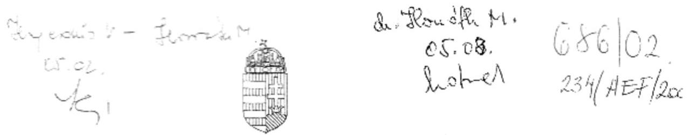
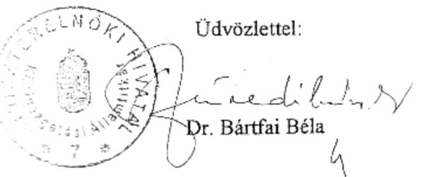

# JELENTÉS 

a Miniszterelnökség fejezet működésének ellenőrzéséről
2002. május

---

# Államháztartás Központi Szintjét Ellenőrző Igazgatóság Átfogó Ellenőrzési Főcsoport V-17-141/2001-2002.   Témaszám: 572 

## Az ellenőrzést felügyelte:

Bihary Zsigmond főigazgató

## Az ellenőrzés végrehajtásáért felelős:

Hegedűsné dr. Müllern Veronika főcsoportfőnök

## Az ellenőrzést vezette:

Horváth Sándor főcsoportfőnök-helyettes
dr. Horváth Margit osztályvezető főtanácsos

## Az ellenőrzést végezték:

| Balkay Attila számvevő | Hegedűsné Erdélyi Piroska számvevő tanácsos, tanácsadó | Szabó Józsefné számvevő tanácsos |
| :--: | :--: | :--: |
| Beck Miklós számvevő | dr. Horváth Margit osztályvezető főtanácsos | Szilágyi Gyöngyi számvevő tanácsos, főtanácsadó |
| Borsos Ferenc számvevő tanácsos | Kádár Kriszta számvevő | Szilágyi Zsuzsanna számvevő tanácsos, tanácsadó |
| dr. Burján Margit számvevő tanácsos, főtanácsos | Krémó Márkné számvevő tanácsos | Szöllősiné Hrabóczki Etelka számvevő tanácsos, főtanácsadó |
| Fekete Gábor számvevő tanácsos | Niklai Heléna számvevő | Uram Ferenc számvevő tanácsos |
| dr. Fónyad Erzsébet számvevő tanácsos | Pongrácz Éva osztályvezető főtanácsos | Vértényi Gábor számvevő gyakornok |
| Hajkó Andrea számvevő gyakornok | dr. Sipos Dóra számvevő tanácsos |  |

## Az ÁSZ által a témában eddig készített jelentések:

1. Az éves zárszámadások és költségvetési előírányzatok ellenőrzései 1990.-2000.
2. A Miniszterelnökség fejezet működésének pénzügyi-gazdasági ellenőrzése 1992., 1998.
3. A költségvetési fejezetek jóléti célú kiadásainak és jóléti intézményei működésének pénzügyigazdasági ellenőrzése 1995., 1999.
4. A kizárólagos állami tulajdon nyilvántartása helyzetéről szóló jelentés 2000.
5. Az állami tulajdonú földterületek nyilvántartásának ellenőrzéséről szóló jelentés 2000.
6. A Magyar Köztársaság 2000. évi költségvetése végrehajtásának ellenőrzése (Országimázs Központ) 2001.
7. A központi költségvetés területén működő belső kontroll mechanizmusok ellenőrzése 2001.

Jelentéseink az Országgyűlés számítógépes hálózatán
és az Interneten a www.asz.hu címen is olvashatók, továbbá a Belügyminisztérium folyóirata, az "Önkormányzati Tájékoztató" rendszeresen közli, valamint a Megyei

Közigazgatási Hivatalvezetők részére is átadásra kerül.

---

# TARTALOMJEGYZÉK 

BEVEZETÉS ..... 5
I. ÖSSZEGZŐ MEGÁLLAPÍTÁSOK, KÖVETKEZTETÉSEK, JAVASLATOK. ..... 7
II. RÉSZLETES MEGÁLLAPÍTÁSOK. ..... 11

1. A FEJEZET SZAKMAI FELADATAINAK, SZERVEZETI RENDSZERÉNEK, MŰKÖDÉSÉNEK ÉS A KÖLTSÉGVETÉSI GAZDÁLKODÁS FELTÉTELEINEK ÖSSZHANGJA ..... 11
1.1. A szakmai feladatok, a szervezeti rendszer és a működés ..... 11
1.2. A MEH feladata, szervezeti rendszere és működése ..... 12
1.3. A belső kontroll mechanizmusok értékelése. ..... 15
1.3.1. Az intézmények működésének, gazdálkodásának szabályszerűsége ..... 16
1.3.2. A felügyeleti költségvetési ellenőrzés működése ..... 18
1.3.3. A belső ellenőrzési rendszer szabályozottsága, működése ..... 19
1.3.4. Egyes szakmai feladatellátást támogató informatikai rendszerek a MEH-nél és az MKGI-nél. ..... 20
1.3.4.1. A Miniszterelnöki Hivatal integrált pénzügyi és számviteli informatikai rendszere ..... 22
2. A KÖLTSÉGVETÉS TERVEZÉSI ÉS FINANSZÍROZÁSI RENDSZERE ..... 23
2.1. Az előírányzatok megalapozottsága ..... 23
2.2. A saját bevételek alakulása. ..... 25
2.3. Az előírányzatok módosítása ..... 26
3. A KÖLTSÉGVETÉS VÉGREHAJTÁSA ..... 27
3.1. A létszámmal- és a személyi juttatásokkal való gazdálkodás ..... 27
3.2. A dologi kiadások ..... 34
3.2.1. A kiküldetési kiadások ..... 34
3.2.2. A reprezentációs-, reklám- és propaganda kiadások ..... 35
3.3. Az eszköz-, vagyon- és készletgazdálkodás ..... 36
3.3.1. Az ingatlan- és helyiséggazdálkodás ..... 37
3.3.2. A gépjárművek beszerzése, üzemeltetése ..... 38
3.3.3. A készletgazdálkodás ..... 40
3.4. A közbeszerzés ..... 41
3.5. A biztonság- és vagyonvédelem ..... 42
3.6. Az integrált üdültetési rendszer működtetése. ..... 43
3.7. A MEH részvétele gazdasági társaságokban ..... 44
4. A FEJEZETI KEZELÉSŰ ELŐÍRÁNYZATOK ÉS FELHASZNÁLÁSUK ..... 46
4.1. A fejezeti kezelésű előírányzatok tervezésének megalapozottsága. ..... 46
4.2. A fejezeti kezelésű előírányzatok alakulása ..... 47
4.3. A programfinanszírozás körébe vont fejezeti kezelésű előírányzatok alakulása. ..... 49
4.4. A programfinanszírozás körébe nem tartozó fejezeti kezelésű előírányzatok alakulása. ..... 50
4.5. Egyes fejezeti kezelésű előírányzatok felhasználása ..... 51
4.5.1. A központi kormányzati informatikai infrastruktúra fejlesztése ..... 52
4.5.2. A Bős-Nagymaros feladatkörrel kapcsolatos kormányzati feladatok koordinálása. ..... 53
4.5.3. A Szamos és Tisza folyók cianid szennyeződéséből származó kormányzati feladatok koordinálása. ..... 55
4.5.4. A Balatonnal kapcsolatos feladatok támogatása ..... 56
4.5.5. Az Egyházak támogatása ..... 57
4.5.6. A Civil szervezetek és kapcsolódó feladatok támogatása ..... 57
4.5.7. Az Európai Közigazgatási Képzési Ösztöndíj alapján közszolgálati jogviszonyt létesítők kiadásai ..... 58
4.5.8. Az Európai Közigazgatási Képzési Ösztöndíj kiadásainak támogatása ..... 59
4.5.9. A Modernizációs és Európai Integrációs program támogatása ..... 59
4.5.10. A Modernizációs és Euro-atlanti Integrációs Projektíroda támogatása ..... 60
4.5.11. A Fejezeti tartalék ..... 60
5. A KORÁBBI ÉVEK ELLENŐRZÉSEI MEGÁLLAPÍTÁSAINAK HASZNOSULÁSA ..... 62
5.1. Az előző fejezeti átfogó ellenőrzés megállapításai alapján tett intézkedések. ..... 62
5.2. A belső kontroll mechanizmusok utóellenőrzése. ..... 65
5.3. A kizárólagos állami tulajdonnal kapcsolatos ÁSZ vizsgálat utóellenőrzése ..... 65

---

2

---

# Rövidítések jegyzéke 

| Áht. | az államháztartásról szóló 1992. évi XXXVIII. törvény |
| :--: | :--: |
| BM | Belügyminisztérium |
| FB | Felügyelő Bizottság |
| GM | Gazdasági Minisztérium |
| GYIAT | Gyermek és Ifjúsági Alapprogram Titkársága |
| HÍF | Hírközlési Főfelügyeletet |
| HTMH | Határon Túli Magyarok Hivatala |
| IM | Igazságügyi Minisztérium |
| ISM | Ifjúsági és Sportminisztérium |
| ITF | MKGI Informatikai és Telekommunikációs Főosztály |
| KEHI | Kormányzati Ellenőrzési Hivatal |
| KHVM | Közlekedési, Hírközlési és Vízügyi Minisztérium |
| KöVIM | Közlekedési és Vízügyi Minisztérium |
| KüM | Külügyminisztérium |
| KVI | Kincstári Vagyoni Igazgatóság |
| ME | Miniszterelnökség fejezet |
| MEH | Miniszterelnöki Hivatal |
| MEHig. | Miniszterelnöki Hivatal igazgatása alcím |
| MEHVM | Miniszterelnöki Hivatalt vezető miniszter |
| MeKÜF | Miniszterelnökség Központi Üdülési és Oktatási   Főigazgatósága |
| MHK Kft. | Magyar Hivatalos Közlönykiadó Kft. |
| MISZ | Mobilitás Ifjúsági Szolgálat |
| MKGI | Miniszterelnökség Közbeszerzési és Gazdasági   Igazgatósága |
| MKI | Magyar Közigazgatási Intézet |
| NEKH | Nemzeti és Etnikai Kisebbségi Hivatal |
| NHIT | Nemzeti Hírközlési és Informatikai Tanács |
| OGY | Országgyűlés |
| PM | Pénzügyminisztérium |

---

STRATEK Stratégiai Elemző Központ
SzMSz Szervezeti és Működési Szabályzat
Szt. a számvitelről szóló 1991. évi XVIII., illetve a 2000. évi C. törvény

---

# JELENTÉS 

## a Miniszterelnökség fejezet működésének ellenőrzéséről

## BEVEZETÉS

A Miniszterelnökség fejezet éves költségvetései teremtik meg a pénzügyi, gazdasági keretét a miniszterelnök munkájának, a Kormány működésének, egyes, a kormányzati feladatok ellátását segítő szervezetek, fejezeti jogosítvánnyal rendelkező intézmények költségvetésének.

A fejezet felügyeletét ellátó szerv vezetője - az alá besorolt költségvetési intézmények és fejezeti kezelésű előírányzatok tekintetében - a Miniszterelnöki Hivatalt vezető miniszter, a Polgári Nemzetbiztonsági Szolgálatoknál a tárca nélküli miniszter, illetve a Kormányzati Ellenőrzési Hivatalnál a Hivatal elnöke.

A Magyar Köztársaság 2001. és 2002. évi költségvetéséről szóló 2000. évi CXXXIII. törvény szerint a fejezet kiadási előírányzata 2001-ben 153,8 Mrd Ft, költségvetési létszáma 6.220 fő, a fejezetet irányító miniszter felügyelete alá rendelt címek kiadási előírányzata 67,4 Mrd Ft, költségvetési létszáma pedig 1.754 fő volt.

A fejezetnél az Állami Számvevőszék 1998-ban végzett átfogó pénzügyigazdasági ellenőrzést. Ezt követően minden évben ellenőriztük a költségvetési előírányzatok tervezését, zárszámadását, továbbá témavizsgálatok érintették a fejezet tevékenységét. A központi költségvetés 2000. évi végrehajtásának ellenőrzése keretében megvizsgáltuk az Országimázs Központ működését. Jelen ellenőrzésünk pedig kizárólag a korábbi megállapításaink hasznosításának utóellenőrzésére irányult.

Jelenlegi átfogó ellenőrzésünk célja annak értékelése volt, hogy a fejezet felügyeletét ellátó miniszterhez besorolt költségvetési intézmények, egyes fejezeti kezelésű előírányzatok, valamint a Kormányzati Ellenőrzési Hivatal tekintetében a fejezet szervezeti, irányítási és működési rendszere, költségvetési előírányzatai összhangban voltak-e a feladatokkal; a költségvetési gazdálkodásban érvényesültek-e a szabályszerűségi és célszerűségi követelmények; a fejezeti kezelésű előírányzatok felhasználása segítette-e a szakmai célkitűzések meg-

---

valósulását; továbbá az, hogy milyen eredménnyel hasznosították a korábbi számvevőszéki ellenőrzések megállapításait, javaslatait.

Ellenőrzésünk nem terjedt ki a Miniszterelnökség fejezethez tartozó Polgári Nemzetbiztonsági Szolgálatok címre, valamint a központi költségvetés általános, illetve a Kormány hatáskörébe tartozó céltartalékok előírányzataira.

Az államháztartásról szóló 1992. évi XXXVIII. törvény 121. § (1) bekezdése alapján az Állami Számvevőszék ellenőrzi az államháztartás forrásait, azok felhasználását és a vagyonnal való gazdálkodást. Az ellenőrzés tervezésére az Állami Számvevőszékről szóló 1989. évi XXXVIII. törvény 2. § (1), (3), (5) bekezdései, a 16. § (1) bekezdése és a 17. § (3) bekezdése figyelembevételével került sor.

A helyszíni ellenőrzés a korábbi átfogó, pénzügyi-gazdasági ellenőrzés lezárását követő időszak (1998. január 1-jétől 2001. június 30-áig) feladatellátására és gazdálkodására vonatkozott, illetve a pénzügyi-gazdasági folyamatokat figyelemmel kísértük a helyszíni ellenőrzés lezárásáig.

Az ellenőrzés átfogó jellege miatt nem térhetett ki minden lényeges kérdésre, ezért a 2001. évi zárszámadás ellenőrzése keretében kerül sor a Miniszterelnöki Hivatal igazgatása alcím, a Miniszterelnökség Közbeszerzési és Gazdasági Igazgatósága alcím, valamint a fejezeti kezelésű előírányzatok felhasználásának financial audit típusú ellenőrzésére. A fejezetnek az állami vagyon kezelésével kapcsolatos tevékenységét pedig részletesebben a vagyonra, illetve annak kezelésére irányuló ellenőrzések keretében értékeljük, mint például az M3 autópálya beruházás pénzügyi folyamatának ellenőrzéséről szóló - ezen jelentésünkkel egyidejűleg nyilvánosságra hozott - jelentésünkben vagy az Állami Privatizációs és Vagyonkezelő Rt. 2001. évi működésének folyamatban lévő ellenőrzése során.

A Miniszterelnökség fejezet intézményei közül a Miniszterelnökség Központi Üdülési és Oktatási Főigazgatóságánál vizsgáltuk az integrált üdültetési rendszer működtetését.

A jelentést véglegezés előtt egyeztettük a tárca közigazgatási államtitkárával, aki a jelentésre észrevételt nem tett (2. sz. melléklet).

A végleges jelentést az Állami Számvevőszékről szóló 1989. évi XXXVIII. törvény III. fejezet 25. § (1) bekezdésének megfelelően észrevételezésre megküldtük a Miniszterelnöki Hivatalt vezető miniszternek, aki észrevételezési lehetőségével nem élt.

---

# I. ÖSSZEGZŐ MEGÁLLAPÍTÁSOK, KÖVETKEZTETÉSEK, JAVASLATOK 

A Miniszterelnökség fejezet szakmai feladatainak struktúráját a kormányzati munkamegosztásban az ellenőrzött időszak alatt bekövetkezett változások befolyásolták. A nem szorosan kormányzati koordinációt szolgáló feladatok és a költségvetési előírányzatok (ifjúságpolitikai, egyházügyi, nemzeti kisebbségi, határon túli magyarsággal összefüggő) a szakmailag kompetens tárcákhoz, ugyanakkor az 1998-ban megalakult új Kormány programja értelmében hangsúlyosabbá váló feladatok (kincstári vagyon felügyelete, információs társadalom kialakítása) a fejezethez kerültek.

A kormányváltásig közigazgatási államtitkár által irányított Miniszterelnöki Hivatalt az összkormányzati érdekek által meghatározottan alakították át. A Kormány döntéseit előkészítő, megalapozó szervezetek megerősödtek (a kabinetek köre bővült; gazdasági-, társadalmi stratégiai elemzések szélesebb körűvé váltak), a miniszteri irányítás speciális eszközökkel bővült (állami tulajdonosi joggyakorlás), meghatározott feladatkörrel politikai államtitkárokat (kommunikációs, társadalompolitikai, gazdaságpolitikai, kül- és biztonságpolitikai) bíztak meg, a központi közigazgatás intézményrendszerével való kapcsolattartásra Kormányzati Referatúrákat hoztak létre. Az átalakítás a különböző döntéselőkészítő fórumok feladatainak meghatározásában és ellátásában párhuzamosságokat is eredményezett.

A Miniszterelnöki Hivatal feladat- és szervezetrendszerében stabil elemként, áttekinthető feladatmegosztással, változatlan struktúrában működtek a közigazgatási államtitkár által közvetlenül, illetve helyettes államtitkárokon keresztül felügyelt, a fejezet, a Hivatal gazdálkodását, működését biztosító funkcionális szervezetek.

A fejezet intézményrendszerének átalakítása az intézmények többségénél a belső kontroll mechanizmusokra, az irányítási, szabályozási rendszereik kiépítésére és működésére is kedvező hatású volt. A 2000. évi állapotra vonatkozó felmérésünk eredményéhez képest az intézmények többségénél javulás mutatkozott, azok működése, gazdálkodása szervezettebb lett, szabályozottságuk igazodott a jogszabályi előírásokhoz.

A belső kontroll mechanizmusok egyes területeit tekintve kiegyensúlyozott maradt a felügyeleti- és az intézményi belső ellenőrzés, az intézmények számvitele, a kincstári kapcsolatok működése. Ugyanakkor hiányosságokat
 is tapasztaltunk egyes intézményeknél a megbízási díjak, a külföldi kiküldetések, a reprezentáció, a gépkocsi használat szabályozásában; a működési és a gazdálkodási szabályzatok aktualizálásában, továbbá a számviteli- és bizonylati fegyelem terén. Az intézmények belső kontroll mechanizmusán belül továbbra is gyenge pont maradt az informatikai rendszerek szabályozottsága és működtetése, melyhez hozzájárultak a kormányzati informatikában az adatbiztonsági követelmények, illetve az adatvagyon-gazdálkodásban az összkormányzati érdekek hangsúlyozott érvényesítésének hiányosságai.

---

A változások a Miniszterelnöki Hivatalt vezető miniszter felügyelete alá tartozó költségvetési források emelkedésével jártak (1998-ról 2001-re az eredeti kiadási előirányzat két és félszeresére; az eredeti támogatási előirányzat a háromszorosára nőtt), ugyanakkor a fejezet egyes intézményeinél nem sikerült teljes körűen a szakmai feladatok, a szervezet és a költségvetési források összhangjának biztosítása (a Miniszterelnökség Központi Üdültetési és Oktatási Főigazgatósága alapításától kezdve időszakosan forráshiányosan működött).

Az intézmények kiadási előirányzata, teljesítése az ellenőrzött időszak alatt minden évben emelkedett, 1998-ról 2001-re több mint három és félszeresére. A növekedésben a szerkezeti változások mellett a fejlesztések is szerepet játszottak. A feladatok finanszírozásához az intézmények saját bevételei változó mértékben járultak hozzá, azok összege a Hírközlési Főfelügyelet 2000. évi átvétele után lett számottevő, a saját bevételek a vizsgált időszak elejéhez viszonyítva több mint tízszeresére nőttek.

A fejezetet érintő feladatváltozások, a fejezeti kezelésű előirányzatok átadása, a központi beruházások végrehajtása az intézményeknél indokolt előirányzatmódosítással járt, ugyanakkor a teljesítések rendre a módosított előirányzatok alatt maradtak, a kötelezettségvállalással nem terhelt előirányzatmaradványokat elvonták.

A gazdasági társaságokkal kapcsolatos tulajdonosi jogok gyakorlása megfelelt a törvényi előírásoknak, de hiányosságokat is tapasztaltunk (alapító okiratok pontatlanságai). A Miniszterelnöki Hivatal továbbra sem élt azzal a lehetőséggel, hogy az eredményesen működő gazdasági társaságai után osztalékot vegyen ki, azt a társaságok az általuk ellátott tevékenységek hosszabb távú megalapozása érdekében fejlesztésre fordíthatták.

A fejezetnél a létszámmal és a személyi juttatásokkal való gazdálkodás a jogszabályoknak megfelelő volt. A többletfeladatokhoz kialakított struktúra a vezetői szintek számának és az apparátusnak a növekedésével járt, a Miniszterelnöki Hivatal szervezeti egységeinek engedélyezett létszáma 540 főre, a korábbinak több mint másfélszeresére nőtt.

A létszámkeretek és a személyi juttatás előirányzatai biztosították a kormányváltás után megnövekedett, megváltozott feladatok ellátásának feltételeit. A vezető beosztású és címekkel rendelkező köztisztviselők aránya magas volt. A foglalkoztatottak megtartásának érdekében mind a köztisztviselői, mind a közalkalmazotti körben éltek a vezetői beosztás, a differenciált alapilletményemelés és a címadományozás eszközével. Évről évre emelkedtek a külső megbízási díjra kifizetett összegek is. Évente nagy számú, több száz megbízási szerződést kötöttek, amelyeknél a szabályzatok egyes előírásait nem tartották be.

A dologi kiadások több mint ötszörösére, az ingatlanvagyon háromszorosára történt növekedéséhez a fejezethez tartozó intézményi kör változása (Hírközlési Főfelügyelet, Kincstári Vagyoni Igazgatóság fejezethez csatolása), a feladatok növekedése (pl. az üdülők átvétele), a bérleti, közüzemi, üzemanyag díjak, továbbá a kiküldetési, a reklám-propaganda költségek emelkedése is hozzájárult.

---

Az integrált üdültetési rendszer bevezetésénél nem biztosították teljes körűen a feladatok és források összhangját; nem gondoskodtak a hatékonyabb működést szolgáló egységes adatbázisról. A tapasztalt hiányosságok ellenére az integrált üdültetési rendszer elősegítette a szolgáltatások színvonalának és a férőhelyek kihasználtságának emelkedését.

Az intézmények tárgyi eszköz ellátottsága összességében megfelelő volt, az elhelyezési gondokon bérleményekkel segítettek. A Miniszterelnöki Hivatal és a Miniszterelnökség Közbeszerzési és Gazdasági Igazgatósága több épületben történt elhelyezése nehezíti a munkavégzést, növeli a költségeket. A Hírközlési Főfelügyelet ingatlanvásárlása sem javított az intézmény elhelyezésén, ugyanis az irodaépületet térítésmentesen használatba adta az Informatikai Kormánybiztosság elhelyezésére. A feladat- és létszámbővülés miatt a gépkocsik száma is emelkedett. A tárgyi eszköz- és készletbeszerzéseknél a közbeszerzésekről szóló törvény előírásait néhány tartalmi és formai hiányosság kivételével (a bizottsági munka szabályozása, az árajánlatok, az aláírt szerződések dokumentálása) betartották.

A fejezet gazdálkodásában a fejezeti kezelésű előirányzatok szerepe, nagyságrendje a vizsgált időszak alatt meghatározó volt, a fejezet támogatási előirányzatának kétharmadát tette ki. A fejezeti kezelésű előirányzatok összegének egy harmada célelőirányzat volt. A helyszíni ellenőrzésünk 11 fejezeti kezelésű előirányzatra terjedt ki, amelyből 8 volt a célelőirányzat.

A fejezeti kezelésű előirányzatok felhasználásának szabályozottsága, szervezeti, döntési rendszere szakmailag és pénzügyileg differenciált volt.

A fejezeti kezelésű előirányzatok felhasználását, annak célszerűségét, eredményességét kedvezőtlenül befolyásolták a koordinációs feltételekben, a pályáztatási rendszer működtetésében tapasztalt hiányosságok főleg a Civil szervezetek támogatása előirányzatnál 1999-2000. évben és az Európai közigazgatási képzési ösztöndíj előirányzatnál.

A vizsgált időszakban a programfinanszírozás körébe tartozó előirányzatok a fejezeti kezelésű előirányzatok egy tizedét tették ki. A programfinanszírozásra rendelkezésre álló forrásoknak ugyanakkor kevesebb, mint felét használták fel, ami a programok nem kellően megalapozott előkészítésére utal.

A Miniszterelnökség fejezetet érintő korábbi ellenőrzéseink megállapításaira, javaslataira intézkedések javították a fejezet feladatellátását, gazdálkodását (részleges profiltisztítás, intézményi belső ellenőrzés megerősítése, az állami tulajdonú ingatlanoknál a vagyonvesztés megakadályozása).

A miniszter felügyelete alá tartozó címeken túl a költségvetési ellenőrzés intézményrendszerének fejlesztésében és működésében részt vevő Kormányzati Ellenőrzési Hivatal működését és gazdálkodását is értékeltük (1. sz. melléklet).

A Kormányzati Ellenőrzési Hivatal feladat- és hatáskörét az államháztartásról szóló törvény rendelkezéseinek megfelelően az ellenőrzött időszakban újrafogalmazták, ugyanakkor továbbra is jellemző volt a munkaterven felüli vizsgálatok nagy száma, amely hátráltatta a munkatervi feladatok teljesítését és

---

párhuzamosságot okozott a Kormányzati Ellenőrzési Hivatal és az Állami Számvevőszék által végzett ellenőrzések körében.

A Kormányzati Ellenőrzési Hivatal számára jóváhagyott eredeti előirányzatok a feladatai teljesítéséhez elegendőnek bizonyultak. Humán erőforrásai 2001-2002-ben bővültek, az erre vonatkozó kormányzati döntést befolyásolta az Európai Unió szakemberei által végzett átvilágítás eredménye is.

A Kormányzati Ellenőrzési Hivatal tervezési és gazdálkodási tevékenysége az ellenőrzött időszak utolsó évében javult. A rendszeres gazdasági műveletek irányítása és végzése során a vezetői- és a folyamatba épített ellenőrzés követelményei - beépített kontrollokkal - megfelelően érvényesültek.

# A helyszíni ellenőrzés megállapításainak hasznosítása mellett javasoljuk 

## a Kormánynak:

1. Vizsgáltassa felül az integrált üdültetési rendszernél a feladatok és források kormányzati szándéknak megfelelő összhangja biztosításának lehetőségét.

## a fejezet vezetőjének:

1. Intézkedjen annak érdekében, hogy a felügyelete alá tartozó intézményeknél a belső kontroll mechanizmusok értékelése keretében feltárt szabályozási és működési hiányosságokat (megbízási díj, külföldi kiküldetés, reprezentáció, gépkocsi használat, közbeszerzéseknél a bizottsági munka szabályozása; számviteli- és bizonylati fegyelem) szüntessék meg, a meglévő szabályzataikat aktualizálják (szervezeti és működési szabályzatok, ügyrendek, számviteli szabályzatok).
2. Gondoskodjon a költségvetési előirányzatok szakszerűbb, megalapozottabb tervezéséről és felhasználásáról, különösen egyes, a programfinanszírozás körébe tartozó fejezeti kezelésű előirányzatoknál.
3. Kezelje kiemelt feladatként a kormányzati informatikában az adatbiztonsági követelmények, az adatvagyon-gazdálkodásban az összkormányzati érdekek hangsúlyozott érvényesítését.
4. Segítse elő az integrált üdültetési rendszer hatékonyabb működtetéséhez szükséges egységes adatbázisok létrehozását.

---

# II. RÉSZLETES MEGÁLLAPÍTÁSOK 

## 1. A FEJEZET SZAKMAI FELADATAINAK, SZERVEZETI RENDSZERÉNEK, MŰKÖDÉSÉNEK ÉS A KÖLTSÉGVETÉSI GAZDÁLKODÁS FELTÉTELEINEK ÖSSZHANGJA

### 1.1. A szakmai feladatok, a szervezeti rendszer és a működés

A Miniszterelnökség (ME) fejezet szakmai feladatait az ellenőrzött időszakban a kormányzati munkamegosztás működésében bekövetkező feladatátrendeződések határozták meg. Kiemelt feladata volt a miniszterelnök munkájához, a Kormány testületi működéséhez a megfelelő adminisztratív és technikai háttér, továbbá a szükséges források biztosítása a Miniszterelnöki Hivatal igazgatása alcím (MEHig.) és a Miniszterelnökség Közbeszerzési és Gazdasági Igazgatósága alcím (MKGI) költségvetésén keresztül.

Az ME fejezet feladat- és intézményrendszere 2001-re a profiltisztítást követően áttekinthetőbbé vált; a nem szorosan kormányzati koordinációt szolgáló feladatok és költségvetési előirányzatok a szakmailag kompetens tárcákhoz kerültek, ugyanakkor ezzel ellentétesen a szakmai jellegű ágazati hírközlési feladatokat az ME fejezethez csoportosították is.

Az ME fejezettől - előirányzatokkal együtt - az Igazságügyi Minisztérium (IM) fejezethez csoportosították át a Nemzeti és Etnikai Kisebbségi Hivatalt (NEKH); a Külügyminisztérium (KüM) fejezethez a Határon Túli Magyarok Hivatalát (HTMH); az Ifjúsági és Sportminisztérium (ISM) fejezethez a Gyermek és Ifjúsági Alapprogram Titkárságát (GYIAT), a Gyermek és Ifjúsági Érdekegyeztető Tanácsot, a Mobilitás Ifjúsági Szolgálatot (MISZ). Ezzel 1999-re a fejezetnél 3 intézmény - MKGI, Magyar Közigazgatási Intézet (MKI) és az 1998. végén a Pénzügyminisztériumtól (PM) a fejezethez sorolt Kincstári Vagyoni Igazgatóság (KVI) maradt, valamint a korábbi 49 fejezeti kezelésű előirányzatból 21.

A fejezet intézményeinek köre 2000-től a Miniszterelnökség Központi Üdülési és Oktatási Főigazgatóságával (MeKÜF) bővült. Ugyanebben az évben a fejezethez csoportosították át a Hírközlési Főfelügyeletet (HÍF) és a Felügyelethez kapcsolt, részben önállóan gazdálkodó Nemzeti Hírközlési és Informatikai Tanács (NHIT) működésével kapcsolatos feladatokat ellátó NHIT Irodát, valamint az informatikai, távközlés-fejlesztési és frekvenciagazdálkodási feladatok fejezeti kezelésű előirányzatot, az átcsoportosítás a 2001. évi költségvetésben jelentett címrendi változást.

Az ME fejezet feladat-átrendezésének szabályszerűségét törvények, kormányrendeletek és -határozatok, valamint az átadó és átvevő fejezetek közötti megállapodások alapvetően biztosították. Egyes feladatváltoztatások, illetve a feladatokhoz rendelt költségvetési források fejezetek közötti átcsoportosítása azonban nem mindig szabályszerűen, esetenként késedelmesen, nem megfelelően dokumentálva történt.

A MeKÜF-öt a központi közigazgatás integrált üdülési rendszerének kialakításáról, feladatairól szóló 129/1999. (VIII. 24.) Korm. rendelet hozta létre 1999. szep-

---

tember 1-től, tevékenységét ténylegesen 2000. január 1-jével kezdte meg a szükséges előirányzatok késedelmes és részleges átcsoportosítása miatt. A 2001. évi költségvetési törvény csak a Magyar Hivatalos Közlönykiadó (MHK) Kft. üzemeltetésében lévő üdülők és vendéglátóhelyek átvételével kapcsolatos előirányzatokat tartalmazta, mivel az érintett tárcákkal az üdülők átadásáról a megállapodásokat késedelmesen kötötték meg.

A hírközlési feladatokhoz kapcsolódó költségvetési előirányzatok fejezetek közötti átcsoportosítása - az érintett tárcák késedelme miatt - a törvényes határidőt követően történt.

Az ME fejezet gazdálkodásának költségvetési forrása meghatározóan a költségvetési támogatás volt, amelynek összege a Miniszterelnöki Hivatalt (MEH) vezető közigazgatási államtitkár/miniszter felügyeleti körébe sorolt előirányzatok tekintetében az 1998-tól 2001-ig tartó időszakban átlagban a kiadási előirányzat négyötödét fedte le.

A teljes ME fejezet kiadási előirányzatából a MEH-et vezető közigazgatási államtitkár/miniszter költségvetési felügyelete alá tartozó címek együttes kiadási előirányzatainak aránya ugyan a vizsgált időszakban nem változott (42-44%), az összege viszont 3,5-szeresére nőtt (1998-ban 44,8 Mrd Ft-ból 18,9 Mrd Ft, 2001-ben 153,8 Mrd Ft-ból 67,4 Mrd Ft). Hasonló tendencia érvényesült az eredeti támogatási előirányzatoknál (17,6 Mrd Ft-ról 52,4 Mrd Ft-ra), míg az eredeti saját bevételi előirányzat több mint tízszeresére nőtt (1998. évi 1,3 Mrd Ft-ról 2001-re 15 Mrd Ft-ra).

A bevételi előirányzat jelentős, a támogatási előirányzat alacsonyabb növekedési ütemét a kizárólag saját bevételből gazdálkodó HÍF 2000. évi átvétele indokolta, amelynek saját bevételi előirányzata a fejezet bevételi előirányzatának kétharmadát tette ki.

A MEH-et vezető közigazgatási államtitkár/miniszter költségvetési felügyelete alá tartozó címekhez rendelt humán források dinamikusan emelkedtek, amíg a teljes ME fejezet létszáma 1998-tól 2001-re a duplájára nőtt.

Az intézmények közül a MEHig. alcím költségvetési létszáma és kiadási előirányzata nőtt a legnagyobb mértékben. A létszám 1998-tól 2001-re 1,8-szorosára (311-ről 540 főre); a kiadási előirányzat pedig háromszorosára növekedett (1998-ban 1,2 Mrd Ft; 2001-ben 3,5 Mrd Ft). Ugyanezen időszak alatt 2,8-szorosára növekedett a fejezeti kezelésű előirányzatok körén belül az ún. célelőirányzatok kiadása is (1998-ban 3,9 Mrd Ft, 2001-ben 10,9 Mrd Ft).

# 1.2. A MEH feladata,
 szervezeti rendszere és működése 

A MEH jogállását, feladat- és hatáskörét a 137/1998. (VIII. 18.) Korm. rendeletben újrafogalmazták. A kormányrendelet 1. §-a értelmében: „A Miniszterelnöki Hivatal a miniszterelnök munkaszervezete, amely a miniszterelnök és a Kormány döntéseinek, valamint a kormányprogram célkitűzéseinek megfelelően gondoskodik a kormányzati tevékenység stratégiai irányításáról és összhangjának biztosításáról, a döntés-előkészítésben az összkormányzati érdekek érvényesítéséről. A Hivatal egyúttal ellátja a Kormány testületi működésével kapcsolatos feladatokat."

---

A MEH 1998-ban az új Kormány programjában megfogalmazott elveknek megfelelően alapvető funkcionális és jelentős szervezeti változáson ment keresztül. A strukturális átalakítás jogi hátterét a hivatkozott kormányrendelet biztosította.

A MEH szervezeti átalakítását 1998. végén és 1999. elején végrehajtották. Az új szervezet felállításához részletes döntés-előkészítő dokumentációk nem álltak rendelkezésre.

A MEH-nél a struktúra átalakítása új vezetői szintek beiktatásával (miniszteri irányítás, meghatározott feladatkörű politikai államtitkárok, referatúrák) és az apparátus megnövekedésével járt.

A MEH részletes szervezeti felépítését, belső munkamegosztási- és működési rendjét tartalmazó Szervezeti és Működési Szabályzatot (SzMSz) 1999. március 1-jei hatállyal adták ki. (A kormányváltás előtti MEH Szervezeti és Működési Szabályzata addig érvényben volt.) Az ellenőrzött időszakban a MEH-en belüli további változások jogi hátterét a 137/1998. (VIII. 18.) Korm. rendelet többszöri módosításával biztosították, ezzel összhangban a Hivatal SzMSz-ét is változtatták, pl. a kommunikáció összkormányzati jellegének erősítése érdekében, az Informatikai Kormánybiztosság létrehozása miatt.

A Kormány döntéseit előkészítő, megalapozó szervezetek megerősödtek, a kabinetek köre bővült. A korábban is működő Gazdasági Kabinet mellett Kormánykabinetet és Nemzetbiztonsági Kabinetet hoztak létre.

A Kormány féléves munkatervek alapján működik, melyeket a Kormány jogalkotási tervei determinálnak. A Kormány működésének eljárási rendjét a megelőző két kormányzati ciklusban kellő részletezettséggel és a döntések előkészítésének, a végrehajtásnak megfelelő garanciáival meghatározták.

A Kormány ügyrendjéről szóló 1088/1994. (IX. 20.) Korm. határozat szerint jártak el az ellenőrzött időszakban is. Az ügyrendet kisebb módosításokkal adaptálták a Kormány összetételéhez, operatívabbá tették a döntéselőkészítést.

A kabinetek üléseiről nem nyilvános emlékeztető, a Kormány üléseiről pedig - a kihirdetett rendeleteken, határozatokon túl - összefoglaló készül, amelynek eredeti példánya a mellékleteivel együtt nem selejtezhető.

A MEH-et miniszter vezeti, akit az általános jogkörű politikai államtitkár helyettesít. Az apparátus szakmai irányítója a közigazgatási államtitkár, aki tevékenységét a feladatkörük szerint eltérő illetékességű helyettes államtitkárok közreműködésével látja el. Ugyanakkor elsősorban az összkormányzati érdekek érvényesítésére meghatározott feladatkörű politikai államtitkárok és referatúrák működnek a Hivatalban, ezáltal a Kormány döntéseit előkészítő, megalapozó intézmények megerősödtek (kabinetek), illetve új elemekkel bővültek (Kormányzati Stratégiai Elemző Központ [STRATEK], a meghatározott szakmai területekért felelős politikai államtitkárok [kommunikáció, közigazgatás- és területfejlesztés, kül- és biztonságpolitika, társadalompolitika, gazdaságpolitika], az 5 ágazati referatúrából álló, az illetékes politikai államtitkárok által felügyelt Kormányzati Referatúrák).

---

Az új SzMSz kiadásáig a MEH politikai államtitkárainak feladatkörét miniszterelnöki határozatban, kormányrendeletben vagy -határozatban rögzítették.

A MEH közigazgatási államtitkárához rendelt feladatokat ellátó szervezeti egységek áttekinthető feladat-megosztáson alapuló struktúrában működtek, az ágazati referatúrákkal bővültek.

A Referatúrák feladatkörét a MEH SzMSz-e (48. §); a Referatúrák ügyrendje és a munkatársak munkaköri leírásai együttesen határozzák meg. A feladatok döntő része a kormányzati munkához kapcsolódik. A Referatúrákat helyettes államtitkár, az egyes ágazati referatúrákat főosztályvezető vezeti; a helyettes államtitkárhoz tartozik az ágazati referatúrákon kívül a Kincstári Vagyongazdálkodási Főosztály és 2000. dec. 1-jéig, az új SzMSz hatályba lépéséig a Privatizációs Főosztály is (ez utóbbi a miniszteri kabinethez került).

A Kormányzati Referatúrák egy közös ügyrenddel rendelkeznek, az ágazati referatúrák tárca-kompetenciáit csak a munkaköri leírásokból lehet nyomon követni.

A Kormányzati Referatúrák a miniszterelnök és a MEH-et vezető miniszter (MEHVM) részére heti rendszerességgel készítettek jelentéseket az illetékességi körükbe sorolt fontos, kiemelkedő ágazati koncepciókról, témakörökről.

A MEH működésének szabályozása megfelelő volt. Az SzMSz III. része a MEH működésének legfontosabb előírásait tartalmazza (munkáltatói jogok gyakorlása, kiadmányozás, vezetői értekezletek, kapcsolattartás). A MEH hivatali szervezeti egységei az ellenőrzött időszakban rendelkeztek ügyrenddel.

A különböző döntéselőkészítő fórumok (STRATEK, Kormányzati Referatúrák, Kormányiroda) feladatainak meghatározásában és ellátásában párhuzamosságok mutatkoznak.

A hivatali működésnek a szigorú hierarchián alapuló előírásait kiegészítette a közszolgálati teljesítményértékelési rendszer.

Az egyéni teljesítményértékelési rendszer fontos része az értékelési időszakra a vezető és a beosztott közötti „Teljesítmény-szerződés", amelyben a fontossági sorrendbe rakott feladatokhoz teljesítmény-elvárásokat határoznak meg és fogadnak el kölcsönösen, majd a teljesítményeket feladatonként és összességében is értékelik, azt a beosztottal együtt véglegezik, egyben meghatározzák az egyéni teljesítmény javítását szolgáló fejlesztési, képzési, támogatási teendőket.

A MEHVM a fejezet intézményeivel (MKGI, MeKÜF, MKI, KVI) kapcsolatban alapítóként, illetve fejezeti irányító szervként gyakorolja mindazon jogosítványokat, amelyek az államháztartásról szóló 1992. évi XXXVIII. tv. (Áht.) és az államháztartás működési rendjéről szóló 217/1998. (XII. 30.) Korm. rendelet és a költségvetési szervek gazdálkodására vonatkozó egyéb jogszabályok előírásai szerint megilletik, az SzMSz szerinti megosztásban.

A költségvetési és gazdálkodási helyettes államtitkár felügyeli a miniszter megbízásából az MKGI tevékenységét (SzMSz 18. §), a személyügyi és funkcionális szervezetet irányító főigazgató működik közre a MeKÜF feletti felügyeleti jog gyakor-

---

lásában [SzMSz 38. § (2) f)]. Az MKI szakmai felügyeletének telepítése hiányzik az SzMSz-ből.

A MEHVM-et a kincstári vagyon kezelése körében a KVI-re, illetve az állami vagyon privatizációja tekintetében ÁPV Rt.-re kiterjedően megilletik az állami tulajdonosi jogkör gyakorlásának jogosítványai, melyek ellátását részletesen megvizsgáltuk a Kincstári Vagyongazdálkodási Főosztály és jogutódja (Privatizációs Titkárság) működésén keresztül.

Az eltérő státuszú, egymás tevékenységét kiegészítő feladatkörű szervezetekkel kapcsolatos tulajdonosi joggyakorlás eszközeit a jogszabályokban, az alapító okiratokban és MEHVM utasításokban foglaltak szerint alakították ki és gyakorolják (kinevezési jogosítványok, az alapvető szervezeti, működési és gazdálkodási kérdéseket meghatározó dokumentumok jóváhagyása, illetve megállapítása, a szervezetek tevékenységéről megfelelő szinten és fórum előtt történő rendszeres beszámoltatás).

A KVI Alapító Okirata alapján a MEHVM a KVI vezérigazgatóját a kinevezését követően az intézmény 8 hónapos, 1 éves, majd ezt követően 2000-ben az 1999-2000. évi tevékenységéről számoltatta be, emellett az irányítás sajátos eszköze, hogy a KVI vezérigazgatója a minisztert kéthetenként, a közigazgatási államtitkárt heti rendszerességgel személyesen tájékoztatja a kincstári vagyont érintő legfontosabb ügyekről.

Az ÁPV Rt. tevékenységéről a Kormány számára a beszámolót a privatizációért felelős miniszter készítette elő, azt megelőzően az Igazgatóság határozattal fogadta el, a Felügyelő Bizottság véleményezte. A Vagyonkezelési Főosztály (Privatizációs Titkárság) munkatársai a miniszter részére végezték a szakmai előkészítő, véleményező munkát, rendszeresen részt vettek az Igazgatóság, FB ülésein.

# 1.3. A belső kontroll mechanizmusok 

A központi költségvetés területén működő belső kontroll mechanizmusok ellenőrzéséről szóló (1999-2000. I. féléves időszakra vonatkozó) jelentésünk fő megállapítása értelmében - az ME fejezet intézményeinél az elemi beszámolók megbízhatósága szempontjából - a belső kontroll mechanizmusok kiépítése és működése egyenletes volt a számviteli tevékenység területén; megfelelő a belső ellenőrzési tevékenységnél és a kincstári adatszolgáltatáshoz kapcsolódó ellenőrzésnél; hiányosságokat mutatott az intézményi tevékenység szabályozottsága, különösen az informatikai környezet szabályozottsága terén.

A belső kontroll mechanizmusok alatt értjük a kiépített és működő irányítási, szabályozási rendszereket, továbbá azok környezetét és a kontroll eljárásokat. Az értékeléshez az alapvető irányítási, szabályozási eszközök és a kontroll eljárások működésének kulcsfontosságú folyamat-elemei (számviteli tevékenység és annak informatikai támogatottsága, függetlenített belső ellenőrzés, munkafolyamatba épített kincstári ellenőrzés) tartoznak.

A jelen ellenőrzésünk keretében a belső kontroll mechanizmusok működésének vizsgálatát helyszíni ellenőrzéssel alátámasztva, teljes körűen végeztük.

---

A 2001. évi állapotra vonatkozó helyszíni ellenőrzésünk adatai alapján javulás mutatkozott, ehhez hozzájárult a KEHI alacsony, a HÍF közepes kockázati minősítése, ugyanakkor a 2000. évi értékeléshez hasonlóan az MKI magas minősítése megmaradt alapvetően a számviteli terület szabályozottsági hiányosságai miatt. A fejezet intézményei közül a KVI alacsony és az MKGI közepes kockázati minősítése nem változott, a MEHig.-é és a MeKÜF-é közepes lett az alacsonyból, illetve a magasból.

A felmérés eredménye alapján a fejezet intézményeinél egy terület kapott magas kockázati minősítést, az informatikai környezet szabályozottsága. Az intézményeknél továbbra is kiegyensúlyozottan működött a Kincstár munkafolyamatba épített ellenőrző funkciója. Hiányosságokat tapasztaltunk egyes intézményeknél az intézményi szabályozottság, a belső ellenőrzés és a számviteli rendszer szabályozottsága terén (MKI, MKGI).

# 1.3.1. Az intézmények működésének, gazdálkodásának szabályszerűsége 

Az intézményi működés szabályozottságára több intézménynél kedvező hatású volt a belső kontroll vizsgálatunk. Alapító okirattal, SzMSz-szel, ügyrenddel az ellenőrzött időszak végére az intézmények rendelkeztek, hiányosságokat a működési szabályzatok aktualizálása, egyes esetekben a munkaköri leírások területén tapasztaltunk.

Az ellenőrzött alapító okiratok közül az MKI átdolgozott Alapító Okiratát a helyszíni ellenőrzés befejezéséig a felügyeleti szerv nem hagyta jóvá. Az MKGI Alapító Okiratában a feladataiban történt változások miatt szükséges módosítások késve történtek. (Az üdültetési feladatokat 1999. II. félévében adták át, az Alapító Okiratot azonban csak 2001-ben módosították.)

A NEKH-nál és a HTMH-nál az SzMSz-ek aktualizálása, - a folyamatos feladatváltozások, szervezeti átalakítások miatt - késett. A MeKÜF SzMSz-ét az alapítás után 15 hónappal hagyták jóvá. Aktualizálása is több hónapot késett, a 2001. januárban végrehajtott szervezeti módosításokat tartalmazó SzMSz 2001. május végén lépett hatályba. Az MKI-nél a módosított Alapító Okirattal összhangban új SzMSz készült, amit felterjesztettek a felügyeleti szervnek, jóváhagyása a helyszíni ellenőrzés befejezéséig nem történt meg. Az MKGI szervezeti egységei közül csak három készítette el időben az ügyrendjét.

Az MKI dolgozói - a Gazdasági Igazgatóságon dolgozók kivételével - nem rendelkeztek munkaköri leírással.

A fejezethez tartozó intézmények gazdálkodási tevékenységének szabályozottsága javult.

Az intézmények alapvetően az Szt.-ben meghatározott alapelvekhez és a szakmai sajátosságokhoz igazodva alakították ki számviteli politikájukat, amelyhez kapcsolódott a leltározási, értékelési, pénzkezelési szabályzat. A számlarend a számlakeret-tükör és magyarázata mellett tartalmazta a zárlati feladatokat, az analitikus nyilvántartások vezetésének rendjét és a főkönyvi számlák összefüggéseit. A bizonylati rend és az okmányfegyelem szabályozása megfelelő volt.

---

Jellemző hiányosság volt pl. a számviteli-pénzügyi területre vonatkozó szabályzatok elhúzódó aktualizálása (KVI, MKI).

A számviteli politika, számlarend az MKI-nél nem felelt meg az Szt. előírásainak. Az MKGI számviteli politikája nem minden tekintetben tartalmazta az intézmény adottságainak, körülményeinek megfelelően az Szt.-ben rögzített alapelveket. A számlarend nem tartalmazta a főkönyvi számla és az analitikus nyilvántartás kapcsolatát, egyeztetésének módját.

Az MKGI pénzkezelési szabályzata nincs összhangban a 217/1998. (XII. 30.) Korm. rendelet 133. § (4)-(6) bekezdésében foglaltakkal (a felügyeleti szerv engedélye nem állt rendelkezésre).

Az MKI-nél a kötelezettségvállalás rendjének szabályzata elavult. A pénzkezelési szabályzat nem volt teljes körű, hiányzott pl. a szigorú számadású nyomtatványok használatára, a valutakezelésre vonatkozó előírás. A selejtezési és leltározási szabályzat aktualizálása az ellenőrzés ideje alatt volt folyamatban.

A HÍF-nél nem aktualizálták a közbeszerzési és a reprezentációs szabályzatot.
Az intézmények az előirányzat-módosítások nyilvántartását általában megfelelően vezették, de a dokumentáltság és nyilvántartás egyes esetekben (MKGI, MeKÜF, KVI, MKI) nem volt megfelelő.

A felügyeleti szerv az intézményeknek az éves beszámoló és a zárszámadás elkészítéséhez minden évben körlevelet adott ki, melyben meghatározta a feladatokat, azok tartalmi elemeit és a végrehajtás határidőit. A MEH Költségvetési Főosztálya ellenőrizte az intézményi beszámolókat és azok dokumentáltságát, a beszámolók adatait a Magyar
 Államkincstár által közölt adatokkal egyeztette. Az esetleges eltéréseket (pl. helytelen kincstári kód alkalmazása, előirányzat-módosítások késedelmes bejelentése) az intézmények – írásban – indokolták, rendezésük megtörtént, a felügyeleti szerv a fejezeti szintű összesítést elkészítette. Az eltéréseket a kincstári körön kívüli számlavezetés (lakásalapszámla), az előirányzat-maradvány kezelése, valamint az okozta, hogy a kincstári zárási nap és az intézmények beszámoló készítési időpontja nem esett egybe. A szöveges beszámolók a PM által e tárgyban kiadott köriratnak megfelelően készültek el.

Az intézmények a vizsgált időszakban az éves, féléves beszámolókat az államháztartás működési rendjéről szóló 217/1998. (XII. 30.) Korm. rendelet előírásainak megfelelően készítették el. A beszámolók főkönyvi kivonattal, leltárral alátámasztottak voltak, de a főkönyvi könyvelés és az analitikus nyilvántartás között a MeKÜF-nél és az MKI-nél eltérést is tapasztaltunk.

A vizsgált időszakban az intézmények gazdálkodásában – az MKI és a GYIAT kivételével – a pénzügyi, bizonylati fegyelem megfelelő volt.

Az MKI-nél a kötelezettségvállalások ellenjegyzését a megvizsgált bizonylatok több mint 80%-ában nem végezték el. A GYIAT 1998. évben nem rendelkezett számviteli politikával. Az intézménynél a megbízási szerződések nyilvántartása nem volt megfelelő.

---

# 1.3.2. A felügyeleti költségvetési ellenőrzés 

Az ME fejezetnél a felügyeleti ellenőrzés az intézményi és fejezeti beszámolók megbízhatósága szempontjából kontrollkockázat csökkentő tényező volt.

A fejezeti felügyeleti ellenőrzés feladatai ellátásának személyi és szabályozási feltételei javultak.

Az ellenőrzési feladatokat a MEH Ellenőrzési Főosztálya látta el, a jogszabályi előírásnak megfelelően közvetlen közigazgatási államtitkári alárendeltségben, a szervezet függetlensége biztosított volt. A Főosztály engedélyezett létszáma 2001-re a korábbi 6-ról 7 főre nőtt.

Az ellenőrzési tevékenység szabályozása 2001-től maradéktalanul megfelel a központi, a társadalombiztosítási és köztestületi költségvetési szervek kormányzati, felügyeleti, valamint belső költségvetési ellenőrzéséről szóló 15/1999. (II. 5.) Korm. rendelet előírásainak.

A Főosztály ügyrendje, amely egyben az ellenőrzési tevékenység szabályzata is, magában foglalja a felügyeleti ellenőrzés prioritásait, az ellenőrzések folyamatának előírásait (megbízólevél, program, helyszíni ellenőrzés, ellenőrzési részjelentés, összefoglaló jelentés, az ellenőrzési megállapítások hasznosítása, realizáló levél, megbeszélés stb.), az ellenőrzési munkatervek és beszámolók tartalmi követelményeit, a közigazgatási államtitkár jogosítványait (az ellenőrzés felfüggesztése). Az ügyrendet a közigazgatási államtitkár jóváhagyta.

Az Ellenőrzési Főosztály a felügyeleti ellenőrzési feladatok mellett ellátta a MEHig. alcím belső ellenőrzését is, a feladatok teljesítését azonban e tényező nem befolyásolta.

Az ellenőrzések előkészítettsége, irányultsága is összhangban volt a hivatkozott kormányrendelet előírásaival.

A 2001. évi Ellenőrzési Munkaterv szerinti 2 átfogó felügyeleti ellenőrzésük (valamint az előző évről áthúzódó 1) lezárása az ütemezésnek megfelelően megtörtént (MeKÜF, KVI).

A tervezett 4 célellenőrzés (különböző fejezeti kezelésű előirányzatok 1999-2000. évi felhasználásának ellenőrzése) a helyszíni ellenőrzésünk idején folyamatban volt, témaellenőrzéseik közül végrehajtották az intézmények és a fejezet 2000. évi előirányzat-maradványának vizsgálatát; munkaterven kívül elvégezték az MKI átfogó ellenőrzését.

A kormányrendeletben előírt 3 évenkénti ellenőrzési kötelezettség teljesítésének feltételei biztosítottak. A Főosztály 2001-re ütemezett átfogó felügyeleti ellenőrzései teljesítik a kormányrendelet és az Ügyrend szerinti prioritásokat.

A felügyeleti ellenőrzések alapján tett intézkedések nyomon követhetősége érdekében többször tartottak utóvizsgálatokat (civil szervezetek és kapcsolódó feladatok támogatása fejezeti kezelésű előirányzat 2000. évi felhasználásának utóellenőrzése), melyekre a kapacitás-bővítés lehetőséget ad. Az ME fejezetnél 3 éve nem ellenőrzött költségvetési szerv nincs.

---

# 1.3.3. A belső ellenőrzési rendszer szabályozottsága, működése 

A fejezet intézményeinél a belső ellenőrzési rendszer szabályozottsága, működése javult, ehhez hozzájárultak a vonatkozó kormányrendelet alapján tett intézkedések is.

A vezetői és a munkafolyamatba épített ellenőrzés az intézmények többségénél szabályozott volt, működésével hozzájárult a hibák és szabálytalanságok megelőzéséhez, feltárásához, az ezek alapján tett intézkedésekkel összességében csökkentette a belső kontroll kockázatokat.

A vezetői ellenőrzés egyéb, a kormányrendelet 6. § (2) bekezdésben foglalt eszközei és módszerei (gazdasági-pénzügyi adatok elemzése, a beosztottak beszámoltatása, munkahelyeken végzett helyszíni ellenőrzések, munkaterven felüli ellenőrzések) két intézmény (KVI, HTMH) kivételével szabályozottak voltak, megfelelően működtek, kivéve az MKI-t és a NEKH-et.

A függetlenített belső ellenőrzés a hibák, szabálytalanságok feltárásával, intézkedési javaslatokkal, működésével elősegítheti az intézmények megbízható, szabályszerű működését. A kormányrendelet előírásainak eleget téve 2000-tól minden intézménynél működött belső ellenőr. A belső ellenőrzés függetlensége a jogszabályoknak megfelelően biztosított volt.

Részmunkaidős belső ellenőrt alkalmaznak az MKI-nál, megbízással foglalkoztattak belső ellenőrt 1998-ban a MISZ-nél, a GYIAT-nál, 2000-ben a MeKÜF-nél. A KVI-nél Önálló Belső Ellenőrzési Osztály működött. Nem foglalkoztattak belső ellenőrt 1998-ban a NEKH-nél és a HTMH-nál.

A függetlenített belső ellenőrzési tevékenység szabályozottsága nem volt megfelelő a GYIAT-nál; a KVI-nél a szabályzat aktualizálása késedelmesen történt; az MKGI jóváhagyott belső ellenőri szabályzattal nem rendelkezett.

Az ellenőrzések a vezetők által jóváhagyott ellenőrzési programok alapján történtek. Az intézményeknél – az MKI és a MeKÜF kivételével – az elemi beszámolók megbízhatóságát befolyásoló tényezők ellenőrzése prioritást kapott.

A MeKÜF 2001. évi ellenőrzési tervében nem szerepelt a 2000. évi költségvetési beszámoló valódiságának ellenőrzése.

Az MKI a mérlegvalódiság vizsgálatánál a leltárral való alátámasztottságra, mint vizsgálati szempontra nem tért ki.

Az ellenőrzési jelentések – az MKI, MISZ, GYIAT kivételével – tartalmazták a kormányrendeletben foglaltakat, tartalmukat a vizsgált szervezet és a felső vezetés is megismerte.

Az MKI-nél belső ellenőri jelentés nem készült, a MISZ-nél és a GYIAT-nál a belső ellenőr munkájáról ellenőrzési naplót és annak alátámasztására munkafüzetet vezettek az ellenőrzési jegyzőkönyv helyett.

Az ellenőri jelentések megállapításai alapján feltárt hiányosságok felszámolására az intézmények – az MKI, a MISZ és a GYIAT kivételével – intézkedési

---

tervben foglalták össze a feladatokat, amelyek megvalósulását a belső ellenőri beszámolókban is ismertették, illetve az utóvizsgálatok során ellenőrizték.

# 1.3.4. Egyes szakmai feladatellátást támogató informatikai rendszerek a MEH-nél és az MKGI-nél 

A feladatellátást támogató informatikai rendszerek átfogó ellenőrzésére a MEH-nél és az MKGI-nél került sor.

A MEH és az MKGI szabályzatai (SzMSz) alapján a MEH informatikai működtetéséért, irányításáért az MKGI Informatikai és Telekommunikációs Főosztályának (ITF) vezetője volt felelős. Az informatika képviselete, az ITF szakmai felügyelete a Hivatal felső vezetésében az informatikai és távközlési ügyekben illetékes helyettes államtitkárság megszüntetése óta formálisan sem volt megoldott.

A MEHVM 7/1999. (IV. 29.) utasításával kivette az informatikai és távközlési ügyekben illetékes helyettes államtitkár felügyelete alól az ágazati informatikai vezetői feladatellátást, az Informatikai Kormánybiztosság létrehozásával a feladatok egy részének jogutódlásáról viszont nem gondoskodott (a Hivatal belső informatikai és távközlési fejlesztéseinek irányításáról, a Hivatal feladat- és hatáskörébe utalt informatikai, kormányzati távközlési tevékenységekkel kapcsolatos központosított közbeszerzési feladatok összehangolásáról, a hozzá kapcsolódó normatív előkészítő munka irányításáról).

Az információgazdálkodás szervezeti kialakításának kockázatos pontja volt az adatvédelemmel összefüggő szabályozás és felügyelet hiánya. Átfogó adatvédelmi szabályzattal a MEH és az MKGI nem rendelkezett, az informatikai biztonság kialakításának és felügyeletének szervezeti felelőseit az SzMSz nem határozta meg. Hiányoztak a legfontosabb informatikai szabályzatok is (informatikai stratégia, biztonsági szabályzat, katasztrófa terv). A meglevő szabályzatok csak részben fedtek le egyes informatikai területeket, a szervezeti átalakulások miatt is aktualizálásra szorulnak.

Az informatikai rendszerek szoftver jogtisztaságát, biztonságát két hatályos szabályzat is érinti (7/1998. sz. közigazgatási államtitkári utasítás, a MEH VM 6/1999. Utasítása). Azok azonban részleges rendelkezéseket tartalmaznak, miközben a szabályzat alkalmazásához szükséges adatvédelmi és adatkezelési előírásokkal a MEH nem rendelkezik.

A közszolgálati adatok védelmét szabályozó közigazgatási államtitkári utasítás az intézményi információvédelemnek csak egy kisebb területét fedte le. A számítógépes iratkezelés területén gyengíti az adatvédelmet, hogy az államtitkári utasítással ellentétben titokvédelmi felelőst 1994 óta nem neveztek ki.

Hiányos volt a rendszerszemléletű szabályrend kialakítása és az abban előírandó feladatok következetes számonkérése. A szabályzatok nem rendelkeztek egyértelműen a tekintetben, hogy az informatikai biztonsági intézkedések hiányosságaiért ki a felelős.

Az MKGI-nél az informatikai szervezet (ITF) szervezeti kapcsolatait és feladatait az SzMSz és a főosztály ügyrendje meghatározta, ugyanakkor tartalmi hiányosságok álltak fenn, a felelősségi és hatásköröket egyértelműen nem határolták el, a helyettesítésekkel kapcsolatban nem tartalmaztak elegendő információt.

A rendszergazdák főosztályvezetői felügyelete szóbeli beszámolókon alapult, írásbeliség eseti jelleggel fordult elő. A rendszer-adminisztrációs tevékenységek naplózás nélkül részleteiben nem voltak követhetők, a rendszergazdák látták el saját biztonsági felügyeletüket is, az alapbiztonsági követelményekkel ellentétesen (Informatikai Tárcaközi Bizottság (ITB) 12. sz. ajánlás).

A fizikai és logikai hozzáférések szabályait írásban nem rögzítették, az informatikai erőforrások aktualizált állapotáról nyilvántartással nem rendelkeztek.

A MEH belső hálózatának és adatállományainak elérése csak a MEH szervezeti egységeihez alá tartozó számítógépekről volt lehetséges, a kívülről jövő illetéktelen behatolások ellen a rendszer megfelelően védett volt.

A belső hálózat tűzfallal van leválasztva a kormányzati adathálózatról. Távoli, modemes hozzáféréssel az arra jogosult felhasználó csak az Internetet és a levelező rendszert érheti el, egyéb hálózati szolgáltatásra a hozzáférés nem jogosított.

A kialakított jogosultságkezelési rendszert a felhasználók teljes körét tekintve nem tartották be, a hozzáférések felügyelete erősen korlátozott, a felhasználókról az ellenőrzéshez szükséges független nyilvántartást az ITF nem vezette, a jogosultságok visszavonása sem volt szabályozott.

A MEH feladatköréből, adatállományából adódóan a hozzáférési kontrollok szűkítése növelte az érzékeny információkhoz történő illetéktelen hozzáférések kockázatát.

A központi számítógépes helyiségek fizikai hozzáférésének védelme az ITB ajánlás alapbiztonsági szintjének felelt meg.

A MEH Irodaház épületébe való bejutáshoz szükséges elektronikus kártyák használata a szabályozásnak megfelelt. A központi számítógépterembe történő belépéskor, ott tartózkodáskor a külsős személyek kísérete megoldott volt.

A MEH tulajdonát képező hordozható számítógépeken tárolt információk adatvédelme nem volt megoldott. Az adatvédelmi kockázatot növelte a számítógépek elvesztése vagy ellopása (2001-ben 1 eset).

A MEH működéséhez a folyamatosan üzemelő informatikai háttér biztosított volt. A számítógépes hálózat stratégiai elemei (szerverek, aktív eszközök, rendezőmezők) megfelelő környezeti védelemmel ellátott helyiségekben vannak. A Hivatal vírusvédelme többszintű és megbízhatóan működött.

A hálózati rendszer központi adattárolóinak rendszeres mentését az ITF biztosította a saját hatáskörben kialakított gyakorlat szerint, amelyet a funkcionális területekkel nem egyeztetett, ennek hiánya adat-visszaállítási kockázatot rejtett magában.

---

A katasztrófa és a folyamatos tevékenység, fenntartási tervek hiánya miatt a rendkívüli helyzetek magas kockázatot jelentenek az informatikai rendszerek folyamatos és biztonságos működése tekintetében.

# 1.3.4.1. A Miniszterelnöki Hivatal integrált pénzügyi és számviteli informatikai rendszere 

A MEH és az MKGI pénzügyi, gazdálkodási folyamatait egy magasan integrált pénzügyi és számviteli informatikai rendszer támogatta. Moduljai lefedik mindkét intézmény pénzügyi és számviteli tevékenysége jelentős részét és kezelik a kapcsolódó nyilvántartásokat, mintegy 100 felhasználóval.

A MEH a kockázatok valós mértékének ismerete nélkül 7-8 éve üzemeltet egy olyan pénzügyi és számviteli rendszert, amely nem biztosítja az alapszintű adatvédelmet, a megbízható ellenőrzési nyomvonalat.

Az integrált informatikai rendszer működtetéshez kapcsolódó adásvételi és szolgáltatási szerződések nem tértek ki az adatvédelem, illetve a biztonságos üzemeltetés követelményeire, csökkentve a fejlesztési konstrukció biztonsági fokát.

A program által létrehozott ellenőrzési nyomvonal nem tekinthető megbízhatónak. A jogosultsággal való visszaélés esetén a felvett azonosság nevére naplózza a rendszer a végrehajtott műveleteket. A naplófájlhoz nem védett a hozzáférés, így a rögzített adatok aznap, visszaállítási lehetőség nélkül törölhetők.

Az integrált pénzügyi és számviteli rendszer üzemeltetésének gyakorlata, a fejlesztői és adminisztrációs (jogosultság beállítási) feladatkörök összevonása az alapvető biztonsági szabályok figyelmen
 kívül hagyását jelenti.

A rendszer informatikai szakmai szolgáltatásainak döntő részét (programok telepítése, számítástechnikai rendszerfelügyelet, közreműködés az információs rendszer kialakításában, adatok konvertálása) a fejlesztő cég végezte.

A feltárt védelmi hiányosságok kiküszöbölésére a MEH intézkedési tervet dolgozott ki és rövid távon megoldható változtatásokat hajtott végre.

Az intézkedési terv alapján 2002. február 1-jétől a MEH Pénzügyi és Számviteli Főosztálya a rendszer korszerűbb, SQL-es adatbázis-kezelő alapú szoftverét vezette be.

A változtatások eredményeként a más dolgozó jogosultságával való visszaélés kockázata lecsökkent. A pénzügyi szoftverek korszerűsítéséig azonban az adatvédelem kontrolljának kockázata továbbra is magas (adatbázis-kezelő rendszer jellege, adottsága, a hálózati rendszer naplózási gyengesége miatt).

A hálózati környezet és a program rendszerének adottságai miatt továbbra is magas az adatállományaiban tárolt információk illetéktelen hozzáférésének kockázata.

A rendszert és környezeti kialakítását részletesen megvizsgáltuk a feldolgozással párhuzamosan működtetett manuális kontrollok szempontjából. A bérszámfejtési, külföldi kiküldetési, pénztári, főkönyvi és eszközgazdálkodási folyamatokban a kiegészítő pénzügyi és számviteli kontrollok a pénzügyi beszámoló megbízhatóságát biztosítják.

# 2. A KÖLTSÉGVETÉS TERVEZÉSI ÉS FINANSZÍROZÁSI RENDSZERE 

### 2.1. Az előirányzatok megalapozottsága

A tervezés az ellenőrzött időszakban is bázis szemléletű volt. A MEH Költségvetési Főosztálya a tervezés során a jogszabályokban előírt feladatokat teljesítette. Az intézményekkel való együttműködés, koordináció azonban teljes körűen nem volt nyomon követhető, mivel arra - emlékeztetők felvétele nélküli - a szóbeli egyeztetések voltak jellemzőek. Ezt a gyakorlatot a feszített ütemű tervezési munkák, az előirányzatok - PM-mel történő egyeztetése vagy egyeztetés nélküli - többszöri változása okozta.

A MEH Költségvetési Főosztálya 2000-2001. években a fejezeti kezelésű előirányzatoknál és a MEHig. alcímnél végzett feladat-felülvizsgálatot, és annak megfelelően érvényesítette a szakmai prioritásokat.

A felügyeleti szerv a fejezet éves költségvetési javaslatát a MEHig. és az intézmények szervezeti egységei - szöveges indoklással alátámasztott - igényeinek felmérése, rangsorolása alapján dolgozta ki. A fejezet körlevelekben tájékoztatta valamennyi intézményét a költségvetési törvényjavaslat elkészítéséhez szükséges feladatokról.

A tervjavaslatokat az intézmények minden évben - a tervalku során - többször átdolgozták. Az ellenőrzött intézményeknél - az MGKI és a MeKÜF kivételével - a tervezést alátámasztó számítások, dokumentációk teljes körűen rendelkezésre álltak.

Az MKGI-nél a kiemelt előirányzatoknál az előirányzati többletek indokoltságát alátámasztó számítások - a 2001. évet kivéve - hiányosak voltak. A MeKÜF-nél 2000. évre vonatkozóan a dologi kiadások előirányzatát alátámasztó dokumentációt nem tudtak bemutatni.

Az intézmények költségvetésének tervezése általában a jogszabályi előírásoknak megfelelően történt. A KVI a 2000. évben - a felügyeleti szerv jóváhagyásával, más jogcím hiányában - szerkezeti változásként szerepeltette a dologi kiadások 33,5 M Ft-os átcsoportosítását a személyi juttatásokra és munkáltatót terhelő járulékokra ellentétesen a 217/1998. (XII. 30.) Korm. rendelet 26. § (3) bekezdésében foglaltakkal.

A fedezetet a KVI-nél a Kincstári vagyonkezelés és hasznosítás alcímről az Intézményi alcímre dologi kiadásokra - szintén szerkezeti változásként kimutatva - átcsoportosított $65,4 \mathrm{M}$ Ft biztosította.

Az intézmények a tervezés során mennyiségi-, minőségi teljesítménymutatókat, feladatmutatókat, továbbá létszám- és költségnormákat általában nem alkalmaztak. Esetenként a számviteli nyilvántartási rendszer (MKGI, MKI), illetve az intézmények sajátos feladatai (MEHig., MKGI) nem biztosítottak adatokat a normák kidolgozásához.

Az ME fejezet 1-9. címének eredeti kiadási előirányzata 268 %-kal, az 1998. évi 18,9 Mrd Ft-ról 2001-re 67,4 Mrd Ft-ra, az eredeti támogatási előirányzata 198 %-kal, 17,6 Mrd Ft-ról 52,4 Mrd Ft-ra nőtt. A támogatási előirányzat alacsonyabb növekedési ütemét a kizárólag saját bevételből gazdálkodó HÍF - 2000. évi - fejezethez kerülése okozta.

Az intézmények eredeti kiadási előirányzata az ellenőrzött időszak minden évében emelkedett. A növekedéshez a szerkezeti változások mellett a fejlesztések is hozzájárultak.

Az MKGI kiadási előirányzata 87 %-kal, 1,5 Mrd Ft-ról 2,8 Mrd Ft-ra növekedett. Az intézmény a vizsgált időszakban minden évben tervezett fejlesztést összesen 1,4 Mrd Ft értékben, ebből az 1999. évre tervezett összeg 66 %-a, 928,2 M Ft volt. Ugyanezen időszak alatt eredeti előirányzatai az ellátandó feladatok bővülése miatt is nőttek, a személyi juttatások esetében 223 %-ra, a dologi kiadásoknál 195 %-ra. A felújítások eredeti előirányzata fokozatosan 71 %-ra csökkent, az intézményi beruházások előirányzata az 1998. évről az 1999. évre mintegy háromszorosára nőtt, míg a 2000-2001. években fokozatosan csökkent.

A vizsgált időszakban az MKI működési költségvetése 37 %-kal, 68,3 M Ft-ról 93,9 M Ft-ra emelkedett.

A KVI kiadási előirányzata az 1999-2001. évek között 14 %-kal, 1.265,5 M Ft-ról 1.441,4 M Ft-ra emelkedett. A személyi juttatások 28 %-kal, 624,2 M Ft-ról 800,2 M Ft-ra változtak. (2001-ben a PM tervezési köriratában meghatározott 7,5 %-os keresetnövekedéssel szemben az intézmény - Kormánydöntés alapján - 8,75 %-ot érvényesített.) A dologi kiadások 35 %-kal, 243,4 M Ft-ról 327,4 M Ft-ra nőttek. Az intézményi beruházások kiadási előirányzata 11 %-kal, 47,9 M Ft-ról 53,3 M Ft-ra emelkedett.

A szakmai feladatok végrehajtását - a MeKÜF kivételével - a költségvetési törvényben jóváhagyott előirányzatok minden esetben biztosították.

A MEKÜF alapításától kezdve forráshiányosan működött. Ez az intézmény kezelésébe került üdülők állagmegóvását, felújítását is hátráltatta. A MEKÜF egységes nem üdülőkhöz, hanem kategóriákhoz kapcsolódó - térítési díjat határozott meg, ami az üdülők eltérő adottsága miatt eltért az üdülőnként változó önköltségtől. A fejezet a beruházási többletfeladatokra forrást 2001-től az integrált üdülők értékesítéséből befolyt bevétel 100 %-os visszaforgatásával biztosíttatta.

A MEH Költségvetési Főosztálya a vizsgált időszakban az intézmények és a fejezeti kezelésű előirányzatok előirányzat-maradványainak számszaki egyezőségét, az önrevízió alapján elvonásra felajánlott maradványok helyességét felülvizsgálta. A PM jóváhagyását követően a felügyeleti szerv a maradványokat jóváhagyta.

Az intézmények a vizsgált időszakban az előirányzat-maradványt többnyire helyesen állapították meg, a kötelezettségvállalással terhelt előirányzatot általában megfelelően dokumentálták.

A GYIAT és a MISZ 1998. évre kötelezettségvállalási nyilvántartással nem rendelkezett, az előirányzat-maradványokat dokumentálta.

Az ellenőrzött időszakban az intézményektől a kötelezettségvállalással nem terhelt előirányzat maradványokat elvonták (MKGI 1998-2000, KVI 2000).

# 2.2. A saját bevételek alakulása 

Az ME fejezet 1-9. címének saját bevételi eredeti előirányzata az 1998. évi 1,3 Mrd Ft-ról 2001. évre 15 Mrd Ft-ra nőtt. A jelentős összegű növekedés alapvető oka a HÍF 2000. évi átvétele volt.

A vizsgált időszakban a saját bevételek növekedésének tervezésére meghatározott központi előírást nem sikerült teljesíteni az egyes intézmények tevékenységének sajátossága - bevételi források tervezhetőségének hiánya - miatt. Bevételnövelést a fejezet 1998-ra egyáltalán nem tervezett, 1999-ben a teljesítés fejezeti szinten 13 %-kal, 2000-ben 89 %-kal haladta meg az eredeti bevételi előirányzatot.

A KVI saját bevételei a székházban bérbe adott helyiségek bérleti díjából, valamint a tender dokumentációk értékesítéséből származtak. A vizsgált időszakban a bevételi előirányzatnak a saját bevétel csak a töredékét (10 M Ft) jelentette.

A vizsgált időszakban egy intézménynél (MKGI) a saját bevétel tervezése nem volt megalapozott, azt az alultervezés jellemezte. Az intézmények saját bevételeinek növekedése változó mértékű volt.

Az MKGI működési bevételének eredeti előirányzata 208 %-kal, 244 M Ft-ról 508,1 M Ft-ra nőtt, a felhalmozási és tőke jellegű bevételek eredeti előirányzata 56 %-ra, 28,5 M Ft-ról 16 M Ft-ra csökkent. A működési bevételek teljesítése a vizsgált időszakban minden évben meghaladta az eredeti előirányzatot. A közbeszerzési díjakból származó bevétel az 1998-2000. évek között 208 %-kal emelkedett, melyhez nagymértékben hozzájárultak a BM-től és az Országos Egészségbiztosítási Pénztártól átvett közbeszerzési feladatok. A helyiségek, eszközök bérleti díjbevétele folyamatosan csökkent, míg a vendéglátó-ipari üzletág bérbeadásából származó bevétel 124 %-kal nőtt az 1998-2000. évek között. Az MKGI-nek ugyanezen tevékenységéből 2001. II. félévétől nincs bevétele, holott érvényes szerződéssel rendelkezik egy kht.-val. Az 1998-1999. években a felhalmozási- és tőke jellegű bevételek teljesítése alacsonyabb (81 %, 60 %) volt az eredeti előirányzatnál, a gépjárművek elhalasztott értékesítése miatt. 2000-ben a teljesített bevétel több mint kétszerese volt a tervezettnek. 2001. első félévében az eredeti előirányzathoz viszonyítva 180 %-os volt a teljesítés (gépjárművek értékesítése).

A HÍF a 2000. évi bevétel tervezésénél az előző évi prognosztizált bevételek 6 %-os növekedésével számolt. A költségvetési törvény az intézmény bevételi előirányzatát 7.703,9 M Ft-ban hagyta jóvá, amellyel szemben a teljesítés 11.150,2 M Ft (144,7 %) volt. A saját bevételek tervezésekor a HÍF az európai-uniós jogharmonizáció keretében - a berendezések engedélyezésének 2000. évben várható megszűnése miatt - az engedélyezési díjbevételek elmaradásával számolt. Ez azonban csak 2001-ben szűnt meg. Ezáltal a berendezések engedélyezési díjából származó bevétel 280 %-ban teljesült. A bevételi előirányzat túlteljesítését növelte továbbá az átvett pénzeszközök 1.781,1 M Ft-os összege, melyet a KHVM előírása szerint még akkor is tervezni kell, ha az fejezeti szinten halmozódást okoz.

# 2.3. Az előirányzatok módosítása 

A fejezet a hatásköri előírásokat betartva, dokumentáltan hajtotta végre az előirányzat-módosításokat. Az ellenőrzött időszakban a központi költségvetés általános tartalékából és céltartalékából minden évben átcsoportosítás történt, a fejezet által megalapozott módon.

Az intézmények eredeti előirányzatainak módosítását a feladatváltozások, a fejezeti kezelésű előirányzatok átadása, a központi beruházások végrehajtása okozta. A fejezeteknek átadott feladatok csökkentették az eredeti kiadási előirányzatokat.

A fejezet 1998. évi eredeti kiadási előirányzata a módosítások miatt 23 %-kal növekedett, melynek 66 %-át saját hatáskörben hajtották végre. 1999-ben a teljesítés nem érte el a módosított előirányzatot. 2000-ben a módosított előirányzat 207,5 %-kal haladta meg az eredeti előirányzatot, melyet 71,5 %-ban teljesítettek. A kiadások növekedését az új és a más fejezettől átvett feladatok, az előző évi előirányzat-maradványok igénybevétele, valamint a saját többletbevételek terhére végrehajtott előirányzat módosítások okozták.

A MEHig.-nél a 137/1998. (VIII. 18.) Korm. rendeletben foglaltak érvényesítése az előirányzatainak újratervezését tette szükségessé, a források döntő többségét (331,1 M Ft) a fejezeti tartalék biztosította.

A MeKÜF alapításának évében (1999.) a fejezet előirányzat módosítással biztosította a feladatok ellátásához szükséges előirányzatot a fejezeti tartalékból. 2000-ben a kiadási előirányzatot 872,4 M Ft-tal módosították. 2001. első félévében a fejezeti és saját hatáskörű előirányzat-módosítások hatására a bevételi előirányzat 2 %-kal, a támogatási előirányzat 3 %-kal nőtt. Az intézmény az előirányzatmódosítások során nem minden esetben a jogszabályi előírásoknak megfelelően járt el (pl. a működési célú pénzeszköz átvételből működési és felhalmozási célú előirányzatot emelt).

Az MKI-nél a vizsgált időszakban évenként (136,7 M Ft; 248,8 M Ft; 251,8 M Ft; 116,8 M Ft) előirányzat-módosítás történt. Jelentős számú (az előirányzatmódosításon belül 2000. évben 84,4 %) volt a saját hatáskörben történt módosítás, melyet elsősorban az okozott, hogy a MEH, illetve a BM által finanszírozott feladatokra év közben kötöttek szerződést. A feladatokat ezáltal az intézmény folyamatosan úgy végezte, hogy a forrás csak később állt rendelkezésre.

A fejezetnél az előirányzat-módosításokat folyamatosan, tételesen és naprakészen vezették, de az alkalmazott elektronikus nyilvántartási rendszer a tételes lekérdezést nem tette lehetővé.

Az intézmények az előirányzat módosítások nyilvántartását általában megfelelően vezették, de a dokumentáltság és nyilvántartás egyes esetekben nem volt megfelelő.

Az MKGI-nél a felügyeleti szervi hatáskörben végrehajtott fejezeti kezelésű elői-rányzat-módosításokhoz kapcsolódó bizonylatolás és
 nyilvántartás az 1998–2000. években nem volt megfelelő.

A MEKÜF-nél egy alkalommal a saját hatáskörben végrehajtott előirányzat-módosítást bizonylattal nem támasztották alá.

---

A KVI-nél az előirányzat-módosítások analitikus nyilvántartásából az 1998–2000. években a hatáskörönkénti módosítások nem voltak nyomon követhetők.

A HÍF-nél 2000-ben két esetben nem indokolták meg az előirányzat-átcsoportosításokat.

A fejezet költségvetési intézményeinek – a Kincstár által megnyitott – előirányzat-felhasználási kerete általában elegendő volt a feladatok ellátására. Esetenként azonban szükség volt az időarányostól eltérő keret előrehozására, melyek a PM engedélyével, visszapótlás mellett történtek.

A MeKÚF-nél a feladatok változása és a nem tervezhető többletkiadások miatt 2000. IV. negyedévében folyamatos likviditási problémák voltak. Az intézmény 2000. év folyamán két esetben kért és kapott engedélyt a felhasználási keret átütemezésére, melyet a Kincstár teljesített. A MEKÚF a visszapótlást rendezte.

A KVI-nek – a 2001. évben végzett felügyeleti ellenőrzés szerint – a feladat ellátásához szükséges pénzeszköz rendelkezésre állt, csak a 13. havi illetmény kifizetéséhez kellett előirányzat-előrehozást kérni. A visszapótlást az intézmény teljesítette.

A vizsgált időszakban az intézmények közül letéti számlával csak a KVI rendelkezett „KVI peres ügyek miatti zárolt számla” elnevezéssel. Az ellenőrzés álláspontja szerint a letéti számlát a Magyar Államkincstárnak a KVI Kincstári Vagyonkezelés és -hasznosításnál kellett volna megnyitnia, mert az elhelyezett pénzösszeg hagyatéki ügyekkel kapcsolatos, amelyeket ez az alcím (intézmény) kezel.

# 3. A KÖLTSÉGVETÉS VÉGREHAJTÁSA 

### 3.1. A létszámmal és a személyi juttatásokkal való gazdálkodás

A fejezet gazdálkodásában – feladataiból adódóan – meghatározó szerepe volt a létszám- és bérgazdálkodásnak.

A közigazgatási államtitkár felügyelete alá 1997-ben 620 fő tartozott, 2001-ben a miniszter felügyelete alá 1.754 fő sorolható. A személyi juttatások kiadása 1997-ben 1.144,8 M Ft, 2001. I. félévében 2.672,4 M Ft volt.

A létszám alakulását befolyásolta, hogy a kormányváltás után több, de kisebb létszámú intézmény került más tárcákhoz, a 2000-től a fejezethez kerülő hírközlési intézmények és feladatok létszáma pedig közel 40 %-a a miniszter felügyelete alá tartozó intézmények összes létszámának.

Jelentősebb feladat-, illetve létszámváltozások a MEHig.-nél voltak, 1997-től 2001-ig a költségvetési átlaglétszáma közel megkétszereződött (286 főről 540 főre, 89 %-kal emelkedett).

1998-ban a költségvetési eredeti létszám 311 fő, a módosított 397 fő volt, euroatlanti feladatokra 22, a kormányváltás utáni többletfeladatokra 64 fő létszám-

---

emeléssel. Az 1999. évi költségvetési létszám a miniszterelnök, miniszter döntése alapján 470 fő, ez az 1998. évi eredeti létszámnál 159 fővel több volt.

A Miniszterelnöki Titkárság és Kabinet engedélyezett létszáma 38 fő, a sajtó- és kommunikációs szervezeté 42 fő, a Referatúráké 34 fő, a közigazgatási és területfejlesztési államtitkárságé 18 fő volt. A Költségvetési és a Pénzügyi Számviteli Főosztály létszáma 1-1 fővel bővült. A kiemelt fontosságúnak ítélt Referatúrák és a kommunikációs terület létszáma kb. 16 %-a a MEHig. engedélyezett létszámának, 2000-től jelentősebb feladat-, illetve létszámbővítést jelentett a Tisza-Szamos Kormánybiztos Hivatala (18 fő) és az Informatika Kormánybiztosság (53 fő).

Az MKGI feladatai szorosan kapcsolódnak a MEHig. tevékenységéhez, alkalmazottainak átlagos állományi létszáma az 1998. évi 218 főről 2001-re 225 főre nőtt.

A HÍF költségvetési létszámát 2000-ben 505 főben hagyták jóvá, azonban az intézmény teljes munkaidős létszáma év végén 512 fő volt új, kiemelt feladatok többletlétszám-igénye miatt.

A KVI átlagos állományi létszáma (1999-ben 398 fő, 2001. I. félévében 396 fő) alig változott, bár központi előírásra mindkét évben hajtottak végre létszámcsökkentést. A létszámfelvételeket a kincstári vagyonkezeléssel, -hasznosítással, továbbá az állami feladatellátással összefüggő elhelyezési feladatok folyamatos bővítése tette szükségessé.

A fejezettől 1999-től elkerülő intézmények összességében 9 %-kal csökkentették a fejezet létszámát.

1998-ban a HTMH költségvetési létszáma 53, a NEKH-é 29 fő, a MISZ-é és a GYIAT-é 7-7 fő volt.

Az intézmények többségénél jellemző volt, hogy a feladatot a tervezett, illetve engedélyezett létszámnál kevesebb alkalmazottal látták el.

A MEHig.-nél a tényleges átlagos létszám 87–93 %-a volt az eredeti költségvetési létszámnak, 1998–99-ben a kormányváltáshoz kapcsolódó felmentések, majd az új köztisztviselők folyamatos, elhúzódó felvétele indokolhatja a kb. 13 %-kal alacsonyabb tényleges létszámot. Az MKGI-nél a foglalkoztatottak létszáma 1999-ben 51, 2000-ben 52 fővel volt kevesebb, mint az eredeti költségvetési előirányzat. A KVI-nél az üres álláshelyek száma 1999-ben 36 fő, 2000-ben 51 fő volt.

A bővülő feladatok ellátásához folyamatos, illetve eseti megbízási szerződések keretében (külsős) foglalkoztatottakat is igénybe vettek.

A MEHig.-nél az üres álláshelyek terhére megbízási szerződéssel folyamatosan foglalkoztatottak száma 1998-ban 23, 1999-ben 15, 2000-ben 19, 2001-ben 18 fő, az MKGI-nél ennél nagyobb arányú, 14–31 % (32–61) fő volt.

Az élénkebb munkaerő-mozgás az ellenőrzött időszak első felében volt tapasztalható és alapvetően a kormányváltáshoz kapcsolódott. A későbbi időszakban a feladatbővüléshez kapcsolódóan a belépések növekedése vált meghatározóvá.

---

A MEHig.-nél a közszolgálati jogviszony megszüntetésének oka 1998–1999-ben alapvetően a kormányváltás miatti átszervezés volt. 1998. július 6-tól kezdődően év végéig 78 főt mentettek fel 6 hónapi időtartamra. 1998-ban összesen 97 fő közszolgálati jogviszonya szűnt meg a MEH-nél és 256 fő új köztisztviselőt alkalmaztak. 1999-ben 132 fő jogviszonya szűnt ki és 93 új dolgozót alkalmaztak. 2000–2001-ben a belépők száma ismét meghaladta a kilépőkét (2000-ben 156:67, 2001. I. félévében 57:47 arányban).

A kormányváltáshoz kapcsolódó felmentések és a létszámbővítés miatt a MEHig. köztisztviselői állományának nagy része új belépő volt.

1998-tól 2001. I. félévéig összesen 562 fő lépett be. A 2001-ben ott dolgozó 528 főből 378 fő 1998-tól lépett be.

Az MKGI-nél a feladatváltozásokhoz kapcsolódott nagyobb létszámmozgás, kiemelkedően 2000-ben, amikor 45 fő lépett be, 37 fő távozása mellett.

A KVI-nél az önkormányzatok és a versenyszféra elszívó hatása miatt magas a fluktuáció. 1999-ben 60 belépés, 70 kilépés, 2000. évben 68 belépés, 87 kilépés történt, 2001. I. félévében megfordult a tendencia, 70 fő lépett be és 30 fő távozott.

A HÍF-nél 2000-ben 24 fővel több belépő volt, mint ahányan távoztak.
Az intézmények közszolgálati, közalkalmazotti, illetve folyamatosan növekvő számú és arányú megbízási jogviszonyban foglalkoztatottakkal látták el a feladatokat, munkaerőhiány összességében nem volt.

A besorolási rendszer szempontjából az ellenőrzött intézmények dolgozói közül 2001. I. félév végén 1.007 fő a köztisztviselői (MEHig., HÍF), 747 fő a közalkalmazotti (MKGI, MKI, KVI, MeKÚF) törvény hatálya alá tartozott. A vezetők aránya 1997-ről 1999-re 21 %-ról 31 %-ra nőtt, majd 2001. I. félévében 20 %-ra csökkent.

Alapvetően a feladatváltozásokhoz igazodóan átrendeződött a MEHig. létszámstruktúrája, állománycsoportonkénti létszáma is, de a vezetők számának, arányának növekedését bérpolitikai döntések is motiválták.

A MEHig.-nél 1999–2000-ben egy vezető beosztású köztisztviselő alig több mint 2 fő beosztottat irányított, ide számítva a titkárnőket, az érdemi munkát végző köztisztviselőket és a fizikai dolgozókat is. Ezek az arányok a vezetők számának dinamikus növekedése mellett alakultak ki. A vezetők tényleges átlagos létszáma 1997-ben 64, 2001-ben 118 fő volt, közel kétszeresére emelkedett. Az állami vezetői besorolású státusok száma 20-ról 2000-re 34 főre, 2001-re 32 főre nőtt. A főosztályvezetők száma 15-ről 40 főre emelkedett, az osztályvezetők száma 2000-ig 22-ről 31 főre nőtt, 2001-re 24 főre csökkent. Az ügykezelő osztályvezetők – alapvetően a vezetők mellett dolgozó titkárnők – száma stagnált, 45 fő volt.

Az ügykezelő osztályvezetők beosztása több esetben nem felelt a köztisztviselők jogállásáról szóló 1992. évi XXIII. tv. 31. § (1) bekezdése szabályozásának, mivel nem vezettek elkülönített szervezeti egységet.

---

Az 1998–1999. évekre különösen jellemző volt egy-egy szervezeti egységnél a vezetői besorolások magas aránya.

A Kommunikációs Államtitkárságon 1999-ben 40 főből 18 vezető besorolású (4 fő ügykezelő osztályvezető) köztisztviselő volt, köztük 4 főosztályvezető, 4 főosztályvezető-helyettes, 10 fő osztályvezető.

A PHARE Programok Koordinálásáért Felelős Tárca nélküli Miniszter Hivatalánál 1999-ben 21 főből 15 fő vezető beosztású volt.

A Referatúrák 37 fős létszámából 1999-ben 11 fő vezető, 5 fő ügykezelő osztályvezető, 15 fő kormány-, illetve szakmai főtanácsadó volt.

A MEHig. megnövekedett feladatainak ellátására közel 100 fővel (88-ról 184-re) emelkedett az érdemi munkát végző, I. besorolású köztisztviselők száma.

Az MKGI teljes munkaidőben foglalkoztatott alkalmazottainak 1998-ban 82 %-a, 2001. első félévében közel háromnegyed része az alacsonyabb fizetési osztályokba tartozott. A vezető besorolásúak száma alig növekedett, arányuk 8–9 % körül alakult a teljes munkaidős létszámhoz viszonyítva.

A főosztályvezetők száma 1998–2001. között 6-ról 8 főre emelkedett, az osztályvezetőké 6-ról 4 főre csökkent.

A MEHig.-nél, az MKGI-nél és a KVI-nél éltek a kormány- és miniszteri (fő)tanácsadói, továbbá a szakmai (fő)tanácsadói címek adományozási lehetőségével.

A MEHig.-nél a kormány- és miniszteri (fő)tanácsadói címek maximumát saját hatáskörben, a MEH SzMSz-ében határozták meg. A létszám 1998. végén 90, 1999-ben 99, 2000-ben 94, 2001. I. félévének végén 91 fő volt. A szakmai (fő)tanácsadó címet 1998-ban 16, 1999-ben 15, 2000-ben 11, 2001-ben 10 főnek adományozták.

Az MKGI-nél az „egyéb” állománycsoportba tartozók („címpótlékos” alkalmazottak) száma 9-ről 13 főre, a KVI-nél 22-ről 56 főre emelkedett.

A vezető beosztású, besorolású és címekkel rendelkező foglalkoztatottak magas arányához – amit jogszabályok nem korlátoztak – hozzájárult, hogy a köztisztviselői és a közalkalmazotti törvény, továbbá az illetmények kötöttségei miatt a bérfeltételek javításának, a jobb teljesítmények elismerésének, az alkalmazottak megtartásának a vezetői beosztás, címadományozás is eszköze volt.

Az intézmények összesen 13.103,6 Mrd Ft-ot fordítottak személyi juttatásra a vizsgált időszakban.

Rendszeres személyi juttatásokra a MEHig.-nél 1998–2001. I. félévében 3.353,5 M Ft-ot fizettek ki, a nagyarányú emelkedést döntően a létszám mintegy 42 %-os növekedése és a létszámstruktúra változása, a címadományozás, és a személyi illetmények okozták.

---

A kifizetett juttatások összege 1997-től jelentős volt – 1997-ben 417,9 M Ft, 1998-ban 649,6 M Ft, 1999-ben 964,2 M Ft, 2000-ben 1.158,1 M Ft, 2001. I. félévében 581,6 M Ft volt, a növekedés dinamikája csökkent.

A MEHig.-nél differenciált alapilletmény-emelésben (40 %-ig terjedően) 1998-ban 206, 1999-ben 224, 2000-ben 268, 2001-ben 246 fő részesült, személyi illetményt kapott 1998-ban 88, 1999-ben 104, 2000-ben 143 és 2001-ben 159 fő.

A rendelkezésre álló költségvetési források lehetővé tették, hogy a MEHig.-nél differenciált alapilletményben, személyi juttatásban és címpótlékban részesülők száma minden évben elérte a köztisztviselők átlaglétszámát. (Egy-egy dolgozó két-három féle többletjuttatásban is részesült.) Az illetménypótlékok döntő részét a vezetői pótlék és címpótlék jelentette.

A nyelvvizsgával rendelkezők száma magas volt, amit a kiemelt feladatok is indokoltak. 2001-ben a dolgozók közel 48 %-ának volt nyelvvizsgája.

A köztisztviselői törvény rendelkezései alapján kifizetett külön juttatás 1999–2000-ben is meghaladta az egy havi összeget, 140, illetve 150 %-os volt.

A saját bevételekből gazdálkodó HÍF-nél a foglalkoztatottak 93 %-a a besorolási bérnél magasabb juttatást kapott. Személyi illetményben 2000-ben 120 fő, 2001-ben 124 fő részesült. A vezető beosztású dolgozók 46 %-a kapott személyi illetményt.

A nem rendszeres személyi juttatások körében jutalmat minden évben a tervezettnél magasabb összegben fizettek az intézmények, forrása a bérmegtakarítás, a többletbevétel, a fejezeti kezelésű előirányzatok és a fejezeti tartalék volt.

A MEHig.-nél összesen 553,7 M Ft jutalmat fizettek ki, évente növekvő összegben. 1998-ban 88,9 M Ft-ot, 1999-ben 132,0
 M Ft-ot, 2000-ben 217,3 M Ft-ot, 2001. I. félévében 115,5 M Ft-ot. Jutalmazásra 1998-ban a havi illetmény 105%-át, 1999-ben 120%-át, 2000-ben 150%-át fizették ki.

Az MKGI-nél az együttesen rendelkezésre álló jutalmazási keret 1998-ban a dolgozók átlagosan 3,5 havi, 1999-ben és 2000-ben 3 havi illetményének megfelelő díjazását tette lehetővé.

A HÍF-nél elnöki rendelkezés alapján cél-, téma- és általános jutalom volt adható. Vezetői szinten céljutalom kiírásokat készítettek, a beosztottaknál a jutalmazás utólagos teljesítményértékelésen alapult. A vezetők céljutalmát az éves illetmény 60-90%-a között, differenciáltan határozták meg. A céljutalom-kiírásoknál konkrétan nem fogalmazták meg a kifizetés alapját képező többletteljesítmény-követelményt.

A KVI-nél a rendelkezésre álló jutalmazási keret átlagosan 1-1,5 havi illetménynek felelt meg. A felügyeleti szerv 2000-ben a vezérigazgató részére 10, a vezérigazgató-helyettes részére 6 havi illetménynek megfelelő jutalom kifizetését engedélyezte.

Az MKI-nél a dolgozók átlagosan 3-4 havi többletjövedelmet kaptak jutalom címén.

---

A MEHig.-nél 1998-ban a kormányváltáshoz kapcsolódó többletkifizetések forrását döntően a felmentésekre biztosított fejezeti és kormányhatáskörű előirányzat-módosítások teremtették meg. A végkielégítés összege összesen 72,8 M Ft, a szabadságmegváltás 28,1 M Ft volt. 1999-ben 13,7 M Ft, 2000-ben 6,8 M Ft végkielégítést fizettek ki. A többletkifizetések jogszerűen történtek.

A költségtérítéseket (ruházati, étkezési, utazási) az intézmények a jogszabályok, illetve szabályzatok alapján az adható legmagasabb összegben állapították meg és fizették.

A fejezet intézményeinél a többletfeladatok, a létszámnövekedés, a köztisztviselői, közalkalmazotti törvény által előírt illetmények, pótlékok, az adható többletjuttatások kifizetésére a források rendelkezésre álltak.

A személyi juttatások között egyre növekvő összeget képviselt a MEHig. költségvetésében a megbízási díj, összesen 898 M Ft külső megbízási díjat fizettek ki. A kifizetés a 4 év átlagában évről-évre dinamikusan növekedett.

1998-ban 90,4 M Ft-ot, 1999-ben 187,8 M Ft-ot, 2000-ben 339,2 M Ft-ot, 2001. I. félévében 280,6 M Ft-ot fizettek ki. Ebből a fejezeti kezelésű előirányzatok terhére összesen 409,5 M Ft-ot számoltak el.

Ezek az összegek csak a személyi juttatás terhére kifizetett megbízásokat tartalmazták. A dologi kiadások között megjelentek még az egyéni vállalkozók, vállalkozások részére, túlnyomó részt szellemi szolgáltatások ellenértékeként kifizetett, hasonlóan dinamikusan növekvő összegek is (1998-ban 232,6 M Ft, 1999-ben 495,9 M Ft, 2000-ben 419,2 M Ft).

Az ellenőrzött időszakban kötött több száz folyamatos és eseti megbízási szerződésnél a jogszabályokban, belső szabályozásokban foglalt előírásokat nem tartották be maradéktalanul (késedelmes szerződéskötés, ellenjegyzési hiányosságok).

A MEHig.-nél ellenőrzött 90 megbízási szerződésből 31 szerződést a foglalkoztatás, megbízás megkezdésének időpontja után kötöttek meg. A késedelmes kezdeményezés és az adathány miatt a Személyügyi és Közszolgálati Osztály és a Pénzügyi és Számviteli Főosztály csak formálisan gyakorolta az ellenjegyzési jogosultságát. A Pénzügyi és Számviteli Főosztály a teljesítésigazolásokat figyelemmel kísérte, csak annak alapján teljesítette a kifizetéseket.

A saját dolgozók részére kifizetett megbízási díjak ellenőrzése alapján az MKI és a GYIAT gyakorlatában található szabályozási hiányosság arra vonatkozóan, hogy nem különíthetők el egyértelműen a munkaköri, illetve megbízási feladatok.

Az átlagilletmények intézményenként, illetve állománycsoportonként a jogszabályok és a költségvetési források, illetve saját bevételek által biztosított lehetőségek szerint differenciáltan emelkedtek (a köztisztviselői, valamint a közalkalmazotti törvény szerinti juttatások eltérése, a vezetői beosztások száma és a címadományozási feltételek különbözősége miatt).

A MEHig. teljes munkaidőben foglalkoztatott dolgozói részére kifizetett személyi juttatás összege az 1997. évi 1,5 M Ft/főről 2000-re 2,7 M Ft/főre, 78%-kal emel-

---

kedett, jutalommal együtt számítva a növekedés 76,1%-os volt. 1,8 M Ft/főről 3,2 M Ft/főre emelkedett.

Legnagyobb arányban az államtitkárok éves rendszeres személyi juttatása emelkedett, 85%-kal, évi 3,6 M Ft-ról 6,6 M Ft/évre. A főosztályvezetők, osztályvezetők fizetése kb. 66%-kal, a szellemi munkát végző I. besorolású köztisztviselőké kb. 52%-kal nőtt. A főosztályvezetők éves rendszeres személyi juttatása 2000-ben 4,4 M Ft, az I. besorolású beosztottaké 2,9 M Ft volt.

Az MKGI-nél a főosztályvezetők átlagilletménye 2000-ben 3,8 M Ft, a legmagasabb fizetési osztályba sorolt beosztott közalkalmazottaké 3,2 M Ft volt.

A HÍF-nél a vezetők átlagilletménye 2000-ben 2,7 M Ft, az I. besorolású osztályú köztisztviselőké 1,7 M Ft.

Az átlagjövedelem többnyire - egyes esetekben kimagaslóan - így a HÍF vezetőjénél 73%-kal, az MKI dolgozóinál 80%-kal volt magasabb az átlagos bérnél.

A központosított illetményszámfejtési rendszer kialakítása a 170/2000. (X. 18.) Korm. rendeletben, valamint a központosított illetményszámfejtés bevezetésének feladatairól, ütemezéséről szóló 2249/2000. (X. 18.) Korm. határozatban foglaltak szerint indult meg.

A kormányrendelet 3.§ (1) bekezdése szerint a központosított illetményszámfejtés egységes munkaügyi, ügyviteli, eljárási és információs rendszer.

A rendszer magában foglalja a személyi juttatások számfejtésével és elszámolásával kapcsolatos feladatokat, a társadalombiztosítási és családtámogatási kifizetőhelyi feladatok ellátását, az SZJA-val összefüggő munkáltatói, kifizetői feladatokat, a nettó finanszírozáshoz szükséges információszolgáltatást, a bér- és munkaügyi statisztikai adatszolgáltatást, stb.

Az új rendszerrel elérni kívánt legfőbb célok: az államháztartás területén egységes nyilvántartási és információs rendszer, nyomtatványok, bérszámfejtési program alkalmazása, a bérek tervezésétől a statisztikai adatszolgáltatásig egységes informatikai alkalmazások működtetése, a hatékonyság növelése és az illetményszámfejtés, valamint az ahhoz kapcsolódó egyéb feladatok adminisztrációs kiadásainak csökkentése.

A központosított illetményszámfejtéssel kapcsolatos feladatokról a MEH-en belül közigazgatási államtitkári utasítás tervezet készült, valamint a munkaköri leírások készítése is folyamatban volt a helyszíni ellenőrzés lezárásakor.

Az intézmények a központosított illetményszámfejtésre való átálláshoz szükséges eszközbeszerzéseket - a MEH tájékoztatása szerint - végrehajtották.

A központosított illetményszámfejtés bevezetésével kapcsolatos előkészítő, szervező feladatokat a Magyar Államkincstár Területi Államháztartási Hivatali Szervezetek Igazgatósága végezte.

Az új rendszerre való átállás részben a helyszíni ellenőrzés ideje alatt folyt. Az ellenőrzés az ME fejezet hatáskörén túlmutató hiányosságokat állapított meg.

---

A program éles tesztelésére (legalább 1 hónapos párhuzamos számfejtésre és az így keletkező tapasztalatok hasznosítására) idő hiányában nem volt mód.

A felmerült problémák áthidalása érdekében a központosított illetményszámfejtés teljes körű bevezetését 2002. július 1-jére halasztották.

# 3.2. A dologi kiadások 

A MEHVM felügyelete alá tartozó címek dologi kiadásai 1998-ról 2000-re több, mint ötszörösére (2.786,5 M Ft-ról 14.445,6 M Ft-ra) emelkedtek, a 2001. I. félévi kiadás 10.088,7 M Ft volt.

A kiadások növekedéséhez hozzájárult a fejezethez tartozó intézményi kör változása, a feladatok növekedése, a külföldi kiküldetési és a reklám-propaganda költségek növekedése, de elősegítette a fejezeti kezelésű előirányzatokból felhasználható összegek emelkedése is.

Az összes kiadáson belül a dologi kiadások aránya 1998-ban 13,4%, 2000-ben már 27,4%, 2001. I. félévében 42,9% volt.

Az MKGI dologi kiadásai a vizsgált időszakban 2,7 Mrd Ft-ról 4,3 Mrd Ft-ra nőttek, a 2001. I. félévi kiadások meghaladták a 2,2 Mrd Ft-ot. A szolgáltatási kiadások összege 1998-2000. között a duplájára nőtt (248,6 M Ft-ról 503,2 M Ft-ra). A kiadások emelkedése nagyrészt a bérleti- és lízingdíjak közel hatszoros, az egyéb fenntartási díjak mintegy 60%-os, a közüzemi díjak átlagosan 33%-os növekedéséből származott. A kormányváltást követően a gépkocsipark megnövekedett, ami együtt járt az üzemanyag-fogyasztás mennyiségének növekedésével. Az intézmény főosztályai a takarékos gazdálkodás érdekében különböző intézkedéseket tettek, pl. energiatakarékos rendszereket alkalmaztak a használatukban lévő épületek üzemeltetésénél.

A HÍF-nél a dologi kiadások az eredeti előirányzattól (2.558 M Ft) 40%-kal eltértek (3.594 M Ft), ehhez hozzájárult, hogy ÁFA körben végrehajtott önrevízió is. A koncessziós szerződések alapján fizetett 1998. és 1999. évi frekvenciahasználati díjak ÁFA-ja (580,9 M Ft) utólagosan került elszámolásra, ami 120,8 M Ft önellenőrzési pótlék megfizetését vonta maga után.

A MEHig-nél 1998-ban a 123,2 M Ft eredeti dologi előirányzat 407,6 M Ft-ra, 1999-ben a 262,9 M Ft-ról 1.004,1 M Ft-ra, 2000-ben a 672,9 M Ft-ról 809,2 M Ft-ra teljesült. Ennek oka részben az volt, hogy a fejezeti kezelésű előirányzatok terhére teljesített kiadások nem szerepeltek a MEHig. eredeti előirányzataiban.

### 3.2.1. A kiküldetési kiadások

A kiküldetések elszámolása, bizonylatokkal való alátámasztása a jogszabályoknak és belső szabályozásnak - a MEHig.-nél, illetve az MGKI-nél tapasztalt hiányosságokat kivéve - megfelelt.

A MEHig.-nél véletlenszerű mintaválasztás alapján 50 db külföldi kiküldetést ellenőriztünk. Késedelmesen számolt el 10 fő, 3 esetben az állami vezetői delegációval utazva magasabb kategóriájú repülőjeggyel utaztak, 12 esetben az útijelentést késve vagy egyáltalán nem adták le.

---

A MEHig. külföldi kiküldetésre 1998-ban 33,6, 1999-ben 71, 2000-ben 113,4, 2001. I. félévében 68,6 M Ft-ot számolt el, ennek fedezetét intézményi költségvetési előirányzatból (245,5 M Ft) és fejezeti kezelésű előirányzatokból (pl. Bős-Nagymaros feladatkörrel kapcsolatos feladatok támogatása, Civil szervezetek és kapcsolódó feladatok támogatása; [41,1 M Ft]) biztosították. A kiutazók száma összesen 1.635 fő, a kiküldetésben töltött napok száma összesen 5.556 nap volt. Dinamikusan emelkedtek a fajlagos költségek is, ennek oka a távolabbi úticélok - Ázsia, Amerika, Afrika - növekvő aránya volt. (Az adatok nem tartalmazták a miniszterelnök és a tárca nélküli miniszterek utazásait, amelyek költsége a jogszabály szerint a KüM költségvetését terheli.)

Az MKGI-nél a gépkocsivezetők esetében a szabályzat hiányos volt, mert nem tért ki a MEH által elrendelt utazások eljárási rendjére. A gépkocsival történő utazásnál az üzemanyagköltségek nem a kiküldetés dologi költségeként, hanem üzemanyagköltségként kerültek a főkönyvi könyvelésben elszámolásra, így a tényleges kiküldetési költségek nem állapíthatók meg pontosan.

A vizsgálat során 23 fő kiküldetési rendelvényét és elszámolását ellenőriztük, de egyetlen úthoz kapcsolódó útijelentést sem kaptunk meg.

A kiküldetési rendelvényeken hiányzott az engedélyező aláírása, egy esetben az utazást nem a belső utasításban megjelölt személy engedélyezte, az elszámoláshoz nem mellékelték a repülőjegyet, a valuta ki- és bevételezési bizonylaton hiányzott az utalványozó aláírása.

# 3.2.2. A reprezentációs-, reklám- és propaganda kiadások 

A reprezentációs kiadások szabályozására teljes körűen nem került sor.
Az MKGI-nél a reprezentációs kiadásokra vonatkozó szabályozás nem készült. A HÍF reprezentációról szóló utasítása nem aktualizált. A MeKÜF főigazgatói utasítása a személyi reprezentációs kiadások elszámolását szabályozza, az egyéb reprezentációs kiadások szabályozása nem történt meg.

A MEHig. reprezentációs kiadásai nem emelkedtek jelentősen, a kiadás az ellenőrzött időszakban összesen 178,3 M Ft volt.

A MEHig. reprezentációs kiadásain belül a külföldiek vendéglátása 72,5 M Ft, a vezetői vendéglátási keret 65,3 M Ft volt, ezen a területen tapasztalható volt a dinamikusabb növekedés, 8,2 M Ft-ról 24 M Ft-ra.

A feladatok növekedésével összhangban nőttek az MKGI és a MeKÜF reprezentációs költségei.

Az MGKI-nél a reprezentációs kiadások 1998-1999. években közel azonos összegűek (0,9 M Ft) voltak, míg 2000. évi összegük 2 M Ft-ot tett ki.

A MeKÜF reprezentációs kiadása 2000-ben 3,6 M Ft, 2001. első félévében közel 7 M Ft volt. Személyi reprezentációként szabálytalanul került elszámolásra az európai uniós (EU) képzésre megrendelt, EU csatlakozással kapcsolatos továbbképzési szolgáltatások összegéből 5,2 M Ft étkezési költségként.

---

Az ellenőrzött elszámolások - a NEKH és a HTMH kivételével - megfeleltek az előírásoknak.

A MEHig.-nél a véletlenszerűen kiválasztott reprezentációs elszámolások ellenőrzése alapján megállapítható, hogy az elszámolások alapvetően szabályszerűek voltak, néhány hiányosság azonban előfordult.

Két napos rendezvény
 keretében szerveztek államtitkári továbbképzést (527 E Ft), a résztvevők száma hiányzott. A teljesítésigazolásról a minta 14%-ánál hiányzott a résztvevők száma, neve vagy a bel- és külföldi jelleg megjelölése.

Az MKGI-nél a személyes reprezentációs keretet 2000-ben 5 fő lépte túl, a túllépésre (118-250%) nem hívták fel a figyelmet és szankciót sem alkalmaztak.

A reklám- és propaganda kiadásokra a MEHig.-nél, az MKGI-nél, a MISZ-nél, a GYIAT-nál jellemző volt az előirányzat és a teljesítés jelentős eltérése, a kiadások dinamikus emelkedése.

A MEHig.-nél összesen 554,8 M Ft-ot fordítottak erre a célra, ebből 263,7 M Ft-ot fejezeti kezelésű előirányzat-átadásból. A kiadás 1998-ban 32,8 M Ft, 1999-ben 284,4 M Ft, 2000-ben 143,3 M Ft, 2001-ben 94,3 M Ft volt. Közvéleménykutatásra 286,4 M Ft-ot, filmkészítésre 224,9 M Ft-ot költöttek.

Az MKGI eredeti előirányzata erre e célra 1999. évben 2,3 M Ft, a módosított előirányzat 49,3 M Ft volt. A módosítást a 2000. év informatikai problémái (Y2K) célelőirányzat (43,2 M Ft) és az Országépítés és kommunikációs kiadások célelőirányzat (2,9 M Ft) miatt hajtották végre. A 2000. évben az eredeti előirányzat 2 M Ft, a módosított előirányzat 60,6 M Ft volt. A legnagyobb összegű (55 M Ft) módosítás a 2000. év informatikai problémái (Y2K) célelőirányzat kiadása miatt történt.

A MISZ-nél és a GYIAT-nál az előirányzat-módosításokat (GYIAT-nál pl. 4,5 M Ft-ról 24,3 M Ft-ra) a pályázati kiírások magas hirdetési költségeivel indokolták.

Az ellenőrzött elszámolások - az MKGI-nél tapasztalt egy eset kivételével - szabályszerűek voltak.

Az MKGI-nél a filmkészítési és sugárzási jogra a szerződést nem a szabadkézi eljárás során nyertes Kft.-vel, hanem ugyanezen Kft. ügyvezetőjével, mint egyéni vállalkozóval kötötték, a számlát azonban a Kft. nyújtotta be az intézménynek 6,3 M Ft értékben.

# 3.3. Az eszköz-, vagyon- és készletgazdálkodás 

A fejezet immateriális javak és tárgyi eszköz állománya a vizsgált időszakban 4.315,5 M Ft-ról 18.006,7 M Ft-ra nőtt. Az állománynövekedés valamennyi eszközcsoportra jellemző volt, de az üdülők átvétele miatt az ingatlanok értéknövekedése volt a legmagasabb, több mint háromszorosára emelkedett. Az intézmények tárgyi eszköz ellátottsága összességében megfelelőnek minősíthető, az elhelyezési gondokon bérleményekkel segítettek. A MEHig. irodaépülete a létszámbővítés után szűknek bizonyult, a helyszíni vizsgálat befejezése után több szervezeti egység is újabb bérleménybe költözött. A MEHig., az MKGI több épületben történt elhelyezése nehezíti a munkavégzést, növeli a költségeket (pl. telefonköltség, számítógéphálózat-kiépítése). A HÍF ingatlanvásárlása sem javított az intézményi elhelyezésen, ugyanis az irodaépületet nem a HÍF használja, hanem térítésmentesen használatba adta az Informatikai Kormánybiztosság elhelyezésére, amely jogszabályi előírásokba nem ütközik.

# 3.3.1. Az ingatlan- és helyiséggazdálkodás 

Az ingatlanvagyon értéke az 1998. évi 1.823,7 M Ft-ról 2001-re 6.004,3 M Ft-ra emelkedett, melynek döntő része a HÍF-nél, az MKGI-nél és a MeKÜF-nél jelentkezik.

Az MKGI egyik fő feladata a vagyonnal való gazdálkodás. A vizsgált időszakban - az ellentétes vagyonmozgások következtében - az ingatlanok mérlegben kimutatott nettó értéke 1,3 Mrd Ft-ról 1,1 Mrd Ft-ra csökkent, a 2001. első félév végi nettó érték 1,2 Mrd Ft volt. Az üzemeltetésre, kezelésre átvett vagyon értéke 1,5 Mrd Ft-ról 910 M Ft-ra csökkent, 2000-ben jelentős csökkenést eredményezett a 366,7 M Ft értékű - MeKÜF részére történt - térítésmentes átadás. Az intézmény kezelésében lévő ingatlanok (épületek, építmények és egyéb) száma 1998-ban 93 db volt, számuk 2000. év végére 16 db-ra, a földterület 35,1 hektárról 14,2 hektárra csökkent. Az ellenőrzött időszakban használaton kívüli ingatlan nem volt. A lakások száma 25-ről 4-re csökkent, majd 2001. első félévében 13-ra nőtt. Az növekedést az okozta, hogy az Szt. változásának megfelelően a vagyoni értékű jogokat a tárgyi eszközök körébe sorolták át. Az intézmény 3 db saját tulajdonú lakással, 3 db-nál bérlőkijelölési joggal, 5 db-nál határozott idejű bérleti szerződéssel és 2 db határozatlan időre szóló garázsbérlettel rendelkezett 2001-ben.

Az MKGI lakásgazdálkodása a rendelkezésre bocsátott dokumentumok alapján törvényesnek minősíthető, ugyanakkor egy szerződésből nem derült ki, hogy a bérlőkijelölési jog milyen időtartamra szól.

Az I. Fortuna u. 6. fsz. 1. számú lakás bérlőkijelölési jogának megvásárlására - az MKGI és a Budavári Önkormányzat között 1999. III. 24-én - kötött megállapodásban nem szerepel a bérlőkijelölési jog időtartama. Egy 2001. október 21-i állapot szerinti MKGI kimutatásban azonban határozatlan idejű jogként került nyilvántartásra ez a lakás. A bérlő kijelölési jogot 8,6 M Ft-ért vásárolta meg az MKGI, az analitikus nyilvántartásban (X. 24.) 18,4 M Ft bruttó értéken szerepel. Ily módon egy, az intézmény tulajdonában nem lévő lakás felújítására, a bérlőkijelölési jog vásárlási értékét meghaladó összeget költöttek el.

A MeKÜF ingatlanvagyona - az MKGI-től és a fejezetektől átvett ingatlanok és a beruházások miatt - két év alatt 672,5 M Ft könyv szerinti értéket ért el. Az átvett ingatlanok értékében a telkek és az épületek értékét nem különítették el 2000-ben a hatályos számviteli előírások szerint. 2001. II. félévében - a fejezeti ellenőrzés észrevételei alapján - az elkülönítést elvégezték.

Az integrált üdültetésbe bevont ingatlanok állagának előzetes felmérése elkészült, ami alapul szolgálhat a hasznosítás, fejlesztés lehetséges irányainak, módjának meghatározásához.

A valós ingatlanértékek - ingatlanszakértői vélemények alapján - a nyilvántartott értékek 4-6-szorosára becsülhetők. A jelentős értéket képviselő ingatlan-vagyon felújítása, a korszerű igényeknek megfelelő berendezése - becslések alapján - 3-5 Mrd Ft-ot igényelne, amelyre a költségvetés nem tud fedezetet biztosítani.

A fejezet intézményei részben saját, részben bérelt ingatlanban nyertek elhelyezést.

A MEH Kossuth téri irodaházába 1997-ben költözött be az IM. A kormányváltás utáni létszámbővítés miatt az épület szűknek bizonyult, így 2001. végétől a MEHig. több főosztálya a Budapest, V. Báthory u. 12. sz. alatti épületben nyert elhelyezést.

Célszerűtlen, hogy az MKGI - bár tevékenysége szorosan kapcsolódik a MEHig.éhez - külön épületben került elhelyezésre, sőt az előző fejezeti ellenőrzés óta az MKGI egyes szervezeti egységeit újabb bérleményben helyezték el. (A 2185/1997. (VII. 3.) Korm. határozat az MKGI-t elhelyezését a MEH által használt épületben írta elő.) Az MKGI és a MEH több, különböző épületben történő elhelyezése költségtöbblettel jár, időveszteséget okoz a munkavégzés során.

A HÍF továbbra is irodaépületet bérel Budapesten és vidéken 1600 m² alapterületen. A bérleményekért 2000-ben 17,5 M Ft bérleti díjat fizettek ki.

Az MKI kezelésében egy 20,1 M Ft nettó értékű ingatlan volt, amit az intézmény felújított. A BM térítésmentesen engedett át ingatlant az intézmény néhány részlegének elhelyezésére.

A KVI tulajdonában lévő Budapest, V. Zoltán utcai székházának nettó értéke 188,4 M Ft. Felújítására összesen 5,4 M Ft-ot fordítottak (1999-2000).

# 3.3.2. A gépjárművek beszerzése, üzemeltetése 

A MEHVM felügyelete alá tartozó intézmények járműparkjának értéke közel ötszörösére emelkedett, 314,2 M Ft-ról 1.522,9 M Ft-ra. A változást döntő részben a KVI és a HÍF fejezethez sorolása okozta. Az intézmények egy részénél a feladatok, a létszám bővülése miatt jelentősen növekedett a személygépkocsi állomány.

A KVI gépjármű állományának bruttó értéke az 1998. évi 65,1 M Ft-ról 2001-re 105,3 M Ft-ra, gépjármű állománya 46 db-ról 56 db-ra nőtt, melyet a szervezet országos hatáskörével indokoltak. A vizsgált időszakban gépjárműállományuk - az állománycsökkenések mellett - 4 db terepjáróval és 8 db személygépkocsival bővült.

A MeKÜF-nél a főigazgató és az üdültetési feladatokat ellátó 6 igazgató személyi használatú gépkocsival rendelkezik. A 12/2000. sz. Főigazgatói utasítás a személyi használatú gépkocsik üzemeltetéséről rendelkezett, menetlevél vezetését nem írta elő és korlátlan gépkocsihasználatot biztosított részükre. A személyi használatú gépjárművek üzemanyag költsége 2000-ben 2,3 M Ft, 2001. X. 30-ig 5,2 M Ft volt.

A MEH feladatainak, létszámának gyors emelkedése indokolta, hogy a járműparkot üzemeltető MKGI-nél a gépjárművek száma az 1998. évi 77 db-ról 2001. első félévének a végére 167 db-ra nőtt. A gépjármű beszerzésre fordított összeg az 1998. évi 106,7 M Ft-ról 2000-re 235,6 M Ft-ra emelkedett. A beszerzések a saját és központi beruházások előirányzatai terhére történtek.

1998-2001. között 44 gépkocsit - ebből 30 nullára leírt - értékesítettek, lopás miatt 7 db-ot vezettek ki a nyilvántartásból. Selejtezésre nem került sor.

A gépjárművek beszerzése és értékesítése a jogszabályi előírásoknak megfelelően közbeszerzési eljárás keretében valósult meg. A rendelkezésre álló gépkocsiparkkal az MKGI biztosította az alapfeladatok ellátását, továbbá kiegészítő tevékenységként más szervezetek részére is végzett bérfuvarozást, személyszállítást és gépjármű javítást. Az érintett szervezetekkel kötött megállapodásokban részletesen szabályozták a kötelezettségeket.

Az MKGI kimutatása szerint a gépjármű parkból 100 db személyi használatú és 24 db taxi rendszerű gépkocsiként üzemelt. Az ún. kulcsos gépkocsikat a MEHig. és az MKGI dolgozói az illetékes hivatali egység vezetője által jóváhagyott igénylés alapján használták. Az Informatikai Kormánybiztosságon ugyanaz a személy használt tartósan 2000-ben és 2001-ben is 3 db kulcsos gépkocsit, jogosultság megjelölése nélkül.

Kormányhatározat alapján jogszerűen 34 db gépjármű került állandó személyi használatba. További 66 hivatali autó volt - szintén állandó jelleggel és írásbeli engedély alapján - személyi használatban. A gépkocsi használatot az arra jogosult vezető engedélyezte.

A nem kormányhatározat alapján használatba adott gépkocsik kilométerfelhasználását nem szabályozták és nem korlátozták. A taxi rendszerű és személyi használatú gépjárművek futásteljesítménye nem különíthető el teljes körűen, de megállapítható, hogy a személyi használatban lévő gépkocsikkal tették meg az utak nagyobb részét.

A HÍF a személygépkocsikat értékesítés előtt felértékeltette és a legmagasabb árat ajánló számára értékesítette a jogszabályoknak megfelelően. A MISZ az 1997-ben beszerzett gépjárművét 2001-ben értékesítette. A KVI a vizsgált időszakban 6 db járművet értékesített, 1 db-ot selejtezett. A MeKÜF-nél 2000-ben 5 db gépjárművet értékesítettek, 1 db gépjárművet eltulajdonítottak.

Az MGKI gépjármű javító műhelyének teljesítőképessége továbbra is meghaladta a saját járműpark javításához szükséges kapacitást. Így a szabad kapacitást külső megbízások teljesítésére használták, melyek azonban eseti jellegűek voltak. Tartós lekötést biztosító szerződéses rendelésállomány nem volt. A 2001-ben lezárult fejezeti ellenőrzés is megállapította, hogy az MKGI a gépjármű javítás kapacitására és a tevékenység jövedelmezőségére vonatkozó számításokat nem készített.

# 3.3.3. A készletgazdálkodás 

A fejezethez tartozó költségvetési szervezetek - az MKGI kivételével - nem rendelkeztek a készletek tárolására, kezelésére alkalmas raktárral. A beszerzett anyagokat kiadási előirányzat teljesítésként a beszerzéssel egy időben elszámolták.

Az MKGI 5 db raktárat működtetett. A készletbeszerzések értéke 1998-2000. között 76%-kal nőtt. 2001. I. félévében az összes készletbeszerzés értéke 217,7 M Ft volt.

A raktári anyagkészlet-állomány mérlegelt átlagáron számított értéke folyamatosan emelkedett: 1998-ról 1999-re a készletnövekedés 108%-os volt, 2001-re több mint kétszeresére nőtt (210%), 2001. I. félévében a készletállomány értéke 106,9 M Ft.

Az egyes készletfajták záróállományának jelentős mértékű növekedéséhez hozzájárult, hogy 2000. decemberében nagy értékű készletbeszerzések történtek.

A számítástechnikai segédanyagoknál 22,2 M Ft értékű (a záróállomány 30,9 M Ft),
 az ajándékraktár anyagainál 16 M Ft értékű beszerzés valósult meg (a záróállomány $21,4 \mathrm{M} \mathrm{Ft}$ ). A létesítmény-fenntartási eszközök és a hajtó- és kenőanyagok december havi készletbeszerzésének értéke meghaladta az 1999. évi összes készletbeszerzés értékét.

A túlzott mértékű készletbeszerzés következtében felhalmozott készletek 2001. első félévében nem kerültek felhasználásra, sőt további beszerzések történtek az irodai papíroknál, írószereknél (ide tartoztak a számítástechnikai papírok), valamint az ajándékraktár anyagainál.
2001. első félévében az állomány az irodai papíroknál több mint kétszeresére (229%), az ajándékraktár anyagainál 35%-kal nőtt a 2000. évi záróállományhoz képest.

Az egy éve nem mozgó (elfekvő) készletek aktuális Ft értéke 2001. október 2-án 11 M Ft volt, melyből 8,7 M Ft-ot az irodai papírok és írószerek, 1,6 M Ft-ot a számítástechnikai segédanyagok jelentettek.

Az 1999-ről 2000. évre bekövetkezett jelentős készletállomány-növekedést az MKGI érintett főosztályai (Műszaki és Ellátási, Informatikai és Telekommunikációs, Gépjármű-Fenntartási és Üzemeltetési) írásban indokolták.

Az ellenőrzött időszakban az egyes készletfajtáknál bekövetkezett készletállomány-növekedés túlzottnak tekinthető. A raktári készlet mennyiségét (minimális-maximális) korlátozó előírás hiánya ellenére gyakoribb készletmozgás-figyeléssel és az ehhez igazított beszerzés-ütemezésével hatékonyabb készletgazdálkodás lett volna kialakítható. Az MKGI készletgazdálkodása során a jogszabályi előírásokat betartotta, az ellátás folyamatosságát biztosította. A készletek nyilvántartása biztosított volt.

---

# 3.4. A közbeszerzés 

Az MKGI-ről szóló 179/1996. (XII. 6.) Korm. rendelet az intézmény feladataként határozta meg - többek között - a Kormány és szervei, valamint a MEH tekintetében a közbeszerzési feladatok ellátását. A 2000. és a 2001. év első félévi - az ellenőrzés részére átadott tanúsítvány adatai szerinti - eljárásokat ellenőriztük.

A beszerzési eljárások lebonyolításának rendjét az MKGI-nél az ellenőrzött időszakban szabályozták (2/1997., 3/1999. számú utasítások). Az 1998-ban lefolytatott közbeszerzési eljárások alapján történt beszerzések kiadásainak összértéke a központosított közbeszerzéseknél 583,3 M Ft-ról a 2000. év végére 977,2 M Ft-ra; a saját hatáskörű közbeszerzési eljárások értéke 1998. évi 316,8 M Ft-ról 2000-re 553,2 M Ft-ra nőtt.

Az MKGI saját hatáskörben 2000. I. 1. és 2001. VI. 30. között 5 nyílt és 16 tárgyalásos eljárást folytatott le. Az eljárásoknál az éves költségvetési törvényekben meghatározott, értékhatárra vonatkozó előírásokat betartották, ugyanakkor előfordultak egy-egy eljárásra jellemző és ismétlődő tartalmi és formai hiányosságok is.

A beérkezett ajánlatokat 3-5 tagú bizottságok értékelték, azonban a bizottsági munka szabályozás hiányában nem volt egységes.

A tételesen megvizsgált közbeszerzési eljárásoknál a tárgyalásokról és eredményhirdetésekről a jegyzőkönyveket elkészítették, de az eljárások több mint egy negyedében azokat nem, vagy nem a jogosultak írták alá („MEH Web szerverkarbantartás” tárgyú közbeszerzés, a „Pünkösdfürdői Oktatási Központ új előadóterem $150 \mathrm{~m}^{2}$, valamint fűtés és szellőzés kialakítása” tárgyú 2001-ben lefolytatott eljárás).

Az „Állami normatívák értékelemzés módszerével történő átdolgozása” tárgyában, melyre az egyetlen jelentkező egy műszaki fejlesztő szövetkezet volt, aláírt jegyzőkönyv a rendelkezésre álló dokumentációban nem volt.

A „MEH irodaépület déli szárnyának tetőtér-beépítése” tárgyú, hirdetmény közzététele nélkül lebonyolított első, tárgyalásos közbeszerzési eljárást 2000. augusztusában eredménytelennek minősítették, mivel a két ajánlattevő - a MEH-nél e célra rendelkezésre álló - 60 M Ft-ot meghaladó árajánlatot tett.

A 2097/2000. (V. 9.) Korm. hat. alapján újabb, második közzététel nélküli tárgyalásos eljárást indítottak, melyre 2000. IX. 13-án három céget kértek fel. A tárgyalási jegyzőkönyvben (IX. 28.) a nyertes cég 47 M Ft + ÁFA árajánlatot adott, ezzel szemben az eredményhirdetéskor (X. 2.) ez az ár már 49,2 M Ft + ÁFA volt. Az aláírt szerződésben ez az ár szerepel. A szerződés nem tartalmazta, hogy a vállalkozó mikor nyújthatja be a számlát. A 2000. XI. 30-án befejezett munka utáni tényleges kifizetés bruttó 76 M Ft ( $60,8 \mathrm{MFt}+\AA$FA) volt, ami meghaladja a 60 M Ft-ot, ami miatt az első eljárást eredménytelennek minősítették.

Az „Informatikai Kormánybiztosság Irodaházának karbantartása, őrzése, takarítása” tárgyú közbeszerzési eljárás (2001. 03. 08.) eredményes volt, ugyanakkor aláírt szerződés a dokumentációban nem állt rendelkezésre.

---

Az MKGI által lebonyolított, illetve folyamatban lévő szabadkézi vételi eljárások száma megnövekedett, 2000-ben kiemelkedően magas volt. 1998-ban 41, 1999-ben 42, 2000-ben 100, 2001. XII. 10-ig 57 eljárást bonyolítottak le, illetve volt folyamatban.

A 126/1996. (VIII. 24.) Korm. rend. szerint szabadkézi vétel körébe tartoznak azok a beszerzések, amelyeknek a várható - ÁFA nélküli - éves beszerzési értéke nem éri el az éves költségvetési törvényekben meghatározott közbeszerzési értékhatárt, de meghaladja az 500 E Ft-ot.

Az ellenőrzött dokumentumok alapján 2000-ben és 2001-ben az értékhatárra vonatkozó előírásokat betartották, a legalább három ajánlat bekérése megtörtént és a legkedvezőbb árajánlatot adó cég volt a nyertes.

A MeKÚF-nél a szabadkézi vételi eljárások közül 6 eljárást tételesen ellenőriztünk 25.803,8 M Ft értékben.

Szabadkézi vételi eljárás lefolytatása, sőt szerződés kötése nélkül végeztettek el egy kft.-vel iroda-felújítást 3.226,2 M Ft értékben. Szabadkézi vételi eljárás körébe tartozó tevékenységre árajánlat bekérése nélkül kötöttek szerződést ingatlanok értékbecslésére 1.312 E Ft értékben, feliratok készítésére 9.368 E Ft értékben. A 3.065 E Ft értékű kerti bútor vásárlására nem kötöttek szerződést. Egy megrendelt tanulmány elemzési része csak részben készült el, a szerződést azonban az eredeti áron egyenlítették ki.

A MEHig. 1999-ben a központi közigazgatási szervek vezető tisztségviselői részére 12 hetes továbbképzést szervezett. A rendezvény lebonyolítását - közbeszerzési eljárást mellőzve - egy kft. végezte 40 M Ft értékben, ellentétben a közbeszerzésekről szóló 1995. évi XL. tv. 2. § (1) bekezdésében foglaltakkal.

# 3.5. A biztonság- és vagyonvédelem 

A számviteli politika keretében kell elkészíteni a leltározási és leltárkészítési szabályzatot, mely a szervezet vagyonvédelmét segíti elő.

A MISZ, a GYIAT, az MKGI, a KVI leltározási és leltárkészítési szabályzattal rendelkezett, melyek alapján elvégezték a szervezetek vagyonának leltározását.

A NEKH szabályzattal nem rendelkezett, de a leltározást végrehajtotta, az MKI mérlegének leltárral való alátámasztása nem valósult meg. A MEHig., a HTMH és a HÍF szabályosan és rendszeresen végzett leltározást.

A MeKÚF a földhivatalok bevonásával elkezdte a vagyonkezelésébe tartozó ingatlanok felmérését. A vagyonvédelem érdekében a MeKÚF a MEH által alapított kht.-val kötött megállapodása alapján, a kht.-nak vagyonbiztosítási szerződés kötését írta elő. A 2001. június 30-án érvényben lévő szerződések alapján 4 esetben nem rendelkeztek a vagyonvédelemről, 4 esetben a bérlő kötelességévé tették a vagyonvédelemről való gondoskodást, 2 esetben felelősség- és vagyonbiztosítási szerződés kötését írták elő. A kht. köteles az ingatlanok biztonság- és vagyonvédelmét évente ellenőrizni és az ellenőrzés eredményéről a MeKÚF-öt tájékoztatni, ennek a kht. nem tett eleget. Az ellenőrzés a bérbe adott vagyon és felelősségbiztosítással nem rendelkező és üzemeltetésen kívül lévő üdülők vagyonbiztonságát nem tartja kielégítőnek.

---

# 3.6. Az integrált üdültetési rendszer működtetése 

A Kormány a központi közigazgatás üdültetési rendszerének kialakítása, a közigazgatási szervek kezelésében levő üdülők koordinált hasznosítása, a köztisztviselők szervezett üdültetési kapacitásainak racionálisabb elosztása, az üdültetésre fordított állami pénzeszközök hatékonyságának fokozása és felhasználásának ellenőrzése érdekében a 129/1999. (VIII. 24.) Korm. rendelet alapján 1999. szeptember 1-jei hatállyal létrehozta a Miniszterelnökség Központi Üdülési és Oktatási Főigazgatóságot (MeKÚF), mely működteti a kialakítandó központi közigazgatás integrált üdültetési rendszerét.

Az ellenőrzés áttekintette az üdültetési rendszer feltételrendszerét. Megvizsgálta az üdültetés rendjét meghatározó szabályokat, valamint az üdülői férőhelyek számának, kihasználtságának és minőségének változását.

Az integrált üdültetésben részt vevő üdülőket a MeKÚF üzemeltette 2000-ben. 2001-ben az összes üdülő üzemeltetését a MEH által alapított kht. vette át. Az üzemelő üdülők (szálláshelyek és vendéglátó egységek) működési engedéllyel rendelkeztek.

A szálláshelyek 45/1998. (VI. 24.) IKIM rendelet szerinti osztályba sorolását, valamint a vendéglátó üzletek 43/1998. (VI. 24.) IKIM rendelet szerinti kategóriába sorolását a Kht. a helyszíni vizsgálat befejezéséig - 2 üdülő kivételével - elvégezte.

Az üdültetésre jogosultak körét a 129/1999. (VIII. 24.) Korm. rendelet 1. § (2) bekezdése határozta meg. Az integrált üdültetést a 9/2001. (III. 23) MEHVM rendelet hatályba lépéséig a Központi Üdülési Bizottság (KÜB) 2/2000. (IV. 3.) határozata alapján bonyolították le.

A 2000. és 2001. években a férőhelyek minőségéről, a vendégéjszakák mennyiségéről, áráról és igénybevételéről egységes adatbázis nem készült. Ez megnehezíti az üdültetési terv elkészítését, valamint a kihasználtsági mutatók számítását, értékelését is.

A 2000. évben a MeKÚF 3%-kal csökkentette a szobák számát és üzemképessé tett faházakat. 2001-ben növelték a kétágyas szobák számát és csökkentették a három- és többágyasokét. Az egy szobára jutó ágyszám 2,67-ről 2,35-re csökkent, ami a szolgáltatás színvonalának emelkedését eredményezte. Az összes férőhelyek számát 13,7%-kal csökkentették, melynek 60%-át hasznosították az integrált üdültetésben. Az üdültetési lehetőségeket csereüdültetéssel bővítik. A csereüdültetés keretében szervezett üdültetés 2001-ben nőtt az előző évihez képest, ennek ellenére aránya továbbra is elenyésző, kevesebb, mint az igényjogosultak által igénybe vett üdülési napok 1%-a.

A Főigazgatóság a szabad férőhelyek értékesítésének elősegítésére szerződést kötött egy részvénytársasággal, ezzel is növelve a MeKÚF bevételeit. A részvénytársaság 2000-ben az összes kereskedelmi értékesítés 1%-át, míg 2001-ben 8%-át biztosította. Az általuk értékesített üdülési napok száma 32%-al emelkedett.

A kihasználtsági adatok teljes körű értékelését és az egyes évek összevetését nehezíti az üdültetési és kereskedelmi értékesítési adatok egységes adatbázisának hiánya. A férőhely-kihasználtság 2001-ben minden időszakban emelkedett a 2000. évihez képest. Ez az üdültetési rendszer ismertségének és színvonal-emelkedésének egyaránt köszönhető. Az egész évet tekintve 2000-ben a férőhely-kihasználtság 44,18% volt, amely megfelel a hasonló kereskedelmi szálláshelyek átlagának (üdülőterületi elhelyezkedéstől függően 40-45%).

#### Abstract

2001. szeptember 4-éig az éves férőhely-kihasználtság 2 százalékponttal, a nyári üdültetési szezonban az összes férőhely-kihasználtság 4 százalékponttal nőtt. Ebből - az összes férőhelyre vetítve - 6,4 százalékponttal emelkedett a férőhelyek igényjogosultak általi kihasználása, azonban 2,2 százalékponttal visszaesett a kereskedelmi értékesítés. A főszezonban az összes férőhely-kihasználtság 67%-ra, az elő- és utószezonban az összes férőhely-kihasználtság pedig jelentősen, 40-50%-ra emelkedett, ami megfelelt a kereskedelmi szálláshelyek átlagának.

Az üdülést az igényjogosultak számára elérhető, az átlagos önköltségnél alacsonyabb (2001-ben átlagosan 2.800 Ft/üdülési nap) áron nyújtotta a MeKÚF. A személyi jövedelemadóról szóló 1995. évi CXVII. törvény 69. § (1) bekezdése szerint a szolgáltatás - jelen esetben üdültetés - bizonylattal igazolt közvetlen költségéből (ÁFA-val együtt) a magánszemély által meg nem térített rész természetbeni juttatás, így az összevont adóalap részét képezi, ennek ellenére az adó- és járulékfizetési kötelezettség nem teljesült. Az SZJA-fizetési kötelezettség teljesítésére a MEH-től kapott tájékoztatás alapján sem a MeKÚF-nek, sem a fejezetnek nincs forrása. Ugyanakkor a probléma megoldása érdekében tett javaslatra a PM a helyszíni ellenőrzés lezárásáig nem válaszolt.

A 2210/1999. (VIII. 25.) Korm. határozat 15. pontja - a pénzügyminiszter és a belügyminiszter felelőssége mellett, 2002. szeptember 30-i határidővel - előírja, hogy felül kell vizsgálni a központi közigazgatási szerveknél az üdülési kiadások munkáltatói támogatásának rendszerét és javaslatot kell kidolgozni a jelenlegi pénzbeli-természetbeni támogatási rendszer helyett az
 igazságosabb és egységesebb támogatási rendszerre.

# 3.7. A MEH részvétele gazdasági társaságokban 

A MEH 2001. októberében kilenc gazdasági társaságban rendelkezett részesedéssel. A Tisza-Szamos Kht.-ban, a Millenáris Kht.-ban, a HUMÁN-JÖVŐ 2000. Kht.-ban, a Hungarian Review Kht.-ban és az MHK Kft.-ben 100%-os, az Informatikai és Technológiai Innovációs Park (Infopark) Rt.-ben 74,99%-os, a Kopint-Datorg Rt.-ben 62,6%-os és a Modernizációs és Integrációs Projekt Iroda (PROMEI) Kht.-ban 1%-os volt a tulajdonosi részaránya. Az intézményhez 2001-ben került át a Matáv Rt. aranyrészvénye.

1997-ben a MEH-nek az MHK Kft.-ben és az Infopark Rt.-ben 100%-os, a Promei Kht.-ban 5%-os részesedése volt.

A MEH 2000-ben megalapította a Tisza-Szamos Kht.-t 3 M Ft, a Millenáris Kht.-t 100 M Ft, a HUMÁN-JÖVŐ 2000. Kht.-t 50 M Ft alapítói hozzájárulással. 2001-ben a Hungarian Review Kht.-t 3 M Ft törzstőkével hozta létre.

A MEH részesedéseit az MKGI tartja nyilván. A részesedések 1998 és 2001 között az intézmény befektetett pénzügyi eszközeinek 99,8%-át jelentették. A részesedések állománya 2001-ben 1,3 Mrd Ft volt.

---

A vizsgált időszakban az eredményesen működő társaságai után a MEH, mint többségi tulajdonos - ellentétben a kisebbségi tulajdonosokkal - osztalékot nem vett fel, hanem azt a társaságok az általuk ellátott tevékenységek hosszabb távú megalapozása érdekében fejlesztésre fordíthatták.

Az Infopark Rt.-nél 1997-ben közgyűlési apportálási határozat alapján a Magyar Állam tulajdonát képező, a MEH vagyonkezelésében lévő telkek alapítói hozzájárulásként vagyoni értékű jogként beépítési és földhasználati joggal kerültek át Rt.-be, amit az vagyoni értékű jogként, ugyanakkor az MKGI részesedés növekedésként vett nyilvántartásba.

Az Infopark Rt.-t 1996-ban alapította MEH 10 M Ft alaptőkével, 9.900 db, egyenként 1 E Ft névértékű és 1 db 100 E Ft névértékű névre szóló részvénnyel. Az alaptőke csak pénzbeli hozzájárulásból származott. 2000-ben az alaptőkét 20 M Ft-ra emelték, így a törzsrészvények száma 19.901 db-ra emelkedett.

Az MKGI 1998-ban térítésmentesen részvényeket adott át egyetemeknek. A könyv szerinti érték közlése téves volt, emiatt a Budapesti Műszaki Egyetem részére átadott 834 db részvény 0,8 M Ft helyett 69,3 M Ft, az Eötvös Lóránt Tudományegyetem részére átadott 1667 db részvény pedig 1,7 M Ft helyett 138,6 M Ft értékkel szerepel az MKGI és az egyetemek könyveiben, ellentétesen a Szt. II. fejezetének 4. § (2) bekezdésével, amely szerint a beszámolónak megbízható és valós képet kell adnia a gazdálkodó vagyonáról, annak összetételéről. Az Infopark Rt-ben lévő részesedések nyilvántartásban történő rendezése érdekében 2001-ben a leírást az MKGI gazdasági igazgatója engedélyezte, de a probléma orvoslására 2001. második feléig nem került sor.

A Közlöny- és Lapkiadó Vállalatot a Hírlapkiadó Vállalat jogutódjaként 1994-ben alapította a MEH 290,5 M Ft induló vagyonnal, amelyből a MEH üzletrésze a törzstőke 100%-a. Még ez évben kibővítették a tevékenységi kört üdültetési és vendéglátási szolgáltatásokkal. A vállalat 1996. októbere óta működik MHK Kft.-ként. Az alapító okirat 1998. évi módosítása - adminisztratív hiba miatt - helytelenül tartalmazta, hogy a törzstőke teljes egészében pénzbeli betétből áll.

A társaság törzstőkéje egy következő alapítói okiratmódosítás szerint 23,4 M Ft pénzbeli és 267,2 M Ft nem pénzbeli betétből származik.

A MHK Kft.-ből 2000. márciusában szétválási szerződéssel, a vendéglátó üzletág kiválásával jött létre a HUMÁN-JÖVŐ 2000. Kht. A kivált társaság törzstőkéje 50 M Ft, törzstőkén felüli vagyona 423,1 M Ft volt, a fennmaradó társaság - a Közlönykiadó Kft. - törzstőkéje változatlan maradt, ezen felüli vagyona pedig 207,7 M Ft. A vagyon átértékelésére nem került sor, a létrejövő és a fennmaradó társaságok vagyona megegyezik a szétváló társaság vagyonával. A kiválás során hét üdülő, illetve vendéglátó egység került a Kht. kezelésébe. A társaság közhasznú jelentése nem részletezi az alapító okiratban megfogalmazott közhasznú cél szerinti felhasználást (köztisztviselők egészségmegőrzése, oktatása, mozgáskorlátozottak, fogyatékosok támogatása). 2000-ben az alapító MEH részéről a Kht. - tevékenysége ellátásához - 147,1 M Ft támogatásban részesült. A vizsgált időszakban a társaság közhasznú tevékenységének költségei között a személyi jellegű ráfordítások 43%-ot tettek ki.

---

A társaságok és a fejezethez tartozó intézmények a gazdasági társaságokkal különböző feladatok ellátására szerződést kötöttek. A szerződések általában megfeleltek a jogszabályokban foglaltaknak, de az ellenőrzés tapasztalt a végzett munkával nem arányos kifizetéseket.

A MEH a Kopint-Datorg Rt.-vel 1999. májusában szerződést kötött szakértői munka elvégzésére. A rendelkezésre bocsátott dokumentáció alapján a díjazás megközelítette oldalanként a 700 E Ft-ot, amely megbízási díj a hasonló jellegű tevékenység szokásos díjazásának többszöröse.

# 4. A FEJEZETI KEZELÉSŰ ELŐÍRÁNYZATOK ÉS FELHASZNÁLÁSUK 

### 4.1. A fejezeti kezelésű előirányzatok tervezésének megalapozottsága

Az ME fejezet gazdálkodásában a fejezeti kezelésű előirányzatok szerepe, nagyságrendje a vizsgált időszak alatt meghatározó volt, mivel a fejezet támogatási előirányzatának 66,7%-át, 57.684,9 M Ft-ot a fejezeti kezelésű előirányzatok tették ki.

Az 1998. évben az ME fejezet eredeti támogatási előirányzatának 73,8%-a 12.965,7 M Ft volt fejezeti kezelésű előirányzat. A 2001. évben már a fejezet összes eredeti támogatási előirányzatának 81,6%-a, 42.722,9 M Ft fejezeti kezelésű támogatási előirányzat volt.

A fejezeti kezelésű előirányzatokat alapvetően az adott évre kiadott költségvetési irányelvekben és a tervezési köriratban foglaltak, valamint a jogszabályok által meghatározott célfeladatok függvényében dolgozták ki. A költségvetési támogatásként megállapított fejlesztési többletek nagysága jelentős volt 5.945,2 M Ft és 1.296,3 M Ft között - csökkenő, majd ismét növekedő tendenciával változott és 1998-2001-ben összesen 16.714,4 M Ft-ot tett ki.

Az elsősorban külön törvényekkel, kormányhatározatokkal determinált feladatokra - az éves költségvetésekbe beépült kiadási és támogatási előirányzatokra jóváhagyott összeg 16.714,4 M Ft volt.

A fejlesztések 35,6%-át (5.945,2 M Ft-ot) 1998. évben hajtották végre. A fejlesztések eredeti előirányzatokhoz mért aránya és összege 1999. évben 7,8%, (1.296,4 M Ft), 2000. évben 31,4%, (5.254,2 M Ft) és 2001. évben 25,20%, (4.218,6 M Ft) volt.

A szerkezeti változások is tükrözték a fejezeti kezelésű előirányzatok mértékének alakulását a kapcsolódó fejlesztési többletek mellett.

A fejezeti kezelésű előirányzatoknál a szerkezeti változásként figyelembe vett tételként (1998-2001 között) a kiadásoknál 40.972,2 M Ft-os növekedéssel számoltak, amelyből 32.453,2 M Ft költségvetési támogatással fedezett volt. A kiadási előirányzat csökkenése 21.363,2 M Ft, amely 7.320 M Ft bevételi és 14.043,2 M Ft támogatás csökkenés következménye volt. Az évközi változások miatti feladatelmaradások következtében a kiadási és támogatási előirányzatok 49,9 M Ft-tal csökkentek.

---

Az ellenőrzött időszakban a legjelentősebb összegű szerkezeti változás a 2001. évi 30.334 M Ft-os kiadási és támogatási előirányzat növekedése volt.

A fejezeti kezelésű előirányzatok között szerepelt új alcímként az Informatikai, távközlés-fejlesztési és frekvenciagazdálkodási feladatok 2001. évi kiadási előirányzata 31,2 Mrd Ft-tal.

A MEH Költségvetési Főosztálya a fejezeti kezelésű előirányzatok körét évenként felülvizsgálta, a költségvetési javaslatokat kiemelt előirányzatonként is kidolgozták. A 2001. évi 43.921,9 M Ft-os fejezeti kezelésű kiadási (eredeti) előirányzat a 2000. évi eredeti kiadási előirányzatnál 27.271,2 M Ft-tal, 163,8%-kal több volt.

Az ellenőrzött időszakban a fejezeti kezelésű eredeti kiadási előirányzaton belül a célelőirányzatok 24.644,5 M Ft-tal 31,6%-os részarányt tettek ki. A 2000. évtől új feladatot jelentő távközlésfejlesztés és frekvenciagazdálkodási feladatokra 38.724 M Ft állt rendelkezésre, az összes fejezeti kezelésű előirányzat 49,7%-a.

# 4.2. A fejezeti kezelésű előirányzatok alakulása 

A fejezeti kezelésű előirányzatok felhasználásának szabályozottsága, szervezeti, döntési rendszere kellően differenciált, egyben a cél szerinti felhasználás követelményét is biztosította. A fejezeti kezelésű előirányzatok felhasználásának szabályozásáról a fejezet felügyeletét ellátó szerv vezetője évenként - az Áht. 49. § o) pontjának előírásai alapján - szabályzatot készített.

A 6/1998. számú közigazgatási államtitkári utasítás, az 5/1999. sz. MEHVM, a 2/2000. sz. MEHVM, az 1/2001. sz. MEHVM utasítás rendelkezett a fejezeti kezelésű előirányzatok felhasználásának szabályairól. Az utasításokban foglaltakkal a pénzügyminiszter egyetértett.

A fejezeti kezelésű előirányzatokból - a vizsgált időszak alatt összesen - a fejezet nyolc intézményéhez együttesen 6.543,2 M Ft kiadási előirányzatot csoportosítottak át, fedezetét az 1.307,9 M Ft bevételi és az 5.235,3 M Ft támogatási előirányzat biztosította. A felmerülő kiadások jellegétől függően a szükséges előirányzatokat - fejezeti hatáskörű előirányzat-módosítással - csoportosították át az intézményekhez.

A vizsgált időszak alatt a MEHig. részére 2.395,9 M Ft kiadási előirányzat, 499,2 M Ft bevételi és 1.896,7 M Ft támogatási előirányzat került átadásra. Az MKGI részére 3.165,6 M Ft kiadási és 645,2 M Ft bevételi, valamint 2.520,4 M Ft támogatási előirányzatot csoportosítottak át fejezeti hatáskörben.

Az MKI részére átadott 301,2 M Ft kiadási előirányzat fedezetét 283,5 M Ft támogatási és 17,7 M Ft bevételi előirányzat fedezte.

A KVI részére 496,3 M Ft fejezeti kezelésű kiadási előirányzatot csoportosítottak át, 410,8 M Ft támogatási és 85,5 M Ft bevételi előirányzat mellett.

A fejezeti kezelésű kiadási előirányzatokra (1998-2001. I. félévig) 77.917,2 M Ft, az évközi előirányzat módosítások miatt 103.842,5 M Ft módosított kiadási előirányzat állt rendelkezésre.

---

A vizsgált időszak alatt az eredeti előirányzatok 9.718,0 M Ft bevételt tartalmaztak. A módosított előirányzatban viszont a 65.753,1 M Ft támogatáson felül az átvett pénzeszközök 2896,1 M Ft-ot, az előző évi pénzmaradvány igénybevétele 24.592,2 M Ft-ot, a korábban nyújtott kölcsönök visszatérülése 447,7 M Ft-ot és 10.153,4 M Ft saját bevételt tartalmazott.

Az 1998-2001. I. féléve közötti időszak alatt a fejezeti kezelésű előirányzatoknál összesen 18 közbeszerzési eljárást folytattak le 95,4 M Ft értékben. A közbeszerzések értékének 85,1%-ára vonatkozóan (81,2 M Ft) 15 esetben tárgyalásos eljárást alkalmazták, melyet indokolt a beszerzésre kerülő szolgáltatások jellege. Nyílt eljárásra egy esetben, meghívásos eljárásra két alkalommal került sor.

A vizsgált időszak elején a közbeszerzési szabályok alkalmazásában bizonytalanság volt tapasztalható.

A Bős-Nagymaros feladatkörrel kapcsolatos kormányzati feladatok koordinálása célfeladatnál előfordult, hogy az MKGI helytelen állásfoglalása alapján a pályáztatás alól mentesnek minősítették a magyar-szlovák kétoldalú tárgyalásokat előkészítő tanulmányok beszerzését, ezért 1998-1999. I. félévben a szerződések megkötésénél mellőzték a közbeszerzési eljárást; utólag a mentességre vonatkozó Országgyűlés (OGY) külügyi bizottsági határozatot beszerezték, így a hiányosságokat 1999. II. félévétől megszüntették.

A vizsgált időszak alatt összesen 20.327,6 M Ft fejezeti kezelésű előirányzat-maradványt használtak fel.

A 2000. évi előirányzat-maradvány felhasználás 11.536,8 M Ft, az 1998. évi maradvány felhasználás (661 M Ft) 17,5-szerese volt. Az 1999. évben 807 M Ft, 2001. I. félévében 7.322,8 M Ft előirányzat-maradványt használtak fel.

A féléves és az éves költségvetési beszámoló összeállításához számítógépes program biztosította a főkönyvi és pénzforgalmi kivonat elkészítését, automatikusan a zárlati munkálatokat. A beszámoló-jelentések az APEH-SZTADI programjának segítségével készültek el.

A fejezeti kezelésű előirányzatokról a MEH Költségvetési Főosztálya analitikus nyilvántartást vezetett, amelyből nyomon követhetőek voltak az előirányzatmódosítások hatáskörönkénti bontásban, valamint a programfinanszírozási körben történt felhasználások a Kincstárral való havi utolsó napi zárási egyeztetések alapján.

A jelenlegi törvényi szabályozás szerint a fejezeti kezelésű előirányzatok teljesítési adatait minden esetben - a zárszámadás
 adatai között - ott kell szerepeltetni, ahol annak végső felhasználása történik. Az előirányzatok cél szerinti felhasználását, a felhasznált összeget a MEH Költségvetési Főosztályán rendelkezésre álló dokumentációk alapján teljes körűen nem lehet megállapítani. A véglegesen átadott, átcsoportosított fejezeti kezelésű előirányzatok végső felhasználásának (pénzügyi teljesítésének) és előirányzat maradványának számbavétele ugyanis az átvevő intézmény éves beszámolójában szerepel.

---

A fejezeti kezelésű előirányzatok szabályszerű felhasználását és a miniszteri utasításban foglaltak betartását a MEH Ellenőrzési Főosztálya utólagosan ellenőrzi.

# 4.3. A programfinanszírozás körébe vont fejezeti kezelésű előirányzatok alakulása 

A fejezeti kezelésű előirányzatokból a programfinanszírozás körébe vont összes forrás - 1998. január 1-jétől 2001. június 30-áig - 10.814,5 M Ft volt, az évközi módosítások következtében 10.789,5 M Ft-ra csökkent, ami a fejezeti kezelésű előirányzatok 10,4 %-a volt.

A kiadási teljesítések 45,8 %-a egyszerűsített programfinanszírozásként, 42,4 %-a programfinanszírozásként és 11,8 %-a programfinanszírozás körébe vont beruházásként valósult meg.

A programfinanszírozás körében történt kifizetések folyamatosan csökkenő tendenciát mutattak. Az összes kifizetés 48,7 %-a 2.475,9 M Ft (19 db programra) 1998 évben valósult meg. A 2001. I. félévi kifizetés (8 programra) csupán 413,3 M Ft (8,1 %) volt.

A kifizetés 1999-ben - 19 programra - 1.286,3 M Ft, 2000-ben - 16 programra 909,4 M Ft volt.

Előfordult, hogy a programok (részprogramok) szakmailag nem kellően előkészítettek, pénzügyileg nem eléggé megalapozottak voltak, időbeli ütemezésük pedig a tervszerűség hiányát mutatta.

A Balatoni Középtávú Kutatási Terv 2002-ig határozta meg a feladatokat úgy, hogy a 2001. évi 1.000,0 M Ft tervezett költségnél az egyes részfeladatok költségigényét nem határozták meg.

A programismertetők, részprogram-okmányok az előírt tartalommal készültek, azokat a Kincstár elfogadta. A pénzügyi teljesítés adatait a Kincstár időben biztosította.

A Balatonnal kapcsolatos feladatok célelőirányzat - a Balatoni Fejlesztési Tanács (BFT) általi - felhasználását alátámasztó bizonylatok ellenőrzése során 1999. évben a tételesen megvizsgált bizonylatok 7 %-ánál nem volt egyértelmű a felhasználás feladathoz kapcsolása.

A Kincstár Programfinanszírozási Főosztálya által készített beszámolók (1998-2001. I. félév) összesített - a beruházásokat nem tartalmazó - adatai alapján az ME fejezetnél a programfinanszírozás körébe vont összes forrás 9.132,2 M Ft volt. A rendelkezésre álló forrásokból 5.851,6 M Ft támogatási előirányzat, 3.280,6 M Ft pedig bevételi előirányzat volt.

A programokra történt összes kifizetés 5.184,9 M Ft-ot jelentett, amely a rendelkezésre álló források 56,8 %-a, a ténylegesen megindított, illetve folytatott programok forrásainak 64,2 %-át jelentette.

---

A 2.150,4 M Ft összegű előirányzat-maradvány, amely a támogatási előirányzat 37,1 %-a, egyrészt a programok nem kellően megalapozott előkészítése, a tervszerűség hiányosságai mellett a vonatkozó kormányrendelet szabályozási hiányosságaira (elszámolás, maradvány kezelése stb.) is visszavezethetők voltak. A kötelezettségvállalásra vonatkozó 2001. január 1-jétől hatályos előírások szigorodása, várhatóan az év végi kötelezettségvállalás nélküli maradványok csökkenését eredményezi.

A 2000. évi költségvetési támogatásként előirányzott 300,4 M Ft-ból a fejezet a 2000. évben csak 62,2 M Ft-ot (20,7 %) használt fel. A 2001. évre a költségvetésből támogatásként előirányzott 991,7 M Ft-ból pedig 2001. június 30-áig csupán 11 M Ft támogatás-folyósítás történt. A 2001. június 30-áig ki nem fizetett 980,7 M Ft támogatásból 383,3 M Ft kötelezettségvállalással terhelt előirányzat volt.

A Balatonnal kapcsolatos feladatok fejezeti kezelésű célelőirányzat 2001. évre vonatkozó költségvetési törvény szerinti eredeti kiadási előirányzata 991,7 M Ft volt, amely az évközi előirányzat-módosítások következtében 1.070,5 M Ft-ra nőtt. Ezzel szemben 2001. szeptember 30-ig a ténylegesen teljesített kiadás 111,2 M Ft. A teljesített kiadás 75 %-a (83,9 M Ft) az előző évben keletkezett előirányzatmaradványból finanszírozott feladatokhoz kapcsolódott.

# 4.4. A programfinanszírozás körébe nem tartozó fejezeti kezelésű előirányzatok alakulása 

A vizsgált időszak alatt a fejezeti kezelésű előirányzatok közül az egyéb célelőirányzatok és az 1998. évben a beruházási célprogramok, valamint a 2000. évtől új célfeladatként a Távközlés-fejlesztési és frekvenciagazdálkodási feladatok nem tartoztak a programfinanszírozás körébe.

A programfinanszírozás körébe nem tartozó fejezeti kezelésű előirányzatok összes forrása (1998-2001. I. félév között) 67.102,7 M Ft, az évközi módosítások következtében 93.053,2 M Ft-ra nőtt, ami a fejezeti kezelésű előirányzatok 89,6 %-át jelentette. A tényleges bevétel 53.065,1 M Ft volt.

Ezen belül az egyéb előirányzatok összes forrása 27.466,7 M Ft volt, az évközi módosítások következtében 33.744,1 M Ft-ra nőtt. A tényleges bevételi teljesítés 25.109,3 M Ft, a módosított előirányzat 74,4 %-a volt. A tényleges kiadás 21.206,3 M Ft volt, a módosított előirányzat 62,8 %-a volt.

A kiadási teljesítésekből 12.030,3 M Ft célelőirányzat, 7.698,8 M Ft az egyházak támogatása, 398,1 M Ft az országos kisebbségi önkormányzatok támogatása volt.

A fejezeti tartalék előirányzat - hasonló időszakra - 1297,3 M Ft volt, az évközi módosítások következtében 757,7 M Ft-ra csökkent.

A MEH Költségvetési Főosztálya a célelőirányzatok körét - évenként - felülvizsgálta, a javasolt előirányzatokat kiemelt előirányzatonként is kidolgozta, ugyanakkor az áthúzódó kötelezettségeket nem vette figyelembe.

Az 1998. évben még a fejezethez tartozó, különböző feladathoz kapcsolódó 17 célelőirányzat eredeti kiadási előirányzata 1.019,1 M Ft volt. Az egyházak támogatására 7.760,5 M Ft eredeti előirányzat állt rendelkezésre, a tényleges felhasználás 7.698,8 M Ft volt. Az országos kisebbségi önkormányzatok támogatására 398,1 M Ft-ot fordítottak.

---

Az 1999. évben az egyéb előirányzatok körében maradt 6 célfeladat eredeti kiadási előirányzata 352,5 M Ft, az évközi módosítás következtében 553,4 M Ft-ra változott. A tényleges kiadási teljesítés 443,1 M Ft volt.

A 2000. évben az egyéb célelőirányzatok köre új feladatokkal bővült, az Országkép-építés és kommunikációs feladatok célelőirányzat (4.316 M Ft kiadási előirányzattal), a Millenáris Kht. támogatása (1.500,0 M Ft kiadási előirányzattal) és a Természet és Társadalombarát Fejlődésért Közalapítvány támogatása (1.500,0 M Ft kiadási előirányzattal).

Egyéb célelőirányzatok 2000. évi 9.635,3 M Ft kiadási előirányzata év közben történt módosítás következtében 9.599,6 M Ft-ra csökkent. A tényleges kiadási teljesítés 6.590,9 M Ft volt, a módosított előirányzat 68,7 %-a volt.

A 2001. évben az egyéb célelőirányzatok kiadási előirányzata az évközi módosítások következtében 12.066,9 M Ft-ra emelkedett. A 2001. I. félévi tényleges kiadás 3.816,6 M Ft volt, a módosított előirányzat 31,6 %-a. A távközlés-fejlesztési és frekvenciagazdálkodási feladatok az ME hatáskörébe kerültek.

A távközlésfejlesztési és frekvenciagazdálkodási fejezeti kezelésű célprogram átcsoportosításáról a Kormány a 2302/2000. (XII. 15.) Korm. határozatban döntött, erre való hivatkozással a két fejezet között átadás-átvételi megállapodás nem jött létre. A két fejezet közötti megállapodás - a feladat és a hozzárendelt pénzeszközök nagyságára tekintettel - célszerű és indokolt lett volna.

A KöVIM-től átvett távközlésfejlesztés és frekvencia-gazdálkodási fejezeti kezelésű előirányzat 7.525 M Ft-os eredeti kiadási előirányzata az évközi módosítások következtében 24.122,9 M Ft-ra nőtt. A tényleges teljesítés 13.368,9 M Ft, a módosított előirányzat 55,4 %-a volt. A keletkezett 10.754 M Ft maradvány 98,6 %-a kötelezettségvállalással terhelt.

A távközlési célelőirányzat 2001. évi 31.199 M Ft-os eredeti kiadási előirányzata, az évközi módosítás következtében 35.185,6 M Ft-ra nőtt. A 2001. I. félévi kiadás teljesítése 4.833,7 M Ft, a módosított előirányzat 13,7 %-a volt.

# 4.5. Egyes fejezeti kezelésű előirányzatok felhasználása 

A helyszíni ellenőrzés keretében vizsgált fejezeti kezelésű előirányzatokból több fejezetet érintő szakmai feladatot láttak el a MEH koordinálásában. Ellenőrzésünk 11 fejezeti kezelésű előirányzatra terjedt ki, amelyből 8 célelőirányzat, 1 beruházási informatikai előirányzat, egy egyéb fejezeti kezelésű előirányzat (Egyházak támogatása) volt és szerepelt a kiválasztott előirányzatok között a Fejezeti tartalék alcím is.

A Célelőirányzatok alcím nyolc előirányzat csoportja: Európai Közigazgatási Képzési Ösztöndíj alapján közszolgálati jogviszonyt létesítők támogatása, Modernizációs és Európai Integrációs Program támogatása, Balatonnal kapcsolatos feladatok támogatása, Bős-Nagymaros feladatkörrel kapcsolatos kormányzati feladatok koordinálása, Modernizációs és Euro-atlanti Integrációs Projektíroda támogatása, Európai Közigazgatási Képzési Ösztöndíj kiadásainak támogatása, Civil szervezetek és kapcsolódó feladatok támogatása, a Szamos és Tisza folyók cianid szennyeződéséből adódó kormányzati feladatok koordinálására.

---

# 4.5.1. A központi kormányzati informatikai infrastruktúra fejlesztése 

A kormányzati informatikai infrastruktúra fejlesztések központi államigazgatási szintű harmonizálására, koordinálására a 3296/1991. (VII. 25.) Korm. határozattal létrehozták az Informatikai Tárcaközi Bizottságot (ITB-t), feladatkörét 1999-ben továbbfejlesztették és részletesen meghatározták a MEHVM feladatát is (1066/1999. (VI. 11.) Korm. határozat).

Az informatikai infrastruktúra fejlesztések összehangolásának, megvalósításának kötelezettségét és az előirányzat feletti rendelkezési jogosultságot jogszabályok részlegesen rendezték, közöttük azonban összhanghiány is előfordult.

Az informatikai infrastruktúra koordinált fejlesztéseihez 1993-tól központi beruházási előirányzat állt rendelkezésre.

A felelős szervezet nevesítése nélkül osztottak ki közreműködési és egyéb részfunkciókat. A fejlesztési feladatkör szervezeti-szabályozási rendje a Miniszterelnökség fejezeten belül is problematikus.

Beruházási előirányzatként 1998-2001-ben évenként 435-600 M Ft állt a fejezetben rendelkezésre, bár az 1998. évi költségvetés összeállításánál is magasabb forrásigényt (750 M Ft) jelzett az informatikai helyettes államtitkárság (az információs társadalom megvalósításának kormányzati szerepvállalásaként 22,5 Mrd Ft-ot tartottak szükségesnek).

A Kormány a központi informatikai fejlesztés célját rögzítette, de nem fogalmazott meg a tevékenységgel szemben mérhető teljesítményt, a feladatmegvalósítás módját, eljárási szabályokat.

A fejezeti kezelésű beruházási előirányzat szakmai megalapozására nem nyújtanak elégséges információt a tervezési dokumentumok.

Az előirányzatot egyetlen alkalommal módosította a Kormány (2000. évi árvízkár), egyébként arra a költségvetési törvényekben biztosított felhatalmazások alapján saját hatáskörben került sor. Végrehajtásukhoz az ITB elnöke hozzájárult. A fejlesztési előirányzat évenként csökkenő mértékben (43,6-6,1 %) került más fejezethez, államháztartáson kívülre ilyen jellegű pénzeszközt 1998-2000-ben nem adtak át.

A korábbi évek ITB döntéseivel évente 24-27 projekt keretében valósítottak meg informatikai fejlesztéseket, ezek között szerepeltek az összkormányzati infrastruktúra kialakítását célzó fejlesztések is.

Az egységesség, illetve a koordinált fejlesztés megvalósítását célozta az iratkezelési mintarendszer (KIR), a Közigazgatási információkereső rendszer (KIKERES), a Térinformatikai metaadatok (METATÉR), a Kormányzati portál.

A ME fejezetben biztosított kiadási előirányzatok nagyságrendjükből következően (450-600 M Ft) és stratégia hiányában nem szolgálhattak a kormányzat, a központi államigazgatás koordinált informatikai infrastruktúra fejlesztéseinek reális pénzügyi fedezetéül. A 2001-ben készített szakmai felmérés („közigazgatási térkép") szerint a fejezetek saját előirányzatuk terhére további 6,49,8 Mrd Ft-ot fordítottak informatikai fejlesztésre, a szakmai és pénzügyi megvalósítás teljes döntési önállóságával. Az ITB fejlesztéskoordinálási feladatkört jogosultság hiányában korlátozottan láthatott el, viszont e célra az informatikai kiadásokból mintegy 5-9 %-ot fordítottak.

A fejezet év végi fejlesztési előirányzat-maradványa 161,6-331,1 M Ft (módosított előirányzat 75-100 %-a). Jóváhagyása az Áht. 49. § g) pontjával összhangban megtörtént.

A kormányzati ügyvitel egységesítéseként az iktatás korszerűsítésének szükségessége már 1996-ban megfogalmazódott, megvalósítására az ITB 25 M Ft-ot különített el. A fejlesztést a 2000. évi dátumváltási probléma megoldási kényszere tette sürgetővé. A KIR alkalmazási programjának kifejlesztését közbeszerzési eljárás alapján nyerték el.

Az elkészült rendszer funkcionálisan megfelelt a meghatározott követelményeknek, azonban alkalmazása nehézkes, bevezetése a felhasználók ellenállásába ütközött. Kifejlesztésekor teljes mértékben csak a GM, korlátozott kapacitással a MEH és az Egészségügyi Minisztérium kezdte el alkalmazni.

A rendszer használhatóságának bonyolultságát az ergonómiai szempontok háttérbe szorulása is okozta. Érvényesítésüknek nem kedvezett a kiválasztott fejlesztési módszertan alkalmazása sem.

Az információvédelem szempontjából a KIR
 üzemeltetése nem volt teljesen megoldott. A rendszergazdai funkciókat (pl. jogosultságok beállítása) a fejlesztő cég szakemberei látják el, ami nem elégíti ki az alapbiztonsági követelményeket rögzítő 12. sz. ITB ajánlást. A ráfordítások hasznosulása érdekében az Informatikai Kormánybiztos projekt folytatásáról (KIR2), átdolgozásáról döntött. A jelentős utómunkálatokat igénylő átdolgozás elsősorban a projekt üzemszerű használhatóvá tételét célozta, amely újabb kiadásokkal (43 M Ft) járt.

A fejlesztéshez szükséges alapvető dokumentumok (adatmodellek, rendszertervek, teszttervek stb.) elkészültek, azonban azok frissítései nem. A folyamat dokumentálása (emlékeztetők, döntési pontok, státuszjelentések) hiányos volt. A szerződések (szakértői, oktatási) szakmailag illeszkedtek az előzetes célkitűzésekhez, azonban időbeli ütemezés tekintetében előfordult eltérés.

# 4.5.2. A Bős-Nagymaros feladatkörrel kapcsolatos kormányzati feladatok koordinálása 

A hágai Nemzetközi Bíróság Dunával kapcsolatos döntéséből adódó kormánybiztosi feladatokat - a 2297/1997. (IX. 30.) Korm. határozatban foglaltak alapján - 1997. szeptember 30-tól 1998. augusztus 24-ig a MEH politikai államtitkára látta el.

Az 1110/1998. (VIII. 25.) és az 1112/1998. (IX. 9.) Korm. határozatokkal a hágai Nemzetközi Bíróság Dunával kapcsolatos döntéséből adódó kormányzati feladatok összehangolására kormánybiztost neveztek ki.

---

A dunai kormánybiztos koordinálja a hágai Nemzetközi Bíróságnak a Dunával kapcsolatos döntésekből adódó, a Bős-Nagymarosi vízlépcsővel, a magyar Felső-Duna szakasz és a Szigetköz hasznosításával, rehabilitációjával, természeti és környezetvédelmi értékei védelmével kapcsolatos feladatokat. A feladatok végrehajtásában elsőbbséget élvez a szlovák féllel folytatott jogvita kérdésköre.

A kormánybiztos és titkársága - a MEH önálló szakmai feladatokat ellátó egysége - a miniszter felügyelete alatt működik. A titkárság szakmai és szervezeti vezetését a kormánybiztos az SzMSz és az ügyrendben foglaltak szerint, az egyes szervezeti egységek vezetőinek közreműködésével látja el.

A Bős-Nagymaros feladatkörrel kapcsolatos kormányzati feladatok koordinálására összesen - 1998-2001. I. félévig - 358,5 M Ft, évközi forrásátcsoportosításokkal 292,1 M Ft módosított fejezeti kezelésű előirányzat állt az ME fejezet rendelkezésére. A tényleges teljesítés 202,7 M Ft volt, a módosított előirányzat 69,4 %-a. A célelőirányzat rendeltetésszerű felhasználása a MEH-nél történik, az átcsoportosított pénzügyi források felhasználását a MEH és az MKGI beszámoló jelentései tartalmazták. A vizsgált időszak alatt a MEH részére 275,1 M Ft kiadási előirányzat, 197,6 M Ft támogatási és 77,5 M Ft bevételi előirányzat került átadásra. Az MKGI részére 78,7 M Ft kiadási és támogatási előirányzatot csoportosítottak át fejezeti hatáskörben. A tényleges kiadási teljesítések a MEH és az MKGI alcímek részére történt működési célú pénzeszköz átadásokat tartalmazták, amelyek forrását az előző évi támogatások előirányzatmaradványai fedezték.

A Dunai Kormánybiztos Titkársága a vizsgált időszak alatt 62,5 M Ft-ot használt fel a Szigetköz térség környezeti állapot-változásához kapcsolódó tanulmányokra, helyzetfelmérésekre, kárfelmérésekre, szakértői véleményekre.

A Bős-Nagymarosi Vízlépcsőrendszer ügyében a vitás kérdésekkel kapcsolatos rendezési célkitűzések 1998-évben jelentősen módosultak. Az 1009/1999. (I. 29.) Korm. határozat az előző kormányétól gyökeresen különböző rendezési elképzelést fogalmazott meg.

A Kormány álláspontja szerint a hágai Bíróság ítéletéből az következik, hogy nincs szükség az alsó duzzasztómű felépítésére. A kérdéses folyószakasz hajózhatóságát hagyományos folyamszabályozási eszközökkel kell biztosítani. A hágai döntésben foglaltak szerint a Kormány a meglévő létesítmények közös üzemeltetéséről tárgyal, elsősorban árvízvédelmi, hajózási, környezetvédelmi és természetvédelmi szempontok alapján. A hágai Nemzetközi Bíróság 1997. szeptember 25-ei döntésének végrehajtására irányuló magyar rendezési javaslat jóváhagyásáról és a szlovák félnek való átadásáról a 2328/1999. (XII. 15.) Korm. határozat rendelkezett. A szlovák féllel folytatott tárgyalások az alsó duzzasztás ténye helyett a duzzasztás (Nagymarosi Vízlépcső) nélküli megoldás következményeiről szól, a tárgyalásokon megkezdődhetett a szigetközi és vízmegosztási alternatívák értékelése.

A dunai kormánybiztos által megkötött (13 db) együttesen 58,4 M Ft összegű kutatási szerződés a szigetközi rehabilitáció megalapozására, a szigetközi mellékágak felmérésére, a szigetközi természeti tőke értékelésére, a kárenyhítési alternatívák költségelemzésére, a vízmegosztás havi bontású optimalizálására, valamint a kártérítési jog alkalmazhatóságának vizsgálatára terjedt ki.

---

A rendelkezésre álló forrásokról és a kötelezettségvállalásról készített nyilvántartás rendezett, jól nyomon követhető volt, a megbízásoktól a teljesítés igazolásáig. A részbeni teljesítés esetén csak a tényleges teljesítést igazolták. Az előirányzatok felhasználása - a vizsgált tételek esetében - az engedélyezett jogcímen és rendeltetéssel valósult meg.

# 4.5.3. A Szamos és Tisza folyók cianid szennyeződéséből származó kormányzati feladatok koordinálása 

A Szamos és a Tisza folyók cianid szennyeződéséből adódó kormányzati feladatok koordinálására 2000-ben, - a 2083/2000. (IV. 21.) és 2209/2000. (IX. 13.) Korm. határozatok alapján - 293 M Ft fejezeti kezelésű kiadási és támogatási előirányzat állt a ME fejezet rendelkezésére. Év közben az előirányzat fejezeti hatáskörű módosítás következtében 127,5 M Ft-tal csökkent.

A Tisza-Szamos Kormánybiztos és Titkársága MEH-en belüli működésének biztosításához a MEH részére 55,7 M Ft, az MKGI részére 71,8 M Ft kiadási és támogatási előirányzatot adott át a fejezet.

Év végén a módosított kiadási előirányzat 165,7 M Ft, a tényleges kiadás 24,8 M Ft volt (a módosított előirányzat 15 %-a). A fejezet elszámolása alapján a 140,9 M Ft előirányzat-maradványból 125,3 M Ft kötelezettségvállalással terhelt maradvány volt.

A célelőirányzat 2001 évi kiadási és támogatási előirányzata 83,3 M Ft volt, amely - 2001 I. félévi felügyeleti hatáskörben végrehajtott módosítás következtében - a kiadási előirányzatoknál 113,6 M Ft-ra, a támogatási előirányzatoknál 63,96 M Ft-ra módosult. A 2001. I. félévi kiadási teljesítés 120,2 M Ft volt, amelynek a fedezetét 8,4 M Ft támogatási és 111,8 M Ft előző évi előirányzatmaradvány biztosította. Az előirányzatok felhasználása - a vizsgált tételek esetében - az engedélyezett jogcímen és rendeltetéssel valósult meg.

A Kormánybiztos - az 1022/2000. (III. 14.) és a 2209/2000. (IX. 13.) Korm. határozatok, valamint az 59/2000. (VI. 16.) OGY. határozat alapján - összehangolta a Tisza és Szamos folyók szennyeződéséből adódó kormányzati feladatokat. A kormánybiztos munkáját - a MEH szervezetén belül - a Tisza-Szamos Kormánybiztos Titkársága segítette.

A Titkárság szakmai és szervezeti vezetését a kormánybiztos - az általa kiadott ügyrendben foglaltak szerint - az egyes szervezeti egységek vezetőinek közreműködésével látta el.

A kormánybiztos feladatainak ellátását a Tisza-Szamos Kht. segítette, amelyet a MEH, mint egyszemélyi tulajdonos 3 M Ft alaptőkével alapított.

A Tisza-Szamos Kht. feladata a halpusztulás és a halászati tilalom miatt a bevételüktől megfosztott halászok szociális megsegítése, a munkahely teremtés és az önfoglalkoztatás támogatási feltételeinek megteremtése, a belföldi és külföldi eredetű adományok, támogatások és segélyek kezelése. A Kht. részt vesz a folyók sérült ökológiai rendszere rehabilitációjának elősegítésében és támogatásában, valamint közreműködik a Tisza és a Szamos folyókra telepítendő megfigyelő és értékelő monitoring rendszer kialakításában.

---

Az összehangolt kormányzati intézkedések és a kormánybiztos hatékony munkája eredményeként a Tisza és Szamos folyókat ért cianid szennyezés okozta károk felmérése befejeződött. A cián szennyezés hosszú távú hatásainak vizsgálata azonban további folyamatos feladatot jelent.

A Magyar Állam nevében a károkozó külföldi cég elleni magánjogi kártérítési per megkezdődött. A Tisza természeti állapota helyreállításának érdekében a Környezetvédelmi Minisztérium (KÖM), a KÖVIM és az FVM intézkedett. Az 59/2000. (VI. 16.) OGY határozatban meghatározott feladatok ellátásához a pénzügyi forrásokat az érintett fejezetek költségvetésében biztosították. A kormányzati munkarenddel összhangban, jelenleg több program teljesítése folyamatban van.

A KÖM megkezdte a vonatkozó két- és többoldalú nemzetközi egyezmények felülvizsgálatát. A megoldandó feladatok közé tartozik az érintett tárcák részvételével, átfogó tanulmány készítése - az összes környezeti- és természetvédelmi, vízügyi, katasztrófavédelmi és a kapcsolódó két és többoldalú nemzetközi egyezmények értékelése - a hiányosságok feltárása érdekében.

A kormánybiztos kezdeményezésére a KüM koordinálásával megkezdődött az Európa Tanács Miniszteri Bizottsága határozata alapján egy ötoldalú keretegyezmény kidolgozása. A Tisza-vízgyűjtő területére elkészült a potenciális szennyező források Regionális Leltára.

Az érintett tárcáknál folyamatosan fejlesztik a környezetvédelmi, természetvédelmi, vízügyi és katasztrófavédelmi monitoring rendszereket. Szolnok város biztonságos ivóvízellátása érdekében a tartalék ivóvízbázis kialakítása folyamatban van.

# 4.5.4. A Balatonnal kapcsolatos feladatok támogatása 

A Balaton védelmét szolgáló kutatások középtávú tervét az 1042/1997. (IV. 29.) Korm. rendelet szabályozza.

Az intézkedési terv kiemelten kezeli a Balaton üdülőkörzetében megkezdett csatornázási és szennyvíztisztítási program gyorsítását, az érintett önkormányzatok tervszerű bevonásával. A Balaton vízgyűjtő terület talajvédelmi megfigyelő rendszerének kidolgozását, az adatok tudományos feldolgozását az MTA bevonásával végezték el.

A Balaton Kiemelt Üdülőkörzet Területrendezési Tervének elfogadásáról és a Balatoni Területrendezési Szabályzat megállapításáról szóló 2000. évi CXII. törvény hatálya a Balaton kiemelt üdülőkörzetének területére terjed ki.

A Balatonnal kapcsolatos feladatok támogatására összesen - 1998-2001. IX. 30. között - 1.474,0 M Ft, évközi forrás-átcsoportosításokkal 1.418,1 M Ft fejezeti kezelésű módosított előirányzat állt a fejezet rendelkezésére. A tényleges kifizetés 230,8 M Ft volt, a módosított előirányzat 16,3 %-a.

A rendelkezésre álló források felhasználása a programfinanszírozás szabályainak megfelelően valósult meg. A fejezeti kezelésű előirányzat Balatoni Fejlesztési Tanács általi felhasználását alátámasztó bizonylatok ellenőrzése során - a

---

vizsgált számlák egytizedénél - nem volt egyértelmű a felhasználás feladathoz kapcsolása.

A részfeladatokra történt felhasználások esetében pályázat alapján döntöttek a konkrét támogatásokról. A Balatoni Középtávú Kutatási Terv 2002-ig határozta meg a feladatokat. 1 Mrd Ft-ot biztosított a 2001. évi feladatok költségigényére, anélkül, hogy az egyes részfeladatok költségeit (előirányzatait) részletezte volna. A fejezeti kezelésű előirányzat pályázati úton történő felhasználása a feladatokhoz jelentős (70-80 %-ot is elérő) saját forrásokat igényel, ezáltal kapcsolják össze a központi és helyi területfejlesztési célokat. A fejezeti kezelésű előirányzatból - együttműködési megállapodás alapján - finanszírozzák az MTA által irányított balatoni kutatásokat. A kutatások eredményét a Tárcaközi Tudományos Bizottság és az opponensek értékelései igazolták. Az elvégzett kutatásokról az MTA minden évben kiadványt jelentetett meg.

# 4.5.5. Az Egyházak támogatása 

Az egyházak támogatását 1998-ban az MKM és ME fejezetnél elkülönített forrásokból biztosították. A MEH az alapintézményi működési támogatást (hozzájárulás a működéshez, felújításhoz és beruházáshoz) a bejegyzett 90 egyház közül 41 számára a jogszabály által előírt mértékben és ütemezésben - összesen 3.044,35 M Ft értékben - folyósította.

A felhasználás eljárási rendjéről az Országgyűlés nem rendelkezett, azonban az egyházak a korábban kialakult - bár nem egységes - gyakorlat szerint beszámoltak.

Az ingatlanrekonstrukcióra elkülönített támogatás folyósítása a beérkezett igények alapján összeállított, a Kormány által meghatározott módon - összesen 1.409,4 M Ft értékben - megtörtént. Az érintett egyházakkal a szerződéseket megkötötték, a támogatás felhasználásáról az egyházak elszámoltak.

A költségvetés a nem természetben visszakért ingatlanok ellenértékeként az egyházakkal szerződésben meghatározott járulékot - összesen 3.245,1 M Ft értékben - folyósított.

A Kormány a feladat ellátásával 1999-ben a nemzeti és kulturális örökség miniszterét bízta meg, ezért a MEH a vonatkozó előirányzat 1998. évi maradványát, 61,1 M Ft összegben a Nemzeti Kulturális Örökség Minisztériuma részére átadta.

### 4.5.6. A Civil szervezetek és kapcsolódó feladatok támogatása

A civil szervezetek és kapcsolódó feladatok támogatására összesen - 1999-2001. I. félévig - 1.493,2 M Ft eredeti, évközi forrásátcsoportosításokkal 1.655,6 M Ft módosított fejezeti kezelésű előirányzat állt az ME fejezet rendelkezésére. A tényleges teljesítés 845,0 M Ft
 Ft volt, melyet egyrészt a kormányzat és a civil szervezetek közti kapcsolattartásra, másrészt a civil szervezetek nyílt, meghívásos pályázatok és egyedi elbírálás útján történő támogatására használtak fel.

---

A MEH illetékes főosztálya a Miniszterelnöki Kabinet és a MEHVM Kabinetjének állásfoglalása szerint, egyedi kérelmek alapján nyújtott támogatást különböző civil szervezeteknek 1999-ben 283,8 M Ft, 2000-ben 261,7 M Ft összegben.

Az előirányzat felhasználása 1999-ben a programfinanszírozás szabályai szerint történt, a részprogram engedélyezésekor egyúttal a folyósításra is sor került. Az előirányzat 2000-től nem tartozott a programfinanszírozás körébe.

A működési célú támogatások esetében 1999-től előfinanszírozást alkalmaztak, a 217/1998. (XII. 30.) Korm. rendelet 91. § (3) bekezdésében előírtak betartásával.

Az előirányzatok jogcímek szerinti felhasználásánál a nyílt pályáztatást alkalmazták, pl. az Oktatási Minisztériummal közös program és a Civil Ház programok esetében. Meghívásos pályázatot írtak ki az egyházi ifjúsági szervezetek és a szakkollégiumok támogatására.

A támogatott programok - a beszámoló jelentések és a belső ellenőrzés megállapításai szerint - megvalósultak. A szervezetek a támogatásról - kevés kivétellel - határidőre, szabályszerűen elszámoltak. A késlekedő szervezeteket a MEH illetékes főosztálya minden esetben hiánypótlásra szólította fel.

A pályázati rendszer 1999-ben még több - a szerződések tartalmával, a támogatások elszámolásának számonkérésével kapcsolatos - hiányosságot tartalmazott, melyeket 2001-re megszüntettek. 2002-ben támogatás-nyilvántartó programot vezetnek be a támogatások átláthatóságának biztosítására.

# 4.5.7. Az Európai Közigazgatási Képzési Ösztöndíj alapján közszolgálati jogviszonyt létesítők kiadásai 

Az előirányzat 2000. évben jött létre az ösztöndíjat 1998. évben elnyert első közszolgálati jogviszonyba lépő hallgatók kiadásainak fedezetére.

A 92/1998. (V. 8.) Korm. rendelet alapján a pályázónak előzetesen vállalnia kell, hogy az ösztöndíj elnyerése esetén kötendő szerződés szerint tanulmányai befejezését követően - legalább az ösztöndíj folyósításának időtartamával megegyező időre - az európai uniós feladatokhoz kapcsolódó vagy az integráció által közvetlenül érintett szakmai területeken közszolgálati munkakört lát el a központi közigazgatásban.

Az előirányzat felhasználása a vizsgált évben a módosított 114,2 M Ft-os előirányzat kevesebb, mint 10%-a volt. A nagy összegű (106,2 MFt) év végi előirányzat-maradvány azt mutatja, hogy a Korm. rendelet, illetve a tervezés adta lehetőségek nem kerültek maximálisan kihasználásra, 2000-ben a tervezett 68 hallgatóhoz képest 22 fő helyezkedett el.

Az előirányzat felhasználás tervezését megnehezíti a hallgatók ösztöndíj szüneteltetése (a Korm. rendelet 4. §-a szerint), vagyis a hallgatók nem a tervezett évben lépnek közszolgálati jogviszonyba.

A támogatások felhasználása során a MEH biztosította a vonatkozó jogszabályi előírások érvényesülését. A forrásfelhasználás a 92/1998. (V. 8.) Korm. rendelet által kijelölt prioritásoknak megfelelően valósult meg. A célszerűségi követelmények teljesültek, tekintve, hogy a 2000. évben elhelyezkedett hallgatók

---

közel 50%-a a 11 hónap kötelező közigazgatási jogviszony letöltése után maradt ezen az álláshelyen.

# 4.5.8. Az Európai Közigazgatási Képzési Ösztöndíj kiadásainak támogatása 

Az ösztöndíjat a Kormány az EU-csatlakozással és a közösségbe való integrációval járó feladatok megvalósítására felkészült köztisztviselők képzésének elősegítésére alapította a 92/1998. (V. 8.) Korm. rendelettel. Az ösztöndíj a felsőoktatási képzésben részt vevők jogi, közgazdasági, igazgatási szakismeretei megszerzésének elősegítését célozza, amelyre a költségvetés a vizsgált időszakban összesen 365,3 M Ft eredeti előirányzatot biztosított. A módosított kiadási előirányzat összesen 387,8 M Ft volt.

Az előirányzat felhasználása a három év átlagában 41,3%-os volt. A nagy összegű év végi maradványok oka, hogy az ösztöndíjat odaítélő bizottság rendeletben előírt 1998. október 1-ei szerződéskötési határidőhöz képest - késedelmes megalakulása (1998. szeptember 22.) miatt csak egyetlen pályázatot bonyolítottak le. Ennek következtében a nyertes hallgatókkal, valamint a tanácsadó tanárokkal a szerződéseket is féléves késéssel kötötték meg, így a kifizetések áthúzódtak a következő évekre. A támogatások felhasználása során a MEH betartotta a vonatkozó jogszabályi előírásokat, érvényesítette a vonatkozó kormányrendelet prioritásait.

Az ösztöndíjat elnyert 150 hallgatóból 109 hallgató teljesítette, illetve teljesíti az ösztöndíj követelményeit.

### 4.5.9. A Modernizációs és Európai Integrációs program támogatása

A Kormány kabinetjeiről szóló 1069/1994. (VII. 29.) Korm. határozatot módosító 1006/1996. (II. 7.) Korm. határozatban az Európai Unióhoz való csatlakozás stratégiai jelentőségű kérdéseinek megvitatására, a nemzeti stratégiák és intézményrendszer meghatározásával kapcsolatos javaslatok kidolgozására, az integrációval összefüggésben szükséges döntések előkészítésének irányítására és végrehajtásának koordinálására Európai Integrációs Kabinetet létesített. Tevékenységét segítette az Integrációs és Stratégiai Munkacsoport. A Munkacsoport feladata az európai integráció témakörében koordinált stratégiai kutatómunka szervezése és megvalósítása. A Munkacsoport a feladatait az Európai Integrációs Kabinet részére és megbízásából teljesíti. Működéséről az Európai Integrációs Kabinetnek rendszeresen beszámol.

A Munkacsoport tevékenységének a kereteit a MEH SzMSz-e meghatározta, az az új kormányzati struktúrában tanácsadó testület lett, változó tagokkal és köztisztviselő beosztású vezetőkkel.

A vizsgált időszakban a program összesen 553,2 M Ft támogatást kapott a költségvetéstől. A támogatás felhasználása során a vonatkozó jogszabályi előírásokat betartották. A támogatás felhasználása a feladatokkal összhangban történt. Az évi zárszámadásokhoz benyújtott anyagok - az ellenőrzés által áttekintett dokumentumok szerint - mind tartalmilag, mind számszakilag kellően részletezettek voltak.

---

A megkötött szerződéseknek az adott évi előirányzatok 20-30%-ára kiterjedő mintavételes vizsgálata alapján a szerződésekben vállalt kötelezettségeknek az érintettek eleget tettek.

# 4.5.10. A Modernizációs és Euro-atlanti Integrációs Projektiroda támogatása 

A Modernizációs és Integrációs Projekt Iroda Közhasznú Társaságot a MEH 1996-ban 2 M Ft törzstőkével alapította. A Kht. feladata, amelynek ellátására a MEH-el 1996-ban szerződést kötött, a kormányzati jelentőségű modernizációs programok és projektek kidolgozásának koordinálása, végrehajtásuk előfeltételeinek megteremtése, különös tekintettel az európai integrációra való felkészülésre.

A Kht. a tevékenységét a MEH-el kötött megállapodás - 1999-től - támogatási szerződés, az elfogadott üzleti terv és a taggyúlési határozatok alapján végezte.

A vizsgált időszak alatt a Kht. összesen 331 M Ft támogatást kapott. 2001 első félévéig ebből 319,2 M Ft-ot használt fel, a támogatási szerződés feltételeinek és a vonatkozó jogszabályi előírásoknak megfelelően.

A Kht. összes bevétele 1998-ban 124.972 M Ft, 1999-ben 128.978 M Ft, 2000-ben 157.223 M Ft volt. A bevételek felét - 1999-ben 70%-át - a költségvetés biztosította, 5-7%-a származott - befektetett kamattámogatás formájában - a többségi tulajdonostól.

A Kht. legnagyobb feladatát 1998-2000. között a PHARE HU 9603 Program megvalósítása jelentette. A program célja modernizációs projektek előkészítésével, kidolgozásával, projekt menedzsment tréningekkel a Kormány modernizációs programjának segítése. A teljes (3 M euró) keret 89%-át sikerült lekötni az előírt 1999. szeptember 30-i határidőig.

### 4.5.11. A Fejezeti tartalék

A fejezeti tartalék előirányzat - az 1998-2001 éves időszakra - összesen 1.297,3 M Ft volt, az évközi módosítások következtében 757,7 M Ft-ra csökkent. Az ellenőrzött időszakban az előirányzat tervezése megfelelt az előírásoknak. Az éves költségvetési törvényekben jóváhagyott fejezeti tartalék az előre nem tervezhető, év közben jelentkező többletfeladatok végrehajtásához, valamint eseti jellegű finanszírozási igények kielégítésére nyújtott fedezetet.

A maradványok keletkezése a pénzügyileg áthúzódó kötelezettségvállalásoknak tudható be (1998 évben a kötelezettségvállalással terhelt maradvány 245,4 M Ft volt), de lekötetlen maradvány is keletkezett az ellenőrzött időszakban (2000. évben a kötelezettségvállalással le nem kötött maradvány 103,3 M Ft volt).

Az 1998-2000. évben a fejezeti tartalék módosított előirányzatának mintegy 80-90%-át a fejezet által felügyelt intézményekhez csoportosították át, illetve kötötték le, a fennmaradó mintegy 10-20%-ot megállapodások alapján különböző szervezeteknek utalták át pénzeszközátadással.

---

A 2000. évben az eredeti előirányzat kormányhatározat alapján (árvíz károk miatti csökkentés) 6,9 M Ft-tal csökkent, a MEH-től és az MKGI-től való átcsoportosítással 168,7 M Ft-tal nőtt, egyenlegében 488,6 M Ft-ra emelkedett, a maradvány 107,2 M Ft, a kötelezettségvállalással le nem kötött maradvány 103,3 M Ft volt.

A 2000. évi tartalék növelésének célja volt a következő évi várható kiadásnövekedésre maradványként tartalékot képezni.

A 2000. év december 19-én a MEH igazgatás alcím dologi kiadási és támogatási előirányzatából mintegy 68 M Ft-ot csoportosítottak át a fejezeti tartalékba, a 2001. évi maradványt növelendő az SZJA törvény változása miatti többletkiadások (reprezentációs kiadások adó- és járulék kötelezettség) fedezetére. A fejezeti tartalék kötelezettségvállalással nem terhelt maradványát azonban a PM 2001-ben elvonta.

A fejezeti tartalék egyrészt a fejezet intézményeinek év közben belépő többletfeladataira nyújtott pótelőirányzatot, a MEKÚF esetében az üdülők, illetve a kapcsolódó előirányzatok átadásának késedelme miatt likviditási problémákat oldott fel.

Az 1998. évben a MEH igazgatás alcímhez 368,4 M Ft, 1999-ben 530,8 M Ft, 2000-ben 122,5 M Ft, 2001. I. félévében 1,7 M Ft előirányzatot csoportosítottak át a tartalék terhére. A tartalékból finanszírozott kiadások jogcíme az egyes években eltérő finanszírozási többletigényekre utalt.

Pl. 1998-ban a kancellária típusú szervezet folyamatos felállításával, valamint az újonnan belépőkkel és felmentettekkel kapcsolatos többletkiadásokra a személyi juttatás előirányzatát a tartalék terhére 212,1 M Ft-tal növelték, a járulékok előirányzatát 79,5 M Ft-tal. Emellett az átszervezés 15,9 M Ft dologi kiadási többletforrást és 5,5 M Ft dolgozók más szervektől a MEH-hez való rendelésével összefüggő pénzeszközátadást indukált, amit a fejezeti tartalék terhére finanszíroztak. A Hivatalhoz átcsoportosított további tartalék konkrét feladatokra biztosított forrást (pl. Nemzetközi Diákolimpiai Ösztöndíj, egyházi egyeztető bizottsági ülések).

Az 1999. évben a MEH szervezeti egységeinek többletfeladatai miatt, dologi kiadások finanszírozására átcsoportosított 52 M Ft fejezeti tartalék feladatokra lebontott felhasználása nem volt megállapítható. Az ellenőrzés álláspontja szerint az átcsoportosító dokumentumban pontosan meg kellett volna határozni, hogy milyen többletfeladatokra történik a pótelőirányzat biztosítása, a MEH-nek pedig ebben az esetben a felhasználást elkülönítetten kellett volna nyilvántartania.

A 2000. évben a MEH 100 M Ft-ot kapott a tartalékból jutalomra és a kapcsolódó járulékokra, a további pótelőirányzatok konkrét szakmai feladatokat (pl. az OECD-vel való kapcsolattartás nem tervezett kiadásait, újonnan alakult szervezeti egység működési kiadásait) finanszíroztak. MEHig. alcímhez 368,4 M Ft, 1999-ben 530,8 M Ft, 2000-ben 122,5 M Ft, 2001. I. félévben 1,7 M Ft előirányzatot csoportosítottak át.

Az intézményeket a tartalék felhasználásáról, az esetleges maradványokról a felügyeleti szerv nem számoltatta el, ezt pótolta az a gyakorlat, amely során konkrét bizonylatok alapján történt meg az előirányzat átcsoportosítása.

A fejezeti kezelésű előirányzatok felhasználási rendjéről szóló szabályzatban foglaltakat - mind az engedélyezés rendjét, mind a felhasználásra vonatkozó

---

előírásokat - betartották, szabálytalan felhasználást az ellenőrzött bizonylatok alapján a vizsgálat nem állapított meg.

A 2000. évi tartalék felhasználása megfelelt a 2000. évi költségvetéséről szóló 1999. évi CXXV. tv. 5. § (4) bekezdésében foglaltaknak, amely szerint a fejezetek az első félévben a fejezeti tartaléknak csak 40%-át használhatják fel a Kormány engedélye alapján.

# 5. A KORÁBBI ÉVEK ELLENŐRZÉSEI MEGÁLLAPÍTÁSAINAK HASZNOSULÁSA 

A Miniszterelnökség fejezet részére az előző fejezeti pénzügyi-gazdasági ellenőrzés során, valamint az elmúlt időszakban az éves költségvetések megalapozottsága és a költségvetés zárszámadásának ellenőrzése keretében - megállapításaink alapján - több javaslatot tettünk a feltárt hiányosságok megszüntetésére. Ezen túlmenően a központi költségvetés területén működő belső kontroll mechanizmusok, valamint a fejezethez tartozó feladatok - a kizárólagos állami tulajdon nyilvántartásának helyzete, az állami tulajdonú földterületingatlanok nyilvántartása
 - vizsgálata során a fejezet irányításáért felelős miniszter, valamint a fejezethez tartozó, a feladat ellátásában illetékes szervezetek részére több javaslatot fogalmaztunk meg.

Az utóellenőrzés keretében áttekintettük korábbi javaslataink hasznosulását.

### 5.1. Az előző fejezeti átfogó ellenőrzés megállapításai alapján tett intézkedések

A MEH a vizsgálat megállapításainak hasznosítására Intézkedési tervet készített, amelyet 1998. júniusában az ÁSZ elnökének megküldött. Az intézkedési tervben foglaltakat a következők szerint teljesítették.
A) A Kormány hatáskörébe tartozóan javasoltuk a tárca feladat- és szervezetrendszerének módosítását: a szakmai tárcák és a fejezet közötti egyértelmű feladatelhatárolást, optimális intézményi szerkezet kialakítását.

A fejezet feladat- és intézményrendszere 2001-re - a kormányváltással összefüggő profiltisztítást követően - egyszerűsödött, áttekinthetővé vált, a nem szorosan kormányzati koordinációt szolgáló feladatok és költségvetési előirányzatok a szakmailag kompetens tárcákhoz kerültek, ugyanakkor ellentétes tendencia is érvényesült: az ágazati-szakmai jellegű hírközlési és távközlési feladatokat az ME fejezethez csoportosították át.
B) A MEHVM számára a lakások és a helyiségek bérletéről, valamint az elidegenítésükre vonatkozó egyes szabályokról szóló 1993. évi LXXVIII. törvény 87. § (3) bekezdésében előírt rendeletalkotás alól a Kormány az 1021/1999. (II. 24.) Korm. határozat felmentést adott.
C) Az ellenőrzési tevékenység hatékonyságának javítása érdekében a KEHI és a MEH ellenőrzési tevékenységeinek feltételeit korszerűsítették a 15/1999. (II. 5.) és a 61/1999. (IV. 21.) Korm. rendelet alapján és hatására.

---

A fejezet vezetőjének hatáskörébe tartozóan javasoltuk a felügyeleti jellegű és az intézményi belső ellenőrzés megerősítését, hatékonyságának javítását. A felügyeleti jellegű és a MEH belső ellenőri feladatait is ellátó Ellenőrzési Főosztály engedélyezett létszáma 2001-re a korábbi 6-ról 7 főre nőtt.

A belső ellenőrzés hatékonyságának javítása érdekében, pl. a MISZ-nél, a GYIAT-nál alkalmaztak függetlenített belső ellenőrt. A függetlenített belső ellenőrzési tevékenység hiánya 1998-ban a NEKH-nél és a HTMH-nál kedvezőtlenül hatott a belső kontroll mechanizmusok működésére (pl. működés szabályozottsága, számviteli és bizonylati rend).
D) Javaslatunk ellenére a MEH az ellenőrzött időszakban továbbra sem tartotta célszerűnek társaságai nyereséges gazdálkodásából származó osztalék kivételét. A társaságok a náluk hagyott osztalékot az általuk ellátott tevékenységek hosszabb távú megalapozása érdekében fejlesztésre fordíthatták.
E) Az MKGI-nél a gépjárműjavító műhely szabad kapacitását nem sikerült tartósan lekötni, így az ellenőrzés erre vonatkozó javaslata nem valósult meg.
F) Az ÁSZ vizsgálat javaslata alapján a felügyeleti átfogó ellenőrzések keretében figyelemmel kísérték, hogy az intézmények a feltárt hiányosságok, szabálytalanságok megszüntetésére megtették-e a szükséges intézkedéseket, azok mennyire voltak eredményesek, de ezekről összefoglaló jelentést nem készítettek. A jelen helyszíni ellenőrzésünk tapasztalatai szerint az intézkedések végrehajtását a gyakorlat alátámasztotta.
G) A MEH főosztályaként működő Országimázs Központ (OK) működésének átfogó ellenőrzését a Magyar Köztársaság miniszterelnökének felkérésére a Miniszterelnökség fejezet 2000. évi zárszámadásának keretében végezte az ÁSZ. Az ellenőrzés alapvetően a 2000. évre irányult, de az 1999. évi és a 2001. évi pénzügyi-gazdasági folyamatokat is érintette.

Az ellenőrzés megállapításai, javaslatai alapján Intézkedési terv készült, amelyet 2001. szeptember 21-én küldött meg a MEHVM az ÁSZ elnökének.

A helyszíni vizsgálat befejezésének időpontjáig eltelt kb. 2 hónap alatt az Intézkedési terv alapján megtett intézkedések:

Az OK a 2001. évre vonatkozó stratégiai tervében az év közben szakmai döntések miatt szükségessé váló módosításokat dokumentálta.

Elkészült az OK ügyrendje a munkaköri leírásokkal együtt. Az ügyrend tartalmazza a munkatársak feladat-, hatás- és jogkörét, a helyettesítések rendjét.

A MEH Költségvetési Főosztályának egy munkatársa folyamatosan és kizárólag az OK tevékenységével kapcsolatos pénzügyi feladatokat lát el.

A feladatok ellátására megkötendő konkrét eseti vállalkozási szerződések árajánlatainak, költségvetésének és pénzügyi kondícióinak ellenőrzésére, felülvizsgálatára, írásbeli összefoglaló vélemény készítésére ügyvédi irodát bíztak meg. Az iroda tevékenységére utal, hogy a bemutatott - az átfogó

---

vizsgálat befejezése után megkötött - három „Eseti szerződés" közül kettő tartalmazza a fővállalkozó „szervezési díját", az egyes elvégzendő feladatokat a korábbiaknál részletesebb bontásban.

Ugyanezen ügyvédi irodát kérték fel az OK által megkötött, az állami ünnepségek és rendezvények megszervezésére és lebonyolítására vonatkozó eseti vállalkozási szerződések teljesítésének ellenőrzésében, igazolásában és a teljesítés folyamatos dokumentálásában történő közreműködésre. Az ellenőrzést elősegíti, hogy a fővállalkozóval kötött 2 db eseti szerződés tartalmazza a teljesítés igazolásának feltételeit, pl. a sajtó és TV hirdetések megjelenésének, a plakátok kihelyezésének igazolási módját, az elvégzett feladatok jegyzőkönyvi rögzítését, igazolását a megrendelő (OK) és a vállalkozó részéről, ugyanakkor az ügyvédi irodával kötött szerződés nem tért ki teljes körűen a teljesítési igazolások bizonylati rendjére (Szt. 166. §).

A megbízási szerződésben a megbízott ügyvédi iroda kijelenti, hogy rendelkezik az általa elvállalt megbízás teljesítéséhez szükséges szakmai felkészültséggel, személyi és tárgyi feltételekkel, de a szerződés lehetővé teszi szakértői vagy megfelelő szakértelemmel rendelkező közreműködők igénybevételét is.

Annak hatására, hogy a közbeszerzéseket érintő ÁSZ és MEH eltérő jogalkalmazási vélemény miatt a MEH két jogi szakértőtől és két hazai, versenyszférához tartozó nagyvállalattól kért véleményt, a zárszámadási jelentésünkben kifogásolt gyakorlat nem változott, a keretszerződések mellett az eseti szerződésekre továbbra sem írtak ki közbeszerzési pályázatot.

Az ellenőrzésünk keretében feltárt pénzügyi-számviteli szabálytalanságok, munkahibák kapcsán a személyi felelősség tisztázása a helyszíni ellenőrzés lezárásáig nem történt meg.
H) A Kormányzati Ellenőrzési Hivatal kiegészítette a Számlarendjét az 54/1996. (IV. 12.), illetve a 249/2000. (XII. 24.) Korm. rendelet 8. §-ában a számviteli politikával szemben támasztott követelmények meghatározásával és teljesítésével. Ebben meghatározta az analitikus nyilvántartások formáját, a kötelező egyeztetések időpontját a főkönyvi könyveléssel, a feladások elkészítésének határidejét.

A KEHI a számviteli politikához kapcsolódó szabályzatait aktualizálta, a Számlarendet kiegészítette a bankszámla kezelés részletes szabályozásával, amiben előírták a pénzkezelés lebonyolításának, a befizetéseknek és kifizetéseknek a rendjét, továbbá a készpénzfelvételi és az aláírási jogosultságot.

A KEHI az intézményi bevételek meghatározott köre utáni, a költségvetési törvényben meghatározott befizetési kötelezettséget határidőben és összegében helyesen megállapítva teljesítette.

A hivatalnál a dolgozók részére szerződéssel folyósított lakástámogatásokról név szerinti analitikus nyilvántartást vezetnek, amelyet kiegészítettek a törlesztések összegeinek nyilvántartásával.

A KEHI 2000. évtől bevezette a parkolási kártyák alkalmazását.

---

# 5.2. A belső kontroll mechanizmusok utóellenőrzése 

A belső kontroll mechanizmusok ellenőrzése keretében a fejezetek felügyeletét ellátó szervek vezetőinek javasoltuk, hogy a felügyeleti költségvetési ellenőrzés minden évben vizsgálja felül - az ÁSZ módszertan szerint -, hogy a fejezethez tartozó intézmények elemi költségvetési beszámolói megbízhatóságára a belső kontroll mechanizmusok egyes elemeinek működése milyen mértékű kockázattal bír. A MEHVM tájékoztatása (Hiv. sz.: XIII-26/Á-1/5/2002.) szerint ezt a feladatot összekötik az Áht. felülvizsgálatával, amelyre új koncepciót a PM-en belül egy külön bizottság dolgoz ki.

A központi költségvetés területén működő belső kontroll mechanizmusok ellenőrzéséről szóló ÁSZ jelentés javaslatainak megvalósítására összeállított 2001. június 19-ei Intézkedési terv (5. pont) előírására - a helyszíni ellenőrzés lezárását követően - elkészült a MEH Informatikai szabályzat tervezete, amely 2002. január 1-től nem volt bevezethető. A problémakör komplex kezelése, a rendszerszemléletű szabályrend kialakítása, az előírásra kerülő feladatok következetes számonkérésének biztosíthatósága érdekében, az utasítástervezettel kapcsolatosan kialakított számvevői véleményt a Hivatal vezetése szakmailag elfogadta, és annak átdolgozásáról döntött.

A jelen ellenőrzés megállapította, hogy a miniszteri utasítás tervezet összeállítása előtt elmaradtak a kialakításához nélkülözhetetlen alapvető helyzetfelmérések (infrastruktúra, adat), kockázatelemzések, adatminősítések, védelmi igénymeghatározások. Pótlásukat a MEH speciális feladatköre, több épületben történő elhelyezése (adatok jellege, nagy forgalma, szerverek centralizált telepítése) hangsúlyosabbá teszi. A tervezet súlyponti kérdései arra utalnak, hogy megfogalmazásánál még az informatikai ügyekért felelős helyettes államtitkár által 2000. év elején, külső kapacitás igénybevételével elkészítetett - a MEH informatikai infrastruktúrájára és szervezetére vonatkozó - helyzetértékelést sem hasznosították teljes mértékben.

Az utasítástervezet alapvető kellékei maradtak rögzítés nélkül (a szabályozás személyi, tárgyi hatálya, a kialakításával elérni kívánt cél, az informatikai biztonsági koncepció, a tárca-, ágazati szintű rendelkezések, a védelmet igénylő adatok, eszközök köre, a biztonsági osztályba sorolások). Hiányosak és/vagy elnagyoltan rögzítettek a feladat-, felelősségi és kompetencia körök, a speciális eljárási-, ellenőrzési-, szankcionálási rendek, a PM tervezési köriratától eltérő időbeli ütemezéssel „keverednek be" egyes költségvetés tervezési/gazdálkodási szabályok.

### 5.3. A kizárólagos állami tulajdonnal kapcsolatos ÁSZ vizsgálat utóellenőrzése

A kizárólagos állami tulajdon nyilvántartásának helyzetéről, az állami tulajdonú földterület-ingatlanok nyilvántartásának ellenőrzéséről szóló számvevőszéki vizsgálat javaslatai részben teljesültek. Ezek között megtalálhatók olyan fontos javaslatok, mint az állami tulajdonú ingatlanok esetében az elbírtoklás útján történő vagyonvesztés megakadályozása, vagy a nyilvántartás fejlesztése. Jelentős előrelépés az, hogy megkötötték a vagyonkezelési szerződést a MÁV Rt.-vel az általa kezelt, de az állam kizárólagos vagyonát képező vasúti pálya és tartozékai vonatkozásában.

---

Ugyancsak előrelépés történt az elmúlt időszakban az erdők, termőföldek ÁPV Rt. részéről történő átadásával kapcsolatban. A korábban az ÁPV Rt. által kötött haszonbérleti szerződéseket nem bontották fel, de a kincstári vagyonnak minősülő erdő, védett természeti területek és termőföldek ÁPV Rt. által történt használatba, haszonbérbe adásából származó, a KVI-t illető bevételek realizálására az adategyeztetés folyamatban van a 2000. év és 2001. I. félév vonatkozásában. A KVI és az ÁPV Rt. 12 mezőgazdasági gazdasági társasággal, valamint a Bábolna Rt.-vel földhaszonbérleti szerződést kötöttek. Az erdők, a termőföld, és a védett természeti területek gazdálkodásának körülményei és tulajdonviszonyai a Nemzeti Földalappal kapcsolatos törvényjavaslat elfogadása után még változhatnak.

Folyamatban van a kizárólagos állami tulajdonú vagyonelemek felvétele a nyilvántartásba, a feltöltésre ütemtervet dolgoztak ki, a Miniszterelnöki Hivatalt vezető miniszter az ÁSZ által megfogalmazottak kielégítésére alkalmas rendszer kialakításának és ezzel együtt a kincstári vagyon teljes körű nyilvántartásának elérését 2003-ra tűzte ki célul.

Lemaradás tapasztalható ugyanakkor az ÁPV Rt. által alapított gazdasági társaságok kezelésében lévő, de a jogszabályi előírások szerint az állam kizárólagos tulajdonának részét képező műemlékek és műemlék együttesek esetében, ahol 8 esetben ugyan megtörtént az átadás az ÁPV Rt. és a KVI között, de 24 műemlék átadása még szükséges, illetve további 6 olyan műemlék van, amelyek tulajdonjogát az állam javára vissza kellene szerezni.

További 90 olyan műemlék ingatlan van, amely nem a Magyar Állam, hanem önkormányzat, gazdasági társaság, vagy magánszemély tulajdonában van. Ezeket a vonatkozó előírások szerint az állam javára meg kell szerezni, amelyhez költségvetési forrás szükséges. Ennek nagyságrendjét és ütemezését meg kell határozni.

Részben teljesült csak a KVI tulajdonosi ellenőrzésének megerősítésére vonatkozó javaslatunk, mert az átfogó típusú vizsgálatok száma alig éri el a vagyonkezelők számának 1%-át.

Budapest, 2002. május „ „.

# Mellékletek 

1.-4. sz. Táblázat (4 lap)
1-2. sz. melléklet (4 lap)

---

# A Kormányzati Ellenőrzési Hivatal 

A Kormányzati Ellenőrzési Hivatal (KEHI) a Kormány irányítása alatt működő országos hatáskörű központi költségvetési szerv, felügyeletét a Kormány nevében a Miniszterelnöki Hivatalt vezető miniszter látja el. A fejezeti jogosítványokkal felhatalmazott szervezet költségvetése a Miniszterelnökség fejezeten belül elkülönítetten kerül jóváhagyásra. A KEHI feladat-és hatáskörét a 61/1999. (IV. 21.) Korm. rendelet, a jogelőd Kormányzati Ellenőrzési Irodáét a 138/1994 (X. 28.) Korm. rendelet határozta meg.

A KEHI SzMSz-ét a Miniszterelnöki Hivatalt vezető miniszter 1999-ben hagyta jóvá, a szabályzat 2000. február 15-én lépett hatályba. Az SzMSz-t a
 9/2001. sz. utasítás újrafogalmazta és jelentős szervezeti változásokat vezetett be 2001. szeptember 1-jei hatállyal.

Az általános elnökhelyettes irányítása alatt jelenleg az Ellenőrzési Főosztály a korábbi 3 helyett 5 Ellenőrzési Osztályt foglal magába. A Nemzetközi Önálló Osztály főosztályá alakult, míg a korábbi Koordinációs Módszertani, Jogi és Informatikai Főosztályt két önálló főosztályá (Jogi és Informatikai továbbá Módszertani és Koordinációs Főosztály) szervezték. A Pénzügyi, Gazdasági Önálló Osztály részben az elnök, részben a koordinációs elnökhelyettes irányítása alatt áll.

A KEHI belső ellenőrzéseinek részletes szabályait, eljárási rendjét és módszereit az Ellenőrzési Szabályzata tartalmazza. A szabályzat az INTOSAI (Legfőbb Ellenőrzési Intézmények Nemzetközi Szervezete) által kiadott ellenőrzési standardok és a központi, a társadalombiztosítási és köztestületi költségvetési szervek kormányzati, felügyeleti, valamint belső költségvetési ellenőrzéséről szóló 15/1999. (II. 5.) Korm. rendelet előírásait veszi figyelembe.

A KEHI elnöke a 61/1999. (IV. 21.) Korm. rendeletben kapott felhatalmazás alapján a KEHI által végzett ellenőrzések szabályozására Hatékonyságvizsgálati Szabályzatot adott ki. A szabályzat tartalmazza a hatékonysági típusú ellenőrzések feltételeit, elemeit, módszertanát, iratmintákkal kiegészítve.

A KEHI - kormányhatározatokban foglalt felhatalmazása alapján - a központi költségvetés, az elkülönített állami pénzalapok, valamint az ezekből folyósított állami támogatások, a központi költségvetési szervek költségvetési, szabályszerűségi és célszerűségi ellenőrzése mellett az ellenőrzési intézményrendszer fejlesztésében is részt vesz.

## A KEHI ellenőrzési tevékenysége

A KEHI ellenőrzési feladatait a hatályos kormányrendeletekben meghatározott előírások és követelmények szerint végezte az elmúlt időszakban. Az ellenőrzések első és második félévi feladatait kormányhatározatokban határozzák meg. A munkatervi feladatok teljesítése - rendszeresen, részben tervezetten - áthúzódott a következő évre, az évközben meghatározott rendkívüli feladatok teljesítése miatt.

A szakmai állomány terhelése rendszeresen meghaladta a 100 %-ot az ellenőrzések mennyiségét, tartalmát és mélységét tekintve, egy ellenőr rendszeresen párhuzamosan - több vizsgálatban is részt vett, a vezetők is bekapcsolódtak az operatív feladatok végrehajtásába. A munkatervi témaellenőrzések, utóellenőrzések és hatékonysági vizsgálatok mellett végzett célellenőrzéseket részben munkaterv szerint, részben utasításra, kormányhatározatok vagy jogszabályok előírásai szerint végezték. Az évenkénti létszámemelés lehetővé tette a szigorúbb szempontrendszer szerint meghatározott feladatok teljesítését.

A szabályszerűséget a KEHI minden vizsgálatánál - típustól, jellegtől függetlenül - ellenőrzik.

A 2000. évben kapott rendkívüli feladatok, valamint az EU csatlakozás miatti többletfeladatok elvégzése jelentős áthúzódást eredményezett 2001. évre.

Az ellenőrzés személyi és tárgyi feltételei a vizsgált időszakban biztosítottak voltak. A létszámnövekedés az ellenőrzött időszakban 38 fő (63 %-os) volt. Az 1998. évi nyitó és záró létszám 60 fő, míg a 2001. évi záró létszám várhatóan 99 fő lesz.

Az ÁSZ és a KEHI által végzett ellenőrzések területén továbbra is tapasztaltunk párhuzamosságokat, különösen a KEHI munkaterven felüli ellenőrzései körében.

Az elmúlt három évben fokozatosan növekedett a kormányzati munkát közvetlenül támogató ellenőrzések iránti igény (pl. bankok, állami felügyeletek, nemzeti parkok, nemzetközi főleg uniós támogatások felhasználása, mezőgazdasági támogatások, állami garanciavállalások). Az 1998. előtti 20-30 db vizsgálati esetszám az 1998. utáni időszakban megduplázódott, a rendkívüli feladatok aránya pedig a 15-20 %-ról a 30-40 %-ra növekedett.

# A költségvetés tervezése, előirányzatok módosítása 

A KEHI költségvetési eredeti előirányzata 1998. és 2001. között 271,8 M Ft-ról 577,3 M Ft-ra változott. A kiadások döntő hányadát a költségvetési támogatás biztosította, amely 269,3 M Ft-ról 563,4 M Ft-ra nőtt (209,2 %).

Az ellenőrzött években jóváhagyott eredeti előirányzat biztosította, hogy pénzügyi nehézségek nem akadályozták a statútumban meghatározott feladatok teljesítését. Az ellenőrzések lefolytatásához és annak hátterét biztosító tevékenységek finanszírozásához szükséges költségvetési előirányzatokat megfelelően tervezték.

A tervezés folyamatában a költségvetési irányelveket és a PM által kiadott tervezési köriratban meghatározott szempontokat figyelembe vették. A tervezési adatokat minden évben számításokkal alátámasztva dokumentálták. Az 1998. évtől az eredeti előirányzatok általában az automatizmusokkal emelkedtek. Jelentős eltérést mutatott a 2001. évi költségvetési előirányzat, amelynek tervezését a KEHI-nek az állami ellenőrzés rendszerében betöltött szerepe és az európai uniós csatlakozási követelmények érvényesítése indokolta. Az átvilágítások során az Európai Unió (EU) mind a fejezeti, mind a kormányzati ellenőrök létszámának növelését ajánlotta. A 2001-2002. évi 55 fős létszámbővítés (2001-ben 30 fő, 2002-ben további 25 fő) elsősorban az ellenőri kapacitás fejlesztését szolgálja, a bővítéshez kapcsolódó adminisztratív és kisegítő állományt néhány fővel tervezik növelni.

Ezzel arányban tervezték a személyi juttatások és járulékaik, valamint az új belépők munkafeltételeit javító dologi kiadások növelését. Ez utóbbi kiadások közt jelentős tételt képeznek az elhelyezés várható költségei.

A végrehajtott fejlesztések és az elhelyezés feltételeinek javítása indokolták a 2001. évi költségvetési előirányzat jelentős növekedését (154 %) az előző évi eredeti előirányzathoz képest.

Az előirányzatok módosítására részben kormányzati hatáskörben, részben intézményi hatáskörben került sor. A saját hatáskörű módosításokat részben az előirányzat-maradványok és a többletbevétel (1998.), részben a pénzeszközátvétel miatt (1999-2000. években az Ellenőrzési Figyelőhöz kapcsolódóan) hajtották végre. A kormányzati hatáskörű módosítások minden évben kormányhatározatokhoz kapcsolódtak, s általában csökkenést jelentettek (1999-ben a rendkívüli esőzés és vihar miatti védekezési, kárenyhítési költségek finanszírozására, 2000-ben az év elején kialakult árvízi katasztrófahelyzet pénzügyi fedezetének biztosítása céljából).

A módosított kiadási előirányzat 1998. és 2001. VI. 30. között 170,6 %-kal nőtt, ezen belül a legnagyobb a növekedés 2000. év és 2001. I. félév adatai között (146,7 %), amit elsősorban a kiadási előirányzat több mint 50 %-os növekedése indokol, továbbá az operatív végrehajtáshoz kapcsolódó előirányzat felhasználási igény. Az előirányzat-módosításokat megfelelően dokumentálták.

# A költségvetési gazdálkodás szabályozottsága 

Az 1998-1999. évi ÁSZ ellenőrzés megállapításait hasznosítva az előírt szabályzatokat kiegészítették, aktualizálták, s azok 2001. évtől - a Pénzkezelési szabályzat évközi kiegészítésével - eleget tesznek a jogszabályokban megfogalmazott követelményeknek. A KEHI gazdálkodásával összefüggő szabályzatokat a 11/1999. számú elnöki utasítás léptette hatályba (Számviteli politika, Számlarend, Eszközök és források értékelési szabályzata, Pénzkezelési szabályzat, Önköltség-számítási szabályzat, Leltározási szabályzat). Ezeken felül elkészült és hatályban van a Felesleges vagyontárgyak hasznosításának, selejtezésének szabályzata, a Gazdasági Úgyrend és a Belső ellenőrzési szabályzat.

A Pénzkezelési szabályzatot aktualizálták, s kiegészítették a 2000. évi zárszámadáskor kifogásolt bankforgalmi feladatok rendjének szabályozásával. Emellett valamennyi szabályzatot aktualizálták a vonatkozó jogszabályváltozásoknak megfelelően.

A szabályzatokat a Hivatal feladatai és sajátosságai figyelembe vételével, közöttük az összhang biztosításával készítették el, azok előírásait betartották. Elnöki utasítás léptette hatályba (9/1999. sz.) a fejezeti kezelésű előirányzatok felhasználásának szabályzatát, összhangban az Áht. előírásaival és a szervezeti sajátosságokkal.

# A fejezeti kezelésű előirányzatok felhasználása 

Intézményi fejlesztés céljára a PHARE '98 COP jóváhagyását követően több alprogramon keresztül, - az AQUIS átvételével - a Hivatal 1,9 millió ECU-re nyújtott be igényt, aminek 1999. évre eső része 1,1 M ECU volt, azt a központi költségvetés 7 M Ft-tal egészítette ki, a segéllyel fedezett része 286 M Ft volt. Az előirányzatot a programfinanszírozás körébe vont előirányzatként kezelték, abból 1999. évben nem használtak fel költségvetési pénzeszközt. A 2000. évi költségvetés a Hivatal részére eredeti előirányzatként biztosította a 286 M Ft -ot, a támogatással fedezett részt 4,1 M Ft-ra csökkentve. A felhasználás 2000-2001-ben történt. A 2000. évi módosított előirányzat (297,1 M Ft) felhasználása 41,5 %-os lett (123,4 M Ft), a maradványt - szabályszerűen - kötelezettségvállalással terhelt részként kezelték.
2001. december 31-ig a megkötött szerződések szerinti pénzügyi teljesítés realizálódott (a szerződések szerint leszállított eszközök állományba vétele 2002. első negyedévében teljesül).

A programfinanszírozási szerződést a Kincstárral 1999. december 22-én kötötték meg, annak dokumentumai a 217/1998. (XII. 30.) Korm. rendeletben foglaltak szerint rendelkezésre álltak. Az előirányzat felhasználása a szabályzat és a közbeszerzésekről szóló 1995. évi XL. törvény előírásai szerint történt.

## A költségvetési kiadások és bevételek alakulása

Az ellenőrzött időszakban a költségvetési törvény szerinti előirányzat 112,4 %-kal, a módosított előirányzat 89,3 %-kal, a teljesítés - a várható IV. negyedévi adatokkal együtt - 109 %-kal növekedett. A költségvetési gazdálkodás során a módosított előirányzatok alakulását a saját és a kormányzati hatáskörű módosítások határozták meg, a módosításokat szabályszerű dokumentációkkal alátámasztva hajtották végre.

A kiadási előirányzaton belül a személyi juttatások és járulékaik a meghatározóak, ezek aránya átlagosan 75 %-os, emellett a dologi kiadások 20 %-ot, a beruházási és egyéb kiadások pedig átlagosan 5 %-ot tesznek ki.

A saját hatáskörű előirányzat-módosításokat részben az előirányzat-maradvány jóváhagyott összege, részben a működéshez kapcsolódó többletbevételek tették szükségessé. Ezeket a módosításokat a felhasználást megelőzően hajtották végre, előírásszerűen.

A személyi juttatások - és járulékaik - a költségvetési köriratban engedélyezett automatizmusok, illetve az engedélyezett létszámbővítések szerint, azokhoz kapcsolódóan teljesültek, a tényleges kiadások a módosításokon belül alakultak, az engedélyezett létszámot nem lépték túl.

A személyi kiadások növekedését részben az elért megtakarítások, részben az előirányzat-maradványok tették lehetővé.

A dologi kiadások 7,6 %-át az irodaszer beszerzési költségek foglalták magukban, emellett 6,5 %-os arányt jelentettek a javítási, karbantartási költségek.

Az EU csatlakozáshoz kapcsolódóan a vezetők több külföldi út során folytattak tárgyalásokat, konzultációkat, részt vettek konferenciákon. Az ezekhez kapcsolódó külföldi kiküldetési költségek terv szerint alakultak, az utak engedélyezése és elszámolása - mind a napidíj, mind a dologi költségek tekintetében - a jogszabálynak, valamint a belső szabályozásnak megfelelt. A belföldi kiküldetési költségek nagyrészt a kormányzati megbízások teljesítéséhez kapcsolódó vidéki ellenőrzésekhez kapcsolódtak. Ezeknél - a gyakorlat szerint - előleget fizetnek kérelem, illetve engedély alapján, az elszámolást pedig a visszaérkezést követően teljesítik. A zárást megelőzően elszámolatlan előleget egyik ellenőrzött évben sem tartottak nyilván.

A reprezentációs kiadásokra belső szabályozás készült, a felmerült kiadásokról név szerinti kimutatást vezetnek, a személyenkénti havi kereteket betartották.

A beruházási kiadások teljesítése 1998. és 2000. években több mint 20 %-kal alatta maradt a módosított előirányzatnak, 1999. évben az elmaradás kisebb volt. 2001. évben az előirányzott kiadásból tartalékolnak pénzforrást az Ellenőrzési Főosztály kiköltözése miatt várható többletkiadásokra. A beruházási kiadásokat személygépkocsi, számítástechnikai gépek, berendezések, felszerelések vásárlására, immateriális javak - szoftverek - beszerzésére fordították.
1999. évben a székhely épületén tetőtér-beruházást végeztek, s ennek felhalmozási kiadásai eredményezték az ingatlanok bruttó értékének 38 %-os növekedését. A személygépkocsik állománya az 1998. évi 4 db-ról a 4 év alatt 3 dbbal nőtt, ez a bruttó érték mintegy 60 %-os növekedését eredményezte.

A tárgyi eszközök és immateriális javak analitikus nyilvántartása rendelkezésre állt, az egyeztetést a főkönyvi adatokkal minden mérlegkészítés előtt elvégezték, dokumentálták. A leltárral való egyeztetés minden évben megtörtént, a kiértékelés szabályszerű volt.

Kiadásainak teljesítését átlagosan 98 %-ban állami támogatás biztosítja, a saját bevételek összege csekély, és általában az ellenőrzött években elmaradt a teljesítés az előirányzattól (az 1999. évben jelentősen megemelt saját bevételi előirányzatot - 13,9 M Ft - az ellenőrzött években nem tudták teljesíteni).

Ennek oka részben a tervezett nemzetközi konferenciák elmaradása, részben az Ellenőrzési Figyelő negyedévenként megjelenő folyóirat megrendelésének lemondása, s az emiatti bevételkiesés.

A saját bevételek utáni - összegében jelentéktelen - befizetési kötelezettséget teljesítették, azok általában a felesleges készletek, selejtezett eszközök értékesítéséhez kapcsolódtak, s egyetlen évben sem haladták meg
 az 1 E Ft-ot.

Budapest, 2002. május „ „.

---

Miniszterelnökség fejezet 1/a. sz. táblázat a V-17-141/2001-2002. sz. jelentéshez

# A MÜKÖDÉSI KÖLTSÉGVETÉS EREDETI ELŐIRÁNYZATAINAK LEVEZETÉSE A MEH-et vezető miniszter költségvetési felügyelete alá tartozó címek (intézmények) összesen

|  Megnevezés | 1997. év |  |  | 1998. év |  |  | 1999. év |  |   |
| --- | --- | --- | --- | --- | --- | --- | --- | --- | --- |
|   | Kiad. | Bev. | Tám. | Kiad. | Bev. | Tám. | Kiad. | Bev. | Tám.  |
|  Előző évi eredeti előirányzat | 5160700 | 462400 | 4698300 | 10246500 | 262800 | 9983700 | 18873900 | 1298700 | 17575200  |
|  Szerkezeti ( + ) | 4432541 | 5400 | 4427141 | 3996394 | 1238000 | 2758394 | 1804002 | 996100 | 807902  |
|  változás (-) | 790352 | 233100 | 557252 | 2254072 | 202100 | 2051972 | 12144576 | 9000 | 12135576  |
|  Szintrehozás (+) | 46086 |  | 46086 | 35218 |  | 35218 | 52965 |  | 52965  |
|  (-) | 40555 |  | 40555 | 8218 |  | 8218 |  |  |   |
|  Alapelőirányzat | 8808420 | 234700 | 8573720 | 12015822 | 1298700 | 10717122 | 8586291 | 2285800 | 6300491  |
|  Automatizmusok | 315920 | 28100 | 287820 |  |  |  |  |  |   |
|  Fejlesztések | 1122160 |  | 1122160 | 6858078 |  | 6858078 | 4921809 | 978200 | 3943609  |
|  Eredeti előirányzat | 10246500 | 262800 | 9983700 | 18873900 | 1298700 | 17575200 | 13508100 | 3264000 | 10244100  |

Budapest, 2002. május " ".

---

# A MÜKÖDÉSI KÖLTSÉGVETÉS EREDETI ELŐIRÁNYZATAINAK LEVEZETÉSE A MEH-et vezető miniszter költségvetési felügyelete alá tartozó címek (intézmények) összesen

|  Megnevezés | 2000. év |  |  | 2001. év |  |   |
| --- | --- | --- | --- | --- | --- | --- |
|   | Kiad. | Bev. | Tám. | Kiad. | Bev. | Tám.  |
|  Előző évi eredeti előirányzat | 13508100 | 3264000 | 10244100 | 35492100 | 18381400 | 17110700  |
|  Szerkezeti (+) | 16980600 | 15340600 | 1640000 | 33858300 | 2317200 | 31541100  |
|  változás (-) | 1719900 | 739400 | 980500 | 8042500 | 6895400 | 1147100  |
|  Szintrehozás (+) | 11200 |  | 11200 | 253900 | 24200 | 229700  |
|  (-) | 38300 |  | 38300 | 347700 |  | 347700  |
|  Alapelőirányzat | 28741700 | 17865200 | 10876500 | 61214100 | 13827400 | 47386700  |
|  Automatizmusok |  |  |  |  |  |   |
|  Fejlesztések | 6750400 | 516200 | 6234200 | 6138900 | 1153300 | 4985600  |
|  Eredeti előirányzat | 35492100 | 18381400 | 17110700 | 67353000 | 14980700 | 52372300  |

Budapest, 2002. május " ".

---

# A KIADÁSI ÉS A BEVÉTELI ELŐIRÁNYZATOK MÓDOSÍTÁSA A MEH-et vezető miniszter költségvetési felügyelete alá tartozó címek (intézmények) összesen

|  Megnevezés | 1997. év | 1998. év | 1999. év | 2000. év | 2001. I. félév  |
| --- | --- | --- | --- | --- | --- |
|  Eredeti kiadási előirányzat | 10246500 | 18873900 | 13508100 | 35492100 | 67353000  |
|  Módosítás összesen | 2096628 | 4458752 | 2858423 | 38161000 | 14530054  |
|  Hatáskörök szerint ebből: |  |  |  |  |   |
|  OGY |  |  |  | 3000000 |   |
|  Kormány | 909179 | 1259756 | -22464 | 1602790 | 819  |
|  Felügyeleti szervi | 692822 | 273928 | 570648 | 17631666 | 11608714  |
|  Saját | 494627 | 2925068 | 2310239 | 15926544 | 2920521  |
|  - előir. maradványból | 5047 |  |  |  |   |
|  - többletbevételből |  |  |  |  |   |
|  - egyéb forrásból | 489580 |  |  |  |   |
|  Módosított kiad. előirányzat | 12343128 | 23332652 | 16366523 | 73653100 | 81883054  |
|  Eredeti bevételi előirányzat | 10246500 | 18873900 | 13508100 | 35492100 | 67353000  |
|  Módosítás összesen | 2096628 | 4458752 | 2858423 | 38161000 | 14530054  |
|  Ebből: |  |  |  |  |   |
|  Saját bevétel | 151848 | 521915 | 344419 | 5231261 | 3498255  |
|  Átvett pénzeszköz | 490166 | 1353765 | 815833 | 9657639 | 999223  |
|  Költségvetési támogatás | 762659 | 728553 | -359199 | 4196478 | 819  |
|  Pénzforgalom nélküli bevétel | 691955 | 1854519 | 2057370 | 19075622 | 10031757  |
|  Módosított bevételi előirányzat | 12343128 | 23332652 | 16366523 | 73653100 | 81883054  |

Budapest, 2002. május " ".

---

# A KIADÁSI ÉS A BEVÉTELI ELŐIRÁNYZATOK MÓDOSÍTÁSA A MEH-et vezető miniszter költségvetési felügyelete alá tartozó címek (intézmények) összesen

|  Megnevezés | 1997. év | 1998. év | 1999. év | 2000. év | 2001. I. félév  |
| --- | --- | --- | --- | --- | --- |
|  Eredeti kiadási előirányzat | 10246500 | 18873900 | 13508100 | 35492100 | 67353000  |
|  Módosítás összesen | 2096628 | 4458752 | 2858423 | 38161000 | 14530054  |
|  Hatáskörök szerint ebből: |  |  |  |  |   |
|  OGY |  |  |  | 3000000 |   |
|  Kormány | 909179 | 1259756 | -22464 | 1602790 | 819  |
|  Felügyeleti szervi | 692822 | 273928 | 570648 | 17631666 | 11608714  |
|  Saját | 494627 | 2925068 | 2310239 | 15926544 | 2920521  |
|  - előir. maradványból | 5047 |  |  |  |   |
|  - többletbevételből |  |  |  |  |   |
|  - egyéb forrásból | 489580 |  |  |  |   |
|  Módosított kiad. előirányzat | 12343128 | 23332652 | 16366523 | 73653100 | 81883054  |
|  Eredeti bevételi előirányzat | 10246500 | 18873900 | 13508100 | 35492100 | 67353000  |
|  Módosítás összesen | 2096628 | 4458752 | 2858423 | 38161000 | 14530054  |
|  Ebből: |  |  |  |  |   |
|  Saját bevétel | 151848 | 521915 | 344419 | 5231261 | 3498255  |
|  Átvett pénzeszköz | 490166 | 1353765 | 815833 | 9657639 | 999223  |
|  Költségvetési támogatás | 762659 | 728553 | -359199 | 4196478 | 819  |
|  Pénzforgalom nélküli bevétel | 691955 | 1854519 | 2057370 | 19075622 | 10031757  |
|  Módosított bevételi előirányzat | 12343128 | 23332652 | 16366523 | 73653100 | 81883054  |

Budapest, 2002. május " ".

---

# A KIADÁSOK ALAKULÁSA KIEMELT ELŐIRÁNYZATONKÉNT A MEH-et vezető miniszter költségvetési felügyelete alá tartozó címek (intézmények) összesen

|  Megnevezés | 1997. év |  |  | 1998. év |  |  | 1999. év |  |   |
| --- | --- | --- | --- | --- | --- | --- | --- | --- | --- |
|   | Eredeti előirányzat | Mód. | Teljesítés | Eredeti előirányzat | Mód. | Teljesítés | Eredeti előirányzat | Mód. | Teljesítés  |
|  Személyi juttatások | 877200 | 1157174 | 1144792 | 1862400 | 2521355 | 2459589 | 2588300 | 2764512 | 2688112  |
|  Munkaadókat terhelő járulékok | 369500 | 478629 | 468309 | 790600 | 1059606 | 1045139 | 979700 | 1007053 | 980868  |
|  Dologi kiadások | 701491 | 1180507 | 1096902 | 1881970 | 3041002 | 2786505 | 4361434 | 5556339 | 4426808  |
|  Egyéb folyó kiadások | 254809 | 316700 | 308311 | 511130 | 1027804 | 959315 | 34966 | 263306 | 279581  |
|  Műk. és felhalm. célú pénzeszköz átadás | 6685900 | 7749937 | 7245750 | 11941400 | 13120601 | 12025490 | 1732800 | 2790160 | 2005050  |
|  Felújítás | 101000 | 132656 | 127660 | 279100 | 516076 | 399740 | 605000 | 729620 | 418595  |
|  Beruházási kiadások | 1071500 | 1208293 | 694848 | 1421000 | 1780781 | 1084243 | 2875800 | 3183566 | 2108684  |
|  Pénzügyi befektetések |  |  |  |  |  |  |  |  |   |
|  Kölcsönök nyújtása és törlesztése |  | 4081 | 4080 |  | 12653 | 15393 |  | 22577 | 23264  |
|  Pénzforgalom nélküli kiadások | 185100 | 115151 |  | 186300 | 252434 |  | 330100 | 49390 |   |
|  Költségvetési kiadások összesen | 10246500 | 12343128 | 11090652 | 18873900 | 23332312 | 20775414 | 13508100 | 16366523 | 12930962  |
|  Függő, átfutó, kiegyenlítő kiadások |  |  | -15710 |  |  | -9248 |  |  | 526  |

Budapest, 2002. május " ".

---

# A KIADÁSOK ALAKULÁSA KIEMELT ELŐIRÁNYZATONKÉNT A MEH-et vezető miniszter költségvetési felügyelete alá tartozó címek (intézmények) összesen

|  Megnevezés | adatok: E Ft-ban |  |  |  |  |   |
| --- | --- | --- | --- | --- | --- | --- |
|   | 2000. év |  |  | 2001. I. félév |  |   |
|   | Eredeti előirányzat | Mód. | Teljesítés | Eredeti előirányzat | Mód. | Teljesítés  |
|  Személyi juttatások | 4826500 | 6020159 | 5283499 | 6027300 | 6188045 | 2672445  |
|  Munkaadókat terhelő járulékok | 1814600 | 2181272 | 1890809 | 2106700 | 2154933 | 911881  |
|  Dologi kiadások | 13692029 | 17101650 | 14445556 | 40282997 | 44039868 | 10088714  |
|  Egyéb folyó kiadások | 277471 | 1562147 | 1899609 | 421103 | 672075 | 472238  |
|  Műk. és felhalm. célú pénzeszköz átadás | 8099800 | 30037310 | 16757112 | 10633800 | 15407548 | 4184380  |
|  Felújítás | 1029500 | 1589393 | 917305 | 1392600 | 1714700 | 376199  |
|  Beruházási kiadások | 5418900 | 14500323 | 10948233 | 6024400 | 11336516 | 4755512  |
|  Pénzügyi befektetések |  | 267900 | 268000 |  | 3000 | 3000  |
|  Kölcsönök nyújtása és törlesztése | 6500 | 285772 | 278755 | 10000 | 17626 | 33861  |
|  Pénzforgalom nélküli kiadások | 326800 | 107174 |  | 454100 | 348743 |   |
|  Költségvetési kiadások összesen | 35492100 | 73653100 | 52688878 | 67353000 | 81883054 | 23498230  |
|  Függő, átfutó, kiegyenlítő kiadások |  |  | 1504 |  |  | 92763  |

Budapest, 2002. május " ".

---

# A BEVÉTELEK ALAKULÁSA

## A MEH-et vezető miniszter

## költségvetési felügyelete alá tartozó címek (intézmények) összesen

|  4/a. sz. táblázat
a V-17-141/2001-2002.
sz. jelentéshez |  |  |  |  |  |  |  |  |   |
| --- | --- |

 | --- | --- | --- | --- | --- | --- | --- |
|  A BEVÉTELEK ALAKULÁSA |  |  |  |  |  |  |  |  |   |
|  A MEH-et vezető miniszter |  |  |  |  |  |  |  |  |   |
|  A BEVÉTELEK ALAKULÁSA |  |  |  |  |  |  |  |  |   |
|  A MEH-et vezető miniszter |  |  |  |  |  |  |  |  |   |
|  A BEVÉTELEK ALAKULÁSA |  |  |  |  |  |  |  |  |   |
|  A MEH-et vezető miniszter |  |  |  |  |  |  |  |  |   |
|  Adatok: E Ft-ban |  |  |  |  |  |  |  |  |   |
|  Megnevezés | 1997. év |  |  | 1998. év |  |  | 1999. év |  |   |
|   | Eredeti előirányzat | Mód.
Teljesítés | Eredeti előirányzat | Mód.
Teljesítés | Teljesítés | Eredeti előirányzat | Mód.
Teljesítés |  |   |
|  1. Intézményi működési bevételek | 204300 | 366310 | 372444 | 1257000 | 1770774 | 1796480 | 2244000 | 2572578 | 2223696  |
|  2. Felhalmozási és tőke jellegű bevételek | 44000 | 29757 | 30419 | 28500 | 27988 | 27988 | 16000 | 16000 | 11521  |
|  3. Felügyeleti szervtől kapott támogatás
- működésre
- felhalmozásra | 8863000 | 9490421 | 9490421 | 17575200 | 16884158 | 16888613 | 7043700 | 6994327 | 6994327  |
|   | 1120700 | 1255938 | 1255938 |  | 1419568 | 1415140 | 3200400 | 2890574 | 2890574  |
|  4. Átvett pénzeszközök
- működésre
- felhalmozásra | 14500 | 487639 | 464181 | 12200 | 1281648 | 888460 | 1004000 | 1667825 | 983031  |
|   |  | 17027 | 17039 |  | 85317 | 100587 |  | 152008 | 171662  |
|  5. Kölcsönök igénybevétele és visszatérülése |  | 4081 | 4080 |  | 8653 | 11053 |  | 15841 | 20257  |
|  6. Pénzforgalom nélküli bevétel (előir. maradvány igénybevétele) |  | 691955 | 530281 |  | 1854519 | 1468725 |  | 2057370 | 1930820  |
|  Költségvetési bevételek összesen | 10246500 | 12343128 | 12164803 | 18872900 | 23332625 | 22597046 | 13508100 | 16366523 | 15225888  |
|  Függő, átfutó, kiegyenlítő bevételek |  |  | -13447 |  |  | -25872 |  |  | 26323  |

Budapest, 2002. május " ".

---

# A BEVÉTELEK ALAKULÁSA

## A MEH-et vezető miniszter

## költségvetési felügyelete alá tartozó címek (intézmények) összesen

|  adatok: E Ft-ban |  |  |  |  |  |   |
| --- | --- | --- | --- | --- | --- | --- |
|  Megnevezés | 2000. év |  |  | 2001. I. félév |  |   |
|   | Eredeti előirányzat | Mód.
mód.
14 | Teljesítés | Eredeti előirányzat | Mód.
mód.
15 | Teljesítés  |
|  1. Intézményi működési bevételek | 18015700 | 22187631 | 14686747 | 14767800 | 15170304 | 10017678  |
|  2. Felhalmozási és tőke jellegű bevételek | 39200 | 887849 | 7573768 | 57000 | 2924265 | 3070878  |
|  3. Felügyeleti szervtől kapott támogatás - működésre - felhalmozásra | 14169300 | 18325041 | 18325038 | 40918300 | 40926147 | 6955909  |
|   | 2941400 | 2982137 | 2982137 | 11454000 | 11446972 | 871496  |
|  4. Átvett pénzeszközök - működésre - felhalmozásra | 309700 | 1399845 | 309700 | 144800 | 363581 | 313182  |
|   | 16000 | 8583494 | 8674217 | 10000 | 790442 | 410578  |
|  5. Kölcsönök igénybevétele és visszatérülése | 800 | 211481 | 207031 | 1100 | 229586 | 232594  |
|  6. Pénzforgalom nélküli bevétel (előir. maradvány igénybevétele) |  | 19075622 | 14395163 |  | 10031757 | 9633973  |

Budapest, 2002. május " ".

---

# 2. sz. Melléklet 

a V-17-141/2001-2002. sz. Jelentéshez

MINISZTERELNÖKI HIVATAL KÖZIGAZGATÁSI ÁLLAMTITKÁR

Bihary Zsigmond úrnak, főigazgató
Állami Számvevőszék

Budapest

Tisztelt Főigazgató Úr!

Ikt: $\quad 496 / 15 / 2001-2002$
Hiv.sz: V-17-38/2001-2002.

ÁLLAMI SZÁMVEVŐSZÉK ÜGYVITELI IRODA

Érkezési idő: 2002. MÁJUS 02.
Iktatószám: $\frac{2758 / 2002}{2002}$
Melléklet: $\qquad$
Április 17-én kelt, V-17-138/2001-2002. számú levelével megküldött jelentéstervezetre, mely a Miniszterelnökség fejezet működésének ellenőrzéséről készült, további észrevételt nem teszek.

Budapest, 2002. április 29.

Budapest, 2002. május

