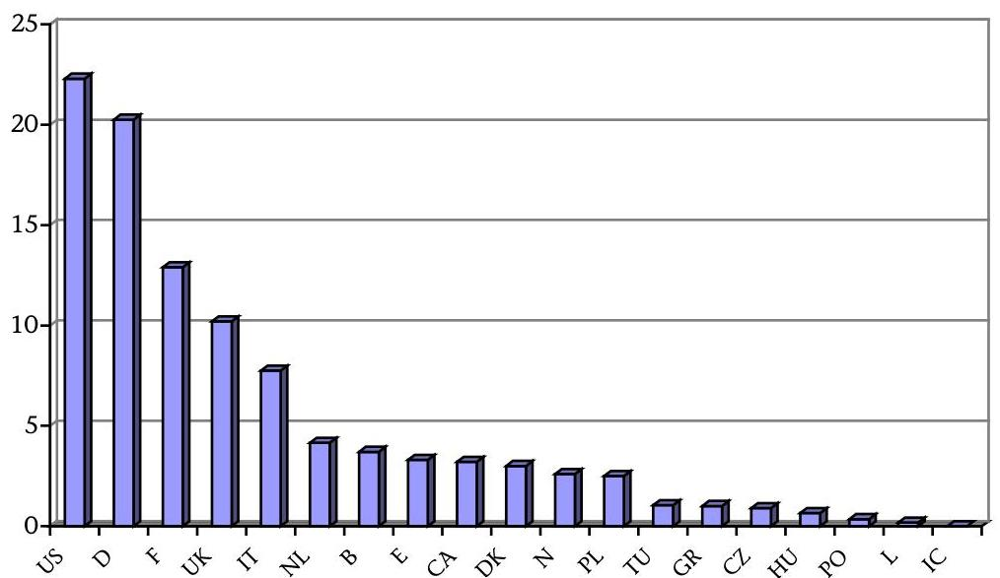
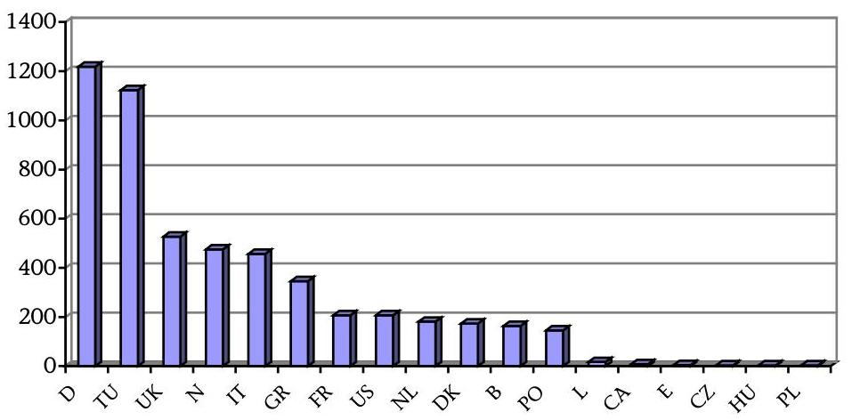
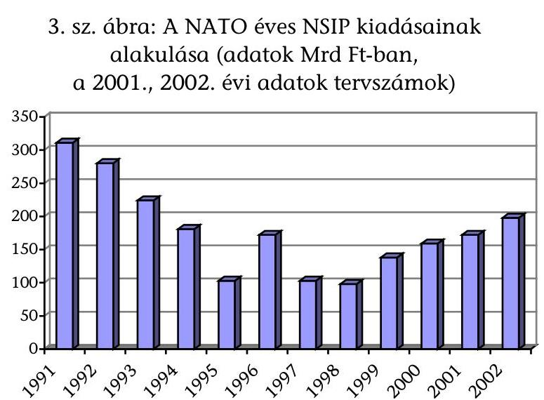
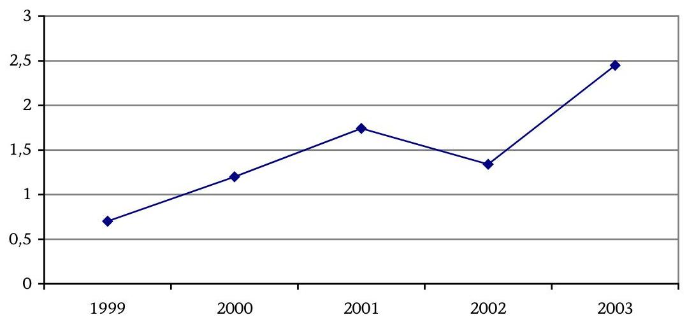
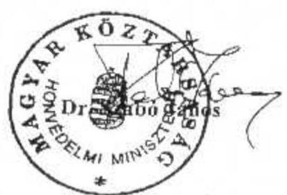

# JELENTÉS 

a NATO Biztonsági Beruházási Programja (NSIP) keretében Magyarországon megvalósuló fejlesztések ellenőrzéséről

---

# Államháztartás Központi Szintjét Ellenőrző Igazgatóság Átfogó Ellenőrzési Főcsoport   V-20-24/2001-2002.   Témaszám: 544 

## Az ellenőrzést felügyelte:

## Bihary Zsigmond   főigazgató

## Az ellenőrzés végrehajtásáért felelős:

## Hegedűsné dr. Müllern Veronika   főcsoportfőnök

## Az ellenőrzést vezette:

## Hudik Zoltán

számvevő igazgatóhelyettes

## Az ellenőrzést végezték:

## Révész János

osztályvezető számvevő főtanácsos

## Trenovszki István

számvevő tanácsos, főtanácsadó

## Hangyál Zsófia

számvevő

## A fejezetet érintő korábbi ellenőrzéseink címei:

1. Jelentés a Honvédelmi Minisztérium 1994-95. évi költségvetésében és gazdálkodásában a haderőfejlesztési célok érvényesülésének pénzügyigazdasági ellenőrzéséről (1996. június) (313)
2. Jelentés a Magyar Honvédségnél a repülőcsapatok működésének pénzügyi-gazdasági ellenőrzéséről (1998. július) (9821)
3. Jelentés a Honvédelmi Minisztérium fejezet működésének ellenőrzéséről (2000. július) (0017)
4. Az éves zárszámadások és a költségvetési előirányzatok tervezésének ellenőrzése

---

# TARTALOMJEGYZÉK 

BEVEZETÉS ..... 5
I. ÖSSZEGZŐ MEGÁLLAPÍTÁSOK, KÖVETKEZTETÉSEK, JAVASLATOK ..... 7
II. RÉSZLETES MEGÁLLAPÍTÁSOK ..... 11

1. A NATO Biztonsági Beruházási Programja ..... 11
1.1. Az NSIP működési rendje ..... 11
1.2. A magyarországi képességcsomagok ..... 15
2. A TEVÉKENYSÉG SZABÁLYOZOTTSÁGA, A SZERVEZETI FELTÉTELEK MEGTEREMTÉSE ..... 16
2.1. Az NSIP-vel összefüggő feladatok szabályozása ..... 16
2.2. A szervezeti feltételek kialakítása ..... 21
3. A programok finanszírozása ..... 25
3.1. Az NSIP pénzügyi folyamatai, a katonai-szakmai és a pénzügyi szervezetek együttműködésének rendje ..... 25
3.2. Pénzgazdálkodás a devizaszámlán ..... 28
3.3. Kerítésen kívüli munkák elszámolása ..... 31
3.4. A Nemzeti Adminisztrációs Kiadások (NAE) felhasználása. ..... 32
3.5. A költségvetés tervezési és beszámolási rendje ..... 33
4. A NATO Biztonsági Beruházási Program gyakorlati megvalósítása ..... 37
4.1. A megvalósításban érdekelt gazdálkodó szervezetek kiválasztása. ..... 37
4.2. A magyarországi NSIP projektek helyzete ..... 39
4.3. A magyarországi NSIP projektek ellenőrzése ..... 42

---

.

---

# Rövidítések jegyzéke 

| BBB | Biztonsági Beruházási Bizottság |
| :--: | :--: |
| COFFA | Certificate of Final Financial Acceptance |
|  | Záró Pénzügyi Teljesítésről szóló Igazolás |
| CP | Capability Package |
|  | Képességcsomag |
| HM | Honvédelmi Minisztérium |
| HM BBBH | Honvédelmi Minisztérium Beszerzési és Biztonsági Beruházási Hivatal |
| HM BBF | Honvédelmi Minisztérium Biztonsági Beruházási Főosztály |
| HM KÁT | Honvédelmi Minisztérium közigazgatási államtitkár |
| HM   KPSZH | Honvédelmi Minisztérium Központi Pénzügyi és Számviteli Hivatal |
| HN | Host Nation |
|  | Befogadó Nemzet |
| IBA | International Board of Auditors for NATO |
|  | NATO Nemzetközi Számvevő Testület |
| JFAI | Joint Final Acceptance Inspection |
|  | Közös Záró Átvételi Szemle |
| KFO | Honvédelmi Minisztérium Központi Pénzügyi és Számviteli Hivatal Központi Finanszírozási Osztály |
| MÁK | Magyar Államkincstár |
| MH | Magyar Honvédség |
| MMR | Minimum Military Requirements |
|  | Minimális Katonai Követelmények |
| NAC | North Atlantic Council |
|  | Észak-atlanti Tanács |

---

| NAE | National Administrative Expenditure |
| :--: | :--: |
|  | Nemzeti Adminisztrációs Kiadások |
| NATO | North Atlantic Treaty Organisation |
|  | Észak-atlanti Szerződés Szervezete |
| NATO IC | NATO Infrastructure Committee |
|  | NATO Infrastrukturális Bizottság |
| NAU | NATO Accounting Unit |
|  | NATO Elszámolási Egység |
| NSIP | NATO Security Investment Programme |
|  | NATO Biztonsági Beruházási Program |
| PfP | Partnership for Peace |
|  | Partnerség a Békéért |
| TBCE | Type B Cost Estimate |
|  | B típusú költségbecslés |

---

# JELENTÉS 

## a NATO Biztonsági Beruházási Programja (NSIP) keretében Magyarországon megvalósuló fejlesztések ellenőrzéséről

## BEVEZETÉS

Az Észak-atlanti Szerződés aláírása (1999. március 12.), Magyarország NATO tagsága azzal a szerződésben vállalt kötelezettséggel jár, hogy az ország növeli saját védelmi képességének színvonalát, valamint részt vesz a Szövetség kollektív védelmi képességének fejlesztésében. A védelmi képesség részét képezik a katonai infrastruktúra elemei is, amelyek korszerűsítése, a tagországok létesítményei között érzékelhető színvonalkülönbség kiegyenlítése a fentiek szerint közös cél. Ezzel összhangban a NATO érdekében tervezett, a minimális katonai követelményeket kielégítő fejlesztések megvalósítására létrehozták a NATO Biztonsági Beruházási Programját.

A Kormány a 2154/1999. (VII. 8.) határozatában deklarálta, hogy Magyarország részt vesz a Programban, vállalta a kapcsolódó költségvetési kiadásokat, rögzítette továbbá a Honvédelmi Minisztérium felelősségét a Magyarországot érintő fejlesztések menedzselése tekintetében.

Magyarországon jelenleg négy jóváhagyott, ún. képességcsomag keretén belül 58 önálló projekt tartozik a szövetségi érdekből megvalósuló fejlesztések körébe. A képességcsomagokat mintegy 64 Mrd Ft értékben hagyta jóvá az Észak-atlanti Tanács, amely összegből a magyar költségvetést közel 3,8 Mrd Ft terheli. Az egyes beruházásokat a tervek szerint 2004-2007. között fejezik be.

A Szövetség érdekében, a tagországok területén megvalósuló fejlesztések hazai pénzügyi fedezetét a Honvédelmi Minisztérium fejezet költségvetésében, a „Hozzájárulás a NATO Biztonsági Beruházási Programjához" költségvetési jogcímen tervezték meg és számolták el. (1999-ben 0,7 Mrd Ft, 2000-ben 1,2 Mrd Ft költségvetési támogatás állt rendelkezésre, a kétéves költségvetés alapján 1,74 Mrd Ft, illetve 1,34 Mrd Ft felhasználásával számoltak.)

A NATO Biztonsági Beruházási Programjával összefüggésben az érintett szervek új feladatokkal találták szembe magukat. Az eltelt három év alatt a végrehajtással párhuzamosan kialakították a Program szervezeti, intézményi hátterét, alapvetően a Honvédelmi Minisztériumban. A Program egyes elemeire (tervezés, kivitelezés, finanszírozás stb.) vonatkozó NATO követelmények teljesítése érdekében elvégezték a hazai jogszabályok szükséges módosítását, új szabályozókat alkottak. Mivel az említett feladatok teljesítése több tárca együttműködését követelte meg, a felső szintű döntések előkészítése során igénybe vették az Integrációs Tárcaközi Bizottság fórumait.

A hazai gyakorlattól eltérő, ugyancsak új megoldásokat találtak a Honvédelmi Minisztérium, valamint a magyar gazdálkodó szervezetek együttműködését illetően is. Mind az ún. mérnök tanácsadó, mind a kivitelező cégek kiválasztásával, minősítésével kapcsolatban a korábbiaknál szigorúbb mérlegelési szempontok érvényesültek, a NATO előírásainak megfelelően.

Az Állami Számvevőszék a Honvédelmi Minisztérium, a Magyar Honvédség, valamint a NATO együttműködését a fejezeti átfogó ellenőrzés, a haderőreform megvalósulását elemző ellenőrzés, továbbá az éves költségvetés tervezésére és végrehajtására irányuló ellenőrzések során tekintette át. A NATO Biztonsági Beruházási Programra, mint teljes folyamatra kiterjedő ellenőrzést első alkalommal végzett az ÁSZ.

Az ellenőrzés végrehajtására az Állami Számvevőszékről szóló 1989. évi XXXVIII. törvény 2. § (3) és (7) bekezdéseiben foglaltak adtak jogszabályi alapot.

Az ellenőrzés célja annak megállapítása volt, hogy a Honvédelmi Minisztérium, a Magyar Honvédség, illetve az érintett szervezetek

- a NATO Biztonsági Beruházási Programjába tartozó projektek tervezésének, végrehajtásának és elszámolásának szabályozása során mennyiben vették figyelembe a hazai jogszabályok előírásait, hogyan érvényesítették a NATO belső szabályait;
- milyen fokon integrálták a NATO Biztonsági Beruházási Programjával összefüggő feladatokat szervezeti felépítésükbe, katonai-szakmai tevékenységi körükbe, valamint a gazdálkodás rendjébe;
- a nemzeti finanszírozási körbe tartozó munkákat érintően hogyan törekedtek a feladatok szabályszerű, eredményes és gazdaságos végrehajtására, illetve milyen belső kontroll elemeket építettek be a folyamatokba.

Az ellenőrzés az 1999-2001. évek tevékenységére terjedt ki, illetve a pénzügyigazdasági folyamatokat figyelemmel kísértük a helyszíni ellenőrzés lezárásáig. A tranzakciók ellenőrzése azonban nem érintette a tagországok hozzájárulásainak felhasználását.

Az NSIP működésével kapcsolatos NATO szabályozók felsorolását a jelentés 1. sz. melléklete tartalmazza.

Az Állami Számvevőszékről szóló 1989. évi XXXVIII. tv. III. fejezet 25. §. (1) bekezdésében meghatározott határidőn belül a tárca minisztere jelezte, hogy a jelentéssel kapcsolatban nem kíván észrevételt tenni, továbbá a tárca intézkedési tervét - a törvényi előírásnak megfelelően - megküldi (2. sz. Melléklet)

---

# I. ÖSSZEGZŐ MEGÁLLAPÍTÁSOK, KÖVETKEZTETÉSEK, JAVASLATOK 

A NATO legfőbb döntéshozó szerve, az Észak-atlanti Tanács már a Szövetség megalakulását követő második évben (1951) elhatározta, hogy gondoskodik a közös védelmi céloknak megfelelő katonai infrastruktúra megteremtéséről, elemeinek folyamatos fejlesztéséről. A Washingtoni Szerződés egyik legfontosabb alapgondolata szerint a kollektív védelmi képesség kifejlesztéséhez a tagállamok gazdasági teljesítőképességével arányban álló közös teherviselés szükséges. Ezen rendező elv mentén szerveződött meg és működik ma is a NATO Biztonsági Beruházási Programja (NATO Security Investment Programme - NSIP).

A szóban forgó Program eredményes végrehajtása érdekében erős, több funkcióval (tervezés, jóváhagyás, ellenőrzés stb.) rendelkező szervezeti hátteret alkottak, kidolgozták a fejlesztések megvalósításának eljárási rendjét. Meghatározták és a gyakorlatban alkalmazták a beruházások finanszírozásának módját.

Az eredményesen működő rendszerhez Magyarország - a Cseh Köztársaság és Lengyelország társaságában - 1999. március 12-én csatlakozott hivatalosan. A felkészülésre azonban már 1997-98-ban lehetőséget kapott az ország, mivel a katonai együttműködésben nagy jelentőségű híradás és informatika, illetve a légi irányítás területén már a „Partnerség a Békéért" (Partnership for Peace PfP) program keretén belül megtörténtek az előkészületek.

A NATO-n belül évtizedek óta eredményes NSIP-hez történő magyar csatlakozás részint szükségszerű, részint pedig mind katonai, mind pénzügyi szempontból előnyös volt. Szükségszerű volt abban az értelemben, hogy az első négy magyarországi képességcsomagba tartozó beruházások nélkül Magyarország nem képes csatlakozni például a NATO egységes légi irányítási, légi vezetési, vagy integrált légvédelmi rendszeréhez, így az interoperabilitás követelménye sérülne. Az előnyök pedig - egyebek mellett - abból származnak, hogy a közösen finanszírozott katonai infrastrukturális fejlesztések jóváhagyott kiadásainak töredéke terheli a hazai költségvetést.

A Kormány az NSIP-vel összefüggő feladatokat a Honvédelmi Minisztériumhoz (HM) telepítette. Ennél fogva a tárca felelőssége volt mindazon szabályozási, intézményi és pénzügyi kérdések megoldása, amelyek a - néhány területen bonyolult és a hazai szervek részére újszerű - NATO követelmények kielégítését szolgálták. Az eljárások rendjét illetően, valamint a beruházások finanszírozásának területén, a NATO-nak éppen a közös finanszírozásból származó felelőssége miatt, a szövetségi szabályok átvétele és alkalmazása kötelező volt.

A HM önálló szervezetet hozott létre az NSIP magyarországi feladatainak menedzselése érdekében. A HM Biztonsági Beruházási Főosztály kettős funkcióval rendelkezett. Egyfelől kezdeményezte, előkészítette a Program hazai működésének szabályozási feltételeit, másfelől - ezzel párhuzamosan - a gyakorlatban is irányította az egyes projektek megvalósítását.

A NATO csatlakozás óta eltelt három év során a szabályozással összefüggő feladatok nagy részét - a tárcán belüli, illetve a tárcaközi együttműködésben rejlő lehetőségeket jól kihasználva - elvégezték. Ezek közül kiemelhető az adózással, a vámokkal és az illetékekkel összefüggő jogszabályok NSIP-hez kapcsolódó módosítása, amelynek eredményeként a NATO nettó finanszírozási követelménye érvényesült. Ugyanezen körbe tartozott az NSIP terén érintett HM szervek feladatait átfogó jelleggel szabályozó HM rendelet megalkotása is.

A hazai NSIP fejlesztések lehetőséget adnak a magyar gazdálkodó szervezetek részvételére a beruházások lebonyolításában és kivitelezésében. A NATO - tekintettel a szövetségi érdekből történő fejlesztések katonai jellegére, illetve a közös pénzfelhasználásból származó felelősségre - szigorú szakmai, pénzügyi és biztonsági követelményeket támaszt a bevonható cégeket illetően. A gazdálkodó szervezetek kiválasztását, minősítését, a pályázatok elbírálási rendjét, valamint a sajátos építményfajták körébe sorolt katonai létesítmények építésügyi hatósági engedélyezési eljárását meghatározó kormányrendeletek kiadása azonban halasztást szenvedett. A tervezetek egy része elkészült, de a tárcaközi együttműködés e téren nem volt eredményes. Mivel az említett eljárásokat a gyakorlatban már alkalmazzák, a szabályszerűség biztosítása érdekében a hivatkozott
 jogszabályokat meg kell alkotni. A helyszíni ellenőrzést követően adták ki a sajátos építményfajták körébe tartozó honvédelmi és katonai célú építményekre vonatkozó építésügyi hatósági engedélyezési eljárások szabályairól szóló 40/2002. (III. 21.) Korm. rendeletet.

A hazai NSIP szervezet a pályáztatással összefüggő jogszabályok hiánya miatt arra kényszerült, hogy a lebonyolító, kivitelező cégek kiválasztására, minősítésére, valamint a tenderek elbírálására kialakítsa saját eljárási rendjét. (A közbeszerzésekről szóló törvény hatálya nem terjed ki az NSIP beszerzésekre.) Az e téren végzett munkát jól jellemzi, hogy a pályáztatással kapcsolatos adott esetben felülvizsgált döntések ellen kifogás nem merült fel. Az ellenőrzés meggyőződött arról, hogy a szerződések minden olyan kikötést tartalmaznak (minőség, kötbér, környezetvédelem stb.), amelyek a Szövetség részeként Magyarország érdekeit védik.

A feladatok tárcaszintű szabályozása óta eltelt időszak gyakorlati tevékenységei során felszínre kerültek a belső szabályok hiányosságai, pontatlanságai is. Ezek döntő többsége a kezdeti időszak tapasztalatlanságával, a kellő mélységű gyakorlati ismeretek hiányával hozhatók összefüggésbe. Ide sorolhatók a költségvetési támogatás, valamint a NATO pénzeszközeinek elkülönítése, a támogatás maradványainak elszámolása és értékelése, vagy az utalványok ellenjegyzése terén fennálló hiányosságok. A rendszer a pontatlanságok ellenére működőképes. Érzékelhető ugyanakkor, hogy a HM - a tárcaszintű felügyeleti ellenőrzés tapasztalatai nyomán - törekszik a szabályozás színvonalának emelésére.

A NATO sajátos finanszírozási rendet dolgozott ki és alkalmaz az NSIP körében. A tagországok hozzájárulását nem gyűjti és nem teljesít kifizetéseket. A

---

beruházásért felelős tagország adatszolgáltatását, illetve annak ellenőrzését követően negyedévenként kimutatja az érintett tagországok fizetési kötelezettségeit, valamint azokat az összegeket, amelyeket más tagországoktól kapnak. A tényleges pénzforgalmat a többoldalú kompenzáció alapján bonyolítják le. A HM kérésére a pénzforgalom lebonyolítása költségvetési körön kívül a pénzügyminiszter által javasolt módon, a Magyar Államkincstárnál megnyitott devizaszámlán történik. A Magyarországot terhelő kiadások fedezetére a tárca költségvetésében e célra jóváhagyott fejezeti kezelésű előirányzat teljes összege átkerül a devizaszámlára, majd annak tényleges felhasználása onnan történik. A gyakorlat - a kisebb pontatlanságok ellenére - igazolta e döntés helyességét, ennek jogszabályi alapját azonban nem teremtették meg.

A tagországok NSIP szervezetének felépítését, működési rendjét a NATO nem határozta meg. A struktúra operativitásának biztosítása, a döntések gyors meghozatala érdekében azonban célszerű a szervezetet a legfelső döntéshozó szervhez közeli szintre telepíteni. A HM Biztonsági Beruházási Főosztály ezen elv szerint működött. A struktúra 2000-ben változott meg, amikor az NSIP szakmai feladatait a HM Beszerzési és Biztonsági Beruházási Hivatal kapta meg. Jelenleg az NSIP feladatok területén pontatlan a HM szintű irányítás, vezetés és felügyelet megfogalmazása, részben ezzel is összefügg, hogy a Hivatalnak két éve nincs jóváhagyott Szervezeti és Működési Szabályzata. Ennek ellenére a hazai NSIP szervezet működik, feladatait ellátja. Az esetleges jogi problémák elkerülése érdekében azonban javasolt a struktúra ismételt áttekintése, az alá-, fölérendeltségi viszonyok pontos meghatározása.

A szövetségi érdekből megvalósított, közösen finanszírozott beruházások fokozott ellenőrzést igényelnek mind katonai-műszaki, mind pénzügyi szempontból. A NATO Infrastrukturális Bizottsága folyamatosan figyelemmel kíséri a projektek helyzetét, illetve a pénzügyi elszámolások ellenőrzését követően engedélyezi a projekt lezárását. A HM szervek közül a HM Beszerzési és Biztonsági Beruházási Hivatal a szakmai és pénzügyi, a HM Központi Pénzügyi és Számviteli Hivatal a pénzügyi ellenőrzést végzi a munkafolyamatba épített ellenőrzés keretein belül folyamatosan és - kevés számú kivételtől eltekintve - dokumentáltan. A HM Költségvetési és Munkabiztonsági Ellenőrzési Hivatal 2001-ben végzett felügyeleti ellenőrzést az érintett honvédelmi szervezeteknél. Az ellenőrzésük kiterjedt az NSIP-t érintő gazdálkodás teljes körére, érintette a szervezetirányítás kérdéseit is. A miniszter intézkedett a feltárt hiányosságok megszüntetése érdekében.

Az elkészült beruházásokat katonai-műszaki szempontok szerint egy közös átvételi bizottság veszi át a NATO részéről. A pénzügyi elszámolás ellenőrzése a NATO Nemzetközi Számvevő Testületének feladata, amely igazolás kiadásával zárja ellenőrzéseit. Az igazolásnak a NATO Infrastrukturális Bizottsága általi elfogadásával tekinthető az adott fejlesztés a NATO részéről elszámoltnak, lezártnak. A magyarországi beruházások még nem jutottak abba a stádiumba, hogy a jelzett két záró ellenőrzést végrehajtsák.

---

Mindezek alapján - a jelentésben részletezett megállapítások hasznosításra ajánlása mellett - javasoljuk:

# a Kormánynak 

1. Intézkedjen a hazai gazdálkodó szervezetek kiválasztásáról és minősítésükről, a pályáztatás eljárási rendjéről szóló kormányrendeletek megalkotására a feladatok szabályszerű végrehajtása, a számon kérhető felelősség egyértelmű meghatározása érdekében.

## a honvédelmi miniszternek

1. Kezdeményezze a Honvédelmi Minisztérium és a Magyar Honvédség költségvetése tervezésének, gazdálkodásának, előirányzat-felhasználásának a sajátosságoknak megfelelő szervezeti és eljárási rendjére vonatkozó szabályairól szóló 90/1997. (V. 30.) Korm. rendelet módosítását annak érdekében, hogy a „Hozzájárulás a NATO Biztonsági Beruházási Programjához" című fejezeti kezelésű előirányzat felhasználásának, a kapcsolódó devizaszámla kezelésének és elszámolásának jogi szabályozása teljes körű legyen.
2. Tekintse át a hazai NSIP szervezetek egyértelmű alá-, fölérendeltségi viszonyainak meghatározása, a szervezetek egységes irányítása érdekében, továbbá a kapcsolódó szakterületek hatékonyabb együttműködése céljából a HM adott szervezeteinek működését. Célszerű olyan struktúra kialakítása, amelyben az NSIP szervezet közel áll a döntéshozókhoz, ugyanakkor operatív képessége is megmarad.
3. Intézkedjen - a szervezetre irányuló felülvizsgálattól függetlenül - a hazai NSIP szervezet, a HM Beszerzési és Biztonsági Beruházási Hivatal Szervezeti és Működési Szabályzatának véglegesítésére és jóváhagyására.
4. Intézkedjen a költségvetési támogatás, valamint a NATO pénzeszközök elkülönített elszámolására, a maradványok értékelésére a pénzügyi elszámolás szabályszerűsége, a bizonylati fegyelem erősítése céljából.

---

# II. RÉSZLETES MEGÁLLAPÍTÁSOK 

Az Észak-atlanti Szerződés Szervezetén (North Atlantic Treaty Organisation - NATO) belül a katonai infrastruktúra fejlesztése évtizedek óta hangsúlyos feladat. A Szövetség igen erős szervezeti hátteret alkotott az NSIP-vel összefüggő döntések előkészítése és kidolgozása érdekében, valamint a programok szakmai és pénzügyi menedzselése céljából.

Magyarország 1999. március 12-től tagja a NATO-nak, és mint tagállam részese lett az NSIP folyamatainak is. Az érintett, elsősorban HM szervek teljesen új feladattal kerültek szembe, amikor az NSIP - sok esetben bonyolult - jogi, műszaki-katonai, pénzügyi és eljárási rendjét felölelő ismereteit kellett elsajátítani, meg kellett teremteni a működés integrált rendszerét. Az NSIP új feladatokat jelentett mind a tárcaszintű, mind a külső ellenőrző intézmények számára is.

Mindezek alapján, a feladat újszerűségére tekintettel, indokolt bemutatni az NSIP működését, a fejlesztések megvalósításának és finanszírozásának folyamatait, továbbá a Magyarországon megvalósuló beruházások helyzetét.

## 1. A NATO Biztonsági Beruházási Programja

Az Észak-atlanti Tanács 1951-ben hozta létre az Infrastruktúra Programot azzal a céllal, hogy ennek keretén belül - a NATO érdekében - a minimális katonai követelményeknek megfelelő objektumokat létesítsenek, fejlesztéseket hajtsanak végre, illetve gondoskodjanak a szükséges berendezések, felszerelések beszerzéséről. Az 1994. évi reformot követően a program elnevezése NATO Biztonsági Beruházási Programjára (NSIP) módosult.

### 1.1. Az NSIP működési rendje

Az Észak-atlanti Szerződés 3. cikkelye a dokumentumban foglalt célok elérési módját határozza meg. Eszerint: „a Felek külön-külön és együttesen, folyamatos és hathatós önsegély és kölcsönös segítség útján, kifejlesztik és fenntartják egyéni és kollektív védelmi képességüket."

A tagállamok saját védelmi képességeinek fejlesztése és fenntartása terén fennálló szerződéses kötelezettség teljesítése, a szükséges feltételek biztosítása nemzeti hatáskörbe tartozik. A Szövetség politikai céljait, ezzel összefüggésben a kollektív védelmi képesség elemeit a NATO legfelsőbb döntéshozó szerve, az Észak-atlanti Tanács (North Atlantic Council - NAC) politikai és katonai döntései határozzák meg. (A döntéseket minden esetben valamennyi tagország egyetértésével, konszenzussal hozzák meg.)

A stratégiai célok megfogalmazását és elfogadását összetett, hosszú ideig tartó tervezési folyamat követi, amelynek célja, hogy mindazon erőforrásokat számításba vegyék és meghatározzák, amelyek az adott katonai képesség eléréséhez

---

szükségesek. A fejlesztéseket az ún. képességcsomagokban (Capability Package - CP) rögzítik. A CP a nemzeti és NATO finanszírozású infrastrukturális, üzemeltetési és fenntartási, valamint a munkaerővel összefüggő követelmények és költségek olyan kombinációja, amely a katonai erőkre vonatkozó kritériumokkal együtt lehetővé teszi a NATO parancsnokok számára egy speciális képesség feletti rendelkezést.

A szükséges katonai képességek természetesen magukban foglalják a katonai infrastruktúra megteremtését is.

A katonai infrastruktúra - tartalma szerint - adott katonai erő (ideértve a személyi állományt, valamint a haditechnikát is) meghatározott követelmények szerinti elhelyezéséhez, mozgatásához, alkalmazásához és vezetéséhez szükséges területek, létesítmények, technikai eszközök és kommunikációs rendszerek összességét jelenti, amelyek folyamatosan működnek, vagy a későbbi alkalmazás érdekében készültek.

A NATO illetékes szervei, együttműködve a tagállamok szakmai felelőseivel, jól meghatározott tervezési folyamat során, a minimális katonai követelményekre építve megvizsgálják a rendelkezésre álló kapacitásokat és kidolgozzák azokat a feladatokat, amelyeket az adott képesség elérése céljából, a CP keretén belül meg kell valósítani. Ez azt jelenti, hogy felmérik melyek azok a létesítmények, eszközök, amelyek vagy egy korábbi NATO beruházás, vagy a tagország felajánlása alapján (akár a katonai, akár a polgári infrastruktúra részeként) hozzáférhetők, illetve megállapítják a hiányzó, de a CP végrehajtásához szükséges infrastrukturális elemeket.

A NATO terminológia ezt az infrastruktúrára vonatkozó igényt is képességcsomagnak nevezi. A jelentés további részében a CP ebben az értelemben szerepel.

Az említett infrastrukturális CP-ket projektekre, egyedi fejlesztési, beruházási területekre bontják le.

Egy meglévő repülőteret érintő CP például magába foglalja a kifutópálya, gurulópálya átalakítását, új gépállóhelyek kialakítását, a biztonsági berendezések kiépítését, a szolgálati épületek létesítését stb. Ezek önálló projektekként szerepelnek a CP egészében.

A szükséges követelményeket az egyes infrastruktúra kategóriákra kidolgozott Minimális Katonai Követelmények (Minimum Military Requirements MMR) tartalmazzák. Az MMR alsó és felső korlátot is jelent a beruházások tartalmát és színvonalát illetően. Alsó korlát abban az értelemben, hogy az MMR előírásait az adott beruházás során teljesíteni kell, míg a felső korlát úgy értelmezhető, hogy a NATO, közös forrásból, az MMR-t meghaladó tartalmú és színvonalú fejlesztéseket nem finanszíroz.

Az NSIP keretében megvalósuló beruházásokat a befogadó nemzet (Host Nation - HN) - általában az a tagország, amelynek területén a fejlesztés létrejön - teljes beruházói felelőssége mellett bonyolítják le. (Adott esetben e felelős lehet egy NATO szervezet, vagy más nemzet is.)

---

Az NSIP finanszírozására a NATO speciális eljárási rendet dolgozott ki és működtet. A programok finanszírozásának fedezetét képező NSIP költségvetés a közös teherviselés elvén, egy megegyezésen alapuló kvótán nyugszik. A NATO érdekében létrejövő beruházás esetén a hozzájárulások mértéke tagországonként más és más. Az Amerikai Egyesült Államok például 22,3%-át, míg Magyarország 0,65%-át fedezi a felmerülő kiadásoknak. (1. számú ábra)

1. sz. ábra: Hozzájárulás az NSIP beruházásokhoz (adatok %-ban)

Abban a gyakori esetben, amikor a befogadó nemzet a NATO érdek mellett saját nemzeti érdekei mentén is fejlesztéseket hajt végre egy-egy projektnél (pl. a nemzeti légierő működési feltételeinek korszerűsítése), a NATO és a befogadó nemzet költségmegosztásban állapodik meg.

A NATO az NSIP közös költségvetésből a beruházások nettó kiadásait finanszírozza, azokat nem terhelhetik adók, vámok, illetékek. Az elszámolások egy mesterséges valutában, a NATO elszámolási egységben (NATO Accounting Unit - NAU) történnek. (2002. I. negyedévi árfolyama: $1 \mathrm{NAU}=864 \mathrm{Ft}$.)

A Szövetség az említett módon meghatározott tagállami hozzájárulásokat nem gyűjti és nem
 is teljesít kifizetéseket, hanem az illetékes NATO szervezet féléves, illetve negyedéves kimutatásokat juttat el az érintett tagországok részére, amelyek tartalmazzák az adott ország pénzügyi kötelezettségeit, valamint a részére járó hozzájárulásokat. A tagállamok többoldalú kompenzáció alapján negyedévente teljesítik kötelezettségeiket.

Az elkészült projekteket a szakmai, műszaki, katonai szempontok szerint egy Közös Szemle Bizottság (Joint Inspection Team) veszi át. A szakmai átvételt követően a beruházás pénzügyi elszámolását a NATO Nemzetközi Számvevő Testülete (International Board of Auditors for NATO - IBA) ellenőrzi. A Testület által kiadott, a Záró Pénzügyi Teljesítésről szóló Igazolás (Certificate of Final Financial Acceptance - COFFA) nagy jelentőségű dokumentum, mivel mentesíti a befogadó nemzetet a további elszámolási kötelezettség alól. A projekt ezzel lezárul.

Az NSIP keretében végzett beruházások volumenét jól jellemzi, hogy 1951 óta mintegy 6.000 Mrd Ft értékű fejlesztést hagytak jóvá. Az IBA évente 3-500 COFFA-t ad ki. (2. számú ábra)
2. sz. ábra: Az egyes tagországokban megvalósult NSIP
beruházásokra fordított kiadások 1951 - 2000 között
(adatok Mrd Ft-ban)

Az NSIP projektekre fordított éves kiadások terén a 90-es évek közepén erős visszaesés volt tapasztalható. Az irányzat egyértelműen a szövetségi feladatok átértékelésével, a NATO új katonai struktúrájának kialakításával hozható összefüggésbe. (3. számú ábra)

---

# 1.2. A magyarországi képességcsomagok 

Magyarországon, a helyszíni ellenőrzés időszakában, négy jóváhagyott CP projektjeit hajtották végre. Az egyes projektek a készültség különböző fokán álltak, a tervezés stádiumától a befejezésig.

Az említett négy képességcsomag sajátosságaként említhető, hogy a tervezés már a csatlakozás előtt megkezdődött, és a végrehajtásban a NATO szervek szerepe jelentős volt. Az együttműködési képesség kialakítása prioritást kapott a NATO-ban, ezért a döntések az átlagosnál gyorsabban születtek meg.

A kezdeti híradó és információs rendszer (CIS) biztosítása (CP5A0039) elnevezésű képességcsomag célja a NATO-val való összeköttetés hiányzó feltételeinek megteremtése. A NAC a CP-t 1998-ban hagyta jóvá a magyarországi fejlesztéseket illetően, 2,3 Mrd Ft értékben. (A magyar hozzájárulás 131 M Ft.) A CP várható befejezési ideje 2003.

A gerinc légvédelmi radarrendszer biztosítása (CP5A0044) című CP végrehajtásával a három új tagország bekapcsolódik a NATO integrált légvédelmi rendszerébe. A CP-t 1999-ben hagyták jóvá, Magyarországot érintően mintegy 24,1 Mrd Ft értékben. A jóváhagyott befejezési határidő: 2006.

A reagáló erők részére létesítmények biztosítása (CP3A0053) című képességcsomag végrehajtása után (2004.) a kijelölt három repülőtér (Ferihegy, Kecskemét, Pápa) alkalmassá válik adott NATO tagországból érkező reagáló erő fogadására. A CP-t a NAC 1999-ben hagyta jóvá 32,2 Mrd Ft értékben (ebből a magyar hányad 3,1 Mrd Ft).

A légi vezetési rendszerek fejlesztése (CP5A0035) címmel jóváhagyott (2000.) CP feladata a NATO integrált légi irányítási rendszeréhez történő csatlakozás hiányzó feltételeinek megteremtése. A magyarországi fejlesztések tervezett kiadása 5,3 Mrd Ft-nak felel meg, amelyből 602 M Ft terheli a magyar költségvetést.

---

A négy CP-t tehát a NAC - folyó áron - mintegy 64 Mrd Ft értékben hagyta jóvá. A magyar hányad ( $3,8 \mathrm{MrdFt}$ ) tervezésében szerepet kaptak a projektekhez kapcsolódó, jelentős mértékű nemzeti érdekből megvalósuló fejlesztések is.

# 2. A TEVÉKENYSÉG SZABÁLYOZOTTSÁGA, A SZERVEZETI FELTÉTELEK MEGTEREMTÉSE 

Az NSIP tervezésére és lebonyolítására (ideértve az egyes projektek végrehajtását is) vonatkozó fő eljárási, pénzügyi és katonai-szakmai szabályokat a NATO legfőbb döntéshozó szerve, a NAC határozza meg. E döntések a tagállamok képviselőinek egyhangúlag meghozott határozatain alapulnak.

Magyarország a csatlakozásra való felkészülés során, valamint a tárgyalásokon is jelezte, hogy az NSIP részese kíván lenni. Ez azt is jelenti, hogy Magyarország elfogadta az NSIP szabályait, eljárási rendjét és kötelezettséget vállalt a hazai feltételek megteremtésére.

A NATO átfogóan és részletesen szabályozta az NSIP végrehajtásának módját. A szabályozás kiterjed az NSIP tervezésére, az eljárási rendre, a pályáztatás rendjére, a pénzügyi feltételek megteremtésére és a projektek finanszírozására, valamint az ellenőrzésre is. (A NATO szabályozók felsorolását a jelentés 1. sz. melléklete tartalmazza.)

A NATO dokumentumokban rögzített követelmények teljesítése érdekében módosítani kellett számos hazai jogszabályt, tárcaszintű szabályozót.

### 2.1. Az NSIP-vel összefüggő feladatok szabályozása

Az NSIP egyes részterületeinek törvényi szintű szabályozása még Magyarország NATO-hoz való csatlakozása előtt, 1998-ban megtörtént. Tekintettel arra, hogy az együttműködéshez szükséges első projektek (a CP5A0039 számú képességcsomag keretén belül) előkészítése, tervezése már finanszírozási kérdéseket vetett fel, indokolt volt e területeknek prioritást adni.

A Magyar Köztársaság 1999. évi költségvetéséről szóló 1998. évi XC. törvény meghatározta az NSIP beruházásokhoz történő hozzájárulás mértékét. A kapcsolódó törvények módosításával lehetővé vált a NATO azon követelményének kielégítése, hogy a közös NATO forrásból finanszírozott kiadások nem tartalmazhatnak adót, vámot és illetékeket.

A hivatkozott törvény kiegészítette az általános forgalmi adóról szóló 1992. évi LXXIV. törvényt (ÁFA törvény). Eszerint az NSIP-hez köthető hazai beruházások és szolgáltatások esetén az előzetesen felszámított adó visszatérítését az adóhatóság saját hatáskörben engedélyezi.

Ugyancsak kiegészítették a vámjogról, vámeljárásról, valamint a vámigazgatásról szóló 1995. évi C. törvényt (vám törvény) azzal, hogy az NSIP projektekhez beérkező termékek vámmentességet kaptak.

---

Mindkét kiegészítés érvényesülésének feltételeként szabták a törvényhozók, hogy a HM igazolja, miszerint az érintett termékek, szolgáltatások a magyarországi NSIP projekthez kapcsolódnak.

A szabályozás ezen időszakban azonban még nem volt teljes körű, ami visszavezethető arra, hogy a HM a végrehajtás folyamatában találkozott újabb és újabb megoldandó kérdésekkel, másfelől a tárcaközi koordináció sem volt szabályozott e téren.

Előrelépést jelentett a Magyarországnak a NATO Biztonsági Beruházási Programjában történő részvételéről szóló 2154/1999. (VII. 8.) Korm. határozat megalkotása.

Szükségességét az indokolta, hogy a Magyarországot érintő CP-k száma bővült, megnövekedtek a projektekkel kapcsolatos tervezési és lebonyolítási feladatok, továbbá körvonalazódott a hazai gazdálkodó szervek részvételi lehetősége a programban.

A határozattal a Kormány jóváhagyta az NSIP terén a HM által végzett munkát, annak mind a struktúra kialakítására, mind a jogi, gazdasági, pénzügyi feltételek megteremtésére vonatkozó részeit. Ugyanakkor rögzítette, hogy a felső szintű döntések előkészítésének színtere az Integrációs Tárcaközi Bizottság lesz, a szakmai döntések előkészítése érdekében pedig létrehozta a tárcaközi Biztonsági Beruházási Bizottságot. Az NSIP teljes körű menedzselése a HM feladata, együttműködésben a vezérkarokkal.

Intézkedett továbbá a Kormány annak érdekében, hogy a magyar vállalatok NSIP projektekben való részvételi feltételeit biztosítsák.

E feltételek teljesüléséhez szükséges iparbiztonsági ellenőrzés a Nemzeti Biztonsági Felügyelet, míg a tanúsítványok kiadása a Biztonsági Beruházási Bizottság feladata lett.

Külön felhívta a Kormány a honvédelmi minisztert arra, hogy tegyen javaslatot a jogi feltételek teljes körű megteremtése érdekében, e feladatában működjön együtt az érintett minisztériumokkal.

A kormányhatározatot azért adták ki, hogy a felső szintű döntések előkészítésének tárcaközi szintre emelésével a jogi feltételek kialakítását folyamatosabbá, gyorsabbá tegyék. A fejlemények részben igazolták e várakozást (a közbeszerzésekről szóló 1995. évi XL. törvény (Kbt.) módosítása, az Észak-atlanti Szerződés Szervezete Biztonsági Beruházási Programjában való részvételhez szükséges törvénymódosításokról szóló 2000. évi XXXVI. törvény megalkotása stb.). Ugyanakkor az is fennáll, hogy két sarkalatos jogszabály (kormányrendeletek az NSIP végrehajtásában részt vevő gazdálkodó szervezetek kiválasztásáról, a minősítés rendjéről, illetve a pályáztatás rendjéről és azok elbírálásáról) a helyszíni ellenőrzés befejezéséig sem született meg.

További finomításokat és pontosításokat is elértek az NSIP feltételrendszerének megalkotása során 1999-ben. Az OGY a Kbt. módosításáról szóló 1999. évi LX. törvényben rendelkezett arról, hogy az NSIP keretében megvalósuló

---

beszerzések nem tartoznak a közbeszerzésekről szóló 1995. évi XL. törvény hatálya alá.

A rendelkezés indokolt volt, mivel az eljárás rendjét a NATO Infrastrukturális Bizottsága (NATO Infrastructural Committee - NATO IC) határozza meg. E testület dönt arról is, hogy az adott tendert nemzetközi vagy nemzeti keretek között kell lebonyolítani. Másfelől a versenyek tárgyát képező projektek költségeinek fedezetére a NATO tagállamok - ideértve Magyarországot is - hozzájárulása szolgál.

Ugyancsak 1999-ben alkotott törvényt az OGY az adózást érintő jogszabályok olyan módosításáról, amelynek révén az NSIP keretében teljesített termékértékesítés, szolgáltatásnyújtás a 0%-os ÁFA körbe került. Az adókra, járulékokra és egyéb költségvetési befizetésekre vonatkozó egyes törvények módosításáról szóló 1999. évi XCIX. törvény - a fenti rendelkezés mellett - felhatalmazta a honvédelmi minisztert, hogy a szükséges igazolással kapcsolatos eljárást szabályozza. A NATO Biztonsági Beruházási Program keretében teljesített termékértékesítés és szolgáltatásnyújtás igazolásának módjáról szóló 2/2000. (I. 21.) HM-PM együttes rendelet kiadásával az ÁFA problémakör rendeződött.

Az 1999-ben megalkotott két törvény esetében tapasztalható volt a szakmai döntésekért, a felső szintű döntések előkészítéséért felelős Biztonsági Beruházási Bizottság azon törekvése, hogy a valamely más cél megvalósulása érdekében kezdeményezett jogalkotói munkát felhasználják az NSIP-vel kapcsolatos szabályozás kiegészítésére. E felfogás sikeres volt, a folyamatot rövidítette.

Az előzőekben vázolt körbe tartozott az épített környezet alakításáról és védelméről szóló 1997. évi LXXVIII. törvény (Étv.) módosításáról szóló 1999. évi CXV. törvény is. A jogszabály rendelkezései szerint a honvédelmi és katonai célú építmények a sajátos építményfajták körébe tartoznak. A Kormány felhatalmazást kapott arra, hogy a jelzett célú építményekre vonatkozó építésügyi hatósági engedélyezési eljárás szabályait rendeletben állapítsa meg.

Az adat- és információvédelem is új dimenzióval bővült a NATO tagság következtében. Az NSIP területén a személyi és az iparbiztonsági követelmények kielégítése jelentett új feladatot mind a HM, a nemzetbiztonsági szolgálatok, mind a pályázatokra jelentkező gazdálkodó szervezetek részére.

A Nemzeti Biztonsági Felügyeletről szóló 1998. évi LXXXV. törvény megalkotásával, a nemzetközi szerződés alapján átvett, vagy nemzetközi kötelezettségvállalás alapján készült minősített, valamint a korlátozottan megismerhető adat védelmének eljárási szabályairól szóló 56/1999. (IV. 2.) Korm. rendelet kiadásával e terület felső szintű szabályozása teljes körűnek mondható.

A hivatkozott törvény létrehozta a nemzeti biztonsági hatóságot (Nemzeti Biztonsági Felügyelet), a kormányrendelet pedig szabályozta a nemzetközi szerződés alapján átvett vagy nemzetközi kötelezettségvállalás alapján készült minő

---

sített vagy korlátozottan megismerhető adatok védelmét. Ezzel a NATO szabályozási követelményei teljesültek.

Az előzőekben említett felső szintű szabályozás - tartalma szerint - elsősorban az NSIP magyarországi működéséhez szükséges feltételek megteremtését célozta. A folyamat során betartandó eljárási szabályok megalkotása még váratott magára. A hiányosság kiküszöbölése érdekében az OGY megalkotta az Észak-atlanti Szerződés Szervezete Biztonsági Beruházási Programjában való részvételhez szükséges törvénymódosításokról szóló 2000. évi XXXVI. törvényt.

A törvény mindenekelőtt definiálta az NSIP fogalmát. Rendelkezett továbbá a kapcsolódó termékek és szolgáltatások köztehermentességének elvi deklarálásáról, valamint a környezetvédelmi termékdíj visszaigénylésének lehetőségéről.

A törvényben (2. §) a Kormány felhatalmazást kapott arra, hogy az NSIP keretében kiírásra kerülő pályázatokon való részvételi jogosultság feltételeit, a vonatkozó eljárás szabályait a magyarországi székhelyű gazdálkodó szervezeteket érintően, továbbá a hazai kivitelezésben közreműködő hazai és külföldi székhelyű gazdálkodó szervezetek kiválasztásának módjait rendeletben szabályozza.

Mind a belföldi székhelyű gazdálkodó szervezetek előzetes minősítési eljárásának, mind a lebonyolító és kivitelező vállalatok kiválasztásának szabályozása sarkalatos kérdés az NSIP folyamataiban.

A gazdálkodó szervezetek előzetes minősítése szakmai, pénzügyi-gazdasági, valamint biztonsági szempontok szerint végrehajtott ellenőrzésen alapul. A szükséges és elégséges mélységű ellenőrzés eljárási rendjét, a különböző szervekhez telepített jogosultságokat, hatásköröket, a minősítés eredményének közlési módját, valamint a döntéssel szemben
 megfogalmazott jogorvoslat lehetőségét vagy annak kizárását magyar jogszabálynak is tartalmazni kell.

A gazdálkodó szervezetek előzetes minősítése 2000 óta zajlik, az egyes CP-khez tartozó projektek lebonyolítására, kivitelezésére kiírták a pályázatokat, azokat elbírálták, megtörtént a gazdálkodó szervezetek kiválasztása is (adott esetben a kivitelezés be is fejeződött). A jelzett folyamatokat szabályozó kormányrendeletek azonban még nem készültek el, illetve a tervezeteket nem fogadták el.

Ugyancsak e körbe tartozik az Étv. módosításáról szóló 1999. évi CXV. törvényben kapott felhatalmazás is, miszerint a honvédelmi és a katonai célú építmények építésügyi hatósági engedélyezési eljárásának szabályait kormányrendeletben kell rögzíteni. (A helyszíni ellenőrzés befejezését követően jelent meg a sajátos építményfajták körébe tartozó honvédelmi és katonai célú építményekre vonatkozó, építésügyi hatósági engedélyezési eljárás szabályairól szóló 40/2002. (III. 21.) Korm. rendelet, amely alapot teremtett a tárcaszintű szabályozás módosítására.)

A beruházások megkezdése részben polgári, hatósági engedélyek kiadásához kötött. Nyilvánvaló, hogy a fejlesztések terveibe, irataiba való betekintést korlátozni kell, mivel azok szolgálati, illetve államtitkot, szövetségi minősített információt tartalmaznak (például radar CP). Az eljárás rendjét tehát szabályozni kell.

---

A hivatkozott három kormányrendelet-tervezetből kettő (kivétel a tenderek lebonyolítására vonatkozó szabályozás) elkészült. A Honvédelmi Minisztérium Beszerzési és Biztonsági Beruházási Hivatal (HM BBBH), illetve e területen jogelődje, a HM Biztonsági Beruházási Főosztály által kidolgozott két tervezet közül, a többszöri átdolgozás és egyeztetés ellenére a tárcaközi koordináció stádiumán csak az építésügyi hatósági engedélyezési eljárás szabályairól szóló kormányrendelet-tervezet jutott túl.

A késedelem okai összetettek. A NATO szabályok adaptálása, összehangolása a hazai jogrenddel új feladat volt, amelyben a HM BBBH, illetve jogelődje gyakorlattal nem rendelkezett, arra a feladat végrehajtása során tett szert. A Hivatal illetékes egységét 2000-ben átszervezték, amely ugyancsak hátráltatta a munkát. Az NSIP négy hazai CP-jét alkotó projektek megvalósításának menedzselése komoly terhelést jelentett a szervezeti egység (Igazgatóság) részére, amely 17 fős állománnyal rendelkezik. A tárcaközi koordináció vontatott menetéhez hozzájárult az is, hogy az érintett tárcáknak is teljesen új feladatot kellett megoldani.

Az ellenőrzés szempontjából az adott kormányrendeletek hiánya azzal járt, hogy a folyamatok szabályszerűségét megítélni nem lehetett. Értékelési szempontként mindössze az vehető számításba, hogy a HM BBBH miként fejlesztette eljárási rendjét a gyakorlat tapasztalatai alapján. (A NATO belső szabályozói keretjellegű leírást adnak a folyamatokról.)

Mindezekre építve - az illetékes HM szervek bevonásával - elkerülhetetlen a jogalkotói munka gyorsítása, a működés szabályszerűségét biztosító, ma még hiányzó kormányrendeletek megalkotása.

A felső szintű jogszabályok megalkotását követően, azok előírásaira építve a honvédelmi miniszter rendelkezett az NSIP projektjeinek megvalósításában érintett HM és MH szervek együttműködéséről. A NATO Biztonsági Beruházási Program keretében megvalósuló szövetségi biztonsági beruházások végrehajtására kijelölt szervezetek közötti együttműködés rendjéről szóló 66/1999. (HK 24.) HM utasítás részletezi az együttműködés területeit (a programok tervezése, beszerzés, költségvetési és pénzügyi feladatok stb.), valamint megnevezi a HM és az MH együttműködésre kötelezett szervezeteit. Az utasítás 4. §-ában meghatározott együttműködési megállapodások elkészítése és megkötése a HM Biztonsági Beruházási Főosztály feladata volt.

Az utasításban szereplő együttműködés meghatározása indokolt volt, mivel a fejlesztések katonai feladatok végrehajtása érdekében történnek. Természetes tehát, hogy mind a szárazföldi, mind a légierő haderőnem érintett fegyvernemeinek és szakcsapatainak képviselői már a tervezés stádiumában partnerek legyenek. Ugyancsak indokolt a fejezeti szintű költségvetés végrehajtásáért, a beszerzésért stb. felelős HM szervek bevonása is az NSIP végrehajtásába.

Az együttműködési megállapodások megkötése azonban nem történt meg teljes körűen, amelyben szerepet játszott a HM és az MH átszervezése is. A helyszíni ellenőrzés időszakáig a HM Központi Pénzügyi és Számviteli Hivatallal,

---

valamint a HM Technológiai Hivatal Légvédelmi Fejlesztési Programirodával kötött megállapodást a HM NSIP-ért felelős szervezete. Mindezek alapján szükséges eleget tenni a HM utasítás előírásainak, az átszervezések okán ismételten áttekinteni az érdekelt HM és MH szervek körét, és a folyamatot gyorsítani.

Az NSIP területén végzett két éves munka tapasztalatai alapján adta ki a honvédelmi miniszter az Észak-atlanti Szerződés Szervezete Biztonsági Beruházási Programja magyarországi végrehajtási rendjéről és szabályairól szóló 31/2000. (X. 27.) HM rendeletet.

Az átfogó jelleggel készített rendelet tartalmazza az NSIP-ben részt vevő szervezetek feladatait, a projektek tervezésének és megvalósításának folyamatait. Középpontjában azonban a költségvetési feladatok, a pénzügyi folyamatok meghatározása áll.

A miniszteri rendelet kiadása indokolt volt, mivel ez az első olyan tárcaszintű dokumentum, amely az NSIP teljes folyamatát, a részt vevő szervek jogait és kötelezettségeit tartalmazza.

A megalkotása óta eltelt időszak felszínre hozta a rendelet hibáit, hiányosságait is.

E körbe tartozik például, hogy a 6. § f. pontja olyan kormányrendeletre hivatkozik, amit még nem hoztak meg. Néhány helyen pontatlan a folyamat bemutatása (beruházások átvétele, aktiválás, az elemi költségvetés tartalmának meghatározása, a HM BBBH által felhasznált NAE kiadások elszámolása stb.).

Az Észak-atlanti Szerződés Szervezete Biztonsági Beruházási Programja magyarországi végrehajtási rendjéről és szabályairól szóló 31/2000. (X. 27.) HM rendelet módosításáról szóló 12/2002. (III. 28.) HM rendelet a Magyar Közlöny 2002/40. számában kihirdetésre került.

A fejezeti belső szabályozók az NSIP-vel összefüggő részterületeket szabályozták. A NATO együttműködésre kijelölt személyek tárgyalási felhatalmazásáról szóló 81/1999. (HK 1/2000.) HM utasítás a kötelezettségvállalási jogosultságokat tartalmazza.

A programfelelősök körét az Észak-atlanti Szerződés Szervezete Biztonsági Beruházási Programja magyarországi programfelelőseinek kijelöléséről szóló 58/2001. (HK 15.) HM utasítás határozta meg az egyes CP-khez kapcsolódóan.

Az NSIP folyamatainak szabályozása terén az 1998-2001 közötti mintegy három év a feladatok meghatározása mellett a tapasztalatszerzés időszaka volt. Mind a felső szintű jogszabályok, mind a tárcaszintű szabályozás korrekciókra, a hiányok pótlására szorul.

# 2.2. A szervezeti feltételek kialakítása 

Az NSIP Magyarországot érintő CP-inek végrehajtását, a kapcsolódó feltételek kialakítását legfelső szinten a Kormány felügyeli, továbbá a már hivatkozott 2000. évi XXXVI. törvény értelmében rendelettel szabályozza az NSIP folyamatokat. A Kormány döntéseit az Integrációs Tárcaközi Bizottság készíti elő, illetve véleményezi. Szakmai kérdésekben a Biztonsági Beruházási Bizottság hoz döntéseket, illetve ugyanezen témában előkészíti a felső szintű döntéseket. (A Biztonsági Beruházási Bizottság helyettes államtitkár szintű, tárcaközi testület.) A 2154/1999. (VII. 8.) Korm. határozat értelmében az NSIP teljes körű menedzselése a Honvédelmi Minisztériumban történik.

Az utóbbi rendelkezés indokolja a Biztonsági Beruházási Bizottság Szervezeti és Működési Szabályzatának VIII. fejezetében szereplő előírást, amely szerint a testület mindenkori elnöke a HM által delegált helyettes államtitkár. Állandó képviselője van a Külügyminisztériumnak, a Pénzügyminisztériumnak, a Gazdasági Minisztériumnak, a Közlekedési és Vízügyi Minisztériumnak, a Belügyminisztériumnak, a Környezetvédelmi Minisztériumnak, a Földművelésügyi és Vidékfejlesztési Minisztériumnak. Jelen van továbbá a Nemzetbiztonsági Szolgálatokat felügyelő tárca nélküli miniszter, illetve a Miniszterelnöki Hivatal képviselője is.

Az NSIP célja a katonai infrastruktúra fejlesztése. Az e körben történő beruházások az esetek többségében a meglévő katonai infrastruktúrához kapcsolódnak, ilyen módon összefüggésbe kerülnek a hazai fejlesztésekkel is. Mindezek alapján az NSIP körében végzett tevékenység előrehaladásával, 1998. január óta napirenden volt egy önálló, NSIP-re szakosodott szervezeti elem létrehozása a HM-en belül.

Hosszadalmas egyeztetéseket követően az Integrációs Tárcaközi Bizottság 1998. szeptember 9-i döntése alapján a HM Szervezeti és Működési Szabályzatában (HM SZMSZ) megjelent a HM Biztonsági Beruházási Főosztály (HM BBF).

A HM BBF alapfeladata a magyarországi CP-k és azok projektjeinek előkészítése és kidolgozása, a megfelelő NATO fórumok előtti képviselete, a fejlesztések jóváhagyását követően a teljes körű irányítás és menedzselés volt.

További feladat volt azon fejlesztések figyelemmel kísérése, amelyeket más tagországban valósítottak meg, de Magyarország hozzájárulást fizetett, valamint a NATO IC-be delegált magyar képviselő ellátása szakmai információkkal.

Az NSIP - hatáskörébe eső - feladatainak végrehajtásáért a HM Technológiai Hivatal Légvédelmi Fejlesztési Programiroda, valamint a szakmai alárendeltségébe tartozó Cseh-magyar Radarbeszerzési Nemzetközi Programiroda programigazgatója felelős. A NATO IC-nél jelentkező feladatok végrehajtásáért a kijelölt nemzeti képviselő felelős.

A Programirodát a radarfejlesztés és telepítés érdekében szükséges elektronikai, radartechnológiai követelmények kidolgozása, a szakmai feladatok végrehajtása céljából hozták létre akkor, amikor a jelzett radarprogram megvalósítását nemzeti keretek között tervezték.

A 8 fős iroda a HM Technológiai Hivatal, illetve jogelődje a HM Haditechnikai Intézet keretein belül jött létre. A szervezet feladata a CP-k számának növelésével bővült, tevékenységének középpontjában azonban továbbra is az elektronikai, informatikai fejlesztések álltak.

A Cseh-magyar Radarbeszerzési Programirodát 1-1 fővel hozták létre Brüsszelben a két ország radarbeszerzéseinek koordinálása és felügyelete céljából.

---

A NATO IC-hez delegált nemzeti képviselő más funkciója mellett látja el feladatát. A NATO együttműködésre kijelölt személyek tárgyalási felhatalmazásáról szóló 81/1999. (HK 1/2000.) HM utasítás szerint kapott mandátuma feljogosítja a HM, illetve az MH álláspontjának képviseletére, továbbá - meghatározott korlátok között - anyagi kötelezettséggel járó nyilatkozat megtételére az NSIP terén.

A 13 fős státusszal létrehozott HM BBF a HM gazdasági ügyeket felügyelő helyettes államtitkár irányítása alatt állt. Ez azt jelentette, hogy a NATO IC által javasolt szervezeti modell alakult ki, az NSIP végrehajtásáért felelős HM szervezet a lehető legközelebb került a legfelső döntéshozó szinthez. Mivel az NSIP képességcsomagjainak egyes fejlesztéseit, azok tartalmát a hazai infrastruktúra helyzete is determinálja, azzal szorosan összefügg, indokolt lépés volt a főosztályon belülre telepíteni a hazai beruházásokkal foglalkozó Beruházási Osztályt is. Ezzel közvetlen kapcsolat alakult ki az NSIP és a hazai fejlesztések között.

Az NSIP-vel összefüggő feladatok végrehajtására létrehozott, egységes irányítású, egyértelmű alá- és fölérendeltségi viszonyokat tartalmazó HM struktúra 1999. közepétől jelentős változásokon ment keresztül. E változások részint ütköztek az egységes irányításra vonatkozó elvekkel, másfelől a HM, MH stratégiai felülvizsgálatával sem igazolhatók.

A folyamat azzal kezdődött, hogy a HM BBF hazai infrastruktúra fejlesztéséért felelős szervezeti egységét, a Beruházási Osztályt, mintegy hat hónapos működés után, 1999. június 1-től visszahelyezték a HM Infrastrukturális Főosztály szervezetébe.

Ismételten szükséges leszögezni, hogy szoros kapcsolat áll fenn a hazai katonai infrastruktúra helyzete és fejlesztése, valamint az NSIP fejlesztései között, mivel a biztonsági beruházás projektjeit akkor, és csak akkor hagyják jóvá, ha a szükséges követelményeknek megfelelő nemzeti infrastrukturális elem nem áll rendelkezésre. Ugyanakkor adott nemzeti beruházások gyakran feltételei a NATO projektek megvalósításának.

A jelzett intézkedéssel a hazai és az NSIP infrastrukturális fejlesztései között meglévő - elsősorban az építés-beruházás terén fennálló - közvetlen, szervezetbe épített kapcsolat megszűnt.

A reagáló erők részére létesítmények biztosítása című CP-ben (CP5A0053) eredetileg - egyebek mellett - a pápai repülőteret is kijelölték. A „stratégiai felülvizsgálathoz" kötve azonban, a program NATO jóváhagyása után, a fejlesztés helyszínének „lebegtetése" volt tapasztalható Pápa és Taszár között. A végső döntés ismét Pápa javára dőlt el, a halasztás azonban veszélyeztette a mintegy 12,6 Mrd Ft értékű beruházás sorsát.

A következő lépés a HM BBF törlése volt a HM munkaköri jegyzékéből. Az említett jogi aktust a HM közigazgatási államtitkár tette meg 2000. április 15-i határidővel anélkül, hogy a feladatok további végzéséről intézkedett volna. Miután a HM KÁT csak 2000. május 18-i keltezéssel ellátott utasításában intézkedett a feladatok átadás-átvételéről a HM Beszerzési
 Hivatalához, e lépés eredményeként több, mint egy hónap „ex-lex" állapot mutatható ki az NSIP-vel kapcsolatos ügyek intézését illetően.

A HM BBF, mint önálló főosztály megszüntetésére mintegy kilenc hónappal azután került sor, hogy a 2154/1999. (VII. 8.) Korm. határozatban a Kormány jóváhagyta az NSIP-hez történő csatlakozás szervezeti feltételeit.

A Magyar Köztársaság állandó képviselője az Észak-atlanti Tanácsban (nagykövet) 2000. július 13-i keltezéssel levelet írt a HM közigazgatási államtitkárhoz (467/F/N/PQ/2000. szám). E levélből nyilvánvaló, hogy a NATO IC igazgatója aggályosnak tartotta a repülőtérrel összefüggő bizonytalanságot, valamint a HM BBF megszüntetésével kapcsolatos működési zavarokat. A reagáló erők fogadására kijelölt repülőtér kérdése rendeződött, a struktúra bizonytalanságait azonban nem sikerült teljes mértékben megoldani.

A szabályozási hiányosságok ellenére a szervezet az NSIP menedzselését továbbra is ellátta. A jogi problémát a költségvetési szerv megnevezéséről és tevékenységének meghatározásáról szóló 17/2000. (HK 10.) HM határozat oldotta meg. E határozat szerint a HM Beszerzési Hivatal, tevékenységi körének kiterjesztésével az NSIP végrehajtásáért is felelős, megnevezése HM Beszerzési és Biztonsági Beruházási Hivatalra (HM BBBH) változott. Mint korábban a HM BBF, e szervezet is a HM gazdasági ügyeket felügyelő helyettes államtitkár közvetlen irányítása alá került.

A HM BBBH-n belül a 17 fős Biztonsági Beruházások Igazgatósága (alapvetően a korábbi HM BBF állománya) felelős az NSIP teljes körű menedzseléséért.

A HM és az MH stratégiai felülvizsgálatával összefüggésben vizsgálta az ellenőrzés az NSIP végrehajtásáért felelős szervezet irányítási rendjét. A HM SZMSZ a védelemgazdasági helyettes államtitkár feladatai között (7.2. pont) nevesíti: „Szakmailag irányítja ...... a haditechnikai fejlesztési főigazgató útján a ...... HM Beszerzési és Biztonsági Beruházási Hivatal tevékenységét."

A megfogalmazás arra utal, hogy a helyettes államtitkár nem irányítja közvetlenül a HM BBBH teljes tevékenységét, működését (mint arra más szervezetek esetében, akár a főigazgató útján is van példa), hanem a szakmai munkát felügyeli.

A HM haditechnikai fejlesztési főigazgató - átruházott hatáskörben eljárva szakirányítja a HM BBBH és a programirodák tevékenységét. Szakmai feladatai között nevesíti a HM SZMSZ, hogy „koordinálja a NATO Biztonsági Beruházási Programjai közül a Magyarországot érintő haditechnikai jellegű programok kidolgozását és végrehajtását." (11.3. pont)

A haditechnikai fejlesztési főosztályvezető a HM Technológiai Hivatal és a HM BBBH szakmai tevékenységének koordinálásával összefüggő szakfeladatokat végzi, továbbá szakmai felügyeletet gyakorol az NSIP haditechnikai fejlesztései fölött (17.13., illetve 17.15. pontok).

A HM SZMSZ 37. pontja szerint a HM BBBH tevékenységét a védelemgazdasági helyettes államtitkár szakmai irányítási jogkörében, a haditechnikai fejlesztési főigazgató szakirányítja. A 37.2. pont szerint a HM BBBH rendeltetése az NSIP projektek megvalósításának koordinálása, a tervezés, valamint a gyakorlati munka menedzselése.

A korábbi struktúrával összehasonlítva látható, hogy a helyettes államtitkár, valamint az NSIP szervezet közé két vezetési szint (a 2001. október 1-től hatályos megnevezés szerint haditechnikai beszerzési és fejlesztési főigazgató, haditechnikai beszerzési és fejlesztési főosztályvezető) került a hierarchiában. Mindkettő a haditechnikai irányt képviseli, míg az NSIP jelentős részét képező építésberuházás terén a közvetlen kapcsolat a HM szerveivel (HM Infrastrukturális Főosztály, HM Beruházási és Ingatlanfejlesztési Iroda) nem mutatható ki.

További bizonytalanság érzékelhető az irányítás tartalmának megfogalmazásában. A költségvetési szerv megnevezéséről és tevékenységének meghatározásáról szóló 17/2000. (HK 10.) HM határozat 9. pontja szerint a honvédelmi miniszter felügyeleti és közvetlen irányító jogkörét a HM gazdasági ügyeket felügyelő helyettes államtitkár útján gyakorolja. A HM SZMSZ azonban szakmai irányítás, szakirányítás fogalmakat használ. Az említett határozatot módosító 62/2001. (HK 16.) HM határozat szerint azonban a HM BBBH irányításáért a HM haditechnikai beszerzési és fejlesztési főigazgató felelős.

A jelzett bizonytalansággal hozható összefüggésbe, hogy a HM BBBH a helyszíni ellenőrzés időszakában nem rendelkezett még jóváhagyott SZMSZ-szel.

A hivatkozott 17/2000. (HK 10.) HM határozat 15. pontja szerint az SZMSZ-t a határozat aláírását (2000. május 29.) követő 90 napon belül kell jóváhagyásra felterjeszteni. A HM BBBH négy tervezetet készített el, figyelembe véve a határozat módosításából adódó körülményeket is, de a tárcán belüli koordináció során, éppen a vezetés, irányítás felügyelet kérdéseiben még nem született egyetértés.

Az NSIP-ért felelős szervezet szabályszerű működése, az NSIP feladatok végrehajtása során a felelősség egyértelmű meghatározása és érvényesíthetősége érdekében indokolt a struktúra ismételt áttekintése. A felülvizsgálat középpontjába célszerű helyezni a vezetési szintek számát, a feladatok egyértelmű meghatározását, az NSIP szervezet tárcán belüli helyét és az irányítás, a felügyelet rendjét.

# 3. A PROGRAMOK FINANSZÍROZÁSA

Az NSIP Magyarországon történő végrehajtására, részeként a finanszírozási kérdések kezelésére, a csatlakozást megelőzően megkezdődött a felkészülés. Ennek eredményeként a belépést követően az NSIP pénzügyi lebonyolításának feltételei rövid időn belül kialakultak.

### 3.1. Az NSIP pénzügyi folyamatai, a katonai-szakmai és a pénzügyi szervezetek együttműködésének rendje

A HM tárca részére már a NATO tagságunkat megelőzően, az 1998. végén elfogadott 1999. évi költségvetésben 700 M Ft-ot hagyott jóvá az Országgyűlés, a fejezeti kezelésű előirányzatok között.

Az összeg feletti rendelkezést a fejezeti kezelésű előirányzatok felhasználását szabályozó 8/1999. (HK 6.) HM utasítás a HM BBF hatáskörébe utalta. A hazánkban megvalósuló NATO beruházások tagországok általi finanszírozásának és a Magyarországot terhelő kötelezettségek rendezéséhez központosított, egyszerű, fejezeti szinten megvalósítható megoldást keresett a HM és a PM egyaránt.

1999-ben a honvédelmi miniszter kérte a pénzügyminiszter hozzájárulását olyan elkülönített, költségvetési körön kívüli deviza bankszámla megnyitásához, amely más tagországok hozzájárulásain túl képes a magyar hozzájárulás teljesítését is fogadni. A pénzügyminiszter a számla megnyitására a Magyar Államkincstárt jelölte ki. A HM a devizaszámla megnyitását a Kincstárnál kezdeményezte, ugyanakkor devizavásárlási engedélyt kért az MNB-től a „Hozzájárulás a NATO Biztonsági Beruházási Programjához" című, fejezeti kezelésű előirányzat 1999. évre jóváhagyott 700 M Ft összeg Eurora történő átváltására, illetve devizaszámlára történő utalására. (Az engedélyt a későbbiekben a HM minden évre megkérte.) Az engedély alapján az éves előirányzatot a HM több részletben elhelyezte a devizaszámlán. A különböző kifizetéseket már a devizaszámláról teljesítették.

Ez a módszer az NSIP sajátos, máshoz nem hasonlítható, a NATO által meghatározott rendjének megfelel, azonban nincs olyan jogszabályi felhatalmazás, amely alapján a devizavásárlást egyúttal valós kiadásként lehessen elszámolni, mint ahogy ez a HM Központi Pénzügyi és Számviteli Hivatal (HM KPSZH) számviteli gyakorlatában történik. A Honvédelmi Minisztérium és a Magyar Honvédség költségvetése tervezésének, gazdálkodásának, előirányzatfelhasználásának a sajátosságoknak megfelelő szervezeti és eljárási rendjére vonatkozó szabályairól szóló 90/1997. (V. 30.) Korm. rendelet, valamint a tárcaszintű szabályozás olyan módosítását, mely a fenti eljárást szabályszerűvé tenné, nem kezdeményezték.

Ugyanakkor a devizaszámla költségvetési körön kívüli kezelése azzal jár, hogy az arról teljesített kiadás nem költségvetési kiadás, tehát a fejezeti kezelésű előirányzatról történő átutalást kell költségvetési kiadásként elszámolni.

A számlaszerződést a Kincstár és a HM KPSZH 1999. április 19-én kötötte meg. E számla helyett a HM KPSZH az NSIP keretében felmerülő kiadásokat egyik Ft számlájáról teljesítette 1999. július 19. előtt, mivel a devizaszámlára csak ekkor utalták át az első támogatást, 124,5 M Ft-ot. A megelőlegezett összeget (46,6 M Ft-ot) 1999. szeptember 29-én térítették meg a devizaszámláról.

Az NSIP pénzügyi folyamatainak kezeléséről és a pénzügyi feladatok elosztásáról a NATO Biztonsági Beruházási Program keretében megvalósuló szövetségi biztonsági beruházások végrehajtására kijelölt szervezetek közötti együttműködés rendjéről szóló 66/1999. (HK 24.) HM utasítás alapján a HM KPSZH és a HM BBF 2000. január 31-én együttműködési megállapodást kötött. Ebben a tervezésre, szerződéskötésekre, a számlák záradékolására, analitikus nyilvántartások vezetésére és az egyéb feladatokra vonatkozóan, azok jellege által meghatározott logikus, a pénzeszközök szigorú elszámoltatását biztosító feladatmegosztást alakítottak ki. A megállapodást a későbbiekben egyszer (2001. június 30-án) módosították, alapvetően annak érdekében, hogy a szerződések ellenjegyzése - illetve annak előkészítése - az információval rendelkező Központi Finanszírozási Osztály (KFO) hatáskörébe kerüljön.

Az 1999-ben lebonyolított, viszonylag kis összegű pénzforgalom miatt nem okozott gondot, hogy az NSIP végrehajtási rendjéről és szabályairól csak 2000. végén - másfél évvel a belépést követően - született meg a 31/2000. (X. 27.) HM rendelet. A 2001. év végére az első igazán nagy pénzforgalmú év tapasztalatai alapján indokolt volt a rendelet módosításának kezdeményezése.

A megállapodás és a jogszabályok alapján a NSIP finanszírozására kialakított rendszer egyik alapelve szerint az NSIP magyarországi feladatait érintő pénzforgalom lebonyolítása egy költségvetési körön kívüli devizaszámláról történik. Ide folyik be a NATO IC döntése alapján a Magyarország részére utalandó összeg valamely másik tagországtól.

A magyar kötelezettségek teljesítése az eddigi időszakban a NATO értesítését követően, az adott negyedévben megtörtént. Magyarországnak tartozik viszont Franciaország (203,1 M Ft-tal), közel egy éve. Franciaország 2001. februárban már kezdeményezte az összeg átutalását, de a fillér megszűnése miatt az MNB SWIFT rendszere nem tudta azt lekezelni és fogadni. Többszöri egyeztetésre került sor azóta, de a pénz még nem érkezett meg.

A pénzforgalom tervezhetősége érdekében a jövőben célszerű lenne a NATO-tól érkező, a tagországok átutalási kötelezettségére vonatkozó táblázatról a HM KPSZH-t tájékoztatni, mivel az a devizaszámla jövőbeli likviditását befolyásolja.

A HM fizetési kötelezettségeire megtervezett és jóváhagyott összegek a fejezeti kezelésű előirányzatok között szerepelnek, a Hozzájárulás a NATO Biztonsági Beruházási Programjához jogcímcsoporton. A fejezeti kezelésű előirányzat számláról általában havi egyenlő részben kerül átutalásra a pénzeszköz a devizaszámlára, melyet a fejezeti kezelésű előirányzaton valós kiadásként számolnak el. A fejezeti kezelésű előirányzatként jóváhagyott összegek mindhárom évben teljes mértékben átutalásra kerültek a devizaszámlára.

Ezzel a módszerrel a tervezett előirányzat 1999. óta minden évben 100\%-ra teljesült. Ettől függetlenül a pénzforrásnak a devizaszámlán minden évben keletkezik maradványa, melynek indoklását a honvédelmi miniszter részére készített beszámolók tartalmazzák.

A devizaszámlán lebonyolított pénzforgalomra alapvetően olyan szabályozást kellett kialakítani, amely

- biztosítja a pénzeszközök vagyonvédelmét;
- az analitikus nyilvántartások vezetésével pontos adatokat szolgáltat a kiadásokról a NATO részére félévente, a miniszter részére évente készítendő beszámolóhoz, programonként elkülönítve, valamint a Nemzeti Adminisztrációs Kiadások (National Administrative Expenditures - NAE) felhasználásáról és az ún. kerítésen kívüli munkák kiadásairól, szintén programonként és összesítve;

- a szerződések, számlák megfelelő nyilvántartásával, gyűjtésével biztosítja a felkészülést a programok NATO által történő átvételéhez és a NATO IBA általi ellenőrzéséhez, valamint a kerítésen kívüli munkák és a NAE kiadások tekintetében a HM Költségvetési és Munkabiztonsági Ellenőrzési Hivatal és az ÁSZ ellenőrzésére;
- megteremti a NAE céljára biztosított előleg terhére elszámolt kiadásoknak a HM költségvetésében a megfelelő címen, alcímen valós kiadásként történő elszámolása lehetőségét, fedezetként a devizaszámláról átvett összeg bevételként történő elszámolását, illetve biztosítja az előleggel történő elszámoltatást.

A vonatkozó belső szabályozás, az együttműködési megállapodások, a devizaszámla forgalmának, a HM BBBH Biztonsági Beruházások Igazgatósága pénzügyi tárgyú levelezésének, valamint a HM KPSZH által vezetett analitikus nyilvántartások és kezelt iratok áttekintése alapján megállapítható, hogy a vázolt követelményeknek a kialakított gyakorlat megfelel.

# 3.2. Pénzgazdálkodás a devizaszámlán

A devizaszámla terhére az ún. elemi költségvetésekkel gazdálkodó HM BBBH vállal kötelezettséget. A
 vonatkozó 31/2000. (X. 27.) HM rendelet és az együttműködési megállapodás alapján a HM KPSZH ellenjegyzi a szerződéseket. Ennek során, az előírásal szemben azonban a NATO-hoz benyújtott Előtervezési Alap kérelmet és annak visszaigazolását, valamint a jóváhagyott B típusú költségbecslést (Type B Cost Estimate - TBCE) nem tudja teljes körben megvizsgálni, mivel nem rendelkezik ezekkel a dokumentumokkal valamennyi programra vonatkozóan. Viszont a szerződésből kiderül, hogy annak célja valamely NSIP program-e és hogy elemi költségvetéssel rendelkezik-e az érintett program. 2000. március 7-én a HM BBF írásban tájékoztatta a HM KPSZH-t a NATO által jóváhagyott költségkeretekről a CP3A0053 és a CP5A0044 számú képességcsomagokon belül. Ezt követően munkakapcsolatban tájékoztatták a KPSZH-t a programok jóváhagyott költségvetéséről.

A devizaszámlát a HM KPSZH KFO kezeli. A számlán aláíróként a Hivatal vezető munkatársait jelentették be.

A HM KPSZH KFO a 2001. május óta kötött szerződésekkel rendelkezik, a korábbi időszakra vonatkozó szerződéseket folyamatosan pótolják. (A korábbi időszakban az ellenjegyzést nem a számlát kezelő KFO végezte, hanem az Ellenjegyzési Osztály.)

A szerződések alapján elvégzett munkák átvételét követően a szállítók által megküldött számlát a HM BBBH Biztonsági Beruházások Igazgatósága ellenőrzi.

A beérkező számlákat a HM BBBH-nál 2001. májusig hivatalosan nem érkeztették, ezt a HM Költségvetési és Munkabiztonsági Ellenőrzési Hivatal ellenőrzése is kifogásolta. (A HM 2001. évi ellenőrzése óta ezt a problémát megoldották.)

---

A számlákkal kapcsolatos valamennyi ellenőrzési feladatot elvégzik, mielőtt a kifizetésre vonatkozó utalványt elkészítenék. Ennek az ún. "érvényesítő" feladatnak az elvégzését azonban a HM BBBH-nál nem dokumentálták. Ezt a HM KPSZH ellenőrzésünkig nem kifogásolta. A HM BBBH-nál az NSIP-hoz kapcsolódó számlák érvényesítésével senkit nem bíztak meg írásban. Az érvényesítés elvégzésének számlán való feltüntetését, illetve annak rendszerét nem alakították ki. A hiányosság megszüntetésére a HM BBBH a helyszíni ellenőrzést követően intézkedett.

A HM BBBH által készített utalványok ellenjegyzését sem a HM BBBH-nál, sem a HM KPSZH-nál nem végzik. Ezt a feladatot a két intézmény között kötött együttműködési megállapodásban sem határozták meg. Az utalványozott összeget a KPSZH átutalja, a számlavezető bank értesítéséhez rendelik hozzá az utalványt, a számla eredeti példányát, az ÁFA igazolást és a munka átvételét igazoló okmányt. (A helyszíni ellenőrzést követően a két szervezet közötti együttműködési megállapodás módosításának tervezetében az ellenjegyzés rendjét szabályozták.)

Az okmányokat időrendben a számla megnyitása óta 1-től kezdődő sorszámmal ellátott bankszámlakivonatokhoz rakják le. Ennek áttekintése alapján megállapítható, hogy a számla nyitása óta minden pénzforgalom szabályszerűen dokumentált (az érvényesítésre és az utalványok ellenjegyzésére vonatkozó megállapítás kivételével).

A HM BBBH 2001. július előtt az utalványokon a képességcsomag számát jelölte meg, melyek terhére a kiadásokat elszámolni rendelte. Ekkor a HM KPSZH kezdeményezésére, a korábbi kifizetéseket áttekintve, kijelölte a képességcsomagokon belül az érintett programokat, melyekre azokat el lehet számolni és erről a HM KPSZH-t írásban tájékoztatta, kérve, hogy a változásoknak megfelelően vezessék a jövőben az analitikus nyilvántartásokat. Ettől kezdve minden utalványon meghatározzák az egyes programokat terhelő összegeket. Több programot érintő számla esetén a szerződésben rögzített feladatok alapján bontják meg a számla végösszegét programonként. Erre azért van szükség, mert a NATO IBA a programok lezárásaként, programonként vizsgálja meg a ráfordításokat a COFFA kiállítását megelőzően.

Az NSIP keretében elköltött pénzösszegek elszámolására vonatkozóan a NATO nem határozott meg a tagországok számára egységes költségkimutatási formát. Ezzel szemben - mint arra a NATO IBA vezető ellenőre rámutatott - a programokhoz kapcsolódó számlák megléte, és annak bizonyítása, hogy mely napokon került kiegyenlítésre, az egyik legfontosabb követelmény.

A devizaszámlán lebonyolított pénzforgalomról a HM KPSZH Számviteli Osztálya a 31/2000. (X. 27.) HM rendelet szerint főkönyvi könyvelést vezetett. Az ennek eredményeként év végén elkészült számszaki beszámolót azonban csak, mint sor alattit, küldte be az APEH SZTADI-hoz (jelenleg az Államháztartási Hivatalhoz). Így sem a könyvelésnek, sem a beszámolónak nem volt jelentősége, adatai nem voltak használhatóak. A felesleges munkavégzést, a PM javaslatára, a módosított rendelet már nem írja elő, ezen könyvelés helyett ugyanis a HM KPSZH többféle szempontnak megfelelő analitikus nyilvántartá

---

sokat vezet. Ezek alapján elvégezhető a számla forgalmának ellenőrzése, a NATO részére beszámoló készítése, biztosítható a vagyonvédelem stb.

A devizaszámla egyenlege az elmúlt három évben a tárca költségvetési beszámolójában nem került kimutatásra. Az év végi záró egyenlegnek a tárca beszámolójában idegen pénzeszközként történő kimutatását írja elő az Észak-atlanti Szerződés Szervezete Biztonsági Beruházási Programja magyarországi végrehajtási rendjéről és szabályairól szóló 31/2000. (X. 27.) HM rendelet módosításáról szóló 12/2002. (III. 28.) HM rendelet, ezzel eleget téve a számviteli előírásoknak.

A HM KPSZH a következő iratokat gyűjti, illetve az analitikus nyilvántartásokból készített táblázatok a következők:

- programok és a programokhoz kapcsolódó NAE-k jóváhagyott elemi költségvetési tervei;
- kötelezettségvállalások ellenjegyzéséhez felterjesztett szerződéstervezetek, mellékelve az aláírt, jóváhagyott ellenjegyzési tanúsítvány;
- aláírt szerződések képességcsomagonként gyűjtve;
- évente, programonként, a jóváhagyott költségvetések és pótköltségvetések gyűjtője;
- a programirodák éves előirányzatai (NAE keretből), negyedéves elszámolásuk, a tényleges kiadások fedezetének kincstári előirányzatosítása;
- banki kivonatok idősoros gyűjtője, itt gyűjtik az eredeti számlát, az utalványt, a teljesítésigazolásokat, az APEH "0" %-os igazolás egy példányát;
- féléves, éves analitikák gyűjtője (bankszámla forgalom Ft-ban, Euroban kiutalt előlegek forgalma, lekötött betétek forgalma, programok kiadásai Euroban és Ft-ban).

A NATO IBA a programok lezárásakor ellenőrzi a programhoz tartozó valamennyi kifizetés jogosságát. A COFFA kiadásával a Testület elismeri, hogy a programra költött összegek a program érdekében merültek fel, és semmilyen további elszámolásra nincs szükség. A folyamatot elősegíti a HM KPSZH-nál az okmányoknak a programonként is elkészített gyűjtése.

A jelenlegi adatbázisból készített költségvetési beszámolók és a NATO beszámolókhoz a HM KPSZH által adott információk valósághűek, az ellenőrzés ezt alátámasztotta. Az ellenőrzés időszakában elkészült egy nyilvántartó szoftver, amellyel a HM KPSZH és a HM BBBH közvetlen számítógépes kapcsolatba kerülne, meggyorsítaná a munkát, egyszerűbb lenne a használata, mint az eddigi külön-külön EXCEL táblázatoké. A szoftver tesztelése még nem fejeződött be.

Az Állami Számvevőszék által kezdeményezett, a NATO IBA elnökének és vezető számvevőjének 2001. január 31-én és február 1-én a HM BBBH-ban megtartott konzultációján - többek között - egyértelművé vált, hogy a kialakított „egycsatornás" pénzgazdálkodási rendszer - a devizaszámla használata - egyszerű

---

vé teszi az ellenőrzésre való felkészülést. Az egyes programokra elköltött pénzösszegek alátámasztásához programonként, banki értesítéssel alátámasztva, rendelkezésre állnak a kifizetett számlák, gyakorlatilag egy helyen.

# 3.3. Kerítésen kívüli munkák elszámolása 

A NATO szabályok szerint a beruházás megkezdéséhez szükséges infrastrukturális feltételek megteremtése (pl. építési terület megszerzése, út- és közműhálózat létesítése) a fogadó ország feladata és annak költségei is azt terhelik. Így azok egyértelműen a hazai költségvetésnek azt a részét képezik, melynek felhasználását a NATO nem ellenőrzi. Az ilyen célra kifizetett összegek teljes körűen, tételesen ellenőrzésre kerültek. A kifizetéseket az előírások szerint számolták el.

Az is megállapítható volt azonban, hogy nem célszerű ezeket a kiadásokat a devizaszámláról teljesíteni. E körben ugyanis hazai gazdálkodó szervek részére Ft átutalás történik, amely a fejezeti kezelésű előirányzat terhére közvetlenül megvalósítható.

Az infrastrukturális feltételek megteremtésének és a képességcsomag megvalósításának szoros kapcsolódására, azok deviza számlán történő egységes kezelésére, ezáltal teljes körű elszámolhatóságára tekintettel és nem utolsó sorban a növekvő mértékű, párhuzamosan végzendő könyvelési, számlavezetési és beszámolási feladatok elkerülésére hivatkozva alkalmazta a tárca a devizaszámlát a kerítésen kívüli munkák kiadásait érintően is. Egyébként a Honvédelmi Minisztérium és a Magyar Honvédség költségvetése tervezésének, gazdálkodásának, előirányzatfelhasználásának a sajátosságoknak megfelelő szervezeti és eljárási rendjére vonatkozó szabályairól szóló 90/1997. (V. 30.) Korm. rendelet módosításakor e témakört is szerepeltetni kívánják.

A NATO által finanszírozott beruházásokhoz hasonlóan azonban ezen kifizetésekre vonatkozóan is megállapítható, hogy a 31/2000. (X. 27.) HM rendelet 6. § 2) f. pontjában hivatkozott, az NSIP beszerzéseket szabályozó kormányrendeletet még nem adták ki, viszont a közbeszerzési törvény hatálya alá sem tartoznak ezek a beszerzések. A kerítésen kívüli munkaként tervezett útépítésre meghívásos pályázatot hirdetett a HM BBF. Eredményhirdetésre azonban már nem került sor a TBCE jóváhagyásának hiánya miatt.

A NAE keret terhére történt beszerzésekre sem vonatkozik a közbeszerzési törvény. Az említett kormányrendeletben azonban célszerű lenne meghatározni azokat az eszközöket, melyeknél a Kbt-t vagy valamelyik végrehajtási rendeletét alkalmazni lehetne. (Pl. a központosított közbeszerzéshez önként is lehet csatlakozni.)

A kerítésen kívüli munkák ráfordításait a HM KPSZH a programoktól elkülönítve mutatja ki. Két képességcsomag keretében történt ilyen kifizetés: a CP3A0053 számú képességcsomag pápai projektjeinek taszári repülőtérre történő adaptálására 70 M Ft értékben kötöttek szerződést. 2000. november 9-én a devizaszámláról kifizetésre került 35 M Ft , részteljesítés ellenében. Az összeget a HM KPSZH kerítésen kívüli munkaként kezelte. 2001. júliusi átiratában a HM BBBH azt kérte, hogy ne kerítésen kívüliként, hanem NAE terhére legyen az összeg elszámolva. A 2001. február 23-án átutalt végszámlához (szintén 35 M Ft) csatolt utalványon az ahhoz kifizetett összeget kerítésen kívüliként kérték el

---

számolni. Elvileg mindkét megoldás szóba jöhet, mivel mindegyiknél a befogadó nemzet dönt a költségekről.

A másik érintett képességcsomag a CP5A0044, radarrendszerek fejlesztése. Ennek keretében a 3WI17004 programhoz kapcsolódóan 2000. augusztus 16. és 2001. október 5. között összesen kilenc számlát fizettek ki 3,6 M Ft értékben. Ezen belül a megépítendő út környezetében lévő védett növények felmérése és áttelepítése, valamint a villamosenergia-ellátásához szükséges engedélyezés hatósági eljárása történt meg.

Az áttelepítést először végző vállalkozó egyoldalúan felmondta a szerződést, mintegy egy évvel ezelőtt, a végelszámolást 2002. január végén készítette el a HM BBBH, illetve a mérnök-műszaki feladatot végző szervezet.

# 3.4. A Nemzeti Adminisztrációs Kiadások (NAE) felhasználása 

A NATO szabályozás szerint a program végső elfogadott költségei 3\%-ának megfelelő összeget Nemzeti Adminisztrációs Kiadásként elköltheti a befogadó nemzet, s annak részleteit nem ellenőrzi a NATO IBA. (Amennyiben a befogadó nemzet NSIP-vel foglalkozó szervezete a műszaki tervezést el tudja végezni, és a NATO azt engedélyezi, akkor az érték 5\% is lehet.)

Így ez az összeg a devizaszámlán olyan bevételként jelenik meg, melynek forrása a NATO tagországok átutalása és amelyet Magyarország államháztartásának bevételeként kell kezelni. Ebből adódóan állami bevétel, melynek felhasználását nem a NATO szabályozza, az a magyar állam feladata. A 31/2000. (X. 27.) HM rendelet erre kísérletet tett, azonban az nem felel meg a takarékos, ellenőrizhető gazdálkodás követelményeinek, a rendelet csak a felhasználás területeit sorolja fel, normatívákat, ellátási kereteket nem határoz meg.

A rendelet 8. § (1) bekezdése tíz pontban sorol fel olyan kiadásokat - a NATO Infrastruktúra Kézikönyv alapján - amelyekre a NAE felhasználható. A (3) bekezdés 2002. március 31-ig (a rendelet módosításának hatályba lépéséig) a HM fejezetnél meghatározott eljárási rendet írta elő, arról azonban nem szólt, hogy kell-e alkalmazni a hazai
 normákat, vagy helyette ki kell alakítani a sajátos helyzetnek megfelelő speciális normatívákat. Normák hiányában ugyanis a HM KPSZH nem tudott fellépni a nem mindig takarékos megoldások ellen.

A HM Technológiai Hivatal elszámolásainak felülvizsgálata keretében a HM KPSZH kifogásolta az irodaszer beszerzés, az utazási költségek, telefon költségek, üzemanyag felhasználás túlzott mértékét.

A probléma megoldására a HM KPSZH a HM rendelet módosításába beépítette a NAE ellátási és felhasználási normáinak HM utasításban történő szabályozási kötelezettségét. Az Észak-atlanti Szerződés Szervezete Biztonsági Beruházási Programja magyarországi végrehajtásához kapcsolódó Nemzeti Adminisztrációs Költségek ellátási és felhasználási normáiról szóló 37/2002. (HK. 13.) HM utasítást a honvédelmi miniszter 2002. április 4-én aláírta. (A HM utasítás ki-

---

adását a 31/2000. (X. 27.) HM rendelet módosításáról szóló 12/2002. (III. 28.) HM rendelet írta elő.)

A NAE felhasználására a HM BBBH és a Programirodák rendelkeznek jóváhagyott tervvel 2001-re. A Programirodák negyedéves előleget kapnak a devizaszámláról, majd a tényleges kiadásokról elszámolnak a HM BBBH és a HM KPSZH részére. A kiadások fedezetét előirányzatosítják, a kiadások pedig bekerülnek a tárca valódi kiadásai közé. Ez a megoldás megfelel az előírásoknak és közgazdaságilag is elfogadható. A Haditechnikai Intézet (jelenleg HM Technológiai Hivatal) állományába tartozó Programiroda működési költségeire először átutalt 10,5 M Ft előleg engedélyezésével egyidejűleg a KPSZH kijelölte a pénzügyi feladatok ellátójának a HM 1. sz. Területi Pénzügyi és Számviteli Hivatal Haditechnikai Intézet kihelyezett pénzügyi referatúráját. A tényleges kiadásokról utólagos elszámolás elkészítését rendelte el a KPSZH, a számlák másolatainak csatolásával.

Ehhez hasonlóan szabályozta a 2000. októberben kiadott HM rendelet a Programirodák részére biztosított NAE keret elszámolását, de annak módját, formáját a rendelet 3. §-ában előírt együttműködési megállapodásban kellene rögzíteni. A HM BBBH azonban csak a helyszíni ellenőrzés után kötötte meg ezeket a megállapodásokat a programfelelőssel.

A szabályozás hibája volt, hogy a HM BBBH által elköltött NAE összegeket a devizaszámláról utalták át, és nem került be a tárca kiadásai közé, valamint annak fedezete bevételként. A hivatkozott HM rendelet-módosítás ezt a helytelen gyakorlatot megszüntette.

# 3.5. A költségvetés tervezési és beszámolási rendje 

A hazánkban megvalósuló programok fedezete több részből áll, így a tervezés is ennek megfelelően történik.

1999-től kezdődően a HM tárca költségvetésében, „Hozzájárulás a NATO Biztonsági Beruházási Programjához" jogcímen, a fejezeti kezelésű előirányzatok között jelenik meg a tervezett összeg. Ez alapvetően 3 fő részre bontható:

- a NATO tagországok területén végrehajtott beruházásokhoz való hozzájárulásunk;
- a Magyarországon végrehajtott beruházások megindítását előkészítő, Magyarországot terhelő ún. „kerítésen kívüli munkák" fedezete;
- a NATO által jóváhagyott, Magyarországon megvalósított beruházások költségeinek Magyarországot terhelő része.

A hozzájárulás éves összegének megtervezése a HM-ben érvényes költségvetési tervezési rend szerint történik. A HM BBF, később a HM BBBH adatszolgáltatást nyújt a HM KPSZH részére, majd a tárca éves költségvetési tervjavaslatának részeként a miniszter dönt ennek elfogadásáról.

1999-ben 700 M Ft, 2000-ben 1.200 M Ft, 2001-ben 1.740 M Ft, 2002-re 1.340 M Ft került jóváhagyásra erre a célra a tárca költségvetésében. (4. számú ábra)

---

4. sz. ábra:

Az NSIP éves költségvetési támogatásai, 1999-2003
(adatok Mrd Ft-ban)

Az előirányzatok szerinti teljes összeg átutalásra kerül a devizaszámlára, így költségvetési maradvány nem keletkezik. Valódi gazdálkodás tehát a devizaszámlán történik. Ez a módszer eddig sikeres volt, beváltotta a hozzá fűzött reményeket. Az egységes pénzgazdálkodás és a hozzá kialakított szervezeti és felelősségi rend biztosította a HM vezetése és a NATO irányába történő pontos, a követelményeknek megfelelő elszámolás elkészítésének feltételeit.

A devizaszámlán lebonyolított gazdálkodásról a HM BBBH, a HM KPSZH bevonásával, minden évben beszámol. A beszámolókat áttekintve azok a valós folyamatokról hű képet adnak a HM vezetése részére. A devizaszámla év végi egyenlegét, valamint a NATO által jóváhagyott programokhoz kapcsolódó várható fizetési kötelezettségeket a következő évi tervezésnél figyelembe veszik.

A fejezeti kezelésű előirányzatokról szóló miniszteri utasítás, illetve rendeletek alapján az éves költségvetési törvényben meghatározott „Hozzájárulás ..."-ra elemi költségvetéseket készített a minisztérium. Az 1999. évi elemi költségvetést 1999. március 4-én hagyta jóvá a honvédelmi miniszter. Ebben a törvény végszámát, 700 M Ft-ot bontották fel 4 képességcsomagra és egy ún. Befogadó Nemzeti Támogatás című, CP5A0038 jelzőszámú képességcsomagra, valamint negyedévekre és - a HM terminológia szerinti - költségvetési tervezési tételekre. A tervezés időszakában (1998-ban) a szűkösen megszerzett információk és a kezdeti tapasztalatlanság következménye volt, hogy a többi tagország által megvalósított beruházásokhoz való tényleges hozzájárulásra 1999. évre nem terveztek előirányzatokat, azt az összelőirányzat terhére fizették ki. A hazai feladatok átütemezéséből adódóan a devizaszámlán volt erre fedezet.

---

2000. évben hasonló bontásban készült az elemi költségvetés, de itt már megjelent a más országok részére fizetendő hozzájárulás, 330 M Ft összegben. A költségvetést a honvédelmi miniszter 2000. márciusában hagyta jóvá.

A vonatkozó rendelet, mely 2000. október 27-én lépett hatályba, az éves költségvetési törvények jóváhagyását követően „elemi költségvetések" elkészítését és jóváhagyását írja elő a programokra és a NAE-ra. Ezek összesítése akkor egyezne meg a tárca részére jóváhagyott összeggel, ha csak a támogatást állítanák be. Ezzel szemben a NATO-tól érkező összegeket is tartalmazniuk kell a rendelet szerint. Az egyes elemi költségvetések pedig tartalmazzák forrásként az előző évi maradványt is.

Ezek az elemi költségvetések nem a tárca költségvetésének részei, hanem a devizaszámlán történő gazdálkodás tervei. Ezért célszerű lenne ezeket már a rendeletben is csak „Költségvetési tervnek" nevezni, elemi költségvetésnek pedig csak a fejezeti előirányzatra vonatkozó 1 db költségvetést. (A rendelet módosításában ez a javaslatunk elfogadásra került.) Ezek a költségvetések, a bemutatott, technikai hibát leszámítva további előrelépést jelentettek a számlán való gazdálkodás tervezésében, a kötelezettségvállalások fedezetének pontos meghatározásában. 2001. évben először az „elemi költségvetés"-eket nem csak képességcsomagokra, hanem programokra bontva készítették el. Ez megalapozta annak lehetőségét, hogy a kötelezettségvállalások a honvédelmi miniszter által jóváhagyott keretek között történjenek.

Az „elemi költségvetéseket" év közben módosítják, ha a feladatok azt megkívánják. Pl. a tárca költségvetésében SUN munkaállomásokra tervezett összeget átcsoportosították NSIP beruházásra, mert az illetékes szolgálati ág költségvetésében szerepelt, de NSIP projekthez kapcsolódott. (Ezzel az összeggel a fejezeti kezelésű előirányzatokat és az elemi költségvetéseket egyaránt megnövelték.)

A HM BBBH a NATO irányába félévente beszámol, amelynek során számot ad az előző időszak kiadásairól és lekéri a következő félévre vonatkozó összegeket a NATO szabályok szerint. A kiválasztott félév (2000. II. féléve) egyik programjára vonatkozóan a táblázat kitöltése megalapozottnak, dokumentumokkal alátámasztottnak bizonyult.

A tervezést a HM BBF-nél, majd jelenleg a HM BBBH-nál több külső körülmény befolyásolja. A fejezeti kezelésű előirányzatokat a tárgyévet megelőző év közepén kell megtervezni, de ebben az időszakban csak becsülni lehet a következő évben megvalósítható feladatokat. A kerítésen kívüli munkákat elvileg meg lehet kezdeni jóváhagyott TBCE nélkül, a programot azonban csak jóváhagyott „előtervezési alap", illetve TBCE esetén lehet elindítani. Ha csúszik a TBCE jóváhagyása, akkor a Magyarországot terhelő rész tárgyévre megtervezett összege maradványként jelentkezik a devizaszámlán.

A 31/2000. (X. 27.) HM rendelet megjelenését megelőzően, 2000. elején a HM BBF a védelempolitikai helyettes államtitkár részére készített egy rövid beszámolót az 1999. évi előirányzatok felhasználásáról, valamint egy részletesebb beszámolót a HM KPSZH részére. A beszámoló a tényekről szólt, a tényadatokat azonban nem hasonlította össze részleteiben a tervezett összegekkel.

---

A 2000. évről a HM BBF által a honvédelmi miniszter részére előterjesztett beszámoló már kellően részletesen számolt be a NSIP magyarországi megvalósítása érdekében elvégzett feladatokról és a rendelkezésre álló források felhasználásáról. A beszámoló részletes, átfogó képet nyújt a szakmai feladatokról, a forrásként rendelkezésre álló költségvetési támogatásból származó 1.200 M Ft-ot azonban már nem mutatta be a 2000. év március 24-én képességcsomagonként jóváhagyott „elemi költségvetések" szerinti bontásban, a terv és tényadatokat nem hasonlította össze.

A devizaszámlán folytatott gazdálkodást így meg lehetett ítélni, de arról nem nyújtott információt a honvédelmi miniszter részére, hogy történt-e olyan kötelezettségvállalás, amelyre az adott időszakban nem volt fedezet a jóváhagyott előirányzatokhoz viszonyítva. A HM BBBH a 2001. évről készített beszámolójában már a terv- és tényadatok bemutatásával teljes körűen tájékoztatta a honvédelmi minisztert a programok pénzügyi helyzetéről.

Az NSIP hazai 3 éves múltjára visszatekintve az állapítható meg, hogy az abban érintett HM szervek pénzügyi szempontból sikeresen működtek együtt, a kialakított rendszer működik, a tervezést, elszámolást, beszámolást segíti. Az eddigi, a HM BBBH által készített beszámolók azonban nem elemezték a költségvetési támogatás, a számlamaradvány és a NATO-tól érkező hozzájárulás terv és tényadatainak összefüggéseit, azokat nem hasonlították össze.

A költségvetésből származó forrás - nem szándékosan, de végül is - alapvetően azt eredményezte, hogy a devizaszámlán volt elegendő pénzfedezet a beruházási folyamat soron következő lépéseinek megvalósításához. A devizaszámlának erre a puffer szerepére azért volt és van szükség, mert a programok NATO jóváhagyásának időpontjai sok tényezőtől függnek, viszont a jóváhagyott összegek felhasználása hamarabb megkezdődhet, mint ahogy azt a NATO megfinanszírozná. A programok folyamatos finanszírozásának biztosítása viszont a befogadó nemzet felelőssége.

Például gyakori a programok évközi módosítása és a kiadások növekményét a HM BBBH csak negyedéves késéssel tudja lekérni a NATO-tól. Ugyanakkor a NATO azt a követelményt támasztja, hogy a munka az engedélyezést követően azonnal induljon.

Ilyen szempontból indokolt volt a tárca vezetésének az a döntése, hogy a devizaszámla egyenlegéből nem vonta el a támogatásból megmaradt összegeket. Ellenkező esetben finanszírozási problémákkal lehetett volna számolni.

A devizaszámla-megoldás sajátos helyzetet eredményezett. Egyfelől a pénzforgalom nyilvántartása zártrendszerű, valamennyi kiadást és bevételt számba vesz, másfelől a NATO irányába történő elszámolásban a NATO-tól érkező, a NATO-hoz átutalt, az utalni rendelt, de még nem teljesített, valamint a NATO terhére elszámolható kiadások zárt körben nyomon követhetőek.

Ugyanakkor még nem alakított ki a HM BBBH olyan módszert, amellyel meg tudná állapítani, hogy a devizaszámla év végi egyenlegében milyen összeg származik a HM fejezet költségvetéséből és mennyi a fennmaradó összeg, amivel a NATO felé tartoznak.

---

# 4. A NATO Biztonsági Beruházási Program gyakorlati megvalósítása 

A NATO valamennyi politikai és szakmai kérdésben konszenzussal, a tagországok egyhangúlag meghozott határozatával dönt. E körbe tartozik értelemszerűen az NSIP is. A magyar nemzeti érdekek képviseletére tehát az egész folyamat során lehetőség van.

Az NSIP Magyarországot érintő négy jóváhagyott CP-jének kidolgozásába már a tervezés stádiumába bevonták a hazai NSIP szervezetet. Az Észak-atlanti Tanács által jóváhagyott CP-k a NATO összetett, mind a katonai-műszaki szempontok, mind a szükséges erőforrások elemzését magában foglaló tervezési folyamatain alapulnak.

A nemzeti szakértők, valamint NSIP szervezetek bekapcsolódása a CP-k tervezési fázisába szükségszerű lépés, mivel a meglévő nemzeti infrastruktúra felmérése alapján dől el, hogy az adott témakörben szükséges-e az NSIP projekt tervezése.

A jóváhagyott CP szükséges feltétele a projektek közös finanszírozásának. Ugyanakkor a
 CP-k csak globálisan tartalmazzák a projektek megvalósításának pénzügyi vonzatát. Az egyes CP-ket projektekre bontják, a projektek műszaki és pénzügyi terveit a NATO IC egyhangúlag hozott határozatában hagyja jóvá.

Az NSIP végrehajtásával összefüggésben a Szövetség érdeke az, hogy a szükséges beruházás az előírt műszaki-technikai paraméterekkel, a lehető legmagasabb színvonalon, minél kisebb ráfordítás mellett jöjjön létre. Ez nem mond ellent annak a magyar (és más tagállami) érdeknek, hogy - a védelmi célok teljesítése mellett - a hazai gazdálkodó szervezeteket a lehető legnagyobb mértékben vonják be a projektek előkészítésébe és megvalósításába. Azt a döntést, hogy egy projekt nemzeti vagy nemzetközi verseny keretei között realizálódik, a NATO IC hozza meg.

### 4.1. A megvalósításban érdekelt gazdálkodó szervezetek kiválasztása

A magyarországi NSIP szervezet (HM BBBH) közreműködött a CP-k, valamint az egyes projektek megvalósítási tervének kidolgozásában. Felelős továbbá a projektek részletes műszaki és költségvetési okmányainak, a TBCE-k elkészítéséért. Az utóbbi dokumentum a NATO IC általi jóváhagyása egyben engedély a közös finanszírozású projekt indítására.

A feladatok végrehajtásába - a NATO eljárási rendjének, illetve a tagországok gyakorlatának megfelelően - a HM BBBH ún. mérnök tanácsadó cégeket von be. (A hazai fogalmak szerint a tervezői és beruházói tevékenység együttes ellátása fedi le a mérnök tanácsadó cégek feladatait.)

A hazai gazdálkodó szervezetek kiválasztásáról, minősítéséről, illetve a pályáztatás rendjéről szóló kormányrendeleteket még nem alkották meg, illetve nem jelentek meg. A HM BBBH, illetve a jogelődje azonban, a NATO előírásait figyelembe véve, kidolgozott egy eljárási rendet mindkét területre, és a gyakorlatban e szerint járt el.

A NATO említett rendelkezései közül két, szigorúan megkövetelt feltételt kell kiemelni:

- a pályázatokon kizárólag azon tagországok cégei indulhatnak, amelyek az adott projekt költségvetéséhez hozzájárulnak;
- a pályázatokon csak előminősített gazdálkodó szervezetek vehetnek részt.

Az előminősítés során a cégek, valamint alvállalkozóik gazdasági, szakmai alkalmasságát mérték fel, illetve sor került az iparbiztonsági vizsgálatokra, a személybiztonsági ellenőrzésekre, továbbá a telephely ellenőrzésére biztonsági szempontok szerint.

A mérnök tanácsadó tevékenységre a HM Beszerzési Hivatala nyílt pályázatot hirdetett (1999). (A pályázati felhívás országos napilapokban jelent meg.)

A mérnök tanácsadó cégek sajátos feladatot oldanak meg, mivel a tervezéstől, ideértve a költségbecslés elkészítését is, az átadásig, az elszámolásig segítik az NSIP szervezet tevékenységét. E megoldás alapján a HM BBBH valóban menedzseli az NSIP projektek megvalósítását.

A vázolt komplex feladatot végző hazai gazdálkodó szervezet nem volt a piaci szereplők között, ezért a kiírás ösztönözte a tervező, szakértő és lebonyolító cégek szerződéses együttműködését az adott feladatra. Mivel a feladat új volt a hazai szervezetek számára, kötelező jelleggel előírták olyan külföldi székhelyű mérnök tanácsadó cég bevonását, amelynek gyakorlata volt az NSIP terén. E lépés mindenképpen indokolt volt és lehetővé tette a NATO eljárási rendjének gyorsabb, hatékonyabb elsajátítását.

A mérnök tanácsadó feladatra 29 pályázó jelentkezett, 12 cég adott be pályázatot. A bíráló bizottság 6 pályázatot tartott minden szempontból megfelelőnek. A gazdasági, szakmai szempontok szerint megfelelő 6 pályázó a biztonsági ellenőrzés szempontjainak is megfelelt. Így - a helyszíni ellenőrzés időszakában - e hat cég volt alkalmas mérnök tanácsadói feladatok elvégzésére.

A NATO előírásai szerint a kivitelező cégeket is minősíteni szükséges. A minősítés célja a jelentkező hazai gazdálkodó szervezetek besorolása „NATO beszállításra alkalmas", illetve „Minősített NATO beszállításra alkalmas" kategóriákba, így olyan vállalkozói kör kialakítása, amelynek tagjai jogosultak a NATO pályázatokon való részvételre.

A „NATO beszállításra alkalmas" minősítés megszerzésére a HM 2000-ben és 2001-ben is pályázatot írt ki a Magyarországon bejegyzett, belföldi székhellyel rendelkező, jogi személyiségű gazdasági társaságok számára. A vonatkozó kormányrendelet hiányában a HM BBF, illetve a HM BBBH kidolgozta, a tárcaközi Biztonsági Beruházási Bizottság jóváhagyását követően pedig kiadta a pályázati dokumentációt.

A jelzett két pályázati dokumentáció mindazon követelményeket és feltételeket tartalmazta, amelyek egy sikeres pályázat benyújtásához szükségesek. Így meghatározta a pályázatra jogosultak körét, a pályázat tartalmi és formai követelményeit, valamint a szükséges pénzügyi-gazdasági igazolások tartalmát.

A minősítés, elbírálás során az elutasított pályázók 25%-a emelt kifogást a döntések ellen, de a kifogásokat felülvizsgáló és ismételten elutasító döntéseket elfogadták. Szükséges azonban szabályozni a jogorvoslat pontos rendjét. Ilyen szabályozandó terület továbbá a pályázatok megvásárlásának díja (jelenleg $200.000 \mathrm{Ft}+\mathrm{ÁFA}$ ), amely a szakmai-pénzügyi, valamint az iparbiztonsági alkalmasság elbírálásának kiadásait, továbbá az adminisztrációs költségeket hivatott fedezni.

# 4.2. A magyarországi NSIP projektek helyzete 

Magyarországon az NSIP keretén belül megvalósuló fejlesztések sajátossága abban áll, hogy a HM párhuzamosan végezte a jogi, szervezeti feltételek megteremtését, valamint az egyes beruházások tervezését és a kivitelezés menedzselését. Ennek fényében jó teljesítménynek számít, hogy a Magyarországot érintő négy jóváhagyott CP 58 önálló projektjéből tizenegyet már befejeztek, további három projekt pedig a kivitelezés stádiumában van.

A fejlesztések befejezése jelen esetben azt jelenti, hogy a HM által vezetett átvételi eljárás megtörtént, de a projekt NATO átvétele (JFAI) még nem.

Kilenc projekt kivitelezésére a pályázatot kiírták, illetve a kijelölt kivitelezőtől az ajánlatot bekérték, a pályázatok elbírálása folyamatban van. A többi fejlesztés az előkészítés különböző fázisaiban (TBCE előkészítés, pályázat előkészítés, pályáztatás) van.

Az NSIP projektek döntő többsége meglévő katonai objektumokon belül valósul meg. Ettől eltér a gerinc légvédelmi radarrendszer biztosítása című képességcsomag (CP5A0044). A munkák keretén belül három helyszínen (Bánkút, Békéscsaba, Zengővár) telepítenek 3 darab 3 dimenziós radarrendszert.

A radartornyok építésének, a radarok telepítésének helyszínét a fejlesztés jellegéből adódóan elsősorban a földrajzi adottságok határozták meg. A „zöldmezős" beruházás tervezése során a környezetvédelmi szempontok jelentős súlyt kaptak. A tervezés időszakában környezetvédelmi alapállapot felmérési dokumentáció készült, amelynek nyomán szerződést kötöttek az építési területbe eső védett növények áttelepítésére. A munkálatokra „kerítésen kívüli" feladatként 1,1 M Ft-ot fordítottak.

Az említett képességcsomaggal összefüggésben 1999-2001 között útépítési munkát terveztek. Az építési munkákat befolyásoló radartender elhúzódása miatt azonban a kivitelezés halasztást szenvedett, a ráfordítás 3,6 M Ft volt.

A CP5A0039 számú képességcsomag 10 önálló projektje azt a célt szolgálja, hogy kialakítsák a NATO, valamint az új tagországok közötti állami, tárcaközi és vezérkari szintű, az informatika eszközeinek segítségével történő összeköttetést. Hat projekt befejeződött, egy projekt részben fejeződött be, két projekt előkészítés, illetve pályáztatás alatt áll, míg egy projekt előkészítését elhalasztották.

A CP sajátossága, hogy annak előkészítése még Magyarország NATO tagsága előtt elkezdődött, felelőse a Szövetséges Erők Európai Legfelső Parancsnoksága (Supreme Headquarters Allied Powers Europe - SHAPE) volt. A NATO Konzultációs, Vezetési és Irányítási Hivatalának (NATO Consultation, Command and Control Agency - NC3A) szerepe a projektek tervezésében ma is meghatározó.

A CP-t az AC/4(PP)D/22945 számon hagyta jóvá a NATO. A CP-n belül részletesen ellenőrzésre került az 5HQ0609 számú projekt, amely tartalma szerint számítógépes adatátvitel biztosítása. Mivel a projekt végrehajtásával a nemzeti érdekekbe eső célok is teljesülnek - a költségmegosztásra vonatkozó előírások szerint - a kiadások 55%-a a NATO-t, 45%-a Magyarországot terheli. A műszaki követelményeket, a megkívánt paramétereket az NC3A határozta meg. (A kivitelezés eredeti helyszíne Cegléd volt, 2000-ben - a haderőreformmal összefüggésben - a döntést megváltoztatták, a fejlesztés Székesfehérváron történik.)

A mérnök tanácsadói feladatokkal megbízott gazdálkodó szervezet a CP más, ugyancsak objektumon belüli munkálataiban már tapasztalatokkal rendelkezett.

A szerződést 2000. október 27-én kötötték meg (78/3/2000 sz.). A szerződés teljes körűen tartalmazza az elvégzendő feladatot, a kapcsolódó díjazást. A megbízó HM BBBH fenntartotta a módosítások lehetőségét. Ugyancsak tartalmazta a szerződés a késedelmes végrehajtás esetére vonatkozó kötbér meghatározását, valamint azt, hogy kivitelezői szerződést csak a HM BBBH köthet.

Valamennyi kivitelezői szerződés tartalmazta azokat az előírásokat (határidők, biztonsági rendszabályok, kötbér), amelyek a megbízó érdekeit szolgálták. Érvényesültek a környezetvédelmi szempontok is, mivel külön intézkedtek az építési hulladék szabályszerű kezelése érdekében.

A beruházást a cégek határidőre fejezték be. Az átadás-átvételi jegyzőkönyvet, a használó katonai szervezet képviselőjével együtt, szabályszerűen kiállították.

A CP5A0035 számú képességcsomag célja a NATO integrált légi irányítási rendszeréhez történő csatlakozás biztosítása. A nyolc projekt közül egy törlésre került, három előkészítés alatt áll, egy projekt esetében a nemzetközi pályáztatás folyamatban van, három projekt pedig a szerződéskötés előtti stádiumban van.

A CP5A0044 számú képességcsomag segítségével a három új NATO tagország a NATO Integrált Légvédelmi Rendszeréhez csatlakozhat. A CP két különálló fejezetre, ezen belül 3-3 projektre tagozódik.

Három projekt keretén belül a 3 dimenziós radarok beszerzése történik. A projekteket a Légvédelmi Fejlesztési Programiroda, valamint a brüsszeli Cseh-magyar Radarbeszerzési Nemzetközi Programiroda menedzseli. A mérnök tanácsadói feladatokat az NC3A végzi.

Három projekt a radartornyok építés-beruházási munkáit fogja át, Békéscsabán, Bánkúton és Zengőváron. A munkálatok, a radarok beszerzésére kiírt pályázatok eredményhirdetését követően, ez évben gyorsulnak fel, irányítását a HM BBBH végzi.

A CP5A0053 számú képességcsomag 34 projektjének megvalósítása lehetővé teszi a NATO reagáló erők fogadását Ferihegy, Kecskemét, illetve Pápa repülőterein. Része továbbá a képességcsomagnak a repülőtéri (on-base), illetve a repülőtéren kívüli (off-base) üzemanyagtárolók kiépítése.

Részletes ellenőrzésre került öt projekt átadás-átvételi eljárása. A projektek szerződés szerinti összege 89 M Ft és 751 M Ft között volt, az öt projekt együttes szerződés szerinti költsége: 2,3 Mrd Ft.

A projektek mérnök tanácsadói feladatait ellátó gazdálkodó szervezet feladata a TBCE elkészítése, közreműködés a NATO IC fórumai előtti megvédésében, a szükséges tervek kidolgozása és a beruházás lebonyolítása volt. A projektek (felszállópálya végbiztonsági sávok, gépállóhelyek, fegyverzet töltő-ürítő helyek, illetve fénytechnikai rendszerek stb.) megkövetelt technikai mutatóit a NATO Szabványosítási Megállapodásai (Standardisation Agreement STANAG) kötelező jelleggel tartalmazták.

A jelzett projektek kivitelezésére - tekintettel azok minősítésére - azoktól a vállalkozóktól kértek ajánlatot, amelyek a „Minősített NATO beszállításra alkalmas" pályázat követelményeinek megfeleltek. Összehasonlították a cégek kapacitását és az elvégzendő feladat volumenét, tekintetbe vették a speciális minőségi követelményeket. Az így szűkített körből a legalacsonyabb árajánlatot nyújtó cégekkel kötöttek szerződést.

A munkák kivitelezése során határidő túllépés, illetve minőségi kifogás nem merült fel. Az átvételi eljárásról az átvétel eredményeit rögzítő, 2001. december 3-5. között felvett jegyzőkönyvek (1/75-79/2001/N számok) adnak számot.

A jegyzőkönyvek rögzítik a szerződésben vállalt kötelezettségeket (határidő, minőség) és azok teljesítését.

A jegyzőkönyvek mellékleteit képezik a felelős szervek nyilatkozatai a munkák átvételéről. E körbe tartozik a tervező és a kivitelező nyilatkozata, miszerint a létesítmény a terveknek megfelelő technológiával és a rögzített követelmények alapján került átadásra. Szakterületén nyilatkozatot adott a munkák minőségéről a tűzvédelmi főtiszt, a repülésbiztonság felelőse, a használó repülő bázis parancsnoka, valamint az MH környezetvédelmi főtisztje. Az átadás-átvételi jegyzőkönyveket a HM BBBH, illetve a mérnök tanácsadó cég képviselője és a beruházó katonai szervezet vezetője írta alá.

Az ellenőrzött projektek esetében kifogás nem merült fel. Megállapítható volt, hogy jól dokumentált, minden lényeges tényt írásban rögzítő átvételi eljárás keretében vették át a beruházásokat.

# 4.3. A magyarországi NSIP projektek ellenőrzése 

Az NSIP terén érvényesülő közös döntési mechanizmus, továbbá
 a projektek közös finanszírozása közös felelősséget is jelent abban az értelemben, hogy valamennyi érintett NATO és nemzeti szervezet köteles biztosítani a beruházások jóváhagyott célnak megfelelő műszaki tartalmú, az engedélyezett kiadások keretein belül történő megvalósítását. A szövetségi és a nemzeti döntéshozó szervek a többszintű ellenőrzés eredményei alapján győződnek meg a jelzett célkitűzés teljesüléséről.

A NATO különböző szerveinek ellenőrző szerepe a CP-k kidolgozásától, a projektek műszaki tartalmának meghatározásán át, a pénzügyi elszámolásig folyamatosan érvényesül. A katonai védelmi képesség megteremtésének, illetve fejlesztésének, mint cél érvényesülésének ellenőrzésében a SHAPE kap nagyobb szerepet. A NATO IC azon túl, hogy figyelemmel kíséri a minimális katonai követelmények teljesítését, folyamatosan felügyeli a kivitelezés alatt álló projektek műszaki tartalmának tervekhez viszonyított helyzetét, valamint a költségek alakulását. A jóváhagyott terven felüli munkálatokat, vagy a műszaki-katonai szempontok szerint nem igazolható többletköltségeket nem finanszírozzák a közös költségvetésből, azok a nemzeti felelősség körébe kerülnek.

Egy ad hoc jellegű, a beruházások átvételére szerveződött munkacsoport végzi az átvételi szemlét (JFAI), amely a beruházást műszaki-katonai szempontok szerint ellenőrzi. Jelentésében rögzíti az adott beruházás átvételét, és e jelentés feltételét képezi az IBA ellenőrzésének. A NATO Nemzetközi Számvevő Testülete ellenőrzi a projektek pénzügyi elszámolását. A COFFA kiadásával a projekt hivatalosan is lezárul. Magyarországon sem az átvételi szemlére, sem az IBA ellenőrzésére még nem került sor.

Az ellenőrzésben a magyar, ezen belül a HM szervek is szerepet kapnak. A Kormány az Integrációs Tárcaközi Bizottság előterjesztései, javaslatai alapján kíséri figyelemmel az NSIP magyarországi helyzetét. A HM-en belül helyettes államtitkári szinten irányítják és felügyelik a tevékenységet.

A HM-en belül az NSIP projektjeinek megvalósítása során központi helyet foglal el a HM BBBH. A mérnök tanácsadó cégek e szervezet megbízása alapján végzik el a projektek előkészítését és lebonyolítását. A Biztonsági Beruházások Igazgatóságán belül az egyes projektek felelősökhöz kötődnek, akik folyamatos kapcsolatot tartanak a mérnök tanácsadó cégekkel. Az egyes követelmények, tervek egyeztetésének és jóváhagyásának fórumaként létrehozták és működtetik a Biztonsági Beruházási Tervtanácsot. A HM BBBH éves jelentésben számol be a honvédelmi miniszternek az NSIP terén végzett munkájáról.

A HM BBBH - helyesen - nem adta ki kezéből az alapvető döntések jogát. Így például a kivitelező cégekkel történő szerződéskötés jogát sem. Ugyanakkor a mérnök tanácsadó szervezet jogosult javaslatot tenni a legmegfelelőbb kivitelezőre, továbbá teljes felelősséggel vezetni a beruházás kivitelezését.

A kivitelezett beruházások műszaki tartalmának ellenőrzését a helyszínen tartott heti vezetői koordinációs értekezletek keretében, illetve az átvételi eljárás

---

során végezték el. Megállapítható volt, hogy e téren a HM BBBH és partnerei jól együttműködtek, az eljárás a pontos és teljes körű jegyzőkönyvek alapján jól nyomon követhető.

A pénzügyi folyamatokat, a tárcaszintű szabályozás alapján, a HM Központi Pénzügyi és Számviteli Hivatal illetékes szervezeti egysége kíséri figyelemmel. E feladatuknak a kötelezettségvállalások ellenjegyzésével, valamint a pénzforgalom lebonyolítása útján dokumentáltan tesznek eleget.

A HM Költségvetési és Munkabiztonsági Ellenőrző Hivatala 2001-ben hajtott végre az NSIP-ra irányuló felügyeleti ellenőrzést. Megállapításai között hangsúlyt kaptak a számviteli rend, a bizonylati fegyelem, a gazdálkodási jogkörök (ellenjegyzés, utalványozás, érvényesítés) gyakorlása, a jogi szabályozás terén feltárt hiányosságok, a beszámolás szűk (éves pénzforgalmi) adatköre, a hatályos szervezeti-irányítási rend ellentmondásai, valamint a megszüntetésük érdekében tett javaslatok.

Az ellenőrzés terén megállapítható volt, hogy mind a NATO szervei, mind a hazai szervezetek folyamatosan ellenőrizték az NSIP végrehajtását. Az ellenőrzések kiterjedtek a fejlesztések meghatározott alaprendeltetésének vizsgálatára, a katonai funkció teljesülésére. Ugyancsak folyamatosan ellenőrizték a beruházások műszaki tartalmát, a tervek és a kivitelezett létesítmények, berendezések műszaki egyezőségét. Végül, jól szervezett és eredményesen működik a projektek pénzügyi folyamatainak NATO szintű és hazai ellenőrzése.

Budapest, 2002. május " "

# Melléklet: 

1. sz. Az NSIP működésének NATO szabályozói (1 lap)
2. sz. Honvédelmi miniszter 14/31/2002. sz. levele (1 lap)

Dr. Kovács Árpád
elnök

---

# Az NSIP működésének NATO szabályozói 

- A NATO Biztonsági Beruházási Program egységesített eljárásrendje (Standard Operating Procedure for NATO Security Investment Programme, SD 85-7)
- A NATO Biztonsági Beruházási Program végrehajtásának rendje (NATO Security Investment Programme Management, AD 85-1)
- Az Infrastruktúra Program megújítása (Renewal of the Infrastructure Programme, CM(93)38 (Final))
- NATO Infrastruktúra Kézikönyv (átdolgozott kiadás) (NATO Infrastructure Manual (Revised), AC/4-M/206)
- MNC Útmutató az infrastruktúra tervezéséhez (MNC Guidance for Infrastructure Planning, 1273/SHRXC/93)
- ACE Infrastruktúra Útmutató (ACE Infrastructure Guidance, (AIG) 1997 (Final))
- Ellenőrzési Kézikönyv a NATO Biztonsági Beruházási Programjához (NATO Security Investment Programme Audit Manual)
- Az Észak-atlanti Szerződés Szervezetének pénzügyi szabályozása (Financial Regulation of the North Atlantic Treaty Organisation)
- A NATO Nemzetközi Számvevő Testületének Alapszabálya (Charter of the International Board of Auditors for NATO, CM(81)31 revised by $\mathrm{CM}(90) 46$ )
- A NATO Biztonsági Beruházási Program Nemzetközi Tendereztetési eljárásai
(The NSIP Procedures for International Competitive Bidding, AC/4-D/2261, 1996 Edition)

Budapest, 2002. május

---

# 2. sz. Melléklet

a V-20-24/2001-2002. számú jelentéshez

**MAGYAR KÖZTÁRSASÁG**

**HONVÉDELMI MINISZTERE**

Nyt. szám: 1410112002

Hiv. szám: V-20-23/2001-2002

**Dr. Kovács Árpád Úr**

az Állami Számvevőszék elnöke

## Budapest

Tisztelt Elnök Úr!

A NATO Biztonsági Beruházási Programja keretében Magyarországon megvalósuló fejlesztések ellenőrzéséről - a fenti hivatkozási számon - megküldött ÁSZ jelentéssel kapcsolatban észrevételt nem teszek.

Az Állami Számvevőszékről szóló 1989. évi XXXVIII. törvény III. fejezet 25. § (1) bekezdése szerinti intézkedési tervet 30 napon belül - tájékoztatásul - megküldöm.

Budapest, 2002. május 6-án.

## Tisztelettel

Al-1885 BEDAMEST, Pf.: 25 • TEL.: (36-1) 474-1104 • FAX: (36-1) 474-1285

TOTAL P.02
