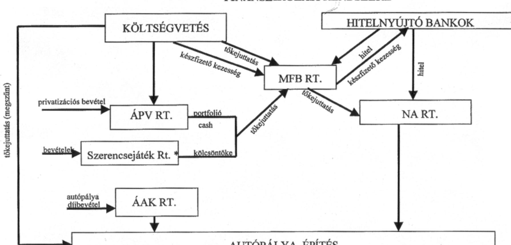
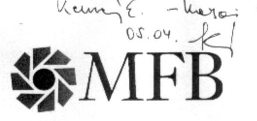
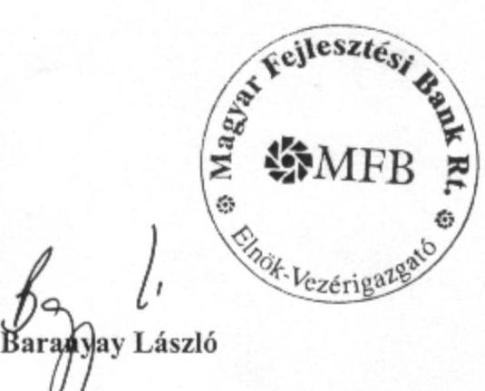
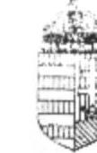
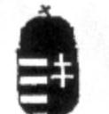
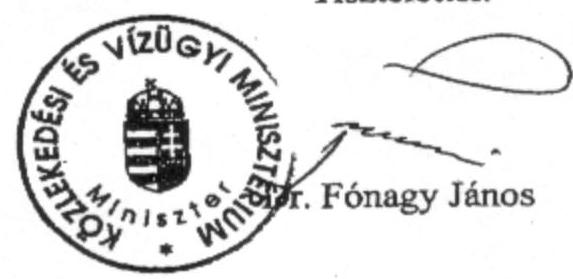

# JELENTÉS 

## az M3 autópálya beruházás pénzügyi folyamatának ellenőrzéséről

2002. május

---

# 2. Államháztartás Központi Szintjét Ellenőrző Igazgatóság 2.1. Teljesítmény Ellenőrzési Főcsoport V-8-100/2001-2002.   Témaszám: 560 . 

## Az ellenőrzést felügyelte:

Bihary Zsigmond
föigazgató

## Az ellenőrzés végrehajtásáért felelős:

## Kemény Emil

főcsoportfőnök

## Az ellenőrzést vezette:

## Karsainé Dömsödi Éva osztályvezető/igazgatóhelyettes

## Az ellenőrzést végezték:

## Bátory Béláné

számvevő tanácsos
Csányi Sándor
számvevő
Uglár László
számvevő tanácsadó
Szatmári Dezső
szakértő

## A témakörrel foglalkozó ÁSZ vizsgálatok jegyzéke:

Jelentés az Útalap és az abból finanszírozott országos közúthálózat fenntartásának, üzemeltetésének, fejlesztésének, valamint a kezelő szervezetek múködésének pénzügyi-gazdasági ellenőrzéséről (V-29-90/1993-94)
Jelentés a Közlekedési, Hírközlési és Vízügyi Minisztérium fejezet pénzügyigazdasági ellenőrzéséről (V-20-77/1995-96)
Jelentés a települési önkormányzatok tulajdonában lévő közutak, hidak, alagutak fejlesztésének, fenntartásának és üzemeltetésének vizsgálatáról (V-1011-111/1999-2000)

Jelentés a koncesszióba adott állami tevékenységek vizsgálatáról (V-5-75/2001)

---

# TARTALOMJEGYZÉK 

az M3 autópálya beruházás pénzügyi folyamatának ellenőrzéséről ..... 3
BEVEZETÉS ..... 3
I. ÖSSZEGZŐ MEGÁLLAPÍTÁSOK, KÖVETKEZTETÉSEK, JAVASLATOK ..... 6
II. RÉSZLETES MEGÁLLAPÍTÁSOK ..... 15

1. A struktúra kialakítása, a szervezetek és tevékenységük ..... 15
1.1. A Magyar Fejlesztési Bank Részvénytársaság ..... 15
1.1.1. A Nemzeti Autópálya Részvénytársaság alapítása, feladatköre, szervezete ..... 17
1.1.2. Az Állami Autópálya Kezelő Részvénytársaság ..... 19
1.1.3. Kisalföld Autópálya Mérnöki és Szolgáltató Rt. ..... 20
1.2. A Közlekedési és Vízügyi Minisztérium ..... 21
2. A szükséges források biztosításának módja, szabályozottsága és azok rendelkezésre állása ..... 22
2.1. A beruházás előkészítésére igénybe vett pénzeszközök ..... 22
2.2. Finanszírozás a jelenlegi szervezeti konstrukcióban ..... 23
2.2.1. A források rendelkezésre állása ..... 23
2.2.2. A gyorsforgalmi autóút hálózat beruházások finanszírozási rendje, a szervezeti kapcsolatok megjelenése a finanszírozásban ..... 25
2.2.2.1. A KHVM, majd KöViM szerepe ..... 26
2.2.2.2. Az MFB Rt. fejlesztési forrásai ..... 27
2.2.2.3. Az NA Rt. forrásai és az M3 Füzesabony-Polgár szakasz építés finanszírozása ..... 30
2.2.2.4. Az ÁAK Rt. által finanszírozott fejlesztések ..... 32
2.3. A Nemzeti Autópálya Rt. számviteli rendje, a költségek nyilvántartása és elszámolása ..... 33
3. A beruházás megvalósítására megkötött szerződések és a beruházás végrehajtásának helyzete ..... 34
3.1. A beruházás tervezésének és megvalósításának koordinációja ..... 35
3.2. Az autópálya és a hozzá tartozó hidak kivitelezésére és a mérnöki feladatok ellátására megkötött szerződések ..... 36
3.3. A FIDIC ajánlások figyelembevétele a szerződéses feltételek kialakításakor ..... 39
3.4. A vállalkozási szerződések árainak tartalma, a többlet és pótmunkák elszámolása, az árak kialakítása ..... 39

---

3.5. A vállalkozási szerződések főbb kockázatainak megosztása és a teljesítés garantálása ..... 41
3.6. A vállalkozási szerződések lebonyolítása, a kifizetések és teljesítmények összhangja, a megvalósítás ellenőrzése ..... 42
3.7. Minőségbiztosítás ..... 45
4. A beruházás megvalósításában részt vevő szervezetek belső ellenőrzési tevékenysége ..... 46
5. A tulajdonosi ellenőrzés ..... 46

---

# ALKALMAZOTT RÖVIDÍTÉSEK JEGYZÉKE 

| Ász tv. | 1989. évi XXXVII. törvény az Állami Számvevőszékről |
| :--: | :--: |
| Áht. | 1992. évi XXXVIII. törvény Az államháztartásról |
| Gt. | 1997. évi XCLIV. törvény A gazdasági társaságokról |
| Kkt. | 1988. évi I. törvény A közúti közlekedésről |
| Koncessziós tv. | 1991. évi törvény A koncesszióról |
| Kbt. | 1995. évi XL. törvény A közbeszerzésről |
| Priv tv. | 1995. évi XXXIX. törvény Az állam tulajdonában lévő   vállalkozói vagyon értékesítéséről |
| Ptk. | 1959. évi törvény A Polgári Törvénykönyvről |
| Szvt. | 2000. évi C. törvény A számvitelről |
| FIDIC | Tanácsadó Mérnökök Nemzetközi Szövetsége |
| ÁAK Rt. | Állami Autópálya Kezelő Részvénytársaság |
| ÁMI Kft. | Általános Mérnöki Iroda Kft. |
| ÁPV Rt. | Állami Privatizációs és Vagyonkezelő Részvénytársaság |
| ÉKMA Rt. | Észak- Kelet-Magyarországi Autópálya Fejlesztő és Üze-   meltető Rt. |
| GM | Gazdasági Minisztérium |
| GyUKI | Gyorsforgalmi Utak Koordinációs Iroda |
| KHVM | Közlekedési, Hírközlési és Vízügyi Minisztérium |
| KM | Környezetvédelmi Minisztérium |
| KöViM | Közlekedési és Vízügyi Minisztérium |
| KVI | Kincstári Vagyon Igazgatóság |
| MeH | Miniszterelnöki Hivatal |
| MFB Rt. | Magyar Fejlesztési bank Részvénytársaság |
| NA Rt. | Nemzeti Autópálya Részvénytársaság |
| NyUMA Rt. | Nyugat-magyarországi Autópálya Rt. |
| PM | Pénzügyminisztérium |
| Vegyépszer Rt. | Vegyiműveket Építő és Szerelő Rt. |

---

# 2

---

# JELENTÉS 

## az M3 autópálya beruházás pénzügyi folyamatának ellenőrzéséről

## BEVEZETÉS

Az ellenőrzött beruházás az M3 autópálya Füzesabony-Polgár közötti 61,1 km hosszú beruházási szakasza volt, amely az 1998-ban Füzesabonyig kiépített autópálya folytatása, a nyomvonal kijelölés után az országhatárig megépítendő teljes M3 autópálya jelenleg kivitelezés alatt álló része.

Az ellenőrzés során - a folyó beruházás értékelésén túlmenően - áttekintettük a gyorsforgalmi úthálózat fejlesztési programjának végrehajtására kialakított - a gazdasági társaságok munkamegosztásán alapuló - szervezeti struktúrát, együttmúködésük rendjét, gyakorlatát, valamint a közúthálózat fejlesztéséhez szükséges források biztosításának módját, a finanszírozási rendszert.

Tekintettel arra, hogy az ellenőrzött M3 autópálya szakasz kivitelezésének befejezési határideje - a megkötött szerződések szerint - 2002. november 30., a folyamatba épített ellenőrzés lezárásakor még nem nyújthatott teljes körű áttekintést és végleges értékelést a beruházás pénzügyi mérlegéről, a kivitelezés költségelőirányzatának (árának) teljesítéséről, a gyorsforgalmi úthálózat fejlesztésének finanszírozására kialakított rendszer múködésének megfelelőségéről. Az ebben a kérdésekben szerzett tapasztalatokat az ÁSZ, a programjában előirányzott jövőbeni ellenőrzései kapcsán fogja hasznosítani, visszatérve a még nyitott kérdésekre is.

Az M3 beruházás Füzesabony-Polgár közötti szakaszának előkészítését 19961999 között az Észak- Kelet-Magyarországi Autópálya- Fejlesztő és Üzemeltető Részvénytársaság (továbbiakban: ÉKMA Rt.) végezte. A 2117/1999. (V. 26.) Korm. határozat előírásai alapján bevezetett új szervezeti, munkamegosztási és finanszírozási rendszerben a beruházás megvalósításának felelőse az újonnan alapított Nemzeti Autópálya Részvénytársaság (továbbiakban: NA Rt.) lett. A még fennálló előkészítő tevékenység befejezését az ÉKMA Rt. és két másik autópálya fejlesztő és kezelő társaság egyesítésével létrehozott Állami Autópálya Kezelő Részvénytársaság (továbbiakban: ÁAK Rt.) folytatta. Az ÁAK Rt. alapítója a Magyar Állam, a részvényesi jogok gyakorlására az NA Rt. jogosult.

---

Az NA Rt. tulajdonosi jogait a Magyar Fejlesztési Bank Rt. (továbbiakban MFB Rt.) gyakorolja, továbbá a bank gondoskodik a Kormány gyorsforgalmi úthálózat fejlesztési programjának megvalósításához - ezen belül a vizsgált szakaszhoz is - szükséges forrásokról. A Magyar Fejlesztési Bank Rt. felett a tulajdonosi jogokat a Miniszterelnöki Hivatalt vezető miniszter gyakorolja. Az állami fel-adat-ellátás szerepében a Közlekedési és Vízügyi Minisztérium (továbbiakban: KöViM) egy szavazatelsőbbségi részvénnyel rendelkezik.

Az ellenőrzött autópálya szakasz megvalósítását 1999.-ig hitelfelvételből, továbbá a központi költségvetésből és az Útalapból az ÉKMA Rt.-nek juttatott támogatásokból finanszírozták. 2000-től az MFB Rt.-nél összpontosulnak ezek a feladatok, az NA Rt.-ben folyó műszaki-fejlesztési koordináció mellett, ahogy ezt a kormányhatározatok tartalmazzák.
A folyamatban lévő beruházás vizsgált szakasza, valamint az ahhoz tartozó Ti-sza-híd, Mocsárréti-híd és az ártéri hidak kivitelezését a Magyar Autópályaépítő Konzorcium, illetve a Magyar Hídépítő Konzorcium végzi az NA Rt.-vel 2000-ben megkötött szerződések alapján.
Az Állami Számvevőszékről szóló 1989. évi XXXVIII. törvény 2. § (6) és (7) bekezdése alapján a beruházás megvalósítását az Állami Számvevőszék jogosult ellenőrizni.

Az MFB Rt. vitatja az ÁSZ ellenőrzés hivatkozott jogalapját az NA Rt.-re nézve, mivel véleménye szerint: „az NA Rt. részvényesei között a Magyar Állam tulajdonosként nem szerepel". Emellett megjegyezte, hogy „Az állami tulajdonú vállalatok, vállalkozások körének - külön törvényi felhatalmazás nélkül történő - kiterjesztő értelmezése aggályosnak tűnhet".
Az MFB Rt. álláspontja szerint: „Az Ász tv. hatásköri megfogalmazásával összhangban állónak az a megoldás tűnik, ha az M3-as beruházás pénzügyi folyamatának ellenőrzése az MFB Rt., mint kizárólagosan állami tulajdonban lévő vállalkozás tulajdonosi joggyakorlásának ellenőrzésén keresztül történik."
Mindez azt eredményezte, hogy az MFB Rt. az ellenőrzött társaságok - az NA Rt. és az ÁAK Rt. - részére nem engedélyezte azon dokumentumok átadását, amelyek megítélése szerint nem tartoztak az ellenőrzési programban megjelölt feladathoz, továbbá azt, hogy a jelentés egyeztetési folyamatában az ÁSZ az MFB Rt.-vel volt kapcsolatban, aki egyben képviselte ezen társaságok véleményét is. Az ÁSZ elnöke az MFB Rt. felügyeletét ellátó minisztert az ellenőrzés során tájékoztatta a felmerült akadályokról. (A közvetett állami tulajdonlás esetében hasonló problémák már a korábbi ellenőrzések során is előfordultak és a tulajdonos magatartása tette függővé, hogy az ÁSZ milyen mélységig jutott el ellenőrzési céljának végrehajtásában. Az ebből adódó problémákról az ÁSZ az Országgyúlést már korábban tájékoztatta.)
Az ellenőrzés célja annak értékelése volt, hogy

- az M3 Füzesabony - Polgár közötti autópálya szakasz beruházás forrásainak biztosítása, rendelkezésre állása, illetve azok felhasználása megfelel-e a jogszabályokban és a kormányhatározatokban meghatározott előírásoknak;
- a beruházás megvalósításában résztvevő szervezetek és intézmények működése, együttmúködésük szabályozottsága összhangban van-e a jogszabályokban és kormányhatározatokban meghatározott követelményekkel;

---

- a beruházás pénzügyi folyamatában hogyan múködött az állam tulajdonosi érdekeit érvényesítő pénzügyi és tulajdonosi ellenőrzés.
Az ellenőrzés a Nemzeti Autópálya Rt.-nél - a KöViM, a MeH, az MFB Rt., valamint az ÁAK Rt. kapcsolódó ellenőrzésével - a beruházással kapcsolatos 1999-2001. évi tevékenységeket és pénzügyi folyamatokat tekintette át, de figyelemmel volt a helyszíni ellenőrzés lezárásáig bekövetkezett eseményekre is.
Az MFB Rt. vezetése a jelentést megismerte, az ellenőrzés megállapításait tudomásul vette; pontosító észrevételeiket a jelentésbe beépítettük. (17. melléklet)

Az ÁSZ az Útalap múködtetésének 1994 és 1995 években lefolytatott ellenőrzései kapcsán már vizsgálta az országos közúthálózat üzemeltetésének, fenntartásának és fejlesztésének finanszírozási konstrukcióját. Az elmúlt időszakban más ÁSZ ellenőrzések is érintették valamilyen szegmensében az ezzel kapcsolatos ráfordításokat. Több éves időszak történéseit feldolgozó átfogó témavizsgálatok is igyekeztek feltárni a ráfordítások eredményeit. A tapasztalatok azt jelezték, hogy szükséges a finanszírozási rendszer múködtetésének újragondolása és továbbfejlesztése. A gyorsforgalmi úthálózat fejlesztésének új finanszírozási modelljéről a mostani vizsgálat adott első alkalommal képet, de csak első lépés volt a gyorsforgalmi úthálózat 10 éves - időközben 15 évre kiterjesztett - fejlesztési programjának tervezett vizsgálatára. A már lefolytatott és a még sorra kerülő ellenőrzések eredményeinek együttes feldolgozása alapján lesz lehetősége az ÁSZ-nak arra, hogy a közpénzek takarékos és célszerű felhasználása szempontjából értékelje a mindenkori finanszírozási rendszert.

A jelentést véglegezés előtt egyeztettük a Miniszterelnöki Hivatal, illetve a Közlekedési és Vízügyi Minisztérium közigazgatási államtitkáraival, akik a jelentésben foglaltakkal egyetértettek (18. sz melléklet).

A végleges jelentést az Állami Számvevőszékről szóló 1989. évi XXXVIII. törvény III. fejezet 25. § (1) bekezdésének megfelelően észrevételezésre megküldtük a Miniszterelnöki Hivatalt vezető miniszternek, aki észrevételezési lehetőségével nem élt - és a Közlekedési és Vízügyi Miniszternek, aki a jelentésben foglaltakkal egyetértett (19. sz. melléklet).

---

# I. ÖSSZEGZŐ MEGÁLLAPÍTÁSOK, KÖVETKEZTETÉSEK, JAVASLATOK 

Az országos közúti infrastruktúra fejlesztése kiemelt gazdaságpolitikai program, amely alapján kormányhatározatok írták elő a konkrét fejlesztési célokat, azok megvalósítását, ütemezését, a műszaki és pénzügyi feltételeket, a szükséges fenntartási/felújítási munkákat. A kormányhatározati elvárásokban tükröződtek a fejlesztések eredményeként elérendő általános célok, nevezetesen: az úthálózat kiépítése és múködése olyan közlekedési rendszerbe tagozódjon, amely elősegíti az ország gazdasági fejlődését, a versenyképesség növelését, a foglalkoztatottság javítását. Az országos közúthálózat fejlesztési programok egyik állandó eleme volt az M3 autópálya továbbépítése is.

Az M3 autópálya Füzesabony-Polgár szakasz tervezésének és kivitelezésének koordinációját 1996-tól a folyamatosan meghozott, majd többször módosított kormányhatározatok szabták meg. 1996. és 2001. között a fejlesztés megvalósításának határideje négy alkalommal, a finanszírozás koncepciója ugyancsak négyszer, a díjszedés megoldási módja három esetben változott. Ezen időszakban egy jelentősebb nyomvonal változtatásra is sor került, és változtak a fejlesztés megvalósításáért felelős szervezetek is. A tervezés előkészítettsége alapján a beruházás vállalkozásba adásának feltételei már 1998-ban adottak voltak, a kivitelezési szerződések megkötésére azonban csak 2000. évben került sor.

Az M3-as autópálya-fejlesztés megvalósításához szükséges forrásokat az 19961999. években a központi költségvetés és az Útalap terhére biztosították. A megvalósításért felelős ÉKMA Rt. az Útalapból, valamint kormányzati rendkívüli kiadások címen összesen 15,858 Mrd Ft támogatást kapott. Ebből az autópálya Füzesabony-Polgár közötti szakasz megépítésének előkészítésére összesen 4,987 Mrd Ft-ot fordítottak. A módosítások, az áttervezések, valamint a vállalkozásba adás elhalasztásának egyedi és együttes költségkihatását az érintett szervezetek nem vizsgálták. Az 1999. évet követően az ÉKMA Rt. további központi előirányzati összegeket fejlesztési céllal nem kapott. Az 1999. évi 3,708 Mrd Ft támogatást a társaság szabálytalanul vételezte be tőketartalékként.

Az M3 folyó beruházást érintő időközi szabványmódosítások a kivitelezés közben készítendő tervezést hátráltatták, az időközi változások miatti módosítások a szakhatósági engedélyeztetési eljárások megismétlését tették szükségessé. A beruházás tervezés és a megvalósítás gazdaságosságát, valamint hatékony végrehajtását érintő akadályok feloldása céljából a Kormány két határozatában intézkedett, felkérte a környezetvédelmi minisztert hogy 2001. október 31ig vizsgálja meg a gyorsforgalmi úthálózat építéséhez szükséges környezet- és természetvédelmi engedélyek gyorsított ütemű kiadásának lehetőségét. A kiszabott határidőre intézkedés nem történt, a vizsgálat lezárásakor (2001. november 30.) KöViM és a KM szakértői között még folytak az egyeztető tárgyalások.

---

Az országos közáti infrastruktúra-fejlesztések előkészítését jellemző folyamatos megtorpanások után 2001-től a beruházási és a finanszírozási lépések gyorsítása következett be. Bővült a programhoz tartozó utak száma, az építendő/felújítandó utak hossza, továbbá a program időtartama 10 évről 15 évre nőtt. A fejlesztések felgyorsítására, valamint az ezek megvalósítására új szervezeti struktúrát és finanszírozási konstrukciót alakítottak ki, amelynek kereteit a kormányhatározatok szabták meg, illetve módosították. Ezekben rögzítették a fejlesztések összetételét és prioritásait, valamint a források biztosításának ütemezését. Az M3 Füzesabony-Polgár szakasz megvalósítására már az új konstrukció keretén belül került sor.

A kormányhatározatokban foglaltak alapján kialakított szervezeti és múködési struktúrában az ágazat irányításáért felelős KöViM tevékenysége a gyorsforgalmi úthálózat fejlesztésére vonatkozóan a kormány-előterjesztések benyújtására korlátozódott. 2001-től kezdődően - a normatív irányítási feladatok megtartásával - a fejlesztések végrehajtásának közvetlen irányítása és fejezeti finanszírozása kikerült a szaktárca hatásköréből. Érvényben van ugyanakkor az a kormányrendelet, amely változatlanul fenntartja a közlekedési és vízügyi miniszter feladatát és hatáskörét az országos közút hálózat fejlesztése, üzemeltetése és fenntartása tekintetében.

A gyorsforgalmi úthálózat fejlesztési programjának végrehajtásáért, kormányhatározat alapján az MFB Rt. által alapított NA Rt. a felelős, amelynek alapító okirata a KöViM szavazatelsőbbségi részvényéhez korlátozott jogosítványokat határozott meg, így a KöViM jogosítványa az állam tulajdonosi jogainak képviseletére látszólagos. Az állam tulajdonosi jogainak tényleges gyakorlója a Miniszterelnöki Hivatal vezetője a Magyar Fejlesztési Bank Rt. közbeiktatásával. A bank szervezeti és múködési szabályzatát módosították, azonban a gyorsforgalmi úthálózat fejlesztéssel kapcsolatban önálló szervezeti egységet nem hoztak létre, a feladatok beépültek a bank funkcionális szervezeti munkamegosztásába.

Az állami feladatellátás része a közúthálózat múködtetése is. A felújítás, a karbantartás, az üzemeltetés és a díjszedés, valamint a jogelőd társaságok által felvett hitelek adósságszolgálatának teljesítése az ÁAK Rt. feladata. A társaságot az NA Rt. hozta létre a kormány felhatalmazása alapján és annak megfelelően az M3-at korábban építő állami tulajdonú ÉKMA Rt. és további két állami tulajdonú, autópályát üzemeltető társaság beolvadásával. A KöViM jogosítványa az állam tulajdonosi jogainak képviseletére az ÁAK Rt. tulajdonosi szerkezetében ugyancsak formális. Az alapító okirat szerint az alapító Magyar Állam nevében a KöViM jár el, ugyanakkor - a részvényesi jogok NA Rt.-re ruházásával - gyakorolható alapítói jogai nem maradtak.

Az NA Rt. és az ÁAK Rt. egymást átfedő tevékenységeket végeztek. Az ÁAK Rt. az M3 autópálya Füzesabony-Polgár közötti szakaszán is végzett, illetve finanszírozott terület-kisajátítást, előkészítő munkákat. Az MFB Rt. a helyszíni vizsgálat lezárását követően értesítette az ÁSZ-t, hogy a két társaság tevékenységének elhatárolását és leválasztását megkezdte.

---

Finanszírozási terv - a 15 éves kibővített programra - az ellenőrzés lezárásáig még nem készült. Az MFB Rt. gyorsforgalmi utak fejlesztésére összesen 818,14 Mrd Ft-ot tervezett a 10 éves fejlesztési program keretében.

A kialakított új struktúrában államháztartási körön kívülre került az állami feladatellátáshoz kötődő tevékenységek finanszírozása, az MFB Rt. feladata lett a fejlesztési források koordinálása és biztosítása. A szakosított pénzintézet jogállását, tevékenységi körét, múködését és szervezetét az állam gazdaságpolitikai célkitűzéseivel összhangban 2001-ben külön törvényben, részletesen meghatározták. A törvény előírja, hogy a Kormány készfizető kezességet vállal - a mindenkori költségvetési törvényben meghatározott mértékig - a bank feladatköréhez kapcsolódó valamennyi kül- és belföldről felvett hitelből és kötvénykibocsátásból eredő fizetési kötelezettség teljesítéséért. A törvényben a Kormány felhatalmazást kapott arra, hogy rendeletben szabályozza a kintlevőségek, befektetések, mérlegen kívüli tételek és a fedezetek minősítésének és értékelésének az MFB Rt.-re vonatkozó szabályait, az állami garanciabeváltás, valamint a Magyar Államkincstár és az MFB Rt. közti elszámolások eljárási szabályait. Ezek a kormányrendeletek nem készültek el. A törvény indoklása ugyanakkor kimondja, hogy e két rendelet megalkotása elengedhetetlenül szükséges ahhoz, hogy az MFB Rt. a törvényben meghatározott rendelkezéseknek megfelelően folytathassa tevékenységét.

A gyorsforgalmi úthálózat fejlesztési program megvalósítása érdekében az MFB Rt. finanszírozása több csatornán keresztül történt tőkeemeléssel. 2001-ben a költségvetési törvényben eredetileg meghatározott 35,2 Mrd Ft tőkeemelésen felül az MFB Rt. 12,69 Mrd Ft többletforrásban részesült az ÁPV Rt-től kapott ingyenes vagyonátadás révén. A költségvetési források átutalása tőkeemelésre és a vagyonátadás együttesen 47,89 Mrd Ft bevételi forrásnövekedést eredményezett az MFB Rt.-nél, amely $36 \%$-kal lépte túl a költségvetési törvényben eredetileg autópálya építésre tőkeemelési céllal jóváhagyott előirányzatot. A megnövelt forrás biztosításával egyidejűleg a Kormány a költségvetésben eredetileg meghatározott előirányzatot új felhasználási célokra bontotta meg. Ennek következtében az eredeti autópálya fejlesztési célt csak 10,91 Mrd Ft szolgálhatja, de tőketartalékként bevételezve, a felhasználási cél megjelölése nélkül más célokra is felhasználható. Az MFB Rt. az NA Rt.-nél 2001. május és szeptember között két alkalommal részvénytőke növeléssel és tőketartalékba helyezéssel 27 Mrd Ft tőkeemelést hajtott végre a kormányhatározattal összhangban. Így a gyorsforgalmi úthálózat fejlesztésére és finanszírozására kialakított szervezeti konstrukcióban a mindenkori kormányhatározatok előírásai és az MFB Rt döntései határozzák meg az útfejlesztések finanszírozását, a költségvetési eredetű források tényleges felhasználását.

Az MFB Rt. kimutathatóan közvetlenül költségvetési pénzeszközökhöz is jutott, amely eszközök felhasználására vonatkoznak a közbeszerzési törvény előírásai. A MeH azonban az MFB Rt-nek - mint az államháztartás alrendszeréből is finanszírozott szervezetnek - nem írt elő elkülönített beszámolási kötelezettséget a meghatározott céllal tőkeemelésként juttatott összegek felhasználásáról. Így közvetlenül a központi költségvetésből juttatott források - mivel azok az MFB Rt. saját tőkéjének részévé váltak - nem különültek el a társaság gazdálkodásának egészétől. Ennek következménye, hogy a közvetlenül a központi költség-

---

vetésből juttatott források felhasználására a közbeszerzési törvény hatálya az MFB Rt.-re nem terjeszthető ki.

A finanszírozási konstrukcióból látható, hogy az államháztartás alrendszereiben nem jelentek meg teljes körűen a gyorsforgalmi úthálózat fejlesztés finanszírozási forrásai, a beruházási kiadások. A tőkeemelési célú juttatások előirányzatai sem beruházási kiadásként, hanem kormányzati rendkívüli kiadások címen szerepeltek. Ebből következik, hogy a mindenkori költségvetésben nem mutathatók ki a fejlesztési kiadások, illetve az új szervezeti konstrukció egészében igénybevett forrásbevonások konszolidált pénzügyi hatásai.

Az M3 Füzesabony-Polgár szakasz beruházásra az NA Rt.-nél 102,66 Mrd Ft ráfordítást terveztek. Az átadott tanúsítványok szerint az előkészítésre és a kivitelezésre megkötött szerződések keretében 2001. október 26-ig 61,55 Mrd Ft-ot fizettek ki, amely összeg nem tartalmazza a szakértői díjakat.

Az MFB Rt. teljesítette a gyorsforgalmi úthálózat elemeinek - ezen belül az M3 Füzesabony-Polgár szakasz - eddigi megvalósításához, a szükséges források bevonáshoz kapcsolódó, illetve a készfizető kezességvállalásból és bankgaranciából származó kötelezettségeit, illetve koordinálta az NA Rt. hitelfelvételi ügyleteit is.

Az NA Rt. a helyszíni vizsgálat befejezéséig 25 Mrd Ft rövid lejáratú, áthidaló hitelt vett fel és többek között az M3 projekt megvalósítása érdekében 2001. december 31-ig 28 Mrd Ft hitelt kapott az MFB Rt.-től. Az MFB Rt. a hitelnyújtáson túlmenően garanciát vállalt 12,2 Mrd Ft értékben az NA Rt. rövid lejáratú hitelére. A helyszíni vizsgálat lezárását követően 2001. decemberében az MFB Rt. újabb garanciát vállalt az NA Rt. 180 Mrd Ft összegű beruházási hitel felvételére. Az MFB Rt. finanszírozási terve szerint, a hitelek futamidejének 2009ig tartó szakaszában esedékes tőketörlesztésének és kamatfizetési kötelezettségének forrásául részben az MFB Rt. tőkeemeléséből, részben hitelfelvételiből származó eszközök szolgálnak. A lehetséges források között a finanszírozási tervben szerepelt, de még nem valósult meg - a kormányhatározatban egyébként nevesített - a hazai megtakarítások minél nagyobb arányú igénybevételét célzó, széles körben forgalmazható autópálya kötvények kibocsátásának terve. Teljesült viszont a finanszírozásban a hazai pénzintézetek minél nagyobb arányú szerepvállalását/bevonását célzó kormányzati szándék.

Az NA Rt. rövid- és hosszúlejáratú hitelfelvételei, valamint az MFB Rt. ezzel kapcsolatos garancia vállalásai, illetve koordináló tevékenysége az MFB Rt. gazdálkodásának átfogó ellenőrzése nélkül nem értékelhető a gazdálkodás átláthatóságának, ellenőrizhetőségének és ezek tényleges biztosításának szempontjából.

Az NA Rt. finanszírozása nem mindig illeszkedett a valós pénzügyi igényekhez. Negyedéves finanszírozási helyzetet vizsgálva 2001. harmadik negyedévéig az NA Rt. az építési és működési szükségleteket meghaladó pénzeszközökkel rendelkezett annak ellenére, hogy jelentős előleget is biztosított a vállalkozóknak. Ugyanakkor néhány esetben pénzügytechnikai okokból szükség volt áthidaló hitel felvételére, illetve előfordult néhány napos késedelemmel kifizetett számla az M3 esetében, de ezek nem jártak kötbérfizetési következményekkel.

---

Az NA Rt. az M3 Füzesabony-Polgár szakasz kivitelezésére megkötött szerződésekben vállalt előlegnyújtáson túlmenően előlegeket nyújtott egyéb, a projektszerződésen kívül szerződött szolgáltatóknak is. Az autópályát építő konzorciumok esetében az előlegnyújtás indokolható volt, tekintettel arra, hogy a konzorcium tagjai nem rendelkeztek a kivitelezéshez szükséges műszaki technikai gépekkel, berendezésekkel. Az előlegnyújtásban részesült egyéb vállalkozók azonban - a cégbíróságon bejegyzett tevékenységi körük szerint - nem folytattak előfinanszírozás igényes tevékenységet. Az előleg nyújtás célszerűségét az ÁSZ-nak nem volt módjában megvizsgálni.

Az NA Rt. számvitele jól szervezett, a számviteli elszámolások tartalma azonban két területen kifogásolható. Egyrészt, a mérlegbeszámoló kiegészítő melléklete nem mutatja be - mint a jövőben biztosan bekövetkező eseményt -, hogy a kivitelezés alatt álló és eszközként nyilvántartott utak aktiválásukkal egyidejűleg kivezetésre kerülnek a könyvekből. Másrészt, az önköltség meghatározásában az igazgatási költségek megosztására alkalmazott arányszám nem indokolt, mert a társaság tevékenységének egésze a gyorsforgalmi úthálózat fejlesztését szolgálja és az ettől eltérő, bevételt is eredményező tevékenység, nem számottevő.

Az állam kizárólagos tulajdonát képező vagyon - beleértve az országos közutakat - tulajdonosi ellenőrzése a Kincstári Vagyoni Igazgatóság (továbbiakban: KVI) feladata az államháztartásról szóló törvény értelmében. A kincstári vagyonnal való gazdálkodás szabályainak megfelelő vagyonkezelési szerződés van érvényben a KVI és az NA Rt. között, de az NA Rt. csak részben tett eleget az e szerződésből fakadó adatszolgáltatási kötelezettségeinek. A szerződés szerint az ÁAK Rt. vagyonkezelője, továbbá a társaság tulajdonosi (részvényesi) jogainak gyakorlója is az NA Rt. Az NA Rt. a részesedései között még nem mutatta ki az ÁAK Rt.-ben meglévő tulajdoni hányadát számviteli törvény előírásai szerint. A részvények vagyoni értékének meghatározására egyeztető tárgyalásokat kezdeményezett az MFB Rt. a KVI-vel.

Az ÁAK Rt. nyilvántartott eszközei között megtalálhatók az autópályák, úgy, hogy azok a társasági saját tőke részét képezik. Ez a helyzet a jogelőd társaság az ÉKMA Rt. - gazdálkodási feltételeinek következményeként alakult ki, amikor az autópálya fejlesztésre felvett hitelek adósságszolgálata is átkerült az ÁAK Rt.-hez. Ebből következően az ÁAK Rt.-nél vezetett számviteli nyilvántartást az idegen tulajdonra, a kincstári vagyonra vonatkozó szabályozás szerint rendezni kell. Az MFB Rt. könyvvizsgálója bevonásával kezdeményezte a KVI-nél az egységes aktiválási és nyilvántartási rendszer kialakítását.

Az M3 Füzesabony-Polgár közötti szakasz megvalósítására az NA Rt. két konzorciummal, a Magyar Autópálya-építő Konzorciummal és a Magyar Hídépítő Konzorciummal kötött szerződéseket. A szerződéskötések előkészítésében, a szerződéses feltételek meghatározásában tapasztalt hiányosságok ellenére a szerződéses feltételek és a szerződések végrehajtásának megszervezése alkalmasak arra, hogy a beruházás a kívánt mértékben és minőségben határidőre elkészüljön.

A szerződésekben specifikálták a beruházás megvalósításához szükséges munkák és szolgáltatások terjedelmét, műszaki és minőségi követelményeit. Ezek

---

ellenértékét egyösszegű, rögzített ár formában határozták meg a jóváhagyott limitáron belül. A vállalkozó a szerződés szerint többletmunkát nem számolhat el még abban az esetben sem, ha a munka volumene meghaladja a tervekben meghatározott mértéket. A rögzített ár mellett azonban a szerződésekben tartalékkeretet is meghatároztak. Annak ellenére, hogy a tartalékkeret felhasználásának feltételei szigorúan szabályozottak, a rögzített ár és a tartalékkeret együttes alkalmazása a vállalkozókat készteti a tartalékkeret kihasználására pótmunka igények bejelentésével. A tartalékkeret-előirányzat a beruházás pénzügyi tervezésének része és ennek összege nem tartozik a vállalkozóra.

A vállalkozók szerződésben vállalt kötelezettségeihez, teljesítményhez kötött fizetési rendszer kapcsolódik, amely tartalmazza a vállalkozónak felróható késedelmekért fizetendő kötbéreket, a megfelelő bankgaranciákkal alátámasztott teljesítési, jótállási és szavatossági kötelezettséget.

A teljesítményhez kötött fizetési rendszer a kivitelezési ütemtervhez viszonyított közbenső teljesítési határidő késedelmek szankcionálására nem ad lehetőséget. A vállalkozónak felróható teljesítési késedelmeket csak a végleges teljesítési határidő lejáratakor lehet érvényesíteni, szükség esetén a teljesítési garancia terhére. A beruházás projekt elemeire megkötött szerződések összehangolt végrehajtásának figyelemmel kísérése, továbbá az elvégzett munkák műszaki és minőségi megfelelőségének ellenőrzése a független Mérnök feladata, aki a beruházás végrehajtásának állásáról és a munkák szerződés szerinti teljesítéséről a havi jelentéseiben beszámolt.

A beruházás megvalósítását szolgáló szerződés előkészítése és megkötése nem a közbeszerzési törvény hatályába tartozóan történt. Az NA Rt. a szerződéseket a Konzorciumokkal és a Mérnökkel nem pályáztatással, hanem meghívott partnerekkel, közvetlen tárgyalásokon lefolytatott alku alapján kötötte meg. A meghívott vállalkozók kiválasztására, a vállalkozói kör felmérésére és értékelésére írásos dokumentum nem volt fellelhető. A szerződéskötési feltételeket és a megkötött szerződéseket az Igazgatóság, a Felügyelő Bizottság és a Közgyűlés határozatokban rögzítve elfogadta.

Az NA Rt.-re, mint társaságra nem kötelező a KHVM Közúti Főosztály rendelkezése, amely a beruházások vállalkozásba adásának, a beruházások megvalósításának eljárási rendjét szabályozza. Az ajánlattételi és szerződési feltételeket az NA Rt. Igazgatósága határozta meg, amelyek kialakításánál a FIDIC (Tanácsadó Mérnökök Nemzetközi Szövetsége) ajánlásait figyelembe vette. A FIDIC ajánlásokat a Mérnöki tevékenység ellátására kötött szerződésben is alkalmazták. Ennek ellenére a Mérnök független jogállása nem megnyugtatóan rendezett. A tevékenységet ellátó ÁMI Kft. tagjainak nyilatkozatai csak 2000. június 8 -ig garantálták a társaság „független" státuszát és a Mérnökkel megkötött szerződés nem tartalmaz kötelezettséget az ebben a minőségben bekövetkező változások bejelentésére. (Az NA Rt. a helyszíni ellenőrzés során megállapításunkra úgy nyilatkozott, hogy kezdeményezni fogja a szerződés megfelelő módosítását.) Az NA Rt.-re ugyancsak nem kötelező a KHVM Közúti Főosztálynak a beruházások műszaki, gazdasági elszámolási rendjét szabályozó rendelkezése, amely lehetővé teszi a beruházások hatékonyságának, gazdaságosságának és eredményességének elemzését és ellenőrzését a beruházások költségei és az alkalmazott egységárak összehasonlítása alapján.

---

Az autópálya építés szerződéses árát kormányhatározatban rögzített elv alapján alakították ki, amely előírta, hogy „az útépítés összehasonlítható áron számítva legalább öt százalékkal legyen olcsóbb az eddigi árszintnél". Az autópálya kivitelezésére megkötendő szerződéses limitár meghatározásához az MFB Rt. - az M3 autópálya Gyöngyös-Füzesabony közötti, és az M5 autópálya két kiválasztott szakaszának kivitelezési költségeit azonos műszaki tartalomra hozva - kilométerre vetített fajlagos költség-mutatót képzett. Tekintettel arra, hogy a fajlagos költség-mutató járulékos beruházási költségeket is tartalmazott, az útépítés költségeire vonatkozó kormányzati elvárás teljesítése csak a beruházás befejezése után értékelhető a megvalósított és a fajlagos költségmutató szerinti járulékos beruházások összehasonlításával. Az NA Rt. igazgatósága 2001. júniusában az 5\%-os értékküszöb betartását teljesíthetőnek tartotta, azonban nem foglalt egyértelműen állást a könyvvizsgáló azon javaslatával kapcsolatban, hogy a beruházás megvalósítására felvett hitelek költségeit is vegyék figyelembe.

A beruházás részét képező Tisza-híd, Mocsárréti-híd és ártéri hidak árának kialakítására a kormányhatározat nem adott útmutatást. Ezen beruházási részek árszintjét a korábbi híd-beruházások költségeinek elemzésével az NA Rt. alakította ki, pályázati összehasonlítás nélkül.

A teljesítések elszámolásának rendszere, a számlák kiállításának és befogadásának a módja alkalmas a kifizetések és a tényleges teljesítmények összhangjának biztosítására. Az elvégzett munkák szerződés szerinti teljesítésének és kifizetésének nyomon követését számítógépes monitoring rendszer támogatja. A vizsgálat lezárásáig a monitoring program végleges határidő teljesítési késedelmet nem jelzett.

Az alkalmazott minőségbiztosítási és minőségellenőrzési rendszer megfelel az útépítési munkák minőségellenőrzésére vonatkozó hazai jogszabályi és szakmai előírásoknak. A kivitelezési munkákért felelős konzorciumok tagjai és az általuk megbízott, a műszaki tervezési munkát ellátó cégek, valamint a kontroll minőség-ellenőrzést végző intézetek rendelkeznek az ISO 9000 szab-ványrendszer-szerinti minőségbiztosítási tanúsítvánnyal.

Az M3 Füzesabony-Polgár közötti szakasz autópálya beruházás végrehajtását az MFB Rt., illetve az NA Rt. belső ellenőrzése nem vizsgálta. Az NA Rt. 1999. évi megalakulását követően nem alkalmazott belső ellenőrt, 2001. december 1től töltötték be ezt a munkakört.

A KöViM és a MeH felügyeleti ellenőrzésének feladatai között nem szerepelt az M3 autópálya Füzesabony-Polgár szakaszával, illetve a Kormány gyorsforgalmi úthálózat fejlesztési programjával kapcsolatos vizsgálat. A Miniszterelnöki Hivatal a jövőben tervezi az autópálya-építéssel kapcsolatos vizsgálat felvételét az ellenőrzési tervébe, tekintettel arra, hogy az MFB Rt. felügyelete 2001ben, évközben került a MeH fejezethez.

A tulajdonosi ellenőrzés legfőbb ismérve a kormányzati akarat teljesülésének nyomon követése és értékelése volt. Az MFB Rt. felett gyakorolt államtulajdonosi felügyelet kiterjedt az MFB Rt. portfoliójába és - a szükséges finanszírozási feltételek megteremtése révén - befolyása alá tartozó NA Rt.-re és az ÁAK

---

Rt.-re is. A Kormány határozataiban rögzített stratégiai elképzelések végrehajtásáról az MFB Rt. gondoskodott. A bank vezetése - írásban és szóban - több alkalommal beszámolt a közúti infrastruktúra fejlesztési beruházásokról az Országgyűlés Gazdasági Bizottsága előtt. A döntéshozatali folyamat a gazdasági társaságokról szóló törvény alapján, az igazgatóságokon és a felügyelő bizottságokon keresztül is többszörösen kontrollált.

A helyszíni ellenőrzés megállapításainak hasznosítása mellett javasoljuk:

# a Kormánynak 

1. Alkossa meg az MFB Rt.-ről szóló 2001. évi XX. törvény 20. §-ban meghatározott két kormányrendeletet, amelyek elengedhetetlenül szükségesek ahhoz, hogy az MFB Rt. a vonatkozó törvényben rögzítetteknek megfelelően folytathassa tevékenységét.
2. Szabályozza - figyelemmel a közlekedési és vízügyi miniszter feladat és hatáskörét meghatározó hatályos kormányrendeletre - az állam tulajdonosi jogainak érdemi képviseletét és érvényesítse azt az országos közúthálózat fejlesztési program megvalósításáért felelős új szervezeti rendben.
3. Alakítsa ki a gyorsforgalmi úthálózat fejlesztési program egésze megvalósításának ellenőrzési rendszerét.

## a Miniszterelnöki Hivatalt vezető miniszternek

1. Vegye fel ellenőrzési munkatervébe az M3 Füzesabony - Polgár közötti szakasz autópálya beruházásra biztosított költségvetési források felhasználásának szabályszerűségi vizsgálatát.
2. Alakítsa ki - a közlekedési és vízügyi miniszter bevonásával - a fejlesztési beruházások vállalkozásba adásának az NA Rt.-nél alkalmazandó eljárási rendjét, amely tartalmazza a tervezés, a műszaki előkészítés, a pályáztatás, illetve a pályáztatás nélküli ajánlatkéréssel történő megvalósítás szabályait, továbbá a kötelezően alkalmazandó szerződéses feltételek körét és az attól való eltérés engedélyezésének feltételeit.
3. Szabályozza - a közlekedési és vízügyi miniszter bevonásával - a beruházások műszaki gazdasági elszámolásának rendjét, amely lehetővé teszi a beruházások hatékonyságának, gazdaságosságának és eredményességének elemzését és ellenőrzését, a beruházások költségei és az alkalmazott egységárak összehasonlítása alapján. Alakítsa ki az ehhez szükséges, az állami beruházások adatait tartalmazó nyilvántartási rendszert.
4. Kezdeményezze - az MFB Rt. útján - az NA Rt. igazgatóságánál, hogy:

- a számviteli törvénynek megfelelően mutassák ki az NA Rt. vagyonkezelésébe tartozó ÁAK Rt.-ben meglévő tulajdoni hányadot a társaság részesedései között;

---

- tegyen eleget a kincstári vagyonnal való gazdálkodás szabályainak megfelelő vagyonkezelési szerződésből fakadó adatszolgáltatási kötelezettségeinek;
- úgy módosítsa a Mérnök feladatait ellátó társasággal megkötött szerződést, hogy az mindenkor garantálja a társaság függetlenségét a beruházás megvalósításában közremúködő vállalkozóktól;
- vegye fel belső ellenőrzési munkatervébe az M3 Füzesabony - Polgár közötti szakasz autópálya beruházás végrehajtásának, továbbá a gyorsforgalmi úthálózat fejlesztési program megvalósításának rendszeres ellenőrzését;
- az ÁAK Rt. igazgatósága gondoskodjon az idegen tulajdon kimutatásánál a számviteli törvényben rögzített előírások betartásáról.

5. Követelje meg, hogy a Kincstári Vagyoni Igazgatóság a kizárólagos állami tulajdonba tartozó közutak fejlesztési, fenntartási és üzemeltetési folyamataiban, a vagyonkezelési szerződések megkötésénél, a vagyonkataszteri nyilvántartások vezetésénél és a tulajdonosi ellenőrzések során fordítson kiemelt figyelmet az állam tulajdonosi jogainak érvényesülésére. Erről időszakosan számoltassa be a KVI vezérigazgatóját.

---

# II. RÉSZLETES MEGÁLLAPÍTÁSOK 

## 1. A STRUKTÚRA KIALAKÍTÁSA, A SZERVEZETEK ÉS TEVÉKENYSÉGÜK

Az ország gyorsforgalmi úthálózatának fejlesztésével összefüggő feladatokat, a megvalósítás szervezeti kereteit és ütemezését a Kormány határozatokban szabályozta a felelősök és a határidők megjelölésével.

A gyorsforgalmi úthálózat tízéves fejlesztési programjának megvalósítását a 2117/1999. (V. 26.) Korm. határozat írta elő. A határozat 3.2. pontja az MFB Rt.-t jelölte ki a program teljesítéséhez szükséges hitelfelvételek pénzügyi koordinálására. A 3.3. pont 1999. szeptember 1-i határidővel előírta a Nemzeti Autópálya Rt. megalapítását. Az NA Rt.-t, mint a fejlesztési hitelek felvevőjét és a programhoz rendelt költségvetési források felhasználóját jelölte meg, amely felelős a programban jóváhagyott gyorsforgalmi utak építtetéséért, felújításáért, üzemeltetéséért, fenntartásáért és múködtetéséért, beleértve a díjszedés biztosítását is.
2000. február 29-én a 2037/2000. (II. 29.) Korm. határozattal módosították a 2117/1999. Korm. határozatot. A hivatkozott 3.2. pont szerint a módosítás után az MFB Rt. feladata már nem csak a hitelfelvételek koordinálása, hanem a források biztosítása, koordinációja és az NA Rt. által felvett hitelek adósságszolgálatának biztosítása, az adósságszolgálatból származó kötelezettségekre szóló állami kezességvállalás mellett. A módosított 3.3. pont az autópálya építés felelőséül az NA Rt.-t nevezte meg.

A Kormány 2001. év végén a gyorsforgalmú úthálózat fejlesztési programot a 2303/2001. (X. 19.) határozatával ismételten módosította. A programhoz tartozó utak száma, időtartama, az építendő kilométer jelentősen bővült. A 2368/2001. (XII. 18.) Korm. határozat az év végén módosította a fejlesztési program időtartamát 10 évről 15 évre és tartalmazta a Kormány készfizető kezességre vonatkozó konkrét nyilatkozatát az MFB Rt. - a gyorsforgalmi úthálózat elemeinek megvalósításához szükséges forrásbevonáshoz kapcsolódó, készfizető kezességvállalásból és bankgaranciából származó - kötelezettségeinek teljesítéséért. A 2015-ig terjedő kormányprogram egészének finanszírozási szerkezetét és feltételeit - ellenőrzési programunk szerint - nem vizsgáltuk.

### 1.1. A Magyar Fejlesztési Bank Részvénytársaság

A Magyar Fejlesztési Bank Rt. (továbbiakban: MFB Rt.) feladatait külön törvény határozta meg, amely felváltotta a korábbi kormányhatározatokban (2117/1999. (V.26.), 2368/2001. (XII.18.)) a jövőbeni kezességvállalások lehetőségére tett utalásokat. A Magyar Fejlesztési Bank Rt. középtávú stratégiájának megvalósítása érdekében felmerülő feladatokról és erőforrásigényről szóló

---

2036/2000. (II.29.) Korm. határozat előírta a bank kiemelt részvételét az állami infrastrukturális beruházásokban, ezen belül elsősorban a gyorsforgalmi autóút hálózat fejlesztéséhez kapcsolódó tevékenységekben. A kormányhatározat a bank és a későbbiekben közremúködő szervezetek feladatát nem az M3 autópálya továbbépítésében, hanem a gyorsforgalmi úthálózat fejlesztésében határozta meg. A kormányhatározat előírta, hogy a banknak el kell végezni a stratégiai alapelvekhez és feladatokhoz illeszkedő szervezeti felépítés szükségszerű korrekcióját, versenyképes jövedelemmel és megfelelő érdekeltségi rendszerrel ösztönzött, jól képzett apparátust kell kialakítani a stratégiai célok megvalósítása érdekében. 2001. január 1-i hatállyal megtörtént a Hpt. módosítása, amelyben az MFB Rt. tevékenységét és jogállását a kormányhatározattal összhangban szabályozták.

A bank szervezeti és múködési szabályzatát módosították, azonban a gyorsforgalmi úthálózat fejlesztéssel kapcsolatban önálló szervezeti egységet nem hoztak létre, a feladatok beépültek a bank szervezeti munkamegosztásába. Az M3 továbbfejlesztési feladatait is az Infrastruktúra Beruházási Iroda látja el, más e körbe tartozó fejlesztések finanszírozási és koordinációs feladatai mellett. A gyorsforgalmi úthálózattal kapcsolatos teendőkkel szükség szerint a bank egyéb, funkcionális osztályai is foglalkoznak. Egy önálló, teljesen elhatárolt szervezetre vonatkozó elképzelés a bank „Cenzúra Bizottságáig" eljutott, az azonban 1999. június 18-i ülésén nem döntött a létrehozásról.
2001. június 15-én hatályba lépett a Magyar Fejlesztési Bank Részvénytársaságról szóló 2001. évi XX. törvény, amely részletesen tárgyalja az MFB Rt. jogállását, feladatait, tevékenységi körét, múködését és szervezeteit. Az 5. § (1) bekezdés a) pontjában - a mindenkori költségvetési törvényben meghatározott mértékig - készfizető kezességet vállal a Kormány, a kül- és belföldről felvett hitelekből és kötvénykibocsátásokból eredő fizetési kötelezettségek teljesítéséért. Törvénymódosítással került át a pénzügyminiszterhez az MFB Rt. felett a tulajdonosi jogok gyakorlása az ÁPV Rt. hatásköréből.

Az új struktúrát megalapozó 2117/1999. (V. 26.) Korm. határozat meghozatalakor hatályos előírásai szerint a gyorsforgalmi úthálózat fejlesztési program végrehajtásának intézményi hátterét, a Magyar Fejlesztési Bank Rt. (továbbiakban: MFB Rt.) által legalább közvetlen irányítást biztosító befolyással tulajdonolt, Nemzeti Autópálya Részvénytársaság (NA Rt.) létrehozásával kell biztosítani, legkésőbb 1999. szeptember 1-ig. Ezen túlmenően előírta, hogy a gyorsforgalmi úthálózat (autópályák, autóutak) fejlesztési programjának teljesítéséhez szükséges hitelfelvételek pénzügyi koordinációját az MFB Rt. végezze. A kormányhatározat rendelkezett arról is, hogy a részvénytársaságot az MFB Rt. saját forrásaiból alapítsa meg.

A kormányhatározatban rögzített feladatnak eleget téve, a cégbírósági bejegyzés szerint két héttel később - az MFB Rt. 99 MFt-os és a KöViM 1 MFt-os alaptőke juttatással - 1999. szeptember 13-án az NA Rt.-t megalapította.

Az MFB Rt. felett tulajdonosi jogokat gyakorló szervezetek változtak a vizsgált időszakban, előbb az ÁPV Rt., majd a PM, a GM és jelenleg a MeH kompetenciájába tartozik. A Kormány akaratának megfelelő működés az NA Rt. többségi tulajdonosának, az MFB Rt.-nek állami tulajdonban tar-

---

tásával - az eddigi négyszeri tulajdonosi joggyakorlás váltás mellett is - biztosított volt. Ugyanakkor a szakminisztérium, a KöViM és a hozzá kapcsolódó költségvetési szervekből álló intézményrendszer feladatköre a Kkt. 8. § (1) bekezdésével a közúti közlekedéssel összefüggő állami és önkormányzati feladatok közé sorolt közúthálózat fejlesztési, fenntartási, üzemeltetési döntések meghozatalára vonatkozóan a normatív irányításra, a kormányzati döntések dokumentumainak előkészítésére illetve beterjesztésére korlátozódott.

# 1.1.1. A Nemzeti Autópálya Részvénytársaság alapítása, feladatköre, szervezete 

Az NA Rt. alapításakor jogszabály nem adott útmutatást arra, hogy a szavazatelsőbbségi részvénynek milyen kérdésekben kell döntési jogot biztosítania a kisebbségi tulajdonban lévő Magyar Állam számára.

A Gt. (új) 185. § (3) bekezdése szerinti aranyrészvénynél a vétójog főszabályként valamennyi közgyűlési hatáskörbe tartozó kérdésre kiterjed. Az alapító okirat azonban szűkítheti ezt a kört.

Az NA Rt. hatályos Alapító Okirata szerint a részvényeseket megillető kisebbségi jogok minimum a szavazatok 1/100-ához kapcsolódnak, amelyet a KöViM, részvényhányada nem ér el, mivel a tőkeemeléseket kizárólag az MFB Rt. hajtotta végre. Az alaptőke a 2001. július 30-i okiratban 45,32 Mrd Ft, amely 45319 db névre szóló törzsrészvényből (MFB Rt.) és 1 db szavazatelsőbbségi (KöViM) részvényből áll.

Az Alapító Okiratban szereplő kisebbségi jogok - amelyeket az alaptőke-emelések következtében lecsökkent részvényarány miatt a KöViM már nem gyakorolhat - a közgyűlés összehívásának joga, az ügyvezetés vizsgálatára irányuló indítványtétel joga, a keresetindítási jog, a napirend kiegészítésének joga, végelszámoló kijelölésének joga.

Az Alapító Okiratban nem szerepel a szavazatelsőbbségi részvény igen szavazatát igénylő kérdések között a közgyűlés hatáskörébe tartozó alaptőke felemelés kérdése. Ugyanakkor az alaptőke emelése a Gt. 249. § (1) bekezdés c) pontja és a 252. § előírásai szerint minden esetben az Alapító Okirat módosítását is jelenti. A KöViM-nek a törvény alapján lehetősége van a vétójog gyakorlására, ami nem jelenik meg az Alapító Okiratban a szavazatelsőbbségi részvényhez felsorolt jogosítványai között.

A 2117/1999. (V. 26.) Korm. határozat szerint a Nemzeti Autópálya Rt. felelős a gyorsforgalmi úthálózat építéséért. Működési rendjét szervezeti és müködési szabályzat részletesen rögzíti.

Az eredeti Alapító Okirat szerint, amelyet a 2000. május 22.-i közgyűlésen az MFB Rt. képviselőjének javaslatára módosítottak, a társaság tevékenysége az autópályákkal és gyorsforgalmi utakkal kapcsolatos minden tevékenységet tartalmazott, így azokat is, amelyek a Kkt. 33. § (1) bekezdésének b) pontja szerint csak állami többségi tulajdonú társaság gyakorolhat.

---

A Kkt. 33. § (1) b) pontja szerint a közút kezelői: ..... a közlekedési és vízügyi miniszter által a fenntartásra, a fejlesztésre és a fejlesztéssel összefüggő üzemeltetésre alapított közhasznú társaság (a továbbiakban: közútkezelő közhasznú társaság), költségvetési szerv, vagy az állam többségi részesedésével múködő gazdálkodó szervezet. Az Alapító Okirat módosításával kimaradt rész: „A társaság a 2117/1999. (V. 26.) Kormányhatározatban megfogalmazott célok elérése érdekében a fejlesztési hitelek felvevőjeként és a programhoz kapcsolt költségvetési források felhasználójaként felelős a jóváhagyott gyorsforgalmi utak építtetéséért, felújításáért, üzemeltetésért, fenntartásáért és múködtetéséért. Ellátja a közutak és mútárgyak üzemeltetését és fenntartását, az útdíjak beszedésével, nyilvántartásával kapcsolatos tevékenységet és a beszedett útdíakat az autópályák múködtetésére és időszakos fenntartására fordítja. Biztosítja az útdíjak beszedésének tárgyi feltételeit."

A 2117/1999. (V. 26.) Korm. határozat módosításával az NA Rt. közútkezelöi feladatai - amely feladatokat valójában nem látott el - más társaság. hoz kerültek. A kormányhatározat szerint az Állami Autópálya Kezelő Rt. felelős a teljes gyorsforgalmi úthálózat múködtetéséért. A kormányhatározat alapján módosították az Alapító Okiratot, majd annak megfelelően a Közgyűlés 24/2000. (V. 22.) határozatával módosították az SZMSZ-t is. Ebben már a korábban saját társasági feladatként megjelenített működtetési tevékenység nem szerepel.

Az NA Rt. szervezete a feladatokkal arányosan növekedett. A szervezet fiatal kora, tevékenységi körének módosulásai miatt a szervezeti-működési szabályzat egyben munkaköri leírásként is funkcionált. Személyre szóló munkaköri leírásokat még nem készítettek, ennek következtében nincs lehetőség a feladatok egyéni munkakörhöz kötött végrehajtásának értékelésére.

Az MFB Rt. 2001. december 22-én érkezett tájékoztatása szerint a munkaköri leírásokat helyszíni ellenőrzésünk lezártát követően elkészítették.

Az NA Rt. a tulajdonos MFB Rt.-vel SAP rendszerú számítógépes kapcsolatban áll, ami a bank számára a társaság tevékenységének, gazdálkodásának teljes gépi adattartalmához hozzáférést biztosít. Emellett a társaság különféle jelentéseket küld az MFB Rt.-nek nyomtatott formában is. Az MFB Rt. nyilatkozata szerint a papíralapú jelentések az SAP oktatás befejezését követően szüntethetők meg.

Az MFB Rt. részére küldött jelentések: pénzforgalmi jelentés hetente; cash-flow kimutatás havonta és negyedévenként; szerződések nyilvántartása havonta; a tervezett és tényleges adatok kimutatása a tőkeváltozásokról negyedévente; részletes főkönyvi kivonat havonta és negyedévente; mérleg, eredmény-kimutatás tárgyi eszközök, kötelezettségek és követelések analitikus nyilvántartásai negyedévente.

Ennek következtében az SAP rendszer még részleges, de kiépítését követően az MFB Rt. számára a tulajdonolt társaságok tevékenységének teljes körű felügyeletéhez ad on-line információs hozzáférést.

---

# 1.1.2. Az Állami Autópálya Kezelő Részvénytársaság 

## Az állami feladatellátás része a közúthálózat múködtetése fogalomkörbe tartozó felújítás, karbantartás és üzemeltetés (Kkt. 8. § (1) bekezdés), amit a gyorsforgalmi utak tekintetben az ÁAK Rt. végez.

Az ÁAK Rt. - amely az M3-at korábban építő állami (KHVM) tulajdonú ÉKMA Rt. és két, állami tulajdonú autópálya működtető társaságnak a beolvadásával keletkezett - jogutódja a korábbi, állami tulajdonú autópálya kezelő és fejlesztő társaságoknak, amelyekkel kapcsolatban a 2117/1999. (V. 26.) Korm. határozat eredetileg hatályos összeállítása előírta, hogy „a jelenleg még állami tulajdonú autópálya társaságok tulajdonosi jogainak gyakorlása a lehető leggyorsabb ütemezésben, de legkésőbb 2001. január 1-ig kerüljön a NA Rt.-hez".

A kormányhatározat 2000. február 29-i módosítása szerint „A Kormány felhatalmazza a részvényesi (tulajdonosi) jogok gyakorlását ellátó NA Rt.-t, hogy a meglévő három autópálya társaság (ÉKM Autópálya Rt., Nyugatmagyarországi Autópálya Rt., Állami Autópálya Rt.) egyesülése útján hozza létre az Állami Autópálya Kezelő Rt.-t."

A kormányhatározat szerint az átalakult üzemeltető társaság, az ÁAK Rt. felelős a teljes gyorsforgalmi úthálózat, valamint a fejlesztési programban megjelölt műtárgyak üzemeltetéséért, a díjszedés biztosításáért, a gyorsforgalmi úthálózat melletti területek hasznosításáért, továbbá a tízéves programot megelőzően az ÉKM Autópálya Rt. és a Nyugat-magyarországi Autópálya Rt., illetve jogelődje által felvett hitelek adósságszolgálatának költségvetési forrásból származó teljesítéséért.

## Az ÁAK Rt. tulajdonosi szerkezetében az állami tulajdonlás formális.

A társaság Alapító Okiratának 2.1. pontja szerint az „Alapító megnevezése: Magyar Állam. Az Alapító nevében a Közlekedési, Hírközlési és Vízügyi Minisztérium jár el". A 2.2. pont szerint a „részvényesi (tulajdonosi) jogok gyakorlására a Nemzeti Autópálya Részvénytársaság ... jogosult". Annak következtében, hogy elválasztották egymástól az alapítói és a részvényesi jogokat, a KöViMnek nincsenek valós tulajdonosi jogosítványai. A Gt. a részvényesi (tulajdonosi) jogtól elkülönült, gyakorolható alapítói jogokat nem ismer. A valós tulajdonosi jogosítvány hiány ellentmond Kkt. 33. § (1) bekezdésében foglaltaknak, amely szerint csak többségi állami tulajdonú társaság jogosult a közútkezelői feladatok ellátására. Mindezek mellett a részvényesi (tulajdonosi) jogok nyilvántartása sem felelt meg a Gt. 198 §. előírásainak, mert részvénykönyvet sem vezettek.

A KVI 1999. november 5-én megkötötte a vagyonkezelési szerződést az NA Rt.vel az ÁAK Rt.- re, mint üzletrészre, így a társaság egyrészt - az Alapító Okirat szerint - (részvényesi) tulajdonosi jogokat gyakorol képviseleti alapon, másrészt a társaság vagyonkezelője is.

Létezik tulajdonosi joggyakorlás állami tulajdon tekintetében a KVI közbeiktatása nélkül is. Az Alapító Okiratban foglaltak alapján az NA Rt. jogai leginkább az ÁPV Rt.-nek az állami tulajdonú társaságokkal kapcsolatos joggyakorlásához hasonlíthatók. Ennek is ellentmond azonban az a körülmény, hogy a vagyonkezelői szerződést megkötötték, tekintve, hogy az ÁPV Rt. tulajdonosi joggyakorlásba tartozó társaságok esetében nem kell vagyonkezelési szerződést kötni és a tu-

---

lajdonosi-részvényesi jogok tartalmukat illetően nem azonosak a vagyonkezelői joggal.

Az ÁAK Rt. szervezeti és működési szabályzata tervezet formában létezik, jóváhagyása nem történt meg. A két gazdasági társaság, az NA Rt. és az ÁAK Rt. tevékenysége nincs minden tekintetben - így a gyorsforgalmi út fejlesztési tevékenység tekintetében - elhatárolva, egymást átfedő tevékenységeket folytatnak. Így például az M3 autópálya Füzesabony-Polgár közötti szakaszán is végzik az autópálya területmegszerzését, az előkészítő munkákat, bonyolítási feladatokat látnak el. Az ÁAK Rt. átfedő, gyorsforgalmi úthálózattal kapcsolatos fejlesztő tevékenységéből a területszerzéssel kapcsolatos kiadásokat számszerúsítve, a beruházási költségek adataival mutatja be a 14. melléklet, 2001. I-III. negyedévben, a 4. mellékletben az M3 autópálya Füzesabony-Polgár szakaszára 1996-tól, tehát a jogelőd ÉKMA Rt.-t is beleértve, az ÁAK Rt. ráfordításai szerepelnek 2001. szeptember 30-ig. A ráfordítások mindösszesen 4,56 Mrd Ft-ot tettek ki.

Az MFB Rt. helyszíni vizsgálatunk lezártát követően értesítette az ÁSZ-t, hogy a két társaság tevékenységének elhatárolását és leválasztását megkezdte és reményei szerint 2001. év végéig be is fejezi. Ennek ellenőrzése e vizsgálat időbeli keretei között nem volt megvalósítható.

A folyamatban szereplő gazdasági társaságok egymás közötti és a KöViM-hez tartozó, útépítésben érdekelt központi költségvetési szervekkel vagy más, a tevékenységben érintett szervezettel tartott kapcsolatai általában nem hivatalból, hanem a Gt.-nek megfelelő testületeken keresztül múködnek. Az NA Rt. igazgatóságában az MFB Rt., KöViM; felügyelő bizottságában az MFB Rt., a MeH és a KöViM delegáltjai vesznek részt. A struktúrához szorosan tartozó ÁAK Rt. igazgatóságában és felügyelő bizottságában a MeH, az MFB Rt., az NA Rt. és a KöViM delegált személyeket, akiknek módjukban áll a társaságok múködését figyelemmel kísérni és - a Gt. által behatárolt lehetőségek között - befolyásolni.

# 1.1.3. Kisalföld Autópálya Mérnöki és Szolgáltató Rt. 

Az NA Rt.-nél és az ÁAK Rt.-nél lefolytatott vizsgálat dokumentumai azt mutatják, hogy szerepe van a struktúrában még egy társaságnak, amely az NA Rt. és az ÁAK Rt. tulajdonában áll. E társaság Alapító Okiratát az MFB Rt. 2001. december 10-én, helyszíni vizsgálatunk lezártát követően adta át az ÁSZ részére, így a jelen vizsgálat keretében csak az alapító okiratból lehet a múködésre vonatkozó megállapításokat tenni. Eszerint a társaság alaptevékenysége autópálya, út, repülőtér, sport-játéktér építés, alaptőkéje 40 MFt. Tulajdonosi szerkezete szerint: az NA Rt. 1 db , az ÁAK Rt. 399 db részvényt birtokol. A társaság szerepéről a helyszíni ellenőrzés lezárását követően megküldött alapítói okirat önmagában nem ad elegendő információt.

Az MFB Rt. 2002. február 20.-án kelt észrevételében foglaltakat nyilatkozatnak tekintve: „A Kisalföld Autópálya Rt. tevékenységi köre 2001. június 30.-át követően megváltozott, a társaság tevékenységei közül az autópálya, út, repülőtér, stb. építési tevékenységet törölték. A társaság kizárólag az M1 autópálya GyőrHegyeshalom szakaszának üzemeltetési feladatait látta el. A Kisalföld Autópálya Rt. a NyuMa Rt.-vel állt szerződéses kapcsolatban, mint M1 autópálya Győr-Hegyeshalom szakaszának üzemeltetője. A társaság akkor került az ÁAK

---

Rt. tulajdonába, amikor az egyesülés után döntés született az akkor francia tulajdonú üzemeltető társaság megvásárlásáról. Fentiekből látható, hogy az autópálya építési programmal a társaságnak semminemú kapcsolata nincs és nem is volt."

# 1.2. A Közlekedési és Vízügyi Minisztérium 

Autópálya fejlesztési és kezelési ügyekre a korábbiakban is elkülönült szervezetek voltak. Költségvetési szervként múködött az Autópálya Igazgatóság, ezt 1996-ban a 15/1996. (V. 7.) KHVM rendelettel közhasznú társasággá alakították át. Ugyanakkor az M3 autópálya építésére és üzemeltetésére megalapították az ÉKMA Rt.-t. A gyorsforgalmi úthálózat fejlesztési program megvalósítására kialakított új szervezeti keretek abban jelentették a legnagyobb változást, hogy a társaságok feletti tulajdonosi jogok gyakorlása az MFB Rt. hatáskörébe utalva elkerült a szakminisztériumtól, illetve a fejlesztésre létrehozott társaság, az NA Rt. nem a korábbiak jogutódja, hanem egy teljesen új szervezet. Az új szervezeti keretek közé került útfejlesztések egyre nagyobb volument ölelnek fel, a kormányhatározat és módosításaik egyre több utat sorolnak az új szervezeti konstrukció feladatkörébe. A 2303/2001. (X. 19.) Korm. határozat a 7. pontjában arról rendelkezik, hogy az újonnan beemelt utak tekintetében a minisztérium alá tartozó szervezetek az eddig elvégzett előkészítési munkák dokumentumait azonnal, de legkésőbb 2001. október 31.-ig adják át az NA Rt. részére.

Az érintett Kormányhatározatok: 2117/1999. (V.26.), módosítva 2000. II. 29., 2000. XI. 7., és 2001. XI. 7., 2303/2001. (X.19.).

A Minisztérium tulajdonosi befolyása, - jogosítványait tekintve rendkívül korlátozott az NA Rt.-re és az ÁAK Rt.-re. Ezt alátámasztja az is, hogy például az ÁAK Rt.-t is az MFB Rt. leányvállalatként konszolidálja, tekintettel arra, hogy a társaság a többségi tulajdonában álló NA Rt. tulajdoni joggyakorlása (vagyonkezelése) alatt áll, így arra, mint az NA Rt. többségi tulajdonosa, meghatározó befolyást gyakorol.

A KöViM az Alapító Okiratban rögzített szerepén kívül rendelkezik egy Együttmúködési Megállapodással az MFB Rt.-vel.

Az „Együttmúködési Megállapodás" rögzíti, hogy a KöViM létrehozza a kapcsolattartás érdekében saját szervezetén belül a Gyorsforgalmi Utak Koordinációs Irodát (továbbiakban: GyUKI). A GyUKI a megállapodás szerint éves munkaterv alapján múködik, múszaki, jogi és gazdasági munkacsoportot hoznak létre. Vezetői szinten legalább negyedéves gyakorisággal találkoznak a felek. A 6. pont szerint a program finanszírozásának és a beruházások ütemezésének kérdéseiről írásban, soron kívül tájékoztatják egymást a felek.

A Minisztériumon belül 2001. március 19-én létrehozott, jelenleg 3+1 fős GyUKI jogállása nem teljesen tisztázott, bár feladatait - amelyek elsődlegesen a gyorsforgalmi úthálózattal kapcsolatos tárcafeladatok ellátását jelentik - a közlekedési helyettes államtitkár a közigazgatási államtitkárral egyetértésben a létrehozással egyidejúleg meghatározta. Az Iroda feladatköre a minisztérium szervezeti múködési szabályzatban nincs beépítve. A beillesztés a több ponton

---

is módosuló új ügyrend kiadásával történik majd meg. A tervezet a Közigazgatási Főosztály nyilatkozata szerint jóváhagyás előtti stádiumban van.

Az együttműködési megállapodásban rögzítettek helyett a GyUKI az MFB Rt.vel fenntartott napi munkakapcsolat alapján operatív ügyintézés folytatott. A szükséges kormány-előterjesztések - amelyeket csak a minisztérium nyújthat be - közös munkával készülnek. Jogi és gazdasági munkacsoportot nem hoztak létre, a kapcsolatból a minisztériumra háruló feladatokat a GyUKI főosztályvezetői besorolású vezetője, helyettese és egy fő titkárnő végzi. További egy fő megbízási szerződés keretében segíti az iroda munkáját, így a teljes létszám vizsgálatunk ideje alatt négy fő volt. A „Megállapodás" szerinti vezetői szintű negyedéves találkozókra sor került, de a programfinanszírozás kérdéseiről nem születtek hivatalos írásos tájékoztatók, hanem az NA Rt. közgyűlésein véglegesítették azokat.

A Megállapodás 12. pontja szerint a KöViM minisztere, mint az M5 autópálya koncessziós szerződésében a Magyar Állam képviselője, megbízást ad az MFB Rt. erre kijelölt munkatársának, hogy a miniszter képviseletét ellássa az M5 autópályával kapcsolatban folytatandó tárgyalásokon. Így, ahol autópálya és gyorsforgalmi utak tekintetében a KöViM, illetve a miniszter a nevesített tulajdonosi joggyakorló, mára ott is minden esetben valójában az MFB Rt. gyakorolja ezeket a jogokat.

A felállított szervezeti struktúrában az új fejezeti felügyeleti hatáskör ellentmond a 103/2000. (VI. 28.) kormányrendeletben foglaltaknak, amely a közlekedési és vízügyi miniszter feladat- és hatáskörét a következők szerint szabályozza: „A miniszter ellátja a közlekedési ... tevékenységekkel kapcsolatos állami feladatokat... kialakítja, és döntésre előterjeszti a közlekedés ... fejlődését elősegítő koncepciókra, struktúrafejlesztési elképzelésekre, valamint ezek megvalósítási módjára vonatkozó javaslatait és szervezi végrehajtásukat ... javaslatot tesz a ... központi beruházások nagyságrendjére..... gyakorolja a tulajdonosi jogokat az állam többségi részesedésével, illetve szavazatelsőbbségi részvényével múködő gazdasági társaságok tekintetében."

# 2. A SZÜKSÉGES FORRÁSOK BIZTOSÍTÁSÁNAK MÓDJA, SZABÁLYOZOTTSÁGA ÉS AZOK RENDELKEZÉSRE ÁLLÁSA 

### 2.1. A beruházás előkészítésére igénybe vett pénzeszközök

Az M3 autópálya fejlesztését, kezelését és fenntartását 1996-1999 között a közlekedési és vízügyi miniszter által 1996-ban alapított ÉKMA Rt. végezte.

Az ellenőrzés tárgyát képező Füzesabony-Polgár autópálya szakasz építésére, valamint az építés gyorsítására a központi költségvetést terhelő pénzeszközök biztosítása a teljes M3 autópálya beruházás keretében és nem az adott megvalósítási szakaszra lebontva történt. Az ÉKMA Rt. a vonatkozó költségvetési törvények alapján az M3-as autópálya építésére és építésének gyorsítására kapott támogatást - kormányzati rendkívüli kiadások címen -, egy alkalommal a Miniszterelnökség és öt alkalommal a

---

KHVM fejezetén belül. Ezen túlmenően a 2059/1998. (III. 11.) Korm. határozat alapján az Útalapból részesült tőkeemelés célú támogatásban.

A központi költségvetés keretében és az Útalapból biztosított források 1996-1998. években összesen 12,150 Mrd Ft-ot tettek ki. Az 1999-2001 közötti időszakban ez 3,708 Mrd Ft volt. Miután 2000. évben a fejlesztések megvalósítását az NA Rt., a források biztosításának feladatát az MFB Rt. vette át, az ÉKMA Rt. az 1999. évben a központi költségvetés terhére biztosított 3,708 Mrd Ft-on kívül további központi előirányzati összegeket fejlesztési céllal nem kapott.

Az 1998. évi XC. törvény támogatási előirányzata 3,800 Mrd Ft-ról szólt, ezzel szemben a tényleges támogatási összeg 3,708 Mrd Ft-ot tett ki. Az elvonás oka a költségvetési törvény 47.§ (3) bekezdésének i) pontjának előírása, mely szerint a kormányzati rendkívüli kiadások 1,9 \%-ával fel kell emelni a központi költségvetés általános tartalékát. Ezt figyelembe véve Magyar Államkincstár - a KHVM kezdeményezésére - 3,708 Mrd Ft-ot folyósított a társaság részére.

Az ÉKMA Rt. az 1997-1998. évben kapott támogatásokat Alapítói Okiratának I. és II. számú módosításával tőkeemelésre fordította. Az 1996. évben kapott 1,500 Mrd Ft és az 1999. évben kapott 3,708 Mrd Ft támogatást tőketartalékba helyezte. Tekintettel arra, hogy az 1999. évi költségvetésről szóló 1998. évi XC. törvény nem határozta meg a támogatások tőketartalékba helyezését és erről más jogszabály sem rendelkezett, az Szvt. hatályos 26. § (4) bekezdésének d) pontja értelmében az 1999. évi támogatás tőketartalékba helyezése szabálytalan volt.

A rendelkezésre álló forrásokból az M3 autópálya Füzesabony-Polgár szakasz építésére 1996-1998 között 2,7 Mrd Ft-ot, az 1999-2001. szeptember 30-ig terjedő időszakban 2,28 Mrd Ft-ot fordított az ÉKMA Rt. A támogatások felhasználásáról a társaságnak a KHVM részére külön rendszeres adatszolgáltatási kötelezettsége nem volt. A tulajdonos az üzleti tervben és az éves beszámolókban foglaltak alapján, illetve a gazdasági adatokról az ezekhez hasonló formában negyedéves rendszerességgel szolgáltatott jelentésekből tájékozódott.

A jogelőd ÉKMA Rt. által kapott forrásokat és azok felhasználását a 3. és 4. mellékletek mutatják. Az autópálya fejlesztéseket 1999. évtől átvevő NA Rt. finanszírozását a kormányhatározatoknak megfelelően már az MFB Rt. biztosította (2. melléklet).

# 2.2. Finanszírozás a jelenlegi szervezeti konstrukcióban 

### 2.2.1. A források rendelkezésre állása

Az M3 autópálya beruházás forrásainak biztosítása a jóváhagyott finanszírozási terv szerint történt, a gyorsforgalmi áthálózat fejlesztési program részeként. A terv megfelelően részletes és jól áttekinthető.

Az autópálya építési program finanszírozási tervét - az M3 autópálya építésére vonatkozóan is - a pénzügyminiszter MFB Rt-re vonatkozó 19/2000. (VII. 6.) sz.

---

alapítói határozata 1. pontja szerint fogadták el, az alapítói határozat 1-7 mellékleteként. A terv a fejlesztési-bevételek és kiadások, üzemeltetési bevételek és kiadások, adósságszolgálati bevételek (állami költségvetés) és kiadások, valamint a forrásszerkezet megjelölését tartalmazta, az előirányzott ütemezés szerint.

A gyorsforgalmi úthálózat gyorsított fejlesztési programjának a finanszírozási terv szerinti összes belsö forrásigénye - 2000. januári áron - a 2009-ig terjedő időszakban:
tőkeemelés fedezete az NA Rt-ben 216,00 Mrd Ft
tőketörlesztés
a felveendő 600 Mrd Ft hitelből 100,56 Mrd Ft
kamatfizetési kötelezettség 166,99 Mrd Ft

Mindösszesen:
483,55 Mrd Ft.
A program állami szerepvállalást igényel a terv szerint a 2009. után még fennmaradó 499,44 Mrd Ft hitel és kamatainak törlesztésére is.

Az állami szerepvállalás a hitelek lejáratáig számított kamatot is tartalmazó, becsült (tőketámogatás+hitel+kamat) mindösszesen öszszegére vonatkozó becslést az átadott dokumentumok nem tartalmaztak.

A gyorsforgalmi utak 2009-ig tartó gyorsított fejlesztési program szerinti építési költsége az összes finanszírozási igényből a finanszírozási terv szerint 818,14 Mrd Ft volt, amelyből 10,0 Mrd Ft az NA Rt. tervezett múködési költsége.

Az építési költségekböl az M3 Füzesabony-Polgár szakaszára 102,66 Mrd Ft-ot terveznek fordítani. Az eredeti program építési költségeit a gyorsított program 2,14 Mrd Ft-tal haladja meg (2002-ben 0,62 Mrd Ft, 2003-ban 1,52 Mrd Ft). A többletköltség finanszírozási forrására a terv nem tartalmaz információt. Ezért a gyorsítás előtti tervben közölt 816,0 Mrd Ft terv szerinti öszszetételét mutatjuk be:

Tőke emelés 216,00 Mrd Ft (26 \%)
Hitel 600,00 Mrd Ft (74 \%)
Összesen: $\quad 816,00$ Mrd Ft (100 \%)
A 216,0 Mrd Ft tőkeemelés 2000-2007 között évenkénti 27,0 Mrd Ft-ot jelent. A vizsgálat idejéig ebből az NA Rt.-nél megvalósult 54,0 Mrd Ft tőkeemelés (45,32 Mrd Ft jegyzett tőke, 8,68 Mrd Ft tőketartalék), és 25 Mrd Ft rövid lejáratú, áthidaló hitel. A helyszíni vizsgálat lezárását követően, 2001 decemberében került sor 180 Mrd Ft összegű beruházási hitel felvételére.

A hitelek futamidejének 2009-ig tartó szakaszában esedékes tőketörlesztési (100,56 Mrd Ft) és kamatfizetési kötelezettsége (166,99 Mrd Ft) forrásául az MFB Rt. a finanszírozási terve az állami költségvetést jelölte meg.

---

A fejlesztési bevételek és kiadások a helyszíni vizsgálat befejezéséig megismert tényadatai a tervezettel szemben a 11. melléklet táblázata szerint alakultak. Negyedéves időszakot tekintve, 2001. harmadik negyedévéig az tapasztalható, hogy az NA Rt. az építési és működési szükségleteket meghaladó pénzeszközökkel rendelkezik, azzal együtt is, hogy előleget is biztosított a kivitelezőnek. A beruházásra folyósított előlegek állománya 2000. december 31-én 6,38 Mrd Ft, 2001. szeptember 30-án 8,24 Mrd Ft volt.

A 2000-2001. I-III. negyedév együttes időszakában a finanszírozási tervhez viszonyítottan a bevételek és az építési kiadások teljesítésének aránya lényegében megegyezik. ( 67 és $66 \%$ ) Az összes építési kiadáson belül az M3 projektre teljesített időarányos kiadások jobban, $92 \%$-ra közelítik a tervet. Lényegében teljesültek az NA Rt. működési költségei, amelyeket a társaság saját szolgáltatási bevételei, a kamatbevételei és a költségei különbözeteként vettünk figyelembe. A 12. melléklet táblázatában a 2000-2001. I-III. negyedéves időszak együttes adatai szerepelnek.

A helyszíni vizsgálat befejezéséig az M3 projekt megvalósítása érdekében az előzőekben felsoroltakon kívül 2001. december 31-ig további 28 Mrd Ft MFB hitel bevonására került sor. Az MFB Rt. az NA Rt. 12,2 Mrd Ft összegű rövid lejáratú hitelére vállalt garanciát az OTP Rt. felé.

# 2.2.2. A gyorsforgalmi autóút hálózat beruházások finanszírozási rendje, a szervezeti kapcsolatok megjelenése a finanszírozásban 

A gyorsforgalmi úthálózat fejlesztésére több közvetítőn keresztül juttattak költségvetési pénzeszközöket. A szervezeti kapcsolatokat és a finanszírozási útvonalakat az 1. mellékletben ábrával szemléltettük.

Az állami költségvetés (vagy állami tulajdonú társaságok eredménye és az állami vagyon értékesítése) mellett források csak a hitelnyújtóktól származtak. Ez a forrásbevonás az állami költségvetés teljes körű közvetlen, vagy közvetett garanciavállalása miatt központi költségvetési kötelezettséget jelent, ami a kezesség beváltásakor jelenhet meg a folyó költségvetés kiadási tételeként.

A hatályos jogszabályokkal nem ellentétes, hogy a közreműködő társaságok saját tőkéjének megemelése útján is érvényesüljön az állami szerepvállalás a gyorsforgalmi úthálózat építésében. Ez az MFB Rt. esetében közvetlenül a költségvetésből vagy az ÁPV Rt. közreműködésével volt lehetséges, amíg az ÁPV Rt. gyakorolta a tulajdonosi jogokat. Az NA Rt. esetében a tőkeemelés az MFB Rt.től - mint a társaság egyik alapítójától - származó pénzeszközök terhére valósulhat(ott) meg.

A kialakított szervezeti konstrukcióban a közút fejlesztések finanszírozását nem közvetlenül az MFB Rt., hanem az NA Rt. végzi úgy, hogy a szükséges forrásokat az MFB Rt. - mint önálló jogalanyisággal rendelkező társaság - teremti meg saját pénzeszközeinek terhére az NA Rt.-ben végrehajtott tőkeemelés, vagy az NA Rt. hitelfelvételeihez vállalt garancia révén. Az MFB Rt. - mint a közút fejlesztések forrásait koordináló és előteremtő társaság önálló, nem költségvetési szervként működő jogi személy, amely $100 \%$-ban

---

állami tulajdonban áll. Az országos közúthálózat fejlesztés - mint állami feladat - megvalósítása érdekében végzett egyéb pénzügyi-, forrásbővítő tevékenységének eredményei is ezt a célt kell, hogy szolgálják. Ezért adott az Országgyúlés felhatalmazást az MFB Rt.-ről szóló külön törvényben az állami garanciavállalás lehetőségének felhasználására, a forrásnövelést célzó pénzügyi műveletekhez. Mindebből következik, hogy az MFB Rt. saját pénzeszközeinek forrásai között jelen van az állami pénz, közpénz, amelyet az MFB Rt. részben a költségvetésből, részben az ÁPV Rt.-n keresztül végrehajtott tőkeemelések eredményeként - a hatályban lévő jogszabályok alapján - jogszerűen kezelhet és nyilvántarthat „saját" tőkéjeként, a társaságokra vonatkozó nyilvántartási és elszámolási szabályozások szerint. Az úthálózat fejlesztés közpénz eredetű finanszírozási forrásai az államháztartási jogszabályok alapján mégsem jelennek meg a költségvetési kiadási összegként, így ezekre nem terjeszthetők ki a költségvetési pénzeszközök felhasználását szabályozó és korlátozó előírások, a források felhasználásának ellenőrzésére nem irányadók az államháztartási jogszabályok.

A gyorsforgalmi úthálózat fejlesztési forrásainak biztosításával és azok felhasználásával összefüggésbe vannak azok a kormányrendeletek, amelyek megalkotását az MFB Rt.-ről szóló 2001. évi XX. törvény 20. §-a írt elő, azzal az indoklással, hogy mindkét rendelet megalkotása elengedhetetlenül szükséges ahhoz, hogy az MFB Rt. a törvényben meghatározott rendelkezéseknek megfelelően folytathassa tevékenységét. A Kormány a vizsgálat lezárásáig nem szabályozta rendeletben a kintlévőségek, befektetések, mérlegen kívüli tételek és a fedezetek minősítésének és értékelésének az MFB Rt.-re vonatkozó szabályait, továbbá az állami garancia beváltás, valamint a Magyar Államkincstár és az MFB Rt. közti elszámolások eljárási szabályait.

A finanszírozási konstrukcióból következett, hogy a kivitelezés alatt álló utak az NA Rt. könyveiben a saját tőkével szemben jelentek meg a nyilvántartásban. A beruházások befejezésekor, azok aktiválásakor nem maradhatnak az NA Rt. tulajdonában és nem szerepelhetnek a könyvekben saját vagyonként a Kkt. 32. § (1) bekezdésével és a Ptk. 172. § előírásai értelmében, mert azok kizárólagos és forgalomképtelen állami tulajdont képeznek. Az utak az aktiválásukkal egyidejúleg kikerülnek a társaság vagyonából - a KVI-nek történő vagyonátadás időpontjában - és ezzel egyidejűleg, a KVI-nek vagyonkezelési szerződést kell kötnie e vagyonelemekre az NA Rt.-vel. Ezért a befejezéssel egy időben - a többi folyamatban lévő fejlesztés esetében is - rendre tőkevesztést kell elszámolnia.

Az MFB Rt. megítélése szerint tőkevesztést csak az utak KVI részére történő átadására vonatkozó szerződések tartalmától függően kell elszámolnia.

# 2.2.2.1. A KHVM, majd KöViM szerepe 

A 2117/1999. (V. 29.) Korm. határozat eredetileg hatályos szövege szerint a 2000. évtől kezdődően a jóváhagyott gyorsforgalmi úthálózat fejlesztési program közvetlen költségvetési forrásigényét az éves költségvetésben a KHVM fejezetében, elkülönítetten, fejezeti kezelésű előirányzatként kell szerepeltetni. A 2000. évi költségvetésben erre a célra elkülönítettek 27,2 Mrd Ft fejezeti kezelésű

---

ágazati céleloóirányzatot. Ezt követően, 2000. augusztusban a Kormány 17,4 Mrd Ft-ot a fejezettől elvont és szeptemberben döntött arról, hogy 2001-től kezdődően a gyorsforgalmi úthálózat fejlesztési program egésze kikerül a KöViM fejezetből. A fejezetnél nem maradt a gyorsforgalmi úthálózattal kapcsolatos forrás, még az M5 autópályával kapcsolatos üzemeltetési hozzájárulás sem, annak ellenére, hogy az M5 autópálya még nem került át az MFB Rt. hatáskörébe. Mindezek miatt a KöViM szerepe a finanszírozásban megszűnt.

A 2000-ben a KöViM által felhasznált 9,8 Mrd Ft megoszlása a különböző feladatok finanszírozásában az alábbi volt.
ÁAK Rt. üzemeltetési és adósságszolgálati kiadásai 6,1 Mrd Ft
ÁAK Rt. üzemeltetési hozzájárulás 3,7 Mrd Ft
Összesen: $\quad 9,8 \mathrm{Mrd} \mathrm{Ft}$
Az ÁAK Rt. a célellóirányzatból kapott 6,1 Mrd Ft-ot a számviteli előírásainak megfelelően, rendkívüli bevételként könyvelte el.

# 2.2.2.2. Az MFB Rt. fejlesztési forrásai 

A 2117/1999. (V. 29.) Korm. határozat eredetileg hatályos szövege szerint a gyorsforgalmi úthálózat (autópályák, autóutak) fejlesztési programjának teljesítéséhez szükséges hitelfelvételek pénzügyi koordinációját az MFB Rt. végzi. A feladatok finanszírozása céljából mindenekelőtt az Európai Beruházási Bankkal (továbbiakban: EIB), a német Kreditanstalt für Wiederaufbauval (továbbiakban: KfW) és a Világbankkal - állami kezességvállalás melletti hitelek felvételéről kell tárgyalásokat kezdeményeznie. A kormányhatározat szerint 2000-2001. évek közötti előirányzatokat a költségvetésben úgy kell meghatározni, hogy azok - a hitelfelvételi lehetőségek és a megszerezhető uniós források figyelembevételével - a feladatok teljesítését forrás oldalról megalapozzák és a fejlesztési források az EU-támogatás társfinanszírozási lehetőségét biztosítsák. Az MFB Rt. központi szerepe megmaradt a kormányprogram módosulásait követően is, de az eredeti finanszírozási elképzelések módosultak.

A kormányhatározat 2000. február 29.-től hatályos szövege szerint a banknak törekednie kell a hazai pénzintézetek bevonására a finanszírozásban, illetve a hazai megtakarítások igénybevételére kötvénykibocsátás révén. Előírták azt is, hogy az MFB Rt. az NA Rt. „uralkodó" tagjaként biztosítsa a tízéves program keretén belül felvett hitelek adósságszolgálatát. Az adósságszolgálatból származó fizetési kötelezettségért a Kormány kezességet vállal akként, hogy az erről szóló határozataiban az így szerzett pénzforrásból történő beszerzésekre a Kbt. szabályait nem rendeli alkalmazni.

Az MFB Rt. részére 1999. január 1. - 2001. augusztus 31. között biztosított tőkejuttatások és egyéb források az alábbiak voltak:

- 2000. március 31-én az MFB Rt. az akkor a tulajdonosi jogokat gyakorló ÁPV Rt.-től 12 Mrd Ft alaptőkét és 6 Mrd Ft tőketartalékot kapott ázsiós tőkeemeléssel. Az összeget az ÁPV Rt. utalta át a privatizációs bevételekből.

---

- 2000. december 8-i alapítói határozattal 10 Mrd Ft alaptőke emelés 4 Mrd tőketartalék egyidejú átutalásával (ázsiós tőkeemelés). Az összeget az ÁPV Rt. utalta át december 19-én. A Magyar Köztársaság 2000. évi költségvetéséről szóló 1999. évi CXXV. törvény december 8-i módosítása szerint az ÁPV Rt. nem befizetett, hanem kapott a költségvetésből - egyéb nevesített feladatokhoz szóló összegek mellett - többletfeladatai elvégzésére (10,5 Mrd Ft-ot). A 2000. évi költségvetés zárszámadásáról szóló törvény pedig további 35 Mrd Ft-ot biztosított tőkeemelési kötelezettségeinek teljesítésére.

Az, hogy a költségvetésből származó pénzeszközöket először az ÁPV Rt.-nek biztosítja a költségvetés, utána ezek a pénzeszközök továbbadásra kerülnek az MFB Rt. részére, nem változtatja meg azt a körülményt, hogy az MFB Rt. az Áht. szerint elszámolandó, költségvetési eredetű forrásokhoz jutott.

- Ugyanazzal az alapítói határozattal az MFB Rt. további 25 Mrd Ft-ot kapott, közvetlenül a költségvetésből, tőketartalékba helyezéssel. Erre a fedezetet a költségvetési törvény december 8-i módosítása tartalmazta, amely szerint a Miniszterelnökség fejezet kormányzati rendkívüli kiadások cím alatt 25 Mrd Ft került biztosításra.

A kormányzati rendkívüli kiadások között megjelenő 25 Mrd Ft-tal egy időben a KHVM fejezet alatt addig 27,2 Mrd Ft gyorsforgalmi úthálózat fejlesztési program fedezete 9,8 Mrd Ft-ra csökkent, amelynek felhasználását a KöViM szerepéről szóló fejezetben bemutattuk.

- A Magyar Köztáraság 2001-2002. évi költségvetéséről szóló 2000. évi CXXXIII. törvényben a Pénzügyminisztérium fejezetében, kormányzati rendkívüli kiadások címen, az MFB Rt. tőkejuttatása autópálya építés céljára meghatározott 35,2 Mrd Ft előirányzatot átcsoportosították a Miniszterelnöki Hivatal fejezet, Kormányzati rendkívüli kiadások címre. Az átcsoportosításról a Kormány rendelkezett, - a 2045/2001.(III.14.) Korm. határozat 4. pontjában - az Áht. 39. § (1) bekezdésében foglalt felhatalmazásának megfelelően. A kormányhatározat az átcsoportosítással egyidejűleg - ugyancsak az Áht. 39. § előírásainak megfelelően - alcímekre bontotta az előirányzatot az alábbiak szerint:

Gyorsforgalmi úthálózat üzemeltetési és
fenntartási kiadásai
Tőketartalék
A mezőgazdasági szövetkezeti
üzletrészek megvásárlásával
kapcsolatos állami hitelnyújtás fed.: 12,69 Mrd Ft

Összesen:
35,20 Mrd Ft
Az Országgyưlés által jóváhagyott költségvetési törvény szerint eredetileg egyértelmúen az autópálya építésre a meghatározott 35,2 Mrd Ft előirányzatot a Kormány az átcsoportosítással egyidejúleg három alcímre bontotta. A lebontott alcímeket a kormányhatározat úgy módosította, hogy a gyorsforgalmi úthálózattal 11,6 Mrd Ft hozható közvetlen

---

összefüggésbe, de ez az összeg nem a fejlesztést, hanem az üzemeltetési és fenntartási kiadások fedezetét szolgálta. Így az eredeti autópálya építési célú előirányzat lecsökkent, a fejlesztést csak 10,91 Mrd Ft szolgálhatja, de mivel a kormányhatározat szerint ezt az összeget tőketartalékba kellett helyezni, így az más célokra is fordítható, mivel a tőketartalék felhasználására nem jelöltek meg külön célt.

A jogcímében és összetételében is megváltozott összegek bevételezéséről az MFB Rt. a 2001. június 26-i és július 10-i alapítói határozatokban rendelkezett, az összesen 35,2 Mrd Ft-ból 24,29 Mrd Ft-ot a jegyzett tőke emelésére, 10,91 Mrd Ft-ot a tőketartalék emelésére fordított a kormányhatározatban foglalt előírások alapján.

A Magyar Nemzeti Bank igazolása szerint 2001. július 17-én az MFB Rt. elkülönített - tőke - számlájára megérkezett a pénzösszeg. A jegyzett tőkeemelést és a tőketartalékot a bank 2001. augusztus 28 -án lekönyvelte. Az új részvények bevezetése a bank részvénykönyvébe augusztus 13-án megtörtént.

A 2045/2001. (III. 14.) Korm. határozat 2. pontja meghatározta, hogy a 2001. évi 35,2 Mrd Ft előirányzatból 12,69 Mrd Ft-ot át kell csoportosítani a „ mezőgazdasági szövetkezeti üzletrészek megvásárlásával kapcsolatos állami hitelnyújtás fedezetére".

Az átcsoportosításról rendelkező kormányhatározat 5. pontja előírta az ÁPV Rt. számára, hogy térítésmentesen adja át az MFB Rt-nek - továbbértékesítési céllal - az ÁPV Rt. portfoliójában lévő mezőgazdasági társaságok részvényeit. A térítésmentes átadásra előírt társaságok részvényei -12,69 Mrd Ft értéket képviseltek összesen, amely összegében megegyezik, de tartalmában különbözik az átcsoportosítás 3. tételével - átkerültek az MFB Rt. tulajdonába. A lebonyolított pénzügyi tranzakciók eredményeként az MFB Rt. a 35,2 Mrd Ft-ot teljes összegében megkapta, ezen túlmenően a forrásait bővítette 12,69 Mrd Ft értékű vagyon is, a kormányhatározat 5. pontja értelmében végrehajtott ingyenes vagyonátadás révén. Így a költségvetési törvényben eredetileg elöírt 35,2 Mrd Ft tőkejuttatás helyett az együttes forrásjuttatás 47,89 Mrd Ft-ra nőtt. A költségvetési törvényben eredetileg jóváhagyott 35,2 Mrd Ft felhasználási célja egyértelmű volt, míg a 47,89 Mrd Ft-é, az útfejlesztés szempontjából nem. Így a kapott források könyvelése nyilvántartási szempontból megfelelt a kormányhatározatban foglaltaknak, viszont pénzforgalmi szempontból nem az eredeti célokkal összhangban történt meg a források növelése az MFB Rt.-nél.

Az Áht. 13./A § (2) alapján az államháztartás alrendszereiből finanszírozott szervezet számára külön jogszabályban számadási kötelezettséget kell előírni a részére tőkeemelésként juttatott összegek felhasználásáról. Ez a kötelezettség értelemszerúen magában foglalja az elkülönített nyilvántartás előírásának lehetőségét is. Ez a beiktatott közvetítők számától függetlenül fenn áll. A részvényesi jogok gyakorlója, a MeH nem írt elő az MFB Rt. részére számadási kötelezettséget. Tekintettel arra, hogy a közvetlenül a költségvetésből juttatott források is az MFB Rt. saját tőkéjének elkülönítetlen részévé váltak, a közbeszerzési törvény alkalmazásának hatálya az MFB Rt-re illetve az NA Rt-re nem terjeszthető ki.

---

A bank a beérkezett források felhasználásáról elkülönített nyilvántartást nem vezet, mivel álláspontja szerint a gyorsforgalmi úthálózat beruházások finanszírozásának bázisát jelentő pénzeszközök a bank meglévő saját tőkéje, a kül- és belföldről bevont források együttesen, ezekből teljesítette az NA Rt. tőkejuttatásait. Ezek a pénzeszközök nem címzett tőkejuttatások - a bank álláspontja szerint - így nem vonatkozik rá az elkülönített nyilvántartási kötelezettség.

# 2.2.2.3. Az NA Rt. forrásai és az M3 Füzesabony-Polgár szakasz építés finanszírozása 

Az autópálya beruházások finanszírozásának módja rendezett, annak rendszerét a 2.2.2. pontban részletesen bemutattuk. Az M3 Füzesabony - Polgár szakasz építésének finanszírozása is a bemutatott rendszernek megfelelően az MFB Rt. által az NA Rt.-nek adott tőkeemeléssel és az NA Rt. által felvett hitelek garantálásával történt.

Az MFB Rt. által az NA Rt.-ben végrehajtott tőkeemeléses finanszírozásról összhangban a 2117/1999. (V. 26.) Korm. határozat 3.2. pontjában foglaltakkal - az MFB Rt. 19/2000. (V. 6.) sz. Alapítói Határozatának 3. pontja rendelkezett. Eszerint évi 27 Mrd Ft - 2000. és 2007. között összesen 216 Mrd Ft - felhasználását tették lehetővé az MFB Rt. részére az NA Rt.-ben való tőkejuttatás forrásául. Ezzel a tőkeemelésre vonatkozóan teljesült az a kormányhatározatban rögzített előírás, amely szerint a gyorsforgalmi úthálózat fejlesztési programjához szükséges források biztosítását és koordinációját az MFB Rt.-nek kell végeznie.

A gyorsforgalmi utak - ezen belül az M3 Füzesabony-Polgár szakasz finanszírozását célzó tőkeemelések az NA Rt.-ben, az MFB Rt. részéről:

- Az M3 beruházás 1999-ben és 2000. I. negyedévében pénzügyi forrásokat nem igényelt, mert nem kezdődött el. Az NA Rt. 2000. I. negyedévi beszámolója szerint a társaság múködését „... az autópálya építésre való felkészülés, valamint az egységes díjszedés bevezetésének megteremtése határozta meg".
- 2000. március 30-án az MFB Rt. 4.900 millió Ft tőkeemelést hajtott végre. Az NA Rt. 2000. első féléves beszámolója szerint - a tőkeemelés pénzügyi teljesítését követően három hónappal - a társaság készpénzállománya 4.467 millió Ft volt, amellyel szemben az addig elvégzett beruházások értéke 488 millió Ft -ot tett ki.
- Az MFB Rt. 2000. július 7-i határozatával újabb, 9.999 millió Ft összegű tőkeemelésről döntött, amit pénzügyileg két részletben, július 21-én (5.000 millió Ft) és augusztus 24-én ( 4.999 millió Ft) teljesített. Az ismételt tőkeemelésekből finanszírozták az M3 beruházás kivitelezési szerződések megkötésével, életbelépésével kapcsolatban felmerült előlegfizetéseket.

Az MFB Rt. az összesen 92,2 Mrd Ft tőkejuttatásából 2001. október 04.-ig 54 Mrd Ft-ot adott tőkeágon az NA Rt.-nek, amely megfelelt a 19/2000. (VII. 6.) Alapítói Határozatban foglalt kötelezettségvállalásnak.

---

Az MFB Rt. ezen kívül összesen 36 Mrd Ft összegben áthidaló hitelekkel segítette az NA Rt.-t likviditási gondjainak enyhítése érdekében. Ezen túlmenően 12,2 Mrd Ft értékben az MFB Rt. garanciát vállalt az OTP-től az NA Rt. által felvett áthidaló hitelre is. Az áthidaló hitelek visszafizetésének forrása - az NA Rt. tervei szerint - magyar bankok konzorciális hitelnyújtásából származó, a helyszíni vizsgálat lezárását követően felvett 180 Mrd Ft hitel. A hitel felvételét az MFB Rt. garantálta, az MFB Rt.-ről szóló törvény 5. § (1) bekezdés b.) pontja alapján.

Az NA Rt. tőkejuttatásban kizárólag az MFB Rt.-től részesült, az alapításkor a KöViM-től kapott - az aranyrészvény ellenértékének megfelelő - 1 MFt felett. A gyorsforgalmi úthálózat fejlesztésekre fordított kiadásainak forrásai kizárólag az MFB Rt. által és a róla szóló törvény alapján kormány garanciával felvett hitelekből, valamint az előzőekben említett tőkejuttatásokból származnak. A kiadások most, a törlesztések időszakában és a későbbiekben is, költségvetési terheket jelentenek. Az adósságszolgálat pénzügyi fedezete sem az MFB Rt-nél, sem az NA Rt-nél nem termelődik meg, így az adósságszolgálat teljesítésével arányosan további folyamatos forrásjuttatást, illetve tőkeemelést igényel az adósságszolgálat finanszírozása.

Az NA Rt. múködésének az áttételes, MFB Rt.-n keresztül megvalósuló finanszírozása központi költségvetési eredetűnek tekinthető forrásbiztosítás (azonban ez, a társasági jog alapján nem jelenik meg költségvetési kiadásként) - figyelemmel a 2.2.2. pontban kifejtettekre. A költségvetési eredet megkívánja a költségtakarékos és célszerű gazdálkodás megvalósítását a társaságtól Az előlegnyújtás indokolható volt az autópályát építő konzorciumok esetében, amelyeknek - mivel autópálya beruházással még nem foglalkoztak - így az útépítésre alkalmas munkagépeket kellett beszerezniük. Az NA Rt. főkönyvi kivonata szerint előlegeket nyújtott olyan társaságoknak is, amelyek bejegyzett tevékenységi köre nem elő́finanszírozás igényes tevékenység. Három korlátolt felelősségű társaság esetében találtunk erre példát, amelyek üzletviteli tanácsadás, műszaki tanácsadás, piac- és közvélemény-kutatás, mérnöki tevékenység, és őrzés-védelem területén tevékenykedtek. Az előlegnyújtás körülményeit, mértékét, futamidejét, a szerződéses tevékenység vizsgálatát nem végezhettük el, mivel az MFB Rt. nem adta át a kért dokumentumokat (szerződések, számlák), hivatkozva arra, hogy a kiválasztott társaságok nem tartoznak az ellenőrzési program címében megjelölt ellenőrzési feladathoz. Álláspontunk szerint az MFB Rt ezzel megsértette az ÁSZ-ról szóló 1989. évi XXXVIII. törvény 21. § (2) és (3) pontjait.

Az MFB Rt. észrevételében közölte:
„Az NA Rt. nem állami vállalat, így az ÁSZ törvény hatásköri szabályozásával összhangban az a megoldás van, ha az M3-as beruházás pénzügyi folyamatának ellenőrzése az MFB Rt., mint kizárólagosan állami tulajdonban lévő vállalkozás tulajdonosi joggyakorlásának ellenőrzésén keresztül történik. A vizsgálat így kiterjedhet az NA Rt. valamennyi olyan okiratára, dokumentumára, amely közgyűlési határozattal, tulajdonosi (részvényesi) joggyakorlással megalapozott. Az említett szerződések azonban az NA Rt. alapító okiratában meghatározott értékhatárra tekintettel (14.2.17. pont) nem tartoznak közgyűlési hatáskörbe. Ezen túlmenően az ÁSZ rendelkezésére bocsátott teljességi nyilatkozatok tartalma szerint valamennyi olyan dokumentum átadásra került, amely az M3 autópálya beruházás pénzügyi folyamatához kapcsolódik."

---

# 2.2.2.4. Az ÁAK Rt. által finanszírozott fejlesztések 

Az ÁAK Rt. bankköltségre, kivitelezési munkákra, közmunka finanszírozásra, vagyoni értékű jogok megszerzésére az 1515 sz. és 1512 sz. főkönyvi számlája szerint 1996. január 1. és 2001. szeptember 30. között összesen 4,6 Mrd Ft, az elsődlegesen vizsgált 1999-2001. évek között 2,2 Mrd Ft-ot fordított az M3 autópálya Füzesabony-Polgár szakaszra. Az ÁAK Rt., NA Rt. egymást átfedő tevékenysége többcsatornás finanszírozást is jelent, miután mindkét társaság részt vesz a gyorsforgalmi út beruházásokban. A 14. és a 4. melléklet mutatja be az ÁAK Rt. 2001. évi, illetve ÁAK Rt. és jogelődök 2000. évi autópálya fejlesztési ráfordításait. Az ÁAK Rt. a fejlesztésekre 2000-től költségvetési forrással nem rendelkezik, kiadásait az autópálya díjbevételek fedezik. Elfogadott 2001. éves üzleti tervében szerepeltetett tőkejuttatások fejlesztési célra 5,64 Mrd Ft-ot tettek ki, a 2001. évi adósságszolgálat 9,1 Mrd Ft a jogelődök hitelei után, az árfolyamveszteség tervezett értéke 0,5 Mrd Ft volt III. negyedévre, 9,1 Mrd Ft adósságszolgálatra és 2,5 Mrd Ft egyéb célokra a IV. negyedévre. Helyszíni ellenőrzésünk lezártáig az ÁAK Rt. a tervezett összegeket nem kapta meg.

Amennyiben a jóváhagyott üzleti tervnek megfelelően ismét tőkejuttatásból finanszírozzák az országos közutakkal kapcsolatos kiadásokat, úgy az valójában a társasági vagyont fogja növelni, a kizárólagos állami tulajdont képező utakon végzett ráfordítások értékével. A Ptk. 172. §-a rögzíti, hogy az országos közutak az állam kizárólagos tulajdonában vannak, míg a 175. § hatályos előírásai szerint: az állam az egyes vagyontárgyait másra bízhatja és ebben az esetben - a jogszabályok rendelkezéseinek megfelelően - ez utóbbi gyakorolja a tulajdonost - tehát az államot - a polgári jogi kapcsolatban megillető jogokat és teljesíti a tulajdonos ilyen kötelezettségeit is. A „másra bízás" a vagyonkezelői jog átengedését jelenti, amelyre a KVI vagyonkezelési szerződésben állapodik meg a vagyonkezelővel. Az ÁAK Rt. vagyonkezelésében lévő utakra a KVI-vel olyan tartalmú vagyonkezelési szerződést kell kötni, amely a Ptk. 175. §-ban szabályozottak szerint írja elő a vagyonkezelő ÁAK Rt.-nek az országos közutak tekintetében őt megillető jogokat, illetve kötelezettségeket. Így az állami tulajdonon végrehajtott értéknövelő ráfordítások is az állam tulajdonát képezik.

Tekintettel arra, hogy a KöViM már nem rendelkezik forrásokkal az MFB Rt. NA Rt. ügyintézésben megvalósuló gyorsforgalmi úthálózat fejlesztéséhez, a tőkejuttatást - az MFB Rt. nyilatkozata és az ÁAK Rt. üzleti teve, közgyűlési határozata szerint is - az NA Rt. fogja végrehajtani. Ezzel az eddig is tulajdonosirészvényesi és egyúttal vagyonkezelői jogokat is gyakorló NA Rt. az alapító okiratban is rögzítetten résztulajdonosa is lesz az ÁAK Rt.-nek.

Az ÁAK Rt 2001. évi I-III. negyedéves mérlegéből kitűnik, hogy építésre, tervezésre, terület megszerzésre 1,19 Mrd-Ft-ot fordított, ami a terület megszerzési feladatokban 0,41 Mrd Ft-os lemaradást jelent. Várható azonban a túlteljesítés, így további 1 Mrd Ft ilyen jellegű fejlesztési kiadás várható.

---

# 2.3. A Nemzeti Autópálya Rt. számviteli rendje, a költségek nyilvántartása és elszámolása 

A társaság számviteli szempontból jól szervezett, a számviteli rendet, az információs folyamatokat kialakították, ugyanakkor a számviteli elszámolások tartalma két területen kifogásolható.

Egyrészt, a társaság mérlegét tekintve a mérlegvalódiság elve annyiban sérül, hogy a beszámoló a kiegészítő mellékletében - figyelemmel az Szvt. 88-94. §-aiban foglaltakra, különös tekintettel a 88. § (2) és a 90. § (4) bekezdések előírásaira - nem mutatja be azt a jövőben biztosan bekövetkező eseményt, hogy a kivitelezés alatt álló utak aktiválásukkal egyidejűleg - a KVI-nek történő vagyonátadás időpontjában - kivezetésre kerülnek a könyvekből. A nyilvántartásban tehát nem jelenik meg, hogy a társaság a beruházást saját tulajdonaként nem aktiválhatja. A befejezetlen beruházások bemutatására - bár ez nem kötelező - a főkönyvi számlák eszköz oldali alábontását sem alkalmazták.

Másrészt, az önköltség meghatározásában az igazgatási költségek megosztására alkalmazott arányszám nem indokolt, mert a társaság tevékenységének egésze a gyorsforgalmi úthálózat fejlesztését szolgálja és az ettől eltérő, bevételt is eredményező tevékenység nem számottevő.

A megalakulás óta két beszámolót tettek közzé, 1999-ről, (törtév) és 2000-ről. Mindkét beszámolóról a társaság könyvvizsgálatával megbízott KPMG Hungária Kft. elfogadó véleményt adott.

Az NA Rt. múködési költségeihez kapcsolódó költségfelhasználást jelentő bizonylatokat egyrészt költség nemek és az önköltség számítási szabályzatban meghatározott költséghelyek szerint elkülönítve könyvelik. (Költséghelyek: Törzskar, Igazgatótanács, Felügyelő Bizottság, Fejlesztők.)

A társaság az önköltség számítási szabályzata szerint a törzskari, az igazgatósági és a felügyelő bizottsági költséghelyekre elszámolt költségei, (a továbbiakban együtt: igazgatási költségek) $25 \%$-át ráosztja a beruházásra, és mint saját kivitelezésű beruházás aktiválja a projektekre. A projektek közötti megosztás a projektek tárgyidőszaki közvetlen költségeinek arányában történik. A 2000. évi C. törvény 51. § tartalmazza a közvetlen önköltség körébe elszámolható költségek körét, amelyek az eszközök értékelésénél figyelembe vehetők. Az alkalmazott „25 \%" nem felel meg sem annak a feltételnek, hogy az így kiszámított költséghányad az eszköz előállításával bizonyíthatóan szoros kapcsolatban lenne, sem annak, hogy megfelelő mutató, jellemző lenne. Figyelembe véve azt a tényt is, hogy az arányszámot nem alapozza meg például a törzskari dolgozókkal kapcsolatos költségek analízise, aminek alapján kijelenthető lenne, hogy a költségek $25 \%$-a a beruházással kapcsolatos, a másik $75 \%$-a pedig mivel mással kapcsolatos. Így az igazgatási költségek felosztásának alkalmazott módja és a beruházások értékében való aktiválásuk nem felel meg a számviteli törvény hivatkozott előírásainak. Igaz, hogy az NA Rt. fő tevékenysége, rendeltetése a gyorsforgalmi utak építése. Ezzel az indokkal viszont, az igazgatási költségek teljes összege a beruházások érdekében merül fel, azok értékében figyelembe vehető lenne, nem pedig a $25 \%$-a. A társaság a fő tevékenysége mellett ugyanakkor, ha jelenleg annak volumenéhez nem is mérhető nagyság-

---

rendben, de mégis folytat eltérő, bevételt is eredményező tevékenységeket az igazgatás. Ezeknek a tevékenységeknek a volumene a jövőben még változhat is. Így az NA Rt. az önköltség számítási szabályzatát módosíthatja úgy, hogy megalapozott számításokkal alátámasztja az igazgatási költségek tevékenységek közötti felosztásának szükségességét és arányát, vagy pedig ha ez lehetetlen vagy nem indokolható, kezelheti az igazgatási költségeket fel nem osztott költségként a beruházás értékét nem növelve azokkal.

# 3. A BERUHÁZÁS MEGVALÓSÍTÁSÁRA MEGKÖTÖTT SZERZŐDÉSEK ÉS A BERUHÁZÁS VÉGREHAJTÁSÁNAK HELYZETE 

Az M3 autópálya beruházás megvalósítás alatt álló része az autópálya Füzesabony - Polgár közötti, 114,35 - 174,4 km szakasza, amely a kivitelezésre megkötött szerződések szerint három építési szakaszra, úgynevezett projekt elemre van osztva. Az önálló szerződésekben rögzített projekt elemek a következők:

- C1/A Füzesabony-Mezőnagymihály 114,35-139,0 km szakasz;
- C1/B Mezőnagymihály-Igrici 139,0-156,6 km szakasz;
- C2 Igrici-Polgár 156,6-174,4 km szakasz beleértve az M30-as autópálya 5 km -es szakaszát, a $3,8 \mathrm{~km}$ hosszú emódi autóút átkötést;

A beruházás projekt elemre bontását, a korábbi munkákat figyelembevéve az indokolta, hogy a magyar útépítő kivitelezők műszaki-technikai felkészültsége és gyakorlata átlagosan 20 km hosszúságú szakasz megépítésére terjedt ki. Így az ajánlat beszerzését megelőzően az is feltételezhető volt, hogy több hazai vállalkozó bevonása válik szükségessé a beruházás végrehajtásához.

Az autópályához tartozó Tisza-híd, a Mocsárréti-híd és az ártéri hidak kivitelezése külön szerződésben rögzített önálló projekt.

Az autópálya három szakaszára megkötött szerződések keretében pótmunka előirányzatként valósul meg az Emődi Autópálya Mérnökség beruházás I. üteme és a segélykérő, az üzemi hírközlő és informatikai rendszer alépítménye. Az erre vonatkozó ajánlatkérések, illetve szerződéses tárgyalások folyamatban vannak, költségük nem része a szerződéses árnak.

A beruházás részeként az ÁAK Rt. végzi a közép és nagyfeszültségű vezetékek kiváltását, amely az előkészítési munkák fennmaradt része.

A beruházáshoz tartozó előkészítő munkákat, mint a szénhidrogén vezetékek kiváltása, próbacölöpözés és területrendezés, az ÉKMA Rt. végezte el. ÉKMA Rt. megszűnésével a még fennmaradó munkákat az ÁAK Rt. vette át. A munkák forrástervezése a társaság üzleti terveiben szerepelt.

A beruházáshoz kapcsolódik, de nem képezi részét a Polgárt elkerülő 8 km -es autóút szakasz megépítése.

---

# 3.1. A beruházás tervezésének és megvalósításának koordinációja 

A hosszú időtávot igénylő beruházások, így a nyomvonalas autópálya létesítmények is igen fokozottan érzékenyek a fejlesztési tervek és programok, a műszaki előírások és szabványok és az engedélyezési eljárások lefolytatásának időtartamára, időközbeni változására. A fejlesztési programok megváltoztatása, vagy függőben tartása az engedélyezési és egyeztetési eljárások elhúzódása, a menet közbeni áttervezési kényszer halmozottan érintheti a megvalósítás tervezett határidejének betartását és a megvalósítás költségeit.

Az M3 autópálya Füzesabony-Polgár szakaszának előkészítését (területszerzés, régészeti feltárások és leletmentések) és a kivitelezéshez szükséges tervek elkészíttetését 1996-ban kezdte meg az ÉKMA Rt. a 2308/1995. (X. 6.) Korm. határozat alapján, amely a beruházás legkésőbb 2003-ig történő megvalósítását írta elő. Ezt követően a 2119/1997. (V. 14.) Korm. határozat értelmében - megvizsgálva a beruházás gyorsított ütemű, 2001. év végére való megvalósításának lehetőségét - 1997-ben versenytárgyalás keretében kiválasztották a tervezőt, miközben folytatták a területszerzési és régészeti munkákat.

A beruházás megvalósításának pályáztatásához szükséges tender dokumentáció és a kiviteli szintű tervek 1998 elejére elkészültek az időközbeni Oszlár-Polgár közötti nyomvonal változás figyelembevételével. A tervek környezetvédelmi engedélyezési eljárása két és fél évet vett igénybe.

Az új nyomvonal megtervezéséhez szükséges környezetvédelmi engedélyezési eljárás megindítását a tervező 1997. januárban kezdeményezte a Környezetvédelmi Főfelügyelőségen. A megvalósítás feszített ütemezése miatt kérte a törvényben előírt határidők kiemelt figyelemmel való betartását. Az érintett hatóságok a Környezetvédelmi Főfelügyelőség, az Észak-magyarországi Környezetvédelmi Főfelügyelőség, a Hortobágyi Nemzeti Park egymás közötti illetékességi vitái és egymással nem egyeztetett, külön-külön igényelt tervkiegészítések és ezek ismételten lefolytatott elbírálási eljárásai következtében az engedélyezés időtartama mintegy két és fél évet vett igénybe, 1997. január 6-tól 1999. június 17-ig tartott.

A beruházás pályáztatás útján történő megvalósítása érdekében a vállalkozók nemzetközi szintű előminősítése is megtörtént. Miután a 2059/1998. (III. 11.) Korm. határozat előírta az EU támogatások igénybevételi lehetőségének vizsgálatát, a pályázat meghirdetését elhalasztották a hosszúlejáratú hitel igénybevételhez szükséges pénzügyi vizsgálatok, valamint a potenciális hitelezőkkel folytatott tárgyalások eredményének kormányszintű jóváhagyásáig.

Tisztázatlan volt a beruházás megvalósítás finanszírozási formája, ezért a földterület vásárlásokat felfüggesztették és csak a szénhidrogén vezetékek védelembe helyezését folytatták. A pályázat meghirdetésére 1998-ban nem került sor.

## A 2000-ben elrendelt új szervezeti és finanszírozási rendszer kiépüléséig szerződést előkészítő tevékenység nem volt.

A tízéves fejlesztési program az autópályák egységes díjszedési rendszerének bevezetéséről is rendelkezett, ezért a korábbi terveket az NA Rt. 2000-ben ennek megfelelően aktualizálta. Az ajánlattétel alapjául szolgáló úgynevezett „P" fá-

---

zisú kiviteli szintű terv alapján beszerezte az ajánlatot, majd szerződött a beruházás kivitelezésére. Az áttervezés ideje alatt a kivitelezési tevékenység mielőbbi megkezdésének érdekében ÁAK Rt. saját hatáskörben elvégeztetett néhány időigényes - más esetekben a kivitelezőre bízott - munkát (próbacölöpözés, a szénhidrogén termékvezetékek és az elektromos vezetékek kiváltása, továbbá közmunkák megszervezésével a terület-előkészítés).

A beruházás ezen szakaszában a hatósági engedélyek közül a vízjogi létesítési engedély megkérése vált szükségessé. Az NA Rt. az engedélyeket 2000. december 21-én kérte meg. A hatóságok az engedélyt az ügyintézési időt meghaladóan adták ki. A Borsod-Abaúj-Zemplén megyei szakaszon a törvényben előírt 2 hónapos határidővel szemben 6 és fél hónapot, a Hajdú-Bihar megyei szakaszon 10 és fél hónapot vett igénybe az engedély kiadása a hatóság többszöri, egymást követő hiánypótlási igénye következtében.

Az elhúzódó szakhatósági engedélyezési eljárások, a tervkiegészítések és az áttervezések együttes költségkihatását az érintett szervezetek nem vizsgálták.

A folyó beruházást érintő, időközbeni szabvány módosítás a hídkorlátok és az útbaigazító táblarendszerek kiviteli terveit befolyásolják. A meglévő tervek és a kivitelezés módosításának költségei várhatóan 45 millió Ft többletkiadással járnak. Nagyobb gondot jelent azonban, hogy a szabványok véglegesítése még függőben van, ami a kivitelezés közben készítendő tervezést hátráltatja.

A beruházás tervezés és a megvalósítás gazdaságosságát, valamint hatékony végrehajtását érintő akadályok feloldásáról a Kormány két határozatában intézkedett. A 2303/2001. (X. 19.) Korm. határozat 15 évre szóló fejlesztési programban kijelölte a megvalósítandó projekteket, azok ütemezését és a megvalósítás érdekében együttműködésre kötelezett minisztereket. A hatósági és szakhatósági engedélyezési eljárások összehangolásáról a 2224/2001. (IX. 1.) Korm. határozat rendelkezett. A Kormány felkérte a környezetvédelmi minisztert, hogy 2001. október 31-ig vizsgálja meg a gyorsforgalmi úthálózat építéséhez szükséges környezet- és természetvédelmi engedélyek gyorsított ütemű kiadásának lehetőségét. Az előírt határidőre intézkedés nem történt, a KöViM és a KM szakértői között az egyeztető tárgyalások még nem zárultak le.

# 3.2. Az autópálya és a hozzá tartozó hidak kivitelezésére és a mérnöki feladatok ellátására megkötött szerződések 

Az M3 autópálya Füzesabony-Polgár közötti szakasz kivitelezésére szóló vállalkozói szerződéseket 2000. július 10-én kötötte meg az NA Rt. a Magyar Autópálya-építő Konzorciummal. A konzorcium tagjai a Vegyiműveket Építő és Szerelő Rt. (rövidítve: Vegyépszer Rt.) és a Betonút Szolgáltató és Építő Rt. (továbbiakban: Vállalkozó). A teljes autópálya szakasz kivitelezését tartalmazó, projekt elemenként megkötött három önálló szerződés szerkezetében és a szerződéses feltételek tekintetében azonos.

---

A beruházás részét képező Tisza-híd, Mocsárréti-híd és az ártéri hidak kivitelezésére szóló vállalkozási szerződést az NA Rt. 2000. augusztus 8-án írta alá a Magyar Hídépítő Konzorciummal. A konzorcium tagjai a Vegyépszer Rt., valamint a GANZ Híd-, Daru- és Acélszerkezet Gyártó Rt. (továbbiakban ugyancsak Vállalkozóként jelölve).

Az autópálya és a hidak kivitelezésére megkötött szerződéses megállapodások egységes rendszert alkotnak. Az egyes autópálya szakaszokra és a hidak kivitelezésére szóló szerződések általános szerződési és fizetési feltételei azonosak. A szerződések rögzítik a szerződéses rendszer egységes kezelésének és a közremúködő vállalkozók összehangolt együttműködésének kötelezettségét. A Konzorciumok és tagjaik felelőssége korlátlan és egyetemleges a rájuk vonatkozó szerződések megfelelő végrehajtásáért. A Konzorciumok és tagjaik felelősek az általuk igénybevett alvállalkozók teljesítményeiért. Mindkét Konzorcium képviseletét egy személyben a Vegyépszer Rt. látja el. A megkötött vállalkozási szerződések részei:

- Szerződéses Megállapodás;
- Szerződés Feltételei;
- Elfogadó Levél;
- Ajánlat;
- Műszaki Előírások;
- Beárazott Mennyiségi kimutatások és a tételek tartalma;
- Műszaki tervek.

A beruházás kivitelezésére megkötött szerződéses rendszerhez kapcsolódik az úgynevezett „független" Mérnök (továbbiakban: Mérnök) intézménye. A Mérnök feladata a szerződések közötti koordináció, a beruházás határidőre történő, műszakilag kifogástalan és költségeiben leggazdaságosabb megvalósításának biztosítása. A mérnöki tevékenység ellátására az NA Rt. az ÁMI Általános Mérnöki Iroda Kft.-t (továbbiakban: ÁMI Kft.) választotta és a társasággal 2000. június 7 -én szerződött a teljes beruházási projekt jótállási időszakának leteltéig.

A Mérnök „független" státuszát az NA Rt. által az ÁMI Kft. tagjaitól bekért nyilatkozat támasztja alá. A tagok 2000. június 8 -án kelt nyilatkozata szerint 1999. december 31. napját követően a Vegyépszer Rt. és a Betonút Rt. nem szerepel a társaság részvényese vagy tulajdonosaként. A nyilatkozat azt is rögzítette, hogy a Vegyépszer Rt. és a Betonút Rt. részvényesei és alkalmazottai nem tagjai a nyilatkozatot adó cég igazgatóságának, illetve Felügyelő Bizottságának, valamint a nyilatkozatot adó cég tulajdonosai és alkalmazottai sem tagjai a Vegyépszer Rt. és a Betonút Rt. igazgatóságának, vagy Felügyelő Bizottságának. A nyilatkozat azonban csak a kiadásának időpontjában értelmezhető. Az ÁMI Kft.-vel kötött szerződés nem tartalmaz bejelentési kötelezettséget arra az esetre, ha a Mérnök „független" státuszát érintő változás következne be a Kft. tulajdonosi szerkezetében, vagy a cég jegyzésére, képviseletére és ellenőrzésére jogosult személyekben. Ebből következik, hogy a teljesítéseket igazoló Mérnök függetlensége a vállalkozóktól nem megfelelően rendezett. Az NA Rt. a helyszíni ellenőrzés során megállapításunkra úgy nyilatkozott, hogy kezdeményezni fogja a szerződés megfelelő módosítását.

---

A vállalkozási szerződések, valamint a Mérnök szerződésének megkötését nem előzte meg pályázat. Az NA Rt. - mint beruházó - a beruházás megvalósításának feltételeit és terjedelmét „Tenderdokumentáció"-ban határozta meg és ennek alapján kérte fel ajánlattételre a kiválasztott Vállalkozókat.

A 2000. június 29-i NA Rt. Igazgatósági ülés 1. napirendi pontjához készített előterjesztés hivatkozik a Vállalkozó kiválasztására lefolytatott felmérésre, erre vonatkozó írásos dokumentum azonban az ellenőrzés során nem volt fellelhető.

A beruházás ajánlattételi, szerződési feltételeinek formáját és tartalmát az NA Rt. Igazgatósága határozta meg, mivel az ajánlatkérés nem nyilvános pályáztatás útján és nem a közbeszerzési törvény hatályába tartozóan történt, illetve az NA Rt.-re - mint társaságra - nem kötelezőek a KHVM Közúti Főosztály rendelkezései (005 874/001/1998. sz., 005290/2000. sz.). Ezek szabályozzák a beruházások vállalkozásba adásának (műszaki előkészítés, pályáztatás, szerződéses feltételek), a beruházások megvalósításának eljárási, valamint a beruházások műszaki, gazdasági elszámolási rendjét.

Az ajánlatok benyújtására, átvizsgálására és egyeztetésére 2000. április-május hónapokban került sor. Az ajánlatokat az Értékelő Bizottság elemezte, amelynek tagjai az NA Rt. vezérigazgatója, integrációs vezérigazgató-helyettese, fejlesztési vezérigazgató-helyettese, az Építési Iroda igazgatója és a projekt monitoring igazgató volt. A benyújtott ajánlatok, a megajánlott tételek és egységárak, a Szerződéses Feltételek, a Műszaki Előírások és a Műszaki Tervek felülvizsgálatában és véleményezésében a Mérnök is közreműködött.

Az ajánlatok alapján a szerződést a Vállalkozóval folytatott közvetlen tárgyalások eredményeként kötötték meg, a tárgyalások során kialkudott áron és szerződéses feltételekkel.

A tenderdokumentáció összetételét, az ajánlatkérés és az ajánlat-kiértékelés eredményét, a szerződéses feltételeket és árakat, valamint a szerződések megkötését az Igazgatóság minden esetben megtárgyalta és határozatban jóváhagyta. Az Igazgatóság erről szóló beszámolóit a Felügyelő Bizottság elfogadta, a Közgyűlés pedig határozataiban jóváhagyta.

A jóváhagyó határozatok a következők:
Ig. 5/2000. (V. 8.) sz. Határozat az Út- és hídépítési Pályázati, Szerződési feltételek, Szerződéses formanyomtatványok elfogadásáról.
Ig. 8/2000.(V. 29.) sz. Határozat az Út- hídépítési szerződéses feltételek módosításának elfogadásáról.
Kgy. 28/2000 (V. 24.) sz. Határozat a kivitelezési szerződés költségei tárgyában.
Ig. 9/2000.(V.29.) sz. Határozat autópálya szerződésben alkalmazandó limitárról.
Ig. 10/2000. (VI. 29.) sz. Határozat az M3 Füzesabony - Polgár közötti autópálya szakasz kivitelezési szerződés tervezet és szerződéses ár elfogadásáról.
FB ülés (2000. VII. 5.) a kivitelezési szerződés tervezet és szerződéses ár elfogadásáról.
Kgy. 36/2000.(VII. 7.) sz. Határozat a szerződés jóváhagyásáról.
Ig. 13/2000. (VII. 20.) sz. Határozat a Tisza-híd, ártéri hidak, és Mocsárréti-híd kivitelezési szerződés tervezet és szerződéses ár elfogadásáról.
FB ülés (2000. VIII. 2.) a szerződés tervezet és ár elfogadásáról.
Kgy. 46/2000. (VIII. 2.) sz. Határozat az M3 szakasz hídépítési szerződésének jóváhagyásáról.

---

# A Mérnök feladatainak ellátására az NA Rt. ugyancsak pályázat nélkül kötött szerződést az ÁMI Kft.-vel. 

A Mérnök szerződésének megkötéséhez az NA Rt. 2000. május 8 -án közvetlenül az UVATERV Rt.-től kért ajánlatot azzal, hogy a lebonyolító cég szervezeti formájára is javaslatot vár. Az UVATERV 2000. május 12 -én az autópálya és egyéb közlekedési infrastrukturális beruházások mérnöki feladatainak elvégzésére - beleértve az M3 autópálya beruházást is - új szervezet kialakítására tett javaslatot az ÁMI Kft. személyében.

Az UVATERV Rt. javaslata alapján a korábbi Mérnökkel 1998. augusztus 31. óta fennálló szerződést az ÉKMA Rt. 2000. május 30 -án megszüntette és az új beruházási szervezeti rendnek megfelelően az NA Rt. szerződött az ÁMI Kft.-vel a mérnöki feladatok ellátására 2000. augusztus 7 -én.

### 3.3. A FIDIC ajánlások figyelembevétele a szerződéses feltételek kialakításakor

A KHVM Közúti Főosztály 652.945/1996. számon „Minőségszabályozási feladatok az országos közúthálózat fejlesztési és fenntartási munkáinál" címmel utasítást adott ki, amelyben felhívta a figyelmet a FIDIC ajánlások alkalmazására.

A FIDIC ajánlások alkalmazásának jelentősége a vállalkozási szerződések korszerűsítésében, azok egyértelmű, a vállalkozás végrehajtásának minden részletét tisztázó, a szerződő felek jogainak és kötelezettségeinek világos, számon kérhető megfogalmazásában van. A szabadpiaci vállalkozási feltételek között kizárólag a felek kölcsönös jogait tiszteletben tartó, a vállalkozás minden részletére kiterjedő szerződéses megállapodás nyújt megfelelő garanciákat.

A vállalkozási szerződéseket tartalmi és formai vonatkozásban a FIDIC „Mérnöki létesítmények munkáinak szerződéses feltételei" irányelvek figyelembevételével alakították ki.

A Mérnök megbízási szerződése tartalmazza, hogy a Mérnök a tevékenységét a FIDIC „Mérnöki létesítmények munkáinak szerződéses feltételei"-ben és a „Villamos és gépészeti munkák szerződéses feltételei"-ben rögzített előírások szerint végzi.

### 3.4. A vállalkozási szerződések árainak tartalma, a többlet és pótmunkák elszámolása, az árak kialakítása

A megkötött szerződések árai egyösszegú rögzített árak a tervekben és az engedélyekben meghatározott munkákra, szolgáltatásokra. A szerződés szerint megvalósítandó munkákat és szolgáltatásokat tételesen, a tételek egységárainak megjelölésével a szerződés részét képező a „Beárazott Mennyiségi kimutatások és a tételek tartalma" című melléklet sorolja fel. A munkákra és a szolgáltatásokra vonatkozó műszaki előírásokat, szabványjegyzéket, törvényeket, rendeleteket és szabályzatokat a Műszaki Előírások és Múszaki Tervek elnevezésű mellékletek foglalják össze.

---

Az egyösszegű, rögzített ár értelmében a vállalkozó a szerződés szerint többletmunkát nem számolhat el még abban az esetben sem, ha a munka volumene meghaladná a tervezett mértéket. A tervezettnél kisebb volumennel elvégzett munka esetén viszont a Vállalkozót megilleti az arra a munkára eső szerződéses ár.

A szerződések a szerződéses áron felül, úgynevezett tartalék keretet is meghatároztak. Az autópálya projekt elemeire megkötött szerződések tartalékkereteinek összege a rögzített szerződéses ár 7,5 \%-a. A hidak kivitelezési szerződésében meghatározott tartalékkeret mértéke 8,1 \%.

A tartalékkeret felhasználását a szerződésekben szigorúan szabályozták. A Vállalkozó pótmunka igényt csak a kiviteli tervekben, az engedélyekben nem szereplő munkákra nyújthat be. Pótmunka elrendelésére a szerződéses feltételek szerint csak a Megrendelő jogosult, a Mérnök sem rendelhet el önállóan a megrendelő által nem engedélyezett pótmunkát.

# A rögzített ár és a tartalékkeret együttes alkalmazása célszerütlen 

volt. A Vállalkozó beruházó rendelkezésére álló költség keret ismeretében pótmunka igények bejelentésével törekedett a tartalékkeret kihasználására, mivel a rögzített ár mellett többletmunka érvényesítésére nem volt lehetősége. Tartalékkeretet csak a beruházás pénzügyi tervében célszerű előirányozni, a Vállalkozó tájékoztatása nélkül.

Az NA Rt. által a helyszíni vizsgálat befejezéséig jogosnak tartott és hivatalosan elrendelt pótmunkák becsült összege: 1,196 Mrd Ft. Ebből a legjelentősebb költség-kihatású tételeket, mint az Emődi Autópálya Mérnökség, a segélykérő és az üzemi hírközlő és informatikai rendszer infrastruktúrája, már a szerződések megkötésekor - a szerződéses áron felüli pótmunkaként - 0,985 Mrd Ft tervezett öszszeggel figyelembe vették. Ezen túlmenően a Vállalkozó saját kezdeményezésére, tételesen azonos mennyiségű pótmunka igényt jelentett be, melynek befogadásáról az NA Rt. még nem döntött. Látható volt a Vállalkozó részéről jelentkező törekvés a pótmunkák elismertetésére.

Az MFB Rt. 2002. április 5.-i levele szerint: „Az NA Rt. az ÁSZ vizsgálat óta aláírásra került kivitelezési szerződésekben tartalékkeretet nem állapít meg."

Az autópálya építés árkialakítási elvét a 2117/1999. (V. 26.) Korm. határozat írta elő, kimondva, hogy: „az útépítés összehasonlítható áron számítva legalább öt százalékkal legyen olcsóbb az eddigi árszintnél".

A kormányhatározat az autópálya megvalósításához szükséges és önálló műszaki kivitelezést igénylő, nagy értékű hidak - mint amilyen az M3 Füzesabony - Polgár szakasz részét képező Tisza-híd és Mocsárréti-híd - árképzéséről külön nem rendelkezett.

Az autópálya szerződéses árát a kormányhatározat előírása szerinti bázisár alapján az MFB Rt. alakította ki és az NA Rt. ennek megfelelően szerződött a Vállalkozóval.

---

A beruházás részét képező hidak kivitelezésére megkötött szerződéses árat amelyre a kormányhatározat nem adott útmutatást - a hidakra benyújtott külön ajánlat alapján lefolytatott áralku eredményeként alakították ki.

A beruházás pénzügyi tervezésekor az NA Rt. vizsgálta a kormányhatározatban foglalt irányelv érvényesíthetőségét erre a beruházási projekt elemre. Az összehasonlító számításhoz csak egy korábbi hídberuházás állt rendelkezésre. Az ajánlati ár meghaladta az elvárás szerinti 5\%-kal csökkentett árszintet. Végezetül a projekt ezen elemeire kötött szerződés árát nem az autópálya beruházás árának részeként, hanem külön közgyűlési határozattal hagyták jóvá az NA Rt. tulajdonosai (MFB Rt. és KöViM).

A szerződéses ár meghatározásához MFB Rt. kilométerre vetített fajlagos költség-mutatót képzett két korábbi, az M3 autópálya Gyöngyös-Füzesabony közötti, és az M5 autópálya két kiválasztott szakaszának kivitelezési költségeit felhasználva. A kiválasztott beruházások azonos műszaki tartalomra hozatalával kialakított fajlagos költség lett az új beruházásnál alkalmazandó bázis ár. A fajlagos költség-mutató járulékos beruházási költségeket is tartalmaz, mint pl. az autópálya mérnökség és az üzemi hírközlő és informatikai rendszer infrastruktúrájának kialakítási költségei. Megvalósításuk még nem kezdődött el, tényleges bekerülési költségei nem ismertek. Az M3 Füzesabony-Polgár szakasz beruházás megvalósítási határideje a megkötött szerződések szerint 2002. november 30-án jár le. A pótmunkaként tervezett járulékos beruházások végleges értékének ismeretében lesz lehetőség az útépítés költségeire vonatkozó kormányzati elvárás teljesítésének értékelésére. Az NA Rt. igazgatósága figyelemmel kísérte az 5\%os értékküszöb betartását. A 2001. június 15-i igazgatósági ülés előterjesztése vizsgálta a kormányhatározat elvárásának teljesülését. Ennek kapcsán csak arra jutott, hogy milyen költségkeret engedhető meg a járulékos beruházásokra. Az NA Rt. könyvvizsgálója javasolta, hogy az összehasonlításhoz a projekt megvalósításához felvett hitelek költségeit és a projekt megvalósításában közreműködő Programigazgatóság költségeit is vegyék figyelembe. A kérdésben egyértelmú állásfoglalás, határozat nem született.

# 3.5. A vállalkozási szerződések főbb kockázatainak megosztása és a teljesítés garantálása 

A szerződési feltételek szerint a Konzorcium és tagjai egyetemlegesen és korlátlanul felelősek az általuk szerződött projektelemek megvalósításáért, az elemek közötti kivitelezés koordinációjának biztosításáért és az alkalmazott alvállalkozók munkájáért. Az alvállalkozók alkalmazásának feltételeit a szerződés szabályozza, de ennek alapján nem követhető, hogy a vállalkozás továbbadása milyen mértékű, és milyen részarányban oszlik meg a „Fontosabb Alvállalkozók" között. Ez kockázati tényezőnek tekinthető, mivel akadályozza az alvállalkozók alkalmasságának és felkészültségének elbírálását.

A szerződés szerint a teljes építési volumen 10 \%-át meghaladó feladatra bevonni kívánt alvállalkozó tekinthető Fontosabb Alvállalkozónak. A Konzorciumok az alvállalkozók listáját a vállalkozási volumen bemutatása nélkül nyújtották be és nyilatkoztak, hogy a szerződéses feltételek 4.1.a. cikkelyének megfelelően nem

---

adták és nem adják alvállalkozásba az egész munkát. Az NA Rt. valójában nem ismeri az alvállalkozásba adott tevékenységek mértékét.

# A Vállalkozó szerződésben vállalt kötelezettségeihez a szokásos és a FIDIC ajánlásoknak is megfelelő teljesítményhez kötött fizetési rendszer kapcsolódik (15. melléklet). 

A jótállási, szavatossági garanciális biztosítékon túlmenően a Vállalkozóra kötelező a 12/1988. (XII. 27.) ÉVM-IpM-KM-MÉM-KVM együttes rendeletben foglalt és az építményszerkezetekre, a felhasznált anyagokra előírt 10, illetve 5 éves kötelező alkalmassági idő. Megfelelő karbantartási és felújítási tevékenység mellett, ez fenntartja a vállalkozó felelősségét az autópálya használhatóságára az elvárható élettartam idejére.

A szerződési feltételek a Kivitelezési Ütemtervektől való elmaradások közbenső szankcionálására nem adnak lehetőséget, a szerződés nem tartalmaz kötbérköteles részteljesítési határidőket. A vállalkozónak felróható teljesítési késedelmeket csak a végleges teljesítési határidő lejáratakor lehet érvényesíteni, szükség esetén a teljesítési garancia terhére. A végleges teljesítési határidő jelentős késedelmének kockázatát csökkenti azonban, hogy a szerződéses munkák és szolgáltatások nagy részletességgel, mintegy 1300 tételre le vannak bontva, az ütemtervhez viszonyított teljesítést havonta ellenőrzik, az esetleges közbenső lemaradások felszámolásának határidejét háromhavonta a Vállalkozóval közösen állapítják meg.

A szerződések keretében nyújtott $10 \%$-os előleg visszafizetésének garantálására a szerződéses feltételek kétféle, egymással nem azonos értékű biztosítékot határoztak meg. Az „előleg-visszafizetési bankgarancia" teljes körű pénzügyi biztosítékot nyújt, míg a bankon keresztül kibocsátott „előleg-visszafizetési kötelezettség vállalás" csak az előleg célszerű felhasználását garantálja. A szerződő felek a szerződés végrehajtásának kezdetekor mindkét lehetőséget kihasználták 5-5 \% mértékben. Az előlegek átutalását követően derült ki, hogy a bankgaranciával fedezett előleget a Vállalkozó nem tudja igénybe venni, miután a bank az előleget, mint az általa kibocsátott garancia vállalás fedezetét visszatartotta. Ezt követően a garanciát a Vállalkozó kérésére előleg-visszafizetési kötelezettségvállalásra módosították. A módosítás valójában nem jelentett eltérést az eredeti szerződéses feltételektől, de a kétféle garancianyújtási lehetőség megengedése végezetül a gyengébb pénzügyi biztosítékot adó változat alkalmazását eredményezte.

A számlázási rendszer úgy biztosítja a Vállalkozónak nyújtott előleg visszafizetését, hogy minden egyes számlázott végösszeg $12 \%$-át - törlesztő részként kifizetéskor levonják.

### 3.6. A vállalkozási szerződések lebonyolítása, a kifizetések és teljesítmények összhangja, a megvalósítás ellenőrzése

A kifizetések és a tényleges teljesítmények összhangját a Mérnök ellenőrző tevékenysége biztosítja. A Mérnök feladata a Vállalkozó által benyújtott számlák igazolása, a teljesítmények mennyiségi és minőségi ellenőrzésével, valamint a tételesen elszámolt költségek felülvizsgálatával.

---

A projekt lebonyolítását közvetlenül a Mérnök irányítja, az NA Rt. Projekt Monitoring Igazgató felügyelete mellett. A teljesítés helyzetének és a munkák megfelelő előrehaladásának ellenőrzésére a Vállalkozó a Mérnök részére havi bontásban Kivitelezési Útemtervet és ezzel összhangban álló Számlázási Útemtervet nyújt be, amely tartalmazza az elvégzendő munka/munkafázis meghatározását és készültségi fokát a hozzárendelt mennyiségi kimutatásokkal, tételekkel. Az ütemterveket a Mérnök és NA Rt. a Vállalkozóval közösen a munkák előrehaladása során folyamatosan aktualizálja. Az ütemtervek képezik a Projekt Monitoring alapját is.

A szerződések rögzítik az Építési Napló vezetésének kötelezettségét, melyre a 14/1970. (VI. 6.) EVM rendelet ennek hatályon kívül helyezését követően az 51/2000. (VIII. 9.) FVM-GM-KöViM rendeletében foglaltak irányadók. A Vállalkozó a Mérnöknek nyújtja be a teljesítésről szóló dokumentumokat. A munkák mennyiségi teljesítését a Mérnöknek kell ellenőriznie az Építési Napló és a Felmérési Napló alapján. A Mérnök a teljesítéseket a számlák ellenjegyzésével igazolta.

# A számla benyújtásának feltétele a mennyiségi teljesítésen túl a minőség igazolása is. A munkák előrehaladásának megfelelően a Vállalkozó folyamatosan nyújtja be a szerződésben előírt minőségi bizonylatokat. A minőségvizsgálatot a Mérnöknek a helyszínen és az eredmények alapján kell ellenőriznie. A Mérnök a minőségi vizsgálatok eredményéről, a havi rendszerességgel összeállított jelentéseiben beszámolt NA Rt.-nek és a beadott számlák ellenjegyzésével az elvégzett munkák, illetve szolgáltatások minőségét igazolta. 

A Mérnök minőségigazolásán felül az NA Rt. külső minőségbiztosítási rendszert is múködtet és jogában áll a Mérnök minőségre vonatkozó igazolását felülbírálni, kifogás esetén a számlát visszautasítani a hiba kijavításáig.

A számlázott összeg meghatározása és ellenőrzése a szerződés részét képező „Beárazott mennyiségi kimutatások és a tételek tartalma" melléklet szerint történt, melyben a szerződött munkák és szolgáltatások kódszámmal és megnevezéssel azonosítható tételekre vannak bontva.

A számlázás havonta történik. A Vállalkozó a Mérnöknek benyújtott és a teljesítésről szóló dokumentumok elfogadása esetén állítja ki a számlát, csatolva a Számlamellékletet és a Teljesítés Igazolást. A számla a mellékletekkel együtt megvalósította az elvégzett munka mennyiségének, minőségének és árának ellenőrzött igazolását, valamint az elvégzett munka teljesítési határidejének rögzítését is. A számla igazolása és kifizetése még nem jelenti az adott munka végleges múszaki átadását-átvételét, ez utóbbi a teljes szerződés teljesítésével következik be.

A „Számlamelléklet" kódszámmal és megnevezéssel tartalmazza a tárgyhavi teljesítés mennyiségét, mennyiségi egységét, nettó egységárát és összegét. A számlához csatolt „Teljesítés Igazolás" melléklet a kódszámmal és megnevezéssel azonosítható elvégzett munka tételekhez hozzárendelve tartalmazza a szerződés szerinti mennyiséget és annak mennyiségi egységét, a megelőzően elszámolt menynyiségeket, a tárgyhavi teljesítés mennyiségét, a tárgyhavi teljesítést \%-ban kifejezve, a tárgyhó végéig göngyölített mennyiséget és a tárgyhó végéig göngyölített teljesítést \%-ban kifejezve.

---

Az M3-as autópálya Füzesabony-Polgár szakaszra kötött szerződés alapján 50,758 Mrd Ft-ot, a hidak megépítésére kötött szerződés keretében 10,079 Mrd Ft-ot - összesen 60,837 Mrd Ft-ot - fizetett ki az NA Rt. 2001. november 30-ig. Ezen időszak alatt az út- és a hídépítésre összesen 18 esetben fordult elő a számla esedékességét követően teljesített tényleges kifizetés, a késedelem mértéke 1-14 nap között változott (14 napos késedelem két esetben fordult elő, a 2001. októberi és novemberi számláknál). A fizetési késedelmet átmeneti likviditási gondok okozták. A Vállalkozó részére késedelmi kamatot nem fizettek (6., 7., 8. és 9. melléklet).

A szerződés keretein kívül az előkészítésre és a folyamatban lévő valamennyi fejlesztésre alkalmazott szakértői közremúködésre együttesen kifizetett összegek nem érik el az 1 Mrd Ft-ot, azaz nem érik el a tervezett beruházási költség 1\%át (a kifizetések részletes összegeit az 5. és 10. melléklet táblázatai mutatják).

Az elvégzett munkák és részteljesítések szerződés szerinti elszámolásának ellenőrzését, a kifizetések és teljesítmények összhangját, a munkák előrehaladásának nyomon követését számítógépes monitoring rendszer támogatja. Az alkalmazott Projekt Tervező Program átfogó tervező, szervező és ellenőrző program, amely adatbázis kezelőkkel múködik együtt. A program kimutatja a munkák és szolgáltatások teljesítésének naturáliák szerinti állását és a projekt pénzügyi teljesítésének helyzetét. Alkalmas arra, hogy a rendszeresen aktualizált ütemtervek alapján jelezze azokat a kritikus munkákat, tevékenységeket, amelyek késedelme veszélyeztetheti vagy veszélyezteti a projekt határidőre történő teljesítését. A vizsgálat lezárásáig a monitoring program kritikus tevékenységeket nem jelzett.

A teljes autópálya beruházás megvalósítási határideje a megkötött szerződések szerint 2002. november 30. A szerződés előkészítését és megkötését az NA Rt. a gyorsforgalmi úthálózat tízéves fejlesztési programjának megvalósításáról szóló 1999. és 2000. évi kormányhatározatok alapján végezte. A kormányhatározatok 2001. december 31-i határidőt írtak elő, miközben megváltoztatták a fejlesztések megvalósításának korábbi szervezeti és finanszírozási rendjét. Ennek következtében az ajánlatkérés, a szerződés-előkészítés és a szerződéskötés ideje az eredetileg tervezett 1998. évről 2000. évre, a kivitelezés megvalósíthatósága 2002. évre halasztódott. A Kormány a szerződésekben foglalt teljesítési határidőt a 2303/2001. (X. 19.) határozatával utólagosan tudomásul vette.

A megvalósítás helyzetét - egy évvel a munkakezdés után -, az építési munkák készültségi fokát a következő táblázat mutatja:

# Készültségi fok \%-ban 

| Kód. | Projekt | 2001. aug. 30. | 2001. szept. 30. |
| :-- | :-- | :--: | :--: |
| 03.10. | M3 Füzesabony-Polgár | 41,76 | 47,99 |
|  | ebből projektelem: |  |  |
|  | C1/A | 50,01 | 55,76 |
|  | C1/B | 37,85 | 45,24 |
|  | C2 | 32,97 | 38,47 |
| 03.20. | M3 Tiszahíd, Mocsárréti-Híd | 32,24 | 42,12 |

Forrás: Projekt Tervező Program: a ténylegesen számlába állított és kifizetett mennyiségek.

---

A munkák előrehaladásának menetéről a Mérnök havi és negyedéves jelentésekben rendszeresen beszámolt. Ezek tételesen bemutatták az építés helyzetét szerződéses szakaszonként, összefoglalták a fennálló késedelmeket és hiányosságokat, jelezték a mindenkor szükséges intézkedéseket. Az NA Rt. havi összefoglaló jelentésekben tájékoztatta a tulajdonosokat (KöViM, MFB Rt.) az M3 autópálya Füzesabony-Polgár szakasz és az M3 Tisza-híd, Mocsárréti-híd Projektek megvalósításának helyzetéről.

A monitoring program teljes adatfeltöltöttséggel, a havi Kivitelezési-, Pénzügyi Ütemterv és a számlázás közötti logikai kapcsolatok végleges megoldásával késedelmesen csak, 2001. augusztusában lépett üzembe. Ettől az időponttól számítható a projekt teljesítés előrehaladásának pontos és megbízható, számítástechnikán alapuló monitoring rendszerrel való úgynevezett „Mérföldkövek" szerinti követése.

# 3.7. Minőségbiztosítás 

Az útépítési munkák minőségellenőrzésére vonatkozó főbb szakmai és jogszabályi előírásokat a KHVM Közúti Főosztály 652.945/1996. számú utasítása, valamint a KöViM Közúti Főosztály által 2001. január 1-i hatállyal alkalmazni rendelt Minőségellenőrzési Kézikönyv tartalmazza.

A közúti minőségvizsgáló laboratóriumok alkalmassági feltételeit a KHVM Közúti Főosztály 555.681/1995. számú, „A közúti vizsgálólaboratóriumok vizsgálati megbízhatóságának ellenőrzési rendszere" című utasítása határozza meg. A laboratóriumok számára az alkalmassági bizonyítványt az Állami Közúti Műszaki és Információs Kht. (ÁKMI) adja ki.

## A minőségbiztosítási, minőségellenőrzési rendszert a beruházás megvalósításában érintett szervezetek a szakmai és jogszabályi előírások figyelembevételével alakították ki és múködtetik.

A vállalkozási szerződésekben rögzített minőségvizsgáló tevékenységet - az NA Rt. megbízásából - külső minőségellenőrző intézet és minőségvizsgáló társaságok felügyelik. A kontroll minőség-ellenőrzés bevezetése a feszített ütemű munkavégzés előírt minőségének biztosítása érdekében indokolt, példaértékű intézkedés volt.

A konzorciumok tagjai, a Vegyépszer Rt., a Betonút Rt. és a Ganz-acélszerkezet Rt. rendelkeznek az ISO 9000 szabványrendszer szerinti érvényes tanúsítványnyal. Az alvállalkozókat tekintve az NA Rt. nem írta elő, hogy a fővállalkozó csak ISO tanúsítással rendelkező alvállalkozókat vonhat be. A fővállalkozó szerződéses kötelezettségéből eredően minden tekintetben felel a munkáért és a saját minőségügyi rendszeréből adódóan a bevont alvállalkozók tevékenységének minőségéért is. A Mérnök feladatait ellátó ÁMI Kft. nem rendelkezik az ISO 9000 szabványrendszernek megfelelő minőségbiztosítással. A helyszíni ellenőrzés alapján az NA Rt. úgy nyilatkozott, felkéri ÁMI Kft.-t vizsgálja meg az ISO rendszer bevezetésének lehetőségét.

A minőségellenőrzési rendszer főbb jellemzőit a 16. melléklet mutatja be.

---

# 4. A beruházÁs meGVALÓsítÁsÁbAN RÉSZT VEVŐ SZERVEZETEK BELSŐ ELLENŐRZÉSI TEVÉKENYSÉGE 

A KöVíM, az MFB Rt. és az ÁAK Rt. függetlenített belső ellenőrzésének feladatai között nem szerepelt az 1999-2001 közötti időszakban az M3 autópálya Füzes-abony-Polgár szakaszával, illetve a Kormány gyorsforgalmi úthálózat fejlesztési programjával kapcsolatos vizsgálat. A Miniszterelnöki Hivatal a jövőben tervezi az autópálya-építéssel kapcsolatos vizsgálat felvételét ellenőrzési tervébe, tekintettel arra, hogy az MFB Rt. felügyelete 2001-ben évközben került a MeH fejezethez.

A Nemzeti Autópálya Rt. 1999. szeptember 13-i alapítása óta nem rendelkezett függetlenített belső ellenőrzéssel, 2001. december 1-től alkalmaztak egy fő belső ellenőrt.

## 5. A TULAJDONOSI ELLENŐRZÉS

A részt vevő gazdasági társaságok tulajdonosi ellenőrzése a Gt.-ben rögzített módon valósul meg. Az MFB Rt. feletti tulajdonosi jogokat a vizsgált időszakban az ÁPV Rt., majd a PM, a GM és végezetül a MeH gyakorolta. A tulajdonosi - kormányzati - felügyelet így kiterjedt az MFB Rt. portfoliójába és befolyása alá tartozó NA Rt.-re és az ÁAK Rt.-re is, amelyekkel kapcsolatos stratégiai elképzeléseit a Kormány határozatokban rögzítette, az MFB Rt. pedig gondoskodott azok végrehajtásáról. A társasági tulajdonosi ellenőrzés legfőbb, meghatározó szempontja, hogy az útépítési beruházások finanszírozásában és a megvalósítás ütemezésében nyomon kövesse a Kormány akaratának teljesülését, értékelje az eltéréseket és tegye meg a szükséges intézkedéseket. Az MFB Rt. a gyorsforgalmi úthálózat finanszírozási tervét megküldte a pénzügyminiszter - a bank akkori tulajdonosi jogainak gyakorlója - részére, aki azt alapítói határozatában jóváhagyta. Az NA Rt.-ben történt tőkeemelésekről - a bank belső szabályzatainak megfelelően - mindig a tulajdonosi jogok gyakorlója döntött, alapítói határozat formájában. A bank vezetése - írásban és szóban - több alkalommal beszámolt a beruházásokról az Országgyűlés Gazdasági Bizottsága előtt. A folyamat a Gt. alapján jól ellenőrzött, az igazgatóságokon és felügyelő bizottságokon keresztül.

Az állam tulajdonosi szerepe nemcsak a társaságokra, hanem az úthálózatra vonatkozóan is fennáll. A beruházások eredménye a Ptk., illetve az Áht. alapján kizárólagos állami tulajdonú úthálózat, az állam kincstári vagyona, amelyre nézve a tulajdonosi jogokat a Kincstári Vagyoni Igazgatóság (továbbiakban: KVI) gyakorolja.

A KVI az ÁAK Rt.-vel a vagyonkezelési szerződéseket megkötötte, de mint az autópályák tulajdonosa nem intézkedett az állami tulajdon jogszabályoknak megfelelő nyilvántartásáról a társaságoknál. Az ÁAK Rt. nyilvántartásában a jogszabályokat sértve az autópályákkal, mint eszközökkel szemben a forrás oldalon a saját tőke szerepel.

Az Szt. 23. § előírásai szerint a vagyonkezelőnek a kezelt állami vagyont eszközei között kell nyilvántartania, amelyekkel szemben forrás oldalon a hosszúle-

---

járatú kötelezettségek szerepelnek. Ez a nyilvántartás felel meg a Ptk. 175. § és az Áht. 109/C § (1) bekezdés előírásainak.

Az NA Rt.-nél a még befejezetlen M3 autópálya Füzesabony-Polgár szakaszra a vagyonkezelési szerződést a beruházás aktiválásakor kötik meg. A befejezetlen beruházással szemben forrás oldalon ugyancsak a saját tőke áll.

Az ÁAK Rt.-nél az eszköz oldali nyilvántartás sem megfelelő. Eszközei között többféle módon is megjelennek az autópályák, van olyan is köztük, ahol ugyanaz az autópálya jelenik meg más és más módon a különböző kilométer szelvények között. Pl. az M3 korábbi, Budapest-Gyöngyös közötti szakasza az ÉKMA Rt. által végrehajtott felújításnak az útra aktivált értékével, az M3 autópálya Gyöngyös-Füzesabony közötti szakasza, amelyet a jogelőd ÉKMA Rt. épített, az aktivált beruházási értékkel, a jelenlegi NA Rt. által épített szakasz a 13. melléklet tanúsága szerint a földterület megszerzés és bizonyos előkészítő jellegű munkák értékével szerepel az ÁAK Rt. könyveiben az eszközök között a főkönyvi számla tanúsága szerint. De van a vagyonkezelésükben olyan útszakasz is, amely a számviteli nyilvántartásban érték nélkül szerepel (pl.: M1 Budapest - Győr szakasza), vagy olyan, amelyik nem autópályaként, hanem koncessziós - vagyoni értékű jogként - került az Rt. eszközei közé. (M1 autópálya Győr-Hegyeshalom közötti szakasza koncessziós jog 50,9 Mrd Ft értékben). A kezelt állami vagyon - kizárólagos állami tulajdonú úthálózat - eszközök közötti nyilvántartását mutatja az ÁAK Rt.-nél a 13. melléklet.

A kizárólagos állami tulajdont jelentő gyorsforgalmi úthálózat eszköz oldali nyilvántartása a vagyon értékének átlátható meghatározása szempontjából bonyolult. Ennek oka, hogy egy adott autópálya szakasz beruházási költségei részben az NA Rt.-nél, részben az ÁAK Rt.-nél jelennek meg a kimutatásokban. Ezt tükrözik a 4., 6., 10. mellékletek - amelyek mutatják, hogy az M3 Füzesabony - Polgár autópálya szakasz beruházásához tartozó különböző munkafázisok értéke részben az ÁAK Rt.-nél - másrészt az NA Rt.-nél - szerepel.

A társaságnál a törvényes állapotok helyreállítása egyúttal lehetőséget ad az összehangolatlan nyilvántartások egységesítésére. A Szvt. csak minősített esetekben engedi meg a vagyon értékelését. Ilyen lehetőség volt a három társaság összevonásával létrehozott ÁAK Rt. megalapításával, de akkor ez a rendezés nem történt meg. (A probléma már a jogelődöknél is fennállt.) A rendezés számviteli szempontból a saját tőkével szemben történő kivezetést követeli meg. A kivezetés a jelenleg alkalmazott, vegyes értékekkel történhet meg, ugyanakkor a kezelt vagyonként történő visszavezetés lehetséges egységes elvek alapján felértékelve.

Az autópályákon felül vagyonkezelési szerződés kötelezettség áll fenn az ÁAK Rt.-re, mint állami tulajdonú társasági részesedésre is. A KVI 1999. november 5én a vagyonkezelési szerződést az NA Rt.-vel megkötötte. A KVI felmentést kapott az 1048/1997. (V. 13.) Korm. határozat szerinti versenyeztetési kötelezettség alól.

Az NA Rt. az Szt. előírásait megsértve, a főkönyvi számla tanúsága szerint nem tartja nyilván a részesedései között a vagyonkezelésében lévő ÁAK Rt.-t

---

Az NA Rt. a kezelt részesedéssel kapcsolatos jelentési kötelezettségének vizsgálatunk lezárásáig nem tett eleget. A vagyonkezelési szerződés szerint a Vagyonkezelő köteles évente egyszer, a tárgyévet követő év május 31-ig adatot szolgáltatni az általa kezelt kincstári vagyon tárgyévi változásáról a KVI részére, a KVI által meghatározott módon és formában. A vagyonkezelési szerződés kiegészítéseként megkötött „Megállapodás" rögzíti a vagyonkezelő kötelezettségeit, amely szerint az autópályák fejlesztésére fordított pénzeszközökről évente beszámolót köteles készíteni és azt az éves mérleggel egyidejúleg a KVI rendelkezésére kell bocsátania.

Az NA Rt. szerződéses kötelezettségei ellenére nem küldött mérleget és vagyonkatasztert a KVI-nek. A KVI 2001. október 18-i levelében kifogásolta először a vagyonkataszter megküldésének elmulasztását. A mérleget nem is követelte, nem ellenőrizte a vagyon Szvt.-nek megfelelő nyilvántartását.

Helyszíni vizsgálatunk lezártát követően jelezte a KVI, hogy az előző éves mérleget 2001. december 10-én az NA Rt.-től megkapta.

# A KVI mint tulajdonos tudomással bír a nyilvántartások rendezésének szükségességéről, megoldásukról még nem intézkedett. 

Budapest, 2002. május „ „

Melléklet: 19 db, 12 lapszám

Dr. Kovács Árpád
elnök

---

MELLÉKLETEK

---

1. sz. melléklet

a V-8-100/2001-2002. sz. jelentéshez

# GYORSFORGALMI ÚTHÁLÓZAT FEJLESZTÉS KORMÁNYPROGRAM FINANSZÍROZÁSI RENDSZERE

* sz alárendelt kölcsönítők kötvény a Postabank Rt. 1998. május al社会őke emelésének finanszírozását szolgálta, jegyzése 1998. május 6-án történő, 1998. december 29-én a Szerencsejáték Rt. megállapodás alapján a kötvényt átadta a Pénztigyminisztérium részére, aki jelenleg a kötvény tulajdonosa. Az MFB Rt. álláspontja szerint ez nem kapcsolódik a gyorsforgalmi-úthálózat építéséhez illetve finanszírozásához.

---

Nemzeti Autópálya Rt Cím/ intézmény/ gazdálkodó

2. sz. melléklet a V-8-100/2001-2002. sz. jelentéshez

Tanúsítvány a finanszírozási források eredetéről (többek között az M3 Füzesabony-Polgár szakasz)

|  Sorszám | Időszak (év.hónap) | Forrás megnevezése | Hivatkozás | Összeg Ft-ban | Megjegyzés  |
| --- | --- | --- | --- | --- | --- |
|   |  | Költségvetés, tőkeemelés, hitel, kötvénykibocsátás, egyéb | Előirányzat,jogszabály,Korm.határozat,egyéb határozat,okirat,egyéb Áthozat: | Keretösszeg | Tényleges felhasználás  |
|  1. | 1999.09.16 | MFB részvénytőke | Alapító Okirat, 1999. 09.13 | 99 000 000 |   |
|  2. | 1999.09.17 | Kövim részvénytőke | Alapító Okirat, 1999. 09.13 | 1 000 000 |   |
|  3. | 2000.03.30 | MFB részvénytőke | Cg. 01-10-044180/20 végzés, 2000. 06.29, 2000. 06. 20-i hatállyal | 4 450 000 000 |   |
|  4. | 2000.03.30 | Tőketartalék | Cg. 01-10-044180/20 végzés, 2000. 06.29, 2000. 06. 20-i hatállyal | 450 000 000 |   |
|  5. | 2000.07.21 | MFB részvénytőke | Cg. 01-10-044180 végzés, 2000. 07. 07, 2000. 08. 02-i hatállyal | 4 545 500 000 |   |
|  6. | 2000.07.21 | Tőketartalék | Cg. 01-10-044180 végzés, 2000. 07. 07, 2000. 08. 02-i hatállyal | 454 500 000 |   |
|  7. | 2000.08.24 | MFB részvénytőke | Cg. 01-10-044180 végzés, 2000. 07. 07, 2000. 08. 02-i hatállyal | 4 544 500 000 |   |
|  8. | 2000.08.24 | Tőketartalék | Cg. 01-10-044180 végzés, 2000. 07. 07, 2000. 08. 02-i hatállyal | 454 500 000 |   |
|  9. | 2001.10.27 | OTP hitel | Áthidaló hitel szerződés | 7 000 000 000 |   |
|  10. | 2000.11.17 | OTP hitel | Áthidaló hitel szerződés | 4 300 000 000 |   |
|  N1. | 2001.01.15 | OTP hitel | Áthidaló hitel szerződés | 900 000 000 | Ezen összegek az összes projekt és az Na Rt. üzemeltetési költségeinek finanszírozására szolgálnak.  |
|  12. | 2001.01.17 | MFB részvénytőke | Cg. 01-10-044180/42 végzés, 2001. 01.16, 2001. 02. 08-i hatállyal | 10 910 000 000 |   |
|  13. | 2001.01.17 | Tőketartalék | Cg. 01-10-044180/42 végzés, 2001. 01.16, 2001. 02. 08-i hatállyal | 1 091 000 000 |   |
|  14. | 2001.05.24 | MFB részvénytőke | Cg. 01-10-044180/52 végzés, 2001. 05.24, 2001. 07. 09-i hatállyal | 9 000 000 000 |   |
|  15. | 2001.05.24 | MFB részvénytőke | Cg. 01-10-044180/52 végzés, 2001. 05.24, 2001. 07. 09-i hatállyal | 2 000 000 000 |   |
|  16. | 2001.07.17 | MFB részvénytőke | Cg. 01-10-044180/52 végzés, 2001. 05.24, 2001. 07. 09-i hatállyal | 4 000 000 000 |   |
|  17. | 2001.08.14 | MFB részvénytőke | Cg. 01-10-044180/52 végzés, 2001. 05.24, 2001. 07. 09-i hatállyal | 1 000 000 000 |   |
|  18. | 2001.08.21 | MFB részvénytőke | Cg. 01-10-044180/52 végzés, 2001. 05.24, 2001. 07. 09-i hatállyal | 4 770 000 000 |   |
|  19. | 2001.08.21 | Tőketartalék | Cg. 01-10-044180/52 végzés, 2001. 05.24, 2001. 07. 09-i hatállyal | 4 230 000 000 |   |
|  20. | 2001.09.19 | Tőketartalék | Cg. 01-10-044180/52 végzés, 2001. 05.24, 2001. 07. 09-i hatállyal | 2 000 000 000 |   |
|  21. | 2001.09.26 | MFB hitel | Áthidaló hitel szerződés | 8 000 000 000 |   |
|  22. | 2001.10.04 | MFB hitel | Áthidaló hitel szerződés | 13 107 000 000 |   |
|  23. |  |  |  |  |   |
|   |  |  |  | Összesen/átvitel: 87 307 000 000 |   |

Megjegyzés: lásd a kitöltési útmutatót! Tanúsítom, hogy az adatok a cím/intézmény/gazdálkodó számviteli nyilvántartásában szereplő adatokkal megegyeznek!

Kelt: Budapest, 2001. október 10.

HP H: HITOPALYA RISZHANYIARSASÁG

Alánás

alárás

---

### 3. sz. melléklet a V-8-100/2001-2002. sz. jelentéshez

### M3-as Füzesabony-Polgár szakasz finanszírozási források eredetéről 1

|  Sorszám | Időszak (év, hónap) | Forrás megnevezése | Hivatkozás | Összeg (millió Ft) | Megjegyzés  |
| --- | --- | --- | --- | --- | --- |
|   |  | Költségvetés, tökeemelés, hitel, kötvénykibocsátás, egyéb | Előirányzat, jogszabály, Korm. határozat, egyéb határozat, okirat, egyéb | Keretösszeg | Tényleges felhasználás  |
|  1. | 1996. dec. | Töketartalék | 1996. évi LXXVIII. Min. el. fej. 11, Korm. rendkív kiadások 9 alól | 1500 |   |
|  2. | 1997. szeptember | Tökeemelés | 1996. évi CXXIV. Tv. XVII. fejezet 14, Korm. rendkív kiadások 1 alól | 2000 |   |
|  3. | 1997. okt. | Tökeemelés | 1996. évi CXXIV. Tv. XVII. fejezet 14, Korm. rendkív kiadások 1 alól | 1290 |   |
|  4. | 1998. máj. | Tökeemelés | 1997. CXLVI. tv. XVII. KHVM fejezet 14, Korm. rendkív kiadások 1 alól | 1765 |   |
|  5. | 1998. júl. | Tökeemelés | 2059/1998/III. 11./Korm. h. | 3830 |   |
|  6. | 1998. aug. | Tökeemelés | 1997. CXLVI. tv. XVII. KHVM fejezet 14, Korm. rendkív kiadások 1 alól | 1765 |   |
|  7. | 1999. dec. | Töketartalék | XVII. KHVM fejezet 14, Korm. rendkív kiadások 1 alól | 3708 |   |
|  8. |  |  |  |  |   |
|  9. |  | 1996-2001.09.30. között autópálya építésre kapott forrás összesen /tökeemelés+töketart./ |  | 15858 |   |
|  10. |  |  |  |  |   |
|  11. |  | Ebből: M3 Füzesabony- Polgár közötti szakaszra felhasználás 1996-2001.09.30-ig |  | 4987 |   |
|  12. |  |  |  |  |   |
|  13. |  | * A fűszabóok és fűszabóok az M3 szakaszra felhasználása |  |  |   |
|  14. |  |  |  |  |   |
|  15. |  |  |  |  |   |
|  16. |  |  |  |  |   |
|  17. |  |  |  |  |   |
|  18. |  |  |  |  |   |
|  19. |  |  |  |  |   |
|  20. |  |  |  |  |   |
|   |  |  |  | Összesen/átvitel: |   |

Megjegyzés: Iásd a kitöltési útmutatót!

Tanúsítom, hogy az adatok a cím/intézmény/gazdálkodó számviteli nyilvántartásában szereplő adatokkal megegyeznek!

Kelt, Budapest, 2001. november 15.

P.H.

alárás

---

### ALLAMI AUTÓPÁLYA KEZELŐ RT.

### "A" tábla

|  1515.fksz. | 1996.év | 1997.év | 1998.év | 1999.év | 2000.év | 2001.09.30-ig | Összesen | Eltérések | Összesen  |
| --- | --- | --- | --- | --- | --- | --- | --- | --- | --- |
|  Területszerzés(3-1) |  |  |  |  | 12 782 402 | 6 092 390 | 18 874 792 | 113 610 | 18 988 402  |
|  Bonyolítás, előkészítés (3-2) | 87 625 499 | 706 916 714 | 761 952 879 | 964 280 063 | 391 512 890 | 31 168 800 | 2 943 456 845 | 400 475 500 | 3 343 932 345  |
|  Bank költség (3-3) |  |  |  | 5 000 |  |  | 5 000 | 44 000 | 59 000  |
|  Egyéb kivitelezök (3-6) |  |  | 398 636 246 | 33 779 859 | 180 444 118 |  | 612 860 223 | 783 600 | 615 653 823  |
|  Építéshez igénybe vett közmunka (3-7) |  |  |  | 14 444 000 | 28 348 483 |  | 42 792 483 |  | 42 792 483  |
|  Vagyoni értékű jogok (3-9) |  |  | 968 520 |  | 45 659 792 | 38 794 507 | 85 422 819 |  | 85 422 819  |
|  Összesen: | 87 625 499 | 706 916 714 | 1 161 557 645 | 1 012 508 922 | 658 747 685 | 76 055 697 | 3 703 412 162 | 405 438 710 | 4 106 845 872  |
|  1512.fksz. |  |  |  |  |  |  |  |  |   |
|  Területszerzés | 39 819 421 | 157 843 626 | 156 121 301 | 204 124 384 | 149 398 631 | 147 463 481 | 854 770 844 | 25 599 269 | 880 170 113  |

### BERUHÁZÁSI TÁBÓRÁT

### A két táblázat közötti eltérés magyarázata:

1. Az október elején készített "Beruházási ráfordítások" c. táblázat nem tartalmazza a mintegy 400.175.500 Ft apport tervdokumentációk értékelt, mivel azok nem a tárgyidőszak ráfordításai, míg a "Befejezetlen projekt beruházások" c. tábla magába foglalja ezt a tételt is, mint még nem aktivált beruházást.
2. A két tábla közötti kisebb eltérések a két táblázat eltérő készítési időpontjából adódnak, mivel az első tábla készítésekor még nem állt pontos adat rendelkezésre a 2001.I-III. negyedévről.

Budapest, 2001.11.30.

*Elő*

---

Nemzeti Autópálya Rt.

A szakértői díjakról

5. sz. melléklet a V-8-100/2001-2002. sz. jelentéshez

|  Sorsz. | Megbizás
Időpontja | Szakértő neve | Szakértő
adószáma | Megbizás tárgya | Összeg (nettó) | Megjegyzés  |
| --- | --- | --- | --- | --- | --- | --- |
|   |  |  |  |  | Szerződés
szerint | Ténylegesen
kifizetett  |
|  1. | 01,06,05 | GÉOHIDROTERV
KFT | 10499449-2-43 | M3 ap Füzesabony-Polgár 114,350-174,400 km sz közötti szakasz,
vizeivezetés | 5.340.000 | 0  |
|  2. | 00,06,01 | ÉP-TOTÁL KFT | 10810051-2-41 | M3, M7, M9 beruházások megvalósításának költségvizsgálata | 2.156.000 | 940.000  |
|  3. | 00,10,04 | FRAMA 01dBH
KÖRNYÉZETVÉDE
LMI KFT | 10484218-2-43 | M3 ap Füzesabony-Polgár, környezetvédelem monitoring
tanácsadás | 9.525.000 | 0  |
|  4. | 00,06,01 | ÉP-TOTÁL KFT | 10810051-2-41 | M3, M7, M9 beruházások megvalósításának költségvizsgálata | 768.000 | 768.000  |
|  5. | 01,06,15 | ÉPÍTÉSÜGYI
MINŐSÉGÉLL.INN.
KHT | 20783185-2-43 | M3 Füzesabony-Polgár, M9 6-51 közötti szakasz, M7 M0-Zamánti
között kontrollvizsgálat | 90.000.000 | 9.000.000  |
|  6. | 01,06,01 | TLI KFT | 11979470-2-41 | M3 Füzesabony-Polgár, M9 6-51 közötti szakasz, M7 M0-Zamánti
között kontrollvizsgálat | 85.500.000 | 8.550.000  |
|  7. | 01,06,29 | KÖRNYÉZETGAZD
ÁLKODÁSI
INTEZET | 15308531-2-42 | Gyorsforgalmi utak melletti élővilág-védelmi kerítések
magasságának vizsgálata | 1.786.000 | 1.786.000  |
|  8. | 01,07,11 | M-STORE
SYSTEM
SZÁM.TECH. KFT | 12215665-2-43 | Projekt tervezési és monitoring, hálóterv, -ütemezés készítése | 10.000.000 | 10.000.000  |
|  9. | 00,09,25 | KÖZLEKEDÉSTUD
OMÁNYI INTEZET
RT | 10851467-2-43 | M3 Füzesabony-Polgár, M9 autópálya 6. és 51. út közötti szakasz,
minőségellenőrzés | 150.000.000 | 30.000.000  |
|  10. | 00,06,02 | SÁRHEGYI ÉS
TÁRSAI ÜGYVÉDI
IRODA | 28347804-1-43 | Beruházási szerződések ügyvédi tevékenysége | 225.046.000 | 225.046.000  |

Tanúsítom, hogy az adatok a cím/intézmény/gazdálkodó számviteli nyilvántartásában szereplő adatokkal megegyeznek!

Kelt, 29. 2001. 16. 16.

NEMZETI AUTOPÁLYA
RÉSZMÉNYTÁRSASÁG
1051 Pizzerőst. Nádor u. 31.

chfizderfiona

alárás

---

## 6/1. sz. melléklet a V-8-100/2001-2002. sz. jelentéshez

|  Sorsz. | Számla | Számla kelte | Teljesítés
időpontja | Számla oszággal | Számla összégg | Számla zolt összégg | Ebből: | Megjegyzés  |
| --- | --- | --- | --- | --- | --- | --- | --- | --- |
|   |  |  |  |  |  |  | Gázanciális | A kitöltés időpontjáig  |
|   |  |  |  |  |  |  |  | kifizetett  |
|  1 | 35G08200 | 2000 08 16 | 2000 08 16 | Előleg | 3 476 650 000 | 4 346 062 500 | 869 212 500 | 4 346 062 500  |
|  2 | C 3/00 | 2000 08 17 | 2000 08 17 | C1/b szakasz: tervezés, felvon és ideig. melléklet | 251 300 000 | 314 125 000 | 62 825 000 | 314 125 000 Előleg  |
|  3 | C30/00 | 2000 08 29 | 2000 08 29 | C1/a szakasz: tervezés, felvon és ideig. melléklet | 686 000 000 | 857 500 000 | 171 500 000 | 857 500 000  |
|  4 | C32/00 | 2000 08 29 | 2000 08 29 | C2 szakasz: tervezés, felvon és ideig. melléklet | 121 736 800 | 152 171 000 | 30 434 200 | 152 171 000  |
|  5 | C47/00 | 2000 09 22 | 2000 09 21 | M3 ap. Mezőnagymhály-ríjító C1/b szakasz | 378 910 812 | 473 638 515 | 94 722 703 | 473 638 515  |
|  6 | C48/00 | 2000 09 22 | 2000 09 21 | M3 ap. építés 156,6-176,661 km² (C2 szakasz) | 140 000 000 | 175 000 000 | 35 000 000 | 175 000 000  |
|  7 | C58/00 | 2000 09 26 | 2000 09 21 | M3 ap. F. ab. Mezőnagymhály C1/a szakasz | 2 263 573 404 | 2 854 466 755 | 570 893 351 | 2 854 466 755  |
|  8 | C62/00 | 2000 09 26 | 2000 09 21 | M3 ap. F. ab. Mezőnagymhály C1/a szakasz | 2 417 813 200 | 3 022 206 500 | 604 453 300 | 3 022 206 500  |
|  9 | C64/00 | 2000 10 18 | 2000 09 26 | M3 ap. C1/a szakasz autópálya építés | 1 489 509 843 | 1 860 637 304 | 372 127 461 | 1 860 637 304  |
|  10 | C65/00 | 2000 10 18 | 2000 09 26 | M3 ap. C1/b szakasz autópálya építés | 701 317 089 | 876 646 361 | 175 329 272 | 876 646 361  |
|  11 | C66/00 | 2000 10 18 | 2000 09 26 | M3 ap. C2 szakasz autópálya építés | 60 503 551 | 75 629 439 | 15 125 888 | 75 629 439  |
|  12 | C69/00 | 2000 11 16 | 2000 10 28 | M3 ap. C1/b szakasz autópálya építés | 774 088 322 | 907 610 403 | 193 522 081 | 907 610 403  |
|  13 | C70/00 | 2000 11 16 | 2000 10 28 | M3 ap. C1/a szakasz autópálya építés | 843 663 801 | 1 054 579 751 | 210 915 950 | 1 054 579 751  |
|  14 | C72/00 | 2000 11 16 | 2000 10 28 | M3 ap. C2 szakasz autópálya építés | 489 888 285 | 612 360 356 | 122 472 071 | 612 360 356  |
|  15 | C74/00 | 2000 12 12 | 2000 11 28 | M3 ap. C1/a szakasz autópálya építés | 463 748 392 | 579 685 490 | 115 937 098 | 579 685 490  |
|  16 | C75/00 | 2000 12 12 | 2000 11 28 | M3 ap. C2 szakasz autópálya építés | 436 993 431 | 546 241 789 | 109 246 358 | 546 241 789  |
|  17 | C77/00 | 2000 12 12 | 2000 11 28 | M3 ap. C1/b szakasz autópálya építés | 572 281 434 | 715 351 793 | 143 070 359 | 715 351 793  |
|  18 | C89/00 | 2001 01 10 | 2000 12 13 | M3 ap. C1/a szakasz autópálya építés | 139 974 242 | 174 967 603 | 34 993 561 | 174 967 603  |
|  19 | C90/00 | 2001 01 10 | 2000 12 13 | M3 ap. C1/b szakasz autópálya építés | 639 933 071 | 799 916 339 | 159 983 268 | 799 916 339  |
|  20 | C91/00 | 2001 01 10 | 2000 12 13 | M3 ap. C2 szakasz autópálya építés | 291 775 691 | 364 719 469 | 72 943 898 | 364 719 469  |
|   | 2000. évi teljesítés összesen |  |  |  | 16 658 861 266 | 20 823 576 585 | 4 164 715 317 | 20 823 576 585  |
|  21 | C10/01 | 2001 02 15 | 2001 01 28 | M3 ap. C1/a szakasz autópálya építés | 69 897 059 | 87 371 324 | 17 474 265 | 87 371 324  |
|  22 | C23/01 | 2001 02 15 | 2001 01 28 | M3 ap. C1/b szakasz autópálya építés | 34 484 445 | 43 105 556 | 8 621 111 | 43 105 556  |
|  23 | C24/01 | 2001 02 15 | 2001 01 28 | M3 ap. C2 szakasz autópálya építés | 58 492 154 | 73 115 193 | 14 623 028 | 73 115 193  |
|  24 | C34/01 | 2001 03 00 | 2001 02 28 | M3 ap. C2 szakasz autópálya építés | 99 440 000 | 124 300 000 | 24 860 000 | 124 300 000  |
|  25 | C35/01 | 2001 03 00 | 2001 02 28 | M3 ap. C1/b szakasz autópálya építés | 165 606 936 | 207 008 670 | 41 401 734 | 207 008 670  |
|  26 | C36/01 | 2001 03 00 | 2001 02 28 | M3 ap. C1/a szakasz autópálya építés | 242 000 000 | 302 500 000 | 60 500 000 | 302 500 000  |
|  27 | C38/01 | 2001 03 13 | 2001 02 28 | M3 ap. C2 szakasz autópálya építés | 56 186 986 | 72 733 733 | 14 546 747 | 72 733 733  |
|  28 | C39/01 | 2001 03 13 | 2001 02 28 | M3 ap. C1/b szakasz autópálya építés | 269 503 871 | 336 879 839 | 67 375 968 | 336 879 839  |
|  29 | C40/01 | 2001 03 13 | 2001 02 28 | M3 ap. C1/a szakasz autópálya építés | 719 825 412 | 899 781 765 | 179 956 383 | 899 781 765  |
|  30 | C84/01 | 2001 04 11 | 2001 03 26 | M3 ap. C1/a szakasz autópálya építés | 156 069 218 | 195 086 523 | 39 017 305 | 195 086 523  |
|  31 | C85/01 | 2001 04 11 | 2001 03 26 | M3 ap. C1/b szakasz autópálya építés | 132 707 868 | 165 884 835 | 33 176 967 | 165 884 835  |
|  32 | C86/01 | 2001 04 11 | 2001 03 26 | M3 ap. C2 szakasz autópálya építés | 97 354 163 | 121 692 729 | 24 338 546 | 121 692 729  |

---

|  Sorsz. | Számla | Számla kette | Tejessítés
időpontja | Számlázott
tejessítés/szolgáltatás | Számla összege | Számlázott összeg
brolító (FI) | Ebből: | Megjegyzés  |
| --- | --- | --- | --- | --- | --- | --- | --- | --- |
|   |  |  |  |  |  |  |  |   |
|   |  |  |  |  |  |  |  |   |
|   |  |  |  |  |  |  |  |   |
|   | Számla | Számla kette |  |  |  |  |  |   |
|  33 | C114/01 | 2001.05.15 | 2001.04.28 | M3 ap. C2 szakasz autópálya építés | 370 360 371 | 482 950 464 | 92 590 093 | 462 950 464  |
|  34 | C115/01 | 2001.05.15 | 2001.04.28 | M3 ap. C1/b szakasz autópálya építés | 534 612 196 | 668 265 245 | 133 653 049 | 668 265 245  |
|  35 | C116/01 | 2001.05.15 | 2001.04.28 | M3 ap. C1/a szakasz autópálya építés | 426 130 885 | 532 663 356 | 106 532 671 | 532 663 356  |
|  36 | C137/01 | 2001.06.11 | 2001.05.28 | M3 ap. C2 szakasz autópálya építés | 542 529 018 | 678 161 273 | 135 632 255 | 678 161 273  |
|  37 | C138/01 | 2001.06.11 | 2001.05.28 | M3 ap. C1/b szakasz autópálya építés | 651 407 552 | 814 259 440 | 162 851 888 | 814 259 440  |
|  38 | C139/01 | 2001.06.11 | 2001.05.28 | M3 ap. C1/a szakasz autópálya építés | 1 495 309 215 | 1 869 136 519 | 373 827 304 | 1 869 136 519  |
|  39 | C186/01 | 2001.07.12 | 2001.06.28 | M3 ap. C2 szakasz autópálya építés | 708 298 848 | 885 373 980 | 177 074 712 | 885 373 980  |
|  40 | C187/01 | 2001.07.12 | 2001.06.28 | M3 ap. C1/b szakasz autópálya építés | 601 661 519 | 752 076 899 | 150 415 380 | 752 076 899  |
|  41 | C188/01 | 2001.07.12 | 2001.06.28 | M3 ap. C1/a szakasz autópálya építés | 1 343 876 126 | 1 679 845 158 | 335 969 032 | 1 679 845 158  |
|  42 | C234/01 | 2001.08.08 | 2001.07.28 | M3 ap. C2 szakasz autópálya építés | 661 402 755 | 826 753 444 | 165 350 689 | 826 753 444  |
|  43 | C235/01 | 2001.08.08 | 2001.07.28 | M3 ap. C1/b szakasz autópálya építés | 1 079 941 416 | 1 349 926 770 | 269 985 354 | 1 349 926 770  |
|  44 | C236/01 | 2001.08.08 | 2001.07.28 | M3 ap. C1/a szakasz autópálya építés | 1 465 396 845 | 1 831 746 056 | 366 349 211 | 1 831 746 056  |
|  45 | C267/01 | 2001.09.11 | 2001.08.28 | M3 ap. C2 szakasz autópálya építés | 933 600 865 | 1 167 001 106 | 233 400 221 | 1 167 001 106  |
|  46 | C268/01 | 2001.09.11 | 2001.08.28 | M3 ap. C1/b szakasz autópálya építés | 1 296 870 653 | 1 621 088 316 | 324 217 663 | 1 621 088 316  |
|  47 | C269/01 | 2001.09.11 | 2001.08.28 | M3 ap. C1/a szakasz autópálya építés | 1 969 148 643 | 2 461 435 804 | 492 287 161 | 2 461 435 804  |
|  48 | C348/01 | 2001.10.10 | 2001.09.28 | M3 ap. C2 szakasz autópálya építés | 823 391 458 | 1 029 239 323 | 205 847 865 | 1 029 239 323  |
|  49 | C349/01 | 2001.10.10 | 2001.09.28 | M3 ap. C1/b szakasz autópálya építés | 1 518 399 001 | 1 897 998 751 | 379 599 750 | 1 897 998 751  |
|  50 | C350/01 | 2001.10.10 | 2001.09.28 | M3 ap. C1/a szakasz autópálya építés | 1 473 577 010 | 1 841 971 263 | 368 394 253 | 1 841 971 263  |
|  51 | C418/01 | 2001.11.09 | 2001.10.26 | M3 ap. C2 szakasz autópálya építés | 1 098 184 945 | 1 372 731 181 | 274 546 236 | 1 372 731 181  |
|  52 | C419/01 | 2001.11.09 | 2001.10.26 | M3 ap. C1/b szakasz autópálya építés | 1 822 533 774 | 2 278 167 218 | 455 633 444 | 2 278 167 218  |
|  53 | C420/01 | 2001.11.09 | 2001.10.26 | M3 ap. C1/a szakasz autópálya építés | 1 027 613 547 | 1 264 516 934 | 256 903 387 | 1 264 516 934  |
|   |  |  |  |  |  | 29 934 788 244 |  |   |
|   | Mindösszesen |  |  |  |  | 80 788 344 829 |  |   |

Tánúsítom, hogy az adatok a címmítoménytgazdálható számviteli nyilvántartásában szereplő adatokkal megegyeznek!

Kelt

2001.

NEMZETI AUTOPALYA RÉSZVÉNYTÁRSASÁG 1051.02.11.11.11.11.11.11.11.11.11.11.11.11.11.11.11.11.11.11.11.11.11.11.11.11.11.11.11.11.11.11.11.11.11.11.11.11.11.11.11.11.11.11.11.11.11.11.11.11.11.11.11.11.11.11.11.11.11.11.11.11.11.11.11.11.11.11.11.1

---

Nemzeti Autópálya Rt.

M3-as Fűzesabony - Polgár szakasz tanúsítvány kitöltéséig benyújtott számfákról

(Szállító: Magyar Hídépítő Konzorcium, Adószám: 10866966244)

7. sz. melléklet a V-8-100/2001-2002. sz. jelentéshez

|  Sorsz. | Számla | Számla kelte | Teljesítés
időpontja | Számázott teljesítés/szolgáltatás | Számla összege | Számázott összeg | Ebből: | Megjegyzés  |
| --- | --- | --- | --- | --- | --- | --- | --- | --- |
|   |  |  |  |  | bruttó (FI) |  |  |   |
|   |  |  |  |  |  |  | ÁFA | Garanciális  |
|   |  |  |  |  |  |  |  | visszatartás  |
|  1. | C71/00 | 2000.11.16 | 2000.10.28 | Tisza-híd, Mocsám élő híd. ap., alagút, aluljáró építés | 3 017 016 | 3 771 270 | 754 254 | 3 771 270  |
|  2. | C76/00 | 2000.12.12 | 2000.11.28 | Tisza-híd, Mocsám élő híd. ap., alagút, aluljáró építés | 247 742 919 | 309 678 649 | 61 935 730 | 309 678 649  |
|  3. | C92/00 | 2001.01.10 | 2000.12.13 | Tisza-híd, Mocsám élő híd. ap., alagút, aluljáró építés | 261 066 064 | 326 332 580 | 65 266 516 | 326 332 580  |
|   | 2000. évi teljesítés összesen |  |  |  | 611 828 899 | 639 782 499 | 127 955 800 | 639 782 499  |
|  4. | C1/01 | 2001.01.12 | 2001.01.19 | Tisza-híd, Mocsám élő híd. ap., alagút ép. | 224 444 800 | 280 566 000 | 66 111 200 | 280 566 000  |
|  5. | C2/01 | 2001.01.12 | 2001.01.19 | Tisza-híd, Mocsám élő híd. ap., alagút ép. | 1 199 555 200 | 1 499 444 000 | 299 888 800 | 1 499 444 000  |
|  6. | C25/01 | 2001.02.15 | 2001.01.28 | Tisza-híd, Mocsám élő híd. ap., alagút, aluljáró építés | 91 179 105 | 113 973 881 | 22 794 776 | 113 973 881  |
|  7. | C41/01 | 2001.03.13 | 2001.02.28 | Tisza-híd, Mocsám élő híd. ap., alagút, aluljáró építés | 251 888 994 | 314 861 243 | 62 972 249 | 314 861 243  |
|  8. | C42/01 | 2001.03.13 | 2001.03.13 | Tisza-híd, Mocsám élő híd. ap., alagút, aluljáró építés | 120 369 392 | 150 461 740 | 30 092 348 | 150 461 740  |
|  9. | C87/01 | 2001.04.11 | 2001.03.28 | Tisza-híd, Mocsám élő híd. ap., alagút, aluljáró építés | 133 324 646 | 166 655 808 | 33 331 162 | 166 655 808  |
|  10. | C117/01 | 2001.05.15 | 2001.04.28 | Tisza-híd, Mocsám élő híd. ap., alagút, aluljáró építés | 83 304 956 | 104 131 195 | 20 826 239 | 104 131 195  |
|  11. | C140/01 | 2001.06.12 | 2001.05.28 | Tisza-híd, Mocsám élő híd. ap., alagút, aluljáró építés | 698 867 506 | 873 684 383 | 174 716 677 | 873 684 383  |
|  12. | C189/01 | 2001.07.12 | 2001.06.29 | Tisza-híd, Mocsám élő híd. ap., alagút, aluljáró építés | 536 283 114 | 670 353 893 | 134 070 779 | 670 353 893  |
|  13. | C237/01 | 2001.08.08 | 2001.07.28 | Tisza-híd, Mocsám élő híd. ap., alagút, aluljáró építés | 712 638 526 | 890 798 160 | 178 159 632 | 890 798 160  |
|  14. | C270/01 | 2001.09.11 | 2001.08.28 | Tisza-híd, Mocsám élő híd. ap., alagút, aluljáró építés | 934 240 864 | 1 167 801 080 | 233 560 216 | 1 167 801 080  |
|  15. | C353/01 | 2001.10.10 | 2001.09.28 | Tisza-híd, Mocsám élő híd. ap., alagút, aluljáró építés | 1 237 800 137 | 1 547 250 171 | 309 450 034 | 1 547 250 171  |
|  16. | C421/01 | 2001.11.09 | 2001.10.26 | Tisza-híd, Mocsám élő híd. ap., alagút, aluljáró építés | 1 327 117 657 | 1 658 897 321 | 331 779 464 | 1 658 897 321  |
|   |  |  |  |  |  | 9 438 768 874 |  |   |
|   | Mindösszesen |  |  |  |  | 10 078 551 372 |  |   |

Tanúsítom, hogy az adatok a címfőnézmény/gazdálkodó számviteli nyilvántartásában szereplő adatokkal megegyeznek!

Kelt legert....... 2001. számútszá

REMZETI AUTÓPÁLYA

RÉSZVÉNYTÁRSASÁG

1061 Budapest, Nádor u. 31

---

Nemzeti Autópálya Rt.

M3-as Fűzesabony - Polgár szakasz tanúsítvány kitöltéséig benyújtott számférő

(Szállító: Magyar Autópálya-építő Konzorcium, Adószám: 10866966244)

8. sz. melléklet a V-8.400/2001-2002. sz. jelentéshez

|  Számla
száma | Számla kelte | Számla
esedékessége | Teljesítés
időpontja | Tényleges
kifizetés | Késedete
m
mértékén
aptári
nap) | Számlázott
teljesítés/szolgáltatás | Számla összege
bruttó (Ft) | Számlázott összeg
bruttó (Ft) | Ebből:
Gerenciális
visszátrálás | Ebből:
Gerenciális
visszátrálás | Megjegyzés  |
| --- | --- | --- | --- | --- | --- | --- | --- | --- | --- | --- | --- |
|  C 3/00 | 2000.08.17 | 2000.08.27 | 2000.08.17 | 2000.08.31 | 4 | C1/b szakasz: tervezés, felvon. és ideig: melléklet. | 251 300 000 | 314 125 000 | 62 825 000 |  | 314 125 000  |
|  C47/00 | 2000.09.22 | 2000.10.02 | 2000.09.21 | 2000.10.09 | 7 | M3 ap. Mezőnagymhály-igrtci C1/b szakasz | 378 910 812 | 473 638 515 | 94 727 703 |  | 473 638 515  |
|  C48/00 | 2000.09.22 | 2000.10.02 | 2000.09.21 | 2000.10.09 | 7 | M3 ap. építés 156,6-176,661 kmaz. (C2 szakasz) | 140 000 000 | 175 000 000 | 35 000 000 |  | 175 000 000  |
|  C58/00 | 2000.09.28 | 2000.10.02 | 2000.09.21 | 2000.10.09 | 7 | M3 ap. F. ab.-Mezőnagymhály C1/a szakasz | 2 283 573 404 | 2 854 466 755 | 570 893 351 |  | 2 854 466 755  |
|  C64/00 | 2000.10.18 | 2000.10.28 | 2000.09.28 | 2000.10.30 | 2 | M3 ap. C1/a szakasz autópálya építés | 1 488 609 843 | 1 860 637 304 | 372 127 461 |  | 1 860 637 304  |
|  C65/00 | 2000.10.18 | 2000.10.28 | 2000.09.28 | 2000.10.30 | 2 | M3 ap. C1/b szakasz autópálya építés | 701 317 088 | 876 646 361 | 175 329 272 |  | 876 646 361  |
|  C66/00 | 2000.10.18 | 2000.10.28 | 2000.09.28 | 2000.10.30 | 2 | M3 ap. C2 szakasz autópálya építés | 60 603 651 | 75 629 439 | 15 125 868 |  | 75 629 439  |
|  C69/00 | 2000.11.16 | 2000.11.26 | 2000.10.28 | 2000.11.27 | 1 | M3 ap. C1/b szakasz autópálya építés | 774 088 322 | 967 610 403 | 193 522 061 |  | 967 610 403  |
|  C70/00 | 2000.11.16 | 2000.11.26 | 2000.10.28 | 2000.11.27 | 1 | M3 ap. C1/a szakasz autópálya építés | 843 663 801 | 1 054 579 751 | 210 915 950 |  | 1 054 579 751  |
|  C72/00 | 2000.11.16 | 2000.11.26 | 2000.10.28 | 2000.11.27 | 1 | M3 ap. C2 szakasz autópálya építés | 489 888 285 | 612 360 356 | 122 472 071 |  | 612 360 356  |
|   |  |  |  |  |  |  |  | 9 264 693 554 |  |  |   |
|  C234/01 | 2001.08.08 | 2001.08.17 | 2001.07.28 | 2001.08.21 | 4 | M3 ap. C2 szakasz autópálya építés | 661 402 755 | 826 753 444 | 165 300 669 |  | 826 753 444  |
|  C235/01 | 2001.08.08 | 2001.08.17 | 2001.07.28 | 2001.08.21 | 4 | M3 ap. C1/b szakasz autópálya építés | 1 079 941 416 | 1 349 926 770 | 259 985 354 |  | 1 349 926 770  |
|  C236/01 | 2001.08.08 | 2001.08.17 | 2001.07.28 | 2001.08.21 | 4 | M3 ap. C1/a szakasz autópálya építés | 1 465 396 845 | 1 831 746 056 | 366 349 211 |  | 1 831 746 056  |
|  C420/01 | 2001.11.09 | 2001.11.19 | 2001.10.26 | 2001.12.03 | 14 | M3 ap. C1/a szakasz autópálya építés | 1 027 613 547 | 1 284 516 934 | 256 903 387 |  | 1 284 516 934  |
|   |  |  |  |  |  |  |  | 8 292 943 204 |  |  |   |
|  Mindösszesen |  |  |  |  |  |  |  | 14 857 637 058 |  |  |   |

Tarcsítom, hogy az adatok a címítélszámány/gazdálkodó számvitali nyilvántartásában szereplő adatokkal megegyeznek!

Kelt: Budapest, 2001. xli. 10.

VÉMZETI AUTÓPÁLYA
KÉSZVÉMYTÁRSASÁG
Kelt: Budapest, Nádor u. 31.

csisdeny.rova

atáírás

---

Nemzeti Autójálya Rt.

M3-as Fűtőzsabony - Polgár szakasz tanúsítvány kitöltéséig benyújtott számítékát (Szállító: Magyar Hódépítő Konzorcium, Adószám: 10866966244)

9. sz. melléklet a V-8-400/2001-2002. sz. jelentéshez

|  Számla | Számla kette | Számla
esedékessége | Teljesítés
időpontja | Tényleges
kifizetés | Késedel
em
mérékel
(naplát
nap) | Számlázott
teljesítés/szolgáltatás | Számla összege | Számlázott összeg | Ebből: | Megjegyzés  |
| --- | --- | --- | --- | --- | --- | --- | --- | --- | --- | --- |
|   |  |  |  |  |  |  |  | bruttó (FI) |  |   |
|   |  |  |  |  |  |  |  |  | ÁFA | Garanciális  |
|   |  |  |  |  |  |  |  |  |  | vísazataitás  |
|  C71/00 | 2000.11.16 | 2000.11.26 | 2000.10.28 | 2000.11.27 | 1 | Tisza-híd, Mocsérréti híd: Híd, ap., alagút, aluljáró építés | 3 017 016 | 3 771 270 | 754 254 | 3 771 270 Délutáni körben indult az utalás  |
|   |  |  |  |  |  |  |  | 3 771 270 |  |   |
|  C237/01 | 2001.08.08 | 2001.08.17 | 2001.07.28 | 2001.08.21 | 4 | Tisza-híd, Mocsérréti híd: Híd, ap., alagút, aluljáró építés | 712 638 528 | 890 798 160 | 178 159 632 | 890 798 160 2001.08.21-én érkezeti a tőzsemelés  |
|  C270/01 | 2001.09.11 | 2001.09.19 | 2001.08.28 | 2001.09.26 | 7 | Tisza-híd, Mocsérréti híd: Híd, ap., alagút, aluljáró építés | 934 240 884 | 1 167 801 080 | 233 560 216 | 1 167 801 080  |
|  C421/01 | 2001.11.09 | 2001.11.19 | 2001.10.26 | 2001.12.03 | 14 | Tisza-híd, Mocsérréti híd: Híd, ap., alagút, aluljáró építés | 1 327 117 857 | 1 658 897 321 | 331 779 464 | 1 658 897 321 2001.12.03-án érkezeti az érintett hőst  |
|   |  |  |  |  |  |  |  | 3 717 496 561 |  |   |
|   |  |  |  |  |  |  |  | 3 721 267 831 |  |   |

Tanúsítom, hogy az adatok a címzintézményigszabálkodó számviteli nyilvántartásában szereplő adatokkal megegyeznek!

Kett: 2001.11.16 2001.11.26 2001.11.19 2001.12.03 2001.12.03-én érkezeti a tőzsemelés

NEMZETI AUTÓPÁLYA RÉSZVÉNYTÁRSASÁG 108 W. 400/2001. Nádor u. 31.

---

Nemzeti Autópálya Rt.

10/1. sz. melléklet a V-8-100/2001-2002. sz. jelentéshez

M3-as Füzesabony - Polgár szakasz tanúsítvány kitöltéséig benyújtott számlákról

|  Sorsz | Szállító | Számla száma | Számla kelte | Teljesítés időpontja | Számlázott teljesítés/szolgáltatás áthozat: | Számlázott összeg (Ft) áthozat: | Ebből: | Garanciális visszatartás | a kitöltés időpontjáig kifizetett (előleg) részteljesítés, hivatkozott számla száma  |
| --- | --- | --- | --- | --- | --- | --- | --- | --- | --- |
|  1. | UNITEF-83 Kft 1208129-2-43 | 253(717) | 2000.11.06 | 2000.10.31 tanulmány |  | 4.240.000 | 848.000 |  | 4.240.000  |
|  2. | UNITEF-83 Kft 1208129-2-43 | 308(854) | 2000.12.12 | 2000.12.06 tanulmány |  | 10.335.000 | 2.067.000 |  | 10.335.000  |
|  3. | UNITEF-CÉH 29105520-2-43 | 10/2001(515) | 2001.05.16 | 2001.04.03 tervezés |  | 1.375.000 | 275.000 |  | 1.375.000  |
|  4. | UNITEF-CÉH 29105520-2-43 | 20/2001(1124) | 2001.09.12 | 2001.09.12 tervezés |  | 975.000 | 195.000 |  | 975.000  |
|  5. | UNITEF-83 Kft 1208129-2-43 | 150/00(347) | 2000.07.18 | 2000.07.13 tervezés |  | 10.533.750 | 2.106.750 |  | 10.533.750  |
|  6. | NADIR Músz B 28342294-242 | 20/00(804) | 2000.10.26 | 2000.10.26 tervezés |  | 500.000 | 100.000 |  | 500.000  |
|  7. | AMI Kft 10750627-2-41 | 1(285) | 2000.07.03 | 2000.07.01 mém lebony |  | 50.000.000 | 10.000.000 |  | 50.000.000  |
|  8. | AMI Kft 10750627-2-41 | 3(589) | 2000.10.04 | 2000.10.01 mém lebony |  | 100.000.000 | 20.000.000 |  | 100.000.000  |
|  9. | AMI Kft 10750627-2-41 | 1(19) | 2001.01.04 | 2001.01.02 mém lebony |  | 120.000.000 | 24.000.000 |  | 120.000.000  |
|  10. | AMI Kft 10750627-2-41 | 3(340) | 2001.04.03 | 2001.04.01 mém lebony |  | 70.000.000 | 14.000.000 |  | 70.000.000  |
|  11. | AMI Kft 10750627-2-41 | 11(799) | 2001.07.11 | 2001.07.01 mém lebony |  | 120.000.000 | 24.000.000 |  | 120.000.000  |
|  12. | WERNER Kft. 11178002-2-10 | 3903503(696) | 2000.10.24 | 2000.10.20 építés |  | 300.000 | 75.000 |  | 300.000 előleg  |
|  13. | WERNER Kft. 11178002-2-10 | 3903504(697) | 2000.10.25 | 2000.10.21 építés |  | 1.625.000 | 325.000 |  | 1.625.000  |
|  14. | Heves M Múz 15378390-2-10 | 03411010(398) | 2000.08.07 | 2000.08.07 múzeum |  | 1.000.000 | 0 |  | 1.000.000  |
|  15. | Heves M Múz 15378390-2-10 | 0341008(379) | 2000.08.01 | 2000.08.01 múzeum |  | 1.000.000 | 0 |  | 1.000.000  |
|  16. | Heves M Múz 15378390-2-10 | 0341044(575) | 2000.10.02 | 2000.09.29 múzeum |  | 500.000 | 0 |  | 500.000  |
|  17. | Heves M Múz 15378390-2-10 | 341019(506) | 2000.09.04 | 2000.09.04 múzeum |  | 800.000 | 0 |  | 800.000  |
|  18. | Heves M Múz 15378390-2-10 | 0341043(574) | 2000.10.02 | 2000.09.29 múzeum |  | 5.225.159 | 0 |  | 5.225.159  |
|  19. | Heves M Múz 15378390-2-10 | 0341066(783) | 2000.11.22 | 2000.11.22 múzeum |  | 2.776.489 | 0 |  | 2.776.489  |
|  20. | Herman O Múz 15350851-2-05 | 0561213(832) | 2000.12.01 | 2000.12.01 múzeum |  | 1.702.400 | 182.400 |  | 1.702.400  |
|  21. | Herman O Múz 15350851-2-05 | 561206(672) | 2000.10.30 | 2000.10.30 múzeum |  | 1.254.400 | 134.400 |  | 1.254.400  |
|  22. | Herman O Múz 15350851-2-05 | 0423470(585) | 2000.10.03 | 2000.10.03 múzeum |  | 20.000.000 | 0 |  | 20.000.000 előleg  |
|  23. | Magyar Nemz 15321226-2-42 | 283(507) | 2000.09.12 | 2000.09.20 szakértés |  | 6.250.000 | 1.250.000 |  | 6.250.000  |
|  24. | EURÓPA4220 11874564-2-09 | 687129(1001) | 2001.08.25 | 2001.08.25 tanulmány |  | 728.000 | 78.000 |  | 728.000  |
|  25. | UNITEF-CÉH 29105520-2-43 | 1/2001(164) | 2001.02.15 | 2001.02.15 tervezés |  | 13.500.000 | 2.700.000 |  | 13.500.000  |
|  26. | UNITEF-CÉH 29105520-2-43 | 5/2001(234) | 2001.03.06 | 2001.03.05 tervezés |  | 15.000.000 | 3.000.000 |  | 15.000.000  |
|  27. | UNITEF-CÉH 29105520-2-43 | 8/2001(424) | 2001.04.26 | 2001.02.24 tervezés |  | 1.250.000 | 250.000 |  | 1.250.000  |
|  28. | UNITEF-CÉH 29105520-2-43 | 22/2001 (1159) | 2001.09.14 | 2001.09.10 tervezés |  | 59.400.000 | 11.880.000 |  | 59.400.000  |
|  29. | Hajdú-B M Múz 15372356-2-09 | 1347469(537) | 2001.05.24 | 2001.05.24 múzeum |  | 15.000.000 | 0 |  | 15.000.000  |
|  30. | Hajdú-B M Múz 15372356-2-09 | 1347484(813) | 2001.07.15 | 2001.07.15 múzeum |  | 11.000.000 | 0 |  | 11.000.000  |

---

10/2. sz. melléklet a V-8-100/2001-2002. sz. jelentéshez

|  Sorsz | Szállító | Számla száma | Számla
kelte | Teljesítés
időpontja | Számlázott
teljesítés/szolgáltatás | Számlázott
összeg (Ft) | Ebből: | Mégjegyzés
(előleg
részteljesítés,
hivatkozott
számla száma)  |
| --- | --- | --- | --- | --- | --- | --- | --- | --- |
|   | Név |  |  |  |  |  | ÁFA | Garanciális
visszatartás  |
|  31. | Hajdú-B M Múz 15372356-2-09 | 1347491(900) | 2001.08.02 | 2001.08.02 | múzeum |  | 25.000.000 | 0  |
|  32. | Hajdú-B M Múz 15372356-2-09 | 1347497(1106) | 2001.09.05 | 2001.09.05 | múzeum |  | 25.000.000 | 0  |
|  33. | Hajdú-B M Múz 15372356-2-09 | 1347468(538) | 2001.05.18 | 2001.05.01 | múzeum |  | 1.000.000 | 0  |
|  34. | Hajdú-B M Múz 15372356-2-09 | 1347459(442) | 2001.04.25 | 2001.04.25 | múzeum |  | 5.000.000 | 0  |
|  35. | Hajdú-B M Múz 15372356-2-09 | 1347473(681) | 2001.06.11 | 2001.06.11 | múzeum |  | 4.000.000 | 0  |
|  36. | Hajdú-B M Múz 15372356-2-09 | 1347480(766) | 2001.07.05 | 2001.07.05 | múzeum |  | 4.000.000 | 0  |
|  37. | Hajdú-B M Múz 15372356-2-09 | 1347490(877) | 2001.07.26 | 2001.07.26 | múzeum |  | 2.000.000 | 0  |
|   |  |  |  |  | Összesen/átvitel |  | 712.270.198 | 117.466.550  |

Tanúsítom, hogy az adatok a cím/intézmény/gazdálkodó számviteli nyilvántartásában szereplő adatokkal megegyeznek!

P. H.

Kelt, 2001.

NEMZETI AUTOPALYA
RÉSZVÉNYTÁRSASÁG

aláírás

---

M3 autópálya építés forrásai és költségei 2000.-2001 I-III n. évben (Mrd Ft) a V-8-400/2001-2002. sz. jelentéshez

|   |  |  | 1999 |  | 2000 |  |  |  |  | 2001 |  |  |  |  |   |
| --- | --- | --- | --- | --- | --- | --- | --- | --- | --- | --- | --- | --- | --- | --- | --- |
|   |  |  | össz. | I n. év | II. n. év | III. n. év | IV. n. év | 2000
össz. | I. n év | II. n. év | III. n. év | I-III össz |  | 2000-2001 I-III n.
össz. |   |
|  1 | FEIL ESTTÉS |  |  |  |  |  |  |  |  |  |  |  |  |  |   |
|  2 | MFB tőkeluttatás | tény |  | 18.00 |  |  | 39.00 | 57.00 |  |  | 35.20 | 32.20 |  | 92.20 |   |
|  3 | Bevételek |  |  |  |  |  |  |  |  |  |  |  |  |  |   |
|  4 | Áthozot | terv |  | 0.00 | 4.83 | 0.15 | 7.79 | 0.00 | 0.00 | 6.19 | 0.00 | 0.00 |  | 0.00 |   |
|  5 |  | tény |  |  | 4.66 | 4.42 | 13.55 | 0.00 | 2.99 | 4.83 | 2.94 | 2.99 |  | 0.00 |   |
|  6 | Tőkeemelés | terv | 0.10 | 4.90 |  | 22.10 |  | 27.00 | 27.00 |  |  | 27.00 |  | 54.00 |   |
|  7 |  | tény | 0.10 | 4.90 |  | 10.00 |  | 14.90 | 12.00 | 11.00 | 16.00 | 39.00 |  | 53.90 |   |
|  8 | MFB hitel | terv |  |  |  |  |  | 0.00 |  |  |  | 0.00 |  | 0.00 |   |
|  9 |  | tény |  |  |  |  |  | 0.00 |  |  | 8.00 | 8.00 |  | 8.00 |   |
|  10 | Hitel | terv |  |  |  |  | 11.45 | 11.45 |  | 18.99 | 30.16 | 49.15 |  | 60.60 |   |
|  11 |  | tény |  |  |  |  | 11.30 | 11.30 | 0.90 |  | 0.00 | 0.90 |  | 12.20 |   |
|  12 | Bevételek összesen | terv | 0,10 | 4,90 | 4,83 | 22,25 | 19,24 | 38,45 | 27,00 | 25,18 | 30,16 | 76,15 |  | 114,60 |   |
|  13 |  | tény | 0.10 | 4.90 | 4.66 | 14.42 | 24.85 | 26.20 | 15.89 | 15.83 | 26.94 | 50.89 |  | 77.10 |   |
|  14 | Költségek |  |  |  |  |  |  |  |  |  |  |  |  |  |   |
|  15 | Énítés, fin. terv (előleagel) | terv | 8.91 | 0.03 | 4.54 | 13.53 | 19.06 | 37.16 | 20.66 | 25.03 | 29.93 | 75.62 |  | 112.78 |   |
|  16 | NA Rt üzl.terv |  |  |  |  |  |  |  | 7.10 | 30.08 | 44.15 | 81.33 |  |  |   |
|  17 |  | tény |  | 0.00 | 0.00 | 0.48 | 20.03 | 20.51 | 10.93 | 10.93 | 32.10 | 53.96 |  | 74.47 |   |
|  18 | ebből M3, fin. terv (előleagel) | terv | 8.91 |  | 1.52 | 9.56 | 1.86 | 12.94 | 12.94 | 11.42 | 11.42 | 35.78 |  | 48.72 |   |
|  19 | NA Rt üzl.terv* |  |  |  |  |  |  |  | 2.35 | 18.81 | 23.98 | 45.14 |  |  |   |
|  20 |  | tény |  | 0.00 | 0.00 | 0.19 | 18.19 | 18.38 | 4.57 | 4.57 | 17.51 | 26.64 |  | 45.02 |   |
|  21 | NA Rt. müködése | terv | 0.01 | 0.05 | 0.14 | 0.93 | 0.18 | 1.30 | 0.15 | 0.15 | 0.23 | 0.53 |  | 1.83 |   |
|  22 |  | tény |  | 0.24 | 0.24 | 0.39 | 0.40 | 1.27 | 0.13 | 0.13 | 0.31 | 0.57 |  | 1.84 |   |
|  23 | Költségek összesen | terv | 8,92 | 0,08 | 4,68 | 14,46 | 19,24 | 38,46 | 20,81 | 25,18 | 30,16 | 76,15 |  | 114,61 |   |
|  24 |  | tény | 0,00 | 0,24 | 0,24 | 0,87 | 20,43 | 21,78 | 11,06 | 11,06 | 32,41 | 54,53 |  | 76,31 |   |
|  25 | korrekció, követelések, (Áfa, stb), és kötelezettségek, (szállító, stb) miatt. |  |  |  |  |  | $-1,43$ | $-1,43$ |  | $-1,83$ | 5,84 | 5,84 |  | 5,84 |   |
|  26 | Különbség | terv | $-8,82$ | 4,83 | 0,15 | 7,79 | 0,00 | $-0,01$ | 6,19 | 0,00 | 0,00 | 0,00 |  | $-0,01$ |   |
|  27 |  | tény | 0,10 | 4,66 | 4,42 | 13,55 | 2,99 | 2,99 | 4,83 | 2,94 | 0,37 | 2,20 |  | 0,79 |   |

---

# Fejlesztési bevételek és kiadások

2000-2001. I-III. negyedéves időszak adatai

|   |  |  |  | 1999 | 2000 össz. | 2001-I-III
n.évl | 2000-2001I-
III.n.év össz. | $\%$  |
| --- | --- | --- | --- | --- | --- | --- | --- | --- |
|  1 | FEJLESZTÉS |  |  |  |  |  |  |   |
|   | MFB tőkejuttatás |  | tény |  | 57,00 | 35,20 | 92,20 |   |
|  2 | Bevételek |  |  |  |  |  |  |   |
|  3 | Áthozat |  | terv |  | 0,00 | 0,00 | 0,00 |   |
|  4 |  |  | tény |  | 0,00 | 2,99 | 0,00 |   |
|  5 | Tőkeemelés |  | terv | 0,10 | 27,00 | 27,00 | 54,00 |   |
|  6 |  |  | tény | 0,10 | 14,90 | 39,00 | 53,90 | 99,81\%  |
|  7 | MFB hitel |  | terv |  | 0,00 | 0,00 | 0,00 |   |
|  8 |  |  | tény |  | 0,00 | 8,00 | 8,00 |   |
|  9 | Hitel |  | terv |  | 11,45 | 49,15 | 60,60 |   |
|  10 |  |  | tény |  | 11,30 | 0,90 | 12,20 | 20,13\%  |
|  11 | Bevételek összesen |  | terv | 0,10 | 38,45 | 76,15 | 114,60 |   |
|  12 |  |  | tény | 0,10 | 26,20 | 50,89 | 74,10 | 64,66\%  |
|  13 | Költségek |  |  |  |  |  |  |   |
|  14 | építés fin. terv (előleggel) |  | terv | 8,91 | 37,16 | 75,62 | 112,78 |   |
|   | NA Rt üzl.terv |  |  |  |  | 81,33 |  |   |
|  15 |  |  | tény |  | 20,51 | 53,96 | 74,47 | 66,03\%  |
|  16 | ebből M3 fin. terv (előleggel) |  | terv | 8,91 | 12,94 | 35,78 | 48,72 |   |
|   | NA Rt üzl.terv |  |  |  |  | 45,14 |  |   |
|  17 |  |  | tény |  | 18,38 | 26,64 | 45,02 | 92,41\%  |
|  16 | NA Rt. múködése |  | terv | 0,01 | 1,30 | 0,53 | 1,83 |   |
|  17 |  |  | tény |  | 1,27 | 0,57 | 1,84 | 100,55\%  |
|  18 | Költségek összesen |  | terv | 8,92 | 38,46 | 76,15 | 114,61 |   |
|  19 |  |  | tény | 0,00 | 21,78 | 54,53 | 76,31 | 66,58\%  |
|  19/a | korrekció, követelések, (Áfa, stb), és kötelezettségek, (szállító, stb) miatt |  |  |  | $-1,43$ | 5,84 | 5,84 |   |
|  20 | Különbség |  | terv | $-8,82$ | $-0,01$ | 0,00 | $-0,01$ |   |
|  21 |  |  | tény | 0,10 | 2,99 | 2,20 | 5,19 |   |

---

# Az ÁAK Rt. saját eszközei között megjelenő autópálya és gyorsforgalmi utak számviteli nyilvántartásának módja 

2001. október 20.

| Út   megnevezése | Km. szelvény határok | Aktivált beruházás (eFt) | Befejezetlen beruházás (eFt) | Megjegyzés |
| :--: | :--: | :--: | :--: | :--: |
| M 0 | $0+700-28+800$ | 104006 | 756005 | Felújítás, kiegészítő beruházás, területszerzés |
| M 1 | $12+200-129+300$   (Budapest - Győr) |  | 46061 | Felújítás |
| M 1 | $129+300-171+770$   (Győr - Hhalom) | $\begin{array}{r} 50928777 \\ 36958 \end{array}$ | 2720 | Koncessziós jog   Kieg. beruházás |
| M 3 | $13+100-69+500$   (Bpest - Gyöngyös) | 7238968 | 26927 | Nagyfelújítás, felújítás, földterület |
| M 3 | $69+500-114+350$   (Gyöngyös-   Füzesabony) | 26646880 | 14189 | Pályaépítés, földterület   Bonyolítási dí |
| M 3 | $114+350-174+400$   (Füzesabony-Polgár) |  | 5825077 | Területszerzés, bonyolítás, terü-let-előkészítés |
| M 5 | $13+100-17+400$ |  | 381080 | Területszerzés, bonyolítás |
| M 9 |  |  | 7973 | Területszerzés |
| M 43 |  |  |  | Bonyolítás |
|  | összesen | 84955589 | 7942692 |  |

---

14 sz. melléklet a V-8-100/2001-2002. sz. jelentéshez

KÖLTSÉGNEMENKÉNTI ÖSSZESÍTŐ AZ AUTÓPÁLYÁK ÉPÍTÉSÉNEK RÁFORDÍTÁSAIRÓL / INGATLANOK, FÖLDTERÜLETEK MEGSZERZÉSE / 2001. ÉVBEN I.-III. negyedév

|  Autóp. | Adás-vételi összeg | Kártalanítási összeg | FH eljárási illeték | Illeték | Bírósági perk | OTP 4% | Késedelm. | Földvédelmi. | Földvédelmi. | Szakértői. | Épület | Kártérítés | Egyéb | Összesen  |
| --- | --- | --- | --- | --- | --- | --- | --- | --- | --- | --- | --- | --- | --- | --- |
|   |  |  |  |  |  |  |  |  | járulék(term. | bírság | díj | bontása | okozott |   |
|   |  |  |  |  |  |  |  |  | alóli kivonás) |  |  |  | kárért |   |
|  M 0 | 388 246 800 |  |  |  |  |  |  |  |  |  |  |  |  | 388 246 800  |
|  M 1 | 55 176 | 209 500 |  |  |  | 4 950 |  |  |  |  | 42 090 |  |  | 311 716  |
|  M 3 | 78 641 591 |  | 226 000 |  |  | 1 400 |  | 3 963 301 |  |  |  | 158 800 | 350 000 | 83 331 092  |
|  M 30 | 100 287 470 |  |  |  |  |  |  | 26 078 030 |  |  |  | 280 600 |  | 126 646 100  |
|  35. sz. | 23 272 380 |  |  |  |  |  |  |  |  |  |  |  |  | 23 272 380  |
|  M 5 | 18 746 790 |  | 10 000 |  |  | 2 288 |  |  |  |  | 27 795 |  | 24 800 | 18 811 673  |
|  M 7 | 325 150 935 | 30 265 749 | 8 000 |  |  | 22 912 |  |  |  |  |  |  |  | 3 125  |
|  M 70 | 66 119 934 | 329 297 492 | 8 000 |  |  |  |  |  |  |  | 892 808 |  |  | 396 318 234  |
|  M 9 |  |  |  |  |  | 5 000 |  | 53 755 | 5 087 289 |  |  |  | 117 872 | 3 000  |
|  Össz. | 1 000 521 076 | 359 772 741 | 252 000 |  |  | 5 000 | 31 550 | 53 755 | 35 118 620 |  | 962 693 |  | 582 072 | 356 125  |

ÁLLAMI AUTÓPÁLYA KEZELŐ RT.

2001. évi földterületek - Ingatlanok - megszerzéséhez költségnemenkénti összesítő

2001. évi földterületek - Ingatlanok - megszerzéséhez költségnemenkénti összesítéshez

---

# A Vállalkozó szerződésben vállalt kötelezettségeihez kapcsolódó, teljesítményhez kötött fizetési rendszer elemei 

1. A Vállalkozó terhére felróható késedelem esetén naponta kötbér fizetendő, melynek mértéke a késedelmes rész $0,2 \%$-a.
2. A hiánypótlási munkák előírt határidőn túli elvégzése esetén naponta fizetendő kötbér, melynek mértéke a késedelmes rész $1 \%$-a.
3. A Vállalkozónak felróható szerződés-lehetetlenülés, -meghiúsulás esetén kötbér és kártérítés fizetendő. A meghiúsulási kötbér mértéke a meghiúsult munka $15 \%$-a.
4. A szerződés értékének $10 \%$-át kitevố teljesítési bankgarancia a beruházás átvételekor szabadul fel.
5. A beruházás átvételétől számított jótállási időszak 18 hónap, melynek időtartamára a Vállalkozó a szerződés értékének $5 \%$-át kitevố bankgaranciát állít.
6. A jótállási időszakot követő szavatossági időszakra a Vállalkozó köteles a szerződés értékének $5 \%$-át kitevô bankgaranciát állítani 48 hónap érvényességi időtartammal.

---

# A beruházás kivitelezésének minőségbiztosítási és minőségellenőrzési rendszerének kialakítása és föbb elemei 

1. A munkálatok megkezdése előtt a Konzorcium - a KHVM Közúti Főosztály előírásainak megfelelően - elkészítette a kivitelezés „Mintavételi és Minősitési Terv"ét, és a „Minőségbiztosítási Kézikönyvet". Ezek tartalmazzák a vállalati belső minőségbiztosítási rendszer leírását, a felelős személyek megnevezését, az összes akkreditálási dokumentumot.
2. A folyamatos minőségellenőrzést - a Konzorcium megbízásából - a BME Út- és Vasútépítési Tanszéke és a Sztrádateszt Kft. végzi. Mindkét szervezet az előírásoknak megfelelően rendelkezik a Nemzeti Akkreditáló Testület minősítésével. A Konzorcium az ellenőrző mérések és minőségi vizsgálatok eredményeit megfelelőségi tanúsítvány formájában a Mérnöknek adja át.
3. Az NA Rt. - mint beruházó - helyszíni szakmai felügyeletet ellátó képviselője a Mérnök, akinek szakemberei végzik a Mintavételi és Minősitési Terv alapján a minőség folyamatos ellenőrzését és az ezzel kapcsolatos összes intézkedést. Amennyiben minőségi probléma merül fel, a Mérnöknek el kell elrendelnie a javítást, majd újabb minőségvizsgálat alapján ad engedélyt a munka folytatására.
4. A Mérnök minőségvizsgáló tevékenységét - az NA Rt. megbízása alapján - a Közlekedéstudományi Intézet Rt. (KTI), az Építésügyi Minőségellenőrző Innovációs Rt. (ÉMI) és a Technológiai Laboratóriumi és Innovációs Kft. (TLI) támogatja. Mindhárom intézet rendelkezik az előírásoknak megfelelően a Nemzeti Akkreditáló Testület minősítésével. A KTI és az ÉMI rendelkezik az ISO 9001 szerinti minőségbiztosítási tanúsítvánnyal is. A TLI Kft.-nél a minőségbiztosítási rendszer bevezetése folyamatban van, a tanúsítás 2002. I. negyedévében várható.
5. A kontroll tevékenységet ellátó intézetek egyrészről véleményezik a mintavételi és minősitési terveket, technológiai és gyártási-szerelési utasításokat, másrészről ellenőrzik a kivitelező vállalatok laboratóriumainak vizsgálati tevékenységét. A minőség igazolására a kivitelező vizsgálati darabszáma $10 \%$-ának megfelelő mértékben független helyszíni és labor kontroll vizsgálatokat is végeznek. Munkájukat a KTI koordinálja. A folyó építési munkák minőségellenőrzésének tapasztalatairól havi jelentéseikben adnak tájékoztatást az NA Rt., az MFB Rt. és a Mérnök részére.
6. Az építés folyamatos követése, a minőség ellenőrzése érdekében a Mérnök irányításával havonta rendszeres kooperációs értekezleteket, kéthetente minőségügyi kooperációs megbeszéléseket tartanak.
7. A Mérnöknek rendszeres havi és negyedéves jelentésekben kell számot adnia tevékenységéről. A jentések a beruházás megvalósításának helyzetéről - ezen belül a minőségellenőrzésről is - információkat szolgáltatnak az NA Rt. és az MFB Rt. vezetői számára.

---

ELNÖK-VEZÉRIGAZGATÓ

Bihary Zsigmond Úr
Főigazgató
Állami Számvevőszék
Budapest

Tisztelt Főigazgató Úr!

Közönettel vettem kézhez a szakértői szintű egyeztetést tartalmazó, módosított jelentéstervezetüket.

Az ellenőrzést vezető Karsainé Dömsödi Éva számvevő igazgatóhelyettes asszonnyal történt konzultációt követően, amelynek alapján a szükséges korrekciókat elvégezték, a megküldött jelentéstervezetre vonatkozóan észrevételt már az MFB Rt. nem terjeszt elő.

Jelen levelem mind a Nemzeti Autópálya Rt., mind az Állami Autópálya Rt. álláspontját magában foglalja.

Tisztelt Főigazgató Úr!

Engedje meg, hogy ezúton megköszönjem az Állami Számvevőszék, valamint az M3 autópálya beruházás pénzügyi folyamatának ellenőrzésében résztvevő munkatársaik szakmailag megalapozott munkáját.

Budapest, 2002. május 2.

Tisztelettel:

MAGYAR FEJLESZTÉSI BANK RT.
1051 Budapest, Nádor u. 31., Levélicím: 1365 Budapest 5. Pf. 678
Telefon: 428-1498 Fax: 428-1474
E-mail: baranyay@mfb.hu

---

18. sz. melléklet

a V-8-100/2001-2002. sz. jelentéshez

# MINISZTERELNÖKI HIVATAL KÖZIGAZGATÁSI ÁLLAMTITKÁR

- 427 / 2002

ÁLLAMI SZÁMVEVŐSZÉK
ÜGYVITTŐSZÍKODA

Érkezett: 2002 APR 24.

Iktatószám: 2002-693/2002
A: 24-2887/2002

Melléklet:

Bihary Zsigmond úrnak
főigazgató

Állami Számvevőszék

Budapest

Tisztelt Főigazgató Úr!

Kemény 5.

10. 24. 24. 24. 24. 24. 24. 24. 24. 24. 24. 24. 24. 24. 24. 24. 24. 24. 24. 24. 24.

Tájékoztatom, hogy az M3 autópálya beruházás pénzügyi folyamatának ellenőrzéséről készített ÁSZ jelentés-tervezettel kapcsolatos módosított javaslatokat elfogadom.

Budapest, 2002. április 19.

Üdvözlettel:

Dr. Bártfai Béla

---

19.sz.melléklet

a V-8-100/2001-2002.sz.jelentéshez

KOZLEKEDÉSI ÉS VÍZÜGYI MINISZ MINISZTER

2002.05.11. V-8-638/2001-2007.

Melléklet: ______________________________

Hiv.sz.: V-08-095/2001-02.

Ugiak L.

Sevk t.

Or. Kovács Árpád úr
elnök

Állami Számvevőszék

Budapest

Tisztelt Elnök Úr !

Az M3 autópálya beruházás pénzügyi folyamatának ellenőrzéséről készített jelentésüket áttanulmányoztam, azzal egyetértek. További észrevételt nem teszek.

Budapest, 2002. május „A.”

Tisztelettel:

