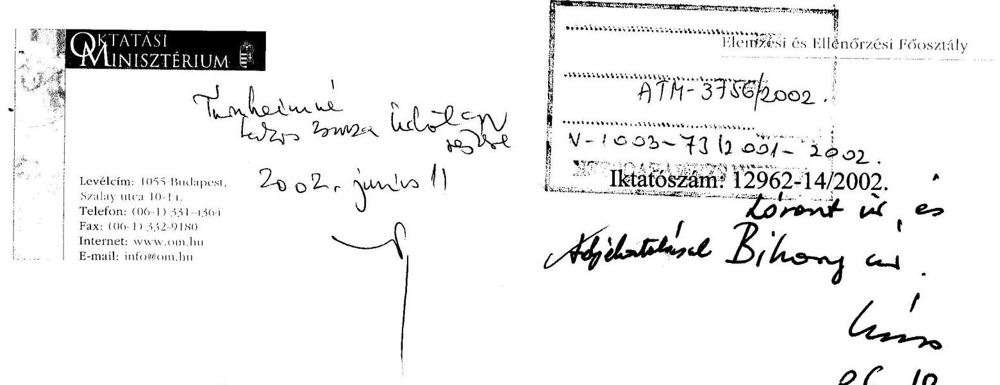
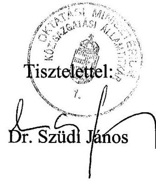

# JELENTÉS 

az általános iskolai oktatás minőségének javítását szolgáló intézkedések ellenőrzésének tapasztalatairól
2002. június

---

# Az ellenőrzést felügyeli: 

Dr. Lóránt Zoltán
főigazgató
Az ellenőrzés végrehajtásáért felelős:
Az ÁSZ 3. Önkormányzati és Területi Ellenőrzési Igazgatósága
Nagy József
főcsoportfőnök
Az ellenőrzést vezette:
Turnheimné Lakos Zsuzsa
osztályvezető főtanácsos
A helyszíni vizsgálati jelentések feldolgozásában és az
összefoglaló elkészítésében közreműködött:

## Bocsi Sándor

számvevő tanácsos - tanácsadó
dr. Lacó Bálintné
számvevő tanácsos
Szikszainé Király Mária
számvevő tanácsos

Az ellenőrzésben résztvevők névsorát az 1. sz. melléklet tartalmazza.

Az ÁSZ által a témában eddig készített jelentések:
Jelentés az alapfokú oktatásra fordított pénzeszközök felhasználásának vizsgálatáról (9818/1998.)
Jelentés az alapfokú oktatásra fordított pénzeszközök felhasználásának ellenőrzéséről (V-5/1992.)

---

# TARTALOMJEGYZÉK 

I. ÖSSZEGZŐ MEGÁLLAPÍTÁSOK, KÖVETKEZTETÉSEK, JAVASLATOK ..... 5
II. RÉSZLETES MEGÁLLAPÍTÁSOK ..... 11

1. Minőség a közoktatásban ..... 11
2. A szakmai munka ellátását segítő célok és feladatok ..... 13
2.1. Szakmai követelményrendszer, tartalmi előírások változása ..... 14
2.2. A szakmai együttműködés szerepe ..... 17
2.3. A pedagógiai szakmai szolgáltatások jelentősége, működési feltételei ..... 21
3. Az oktató-nevelő munka feltételeinek változása ..... 27
3.1. A feladatellátás szervezeti keretei ..... 28
3.2. A közoktatási információs rendszer ..... 30
3.3. A pénzügyi erőforrások alakulása ..... 33
3.4. A humán erőforrások alakulása ..... 37
3.5. A tárgyi feltételek alakulása ..... 42
4. A pályázati pénzeszközök hatása a szakmai munka feltételeire ..... 44
4.1. A szakmai szolgáltatások iránti igények, a támogatás mértéke és a pályázati célok összhangja ..... 46
4.2. Az elnyert támogatás hatása az oktatási feltételekre ..... 48
5. Mérési, értékelési, ellenőrzési feladatok ..... 51
5.1. Az iskolai mérések és értékelések ..... 53
5.2. A szakmai munka ellenőrzése ..... 55

---

# A jelentésben alkalmazott rövidítések: 

| ÁSZ | Állami Számvevőszék |
| :-- | :-- |
| DÖK | Diákönkormányzatok |
| Kt. | A közoktatásról szóló 1993. évi LXXIX. törvény |
| NAT | Nemzeti Alaptanterv |
| OKÉV | Országos Közoktatási Értékelési és Vizsgaközpont |
| OM | Oktatási Minisztérium |
| ÖNHIKI | Önhibáján kívül hátrányos helyzetben lévő önkormányzatok   támogatása |
| SZAK | Szakértők és Szakmai Szolgáltatások igénybevételére kiírt   pályázatok 1999-ben, illetve 2000-ben |

---

# JELENTÉS 

## az általános iskolai oktatás minőségének javítását szolgáló intézkedések ellenőrzésének tapasztalatairól

## Bevezetés

A helyi önkormányzatokról szóló 1990. évi LXV. törvény 92.§.(1) bekezdése alapján az Állami Számvevőszék ellenőrzi a helyi önkormányzatok gazdálkodását. Ennek keretében vizsgálja az önkormányzatok által kötelezően ellátandó közösségi szolgáltatásokat is. Ezek közül az Állami Számvevőszék 2001. évi ellenőrzési terve alapján immár harmadszor vizsgálta az általános iskolai oktatást. A feladat ellátásához a központi költségvetés biztosít az éves költségvetési törvények keretében támogatást, hozzájárulást. Az oktatás tartalmi követelményeiről a közoktatási törvény és a végrehajtását szolgáló jogszabályok rendelkeznek. A közoktatásra 300 500 milliárd Ft-ot fordítottak évente az 1998-2000. években központi költségvetési és önkormányzati forrásból, melynek mintegy 3%-a célzottan segíti az oktatás minőségét.

Az ország jövője, fejlődése, versenyképessége szempontjából meghatározó állampolgárai megalapozott és hasznosítható tudásszintjének folyamatos növelése. E követelményeknek megfelelni kívánó oktatási rendszernek lépést kell tartania a tudományok fejlődésével és meg kell felelnie a technikai és szakmai kihívásoknak. Ebben az alapképzésnek, a minőségi általános iskolai oktatásnak kitüntetett szerepe van.

Az elmúlt évtizedben a magyar közoktatási rendszerben a legtöbb kritika a szolgáltatás minőségét érte. A minőség az oktatás eredményességének egyik fontos, összetett eleme. Magában foglalja a tudásszintet, a humán értékeket és a nevelési eredményeket egyaránt. Ezek elemzése, mérése és értékelése a szakma feladata. Ahhoz azonban, hogy az oktatásban a minőséggel kapcsolatos elvárások, követelmények teljesüljenek, javuljon az oktatás minősége, a célok pontos meghatározására, a megvalósításukat segítő feladatok kijelölésére, s az e feladatok végrehajtását biztosító feltételek számbavételére és megteremtésére van szükség. Vizsgálatunk nem a szakmai, pedagógiai értelemben vett minőségre, illetve annak összetevőire irányult, hanem azokra a feltételekre és intézkedésekre, amelyek az oktatás minőségére hatást gyakorolnak. Ennek megfelelően megvizsgáltuk a közoktatás irányítási rendszere, a tartalmi, a személyi, tárgyi, szervezési feltételei és a pénzügyi erőforrások változását, a rendelkezésre álló információs rendszer működését. Kiemelt figyelmet fordítottunk a pedagógiai szakmai szolgáltatások, szakértők igénybevételének lehetőségeire, körülményeire.

---

A vizsgálat célja annak megállapítása volt, hogy

- megfelelő intézkedéseket tettek-e az általános iskolai oktatás minőségének biztosítása, javítása érdekében; az oktatásirányítás minden szintjén megfogalmazódtak-e az elérendő célok, s az azok érdekében végrehajtandó feladatok; kialakult-e a szakmai irányítás és koordináció, az értékelés és ellenőrzés rendszere;
- az általános iskolai oktatás feltételrendszerében, a jogszabályok, az intézmények működési feltételei és a költségvetési források terén bekövetkezett változások elősegítették-e a szakmai munka feltételeinek, az oktatás minőségének javítását;
- az 1999- és 2000-ben a pedagógiai szakmai szolgáltatásokra és szakértők igénybevételére rendelkezésre álló, pályázat útján igényelhető mintegy 2,8 milliárd Ft támogatás hozzájárult-e az oktatás minőségét szolgáló szakmai feltételek megteremtéséhez, megerősítéséhez.

A helyszíni vizsgálatot 36 települési önkormányzatnál, s az ezek által fenntartott 53 általános iskolában végeztük el, de a rendelkezésünkre bocsátott adatok alapján az e települések által fenntartott valamennyi (110) általános iskolára vonatkozóan elemezhető információkat szereztünk. A vizsgálandó önkormányzatokat annak alapján választottuk ki, hogy részt vettek-e az Oktatási Minisztérium által a szakértők, illetve szakmai szolgáltatások igénybevételére kiírt 1999-2000. évi pályázatok (SZAK 99; SZAK 2000.) valamelyikén. A főbb tendenciák követése, leszűrése érdekében vizsgálati megállapításainkat az önkormányzatoknál, intézményeknél kérdőívekkel, tanúsítványokkal támasztottuk alá. Az oktatási tárca által végeztetett ún. Monitor vizsgálat eredményességéről, hasznosulásáról az 1999. évi felmérésben részt vett 150 általános iskolánál tájékozódtunk.

A megyei feladatellátás összehangoltságát, a közoktatási közalapítványok és a szakmai szolgáltatások szakmai munkát segítő tevékenységét 13 megyei és a fővárosi önkormányzatnál, illetve az ezek által alapított közoktatási közalapítványoknál és pedagógiai intézeteknél vizsgáltuk.

Fentieken kívül a helyszíni vizsgálat az Oktatási Minisztériumnak a közoktatás minőségéhez kapcsolódó koordináló és irányító tevékenységére is kiterjedt, melyhez kapcsolódóan tájékozódtunk a minisztérium háttérintézményeként működő Országos Közoktatási Értékelési és Vizsgaközpontnál, valamint a Pedagógus-továbbképzési Módszertani és Információs Központ KHT-nál.

A vizsgálat a pályázatokkal érintett 1999-2000. éveken kívül az ezt megelőző 1998. évre, valamint a 2001. évnek a helyszíni vizsgálatok megkezdéséig eltelt időszakára terjedt ki. A vizsgált településeket, intézményeket és közalapítványokat a 2. a) - d) sz. melléklet tartalmazza.

---

# I. ÖSSZEGZŐ MEGÁLLAPÍTÁSOK, KÖVETKEZTETÉSEK, JAVASLATOK 

Az elmúlt években a tanulói teljesítményekre irányuló különböző reprezentatív mérések, nemzetközi összehasonlítások miatt kiemelt figyelmet kapott az oktatás minősége, melynek fontosságára való tekintettel az 1998. évi kormányprogram közoktatással foglalkozó fejezete is megfogalmazta többek között, hogy az oktatás minőségének javítása, az oktatási rendszer minőségbiztosítása kiemelt feladat. Ehhez azonban nem készült olyan közép- és hosszú távú terv, stratégia, ami meghatározná a feladat végrehajtásának eszközrendszerét, kockázati tényezőit és forrásszükségletét. Ennek szerepét - 1999. évi módosítását követően - a közoktatási törvény rendelkezései, illetve az éves költségvetési törvények kapcsolódó előirányzatai vették át.
A közoktatási törvény módosításával a Nemzeti Alaptanterv és az iskolákban 1998-ban felmenő rendszerben már beindított helyi tantervek közé - anélkül, hogy azok addigi eredményességét értékelték volna - az átjárhatóság biztosítása és az iskolák közötti minőségi különbségek csökkentése érdekében belépett a kerettanterv. Ezt, valamint a fenntartók által helyenként megfogalmazott szakmai elvárásokat figyelembe véve dolgozták át az iskolák a pedagógiai programjukat. A kerettanterv előírásai és az iskola által korábban kitűzött szakmai célok összehangolása a pedagógiai program átdolgozása kapcsán problémát jelentett, mivel az iskolák és fenntartóik ragaszkodnak a már megkezdett programjaik folytatásához. A fenntartó pénzügyi pozíciója ugyanakkor - attól függően, hogy a kötelezően finanszírozandó óraszámon felül milyen óraszámra, kötelező tanórán kívüli foglalkozásra biztosít keretet - továbbra is befolyásolja az oktatás feltételeit.

A közoktatási törvény módosítása minden intézmény számára kötelezően előírja a helyi minőségbiztosítási rendszer kiépítését. Ennek elősegítésére beindult a Comenius 2000 közoktatási minőségbiztosítási program. A program koordinálásával és az oktatás minőségének változását regisztrálni képes mérési-értékelési rendszer kiépítésével, szervezésével, összehangolásával az oktatási tárca a közoktatás-irányítási tevékenységének erősítésére létrehozott Országos Közoktatási Értékelési és Vizsgaközpontot bízta meg. A mérés-értékelés rendszerének működéséről még nem beszélhetünk, de kiépítése megkezdődött.

Az iskoláknak nevelési programjukban már 2001. szeptemberétől - az országos rendszer kialakulását megelőzően - meg kellett határozni az oktató-nevelő munka ellenőrzési, mérési, értékelési és minőségbiztosítási rendszerét, amihez a Comenius 2000 programban résztvevők kivételével - csak általános útmutatást kaptak. Annak ellenére, hogy nem alakult ki országos mérési-értékelési rendszer, az iskolafenntartók és az iskolák felismerték a mérések, értékelések szükségességét. A mérések többsége eseti, helyzetértékelő jellegű volt, hiszen anyagi erőforrások híján rendszeres mérésekre nem volt mód. Ezért mind az iskolafenntartók, mind az iskolák pozitívan értékelték a szakmai szolgáltatások és szakértők igénybevételére vonatkozó pályázatokat, mivel - többek között tanulói teljesítményméréseket tudtak igénybe venni az elnyert támogatásból.

---

Nem történt előrelépés az iskolákban folyó szakmai munka ellenőrzési rendszerének kiépítésében. Nem szabályozottak az ellenőrzések kötelező tartalmi előírásai, gyakorisága és az ellenőrzést végző szakértőkkel szembeni elvárások. Kötelező jogszabályi előírás hiányában csak lehetőség a fenntartó számára a szakmai ellenőrzés, amit díjazás ellenében végeztethet szakértővel.

A közoktatási törvény módosulásának harmadik eleme az önkormányzatok közötti együttműködést hivatott szabályozottabbá tenni, ezért írta elő a korábban elkészített, helyi célokat és eszközöket összegző, megyei fejlesztési tervek felülvizsgálatát. Ennek megalapozásához - a fenntartott intézmények számától függően - intézményhálózat működtetési tervet kellett készíteniük vagy adatokat szolgáltatniuk a települési önkormányzatoknak. E kötelezettségüknek nem tettek maradéktalanul eleget az önkormányzatok, így a megyei fejlesztési tervek hiányosak, esetenként ellentmondásosak és nem szabályozzák az önkormányzatok együttműködését, az információáramlás rendjét. Az önkormányzatok mellérendeltségéből adódóan a megyei önkormányzat továbbra sem tud a koordináció hatékony fórumává válni, így az általa ajánlásként közzétett fejlesztési terv „puha" szabályozó eszköz. Az önkormányzatok közötti együttműködés segítheti a közoktatás igazgatási, irányítási, szakmai feladatainak vagy azok egy részének ésszerű megszervezését, magasabb szintű ellátását. A kis önkormányzatok mégis sok esetben idegenkednek a feladatok társulásban történő ellátásától, annak ellenére, hogy nem rendelkeznek megfelelő szakmai kompetenciával.

A koordináció hiánya érezhető az OKÉV és a megyei pedagógiai szolgáltatók között is, ugyanis az OKÉV feladatait meghatározó kormányrendelet a szervezet számára pedagógiai szakmai szolgáltatások közvetett ellátására is felhatalmazást adott, a feladatok egyértelmű megosztása azonban nem történt meg. A pedagógiai szakmai szolgáltatók jelentős segítséget adhatnak az iskolafenntartók szakmai kompetenciájának erősítéséhez, irányító és tartalmi munkájuk végzéséhez. Ezt igényelnék is mind az iskolafenntartók, mind az iskolák, de ennek anyagi korlátjai vannak, mivel a pedagógiai szakmai szolgáltatások egyre inkább piaci alapon vehetők igénybe. A szakmai szolgáltatásokról a megyei önkormányzatok feladata gondoskodni, amelyek általában költségvetési intézményként működő pedagógiai intézeten keresztül biztosítják azt.

A közoktatási törvény a megyei önkormányzatra bízza annak meghatározását, hogy mely szakmai szolgáltatások ingyenesek, illetve térítéskötelesek, ez pedig a megyei önkormányzat pénzügyi kondícióinak is függvénye. Az iskolafenntartó önkormányzatok anyagi lehetőségei behatárolják a szolgáltatások igénybevételét: sok esetben csak az ingyenes szolgáltatások szűkülő körét van mód igénybe venni. A szakmai szolgáltatási feladatok folyamatos finanszírozását nem nevesíti sem a közoktatási, sem pedig költségvetési törvény. Sem
 az intézetek fenntartói, sem a szolgáltatást igénybe vevők számára nem biztosítanak a végzett (igénybe vett) tevékenységgel arányos normatív állami hozzájárulást. Az esetleges, pályázati rendszerben megvalósuló finanszírozás nem teremt kellő biztonságot a folyamatos feladatok megoldásához.

A tartalmi előírások korábbiakban már kifejtett változásán kívül a humán erőforrások hatása a legerősebb az oktató-nevelő munka színvonalára. Az elmúlt években némileg javultak az oktatás személyi feltételei, bár a kistelepülé-

---

seken feszültségek jelentkeznek. A vizsgált körben a létszámfeltételek biztosítottak voltak, a városokban számottevően, de a községekben is némileg javult a szakos ellátottság. Ez nem mondható el a hátrányos helyzetű kistelepülések esetében, ahol csak a pedagógusok más településekkel közös foglalkoztatása, vagy a társulás segíthetne a problémák megoldásában. Átmeneti megoldást a kistérségi, illetve megyei helyettesítési rendszer megvalósítása jelenthetne, ám ennek kiépítése a nem egyértelmű munkajogi és finanszírozási kérdések miatt többnyire nem valósult meg. A vizsgált időszakban nem változott a túlórák mértéke, ami részben a hiányszakmáknak, részben pedig a pedagógus bérhelyzetnek volt a következménye. A rendelkezésre álló alacsony összeg miatt nem érte el célját a kiemelt munkavégzés ösztönzésére szánt bérezés.

Kedvezően hatott a szakmai munka színvonalára a pedagógusok kötelező továbbképzése. A tanfolyami díjak növekedése és a kapcsolódó állami támogatás mérséklődése azonban az újabb szaktanári végzettség megszerzésével szemben a költségkímélő továbbképzési megoldások igénybevételét eredményezi.

Nem következett be számottevő javulás az oktatás tárgyi feltételeiben. Országosan az iskolaépületek fele nem felel meg az előírásoknak, a taneszközökkel, felszerelésekkel való ellátottság pedig - egybevetve a miniszteri rendeletben előírt követelményekkel - messze elmarad a kívánatostól. Az előírt eszközfejlesztési ütemtervet nem minden önkormányzat készítette el, vagy pénzügyi kihatását nem vizsgálta, illetve a reális lehetőségeknél nagyobb mértékben kívántak a közalapítványi eszközbeszerzési támogatásra hagyatkozni. A helyszíni tapasztalatok és a rendelkezésre álló források alapján nem várható, hogy a 2003. augusztusi határidőig az iskolák, illetve fenntartóik eleget tudnak tenni a miniszteri rendelet előírásainak.
Az oktatásra szánt központi költségvetési források emelkedése nem eredményezte az oktatási kiadások azonos mértékű növekedését. Mivel a nem oktatási feladathoz kapcsolódó támogatások növekedési üteme kisebb volt és részben a személyi jövedelemadó-átcsoportosítással biztosították fedezetüket, így az oktatáshoz kapcsolódó támogatások nagyobb mértékű növekedése az egyéb források más feladatokra történő átcsoportosítását eredményezte.
A megyei közoktatási közalapítványok nem bizonyultak kellően hatékony eszköznek a helyi feladatok finanszírozásában. Egyrészt nem tudtak államháztartáson kívüli forrásokat mozgósítani, másrészt a költségvetési törvényben meghatározott felhasználási célok miatt háttérbe szorult a támogatás megyei fejlesztési tervnek megfelelő felhasználása.
A pénzügyi erőforrások szűkös volta az oktatás személyi és tárgyi feltételeinek romlásán keresztül végső soron a minőség romlásához vezethet. A pénzügyi ráfordítások beható elemzése azonban akadályokba ütközik: az átalakulóban lévő közoktatási statisztikai rendszer kiforratlansága és a pénzügyi információs rendszer - feladatelhatárolással, gazdálkodási formával összefüggő - adattartalma miatt. A két rendszerből nyert adatok együttes elemzésre nem alkalmasak, de a pénzügyi információs rendszer önmagában sem teszi lehetővé az általános iskolai oktatás ráfordításainak elkülönített számbavételét.

A pedagógiai szakmai szolgáltatások, szakértők igénybevételét 1999-től pályázati pénzeszközök segítik, e források azonban folyamatosan csökkennek. A pályázatok révén megvalósuló szolgáltatások annak ellenére javítottak a

---

szakmai munka feltételein (javult a mérési kultúra, erősödött a fenntartók-iskolák, illetve a szolgáltatást igénybevevők és nyújtók kapcsolata), hogy az igények töredékét fedező források álltak rendelkezésre. A támogatott pályázatokra is csak az igényelt összegnek átlagosan felét-tizedét tudták biztosítani. A pályázati pénzeszközök segítségével hosszú távú feladatok megoldásába nem lehetett kezdeni, mivel a módosuló célok, csökkenő források ezekhez nem teremtették meg a lehetőséget. Az elhúzódó pályázati döntések pedig még a megvalósítást is késleltették.

Mindezek alapján a vizsgálat fő kérdésére, hogy eredményesek voltak-e az általános iskolai oktatás minőségét befolyásoló intézkedések, a választ összefoglalóan az alábbiak szerint fogalmazhatjuk meg:

- Bár az elmúlt években a hosszú távú elképzelések csak jogszabályokban fogalmazódtak meg és hiányosságok mutatkoztak az irányítás és a koordináció területén, mégis kedvező folyamatok indultak be a minőség javítása érdekében. E folyamatok a tervek kibontásával, a szükséges források felmérésével, minden szinten az együttműködés szervezettebbé tételével, s nem utolsó sorban a mérési-értékelési és a minőségbiztosítási rendszer kiépítésével néhány éven belül jelentős hatással lehetnek az oktatás minőségére.
- Az oktató-nevelő munka pénzügyi, személyi és tárgyi feltételei elmaradnak a kívánalmaktól. A pozitív irányú elmozdulást segítheti a hatékonyabb esetenként közös - feladatellátás, az önkormányzatok pénzügyi pozíciójának javulása.
- Az OM pályázatok keretében a pedagógiai szakmai szolgáltatásra, illetve szakértők igénybevételére juttatott pénzeszközök felhasználása csak átmenetileg és lokálisan javította a szakmai munka feltételeit.

A helyszíni vizsgálatok tapasztalatai alapján az ÁSZ számos megállapítást tett és javaslatot fogalmazott meg. A javaslatokban felhívta az érintett önkormányzatok és intézmények figyelmét

- az intézményi alapító okiratok kiegészítésére,
- az érvényben lévő számviteli, pénzügyi előírások maradéktalan betartására,
- az intézményüzemeltetési tervek ismételt áttekintésére, pontosítására,
- az intézmény-működtetési, taneszköz-fejlesztési tervekben foglaltak megvalósítása érdekében a szükséges előirányzatok költségvetésben történő biztosítására,
- az iskolák költségvetési előirányzatainak kialakítása során a működésfenntartás jogos és szükséges forrásigényének figyelembevételére,
- a feladatok szakszerűbb és eredményesebb ellátása érdekében intézményfenntartó és igazgatási társulások létrehozásának kezdeményezésére,
- társulás esetén annak szükségességére, hogy ne csak a gesztorra, hanem valamennyi, a társulásban résztvevő önkormányzatra vonatkozzon az intézményüzemeltetési terv,

---

- a mérés, szakmai ellenőrzés fokozására,
- a mérések-értékelések eredményének bekérésére és testületi ülésen történő megtárgyalást követően a szükséges intézkedések megtételére.

# A megyei közoktatási közalapítványok számára javasoltuk, hogy 

- az általuk kiírt pályázatok jobban igazodjanak a megyei fejlesztési tervek célkitűzéseihez;
- fokozottabban ellenőrizzék az általuk biztosított támogatások felhasználását.

Annak érdekében, hogy az eddigi és a további intézkedések eredményesen hozzájáruljanak az általános iskolai oktatás minőségének javulásához, vizsgálati tapasztalataink és főbb megállapításaink alapján javasoljuk

## az oktatási miniszternek:

1. A célok és a megvalósításukat szolgáló feladatok egyértelművé tétele érdekében

- dolgozza ki a közoktatási törvényben előírt hosszú- és középtávú fejlesztési terveket, vegye számba az ezek megvalósításához szükséges forrásokat;
- definiálja az oktatás minősége szempontjából kockázati tényezőnek minősülő hátrányos helyzetet, csökkentése érdekében készítsen feladattervet a szükséges források mellérendelésével.

2. Kezdeményezze, hogy a központi költségvetés az eddigieknél hangsúlyosabban támogassa a fenntartók szakmai felkészültségének növelése, a feladat hatékonyabb ellátása érdekében létrehozott intézményfenntartó, illetve -irányító társulások működését.
3. A pedagógiai szakmai szolgáltatások igénybevételi lehetőségeinek javítása és feltételeinek egységesítése érdekében

- határozza meg a megyei önkormányzatok számára az ingyenesen ellátandó szakmai szolgáltatások minimális szintjét;
- kezdeményezze, hogy az igénybevételhez állami hozzájárulást, vagy kötött felhasználású támogatást biztosítson a központ költségvetés;
- írja elő a kötelező kapcsolatfelvételt a megyei pedagógiai szakmai szolgáltatók és az OKÉV között.

4. Tegyen lépéseket a központilag elrendelt statisztikai és pénzügyi beszámolórendszerek összhangjának megteremtése, a pénzügyi adatok iskolatípusonkénti elemzését lehetővé tevő adatgyűjtés, információszolgáltatás megvalósítása; a statisztikai adatgyűjtés rendszerének a pedagógiai szakmai szolgálatokra való kiterjesztése érdekében.

---

5. Adjon útmutatást az önkormányzatoknak a megyei helyettesítési rendszer megvalósítása érdekében a problémát okozó finanszírozási és munkajogi kérdésekben.
6. Kezdeményezze, hogy a minőségi munkavégzés differenciált elismerését központi támogatás segítse.
7. Határozza meg a kötelező taneszköz jegyzékben felsorolt eszközök 2003-ig történő biztosításához szükséges többlettámogatási igényt, kezdeményezze az ehhez szükséges pénzügyi forrás megteremtését, ennek hiányában módosítsa a megvalósításra előírt jogszabályi határidőt.
8. A mérés-értékelés, szakmai ellenőrzés rendszerszerű kiépítése érdekében határozza meg azok kötelező gyakoriságát, szabályozza tartalmi kritériumait, dolgozza ki a feladatot ellátókkal szembeni szakmai elvárásokat.

---

# II. RÉSZLETES MEGÁLLAPÍTÁSOK 

## 1. Minőség a Közoktatásban

Az elmúlt évtizedben kiemelt figyelmet kapott az általános iskolai oktatás minősége, eredményessége. Az eredményesség megítélése különféle kritériumok alapján lehetséges; amíg az egyik iskola esetében a továbbtanulók aránya fejezheti ki az oktatás eredményességét, egy másik esetében a lemorzsolódók számának, arányának csökkenése lehet ilyen mutató. A minőséget gyakran az eredményesség szinonimájaként használják. A legtöbb vita az iskolai oktatás minőségének megítélése körül bontakozik ki. Minőségről beszélve sokan az iskola, mint szervezet működésének, illetve a működés eredményeinek jellemzőire gondolnak, de van olyan megközelítés is, amely a minőség megítélésében legfontosabbnak a „fogyasztói" elégedettséget tartja. A közoktatás minőségét meghatározó tényezők közé sorolják a humán értékeket, a nevelés színvonalát, a tudás szintjét, ám a mérés nehézségei miatt a minőséget általában az utóbbival azonosítják-mérik. A tesztekkel mért tanulmányi teljesítmények csak egyik mutatója az oktatás minőségének, bár a nem szakmai nagyközönség számára talán a legtöbbet mondanak arról.

Amint a fentiekből is kiderül, az oktatás minőségének, színvonalának értékeléséhez különböző szempontokat és megközelítéseket alkalmaznak, amelyek nyilván attól is függnek, hogy adott helyzetben a minőség mely vonatkozása kerül előtérbe. Az ÁSZ ellenőrzése nem az előzőekben érintett, a közoktatás szakmai-pedagógiai értelemben vett minőségének értékelésére, megítélésére irányult, hanem azokat a feltételeket és intézkedéseket vizsgálta, amelyeket a közoktatás szereplői, irányítói a közoktatás minősége, jó színvonala érdekében megtettek, illetve a vonatkozó jogszabályi előírások szerint, a szakmai irányítói szerepkörből adódóan meg kellett volna tenniük.

Az oktatás minőségére elsősorban a különböző nemzetközi és hazai reprezentatív felmérések eredményei hívták fel a figyelmet. E mellett a közoktatási statisztika néhány adatának alakulása is a minőségre vonatkozó információt jelent. Ezek szerint a kilencvenes évek közepéig enyhén csökkent a bukások, illetve a lemorzsolódás mértéke, ezt követően e tendencia megállt, illetve lelassult.

A másfél évtizede ismétlődő Monitor felmérések a tanulók kulturális eszköztudását, olvasás-szövegértését, matematikai és számítástechnikai-informatikai, valamint néhány éve természettudományos ismereteit mérik különböző korcsoportokban, időnként - így 1999-ben is - nemzetközi felméréshez kapcsolódóan. Ezek különböző kedvező és kedvezőtlen folyamatok eredményét jelzik.

Az 1999. évi felmérés eredménye a számítástechnikai ismeretek körében a négy évvel korábbinál egyértelműen kedvezőbb volt, a matematikánál és a természettudományoknál némi romlás mutatkozott. Az olvasás-szövegértés területén az évek óta tartó folyamatos romlás már 1995-ben megállt, ezen belül a társadalmi

---

életben egyre nagyobb jelentőségű dokumentum-típusú szövegek területén azonban rosszabbul teljesítettek a tanulók a korábbinál.

Több nemzetközi összehasonlító vizsgálat eredményei is ismertté váltak az elmúlt időszakban. Ezek jórészt a mindennapi élethelyzetekben való boldoguláshoz szükséges ismeretek meglétét vizsgálják.

Az IEA TIMSS (a Tanulmányi Teljesítmények Értékelésének Nemzetközi Szervezete által készített harmadik nemzetközi matematikai és természettudományos vizsgálat) vizsgálat arra a problémára mutatott rá, hogy a magyar általános iskolából kilépők teljesítménye mélyen a nemzetközi átlag alatt van, miközben az alsóbb évfolyamoké még kedvezőbb.
Az OECD PISA (a Gazdasági Együttműködés és Fejlesztés Szervezete kezdeményezésére létrejött tanulói teljesítménymérési program) 2000. vizsgálat 31 ország 15 éves diákjainak olvasási-szövegértési képességeinek, matematikai és természettudományos eszköztudásának feltérképezése volt. Eszerint a magyar eredmények összességükben a nemzetközi átlagnál gyengébbek. A diákok 48%-ának problémát jelent egy-egy dokumentumszöveg feldolgozása, magyarázó szövegek értelmezése. A matematika és a természettudomány területén a magyar diákok teljesítménye alatta marad, illetve éppen eléri az OECD országok átlagát. Más felmérésekkel összevetve ezen eredményeket a kutatók azt a következtetést vonták le, hogy a közoktatás első nyolc évében színvonalasan elsajátított
 természettudományos ismeretek önmagukban még nem garantálják a diákok hasonló nívójú problémamegoldó képességét, illetve gyakorlati jártasságát.

E felméréseken kívül - melyek reprezentatívak és elsősorban az oktatásirányítás orientálására szolgálnak - a nyolcvanas évek közepétől a minőségre vonatkozó megbízható információk nincsenek. Gyakorlatilag megszűnt az oktatás külső ellenőrzése, értékelése, illetve annak intézményrendszere. Ezzel párhuzamosan sok intézményben a belső szakmai ellenőrzés is leépült. Mindezek helyébe még nem lépett a szakmai munka mérésének, értékelésének, ellenőrzésének új rendszere, amely az oktatás szereplőinek megfelelő információt biztosítana az oktatás minőségéről és megbízható alapot adna a szükséges intézkedések meghozatalához.

A kilencvenes évek közepétől elkezdődött a hazai decentralizált struktúrához illeszkedő mérési-értékelési rendszer kiépítése. A korábbi, elsősorban személyes ellenőrzésen alapuló külső ellenőrzési rendszer leépülését követően csak hosszabb idő után indult el a mai irányítási struktúrához illeszkedő korszerű, új rendszer kiépítése, és e folyamat messze nem zárult le.

# A minőség kérdéskörének előtérbe kerülése felveti mind a tanulók, mind pedig az iskola teljesítményének mérését, a kettő kölcsönhatásának vizsgálatát. 

A fejlett országokra jellemző, hogy - általában fejlesztő céllal, de emellett több helyen az ellenőrzés eszközeként is - a tanulók teljesítményét tesztekkel mérik. Vitatott kérdés, hogy ezek mennyire lehetnek az ellenőrzés, illetve az állapotmeghatározás eszközei, s hogy felhasználhatók-e az iskola minősítésére is, de szükségességüket sehol sem vitatják.

Az iskola teljesítményét az irányítás minősége nagyban befolyásolja, ezért ahol felügyeleti jogkörrel rendelkező központi oktatási hivatal létezik (pl. Egyesült

---

Királyság, Új-Zéland), az ellenőrzése során vizsgálja mind az iskolafenntartó önkormányzat, mind az iskolaszék irányító tevékenységét, annak főbb tényezőit.

Az európai oktatásügyről az Európai Unió oktatási információs hálózatának irodája által készített összefoglaló tanúsága szerint elfogadott nézet, hogy az oktatásban való társadalmi részvétel fontos szerepet játszik az oktatás minőségének fejlesztésében, így országos és helyi szinten egyaránt részt vesznek a tanácsadó és döntéshozó testületekben a szülők és diákok képviselői is.

# 2. A SZAKMAI MUNKA ELLÁTÁSÁT SEGÍTŐ CÉLOK ÉS FELADATOK 

A közoktatás rendszere, az oktató-nevelő munka tartalmi szabályozása a 80-as évek közepétől állandóan változik. A változásokat az önkormányzatiság kialakulása, az oktatási, majd a közoktatási törvény megalkotása és annak rendszeres módosítása mellett a helyi kezdeményezések is elősegítették.

Az Oktatási Minisztérium ágazati vezetése a korábbi kormányciklusban kidolgozott közoktatási fejlesztési stratégiát nem tartotta megfelelőnek, s ezért 1998-ban új stratégiát szándékoztak kimunkálni. A stratégiai célkitűzések, feladatok megfogalmazására, ágazati koncepció elkészítésére a vizsgált időszakban azonban nem került sor. Az OM véleménye szerint a stratégia szerepét az 1998-ban elfogadott Kormányprogram tölti be. Ebben megfogalmazták, hogy az oktatás minőségének javítása, a hasznosítható tudás térnyerésének elősegítése érdekében az esélyegyenlőség javítása, az oktatási rendszer minőségbiztosítása, a pedagógusok megbecsülése, valamint az oktatás-nevelés egyensúlyának helyreállítása lesz kiemelt feladat.

A Kormányprogramban megjelölt feladatokat a közoktatásról szóló 1993. évi LXXIX. törvény 1999. évi módosítása során konkretizálták. Ebben jelenítettek meg minden olyan változást, amelyet a következő években meg kívántak valósítani (az oktatás tartalmának szabályozása, a közoktatás szervezésének, irányításának, finanszírozásának változtatása stb.).

A stratégia hiánya különösen olyan területen jelent nagy kockázatot, ahol a feladat ellátásában sok szereplő, érintett fél van. A közoktatás pedig ilyen terület. Így az oktatás minőségének átfogó célként megjelölt javításához sem rendelték hozzá azokat a konkrét feladatokat, eszközöket, amelyek a megvalósítást szolgálhatták volna. Mindez azt is jelentette, hogy a minőséget szolgáló forrásokat sem tudták egyértelműen a feladatokhoz hozzárendelni, és a részfeladatok rangsorolása sem történt meg. (Ez is korlátozta a pályázati pénzeszközök eredményes felhasználását. Lásd bővebben a 4. pontban.) Ezek megvalósítására a törvényben rögzített határidők, ennek hiányában a közoktatás szereplőinek döntése függvényében kerül sor. Az ágazat hosszú és középtávú fejlesztési terveinek a Kt. által is előírt kidolgozására nem került sor, ezért az intézményfenntartó önkormányzatok sem kaptak kellő segítséget az ágazat irányítóitól saját hosszú távú elképzeléseik kialakításához. Stratégia hiánya miatt nem számolhattak az átfogó célok megvalósítására szolgáló eszközök kiválasztása során a kockázati tényezőkkel sem. Nem határozták meg

---

pl., hogy a minőségi oktatást milyen körülmények veszélyeztetik, mi tekinthető hátrányos helyzetnek, s ezt milyen módon, eszközökkel lehet kezelni.

A Minisztérium vezetése a szolgáltatást nyújtók és igénybe vevők hátrányos helyzetének megítéléséhez a más jogszabályokban megfogalmazottakat alkalmazta. Például a hátrányos helyzetű gyermekek kategóriájára a 2000. évi költségvetési törvény 3. sz. mellékletében a normatív állami hozzájárulásoknál alkalmazott meghatározást vették figyelembe. A fenntartó oldaláról a hátrányos helyzetű településekre vonatkozó kormányrendeletet tartják irányadónak, míg a működtetés szempontjából az ÖNHIKI támogatásban részesülő önkormányzat helyzete tekinthető hátrányosnak. A hátrányos hatások csökkentésére elsősorban a finanszírozás meglévő általános lehetőségei szolgálnak (kiegészítő normatívák, önhibáján kívül hátrányos helyzetű önkormányzatok támogatása, rendszeres gyermekvédelmi támogatás, pályázat keretében elosztott oktatási célú támogatások).

# 2.1. Szakmai követelményrendszer, tartalmi előírások változása 

A Kormány által kezdeményezett, az esélyegyenlőséget és az oktatás minőségének javítását szolgáló egyik legfontosabb törvénymódosítás az oktatás tartalmi szabályozására terjedt ki. Az iskoláknak a Nemzeti Alaptanterv követelményeinek megfelelően 1998-ban elkészített helyi tanterveiket a Kt. 1999. évi módosító rendelkezései szerint a 2000. szeptemberében kiadott kerettantervek, valamint a Kt. előírásai figyelembevételével 2001. szeptember 1-ig felül kellett vizsgálniuk. A tantervi előírások módosulása következtében az 1998-tól az 1. és 7. évfolyamokon bevezetett helyi tantervek alapján végzett szakmai munka tapasztalatainak értékelésére nem került sor. (Igaz, a bevezetés óta eltelt idő is rövid volt az értékeléshez.)

A kerettanterv, mint szabályozó eszköz, beékelődött a NAT és a helyi tantervek közé. Bevezetésének szükségességét a tárca az iskolák közötti átjárhatóság hiányával, az esélyegyenlőség biztosításával, az alkalmazott különféle tantervi programokkal indokolta. A kerettantervekben meghatározták a nevelés-oktatás célját, tartalmát, a tantárgyak rendszerét, a nevelés-oktatás meghatározott kötelező és közös követelményeit, a tananyag elsajátításához, a követelmények teljesítéséhez szükséges óraszámot. Rögzítették a kerettantervtől való eltérés szabályait is. Ezek az előírások korlátozták a tantestületek szakmai feladatok meghatározásában való korábbi szabadságát, mozgásterük szűkült.

A jövőben a kötelező tantervi óraszám mintegy 15-20%-ában dönthetnek szabadon az iskolák, míg a kötelező tanórán kívüli foglalkozások órakerete a fenntartóval történt egyeztetés alapján szabadon növelhető. A kerettantervek gyakorlati tapasztalatairól - a bevezetés óta eltelt idő rövidsége miatt - még nem alakult ki átfogó kép, a tartalmi munka megítélése pedig nem feladata az ÁSZ-nak. Vizsgálatunk során csak abból a szempontból foglalkozunk a témakörrel, hogy az oktatásirányítás különböző szintjein milyen intézkedések történtek, illetve milyen véleményeket fogalmaztak meg a vizsgált szervezetek az előírások változtatása kapcsán.

---

Az oktatási-nevelési intézmények eleget tettek a törvényi előírásoknak. Valamennyi vizsgált intézmény rendelkezett a NAT alapján kidolgozott pedagógiai programmal, s megtörtént azok kerettantervi követelményeknek megfelelő átdolgozása is. E többlet feladatok ellátása esetenként jelentős energiát vont el a napi pedagógiai munkától, hosszú távon azonban kedvezően befolyásolhatja a szakmai munka színvonalát.

A nevelési programok, tantervek kidolgozása, az intézményi belső dokumentumok, szabályzatok, módosító rendelkezéseknek megfelelő átdolgozása jelentős többletfeladatot okozott a nevelőtestületek számára. A pedagógusok jelentős része szabadidejét is feláldozta a határidőre elvégzendő feladatok teljesítése érdekében. Mindez nem járt együtt a pedagógusok munkájának anyagi és erkölcsi elismerésével.

A szakmai követelményrendszer kiépítése lassú folyamat, csak felmenő rendszerben lehetséges, s eredményei csak évek múltával jelentkeznek. Így a pedagógusok és a közoktatás más szereplői részéről is határozott igényként fogalmazódott meg a jövőre vonatkozóan a stabil oktatáspolitika érvényesítése. A kerettantervek bevezetését a vizsgált önkormányzatok és intézményeik kedvezőnek ítélték, mivel a kötelezően tanítandó törzsanyag és a követelményszintek egységesebbé váltak.

Megfogalmazódtak azonban olyan kritikai észrevételek is, melyek az ágazat irányítója számára segítséget nyújthatnak a rendszer finomításához. Az intézmények véleménye szerint: a matematika és a természettudományi tárgyak esetében a kerettanterv csak a kötelező heti óraszám-csökkentést valósította meg, a tananyag ehhez igazodó csökkentését nem.

A kerettanterv szerinti oktatás ma még nem biztosítéka az átjárhatóságnak. 2001. szeptember 1-ével a kerettantervek szerinti oktatást az általános iskolák első és ötödik osztályában kellett bevezetni felmenő jelleggel (2004/2005 tanévig), így az intézményekben a kerettanterv szerinti oktatás mellett minimum 3 féle tanterv szerint történik az oktatás (NAT-ra alapozott helyi tanterv, kerettanterv, illetve az OM által kötelezően előírt vagy egyedi engedély alapján jóváhagyott tantervi előírás). További eltéréseket okoz az iskolákban folyó tartalmi munka tekintetében, hogy a vizsgált körben több általános iskolában egy vagy több tantárgyból is tagozatos osztályokban folyik az oktatás.

A központi tanterv az oktatási, iskolai pedagógiai munkát meghatározó elemek közül csak az egyik. Nem közömbös azonban a minőség meghatározásában az alkalmazott tankönyv, taneszköz, segédanyag csomag, a tanárok szakmai felkészültsége és az iskolai vezetés színvonala sem.

Az iskolák pedagógiai programjaik 1998. évi összeállítását megelőzően (2 kivételével) részletes igényfelmérést készítettek a szülők, gyermekek, illetve pedagógusok körében, ezt a programok módosítása kapcsán nagyrészt nem ismételték meg.

A pedagógiai programok felülvizsgálatához a vizsgált intézmények 49%-a számára fogalmazott meg valamilyen módon a fenntartó szakmai elvárásokat (községi intézmények esetében 33,3%).

---

Szakmai elvárásként meghatározott tantárgyak oktatását, tagozatos osztályok indítását jelölték meg, mely összhangban volt a szülők által, valamint az egyéb helyi szinten megfogalmazott igényekkel. Ebbe a körbe tartozott az idegen nyelv (elsősorban angol, német), a számítástechnika oktatása, ezen, valamint egyéb tantárgyakból (ének-zene, matematika, sport) már a korábbi években beindított tagozatos képzés fenntartása. Nemzetiségek által lakott területeken kiemelt feladatként jelentkezett a nemzetiségi-nyelvi oktatás és hagyományok ápolása, míg a szociális gondokkal vagy munkanélküliséggel küszködő településeken, településrészeken (10 db) az önkormányzat részéről elvárásként fogalmazódott meg a felzárkóztatás, a differenciált oktatás. A nevelési feladatok közül elvárásként fogalmazódott meg pl. a személyiség- és képességfejlesztés, drogprevenció.

A pedagógiai programok módosítása kapcsán problémát jelentett a tantestületek számára a kerettanterv előírásainak, valamint az iskola hagyományainak, elért eredményeinek, céljainak összehangolása.

#### Abstract

A pedagógiai programokban megfogalmazott célok, feladatok rendkívül változatosak, eltérőek, nagymértékben függnek a beiskolázott gyermekektől, a tantestületi és az egyéb adottságoktól. Az eltérések még adott településen belül is jelentősek. A 6-8 osztályos gimnáziumokban, az ún. „elit" iskolákban a jó tanulmányi eredménnyel rendelkező gyermekek sokrétű tehetséggondozása, a kiemelkedő eredmények megtartása, illetve fokozása fogalmazódik meg alapvető célként és ehhez igazodnak a feladatok. Kedvezőtlen adottságú településeken az eltérő társadalmi környezetből érkező (pl. tanyavilág, roma kisebbség) hátrányos helyzettel küzdő tanulók felzárkóztatása, a szocio-ökonómiai problémák kezelése a legfontosabb feladat. Szinte megoldhatatlan feladatnak tűnik egyes intézményekben az informatika oktatás megfelelő számítástechnikai háttér nélkül vagy a kerettantervben meghatározott tantervi követelmények, modulok oktatása megfelelő szakos pedagógus hiányában.

Az iskolák véleménye szerint a gyermekek „megtartásának" legfőbb „eszköze" a magas szintű szakmai színvonal garantálása, egyéb szolgáltatások, többletfoglalkozások biztosítása. Ezért az intézmények a korábbiakban „kivívott" pozícióikat meg kívánják tartani, illetve további fejlesztéseket szeretnének megvalósítani. A vizsgált körben 15 iskolában nyelvi, 6-6 iskolában számítástechnika, illetve sport és további mintegy 10 intézményben egyéb ismeretágban (földrajz, fizika, matematika, ének-zene, rajz-vizuális kultúra stb.) folyik emelt szintű
 oktatás. Élve a kerettantervek kiadásáról, bevezetéséről és alkalmazásáról szóló OM rendeletben foglalt lehetőségekkel, 5 vizsgált intézményben eltérő tantervi programokat (Zsolnay, Értékközvetítő és Képességfejlesztő) alkalmaznak, ami vélhetően növeli az iskolák közötti különbséget. A kapcsolódó többletfeladatokhoz a fenntartók a Kt. 52. § (7) bekezdésében foglaltak alapján a nagyobb időkeretet és a szükséges pénzügyi fedezetet biztosították. 11 vizsgált önkormányzat engedélyezte intézménye számára a Kt.-ben meghatározottnál magasabb nem kötelező tanórai foglalkozás heti időkeretét, annak mértéke 4,5-20% között változott. Más önkormányzatok ugyanakkor csak a Kt.-ben kötelezően előírt órakereteket biztosítják intézményeik részére.

A rögzített, kötelezően finanszírozandó óraszámon felül, a fenntartóval történt egyeztetés alapján jogszerűen növelhető a tervezhető összóraszám, a kötelező tanórán kívüli foglalkozások köre, melyre jelentős számban történtek is intézkedések. Így az eddigi tapasztalatok alapján

---

vélelmezhető, hogy az oktatás feltételeiben - a fenntartó pénzügyi pozíciói alapján - továbbra is jelentős különbségek lesznek az egyes iskolák között.

A tanulói teljesítmények differenciálódását segíti az iskolán kívüli foglalkozások alakulása is. Kisebb településeken, illetve szociális gondokkal küszködő településeken a tanulók e foglalkoztatása kevésbé jellemző, bár valamennyi vizsgált intézményben tapasztalható volt a tanulók iskolán kívüli foglalkoztatása. Az iskolák véleménye e foglalkozásokról megoszlik, amennyiben a gyermekek felkészültségét javítja, a kiemelt tehetségek gondozását, illetve a gyengébbek korrepetálását biztosítja, úgy eredményesnek ítélik. Annak túlzott mértéke, illetve egyes területeken jelentkező fokozott igénybevétele azonban megítélésük szerint a gyermekek jelentős leterhelését jelenti, és a szükséges szabadidő rovására megy.

A pedagógiai programokat a nevelőtestület fogadja el, s az az önkormányzat jóváhagyásával válik érvényessé. A programok 2001. évi felülvizsgálatát követő eljárásban a fenntartónak nem volt kötelessége szakértői vélemény beszerzése, ennek ellenére a vizsgált körben 25 önkormányzat (69,4%) azt jóváhagyás előtt szakértővel véleményeztette. A felülvizsgálatok keretében a szakértők, szakértői szervezetek folyamatos konzultációt biztosítottak az intézmények számára a kerettantervek adaptációjához. A szakértő megbízásához szükséges pénzügyi előirányzatokat a minisztérium által meghirdetett, SZAK 2000. pályázaton elnyert összeg biztosította. A felülvizsgálatok alapján a programok jelentős átdolgozására nem került sor, azt a szakértők jó színvonalúnak minősítették, esetenként (6 esetben) kisebb óraszám-korrekciókra tettek javaslatot. Meghatározottan e körbe tartozó feladatok ellátására - pedagógiai programok elkészítésének elősegítésére, útmutatók kidolgozására stb. - 2 vizsgált önkormányzat kötött szakértővel szerződést (Tatabánya megyei jogú város, Cserhátsurány község).

Az intézményekben folyó szakmai munkát jelentős mértékben segítik a szakmai munkaközösségek, amelyek fontos fórumai a szakmai munka minőség javításának, tagjaik munkáját óralátogatásokkal, hospitálással, a szakterületen jelentkező problémák kezelésével, a pályakezdőkkel kapcsolatos mentori munkával stb. segítik. Számuk - a kapott tájékoztatás szerint - az elmúlt időszakban, az önkormányzatok részéről alkalmazott pénzügyi szigorító intézkedések hatására, jelentősen csökkent. Az utóbbi 1-2 évben azonban több szakmai munkaközösség ismételten megkezdhette működését. Számuk az iskolák nagyságrendje, szervezete szerint és településenként nagyon eltérő. 3 vizsgált intézményben nem, míg másutt 1-13 közötti ilyen szerveződés segíti a szakmai munkát. A munkaközösségek aktívan részt vettek a pedagógiai programok kidolgozásában, felülvizsgálatában.

# 2.2. A szakmai együttműködés szerepe 

A közoktatás nagyszámú szereplőjének együttműködési szabályai hiányosak, a koordinációért felelős megyei önkormányzatnak nincs megfelelő hatásköre, így a szakmai együttműködés csak részben volt megfelelő.

A szakmai feladatok színvonalas ellátása feltételezi a közoktatás szereplőinek, a feladat ellátásában és irányításában résztvevők szoros együttműködését. A folyamatos egyeztetés, konzultációk szükségességét in-

---

dokolja a szabályozás stabilitásának hiánya, a jogszabályok gyakori - esetenként nem egyértelmű - változása. A Kt. 1993-ban kihirdetett rendelkezéseit az Országgyűlés szinte minden évben módosította.

A tárca vezetése - érzékelve a problémákat - a vizsgált időszakban nagyobb hangsúlyt kívánt helyezni a fenntartókkal, intézményekkel való kapcsolattartásra. Kapcsolatot építettek ki az önkormányzatok szövetségeivel, a megyei közoktatási közalapítványok kuratóriumi vezetőivel, a megyei, megyei jogú városi oktatási vezetők munkaközösségeivel. Továbbra sem hatékony azonban az együttműködés a helyi és az ágazati irányítás két szintje között. Nem alakult ki a kommunikáció, az információ-áramlás szabályozott rendje, keretei, annak intézményes fórumai. Kapcsolataikat az esetlegesség jellemzi. A vizsgált önkormányzatok által készített tanúsítványok adatai szerint közoktatási, szakmai irányítási kérdésekben 5 alkalommal fordultak közvetlenül az OM-hoz.

A megfelelő információ-áramlás hiányában a tervezett intézkedésekről a fenntartók, illetve a közoktatási intézmények nem rendelkeznek információkkal. A döntést követően, a megvalósítás szakaszában kapott információk esetén sérelmesnek tartják, hogy a központi irányítás nem kérte ki előzetesen véleményüket. Kedvező a fogadtatása ugyanakkor a tárca által megjelentetett rendszeres és eseti kiadványoknak (útmutatók, módszertani segédanyagok), melyek segítik az intézmények, fenntartók szakmai munkáját.

# A törvényi szabályozás a tárca közoktatás-irányítási tevékenységét kívánta erősíteni az Országos Közoktatási Értékelési és Vizsgaköz-

pont 1999. évi létrehozásával. A központi államigazgatási szerv tevékenysége igazodik a helyi önkormányzatokról szóló törvényben meghatározott oktatási miniszteri jogosítványokhoz, valamint összhangban van a közoktatási törvényben megfogalmazott közoktatás irányítási rendszerrel. Az intézmény feladatairól rendelkező kormányrendelet a szervezet szakmai irányítói, hatósági feladatain kívül többek között közvetve pedagógiai szakmai szolgáltatások elvégzésére is felhatalmazást adott. Ezzel átfedés keletkezett az OKÉV, a szakértők és a megyei önkormányzatok által működtetett pedagógiai szakmai szolgáltató szervezetek feladatai között. Egyértelmű feladatelhatárolással az átfedés okozta bizonytalanságot a vizsgálat lezárásáig még nem sikerült megnyugtatóan feloldani. Tevékenysége, kapcsolata az általános iskolákkal, fenntartóikkal a vizsgált időszakban még nem igazán volt érzékelhető, szorosabb kapcsolat kialakítására csak 2001-től történtek intézkedések.

A települések nem oktatási intézmény-fenntartásra, hanem e feladat ellátására kötelezettek. Így az önkormányzatok közötti együttműködés segítheti a feladatok ésszerű megszervezését, a magas színvonalú szolgáltatások nyújtását. A Kt. a fővárosi, megyei fejlesztési tervek elkészítésének, kötelező felülvizsgálatának előírásával, a feladatok ellátásának területi szintű áttekintését, koordinálását kívánta elérni. A fejlesztési tervek összeállítását a tárca ajánlás kiadásával segítette. Az önkormányzatok részére for-

---

mai és tartalmi segítségként az Önkormányzati Közlöny 2000. évi első számában formanyomtatványt jelentetett meg a minisztérium. A közzétett ajánlás részletesen foglalkozott az intézményi szinten évenként készítendő beiskolázási tervhez szükséges adattartalommal, de nem hívta fel a figyelmet a térségek eltérő fejlettségi színvonalából adódó megyei szintű teendőkre, nem fogalmazódtak meg benne szakmai elvárások, irányelvek. Nem készültek ajánlások, módszertani útmutató az önkormányzatok együttműködése alapelveinek meghatározásához, az intézményrendszer átjárhatóságának biztosítékairól, feltételeiről. Ennek is tudható be, hogy a megyei fejlesztési tervek keveset foglalkoznak e témakörökkel.

Az ágazati minisztérium és a települési önkormányzatok között elhelyezkedő megyei önkormányzat - az önkormányzatok deklarált mellérendeltségéből adódóan - azonban továbbra sem tud a területi, megyei koordináció hatékony fórumává válni. Megfelelő jogi háttér hiányában a megyei fejlesztési terv „puha" szabályozó eszköz. Az egyes települések feladatellátásában elmozdulás eddig sem a megyei fejlesztési tervekben foglaltak miatt következett be, hanem sokkal inkább gazdasági szükségszerűségből, ha az találkozott az önkormányzat érdekeivel. A Kt. szerint a fővárosi, megyei önkormányzatoknak a korábban (1996-ban) elkészített feladat-ellátási, intézményhálózat-működtetési és fejlesztési terveiket 2001. július 31-ig át kellett tekinteniük, szükség esetén átdolgozniuk.

A megyei tervezés a települési önkormányzatok által összeállított tervekre épült. A megyei fejlesztési tervek felülvizsgálata során több probléma jelentkezett. A problémák, nehézségek jól jellemzik az önkormányzatok együttműködési készségének hiányát.

A megyei önkormányzatok hivatalai a tervkészítési kötelezettségről, annak feladatairól részletesen tájékoztatták a települési önkormányzatokat, erre külön fórumokat szerveztek, a megyei közigazgatási hivatalok tájékoztatóin, jegyzői értekezleteken adtak arról tájékoztatást. A 13 vizsgált megyei önkormányzat közül a törvényben rögzített határidőn belül mindössze 1 megyében (Komárom-Esztergom) készítették el, és hagyta jóvá a közgyűlés a terv módosítását. A tervek egyeztetése a helyszíni vizsgálatok lezárásakor még folyamatban volt. Ennek oka az volt, hogy nem álltak időben rendelkezésre a települési önkormányzatok intézményhálózat működtetési tervei.

A törvény csak a legalább két intézményt fenntartó önkormányzatok számára írta elő intézkedési terv készítését. Az önkormányzatok nem tettek eleget maradéktalanul törvényi kötelezettségüknek (ld. még 3.1. pontnál), illetve csak késve továbbították elkészített terveiket a megyei önkormányzat számára. Az egy közoktatási intézménnyel rendelkező önkormányzatoknak csak adatszolgáltatási kötelezettségük volt. A törvényben rögzített határidő letelte után a megyei önkormányzatok tisztségviselői - nagyrészt sikertelenül - több (2-3) alkalommal is felkérték a települési önkormányzatokat, hogy a Kt.-ben foglaltaknak megfelelően küldjék meg számukra a közoktatási feladat-ellátási, intézkedési tervet, a szükséges információkat. Végül az OM közbenjárására a Közigazgatási Hivatalok szólították fel feladataik ellátására a kötelezettségüknek eleget nem tevőket (mintegy 25%). A terv készítésére nem kötelezett önkormányzatokra vonatkozó adatokat a szaktanácsadók bevoná-

---

sával sikerült összegyűjteni, akik helyszíni látogatás keretében rögzítették azokat. A megyei tervek hiányos, esetenként ellentmondó, nehezen összegezhető információalapján.

A tervek erőssége a helyzetelemzés. Részletesen számot adnak arról, hogy hol, milyen ellátás biztosított, az egyes településeken élő tanulók mely önkormányzat, illetve intézmény szolgáltatásait veszik igénybe. Arról azonban nem adnak tájékoztatást, hogy az egyes intézmények mennyiben felelnek meg az oktatási törvényben előírt szakmai követelményeknek (pl. pedagógus létszám, tárgyilétesítményi feltételek), a jelentkező taneszköz-hiányra - annak anyagipénzügyi feltételeire - is csak utalásszerű, nem teljes körű, településsoros adatok állnak rendelkezésre.
A jövőről a tervek kevésbé szólnak. A tárca által kiadott irányelveknek megfelelően településekre lebontott ellátási háló készült, ez azonban nem volt teljes körű. A tervek tartalmazzák azokat a beruházási, felújítási elképzeléseket, melyeket a települési önkormányzatok saját terveikben megjelenítettek, azok műszaki tartalmára, várható költségkihatására azonban felmérés nem készült, nem is készülhetett, hiszen a települési tervek összeállítását nem előzte meg az intézmények állagának felmérése (ehhez az ingatlankataszter adatai sem adnak kellő eligazítást.). A megfogalmazott célok általános jellegűek, kevéssé megye-specifikusak, csak annyiban, hogy a hátrányos helyzetű, szociális problémákkal fokozottabban küszködő területeken nagyobb hangsúlyt kapott oktatáspolitikai célként a felzárkóztatás, a nemzeti etnikai kisebbséggel összefüggő feladatok, a leszakadókról való gondoskodás, a hátránykompenzáció stb.
Valamennyi megyei tervben célként került meghatározásra a tehetséggondozás, minőségbiztosítás, a pedagógus szakma megújítása, a kulturális sokszínűség, a hagyományokhoz való kötődés, az idegen nyelv, informatikai képzés. A helyszíni vizsgálatok során csak 5 megye esetében „találkozott" az ellenőrzés a közeljövőben megvalósítandó, konkrétan megfogalmazott feladatokkal: pl. tehetséges tanulók ösztöndíj-támogatása, pedagógusok megyei helyettesítési rendszerének kialakítása (Veszprém), megyei jogú városban pedagógiai szakmai szolgáltatás kiépítése (Kecskemét), szakmai-szakszolgálati decentrumok létrehozása, kliensközeli ellátás (Szabolcs), alternatív pedagógiai programok további fenntartása (Hajdú), konkrét települések közötti társulás létrehozása (Heves).

A megyei tervek nem szabályozzák az együttműködés kritériumrendszerét, így a törvényben biztosított véleményezési jogkörével sem tud a megyei önkormányzat maradéktalanul élni. A tervtől való eltéréseket a megyei önkormányzatok kénytelenek tudomásul venni. A vizsgált körben is több (12-ből 4) esetben az intézmény átszervezés kapcsán - a Kt. előírása ellenére - nem kérték ki véleményét, de ha kikérik is - ugyancsak a Kt.-ben meghatározott szabályok szerint - véleményével ellentétes döntés is hozható (minősített többséggel).

A vizsgált önkormányzatok alig több mint fele alakított ki kapcsolatot a megyei és/vagy másik települési önkormányzattal a feladat-ellátás biztosítása, javítása érdekében. Egyetlen megyében sem szabályozták a megyei és a települési önkormányzatok közötti információ-áramlás rendjét. Így a terv
 megvalósításának, illetve az attól való eltérések nyomon követéséhez adatokkal nem rendelkeznek.

Az elkészített beiskolázási tervek szerint 2007-ig az iskolahálózatban jelentős elmozdulás nem várható. Tanulócsoport összevonások mel

---

lett újabb intézményfenntartói társulások létrehozására csak kevésbé lehet számítani.

Az érintettek véleménye szerint az intézmények és a fenntartók közötti kapcsolat néhány kivétellel - a vizsgált körben 2 intézmény volt, ahol az igazgató nem kapott újabb határozott időre szóló vezetői megbízást - megfelelő. Jellemzően a kapcsolattartás nem szabályozott és nem dokumentált, annak módja, formája változatos. Az intézmények ismerik a fenntartó önkormányzat közoktatással kapcsolatos elképzeléseit, míg a fenntartók bevonják intézményeiket a testületi előterjesztések kidolgozásába. A jelentkező feszültségeknek, az elképzelések megvalósításának a fenntartó részéről nem szakmai, hanem pénzügyi-anyagi akadályai vannak.

Két önkormányzatnál (Balmazújváros, Mórahalom) tapasztalta az ellenőrzés, hogy az önkormányzat meghatározott időközönként (3 hetente, illetve havonta) rendszeresen összehívja az intézmények vezetőit, ahol kölcsönösen tájékoztatják egymást az időszerű kérdésekről. Egy önkormányzat (Tiszaújváros) informatikai kapcsolatot épített ki intézményeivel. Kisebb községi településeken a napi, közvetlen kapcsolattartás a jellemző, mely abból adódik, hogy az intézmények nem rendelkeznek önálló gazdálkodási és az előirányzatok feletti gazdálkodási jogosítványokkal.

A szakmai munkát segítik, az információk körét bővítik a településeken belül, illetve azon túlnyúlóan szerveződő, vagy újra alakuló igazgatói munkaközösségek is.

Az intézményen belüli érdekképviselet fórumai közül az iskolaszékek és a diákönkormányzatok működésével kapcsolatos tapasztalatok eltérőek. A korábbi szabályozással ellentétben a törvény 1996. évi módosítása következtében az iskolaszékek létrehozása nem kötelező. A rendelkezés hatására több intézményben megszűnt tevékenységük. 2000-ben a vizsgált intézmények 69,8%-ában működött iskolaszék, ugyanakkor mindenütt érzékelhető a szülői szervezetek tevékenysége. A DÖK 3 intézményben nem alakult meg. A DÖK-ök tevékenységüket segítő tanár támogatásával végzik. A házirend, a szabadidő szervezés, iskola-rádió, faliújság szerkesztésében, iskolai rendezvények szervezésében érzékelhető igazán tevékenységük. Az iskolában folyó szakmai munka szervezése terén 6 vizsgált intézményben sikerült a DÖK-nek elérni pl. az egy tanítási napon vagy héten iratható felmérések, dolgozatok számának maximalizálását. E szerveződések Szervezeti és Működési Szabályzataikat mindenütt megalkották. Ugyanakkor nem megfelelő tevékenységük dokumentáltsága, aminek hiányában tevékenységük nem igazán értékelhető.

# 2.3. A pedagógiai szakmai szolgáltatások jelentősége, működési feltételei 

A szakmai együttműködés kiemelt fontosságú területe az intézményfenntartók és az iskolák kapcsolata - az irányító és tartalmi munkájuk segítésére létrehozott - szakmai szolgáltatókkal. A pedagógiai szolgáltatások jelentős segítséget adhatnak a közoktatás minőségének javításához, az iskolákban folyó oktatási-, nevelési munkához.

---

Pedagógiai szakmai szolgáltatásokkal jelenleg több száz vállalkozás és költségvetési szerv foglalkozik. Az országos hatáskörű és a területi szolgáltatók azonban döntően költségvetési intézmények. Az OM központi intézményei főleg háttérkutatásokkal, szakmai rendezvényekkel és kiadványokkal segítik a területi szolgáltató intézményeket, amelyek az önkormányzatok oktatási-nevelési intézményei számára végeznek ingyenes és térítési díjas szolgáltatásokat.

A Kt. a megyei önkormányzatok feladatává tette a pedagógiai szakmai szolgáltatások ellátását. Az ott felsorolt szolgáltatási feladatokkal kapcsolatban nem tisztázott, hogy azokat milyen körben és mértékben kell ellátniuk. A vizsgált megyékben ezen feladatokat - egy megye kivételével - költségvetési szervként működő Pedagógiai Intézetek látták el. (Csongrád megyében közhasznú társasági formában végezték ezt a tevékenységet). A fővárosban, a fővárosi és a fővárosi kerületi önkormányzatok között 1997-ben létrejött együttműködési megállapodás értelmében, az alapfokú oktatást ellátó iskolák részére a pedagógiai szakmai szolgáltatás biztosítása a kerületi önkormányzatok által fenntartott Pedagógiai Szolgáltató Központok feladata lett. A pedagógiai szakmai szolgáltatást ellátó ellenőrzött intézetek egy kivételével fő tevékenységük mellett egyéb feladatokat is ellátnak (pl. továbbtanulási-, pályaválasztási tanácsadás, pedagógiai szakszolgálat).

A magyar önkormányzati rendszerben európai mércével mérve is decentralizált közoktatási rendszer jött létre. A közoktatással kapcsolatos döntések legnagyobb részét a helyi önkormányzatok hozzák. Nagyságtól függetlenül a vizsgált időszakban 2432 intézményfenntartó helyi önkormányzatnak volt a közoktatási törvényben megfogalmazott, kiterjedt helyi irányítási jogosítványa, ebből alsó középfokú szintű (felső tagozatos) intézményt több mint 1880 önkormányzat működtetett.

A decentralizált oktatási rendszerben az önkormányzatok feladata iskoláik szakmai munkájának megítélése. Ehhez és a szakmai kompetencia erősítéséhez jelentős segítséget adhatnak a pedagógiai szakmai szolgáltatások. Kiemelten fontos a szerepük az értékelési és minőségbiztosítási feladatok ellátásában, az információs és tájékoztatási rendszer működtetésében, a pedagógus-továbbképzésben és az intézményi fejlesztésben.

Az iskolafenntartók szükségét érezték és a vizsgált időszak első évében, illetve azt megelőzően is rendelkeztek elképzelésekkel a pedagógiai szakmai szolgáltatások igénybevételéről, de azokat pénzügyi gondjaik miatt részletesen nem dolgozták ki, és nem kapcsoltak hozzá költségvetési előirányzatokat, vagy ha igen, az előirányzat nem tükrözte egyértelműen a minőségfejlesztésre vonatkozó elvárásokat.

A vizsgált önkormányzatok 28%-ánál (10 önkormányzat) - pl. Érsekhalma, Hercegszántó, Pusztamérges, Nyírtét, Orosháza, Mórahalom, Tatabánya, Kisvárda, XXI., és II. kerület - az előirányzatok részlegesen megfeleltek az elvárásoknak: olyan felmérésekre, vizsgálatokra biztosítottak forrást, amelyek segítették az önkormányzatot az oktatás feltételrendszerében bekövetkezett változások megítélésében, az új szemlélet meghonosításában, a módosított pedagógiai program elfogadásában. Az oktatás minőségének értékelésére azonban ezek az előirányzatok nem voltak elegendőek.

---

A vizsgálatba bevont 36 iskolafenntartó közül 7 önkormányzatnál voltak arra vonatkozóan dokumentumok, amelyek alátámasztották, hogy konkrét elképzeléseik voltak az általános iskolákat érintő pedagógiai szolgáltatások igénybevételére, (Érsekhalma, Hercegszántó, Baktakék, Mezőkövesd, Tiszaújváros, Erdőtelek, Nyírtét) elsősorban az önkormányzat tanügy-igazgatási feladataihoz.

Arra vártak választ a szakmai szolgáltatást nyújtóktól, hogy az általuk fenntartott intézmény funkciójának megfelelően szolgáltat-e, működése és alapdokumentumai megfelelnek-e a jogszabályi követelményeknek és a gazdasági hatékonysági szempontoknak.

A további 29 önkormányzatnak, a vizsgált önkormányzatok 81%-ának - annak ellenére, hogy pályáztak ilyen szolgáltatásra - nem volt olyan önállóan kidolgozott elképzelése, amire alapozva a szakmai szolgáltatások igénybevételére vonatkozó pályázati projektet lehetett volna építeni.

A vizsgált iskolák 66%-a szerint a rendelkezésre álló források biztosították a szakmai munka egyenletes színvonalát, de a SZAK pályázati felhívásokat megelőzően a vizsgált intézmények - a továbbképzésen kívül, melyhez a központi költségvetés támogatást biztosított -, főleg az ingyenesen biztosított szolgáltatásokat vették igénybe.

A térítés ellenében nyújtott szolgáltatásokra is lett volna igény, de az iskolák tudomásul véve az önkormányzat anyagi lehetőségeit - ettől eltekintettek.

Előfordult, hogy úgy sikerült költségvetési források biztosítása nélkül pedagógiai szolgáltatáshoz jutni, hogy a szolgáltatók rendezvényeit - pl. tanfolyam - befogadták, amelynek fejében igénybe vehették a konkrét szolgáltatást (Kisvárda, Vári Emil Általános Iskola). Szélesebb körben csak a fővárosi kerületek, és a Borsod-Abaúj-Zemplén megyei önkormányzatok iskolái vehették rendszeresen igénybe a pedagógiai szakmai szolgáltatásokat. Itt a kerületi önkormányzat által fenntartott PSZK, illetve a kistérségek önkormányzatai által létrehozott Közoktatási Ellátási Körzet az önálló költségvetési intézmények számára ingyenesen nyújtja szolgáltatásait.

A Kt.-ben és a miniszteri rendeletben előírt szolgáltatásokat az ellenőrzött szakmai szolgáltató intézmények formailag teljes körűen ellátták. Mivel az igényekről központilag kötelezően előírt nyilvántartás nincs, így nem lehet megállapítani, hogy az egyes szolgáltatási fajtáknál milyen arányban tudják a terület intézményeinek igényeit kielégíteni. (Itt jegyezzük meg, hogy egyáltalán nincs a pedagógiai szolgáltatásokról központilag elrendelt adatszolgáltatás.)

A szakmai szolgáltatások piacán az elmúlt években erőteljesen előre tört a magánszektor. Ez kétirányú változást eredményezett a vizsgált pedagógiai szakmai szervezetek tevékenységében. Egyrészt az intézetek is fokozatosan szűkítették az ingyenes, illetve csökkentett térítési díjas szolgáltatásaikat, másrészt nem elégítették ki valamennyi ingyenes szolgáltatási igényt. Szabályozás hiányában mindkét változtatásra lehetőségük volt. Az ellátott feladatok köre ezzel együtt nem csökkent, csak szerkezete átrendeződött, a térítéses szolgáltatások emelkedése tapasztalható. Növekedett az iskolák

---

által igénybe vett pedagógiai tájékoztatás, mérés-értékelés, pedagógus-továbbképzés és szaktanácsadás.

Valamennyi ÁSZ ellenőrzésbe bevont pedagógiai szakmai szolgáltató szervezet rendelkezett alapító okirattal. A vizsgált időszakban az alapító okiratokat több alkalommal módosították, melyek az ellátott feladatok szélesedéséről tanúskodtak. A tevékenységi profil bővülése mellett az intézményi önállóság bizonyos korlátozása és újszerű megoldások bevezetése volt tapasztalható (önálló gazdálkodási jogkörök szűkítése, megszüntetése, más intézményekhez történő integrálás).

Az intézményi keretek folyamatos változása a pedagógiai intézetek esetében azért következhetett be, mert a közoktatási törvény 1999. évi módosításával megszűnt az intézetek szakértői tevékenységet koordináló feladata, csökkent szerepük. A Kt. vagy a költségvetési törvény nem nevesíti ezen feladatok finanszírozását: sem az intézetek fenntartói, sem a szolgáltatást igénybevevők számára nem biztosítanak a végzett tevékenységgel arányos normatív állami hozzájárulást. A törvény a szakmai szolgáltatási feladatokat nevesíti, azon belül - az igények és az önkormányzat pénzügyi lehetősége függvényében - szervezhető a szolgáltatások köre és mértéke.

Nem javult a megyei fenntartású pedagógiai szolgáltató kör működésének gazdasági helyzete. A megyei önkormányzatok fenntartásában működő pedagógiai intézetek pénzügyi lehetőségeit a vizsgált években alapvetően a pályázati lehetőségek határozták meg. A lökésszerűen jelentkező többletbevételek és az ehhez szorosan kapcsolódó kiadások csak átmenetileg és a szorosan vett szakmai tevékenységnél jelentkeztek.

A vizsgált körben a pedagógiai szakmai szolgáltatásra elszámolt összes költségvetési bevétel a SZAK 99 szélesebb pályázati témaköréhez igazodva 1999-ben kiugró mértékben meghaladta a megfigyelt másik két évet. (1999-ben 1801 millió Ft, 1998-ban 981, 2000-ben 1242 millió Ft). Az intézeti összes működési bevételek 2000. évi 16%-os emelkedését részben a vállalkozási bevételek (21%-os), részben a támogatások, átvett pénzeszközök (23%-os) növekedése eredményezte.

A szakmai feladatra 2000-ben közvetlenül elszámolt bevételek átlagosan közel fele (49%-a) működési bevétel volt, amit a helyi önkormányzatok által a SZAK pályázatokon elnyert támogatásból megrendelt szolgáltatások tettek lehetővé. A támogatási lehetőséget jobban kihasználó intézetek az összbevételük több, mint 70%-át működési bevételként teljesítették (Vas, Komárom-Esztergom, Heves). Az önkormányzatok között alacsonyabb arányban pályázó megyékben ez nem érte el az egyharmadot sem (Zala 25, Békés 31%).

A kiadások tekintetében nem egységes a kép. A szakmai szolgáltatással közvetlenül összefüggő kiadásoknál - szintén a pályázatokkal összefüggésben - dinamikus emelkedés figyelhető meg (2000-ben az előző évihez viszonyítva 21%-os).

Az intézetek működtetésével kapcsolatos kiadásoknál három év alatt mindössze 7%-os növekedés történt. Még kedvezőtlenebb a kép, ha ezen belül a dologi kiadásokat vizsgáljuk. Az intézmények általános működési feltételeit befolyásoló dologi kiadások emelkedése alig mutatható ki (1999-re 4,7; 2000-re 0,6% volt az előző évhez viszonyított növekedés).

---

A Kt. a megyei önkormányzatoknál csak a kötelezően ellátandó feladatot (pedagógiai szakmai szolgáltatások) nevesíti, a szolgáltatás mértékéről és díjazásáról a pedagógiai intézetek fenntartói szabadon dönthetnek. A megyei önkormányzatok nem a feladatok teljes körét, hanem saját pénzügyi lehetőségeiket vették alapvetően figyelembe az intézményi költségvetési keretszámok meghatározásánál, ezért a leggyakrabban igényelt szolgáltatásoknál (tanácsadás, továbbképzés, mérés-értékelés) vezették be a térítési kötelezettséget. A rendelkezésre álló kapacitások korlátjai (amit elsődlegesen a pénzügyi lehetőségek befolyásoltak) miatt a pedagógiai szakmai szolgáltatások nem elégítettek ki minden jelentkező igényt. Ezeket a tényeket figyelembe véve megállapítható, hogy a jelenlegi feladat-ellátási rendszerben a megyei önkormányzatok pénzügyi kondíciói határozzák meg a települési önkormányzatok által igénybe vehető pedagógiai szakmai szolgáltatások díjait.

A pedagógiai szakmai szolgáltató szervezetek feladatainak megfelelő színvonalon történő ellátásához szolgáltatási területenként biztosítani kell az ágazati miniszter rendeletében meghatározott létszám-feltételeket. A helyszíni ellenőrzés során vizsgált 14 intézet személyi feltételei a vonatkozó miniszteri
 rendelethez képest alapvetően kedvezőtlenek. Az alapfeladathoz kötött területen, az előírt minimum feltételekhez viszonyítva, a vizsgált egységek 71%-ában létszámhiány volt, holott a pedagógiai szakmai szolgáltatások megyei ellátásához szükséges minimális létszámot a jogszabályi előírás szerint már - a helyszíni vizsgálatot megelőzően másfél évvel - 2000. január 1-től biztosítani kellett volna. A hiányt minden esetben a fenntartó pénzügyi helyzetével indokolták.

Valamennyi szolgáltatási területen kevesebb volt az előírtnál a szervezett álláshelyek száma. Négy szolgáltatási csoportnál az intézetek felében hiányzott a szükséges létszám.

Szervezett álláshelyek aránya a rendeletben előírt létszámhoz viszonyítva (\%), és létszámhiányt mutató intézetek száma (db)

| Megnevezés | Szervezett   álláshelyek   aránya (\%) | Létszámhiányt muta-   tó intézetek száma:   (db) |
| :-- | :--: | :--: |
| Pedagógiai értékelés | 71,4 | 8 |
| Szaktanácsadás | 78,6 | 7 |
| Pedagógiai tájékoztatás | 76,8 | 7 |
| Pedagógiai igazgatási szolgáltatás | 57,1 | 6 |
| Pedagógusok képzése, továbbképzése | 67,9 | 7 |
| Tanulmányi versenyek szervezése | 78,6 | 4 |
| Tanulói tájékoztatás | 78,6 | 3 |

Arányaiban a legnagyobb hiány a pedagógiai igazgatási szolgáltatásoknál jelentkezett, amelynek kiemelt szakmai területei a pedagógiai programok, a helyi tantervek kerettantervi korrekciójának kérdésköre, amelyek meghatározó jelentőségűek lehetnek az oktatás minőségére.

---

Nyolc megyében kevesebb volt az előírtnál a szervezett álláshely a pedagógiai értékelések szolgáltatási csoportnál. A feladat a minőségi tényezők előtérbe állításával ugyanakkor az egyik legfontosabb területté vált. A feladat kettős: ellátni a külső mérési igényeket, feldolgozni, elemezni, illetve szakmai segítséget nyújtani az intézmények belső méréseinek lebonyolításához.
Nem megoldottak a szaktanácsadói hálózat irányításának, koordinálásának személyi feltételei sem. Az állandó és az alkalmi szaktanácsadó munkája iránti igények felmérése és tevékenységük folyamatos figyelése, irányítása, tapasztalatainak hasznosítása szükségessé tenné az előírt létszám beállítását.
Valamivel kedvezőbb a helyzet a nem pedagógus végzettséget igénylő (gazdasági, műszaki) területeken. (Összességében itt 13 fő hiány került kimutatásra, amelyet nyolc megyéből jeleztek, míg három megye többletet mutatott ki.)

Bár a pedagógiai szakmai szolgáltatók létszámánál hiány mutatkozott, de az alkalmazottak képzettsége minden esetben megfelelt az előírásoknak, sőt nem ritka a többdiplomás munkatárs alkalmazása sem. A foglalkoztatott létszám képzettsége jelzi azt a jelentős szellemi kapacitást, amelyet nem célszerű az oktatás irányítóinak a szakmai munka minőségének javítására teendő intézkedéseinél figyelmen kívül hagynia.

Egy megyében a tizenegy szakalkalmazott mindegyike többdiplomás, összesen 13 főiskolai és 11 egyetemi diplomával rendelkeztek (Szabolcs-Szatmár-Bereg megye), de valamennyi intézetnél jellemző volt a másoddiplomás foglalkoztatás.

Az intézetek személyi feltételeit, a pedagógiai szakmai szolgáltatás működő- és fejlődőképességét jelentős mértékben segítheti a megyei szaktanácsadói hálózat is. Mivel a jogszabályok nem tartalmaznak részletes előírást a szaktanácsadói megbízás tartalmára, a szaktanácsadók számára, a működés körülményeire, a szaktanácsadók díjazására, azt a megyei pedagógiai intézetek eltérően határozták meg. További bizonytalanságot okozott, hogy az intézetek szaktanácsadói hálózatának finanszírozását évente ismétlődő költségvetési alku befolyásolta, ami a jól kiépített szaktanácsadói hálózat folyamatos foglalkoztatását is megkérdőjelezheti (pl. Zala, Szabolcs-Szatmár-Bereg megyék).

Fentiekben leírtak a vizsgált megyék szaktanácsadói hálózatában nagyarányú eltéréseket okoztak, holott az iskoláknak területi elhelyezkedéstől függetlenül egyaránt nagy szükségük volt a szaktanácsadók által nyújtott szakmai, módszertani, igazgatási, gazdálkodási segítségre. Az intézetek szakmai szolgáltatási munkájába állandó megbízású és alkalmi - listás - szaktanácsadó is bekapcsolódhat.

Szabolcs-Szatmár-Bereg megyében állandó megbízású, Békés, Borsod-Abaúj-Zemplén és Hajdú-Bihar megyében pedig listás szaktanácsadót nem foglalkoztatnak. Ez utóbbi helyen az állandó megbízásúak száma a legtöbb (82 fő). Hasonló nagyságrendű a veszprémi állandó szaktanácsadók száma is (78). A többi megyében 11-52 fő között változott a létszám.

Nagy létszámú a listás szaktanácsadók száma Csongrád, Győr-Moson-Sopron, Bács-Kiskun megyékben (160 fő felett), valamint Vasban (125 fő). A többi intézetnél 3 és 75 fő közötti létszám segítette a szakmai tevékenységet.

---

Összességében az állandó szaktanácsadók száma kismértékben, 8,9%-kal nőtt, de ezen belül évről-évre kevesebb volt az un. órakedvezményesként alkalmazott szaktanácsadó. A listás szaktanácsadók száma három év alatt másfélszeresére nőtt, miközben a részükre kifizetett átlagos megbízási díj ez idő alatt alig változott, csak 12%-kal emelkedett.

A pedagógiai szakmai szolgáltató szervezetek tárgyi feltételei összességében kedvezőbbek a humán feltételeiknél, de itt is észlelhetők jelentős különbségek. Az ágazati miniszter szolgáltatási fajtánként részletesen szabályozta az intézetek tárgyi feltételrendszerét, melynek betartása 2003. január 1-től kötelező.

Az egyik legjelentősebb gondot az előadótermek, tárgyalóhelyiségek hiánya jelentette. A problémák áthidalására talált megoldások (együttes helyiséghasználat, közös terek igénybevétele stb.) esetenként zavarták az elmélyült munkát, és a szaktanácsadókkal való eredményes kapcsolattartást. A szakmai szolgáltatásnak az oktatás minőségére is kiható, egyik meghatározó tárgyi feltétele a könyvtári ellátottság. A különbségek itt a legmarkánsabbak.

A $30 \mathrm{~m}^{2}$-es, alig 8000 kötetes könyvtártól a $140 \mathrm{~m}^{2}$-es, közel 30000-es állományig minden megtalálható. A zavartalan feladat-ellátáshoz (továbbképzések szervezéséhez, a bemutató könyvtár érdemi használatához, a helyben való olvasás lehetőségének biztosításához) egy előadóterem (40-50 fő befogadására) és egy csoport-foglalkozásokra, olvasásra használható (20-25 fő befogadására alkalmas) olvasó terem biztosítása az előírás. E feltételek valamelyikével az ellenőrzött intézményeknek mindössze fele rendelkezett. A vizsgált intézetek 64%-a jelezte, hogy a megfelelő mennyiségű berendezés is hiányzik e tevékenység ellátásához (olvasóasztalok, székek).

Az eszközökkel való ellátottságnál alapvetően a helyiségek felszerelésével kapcsolatos hiányosságokat tapasztalt az ellenőrzés (pl. a tárgyalóasztalok hiánya). Az intézetek felszerelésére vonatkozó előírások nagy jelentőséget tulajdonítanak a számítástechnikai eszközöknek. Pozitívum, hogy e tekintetben összességében is kedvezőbb a kép, és a meglévő különbségek is kisebbek.

# 3. AZ OKTATÓ-NEVELŐ MUNKA FELTÉTELEINEK VÁLTOZÁSA 

Az oktatás minőségére a tartalmi elemeken, s az azok érvényesülését segítő szakmai szolgáltatásokon kívül jelentős hatással bírnak azok a körülmények, amelyek között az oktatás zajlik. E pénzügyi, személyi, tárgyi feltételek elsősorban a fenntartó anyagi helyzetének függvényében alakulnak, befolyásolják a helyi társadalmi viszonyok, a szolgáltatást igénybevevők és a pedagógusok érdekérvényesítő képessége, továbbá egyre inkább a külső anyagi források - alapítványok, pályázati pénzeszközök - iránti igényérvényesítés képessége is.

A fenntartónak - de az ország költségvetésének - sem közömbös, hogy a település jövőjére jelentős hatással bíró közoktatás milyen erőforrásokat igényel, s a szükséges ráfordítások összhangba hozhatók-e a település erőforrásaival. Ennek vizsgálatára azonban ma még kevés helyen kerül sor, aminek egyik oka, hogy nem állnak rendelkezésre olyan megbízható információk, amelyek megalapozhatják a fenntartó döntéseit. Ennek azonban nemcsak a központi információs rendszer az oka, hiszen az előbbi gyengeségei ellensúlyozhatók lenné

---

nek a helyi szinten meglévő adatok-információk rendszeres - egy-egy intézmény időben változó, illetve az egy fenntartóhoz tartozó intézmények összehasonlítható adatainak - elemzésével.

# 3.1. A feladatellátás szervezeti keretei 

A hazai önkormányzati rendszer - a megyei jogú városok kivételével - nem tesz különbséget az önkormányzatok között a feladatellátás szempontjából. A helyi önkormányzatokról szóló többször módosított 1990. évi LXV. törvény, valamint a Kt. előírásai szerint valamennyi települési önkormányzat kötelező feladata az általános iskolai oktatás biztosítása, ami problémákat vet fel a közoktatás irányításában és feladatellátásában, és kedvezőtlenül hat az oktatás minőségére. Az önkormányzat nem köteles saját intézményt fenntartani, mégis az általános iskolai oktatás jellemzően továbbra is elaprózott intézményhálózatban, alacsony létszámú tanulócsoportokban folyik. A vizsgált önkormányzatok esetében az átlagos iskolanagyság a 2000/2001. tanévben 360 fő volt, míg a tanulócsoportok létszáma 22 fő/tanulócsoport, az 1998. év hasonló adataihoz (363 fő, illetve 23 fő/tanulócsoport) csökkenést mutat. Ezen belül az 1000 fő alatti állandó lakónépességgel rendelkező községek adatai hasonló tendenciát mutatnak: az átlagos iskolanagyság 107 főről 101 főre, míg a tanulócsoportok létszáma 15 fő/tanulócsoportról 14 fő/tanulócsoportra csökkent.
Egyes kistelepülések (pl. Egyházashetye) képviselőtestülete úgy véli, hogy az iskolának komoly lakosságmegtartó szerepe van, s ezért fenntartásához mindenáron ragaszkodniuk kell, még akkor is, ha az alacsony gyermeklétszám, a kedvezőtlen szakos ellátottság, az egyre fokozódó pénzügyi nehézségeik az oktatás minősége ellen hatnak.
Az iskolarendszer felépítése, az oktatás-nevelés szervezeti keretei a vizsgált körben 1998-2001 között jelentősen nem változtak. A Kt. 1999. évi módosítása visszaállította az 1993 előtti 8 osztályos általános iskolai képzést, s a tantervi szabályozással összhangban megszüntette a tíz évfolyamos általános iskolákat. Ezen intézmények új rendelkezéseknek megfelelő iskolává történő átalakítását 2001. július 31-ig kellett végrehajtani. A szabályozás a vizsgált körben mindössze egy intézményt érintett, ahol a 9-10-ik évfolyam szakiskolává alakult. Egy intézményben folyt az általános iskolai oktatás 6 osztályos gimnázium keretében (Baja), míg a többi intézmény 1-8 évfolyammal rendelkezett.

A vizsgálattal érintett 36 intézményfenntartó önkormányzat 61,1%-a község, ezen belül az 1000 fő alatti lakónépességű települések aránya 13,9% volt, ám ezek sem használják ki a társulás előnyeit. A feladatok közös ellátása javíthatná az oktatás feltételeit azzal, hogy biztosíthatnák a szaktanári ellátást, kihasználhatók lennének a közös foglalkoztatás előnyei, elősegítené a szakmai színvonal emelkedését, attól a fenntartók mégis idegenkednek.

Az általános iskolák meghatározó része (93%) az önkormányzatok saját fenntartásában működik. A társulásban működtetett 8 intézmény fele működik 1998 óta alakult intézményfenntartó társulásban, melyek megalakításában döntő szerepet játszott a többlet állami támogatás megszerzése (Győr-Moson-Sopron, Zala megye). Előfordult (Beled), hogy a környező telepü

---

lések a társulást megelőzően is a gesztor önkormányzat szolgáltatásait vették igénybe, így a társulási szerződés megkötése csak a meglévő állapot jogi kereteinek biztosítását jelentette.

A tervezést, a döntést nem kellően orientálja a pénzügyi szabályozás, amely pl. a vizsgált időszakban a társulások létrehozásának támogatása mellett prioritásként kezelte a - tárca intézkedésein, kiírt pályázatain keresztül a - kistelepülések esetében az 1-4. évfolyamok helyben való ellátásának kiemelt támogatását is.
Az önkormányzatok között - a fenntartói feladatokra létrehozott társulás mellett, illetve attól függetlenül - a közoktatás igazgatási, egyes szakmai részfeladatainak közös ellátására sokféle kezdeményezés kezd kibontakozni. Az önkormányzatok közötti, illetve kistérségi szinten létrejött megállapodások, szövetségek sokszínű feladatok megvalósítására alakultak. A vizsgált körben e téren a legkedvezőbb tapasztalatok BAZ megyében voltak, ahol 12 kistérségi együttműködési megállapodás megkötésére került sor. Egy-egy ilyen társuláshoz 12-22 önkormányzat csatlakozott, s a szakmai feladatok széles körét koordinálják, illetve valósítják meg. Pl. továbbképzések, szakmai szolgáltatások, tanulmányi és sportversenyek közös megszervezése, közös pályázatok elkészítése, oktatási dolgozók foglalkoztatása a fenntartói, irányítói feladatok segítésére stb. További 6 megye vizsgált településein találkozott az ellenőrzés hasonló - bár lényegesen szűkebb körben és feladatellátással létrehozott - közös szerveződésekkel.
Ezen társulásokra az önkormányzatok és közoktatási intézmények kialakult elaprózott - rendszeréből adódóan rendkívül nagy szükség lenne. Elterjedésüket tartós finanszírozási forrásokkal is célszerű lenne támogatni.
A saját intézmény fenntartásához való ragaszkodás következményeinek egyike, hogy az intézményfenntartók többsége (58,3%) nem rendelkezik megfelelő szakmai hozzáértéssel. Csak a megyei jogú, illetve nagyobb városokban jellemző, hogy a fenntartói irányításban osztály vagy csoport szervezetben több köztisztviselő is részt vesz. Ugyanakkor pl. a vizsgált 22 községi önkormányzatnál osztott munkaidőben mindössze 8 főt foglalkoztattak ezen feladatokra. A vizsgálattal érintett önkormányzatok 63,8%-ánál szabályozott a hivatalon
 belül az oktatással kapcsolatos fenntartói feladatok ellátása. Ugyanezen arány a községekben mindössze 29,2%.

A képviselőtestületek előtt a vizsgált önkormányzatok egyikénél sem szerepelt a szakmai munka minőségének és mutatóinak alakulását tartalmazó előterjesztés. A statisztikai adatok összehasonlító elemzésére helyi szinten csak kivételesen és elsősorban közoktatási szakértő által került sor.

Az önkormányzatok a szakmai statisztika adatainak elemzésével még abban az esetben sem foglalkoznak, ha a hivatali szervezeten belül ehhez megfelelő képzettségű szakembert foglalkoztatnak. A pénzügyi információs rendszer adattartalmát csak a felügyeleti ellenőrzések keretében és az éves szöveges költségvetési beszámolókban értékelik, de összehasonlító elemzéseket még akkor sem végeznek, ha ehhez rendelkeznek információkkal (Pl. több iskolát működtetnek, vagy kistérségi együttműködés miatt könnyen hozzáférhető számukra).

Az apparátusokban foglalkoztatott szakemberek hiánya nem jelenti azt, hogy nem biztosított a képviselőtestületekben az oktatás érdekérvényesítése. A tele

---

püléseken több önkormányzati képviselő, illetve oktatási ügyekkel foglalkozó bizottságnak a tagja pedagógus, s főállásban oktatási-nevelési intézményben dolgozik. Kis önkormányzatoknál jellemzően az iskola igazgatója és/vagy helyettese is képviselőtestületi tag. Különösen ez utóbbi körben jellemző, hogy az intézmények közvetlenül is részt vesznek a képviselőtestületi előterjesztések előkészítésében vagy azt az iskola önmaga készíti el. Az alkalmazott gyakorlat ellentmond a jogszabályi elvárásoknak, követelményeknek. Eredményeként keverednek a fenntartók és a feladatot ellátók feladatai és végső soron az intézmény maga határozza meg a szakmai elvárásokat.

A vizsgálati megállapítások más oldalról is jelzik a fenntartók feladatai ellátásának színvonalát. Megállapítottuk, hogy az iskolák alapító okiratainak 22,6%-a kiegészítésre szorul, mivel nem tartalmazzák teljes körűen az ellátott feladatokat (pl. nem térnek ki a napközis ellátás, étkeztetés, speciális képzési stb. feladatokra), nem szabályozott az önálló és részben önállóan gazdálkodó szervezetek közötti feladatellátás és felelősségvállalás rendje. Sajátos és jelentős problémát vet fel az alapító okiratok azon hiányossága, hogy nem rendezik az intézmények előirányzatok feletti rendelkezési jogkörét. Ilyen körülmények között ugyanis az intézmények szakmai önállósága csak korlátozottan tud érvényesülni, az nagyrészt formális marad, hiszen szinte valamennyi intézményi szinten hozott döntésnek pénzügyigazdasági vonzata van.

1998-2000 között a vizsgált települési önkormányzatok 13%-a hajtott végre átszervezést oktatási intézményeiben. Valamennyi átszervezésben meghatározóak voltak a pénzügyi hatékonysági tényezők, 5 önkormányzatnál ezen túlmenően kiemelt szempontként szakmai tényezőket is figyelembe vettek (szakos ellátás biztosítása). Az önkormányzatok kihasználták a többcélú intézmények létesítésének törvényi lehetőségét, melynek következtében már így működik a vizsgált intézmények 52,8%-a. Ily módon a lakosság igényeit szélesebb körben kielégítő intézményeket hoztak létre és érvényesíteni tudták gazdaságossági szempontjaikat, költségcsökkentési törekvéseiket is.

A Kt. 1999. évi módosító rendelkezése alapján a legalább két közoktatási intézményt fenntartó önkormányzatoknak feladat-ellátási, intézményhálózat működtetési és fejlesztési tervet kellett készíteniük. A terv készítése arra késztette az önkormányzatokat, hogy áttekintsék a törvényben meghatározott feladataikat és döntést hozzanak arról, hogy milyen módon kívánnak feladat-ellátási kötelezettségüknek eleget tenni. A vizsgált körben 9 önkormányzatnál nem készült terv, ebből 4 önkormányzat a törvényi szabályozás szerint arra kötelezett lett volna (Érsekhalma, Kevermes, Biharugra, Nyírtét). A tervekben foglaltak szerint az iskolaszerkezetben jelentősebb elmozdulás a közeljövőre nem prognosztizálható.

# 3.2. A közoktatási információs rendszer 

A pénzügyi információs rendszer és a közoktatási statisztikai adatbázis nem azonos elemekre épít. Az oktatási minisztérium határozza meg a szakmai statisztika adattartalmát, a pénzügyminisztérium pedig a pénzügyi beszámoló adattartalmát.

---

A közoktatási statisztikai információs rendszer alapja az oktatási-nevelési intézmények által a tanév kezdésekor összeállítandó statisztikai jelentés. 2000-től a közoktatás-statisztika adatszolgáltatási rendszere alapjában módosult. Megváltozott az adatlapok tartalma, az adatgyűjtés módszere.

Az adattartalom változása, bővülése, a kötelezően elektronikus úton történő továbbítás egyes intézmények számára rendkívül sok problémát okozott. A rendszerbe beépített ellenőrzési pontok esetenkénti hiánya és egyéb gyengeségei miatt a feldolgozás is nehézségekbe ütközött. A halmozódások, adathiányosságok miatt 2000. évre vonatkozóan feldolgozott, országos, megyei szintű adatok még 2002. első negyedév végén sem álltak a tárca rendelkezésére. A kedvezőtlen tapasztalatok alapján 2001-ben az előző évi adatgyűjtéshez képest több, jelentős változtatásra került sor. Az új adatlapok, eltérő program és formai megvalósítás mellett a kitöltési útmutatóhoz példatár kiadásával is segítették az adatszolgáltatást.

Helyi szinten a statisztikai információs rendszerben lévő adattartalmat az intézmények vezetői a fenntartó önkormányzatoknak készített testületi beszámolásaik, valamint a tanévzáró értekezleteken való értékeléshez használják. Az önkormányzatok hivatalaiban a statisztikai jelentéseket nem összegzik.

A közoktatási statisztikai jelentések önkormányzati szintű összesítéséhez nem készült központilag számítástechnikai program, ami lehetővé tenné a több intézménnyel rendelkező önkormányzatok számára a település szintű értékelést. Összesítő programok hiányában jellemzően a fenntartó önkormányzatok csak a számukra legszükségesebb adatokat (normatív állami hozzájárulások, egyéb támogatások elszámolásához) összegzik.

A megyei önkormányzatok is igényt tartanának megyei szintű összesítési lehetőségre, mert a települési önkormányzatoknak nincs adatszolgáltatási kötelezettsége a megye számára. A megyei fejlesztési tervek időbeli aktualitását csak úgy lehet megteremteni, ha az ahhoz szükséges adatbázisokhoz való hozzáférés lehetősége biztosított a feladatellátó számára.

A pénzügyi ráfordítások elemzésére az államháztartás pénzügyi információs rendszerének adatai alapján kerülhet sor. Adattartalma a vizsgált években jelentősen nem változott, annak ellenére, hogy az nem teszi lehetővé a szakmai feladatok és folyamatok kiadásának részletesebb megfigyelését. A beszámolóból képzett fajlagos mutatók értékelhetőségét erősen korlátozza, hogy az azonos nagyságrendű településeken, sőt az egy településen belüli intézmények adattartalma mögött is eltérő feladat-ellátási struktúra és - az intézmények gazdálkodási jogkörétől függően - elszámolási rendszer húzódik meg.

A jelenlegi szakfeladat-rendben az általános iskolai oktatási feladatok bevételeinek és kiadásainak kimutatása egyrészt több szakfeladaton (általános műveltséget megalapozó képzés, intézményi vagyon működtetése, napközi-otthoni ellátás, diák- és alkalmazotti étkeztetés, saját konyha működtetése), másrészt a középiskolai oktatással összevontan kerül rögzítésre.

---

Emiatt a vegyes ellátást biztosító iskolák adatai, illetve országosan a pénzügyi információs rendszerben meglévő összesített adatok - a hozzá kapcsolódó feladatmutatók, illetve a kiadások reális megosztását lehetővé tevő vetítési kulcsok hiányában - biztonsággal nem elemezhetők.

Nem lehet reálisan megállapítani a központi információs rendszerben rendelkezésre álló adatokból az iskolák önkormányzati támogatásának, illetve a működtetésre fordított kiadásának nagyságrendjét sem.

- A részben önállóan gazdálkodó intézmények bevételeit és kiadásait a pénzügyi információs rendszerben (elemi beszámoló) nem kell elkülönítetten bemutatni. Az államháztartási törvény és végrehajtási rendelete szerint ezt csak a helyi önkormányzatok költségvetési és zárszámadási rendeletében kell bemutatni, a helyi rendeletek adatai pedig nem tárgyai a központi feldolgozásnak. Emiatt a részben önálló költségvetési szerveknél az önkormányzati támogatás nem az ellátott feladat szakfeladati bevételeinél, hanem az intézmény gazdálkodási feladatait ellátó önálló költségvetési szerv (ami lehet GAMESZ, ÁMK stb.) alap szakfeladatán kerül kimutatásra.
Ugyancsak nem állapítható meg ezen intézményeknél, hogy az egyes feladatok ellátásához milyen mértékben járultak hozzá az államháztartáson belüli, illetve kívüli pénzügyi források (pl. iskolai alapítványok).
- Az intézményi vagyon működtetése szakfeladatot az önkormányzatok és intézmények „gyűjtő" szakfeladatként használják és jó esetben helyi számviteli politikájukban alakítják ki annak tartalmát. Azoknál az önálló költségvetési szerveknél, amelyekhez több külön ágazathoz tartozó, részben önálló intézmény is kapcsolódik, az intézményi vagyon működtetésének elszámolására szolgáló szakfeladat gyakran nemcsak a közoktatási, hanem az együttes intézményüzemeltetési kiadásokat tartalmazza.

Több önkormányzatnál tapasztaltuk, hogy ezen a szakfeladaton számoltak el olyan kiadásokat is, amelyeknek önálló szakfeladata is van a szakfeladatrendben (Pl. Zirc, Biharugra, Orosháza). Vannak olyan önkormányzatok is, ahol a számviteli tevékenység olyan alacsony színvonalú, hogy a rögzített adatok elemzésre teljességgel alkalmatlanok (Kevermes).

A statisztikai és pénzügyi információs rendszer adatai között nincs megfelelő szinkron - többek között azért sem, mert a statisztikai információs rendszerben gyűjtött mennyiségi adatok tanévre, a pénzügyi információs rendszer adatai pedig gazdasági (költségvetési) évre vonatkoznak -, így azok együttesen a közoktatási feladatok (pl. a vizsgálat témakörében az általános iskolai oktatás) elemzésére nem alkalmasak. A gyűjtött, helyileg és központilag rendelkezésre álló információk nem teszik lehetővé valós hatékonysági mutatók számítását és összehasonlító elemzésre is alkalmatlanok. Együttes elemzésükre történtek kezdeményezések (pl. országos összesítő kimutatás az önkormányzatok főbb pénzügyi-ellátottsági mutatóiról és ingatlan-vagyonkataszter adatairól), ezek megbízhatósága és pontossága azonban - a korábbiakban kifejtettek miatt - vitatható, ezért az oktatásirányításban részt vállalók csak hozzávetőleges adatokkal dolgozhatnak.

---

# 3.3. A pénzügyi erőforrások alakulása 

Az oktatásra szánt központi költségvetési források emelkedése nem eredményezte az oktatási kiadások azonos mértékű növekedését. Mivel a kötött felhasználású támogatások mértékét szabályozó törvényi garancia megszűnt 2001-ben (a közoktatási törvény költségvetési törvénnyel történő módosítása során), a szakmailag fontos feladatok kiemelt támogatása a jövőben bizonytalanná válhat.
A vizsgált időszakban az államháztartás oktatási és kutatásfejlesztési kiadásainak aránya a GDP-n belül 4,7%-ról 4,5%-ra csökkent, ezen belül azonban a közoktatási kiadásokra fordított hányada a vizsgált időszak éveiben lényegében nem változott (1,9 és 2,0%).
A közoktatásra fordított költségvetési és önkormányzati támogatások összege a szaktárca adatai szerint - az 1998. évi 334,5 milliárd Ft-ról 2000-re 524 milliárd Ft-ra nőtt. Az 56,7%-os növekedésen belül - a 3.2. pontban kifejtettek miatt - nem áll rendelkezésre országos adat arra vonatkozóan, hogy a közoktatási kiadásokon belül az általános iskolai oktatás kiadásai miként alakultak, ezért megállapításainkat a pénzügyi beszámoló rendszerből rendelkezésünkre bocsátott adatokon kívül a vizsgált önkormányzatoktól bekért adatokat is figyelembe véve tettük.

Az önkormányzatok költségvetési támogatása és az átengedett személyi jövedelemadó 1998-ról 2000-re együttesen 14,7%-kal emelkedett. Ez egy állandó lakosra vetítve 15,4%-os növekedésnek felelt meg. Ugyanezen időszakban az önkormányzatok pénzforgalmi bevételei 28,1%-os növekedést mutattak. Az egy állandó lakosra jutó bevételek esetében ez 29%-os növekedésnek felel meg. Az összes bevétel növekedési üteme közel kétszerese volt a központi támogatások növekedésének. Az önkormányzatok bevételeiben a központi források (önkormányzatok költségvetési támogatása és SZJA) 1998. évben 43,0%-ot, 2000. évben pedig 38,5%-ot képviseltek. Ez azt mutatja, hogy a vizsgált időszakban az önkormányzati feladatok finanszírozásában csökkent a központi támogatások aránya, feladataik ellátását tehát más források növekvő bevonásával kellett biztosítaniuk. E növekménynek több mint negyedét a helyi adó bevételek biztosították, melyek részesedése a bevételeken belül az 1998. évi 12,3%-ról 2000. évre 14,4%-osra növekedett.

A vizsgált önkormányzatok körében az általánostól eltérő tendenciák voltak tapasztalhatók. Költségvetési támogatásuk és az átengedett SZJA 1998-ról 2000. évre 0,1%-os csökkenést mutat, mivel a finanszírozási rendszer kiegyenlítő mechanizmusának működése miatt 3 település (Tiszaújváros közvetlenül, a fővárosi kerületek közvetve) kedvezőtlenebb támogatási pozícióba került. Az ellenőrzött önkormányzatok bevételeinek növekedése is elmaradt az országos átlagétól; 1998. évről 2000. évre mindössze 15,7%-kal növekedtek, így az egy állandó lakosra jutó bevétel is csak 17,4%-kal nőtt az országos 29%-os átlaggal szemben.

A mintába bekerült települések pénzügyi ellátottsága az országos átlaghoz képest a vizsgált időszakban évről évre romlott: az egy állandó lakosra jutó bevétel 1998. évben 10,0%-kal, 2000. évben pedig már 25,0%-kal volt alacsonyabb az országos átlagnál. A vizsgált önkormányzatok bevételeiből a központi forrá

---

sok aránya megegyezett az országos átlagadattal (1998. évben 43,5%-os, 2000. évben 38,6%). A vizsgált önkormányzatoknál nemcsak a
 központilag biztosított források, hanem a realizált egyéb bevételek is alatta voltak az országos átlagnak, ezért jobban rá voltak szorulva a pályázati lehetőségek kihasználására.

Az önkormányzati forrásszabályozás alakulása miatt csak részlegesen tud érvényesülni a közoktatás kiemelt támogatásának szándéka. Az önkormányzatok költségvetési támogatásán belül a közoktatáshoz kapcsolódó előirányzatok a legjelentősebbek, melyek növekedése mögött ellentétes tendenciák húzódnak meg.

Míg az önkormányzati feladatokhoz kapcsolódó állami támogatások és hozzájárulások, valamint az átengedett személyi jövedelemadó összességében 1998-ról 2000-re mindössze 14,7\%-kal növekedett, addig ezen belül a közoktatáshoz kapcsolódó támogatások ugyanezen időszakban 39,3\%-kal emelkedtek. Ennél szerényebb mértékű - az 1-6. évfolyamon 38,8\%, a 7-8. évfolyamon 33,3\%-os - volt az általános iskolai alapnormatívák fajlagos emelkedése. A kiegészítő normatívák ennél lényegesen kisebb mértékben emelkedtek vagy változtak. Az egyes normatívák egymás közötti arányainak változtatásában a tárca szakmai elképzeléseit próbálta érvényesíteni. A normatívák meghatározása során a személyi kiadások és azok járulékainak emelkedését figyelembe vették, a dologi kiadások növelésére azonban nem teremtettek fedezetet. A vizsgált időszakot követően, 2001-ben - a közoktatási feladatok finanszírozására a közoktatási törvényben rögzített - garanciaszabály felfüggesztésére került sor, melynek következtében az ágazat - megítélése szerint - mintegy 50-70 milliárd Ft költségvetési támogatástól esett el.

Az OM nem bocsátott rendelkezésünkre olyan számításokat, amelyek az oktatás minőségének előtérbe kerülésével a megvalósítandó feladatokhoz biztosítandó források nagyságára vonatkoznak. Így annak érdekében, hogy a minőséghez kapcsolható erőforrások nagyságrendjéről képet kapjunk - függetlenül attól, hogy mely költségvetési fejezetben jelennek meg -, a témával összefüggő minden támogatást figyelembe vettünk. A pedagógusok szakkönyvtámogatására, továbbképzésre, számítógépes fejlesztésre, a közalapítványok, szakszolgálatok támogatására, szakértők és szakmai szolgáltatók igénybevételére, minőségbiztosításra és eszközfejlesztési pályázatokra az 1998. évi 11,9 milliárd Ft-tal szemben 2000-ben 26,5\%-kal több, 15 milliárd Ft (lásd 3. sz. melléklet) állt rendelkezésre (ami alig haladja meg az inflációt).

A kötött felhasználással vagy céllal tervezett támogatások közül érzékelhetően csökkent a pedagógusok továbbképzésének támogatása (közel 40\%-kal). A szakmai programokra megtervezett, pályázati úton elosztásra kerülő pénzeszközök meghatározó része 2000-től a kötött felhasználású normatív támogatásként biztosított körzeti, térségi feladatok közé került, így ezek a megyei közoktatási közalapítványokon keresztül juthatnak el a közoktatási intézményekhez és fenntartóikhoz.

A vizsgált körben az általános iskolai oktatáshoz kapcsolódó állami támogatások és hozzájárulások két év alatt 35,4\%-kal növekedtek, ezen belül a normatív állami hozzájárulás 39,3\%-kal nőtt, míg a különböző kötött

---

felhasználású támogatások 13\%-kal csökkentek. A 35,4\%-os állami forrásbővülés ellenére a két alapszakfeladat (nappali rendszerű általános műveltséget megalapozó képzés és intézményi vagyon működtetés) ráfordításai két év alatt csak 12,1\%-kal, az önkormányzatok költségvetési összkiadásával arányosan nőttek. Mindez arra vezethető vissza, hogy az SzJA helyben maradó hányadának számottevő csökkenése miatt - a konkrét feladatokhoz rendelt SzJA-rész növekedése mellett - az önkormányzatok feladataik ellátásához nem rendelkeznek elegendő saját forrással, így onnan vonják ki saját forrásaik egy részét, ahol a támogatások az átlagosnál jobban növekednek. Az alapszakfeladatokhoz így - 23,3\%-kal kisebb - csökkenő mértékű saját forrást biztosítottak az önkormányzatok. Az erősen visszafogott alapszakfeladati kiadásokat az 1998. évi 56,2\%-kal szemben 2000-ben 67,9\%-ban fedezték az állami támogatások.

Az ellenőrzött önkormányzatoknál a nappali rendszerű, általános műveltséget megalapozó oktatási szakfeladaton elszámolt kiadásokból az általános iskolai oktatás részesedése a költségvetési kiadásokon belül 1998-ban 8,9\%-os, 1999-ben 9,8\%-os, 2000. évben pedig 9,7\%-os volt. Ezen felül az általános iskolai vagyon működtetésére költségvetési kiadásaiknak 1998-ban 2,5\%-át, 1999-ben és 2000-ben 2,7\%-át költötték.

Az általános iskolai adatok elemzésénél figyelmen kívül hagytuk a jóléti jellegű bár a közoktatás feladatai között számon tartott - tevékenységek (napköziotthonos ellátás, étkeztetés) kiadásait, illetve támogatását. Meg kell azonban jegyezni, hogy tapasztalataink alapján ezen feladatok támogatottsági aránya kedvezőtlenebb az alapfeladatokénál.

Az általános iskolai oktatás kiadásainak alakulása nem nyújt elégséges képet az ágazatról, a hatékonyságot befolyásoló tényezőkről, ehhez a fajlagos kiadásokat is figyelembe kell venni. Ezért a vizsgált körben településtípusonként a tanulókra, illetve a tanulócsoportokra vetítve fajlagosan is áttekintettük a kiadásokat (lásd 4. sz. melléklet). Az egy tanulóra jutó kiadás azt mutatja, hogy a legkisebb településeken, ahol alacsony a tanulólétszám, az átlagosnál 42\%-kal többet fordítanak egy tanulóra, hiszen a kiadások nagy része nem arányos a tanulólétszámmal. Ugyancsak magasabb - 1998-ban még 18\%-kal, 2000-ben már csak 14,7\%-kal - az átlagosnál a fajlagos ráfordítás a fővárosban, e mögött azonban eltérő kiadási szerkezet, magasabb bérek és felhalmozási arány húzódik meg. Tanulócsoportra vetítve a fővárosi iskolákban a legmagasabb a kiadások mértéke, s az egyes településtípusokon belül nem függ a fajlagos ráfordítás a település nagyságától. A városokban 15-25\%-kal többet (évente 4 millió Ft-ot) fordítanak egy tanulócsoportra, mint a községekben.

Az oktatási kiadások 12,1\%-os növekedésének közel háromszorosát érte el a 10 ezer főnél kisebb városoké annak ellenére, hogy itt a fajlagos kiadásokat csökkentő csoportösszevonásokra is sor került. Ennek oka az 1998. évi kétszeresét kitevő, ám így is csak a kiadások 6\%-át jelentő beruházások-felújítások megvalósulása 2000-ben. Ez utóbbi azért is kiemelésre méltó, mert ellentétes tendenciát mutat az egyéb településtípusokkal, elsősorban a nagyobb városokkal, ahol a felhalmozási kiadások a vizsgált időszakban 40\%-kal csökkentek.

Az összességében 12,1\%-os ráfordítás-növekedés kétszeresét is meghaladta az 1000 fő alatti kisközségek általános iskolai oktatási kiadásainak növekedése, ami

---

összefügg a csökkenő tanulólétszám ellenére emelkedő tanulócsoport-számmal, illetve a - járulékokkal együtt a költségvetési kiadások közel 90\%-át kitevő - személyi juttatások növekedésével arányos.

A közoktatás számára biztosított állami támogatások egy részét a megyei közoktatási közalapítványokon keresztül biztosítja a központi költségvetés.

A megyei közoktatási közalapítványok létrehozásának célja kettős volt: nyújtsanak segítséget a megyei fejlesztési tervekben foglaltak megvalósításához, valamint vonjanak be államháztartáson kívüli forrásokat is a közoktatás finanszírozásába. A megyei közoktatási közalapítványok nem bizonyultak kellően hatékony eszköznek a helyi döntések befolyásolásában. Jelentős nagyságú külső források bevonásának hiányában csak a központi pénzelosztás közbenső szereplőjeként működnek.

A közoktatási közalapítványok célszerű és hatékony feladatellátásának akadályozó tényezői voltak:

- A megyei fejlesztési tervekben megfogalmazott célok kiszolgálásának - elsősorban a jogi környezet változása miatt - nem tudtak igazán megfelelni. 2000-től az éves költségvetési törvény meghatározza, hogy a rendelkezésükre bocsátott költségvetési támogatás összegét milyen arányban kell felosztani a törvényben meghatározott célok között. Eszerint a megyei fejlesztési tervvel összefüggő - bár központilag nevesített - szakmai célokra annak 30\%-át lehet fordítani. Így háttérbe szorult a támogatás megyei fejlesztési tervnek megfelelő felhasználása, annak ellenére, hogy az oktatási tárca által meghatározott célok igen sok vonatkozásban egybeestek a megyei fejlesztési tervek célkitűzéseivel.
- Pótlólagos pénzforrásokat az oktatás finanszírozásába nem sikerült bevonniuk. A közoktatási közalapítványok bevételeinek jelentéktelen részét képezi az alapítóktól, magánszemélyektől és más szervezetektől kapott támogatások összege. Szinte kizárólag központi költségvetési forrásokat, és - elenyésző nagyságrendű - helyi önkormányzatoktól kapott bevételeket (pályázati díjak bevételei és önkormányzati támogatások) használnak fel az alapító okiratban és a megyei fejlesztési tervekben, vagy központi jogszabályokban meghatározott célok támogatására.
- A közoktatási közalapítványok a feladatok ellátásához szükséges garantált működési forrásokkal a kezdetektől nem rendelkeztek. Az alapítókat támogatás nyújtására a jogszabály nem kötelezte, így annak lehetősége, illetve nagyságrendje változó volt és néhány közalapítványnál csak esetleges. Az alapítói támogatások a folyamatos működtetéshez vagy egyáltalán nem járultak hozzá, vagy a jelentkező működtetési kiadások egyre kisebb hányadát fedezték.

A működés infrastrukturális hátterét általában a megyei önkormányzatok ingyen bocsátották az alapítványok rendelkezésére (pl: Békés, Veszprém megyék). A titkári feladatok ellátása szinte mindenhol a megyei önkormányzati hivatal alkalmazottjához került és a titkár foglalkoztatásával kapcsolatos költségeket is részben vagy egészben a megyei önkormányzatok vállalták magukra.

---

Az alapítók egyáltalán nem biztosítottak évenkénti támogatást a közalapítvány részére Szabolcs-Szatmár, Bács-Kiskun, Csongrád, Komárom, Nógrád és Békés megyében, ugyanakkor minden évben támogatták az alapítványt az alapító önkormányzatok Heves, Zala, Vas és Veszprém megyékben.

- Az egyre nagyobb számban érkező pályázatok elbírálása, illetve minősítése nem várható el térítés nélkül, ezért jelentősen emelkedtek az elbírálással kapcsolatos költségek (Veszprém, Nógrád megyékben). Erre az alapítványok a működés éveiben felhalmozódott kamatbevételt használják fel. A működtetés biztonsága érdekében ezért kamatbevételeiket és egyéb bevételeiket nem osztják ki az alapító okiratban meghatározott célokra, hanem tartalékolják a működésre (Győr-Moson-Sopron és Veszprém megye).

A központi támogatásból a pályáztatás lebonyolítására 1997-ben még 5\%, 1999-2000-ben már csak 1-1\% volt felhasználható. Ezt az összeget a pályázati díjakból, valamint a rendelkezésre álló pénz kamatbevételeiből egészítették ki az alapítványok, hogy a biztonságos működés feltételeit megteremtsék.

- A növekvő pályázati igények egyre kisebb hányadára nyújtanak fedezetet az alapítványok rendelkezésére álló pénzeszközök, ezért a megítélt támogatások nagyságrendben alatta maradnak az igényeltnek (mintegy 30\%-a). A pályázati igénynél kisebb támogatás esetén nem biztosított a pályázati célnak megfelelő felhasználás sem.

A központilag rendelkezésre bocsátott források alapítványi elosztása feszültségeket teremtett a támogatási rendszer működtetésében. Nem a hátrányos helyzetű, leginkább rászorult iskolák részesültek támogatásban; annak elnyerését alapvetően a pályázati készség és aktivitás motiválta.

A pályázatokhoz a közoktatási közalapítványok általában önrész felajánlását kérik. Előfordult, hogy az elbíráláskor előnyben részesítették a nagyobb önrészt felajánló intézményeket (Szabolcs-Szatmár megye). A hátrányos helyzetű települések nem élveznek előnyt az elbíráláskor és az elvárt önrész mértéke sem alacsonyabb számukra. Az elosztás ezért nem az esélyegyenlőség megteremtését segíti, hanem az egyedi elosztási csatornák bővítésének egyik formája.

A pályázati pénzeszközök jogszerű felhasználásának ellenőrzése növekvő feladatokat ró az alapítványokra, ezért arra kényszerülnek, hogy az adminisztratív, valamint az ellenőrzési feladatok ellátására állandó munkavállalókat alkalmazzanak, emelkedő költségekért.

Gyakorlattá vált a vizsgált időszakban, hogy az alapítványok - az előzetes ellenőrzés megvalósíthatósága érdekében - utófinanszírozást vezettek be. Ez a támogatás teljes összegének megelőlegezésére kényszeríti az oktatási intézményeket. A pénzügyi megelőlegezés viszont tehertételt jelent az intézményi kör számára.

# 3.4. A humán erőforrások alakulása 

Némileg javultak a vizsgált időszakban az oktatás személyi feltételei, de - főleg a kistelepüléseken - még a minőségi oktatásra kedvezőtlenül ható feszültségek jelentkeznek a pedagógus ellátásban.

---

Az általános iskolai tanulók létszáma a vizsgált időszakban - a korábbi évek tendenciáját követve - tovább csökkent. Ennél a pedagógusok létszámának csökkenése kisebb mértékű volt, így csökkent az egy pedagógusra jutó tanulószám. Általánosan elfogadott vélemény, hogy a közoktatás személyi feltételei meghatározóak a szakmai munka minőségének alakulásában. Szakmai körökben is vitatott azonban, hogy a tanuló/pedagógus arány csökkenése egyértelműen kedvező hatású-e az oktatás színvonalára.

Országos összefoglaló adatok - az oktatási tárca összesített adatainak hiányában - 2000. évre nem állnak rendelkezésre. Emiatt a helyszíni ellenőrzés során bekért adatok alapján vontunk le következtetéseket.

A főbb adatok változását országosan és az ellenőrzött önkormányzatokhoz tartozó intézmények körében az alábbi táblázat szemlélteti:

| Megnevezés | 1998/1999 |  | 1999/2000 |  | 2000/2001 |  | Vizsgált változása (\%) |
| :--: | :--: | :--: | :--: | :--: | :--: | :--: |

 :--: |
|  | tanév |  |  |  |  |  |  |
|  | vizsgált | országos | vizsgált | országos | vizsgált | országos |  |
| Pedagógus létszám | 3728 | 83404 | 3659 | 82829 | 3661 | - | $-1,8$ |
| Tanulólétszám | 42481 | 964248 | 42023 | 960601 | 39467 | - | $-7,1$ |
| Tanulócsoportok száma | 1859 | 45589 | 1810 | 44986 | 1795 | - | $-3,4$ |
| Egy pedagógusra jutó tanulók száma | 11,4 | 11,6 | 11,5 | 11,6 | 10,8 | - | $-5,3$ |
| Egy tanulócsoportra jutó tanulók száma | 22,9 | 21,2 | 23,2 | 21,3 | 22,0 | - | $-3,9$ |

A vizsgált önkormányzatok által fenntartott összesen 110 db iskolához (lásd fenti táblázat) hasonló tendenciák mutatkoztak - kis eltéréssel - a helyszíni vizsgálattal érintett 53 db intézménynél. Tapasztalataink az alábbiakban foglalhatók össze:

- A közoktatás létszámfeltételei - a vizsgált időszakban - alapvetően biztosítottak voltak. Tartósan, éven túl betöltetlen álláshelyek csak kivételesen fordulnak elő az intézményekben, elsősorban a hátrányos helyzetű kistelepüléseken (pl. Egyházashetye, Kevermes).
- A tanulólétszám csökkenését nem követte a pedagógusok, a tanulócsoportok számának változása, sőt e körben a tanulólétszám 4,4%-os csökkenése mellett a pedagógusok száma 1,3%-kal, a tanulócsoportok száma pedig 1,6%-kal nőtt. Így tovább csökkent az 1 pedagógusra (1998-ról 13,7-ről 2000. évre 12,9-re), az 1 tanulócsoportra jutó (22,3-ről 20,9-re) gyermekek száma.
- Felmérésünk során adatokat kértünk a vizsgált 53 iskolától az alkalmazott pedagógusok korösszetételére vonatkozóan. A pályán való elhelyezkedés és a pályaelhagyás továbbra is kedvezőtlen tendenciáiban a pedagógusok bérhelyzetének alakulása is feltételezhetően közrejátszik. Az összlétszámon belül - bár némi emelkedés tapasztalható a 25 év alatti korosztály foglalkoztatásában - a középkorosztály aránya jelentősen csökkent, a 40 év felettiek aránya pedig emelkedett.

A korösszetétel arányában bekövetkezett változásokat az alábbi táblázat szemlélteti tanévenként:
%-ban

| Megnevezés | Megoszlás |  |  | Változás 1998-ról 2000-re |
| :-- | --: | --: | --: | :--: |
|  | $1998 / 1999$ | $1999 / 2000$ | $2000 / 2001$ |  |
| Főállású pedagógus | 100,0 | 100,0 | 100,0 | - |
| Ebből: -25 év alatt | 9,7 | 8,9 | 9,8 | $+0,1$ |
| - 25-39 éves | 43,7 | 42,5 | 41,3 | $-2,4$ |
| - 40-55 éves | 37,2 | 39,0 | 38,5 | $+1,3$ |
| - 55 év felett | 9,4 | 9,6 | 10,4 | $+1,0$ |

- A vizsgált intézmények összességében a szakos ellátottság 1998. évhez képest 2000-re javult. A települések nagyságrendjének függvényében igen nagy a szóródás a szakos ellátottságban. A helyszíni vizsgálattal érintett iskolák 79,2%-nak sikerült az igényeknek megfelelően biztosítania a szakos ellátottságot. Szerepelt olyan kistelepülés is a vizsgálatban (Egyházashetye), ahol az összes óratervi óraszámnak mindössze 65,2%-át tudták szaktanárral ellátni.

A szakos nevelők által leadott órák arányának alakulása:

| A vizsgált iskolák település-típusonként |  | Szakosan oktatott órák aránya százalékban |  |  |
| :--: | :--: | :--: | :--: | :--: |
| száma | típusa | $1998 / 1999$ | $1999 / 2000$ | $2000 / 2001$ |
| 4 | Fővárosi kerület | 100,0 | 100,0 | 100,0 |
| 25 | Város | 82,1 | 83,1 | 89,3 |
| 19 | Község ezer fő felett | 85,4 | 85,5 | 85,7 |
| 5 | Község ezer fő alatt | 79,3 | 79,5 | 80,8 |
| 53 | Összesen: | 84,3 | 84,9 | 89,2 |

Egyes fokozottan hátrányos helyzetű kistelepüléseknél ezen a téren romlás figyelhető meg (pl. Kevermes, Egyházashetye). A hátrányos helyzetű, valamint földrajzilag kedvezőtlen adottsággal rendelkező térségekben a szakos ellátottság javítására csak ott van lehetőség, ahol társulásban látják el a közoktatási feladatokat, így kihasználják a közös foglalkoztatásból adódó előnyöket.

A közös foglalkoztatás megvalósítása a kistelepülések esetében - a távolságok és a mobilitás hiánya miatt - költségigényes és szervezési nehézségekkel jár. A közös foglalkoztatásra azokon a településeken látnak lehetőséget, ahol több intézmény működik. Sajnos e téren nem történt jelentős előrelépés. A vizsgált önkormányzatok egyötödénél intézkedtek a pedagógusok közös foglalkoztatására.

---

Javította a szakos ellátottságot a friss diplomások felvétele, valamint a szaktanárok egyéb jogviszony keretében történő foglalkoztatása is. A szaktanár biztosítása érdekében a nyelvi és informatikai képzettséggel rendelkező pedagógusokat óraadóként, vagy megbízási, illetve vállalkozási jogviszonyban alkalmazzák magasabb óradíért, mint amit közalkalmazottként biztosítani tudnának számukra. Ugyancsak segíti az ellátást e szakképzettséggel rendelkező tanárok jelentős túlórában való foglalkoztatása, ami emelt összegű bérkifizetési lehetőséget teremt számukra.

A szakos ellátás gondjain enyhíthetne a pedagógusok kistérségi, illetve megyei helyettesítési rendszere, ám ennek kiépítése és működtetése nem valósult meg. Veszprém megyében találkoztunk csak a Pedagógiai Intézetnél a helyettesítési rendszer kialakításának megkezdésével, elterjedéséről és igénybevételéről azonban még korántsem beszélhetünk, holott a megyei közoktatási közalapítványok pályázati céljai között 2001. évben már megjelentek ilyen címen juttatható támogatások. A helyettesítési rendszerben nyilvántartott pedagógusok többségében nyugdíjasok, vagy pályakezdő munkanélküliek. A rendszer kiépítésének akadályaként említették az önkormányzatok a nem egyértelmű munkajogi és finanszírozási feltételeket, például a pedagógus munkaviszony jellegének meghatározását (megbízási jogviszony, vállalkozási jogviszony vagy közalkalmazotti státusz) és a kapcsolódó költség-elszámolási szabályok kidolgozatlanságát.

- A pedagógusok felkészültségét, a szakos ellátottság javítását szolgálta a pedagógusok kötelező továbbképzése. Az intézményvezetők és az önkormányzati szakemberek kedvezőnek ítélték a pedagógus továbbképzéseknek a szakmai munka színvonalára gyakorolt hatását.

A vizsgált 53 intézmény közül mindössze két iskola nem készítette el a jogszabályban előírt 5 éves továbbképzési tervét. E tervek szerint felerősödött az igény arra, hogy a pedagógusok felsőfokú iskolai oktatás keretében újabb szakképesítést szerezzenek. A továbbképzési terveket is úgy állították össze, hogy többségében a pedagógusok hosszú távú képzését támogatták. E törekvéseket az hátráltatja, hogy a központilag rendelkezésre bocsátott továbbképzési források a vizsgált időszakban csökkentek.
Az éves továbbképzési tervek alapján a pedagógusok a 7 évenkénti továbbképzési kötelezettségüknek változatos módon tettek eleget. Újabb szaktanári végzettség megszerzése a vizsgált időszak kezdetén és azon intézményekben volt jellemző, ahol szaktanári ellátottsági gondok jelentkeztek. Másutt a tantervi modulokra való felkészítést (pl. etika, tánc, drámapedagógiai, vizuális nevelés), illetve a pedagógiai szakmai szolgáltató szervezetek által szervezett továbbképzéseket részesítették előnyben.

A pedagógus továbbképzések tanfolyami díjainak folyamatos emelkedésével szemben a központi támogatás mértéke 1998-ról 2000-re 37,5%-kal csökkent. Ezért a vizsgált időszakban olyan továbbképzések élveztek előnyt, melyeknél a pedagógusok helyettesítési díja nagyrészt elkerülhető volt. (Pedagógiai szolgáltató szervezetek által helyben rendezett, és/vagy hétvégén tartott továbbképzések.)

---

Előfordul ugyanakkor, hogy az átképzett pedagógus elhagyja az iskolát és megszerzett tudását nem a közoktatásban hasznosítja (Cserhátsurány, Zirc). Ennek elkerülésére azonban a jelenlegi - a szakmai ismeretek piaci megítélését figyelmen kívül hagyó - bérhelyzetben gyakorlatilag nincs mód.

- Az óraterv kialakítása a pedagógusok szakos párosításából adódóan a kistelepüléseken foglalkoztatási nehézségeket okoz. E probléma a kerettantervek bevezetésével - az óraszámok csökkentése miatt - tovább fokozódik. Hasonló gondot vet fel különösen a kistelepüléseken a kis óraszámú tantárgyak - kémia, ének-zene, rajz, technika - oktatása, mivel ez az érintett pedagógusok szakmai szempontból történő alulfoglalkoztatását eredményezi.
- A már fent említett alulfoglalkoztatottság mellett a közoktatásban egyidejűleg létezik a pedagógusok túlfoglalkoztatása is. Az oktatási intézményekben magas volt (Beled, Zirc, Biharugra) a teljesített túlórák száma. Ennek egy része a szakos ellátásban a hiányszakmák (nyelv, számítástechnika) miatti foglalkoztatási nehézségekből, más része a pedagógus továbbképzésekből adódó helyettesítésekből származik. Túlóra növelő tényező az is, hogy az intézmény a pedagógusok „megfelelő" foglalkoztatása miatt olyan képzési formákat is felvállal (pl. felnőttoktatás, levelezős képzés), ami lehetővé teszi a túlórákkal való többletjövedelem megszerzését (pl. Biharugra).

A vizsgált intézmények körében az ellátott heti órák 1998-ban 20,1%-kal, 2000-ben pedig 19,3%-kal haladták meg a főállású pedagógusok által kötelezően ellátandó óraszámot. Ez azt jelenti, hogy a vizsgált időszakban - figyelmen kívül hagyva a helyettesítések miatti túlórákat - az elszámolt túlórák nagyságrendje arányában nem változott.

A túlórák magas száma az oktatás minőségét hátrányosan befolyásoló kockázati tényező lehet. Az óratervi szinten már megjelenő túlórák nagy száma szakmai szempontból az oktatás minőségét tovább ronthatja, különösen a kistelepüléseken, ahol egyébként is gond - helyettesítés esetén - a szakos ellátás biztosítása.

- Az intézményi kiadások csökkentése érdekében egyre gyakrabban fordul elő, hogy a fenntartók a legnagyobb tételt jelentő személyi kiadásokon belül keresik a megtakarítási lehetőségeket. Ennek keretében igazgatóhelyettesi állásokat, pótlékokat, szakköröket szüntetnek meg.
- Nem érte el célját a kiemelt munkavégzés ösztönzésére szánt bérezés. A rendelkezésre álló alacsony összeg miatt az intézmények meghatározó részénél (mintegy 52%) - bár szabályzatban rögzítették az elbírálás szempontjait, - differenciálásra nem került sor, így a tantestület valamennyi tagja egységesen részesül a juttatásban, ami rendkívül alacsony összegű, és ezáltal nem alkalmas a minőségi munka elismerésére. Eddig is gyakorlat volt az, hogy a juttatást valamilyen többletfeladat elvégzéséhez kötötték (pl. pedagógiai program kidolgozásában való részvétel), de 2000-től a jogi szabályozás szerint is, a rendelkezésre álló keretek meghatározott részét bizonyos többletfeladatokat (pl. minőségbiztosítási rendszer kidolgozása) ellátó pedagógusok részére kell biztosítani.

---

A kiemelt munkavégzésért járó kereset-kiegészítést rendszerét és feltételeit a vizsgált intézmények 88,7%-a (47 iskola) dolgozta ki. A vizsgált időszakban 26 intézmény (49%) változtatott ennek rendszerén. 2000. évben az iskolák kétharmada rendszeres juttatásként állapította meg a díjazást.

# 3.5. A tárgyi feltételek alakulása 

A vizsgált időszakban összességében számottevő javulás az oktatás tárgyi feltételeiben nem következett be. Különösen rossz a helyzet az iskolaépületek műszaki állapota tekintetében. Az OM felmérése szerint a rendelkezésre álló épületeknek fele nem felel meg ráfordítások nélkül a vele szemben támasztott műszaki követelményeknek. Az épületek 41%-a felújítás elvégzése után alkalmas a feladatellátásra, 7%-ának állaga erősen leromlott, ezért nagy ráfordítással komoly rekonstrukciót igényel. Az épületeknek közel 2%-a olyan rossz állapotban van, hogy gazdaságosan nem lehet felújítani. Az ellenőrzésbe vont 53 intézményből 2 esetében életveszélyessé nyilvánított épületben folyik az oktatás.
Az iskolák berendezése, felszereltsége többnyire korszerűtlen, hiányos, felújítást vagy cserét igényel. A vizsgált időszakban a tárgyi feltételek javulása elsősorban az oktatáshoz szükséges technikai eszközökre korlátozódott. Javult a számítástechnikai és audiovizuális eszközökkel való ellátottság. A vizsgált önkormányzatok mindegyike hozzájutott valamilyen módon (pályázati pénzeszközből, ajándékként, időszakos hasznosításra) számítógépekhez. E gépek azonban már jórészt elavultak, ami miatt az eszközök használhatósági szintje alacsony (pl. Cserhátsurány, Bucsuszentlászló).

Némi javulás a vizsgált intézmények körében - a számítógépek avultsága tekintetében - megfigyelhető volt. Míg 1998-ban a 3 évnél idősebb számítógépek állománya 65,1% volt, 2000-re ez 54,7% lett.
 %-ra csökkent.

Az elmúlt években az iskolák karbantartására, felújítására és beruházására csak korlátozott mértékű források álltak rendelkezésre. A vizsgálattal érintett önkormányzatoknál az általános iskolák felújítási kiadásai 1998-hoz képest 2000-re 40,2%-kal csökkentek, intézményenként, önkormányzatonként differenciált mértékben. Ennél kedvezőbben alakultak az intézményi beruházások: annak ellenére, hogy a vizsgált önkormányzatok közel negyedével csökkentették beruházási kiadásaikat, az általános iskolai oktatáshoz kapcsolódó beruházásaik 6,8%-kal nőttek. A forráshiányos önkormányzatok a vizsgált időszakban karbantartási és felújítási kiadásokra alig tudtak pénzeszközöket biztosítani. (A vizsgálattal érintett 36 település 17%-a volt forráshiányos).

A nyári karbantartási munkák elvégzésénél támaszkodnak az iskolák a szülők és tanulók segítségére, ami minden településtípusnál egyaránt jellemző. Vélhetőleg az önkormányzatok a költségvetési előirányzatok jóváhagyásakor - ha nem is bevallottan, de - számolnak ezen felajánlásokkal.

Az iskolák rendelkeznek iskolai alapítvánnyal. Az iskolai alapítványok pénzeszközeiből karbantartásokat, felújításokat finanszíroztak, esetenként tárgyi eszközöket vásároltak. Ezek a kiadások nem jelennek meg az intézményi fejlesztési kiadások között, ugyanis ezeket az államháztartáson kívüli egyéb gazdálkodó szervezet (iskolai alapítvány) finanszírozza és így annak könyveiben szerepel.

---

Az általános iskolák taneszközei, és felszerelései messze elmaradnak a kívánatostól, ha azokat egybevetjük az 1998-tól hatályos miniszteri rendelet előírásaival. Az egységes tárgyi feltételrendszer megteremtése érdekében a rendelet rögzítette az oktatási intézményekben kötelezően biztosítandó eszközökre és felszerelésekre vonatkozó előírásokat, amelyeknek 2003. augusztusáig kell eleget tenniük az iskoláknak.

A jogszabály alapján kötelezően biztosítandó taneszközök beszerzéséhez szükséges pénzügyi igények megismerése érdekében az oktatási tárca a taneszközellátottság feltérképezéséhez 2000-ben három (Szabolcs-Szatmár-Bereg, Borsod-Abaúj-Zemplén, Zala) megyéből kért be adatokat. Az ennek alapján elkészült költségkalkuláció országosan a közoktatási intézmények taneszköz hiányát 33 milliárd forintra, ezen belül az általános iskolák szükségletét 23 milliárd forintra becsülte. Az eszközellátottság javításához a forrásokat a minisztérium a megyei közoktatási közalapítványokon, valamint a Közoktatási Modernizációs Közalapítványon keresztül bocsátotta az önkormányzatok rendelkezésre. A megyei közoktatási közalapítványok az eszközfejlesztések támogatására - a költségvetési törvényben számukra biztosított normatív kötött felhasználású támogatásnak 2000-ben 60, 2001-2002-ben 50%-át, - összesen 6,9 milliárd Ft-ot fordíthatnak, ami a 33 milliárdos számított összegnek mindössze 21%-ára nyújt fedezetet.

A kötelező taneszköz-jegyzékben meghatározottak alapján az önkormányzatok elkészítették az eszközfejlesztési ütemterveiket, amelyek - azoknál az önkormányzatoknál, ahol ilyet kellett készíteni - szorosan kapcsolódtak az intézményüzemeltetési és fejlesztési tervekhez. A vizsgált körben két intézmény kivételével (Pusztamérges, Csanytelek) mindenütt felmérték a kötelező taneszköz-jegyzékhez képest az eltéréseket. A tervek pénzügyi kihatásának kidolgozására azonban már nem mindenütt került sor (ilyen számítással az intézmények mintegy 15%-a nem rendelkezik). Az elkészített ütemterveket a vizsgált önkormányzatok 27,8%-a nem továbbította határidőben az OKÉV-nek. Mindezek miatt országosan és megyei szinten sem készülhettek a felmért tan-eszköz-hiány mértékére vonatkozó konkretizált adatok.

Zala megyében a megyei önkormányzat - a megyei önkormányzatok többségétől eltérően - rendelkezik információval arról, hogy a kötelező taneszköz-jegyzék megvalósításának megyei szinten több milliárd forintos forrásszükségletével szemben a 2000. év végéig mintegy 200 milliós valós ráfordítást tudtak csak elérni. Ez az adat is jól mutatja az ütemkülönbséget a tervek és a végrehajtás között, hiszen a jogszabályban kitűzött határidőig mindössze 2 év volt hátra a helyszíni vizsgálatok időpontjában.

A kötelező taneszköz-jegyzékben előírt feltételek megvalósításához az önkormányzatok nem rendelkeznek elegendő forrással, sokkal több támogatást várnak a központilag kiírt pályázatoktól, valamint a közoktatási közalapítványoktól, mint amire reális lehetőség van.

A kis önkormányzatok esetében előfordul az is, hogy az épületadottságok sem felelnek meg a rendeleti elvárásoknak, ezért új helyiségek kialakítására van szükség (szertár, orvosi rendelő stb.). Ugyanakkor pedig az önkormányzat anyagi helyzete miatt a biztosítandó önrészre sincs megfelelő fedezet, ezért a kötelező

---

eszközjegyzék hiányosságait nem lesznek képesek felszámolni. (PI: Biharugra, Kevermes, Egyházashetye)

Az ütemtervek elkészítésénél, az évenkénti szükséglet mértékének meghatározásakor az volt jellemző, hogy az első két évre kevesebb, a későbbi évekre pedig egyre növekvő beszerzési előirányzatokkal számoltak. Az árak meghatározásakor általában az inflációs hatással nem számoltak. Az önkormányzati képviselőtestületek és tisztségviselők döntésének hatására a szükséges eszközöket nem optimális, hanem minimális szinten vették többnyire figyelembe.

A kimutatott taneszköz-hiány rendkívül szélsőséges értékeket mutat, intézményenként 1,8-85,9 millió Ft között mozog. Realitásának felülvizsgálatára 2 önkormányzat kért fel szakértőt. A szakértő egy esetben tartotta reálisnak a felmérést, a másik esetben (Nyírcsászári) az intézmény által kimutatott 18,6 millió Ft taneszköz-hiánnyal szemben annak mértékét 1,7 millió Ft-ban határozta meg.

Az ütemterveket az önkormányzatok képviselőtestületei jóváhagyták (kivéve: Bucsúszentlászló), de a testületek nem mindig vállalták a hozzá fűződő kiadási kötelezettséget, vagy annak töredékét biztosították az intézmények részére. Olyan testületi határozatok is születtek, melyben felhívták az intézmények figyelmét a pályázati rendszerben történő finanszírozás biztosítására (Zirc,Biharugra). Az eszközbeszerzési ütemtervekben meghatározott beszerzések végrehajtásában jelentős lemaradás tapasztalható. Az önkormányzatok és intézményeik ugyanis döntően a szűkös közoktatási közalapítványi pályázati forrásokra kívánnak a megvalósítás során támaszkodni. A közalapítványok szinte minden megyében önrész biztosításához kötik a pályázat elnyerését, amire az önkormányzatok kötelezettséget vállalnak. A vállalt önrész az ellenőrzött önkormányzati körben 20-50% közötti volt. Az eszközfejlesztési ütemtervek teljesülése a pályázatok sikerességétől függ, ezért végrehajthatóságuk szoros összefüggést mutat a központi költségvetésből erre a célra biztosított források nagyságával. Változatlan mértékű központi támogatás mellett előrevetíthető, hogy a taneszköz-hiány pótlására előírt határidőt az önkormányzatok nem tudják betartani. A fenntartók véleménye szerint ismételten olyan kötelezettség előírására került sor, amely a szükséges mértékű pénzeszközök alacsony arányú biztosítása miatt többletterhet ró az önkormányzatokra.

A vizsgált önkormányzatoknak mindössze 63,8%-a biztosított éves költségvetéseiben előirányzatot az ütemtervben elfogadott tárgyi eszköz beszerzések biztosítására.

# 4. A PÁLYÁZATI PÉNZESZKÖZÖK HATÁSA A SZAKMAI MUNKA FELTÉTELEIRE 

A 90-es évek második felében a közoktatás egyik alapkérdésévé vált a minőség fejlesztése, ugyanakkor az ezt elősegítő szakmai szolgáltatások igénybevételére a potenciális vevőknek nem mindig volt megfelelő forrásuk.

Az ellentmondást felismerve az 1998-as kormányprogram e terület megerősítését célozta: "A Kormány megerősíti a pedagógiai szakmai és szakszolgáltatást.

---

A fenntartókat és a nevelési-oktatási intézményeket központi normatívával szándékszik támogatni, melyet kizárólag a pedagógiai szolgáltatások igénybevételére fordíthatnak. Támogatja az ilyen feladatok közös megoldását is szolgáló horizontális együttműködést." A tárca 1999-től - ha nem is normatíva biztosításával, de - pályázati úton nyújtott támogatást a szolgáltatások igénybevételéhez.

Az oktatási tárca 1999-től a kormányprogramban foglalt feladatai megvalósítása érdekében a pedagógiai szakmai szolgáltatási feladatok és szakértői tevékenység igénybevételéhez támogatást nyújtott a közoktatási intézmények és fenntartóik részére. Az e címen a központi költségvetésben megtervezett előirányzatokat a tárca pályáztatás keretében osztotta el.

A költségvetésből e címen felhasználható összeg a vizsgált években változott. Az előirányzatból kivált a Comenius minőségbiztosítási program támogatása, valamint az országos mérési-értékelési feladatokra megtervezett összeg, így a szakmai szolgáltatásokra pályázati úton juttatott összeg folyamatosan csökkent. A SZAK 99 pályázat keretében az intézményfenntartó önkormányzatok részére szakmai szolgáltatások és szakértők igénybevételére lebontott összeg 1829,4 millió Ft volt, amiből 600 millió Ft-ot fenntartóik útján a pedagógiai intézetek pályázhattak meg. A SZAK 2000 pályázati rendszer alapján a nemcsak önkormányzati iskolafenntartók 550 millió, a szakmai szolgáltatók pedig a megyei közalapítványokon keresztül 445 millió Ft támogatásban részesültek. (2001-ben a feladatra felhasználható előirányzat már csak 300 millió Ft volt.)

Az 1999. évi pályázat célja az iskolák és fenntartóik számára a szakmai szolgáltatások és szakértők székhelyükön való igénybevétele, kistérségi társulások létrehozásával az ellenőrzési, mérési, értékelési rendszer fejlesztése, a tervezés és a finanszírozás területén az együttműködés elősegítése.

A 2000. évi pályázati cél megfogalmazásában is a szakmai szolgáltatások és szakértők igénybevétele, valamint az oktatási, illetve tanügy-igazgatási feladatra létrehozott társulások támogatása szerepelt.

A vizsgált időszakban a szakmai szolgáltatásra vonatkozó pályázat benyújtásával együtt a pályázónak projekttervet, részletes költségvetést, a megvalósítás ütemezését, a megvalósításban közreműködő szakértőtől, szakmai szervezettől befogadó szándéknyilatkozatot kellett mellékelnie. Azok az iskolafenntartók voltak tehát elméletileg előnyben, akik már a pályázat megjelenésekor kész elképzelésekkel rendelkeztek a szolgáltatások igénybevételére.

Összességében a pályázati lehetőséget az iskolák és fenntartóik pozitívan értékelték, mivel reményeik szerint a szolgáltatások igénybevételével segítséget kaphattak az általános iskolai oktatás minőségének javításához.

1999-ben a vizsgált önkormányzatok közel 70%-a, 2000-ben 83%-a nyújtott be pályázatot, legalább az egyik évben a vizsgált iskoláknak 83-85%-a volt érintett a pályázatban.

---

# 4.1. A szakmai szolgáltatások iránti igények, a támogatás mértéke és a pályázati célok összhangja 

Vizsgálati tapasztalataink azt mutatják, hogy a pályázati célok csak részben szolgálták az ellenőrzött iskolák pedagógiai programjában megfogalmazott teendők megoldását. Az ellenőrzésbe bevont, pályázatban érintett iskolák 93%-a vélekedett úgy, hogy az oktatás helyi feladatait meghatározó pedagógiai programjuk összhangban volt a pályázati célokkal. Ez azt jelentette, hogy az évek óta elfojtott szakmai szolgáltatási és szakértői tevékenységre vonatkozó igényeik kielégítésére az intézmények egy része a pedagógiai programja tartalmától függetlenül jelentkezett a pályázatra. A pályázattal érintett iskolákból azonban kevesebb, 77, illetve 82%-uk értékelte úgy, hogy a pályázat céljai segítenek is a programjukban megfogalmazott teendők megoldásában.

Elsősorban a kistelepülések intézményeinek problémáin tudtak egyértelműen segíteni (Bokod, Csolnok, Nyírcsászári), néhány nagyobb település iskoláinak gondjaira csak részben jelentett megoldást a pályázat (Orosháza, Szentes, Nagyréde, Kisvárda, Kőszeg).

A pedagógiai szakmai szolgáltatások és a szakértői tevékenység támogatására 1999-ben megjelent pályázati felhívás (SZAK 99) és az igény tényleges bemutatására szolgáló adatlap a támogatott célokat rendkívül széles körben határozta meg.

A támogatandó pedagógiai szolgáltatások között szerepelt valamennyi jogszabályban megfogalmazott szakmai szolgáltatási feladat. A szakértők igénybevételét segítő támogatásokat 13 feladatkörbe csoportosították.

A szakértők jogosultak az iskolákban a szakmai ellenőrzésben való közreműködésre. Tevékenységük felöleli az oktatás szakterületeit, a szakmai módszertani, pedagógiai értékelési és tanügy-igazgatási feladatokat. Munkájuk gyakorlatilag lefedi valamennyi pedagógiai szakmai szolgáltatást.

A rendkívül sokrétű pályázati lehetőségen kívül egyéb - a felsorolásban konkrétan nem nevesített - feladatok támogatására is pályázni lehetett, jóllehet a konkrétan meg nem határozott feladat eleve ellentmond a pályáztatás rendszerének. A pályázati kiírás támogatott feladatai bár nem felmérésen alapultak, a közoktatás fontos területeit érintették. Mindkét év (1999. és 2000.) pályázati kiírásában szerepeltek olyan célok, amelyeket jellegüknél fogva nem volt szerencsés egyedi támogatási rendszerben finanszírozni (pl. pedagógiai programok szakértése, átdolgozásukhoz javaslat).

A kistelepülések elsősorban tanügy-igazgatási feladataikhoz, és arra vonatkozóan vártak megerősítést, hogy jó célokat tűztek-e ki, míg a nagyobb önkormányzatok főleg speciális problémákkal jelentkeztek (pl. emelt szintű tantárgyi oktatás, mérés-értékelés). Általános igény volt a minőségbiztosítási rendszer kiépítése, melyre a pályázat végül nem terjedt ki. A prioritásként megfogalmazott kistérségi közoktatási együttműködésre viszont a vizsgált körben alig volt jelentkező (pl. Csolnok). A fenntartók egy része arra kívánta a pályázatot felhasználni, hogy hitelt érdemlően meggyőződjön in

---

tézménye közoktatási tevékenységének színvonaláról (pl Nyírcsászári, Zalaszentgrót Zrínyi Ált. Isk, II. ker. Fenyves utcai ált. isk, Nagyréde).

A rendelkezésre álló pályázati pénzeszközök összességében nem voltak elegendőek arra, hogy megoldják a szakmai szolgáltatások és szakértők igénybevétele iránti igényeket. Az igények többszörösen meghaladták a pályázati forrásokat. Az első évben 2,5-szeres volt a szakértők iránti többletigény.
 (A 3076 millió Ft-os összes önkormányzati igényre 1229 millió Ft támogatás állt rendelkezésre.) A 892 ezer Ft-os átlagos igényre ezáltal átlagosan 462 ezer Ft támogatást ítéltek meg, a pályázati kérelmek 77%-át támogatták.

Az első év tapasztalatait felhasználva a 2000. év pályázati felhívásában már körvonalazódott azon feladatok köre, melyek megvalósításával kapcsolatos szakértői munkát a tárca tartósan támogatni kívánja (pedagógiai programok követése, szakmai ellenőrzés, mérés, értékelés, társulások létrehozása, fenntartói irányítási modellek kidolgozása stb.). Ebben az évben már nem lehetett „egyéb" címen pályázati támogatáshoz jutni. Ez is hozzájárulhatott ahhoz, hogy - az időközben szűkülő célok ellenére - kismértékben emelkedett azon intézmények aránya, amelyek szerint összhang volt a meghirdetett célok és a saját távlati elképzeléseik között.

Az első év után mégis ugrásszerűen megnőtt - megháromszorozódott (3076 millióról 9101 millió Ft-ra nőtt) - az iskolafenntartók szakértői tevékenységre beadott támogatási igénye. A felosztható forrás azonban lényegesen kisebb volt (550 millió Ft), így a beadott kérelmeknek csak 6%-ára nyújtott fedezetet a pályázat. A 2752 db pályázati kérelemnek (egy önkormányzat több pályázatot is benyújthatott) mennyiségileg a 66%-át tudták támogatni, de az átlagos támogatási összeg így is csak kétharmad része volt az előző évinek (303 ezer Ft), és kevesebb, mint tized része az átlagos igénynek (3306 ezer Ft).

A SZAK pályázatok iránti igényeket és a biztosított támogatást az 5. a), b) mellékletek mutatják be.

A SZAK 99 keretében pályázati feltétel volt, hogy a fenntartó tevékenységének illeszkednie kell az elfogadott megyei fejlesztési tervhez. E feltétel teljesüléséhez a tárcának nem álltak rendelkezésére megfelelő információk, és a pályázat kapcsán nem kértek be ezzel kapcsolatos igazolásokat, dokumentumokat. A pályázati felhívás szerint az önkormányzatok és a fenntartásukban lévő intézmények, illetve a pedagógiai szakmai szolgáltatást ellátó intézmények nem nyújthattak be ugyanazon feladatellátásra támogatásigénylést. A párhuzamos támogatás-igénylés kiszűrése szinte lehetetlen volt, ugyanis az önkormányzatok összevontan és nem intézményenként igényelték a feladatok ellátásához a támogatást.

2000-től már valamennyi közoktatási intézményfenntartó pályázhatott támogatásra, függetlenül attól, hogy kötött-e a feladatellátásra közoktatási megállapodást, s szerepel-e az intézmény a megyei, fővárosi fejlesztési tervben. Változást jelentett az is, hogy 2000-től az elnyert támogatási összegből a feladatok megvalósításában részt vállaló intézményi dolgozók nem részesülhettek, az csak a közoktatási szakértői munka, illetőleg a pedagógiai szakmai szolgálta

tás díjazását szolgálta. A pedagógusok közreműködése nélkül nehezebb volt az intézményi és a pályázati célok összehangolása.

Országosan az önkormányzatoknak átlagosan 30-40%-a élt a pályázati lehetőségekkel, ez azonban jelentős területi szóródással valósult meg.

A SZAK 99 keretében például az intézményfenntartó önkormányzatok közül a legkisebb arányban Békés megyei, a legnagyobb arányban Vas megyei fenntartók nyújtottak be pályázatot (8, illetve 82%).

Az eltéréseket nem az esetlegesen eltérő célok, hanem az egyes pedagógiai intézetek közreműködésének intenzitása okozta. Az intézményfenntartó önkormányzatok jelentős része - a szakmai kompetenciával nem rendelkező kistelepülések - segítség nélkül nem volt képes a pályázat elkészítésére. A pedagógiai intézetek segítségének három fokozata volt: 1. folyamatos tanácsadással álltak rendelkezésre, 2. lehetséges projektterveket állítottak össze, 3. konkrétan is közreműködtek a pályázatok elkészítésében.

# 4.2. Az elnyert támogatás hatása az oktatási feltételekre 

Összességében megállapítható, hogy a megpályázott szolgáltatások megvalósításával az iskolák javítottak a szakmai munka feltételein.

A pályázat keretében szakmai szolgáltatásra és szakértésre kapott támogatások érzékelhető anyagi segítséget jelentettek az ellenőrzésbe bevont önkormányzatok számára.

1999-ben a 36 iskolafenntartó összesen 41,2 millió Ft támogatásban részesült (az 1229 millió Ft-ból), ami az éves bevételeiknek ugyan 1,4%-át tette ki, az összeg azonban az összes pedagógiai szakmai szolgáltatási kiadásuk 37%-át fedezte. Az általunk megfigyelt kör - hasonlóan az országos adatokhoz - 2000-ben már csak 46%-át (19 millió Ft) kapta az előző évi támogatásnak. Ennek ellenére, az 1999. évi pályázatok elhúzódó megvalósítása miatt 2000-ben - az előző évhez képest a pedagógiai szakmai szolgáltatásokra 69%-kal többet fordítottak.

A döntésről szóló tájékoztatást a vizsgált iskolák 47, illetve 54%-a tartotta késedelmesnek, ami 1999-ben az intézmények 9, a következő évben 16%-a szerint a megvalósításban is problémákat okozott. Az elhúzódó döntés következtében az intézményekben nagyon kevés idő állt rendelkezésre - tanévzárásig - a feladatok megvalósítására. (Pl. a szakértő 2001. május 9-én volt kint először a II. kerületi Fenyves utcai iskolában.) A pályázók a programra megpályázott támogatásnak csak egy részét kapták, ezért a tervezett szolgáltatás szűkített tartalommal valósult meg (pl. Balmazújváros, Kisvárda). Elegendő forrás hiányában 2000-ben sok pályázat még csökkentett mértékben sem kapott támogatást. Az időtényező problémáinak halmozódása miatt a 2001. évi pályázatra előbb kellett jelentkezni, mint ahogy az előző évi támogatással a nyertesek elszámoltak volna.

A támogatás felhasználásának eredményessége - a vizsgált önkormányzatok, iskolák véleménye szerint - elmaradt a várakozásoktól. A megkérdezett iskolaigazgatók kétharmada, a 2000. évi pályázat kapcsán pedig csak 58%-a érzékelt változást a pályázat hatásaként, annak ellenére, hogy a fenntartók 92, illetve

73%-a szerint a pályázati források felhasználása az előzetes elképzelések szerint alakult.

# A pályázati rendszer megalapozottabb előkészítéssel, szervezettebb bírálati mechanizmussal, fegyelmezettebb végrehajtással a felhasznált összegek nagyobb hatással lehettek volna az általános iskolai oktatás minőségére. 

A vizsgálat tapasztalata szerint a szakmai szolgáltatások és szakértők igénybevételére kiírt pályázati rendszer eredményességét gátló tényezők az alábbiakban foglalhatók össze:

- Nem volt kellően átgondolt a cél, és a meghirdetett prioritás, helyenként ellentmondások voltak érzékelhetőek. Sem a felhívás, sem az útmutató nem rögzítette egyértelműen (és egybecsengően), hogy mely pályázatok részesülhetnek előnyben. A pályázat nem volt alkalmas arra, hogy a kiemelt célként megjelölt újabb kistérségi társulások létrejöttét indukálja, mert egy rövid időszakra ajánlott csak forrást. A fő irány meghatározása nélkül az anyagi eszközök szétforgácsolódtak. A kiírás értelmében nem volt ugyan támogatási feltétel sem 1999-ben, sem 2000-ben a saját erő megléte, az azonban, hogy a pályázati adatlapon fel kellett tüntetni az esetleges önrészt, elbizonytalanította a pályázókat.
- A pályázatok elkészítéséhez nem adtak módszertani segítséget. Erre a SZAK 99 esetében a nem teljesen egyértelmű kitöltési utasítás, és a félreértelmezhető felhívás miatt szükség lett volna.
- A költségvetésből a szakmai szolgáltatásokra pályázati úton juttatott összeg a vizsgált években folyamatosan csökkent. Ez annak volt a következménye - mint arról a korábbiakban (2. és 3.3. fejezetben) már más összefüggésben szó volt - ,hogy a minőség javítását szolgáló feladatokhoz nem rendelték hozzá azok megfogalmazásakor a szükséges forrásokat.
- Nem alakították ki teljes körűen a bírálat objektív szempontjait. Az OM a pályázati részcélokra - későbbi mozgásterük biztosítása érdekében - egyik évben sem rögzítette a felosztható kereteket. 1999-ben a forrás megyékre bontásánál figyelmen kívül hagyták a megyénként eltérő volumenű igényeket. Ez is hozzájárult ahhoz, hogy az egyes feladatokra szélsőségesen eltérő mértékű támogatást biztosítottak. Nem volt nagyobb támogatási arány érzékelhető az ún. kedvezményezett területeken, mint a prioritást nem élvező feladatokon. Előfordult, hogy az igényelt összegnél nagyobb mértékű támogatást javasoltak, más esetben eltérően ítéltek meg ugyanazon feladatra, ugyanazon szolgáltatónál két pályázatot. Ebben az évben utólag módosították a meghirdetett célokat: A legtöbb igény - az összes igény egyharmada - a minőségbiztosítási rendszer kiépítésére érkezett, amelyre végül e pályázat keretében nem adtak senkinek sem támogatást. Párhuzamos igénylések kizárására nem történt semmilyen ellenőrzési feladatszervezés.

A 2000. évi pályázatok bírálatánál használt algoritmizált módszer alkalmazása nem volt követhető, a konkrét pályázatok elbírálása egyedi módszerekkel történt. A döntés meghozatalánál a hatékonysági szempontok nem játszottak meghatározó szerepet.

- A döntés kritériumairól, annak indokáról nem jeleztek vissza sem a nyertes, sem az elutasított pályázóknak egyik vizsgált évben sem. Emiatt az önkormányzatok a következő pályázatnál nem tudták hasznosítani a tapasztalatokat.
- Mindkét SZAK pályázat esetében elhúzódott a döntés. 1999-ben a szakértői javaslatokat követően utólag módosították a támogatások összegét, ami a teljes támogatási lista ismételt áttekintését igényelte. 2000-ben a csúszás már az értékelési szempontrendszer késedelmes megjelenésekor valószínűsíthető volt. További időveszteséget okoztak a kommunikációs problémák, és a megyei keretösszegek késői meghatározása. Végső soron a tényleges tartalmi értékelésre mindössze 4 munkanap állt rendelkezésre. A támogatási javaslat jóváhagyásának elhúzódása további késést okozott.
- A pályázatok nem képeztek egymásra épülő rendszert. Az 1999. évi pályázati közleményben szerepeltetett feladatok egy része (pl. tantárgyi-, közoktatási vizsgákkal kapcsolatos feladatok ellátásához szakértő igénybevétele, tanulmányi versenyek támogatása stb.) a későbbi években nem kapott támogatást. Így hosszabb időszakot igénylő folyamatok beindításának nem lehetett eszköze.
- A szakmai szolgáltatás és a szakértés területei 1999-ben egyértelműen nem különültek el. Ez csak a pályázati kiírás szelleméből volt levezethető, így a pedagógiai intézetek szerepét, lehetőségeit a pályázat folyamatában nem lehetett egyértelműen tisztázni.
- A szakértők minősítési rendszer nélkül tevékenykedhettek. A fenntartók így megalapozott információk nélkül bízták meg a szakértőket. Előzetes tapasztalat hiányában csak utólag bizonyosodhattak meg a szolgáltatást végző szakmai rátermettségéről.

A pályázati rendszerrel kapcsolatos problémák ellenére a SZAK pályázatok az alábbi területeken egyértelműen kedvezően hatottak az általános iskolai oktatás minőségére:

- Megvalósult az egyik alapvető cél: az intézmény-közeli szolgáltatás igénybe vétele. Ezáltal az oktatás szereplői számára az eddigieknél nagyobb lehetőség nyílott a minőségre ható tényezők javítására. (Helybe vitték a szolgáltatót.)
- Elősegítette az iskola és a fenntartó eredményesebb együttműködését, együttgondolkodását. A célok elfogadását követően, a teendők közös megfogalmazásában nagy segítséget nyújtott a pályázati rendszer.
- Erősödött a szakmai szolgáltató intézmények, szakértők és az iskolafenntartók kapcsolata. Megismerték a szolgáltatásfajtákat, meggyőződhettek arról, hogy a fenntartók tanügy-igazgatási feladataihoz tényleges segítséget nyújthatnak a szolgáltatók.

- A pályázat olyan helyi, térségi kezdeményezéseket generált, amelyekre egyébként nem került volna sor. Egy-egy feladatra időleges „társulások" alakultak (pl. decentralizált továbbképzés, regionális versenyek, igazgatói együttműködés, szakmai műhelyek működtetése).
- A közoktatás minőségének javítása, annak követése nem képzelhető el rendszeres mérés, értékelés nélkül. A pályázat elősegítette a mérési, értékelési kultúra elterjesztését.

Az ágazat vezetése a támogatások felhasználásáról, annak szakmai eredményeiről nem készített összegzést. Az mégis egyértelműen megállapítható, hogy a folyamatos feladatok támogatására tartós pénzügyi források szükségesek. Az eredményes pályázati rendszer feltétele, hogy a kiíró részletesen ismerje azokat a helyi problémákat, amelyeket a támogatásokkal orvosolni kíván, s ennek megfelelően az aktuális feladatokra összpontosítsa a pályáztatást.

# 5. MÉRÉSI, ÉRTÉKELÉSI, ELLENŐRZÉSI FELADATOK 

A minőség javítása - mely a kormányprogram oktatási fejezetének alapvető célkitűzése - nem nélkülözheti az oktatási munka színvonalának mérését, értékelését, ellenőrzését, minőségbiztosítását, illetve ezek együttes rendszerének kiépítését, megfelelő működését.

Az ÁSZ a helyszíni vizsgálatok befejező szakaszában az oktatási irányítás különböző szintjein tevékenykedő szervezetek és a feladatellátást végző iskolák, pedagógiai szervezetek képviselői körében fókuszcsoport keretében is megvitatta a mérés-értékelés, ellenőrzés rendszerének kialakításával kapcsolatos elvárásokat. A résztvevők egybehangzó véleménye megerősítette egy országos szinten egységes rendszer létrehozásának és működtetésének szükségességét. Célszerűen e rendszerhez kapcsolódhatna - a jelentkező igények és sajátosságok figyelembevételével
 - a helyi, intézményi szintű mérési-értékelési feladatok meghatározása. Ezáltal széles körben hasznosítani tudnák az országos mérések-értékelések tapasztalatait, módszereit, a kidolgozott standardokat, az elkészült és szakmailag elfogadott mérőeszközöket stb. (Lásd 6. sz. melléklet)

A mérés-értékelés rendszerének kiépítéséről és működéséről még nem beszélhetünk. A vizsgált időszakban ennek garanciális elemei (a mérésértékelés gyakorisága, jellege, szakmai-, személyi-, tárgyi, pénzügyi feltételei) még nem teljes körűen jöttek létre. A rendszerszerű működtetés a vizsgált körben helyi-intézményi szinten sem érzékelhető.

A rendszer kialakulása irányában pozitív elmozdulást jelent az OKÉV létrehozása és az országos mérési-értékelési rendszer kiépítésének megkezdése. A mérés, értékelés, ellenőrzés, minőségbiztosítás - több mint egy évtized elteltével - 1999-től kapott kiemelt hangsúlyt az oktatás-irányítás minden szintjén. Kormányrendelet a feladatok országos szintű rendszerének kiépítését, szervezését, összehangolását az OKÉV feladatává tette.

---

Szintén az OKÉV feladatát képezi - az iskolák egy részében már az ellenőrzött időszak kezdetén szervezés alatt álló - minőségbiztosítási rendszer koordinálásával kapcsolatos tevékenység. A Comenius 2000. közoktatási minőségbiztosítási program olyan eszköz lehet az intézmények kezében, amely lehetőséget nyújt az időben felfedezett probléma saját hatáskörben történő megoldására, ám annak elterjesztése időigényes: egyes szakmai vélemények szerint a teljes közoktatási intézményhálózat bevonására 10-12 évre is szükség lehet. A program azonban csak megfelelő gyakoriságú és autentikus mérések mellett lehet eredményes.

Ennek megfelelően az általános iskolákat érintően teljes körű kompetencia mérésekre került sor az 5. évfolyamokon 2001 november hónapban, míg az első osztályosok körében 2002. márciusban végeztek méréseket. A helyszíni vizsgálat időszakában a mérés eredményeinek feldolgozása, értékelése, a tapasztalatok összegzése még nem történt meg. A kiépítendő rendszernek néhány éven belül jelentős hatása lehet az oktatás minőségére. A feladatok megvalósítása, jövőbeni szervezése kapcsán jelentős eredmény, hogy a tárca kezdeményezésére és finanszírozásában minden intézményben minimum 1 fő pedagógus a méréssel kapcsolatos ismeretekről továbbképzésben részesült, mely elősegítheti a mérés-értékelés metodikai ismereteinek fejlesztését, a mérési kultúra iskolákban történő elterjedését. Az országos mérések, értékelések rendszerének megvalósítása hosszú távon jelentős költségkihatással járó folyamat, melynek tartós pénzügyi forrása még nem körvonalazható. Az országos mérésértékelési rendszer feladatainak meghatározásáról az oktatási miniszter ugyanakkor jogszabályi intézkedést csak a helyszíni ellenőrzések lezárását és az első méréseket követően hozott.

A vizsgált időszakban megyei szinten nem történtek intézkedések a szakmai munka mérésének, értékelésének, ellenőrzésének koordinálására, a tapasztalatok összegzésére. A megyei feladat-ellátási, intézményhálózat-működtetési tervek fontosnak tartják e feladatok megvalósítását, a minőségbiztosítás rendszerébe bekapcsolt intézmények számának növelését, megvalósításukról azonban konkrét, értékelhető információkat nem tartalmaznak. Így a megyei fejlesztési tervek konkrét célkitűzések meghatározása nélkül továbbra is csak ajánlás jelleggel fogalmazzák meg e feladatok megyei közoktatási közalapítványokból történő támogatását.

Fenntartói szinten sem működik rendszerszerűen a mérés-értékelés, ellenőrzés, ezzel kapcsolatos feladataikat az önkormányzatok átfogóan nem szabályozták. A fenntartók által megrendelt mérések esetlegesek, véletlenszerűek, nem felmenő jelleggel készülnek, így a „pedagógiai hozzáadott érték" elemzésére sem alkalmasak. Mérések, összehasonlító elemzések hiányában az önkormányzatok nem tudják, hogy a szakmai munka színvonala tekintetében a fenntartásukban működő intézmény hol helyezkedik el a többi intézményhez viszonyítva. A rendszeres, ismétlődő mérések hiánya nem arra vezethető vissza, hogy az önkormányzatok részéről nem jelentkezik igény a fenntartásukban működő intézményekben folyó szakmai munka színvonalának megismerésére, annak pénzügyi-gazdasági okai lehetnek. A mérést-értékelést az önkormányzatok számára jogszabály nem írja elő kötelezően. Így pénzügyi problémáik mellett e feladatokra csak pótlólagos pénzügyi források esetén tudnak előirányzatot biztosítani. Igazolja ezt az a tény is, hogy a SZAK pályázatokat megelőzően a vizsgált önkormányzatok - saját pénzeszközeik terhére - 1998-ban mindössze 15 alkalommal rendeltek meg intézményeikben tanulói teljesítménymérést.

---

közeik terhére - 1998-ban mindössze 15 alkalommal rendeltek meg intézményeikben tanulói teljesítménymérést.

A vizsgált önkormányzatok által megrendelt tanulói teljesítmény értékelések száma 1999-ben 646, 2000-ben 387 db volt. [Az adatok halmozódását - ami abból adódik, hogy ugyanazok a gyerekek többféle értékelésben (matematika, olvasás stb.) is részt vesznek - nem volt módunk kiszúrni.] A szakértők részére kifizetett díjazás összege pedig 1998-ban 5,2 millió, 1999 és 2000-ben a - SZAK pályázatokból elnyert támogatások hatására - 8,8, illetve 13,6 millió Ft.

A többször módosított Kt. szerint a közoktatási intézményeknek 2001. szeptember 1-jétől nevelési programjukban meg kellett határozniuk az iskolában folyó nevelő-oktató munka ellenőrzési, mérési, értékelési és minőségbiztosítási rendszerét. A felkészültebb, saját munkájukra igényes tantestületek e feladatokat már többé-kevésbé a törvényi módosítást megelőzően is szabályozták. A rendszer javasolt tartalmára, módszerére, annak felépítésére az intézmények útmutatást nem kaptak. Az országos mérési-értékelési rendszer kialakítása nem előzte meg a helyi szintű feladatok meghatározását, így nem volt lehetőség az ahhoz való kapcsolódásra sem. Ebből adódóan az intézményenkénti szabályozás rendkívül differenciált, nem tapasztalható továbbá a rendszerszerű működés.

# 5.1. Az iskolai mérések és értékelések 

Annak ellenére, hogy nem alakult ki országos mérési-értékelési rendszer, az iskolafenntartók és iskolák felismerték a mérések, értékelések szükségességét.

A szakmai munka egyes területeinek mérésén, értékelésén belül kiemelt hangsúlyt kapott a tanulói teljesítmények figyelése. Ugyanakkor a nevelési programok kevésbé foglalkoznak az intézmények tárgyi-személyi feltételeinek, az egyes pedagógusok, illetve testületek szakmai munkájának értékelésével, a tanulói teljesítményeket befolyásoló háttértényezők értékelésével, a tanulók személyiségfejlődésével, mentálhigiénés körülményeivel.

A tehetséges tanulók teljesítmény mérésének rendszeresen alkalmazott fórumai a különböző tanulmányi versenyek, melyek azonban egy adott intézmény komplex munkájáról nem adnak hű képet.

A vizsgált intézmények tanulóinak 2000-ben mintegy 24%-a - természetesen egy-egy tanuló több versenyen is - vett részt tanulmányi versenyen, községek tekintetében ez az arány 20,8%. Kisebb településeken a levelező tantárgyi versenyek a legnépszerűbbek.

A tanulói teljesítmények differenciálódására, a leszakadásra utal, hogy a városi, kerületi, megyei versenyeken a részt vett tanulók 40,9%-a, országos versenyen 6,6%-a ért el eredményt, ugyanezen adatok községi tanulók esetében 29,0, illetve 2,1%. Hasonló tendenciákat mutatnak a tanulói teljesítmény méréssel kapcsolatos, reprezentatív adatok alapján készült ún. Monitor vizsgálatok is. A tapasztalatok szerint a községi intézmények tanulóinak teljesítmény szintje alacsonyabb, és a polarizáció tovább folytatódik.

---

Felmérésünk szerint a vizsgált intézményekben 2000-ben 198 alkalommal került sor tanulói teljesítmény vizsgálatokra, a mérésben részt vett tanulók száma 13229 fő (községekben 73 alkalommal, 3400 fő). Méréseket több tantárgyból végeztek, így természetszerűen a tanulói létszámadatok halmozódnak. A nevelési programok keretében kialakított mérési-értékelési szabályzatok szerint az intézmények méréseket a főbb tantárgyakból (magyar, matematika, idegen nyelv, esetenként fizika, egyéb természettudományi tantárgyakból), 2-4-6-8 évfolyamokon, vagy ezek egy részében kívánnak végezni.

Előfordult ettől eltérő mérés szervezés is pl. amikor az első osztályosok beilleszkedését vizsgálták (Zirc) vagy pl. a 4. osztályban végeznek ún. bemeneti mérést, melyet az 5. osztályban megismételtek.

Az iskolai méréseknél az egyik jelentős problémát az akkreditált - a célhoz szükséges - mérőeszközök hiánya okozza. A mérésekhez vásárolt, a megyei szakmai szolgáltatók által rendelkezésre bocsátott vagy helyi szinten (a szakmai munkaközösségek által) összeállított feladatlapokat használnak. Néhány intézményben (a vizsgált körben Beled, Tatabánya, Zalaszentgrót, Zirc, Tiszaújváros) a mérést írásbeli és/vagy szóbeli vizsga formájában rendezik, s annak eredménye témazáróval azonos értékelésként jelenik meg a tanuló tanulmányi eredményében.

Ismétlődő, rendszeres vizsgálatokat (Tatabánya, Főváros XXI. és II. ker., Baktakék, Mezőköved, Kisvárda) a települések mindössze 11,3%-ánál tapasztaltunk. A mérések többsége eseti, diagnosztikus és nem követő, összehasonlító jellegű volt. Ily módon a mérés alapvetően helyzetértékelést jelent, a színvonal emelkedésének, a pedagógiai hozzáadott értéknek elemzésére nem alkalmas. Kisebb hangsúlyt kapott az intézményekben a teljesítményeket befolyásoló tanulói háttérvizsgálat (Tatabánya, Egyházashetye, Kisvárda, Kevermes) és a pedagógusok munkájával kapcsolatosan (döntően a szülők körében) végzett megelégedettségi vizsgálat.

A vizsgált körben a minőség figyelésére az iskolákban meghatározott személyt, szervezetet általában nem jelöltek ki, a kapcsolódó feladatokat az igazgató vagy helyettese koordinálja. Három intézményben a mérés-értékelés a szakmai munkaközösségek szervezeti keretei között történik. Szabályozottabb a feladatellátás azon intézményekben, melyek részt vesznek minőségbiztosítási rendszer kiépítésében, ezen iskolákban ugyanis meghatározottak az egyes folyamatok, feladatok felelősei. E körbe 16 vizsgált intézmény (30,1%) tartozott.

Az intézményi értékelésekhez helyi szinten konkrét célokat és mutatókat - melyek az értékeléshez alapvetően szükségesek - az intézmények több mint fele (53%) nem alakított ki. Az intézményi belső mérések eredményeinek az összehasonlítását akadályozza a rendszeresség hiánya. Külső összehasonlító adatok esetében pedig nem ismert, hogy az eltérő eredmények mögött milyen háttértényezők jelentkeznek, azoknak mi a hatása. Így az adatok csak fenntartásokkal értékelhetők.

A mérési eredmények nyilvánosságra hozatala nem kapott kellő hangsúlyt, így arról éppen a legérintettebbek nem kaptak tájékoztatást.

---

A mérési eredményeket teljes körben mindössze 5 vizsgált településen hozták nyilvánosságra az érintettek számára (Tatabánya, Baktakék, Pusztamérges, Baja, Bokod). Így a szülők és a fenntartók is tájékoztatást kaptak az iskolában folyó szakmai munka színvonaláról. A leggyakrabban a nevelőtestületi üléseken, tanévzáró értekezleteken ismertették a tapasztalatokat. Találkozott a vizsgálat olyan esettel is, hogy a mérés eredményét csak az érintett pedagógussal közölték.

Az ÁSZ ellenőrzésébe bevont intézmények 24,5%-ánál az iskolai kereteket meghaladó külső mérés nem volt. 35,8% volt azon intézmények aránya, akik önkéntesen vállaltak valamilyen külső mérésben való részvételt (pl. Kiss Árpád Közoktatási Szolgáltató Intézmény /KÁOKSZI/, Jate, Gallup intézet általi felmérést, Monitor méréseket). Az iskolák közel felénél (25 intézmény) került sor tanulói teljesítmény mérésekre a SZAK pályázatokból elnyert pénzforrásokból az önkormányzat megrendelése alapján.

A Monitor felmérésekre kétévente kerül sor, amelyek célja - a tanulók ún. „kulturális eszköztudásának", valamint háttér-információként intellektuális teljesítményük mérésével - információk szolgáltatása elsősorban az oktatáspolitika számára a tanulók tudásszintjéről. Körkérdésünkkel azért kerestük meg - a jelen vizsgálatban és az 1999. évi Monitor felmérésben is érintett 15 általános iskolán kívül - a felmérésben résztvevő mind a 150 intézményt, hogy megismerjük a felmérés helyi hasznosulását.

A résztvevők háromnegyedétől kaptunk visszajelzést, melynek 97%-a volt értékelhető. Eszerint - egy iskola kivételével - ismerik a felmérés eredményét, azt tantestületi vagy szaktárgyi munkaközösségi értekezleten, ritka esetben a fenntartóval és/vagy a szülői munkaközösséggel kiértékelték. Ugyanakkor csak a fenntartóik 54%-a kért, illetve kapott arról információt. Eredményét egy-vagy több területen a vártnál kedvezőtlenebbnek értékelte az iskolák 23%-a, ezeknek azonban csak a háromnegyede tett intézkedéseket (óraszám-emelés, mérések ismétlése, számítástechnikai oktatás feltételeinek javítása stb.); emellett azonban a vártnak megfelelően vagy annál jobban teljesítők 42%-a is szükségesnek látta intézkedések megtételét eredményének javítása érdekében.

# 5.2. A szakmai munka ellenőrzése 

Nem történt előrelépés az iskolákban folyó szakmai munka ellenőrzési rendszerének kiépítésében. Továbbra sincs kidolgozva, hogy milyen időközönként, illetve mely esetekben kell az intézményekben kötelező jelleggel vizsgálatot lefolytatni. Nem kerültek meghatározásra a szakmai ellenőrzések kötelező tartalmi kritériumai, módszerei, az ellenőrzést végző szakértőkkel szembeni elvárások sem.

A szakmai munka fenntartói feladatok körébe tartozó ellenőrzésének kiépítésére, működtetésére vonatkozóan a vizsgált időszakban jogszabályi módosításra nem került sor. Kötelező előírás hiányában az önkormányzatok részére a szakmai ellenőrzés továbbra is csak lehetőség marad, melyet külső szakértő felkérésével végezhetnek el díjazás ellenében. A szakmai
 ellenőrzések ösztönzésének rendszerét nem dolgozták ki. Ennek hiányában az önkormányzatok az ellenőrzés lehetőségével csak elvétve éltek, illetve akkor, ha az ellenőrzés megállapításaitól konkrét, megvalósítandó céljaikhoz támogatást, segítséget várnak (pl. intézmény átszervezéshez kapcsolódóan, vagy igazgatói pályázat elbírálásához). Problémát okoz, hogy nem szabályozottak az ellenőrzések kötelező tartalmi előírásai. Így minden esetben a megrendelő és a szakértő közötti megállapodás keretében kerül meghatározásra, hogy az a szakmai munka mely területeire terjedjen ki. Az ellenőrzést végző szakértői állomány felkészültség tekintetében rendkívül heterogén. Ugyanakkor jelenleg nincsen olyan minősítési eljárás, mely a szakértők munkájával kapcsolatos elvárásokat rögzítené. Mindez nehezíti az önkormányzatok számára a szakértők kiválasztását.

Az önkormányzatok ellenőrzési terveiben foglalt intézményi ellenőrzések nem terjednek ki a szakmai munka színvonalának átfogó vizsgálatára, elemzésére. Az intézményi komplex, átfogó vizsgálatok szakmai törvényességi, jogszerűségi elemeket tartalmaznak (pl. belső dokumentumok megléte, előírt adatok vezetése). A helyszíni vizsgálatok kapcsán bekért tanúsítványok adatai szerint az érintett önkormányzatok a fenntartásukban lévő intézmények körében 2000-ben összesen 108 alkalommal végeztek a szakmai munka egyes részterületeivel kapcsolatos ellenőrzést.

Az önkormányzatok részéről a legnagyobb igény (a vizsgált körben 51%-nál) azon ellenőrzések iránt jelentkezik, melyek a szakmai-gazdaságossági mutatók elemzése alapján segítséget nyújthatnak számukra a tervezett hatékonysági intézkedések, esetleges átszervezések megvalósításához.

Az elvégzett vizsgálatok mintegy 38%-a a módosított pedagógiai programok felülvizsgálatával kapcsolatos. Elenyésző az igazgatói pályázatok elbírálásához (8) és a szakmai munka megítélésére kért szakértői ellenőrzések száma (3). Községek esetében még kedvezőtlenebb a kép, ez utóbbi két témakörben egyetlen esetben sem kértek fel szakértőt ellenőrzésre.

Jelen ÁSZ vizsgálathoz hasonló, a szakmai munka színvonalát befolyásoló feltételek széles körben történő vizsgálatára - az érintettektől kapott tájékoztatás szerint - az intézményekben és fenntartóiknál a korábbiakban nem került sor.

Az ellenőrzés leggyakrabban alkalmazott elemeként az intézmények képviselőtestület előtti beszámoltatása tekinthető.

E téren is rendkívül változóak a tapasztalatok. A vizsgált időszakban az érintett intézmények mintegy 34%-ának munkájával kapcsolatos beszámoló nem szerepelt a képviselőtestületi ülések, bizottságok napirendjén. Egyes önkormányzatok az évenkénti, míg másutt az igazgatói megbízatáshoz igazodó beszámoltatást alkalmazzák (pl. Tiszaújváros).

Az intézmények fenntartó részéről történő beszámoltatása kapcsán problémaként vetődik fel, hogy annak tartalmára vonatkozóan jogi keretek nincsenek. Rögzített szempontok hiányában az intézmény vezetője a jelentés tartalmát önmaga határozza meg, érthetően elsősorban a pozitívumokról ad számot, illetve azon feladatokról, melyek megoldását a fenntartótól várja. A vizsgált körben mindössze két önkormányzat (Tatabánya, XXI. ker.) határozta meg az intézményi beszámolók tartalmi követelményeit, szempontjait.

Az iskolákban a szakmai munka ellenőrzésével kapcsolatos konkrét feladatok a munkatervekben kerülnek meghatározásra. Csak néhány nagyobb intézményben készül önálló ellenőrzési terv (pl. főváros kerületeiben).

A belső ellenőrzés rendszere, folyamatai ott a legáttekinthetőbbek, ahol kidolgozás alatt áll a belső minőségbiztosítási rendszer. A Comenius minőségbiztosítási rendszer (13 intézmény) mellett 3 intézményben működik a magyar-holland kapcsolatok keretében kidolgozott „Belső Gondozási Rendszer" (BGR).

A szakmai munka belső ellenőrzésének egyes elemei valamennyi intézményben fellelhetők, érzékelhetők. Ez leggyakrabban igazgatói óralátogatások formájában valósul meg, melynek megtörténtét az osztálynaplókban rögzítik. A tapasztalatokról feljegyzés, írásos dokumentum általában nem készül. Ennek hiányában a megállapítások, észrevételek nem követhetők.

Az értékelések, mérések, a belső ellenőrzés megállapításai alapján a vizsgált körben mindössze 4-5 esetben készült intézkedési terv a feltárt hiányosságok felszámolására. Ugyanakkor a megkérdezett iskolák 73%-a nyilatkozott úgy, hogy az értékelések, ellenőrzések az intézmény számára új, hasznosítható információkat, segítséget adtak.

Budapest, 2002. június " "
dr. Kovács Árpád

Melléklet:

1. sz. melléklet: A vizsgálatban résztvevők

2 a) sz. melléklet: Vizsgált települési önkormányzatok
2 b) sz. melléklet: Vizsgált oktatási intézmények
2 c) sz. melléklet: A vizsgálat megyei önkormányzatok és közoktatási közalapítványok
2 d) sz. melléklet: Vizsgált pedagógiai szakmai szolgáltatók
3. sz. melléklet: Oktatás minőségéhez kapcsolódó támogatások alakulása
4. sz. melléklet: Egy tanulócsoportra és tanulóra jutó általános iskolai kiadások alakulása településtípusonként
5 a) sz. melléklet: Tanúsítvány a SZAK-99 közoktatási célú pályázatra beérkezett igényekről és a jóváhagyott támogatásokról
5 b) sz. melléklet: Tanúsítvány a SZAK-2000 közoktatási célú pályázatra beérkezett igényekről és a jóváhagyott támogatásokról
6. sz. melléklet: Emlékeztető a 2001. november 6-án az ÁSZ klubhelyiségében megtartott fókusz-csoport megbeszélésről

# A vizsgálatban résztvevők 

| Bács-Kiskun megye | Domján Jenő |
| :--: | :--: |
|  | dr. Csikai Zsolt |
| Békés megye | Kollár Lászlóné |
| Borsod-Abaúj-Zemplén megye | dr. Takács András |
| Csongrád megye | Benkéné dr. Lavner Klára |
|  | dr. Boda Sándor |
| Győr-Moson-Sopron megye | dr. Lacó Bálintné |
| Hajdú-Bihar megye | Fórián Erika |
| Heves megye | Maróti Sándor |
| Komárom-Esztergom megye | Ambrus Lajos |
| Nógrád megye | Bocsi Sándor |
| Szabolcs-Szatmár-Bereg megye | Kenéz Sándor |
|  | Szabó Zoltán |
| Vas megye | Kántor Ilona |
|  | Humli Tamásné |
| Veszprém megye | Szikszainé Király Mária |
| Zala megye | Köcse Istvánné |
| Főváros | Vojcsekné Szabó Ágnes |
| Szakértők | dr. Halász Gábor (OKI) dr. Sáska Géza (OI)   Malatinszkyné dr. Lovas Irén (ÁSZ   FEMI) |
|  | Keith Stanton (Know How Fund) |

# 2

# Vizsgált települési önkormányzatok 

Bács-Kiskun megye:
Érsekhalma Községi Önkormányzat
Baja Város Önkormányzat
Bócsa Község Önkormányzat
Hercegszántó Község Önkormányzat
Békés megye:
Biharugra Község Önkormányzat
Kevermes Nagyközség Önkormányzat
Orosháza Város Önkormányzat
Borsod-Abaúj-Zemplén megye:
Tiszaújváros Városi Önkormányzat
Mezőkövesd Városi Önkormányzat
Baktakék Községi Önkormányzat
Csongrád megye:
Szentes Városi Önkormányzat
Pusztamérges Község Önkormányzat.
Csanytelek Község Önkormányzat
Mórahalom Város Önkormányzat
Győr-Moson-Sopron megye:
Beled Nagyközség Önkormányzat
Hajdú-Bihar megye:
Balmazújváros Városi Önkormányzat
Hortobágy Község Önkormányzat
Heves megye:
Besenyőtelek Község Önkormányzat
Nagyréde Község Önkormányzat
Erdőtelek Község Önkormányzat
Komárom-Esztergom megye:
Tatabánya Megyei Jogú Város Önkormányzat
Bokod Községi Önkormányzat
Csolnok Községi Önkormányzat
Nógrád megye:
Cserhátsurány Községi Önkormányzat
Szabolcs-Szatmár-Bereg megye:
Balkány Nagyközségi Önkormányzat
Kisvárda Város Önkormányzat
Nyírtét Község Önkormányzat
Nyírcsászári Község Önkormányzat

Vas megye:
Kőszeg Város Önkormányzat
Öriszentpéter Nagyközség Önkormányzat
Egyházashetye Község Önkormányzat
Veszprém megye:
Zirc Város
Zala megye:
Bucsuszentlászló Község Önkormányzat
Zalaszentgrót Város Önkormányzat
Főváros
II. ker. Önkormányzat
XXI. ker. Önkormányzat

# Vizsgált oktatási intézmények 

Bács-Kiskun megye:
Érsekhalma, Általános Iskola
Hercegszántó, Dózsa György úti Óvoda és Általános Iskola
Bócsa, Bóroka Általános Művelődési Központ
Baja, Központi Óvoda és Általános Iskola
Baja, II. Rákóczi Ferenc Óvoda és Általános Iskola
Baja, Újvárosi Általános Művelődési Központ
Baja, Kiscsávolyi Általános Művelődési Központ
Baja, III. Béla Gimnázium
Baja, Szentistváni Általános Művelődési Központ
Békés megye:
Biharugra Község Általános Iskola
Kevermes NK. Általános Iskola Művelődési Ház és Könyvtár
Orosháza 3. számú Általános Iskola
Orosháza József Attila Általános Iskola
Orosháza 6. sz. Általános Iskola
Borsod-Abaúj-Zemplén megye:
Tiszaújváros Városi, Általános és Művészeti Iskola
Mezőkövesd, Szent Imre Általános Iskola
Baktakék Körzeti Általános Iskola
Csongrád megye
Szentes, Petőfi Sándor Általános Iskola
Szentes, Klauzál Gábor Általános Iskola
Pusztamérges, Óvoda és Általános Iskola Gimnázium
Csanytelek, Szent László Általános Iskola és Községi Könyvtár
Mórahalom, Móra Ferenc Általános Iskola és Szakiskola
Győr-Moson-Sopron megye:
Beled, Általános Iskola
Hajdú-Bihar megye:
Hortobágy, Petőfi Sándor Alapfokú Oktatási Szociális és Gyermekjóléti Int.
Balmazújváros, Központi Általános Iskola
Balmazújváros, Kalmár Zoltán Általános Iskola
Balmazújváros, Bocskai István Általános Iskola

Heves megye:
Besenyőtelek Általános Művelődési Központ és Általános Iskola
Erdőtelek Mikszáth Kálmán Általános Iskola
Nagyréde Szent Imre Általános Iskola
Komárom-Esztergom megye:
Tatabánya Váci Mihály Általános Iskola
Bokod, Móra Ferenc Általános Művelődési Központ
Csolnok Általános Iskola
Nógrád megye:
Cserhátsurány, Tessedik Sámuel Körzeti Általános Iskola
Szabolcs-Szatmár-Bereg megye:
Balkány, 2.sz. körzeti Általános Iskola
Balkány, Szabolcs Vezér Általános Iskola és Diákotthon
Kisvárda, Vári Emil Általános Iskola
Kisvárda, Somogyi Rezső Általános Iskola.
Nyírtét, Bónis Sámuel Általános Iskola
Nyírcsászári, Császáry László Általános Iskola, Óvoda és Alapfokú Műv.Isk.
Vas megye:
Kőszeg, Bersek József Általános Iskola
Kőszeg, Béri Balog Ádám Általános Iskola
Öriszentpéter, Körzeti Általános Iskola
Egyházashetye, Berzsenyi Dániel Körzeti Általános Iskola
Veszprém megye:
Zirc, Reguly Antal Általános Iskola és Speciális Előkészítő Szakiskola
Zala megye:
Bucsuszentlászló Általános Iskola
Zalaszentgrót, Csányi László Általános Iskola
Zalaszentgrót, Zrinyi Miklós Általános Iskola
Főváros:
II. ker. Fenyves utcai Általános Iskola
II. ker. Remetekertvárosi Általános Iskola
XXI.ker.Hermann Ottó Általános Iskola
XXI.ker. Karácsony Sándor Általános Iskola

# A vizsgált megyei önkormányzatok és közoktatási közalapítványok 

Bács-Kiskun megye
Békés megye
Borsod-Abaúj-Zemplén megye
Csongrád megye
Győr-Moson-Sopron megye
Hajdú-Bihar megye
Heves megye
Komárom-Esztergom megye
Nógrád megye
Szabolcs-Szatmár-Bereg megye
Vas megye
Veszprém megye
Zala megye
Főváros

# Oktatás minőségéhez kapcsolódó támogatások alakulása 

| Megnevezés | 1998. | 1999. | 2000. |
| :-- | :--: | :--: | :--: |
|  | évi költségvetési előirányzat |  |  |
| Pedagógus szakkönyv | 1220 | 1573 | 1778 |
| Pedagógus szakképzés, továbbképzés | 3486 | 3543 | 2432 |
| Számítógépes fejlesztés | 3943 | 3700 | 3989 |
| Eszköz, felszerelés | - | - | 2730 |
| Közalapítvány | 1900 | 1200 | 1365 |
| Szakszolgálat | 331 | 622 | 750 |
| Szakmai szolgáltatás | 1000 | 600 | 455 |
| Szakértő | - | 1229 | 550** |
| Minőségbiztosítás | - |  | 984** |
| Együtt | 11880 | 12467 | 15033 |

* BM költségvetési fejezetéből és átengedett SZJA-ból
** BM és/vagy OM költségvetési fejezetéből; tartalmazza a nem önkormányzati fenntartású intézmények támogatásának forrását is.

# Egy tanulócsoportra és tanulóra jutó általános iskolai kiadások alakulása település típusonként

|  Település típusa | Tanulócsoportok száma |  |  | Tanulók száma |  |  | Alapfeladatok tisztított kiadásai (M Ft/év)* |  |  | Egy tanulócsoportra jutó kiadás (ezer Ft/év) |  |  | Egy tanulóra jutó kiadás (ezer Ft/év) |  |   |
| --- | --- | --- | --- | --- | --- | --- | --- | --- | --- | --- | --- | --- | --- | --- | --- |
|   | 1998. | 2000. | Vált. \% | 1998. | 2000. | Vált. \% | 1998. | 2000. | Vált. \% | 1998. | 2000. | Vált. \% | 1998. | 2000. | Vált. \%  |
|  Fővárosi kerületek | 544 | 522 | $-4$ | 13220 | 12594 | $-5$ | 2538,7 | 2838,2 | $+12$ | 4667 | 5437 | $+17$ | 192,0 | 225,4 | $+17$  |
|  Városok 10 ezer fő felett | 944 | 910 | $-4$ | 22180 | 19796 | $-11$ | 3370,8 | 3662,1 | $+12$ | 3440 | 4024 | $+17$ | 152,0 | 185,0 | $+22$  |
|  Városok 10 ezer fő alatt | 91 | 88 | $-3$ | 1876 | 1967 | $+5$ | 263,6 | 355,2 | $+35$ | 2897 | 4036 | $+39$ | 140,5 | 180,6 | $+29$  |
|  Községek 1000 fő felett | 242 | 236 | $-2$ | 4691 | 4624 | $-1$ | 636,8 | 763,1 | $+12$ | 2634 | 3233 | $+23$ | 135,7 | 165,0 | $+22$  |
|  Községek 1000 fő alatt | 38 | 39 | $+3$ | 514 | 486 | $-5$ | 107,1 | 136,4 | $+27$ | 2819 | 3497 | $+24$ | 208,4 | 280,6 | $+35$  |
|  Vizsgált települések együtt | 1859 | 1795 | $-3$ | 42481 | 39467 | $-7$ | 6917,0 | 7755,0 | $+12$ | 3721 | 4320 | $+16$ | 162,8 | 196,5 | $+21$  |

 | $+21$  |

- A nappali rendszerű általános műveltséget megalapozó képzés és az intézményi vagyon működtetése szakfeladatokból csak az általános iskolai oktatást érintő kiadásokat tartalmazza.

---

# TANÚSÍTVÁNY

a SZAK '99 közoktatási célú pályázatra beérkezett igényekről és a jóváhagyott támogatásokról

5 a) sz. melléklet a V-1003-67/2001-2002. sz. jelentéshez

|  Szakértői feladat szakmai szolgáltatás kódszáma |  | Pályázati kérelem |  | Igényelt támogatás |  |  | Támogatott kérelem |  |  | Megítélt támogatás |  |   |
| --- | --- | --- | --- | --- | --- | --- | --- | --- | --- | --- | --- | --- |
|   |  |  | Ebből |  | Összesen (E Ft) | Ebből |  | Összesen (db) | Ebből |  | Összesen (E Ft) | Ebből  |
|   |  |  | Határidőn túl érkezett pályázat (db) | Pályázati feltételeknek nem megfelelő pályázat (db) |  | Határidőn túl érkezett pályázat (E Ft) | Pályázati feltételeknek nem megfelelő pályázat (E Ft) |  |  | Határidőn túl érkezett pályázat (db) | Pályázati feltételeknek nem megfelelő pályázat (db) | Pályázati feltételeknek nem megfelelő pályázat (E Ft)  |
|  UA | 38 |  |  | 52 808,00 |  |  | 38 |  |  | 40 882,00 |  |   |
|  B | 4 |  |  | 2 906,00 |  |  | 4 |  |  | 1 459,00 |  |   |
|  C | 106 |  |  | 145 449,00 |  |  | 84 |  |  | 67 343,00 |  |   |
|  D | 197 |  |  | 140 568,00 |  |  | 192 |  |  | 96 198,60 |  |   |
|  E | 257 |  |  | 285 074,00 |  |  | 252 |  |  | 209 346,00 |  |   |
|  F | 263 |  |  | 641 847,00 |  |  | 0 |  |  |  |  |   |
|  G | 126 |  |  | 319 154,00 |  |  | 123 |  |  | 202 356,00 |  |   |
|  H | 75 |  |  | 132 962,00 |  |  | 57 |  |  | 50 697,00 |  |   |
|  I | 63 |  |  | 63 894,00 |  |  | 49 |  |  | 27 000,00 |  |   |
|  J | 101 |  |  | 63 406,00 |  |  | 60 |  |  | 23 867,00 |  |   |
|  K | 391 |  |  | 179 452,00 |  |  | 384 |  |  | 124 477,50 |  |   |
|  L | 7 |  |  | 3 752,00 |  |  | 4 |  |  | 272,00 |  |   |
|  M | 112 |  |  | 109 207,00 |  |  | 108 |  |  | 45 718,00 |  |   |
|  N | 27 |  |  | 10 806,00 |  |  | 17 |  |  | 2 876,00 |  |   |
|  O | 7 |  |  | 3 798,00 |  |  | 4 |  |  | 1 370,00 |  |   |
|  Összesen | 1 774 | 0 | 0 | 2 174 585,00 | 0 | 0 | 1 401 | 0 | 0 | 663 864,10 | 0 | 0  |
|  UA | 412 |  |  | 410 236,00 |  |  | 341 |  |  | 210 098,62 |  |   |
|  B | 356 |  |  | 123 894,00 |  |  | 271 |  |  | 38 784,50 |  |   |
|  C | 181 |  |  | 52 464,00 |  |  | 108 |  |  | 5 631,00 |  |   |
|  D | 252 |  |  | 50 280,00 |  |  | 176 |  |  | 11 843,40 |  |   |
|  E | 154 |  |  | 67 952,00 |  |  | 102 |  |  | 21 670,60 |  |   |
|  F | 218 |  |  | 126 943,00 |  |  | 173 |  |  | 41 936,76 |  |   |
|  G | 100 |  |  | 39 924,00 |  |  | 91 |  |  | 15 961,00 |  |   |
|  Összesen | 1 673 | 0 | 0 | 901 893,00 | 0 | 0 | 1 262 | 0 | 0 | 345 735,80 | 0 | 0  |
|  Összesen (I+II) | 3 447 | 0 | 0 | 3 076 378,00 | 0 | 0 | 2 663 | 0 | 0 | 1 009 599,90 | 0 | 0  |

Kelt.

főosztályvezető

---

5 b) sz. melléklet a V-1003-67/2001-2002. sz. jelentéshez

|  Szakértői feladat | Pályázati kérelem |  |  | Igényelt támogatás |  |  | Támogatott kérelem |  |  | Megítélt támogatás |  |   |
| --- | --- | --- | --- | --- | --- | --- | --- | --- | --- | --- | --- | --- |
|  szakmai szolgáltatás kódszáma | Összesen (db) | Ebből |  | Összesen (E Ft) | Ebből |  | Összesen (db) | Ebből |  | Összesen (E Ft) | Ebből |   |
|   |  | Határidőn túl érkezett pályázat (db) | Pályázati feltételeknek nem megfelelő pályázat (db) |  | Határidőn túl érkezett pályázat (E Ft) | Pályázati feltételeknek nem megfelelő pályázat (E Ft) |  | Határidőn túl érkezett pályázat (db) | Pályázati feltételeknek nem megfelelő pályázat (db) |  | Határidőn túl érkezett pályázat (E Ft) | Pályázati feltételeknek nem megfelelő pályázat (E Ft)  |
|  3.1. | 1 391 | 0 | 90 | 1 019 309 | 0 | 38 076 | 1 120 | 0 | 0 | 245 087 | 0 | 0  |
|  3.2. | 453 | 0 | 91 | 654 368 | 0 | 83 076 | 198 | 0 | 0 | 122 939 | 0 | 0  |
|  3.3. | 0 | 0 | 0 | 0 | 0 | 0 | 0 | 0 | 0 | 0 | 0 | 0  |
|  3.3.1 | 27 | 0 | 10 | 34 570 | 0 | 0 | 23 | 0 | 0 | 15 930 | 0 | 0  |
|  3.3.2 | 34 | 0 | 16 | 39 841 | 0 | 15 106 | 14 | 0 | 0 | 6 510 | 0 | 0  |
|  3.4. | 110 | 0 | 7 | 6 709 094 | 0 | 8 843 | 73 | 0 | 0 | 68 543 | 0 | 0  |
|  3.5. | 535 | 0 | 167 | 428 619 | 0 | 14 869 | 302 | 0 | 0 | 55 258 | 0 | 0  |
|  3.6. | 197 | 0 | 70 | 214 703 | 0 | 67 495 | 85 | 0 | 0 | 35 733 | 0 | 0  |
|  Pályázati tevékenységi kód trányok | 5 | 0 | 5 | 252 | 0 | 252 | 0 | 0 | 0 | 0 | 0 | 0  |
|  Összesen | 2 752 | 0 | 456 | 9 100 755 | 0 | 227 719 | 1 815 | 0 | 0 | 550 000 | 0 | 0  |

Budapest, 2001. október 30.

---

V. Önkormányzati és Területi

Ellenőrzési Igazgatóság
6. számú melléklet
a V-1003-67/2001-2002. sz. jelentéshez

# EMLÉKEZTETŐ 

a 2001. november 6-án az ÁSZ Klubhelyiségében megtartott fókusz-csoport megbeszélésről

Jelenlévők:
Hajdú Sándor, Megyei Közoktatási Közalapítványok Országos Képviselete, dr. Szabó László, Pedagógiai Szakmai Szolgáltatók Országos Szövetsége, Pető István, Bács-Kiskun Megyei Önkormányzat Intézményirányítási Osztály, Kecskés Ágnes, Csepeli Polgármesteri Hivatal Oktatási, Művelődési és Sport Iroda, Nevelős Gábor, Baktakéki Önkormányzat, Wolhfhart Zsuzsa, Zirci Reguly Antal Általános Iskola, Kéri Zoltán, Egyházasgerge Általános Iskolája, Brassói Sándor, Szana Miklós, Torba Nándor, Oktatási Minisztérium, Merklné Kálvin Mária, Pongrácz László, OKÉV, Keith Stanton Anglia, Know How Fund, Turnheimné Lakos Zsuzsa, Bocsi Sándor, dr. Lacó Bálintné, Szikszainé Király Mária, Malatinszkyné dr. Lovas Irén, Tímár Mariann, Állami Számvevőszék.

Az ÁSZ ez évi munkaterve alapján az ország 13 megyéjének önkormányzatainál, oktatási intézményeinél, valamint az oktatásirányítás helyi, területi és országos szintjein vizsgálja az általános iskolai oktatás minőségét befolyásoló tényezőket. A fókuszcsoport összehívására a helyszíni vizsgálatok befejező szakaszában került sor, amikor már sok információval rendelkezünk, s a meghívottak által megfogalmazott vélemények nagyban segíthetik megállapításaink összefoglalását, javaslataink megfogalmazását. A minőséget befolyásoló
 tényezők közül kiemelkedő jelentőséggel bír véleményünk szerint a szakmai munka mérése, értékelése, ellenőrzése, így a meghívottaknak arról kértük ki a véleményét, hogy

- egy megbízható mérési, értékelési, ellenőrzési rendszer kialakításának mik lennének a legfontosabb feltételei, valamint

---

- milyen segítséget, információkat várnak el az oktatásirányítás különböző szintjeitől ehhez.

# 1. Mik a legfontosabb feltételei egy megbízható mérési-értékelés-ellenőrzési rendszernek? 

## Jogi:

- a mérési-értékelési rendszerről szóló rendelet,
- fenntartónak kötelezettsége legyen az intézménye értékelése,
- a fenntartóknak legyen szakmai kompetenciája (az intézmények szakmai önállósága) mellett,
- ahhoz, hogy a fenntartók saját tevékenységük értékeléséhez hozzájussanak megfelelő részletezettségű összehasonlító adatokhoz, meg kellene találni, hogy az adatokat - kötelező feladatként - kinek kellene biztosítania.

## Szakmai-tárgyi:

- nemzeti szinten egységes rendszer jöjjön létre,
- országos standardok kidolgozása,
- központilag készített, és szakmailag elfogadott mérőeszköz álljon rendelkezésre,
- konkrét, meghatározott célrendszere és mérési terve legyen,
- összevethetőség biztosított legyen, az összehasonlításkor a specialitások figyelembe vehetők legyenek,
- ugyanazt a populációt lehessen később is mérni, hozzáadott érték mérését tegye lehetővé
- fenntartónak álljanak rendelkezésre az összehasonlításhoz adatok.

## Szakmai-személyi:

- a szakértőket minősíteni szükséges, hogy az intézmény a szakértő kiválasztásakor ne legyen magára utalva,
- módszertani kultúra kialakítása,
- pedagógiai szakmai szolgáltatások visszaerősítése, folyamatos igénybe vehetőségének biztosítása,
- pedagógusok meggyőzése a mérés, értékelés fontosságáról,
- iskolák önértékelése (Comenius program); ehhez belső felelőssel és külső auditorral kell működtetni a minőségbiztosítási rendszert, (az előbbi képzését biztosítani kell)
- erősségek hangsúlyozása és terjesztése,
- szakmai ellenőrzésre szükség van.

## Pénzügyi:

- fejezeti kezelésű előirányzat (Comenius 2001-2002. évi), illetve SZAK pályázati pénzek biztosítása a jövőben is,
- nemcsak pályázati pénzekből kell egy rendszert működtetni,

---

- folyamatosan biztosított forrásokra van szükség, nem eseti finanszírozásra, ami lehet akár kötött felhasználású előirányzat is,
- a pedagógiai szakmai szolgáltatásokra is kötött felhasználású előirányzat lenne indokolt, amit közvetlenül az intézményfenntartó önkormányzatok kapnának (a szolgáltatás igénybevételére lehetne csak felhasználni),
- a közoktatási közalapítványok támogatási célrendszerének átalakítása segítheti a megfelelő finanszírozási rendszer kialakítását,
- a forráshiányos önkormányzatok különleges kezelése szükséges a mérési, értékelési rendszer finanszírozásánál, hogy gazdasági helyzettől függetlenül történjen a mérés, értékelés bevezetése, igénybevétele,
- finanszírozási kontroll szükséges.

# Egyéb: 

- kutatási célú mérések és nemzetközi összehasonlító mérések mellett elsődlegesnek az iskolai mérésnek kell lennie (ez a tanulók szaktárgyi tudására és képességeire egyaránt kiterjedő teljesítménymérés lehet),
- szükség van a pedagógusok teljesítményének mérésére is,
- erősíteni kell az iskola és környezete kapcsolatát,
- a szülői információs igény kielégítése és az összehasonlítás lehetőségének megteremtése miatt szükséges a nyilvánosság,
- a rendszert úgy kell kialakítani, hogy a mérések követőek és felmenőek legyenek, vagyis a rendszer bevezetésének csak a folyamatosság biztosítása mellett van értelme,
- a rendszer megvalósítása szakmai érveket szolgáltat az önkormányzati vezetés kezébe a képviselőtestületi anyagok előkészítésekor,
- a megyei fejlesztési és intézmény-fenntartási tervek realitását és hatékonyságát felül kell vizsgálni,
- minden iskolát meg kellene mérni a vezetői ciklus végén.

## 2. Milyen segítséget vár el a rendszer kialakításához az oktatási szervezetrendszer szereplőitől?

## Országgyüléstől:

- az intézmény maga dönthesse el, hogy kitől veszi igénybe a pedagógiai szakmai és szakértői szolgáltatást, ezt jogszabály tegye számára lehetővé,
- ha a pedagógiai szakmai szolgáltatások piacosítása megtörténik, akkor komoly jogszabály-változtatásokra van szükség (közoktatási törvény, költségvetési törvény),
- a többletfeladatokhoz cél szerinti felhasználású (kötött) többletforrást biztosítson a Parlament a döntések meghozatalával egyidejűleg,
- egyértelműbb jogi megfogalmazást a közoktatási törvényben a minőségbiztosításra, mérésre, amelynek alapján a rendszer felállítható és működtethető,
- a mérési-értékelési rendszer működésének pénzügyi feltételeit minden szinten biztosítani szükséges.

---

# Minisztériumtól: 

- stabil oktatáspolitikát,
- stabil stratégiát, folyamatosságot, következetességet,
- a feladatütközések kiszűrését a közoktatási rendszerből (pl: tanulmányi versenyek, mérés-értékelés feladata - OKÉV - Ped. Int.),
- könnyen kezelhető, használható, stabil információs rendszert,
- szektor-semleges legyen a minisztérium a szakértői tevékenység megrendelésekor,
- a felsőoktatásban a pedagógusképzés felülvizsgálata szükséges,
- tovább kell erősíteni az intézményekben lévő pedagógusok szakmai tudását,
- az intézményi sajátosságokat figyelembe vevő taneszköz-feltételeket kell előírni,
- a fenntartó is kapjon az intézményi statisztikából, ez kötelezően legyen előírva,
- tegye informatívvá az alap-normatíva szakmai feladattartalmát (mire biztosítja), hogy új feladat előírásakor tisztázható legyen a finanszírozási forrás is,
- a szakmai szolgáltatás igénybevételének finanszírozása nem lehet esetleges, azt folyamatossá kell tenni,
- kerüljenek teljesítmény-mutatók a rendszerbe a bevételi és kiadási adatok elemezhetősége, összevethetősége érdekében,
- a kistelepüléseken a mérési rendszer bevezetéséhez, működtetéséhez, személyi feltételeihez kormányzati segítséget,
- a kistelepüléseken speciális finanszírozás bevezetését (pl. tanulócsoportok szerint),
- meg kell teremteni a kiadási adatok összehasonlíthatóságát.

## OKÉV-től:

- közérthető, működőképes, eredményes mérési, értékelési rendszer megteremtését,
- standardok kidolgozását,
- szakmailag elfogadott, egységes mérőeszközöket,
- az intézményi és önkormányzati tájékoztatási rendszer erősítését,
- szakértők minősítését,
- ne kizárólagosan a profit orientált cégeket vegyék igénybe a mérésekhez.

## Megyei Önkormányzattól:

- általános területgazda szerepköréből adódóan erősödjön feladata az oktatás koordinálásában,
- sajátos szerepköréből ne bővüljön, de ne csak formálisan tegyen eleget jelenlegi szerepkörének (megyei fejlesztési terv elkészítése és folyamatos karbantartása),
- jelezzen vissza a jóváhagyott fejlesztési tervekről az érintetteknek,
- bővítse az ingyenesen biztosított pedagógiai szolgáltatások körét, és az országosan egységes legyen.

---

# Közoktatási Közalapítványtól: 

- a koncentráltan rendelkezésre álló pénzeszközök miatt a helyi mérési, értékelési rendszer egyik finanszírozási elemévé kellene tenni,
- erősödjön a megyei fejlesztési tervet szolgáló funkciója,
- az utófinanszírozás megszüntetését (a pályázaton elnyert pénz megelőlegezését ne várják el az intézménytől).

## Pedagógiai Intézetek:

- iskolai szinten segítse a mérés, értékelés eredményes működtetéséhez szükséges infrastruktúra kialakítását (elsősorban segítse a humán erőforrások szakmai hozzáértésének kialakítását és színvonalának emelését),
- nyújtson szakmai segítséget intézményi szinten a helyszíni mérés, értékelés lebonyolításához,
- az ingyenes szakmai szolgáltatások körének bővítését.

## Iskolafenntartóktól:

- minden irányba nyissanak az önkormányzatok a közoktatás kiemelt szerepének megteremtése érdekében,
- jogszabálykövető magatartást.

## Iskoláktól:

- megfelelő hozzáállást, nyilvánosság biztosítását,
- legyen nyitott az őt körülvevő, a rendszerhez tartozó partnerekkel szemben (szülő, fenntartó, OKÉV, Minisztérium, más önkormányzatok, más intézmények, stb.).

## ÁSZ-tól:

- fogadja el az ágazati igények tükröződését abban, hogy az oktatás finanszírozásában a kötött felhasználású előirányzatok javára arányeltolódás mutatkozik,
- jelentésében ismerje el a pedagógusok elmúlt 12 évi - az oktatást érintő folyamatos feladatváltozás miatti - erőfeszítéseit.

## Egyéb megállapítások:

- a kölcsönös kommunikáció fokozása szükséges a szervezetrendszeren belül, mert jelenleg az nem működik megfelelően,
- türelemre van szükség, a rendszer kiépítése lassú folyamat, és annak eredményei is csak évek múlva jelentkezhetnek.

---

Dr. Kovács Árpád elnök úr részére
Állami Számvevőszék

# Tisztelt Elnök Úr! 

Az általános iskolai oktatás minőségének javítását szolgáló intézkedések ellenőrzésének tapasztalatairól készített jelentésüket köszönettel megkaptuk.
Miniszter úr felhatalmazása alapján arról tudom tájékoztatni Elnök urat, hogy az új kormányzati koalíció oktatási célkitűzéseinek folyamatos végrehajtása során az Állami Számvevőszék által az Oktatási Miniszternek címzett javaslatait mérlegelni fogjuk.

Budapest, 2002. június „.,|O.”
További jó együttműködés reményében,

