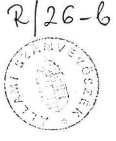
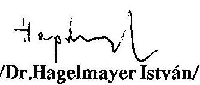
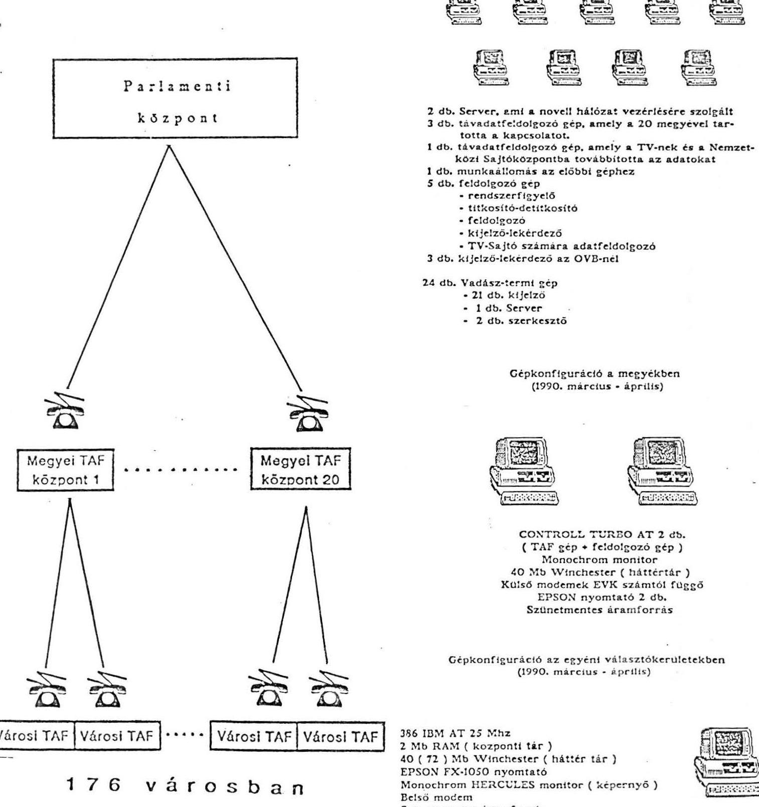
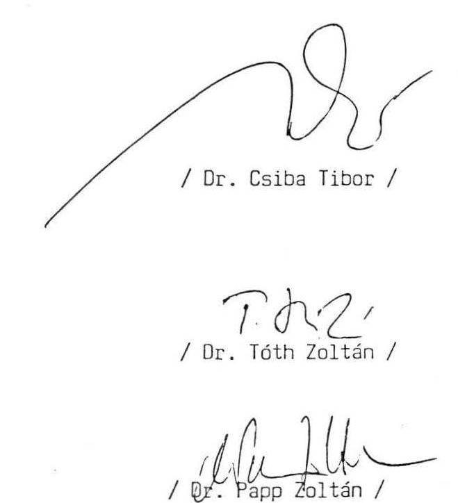

#  

## Jelentés

az 1990. évi országgyűlési képviselő-választások
előkészítésével és lebonyolításával kapcsolatos
állami feladatok végrehajtására biztosított
költségvetési pénzeszközök felhasználásának ellenőrzéséről

---

Az országgyűlési képviselők választásáról szóló 1989. évi XXXIV. törvény 50. szakasz (1) bekezdése az Állami Számvevőszék feladataként jelölte meg a képviselőválasztások előkészítésével és lebonyolításával kapcsolatos állami feladatok végrehajtására az Országgyűlés által biztosított költségvetési pénzeszközök felhasználásának ellenőrzését.

A költségvetési törvényben az 1990. évre 450 millió forint lett elkülönítve valamennyi választás költségeinek fedezeteként.

A felhasználás ellenőrzése során vizsgálatot végeztünk a központi szervek esetében a Belügyminisztériumnál, a Pénzügyminisztériumnál, a Külügyminisztériumnál, az Állami Népességnyilvántartó Hivatalnál. A választásoknál szükségszerűen felvetődött, elvégzett, de a költségvetésben nem tervezett kapcsolódó feladatok végrehajtásának költségeiről tájékozódást folytattunk a Magyar Rádiónál, a Magyar Televiziónál, a Munkaügyi Minisztériumnál, mint az ÁBMH jogutódjánál, a Magyar Távközlési Vállalatnál, az Országos Rendőrfőkapitányságnál.

A központi szervek vizsgálatával egyidejűleg elvégeztük a témával kapcsolatban a területi és helyi tanácsok ellenőrzését az ország valamennyi megyéjében és a fővárosban. Ennek keretében a húsz területi egység vizsgálata mellett 167 helyi tanács, 18 - a választásokban közreműködő — költségvetési intézmény esetében helyszíni ellenőrzést, további 16 szervezetnél tájékozódást folytattunk.

Vizsgálatunk nem terjedt ki a pártok részére e tárgyban biztosított állami költségvetési támogatás felhasználásának ellenőrzésére. Ezzel kapcsolatban az Állami Számvevőszék az ilyen támogatásban részesült pártoknál a pártok működésének és gazdálkodásának ellenőrzése keretében az éves munkaterv szerint folytat ellenőrzést.

---

# MEGÁLLAPÍTÁSOK 

## I.

A helyszíni ellenőrzések tapasztalatai

## 1. Előzmények, tervezés

Az Országgyűlés 1989. október 20-ai ülésén elfogadta az 1989. évi XXXIV. törvényt az országgyűlési képviselők választásáról. Ezen törvény 53. szakasza a belügyminiszter feladataként jelölte meg a választások állami feladatainak megszervezését és technikai lebonyolítását, a választási szervek mellett működő munkacsoportok tevékenységének, valamint a szavazatösszesítés számítógépes rendszerének irányítását.

Az előzőek, valamint a tanácsok felügyeletére vonatkozó közigazgatási reform alapján a választásokért a belügyminiszter, illetve a Belügyminisztérium lett a felelős, ennek következtében létrejött a BM Választási Iroda.

A BM-nek a választásokkal kapcsolatos állami feladatok végrehajtása korábban nem volt feladata, így közvetlen tapasztalatok nem álltak rendelkezésre. Ez vonatkozott mind a költségvetési tervezési munkákra mind a lebonyolításra. Az elmúlt négy évtizedben nem volt előre tervezett központi költségvetési fedezet a választásokra, ezek a költségek csak utólagosan kerültek a költségvetésbe. A régebbi választási költségekről való résztapasztalatokat az MTTH korábbi munkatársai bocsátották rendelkezésre, akik többségükben átkerültek a BM Választási Irodához.

Ilyen előzmények után a Belügyminisztérium becsléssel az 1990-ben esedékes valamennyi választás költségének fedezetére 450 millió forintot javasolt elkülöníteni a Magyar Köztársaság 1990. évi költségvetésében, utólagos elszámolási kötelezettséggel. A javaslatra a PM Testületi Főosztálya nem tett észrevételt, a részletek vizsgálatára ugyan-is — nyilatkozatuk szerint — apparátus, illetve számítástechnikai szakember hiányában nem volt és most sincs módjuk. Ez jelenleg ilyen mélységben nem is feladata ezen főosztálynak. Az utólagos elszámolást a költségek gazdaságos felhasználása garanciájának tartották.

---

A BM Választási Irodája a részletes tervkészítés időszakában tájékozódott a tanácsoknál a személyi és dologi kiadások szükségletének felmérése érdekében; a felmérés eredménye az volt, hogy a tanácsok hozzávetőlegesen 100 millió forintot jeleztek a választásokkal kapcsolatos költségként.

A BM ennek alapján - összegezve a központi feladatok költségigényét — az első és második forduló választási ráfordításainak részletes tervét úgy készítette el, hogy a 450 millió forintos költségvetési fedezetből az első fordulóra 350 millió forintot, a másodikra pedig 100 millió forintos keretet különített el (50%-os újraválasztást feltételezve). A központi feladatokra az előirányzat 304 millió forintos, 67,5%-os részesedéssel számolt a korábbi gyakorlatnak megfelelően, a helyi tanácsi feladatokra 118,7 millió forintot különítettek el, míg egyéb költségként 27,2 millió forinttal számoltak.

A költségvetési törvényben foglalt egész évre szóló 450 millió forintos választási keretet az országgyűlési képviselő-választásokra felhasználták, és ezt növelte 100 millió forinttal a Minisztertanács által jóváhagyott pótkeret.

A 100 millió forintos pótkeret indokaként a teljeskörű ismételt választást jelölték meg. Megállapítható, hogy a 100 millió forintos pótkeretből — amely 22,2%-os növekedésnek felel meg — 22,9 millió forintot a központi feladatok többletköltségeire, 72,8 millió forintot a helyi, tanácsi feladatok többletköltségeire, 4,3 millió forintot pedig tartalékkeret növelésére különítettek el.

A személyi és dologi kiadások tervének növelésénél a személyi kiadások kisebb mértékű— 18,3%-os —, a dologi kiadások előirányzatának pedig 23,9%-os növekedésével számoltak.

A 450 millió forint alapkeret és a 100 millió forintos pótkeret, mint módosított előirányzat jogcímenkénti lebontását az 1.sz. melléklet mutatja.

A melléklet alapján is megállapítható, hogy az eredeti költségvetési előirányzat ilyen mértékű túllépése nem indokolható csupán alultervezéssel, abban szerepet játszott a tapasztalat és szakmai ismeret hiánya. Ennek következtében nem tudtak hatékony, takarékos, költségcsökkentő eljárásokat alkalmazni, illetve a közpénzzel ilymódon gazdálkodni.

Összességében jellemző az a szemlélet is, hogy a tanácsok a költségvetéstől — megalapozott részletes információk és előzetes költségbecslések elkészítése nélkül — igyekeztek

---

minél magasabb költségkerethez jutni és a pénzügyi fedezethez igazították a kiadások szerkezetét.

Ezt igazolja az a tény, hogy összességében a dologi kiadások a módosított előirányzaton belül maradtak:

| módosított terv: | $452,2 \mathrm{MFt}$ |
| :--: | :--: |
| tény: | $414,6 \mathrm{MFt}$ |
| index: | $91,6 \%$ |
| eltérés: | $-37,6 \mathrm{MFt}$. |

A személyi kiadások meghaladták a módosított, már jelentősen megnövelt előirányzatot:

| módosított terv: | $68,4 \mathrm{MFt}$ |
| :--: | --: |
| tény: | $97,5 \mathrm{MFt}$ |
| index: | $142,6 \%$ |
| eltérés: | $+29,1 \mathrm{MFt}$ |

A BM illetékesei a vizsgálat során a választás költségvetésének jóváhagyott, aláírt példányát bemutatni nem tudták. Ilyen jóváhagyó irat a több mint félmilliárdos költségről nem készült. A BM Választási Iroda akkori vezetője a vizsgálat során úgy nyilatkozott, hogy a költségvetés jóváhagyásának mechanizmusát nem ismerte, tudomása szerint a költségvetést jóváhagyták, ezt azonban okmányokkal alátámasztani nem tudta.

A fenti hiányosságokból és hibás gyakorlatból adódóan fel sem vetődött annak igénye, hogy a választásoknak legyen felelős gazdasági, pénzügyi vezetője, aki a gazdaságossági kérdésekben döntött volna, illetve alternatív döntéselőkészítést tett volna lehetővé. A BM Választási Iroda részéről bizonyos szereptévesztés volt tapasztalható, ami az állami pénzek felhasználásának gazdaságtalanságát, az állami pénzekkel menedzserként, tulajdonosként való felelős, takarékos gazdálkodás igényének, illetve megkövetelésének hiányát okozta. Nyilatkozatuk szerint kizárólag a jogi kérdések tisztázásában vettek részt, azaz a számítógépes adatfeldolgozó rendszer programjainak (algoritmizálásának) törvényességéért voltak felelősek. Szakmailag, számítástechnikailag és pénzügyileg nem voltak felkészülve a feladat komplex kezelésére (ld. 6. sz. melléklet).

---

# 2. A feladat végrehajtása 

Az eredeti és módosított - 450 millió forintos, illetve a 100 millió forintos pótkerettel növelt 550 millió forintos — költségelőirányzat és a tényleges felhasználás összehasonlítását az 1. sz. melléklet tartalmazza.

Az értékelést az 550 millió forintos előirányzattal szemben végeztük el, hiszen ez a keretösszeg állt a BM rendelkezésére.

Az 1. sz. melléklet alapján megállapítható, hogy az 550 millió forintos előirányzattal szemben a tényleges felhasználás 544,7 MFt, 1%-os megtakarítást jelez.

A központi feladatok végrehajtása 290,6 millió forint (88,9%), míg a helyi tanácsi feladatok végrehajtása 221,5 millió forint (115,6%) volt.

Az egyéb soron előirányzott 31,5 MFt (amely a képviselőjelöltek közlekedési átalányát és a tartalékkeretet tartalmazza) 32,6 millió forintos (103,4%) felhasználást mutat.

Az országgyűlési képviselő-választások tényleges kiadásai azonban a módosított költségvetési előirányzatot az alábbi, egyéb költségvetési forrásokból finanszírozott tételekkel haladták meg:

1. Választókörzetek felszerelése számítógéppel: 80 MFt (KSH 50% - tanácsok 50%)
2. A 12 párt által elfogadott „védelmi és rögzítési elvek" megvalósítására adott miniszterelnöki keret:
19,7 MFt
3. A választás alatt felvetődött közvetetten jelentkező költségek: 150 MFt

Ezen — összesen mintegy 250 millió forintot kitevő — tételek felhasználásának ellenőrzését a kapcsolódó jogcímek értékelésénél tárgyaljuk.

---

# II. 

A választásban közreműködő központi szervek tevékenysége

1. A központi feladatokban résztvevő állami és tanácsi tisztviselők munkájának elismerésére 2.050 ezer forint állt rendelkezésre a tényleges, személyekre szóló felhasználás 1.801 ezer forint az előirányzaton belül maradt, és mértéke sem kifogásolható.
2. A dologi kiadások 288,8 millió forintos felhasználása 36,2 millió forintos megtakarítást mutat. A központi feladatok dologi kiadásai között jelentkező jelentős tétel a

- választók névjegyzékének elkészítése,
- a szavazatösszesítés információrendszerének kidolgozása.
- a különféle nyomdai és papírköltségek.

A Belügyminisztérium és az Állami Népességnyilvántartó Hivatal (továbbiakban ÁNH) között két szerződés jött létre. Elöljáróban azonban meg kell említeni, hogy az ÁNH szerepe önmagában nézve kettős volt; egyfelől, mint törvényi kötelezettséget teljesítő állami szerv, másfelől, mint szerződéses kötelezettségeinek eleget tevő vállalkozó szerepelt.

Az ÁNH és a BM közötti szerződéses feladatok végrehajtására vonatkozó feltételeket csak általánosságban határozták meg. A feladat végrehajtásához részletes terv és költségvetés nem készült, a BM ezt nem is követelte meg.
2.1. Az 1990. március 25-i országgyűlési képviselő-választás névjegyzékeinek, értesítőinek elkészítése és eljuttatása a helyi tanácsokhoz, illetve a választópolgárokhoz.

A feladatra a költségvetés 175 millió forintot irányzott elő, a tényleges felhasználás 123,6 MFt volt; index: 70,5%.

A választójogi törvény alapján a névjegyzék készítése az ÁNH törvényi kötelezettsége körébe tartozik. Az ÁNH ugyan az állami költségvetésből ezen törvényi előírás teljesítésére nem kapott külön pénzeszközt, a szerződés erre irányuló része ennek

---

ellenére sem lehetett volna vállalkozás jellegű. A szerződés 122.002 ezer forint végösszegű költség-előirányzatát 7,6 millió választó állampolgárt figyelembe vevő tételes előkalkuláció alapján készítették, de ebből nem derült ki, melyek azok a munkarészek, amelyeket az ÁNH, mint költségvetési intézmény hivatalból végez.

Az ÁNH a feladat elvégzésének döntő részét alvállalkozókra bízta.

Az alvállalkozói szerződések megkötését — az idő rövidségére való hivatkozással, továbbá egyes cégek monopolisztikus helyzete miatt — nem előzte meg esetlegesen árcsökkentő hatású versenyeztetés, sőt többen 10% sürgősségi felárat tudtak érvényesíteni, amely 2,1 MFt többletköltséget jelentett.

A BM a benyújtott végszámlából — a tételes ellenőrzés után — 1.051,2 ezer forintot nem fogadott el, de az ÁNH 1.500 ezer forintos késedelmi kamat igényét elismerte. A végszámla elfogadott és átutalt összege 123,6 millió forint, amelyben a BM és az ÁNH képviselői többszöri egyeztetés után 1990. augusztus 9-én jegyzőkönyvileg állapodtak meg.
2.2. Az országgyűlési képviselők, a tanácstagok és a köztársasági elnök választása, továbbá a népszavazások során a fővárosi, megyei tanácsoknál és az Országos Választási Bizottság (OVB) mellett összekapcsoltan működő szavazatösszesítési információrendszer fejlesztése, üzembeállítása és közreműködés az üzemeltetésben.

Az 1989. július 20-án kelt BM-ÁNH közötti általános célú alapszerződés 1990. január 10-én módosításra került, a képviselőválasztásra leszűkített műszaki tartalommal, és tételes költségvetéssel 73.322 ezer forint összegben.

BM 1990. február 16-án vállalkozási szerződést írt alá a Számítástechnikai és Ügyvitelszervező Vállalat (SZÜV) Budapesti Számítóközpontjával az országgyűlési választás eredményeinek megállapítására. A szerződés a szavazás adatainak gyűjtésére és az egyéni, területi és országos szintű adatokat rögzítő feldolgozó és megjelenítő szoftver készítésére irányult, 4.800 ezer forint+ÁFA, azaz 6.000 ezer forint összeg ellenében, amely költség az 1.sz melléklet III. „egyéb" soron jelenik meg, mint
 nem tervezett költség. A programrendszer elkészült, a BM kifizette, de használatára a választás folyamán nem került sor.

---

A BM és ÁNH közötti, szavazatösszesítésre vonatkozó szerződést a BM 1990. február 28-án felbontotta és az ÁNH, valamint az addig bevont alvállalkozók által végzett teljesítéseket átvette. A szerződést felbontó irat nem tartalmazza a leállítás indokolását. Az ÁNH a generálszerződés felbontásakor leállította a feladaton dolgozó alvállalkozóit, részteljesítéseik elismerése mellett.

Az ÁNH szakmai érvelése alapján a Minisztertanács elnöke 1990. március 7-én a szerződésfelbontást hatályon kívül helyezte és helyreállította a BM-ÁNH közötti eredeti szerződést. A miniszterelnök utasítására az ÁNH a feladatmegoldást 10 nap időkieséssel tovább folytatta.

Az ÁNH 1990. június 11-én nyújtotta be a szavazatösszesítő rendszer szerződése alapján összeállított 79.519,48 ezer forint összegű számláját és a szerződésen kívüli 18.669,471 ezer forint összegű pótszámlát.

A BM a számlák tételes felülvizsgálata után a szavazatösszesítésre 64.370,75 ezer forint, a külön költségre 8.268,7 ezer forint, összesen 72.639,45 ezer forint elszámolást fogadott el.
2.3. Az ÁNH vezetője 1990. március 19-én — levélben a Miniszterelnök korábbi ígéretére hivatkozva — pótlólagos támogatást kért a pártokkal egyeztetett védelmi elvek gyakorlati megvalósítására. A 19.700 ezer forint pótlólagos költség alátámasztására ÁNH öt feladatot jelölt meg:

- Kiegészítő számítástechnikai eszközök
9.000 eFt
- 50 db személyi számítógép bérlete
5.000 eFt
- Kétkulcsos adatbeviteli rendszerhez adatvédelmi kártya és programrendszer
2.500 eFt
- előre nem látható, rendkívüli körülmények közötti működés megszervezése
1.200 eFt
- propaganda video-film az ÁNH megrendelésében a választás „technológiájáról"
2.000 eFt

---

Az MT Hivatal elnöke a miniszterelnöki döntésre hivatkozva egyetértőleg visszaigazolta a kérést, és az ügy intézését a választásokért felelős belügyi államtitkárhoz utalta, aki — anélkül, hogy a kérés indokoltságát megvizsgálta volna — pénzhiányra hivatkozva az ÁNH-t közvetlenül a PM-hez irányította. Az ÁNH az említett előzményekre hivatkozva 1990. május 7-én benyújtotta 20.773,3 ezer forint összegű végszámláját a PM-nek:

- 450 db kéziszámítógép (menedzser-kalkulátor)
beszerzése (részletesen ld.: 2. sz. melléklet) 9.298,8 eFt
- 166 db. szünetmentes áramforrás beszerzése 4.381,4 eFt
- Kétkulcsos adatbeviteli rendszerhez
eszközbeszerzés 4.300,6 eFt
rendszerterv 180,0 eFt
- rendkívüli körülmények közötti működés
rendszerterv 275,0 eFt
- propaganda video-film 2.337,5 eFt

A pénzügyminiszter a benyújtott számlákban foglaltakat indokoltnak tartotta, azok tételes érdemi vizsgálatát nem rendelte el, és 1990. május 17-én személyesen intézkedett az eredetileg jóváhagyott keret (19.700 ezer forint) egyösszegű átutalása iránt. PM képviselői jegyzőkönyvileg kérték rögzíteni, miszerint a fent említett érdemi vizsgálat nem tartozik hatáskörükbe.
2.4. A számítógépes adatfeldolgozásra vonatkozó szerződés-rendszer és a kialakult tulajdonviszonyok vizsgálata során tett megállapítások:

A szerződések előkészítését nem előzte meg a választás egész folyamatát leíró részletes rendszerterv, amelynek alapján az egyes szerződésekben foglalt feladatok, illetve azok költségbecslései bírálhatók és ellenőrizhetők lettek volna a megvalósíthatóság és a takarékosság szempontjából.

A BM Választási Iroda munkáját csak esetenként és részlegesen támogatta informatikai szakember. Az akkori általános politikai légkörben a takarékosság, mint szem-

---

pont háttérbe került. E tényezők együttesen okozhatták, hogy a szavazatösszesítést nagyteljesítményű számítógépek távadat-feldolgozó (TAF) hálózatba kötésével oldották meg, amely kétségkívül elvben korszerű megoldás, de az ehhez szükséges 20-30 millió forint hardver, szoftver és üzemeltetési többletköltség nem volt mérlegelés tárgya.

Az egységes és határozott vezetés hiánya miatt a szakmai, irányítási és gazdasági konfliktusok a BM és az ÁNH között kiéleződtek, amely a szerződésfelbontásához vezetett. A leállítás technikailag veszélybe sodorta a választás megtarthatóságát, előnyös tárgyalási helyzetbe hozta a leállított, hatályos szerződéssel bíró alvállalkozókat és „indokolttá tette" a párhuzamosan és feleslegesen 6.000 ezer forintért SZÜV-nél elkészített, de fel nem használt szavazatösszesítő rendszert.

A szerződések teljesítése, illetve az elszámolások során az ÁNH pénzfelhasználása nem volt takarékos, helyenként indokolatlan rendeléseket és kifizetéseket tartalmazott. A 2. sz. mellékletben rögzítettük azokat — az ellenőrzés során feltárt kirívó eseteket, amikor a képviselő-választás folyamatához nem köthető számlákat próbáltak meg elfogadtatni a BM-mel, vagy előre nem engedélyezett tételeket állítottak be a miniszterelnöki keret elszámolásába.
2.5. A dologi kiadások között mintegy 30%-os részarányú a nyomdai és papírköltség, tájékoztató kiadványokhoz kapcsolódó ráfordítás.

| eredeti előirányzat: | 60 MFt |
| :-- | --: |
| módosított előirányzat: | 70 MFt |
| tényleges kiadás: | 86,7 MFT |
| index: | 123,8 % |

A vizsgált tételnél tapasztalható az ún. alultervezés, hiszen az eredeti előirányzatban az első választásra 40 millió forintos, a második választásra (50%-os részvételt feltételezve) 20 millió forintos összeget terveztek, s mivel a nyomda- és papírköltségek tipikusan létszámarányosak, a közel 100%-os újraválasztási létszám + 20 millió forint, összesen 80 millió forintos előirányzatot indokolt volna. A reális előirányzathoz viszonyítva az eltérés 6,7 millió forint többletkiadás, amelynek egyik összetevője a következő, külön is kiemelést érdemlő példa:

---

A Magyarországi Szociáldemokrata Párt Pest megyei területi szerve a területi pártlistán jelöltek névsorát megváltoztatta a hivatalosan erre nyitvaálló határidő után. A párt országos központja kérte az eredeti állapot helyreállítását. Az ügyben végül is a Legfelsőbb Bíróság 1990. március 23-án végzéssel döntött. A bíróság értelemszerűen csak a beterjesztett jogkérdésben hozott végzést, a költségek viseléséről kereset hiányában nem határozott. Ennek az eredménytelen területi pártakciónak, amelyet az eredeti állapot helyreállítása követett, közel 7 millió forintos kihatása volt az állami költségvetésre. Csak a nyomdaitöbbletköltség a Pest megyeiterületi lista változtatása miatt 6.519.341 forint volt, ehhez járult hozzá, hogy a sürgősséggel elkészített szavazólapokat a BM Budapesti Rendőrezred alakulatainak gépkocsijaival és a rendőri állomány többlet-igénybevételével sikerült határidőre a helyszínekre eljuttatni. Ezt a közel 7 millió forintos indokolatlan többletköltséget senki nem térítette meg az államnak.

# III. 

A választásban közreműködő területi és helyi állami szervek

## 1. A választásokkal kapcsolatos kiadások alakulása és elszámolása

A választások második fordulója után jóváhagyott 191,5 millió forint támogatás 61,3 %-kal haladja meg az eredetileg előirányzott összeget. A tényleges felhasználás 221,5 millió forint volt (index: 115,6 %). A személyi kiadásoknál 29,4 millió forinttal költöttek többet, mint a 66,3 millió forintos előirányzat (index 144,3%). Ezen belül a helyi tanácsok vb titkárainak jutalmazására és ennek TB-járulékára fordított összeg több mint kétszeresére, az egyéb díjazás átlagosan 25%-kal nőtt. A dologi kiadások összességében az előirányzatnak megfelelően alakultak (125,8 millió forint), de jogcímenként jelentős szóródás tapasztalható.

Az előirányzat teljesítésének értékeléséhez hozzátartozik az a tény is, hogy a helyi tanácsok a választások várható költségeit nem mérték fel, nem készítettek pontos és részletes előkalkulációt, ezt a BM nem is igényelte.

---

A BM által kialakított — a személyi és dologi kiadások fedezetéül szolgáló — hozzávetőleges és viszonylagos „normatívák" nemcsak nagyságukban nélkülözték a realitásokat, hanem bizonyos feladatokkal egyáltalán nem is számoltak.

- Az ügyintézők, szakértők mellett már az előkészítés és szavazás során is nagy létszámú technikai személyzet működött közre, akiknek az anyagi elismeréséről a tanácsoknak kellett gondoskodniuk.

Annak ellenére, hogy a választások lebonyolítása során az utolsó pillanatokban dőltek el számottevő pénzügyi konzekvenciákkal járó kérdések — technikai eszközök, pártok által delegáltak száma stb. — az előkalkulációk egyaránt kellő támpontul szolgálhattak volna a forráskiegészítésekhez, a reálisabb normatívák kialakításához és az ésszerűbb, gazdaságosabb megoldásokhoz.

A normatívák alapján a területi tanácsok részére járó módosított előirányzat összegét, valamint a tanácsok által jelzett pótigény (26,6 millió forint) összegét választási fordulónként a BM átutalta.

A támogatásokat a tanácsok nem pótelőirányzatként kapták meg, hanem a BM költségvetésen kívüli pénzeszközként a tanácsi letéti számlákra utalta azokat. Ez az 1990. évi költségvetési törvénnyel és az érvényben lévő költségvetési gazdálkodási szabályokkal ellentétes, számvitelileg helytelen, országosan nehezen áttekinthető helyzetet teremtett.

A területi tanácsok kb. egyharmada rövid időn belül továbbította a fedezeteket a helyi tanácsok részére, többségük azonban indokolatlanul késve bocsátotta rendelkezésre a támogatási összegeket (pl. Békés, Heves, Somogy és Szabolcs-Szatmár-Bereg megyék).

- Heves megye a letéti számlára érkezett támogatásból 2 millió forintot háromszor egy hétre és egyszer két hétre, 2,5 millió forintot pedig egyszer egy hétre lekötött a Citybank Budapest Rt. egri kirendeltségénél. Ennek eredményeként 40,3 ezer forint kamatot realizált, amelyet a választásokhoz szükséges eszközök vásárlására fordított.

---

2. Az ellenőrzések során a költségelszámolások három típusával találkoztunk:

- 4 megye (Fejér, Komárom-Esztergom, Pest és Vas) ugyanolyan összeggel számolt el, mint amennyit számára támogatásként jóváhagytak, tehát leosztotta a támogatásokat a helyi tanácsok részére,
- 4 megye (Baranya, Borsod-Abaúj-Zemplén, Heves és Tolna) nem számottevő megtakarítást ért el, ugyanakkor az ellenőrzés mindegyik megyében jelentős többletköltséget tárt fel,
- 12 megye a normatív támogatáson felüli többletkiadást mutatott ki, ennek legkisebb összege 33 ezer forint (Győr-Sopron), legnagyobb összege 12.026 ezer forint (Főváros).

Az eszközölt elszámolások különbözősége, a tényleges felhasználás értelmezése a BM Választási Iroda 250-30/4/1990. és a 250-30/47/1990. sz. intézkedéseinek félreérthető fogalmazásaiból adódik. Ezekben ugyanis nem a választási kiadásokról, hanem a támogatás felhasználásáról kér elszámolást. Eszerint forrásuktól függően könyvvitelileg külön kellett volna elszámolni a kiadásokat. Mindhárom típusú elszámolásnál egyébként jelentős, az előbbieket meghaladó kiadások voltak, amelyek főként az el nem számolt rezsiköltségekből (bérleti díjak, posta, telefon, telefax költségek, fűtés, világítás költségei stb.) tevődtek össze.

A személyi kiadásoknál az előirányzathoz viszonyítva jelentős többletkifizetés történt. Ennek oka többek között az volt, hogy egységes központi intézkedések hiányában a helyi tanácsok ugyanazon feladatok elvégzésére más és más elszámolást, valamint díjazást alkalmaztak. Ez főleg a személyi kiadásokat jellemezte és hibás elszámolásokat (adó, TB-vonzat, nyugdíjjárulék), vagy ebből eredően a saját költségek növekedését eredményezte.

- A Borsod-Abaúj-Zemplén megyei Dédestapolcsány községben a 43 % TB-járulékkal megnövelték a személyi kiadásokat, ezt azonban a megyei felülvizsgálat nem fogadta el, így az a saját költségvetést terheli.
- Győr városban 660 forintot fizettek ki a szavazókörökben közreműködőknek megbízási díjként, ezután 43%-os TB-járulékot is befizettek, amelyet a tanácsi költségvetés terhére számoltak el. Ivánban 3-500 forintot fizettek személyenként a szavazatszedő bizottságok tagjainak, a bizottság létszámától függően. Ebből sem személyi jövedelem-

---

lemadót, sem nyugdíjjárulékot nem vontak, és TB-járulékot sem fizettek utána. Társadalmi munkának minősítették ugyanis a díjazást, amely után a fennálló jogszabályok szerint semmilyen levonást nem kell eszközölni. Ugyanakkor Lövőn és Szilben 20%-os jövedelemadót vontak le az egy főre eső díjból, TB-járulék fizetése nélkül.

- Békés megyében 65 vb titkárt és 64 tanácselnököt részesítettek átlagosan 17.500 Ft/fő bruttó összegű jutalomban.
- Vas megyében a községekben 10.621 forintot, a nagyközségekben 12.000 forintot, a városokban pedig 23.571 forintot fizettek ki átlagosan.
- Megjegyezzük azonban, hogy a fővárosban ettől lényegesen magasabb, 60-70.000 Ft közötti bruttó összeggel jutalmazták a tanácsi vezetőket.

A dologi kiadásoknál a módosított előirányzat az eredeti előirányzathoz viszonyítva több mint kétszeresére nőtt:

| eredeti előirányzat: | 62,9 MFt |
| :--: | :--: |
| módosított előirányzat: | 125,2 MFt |
| tényleges kiadás: | 125,8 MFt |
| index: | 100,5 % |

Ezen belül jelentősen — 161 %-kal — nőtt a tanácsok rezsi kiadása, a hirdetési kiadásokra elkülönített összeget pedig csak
 fele mértékben használták ki. Ezek a nagymértékű volumen- és arányeltolódások arra utalnak, hogy a Belügyminisztérium által kialakított „normatívák" – a közreműködők létszámát, az egyes költségnemeket illetően előzetes költségbecslés hiányában – messze elszakadtak a valóságtól.

Az új választójogi törvény alapján lényegesen megnövekedett a választások lebonyolításában közreműködők száma. Megyénként 3-6 ezer, országosan több, mint százezer ember munkáját kellett szervezni, ellátásukat biztosítani.

A BM-nek elszámolt költségeket a tanácsok általában kellően dokumentálták. A vizsgálat azonban feltárt hibás, vagy nem megfelelően bizonylatolt elszámolásokat is, amelyek az ellenőrzés során helyesbítésre kerültek. Az elszámolt költségek többségükben indokoltak voltak.

---

- Baranya megyében a dokumentált költség 818 ezer forinttal volt kevesebb, mint a BM részére adott elszámolás.
- A Békés megyei Tanács a személyi kiadásoknál 372 ezer forint, a dologi kiadásoknál 83 ezer forint többletet állított be, mivel a békéscsabai városi tanács az ÁNH által térített költségeket is elszámolta.
- Heves megyében Hatvan városa az elszámolt rezsiköltségeket nem tudta belső bizonylattal alátámasztani.

# IV. 

Egyéb kiadások

1. Az országgyűlési képviselő-választásokra jóváhagyott költségvetési előirányzatban egyéb kiadásra 31,5 millió forintot különítettek el, a tényleges felhasználás 32,6 millió forint volt (index:103,4%).
1.1. A képviselők közlekedési átalányára fordítható összeg 25 millió forint, a tényleges kifizetés 16,3 millió forint, így a megtakarítás 8,7 millió forint.

A BM Választási Iroda a közlekedési költséget 5000 jelöltre 5.000 Ft/fővel tervezte. A BM Választási Iroda „egységesítési" szándéka aránytalansághoz vezetett. A kb. egy hónapra terjedő időszakra juttatott 5.000 Ft pl. a fővárosban lakó, vagy a pótlistákon tartalékként jelölteknél indokolatlan volt. A vizsgálat során nem derült ki, hogyan kalkulálták az 5.000 Ft átalányt. Mivel egy jelölt több helyen is indulhatott (egyéni, területi, országos lista), megfelelő szabályozás hiányában akár háromszor is felvehette volna a közlekedési költségtérítést. Ezt támasztja alá, hogy a vizsgálat találkozott olyan esettel, amikor a képviselőjelöltek (Pest, illetve Nógrád megyében egy-egy fő) kétszer is felvették a közlekedési költségtérítést. Az egyéni és területi listák alapján jogosultságot szerzett 3.438 főből 405 esetben a képviselőjelöltek nem kérték ezt a fajta költségtérítést, illetve a fel nem használt részösszeget visszafizették.

---

1.2. A választásokra beállított tartalékkeret összege 6,5 millió forint. Ennek jogcímenkénti felhasználása azonban nem állapítható meg, mivel a „teljesítés" beleolvadt a többi kiadási tételbe.
1.3. Ugyanakkor nem tervezett tételként jelent meg a „választási eredmények megállapítása" címen a KSH-SZÜV részére kifizetett 6 millió forint, amelyet a II. fejezet 2.2 bekezdésében részleteztünk.
1.4. A Nemzetközi Választási Tájékoztatási Központ működési kiadása 8.468.927 forint volt, a központ a két forduló során 1667 újságíró és 214 megfigyelő tájékozódását segítette.

A Külügyminisztérium 1990. március 2-án előterjesztést tett a Minisztertanács Kabinetje részére, amelyben javasolta Nemzetközi Választási Tájékoztatási Központ (a továbbiakban NVTK) létrehozását és működtetését. A Minisztertanács 1990. március 6-án 3060/1990. határozatával elrendelte az NVTK létrehozását oly módon, hogy „az NVTK létesítéséért a külügyminiszter a felelős, a központ működésének költségeit a választásokra előirányzott összeg terhére kell folyósítani 9 millió forint összegben".

A Külügyminisztérium a Belügyminisztériumnak a vizsgálat 1990. július 15-ei lezárásáig nem számolt el a felhasznált összeggel. (Ez 1990. augusztus 14-én történt meg, és a fennmaradó 531.037 forintot a Külügyminisztérium a BM-nek visszautalta.)

Az MT határozat előkészítését és előterjesztését a Külügyminisztérium önállóan végezte. Az összeg (9 millió forint) megállapításához írásos előkalkulációt nem készítettek, nyilatkozatuk szerint „a hasonló nagyságrendű rendezvények költségeit vették alapul". (Pl. az amerikai elnök 1989. évi magyarországi látogatása alkalmából létesített sajtóközpont). A Külügyminisztérium az ellenőrzés során kiadásait számlával igazolta, ezek egy részénél azonban hiányolható a felelősségteljes gazdálkodás, a költségvetési pénzeszközök kímélésére való törekvés, a felhasználás pontos és takarékos tervezése.

A részletes tapasztalatokat a 3. sz. mellékletben rögzítettük.

---

# 2. A választásokkal kapcsolatos közvetett költségek vizsgálata 

Az országgyűlési képviselő-választásokkal kapcsolatos állami feladatok végrehajtásához biztosított központi költségvetési pénzeszközön túlmenően a választásban szükségszerűen közreműködő egyes állami szervek saját költségvetésük terhére további jelentős pénzeszközöket használtak fel. A társadalom számára ez a költségráfordítás is terhet jelent, ezért ezek számbavétele is indokolt, és erről mind az Országgyűlés, mind a közvélemény tájékoztatását szükségesnek tartjuk.

A választásban közreműködő szervek közül a közvetett költségek számbavétele céljából tájékozódást végeztünk a

- Magyar Televiziónál,
- Magyar Rádiónál,
- Országos Rendőrfőkapitányságnál,
- Magyar Távközlési Vállalatnál,
- a helyi tanácsoknál.

Ezen kívül tájékozódtunk a választásban közreműködő munkavállalók szabadnapjának költségkihatása ügyében a Munkaügyi Minisztériumnál, mint a szabadnapokra vonatkozó rendelkezést meghozó ÁBMH jogutódjánál.

Összességében a választásokkal kapcsolatos közvetett költségek okmányokkal igazolható és becsült része együttesen legalább 150 millió forint értékű volt. Ezen költségek részletezését a 4.sz. melléklet tartalmazza.

---

# V.   ÖSSZEFOGLALÁS, JAVASLATOK 

Az 1990. évi országgyűlési képviselő-választás olyan társadalmi-politikai és gazdasági környezetben került megtartásra, amelyben elsőrendű szempont a választások biztonságos lebonyolítása volt. A választások törvényes rendben és legitim módon zajlottak le.

Ennek következményeként az eredetileg törvényben előirányzott 450 millió forinton fölül a menetközben bejelentett igények miatt a Minisztertanács 100 millió forintot, illetve a Minisztertanács elnöke további 19,7 millió forintot biztosított a központi költségvetésből. A népességnyilvántartás és a választások lebonyolítását támogató országos számítógéphálózat (lásd 5. sz. melléklet) kiépítése a képviselőválasztások idejére realizálódott. E rendszer alapjainak finanszírozására 80 millió forintot biztosítottak a költségvetés más forrásaiból (KSH, illetve tanácsok fejlesztési alapjai).

A választásokhoz egyébként összesen 150 millió forint összegben kerültek beszerzésre számítástechnikai eszközök.

A választási pénzeszközök teljeskörű értékeléséhez hozzátartozik a közvetve, más jogcímeken, de választási célra egyéb költségvetési szervek által felhasznált összegek bemutatása, amely vizsgálatunk szerint hozzávetőlegesen 150 millió forintot tett ki.

Fentiek alapján tehát a választás közvetlen és közvetett költségei mindösszesen megközelítették a 800 millió forintot.

Az állami költségvetést ily módon jelentősen terhelő többletkiadások indokoltságát a vizsgálat csak részben igazolta. A többletköltségeket elsősorban a megfelelő szervezés, koordináció, a folyamatok komplex kezelésének hiánya okozta.

---

Típushibaként értékelhető, hogy

- nem készült a választás valamennyi mozzanatát átfogó, részletes rendszerterv;
- a költségek nem megfelelő tervezéséből adódóan a felhasználás az előirányzathoz képest mind a dologi, mind a személyi költségeknél jelentős szóródást mutatott;
- a pénzeszközök rendelkezésre bocsátása nem megfelelő időben történt (PM-BM-területi tanácsok, egyéb felhasználók stb.);
- a választásoknak nem volt felelős gazdasági, pénzügyi vezetője, aki menedzser szemlélettel döntött volna a gazdaságossági kérdésekben;
- az ellenőrzött szervekre jellemző volt, hogy a pénzügyi fedezethez igazították elszámolásaikat, így sok esetben nem a tényleges szükségletek költségei jelentek meg.

Törvényességi oldalról tekintve a jelenleg hatályos, vonatkozó pénzügyi szabályozás (költségvetési törvény, Ápt.stb.) lehetővé teszi az éves, törvényben elfogadott költségvetési tételek esetenkénti módosítását törvénymódosítás nélkül, alacsonyabb szintű szabályozás alkalmazásával (MT, illetve pénzügyminiszteri hatáskör).

A vizsgálat ugyanakkor a választásra előirányzott központi pénzek tervezése és felhasználása terén egyben jogi szabályozottság hiányát is kimutatta.

A választási pénzek gazdaságos és normatív felhasználása érdekében célszerű kidolgozni egy komplex szabályrendszert, amely elősegíti a folyamatok jogszerűségét és teljeskörű ellenőrzését.

A vizsgálat befejezése óta, az ellenőrzés érdemi megállapításainak eredményeképpen is több realizáló intézkedés történt:

- az ÁNH a videofilm készítésénél túlszámlázott 1.442 ezer forintot megtakarításként a további központi feladatokra tartalékolja;

---

- az ÁNH a választói névjegyzék összeállításával kapcsolatos feladatait az 1990. július 29-ei népszavazáskor mintegy 20 millió forinttal kevesebb költségből oldotta meg, mint ugyanezen feladatot a képviselőválasztások idején;
- a Külügyminisztérium a rendelkezésére bocsátott, elszámolt és számlával igazolt 9 millió forint költségeit felülbírálva 1990. augusztus 14-én visszautalt a BM részére 531.037 forintot;
- a belügyminiszter megkezdte a felügyelete alá helyezett ÁNH szervezeti korszerűsítését, ennek keretében az átmeneti időszakra miniszteri biztost nevezett ki az időközben felmentett ÁNH elnöke helyére.

# A vizsgálati megállapítások alapján javasoljuk, hogy: 

1. A belügyminiszter, illetve az érintett tárcák miniszterei hatáskörükben kezdeményezzék a mindenkori választásokkal kapcsolatos, megfelelő személyi és dologi struktúrák, az operatívan működtethető választási apparátusra vonatkozó szabályrendszer, a költségkímélő normatívák kidolgozását.

## 2. A belügyminiszter

- kezdeményezze a létrehozott számítógéprendszer tulajdoni helyzetének rendezését, ezen beruházások aktiválását és teljeskörű nyilvántartásba vételét;
- kezdeményezze a Pest megyei területi választási lista megalapozatlan módosításával előidézett, mintegy 7 millió forint indokolatlan többletköltség megtérítési lehetőségeire vonatkozó javaslat kidolgozását;
- tegyen intézkedéseket a felügyelete alá tartozó Állami Népességnyilvántartó Szolgálat (mint az ÁNH jogutódja) gazdálkodási fegyelmének megszilárdítására.

Budapest, 1990. szeptember 5.

Melléklet: $\boldsymbol{\sigma}$ db.

---

# KIMUTATÁS

az 1990. évi országgyűlési képviselő-választások I. és II. fordulójával kapcsolatosan jóváhagyott költségvetési előirányzatokról és a tényleges felhasználásról jogcímenkénti bontásban* (érték ezer forintban)

|  kiadás jogcíme | eredeti | módosított | tényleges
kiadás | Index
tény/módosított  |
| --- | --- | --- | --- | --- |
|   | előirányzat |  |  |   |
|  I. központi feladatok |  |  |  |   |
|  parlamenti technikai ügyeletet ellátók díjazása | 105 | 90 | 97 | 107,0  |
|  megyei vb titkárok jutalma TB-járulékkal | 715 | 715 | 715 | 100,0  |
|  OVB-szakértők jutalma TB-járulékkal | 645 | 745 | 736 | 98,8  |
|  megbízási díjak | 500 | 500 | 253 | 50,6  |
|  személyi kiadások összesen | 1,965 | 2,050 | 1,801 | 87,9  |
|  OVB dologi kiadásai | 30 | 80 | 310 | 387,5  |
|  választók névjegyzéke értesítések szétküldése | 165,000 | 175,000 | 123,597 | 70,6  |
|  szavazatösszesítési információs rendszer | 75,275 | 77,960 | 74,388 | 95,4  |
|  nyomdai és papírköltség, tájékoztató kiadványok | 60,000 | 70,000 | 86,657 | 123,8  |
|  különféle ügyviteli eszközök | 1,400 | 1,400 | 1,024 | 73,1  |
|  Parlament-megyék hírösszeköttetése | 360 | 410 | 2,707 | 660,2  |
|  parlamenti ügyeletet ellátók élelmezése | 50 | 100 | 132 | 132,0  |
|  dologi kiadások összesen | 302,115 | 324,950 | 288,815 | 88,9  |
|  I. központi feladatok kiadása összesen | 304,080 | 327,000 | 290,616 | 88,9  |
|  II. helyi feladatok |  |  |  |   |
|  szavazókörben közreműködők díjazása | 27,000 | 31,000 | 35,613 | 114,9  |
|  helyi tanácsoknál közreműködők díjazása | 13,770 | 20,270 | 24,094 | 118,8  |
|  megyei tanácsoknál közreműködők díjazása | 1,800 | 1,800 | 6,631 | 368,4  |
|  helyi tanácsok vb titkárai jutalma | 13,250 | 13,250 | 29,345 | 221,5  |
|  személyi kiadások összesen | 55,820 | 66,320 | 95,683 | 144,3  |
|  egyéni választókerületek működési kiadása | 3,520 | 3,520 | 9,191 | 261,1  |
|  szavazókörök, tanácsok élelmezési kiadásai | 5,793 | 23,600 | 23,118 | 98,0  |
|  szavazókörök hirdetési kiadásai | 10,000 |

 10,000 | 5,668 | 56,7  |
|  tanácsok egyéb dologi kiadásai | 43,575 | 88,060 | 87,809 | 99,7  |
|  dologi költségek összesen | 62,888 | 125,180 | 125,786 | 100,5  |
|  II. helyi tanácsi feladatok kiadásai összesen | 118,708 | 191,500 | 221,469 | 115,6  |
|  III. egyéb |  |  |  |   |
|  képviselőjelöltek közlekedési átalánya | 25,000 | 25,000 | 16,257 | 65,0  |
|  tartalékkeret | 2,212 | 6,500 | - | -  |
|  választási eredmény megállapítása KSH-SZÜV | - | - | 6,000 | -  |
|  Nemzetközi Választási Tájékoztató Központ | - | - | 9,000 | -  |
|  Videofilm a választásokról (archív anyagként) | - | - | 1,313 | -  |
|  III. egyéb összesen | 27,212 | 31,500 | 32,570 | 103,4  |
|  I.-II.-III. összesen | 450,000 | 550,000 | 544,655 | 99,0  |

---

# Az ÁNH-val összefüggésben rögzített néhány kapcsolódó pénzfelhasználás 

## tapasztalatai

## 1. A képviselő-választásra biztosított keret terhére benyújtott ÁNH számlák

1.1. A bizonylatok között szerepel az 1.sz. Ügyvédi Munkaközösség 200 ezer forintos számlája az ÁNH képviseletéről a Belügyminisztériummal lefolytatott tárgyalásokban a megbízási szerződés megszüntetésével kapcsolatban.
1.2. A rendelkezésre bocsátott dokumentumok között szerepel egy 1990. január 29-én kelt feljegyzés, amely szerint a választási értesítők határidőre és a rendelkezésre álló költségkereten belüli megszervezéséért az ÁNH egy havi jutalmat fizetett ki három személynek 85.000 Ft összegben, melynek TB járuléka 43% 36.550 Ft. Az ÁNH a BM-tól kérte ezen "házi jutalmak" megtérítését is. A fenti feladat elvégzése az ÁNH-nak a szerződésből származó kötelezettsége volt. Ennek esetleges költségét a megbízási díj tartalmazza, amely magában foglalja a feladat elvégzésével megbízott dolgozó bérköltségét, valamint ezek járulékát. Amennyiben az ÁNH a szerződésben vállalt feladatának szerződés szerinti teljesítése érdekében jutalmat fizet ki dolgozói részére, ez nem kifogásolható, azonban ennek megrendelőre való áthárítása nem jogszerű.
1.3. Az ÁNH összesen több reprezentációs számlát próbált meg a BM-mel elfogadtatni, melyek közül néhány jellemző tétel:

- 1990. január 20-án kelt pénztárbizonylat szerint megyei VB titkárok vendéglátására címen kifizetésre került 23 ezer forint.
- 1990. január 15-én kelt számla szerint V822260.sz. csekkel került kifizetésre 470 db különleges extra szendvics 30,-Ft/db 14.100 Ft.
- 1990. január 18-án kelt számla szerint V822305.sz. csekkel került kifizetésre 534 db különleges extra szendvics 30,-Ft/db 16.020 Ft.
- 1989. december 12-én kelt számla szerint "22 fő részére komplett ebéd+terembér" 12.133 Ft.
- Az 1989. november 15-én kelt készpénzes számla szerint "hordós bor" 400,-Ft.
- Az 1989. november 15-én kelt készpénzes számla szerint "vörösbor" 375,-Ft.

---

- Az 1990. február 9-én kelt készpénzes számla szerint "Napoleon 0,5" 365,-Ft.
- Az 1989. október 21-én kelt készpénzes számla szerint "6 fő részére vacsora" 4.500,-Ft.
- Az 1989. október 24-én kelt készpénzes számla szerint "6 fő részére vacsora" 17.000,-Ft.

Az ÁNH a számlákat a képviselő-választás terhére kérte kifizetni a BM-től.
Ezen közel 100 ezer forintnyi költségnek a választás terhére történő elszámolása indokolatlan lett volna.
1.4. A választási elszámolásban talált hiradástechnikai berendezések számlái:
1989. október 26-án kelt Panasonic FS SVHS videomagnó 2 db szám: D9Ma 01841, 89Ma 01831
1989. október 20-án kelt JVC DFS 1000HE szám: 07461038
SVHS tip. videokamera 1 db 187.500 Ft
1989. október 20-án kelt JVC SVHS tartozékok 172.500 Ft
1990. február 5-én kelt JVC videokazetta 6 db 15.600 Ft

OFOTÉRT 1989. október 20-án kelt SABA ST 100
videoállvány SABA SW2 guruló láb
OFOTÉRT összesen:
32.910 Ft

Centrum Áruház 1989. október 27-én kelt
számlája szerint Dual TV 2 db
123.800 Ft

Az Elektronikai és Szolgáltató Kisszövetkezet
1990. január 24-én kelt számlája szerint
17 db polaroid lemez
61.200 Ft

Fenti eszközöknek a választás terhére történő elszámolása indokolatlan.
BM az 1.1-1.4 tételekre a benyújtott számlák kifizetését megtagadta.
1.5. ÁNH a CONTROLL Kisszövetkezettel kötött 902. doc. jelű üzemeltetési szerződésben 7.741.875 ezer forintért 34 db számítógépet bérelt 1990. február 15-től három hónapos időtartamra, az összeg nem változott annak ellenére, hogy a választás két hónapon belül befejeződött. A bérlet időbeni megszüntetése 2.490 ezer forint megtakarítást eredményezett volna.
1.6. ÁNH -CONTROLL Kisszövetkezet között létrejött 904.doc. jelű szerződés 4.sz. mellékletében a parlamenti szoftver-hardver üzemeltetésére, vállalkozó 88 óra üzemeltetési időre beállított 26 főt 1.500 Ft, 6 főt 650 Ft és 12 főt 430 Ft óránkénti

---

díjazással. Ennek forgalmi adóval növelt összege: 5.556,1 ezer forint. ÁNH a szerződés aláírásakor az óradíjakat nem vitatta, a jelenlét dokumentálását nem kérte és nem is ellenőrizte.

BM az 1.5-1.6 tételekre benyújtott számlákat kiegyenlítette.

# 2. A 19,7 millió forintos miniszterelnöki pótkeret felhasználása. 

2.1. ÁNH a választási jegyzőkönyvek összesítésére - saját hatáskörében döntve - beszereztetett 475 db PSION Organiser II. LZ-64 típusú kézi számítógépet (másnéven: manager kalkulátort). A gépek forgalmi adóval növelt beszerzési ára az 590 ezer forint saját ráfordítással kiegészítve 16.590 ezer forintot tett ki. ÁNH fenti költségből 9.298,8 ezer forintot beállított a miniszterelnöki pótkeret elszámolásába, az összeg fennmaradó részét a tanácsoktól kívánta beszedni.

A BM számítástechnikai szakértője körlevelet intézett a tanácsokhoz a PSION kiszámítógép használatára vonatkozóan, s a válaszokra alapozott jelentésében megállapította, hogy a gépet mindössze 6 megyében használták kiegészítő, ellenőrző elemként. A gépek beszerzésével kapcsolatban rögzítette, hogy nem illeszthetők a kialakított számítógéprendszerhez, választási célú használatuk a továbbiakban sem várható.

Jelenleg a 475 gépből 285 db van egyes tanácsoknál. 17 darabot átadtak az Országos Választási Bizottságnak, a többi az ÁNH raktárában fekszik esetleges értékesítésre várva.

PM a kalkulátorokról kiállított számlát ellenőrzés nélkül elfogadta a miniszterelnöki pótkeret terhére és 9.298,8 ezer forintot átutalt a KSH-n keresztül ÁNH számlájára.

ÁNH-nak a "választások biztonsága" növelésével indokolt eszközbeszerzése, a vásárláshoz felvett hitel kamataival együtt közel 18 millió forint többletterhet rótt a központi költségvetésre.

---

2.2. ÁNH 1990. február 20-án az országgyűlési képviselőválasztásokról, a szavazás módjáról és a szavazatösszesítésről szóló propagandafilm elkészítését rendelte meg az ÁN Informatikai Egyesüléstől.

A vizsgálat során megállapítottuk, hogy az ÁNH nem rendelkezett engedéllyel a választások "gazdájától", a BM-től a film megrendelésére. ÁNH már az 1989-es népszavazás előtt engedély nélkül készíttetett egy videofilmet, így jól ismerte BM Választási Irodájának ezirányú elutasító álláspontját, és így az újabb film engedélyezését és finanszírozását nem is kezdeményezte. A filmkészítés költségeinek fedezését a választások biztonságának növelésére elkülönített miniszterelnöki keret terhére kívánták megvalósítani.

Az ÁN Informatikai Egyesülés a film elkészítésére február 26-án tételes árajánlatot adott 1.700 ezer forint + 10% szervezői díj + ÁFA, azaz összesen 2.337,5 ezer forint összegben. ÁNH az árajánlatból csak egy 820 ezer forint összegű rövid videofilm elkészítését kérte, az időhiányra való tekintettel.

ÁN Informatikai Egyesülés 1990. március 13-án szerződést kötött a "Szavazás" című 5 perces videofilm elkészítésére a VT Idegenforgalmi Propaganda és Kiadó Vállalat Filmstúdiójával, ahol a filmet március 22-re elkészítették 895,5 ezer forintért.

ÁN Informatikai Egyesülés 1990. május 7-én leszámlázta a film készítését ÁNH-nak az eredeti árajánlatban szereplő 2.337,5 ezer forintért. A számlát az ÁNH csatolta a 19,7 millió forintos miniszterelnöki keret elszámolásához, és a PM a számlát ellenőrzés nélkül elfogadta. A központi költségvetés terhére történt "tévedés": 1.442 ezer forint.

Végül e ponttal kapcsolatban rögzíteni szükséges, hogy 1990. június 28-án a helyszíni vizsgálat során feltártuk a leírt szabálytalanságot. Ekkor az ÁNH jegyzőkönyvben kijelentette, hogy rendezi a PM-mel az általuk téves számlázásnak minősített ügyet. Ezt követően az ÁNH vezetője levélben kérte a pénzügyminisztert, hogy a fenti, a központi költségvetésnek visszajáró összeget a későbbi választásoknál használhassák fel. Végül a BM Közgazdasági Főosztálya hagyta jóvá ezt a kérést (levél-szám: 250-40/97-1990).

---

# A Külügyminisztérium ellenőrzése során rögzített tapasztalatok 

1. A KüM szerződést kötött 1990. március 19-én az ÁN Informatikai Egyesüléssel, hogy az NVTK részére információt szolgáltat. Az első fordulóra 675 ezer forint egyösszegű szerződést kötöttek. Ebben az ÁN vállalta, hogy ugyanennyiért az esetlegesen szükséges II. fordulóra is szolgáltat információt. Ennek ellenére a felek a II. fordulóra már 725 ezer forintért kötöttek azonos tárgyban szerződést 1990. április 4-én. A KüM illetékesei jegyzőkönyvileg úgy nyilatkoztak erre, hogy az ÁN új szerződéses ajánlatát az idő rövidsége miatt kénytelenek voltak elfogadni, gyakorlatilag kész helyzet elé lettek állítva. A KüM mindkét esetben úgy szerződött a 675 ezer forint, illetve a 725 ezer forint összegre, hogy ellenőrzés nélkül elfogadta az ÁN Informatikai Egyesülés által "előkalkulált" keretösszeget. Az ÁN az előkalkulációt nem csatolta be.
2. Az NVTK munkatársai a központ működéséhez taxikat vettek igénybe 151 ezer forint értékben. A kiadási tétel nem ellenőrizhető, mivel menetlevél ilyenkor nem készül, az igénybevétel ideje, útvonala, indokoltsága, illetve a résztvevők nem visszakereshetők. KüM illetékesei a bérkocsik igénybevételét azzal indokolták, hogy a minisztérium nem tudott hivatali gépkocsit rendelkezésükre bocsátani.
3. A Külügyminisztérium kifizetett a BM Művelődési Ház részére számlák alapján közel negyedmillió forint étel-ital fogyasztást. KüM illetékesei úgy nyilatkoztak, hogy a számlák a sajtóközpont közreműködő munkatársainak fogyasztását tartalmazták (telefon és telex, telefax-kezelők, tolmácsok, hostessek, szervezők, stb.). Ezt az étkeztetést a korábbi "gyakorlat" alapján végezték és ez kilenc nap alatt átlagosan napi 65-87 főt érintett. Tekintettel arra, hogy ez a fent felsorolt, és megbízási díjat vagy bért, illetve fizetést kapó dolgozókra nem vonatkozik, így a kifizetéseket valószínűleg téves értelmezés miatt engedélyezték, elszámolása tartalmilag indokolatlan és szabálytalan.

---

# A választásokkal kapcsolatos közvetett költségek részletezése 

A Magyar Televízió összesen 147 db választási műsort készített. Ezeknek, valamint a választásokkal kapcsolatos túlmunkáknak és a dologi jellegű felhasználásoknak a normál tevékenységen felüli többletköltsége
32.600 ezer forint

A Magyar Rádiónak választási műsorok személyi költségére, közvetítő vonalakra, közvéleménykutatásra stb. összességében a normál munkáján túlmenő többletráfordítása volt
6.600 ezer forint

Az Országos Rendőrfőkapitányság irányítása alatt álló rendőri szerveknek a választások alkalmával készenléti túlmunkára, gépkocsik, épületek többletigénybevételére összes ráfordítása
5.700 ezer forint

A Magyar Távközlési Vállalat a megrendelő szervekre nem továbbhárítható, választásokkal kapcsolatos effektív többletköltsége

500 ezer forint

A helyi tanácsok költségráfordításának a központi állami költségvetés által meg nem térített részéből okmányokkal alátámasztható, főleg rezsijellegű költség (bérleti díj, postaköltség, fűtés, világítás, stb.)
6.000 ezer forint

Összesen:
51.400 ezer forint

---

A fentieken túlmenően, további választásokkal kapcsolatos többletköltségek is jelentkeztek. Ezen összegek azonban jellegüknél fogva csak becsléssel körvonalazhatóak. Főbb tételeik a következők:

- A Magyar Távközlési Vállalatnál bevételkiesést jelentett, hogy az 1076/1990.(V.1.) MT határozat 2. pontja szerint a pártok részére választási célokra létesített mintegy 500 db telefonvonalat 1990. december 31-ig alkalminak minősítették, így az állomásonkénti 90 ezer forint beruházási hozzájárulást (kb. 45 millió forint) nem tudták bevételként realizálni.
- Ugyancsak bevételkiesést jelentett, hogy a választási időszakban a pártok távolsági telefonbeszélgetése, amelyet "választás" jelszóval jelentettek be "tízszeres, igen sürgős" állami beszélgetésnek minősült, de "egyszeres közönséges" beszélgetésként számlázták. Ennek számszerűsítésére nincs lehetőség.
- Szükségszerűen közvetett választási költségként jelentkezett a választást követő

 közterületi többlettakarítás (plakát eltávolítás) költségráfordítása, amely országosan több tízmillió forintos költséget tett ki.
- A tanácsoknál óvatos becslés szerint is további 40 millió forint körülire tehető az az okmányokkal nem kimutatható rezsiköltség, illetve személyi kiadás (főleg jutalom), amit más, egyéb célra szánt keretből csoportosítottak át.
- További milliókra becsülhető költségvonzata volt annak a vállalati, intézményi segítségnyújtásnak (szállítás, anyagi és munkaerő-szolgáltatás), amit a tanácsok igénybe vettek a választások zavartalan lebonyolítása érdekében.
- A különféle megyei lapkiadó vállalatok és városi televíziók a pártok és független jelöltek programjainak sajtónyilvánosságára, illetve sugárzására többmilliós nagyságú többletköltséget fordítottak saját keretük terhére.
- Jelentős költségtényező volt, hogy az ÁBMH rendelkezése értelmében a választási szervek közreműködő tagja a választást követő napon mentesült a munkavégzés alól, és erre az időre átlagkeresete illette meg, amelyet a munkáltató köteles volt megfizetni. Néhány városi tanácsnál végzett vizsgálat tapasztalata alapján becsülhető, hogy általában 2-10 napig terjedő szabadnapot engedélyeztek tanácsi dolgozók részére. Információink szerint a szabadnapot az érdekeltek jelentős része nem vette igénybe, de a választásban közreműködő mintegy 100 ezres létszámra tekintettel az összes többletszabadságnap 40-50 ezerre tehető. Az átlag napi munkabér a MüM becslése szerint 720 Ft volt. Így az igénybe vett szabadnapokra kifizetett munkabér mintegy 30-35 millió forint volt, az elmaradt munkavégzésből eredő hasznot nem tekintve.

---

# Országgyülési választások számítógépes 

## konfigurációja

Gépkonfiguráció a parlamentben
(1990. március)

---

# J E G Y Z Ö K Ö N Y V 

Készült: 1990. június 27-én az Állami Számvevőszék hivatalos helyiségében.

Jelen vannak: Dr. Csiba Tibor a BM Választási Iroda volt vezetője
Dr. Tóth Zoltán a BM Választási Iroda jelenlegi vezetője
Dr. Papp Zoltán a BM KÖZINFO főosztályvezetője
Dr. Egri Oszkár az Állami Számvevőszék tanácsosa
Bencze Miklós a BM Pénzügyi Csoportfőnökség ovh.
Kemény Emil az Állami Számvevőszék számvevője

Tárgy: Az 1990. évi országgyűlési képviselő választásokra fordított állami pénzeszközök ellenőrzése.

Dr. Csiba Tibor: A korábbi politikai és pénzügyi rendszer a választásra elkülönített költségvetési pénzeszközt nem irányzott elő (kivételesen az MTTH-nál volt bizonyos központi pénz a legszűkebb központi feladatokra).

- Az 1985-ös választásokon volt először a számítógépes rendszerre bizonyos összeg központilag elkülönítve.
- Népszavazást nem terveztük, nem volt rá központi pénzügyi fedezet biztosítva. Még a régi OV8 (Papp Lajos) rendelte el az ÁNH-nál az állampolgári aláírások ellenőrzését 3 millió R-ért a BM költségvetéséből.
- A tanácsok jelezték, hogy ők nem terveztek a választásokra külön pénzügyi fedezetet, tekintettel arra, hogy ez központi állami feladat. A BM felkérte a tanácsokat a dologi és személyi kiadások regisztrálására. A tanácsok kb. 100 millió R-ot jeleztek szükségletként, a központi kiadásokra 350 millió R-ot irányoztunk elő tapasztalati alapon.

---

A tapasztalat ugyanis azt mutatta, hogy a népszavazásnál központi kiadásra kb. 170 millió R (BM támogatással együtt), tanácsi saját költségként további kb. 74 millió forint került felhasználásra. Ennek megfelelően az országgyűlési képviselők választásánál a fenti tényekből kiindulva a következőket terveztük: második fordulóra 125 millió R-ot (mint a 250 millió R 50%-át), a kopogtató cédulák kézbesítési költségére mintegy 60 millió R-ot, az árnövekedés és nyomdaköltség növekedésre 15 MR-ot. Tapasztalat hiányában nem terveztük a takarítási (utólagos) költségeket, ami országosan nézve több 10 millió R volt. Ugyancsak nem terveztük a rádió, televízió, film, plakát kampány kiadásait. Az ÁNH rendelt a MTV-től egy olyan propaganda filmet, amelyet többször is leszámláztak a BM-nek, a BM azonban nem fizette ki, mivel ilyen szolgáltatást mi nem kértünk.

- Reprezentációs költséget a szó klasszikus értelmében nem terveztük (az Országos Választási Bizottság részére 50 eR költséget irányoztunk elő). Az előkészítés során többször tartottunk értekezleteket a megyék részére, költségeit nem terveztük, de elszámoltuk a BM költségvetésének terhére.
- Gazdasági, pénzügyi vezetője a választásoknak nem volt.
- A költségvetés jóváhagyásának mechanizmusát nem ismerem, jóváhagyott költségvetési példányt becsatolni nem tudok. Ismereteim szerint Gál Zoltán belügyi államtitkár szóban jóváhagyta a költségvetést.
- A második forduló költségvetését aláterveztük, nem számítottunk arra, hogy szinte teljesen meg kell ismételni az első fordulót. A pénzügyi háttér ilymódon hiányos volt.

Dr. Tóth Zoltán: - A BM Választási Iroda kizárólag a jogi kérdések tisztázásában vett részt, azaz: A számítógép rendszerből a programok törvényességéért (algoritmizálásáért) voltunk felelősek.

---

Szakmailag, számítástechnikailag és pénzügyileg nem voltunk felkészülve a feladat komplex kezelésére. Ugyanakkor a korábbi szokásoknak megfelelően az ÁNH vezetője a köztársasági elnökhöz és a miniszterelnökhöz fordult azzal, hogy a törvényben meghatározott feladatoknak nem tudnak eleget tenni. Ennek következménye az lett, hogy a számlák beérkezése előtt ellenőrzés nélkül fizetnünk kellett az ÁNH-nak az általuk jelzett költségeket.

- Az ÁNH szerepe önmagában is kettős volt. Egyfelől, mint törvényi kötelezettséget teljesítő állami szerv szerepelt, másfelől, mint vállalkozó. Megjegyzem, hogy a törvényben előírt választói névjegyzék készítéshez az ÁNH nem részesült az éves állami költségvetésből pénzeszközökben.

Dr. Csiba Tibor: - Az ÁNH a feladat végrehajtáshoz részletes költségvetést nem nyújtott be.

- A szerződés mellékleteiben szerepelt tevékenységenként elkülönített keretjellegű összeg. Mi ehhez tartottuk volna magunkat, de az időközben kapott további feladatok a kifizetéseket módosították (aláírások hitelesítése, népszavazás). Gál Zoltán és Kéry András 1990. január 10-én a szerződést módosították. A fizetési feltételeknél rögzítették az utólagos elszámolást (számlák és részletes dokumentációk benyújtási kötelezettségét). Eltérési engedélyre a szerződésmódosítás 2.1. pontja utal. Az ÁNH az egész folyamat során azzal fenyegetett minket, hogy leáll a szerződések teljesítésével, amennyiben nem utalunk át számla benyújtás előtt megfelelő előlegeket. Hivatkozási alapul az ÁNH a fizetésképtelenséget említette.

---

Bencze Miklós: - A szerződések szerint előlegek átutalására került sor, és a végelszámolásra a részletes dokumentációk és számlák alapján kellett volna sor kerüljön. Ezzel szemben a tényeket és a valóságot ezen témában az itt jelenlevők által ismert 1990. június 15-i feljegyzésem és annak mellékletei tartalmazzák. Az abban foglaltakat továbbra is fenntartom.

Dr. Csiba Tibor: - A nemzetközi választási tájékoztatási központ létrehozásáról nem volt tudomásunk. Csak a döntésről értesültünk. Az erre megjelölt 9 millió R-ot az amúgy sem elegendő 450 MR összegből kellett fedeznünk.

Bencze Miklós: - A fentiek elszámolása két részletben történt a Külügyminisztérium részére. Számla benyújtás nem volt. (7+2 MR-ot kellett számla nélkül kifizetnünk).

Dr. Papp Zoltán: - A BM Választási Iroda nem igényelte a BM KÖZINFO szakértőinek folyamatos közreműködését. A szakmai kontroll az ÁNH szerződések vonatkozásában nem történt meg.

Dr. Csiba Tibor: - A választásra külön rendszerterv nem készült, mert a VJT a belügyminiszternek az egyes választási időpontokra vonatkozó rendelete elegendőnek látszott a választási folyamat vezérlésére. A választások előkészítésének időszakában a BM Választási Iroda észlelte a rendszerterv hiányát; ezt eseti részintézkedésekkel pótolták (nyomtatványok, szállítás).
Ez is alátámasztja az 1989. augusztusában tett javaslatunkat, mely egy több törvényből álló választási kodex megalkotására vonatkozott:

- egy törvény szabályozza a választási eljárás kérdéseit, - külön anyagi törvények szabályozzák a köztársasági elnökre, a népszavazásra, a helyhatósági választásra, és az országgyűlési képviselők választására vonatkozó előírásokat.

---

Ezt a koncepciót a kerekasztal tárgyalásokon a tárgyaló felek akkor elvetették, s ezt a kodexet a mai napig sem sikerült megvalósítani.

/ Bencze Miklós /
