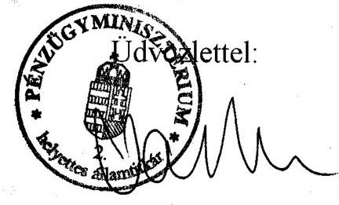
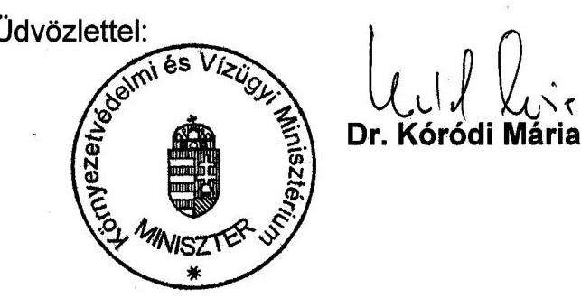

# JELENTÉS 

a települési önkormányzatok szilárdhulladék-gazdálkodási feladatai ellátásának ellenőrzéséről

---

# Az ellenőrzést felügyeli: 

Dr. Lóránt Zoltán
föigazgató
Az ellenőrzés végrehajtásáért felelős:
Az ÁSZ 3. Önkormányzati és Területi Ellenőrzési Igazgatósága
Németh Péterné
főcsoportfőnök
Az ellenőrzést vezette:
Farkas László
osztályvezető főtanácsos
A helyszíni vizsgálati jelentések feldolgozásában és az összefoglaló elkészítésében közremúködött:

## Csuti Lajos

számvevő tanácsos
Remeczki László
számvevő tanácsos
Dr. Szirota István
számvevő tanácsos
Az ellenőrzésben résztvevők névsorát az 1. sz. melléklet tartalmazza.

## Az ÁSZ által a témában eddig készített jelentések:

A helyi önkormányzatok településtisztasági tevékenységének és finanszírozási rendszerének vizsgálata (V-1015-140/1994-95. Tsz. 240.)

A Környezetvédelmi Minisztérium fejezet múködésének ellenőrzéséről készült jelentés (V-15/2001-02. Tsz. 570.)

---

# Rövidítések jegyzéke 

| KöM | Környezetvédelmi Minisztérium |
| :-- | :-- |
| BM | Belügyminisztérium |
| OTH | Országos Tisztifőorvosi Hivatal |
| ÁNTSZ | Állami Népegészségügyi és Tisztiorvosi Szolgálat |
| KSH | Központi Statisztikai Hivatal |
| KÖFE | Környezetvédelmi Felügyelőség |
| Ötv. | A helyi önkormányzatokról szóló 1990. évi LXV. törvény |
| Kt. | A környezetvédelmének általános szabályairól szóló 1995. évi LIII. törvény |
| Ht. | A helyi önkormányzatok és szerveik, a köztársasági megbízottak, valamint   egyes centrális alárendeltségủ szervek feladat- és hatásköréről szóló 1991. évi   XX. törvény |
| Kötv. | Az egyes helyi közszolgáltatások kötelező igénybevételéről szóló 1995. évi   XLII. törvény |
| Etv. | Az egészségügyről szóló 1997. évi CLIV. törvény |
| Hgt. | A hulladékgazdálkodásról szóló 2000. évi XLIII. törvény |
| KAC | Környezetvédelmi alap célfeladat |
| TERKI | Területi kiegyenlitést szolgáló fejlesztési célú támogatás |
| CÉDE | Céljellegủ decentralizált alap támogatás |

---

# TARTALOMJEGYZÉK 

I. ÖSSZEGZŐ MEGÁLLAPÍTÁSOK, KÖVETKEZTETÉSEK, JAVASLATOK ..... 5
II. RÉSZLETES MEGÁLLAPÍTÁSOK ..... 13

1. A szilárdhulladék-gazdálkodási feladatok ellátása, jogi alapjainak kialakítása, fejlődése és jelenlegi helyzete ..... 13
1.1. A központi szabályozás és feladat meghatározás formálódása ..... 13
1.2. Az önkormányzatok helyi szabályozási kötelezettségei a hulladékgazdálkodási közszolgáltatási tevékenység keretében ..... 16
2. A közterülettisztántartási és a szilárd hulladékgyűjtési feladatok ellátása ..... 17
2.1. A közterületek tisztántartási tevékenységének ellátása ..... 17
2.2. A szilárd hulladékok begyűjtése ..... 20
2.3. A szelektív szilárdhulladék-gyűjtés helyzete ..... 22
2.4. A szilárd hulladékok ártalmatlanítása ..... 24
2.5. A feladatellátás szervezeti formái ..... 26
3. A települési szilárdhulladék-gazdálkodás és a közterület tisztántartás pénzügyi-gazdasági helyzete ..... 27
3.1. A tevékenység pénzügyi alapjai ..... 27
3.2. A tevékenység bevételeinek és kiadásainak kimutatása, elszámolása ..... 30
3.3. A szilárdhulladék-lerakó telepek építése ..... 32
3.4. A helyi önkormányzatok hatásköre a közszolgáltatási ár és díj megállapításában. Árhatósági jogkörök alakulása ..... 33
4. A feladatellátás önkormányzati és szakhatósági ellenőrzése ..... 36
5. Az önkormányzatok pénzügyi és statisztikai információs rendszere ..... 39
MELLÉKLETEK
TÁBLÁZATOK

---

.

---

# JELENTÉS 

## a települési önkormányzatok szilárdhulladék-gazdálkodási feladatai ellátásának ellenőrzéséről

A természeti erőforrások egyre gyorsabb ütemű felhasználása, továbbá a környezetbe kibocsátott szennyező anyagok mennyisége következtében a természeti és épített környezet megőrzése, védelme a társadalom, a gazdasági élet meghatározó részévé, tényezőjévé vált.

A városiasodó életforma következtében a lakosság, az ipari, a mezőgazdasági termelő tevékenységek és a szolgáltatások növekvő mennyiségű és különböző veszélyességű hulladékot bocsátanak ki. Az aránytalanul nagy hulladékkeletkezési hányad, a hulladékhasznosítás alacsony mértéke, a hulladékártalmatlanítási kapacitás szűkössége az emberi környezet fokozódó terheléséhez vezetett.

A kibocsátott szilárd hulladékok mennyiségének csökkentése, szervezett és rendszeres összegyűjtése, elszállítása, ártalmatlanítása, hasznosítása, a települések, s elsősorban a városok közterületeinek tisztántartása - a koncentráltabb hulladék keletkezés következtében - alapvető követelménye az egészséges emberi életnek, a települések közegészségügyileg is indokolt, rendezett állapota fenntartásának.

Az ország hulladékgazdálkodásának területén a gyorsabb ütemű előrelépés nemcsak Magyarország környezeti állapotának fokozatos javítása érdekében szükséges, hanem az Európai Uniós (EU) csatlakozás egyik különösen fontos előfeltétele is. Az országról készített EU jelentés is sürgetően vetette fel e tevékenység ellátása területén meglévő hiányosságok, problémák fokozatos felszámolását.

Az Állami Számvevőszék a 2001. évi ellenőrzési terve alapján, a helyi önkormányzatokról szóló 1990. évi LXV. törvény 92. § (1. bek.) felhatalmazása szerint vizsgálta a települési önkormányzatok közszolgáltatási tevékenységén belül azt, hogyan tettek eleget a szilárdhulladék-gazdálkodási tevékenységüknek (gyűjtés-szállítás, ártalmatlanítás, hasznosítás) és a közterület tisztántartási feladataiknak.

Az ellenőrzés célja: annak megállapítása volt

- a települési önkormányzatok a törvényekben, a kapcsolódó kormány- és miniszteri rendeletekben meghatározott hulladékgazdálkodási feladataiknak eleget tettek-e;
- rendelkeztek-e a feladat megoldásához szükséges pénzügyi eszközökkel a közszolgáltatás megszervezéséhez és annak múködtetéséhez, fenntartásához, valamint a szükséges tárgyi eszközök és létesítmények fejlesztéséhez;

---

- a feladatok megoldásában milyen arányt képviseltek a központi költségvetési támogatások, a pályázatok útján nyert pénzeszközök;
- az önkormányzatok rendelkezésére állt pénzforrások célszerűen és eredményesen szolgálták-e a települések hulladékgazdálkodási feladatainak ellátását, milyen fejlődést biztosítottak a környezet állapotában;
- az önkormányzatok belső nyilvántartása és az erre épülő adatszolgáltatás lehetővé tette-e a feladatellátás (műszaki, szakmai, pénzügyi) figyelemmel kisérését, a tevékenység helyzetének reális megítélését, s a döntéshozók kielégítő tájékoztatását.

# Az ellenőrzött időszak: 1995-2001. I. félév 

A helyszíni vizsgálat kiterjedt a szilárdhulladék-gazdálkodási és a közterületek tisztántartási tevékenységére, mivel a települési önkormányzatoknak ezen közszolgáltatási feladatokat egységesen és összehangoltan kell ellátniuk.

A helyszíni vizsgálat során tájékozódtunk a Környezetvédelmi Minisztériumnál (KöM) és a Belügyminisztériumnál (BM).

A vizsgálatunk 67 települési önkormányzatra terjedt ki (Főváros, 14 megyei jogú város, 34 város, 7 nagyközség, 11 község). Ezeken a településeken 2000. évben az országban összegyűjtött és elszállított szilárd hulladék $32 \%$-a keletkezett, itt van a rendszeres hulladékgyűjtésbe bevont lakások $40 \%$-a, s ezen térségekben él a rendszeres hulladékgyűjtésben részesülő lakosság $45 \%$-a. E területeken van a szilárdhulladék-lerakó telepek szabad kapacitásának $30 \%$-a.

Az önkormányzatok helyszíni ellenőrzése során a szakmai, a feladatellátási és a fejlesztési szempontok részletesebb megalapozása érdekében tájékozódó jellegű vizsgálatokat végeztünk a környezetvédelmi és hulladékgazdálkodási hatósági és ellenőrzési feladatokat ellátó szerveknél is. Így mind a 12 Környezetvédelmi Felügyelőségnél (KÖFE), továbbá 20 helyen az Állami Népegészségügyi és Tisztiorvosi Szolgálatnál (ÁNTSZ). A vizsgált egységek jegyzékét a 2., a 3., és a 4. sz. mellékletek tartalmazzák.

A helyszíni vizsgálatok kiegészítésére és az országos összefoglaló jelentés kidolgozásához részletes műszaki, pénzügyi adatokat szereztünk be a Központi Statisztikai Hivataltól (KSH), a Magyar Államkincstártól, s az érintett minisztériumok illetékes szervezeti egységeitől. Figyelembe vettük az Országos Tisztifőorvosi Hivatal (OTH) országos értékelő jelentésében foglaltakat, amelyet a szilárdhulladék-lerakó telepek és a közterületek tisztántartásának helyszíni ellenőrzéséről készítettek az ÁNTSZ-ek.

---

# I. ÖSSZEGZŐ MEGÁLLAPÍTÁSOK, KÖVETKEZTETÉSEK, JAVASLATOK 

Magyarország településein a vizsgált időszakban a szilárdhulladék begyűjtése, kezelése területén az EU követelményeknek való megfeleléshez lassú, de fokozatos előrelépés volt tapasztalható. A begyűjtött szilárd hulladék mennyisége évente 3-4 \%-kal növekedett. Műszaki számítások alapján 2000. évben 22756 E m³ szilárd hulladék keletkezett, amelynek $90 \%$-a került összegyűjtésre, elszállításra és ártalmatlanításra. A hulladék $65 \%$-a lakossági, míg $35 \%$-a intézményi és üzemi eredetű volt.

A szilárdhulladék gyűjtésbe bevont települések aránya $81 \%$-ot ért el, azonban még mindig ellátatlan 604 település, melyek $93 \%$-a 2000 fő lélekszám alatti.

Az országos adatok szerint a rendszeres hulladék gyűjtésbe bevont lakások aránya 2000. évben $83 \%$, a hulladékgyűjtésbe bevont lakásokban élők aránya $84 \%$ volt.

A közszolgáltatás keretében 701 szilárdhulladék-lerakó telep üzemelt, melyeknek $10 \%$-a tekinthető korszerű lerakónak az illetékes ÁNTSZ-ek, illetve a KöM minősítése szerint. A becsült további, mintegy 2000 - előírásoknak meg nem felelő - lerakótelep folyamatosan kerül felszámolásra, s évente közel 100-150 szűnik meg. Ez a folyamat annak a következménye, hogy 1991-től központi támogatással több új, elsősorban regionális hatáskörű lerakótelep építése valósult meg, illetve van folyamatban.

Az ellenőrzött szilárdhulladék-lerakó telepek egyharmada már tíznél több települést szolgált ki. A hulladéklerakó telepek mintegy 28-30 \%-a felel meg az EU környezetvédelmi direktíváiban meghatározott követelményrendszernek. Az összegyűjtött szilárd hulladékok kb. 85-90 \%-át lerakással ártalmatlanítják, kb. 5-7 \%-át elégetik és alig 1-2 \%-át hasznosítják újra. A szelektíven gyűjtött szilárd hulladékok mennyisége az összesen keletkezett éves hulladéknak az $1 \%$-át sem éri el.

A vizsgált időszakban a közterület tisztántartásban lényeges javulás nem volt tapasztalható.

A rendszeresen tisztított közterület nagysága mindössze 5,4 \%-kal növekedett a vizsgált időszakban. Az összes tisztított közterület 2000. évben 66267 E m² volt. A rendszeresen géppel tisztított terület országos aránya $82 \%$ volt. A rendszeres közterület tisztántartásban érintett települések száma a 2000. évben 372 volt. (A települési szilárdhulladék-gazdálkodás főbb naturális mutatóit az 1. sz. táblázat tartalmazza.)

A települési önkormányzatok 1995-2000. években mintegy 20 Mrd. Ft-ot fordítottak a szilárdhulladék-gazdálkodási (beleértve a közterület tisztántartási) közszolgáltatási feladataik ellátására: fejlesztésekre.

---

A fejlődés ellenére is az EU átlaghoz viszonyított lemaradásunk lényeges s a közepesen fejlett gazdaságú EU országok színvonalához állunk közel.

A szervezett gyűjtés megteremtésére, a hulladékgyűjtés korszerűsítésére, a szelektív hulladékgyűjtés fokozottabb ütemű bevezetésére, a hulladékhasznosításra, a szerves hulladékok komposztálására, a fővárosi égetőmű korszerűsítésére, a regionális hulladéklerakó telepek létesítésére, a régi lerakó telepek rekultiválására 2001. és 2008. évek közötti időszakban számítások szerint mintegy 135-140 Mrd. Ft-ra van elengedhetetlenül szükség.

A szilárdhulladék-gazdálkodási feladatok ellátását szabályozási, finanszírozási és szemléletbeli problémák egyaránt befolyásolták.

A feladatellátás törvényi szabályozása időben elhúzódva, több törvény fokozatos hatályba lépésével csak a vizsgált időszak végére került egységesen, egyértelműen kialakításra.

A vizsgált időszakot megelőzően az Ötv. és a hatásköri törvény nem sorolták a szilárdhulladék-gazdálkodást az önkormányzatok kötelezően ellátandó feladatai közé. Ehhez járult, hogy források hiányában e feladatok megoldása háttérbe szorult. Következésképpen a tanácsrendszerben kialakult gyakorlat továbbvitele az „önként vállalt önkormányzati feladatok" körébe tartozóan történt. Maga a köztisztaság megnevezése 1994-ben került a törvény szövegébe, korábban csak a településtisztaság szerepelt a „különösen" kitételű feladatok sorában.

A vizsgált időszak elején, 1995-től történt lényeges elmozdulás a feladat törvényi és rendeleti szabályozása területén.

A környezet védelmének általános szabályairól szóló törvény szabályozásán belül a hulladékokról rövid fejezet szólt (külön törvényben való szabályozási kötelezettséggel), megjelölte a környezetvédelmi program készítésének kötelezettségét és annak végrehajtását, az egyes helyi közszolgáltatások kötelező igénybevételéről szóló törvény pedig meghatározta az egyes közszolgáltatások kötelező igénybevételének szabályait. Ezen túlmenően az egészségügyről szóló törvény előírta, hogy a települési önkormányzatok gondoskodnak a környezetés település-egészségügyi feladataik körében a köztisztasági és településtisztasági feladatok ellátásáról.

Megfelelő törvényi szabályozás hiányából eredően az alkotmánybírósági határozatok sora foglalkozott a vonatkozó önkormányzati feladatokkal, illetve a köztisztasági (hulladékgazdálkodási) önkormányzati rendeletekkel, ugyanis 1995 előtt a helyi rendeletekben a szolgáltatás kötelező igénybevételének szabályozását semmisítette meg, 1995 után az önkormányzati díjmegállapítás módját kifogásolta.

A hulladékgazdálkodás átfogó, az EU csatlakozási szándékainkkal összefüggő jogharmonizációs kötelezettségekkel is számoló szabályozása a hulladékgazdálkodásról szóló törvény 2001. január 1-ével lépett hatályba. Az új törvény számos előírása későbbi hatálybaléptetésű, nem kérhető számon, illetve a törvényi felhatalmazáson alapuló mintegy 40 kormány- és ágazati rendelet döntő részben a helyszíni vizsgálatok lezárása után jelent meg.

---

A Htg. egyértelműen szabályozta, hogy a települési önkormányzatok kötelezően ellátandó feladata a hulladékkezelési közszolgáltatás megszervezése, fenntartása.

A Hgt. rendelkezései azonban nem teremtették meg teljes körűen az önkormányzatok feladatellátásának, továbbá a helyi rendeletalkotásnak valamennyi feltételét, azaz a feladatok időbeli összehangoltságát, a szelektív hulladékgyűjtés kötelező megoldását és a feladatellátás pénzügyi hátterét.

A Hgt.-ben lévő feladatok időbeni összehangoltsága nem mindig biztosított. A területi hulladékgazdálkodási terveket az országos terv kihirdetését követő 270 napig kell kihirdetni, a helyi hulladékgazdálkodási terveket további 270 napig kell közzétenni. Az országos hulladékgazdálkodási tervet az Országgyűlés még nem hagyta jóvá, ebből következik, hogy 2002. január 1-i hatállyal még nem készült el és nem került jóváhagyásra az önkormányzatok hulladékgazdálkodási terve. Az önkormányzatoknak a helyi tervek elkészítéséhez szükséges adatgyűjtést, egyéb munkálatokat már most, a részhatáridők lejárta előtt meg kell kezdeniük

A Hgt.-ben előírt kötelező hulladék-összetétel nincs összhangban a szelektív gyűjtéssel kapcsolatosan engedő jellegű, az önkormányzat számára „előírhatja" megfogalmazással.

A szelektív hulladékgyűjtés megszervezése nem kötelező, ehhez támogatási összeget sem biztosítottak, a bevezetéshez csupán esetlegesen elnyerhető pályázati lehetőségek állnak rendelkezésre. Ugyanakkor a Hgt. az EU normákkal összhangban határozta meg a hulladék kötelező összetételét egyes összetevők esetében (pl. szerves hulladék, csomagolási hulladék), amelynek elérését konkrét évszámhoz kötötte. Ennek végrehajtása csak úgy lehetséges, ha a szelektív gyűjtés fokozatosan bevezetésre kerül. A törvény attól várja a szelektív hulladékgyűjtési kötelezettség rendeletben való előírását, hogy ezt a gazdálkodók számára előírt jogszabályi kötelezések fogják kikényszeríteni.

A Hgt.-ben hivatkozott támogatási rendszer a gyakorlatban hiányos, a kétéves költségvetés nem tartalmaz feladathoz kötött múködési támogatást. A feladathoz kötött támogatás elsőrendű célja az EU-irányelvekben lefektetett korszerű, komplex hulladékgazdálkodás bevezetésére történő ösztönzés lett volna. A „szennyező fizet elv" szem előtt tartása nem jelentheti a lakossági terhek (díjak) fokozatos, mértéktelen emelését. A törvényi előírásoknak megfelelő hulladéklerakók megépítése és üzemeltetése jelentős költséget jelent, szemben a szigeteletlen, korszerűtlen lerakók feltöltési gyakorlatával. A lerakók kapacitásának védelme érdekében is célszerű bevezetni a szelektív hulladékgyűjtést, amire történő átállás ugyanakkor nagyobb költségigényű mint a jelenlegi begyűjtési rendszer fenntartása. Gondot jelentett továbbá a hulladéktörvény előírása, amely szerint a díjhátralék megfizetéséért az önkormányzatnak kell helytállni. A vizsgálat lezárását követően jelent meg a KöM szabályozása, amely szerint 2002. évtől az önkormányzatok pályázhatnak a keletkező díjhátralék megtérítésére a Környezetvédelmi Alap Célfeladatból (KAC).

A hulladékgazdálkodásban a kedvező folyamatok alig érződtek, ami azt jelenti, hogy sem a háztartásban, sem a termelésben a minimalizálásra való törek

---

vés nem volt tapasztalható. Hasznosítható lenne a nagy tömegű szerves hulladék, a keletkező termékre (pl. komposzt) viszont nincs igény. A hasznosítás jelei a papír, a műanyag és a fémhulladékok esetében voltak tapasztalhatók, de csak akkor, ha azokat szelektíven gyűjtik, van válogató mű és értékesítési lehetőség.

A helyszíni vizsgálat tapasztalatai szerint a törvényekben megfogalmazott köztisztasági és szilárd hulladékkezelési feladatok nem épültek be valamennyi vizsgált önkormányzat gyakorlatába, a vizsgált önkormányzatok mindössze $25 \%$-a tekintette a rendeletalkotásában kötelező közszolgáltatási feladatnak a tevékenység ellátását. Ugyanakkor a vizsgált körben nem volt olyan önkormányzat, amely helyi rendeletben ne szabályozta volna e tevékenységet.

A szolgáltatás végzésének színvonala azonban a közterület-tisztántartást, illetve a szilárd hulladékgyűjtést tekintve lényegesen eltért.

A vizsgált önkormányzatoknál a tisztított területek aránya 1995-2000 között lényegében nem változott. A tisztított közterületeknek az összes közterülethez viszonyított aránya csupán négy önkormányzatnál érte el a $80 \%$-ot, $30 \%$ uknál $20 \%$ alatt volt a vizsgálati időszak végén. Bár a helyi rendeletekben a tisztítás gyakorisága pontosan meghatározásra került, azonban a feladatellátás ellenőrzése elmaradt.

A szilárdhulladék begyűjtésének helyzete kedvezőbb. A vizsgált önkormányzatoknál a Kötv. hatására 5,6 \%-kal nőtt a rendszeres hulladékgyűjtésbe bevont lakások és 3,3 \%-kal a bejgyűjtésben érintett lakosság száma. A begyűjtés területi kiterjedése huszonnégy önkormányzatnál meghaladta a $80 \%$-ot (négynél $100 \%$-os mértékű volt). Az elszállított lakossági szilárd hulladék mennyisége 1995-ről 2000-re 18,5 \%-kal növekedett.

Ugyancsak kedvező folyamatnak tekinthető, hogy a szilárd hulladék lerakása, ártalmatlanítása területén az egy-egy telepre történő beszállítás növekvő számú (20-30, 40-60) településről történt, s csökkenő tendenciát mutatott az egy önkormányzat, egy lerakótelep gyakorlata.

A szelektív hulladékgyűjtés területén a vizsgált időszakban lényeges előrehaladás nem történt, csupán kísérleti bevezetésre került sor, amely egy-két településen jelenleg is múködik. A szelektív gyűjtés műszaki és technikai feltételeit az önkormányzatok pénzügyi források hiányában nem alakították ki, a lakosság hozzáállása sem segítette elő a szelektív hulladékgyűjtés szélesebb körű bevezetését.

A begyűjtött szilárdhulladékok lerakó telepeken való elhelyezése is hiányosságot mutatott. A vizsgálatban érintett telepek csupán $53 \%$-a rendelkezett végleges működési engedéllyel és mindössze $47 \%$-uknál történt meg a beszállított hulladék mérlegelése és ezeknél folytattak összetétel, illetve eredetvizsgálatot. A telepek $90 \%$-án tömörítéssel tárolták a szilárd hulladékot. A hulladékok utóválogatását, komposztálását a telepek $25 \%$-ánál végeztek.

A KöM megkezdte - PHARE támogatással - a jelenleg működő szilárdhulladéklerakó telepek helyzetének és állapotának felmérését, amely várhatóan 2002. év végére készül el. A felmérés eredményei alapján dönthető majd el, hogy

---

mely lerakótelepeket célszerű rekultiválni és melyeket indokolt véglegesen bezárni.

A kisebb települések (elsősorban községek), saját költségvetési intézménnyel, egyéni vállalkozóval, vagy eseti közmunka akció szervezésével látták el feladataikat. A nagyobb települések (megyei jogú város, város) és a főváros saját alapítású, önkormányzati tulajdonú, vagy résztulajdonú gazdasági társaságot (Rt., Kft.) bíztak meg a közszolgáltatási feladatellátásával. Előfordult azonban, hogy nem saját tulajdonú gazdasági társaságok végezték a tevékenységet (esetenként külföldi is). Ezen utóbbi településeken is alkalmaztak közhasznú munkavállalókat, elsősorban a közterület-tisztántartására, vagy szervezett lomtalanításra. A szilárdhulladék begyűjtés területén a gazdasági társasági forma múködése volt a jellemzőbb ( $89 \%$ ).

A gazdaságilag hatékonyabb térségi szemlélet elterjedésére utal, hogy a gazdasági társaságok egyre több település (10-20 esetenként 30-40) közszolgáltatását látták el.

A Kötv., illetve a 2001. január l-től hatályos, a települési hulladékkezelési közszolgáltatási dí megállapításairól rendelkező korányrendeletben előírt, a települési hulladékkezelés - gyűjtés, szállítás, ártalommentes elhelyezés - közszolgáltatás díjtételeivel összefüggő rendelet alkotási kötelezettségének a vizsgált önkormányzatok $76 \%$-a eleget tett.

A települési hulladékkezelési közszolgáltatási díjak leggyakoribb alkalmazási módja - az Alkotmánybíróság határozatainak, illetve a 2001. január 1-től hatályos kormányrendelet szabályozásnak is megfelelő - a hulladékgyűjtő edény űrtartalma és az ürítések száma alapján történő díjmérték megállapítás volt. A díjak szélső értékei 2000. évre vonatkozóan 36,-Ft és 208,-Ft között alakultak az ürítésekre vetítve, a 110 l-es, legtöbb településen használt gyűjtő edényt alapul véve.

A települési önkormányzatok közterület-tisztántartási és szilárdhulladékgazdálkodási feladatainak ellátását biztosító pénzeszközök a Magyar Köztársaság éves központi költségvetésében és az államháztartási törvényben előírt szabályozás szerint álltak rendelkezésre.

A fejlesztési célokra 1993-tól közel 7 Mrd Ft összegű, pályázati úton rendelkezésre álló címzett és céltámogatás volt biztosítva. Hulladék lerakótelep építésre 2001-től a címzett támogatásból regionális hulladékégető és 1 Mrd Ft feletti összköltségű térségi szilárd hulladékkezelő építésére is igényelhető támogatás. Ezt egészítette ki a KAC, továbbá 1996-tól lehetőség volt a területi kiegyenlítést szolgáló fejlesztési célú (TERKI) és a céljellegú decentralizált alap (CÉDE) támogatás elnyerésére is. A központosított előirányzat 2001. és 2002. években 2-2 Mrd. Ft-tal támogatja a technikai feltételek megteremtését. A hulladékgyűjtés fejlesztésére (gyűjtősziget, gyűjtőpont, hulladékudvar létesítése stb.) pályázati úton nyerhető el támogatás, azonban a szelektív hulladékgyűjtés múködtetésére az önkormányzatok nevesített támogatást nem kaptak.

---

A vizsgált önkormányzatok $43 \%$-a létesített, vagy vett részt hulladéklerakó telep építésében, a megvalósított létesítmények egyharmada több települést kiszolgáló, regionális lerakó.

Az ellenőrzött önkormányzatok fejlesztései eredményeként 20053 ezer $\mathrm{m}^{3}$ hulladéklerakó kapacitásbővülés létesült, melynek 43,5 \%-a a főváros tulajdonában (Pusztazámor, Dunakeszi) valósult meg.

A vizsgált önkormányzatok szilárdhulladék-gazdálkodás fejlesztési kiadásai egy főre vetítve, régionként összehasonlítva azt mutatják, hogy a dunántúli térség kiadásai 1,7 szeresen haladják meg az alföldi térség ráfordításait. A jobb pénzügyi kondíciók mellett környezetvédelmi követelmények és társadalmi szemlélet határozták meg.

Külön kell említést tenni a szolgáltató szervezetek - elsősorban korszerű gépek, berendezések, hulladékgyűjtést és szállítást végző speciális gépjárművek beszerzésére irányuló - fejlesztéseiről. Tizennégy gazdasági társaság adott számot közel 3,3 Mrd Ft-t értékű fejlesztésről.

A települési önkormányzatok részére a közszolgáltatási feladatok esetében üzemeltetésre-fenntartásra csupán a normatív támogatásoknál a „Települési igazgatási, kommunális és sportfeladatok" jogcím biztosít pénzeszközöket, azonban ez sem nevesítetten, mivel a normatíva más feladatok ellátására is szolgál, nagysága igen változó.

A kötelező szakfeladaton elszámolt bevételek és kiadások aránya igen alacsony volt, az összes bevételhez és kiadáshoz viszonyítva országosan és a vizsgált önkormányzatoknál 0,46-2,04 \% között változott 1995-2000 évben.

A bevételek és kiadások elszámolására a kötelező szakfeladaton kívül tizenhárom szakfeladatot alkalmaztak az önkormányzatok, az összes, e tevékenységhez kapcsolódó bevétel 94,2 \%-a felhalmozási célú (céltámogatás, KAC, TERKI, CÉDE) bevétel volt.

A hulladékgyűjtés, szállítás, ártalmatlanítás szolgáltatók által kimutatott szélső értéke $\mathrm{m}^{3}$-re vetítetten 133 Ft - 3288 Ft volt a 2000. évi tényadataikból számítottan.

Az önkormányzatoknál alkalmazott pénzügyi információs rendszer nem alkalmas a közterület tisztántartási és a szilárdhulladék-gazdálkodási tevékenység teljes körű számbavételére. A szakfeladatrendszer előírásainak be nem tartásával elszámolt költségek nem mutattak valós képet, lényegében a közterület tisztántartás ráfordításait tükrözték, a szilárdhulladék-gazdálkodás ráfordításai döntő mértékben a tevékenységet ellátó gazdasági társaságok számvitelében jelentek meg. Országos összesített adatok a tevékenységek végzésével kapcsolatban nem álltak rendelkezésre.

Nem helyes a keletkezett hulladék mennyiség számbavételének jelenlegi gyakorlata. Ez a helyi és a központi információ-szolgáltatásokra is érvényesíthető megállapítás az alkalmazott mértékegységek eltéréséből, a tömegmérések elmaradásából, továbbá a laza és tömörített $\mathrm{m}^{3}$ átszámítási problémáiból adó

---

dott. Ennek következtében a hulladék kibocsátásról és annak ártalmatlanított mennyiségéről a KSH részére szolgáltatott adatok műszaki becslésen alapultak.

A vizsgálat megállapította, hogy az önkormányzatok mindössze $20 \%$-ának képviselőtestülete (közgyűlése) ellenőrizte dokumentáltan a közterületei állapotát, $80 \%$-a az ellenőrzött időszakban önálló napirend keretében átfogóan nem foglalkozott és nem értékelte a településtisztaság helyzetét.

A polgármesteri hivatalok jegyzői a vonatkozó ÉVM-EüM együttes rendelet meghatározott ellenőrzési kötelezettségeiket a vizsgált önkormányzatok $56 \%$ ánál teljesítették és éltek különböző szankciók alkalmazásával.

A területileg illetékes KÖFE-nél és az ÁNTSZ fővárosi, megyei és városi intézeteinél végzett tájékozódó vizsgálat alapján általánosítható megállapításként rögzíthető, hogy megfelelő információkkal rendelkeztek területük köztisztasági és környezetvédelmi helyzetéről, ismerik az önkormányzatok legsürgősebben megoldandó feladatait.

A közterület tisztántartása nem csupán az önkormányzatok feladata és kötelezettsége, hanem alapvető feladata van ebben a lakosság környezetkímélő magatartásának, az oktatás területén és a közmédiákban történő emberi tudatformálásnak, az állampolgári felelősség tudat növekedésének.

A helyszíni vizsgálati jelentésekben az önkormányzatok számára megfogalmazott javaslatok az illegális szemétlerakók nyilvántartására, illetve megszüntetésére, a különböző önkormányzati szabályozásban az egyértelmű feladatellátás és gyakorlat meghatározására (pl. tisztántartás, hulladék elszállítás gyakoriságának rögzítésére), a helyi nyilvántartási-, pénzügyi-, számviteli-, statisztikai adatszolgáltatás pontosítására irányultak.

Az ellenőrzés tapasztalatai és következtetései alapján - a szükséges intézkedések előremozdítása érdekében - a következőket javasoljuk:

# a környezetvédelmi miniszternek és a belügyminiszternek 

1. kezdeményezzék a szelektív hulladékgyűjtés ösztönzése módszerének és rendszerének kialakítását;
2. kezdeményezzék az EU konform, éves rendszeres, s az önkormányzatok által is felülvizsgált hulladékgazdálkodás naturális és pénzügyi adatszolgáltatásának kialakítását;

## a pénzügyminiszternek

1. fordítson figyelmet a hulladékgazdálkodás feladatai működési költségeinek biztosítására a „Települési, igazgatási, kommunális és sportfeladatok" normatíva reálértékének folyamatos szinten tartására;
2. biztosítsa az érvényben lévő szakfeladatrend felülvizsgálatával, hogy a 90211-3 szakfeladaton önálló tételként emeljék ki a szilárdhulladékgazdálkodással összefüggő bevételeket és kiadásokat;

---

# a környezetvédelmi miniszternek 

1. szervezze meg a közterület-tisztántartás és a szilárdhulladék-gazdálkodás társadalmi környezeti követelményeinek megismertetését a médiákban, az oktatás különböző szintjén, javítva ezzel is a lakosság környezeti kultúráját, magatartását.

---

# II. RÉSZLETES MEGÁLLAPÍTÁSOK 

## 1. A SZILÁrDHULLADÉK-GAZDÁLKODÁSI FELADATOK ELLÁTÁSA, JOGI ALAPJAINAK KIALAKÍTÁSA, FEJLŐDÉSE ÉS JELENLEGI HELYZETE

### 1.1. A központi szabályozás és feladat meghatározás formálódása

A hulladék gazdálkodással kapcsolatos helyi közszolgáltatás feladatköre, jogi háttere hosszú ideig nem volt megfelelően meghatározva, illetve biztosítva. Egységes szabályozás hiányában számos törvényben, kormányrendeletben folyamatosan formálódott a feladat meghatározás és a jogi háttér. Ugyanakkor azonban a tevékenységek ellátásában, a feladat ellátás szervezésében a települési önkormányzatoknak mint az adott település gazdáinak alapvető és meghatározott kötelezettségei voltak.

A helyi önkormányzatokról szóló 1990. évi LXV. tv. (Ötv). meghatározta, hogy a helyi közszolgáltatások körében az önkormányzatoknak milyen feladatokat kell ellátni. Az Ötv. csak a település múködéséhez szükséges legalapvetőbb feladatokat sorolta fel, nem törekedett teljes körűségre. Ezen általános feladat felsorolásból az Ötv.-ből hiányzott a köztisztasági feladat megjelenítése, csak az Ötv. 1994. évi módosításában jelent meg először a korábban is szereplő településtisztaság mellett. A feladatokat az Ötv. oly módon is megfogalmazta, melyek azok, ahol az önkormányzatnak kötelező közszolgáltatási tevékenységeket kell ellátni. Ezek között nevesítetten sem a köztisztasági, sem a településtisztasági tevékenység nem szerepelt, jelenleg sincsenek kiemelve. A közszolgáltatási feladatok e csoportjában az önkormányzat saját hatáskörben önállóan jár el, határozza meg a közszolgáltatás ellátásának módját és mértékét. Ezek az úgynevezett „önként vállalt" feladatok.

A két fogalom azonban szakmailag szétvált: a köztisztaság körébe a települési szilárd hulladékok gyűjtése, elszállítása, kezelése, ártalmatlanítása, hasznosítása, továbbá a közterületek (közutak, terek, járdák, parkok) tisztántartása sorolandó; míg a településtisztaságon az ingatlanokon keletkező folyékony hulladék gyűjtését, szállítását, ártalmatlanítását kell érteni.

Az Ötv. szerint más törvényi szintű szabályozás a helyi önkormányzatoknak kötelező feladat- és hatáskört is megállapíthat. A kötelezően ellátandó önkormányzati feladat és hatáskörök meghatározásával egyidejűleg az Országgyúlés biztosítja az ellátásukhoz szükséges anyagi feltételeket, dönt a költségvetési hozzájárulás mértékéről és módjáról.

A környezetvédelem részeként határozta meg a környezetvédelmének általános szabályairól szóló 1995. évi LIII. tv. (Kt.) a helyi önkormányzatok környezetvédelmi feladatait ezen belül a környezet tisztasága és a szilárdhulladék kezelés települési környezetvédelmi programba való beépítését.

---

A törvény előírta, hogy 1997. évre ki kell dolgozni a Nemzeti Környezetvédelmi Programot (NKP). Az Országgyűlés 83/1997. (IX.26.) számú határozatával elfogadta az NKP céljait, a célállapotot, a megvalósítás területét, eszközeit és a legfontosabb területek általános feladatait. Ezen belül külön is a települési környezet védelmét és a hulladékokkal kapcsolatos feladatokat. Előírta, hogy a Kormány évenként dolgozza ki a megvalósítás részletes intézkedési és ütemtervét, megjelölve a feladatokat, a finanszírozási forrásokat és a felelősöket.

A Kt. mellett még további törvények érintették érdemben a hulladékokkal való gazdálkodást. A helyi önkormányzatok és szerveik, a köztársasági megbízottak, valamint egyes centrális alárendeltségű szervek feladat- és hatásköreiről szóló 1991. évi XX. tv. (Ht.) szabályozta és a kommunális igazgatás címszó alatt tette a közterület tisztántartási és a lomtalanítási tevékenységet a települési, illetve a fővárosi önkormányzat feladatává. Az egyes helyi közszolgáltatások kötelező igénybevételéről szóló 1995. évi XLII. tv. (Kötv.) megalapozta azt a lehetőséget, hogy amennyiben az önkormányzat a hulladékok gyűjtésének, szállításának és ártalmatlanításának helyi közszolgáltatását megszervezte, a szolgáltatást az ingatlan tulajdonosának kötelezően igénybe kell vennie és azért megfelelő díjat kell fizetnie, másrészt rendelkezett arról, mire terjedjen ki az önkormányzat eme közszolgáltatásokkal kapcsolatos rendeletalkotási feladata. Az egészségügyről szóló 1997. évi CLIV. tv. (Etv.) előírta, hogy a települési önkormányzat a környezet és településegészségügyi feladatainak körében gondoskodik a köztisztasági és településtisztasági tevékenység ellátásáról.

A vizsgálati időszakban jelentős változás következett be a környezet védelmének megítélésében, nem csak hazai, hanem nemzetközi tekintetben is. Lényegesen felértékelődött a környezeti elemek megóvásának és takarékos használatának jelentősége. Az ENSZ keretében kidolgozták a harmonikus fejlődés alapelveit, s erre alapozva több nemzetközi egyezményt. A fejlett országok nagy többségében (EU, USA, Japán) megszigorították, illetve szabályozták a különféle környezethasználatok módját, mértékét és határérték rendszereket dolgoztak ki. Elemi erővel merült fel a hazai környezetvédelem megújításának igénye. Olyan törvény megalkotására volt szükség, amely a megváltozott társadalmi és gazdasági viszonyok között hatékonyan képes érvényre juttatni a környezetvédelem egyetemes érdekeit, így a hulladékgazdálkodás átfogó, általános szabályait egy törvényben jeleníti meg és a különböző szakterületi szabályokat ezáltal egységesíti. Ezt a követelményrendszert teremtette meg a hulladékgazdálkodásról szóló 2000. évi XLIII. tv. (Hgt.) 2001. január 1-i hatályba lépésével.

A Hgt. az EU csatlakozás alapját képező legfontosabb határozatokkal és irányelvekkel való jogharmonizációs kötelezettséget megteremtette. A további közösségi jogszabályok átvételének lehetőségét biztosította azzal, hogy végrehajtási rendeletek készítésére adott felhatalmazást, amelyek lehetővé teszik a jogszabályok harmonizációját.

A Hgt. a korábbi, de meglehetősen szegényes és hiányos szabályozás jónak bizonyult részeit, tapasztalatait felhasználva egy új átfogó szabályozást alkotott, amely megteremtette a hulladékgazdálkodás jogi, műszaki és gazdasági sza

---

bályozásának az alapjait és a további részterületek szabályozására vonatkozó követelményeket tartalmazza. Ezáltal a lehetővé tette, hogy a hulladékgazdálkodásra vonatkozó jogszabályok egymásra épülő, egymással összhangban álló rendszert alkossanak. Meghatározta a legfontosabb fogalmakat, a legalapvetőbb kötelezettségeket és jogokat. Az egyes hulladékgazdálkodási területek részletszabályainak megalkotására adott felhatalmazást a kormánynak és az ágazati minisztereknek.

A Hgt. a közterület tisztántartást és a szilárd hulladék kezelést kötelező közszolgáltatásként írta elő az önkormányzatok számára olyan módon, hogy

- 2001. január 1-től a már létrehozott közszolgáltatás fenntartása és a törvényben megfogalmazottak szerinti átalakítása kötelező;
- 2002. január 1-től, ahol nem volt közszolgáltatás ott 2000 fő és a fölötti állandó lakosnál kötelező;
- 2003. január 1-től, ahol nem volt közszolgáltatás, ott 2000 fő állandó lakos alatt kötelező.

A Hgt. rendelkezéseinek megfelelően, s a 2082/2001. (IV. 13.) Korm. határozatban előírt 2001. május 31-i határidőre a KöM-nek el kellett készíteni az Országos Hulladékgazdálkodási Tervet. A terv elkészült, a Kormány elfogadta és benyújtotta az Országgyúlés négy bizottságának, ahol tárgyalták, azonban országgyúlési jóváhagyására a vizsgálat lezárásáig nem került sor.

A Hgt. mintegy 40 kormány és miniszteri rendelet kidolgozására határidő nélkül adott felhatalmazást, A helyszíni vizsgálat lezárásáig öt jogszabály készült el. Ezek a rendeletek a törvényből fakadó és ahhoz kapcsolódó további feladatok érdekében szükséges részletes szabályokat írták elő. A szilárdhulladék-gazdálkodás területét érintően két kormányrendelet 2001. január 1-én már hatályba is lépett: a hulladékkezelési közszolgáltató kiválasztásáról és a közszolgáltatási szerződésről szóló 241/2000. (XII. 23.) Korm. rendelet, valamint a települési hulladékkezelési közszolgáltatási díj megállapításainak részletes szakmai szabályairól szóló 242/2000. (XII. 23.) Korm. rendelet.

További három környezetvédelmi miniszteri rendelet is megjelent, így a hulladéklerakás, valamint a hulladéklerakók lezárásának és utógondozásának szabályairól és egyes feltételeiről szóló 22/2001. (X. 10.) KöM rendelet, a hulladékok jegyzékéről szóló 1/2001. (I. 24.) KöM rendelet, az ezt hatályon kívül helyező, illetve újra szabályozó 16/2001. (VII. 18.) KöM rendelet.

A vizsgálati időszak után jelent meg a települési hulladékkal kapcsolatos tevékenységek végzésének feltételéről szóló 213/2001. (XI. 14.) Korm. rendelet, a jegyző hulladékgazdálkodási feladat- és hatásköréről szóló 241/2001. (XII. 10.) Korm. rendelet, továbbá a hulladékgazdálkodási bírság mértékéről, valamint kiszabásának és megállapításának módjáról szóló 271/2001. (XII. 21.) Korm. rendelet.

A Hgt. felhatalmazásával az eddig hatályba lépett jogi szabályozás megteremtette az önkormányzatok rendeletalkotási és feladatellátási tevékenységének alapjait.

---

A Hgt. meghatározta a hulladékgazdálkodás gazdasági-pénzügyi eszközeit is, amelyek azonban csak részben kerültek beépítésre a Magyar Köztársaság 2001-2002. évi költségvetésébe. A közszolgáltatás megszervezésének és müködtetésének pénzügyi forrásait részben teremtette meg, elsősorban a hulladékgyűjtés (és benne a szelektív gyűités) technikai feltételeire biztosított 20002000 M Ft-ot évente. A Hgt.-ben előírt feladatok ellátása érdekében e támogatási rendszer a jövőben is fenntartandó.

# 1.2. Az önkormányzatok helyi szabályozási kötelezettségei a hulladékgazdálkodási közszolgáltatási tevékenység keretében 

A törvényi háttér formálódása közben, az egyértelmű törvényi kötelezettség hiányában is fennállt a közszolgáltatási tevékenység végzésének felelőssége.

A köztisztasággal és a települési szilárd hulladékkal összefüggő tevékenységekről szóló 1/1986. (II. 21.) ÉVM-EüM együttes rendelet, illetve a települési szilárd és folyékony hulladékra vonatkozó közszolgáltatásról rendelkező 16/1996. (VII. 15.) BM-KTM rendelet szabályozta a köztisztasági tevékenységgel kapcsolatos önkormányzati teendőket, az önkormányzatok, a lakosság és az ingatlantulajdonosok kötelezettségeit és jogait, a szolgáltatás ellátására jogosultak körét, az ellenőrzés szabályait és módszereit, meghatározta a tevékenységekhez kapcsolódó szakmai fogalmakat, kijelölte a települési szilárdhulladék ártalmatlanítás és hasznosítás követelményeit.

A vizsgált önkormányzatok a fenti rendeletek előírásait figyelembe véve folyamatosan alkották meg a köztisztasággal, beleértve a szilárdhulladékgazdálkodással kapcsolatos saját, helyi rendeleteiket.

A hulladékokkal kapcsolatos önkormányzati rendeletek meghatározták a testület saját feladatait, az ingatlantulajdonosok (fogyasztók) és szolgáltatók jogait és kötelezettségeit. Így a helyi közszolgáltatás kötelező igénybevételét- amelynek jogi alapjait az 1995-ben a Kötv. teremtette meg - a hulladékgyűités, elszállítás, kezelés rendjét, gyakoriságát és módját, a szolgáltatók kiválasztásának szabályait, a szerződéskötés kérdéseit, a közszolgáltatás diját, a műszaki feltételeket, a lerakással és az elhelyezéssel kapcsolatos szolgáltatói és az önkormányzat ellenőrzési kötelezettségeit.

Az önkormányzat 1996. évtől köteles a települési hulladék közszolgáltatást megszervezni és fenntartani. E feladatot, a szolgáltatást végezheti önkormányzati intézmény, gazdasági társaság, vállalkozó, esetenként közmunkavállalók is elláthatják. Az önkormányzat - a pályázat útján kiválasztott - a közszolgáltatást ellátóval szerződést köt, amelyben egyértelműen meghatározzák mindkettőjük jogait és kötelezettségeit.

A Kt. az önkormányzati környezetvédelmi programok készítésére határidőt nem jelölt meg. A vizsgálati időszak végén az ellenőrzött önkormányzatok $27 \%$ rendelkezett környezetvédelmi programmal.

Az ellenőrzött megyejogú városok közül Miskolc ún. kerettervvel rendelkezett, Nyíregyházán a helyszíni ellenőrzés időszakában volt folyamatban a készítése.

---

A környezetvédelmi programmal rendelkező önkormányzatok közül huszonkét esetben (33 \%) a képviselő testület (közgyűlés) hagyta jóvá a programot. A környezetvédelmi programot készítő önkormányzatok egyharmadánál a terü-let-fejlesztési koncepcióban és rendezési tervekben figyelembe vették a program hulladékkezelési előírásait. Az önkormányzatok fele egyeztette környezetvédelmi programját a Kt. előírásainak megfelelően - a szomszédos önkormányzatokkal, az érintett megyei önkormányzattal, az ÁNTSZ-szel és a területileg illetékes KÖFE-vel. Az észrevételeket, javaslatokat, az önkormányzati testületek érvényre juttatták.

A föváros környezetvédelmi programját 1999. évben elkészítették, az illetékes KÖFE-vel egyeztették, közgyűlési jóváhagyásra a vizsgálat lezárásáig nem került sor.

A Kt.-ben meghatározott környezeti állapot értékelést 67 vizsgált önkormányzatból, mindössze négy (Kunszentmárton, Salgótarján, Siófok, Székesfehérvár) végezte el és értékelte a környezet állapotát, s arról esetenként tájékoztatta a lakosságot.

Szervezett közmeghallgatásokon, lakossági fórumokon az ellenőrzött önkormányzatok 42 \%-ánál (28) szerepeltek a köztisztasággal összefüggő témakörök. Ezeken az önkormányzatok (Polgármesteri Hivatal) illetékes vezetői adtak tájékoztatást a tett intézkedésekről, illetve az elvégzendő feladatokról (illegális lerakóhelyek felszámolásáról, közterületek tisztántartásának hiányáról, az új szilárdhulladék-lerakó telepek építéséről).

A Főváros Közgyűlése évente egyszer - a munkaterve szerint - előre meghirdetett közmeghallgatást tartott, napirendjén rendszeresen foglalkozott a szilárd hulladékkal kapcsolatos témakörökkel (lerakótelep, hulladékudvar, szemétdíj, égetőmű füstgáztisztító).

# 2. A KÖZTERÜLETTISZTÁNTARTÁSI ÉS A SZILÁRD HULLADÉKGYŰJTÉSI FELADATOK ELLÁTÁSA 

### 2.1. A közterületek tisztántartási tevékenységének ellátása

A vizsgált önkormányzatok a közszolgáltatási feladatok ellátására különféle megoldásokat alkalmaztak. A feladat ellátását a törvényi előírásnak megfelelően helyi rendeletalkotással szabályozták.

A helyszíni ellenőrzés tapasztalata szerint a 67 önkormányzat többsége (89 \%-a) helyi rendeletben folyamatosan, többszöri módosításokkal szabályozta a közterület tisztántartás ellátásának megoldását. Hét önkormányzat (Abádszalók, Andocs, Barabás, Gellenháza, Monok, Sárvár, és Tiszabecs) még nem alkotta meg a közterület tisztántartási rendeletét.

A szervezett közszolgáltatással rendelkező önkormányzatok közül - a helyszíni vizsgálat lezárásáig - csak öt önkormányzat (Érd, Jászapáti, Kecskemét, Salgótarján, Tatabánya) a Hgt. alapján rendeleteit, határozatait felülvizsgálta.

---

A vizsgálatba bevont Fővárosi Önkormányzat Közgyűlése időben megalkotta a kötelező közszolgáltatással kapcsolatos helyi rendeleteket, szabályozta Budapest köztisztaságának, továbbá a települési szilárd hulladékkezeléssel összefüggő tevékenységet, az elvégzendő feladatokat, a szolgáltatást végzőket, beleértve a lakossági kötelezettségeket. A Hgt. alapján módosította rendeleteit. A fővárosi önkormányzat közterület tisztántartási és szilárd hulladékkezelési feladat ellátásának jogi szabályozása összhangban volt az adott időszakban érvényben lévő törvényekkel, kormány- és miniszteri rendeletekkel.

A vizsgált önkormányzatok közül a helyi szabályozásban mindössze 8 önkormányzat esetében (Budapest, Mosonmagyaróvár, Szekszárd, Szerencs, Székesfehérvár, Csömend, Nikla, Nyergesújfalu) rögzítették a feladatellátást a kötelezően ellátandó körben.

A helyi rendeletek meghatározták az önkormányzat, a lakosság és az egyéb ingatlantulajdonosok feladatait, kötelezettségeit, a feladatellátás gyakoriságát (napi, heti) a közterületek tisztántartásának ütemezését, a települések tisztántartásának körzeteit (belterület, üdülő jelleg).

# Az önkormányzati feladat- és hatáskörök megosztását egyértelmúen 

csak tizenöt önkormányzat szabályozta SZMSZ-ben, vagy más belső szabályzatban, s ez igen változatos képet mutatott. A szabályozott esetekben a feladatmegosztás a polgármester, alpolgármester, a képviselőtestület, bizottságok és a jegyző között történt, ez utóbbi esetben a megfelelő törvényre, vagy kormányrendeletre való utalással. A bizottságok véleményezési javaslattételi és ellenőrzési hatásköröket kaptak, döntési hatáskörrel azonban nem rendelkeztek.

Az önkormányzatok 46 \%-ánál (31) a polgármesteri hivatalban, ahol (fő)osztály, csoport tagozódású szervezeti egységeket alakítottak ki, megfelelően kerültek elhatárolásra a hulladékgazdálkodási feladatok a szervezeti egységek között. A munkaköri leírások viszont tíz önkormányzatnál, nem vagy nem számon kérhető formában tartalmazták a feladatokat.

A fơvárosban a közterületek (utak, járdák, alul és felüljárók, hidak, terek,) tulajdona megoszlik a fővárosi és kerületi önkormányzatok között. Ez a jogi szabályozás, amely az Ötv-ből ered határozza meg a közterület tisztántartási feladat ellátását. A szilárd hulladékok gyűjtése, kezelése a fővárosi önkormányzat hatáskörébe tartozik.

A Fővárosi Önkormányzat Közgyűlése szabályozta a Főpolgármesteri Hivatal ügyosztályainak feladatait, kijelölte a közterület tisztántartási és szilárd hulladékkezelési tevékenységet ellátó gazdasági társaságokat. A feladat és hatásköröket megosztotta a képviselőtestület, a bizottságok és a főpolgármester között. A fővárosi önkormányzat a kiadott rendeleteit az illetékes minisztériumokkal, szakhatóságokkal, a Közigazgatási Hivatallal, a kerületi önkormányzatokkal véleményeztette.

Az önkormányzatok a közterület tisztántartásának gyakoriságát elsősorban a pénzügyi lehetőségeik függvényében határozták meg. A települések kiemelt, idegenforgalmilag látogatott területein napi egy, vagy kétszeri takarítást írtak elő. A forgalmasabb területeken heti egy, vagy kétszeri tisztítást határoztak meg. A külterületeken és a peremterületeken havi egyszeri, vagy még

---

ritkább feladat ellátás volt a jellemző. Az üdülő jellegű településeken kiemelt tisztántartást rendeltek el.

A fóvárosban a kiemelt területeken folyamatos, illetve heti öt, a minősített közterületeken heti egy-két, az egyéb közterületeken havi egyszeri közterület tisztántartási előirás van érvényben.

A közterületek tisztántartásában kitüntetett szerepe van a lakosság, az intézmények és a kereskedelmi egységek tulajdonosai közremúködésének, e szereplők tisztasággal kapcsolatos tudati és környezeti érzékenységének, mivel, vagy szennyezik, vagy ügyelnek a közterületek tisztántartására. A köztisztasági rendeletben a lakástulajdonosok előtti járda és a nyílt csapadékvíz elvezető árok, valamint útszakasz tisztántartását napi, vagy szükségszerú gyakorisággal írták elő, az üzletek előtti közterületeknek a köztisztasági rendeletekben előírt szélességének takarítását napi rendszerességgel szabályozták. A nagyobb településeken a közterület tisztántartásának gyakoriságát a közszolgáltatóval kötött szerződésben rögzítették.

A közterület tisztántartásának, végrehajtásának szervezeti, műszaki megoldásai - elsősorban a települések típusa (város, község) szerint - változóak voltak. A városokban, nagyobb lakosság számú községekben a kézi és a gépi takarítást együttesen alkalmazták, ez az ellenőrzött önkormányzatok $60 \%$-ára volt jellemző, míg a kisebb településeken, a települések $40 \%$-ánál kézi takarítást végeztek.

A rendszeresen tisztított közterületek aránya az önkormányzatok 42 \%-ánál növekedett, 43 \%-ánál változatlan maradt és $15 \%$-ánál pénzügyi okokból csökkent.

A vizsgált önkormányzatok egyharmadánál - 2000. évben - a tisztított közterületek aránya $20 \%$ alatt volt, egyötödénél $21-40 \%$, egyhatodánál 41-60 \%, $15 \%$-ánál 61-80 \% között alakult, míg négy önkormányzat esetében haladta meg a $80 \%$-os arányt. A vizsgált önkormányzatoknál az összes tisztított közterületek aránya az összes közterülethez viszonyítva 2000. évben az 1995. évihez érzékelhető változást nem mutatott. A géppel tisztított közterületek nagysága 2000. évben 1995. évhez viszonyítva viszont 3,5 \%-kal növekedett.

Az országos adat a tisztított közterületek növekedési arányát illetően kedvezőbb, ugyanezen időszakban 5,4 \%-os mértékű volt, ezen belül Budapesten 2 \%-kal, a többi városban 5,6 \%-kal, míg a községekben $22 \%$-kal növekedett 2000. évben 1995. évhez viszonyítva.

A rendszeres gépi tisztítás aránya országosan 2000. évben $82 \%$, a fővárosban közel $100 \%$, a városokban $75 \%$ volt, addig a községekben alig haladta meg a $20 \%$-ot. A géppel tisztított közterületek nagysága abszolút mértékben 6,8 \%-kal nőtt, 2000-ben 1995. évihez képest. A rendszeres gépi tisztítás aránya 2000ban országosan 3,2 \%-kal, a fővárosban 1,7 \%-kal, a városokban 5,5 \%-kal növekedett, míg a községekben egyötödével csökkent.

A települések közterület tisztántartásának nemcsak környezetvédelmi, esztétikai, hanem alapvető közegészségügyi követelményei is vannak. A helyszíni ellenőrzések tapasztalatait alátámasztják az ÁNTSZ rendszeres vizsgálatainak

---

megállapításai is, ugyanis az elmúlt években tényleges javulásról még nem lehetett számot adni.

Különösen szemetesek a Fővárosban és a városokban a lakótelepeket övező zöldterületek és a szemétlerakók környéke. Gondot jelent a nagy átmenő forgalmat kísérő tisztaságromlás, a határállomások, főútvonalak esetében állandósult problémáról van szó. A kereskedelmi létesítmények - ezen belül kiemelten a piacok - környezete jelentős közegészségügyi gondok forrása. Az ebtartás szabályainak be nem tartása miatt kialakult köztisztasági helyzet romlása különösen a fővárosban jellemző.

Az illegális szemét lerakások, különösen a települések külső területein okoztak gondot. Az illegális szemétlerakókról az önkormányzatok nem rendelkeztek teljes körű nyilvántartással. Főként állampolgári bejelentés alapján történik a felszámolásuk. A terület megtisztítása után a szemetet gyakran újból odahordják. A rendszeres és szervezett takarítás ellenére is a fővárosban a közforgalmi járművek megállói, az aluljárók területén lehet találkozni a szemét rendszeres meglétével. A fővárosban 2000. évben negyvenhat alkalommal kezdeményeztek köztisztasági szabálysértést, melyből kilenc járt bírságolással, 29000 esetben alkalmaztak helyszíni bírságot, amelyeknek együttes összege 109 millió Ft. volt (amely az összes egyéb bírságolást is tartalmazta).

# 2.2. A szilárd hulladékok begyűjtése 

Az ismertetett rendeletalkotás, szabályozás alapján az önkormányzatok képvi-selő-testületei (közgyűlései) a köztisztasági rendeleteikben egyértelmúen meghatározták a lakossági kötelezettségek körét (pl. az edények tulajdonjogát, bérlését, tisztítását, a díffizetés módját stb.), a szolgáltató (a hulladékok rendszeres elszállítása és ártalmatlanítása, építési törmelék fogadása, a lomtalanítás, a hulladék elszállítás megtagadásának esetei stb.) és a szolgáltatást igénybevevő (edények kihelyezése, az edényekben elhelyezhető hulladékok, a lakosság részéről esetlegesen beszállított hulladék fogadás szabályai stb.) jogait és kötelezettségeit.

A vizsgálat megállapítása szerint a szolgáltatás kötelező igénybe vételét elrendelő Kötv. életbelépése segítette a rendszeres hulladékgyűjtés területi kiterjesztését, a szolgáltatás szélesebb körű igénybevételét.

A vizsgált önkormányzatoknál a vizsgált időszak alatt 5,6 \%-al nőtt a rendszeres hulladékgyűjtésbe bevont lakások, és 3,3 \%-al a lakosság száma. Pozitív tendenciaként értékelendő, hogy a hulladékgyűjtésbe 100 \%-osan bevont települések száma az 1995. évi 23 db-ról 2000. évre 37 db-ra növekedett. További húsz önkormányzatnál a rendszeres hulladékgyűjtésbe bevont lakások területi kiterjedése meghaladta a $80 \%$-ot.

A vizsgálatba bevont önkormányzatok területéről 2000. évben az elszállított szilárd hulladék mennyisége 1995. évhez viszonyítva 18,5 \%-al növekedett. A lakosságtól elszállított szilárd hulladék mennyisége 21,5 \%-kal, az intézményektől és a termelő üzemektől elszállított pedig $13 \%$-kal nőtt.

---

A rendszeres hulladékgyűjtésbe bevont lakások közül a pormentes szállítás 6,2 \%-al haladta meg az 1995. évit, amely a szilárd hulladék szállítási eszközök korszerűsödésének a következménye. Mind ez kedvezően hatott a gépi fél pormentes $27,1 \%$-os, továbbá a lakásokból egyéb módon (hagyományos teherautó, traktorral vontatott pótkocsi stb.) elszállított hulladékok 2,7 \%-os csökkenésére.

A hulladék gyűjtés gyakoriságára a heti egyszeri ( 30 önkormányzat) és a heti kétszeri (26 önkormányzat) volt a jellemző. Ezen belül a fővárosban és nagyobb vidéki városok frekventáltabb helyein a napi gyűjtést is megszervezték.

A lomtalanítási akciókat minden önkormányzat megszervezte, még azok az önkormányzatok is, ahol nem volt rendeletben szabályozva a rendszeres hulladék elszállításának gyakorisága. A lomtalanítási akciókat évi egy, vagy két alkalommal szerveztek az önkormányzatok előre meghirdetett időpontban.

A már említett harminchét $100 \%$-os rendszeres szilárd hulladék begyűjtést biztosító önkormányzaton kívül a vizsgált önkormányzatok fele nem szervezte meg a település egészére a szolgáltatást, a tevékenység elsősorban a belterületekre, illetve egyes kiemelt település részekre terjed ki.

Az országos adat azt mutatja, hogy a rendszeres települési szilárd hulladékgyűjtés hálózata nem terjedt ki az egész országra és a lakosság mintegy 15 \%-át nem szolgálták ki szervezett formában. A településeken keletkezett szilárd hulladék mennyiségének csupán $20 \%$-a került rendszeresen elszállításra. Az éves mennyiség az elmúlt évtizedben átlagosan évente hozzávetőleg 3-4 \%-kal növekedett.

Magyarország településein 2000. évben - a műszaki számítások alapján - $22756 \mathrm{~m}^{3}$ szilárd hulladék keletkezett, amelyből $20420 \mathrm{E} \mathrm{m}^{3}$ (4 millió tonna) hulladékot gyűjtöttek össze, melynek $65 \%$-a lakosságí, míg $35 \%$-a intézményi és üzemi eredetű volt. A hulladék $25 \%$-a a fővárosban, $55 \%$-a a többi városban és $20 \%$-a a községekben keletkezett. A szilárd hulladékgyűjtésbe bevont lakások száma 3457 ezer db, aránya $83 \%$. Ez az arány a fővárosban $99,8 \%$, a többi városban $87,8 \%$, míg a községekben $65 \%$, a hulladékgyűjtésbe bevont lakásokban élők száma a 2000. évben 8608702 fő, aránya $84 \%$, a fővárosban $100 \%$, a városokban $84 \%$, a községekben $70 \%$ volt. A szervezett szilárd hulladékgyűjtésben érintett települések száma 2 589, aránya $81 \%$. A rendszeres hulladékgyűjtésbe bevont lakások $88 \%$-ánál pormentes megoldással, míg 12 \%-nál félpormentes módon szállítják el a hulladékot.

Az ellátatlan települések száma 604, amelyből 561 db 2000 fő lélekszám alatti 43 db 2000-5000 fő lélekszám közötti település volt 2000. évben.

A közszolgáltatás keretében 701 db szilárdhulladék-lerakó telep üzemelt, melyeknek $10 \%$ tekinthető korszerű lerakónak az illetékes ÁNTSZ-ek, illetve a KöM minősítése szerint, A becsült mintegy 2000 nem megfelelő lerakó telep folyamatosan került felszámolásra, egy negyedét már nem is használják, s évente közel 100-150 szűnik meg. Ez a folyamat annak a következménye, hogy

---

1991-től központi támogatással, új, elsősorban regionális hatáskörú lerakó telepek építése valósult meg, illetve van folyamatban.

Az összes tisztított közterület 2000. évben 66267 ezer $\mathrm{m}^{2}$, amelyből a Fővárosban 22811 ezer $\mathrm{m}^{2}$, a városokban 38872 ezer $\mathrm{m}^{2}$, míg a községekben 4584 ezer $\mathrm{m}^{2}$ volt. A rendszeresen tisztított közterület nagysága $5,4 \%$-kal növekedett a vizsgált időszakban. A rendszeresen géppel tisztított terület országos aránya $82 \%$, a fővárosban $99,6 \%$, a városokban $74 \%$, míg a községekben alig haladta meg a $20 \%$-ot. A rendszeres közterület tisztántartásban érintett települések száma 2000. évben 372 volt, amelyből 175 városi település.

A települési szilárd hulladékok térfogatsűrűsége a csomagolóanyagok arányának növekedése és a szilárd tüzelőanyagok fokozatos visszavonulása következtében csökkent. Összetételében fokozatosan emelkedett a hasznosítható anyagok és az energetikailag felhasználható összetevők aránya.

A települési szilárd hulladékok mennyisége és összetétele főként az életmódtól és az életszínvonaltól, a fogyasztói szokásoktól, a település jellegétől függ. Elsősorban a háztartásokban (lakás, üdülő) keletkezett, továbbá intézményi, szolgáltatói, gazdasági és egyéb tevékenységek települési hulladékai tartoznak ide. Ezen túlmenően kisebb mennyiségű törmelék (építési és bontási) és a közterületen felhalmozódott különféle anyagok számíthatók e körbe. A település üzemeltetéssel összefüggő szolgáltatások (vendéglátóipar, kereskedelem, szolgáltató kisipar) hulladékai kerülnek a szilárd hulladékokkal azonos megítélés alá.

# 2.3. A szelektív szilárdhulladék-gyűjtés helyzete 

A szelektív hulladékgyűjtés módszerei, eszközei (felszereltség, kapacitás) és a felvásárló, illetve ipari fogadókészség tekintetében lényeges elmaradás tapasztalható Magyarországon az EU gyakorlatához viszonyítva. Történtek és jelenleg is folyamatban vannak egyes településeken, vagy település részeken kísérletek, azonban ennek nemcsak technikai, pénzügyi korlátai vannak, hanem még a lakossági fogadókészség hiánya is igen nagy problémát jelentett és jelent jelenleg is. A szelektíven gyűjtött szilárd hulladék mennyisége az összesen keletkezett éves hulladéknak az $1 \%$-át sem éri el.

Az ellenőrzött önkormányzatok között nem volt olyan önkormányzat, ahol gyűjtés minden szelektíven gyűjthető hulladékra kiterjedt volna, a gyűjtésbe jellemzően csak meghatározott hulladékfajtát vontak be (papír, műanyag üveg). A vizsgált önkormányzatoknál 34- \%-ánál történt kezdeményezés valamilyen hulladékfajta szelektív gyűjtésének megszervezésére.

Mindössze két önkormányzatnál szabályozták rendeletben (Kaposvár, Zalaegerszeg) a lebomló szerves hulladékoknak a többi hulladékfajtától történő elkülönített gyűjtését.

Három önkormányzatnál (Pécs, Nyíregyháza, Veszprém) rendelkeztek hulladékok válogatására alkalmas korszerű válogatóművel, ahol a papír és a műanyag válogatása és bálázása történik.

---

Három önkormányzatnál (Budapest, Nagykanizsa, Kecskemét) a szelektív hulladékgyűjtés kísérleti bevezetését követően a lakosság nem megfelelő hozzáállása, a nem megfelelő marketing tevékenység, továbbá a gyűjtés magas költsége miatt beszüntetésre került.

A szelektív hulladékgyűjtés fővárosi tapasztalata azt jelezte, hogy a kezdeti eredményeket követően a gyűjtőrendszer kialakításának nehézségei, a lakosság tájékoztatásának hiánya, érdektelensége, negatív hozzáállása következtében nem lehetett, átütő gyakorlattá válásról beszélni. Javíthat ezen a helyzeten a létrehozott 12 db hulladékgyűjtő udvar üzemeltetése.

A szelektív hulladékgyűjtésnek fontos szerepe van a hulladék lerakók élettartalmának a növelésében is. Pécsett 2000. évben 6.138 tonna szelektíven gyűjtött hulladékot dolgoztak fel, melyből átválogatás után mindössze 383 tonna (6,2 \%) hasznosíthatatlan, lerakón elhelyezetett hulladék keletkezett.

A Hgt.-ben előírt, az évszámokhoz kötött elérendő hulladék összetétel nincs összhangban a szelektív gyűjtéssel kapcsolatos engedő jellegű megfogalmazással. Az önkormányzat a helyi feltételekhez igazodva, rendeletében előírhatja a települési szilárd hulladék egyes összetevőinek szelektív gyűjtését. A Hgt. ugyanakkor az EU normákkal összhangban határozta meg a hulladék összetételét. Az ennek való megfelelés csak törvényi kötelezéssel, a szelektívgyűjtés fokozatos és határidőhöz kötött bevezetésével és anyagi feltételek biztosításával valósítható meg. A „szennyező fizet elv" szem előtt tartása nem jelentheti a lakossági fokozatos mértéktelen növelését.

A külföldi tapasztalatok szerint a szelektív gyűjtés sikeressége a tudatos felkészítésen - az újrahasznosítás környezeti előnyeinek szemléltetésével-, a háztartások anyagi érdekeltségének a kialakításán (a szelektíven gyűjtött hulladék elszállításáért kevesebbet kell fizetni, mint a vegyesen gyűjtött hulladékért) múlik. Ehhez társul a gyártók érdekeltségének a megteremtése a hulladékok visszavételére és újrahasznosítására. (Pécsen a szelektíven gyűjtött hulladék elszállításáért nem kellett a kísérleti jelleggel bevont területeken fizetni).

A begyűjtött szilárd hulladék alkotók szerinti összetétele magában hordozza a hasznosítás lehetőségét. A hulladék összetételt az alábbi táblázat szemlélteti
tömegsúly \%-ban

| Hulladékalkotó | Főváros és nagyobb   városok* | Országos átlag** |
| :-- | :--: | :--: |
| Papír | $18-20$ | $16-17$ |
| Műanyag | $12-15$ | $5-6$ |
| Textil | $5-6$ | $3-4$ |
| Üveg | $4-5$ | $3-4$ |
| Fém | $3-4$ | $3-4$ |
| Szerves (bomló) | $30-32$ | $35-40$ |
| Szervetlen | $20-25$ | $25-30$ |

[^0]
[^0]:    * szabvány szerint mért értékek
    ** szakmai becsléssel meghatározott értékek (Köztisztasági Egyesülés)

---

A szelektíven összegyűjtött szilárd hulladék, illetve a lerakó telepeken történő utóválogatás mielőbbi kiterjesztése alapvető követelménye a lerakótelepi kapacitások bővítésének, vagy fejlesztésének. Ugyanis a hulladékok egyharmada potenciális másodnyersanyag, egyharmada égethető, energiatermelő hulladék, még a fennmaradó közel 20-30 \% komposztálható. Így lényegesen csökkenthető a lerakással ártalmatlanítandó szilárd hulladék mennyisége.

# 2.4. A szilárd hulladékok ártalmatlanítása 

A helyszíni vizsgálat 59 szilárdhulladék-lerakó telepet érintett, amelyet 887 önkormányzat vett igénybe és 4 millió lakos hulladékának elhelyezését, ártalmatlanítását biztosította. E telepekre 2000. évben 7624,2 ezer $\mathrm{m}^{3}$ lakossági és intézményi hulladékot szállítottak be.

A vizsgálat tapasztalatai szerint az ellenőrzésbe vont telepek maradéktalanul nem feleltek meg az érvényben lévő hatósági előírásoknak.

A vizsgált telepek $53 \%$-a, 31 rendelkezett működési engedéllyel, míg $47 \%$-a, 28 telep különböző okok miatt (vízelvezetés hiánya, őrzésvédelem elmaradása, szociális létesítmények hiánya) csak ideiglenes engedélyt kapott. A beszállított szilárd hulladék mérlegelése csak a telepek 47 \%-ánál történt meg, - annak ellenére - hogy már 1986-tól kormányrendelet kötelezően előírta. A többieknél vagy műszaki becsléssel valósult meg, vagy egyáltalán nem foglalkoztak a beszállított hulladék mennyiségének alakulásával, a beszállított hulladék összetételének és eredetének ellenőrzésével. A telepek 23 \%-ánál (14) történt hulladék válogatás, $70 \%$-ánál (41) részben, egyes azaz hulladékfajtákra (pl. papír, üveg) végeztek ilyen tevékenységet.

A telepekre szállított szilárd hulladékok ártalmatlanítása, kezelése és újra hasznosítása terén a vizsgált önkormányzatok részmegoldásokat alkalmaztak.

A beszállított hulladékot 53 telepen ( $90 \%$ ) tömörítették, ebből 8 esetben komposztálást is végeztek, 1 telepen égetés, 5 telepen pedig (az 1970-es években használatba vetteknél) feltöltéssel történt a hulladék ártalmatlanítása.

Három helyen (Debrecen, Miskolc, Nyíregyháza) engedélyezték magánszemélyeknek, illetve vállalkozóknak a hasznosítható hulladék gyűjtését (guberálást). Ugyancsak három telepen (Debrecen, Nyíregyháza, Szombathely) hasznosították a metán gázt a telepek szociális létesítményeinek fűtésére és melegvíz előállítására.

Monitoring rendszert (figyelőkutak, vízminták laboratóriumi vizsgálata, szenzoros érzékelők) a hulladék lerakók $40 \%$-án müködtettek, a megfelelő őrzés és védelem csak a telepek felénél megoldott.

Az ellenőrzésbe bevont 67 önkormányzatból 52 (77 \%) rendelkezett saját, vagy más önkormányzatokkal együttes tulajdonú lerakóteleppel, a többi más tulajdonú telep igénybevételével oldotta meg közszolgáltatási feladatát. A vizsgálatba bevont 59 telepből 16 telep egy település, 19 telep 2-10 település, 11 telep 11-20 település, 5 telep 21-30 település, 5 telep 31-40 település és 1 telep 61 település szilárd hulladék lerakását és ártalmatlanítását szolgálta.

---

Tizenegy településen (Budapest, Kiskunhalas, Kaposvár, Marcali, Mosonmagyaróvár Nagykanizsa, Nyíregyháza, Pécs, Szabadbattyán, Székesfehérvár, Szombathely) 23 hulladékudvar került kialakításra, ahol akkumulátorokat, veszélyes hulladéknak minősülő gyógyszereket, szárazelemeket, használt étolajat, üveget, papírt stb. gyűjtenek. A hulladékudvarok múködése mindenütt szabályozott. Pécsett kettő, a fővárosban pedig 12 db épült a vizsgált időszakban.

A lakosság, vagy civil szervezetek részéről hat önkormányzat esetében (Budapest, Balatonalmádi, Sárospatak, Szabadbattyán, Szerencs) tettek bejelentést a lerakó telepek nem megfelelő múködésével kapcsolatosan (szaghatás, a hulladékok szél általi szétszórása, a telepek nyitva tartásának nem megfelelő szabályozása, stb.) amelyet az önkormányzatok kivizsgáltak és a szükséges intézkedéseket megtették.

A települési szilárd hulladék energetikai hasznosítása az ország egyetlen településén, Budapesten (Fővárosi Hulladékhasznosító Mú) történik.

Mintegy évi 340-350 ezer tonna szilárd hulladék elégetésével 92 ezer Mwh villamos energia és 350-360 ezer GJ távhőenergia termelése és értékesítése valósult meg. A pernyeleválasztás korszerűen kialakított technológia szerint történik. A levegőszennyezési (gáznemű) probléma miatt, megoldásra váró, folyamatban lévő feladat a korszerű levegőtisztaság-védelmi berendezések kialakítása, füstgáztisztító berendezés létesítésével (az égetőműben veszélyes hulladék ártalmatlanítására nem kerül sor, erre a mű nem is használható).

Az országban keletkezett összes szilárd hulladék (háztartási, intézményi egyéb) mintegy 88-90 \%-át lerakó telepen helyezték el.

Az országos adatok az ellenőrzött önkormányzatéhoz hasonló képet mutattak.
A környezetvédelmi követelményeket is kielégítő engedélyezett és szakszerű technológiával működő hulladék lerakóhelyek száma - az elmúlt években történt fejlesztések növekedése ellenére - sem érte el az összes lerakóhely 28-30 \%-át. A telepek $90 \%$-a nem rendelkezett olyan kiépítettséggel, amely megfelelne a szigorúbb követelményeknek és az EU előírásoknak. A közszolgáltatás keretében a településeket 2000. évben 701 db szilárdhulladék-lerakó hely szolgálta ki. A 701 szilárdhulladék-lerakó telep üzembe helyezéskori befogadó kapacitása 217946 ezer $\mathrm{m}^{3}$, 2000. évi szabad kapacitása 92847 ezer $\mathrm{m}^{3}$., ami $43 \%$.

A lerakók 56 \%-a létesült műszaki tervek alapján. Heti egyszeri alkalommal történő letakarásra a legnagyobb, főleg a térségi lerakóknál volt lehetőség. Csapadék víz elvezetés $67 \%$-ban nem megoldott, szigetelés nélkül üzemelt 78 $\%$, figyelő kúttal a telepek $56 \%$-a nem rendelkezett. A lerakókra beszállított hulladékok mérlegelését a lerakók alig $10 \%$-ánál végezték. A lerakók közel 60 \%-ánál volt valamilyen hulladék vizsgálat (analízis, laboratórium, szemrevételezés), de az adatfeldolgozás csupán néhány esetben történt meg.

A regionális lerakóhelyek száma mintegy 60-65 db, amelyek megfelelnek a mai korszerű követelményeknek, létrejöttük legnagyobb akadálya a területi szemlélet hiánya és a lakosság ellenállása.

---

Jelenleg országosan mintegy 2000-re tehető illegális (hatósági engedély nélküli) települési hulladék lerakóhely működik. Az illegális lerakóhelyek száma a kilencvenes évek végén valamelyest csökkent, mivel a közegészségügyi hatóság vizsgálatai alapján folyamatosan bezárásra kerültek.

# 2.5. A feladatellátás szervezeti formái 

Az önkormányzatok a köztisztasági és szilárd hulladékgyűjtési feladataikat a maguk által meghatározott különböző szervezeti keretek között láthatták el. A közszolgáltatást saját költségvetési intézményével, egyszemélyes vagy résztulajdonú gazdasági társasággal, vállalkozók megbízásával, eseti közmunka akciók szervezésével végezték. Ez utóbbi megoldások elsősorban - a szolgáltatás áttekinthetősége miatt - községekre voltak jellemzőek.

A vizsgált önkormányzatoknál a közterület-tisztántartási feladatokat költségvetési szervek (23 \%), önkormányzati dolgozók, közmunkavállalók (27 \%), valamint önkormányzati egyszemélyes, vagy résztulajdonú gazdasági társaságok (50 \%) látták el.

A szilárd hulladékok gyűjtése a hulladékgazdálkodási feladatok összetettsége, a szigorú környezetvédelmi előírások betartása, a lerakók üzemeltetésének szakszerűsége miatt egyre költségesebb és korszerú technikát igénylő feladattá vált. Mindezek következtében a feladatellátás szervezeti formájának a struktúrája a közterületek tisztántartásához képest már megváltozott. Önkormányzati költségvetési szervi formában az önkormányzatok mindössze $11 \%$-a, míg gazdasági társasági formában $89 \%$-a látta el ezt a feladatot (önkormányzati tulajdonú egyszemélyes gazdasági társaság $30 \%$, önkormányzati résztulajdonú gazdasági társaság $23 \%$, külső gazdasági társaság $36 \%$ ).

Kötv. életbelépése, azaz a szolgáltatás kötelező igénybevételének elrendelése elősegítette a szervezettebb és korszerűbb szilárd hulladék begyűjtési formák kialakulását.

A helyi önkormányzat a Kötv. szerint a közszolgáltatás elvégzésére köteles nyilvános pályázatot kiírni. Ezt a kötelezettséget a Hgt., valamint a hulladékkezelési közszolgáltató kiválasztásáról és a közszolgáltatási szerződésről kiadott 241/2000. (XII. 23.) Korm. rendelet is megerősítette. E szerint az önkormányzat azokban az esetekben nem köteles pályázatot kiírni, ahol a közszolgáltatás megszervezésére irányuló kötelezettségének más önkormányzat által szervezett, illetve múködtetett közszolgáltatáshoz való csatlakozással tesz eleget vagy ha az önkormányzat saját vagy szomszédos, illetve egymáshoz közeli önkormányzatokkal közös, legalább is többségi önkormányzati tulajdonban lévő gazdálkodó szervezetet hoznak létre a közszolgáltatás ellátására a többségi önkormányzati tulajdon fennállásáig.

A pályázati kiírásban meg kell fogalmazni a pályázaton való részvétel általános feltételeit, tartalmával kapcsolatos követelményeket. A pályázó szakmai és pénzügyi alkalmasságáról pedig meg kell győződnie. A pályázati ajánlat benyújtása és elbírálása után el kell végezni a minősítést és a pályázat nyertesével az önkormányzat szerződést köt.

---

A vizsgált önkormányzatok közül a szilárd hulladékgyűjtés megoldására 28 közszolgáltató kiválasztása történt pályáztatással. Az erre a feladatra létesített önkormányzati egyszemélyes, vagy önkormányzati többségi tulajdonú gazdasági társaságok versenyeztetése elmaradt, míg a külső szolgáltatóknál 10 esetben (Adony, Balatonalmádi, Fertőd, Hegyeshalom, Jánossomorja, Monok, Orfü, Nagykanizsa, Répcelak, Velem) nem történt meg a pályázat kiírása, vagy a vizsgálat során a pályázati kiírás anyagát nem tudták bemutatni.

A szolgáltatóval kötött szerződések tartalmazták mindazon feladatokat, amelyeket a pályázat során kiírtak. A szerződések közül kettő (Tatabánya, Nyergesújfalu) keret jellegű volt, melyet évenként a feladatok változása (bővülés) következtében módosítottak.

A szerződésekben, egyetlenegy esetben sem írták elő a szolgáltatónak a KSH felé történő adatszolgáltatása esetén az önkormányzattal történő adategyeztetést. A szerződésekben foglaltak betartásának ellenőrzése az önkormányzati SzMSz-ek szerint részben a képviselőtestület (közgyűlés) mellett múködő illetékes bizottságok, a társaságba delegált felügyelőbizottsági tagok, valamint az önkormányzati hivatal dolgozóinak feladata volt.

A helyszíni vizsgálat a környezetvédelem területén kedvező jelenségnek ítéli a társadalmi célú kezdeményezéseket. Ki kell emelni azokat a helyi önkormány-zati- és civil szervezeti kezdeményezéseket, amelyeket az ellenőrzés öt vizsgált önkormányzatnál tapasztalhatott.

Velemben a „Natúrpark Egyesület" lomtalanítási akciókat szervezett, Szabadbattyán „Virágos otthon, példás porta" címet ítélt oda az önkormányzat a címre érdemes ingatlanok tulajdonosainak. Jászapátin 2000. év II. félévétől „Tiszta rendes ház" mozgalom indult, de értékelésére a helyszíni ellenőrzés időpontjáig nem került sor. Csömenden „Gondozott, virágos porta" cím önkormányzati rendelettel meghirdetése valósult meg 2001. évben, a díj átadására évente egyszer, ünnepi falugyűlésen kerül sor. Szendrőn a Soros Alapítvány támogatásával a Cigány Kisebbségi Önkormányzat rész vett 1999. évben az illegális hulladék lerakók felszámolásában. Az akció keretében $90 \mathrm{~m}^{3}$ hulladék gyűjtése és elszállítása történt meg.

# 3. A TELEPÜLÉSI SZILÁRDHULLADÉK-GAZDÁLKODÁS ÉS A KÖZTERÜLET TISZTÁNTARTÁS PÉNZÜGYI-GAZDASÁGI HELYZETE 

### 3.1. A tevékenység pénzügyi alapjai

A vizsgálati időszak alatt az ellenőrzött önkormányzatok számára központi támogatással kedvező, az EU csatlakozást is segítő folyamatok indultak el. Jelentős összegű fejlesztést szolgáló pénzügyi eszközök álltak rendelkezésre szilárdhulladék-lerakó telepek létesítésére.

A fejlesztésekhez adott központi támogatásokon belül igen hatékony a helyi önkormányzatok címzett és céltámogatási rendszeréről szóló 1992. évi LXXXIX. törvény (Cct.) alapján nyújtott támogatás, amely meghatározott arányú saját forrás biztosítása mellett (30-40 \%) a szilárdhulladék-lerakó telepek építésére fordítható. E kérdésben az Országgyűlés évente hoz döntést a támogatás mértékéről és nagyságáról. E célra országosan 1991-2000. között 6795 M Ft

---

támogatást kaptak az önkormányzatok. A vizsgálat körben kapott támogatások 1996-1998. évek között 50-60 \%-kal emelkedtek évente, az 1999. évi visszaesés után 2000-ben ismét elérték az 1998. évi szintet.

A vizsgált körben megvalósított beruházások forrásainak $30 \%$-át a címzett és céltámogatás biztosította, a felhasznált saját forrás hasonló arányú volt.

A Cct. alapján adható céltámogatást összesen huszonnégy ellenőrzött önkormányzat vette igénybe 2841052 E Ft összegben. A legmagasabb támogatás 2000. évben került elszámolásra hét önkormányzat részéről, 736290 E Ft összegben

Az önkormányzatok számára további forráslehetőséget jelentett a KAC, amely lehet vissza nem térítendő is. Kilenc év alatt (1993-2001.) mintegy 3,2 Mrd Ft-ra tehető az ebből az alapból nyújtott támogatás összege.

A KAC által biztosított támogatásban a vizsgált időszakban tizenkilenc önkormányzat részesült 1534779 E Ft összegben. A legmagasabb összegű támogatás - 436418 E Ft - felhasználása 1999. évben történt, ez nyolc önkormányzatot érintően az időszaki összes támogatás $28,4 \%$-ának felelt meg.

Újabb forrásokat biztosított az önkormányzatok számára a decentralizált alapok bevezetése 1996-tól. Ilyenek voltak a TERKI és CÉDE pályázat útján adott támogatások, amelyek oda ítéléséről a megyei területfejlesztési tanácsok döntöttek (1996-2001. évek között mintegy 380 M Ft értékben). (Az ellenőrzött önkormányzatok felhalmozási kiadásainak célonkénti és forrásonkénti megoszlását a 2. és az 5 sz. táblázat mutatja.)

A központosított előirányzatból 2001-től van lehetőség a települési szilárd hulladék közszolgáltatás fejlesztései technikai feltételeinek támogatására (2001. évben 2 Mrd Ft, 2002. évben 2 Mrd Ft). Pályázat útján részben a szelektív hulladékgyűjtés fejlesztését is támogatták, mivel gyűjtősziget, gyűjtőpont kialakítására $70 \%$-os támogatás, hulladékgyűjtő udvar gépészetére $60 \%$-os támogatást és komposztáló telep létesítésére $50 \%$-os támogatás adható.

PHARE támogatásban részesültek a vizsgált időszakban Zalaegerszeg, Jánossomorja és Velem önkormányzatai, EU-bizottsági döntési szakaszban volt a helyszíni ellenőrzés időszakában Nagykanizsa és Gyomaendrőd önkormányzatainak pályázata.

ISPA támogatás tényleges igénybevételére még nem került sor a vizsgált körben, azonban e támogatás iránti pályázatot kíván benyújtani a tervezett - engedélyezett - nagytérségi hulladékkezelési programok megvalósításához Kecskemét, Debrecen, Miskolc, Siófok és Mátészalka önkormányzata.

Az 1991-2000. évek között országosan a települési önkormányzatok saját forrásának kiegészítésére biztosított, különböző típusú központi támogatások felhasználásával 16 Mrd Ft teljes beruházási költségű szilárd hulladéklerakó telep valósult meg, illetve van folyamatban az építése.

A közszolgáltatási tevékenység múködési költségeihez az önkormányzatok számára rendelkezésre állt a „Települési, igazgatási, kommunális és sportfela

---

datok" jogcímú normatív állami hozzájárulás, amelynek nagysága az állandó lakosságszám után meghatározott, évenként igen változó szélső értékű fajlagos támogatás.

A hozzájárulás a kommunális célokon kívül igazgatási-, út-híd fenntartási-, valamint településüzemeltetéssel kapcsolatos egyéb kiadásokra is felhasználható. Ezen kívül az ellenőrzött időszak három évében ún. átengedett, megosztott bevételként is részesültek lakosságszám arányos költségvetési hozzájárulásban az önkormányzatok.

Ft/fö

| Megnevezés | $\mathbf{1 9 9 5 .}$ | $\mathbf{1 9 9 6 .}$ | $\mathbf{1 9 9 7 .}$ | $\mathbf{1 9 9 8 .}$ | $\mathbf{1 9 9 9 .}$ | $\mathbf{2 0 0 0 .}$ | $\mathbf{2 0 0 1 .}$ |
| :-- | --: | --: | --: | --: | --: | --: | --: |
| Normatív hozzájárulás | 3720 | 1637 | 312 | 1200 | 594 | 1237 | 1282 |
| Átengedett bevétel | - | 1761 | 1842 | - | 421 | - | - |
| Összesen: | 3820 | 3898 | 2154 | 1200 | 1015 | 1237 | 1282 |
| Előző év \%-ában | - | 102,0 | 55,3 | 55,7 | 84,6 | 121,9 | 103,6 |

A helyi önkormányzatok helyi adókat is kivethetnek, az 1990. évi X. törvény alapján, így kommunális adót is, amely az egyik jelentős helyi önkormányzati forrás. Nem lehetséges különböző helyi kommunális adókat megállapítani, csupán egyetlen egységes ilyen adó lehet és az önkormányzat rendeletében dönt az adó felhasználási céljáról, illetve céljairól. Ez az adóbevétel szolgálta egyes önkormányzatoknál a hulladékkal kapcsolatos szolgáltatások költségeinek fedezetét.

Az ellenőrzött időszak első két évében az ilyen szabályozást alkalmazó önkormányzatoknál a kommunális adóbevétel meghaladta a kötelező közszolgáltatás kiadásait, a következő években a közszolgáltatásra kifizetett összegek és az adóbevételek alakulása közötti negatív különbözet - Szabadbattyán kivételével - szükségessé tette az egyéb önkormányzati források bevonását is.

Az ellenőrzött önkormányzatok 22 \%-a működtetett 2001. évben helyi adót (1000,-Ft/év Tiszabecs és 12000,-Ft/év Kiskunhalas) közötti adómértékekkel. Az adófizetési morál rendkívül eltérő az egyes településeken, ennél fogva az adóhátralékok is különböző mértékben alakultak a település típustól függően (Szendrő 1275 E Ft, Gyomaendrőd 7196 E Ft 2000. év végén).

Ugyancsak helyi bevételt képezhetett az önkormányzat jegyzője által kiszabott környezetvédelmi bírság. Az önkormányzatok számolhatnak a környezetvédelmi bírság 30 \%-ával és a köztisztasági szabálysértésből befolyt bírsággal. Ezek a pénzügyi források ugyancsak a hulladékgazdálkodás anyagi lehetőségeit bővítették.

A Kt. lehetővé tette az önkormányzatok számára, hogy helyi önkormányzati környezetvédelmi alapot működtessenek. az ellenőrzési megállapítások szerint e lehetőséggel a vizsgált önkormányzatok 29,8\%-a élt. Az „alapszerű" működést azonban az önkormányzatok egyharmada nem biztosította, mivel az alap

---

pénzeszközeinek kezelése és elszámolása nem különült el az egységes önkormányzati pénzalaptól, a pénzügyi forgalmat az önkormányzat költségvetési számláján bonyolították le.

# 3.2. A tevékenység bevételeinek és kiadásainak kimutatása, elszámolása 

A számviteli törvény előírásai szerint kialakított beszámolási rendszer, s ehhez kapcsolódóan - a PM által elkészített - a költségvetési szervek (önkormányzatok ) számára a költségvetésük előirányzatainak összeállítását szolgáló tájékoztató részletesen szabályozta a szakfeladati rendet és a szakfeladatok tartalmi meghatározását.

A szakfeladati rend alkalmazása kötelező. A hatályos szakfeladatrend előírásai értelmében a vizsgált feladat bevételeit és kiadásait a 90211-3. számú „Települési hulladékkezelés, köztisztasági tevékenység" szakfeladaton kell az önkormányzatoknak elszámolniuk. A vizsgált önkormányzatok a PM szakfeladatrend előírásait maradéktalanul nem tartották be. A szóban forgó szakfeladaton a tevékenység összeses bevételének csupán 56,7 \%-át mutatták ki az ellenőrzött önkormányzatok.

Az ezt követő leggyakrabban alkalmazott szakfeladat a költségvetési bevételek elszámolására - a szakfeladatrend előírásainak megfelelően - a 75196-6. számú „Önkormányzatok feladatra nem tervezhető elszámolásai" szakfeladat volt, melyen a központi költségvetésből folyósított bevételeket rendeli elszámolni.

A bevételek elszámolására használt további 11 szakfeladat alkalmazása részben a szakmailag nem kellően elhatárolt tartalmi meghatározásokkal (pl. köz-utak-hidak-, park és temetőfenntartás), valamint az előírt követelmények helytelen önkormányzati értelmezésével függött össze. Siófok a közmunkavégzéssel kapcsolatos bevételeit szakfeladatrendben nem is szereplő 751575-6 számú szakfeladaton mutatta ki. Az ellenőrzés által feltárt, téves elszámolási gyakorlatot folytató önkormányzatok a kifogásolt szakfeladatokat az ellenőrzött időszak egyes éveiben eseti jelleggel alkalmazták.

A vizsgált önkormányzatok adatai szerint saját bevételt (a köztisztasági- és hulladékgazdálkodási feladat ellátással kapcsolatos bevételeket) az összes költségvetési bevételhez viszonyítottan alacsony arányban terveztek - szélső értékei 0,17 \% (1995. év) és 0,63 \% (1997. év) között voltak kimutathatók. Hasonló megállapítás érvényesíthető a ténylegesen elszámolt bevételek alakulását illetően is, mértéke 0,17 \% (1996. év) és 0,53 \% (1998. év) között szóródott a vizsgált önkormányzatok időszakra vetített átlagában (a vizsgált önkormányzatok a szakfeladatokon előirányzott és ténylegesen elszámolt bevételeinek alakulását a 3. sz. táblázat mutatja).

A költségvetésben ténylegesen elszámolt összes bevétel a települési önkormányzatoknál az 1995. évi 158,9 Mrd Ft-ról 2000. évre 309,6 Mrd Ft-ra (194,8 \%) emelkedett, ezen belül a szakfeladatokon közvetlenül elszámolt bevétele 0,519 Mrd Ft-ról 2,03 Mrd Ft-ra - közel négyszeresére növekedett.

---

Az országosan összesített adatok alapján a 90211-3 számú szakfeladatra elszámolt kiadások (1995-2000. között) 0,46 - 2,04 \%-át tették ki az önkormányzatok összes kiadásainak (az országos adatokat a 6. és 7. sz. táblázat mutatja). Ez az igen alacsony arány - az eddigi tapasztalatok tanulságait elemezve - elsősorban a szakfeladati rend nem az előírásnak megfelelő használata miatt állt elő. Ugyanis nem csak a kötelezően előírt szakfeladaton, hanem más szakfeladatokon is számoltak el kiadásokat és bevételeket. Ez a helytelen gyakorlat megkérdőjelezi az elszámolások valódiságát és a tevékenység elemzésénél téves következtetések levonását eredményezi.

Az ellenőrzött önkormányzatok összesített adatai az országosan kimutatott tartományba estek, a ténylegesen elszámolt kiadások 1995. és 2000. között 1,43 és 1,75 szélső értékeket mutattak. Az ellenőrzött önkormányzatok ténylegesen elszámolt kiadásainak alakulását a 4. sz. táblázat mutatja.

Az ellenőrzött önkormányzatok esetében a múködési kiadások elsődlegesen a közterület tisztántartási feladatokra szűkültek le. Ennek oka, hogy a vizsgált önkormányzatok $90 \%$-a a települési szilárd hulladék gyűjtését, szállítását és ártalmatlanítását szervezett módon, kötelező közszolgáltatás keretében, erre szakosodott gazdasági társaságokkal szerződéses jogviszony keretében oldotta meg. Az e körbe tartozó önkormányzatoknál csupán az intézményeknél, illetve a közterületeken keletkezett hulladék elszállításával összefüggő kiadások jelentek meg, míg a többi az adott gazdasági társaság elszámolásaiban.

A feladatellátás külső szakmai szervezetekkel történő megoldása kiadási többlettel jár, azonban szakszerűbb közszolgáltatást biztosít a lakosság részére. Ezért kell kiemelt figyelmet fordítani a vállalkozóval történő szerződéskötésre, a szerződésben foglaltak betartásának fokozottabb önkormányzati ellenőrzésére.

A költségigényesebb feladatellátás pedig a költségvetési szervezetek és a gazdasági társaságok múködési- gazdálkodási és számviteli elszámolási sajátosságaiból fakad. (pl. értékcsökkenési leírás, üzemi, általános költség, központi vezetés, irányítás általános költségei mint árképzési tételek vehetők figyelembe, ehhez járul még az ár nyereség-hányad tartalma, melyek a költségvetési szervek gazdálkodásában nem, vagy nem ezzel azonos tartalommal és elszámolási kötelezettséggel jelentek meg).

A települési önkormányzatoknál közszolgáltatási feladatot ellátó gazdasági társaságok közül 1995. évre szólóan tizennyolc gazdasági társaság 1227 Mrd Ft, 2000. évre már huszonhárom gazdasági társaság 4900 Mrd Ft kiadást számolt el.

A vizsgálattal érintett önkormányzatoknál a szilárd hulladékgyűjtés, szállítás és ártalmatlanítás fajlagos ráfordítása jelentős szóródást mutatott a vizsgált időszakban. A legalacsonyabb fajlagos kiadást Szederkény Önkormányzatánál tapasztalta az ellenőrzés $133 \mathrm{Ft} / \mathrm{m}^{3}$ mértékkel, míg a legmagasabb fajlagos ráfordítás Marcali Önkormányzatánál állapíthatta meg $3288 \mathrm{Ft} / \mathrm{m}^{3}$ fajlagos mutatóval.

A Fővárosi Önkormányzat összesen 8,616 Mrd Ft felhalmozási kiadást teljesített az időszak egészében, melynek 97,7 \%-a felhalmozási célú pénzeszköz átadás.

---

A vizsgált tevékenységgel kapcsolatos fejlesztéseket Budapesten a Fővárosi Közterület Fenntartó Rt. valósította meg, melyhez az önkormányzat felhalmozási célú pénzeszköz átadással járult hozzá. A Fővárosi Önkormányzat felhalmozási kiadásainak fedezetét $98,8 \%$ mértékben saját forrásból biztosította, mindössze 100 millió Ft KAC támogatást vehetett igénybe 1997. évben (1,2 \%).

Az ellenőrzött időszakban tizennégy gazdasági társaság 3,355 Mrd Ft a felhalmozási kiadás teljesített, míg a Főváros Közterület Fenntartó Rt. 12,81 Mrd Ftot. A települési önkormányzatoknál feladatot ellátó tizennégy gazdasági társaság fejlesztéseit 60,7 \% mértékben saját forrásból, 22,7 \%-ban KAC támogatásból, 13,2 \% arányban hitelből (kölcsönből), 2 \%-ban egyéb támogatásból (CEDE) finanszírozta, az 1,4 \% mértéket lízing vállalása tette ki. A megvalósult beruházásaik között a nagy értékű hulladék gyűjtő és szállító járművek beszerzése, épületek, építmények létesítése, egyéb gépek, felszerelések vásárlása, fejlesztési tervek finanszírozása egyaránt megjelentek.

A hulladékgazdálkodási feladatokkal összefüggően a legmagasabb összegű fejlesztési célú kifizetéseket Jánossomorja Önkormányzata teljesítette (1 248169 E Ft), e települést követte Tatabánya (938 700 E Ft), valamint Jászapáti ( 867866 E Ft) és Székesfehérvár ( 736804 E Ft) összeggel.

# 3.3. A szilárdhulladék-lerakó telepek építése 

Hulladéklerakó építést, illetve bővítést huszonkilenc önkormányzat valósított meg az ellenőrzött időszakban, ennek egyharmada regionális lerakó. A felhalmozási célra a települési önkormányzatok által teljesített összes kiadás 98,8 \%át a beruházási kiadások tették ki, összesen 9,552 Mrd Ft. Az utóbbi öt évben felgyorsult fejlesztésekben vissza tükröződik annak a felismerése is, hogy az EU-hoz történő csatlakozás e területen támasztott követelményeihez mielőbb fel kell zárkóznunk.

A vizsgált önkormányzatok által, illetve gesztorságában megvalósított beruházások eredményeként 20053 ezer $\mathrm{m}^{3}$ hulladéklerakó kapacitásbővülés történt, ennek 43,5 \%-a a Fővárosi Önkormányzat által (Pusztazámor, Dunakeszi). A belépett kapacitásból a regionális lerakók 5081 ezer $\mathrm{m}^{3}$-rel részesültek. Salgótarjánban folyamatban volt egy 730 ezer $\mathrm{m}^{3}$ befogadó kapacitású hulladéklerakó telep építése, előkészítés alatt volt Nagykanizsán, Tiszabecsen és Abádszalókon a hulladék lerakó építése. Az üzemeltető Városgazdálkodási Kft. finanszírozásában valósult meg Szombathelyen 2001. évben egy 200 ezer $\mathrm{m}^{3}$ befogadó képességű regionális - 43 települést kiszolgáló - lerakó telep.

A megvalósult létesítmények kapacitásainak belépése lényegesen javította az érintett települések környezeti állapotát, az ott élő lakosság életkörülményeit.

A megvalósult fejlesztések bizonyítják, hogy az önkormányzatok gondot fordítottak a településtisztasági feladatok színvonalasabb ellátására, melyre a helyi lakosság érdekein kívül a törvényi követelmények is kötelezték az önkormányzatokat.

Hulladéklerakó telep épült Mosonmagyaróváron és Hajdászoboszlón, felhagyott telep rekultivációjára teljesített kiadásokat Tatabánya, Szendrő és

---

#### Abstract

Jászapáti Önkormányzata. Hulladék lerakó építésének előkészítése van folyamatban Sárospatakon, engedélyezett kiviteli tervvel rendelkezik Nagykanizsa és Lenti, lerakó telep bővítéséhez vásárolt területet Gárdony, Veszprém és Ajka önkormányzata.

A feladat ellátáshoz kapcsolódó gépbeszerzéseket valósított meg többek között Debrecen, Gárdony, Hajdúszoboszló, Berettyóújfalu önkormányzata, hulladékszállító járművet vásárolt Szendrő és Balatonalmádi önkormányzata.

Monitoring rendszert építettek ki Szekszárd városban, hulladékgyűjtő konténereket szereztek be Jászberény, Lenti, Csömend és Nikla településeken.

Tatabányán a vizsgált időszakban sikeres volt a településtisztaság, ezen belül a hulladékkezelés és hasonlóan kiemeltnek tekinthető fejlesztést valósított meg Zalaegerszeg önkormányzata is.

Budapest és környéke 30 településének hulladékkezelési gondját oldja meg a pusztazámori hulladéklerakó üzembe helyezése. Az EU rendkívül szigorú környezetvédelmi normáinak is megfelelő létesítmény 2001. évben kezdte meg múködését. Lakossági hulladékudvar fogadja a szelektíven gyűjtött hasznosítható anyagokat (papír, üveg, fém). Lehetőség van a szerves hulladék komposztálására és biogáz kinyerésére is. A teljes térfogat összesen $18,5 \mathrm{M} \mathrm{m}^{3}$ a beszállítható laza hulladék $61,6 \mathrm{M} \mathrm{m}^{3}$ a tervezett üzemeltetési idő 44 év.

Az elmúlt mintegy tíz esztendő lerakó telep fejlesztése eredményeként, országosan elmozdulás volt tapasztalható a regionális szemlélet érvényesítése irányába, amely megfelel az EU térségi infrastruktúra fejlesztési gyakorlatának. 1991-2000-ig 114 településnek nyújtott címzett és céltámogatással 23108 ezer $\mathrm{m}^{3}$ kapacitású telep valósult meg, amelyből 2000. évben még 8445 ezer $\mathrm{m}^{3}$ kapacitás építése volt folyamatban. Ez mintegy 2,3 millió lakos szilárd hulladékának elhelyezését tette lehetővé, az érintett települések száma 538 volt.

# 3.4. A helyi önkormányzatok hatásköre a közszolgáltatási ár és díj megállapításában. Árhatósági jogkörök alakulása 

Az árak megállapításáról szóló 1990. évi LXXXVII. törvény hatálya nem terjedt ki az önkormányzatok szilárd hulladékgyűjtés, szállítás, elhelyezés és kezelés díjainak meghatározására. Az önkormányzat a közszolgáltatást végző szervvel - szerződésben rögzítetten - állapodik meg a díjról, amelyet rendeletben kell a testületnek meghatározni, így saját maga gyakorolja az árhatósági jogköröket. Az árak megállapítása a lakosságra, intézményekre és egyéb gazdálkodó szervekre terjedhet ki. A szilárd hulladékok tekintetében központi ár- és díjtámogatási rendszer nem múködik. Az önkormányzati rendeletben meghatározott díj az adott közszolgáltató által alkalmazható díj legmagasabb mértéke. A Hgt. és ennek végrehajtására kiadott Korm. rendelet egyértelmúen megfogalmazza, hogy a közszolgáltatási díj nem tartalmazhat megkülönböztetést az egyes fogyasztók, illetve fogyasztói csoportok között.

A közszolgáltatási díjnak biztosítani kell a települési hulladékgyűjtés, szállítás, ártalmatlanítás, hasznosítás, üzemeltetési, fenntartási és fejlesztési költségeit, továbbá a tartós múködéshez szükséges nyereséget. A Hgt. egyér

---

telműen megfogalmazta a jövőben érvényes alapelvet, amely szerint a szennyezőnek kell fizetni a kibocsátott szilárd hulladék kezeléséért.

A díjak költségösszetevői között a leglényegesebbek az anyagköltség (üzemanyag), a munkabérköltség és ezek közterhei, az amortizációs, a beruházási költségek, a rekultiváció és utógondozás költségei. Az önkormányzat és a szolgáltató a díj egészére köt megállapodást.

Alapelvként határozható meg, hogy a fogyasztónak a ténylegesen elszállított hulladék mennyisége után kell közszolgáltatási díjat fizetni, ezt az Alkotmánybíróság több határozatában is egyértelműen rögzítette, a szolgáltatásellenszolgáltatás elvének érvényre juttatásával.

Az ellenőrzött önkormányzatok a vizsgált időszak egészét tekintve, de még a helyszíni vizsgálat idején is eltérő közszolgáltatási díjformákat alkalmaztak, melyek között még tíz esetben fordult elő az Alkotmánybíróság korábbi években közzétett, e témakörben hozott határozataiban foglaltaktól eltérő dífforma. A lakóingatlanra megállapított alapdíjat hat-, a lakásban élő személyek száma lapján meghatározott, illetve a lakóépületben lévő helyiségek száma alapján megállapított díj mértéket épített be helyi rendeletébe kétkét önkormányzat.

Az Alkotmánybíróság állampolgári bejelentések alapján foglalkozott az önkormányzatok települési szilárd hulladékokkal kapcsolatos tevékenységével. Időszakonként azonban különböző kérdések kerültek előtérbe.

- 1995. előtt a legfőbb téma a szolgáltatás kötelező igénybevételének jogszabályi felhatalmazás hiányában történő elrendelése volt.
- A Kötv. megjelenése után 1996-2000. között a kötelező igénybevételű közszolgáltatásért fizetendő díj váltotta ki a legtöbb problémát.
- 1999-2001. között elsősorban a szolgáltatással arányos díj-megállapítási, az üdülőingatlanok szemétszállítási és a közterületeknek a tulajdonos általi kötelező tisztántartási problémáival foglalkozott. Határozataiban megállapította, hogy a vizsgált rendeletek nem a tényleges szemét kibocsátásához és az elszállított mennyiséghez igazodóan határozták meg a díjfizetés alapjául szolgáló mutatókat. Ezzel megsértették a polgári jog egyik alapvető elvét, a szolgáltatás- ellenszolgáltatás egyenértékűségének követelményét. Ugyancsak megállapította, hogy az érintett önkormányzatok önkényesen tettek különbséget a településtisztasági szolgáltatásokat igénybevevő jogalanyok között.

A települési hulladékkezelési közszolgáltatási díj megállapításainak részletes szakmai szabályait - a Hgt. felhatalmazása alapján - a 242/2000. (XII. 23.) számú Korm. rendelet szabályozta 2001. január 1-i hatállyal. Ennek megfelelően a közszolgáltatási díjat az elvégzett közszolgáltatással arányosan kell megállapítani az önkormányzati rendeletben. Figyelembe kell venni a szilárd hulladék mennyiségét, minőségét, összetételét, a közszolgáltatás jellegét, továbbá a közszolgáltatási tevékenységet ellátó közszolgáltató hatékony működéséhez szükséges folyamatos és egyszeri ráfordításokat is.

---

A közterületek tisztántartását az önkormányzatok, vagy az általuk megbízott szervek látják el, amelyért az ingatlantulajdonosoktól díjat nem szedhetnek.

A hulladékgyű́ítés, szállítás és ártalommentes elhelyezés közszolgáltatás díjtételeinek helyi rendeletben történő megállapításához a szolgáltatótól tényleges, igazolt költségeken alapuló árképzést (árkalkulációt) az önkormányzatok $29 \%$-a igényelt. A megelőző évi szolgáltatói díj KSH által hivatalosan közzétett fogyasztói árindexszel növelt díjat alkalmazott hét önkormányzat, további huszonkét önkormányzat a szolgáltatóval évenként kötött megállapodás szerinti díjtételeket állapított meg helyi rendeletében és fogadott el a megkötött közszolgáltatói szerződésekben.

Annak ellenére, hogy a lakosság részére kötelezettséget megállapítani csak helyi rendelettel lehet, e követelményt a díjmegállapítással összefüggésben figyelmen kívül hagyta Abádszalók és - 2001. évig - Adony Önkormányzata. Az előbbi önkormányzatnál a lakossági közszolgáltatási díjat a GAMESZ javaslatára a hivatal pénzügyi csoportvezetője, az utóbbinál a képviselő-testület határozattal állapította meg.

Szombathelyen a közszolgáltatás díjak javasolt mértékét a rendeletalkotást megelőzően a képviselő-testület mellett múködő szakbizottságokon kívül a városban múködő „Érdekegyeztető Tanács" is véleményezte.

Új hulladéklerakó telepet épített Jánossomorja. A helyi lakossága részére öt éves időtartamra térítésmentes a hulladékgyű́ítés, szállítás, ártalmatlanítás közszolgáltatás.

A vizsgált önkormányzatok az Alkotmánybírósági határozatokat is figyelembe véve a gyűjtőedényzet térfogata szerinti díjmegállapítási módszereket alkalmaztak.

A gyüjtő edényzet egyszeri ürítésére szóló díjat a vizsgált önkormányzatok 30\%-a az átvett tömeg, vagy térfogat szerint meghatározott díj mértéket 55\%-a alkalmazta a 2000. évben. Ez utóbbi szolgáltatási díj megállapítási formák összhangban vannak a 2001. január 1-től hatályos 242/2000. (XII. 23.) Korm. rendelet 7. §-ában rögzített egységnyi díjtételekre vonatkozó rendelkezésekkel.

A hivatkozott Korm. rendeletben előírtak szerint megállapított díjtételek mértéke az alkalmazott gyűjtő edényzet űrtartalma és az ürítések gyakorisága szerint településen belül is - a nagyobb városokban lakóövezetenként is - különböző volt. Az összehasonlítást a vizsgált településeken leggyakrabban alkalmazott 110 liter űrtartamú hulladékgyűjtő edényzet esetében volt célszerű elvégezni. A vizsgált körben az ürítésenként megállapított díjak 36,-Ft (Répcelakon, de kötelező a heti kétszeri igénybevétel) és 208,-Ft (Jászapáti Város) közötti sávban változtak az ellenőrzött önkormányzatoknál.

A vizsgálatba bevont önkormányzatok $21 \%$-a rendelkezett üdülő övezettel, azonban az üdülő ingatlanok tekintetében az arányos díjmegállapítást mindössze négy önkormányzat alkalmazta, további tíz ide sorolható önkormányzat nem vette figyelembe az üdülők időszakos hulladék kibocsátását és a már hivatkozott AB határozatokban foglaltakat.

---

Az ellenőrzött önkormányzatok rendeletalkotásával összefüggően hét esetben nyújtottak be panaszt az Alkotmánybírósághoz, melyek közül öt beadványban foglalt panasznak helyt adtak. Az ellenőrzés időpontjáig rendeletét három önkormányzat (Veszprém, Kaposvár, részben Pécs) módosította.

Sárospatak és Orfü önkormányzatainál a megyei Közigazgatási Hivatalok tettek törvényességi észrevételt a díjmegállapítással kapcsolatosan, de Sárospatakon a helyi rendeletet nem módosították.

Az ellenőrzött önkormányzatok 54 \%-ánál a lakossági közszolgáltatási díjat közvetlenül a szolgáltatást ellátó szervezet, 42 \%-ánál - a kommunális adót is ideértve - az önkormányzat hivatala, $4 \%$-nál egyéb (külső) szervezet szedte be.

Külső szervezet szedi be a közszolgáltatási díjat Budapesten (Fővárosi Közterület Fenntartó Rt.) kívül Debrecenben és Kunszentmártonban.

# 4. A feladATELLÁTÁs ÖNKORMÁNYZATI És SZAKHATÓSÁGI ELLENŐRZÉSE 

A vizsgálat megállapítása szerint az ellenőrzött önkormányzatok nem tettek eleget teljes körűen sem a törvényben meghatározott, sem a tulajdonosi pozíciójukból elvárható ellenőrzési kötelezettségüknek. Különösen a közterület tisztántartásának ellenőrzése maradt el.

A helyszíni ellenőrzések során szerzett tapasztalatok bizonyították, hogy a kép-viselő-testületek, illetve a mellettük működő szakbizottságok mindössze tizenöt vizsgált önkormányzatnál ellenőrizték dokumentáltan a település közterületeinek állapotát. A további önkormányzatok szakbizottságaik közreműködésével, az évenként több alkalommal megszervezett város (község) szemléken győződtek meg településük tisztaságának állapotáról, közterületeik rendjéről. A tapasztalatok írásos rögzítésére azonban nem került sor, mindössze hét esetben történt testületi intézkedés.

A közszolgáltatási feladatot ellátó szervezet tevékenységét, a szerződésekben rögzített kötelezettségeik teljesítését az ellenőrzött önkormányzatok $51 \%$-a dokumentáltan ellenőrizte. E körbe tartoztak azok az önkormányzatok is, melyek saját vagy résztulajdonú gazdasági társaságot bíztak meg a közterület tisztántartási és szilárd hulladékkezelési kötelező közszolgáltatási feladataik ellátásával. Ezekben a gazdasági társaságokban az önkormányzat tulajdonosi (résztulajdonosi) képviselete biztosított, ennél fogva az éves üzleti tervek, illetve az éves beszámoló elfogadásában részt vettek. Ezúton is, továbbá az esetenként előforduló, a felügyelő bizottságba beválasztott tagon keresztül is ellenőrizték és értékelték a közszolgáltatási feladatellátás színvonalának ellátását, tehettek javaslatokat a feladatellátás javítására.

A külső közszolgáltató feladatellátásának ellenőrzése - az állandó lakossági kontroll és esetenként az előfordult szolgáltatói mulasztás jelzésére tett önkormányzati megkeresés mellett - a képviselő-testületek (közgyűlés) részéről tájékoztatók keretében történt meg. Az önkormányzat saját költségvetési intézmé

---

nyéhez telepített feladatellátás esetében erre az intézmény vezetőjének beszámoltatása keretében került sor.

Az ellenőrzött önkormányzatok $80 \%$-ánál a vizsgált időszakban a képviselő-testület (közgyülés) önálló napirend keretében, átfogó módon nem foglalkozott és nem értékelte a köztisztaság helyzetét. E kötelező feladatellátás egyes részterületeivel az éves költségvetés- és az éves beszámoló tárgyalásakor, a közszolgáltatási feladatellátásra kiírt pályázatok elbírálása és a szolgáltatási díjak megállapítása során azonban évenkénti visszatérő jelleggel foglalkoztak és hoztak döntéseket.

A köztisztasággal kapcsolatos kötelezettségek betartásának ellenőrzését a módosított 1/1986.(II. 21.) ÉVM-EüM együttes rendelet 17. § (1) b/ pontja a jegyző feladataként határozza meg. A kötelezettségek teljesítésének ellenőrzése a közterület felügyelet és az érdekelt szakhatóság közremúködésével történhet.

A vizsgált körben a jegyzők e hatáskörükben végzett ellenőrzéseiknek harmincnyolc önkormányzatnál (56 \%) tettek eleget, melynek során harmincöt esetben pénzbírságot szabtak ki, tizennyolc esetben figyelmeztetésre, négy esetben pedig az eljárás megszüntetésére hoztak határozatot.

Pénzügyi-gazdasági ellenőrzés keretében a vizsgált feladatellátással összefüggő ellenőrzést mindössze öt önkormányzat jegyzöje rendelt el. Az ellenőrzésekről készült jelentéseikben javaslatokat tettek a tapasztalt hibák, szabálytalanságok kijavítására, azonban azok hasznosulásának utóellenőrzéséről a helyszíni vizsgálatok nem győződhettek meg.

A belső ellenőrzés során feltárt személyes mulasztás miatt 1999. évben a jegyző fegyelmi felelősségre vonást kezdeményezett az érintett csoportvezetővel szemben Zalaegerszegen. Az eljárás keretében lefolytatott vizsgálóbiztosi meghallgatást követően az érintett közszolgálati munkaviszonyát négy napon belül önként megszüntette.

A közigazgatási területen található illegális hulladéklerakó helyek számáról, azok helyszíneiről harminc önkormányzat rendelkezett információval. A közszolgáltatókkal kötött vállalkozási szerződésekben szerepel az illegális hulladéklerakó helyek felszámolása is, azonban a felszámolást követően ezek rendszeresen újra termelődtek a települések többségénél. Tettenérés és tanúk hiányában a környezetszennyezők kiléte nem, vagy csak körülményesen volt megállapítható. Amennyiben az elkövető tetten érhető, vagy személye utólag megállapítható volt, vele szemben az önkormányzat rendeletében meghatározott, az elkövetett szabálysértéssel arányos szankciót alkalmazta a szabálysértési hatóság.

A közterületek rendjének és tisztaságának ellenőrzésében kiemelkedő szerep jut a 2000. évtől ismét létrehozott, bírságolási jogkörrel is felhatalmazott közterület felügyeleteknek, melyek eredményesen múködtek közre a köztisztasági követelmények érvényre juttatásában.

A KÖFE-k véleményezték az önkormányzatok környezetvédelmi rendelet- és határozattervezeteit, környezetvédelmi programjait. E területen szakhatósági jogkört nem gyakorolhattak.

---

Első fokú szakhatóságként múködtek közre a KÖFE-k a környezetvédelmi hatósági ügyekben. Ennek keretében a szilárdhulladék-lerakók építésének engedélyezéséhez, használatba vételéhez az építési-, illetve a használatba vételi engedélyt kiadó építésügyi hatóság részére szakhatósági állásfoglalást adtak, melynek valamennyi - vizsgálattal érintett - hulladéklerakó telep építése, illetve bővítése esetében eleget tettek.

Az ÁNTSZ végzi, környezet és település egészségügyi feladataként a szilárd- és folyékony hulladékokkal, egyéb szennyvizekkel, veszélyes hulladékokkal kapcsolatos közegészségügyi követelmények, normák kimunkálását, érvényesülésének ellenőrzését. Ezen kívül szakhatósági jogkört is gyakorolt a feladatát képező ügyekben, ideértve a szilárdhulladék-lerakó építések engedélyezési és használatbavételi eljárásaiban történő közremúködést is.

A vizsgált önkormányzatok múködési területén az ÁNTSZ fővárosi (kerületi) megyei és városi intézetei eltérő számban végeztek ellenőrzéseket a településeken keletkezett szilárd hulladék gyűjtését, elszállítását és ártalmatlanítását végző és a hulladéklerakó telepeket üzemeltető vállalkozásoknál, illetve a tulajdonosainál. A szakhatóságok az ellenőrzött önkormányzatok $90 \%$-ánál végeztek ellenőrzést a vizsgált időszakban.

A közegészségügyi szempontokat ütemezett ellenőrzéseik során érvényre juttatták, a lakossági bejelentéseket rendszeresen kivizsgálták. Ellenőrzéseikről minden esetben jegyzőkönyv készült, melyben a megállapított hiányosságokért felelős személyt is megnevezték, felelősségét aláírásával elismertették.

A jegyzőkönyvek szerint a leggyakrabban előforduló hiányosság a lerakó telepekre történő jogtalan behatolás- és a hulladék elszóródás elleni védelem nem megfelelő kialakítása, szociális feltételek - öltözködési, mosakodási lehetőség hiánya és a hulladék folyamatos takarásának elmaradása, esetenként a rovarok és rágcsálók elszaporodása volt.

Az ÁNTSZ bejelentésre végzett ellenőrzést Miskolcon és Szerencsen. Mindkét esetben megalapozottak voltak a bejelentések a hulladéklerakó üzemeltetésével kapcsolatosan. Jászapátin az átmeneti lerakón elhelyezett 8900 tonna hulladék átrakására és végleges hulladéklerakón történő elhelyezésére kötelezték az önkormányzatot, melyet 2000. december 1-31 között kellett végrehajtaniuk.

Megállapítható volt, hogy a KÖFE és az ÁNTSZ fővárosi, megyei és városi intézetei megfelelő információval rendelkeztek illetékességi területük köztisztasági- és hulladék gazdálkodási állapotáról, ismerték a legsürgősebben megoldandó önkormányzati feladatokat is. Feladatellátásuk során érvényt szereztek a törvényekben és egyéb jogszabályokban meghatározott törvényességi követelmények, szakmai véleményükkel, a helyi önkormányzatokkal kialakított kapcsolatrendszerükkel segítették kötelező közszolgáltatási feladatainak eredményes ellátását. A Hgt.-ből7 adódó feladatok végrehajtása mind a szakhatóságok, mind az önkormányzatok számára további követelményeket támasztanak, mely szakmai együttmúködésük fokozását igényli.

Külön kell említést tenni az OTH által 1999. évben elrendelt, EU Bizottsága számára készített jelentés megalapozását célzó országos felmérésről, melyet az

---

ország valamennyi települési szilárd hulladéklerakó telepére és lerakóhelyére kiterjesztettek. A felmérést az ÁNTSZ megyei, illetve városi (Fővárosban a kerületi) intézetei végezték el. Hasonló céllal újabb felmérés készült 2001. I. félévben is, de szűkített tartalommal, ugyanakkor aktualizált adatokkal.

# 5. AZ ÖNKORMÁNYZATOK PÉNZÜGYI ÉS STATISZTIKAI INFORMÁCIÓS RENDSZERE 

A helyszíni ellenőrzések e területen ellentmondásos állapotokról győződhettek meg. A helyi döntéseiket megalapozó belső-, illetve a nemzetgazdasági szinten felhasználásra kerülő információszolgáltatási kötelezettségeiknek az önkormányzatok- és a közszolgáltatók határidőre eleget tettek. Ugyanakkor a vizsgálat feltárta, hogy a belső egyeztetési mechanizmust és kontroll rendszert nem, vagy nem megfelelően alakították ki az ellenőrzött kötelező közszolgáltatási feladatok ellátása tekintetében.

A számviteli információs rendszerek hiányosságaként említhetők a bevételek és a kiadások szakfeladat rendben rögzített tartalmi követelménytől eltérő elszámolása, az önkormányzati ingatlan vagyonkataszter hiányos vezetése, ennek a számviteli adatokkal történő egyeztetésének elmaradása. A közösen (társulásban) megvalósult beruházások eredményeként létrejött vagyon érték megosztása - a kapcsolódó megállapodás hiányában - Hajdúszoboszló és Nádudvar önkormányzatnál nem történt meg. E megállapított hiányosságok az önkormányzati vagyonmérlegek valódiságát is negatívan befolyásolták.

A településeken keletkezett hulladék mennyiségének összesített adatait részben a telepeken mért, részben pedig a méréssel nem rendelkező telepek becsült adatok alapján lehetett számba venni. A lerakó telepek üzemeltetőinek döntő többsége a beszállított hulladék mennyiségéről - mérlegelés és az előírt nyilvántartás vezetésének elmaradásából adódóan - csupán becsült adatokkal rendelkezett, ezen adatok alapján teljesítette a KSH felé a jelentési kötelezettségét.

Azon lerakó telepek esetében, ahol a beszállított hulladék súlya ténylegesen megállapításra került, a statisztika azoknál is térfogat egységben ( $\mathbf{m}^{3}$ ) kéri az adatszolgáltatás teljesítését. Az átszámítás műszaki becslés alapján történik. Emiatt a ténylegesen mért hulladékmennyiségre vonatkozóan becsült adatok jelentek meg a szolgáltatást végzők statisztikáiban. A számbavétel további problémája a laza térfogatú hulladék tömörített térfogatúvá történő átszámítása. Az átszámítás itt is múszaki becsléssel történt, figyelembe véve a hulladék összetételét is. A mai korszerű szállítójármúvek már a gyűjtés-szállítás során végeznek öntömörítést, amely szintén nehezíti az átszámítási mennyiség helyes megállapítását.

Az önkormányzatok és a közszolgáltatást ellátó gazdasági társaságok közötti szerződések az elszállított hulladék mennyiség statisztikai jelentésben szerepeltetésre kerülő adatainak előzetes önkormányzati egyeztetési igényét nem tartalmazták. Emiatt fordulhat elő, hogy az önkormányzatok működési területéről évenként összegyűjtött és elszállított hulladék mennyiségéről nem, vagy nem pontos információval rendelkeztek. Az előzetes egyezte

---

tést az e körbe tartozó önkormányzatok nem igényelték, a szolgáltatók pedig nem kezdeményezték a vizsgált időszak egyik évében sem.

Az országosan múködő pénzügyi információs rendszer nem tette lehetővé a közterület tisztántartás és a szilárdhulladék-gazdálkodás valós költségeinek meghatározását.

A fejlesztési és múködési-üzemeltetési ráfordítások ugyanis egyrészt az önkormányzatok szakfeladatain (az előzőekben már jelzett hibákkal és szabálytalanságokkal), másrészt a közszolgáltatás tevékenységet ellátó szervezeteknél (gazdasági társaságok, vállalkozók) jelentek meg.

A tevékenység egészére vonatkozóan az önkormányzatok nem rendelkeztek költségadatokkal és térségi vagy országos információk sem álltak össze. Így nemzetgazdasági számítások - különösen az EU csatlakozás érdekében - sem készíthetők tényleges adatok hiányában. Az ellenőrzés ilyen helyzetben megalapozott költségszámítást végezni nem tudott.

Budapest, 2002. június „ „

Dr. Kovács Árpád
elnök

Melléklet: 5 db 10 lapszám
Táblázat: 7 db 9 lapszám

---

# A helyszíni vizsgálatot végezték 

Központi szerveknél dr. Szirota István Főváros dr. Körös István Baranya megye Remeczki László Bács-Kiskun megye dr. Botta Tibor Békés megye Vida László Borsod-Abauj-Zemplén megye dr. Szikszai Bertalan Fejér megye Czifra Erzsébet Győr-Moson-Sopron megye Kalmár István Hajdú-Bihar megye Pálfi András Jász-Nagykun-Szolnok megye Buczkó András Komárom-Esztergom megye Böröcz Imre Nógárd megye Fercsik Gyula Pest megye Marosi Györgyi Somogy megye dr. Hegedűs György

---

Szabolcs-Szatmár-Bereg megye
Hadházy Sándor
Tolna megye
Péntek László
Vas megye
dr. Pál Lehelné
Veszprém megye
Komlósiné Bogár Éva
Zala megye
Csuti Lajos

---

# A vizsgált önkormányzatok ( 67 db ) 

## Budapest

Fővárosi Önkormányzat

## Baranya megye

Pécs megyei jogú város
Sellye város
Orfü község
Szederkény község

## Bács-Kiskun megye

Kecskemét megyei jogú város
Izsák város
Kiskunhalas város

## Békés megye

Gyomaendrőd város
Orosháza város
Szarvas város
Vésztő város

## Borsod-Abauj-Zemplén megye

Miskolc megyei jogú város
Sárospatak város
Szendrő város
Szerencs város
Monok község

## Fejér megye

Székesfehérvár megyei jogú város
Gárdony város
Adony nagyközség
Szabadbattyán nagyközség

## Győr-Moson-Sopron megye

Fertőd város
Mosonmagyaróvár város
Hegyeshalom nagyközség
Jánossomorja nagyközség

---

# Hajdú-Bihar megye 

Debrecen megyei jogú város
Berettyóújfalu város
Hajduszoboszló város
Nádudvar város
Hortobágy község

## Jázs-Nagykun-Szolnok megye

Jászapáti város
Jászberény város
Karcag város
Kunszentmárton város
Abádszalók nagyközség

## Komárom-Esztergom megye

Tatabánya megyei jogú város
Nyergesújfalu város
Lábatlan nagyközség

## Nógrád megye

Salgótarján megyei jogú város

## Pest megye

Érd város
Szentendre város
Dömsöd nagyközség
Tahitótfalu község

## Somogy megye

Kaposvár megyei jogú város
Marcali város
Siófok város
Andocs község
Csömend község
Nikla község

## Szabolcs-Szatmár-Bereg megye

Nyíregyháza megyei jogú város
Ibrány város
Mátészalka város
Barabás község
Tiszabecs község

## Tolna megye

Szekszárd megyei jogú város

---

# Vas megye 

Szombathely megyei jogú város
Répcelak város
Sárvár város
Velem község

## Veszprém megye

Veszprém megyei jogú város
Ajka város
Balatonalmádi város

## Zala megye

Zalaegerszeg megyei jogú város
Nagykanizsa megyei jogú város
Keszthely város
Lenti város
Gellénháza község

---

# A vizsgált Környezetvédelmi Felügyelőségek (12 db) 

| Északdunántúli | Győr |
| :-- | :-- |
| Nyugatdunántúli | Szombathely |
| Középdunántúli | Székesfehérvár |
| Déldunántúl | Pécs |
| Középdunavölgyi | Budapest |
| Alsódunavölgyi | Baja |
| Felsőtiszavidéki | Nyíregyháza |
| Középtiszavidéki | Szolnok |
| Alsótiszavidéki | Szeged |
| Északmagyarországi | Miskolc |
| Tiszántúli | Debrecen |
| Körösvidéki | Gyula |

## Vizsgált egyéb szervek (3 db)

Fővárosi Közterületfenntartó Rt.
Fővárosi Közlekedési Rt.
Fővárosi Közterület-felügyelet

Budapest
Budapest
Budapest

---

# A vizsgált ÁNTSZ-ek (20 db) 

| Fővárosi Intézet | Budapest |
| :-- | :-- |
| Baranya megyei Intézet | Pécs |
| Bács-Kiskun megyei intézet | Kecskemét |
| Békés megyei Intézet | Békéscsaba |
| Miskolc városi Intézet | Miskolc |
| Sárospatak városi Intézet | Sáropatak |
| Edelény városi Intézet | Edelény |
| Szerencs városi intézet | Szerencs |
| Fejér megyei Intézet | Székesfehérvár |
| Hajdú-Bihar megyei Intézet | Debrecen |
| Jász-Nagykun-Szolnok megyei Intézet | Szolnok |
| Komárom-Esztergom megyei Intézet | Tatabánya |
| Nógrád megyei Intézet | Salgótarján |
| Pest megyei Intézet | Budapest |
| Somogy megyei Intézet | Kaposvár |
| Szabolcs-Szatmár-Bereg megyei Intézet | Nyíregyháza |
| Tolna megyei Intézet | Szekszárd |
| Vas megyei Intézet | Szombathely |
| Veszprém megyei Intézet | Veszprém |
| Zala megyei Intézet | Zalaegerszeg |

---

# Szilárd hulladékgazdálkodási fontosabb fogalmi meghatározások 

Hulladékgazdálkodás: a hulladékkal összefüggő tevékenységek rendszere, beleértve a hulladék keletkezésének megelőzését, mennyiségének és veszélyességének csökkentését, kezelését, ezek tervezését és ellenőrzését, a kezelő berendezések és létesítmények üzemeltetését, bezárását, utógondozását, a működés felhagyását követő vizsgálatokat, valamint az ezekhez kapcsolódó szaktanácsadást és oktatást;

Újrahasználat: a terméknek az eredeti célra történő ismételt felhasználása; a többször felhasználható, újra tölthető termék a forgási ciklusból történő kilépésekor válik hulladékká;

Hasznosítás: a hulladéknak vagy valamely összetevőjének a termelésben vagy a szolgáltatásban történő felhasználása;

Ártalmatlanítás: a hulladék okozta környezetterhelés csökkentése, környezetet veszélyeztető, szennyező, károsító hatásának megszüntetése, kizárása a környezetelemeitől történő elszigeteléssel vagy anyagi minőségének megváltoztatásával;

Kezelés: a hulladék veszélyeztető hatásainak csökkentésére, a környezetszennyezés megelőzésére és kizárására, a termelésben vagy a fogyasztásba történő visszavezetésére irányuló tevékenység, valamint a kezelést megvalósító eljárás alkalmazása, beleértve a kezelőlétesítmények utógondozását is;

Gyüjtés: a hulladék rendezett összeszedése, válogatása a további kezelésre történő átvétele a hulladék birtokosa vagy a begyűjtő telephelyén, továbbá a begyűjtőhelyen (gyűjtőpontokon, hulladékgyűjtő udvaron, tároló-, kezelőtelepen) és a további kezelés érdekében történő összegyűjtés, válogatás a begyűjtő telephelyén;

Szállítás: a hulladék telephelyen kívüli mozgatása, beleértve a szállítmányozást és a fuvarozást is;

Előkezelés: a hulladék begyűjtését, tárolását, hasznosítását, illetőleg ártalmatlanítását elősegítő, azok biztonságát növelő, a környezetterhelést csökkentő tevékenység, amely a hulladék fizikai, kémiai, biológiai tulajdonságainak megváltoztatásával jár;

Tárolás: a hulladéknak termelője által a környezet veszélyeztetését kizáró módon végzett, három évnél rövidebb ideig tartó elhelyezése;

Forgalmazó: terméket, árut, szolgáltatást viszonteladónak, illetve felhasználónak, fogyasztónak átadó, értékesítő, gazdálkodó szervezet;

---

# Települési szilárd hulladék: 

- háztartási hulladék: az emberek mindennapi élete során a lakásokban, valamint a pihenés, üdülés céljára használt helyiségekben és a lakóházak közös használatú helyiségeiben és területein, valamint az intézményekben keletkező,
- közterületi hulladék: közforgalmú és zöldterületen keletkező,
- háztartási hulladékhoz hasonló jellegű és összetételű hulladék: gazdasági vállalkozásoknál keletkező - külön jogszabályban meghatározott- veszélyesnek nem minősülő szilárd hulladék;

Inert hulladék: az a hulladék, amely nem megy át jelentős fizikai, kémiai vagy biológiai átalakuláson. Jellemzője, hogy vízben nem oldódik, nem ég, illetve más fizikai vagy kémiai módon nem reagál, nem bomlik le biológiai úton, vagy nincs kedvezőtlen hatással a vele kapcsolatba kerülő más anyagra oly módon, hogy abból környezetszennyezés vagy emberi egészség károsodása következne be, további csurgaléka és szennyezőanyag-tartalma, illetve a csurgalék ökotoxikus hatása jelentéktelen, így nem veszélyeztetheti a felszíni vagy felszín alatti vizeket;

Biológiailag lebontható hulladék (biohulladék): minden szervesanyag-tartalmú hulladék, ami anaerob vagy aerob módon (mikroorganizmusok, talajélőlények vagy enzimek segítségével) lebontható;

Hulladékkezelő telep: a települési hulladékbegyűjtésére, átvételére és az egyes hulladékfajták további tárolására, átrakására, előkezelésére, illetőleg hasznosítására vagy ártalmatlanítására szolgáló telephely;

Hulladékgyűjtő udvar (hulladékudvar): az elkülönítetten (szelektíven) begyűjthető települési szilárd, valamint a külön jogszabályban meghatározottak szerint a veszélyes hulladékok átvételére és az elszállításáig elkülönített módon történő tárolására szolgáló, felügyelettel ellátott, zárt begyűjtőhely;

Hulladékgyűjtő sziget (gyűjtősziget): a háztartásokban keletkező, hasznosításra alkalmas, különböző fajtájú, elkülönítetten gyűjtött, háztartási hulladék begyűjtésére szolgáló, lakóövezetben, közterületen kialakított, felügyelet nélküli, folyamatosan rendelkezésre álló begyűjtőhely, szabványosított edényzettel;

Átrakóállomás: a települési szilárd hulladék begyűjtésének és szállításának elkülönítésére szolgáló zárt, körülkerített létesítmény, ahol a települési szilárd hulladékot a speciális gyűjtőjárműből zárt rendszerủ konténerbe ürítik, illetőleg a zárt konténert (felépítményt) ürítés nélkül a továbbszállításig ideiglenesen tárolják;

Települési szilárdhulladék lerakó telep (a továbbiakban: hulladéklerakó): műszaki védelemmel létesített, folyamatos ellenőrzést biztosító rendszerrel ellátott, a szilárd hulladék föld felszínén vagy földben történő ártalmatlanítására szolgáló műtárgyak és kiszolgáló létesítmények összessége;

Fajlagos hulladékmennyiség: a háztartásokban lakosonként évente átlagosan keletkező települési szilárd hulladék mennyisége (mértékegysége $\mathrm{kg} / \mathrm{fö} / \mathrm{év}$ );

---

Térségi hulladéklerakó: több településen keletkező, lerakható települési szilárd hulladékból legalább 100000 lakos fajlagos hulladékmennyiségének megfelelő mennyiség befogadására szolgáló létesítmény;

Térségi célú hulladékkezelő telep: több településen keletkező települési szilárd hulladékból legalább 100000 lakos fajlagos hulladékmennyiségének megfelelő mennyiség kezelésére szolgáló létesítmény;

Gyártó: a termék előállítója, illetőleg külföldi gyártó esetén importálója;
Termelő: akinek a tevékenysége során a hulladék keletkezik vagy tevékenysége következtében a hulladék jellege és összetétele megváltozik;

Hulladékkezelő: aki a hulladékot gazdasági tevékenysége körében a hulladék birtokosától átveszi, kezeli.

# Megjegyzés: 

A fogalmi meghatározások a hulladékgazdálkodásról szóló 2000. évi XLIII. tv. és a települési hulladékkal kapcsolatos tevékenységek végzésének feltételéről szóló 213/2001. (XI. 14.) Korm. rendelet alapján kerültek összeállításra.

További, részletesebb felsorolást a 2000. évi XLIII. tv. 1., 2., 3. és 4. számú mellékletei tartalmaznak.

---

# Települési szilárd hulladékgazdálkodás főbb adatai (országos adatok)

|  Megnevezés | Mérték-
egység | 1991. | 1992. | 1993. | 1994. | 1995. | 1996. | 1997. | 1998. | 1999. | 2000.  |
| --- | --- | --- | --- | --- | --- | --- | --- | --- | --- | --- | --- |
|  Rendszeres hull.gy.bev.lak.száma | db | 2521873 | 2556884 | 2633575 | 2765776 | 2918854 | 3078235 | 3196148 | 3296356 | 3372375 | 3457189  |
|  ebből: Budapest | db | 787599 | 805436 | 808115 | 810230 | 812967 | 815131 | 817544 | 819876 | 822043 | 825275  |
|  Városok | db | 1339514 | 1355018 | 1389258 | 1402998 | 1412161 | 1463399 | 1510840 | 1568565 | 1598281 | 1620544  |
|  Községek | db | 394760 | 396410 | 436202 | 552548 | 693726 | 799705 | 867764 | 907915 | 952051 | 1011370  |
|  Rendsz.hull.gy.bev.lak.aránya össz. | $\%$ | 64,6 | 65,8 | 66,6 | 69,7 | 73,2 | 76,7 | 79,4 | 81,5 | 83,0 | 83,1  |
|  ebből: Budapest | $\%$ | 98,0 | 99,8 | 99,8 | 99,8 | 99,8 | 99,8 | 99,8 | 99,8 | 99,8 | 99,8  |
|  Városok | $\%$ | 81,6 | 81,2 | 82,1 | 81,3 | 81,7 | 83,7 | 86,0 | 87,0 | 88,6 | 87,8  |
|  Községek | $\%$ | 27,4 | 27,1 | 30,0 | 38,5 | 48,0 | 55,3 | 59,6 | 63,8 | 66,9 | 65,1  |
|  Lakosságtól elszáll.hull.m. | $1000 \mathrm{~m}^{2}$ | 9542 | 10259 | 10419 | 11148 | 11558 | 12073 | 12679 | 12700 | 12790 | 13372  |
|  ebből: Budapest | $1000 \mathrm{~m}^{2}$ |  | 2440 | 2474 | 2451 | 2450 | 2605 | 2874 | 2710 | 2844 | 2919  |
|  Városok | $1000 \mathrm{~m}^{2}$ |  | 5986 | 6077 | 5932 | 6312 | 6677 | 6824 | 6949 | 6655 | 6932  |
|  Községek | $1000 \mathrm{~m}^{2}$ |  | 1833 | 1868 | 2765 | 2796 | 2791 | 2981 | 3041 | 3291 | 3521  |
|  Termelő Üzemektköl,int.elsz.hull.m. | $1000 \mathrm{~m}^{2}$ | 6551 | 6591 | 5985 | 6005 | 5765 | 5809 | 6245 | 6811 | 7096 | 7048  |
|  ebből: Budapest | $1000 \mathrm{~m}^{2}$ |  | 1849 | 1561 | 1614 | 1475 | 1343 | 1568 | 1671 | 2101 | 2163  |
|  Városok | $1000 \mathrm{~m}^{2}$ |  | 4209 | 3962 | 3844 | 3701 | 3879 | 4104 | 4543 | 4358 | 4208  |
|  Községek | $1000 \mathrm{~m}^{2}$ |  | 533 | 462 | 547 | 589 | 587 | 573 | 597 | 637 | 677  |
|  Összes elszállított hull. menny. | $1000 \mathrm{~m}^{2}$ | 16093 | 16850 | 16404 | 17153 | 17323 | 17882 | 18924 | 19511 | 19886 | 20420  |
|  ebből: Budapest | $1000 \mathrm{~m}^{2}$ | 3915 | 4289 | 4035 | 4065 | 3925 | 3948 | 4442 | 4381 | 4945 | 5082  |
|  Városok | $1000 \mathrm{~m}^{2}$ | 9932 | 10195 | 10039 | 9776 | 10013 | 10556 | 10928 | 11492 | 11013 | 11140  |
|  Községek | $1000 \mathrm{~m}^{2}$ | 2246 | 2366 | 2330 | 3312 | 3385 | 3378 | 3554 | 3638 | 3928 | 4198  |

---

|  Megnevezés | Mérték-
egység | 1991. | 1992. | 1993. | 1994. | 1995. | 1996. | 1997. | 1998. | 1999. | 2000.  |
| --- | --- | --- | --- | --- | --- | --- | --- | --- | --- | --- | --- |
|  Hull.gyűj.be bevont települések sz. | db |  |  |  |  |  |  | 2058 | 2224 | 2375 | 2589  |
|  ebből: Budapest | db |  |  |  |  |  |  | 1 | 1 | 1 | 1  |
|  Városok | db |  |  |  |  |  |  | 205 | 217 | 215 | 246  |
|  Községek | db |  |  |  |  |  |  | 1852 | 2006 | 2159 | 2342  |
|  Hulladék lerakóhelyek száma | db | 294 | 315 | 333 | 414 | 602 | 702 | 726 | 731 | 728 | 701  |
|  ebből: Budapest | db | 8 | 8 | 5 | 3 | 3 | 2 | 2 | 2 | 2 | 1  |
|  Városok | db |  |  |  |  |  | 169 | 173 | 175 | 180 | 182  |
|  Községek | db |  |  |  |  |  | 531 | 551 | 554 | 546 | 518  |
|  Rendezett lerakással ártalmatl. hull. | $1000 \mathrm{~m}^{3}$ |  |  |  |  |  | 13704 | 14592 | 15323 | 15634 | 16184  |
|  ebből: Budapest | $1000 \mathrm{~m}^{3}$ |  |  |  |  |  | 1557 | 1864 | 1548 | 2169 | 2247  |
|  Városok | $1000 \mathrm{~m}^{3}$ |  |  |  |  |  | 9526 | 9914 | 10788 | 10243 | 10505  |
|  Községek | $1000 \mathrm{~m}^{3}$ |  |  |  |  |  | 2621 | 2814 | 2987 | 3222 | 3432  |
|  Rendezetlen lerak.ártalmatl.hull. | $1000 \mathrm{~m}^{3}$ |  |  |  |  |  | 1267 | 1255 | 1126 | 1128 | 1083  |
|  ebből: Budapest | $1000 \mathrm{~m}^{3}$ |  |  |  |  |  | - | - | - | - | -  |
|  Városok | $1000 \mathrm{~m}^{3}$ |  |  |  |  |  | 713 | 669 | 634 | 564 | 618  |
|  Községek | $1000 \mathrm{~m}^{3}$ |  |  |  |  |  | 554 | 586 | 491 | 564 | 465  |
|  Égetőműben ártalmatlanított hull. | $1000 \mathrm{~m}^{3}$ |  |  |  |  |  | 2403 | 2596 | 2862 | 2784 | 2838  |
|  ebből: Budapest | $1000 \mathrm{~m}^{3}$ |  |  |  |  |  | 2391 | 2576 | 2833 | 2776 | 2835  |
|  Városok | $1000 \mathrm{~m}^{3}$ |  |  |  |  |  | 12 | 20 | 29 | 8 | -  |
|  Községek | $1000 \mathrm{~m}^{3}$ |  |  |  |  |  | - | - | - | - | 3  |

---

|  Megnevezés | Mérték-
egység | 1991. | 1992. | 1993. | 1994. | 1995. | 1996. | 1997. | 1998. | 1999. | 2000.  |
| --- | --- | --- | --- | --- | --- | --- | --- | --- | --- | --- | --- |
|   |  |  |  |  |  |  | 507 | 479 | 399 | 340 | 315  |
|  Egyéb módon általmatlanított hull. | $1000 \mathrm{~m}^{3}$ |  |  |  |  |  | - | - | - | - | -  |
|  ebből: Budapest | $1000 \mathrm{~m}^{3}$ |  |  |  |  |  | 305 | 326 | 240 | 240 | 155  |
|  Városok | $1000 \mathrm{~m}^{3}$ |  |  |  |  |  | 202 | 153 | 159 | 159 | 160  |
|  Községek | $1000 \mathrm{~m}^{3}$ |  |  |  |  |  |  |  |  |  |   |
|  Összes tisztított közterület területe | $1000 \mathrm{~m}^{3}$ | 51142 | 55048 | 55453 | 60431 | 62886 | 66502 | 65091 | 64008 | 64459 | 66267  |
|  ebből: Budapest | $1000 \mathrm{~m}^{3}$ | 18135 | 18331 | 18375 | 22149 | 22347 | 24947 | 22652 | 22714 | 22717 | 22811  |
|  Városok | $1000 \mathrm{~m}^{3}$ | 32385 | 36057 | 35785 | 36380 | 36783 | 35972 | 37666 | 36689 | 37147 | 38872  |
|  Községek | $1000 \mathrm{~m}^{3}$ | 622 | 660 | 1293 | 1902 | 3756 | 5583 | 4773 | 4605 | 4595 | 4584  |
|  Rendszeresen géppel tiszt.közt.ter. | $1000 \mathrm{~m}^{3}$ | 45040 | 45701 | 51430 | 50157 | 50859 | 50877 | 51868 | 51827 | 52436 | 52466  |
|  ebből: Budapest | $1000 \mathrm{~m}^{3}$ | 18135 | 18331 | 18375 | 22149 | 22347 | 22347 | 22652 | 22652 | 22655 | 22733  |
|  Városok | $1000 \mathrm{~m}^{3}$ | 26905 | 27194 | 32751 | 27737 | 27187 | 26606 | 28358 | 28187 | 28847 | 28694  |
|  Községek | $1000 \mathrm{~m}^{3}$ | 0 | 176 | 304 | 271 | 1325 | 1924 | 858 | 988 | 934 | 1039  |
|  Hulladékgyüj.bevont lakásokban élők | fő | 6673199 | 6690718 | 6852819 | 7053816 | 7411144 | 7668200 | 7930816 | 8114361 | 8288773 | 8608702  |
|  ebből: Budapest | fő | 1975660 | 2004483 | 1991709 | 1926154 | 1902984 | 1876887 | 1852386 | 1830230 | 1807978 | 1773425  |
|  Városok | fő | 3639605 | 3657004 | 3745320 | 3658750 | 3688666 | 3594740 | 3778201 | 3860481 | 4042646 | 4276888  |
|  Községek | fő | 1057914 | 1029231 | 1115790 | 1468912 | 1819493 | 2196573 | 2300230 | 2423650 | 2438149 | 2558389  |
|  Hulladékgyüj.bevont lakásokban élők | \% | 64,6 | 64,9 | 66,7 | 68,8 | 72,6 | 75,4 | 78,2 | 80,4 | 82,5 | 84,4  |
|  ebből: Budapest | \% | 98,0 | 99,8 | 99,8 | 99,8 | 99,8 | 99,5 | 99,5 | 99,5 | 99,8 | 99,9  |
|  Városok | \% | 81,6 | 81,2 | 82,1 | 81,3 | 81,7 | 79,2 | 82,3 | 84,5 | 88,3 | 89,2  |
|  Községek | \% | 27,4 | 27,1 | 30,0 | 38,5 | 48,0 | 58,6 | 62,5 | 65,8\% | 66,7 | 70,5  |

Adatforrás: Központi Statisztikai Hivatal

---

# Összesítő kimutatás

az ellenőrzött önkormányzatoknál megvalósult, a települési hulladék gazdálkodással összefüggő felhalmozási kiadások célonkénti- és forrásonkénti részletezéséről

|  Megnevezés | Mérték-
egység | Ténylegesen elsz.
össz. érték | 1995. év | 1996. év | 1997. év | 1998. év | 1999. év | 2000. év | 2001.
I. félév  |
| --- | --- | --- | --- | --- | --- | --- | --- | --- | --- |
|  Felújítások: |  |  |  |  |  |  |  |  |   |
|  Települési önkormányzatok | eFt | 9201 | 0 | 383 | 793 | 412 | 932 | 3132 | 3549  |
|  Fővárosi önkormányzat | eFt | 0 | 0 | 0 | 0 | 0 | 0 | 0 | 0  |
|  Összesen: | eFt | 9201 | 0 | 383 | 793 | 412 | 932 | 3132 | 3549  |
|  Beruházások: |  |  |  |  |  |  |  |  |   |
|  Települési önkormányzatok | eFt | 9552887 | 94725 | 460591 | 1473207 | 2413245 | 2303083 | 2077570 | 730466  |
|  Fővárosi önkormányzat | eFt | 196488 | 16120 | 121879 | 2726 | 5763 | 50000 | 0 | 0  |
|  Összesen: | eFt | 9749375 | 110845 | 582470 | 1475933 | 2419008 | 2353083 | 2077570 | 730466  |
|  Felhalm.célra átadás |  |  |  |  |  |  |  |  |   |
|  Települési önkormányzatok | eFt | 111226 | 8800 | 235 | 23955 | 26718 | 26501 | 25017 | 0  |
|  Fővárosi önkormányzat | eFt | 8419887 | 176439 | 411414 | 725507 | 1142015 | 3623622 | 2260120 | 80770  |
|  Összesen: | eFt | 8531113 | 185239 | 411649 | 749462 | 1168733 | 3650123 | 2285137 | 80770  |
|  I. Kiadások mindösszesen: | eFt | 18289689 | 296084 | 994502 | 2226188 | 3588153 | 6004138 | 4365839 | 814785  |
|  ebből: Főváros | eFt | 8616375 | 192559 | 533293 | 728233 | 1147778 | 3673622 | 2260120 | 80770  |
|  Források megoszlása | eFt |  |  |  |  |  |  |  |   |
|  Saját forrás | eFt | 11650763 | 296062 | 839221 | 1128999 | 1988332 | 4173015 | 2931617 | 293517  |
|  ebből: főváros | eFt | 8516375 | 192559 | 433293 | 728233 | 1147778 | 3673622 | 2260120 | 80770  |
|  Céltámogatás | eFt | 2841052 | 0 | 29592 | 479590 | 754441 | 559516 | 736290 | 281623  |
|  CEDE | eFt | 40406 | 0 | 0 | 20023 | 20312 | 0 | 0 | 71  |
|  TERKI | eFt | 611212 | 0 | 7086 | 192769 | 144752 | 93028 | 118566 | 55011  |
|  VICE | eFt | 0 | 0 | 0 | 0 | 0 | 0 | 0 | 0  |
|  KAC (KKA) | eFt | 1534779 | 0 | 122544 * | 243751 | 259326 | 436418 | 390313 | 82427  |
|  Egyéb állami | eFt | 0 | 0 | 0 | 0 | 0 | 0 | 0 | 0  |
|  EU (PHARE) tám. | eFt | 176859 | 0 | 0 | 48010 | 7142 | 0 | 59305 | 62402  |
|  Átvett pénzeszk | eFt | 633646 | 0 | 0 | 45065 | 63376 | 403486 | 105445 | 16274  |
|  ebből: lakossági | eFt | 0 | 0 | 0 | 0 | 0 | 0 | 0 | 0  |
|  Hitel, kölcsön | eFt | 543083 | 4065 | 0 | 99824 | 159215 | 234612 | 5500 | 39867  |
|  Egyéb kölcsön | eFt | 0 | 0 | 0 | 0 | 0 | 0 | 0 | 0  |
|  Kötvény | eFt | 0 | 0 | 0 | 0 | 0 | 0 | 0 | 0  |
|  Egyéb | eFt | 257889 | 22 | 22 | 35164 | 102182 | 72103 | 47848 | 548  |
|  II. Források mindösszesen: | eFt | 18289689 | 300149 | 998465 | 2293195 | 3499078 | 5972178 | 4394884 | 831740  |

Megjegyzés: *ebből főváros 100.000 eFt Adatforrás: Az ellenőrzött önkormányzatok adatszolgáltatásai

---

# Összesítő kimutatás

a vizsgált önkormányzatok éves költségvetési bevételeinek, valamint a szilárd hulladék gazdálkodással összefüggő szakfeladat(ok)on előirányzott és ténylegesen elszámolt bevételeinek alakulásáról (ezer Ft-ban)

|  Év | Éves költségvetés mindösszesen | $\begin{gathered} 90211-3 \ \text { Telepü-lési } \ \text { hulla-dék } \ \text { kez. } \ \text { köztiszt. } \ \text { tev. } \end{gathered}$ | 45201-4
Mélyépítőipar | $\begin{gathered} 01403-4 \ \text { Kisegítő } \ \text { mg. } \ \text { szolgált. } \end{gathered}$ | $\begin{gathered} 75115-3 \ \text { Önk. } \ \text { igazg. tev } \end{gathered}$ | $\begin{gathered} 75184-5 \ \text { Város- és } \ \text { község- } \ \text { gazd. } \ \text { felad. } \end{gathered}$ | $\begin{gathered} 75196-6 \ \text { Önk.feladatra } \ \text { nem ter- } \ \text { vezhető } \ \text { elsz. } \end{gathered}$ | $\begin{gathered} 75179-1 \ \text { Máshova } \ \text { nem } \ \text { sorolható } \ \text { szervek } \ \text { tev. } \end{gathered}$ | $\begin{gathered} 75176-8 \ \text { Intézm. } \ \text { vagyon. } \ \text { mük. } \end{gathered}$ | $\begin{gathered} 75192-2 \ \text { Önk. } \ \text { elszámolásai } \end{gathered}$ | $\begin{gathered} 75183-4 \ \text { Vüzkár } \ \text { elhárítás } \end{gathered}$ | $\begin{gathered} 70101-5 \ \text { Saját vagy } \ \text { bérelt ing. } \ \text { haszn. } \end{gathered}$ | $\begin{gathered} 63121-3 \ \text { Közútak, } \ \text { hidak } \ \text { üzemeltetése } \end{gathered}$ | $\begin{gathered} \text { Köz- } \ \text { mun- } \ \text { kákra } \end{gathered}$ | $\begin{gathered} \text { Kom- } \ \text { munális } \ \text { adó } \end{gathered}$ | Szakfe-   ladatok éves   összesen | Összes   kv. \%-   ában | | :--: | :--: | :--: | :--: | :--: | :--: | :--: | :--: | :--: | :--: | :--: | :--: | :--: | :--: | :--: | :--: | :--: | :--: | | 1995. Eredeti előir. | 237047774 | 257724 | 1000 | 47 | 1861 | 1292 | 2500 | 145000 | 0 | 0 | 0 | 0 | 0 | 0 | 409424 | 0,17\% | | Tény | 266443499 | 468255 | 0 | 399 | 6017 | 1483 | 1258 | 39154 | 0 | 0 | 2348 | 0 | 482 | 0 | 0 | 519396 | 0,19\% | | 1996. Eredeti előir. | 268119247 | 319625 | 0 | 22 | 27062 | 1979 | 47800 | 140000 | 0 | 21354 | 0 | 0 | 0 | 2280 | 0 | 560122 | 0,21\% | | Tény | 319382129 | 430986 | 0 | 39 | 20266 | 2086 | 11259 | 59241 | 0 | 0 | 966 | 0 | 1871 | 1688 | 0 | 528402 | 0,17\% | | 1997. Eredeti előir. | 355235218 | 1693003 | 0 | 39 | 224150 | 3706 | 144400 | 160000 | 250 | 1000 | 0 | 0 | 1100 | 2394 | 0 | 2230042 | 0,63\% | | Tény | 419590031 | 885041 | 0 | 85 | 202932 | 6507 | 211165 | 117651 | 115 | 5050 | 461 | 0 | 3593 | 1674 | 0 | 1434274 | 0,34\% | | 1998. Eredeti előir. | 429892598 | 1624425 | 0 | 81 | 68911 | 5641 | 641561 | 180000 | 195 | 8395 | 0 | 10000 | 3300 | 1150 | 0 | 2543659 | 0,59\% | | Tény | 464024785 | 1508101 | 0 | 39 | 90668 | 7572 | 636652 | 159485 | 146 | 5740 | 34227 | 8750 | 8551 | 1582 | 0 | 2461513 | 0,53\% | | 1999. Eredeti előir. | 485616472 | 1328936 | 0 | 0 | 11255 | 139365 | 135227 | 278393 | 70 | 0 | 0 | 86875 | 0 | 3710 | 0 | 1983831 | 0,41\% | | Tény | 529971175 | 1163824 | 0 | 4845 | 24601 | 157468 | 111672 | 207346 | 204 | 0 | 57188 | 89924 | 3284 | 2446 | 0 | 1822802 | 0,34\% | | 2000. Eredeti előir. | 538474530 | 1236316 | 0 | 40 | 115100 | 119238 | 177077 | 264000 | 93 | 0 | 0 | 89875 | 300 | 3640 | 0 | 2005679 | 0,37\% | | Tény | 580094718 | 1171075 | 0 | 2 | 150056 | 124509 | 173208 | 256216 | 390 | 0 | 56865 | 13281 | 452 | 3364 | 84867 | 2034285 | 0,35\% | | 2001. Eredeti előir. | 573890268 | 1256610 | 0 | 50 | 173295 | 33608 | 607344 | 319739 | 125 | 0 | 0 | 11875 | 3000 | 6000 | 86400 | 2498046 | 0,44\% | | I.fév Tény | 277115168 | 647017 | 0 | 84 | 97347 | 14960 | 527699 | 133450 | 233 | 0 | 450 | 3125 | 0 | 0 | 43189 | 1467554 | 0,53\% |

Adatforrás: Az ellenőrzött önkormányzatok adatszolgáltatásai

---

# Összesítő kimutatás

a vizsgált önkormányzatok éves költségvetési bevételeinek, valamint a szilárd hulladék gazdálkodással összefüggő szakfeladat(ok)on előirányzott és ténylegesen elszámolt kiadásainak alakulásáról (ezer Ft-ban)

|  Év | Éves költségvetés mindösszesen | $\begin{aligned} & 90211-3 \ & \text { Telepü- } \ & \text { lési hulla- } \ & \text { dék kez. } \ & \text { köztiszt. } \ & \text { tev. } \end{aligned}$ | 45201-4 | 01403-4 | 75115-3 | 75184-5 | 75176-8 | 63121-1 | 75183-4 |  | 90121-5 | 70101-5 | 75186-7 | 85328-0 | Szakfeladatok évesösszesen | Összes
kv. \%ában  |
| --- | --- | --- | --- | --- | --- | --- | --- | --- | --- | --- | --- | --- | --- | --- | --- | --- |
|   |  |  | Mély-építőipar | Kisegítő
mg.
szolgált. | Önk.
igazg. tev | Város- és
község-
gazd. felad. | Intézm.
vagyon.
mük. | Közütak,
hidak
üzemeltetése | Vizkár
elhárítás | Köz-
munka
végzés | Telepü-
léstisztasági
szolg. | Saját vagy
bérelt ing.
haszn. | Köz-
temető
fenntartás | Eseti
pénz ell-
látások |  |   |
|  1995. Eredeti előir. | 237047774 | 3981858 | 130874 | 36741 | 13251 | 117463 | 72 | 41358 | 19248 | 9799 | 5500 | 8000 | 0 | 0 | 4364164 | $1,84 \%$  |
|  Tény | 261425544 | 4210765 | 113701 | 38396 | 5416 | 130522 | 73 | 34046 | 21799 | 4998 | 5383 | 9095 | 0 | 0 | 4574194 | $1,75 \%$  |
|  1996. Eredeti előir. | 268119247 | 4243084 | 101311 | 37505 | 66863 | 246784 | 73 | 12221 | 25990 | 9291 | 6000 | 2000 | 0 | 0 | 4751122 | $1,77 \%$  |
|  Tény | 314570719 | 4079952 | 136881 | 43478 | 22975 | 138164 | 82 | 14625 | 30780 | 11734 | 6070 | 5947 | 0 | 0 | 4490688 | $1,43 \%$  |
|  1997. Eredeti előir. | 355235218 | 5596283 | 12300 | 117592 | 53976 | 510136 | 3751 | 21884 | 37080 | 24118 | 6000 | 4550 | 291 | 1000 | 6388961 | $1,80 \%$  |
|  Tény | 405558951 | 5279335 | 12300 | 125417 | 52799 | 550070 | 4946 | 27977 | 37279 | 26181 | 4023 | 4601 | 1245 | 341 | 6126514 | $1,51 \%$  |
|  1998. Eredeti előir. | 429892598 | 6198730 | 0 | 75015 | 72160 | 881739 | 4929 | 31022 | 41145 | 16362 | 6000 | 5500 | 467 | 500 | 7333569 | $1,71 \%$  |
|  Tény | 477085955 | 6212910 | 0 | 88271 | 60023 | 799553 | 5909 | 39315 | 96297 | 24320 | 6195 | 5958 | 781 | 255 | 7339787 | $1,54 \%$  |
|  1999. Eredeti előir. | 485616472 | 5628965 | 0 | 87497 | 57610 | 480778 | 5314 | 37135 | 40870 | 25394 | 5791 | 8900 | 756 | 500 | 6379510 | $1,31 \%$  |
|  Tény | 515345504 | 6868352 | 0 | 84992 | 51290 | 515248 | 6633 | 37761 | 154398 | 23200 | 8463 | 8901 | 847 | 71 | 7760156 | $1,51 \%$  |
|  2000. Eredeti előir. | 538474530 | 6617935 | 0 | 86351 | 64280 | 760991 | 5198 | 38929 | 102740 | 25798 | 6000 | 7700 | 957 | 500 | 7717379 | $1,43 \%$  |
|  Tény | 558087447 | 6970637 | 3884 | 95388 | 56406 | 759977 | 6983 | 34247 | 295519 | 16889 | 9274 | 8660 | 1191 | 207 | 8259262 | $1,48 \%$  |
|  2001. Eredeti előir. | 573890268 | 8608559 | 0 | 87094 | 61847 | 969508 | 5949 | 39270 | 103824 | 29132 | 10500 | 7000 | 1255 | 500 | 9924438 | $1,73 \%$  |
|  Lfév Tény | 259887735 | 3367551 | 0 | 30916 | 26112 | 325705 | 4564 | 26410 | 26613 | 12182 | 5165 | 3611 | 7635 | 553 | 3837017 | $1,48 \%$  |

Adatforrás: Az ellenőrzött önkormányzatok adatszolgáltatásai

---

# Az ellenőrzött önkormányzatok felhalmozási forrásainak megoszlása

|  FORRÁS
MEGNEVEZÉS | 1995. | 1996. | 1997. | 1998. | 1999. | 2000. | 2001.
I. félév | Önk.
össz. | Meg-
oszlás
$\%$  |
| --- | --- | --- | --- | --- | --- | --- | --- | --- | --- |
|  Saját forrás | 119623 | 527807 | 404388 | 952928 | 466085 | 707101 | 208406 | 3386338 | 33,91  |
|  KKA-KAC | 0 | 122544 | 243751 | 259326 | 436418 | 390313 | 82427 | 1534779 | 15,37  |
|  Céltámogatás | 0 | 29592 | 479590 | 754441 | 559516 | 736290 | 281623 | 2841052 | 28,45  |
|  CEDE | 0 | 0 | 20023 | 20312 | 0 | 0 | 71 | 40406 | 0,40  |
|  TERKI | 0 | 9970 | 185060 | 124028 | 95878 | 118566 | 55011 | 588513 | 5,89  |
|  PHARE | 0 | 0 | 48010 | 7142 | 0 | 59305 | 62402 | 176859 | 1,77  |
|  ISPA | 0 | 0 | 0 | 0 | 0 | 0 | 0 | 0 |   |
|  Adott pénzeszközök | 0 | 0 | 45065 | 62032 | 402764 | 105445 | 16274 | 631580 | 6,32  |
|  Hitel | 4065 | 0 | 99824 | 159215 | 234612 | 5500 | 39867 | 543083 | 5,44  |
|  Egyéb | 22 | 22 | 35164 | 102182 | 72103 | 33022 | 548 | 243063 | 2,43  |
|  |   |   |   |   |   |   |   |   |   |
|  Összesen | 123710 | 689935 | 1560875 | 2441606 | 2267376 | 2155542 | 746629 | 9985673 | 100  |

Adatforrás: Az ellenőrzött önkormányzatok adatszolgáltatásai

---

# Folyó kiadások a helyi önkormányzatok éves költségvetési beszámoló alapján

(Települési hulladék kezelése, köztisztaság) országos adatok

|  ÉV | A szakfeladat folyókiadásai összesen
E Ft. | Ebből: személyi juttatás
E Ft. | A szakfeladat arány az összes folyó
kiadásból
$\%$ | Egy állandó lakosra jutó
folyókiadás E Ft.  |
| --- | --- | --- | --- | --- |
|  1995. | 7116678 | 427522 | 1,16 | 0,680  |
|  1996. | 7513822 | 534589 | 1,09 | 0,720  |
|  1997. | 8795218 | 578093 | 1,08 | 0,846  |
|  1998. | 9764053 | 639259 | 1,03 | 0,942  |
|  1999. | 11807311 | 677241 | 1,03 | 1,143  |
|  2000. | 12628857 | 704146 | 1,01 | 1,226  |

Adatforrás: BM „Győri" kötet

---

# Felhalmozási és tőke jellegű kiadások a helyi önkormányzatok éves költségvetési beszámolói alapján

(Települési hulladék kezelése, köztisztaság) országos adat

|  ÉV | Kiadások összesen
E Ft. | Arány a kiadásokból
$\%$ | Céltámogatás
E Ft. | Egy állandó lakosra jutó
kiadás E Ft.  |
| --- | --- | --- | --- | --- |
|  1995. | 724077 | 0,46 | 8812 | 0,069  |
|  1996. | 1677915 | 0,96 | 30564 | 0,161  |
|  1997. | 2936035 | 1,10 | 895254 | 0,282  |
|  1998. | 3961592 | 1,25 | 889150 | 0,382  |
|  1999. | 6519589 | 2,04 | 812901 | 0,631  |
|  2000. | 4879142 | 1,23 | 553791 | 0,474  |

Adatforrás: BM „Győri" kötet

---

H-1051 BUDAPEST V., JÓZSEF NÁDOR TÉR 2-4. POSTACIM: 1369 BUDAPEST, POSTAFIÓK 481.

TELEFON: 327-2117 FAX: 266-0182
HELYETTES ÁLLAMTITKÁR

Dr. Kovács Árpád úr részére elnök

# Állami Számvevőszék 

## Budapest

## Tisztelt Elnök Úr!

Köszönettel megkaptam az Állami Számvevőszéknek a települési önkormányzatok szilárdhulladék-gazdálkodási feladatai ellátásának ellenőrzéséről készített jelentését.

Az átdolgozott jelentésben a Pénzügyminisztérium észrevételei és javaslatai figyelembe vételre kerültek, ezért ahhoz további észrevételeket nem teszek.

Budapest, 2002. június 12.

Dr. Várfalvi István

---

ATA-3919/2002.
$V-1007-160 / 2001-2002$

# BELÜGYMINISZTER 

$1-a-2 / 25 / 2002$.

Dr. Kovács Árpád úrnak, elnök
Állami Számvevőszék

## Budapest

## Tisztelt Elnök Úr!

Az Állami Számvevőszék ellenőrzési terve alapján készített és a szakmai egyeztetés során figyelembe vett javaslatokat tartalmazó vizsgálat főbb megállapításaival egyetértek.
A hulladékgazdálkodásról szóló 2000. évi XLIII. törvény megalkotása jelentős lépés volt. Megállapítható, hogy a hulladék begyűjtése és szállítása szervezettebbé vált. A környezetvédelmi követelményeknek megfelelő lerakóhelyek kiépítése - a költségvetési támogatások felhasználásával felgyorsult. Úgy ítélem meg, hogy a hulladékgyűjtés minőségi fejlesztése, és ezzel összhangban annak ösztönzése és támogatása a fontos feladat. Az ellenőrzés alapján megfogalmazott javaslatok is - amelyek megvalósítása célkitűzéseink között szerepelnek - ezt támasztják alá.

Mindezekre figyelemmel a jelentésben foglalt ajánlásokkal egyetértek.
Budapest, 2002. június „f́:"

Üdvözlettel:
Dr. Lamperth Mónika

---

# Dr. Kovács Árpád elnök úr részére 

## Állami Számvevőszék Budapest

## Tisztelt Elnök Úr!

A települési önkormányzatok szilárdhulladék-gazdálkodási feladatai ellátásának ellenőrzéséről szóló Jelentést megkaptuk, áttanulmányoztuk.

A Jelentésben foglalt ajánlásokkal egyetértünk, azokra észrevételt nem teszünk.
A települési önkormányzatok hulladékgazdálkodási feladatainak ellátásáról, a feladatok végzésének feltételeiről, a feladatellátás pénzügyi körülményeiről a Jelentés azon időszakra vonatkozóan is értékes tényeket, hasznos adatokat tartalmaz, amelyek már nem a vizsgálati időszakra vonatkoznak, de amelyeket a települési hulladékgazdálkodás további tervezési munkáinak keretében hasznosítani fogunk.

Fontosnak tartjuk megjegyezni, hogy kormányzati munkánk során az ellenőrzés tapasztalatait, a Jelentésben megfogalmazott javaslatokat igyekszünk figyelembe venni.

Budapest, 2002. június 11 .
