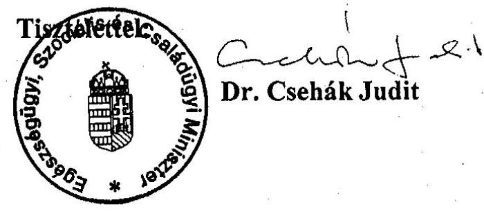

# JELENTÉS 

## az Egészségügyi Minisztérium fejezet múködésének ellenőrzéséről

2002. június

---

# 2. Államháztartás Központi Szintjét Ellenőrző Igazgatóság   2.3. Átfogó Ellenőrzési Főcsoport   V-18-41/2001-2002.   Témaszám: 575   Az ellenőrzést felügyelte: 

Bihary Zsigmond
föigazgató

## Az ellenőrzés végrehajtásáért felelős:

Hegedüsné dr. Müllern Veronika
főcsoportfőnök
Az ellenőrzést vezette:
dr. Csépán Magdolna
osztályvezető főtanácsos, igazgatóhelyettes

## Az összefoglaló jelentést készítette:

dr. Kurucz István
osztályvezető főtanácsos
Az ellenőrzést végezték:
Balla Józsefné
számvevő tanácsos, tanácsadó

Földvári Gábor
számvevő gyakornok

Horváth Erika
számvevő tanácsos
dr. Kurucz István
számvevő tanácsos, tanácsadó
dr. Lengyel Attila
számvevő

Molnár Istvánné
számvevő tanácsos, tanácsadó

## Remport Katalin

számvevő

## Simonné dr. Csepregi Zsuzsa

számvevő

## Szabó Erzsébet

számvevő

## Szendrődi Józsefné

számvevő tanácsos,

Székely Ibolya
számvevő

Zachár Péterné
számvevő

## Papp Júlia

számvevő

## Az Egészségügyi Minisztériumot érintő korábbi ellenőrzéseink címei: :

1. Népjóléti Minisztérium fejezet múködésének ellenőrzése (1992)
2. Az önkormányzati egészségügyi intézmények gép-műszer ellátottságának, valamint egyes diagnosztikai részlegek teljesítményének vizsgálata (1999)
3. Az önkormányzati tulajdonban lévő kórházak pénzügyi helyzetének, gazdálkodásának vizsgálata (2000)
4. A központi költségvetés területén múködő belső kontroll mechanizmus ellenőrzése (2000,2001.)
5. Az éves zárszámadások és költségvetési előirányzatok ellenőrzései

Jelentéseink az Országgyúlés számítógépes hálózatán
és az Interneten a www.asz.hu címen is olvashatók, továbbá a Belügyminisztérium folyóirata, az "Önkormányzati Tájékoztató" rendszeresen közli, valamint a Megyei

Közigazgatási Hivatalvezetők részére is átadásra kerül.

---

# TARTALOMJEGYZÉK 

JELENTÉS AZ EGÉSZSÉGÜGYI MINISZTÉRIUM FEJELEZET MŰKÖDÉSÉNEK ELLENŐRZÉSÉRŐL ..... 3
BEVEZETÉS ..... 3
I. ÖSSZEGZŐ MEGÁLLAPÍTÁSOK, KÖVETKEZTETÉSEK, JAVASLATOK ..... 5
II. RÉSZLETES MEGÁLLAPÍTÁSOK ..... 11

1. az egészségügyi minisztérium ágazat-irányító tevékenysége ..... 11
1.1. A szakmai feladatok és a feladatellátás feltételrendszere összhangjának érvényesülése ..... 11
1.1.1. A miniszter feladatainak és a fejezet intézményi struktúrájának változása. ..... 12
1.1.2. Az Európai Unióhoz való csatlakozás előkészítése ..... 14
1.1.3. Az Egészségügyi Minisztérium szabályozó tevékenysége ..... 15
1.1.3.1. Az Egészségügyi Minisztérium törvényelőkészítő tevékenysége, az egészségügyi törvény végrehajtása ..... 16
1.1.3.2. A kormányhatározatok végrehajtása az ágazatnál ..... 17
1.2. A minisztérium szervezetének, múködésének, belső irányítási rendjének szabályozottsága ..... 18
1.2.1. A minisztérium szervezetének, illetve az intézményeinek a szabályozottsága ..... 18
1.2.2. Az ellenőrzött intézmények tevékenysége ..... 20
1.2.3. Az informatikai rendszerek múködése ..... 22
1.2.4. A költségvetési gazdálkodás ellenőrzési rendszere a fejezetnél ..... 24
2. a szakmai feladatok és az ellátásukhoz biztosított források összhangja ..... 24
2.1. A fejezeti költségvetés tervezése, a finanszírozás rendszere ..... 26
2.1.1. A költségvetés tervezése ..... 26
2.1.2. A fejezet bevétele ..... 27
2.1.3. A fejezet kiadásai ..... 27
2.1.3.1. A létszámmal és a személyi juttatásokkal való gazdálkodás ..... 28
2.1.3.2. A dologi kiadások alakulása ..... 30
2.1.4. Az előirányzatok módosítása ..... 31
2.2. Az eszköz és vagyongazdálkodás ..... 32

---

2.3. A számviteli politika és a bizonylati rend. Az éves beszámolók számviteli alátámasztottsága ..... 33
3. a fejezeti kezelésű előirányzatok ellenőrzésének tapasztalatai ..... 34
3.1. A programfinanszírozás körébe nem tartozó előirányzatok teljesítése ..... 35
3.1.1. A sürgősségi betegellátás feltételeinek kialakítása ..... 35
3.1.2. Az egészségügyi minőségbiztosítás feltételeinek kialakítása ..... 36
3.1.3. A nemzeti egészségügyi struktúrafejlesztés ..... 37
3.2. A programfinanszírozás körébe vont előirányzatok teljesítése ..... 38
3.2.1. Az egészségfejlesztési célok ..... 38
3.2.2. Az egészségügyi intézményrendszer szerkezet-átalakítása ..... 40
3.2.3. A diagnosztikai eszközpark és a fertőtlenítő rendszerek fejlesztése ..... 41
3.2.4. Az alapradiológiai géppark korszerűsítése ..... 41
3.2.5. Az onkológiai sugárterápia feltételeinek javítása ..... 42
3.2.6. Az aneszteziológiai, és az intenzív ellátás minimumfeltételeinek biztosítása ..... 42
3.2.7. A nagy értékű, kiemelt egészségügyi beavatkozások ..... 43
3.2.8. A Phare programok végrehajtása ..... 44
3.2.9. Az európai integrációs felkészülés Egészségügyi Nemzeti Programja ..... 46
3.3. Az alapítványok és a társadalmi szervezetek pénzügyi támogatása ..... 46
3.4. A központi beruházási előirányzatok és felújítások ..... 47
3.4.1. Az Országos Idegsebészeti Tudományos Intézetnél végzett központi beruházás ..... 48
3.4.2. A Soproni Városi Kórház rekonstrukciója ..... 49
3.4.3. Az OORI beruházásának a helyzete ..... 50
3.4.4. Az egészségügyi intézmények felújítása ..... 50
4. a 2000. évi számvevőszéki ellenőrzések megál-lapításához, javaslataihoz kapcsolódó intézkedések utóellelnőrzése ..... 51
4.1. A belső kontroll mechanizmusok működésének 2000. évi ellenőrzése óta bekövetkezett változások ..... 51
4.2. Az EüM fejezet 2000. évi zárszámadásának ellenőrzési megállapításai és ajánlásai nyomán tett intézkedések. ..... 52
4.3. Az Egészségbiztosítási Alap 2000. évi költségvetése végrehajtásának ellenőrzésekor az egészségügyi miniszternek címzett javaslatok érvényesülése ..... 52

---

# JELENTÉS 

## az Egészségügyi Minisztérium fejezet múködésének ellenőrzéséről

## Bevezetés

Az Egészségügyi Minisztérium (EüM) a Magyar Köztársaság minisztériumainak felsorolásáról szóló 1998. évi XXXVI. törvény alapján jött létre, a Népjóléti Minisztérium jogutódjaként.

Az egészségügy az állami újraelosztás egyik legjelentősebb, az egész társadalmat érintő ágazata. Az ágazattal kapcsolatos feszültségek oldása, az EU elvárásaihoz igazodás az egészségügy reformját igényli, amelynek fő területei az egészségfejlesztés, a közegészségügy és az ellátó rendszer átalakítása. Az utóbbi átalakításán belül a sürgősségi ellátás élvez elsőbbséget.

A fejezet egészségügyi feladatainak ellátására az Országgyűlés 2001. és 2002. évre 109,7 Mrd Ft, illetve 114 Mrd Ft kiadási, 60,8 Mrd Ft, illetve 63 Mrd Ft támogatási, és 48,9 Mrd Ft, illetve 51 Mrd Ft bevételi előirányzatot hagyott jóvá. A kiadásokon belül az EU integrációs felkészülés Egészségügyi Nemzeti Programjának előirányzata mind a két évben 240 M Ft. A központi és intézményi beruházási kiadások együttes előirányzata 9,9 Mrd Ft, illetve 10,6 Mrd Ft. A jóváhagyott létszám 2001-ben 26.816, 2002-ben 26,934 fő, a személyi juttatások előirányzata 33,7 Mrd Ft, illetve 36,5 Mrd Ft volt.

A fejezet hét költségvetési címéhez 30 önállóan gazdálkodó költségvetési szerv tartozik. A felügyelt gyógyító megelőző egészségügyi ellátást végző intézmények száma tizenhét.

A minisztérium jogelődjénél 1992. évben végeztünk átfogó pénzügyi-gazdasági ellenőrzést. Ezt követően évente ellenőriztük a fejezet költségvetési előirányzatainak tervezését és azok végrehajtását. A téma ellenőrzések során vizsgáltuk az önkormányzati egészségügyi intézmények gép-műszer ellátottságát, illetve a kórházak pénzügyi helyzetét, a belső kontroll mechanizmus múködését.

Ellenőrzésünk célja annak értékelése volt, hogy a fejezet

---

- szervezeti, irányítási, és múködési rendszere, költségvetési előirányzatai hogyan biztosították a szakmai feladatoknak az állami egészségpolitikai célokkal összehangolt hatékony és eredményes megvalósítását;
- a költségvetési előirányzatok felhasználása során a költségvetési gazdálkodási feladatait, a felügyeleti és ágazati irányító teendőit a jogszabályi előírásoknak megfelelően, célszerűen és eredményesen látta-e el;
- a fejezeti kezelésű előirányzatoknál biztosította-e azok szabályszerű felhasználását, a kitűzött ágazati, szakmai célok elérését;
- irányító, és gazdálkodó tevékenységében mennyiben hasznosította a korábbi számvevőszéki ellenőrzések megállapításait, az ÁSZ ajánlásait.

Az Állami Számvevőszék az államháztartásról szóló, többször módosított 1992. évi XXXVIII. törvény 121. § (1) bekezdése alapján ellenőrzi az államháztartás forrásait, azok felhasználását, a vagyonnal való gazdálkodást. A fejezet ellenőrzését az Állami Számvevőszékről szóló 1989. évi XXXVIII. törvény 2. § (3) és a 17. § (3) bekezdése alapján végeztük.

Az ellenőrzés az 1992-2001. I. féléve közötti időszakra irányult, de ezen belül a hangsúlyt az utolsó 3 és fél évre helyeztük. A pénzügyi - gazdasági folyamatokat azonban a helyszíni ellenőrzés lezárásáig (2001. év végéig) figyelemmel kísértük. Megkezdtük az EüM Gazdasági Igazgatósága 2001. évi beszámolója megbízhatóságának vizsgálatát is, amit 2002-ben, a zárszámadás financiál audit típusú ellenőrzése keretében fejezünk be.

A végleges jelentést megküldtük Dr. Csehák Judit miniszter asszonynak, aki nem tett észrevételt és jelezte, hogy az ellenőrzés alapján elrendelt intézkedéseiről 30 napon belül tájékoztatni fogja az ÁSZ elnökét (1. sz. melléklet).

---

# I. ÖSSZEGZŐ MEGÁLLAPÍTÁSOK, KÖVETKEZTETÉSEK, JAVASLATOK 

Az 1990-től 1998-ig múködő Népjóléti Minisztérium jogutódjaként 1998-ban létrehozták az Egészségügyi, valamint a Szociális és Családügyi Minisztériumot. A szakmai területeket a két minisztérium között az egészségpolitikai, illetve a szociálpolitikai helyettes államtitkár által irányított szervezeti egységek szétválasztásával osztották meg. A kiegészítő, kiszolgáló területek szétválasztása a két minisztérium, illetve a Miniszterelnöki Hivatal közötti megállapodás alapján történt. A szétválás megfelelően dokumentált, szerződésekkel és jegyzőkönyvekkel alátámasztott.

Az egészségüggyel kapcsolatos állami feladatokat az egészségügyről szóló törvény tartalmazza. Megalkotásakor - a törvény indoklása szerint - az volt a cél, hogy az egészségpolitika meghatározó, átfogó kérdéseiben egy következetes, konszenzusra törekvő, átlátható döntéshozatali rendszer alakuljon ki. A törvény előírta a Nemzeti Egészségfejlesztési Program kidolgozását, amelyet az Országgyúlés fogad el és négyévenként rendszeresen felülvizsgál. A törvény értelmében a Nemzeti Egészségfejlesztési Programnak tartalmaznia kell egyrészt a népegészségügyre vonatkozó hosszú távú célokat, feladatokat, másrészt az egészségügyi ellátások és ellátó rendszer, az egészségbiztosítási rendszer, a gyógyszer- és gyógyászati segédeszköz ellátás koncepcionális irányait és feladatait. A Nemzeti Egészségfejlesztési Program ilyen tartalommal mindeddig nem készült el.

A Kormány 2001-ben elfogadta a 2001-2010 közötti évekre szóló Egészséges Nemzetért Népegészségügyi Programot, amely az Egészségfejlesztési Programban meghatározott tartalmi követelmények egy részét lefedi, de nem tartalmazza a közfinanszírozott egészségügyi ellátásokra (beleértve a gyógyszer-, gyógyászati segédeszköz ellátást is), az ellátórendszerre és a társadalombiztosítási finanszírozás módjára vonatkozó koncepciót. Ezek kidolgozása a Nemzeti Fejlesztési Terv egészségügyi ágazatra vonatkozó részeként folyamatban van. Az Egészséges Nemzetért Népegészségügyi Program nem került az Országgyúlés elé, többletforrást a 2001-2002. évi költségvetésben nem rendeltek hozzá. A parlamenti legitimáció a szükséges pénzügyi fedezet biztosítása szempontjából is fontos lenne.

Az Egészségügyi Minisztérium ágazati irányító tevékenységét értékelve megállapítható, hogy a szakmai területek szabályozásában, illetve a jogszabályok elkészítésében a tárca általában teljesítette az egészségügyről szóló törvényben, illetve az egészségügyi miniszter feladat és hatásköréről szóló kormányrendeletben előírt feladatokat. Megtörtént az egészségügyi szolgáltatások szakmai követelményrendszerének, az egészségügyi képzés, szakképzés rendszerének és követelményeinek, a kutatási tevékenység irányításának, a szakmai kamarák törvényességi felügyeletének szabályozása. Az egészségügy egyes kérdéseivel foglalkozó kormányhatározatokban előírt szabályozási feladatoknak kevés kivétellel eleget tettek.

---

Elmaradás elsődlegesen az egészségpolitikával összefüggő koncepcionális feladatok, a kormányhatározatban is megfogalmazandó elvárások teljesítésénél van. Nem került a Kormány elé a szükségleteknek megfelelő, finanszírozható egészségügyi ellátórendszer, intézményi struktúra kialakítására vonatkozó koncepció, elmaradt az amortizáció kérdésének rendezése, az egészségügyi finanszírozás korszerűsítése. Az egészségügyi ellátórendszer kapacitásának szabályozására megalkották az egészségügyi ellátási kötelezettségről és a területi finanszírozási normatívákról szóló törvényt, azonban a megyei szintű alkumechanizmus keretében folyó „ágyszám-csökkentés" nem vezetett el a szükségletekhez jobban igazodó és finanszírozható ellátórendszer kialakulásához. Az 1991-ben elindított egészségügyi reform a háziorvosi ellátásban valósult meg teljes körűen. A szakellátás átalakítása szempontjából jelentős változásokat tartalmazó 2001. évi szabályozás hatása még nem érzékelhető.

Az egészségügyről szóló törvény - az európai normákat figyelembe véve az állam felelőssége körében határozta meg a mentés, a vérellátás és - az egészségügyi miniszter közvetlen irányítása alá tartozó ÁNTSZ-en keresztül - a népegészségügyi feladatok ellátását. Mindhárom területen megtörtént a szakmai feladatok újradefiniálása, egyidejúleg szervezeti átalakításokra került sor.

A vérellátás új rendszerének, szervezeti struktúrájának átalakítása a teljes körű jogi szabályozással együtt 2000. július 1-jével megtörtént. Forráshiány miatt elmaradás van az országosan egységes múködéshez szükséges informatikai rendszer létrehozásában.

Az ÁNTSZ szervezeti átalakítása is megtörtént, központi szerve az Országos Tisztiorvosi Hivatal (OTH) 1998. január 1-jétől új feladat- és hatáskörrel rendelkezik. A két szervezet belső szabályozása még nem teljes körű, kiegészítése folyamatban van. Hiányolható, hogy a tárcánál egyik esetben sem készült előzetes megvalósítási ütemterv az átszervezéshez.

A sürgősségi betegellátás - ezen belül a mentés - fejlesztésére jelenleg sincs a felügyeleti szerv által elfogadott szakmai koncepció, bár a feladat - összhangban az EU követelményeivel - 1998-tól 2001-ig az egészségpolitika prioritásai között szerepelt. A sürgősségi betegellátás átalakításának részeként 2001-ben megtörtént az Országos Baleseti és Sürgősségi Intézet létrehozása a korábbi Országos Traumatológiai Intézet és a Mentőkórház összevonásával. Az új szervezet létrehozásával kapcsolatos alapítói feladatoknak a tárca nem tett eleget maradéktalanul. Az intézkedés hatását az ellátás színvonalára még korai lenne értékelni. Az Országos Mentőszolgálat múködésével kapcsolatos célokat - a 15 percen belüli elérhetőséget - csak részlegesen sikerült teljesíteni.

A gyógyító-megelőző ellátás olyan országos intézetei, mint az Országos Orvosi Rehabilitációs Intézet (OORI) és az Országos Idegsebészeti Tudományos Intézet (OITI) az alapfeladataik mellett részt vettek az egészségügyi ágazat egészét érintő szakmai munkában. A minisztérium 1999-ben az országos intézetek önállóságának megszüntetését tervezte. Az elképzelés megvalósításától 2001ben elálltak.

---

A minisztérium szervezete, múködési rendszere többször módosult. A minisztérium felső vezetésének változásai befolyásolták a tárca szakmai céljainak a sorrendiségét. A kialakított szervezeti felépítés általában megfelelt az akkor hatályos törvényi előirásoknak, feladatstruktúrának. A szervezeti átalakulásokat késve, vagy egyáltalán nem követte a belső szabályozás módosítása. Az 1990. évben létrejött Népjóléti Minisztérium SZMSZ-ét 1994-ben, az Egészségügyi Minisztériumét 2001-ben adta ki a miniszter. Az 1998. évi szétválást nem követte az SZMSZ módosítása. Az egészségügyi miniszter látja el 2001. január 1-jétől az Egészségbiztosítási Alap gazdálkodásának és az alapkezelő Országos Egészségbiztosítási Pénztárnak a felügyeletét.

A 2001. évi szabályozás rögzíti a fejezethez tartozó intézmények felügyeleti rendjét. Az országos intézetek alapító okiratát 1997-ben megújították, egységesítették. A felügyelt intézmények közül nem mindegyik rendelkezik az EüM által jóváhagyott Szervezeti és Múködési Szabályzattal (így az OORI és az OITI), más esetben a változásokat késve követte az új SZMSZ kiadása, például az OVSZ-nél.

A költségvetési előirányzatok csak részben fedezték a szakmai célok megvalósítását, a múködtetéshez szükséges pénzügyi forrásokat. Kedvezőtlen hatásuk érzékelhető volt a gazdálkodási feladatok végrehajtásánál. Az ÁSZ zárszámadási ellenőrzései megállapították, hogy a fejezet bevételi és kiadási előirányzatai és teljesítésük között nincs összhang, különösen a gyógyító-megelőző ellátás országos intézményeinél, mert a társadalombiztosítástól származó bevételek tervezése bizonytalan a teljesítményfinanszírozás miatt, miközben a kiadást a költségvetési gazdálkodás kötöttségei határozzák meg. A múködtetésnél, a fekvőbeteg ellátásnál jelentkező gondokat nem sikerült megszüntetni az ellenőrzött időszakban.

Az intézmények költségvetési gazdálkodásánál érvényesült az ágazati irányítás. Az intézmények bevételei alakulásában meghatározó volt a költségvetéstől kapott támogatás, valamint a teljesítmény-finanszírozáshoz kapcsolódó bevétel. A bevétel nagyságát rendszeresen módosította az előzetesen nem kalkulálható előirányzat-maradvány. A fejezet kiadásainak belső arányaiban nem volt érdemi változás. Az ellenőrzött intézmények közül az OVSZ-nél a feladatváltozás miatt eltérő volt a kiadások szerkezete.

A fejezet és intézményei létszám- és bérgazdálkodását törvényi feltételek szabályozták. Nem javultak a minisztérium Gazdasági Igazgatósága múködésének személyi és tárgyi feltételei. Gazdálkodási tevékenységében több szabálytalanságot tapasztaltunk a személyi juttatások kifizetésénél, a dologi előirányzatok felhasználásánál.

Az EüM GI-nek és - az OORI, OITI kivételével - az ellenőrzött intézményeknek a számviteli politikája, bizonylati rendje, az éves beszámolók számviteli alátámasztottsága nem volt megfelelő. Nem vették figyelembe a jogszabályi előírásokat. Pozitívum, hogy a gazdasági igazgatóságnál 2001-ben - részben a 2000. évi ÁSZ vizsgálat hatására - több célirányos intézkedést tettek. Ennek ellenére a korábban feltárt hibák egy részét továbbra sem számolták fel.

---

A minisztérium a fejezeti kezelésű előirányzatok kivételével szabályszerűen végezte a felügyeleti ellenőrzéseket, de nem intézkedtek az ellenőrzések során feltárt szabálytalanságok megszüntetése érdekében.

A fejezet információs rendszere nem alkalmas arra, hogy az egészségügy egészére vonatkozóan megbízható adatokat szolgáltasson. A vizsgált időszakban többször áttekintették a helyzetet, és ismételten megfogalmazták a korábbi években már rögzített célokat, kiegészítve az új követelményekkel. Megvalósításukhoz egyik évben sem biztosítottak forrást, ezért az információs rendszer egységesítése, a közös adatbázis és adattárház megteremtése elmaradt.

Az ágazati célokkal összhangban biztosították a fejezeti kezelésű előirányzatoknál a szabályszerű felhasználást. Az ágazati célok megvalósítására szolgáló fejezeti kezelésú előirányzatok arányukban és összegszerűségükben is csökkenő tendenciát mutattak az ellenőrzött időszakban. Ennek oka, hogy a fejezethez tartozó intézmények gazdálkodásának egyensúlyban tartása növekvő támogatási igényt támaszt, amit a költségvetés tervezésénél prioritásként kezel a tárca. A fejezethez tartozó intézmények az amortizáció részbeni pótlására emelt múködési előirányzatot kapnak. A források szűkössége az egyes ágazati célokat (például az alap radiológiai géppark korszerűsítését, az onkológiai sugárterápia feltételeinek javítását) hátráltatta.

A fejezeti kezelésű előirányzatokra fordítandó összeg 1998-2001 között a negyedére mérséklődött, de az előirányzatok száma évről-évre több lett, a jelzett években 38 -ről 54 -re emelkedett. Az egy-egy fejezeti kezelésű előirányzatra jutó összeg a felére csökkent és 2001-ben átlagosan mintegy 200 M Ft volt. Jogosan vethető fel, hogy a feladatokhoz képest kis összegű előirányzatok kellőképpen segítik-e a fejezeti célok megvalósítását. A probléma része, hogy gyakran változtak a támogatott célok. A több évre tervezett fejlesztések forrásait idő előtt csökkentették, illetve átcsoportosították, amely késleltette a megvalósítást, akadályozta a tervszerű befejezést és a tervezettnél nagyobb kiadást okozott. A tárca nem fordított kellő figyelmet a felhasználás hatékonyságának a vizsgálatára, elemzésére.

A jóváhagyott fejezeti kezelésű előirányzatok felhasználásához évenként részletes tervet készítettek. Az előirányzatokat részben pályáztatással, részben egyedi (miniszteri, vagy államtitkári) döntések alapján kapták meg a kedvezményezettek. Témánként és évente is változott a pályáztatás, illetve az egyedi döntés aránya. A pályáztatások rendjét nem szabályozták. A pályázatokat az év második felében hirdették meg. A hosszadalmas eljárás késleltette, néha meghiúsította az előirányzatok tárgyévi felhasználását. Mindez hozzájárult az előirányzat maradvány keletkezéséhez. A pályázatokkal elnyert összegeket támogatási szerződések alapján utalták ki. A szerződésben esetenként nem írták elő azt, hogy a nyertes pályázó köteles beszámolni az előirányzat felhasználásáról.

A fejezeti kezelésű előirányzatok felhasználásáról, azok ellenőrzéséről, a kötelezettségvállalások nyilvántartásáról belső szabályzatban rendelkeztek, amit évente aktualizáltak. Ennek ellenére volt, hogy nem az eredeti rendeltetésnek megfelelően történt a felhasználás, így például az egészségfejlesztési célok előirányzatából finanszírozták a tárca tájékoztatási kiadásait, amelynek forrását a

---

GI költségvetésében kellene biztosítani. Volt, hogy egy célt, például a mentő gépkocsi beszerzését, több előirányzatból támogatták. Az ilyen támogatási gyakorlat esetében nehezen követhető a felhasználás.

A fejezeti kezelésű előirányzatok felhasználásának felügyeleti ellenőrzése nem megfelelő. A Népjóléti Minisztérium vezetői értekezlete 1998 áprilisában elfogadta a fejezeti kezelésű előirányzatok ellenőrzésének módszereiről és gyakorlatáról szóló előterjesztést és döntött annak bevezetéséről. Az EüM létrejötte után azonban elmaradt a szabályzat gyakorlati alkalmazása.

A fejezeti kezelésű előirányzatok felett rendelkező szakfőosztályok feladata az ellenőrzés, de a létszámhiányra való hivatkozás miatt rendre elmaradt a helyszíni ellenőrzés. Gondot jelentett a pályázati rendszer, a nagyszámú nyertes pályázó ellenőrzése. A minisztérium Ellenőrzési Főosztálya egy vizsgálat keretében - és csak általánosságban - foglalkozott a 2000. évi előirányzatok felhasználásával.

A fejezet beruházásaira 1992-2000 között összesen 59,8 Mrd Ft-ot fordítottak. A szakmailag megalapozott igények több központi intézményi beruházás, illetve rekonstrukció elkezdését is indokolnák, de a nagyberuházások miatt kevés a szabadon felhasználható keret. Előfordult az ellenőrzött beruházásoknál (például az OORI-nál), hogy forrás hiányában több év is eltelt a szakmai program kidolgozása és a beruházás megkezdése között, vagy a megvalósítás során kellett eltérni a tervezett ütemtől, ami a kiadások növekedéséhez vezetett.

A fejezet intézményeinél nem kielégítő az eszközök állapota, a használhatósági mutató kedvezőtlenebbé vált, (például az OITI-nél 2000-ben 15\% volt) mert az eszközök felújítása, pótlása elmaradt.

A berendezések, a műszerek megújítására, korszerűsítésére 1998-2001 között évente összesen 200 - 700 M Ft jutott, az országos szakintézetek és az egyetemi klinikák részére. Az előirányzat szűkösségét alátámasztja, hogy a legolcsóbb röntgengép ára is 10 M Ft felett van, és egy korszerű computer tomográf beszerzési értéke meghaladja a 150 M Ft-ot. A fejezet az utóbbi években előirányzatot biztosított a cserére a saját intézményei költségvetésében, amellyel lényegében csökkentette a fejezeti kezelésű előirányzatok összegét, arányát. Előfordult, (például az OITI-nél) hogy a felújítási előirányzattól vették el a beruházásikivitelezési tervek elkészítéséhez szükséges pénzt, mert a beruházási költségek között nem lehetett elszámolni.

A szolgálati lakásokkal összefüggő költséggazdálkodás nem egyértelmű. Volt, hogy több tízmillió forintot költöttek a szolgálati lakás bérleti jogának megvásárlására, a felújításra, a lakás berendezésére. Az ágazatnál biztosított szolgálati lakások bérleti díja nem fedezi a közös költséget sem.

Az utóvizsgálati tapasztalataink szerint az ÁSZ 2000. évi ellenőrzései során tett ajánlások többségét figyelembe vették, teljesítésük folyamatban van.

---

A jelentés megállapításainak hasznosítása mellett javasoljuk

# a Kormánynak 

1. Dolgoztassa ki az Egészséges Nemzetért Népegészségügyi Program forrásigényét, és ezt követően a Programot terjessze az Országgyűlés elé.
2. Intézkedjen a Nemzeti Egészségfejlesztési Program elkészítéséről, illetve annak Országgyűlés elé terjesztéséről (Eütv 147. § (1) bekezdés).

## az egészségügyi miniszternek

1. Intézkedjen a tárcán belül a fejezeti kezelésű előirányzatok tervezése és felhasználása során a hatékonysági vizsgálatok megszervezéséről.
2. Kezdeményezze az egészségügyi szolgálati lakásokkal összefüggő jogszabályok módosítását úgy, hogy a jogszabály tartalmazza a bérleti jog megvásárlásának, a szolgálati lakás felújításának, berendezésének és fenntartásának a fejezetnél alkalmazható feltételeit.
3. Gondoskodjon arról, hogy a vonatkozó kormányrendelet előírásainak megfelelően fejeződjön be az Országos Baleseti és Sürgősségi Intézet átszervezése.

---

# II. RÉSZLETES MEGÁLLAPÍTÁSOK 

## 1. AZ EGÉSZSÉGÜGYI MINISZTÉRIUM ÁGAZAT-IRÁNYÍTÓ TEVÉKENYSÉGE

Az Egészségügyi Minisztérium (EüM) 1998-ban jött létre, miután jogelődjét, az 1990-ben alakult Népjóléti Minisztériumot (NM) az 1998. évi XXXVI. törvény megszüntette és létrehozta az Egészségügyi, valamint a Szociális és Családügyi Minisztériumot. Az átalakítás célja - a Kormányprogramnak megfelelően - a Magyar Köztársaság előtt álló egészségügyi, társadalmi-szociális feladatok eredményesebb kezelése volt.

### 1.1. A szakmai feladatok és a feladatellátás feltételrendszere összhangjának érvényesülése

Az egészségügyről szóló törvény részletesen meghatározza az államnak a lakosság egészségi állapotáért viselt felelősségének a tartalmát. Az 1972. évi II. törvényt felváltó 1997. évi CLIV törvény (Eütv.) 141. § (2) bekezdése szerint az állam felelőssége többek között az egészségügyi ellátórendszer feltételeinek megteremtése, a kötelező egészségbiztosítási rendszer múködtetése, az emberi méltóság és önrendelkezési jog védelme az egészségügyi intézményrendszer múködése során, valamint az egészségpolitikai cél- feladat- és eszközrendszer meghatározása és érvényesítése.

Az egészségügy szervezéséért, irányításáért a felelősség az Országgyúlés, a Kormány, az egészségügyi miniszter, az ÁNTSZ, a helyi önkormányzatok, az egészségbiztosítási szervek és az egészségügyi intézmények fenntartói között oszlik meg.

Az Eütv. 147. §-a szerint a Kormány feladata többek között az egészséget támogató kormányzati politika (elvek, célok, irányok) meghatározása, az egészségügyi államigazgatási feladatok végrehajtásának irányítása, a nemzetközi szerződésekben vállalt kötelezettségek, jogok érvényesítése, az Eütv. szerinti kártalanítások, megtérítési kötelezettségek teljesítése, a katasztrófa-elhárítás feltételeinek biztosítása, irányítása.

A törvény értelmében az egészségügyi tervezés alapja az Országgyúlés által elfogadott Nemzeti Egészségfejlesztési Program (NEP), amelyet valamennyi állami tervezés körébe tartozó döntés meghozatala, illetve végrehajtása során érvényre kell juttatni. Ilyen program kidolgozására, illetve előterjesztésére mindeddig nem került sor.

Az egészségpolitika alapelveit, legfőbb célkitűzéseit a 90-es évek elejétől a különböző kormányprogramok közel azonos tartalommal határozták meg. Az egyes kormányzati ciklusokban azonban más-más feladatok kaptak prioritást.

A cikluson belüli miniszter-váltások miatt (1994-1998 között három, 1998-2002 között két miniszter váltotta egymást a tárca élén) ezek az átrendeződések gyakoribbá váltak, ami egyes megkezdett szakmai programok végrehajtásának késedelmét okozta.

---

Az 1994. évben kormányhatározat rögzítette a hosszú távú egészségfejlesztési politika alapelveit. Ebben az évben kidolgozták az 1994-1998 közötti időszakra az egészségvédelem nemzeti programját.

A 2001. évben elkészült a 2001-2010. évekre szóló Egészséges Nemzetért Népegészségügyi Program (ENNP), melyet a 1066/2001. (VII. 10.) Korm. határozat a kormányzati egészség-politika rangjára emelt. A Program nem került az Országgyúlés elé.

Célkitűzései alig térnek el a korábban megfogalmazott hosszú távú egészségfejlesztési céloktól. Ezek egy kisebb része megvalósult, más elemei a 2001. évi programba is bekerültek.

Az ENNP csak részben fedi le a NEP feladatait. Bemutatja a lakosság egészségi állapotát, de a hangsúlyt a prevencióra helyezi, és a lakosság egészségi állapotának nem gyógyító eszközökkel való javításáról szól. Ugyanakkor nem tartalmazza az egészségügyi ellátórendszer, az egészségbiztosítás, a gyógyszerellátás fejlesztésének koncepcióját.

# 1.1.1. A miniszter feladatainak és a fejezet intézményi struktúrájának változása. 

Az Eütv. 150. §-a szerint az egészségügyi miniszter feladata, hogy a Kormány egészségpolitikai döntéseinek megfelelően lássa el az egészségügy ágazati irányítását.

A miniszter ágazati irányító jogköre kiterjed minden egészségügyi tevékenységre, illetve - jogállásától függetlenül - minden szolgáltatóra. Mint a fejezet irányítója, az Áht-ban szabályozott felügyeleti jogkört gyakorol a fejezethez tartozó intézményeknél.

Az egészségügyi miniszter feladat- és hatáskörét a 154/1998. (IX. 30.) Korm. rendelet határozza meg. A rendelet az egészségügyi és a szociális-családügyi feladatok 1998. évi szétválasztásával egyidejűleg hatályon kívül helyezett 49/1990. (IX. 15.) Korm. rendeletből - mely a népjóléti miniszter feladatkörét szabályozta - átvette az egészségügyi területre vonatkozó szabályokat, és további feladatokat is beépített (európai integrációs, szakképzési, rendkívüli állapottal, Rehabilitációs Alappal, gyógyszerekkel kapcsolatos feladatokat határozott meg).

A miniszter feladata, hogy kidolgozza az egészségügyi ellátás koncepcióját, feladatait, meghatározza a szakmai szabályait, a szakirányítás, szakfelügyelet és szakmai ellenőrzés rendszerét. Irányítja az egészségügyi ellátást és tevékenységet. Ellátja az ágazat nemzetközi kapcsolatrendszeréből adódó feladatokat. Törvényességi felügyeletet gyakorol az ÁNTSZ és a szakmai kamarák felett. A hatósági jogkörébe az egészségügyi intézmények létesítésével - megszüntetésével, szakmai ellátási szintjének meghatározásával kapcsolatos döntések, másrészt közegészségügyi-járványügyi intézkedések tartoznak.

A vizsgált időszakban - a szakmai feladatok változásával - a minisztérium szervezete is több változáson ment keresztül. Az átalakulások eredményeképpen kialakuló szervezeti felépítés megfelelt az akkor hatályos törvé

---

nyekben és egyéb jogszabályokban meghatározott feladatstruktúrának. Megállapítható ugyanakkor, hogy a szervezeti változásokat késve követte a belső szabályozás módosítása.

A minisztériumok felsorolásáról szóló 1998. évi XXXVI. törvény és annak indoklása nem határozta meg a több ponton szorosan összefüggő egészségügyi és szociális területek határát. A szakmai területeket az egészségpolitikai, illetve a szociálpolitikai helyettes államtitkár által irányított szervezeti egységek szétválasztásával osztották meg. A kiegészítő, kiszolgáló területek szétválasztása a két minisztérium megállapodása alapján történt. Részben ez okozta, hogy 1998. végén is voltak az EüM-ben, a SzCsM-hez átirányított dolgozók.

A szétválás dokumentálása az EüM iratai alapján, szerződésekkel és jegyzőkönyvvel alátámasztva történt. A Miniszterelnöki Hivatallal és az SzCsM-mel 1998. augusztus 18 -án aláírt megállapodás, illetve szerződés alapján összesen 92 munkatárs és 19 betöltetlen álláshely átadására került sor a hozzájuk rendelt személyi juttatás, dologi és felhalmozási előirányzatok, valamint eszközök átcsoportosításával.

Az EüM-ben nem tudtak dokumentumokat szolgáltatni arról, hogy a szétválás után milyen döntések alapján jött létre az EüM új szervezeti struktúrája. Az 1998. évi átszervezés után sem szabályozták a minisztérium múködését. Tervezeteket dolgoztak ki, de jóváhagyásuk nem történt meg, csupán az új vezetők kinevezési dokumentumait adták ki.
2001. január 1-jétől az egészségügyi miniszter felügyeli az Egészségbiztosítási Alap gazdálkodását és irányítja az alapkezelő Országos Egészségbiztosítási Pénztárt (OEP). A miniszter által 2001. augusztus 1-én jóváhagyott SZMSZ az Egészségbiztosítási és a Költségvetési Főosztályt érintő felügyeleti feladatokat részletezi elsősorban. A feladatok ellátását a kapcsolattartással korábban is megbízott Egészségbiztosítási Főosztály létszámának növelésével oldották meg.

Az Egészségbiztosítási Főosztály véleményezte a finanszírozási díjjal kapcsolatos kormányrendelet tervezetet. Egyeztette az alapdíj változtatást az OEP-vel. Egyeztette és véleményezte az E. Alap többletigényére, illetve az előirányzatok közötti átcsoportosításokra vonatkozó előterjesztéseket. Az E. Alap gazdálkodásában kialakuló feszültségekről - az OEP adatszolgáltatása alapján - tájékoztatta a minisztert. Javaslatot készített a gyorsított közbeszerzési eljárás, valamint az egyes kórházaknál jelentkező többletköltségek finanszírozásának engedélyezésére. Havonta összeállította a gyógyító-megelőző ellátások előirányzatának időarányos teljesítését bemutató tájékoztatót.

A Költségvetési Főosztály elsősorban az OEP múködési költségvetésének előirányzat módosítási javaslataival foglalkozott, amely a többletbevétel beruházási és dologi kiadásokra történő átcsoportosítását jelentette.

A szabályozásban meghatározó szerepet játszó Jogi és Közigazgatási Főosztályt 2001. január 1-jétől a jogi és nemzetközi helyettes államtitkár irányítja. A főosztály látja el a kodifikációs, a jogharmonizációs, a képviseleti és - 2001-től - a lakossági tájékoztatási feladatokat is. A feladatot korábban önálló fóosztály látta el 12 fővel.

---

A fejezethez tartozó intézmények felügyeleti rendjét a 2001-ben jóváhagyott SzMSz rögzíti, amely a szakmai felügyeletet a szakmai főosztályokhoz, a pénzügyi és gazdálkodási felügyeletet a Költségvetési Főosztályhoz telepítette. Valamennyi intézmény alapító okiratát elfogadták, kiadták.
A feladatváltozással összefüggő szervezeti átalakulás történt az ÁNTSZ-nél, az OMSZ-nál és az OVSZ-nél. Ezen intézetek által ellátott feladatok az uniós csatlakozás szempontjából is kiemelt fontosságúak, ami - egyebek mellett - a költségvetés címrendjének változásában is tükröződik, ugyanis a 2001-től az ÁNTSZ és az OVSZ is önálló költségvetési címet képez.

# 1.1.2. Az Európai Unióhoz való csatlakozás előkészítése 

A modernizációs program és az európai uniós integrációra való felkészülés egyes szakmai feladatainak végrehajtásáról szóló 2159/1996. (VI. 28.) Korm. határozat rögzítette az egészségügy múködésére vonatkozóan a modernizációs program megvalósításával és az EU csatlakozásra való felkészüléssel összefüggő́ célokat, a szolidaritási elven múködő kötelező biztosítási rendszer fenntartását, az esélyegyenlőség biztosítását, a valós egészségügyi szükségletekhez alkalmazkodó, rugalmas szolgáltatási struktúra kialakítását, az egészségügyben elköltött közpénzek átláthatóságát, az egészségügy finanszírozhatóságát, a ráfordítások hatékonyságának növelését.

A kormányhatározat értelmében a jogszabályalkotás minden pontján érvényesíteni kell az Európai Unióhoz való csatlakozás követelményeit. Az új egészségügyi törvény kidolgozásánál és az ahhoz kapcsolódó jogszabály-előkészítés során ezt a követelményt figyelembe vették.

Létrehozták az Európai Szociális Kartával kapcsolatos feladatokkal foglalkozó Tárcaközi Bizottságot. Meghatározták a Karta megerősítéséből és ellenőrzési mechanizmusából eredő feladatokat. A Karta kihirdetéséről az 1999. évi C. törvény rendelkezett.

Előkészítették az Európai Gyógyszerkönyv kidolgozásáról szóló Egyezményhez történő csatlakozást, amely a 2000. évi XXXI. törvény kihirdetésével megtörtént.

A Nemzetközi és Európai Integrációs Főosztály 2000. és 2001. évi tájékoztatója összegezte az európai integráció egészségügyi dimenziójáról és az integrációs feladatokról szóló 1993. évi Maastrichti és az 1999. évi Amszterdami Szerződés hazánkra háruló feladatait.

Megkezdődött az új népegészségügyi-stratégia - ennek keretében az átfogó egészségügyi információs rendszer - kidolgozása, a fertőző betegségekkel foglalkozó közösségi epidemiológiai hálózat múködtetése, a sürgősségi ellátás-, az ÁNTSZ, valamint a vérellátó rendszer fejlesztése, korszerűsítése, részben Phare támogatással.

Magyarország 2000-ig a rák ellenes, az AIDS és egyéb fertőző betegségek, a drogfüggőség, az egészségmegőrzés, a tájékoztatás, képzés uniós programjaiban vett részt.

---

Az integrációs kötelezettségekből adódó közvetlen feladatok a tárcánál a jogharmonizáció folyamatos végzése, az intézményi kapacitások felülvizsgálata, a diplomák, szakképesítések kölcsönös elfogadására történő felkészülés, a termékbiztonsági, a környezet-egészségügyi feladatok, az egészségfejlesztés infrastruktúrájának, és az egészségügyi ellátórendszernek a fejlesztése, valamint az Unió további népegészségügyi programjaiban való részvétel.

A Kormány az uniós feladatok kidolgozásához és finanszírozásához 66 M Ft-ot biztosított. Az összeget a személyi feltételek megteremtésére irányozták elő. Az integrációs munkák meghatározóan a Miniszterelnöki Hivatalban (MEH) folytak, ezért a Kormány a 2159/1996. (VI. 28.) Korm. határozattal az Integrációs Stratégiai Munkacsoport kutató, elemző munkájára előirányzott 153 M Ft-ot a MEH-hez utalta.

# 1.1.3. Az Egészségügyi Minisztérium szabályozó tevékenysége 

Az EüM szabályozási tevékenysége a jogalkotásról szóló 1987. évi XI. törvény előírásainak megfelelően részben törvények, részben kormányrendeletek előkészítése, részben miniszteri rendeletek megalkotása formájában történik. Döntően az Eütv. határozta meg azt a kört, ahol a Kormánynak rendeletben kell megállapítani a részletes szabályokat. Az ellenőrzött időszak 9 éve alatt az EüM és jogelődje, az NM számos egészségügyi, egészségpolitikai jogszabályt alkotott.

A szétválást megelőzően az NM - a szociális jogszabályokkal együtt - 47 törvényt (illetve módosítást), 135 kormányrendeletet (és módosítást) készített elő, és 288 miniszteri rendeletet, az EüM 1998. júliusától 2000. végéig 14 törvényt, 26 kormányrendeletet és 155 miniszteri rendeletet alkotott.

Ezzel együtt is a népjóléti, később az egészségügyi tárcát irányító miniszterek - a kiterjedt jogalkotási tevékenység ellenére - csak részben tettek eleget a számukra különböző jogforrásokban előírt szabályozási kötelezettségüknek. Az elmaradás elsődlegesen az egészségpolitikával összefüggő feladatok terén volt. Nem készültek el az egészségügyi rendszer, az intézményi struktúra átalakításával, költséghatékony múködtetésével kapcsolatos javaslatok, elmaradt például az egészségügyi finanszírozás korszerűsítése.

Az egészségügyben rendszeresen kialakuló feszültségek kezelésével több kormányhatározat is foglalkozott, amelyek az egészségügyi tárcának írtak elő feladatokat.

Megtörtént az egészségügyi szolgáltatások szakmai követelményrendszerének, az egészségügyi képzés, szakképzés rendszerének és követelményeinek, a kutatási tevékenység irányításának, a szakmai kamarák törvényességi felügyeletének a szabályozása.

A gyógyszerek, gyógyászati segédeszközök előállításával, forgalmazásával és rendelésével kapcsolatban több jogszabály született. A törekvések ellenére nem sikerült a gyógyszer-kiadásokat meghatározó tényezőket (ár, támogatási rendszer, fogyasztás) olyan mértékben megváltoztatni, befolyásolni, hogy az a kiadások növekedését mérsékelje. A támogatási rendszer reformértékű megváltoztatását illetően korlátot jelent a tárca számára, hogy az ezzel szinte törvényszerűen együtt járó lakossági teher-növekedés érzékeny szociálpolitikai kérdés, amelynek megoldása kívül esik a tárca hatáskörén.

---

# 1.1.3.1. Az Egészségügyi Minisztérium törvényelőkészítő tevékenysége, az egészségügyi törvény végrehajtása 

Az Országgyűlés az ellenőrzött időszakban - a nagyszámú törvénymódosítás mellett - több jelentős egészségügyi és társadalombiztosítási vonatkozású törvényt alkotott. Kiemelkedő az egészségügyi ellátási kötelezettségről és a területi finanszírozási normatívákról szóló 1996. évi LXIII. törvény.

A törvény az intézményrendszer strukturális átalakítását, a valós szükséglethez igazítást, a költség-hatékony ellátást tűzte célul. A sokat vitatott törvényt a 2001 év végi hatályon kívül helyezését megelőzően 3 ízben módosították.

A társadalombiztosítási rendszer megújításának koncepciójáról szóló 60/1991. (IX. 29.) OGY határozatnak megfelelően az 1992. évi X. törvény teremtette meg az egészség- és nyugdíjbiztosítás elkülönült pénzügyi alapját.

Az ellenőrzött időszakban jellemző volt, hogy a törvényi szabályozást igénylő egyes egészségügyi-, vagy társadalombiztosítási kérdéseket nem külön törvényben, hanem a társadalombiztosítási alapok költségvetéséről, vagy zárszámadásáról szóló törvényekben szabályozták, vagy módosították.

A társadalombiztosítás pénzügyi alapjairól és azok 1993. évi költségvetéséről szóló 1992. évi LXXXIV. tv. tartalmazta a tb. alapok gazdálkodásának alapvető szabályait (melyet szinte évente módosítottak és néhány előírása ma is hatályos), továbbá az egészségügy finanszírozásának törvényi szabályozását. A végrehajtásra kormányrendeletek készültek.

Az egészségügyi szolgáltatás megkezdésére és gyakorlására vonatkozó általános szabályokat egységes kormányrendelet nem rendezte, részterületeit részben az Eütv. hatálybalépését megelőzően kiadott jogszabályok, részben tárcarendeletek szabályozták.

Elmaradt az egészségnevelés és a népegészségügyi ellátások szakmai tartalmára vonatkozó jogszabály megalkotása, a betegbeutalás rendjére vonatkozó szabályok elkészítése. Az egészségügyi szolgáltatók felelősségbiztosítására még nem született meg a szabályozás. Nem készültek el az egészségügyi dolgozók rendtartására, az országos szervezetek feladatára, szervezetére, múködésére, továbbá az emberen végzett orvostudományi kutatásokra jogszabályok.

Az egészségügyi szakellátási kötelezettségről, továbbá egyes egészségügyet érintő törvények módosításáról szóló 2001. évi XXXIV. törvénnyel módosították az Eütv-t és új feladatokat is meghatároztak az EüM részére. A módosítás óta eltelt rövid idő még nem tette lehetővé a teljes körű szabályozást.

A népegészségügyi feladatok végrehajtása érdekében hozandó szabályozási kört a módosítás pontosította. E tárgykörben több rendeletet hoztak, de még hiányoznak a szabályzatok. A pszichiátriai betegekre, továbbá a halott vizsgálatra és a halottakkal kapcsolatos orvosi eljárásra vonatkozó részletes szabályokat a 34/1999. (IX. 24.) BM - EüM - IM együttes rendelet tartalmazza.

---

# 1.1.3.2. A kormányhatározatok végrehajtása az ágazatnál 

Az ellenőrzött időszakban a Kormány több olyan egészségügyet érintő határozatot hozott, amelynek végrehajtásáért az egészségügyi miniszter, illetve jogelődje, a népjóléti miniszter volt a felelős. Ezek egy részének végrehajtása elmaradt, vagy késedelemmel történt. A kormányhatározatokban megállapított végrehajtási időt az utolsó 4 évben néhány rendelet esetében módosították, többnyire azonban módosítás nélkül lépték túl a határidőt.

Az egészségügy feszültségeiről és a megoldás lehetőségeiről szóló 2029/1996. (II. 9.) Korm. határozat alapján hat NM rendelet született. A kórházak konszolidációját, az eladósodás problémakörének rendszerszerű kezelését nem sikerült megoldani. A regionális és a megyei egészségügyi tanácsokról szóló törvénytervezet elkészítésére sem került sor, de ezt a határozati pontot máig sem vonták vissza.

Az egészségügyreformjához kapcsolódó kormányhatározatok végrehajtásához hiányzott az OGY által is elfogadott stratégia és a szükséges pénzügyi fedezet.

Az egészségügy átalakításának 1997. évi feladat- és ütemtervéről szóló 2023/1997. (I. 30.) Korm. határozat több koncepció kidolgozását előírta, azok azonban nem készültek el, csak a nagy értékű, kiemelt egészségügyi beavatkozásokra vonatkozó u. n. várólisták vonatkozásában született rendelet. Az egészségügyi intézményrendszer privatizációjának szabályozására vonatkozó törvényjavaslatot 2001-ben nyújtották be az OGY-nek.

A Kormányhatározatokban előírták a gyógyszerkiadások növekedésének mérséklését, a szükséges intézkedések megtételét, így például a gyógyszerimport növekedési ütemének lassítása érdekében a gyógyszerkészítmények importjának szabályozását, 1995. április 30.-i határidővel. A szabályozás elmaradt. A gyógyszer-támogatási és gyógyszerellátási rendszerhez kapcsolódó NM rendeletek nem hozták meg a várt eredményeket. A gyógyszerkiadások nem csökkentek. A gyógyszerfelhasználás racionalizálása ügyében sem történt érdemi változás. A gyógyszer támogatási rendszerrel új koncepciót kellett volna kialakítani, de ez elmaradt.

Nem készült el 1995-ben az ÁNTSZ-nál végrehajtandó létszámcsökkentésről szóló 2178/1995. (VI. 22.) Korm. határozat a belső strukturális átalakításának koncepciója és csak az ÁNTSZ szervezetéről és múködéséről szóló 59/1997. (XII. 21.) NM rendelettel módosították az ÁNTSZ-ről szóló jogszabályt. A kábítószerek és pszichotróp anyagok legális előállításának, forgalmazásának és tárolásának szabályozására 2000. végéig adott határidőt nem tartották be. A szabályozás 2001. végére készült el.

Elkészült az egészségügyi szolgáltatások minőségbiztosítására vonatkozó szabályozás, de a szervezetet még nem hozták létre.

---

# 1.2. A minisztérium szervezetének, múködésének, belső irányítási rendjének szabályozottsága 

### 1.2.1. A minisztérium szervezetének, illetve az intézményeinek a szabályozottsága

A Népjóléti Minisztérium késedelmesen, csak 1994-ben a 4/1994. (NK 8.) NM utasítással adta ki hatályos szervezeti és múködési rendjét. A bekövetkezett szervezeti változások ellenére a jogelőd Szociális és Egészségügyi Minisztérium SZMSZ-e volt hatályban.

Az egészségügyről szóló 1997. évi CLIV. törvény előkészítésével párhuzamosan, azzal összhangban az 1994. évi SZMSZ-t a 3/1997. (NK. 6.) NM utasítással kiadott új SZMSZ váltotta fel. Ebben megjelent ÁNTSZ közvetlen miniszteri irányítása.

Az Eütv-ben foglalt feladatoknak megfelelően új szervezeti egységeket is kialakítottak, így az Egészségbiztosítási Főosztályt, Kábítószerügyi Osztályt. A közegészségügyi, járványügyi feladatokat az Egészségpolitikai Főosztályhoz telepítették.

A vizsgált időszakban a minisztérium szerkezetében a legnagyobb változás 1998-ban következett be, amikor a Magyar Köztársaság minisztériumainak felsorolásáról szóló 1998. évi XXXVI. törvény a Népjóléti Minisztérium jogutódjaként létrehozta az EüM-et és az SzCsM-et. A szétválás utáni szerkezeti változások az EüM belső szabályozásában nem jelentek meg, pedig a szociális terület kiválása, a belső munkamegosztás módosulása szükségessé tette volna az új SZMSZ kiadását.

Az 1998. évi szétválást követően - az SZMSZ hiányával összefüggésben ügyrendek sem készültek. A munkaköri leírások a szúrópróbaszerű ellenőrzés tapasztalata szerint többnyire rendelkezésre álltak, de megállapítható volt kisebb hiányosság.

Néhány vezető (például az egészségpolitikai, illetve az ápolási főosztályvezető) munkaköri leírása hiányzott. Az ellenőrzött 8 munkaköri leírás közül kettőnél a dátum hiányos volt.

A minisztérium féléves munkatervek alapján végezte tevékenységét. Az abban előírt követelményeknek (feladat, határidő, felelős) eleget tettek, azonban az 1998. évi II. félévi csak tervezeti szinten állt rendelkezésre. A munkaterveket vezetői értekezleteken fogadták el.

A 2001. évi miniszterváltás az alkalmazotti állományban is személycserével, majd szervezeti átalakulással járt. Az SZMSZ-t, a kialakult új struktúra szerint módosították.

Az új szervezetet az 1/2001. (I. 15.) EüM utasítással kiadott SZMSZ tartalmazta. Abban lefedték az egészségpolitikai feladatokat. Az így kialakult szervezetet, 2001. augusztus 1-jén módosították. A hatályba lépő SZMSZ a kutatási területet a miniszter közvetlen irányítása alá helyezte. A Közgazdasági és Pénzügyi Főosztályt - új feladatok és osztályok létrehozása mellett - kettéosztotta, a Közgazda

---

sági, illetve a Költségvetési Főosztályra. Megszűnt a stratégiai helyettes államtitkárság, és a Társadalmi Kapcsolatok Főosztálya.

Az 1998. évtől SZMSZ-ek rögzítették az állami egészségügyi intézmények irányítási rendjét, de nem tartalmazták teljes körűen a miniszter feladat és hatáskörét. Az ÁNTSZ irányítása a 2001. évi SZMSZ-ben sem jelenik meg közvetlenül a miniszter feladatai között. Az ÁNTSZ szervezetéről és múködéséről szóló 7/1991. (IV. 26.) NM rendelet 3. § (1) bekezdése az irányítási jogkörből a vezetői kinevezést, megbízást, felmentést tartalmazza. A 2001. évi SZMSZ-ből kimaradt a szakmai kamarák törvényességi felügyeletének nevesítése.

Az egészségügyi miniszter 2001. július 1-jei hatállyal törölte az OMSZ alaptevékenységéből a Mentőkórház múködtetését. Az Országos Traumatológiai Intézet (OTRI) és a Mentőkórház összevonásával megalakult az Országos Baleseti és Sürgősségi Intézet (OBSI). A minisztérium csak részben hajtotta végre az államháztartás működési rendjéről szóló 217/1998. (XII. 30.) Korm. rendelet 11. $\beta$-ában előírt a költségvetési szerv egyes feladatainak megszüntetésével, a feladatellátás más szervezeti formában történő megvalósításával összefüggő alapítói feladatokat. A módosított alapító okiratokon kívül nem tudták bemutatni a minisztériumban azt a rendeletben előírt dokumentumot, amely a feladat átadással egyidejűleg rendelkezik a vagyonról, a foglalkoztatottakról.

Az OMSZ és az OBSI vezetője által megkötött megállapodás nincs összhangban az OMSZ módosított alapító okiratával. A volt Mentőkórház vagyona, létszáma továbbra is az OMSZ-hoz tartozik. A megüresedett állásokra még létszámfelvételt is hirdetett az OMSZ. A szükséges pénzügyi keretet az OMSZ intézményi költségvetés támogatási előirányzatából kellett fedezni, mert más forrás nem állt rendelkezésre. A 2001. II. félévi, a Mentőkórházra vonatkoztatott forrásigény mintegy 200 M Ft volt.

Az ellenőrzött intézmények szabályozottságának vizsgálata során a következőket tapasztaltuk:

Az ÁNTSZ-t 1991-ben hozták létre, szervezete 1998. január 1.-től módosult. A 217/1998. (XII. 30.) Korm. rendelet szerint a felügyeleti szervnek kell jóváhagynia az önállóan, illetve a részben önállóan gazdálkodó költségvetési szervek közötti munkamegosztás és felelősségvállalás rendjét rögzítő megállapodást. A kidolgozás a vizsgálat ideje alatt folyamatban volt.

Az OTH (az ÁNTSZ központi szervezete) SZMSZ-ét a miniszter 1998. júniusában hagyta jóvá, amely a gazdálkodási feladatokkal kapcsolatos munkamegosztás szabályait csak részben tartalmazta. A vezetői és a főosztályi szinteken nincs világosan körülhatárolva az ÁNTSZ teljes szervezetére vonatkozó koordinációs jogkör és annak az OTH feladatellátásában való részvétel. Az időközben végrehajtott szervezeti változásokat és feladatbővülést nem vezették át.

A belső szabályzatok kidolgozását megkezdték. Az SZMSZ-ben előírt 11 szabályzatából 6 -ot adtak ki. A kiadott szabályzatokból sem tükröződik teljes részletezettségben az OTH-nak az ÁNTSZ összes szervezeti egységére vonatkozó koordinációs hatásköre, a munkamegosztás mélysége.

---

Az OMSZ nem rendelkezik egységes szerkezetű alapító okirattal és SZMSZ-szel. Az SZMSZ-ben rögzített feladatok, felelősségek nem egyértelműek. A gazdálkodás szempontjából kiemelten fontos szabályozások, szabályzatok nem készültek el, így például az új gazdálkodási ügyrend, a közbeszerzési-, valamint az adatvédelmi szabályzatok. Nem rendezték a közalkalmazotti jogviszonyban álló dolgozókkal létesített további jogviszonnyal kapcsolatos ügyeket. Nincs egységes szabályzat a szerződéskötésekre. A 6-8 éve kiadott szabályzatokat nem aktualizálták. Nincs megfelelő nyilvántartás a hatályos főigazgatói körlevelekről (utasításokról), a belső szabályzatokról.

Az OVSZ-t 1998. július 1-jével alapították. A feladatmegosztás vonatkozásában ellentmondás van az OVSZ és az Országos Hematológiai és Immunológiai Intézet (OHII) alapító okirata között, mert az OHII feladatkörébe sorolt klinikai transzfüziológiai módszertani irányító tevékenységét az OVSZ látja el. A feloldásához jogszabály módosítás szükséges.

Az intézmény SZMSZ-ét, két év késéssel hagyták jóvá. Az előírt szabályzatoknak csak egy része készült el: nincs gazdálkodási ügyrend, számviteli politika, számlarend.

Az OORI és az OITI rendelkezik a jogszabályban előírt szabályzatokkal. Azok aktualizálását végrehajtották, illetve a helyszíni vizsgálat ideje alatt folyamatban volt. Nem rendelkezik viszont egyik intézmény sem a felügyeleti szerv által jóváhagyott SZMSZ-szel.

# 1.2.2. Az ellenőrzött intézmények tevékenysége 

Az Eütv. 150. § (2) bekezdése szerint az egészségügyi miniszter ágazati irányító tevékenységét az Egészségügyi Tudományos Tanács, a szakmai kollégiumok és az országos intézetek segítik. Az országos intézetek közé tartoznak a gyógyítómegelőző ellátás intézményei - ezek közül az OORI-t és az OITI-t ellenőriztük - továbbá a hatósági funkciót ellátó ÁNTSZ, és a speciális feladatkört ellátó intézetek, mint az OVSZ, illetve az OMSZ.

Az OORI és az OITI 1997-ben megújított alapító okiratuk szerint, országos hatáskörű intézetek, szakmai területükön a legmagasabb szintű ellátást nyújtják. Az alaptevékenységként végzett járó- és fekvőbeteg ellátás mellett szakmai és módszertani szempontból segítik, és az ÁNTSZ-szel együttműködve ellenőrzik a szakterületükhöz tartozó intézmények gyógyító munkáját.

Az országos intézeteket bevonják a szakmapolitikai döntések előkészítésébe, véleményüket azonban a tárca nem mindig veszi figyelembe.

Az országos intézetek döntés-előkészítő, véleményező szerepének megítélése a szaktárca részéről időszakonként változott. Legutóbb 1999-ben tervezett a minisztérium jelentős átszervezést, ami gyakorlatilag az országos intézetek önállóságának megszűntetését jelentette volna. A miniszter-váltással a koncepció megvalósítása elmaradt.

A szakmaszervezési tevékenység helyzete a két intézetben eltérő. Az OORI szakmai területe, az orvosi rehabilitáción belül, a mozgásszervi rehabilitáció, ezért az orvosi rehabilitáció teljes körére nézve nem tudja zökkenőmentesen teljesíteni az alapító okiratában meghatározott adatgyűjtési-, ellenőrzési fela

---

datokat. A szakmai minimumfeltételek meghatározásában (belgyógyászati rehabilitációnál) már történt előrelépés.

Az OITI a progresszív ellátás szintjeihez igazodva kidolgozta és karbantartja az idegsebészeti beavatkozások összefüggő feltételrendszerét, amelybe beletartoznak a szakmai minimum-feltételek, a szakmai eljárás-rendek (protokollok) és az egyes ellátó helyek szakmai akkreditációja.

A szakfelügyeletet az ÁNTSZ által megbízott ellenőrző főorvosok látják el. Az ellenőrzések megállapításaiból az intézeteknek évente összegző-értékelő jelentést kell készíteni a minisztérium számára. Az intézetek tájékoztatása szerint a tárca nem reagált a jelentésben foglaltakra.

Mindkét intézet részt vesz a szakorvosok (rezidensek) képzésében. Az OORI az orvos-továbbképzés keretében lehetőséget ad a rehabilitációs szakvizsga megszerzésére, és gyakorlási lehetőséget biztosít például a gyógytornászképzés részére. Az intézet részt vesz a nővér és szociális munkás képzésben. A szakágazatukhoz kapcsolódó tudományos kutatómunka eredményeit folyamatosan megjelentetik. Kiterjedt nemzetközi kapcsolatokkal rendelkeznek.

Az Eütv. 141. §-a az állam felelőssége körében határozta meg többek között a mentést és a nemzeti vérkészlettel való gazdálkodást, továbbá a 143. § az egészségügyi miniszter közvetlen irányítása alá tartozó ÁNTSZ-en keresztül a népegészségügy körébe tartozó feladatokat. Mindhárom szervezetnél a jogszabályokban újra meghatározták a szakmai feladat ellátást és ezzel egyidejűleg szervezeti átalakításokra került sor.

Az ÁNTSZ központi irányítási szerve az önállóan gazdálkodó, teljes jogkörú OTH. Az OTH alárendeltségébe tartoznak - részben önállóan gazdálkodó és részjogkörú költségvetési szervként - a Fodor József Országos Közegészségügyi Központ (FJOKK), a Johann Béla Országos Epidemiológiai Központ és 2001. májusától az Országos Egészségfejlesztési Központ. A területi szervezetek hierarchikus rendszerben múködnek (megyei-fővárosi, illetve városi, fővárosi kerületi szintek). A FJOKK-hoz is több részterületet felügyelő részjogkörű intézet tartozik.

Az ÁNTSZ feladatköre fokozatosan bővült. A 2001. évben meghirdetett Egészséges Nemzetért Népegészségügyi Program végrehajtásában is kiemelt szerepet kapott. Az ÁNTSZ szervezetén belül hozták létre a koordinációt végző Programirodát. A végrehajtás felelőse az országos tiszti főorvos. Az ÁNTSZ megújításának folyamata nem zárult le, forrását költségvetési támogatásból és Phare segélyekből biztosítják.

Az Eütv. a vérellátási feladatok egységes szakmai elvek és követelmények szerinti működtetését a népjóléti miniszter által alapított OVSZ központi és területi szervei hatáskörébe utalja. Az OVSZ 1998. július 1-jével jött létre. Egyidejűleg megszűnt az Országos Vérellátó Központ, amit egy korábbi átszervezés kapcsán hoztak létre az Országos Hematológiai, Immunológiai és Vértranszfúziós Intézet 1996. január 1-jei szétválasztásával.

---

A miniszter 1999-ben meghatározta a vérellátás szakmai követelményeit és előírta az országos hálózattal rendelkező OVSZ jogállását és feladatait. A vérellátás jogi szabályozása így teljes körúvé vált.

A szükséges pénzügyi fedezet hiányában késik az OVSZ egységes működtetését szolgáló minőségbiztosítási és informatikai rendszer kialakítása. A feladatok 5 Mrd Ft-ra becsült forrásigényével szemben 2001-re az EüM - a szakmai program részleges megvalósítására - 556 millió forintot tudott biztosítani. Ezt megelőzően az átszervezés stratégiai céljai megvalósítására (a csatlakozási folyamat részeként) az OVSZ 125 millió Ft támogatásban részesült a fejezeti kezelésű előirányzatok terhére, amit a célnak megfelelően használtak fel.

A sürgősségi betegellátás fejlesztése az 1998. évi Kormányprogram részeként került az egészségpolitika prioritásai közé, összhangban az EU csatlakozás követelményeivel. A sürgősségi betegellátás fejlesztéséhez szükséges az OMSZ múködésének korszerúsítése. A vizsgálat megállapítása szerint a sürgősségi betegellátás fejlesztésére nincs a felügyeleti szerv által is jóváhagyott, átfogó szakmai koncepció.

Az OMSZ 1998 decemberében elkészítette 4 éves fejlesztési programjavaslatát. Ebben kiemelt helyet kapott az OMSZ helyzetének stabilizálása.

Az 1999. év májusában elkészült egy újabb, 2002-ig szóló középtávú fejlesztési terv, amely az 1993. évi hálózatbővítési programra épült. Az EüM illetékes főosztályai és az OMSZ közös álláspontját a 2001-ben aláírt 2005-ig szóló hálózat rekonstrukciós és fejlesztési terv tartalmazta, amely azonban nem foglalkozik a sürgősségi betegellátásnak (az OMSZ-ot is érintő) egyéb szakmai feladataival.

A sürgősségi betegellátás fejlesztése, ezen belül az OMSZ működésének korszerűsítése lényegében továbbra is megvalósítandó feladat maradt.

# 1.2.3. Az informatikai rendszerek múködése 

Az egészségügyi informatikai rendszer működtetésének alapvető célja, hogy átfogó tájékoztatást adjon a lakosság egészségi állapotáról, a kapcsolódó ellátó rendszerről, a felhasznált erőforrásokról. A fejezet statisztikai adatgyűjtési rendszerének működtetését, az adatok tárolását, védelmét - az 1991. évi megállapodás alapján - a KSH látja el, állítja össze a fejezet statisztikai évkönyvét.

A hivatalos statisztikai szolgálathoz tartozó szervek kötelező adatgyűjtését 1993tól a Kormány évenként rendeletben szabályozta. Ennek melléklete az Országos Statisztikai Adatgyűjtési Program (OSAP), amely tételesen tartalmazza a kormányrendelet hatálya alá tartozók statisztikai adatszolgáltatási kötelezettségét.

A népjóléti adatgyűjtési rendszer felülvizsgálatát kormányhatározat írta elő 1995-ben, amelynek keretében 107 féle adatgyűjtés ellenőrzését végezték el a következő évben.

A fejezet intézményei információs rendszereinek kialakításában nem érvényesültek az egységes irányok, központi ajánlások. Nem volt biztosított a megfelelő informatikai átjárhatóság.

---

Az intézményeknek csak a 14\%-át, az ágyszámnak csak a 18\%-át, érintette az a világbanki forrásból finanszírozott, a kórházak vezetését támogató informatikai fejlesztési program, amely az 1996. évi felülvizsgálatot követően indult be.

Az EüM-nél 1999-ben ismételten felülvizsgálták az OSAP-ba tartozó adatgyűjtési rendszert. A 86 féle adatgyűjtésre kiterjedő vizsgálat célja volt, hogy feltárja az új igényeket és az adatgyűjtést, valamint az adatvédelmet összhangba hozza az európai uniós követelményekkel.

Az egészségügyi ágazat informatikai rendszerének stratégiai céljait csak 2001. I. negyedévében dolgozta ki és fogadta el a miniszter által létrehozott Egészségügyi Informatikai Koordinációs Tanács. A Tanács tájékoztatta a minisztert. A miniszter írásbeli jóváhagyásáról nincs dokumentum. A leírt célok jobbára a 10 évvel ezelőtti egységesítési törekvésekkel egybehangzó szakmai elképzeléseket fogalmazták meg, kiegészítve a közös adatbázis és az adattárház megteremtésének igényével. A meglehetősen nagy, mintegy 12,5 Mrd Ft-os tervezett költséghez azonban nem rendeltek forrást.

A 2001. év októberében megrendezett Országos Egészségstatisztikai Fórum ismét foglalkozott a fejlesztési célokkal, amelyekre vonatkozóan még nincs döntés.

Az egészségügy elsődleges adatgyűjtőinek és adatkezelőinek (EüM-nek, OEPnek, ÁNTSZ-nek) informatikai rendszerében nem egységes az adatok tartalma.

A minisztérium gazdálkodó szervezetének a Gazdasági Igazgatóságának és a fejezet által felügyelt intézményeknek a pénzügyi információs rendszere elkülönülten múködik.

A GI-nél nem nyerhető naprakész információ a lekötött pénzeszközökről és nincs vevői és szállítói analitika. A mérlegben elmaradt ezen adatok kimutatása. A nem pontos adatszolgáltatás miatt téves vezetői információkat szolgáltattak (pl. a dologi előirányzatoknál) az időarányos felhasználásról. A GI-nál a pénzügyi, számviteli adatfeldolgozás technikai háttere biztosított, de a feladatokat másmás számítógépes programmal dolgozzák fel.

Az egészségügyi információk gyűjtésének, kezelésének kiemelkedő szervezetei az OEP és az ÁNTSZ. A két szervezet együttműködése, egymás adatainak a hasznosítása, egyezőségének biztosítása csak részlegesen sikerült. Az évek óta ismert problémát folyamatos egyeztetéssel igyekeztek megoldani.

Az OEP által múködetett - egyébként nem naprakész - TAJ adatbázist felhaszná-ló-nyilvántartások a szerződött egészségügyi szolgálatokhoz, a betegszállításhoz, a finanszírozáshoz, a gyógyszerekhez és a gyógyászati segédeszközökhöz kapcsolódnak.

Az alapellátásra vonatkozó részletes adatokat nem ismerhette éveken keresztül az OEP, mert a háziorvosoknak nem volt tételes jelentési kötelezettségük. Ezen kívánt segíteni az egészségügyi szolgáltatások E. Alapból történő finanszírozás részletes szabályozásáról szóló 43/1999. (III. 3.) Korm. rendelet, - amely egyenlőre modell-kísérletként - előírta az irányított betegút követési-, illetve a morbiditási (megbetegedési) adatoknak a továbbítását. Rendelkezésre áll mintegy

---

500 ezer főt érintő adatállomány, amely alkalmas a szakmai elemzések elvégzéséhez. A modellkísérlet kiterjesztésére eddig nem született döntés.

# 1.2.4. A költségvetési gazdálkodás ellenőrzési rendszere a fejezetnél 

A minisztérium felügyeleti és belső ellenőrzése a 2000. évig azonos szervezeti keretek között múködött. A 2001. évtől két önálló szervezet látta el a feladatot ezért az SZMSZ-ben az Ellenőrzési Főosztály feladatát kibővítették.

A minisztérium az 1992 - 1998. években a felügyeleti jellegú költségvetési ellenőrzésről szóló 96/1987. (XII. 30.) PM rendelet, majd az 1999. évtől hatályba lépett 15/1999. (II. 5.) Korm. rendelet alapján végezte a felügyeleti ellenőrzéseket. A kormányrendelettel összhangban készítették el az ellenőrzési szabályzatot, az ügyrendet. Hiányosság, hogy a munkatársak nem rendelkeztek munkaköri leírással.

A felügyeleti ellenőrzésekről készített jelentések megfeleltek a jogszabályi előírásoknak. A felügyeleti ellenőrzés pozitív szerepet töltött be a vezetői információs rendszerben. Gondot fordítottak a visszacsatolásra, a realizálásra.

Az intézmények szabályzatai korszerűtlenek. A kötelezettségvállalásokról nem vezetnek nyilvántartást. Egyes intézményeknél (pl. Országos Vérellátó Szolgálatnál, Országos Mentőszolgálatnál) az ellenőrzést követő intézkedési terv előírásainak egy részét - elsősorban a szabályozásra vonatkozó feladatokat - nem hajtották végre. Teljesítésüket a felügyelet sem szorgalmazta.

A felügyeleti ellenőrzések foglalkoztak az intézmények alulfinanszírozottságával, az intézményi kontrolling hiányával. Az ellenőrzések kitértek a mérleg-valódiság vizsgálatára. A minisztérium adatkérésen alapuló ellenőrzést végzett az 1999. évi likviditási problémákról, valamint az intézkedési tervek végrehajtásáról.

Az Ellenőrzési Főosztály, valamint a szakmai főosztályok feladata volt a fejezeti kezelésű előirányzatok felhasználásának ellenőrzése, amely nem valósult meg. Az előirányzatok kedvezményezettjeinek beszámoltatása rendre elmaradt. A fejezeti kezelésű előirányzatok ellenőrzésének elégtelensége a belső kontroll mechanizmus múködésében jelentős kockázati tényező, amelyre az ÁSZ 2000. évi vizsgálata is felhívta a figyelmet.

## 2. A SZAKMAI FELADATOK ÉS AZ ELLÁTÁSUKHOZ BIZTOSÍTOTT FORRÁSOK ÖSSZHANGJA

Az ágazati szakmai feladatok költségigényét évek óta nem fedezték a fejezet költségvetésében jóváhagyott források. A feladatellátáshoz szükséges források elégtelenségét a 2001. és 2002. évi költségvetést véleményező ÁSZ jelentés is megállapította. Az EüM 2001-ben is jelezte a Pénzügyminisztériumnak, hogy a költségvetési szervekkel azonos tervezési paraméterek alkalmazása tovább növeli a feszültséget az ágazatban. Az előirányzatok nem elégségesek a múködési feltételek biztosításához.

---

A források elégtelensége miatt a tárca több szakmai feladatnál a számára előírt megvalósítási határidő meghosszabbítását kérte. Ilyenek voltak:

Az alapradiológiai géppark korszerűsítésére 200 M Ft -ot különítettek el, ami nem elégséges a 15 évnél öregebb röntgengépek cseréjére, felújítására, ezért a meghatározott határidő nem tartható. Az onkológiai sugárterápiai és az alapradiológiai géppark fejlesztésére 1675 M Ft a tárca igénye, a jóváhagyott előirányzat 450 M Ft.

Elmaradt a védőnői szolgálat fejlesztése a forrás hiánya miatt.
A védelmi célú állami egészségügyi tartalékkészletek (oltóanyagok és gyógyszerek) szavatossága lejárt. A szakfőosztály 1,1 Mrd Ft-tal szemben 50 M Ft -ot kapott.

A sürgősségi betegellátás feltételeinek javítása program folytatásához csökkenő mértékben biztosították a forrásokat, 1999-ben 2590 M Ft-ot, 2000-ben 1600 Ftot, 2001-ben 409,3 Ft-ot, 2002-ben 100 M Ft-ot.

Az ellenőrzött időszakban - 1992-től 2000-ig - a fejezet módosított bevételi és kiadási előirányzata két és félszeresére, 145,2\%-kal nőtt (44,2 Mrd Ft-ról, 108,4 Mrd Ft-ra). A bevételeken belül a támogatási előirányzat jobban, háromszorosára, a saját bevétel előirányzata a kétszeresére növekedett. A költségvetések 1998-ig a szociális feladatokra is tartalmaztak forrást.

Az egészségügyi és szociális feladatokat szétválasztó 1998. évi XXXVI. törvény alapján a tárca 1998. évi költségvetésének betételi és kiadási előirányzatát 19,2 Mrd Ft-tal korrigálták.

Az EüM fejezet módosított saját bevételi előirányzata 1997-2000 között 53,5\%kal, a támogatás $18,6 \%$-kal, a kiadás $34,5 \%$-kal nőtt. A saját bevételi előirányzat növekedést a szolgáltatási, térítési díjak, az államigazgatási eljárásokért fizetendő díjak emelkedése indokolja.

A kiadási előirányzat folyamatosan növekedett, a jogszabályokban meghatározott többlet-feladatok, az intézmények szakmai tevékenységének bővülése miatt.

Az 1998-ban az előirányzat változását okozta az Országos Tisztifőorvosi Hivatal átszervezése, a sportegészségügyi hálózat bővítése, a vérellátás rendszerének fejlesztése. Az OMSZ feladata nőtt a sürgősségi betegellátás kiépítésével. Ebben az évben öt mentőállomást adtak át.

Az 1999. évben az Országos Alapellátási Intézet létrehozása, helikopteres mentőszolgálat fejlesztése növelte a feladatokat.

A 2000. évben az ÁNTSZ feladatát növelték (pl. a betegjogi képviseletek kiépítésével). Az Orvostechnikai Hivatal 2000-ben alakult, mely új feladatot jelentett. A felsőfokú szakképzési rendszer fejlesztése 3,4 Mrd Ft, a vérellátáshoz szükséges naturáliák beszerzése 2,6 Mrd Ft kiadási előirányzat növekedést indokolt.

---

A 2001. és 2002. évi költségvetés előkészítése során a szakmai prioritásokat a Kormányprogram egészségügyi fejezete alapján határozták meg. A program szerint kiemelt fontosságú a mentés, a sürgősségi osztályok kialakítása, rezidens képzés, a minőségbiztosítási rendszerek kialakítása. A tárca a feladatokra 4,8 Mrd Ft többlettámogatást kapott. (A 2001. évi miniszterváltással a prioritási sorrend is változott.)

Az Egészségbiztosítási Alapból a gyógyító-megelőző ellátásra átvett összeg az ágazatban nem fedezi a fekvőbeteg ellátás tényleges kiadását. A fejezeti költségvetésen belül egyre nagyobb arányt képvisel az intézményfinanszírozásra fordított rész, és csökken az ágazati célok megvalósítására fordítható összeg.

# 2.1. A fejezeti költségvetés tervezése, a finanszírozás rendszere 

### 2.1.1. A költségvetés tervezése

A költségvetés tervezésével, végrehajtásával kapcsolatos feladatokat 1992-től az Áht. és annak végrehajtására kiadott 137/1993. (X. 12.) és a 156/1995. (XII. 26.) Korm. rendeletek, valamint a 217/1998. (XII. 30.) Korm. rendelet szabályozták. A Pénzügyminisztérium a költségvetési irányelvet és a tervezési köriratot az Áht előírása szerint minden évben elkészítette és megküldte a szakminisztériumnak, amelyben nem határozott meg sajátos szempontokat az intézményeknek. A minisztérium a költségvetés tervezésénél az egészségügy prioritásait, súlypontjait figyelembe véve eltért a tervezési körirattól.

A fejezet költségvetési tervezéséről és a beszámoló összeállításáról minden évben aktuális szabályzatot adtak ki. A fejezeti kezelésű előirányzatok felhasználására kiadott belső szabályzatok összhangban voltak a hatályban lévő jogszabályokkal.

Az egészségfejlesztési politika alapelveit, célkitűzéseit 1994-től a különböző kormányprogramok közel azonos tartalommal határozták meg.

A 2001 és 2002. évi költségvetési törvényben a szakmai prioritásokat a kormányprogram alapján írták elő, amely szerint kiemelt fontosságú a mentés, a sürgősségi osztályok kialakítása, a rezidensképzés, a minőségbiztosítási rendszerek kialakítása.

A fejezeti kezelésű előirányzatok tervezése a vizsgált időszakban kellően dokumentált volt. Az egyes előirányzatok megalapozottsága azonban, nem volt kielégítő.

Az EüM és a felügyelete alatt álló intézmények együttműködése rendezett, de a tervezést nem előzi meg átfogó felügyeleti értékelés arról, hogy az intézmények működéséhez, feladatai színvonalas ellátásához milyen összegű pénzügyi forrásra lenne szükség.

---

A tervezést nehezíti, hogy az egészségügyi szolgáltatásokra 1993. II. félévétől bevezetett teljesítmény finanszírozás nem illeszkedik a költségvetési gazdálkodás szabályaihoz.

# 2.1.2. A fejezet bevétele 

Az EüM fejezet összes bevétele az 1992. évhez képest 2000. évre 111,3\%-kal 47,5 Mrd Ft-ról 100,4 Mrd Ft-ra növekedett (3. sz. tábla).

Az 1997. évig az egyes évek bevételi többlete az eredeti előirányzathoz viszonyítva meghaladta a 30\%-ot. Az 1999. évtől a bevételi többlet növekedése 10\% alatt volt, 2000-ben pedig az eredeti előirányzat szintjén alakult. A támogatási előirányzatok a törvényben jóváhagyott mértékben teljesültek.

A saját bevételek az intézmények finanszírozásában jelentős szerepet töltöttek be, amelyeknek az összes bevételhez viszonyított aránya 1992-ben 63,7\%-os, 2000-ben 45,6\%-os volt. Az intézmények összes bevételének a mértékét döntően a költségvetési, - illetve az OEP-től, teljesítmény finanszírozás keretében, közvetve vagy közvetlenül kapott - támogatások határozták meg.

A bevételeket módosította - intézményenként és évenként változó mértékben az előirányzat maradvány. Előirányzat maradvány elsősorban a beruházások, a felújítások elhúzódása, a dologi kiadások számlái kiegyenlítésének elmaradása miatt képződött. Az előirányzat maradványokat jórészt kötelezettség vállalás terhelte.

Az OMSZ költségvetési bevétele 1992-2000 között 3,4 Mrd Ft-ról 16,2 Mrd Ft-ra, közel ötszörösére nőtt. A bevételek mintegy kétharmada a költségvetési, illetve 1998-tól az E. Alaptól (a betegszállítás finanszírozására) kapott támogatásból származott.

Az ÁNTSZ összes bevétele 1999-ben 18,8 Mrd Ft, 2000-ben 21,5 Mrd Ft volt. Ennek 69\%-a volt mindkét évben a költségvetési támogatás, amely a módosított előirányzat szerint teljesült.

Az OVSZ feladata nagymértékben megnőtt és kiépült a vérellátás országos szervezete. Ennek és a költségvetés szerkezeti változásának megfelelően a 2001. évi módosított bevételi előirányzat 12,7 Mrd Ft lett, ami több mint 3-szorosa az 1999. évinek.

Az OITI bevételei minden évben meghaladták az eredeti előirányzatot és az 1992-2000. évek között több mint háromszorosára nőttek.

Az OORI bevételei 1992-2000. évek között több mint háromszorosára nőttek.

### 2.1.3. A fejezet kiadásai

Az EüM fejezet teljesített kiadási főösszege az 1992-2000. évek között kétszeresére 104,1\%-kal, 48 Mrd Ft-ról, 98 Mrd Ft-ra nőtt (1. sz. tábla). Ezen belül 19992000. években a teljesített összes kiadás a módosított kiadási előirányzattól jelentősen ( $15,5 \%-17,3 \%$-kal) elmaradt. Az 1992-2000. években a személyi kiadások aránya $23,4 \%$ és $30,8 \%$ között, a dologi kiadásoké $24,4 \%$ és $33,3 \%$ között változott (3. sz. tábla)

---

A kiválasztott 5 intézmény és az EüM Gazdasági Igazgatósága 2000. évi összes kiadása 49,3 Mrd Ft volt, amely a fejezet összes kiadásának az 50,3\%-a. Az egyes intézmények kiadásának a szerkezete között eltérés volt.

Az ÁNTSZ-nél a kiadások mintegy 43\%-a a személyi juttatás, 34\%-a dologi kiadás volt.

Az OVSZ tevékenységében a dologi kiadás volt a meghatározó, amely az átszervezést követően, 1998-tól az összes kiadás 70-80\%-a volt.

Az OMSZ-nál a személyi juttatások aránya 45-51 \% között, a dologi kiadásoké 24-29\% között, az intézményi felhalmozási kiadásoké 1-6\% között változott. Ez utóbbi az 1999. évi 4\%-os, és a 2001. évi 6\%-os részarány kivételével egyik évben sem haladta meg a $3 \%$-ot.

Az OORI-nál a személyi juttatás 1993-ban a kiadások 35,8\%-át, 2000-ben pedig 29,6\%-át tette ki. A dologi kiadások részaránya alig változott, 1993. évben $39,4 \%, 2000$-ben $40,9 \%$ volt.

Az OITI kiadásain belül a személyi juttatások aránya 1993-ban 21\%-a, 2000-ben 31,2\% volt. A dologi kiadások részaránya - az 1997. év kivételével - minden évben meghaladta a bérjellegú kiadások arányát, 1993-ban 45,2\%, 2000-ben $48,9 \%$ volt.

# 2.1.3.1. A létszámmal és a személyi juttatásokkal való gazdálkodás 

A fejezet bérgazdálkodását alapvetően a köztisztviselők jogállásáról szóló 1992. évi XXIII. törvény és a közalkalmazottak jogállásáról szóló 1992. évi XXXIII. törvény, valamint a végrehajtásukra kiadott jogszabályok határozták meg. Az ellenőrzött intézmények közül, az ÁNTSZ-re mind a két törvény, a többi intézményre csak a közalkalmazotti törvény előírásai érvényesek.

A vizsgált időszakban a létszám és bérgazdálkodást a hatályban lévő jogszabályok meghatározott keretek közé szorították, mivel előírták a foglalkoztatottak bérét, besorolását és a kötelező létszámleépítést.

A költségvetési törvények előírásainak megfelelően végrehajtották az intézmények a tervezett létszámcsökkentéseket, általában a betöltetlen álláshelyek terhére. Esetenként álláshelyeket szüntettek meg. A kiválasztott intézmények közül az ÁNTSZ és az OITI, a feladatbővülés következtében egy-egy évben létszámnövelésre kapott engedélyt. Az OVSZ létszáma az átszervezés, illetve az átalakítás következtében folyamatosan nőtt.

A GI-nél jóváhagyott létszám az 1997. évi 348 fơről 1999-ben 320 főre csökkent, a 2000. évben 343 főre, 2001-ben 362 főre emelkedett. A tervezésnél figyelembe vették a feladatváltozásokat, az átszervezéseket, valamint a központi költségvetési szervekre vonatkozó létszámcsökkentést.

Az ÁNTSZ-t a 2001 és 2002. évi költségvetési tervezés során nem érintette létszámcsökkentési kötelezettség. A 2000 évi tervezett létszám 6941 fő, a betöltött 6349 fő volt. Az üres álláshelyek aránya 5 és $9 \%$ között mozgott. A 2001. év júliusában az EüM közigazgatási államtitkára zárolt 564 fő üres álláshelyet.

---

Az OVSZ létszáma több mint ötszörösére nőtt az 1997- 2000. évek között. A záró létszám 289 fơről 1771 főre változott. A létszám előirányzatot a vizsgált időpontban nem lépték túl.

Az OMSZ nem tudta teljesíteni a szervezett kivonuló órákat, mert nem rendelkezett a szükséges létszámmal. A 300-400 fős átlagos létszámhiány elsősorban a mentőállomások fizikai munkaköreiben éreztette negatív hatását.

Az OORI az 1998-2001. évi költségvetésében előirányzott létszámot egyszer sem érte el. A legnagyobb fluktuáció minden évben, az ápoló személyzet körében volt. A 2000. évben a záró létszám egyharmada kicserélődött.

Az OITI -nél a legnagyobb létszám-mozgás a segédápolók, a kisegítők, a takarítók és az ápolók körében volt.

A személyi juttatások növekedését a költségvetés készítésekor rögzített értékek határozták meg. Befolyásolták azok alakulását az időközben hatályba lépő jogszabályi előírások.

Az 1998. évi XC. törvény 5. § (1) bekezdése, illetve a 2149/1999. (VI. 23.) Korm. határozat kötelezően előírta a 3\%-os létszámcsökkentésből eredő előirányzat maradvány átcsoportosítását dologi kiadásokra. A 2000. évben az egészségügyi ágazat bérhelyzetének javítása érdekében hozott 2155/2000 (VII. 7.) Korm. határozat 15 Mrd Ft összegű személyi juttatásra fordítandó keretet különített el. Az előirányzat törvényi módosítására csak az év végén került sor.

A személyi juttatások jelentős részét (80-90\%-át) a rendszeres személyi juttatások tették ki. A nem rendszeres személyi juttatások között a jutalom, a jubileumi jutalom és az étkezési hozzájárulás, valamint a 170/1992. (XII. 22.) Korm. rendeletben meghatározott mértékű ruházati költségtérítés, üdülési hozzájárulás szerepelt.

A GI-nél a személyi juttatás az 1997-2000. évek között 53,1\%-kal emelkedett (587,4 M Ft-ról 899,2 M Ft-ra), az átlaglétszám 4,5\%-os csökkenése mellett. A rendszeres személyi juttatás aránya 1998-ban 89,7\%, 2000-ben 83,6\% volt. Az EU integrációra felkészülés előirányzatából 22 M Ft jutalmat fizettek ki 2000-ben. Ezt az ÁSZ 2000. évi zárszámadási vizsgálati jelentése is kifogásolta.

Az ÁNTSZ 1999-ben 7796 M Ft-ot, 2000-ben 8759 M Ft-ot fizetett ki személyi juttatásként. A rendszeres személyi juttatások több mint $80 \%$-át az alapilletmények tették ki.

Az OVSZ-nél személyi juttatásként 1997-ben 222 M Ft-ot, 2000-ben 1437 M Ft-ot fizettek ki. A 2000. évben rendszeres személyi juttatás $79 \%$-a az alapilletmény, $21 \%$-a az illetménypótlék volt.

Az OMSZ által kifizetett személyi juttatás az 1992. évi 1667 M Ft-ról 2000-re 7436 M Ft-ra növekedett. Az 1997. és 2000. években a nem rendszeres juttatások aránya $20 \%$ körül alakult.

Az OORI-nál a személyi juttatásokra kifizetett összeg 1992-ben 130 M Ft, 2000ben 391,5 M Ft volt. A nem rendszeres juttatások forrása az egyszeri közalkalmazotti juttatás és a bérmegtakarítás volt.

---

Az OITI-nél a személyi juttatások az 1992-2000. évek között 340\%-kal emelkedtek. Részarányuk a kiadásból 21 és $35 \%$ között változott.

A pótlékok és illetmény-kiegészítések együttes összege 1996-ban az alapilletmény 81,3\%-a, 1997-ben 85,4 \%-a volt. Ezt követően az illetmény-kiegészítést fokozatosan beépítették az alapilletménybe.

Megbízási szerződést a vizsgált intézmények egyaránt kötöttek a személyi és a dologi előirányzat terhére. Az ellenőrzött szerződések közül például az OITInél 10 szerződés nem tartalmazott konkrét feladatot. A teljesítésigazolás esetenként (például az OVSZ-nél, OITI-nél) nem tételes feladat felsoroláson alapult. A szerződéseket (például az OVSZ-nél) határozatlan időre, illetve a költségvetési éven túli hatállyal, a fizetési kötelezettség összegének és forrásának megjelölése nélkül kötötték meg.

Az OMSZ-nál rendszeres - jelenleg is alkalmazott - gyakorlat, hogy a több száz főnyi betöltetlen állás pótlására, valamint a helyettesítésre a közalkalmazotti jogviszonyban álló dolgozókkal, további - a tapasztalatok szerint összesen 1000 - 1500 - közalkalmazotti jogviszonyt, (jogviszonyokat) létesítenek, amely ellentétes a közalkalmazottak jogállásáról szóló 1992. évi XXXIII. törvény előírásaival. A kettős jogviszony szabálytalanságát az Országos Munkavédelmi és Munkaügyi Főfelügyelőség az 1997. évi ellenőrzése során megállapította, és 250 e Ft bírság megfizetésére kötelezte a Szolgálatot. A Szolgálat 1999. évi felülvizsgálati kérelméről a helyszíni vizsgálat időpontjáig nem döntött a Legfelsőbb Bíróság. A felügyeleti ellenőrzés is kifogásolta az említett gyakorlatot, de nem történt érdemi intézkedés.

Az OMSZ nem rendelkezik egységes és teljes nyilvántartással a megkötött szerződésekről. A megkötött szerződéseknél nem alkalmazták a belső szabályozás előírásait. A részletes költségkalkuláció nélkül megkötött szerződés esetén és a tételes költségelszámolás hiányában nem volt értékelhető (például a légi mentésnél) a költségvetési támogatás - a 2001. évben mintegy 400 M Ft - felhasználásának jogszerüsége, célszerúsége. A hiányos, illetve ellentmondásos adatszolgáltatás miatt a minisztérium szakfőosztálya sem tudta áttekinteni a valós helyzetet.

A GI-nél a külső személyi juttatásoknak mintegy 30\%-át a rendszeres szerződés alapján, 70\%-át eseti megbízás és jogszabályi előírás szerint fizették ki. A megbízások $25 \%$-a rendszeres és határozatlan időre szóló megbízás volt. A megbízási szerződések területén szabálytalanságot tapasztaltunk, például egy vállalkozási szerződést visszamenőleges hatállyal kötöttek meg. Az elvégzett munkát nem tudták bemutatni.

# 2.1.3.2. A dologi kiadások alakulása 

A fejezet dologi kiadása az 1992 - 2000. évek között 16 Mrd Ft-ról 31,5 Mrd Ftra nőtt. Az összes kiadáson belüli részarányuk 24,4 és 33,3\% között változott.

A dologi kiadások részaránya az összes kiadáson belül növekedett annak ellenére, hogy a tervezési előírások állandó megszorításokat tartalmaztak. A vizsgált intézményeknél eltérően alakult a dologi kiadások aránya. Az OVSZ és az OITI esetében a dologi kiadások összes kiadáson belüli részaránya minden esetben meghaladta a személyi kiadások és a hozzá kapcsolódó járulékok együttes értékének arányát. A másik 3 intézménynél fordított volt az arány.

---

A GI dologi kiadása 1997-ben 410 M Ft, 1998-ban 632 M Ft, 1999-ben 584 M Ft, 2000-ben 780 M Ft volt. A dologi kiadásokon belül az 1999-2000. években a miniszteri szolgálati lakára mintegy 44 M Ft-ot költött az EüM a bérleti jog megvásárlására, a felújításra, a berendezésre. Az EüM utoljára 1999-ben módosította a havi lakbér mértékét, a lakbér megállapítás feltételeit.

Az .ÁNTSZ 2000. évi dologi kiadása 6840 M Ft volt, amely az összes kiadás $34 \%$-a.

Az OVSZ dologi kiadása 1997-ben 534 M Ft, 2000-ben 5305 M Ft volt. A dologi kiadások legjelentősebb részét (a 2000. évben a 77,6\%-át) a készletbeszerzés adta.

Az OMSZ dologi kiadásainak előirányzata az 1992 - 2000. évek között 839 M Ftról 3956 M Ft-ra, a teljesítés 983 M Ft-ról 3792 M Ft-ra nőtt, amely 4,7, illetve 3,9szeres növekedést jelent

Az OORI dologi kiadása 1992 és 2000. évek között 150 M Ft-ról 430 M Ft-ra emelkedett. A dologi kiadásokon belül az intézetnél a legmagasabb részarányú a készletbeszerzés volt. Az elmúlt négy évben - 1998. év kivételével - 50\% fölött volt.

Az OITI dologi kiadásainak összege 1992-ben 329 M Ft, 2000-ben 921 M Ft volt. A dologi kiadásokon belül a készletbeszerzés aránya az elmúlt négy évben 60\% fölött volt.

# 2.1.4. Az előirányzatok módosítása 

Az ellenőrzött időszakban az előirányzat módosítása igen jelentős volt, különösen az egyes vizsgált intézményeknél. Ezeknek a módosításoknak alapvető oka volt, hogy az eredeti előirányzat nem tartalmazott felújítási kiadásokat és a beruházási előirányzatok jelentős része is a módosítás során került az intézményekhez. Az 1998. és 2000. évek között 10-21\%-os előirányzat módosítás volt, amelynek döntő hányadát ( $77-88 \%$-át) a fejezeti szintű módosítások tették ki. Az OGY és Kormány szintű módosítások nem érték el az 1\%-ot. A fennmaradó rész intézményi saját hatáskörben végrehajtott módosítás volt.

Az OITI-nél az 1992. - 1996. évek között az előirányzat-módosítás mértéke meghaladta az eredeti előirányzat 50\%-át. Ezt követően a módosítás mértéke csökkent.

Az OORI-nél az 1992. és 2000. évek közötti időszakban az eredeti előirányzat módosítás mértéke elérte, vagy meghaladta az 50\%-ot. Az előirányzat változása évről-évre eltérő mértékű volt.

Az OITI és az OORI bevételének több mint 75\%-át az OEP-től származó teljesítmény díj teszi ki, amelynek éves volumene intézeti szinten nem tervezhető, csak az előző év bázisán becsülhető. A tervtől eltérő teljesítés előirányzat módosítást eredményez.

Az OMSZ-nál az eredeti bevételi előirányzat az 1992-2001-es években 4-50\%-kal módosult, nagyobbrészt az átvett pénzeszközök, a költségvetési támogatások évközi növekedése és kisebb mértékben a saját bevétel, illetve az előző évi jóváha

---

gyott előirányzat maradvány miatt. A személyi juttatások kifizetésénél nem vették figyelembe, hogy a bevételi előirányzat - az OEP-től átvett pénzeszköz - realizálása bizonytalan.

A saját hatáskörben végrehajtható módosítás szabálya 2001-től megváltozott. A 254/2000. (XII. 25.) Korm. rendelettel módosított - az államháztartás működési rendjéről szóló - 217/1998. (XII. 30.) Korm. rendelet alapján csak az előző évi pénzmaradvány felhasználásáról dönthet saját hatáskörben az intézmény. A többletbevétellel összefüggő előirányzat változtatáshoz felügyeleti hozzájárulás is szükséges.

# 2.2. Az eszköz és vagyongazdálkodás 

A vizsgált időszakban nőtt a befektetett eszközök állománya. A legnagyobb arányt képviselő ingatlanok állomány növekedése elsősorban a felújítási tevékenység következménye. A felhalmozási kiadások közül a felújításra fordított összegeket az intézmények nem eredeti előirányzatként kapták meg a felügyeleti szervtől.

Nagyobb rekonstrukció volt az OITI-nél, mert a műemlék jellegű főépületet az 1996-1997. években helyreállították. Az OORI-nél a nővérszálló felújítása közel 90 M Ft-ba került. Beruházási ráfordítások is növelték az ingatlanok értékét, így pl. az OMSZ-nál 1997-2000 között 24 településen létesítettek új mentőállomást. Az OITI-nél mútőblokkot alakítottak ki. Több beruházás befejezése - például az OORI-nál, az OITI-nél az elkövetkező években várható.

Az 1999-2000. években 3 ingatlant értékesítettek összesen 840 M Ft-ért. A 20012002. évi költségvetési törvény előírja, hogy az ingatlanok értékesítéséből származó, a köztartozások levonása után maradó bevételből legfeljebb 2 Mrd Ft beruházásra fordítható. Ingatlanértékesítés 2002-ben várható, mintegy 5 Mrd Ft értékben.

Az eszközök állapota folyamatosan romlott. Ezt támasztja alá, hogy az intézményeknél - az OVSZ kivételével - romlottak az u. n. használhatósági mutatók (a nettó és bruttó eszközértékek aránya) mind a járműveknél, mind a gépeknél és berendezéseknél.

Az ellenőrzött intézmények vagyongazdálkodása eltérő színvonalú, egyes esetekben kifogásolható volt.

Az EüM GI-nél a gépkocsik 2000-2001 évi értékesítésekor nem voltak körültekintőek a vevő kiválasztásánál. A 2000. évi 11,6 M Ft-os összegről kötött adásvételi szerződés sértette a költségvetés érdekét. A Kft nem fizette meg határidőre a vételárat. Ennek ellenére 2001-ben újabb 3,8 M Ft értékű kisbuszt adtak el a Kft-nek. A szerződéseket a GI gépjármú csoportvezetője, szak főtanácsosa és a gépjármú csoport helyettes vezetője írta alá, de az aláírásra nem voltak jogosultak.

A GI raktárából történt számítástechnikai eszközök kivételezésének bizonylatolási rendje nem szabályszerű, mivel nincs utalványozás, a bizonylatszámozás nélküli.

Az OVSZ 2000. évi vagyonmérlege nem tartalmazta a 2000. évben csatlakozott vérellátók vagyonelemeinek adatait. Az átvett eszközök tételes leltározását és egyeztetését, a nyilvántartásba való felvezetését 2001-ben kezdték meg. A csatla

---

kozási szerződések ingatlanok átadásával kapcsolatos előírásainak tisztázása (pl. a használati jogok ingatlan nyilvántartásba való bejegyzése) folyamatban volt.

Az OMSZ-nál nem javult a vagyonvédelem. Az ÁSZ az 1995. évi ellenőrzése során megállapította, hogy nem teljes körű a vagyonvédelem. Egyes eszközcsoportoknál, illetve mentőszervezeteknél hiányos, pontatlan volt a nyilvántartás, amely gátolta a valós számbavételt, a megőrzési felelősség érvényesítését. Az OMSZ 2000. évben átvett a Honvédelmi Minisztériumtól helikoptereket és azok alkatrészeit. Az alkatrészraktárt megállapodás nélkül kezeli a BASe Kft. Az intézménynél nincs nyilvántartás a raktárban tárolt eszközökről. A helyszíni vizsgálat befejezéséig nem végezték el a kötelező leltározást.

Az OORI-nak két szakmai célokat szolgáló ingatlana, és egy szolgálati lakása üresen áll. A 2000-ben vásárolt szolgálati lakások bérleti díja a közös költség $50 \%$-át sem tudta fedezni.

Az OITI 1997-2000. évek közötti 0,7-1 M Ft-os leltárhiánynak okát nem vizsgálta az intézmény, bár azt a felügyeleti ellenőrzés is javasolta.

# A Club Aliga ingatlan együttes átvétele, hasznosítása 

A Club Aliga ingatlan együttes a kincstári vagyoni körbe, illetve az Egészségügyi Minisztériumhoz került, amit az EüM GI-nek a KVI-nél be kellett volna jelentenie. A GI ennek a 2000. évi mérlegzáráskor, a szükséges adatok hiányában nem tudott eleget tenni. Az EüM 2000. június 6-án elkészítette a Club Aliga ingatlan együttes és a Club Aliga Rt hasznosítási, fejlesztési koncepcióját, a megvalósítás módjáról még nem született döntés.

Az EüM annak érdekében, hogy az üdülő együttesben elősegítse az egészségügyi ágazat oktatási célú rendezvényeinek növekedését, támogatási pályázatot jelentetett meg az elő és utószezonra, eddig kevés sikerrel.

Az üdülő együttes hasznosításában és a Club Aliga Rt pénzügyi helyzetében 2001-ben nem volt változás. Az EüM 2001-ben lényegében hasonló összeggel támogatta az üzemeltetést, mint korábban az OEP. A helyszíni vizsgálat idejéig összesen 105 M Ft-ot utalt át a veszteséges gazdálkodás finanszírozására.

### 2.3. A számviteli politika és a bizonylati rend. Az éves beszámolók számviteli alátámasztottsága

A minisztérium Gazdasági Igazgatósága és a vizsgált intézmények csak részben tettek eleget a jogszabályi előírásoknak.

Az ÁSZ 2000. évi a belső kontroll mechanizmus működéséről készült jelentése megállapította, hogy a GI meglévő szabályzatai nem feleltek meg az 54/1996. (IV. 12) Korm. rendelet előírásainak.

A 2001. évben javult a szabályozottság. Figyelembe vették a 249/2000. (XII. 24.) Korm. rendelet előírásait. A GI 2001. január 1.-től hatályos számviteli politikája összhangban van a törvényben rögzített számviteli alapelvekkel. Meghatározták a számviteli elszámolás lényeges szempontjait és a rendkívülinek tekintendő eseményeket. A számviteli politika tartalmazza a gazdálkodás során alkalmazott értékelési módok és eljárások általános szabályait.

---

Elkészült a pénzkezelési szabályzat. A GI rendelkezik az eszközök és források értékelési szabályzatával. A 2001. év novemberében jóváhagyták, (2001. év elejétől visszamenőleges hatállyal) a leltár előkészítésének és a leltározásának, valamint a felesleges vagyontárgyak hasznosításának, selejtezésének a szabályait.

Hiányosság, hogy a számviteli politikában, illetve a számlarendben nem jelentek meg a szakmai feladatok sajátosságai. A bizonylati rend és okmányfegyelem szabályozása csak az analitikus nyilvántartások körében valósult meg. Az intézményi számlarend nem tartalmazta az értékelési módszereket, a szükséges számviteli elszámolásokat, valamint a vezetői igényeket kielégítő egyéb követelményeket. A GI 2001. évi beszámolójának értékelését a zárszámadási ellenőrzés keretében végezzük el.

Az OORI és az OITI a számviteli politikával, számlarenddel, leltározás, eszközértékelési, illetve pénzkezelési szabályzattal rendelkezik. Az éves beszámolók számviteli alátámasztottsága megfelelő volt.

Az OMSZ nem fogalmazta meg a számviteli politikáját. A számviteli nyilvántartások vezetésére többféle számítógépes programot alkalmaztak, de összességében nem biztosították a kiadások pontos elkülönítését. A költségvetési beszámolókat az előírásoknak megfelelően készítették el.

Az OVSZ-nél nincs számviteli politika. Az éves beszámolók számviteli alátámasztottsága megfelelő volt. A számviteli feladatokat különálló informatikai rendszerek keretei között oldják meg.

Az ÁNTSZ számviteli politikája 1999. januárjában, a központi számlarend 2000. januárjában, a gazdálkodási szabályzat 2000. júliusában készült el. Kialakították az ÁNTSZ számviteli rendszerét. Meghatározták a könyvvezetés, az önköltségszámítás, az eszközök és források értékelése alapelveit. Nem rögzítették a részben önálló intézetek könyvvezetésének szabályait, a könyvvezetést megalapozó bizonylatolási feladatokat, a bizonylatok körét, kezelésük módját.

A számlarend hiányossága, hogy nem tartalmazza teljes körűen a gazdasági események főkönyvi számláinak kijelölését, a zárlati feladatok részletezését, az analitikus nyilvántartások vezetésének rendjét, formáját, a főkönyvi és az analitikus nyilvántartások kapcsolatát.

# 3. A FEJEZETI KEZELÉSŰ ELŐIRÁNYZATOK ELLENŐRZÉSÉNEK TAPASZTALATAI 

A fejezeti kezelésű előirányzatok az egészségpolitikai és szakmapolitikai célok megvalósításához biztosítanak pénzügyi keretet.

A fejezeti kezelésű előirányzatok az egészségügyi tárca költségvetéséből 1998. év óta egyre csökkenő hányadot és összeget képviselnek. Ennek oka, hogy a költségvetési keret felosztásánál a szaktárca kiemelt figyelmet fordít az általa felügyelt intézmények gazdálkodási egyensúlyának, szakmai színvonalának fenntartására. Ezért - összefüggésben egyes intézmények feladatainak növekedésével - a fejezeti költségvetés egyre nagyobb részét használják fel az

---

intézmények támogatására. Az 1998. évi költségvetési előirányzat 66,8\%ával szemben, 2002-re már a fejezet költségvetésének 77,6\%-át szánják az önálló címeken szereplő intézményeknek. A teljesítést tekintve ez a részarány még nagyobb. Az 1998. évi 68\%-ról 2000-re 79,3\%-ra nőtt, 2001-ben pedig meghaladta a $80 \%$-ot. (2-3 sz. tábla)

Az EüM fejezetnél az 1998-2000. években, a fejezeti kezelésú előirányzatok között a programfinanszírozott előirányzatok voltak túlsúlyban. A 2001. évtől az előirányzatok számát csökkentették, és 2002-től a beruházási célokon túlmenően már csak négy előirányzatnál érvényesülnek a 2001-től bevezetett feladatfinanszírozási szabályok.

# 3.1. A programfinanszírozás körébe nem tartozó előirányzatok teljesítése 

### 3.1.1. A sürgősségi betegellátás feltételeinek kialakítása

Az 1998. év végén elindított sürgősségi programmal - amely az egészségügyi Kormányprogram egyik prioritásaként szerepelt - az EüM az európai normákhoz való közelítéssel, a sürgősségi ellátásra szoruló betegek esélyegyenlőségét kívánta elősegíteni. A megfogalmazott cél értelmében négy éven belül el kell érni, hogy a sürgősségi esetek $80 \%$-a 15 percen belül szaksegítséghez jusson, az európai átlagnak megfelelően. Az OMSZ felmérése szerint jelenleg az u. n. azonnali feladatok $77 \%$-ánál 15 percen belül kiérkeznek. A feladatok $18 \%$-ánál 16-30 perc, $5 \%$-ánál 30 perc feletti a kiérkezési idő.

A sürgősségi ellátási rendszernek 3 összetevője van: az orvosi ügyelet, a mentés és a gyógyító intézetek felvételes osztályai. Köznapi értelemben a sürgősségi ellátás olyan beavatkozásokat jelent, amelyeket azonnal, vagy nagyon rövid időn belül el kell végezni. Jogszabályi szinten azonban ma sincs definiálva, hogy mit nevezünk sürgős beavatkozásnak, sürgős szükségnek.

A sürgősségi betegellátás fejlesztésére alakult munkabizottság 1999. március 8-i ülésén született miniszteri döntés a célmodell és az ütemezés elkészítéséről.

A 2,2 Mrd Ft előirányzatot részben pályáztatással, részben egyedi miniszteri döntések alapján használták fel. A sürgősségi ellátás rendszerszerú fejlesztése helyett az egyes részterületek múködési feltételeinek javítására került sor. Ebben szerepet játszott az a körülmény is, hogy a sürgősségi betegellátás komplex fejlesztésére nem volt - a Kormány által - elfogadott koncepció.

Az előirányzat felhasználása számos tekintetben eltért a tervezettől. Az alapellátási ügyelet fejlesztésére kiírt pályázatra 150 M Ft-ot fordítottak. Az eset és rohamkocsik számának növelésére, a felhasználható teljes éves keret 13,8\%át kapta az OMSZ a tervezett 30\%-kal szemben, így romlottak a múködési feltételek.

Sürgősségi betegellátó osztályok (SBO) létrehozására, az 1999-ben rendelkezésre álló 800 M Ft-ból 670 M Ft-ot hagyott jóvá a miniszter, a 10 nyertes pályázó részére. A pályázatok ellenére az SBO-k száma 1999-ben és 2000-ben

---

sem növekedett országos viszonylatban. A Haynal Imre Egészségtudományi Egyetem (HIETE) sürgősségi centrumának létrehozására 130 M Ft-ot utaltak egyedi miniszteri döntés alapján. A szerződést nem tudták bemutatni. A 2000. évben a sürgősségi betegellátás feltételeinek kialakítására a fejezet költségvetése 1600 M Ft előirányzatot tartalmazott, amit év közben 200 M Fttal csökkentettek a 2076/2000. (IV. 11.) Korm. határozattal. Az előirányzatból a sürgősségi betegellátással össze nem függő célokra is fordítottak pénzeszközöket.

Forrást biztosítottak például járóbeteg-szakrendelő kialakítására, orvos-lakás építésre, a CKÖ javaslata alapján Zalakomár községben udvari WC-k létesítésére, a SOTE részére klinikai kutató regisztráló berendezésre, a BM kórháznak műszerbeszerzésre (elsősorban ápolási eszközökre). Hozzájárultak a solti védelmi központ tervezési költségeihez. Ebből térítették meg az OMSZ-nak a 2000. évi költségvetés tervezésénél kötelezően előírt 2\% létszámcsökkentés bérvonzatát, a 296 M Ft-ot, miután a PM-től mentességet kapott.

A fejezeti kezelésű előirányzat terhére 1999-2000-ben kiutalt támogatások nem eredményeztek rendszerbeli változást a sürgősségi ellátásban.

A 2001. évben 409,3 M Ft-ot terveztek sürgősségi ellátásra. A tárgyévi keretből még nem történt kifizetés, sőt a 2001. november 30.-i teljesítési adatok azt mutatták, hogy még a 2000. évről áthúzódó maradvány felhasználása sem történt meg.

# 3.1.2. Az egészségügyi minőségbiztosítás feltételeinek kialakítása 

Az 1995. évben elkezdett minőségbiztosítási programok célja az egészségügyi intézmények belső és külső minőségügyi rendszereinek létrehozása, az Európai Unió ajánlásait figyelembe vevő, működtethető nemzeti minőségügyi rendszer kialakítása volt. Az elvárt minőségű szolgáltatások feltételrendszerét első alkalommal az egészségügyről szóló 1997. évi CLIV tv. szabályozta.

A minőségbiztosítási programokra volt jóváhagyott előirányzat, a fejezet 19952000. évek közötti költségvetéseiben. Ezen időszakban a rendelkezésre álló költségvetési támogatás 320 M Ft volt, amelyből 283 M Ft kiutalása történt meg. A 2001 és 2002. évek költségvetése ilyen jogcímen előirányzatot már nem tartalmazott. A 2001. évben az előző évi, kötelezettségvállalással terhelt maradványt használták fel. Az éves előirányzatok elköltését a pályáztatás, illetve egyedi miniszteri döntés alapozta meg. Előfordult, hogy eltértek az eredeti szakmai céloktól és a részletes felhasználási tervtől.

Az 1999-ben, a miniszteri döntést követően 15 M Ft-ot utaltak át az OVSZ részére, Anti D készítmények beszerzésére, amely nem volt a program része.

Az 1995-2000. évek között több projektet indítottak. Számos elemző-értékelő anyag és kiadvány készült, több klinikai irányelvet dolgoztak ki. Elkezdték a szakemberek oktatását, továbbképzéseket és konferenciákat szerveztek. Az egészségügyi minőségbiztosítási program keretében végzett tevékenységeket azonban nem követte a jogi szabályozás.

---

Az EüM feladata volt az egészségügyi szolgáltatókat tanúsítók akkreditációjának megszervezése, a szervezeti háttér megteremtése, valamint a Nemzeti Akkreditáló Testületen belül az Egészségügyi Akkreditáló Bizottság létrehozása. Az éves programok keretében kiemelt célként fogalmazták meg egyes klinikai irányelvek kidolgozását, valamint a nemzetközi standardok bevezetését a különböző projektek segítségével és a minőségügyi konferenciák szervezésével.

A 2000. évben megtörtént az egészségügyi intézmények minőségügyi helyzetének felmérése. Az összesített adatok alapján megállapítható, hogy az 19982001. években a tanúsított fekvőbeteg intézmények száma a többszörösére növekedett. A válaszadók közül 1998-ban 8, 2001-ben már 56 intézmény (a fekvőbeteg intézetek közel egyharmada) rendelkezett külső cég által tanúsított minőségügyi rendszerrel.

Az értékelés szerint 41 intézményben készítenek minőségügyi tervet. A speciális ellátások és a diagnosztika folyamataihoz 47, az ápoláshoz pedig 92 intézményben használnak folyamatleírásokat és ún. „standardokat." Az egészségügyi szolgáltatások veszélyeinek és kritikus pontjainak elemzésére az összes egészségügyi intézmény mindössze $28 \%$-ánál van szabályozás.

# 3.1.3. A nemzeti egészségügyi struktúrafejlesztés 

A fejezeti kezelésű előirányzatok felhasználásához évente készített részletes terv szerint a nemzeti egészségügyi struktúrafejlesztés előirányzat az egészségügy szerkezet-átalakítására, az egészségügy regionális szerepének erősítésére szolgált. A feladatra 1999-ben 20 M Ft-ot 2000-ben 100 M Ft-ot terveztek. A 20012002. évi költségvetés előirányzatot nem tartalmazott. Felhasználás az előző évről áthúzódó kötelezettségvállalással terhelt maradvány terhére történt.

Az évente rendelkezésre álló költségvetési támogatás összege 1999-ről-2000-re 114,8 M Ft-ról 60,9 M Ft-ra csökkent.

Az 1999. évtől 2001. I. félév végéig összesen 153 M Ft-ot használtak fel, amelyből 51 M Ft (33\%) volt a felhalmozási célú kiadás, 102 M Ft (67\%) a múködési célú támogatás.

Az 1999. évben a nemzeti egészségügyi struktúrafejlesztés céljaként 5 program volt, a szerkezetátalakítási, az egészségfejlesztési, a humán erőforrás, a kiértékelési és a kommunikációs program. A 2000. évben 3 megvalósítandó célt jelöltek meg, az egészségügy regionális szerepének erősítését (a régiók egészségügyét érdemben tervezni képes területek kialakítását), a menedzsment továbbképzését, az intézményen belüli szerkezetátalakítást, illetve a szükségleteknek megfelelő intézményi struktúrák kialakítását.

Az 1999. évben és 2000-ben is eltértek a költségvetés felhasználási tervében megfogalmazottaktól, így például kutatási célra, szakértői díjakra is fizettek.

A forrásokat pályázatok útján, illetve egyedi döntések alapján használták fel. Az 1999. évben 80 M Ft-ot, 2000-ben 57 M Ft-ot pályáztattak. A benyújtott igények mindkét esetben, többszörösen meghaladták az előirányzatokat.

---

A 94 pályázó közül 12 nyertest hirdettek ki 1999 decemberében. Az elhúzódó döntéshozatali eljárás miatt szerződéskötésekre csak 2000. év február végén került sor, így a megvalósítás 2001-re is áthúzódott.

A 2000. évi pályáztatást követően 11 nyertes egészségügyi intézményt, 2 orvosi egyetemet, 1 országos intézetet, 8 önkormányzati kórházat összesen 57 M Ft-tal támogatták. A pályázatok révén elnyert támogatás maximális összege 1999ben 9 M Ft, 2000-ben 8 M Ft volt. Az elnyert támogatás átlagosan egyharmada volt a megpályázott (a szakmai programokkal alátámasztott) összegnek, de volt olyan nyertes intézmény is, amelyik a pályázott összeg egy tizedét kapta meg. A lecsökkentett összegek nagyságuknál fogva nem teszik lehetővé a tervezésnél megjelölt célok megvalósítását, ezáltal kérdésessé válik az előirányzat felhasználásának célszerúsége és hatékonysága.

Pályázaton kívül a minisztérium felügyelete alá tartozó Mátraházi Állami Gyógyintézet, mátrix szerkezet kialakítása 15 M Ft támogatásban részesült.

# 3.2. A programfinanszírozás körébe vont előirányzatok teljesítése 

A programfinanszírozást 1997-től vezetették be a programfinanszírozás körébe vont fejezeti kezelésű előirányzatok megtervezéséről, az ezek felhasználásával megvalósuló kiadások finanszírozásának rendjéről szóló 208/1996. (XII. 23.) sz. Korm. rendelet alapján. Az előirányzatok köre és azok kezelési szabályai többször változtak. A 2001. évtől a feladatfinanszírozás lépett a programfinanszírozás helyébe, de az előírásai a korábbiakhoz hasonlóak.

### 3.2.1. Az egészségfejlesztési célok

Az egészségpolitikán belül az egészségfejlesztés 1994. évtől kapott nagyobb szerepet. Az Országgyűlés az 1994. évi költségvetésben a korábbi, szinte jelképes összegű 60 M Ft-os előirányzatot 509,6 M Ft-ra emelte. Újabb jelentős változás 1997-ben következett be, összefüggésben azzal, hogy az egészségügy új törvényi szabályozásában hangsúlyos szerepet kapott a megelőzés, ezért 1150 M Ft előirányzatot fogadott el az OGY.

A következő évtől ismét csökkent az előirányzat. Az 1998. évben 700, az 1999 2000. években $600-600 \mathrm{M}$ Ft volt az egészségfejlesztés eredeti előirányzata, amiből 1999-ben 100 M Ft-ot zároltak. A 2001. és 2002. évi költségvetésben az egészségfejlesztés fejezeti kezelésű előirányzat 630, illetve 300 M Ft volt. Megjegyzendő, hogy 1997-ig az egészségfejlesztési előirányzat magában foglalta a mentálhigiénes program kiadásait is. Az 1998. és 1999. évben 180 M Ft, illetve 150 M Ft önálló fejezeti kezelésű előirányzatot tartalmazott a költségvetés.
Az előirányzatokból 1998-tól kezdve jelentős összegű maradvány keletkezett. Az 1999. évben a rendelkezésre álló - előző évi maradvánnyal növelt pénzeszköznek a $48 \%$-át, 2000. évben a $45,7 \%$-át használták fel. Az alacsony felhasználási arány elsősorban technikai okokkal, a kincstári finanszírozással, a pályázatok lebonyolításának, a döntéseknek az elhúzódásával magyarázható.

---

A fejezeti kezelésű előirányzatok részletes felhasználási terve tartalmazta az előirányzatból finanszírozandó részprogramokat, mint például a dohányzás, az alkohol és a kábítószer elleni küzdelem, a gyermek és ifjúságvédelem, a szenvedélybetegségek megelőzése, az egészséges táplálkozás programját. A megvalósítás során az alapcélhoz már csak közvetetten kapcsolódó tevékenységeket is támogattak. Például az 1998. évben az iskolai programok csoportjában szerepelt az OSC és az atlétikai EB támogatása.

Minden évben az egészségfejlesztési előirányzatból a tárca tájékoztatási kiadásait finanszírozták mintegy 100 M Ft értékben. Ezt a célt a részletes felhasználási terv tartalmazta, amit az egészségügyi- és a pénzügyminiszter jóváhagyott. Emellett a részletes felhasználási tervek önálló részfeladatként is megfogalmaztak kommunikációs feladatokat. Más témakörökben elfogadott részprogramok költségvetésében is szerepelt a konferenciák, a kiadványok költsége, a külföldi kongresszusokon való részvétel, így a kommunikációs célú ráfordítások teljes összege nem határozható meg.

# A támogatások odaítélése nyilvános, illetve meghívásos pályázatok, vagy vezetői döntés alapján történt, pályázatok esetében is a miniszter hozta a végső döntést, a bíráló bizottság véleményezése alapján. 

Évente indítottak változó számú nyilvános pályázatot. Az 1998. évben mindössze egy pályázat volt. A programismertető szerint tudatosan csökkentették a nyilvános pályázatok számát a források koncentrált felhasználására törekedve. Az 1999. évben, négy témakörben lehetett támogatásért pályázni.

A támogatást igénylő programok nagy száma és sokszínűsége az egészségfejlesztési tevékenység jellegéből adódik. Ez a sokszínűség, ugyanakkor nehezítette a támogatások hatékonyságának mérését. Az EüM-nek nem sikerült a támogatások hatékonysága mérésének módszerét kialakítani, bár ez is szerepelt a támogatott célok között. Az 1998. év augusztusában létrehozott, majd 2001. június 30-ával megszüntetett Egészségfejlesztési Kutatóintézet (EFKI) támogatást kapott e programra, de hasznosítható eredményt nem tudott felmutatni.

A program finanszírozás szabályait betartották, de a tárca nem ellenőrizte a programok végrehajtását. Úgy ítéltek meg támogatásokat, hogy azok teljesítéséről nem volt érdemi információ, miközben a támogatott sikeresnek mondta a program megvalósítását. Ilyenek voltak például az EU által támogatott, a településeket, a közösségeket érintő, a kezdeményezéseiket segítő úgynevezett szintér programok.

A meghívásos pályázatok keretében a tárca kért fel alkalmasnak tartott szervezeteket egy-egy feladat megvalósítására. A döntés az erre szánt keret felosztását jelentette.

A vizsgált időszakban az egészségfejlesztési célok megvalósításában a tárca meghatározó szerepet adott az ÁNTSZ-nek, a NEVI-nek és a MPI-nek. E szervezetek maguk állították össze részprogramjaikat, rendelkeztek a források felett. A programokat a tárca nem hangolta össze, pedig szükségszerű lett volna.

---

Drogprogramot mind a három szervezet indított. A tárcánál rendelkezésre álló dokumentációból nem derült ki, hogy voltak-e ezek között párhuzamosságok, és a három program milyen mértékben fedte le a szükségletet.

Egyes, a prevencióhoz nem sorolható feladatokat is finanszíroztak, így például a miniszter utasítására a 2001. évi előirányzatból 50 M Ft -ot felújításra használtak fel az előirányzat szűkössége miatt.

# 3.2.2. Az egészségügyi intézményrendszer szerkezet-átalakítása 

A struktúra átalakításhoz felhasznált források jelentősen nem változtatták meg az ellátórendszer szerkezetét. Ehhez az összegük nem volt elegendő, a felosztásuk célirányossága nem volt megfelelő. Az egészségügyi ellátási kötelezettségről és a területi ellátási normatívákról szóló 1996. évi LXIII. törvény (az ún. kapacitás törvény) elfogadásával a fekvőbeteg-ellátás ágyszáma mintegy 10 ezer szervezett ággyal csökkent.

Az 1996. évi költségvetés az egészségügyi intézményrendszer szerkezetének átalakítására 1700 M Ft előirányzatot tartalmazott. A tárca 1996. február végén 5 témakörben pályázatot hirdetett azzal, hogy a megkezdett programokat 1997-ben is folytatni kívánja. A támogatott programok voltak az egészségügyi struktúra átalakítása, ennek következtében szükségessé váló átképzések támogatása, a háziorvosi és házi gyermekorvosi munkahelyek, csoportpraxisok létrehozása és az egynapos ellátási formák támogatása. Az 1996. évi pénzügyi teljesítés során összesen 937,1 M Ft előirányzat maradvány keletkezett.

Az 1997. évben az egészségügyi intézményrendszer szerkezetének átalakítására az Országgyűlés 2980 M Ft programfinanszírozásba vont fejezeti kezelésű előirányzatot hagyott jóvá. Ebből 663,8 M Ft-ot, - előirányzat módosítással - a saját intézetek kaptak. Az előző évi maradvánnyal együtt a minisztérium 1997. évi zárszámadásában 3253,3 M Ft módosított előirányzat, 1833,3 M Ft pénzügyi teljesítés és 1420 M Ft maradvány szerepelt.

Az 1997-ben támogatott célok az előző évihez képest változtak, mert a kapacitás törvénnyel megvalósított ágyszám-csökkentés a szakmai értékelés szerint nem csökkentette az aktív fekvőbeteg-ellátás teljesítményét. Nem vezetett jelentős munkaerőmozgáshoz, így tömeges átképzési igény sem merült fel. A törvénytől várt hatások elmaradása miatt a program más elemeinél is támogattak az eredeti céloktól többé-kevésbé eltérő jogcímeket.

Az előirányzatból 475 M Ft-ot struktúra átalakítási célokra, felső vezetői döntések alapján osztottak szét az érintett intézmények között. (Pl. a Kútvölgyi úti Kórház SOTE-hoz kapcsolása, illetve a SOTE egyes klinikáinak beköltöztetése 210 M Ft-ba került.)

Az 1998. évtől a költségvetésben e jogcímen előirányzatot nem terveztek.

---

# 3.2.3. A diagnosztikai eszközpark és a fertőtlenítő rendszerek fejlesztése 

Erre a célra az 1999. évi költségvetés tartalmazott 350 M Ft fejezeti kezelésű előirányzatot, amelyből év közben 100 M Ft-ot zároltak a 2077/1999. (IV. 21.) Korm. határozattal.

A tárca az endoszkópos eszközök beszerzésének támogatása, illetve endoszkópos eszközök fertőtlenítése címmel írt ki pályázatot. A pályázóknak 40\%-os önrészt kellett biztosítaniuk. Az eszközpark fejlesztését célzó előirányzat valójában az amortizáció hiányában elmaradt cserepótlások egy részére adott lehetőséget. Az első témában a benyújtott pályázatok összesített forrásigénye több mint tízszerese volt a megítélt támogatásnak. A második témakörben a jóváhagyott összeg többszörösét kitevő igény jelentkezett. A részprogramokban megjelölt célokat átvizsgálva a Pannon Agráregyetem esetében megállapítható volt, hogy az elnyert 20 M Ft-os támogatás csak közvetetten kapcsolódott a diagnosztikai eszközpark fejlesztéséhez.

A nyertes pályázókkal az Orvostechnikai Iroda szerződést kötött, amelyben előírta, hogy az üzembe helyezést követően részletes szakmai és pénzügyi beszámolót kell készíteni, és mellékelni kell a szállítói végszámlát, valamint az üzembe helyezési jegyzőkönyv másolatát. A minisztérium nem tartott helyszíni ellenőrzést.

### 3.2.4. Az alapradiológiai géppark korszerüsítése

A rekonstrukciós programot elindító 1075/1997. (VII. 11.) Korm. határozat a pénzügyminiszter és a népjóléti miniszter felelőssége mellett előírta a hagyományos röntgengép-park 1998-2001. évek közötti megújítását, kiemelt költségvetési támogatását. A szakmai program szerint a kiinduló helyzet érdemi javításához mintegy 12 Mrd Ft költségvetési támogatásra volna szükség.

A Program csak részben valósult meg. Az önálló előirányzat 1998. évi indításától 2001. szeptember 30-ig az alapradiológiai géppark fejlesztésére 2172 M Ft-ot használt fel a fejezet. A helyszíni ellenőrzés időpontjában még rendelkezésre álló előirányzat 824 M Ft volt, amelynek felhasználása előreláthatóan 2002-re húzódik át. A 2002. évre alapradiológiai géppark korszerűsítése címen már nem terveztek előirányzatot.

A pályázat nyertesei nem pénzhez, hanem a megszerezni kívánt géphez jutottak. A szakmai pályázat lebonyolítása után a Miniszterelnökség Közbeszerzési és Gazdasági Igazgatósága (MKGI) közbeszerzést hirdetett a szállítandó röntgenkészülékekre. A közbeszerzési eljárás a jogi előírásoknak megfelelően történt.

A minisztérium az előirányzat felhasználását a helyszínen nem ellenőrizte. A röntgengépek üzembeállításáról a támogatási szerződés alapján bekért dokumentumok alapján győződött meg.

---

Az alapradiológiai géppark korszerűsítésére fordított támogatásból az ellenőrzés időpontjáig 91 támogatottnál 109 röntgengépet sikerült korszerűre cserélni és további 37 készülék cseréje várható. A korszerúsítés a gépparknak még 6\%-át sem érintette, így az legfeljebb a röntgengép-állomány általános és átlagos avulásának lassítására volt elegendő.

# 3.2.5. Az onkológiai sugárterápia feltételeinek javítása 

A program megvalósításáról a hagyományos röntgen géppark és sugárterápiás eszközpark szakmai és pénzügyi programjáról szóló 1075/1997. (VII. 11.) Korm. határozat rendelkezett.

A terület kiemelt kezelésére azért volt szükség, mert a nemzetközi adatok szerint hazánk a daganatos betegségek miatti halálozás terén a férfiaknál az első, a nőknél a harmadik helyen állt.

Tapasztalati adatok azt mutatták, hogy a sugárkezelésre rászorulóknak legfeljebb a fele részesült, illetve részesül kellő időben sugárterápiás kezelésben. Ennek legfőbb oka a sugárterápiás eszközök szükössége, illetve korszerútlensége. A Népjóléti Minisztérium a szakmai program végrehajtását az 19971999. évekre tervezte, 5 Mrd Ft költségvetési támogatás igénybevételével.

A rendelkezésre álló anyagi eszközök szükössége miatt nem sikerült a tervezett 3 év alatt megvalósítani a programot. Az 1997-1999. évek között 900-900 M Ft-os előirányzat állt rendelkezésre, amely 2000-ben 600 M Ft-ra, 2001-ben 250 M Ft-ra és 2002-ben 200 M Ft-ra csökkent. Ez a program megvalósulását indokolatlanul elnyújtja, és fokozottan számolni kell a támogatás reálértékének csökkenésével.

Az EüM a helyszíni ellenőrzés időpontjáig sem a 2000. évi sem a 2001. évi költségvetésben szereplő összegek folyósításáról nem intézkedett a Magyar Államkincstárnál. A döntések már megszülettek, de a részprog-ram-engedélyezési okiratokat csak 2001 novemberében írták alá. A csaknem 1 Mrd Ft rendelkezésre álló pénz elköltésére már csak 2002-ben kerülhet sor.

A támogatás odaítélése nem pályáztatás útján, hanem szakmai döntéssel történt. Ezt a sugárterápiás gyógyító kapacitás koncentráltsága (az országban 12 ilyen tevékenységet folytató centrum múködik) és az ellátás területileg minél kiegyenlítettebb fejlesztésének szükségessége indokolta.

Az előirányzat felhasználását az EüM nem ellenőrizte a helyszínen, de az adásvételi szerződéseket és az üzembe helyezési jegyzőkönyveket bekérte.

### 3.2.6. Az aneszteziológiai, és az intenzív ellátás minimumfeltételeinek biztosítása

Az egészségügyi szolgáltatásokra és az egészségügyi szolgáltatókra érvényes szakmai minimumfeltételekről szóló 21/1998. (VI. 3.) NM rendelet (azt megelőzően a 19/1996. (VII. 26.) NM rendelet) előírta az aneszteziológiai egységekre és

---

az intenzív osztályokra vonatkozó szakmai minimumfeltételeket. A Magyar Aneszteziológiai és Intenzív Terápiás Társaság 1997-ben országos felmérés keretében ellenőrizte az előírások érvényesülését.

A felmérés szerint az altatógépek 45\%-a 15 évnél öregebb volt, ami kockázatot jelent(het) a betegre nézve. Az Európai Unióban 7-10 évnél tovább nem használják az altatógépeket. Lélegeztető készülékből négy helyen tényleges hiány volt és 154 esetben volt a készülék 15 évnél idősebb. Az infúziós készülékeknél 1051 a minimumfeltételeket el nem érő - hiányt állapítottak meg. Negyvenegy intenzív osztályon hiányzott a defibrillátor, további 42 osztályon e készülékek átlagéletkora meghaladta a 15 évet. Az egyéb aneszteziológiai és intenzív ellátáshoz szükséges eszközöknél hasonló a helyzet.

A program megvalósítására az 1998-2000. évek között együttesen 1.130 M Ft-ot terveztek. Az 1999-2000. évek között a 2208/1999. (VIII. 18) és a 2076/2000. (IV. 11.) Korm. határozatokkal összesen 120 M Ft-ot elvontak és a 2077/1999. (IV. 21.) Korm. határozat 100 M Ft-ot zárolt, melyet később sem kapott meg a fejezet.

A 2001. évtől e címen már nem terveztek kiadást, annak ellenére, hogy a fejezet 2000. évi költségvetési tervezetében az EüM még azt írta, hogy „a 15 évesnél idősebb altatógépek cseréjéhez kb. 575 új gép beszerzése lenne szükséges 7,5 Mrd Ft értékben és 1,5-2 Mrd Ft-ot igényel a monitorokban mutatkozó hiányok megszüntetése."

A jogszabály szerinti minimumfeltételek teljesítését az intenzív betegellátást végző kórházi-klinikai osztályok többségénél továbbra sem sikerült elérni. Az ÁNTSZ nyilvántartása szerint a 171 osztályból határozatlan idejű működési engedélyt csak 67 kaphatott.

# 3.2.7. A nagy értékú, kiemelt egészségügyi beavatkozások 

Az egészségügyről szóló 1997. évi CLIV. törvény 141. § (2) bekezdési pontja az állam feladatává teszi az egyéni és társadalmi érdek összehangolását a ritka, kiemelkedő költségigényű eljárások alkalmazásánál. A törvény 142. § (2) bekezdése szerint ezen eljárásokkal kapcsolatban jelentkező költségek fedezetét a központi költségvetésben kell biztosítani. A törvény alapján 1998-tól a szív-, hasnyálmirigy- és májátültetések valamint a PET (pozitron emissziós tomográf) vizsgálatok költségeinek fedezetét évente mintegy 400 - 600 M Ft-ot - az OEP költségvetése helyett - az EüM fejezet költségvetésében biztosítja az Országgyúlés. A külföldön végzett szervátültetéseket továbbra is az OEP finanszírozza, bár az Eütv. nem tesz megkülönböztetést a műtét elvégzésének helye szerint. A témával a társadalombiztosítási alapok 2000. évi zárszámadásáról készült ÁSZ jelentés is foglalkozott. Az EüM vizsgálja az említett finanszírozási gyakorlatot.

A szervátültetéseket részletes előírások szabályozzák, beleértve a várólisták kezelését. A megfelelő lebonyolításukat transzplantációs bizottságok koordinálják. A szív, a hasnyálmirigy, a májátültetéseket, valamint a PET- vizsgálatokat is meghatározott transzplantációs központok végzik.

---

Az előirányzat felhasználása 2000-ig a programfinanszírozás szabályai szerint történt. A finanszírozásában gondot jelentett, hogy a szervátültetések előre pontosan nem tervezhetőek. Ezt nagy rugalmassággal próbálták megoldani, amiben a MÁK is partner volt. Az 1998-2001. években minden elvégzett műtétre, illetve engedélyezett PET-vizsgálatra a kiadásokat megközelítő összegű támogatást tudtak nyújtani.

A 2001. évben létrejött a HUNGAROTRANSPLANT Kht. A Kht feladata a magyarországi szervátültetések központi koordinálása és szakmai felügyelete. A megalakuláshoz szükséges 5,1 M Ft-ot a nagy értékű, kiemelt egészségügyi beavatkozások előirányzat terhére és a 2000. évi előirányzat maradványból biztosította a fejezet. Az EüM a feladat végrehajtására az Országos Hematológiai és Immunológiai Intézetet jelölte ki és az előirányzatból 1999. decemberében 21,8 M Ft-ot utalt át az intézetnek. Az intézet a pénzösszeget saját, intézeti céljaira használta fel, amit a miniszter egy belső feljegyzésben engedélyezett.

# 3.2.8. A Phare programok végrehajtása 

Az egészségügyi tárca Phare támogatásban, ezen belül ágazati intézményfejlesztési támogatásban részesül. Részt vesz az úgynevezett Multi country programok közül a drog-projektben, amelyben közvetlen brüsszeli irányítás mellett együttműködik az EU tagországain kívül további 11 kedvezményezett ország.

Az egészségügy területén a Phare programok 1993-ban indultak, amit 1997-ig összesen 10.475 ezer ECU összeggel támogattak.

Három részprogram pénzügyi elszámolása 1998-ban lezárult. A Phare támogatásból 25.455 e Ft maradvány keletkezett, amelyet az EU részére visszautaltak. A kapcsolódó költségvetési támogatásból 466 e Ft maradványt az 1999. évben induló új programok pénzügyi forrásaként vettek figyelembe.

Az 1998. évtől Phare segély kizárólag az uniós csatlakozás érdekében vehető igénybe. A tárca által tervezett programokat előzetesen a MEH Segélykoordinációs Titkárságán bírálják el. Az így jóváhagyott projektek kerülnek be az or-szág-programba, amely az EU Bizottsággal történő további egyeztetés után válik véglegessé. A támogatásokhoz $1 / 3$ rész hazai társfinanszírozást kell biztosítani, amelyet a kedvezményezett tárca költségvetésében kell megtervezni, figyelembe véve az egyéb kapcsolódó forrásokat és kiadásokat.

A Phare programok végrehajtásánál minden tevékenységhez pályáztatás útján kell a megvalósítókat kiválasztani. A tenderértékelés jegyzőkönyvét az EU Budapesti Delegációja hagyja jóvá.

A megvalósítandó programok közül a legnagyobb, és a megvalósítás szempontjából is a legelőrehaladottabb az ÁNTSZ központi és regionális laboratóriumainak fejlesztése. Eddig a laboratóriumi eszközök, a gépjármú tender, a twining tender értékelése történt meg.

Ennek keretében sor kerül a közegészségügyi-járványügyi feladatok ellátásához szükséges laboratóriumi infrastruktúra, illetve mérőhálózat fejlesztésére, korszerűsítésére, továbbá a kémiai biztonság intézményi, technikai és humán erőforrás hátterének megteremtésére, összhangban az EU-s követelményekkel.

---

A másik jóváhagyott projekt a Kábítószer Információs Kapcsolattartó Pont létrehozása. A program célja az EU Kábítószer és Kábítószer függőség Megfigyelő Központ magyar hálózati alközpontjának létrehozása, felszerelése az EüM-on belül, továbbá az adatgyűjtés, a feldolgozás és a jelentés EU követelmények szerinti egységesítése, az adatgyűjtésben résztvevő szakemberek képzése. A projekt végrehajtása twining együttműködés keretében történik, a spanyol monitoring központtal.

A harmadik program a munkahelyi egészség és biztonság projekt célja a tárgykörben kiadott EU-s keretszabályok alkalmazása, ezen belül az érintett szervezetek (ÁNTSZ, OMMF) összehangolt ellenőrzési tevékenységének a kialakítása. A programba tartozik a munkaegészségügyi és munka higiénikus képzés, továbbá a SZCSM-nél működő munkahelyi biztonsági és információs rendszer fejlesztése. Ez utóbbihoz az EüM a Phare fejezeti kezelésű előirányzat terhére (költségvetési forrásból) 25,5 M Ft-tal járul hozzá.

Az elbírálás szakaszában van az ÁNTSZ járványügyi biztonsági felügyelete és az azt támogató informatikai infrastruktúra fejlesztése című program. Célja a járványügyi stabilitás megőrzése, az információs rendszer fejlesztése és csatlakozás az EU adatbázisához, a gyors reagáló képesség javítása, és az ehhez szükséges feltételek megteremtése.

A programokra 1999-2001 között évenként eltérő összegű előirányzatot terveztek.

A programokra az 1999. évi költségvetésben 10 M Ft támogatást terveztek, amely az 1998. évi előirányzat maradvánnyal együtt 10,4 M Ft felhasználását tette lehetővé. Ehhez bevételként 300 M Ft Phare-segélyt vettek figyelembe, de a brüsszeli jóváhagyás elhúzódása miatt ez nem realizálódott.

A 2000. évi költségvetésben jóváhagyott előirányzat 3533 M Ft volt. Ebből 1056 M Ft a költségvetési támogatás, 2477 M Ft a tervezett Phare segély összege. A költségvetési előirányzatot a Kormány 500 M Ft-tal csökkentette.

A 2001. évi költségvetés a Phare programokra összesen 3587 M Ft-ot tartalmazott, amelyből 2311 M Ft volt a Phare segély, 1276 M Ft a költségvetési támogatás. A programok megvalósulása érzékelhetően felgyorsult. A feladatfinanszírozási okirattal, szerződéssel lekötött összeg 2001 október 1-én 3342 M Ft volt, amely a 2001. évi eredeti előirányzat 93\%-a.

A programok feletti szakmai felügyeletet az EüM, illetve a minisztérium Nemzetközi Forráskezelő Főosztályának (NFKF) vezetője gyakorolja. Ezen kívül a Költségvetési Főosztálynak, illetve a GI-nak vannak feladatai a programok lebonyolításában, amit szabályszerűen láttak el. A szigorú EU-s szabályok és a MÁK által megkövetelt feltételek maradéktalan betartása alapfeltétel a segélyprogram múködtetéséhez.

Az EU Bizottság előírásának megfelelően 2000 végén az európai ügyekért felelős tárca nélküli miniszter elnökletével országos monitoring vegyes bizottság alakult az európai uniós előcsatlakozási eszközök, köztük a Phare programok megvalósulásának ellenőrzésére.

---

# 3.2.9. Az európai integrációs felkészülés Egészségügyi Nemzeti Programja 

Az 1997. évtől önálló előirányzat segíti az EüM fejezetnél is az EU-hoz való csatlakozás előkészítését.

Az 1997-2000. évekre megalkotott költségvetési törvények összesen 920 M Ft-ot irányoztak elő a fejezet európai integrációs tevékenységének elősegítésére. Ebből az 1997. évben 22 M Ft-ot elvontak. Az 1998. évi minisztériumi szétválásnál a 100 M Ft-os előirányzatból 16,6 M Ft került át az SzCsM-hez.

A tervezésben és a felhasználásban is nagy volt a bizonytalanság, mert a fejezeti felhasználás nagymértékben függött, például a felvételi tárgyalások előrehaladásától, EU döntésektől, az egészségügyi szabványok beillesztésétől. A bizonytalanság miatt az 1998-2000 között 60-70\%-os volt az év végi maradvány.

Az előirányzat felhasználása az intézményfejlesztések területén segítette az integrációra való felkészülést, a személyi és technikai feltételek javítását, a jogharmonizációhoz kapcsolódó szabványhonosítást. Elősegítette az EU népegészségügyi programjaihoz történő csatlakozást és a Közösségi Vívmányok előírásainak teljesítését.

Előfordult, hogy olyan kiadásokat is elszámoltak az előirányzat terhére, amelyet nem, vagy nem ebből az előirányzatból kellett volna finanszírozni. Ilyen volt például a Phare programhoz kapcsolódó kiadvány megjelentetése, továbbá az EU elvárásokra létrehozott Országos Orvostechnikai Hivatal 2000. évi múködési kiadásainak finanszírozása, valamint az is, hogy a fejezeti kezelésú előirányzatból 1999-ben 11,3 M Ft-ot, 2000-ben 29,7 M Ft-ot költöttek jutalmazásra, amely az előirányzat teljes évi felhasználásának a 8,6 illetve $10,7 \%$-a volt. A 2001. évi előirányzatból $38,2 \mathrm{M}$ Ft-ot az éves keret $15,9 \%$-át fizették ki jutalmazásra.

Az EüM a takarékos gazdálkodás érdekében igyekezett saját kezében (a Gazdasági Igazgatóságnál) tartani a kifizetéseket. Pénzátadás (előirányzat átadás) csak az intézményfejlesztések esetében történt, ahol betartották a kötelezettségvállalás minisztériumi szabályait. A felhasználásról az intézmények minden évben írásos beszámolót készítettek. A végrehajtást azonban az EüM nem ellenőrizte a helyszínen.

### 3.3. Az alapítványok és a társadalmi szervezetek pénzügyi támogatása

Az Egészségügyi Minisztérium fejezet költségvetésében olyan társadalmi szervezetek, alapítványok kaptak címzetten, fejezeti kezelésű előirányzatként egyéb múködési támogatást, amelyek már huzamosabb ideje közhasznú tevékenységet folytatnak. Ezek a Segítő Jobb, a Gézengúz és a Húszan még vagyunk alapítványok, továbbá a társadalmi szervezetek közül a Magyar

---

Vöröskereszt, a Magyar Orvosi és a Magyar Gyógyszerész Kamara, valamint a Rákbetegek Országos Szervezete, amelyek a speciális tevékenységükkel vesznek részt a betegellátásban, a rehabilitációban.

Ezen kívül a fejezet finanszírozza az „Ágazati szakmai szervezetek és képviseletek támogatása" című fejezeti kezelésű előirányzatból az egészségügyi ágazattal kapcsolatban álló, az egészség védelmét és megőrzését szolgáló, az egészségnevelést és prevenciót segítő, civil és ágazati szervezetek szakmai szempontból támogatandónak tartott egyedi kezdeményezéseit és pályázati programjait. Az EüM hozzájárul az ágazat területén működő szakmai és betegszervezetek múködési költségeihez.

A 2001. évi költségvetésbe új elemként került be az Egészségügyi Szakdolgozók Együttmúködő Fórum című fejezeti kezelésű előirányzat.
Az ellenőrzött időszakban módosult az alapítványok és társadalmi szervezetek támogatásának a szakmai felügyelete és a források feletti rendelkezési jog. Ezek szakmailag indokolhatók, de a változás, nehezítette a támogatottakkal való kapcsolattartást, a számonkérést. A kapcsolattartás nem szabályozott. Eljárási rend hiányában gyakoriak voltak a szóbeli, telefoni utasítások.

Az alapítványoknak és a társadalmi szervezeteknek nyújtott pénzügyi támogatás lebonyolítását, a finanszírozás formai és tartalmi követelményeinek meglétét a minisztérium Költségvetési Főosztálya ellenőrzi, és a szakmai főosztályokkal egyeztetett nyilvántartást vezet a kötelezettségvállalásokról.

A minisztérium helyszíni ellenőrzési tevékenysége a vizsgált időszakban nem volt kielégítő. Az Ellenőrzési Főosztály 1996. és 1999. évek között nyolc különböző alapítványnál végzett célellenőrzést, de 1999-ben elmaradtak a felügyeleti ellenőrzések. A 2001. évben ismét voltak ellenőrzések.

# 3.4. A központi beruházási előirányzatok és felújítások 

Az 1992. és 2000. között, az éves zárszámadások tanúsága szerint 54.4 Mrd Ft összegű beruházást irányoztak elő és ezzel szemben 59.8 Mrd Ft beruházási kiadást számoltak el. A többlet oka, hogy a fejezeti kezelésű előirányzatok között volt olyan, amit nem beruházásként terveztek (pl. az alapradiológiai géppark korszerűsítését, az ágazati informatikai programokat), a fejezet intézményeinek átadott előirányzatból vásárolt gépeket, berendezéseket beruházásként kell elszámolni.

A fejezet központi beruházásainak nominálértéke emelkedett, de egyes években (1993-ban, 1999-ben és a ténylegesen elvégzett beruházásokat tekintve 2000-ben) visszaesés következett be. A beruházások reálértéke ezen időszak alatt több mint $40 \%$-kal csökkent. A 2001-2002-es költségvetés, (mind a két évre) a 2000 évi előirányzatnál is alacsonyabb támogatást tartalmazott.

A beruházási és felújítási tevékenység fejezeti irányításához, a szükséges létszám nem állt rendelkezésre. A kiemelt nagyberuházásokat egy-egy megbízási szerződéssel foglalkoztatott minisztériumi megbízott figyelemmel kísérte.

---

A központi beruházási előirányzat felhasználásán belül a kiemelt, több év alatt megvalósuló beruházások a meghatározók.

# 3.4.1. Az Országos Idegsebészeti Tudományos Intézetnél végzett központi beruházás 

Az EüM szakmai programja szerint a beruházás célja olyan diagnosztikai és laboratóriumi épület létrehozása, amely biztosítja a legkorszerűbb orvosi eszközök célszerű működtetését, és egyben lehetőséget nyújt az ambuláns betegek korszerű ellátására is.

A beruházás szakmai programját 1998. januárjában, a végleges műszaki tervezési programot 1999. júniusában fogadta el az EüM. A 2000-2003. évekre ütemezett beruházásra összesen 1.953 M Ft központi költségvetési forrást tervezetek. Az épület műszaki terveinek elkészíttetéséhez a felújítási kezelésű előirányzatból 60 M Ft -ot biztosítottak.

Az 1.953 M Ft-os tervezett beruházási keretösszeg eredetileg 685 M Ft-ot tartalmazott, orvosi gépekre, műszerekre. Az EüM és az OITI közötti többszöri egyeztetés után 400 M Ft-ot átcsoportosítottak az építési kiadásokra, mert az eredetileg tervezett összegért nem találtak volna építési kivitelezőt. A tervezésilebonyolítási, a kapcsolódó bontási-építési és az egyéb munkák, valamint a bútorozás mintegy 242 M Ft értékű kiadásai csak az orvosi gépek, műszerek terhére vagy többletkiadásként valósulhatnak meg.

A beruházás finanszírozási alapokmánya 2000 februárjában készült el. A beruházás előkészületei a jogszabályi előírások szerint folytak. A közbeszerzési pályázat alapján választották ki a beruházás műszaki lebonyolítóját és a fővállalkozót. A minisztériumi intézkedések azonban leállították a beruházás előkészítését.

A kétfázisú fővállalkozói közbeszerzési eljárás eredményhirdetésére 2000. december 22-én került volna sor, de a közigazgatási államtitkár szóban utasította az intézetet a pályázat eredménytelenségének kihirdetésére. A 2001. január 26-i EüM levél megerősítette azt, hogy a minisztérium nem járul hozzá az eredményhirdetéshez, miután a legkedvezőbb ajánlat is meghaladta a megvalósításra tervezett összeget.

Az első közbeszerzési pályázat eredményhirdetésének elmaradása anyagi következményekkel és jelentős késedelemmel járt. A közbeszerzési eljárásról szóló, többször módosított 1995. évi XL. törvény 41. §. (6) bekezdése alapján az OITI az 5 pályázó közül egynek már kénytelen volt visszafizetni a 15 M Ft-os ajánlati biztosíték kétszeresét és jelenleg további két pályázó ugyanekkora követelésével néz szembe. Az EüM az „Ágazati és intézmény-felügyeleti feladatok" elnevezésű fejezeti kezelésű célelőirányzat terhére megtérítette az OITI-nek az eddigi többletkiadást.

A fơvállalkozói közbeszerzési pályázat megismételése miatt a beruházás megkezdése háromnegyed évet csúszott és a 2001. évi 1.131 M Ftos - előző évi maradványt is tartalmazó - előirányzat is csak kis mértékben, várhatóan 280 M Ft körüli összegben teljesül. A 2001. szeptember 30-ig kifizetett számlák teljes körű ellenőrzése megtörtént, azokat rendben találtuk. A be

---

ruházás kezdetének csúszása az EüM szerint várhatóan nem akadályozza meg a tervezett időpontra, 2003. februárra történő befejezést.

# 3.4.2. A Soproni Városi Kórház rekonstrukciója 

A Kormány 1991-ben hozzájárult ahhoz, hogy osztrák tervek alapján „magyarországi viszonylatban kivételesen magas színvonalú kórház épüljön," amelyhez hitelgaranciát vállalt, valamint azt, hogy a beruházáshoz a hitelen felül szükséges hazai forrást a központi költségvetésben, címzett támogatásként biztosítja.

Az osztrák schillingben felvett hitel forintterheinek és az elhúzódó beruházás költségvetési terheinek megnövekedése, illetve egyes konkrét problémák (pl. a számítástechnikai fejlesztés magas költségei) miatt a Kormányzati Ellenőrzési Iroda (KEI) két alkalommal is vizsgálatot végzett. Megállapította többek között, hogy a kormányhatározat előkészítése nem volt megfelelő, a garanciavállalás, a beruházási alapokmány pontatlan, a devizahitelre kötött szerződés hátrányos volt.

A többlet kiadások szinte teljes egészében a központi költségvetést terhelték annak ellenére, hogy önkormányzati intézményről van szó. A beruházás a várt osztrák betegek „elmaradása" miatt bizonyos tekintetben túlméretezetté vált. Az ÁSZ ellenőrzés megállapításai a beruházás hibáit illetően egybeesnek a KEI megállapításaival.

A soproni beruházás kiadásai elsősorban az EüM fejezet beruházási forrásait terhelték meg és a fejezet más központi beruházásaitól vontak el forrásokat.

A Kormány fontosnak tartotta a soproni rekonstrukció mielőbbi befejezését, kikötve, hogy ehhez a hiteltörlesztésen felül legfeljebb 4,7 Mrd Ft központi költségvetési forrás használható fel. Már ezt megelőzően felülvizsgálták a beruházási programot, és azt a legszükségesebb teendőkre korlátozták. Az 1997. évben az addigi összevont beruházási alapokmányt elkülöníthető és jobban ellenőrizhető, különálló finanszírozású részekre és külön beruházási alapokmányokra bontották. Ezeket azóta, a programfinanszírozás szabályainak megfelelően kezelik.

A kórház rekonstrukciója során lezárult a központi műtéti-diagnosztikai tömb új épületének beruházása, a belgyógyászati-, a neuro-pszichiátriai épület bővítéses rekonstrukciója, a gyermekgyógyászati és laborépület átépítése.

A 2000. évben elkezdődött és jelenleg még folyamatban van az u. n. IV. számú épület korszerűsítése. A rekonstrukcióra 3.700 M Ft-ot fordítanak.

A kórház teljes rekonstrukciója mielőbbi, várhatóan 2002 őszéig történő befejezése érdekében a Kormány 2001 elején hozzájárult a hitel felvételéhez és ehhez - a kivitelező hitelfelvételének elősegítésére - kezességet vállalt.

A szakmai vélemények egybehangzóak abban a tekintetben, hogy az új létesítmény korszerú, európai színvonalú. A teljes bekerülési költ -

---

ség várhatóan 20,9 Mrd Ft lesz. Ebből a központi költségvetést 18 Mrd Ft terheli, amit a szakszerűbb előkészítés és lebonyolítás esetén mérsékelni lehetett volna. Megoszlanak a vélemények arról, hogy a létrehozott kapacitásokat ki tudják-e használni a rekonstrukció befejezése után.

# 3.4.3. Az OORI beruházásának a helyzete 

A beruházás orvos-szakmai programját 1993-ban fogadták el. A Népjóléti Minisztérium vezetése már 1991-től kezdődően foglalkozott az OORI rekonstrukció kérdésével, miután a korábbi honvédségi tüdőszanatórium épületei, azok elhelyezése nem biztosított megfelelő feltételeket az 1975-ben létrehozott Országos Orvosi Rehabilitációs Intézet múködéséhez.

A műszaki előkészítés 1993-ben megkezdődött. Ezt az intézmény saját bevételeiből finanszírozta. Az 1995. évben elkészült a rekonstrukció koncepció-terve, majd a részletes rendezési terv is. A beruházás teljes költségét a minisztérium 5 Mrd Ftban jelölte meg, 1996-98. évi ütemezéssel.

Az 1996. évi költségvetési törvényjavaslat kiemelt beruházásként szerepeltette az OORI rekonstrukciót, és 300 M Ft elkülönített előirányzatot fogadott el. Ennek felhasználását azonban a népjóléti miniszter leállította.

A beruházás engedélyezésére 1997-ben kiadott alapokmány szerint a kezdési időpont 1999 márciusa, a befejezés 2002 novembere, a jóváhagyott teljes előirányzat, (1995-ös árszinten) 6300 M Ft volt.

A beruházás 1999-ben a programfinanszírozásba került. A kezdési időpont 1999 szeptembere volt, a befejezés 2003 decemberére tolódott. A beruházás teljes költsége 11204 M Ft-ra emelkedett.

A 2001. és 2002. évi költségvetés elfogadása után kiadott új finanszírozási alapokmány szerint a beruházás teljes költsége 12342 M Ft , a beruházás befejezésének határideje 2004 decembere volt. Ennek pénzügyi ütemezése eltért a 2002. novemberben megkötött szerződéstől, ezért a fővállalkozó szerződésmódosítási igényt jelentett be és a befejezési határidő 2005. évre történő módosítását kezdeményezte.

Az EüM új beruházási alapokmányt adott ki, melyben a beruházás költségeinek végösszegét - a 2001. és 2002. évi ütem változatlanul hagyása mellett - 1527 M Ft-tal megemelte.

A beruházás helyzetét áttekintve megállapítható, hogy a szükséges forrásokat nem sikerült megfelelő ütemben biztosítani. A kivitelezés elhúzódása jelentős kiadásnövekedéssel járt és nem kizárt a beruházási kiadás további emelkedése.

### 3.4.4. Az egészségügyi intézmények felújítása

A felújítási keretből a minisztérium saját intézeteinek, az oktatási tárca által felügyelt orvosi egyetemeknek, az önkormányzati és az egyházi kórházak részére egyaránt folyósítanak támogatást.

---

A felújítások rendje szabályozott. A felújításra tervezett előirányzat 1996-2001 között 77\%-kal növekedett ( 960 M Ft és 1.700 M Ft között változott), 2002re 1.400 M Ft-os keretet terveztek.

A felújítási igények évről - évre meghaladták a rendelkezésre álló keretet. A minisztérium az éves tervezéshez ma már be sem kéri a teljes intézményi körtől a felújítási igényeiket, mivel a források csak néhány halaszthatatlan felújítást tesznek lehetővé. A sorolásról a tárca dönt.

A minisztérium által végzett felmérés szerint tárcaszinten évente mintegy 7-8 Mrd Ft-ot kellene felújításra költeni, de hiányzik a költségvetési forrás. Ilyen körülmények között egyre nehezebb az intézmények zavartalan múködtetésének a fenntartása, a berendezések üzemeltetése, az állami vagyon megóvása. Elsősorban az épületek és egyes nagy értékű eszközök (például a CT) felújítását, támogatják a keretből.

Szükség lenne az épületgépészeti, elektromos, tűzvédelmi és szakipari felújítási munkák mielőbbi elvégzésére, ugyanakkor a felújítási előirányzatok csak a hibaelhárításra, a legszükségesebb korszerűsítési munkákra nyújtottak fedezetet. A 2000. évben például az előirányzat 50\%-át a folyamatban lévő nagyobb felújítási munkákra, $35 \%$-át újak megkezdésére és tervdokumentációk elkészítésére, $15 \%$-át előre nem látható feladatokra tartalékolták.

Az orvosi egyetemek felújításait fele-fele arányban az OM és az EüM finanszírozza. Az együttműködésnek sem jogszabályon alapuló, sem közösen kialakított rendszere nincs. A támogatásokra vonatkozóan az oktatási tárca által felügyelt orvosi egyetemekkel szerződéseket nem kötnek. A beszámolási kötelezettséget a kiértesítő levelekben írják elő.
4. A 2000. ÉVI SZÁMVEVŐSZÉKI ELLENŐRZÉSEK MEGÁLLAPÍTÁSÁHOZ, JAVASLATAIHOZ KAPCSOLÓDÓ INTÉZKEDÉSEK UTÓELLELNŐRZÉSE

# 4.1. A belső kontroll mechanizmusok múködésének 2000. évi ellenőrzése óta bekövetkezett változások 

A 2000. évi számvevőszéki jelentés az EüM hat intézménye - az EüM Gazdasági Igazgatósága (GI), az Országos Tisztiorvosi Hivatal (OTH), a Történeti Múzeum, Könyvtár és Levéltár, a Parádfürdői Állami Kórház, az Országos Mentőszolgálat (OMSZ), a Nemzeti Egészségfejlesztési Intézet - esetében állapította meg, hogy a belső kontroll mechanizmus múködésében magasak a kockázati tényezők.

A 2001. évben az ÁSZ utóellenőrzést tartott. A Nemzeti Egészségfejlesztési Intézet 2001. május 16-án megszűnt, ezért kimaradt az utóvizsgálatból.

Az ÁSZ ellenőrzés megállapította, hogy az EüM GI-nél javult a szabályozottság, de a GI nem készítette el a saját ügyrendjét. Az OTH-nál a számviteli rendszer 2001. évre vonatkozó szabályozottsága romlott. Az Orvostörténeti Múzeum ese-

---

tében sem történt előrelépés a tevékenység szabályozásában. Az OMSZ tevékenysége, a számviteli rendszerének szabályozása nem megfelelő. Az OMSZ továbbra sem készítette el a számviteli politikát, a pénzkezelési szabályzatot.

# 4.2. Az EüM fejezet 2000. évi zárszámadásának ellenőrzési megállapításai és ajánlásai nyomán tett intézkedések. 

Az 1999. és 2000. években eltértek a fejezeti kezelésű előirányzatok pénzügyi teljesítésének ütemezésétől, amit kifogásolt az ÁSZ és javasolta, hogy teremtsék meg részletes felhasználási terv és az évközi felhasználások összhangját.

Az ellenőrzési tapasztalatok szerint a 2001. évi felhasználásnál sem tartották be az egészségügyi miniszter és a pénzügyminiszter által jóváhagyott felhasználási ütemtervet, ami a programok végrehajtásának késedelméhez és az elői-rányzat-maradvány keletkezéséhez vezetett.

Az ÁSZ javasolta, hogy az új feladatokkal összhangban emeljék az EüM Gazdasági Igazgatósága és a minisztérium Költségvetési Főosztálya létszámát, amely 2001-ben nem valósult meg.

### 4.3. Az Egészségbiztosítási Alap 2000. évi költségvetése végrehajtásának ellenőrzésekor az egészségügyi miniszternek címzett javaslatok érvényesülése

Az ÁSZ javasolta, hogy értékelje a miniszter az irányított betegellátás modellkísérletének tapasztalatait, és határozza meg az egészségügyi ellátó rendszerben, annak továbbfejlesztésében betöltendő szerepét.

Az EüM, a PM és az OEP képviselőiből alakult munkacsoport 2001. novemberében kezdte meg a múködését, amelynek tevékenységét az EüM Egészségbiztosítási Főosztályának vezetője koordinálja. A mintegy félmilliós nagyságú népességet érintő ellátás kezdeti tapasztalatai már ismertek. Az értékelés az Egészségbiztosítási Főosztály feladata, amely még nem fejeződött be, így nem született döntés a modell-kísérlet kiterjesztéséről.

Az ÁSZ kezdeményezte, hogy intézkedjen a miniszter a külföldi, nagy értékű kiemelt egészségügyi ellátások szabályszerű teherviselésére, az E. Alapból felhasznált források visszapótlására.

A minisztérium megbízta az OEP-et a szabályozás előkészítésével. Az előzetes elképzelések szerint az említett ellátásokkal kapcsolatos ügyeket az OEP főigazgatójának méltányossági jogkörébe kívánja utalni.

Az ÁSZ fontosnak tartotta, hogy a miniszter tekintse át (az OEP főigazgatójának bevonásával) a nemzetközi egyezményekkel összefüggő egészségügyi kiadások - a külföldi állampolgárok magyarországi gyógykezelési költségeinek -

---

várható alakulását és dolgozzon ki megoldási javaslatot a jövőbeni arányos teherviselésre.

A szociális biztonságról szóló mintaegyezmény kialakításával párhuzamosan tervezi elkészíteni a minisztérium a kétoldalú szociális biztonság egyezményekkel kapcsolatos hatásszámításokat, ezzel együtt értékeli a meglévő egyezmények pénzügyi vonzatát.

Budapest, 2002. június
Mellékletek: (6 lap)

1. táblázatok: 4 db (5. lap)
2. 3. sz. melléklet 1 db ( 1 lap)
dr. Kovács Árpád
elnök

---

Az Egészségügyi Minisztérium fejezet bevételének, támogatásának, kiadásának alakulása (TB blokk, Családi pótlék és Rehabilitációs Alap nélkül) 1992 - 2001 I.félév között

|   | 1992 | 1993 |  |  | 1994 |  |  | 1995 |  |   |
| --- | --- | --- | --- | --- | --- | --- | --- | --- | --- | --- |
|   |  |  | 1992-hez | előző
évhez |  | 1992-hez | előző
évhez |  | 1992-hez | előző
évhez  |
|  Bevétel OGY ei jóváh. | 21796 | 21223 | 97,4\% | 97,4\% | 24194 | 111,0\% | 114,0\% | 18414 | 84,5\% | 76,1\%  |
|  Bevétel mód el | 26954 | 30356 | 112,6\% | 112,6\% | 41269 | 153,1\% | 136,0\% | 23555 | 87,4\% | 57,1\%  |
|  Bevétel tényleges | 30273 | 32236 | 106,5\% | 106,5\% | 43753 | 144,5\% | 135,7\% | 23861 | 78,8\% | 54,5\%  |
|  Támogatás mód el | 17265 | 20646 | 119,6\% | 119,6\% | 28997 | 168,0\% | 140,4\% | 23086 | 133,7\% | 79,6\%  |
|  Támogatás tény | 17264 | 22460 | 130,1\% | 130,1\% | 28322 | 164,1\% | 126,1\% | 22999 | 133,2\% | 81,2\%  |
|  Bevétel össz.OGY jóv. |  |  |  |  |  |  |  |  |  |   |
|  Bevétel, mód ei össz | 44219 | 51002 | 115,3\% | 115,3\% | 70266 | 158,9\% | 137,8\% | 46641 | 105,5\% | 66,4\%  |
|  Bevétel, tény össz | 47537 | 54696 | 115,1\% | 115,1\% | 72075 | 151,6\% | 131,8\% | 46860 | 98,6\% | 65,0\%  |
|  Kiadás OGY ei jóv. |  |  |  |  |  |  |  |  |  |   |
|  Kiadás mód el | 46038 | 51943 | 112,8\% | 112,8\% | 71861 | 156,1\% | 138,3\% | 47818 | 103,9\% | 66,5\%  |
|  Kiadás tény | 48013 | 54040 | 112,6\% | 112,6\% | 71138 | 148,2\% | 131,6\% | 46054 | 95,9\% | 64,7\%  |

Az adatok a költségvetési beszámolóból ( K11 feldolgozás ) származnak és nem tartalmazzák a pénzforgalom nélküli bevételeket és kiadásokat.

---

I. sz. tábla a V-18-32/2001-2002. számú jelentéshez

|   |  |  |  |  |  |  | adatok millió forintban |   |
| --- | --- | --- | --- | --- | --- | --- | --- | --- |
|   |  | 1996 |  |  | 1997 |  |  | 1998  |
|   |  | 1992-hez | előző |  | 1992-hez | előző |  | 1992-hez  |
|   |  |  | évhez |  |  | évhez |  |   |
|  Bevétel OGY ei jóváh. | 22 136 | 101,6% | 120,2% | 26 397 | 121,1% | 119,2% | 28 911 | 132,6%  |
|  Bevétel mód ei | 29 600 | 109,8% | 125,7% | 35 020 | 129,9% | 118,3% | 33 663 x | 124,9%  |
|  Bevétel tényleges | 29 508 | 97,5% | 123,7% | 34 431 | 113,7% | 116,7% | 32 523 | 107,4%  |
|  Támogatás mód ei | 37 565 | 217,6% | 162,7% | 46 091 | 267,0% | 122,7% | 51 691 | 299,4%  |
|  Támogatás tény | 37 480 | 217,1% | 163,0% | 47 051 | 272,5% | 125,5% | 51 691 | 299,4%  |
|  Bevétel össz.OGY jóv. |  |  |  |  |  |  | 75 909 |   |
|  Bevétel, mód ei össz | 67 165 | 151,9% | 144,0% | 81 111 | 183,4% | 120,8% | 85 354 | 193,0%  |
|  Bevétel, tény össz | 66 988 | 140,9% | 143,0% | 81 482 | 171,4% | 121,6% | 84 214 | 177,2%  |
|  Kiadás OGY ei jóv. |  | 0,0% | 0,0% | 70 137 |  |  | 75 909 |   |
|  Kiadás mód ei | 69 294 | 150,5% | 144,9% | 88 172 | 191,5% | 127,2% | 91 470 | 198,7%  |
|  Kiadás tény | 62 117 | 129,4% | 134,9% | 81 217 | 169,2% | 130,7% | 84 612 | 176,2%  |

x/ 1998.XXXVI. Törvény sz. korrigált adat

Az adatok a költségvetési beszámolóból (K11 feldolgozás) származnak és nem tartalmazzák a pénzforgalom nélküli bevételeket és kiadásokat.

2 / 3 oldal

---

1. sz. tábla a V-18-32/2001-2002. számú jelentéshe

|   | 1999 |  |  | 2000 |  |  |  | 2001.1 félév |  |  |   |
| --- | --- | --- | --- | --- | --- | --- | --- | --- | --- | --- | --- |
|   |  |  |  |  |  |  |  |  |  |  | elözö  |
|  |   |   |   |   |   |   |   |   |   |   |   |
|  Bevétel OGY ei jóváh. | 34526 | 158,4\% | 119,4\% | 45637 | 209,4\% | 172,9\% | 132,2\% | 48866 | 224,2\% | 185,1\% | 107,1\%  |
|  Bevétel mód ei | 38934 | 144,4\% | 115,7\% | 53772 | 199,5\% | 153,5\% | 138,1\% | 51411 | 190,7\% | 146,8\% | 95,6\%  |
|  Bevétel tényleges | 36949 | 122,1\% | 113,6\% | 45781 | 151,2\% | 133,0\% | 123,9\% | 23511 | 77,7\% | 68,3\% | 51,4\%  |
|  Támogatás mód ei | 51170 | 296,4\% | 99,0\% | 54647 | 316,5\% | 118,6\% | 106,8\% | 60308 | 349,3\% | 130,8\% | 110,4\%  |
|  Támogatás tény | 48170 | 279,0\% | 93,2\% | 54647 | 316,5\% | 116,1\% | 113,4\% | 29986 | 173,7\% | 63,7\% | 54,9\%  |
|  Bevétel össz.OGY jóv. | 88311 |  | 116,3\% | 101569 |  |  | 115,0\% | 109714 |  |  | 108,0\%  |
|  Bevétel, mód ei össz | 90104 | 203,8\% | 105,6\% | 108419 | 245,2\% | 133,7\% | 120,3\% | 111719 | 252,6\% | 137,7\% | 103,0\%  |
|  Bevétel, tény össz | 85119 | 179,1\% | 101,1\% | 100428 | 211,3\% | 123,3\% | 118,0\% | 53497 | 112,5\% | 65,7\% | 53,3\%  |
|  Kiadás OGY ei jóv. | 88311 |  | 116,3\% | 101569 |  | 144,8\% | 115,0\% | 109714 |  | 156,4\% | 108,0\%  |
|  Kiadás mód ei | 96856 | 210,4\% | 105,9\% | 118550 | 257,5\% | 134,5\% | 122,4\% | 117853 | 256,0\% | 133,7\% | 99,4\%  |
|  Kiadás tény | 81838 | 170,4\% | 96,7\% | 98011 | 204,1\% | 120,7\% | 119,8\% | 49113 | 102,3\% | 60,5\% | 50,1\%  |

Az adatok a költségvetési beszámolóból ( K11 feldolgozás ) származnak és nem tartalmazzák a pénzforgalom nélküli bevételeket és kiadásokat.

---

Egészségügyi Minisztérium fejezet előirányzott bevételének és felhasználásának alakulása (TB blokk, Családi pótlék és Rehabilitációs Alap nélkül) 1992 - 2001 I. félév között

|   | 1992 |  | 1993 |  | 1994 |  | 1995 |  | adatok millió forintban |   |
| --- | --- | --- | --- | --- | --- | --- | --- | --- | --- | --- |
|   |  | \% |  | \% |  | \% |  | \% |  | \%  |
|  Levétel ei | 28795 | 62,5\% | 31376 | 60,3\% | 42888 | 59,7\% | 24789 | 51,8\% | 31729 | 45,8\%  |
|  Támogatás ei | 17265 | 37,5\% | 20646 | 39,7\% | 28997 | 40,3\% | 23086 | 48,2\% | 37565 | 54,2\%  |
|  Módosított bevételi ei össz. | 46060 | 100,0\% | 52022 | 100,0\% | 71885 | 100,0\% | 47875 | 100,0\% | 69294 | 100,0\%  |
|  Ebböl: pénzforg.nélküli bev | 1841 |  | 1020 |  | 1619 |  | 1234 |  | 2129 |   |
|  Bev.ei összesen pénzforg.nélk. | 44219 |  | 51002 |  | 70266 |  | 46641 |  | 67165 |   |
|  Személyi juttatás | 14333 | 31,1\% | 17084 | 32,8\% | 22040 | 30,7\% | 14625 | 30,5\% | 16693 | 24,1\%  |
|  Járulékok | 5698 | 12,4\% | 6901 | 13,3\% | 9469 | 13,2\% | 6390 | 13,3\% | 7370 | 10,6\%  |
|  Dologi kiadás | 16452 | 35,7\% | 18462 | 35,5\% | 22582 | 31,4\% | 14157 | 29,6\% | 17939 | 25,9\%  |
|  Központi beruházás |  | 0,0\% |  | 0,0\% |  | 0,0\% |  | 0,0\% |  | 0,0\%  |
|  Egyéb kiadás | 9555 | 20,8\% | 9496 | 18,2\% | 17770 | 24,7\% | 12646 | 26,5\% | 27292 | 39,4\%  |
|  Pénzforg.nélküli kiad. | 22 | 0,0\% | 79 | 0,2\% | 24 | 0,0\% | 57 | 0,1\% |  | 0,0\%  |
|  Kiadás összesen ( költségvetési beszámoló K11 összesítő alapján) | 46060 | 100,0\% | 52022 | 100,0\% | 71885 | 100,0\% | 47875 | 100,0\% | 69294 | 100,0\%  |
|  Kiad ei össz pénzforg. nélkül | 46038 |  | 51943 |  | 71861 |  | 47818 |  | 69294 |   |
|  Zárszámadási törvény | 45213 |  | 45087 |  | 54404 |  | 45636 |  | 59646 |   |
|  Ebböl:Üdülési és Szanatóriumi Föig. | 3292 |  |  |  |  |  |  |  |  |   |
|  A pénzforgalom nélküli bevétel= az előző évi maradvány felhasználásával |  |  |  |  |  |  |  |  |  |   |

---

# 2. sz. tábla a V-18-32/2001-2002. számú jelentéshez

|   | 1997 |  | 1998 |  | 1999 |  | 2000 |  | adatok millió forintban |   |
| --- | --- | --- | --- | --- | --- | --- | --- | --- | --- | --- |
|   | \% |  | \% |  | \% |  | \% |  | \% |   |
|  Ilevétel ei | 42153 | 47,8\% | 39917 x | 43,6\% | 46105 | 47,4\% | 64393 | 54,1\% | 57562 | 48,8\%  |
|  Támogatás ei | 46091 | 52,2\% | 51691 | 56,4\% | 51170 | 52,6\% | 54647 | 45,9\% | 60308 | 51,2\%  |
|  Módosított bevételi ei összesen | 88244 | 100,0\% | 91608 | 100,0\% | 97275 | 100,0\% | 119040 | 100,0\% | 117870 | 100,0\%  |
|  Ebből: pénzforg.nélküli bev | 7133 |  | 6254 |  | 7171 |  | 10621 |  | 6151 |   |
|  Bev.ei összesen pénzforg.nélküli nélk | 81111 |  | 85354 |  | 90104 |  | 108419 |  | 111719 |   |
|  Személyi juttatás | 19968 | 22,6\% | 22208 | 24,2\% | 25117 | 25,8\% | 31380 | 26,4\% | 34744 | 29,5\%  |
|  Járulékok | 9256 | 10,5\% | 9698 | 10,6\% | 9957 | 10,2\% | 12380 | 10,4\% | 12910 | 11,0\%  |
|  Dologi kiadás | 21347 | 24,2\% | 24231 | 26,5\% | 28785 | 29,6\% | 38438 | 32,3\% | 36029 | 30,6\%  |
|  Központi beruházás | 6580 | 7,5\% | 7208 | 7,9\% | 6367 | 6,5\% | 6836 | 5,7\% | 7529 | 6,4\%  |
|  Egyéb kiadás | 31021 | 35,1\% | 28125 | 30,6\% | 26630 | 27,4\% | 29516 | 24,8\% | 26641 | 22,5\%  |
|  Pénzforgalom nélküli kiad. | 72 | 0,1\% | 138 | 0,2\% | 419 | 0,5\% | 490 | 0,4\% | 17 | 0,0\%  |
|  Kiadás összesen ( költségvetési beszámoló K11 összesítő alapján) | 88244 | 100,0\% | 91608 | 100,0\% | 97275 | 100,0\% | 119040 | 100,0\% | 117870 | 100,0\%  |
|  Kiadási el. össz p.nélküli nélk | 88172 |  | 91470 |  | 96856 |  | 118550 |  | 117853 |   |
|  Zárszámadási törvény | 70637,0 |  | 75908,5 |  | 87289,2 |  | 101626,9 |  |  |   |
|  Ebből: Fejezeti kez. ei | 31503,0 |  | 25189,6 |  | 26809,4 |  | 22742,9 |  |  |   |
|  ebből: felújítás | 960,0 |  | 1257,9 |  | 1795,3 |  | 1500,0 |  |  |   |
|  kormányzati beruházás | 5950,0 |  | 6824,0 |  | 6264,4 |  | 6545,4 |  |  |   |
|  egyéb fejezeti | 8731,0 |  | 6939,1 |  | 2569,9 |  | 2158,0 |  |  |   |
|  ágazati cél | 15862,0 |  | 10168,6 |  | 16179,8 |  | 14039,5 * |  |  |   |

- 2000. évben az ágazati cèleióirányzatok összeg tartalmazza a felújítás ( 1500 MFt ) összegét is. x/ 1998.XXXVI. Törvény sz. korrigált adat

---

Az Egészségügyi Minisztérium fejezet tényleges bevételének és felhasználásának alakulása (TB blokk, Családi pótlék és Rehabilitációs Alap nélkül) 1992 - 2001 I. félév között

|   | 1992 |  | 1993 |  | 1994 |  | 1995 |  | 1996 |   |
| --- | --- | --- | --- | --- | --- | --- | --- | --- | --- | --- |
|   | \% |  | \% |  | \% |  | \% |  | \% |   |
|  Bevétel tény | 32069 | 65,0\% | 33227 | 59,7\% | 45538 | 61,7\% | 25315 | 52,4\% | 31885 | 46,0\%  |
|  Támogatás tény | 17264 | 35,0\% | 22460 | 40,3\% | 28322 | 38,3\% | 22999 | 47,6\% | 37480 | 54,0\%  |
|  Bevétel tény össz | 49333 | 100,0\% | 55687 | 100,0\% | 73860 | 100,0\% | 48314 | 100,0\% | 69365 | 100,0\%  |
|  Ebböl: pénzforg.nélküli bev | 1796 |  | 991 |  | 1785 |  | 1454 |  | 2377 |   |
|  Bev.el összesen pénzforg.nélk. | 47537 |  | 54696 |  | 72075 |  | 46860 |  | 66988 |   |
|  Személyi juttatás | 14121 | 29,4\% | 16649 | 30,8\% | 21389 | 30,0\% | 13955 | 30,1\% | 16135 | 25,9\%  |
|  Járulékok | 5757 | 12,0\% | 6831 | 12,6\% | 9302 | 13,0\% | 6071 | 13,1\% | 6758 | 10,8\%  |
|  Dologi kiadás | 15997 | 33,3\% | 17500 | 32,3\% | 21891 | 30,7\% | 13730 | 29,7\% | 17386 | 27,9\%  |
|  Központi beruházás |  | 0,0\% |  | 0,0\% |  | 0,0\% |  | 0,0\% |  | 0,0\%  |
|  Egyéb kiadás | 8549 | 17,7\% | 10600 | 19,7\% | 14180 | 20,0\% | 11869 | 25,7\% | 21820 | 34,9\%  |
|  Pénzforg.nélküli kiad. | 67 | 0,1\% | 74 | 0,1\% | 167 | 0,2\% | 233 | 0,5\% | 284 | 0,5\%  |
|  Kölcsön | 3589 | 7,5\% | 2460 | 4,5\% | 4376 | 6,1\% | 429 | 0,9\% | 18 | 0,0\%  |
|  Kiadás összesen ( költségvetési beszámoló K11 összesítő alapján) | 48080 | 100,0\% | 54114 | 100,0\% | 71305 | 100,0\% | 46287 | 100,0\% | 62401 | 100,0\%  |
|  Kiad tényl össz p forg, kölcs nélkül | 44424 |  | 51580 |  | 66762 |  | 45625 |  | 62099 |   |
|  Zárszámadási törvény | 50998 |  | 54486 |  | 71603 |  | 50590,3 |  | 61887 |   |
|  Ebböl: Üdülési és Szan.Föig. | 2870 |  |  |  |  |  |  |  |  |   |
|  Kormányzati beruházás | 3704 |  | 2906 |  | 4841,3 |  | 4965,0 |  | 5450 |   |
|  Üdülés és Korm.beruh nélkül: | 44424 |  | 51580 |  | 66762 |  | 45625 |  | 61887 * |   |

- A kormányzati beruházást nem kell levonni

---

# 3. sz. tábla a V-18-32/2001-2002. számú jelentéshez

|   | 1997 |  | 1998 |  | 1999 |  | 2000 |  | adatok millió forintban |   |
| --- | --- | --- | --- | --- | --- | --- | --- | --- | --- | --- |
|   |  | \% |  | \% |  | \% |  | \% |  | \%  |
|  Bevétel tény | 41384 | 46,8\% | 38193 | 42,5\% | 43928 | 47,7\% | 55821 | 50,5\% | 26529 | 46,9\%  |
|  Támogatás tény | 47051 | 53,2\% | 51691 | 57,5\% | 48170 | 52,3\% | 54647 | 49,5\% | 29986 | 53,1\%  |
|  Bevétel tény összesen | 88435 | 100,0\% | 89884 | 100,0\% | 92098 | 100,0\% | 110468 | 100,0\% | 56515 | 100,0\%  |
|  Ebböl: pénzforg.nélküli bev | 6953 |  | 5670 |  | 6979 |  | 10040 |  | 3018 |   |
|  Bev.ei összesen pénzforg.nélk. | 81482 |  | 84214 |  | 85119 |  | 100428 |  | 53497 |   |
|  Személyi juttatás | 19495 | 23,9\% | 21714 | 25,6\% | 24335 | 29,6\% | 29064 | 29,5\% | 15092 | 30,7\%  |
|  Járulékok | 8835 | 10,8\% | 9435 | 11,1\% | 9535 | 11,6\% | 11426 | 11,6\% | 5662 | 11,5\%  |
|  Dologi kiadás | 19906 | 24,4\% | 22307 | 26,3\% | 26157 | 31,8\% | 31520 | 32,0\% | 16068 | 32,7\%  |
|  Központi beruházás | 6383 | 7,8\% | 7193 | 8,5\% | 5471 | 6,6\% | 4315 | 4,4\% | 2479 | 5,0\%  |
|  Egyéb kiadás | 26598 | 32,8\% | 23963 | 28,3\% | 16340 | 19,8\% | 21686 | 22,0\% | 9812 | 20,0\%  |
|  Pénzforg.nélküli kiad. | 233 | 0,3\% | 187 | 0,2\% | 495 | 0,6\% | 500 | 0,5\% | 26 | 0,1\%  |
|  Kiadás összesen ( költségvetési beszámoló K11 összesítő alapján) | 81450 | 100,0\% | 84799 | 100,0\% | 82333 | 100,0\% | 98511 | 100,0\% | 49139 | 100,0\%  |
|  Kiad tényl össz pénzforg.nélküli nélk | 81217 |  | 84612 |  | 81838 |  | 98011 |  | 49113 |   |
|  Zárszámadási törvény | 81158 |  | 84028 |  | 81838 |  | 98011 |  |  |   |
|  Ebböl: Fejezeti kez ei (pénzforg telj) | 24871 |  | 20488 |  | 11268 |  | 14433 |  |  |   |
|  ebböl: felújítás | 407 |  | 640 |  |  |  | 806 |  |  |   |
|  kormányzati beruházás | 6383 |  | 7149 |  | 3301 |  | 3013 |  |  |   |
|  egyéb fejezeti | 9549 |  | 4339 |  | 4591 |  | 2573 |  |  |   |
|  ágazati cél | 8532 |  | 8360 |  | 3376 |  | 8847 * |  |  |   |
|  Fejezeti kezelésű előirányzat mindössz (pénzforg.telj +elí intézménynek átad) | 32159 |  | 26905 |  | 20539 |  | 20291 |  |  |   |

- 2000. évben az ágazati cèlelőirányzatok összeg tartalmazza a felújítás ( 806 MFI ) összegét is.

---

Az Egészségügyi Minisztérium fejezet tervezett és tényleges
központi beruházásainak alakulása /M Ft/

| Év | Éves elöirányzat | Elöirányzat változás elözö évhez képest \% | Tényleges felhasználás | Felhasználás változása elöző évhez képest \% | Építőipari áriadex ${ }^{1}$ |
| :--: | :--: | :--: | :--: | :--: | :--: |
| 1992. | 3.711,0 | - | 3.701,0 | - | - |
| 1993. | 2.907,0 | 78,3 | 2.906,0 | 78,5 | 117,2 |
| 1994. | $4.842,1$ | 166,6 | $4.841,3$ | 166,6 | 112,0 |
| 1995. | 5.087,0 | 105,1 | 5.038,5 | 104,1 | 114,5 |
| 1996. | 5.572,5 | 109,5 | 5.490,5 | 109,0 | 126,6 |
| 1997. | 6.636,3 | 119,1 | $6.438,7$ | 117,3 | 124,8 |
| 1998. | 6.971,9 | 105,1 | 6.969,0 | 108,2 | 119,9 |
| 1999. | 6.666,5 | 95,6 | 5.770,5 | 82,8 | 110,7 |
| 2000. tényleges felhasználás | 7.669,6 | 115,0 | 5.052,6 | 87,6 | 111,2 |
| 2000. felhasználás + év végi maradvány | - | - | 7.583,6 | 131,4 | 111,2 |
| Összesen: | 50.063,9 | - | 48.739,1 | - | - |
| Bázisindex 2000/1992 | - | 206,7 | - | 204,9 | 350,5 |

[^0]
[^0]:    ${ }^{1}$ Magyar Köztársaság 2000. évi Statisztikai Évkönyve. KSH 2001.

---

$$
\begin{aligned}
& 1-18-k e / 01-02 \cdot \begin{array}{l}
\text { ATH-4027/2002 } \\
\text { B. lany } Z_{2}
\end{array} \\
& \text { EGÉSZSÉGÜGYI, SZOCIÁLIS ÉS CSALÁDÚGYI } \\
& \text { MINISZTÉRIUM } \\
& \text { MINISZTER }
\end{aligned}
$$

$$
1034 / 02
$$

Szám: 60490/2002.
Dr. Kovács Árpád úrnak,
ÁLLAMI SZÁMVEVÔSZÉK
elnöke

# Budapest 

## Tisztelt Elnök Úr !

Az Egészségügyi Minisztérium fejezet ellenőrzéséről készített jelentésüket köszönettel fogadtam.

Tekintettel arra, hogy a több szintű egyeztetés eredményeként véleménykülönbség az Állami Számvevőszék és a tárca munkatársai között nincs, a jelentésre észrevételeket nem kívánok tenni.

Az ellenőrzés alapján elrendelt intézkedéseimről 30 napon belül tájékoztatni fogom Elnök urat.

Miniszteri kinevezésem alkalmából történt jókívánságait köszönöm.
Magam is úgy ítélem meg, hogy jövőbeni együttműködésünket nagy mértékben elősegítené egy személyes találkozás, melynek igyekszem mielőbb eleget tenni.

Felelősségteljes munkájukhoz sok sikert kívánva, ezúton is megköszönöm a tárca ellenőrzése során tanúsított - a jelentésben is tükröződő - korrekt hozzáállásukat.

Budapest, 2002. június, ${ }^{N}$,
