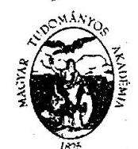
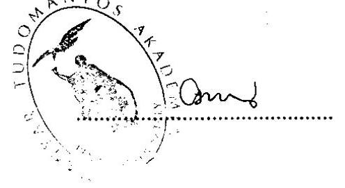
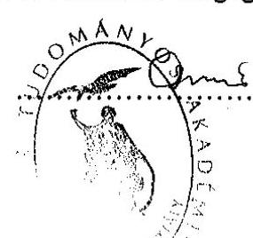

# JELENTÉS 

a Magyar Tudományos Akadémia fejezet működésének ellenőrzéséről
2002. május hó

---

# Államháztartás Központi Szintjét Ellenőrző Igazgatóság 

V-19-61/2001-2002.
Témaszám: 576

## Az ellenőrzést felügyelte:

Bihary Zsigmond
főigazgató

## Az ellenőrzés végrehajtásáért felelős:

Hegedűsné dr. Müllern Veronika
főcsoportfőnök

## Az ellenőrzést vezette:

Matusek István
főcsoportfőnök-helyettes

## Az ellenőrzést végezték:

Belovai Sándorné
főtanácsadó
dr. Béhm Imre
tanácsadó
Bittó Zoltán
osztályvezető
Deák Tamásné
tanácsadó
dr. Ernst László
tanácsadó
Éva Katalin
tanácsadó
dr. Fülöp László
számvevő tanácsos
Sinka Zoltán
számvevő gyakornok
Varga Szabolcs
számvevő tanácsos
dr. Juhászné Szima Mária
számvevő tanácsos
Kóródi József
főtanácsadó
Maklári Ferencné
tanácsadó
Massányi Tibor
számvevő gyakornok
dr. Mihály Sándor
főtanácsadó
Molnár Imre
tanácsadó
Norczen Győzőné
osztályvezető
Szederkényi László
külső munkatárs

---

# A Magyar Tudományos Akadémia fejezetet érintő korábbi ellenőrzéseink 

Jelentés az Országos Tudományos Kutatási Alap (OTKA) működésének pénzügyi-gazdasági ellenőrzéséről (1990.)

Jelentés a minisztériumok, országos hatáskörű szervek költségvetési és vállalati felügyeleti ellenőrzési tevékenységének, valamint a belső ellenőrzési rendszere működésének vizsgálatáról (1993. április) (142)

Jelentés a Magyar Tudományos Akadémia pénzügyi-gazdasági ellenőrzéséről (1993. november) (158)

Jelentés a költségvetési fejezetek jóléti célú kiadásainak és jóléti intézményei működésének pénzügyi-gazdasági ellenőrzéséről (1995. augusztus) (218)

Jelentés a költségvetési fejezetek jóléti célú kiadásainak és jóléti intézményei működésének pénzügyi-gazdasági utóellenőrzéséről (1999. augusztus) (9925)

Jelentés a központi költségvetés területén működő belső kontroll mechanizmusok ellenőrzéséről (2001. június) (533)

Az éves zárszámadások és költségvetési előirányzatok ellenőrzései

---

# TARTALOMJEGYZÉK 

BEVEZETÉS ..... 3
I. ÖSSZEGZŐ MEGÁLLAPÍTÁSOK, KÖVETKEZTETÉSEK, JAVASLATOK ..... 5
II. RÉSZLETES MEGÁLLAPÍTÁSOK ..... 15

1. Az MTA fejezet irányító tevékenysége ..... 15
1.1. A feladatrendszer, a szervezeti struktúra, a személyi, tárgyi és pénzügyi feltételek ..... 15
1.1.1. Az MTA fejezet jogállása, a feladatok és az intézményi struktúra összhangja ..... 15
1.1.1.1. Az akadémiai irányítási és döntési mechanizmus célszerűsége, hatékonysága ..... 16
1.1.1.2. A tudománypolitika főbb törekvéseinek és feltételeinek alakulása, a kiemelt akadémiai feladatok végrehajtása ..... 19
1.1.2. Az MTA kutatások pályázati rendszere és eredményessége ..... 21
1.1.3. A tudományos teljesítmények mérése ..... 23
1.1.4. Az MTA nemzetközi tudományos kapcsolatainak alakulása ..... 24
1.1.5. A felügyeleti ellenőrzés rendszere, szabályozottsága, működése és eredményessége ..... 25
1.1.6. Az ÁSZ ellenőrzés javaslatainak hasznosítása ..... 27
1.2. A fejezet gazdálkodásának irányítása ..... 28
1.2.1. A fejezeti gazdálkodás szabályozottsága ..... 29
1.2.2. A fejezet költségvetési tervezési rendszere ..... 30
1.3. A fejezeti gazdálkodás, a költségvetés végrehajtása ..... 31
1.3.1. Az előirányzat-módosítások indokoltsága, szabályszerűsége ..... 32
1.3.2. Saját bevételek alakulása, felhasználásának szabályszerűsége, célszerűsége ..... 32
1.3.3. A likviditási helyzet, a fejezet és a Magyar Államkincstár együttműködése. Az előirányzat-maradvány alakulása ..... 33
1.3.4. A fejezet létszámának és személyi juttatásainak alakulása ..... 34
1.3.5. Az akadémiai törzsvagyon és a rábízott vagyon kezelése ..... 35
1.3.6. A központi beruházások és felújítások alakulása ..... 37
1.4. A fejezeti kezelésű előirányzatokkal való gazdálkodás ..... 38
1.4.1. A fejezeti kezelésű előirányzatok tervezése, a pénzügyi források ütemezése ..... 38
1.4.2. A fejezeti kezelésű előirányzatok felhasználása ..... 39
1.4.2.1. A kutatóintézeti konszolidáció végrehajtása ..... 39

---

1.4.2.2. Átlagkereset emelése ..... 40
1.4.2.3. Kutatói bérrendezés ..... 41
1.4.2.4. Fiatal kutatók pályázatos támogatása ..... 41
1.4.2.5. Intézményekre le nem bontott bevétel ..... 42
1.4.2.6. Az Országos Tudományos Kutatási Alapprogramok ..... 42
2. A fejezet gazdálkodó szervezete, az MTA Titkárság működése ..... 43
2.1. Az MTA Titkárság belső szabályozottsága, szervezeti, működési rendje, irányítási mechanizmusa ..... 43
2.1.1. Az MTA Titkárság belső ellenőrzési rendszere ..... 46
2.2. A költségvetési gazdálkodás folyamata ..... 47
2.2.1. Az előirányzatok szabályszerűsége, módosításának indokoltsága ..... 47
2.2.2. A saját bevételek növelése és felhasználása ..... 48
2.2.3. A finanszírozási igények és a pénzellátás összhangja, a likviditás helyzete ..... 48
2.2.4. A létszám alakulása, a személyi juttatások előirányzata és felhasználása ..... 49
2.2.5. A Doktori Tanács által odaítélt tiszteletdíjak kifizetése ..... 50
2.2.6. A dologi kiadások indokoltsága, a takarékos gazdálkodás érdekében tett intézkedések ..... 51
2.2.7. A Titkárság által használt befektetett eszközállomány alakulása ..... 52
2.2.8. Az MTA Titkárságát érintő beruházások, felújítások szakmaipénzügyi megvalósítása ..... 53
3. A területi akadémiai központok ..... 53
4. A kutatóintézetek működésének ellenőrzése ..... 54
5. Az 1999. és 2000. évi beszámolók valódiságára vonatkozó ÁSZ ellenőrzések alapján tett intézkedések ..... 54

---

# JELENTÉS 

## a Magyar Tudományos Akadémia fejezet működésének ellenőrzéséről

## BEVEZETÉS

A Magyar Tudományos Akadémia (MTA) jogállását az 1994. évi XL. törvény határozza meg. Az MTA fejezet önkormányzati elven alapuló, jogi személyként működő köztestület, amely a tudomány művelésével, támogatásával és képviseletével kapcsolatos közfeladatokat lát el.

A Magyar Köztársaság 2001-2002. évi költségvetéséről szóló 2000. évi CXXXIII. törvény az MTA fejezet 2001. évi bevételi előirányzatát 33 159,5 M Ft-ban, támogatási előirányzatát 23 629,9 M Ft-ban, összes kiadási előirányzatát 33 159,4 M Ft-ban állapította meg, ebből a beruházásokra tervezett összeg 705 M Ft volt. A törvény a feladatok végrehajtásához az MTA fejezet 59 köztestületi költségvetési szervénél összesen 5522 fő költségvetési létszámot hagyott jóvá. Köztestületi tevékenysége a tudományos testületekben valósul meg. A köztestületi tevékenységet 11 tudományos osztály, 113 tudományos bizottság és a regionális központokban működő 5 területi bizottság segíti.
Az Állami Számvevőszék (ÁSZ) 1993-ban végzett átfogó pénzügyi-gazdasági ellenőrzést az MTA fejezetnél. Ezt követően különböző ellenőrzések keretében az ÁSZ többször vizsgálta a fejezet és intézményei különböző feladatokkal összefüggő tevékenységét (pl. a jóléti célú kiadásokat és a jóléti intézmények tevékenységét, valamint az éves költségvetéseket és zárszámadásokat).

Az ellenőrzés jogszabályi alapját az ÁSZ-ról szóló 1989. évi XXXVIII. törvény 17. § (3) bekezdése és az államháztartásról szóló 1992. évi XXXVIII. törvény 121. § (1) bekezdése képezi.

---

Az ellenőrzés célja annak értékelése volt, hogy a fejezetnél

- a szervezeti rendszer, az irányítási-működési rend és a költségvetési előirányzat összhangban volt-e a szakmai feladatokkal, biztosították-e azok hatékony és eredményes végrehajtását;
- a fejezeti kezelésű előirányzatok felhasználása eredményesen segítette-e elő a kutatáspolitikai, szakmai célkitűzések teljesítését;
- az irányító és gazdálkodó tevékenységben mennyiben hasznosították a korábbi ÁSZ ellenőrzések megállapításait és javaslatait.

Az ellenőrzés során megkezdtük az MTA Titkárság Igazgatása cím 2001. évi költségvetési beszámolója megbízhatóságának ellenőrzését, ami 2002-ben a zárszámadás ellenőrzése keretében fejeződik be. Az ellenőrzés a 2001. I-IX. hónapok pénzforgalmi adataira terjedt ki.

A helyszíni ellenőrzés a fejezeten kívül kiterjedt az MTA 6 központi intézményére, 3 akadémiai és 3 regionális központra, 10 kutató intézetre, 4 egyetem kiválasztott akadémiai támogatású kutatóhelyeire és 3 egyéb gazdálkodó szervezetre.

A helyszíni ellenőrzés a fejezeti irányítás 1999-2001. évi feladatainak ellátására, a szakmai feladatokkal összefüggő gazdálkodási tevékenységre irányult, illetve a pénzügyi-gazdasági folyamatokat figyelemmel kísértük a helyszíni ellenőrzés lezárásáig.

Az ellenőrzött akadémiai intézményekkel kapcsolatos megállapításokat az 1. sz. függelék, az MTA vagyonának alakulásával, kezelésével és hasznosulásával kapcsolatos megállapításokat pedig a 2. sz. függelék részletezi.

A jelentést véglegezés előtt egyeztettük Dr. Kroó Norbert főtitkár úrral, aki a jelentést elfogadta. (1. sz. melléklet)

---

# I. ÖSSZEGZŐ MEGÁLLAPÍTÁSOK, KÖVETKEZTETÉSEK, JAVASLATOK 

A Magyar Tudományos Akadémia (MTA/vagy Akadémia) jogállását, feladatait az 1994. évi XL. törvény (Aktv.) állapította meg.

Az MTA az alapkutatások tekintetében mindmáig a legkoncentráltabb tudományos bázis, itt összpontosul a kutatási állomány valamivel több mint 1/5 része. A rendelkezésre álló tárgyi eszközvagyon megközelíti a 25 Mrd Ft-ot. Az Akadémia tradicionálisan széles körű nemzetközi tudományos kapcsolatrendszerrel rendelkezik, a tudományos együttműködése bővülő és javuló a felsőoktatási intézményekkel, a kutatások fejlesztésében érdekelt minisztériumokkal, vállalkozásokkal. Az MTA mint köztestület összefogja az ország tudósainak közösségét, az Akadémia rendes és levelező tagjait, a felsőoktatói kar legnevesebb képviselőit, a tudományos fokozattal rendelkezőket.

A rendszerváltás szükségszerűen felvetette az Akadémia jogállásának, feladatainak felülvizsgálatát, újraszabályozását. Az 1994-ben megjelent Aktv. hatálybalépésével szükségessé és lehetővé vált az Akadémia irányító tevékenységének újraszabályozása, a fejezet gazdasági konszolidációja, a kutatóintézetek és kutatási programok átvilágítása, az intézményi konszolidációs program kidolgozása és végrehajtása, új kutatási stratégia kialakítása.

Az Aktv. az Akadémiát hozzásegítette, hogy megújulva illeszkedjék be a megváltozott társadalmi viszonyokba, ugyanakkor részben fenntartotta a korábbi kutatási struktúrát. A Gazdasági Együttműködési és Fejlesztési Szervezet (OECD) Titkársága korábban átvilágította az MTA szervezetét és működését. Megállapítása szerint az MTA túl sok funkcióval rendelkezik, a kutatások több mint 70%-át akadémiai és minisztériumi irányítású intézetek végezték. Az OECD véleménye szerint a hangsúlyt a K+F-re kell helyezni, erősíteni kell az egyetemeken folyó kutatásokat, és az egyetemi és akadémiai kutatóhelyek együttműködését.

Az Aktv. hatálybalépését követően gyakorlatilag az Akadémia szervezete és működése minden tekintetben megújult. A törvénynek megfelelően újjáalakult a Közgyűlés, mint az Akadémia legfőbb, stratégiai döntéshozó szervezete. Létrejött az Akadémiai Kutatóhelyek Tanácsa, megalakult a Vagyonkezelő Kuratórium és a vagyonkezelést, gazdálkodást ellenőrző Felügyelő Bizottság.

A közgyűlés létrehozta továbbá a Tudományetikai Bizottságot, a Könyv- és Folyóiratkiadó Bizottságot és az Akadémiai Doktori Tanácsot.

Az MTA kialakított működési rendje az irányítás, döntés-előkészítés, döntés és ellenőrzés tekintetében - az ellenőrzött szervezetek különböző szintjén kapott vélemények szerint - jól és törvényesen működik, esetenkénti kifogások a folyamatok többszörös áttételéből eredő lassúság miatt fordulnak elő.

---

Az Aktv. az MTA közgyűlése számára az Akadémia egész működését érintő tudománypolitikai elvek és programok meghatározását írja elő, valamint feladatává teszi, hogy az Akadémia saját tevékenységéről a kormánynak évente, a magyar tudomány helyzetéről kétévente számoljon be az Országgyűlésnek és a hazai tudományos kérdésekben foglaljon állást, képviselje azokat.

A magyar tudomány- és technológiai politika meghatározása, a támogatási rendszer kialakítása a Kormány mellett működő Tudomány- és Technológiapolitikai Kollégium (TTPK) tevékenysége keretében történik.

Tudománypolitikai törekvéseiben és a finanszírozási feltételek alakításában az MTA igazodott a kormányzat tudománypolitikai célkitűzéseihez. Az akadémiai kutatóintézetek a Széchenyi terv részét képező Nemzeti Kutatási és Fejlesztési Programok mind az öt fejlesztési főirányában részt vesznek.

A Programok pályázatának első fordulójában az odaítélt támogatások 25%-át kapták az akadémiai intézetek.

El kellett készíteni és rendkívüli közgyűléssel el kellett fogadtatni az MTA Alapszabályát, amely az Akadémia szervezeti és működési rendjét foglalja magában. Az Alapszabály 1994 októberében történt elfogadását követően elkészültek - a Könyv- és Folyóiratkiadó Bizottság kivételével - az új testületek tevékenységét megállapító ügyrendek.

Az Akadémia Közgyűlése rendszeresen, évente kétszer ülésezett, a törvényben előírt minimálisan egyszeri üléssel szemben. A mindenkori Közgyűlés fogadta el az előző évi költségvetési beszámolót, a következő évi költségvetés irányelveit és költségvetését. A megalapozott tervezés érdekében a Közgyűlés már a tervezés korai szakaszában megállapította a fejezet költségvetési javaslatának irányelveit, meghatározta a fejlesztési célokat, azok prioritását. A fejezet a tervezési körirat egységes értelmezéséhez és végrehajtásához rendszeresen maga is adott ki a köztestületi költségvetési szerveinek részletes útmutatót, köriratot. A Közgyűlés többször tárgyalt stratégiai témákat (konszolidáció, kutatói bérrendszer, tudományos utánpótlás, titkársági működés módosítása, tudományos struktúra átalakítása), és rendszeresen visszatért határozatainak végrehajtására.

A törvényesség betartásával működött a Felügyelő Bizottság, az Akadémiai Doktori Tanács, a Vagyonkezelő Kuratórium és a Tudományetikai Bizottság. A Könyv- és Folyóiratkiadó Bizottság működése is rendszeres volt.

Az Akadémiai Kutatóhelyek Tanácsa (AKT) üléseinek napirendjén a kutatóintézeteket, kutatóhelyeket érintő témák szerepeltek. Az AKT három tudományterületi kuratóriumot működtet.

Az AKT-nak a kutatóintézetek tevékenységének értékelési módszerei kialakultak, azonban ezeket több ponton tovább kell fejleszteni, amelyre nézve már állásfoglalások is születtek. Problémát jelent, hogy a módszerek csak szűkebb körre alkalmazhatók, nem általánosságban. További gondot jelent, hogy a ha-

---

zai összehasonlítás nem lehetséges, mivel kutatási területeken (szervezeteknél) ehhez hasonló értékelési rendszer nem található.

A
 kutatóhelyi K+F feladatok finanszírozását szolgáló pályázati lehetőségek bővültek. Nőtt az OTKA-nál rendelkezésre álló források összege, megnyílt az Európai Unió 5. keretprogramjában való részvétel lehetősége. Ez utóbbi pályázati programnál 5 akadémiai intézet bekerült az európai kiemelkedő színvonalú kutatóhelyek körébe (MTA Kísérleti Orvostudományi Kutatóintézet, MTA Rényi Alfréd Matematikai Kutatóintézet, MTA Szilárdtestfizikai és Optikai Kutatóintézet, MTA Szegedi Biológiai Központ, MTA Számítástechnikai és Automatizálási Kutatóintézet).

Az MTA intézetei egy megadott szempontrendszert tartalmazó adatlap szerint részletes szöveges beszámolót készítenek éves tevékenységükről. Hiányosság, hogy a beszámolóban a mutatókat nem viszonyítják bázis időszakokhoz, más intézetek hasonló adataihoz, a tudományág hazai és nemzetközi eredményeihez, továbbá nem képeznek belőlük fajlagos mutatókat, nem elemzik azokat pénzügyi-gazdálkodási szempontokból.

A magyar tudomány helyzetének két évenkénti értékeléséhez az MTA-nak a saját hálózati adatai gyűjtésén kívül csak a minisztériumok adatai állnak rendelkezésre. Más tudományos adatszolgáltató szervek adatai önkéntességen alapulnak, gyakran pontatlanok, a vállalkozási kutatóhelyek adatai nélkül készült összesítés pedig hiányos. A Központi Statisztikai Hivatal K+F adatgyűjtése és feldolgozása közel két éves átfutású és nem teljes körű. Gyakorlatilag megoldhatatlan feladat a magyar tudomány helyzetéről hiteles, hiánytalan és tudománymetriai szempontból megalapozott beszámolót összeállítani.

A Kormány úgy rendelkezett, hogy 2002. január 1-jével létre kell hozni a nemzeti kutatások nyilvántartási rendszerét, amely áttekinthetővé teszi a különböző helyeken folyó kutatásokat, lehetővé teszi a párhuzamosságok feltárását. A nyilvántartási rendszer eredményeiről és kihatásairól 1-2 év elteltével lehet véleményt alkotni.

Az Aktv. intézkedett az MTA törzsvagyonnal való ellátásáról, amelyre nézve tulajdonjogot szerzett, továbbá az állami vagyon egy részét az Akadémiára bízta, a kincstári vagyonkezelés szabályai szerint. Az akadémiai vagyon egyéb forrásait a működésből, vagyonának hasznosításából eredő jövedelem, az Akadémia működésének és fejlesztésének elősegítésére tett alapítványok, adományok, támogatások képezik.

Az Akadémia a központi költségvetésben önálló fejezet, amelyen belül az akadémiai kutatóintézetek költségvetése tudományterületenként önálló címeket alkot.

A fejezet pénzügyi-gazdasági tevékenységének irányítása, a hatályos jogszabályokon alapuló költségvetési gazdálkodás végrehajtásának biztosítása az MTA főtitkárának jogköre és feladata. A főtitkár látja el a fejezet felügyeletét ellátó szerv vezetőjének feladatait. Tevékenysége során össze kell hangolnia a jogszabályokból eredő kötelezettségeket a testületi döntésekkel.

---

Az MTA költségvetési gazdálkodása során saját hatáskörében állapítja meg egyes szervezeteinek gazdálkodási formáját, a kutatások támogatási módját.

A köztestületi költségvetési szervezeteire kiterjed az államháztartás rendjében előírt beszámolási és könyvvezetési kötelezettség, beszerzéseire alkalmazni kell a közbeszerzési törvényt. Az MTA Titkárság tisztviselőire a köztisztviselői, költségvetési szervezeteinek alkalmazottaira a közalkalmazottak jogállásáról szóló törvény hatálya vonatkozik.

Az Akadémia által bemutatott dokumentumok szerint a fejezet többször kezdeményezte - törvényi felhatalmazással élve - a sajátosságok figyelembevételét jóváhagyó gazdálkodási jogszabály kibocsátását. Erre kormányhatározat is kötelezte a felelősöket. Az MTA az általa összeállított részletes munkaanyagot a Pénzügyminisztériummal egyeztette, de ügydöntő határozat a helyszíni ellenőrzés befejezéséig nem látott napvilágot.

A fejezet bevételei - 1995. évet kivéve - folyamatosan emelkedtek. A bevételeken belül a költségvetési támogatás aránya az 1993. évi 41,3%-ról 2000. évben 59,9%-ra emelkedett. Az átvett pénzeszközök 32,7%-ot tettek ki, amelyek közvetetten, többnyire szintén költségvetési forrásokból származtak.

Az előirányzat-módosításra minden évben sor került, a módosítások elsősorban a dologi kiadásokat, a felújítási és felhalmozási kiemelt előirányzatokat érintették. A módosítások pénzügyi forrása többnyire előirányzat-maradvány vagy átvett pénzeszköz volt. A végrehajtott előirányzat-módosítások a jogszabályoknak megfeleltek, dokumentáltak voltak.

Az ellenőrzött időszakban a fejezet engedélyezett létszáma 4,8%-kal, a kutatói állományé mintegy 3%-kal csökkent.

Több intézkedés irányult a személyi juttatások növelésére, amelyek átlagosan mintegy 13%-kal növekedtek 2000. év végéig, a 2001. évi fejlesztés 6,7% volt. Átlagot meghaladó volt a kutatók jövedelmének változása, amely lényegében azonos szintre emelkedett a felsőoktatásban dolgozó oktatókéval, a nem kutatói besorolású alkalmazottak jövedelmének emelését a fejezet 2002-ben tervezi végrehajtani.

A fejezet évenkénti költségvetési gazdálkodása tervszerű és kiegyensúlyozott volt. Fejezeti szinten likviditási problémák nem merültek fel, az egyes intézményeknél mutatkozó átmeneti zavarokat sikerült áthidalni.

Az Akadémia és a Magyar Államkincstár kapcsolata, együttműködése jó. Az adminisztrációs terhek a kis intézményeknél jelentősnek mondhatók. Kedvezőtlen a pályázatok megvalósulása szempontjából, hogy a pályázatokon nyert összegekhez való hozzájutás átlagos átfutási ideje több mint fél év, ellenben a költségtervek betartása szempontjából a kialakított rendszer fegyelmező hatású.

A kormányzati, felügyeleti, valamint a belső ellenőrzésről szóló kormányrendelet hatálya kiterjed az MTA-ra mint a fejezet felügyeletét ellátó köztestületi költségvetési szervre. A fejezet intézményei ellenőrzési kötelezettségei

---

nek folyamatosan, rendben eleget tett. Az ellenőrzési tapasztalatok évente összegezésre kerültek és az intézkedési tervek teljesítését utóellenőrzéssel nyomon követték.

Az MTA Titkárság gazdálkodása önálló minősítés tárgya, mivel egyidejűleg ellátja az MTA Igazgatásával együtt járó gazdasági feladatokat is, mint a fejezet egyik önálló költségvetési intézménye, a fejezet gazdálkodó szerve.

A főtitkárt feladatai ellátásában az MTA Titkársága segíti, amelynek működését belső szabályzatok rögzítik.

Az Akadémia egészét érintő struktúraváltás a Titkárság tevékenységi körét is érintette: a Doktori Tanács feladatköre a Bolyai János Kutatási Ösztöndíj ügyintézésével kibővült, megalakult a Nemzetközi Tudományos Kapcsolatok Főosztálya, a Titkárság törzsvagyonának üzemeltetését és kezelését, a beruházások, felújítások szakmai-pénzügyi előkészítését átvette az MTA ALFA.

A teljesített kiadási előirányzatok 80%-át a személyi juttatások és azok járulékai tették ki.

Az előirányzat-módosítások megfelelően dokumentáltak és számításokkal alátámasztottak voltak. A módosított kiemelt előirányzatoknál túllépés nem fordult elő.

A Titkárság reprezentációs kiadásainak elszámolása szabályozatlan volt, és a tervezett keretek betartását sem kezelték kellő szigorúsággal. E hiányosságoknak tulajdonítható, hogy esetenként a tervezett összeg 3-7-szeresét fordították egyes rendezvényekre. 2001. I. félév adatait ellenőrizve több esetben túllépést, nem kellő bizonylati alátámasztottságot állapítottunk meg.

A vagyonelemek hasznosításának döntés előkészítése, véleményezése a Vagyonkezelő Kuratórium feladata. A testület munkáját megfelelő rendszerességgel végezte, ennek ellenére az akadémiai döntési mechanizmus sajátosságai miatt a döntések meghozatala hosszadalmas, és ez a gyakorlat a vagyon hasznosítása szempontjából előnytelen.

Az akadémiai törzsvagyont és rábízott vagyont az önálló költségvetési szerv, az MTA Vagyonkezelő Szervezet tartja nyilván és kezeli. A vagyonkezelés speciális vonatkozásai jogi rendezést nem nyertek, de az MTA sajátosságaira vonatkozó külön szabályozás késedelmet szenvedett. Az Akadémia által kidolgozott és a PM-mel egyeztetett tervezet a helyszíni ellenőrzés befejezéséig ügydöntő szakaszba nem lépett. A rendezetlenség egyik következménye, hogy a Vagyonkezelő Szervezet beszámolójából az MTA törzsvagyonára vonatkozó adatok nem jelennek meg a központi költségvetés zárszámadásában.

A kidolgozott Vagyonhasznosítási Szabályzat rendelkezik a törzsvagyon részeinek értékesítéséből, illetve hasznosításából származó bevételek felhasználásáról, de a vagyonérték megőrzésének, gyarapításának elveitől eltérően a gyakorlatban a bevételek egy részét más célokra fordították, főképpen 1999-ben.

Felhalmozási kiadásokra 1999-ben az összes kiadás 8,8%-át, 2000-ben 8,1%-át fordították. A központi beruházási források elosztása már több évre

---

elfogadott tudományterületenkénti arányok szerint történt, és az egyes intézmények feladatainak rangsorolása alapján osztották tovább.

A források elosztását a beruházások, főképpen a felújítások esetében az elaprózódás jellemezte. A törzsvagyonhoz kapcsolódó felújítási igények fele, a rábízott vagyon esetében harmada nyert csak kielégítést. A pályázatok útján elnyert támogatási összegeknek csak bizonyos hányada fordítható eszközbeszerzésre, az alapkutatási infrastruktúra kiépítése vagy cseréje nem pályázati cél.
Az MTA Kutatási Pályázatok (AKP) forrását a központi költségvetés 1996. óta emelte be rendszerébe. Az AKP célját, általános elveit, testületét és annak feladatait az AKP rendszer SZMSZ-e szabályozta. Az AKP célja olyan új kutatási irányok indításának támogatása, amelyek hazai és nemzetközi viszonylatban is igényelték az alapkutatást. Az AKP a teljes kutatási kört szolgálja, felügyeleti szervtől független, nyílt pályázati rendszerével. Pályázatokra 1996-2001. évek között összesen 650,6 M Ft állt rendelkezésre, amelyből 291 pályázat részesült. A pályázatok elbírálása során a Szakmai Kollégium törekedett arra, hogy a kiemelten fontos témák az átlagosnál jelentősebb, többszörös összeggel részesedjenek, de az évenkénti döntések során egyre kevesebb kiemelten támogatott pályázat volt, 2001-ben pedig nem a kiemelt pályázatok élveztek elsőbbséget, s ezzel a gyakorlat a helyes elvvel teljesen szembekerült. 2002-től a pályázatok lebonyolítását a tudományterületi főosztályok veszik át, az erőforrások koncentráltabb felhasználása még valószínűtlenebb.

Az MTA Támogatott Kutatóhelyek Irodájának (TKI), mint önálló költségvetési intézménynek a feladata az akadémiai feladatok teljesítésében résztvevő, befogadó intézményekben működő kutatócsoportok segítése. A vizsgált időszakban 18 befogadó intézményben (főképpen felsőoktatási intézményben) 138 kutatócsoport működött. Az intézmény 1999-2000. évi módosított előirányzata 1,3 Mrd Ft volt, 2001-ben 1,1 Mrd Ft. Az Iroda 2000. évi átlagos statisztikai létszáma - a támogatott kutatóhelyek létszámával együtt 429 fő volt, ebből az Iroda létszáma 17 fő. A támogatott kutatóhelyek működését, kapcsolódási rendszerét a TKI-val az Irodán és négy egyetem kutatóhelyein vizsgáltuk. A helyszíni ellenőrzés megállapításai az 1. sz. függelék 5. pontjában találhatók. Ez az egyébként eredményes kapcsolati forma továbbfejlesztés nélkül nem képes kielégítően megoldani a fiatal kutatók megtartását.

Az Akadémia Doktori Tanácsa feladata az MTA Alapszabályában és a Tanács Alapszabályában előírt doktori cím odaítélési eljárása, az ezzel kapcsolatos határozatok végrehajtása, az esetleges felülvizsgálati kérelmek elbírálása. A Tanács önálló költségvetéssel és beszámolóval rendelkező Titkársága által kezelt szakértői díjazások, tiszteletdíjak elszámolásának áttekintése során hiányosságot nem állapítottunk meg.

A kandidátusi illetmény-kiegészítések folyósítását, a doktori címek után járó tiszteletdíjak kifizetését és a Bolyai János ösztöndíjjal összefüggő szakértői és felkérési díjak kifizetését rendben találtuk.

Az MTA három akadémiai központjának (Debrecen, Pécs, Szeged) ellenőrzése során meggyőződtünk arról, hogy a decentrumok hatókörükben szerteágazó lehetőségeket biztosítanak az Akadémiához kapcsolódó tudósok és

---

a területükön működő más tudományos, oktatási és kutatási tevékenységet végző szervezetek, személyek együttműködéséhez. Gazdálkodásuk szabályozott és a szabályok betartásával folyik. Tevékenységüket - beszámolóikon kívül - a felügyeleti szerv rendszeresen ellenőrzi. Működési feltételeik megfelelnek rendeltetésüknek. Működésükből származó bevételeik lehetőségeik alatt maradnak, mivel különböző megfontolásokból helyiségeiket többnyire nem bérbe adják, hanem ellenszolgáltatás nélkül bocsátják rendelkezésre. Az akadémiai központok leginkább találkozási lehetőséget nyújtanak a feleknek, de nem látni olyan megoldásokat, hogy pl. a vállalkozói szféra kisebb vagy nagyobb reprezentánsai kutatási megbízásokat adnának az Akadémia helyi vagy más intézményeinek, jelentősebb anyagi-technikai támogatást nyújtanának az akadémiai kutatásokhoz, esetleg kölcsönös kutatói cserékkel bővítenék egymás látókörét, szerzett tapasztalataikat.

Az intézményi rendszer konszolidációját az 1996. évi közgyűlés határozta el az egyre súlyosabb anyagi helyzet miatt és az akadémiai törvény végrehajtása érdekében. A konszolidáció megvalósítására 1800 M Ft költségvetési támogatást kapott az MTA. A Konszolidációs Bizottság által szervezett és irányított folyamat eredményeként intézeti összevonásokra, átalakításokra, új intézmények alapítására került sor. A konszolidáció során csökkent a fejezet létszáma, egyes telephelyek feleslegessé váltak, kutatási témákat lezártak, átalakítottak, s több új kutatási témát indítottak. Az intézetek összevonása, átalakítása és új intézetek létesítése mellett két kutatóintézet az Oktatási Minisztérium részére átadásra került.

A konszolidációs összegekből az egyes tudományterületek a Bizottság által meghatározott arányban részesültek, a Bizottság személyi összetétele garanciát nyújtott arra, hogy a döntés akadémiai konszenzust tükrözzön.

Az intézményi konszolidáció végrehajtásával az MTA kutatási szervezeti keretei 1999-2001 között lényegesen nem változtak, de ésszerűbben szerveződtek, mint a konszolidáció előtt. A
 2001. január 1-jével létrehozott Társadalomkutató Központ és az Etnikai-nemzeti Kisebbségkutató Intézet jól szolgálta a kutatási funkciók egyesítését, az aktuális társadalmi kihívások megfelelő tudományos megalapozottságú kezelését, de jogi és diszciplináris önállóságukat megőrizték. Az MTA Felügyelő Bizottságának és az ellenőrzésnek az álláspontja szerint is további jogi és gazdasági integrációjuk célszerű és indokolt. A fejezetnél végrehajtott konszolidáció kiegyensúlyozottabbá, kiszámíthatóbbá tette a költségvetési gazdálkodást, a pályázati bevételekből kevesebbet központosítottak működési kiadásokra. Ennek ellenére sem teljesen megoldott a működtetés és a szakmai tevékenység finanszírozásának szétválasztása.

Az illetékes akadémiai szervek azon álláspontjával, hogy az intézményi szerkezet korszerűsítése nem lehet lezárt, hanem időszakonként felülvizsgálatot igénylő feladat, a rendelkezésre álló erőforrások és a versenyképesség függvényében és annak érdekében, hogy átütő erejű támogatást kaphassanak a legreményteljesebb kutatási területek, egyetértünk.

Az ellenőrzött kutatóintézetek gazdálkodásának szabályozottsága kisebb hiányosságok ellenére megfelelő és naprakész. A gazdálkodást irányító intézményi szervezetek működésük során betartották a törvényekben és más jogszabályokban foglalt előírásokat, amelyet a rendszeres felügyeleti ellenőrzés következetes számonkérés is elősegített.

A költségvetés tervezéséhez adott felügyeleti útmutatások, konzultációk segítették a felmerült problémák jogszerű megoldását. Az előirányzatok módosítása az ellenőrzött esetekben - megfelelő hatáskörben történt. Általános tapasztalat szerint a működés pénzügyi szükséglete és a rendelkezésre álló pénzügyi erőforrások - amelyek mintegy 70-80%-a a központi költségvetésből eredeztethetők - tartósan nincsenek fedésben, ezért többször előfordult a pénzeszközöknek céltól eltérő, átcsoportosított felhasználása. A vizsgált területeken likviditási problémák nem voltak, egyéb területeken is csak átmenetileg fordultak elő, amelyeket a felügyeleti szerv segítségével elhárítottak. Kedvező fejlemény, hogy az intézmények likviditási helyzete javult, fizetési kötelezettségek fedezetére rendelkezésre álló vagy szükség esetén mobilizálható forgóeszköz-állomány helyenként többszörös (több mint tízszeres) fedezetet biztosít. Természetesen az intézmények gazdasági stabilitásában jelentős különbségek vannak.

Az intézmények működési bevételei, átvett pénzeszközei is többnyire költségvetési forrásokból származnak, kisebb részben külföldi támogatásokból. A vállalkozási bevételek marginális jelentőségűek.

Az évtizedes léptékű folyamatos restrikció következményeként a kutatási eszközállomány használhatósági foka helyenként a nemzetközi összemérésre már nem alkalmas, a szellemi kapacitás - a kedvezőtlenül alakult körülmények ellenére - több területen versenyképes, sőt élvonalbeli. Nem feltétlenül negatív megállapítás, hogy a kutatói állomány átlagosan idős, (1995-ös adat szerint a 40 évnél idősebbek aránya 65% volt), de az valóban nyugtalanító, hogy a fiatal korosztály megnyerése, s főképpen megtartása máig sem teljesen megoldott.

Itt kell rámutatnunk arra, hogy a kutatói pálya vonzereje csak részben személyes jövedelmi kérdés, vérbeli kutató számára a kutatási lehetőségek technikai feltételei, a gépek, berendezések, kutatási anyagok korszerűsége, a hozzáférés lehetősége szintén nyomatékos szempont.

Az intézményi belső ellenőrzés rendszere a vizsgált esetekben kiépített, szabályozott, korlátozottan a függetlenített belső ellenőrzés személyi feltételei is biztosítottak. Tartalmilag az intézetek vezetői kevésbé szabnak irányt az ellenőrző munkának, többnyire rendfenntartó jellegű feladatokra kerül sor. A megtett intézkedések nem eredményeznek elegendő minőségi változásokat a gazdasági tevékenységekben, a feltárt hibák gyakran ismétlődnek.

A fejezeti kezelésű előirányzatok közül az „Átlagkeresetek emelése" a kutatóintézetek és kutatóhelyek konszolidáció utáni költségvetési létszámába tartozók személyi juttatásának átlagosan 8,57%-os növekedését tette lehetővé. A „Kutatói bérrendezés" célja az akadémiai kutatóhálózat kutatói jövedelmeinek a felsőoktatásban oktatók jövedelmeihez való felzárkóztatás volt. A „Fiatal kutatók pályázatos támogatása" a fiatal kutatók felvételére irányult.

Az előirányzatok felhasználásának elveit a főtitkár állapította meg, a kutatóhelyek esetében végrehajtására központilag került sor. Az intézkedések a kutatók helyzetét konszolidálták, amennyiben az elért, az oktatókhoz viszonyított jövedelmi szint tartható. A pályázati feltételek sikeres teljesítése esetén sem tudta garantálni az Akadémia a fiatal kutatók számára a kutatói státusz elnyerését.

Az intézeteknél a nem kutatói státuszban lévő közalkalmazottak közül különösen az informatikai, számviteli, pénzügyi területeken nagy a fluktuáció és az elégedetlenség. Feszültségek észlelhetők a pályakezdők magasabb besorolása miatt a kutatóprofesszorok, illetve tudományos tanácsadók körében is, mivel közöttük a jövedelmi olló összébb záródott.

Az egyéni kutatói tevékenységet támogatja az OTKA, amely a pályázati lehetőségek közül az egyik legjelentősebb. A támogatási összegek mintegy 30%-a kerül az akadémiai intézetekhez. A kapott összegből egy bizonyos hányad megbízási díjként, rezsiköltségként és kezelési költségként számolható el a kutatási ráfordításokon kívül. Esetenként gép- és műszer beszerzését is lehetővé teszi a kapott pályázati összeg. A megvizsgált kutatási témák elszámolását rendben találtuk. Az OTKA támogatások az elszámolás módja miatt a fejezeten belül kétszeresen kerülnek számba vételre. Az átadott pénzeszköz az OTKA-nál és az intézményeknél egyaránt megjelenik a beszámolóban, ezért fejezeti szinten duplikált a számba vétel. Az OTKA támogatások halmozódása nemcsak fejezeten belül, az akadémiai kutatóhelyeknek adott megbízásoknál jelentkezik, hanem a központi költségvetésen belül pl. az egyetemeknek átadott megbízások esetében is. Egyes kutatói vélemények szerint az OTKA pályázatok elfogadásakor az újabb tudományos irányzatoknak nagyobb lehetőségeket kellene biztosítani.

A kutatások támogatását az OTKA-n és a külföldi pályázatokon kívül lehetővé teszi még az OKTK, az AKP, NKA, NKFP (Széchenyi terv) és egyes minisztériumok programfinanszírozási pályázata. Az elszámolhatóság érdekében valamennyi támogatást és felhasználást forrásonként elkülönítve kell nyilvántartani. További nehézséget okoz, hogy az áfa elszámolása szempontjából az egyes támogatási formák egymástól eltérőek. Gyakorlatilag szerződésenként külön-külön értelmezni kell, hogy a támogatás ellenértéknek minősül-e vagy sem. A több szervezettől, eltérő szabályok szerint kapható támogatás felhasználása a donátor szervezet részéről sem tekinthető át megbízhatóan, a felhasználó számára a forrás esetleges. Ezek a körülmények a felhasználható pénzügyi források hatékonyságát is rontják.

Az MTA az ÁSZ 1993-ban befejezett átfogó ellenőrzésének megállapításait követően intézkedési tervet dolgozott ki, amelyet az akadémiai törvényt is figyelembe véve hajtott végre. Teljes körűen újraszabályozta az MTA döntési, irányítási és ellenőrzési jogköreit, kidolgozta és alkalmazza a tudományos eredmények mérési metodikájának egy változatát. Szakszerű javaslatokkal segítette elő a tudományos kutatást végzők bérezési és ösztönzési rendszerének átalakítását, továbbfejlesztette a fejezet által irányított intézmények belső gazdálkodási rendjét, megtörtént az akadémiai vagyon meghatározása, a tulajdoni jogok rendezése, továbbfejlesztették az akadémiai kutatóhelyek és az egyetemek együttműködését, felülvizsgálták és pályázati alapra helyezték a támogatott kutatóhelyek finanszírozását. Az 1999-2000. évek zárszámadásának felülvizsgálata során tett ÁSZ javaslatok ugyancsak rendben megvalósultak. A költségvetési fejezetek jóléti célú kiadásainak és jóléti intézményei működésének 1999. évi utóellenőrzésekor tett javaslatok alapján a fejezet újabb intézkedéseket tett, amelyekkel sikerült a jóléti intézmények további stabil működését biztosítani.

Megállapítható tehát, hogy a fejezet az ellenőrzési javaslatokra hatékony intézkedéseket tett, amelyek kimutatható eredményekkel jártak.

A helyszíni ellenőrzés megállapításainak hasznosítása mellett javasoljuk:

# a Kormánynak 

1. Intézkedjen annak érdekében, hogy a Magyar Tudományos Akadémia elnöke maradéktalanul eleget tudjon tenni a Magyar Tudományos Akadémiáról szóló 1994. évi XL. törvény 3. § (3) bekezdésében foglalt beszámolási kötelezettségének.
2. Rendelje el az MTA által kidolgozott és a PM-mel egyeztetett sajátos gazdálkodási szabályok alkalmazását a 2064/2000. (III. 29.) Korm. határozatban foglaltak alapján.

## a Magyar Tudományos Akadémia főtitkárának

1. Alakítson ki - az MTA elnökével egyetértésben - olyan belső szervezeti rendet, amely jobban igazodik a testületi igényekhez, és a gazdasági-pénzügyi vonatkozású ügyekben a döntések átfutási idejét meggyorsítja.
2. Rendelje el, hogy a Támogatott Kutatóhelyek Irodája - a tudományterületi főosztályokkal közösen - mérje fel a pályáztatás tapasztalatait és a felmérés összegezését terjessze az Akadémiai Kutatóhelyek Tanácsa elé.
3. Kezdeményezze, hogy az Akadémiai Kutatóhelyek Tanácsa a tudományos eredmények mérésére kidolgozott és alkalmazott módszert fejlessze olyan irányban tovább, hogy az alkalmas legyen mélyebb gazdasági elemzésekre is.
4. Kezdeményezze - az illetékes tudományos testületek bevonásával -, hogy „A fiatal kutatók pályázatos támogatása" című fejezeti kezelésű előirányzat felhasználása során a pályázati feltételeket sikerrel teljesített fiatal kutatók lehetőleg végleges státuszt nyerhessenek el.

# II. RÉSZLETES MEGÁLLAPÍTÁSOK 

## 1. Az MTA fejezet irányító tevékenysége

### 1.1. A feladatrendszer, a szervezeti struktúra, a személyi, tárgyi és pénzügyi feltételek

### 1.1.1. Az MTA fejezet jogállása, a feladatok és az intézményi struktúra összhangja

Az MTA jogállását a Magyar Tudományos Akadémiáról szóló 1994. évi XL. törvény (Aktv.) rögzíti. Az Aktv. 1. §-a szerint az MTA önkormányzati elven alapuló, jogi személyként működő köztestület, amely a tudomány művelésével, támogatásával és képviseletével kapcsolatos közfeladatokat lát el.

A köztestületet akadémikusok - az Aktv. 9. §-a szerint választott módon - és a tudomány olyan más képviselői alkotják, akik tudományos fokozattal rendelkeznek, s tudományos tevékenységükkel a magyar tudomány feladatainak megoldásában részt vesznek.

Az MTA tevékenysége a tudományos testületekben valósul meg; irányítása - a legfelsőbb testületi szerv, a közgyűlés határozatainak megfelelően - az elnök feladata. A tudományos tevékenység köztestületi jellege a tudományos osztályok, a tudományos bizottságok és a területi bizottságok munkájában ölt testet.

Az MTA alapvető feladatait az Aktv. a tudományok művelése és a kutatások végzése, a könyv- és folyóiratkiadás támogatása; a kutatási eredmények rendszeres értékelése, terjesztése; a magyar tudomány megfelelő hazai és nemzetközi képviselete; a tudományos közélet tisztasága és a kutatás, véleménynyilvánítás szabadsága feletti őrködés területén határozza meg.

Az Aktv. érvényesülése nyomán az MTA-nak hármas funkciója alakult ki: tudományos érdekképviselet, tudományos műhely és a nemzeti tanácsadói szerepkör.

A tudományos szakmai érdekképviselet keretében őrködik a tudományos kutatás önelvűségének érvényesülése felett. Megfogalmazza a hazai tudományszervezetek és a dolgozók szociális és szakmai érdekeit. Képviseli a minőség követelményét saját egyéni minősítési rendszerével - akadémiai doktor, akadémiai tag -, hogy a tudományos hierarchia egyben minőség-hierarchia is legyen.

Az országos hatókörű tudományos műhely szerep során országos fórumot biztosít a tudományos vitáknak. Emellett önálló kutatóintézeti hálózatot tart fenn.

A köztestület tanácsadói feladatkörben részt vállalt az állam és a nemzet előtt álló stratégiai kérdések feltárásában, az azokra adott válaszok kimunkálásában. Ennek keretében történt meg pl. az új magyar tudománypolitika kulturális-nemzeti alapokra helyezése, ezen belül a Domus Hungarica program - a határokon túl élő magyar kutatók meghívása magyarországi kutatásra, oktatásra - fejezeti költségvetésbe való beépítése.

A köztestületi feladatok hatékonyabb végrehajtását nehezíti a döntések hosszabb átfutási ideje, a belső szervezeti rend nem megfelelő igazítása a köztestületi igényekhez. (Különösen hátrányos a döntések elhúzódása a gazdasági kihatású ügyekben.)

Az MTA jogállása megfelelően rendezett és biztosított. Az Aktv., az Áht. és a költségvetési törvények összhangban vannak egymással. Az MTA költségvetésének saját hatáskörű meghatározása formális, azt az Országgyűlés hagyja jóvá. A köztestületi költségvetési szervezetekre vonatkozó gazdálkodási szabályozás a központi költségvetési szervezetekkel azonos szabályozással rendezett, de az általános szabályok mellett a köztestületi specialitásokra tekintettel külön kormányrendelet nem rögzíti az MTA köztestületi intézményeinek tervezési, pénzellátási, gazdálkodási szabályait, holott ezt az Áht. 124. §-a lehetővé teszi és azt az államháztartás pénzügyi rendszerének továbbfejlesztési irányairól és a kincstári rendszer új szervezeti rendjének kialakításáról szóló 2064/2000. (III. 29.) Korm. határozat megerősíti.

Az MTA szervezeti és működési szabályzataként funkcionáló MTA Alapszabályt az Aktv. hatálybalépését követően az MTA 1994. október 27-i rendkívüli közgyűlése fogadta el.

Az Alapszabály megfelelő konkrét szabályozással szól a köztestületi tagokról, a köztestületi tagság
 keletkezéséről, megszűnéséről és felfüggesztéséről, a tudományos osztályok, tudományos bizottságok, a területi bizottságok, a közgyűlés, a tisztségviselők és bizottságok, az akadémiai kutatóintézetek, a támogatott kutatóhelyek és az MTA egyéb intézményei szervezeti és működési rendjéről.

# 1.1.1.1. Az akadémiai irányítási és döntési mechanizmus célszerűsége, hatékonysága 

Az Aktv. életbelépésével új irányítási és döntési rendszer alakult ki az Akadémiánál, amelynek célja az átlátható, alulról építkező mechanizmus, a határozatok meghozatalánál a demokratizmus érvényesítése.

Az MTA legfelsőbb szerve a közgyűlés, amely a tudományos közélet, valamint saját belső szervezetét és működését érintő legfontosabb kérdések megtárgyalására és azokkal kapcsolatban döntések meghozatalára hivatott.

Meghatározza a tudománypolitikai elveket és programokat. Az államháztartási törvény és az éves költségvetési törvény keretei között elfogadja az MTA költségvetését, valamint a Felügyelő Bizottság jelentése alapján jóváhagyja az éves költségvetési beszámolót. Az Akadémiai Kutatóhelyek Tanácsa javaslata alapján határoz akadémiai kutatóintézetek, kutatóhelyek alapításáról, átszervezéséről, megszüntetéséről. Döntés-előkészítési, végrehajtási és ellenőrzési célokat határoz meg, Vagyonkezelő Kuratóriumot, Felügyelő Bizottságot, valamint más bizottságokat (pl. Tudományetikai Bizottság) hoz létre.
A közgyűlés szabályszerűen működött a vizsgált időszakban, az Aktv. és az MTA által megalkotott Alapszabály előírásainak megfelelően. A közgyűlési hatá-

---

rozatokat az MTA hivatalos lapjában, az Akadémiai Értesítőben minden közgyűlést követően közzétették. A közgyűlés a hatáskörébe tartozó témakörökkel foglalkozott.

Az 1999. évi közgyűlésen napirenden volt az előző évi költségvetési beszámoló, a következő évi költségvetés, a kutatóintézeti konszolidáció első szakaszának értékelése, az Országgyűlés és a kormány elé kerülő jelentések. Kiemelten foglalkoztak a 2000-2002-ben megoldandó súlyponti feladatokkal (kutatói bérrendszer, infrastruktúra-, műszerfejlesztés, tudományos utánpótlás, a Titkárság tevékenységének hozzáigazítása a köztestületi feladatokhoz).

A 2000. évi közgyűléseken - a költségvetés és beszámoló jelentés mellett - elfogadták a Társadalomkutató Központ és az Etnikai-Nemzeti Kisebbségkutató Intézet létesítésének tervét, alapító okiratát; határoztak a Struktúra Bizottság felállításáról, a már 1998-ban elhatározott belső struktúra-váltás vizsgálatára (szintetizálás a tudományterületeken, az osztály-struktúra, a Titkárság, a regionális központok továbbfejlesztése). A határozat végrehajtása késedelmet szenved, a témakörben valódi, érdemi előrelépés még nem történt.

Az akadémiai kutatóhelyek működését irányító testület az Akadémiai Kutatóhelyek Tanácsa (AKT). Elnöki teendőit az MTA főtitkára látja el.

Feladatait a kutatóintézetek létrehozásával, megszüntetésével összefüggő javaslatok megtétele, a kutatóintézeti, kutatóhelyi éves költségvetési és beruházási keretek tudományterületenkénti előterjesztése és a kutatóhelyek tevékenységéről a közgyűlés számára készülő beszámoló megvitatása képezi.

Az AKT az Aktv. és az Alapszabály előírásai szerint működött. Az állásfoglalások nyilvánossá váltak, megfelelően segítették a közgyűlési döntések előkészítését és a kutatóintézetek, kutatóhelyek működését.

Az AKT 1999-ben állást foglalt a gép- és műszerkeret felosztási arányairól, a fiatal kutatói álláshelyek elosztási elveiről, a konszolidációs folyamat első szakaszának lezárásáról;

2000-ben állást foglalt igazgatói kinevezésekről, intézeti SZMSZ-ek jóváhagyásáról, új akadémiai kutatóintézetek létrehozásáról és a 2001. évi költségvetési irányelvek súlypontjainak meghatározásáról;

2001-ben elfogadta a kutatóintézetek 2000. évi tudományos tevékenységéről készített beszámolót, megtárgyalta a tudományos kutatók garantált illetménye végrehajtásának tapasztalatait, határozott a 2001. évi fiatal kutatói álláshelyek tudományterületi elosztásáról.

Az AKT a vizsgált időszakban folyamatosan foglalkozott a kutatóintézetek tevékenységének értékelésével. A módszerek finomítása folyamatban van, az adatbázis kialakítása még nem történt meg. Előrelépést jelent, hogy 2001-ben az adattárat létrehozták.

Az AKT három tudományterületi kuratóriumot működtet, amelyekben az AKT állásfoglalásainak szakterületi döntés-előkészítése történik.

A Felügyelő Bizottság (FB) alapvető feladata az akadémiai vagyonkezelés és a gazdálkodás ellenőrzése.

---

Az FB 1995. április 4-i ülésén ügyrendet alkotott, amely megfelelően szabályozza a bizottság működését. Munkatervei az Alapszabályban előírt aktuális gazdálkodási feladatok megtárgyalására és ellenőrzésére irányultak (a Vagyonkezelő Kuratórium tevékenysége, az előző évi MTA költségvetés végrehajtása, a következő évi költségvetési irányelvek és költségvetés-tervezet). A bizottság ellenőrző funkcióját elsődlegesen különböző véleményezéseken és beszámoltatásokon keresztül érvényesítette.

1999-ben kiemelten foglalkozott az Akadémiai Könyvtár és a társadalomtudományi kutatóintézetek helyzetével; 2001-ben a Filozófiai és Pszichológiai Kutatóintézet beszámoltatására került sor, a társadalomtudományi intézetek helyzetének ismételt áttekintésével együtt.

Az FB a megtárgyalt témakörökben megfelelő állásfoglalásokat alakított ki, de ezek - részben költségvetési korlátok, részben kutatás eredményértékelési problémák miatt - csak részlegesen valósultak meg (pl. beruházási arány növelése).

A támogatott kutatóhelyek működési rendszerét az FB jónak minősítette. Ugyanakkor szükségesnek tartotta a kutatóhelyek dologi támogatásának növelését, az értékelési rendszer kialakítását, a pályázatok hasznosulásának vizsgálatát.

A Vagyonkezelő Kuratórium feladata az MTA vagyoni érdekeinek hatékony érvényesítését szolgáló gazdálkodás elősegítése, hasznosítási döntések előkészítése.

Végzett munkájáról a Kuratórium a 2001. májusi közgyűlésnek beszámolt; határozatai végrehajtását folyamatosan figyelemmel kísérte. A közgyűlés minden esetben elfogadta a törzsvagyon egyes elemeinek hasznosítására vonatkozó előzetes kuratóriumi állásfoglalást.

A Könyv- és Folyóiratkiadó Bizottság a hatáskörébe tartozó feladatok megoldására évenként 2-3 ülést tartott. Tevékenységét és az ülések rendjét ügyrend nem rögzíti. Ennek szükségességét az Alapszabály 35. § (2) bekezdése előírja. A határozatok végrehajtását a Bizottság a soron következő ülésén értékelte.

A Bizottság feladatainak végrehajtásáról minden évben közgyűlési beszámolót készített. A közgyűlés a beszámolókat elfogadta.

A feladatok között kiemelt és évenként visszatérően jelentkezett a „Tudományos könyv- és folyóiratkiadás" előirányzat tudományos osztályokra történő lebontása.

A Tudományetikai Bizottság munkájáról a közgyűlésnek minden évben beszámolt. A közgyűlés a beszámolókat elfogadta.

A Bizottság feladata, hogy a tudományos kutatás szabadságának, a tudományos közélet tisztaságának védelmében állást foglaljon tudományetikai elvi kérdésekben és konkrét tudományetikai ügyekben eljárjon.

---

A Bizottság működésében késedelmet szenved néhány, az MTA alapvető feladatai közé tartozó, újszerű és nagy horderejű etikai kérdésben való állásfoglalás (pl. génmanipuláció, klónozás és az egyes tudományterületekre speciális etikai kódexek megalkotása).

Az Akadémia Doktori Tanácsa feladatát a doktori cím odaítélési eljárása, az ezzel kapcsolatos határozatok végrehajtása és az esetleges felülvizsgálati kérelmek képezik; feladatait szabályszerűen, az előírásoknak megfelelően látta el; tevékenységéről minden évben beszámolt a közgyűlésnek, amely azt elfogadta.

# 1.1.1.2. A tudománypolitika főbb törekvéseinek és feltételeinek alakulása, a kiemelt akadémiai feladatok végrehajtása 

A magyar tudomány és technológiapolitika meghatározása, támogatási rendszerének kialakítása alapvetően a Kormány mellett működő Tudomány- és Technológiapolitikai Kollégium (TTPK) feladata.

Az MTA tudománypolitikai törekvéseiben és a finanszírozási feltételek alakításában igazodott a kormányzati tudománypolitikai célkitűzések megvalósításához. A Széchenyi terv részét képező Nemzeti Kutatási és Fejlesztési Programok 2001-2002. évi pályázatán az odaítélt támogatásokból 25%-os az MTA részesedése.

Az 1998-1999. években előirányzott fő kutatási irányok már ún. nemzeti stratégiai kutatási programokat képeztek (pl. életminőség javítása), amelyek az országos szintre emelt K+F programokkal együtt szorosan kapcsolódnak az Európai Unió 5. K+F keretprogramja prioritásaihoz.

Az MTA irányítása alatt működő kutatóintézetek a teljes hazai kutatási szférán belül a kutatóhelyek 15%-át képviselik. A 2001. évi országos 120 Mrd Ft-os K+F ráfordításon belül az MTA fejezet költségvetési ráfordítása 33,2 Mrd Ft-ot (27,7 %) tett ki.

Az MTA kutatóintézeti hálózata az 1997-1999. években lezajlott kutatóintézeti konszolidációs program eredményeként tudományterületi tagozódásban stabil bázisává vált a hazai kutatás-fejlesztésnek, hátteret szolgáltat a felsőoktatási szakmai fejlesztésekhez, valamint a tárcairányítású és vállalati irányítású K+F számára.

Az MTA szakmai feladatai végrehajtásának szervezeti keretei 1999-2001 között lényegesen nem változtak.

A kutatóintézetek közül 1999-ben a természettudományi szakterületen 12 és az élettudományi szakterületen 9, a társadalomtudományi szakterületen 15 működött. A társadalomtudományi területen 4 intézet felsőoktatási intézményekben történő integrálására - a közgyűlési határozattól eltérően - az Oktatási Minisztérium eltérő álláspontja miatt nem került sor.

Az intézményi struktúrában kisebb változás 2001. január 1-vel következett be, a Társadalomkutató Központ és az Etnikai-nemzeti Kisebbségkutató Intézet létrehozásával.

---

A magyar tudomány-, technológia- és innovációs politikáról jelentést készített a Gazdasági Együttműködési és Fejlesztési Szervezet (OECD) Titkársága. Az átvilágítás több hasznosítható javaslatot és ajánlást megfogalmazott a magyar tudományos kutatás számára.

Az OECD a legnagyobb hiányosságot abban látta, hogy a kutatások több mint 70%-át az akadémiai és a minisztériumok alá tartozó ágazati intézetek végezték. Az OECD országokban ez az intézeti részarány 30%. A hangsúlyt a K+F-re, a technológia elterjesztésére, a gazdasági hasznosulásra kell helyezni. Szükséges az intézeti alapkutatási párhuzamosságok megszűntetése, az egyetemi kutatótevékenység megerősítése, az egyetemi és akadémiai kutatóhelyek együttműködése, szükség esetén összevonása. Az MTA sok funkcióval rendelkezik, az OECD országokban csak egy vagy két funkciója van.

Az OECD jelentés ajánlásai már részben hasznosultak az MTA konszolidációs programja kialakítása és végrehajtása során. A piacgazdasági K+F szemléletet tükrözi a kormány „Tudomány és Technológiapolitika 2000" című programja; kimondja, hogy fenn kell tartani az alapellátáson és a pályázati rendszeren nyugvó két csatornás állami K+F finanszírozást. 2002-re a teljes K+F ráfordítások érjék el a GDP 1,5%-át, ennek legalább 50%-át a vállalati szféra biztosítsa. Növelni kell a pályázati úton felosztott kutatási alapokat és a pályázati rendszerekben profiltisztítást kell végrehajtani.

Jelenleg a budai Várban levő társadalomtudományi intézetek tagoltsága és kis létszáma mutat túlzott szervezeti elkülönültséget (9 intézet átlagosan 51 fős létszám, ezen belül a kutatói átlaglétszám 34 fő). Az elkülönítést kívánja feloldani az intézetek együttműködésére, szellemi erőforrásainak összefogására létrehozott Társadalomkutató Központ.

A kutatási létszámfeltételek vizsgálata során megállapítottuk, hogy a KSH adatgyűjtése szerint Magyarországon 1999-ben 10000 lakosra 11 kutató-fejlesztő jutott.

A közép-európai országok közül Csehország, Lengyelország, Ausztria 12-14-16 kutatóval rendelkezik (1998. év), Dániában és Finnországban 32-41 kutató jut

10000 lakosra. Az EU átlag kétszerese a magyar fajlagos kutatói létszámaránynak.

Az MTA tényleges kutatói átlaglétszáma hozzávetőlegesen 1/5-öd részét képviseli a magyarországi kutatói létszámnak.

Az MTA fejezetnél a tudományművelési és kutatásfejlesztési feladatok finanszírozása a vizsgált hároméves időszakban 64-71% közötti állami támogatással és 29-36% közötti saját bevételi részaránnyal történt. A jelenlegi kutatásfinanszírozási rendszerben a köztestületi feladatok ellátása és az intézmények működése állami támogatásból (alapellátás) és a kutatóintézetek kutatásfejlesztési pályázati (OTKA, KMüFA, AKP stb.) bevételeiből tevődik össze.

A fejezet közfeladatait és az intézményi rendszer működtetését szolgáló állami támogatás összesen 1999-ben 18,3 Mrd Ft-ot, 2000-ben 18,4 Mrd Ft-ot tett ki. A 2001. évi támogatási előirányzat 23,6 Mrd Ft volt.

---

A költségvetési támogatás felhasználása az éves költségvetési törvényben előírt jogcímeknek megfelelően történt. Az állami támogatás 64-69%-át közvetlen akadémiai kutatási célokra, 18-23%-át országos kutatói- és tudóstámogatásra, 4-5%-át infrastrukturális célokra, 8-9%-át igazgatási, kutatásszervezési, jóléti és egyéb célokra fordították. Ezek az arányok a reális szükségleteket kielégítették.

A kutatóintézetek alapellátásának biztosítása Magyarországon állami feladat, finanszírozása az állami költségvetésből, intézményfinanszírozási jogcímeken történik.

A kutatóhelyek 1999. és 2000. évi kiadásainak 62%-át fedezte intézményfinanszírozásként az állami támogatás, 38%-a saját bevételből történt. A saját bevételek - amelyek 1999-ről 2000. évre 22%-kal növekedtek - 1999-ben 46,5%-os, 2000-ben 52,7%-os mértékben átvett pénzeszközöket foglaltak magukban. A 2001. évi kutatóintézeti támogatás a tervezett kiadások 57,2%-át biztosította.

Az alapellátás normatív finanszírozásának kialakítására a fejezet a Pénzügyminisztériummal egyeztetett javaslatot dolgozott ki. E szerint a kutatóhelyi alapellátást a fenntartási, működési, speciális üzemeltetési és a kutatói kiadások képezik. Az alapellátás biztosítását kormányrendelet-tervezetbe beépítették. A kormányrendelet végleges kimunkálása eddig nem történt meg.

Az 1999. évi számítási adatok alapján az alapellátás 30%-át a fenntartási, működési költségek, 7%-át a speciális üzemeltetési kiadások, 63%-át a kutatási költségek képezik.

#
 1.1.2. Az MTA kutatások pályázati rendszere és eredményessége 

A Magyar Köztársaság 1996. évi költségvetéséről szóló 1995. évi CXXI. törvény XXI. fejezete 11. cím 3. alcím 2. előirányzat-csoportszám alatt határozta meg az Akadémia Kutatási Pályázatok (továbbiakban AKP) forrását. Az AKP Szervezeti és Működési Szabályzatát 1996. április 9-én adták ki. Az SZMSZ részletesen szabályozta az AKP célját, általános elveit, testületét és feladatait, a pályázati eljárás rendjét.

Az AKP olyan új kutatási irányok indítását tette lehetővé, amelyek hazai és nemzetközi viszonylatban is igényelték az alapkutatást. Az AKP az egész magyar tudományt, a teljes kutatási kört szolgálta, felügyelettől független nyílt pályázati rendszerrel. A szabályozás szerint a pályázati támogatások legfeljebb 2 éves időtartamra adhatók, nem hosszabbíthatók meg.

A pályázatok benyújtása nincs határidőhöz kötve; az elnyert pályázat elbírálását legalább két szakértő (bíráló) bevonásával a Szakmai Kollégium végezte.

A végzett munkáról egy év letelte után a pályázóknak részjelentést kellett beküldeniük, befejezéskor szakmai (záró) jelentést és pénzügyi elszámolást készítettek. A végzett munkát szakértők bevonásával a Szakmai Kollégium értékelte. Olyan értékelés nem született, amelynek eredményeként a pályázótól el kellett volna vonni a támogatást.

A pályázatokra 1996-2001. évek között összesen 650,6 M Ft összeg állt rendelkezésre, amelyből 291 pályázat részesült.

---

A Szakmai Kollégium 1996. július 4-i ülésén állást foglalt arról, hogy ebben a pályázati fordulóban inkább több pályázatot támogatnak kisebb összeggel, mint kevesebbet nagyobb összeggel. A támogatások 1-2 M Ft összegűek voltak.

Az 1997. évi márciusi ülésén a Szakmai Kollégium, a társadalomtudomány, az élettelen természettudomány és az élettudomány között a 20-40-40%-os arányt fogadott el. Ezen arányok az elkövetkező években is megmaradtak. A pályázatok elbírálásánál alapelv volt, hogy az akadémiai kutatóintézetek és kutatócsoportok előnyben részesüljenek.

A Szakmai Kollégium 1997-ben 3 kiemelt pályázatra 20 M Ft-ot hagyott jóvá. A 129,8 M Ft-os összeg 67 pályázatnál 1-2 M Ft között szóródott. Az 1998. évre kiírt három kiemelt témához kapcsolódó pályázatok közül 2 db-ot fogadtak el 17,4 M Ft-tal, a többit 0,4-4 M Ft közötti összeggel támogatták.

Az 1999. évi pályázatok közül egy kiemelt téma került elfogadásra 9 M Ft-tal.
A 2000. évi felosztásra tervezett 154,4 M Ft-ot teljes egészében elvonták árvízkárok miatt.

A 2001. évben rendelkezésre álló összeg 126,1 M Ft volt. A differenciálás tekintetében további visszalépés történt. 2 db kiemelt pályázat 3-3 M Ft-ot, 11 db nem kiemelt pályázat 3 M Ft-nál többet, 2 db 5 M Ft-ot, 3 db 4,5 M Ft-ot, 6 db 4 M Ft-ot kapott (lásd még: az 1. sz. függelék 2. pontjában foglaltakat).

A Szakmai Kollégium az 1999. március 18-ai ülésén kettő kivételével elfogadta az 1996/97. évi AKP pályázatok kutatási zárójelentését. A zárójelentést el nem készítő személyeket két fordulóra kizárták a pályázók sorából. Az 1998. évi kutatási zárójelentések értékelése elmaradt.

A kutatóhelyi pályázati lehetőségek és feltételek a vizsgált időszakban bővültek (AKP, Európai Unió 5. Keretprogram, NKFP).

Az MTA kutatóintézetei megfelelően kihasználták a forrásbővülési lehetőségeket. 1999-ről 2000-re a hazai központi programokból való pénzügyi bevételrészesedésük 35%-kal, külföldi megbízásaik 59%-kal növekedtek.

A fejezetnél hangsúlyosabbá váltak az NKFP-be tartozó témák, megerősítést kapott az EU kutatásokhoz való kapcsolódás és súlyt helyeztek a határok nélküli magyar tudomány egységesülésére, a határon túli magyar tudósokkal való kapcsolat kiépítésére.

Az Európai Unió 5. Kutatási keretprogram pályázatára 185 pályázat érkezett be, ebből 34 nyert támogatást. A Magyarországról benyújtott 22 pályázat közül 6 került a nyertesek közé, 3 évre szóló, összesen több mint 4 M Európa támogatással (Collegium Budapest, Kísérleti Orvostudományi Kutatóintézet, Rényi Alfréd Matematikai Kutatóintézet, Szilárdtestfizikai és Optikai Kutatóintézet, Szegedi Biológiai Központ, Számítástechnikai és Automatizálási Kutatóintézet).

Az AKP Titkárság működésének ellenőrzéséről tett megállapításaink az 1. sz. függelék 2. pontjában találhatók.

---

# 1.1.3. A tudományos teljesítmények mérése 

Az MTA Kutatásértékelési Bizottsága 1996-ban kidolgozta az egyéni és kutatócsoporti tudományos értékelés alapelveit, módszereit a különböző tudományterületek tevékenységének jellemzésére és a tudományos eredmények mérésére. Az MTA intézetei egységes adatlapon számolnak be eredményeikről; az értékelések hiányossága, hogy a mutatók bázis idősorhoz, más hazai és külföldi intézetek hasonló adataihoz nem hasonlíthatók.

Az akadémiai intézetek 1996-2001. évi tudományos eredményeinek összehasonlító értékelése az Akadémiai Tudományos Publikációs Adattár létesítését követően, 2002-ben válik lehetővé. Az alapfinanszírozás és a kutatásfejlesztési pályázati források, kutatási mutatószámok és eredmények szétválasztását, átláthatóságát szolgálja a Nemzeti Kutatásnyilvántartási Rendszerről szóló 160/2001. (IX. 12.) Korm. rendelet.

A magyar tudomány helyzetének értékeléséhez az MTA-nak csak a saját és a minisztériumok, valamint más tudományos adatszolgáltató szervezetek adatai állnak rendelkezésre. Ez utóbbiak adatszolgáltatása önkéntes, gyakorta pontatlan, s a vállalkozási kutatóhelyek adatai nélkül pedig hiányos. A KSH K+F adatgyűjtése, -feldolgozása közel két éves átfutási idővel történik és nem teljes körű, újabb tudomány-metriai mutatókat nem használ (pl. idézettség száma, mértéke stb.). Nincs összhang a KSH és az MTA által számbavett kutatásfejlesztési adatok között. Megoldhatatlan feladat a magyar tudomány helyzetéről szóló beszámolót pontos adatokkal elkészíteni.

A vizsgálat zárásakor 2001. november végén a KSH 1999. évi K+F összegezése, valamint a 2000. évi előzetes számok álltak rendelkezésre. Az adatszolgáltatók körében nincs benne a banki szféra, (informatikai K+F), az audit szektor, a vállalkozói szféra szolgáltatási szektora és a támogatott kutatóhelyi sor.

A KSH adatfeldolgozása alapján a kutatási teljesítményeken belül a magyarul publikált könyvekből 6,9%-os, a magyarul publikált cikkekből 8,8%-os, az idegen nyelvű cikkekből 15,4%-os, a kutatási témákból 12%-os, a nemzetközi munkákból 20,5%-os az MTA hazai kutatási részaránya. Az MTA saját mérésű teljesítési adatai magasabbak voltak a KSH jelentésében foglaltaknál.

A magyarul publikált könyvekből 7,5%-os, a magyarul publikált cikkekből 12,8%-os, idegen nyelvű cikkekből 16,4%-os részaránnyal rendelkeztek. A hazai szabadalmakból pedig 5% helyett 10%-kal részesedtek. A korrigált számok nem érik el azt a 30%-os tudományos eredményességi részarányt, amelyet az MTA részesedéseként a tudomány 1999-2000. évi helyzetéről szóló MTA parlamenti beszámoló tartalmaz.

A kutatásfejlesztési adatok számbavételénél és közlésénél problémát jelent a K+F ráfordítások pontos, hiteles közreadása.

A KSH adatok szerint az MTA teljes körű K+F ráfordításában csak a kutatóintézeti költségek jelennek meg, ennek összege 1999-ben 11579 M Ft volt, és ebből a KSH szerint az állami költségvetésből való intézményfinanszírozás 5775 M Ft volt. Ezzel szemben az MTA kutatóintézeteinek 1999. évi K+F ráfordítása összesen 15551 M Ft volt; ebből az állami intézményfinanszírozás 9332,8 M Ft volt, amely kiegészül még a támogatott kutatóhelyek 1057,1 M Ft-os finanszírozásával.

---

A magyar tudományos tevékenység eredményességét mutatja az a nemzetközi mérőszám, amely szerint a világ teljes tudományos publikációs tevékenységében a magyar publikációk idézettsége az 1990. évi 0,25%-ról 1999-re 0,4%-ra emelkedett (forrás: Institut for Scientific Information, National Science Indicators on Diskette).

# 1.1.4. Az MTA nemzetközi tudományos kapcsolatainak alakulása 

A Magyar Tudományos Akadémia nemzetközi kapcsolatrendszere hagyományosan erős, a tudományos és a kutatómunka szerves részét képezi. A kapcsolatok nem öncélúak, hasznot kell hozniuk mind a hazai tudománynak, mind a társadalomnak; előnyben kell részesíteni a projektszerű együttműködéseket; preferálandók mind a kétoldalú (akadémiák közötti), mind a sokoldalú (EU keretprogram, NATO stb.) intézményesített kapcsolatok. Ezekben a részvétel általában erős versenyben, pályázati formában dől el és szigorú szakmai zsúrik döntésein alapul. A versenyben való sikeres szereplés hosszú távon csak a nemzetközi porondon elnyert támogatásokat kiegészítő járulékos hazai finanszírozás segítségével biztosítható.

Az Akadémia nemzetközi tevékenységének szervezeti kerete és irányítási struktúrája az utóbbi években jelentősen átalakult, a kapcsolatok szélesedtek.

Az MTA 49 ország akadémiájával, tudományirányító intézményével áll kapcsolatban, 71 kétoldalú tudományos együttműködési megállapodással rendelkezik. Ennek keretében 2001-ben 703 közös projekt témában volt együttműködés.

Nemzetközi szervezetek (Európai Tudományos Alapítvány - ESF; Nemzetközi Tudományos Tanács - ICSU; Nemzetközi Alkalmazott Rendszerelemző Intézet IIASA; Egyesített Atommagkutató Intézet - EAI; Európai Molekuláris Biológiai szervezet - EMBO) tagjaként, valamint az EU és NATO programjaiban az országos átlag feletti mértékben vesz részt. Öt akadémiai kutatóintézet nyerte el az Európai Uniótól a Kiválósági Központ címet.

Az MTA intézetei az ún. kormányközi tudományos megállapodások keretében folyó 670 kutatási projektből 287-ben vettek részt; önállóan is kötöttek, kötnek nemzetközi intézményközi tudományos együttműködési megállapodásokat, ezek száma 1999-ben több mint 800 volt.

Az MTA - együttműködve az OM-mel - a közös DOMUS-program keretében évente 50-70 külföldön élő magyar kutatót fogad a hazai kutatásokban való részvételre.

A nemzetközi tudományos együttműködés célszerűsége, hasznossága, mértéke megállapítható a közös infrastruktúra-fejlesztés, a külföldi kutatóhelyek eredményeinek hazai felhasználása területén.

Az MTA teljes költségvetési támogatásán belül, a nemzetközi kapcsolatokra fordított (nemzetközi összehasonlításban is szerény) 1,3%, illetve mindösszesen 3,5% részarány ellenére a kutatóhelyek eredményességét döntően bizonyító publikációk közel 50%-a nemzetközi együttműködésen alapul.

---

A pénzügyi lehetőségek, az ún. együttműködési keretek felhasználása decentralizált, a döntéseket - egy-egy kiutazást, vendégkutató fogadását, rendezvény szervezését illetően - a kutatóhelyeken hozzák meg.

A Nemzetközi Együttműködési Iroda tevékenységéről és az általa lebonyolított külkapcsolatokról részletesebb információk az 1. sz. függelék 4. pontjában találhatók.

# 1.1.5. A felügyeleti ellenőrzés rendszere, szabályozottsága, működése és eredményessége 

Az MTA-nál a felügyeleti ellenőrzés osztályszervezetben működik. Felügyelete, irányítása 2000-ig egyes konkrét feladatokat tekintve a főtitkárhoz, szervezetileg és a közvetlen operatív felügyelet és irányítás szempontjából az MTA Titkárság Pénzügyi Főosztály vezetőjéhez tartozott. A kialakított felügyeleti irányítás és strukturális elhelyezés nem felelt meg a központi, társadalombiztosítási és a köztestületi költségvetési szervek kormányzati, felügyeleti, valamint belső költségvetési ellenőrzéséről szóló 15/1999. (II. 5.) Korm. rendelet előírásainak.

A Korm. rendelet 2. § (3) bek. szerint az ellenőrzési szervezet felügyelete, irányítása a minisztériumi közigazgatási államtitkár, illetve a költségvetési szerv vezetőjéhez tartozik.

A felügyeleti ellenőrzés szabályozása a Titkárság SZMSZ-ében hiányos, mert nem tartalmazza a Korm. rendelet 5. §-ában előírt feladatok meghatározását (ellenőrzési kötelezettség, ellenőrzési szervezet jogállása, feladatai, eljárási szabályai, vezetői és a munkafolyamatba épített ellenőrzés eljárási rendje). A felügyeleti ellenőrzés működését eljárási rendben szabályozták a Korm. rendelet előírásainak figyelembevételével, amelyet a Pénzügyi Főosztály vezetője hagyott jóvá 1999. május 25-én.

Az ÁSZ 2000-ben az MTA-nál a belső kontroll-mechanizmusok működéséről lefolytatott ellenőrzése és javaslata alapján a felügyeleti ellenőrzést ellátó Ellenőrzési Osztály felügyelete a Pénzügyi Főosztálytól közvetlenül a főtitkárhoz került, a Titkárság SZMSZ-ét azonban ezzel a változással nem módosították. A változás a Pénzügyi Főosztály közvetett, operatív irányító tevékenységét nem érinti. Az ellenőrzés szervezetének a Titkársághoz való tartozása nem teszi lehetővé közvetlen és kizárólagos felügyeleti irányítását, független működését, tevékenységének nagyobb súlyú érvényesítését.

A felügyeleti ellenőrzés személyi feltételei az 1999-2001 közötti időszakban nem változtak, az osztályvezető irányításával 4 fő revizor látta el az ellenőrzési feladatokat a 60 intézménynél. A munkatársak közül 2 fő felsőfokú iskolai végzettséggel, 3 fő felsőfokú szakirányú képesítéssel, több éves szakmai gyakorlattal rendelkezik.

Az Ellenőrzési Osztály felügyeleti ellenőrzéseit éves munkaterv alapján végezte, amelyet a Főtitkár hagyott jóvá.

---

A 2000. évi ellenőrzési terv 28 kutatóintézetet
 és 2 akadémiai üdülő ellenőrzését irányozta elő. Az ellenőrzések az előző vizsgálatok intézkedéseinek végrehajtására is kiterjedtek. A tervezett ellenőrzések a tárgyévben befejeződtek.

A 2001. évi ellenőrzési terv 31 intézmény felügyeleti ellenőrzését tartalmazza, ezek teljesítése befejeződött, csak két év végi ellenőrzés realizálása húzódott át.

A munkatervek általános célként az Áht-ra és a 15/1999. (II. 5.) Korm. rendeletre hivatkozás mellett az intézmények felsorolását tartalmazzák; a végrehajtás ütemezése és a részt vevő revizorok megnevezése mellékletben szerepel.

Az ellenőrzéseket a kijelölt intézményeknél ellenőrzési program alapján folytatták le. Az ellenőrzések megalapozott minősítést adtak az intézmények működéséről, gazdálkodásáról.

A felügyeleti ellenőrzés megállapításait, a kezdeményezett javaslatokat az egyeztetést követően az ellenőrzött szervek vezetői elfogadták. A javaslatok alapján intézkedési terveket készítettek. A javaslatok nagy száma és a visszatérő hibák, szabálytalanságok ugyanakkor jelzik, hogy a kezdeményezett intézkedések megvalósítása elmarad a kívánatos mértéktől.

Az ellenőrzésre kiválasztott hét kutatóintézetnél (Pszichológiai Intézet, Pécsi Akadémiai Központ, Közgazdaságtudományi Kutató Központ, Debreceni Akadémiai Központ, Támogatott Kutatóhelyek Irodája, Regionális Kutatások Központja, Atommagkutató Intézet) 2000-ben lefolytatott felügyeleti ellenőrzések jelentős számú javaslat végrehajtását tették szükségessé.

Intézetenként 3 (Pécsi Akadémiai Központ) és 19 (Atommagkutató Intézet) között szóródott a kezdeményezett és elfogadott javaslatok száma. Az ellenőrzések által feltárt hibák, hiányosságok, amelyekre a javaslatok irányultak, az alábbiak voltak: szabályozási (SZMSZ, ügyrend, kötelezettségvállalás, eszközök és források értékelése, leltározás, munkaköri leírások, számviteli politika, számlarend, önköltség-számítási szabályzat, kollektív szerződés, közalkalmazotti szabályzat, megbízási szerződés, analitikus nyilvántartás, belső ellenőrzés), visszafizetési kötelezettség, adatszolgáltatás (tartozásállomány), selejtezés, felújítások elszámolása, gazdasági terület számítástechnikai fejlesztése.

Az 1999. és 2000. évi felügyeleti ellenőrzések tapasztalatairól az összegezett értékelést a Főtitkári értekezlet megtárgyalta és elfogadta.

A beszámolók összességében reálisan adtak számot az ellenőrzött témakörök tapasztalatairól, a jellemző hibákról. A jelentésekből kitűnik, hogy a belső szabályozási hibák aránya 26,4 %-ról 34 %-ra nőtt, a számviteli alapelveknél alig változott (11 %-ról 10 %-ra), az immateriális javaknál, eszközöknél 18,9 %-ról 14 %-ra csökkent. Ugyanakkor jelentős volt a hibák aránya 1999-ben a pénzkezelésnél (11,8 %), 2000-ben a munkaerőgazdálkodás, a személyi juttatások körében (12,2 %).

A felügyeleti ellenőrzések a jellemző hibákra, hiányosságokra hívták fel a figyelmet és ezzel jelentős a súlyuk az intézmények kockázatának mérséklésében. Ugyanakkor a hibák egy része ismétlődő és a megtett intézkedések csak időleges megoldást jelentettek.

---

# 1.1.6. Az ÁSZ ellenőrzés javaslatainak hasznosítása 

Az MTA fejezet az átfogó ellenőrzést követően intézkedési tervet készített, melyet az MTA főtitkára 1993. december 20-i levelében küldött meg tájékoztatásul az ÁSZ elnökének.

Az átfogó ellenőrzés ideje alatt formálódó, előkészítés alatt levő akadémiai törvényben (Aktv.) a fejezet törekedett érvényt szerezni - a törvénybe foglalható ÁSZ javaslatoknak. Így az ÁSZ javaslatokkal egyezően az Országgyűlés által elfogadott és 1994. június 30-án hatályba lépett Aktv. teljes körűen újraszabályozta az MTA döntési, irányítási és ellenőrzési jogköreit; a kutatóintézetek tevékenységében fokozatos strukturális átalakítást hajtott végre.

A tudományos hatékonyság és a tudományos eredmények megbízható értékelésének elősegítésére - az ÁSZ ajánlásnak és az intézkedési tervben foglaltaknak megfelelően - az MTA Elnöksége 29/1993. számú határozatával külön bizottságot hozott létre. A Kutatásértékelési Bizottság 1994-1996. években működött, kidolgozta az egyéni tudományos teljesítményértékelés, valamint a téma (projekt) csoportértékelés alapelveit és általános szempontjait.

Az MTA - az ÁSZ ajánlásnak megfelelően - szakszerű javaslatokkal segítette a tudományos kutatást végzők célszerű bérezési és ösztönzési rendszerének kialakítását (Kjt. végrehajtását biztosító 1994. évi kormányrendelethez, a tudományos pótlék bevezetéséhez, a 2001. évi kutatói bérrendezéshez benyújtott javaslatokkal).

A kutatók illetményét meghatározó egyetemi tanári munkakör garantált illetményének összege 2001. évben 230 E Ft, 2002. évben 245 E Ft. A kutatóprofesszor és a tudományos tanácsadó az egyetemi tanárral azonos mértékű, a tudományos főmunkatárs 70 %-os, a tudományos munkatárs 50 %-os, a tudományos segédmunkatárs 40 %-os mértékű garantált illetményre jogosult.

A fejezetnél a tudományos dolgozók 2001. évi bérrendezése 34%-os bérnövekedéssel járt.

Ugyanakkor nem veszik figyelembe a tudományos pályán eltöltött időt, a végzett munka minőségét és nincs kor szerinti automatikus előrelépés sem. Az előrelépést a tudományos minősítés megszerzése és az átsoroláshoz szükséges feltételek lehetősége adja.

A fejezet az intézmények belső gazdálkodásának továbbfejlesztését a vizsgált időszakban szakmai irányelvekkel, útmutatásokkal folyamatosan segítette.

Az Aktv. végrehajtása keretében megtörtént az akadémiai törzsvagyon és az ún. rábízott vagyon meghatározása, valamint a tulajdoni jogok általános rendezése. A közgyűlés meghatározta a vállalkozásokban való részvétel koncepcióját és szabályait; megtárgyalták a vállalkozások eredményességét, a határozatok tartalmazták a szükséges intézkedéseket. Intézkedések történtek az akadémiai kutatóhelyek és az egyetemek közötti együttműködés fejlesztésére, az átjárhatóság növelésére és biztosítására.

---

Az MTA és a kutatóhelyeket befogadó felsőoktatási intézmények között kötött megállapodások rendezett keretet teremtettek a kutatásokhoz. Az akadémiai kutatók résztvevői a magyar felsőoktatási életnek, mint oktatók, doktori iskolák vezetői és munkatársai.

Az MTA fejezeten belül önálló költségvetési címként létrejött a Támogatott Kutatóhelyek Irodája, amely 2001-ben 139 kutatóhely, ezen belül 474 fő finanszírozását végzi. Megtörtént a támogatott kutatóhelyek intézményfinanszírozási rendszerének felülvizsgálata. Az ÁSZ javaslatnak megfelelően a kutatóhelyek finanszírozása pályázati rendszer keretében zajlik 1996 óta.

A fejezet 1999. II. félévében - az ÁSZ 1999. évi utóellenőrzése alapján - ismételten áttekintette jóléti intézményeinek és jóléti kiadásainak helyzetét. Az akadémiai törzsvagyonba tartozó jóléti intézményrendszer továbbra is fejezeti címként, költségvetési rend szerint működik (pl. alkotóházak, tudósüdülők).

Gazdasági mérlegelés alapján - továbbra is a törzsvagyon részét képező - Visegrádi Üdülőt 2000. áprilisától a költségek csökkentése érdekében 15 éves időtartamra tartós bérletbe adták. A Mátrafüredi Üdülő kiegészítő tevékenységként üzemelteti a közeli Malom fogadót, amely 2000-ben 50%-os bevétel növekedést biztosított. A jóléti intézményeknél stabil működtetéssel sikerült biztosítani a gazdaságosságot, a kapacitások kihasználását.

# 1.2. A fejezet gazdálkodásának irányítása 

Az MTA önálló költségvetési fejezetet alkot a Magyar Köztársaság költségvetésében, az államháztartásról szóló 1992. évi XXXVIII. tv. (Áht.) szerint kapcsolódik az államháztartás rendjéhez.

Az MTA fejezet költségvetését az Aktv. 8. §-a szerint saját maga határozza meg a 6. és 7. §-ban megjelölt források - központi költségvetési támogatás és az MTA vagyonának egyéb forrásai - keretei között.

Az Akadémia feladataihoz igazodóan saját hatáskörben állapítja meg egyes szervezeteinek gazdálkodási formáit, a kutatástámogatás módját. A köztestületi költségvetési szervezetekre a központi költségvetési szervekre vonatkozó szabályokat kell alkalmazni az Áht. értelmében. Az Áht. 18/B. § (5) bek. b/pont szerint a kincstári finanszírozási körbe tartoznak az MTA, mint köztestület nem gazdasági társasági formában működtetett szervei. Az Áht. 13/B. § (1) bek. értelmében a közbeszerzésekről szóló 1995. évi XL. tv. az MTA fejezetre és költségvetési intézményeire is vonatkozik, s azt a gyakorlatban alkalmazták.

Az MTA Titkárság tisztviselőire a köztisztviselők jogállásáról szóló többször módosított 1992. évi XXIII. tv., a költségvetési szervezet további alkalmazottaira, a közalkalmazottak jogállásáról szóló 1992. évi XXXIII. tv. vonatkozik.

Az MTA fejezet más költségvetési fejezetektől eltérő felépítésű és működési szervezet. A fejezet pénzügyi-gazdasági tevékenységének irányítása, az érvényes jogszabályokon alapuló költségvetési gazdálkodás végrehajtásának biztosítása az MTA főtitkárának jogköre és feladata. Ő látja el a fejezet felügyeletét ellátó szerv vezetőjének feladatait. Az MTA-ról szóló 1994. évi XL. törvény 18. § (3)

---

bek. alapján a főtitkár besorolása a közigazgatási államtitkáréval azonos. Tevékenysége során össze kell hangolnia a jogszabályokból eredő kötelezettségeket a testületi döntésekkel.

A fejezet éves költségvetési terve irányelveinek jóváhagyása az éves költségvetés és a zárszámadás elfogadása a közgyűlés hatásköre.

Az MTA költségvetési fejezet 2001-ben 11 költségvetési címre és 18 fejezeti kezelésű előirányzatra tagolódott. Az Aktv. 21. § (1) bekezdésében meghatározott tudományterületek - matematikai és természettudományi, élettudományi, társadalomtudományi kutatóintézetek - önálló címeket alkottak.

A fejezethez 2001-ben összesen 62 köztestületi költségvetési intézmény, ebből 60 önálló és 2 részben önálló költségvetési szerv, továbbá 139 támogatott kutatóhely tartozott. Az előző, 1993. évi átfogó pénzügyi-gazdasági ÁSZ ellenőrzés idején a fejezethez 8 költségvetési cím tartozott, 83 költségvetési intézménnyel és 83 támogatott kutatóhellyel.

A feladatok, a finanszírozás, a szervezeti rendszer bővülése (Támogatott Kutatóhelyek Irodája, OTKA iroda, Széchenyi Irodalmi és Művészeti Akadémia) önállóbb gazdálkodást, jobb átláthatóságot biztosított. Ugyanakkor ez az igazgatási és kiszolgáló szervezetek esetében túlzott tagolást eredményezett. Ezt igazolja a kutatóintézeteken kívüli 24 szervezet jelenlegi 707 fős összlétszáma, azaz a szervezetenkénti 29 fős átlaglétszáma.

# 1.2.1. A fejezeti gazdálkodás szabályozottsága 

Átfogó jellegű szabályozás a fejezetnél a fejezeti kezelésű előirányzatok gazdálkodási szabályzata és a felügyeleti költségvetési ellenőrzések eljárási rendje. E szabályzatok a vonatkozó jogszabályi előírásokon alapulnak, s megfelelő eljárási rendet rögzítenek.

A fejezet a vizsgált időszakban - 1999-2001 között - elkészítette a fejezeti kezelésű előirányzatok gazdálkodási szabályzatát. E szabályzatok az Áht. 24. §-ával összhangban készültek (lebonyolítási rend, az előirányzat-felhasználási keretszámlák alkalmazása). Az 1999. májusában hatályba léptetett fejezeti felügyeleti költségvetési ellenőrzési eljárási rend az MTA sajátos köztestületi helyzetének megfelelően tartalmazza a főbb ellenőrzési eljárási szabályokat, összhangban a költségvetési ellenőrzésről szóló 15/1999. (II. 5.) Korm. rendelet előírásaival.

A dokumentumok alapján megállapítható, hogy az MTA köztestületi szervezetei, bizottságai, igazgatási szervezetei, szabályszerűen elfogadott belső szabályzatok, ügyrendek alapján működtek. (A vizsgálatba vont testületi szervek közül egyedül a Könyv- és Folyóiratkiadó Bizottság nem rendelkezett alapszabály szerinti ügyrenddel.)

A költségvetési gazdálkodás területén több informatikai programot használnak: az X 400-as levelezési rendszert, az előirányzat-nyilvántartási programot az előirányzat-felhasználás figyelésére, a beszámoló adatainál lekérdező programot, a könyveléshez az általánosan alkalmazott Számadó programot. Az X 400-as program kivételével a többi program nincs a hálózaton, csak a Titkárság számítógépein érhetők el. A fiatal kutatók támogatási ke

---

retének nyilvántartási programja a fejezeti kezelésű előirányzatokból most van kidolgozás alatt. Eddig manuálisan történt a személyenkénti felhasználás elszámolása. A kutatás, a szakmai feladatok adatbázisa, az előirányzatok és a teljesítési adatok programjai az NIIF keretében az MTA SZTAKI-hoz telepítve működnek.

Az MTA különböző testületei, vezetői fórumai részére az igényeknek megfelelően a gazdálkodás működéséről a Titkárság előterjesztéseket készített a saját adatbázisa és az intézetektől bekért adatok, információk alapján. A lekérdező programok ehhez segítséget nyújtottak. Teljesebb körű volt az igény és az információs szolgáltatás a közgyűlési előterjesztéseknél.

A vezetői információs rendszer a kért előterjesztések formájában és tartalommal működött; a döntés-előkészítést megfelelően segítette. A különböző fórumok, testületek (Vezetői Kollégium, kuratóriumok, Felügyelő Bizottság, Akadémiai Kutatóhelyek Tanácsa) az előterjesztések véleményezésével, az azokkal kapcsolatban tett észrevételekkel járultak hozzá a megfelelő döntés meghozatalához. A felügyeleti ellenőrzés megállapításai, javaslatai állandó információs bázisul szolgáltak. A belső ellenőrzés elemei közül a vezetői ellenőrzés és a munkafolyamatba épített ellenőrzés megfelelően érvényesült, a függetlenített ellenőrzés a személyi feltételek hiányában 2000. október végéig nem működött.

# 1.2.2. A fejezet költségvetési tervezési rendszere 

A vizsgált időszakban a költségvetési előirányzatok - 1999-ben az átlagkeresetek növekedésének kivételével - biztosították a szakmai feladatok ellátását, a működőképesség fenntartását. Az Akadémia a fejezet költségvetési javaslatának kidolgozásánál az egyes előirányzatok tartalmi és számszaki levezetésénél betartotta a tervezési előírásokban,
 PM tervezési körlevélben foglaltakat.

A tervezési körirat nem tartalmazta a 2000. évre várható minimálbér összegét, így a tervezésnél évi 15%-os minimálbér emelkedést feltételezve 26.000 Ft/hó összeg alapulvételével tervezték az akadémikusok és doktorok 2000. évi tiszteletdíját. Az ágazati célfeladatok és a fejezeti kezelésű előirányzatok kialakításánál figyelembe vették a várható szakmai feladatok igényét és az előző évi teljesítési feladatokat.

A fejezet a tervezési köriratban foglaltak végrehajtásához költségvetési szervei részére részletes körlevelet adott ki.

A fejezet költségvetése 1999-ben 26 383,7 M Ft, 2001-ben 33 159,4 M Ft eredeti kiadási előirányzatot tartalmazott, amely 25,7%-os kiadásnövekedést jelent. A többletkiadások forrása elsősorban költségvetési támogatás.

A támogatás a vizsgált időszakban 34,8%-kal növekedett, aránya az 1999. évi 66%-ról 2001-ben 71,3%-ra emelkedett. A támogatás 6096,1 M Ft összegű változásában a 725,3 M Ft-os elvonások és a 6821,4 M Ft-os fejlesztési többletek játszottak szerepet.

---

A 2001. évi tervezés új vonása volt, hogy a K+F fejlesztési keret elsődlegesen az Oktatási Minisztérium (OM) költségvetési keretszámaiban került megtervezésre; az OTKA Programokra 2001. évre 2000 M Ft többlettámogatással számoltak.

Az igényelt fejlesztési többletek kidolgozásához többnyire számításokkal alátámasztott anyag állt rendelkezésre. A fejlesztési többletek és a fejezeti kezelésű előirányzatok mértéke a PM és az Akadémia által elfogadott konszenzus eredménye.

Az 1999. évi intézményi saját bevételek előirányzatát a tervezési irányelvek alapján 4414,8 M Ft-tal magasabb szinten állították be a javaslatba, amelyből 26,7 M Ft az intézményi költségvetési címeken, 4388,1 M Ft a fejezeti kezelésű előirányzatok között került megtervezésre, mivel a tervezés időszakában még nem volt ismert a bevételek forrásonkénti megoszlása.

Az Akadémia 2001. évi saját bevételének tervezésénél jelentősen lecsökkent a fejezeti kezelésű előirányzatok között megtervezett bevétel. A saját bevételi előirányzat 9529,5 M Ft volt, amelyből 8571,0 M Ft az intézményeknél és csak 958,5 M Ft szerepelt a fejezeti kezelésű előirányzatok között. Az intézményi tervezésnél a már ismert pályázatok, szerződések összegeit, valamint az előző évi teljesítéseket vették figyelembe.

Az ellenőrzött időszakban a saját bevételi előirányzat 7,7%-kal emelkedett, aránya az összes bevételen belül az 1999. évi 33,5%-ról 2001-re 28,7%-ra csökkent.

A fejezeti tartalék jogcímen, az előre nem látható feladatokra 1999-ben 39,2 M Ft, 2000-ben 52,7 M Ft, 2001-ben 68,2 M Ft került megtervezésre, amely a 0,2%-a, illetve 0,3%-a a fejezet támogatási előirányzatának. Az előirányzat rendkívüli esetek kiadásainak (pl. nemzetközi tagdíjak) forrásául szolgált.

Az adatok folytonosságának biztosítása érdekében az 1993-2001. közötti évek bevételeinek és főbb kiadásainak részletezését az 1. és 2. sz. táblázatok mutatják be.

# 1.3. A fejezeti gazdálkodás, a költségvetés végrehajtása 

Az államháztartásról szóló - többször módosított - 1992. évi XXXVIII. törvény 124. §-a lehetővé teszi, hogy a Kormány külön rendeletben rögzítse az Akadémia intézményeinek tervezési, pénzellátási, stb. szabályait, de ez a mai napig nem történt meg. A külön szabályozást a Kormány az államháztartási munka továbbfejlesztéséről szóló 2064/2000. (III. 29.) Korm. határozatában szükségesnek is tartotta. A határozat alapján az Akadémia részéről 2000. május 31-ére elkészített munkaanyag „Előterjesztés az MTA és intézményei gazdálkodási szabályairól" a PM-mel egyeztetésre került, de érdemi előrelépés nem történt.

A fejezetnél a kutatóintézeti konszolidáció során nyújtott támogatás kiegyensúlyozottabbá, kiszámíthatóbbá tette a gazdálkodást, a pályázati bevételekből kevesebbet fordítottak működésre. Ennek ellenére sem megoldott még a működtetés és a szakmai munka pénzügyi feltételeinek különválasztása. Az optimális megoldás - az MTA véleménye szerint - az alapellátás teljes körű finanszírozása lenne, amely egyik javasolt témája a tervezetnek.

---

Az ellenőrzött időszakban a fejezet teljesített kiadása az 1999. évi 26534 M Ft-ról 2000. évre 28347 M Ft-ra emelkedett. Az 1993. évi 11790 M Ft kiadás 2000-ben közel 2,5-szeresére, 28347 M Ft-ra növekedett. A kiadások az eredeti előirányzatot meghaladóan teljesültek, de a módosított előirányzatot egyik évben sem haladták meg.

# 1.3.1. Az előirányzat-módosítások indokoltsága, szabályszerűsége 

A vizsgált időszakban minden évben szükség volt előirányzat-módosításra, amelyet a feladatváltozások mellett az eredeti előirányzatokban tapasztalt feszültségek feloldása - forráshiány - indokolt. A módosítások elsősorban a dologi, a felújítási és a felhalmozási kiemelt előirányzatokat érintették.

A fejezet költségvetése az eredeti előirányzathoz viszonyítva 1999-ben 13,1%-kal, 2000-ben 15,1%-kal emelkedett. A kormányszintű módosítások az Akadémia kiadási és bevételi előirányzatait csökkentették, a felügyeleti és a saját hatáskörű módosítások növelték. Az előirányzat-módosítások forrása jellemzően előirányzat-maradvány, valamint működési és felhalmozási célra átvett pénzeszközök voltak (3. és 4. sz. táblázat).

## Az előirányzat-módosítások a jogszabályi előírásoknak megfeleltek.

Az előirányzat-átcsoportosítások legnagyobb részét a fejezeti kezelésű előirányzatok között megtervezett közel 4000 M Ft bevétel tette ki.

Az előirányzat-módosításokat fejezeti hatáskörben hajtották végre az intézmények által benyújtott előirányzat-módosítási kérelem alapján, a jogcím megjelölésével. A módosítások döntő része - a bevételek év végi beérkezése miatt - az év utolsó két hónapjára esett. A módosítások indokoltságát fejezeti hatáskörben felülvizsgálták, a hiányos adatlapokat kiegészítésre visszaküldték, illetve nem fogadták el (az összes módosítási igények mintegy 10%-a).

Az Áht. 24. § (2) - (3) bekezdése szerinti, a működési előirányzaton belüli 10%-os előirányzat-átcsoportosításokat az intézmények saját hatáskörben gyakorolták, melyek döntően a munkaadókat terhelő járulékok tervezési korrekcióját szolgálták. A központi céltartalék terhére végrehajtott előirányzat-módosítások megfeleltek a hatásköri előírásoknak.

1999-ben a 3%-os létszámcsökkentésre nyújtott 16,7 M Ft (az igényelt összeg 60%-a) kormányzati hatáskörben dologi kiadásokra került átcsoportosításra, a létszámcsökkentés megvalósításával egyidejűleg. A 2000-ben megvalósított létszámcsökkentés kiadásainak ellentételezésére 29,4 M Ft többlettámogatásban részesült a fejezet.

### 1.3.2. Saját bevételek alakulása, felhasználásának szabályszerűsége, célszerűsége

A fejezet bevételei (ideértve a költségvetési támogatást is) az 1993. évi 12004 M Ft-ról 2000-re 30687 M Ft-ra (156,6%-kal) az eredeti előirányzatokat meghaladóan növekedtek.

---

A bevételeken belül a költségvetési támogatás aránya az 1993. évi 41,3%-ról 2000. évre 59,9%-ra, 4955 M Ft-ról 18 390,4 M Ft-ra emelkedett. Az intézmények tényleges (áfa nélküli) saját bevételei 22,3%-kal, az 1999. évi 8420 M Ft-ról 10299 M Ft-ra emelkedtek.

Az 1999. évi saját bevételeknél az előző évihez képest 1,5%-os volt a csökkenés, amely döntően a szolgáltatási bevételek és a korábbi évek tartalékai igénybevételének csökkenése miatt következett be. A 2000. évi 22%-os saját bevétel-emelkedést elsősorban a szolgáltatásbevételeknél és az átvett pénzeszközöknél elért növekedés eredményezte.

A bevételi források egy részét más tárcáknál lévő fejezeti kezelésű támogatási célprogramokból pénzeszköz-átvétellel teremtették meg. Az átvett pénzeszközök növekedése a két év viszonylatában 38,6%-os volt, amely tovább növelte az intézmények függőségét a központi forrástól.

A különböző központi programokból átvett pénzeszközök volumene 35,3%-kal növekedett (OTKA, KMÚFA, egyéb más fejezeti programok, stb.).

A külföldről (EU forrásból, nemzetközi szervezetektől, kormányoktól, külföldi magánforrásból) kapott megbízások összege a központi forrásokból elnyert pályázati összeget meghaladó mértékben, 59,3%-kal növekedett.

A központi és külföldi forrásokból származó bevételek azonban csak kis mértékben és szigorú megkötésekkel vonhatók be az intézményi üzemeltetési feladatokba. A pótlólagos bevételi források oldották meg a fejezetek és az intézmények eredeti előirányzataiban tapasztalt feszültséget, ami az intézmények folyamatos működtetéséhez, a szakmai feladatok ellátásához nélkülözhetetlen volt. (A kutatóintézetek pénzforrásainak összetétele a 9. sz. táblázatban.)

# 1.3.3. A likviditási helyzet, a fejezet és a Magyar Államkincstár együttműködése. Az előirányzat-maradvány alakulása 

A vizsgált időszakban a fejezet és intézményei elkészítették a negyedéves előirányzat-felhasználási terveket és azokat a Kincstár részére megküldték. A tervkészítési kötelezettség 2001. január 1-től megszűnt.

A pénzellátás döntően 1/12-es havi finanszírozás keretében valósult meg. Több esetben igényeltek - a Pénzügyminisztérium engedélyével - a Magyar Államkincstártól támogatás-előrehozatalt (13. havi illetmény és járulékai kifizetéséhez, felújításokhoz, OTKA Programokhoz, egyedi likviditási problémák megoldásához; ALFA, Műszaki és Anyagtudományi Kutatóintézet, Nemzetközi Együttműködési Iroda stb.). Az intézmények az igényléshez külön részletes indoklást készítettek, amelyet a Pénzügyi Főosztály felülvizsgált.

Fejezeti szinten jelentkező likviditási gondok nem fordultak elő, az intézményeknél jelentkező átmeneti zavarokat sikerült áthidalni. Az intézmények likviditása javult, a rövid lejáratú kötelezettségeket 1999. évben 9,4-szeresen, 2000. évben 10,7-szeresen lehetett forgóeszközökből finanszírozni.

A fejezetnél 1999-ben 1698,4 M Ft, 2000-ben 2082,8 M Ft előirányzat-maradvány keletkezett, ebből az intézményi előirányzat-maradvány 1417,5 M

---

Ft, illetve 1780,5 M Ft volt. A fejezeti kezelésű előirányzat-maradvány összege 280,9 M Ft, illetve 302,3 M Ft volt.

Az intézmények alaptevékenységével összefüggő előirányzat-maradvány 81-83%-a a kutatóintézeteknél keletkezett, ami nem jelentett túlfinanszírozást, hanem a különböző kutatói programok, áthúzódó feladatok következő évi finanszírozásához szükséges, kötelezettségvállalással terhelt maradvány volt.

# A fejezetnél az előirányzat-maradványokat szabályszerűen állapították meg, és azokat megfelelően dokumentálták, eleget téve a 217/1998. (XII. 30.) Korm. rendelet 65. § és az 54/1996. (IV. 12.) Korm. rendelet 27. és 29. § előírásának. 

A vizsgált időszakban a jóváhagyott előirányzat-maradvány összegével kapcsolatos előirányzat-módosításokat az intézmények a fejezeti kiértesítést követően végrehajtották és a központi beruházási előirányzat-módosítása is megtörtént.

Az Akadémia és a Magyar Államkincstár együttműködése az ellenőrzött időszakban megfelelő volt. Ugyanakkor a kincstári finanszírozás jelentős adminisztratív többletmunkát jelentett az intézetek számára, a feladatfinanszírozás bürokratikus, az intézet féléves vagy még hosszabb késedelemmel jut a pályázati pénzekhez, a költségtervek betartására viszont kedvező a hatása.

### 1.3.4. A fejezet létszámának és személyi juttatásainak alakulása

Az ellenőrzött időszakban az Akadémia engedélyezett létszáma 5380 főről 5122 főre alakult, 4,8%-kal csökkent. A tényleges létszám 1999-ben 89 fővel, 2000-ben 128 fővel volt kevesebb az engedélyezett létszámnál.

1999-ben az Akadémiának a 3%-os létszámcsökkentést annak ellenére végre kellett hajtani, hogy a kutatóintézeti konszolidáció során 1998-ban az átlaglétszámát több mint 1000 fővel már lecsökkentette. A létszámcsökkentés nem egységesen érintette az intézményeket, a felszabaduló juttatási keret döntő részét az intézmények stabilizációjához vették igénybe.

## A kutatói átlaglétszám az 1999. évi 2517 főről 2000. évre 2443 főre csökkent, a 2001. évi előirányzat 2501 fő volt.

A matematikai és természettudományi kutatóintézetekben 2000-ben 1063 fő, az élettudományi kutatóintézetekben 450 fő, a társadalomtudományi kutatóintézetekben 595 fő volt a kutatói átlaglétszám. A Kutatásszervező Intézetben 10 fő, TKI-állományában 323 fő, összesen 2441 fő volt a kutatói létszám.
2001-ben az MTA engedélyezett 5122 fős fejezeti költségvetési létszámának 45%-a kutató, 43%-a tudományos segédszemélyzet, 12%-a igazgatási létszám. A 35 év alatti tudományos dolgozók részaránya 29%-os. Az MTA pályázati ösztöndíj útján gondot fordít a fiatal kutatói utánpótlás biztosítására. Nem megoldott viszont rendszerszerű állományba vételük ösztöndíjas idejük letelte után (10. és 11. sz. táblázat).

A kiadásokon belül a személyi juttatások és járulékai a legjelentősebb tételek, arányuk közel 50% volt. A fejezet bérpolitikai koncepciójának sarkalatos

---

pontja volt az oktatói és kutatói átlagbérek közötti jelentős mértékű eltérés rendezése.

Az Akadémia 1999. évre vonatkozó felmérése, az átlagkeresetek összehasonlítása alapján a kutatói átlagbérek elmaradása az oktatói átlagtól 30075 Ft/fő/hó volt.

A kutatói bérek rendezésére a 2001. évi költségvetésben a fejezeti kezelésű előirányzatok között 1448 M Ft-os összeg állt rendelkezésre járulékokkal együtt.

2001-ben 34%-os kutatói béremelésre került sor, kutatóintézetek 2000. június 30-i
 adatbázisa alapján. A kutatói bérrendezés 2482 főt érintett, az emelés 1 főre jutó összege $36878 \mathrm{Ft} /$ fő/hó volt (12. sz. táblázat).

2002-ben a nem kutatói besorolású alkalmazottak bérrendezését tervezi az Akadémia.

A személyi juttatások az ellenőrzött időszakban 12,9\%-kal emelkedtek, a 2001. évi előirányzat 11394 M Ft volt, amely 6,7\% növekedést tartalmaz az előző évihez képest.

A személyi juttatások növekedése a következő jogcímeken keletkezett: mintegy $6 \%$-os átlagkereset növekedés, Széchenyi Professzori Ösztöndíjra előirányzat-átcsoportosítás az OM-től, akadémikusi és doktori tiszteletdíjak emelése a minimálbérrel összefüggésben, külső megbízásokhoz kapcsolódó témavezetői és kutatási megbízási díjak, az oktatói és kutatói pótlékok közötti eltérés részbeni rendezése 1999-ben.

A fejezetnél a közalkalmazottak egy főre jutó rendszeres személyi juttatásai 2000-ben 1096 E Ft/fő/év, 8,6\%-kal emelkedtek az előző évihez képest. A 2001. évi tervezett összeg 1264 E Ft/fő/év, a 2000. évinél 15,3\%-kal magasabb. (A közalkalmazotti létszámadatok a 7. sz. táblázatban.)

A személyi juttatásokon belül igen jelentős összegűek voltak az állományba nem tartozók juttatásai, arányuk $28,2 \%$ - 32,1\% között alakult. A kifizetett összeg 1999-ben 2670 M Ft, 2000-ben 3144 M Ft volt, a 2001. évi előirányzat 3655 M Ft, elsősorban témavezetői és kutatói megbízási díjak. Itt kerültek kifizetésre az ösztöndíjak elszámolásánál a kuratóriumi tagok tiszteletdíjai és a pályázatok elbírálásánál a szakértői díjak, valamint az akadémiai és doktori tiszteletdíjak.

# 1.3.5. Az akadémiai törzsvagyon és a rábízott vagyon kezelése 

A Magyar Tudományos Akadémia a tudomány művelésével, támogatásával és képviseletével kapcsolatos közfeladatait két, egymástól elkülönülő vagyonkörrel látja el.

Az egyik vagyoncsoport az MTA törzsvagyona, amely az Aktv. 5. § (1) bek. alapján a törvény mellékletében felsorolt ingatlanok és az azokban elhelyezett intézmények működéséhez szükséges tárgyi eszközök és egyéb vagyontárgyak köréből áll, amely a törvény hatálybalépésével egyidejűleg az MTA tulajdonába került. Kivételt képeznek a Budapest I. kerület Országház u. 21. és 28-32. sz. alatti épületekben elhelyezett tárgyi eszközök és vagyontárgyak. Az MTA törzsvagyona a

---

saját tulajdona, de az Áht. 104. § (2) bek. alapján az államháztartás körébe tartozik.

A másik vagyoni kört a rábízott vagyon képezi. Ez a vagyon továbbra is az állam tulajdona, kincstári vagyonnak minősül és az Áht. szerint az államháztartás részét képezi, csak a használatát és az egyéb tulajdonosi jogok, illetve kötelezettségek körét engedte át az állam az MTA-nak. A rábízott vagyon körét az Aktv. felhatalmazása alapján a 131/1994. (X. 14.) Korm. rendelet határozta meg.

Az Aktv. vagyonnal kapcsolatos előírásainak gyakorlati megvalósításához több olyan tartalmi és gyakorlati kérdés merült fel, melyek megoldásához szükség volt a Pénzügyminisztérium (PM) állásfoglalására, intézkedésére. Ezért a törvény kihirdetését követően az MTA főtitkárhelyettese a PM helyettes államtitkárának írt levelében ezeket felvetette.

A törvény nem határozta meg az egyéb vagyontárgyak fogalmát (pl. vagyoni értékű jogok, szellemi termékek, egyéb vagyoni értékű jogok, ingatlanok, beruházások, a beruházásokra adott előlegek, részesedések, hosszú lejáratú értékpapírok és az értékben nyilván nem tartott egyéb eszközök).

A törzsvagyon kezelését, hasznosítását, működtetését a kincstári vagyontól elkülönítetten kell megoldani. Az Akadémia javaslata szerint az MTA irányító szervezetén belül létre kell hozni egy „vagyonkezelő szervezetet", amelynek technikai lebonyolításához azonban a PM intézkedése szükséges.

A PM válaszlevelében kilátásba helyezte az akadémiai törzsvagyon kezeléséhez szükséges, hatáskörébe tartozó intézkedések megtételét; a javasolt elveket azzal fogadta el, hogy véglegesítésére a tervezett jogszabályok alapján kerül sor, de eddig azokat nem véglegesítették.

A Vagyonkezelő Kuratórium az Aktv. 14. § (1) bekezdés h/ pontja és az Alapszabály 38. §-a szerint jött létre. Működési szabályzatát az 1995. májusi közgyűlés hagyta jóvá. A szabályzat összhangban áll az Aktv-vel és az Alapszabállyal.

A Vagyonkezelő Kuratórium feladata az MTA vagyoni érdekeinek hatékony érvényesítését szolgáló gazdálkodás elősegítése. Ennek keretében a törzsvagyon egyes vagyontárgyai hasznosítási döntéseinek előzetes véleményezése, az MTA-ra bízott vagyontárgyak hasznosítására vonatkozó egyetértési jog gyakorlása és a vagyonhasznosítási elképzelések kidolgozásában való részvétel.

A kuratóriumnak 7 választott tagja van; a választásnak nem feltétele a köztestületi tagság.

A testület tagjainak megválasztása a vizsgált időszakban szabályszerűen történt. A kuratórium tagjai vagyonkezelési gyakorlati tapasztalatokkal rendelkező szakemberek.

A kuratórium működése a vizsgált időszakban a működési szabályzatának előírásai szerint éves időszakokra készített és elfogadott munkaterve alapján zajlott.

A vizsgált időszakban a közgyűlés minden esetben elfogadta a törzsvagyon egyes elemeinek hasznosítására vonatkozó előzetes kuratóriumi állásfoglalást.

---

Az egyes vagyonelemek hasznosításáról a döntések meghozatala - az akadémiai döntési mechanizmus sajátosságai miatt - lassú, a kuratóriumi döntéstől a Közgyűlés jóváhagyásáig terjedő átfutási idő meglehetősen hosszú, ez megnehezíti a vagyon hasznosítását.

Pl. Az MTA által hasznosítható ingatlanok listáján lévő, a Növényvédelmi Kutatóintézet nagykovácsi kísérleti telepének hasznosításáról a közgyűlés már 1995 májusában döntést hozott. A hasznosításra vonatkozó pályázati kiírás 1999 márciusában került a Vagyonkezelő Kuratórium elé, ahol a tartós bérbeadásra vonatkozóan nem tartották megfelelőnek a pályázati felhívást, ezért új pályázati kiírását rendeltek el. Az új kiírás újabb egy évet vett igénybe, a kuratórium 2000. április 6-án foglalkozott újra az egyetlen pályázó és az Intézet előzetes megállapodásával, a bérleti szerződés alapelveivel. Döntés és a tartós bérbeadási szerződés megkötése a helyszíni vizsgálat befejezéséig nem történt meg.

A Bp. IV. Fóti u. 56. sz. alatti ingatlan értékesítéséről a közgyűlési döntés 1998. májusban született meg, a tényleges értékesítése csak 2001. évben valósult meg.

A Bp. XII. Kálló esperes u. 15. sz. alatti telephely tartós bérbeadással történő hasznosításáról szintén 1998 májusában döntöttek, 2001. évben az ingatlan értékesítését javasolták, az épület 2001. év végén változatlanul nem volt hasznosítva.

A Tahitótfalu, Szentendrei u. 57. sz. alatti , a KKKI használatában lévő üdülő 1995. decemberben felkerült az ingatlanhasznosítási listára, a hasznosítás a helyszíni ellenőrzés időpontjában is még előkészítés alatt állt.

A törzsvagyon, a hasznosítására, kezelésére létrehozott Vagyonkezelő Szervezet (VSZ) feladatait az MTA Titkárság Pénzügyi Főosztálya látja el. A VSZ gazdálkodási szabályzattal rendelkezik, és elkészítette 2001. évre számviteli politikáját és számlarendjét is.

A VSZ-nek a rábízott vagyonról és a törzsvagyonról számot kell adnia az Áht. felhatalmazása, a 2000. december 31-ig hatályos, a költségvetés alapján gazdálkodó szervek beszámolási és könyvvezetési kötelezettségéről szóló 54/1996. (IV. 12.) Korm. rendelet és a 2001. január 1-től hatályos, az államháztartás szervezetei beszámolási és könyvvezetési kötelezettségének sajátosságairól szóló 249/2000. (XII. 24.) Korm. rendelet alapján.

A VSZ elkészíti és beküldi beszámolóját, a törzsvagyon adatai azonban nem jelennek meg a költségvetési év zárszámadásában. Az MTA Közgyűlés részére készített beszámolója a törzsvagyon adatait külön szerepelteti.

Az MTA fejezet vagyonának vagyoncsoportonkénti alakulását, kezelését és hasznosítását részletesebben a 2. sz. függelék mutatja be.

A fejezet tárgyieszköz-állományának összetételét a 8. sz. táblázat mutatja.

# 1.3.6. A központi beruházások és felújítások alakulása 

Az MTA intézményei az 1999-2000. évben felhalmozási kiadásokra 2196,9 M Ft-ot, illetve 2170,3 M Ft-ot, a költségvetési összes kiadás $8,8 \%$-át, illetve $8,1 \%$-át, a költségvetési támogatások $9,8 \%$-át, illetve $9,0 \%$-át fordították.

---

Az 1999. évi költségvetésben a fejezet központi beruházásaira eredetileg jóváhagyott 670 M Ft költségvetési támogatást a központi költségvetés általános tartalékának megemeléséről, a gyógyító-megelőző ellátás zárolt céltartalékáról szóló 2028/1999. (II. 12.) Kormányhatározat szerint 50 M Ft-tal csökkentették. A keretből 570 M Ft-ot kutatási célú gép- és műszer beszerzésekre fordítottak.

A 2000. évi költségvetésben az előző évinél 9 \%-kal alacsonyabb összeget, 564,4 M Ft központi beruházási összeget hagytak jóvá. Ebből 464,4 M Ft-ot - 82\%-ot - a kutatóhelyi feladatokkal összefüggő beruházásokra, gép- és műszerbeszerzésekre használtak fel. A 2001. évi központi beruházások előirányzatát 140 M Ft saját forrással növelték.

A központi beruházási forrásokat az egyes tudományterületek közötti arányok szerint, majd ezt követően az intézmények feladatainak rangsorolásával osztották szét.

Az élettudományokkal foglalkozó intézetek a forrás $30 \%$-át, a matematikai és természettudományokkal foglalkozó intézetek $57 \%$-át, a társadalomtudományi intézetek $13 \%$-át kapták.

A fejezet felújítási kiadásaiból az 1999-2000. évi akadémiai törzsvagyont kezelő intézmények költségvetésébe 149,5, illetve 149 M Ft , fejezeti kezelésű előirányzatként 266,8, illetve 176,2 M Ft került beépítésre. Az intézményekhez összesen 362,5 M Ft felújítási összeget utaltak át. A fejezeti előirányzat több mint $90 \%$-ából építési felújítást finanszíroztak.

A források elosztását a beruházási, de főleg a felújítások esetében az elaprózódás jellemezte. Az intézmények által benyújtott igények magasan meghaladták a tényleges lehetőséget.

2001-ben a törzsvagyon felújítására igényelt 393 M Ft helyett 201,0 M Ft-ot hagytak jóvá. A rábízott vagyon felújítására az intézetek 808,0 M Ft-os igényével szemben $220,0 \mathrm{M}$ Ft jutott.

Az intézmények a költségvetési támogatásokon felül mindkét évben saját és egyéb más forrásokból beruházási és felújítási ráfordításaikat növelték, azonban ezekkel a forrásokkal együtt sem sikerült az akadémia törzs- és rábízott vagyon állagát szinten tartani.

# 1.4. A fejezeti kezelésű előirányzatokkal való gazdálkodás 

### 1.4.1. A fejezeti kezelésű előirányzatok tervezése, a pénzügyi források ütemezése

Az Áht. 49. §-ának o) pontjában előírtaknak megfelelően a fejezeti kezelésű előirányzatokkal való gazdálkodást az MTA szabályozta.

A fejezeti kezelésű előirányzatok tervezése szabályszerűen folyt. A fejezeti kezelésű előirányzatok szakmai megalapozottságát jól segítette az MTA-nak - a PM tervezési köriratának megküldésével együtt - az éves előirányzat tervezéséhez kiadott részletes körlevele, valamint az intézmények igényeinek

---

felmérése. Az előirányzatokat az Akadémia Közgyűlése döntései alapján, illetve a tervezési köriratban foglaltaknak megfelelően tervezték meg.

A pénzügyi források ütemezését érintő áthúzódó kötelezettségek az OTKA programoknál, a Bolyai Ösztöndíjnál és az AKP kutatási pályázatoknál keletkeztek. A fejezet és intézményei a negyedéves előirányzat-felhasználási terveket elkészítették és a Kincstár részére megküldték. A pénzellátás döntően az 1/12-es havi finanszírozás szerint valósult meg. Azokban az esetekben, ahol a támogatási keret előrehozást kellett kérni, a saját bevételi teljesítéseket is figyelembe vették.

A teljesítés és a feladatmegvalósítás összhangjának értékelése az államháztartás működési rendjéről szóló 217/1998. (XII. 30.) Korm. rendelet 149. §-a alapján történt. A fejezeti kezelésű előirányzatok felhasználása a törvényben engedélyezett jogcímen és rendeltetéssel valósult meg.

# 1.4.2. A fejezeti kezelésű előirányzatok felhasználása 

### 1.4.2.1. A kutatóintézeti konszolidáció végrehajtása

Az 1990-es évek közepéig az akadémiai költségvetés összege folyamatosan csökkent, amely nehéz helyzetbe hozta a kutatóintézeteket. Az elmaradt állami-vállalati megrendelések tovább súlyosbították a helyzetet. Ezen körülmények veszélyeztették az intézeteknél folyó kutatásokat.

## Az 1980-as években elindult reformfolyamatok a kutatóintézeti hálózat értékeinek megvédésére, az indokolt változtatásokra irányultak. Az 1949-től kialakult intézeti rendszer koncepcionális felülvizsgálata ekkor nem történt meg. Az örökölt intézetrendszert az OECD képviselői már 1992-ben kifogásolták és javasolták az MTA intézményeinek racionalizálását. Ezzel a kérdéskörrel az 1995. évi közgyűlés is foglalkozott. Megállapítást nyert, hogy korszerűsítésre van szükség, elsősorban a feltételrendszer romlása, másodsorban az 1990-es évek elejétől jelentkező reformtörekvések és az Aktv. végrehajtása miatt.

Az 1996. decemberi közgyűlés az akadémiai kutatóhálózat konszolidációjának előkészítésére és végrehajtására Konszolidációs Bizottságot hozott létre.

Az Akadémia vezetése a Kormány és az Országgyűlés elé terjesztette a
 konszolidációra vonatkozó szándékát, amihez meghatározott támogatást, illetve ígéretet kaptak három évre. A kapott támogatás 1997-1999. évekre 1800 M Ft volt, amely az éves költségvetésben meg is jelent.

Az intézeti konszolidáció első szakasza az 1997. májusi Közgyűléssel zárult. A Közgyűlés állást foglalt az intézetrendszerről, új szerkezetéről és az átalakítások üteméről. A végrehajtás során becslések születtek a változások költségkihatásaira.

A konszolidáció második szakasza 1998. decemberi Közgyűlésig tartott. Ebben az időszakban megtörtént az intézetek átalakulása (összevonások, új intézetek létrehozása) a létszám csökkentése, az új telephelyek elfoglalása, illetve kialakítása, témák lezárása, átformálása.

---

A konszolidáció befejező szakasza 1999-re húzódott át, erre az időszakra esett a felszabadult telephelyek hasznosítása. Az MTA 1999. decemberi Közgyűlése a konszolidációt eredményesnek minősítette, ugyanakkor szükségesnek tartotta annak folytatását a 2000-2002. években az előterjesztett elvek szerint.

A rendelkezésre álló 1800 M Ft-ból 1530 M Ft az alapellátásra került felhasználásra; ezzel párhuzamosan sor került az akadémiai intézethálózat fokozatos belső tematikai fejlesztésére is. Fejlesztési programokra a konszolidációs keretből három évre összesen 270 M Ft-ot hagytak jóvá.

Az alapellátásra fordítható konszolidációs keretből az élettudományi szakterületek 47,3 %-kal, az élettelen természettudományok 39,5 %-kal, a társadalomtudományok 13,2 %-kal részesedtek.

A tudományterületek közötti arányok meghatározásakor az az elv került előtérbe, hogy az intézetek egységes elveken alapuló, kiszámítható költségvetési támogatásban részesüljenek a minőségi követelmények mérlegelésével.

A közgyűlés által elfogadott konszolidáció utáni létszámnál az alkalmazottak személyi juttatásait 1 M Ft/év, az akadémiai doktorokét 2,5 M Ft/év, az akadémikusokét 3,0 M Ft/év összeggel kellett figyelembe venni.

A tudományterületek költségeinek elemzéséből adódó elismert átlagos fajlagos költségeket az élettudományoknál 0,213 M Ft/fő/év, a természettudományoknál 0,298 M Ft/fő/év, a társadalomtudományoknál 0,176 M Ft/fő/év fajlagos költségösszeggel vették figyelembe.

Összességében az intézetek költségvetési támogatása jelentősen (mintegy 20 %-kal) növekedett a csökkenő létszám mellett. Mindemellett az 1 M Ft/fő/év havi 50 000,- Ft bérre elegendő, az átlagosan 238 E Ft/fő/év működési költség pedig rendkívül szűkös.

A konszolidációs folyamat során a kutatóintézeti létszám az 1993. évi 5200 főről 1999. évre 4056 főre csökkent. A kutatóintézetek száma 7-tel csökkent, a telephelyváltozás 10 intézetet érintett és 4 telephely szűnt meg.

Az Akadémia Közgyűlésének, illetve a Konszolidációs Bizottság döntéseinek megfelelően 1999. IV. negyedévében befejeződtek a telephelyváltozások. Ezzel egy időben ingatlanok szabadultak fel. Az Akadémia Közgyűlése a kérdéses ingatlanokat - szám szerint ötöt - felvette a hasznosítható ingatlanok jegyzékébe.

Az ingatlanok hasznosításáról 1998. júniusi ülésén olyan határozatot hozott a Konszolidációs Bizottság, hogy az elsődleges hasznosítási cél a tartós bérbeadás, az ettől eltérő eseteket egyedileg kell vizsgálni. Jelen vizsgálat lezárásának időpontjában két ingatlan hasznosítása nem történt meg. (Részletesebben a 2. sz. függelék tárgyalja az ingatlan-hasznosítások történetét.)

# 1.4.2.2. Átlagkereset emelése 

Az „Átlagkereset emelése" című előirányzat 2000-ben célelőirányzatként került az MTA költségvetésébe; kiadásként 616,1 M Ft, támogatásként 500,0 M Ft volt az előirányzat, 116,1 M Ft bevétel mellett. A támogatás intézményenkénti lebontása az Akadémiai Érdekegyeztető Tanács állásfoglalása alapján megtörtént (14. sz. táblázat).

---

A béremelésekhez az Akadémia főtitkára ajánlást adott ki. Így 1999-ben javasolta, hogy valamennyi közalkalmazott részesüljön bérfejlesztésben, amelynek alsó határa legalább havi 2500 Ft legyen. 2000-ben pedig érvényesíteni javasolta a foglalkoztatott közalkalmazottak teljes körében az 1,05-ös szakmai szorzót, valamint az új belépők és az átsorolt kutatók tekintetében a tudományos munkaköri pótlékot.

# 1.4.2.3. Kutatói bérrendezés 

Az akadémiai kutatóhelyeken alkalmazásban álló kutatók átlagkeresete jelentős mértékben eltért a felsőoktatásban foglalkoztatott oktatók átlagkeresetétől. A keresetkülönbség rendezéséhez „Kutatói bérrendezés" címén az MTA fejezeti kezelésű előirányzatok között ágazati célelőirányzatként 2001. évre 1448 M Ft támogatás került megállapításra (15. sz. táblázat).

A Magyar Köztársaság 2001. és 2002. évi költségvetéséről szóló 2000. évi CXXXIII. törvény módosította a kutatók, valamint a tudományos kutatók előmeneteli és illetmény rendszerét, egyben megállapította garantált illetményüket. Ennek megfelelően az egyetemi tanári, valamint a kutatóprofesszori és a tudományos tanácsadói garantált illetmény 2001-ben 230 E Ft lett. A további tudományos besorolási kategóriák ehhez mérten lefelé 70, 50 és 40 %-os arányban kerültek rögzítésre.

Az új illetményrendszer a kutatók esetében nagy előrelépést jelent. Más, nem kutatói kategóriákban azonban feszültségeket eredményezett.

### 1.4.2.4. Fiatal kutatók pályázatos támogatása

Az Akadémia a fiatal kutatói álláshelyeket a kutatóintézetek (kutatóhelyek) számára 3 éves időtartamra - a tárgyév szeptember 1-jétől a harmadik év augusztus 31-e közötti időszakra - hirdette meg.

A támogatás évközi előirányzat-módosítással adható, tehát az éves költségvetésbe nem építhető be. Az MTA a mindenkori garantált illetményt, az egészségügyi pótlékot, valamint azok járulékait biztosítja a pályázat teljes időtartama alatt. A fiatal kutatók foglalkoztatásával kapcsolatos további egyéb kiadások a kutatóintézetet terhelik.

A meghirdetendő álláshelyek számát, a rendelkezésre álló pénzösszeg figyelembevételével és tudományterületi arányait az AKT határozta meg. Az álláshelyek intézetek, kutatócsoportok közötti szétosztásáról az AKT kuratóriumai döntöttek. A benyújtott pályázatokban az intézeteknek meg kellett jelölniük, hogy hány fiatal kutatói álláshelyre tartanak igényt, indoklással jelezve a kutatandó témákat.

Az AKT kuratóriumai által megítélt álláshelyek ismeretében a kutatóhely vezetője döntött a pályázat útján kiválasztott fiatal kutatók személyéről.

A „Fiatal kutatók pályázatos támogatása" a fejezeti kezelésű előirányzatok között az 1999., a 2000. és a 2001. években ágazati célelőirányzatként került rendelkezésre bocsátásra.

Az 1999. évben a „Fiatal kutatók pályázatos támogatása" előirányzat keretében 277,3 M Ft támogatás (194,3 M Ft személyi juttatás, 83,0 M Ft munkáltatót ter

---

helő járulék) került előirányozásra, 300 fős létszám figyelembevételével. A támogatás teljes egészében realizálódott oly módon, hogy 262,4 M Ft felhasználás mellett (292 főre) 14,9 M Ft maradványként az év végén létszámarányosan átadásra került a kutatóintézetek részére. A 2000. év támogatási előirányzata 277,3 M Ft, 2001. évre 282,7 M Ft támogatás került előirányzásra (13. sz. táblázat).

# 1.4.2.5. Intézményekre le nem bontott bevétel 

Az intézményekre le nem bontott bevételt a fejezeti kezelésű előirányzatok között 1999-ben fejezeti tartalékként bocsátották rendelkezésre. Az 1999. évre az előirányzat 3988,1 M Ft bevételt és ugyanennyi kiadást tartalmazott. A teljesítés azonos volt az előirányzattal, 2000. évben előirányzat ilyen jogcímen nem került tervezésre.
A 2001-2002. évi saját bevételi előirányzatot az MTA az 1999. évi tényleges teljesítések figyelembevételével alakította ki. A kötelezően előírt bevételi előirányzat növelését úgy lehetett megoldani, hogy az intézményeknek már tovább nem adható előirányzatot a fejezeti kezelésű előirányzatok között tervezték meg. Az intézményekre le nem bontott bevétel előirányzata mindkét évben 818,5 M Ft kiadás, 808,5 M Ft bevétel és 10 M Ft kölcsön volt (14. sz. táblázat, a teljesítési adatokat a fejezeti elszámolás nem tartalmazza).

### 1.4.2.6. Az Országos Tudományos Kutatási Alapprogramok

Az Országos Tudományos Kutatási Alapprogramokat (OTKA) szabályozó 1997. évi CXXXVI. törvény meghatározta az OTKA működési feltételeit, szervezetét, a támogatások odaítélését és rendelkezésre bocsátását, valamint a támogatások eredményeinek értékelését.

Az OTKA előirányzatából olyan tudományos kutatások, illetve azok végzéséhez és az eredmények nyilvánosságra hozatalához szükséges feltételek létrehozása támogatható nyilvános pályázati rendszerben, amelyektől új tudományos törvényszerűségek felismerése, ismeretek, módszerek, eljárások kidolgozása várható. Az előirányzat felhasználható az ilyen tudományos eredmények létrejöttét elősegítő infrastruktúra-fejlesztésre is.

Az OTKA-ból finanszírozható: a tudományos kutatási témákkal kapcsolatos folyó (személyi és dologi) ráfordítások fedezete, nemzetközi tudományos kutatásban való részvétel, ösztöndíj, publikálási támogatás, konferenciákon való részvétel, a tudományos kutatáshoz szükséges műszerek, berendezések beszerzésének támogatása. Az OTKA előirányzata nem fordítható építési beruházásra, felújításra, ingatlan vásárlásra.

Az OTKA szervezeti felépítésében a vezető testület az Országos Tudományos Kutatási Alapprogramok Bizottsága (OTKA Bizottság). Az OTKA Bizottság keretében három tudományterületi kollégium (Társadalomtudományi, az Élettelen Természettudományi és az Élettudományi Kollégium) irányítása alatt szakzsűrik működnek.

Az OTKA programok működésével kapcsolatos technikai, pénzügyi, szervezési és adminisztratív feladatokat az OTKA Iroda látja el.

Az Iroda önállóan gazdálkodó, központi költségvetési szerv, felügyeletét az Akadémia főtitkára látja el, működését az OTKA Bizottság elnöke irányítja. Működési kiadásai (a pályázatokat véleményező szakértők tiszteletdíja is) az OTKA előirányzatát terhelik.

---

Az OTKA bevételi forrásai a Magyar Köztársaság éves költségvetéséről szóló törvényben címzetten megállapított és a finanszírozási tervben rögzített támogatási előirányzatok; bel- és külföldi jogi és természetes személyek befizetései, hozzájárulásai és a belföldiek befizetései, amelyek közérdekű kötelezettségvállalásnak minősülnek.

Az Országgyűlés az OTKA programok támogatására 1999-ben 2988,3, 2000-ben 3167,6, 2001-ben 5101,1 M Ft-ot hagyott jóvá. Ebből műszerpályázatra a három évben összesen 1235,6 M Ft-ot állapított meg (18. sz. táblázat). Meg kell jegyeznünk, hogy az OTKA támogatások a fejezeten belül - az elszámolás módja miatt - megkettőzötten kerülnek számba vételre.

Az OTKA Iroda által lebonyolított pályázatok ellenőrzési tapasztalatait az 1. sz. függelék 3. pontjában foglaltuk össze.

A fejezeti kezelésű előirányzatok kutatóintézeti és támogatott kutatóhelyenkénti felhasználásának tapasztalatait az 1. sz. függelék 3. és 8.2. pontjainál ismertetjük.

Az MTA által alapított gazdasági társaságokból ellenőrzött AKAPRINT Nyomdaipari Kft., AKADIMPEX Külkereskedelmi Kft. és az MTA Műszer- és Méréstechnikai Szolgáltató Kft.-re vonatkozó megállapításokat az 1. sz. függelék 6. pontja tartalmazza.

# 2. A fejezet gazdálkodó szervezete, az MTA Titkárság működése 

### 2.1. Az MTA Titkárság belső szabályozottsága, szervezeti, működési rendje, irányítási mechanizmusa

Az éves költségvetési törvények szerint az MTA Titkárság cím magában foglalja az MTA Titkárság Igazgatása, a Doktori Tanács Titkársága és az Akadémiai tiszteletdíjak és hozzátartozói ellátási díjak (továbbiakban: tudóstámogatás) előirányzatait. Az MTA gazdálkodó szervezete az MTA Igazgatása alcímnek felel meg.

A Titkárság felügyeletét, irányítását a Főtitkár látja el a törvény, az alapszabály és a közgyűlés által elfogadott szabályzatok, irányelvek alapján.

Az MTA Titkárság SZMSZ-ét a Vezetői Kollégium 1995. szeptemberi ülésén hagyta jóvá. Azt követően négy alkalommal módosították (1995. XI. 29, 1997. XI. 12, 1999. XI. 16, 2001. V. 9.). A részterületek feladatait külön-külön szabályozták.

A Titkárság felépítése stabil, a vizsgált időszakban mindössze két esetben módosult a szervezet.

A Doktori Tanács feladatköre a Bolyai János Kutatási Ösztöndíj ügyintézésével és kuratóriumának működésével kapcsolatos feladatokkal kibővült és megalakult a Nemzetközi Tudományos Kapcsolatok Főosztálya. A változásokat az SzMSz-en

---

keresztül vezették, az SzMSz mellékleteiben azonban egyes gazdálkodási feladatok aktualizálása elmaradt.

A Titkárság szervezeti egységeinek ügyrendje nem egységes, hiányos.
A Pénzügyi Főosztály ügyrendjénél a jóváhagyó aláírása hiányzik. A Tudományos Testületi Titkárság ügyrendjén nincs dátum. A Természettudományi Főosztály ügyrendjéről nem állapítható meg, hogy mikortól hatályos. Az MTA Gazdasági Osztálya 1996. évtől hatályos ügyrenddel rendelkezik, de aktualizálása elmaradt.

A tevékenység szabályozását tartalmazó Alapító okirattal a Titkárság 2001. évet megelőzően nem rendelkezett. Az okiratot az MTA Főtitkára 2001. január 1-jén adta ki.

Az alapító okirat szerint a Titkárság feladata: az Akadémiai törvényben és az alapszabályban megfogalmazott feladatok ellátása; az Akadémia választott vezetői tevékenységének elősegítése; az Akadémia köztestületi szervei testületi munkájának segítése; az állami költségvetésben önálló fejezetet képező akadémiai költségvetés pénzügyi, gazdálkodási feladatainak ellátása; az akadémiai intézmények pénzügyi, gazdasági felügyeletével kapcsolatos ellenőrzési és egyéb feladatok ellátása.

Az államháztartás működési
 rendjéről szóló 217/1998. (XII. 30.) Korm. rendelet 10.§ (5) bekezdése szerint a szervezeti és működési szabályzatban részletezett feladatok költségvetési évre való meghatározását költségvetési alapokmányban kell rögzíteni. Az 1999. évi költségvetési évben alapokmány nem készült, a 2000. és 2001. évi alapokmány azonban már tartalmazta az azonosító adatokat; az alapító okiratban meghatározott feladatokat; az előirányzatok saját és felügyeleti hatáskörbe tartozását; az adott év bevételei és kiadásai kiemelt előirányzatainak összegét.

Az Intézménynek 1999. évben számviteli politikája nem volt. A 2000. és 2001. évre az MTA Titkársága és a Doktori Tanács Titkársága számviteli politikáját elkészítette. Sajátosság, hogy a feladatok ellátásához szükséges eszközállománnyal (tárgyi eszközök, készletek) az Intézmény nem rendelkezik.

A számviteli politika keretében szabályozni kell, hogy mi tekinthető rendkívüli eseménynek, valamint lényegesnek; ki kell jelölni a tárgyévet követő időszakban azt az időpontot, ameddig a könyvekben helyesbítések elvégezhetők. Erre vonatkozó szabályozások a számviteli politikából hiányoztak.

Az 1992. év január 1-jétől érvényes leltározási szabályozás aktualitását vesztette, mert 1998. január 1-jétől a Titkárság befektetett eszközállományát az MTA ALFA-nak könyvjóváírással átadta. Az operatív gazdálkodási feladatok ellátása ettől az időponttól az intézményi konszolidáció keretében az MTA ALFA-nál történik.

Ebből következően a Titkárság mérlegében immateriális javak és tárgyi eszközök nem szerepelnek. A befektetett pénzügyi eszközök között az adott kölcsönök mérlegtételen csak a dolgozók lakásépítésére, vásárlására folyósított kölcsönök értékét tüntetik fel.

---

A leltározási szabályzatot 2000-ben módosították, a módosított szabályzatról azonban hiányoznak a formai kellékek (aláírás, dátum, a hatálybalépés időpontja). A leltározási szabályzatban előírt követelményrendszere csak korlátozottan érvényesülhet.

A Titkárság készletekkel nem rendelkezik, a készletbeszerzéseket kiadásként számolják el, raktárhelyiség hiányában mérlegfordulónapi készletük nincs. Az intézménynek rövid lejáratú értékpapírjai nincsenek, a forgóeszközök között csak a pénzeszközöket és az aktív pénzügyi elszámolásokat mutatják ki.

A leltározási kötelezettség csak a Titkárság és a Doktori Tanács követeléseire, rövid lejáratú kötelezettségeire, a saját tőke értékére és a költségvetési tartalékokra terjed ki. A leltár módja és módszere a leltár összeállításának korrektségét biztosította.

Az eszközök és források értékelési szabályzatát az intézmény elkészítette. Az értékelés értelemszerúen a mérlegben kimutatott eszközök és kötelezettségek szűk körére terjedt ki. Mivel a Titkárság tevékenységébe termékértékesítés, illetve szolgáltatásnyújtás nem tartozik, az önköltség-számítási szabályzat elkészítése alól mentesült. Az intézmény 1999. évben új pénzkezelési szabályzatot adott ki; hatálybalépésének időpontja nem állapítható meg.

Az intézmény számlakerete kellő mértékben részletezi az egyes számlaosztályok, számlák tartalmát, eszközök állományváltozásának jogcímeit, a kis értékű tárgyi eszközök minősítésének értékhatárát, az e körbe tartozó eszközöket, a főkönyvi számlák és az analitikus nyilvántartás kapcsolatát, a főkönyvi számlák tartalmát. Nem tartalmazza viszont az analitikus nyilvántartások formáját, tartalmát, azok vezetésének módját, holott az új számviteli törvény életbelépése óta a gazdálkodó szervezetekre nézve a szabályozás általánosan kötelező. (2000. évi C. törvény 161.§ 1 (d) bekezdése). Nem tartalmazta továbbá az analitikus nyilvántartások adataiból készült összesítő bizonylatok (feladások) elkészítésének határidejét sem.

Az 1995. évi XL. közbeszerzési törvény és a központi költségvetési szervek szabadkézi vétellel történő beszerzéseinek szabályairól szóló 126/1996. (VII. 24.) Korm. rendelet hatálya hasonló módon nem volt egyértelmű a köztestületre vonatkozóan. Ezért a fejezet tájékoztatót adott ki, amelyben a törvény és a kormányrendelet alkalmazását a köztestületi intézményekre is célszerűnek tartotta alkalmazni.

A közbeszerzési törvény módosítása, valamint a 153/1999.(X. 22.) Korm. rendelet és a kapcsolódó 1143/1999. (XII. 30.) Korm. határozat alapján az akadémiai intézetek nem tartoztak a központosított közbeszerzés hatálya alá. Az egyes központi keretszerződésekhez az intézmények saját hatáskörben csatlakozhattak.

A fejezeti kezelésű előirányzatok felhasználását évenként külön szabályzatban rendezték, amelyet az MTA főtitkára és a PM közigazgatási államtitkára együttesen jóváhagyott.

---

# 2.1.1. Az MTA Titkárság belső ellenőrzési rendszere 

Az MTA Titkárság szervezetében 2000. szeptember 1-je előtt függetlenített belső ellenőrzés nem működött. A Titkárság SZMSZ-e nem tartalmazza a 15/1999. (II. 5.) Korm. rendelet 5. §-ában előírt kötelezettségeket (belső ellenőrzési szervezet jogállása, feladatai, eljárási szabályai, a vezetői és a munkafolyamatba épített ellenőrzés ellátási rendje). A vezetői ellenőrzés és a munkafolyamatba épített ellenőrzés feladatai az intézményi szabályzatokban és a munkaköri leírásokban rögzítésre kerültek.

A belső ellenőrzés működését 2000. szeptember 25-én a Főtitkár által jóváhagyott ügyrend szabályozza. Az ügyrend tartalma, eljárási rendje megfelel a kormányrendelet szempontjainak.

A függetlenített belső ellenőrzés ellátására megbízás alapján két szakértőt foglalkoztatnak. Feladatuk a belső ellenőrzési munkatervben meghatározott téma- és célvizsgálatok végrehajtása. A két belső ellenőr közül az egyik 2000. november 1-je óta a Titkárságon végez téma- és célellenőrzéseket, a másik 2001. szeptember 15-étől a fejezeti kezelésű előirányzatok felhasználását ellenőrzi. Ezzel teljesebbé vált az MTA Titkárság tevékenységi körébe tartozó feladatok ellenőrzése.

A függetlenített belső ellenőrzés 2000. november-december hónapban a Bólyai János kutatási ösztöndíj elszámolását ellenőrizte.

A 2001. évi témavizsgálatok az akadémikusi tiszteletdíjak, ellátási díjak elszámolására, kifizetésére, a Gazdasági osztály 2000. évi mérlegének ellenőrzésére, a lakásépítési kölcsönök nyilvántartására, törlesztésére irányultak. A célvizsgálatok körében a pénzkezelési szabályzat betartását és a szigorú számadású nyomtatványok kezelését, nyilvántartását ellenőrizték. A fejezeti kezelésű előirányzatok keretében a központi beruházások, felújítások és a tudományos könyv és folyóirat kiadás támogatásának felhasználására irányult az ellenőrzés.

A tervezett ellenőrzések befejeződtek, illetve időarányosan egy téma folyamatban volt. A megállapítások alapján javaslatokat kezdeményeztek, ezek végrehajtására intézkedés történt és a teljesítés folyamatban volt.

A függetlenített belső ellenőrzés létrehozásával, működésének beindításával kockázatmérséklő szerepe növekedett.

A belső ellenőrzési ügyrend a vezetői ellenőrzés feladatait a kormányrendelet előírásainak megfelelően tartalmazza és utal arra, hogy a vezető konkrét ellenőrzési kötelezettségét a munkaköri leírásokban kell rögzíteni.

A Pénzügyi Főosztály vezetője és helyettese munkaköri leírása az irányítással, az ellenőrzéssel, beszámoltatással, kiadmányozással kapcsolatos feladatokat részletesen és pontosan tartalmazza, kivéve a kormányrendelet 6. § (2) bek. b/ pontját, amely a jogszabályok, felsőbb szintű döntések, szakmai-, pénzügyi, gazdasági és más információk, adatok ellenőrzésére vonatkozik.

A Titkárság Gazdasági Osztály vezetőjének munkaköri leírásából hiányzik a munkahelyeken végzett esetenkénti helyszíni ellenőrzés és a dolgozók beszámoltatása.

---

Az Ellenőrzési Osztály vezetőjének munkaköri leírásából hiányzik a revizorok beszámoltatása a feladatok teljesítéséről.

A vezetői ellenőrzés a gyakorlatban a napi munkában (ügyiratok minősítése, az ügyintézés folyamatának követése, a kiadmányozási, aláírási jogkörök gyakorlásában), osztályértekezleteken a munkatársak beszámoltatásával, feladatok kijelölésével, szükség esetén helyszíni ellenőrzéssel (függő, kiegyenlítő bevételi és kiadási adatok, azonosítatlan bevételek) érvényesült.

A munkafolyamatba épített ellenőrzés egyes fázisai a munkaköri leírásokban meghatározott feladatok végrehajtásához kapcsolódnak. Az egyes munkafázisok megkezdése nem történhet az előző fázisok befejezése nélkül.

A Gazdasági Osztályon a Pénzügyi Főosztály vezetője utasításban szabályozta a pénzügyi főelőadók, előadók és a pénztáros utalványozó, érvényesítő feladatait.

A Pénzügyi Osztály dolgozóinak munkaköri leírásaiban a feladatokat úgy határozták meg, hogy az egyes munkafázisok teljesítése, ellenőrzése biztosítsa a következő munkafázis végrehajtását.

A munkafolyamatba épített ellenőrzés a gyakorlatban a szabályozásokban, a munkaköri leírásokban rögzített feladatoknak megfelelően érvényesült.

A Pénzügyi Osztályon a munkafolyamatba épített ellenőrzés a fejezeti kezelésű előirányzati keretek és a kiadások ellenőrzésére, a kincstári és a Pénzügyi Osztály adatainak egyeztetésére irányult. Az előirányzatok alakulását az intézeteknél a Pénzügyi Osztály munkatársai folyamatosan figyelemmel kísérték és szükség esetén intézkedést kezdeményeztek.

# 2.2. A költségvetési gazdálkodás folyamata 

### 2.2.1. Az előirányzatok szabályszerűsége, módosításának indokoltsága

Az MTA Titkárság igazgatása 1999. évi eredeti kiadási előirányzata 464,6 M Ft-ról 779,3 M Ft-ra nőtt. A növekedés 56%-a szerkezeti változásból adódott (177,6 M Ft), 44%-a az intézmény költségvetésébe beépült fejlesztési többlet eredménye (137,1 M Ft). A kiadási előirányzat növekedésének több mint háromnegyed részét költségvetési támogatásból tervezték finanszírozni.

Az év közbeni előirányzat-módosítások 1999. évben 17%-kal, a 2000-ben 31%-kal növelték meg az előirányzatokat; a módosításokat a jogszabályi előírásoknak megfelelően hajtották végre.

A kormányzati szintű módosítások az intézményt hátrányosan érintették, 1999-ben 5,4 M Ft, 2000-ben 10 M Ft összegű támogatás zárolásával; a felügyeleti szervi hatáskörű módosítások növelték az intézmény eredeti kiadási előirányzatát (1999-ben 83,5 M Ft-tal, 2000-ben 146,4 M Ft-tal); a saját hatáskörű módosítások az előirányzat maradványok igénybevételéhez és a működési előirányzatok közötti átcsoportosításhoz kapcsolódtak.

Az 1999. évi 80,9 M Ft összegű módosítás közel 60%-a átvett pénzeszközből, a 2000. évi 152,3 M Ft összegű módosítás 73%-a költségvetési támogatásból

---

származott. A módosítások dokumentáltak, a kiemelt előirányzatokat egyik évben sem lépték túl.

A teljesített kiadási előirányzatok meghatározó tételei a személyi juttatások és a hozzá kapcsolódó járulékok voltak. A kiadások 80%-át a két rovat terhére elszámolt kiadások jelentették.

# 2.2.2. A saját bevételek növelése és felhasználása 

Az intézményi saját bevételek növelésének lehetősége a Titkárság esetében korlátozott volt. Az intézményi működési bevétel tervezett előirányzata 1999. és 2000. évben 6,2 M Ft volt, a teljesítés 7,5 illetve 7 M Ft. A Titkárság igazgatása kiadásait 90%-ban támogatásból finanszírozta.

A Doktori Tanács Titkársága kiadásainak fő finanszírozási forrása szintén támogatás. Az 1999. évre tervezett saját bevétel összege 12 M Ft, 2000. évre 13 M Ft volt. A teljesítés 1999. évben az előirányzott összeget nem érte el (bevételi lemaradás 1 M Ft), 2000. évben 1 M Ft-tal meghaladta. A bevételek a doktori címért indított eljárásokhoz, a honosításokhoz és a doktori ill. kandidátusi oklevelek kiállításáért befizetett díjakból képződtek. A bevételek tervezésénél bizonytalanságot okoz, hogy a várható benyújtások száma évente eltérő mértékű.

### 2.2.3. A finanszírozási igények és a pénzellátás összhangja, a likviditás helyzete

A Titkárság a vizsgált időszakban előirányzat felhasználási tervet készített. Az 1999. évi likviditási gondjai az intézmények gazdálkodását érintő, egészségügyi hozzájárulásról szóló 1998. évi LXVI. tv. hatálybalépésével voltak kapcsolatosak.

A törvény szerint valamennyi (akadémikusi, doktori, kandidátusi) tiszteletdíj után 11%-os adófizetési kötelezettséget kellett teljesíteni. Ennek tervezett kihatása 220 M Ft volt, amelyet az 1999. évi költségvetési terv összeállításakor az Akadémia nem tudott elismertetni.

A fedezeti hiány tárgyában a PM és az Akadémia közötti egyeztetés nem vezetett eredményre. Első hónapokban a pénzmaradványból, illetve az előrehozott ellátmányból finanszírozták a többletkiadást. A doktori és a kandidátusi tiszteletdíjak és járulékok esetében a két havonta fizetendő összegeket nem novemberben, hanem decemberben utalták át, így a járulékfizetési kötelezettség a következő év költségvetését terhelte. Az akadémikusi tiszteletdíjak esetében a Bolyai fiatal kutatók keretmaradványából és az AKP kutatási keretből finanszírozták a többletkiadást. Ezzel a megoldással az intézménynek köztartozása a tárgyidőszakban nem keletkezett.
2000. év júniusában a jóváhagyott jutalom, valamint az MTA éves rendes közgyűlése kapcsán felmerült kiadások kiegyenlítése érdekében az intézmény vezetője 15 M Ft összegű támogatás előrehozását kérte, számszaki indoklással alátámasztva. 2001. évben az intézménynek - a költségvetésben elismert fejlesztési többletnek köszönhetően - likviditási gondjai nem voltak.

---

# 2.2.4. A létszám alakulása, a személyi juttatások előirányzata és felhasználása 

A vizsgált időszakban a Titkárság engedélyezett létszáma folyamatosan csökkent, a betöltött álláshelyek száma pedig nőtt. Ebből következően az üres álláshelyek száma csökkent, illetve vizsgálatunk időpontjában betöltetlen álláshely nem volt.

Az 1999. évi engedélyezett létszám
 161 fő, a 2001. évi 155 fő volt. A betölthető státuszok száma tehát 6 álláshellyel csökkent. Az éves átlagos állományi létszám 144 fő körül mozgott. Az üres álláshelyek száma 1999. évben 6 volt, 2001. novemberi adatok szerint üres álláshely nem volt.

A személyi juttatások 1999. évi eredeti előirányzata 257 M Ft volt, a 2001. évi 448,5 M Ft (174%). Az elszámolt kiadások az eredeti előirányzatot meghaladták, a módosított előirányzatot azonban nem. Az előirányzat-módosítások dokumentáltak voltak.

Az 1999. évi teljesítés 313 M Ft volt, a 2000. évi 354 M Ft. A növekedés 13%-os, ezen belül a rendszeres juttatásoké 11%-os, a külső személyi juttatásoké 100%-os, a nem rendszeres juttatásoké 20%-os.

A személyi juttatások meghatározó részét mindkét évben a munkavállalók részére kifizetett rendszeres juttatások (64%), valamint a nem rendszeres juttatások tették ki (24%). Az intézményen kívüli megbízási díj, tiszteletdíj és szakértői díj 13%-ot képviselt.

1999-ben a tartalékkeret terhére megvalósított bérfejlesztés 6,73%-os mértékű volt. A 2000. évi szabadon megvalósítható bérfejlesztés mértéke 6,5% volt. A 2001. évi január 1-jével hatályos bérfejlesztés mértéke 8,75%-os, a köztisztviselői törvény változásával összefüggő bérfejlesztés mértéke intézményi szinten 39,74% volt. A bérfejlesztés forrása állami támogatás volt.

A kialakított jutalmazási rendszer szerint a munkavállalók éves szinten 1 havi bérük 180%-át kapták meg.

A jutalom vetítési alapja - a bérfejlesztések következtében minden évben nőtt -, így az éves szinten jutalmazásra felhasznált keret mértéke is növekvő tendenciát mutatott (1999-ben 28,6 M Ft, 2000-ben 31,2 M Ft és 2001-ben 34,4 M Ft).

A biztosítási díjak között az önkéntes kölcsönös biztosító pénztári tagok részére egyszeri adományként történő hozzájárulást számolták el.

A ruházati költségtérítés, az étkezési hozzájárulás mértéke jogszabály rendelkezése szerinti volt, ez utóbbi rovaton 2000-ben elszámolt összeg az előző évnek kétszerese volt, mivel a 2001. évi utalványokat már az előző évben megvásárolták.

A megbízási díjak közül a belső munkavállalókkal kötött a 2000. és 2001. évi megbízásokat vizsgáltuk meg.

A 2000. évi 9 szerződés közül 7 fővel kötött szerződés „az OKTK Közalapítvány Titkársága adminisztrációs feladataiban való közreműködés" elvégzésére irányult. Az azonos jogcím alapján azonban nem lehet megkülönböztetni a feladat ellátását.

A nem állományban lévőkkel kötött megbízási szerződések száma a vizsgált időszakban 100 fő körül mozgott.

Mindkét évben mind a munkavállalók, mind az állományon kívüliek részére folyósított összegről tételes nyilvántartást vezettek, amelyben havi bontásban feltüntették a bruttó összeget, az szja szerint elszámolható költséghányadot (10%), az szja alapját, a levont adóelőleget és a kifizethető összeget.

# 2.2.5. A Doktori Tanács által odaítélt tiszteletdíjak kifizetése 

MTA Doktori Tanács Titkársága folyósítja a Tanács által odaítélt doktori és kandidátusi címmel járó tiszteletdíjakat.

A Doktori Tanács Titkársága külön költségvetéssel és beszámolóval rendelkezik; feladatai ellátásához elsősorban a költségvetési támogatás biztosít forrást, a kiadások kisebbik részét pályázati díjakból fedezik.

Az 1995. január 19-20-i Közgyűlésen elfogadott szabályzat értelmében a Doktori címet pályázati eljárás keretében, testületi döntést követően lehetett elnyerni. Az előkészítést az MTA tudományos osztályai végezték (szakvélemény alapján állásfoglalás a kérelmező munkásságáról, hivatalos bírálók kijelölése, állásfoglalás a doktori cím kijelöléséről). A közreműködő szakértőt, a hivatalos bírálót és a bíráló bizottság tagjait díjazás illeti meg.

A közreműködői díjak 1998. május 1. óta érvényesek; a bírálók 13 500, a bizottsági tagok 2700 Ft közreműködői díjban részesülhettek. Az Akadémia számítógépes nyilvántartást vezet a tiszteletdíjban részesülőkről.

A tudomány kandidátusa részére az 55/1995. (V.17.) Korm. rendelet értelmében a fokozat megszerzését követő hónap első napjától öt éven keresztül havi 3000 Ft illetménykiegészítés jár.
1999. év folyamán 118 fő kandidátusi fokozat odaítélésre került sor, 572 fő illetmény-kiegészítése szűnt meg az ötéves időszak letelte miatt, 3 fő elhalálozott, felfüggesztésre került 31 fő, 7 fő MTA doktori címet nyerte el; 2000. évben 45 fő nyert el a kandidátusi fokozatot, 566 főnél az illetménykiegészítés folyósítása megszűnt - az öt éves idő lejárta miatt -, elhunyt 4 fő, kandidátusból 2 fő doktori fokozatot nyert el; 2001. évben 8 fő szerezte meg a címet, 446 esetben szűnt meg a folyósítás.

A Doktori cím tiszteletdíja évenként változó összegű volt. A 142/1998.(VIII. 25.) Korm. rendelet szerint a Tudomány Doktora cím után fizetendő tiszteletdíj összege megegyezik az MTA Doktora cím esetén folyósítható összeggel.

Az MTA Doktori címre 1999. évben 116 fő, 2000-ben 129 fő és 2001. szeptember 30-ig 150 fő pályázott. A tudományok doktora fokozatot 1999. évben 13, 2000. december 30-ig 5 fő nyerte el. Az MTA Doktor címet 1999-ben 113 főnek ítélték oda.

1999. év folyamán 39 fő tiszteletdíj-folyósítása szűnt meg elhalálozás miatt, 11 fő esetében folyósítását felfüggesztették. 2000. évben 37 fő tiszteletdíjának folyósítása szűnt meg elhalálozás miatt, 9 fő díjazását felfüggesztették, 13 fő részére ismételten folyósították. A doktori tiszteletdíj összege évenként a következőképpen alakult: 1999-ben 1,08 Mrd Ft, 2000-ben 1,35 Mrd Ft, 2001-ben 1,79 Mrd Ft volt.

Megvizsgáltuk a kandidátusok, a tudományok doktorai részére 2001. évben folyósított kifizetéseket. Az utalványrenden szereplő nettó összeg és az utalványjegyzéken feltüntetett összeg megegyezett (a bruttó összeg adóköteles jövedelemnek minősül, az szja-előleget levonták). Az összegek az adónyilvántartási rendszer szerinti elszámolásokkal megegyeztek. A tárgyhavi adatokat a főkönyvi könyvelés keretében könyvelték.

A Kormány 156/1997. (IX. 19.) rendeletében a kiemelkedő kutatási-fejlesztési teljesítmény ösztönzésére létrehozta a Bolyai János Kutatási Ösztöndíjat. Az ösztöndíjra pályázhatott minden 45. évét még be nem töltött, tudományos fokozattal rendelkező vagy tudományos kutatásra képességeit bizonyított személy. Az ösztöndíjat az MTA elnöke által köztestületi keretek között létrehozott Kuratórium nyilvános pályázati rendszerben ítélte meg.

A benyújtott pályázatokból 1998. évben és 1999. évben alapvetően az MTA kutatóintézeteiből pályázók jelentkezései voltak sikeresebbek (a benyújtott pályázatok 57,5 illetve 45,2%-a minősült sikeresnek). Az ösztöndíjasokkal kötött szerződések 3 éves időtartamra szóltak.

A pályázatot elnyert kutatóknak kutatói jelentést kellett írni, az éves ösztöndíj lejártakor, több éves ösztöndíj esetében évenként. A kutatói jelentések értékelését a Szakértői Kollégium végezte.

Az ösztöndíj mértéke a folyósítást megelőző évre megállapított kötelező legkisebb munkabér háromszorosa volt.

Megvizsgáltuk a 2001. évi kifizetéseket. A Doktori Tanács Titkársága számlájának terhére kifizetett ösztöndíjakról névszerinti lista rendelkezésre állt, az összeget fogadó bankszámla számával együtt. Az utalványrendelés teljes körűen tartalmazta az adóalapot, a levont nyugdíjjárulék és egészségbiztosítási járulék, valamint a nettó átutalás összegét. Az utalványrenden szereplő összegeket a főkönyvi könyvelés keretében helyesen könyvelték. A felkért szakértők, bíráló bizottsági tagok részére folyósított kifizetések szerződés alapján történtek, melyeket csatoltak és a teljesítéseket igazolták.

# 2.2.6. A dologi kiadások indokoltsága, a takarékos gazdálkodás érdekében tett intézkedések 

A dologi kiadások közül a bel- és a külföldi kiküldetések elszámolását, valamint a reprezentációs kiadásokat vizsgáltuk meg. A tudományos osztályok és intézetek nemzetközi kapcsolatai pénzügyi kereteinek kezelése és nyilvántartása a NEI feladata.

A külföldi kiküldetés rendszerét továbbra is az 1996. január 1-jétől hatályon kívül helyezett 30/1992. (II.13.) Korm. rendelet alapján alakították ki, az ellátmányok összege 10 év óta változatlan.

A Titkárság 2000. és 2001. évi külföldi kiküldetéseit tételesen átvizsgáltuk. A kiküldetéshez szükséges valuta felvétele, illetve az elszámolás után, a valuta visszafizetéséhez szükséges bevételi pénztárbizonylatot csak pótlólag csatolták a dokumentumokhoz. A költségelszámolások ellenőrzésével felelős személyt bíztak meg, aki az elszámolás helyességét igazolta, de nem a formanyomtatvány kijelölt helyén. Az engedélyezett tárgyévi keret összegét egy-egy személy túllépte, de az az előző évben fel nem használt keretének terhére történt. A valuta elköltése két esetben nem egyezett meg a tényleges felhasználás összegével, de a valuta-keret túllépésére ennek ellenére sem került sor.

A belföldi kiküldetés rovaton elszámolt kiadás összege 2001. I. félévében 814,4 E Ft volt. A kiküldetéssel kapcsolatos kifizetések 244 Ft és 100 E Ft között szóródtak. A főkönyvi kivonat alapján - a financial audit keretében - két nagy összegű könyvelési tétel dokumentáltságát vizsgáltuk meg, mindkettőt rendben találtuk.

Az intézmény a reprezentációval kapcsolatos elszámolásokat nem szabályozta. A költségvetésben megtervezett eredeti előirányzat 1998-2000. között változatlan összegű volt. Az eredeti és módosított előirányzatot a tényleges teljesítés meghaladta, a túllépés a köztestületi feladatok terhére történt, több esetben 3, illetve 7-szeres mértékben.

A tervezés gyakorlatán 2001. évben változtattak. Az előző évi felhasználás figyelembevételével tervezték meg és adták ki a reprezentációs kereteket, betartását azonban továbbra sem tették kötelezővé.

# 2.2.7. A Titkárság által használt befektetett eszközállomány alakulása 

Az Akadémia szervezetének korszerűsítésével összefüggésben 157,9 E Ft bruttó értékű vagyontárggyal kapcsolatos feladatok 1998. január 1-jével a Titkárságtól az MTA ALFA intézmény tevékenységi körébe kerültek.

A leltári körzethez igazodó analitikus nyilvántartások alapján nyomon követhető volt az eszközállomány változása a vizsgált időszakban.

A Nádor utcai Irodaházban az 1999. január 1-jei nyitó állományhoz képest a befektetett eszközállományának nettó értéke 182 M Ft-ról 2001. október 31-re 146 M Ft-ra csökkent.

20 db szoftver termékből 14 db 0-ra leírt, 173 komplett számítógép közül csak 62 db szerepel nettó értéken, utóbbiak használhatósági foka 48%, 177 db iroda berendezés (bútor) közel fele (44%) 0-ra leírt. Összességében 826 db egyedi eszköz közül 384 darabnak van nettó értéke, 69 db után értékcsökkenést a számviteli törvény értelmében nem lehet elszámolni (festmény, szobor, képzőművészeti alkotás).

A Roosevelt téri székházban kedvezőbbnek ítélhető az eszközállomány helyzete, mivel jóval magasabb azon eszközök értéke és darabszáma, amelyek után értékcsökkenést elszámolni nem lehet.

Az eszközök nyilvántartási rendszere zárt. A nagy értékű eszközökről egyedi nyilvántartó lapot fektettek fel, a kis értékű eszközökről csoportos nyilvántartást vezettek. A beszerzett eszközökről bevételi bizonylatot állítottak ki, illetve egyedi nyilvántartó lap készült. Az eszközök áthelyezését dokumentálták, amely a számítógépes nyilvántartásból napra készen lekérhető. Selejtezés esetén új nyilvántartási lapot állítottak ki a bizonylatoláshoz szükséges adatokkal.

A Nádor utcai irodaházban az 1999-2000. évi selejtezéseket a leltározást megelőzően végezték. Az értékesíthető eszközökről hirdetményt jelentettek meg, a jelentkezők névsorát a selejtezési jegyzőkönyvhöz csatolták.

# 2.2.8. Az MTA Titkárságát érintő beruházások, felújítások szakmaipénzügyi megvalósítása 

A vizsgált időszakban az MTA Titkárságát érintő beruházások alapvetően gépbeszerzések voltak. A beruházási igények begyűjtése, engedélyeztetése és a jóváhagyott tételek beszerzése, valamint rendelkezésre bocsátása az MTA ALFA hatáskörébe, az igények indokoltságának elbírálása a fejezet hatáskörébe tartozott.

Az évközbeni keretmódosító levelek előirányzat-módosítással kapcsolatos dokumentumai rendelkezésre álltak. A tárgyévben fel nem használt, de a következő évre felhasználásra engedélyezett maradványról a fejezet az ALFA-t értesítette. A maradvány felhasználásáról az ALFA beruházási jelzőszámonként beszámolási kötelezettségének eleget tett.

A 2001. évi november havi állapotnak megfelelően a székház és az irodaház beszerzéseire fordítható keret 37,6 M Ft volt, amelyből 6,4 M Ft volt a még felhasználható összeg. Különféle eszközök beszerzése 28,6 M Ft értékben megtörtént (telefon és számítástechnikai hálózat bővítése, számítógépek, bútor
 beszerzések, stb.). A pénzügyileg nem rendezett, de kötelezettségvállalással terhelt összeg 2,6 M Ft volt.

## 3. A TERÜLETI AKADÉMIAI KÖZPONTOK

A Magyar Tudományos Akadémia 1961-ben hozott határozatot arról, hogy egyes vidéki városokban akadémiai bizottságok létesüljenek. „A bizottság célja a város és a környező vidék akadémiai tagjainak, a tudományosan minősített és más tudományos dolgozók összefogása a tudomány művelésének hatékonyabbá tételére, valamint a helyi tudományos élet fejlődésének elősegítése, a regionális gazdasági és kulturális tervek megvalósításában való aktív részvétel céljából és nem utolsósorban annak érdekében, hogy szorosabb kapcsolat alakuljon ki a vidéken tudományt művelők és az Akadémia között. A bizottság javaslattevő, véleményező, kezdeményező szerve az Akadémia Elnökségének."

A területi bizottságokat az MTA köztestületi tagjai, valamint a régiók tudományos fokozattal rendelkező tudósai, kutatói alkotják.

A helyszíni ellenőrzés három akadémiai központot érintett (Szeged, Pécs, Debrecen).

---

Az akadémiai bizottságok irányítása alatt működő központok fő feladatai a működési területükhöz kapcsolódó tudományos érdekek képviselete, a tudományos tevékenység támogatása, koordinálása, a tudományos közélet szervezeti kereteinek fejlesztése, eszmecserék megrendezése (konferenciák, vitaülések, szimpóziumok, stb.) és a szükséges szervezési, technikai, elhelyezési problémák megoldása. A területi akadémiai központoknál és a regionális kutatóintézeteknél a helyszíni ellenőrzés során szerzett tapasztalatokat az 1. sz. függelék 1. pontjában részletezzük.

# 4. A KUTATÓINTÉZETEK MŰKÖDÉSÉNEK ELLENŐRZÉSE 

A helyszíni ellenőrzés 10 akadémiai kutatóintézetre terjedt ki, amelyek közül 9 intézmény költségvetési gazdálkodását és ugyancsak 9 intézménynél a fejezeti kezelésű előirányzatok felhasználását ellenőriztük. Főbb megállapításainkat az 1. sz. függelék 8. pontjában foglaltuk össze.

## 5. Az 1999. ÉS 2000. ÉVI BESZÁMOLÓK VALÓDISÁGÁRA VONATKOZÓ ÁSZ ELLENŐRZÉSEK ALAPJÁN TETT INTÉZKEDÉSEK

Az 1999. évi fejezeti zárszámadásról szóló számvevői jelentés az MTA Titkárság alapító okiratának pótlólagos elkészítését, valamint a lakáskölcsön-állományt rögzítő főkönyvi könyvelés és analitikus nyilvántartás adatai közötti egyezőség megteremtését javasolta.

A 2000. évi zárszámadási ajánlások az MTA Titkársága realitásoknak megfelelő reprezentációs kiadási előirányzat megtervezésére és a tartós megbízási díjak felülvizsgálatára irányultak.

Az ÁSZ zárszámadási ellenőrzési javaslatai - melyek a fejezeti gazdálkodás teljes körű szabályozására irányultak - egy folyamatban levő ügy rendezésén kívül megvalósultak.

Az MTA Titkársága költségvetési alapító okirata szabályszerűen elkészült és 2000. március 20-án hatályba lépett. Az MTA Fejezeti Lakásépítési Támogatások számlához kapcsolódó lakáskölcsön-állomány számviteli rendezése megtörtént. A 2000. évi zárszámadás során a főkönyvi és analitikus könyvelés adatai egyeztek.

Az MTA Titkársága 2001. évi reprezentációs kiadásainak tervezése reálisan, a közgyűlési, köztestületi kiadásoknak megfelelően történt (2001. évi előirányzat 8,8 M Ft, szemben a 2000. évi 0,7 M Ft-os eredeti előirányzattal és 14,2 M Ft-os tényleges teljesítéssel). A tartós megbízási díjak felülvizsgálata megvalósult. Egy tartós megbízás rendezése - mely a Társadalomkutató Központ létrehozásával összefüggő megbízás - folyamatban volt MTA elnöki hatáskörben, 2001. XII. 31-ig történő rendezéssel.

A zárszámadás valódiságával kapcsolatban az 1999. és 2000. évi ÁSZ ellenőrzés az intézményi és a kincstári adatok közötti eltérésekre hívta fel a figyelmet. Az eltérések a téves feladások, kódhasználat és a fel nem adott tételek következményei voltak. A Kincstárnál a kód-eltérések helyesbítésére január 31-ig van

---

lehetőség, az előirányzat-módosításokat azonban csak a tárgyév december 31-ig fogadja el. A kialakított rendszeren eddig nem változtattak.

A kincstári beszámoló és a Titkárság beszámolójának egyeztetése 2001-ben - eltérően a 2000. évitől - eltérést nem mutatott, nem azonosított tételek nem voltak.

Budapest, 2002. május " *

# Mellékletek: 

Melléklet: 1 db (1 lap)
Függelék: 2 db (18 lap)
Táblázat: 1-14. sz. (14 lap)

Dr. Kovács Árpád
elnök

---

# Magyar Tudományos Akadémia FŐTITKÁR

1051 BUDAPEST, ROOSEVELT TÉR 9.
TELEFON: 311-9812 FAX: 312-8483

1. sz. melléklet
a V-19-61/2001-2002. sz-hoz

Bihary Zsigmond úrnak,
főigazgató

Állami Számvevőszék

Budapest

Tisztelt Főigazgató úr!

Az MTA fejezet működésének ellenőrzéséről készített jelentés-tervezettel kapcsolatban észrevételt nem teszek.

Budapest, 2002. április "2C".

Üdvözlettel

Kroó Norbert

---

# A bevételek alakulása

|  |   |   |   |   |   |   |   |   |   |
| --- | --- | --- | --- | --- | --- | --- | --- | --- | --- |
|  Megnevezés | 1993. év |  |  | 1994. év |  |  | 1995. év |  |   |
|   | Eredeti előirányzat | Módosított | Teljesítés | Eredeti előirányzat | Módosított | Teljesítés | Eredeti előirányzat | Módosított | Teljesítés  |
|  Intézményi működési bevételek | 1 187 | 2 137 | 2 197 | 1 233 | 2 685 | 2 676 | 2 231 | 2 873 | 2 793  |
|  Felhalmozási és tőke jellegű bevételek | - | 27 | 27 | - | 34 | 34 | 10 | 40 | 42  |
|  Felügyeleti szervtől kapott támogatások | 4 891 | 4 979 | 4 955 | 505 | 6 250 | 6 218 | 6 413 | 6 813 | 6 797  |
|  Átvett pénzeszközök (működési és fejlesztési célú) | 561 | 1 970 | 1 966 | 4 760 | 2 223 | 2 223 | 1 129 | 2 701 | 2 567  |
|  Kölcsön bevételek | - | - | - | - | - | - | - | - | -  |
|  Értékpapír bevételek | - | 2 160 | 2 156 | - | 1 855 | 1 855 | - | 216 | 350  |
|  Pénzforgalom nélküli bevételek (költségvetési és vállalkozási tartalék igénybevételek) | 6 | 703 | 703 | 1 | 193 | 413 | 58 | 214 | 478  |
|  Bevételek összesen | 6 645 | 11 976 | 12 004 | 6 499 | 13 240 | 13 419 | 9 841 | 12 857 | 13 027  |
|  Függő, átfutó, kiegyenlítő bevételek (költségvetési) | - | - | 570 | - | - | 195 | - | - | -141 321  |

Tanúsítom, hogy az adatok a fejezet nyilvántartásában szereplő adatokkal megegyeznek!

Budapest, 2002. március 26.

P. H.

---

# A bevételek alakulása

|  |   |   |   |   |   |   |   |   |   |
| --- | --- | --- | --- | --- | --- | --- | --- | --- | --- |
|  Megnevezés | 1996. év |  |  | 1997. év |  |  | 1998. év |  |   |
|   | Eredeti | Módosított | Teljesítés | Eredeti | Módosított | Teljesítés | Eredeti | Módosított | Teljesítés  |
|   | előirányzat |  |  | előirányzat |  |  | előirányzat |  |   |
|  Intézményi működési bevételek | 2 245 | 3 337 | 3 252 | 2 677 | 3 499 | 3 474 | 2 760 | 4 060 | 3 640  |
|  Felhalmozási és tőke jellegű bevételek | 10 | 20 | 30 | 12 | 92 | 86 | 5 | 50 | 60  |
|  Felügyeleti szervtől kapott támogatások | 9 108 | 9 670 | 9 595 | 11 836 | 12 561 | 12 134 | 15 014 | 15 463 | 15 463  |
|  Átvett pénzeszközök (működési és fejlesztési célú) | 1 194 | 3 241 | 3 148 | 1 330 | 4 163 | 4 125 | 1 670 | 4 016 | 4 069  |
|  Kölcsön bevételek | - | - | - | - | 9 | 12 | - | 12 | 16  |
|  Értékpapír bevételek | - | 568 | 568 | - | - | - | - | - | -  |
|  Pénzforgalom nélküli bevételek (költségvetési és vállalkozási tartalék igénybevételek) | - | 831 | 780 | - | 1 639 | 1 445 | - | 2 769 | 2 621  |
|  Bevételek összesen | 12 557 | 17 667 | 17 373 | 15 855 | 21 963 | 21 276 | 19 449 | 26 370 | 25 869  |
|  Függő, átfutó, kiegyenlítő bevételek (költségvetési) | - | - | -809 | - | - | 87 | - | - | 109  |

Tanúsítom, hogy az adatok a fejezet nyilvántartásában szereplő adatokkal megegyeznek!

Budapest, 2002. március 26.

P. H.

---

# A bevételek alakulása

|  Megnevezés | 1999. év |  |  | 2000. év |  |  | 2001. év |  |   |
| --- | --- | --- | --- | --- | --- | --- | --- | --- | --- |
|   | Eredeti előirányzat | Módosított | Teljesítés | Eredeti előirányzat | Módosított | Teljesítés | Eredeti előirányzat | Módosított | Teljesítés  |
|  Intézményi működési bevételek | 7206,0 | 4702,6 | 3732,9 | 6943,6 | 4835,6 | 4252,8 | 5146,2 | 5579,7 | 5116,7  |
|  Felhalmozási és tőke jellegű bevételek | 2,5 | 65,5 | 77,9 | - | 47,7 | 84,9 | 17,1 | 370,1 | 371,3  |
|  Felügyeleti szervtől kapott támogatások | 17533,8 | 18303,3 | 18303,3 | 18673,9 | 18390,4 | 18390,4 | 23629,9 | 23928,8 | 23928,8  |
|  Átvett pénzeszközök (működési és fejlesztési célú) | 1641,4 | 4179,3 | 3968,6 | 2022,4 | 5883,5 | 5563,5 | 4345,2 | 8448,7 | 7610,3  |
|  Kölcsön bevételek | - | 42,9 | 47,9 | - | 24,9 | 26,9 | 21,0 | 32,8 | 22,2  |
|  Pénzforgalom nélküli bevételek (költségvetési és vállalkozási tartalék igénybevételek) | - | 2536,4 | 2282,6 | - | 2630,7 | 2368,9 | - | 2618,9 | 2563,3  |
|  Bevételek összesen | 26383,7 | 29830,0 | 28413,2 | 27639,9 | 31812,8 | 30687,4 | 33159,4 | 40979,0 | 39612,6  |
|  Függő, átfutó, kiegyenlítő bevételek (költségvetési) | - | - | -97,2 | - | - | 1,7 | - | - | -2,0  |

  |

Tanúsítom, hogy az adatok a fejezet nyilvántartásában szereplő adatokkal megegyeznek!

Budapest, 2002. március 26.

P. H.

---

# A kiadások alakulása kiemelt előirányzatonként

|  Megnevezés | 1993. év |  |  | 1994. év |  |  | 1995. év |  |   |
| --- | --- | --- | --- | --- | --- | --- | --- | --- | --- |
|   | Eredeti előirányzat | Módosított | Teljesítés | Eredeti előirányzat | Módosított | Teljesítés | Eredeti előirányzat | Módosított | Teljesítés  |
|  Személyi juttatások* | 3 406 | 4 113 | 4 022 | 3 247 | 5 052 | 4 939 | 4 791 | 5 535 | 5 275  |
|  ebből: rendszeres | - | - | - | - | - | - | 3 574 | 3 283 | 3 124  |
|  nem rendszeres | - | - | - | - | - | - | 682 | 1 158 | 1 126  |
|  külső személyi juttatás | - | - | - | - | - | - | 535 | 1 094 | 1 025  |
|  Munkaadókat terhelő járulékok | 1 171 | 1 261 | 1 233 | 1 145 | 1 669 | 1 627 | 1 768 | 1 865 | 1 734  |
|  Dologi kiadások és egyéb folyó kiadások | 1 306 | 2 763 | 2 716 | 1 324 | 3 142 | 3 090 | 2 080 | 3 606 | 3 520  |
|  Pénzeszköz átadás (működési és felhalmozási célú) | 1 | 364 | 369 | 2 | 310 | 308 | 133 | 256 | 403  |
|  Felújítás | - | 189 | 198 | - | 241 | 239 | 221 | 397 | 199  |
|  Beruházások: - intézményi | 17 | 499 | 494 | 16 | 666 | 658 | 229 | 477 | 480  |
|  - pénzügyi befektetések | - | 10 | 10 | - | 1 | 1 | - | 2 | 2  |
|  - központi | - | - | - | - | - | - | - | - | -  |
|  Kölcsönnyújtási támogatás | - | - | - | - | - | - | - | - | -  |
|  Fejezeti kezelésű előirányzat | 747 | 545 | 521 | 764 | 533 | 473 | 619 | 508 | 401  |
|  Értékpapír kiadások | - | 2 183 | 2 183 | - | 1 629 | 1 614 | - | 211 | 211  |
|  Pénzforgalom nélküli kiadás | - | 49 | 44 | 1 | - | 220 | - | - | 264  |
|  Költségvetési összes kiadás | 6 648 | 11 976 | 11 790 | 6 499 | 13 243 | 13 169 | 9 841 | 12 857 | 12 489  |
|  Függő, átfutó, kiegyenlítő kiadások (költségvetési) | - | - | 419 | - | - | 21 | - | - | 24  |

- 1993. év 1994. években béralap és bérjellegű kiadások együtt

Tanúsítom, hogy az adatok a fejezet nyilvántartásában szereplő adatokkal megegyeznek!

Budapest, 2002. március 26.

P. H.

---

# A kiadások alakulása kiemelt előirányzatonként

|  Megnevezés | 1996. év |  |  | 1997. év |  |  | 1998. év |  |   |
| --- | --- | --- | --- | --- | --- | --- | --- | --- | --- |
|   | Eredeti előirányzat | Módosított | Teljesítés | Eredeti előirányzat | Módosított | Teljesítés | Eredeti előirányzat | Módosított | Teljesítés  |
|  Személyi juttatások | 5289 | 5959 | 5539 | 6256 | 7610 | 7098 | 7596 | 8987 | 8240  |
|  ebből: rendszeres | 3402 | 3516 | 3184 | 3879 | 4111 | 3783 | 4448 | 4602 | 4222  |
|  nem rendszeres | 765 | 1140 | 1175 | 756 | 1434 | 1399 | 870 | 1544 | 1525  |
|  külső személyi juttatás | 1122 | 1303 | 1180 | 1621 | 2065 | 1916 | 2278 | 2841 | 2493  |
|  Munkaadókat terhelő járulékok | 1789 | 1898 | 1759 | 2069 | 2515 | 2346 | 2372 | 2856 | 2615  |
|  Dologi kiadások és egyéb folyó kiadások | 1988 | 4865 | 4327 | 2565 | 5743 | 4998 | 3290 | 6998 | 5793  |
|  Pénzeszköz átadás (működési és felhalmozási célú) | 155 | 2233 | 2249 | 97 | 2499 | 2477 | 116 | 1252 | 1154  |
|  Felújítás | 246 | 445 | 268 | 214 | 487 | 320 | 164 | 512 | 443  |
|  Beruházások: - intézményi | 276 | 515 | 475 | 262 | 1158 | 700 | 315 | 1189 | 1093  |
|  - pénzügyi befektetések | - | - | - | - | - | - | - | - | -  |
|  - központi | - | - | - | - | - | - | - | 817 | 799  |
|  Kölcsönnyújtási támogatás | - | - | - | - | 6 | 6 | - | 1 | 9  |
|  Fejezeti kezelésű előirányzat | 2815 | 1182 | 809 | 4392 | 1630 | 1176 | 5598 | 3522 | 3228  |
|  Értékpapír kiadások | - | - | - | - | - | - | - | - | -  |
|  Pénzforgalom nélküli kiadás | - | 568 | 144 | - | 316 | 213 | - | 235 | 188  |
|  Költségvetési összes kiadás | 12558 | 17665 | 15570 | 15855 | 21964 | 19334 | 19451 | 26369 | 23562  |
|  Függő, átfutó, kiegyenlítő kiadások (költségvetési) | - | - | -28 | - | - | 464 | - | - | -100  |

Tanúsítom, hogy az adatok a fejezet nyilvántartásában szereplő adatokkal megegyeznek!

Budapest, 2002. március 26.

---

# A kiadások alakulása kiemelt előirányzatonként

|  Megnevezés | 1999. év |  |  | 2000. év |  |  | 2001. év |  |   |
| --- | --- | --- | --- | --- | --- | --- | --- | --- | --- |
|   | Eredeti előirányzat | Módosított | Teljesítés | Eredeti előirányzat | Módosított | Teljesítés | Eredeti előirányzat | Módosított | Teljesítés  |
|  Személyi juttatások | 7961 | 10126 | 9459 | 8735 | 11397 | 10680 | 11394 | 14776 | 13309  |
|  ebből: rendszeres | 4573 | 5256 | 4802 | 5148 | 5687 | 5242 | 6426 | 8167 | 7483  |
|  nem rendszeres | 864 | 1688 | 1704 | 736 | 2067 | 2025 | 1313 | 1883 | 1610  |
|  külső személyi juttatás | 2524 | 3182 | 2952 | 2851 | 3643 | 3413 | 3655 | 4726 | 4216  |
|  Munkaadókat terhelő járulékok | 2315 | 3120 | 2891 | 2711 | 3471 | 3194 | 3224 | 4212 | 3780  |
|  Dologi kiadások és egyéb folyó kiadások | 4272 | 9034 | 7720 | 5374 | 9221 | 7631 | 7082 | 10322 | 8544  |
|  Pénzeszköz átadás (működési és felhalmozási célú) | 116 | 423 | 331 | 145 | 517 | 458 | 223 | 1173 | 1039  |
|  Felújítás | 177 | 776 | 715 | 179 | 603 | 537 | 249 | 706 | 635  |
|  Beruházások: - intézményi | 284 | 1244 | 1081 | 358 | 1610 | 1221 | 705 | 2628 | 2251  |
|  - pénzügyi befektetések | - | - | - | - | 4 | 10 | - | - | -  |
|  - központi | - | 759 | 754 | - | 739 | 736 | - | 682 | 680  |
|  Kölcsönnyújtási támogatás | - | 27 | 30 | - | 39 | 30 | 13 | 58 | 52  |
|  Fejezeti kezelésű előirányzat | 11258 | 4168 | 3400 | 10136 | 3901 | 3538 | 10270 | 6422 | 5795  |
|  Értékpapír kiadások | - | - | - | - | - | - | - | - | -  |
|  Pénzforgalom nélküli kiadás | - | 153 | 153 | - | 312 | 312 | - | 47 | 47  |
|  Költségvetési összes kiadás | 26383 | 29830 | 26534 | 27638 | 31814 | 28347 | 33160 | 41026 | 36132  |
|  Függő, átfutó, kiegyenlítő kiadások (költségvetési) | - | - | -201 | - | - | 43 | - | - | 135  |

Tanúsítom, hogy az adatok a fejezet nyilvántartásában szereplő adatokkal megegyeznek! Budapest, 2002. március 26.

---

# A működési költségvetés eredeti előirányzatainak levezetése

|  Megnevezés | 1999. év |  |  | 2000. év |  |  | 2001. év |  |   |
| --- | --- | --- | --- | --- | --- | --- | --- | --- |

 | --- | --- | --- | --- |
|   | Kiad. | Bev. | Tám. | Kiad. | Bev. | Tám. | Kiad. | Bev. | Tám.  |
|  Előző évi eredeti előirányzat | 19 449,1 | 4 435,1 | 15 014,0 | 26 383,7 | 8 849,9 | 17 533,8 | 27 639,9 | 8 966,0 | 18 673,9  |
|  Szerkezeti (+)
változások (-) | 4 414,7
-296,5 | 4 414,7
- | -
-296,5 | -
-333,1 | -
- | -
-333,1 | -
-972,4 | -
-580,2 | -
-392,2  |
|  Szintrehozások (+)
(-) | 112,0 | -
- | 112,0 | -
- | -
- | -
- | -
- | -
- | -
-  |
|  Alapelőirányzat | 23 679,3 | 8 849,8 | 14 829,5 | 26 050,6 | 8 849,9 | 17 200,7 | 26 667,5 | 8 385,8 | 18 281,7  |
|  Fejlesztési többletek | 2 704,4 | 0,1 | 2 704,3 | 1 589,3 | 116,1 | 1 473,2 | 6 491,9 | 1 143,7 | 5 348,2  |
|  Eredeti előirányzat (javasolt előirányzat) | 26 383,7 | 8 849,9 | 17 533,8 | 27 639,9 | 8 966,0 | 18 673,9 | 33 159,4 | 9 529,5 | 23 629,9  |

Tanúsítom, hogy az adatok a fejezet nyilvántartásában szereplő adatokkal megegyeznek!

Budapest, 2002. március 26.

P. H.

---

# A kiadási és bevételi előirányzatok módosítása hatáskörönkénti bontásban

|  Megnevezés | adatok M Ft-ban |  |   |
| --- | --- | --- | --- |
|   | 1999. év | 2000. év | 2001. év  |
|  Eredeti kiadási előirányzat | 26383,7 | 27639,9 | 33159,4  |
|  OGY szintű módosítás | - | - | -  |
|  Kormány szintű módosítás | $-484,8$ | $-362,8$ | $+211,6$  |
|  Felügyeleti szervi módosítás | 1577,7 | $+2184,4$ | $+5215,4$  |
|  Saját hatáskörű módosítások: | 2353,4 | $+2351,5$ | $+2440,0$  |
|  Módosítások:
- tartalékok igénybevétele | 2348,1 | $+2351,5$ | $+2440,0$  |
|  - működési előirányzatok közötti átcsoportosítás | - | - | -  |
|  Módosítások összesen | 3446,3 | 4173,1 | 7867,0  |
|  Módosított kiadási előirányzat | 29830,0 | 31813,0 | 41026,4  |
|  Eredeti bevételi előirányzat | 26383,7 | 27639,9 | 33159,4  |
|  Módosítások összesen | 3446,3 | 4173,1 | 7867,0  |
|  Ebből:
Saját bevétel (átvett pénzeszköz nélkül) | $-2440,4$ | $-2060,1$ | 786,5  |
|  Átvett pénzeszközök (működési és felhalmozási) | 2537,9 | 3861,1 | 4103,5  |
|  Költségvetési támogatás | 769,5 | $-283,5$ | 298,9  |
|  Kölcsönnyújtási bevételek | 42,9 | 24,9 | 11,8  |
|  Pénzforgalom nélküli bevételek | 2536,4 | 2630,7 | 2666,3  |
|  Módosított bevételi előirányzat | 29830,0 | 31813,0 | 41026,4  |

Tanúsítom, hogy az adatok a Titkárság számviteli nyilvántartásában szereplő adatokkal megegyeznek! Budapest, 2002. március 26. P. H.

---

# Az éves kiadási előirányzaton belül a dologi és felhalmozási előirányzatok alakulása

|  Év |  | Adatok M Ft-ban ÁFA nélkül |  |   |
| --- | --- | --- | --- | --- |
|   |  | Eredeti | Módosított | Teljesítés  |
|   |  | előirányzat |  |   |
|   | Költségvetési összes kiadás | 25815,0 | 28295,0 | 25095,0  |
|   | Dologi kiadás összesen | 4844,6 | 7929,6 | 6659,7  |
|   | Felhalmozási kiadás összesen | 1375,3 | 2419,0 | 2196,9  |
|   | Ebből: |  |  |   |
|   | - ingatlanok felújítása | 433,8 | 626,7 | 572,5  |
|  1999. | - gépek, berendezések, felszerelések felújítása | 2,3 | 9,5 | 4,5  |
|   | - járművek felújítása | 0,2 | 2,7 | 2,7  |
|   | - immateriális javak vásárlása | 8,7 | 70,8 | 68,1  |
|   | - ingatlanok vásárlása | - | 26,6 | 25,5  |
|   | - gépek, berendezések, felszerelések vásárlása | 927,7 | 1640,6 | 1486,0  |
|   | - járművek vásárlása | 2,6 | 42,1 | 37,6  |
|   | Költségvetési összes kiadás | 26824,3 | 30219,1 | 26833,3  |
|   | Dologi kiadás összesen | 4949,8 | 7992,3 | 6433,5  |
|   | Felhalmozási kiadás összesen | 1243,1 | 2601,3 | 2170,3  |
|   | Ebből: |  |  |   |
|   | - ingatlanok felújítása | 171,2 | 479,7 | 416,1  |
|  2000. | - gépek, berendezések, felszerelések felújítása | 179,0 | 25,4 | 26,1  |
|   | - járművek felújítása | 0,4 | 0,6 | 0,5  |
|   | - immateriális javak vásárlása | 18,3 | 141,0 | 144,2  |
|   | - ingatlanok vásárlása | 4,0 | 104,1 | 104,1  |
|   | - gépek, berendezések, felszerelések vásárlása | 866,0 | 1799,2 | 1430,3  |
|   | - járművek vásárlása | 4,2 | 51,3 | 49,0  |
|   | Költségvetési összes kiadás | 31998,0 | - | -  |
|   | Dologi kiadás összesen | 6511,7 | 8852,6 | -  |
|   | Felhalmozási kiadás összesen | 1911,8 | 3694,0 | 3172,2  |
|   | Ebből: |  |  |   |
|   | - ingatlanok felújítása | 492,0 | 542,0 | 472,3  |
|  2001. | - gépek, berendezések, felszerelések felújítása | 8,5 | 54,8 | 43,1  |
|   | - járművek felújítása | 0,5 | 0,5 | 0,4  |
|   | - immateriális javak vásárlása | 93,6 | 229,6 | 190,8  |
|   | - ingatlanok vásárlása | 8,4 | 115,6 | 97,7  |
|   | - gépek, berendezések, felszerelések vásárlása | 1296,9 | 2697,6 | 2322,9  |
|   | - járművek vásárlása | 11,9 | 53,9 | 45,0  |

Tanúsítom, hogy az adatok a Titkárság számviteli nyilvántartásában szereplő adatokkal megegyeznek!

Budapest, 2002. március 26.

P. H.

---

# A Magyar Tudományos Akadémia támogatásának felhasználása

|  Intézmény, feladat | 1999. év | 2000. év | 2001. év*  |
| --- | --- | --- | --- |
|  Kutatóintézetek támogatása | 9 332 992 | 8 557 520 | 10 265 502  |
|  Támogatott Kutatóhelyek támogatása | 1 057 137 | 1 049 968 | 1 313 751  |
|  Tudományos társaságok támogatása | 13 600 | 15 600 | 28 780  |
|  Akadémiai kutatások összesen | 10 403 729 | 9 623 088 | 11 608 033  |
|  Akadémikusok tiszteletdíj | 724 900 | 867 414 | 1 237 100  |
|  Doktori Tiszteletdíj | 1 581 549 | 2 151 470 | 2 779 900  |
|  Bolyai János Kutatási ösztöndíj maradvány | - | 8 963 | 17 933  |
|  Nemzetközi kapcsolatok | 351 837 | 295 638 | 309 143  |
|  AKP kutatási program nem akadémiai intézetre jutó támogatása, és fel nem használt támogatási kerete | 26 510 | 10 450 | 89 800  |
|  Balatonkutatási program nem akadémiai célú igénybevétele és fel nem használt támogatási kerete | 9 547 | 29 100 | 32 800  |
|  Nagy Imre Emlékház működtetéséhez hozzájárulás | 11 416 | 34 300 | 34 300  |
|  Programokra odalételt, de fel nem használt támogatási keret és határon túli magyarok támogatása | 5 000 | 69 269 | 114 800  |
|  Országos kutatás- és tudós támogatás összesen | 2 710 759 | 3 466 604 | 4 615 776  |
|  Könyvtár | 285 655 | 296 420 | 357 123  |
|  Felújítás | 325 200 | 313 100 | 451 566  |
|  A könyv- és folyóirat kiadás támogatása Akadémián kívüli nem költségvetési szerveknek | 89 512 | 78 115 | 126 952  |
|  Infrastruktúra összesen: | 700 367 | 687 635 | 935 641  |
|  Szolgálatató szervek | 508 341 | 469 400 | 416 700  |
|  Jóléti intézmények | 108 619 | 127 675 | 149 045  |
|  Területi Akadémiai Bizottságok működtetése | 78 827 | 114 860 | 95 756  |
|  Titkárság működtetése | 479 085 | 587 902 | 753 835  |
|  Széchenyi Irodalmi és Művészeti Akadémia működtetése | 10 200 | 11 088 | 12 292  |
|  Beruházási támogatás maradványa | - | 944 | 1 942  |
|  Igazgatás, kutatásszervezés, egyéb feladatok támogatás összesen | 1 185 072 | 1 311 869 | 1 429 570  |
|  Tartalék előirányzat | 175 563 | 24 215 | 55 207  |
|  MTA fejezet költségvetési támogatása mindösszesen (OTKA programok és Iroda nélkül) | 15 175 490 | 15 113 411 | 18 644 227  |

- csak beszámoló adatokkal hasonlítható össze!

Tanúsítom, hogy az adatok a fejezet nyilvántartásában szereplő adatokkal megegyeznek!

Budapest, 2001. augusztus 21.

---

# „Országos Tudományos Kutatási Alapprogramok (OTKA)" címú fejezeti kezelésű előirányzat 

(Költségvetési beszámoló szerint)
Millió Ft

| Megnevezés | Eredeti előirányzat | Módosított előirányzat | Teljesítés |
| :--: | :--: | :--: | :--: |
| 1999. év |  |  |  |
| Kiadás |  |  |  |
| - Kutatási témapályázatok | 2652,7 | 2729,5 | 2652,1 |
| - Műszerpályázat | 335,6 | 341,7 | 337,7 |
| Kiadás összesen |  |  |  |

 | 2988,3 | 3071,2 | 2989,8 |
| Bevétel |  |  |  |
| - Kutatási témapályázatok | - | 27,2 | 27,8 |
| - Műszerpályázat | - | 1,7 | 2,1 |
| Bevétel összesen | - | 28,9 | 29,9 |
| Támogatás |  |  |  |
| - Kutatási témapályázatok | 2652,7 | 2622,2 | 2622,2 |
| - Műszerpályázat | 335,6 | 331,7 | 331,7 |
| Támogatás összesen | 2988,3 | 2953,9 | 2953,9 |
| Maradvány igénybevétel | - | 88,4 | 82,4 |
| 2000. év |  |  |  |
| Kiadás |  |  |  |
| - Kutatási témapályázatok (Egyéb működési célú támogatások, kiadások) | 3167,6 | 3219,5 | 3155,8 |
| - Műszerpályázat (Egyéb intézményi felhalmozási kiadások) | - | 0,6 | 0,6 |
| Kiadás összesen | 3167,6 | 3220,1 | 3156,4 |
| Bevétel | - |  |  |
| - Kutatási témapályázatok |  | 36,6 | 36,7 |
| Bevétel összesen |  | 36,6 | 36,7 |
| Támogatás |  |  |  |
| - Kutatási témapályázatok | 3167,6 | 3101,1 | 3101,1 |
| Támogatás összesen | 3167,6 | 3101,1 | 3101,1 |
| Maradvány igénybevétel |  | 82,4 | 63,8 |

---

# „Országos Tudományos Kutatási Alapprogramok (OTKA)" című előirányzat 

## Költségvetési beszámoló

Millió Ft

| Megnevezés | Eredeti előirányzat | Módosított előirányzat | Teljesítés |
| :--: | :--: | :--: | :--: |
| 2001. |  |  |  |
| Kiadás |  |  |  |
| - Kutatási témapályázatok | $4.201,1$ | $4.290,2$ | $4.180,4$ |
| - Műszerpályázat | 900,0 | 900,0 | 849,5 |
| Kiadás összesen | $5.101,1$ | $5.190,2$ | $5.037,9$ |
| Bevétel |  |  |  |
| - Kutatási témapályázatok |  | 25,3 | $28,8^{i}$ |
| - Műszerpályázat |  |  |  |
| Bevétel összesen |  | 25,3 | 28,8 |
| Támogatás |  |  |  |
| - Kutatási témapályázatok | $4.201,1$ | $4.201,1$ | $4.201,1$ |
| - Műszerpályázat | 900,0 | 900,0 | 900,0 |
| Támogatás összesen | $5.101,1$ | $5.101,1$ | $5.101,1$ |
| Maradvány igénybevétel |  | 63,8 | 155,8 |

Budapest, 2002. 03. 21.
2sous

---

MTA fejezet

Az állományi létszám alakulása (közalkalmazottak) adatok főben

|  Állományi csoportok | 1999. év |  | 2000. év |  | 2001. év terv** |   |
| --- | --- | --- | --- | --- | --- | --- |
|   | átlagos statisztikai állományi létszám | dec. 31-i * záró létszám | átlagos statisztikai állományi létszám | dec. 31-i * záró létszám | átlagos statisztikai állományi létszám | dec. 31-i * záró létszám  |
|  igazgató | 47 |  | 50 |  | 50 |   |
|  igazgató helyettes | 58 |  | 55 |  | 55 |   |
|  főosztályvezető | 31 |  | 24 |  | 22 |   |
|  főosztályvezető - helyettes | 6 |  | 13 |  | 15 |   |
|  osztályvezető | 231 |  | 235 |  | 235 |   |
|  más vezető beosztás | 56 |  | 51 |  | 50 |   |
|  főtanácsos | 37 |  | 46 |  | 47 |   |
|  főmunkatárs | 140 |  | 122 |  | 138 |   |
|  tanácsos | 9 |  | 17 |  | 7 |   |
|  munkatárs | 76 |  | 74 |  | 83 |   |
|  "A" fizetési osztály összesen | 365 |  | 381 |  | 366 |   |
|  "B" fizetési osztály összesen | 187 |  | 169 |  | 177 |   |
|  "C" fizetési osztály összesen | 306 |  | 292 |  | 306 |   |
|  "D" fizetési osztály összesen | 627 |  | 643 |  | 659 |   |
|  "E" fizetési osztály összesen | 296 |  | 290 |  | 313 |   |
|  "F" fizetési osztály összesen | 141 |  | 139 |  | 146 |   |
|  "G" fizetési osztály összesen | 52 |  | 46 |  | 49 |   |
|  "H" fizetési osztály összesen | 905 |  | 915 |  | 794 |   |
|  "I" fizetési osztály összesen | 195 |  | 186 |  | 190 |   |
|  "J" fizetési osztály összesen | 790 |  | 828 |  | 921 |   |
|  Közalkalmazottak összesen: | 4555 | 4617 | 4576 | 4690 | 4623 | -  |

- részletezési a beszámoló nem tartalmaz ** a tényadatok az eltérő beszámoló szerkezete miatt nem hasonlíthatók össze

Tanúsítom, hogy az adatok a fejezet nyilvántartásában szereplő adatokkal megegyeznek!

Budapest, 2002. március 26.

P. H.

---

MTA fejezet

1. sz. táblázat a V-19-61/2001-2002. számhoz

Tárgyi eszköz állomány 1999-2001

|  Megnevezés | Bruttó érték nyitó | Összes növek. | Összes csökk. | Bruttó ért. záró | Értékcsökk. össz. | Nettó ért. | Nettó ért. záró bruttó ért. %-ban | Teljesen (0-ra) leírt tárgyi eszközök  |
| --- | --- | --- | --- | --- | --- | --- | --- | --- |
|  1999.év |  |  |  |  |  |  |  |   |
|  Ingatlan | 5 542 | 839 | 504 | 5 877 | 1 657 | 4 220 | 71,8 | 16  |
|  Gépek,berend. | 9 960 | 1 935 | 956 | 10 939 | 8 185 | 2 754 | 25,2 | 5 509  |
|  Jármű | 183 | 54 | 30 | 207 | 142 | 65 | 31,4 | 69  |
|  Üzemeltetésre,kezel. átadott eszközök | - | - | - | - | - | - | - | -  |
|  Összesen: | 15 685 | 2 828 | 1 490 | 17 023 | 9 984 | 7 039 | 41,3 | 5 594  |
|  2000.év |  |  |  |  |  |  |  |   |
|  Ingatlan | 5 877 | 664 | 281 | 6 261 | 1 784 | 4 477 | 71,5 | 23  |
|  Gépek,berend. | 10 939 | 2 345 | 995 | 12 288 | 9 236 | 3 052 | 24,8 | 5 809  |
|  Jármű | 207 | 67 | 43 | 230 | 150 | 80 | 34,8 | 60  |
|  Üzemeltetésre,kezel. átadott eszközök | - | - | - | - | - | - | - | -  |
|  Összesen: | 17 023 | 3 076 | 1 319 | 18 779 | 11 170 | 7 609 | 40,5 | 5 892  |
|  2001.év |  |  |  |  |  |  |  |   |
|  Ingatlan | 6 261 | 773 | 537 | 6 497 | 1 831 | 4 666 | 71,8 | 26  |
|  Gépek,berend. | 12 288 | 2 891 | 1 062 | 14 117 | 9 940 | 4 177 | 29,6 | 6 049  |
|  Jármű | 230 | 58 | 34 | 254 | 171 | 83 | 32,7 | 67  |
|  Üzemeltetésre,kezel. átadott eszközök | - | - | - | - | - | - | - | -  |
|  Összesen: | 18 779 | 3 722 | 1 633 | 20 868 | 11 942 | 8 926 | 42,8 | 6 142  |

Tanúsítom, hogy az adatok a fejezet nyilvántartásában szereplő adatokkal megegyeznek!

Budapest, 2002. március 26.

P. H.

---

MTA fejezet

9. sz. táblázat a V-19-ét/2001-2002. számhoz

A Magyar Tudományos Akadémia felügyelete alatt működő kutatóintézetek pénzügyi forrásai

|  Források | 1999. évi tény | 2000. évi tény | 2001. évi tény | 1999. évi tény- adatmegoszlása % | 2000. évi tény-adatmegoszlása % | 2001. évi tény-adatmegoszlása % | 2000. évi adat az 1999. évi %-ában | 2001. évi adat a 2000. évi %-ában | Bevételek megoszlási arányának % változása (2000/1999) | Bevételek megoszlási arányának % változása (2001/2000)  |
| --- | --- | --- | --- | --- | --- | --- | --- | --- | --- | --- |
|  Működési célú költségvetési támogatás | 7 636,6 | 7 914,6 | 10 103,1 | 49,1 | 46,5 | 47,4 | 103,6 | 127,6 | 94,7 | 101,9  |
|  Nem kutatási célú költségvetési támogatás | 1 311,0 | 371,7 | 425,3 | 8,4 | 2,2 | 2,0 | 28,4 | 114,4 | 26,2 | 90,9  |
|  OTKA | 744,6 | 824,1 | 1 247,8 | 4,6 | 4,8 | 5,9 | 110,6 | 151,4 | 100,0 | 122,9  |
|  KMÚFA | 484,6 | 420,8 | 925,0 | 3,1 | 2,5 | 4,3 | 86,8 | 219,9 | 80,6 | 172,0  |
|  OKTK,AKP | 71,1 | 76,7 | 56,7 | 0,5 | 0,4 | 0,3 | 107,9 | 73,9 | 80,0 | 75,0  |
|  Központi programok | 30,1 | 158,6 | 105,7 | 0,2 | 0,9 | 0,5 | 526,9 | 68,0 | 450,0 | 55,8  |

 Nemzeti Kutatási alapprogramok |  |  | 555,2 |  |  | 2,6 |  |  |  |   |
|  Vállalati vállalkozási forrás (kutatásra) | 664,5 | 757,8 | 879,7 | 4,3 | 4,5 | 4,1 | 114,0 | 116,0 | 104,7 | 91,1  |
|  Vállalati vállalkozási forrás (nem kutatásra) | 195,3 | 199,0 | 154,8 | 1,3 | 1,2 | 0,7 | 101,9 | 77,8 | 92,3 | 58,3  |
|  Külföldi forrás (kutatásra) | 1 152,5 | 1 928,5 | 1 382,6 | 7,4 | 11,3 | 6,5 | 167,3 | 71,7 | 152,7 | 57,5  |
|  Egyéb források (kutatásra) | 1 230,3 | 1 713,8 | 2 644,0 | 7,9 | 10,1 | 12,4 | 139,3 | 154,3 | 127,8 | 122,6  |
|  Egyéb források (nem kutatásra) | 784,9 | 1 084,3 | 979,4 | 5,0 | 6,4 | 4,6 | 136,1 | 90,3 | 128,0 | 71,8  |
|  Előző évi tartalékok igénybevétele | 1 244,7 | 1 560,9 | 1 850,6 | 8,0 | 9,2 | 8,7 | 125,4 | 118,6 | 115,0 | 94,6  |
|  ÖSSZESEN | 15 050,6 | 17 010,6 | 21 309,9 | 100,0 | 100,0 | 100,0 | 109,4 | 116,4 | 125,3 | -  |

Tanúsítom, hogy az adatok a fejezet nyilvántartásában szereplő adatokkal megegyeznek!

Budapest, 2002. március 26.

P. H.

---

# K imutatás

a tényleges kutatói átlaglétszám összetételéről 2001. december 31-i állapot

|  Intézmény megnevezése | Tényleges kutatói zárólétszám összesen | A tényleges kutatói zárólétszám megoszlása |  |  |  |  |  |  |  |  | Kutatói átlaglétszám 2001.  |
| --- | --- | --- | --- | --- | --- | --- | --- | --- | --- | --- | --- |
|   |  | Akadémikus | Doktor | Kandidátus | Fokozattal nem rendelkező | Kutatóprofesszor | Tudományos tanácsadó | Tudományos főmunkatárs | Tudományos munkatárs | Tudományos segédmunkatárs |   |
|  1. | 2. | 3. | 4. | 5. | 6. | 7. | 8. | 9. | 10. | 11. | 12.  |
|  Atommagkutató Intézet | 91 | 2 | 12 | 59 | 18 | 2 | 11 | 47 | 19 | 12 | 91  |
|  Földrajztudományi Kutató Intézet | 26 | 1 | 3 | 9 | 13 | 1 | 3 | 9 | 3 | 10 | 24  |
|  Földtudományi Kutatóközpont | 24 | 2 | 1 | 7 | 14 | 2 | 1 | 7 | 5 | 9 | 24  |
|  Geodéziai és Geofizikai Kutató Intézet | 30 | 2 | 6 | 9 | 13 | 2 | 6 | 9 | 8 | 5 | 29  |
|  Kémiai Kutató Központ | 248 | 8 | 44 | 83 | 113 | 8 | 44 | 66 | 65 | 65 | 248  |
|  KFKI Atomenergiai Kutató Intézet | 94 | 0 | 4 | 23 | 67 | 0 | 4 | 23 | 49 | 18 | 94  |
|  KFKI Részecske- és Magfizikai Kutató Intézet | 121 | 1 | 24 | 50 | 46 | 1 | 24 | 50 | 27 | 19 | 121  |
|  Konkoly Thege Miklós Csillagászati Kutató Intézet | 32 | 0 | 3 | 17 | 12 | 0 | 3 | 17 | 10 | 2 | 32  |
|  Műszaki Fizikai és Anyagtudományi Kutató Intézet | 86 | 1 | 10 | 37 | 38 | 1 | 11 | 29 | 34 | 11 | 83  |
|  Rényi Alfréd Matematikai Kutató Intézet | 62 | 6 | 24 | 22 | 10 | 6 | 24 | 15 | 8 | 9 | 62  |
|  Számítástechnikai és Automatizálási Kutató Intézet | 171 | 5 | 16 | 47 | 103 | 5 | 16 | 47 | 74 | 29 | 171  |
|  Szilárdtestfizikai és Optikai Kutató Intézet | 102 | 4 | 26 | 43 | 29 | 4 | 26 | 41 | 10 | 21 | 102  |
|  MATEMATIKAI ÉS TERMÉSZETTUDOMÁNYI kutatóintézetek összesen: | 1087 | 32 | 173 | 406 | 476 | 32 | 173 | 360 | 312 | 210 | 1081  |
|  Állatorvostudományi Kutatóintézet | 25 | 2 | 3 | 10 | 10 | 2 | 4 | 7 | 7 | 5 | 25  |
|  Balatoni Limnológiai Kutatóintézet | 29 | 2 | 4 | 14 | 9 | 2 | 4 | 13 | 1 | 9 | 27  |
|  Kísérleti Orvostudományi Kutatóintézet | 55 | 3 | 7 | 23 | 22 | 3 | 7 | 19 | 14 | 12 | 55  |
|  Mezőgazdasági Kutatóintézet | 63 | 1 | 7 | 20 | 35 | 1 | 7 | 19 | 16 | 20 | 62  |
|  Növényvédelmi Kutatóintézet | 56 | 2 | 10 | 20 | 24 | 2 | 10 | 20 | 5 | 19 | 56  |
|  Ökológiai és Botanikai Kutatóintézet | 40 | 3 | 4 | 13 | 20 | 3 | 4 | 13 | 10 | 10 | 40  |
|  SZBK Enzimológiai Kutatóintézet | 31 | 3 | 4 | 14 | 10 | 3 | 4 | 8 | 12 | 4 | 31  |
|  Szegedi Biológiai Központ | 148 | 6 | 26 | 65 | 51 | 6 | 27 | 42 | 30 | 43 | 148  |
|  Talajtani és Agrokémiai Kutatóintézet | 36 | 2 | 1 | 16 | 17 | 2 | 1 | 15 | 12 | 6 | 36  |
|  ÉLETTUDOMÁNYI kutatóintézetek összesen | 483 | 24 | 66 | 195 | 198 | 24 | 68 | 156 | 107 | 128 | 480  |

---

|  1. | 2. | 3. | 4. | 5. | 6. | 7. | 8. | 9. | 10. | 11. | 12.  |
| --- | --- | --- | --- | --- | --- | --- | --- | --- | --- | --- | --- |
|  Jogtudományi Intézet | 39 | 3 | 7 | 10 | 19 | 3 | 7 | 10 | 8 | 11 | 39  |
|  Etnikai-nemzeti Kisebbségkutató Intézet | 5 | 0 | 1 | 1 | 3 | 0 | 0 | 2 | 0 | 3 | 5  |
|  Filozófiai Intézet | 22 | 1 | 1 | 8 | 12 | 1 | 1 | 8 | 8 | 4 | 24  |
|  Irodalomtudományi Intézet | 45 | 0 | 11 | 21 | 13 | 0 | 11 | 21 | 7 | 6 | 45  |
|  Közgazdaságtudományi Kutatóközpont | 39 | 0 | 3 | 32 | 4 | 0 | 3 | 32 | 2 | 2 | 39  |
|  Művészetförténeti Kutató Intézet | 24 | 1 | 1 | 11 | 11 | 1 | 1 | 11 | 5 | 6 | 24  |
|  Néprajzi Kutató Intézet | 35 | 1 | 1 | 13 | 20 | 0 | 3 | 17 | 5 | 10 | 35  |
|  Nyelvtudományi Intézet | 71 | 2 | 6 | 23 | 40 | 2 | 6 | 23 | 7 | 33 | 71  |
|  Politikai Tudományok Intézete | 40 | 1 | 6 | 16 | 17 | 1 | 6 | 16 | 10 | 7 | 38  |
|  Pszichológiai Intézet | 37 | 0 | 4 | 15 | 18 | 0 | 4 | 15 | 4 | 14 | 37  |
|  Régészeti Intézet | 29 | 0 | 3 | 17 | 9 | 0 | 3 | 17 | 3 | 6 | 29  |
|  Regionális Kutatások Központja | 61 | 1 | 5 | 19 | 36 | 1 | 5 | 19 | 11 | 25 | 61  |
|  Szociológiai Kutató Intézet | 49 | 0 | 4 | 24 | 21 | 0 | 4 | 24 | 19 | 2 | 49  |
|  Társadalomkutató Központ | 6 | 0 | 0 | 0 | 6 | 0 | 0 | 0 | 0 | 6 | 6  |
|  Történettudományi Intézet | 59 | 3 | 10 | 18 | 28 | 3 | 10 | 23 | 13 | 10 | 59  |
|  Világgazdasági Kutató Intézet | 31 | 1 | 2 | 16 | 12 | 1 | 2 | 16 | 9 | 3 | 31  |
|  Zenetudományi Intézet | 32 | 1 | 1 | 11 | 19 | 1 | 1 | 11 | 9 | 10 | 32  |
|  TÁRSADALOMTUDOMÁNYI kutatóintézetek összesen: | 624 | 15 | 66 | 255 | 288 | 14 | 67 | 265 | 120 | 158 | 624  |
|  Kutatóintézetek összesen | 2 194 | 71 | 305 | 856 | 962 | 70 | 308 | 781 | 539 | 496 | 2 185  |
|  |   | 

  |   |   |   |   |   |   |   |   |   |
|  Kutatásszervezési Intézet | 10 | 1 | - | 4 | 5 | 1 | - | 2 | 5 | 2 | 10  |
|  Támogatott Kutatóhelyek Irodája | 332 | 9 | 28 | 159 | 136 | 9 | 28 | 126 | 98 | 71 | 332  |
|  MTA összesen | 2 536 | 81 | 333 | 1 019 | 1 103 | 80 | 336 | 909 | 642 | 569 | 2 527  |

Tanúsítom, hogy az adatok a fejezet nyilvántartásában szereplő adatokkal megegyeznek!

Budapest, 2002. március 26.

P. H.

---

# 35. év alatti kutatóintézeti tudományos dolgozók számának alakulása

|   | Természet | Társadalom | Tudományos dolgozók összesen | 35. év alatti dolgozó részaránya  |
| --- | --- | --- | --- | --- |
|  1999. | 1491 | 613 | 2104 | 29,8%  |
|  2000. | 1513 | 595 | 2108 | 31,4%  |
|  2001. | 1561 | 594 | 2155 | 28,6%  |
|  2001/2000. | 103,2% | 99,8% | 102,2% | 91,1%  |

Tanúsítom, hogy az adatok a fejezet nyilvántartásában szereplő adatokkal megegyeznek!

Budapest, 2002. március 26.

P. H.

---

Kutatóintézetek rangsora a kutatói átlagjövedelmek szerint 2001. évben (tény)

|  Rangsor | Intézet neve | Engedélyezett teljes munkaidós tényleges átlaglétszám (fő) | Teljes munkaidőben foglalkoztatottak rendszeres személyi juttatásai ( E Ft) | Teljes munkaidősek nem rendszeres személyi juttatásai ( E Ft) | Összesen | 1 főre jutó éves jövedelem  |
| --- | --- | --- | --- | --- | --- | --- |
|  1 | Közgazdaságtudományi Kutatóközpont | 52 | 121252 | 34576 | 155828 | 2996,7  |
|  2 | Számítástechnikai és Automatizálási Kutatóintézet | 262 | 541515 | 170356 | 711871 | 2717,1  |
|  3 | Földrajztudományi Kutatóintézet | 30 | 70333 | 4754 | 75087 | 2503,0  |
|  4 | Állatorvostudományi Kutatóintézet | 44 | 67818 | 26949 | 94767 | 2153,8  |
|  5 | Politikai Tudományok Intézete | 51 | 101127 | 8293 | 109420 | 2145,5  |
|  6 | Irodalomtudományi Intézet | 60 | 116872 | 11825 | 128697 | 2145,0  |
|  7 | Filozófiai Kutató Intézet | 25 | 51278 | 783 | 52061 | 2082,4  |
|  8 | Rényi Alfréd Matematikai Kutatóintézet | 77 | 150125 | 8718 | 158843 | 2062,9  |
|  9 | KFKI Részecske- és Magfizikai Kutatóintézet | 165 | 292803 | 47530 | 340333 | 2062,6  |
|  10 | Régészeti Intézet | 44 | 81310 | 8939 | 90249 | 2051,1  |
|  11 | SZBK Enzimológiai Intézet | 51 | 91423 | 10416 | 101839 | 1996,8  |
|  12 | Szilárdtestfizikai és Optikai Kutatóintézet | 139 | 249604 | 25267 | 274871 | 1977,5  |
|  13 | Kémiai Kutatóközpont | 429 | 588273 | 248866 | 837139 | 1951,4  |
|  14 | Műszaki Fizikai és Anyagtudományi Kutatóintézet | 124 | 195120 | 46678 | 241798 | 1950,0  |
|  15 | Szociológiai Kutatóintézet | 53 | 100582 | 2369 | 102951 | 1942,5  |
|  16 | Balatoni Limnológiai Kutatóintézet | 70 | 93077 | 31801 | 124878 | 1784,0  |
|  17 | Szegedi Biológiai Központ | 326 | 485234 | 95662 | 580896 | 1781,9  |
|  18 | Regionális Kutatások Központja | 98 | 140092 | 31487 | 171579 | 1750,8  |
|  19 | Növényvédelmi Kutatóintézet | 104 | 146464 | 34610 | 181074 | 1741,1  |
|  20 | Földtudományi Kutatóközpont | 37 | 52014 | 12207 | 64221 | 1735,7  |
|  21 | KFKI Atomenergia Kutatóintézet | 199 | 232754 | 111380 | 344134 | 1729,3  |
|  22 | Konkoly Thege Miklós Csillagászati Kutatóintézet | 50 | 80312 | 5164 | 85476 | 1709,5  |
|  23 | Zenetudományi Intézet | 47 | 76260 | 3606 | 79866 | 1699,3  |
|  24 | Világgazdasági Kutatóintézet | 50 | 80554 | 3495 | 84049 | 1681,0  |
|  25 | Pszichológiai Kutatóintézet | 67 | 95938 | 16605 | 112543 | 1679,7  |
|  26 | Nyelvtudományi Intézet | 87 | 136506 | 7960 | 144466 | 1660,5  |
|  27 | Geodéziai és Geofizikai Kutatóintézet | 63 | 92041 | 11479 | 103520 | 1643,2  |
|  28 | Művészettörténeti Kutatóintézet | 33 | 51184 | 1317 | 52501 | 1590,9  |
|  29 | Talajtani és Agrokémiai Kutatóintézet | 95 | 114568 | 31120 | 145688 | 1533,6  |
|  30 | Néprajzi Kutatóintézet | 43 | 58761 | 6380 | 65141 | 1514,9  |
|  31 | Történettudományi Intézet | 102 | 140161 | 13651 | 153812 | 1508,0  |
|  32 | Atommagkutató Intézet | 185 | 247230 | 16333 | 263563 | 1424,7  |
|  33 | Mezőgazdasági Kutatóintézet | 209 | 255563 | 41107 | 296670 | 1419,5  |
|  34 | Társadalomkutató Intézet | 12 | 12527 | 4040 | 16567 | 1380,6  |
|  35 | Etnikai-nemzeti Kisebbségkutató Intézet | 7 | 8373 | 1224 | 9597 | 1371,0  |
|  36 | Jogtudományi Intézet | 45 | 51749 | 5190 | 56939 | 1265,3  |
|  37 | Ökológiai és Botanikai Kutatóintézet | 107 | 110193 | 19621 | 129814 | 1213,2  |
|  38 | Kísérleti Orvostudományi Kutatóintézet | 147 | 103016 | 62549 | 165565 | 1126,3  |
|   | Összesen: | 3789 | 5684006 | 1224307 | 6908313 | 1823,3  |

Tanúsítom, hogy az adatok a fejezet nyilvántartásában szereplő adatokkal megegyeznek! Budapest, 2002. március 26.

---

# Fejezeti kezelésű előirányzatok alakulása 1999-2001. években

## 1.) Kutatóintézeti konszolidáció

### 1999. évi

|  Költségvetésben rendelkezésre álló keret: | 870 000 E Ft  |
| --- | --- |
|  Intézeteknek konszolidációs kiadásokra előirányzat-módosítással átadott összeg: | - 495 000 E Ft  |
|  Fejlesztési programokra kiadott összeg: | - 90 000 E Ft  |
|  Konszolidációhoz kapcsolódó felújítási, költözködési kiadásokra intézeteknek előirányzat-módosítással átadott összeg: | - 282 192 E Ft  |

### 1999. évi maradvány:

**2 808 E Ft**

### 2000. évi

|  Költségvetésben rendelkezésre álló keret: | 270 000 E Ft  |
| --- | --- |
|  1999. évi maradvány: | 2 808 E Ft  |
|  Intézeteknek konszolidációs kiadásokra előirányzat-módosítással átadott összeg: | - 90 000 E Ft  |
|  Fejlesztési programokra kiadott összeg: | - 90 000 E Ft  |
|  Konszolidációhoz kapcsolódó felújítási, költözködési kiadásokra intézeteknek előirányzat-módosítással átadott összeg: | - 92 808 E Ft  |

### 2000. évi maradvány:

---

# 2.) Fiatal kutatók pályázatos támogatása

|   |  |  | E Ft-ban  |
| --- | --- | --- | --- |
|  Megnevezés | 1999. | 2000. | 2001.  |
|  Költségvetésben jóváhagyott keret | 277 300 | 277 300 | 282 700  |
|  Intézeteknek előirányzat-módosítással átadott összeg | -277 300 | -277 300 | -282 700  |
|  Maradvány | Ø | Ø | -  |

# 3.) Átlagkereset növekedés

## 2000. év

Költségvetésben rendelkezésre álló keret: 650 000 E Ft

Intézményeknek előirányzat-módosítással átadott összeg: -650 000 E Ft

## 2000. évi maradvány

## 4.) Kutatói bérrendezés

1. évi költségvetésben rendelkezésre álló keret: 1 448 000 E Ft

Intézményeknek előirányzat-módosítással átadott összeg: -1 448 000 E Ft

## 2001. évi maradvány

Budapest, 2002. március 26.

Tanúsítom, hogy az adatok a fejezet nyilvántartásban lévő adatokkal megegyeznek.

P. H.

---

# "Intézményekhez le nem bontott bevétel" című fejezeti kezelésű előirányzat

|  |   |   |   |
| --- | --- | --- | --- |
|  Megnevezés | Eredeti előirányzat | Törvényi módosított előirányzat | Teljesítés  |
|  1999. év |  |  |   |
|  Kiadás | 3988,1 | 3988,1 | -  |
|  Bevétel | 3988,1 | 3988,1 | -  |
|  Támogatás | - | - | -  |
|  2001. év |  |  |   |
|  Kiadás (Működési költségvetés) |  |  |   |
|  - Személyi juttatások | 351,2 | 351,2 | -  |
|  - Munkaadókat terhelő járulékok | 117,1 | 117,1 | -  |
|  - Dologi kiadások | 290,2 | 290,2 | -  |
|  - Egyéb működési célú támogatások, kiadása | 20,0 | 20,0 | -  |
|  Kiadás (Felhalmozási költségvetés) |  |  |   |
|  - Intézményi beruházási kiadások | 40,0 | 40,0 | -  |
|  Kiadás összesen | 818,5 | 818,5 | -  |
|  Bevétel (működési költségvetés) | 808,5 | 808,5 | -  |
|  Kölcsönök | 10,0 | 10,0 | -  |
|  Támogatás | - | - | -  |

Forrás: 1998. évi XC. Törvény a Magyar Köztársaság 1999. évi költségvetéséről 2000. évi CXVIII. törvény a Magyar Köztársaság 1999. évi költségvetésének végrehajtásáról 2000. évi CXXXIII. törvény a Magyar Köztársaság 2001. és 2002. évi költségvetéséről

---

# AZ EGYES AKADÉMIAI INTÉZMÉNYEK TEVÉKENYSÉGE 

## 1. A TERÜLETI AKADÉMIAI KÖZPONTOK ÉS REGIONÁLIS KUTATÓINTÉZETEK MŰKÖDÉSE

Elsőként alakult meg 1961-ben a Szegedi Akadémiai Bizottság (továbbiakban: SZAB), a dél-alföldi régió három megyéjének tudományos tevékenységét fogja össze. Másodikként 1969-ben a Pécsi Akadémiai Bizottság (továbbiakban: PAB) létesült, a dél-dunántúli régió tudományos életének koordinálására. Az MTA Debreceni Akadémiai Bizottság létrehozására 1976-ban került sor,

 melynek tevékenysége három szomszédos megyére terjed ki.

A területi bizottságokat az MTA köztestületi tagjai, valamint a régiók tudományos fokozattal rendelkező tudósai, kutatói alkotják.

Pécsett 1500 fő, Szegeden 765 fő, Debrecenben 1500 fő kutató vesz részt a kutatási feladatokban.

Az akadémiai bizottságok irányítása alatt működő központok fő feladata a működési területükhöz kapcsolódó tudományos érdekek képviselete, a tudományos tevékenység támogatása, koordinálása, a tudományos közélet szervezeti kereteinek fejlesztése, eszmecserék megrendezése (konferenciák, vitaülések, szimpóziumok stb.) és a szükséges szervezési, technikai, elhelyezési problémák megoldása.

2000-ben a Pécsi Akadémiai Központ (PAK) székházában 120 rendezvényt bonyolítottak le, 700 szállásvendéget fogadtak, a vendégéjszakák száma pedig 1350 volt.

A Debreceni Akadémiai Központ által 2000-ben szervezett 150 rendezvényből 33 országos jellegű volt, amelyeken 9100 fő vett részt. A 33 országos rendezvény 1/3-a az Orvostudományi és Biológiai Szakbizottság témaköréhez kapcsolódott, amelyen a 9100 résztvevő 35%-a vett részt.

A vizsgált területi központok jó együttműködést alakítottak ki a régiókban található egyetemekkel, közös rendezvényeket szerveztek - országos és nemzetközi részvétellel - a fiatal kutatók, PhD-s hallgatók eredményeinek megvitatására.

---

A központok kapcsolatokat teremtettek a régió nagyvállalataival, gazdasági kamarákkal, önkormányzati testületekkel, különféle területi szakmai bizottságokkal (pl. Tisza cianid, nehézfém szennyezése).

Az akadémiai központok önálló gazdálkodási jogkörrel rendelkező köztestületi költségvetési szervek, a részükre jóváhagyott költségvetési előirányzatok felett a jogszabályi előírások keretein belül - teljes jogkörrel rendelkeznek.

Mindhárom vizsgált szervezetnek saját bevétele van, amelynek forrása a konferenciák, rendezvények lebonyolítási díja, valamint a vendégszobák, termek bérbeadása stb.

A költségvetési és a saját bevételeket, valamint az átvett pénzeszközöket célszerűen és ésszerűen használták fel az akadémiai központok, amelynek eredményeképpen a szakmai feladatok ellátásának színvonala, főleg annak tárgyi, technikai háttere érzékelhetően javult.

Egyes területi központok likviditási problémákkal küzdöttek, mások megfelelő személyi feltételek hiányában nem a jogszabályi előírások alapján gazdálkodtak.

A PAK az év első negyedévében átmeneti likviditási gondokkal küzdött, kiadásainak fedezetére nem volt elegendő a havi 1/12-es utalással kapott költségvetési támogatás. A saját bevételek csak késve tudták pótolni a hiányt.

A Szegedi Akadémiai Központnál (SZAK) a gazdasági vezetői munkakörben történt gyakori személycsere (2 év alatt 3 fő) negatívan hatott az ellátandó feladatok szakszerű irányítására és végrehajtására. Módosításra szorul az SZMSZ, a hivatal ügyrendje, a belső szabályzatok pedig nem készültek el. Megsértették a számviteli alapelvek közül a valódiság elvét (leltár).

A SZAK-nál a költségvetés tervezésénél a felügyeleti szerv előírásait betartották, az évközi előirányzat-módosítások szabályszerűen történtek. Az előirányzatmaradványok megállapítása, elszámolása és felhasználása is helyesen és dokumentáltan történt.

A dologi feltételeket tekintve a PAK-nál problémákat okoz, hogy az immateriális javak teljes állománya és a gépek, berendezések több mint 7%-a nullára íródott. Az ingatlanok kivételével a vagyonelemek használhatósági szintje a SZAK-nál is alacsony.

Az MTA pécsi székhelyű Regionális Kutatási Központja (továbbiakban RKK) feladatait az ország különböző térségeiben intézeti formában működő kutatóhelyein keresztül oldja meg (Kecskemét, Győr, Miskolc, Budapest stb.).

Az RKK önálló jogi személy, gazdálkodását tekintve önállóan gazdálkodó köztestületi költségvetési szerv. Tudományos intézetei nem önálló jogi személyek, hanem szervezetileg és szakmailag önálló kutatóhelyei az RKK-nak.

Az RKK feladata olyan elméleti szintetizáló monográfikus munkák közreadása, amelyek összefoglalják a hazai és nemzetközi eredményeket, valamint a felsőfokú oktatás céljait szolgálják. Az RKK további célkitűzése, hogy hozzájáruljon

---

az EU csatlakozás előkészítéséhez, a kormányzati, területfejlesztési és önkormányzati szervezetek döntéseinek tudományos megalapozásához.

A Szegedi Biológiai Központ (továbbiakban: SZBK) önálló feladattal, szervezettel és önálló jogi személyiséggel rendelkezik. Szervezetéhez öt önálló jogi személyiségű kutatóintézet tartozik (Biofizikai, Biokémiai, Genetikai, Növényélettani és Enzimológiai Intézet).

Szegeden az egy telephelyen működő öt kutatóintézet közül négy egy költségvetési szervként tevékenykedik, ugyanakkor az intézetek belső gazdálkodási egységek is, amelyek külön-külön is szerepelnek az SZBK és az MTA adatszolgáltatásaiban.

Az SZBK éves költségvetései és beszámolói a részben önálló Enzimológiai Intézet gazdálkodási adatait nem tartalmazták.

Az Enzimológiai Intézet, amely budapesti székhelyű, a 217/1998. (XII. 30.) Korm. rendelet 14. § (1) szerint az SZBK-n belül részben önálló költségvetési szerv, előirányzatai felett teljes jogkörrel rendelkezik. Az Intézet kincstári beszámolót és ehhez kapcsolódóan önálló elemi költségvetést és beszámolót készít. Az önálló és részben önálló intézet közötti gazdálkodási feladatok megosztásáról külön megállapodás készült.

Az SZBK vállalkozási tevékenysége csökkenő tendenciát mutat, 1999-2000. között a bevétel 40 M Ft-ról 18 M Ft-ra esett vissza.

A belső ellenőrzés rendszere megfelelően szabályozott, a kontroll mechanizmus jól kialakított.

Az SZBK szakmai átvilágítását az MTA felkérésére, az Európai Molekuláris Biológiai Szervezet megbízásából egy nemzetközi tudósokból álló bizottság végezte el.

A bizottság megállapította, hogy az SZBK 46 kutatócsoportjából 16 világszínvonalon teljesít, a legkiemelkedőbb eredményeket a növénybiológiai és a fejlődéstan területén érték el a szegedi kutatók.

2000-ben az SZBK elnyerte az Európai Unió Kiválósági Központja címet, mely az összességében kiváló minősítés mellett - 1000000 EURO támogatással is járt.

Az „Átlagkereset emelésére", valamint a „Kutatói bérrendezésre" kapott fejezeti kezelésű előirányzatból a területi és regionális központok egyaránt részesültek. A kutatói béremelés a tudományos területen dolgozók körében nem okozott feszültségeket, a tudományos kutatók és az egyéb területen dolgozók jövedelme közötti - az addig is meglévő - különbség azonban tovább nőtt. Az átlagkereset növelésére fordítható összeget a konszolidációs létszámra vetítve kapták a központok, a többletlétszám bérfejlesztését a saját bevételből kellett az intézeteknek kigazdálkodniuk.

Az SZBK-ban a kutatói bérrendezés hatására a személyi juttatások növekedése 63,8-22,1% között szóródott.

---

Az ATOMKI 2001-ben 47.265 E Ft bérfejlesztési keretet kapott, ami a 2000. év eredeti költségvetési előirányzatát (11.526 E Ft) több mint négyszeresen meghaladta. A kutatók átlagosan 38 E Ft/fő/hó bérfejlesztésben részesültek, míg az egyéb dolgozók 5,2 E Ft/fő/hó emelést kaptak. A kutatói bérrendezés során a garantált illetményekbe beépült pótlékok (vezetői és egészségügyi pótlék kivételével) gondot okoztak az ATOMKI esetében a 13. havi illetmény hiányzó részének kigazdálkodása során.

A „Fiatal kutatók pályázatos támogatása" c. fejezeti kezelésű előirányzatból a vizsgált központok eltérő összegekkel részesültek. 1999-2001 között 61,1 M Ft-ot fordítottak az SZBK-ban 59 fő támogatására, 20 M Ft-ot az RKK-ban 8, majd 5 fő részére és 16,1 M Ft-ot az ATOMKI-ban 12 fiatal kutató bérére és járulékaira.

Az RKK-nál sem a belföldi, sem a külföldi elszívó hatás nem jelentős. Főállás mellett oktatnak az egyetemen, regionális hazai kutatásaik kapcsolódnak az európai regionális kutatásokhoz. Kisebb feszültségeket okoz, hogy a kutató professzor és a pályakezdő kutató bére között jelenleg nincs meg az a különbség, ami az érintett professzorok szerint indokolt lenne.

A „Kutatóintézeti konszolidáció" fejezeti kezelésű előirányzatból finanszírozott támogatások döntő részét az intézmények nem a konszolidációs intézkedésekre, hanem az alapellátás anyagi feltételeinek javítására (SZBK, ATOMKI) és konkrét fejlesztési programok megvalósítására kapták (RKK-Alföld fejlesztési program, SZBK felújítási, fenntartási munkák). A konszolidációs létszámkeretet az intézetek túllépték, az így foglalkoztatottak személyi juttatásainak fedezetére pótelőirányzatot kaptak.

A konszolidációs támogatásra biztosított összegek felhasználása szabályos volt, a felügyeleti szerv által megjelölt programokra történt.

# 2. Az Akadémiai Kutatások Pályázati Rendszere

A Magyar Köztársaság 1996. évi költségvetéséről szóló 1995. évi CXXI. törvény XXI. fejezete 11. cím 3. alcím 2. előirányzat csoportszám alatt meghatározta az Akadémia Kutatási Pályázatok (továbbiakban AKP) forrását.

Az AKP forrás felhasználásával kapcsolatos szervezeti és működési rendet a fejezet felügyeletét ellátó szerv vezetője alakította ki. Az AKP rendszer Szervezeti és Működési Szabályzatát (továbbiakban AKP SZMSZ) 1996. április 9-én adták ki.

Az SZMSZ részletesen szabályozta az AKP célját, általános elveit, testületét és azok feladatait. Az SZMSZ tartalmazta az AKP pályázati eljárási rendjét is.

Az SZMSZ az AKP Tanács létszámát 9 főben határozta meg. Elnöke az MTA elnöke, titkára az MTA főtitkár-helyettese. Tagjai az MTA rendes tagjaiból, az MKM, az OMFB, az IPM és a Népjóléti Minisztérium képviselőiből álltak. Állandó

---

tagja az MTA Pénzügyi Főosztály vezetője és az AKP Titkárság vezetője. Az AKP Tanács döntése a stratégiai kérdésekre vonatkozik. Szakmai kérdésekben az AKP Szakmai Kollégiuma (9 fő) dönt, amelyekről tájékoztatta az AKP Tanácsát. A pályázati kiírásról - a Szakmai Kollégium véleménye alapján, a kutatási irányoknak megfelelően - a Tanács dönt.

Az AKP célja és feladatai tekintetében a leglényegesebb szempont az volt, hogy olyan új kutatási irányok indítását tette lehetővé, amelyek hazai és nemzetközi viszonylatban is igényelték az alapkutatást. Fontos elv volt, hogy az AKP az egész magyar tudományt, a teljes kutatási kört szolgálja, felügyelettől független nyílt pályázati rendszert alkosson. A szabályozás szerint a pályázati támogatások legfeljebb 2 éves időtartamra adhatók, nem hosszabbíthatók meg.

A pályázatok benyújtása nincs határidőhöz kötve, a pályázattal kapcsolatban a munka vezetőjének a pályázati űrlapon nyilatkozni kell arról, hogy az elnyert pályázat elbírálását legalább két szakértő (bíráló) bevonásával a Szakmai Kollégium végezte. Az SZMSZ szerint külföldi szakértő is felkérhető, de erre a vizsgált időszakban nem került sor.

A Szakmai Kollégium tagjai, illetve a megbízott szakértők bármikor ellenőrizhetik a kutatási szerződésben meghatározott feladatok teljesítését. A végzett munkáról, a szerződés kezdő időpontjától eltelt éves időtartam letelte után a pályázók részjelentést küldtek be. Befejezéskor szakmai (záró) jelentést és pénzügyi elszámolást készítettek a megfelelő formalapok kitöltésével. A végzett munkát a szerződésben rögzített véghatáridőknek megfelelően szakértők bevonásával a Szakmai Kollégium értékelte, illetve tett javaslatot az eredmények közzétételére. Olyan elmarasztaló értékelés nem született, amelynek eredményeként a pályázótól el kellett volna vonni a támogatást.

Az AKP pályázatokra 1996-2001. évek között összesen 650,6 M Ft összeg állt ténylegesen rendelkezésre, amelyből 291 pályázat részesült. 2000-ben az árvízi károk miatt a fejezetet érintő elvonás következtében pályázati lehetőség nem volt.

Az AKP Szakmai Kollégiuma 1996. július 4-i ülésén a Szakmai Kollégium tagjai állásfoglalást fogadtak el arról, hogy ebben a pályázati fordulóban inkább több pályázatot támogatnak kisebb összeggel, mint kevesebbet nagyobb összeggel. Ezen állásfoglalás visszatükröződött a döntésekben. A támogatások 1-2 M Ft összegűek voltak.

Az 1997. március 24-i ülésről készült emlékeztető szerint a Szakmai Kollégium a társadalomtudomány, az élettelen természettudomány és az élettudomány között a 20-40-40%-os arányt fogadta el. Ezen arányok az elkövetkező években is megmaradtak. A pályázati kiírások 1997-től minden évben tartalmazták, hogy mely szakterületek kutatásával kapcsolatos pályázatok részesülnek előnyben. A pályázatok elbírálásánál alapelvként szerepeltették, hogy az akadémiai kutatóintézetek és kutatócsoportok az elbírálásnál előnyben részesüljenek. Előrelépés volt a Szakmai Kollégium azon döntése, hogy kiemelt pályázatokra 20,5 M Ft-ot hagyott jóvá. A 129,8 M Ft-os összeg elosztásánál hasonló elvek érvényesültek, mint 1996-ban. Az elosztott összegek 67 pályázatnál 1-2 M Ft között szóródtak. A három kiemelt pályázat 6-6-8 M Ft támogatást kapott. Az 1998. évre kiírt három, kiemelt témához kapcsolódó pályázat közül 2 db-ot

---

fogadtak el 17,4 M Ft-tal, 5 db pályázat 4 M Ft-ot kapott, 2,5-3,7 M Ft összeget 28 db pályázat kapott, a többi 1,5-2,3 M Ft-ban részesült. Egy
 pályázat 0,4 M Ft-ot kapott.

Az 1999. évi pályázatok elbírálásánál a felosztási elvek megegyeztek az előző évivel. A gyakorlatban az előző évhez hasonlóan nem került kiadásra a pályázati kiírás szerinti három kiemelt témához kapcsolódó jelentős költségigényű pályázat. Sőt e tekintetben az előző évhez képest visszalépés történt, mert a két kiemelt pályázattal szemben csak egy került kiadásra 9 M Ft értékben. A nyertes 56 db pályázatból, 2 db érte el a 4 M Ft-os összeget, annak ellenére, hogy ebben az évben már 5 M Ft volt adható a kiemelt témákhoz.

A 2000. évi felosztásra tervezett 154,4 M Ft teljes egészében elvonásra került árvízkárok miatt. Emiatt 2000-ben nem kerülhetett kiadásra pályázati pénz.

A 2001. évben rendelkezésre álló összeg 126,1 M Ft volt. A felosztási elvek hasonlóak voltak a korábbi évekhez. A differenciálás tekintetében további visszalépés történt. A Szakmai Kollégium - tudományterületi bírálóbizottságok által kiemelten támogatandónak ítélt 2 db pályázatot - a javasolt 12, illetve 10 M Ft helyett 3-3 M Ft-tal támogatott. Ugyanakkor 11 db nem kiemelt pályázat 3 M Ft-nál többet (2 db 5 M Ft-ot, 3 db 4,5 M Ft-ot és 6 db 4 M Ft-ot) kapott.

A Szakmai Kollégium az 1999. március 18-i ülésén kettő kivételével elfogadta az 1996/97. évi AKP pályázatok kutatási zárójelentését. A zárójelentést el nem készítő személyeket, akik 1996-ban 2,5 M, ill. 2 M Ft támogatásban részesültek, két fordulóra kizárták a pályázók sorából. Ez az eljárás az ellenőrzés megítélése szerint túlságosan humánus, felmerül a kérdés, hogy utólag miért nem kérték be tőlük a zárójelentést.

Az AKP Titkárságtól 2001. december 31-én a folyamatban lévő feladatokat és a 2002. évtől induló AKP pályázatok lebonyolítását a tudományterületi főosztályok veszik át.

# 3. Az Országos Tudományos Kutatási Alapprogramok (OTKA) működése 

Az OTKA szervezeti felépítésében a vezető testület az Országos Tudományos Kutatási Alapprogramok Bizottsága (OTKA Bizottság). Az OTKA Bizottság keretében három Tudományterületi kollégium működik, (Társadalomtudományi, az Élettelen Természettudományi és az Élettudományi Kollégium), a szakzsűrik száma 34. A Kollégiumok adminisztrációs feladatait kollégiumi titkárok, a zsűrik adminisztratív munkáját titkárok végzik.

Az OTKA programok működésével kapcsolatos technikai, pénzügyi, szervezési és adminisztratív feladatokat az OTKA Iroda látja el, amelyet az Országos Tudományos Kutatási Alapról szóló 99/1990. (XII. 3.) Korm. rendelet alapján 1991. szeptember 1-jei hatállyal alapítottak.

---

A Magyar Tudományos Akadémia 1996. január 1-jétől látja el az OTKA Iroda (Iroda) felügyeletét. Az Iroda működését jelenleg az 1997. évi CXXXVI. törvény, az OTKA Szervezeti és Működési Szabályzata és az Iroda SZMSZ-e szabályozza. Az Iroda önállóan gazdálkodó, központi költségvetési szerv, felügyeletét az Akadémia főtitkára látja el, működését az OTKA Bizottság elnöke irányítja. Működési kiadásai (a pályázatokat véleményező szakértők tiszteletdíja is) az OTKA előirányzatát terhelik.

Az OTKA bevételi forrásai a Magyar Köztársaság éves költségvetéséről szóló törvényben címzetten megállapított és a finanszírozási tervben rögzített támogatási előirányzatok; bel- és külföldi jogi és természetes személyek befizetései, hozzájárulásai és a belföldiek befizetései, amelyek közérdekű kötelezettségvállalásnak minősülnek.

Az OTKA költségvetését az Országgyűlés állapította meg.
Az OTKA programok 1999. évi támogatására 2988,3 M Ft került jóváhagyásra, ebből 2652,7 M Ft kutatási témapályázatra, 335,6 M Ft műszerpályázatra. Az eredeti előirányzat a 2208/1999. (VIII. 18.) Korm. határozattal - a júniusi esőzések, árvízkárok miatti elvonás következtében - 34,4 M Ft-tal, 2953,9 M Ft-ra módosult és ennek megfelelő volt a teljesítés is.

A 2000. évre az OTKA támogatás előirányzata 3167,6 M Ft volt, a teljesítés 3101,1 M Ft. A 2001. évre előirányzott OTKA támogatás 5101,1 M Ft volt, ami felhasználásra került.

Az OTKA által előirányzatból nyújtható támogatások: a tudományos kutatási témákkal kapcsolatos folyó (személyi és dologi) ráfordítások fedezet (témapályázat), nemzetközi tudományos kutatásban való részvétel, ösztöndíj (pl. fiatal kutatók tudományos tevékenységének elősegítése), publikálási támogatás, konferenciákon való részvétel támogatása, a tudományos kutatáshoz szükséges műszerek, berendezések, más eszközök (témapályázat, infrastrukturális fejlesztés keretében történő) beszerzésének támogatása. Az OTKA előirányzata nem fordítható építési beruházásra, felújításra, ingatlan vásárlásra.

Az OTKA által nyújtott támogatás odaítélése nyilvános pályázati rendszerben történik. A pályázatok szempontjait a Bizottság elnöke meghirdeti az országos napilapokban, az OTKA Hírlevélben, Interneten, és közvetlenül megküldésre kerül mintegy 300 kutatóhelyre. Az elfogadott pályázatok finanszírozása általában négy éves időtartamig tart. A pályázatok elbírálását, rangsorolását, opponensi vélemények alapján zsűrik végzik. A pályázatok támogatására a tudományterületi kollégiumok tesznek javaslatot a végső döntést meghozó OTKA Bizottságnak. Az OTKA Bizottság a döntést nyilvánosságra hozza.

Az elfogadott pályázatok esetében az OTKA Bizottság elnöke nevében az Iroda köti meg a szerződést, a pályázatot elnyerővel (témavezető) és a kutatás feltételeit biztosító kutatóhellyel. A szerződés tartalmát az Alapprogram SZMSZ-e írja elő.

Az OTKA-ból nyújtott kutatási támogatás összegét kincstári körbe tartozó kutatóhelynél annak előirányzatai között, egyéb kutatóhelynél annak bankszámlá

---

ján kell kezelni, a témavezető rendelkezési jogának biztosításával. A költségek csak a témavezető írásos rendelkezése szerint teljesíthetők, kivéve a rezsitéritést és a kezelési költség összegét.

Az OTKA támogatásból beszerzett tárgyi eszközöket, készleteket a szerződés érvényességének időtartamára a kutatás feltételeit biztosító kutatóhely veszi eszköznyilvántartásba, és szerepelteti éves mérlegében.

Szúrópróba szerinti vizsgálat alapján a megkötött szerződések megfeleltek az előírásoknak. Az Iroda vezetőjétől kapott tájékoztatás szerint a szerződéstervezetek 50%-át kellett visszaküldeni javításra a témavezetőknek. A támogatási szerződések a célnak megfelelően teljesültek.

A támogatási lehetőségek a vizsgált időszakban alatta maradtak az igényeknek. Az elfogadott pályázatok száma nagy, a benyújtott pályázatok 64%-a nyerte el a támogatást. Az évente átlagosan elfogadott 860 pályázat alapján felvethető, hogy a kiemelten fontos, a legígéretesebb, a nemzetközi kutatásokhoz kevesebb támogatás jut, a pályázatok tudományterületekre való bontása túlzott mértékben szétaprózott.

Az OTKA rendelkezésére álló pénzügyi eszközökből a vizsgált időszak alatt a társadalomtudományok 20%-kal, az élettelen természettudományok 40%-kal, és az élettudományok 40%-kal részesedtek.

A műszerpályázat keretében támogatott műszerek beszerzése az AKADIMPEX Külkereskedelmi Kft. bevonásával történik, amely hasznos a kutatóintézetek számára, mivel mentesülnek speciális ismeretek (pl. közbeszerzési eljárás) napi alkalmazásától, az ügyintézéstől (pl. vámigazolás beszerzése). A megbízási díj azonban bizonyos tekintetben emeli a műszerbeszerzés költségeit, még ha bizonyos esetekben (pl. több azonos műszer beszerzésekor) az AKADIMPEX Kft. árengedményt ér el.

A megbízási díj mértéke 0,95% + áfa, amelynek alapja a külkereskedelmi szerződésben foglalt áru vagy műszerkiegészítés/korszerűsítés nettó értéke alapján a külföldi szállító által leszámlázott árnak a bank terhelése szerinti forintellenértéke; a szállítási szerződés esetén a belföldi szállító által leszámlázott nettó forint értéke.

Az OTKA támogatás felhasználásáról, a kutatómunka előrehaladásáról a pályázók a szerződésben előírt ütem szerint, de legalább évente beszámoltak az OTKA Bizottságnak, amely szakértői vélemény alapján döntött a beszámoló elfogadásáról, a támogatás további folyósításáról, módosításáról vagy megszüntetéséről.

A támogatott kutatások szakmai eredménye megítélésének, a teljesítmény minősége értékelésének nincsenek egzakt mérőszámai. A kutatások eredményeit a szellemi és az anyagi ráfordítások arányait a felkért szakértők minősítették.

A vizsgált időszakban a zsűrik átlagosan a jelentések 6%-ánál kértek a témavezetőktől a kutatásra vonatkozó kiegészítő információt. Több esetben előfordult, hogy a témavezetők nem küldték be határidőre az Irodába éves jelentésüket, a pénzügyi jelentések 40%-át pedig vissza kellett küldeni javításra.

---

A kutatás szerződés szerinti befejezésekor a témavezetők zárójelentést készítettek, amelyet opponensi vélemény alapján értékeltek. A kapott támogatások felhasználásának formai és pénzügyi vonatkozású értékelő ellenőrzését a szerződések alapján az Iroda végezte.

Az elbírálás eredménye szerepelt a Kormány részére évenként készülő beszámolóban és az OTKA Hírlevelében is megjelent. A legjelentősebbnek ítélt pályázatokról különféle tájékoztatók jelentek meg tudományos folyóiratokban, napilapokban.

Az OTKA támogatások az elszámolás módja miatt megkettőzve kerülnek számbavételre, mert az OTKA programok terhére kiadott megbízások nem támogatás átcsoportosítással, hanem átvett pénzeszközként jutnak a kedvezményezettekhez.

# 4. A Nemzetközi Együttműködési Iroda (NEI) működése 

A NEI feladata az MTA és a hozzá tartozó intézményhálózat két- és többoldalú nemzetközi kapcsolatainak - a hazai szervezésű nemzetközi tudományos rendezvényeknek is - a szervezése, lebonyolítása, az ideiglenes külföldi kiküldetésekkel kapcsolatos operatív feladatok ellátása, a nemzetközi kapcsolatokkal összefüggő protokolláris feladatok összehangolása.

Az MTA 180 nemzetközi szervezetnél rendelkezik tagsággal, tagdíjat 103 szervezetnek kellett fizetniük 2000-ben. A vizsgált időszak alatt a nemzeti középkapcsolatokat rögzítő kétoldalú tudományos együttműködési megállapodások száma 68 db volt.

A NEI a nemzetközi együttműködésre rendelkezésre álló pénzeszközök tekintetében ellátja a tervezés, a felhasználásról való beszámolás, az ellenőrzés teendőit, továbbá teljesíti a tevékenységi körébe tartozó feladatokkal összefüggő kiadásokat, az átutalásokat átveszi, illetve beszedi a bevételeket.

Az Iroda működése szabályozott, jóváhagyott SZMSZ-szel rendelkezik. A számviteli politikát és a hozzá tartozó kötelező szabályzatokat elkészítették. Az MTA intézményei külföldi utazási igényeinek ismeretében - az egyezményes csere, a projekt és a központi devizakeret terhére vonatkozóan - a döntést a Nemzetközi Kapcsolatok Bizottsága hozta meg.

A NEI személyi feltételei összhangban vannak ellátandó feladataival. Az intézmény átlaglétszáma 1999-ben 22 fő, 2000-ben 16 fő volt. A teljes munkaidőben foglalkoztatottak létszáma 1999-ben 18 fő, 2000-ben pedig 13 fő volt. A nyugdíjasok átlaglétszáma 1999-ben 4 fő, 2000-ben pedig 3 fő volt.

Az Iroda 1999. évi 38,3 M Ft eredeti előirányzata év közben 520,3 M Ft-ra módosult, a tényleges teljesítés pedig 494,8 M Ft volt. Az előirányzat emelkedésének oka az volt, hogy a Nemzetközi Tudományos Együttműködés előirányzatai végleges jelleggel beépültek a költségvetésbe.

---

A 2000. év eredeti előirányzata 309,6 M Ft, ami év közben 352,3 M Ft-ra módosult, a tényleges teljesítés pedig 331,4 M Ft volt. A saját bevételek teljesítése 1999-ben 9,9 M Ft, ill. 2000. évben 11,7 M Ft volt, amely 1999-ben 3%-át, ill. 2000-ben 4%-át képezte az összes bevételnek.

A 2000. évi előirányzat-módosítások irányítószervi hatáskörben összesen 4,9 M Ft-ot tettek ki. A saját hatáskörben végrehajtott előirányzat-módosítás 25,2 M Ft volt. Az Iroda a módosított előirányzatnak megfelelő költségvetési támogatásban részesült 1999. és 2000. években. Az előirányzat felhasználási keretet a Kincstárnak megküldte. Az előirányzat-módosítások jogosak voltak, előrehozott keretfelhasználás nem történt. Likviditási problémák alapvetően nem voltak.

Az Irodánál az év közben felmerülő előirányzat-módosításokról megfelelő nyilvántartásokat vezettek, amelyeknek adatai összhangban voltak a kapcsolódó ügyiratok, illetve a felügyeleti szerv által év végén megküldött kimutatások adataival. A beszámoló analitikával és egyéb dokumentumokkal megfelelően alátámasztott volt.

Az 1 főre jutó éves jövedelem 2000-ben intézményi szinten átlagosan 16%-kal nőtt az előző évhez képest. Ez az MTA fejezetre kimutatott 10%-os mértékű emelkedést alapul véve jónak minősíthető. A külső személyi juttatások jelentős részét (84%, ill. 81%-át) a külföldi kiküldetéseknél kifizetett napidíj tette ki.

Az Irodánál alkalmazott létszám 50%-ára kiterjedő ellenőrzéssel megállapítottuk, hogy a besorolásokat szabályszerűen hajtották végre. A megbízási díjak elszámolásánál az utalványozások megtörténtek, de a felügyeleti ellenőrzés kifogásolta, hogy a teljesítések igazolása nem történt meg.

Az Iroda éves beszámolóiban jelentkező összes dologi kiadások
 döntő része (98%-a) a fejezet intézményeinek, illetve a fejezeten kívüli nemzetközi tudományos együttműködés kiadásaiból adódott. Ezen belül a legjelentősebb tételek a nemzetközi tagdíjak voltak, melyek 1999-ben 72,3 M Ft-ot, 2000-ben 71 M Ft-ot tettek ki. Az utazási kiadások (elsősorban kiutazások) 1999-ben 71,3 M Ft-ról 2000-ben 68,1 M Ft-ra csökkentek.

A fentieken túlmenően jelentős tételek voltak a szálláskiadások (elsősorban beutazók), 1999-ben 61,2 M Ft-tal, 2000-ben 53 M Ft-tal. Az ÁSZ ellenőrzésével egyidőben végezték az Irodánál az átfogó felügyeleti költségvetési ellenőrzést. A két ellenőrzés egybehangzóan több hiányosságot tárt fel.

A devizás utakkal kapcsolatosan az elszámolási határidőket nem minden esetben tartották be. A kiadott előlegek forintösszege 2001. június 30-án 1,5 M Ft volt. Ebből 330 E Ft 1999 óta, 217 E Ft 2000. óta rendezetlen volt. Ezen kívül 1 M Ft volt a forintban megtérített út, melyet számlával nem rendeztek. A vizsgálat alatt az elszámolatlan tételek rendezése megkezdődött, jelenleg folyamatban van. További hiányosság az volt, hogy a deviza felvételére meghatalmazottak névsora nem volt leadva a pénztárba, annak ellenére, hogy gyakran nem a kedvezményezett vette fel a valutát.

Az Iroda eszközfejlesztése - áfával együtt számítva - 1999-ben 1,4 M Ft, 2000-ben pedig 1,5 M Ft volt. A beszerzések nem változtatták meg az eszközálló

---

mány kedvezőtlen használhatósági fokát, ami átlagosan 1999-ben 34 %, 2000-ben, illetve 2001. szeptember 30-i állapot szerint 21 % volt. A (0)-ra leírt eszközök értéke 1999-ben 3,2 M Ft, 2000. évben pedig 3,6 M Ft volt. Az eszközök alacsony használhatósági foka az Iroda munkáját alapvetően nem hátráltatja, mivel nem tudományos kutatást végeznek.

# 5. A KIHELYEZETT TUDOMÁNYOS KUTATÓCSOPORTOK MŰKÖDÉSE 

A támogatott kutatócsoportok közreműködnek az MTA feladatainak teljesítésében, összekötő kapocsként szolgálnak az akadémiai, valamint a felsőoktatási és közgyűjteményi kutatóhálózat között; az akadémiai kutatóintézetek tevékenységi körét kiegészítve kutató-fejlesztő munkát végeznek; közreműködnek a befogadó intézmény oktatási munkájában; az alapkutatással szorosan összefüggően alkalmazott kutatást és kísérleti fejlesztést is végezhetnek; kutatási spektrumuk minden tudományterületre, tudományágra (matematika, természettudomány, élőtudomány, társadalomtudomány) kiterjed.

A kutatócsoport kutatási tevékenységét kutatócsoport-vezető irányítja, aki akadémikus vagy akadémiai doktor lehet, és a befogadó intézmény vagy az általa vezetett kutatócsoport munkajogi állományában van. A kutatócsoport-vezetőt az Akadémia Főtitkára bízza meg és menti fel; a megbízás határozott időre szól.

A 139 kutatócsoport-vezető közül 2001-ben akadémiai állományban volt 12 fő, ebből 10 fő vette fel a vezetői pótlékot (havi 15900 Ft); témavezetői megbízásért 38 fő részesült egy havi (15200 Ft), illetve két havi (30400 Ft) díjazásban; a témavezetők közül 9 fő egyéb feladat teljesítéséért megbízási díjat kapott.

A kutatócsoportok létrehozása 1996 óta pályázati rendszer keretében történik 3-4 éves ciklusidővel. (A 2001-ben lejáró három éves ciklusidő egy évvel meghosszabbodik és 2002-ben jár le.) A kutatócsoport-hálózat működésének szervezésére, gazdálkodási, ügyviteli feladatainak ellátására 1995. június 1-jével megalapították a Támogatott Kutatóhelyek Irodáját, amely önálló jogi személy, önállóan gazdálkodó köztestületi költségvetési szerv. A kutatóhálózat működésében, fejlesztésében, a kutatás feltételeinek javításában, a pályázatok előkészítésében jelentős feladat hárul a támogatott kutatóhálózat testületi irányító, véleményező, javaslattevő és döntéshozó szervére, a Hálózati Tanácsra.

Ezzel az átalakítással a kutatócsoportok működését új alapokra helyezték: a kutatócsoportok intézményesültek, támogatásuk kikerült a befogadó intézmények költségvetéséből; pályázati úton jöttek létre; működésük határozott időre szól.

A kutatóhálózat működési feltételeit az éves költségvetési támogatással, az Akadémia fejezeti kezelésű előirányzatokból való részesedéssel, valamint a befogadó intézmény infrastruktúrájának megállapodásban rögzített igénybevételével biztosítják.

A kutatócsoportok kutatási feladataikat önállóan, a benyújtott és elfogadott pályázatnak megfelelően végzik, tevékenységükről beszámoló keretében számot adnak; a költségvetési keretükkel önállóan gazdálkodnak, külső forrásokra

---

pályázhatnak; kutatási tevékenységüket a befogadó intézményben folyó kutatási munkával összhangban végzik.

Az 1999-ben bekövetkezett ciklusváltást követően a kutatócsoportok száma 124-ről 139-re emelkedett (47 kutatócsoport matematika és természettudomány, 59 élettudomány, 33 társadalomtudomány területén) és ezzel szélesedett - a nemzetközi tudományos trendeknek megfelelően - a tudományterületek kutatási köre. Másrészt azonban a támogatási összeg alig változott 1999-2000-ben és fokozódott a támogatások elaprózódása.

Az 1999-2001-es időszakban a 139 kutatócsoporton belül az újonnan létrejöttek száma 37 (ebből 7 céltámogatás), a megszűntek száma 24 (ebből 11 céltámogatás), a meglévők száma 102 (ebből 6 céltámogatás). Az új kutatócsoportok száma jelentősebben az élettudományok területén (18), míg a megszűnések száma a társadalomtudományok területén (14) növekedett.

A kutatócsoportok kiadása az 1999. évi 1190,3 M Ft-ról 2000-ben 1206,9 M Ft-ra növekedett (101,4%). Az állami támogatás összege alig változott, 1999-ben 1057,1 M Ft, 2000-ben 1050,0 M Ft volt (99,3%). A bér- és járulékai a támogatásnak 90%-át tették ki. A működési és dologi kiadásokat nagyobb részt pályázati forrásból fedezték (OTKA, OMFB, külföldi és egyéb források).

A kutatócsoportok létszáma az 1999. évi 534 főről 2000-ben 517 főre csökkent (96,8%). A személyi juttatás összege 668,7 M Ft-ról 710,1 M Ft-ra emelkedett (104,8%). Az összes létszám csökkenése mellett a kutatólétszám 308 főről 325 főre növekedett (105,5%). Ezen belül a teljes munkaidőben foglalkoztatott kutatói létszám 264 főről 281 főre (106,4%), a részmunkaidőben foglalkoztatott létszám 25-ről 31 főre (124,0%) növekedett, a nyugdíjasok száma pedig 19-ről 13 főre csökkent (68,4%).

A vizsgált kutatócsoportok 1999-2001. években a csoportok 50%-át, a rendelkezésre álló kiadási előirányzatok 44%-át reprezentálták.

Az ellenőrzésbe bevont négy egyetemen elhelyezett kutatócsoportok kiadási előirányzata 1999-ben 426150 E Ft volt, amely 2000-ben 7,5%-kal, 2001-ben előző évhez képest 7,6%-kal növekedett, a felhasználás során 96,4%-át a rendszeres személyi juttatások, a nem rendszeres személyi juttatások és járulékaik alkotják.

A TKI megalakulásakor a kutatócsoportokba átvett közalkalmazottakkal határozatlan időre kötött szerződést annak ellenére, hogy a szerződés megkötéskor a kötelezettségvállaláshoz csak határozott időre állt költségvetési fedezet rendelkezésre. Az új munkatársak alkalmazása már határozott időre, a pályázattal azonos időszakra történt.

Az akadémiai kutatócsoportok hazai tudományos kapcsolatai és az egyetemekkel közös tudományos együttműködése 82%-ban azonos szakmai területre terjed ki.

A tudományos kutatóhelyek által elért tudományos eredményekről az MTA évenként és tudományterületenként összefoglaló kiadványt készített.

---

Az MTA fejezetnél az átlagkereset növelésére, a kutatói és felsőoktatási illetményrendszer közötti különbség rendezésére a fejezeti kezelésű előirányzatok 2000. évi gazdálkodási szabályzata alapján éves szinten 500 M Ft felhasználására volt lehetőség. A Támogatott Kutatóhelyek Irodájához tartozó kutatócsoportok támogatására bruttó 53,5 M Ft, nettó 39,3 M Ft jutott.

Az átlagkereset emelésére rendelkezésre álló keret intézmények közötti felosztása az Akadémia Érdekegyeztető Tanácsa 2000. január 14-ei ülésén elfogadott alapelvek szerint, az Akadémiai Hálózati Tanács 2000. február 24-ei ülésén hozott állásfoglalás alapján történt.

Az alapelvek szerint az emelésnek akadémiai szinten 8,7%-os mértéket kellett elérnie a rendszeres személyi juttatás előirányzatára vetítve 2000. január 1-ei kezdettel; a közalkalmazotti tábla módosított alsó határára meghatározott 1,05 szakmai szorzót 2000. március 1-jétől a közalkalmazottak teljes körére kellett érvényesíteni; a tudományos munkaköri pótlékok mértéke az új belépőket és az átsorolt kutatókat 2000-ben is megilleti.

Az átlagkereset emelését a Támogatott Kutatóhelyek Irodája központilag hajtotta végre. A keret felosztásánál a megadott szempontokat személyre szólóan érvényesítették. A keresetemeléshez az 1999. évi bruttó illetményt növelték az alapilletmény különbözet (2000. január 1-jei és március 1-jei) összegével és a pótlékokkal (szakképzési, egészségügyi, nyelv, tudományos, vezetői), valamint a 8,7% illetménynövekedéshez szükséges kiegészítés összegével.

A tudományos pótlék fedezetére központi forrást különítettek el, a kutatócsoportoknak erre saját forrásuk nem volt.

A fejezeti kezelésű előirányzatok felhasználásának szabályzata előírta, hogy az átlagbér-emelésre fordított pénzeszközök felosztását, célirányos hasznosítását szakmai szempontból az illetékes felügyeleti főosztály, pénzügyi teljesítés szempontjából az Ellenőrzési osztály ellenőrizze, az előírt ellenőrzésekre az egyetemek kutatóhelyei vonatkozásában a TKI-n nem került sor.

A Semmelweis Egyetem 17 kutatócsoportjánál az MTA állományába tartozó 64 fő átlagkeresetének emelésére összesen 5,6 M Ft-ot fordítottak.

A kutatócsoportok havi bruttó illetménye az 1999. december 31-ei illetményhez képest 9%-kal emelkedett.

Az átlagkereset emelkedés az ELTE-n átlagosan 20% volt.
A BKÁE-n a 2000. évi illetményfejlesztésnél 8,7%-os mértékű növekedés érvényesült, amely kiegészült az 1,05 mértékű szakmai szorzóval 2000. március 1-től.

A 2000. évi illetményemelés a BME-en kihelyezett kutatócsoport valamennyi közalkalmazottját érintette, amely 9,2%-os mértékű volt.

A 2001-2002. évi központi költségvetésről szóló 2000. évi CXXXIII. törvény módosította az oktatók és a tudományos kutatók előmeneteli és illetményrendszerét, és megállapította a garantált illetményeket. Az MTA fejezetnél a kutatói bérrendezés támogatására, az új illetményrendszer többletkiadásaira a 2001. évi központi költségvetés a fejezeti kezelésű előirányzatok keretében 1448 M Ft-

---

ot irányzott elő. Az új illetményrendszer bevezetéséhez a Támogatott Kutatóhelyek Irodájához tartozó közalkalmazottak támogatására 188,5 M Ft-ot biztosítottak, 141,8 M Ft-ot személyi juttatással és 46,8 M Ft járulékkal. 2001. évben a nyelvpótlék és a tudományos pótlék beépült az alapbérbe.

A kutatói bérfejlesztésre rendelkezésre álló keret intézményeknél történő felosztásához az Akadémiai Érdekegyeztető Tanács és a Hálózati Tanács 2001. február 8-ai állásfoglalásában ajánlásokat, szempontokat határozott meg.

A jelentős összegű keretből biztosítani kellett a törvény szerint garantált illetményt (kutató professzoroknál 230 E Ft/hó, tudományos főmunkatársaknál 161 E Ft/hó, tudományos munkatársaknál 115 E Ft/hó, tudományos segédmunkatársaknál 92 E Ft/hó) és a kötelező (vezetői és egészségügyi) pótlékokat; a Széchenyi professzori ösztöndíjra a törvény szerinti összeg juttatható; az illetményemelésnek legalább 5%-os mértéket kell elérnie, ha a garantált emelés ennél alacsonyabb mértéket eredményezne; a részmunkaidős alkalmazottak béremelését munkaidővel arányosan kellett végrehajtani, de ezt a bértömeg terhére lehetett megoldani, ehhez az illetménynövekedés forrást nem biztosított; az év közben belépők és az átsorolások fedezetére külön tartalékot kellett képezni. A kutatóknál 32%-os, a nem kutatóknál 11%-os átlagos emelést kellett elérni.

A Semmelweis Egyetemen végrehajtott kutatói béremelés átlagban 34,2%-ot ért el.

Az ELTE kutatócsoportjainak illetménye átlagosan 2001-ben 39%-kal emelkedett.
A kutatói illetményemeléshez a BKÁE-n a 2001. évi költségvetés szerint 141,7 M Ft fedezetre volt szükség, amely kiegészült a járulékok összegével. A kutatócsoportok részidős kutatókat is foglalkoztatnak megbízási szerződéssel. Az ellenőrzött időszakban (1999-2001.) összesen 48 db szerződést kötöttek, amelyekre az ellenőrzés teljes körűen kiterjedt, öt esetben a feladat megnevezése nem volt pontos, a teljesítés igazolását szintén öt alkalommal mulasztották el.

A BME-en elhelyezett kutatócsoportok 33,1 M Ft támogatásban részesültek, személyi juttatás és munkaadókat terhelő járulék címen. A 2000. évi létszámra a kutatócsoportok tagjainak átsorolását, az új bérek megállapítását szakszerűen végezték el, a közalkalmazotti kinevezési okiratokat módosították.

A fiatal kutatók alkalmazásának célja a minőségi káderutánpótlás biztosítása a kutatóhelyeken. A fejezeti kezelésű előirányzatok e címen biztosított kerete ehhez nyújt pénzügyi fedezetet három éven keresztül a nyertes pályázóknak.

A fiatal kutatói álláshelyek betöltése pályázati rendszer alapján történt. Az évenkénti pályázati keretszámok korlátozottak voltak, a mérsékelt igényeknek is csak kisebb részét fogadták el. A viszonylag kevés álláshelyre a
 fiatal kutatót nem foglalkoztató kutatócsoportok évenként legfeljebb 1 főre nyújtottak be pályázatot.

---

A fiatal kutatók alkalmazásának lehetőségeit behatárolta, hogy pályázat terhére csak a tudományos segédmunkatársi besorolás illetményét garantálták az Akadémia költségvetéséből. A tudományos munkatárs és főmunkatárs foglalkoztatásánál a különbözetet a kutatócsoportoknak saját forrásból kellett volna kigazdálkodniuk, erre azonban nincs fedezetük.

Az MTA fejezeti kezelésű előirányzatok szabályzatai alapján a fiatal kutatók álláshelyeinek finanszírozására 2000-ben 277,3 M Ft, 2001-ben 282,7 M Ft keretet biztosítottak.

A Semmelweis Egyetemen az 1999-2001 közötti időszakban 8 kutatócsoportban egy-egy, összesen nyolc fiatal kutatót foglalkoztattak.

Az ELTE részére biztosított fiatal kutatói álláshelyek betöltésének aránya nem éri el az 50%-ot. Ennek oka, hogy nagy a piac elszívó hatása, a multi cégek a jelenleginél legalább háromszor magasabban dotált álláshelyei a fiatal pályakezdők részére vonzóbbak. A 4 éves periódus végén a kutatóhelyeken többnyire nincs álláslehetőség. Az ELTE kutatóhelyein a fiatal kutatók részére kifizetett összeg 1999-ben 555,5 E Ft volt, 2000-ben 2031,6 E Ft, 2001-ben 5204,8 E Ft volt.

A Támogatott Kutatóhelyek Irodája tevékenységét az ellenőrzés - az átlagbér-kereset-emelés, a kutatói bérrendezés és a fiatal kutatók pályázatos támogatása témakörben - jónak minősíti, nyilvántartásaik megbízhatóak.
Az álláshelyeken a fluktuáció magas, okai: a határok nyitottsága, külföldi ösztöndíj elnyerése, határozatlan idejű közalkalmazotti jogviszony létesítése stb.

A kutatócsoportok vezetői a fiatal kutatók szakmai tevékenységét pozitívan értékelték. A kutatásban való részvételen kívül közreműködnek az oktatásban, konferenciákon előadásokkal vesznek részt, a tudományos közéleti tevékenységből is részt vállalnak.

# 6. A Magyar Tudományos Akadémia Által alapított Gazdasági Társaságok működése 

Az akadémiai intézmények egy része olyan tevékenységet végzett, amelyek gazdaságilag eredményesek voltak, e miatt költségvetési támogatásban csak kis mértékben vagy egyáltalán nem részesültek. Az MTA - élve a reá vonatkozó törvény adta jogával - kilenc költségvetési intézményét gazdasági vállalkozássá alakította át, amelyekben a továbbiakban mint tulajdonos vett részt. Az ellenőrzés három gazdasági társaság eredményességének vizsgálatára terjedt ki (AKAPRINT Nyomdaipari Kft., AKADIMPEX Külkereskedelmi Kft., MTA-MMSZ Műszer- és Méréstechnikai Szolgáltató és Kereskedelmi Kft.).

Mindhárom gazdasági társaság készített üzleti tervet, az előző év gazdasági eredményei és a Kft. tevékenységének tárgyévi lehetőségei alapján. Az előzetes beszámolót a társaság taggyűlése elfogadta. A végleges beszámoló jelentést megküldték az MTA részére, ahol összefoglaló anyagot készítettek „Az MTA közvetlen tulajdonosi részvételével működő gazdasági társaságok évenkénti gazdálkodásáról" címmel.

---

A Kft.-k belső ellenőrt nem foglalkoztatnak. A beszámolókat független könyvvizsgálók ellenőrizték és záradékkal látták el. A Kft.-k korlátozás nélküli záradékot kaptak.

Az AKAPRINT Nyomdaipari Kft-t (továbbiakban AKAPRINT Kft.) az MTA 99%-os tulajdonosi részaránnyal és az MTA ALFA 1%-os tulajdonosi részaránnyal alapította. A társaságba fektetett törzstőke 10,0 M Ft, illetve 100 E Ft, jelenleg is változatlan. A társaság törzstőkéje készpénz.

A Kft. tevékenysége: nyomdaipari termékek gyártása, nyomdaipari szolgáltatás (folyóiratok, prospektusok, kereskedelmi nyomtatványok stb.).

A legkiegyensúlyozottabban működő Kft. az MTA vizsgált gazdasági társaságai közül. Vagyona 1998-hoz képest 1999-2000-ben, a két év alatt 12%-kal nőtt. Tőketartaléka 6%-kal, az eredménytartalék 31%-kal növekedett, a likvid pénzeszközök emelkedése 22,5%.

Az értékesítés nettó árbevétele 1999-ben, illetve 2000-ben 22-23%-kal növekedett.

A képződött osztalék szinten maradt, 1998-tól évente növekedett az MTA-nak fizetett osztalék összege. A 2000-ben átutalt összeg 7,5 M Ft volt, az MTA által befektetett törzstőke 75%-a.

Az MTA és intézményei részére végzett munkák árbevétele a vizsgált években csökkent. 2000. január 1-jével az MTA központi folyóiratának, a Magyar Tudománynak kiadói jogát megkapta a Kft.

A Kft.-nél külső könyvelő cég végezte a könyvelést és készítette el az évenkénti beszámoló jelentéseket.

# Az MTA-nak mint tulajdonosnak a beavatkozására a vizsgált időszakban nem volt szükség. 

Az AKADIMPEX Kft. jegyzett tőkéje 20 M Ft, amelyből az MTA részesedése 87,5%, 17,5 M Ft, az MTA-ALFA részesedése 2,5%. A fennmaradó 10% a Kft. dolgozóinak üzletrésze.

A Kft. saját tőkéje 1999-ben 504,4 M Ft volt, a bázishoz hasonlítva 13% a növekedés. Az 1990. évi induló tőke 20 M Ft volt, kilenc év alatt a huszonötszörösére emelkedett.

Az AKADIMPEX Kft.-nek ki kellett mennie a vári telephelyről és üzlettársával, egy multinacionális céggel közösen költözött új irodaházába.

A gazdasági kapcsolatok módosulása következtében 1999-ben a tervezett nettó árbevétel 47%-os visszaesésével kellett számolni, ami a gyógyszer forgalmazás megszűnésének a következménye. Az árbevétel előző évhez képest 51,5%-kal visszaesett, ennek ellenére az üzleti tevékenység eredménye közel megháromszorozódott. 2000-ben a társcég termékeinek a forgalmát tovább növelte a kft., árbevétele 36,8%-kal haladta meg az előző évit.

---

A cég adózás előtti eredménye a vizsgált években rendszeresen emelkedett, a vagyongyarapodás változatlanul igen nagymértékű volt.

A saját tőke az 1998. évi 446,5 M Ft-ról 1999-re 504,4 M Ft-ra (113%-ra), majd 2000-re 710,7 M Ft-ra (140,9%-ra) emelkedett. A Kft. 1998-ban 167 M Ft-ért irodaházat vásárolt.

Az MTA-nak fizetett osztalék 1998. év után 15 M Ft, 1999. év után 22 M Ft, 2000. év után 27 M Ft volt, ami a 17,5 M Ft törzstőke 154%-a, messze meghaladta a banki kamatokat.

2001-ben új egészségügyi cégekkel sikerült kapcsolatot teremteni, ami biztató a Kft. várható eredményei tekintetében.

A Kft. tevékenységének kis hányada az, ami az MTA és intézményeihez kapcsolódott. Ebben változás várható, mert az MTA intézményei által elnyert OTKA pénzek terhére történő beszerzéseket a Kft. bonyolítja majd le.

MTA-MMSZ Műszer- és Méréstechnikai Szolgáltató és Kereskedelmi Kft. a legnagyobb vagyonnal rendelkezik az akadémiai vállalkozások közül, törzstőkéje 934,8 M Ft. Egyszemélyes alapítója a Magyar Tudományos Akadémia 100%-os tulajdoni hányaddal.

Az MTA-MMSZ Kft. gazdálkodását az Akadémia folyamatosan figyelemmel kísérte. A kedvező pénzügyi feltételek ellenére - a gazdálkodás folytonosságából eredően - több tényező negatívan hatott az eredményességre (100 M Ft-os nagyságrendű kétes követelés, 349 M Ft elavult műszervagyon, tevékenység-struktúra).

Az MTA-MMSZ Kft. gazdálkodását a Vagyonkezelő Kuratórium 1995-ben áttekintette, majd 1998-ban visszatért a kérdésre. A Kft. működésével kapcsolatban évek óta probléma volt, hogy az üzleti tevékenység eredménye - a befektetett eszközökhöz viszonyítva - minimális, a kamatbevétel ezt többszörösen meghaladja. Az MTA-nak fizetett osztalék 1995 óta viszonylag nagyobb összegű volt (42-50 M Ft), amely azonban elmaradt a lehetséges kamatbevételtől és ez tulajdonosi szemszögből nem volt fenntartható. A következő évekre tervezett mutatók nincsenek alátámasztva, nem tükröznek lényegi változást.

# A Kft. gazdálkodását jellemző mutatók 1998-ról 1999-re, majd 2000-re vonatkozóan zömében romlottak. 

Az 1999. évi mérleg szerinti eredmény -4 M Ft lett. Ennek ellenére a Kft. vagyoni helyzetét, likviditását stabilnak ítélte a Kuratórium, így a tőketartalék terhére 15 M Ft osztalékot helyettesítő alapítói elvonást eszközölt az MTA. A Kft. 2000. évi árbevétele a bázishoz képest 1,7%-kal emelkedett, az üzemi tevékenység eredménye az 1999. évinek csak a 67,6%-át érte el (az árbevétel arányában mindössze 2,3%).

A Vagyonkezelő Kuratórium az átalakítás mellett döntött; a Kft. által 2000-ben előterjesztett formában nem támogatta a reorganizációs tervet, sürgette a létszámleépítést, a profiltisztítást, a valós vagyoni helyzet kialakítását.

---

Az eladhatatlan készletek a leírás utáni értéken átkerültek egy, az MTA-MMSZ Kft. által 2000 decemberében alapított leánycéghez, amelynek feladata a készletek minél eredményesebb értékesítése, a követelések behajtása volt. Átkerült a számviteli részleg és az ingatlan gazdálkodás is, ma az MTA-MMSZ Kft. csak kereskedelemmel, operatív lízinggel, műszerkölcsönzéssel foglalkozó alkalmazottakkal rendelkezik.

A 2000. évben végrehajtott reorganizáció hatását figyelembe véve állították össze a 2001. évi üzleti tervüket, amelynek számai az alapvető elvárást, azaz az elfogadható tőkearányos nyereség elérését tükrözik.

# 7. Az MTA Akadémiai Gépkocsi Szolgálat működése 

Az akadémiai Gépkocsi Szolgálat feladatai ellátásához a felügyeleti szerv 1999. évben 19 fő, 2000. és 2001. években 18 fő létszámot engedélyezett. A betöltött létszám 1999. évben 17 fő, 2000. évben 16 fő és 2001. I. félévben már csak 15 fő volt, amely a feladatellátásban nem okozott fennakadást.

A Szolgálat 15 db gépkocsit üzemeltet, ezek közül 3 személyes használatú összhangban a vonatkozó jogszabályokkal.

A gépkocsik személyes célú használatára tekintettel az 1995. évi CXVII. törvény 70. §-a alapján a 3 személygépkocsi után adó befizetési kötelezettség terheli a Szolgálatot. Az intézmény az összes személygépkocsi után megfizette az adót, miután azok személyi célra történő használata is fennállt. Ez többletkiadást jelentett mindhárom évben, amely nem feltétlenül jelentett indokolt kiadást (1999. évben 1913 E Ft-ot, 2000. évben 2190 E Ft-ot és a 2001. év szeptember 30-ig 2069 E Ft befizetést teljesítettek). Az Akadémia vezetőinek véleménye szerint az összevont (hivatali, akadémikusi gépkocsik) taxi rendszerű üzemeltetése a kapacitások jobb kihasználását teszi lehetővé, ezért ez gazdaságosabb megoldás.

A gépjárművek átlagos használhatósági foka az 1999. évi 52,59%-ról 2000-ben 57,2%-ra emelkedett a beszerzések következtében, amely 2,4 évi átlagéletkorról 2,1 évre történő javulást jelentett. 2001. évre - új beszerzések hiányában - a szeptember 30-i állapotnak megfelelő átlagéletkor 2,9 évre nőtt.

A vizsgált időszakban 7 db személyautót összesen 10,1 M Ft-ért értékesítettek felértékelés alapján, megfelelő piaci árakon.

A központosított beruházásokra juttatott költségvetési forrásokat és a gépkocsik cseréjéből befolyt árbevételt újabb személygépkocsik vásárlására fordították. A 2001. évi jóváhagyott beruházási keret 600 E Ft volt, amelyet a gépkocsi-pihenő berendezéseire használtak fel. A beszerzéseknél betartották a közbeszerzési törvény előírásait.

A gépjárművek futásteljesítménye emelkedett (az 1999. évben 342973 km, 2000. évben 378561 km, 2001. évi I-IX. hónapokban 294860 km).

Az MTA Ellenőrzési Osztálya 2001. II. félévében tartott felügyeleti költségvetési ellenőrzést az Akadémiai Gépkocsi Szolgálatnál. Az ellenőrzés megállapításai

---

szerint a Szolgálat működése kiegyensúlyozott, a gazdálkodása alapvetően szabályszerű és jogszerű volt.

# 8. Az ellenőrzött kutatóintézetek gazdálkodása 

A helyszíni ellenőrzésbe 13 kutatóintézetet vontunk be, az összes kutatással foglalkozó intézmények 35%-át, amelyek az akadémiai kutatók mintegy 40%-át foglalkoztatják.

Az ellenőrzött kutatóintézetek közül a gazdálkodás főbb tényezőit 9 intézménynél vizsgáltuk és értékeltük.

A kijelölt kutatóintézetekből az MTA Számítástechnikai és Automatizálási Kutatóintézet és az MTA Kísérleti Orvostudományi Egyetem szakmai kutatási tevékenységét az 1999-ben kiírt „Centre of Excellence" uniós nemzetközi pályázaton támogatásra érdemesnek értékelték, ami kiemelkedően sikeres tudományos teljesítmény a nemzetek versenyében.

### 8.1. A költségvetési gazdálkodás, a költségvetés végrehajtása

Az ellenőrzött kutatóintézetek költségvetési, pénzügyi gazdálkodását szabályozó belső szabályzatokról megállapítottuk, hogy azok elkészültek, naprakészek és az ellenőrzött tevékenységek alapján az intézmények működése megfelelt az állami, a fejezeti és intézményi belső szabályoknak.

A felügyeleti szerv 1999. évi ellenőrzése az MTA Földrajztudományi Kutatóintézetnél állapította meg azt, hogy a belső szabályzatok tartalmilag nem követték a bekövetkezett változásokat. Azóta a szabályzatokat a hatályos jogszabályoknak megfelelően átdolgozták, kiegészítették.

A megfelelő szabályozottság és a szabályszerű működés széles körű érvényesülésének alapja a rendszeres és hatékony felügyeleti ellenőrzés és az azt követően az irányító szerv részéről elvárt intézményi intézkedések megkövetelése és számonkérése.

A költségvetési jogszabályok egységes értelmezését és egységes elvek szerinti végrehajtását nagymértékben elősegítette a fejezeti irányítás és az intézmények szoros szakmai együttműködése, fejezeti útmutatók, állásfoglalások
 kibocsátása. E tekintetben a speciális akadémiai gazdálkodási jogszabályok kiadásának késedelme jelent gondot a fejezetnek és intézményeinek.

A költségvetés tervezése valamennyi ellenőrzött kutatóintézetnél megfelelt a központi szabályozásoknak. Az előirányzat-módosításokat a törvényes hatásköröknek megfelelő szinteken érvényesítették. Az előirányzat-módosítások túlnyomó részét (mintegy 80\%-át) magasabb szervek (Országgyűlés, Kormány, Akadémia fejezet) hajtották végre, az intézmények a saját bevételek alakulása (átvett pénzeszközök, működési bevételek, vállalkozási bevételek) szerint módosították előirányzataikat.

---

Az ellenőrzött intézményi körben olyan likviditási problémák nem fordultak elő, amelyek fejezeti intézkedést kívántak, de átmeneti belső átcsoportosításokra esetenként sor került.

A pénzügyi egyensúly fenntartásának lehetősége nem egyforma intenzitású gazdasági tevékenységet igényel az egyes intézményeknél, azok vannak jobb helyzetben, amelyeknek vállalkozási bevételeik is vannak.

Az általunk megvizsgált körben vállalkozási bevétele volt az ellenőrzött időszakban az Atommagkutató Intézetnek, a KFKI Részecske- és Magfizikai Kutató Intézetnek, a Számítástechnikai és Automatizálási Kutató Intézetnek és a Szegedi Biológiai Központnak.

A reprezentált arány azonban félrevezető is lehet, ugyanis 2000-ben rajtuk kívül vállalkozási bevétele még 5 akadémiai intézménynek volt, tehát összesen 9 intézmény ért el ily módon bevételt, mindösszesen 1256 M Ft összegben, amelyet 905 M Ft kiadás terhelt. A vállalkozásokon elért eredmény az összes bevételnek kb. 5\%-át teszi ki, a már említett egyenetlen szóródásban.

A bevételekben növekvő súlya van, és a tudományos alapkutatások támogatásának egyik legfontosabb forrását a különböző pályázatokon elérhető támogatások képezték. Az így elérhető bevételek átlagosan mintegy 30\%-át tették ki az intézményi bevételeknek.

A pályázati támogatások jellemző problémája az, hogy a pályázatok elbírálása során lehetőleg minél több pályázónak kívántak támogatást nyújtani, ennek következtében a támogatási összegek olyan alacsonyok voltak, hogy azok a kutatás eredményességéhez nem elegendők. Pl. a közismerten nagy költségigénnyel járó atomkutatásokhoz az Atomenergiai Kutatóintézet 6 db OTKA pályázatra 17 témakörre 11,7 M Ft támogatást kapott. A Földrajztudományi Kutatóintézetnél 1-1 pályázat átlagosan 340-460 E Ft/év támogatásban részesült.

A Pszichológiai Kutatóintézet gazdasági egyensúlyának fenntartásában nagy jelentősége volt annak, hogy az átvett pénzeszközök értéke 220\%-kal növekedett, ez ellensúlyozta a költségvetési támogatás és az egyéb működési, pénzforgalom nélküli bevételek csökkenését.

Az intézményi konszolidációhoz rendelkezésre bocsátott költségvetési támogatás tette lehetővé az intézmények egy részének átalakítását, költöztetését és a létszámcsökkentéssel járó többletköltségek finanszírozását.

Pl. az MTA Nyelvtudományi Intézet három telephelyről költözhetett egybe, a Közgazdaságtudományi Kutatóközpont összevonással jöhetett létre, a Zenetudományi Intézetnél a konszolidáció eredményeként 1999. év végére meg lehetett szüntetni az üzemeltetéshez szükséges dologi előirányzatok forráshiányát, a Földrajztudományi Kutatóintézet integrálódhatott a Földtudományi Kutatóközponttal, a Pszichológiai Kutatóintézet 86 főről 82 főre csökkentette létszámát. A költözés eredményeként a dologi kiadások egy része csökkent, igaz, az üzemeltetési költségek pedig növekedtek.

Az ellenőrzött időszakban a vizsgált kutatóintézetek létszáma stabil volt, a fluktuáció nem volt jelentős. A korösszetétel a kívánatosnál magasabb volt (a kutatók mintegy 65\%-a 40 évesnél idősebb), a kutatói létszám fiatalítása nehéz feladatnak bizonyult.

---

Az Atomenergiai Kutatóintézetnél a megfigyelt kör átlagához képest viszonylag magas a fluktuáció (évente átlagosan 10\%), fiatal kutatókat nehezen tudnak felvenni és megtartani az ipar elszívó hatása miatt.

A KFKI Részecskekutató Intézet évente 4-5 fiatal kutatót tud felvenni, megtartásuk érdekében lehetővé teszik számukra - a nemzetközi kapcsolataik révén - külföldi kutatóhelyeken végezhető munkát, amely bizonyos megtartó erőt jelent.

A SZTAKI kedvező munkaköri feltételei vonzóak a fiatalok számára. A kutatók 2/3-a 35 éven aluli, ezen kívül az intézetnél 40 doktorandusz és 15 támogatásban részesülő fiatal kutató is végez kutatómunkát.

A Zenetudományi Intézet évente 1 fő fiatal kutatót vehet fel, így egy időben 3-4 fiatal kutatót foglalkoztathat. Jellemzi a nehézségeket, hogy az utóbbi három évben egyetlen fiatal kutatót sem tudtak véglegesíteni. Másik súlyos akadálya a fiatal kutatók véglegesítésének az intézeti bérkeret szűkössége és az engedélyezett létszám. A fiatal kutatók továbfoglalkoztatását a konszolidáció lezárása óta kizárólag pályázati forrásból tudják biztosítani.

A tárgyi eszközök állományának használhatósága az ellenőrzött intézmények többségénél romlott, különösen a kutatások szempontjából legfontosabbnak tekinthető gépek, berendezések, műszerek esetében. Felújításra, karbantartásra a rendelkezésre álló források csak részlegesen voltak elegendők. A vagyoni állapot összességében romlott.

A KFKI Részecske- és Magfizikai Kutatóintézet tárgyi eszköz-állományának 66\%-a teljesen „0"-ra leírt. Az eszközök használhatósági foka 13\%-os.

Az Atomenergia Kutatóintézet 2000. évi eszközállományának 30\%-a volt nulla értékű, a gépek, berendezések használhatósági foka 17\%.

A Kísérleti Orvostudományi Kutatóintézetnél a nagyarányú beszerzések eredményeként a tárgyi eszközök használhatósági foka 2001. I. félévében közel 44\%-os mértékű volt, a leírt eszközállomány a bruttó érték 26\%-a volt. (A beszerzéseket az elnyert pályázati támogatások tették lehetővé.)

A SZTAKI-nál az eszközállomány kis mértékben javult az ingatlanállománynak köszönhetően, a gépek, berendezéseknél is javulás mutatható ki, a használhatósági fok 18\%-ról 20,8\%-ra emelkedett. A teljesen leírt állomány aránya közel 50\%-os.

A Földrajztudományi Kutatóintézetnél az immateriális javak használhatósági foka 2000-ben 16\%, a gépek berendezések mutatója 19\%. A „0"-ra írt eszközállomány 61\%-ot tesz ki.

A Közgazdaságtudományi Kutatóközpont eszközeinek használhatósági foka 2000-ben átlagosan 20\%-os mértékű volt, az immateriális javak esetében 45\%, a gépek, berendezéseknél 19\%.

A Nyelvtudományi Intézetnél az állomány javulása mellett is romlott az immateriális javak használhatósága 8,5\%-kal (24,5\%), a gépeké, berendezéseké közel ugyanennyivel javult.

A részletesen bemutatott adatok jól jelzik, hogy az MTA, tágabban a központi költségvetés és maguk az intézmények hatalmas erőfeszítéseket tettek az alap

---

kutatások tárgyi feltételeinek szinten tartására, ennek ellenére a romlási folyamat csak helyenként volt fékezhető, döntő minőségi változást nem sikerült sehol sem elérni. Mivel a fejlett országokkal való verseny és együttműködés teljesen nyílt, fokozatos felzárkózásra ezen a területen is törekedni kell. Ameddig nagyobb tőkebefektetésekre nincs lehetőség, addig a pénzeszközök jobb koncentrálásával kell a tudományos eredményeket ígérő kutatásokat előnybe részesíteni.

# 8.2. A fejezeti kezelésű előirányzatok kutatóintézeti felhasználása 

Az intézmények 2000-ben a kutatók és a nem kutatók személyi juttatásait az átlagkereset emelése fejezeti kezelésű előirányzatból növelték a központilag kiadott eljárási rend alapján. A kapott előirányzatot 2000. január 1-jétől és március 1-jétől a kötelező soros emeléssel, alapilletmény táblától esetleges eltéréssel, az 1,05 szakmai szorzóval, valamint a pótlékok emelésével hajtották végre. Az emelés differenciált mértékű volt, de valamennyi dolgozó illetménye növekedett. Az emelést kizárólag központi támogatásból, annak felosztása alapján valósították meg.

A Pszichológiai Kutatóintézetben a növekedés összességében 6,2\%-os mértékű volt, ezen belül a teljes munkaidőseké 6,4\%-os. A teljes munkaidős nem kutatói státuszban lévők minimum 3000 Ft, a részfoglalkozásúak 1500 Ft bérfejlesztésben részesültek.

A Martonvásári Mezőgazdasági Kutatóintézetben az alapbéremelés mértéke 7,5\%-os volt, legalacsonyabb összegszerű mértékét 2500 Ft-ban határozták meg.

A KFKI Atomenergiai Kutatóintézetben a kutatók és a szakalkalmazottak részére 8,5\%-os, a Részecske és Magfizikai Kutatóintézetben 7,36\%-os mértékű béremelést hajtottak végre.

2001-ben végrehajtott kutatói bérrendezés célja a kutatói és a felsőoktatói illetmények közötti eltérés rendezése volt. A 2001-2002. évi központi költségvetésről szóló 2000. évi CXXXIII. törvény módosította az oktatók és a tudományos kutatók előmenetelét és illetményrendszerét és megállapította a garantált illetményeket. A 2001. évi kutatói bérfejlesztés - a mellett, hogy a pótlékok egy részét megszüntették, illetve beépítették az alapilletménybe - a garantált emeléssel az előző évekhez képest, viszonylag jelentős növekedést eredményezett. A kutatóprofesszoroknak havi 230 E Ft, a tudományos főmunkatársaknak 161 E Ft, a tudományos munkatársaknak 115 E Ft, a tudományos segédmunkatársaknak 92 E Ft illetményt biztosítottak. Az egyéb kutatói munkakörben dolgozók alapilletményét legalább 8,7\%-kal megemelték a minimálbér növelése alapján.

A Martonvásári Mezőgazdasági Kutatóintézetben a kutatói bérrendezésen túl megtörtént az ún. unikális nagyberendezéseken, fitotronon dolgozó mérnökök illetményének munkatársi szintre történő emelése (7 főt érintően, 2979 E Ft összeggel).

---

A személyi illetmények az Atomenergiai Kutatóintézetben átlagosan 136\%-ra, a Részecske és Magfizikai Kutatóintézetben 143,6\%-ra, a Zenetudományi Intézetben 132,0\%-ra, a Pszichológiai Kutatóintézetben 123,8\%-ra emelkedtek.

A fiatal kutatók alkalmazása, illetve támogatása a vizsgált időszakban legfeljebb három éves időtartamú lehetett. A fiatal kutatók illetményét az MTA biztosította, az ezt meghaladó költségeket (Kjt. szerinti besorolás, 13. havi fizetés, nyelvtudás, egészségügyi pótlék, PhD védés utáni pótlék, többletek után járó tb és munkaadói járulék) az intézetek viselték. A támogatásokat a fiatal kutatók foglalkoztatására használták fel. Az intézetek - kivéve a Részecske és Magfizikai Kutatóintézetet - évenként általában 1-3 fő álláshelyet töltöttek be pályázat alapján. Az elfogadott kutatási témák az intézetben folyó kutatási irányokhoz kapcsolódtak. A befejeződött pályázati kutatások értékelését az intézetek elkészítették. A szakmai minősítések szerint a fiatal kutatók kutatási területükön értékelhető előrehaladást értek el. Közülük többeknek az intézeti foglalkoztatását álláshely hiánya akadályozta.

A Pszichológiai Kutatóintézet 1998-ban 3 fő, 1999-ben 2 fő, 2000-ben 1 fő fiatal kutatói álláshelyet nyert el. Az eredményes kutatói munka mellett oktattak is a felsőfokú intézményekben. A kutatók több szakmai díjban részesültek, külföldi pályázatokat nyertek el. Álláshely esetén az intézet további foglalkoztatásukra igényt tartana.

Az Atomenergiai Kutatóintézetben 1999-2001 között 1-1 főt alkalmaztak fiatal kutatói álláshelyen. A kutatók szakmai feladataikat pályázatban meghatározott feltételeknek megfelelően teljesítették.

A Részecske- és Magfizikai Kutatóintézetben 1999-ben 6, 2000-ben 4, 2001-ben 5 főt alkalmaztak. A kutatók szakmai tevékenységét eredményesnek minősítették.

A Zenetudományi Intézet 1-2 fő fiatal kutatót alkalmazott az 1999-2001 közötti időszakban. A további foglalkoztatást - álláshely esetén - tudományos fokozat megszerzéséhez kötik.

A Martonvásári Mezőgazdasági Kutatóintézetben 1-2 fő álláshely elnyerésével 1999-2001. éves időszakban 4-6 fő fiatal kutatót alkalmaztak. A támogatás keretében a fiatal kutatók az előírt feltételeknek megfeleltek, tevékenységükről évenként beszámoltak.

Az OTKA támogatásával az intézetekben a vizsgált időszakban minden évben végeztek kutatásokat. A pályázatok túlnyomó részben alapkutatási feladatokat határoztak meg, 2-4 éves időszakra kiterjedően. A támogatásokat a pályázati programok végrehajtására fordították. E támogatások nélkül a szakmai feladatok ellátása jelentősen beszűkülne az intézetekben. A kutatási eredményekről éves és zárójelentések készültek. Nagyszámú pályázat esetén jelentős a támogatások elaprózódása. A pályázaton elnyert támogatásokat döntően külföldi tudományos programokon való részvételre, számítógépek, műszerek beszerzésére fordították.

A Részecske és Magfizikai Kutatóintézetben a szerződések száma az 1999-2001-es időszakban 49-58 volt, a támogatások összege 52-72 M Ft között alakult. A kiadások 39-49\%-át külföldi utazásra, konferenciákra, 24-47\%-át eszköz és készletbeszerzésre fordították.

---

Az Atomenergiai Kutatóintézetben csökkent, illetve kevés volt az OTKA pályázatok száma (1999-ben 5, 2001-ben 1), a támogatás összege viszont növekedett (1999-ben 6,6 M Ft, 2001-ben 10,3 M Ft). Az Intézetben meghatározó az alkalmazott kutatások aránya.

A Zenetudományi Intézet OTKA támogatása a vizsgált időszakban változóan alakult (1999-ben 9,4 M Ft, 2000-ben 6,8 M Ft, 2001-ben 8,9 M Ft). A pályázati feladatok folyamatosan megvalósultak. A támogatások jelentősen segítették a számítógéppark bővítését, megújítását.

A Martonvásári Mezőgazdasági Kutatóintézet OTKA támogatása növekedett (1999-ben 11,0 M Ft, 2000-ben 12,9 M Ft, 2001-ben 24,4 M Ft). A 31 pályázatból 4 műszerfejlesztésre, 27 témakutatásra vonatkozott. A kutatások alapján jelentős eredmények születtek, többek között 2 akadémiai doktori, 6 PhD disszertáció készült.

A Földrajztudományi Kutatóintézet az OTKA pályázat alapján 1999-ben
 6,2 M Ft, 2000-ben 9,7 M Ft, 2001-ben 8,8 M Ft támogatásban részesült. Jelentős volt a támogatások elaprózódása, mivel 18, 23, illetve 19 db pályázathoz kapcsolódtak.

A Közgazdaságtudományi Kutatóközpont 1999-ben 40 pályázatra 23 M Ft-ot, 2000-ben 29 pályázatra 22,6 M Ft-ot kapott. Az előző évi maradvány jelentős összeget tett ki (1999-ben 8 M Ft, 2000-ben 9 M Ft).

A Nyelvtudományi Intézet OTKA támogatása 1999-ben 26 pályázatra 23 M Ft, 2000-ben 23 pályázatra ugyancsak 23 M Ft volt. A támogatás 25%-át mindkét évben „A magyar irodalmi és köznyelv nagyszótára" összeállítására használták fel. A fel nem használt összeg 1999. évi 1,1 M Ft-ról 2000-ben 5,2 M Ft-ra növekedett. A támogatott témák végrehajtása több évre terjed ki.

A Pszichológiai Kutatóintézetben 1999-2001. között 26 pályázathoz kaptak támogatást (1999-ben 9,4 M Ft, 2000-ben 14,9 M Ft, 2001-ben 26,6 M Ft). A felhasználás nem volt időarányos, a teljesítés jelentősen elmaradt a rendelkezésre álló forrástól (1999-ben 3,3 M Ft-tal, 2000-ben 5,4 M Ft-tal, 2001-ben 12,9 M Ft-tal).

A kutatóintézetek konszolidációjának végrehajtására 1997-1999. évek között került sor, 2000. évben csak áthúzódó feladatok voltak. A feladatok három fő területre koncentrálódtak: a kutatási alapfeladatok kialakításához, illetve módosításához, a kutatóhelyek alapellátását meghatározó létszámok kialakításához, az egyes kutatóhelyek telephely-változásainak meghatározásához.

A kutatóintézeti konszolidációra három év alatt 2010 M Ft állt rendelkezésre (1998-ban 870 M Ft, 1999-ben 870 M Ft, 2000-ben 270 M Ft).

A 2000-re jóváhagyott keretből a működési költségvetésen belül személyi kiadásokra 42 M Ft-ot, munkaadókat terhelő járulékokra 17 M Ft-ot és dologi kiadásokra 211 M Ft-ot irányoztak elő a 2000. év költségvetéséről rendelkező 1999. évi CXXV. tv-ben.

Az MTA a fejezeti kezelésű előirányzatok évenkénti gazdálkodási szabályzataiban rendelkezett az előirányzat összegéről, az igénylés és elosztás módjáról,

---

módosítás rendjéről, pénzügyi lebonyolításáról, a pénzügyi, valamint a szakmai ellenőrzésről.

Az intézmények a költözködéshez, átalakítási munkákhoz, dologi kiadásokhoz és egyéb kutatási programok támogatásához nyújtott keretek felhasználása során szabályosan jártak el.

Közgazdaságtudományi Kutatóközpont elnevezéssel összevonásra került az Ipar és Vállalatgazdaság-kutató Intézet és a Közgazdaságtudományi Intézet.

A Budaörsi úti irodaház VII-VIII-IX. emelet felújítására a felügyeleti szerv 13,8 M Ft pótelőirányzatot biztosított, amellyel szemben a tényleges kiadás 14,8 M Ft-ra teljesült. A könyvtár átalakítására 15 M Ft kerettel rendelkeztek, a felhasználás ennek megfelelő összegű volt.

Az 1999-ben kapott 6,4 M Ft dologi, 2000-ben kapott 2 M Ft személyi juttatásra és járulékaira fordítható keretet, valamint az 550 E Ft műszerbeszerzésre felhasználható pénzösszeget a célnak megfelelően költötték el. (A magyar irodalom és köznyelv nagyszótára elkészítésére, egy db lézernyomtató és egy db CD-író beszerzésére.)

A Pszichológiai Kutatóintézet 9 M Ft-ot kapott (ebből MTA Pénzügyi Főosztályi hozzájárulásával bérre 209 E Ft-ot, tb-járulékra 62 E Ft-ot, dologi kiadásra 3791 E Ft-ot, intézeti beruházásra 4928 E Ft-ot fordított). Az új helyre költözéssel az intézet kulturáltabb körülmények között végzi tevékenységét. A konszolidációs keretből nem sikerült megoldani a kísérletekhez bázist nyújtó majom-kolónia korszerű elhelyezését.

Dologi kiadások fedezetére a vizsgált intézmények mindegyike részesült a konszolidációs előirányzatokból. Kiemelt összegű támogatást kapott a KFKI Részecske és Magfizikai Kutatóintézet és a Mezőgazdasági Kutatóintézet Martonvásáron.

A Részecske és Magfizikai Kutatóintézet költségvetését bázis jelleggel 1999-ben 35,7 M Ft-tal, 2000-ben 42,8 M Ft-tal módosították (belső felújításra 9,3 M Ft-ot, rezsikeret növelésére a főosztályok részére 11 M Ft-ot, könyvtár fenntartására 10,6 M Ft-ot).

A Mezőgazdasági Kutatóintézet dologi kiadásokra már 1997-ben is kapott támogatást 15 M Ft értékben, 1998-ban 99, 1999-ben 20,4 és 2000-ben 24,6 M Ft-ot.

Kisebb összegű támogatásban részesült még a Kísérleti Orvostudományi Kutatóintézet (dologi kiadásokra 1999-ben 15,4 M Ft és műszerbeszerzésre 2000-ben 1,9 M Ft-ot), valamint a Zenetudományi Intézet (1997-ben 3,6 M Ft-ot egyhavi jelleggel működési kiadásokra kapott, 1998-ban 8,5 M Ft-ot végleges konszolidációs támogatásként; 1999-ben 5,7 M Ft-ot bázisszinten, majd 2000-ben összesen 6,7 M Ft-ot végleges támogatással).

A kutatóhelyek alapfeladatainak ellátásához szükséges létszámok kialakítására is sor került a konszolidáció kapcsán. A tevékenységek strukturális átalakulásához létszámcsökkentés párosult, amelyhez az intézmények konszolidációs támogatásban részesültek. A létszámcsökkentés a korösszetétel javítását, a kutatói utánpótlást, a fiatalítást célozta meg.

---

A Mezőgazdasági Kutató Intézetnél 50 fős létszámcsökkentésre került sor. A nem kifejezetten alapkutatáshoz kapcsolódó fajtamegmaradással járó feladatokat átadta egy, az érdekeltségi körébe tarozó martonvásári székhelyű Kft.-nek. Ezáltal megváltozott a fizikai dolgozók és a kutatási tevékenységet végzők aránya, valamint átlagéletkora (1999-ben 17% volt a kutatási feladatot végzők aránya, ami fentiek hatására 2000-re 28%-ra emelkedett). Az alapkutatási háttér erősödött, a nemesítési munka korszerűsödött, ezáltal az Intézet nagyobb erőket tudott összpontosítani a tudományos területre.

A Zenetudományi Intézet az 1997-ben kapott 4,4 M Ft-ot 1998-ban visszafizette az Akadémiának, mivel a létszámcsökkentésnél nem volt rá szükség (nyugdíjazások voltak).

Az Atomenergiai Kutatóintézetnél konszolidáció miatt nyugdíjazottak közül 1999-2000-ben 4-4 főt, 2001-ben 15 főt foglalkoztattak szerződéssel, amelyet a szakmai tapasztalatok további hasznosítása indokolt.

# 8.3. A belső ellenőrzés rendszere a kutatóintézeteknél 

A központi, társadalombiztosítási és a köztestületi költségvetési szervek kormányzati, felügyeleti, valamint a belső költségvetési ellenőrzéséről szóló 15/1999. (II. 5.) Korm. rendelet előírja, hogy a belső ellenőrzési kötelezettséget, az ellenőrzést végző szervezeti egység, illetve személy jogállását, feladatait és eljárási szabályait, a vezetői és a munkafolyamatba épített ellenőrzés ellátásának rendjét a szervezeti és működési szabályzatban elő kell írni, a részletes szabályokat pedig az ügyrendnek és a munkaköri leírásoknak kell tartalmaznia.

A belső ellenőrzés rendjét a kormányrendeletnek megfelelően mind az SZMSZ-ben, mind a belső ellenőrzési szabályzatban rögzítették a Pszichológiai Kutatóintézetben, a Nyelvtudományi Intézetben, a Földrajztudományi Intézetben. Nem készült el a belső ellenőrzési szabályzat az előírt határidőre a Kísérleti Orvostudományi Kutatóintézetnél és a Részecske és Magfizikai Kutatóintézetnél, valamint az Atomenergia Kutatóintézetnél. A SZTAKI jóváhagyott SZMSZ-szel rendelkezik, amely foglalkozik az ellenőrzési rendszerrel, de az ellenőrzés részletes szabályait tartalmazó ügyrend nem készült el.

A Kísérleti Orvostudományi Kutatóintézetnél kiadott munkaköri leírások nem teljes körűek. A munkafolyamatba épített ellenőrzés konkrét feladatai a belső ellenőrzési szabályzatban nincsenek meghatározva az Atomenergiai Kutatóintézetnél; az SZMSZ és a belső ellenőrzési szabályzat eltérő ellenőrzési feladatokat tartalmaz.

A vezetői ellenőrzés megnyilvánult a beosztott vezetők és dolgozók rendszeres beszámoltatásában, a kiadott feladatok, intézkedések végrehajtásának számonkérésében, a gazdasági pénzügyi tevékenység folyamatos figyelemmel kísérésében, a helyszíni személyes vezetői ellenőrzésben.

A munkafolyamatba épített ellenőrzés a különböző belső szabályzatok, utasítások végrehajtása során valósult meg. Elsődleges formái a kötelezettségvállalásban, a teljesítések igazolásában, az érvényesítés, utalványozás, ellenjegyzés végrehajtásában érvényesültek.

---

A Pszichológiai Kutatóintézetben a munkafolyamatba épített ellenőrzési feladatok teljesítése nem volt hibamentes a könyvvezetési és a bankszámla-vezetési kötelezettségek ellenőrzése alapján (hibás áfa elszámolások, visszaigénylések, hiányos megbízási szerződések, Magyar Államkincstár adatainak és a főkönyvi adatok eltérései).

Az intézetek nagy részénél függetlenített belső ellenőrzés működött a vizsgált években, főként külső szakértők szerződéses alkalmazásával (Földrajztudományi Intézetben 1999-ben és 2001-ben, Nyelvtudományi Intézetben csak 2001-ben, Közgazdaságtudományi Kutatóközpontban 2001-ben, Pszichológiai Intézetben 1999-2000-ben).

Az Atomenergiai Kutatóintézetnél megbízási szerződéssel foglalkoztatott belső ellenőr szakmai képzettsége - szakirányú felsőfokú végzettség hiányában - nem felelt meg az előírt követelményeknek. A jelentésekben a belső ellenőr nem tett intézkedést igénylő megállapításokat, az ellenőri jelentések nem tekinthetők megalapozottnak.

A SZTAKI-nál részfoglalkozású belső ellenőrt alkalmaznak, aki a számszaki egyezőségek és a bizonylati rend betartását ellenőrizte, tevékenysége nem terjedt ki a kormányrendeletben előírt feladatok többségére.

# Az ellenőrzések során feltárt hiányosságokat az intézmények intézkedési terv alapján néhány kivétellel megszüntették. 

A Kísérleti Orvostudományi Kutatóintézetben az intézet igazgatója és gazdasági vezetője az ellenőrzés által felvetett gazdasági-pénzügyi problémákat nem rendezte megnyugtató módon.

Az 1999-2000-ben a Pszichológiai Kutatóintézetben végzett belső ellenőrzési vizsgálatok több hiányosságot állapítottak meg (áfa-elszámolások, visszaigénylések, bizonylatok aláírása, előirányzatok analitikus nyilvántartása stb.) és ezekre vonatkozóan javaslatok is megfogalmazódtak. A jelentéseket nem záradékolták, nem állapítható meg, hogy a javaslatokat realizálták, illetve intézkedéseket tettek.

A belső ellenőrzés során feltárt hiányosságokat a Közgazdaságtudományi Kutatóközpontban, a Földrajztudományi és a Részecske és Magfizikai Kutatóintézetnél megszüntették.

Budapest, 2002. május

---

# 2. sz. függelék   a V-19-61/2001-2002. sz.hoz 

## AZ MTA VAGYONÁNAK VAGYONCSOPORTONKÉNTI ALAKULÁSA, KEZELÉSE, HASZNOSULÁSA

Az MTA az Aktv. megjelenését követően 1994. július 31-éig június 30-ai fordulónappal az intézmények által beküldött és a felügyeleti szerv által ellenőrzött leltárak alapján összeállította a törzsvagyon leltárát.

A nyitóleltárban szereplő és a könyvszerinti értékkel megegyező törzsvagyon bruttó értéke 2596,5 M Ft volt. A befektetett pénzügyi eszközök, vagyoni részesedések leltára 1264,5 M Ft összeget mutatott. A nyitóérték nem tartalmazta a törzsvagyon részeként jóváhagyott, akkor még 100%-os, 268,3 M Ft-os névértékű üzletrészt, amely az Állami Vagyonügynökségtől (ÁVÜ) 1994. augusztus 3-án létrejött (E-29/4/ÁVÜ/94. sz. határozat) megállapodás alapján került át az Akadémia tulajdonába, s így az 1994. december 31-i törzsvagyon értékében szerepelt.

A Közgyűlés felhatalmazása alapján az Akadémia főtitkára a Vagyonhasznosítási Szabályzatot 1996. június 18-án jóváhagyta.

A Vagyonhasznosítási Szabályzat a törzsvagyon értékesítéséből származó összeg, illetve a törzsvagyon hozadékának felhasználási céljaként 3 fő elvet fogalmazott meg: előre megjelölt célra történő felhasználás, portfoliómódosítás; a törzsvagyon fenntartása, állagmegóvása legalább amortizációs mértékig; egyéb célú felhasználás.

A törzsvagyon és a rábízott ingatlan vagyon jelentős részben az akadémiai intézmények használatában van. Az MTA a vagyon használatára minden intézményével használati szerződést, ún. „Ingatlan használati rend"-et kötött az 1996-1997. években.

A használati rend szerint a vagyon használója köteles megőrzéséről gondoskodni (fenntartás, karbantartás); hozadékát a vagyon szinten tartására (felújításra, eszközbeszerzésekre) felhasználni; jogosult egyes elemeit - a megfelelő korlátok között - saját hatáskörben hasznosítani.

Az Akadémia a használatba adott ingatlan területére más akadémiai intézményt elhelyezhet, megszüntetheti a használati szerződést és az ingatlant saját kezelésébe vonhatja.

Az 1994-2000. években a törzsvagyon hasznosulásából összesen 960,6 M Ft bevétel keletkezett. Ennek 34,1%-a osztalékból, 28%-a kincstárjegy beváltásából, 15,6%-a betéti kamatból, 12,1%-a tárgyi eszközök értékesítéséből és 10,2%-a egyéb befizetési kötelezettségből származott.

Az elért bevételekből a pénzforgalmi kiadások összege 1994-2000-ben 706,6 M Ft-volt, a tényleges pénzforgalmi maradvány 2000. december 31-én 254 M Ft-ot

---

tett ki. A kiadások 54,5%-a pénzeszközátadásként jelentkezett, kincstárjegy vásárlására a kiadások 38%-át, a törzsvagyon vagyonbiztosítására 4,4%-át fordították.

A Vagyonkezelő Szervezet 2001. I-X. hónap alatt 88,1 M Ft bevételt könyvelt el, amelyből 41 M Ft-ot a társaságok osztalékbevételéből, 41 M Ft-ot az intézeteknek nyújtott támogatási előleg visszafizetéséből, 5,5 M Ft-ot adományokból és 0,6 M Ft-ot kamatbevételekből ért el.

A törzsvagyon értékesítéséből, hasznosításából származó bevételek felhasználása nem minden tekintetben felelt meg a szabályozás irányelveinek.

Nem teljesült fejezeti szinten az 1994-2000. évek távlatában a törzsvagyon állagának fenntartása. Az eszközök átlagos használhatósági foka 79,7%-ról 73,1%-ra csökkent.

Az immateriális javak nettó értékének bruttó értékéhez viszonyított aránya kis mértékben - 30,2%-ról 39,4%-ra - emelkedett, de súlyuk az összértéken belül csak 0,2-0,7%-ot képviselt. Az ingatlanok használhatósági foka az 1994. évi
 84,1 %-ról 2000. december 31-re 80,2 %-ra csökkent. Rosszabb képet mutat a gépek, berendezések és felszerelések 42,5 %-ról 34,5 %-ra romlása és a járművek 61,8 %-ról 34,6 %-ra történő avulása a hat év alatt.

Az immateriális javak és tárgyi eszközök nullára leírt állománya 235,2 M Ft-ról 235,7 M Ft-ra, 0,2 %-kal nőtt.

A befektetett pénzügyi eszközök között nyilvántartott vagyoni betétek állománya 1999. évben 1240,2 M Ft volt, 2000. évre lecsökkent 747,1 M Ft-ra. A csökkenést az Akadémia 100 %-os tulajdoni hányadát képező MMSZ Kft. törzsvagyon-részesedésének 1104,5 M Ft-ról 600 M Ft-ra történő leértékelése, valamint az Izotóp Intézet Kft. 11,8 M Ft-os törzstőke-emelése okozta.

A törzsvagyon szinten tartására a tartalékolt pénzösszeg kisebb hányadát költötték, a pénz nagyobb részét tartalékolták, miközben a fejezeti szintű mutatók szerint a vagyon állaga romlott.

A kimutatott pénzmaradványon belül tartaléknak minősülnek az akadémiai intézményeknek visszafizetési kötelezettség mellett nyújtott támogatások (pl. 2000. évben a Műszaki Fizikai és Anyagtudományi Kutatóintézetnek nyújtott 15 M Ft, a Várgondnokság részére nyújtott 6 M Ft és a KFKI AEKI részére reaktor fűtőelem vásárlására nyújtott 120 M Ft).

A törzsvagyon kiadásai között olyan kifizetéseket is engedélyeztek, amelyek nem egyeztethetőek össze a Vagyonhasznosítási Szabályzattal.

Az Arany János Közalapítvány támogatása 18,9 M Ft-tal; az UNESCO Világkonferencia és Tudomány Világkonferencia támogatása 13 M Ft-tal; főtitkári tartalékhoz 20 M Ft átcsoportosítása; Akadémiai Klub Egyesület támogatása 22,3 M Ft-tal; árvíz miatti központi elvonás ellentételezése 10,4 M Ft-tal; titkársági jutalmazáshoz 19,1 M Ft átcsoportosítása, Akadémiai Klub konyhatechnológiai eszközeinek megvásárlása 21,3 M Ft-tal. Ugyanakkor a Budapest, Nádor u. 7. sz. alatti titkársági épület irodái és folyosói munkahelyi szempontból kritikusnak mondhatók, miután egyes épületrészekben évek óta még tisztasági festés-mázolás sem volt.

---

Az akadémiai törzsvagyon körébe tartozó Könyvtár állományának megóvására tett intézkedéseket részletesebben megvizsgáltuk. A Könyvtár fenntartásának és működésének finanszírozását többcsatornás forrásból biztosítják.

A könyvtár állománygyarapodása az 1999. évben 14938 egység, 2000. évben 12728 egység volt. A gyarapodásokkal 2000. december 31-én a könyvtár állománya - könyvek, periodikák, kéziratok, mikrofilmek - 2171,4 E könyvtári egység volt. A köteles példányok száma 16 példányról 6 példányra csökkent, emiatt jelentősen növekedtek a könyv és folyóirat vásárlás költségei. A könyvtár forgalma a két év alatt kis mértékben csökkent; a regisztrált olvasók száma 1999-ben 12249 fő, 2000-ben 12080 fő volt.

A könyvtári könyvek állagmegóvásának alapvető eszköze a saját kötészeti részleg. Kapacitása kb. 4000 kötet/év, amely elmarad az igényektől. Speciális eljárás szükséges a kézirattárban található, felbecsülhetetlen nemzeti és nemzetközi értékek karbantartásához és restaurálásához. Ezek pályázatokon elnyert támogatásokból valósultak meg.
1999. évben a Nemzeti Kulturális Alaptól állományvédelmi feladatokra 400 E Ft-ot nyertek el, 24 Mohács előtti oklevél, egy kódex, 6 régi könyv és 30 folió kézirat restaurálására. 400 E Ft-ért vásároltak meg Ferenczy Béni leveleket, 700 E Ft-ért Zsilka hagyatékot, 500 E Ft-ért Kosztolányi leveleket. A Nemzeti Kulturális Örökség Minisztériumától (NKÖM) állománygyarapításra és adatbázis vásárlására 2616 E Ft támogatást nyertek el.
2000. évben a NKÖM-tól az Ender akvarellek digitalizálására 1,2 M Ft-ot, állománygyarapításra 5,4 M Ft-ot és restaurálásra 1 M Ft-ot nyertek el pályázati úton.
2001. év november végéig az NKA Kollégiuma 700 E Ft-os támogatást ítélt oda a kézirattár prevenciós állagvédelmére; restaurálásra kaptak az NKÖM-tól 1,8 M Ft-ot, a Kós Károly levelek megvételére 1,3 M Ft-ot és állománygyarapításra 5 M Ft-ot.

A könyvtári állomány állagmegóvására fordítható kapacitások és a könyvtárnál rendelkezésre álló belső források nem elégségesek. A pályázaton elnyert források enyhítenek a gondokon, de a kellő színvonalú megóváshoz nem elegendőek.

Az Akadémiára bízott vagyon állaga erőteljesebb avulást mutat.
Az eszközcsoportok bruttó értéke az 1994. évi 12 417,4 M Ft-ról 2000-ben 19 253,6 M Ft-ra - 55 %-kal - nőtt, míg a nettó érték 5779,6 M Ft-ról 7746,5 M Ft-ra, csak 34 %-kal. Az eszközök átlagos használhatósági foka a hat év alatt 46,5 %-ról 40,2 %-ra csökkent. A még használatban lévő, de teljesen amortizálódott eszközök állománya 2897,1 M Ft-ról több mint kétszeresére, 6055,5 M Ft-ra emelkedett. Ezek az eszközök az alapkutatásokat végző kutatóintézetek használatában vannak. Az immateriális javak használhatósági mutatója kis mértékben, 25,5 %-ról 29,1 %-ra nőtt, de ezek súlya a rábízott vagyonnak mindössze 1-2,5 %-át jelentik a bruttó értéken belül.

Az akadémiai ingatlanok fenntartási, üzemeltetési, beruházási és hasznosítási feladatainak ellátására a korábbi Ellátási Szolgálat átalakításával hozták létre

---

1998. január 1-jével az MTA Akadémiai Intézmények Fenntartása és Üzemeltetése (ALFA) elnevezésű költségvetési Intézményt.

Az intézmény alapító okirata szerinti feladata a Budaőrsi úti Kutatóház, az MTA Székház, Irodaház, (a vári épületegyüttes 2000. június 30-ig történő), és esetileg meghatározott egyéb ingatlanjainak tartós vagy átmeneti üzemeltetése, fenntartása. A székházi rendezvények szervezése, az azokkal kapcsolatos feladatok ellátása; az akadémiai ingatlanok értékesítése, bérbeadási, közbeszerzési tenderek lebonyolítása. Építési-beruházási és felújítási, lebonyolítási és műszaki ellenőrzési tevékenység; az akadémiai törzsvagyon kijelölt részének analitikus nyilvántartása; az alaptevékenység üzemeltetési, fenntartási és rendezvény szolgáltatás körében kiegészítő tevékenység végzése és műszaki szolgáltatás körében vállalkozási tevékenység végzése a teljes tevékenység előirányzatának 20 %-os mértékéig.

A helyszíni ellenőrzés idején az ALFA összesen 1945 M Ft könyv szerinti bruttó értéken nyilvántartott, a törzsvagyon 48%-át képező ingatlanok kezeléséről illetve hasznosításáról gondoskodott.

A rábízott vagyon részeként kezelt ingatlanok bruttó értéke 568 M Ft, amely az összes akadémiai ingatlanok 6260,6 M Ft-os vagyonának mindössze 9 %-a.

Mindkét vagyonelemhez tartozó ingatlanok piaci forgalmi értéke a könyv szerint nyilvántartott értékének sokszorosa. Az egyes ingatlanok értékének forgalmi értékbecslése csak azoknál a tételeknél készült el, amelyek a Közgyűlés jóváhagyásával az ingatlanhasznosítási listára felkerültek. Pl. A Bp. VI. Andrássy út 62. szám alatti ingatlan 21 M Ft könyv szerinti értékét 476 M Ft-ra, a Bp. VI. Teréz krt. 13. sz. alatti ingatlanát a 12,6 M Ft-ról 496 M Ft-ra értékelték. A Bp. XII. Kálló esperes u. 15. sz. alatti ingatlan értékbecsléssel megállapított értéke 206,7 M Ft, amely a számviteli nyilvántartásokban 9,7 M Ft-os összeggel szerepel.

Helyszíni ellenőrzésünk nagyobb részben a konszolidáció, részben más döntés során felszabadult és az MTA közgyűlése által is elfogadott, hasznosítható ingatlanok listájára felkerült összesen 6 ingatlan sorsát követte, illetve ellenőrizte a hasznosítás módját, szabályszerűségét.

A Vagyonkezelő Kuratórium 2000. márciusi ülésén foglalkozott a kutatóintézeti konszolidáció során felszabadult ingatlanok hasznosításának lehetőségével, bár ezek az ingatlanok - a Bp. XII. Konkoly T. u. 6-8. sz. alatti ingatlan kivételével - már az 1998. májusi közgyűlés jóváhagyásával felkerültek a hasznosítható ingatlanok listájára. A vizsgált 6 ingatlanból négy hasznosítása részben megvalósult, két ingatlan esetében a hasznosításra vonatkozó újabb döntés meghozatala szükséges.

Az MTA ALFA az ingatlanértékelésekkel kapcsolatos szerződések megkötése előtt egyik esetben sem kért be 3 árajánlatot, ezzel nem tartották be a központi költségvetési szervek szabadkézi vétellel történő beszerzéseinek szabályairól szóló 126/1996 (VII. 24.) Korm. rendelet előírásait.

Bp. XII. Konkoly T. u. 6-8. sz. alatti 20.644 m2-es telek a magyar állam és részben a XII. ker. Önkormányzat (400 m2) osztatlan közös tulajdona, amelyet az Akadémia a 60-as években mezőgazdasági jellegű haszonbérletbe adott, a szerződések megújítására a 80-as években került sor. A telek területén mintegy 12 jogcím nélküli birtokossal (építési engedély nélküli építkezés következtében) per

---

folyik, a perérték összege - az ALFA becslése szerint - mintegy 20 M Ft, amely az ingatlant terheli.

Az intézkedési tervben foglalt állásfoglalás szerint a körülmények figyelembevételével az ingatlan értékesítése lenne a legcélravezetőbb megoldás. A telek a nyilvántartásokban érték nélkül szerepel, amelyről értékbecslést még nem készíttettek.

Bp. XII. Kálló esperes u. 15. sz. alatti ingatlan kezelését az MTA ALFA 2000. január 1-jén vette át az MTA Világgazdasági Kutató Intézet átköltözését követően. Az ingatlan a törzsvagyon részét képezi, ezért a hasznosításról szóló intézkedési terv az értékesítést nem, de az elidegenítésekből befolyt árbevételből az ingatlan felújítását és átalakítását, valamint tartós bérletként történő hasznosítását javasolta.

Nyilvános pályázat keretében 2000. augusztus 26-án és szeptember 1-én meghirdették az ingatlant egy napi- illetve egy hetilapban. A hirdetés eredménytelen volt, amelyben az a tény is közrejátszott, hogy az eredetileg tervezett maximum 15 éves tartós bérletbe történő adás időtartamával ellentétben az újsághirdetésben tévesen 30-50 éves bérlet útján történő hasznosítás jelent meg. Az ingatlanra 2000. évben 5,3 M Ft-ot, 2001. évben 7,4 M Ft-ot költöttek, bevételt az ingatlan nem hozott. Az ingatlan 2000. márciusban elkészült ingatlanforgalmi értékbecslése alapján 206,7 M Ft-os piaci értéket képvisel.

Bp. VI. Teréz krt. 13. sz. alatti ingatlan az Akadémiára bízott vagyonkörbe tartozik, amelynek kezelését az MTA Pszichológiai Intézettől 1999. július 15-én vette át az ALFA. Az épület tartós bérbeadására kiírt nyilvános pályázat eredménytelen volt, az 1999. december 10-ei határidőre pályázat nem érkezett.

A sikertelen pályázat után a kezelő szervezet saját hirdetései útján maga kezdeményezte az épületrészek kiadását, amelynek kihasználtsága folyamatosan javul. A 2000. december végi állapotnak megfelelően az ingatlan kihasználtsága még csak 14,7 %-os, s ellenőrzésünk idején már közel 50 %-os volt. A várható bérleti díjbevétel összege 97 %-ban fedezi a felmerült üzemeltetési kiadásokat.

A 2000. márciusi ingatlanforgalmi értékbecslés szerint a kezelt ingatlan forgalmi értéke 496 M Ft.

Bp. Andrássy út 62. sz. alatti, a rábízott vagyonkörbe tartozó ingatlan helyiségeiben az MTA Földrajzi Kutató Intézet működött, amelynek teljes átvétele 2000. április 12-vel fejeződött be.

Az 1999. júniusban elkészült értékbecslés szerint az ingatlan forgalmi értéke 476 M Ft. Az ingatlan tartós bérbeadására 1999. december-2000. január hónapokban folytattak le nyilvános hasznosítási pályázatot, amely sikertelen volt. A következő hirdetmények 2000. augusztus és október hónapokban jelentek meg - másik két ingatlan hasznosításával együtt 30-50 éves időtartamra vonatkozóan -, amely ismét sikertelen volt.

A pályázati határidő letelte után a bérbeadóhoz 2000. november 16-án benyújtott ajánlat alapján 20 évre szóló bérleti szerződést kötöttek 2001. február 5-én egy Kft.-vel. A megkötött szerződés alapvetően kedvezőnek látszik az MTA számára, biztosítja az épület rendeltetésszerű üzemeltetését, állagmegóvását, amelyet a bérlőnek kell teljesítenie. Nem előnyös viszont a bérleti díj felülvizsgálati ciklusának megállapítása. A bérleti díj felülvizsgálatára vonatkozó bekezdés,

---

amelyre csak 5 évente, első ízben 2006. január hónapban kerülne sor. A forint csúszó leértékelésének megszűnésével az árfolyam változásából fakadó bevételi többlet megszűnik és a többi bérleti szerződésben helyesen megfogalmazott infláció-követő emeléstől is elesik az intézmény. Ezért indokolt a forintalapú, és a mindenkori infláció-követő rendszer szerinti bérleti szerződés módosítása.

A Bp. IV. Fóti út 56. sz. alatti ingatlan az Akadémiára bízott vagyon, a Műszaki Fizikai Kutatóintézet telephelye volt, amelynek épületei kiürített állapotban 1998. szeptember 1-jén kerültek átadásra az MTA ALFA részére.

Az épületek tartós bérbeadás útján történő hasznosítására kiírt kétfordulós nyilvános pályázat eredménytelen volt,
 a beadási határidőkre pályázat nem érkezett.

A pályáztatás az Akadémiai Vagyonkezelési Szabályzat és a kincstári vagyon értékesítésére vonatkozó versenyeztetési szabályzat jóváhagyásáról szóló 1048/1997. (V.13.) Korm. határozat előírásainak megfelelően történt.

Az ingatlant a továbbiakban nyilvános pályázattal történő értékesítés formájában kívánták hasznosítani. Az ehhez szükséges engedélyt - a beküldött ingatlanforgalmi szakvélemény és a tulajdoni lap alapján - 1999. március 25-én kapták meg a Miniszterelnöki Hivataltól, amely feltételül szabta, hogy az elidegenítésre az értékbecslés alapján megállapított 538 M Ft áfa nélküli áron alul ne kerüljön sor.

A nyilvános pályázat útján történő értékesítés lebonyolításával az ALFA az AW. IMMO Kft-t bízta meg. Az ingatlan pályázat útján történő eladásának meghirdetése jogszerűen történt.

A Kft. által kiírt pályázatok sikertelennek bizonyultak. A telephely megvételére a pályáztatási időszak lezárását követően a Műszertechnikai Rt. pályázaton kívül, az értékbecslésben szereplő ár alatt tett ajánlatot. Az 1998. decemberi szakvélemény aktualizálásával egy Kft.-t bíztak meg, amely 2001. január 23-án az ingatlant 310 M Ft + áfa árra értékelte.

Az alacsonyabb 310 M Ft + áfa vételáron történő értékesítéshez rendelkeztek a Miniszterelnöki Hivatal engedélyével. Az ingatlant végül - élve elővásárlási jogával (Ptk. 145 §) - az egyik tulajdonos társ vásárolta meg a 2001. április 3-án létrejött adásvételi szerződésben rögzített $310 \mathrm{MFt}+\mathrm{ÁFA}$, vagyis $371,6 \mathrm{M}$ Ft-os vételáron.

A 310 M Ft-os bevételből 200,9 M Ft-ot a Bp. XI. Budaőrsi út 45. sz. alatti ingatlan épületeinek felújítására, a Bp. II. Pusztaszeri út 59-67. sz. telephely ingatlanainak és a Bp. XII. Csillebérci telephelyen a KFKI utódintézetek elhelyezésére szolgáló kutatóközpont közös infrastrukturális felújítására kívánják felhasználni. A fennmaradó $109,1 \mathrm{M}$ Ft fedezi a korábbi OMFB visszafizetési kötelezettséget, az értékesítéssel összefüggő kiadásokat és a kincstári vagyon értékesítése után jelentkező 5%-os befizetési kötelezettséget.

Az Akadémia törzsvagyonába tartozó Visegrádi Akadémiai Üdülő tartós bérbeadással történő hasznosításáról az Akadémia főtitkára döntött. A nyilvános pályázati eljárás keretében történő tartós bérbeadás feltételeinek kidolgozásával és a pályázati eljárás lefolytatásával a Pénzügyi Főosztály ugyancsak az MTA

---

ALFA-t bízta meg. A pályáztatás minden esetben a PFO engedélyével történt és megfelelt a jogszabályi előírásoknak.

A pályázati kiírás 2-2 alkalommal 3 napilapban illetve folyóiratban jelent meg 1998. november hónapban. Az első fordulóban az üdülő bérbevételére jelentkező egyetlen pályázatot elutasították.

A második forduló pályázati felhívására pályázati anyag nem érkezett. Az üdülőtelep tartós bérletére harmadszor kiírt nyilvános pályázatot eredményesnek nyilvánították és a CAR-TOUR Utazási Irodák Kft. ajánlatát az Akadémia főtitkárának jóváhagyása mellett elfogadták. A 2000. év januárjában megkötött bérleti szerződés alapján az üdülő 2000. április 1-jén került a bérlő használatába 2015. március 31-ig.

Az ALFA alaptevékenységéhez tartozik a kezelésébe adott egyes ingatlanok hasznosítható területeinek bérbeadása, amely összességében jónak minősíthető.

A megkötött bérleti szerződések szabályosak, rendezettek, a szerződésmódosítások jól követhetőek, az MTA számára előnyösek voltak, a bérleti díjak a piaci árakhoz igazodtak. A szerződéseket évenként, a mindenkori infláció mértékének megfelelően módosítják.

Pozitív változást mutat az MTA ALFA kezelésére bízott egyes ingatlanok hasznosítható területei bérbeadásának önfinanszírozási hányada is. Az összes bérleti díjbevétel 1999. évben az arra elszámolt kiadás 13,2%-át, 2000. évben a 30,6%-át és a 2001. évi várható adatok szerint a 63,9%-át fedezik.

Az ALFA intézményhez tartozik a Roosevelt téri Székház rendezvényeinek lebonyolítására létrehozott Rendezvényszolgálat. A Székház „kinyitásával" az ALFA igazgatója szabályozta az üléstermeiben lebonyolított rendezvények előkészítésének, lebonyolításának és elszámolásának, működésének rendjét. A ténylegesen, a szabályozás szerinti ártáblázat szerint fizető rendezvények száma alacsony, s megítélésünk szerint igen magas a díjmentességben vagy kedvezményben részesített rendezvények száma.

Az 1999. évi kimutatás szerint 1230 rendezvényt bonyolított le a Rendezvényszolgálat 255 rendezvénynapon, ennek 92,3%-a térítésmentes volt. A fizető rendezvényekből származó tényleges bevétel $17,5 \mathrm{M} \mathrm{Ft}$, míg a díjmentességet vagy kedvezményt kapott rendezvények miatt kieső bevétel összege 73,9 M Ft volt.

A 2000. évben 244 rendezvénynapon bonyolítottak le összesen 968 rendezvényt, amelynek bevétele $31,3 \mathrm{M} \mathrm{Ft}$, a díjmentességet vagy kedvezményt kapott rendezvények kieső bérleti díja pedig $46,9 \mathrm{M}$ Ft volt.

A 2001. I-X. hónap viszonylatában 199 rendezvénynapon összesen 1718 rendezvényt bonyolítottak. A szabályzat szerinti tarifát fizetőktől 38,1 M Ft bevétel származott, míg az engedélyezett ingyenes vagy csökkentett térítést fizetők miatt kieső bevétel összege 33,9 M Ft volt.

A növekvő javítási, takarítási és fenntartási kiadások mellett nem tartjuk indokoltnak - a rendezvények kulturális és tudományos tartalmát nem vitatva - , hogy fizetőképes szervezetek, mint pl. Szociális és Családügyi Minisztérium, Ford

---

Motor Company CRS, Magyar Atlanti Tanács, Svájci Nagykövetség stb. engedményt kaptak az amúgy is középkategóriásnak minősülő díjakból.

Az MTA Alfa 2001. december hónapban - a törzsvagyon körében, a hozzá tartozó leltári körzetek szerint - 2204 db tárgyi eszközt tartott nyilván, összesen 2357,1 M Ft bruttó és 1726,4 M Ft nettó értékben.

Mindössze 1 db, nullára leírt kisteher gépkocsival rendelkezik. Anyagokat nem készletez, azok beszerzését követően azonnali felhasználásra vagy kézi raktározásra kerülnek.

A használatban lévő számítástechnikai berendezések mennyiségének és nyilvántartás szerinti értékének is több mint a fele (0)-ra leírt.

Összesen 307 db egység (96 komplett számítógép, 88 monitor, 68 nyomtató, 10 másoló és egyéb tartozékok) 2001. decemberi bruttó értéke $43,5 \mathrm{M} \mathrm{Ft}$, nettó értéke $21,9 \mathrm{M}$ Ft volt. Ennél is több, 342 db volt a leírt egységek száma.

Az MTA ALFA által lebonyolított beruházások és felújítások ellenőrzése során megállapítható volt, hogy a közbeszerzésekről szóló, többször módosított 1995. évi XL. tv. előírásait betartották. Az ellenőrzött esetek nem mindegyike felelt meg azonban a központi költségvetési szervek szabadkézi vétellel történő beszerzéseinek szabályairól szóló 126/1996 (VII.24.) Korm. rendelet előírásainak.

A vári épületegyüttes számára 1999. évben történt liftbeszerzésre a június-július hónapokban 3 ajánlatot kértek be. A tényleges szerződés megkötésekor a korábban legkedvezőbb árajánlatot adó társaság az akkori legdrágább ajánlatnál is magasabb, $6 \mathrm{M} \mathrm{Ft}+$ áfa áron végezte el a liftbeszerzést.

Az Akadémia vári épületegyüttesében létesülő összevont intézeti könyvtár belső átalakítási és felújítási munkáira kiírt közbeszerzési pályázatot egy Kft. nyerte el. Az MTA ALFA 1998. december 11-én építési-vállalkozási szerződést kötött 69,7 M Ft + áfa értékben 1999. április 26-i határidővel. A szerződéskötést követően négyszer került sor a szerződés módosítására, amelyek során a rekonstrukció befejezése november 10-re tolódott és a végső ár 84,5 M Ft-ra emelkedett. A kapott tájékoztatás és a generálkivitelezői építési napló szerint a szerződésmódosítások indokoltak voltak. Utólag azonban felvethető, hogy a munka megkezdése előtt nem mérték fel pontosan a kivitelezendő megoldásokat és munkálatokat.

Az MTA FKI és az MFT könyvtárainak részleges átépítésére 3 ajánlatot kértek. A vállalkozó Kft. ajánlata szeptember 6-án kelt, amellyel szeptember 7-én megkötötték a szerződést. Az ajánlat a legolcsóbb volt, ám a másik két ajánlat a szerződés megkötését követően készült, az egyik Kft. részéről adott ajánlat szeptember 14-i, a másik Kft. részéről adott árajánlat kelte pedig szeptember 15-i keltezésű volt.

A Budaőrsi út 45. szám alatti Kutatóház bejárati lépcsőinek felújítására 2000. május 10-én kötöttek szerződést 2,6 M Ft + áfa értékben, amely szerződést június 15-én módosították. Ugyanezt a Kft-t bízták meg 2000. július 10-én a Nádor u. Irodaház előcsarnokának kőfaragó és asztalos munkáinak elvégzésére 2 M Ft + áfa értékben. Egyik szerződéshez kapcsolódóan sem tudtak másik két árajánlatot bemutatni.

Budapest, 2002. május
