# JELENTÉS 

a MÁV Rt. 1999-2000. évi múködésének és gazdálkodásának ellenőrzéséről

---

# 2. Az Államháztartás Központi Szintjét Ellenőrző Igazgatóság 

2.3. Átfogó Ellenőrzési Főcsoport
V-13-45/2001-2002.
Témaszám: 563

## Az ellenőrzést felügyelte:

## Bihary Zsigmond

főigazgató
Az ellenőrzés végrehajtásáért felelős:
Hegedűsné dr. Müllern Veronika
főcsoportfőnök

## Az ellenőrzést vezette:

dr. Podonyi László
igazgatóhelyettes

## Az ellenőrzést végezték:

## Rideg Margit

számvevő tanácsos, főtanácsadó
Koós Lászlóné
számvevő tanácsos, tanácsadó
dr. Majoros Sándor
számvevő tanácsos
dr. Németh Klára
számvevő tanácsos

## Biró Endre

számvevő
dr. Kemenczei Rezső
számvevő
dr. Zsombor András
számvevő

## 3. Önkormányzati és Területi Ellenőrzési Igazgatóságról

## Kántor Ilona

számvevő tanácsos

## Reindl László

külső munkatárs

## Fórián Erika

számvevő

Tánczos Lászlóné
DSc külső szakértő

## A MÁV Rt.-t érintő korábbi ellenőrzéseink:

Jelentés a MÁV átalakulása hatásának ellenőrzéséről az Rt. fizetési, gazdálkodási rendszerére, a teljesítményekre és a szolgáltatás színvonalára (1995)
Jelentés a belső ellenőrzés működéséről 1996-1997. években kilenc állami tulajdonban lévő részvénytársaságnál (1998)
Jelentés a Phare-támogatások felhasználásának vizsgálatáról (2000)

---

# TARTALOMJEGYZÉK 

BEVEZETÉS ..... 5
I. ÖSSZEGZŐ MEGÁLLAPÍTÁSOK, KÖVETKEZTETÉSEK, JAVASLATOK ..... 7
II. RÉSZLETES MEGÁLLAPÍTÁSOK ..... 15

1. A MÁV Rt. múködésének szabályozottsága, törvényessége, a feladat- és a szervezeti rendszer összhangja ..... 15
1.1. A vasút intézményi reformjával összefüggő szervezeti változások ..... 15
1.1.1. A szabályzatok és utasítások kiadási rendje ..... 16
1.1.2. Az egyes jogterületek szabályozásának változásai ..... 17
1.1.3. A beruházási tevékenység szabályozottsága ..... 18
1.1.4. A vasútról szóló legfontosabb EU-irányelvek ..... 20
1.1.5. A pálya- és a vállalkozó vasút szétválasztása ..... 21
1.2. A Magyar Állam és a MÁV Rt. közötti szerződés ..... 21
1.2.1. Az Állam és a MÁV közötti szerződés változtatása ..... 23
1.2.2. Az Állam-MÁV Szerződést érintő kormányhatározatokban foglalt rendelkezések megvalósulása ..... 24
1.2.3. Az Állam-MÁV közötti szerződésmódosítások köre, tartalma, a szerződésben foglaltak betartása ..... 26
2. A MÁV Rt. gazdálkodása ..... 27
2.1. A bevételek ..... 27
2.1.1. A személyszállítás és az árufuvarozás díjkedvezményei ..... 27
2.1.2. A személyszállítási tarifapolitika és dijrendszer átalakítása ..... 29
2.2. A költségek és ráfordítások ..... 30
2.2.1. A MÁV létszám- és bérgazdálkodására vonatkozó kormányhatározat megvalósulása ..... 30
2.2.2. A társaságirányítási költségek változása ..... 32
2.3. A társaság pénzügyi helyzete ..... 33
2.3.1. A társaság saját és idegen forrásai ..... 33
2.3.2. A rövid lejáratú kötelezettségek hatása a társaság likviditására ..... 34
2.3.3. A forgóeszközhitel-gazdálkodás összefüggése a személyszállítási üzletág eredményességével ..... 35
2.3.4. Az állami garanciával felvett hitelek ..... 36
2.3.5. A kintlevőségek értékelése ..... 37
2.4. A jóváhagyott állami fejlesztési és konszolidációs források célok és feladatok szerinti felhasználása ..... 39
2.4.1. A MÁV Rt. 1995. évi gazdasági és pénzügyi konszolidációja ..... 39
2.4.2. A MÁV középtávú múködési feltételeiről szóló feladatok végrehajtása ..... 40
2.4.3. A MÁV Rt. átfogó reformja során meghatározott feladatok végrehajtása ..... 42
2.4.4. A MÁV Rt. 2000. évi pénzügyi szanálásához biztosított költségvetési támogatások felhasználása ..... 43
2.4.5. Az 1995-2001 között a vasúti alapellátási támogatás alakulása ..... 43
2.4.6. Az állami források felhasználása a záhonyi térségben ..... 45
2.4.6.1. Az energiaracionalizálással összefüggő beruházás értékelése ..... 46

---

2.4.6.2. A rakodási teljesítmények növelése érdekében hozott intézkedések ..... 47
2.4.7. A Zalalövő-Bajánsenye vasútvonal építésének és költségfelhasználásának tervszerűsége ..... 47
2.5. A társaság vagyongazdálkodása ..... 50
2.5.1. A saját tőke nagyságának és összetételének változása ..... 50
2.5.2. A pályavasút vagyonának számviteli nyilvántartása ..... 50
2.6. A közlekedést közvetlenül meghatározó műszaki berendezések, gépek, jármúvek fejlesztése ..... 51
2.6.1. A beruházások, felújítások költségei és forrásösszetétele ..... 52
2.6.2. A közlekedést közvetlenül meghatározó beruházásokra szolgáló pénzügyi eszközök ..... 53
2.6.3. A számítástechnikai beruházások megvalósítása ..... 53
2.6.4. A közbeszerzési eljárások a beruházásoknál ..... 55
2.7. Az ingatlangazdálkodás és a befektetett üzletrészek ..... 55
2.7.1. A MÁV Rt. ingatlanállományának nyilvántartása, és az ingatlanokkal való gazdálkodás ..... 55
2.7.2. A kincstári vagyonba tartozó ingatlanok értékváltozása ..... 57
2.7.3. Az ingatlanértékesítések végrehajtása ..... 59
2.7.4. A MÁV Rt. társaságai gazdálkodásának hatása a MÁV Rt. likviditására ..... 62
2.7.5. A MÁV Rt. kezességvállalási gyakorlata ..... 62
2.7.6. A társaságok irányításának és ellenőrzésének rendszere, a tulajdonosi jogok gyakorlásának módja ..... 63
3. A MÁV Rt. szolgáltató tevékenységének színvonala ..... 64
3.1. A MÁV Rt. alaptevékenysége, a személyszállítás és az árufuvarozás színvonala ..... 64
3.1.1. A személyszállítás színvonala, teljesítménye ..... 65
3.1.2. Az árufuvarozás színvonala, teljesítménye ..... 67
3.2. A mellékvonalak helyzete ..... 69
3.3. A MÁV Rt. környezetvédelmi tevékenysége ..... 71
4. A tulajdonosi irányítás és az ellenőrzési rendszer múködése ..... 73
4.1. A tulajdonos közreműködése a MÁV Rt. válságának kezelésében ..... 73
4.2. A MÁV Rt. ellenőrzési rendszere, az irányítás, vezetés és végrehajtás egysége ..... 76
5. A korábbi ÁSZ-vizsgálatok megállapításainak, ajánlásainak hasznosulása ..... 77

---

|  | Rövidítések listája |
| :--: | :--: |
| ÁFA | általános forgalmi adó |
| Áht. | az államháztartásról szóló 1992. évi XXXVIII. tv. |
| ÁKK | Államadósság Kezelő Központ Rt. |
| ÁPV Rt. | Állami Privatizációs és Vagyonkezelő Rt. |
| ÁSZ | Állami Számvevőszék |
| ÁVÜ | Állami Vagyonügynökség |
| BF | Befektetési Főosztály |
| BKSZ | Budapesti Közlekedési Szövetség |
| BKV | Budapesti Közlekedési Rt. |
| BLI | Beruházás Lebonyolítási Iroda |
| EBRD | Európai Fejlesztési és Újjáépítési Bank |
| EIB | Európai Beruházási Bank |
| EU | Európai Unió |
| EUROFIMA | Európai Társaság Vasúti Gördülóanyag Beszerzésére |
| EüM | Egészségügyi Minisztérium |
| FB | Felügyelő Bizottság |
| FVM | Földmúvelésügyi és Vidékfejlesztési Minisztérium |
| FVS | Forgalmi Vontatási Statisztika |
| GDP | bruttó hazai termék |
| GIR | gazdálkodásirányítási rendszer |
| GM | Gazdasági Minisztérium |
| Gt. | a gazdasági társaságokról szóló 1997. évi CXLIV. tv. |
| GySEV Rt. | Győr-Sopron-Ebenfurti Vasút Rt. |
| IC-Rapid (ICR) | Budapest és kiemelt megyeszékhelyek között közlekedő vonatok, az IC-vonatok továbbfejlesztett változata |
| InterCity (IC) | közvetlen városközi forgalmat lebonyolító gyorsvonatok, kötelező helybiztosítással, klimatizált kocsikkal, telefonálási, taxirendelési lehetőséggel stb. |
| InterPici (IP) | az IC-forgalmat gyújtő és elosztó, kötelező helybiztosítással közlekedő vonatok |
| INTOSAI | Legfelsőbb Számvevőségi Intézmények Nemzetközi Szervezete |
| ISPA | Strukturális Politikák Eszköze az Előcsatlakozáshoz |
| Kbt. | a közbeszerzésekről szóló 1995. évi XL. törvény |
| KfW | Kreditanstalt für Wiederaufbau |
| KHVM | Közlekedési, Hírközlési és Vízügyi Minisztérium |
| KöM | Környezetvédelmi Minisztérium |
| KöViM | Közlekedési és Vízügyi Minisztérium |
| KTM | Környezetvédelmi és Területfejlesztési Minisztérium |

---

| KVI | Kincstári Vagyoni Igazgatóság |
| :-- | :-- |
| MEH | Miniszterelnöki Hivatal |
| MHR | menetjegyeladási, melybiztosítási és utastájékoztatási   információs rendszer |
| MIHP | informatikai hálózat |
| PM | Pénzügyminisztérium |
| Ptk. | a Polgári Törvénykönyről szóló 1959. évi IV. tv. |
| Ro-La | közúti gépjárművek továbbítása vasúti kocsin |
| RRT | Részletes Rendezési Terv |
| Rt. | MÁV Rt. |
| SZIR | Szállítási Irányítási Rendszer |
| SZMSZ | Szervezeti és Múködési Szabályzat |
| TB | társadalombiztosítás |
| Volán | közúti közlekedési rt. |
| VPOP | Vám- és Pénzügyőrség Országos Parancsnoksága |

---

# JELENTÉS 

## a Magyar Államvasutak Rt. 1999-2000. évi múködésének és gazdálkodásának ellenőrzéséről

## BEVEZETÉS

A Magyar Államvasutak 1993. július 1-jével alakult át egyszemélyes - 100\%ban állami tulajdonú - részvénytársasággá. A tulajdonosi jogokat a gazdasági és közlekedési miniszter gyakorolja. A társaság múködésében változást hozott, hogy 2000 végére - az Európai Unió (EU) vasúti irányelveivel összhangban megtörtént a pályavasút és a vállalkozó vasút pénzügyi-gazdasági elkülönítése.

A társaság 188 Mrd Ft-os jegyzett tőkéje az átalakulás óta nem változott. Saját tőkéje viszont az 1995-2000. években 416,7 Mrd-ról 473,4 Mrd Ft-ra növekedett annak ellenére, hogy a mérleg szerinti eredménye hat év alatt összesen 71,0 Mrd Ft veszteséget mutatott. A növekedés oka, hogy a kincstári vagyont és növekményét a saját tőke tartalmazta. 2001 végére a társaság saját tőkéje 175,2 Mrd-ra csökkent a kincstári és társasági vagyon elkülönítése következtében. 2001-ben a MÁV Rt.-nél foglalkoztatottak átlagos létszáma 54439 fő volt. A társaság nettó árbevétele 187,5 Mrd Ft, ebből a fogyasztói árkiegészítés 19,3 Mrd Ft, a termelési támogatás 50,2 Mrd Ft volt. Beruházásra 2001-ben a MÁV Rt. 51,9 Mrd Ft-ot fordított. 1995-2001-ben összesen 655,5 Mrd Ft-os költségvetési finanszírozásban részesült. A MÁV nyilvántartásában az állami támogatások összegei eredményszemléletben szerepelnek, míg a Pénzügyminisztérium (PM) pénzforgalmi adatokkal számol, ezért a számítások eltérhetnek egymástól.

Az ÁSZ 1995-ben tette közzé első MÁV Rt.-ről szóló jelentését, a MÁV részvénytársasággá alakulásának a társaság fizetési, gazdálkodási rendszerére, teljesítményeire és a szolgáltatásainak színvonalára gyakorolt hatása ellenőrzéséről. Ebben az 1992-1994. évi adatok alapján elemezte és értékelte a MÁV finanszírozásának helyzetét, továbbá a Kormány intézkedéseit a MÁV Rt. múködőképességének fenntartása, konszolidálása érdekében. A jelentés főbb megállapításai: A MÁV évek óta állandó, egyre mélyülő pénzügyi válságban van. A Kormány számos határozatban intézkedett a csődhelyzet enyhítésére, a MÁV konszolidálása érdekében. Az intézkedések azonban nem bizonyultak hatásosnak. Az adósságok újratermelődtek, a vasút múszaki állapota romlott. A MÁV-

---

tól elvárt racionalizáló intézkedések késtek, illetőleg megvalósulásuk esetén sem voltak képesek mérsékelni a növekvő gazdálkodási terhek következményét. Halaszthatatlanná vált a MÁV Rt. teljes körű szanálása.

A MÁV Rt. belső ellenőrzési rendszerének számvevőszéki témavizsgálata 1998ban megállapította, hogy az az INTOSAI-szabványoknak megfelelt. Múködésében fellelhető eseti hibák a szabályok nem következetes betartására vezethetők vissza.

Az ÁSZ 2000-ben a Phare-támogatások felhasználásának vizsgálata során megállapította, hogy a MÁV Rt.-nél a Phare-támogatással beszerzett eszközök forrásoldalának nyilvántartása a mérlegben nem felelt meg sem a számviteli törvény előírásainak, sem a Phare-szabályoknak. A Phare-támogatásból származó kincstári vagyon a társaság tőketartalékának része volt.

A jelenlegi ellenőrzés célja annak értékelése volt, hogy

- a MÁV Rt. szervezeti és múködési rendszere összhangban volt-e a feladatokkal, biztosította-e azok hatékony és eredményes ellátását, és megfelel-e az Európai Unióhoz való csatlakozás követelményeinek;
- gazdálkodásának eredményessége szempontjából hogyan minősíthető a bevételek és ráfordítások alakulása, a díjkedvezmények rendszere, a kezelt vagyonnal való gazdálkodás, az 1995-2001. évek között juttatott állami fejlesztési és konszolidációs források, valamint más külső források felhasználása, továbbá szolgáltató tevékenységének színvonala, a vasút strukturális átszervezésére tett előkészületek mennyiben segítették a kitűzött célok teljesítését;
- a Közlekedési és Vízügyi Minisztérium (KöViM) hogyan gyakorolta az Rt. feletti tulajdonosi jogait;
- a szlovén-magyar vasúti összeköttetést biztosító fejlesztések megvalósulása és költségfelhasználása tervszerű volt-e. Ezt a vizsgálatot a Szlovén Számvevőszékkel párhuzamosan végeztük, a megállapításokat külön jelentésben is megjelentetjük.

Az ellenőrzéshez az Állami Számvevőszékről szóló 1989. évi XXXVIII. törvény 2. § (6) bekezdése, valamint az államháztartásról szóló 1992. évi XXXVIII. törvény 121. § (1) bekezdésében foglaltak adtak jogszabályi alapot.

Az ellenőrzés az 1999-2000. évekre terjedt ki, de az állami források felhasználását 1995-től értékeltük, illetve a pénzügyi-gazdasági folyamatokat figyelemmel kísértük a helyszíni ellenőrzés lezárásáig.

A jelentés tervezetét egyeztettük a MÁV Rt. elnökével és vezérigazgatójával, a KVM közigazgatási államtitkárával, valamint a gazdasági és közlekedési miniszterrel, akik a jelentésben foglaltakat elfogadták. (1., 2. és 3. sz. melléklet)

Az informatikai beruházásokkal kapcsolatban adott tájékoztatásukkal a jelentést kiegészítettük.

---

# I. ÖSSZEGZŐ MEGÁLLAPÍTÁSOK, KÖVETKEZTETÉSEK, JAVASLATOK 

Az elmúlt évtizedben a társadalmi-gazdasági átalakulással összefüggésben a Magyar Államvasutak piaci részesedése visszaszorult a teher- és személyfuvarozás tekintetében egyaránt. A MÁV Rt. áruszállítási teljesítménye 62\%-kal, a személyszállítása 20\%-kal, a vasúti dolgozók létszáma 45\%-kal csökkent. A magyar vasúti hálózat nagysága területegységre vetítve 60,3\%-kal meghaladja az EU-átlagot, műszaki állapota azonban attól több évtizedes elmaradást takar. A vasúti szállítási szolgáltatások - az InterCity és Ro-La szolgáltatások kivételével - a járulékos szolgáltatásokkal együtt alacsony színvonalúak. A MÁV Rt.-nek sajátossága, hogy mint gazdasági társaságnak alapvető érdeke a nyereséges múködés, ugyanakkor azonban, mint a lakosságnak közszolgáltatást biztosító szervezet, gazdaságtalan tevékenységet is ellát. Ez a tevékenység a személyszállítási közszolgáltatás.

A MÁV részvénytársasággá alakulását követően a mindenkori Kormány több alkalommal foglalkozott a vasúttársaság gazdálkodásának gondjaival, az állami szerepvállalás kérdéseivel, de érdemi áttörés nem történt. A MÁV Rt. költségvetési finanszírozása 1995-2001 között - a szanálásokat is beleértve - folyó áron meghaladta a 655 Mrd Ft-ot, ennek ellenére az elmúlt években is veszteséges volt a társaság gazdálkodása.

Az 1990-es évek végére világossá vált, hogy további eseti kormányzati intézkedésekkel már nem lehet érdemben feltartóztatni a kedvezőtlen folyamatokat. A vasúti közlekedés - stratégiailag és a személyszállítás szociálpolitikai vonatkozásai szempontjából egyaránt kiemelt fontosságú közlekedési alágazat - piaci pozíciójának megőrzéséhez, gazdálkodásának stabilizálásához, fejlesztéséhez átfogó reformra volt szükség. Az átfogó vasúti reform célja volt, hogy az utazóközönség és a fuvaroztatók differenciált igényeit kielégítő, a közlekedés többi alágazatával hatékonyan együttműködő vasút alakuljon ki, amely a tevékenységét költségtakarékosan, a költségvetés terhelésének csökkenő üteme mellett, a jelenleginél magasabb színvonalon végezze, összhangban az EU-csatlakozással összefüggő követelményekkel.

A MÁV-nál 1995-től folyamatosan kidolgoztak különféle reformkoncepciókat, és ezzel összefüggésben rendszeresen módosították a MÁV szervezeti rendjét. A technikai színvonal növekedése nem haladt együtt a vasút fő tevékenységi területei - az áru- és személyfuvarozás -, valamint a pályavasút korszerűsítési követelményeivel, annak tényleges megvalósulásával, mivel vagy a kormányszinten, vagy a vasúti menedzsment által szorgalmazott reformkoncepciókat váltogatták. A MÁV Rt. intézményi reformja a vasúti törvény 2001. decemberi módosítását követően nyerte el végső formáját. A vasútról szóló törvény módosítása előírta a reform megvalósításának határidőit. Az Európai Unióhoz történő csatlakozási tárgyalási rendben a közlekedési fejezet átvilágítása 2001. év végén ideiglenesen lezárult. Figyelemmel a csatlakozási tárgyalások eredményére, továbbá arra, hogy a vonatkozó EU-irányelvek 2001-ben

---

módosultak, a szükséges intézményi átalakulás, különösen a pályavasút és a vállalkozói vasút egy társaságon belül történő elválasztása, valamint a pályakapacitást elosztó szervezet felállítása és a pályahasználati díj megállapításának szabályozása, továbbá egyéb hatósági feladatok meghatározása késett.

A MÁV Rt. belső szabályzatainak és utasításainak kiadási rendje nem alkot egységes rendszert és korszerútlen, így csak részben alkalmas a következetes munkavégzésre és a felelősség érvényesítésére. A vizsgált időszakban a társaságnak például volt hatályos Beruházási Utasítása, az azonban nem követte a szervezeti változásokat, a beruházási folyamatban érintett szervezetek között - a kapcsolat bonyolultsága miatt - a feladat és felelősség megosztása nem volt egyértelmú, csak érintőlegesen foglalkozott a beruházási folyamat vezetői ellenőrzésével és az ehhez rendelendő felelősséggel. Az Utasítás szabályozta a tervkészítés folyamatát, a prioritások rangsorolásához azonban nem volt kidolgozott feltételrendszer. A beruházásról történő döntéshez előírta a beruházási alapokmány meghatározott tartalmú elkészítését, ez azonban jellemzően nem volt teljes a MÁV Rt. beruházásainál, ugyanis nem volt alternatívafeltárás, gazdaságossági számítás, vagy az nem az Utasításnak megfelelően készült, továbbá nem végezték el a beruházás utólagos, a tervezett célok megvalósulását elemző értékelését. A Beruházási Utasítás aktualizálása folyamatban van.

A kormányhatározatokban megfogalmazott - a Magyar Állam és MÁV Rt. közötti szerződés tartalmára, korszerűsítésére, időbeli hatályára vonatkozó feladatok 2002-ig nem teljesültek, a kormányhatározatokban átfedések, összehangolatlanságok voltak, a határidőket folyamatosan módosították, végül hatályon kívül helyezték a kormányhatározatokat. Az Állam-MÁV közötti szerződések nem igazodtak azokhoz a kormánydöntésekhez, amelyek a szerződéssel kapcsolatos célokat és feladatokat meghatározták. A szerződések mellékleteit nem, vagy visszamenőleges hatállyal írták alá. A MÁV tevékenységét az Ál-lam-MÁV szerződések léte nem befolyásolta, a szerződő feleknek a szerződésben, a szerződés mellékleteiben foglaltak betartása nem okozott nehézséget. A mellékletek ugyanis a korábban jogszabályokban meghatározott állami pénzeszközöket (termelési támogatást, fogyasztói árkiegészítést, fejlesztési támogatásokat) tartalmazták. Legfeljebb a MÁV Rt. és a KHVM (KöViM) részére jelentett megnyugtató kontrollt az, hogy a vasúttársaság gazdálkodásának adatait - tudomásul véve a társaság évenként növekvő veszteségét, egyre mélyülő pénzügyi válságát és annak következményét, az évenként progresszíven újratermelődő állami pénzeszközigényt - a pénzügyminiszter is jóváhagyta. A Közlekedési Hírközlési és Vízügyi Minisztériumnak (KHVM) mint a KöViM jogelődjének és a MÁV Rt.-nek az állami finanszírozás megváltoztatása, pontosítása, illetve egyértelműbbé tétele, valamint a Szerződésben foglaltak megújítása érdekében 1998-2001. évek között kifejtett tevékenysége és kezdeményezései eredménytelenek maradtak.

A társaság tevékenységének társasági szintű összes költsége, ráfordítása mindhárom évben (1999-2001) meghaladta összes bevételét, vesztesége évről évre nőtt, a gazdálkodás költséghatékonysága folyamatosan romlott. Az összköltség növekedését a társaság minden évben magasabbra tervezte, mint az összbevétel emelkedését. A költségek ténylegesen is gyorsabban növekedtek a bevételeknél. Ennek egyik oka volt, hogy miközben a személyszállítás bevé-

---

telei évről-évre növekedtek, elsősorban a hatóságilag engedélyezett belföldi tarifaemelések és az állami támogatások következtében, ugyanakkor azonban e tételek növekedési üteme - az 1999. évi tarifaemelés kivételével - nem érte el a tényleges infláció mértékét. Az árufuvarozás bevételei növekvő tendenciát mutattak, a 2000. év kivételével azonban elmaradtak a célkitűzéstől. A termelési támogatás összege a költségvetési törvényben jóváhagyottak szerint alakult. 1995-2001. évekre vonatkozóan megállapítható, hogy az alapellátásnak minősülő személyszállítás veszteséges volt, az alapellátás költségvetési támogatása (fogyasztói árkiegészítés és termelési támogatás) nem biztosította a személyszállítási alapellátás nullszaldós finanszírozását.

A MÁV Rt. kimutatása szerint 2001-ben 159,3 millió utast szállított a vasút, amely az 1999-2000. éviekéhez képest közel 5 millió fő növekedést jelent. A MÁV Rt. az utazók 70,7\%-ánál - a kedvezményes utazásoknál a fogyasztói árkiegészítést is figyelembe véve - a teljesárú díjszintnek megfelelő bevételhez jutott. Teljesárú jegyet váltott az utazók $31 \%-\mathrm{a}, 39,7 \%$ pedig valamilyen kedvezménnyel utazott, ahol a kedvezménynek megfelelő részt a fogyasztói árkiegészítés ellentételezte. A MÁV szerint a fizető utasok körében bekövetkezett kedvező változás a társaság marketing- és hatékonyságjavító intézkedéseinek hatása.

A MÁV Rt. „Személyszállítási tarifapolitikai irányelvek" és „A személyszállítási kedvezményezési rendszer felülvizsgálata és javaslat annak módosítására" címmel 2000. évben kidolgozta a tarifapolitika és a kedvezményrendszer új alapokra helyezésére vonatkozó saját javaslatait, amelyeket a társaság igazgatósága jóváhagyásra felterjesztett a szakminiszterhez. A tarifapolitika és a személyszállítási díjkedvezmények egyszerűsítésére és korszerűsítésére tett MÁVjavaslatokat nem fogadták el. Kisebb változtatások - pl. a különböző fogyatékosok jelenleg eltérő kedvezményeinek egységesítése - folyamatban vannak.

A gazdálkodás eredményessége szempontjából a költségek és ráfordítások változására jellemző volt, hogy egyes költségek - főként a külső vállalkozók által végzendő karbantartásra fordított összegek - bizonyos mértékig a várható bevételek alakulásának függvényében változtathatók voltak. A tervezett veszteséget a társaság egyik évben sem lépte túl. Átfogó tartalékfeltáró átvilágítások a költséggazdálkodásban a társaságnál nem voltak. Még a létszám- és bérgazdálkodás területén sem, holott a személyi jellegű ráfordítások a legnagyobb súlyú költségek a vasútnál.

A MÁV Rt. vezérigazgatója és a vasutas szakszervezetek között 2000. február 22-én létrejött - 2000-2002. évekre vonatkozó - létszámgazdálkodásról szóló megállapodásban a felek kormányhatározatban foglalt feladatok határidőzött közös megoldására is kötelezettséget vállaltak. A feladatok közös végrehajtása azonban a szakszervezetek egyetértése hiányában meghiúsult.

2000-ben az összes költség 16,7\%-a - 32,4 Mrd Ft - termékre közvetlenül vagy áttételezéssel el nem számolható általános költség, ennek 38,3\%-a pedig irányítási költség volt. Az általános költségek 2000-ben az előző évihez képest 27,8\%-kal - 7,1 Mrd Ft-tal -, az irányítási költségek 29,9\%-kal - 2,9 Mrd Ft-tal emelkedtek, szemben a közvetlen költségek 13,8\%-os növekedésével. Az általános költségek nagymértékű növekedése alapvetően a reformfolyamattal volt összefüggésben. Új központi szervezetet (Reform Főosztály) hoztak létre, erősö-

---

dött a pályavasút koordináló szerepköre, nőttek a reformhoz szükséges szakértői vizsgálatokra fordított kiadások. Az irányítási költségeket növelte az informatikai rendszerek korszerűsítésével összefüggésben az informatikai szolgáltatások költségének emelkedése. A társaság költségei között a szakértői, pályázati díjak - az 1997. évet kivéve - évről évre növekvő összeggel szerepeltek. A társaság 1995-ben 147 M Ft-ot, 2000-ben 923 M Ft-ot költött ezen a címen. A szerződések 1999-2001. évi társasági nyilvántartása hiányos, alkalmatlan a szerződések teljes körű, tematikus kigyűjtésére. A helyszíni vizsgálatra kiválasztott szerződések kétharmada - megnevezett tárgya szerint - a társaság átfogó reformjához kapcsolódott. A MÁV Rt. a szerződések hasznosulását, szükségességét a vizsgált esetek harmadánál nem tudta alátámasztani. Az irattározott ügyiratok hiányosak, a szerződéskötési és a szerződés-nyilvántartási rendet, az ügyiratkezelést szabályozó vezérigazgatói utasítások több előírását nem tartották be.

A vizsgált időszakban a MÁV Rt. - és ezen belül a személyszállítási üzletág finanszírozását az évente képződő veszteség mértéke határozta meg. A szanálások pozitív hatása csak csökkenteni tudta az évenként képződő veszteség vagyonra gyakorolt negatív hatását, de nem volt képes változtatni azon, hogy - a támogatások és árkiegészítések évenkénti biztosítása mellett - a MÁV Rt. nem tudta kitermelni a biztonságos működéséhez elengedhetetlenül szükséges forrásbevonás kamatterheit sem. Az emelkedő hitel és költségeinek fedezetére nem képződött elegendő forrás, ezért a növekvő hitelállomány öngerjesztő hatása állami beavatkozás nélkül vagyonfeléléshez vezet. A kötelezettségek és a követelések egyenlege a vizsgált időszakban közel háromszorosára emelkedett, ami a társaság gyorsütemű eladósodását jelzi.

A MÁV helyzetét az 1990-es évek elején pénzügyi-gazdasági válság jellemezte. Az 1993. július 1-jei átalakuláskor a MÁV pénzügyi szanálása nem történt meg, a vasút korábbi évek során keletkező gazdálkodási és likviditási problémái a nagy számban hozott kormányhatározatok ellenére sem csökkentek. A veszteségtermelés növekvő üteme, az adósságállomány halmozódása, az eszközpark leértékelődése miatt 1994-2001. években az ország nemzeti vasúttársasága több alkalommal került a múködésképtelenség határára, amit a mindenkori Kormány részleges szanálásokkal ellensúlyozott.

A MÁV Rt. pénzügyi egyensúlya 1995. év végére - összesen 95 Mrd Ft pénzügyi szanálás következtében - helyreállt. Az előző évek során felhalmozott adósságállomány rendezése mellett a folyó működési veszteségekkel kapcsolatos likviditási hiány is rendeződött. A kormányhatározatok végrehajtása és a menedzsmentváltást követő új vállalatvezetési filozófia eredményeként 1995. évben megkezdődött a vasút többdimenziós átalakulási folyamata.

A MÁV Rt. teljesítménye 1996. évben a vonatkozó Állam-MÁV Szerződés alapján meghatározott teljesítményektől elmaradt. Nem teljesült az előirányzott árufuvarozási teljesítmény, létszámcsökkenés, magasabb lett az átlagkeresetnövekedés. Ismételten olyan eladósodás következett be, amelynek rendezését a MÁV Rt. saját forrásaiból nem volt képes megoldani. A Kormány a hatékonyságot és a pénzügyi eredményt jelentősen javító, a felhalmozott adósságállományt csökkentő intézkedések végrehajtása érdekében 1998. évre Intézkedési Programot hagyott jóvá. Az Intézkedési Programban meghatározott célkitűzé-

---

sek az 1998. üzleti évben teljesültek. A negyedéves értékelések alapján a MÁV Rt. összesen 6 Mrd Ft további termelési támogatást kapott az éves 35 Mrd Ft alaptámogatáson felül. Ezzel egyidejúleg a MÁV Rt.-nek a Nyugdíjbiztosítási Alappal és az Egészségbiztosítási Alappal szemben fennálló, lejárt tartozását is elengedték. Az 1998. évi pénzügyi szanálása 25,1 Mrd Ft-tal csökkentette a MÁV Rt. rövid lejáratú kötelezettségeit.

A Kormány 1999. év végén jóváhagyta a MÁV Rt. átfogó reformjára vonatkozó lényeges elemeket. Intézkedett továbbá, hogy a MÁV Rt. állami kezességgel, felelősségvállalási nyilatkozattal - a személyszállítás ellátásához szükséges vasúti járművek beszerzése és az adatátviteli hálózat kiépítése céljából felvett hiteleiből 35,9 Mrd Ft tőketartozást és azok járulékos költségeit az állam vállalja át. A Kormány megbízta a közlekedési-, hírközlési- és vízügyi minisztert, valamint a pénzügyminisztert, hogy a MÁV Rt. reformját valósítsák meg. A reform célja a piaci viszonyokhoz rugalmasan alkalmazkodó, jó minőségű szolgáltatást nyújtó, pontos, megbízható, átlátható, hatékonyan múködő, a megrendelők és a vasutasság elvárásának megfelelő modern nagyvállalat megteremtése volt. Az ehhez szükséges állami szerepvállalást azonban nem sikerült érvényre juttatni a 2001-2002. évi költségvetés tervezése során. A vasútról szóló törvény módosítása, a felügyeletet ellátó tárcánál történt koncepcióváltozások, a költségvetésben nem érvényesíthető forrásigények, a társaság gazdálkodását érintő hatékonyságjavító intézkedések nem teljesülése, valamint az EU-csatlakozás előkészítése idején a vasút tekintetében megfogalmazott Uniós előírások módosulása miatt a vasúti reform nem valósult meg. A Kormány a vasúti reformmal kapcsolatosan korábban kiadott határozatait 2001ben visszavonta, és új célkitűzéseket fogalmazott meg az EU-csatlakozással kapcsolatos kötelezettségek teljesítése, valamint a MÁV Rt. versenyképességének növelése érdekében.

A MÁV Rt. jegyzett tőkéjének értéke - 188 Mrd Ft - öt év alatt (1996-2000ben) nem változott, tőketartaléka viszont az összességében veszteséges gazdálkodás ellenére 60,3 Mrd Ft-tal növekedett. Ennek oka, hogy a számviteli törvény előírásait betartva 1997. január 1-jéig valamennyi fejlesztési célra véglegesen kapott pénzeszközt, 1997 január 1-je után csak a kincstári tulajdonú eszközök beruházásához kapott támogatást közvetlenül a tőketartalékba könyvelte a társaság. A MÁV - részvénytársasággá alakulásakor - a kizárólagosan állami tulajdonú eszközök forrását a tőketartalékon belül különítette el, növekményük is a tőketartalékba került. A számviteli törvény azon előírása, miszerint a kincstári eszközöket a hosszú lejáratú kötelezettségekkel szemben kell nyilvántartani a vagyonkezelőnél, 1999-2000-ben még nem volt alkalmazható a társaságnál, mivel a kincstári vagyon nem volt a társaság kezelésében, csak a használatában. A kincstári vagyonért felelős miniszter azonban szükségesnek tartotta vagyonkezelési szerződés megkötését, amelyet 2001 szeptemberében írtak alá. A kincstári vagyon számviteli nyilvántartásának rendezése a MÁV Rt.nél 2001. októberben megtörtént. A MÁV Rt. felett tulajdonosi jogokat gyakorló közlekedési és vízügyi miniszter alapítói határozattal a kincstári vagyonnak minősített tárgyieszköz-vagyont elvonta a társaságtól, és egyúttal kötelezte a társaság ügyvezetését a kincstári vagyon tőketartalékból hosszú lejáratú kötelezettségbe való átvezetésére. A tőketartalék a 2001. évi mérleg szerinti veszteség fedezetére nem elegendő, a társaság saját tőkéjének értéke a jegyzett tőke értéke alá süllyedt.

---

A MÁV Rt. tényleges beruházása 1995-2001-ben a fejlesztési koncepció csökkentett változatának felelt meg, vagyis a beruházásokra, felújításokra rendelkezésre álló forrás a forgalom- és üzembiztonság megőrzése mellett néhány nagy projekt megvalósíthatóságát biztosította. A nagy projektek megvalósulásával érintett területeken lehetővé vált az EU-normákhoz való közelítés a szolgáltatás színvonalában, a technológiai korszerűsítésben, a környezetvédelemben. E fejlesztések azonban lokális hatásúak, a forráshiány miatt nem átfogó, hanem zárt, célrendszer jellegűek.

A MÁV Rt. a beruházásait és a felújításait nyereség és beruházásra fordítható amortizáció hiányában alapvetően idegen forrásokból - költségvetési támogatásból, állami hitelfelvételekkel, nemzetközi támogatásokból, a társaság által állami garanciákkal felvett hitelekkel - finanszírozta. Az 1995-2001. években a MÁV Rt. veszteségei (szanálás nélküli eredményei) az elszámolt értékcsökkenést is meghaladó összegűek voltak. Ezért nemcsak a fejlesztésekre és a beruházásokra, hanem a múködési költségek egy részére sem volt fedezet a társaság bevételeiből. Így a MÁV Rt. az amortizációt nem tudta eszközeinek megújításra fordítani. Az elszámolt értékcsökkenés a vagyonnövelés generálása helyett erősítette a gazdálkodási kényszerhelyzetet, a vagyonvesztési folyamatot.

A társaság 1995-2001-ben - hét év alatt - pályavasúti beruházásokra és felújításokra folyó áron összesen 180 Mrd Ft-ot, vállalkozó vasúti beruházásokra és felújításokra folyó áron összesen 123 Mrd Ft-ot fordított. A beruházási források összetétele eltért a pályavasúti, illetve a vállalkozó vasúti beruházások tekintetében. A pályavasút esetében a forrás $74 \%$-a állami költségvetésből, 9\%-a MÁV-hitelekből, 4\%-a EU-támogatásból származott. A vállalkozói vasút esetében ugyanezek az arányok $6 \%, 69 \%$ és $4 \%$ voltak.

A MÁV Rt. kalkulációja szerint - a fejlesztési trend alapváltozatához viszonyítva, amely a nemzetközi vasúti kapcsolatokban érintett pálya- és járműállomány, illetve az elővárosi forgalom európai normákhoz felzárkózó fejlesztését célozza - a vasút elmaradt beruházásainak értéke 2001. évi áron 1320 Mrd Ft, ebből 855 Mrd Ft a pályavasutat, 465 Mrd Ft pedig a vállalkozói vasutat érinti. A MÁV Rt. számításainak kiindulási alapja egy korábbi, nagyobb teljesítményigény, mivel nincs meghatározva, hogy mekkora vasutat igényel az ország.

A pályavasúti fejlesztések halmozott elmaradása, valamint a szinten tartáshoz elégtelen karbantartás a vasúti pályák fokozatos elhasználódásához vezetett. Ennek következtében forgalombiztonsági okok miatt egyre növekvő mértékű sebességkorlátozást vezettek be. A vállalkozó vasút elmaradt beruházásainak következménye, hogy a járművek üzemkészsége romlott, és a karbantartásra fordított költségek növekedtek.

A MÁV Rt. számítástechnikai beruházási pályázati kiírásának előkészítése és lebonyolítása a hatályos szabályozásnak megfelelt. A pályázók költséghaszonelemzései azonban nem tettek eleget a társaság Beruházási Utasításában megfogalmazott követelményeinek. Az előírások szerinti gazdaságossági elemzéseket a MÁV Rt. utólagosan készítette el. A projektek a fővállalkozási szerződésekben eredetileg vállalt határidőkre - a vállalkozók hibájából - nem készültek el. A beruházás jelenlegi - az árfolyamváltozás miatt aktualizált - tervezett költsége 29,3 Mrd Ft, amelyet azonban a projektek teljesítményértékei a befeje-

---

zetlen állománnyal együtt már elértek. A felmerült problémák ellenére a MÁV Rt. és a tulajdonos átfogóan nem ellenőrizte a projektek helyzetét.

A záhonyi átrakó körzetben Phare-támogatásból három beruházási projekt, költségvetési forrásból az ún. „Tankolj és Hajts" beruházás valósult meg. A beruházások fő célja az átrakó körzet nemzetközi és hazai árufuvarozási forgalmi részesedésének megőrzése a már részben elavult és nem biztonságos berendezések felújításával, illetve a technológiához igazodó bővítésekkel, a környezetvédelmi előírások feltételeinek megteremtésével.

A szlovén-magyar vasúti összeköttetést biztosító beruházás tervezett bekerülési költségét az 1998. novemberben készült mérnöki költségvetés 1997. évi áron 24 Mrd Ft-ban határozta meg. A korábbi gazdaságossági számítások alapját képező prognosztizált bekerülési költség jóval kevesebb volt a mérnöki költségvetésnél, továbbá a beruházás befejezése a korábban tervezetthez képest késett, ezért a korábban számított megtérülési idők nem reálisak. 2000 decemberében a vasút ideiglenes forgalomba helyezésével megindult a belföldi, 2001. májusban a nemzetközi menetrendszerű közlekedés, a beruházás azonban múszakilag és pénzügyileg még nem fejeződött be. A beruházás záróokmánya várhatóan 2002. év végén készíthető el.

A MÁV Rt. tulajdonába adott ingatlanok és más vagyonelemek átadáskori alacsony értéke, az indokoltnál hosszabbra tervezett élettartam és az alkalmazott amortizációs kulcsok miatt nem valósult meg az az elv, hogy az amortizációból származó források pótolják az elszámolás időszakában az elhasználódás következtében szükségessé váló beruházásokat. A gazdálkodásból származó veszteség a vizsgált időszakban meghaladta a képződő amortizációt, ezért a beruházásokat külső források igénybevételével valósították meg, amely források visszapótlásának és visszafizetésének nem képződött meg a fedezete az üzemszerú tevékenységből. Az említett okok miatt a MÁV Rt. a kincstári vagyon pótlására, bővítésére, illetve felújítására előírt kötelezettségének nem tud eleget tenni. A bérleti szerződések központi nyilvántartásának hiánya miatt nincs megbízható információ az engedélyezett tulajdont korlátozó jogokról, az inflációt követő bérleti díjemelés is elmaradt. Az értékesítésre meghirdetett ingatlanok értékbecslésében árcsökkentő tényező az ingatlanra megkötött bérleti szerződés. Az értékesítés alapja a nyilvántartási ár, amelyet az 1993. évi átalakuláskor határoztak meg. Az eladási árak az esetek egy részében azonosak a nyilvántartási értékkel.

A MÁV Rt. szolgáltatási színvonala a személy- és az áruszállításban egyaránt alacsony volt, az InterCity és a Ro-La szolgáltatások kivételével. Az 1997 óta fokozatos bevezetés alatt álló minőségszabályozási rendszer részleges eredményeként elsősorban a személyszállítás területén néhány színvonalmutató (menetrendszerűség) kedvező irányú elmozdulása következett be. Hiányzik a vonatok mellett az állomások minősitési rendszere.

A mellékvonalak üzemeltetésével kapcsolatos régóta húzódó kérdések megoldásához nem készült el a vasúti törvény átfogó módosítási javaslata, illetve ehhez kapcsolódóan a régióközpontok kialakítása és felhatalmazása vasúti pályák üzemeltetésére. Nem valósult meg a kisforgalmú mellékvonalak költségés bevételadatainak egzakt meghatározása. A pontos hatékonyságszámítások hiánya mellett piackutatást sem végeztek.

---

A MÁV környezetvédelmi tevékenysége jogkövető, a bírságok csökkentek. A társaság a bírságok csökkentése érdekében jellemzően szervezési és beruházási intézkedéseket tett. A szennyvízkezelés műszaki feltételeiben az előrelépés -beruházás-igényes volta miatt - elmaradt az egyéb területek fejlődésétől.

A tulajdonosi jogok gyakorlója 1997-től - a kormányhatározatok végrehajtásával kapcsolatban - a MÁV Rt. munkáját, gazdálkodását tudomásul vette. Az Igazgatóság összetételét a társaság tevékenységével összefüggésben egyszer változtatta.

A MÁV Rt. ellenőrzési rendje biztosította a hibák feltárását, de azok kijavítása nem volt teljes körű, mivel az időszakonként visszatérő ellenőrzések a korábbiakhoz hasonló hiányosságokat is feltártak.

A jelenlegi vizsgálatot megelőzően az Állami Számvevőszék 1995 októberében tett közzé jelentést a MÁV részvénytársasággá alakulásának, gazdálkodásának, pénzügyi helyzetének ellenőrzéséről. Az azóta eltelt időszakban a társaság szervezete, múködése és annak jogi környezete változott. E változások összhangban vannak az 1995-ben javasoltakkal, bár előfordultak ismét a korábbi hiányosságok is. A MÁV Rt. gazdálkodásának, pénzügyi helyzetének jelenlegi jellemzői azonban azt tanúsítják, hogy a magyar vasút legfőbb gazdasági problémáit a két vizsgálat közötti időszakban az érintetteknek nem sikerült megoldaniuk.

A helyszíni ellenőrzés megállapításainak hasznosítása mellett javasoljuk

# a Kormánynak 

Tekintse át és - figyelemmel az Európai Unióhoz való csatlakozás követelményeire is - átfogóan értékelje a vasúti reform eddigi alakulását, ezen belül különös tekintettel az intézményi, szolgáltatói és finanszírozási rendszerekre, és a szükséges intézkedések megtételével gondoskodjon annak következetes végrehajtásáról.

## a gazdasági és közlekedési miniszternek

1. Tekintse át ismételten a MÁV Rt. által benyújtott, a tarifa- és kedvezményrendszer korszerűsítésére tett javaslatokat, és a szükségesnek ítélt módosításokkal intézkedjen azok hasznosításáról.
2. Kezdeményezze a MÁV Rt. Igazgatóságánál

- a szabályzatok korszerűsítését, valamint a szabályzatok és utasítások kiadási rendjének egységes szabályozását,
- a fejlesztési, beruházási tevékenységeknél a gazdaságossági vizsgálatok elvégzését,
- az ingatlanok értékesítésének és bérleti rendszerének felülvizsgálatát,
- a szakértői szerződések terén feltárt hibák, hiányosságok megszüntetését.

---

# II. RÉSZLETES MEGÁLLAPÍTÁSOK 

## 1. A MÁV Rt. MÜKÖDÉSÉNEK SZABÁLYOZOTTSÁGA, TÖRVÉNYESSÉGE, A FELADAT- ÉS A SZERVEZETI RENDSZER ÖSSZHANGJA

### 1.1. A vasút intézményi reformjával összefüggő szervezeti változások

Az Európai Unióval 1991. december 16-án aláírt és az 1994. évi I. törvénnyel kihirdetett Európai Megállapodás (az ún. társulási szerződés) 81. cikke alapján kezdődött a közlekedési jogharmonizációs folyamat teljesítése.

Az 1994. évi I. törvény hatályba lépésétől kezdve (1994. február) tíz éves átmeneti időszakot foglal magában a csatlakozásig, amely két, elvileg öt évig tartó, egymást követő szakaszból áll; a fejezetekben előírt feladatok teljesítését a Társulási Tanács folyamatosan véleményezi és ellenőrzi. Ezen időszak alatt az említett cikkben foglalt Közlekedési fejezet előírta a vasúti közlekedés közösségihez hasonló múködési követelményeinek kialakítását: elsődlegesen az infrastruktúra-építés és korszerűsítés, a szállítás és az igazgatás fejlesztését.

A Kormány a 16/1994. (III. 31.) OGY határozat felhatalmazása alapján 1994. március 31-én nyújtotta be az Európai Unió Tanácsához a csatlakozási kérelmet. A csatlakozási tárgyalások 1998. március 31-én kezdődtek meg.

A Kormány 2212/1998. (IX. 30.) számú határozata rendelkezett a 2002. január 1-jei csatlakozási időponttal számolva a 2001. december 31-ig terjedő időszak jogharmonizációs programjáról.

A csatlakozási tárgyalások menetében a Közlekedés fejezet átvilágítása - benne a vasúti közlekedéssel - 2001. december végén ideiglenesen lezárult.

A vasúti közlekedés további jogharmonizációs feladatai az ÁSZ-ellenőrzés befejezése után valósulnak majd meg.

A csatlakozási időszak alatt elkészültek a vasúti intézményi reform tervei: az intézkedések szolgáltatási, finanszírozási és hálózati reformok kialakítását vették célba. Ennek során elsősorban a pályavasút és a vállalkozási vasút különválasztását, a MÁV Rt. mint holding átszervezését, a kincstári vagyon kezelését, a pályahasználat és dí kérdéseit, valamint a mellékvonalak helyzetét és önkormányzati vonatkozásait dolgozták ki. A reformintézkedések végrehajtása a 2001. év folyamán átmenetileg szüneteltek.

A MÁV Rt. a vállalat belső szervezetét, illetőleg változtatásának részletes ütemezését az addig meghirdetett uniós irányelvek kívánalmai szerint átalakította.

[^0]
[^0]:    - a regionális vasutak szerepének, irányítása rendszerének megváltoztatására a Forgalmi Szakigazgatóság csomóponti rendszerbe illesztését,
    - az Árufuvarozási Szakigazgatóság szervezetének korszerűsítését,

---

- a Záhony-Port Átrakási Üzletigazgatóság irányítási rendszerének átalakítását az Árufuvarozási Szakigazgatóság szervezetébe integrálással,
- a területi igazgatóságok szerepkörének kijelölését,
- a Vezérigazgatóság szervezeti rendjének módosítását.

A vasútról szóló 1993. évi XCV. tv., illetve a 11/1996. (III. 5.) KHVM-PM együttes rendelet - összhangban az EU direktíváival - a személyszállítási és árufuvarozási vasúti szolgáltatást végző vállalkozó vasúti tevékenységet, valamint a kincstári tulajdonba tartozó vasúti pályalétesítmények felügyeletét, karbantartását, fejlesztését végző pályavasúti szervezetek elkülönítését rendelte el.

A rendelet értelmében, a jóváhagyott koncepciók alapján 1996. január 1-jével alakult meg a Pályavasút Igazgatóság. A vezérigazgató alá rendelt szervezet fő egységei: a Pálya, Híd és Magasépítményi Szakigazgatóság, a Távközlő-, Erősáramú és Biztosítóberendezési Szakigazgatóság, amelyek egy Közgazdasági Iroda nevű központi koordinációs feladatokat ellátó egységgel működnek együtt. Gazdálkodásukat divíziókra bontott további alegységek útján látják el, amelyek a pályagazdálkodási főnökségek végrehajtó tevékenységét irányítják. A szakigazgatóságok önálló gazdálkodást folytatnak. Az eredménycentrikus teljes gazdasági önállóság megvalósulására az összvállalati szintű gazdálkodási rendszer végleges átalakítása és múködése után nyílik lehetőség

A vállalkozói vasút a forgalmi, árufuvarozási, személyszállítási és gépészeti szakigazgatóságokat integrálja. A Forgalmi Szakigazgatóság központja irányítja a Csomóponti Főnökségeket, amelyek több állomásfőnökség együttműködéséből állnak.

A forgalomirányítás szervezete az elmúlt évtizedekben folyamatos átalakuláson, átszervezésen ment keresztül. Az 1980-as években a MÁV üzemirányítását (menet, mozdony, kocsi) a létrehozott Üzemirányító Központok vezetését a Vezérigazgatóság Üzemirányító Központja látta el. A vonalirányítás korszerűsítését megindították, majd 1990-ben leállították. Az 1991. évben az üzemirányító központok beolvadtak a forgalmi szakág szervezetébe. 1993-ban a ko-csi- áru- és rakszer irányítási feladatait az Árufuvarozási Osztályokhoz rendelték, a fuvarfelügyelet a MÁV TRANS-hoz került át.
1996. január 1-jével megalakult az Üzemirányítási Szakigazgatóság, amely 1997-től a Forgalmi Szakigazgatóság szervezetébe integrálódott üzemirányító központ néven. Az üzemirányítás hálózati és területi egységeire alapozva bevezették az új Szállítási Irányítási Rendszert (SZIR). 1997-ben és 2001. év elején újból átszervezték a kialakított egységeket: a kocsiirányító, áruirányító és futás-felügyeleti tevékenységet az Árufuvarozási Szakigazgatóság országos hatásköre alá szervezték. Az üzemirányítás jelenlegi feladata az SZMSZ és az Úgyrend szerint: a pályavasút tekintetében a vonatközlekedés menetrend szerinti felügyelete a technológiák felügyelete útján, a vállalkozó vasút vonatkozásában a vonattovábbítás eszközei és létszáma gazdaságos felhasználásának, valamint a SZIR-nek a felügyelete.

# 1.1.1. A szabályzatok és utasítások kiadási rendje 

A MÁV Rt. belső szabályzatai és utasításai kiadási rendjét még nem foglalta egységes rendszerbe. A szabályozás szükségességét - a vállalat nagyságrendje miatt - tartalmi és formai indokok egyaránt alátámasztják.

---

A szabályozás egységes rendszerét formai és tartalmi szempontból egyaránt megköveteli a célirányos feladatellátás, valamint a külső jogszabályi rendelkezésekkel, hatósági előírásokkal kapcsolatos összhang megteremtése, folyamatos fenntartása.

Tartalmi indokok: a szabályzatok, utasítások kiadásának kezdeményezési rendje, a velük kapcsolatos követelmények meghatározása, a véleményezés, jóváhagyás rendje, a szabályzat vagy utasítás készítőjének, kiadójának felelőssége hiányos. A kiadott rendelkezések nyilvántartásáról egységes belső szabályozás nincs.

Formai indokok: a szervezeti, múködési szabályzatok, az ügyviteli szabályzatok, valamint a technikai-üzemviteli szabályzatok megkülönböztetése, rendszerbe foglalása elmaradt.

A MÁV Rt. belső szabályzatai és utasításai, a körlevelek és operatív rendeletek kivételével, hagyományosan az ún. MÁV Értesítőben jelennek meg. A hatályos utasítások nyilvántartása a MÁV Rt. vezetői információs rendszerében a felhasználók számára elérhető.

A MÁV Rt. szervezetének és múködésének szabályozottsága kiterjedt, sokrétű és részletező, ennek ellenére csak részben igazodik az informatika, minőségbiztosítás területén kidolgozott megoldásokhoz, eljárásokhoz és szabványokhoz. Az említett szakterületek, a szervezet és tevékenység, az emberi magatartás és a munkafolyamatok elemi részekre bontásával és egységes elvek szerinti újraépítése nélkül az adott szakterület működése és ellenőrzése hiányos maradt.

# 1.1.2. Az egyes jogterületek szabályozásának változásai 

A vizsgált időszakban a Ptk. egyes rendelkezéseinek módosítása hatással van a MÁV Rt. és üzleti partnerei, munkavállalói, illetőleg harmadik személyekkel kapcsolatos szerződéses és szerződésen kívüli jogviszonyaira. Ezek a rendelkezések különösen:

Az ügyleti kamat újraszabályozása miatt a MÁV Rt. az egyes szerződésfajták szabályozásakor kitért a kamatok alkalmazására, de egységes vállalati kamatpolitikát nem alakított ki.

A Ptk.-ban szabályozott ügyleti kamat 20\%-os mértékét a 2000. június 13-i törvénymódosítás törölte, büntető jellegét kiküszöbölte. A jövőben a mindenkori ügyleti kamatok mértékét az éves költségvetési törvény tartalmazza. A Ptk. módosítása azt eredményezte, hogy a kamat felszámításának mechanikus jellege megszűnt, kikötése és érvényesítése piaci gondolkodást és megoldást kíván a felek részéről. Nem megfelelő, illetve nem kellően átgondolt alkalmazása a MÁV Rt. nagyságrendjét figyelembe véve - tömeges szerződéskötéseit és kárügyeit tekintve sértheti a MÁV Rt. üzleti érdekeit.
A zálogjog újraszabályozása elsősorban a zálogtárgy épségét kívánja megőrizni, az egyéb kötelezettségek kikötését a felekre bízza, ezért ennek elmulasztása vagy bármilyen pontatlanság súlyos érdeksérelmet eredményezhet. E rendelkezések nemcsak az árufuvarozás, szállítmányozás körére, hanem minden más zálogjoggal biztosított ügylet esetére érvényes új szabályok, amelyeket a MÁV Rt. belső szabályzataiban és intézkedéseiben folyamatosan kell alkalmazni.

A Ptk. új 261-264. §-ai szabályai szerint ingó dolgon is létesíthető jelzálogjog. Ehhez közjegyzői okiratba foglalt zálogszerződésre és a Magyar Országos Közjegyzői Kamaránál vezetett nyilvántartásba való bejegyzésre van szükség. A jelenlegi szabályozás szerint megszűnt a választási lehetőség az egyedileg meghatározott ingó dologra köthető jelzálogszerződés, illetőleg az egyedileg meg nem határozott ingó dolgok összességét terhelő zálogjog létesítésének. A zálogtárgyak körét tehát fajta és mennyiség szerint, vagy körülírással kell meghatározni. Az in-

---

gó dolgokon létesített és nyilvántartásba is bejegyzett jelzálog megszűnik, ha kereskedelmi forgalomban vagy rendes gazdálkodás körében jóhiszemű vevő részére értékesítik. Ez a kereskedelmi forgalomban természetes módon fordulhat elő, számtalan okból eredményezheti a zálogtárgy cseréjét, pótlását vagy értékesítését, ezért azt a szerződésben a jogosult javára pontosan ki kell kötni.
A MÁV Rt. ingatlanvagyona országos méretű - beleértve a kincstári, önkormányzati illetőséget is -, az ingatlan-nyilvántartásban egyetlen ranghely sem veszhet el anélkül, hogy a bejegyezni kívánt jog jogosultja jelentős kárt ne szenvedne. A ranghely bejegyzéséhez, fenntartásához fűződő érdeket - mulasztás esetén - a MÁV Rt. belső szabályzataiban (akár ügyvédi iroda, akár MÁV Rt. leánytársasága az ilyen ügyek vitelével megbízott szervezet) nem szankcionálta.

A Ptk. új 256. §-a értelmében a zálog-jogosultakat zálogjoguk keletkezésének sorrendjében illeti meg a kielégítés joga. Ingó dolgok esetében ez a jogosultsági sorrend (rangsor) biztonságosan megállapítható, mivel a jelzálogjogot a közjegyző a zálogjogi nyilvántartásba a szerződés megkötésével egyidőben jegyzi be.
Az ingatlant terhelő jelzálogjog esetén az ingatlan-nyilvántartásba bejegyzett jelzálogjogok és más jogok rangsorát a kérelem földhivatalhoz való megérkezésének napja határozza meg, illetve hozza létre. Ugyanarra az ingatlanra egyidejűleg több kérelem érkezhet, ekkor az okiratok keltét veszik figyelembe, széljegyzik, tehát a kérelmek sorrendjében később is bejegyezhetik a jelzálogjogot, mint ami a jogosult érdeke volna. Az okiratoknak is hiánytalanoknak kell lenniük, mert ellenkező esetben a ranghely, még a megfelelő iratok pótlása esetére is elvész. Tekintettel a ranghely fenntartásához fúződő üzleti, tulajdonosi érdekre, a korábbi statikus szemlélettel itt is fel kell hagyni.
Az ingatlan-nyilvántartás nem egyszerűen adminisztratív jogintézmény, hanem a bejegyzések konstitutív hatálya miatt - különösen a tulajdonhoz fűződő - jogok ingatlannyilvántartáson kívül nem érvényesíthetők (109/1999. (XII. 29.) FVM r.). Ez azt jelenti, hogy az a jog (tény, körülmény), amit nem jegyeztek be az ingatlan-nyilvántartásba gyakorlatilag nem létezik, még akkor sem, ha jogilag hibátlan szerződésbe foglalták. Ugyanakkor a hibátlanul bejegyzett jogok - jelen esetben a jelzálogjog - értékpapír kibocsátásának alapjául is szolgálnak.

# 1.1.3. A beruházási tevékenység szabályozottsága 

A vizsgált időszakban a társaságnak volt hatályos Beruházási Utasítása (továbbiakban: Utasítás).

Az Utasítás azonban nem követte a szervezeti változásokat. Pl. Beruházás Lebonyolító Igazgatóságról szól, holott az SZMSZ-ben Beruházás Lebonyolító Iroda szerepel. Vagy: 2000. októberétől a beruházó szervezetbe tartoznak a lebonyolítók is. A szervezeti változtatást még nem vezették át az Utasításban.

A beruházási folyamatban érintett szervezetek között - a kapcsolat bonyolultsága miatt - a feladat és felelősség megosztása nem egyértelmű.

Az Utasítás csak érintőlegesen foglalkozik a beruházási folyamat vezetői ellenőrzésével és az ehhez rendelendő felelősséggel. Ennek hiányában a fejlesztések, beruházások előkészítésénél, üzembe helyezésénél (átadási-átvételi eljárásainál), aktiválásánál, utólagos értékelésénél az előírt feladatokat késve vagy hiányosan teljesíthetnek. A késedelmes aktiválások, pl. szükségtelenül tartják magasabb szinten a beruházások befejezetlen állományát. Az Ellenőrzési Főosztály az önállóan könyvelő, önálló elszámolási egységek 1999. és 2000. évi mérlege-

---

inek felülvizsgálatánál hasonló hiányosságot állapított meg az üzembe helyezett eszközök aktiválása fejezetében.

#### Abstract

A beruházó az aktiváláshoz szükséges tárgyieszköz-változási (TEV) jegyeket késedelmesen állította ki, illetve nem kellő időben adta át a lebonyolítónak, az aktiválások elhúzódtak. Pl. a BLH Informatikai Projekt Iroda bonyolításában beszerzett gépek, számítástechnikai eszközök, beszerzési tárgyak esetén. Ezen felül 2000-ben a BLI Informatikai Projekt Irodánál az is előfordult, hogy az aktiválatlan eszközök között 1999-ben beszerzett eszközök is aktiválatlanul szerepelnek. Ezért az értékcsökkenési leírás elszámolása sem felel meg a törvényi előírásoknak. Az Ellenőrzési Főosztály határozati javaslata: "Az aktiválási késedelmek visszaszorítása érdekében a nem megfelelő munkavégzés miatt a mulasztókkal szemben a felelősség kérdését fel kell vetni." „A használatba vett, de továbbra is a befejezetlen állomány körében nyilvántartott különféle számítástechnikai eszközök, bútorok és híradástechnikai eszközök aktiválásáról soron kívül gondoskodni kell, a mulasztókkal szemben a felelősség kérdését fel kell vetni." Az Utasításban szabályozott kapcsolatrendszer alapján azonban a felelősség nehezen tisztázható. Ezért késlekedő a felelősségre vonás is, és a munkafolyamatban sem mutatkozik javulás.

Az Utasításban szabályozott a tervkészítés folyamata. Van irányelv az éves tervezéshez. Az üzletpolitikai célkitűzésekben az utasforgalommal összefüggő beruházások kiemelt jelentőségűek, mert itt mutatkozik meg a társaság külső "arculata és az elérni kívánt szolgáltatás minősége, de erre a területre irányulnak a közlekedésben résztvevők észrevételei, vélemény nyilvánításai is. A prioritások rangsorolásához azonban nincs kidolgozott feltételrendszer, melynek elemei a gazdaságossági követelményekhez kötötten vagy attól tudatosan eltérve biztosítják a piacon maradást, piacbővítést vagy a versenyképesség növekedését. Az alternatív megoldások hiányából, illetve kidolgozatlanságából adódóan az Rt.-n belüli előterjesztő egység érdekérvényesítő képessége határozza meg a döntést.

Az Utasítás a beruházásról történő döntéshez a beruházási alapokmány meghatározott tartalmú elkészítését írja elő. Ez jellemzően nem volt teljes a MÁV Rt. beruházásainál: nem volt alternatívafeltárás, gazdaságossági számítás, vagy nem az Utasításnak megfelelő a gazdaságosság kimunkálása, illetve nem készült el a beruházás utólagos, a tervezett célok megvalósulását elemző értékelése.

A projekt jellegű beruházásoknál többnyire csak vázlatos formában került sor az Utasítás szerinti belső dokumentáció (beruházási célt meghatározó okmány, beruházási javaslat) elkészítésére. Figyelembe véve a finanszírozók által elvárt előkészítő folyamatot, a hiányosságok nem nehezítették meg lényegesen a beruházás megvalósítását. Az Utasításban előírt gazdaságossági számítás, előtanulmányterv hiányos vagy el sem készült. Ezeket a költséghaszon-elemzések és a belőlük nyerhető megtérüléskimutatás helyettesítették, melyeket a forrást biztosítók igényei szerint állítottak össze. A gyakorlat jelentős kockázatot takar, mert gátolja, vagy lehetetlenné teszi az Utasításba foglalt utólagos értékelést, következtetések levonását, folyamatfejlesztést, a tervezői, előkészítői tevékenység megítélését, a felelősség megállapítását.

Az Utasítás nem ad iránymutatást a beruházás megvalósítása közben a változások miatt jelentkező feladatok (pl.: más alternatíva, új műszaki megoldás) elvégzésének módjára.

---

Az Utasítás a beruházó szervezetre ruházza, hogy meghatározott feltételek mellett külső, vagy belső lebonyolítót válasszon fejlesztései megvalósításához. Ugyanakkor a gyakorlatban a belső lebonyolító egységek vonatkozó feladat- és felelősségi köre csaknem kizárta az ilyen „versenyeztető" helyzetet, továbbá a lebonyolítói tevékenység költségeinek elszámolása nem tette lehetővé a belső és a külső „vállalási" árak összehasonlítását.

A MÁV Rt.-nél a fejlesztések, beruházások gazdaságossági követelményrendszere még nincs kimunkálva, a gazdaságosság, hatékonyság viszonyítási alapjai hiányoznak, a mérhetőség nincs biztosítva. A gazdaságossági vizsgálatok elvégzéséhez az Utasításban az értékelési módszerek csak fel vannak sorolva lényegi ismertetés, metodika nélkül. Hatékonysági, gazdaságossági mutatók kiszámítása és értékelése részletesen kidolgozva megtalálható egy 1987-ben kiadott utasításban, azonban aktualizálás helyett ez fokozatosan kikerült a soron következő utasításokból.

Az Utasítás a gazdaságossági számítást 250 M Ft alatt nem teszi kötelezővé. Gazdaságossági számítás az 1995-2001. évek átlagában a nagyberuházások 51,5\%-ára készült. Ebben vannak olyanok is, melyeknél az előírt dinamikus gazdaságossági vizsgálatot a hitelkérelemhez alkalmazott költséghaszonelemzés vagy statikus számítás helyettesíti. A nem kielégítő teljesítettség oka elsősorban a számonkérés mellőzése.

A Beruházási Utasítás aktualizálása folyamatban van.

# 1.1.4. A vasútról szóló legfontosabb EU-irányelvek 

A vasútról szóló EU-irányelvek sorában az Európai Parlament és az EU Tanács 2001. február 26-án a 2001/12/EK irányelvvel módosította az 1991. július 29-ei 91/440/EGK számú irányelvét a közösség vasútjainak fejlesztéséről a vasúti szektorban történt változásokat figyelembe véve.

Megalkotta továbbá a 2001/14. számú EK-irányelvet a vasúti infrastruktúra kapacitás szétosztásáról, az infrastruktúra díjak kiszabásáról és a biztonsági tanúsítványokról, valamint a 95/18. (2001/13.) számú EK-irányelvet módosítva a vasúti vállalkozások engedélyezéséről. A hazai jogalkotást és a MÁV Rt. előcsatlakozási feladatait érinti az a körülmény, hogy az EU tagállamoknak a saját hazai jogi szabályozást 2003. III. 15-ig kell kihirdetniük. Az irányelvek EUcsatlakozásunk után a hazai jogrend részévé válnak.

A 91/440 (12/2001) számú EK-irányelv a közösség vasútjainak fejlesztéséről az igazságos és megkülönböztetés nélküli hozzáférést, mint célt és alapelvet tartalmazza. Az irányelv utal a szubszidiaritás és az arányosság elvére a Közösség Szerződés 5. cikkében foglaltak alapján és tekintettel van a nemzetközi dimenziókra, a transznacionális cselekvés szükségleteire. (Nem tartoznak az irányelv hatálya alá a csak városi, elővárosi vagy regionális szolgáltatásokat nyújtó vasútvállalatok.)
2001/14. számú EK-irányelv a vasúti infrastruktúra-kapacitás szétosztásáról, az infrastruktúra díjak kiszabásáról és a biztonsági tanúsítványokról szól. Az irányelv részei: a hálózati szabályzat, a hozzáférési csomag és a kapacitás szétosztásának szabályai, a szabályozó testületre, a biztonsági tanúsítványokra vonatkozó előírások.
95/18 (2001/13) számú EK-irányelv a vasúti vállalkozók engedélyezéséről szól. Az engedélyt az alapítás helyének megfelelő tagállamban kell kérni a vasútvállalatnak, amelynek meg kell felelni különböző elvárásoknak. Ha a kérelem ezeknek megfelel, ki kell adni az engedélyt.

---

# 1.1.5. A pálya- és a vállalkozó vasút szétválasztása 

A korábbi EU-irányelvek értelmében folytak a MÁV Rt.-nél a pálya- és a vállalkozó vasút szétválasztásának előkészületei.
Mivel a pályavasút helye az EU-n belül is vitatott, a felesleges átszervezések elkerülése érdekében, az elkészített tervezet egy vezérigazgató alá rendelt önálló szervezeti egység, az Infrastruktúra Hivatal vagy Kapacitásgazdálkodási Hivatal felállításával számol. A hivatal feladata a pályakapacitás (menetvonal) meghatározása, elosztása, értékesítése, a pályahasználati díj rendezésének kidolgozása.

#### Abstract

A tervezet szerint a jelenlegi EU-irányelvekhez igazodó jogharmonizációs feladatok közül a legfontosabbak: a közlekedési alágazatok közötti munkamegosztás, a közlekedési vállalkozók közötti verseny és együttmúködés, a közszolgáltatás (közüzemi) megrendelése és finanszírozása, az állami támogatások igénybevételi rendje, az infrastruktúrafejlesztés és leépítés, az infrastruktúra használat törvényi szintű szabályozása. Kormány- vagy miniszteri rendelet szintjén kellene szabályozni a közlekedési szolgáltatásokat és feltételeiket, e szolgáltatások igénybevételének rendjét, a szolgáltatók dolgozóinak jogait és kedvezményeit, a közlekedési tarifákat és kedvezményeket. A vasúti törvényben szabályoznák többek között a tulajdonviszonyokat pl. regionális vasutak, alapellátás közszolgáltatás viszonyát, az államinfrastruktúrakezelő szerződését.

Hazánk EU-hoz való csatlakozásáig a vonatkozó jogharmonizációs programot végre kell hajtani. Ennek keretében a vasútról szóló 1993. évi XCV. tv.-t felülvizsgálták és módosították az EU-irányelvekkel összhangban.

A 2001. évi CIX. törvény - többek között - 2004. január 1-jei hatállyal elrendelte a pályakapacitást elosztó és pályahasználati díjat megállapító egységnek a személyszállító és árutovábbító vállalkozói vasúttól történő szervezeti elválasztását. Felhatalmazása alapján meg kell alkotni a szükséges miniszteri rendeleteket a vasúti vállalatok engedélyezéséről, a pályakapacitás elosztásáról és a pályahasználati díj felszámításáról, a dolgozók szakmai alkalmasságáról. A törvény egyben rendezte a MÁV Rt.-vel együtt a GySEV Rt. és a Fertővidéki helyi érdekü Vasút Rt. jogállását azáltal, hogy országos közforgalmú vasúttá nyilvánította a társaságokat.

A vasút reformjának egyes elemeiről a Kormány 2330/2001. (XI. 21.) határozatában rendelkezett a végrehajtandó feladatokról és határidőiről. A vasúti törvény módosításával kapott felhatalmazás szerinti KöViM-PM rendelettervezet (a vasúti tevékenységek vasúttársaságon belüli elkülönítéséről) elkészült, tárcaközi egyeztetése folyamatban van.

### 1.2. A Magyar Állam és a MÁV Rt. közötti szerződés

1994. január 1-jén lépett hatályba a vasútról szóló új - 1993. évi XCV. - törvény. A törvény szerint az állami tulajdon (az országos közforgalmú vasúti pálya és tartozékai) múködtetése alapvetően a vasúti pályának és tartozékainak a pályavasút, illetve a vasúti társaság használatába adásával valósul meg. A használatba adást szerződésben kell rögzíteni. A MÁV 1993. július 1-jével alakult át részvénytársasággá. 1995. február 1-jén létre jött a Magyar Állam, valamint a MÁV Rt. közötti - vasúti törvényben előírt - szerződés.

A vasútról szóló 1993. évi XCV. törvény 2. § (4) bekezdésében foglaltak szerint a pályavasút feladata a vasúti pályák és tartozékaik létesítése, fejlesztése, felújítása, karbantartása, üzemeltetése; a vállalkozó vasút pedig vasúti járművekkel személyszállítást és árutovábbítást végez. A törvény 2. § (5) bekezdése szerint „A pályavasút és a vállalkozó vasút tevékenysége megfelelő elkülönítéssel - ellátható egy gazdálkodó szervezet (a továbbiakban: vasúti társa-

---

ság) keretében is. Az elkülönítés szabályait a közlekedési, hírközlési és vízügyi miniszter (a továbbiakban: a miniszter) a pénzügyminiszterrel együtt állapítja meg."
A törvény 4. §-a szabályozza az állami feladatokat is. Ezek közül néhány meghatározó jelentőségű állami kötelezettség: a vasúti pálya és tartozékai működtetése, a központi költségvetésből az állam tulajdonában lévő vasúti pályák és tartozékaik működtetésének biztosítása, a közszolgáltatási tevékenység körében szükséges fogyasztói árkiegészítés folyósítása a központi költségvetésből, a közszolgáltatási tevékenység alapellátási feladatköréből származó bevételek kiegészítése a központi költségvetésből.
A törvény 3. §-a szerint az országos közforgalmú vasúti pálya és tartozékai az állam kizárólagos tulajdonában vannak. A 6. § (1) bekezdés arról rendelkezik, hogy az országos közforgalmú vasúti pályát és tartozékait a miniszter az állam nevében szerződéssel átadja a pályavasút, illetve a vasúti társaság használatába. A 6. § (2) bekezdése szerint a szerződés legrövidebb időtartama két év, leghosszabb időtartama öt év lehet. A 6. § (4) bekezdése rögzíti azokat a feltételeket, amelyeket a szerződésnek tartalmaznia kell. Ezek közül a legfontosabbak a következők: a használatba adott vasúti pályák és tartozékaik meghatározása, a vasúti pályák és tartozékaik használati díja, illetve a díj megállapítására vonatkozó eljárás szabályai, a közszolgáltatás, ezen belül az alapellátási feladatok meghatározása, a szerződés időtartama, stb.
A 17. § (2) bekezdése szerint a szerződést a törvény hatálybalépését követő hat hónapon belül köti meg a miniszter a vasúti társasággal, amely e rendelkezés alkalmazása szempontjából a MÁV Rt. A szerződés érvényességének feltétele a pénzügyminiszter egyetértése.
Az 1995. február 1-jén létrejött, a Magyar Állam és a MÁV Rt. közötti első szerződésben a kizárólagos állami tulajdonú eszközöket - amelyeket a Magyar Állam e szerződéssel a MÁV Rt. használatába adott - a szerződés 1/A. sz. melléklete sorolja fel. A kizárólagos állami tulajdonú eszközök működtetéséhez szükséges, de a MÁV Rt. tulajdonában lévő, a MÁV Rt. könyveiben szereplő eszközöket a szerződés 1/B. sz. melléklete sorolja fel. Ez utóbbi eszközökre a MÁV Rt. tulajdonosi joga részben korlátozott, mivel ezeket csak a Magyar Állam hozzájárulásával idegenítheti el vagy adhatja biztosítékul. Az 1/A. és az 1/B. számú mellékletekben felsorolt eszközök a pályavasút vagyontárgyait képezik. A MÁV Rt. köteles ezeket a vagyontárgyakat elkülönítetten nyilvántartani, és értéküket évente aktualizálni. A vállalkozói vasút eszközei mindazok az eszközök, amelyek a vasúti társaság könyveiben szerepelnek, de nem tartoznak az előbbi két csoport egyikébe sem. A szerződés rendelkezik többek között a pályahasználati díjról, a közszolgáltatásról és az alapellátásról, a Magyar Állam és a MÁV Rt. fő kötelezettségeiről és a szerződés hatályáról.
1996. március 12-én hatályba lépett - a vasúti törvény felhatalmazása alapján megalkotott 11/1996. (III. 5.) KHVM-PM együttes rendelet a pályavasút és a vállalkozó vasút tevékenységének elkülönítéséről. A rendelet 2. §-a a pályavasút és a vállalkozói vasút vasúti társaságon belüli szervezeti, a 3-4. §-a az eszközök, az 5. §-a pedig a bevételek, a költségek és ráfordítások elkülönítéséről rendelkezik. Az elkülönítéseknek tükröződni kell a társaság SZMSZ-ében, számlarendjében, önköltség-számítási szabályzatában. A tennivalók határidejeként csak a 7. § (2) bekezdés jelölt ki külön időpontot: a rendelet hatálybalépését követő év január 1. napja szerinti állapotnak megfelelően kellett először a pályavasút és a vállalkozói vasút eszközeit a nyilvántartásokban elkülönítve rögzíteni.
Az új SZMSZ 1997. március 14-ével lépett hatályba a társaságnál. Az 1995. évről szóló éves beszámoló pedig a vasúti társaság éves gazdálkodásának ismertetése mellett külön bemutatja a pályavasút és a vállalkozói vasút üzleti évét is.
1996. január 1-jén hatályba lépett a kincstári vagyonkört szabályozó, az államháztartásról szóló 1992. évi XXXVIII. törvényt (Áht.) módosító 1995. évi CV. törvény. Megjelent a kincstári vagyon kezeléséről, értékesítéséről és az e vagyonnal kapcsolatos kötelezettségről szóló 183/1996. (XI. 11.) Korm. rendelet. Ezzel összefüggésben 1996. január 1-jétől hatályos a számviteli törvénynek a kincstári eszközök nyilvántartására vonatkozó módosítása is. Az 1996. január 1-jén hatályba lépett, az államháztartásról szóló 1992. évi XXXVIII. törvény módosítása szerint a kincstári vagyonba tartozik az a vagyon, amelyet törvény (jelen esetben

---

a vasútról szóló törvény) kizárólagos állami tulajdonnak minősít. A kincstári vagyon kezeléséről, értékesítéséről és az e vagyonnal kapcsolatos kötelezettségről szóló 183/1996. (XI. 11.) Korm. rendelet 2. § (3) bekezdés a) pontja szerint a MÁV Rt. egyéb vagyonkezelőnek minősül abban az esetben, ha a Kincstári Vagyoni Igazgatósággal (KVI) vagyonkezelési szerződést köt. (A vagyonkezelési szerződést az Áht. 109/K § (6) bekezdése alapján 2001. szeptember 7-én írták alá.)

Az 1996. január 1-jétől hatályos számviteli törvény szerint a kincstári eszközöket a hosszú lejáratú kötelezettségekkel szemben kell nyilvántartani a vagyonkezelőnél. Ezt a vasúti társaság nem alkalmazhatta, mivel a kincstári vagyon vagyonkezelési szerződéssel nem került a társaság kezelésébe, csak használatába az Állam-MÁV Szerződés értelmében.
1999. január 1-jétől hatályos az államháztartási törvény 109/K. § (6) bekezdése, miszerint a kincstári vagyonért felelős miniszter egyetértése esetén vagyonkezelőnek kell tekinteni vagyonkezelési szerződés nélkül is a kizárólagos állami tulajdonba tartozó vagyontárgyak használója, ha külön törvény jelölte ki használóként. Ugyanezen bekezdés utolsó mondatának beiktatása 2000. január 1-jétől hatályos, amely szerint az adott ágazati törvény szóhasználatától függetlenül kell a használó személyét figyelembe venni. A módosításokat az 1998. évi XC. törvény állapította meg, illetve iktatta be.
A kincstári vagyonért felelős miniszter az Állam-MÁV Szerződés 1999. január 1-jétől 1999. december 31-ig szóló meghosszabbítását 1999. szeptember 28-án aláírta. A 2000. január 1. és 2001. december 31. közötti időszakra vonatkozó Állam-MÁV Szerződést nem írta alá, külön vagyonkezelési szerződés megkötéséről intézkedett.

# 1.2.1. Az Állam és a MÁV közötti szerződés változtatása 

A 2117/1994. (XI. 8.) Korm. határozat 14. pontjában a Kormány felhívja a közlekedési, hírközlési és vízügyi minisztert és a pénzügyminisztert, hogy tegyenek eleget a vasútról szóló 1993. évi XCV. törvényben előírt szerződéskötési kötelezettségüknek. Határidő: az 1995. évi költségvetésről szóló javaslat Országgyűlés által történő elfogadásától számított 30 napon belül. A Magyar Állam, valamint a MÁV Rt. közötti első szerződést 1995. február 1jén megkötötték 1996. december 31-ig tartó hatállyal.

A szerződés VII/4. pontja szerint a Magyar Állam fő kötelezettsége, hogy a VII/2.2. pontban foglaltak alapján évente dönt a MÁV Rt. által végzendő alapellátásról, és finanszírozza a MÁV Rt. saját bevételeit meghaladó, ahhoz tartozó elfogadott ráfordításokat. A szerződés VII/2.2. pontja azt rögzíti, hogy az alapellátás tervezéséhez a MÁV Rt. veszteségforrás elemzést végez, és a feltárt veszteségforrások megszüntetésére vagy mérséklésére intézkedési tervet készít. Az éves tervezésre vonatkozóan a szerződés szerint (II/9. pont) a tárgyévet megelőző év július 15 -ig kell a MÁV Rt.-nek tervjavaslatot készíteni az ágazati miniszternek, aki szeptember 30 -ig ad tájékoztatást arról a döntésről, amelyet a költségvetés tervezése során a Kormány elfogadott. A MÁV Rt. terveit e tájékoztatás alapján alakítja ki, a menetrend megszerkesztésénél, a szerződés mellékleteinek kialakításánál ezt a tájékoztatást veszi figyelembe. A mellékletek adatait a költségvetési törvény elfogadása után véglegesítik. A költségvetési kapcsolatok bemutatását, az állam finanszírozási kötelezettségét - az üzleti terv keretében - a melléklet tartalmazza. A szerződés összesen 7 mellékletet sorol fel. A Magyar Állam kizárólagos tulajdonát képező és az ezek múködtetéséhez szükséges vagyontárgyak felsorolásán kívül a szerződés melléklete az 1995. évi karbantartási, az 1995. évi szinten tartó beruházási és az 1995. évi fejlesztési terv, a költségvetési kapcsolatok bemutatása, az állami finanszírozás formái, a pályahasználati díj és az alapellátás címú mellékletek. A mellékletek közül az alapellátás bemutatására vonatkozó melléklet nem készült el. Erre a mellékletre a szerződés szövegében sincs utalás. A KöViM tájékoztatása szerint az alapellátás meghatározásának a hiányát az ún. egységes személyszállítási törvényben tervezte rendezni a minisztérium. 2002. január 31ig a törvényi szabályozáshoz szükséges előzetes anyagok készültek el. (A 2002. január 1-jétől hatályos vasúti törvény szövege az alapellátás szóhasználatot megszüntette.)

---

A MÁV Rt. 1995. évi likviditási problémáinak megoldásáról, az 1996-1998. közötti időszakban a gazdasági konszolidáció megteremtéséhez szükséges pénzügyi szanálásról, az Állam-MÁV Rt. között kötött szerződés alapján történő költségvetési szerepvállalásról szóló 2197/1995. (VII. 13.) Korm. határozat II. pontja az 1996. évi költségvetési törvényjavaslat, illetve az Állam-MÁV Rt. között megkötött szerződés keretében rögzíti az 1996. évi költségvetési kötelezettség maximális számait, III. pontja az 1996-1998. közötti időszakra vonatkozó állami szerepvállalás elveit.

#### Abstract

1995. december 28 -án a miniszterelnök, a pénzügyminiszter, a munkaügyi miniszter és a KHVM politikai államtitkára megállapodott az Állam és a MÁV Rt. között megkötött szerződés 1996-1998. évekre irányuló elveiről, az állami szerepvállalás mértékéről. (Az állami szerepvállalás mértéke a kormányhatározatban foglaltaknál szerényebb, kisebb összeg lett.) Ez a megállapodás függelékként része lett az Állam-MÁV Rt. között megkötött szerződés időbeli hatályának 1998. december 31-ig tartó, 1996. január 20-án aláírt meghosszabbításának. A szerződés 1997. és 1998. évi mellékleteit a szerződő felek nem írták alá annak ellenére, hogy azt a költségvetési törvény elfogadása után véglegesíteni kellett volna.

# 1.2.2. Az Állam-MÁV Szerződést érintő kormányhatározatokban foglalt rendelkezések megvalósulása 

1994-2001-ben 9 olyan kormányhatározat született, amely a vasúti törvényben előírt Állam-MÁV Szerződést is érintette. A szerződéskötésre felszólító 2117/1994. (XI. 8.) Korm. határozatot követő kormányhatározatokban vállalt az Állam-MÁV Szerződés tartalmára, korszerűsítésére, időbeli hatályára vonatkozó - feladatok azonban rendre nem teljesültek, a kormányhatározatokban átfedések, összehangolatlanságok voltak, a határidőket folyamatosan módosították, hatályon kívül helyezték.

Végül csak a MÁV Rt. középtává múködési feltételeiről szóló 1102/1997. (X. 3.) Korm. határozat 8. pontjában foglalt feladatok és a végrehajtásukra előírt határidőt módosító 2284/2001. (X. 5.) Korm, határozat maradt hatályban. Ez azt jelenti, hogy a korszerűsített Állam-MÁV Szerződést, amelynek érvényességi időszaka az 1999-2001 közötti évek lettek volna, 2002. március 31-ig kellett elkészíteni. A KöViM véleménye szerint az 1102/1997. (X. 3.) Korm. határozat 8. pontja az Állam-MÁV Szerződésen kívül több feladatot is tartalmaz, emiatt voltak a határidő-módosításokban átfedések.

Az 1102/1997. (X. 3.) Korm. határozat 8. pontjában a közlekedési, hírközlési és vízügyi miniszter azt a feladatot kapta, hogy tegyen javaslatot a vasúti, közúti és a vízi személyszállítási alapellátás munkamegosztására, az árufuvarozásban a környezetvédelmi szempontokat érvényesítő arányok kialakítására, a vasúti mellékvonalak leggazdaságosabb üzemeltetési módjára, az alapellátás összehangolt rendszerére, korszerű tarifapolitika kialakítására. Ezzel egyidejúleg készítsen javaslatot az Állam-MÁV Szerződés korszerűsítésére, érvényességi időszakának meghosszabbítására az 1999-2001 közötti évekre. A feladat elvégzésének határideje 1998. szeptember 30. volt. A KHVM minisztere 1998. decemberében vitte a Kormány elé az előterjesztést, de döntés nem született. A 2009/1999. (II. 5.) Korm. határozat az eredeti határidőt 1999. május 31-re módosította. Ezt követően a MÁV Rt. átfogó reformjáról szóló 2373/1999. (XII. 27.) Korm. határozat mellékletének 4. pontja az Állam-MÁV Szerződés megújításá-

---

ra újabb módosítást tartalmaz: a 2000. évre vonatkozó Állam-MÁV Rt. szerződés megújítását 1999. december 31-ig, a 2001-től megvalósuló szervezeti különválasztást is figyelembe vevő szerződésmódosítást 2000. december 31-ig kell végrehajtani.

A MÁV Rt. és a KöViM az Állam-MÁV közötti szerződésre vonatkozó feladatok végrehajtására folyamatosan felkészült. Az állami finanszírozás megváltoztatása, pontosítása, egyértelmúbbé tétele érdekében végzett munkájuk és kezdeményezésük azonban a költségvetés korlátai és a kormánykoncepciók változásai miatt eredménytelenek maradtak.

A MÁV Rt. Igazgatósága 1998. áprilisban úgy döntött, hogy az 1999. évi Ál-lam-MÁV Szerződés aktualizált mellékleteinek tervezete a régi gyakorlat szerint készüljön, az új típusú szerződés tervezetét pedig 1998. szeptember 1-jéig készítse el a társaság. Az igazgatóság 1998. júliusban már az új típusú szerződéstervezettel kapcsolatos előterjesztést tárgyalta.

Az új tartalmú Állam-MÁV Szerződés szövegtervezetét a társaság a KHVM és a PM részére 1998. júliusban, a 1999. évre vonatkozó mellékleteket pedig 1999. februárjában a KHVM részére megküldte. Ezt követően mind a KHVM, mind a PM további kiegészítést kért, egyeztetések voltak a MÁV és a KHVM, a KHVM és a PM között. (Időközben az új szerződés megkötésének határidejét 1999. május 31-re módosították kormányhatározattal.) Az 1999. évi költségvetés elfogadása után nyilvánvalóvá vált, hogy csak a szerződés 1999. évi meghosszabbításáról lehet szó, ami a korábbi gyakorlat folytatását jelentette. További egyeztetések után az 1999. évi hosszabbítást az érintett felek 1999. szeptember 28-án valamennyien aláírták.

Az új tartalmú Állam-MÁV Szerződés kérdésében a társaság igazgatósága - tekintettel a vasút átfogó reformjával kapcsolatban készülő kormányelőterjesztésre - a MÁV vezetésének határidő-módosítást engedélyezett. Végül az igazgatóság 1999. októberben ülésén tárgyalta a módosított szövegtervezetet. Döntött arról, hogy a szerződés hatálya két évre szóljon, és hozzájárult ahhoz, hogy a szerződésmódosítást a MÁV az alapítónak felterjessze. A döntést a MÁV vezetése 1999. novemberben végrehajtotta.
2000. január 14-én a MÁV Rt. elnöke a KHVM helyettes államtitkáránál sürgette az előző év novemberében elküldött szerződéstervezettel kapcsolatos intézkedést. Ezt követően egyeztetések voltak a MÁV és a KHVM, a MÁV és a PM, a KHVM és a PM között. Az egyeztetési folyamatba a Miniszterelnöki Hivatal (MEH) is bekapcsolódott. Az egyeztetések eredményeként a szerződés szövegét folyamatosan átdolgozták. Az egyeztetések végső eredménye az lett, hogy a 2000. január 1. és 2001. december 31. közötti időszakra 2000. november 24-én aláírt szerződés szövege gyakorlatilag az 1999-ig érvényes szerződés szövegével azonos maradt. A szerződést a kincstári vagyonért felelős miniszter nem írta alá, 2001. január 19-i levelében külön vagyonkezelési szerződés megkötésére intézkedett. Ezt megelőzően az Országgyűlés elfogadta a Magyar Köztársaság 2001-2002. évre vonatkozó költségvetését, így a vasúttársaság állami finanszírozásának módja és mértéke adott volt.

---

2001-ben újból többszöri egyeztetések kezdődtek az Állam-MÁV Szerződés és egy külön vagyonkezelési megállapodás megkötése érdekében. Végeredményben 2001. október 18 -án 2001. január 1. és 2002. december 31. közötti időszakra olyan szerződést írtak alá, amely tartalmában alig különbözik az első szerződéstől. (A kincstári vagyon kezelésére vonatkozó részek kikerültek a szerződésből.)

# 1.2.3. Az Állam-MÁV közötti szerződésmódosítások köre, tartalma, a szerződésben foglaltak betartása 

A megvalósult Állam-MÁV szerződések nem igazodtak sem tartalmukban, sem időbeli hatályukban azokhoz a kormánydöntésekhez, amelyek a szerződéssel kapcsolatos célokat és feladatokat meghatározták. A megkötött szerződések 1997. és 1998. évi mellékleteit nem, 1999. január 1-jét követően pedig visszamenőleges hatállyal (9-11 hónapos késéssel) írták alá, így a MÁV tevékenységét az Állam-MÁV szerződések nem befolyásolták.

A szerződő feleknek a szerződésben, a szerződés mellékleteiben foglaltak betartása 1999. január 1-jét követően az utólagos aláírás miatt nem okozott nehézséget. A mellékletek a már korábban ismert, jogszabályokban közzétett termelési támogatást, fogyasztói árkiegészítést és fejlesztési támogatásokat tartalmazták. Legfeljebb a MÁV Rt. és a KöViM részére jelentett megnyugtató kontrollt az, hogy a vasúttársaság gazdálkodásának adatait tudomásul véve a társaság évenként növekvő veszteségét, egyre mélyülő pénzügyi válságát és a következményt, az évenként progresszíven újratermelődő állami pénzeszköz igényt, a pénzügyminiszter is jóváhagyta.

A ténylegesen megkötött Állam-MÁV szerződések időrendben az alábbiak voltak:

1. Az 1995. február 1-jétől 1996. december 31-ig tartó szerződést 1995. február 1-jén írták alá.

2. A szerződés időbeli hatályának meghosszabbítása 1998. december 31-ig és módosítása 1996. január 20 -án volt. A módosítás szerint a szerződés mellékleteit minden évben, a tárgyévre hatályos költségvetési törvény parlamenti elfogadását követő 30 napon belül, a törvényben foglaltak figyelembevételével, kell a szerződő feleknek elfogadni. A szerződésmódosítás függeléke az Állam-MÁV szerződésben az állami szerepvállalás elveiről és prognosztizált, számokkal alátámasztott mértékéről (1996.,97-98. évekre) szólt, kikötve azt, hogy az 1997-1998. évre vonatkozó szerződések az adott évre elfogadott költségvetési törvény alapján kell megkötni. A MÁV Rt. 1996-1998. években évente 10\%-os hatékonysági, termelékenységi növekedést vállalt és azt, hogy folyamatosan javítja eredményét.
3. A szerződés időbeli hatályának hosszabbítását 1999. december 31-éig a szerződő felek 1999. szeptember 28 -án írták alá. Az aláírik személye kiegészült a kincstári vagyonért felelős miniszter személyével. A szerződés időbeli hatálya ezt követően - a vasúti törvény maximum 5 éves időtartamot engedélyez - már nem volt meghosszabbítható.
4. A 2000. január 1. és 2001. december 31. közötti időszakra vonatkozó új, de tartalmában változatlan (csak a jogszabályváltozások miatt szükséges fogalom-meghatározások, pontosítások voltak) szerződést 2000. november 24-én írta alá a közlekedési és vízügyi miniszter és a MÁV Rt. elnöke, a pénzügyminiszter egyetértése mellett. Ezt a szerződést a kincstári vagyonért felelős miniszter nem írta alá, külön vagyonkezelési szerződés megkötéséhez ragaszkodott.
5. 2001. január 1. és 2002. december 31. közötti időszakra vonatkozó szerződés - amely tartalmában csak annyiban változott, hogy kikerült belőle a kincstári vagyonnal összefüggő jogosultság és kötelezettség, illetve a két részre bontott szerződések közötti átfedéseket küszöbölték ki - 2001. október 18-án került aláírásra. Időközben 2001. szeptember 7-én a KVI és a MÁV Rt. aláírta a 2001. szeptember 30-ától hatályos vagyonkezelési szerződést. A KVI és a MÁV Rt. megállapodtak abban is, hogy 2001. január 1-je és 2001. szeptember 30. közötti időszakban, a kincstári vagyon tekintetében a 2000. november 24-én aláírt Állam-MÁV szerződés rendelkezéseit tekintik irányadónak.

---

# 2. A MÁV Rt. GAZDÁlKODÁSA 

### 2.1. A bevételek

A MÁV Rt. bevételeinek alakulását súlyarányából következően döntően az üzleti tevékenysége befolyásolta, azonban nem elhanyagolható a pénzügyi múveletek bevételeinek alakulása sem. Az árfolyamnyereség-tételek ugyanis milliárdos nagyságrendben fordultak elő a társaságnál, és az értékesített részesedések árfolyamnyeresége is számottevő összeget képviselt. A rendkívüli bevételek alakulása - jellegükből adódóan - kevésbé tervezhető.
A személyszállítás bevételei évről-évre növekedtek, főként a hatóságilag engedélyezett belföldi tarifaemelések és az állami támogatások következtében, azonban e tételek növekedési üteme - az 1999. évi tarifaemelés kivételével nem érte el a tényleges infláció mértékét. 1999-ben 10,0\%-os infláció mellett a tarifaemelés $15,0 \%$ volt. 2000-ben és 2001-ben a tarifaemelés mértéke egyaránt $6,0-6,0 \%$, míg az infláció mértéke 2000-ben $9,8 \%$, 2001-ben pedig $9,2 \%$ volt. A személyszállítási bevételek 1999-2001-ben a tervezettet meghaladták. Az árufuvarozás bevételei növekvő tendenciát mutatnak, de - a 2000. év kivételével - elmaradtak a célkitűzéstől. A termelési támogatás összege az Üzleti terv szerint alakult. Az egyéb értékesítések árbevételének alakulásánál a bérleti dijbevételek és az anyagértékesítések a meghatározóak. Az egyéb üzleti bevételeknél 1999-ben a szanálással kapcsolatos céltartalék-elszámolás okozott jelentősebb többletet. A pénzügyi múveletek 2000. évi bevételnövekményének hátterében nagy összegű, terven felüli részesedésértékesítések húzódnak meg. A 2001. évi várható pénzügyi bevétel a tervezettnek 63,9\%-a az üzletrészeladások egy részének elmaradása, ill. átütemezése miatt.

### 2.1.1. A személyszállítás és az árufuvarozás díjkedvezményei

2001-ben - saját adatai szerint - 159,3 millió utast szállított a vasút, amely az 1999-2000. éviekéhez képest közel 5 millió fő növekedést jelent. Marketing- és hatékonyságjavító intézkedések hatására a kedvező változás a fizető utasok körében következett be. Az utasok 70,7\%-a (112,6 millió fő) teljes árú jeggyel utazott. Ezen belül 49,3 millió fő volt a tényleges teljes árú jeggyel utazók száma, 63,3 millió fő pedig árkiegészítést is igénybe vett.

Az utasok részére a MÁV Rt. teljes árú (munkába járással), szociálpolitikai, üzletpolitikai kedvezményeket biztosít.

Teljes árat fizető - de kedvezményezett - utasnak minősülnek a munkába járáshoz váltott bérletjeggyel (pl. éves, havi, összvonalas, csoportos), illetve a félha-vi-, havi jeggyel utazók, mert a pénztárban fizetett összeg képezi a vasút teljes bevételét, mely után nem jár állami árkiegészítés.

Az állami szociálpolitikai kedvezményben részesíthetők körét, az igényjogosultság feltételét és a kedvezmény mértékét a 287/1997. (XII. 29.) Korm. rendelet szabályozza. A szociálpolitikai kedvezmények mértéke jelenleg: 50\%, 67,5\%, $90 \%, 100 \%$. A szociálpolitikai kedvezményben részesülő utas által fizetett menetdíjat teljes árú menetdíjra az állam árkiegészítéssel egészíti ki a vasútnak. A

---

MÁV Rt. szociálpolitikai kedvezményes árú menetjegyet kizárólag a fenti kormányrendeletben felsoroltak részére biztosít.

Az üzletpolitikai kedvezmények a szociálpolitikából kimaradt réteget célozták meg, így azok szinte a 80-as évek szociálpolitikai hálójának részévé váltak (fiatalok, idősek, kiscsaládosok kedvezménye). A kedvezmény mértéke: 20-33$50 \%$. A 20 és $33 \%$-os kedvezményt a vasút az állam szociálpolitikája kapcsán adja a jogosultaknak, de az állam árkiegészítés formájában ezt nem téríti meg neki. Az $50 \%$-os kedvezmény alkalmi menettérti kedvezmény, amely szervezetekkel kötött szerződés alapján jár az utasoknak. A szerződött cégek a MÁV-nak ellentételezik a kedvezményt.

Az üzletpolitikai kedvezményeknek van olyan csoportja is, amelyben a kedvezmény mértéke eléri a $100 \%$-ot. A díjmentes utazás kedvezményének jogosultjai elsősorban a vasutas dolgozók és családtagjaik, valamint vasutas tanulók. 2001-ben a 159,3 millió utasfő $27,9 \%$-a vett igénybe üzletpolitikai kedvezményt. Ezen belül a kedvezményezett, de fizető utasok száma 10,8 millió, a díjmentesen utazóké 33,7 millió utasfő volt.

A MÁV Rt. kalkulációja szerint az üzletpolitikai kedvezmények szűkítése, illetve megvonása esetén 2001-ben a társaság menetdíjbevétele 4324,1 M Ft-tal lehetett volna több, az állam által biztosítandó fogyasztói árkiegészítés összege pedig 2243,3 M Ft-tal emelkedett volna. Ugyanakkor a MÁV Rt. részéről 2862,6 M Ft többletköltség merült volna fel a MÁV dolgozók munkába járásához kapcsolódóan, a munkáltatókra vonatkozó rendelkezés értelmében. A díjmentes utazások szűkítésével az utasokat 1461,5 M Ft menetdíifizetés terhelné. A kedvezmények szűkítésével a vasutasok jövedelemcsomagja csökkenne, amit - a szakszervezetek évek óta rendszeresen indított akcióira is tekintettel - ellentételezni szükséges.

A hatóságoknak és a MÁV fontos üzleti partnereinek vasúti utaztatási rendszerét a KöViM Ellenőrzési Önálló Osztálya 2001-ben vizsgálta. Az ellenőrzés megállapítása szerint az ilyen célú utazások díjmentessége és igénybevételének szabályozottsága jogszerű.

A MÁV Rt. érdeke, hogy személyszállítási üzletpolitikai kedvezményt (az állam szociálpolitikája kapcsán adott kedvezményektől eltekintve) már csak az erre irányuló szerződések szerinti ellenérték megfizetése mellett biztosítson. Ebből adódóan a bevételkiesés mértéke csökkent, a kedvezményezettek körének szűkítésével nőtt a teljesárú utazásokat igénybe vevő utasok aránya.
A magyarországi vasúti árufuvarozás jogi kereteit az 1997. január 1-jétől hatályos „MÁV Rt. Árufuvarozási Üzletszabályzat" biztosítja, amelyet a közlekedési, hírközlési és vízügyi miniszter hagyott jóvá. A díjszabásokat az Üzletszabályzat II. Részeként adja ki a vasúttársaság. A MÁV Rt. árufuvarozási díjai - fuvardíj, mellékdíj, egyéb az árufuvarozáshoz kapcsolódó szolgáltatások díjai - „szabad (piaci) ár" árformába tartoznak, 1998-tól egyik sem hatósági ár, de kormányrendelet írja elő közzétételüket az Üzletszabályzat részét képező díjszabásokban.

Az árufuvarozás üzletpolitikai kedvezményei a két fél üzleti megállapodását üzleti titkát - képezik, nem meghirdetett kedvezmények. A MÁV Rt. kedvezményezési struktúrája, elvei és gyakorlata megegyezik a külföldi vasutak által alkalmazottakkal.

---

# 2.1.2. A személyszállítási tarifapolitika és díjrendszer átalakítása 

A személyszállítási tarifapolitika és díjrendszer új alapokra helyezésével kapcsolatos, a MÁV átfogó reformjáról szóló 2373/1999. (XII. 27.) Korm. határozat 5. pontja szerint a személyszállítási tarifapolitika újragondolása keretében 2000. szeptember 30-ig a hatósági árcentrumnak megfelelő differenciált tarifarendszert kell bevezetni a vasúti és közúti személyszállítási tarifák harmonizálása mellett, továbbá intézkedni kell a nagyobb városok vonzáskörzetében létrehozandó közlekedési szövetség(ek) múködési feltételeinek megteremtése céljából.

A MÁV Rt. Igazgatósága elfogadta a „Személyszállítási tarifapolitikai irányelvek" című, 2000. augusztus 30 -án készült előterjesztést, amelyet miniszteri jóváhagyásra felterjesztettek a KöViM-hez. Bár a 2373/1999. (XII. 27.) Korm. határozatot 2001 augusztusában hatályon kívül helyezték, a MÁV Rt. a tarifapolitika és a kedvezményrendszer új alapokra helyezésére, valamint a Budapesti Közlekedési Szövetség létrehozására meghozta a szükséges intézkedéseket, azonban hatáskörén kívüli körülmények miatt a végrehajtás még nem történt meg.

A tarifarendszer megfelelőségének értékelésére konkrét kritériumok, illetve mutatószámok nincsenek. A tarifarendszer javításánál, korszerűsítésénél a fő szempontok az eredményesség növelése, az egyéb személyszállítási módozatokkal való versenyképesség, az utasszám növelése érdekében a fogyasztóképes kereslethez igazodó tarifák kialakítása. A Kormány az átlagos tarifaemelést 2000. és 2001. évre 6-6\%-ra korlátozta, 2002. évre pedig 5\%-ra. A MÁV Rt. tarifapolitika változtatási javaslatai ezzel szemben 9,8\% átlagos díjnövelést igényeltek volna. Ez így nem valósulhatott meg, csak az engedélyezett átlagtól való kisebb eltérés (rövidebb távolságokra 7\%, 200 km felett pedig $4 \%$ emelés).

Közlekedési szövetségek Magyarországon jelenleg még nincsenek. A KöViM 2002. januártól szerette volna Budapest-agglomeráció viszonylatban bevezetni az ún. BKV-MÁV-Volán nagybérletet. A Budapesti Közlekedési Szövetség (BKSZ) Előkészítő Iroda az egyesített bérlet bevezetésével kapcsolatos feladatok ütemezésére két változatot dolgozott ki 2002. január 1-jei és 2002. február 1-jei bevezetést véve alapul. Az ellátásért felelősök közötti tárgyalások még csak előkészítő fázisban vannak, így a 2002. február 1-jei bevezetés is elmaradt.

A MÁV Rt. Igazgatósága „A személyszállítási kedvezményezési rendszer felülvizsgálata és javaslat annak módosítására" címmel elfogadott egy ugyancsak 2000. augusztus 30 -án készült előterjesztést is, amelyet miniszteri jóváhagyásra szintén felterjesztettek a KöViM-hez. Kidolgoztak és benyújtottak újabb, 2002. évi bevezetésre szánt javaslatokat is.

A személyszállítási díjkedvezmények jelentős módosítására (egyszerűsítésére és korszerúsítésére) tett MÁV-javaslatokat nem fogadták el. Kisebb változtatások, pl. a különböző fogyatékosok jelenleg eltérő kedvezményeinek egységesítése folyamatban van.

---

# 2.2. A költségek és ráfordítások 

A társaság tevékenységének társasági szintű összes költsége, ráfordítása mindhárom évben (1999-2001) meghaladta összes bevételét, vesztesége évről évre nőtt, a gazdálkodás költséghatékonysága folyamatosan romlott. Az összköltség növekedését a társaság minden évben magasabbra tervezte, mint az összbevétel növekedését. Ténylegesen is jobban nőttek a költségek a bevételeknél. Ennek egyik jelentős oka volt, hogy a hatóságilag engedélyezett tarifaemelés mértéke 1999. évet kivéve nem érte el az infláció mértékét.

A gazdálkodás eredményessége szempontjából a költségek és ráfordítások változására jellemző volt, hogy bizonyos költségek (pl. a külső vállalkozók által végzendő karbantartásra fordított összegek) bizonyos mértékig a várható bevételek alakulásának függvényében változtathatók voltak. A tervezett veszteséget a társaság egyik évben sem lépte túl.

Az üzleti jelentések szerint pl. 1999-ben a tervezett bevételnövekedést nem sikerült elérni, de a bevételkiesést szigorú költséggazdálkodás, tudatos költségvisszafogás következtében meghaladták a tervhez viszonyított költségmegtakarítások. 2000-ben az eredmény alakulásában alapvetően a bevételi terv 11 Mrd Ft-os túlteljesítése volt a meghatározó. A költségfelhasználás is meghaladta a tervezettet 3,4 Mrd Ft-tal, amelyben jelentős szerepe volt a karbantartási többletmunkáknak. A terven felüli karbantartási munkák elvégzését az eszközök műszaki állapota indokolta, a realizált többletbevétel pedig lehetővé tette. 2001-ben a bevételek tervszinten alakultak, a költségtúllépések forrásai a költségmegtakarítások voltak.

A költségek változásának konkrét okait az éves beszámolók ismertetik. Indokolatlan növekedést, pazarló gazdálkodást nem említenek. Átfogó tartalékfeltáró átvilágítások a költséggazdálkodásban a társaságnál nem voltak. Még a lét-szám- és bérgazdálkodás területén sem, holott a személyi jellegű ráfordítás a legnagyobb súlyú költségnem. Bár részaránya az összes költségen belül folyamatosan csökkent, 2000-ben az összes költség 42,5\%-a (84,9 Mrd Ft) személyi jellegű ráfordítás volt.

A MÁV Rt. Igazgatósága által 2000 áprilisában elfogadott humánpolitikai stratégiában nyolc stratégiai feladat közül háromnak közvetlen kapcsolata van a személyi jellegű ráfordításokkal (A szakszerűen megalapozott létszámgazdálkodás, foglalkoztatáspolitika és munkaszervezés megvalósítása. A bérezési és ösztönzési rendszer javítása, korszerűsítése. A szociális és jóléti ellátás rendszerének reformja.). A létszámszükséglet és a rendelkezésre álló munkaerőállomány mennyiségi és minőségi egybevetését, értékelését és elemzését - mint a szakszerüen megalapozott létszámgazdálkodás megvalósításának egyik részfeladatát - a stratégiával együtt elfogadott feladatterv szerint 2001. március 1-ig kellett volna elvégezni a társaságnál. A menedzsment által 2000 novemberében módosított feladattervben ez a feladat már nem szerepel. A MÁV Rt. középtávú terveibe beépült létszámcsökkentési elvárások teljesítési kényszerének hatására azonban a munkaerővel, ill. munkaidővel gazdálkodó szervezeti egységek folyamatosan foglalkoztak technológiai módosításokkal, munkarendek átalakításával, feladatokhoz igazodó utazószemélyzet-vezényléssel stb. a hatékonyabb foglalkoztatás érdekében.

### 2.2.1. A MÁV létszám- és bérgazdálkodására vonatkozó kormányhatározat megvalósulása

A 2258/1999. (X. 14.) Korm. határozat szerint a MÁV Rt. átfogó reformjának egyik lényeges eleme, hogy „a MÁV Rt. az érdekképviseletekkel egyeztetve olyan koncepciót dolgoz ki a foglalkoztatási, bérezési és jóléti juttatási rendszerekre, ezen belül a diszfunkcionális intézmények működtetésére, amely össz-

---

hangban van a társaság átfogó reformja által meghatározott igényekkel és lehetőségekkel;..."

A koncepció kidolgozására a kormányhatározat nem tartalmazott külön határidőt, de elrendelte, hogy a feladatok végrehajtásáért felelős közlekedési, hírközlési és vízügyi miniszter először 2000. szeptember 30-án, azt követően legalább évente, illetve a Kormány döntésétől függően számoljon be a feladatok végrehajtásáról. A Kormány az első határidőt 2002. december 31-re módosította, 2001. augusztusban pedig a határozatot hatályon kívül helyezte.

A MÁV Rt.-nél a kormányhatározat megszületését követően intenzív munka kezdődött a feladat megoldása céljából. Nem a társaság szándékán múlott, hogy a kormányhatározatban foglaltak még nem valósultak meg.

A MÁV Rt. vezérigazgatója 2000. február 22-én a 2000-2002. évekre - a MÁV Rt. munkavállalóinak foglalkoztatásáról és bérezéséről - szóló megállapodásokat írt alá a Vasutasok Szakszervezetével, a Vasúti Dolgozók Szabad Szakszervezetével és a Mozdonyvezetők Szakszervezetével együtt. Az egyik megállapodásban a felek a 2258/1999. (X. 14.) Korm. határozat megvalósításával összhangban álló feladatok határidőzött közös megoldására is kötelezettséget vállaltak.
„A felek...2000. szeptember 30-ig megállapodnak a 2001. január 1-től bevezetendő teljesítményösztönző besorolási és bértarifa-rendszer(ek)ről."
„...vállalják, hogy 2000. március 31-ig olyan szociális, jóléti juttatási és intézményi koncepciót dolgoznak ki, amely összhangban van a munkavállalók igényeivel és a társaság átfogó reformja által meghatározott lehetőségekkel."

A feladatok közös megoldása nem valósult meg. A MÁV Rt. besorolási és alapbérrendszere 1999. december 31-én hatályát vesztette, a helyébe lépő új rendszerről viszont a munkáltató nem tudott megállapodni a szakszervezetekkel. A társaságnál 2001. január elsejével - a szakszervezetek egyetértése hiányában - szakmai útmutatóként vezették be az új bérkategóriaés tarifatáblázatot. A szociális, jóléti és intézményi rendszerekre vonatkozó - az érdekképviseleti szervezetekkel egyeztetett - elfogadott új koncepciója 2001 végén még nem volt a társaságnak. A menedzsment a továbbfejlesztésre vonatkozó javaslatait kidolgozta. A javaslatok alapján tárgyalások kezdődtek az érdekképviseletekkel, de ezek 2000 őszén megszakadtak. A szakszervezetek nem támogatták teljes körűen a munkáltató elképzeléseit.

A MÁV Rt. Igazgatósága 2000. áprilisban megtárgyalta és határozatban fogadta el a társaság humánpolitikai stratégiáját a hozzá rendelt határidőzött feladattervvel együtt. A nyolc stratégiai feladat tanúsága szerint a MÁV Rt.-nél nem csak a foglalkoztatottak számának nagysága volt humánügyi probléma 2000-ben. Az emberi erőforrással való gazdálkodás minden részletét nagyító alá kívánták helyezni, és alapos elemzéssel a stratégiai cél érdekében racionalizálni. Az előterjesztés a stratégiai feladatok elvégzéséhez határidőzött akciótervet is tartalmazott.

A határozat végrehajtása teljes körűen nem valósult meg. 2000 novemberében a menedzsment igazgatósági határozat nélkül aktualizálta a humánpolitikai stratégia végrehajtására elfogadott feladattervet. Az aktualizált feladatterv tar-

---

talmában eltér az eredetitől, de az utólagos tájékoztatást az Igazgatóság elfogadta.

#### Abstract

2001 szeptemberében szakértői jelentés készült a MÁV Rt. humánpolitikai stratégiájának végrehajtásáról és a társaságra jellemző változáskezelésről. A szakértői jelentés 29 humán területen dolgozó szakember és vezető, valamint 18 felső szintű vezető véleményét szintetizálta a címben jelzett témákról. A rendkívül sokszínű vélekedésből a szakértő többek között az alábbi következtetésre jutott: a humánpolitikai stratégia megvalósítása terén komoly szakmai munka folyik a társaságnál. Egyes területein a munka zökkenőmentesen folyik (pl. a kommunikáció egyes területei, a képzés egyes területei, a módszertan területe), más feladatok teljesítése viszont objektív akadályokba ütközik. Ez utóbbira példa a bérezés, a munkaügyi kapcsolatok területe, ahol is a szakszervezeti érdekegyeztetések miatt torpant meg a változtatási folyamat. A változások kezelésére általában jellemző a társaságnál, hogy hiányzik a változáskezelés kiindulási pontja, a változtatások bázisa: a jövőkép. Ez az oka annak, hogy a társaság életében az elmúlt évek során a változtatási projektek nagy része megtorpant, vagy sikertelenül végződött. A MÁV Rt. jövőképe elsősorban a tulajdonos elképzeléseitől függ, aminek kialakítását a társaság menedzsmentje nem tudja siettetni.

# 2.2.2. A társaságirányítási költségek változása 

2000-ben az összes költség 16,7\%-a - 32,4 Mrd Ft - volt termékre közvetlenül vagy áttételezéssel el nem számolható általános költség, ennek 38,3\%-a pedig irányítási költség. Az előző évhez képest 2000-ben az általános költségek 27,8\%-kal - 7,1 Mrd Ft-tal - , ezen belül az irányítási költségek 29,9\%-kal - 2,9 Mrd Ft-tal - nőttek, szemben a közvetlen költségek 13,8\%-os növekedésével.

Az éves beszámolók ilyen szerkezetben nem elemzik a költségek alakulását, mivel a társaság - számviteli politikájának megfelelően - az eredménykimutatást összköltség-eljárással készíti. Az éves beszámolók költségelemzése erre épül. A vizsgálathoz kért indoklás szerint az általános költségek nagymértékű növekedése alapvetően a reformfolyamattal volt összefüggésben. Új központi szervezetet (Reform Főosztály) hoztak létre, erősödött a pályavasút koordinálási szerepköre, nőttek a reformhoz szükséges szakértői vizsgálatokra fordított kiadások. Az irányítási költségeket növelte az informatikai rendszerek korszerűsítésével összefüggésben az informatikai szolgáltatások költségének növekedése.

A társaság költségei között a szakértői, pályázati díjak - az 1997. évet kivéve - évről évre növekvő összeggel szerepeltek. 1995-ben 147 M Ft-ot, 1999-ben 531 M Ft-ot, 2000-ben 923 M Ft-ot költött ezen a címen a társaság. A szerződések 1999-2001. évi társasági nyilvántartása hiányos, alkalmatlan szerződések teljes körű tematikus kigyűjtésére. A helyszíni vizsgálatra kiválasztott 12 szerződés kétharmada - megnevezett tárgya szerint - a társaság átfogó reformjához kapcsolódott. A 12 szerződésre kifizetett nettó szakértői díj összesen 206,6 M Ft volt. A legkisebb kifizetett összeg 700 E Ft, a legnagyobb 56,8 M Ft volt.

A szerződések termékét többnyire előterjesztések készítéséhez használták fel. A vizsgált esetek harmadánál nem tudják, hogy a munka hol hasznosult, vagy hasznosítását akadályozza a nem eléggé körültekintő előkészítés, ill. a szerződés termékét már nem találják. Egy esetben pedig egyértelmű már a szerződéskötés haszontalansága is. (Az esetek ismertetését 1. számú függelék tartalmazza.)

---

A MÁV Rt.-nél 1999-2001-ben a szerződéskötési és a szerződés-nyilvántartási rendet, az ügyiratkezelés általános szabályait vezérigazgatói utasítások szabályozták. A kiválasztott 12 szerződés irattározott ügyiratai alapján megállapítható, hogy a szerződéskötési utasítás több előírását nem tartották be, ill. az ügyiratok hiányosak.

# 2.3. A társaság pénzügyi helyzete 

### 2.3.1. A társaság saját és idegen forrásai

A MÁV Rt. mérlegfőösszege az 1995-2000 közötti időszakban 522,9 Mrd Ft-ról 649,4 Mrd Ft-ra változott. A vizsgált időszakon belül a mérlegfőösszeg 24\%-os növekedése nem éri el az adott időszak inflációs ütemének kumulatív értékét, ami a teljesítmény csökkenésére utal.

A saját tőke ugyanezen időszakban 2\%-kal növekedett, értéke 462,2 Mrd Ftról 473,4 Mrd Ft-ra változott. (A saját tőke értékében szerepel a kincstári tulajdonban maradó állami vagyon is.)

A kincstári vagyon értékének folyamatos növekedését figyelmen kívül hagyva megállapítható, hogy a kincstári vagyon nélkül kimutatott tényleges saját tőkeérték fokozatosan csökken. A 2001. évi mérlegben - a kincstári vagyon számviteli átcsoportosítását követően - a kimutatott adatok szerint a saját tőke 175,2 Mrd Ft értéke a jegyzett tőke 188 Mrd Ft értékének 94\%-a alá süllyedt. A különbség meghaladja a tőketartalék értékét.

A 2001. szeptember 7-én aláírt vagyonkezelési szerződés lényegesen megváltoztatja a MÁV Rt. tőkeszerkezetét, mivel a tőketartalék helyett a hosszú lejáratú kötelezettségek között kell nyilvántartani a kincstári vagyont.

A vizsgált időszak tevékenységének az eredménye - az 55,2 Mrd Ft pénzügyi szanálásból származó rendkívüli bevétel hatására - csak 1995. évben volt pozitív ( 30 Mrd Ft ). Az 1995-2000. évek összesített vesztesége 71 Mrd Ft , amely a 2001. évi várható veszteség figyelembevételével eléri a 100 Mrd Ft-ot. Az 19952000 közötti időszakban a MÁV Rt. szanálására fordított összeg 116,1 Mrd Ft. A szanálás eredményre gyakorolt pozitív hatása nélkül a társaság összes vesztesége az 1995-2001 közötti időszakban kamatok figyelembe vétele nélkül is meghaladta volna a 182 Mrd Ft-ot. Az ugyanezen időszakban jóváhagyott szanálás összege - beleértve a 2001. évi LXXV. törvényben elfogadott 63,7 Mrd Ft-ot is - összesen 179,8 Mrd Ft. A szanálás mégsem eredményezett a vizsgált időszakban 0 -szaldóhoz közeli eredményt, mivel

- a 2001. évben elfogadott szanálás a tv. szerint 2002. január 1-jével kerülhet végrehajtásra,
- a számviteli törvény szabályai szerint a beruházási hitelek szanált összege a hitelből megvalósult eszköz még el nem számolt értékcsökkenése mértékéig elhatárolásra kerül, és az értékcsökkenés elszámolásával egyidejúleg javítja majd a következő évek eredményét (2000-ben 19,2 Mrd Ft),
- a 2000. évben végrehajtott szanálás összegéből 14,7 Mrd Ft összeg kincstári eszközök beszerzésének (adatátviteli hálózat) felvett hitelére vonatkozott,

---

amely nem a MÁV Rt. eredményét javítja, hanem a kincstári vagyon értékét növeli.

A kötelezettségek értéke az 1995. december 31-i 55,6 Mrd Ft-ról 2000. december 31-ére 112,8 Mrd Ft-ra növekedett. A kötelezettségek saját tőkéhez viszonyított aránya 12,0\%-ról 23,8\%-ra emelkedett, az eladósodottsági mutató értéke 19\%. A 2001. szeptember 7-i vagyonkezelési szerződés hatására a kötelezettségek saját tőkéhez mért aránya 255\%.

Éves átlagban a kötelezettségek felét a hosszú lejáratú, beruházásra és fejlesztésre felvett hitelek alkotják. A múködéshez szükséges forrás részben rövid lejáratú hitelek felvételével, részben áruszállításból és szolgáltatásból származó halasztott fizetési kötelezettségek útján biztosított. Az áruszállításból és szolgáltatásból származó fizetési kötelezettségek aránya az árbevételhez viszonyítva nem éri el a 10\%-ot (1995. évi 7,2\%-ról 2000. év végére 9,8\%-ra növekedett). A rövidlejáratú hitelek árbevételhez viszonyított aránya 1997-ben érte el a maximumát, amikor $18,9 \%$ volt, viszont ugyanezen évben a szállítói állomány csökkent az előző évhez viszonyítva.

A kamatfedezeti mutató a negatív eredmény miatt nem számítható, de rámutat arra, hogy a szokásos vállalkozási eredmény soron jelentkező veszteség még az amortizáció értékével együtt sem fedezi a külső forrásbevonás költségeit.

Az idegen tőke aránya a vizsgált időszakban közel megduplázódott, értéke az 1995. évi 10,6\%-ról 2000. évre 17,4\%-ra változott. A növekedés oka nem a tevékenység bővülésére vezethető vissza, mint inkább arra, hogy az évente keletkező veszteség pótlásának forrásigénye a társaság kötelezettségeinek 55,6 Mrd Ft-ról 112,8 Mrd Ft-ra történő emelkedését okozta.

# 2.3.2. A rövid lejáratú kötelezettségek hatása a társaság likviditására 

A MÁV Rt. kötelezettségei az 1995. évi 55,6 Mrd Ft-ról 2000-re 112,8 Mrd Ft-ra növekedtek. A kötelezettségeken belül a rövid, illetve hosszú lejáratú kötelezettségek aránya megváltozott. A vizsgált időszak elején a rövid lejáratú kötelezettségek meghaladták a hosszú lejáratú kötelezettségek értékét, de 1998-tól a hosszú lejáratú kötelezettségek erőteljesebb növekedésének hatására az arány megváltozott.

A rövid lejáratú kötelezettségeken belül folyamatosan nő a szállítók aránya. A szállító állománynak a társaság pénzügyi helyzetére gyakorolt hatását a vevőállomány évenkénti változásával együtt szükséges értékelni.

Mivel a vevőállomány növekedési üteme gyorsabb, mint a szállítóállományé, ezért a növekvő szállítóállomány nem a múködés finanszírozását segíti, hanem a vevőállomány kedvezőtlen hatását korrigálja.

A rövid lejáratú kötelezettségek összetétele alapján a múködéshez szükséges finanszírozási igényt a társaság elsősorban hitelfelvétellel elégíti ki.

---

A forgótőke nagyságát leginkább a forgóeszközök rövid lejáratú kötelezettségeket meghaladó része jellemzi.

A vizsgált időszak végére a MÁV Rt. a működéshez szükséges forgóeszközeit gyakorlatilag teljes egészben külső forrásból fedezi. Két év kivételével a forgóeszközök fedezetet nyújtanak a rövid lejáratú kötelezettségekre. A vizsgált időszakban az egyébként sem elégséges forgóeszköz-ellátottság romló tendenciát mutat.

A készletek nélküli forgóeszközérték és a rövid lejáratú kötelezettségek arányát kifejező likviditási II. mutató értékei alapján 1995-től a követelések és a pénzeszközök nem nyújtanak fedezetet a rövid lejáratú kötelezettségekre.

A MÁV Rt. pénzügyi helyzetét meghatározza, hogy átalakulása óta minden évben negatív a szokásos vállalkozói eredménye. A veszteség mértékére jellemző hogy az 1995-2000. évek átlagában a tevékenységből származó veszteség az értékcsökkenésként elszámolt értéket 11,8 Mrd Ft-tal haladja meg. Ha a rendkívüli bevételek és kiadások összegének módosító hatását is figyelembe vesszük, akkor a halmozott veszteség - amelybe beletartozik a szanálások alkalmával juttatott pénzeszköz javító hatása - az értékcsökkenés $57 \%$-át teszi ki.

A számviteli tv. szerinti passzív időbeli elhatárolások évenként növekvő értéke a mérleg szerinti eredményhez képest javít a részvénytársaság pénzgazdálkodási helyzetén. Értéke szinte minden évben megduplázódott és 2000-re elérte az 50,9 Mrd Ft-ot, 28,4 Mrd Ft-tal javítva ezzel a 2000. évi pénzgazdálkodását. A passzív időbeli elhatárolások növekedésében két jelentősebb tétel szerepel. Az egyik, hogy a korábbi évek eszköz beszerzéseihez kapcsolódóan elhatárolt 19,2 Mrd Ft hitelt a kormány elengedte, valamint hogy a Pantel Rt. számára 50 évre bérbe adott fénykábel kiszámlázott bérleti díja elhatárolásra került 10 Mrd Ft értékben.

Mind a beszerzésekhez, mind a múködéshez hiányzó forrásokat hitelfelvétellel pótolja a részvénytársaság. A MÁV Rt. 1995-2000. években 48,5 Mrd Fttal több hitelt vett fel, mint amennyit hiteltörlesztésre fordított. Ugyanezen időszakban a pénzügyi műveletek vesztesége 29,6 Mrd Ft.

# 2.3.3. A forgóeszközhitel-gazdálkodás összefüggése a személyszállítási üzletág eredményességével 

A MÁV Rt. Alapító okiratában rögzített kötelezettsége a közforgalmú személyés áruszállítási feladatok ellátása. A személyszállítási feladatok ellátása pénzügyi szempontból a megalakulás óta komoly problémát jelent a mindenkori vezetés számára, mivel a vasúttársaság mérleg szerinti eredménye a személyszállítás veszteségének a függvénye.

A személyszállítás fogyasztói árkiegészítést és termelői támogatást is magában foglaló árbevétele 1996-tól minden évben meghaladja a MÁV Rt. nettó árbevételének az 50\%-át. A személyszállítás árbevételén belül az árkiegészítések összesített aránya 55,9-66,7\% között volt a vizsgált években.

A MÁV Rt. és azon belül kiemelten a személyszállítás finanszírozásával az EBRD is foglalkozott. Az EBRD a finanszírozás mértékét a személyszállítás pénztári bevételeinek a költségekhez viszonyított aránya alapján határozta meg. Véleményük szerint a pénztári bevételek és a személyszállítási költségek jelen-

---

legi 30\% körüli fedezeti hányadának 1998-1999-ben 39\%, 2000-2005. években $50 \%$-os mértéket kellene elérni, amelynek elengedhetetlen feltétele a menetjegyek árának inflációt meghaladó mértékű emelése.

A MÁV Rt. likviditási problémáinak a megoldása érdekében hozott 2197/1995. (VII. 13.) Korm. határozat 8. pontja előírja, hogy a vasúti személyszállítási alapellátás finanszírozása az állami költségvetésből - a díjbevételen és a fogyasztói árkiegészítésen felül - termelési árkiegészítés címén a MÁV Rt. gazdálkodásának érdemi és folyamatos javulása mellett az 1996-os költségvetés keretein belül biztosítható legyen. Ezen kívül az alapellátás teljes körű finanszírozását, sem a vasúti törvény, sem más jogszabály, illetve szerződés nem írja elő. A mai napig vitatott kérdés, hogy az állam számára mekkora vasúti szolgáltatás, milyen volumenú és arányú vasúti személyszállítás lenne a kedvező.

Bár a személyszállítás területén a szolgáltatási célok és a pénzügyi feltételek meghatározottak, ennek ellenére a költségek és bevételek hatékony felhasználása érdekében a rendelkezésre álló eszközök korlátozottak.

A 2001. évi CIX. törvény 12. § (3) bekezdése alapján lehetőség van arra, hogy a személyszállítási üzletág 2003. január 1-jétől már önálló szervezetként múködjön. Felmerül viszont a kérdés, hogy a MÁV Rt. privatizált társaságaival kötött szindikátusi szerződésekben vállalt kapacitáskihasználási kötelmek vagy a szociális juttatások köre hogyan egyeztethetők össze a piacorientált gazdálkodás felé nyitó személyszállítás érdekeivel. Az EU-csatlakozás mindenképpen nyomást fog gyakorolni a MÁV Rt.-re az állami támogatások csökkenése révén. A MÁV Rt. idegen források iránti igényének csökkenéséhez szükséges intézkedések eredménye viszont attól függ, hogy a Kormány miként fogja értékelni a bevételi és költség mechanizmusokat.

# 2.3.4. Az állami garanciával felvett hitelek 

A közforgalmi közlekedési pályák üzemeltetésének irányítása, felügyelete, ellenőrzése a versenysemlegesség, az üzem- és közlekedésbiztonság követelménye okán állami, önkormányzati feladat. A magyar közlekedéspolitikáról szóló 2212/1996. (VII. 31.) Korm. határozat rendelkezik a közszolgálati feladatok ellátásából eredő veszteségek pótlásáról. „A közszolgáltatási kötelezettséget az illetékes hatóságok a társadalmi, környezetpolitikai és területfejlesztési szempontok figyelembevételével írják elő. A költségeket a vállalat bevételei és a központi költségvetés juttatásai fedezik." A MÁV Rt. gazdálkodásáról szóló kormányhatározatok már konkrét összegek formájában nevesítik az állami szerepvállalás mértékét. Az alacsony tőkeellátottság, a kedvezőtlen tőkeszerkezet, az eszközigényes és veszteséges gazdálkodás miatt a MÁV Rt által felvett hitelek visszafizetésére az állam vállal kötelezettséget.

A MÁV Rt. Alapító okirata, a Vezérigazgatóság Ügyrendje, a Szervezeti és Múködési Szabályzat és a MÁV Rt. Ügyrendi Szabályzata konkrétan meghatározza a hitelfelvétel társaságon belüli döntési szintjeit. 3 Mrd Ft értékhatárig a hitel nagyságától és futamidejétől függ a döntési szint, míg ezen összeghatár felett a tulajdonos engedélye szükséges. 2002. január 1-jétől az egyedi 3 Mrd Ft feletti hitelfelvétel esetén a KHVM, valamint a PM jóváhagyása is szükséges.

---

A múködéshez szükséges hitel éves nagyságának meghatározása a Likviditási Osztály feladata, amelyet a MÁV Rt. Üzleti Terve alapján készült pénzforgalmi prognózis tartalmaz. A beruházási hiteligényt az Üzleti Tervben szereplő Beruházási Terv alapján állapítják meg.
A likviditási hitelek felvételét minden esetben 3-4 héttel korábban kiírt, a hitelre vonatkozóan meghatározott paramétereket tartalmazó, ajánlatkérés előzi meg. A beérkezett ajánlatokat az állami kezességgel biztosított hiteleknél az ÁKK, PM és a KöViM bevonásával - egy munkacsoport értékeli. A beérkezett pályázatok összehasonlítása során a bankok által kínált költségtényezőkön túl, a bankok számlavezetési és egyéb szolgáltatásainak a díjtételeit is értékelik. A legkedvezőbb ajánlatokat benyújtó banko(ka)t egy újabb fordulóban újrapályáztatják a költségtényezők további csökkentésének céljából. A végső döntés meghozatalánál a hitel költségének a minél alacsonyabb értéke a meghatározó, amelyet jelenérték számítással határoznak meg. A bizottság javaslata alapján az illetékes fórum dönt a hitelfelvétel engedélyéről, amelyet követően lehet a hitelszerződést megkötni.

Az állami garancia vagy kezességvállalás a MÁV Rt. éven túli hitelei után jelent biztosítékot a bankok számára. Az éven túli devizában felvett beruházási, fejlesztési hitelek 1995. évi 24,2 Mrd Ft értéke erőteljes évenkénti növekedéssel 1999. végére 71,7 Mrd Ft-ra emelkedett. 2000. év végén az aktuális állománya 55,4 Mrd Ft, legutolsó visszafizetési határideje 2015. Bővült az EUROFIMAhitelek összege, aránya az összes devizahitelen belül 2000. december 31-én 75\% volt. Az EUROFIMA a jelenleg legkedvezőbb kondíciókkal biztosítja a vasúttársaságok számára az éven túli beruházási célú hitelt. Minden hitelszerződés meghatározott célú eszköz beszerzéshez kapcsolódik, konkrét céltól eltérő felhasználás nem lehetséges.

Az 1995-2000. közötti időszakban - a devizahitelek után - az állami kötelezettségvállalás aránya minden évben meghaladta a 97\%-ot.

A hitelfelvételhez kapcsolódó pályázati rendszer ellenőrzése a 2001-ben kiírt 6 pályázat (rulírozó és beruházási hitel is) összesített adatai alapján történt. Minden esetben a legkedvezöbb feltételeket ajánló hitelintézettel kötött szerződést a MÁV Rt. A pályázat elbírálása és a hitelintézet kiválasztása a kamat kondíciók mellett a rendelkezésre tartási díj és a járulékos költségek mérlegelésével történik

# 2.3.5. A kintlevőségek értékelése 

A kintlevőségek értékelésének és kezelésének szabályozásáról a számviteli törvénnyel összhangban a MÁV Rt. számviteli politikájáról szóló 69/1997. Pg.Sz.F. utasítás és a 71/1997. Pg.Sz.F. számú MÁV Rt. értékelési szabályzata rendelkezik.

A számviteli politikának megfelelően a rendszeres kapcsolatban álló folyószámlás partnerekkel szembeni követelések értékelése egyedileg történik, míg a kisösszegű belföldi követeléseket időszakok szerint értékelik. Egyedi értékelés alapján minősítik a nagy összegű vagy 360 napot meghaladó követeléseket.
Nincs számottevő különbség a belföldi és a külföldi követelések kezelése között, viszont a külföldi éven túli lejáratú kinnlevőségek érvényesítése bizonytalan. Ezek közül legnagyobb az 1992-ben keletkezett jugoszláv vasúttal szembeni követelés, kiegyenlítésének esélye kicsi, még akkor is, ha 1992. óta 2001. volt az első év, hogy a jugoszláv vasút banki átutalást teljesített. Figyelembe kell venni, hogy a MÁV Rt. nem teheti meg, hogy a nem fizető vasutakkal szemben újabb követtelések keletkezésének kockázatát ne vállalja fel, mert ez az országok közötti személy- és áruforgalmat ellehetetlenítené.

---

A követelések kezelését szabályozó 40/1999. Pg.Sz.F. számú utasítás 3. pontja rendelkezik a vevők késedelmes fizetése esetén teendő intézkedésekről és a 37/1997. Pg.Sz.F valamint az azt módosító 86/2001. Pg.Sz.F. számú utasítás határozza meg a követelések behajtásának rendjét. Az utasítások értelmében a fő cél, hogy „a követelések teljes értékükön az esedékesség napjáig kerüljenek maradéktalanul kiegyenlítésre." A belföldi kinnlevőségek behajtása során maximálisan adható engedmények, az engedélyezők köre és az értékesítés rendje szabályozott.

A MÁV Rt. 2000. december 31-i minősített követelésállománya 8,4 Mrd Ft volt, amely $10 \%$-kal magasabb, mint a megelőző év hasonló adata. A minősített követelés állományból 6,8 Mrd Ft a külföldi követelés. A külföldi követelések értékének növekedési ütemét meghatározta 2000-ben a jugoszláv vasúttal szembeni követelés után év végén elszámolt 1,6 Mrd Ft árfolyam-különbözet.

A MÁV Rt. által alapított társaságok részt vesznek a MÁV Rt. által üzemeltetett folyószámla rendszerben, így a követelések és kötelezettségek kompenzációja a folyószámla zárásakor dönti el, hogy az adott cégnek követelése vagy kötelezettsége van a MÁV Rt. felé. A szúrópróbaszerűen kiválasztott 6 cég esetében, a 2000-2001. évekre kiterjesztett vizsgálat tapasztalata, hogy túlnyomó részben a MÁV Rt. tartozik a leánycégek felé. A Kft-k tevékenységétől és velük folytatott forgalomtól függ a MÁV Rt. cégenkénti tartozása, de van olyan cég a kiválasztott 6 között, amelyiknek a követelése az anyacéggel szemben az adott hónap végén eléri az 500 M Ft-ot. A közös rendszerú számlavezetés rövidtávon lehetőséget biztosít mindkét fél számára a nekik kedvező fizetési ütemezés kialakítására. Ez a MÁV Rt. esetében azt jelenti, hogy a 6 kiválasztott cégkapcsolatban a vizsgált 20 hónap alatt a legnagyobb tartozás havi összege 771,5 M Ft, míg a legnagyobb követelés 557,6 M Ft volt
A MÁV Rt. tartozása a szállítói felé normális piaci folyamatnak tekinthető, még akkor is, ha a szállító a saját cége, de a Kft-kben meglévő $100 \%$ tulajdoni rész és az alapításkor a leánycégeknek szindikátusi szerződésben biztosított előnyök miatt igazi piaci kapcsolat csak a társaságok privatizációja után alakulhat ki.

Az 1998-2001 közötti időszakban 19 alkalommal értékesített követelést a MÁV Rt. 414,8 M Ft értékben. Az értékesítésből származó bevétel 60,3 M Ft. Csomagban történő értékesítés nem volt a vizsgált időszakban. A 6 kiválasztott kö-vetelés-értékesítésből egy esetben tapasztalható eltérés a belső szabályzattól, a többi értékesítés a szabályzatban elôírt feltételeknek megfelelt.

A követelésre pályázatot nem írtak ki, hanem a bekért ajánlatok közül választották ki a legjobb ajánlatot. A magasabb árat ajánló cég részére a követelés értékesítését a Likviditási Osztály engedélyezte, viszont az engedményezési szerződésben engedményesként nem az a cég szerepel, amelyik az ajánlatot benyújtotta és a követelés értékesítésére megkapta az engedélyt, hanem az általa megnevezett céggel kötött a MÁV Rt. szerződést.
A többször módosított 5257/T/1993. számú - a követelések behajtásáról szóló - utasítás hiányossága, hogy nem rendelkezik arról, kinek a kötelessége a pályázók és a pályázattal kapcsolatos tartalmi kellékek meglétének az ellenőrzése, különös tekintettel a Pénzintézeti Szervezetek Állami Felügyeletének az engedélyére. A MÁV Rt. szervezetén belül nincs külön Work-out tevékenységre szakosodott egység.

---

# 2.4. A jóváhagyott állami fejlesztési és konszolidációs források célok és feladatok szerinti felhasználása 

### 2.4.1. A MÁV Rt. 1995. évi gazdasági és pénzügyi konszolidációja

A Kormány a 2117/1994. (XI. 8.) és a 2197/1995. (VIII. 13.) számú határozatával intézkedett a MÁV Rt. gazdasági konszolidációjáról.

Az 1996-1998 közötti időszakban pénzügyi szanálásokkal rendezték az 19921995. évek során felhalmozódott MÁV-adósságállományt. Megkezdődött a vasút gazdasági konszolidációja és reorganizációja.

A MÁV Rt. pénzügyi szanálásának első ütemében - az 1994. gazdasági év lezárásakor - az 1992-1993. években felhalmozódott TB-tartozás és ennek késedelmi kamat költsége (együttesen 20,8 Mrd Ft), illetve a hitelkonszolidációba bevont adósság elengedése ( 16,2 Mrd Ft) történt meg. A társaság 1994. december 31-i hatállyal mentesült a még fennállt állami alapjuttatás utáni járulék és késedelmi kamat megfizetése alól. Az 1994. évben megvalósult szanálás összesen 39,8 Mrd Ft volt.

A pénzügyi szanálások második ütemében az állam az 1995. évi költségvetés végrehajtásáról szóló 1996. évi CLX. törvény 16. § alapján átvállalta az 1992-1995. években kormánygaranciával felvett likviditási hitelek miatt keletkezett adósságokat és kamatokat. A MÁV Rt. az 1995. üzleti év zárásakor így mentesült a CIB Banktól felvett hitel, az 1994. évi konzorciális hitel és az 1995. évi állami garanciavállalás mellett felvett deviza alapú hitel terheitől, továbbá az 1993. évben felvett bankkonzorciális hitellel összefüggésben keletkezett alapítóval szembeni tartozástól. Az 1995. évben megvalósult szanálás összesen 55,2 Mrd Ft volt.

A MÁV Rt.-nek ebben az időszakban kialakított középtávú stratégiai célja az volt, hogy a veszteség évről-évre történő csökkentése mellett az 1998. üzleti éve már pozitív eredménnyel záruljon. A 2117/1994. (XI. 8.) Korm. határozatban előírt hatékonyságnövelési és veszteségcsökkentési követelményeknek a társaság az 1995. üzleti évben eleget tett az üzemi technológia racionalizálásával, szervezetkorszerúsítéssel, a gazdálkodási tevékenység javításával. A kormányhatározat 1-4. pontjaiban felsorolt intézkedések végrehajtása során az előírt 8 Mrd Ft veszteségcsökkentésen felül, mintegy 5 Mrd Ft további eredményjavulást követelt az érdekképviseletekkel kötött megállapodás szerinti bérfejlesztés költségének biztosítása. A társaság 1995. évi üzleti tervében meghatározott 33,3 Mrd Ft mérleg szerinti veszteség helyett (a szanálás 55,2 Mrd Ft hatását figyelmen kívül hagyva) 25,2 Mrd Ft veszteséggel zárta az évet.

A 2117/1994. (XI. 8.) Korm. határozat 1. pontjában előírt 900 km vasúti mellékvonal forgalomracionalizálása az előírt 1995. december 31-i határidőre nem valósult meg. A helyi önkormányzatok, gazdálkodó szervezetek a kijelölt mellékvonalak üzemeltetését - állami támogatás nélkül - nem vállalták fel. A MÁV a kijelölt mellékvonalakon a forgalom szüneteltetését nem tudta végrehajtani.

---

A 2117/1994. (XI. 8.) Korm. határozat 7. pontja szerint, az 1994. szeptember 1 - december 31. közötti időszakban keletkezett 4780 M Ft társadalombiztosítási járulék és korengedményes nyugdíjazás miatti tartozás rendezésével összefüggésben az 1993. évi Vagyonpolitikai Irányelvekben a Budapest Dunapart MÁV ingatlan elvonása miatt ellentételezésként jóváhagyott 5,1 Mrd Ft vagyonportfolió átadását az ÁPV Rt. 1997. november 20-ig nem tudta teljesíteni, ezért az 1997. évi CXI. törvény (1996. évi zárszámadási tv.) 20. § (2) bekezdése alapján a MÁV Rt.-nek az Egészségbiztosítási Alappal szemben 1996. december 31-én fennálló lejárt 5,7 Mrd Ft értékű tartozása a Magyar Államra szállt át.

A fentieken túl a hivatkozott kormányhatározat 8. pontjában megfogalmazott, kormánygarancia mellett vásárolt 146 db Z1, Z2 típusú vasúti személykocsik importbeszerzésével összefüggő járulékos költségeit (statisztikai illeték, vámkezelési díj) a PM elengedte (1516/SZI/1994. eng. sz., 4725/M-BL/1994. eng. sz.). A VPOP-val még 1993. decemberében kötött megállapodás alapján az 1992. év végéig felhalmozódott és 1993-ban elengedett vámtartozás késedelmi kamatterhének végleges rendezése megtörtént.

Az 1994. évi és 1995. évi szanálások következtében a MÁV Rt. pénzügyi egyensúlya 1995. év végére helyreállt, az évek során felhalmozódott adósságállomány rendezése mellett a folyó múködési veszteségekkel kapcsolatos likviditási hiány is mérséklődött.

# 2.4.2. A MÁV középtávú múködési feltételeiről szóló feladatok végrehajtása 

A MÁV Rt. tényleges teljesítménye az 1996. évre vonatkozó ÁllamMÁV Szerződés alapján meghatározott teljesítményektől elmaradt. A társaság által vállalt hatékonyság-javulás nem teljesült. Az előírt 8,5\%-os átlaglétszám csökkenés 4,6\%-ban, a bérszínvonal növekedése az előirányzott 19,5\% helyett 22,2\%-os értékben valósult meg. A személyszállítás 4,2\%-os teljesítmény csökkenése helyett 2,7\%-os emelkedés következett be. Az árufuvarozási teljesítmények 6,6\%-os emelkedése helyett 9\%-os csökkenés volt. A szerződésben vállalt 9,4 Mrd Ft mérleg szerinti veszteséghez képest 18,5 Mrd Ft (a szanálást, a rendkívüli selejtezés és leértékelés hatását figyelembe vevő) veszteség képződött. A veszteség finanszírozása miatt a MÁV Rt. összesen 11,5 Mrd Ft nem tervezett forgóeszköz hitel felvételére kényszerült 1996-ban.

1996-ban az alapellátás finanszírozását 25,8 Mrd Ft értékű egyedi termelési támogatás, valamint a gázolaj-felhasználásra jutó fogyasztási adó visszaigényelhetősége útján - az Útalap költségviselése mellett -, továbbá a költségvetési hiányt nem növelő (orosz államadósság) támogatási forrásból tervezték megvalósítani.

Ténylegesen a vasúti vontatási célú gázolaj felhasználásra jutó fogyasztási adó visszaigénylése 3,9 Mrd Ft volt. Ez az összeg azonban nem tekinthető termelési árkiegészítésnek, amivel a fogyasztási adó - melybe a korábbi útalapot is beépítettek - a költségvetésben alapvetően a közúti fejlesztés forrása. A vasúti vontatási célú gázolaj felhasználásba beépített fogyasztási adóteherrel (a diesel vontatású szerelvények üzemanyag felhasználása során) a MÁV Rt. olyan költségeket viselt volna, amelyeket nyilvánvalóan a közúti használókra szándékoztak terhelni. A PM Számviteli Főosztályának állásfoglalása alapján a MÁV Rt. az 1995. évi CXVI. törvény szerint a vasúti vontatási célú gázolaj felhasználás fogyasztási adóját visszaigényelhette, amely nem költségvetési támogatásként, hanem a vontatási üzemanyagköltség csökkentéseként számolták el 1996-ban. Az orosz államadósságból tervezett forrásbiztosítás nem valósult meg.

---

Az egyedi termelési támogatás összege 25795 M Ft volt, amely a kormányhatározatban előírt értéket nem lépte túl, viszont nem ellentételezte a személyszállítási alapellátás tényleges veszteségét.

A Kormány 1102/1997. (X. 3.) határozatának mellékletében - a MÁV Rt. megfelelő gazdálkodási feltételeinek kialakítása érdekében - 1998. évre Intézkedési Programot hagyott jóvá.

Az 1998. évre meghatározott Intézkedési Programban előírt hatékonyságjavító intézkedések időarányos teljesítésével összefüggő negyedéves támogatások igénybejelentése jogosságának felülvizsgálta megtörtént.

A személyszállítási teljesítmények mind utasfőben, mind utaskm-ben a terv felett, az áruszállítási teljesítmények tonnában lényegében a terv szinten, árukmben az átlagos szállítási távolság csökkenése következtében a terv alatt alakultak.

Az egy fő átlagos állományi létszámra jutó képzett tonnakilométer teljesítmény 1997. évi bázishoz viszonyított növekedése 4,6\%-os volt az Intézkedési Programban előírt 3,5\%-os növekedési követelményhez képest.

Az 1800 fős előírt létszámcsökkenést 1806 főre teljesítette a MÁV Rt., 1998. december 31-i teljes munkaidős záró létszáma így 56514 fő volt. A Programban előírt hatékonyságjavító intézkedések végrehajtása megtörtént. A társaság pénzügyi gazdálkodása terén megfogalmazott követelményeket a társaság teljesítette.

A hatékony működés érdekében a fővonali technológia racionalizálási programjának felgyorsítása során 453 forgalmi szolgálati helyből az I. negyedév során 50 szolgálati helyet összevontak, 100 szolgálati helyen felülvizsgálták a kereskedelmi technológiát, valamint az év végére 152 szolgálati helyen valósult meg a kereskedelem-fejlesztési tevékenység.

Az áruszállítási és személyszállítási üzletágaknál előírt hatékonyságjavító intézkedések megvalósultak.

A lejárt szállítói kötelezettségek és a rövidlejáratú hitelek állománya (a 16289 M Ft szanált hitelállomány nélkül) együttesen 1,6 Mrd Ft-tal kevesebb volt, mint az 1997. évi záró állomány.

# Az Intézkedési Programban meghatározott célkitűzések az 1998. üzleti évben teljesültek, a negyedéves értékelések alapján a MÁV Rt. összesen 6 Mrd Ft további termelési ártámogatást kapott az éves 35 Mrd Ft alaptámogatáson felül. 

1997-ben a MÁV Rt. múködőképességének javítása és a pénzügyi egyensúlyának rendezése érdekében a 2194/1997. (VII. 9.) Korm. határozat, majd a Magyar Köztársaság 1996. évi költségvetésének végrehajtásáról szóló 1997. évi CXI. törvény 25. § (1) és (2) bekezdései rögzítették, hogy a Kormány a MÁV Rt.nek a hitelszerződéseiből keletkező kötelezettségeit, valamint a hitelek után esedékes kamatokat, továbbá az árfolyamváltozásból keletkezett veszteségeket átvállalja. Az 1004/1998. (I. 23.) Korm. határozat a fenti törvény végrehajtása

---

érdekében felhatalmazta a pénzügyminisztert, hogy a hitelszerződéseket 1998. január 1-jei hatállyal - módosítsa, az átvállalási szerződéseket aláírja.

A MÁV Rt. 1997. évi szanálásakor a társaság könyveiben a rövidlejáratú tartozás állományt 25 076,8 M Ft értékben csökkentették, amely a társaság 1998. évi mérleg szerinti eredményét ugyanilyen mértékben javította.

# 2.4.3. A MÁV Rt. átfogó reformja során meghatározott feladatok végrehajtása 

A Kormány a 2258/1999. (X. 14.) határozat 3. és 4. pontjában jóváhagyta a MÁV Rt. átfogó reformjára vonatkozó lényeges elemeket és a reform végrehajtása érdekében elvégzendő legfontosabb feladatokat. Elrendelte, hogy a közlekedési, hírközlési és vízügyi miniszter évente, először 2000. szeptember 30-ig, számoljon be a kormányhatározatban foglalt feladatok teljesítéséről.

A 2373/1999. (XII. 27.) határozatban a Kormány elfogadta a MÁV Rt. átfogó reformjáról, 2000. évi múködőképességének biztosításáról, szervezetének korszerűsítéséről, valamint a középtávú működőképességet, a megújulás folytatását lehetővé tevő állami szerepvállalásról szóló előterjesztést. Megbízta a köz-lekedési-, hírközlési- és vízügyi minisztert, valamint a pénzügyminisztert, hogy a hivatkozott kormányhatározat mellékletét képező Intézkedési terv alapján a Kormány programjának megfelelően a MÁV Rt. reformját valósítsa meg.

A reform célja a piaci viszonyokhoz rugalmasan alkalmazkodó, jó minőségű szolgáltatást nyújtó, pontos, megbízható, átlátható, hatékonyan működő, a megrendelők és a vasutasság elvárásának megfelelő modern nagyvállalat megteremtése volt.

A MÁV Rt. felügyeletét ellátó miniszter a vasúti reform végrehajtásának összefogására a MÁV Rt. elnökének miniszteri biztosi kinevezést adott. A reform tárcára háruló feladatainak menedzselésére Reform Bizottság alakult. Hasonló bizottságot hozott létre a MÁV Rt. a társasági feladatok végrehajtására. A tárca Reform Bizottságát a közlekedési helyettes államtitkár vezette, szoros együttműködésben a kinevezett miniszteri biztossal, aki a bizottsági üléseken vett részt.

A Reform Bizottság Intézkedési Terv szerint végezte munkáját és a reform alábbi elemeivel foglalkozott:

A vasútról szóló 1993. évi XCV. törvény módosítása 2000. február végéig elkészült.
2001. júliusában a MÁV Rt. ismételten javaslatot dolgozott ki a törvény módosítására, melyben - a felügyeleti tárcát vezető miniszter javaslatára - kizárólag az EU csatlakozással kapcsolatos módosításokat terjesztettek elő. A törvénymódosítást az Országgyúlés 2001. december 18-i ülésnapján elfogadta.
A Reform Bizottság munkájának döntő részét képezte a külön pályavasúti társaság létrehozásának vizsgálata. Több változatot dolgoztak ki az elkészült tanulmányok alapján. A MÁV Rt. a közös tulajdonú, a tárca a kizárólagosan állami tulajdonú társaság létrehozását preferálta.
Részben a felügyeletet ellátó miniszter személyének változása, részben a költségvetésben nem érvényesíthető forrásigények miatt a társaság megalapításának módjáról, a tőkeszerkezetről 2000. április 15 -ig döntés nem született. A pályavasút társaság megalapítására - 2373/1999. (XII. 27.) Korm. határozat mellékletének 2. pontjában meghatározott határidőre - 2001. január 1-éig nem kerülhetett sor.

---

#### Abstract

A vasúti reformhoz szükséges állami hozzájárulás tervezése során a Reform Bizottság foglalkozott a MÁV Rt. reformjával összefüggő szervezeti és egyéb változások forrásigényének meghatározásával, de az állami szerepvállalást nem sikerült érvényre juttatni a 2001-2002. évi költségvetés tervezése során. A személyszállításban a hatósági árcentrumnak megfelelő differenciált tarifarendszer kidolgozásával és bevezetésével kapcsolatosan 2000-ben több előterjesztés készült a tarifarendszer módosítására, azonban ezek bevezetését időszerűtlenné tették a tarifaemeléseket korlátozó állami intézkedések.

# 2.4.4. A MÁV Rt. 2000. évi pénzügyi szanálásához biztosított költségvetési támogatások felhasználása 

A Kormány 1999. október 14-ei ülésén áttekintette a MÁV Rt. gazdálkodásával és adósságszolgálati kötelezettségeivel kapcsolatos kérdéseket, majd a 2258/1999. (X. 14.) határozatában intézkedett, hogy a Magyar Köztársaság 1998. évi költségvetésének végrehajtásáról szóló törvényjavaslat egészüljön ki olyan rendelkezéssel, hogy a MÁV Rt. által állami kezességgel, felelősségvállalási nyilatkozattal - a személyszállítás ellátásához szükséges vasúti járművek beszerzése, az adatátviteli hálózat kiépítése céljából - felvett hitelekből 35,9 Mrd Ft tőketartozást és azok járulékos költségeit az állam átvállalja.

A hivatkozott törvényben jóváhagyott hitelek átvállalásából 1999. december 31-ig 30,7 Mrd Ft valósult meg. Mivel az optikai hálózat építési munkái 2000ben fejeződtek be, a szerződés alapján a Siemens-hitel terhére további 5 Mrd Ftot vettek fel.
A Magyar Köztársaság 1998. évi költségvetésének végrehajtásáról szóló 1999. évi CV. törvény 26. § (1) és (2) bekezdései alapján, az árfolyamváltozások hatása miatt ténylegesen könyvelt és átvállalt hitelek értéke összesen 35,8 Mrd Ft volt.
A MÁV Rt.-t 2000-ben szanálták. A hitelek átvállalása a társaság 2000. évi mérleg szerinti eredményét - a tárgyévi időbeli elhatárolások következtében csak 1,7 Mrd Ft mértékben javította.

### 2.4.5. Az 1995-2001 között a vasúti alapellátási támogatás alakulása

A Magyar Állam és a MÁV Rt. a vasútról szóló 1993. évi XCV. törvény 6. §-a alapján polgárjogi szerződést kötött.

A szerződés VI. fejezetében meghatározott „Alapellátás fogalma" szerint a közszolgáltatásból lehetővé kell tennie:

- az ország bármely állomásáról Budapestre való eljutás és visszautazás egy naptári napon belül megvalósítható legyen,
- az ország bármely állomásáról egy naptári napon belül az ország bármely másik állomására az eljutás megoldható legyen,
- a vasúti csomópontok vonzás-körzetében a személyvonatok közlekedése a műszakrendhez és az iskolakezdéshez igazodjon.
A szerződés szerint a Magyar Állam fő kötelezettsége, hogy évente döntsön a MÁV Rt.-nek, az általa végzendő alapellátásból származó saját bevételeit meghaladó, ahhoz tartozó elfogadott ráfordításainak finanszírozásáról. A MÁV Rt. fő kötelezettsége az alapellátás állam által meghatározott mér-

---

tékben, az előírt minőségi követelményeknek megfelelő, javuló hatékonysággal történő teljesítése.

A Kormány évente rendelet útján, az elfogadott központi költségvetésből a MÁV Rt. részére egyedi termelési támogatást hagy jóvá. Az alapellátásnak minősülő személyszállítás bevétellel nem fedezett éves költsége rendre magasabb, mint az állam által biztosított termelési támogatás mértéke (11. sz. tanúsítvány). A fedezetlenség 1995-től 2000. évig megduplázódott, 2001. évre 26 Mrd Ft a hiány.

Megállapítható továbbá, hogy a társaság 1996. évi szanálását követően a reorganizációs program végrehajtása során nem valósult meg a 2197/1995. (VII. 13.) Korm. határozat 10. sz. pontjában megfogalmazott irányelv, amely szerint 1997-1998. évi költségvetés összes kiadásaihoz, vagy a GDP-hez viszonyított csökkenő mértékű alapellátási támogatás valósuljon meg.

A vasúti törvényből adódóan a MÁV Rt. alapellátási kötelezettsége szoros összefüggésben van a társaságtól független külső szabályozás eszközrendszerével. A Magyar Kormány és a MÁV Rt. kapcsolata az Állam-MÁV Szerződés szerint az éves személyszállítási menetrend megvitatását és az ehhez kapcsolódó támogatási keretről való megállapodást jelenti. Ezen kívül az állam biztosítja a fogyasztói árkiegészítést, ami kompenzálja a MÁV Rt.-t a törvény által szabott szociálpolitikai kedvezmények biztosításáért.

Az alapellátás elvei - amelyeket a Kormány határoz meg - a vasúti szolgáltatások tág szociális paramétereit határozzák meg. A fogyasztói árkiegészítés és a termelési támogatás rendszerén kívül, annak elégtelen szabályozó mechanizmusa következtében, további hiánypótló támogatásokra is szükség van. A MÁV Rt. éves támogatása megegyezik a GDP 0,7-1,1\%-ával. Bár az utaskilo-méter-teljesítmény jelentősen csökkent, a támogatások áraktól függő szintje a jövőben is nagy teher lesz a közkiadásokban.

Már 1996-ban megfogalmazódott a kormányzat részéről a forgalomhoz igazodó szolgáltatási időszak és a fizetőképes igényekhez rugalmasan igazodó üzemvitel kialakítása, de az eltelt időszakban a kitűzött célok elérése érdekében tett intézkedések nem hozták meg a várt eredményt.

A jóváhagyott termelési támogatás és annak felhasználása a társaság könyvvitelében egyezőséget mutatott.

A költségvetési források felhasználásával megvalósuló beruházások elszámolása a Magyar Államkincstár felügyeletével történt.

A vizsgált 8 beruházás 30\%-ánál megállapítható, hogy a pénzügyi elszámolás során a beruházások bonyolításával összefüggő díj nem a szerződésekben meghatározott 1,5\%-os értéket tartalmazta. Az eltéréseket a Magyar Államkincstár utólag jóváhagyta. Továbbá a nem költségvetési támogatásokból megvalósuló beruházások bonyolítói diját is esetenként e források terhére számolták el. (A beruházási támogatások éves felhasználását 1995-2001. évekre vonatkozóan a 12. sz. tanúsítvány tartalmazza.)

---

A társaság pénzügyi szanálása (adósságátvállalás formájában) 1995-ben, 1998-ban, 2000-ben összesen 116061 M Ft -ot tett ki.

A Magyar Köztársaság 2000. évi költségvetésének végrehajtásáról szóló 2001. évi LXXV. törvény 22. § alapján a MÁV Rt. állami kezességgel, felelősségvállalási nyilatkozattal felvett hosszú lejáratú hiteleiből összesen 62960 M Ft tóketartozást és azok járulékos költségeit az állam az elmúlt évben átvállalta, továbbá a MÁV és a Magyar Állam között 1989. szeptember 12-én létrejött és 2004. június 1-jén lejáró hitelszerződés alapján fennálló 766 M Ft összegú hiteltartozás visszafizetését az állam az elmúlt évben elengedte.

A társaság tevékenységének eredménye folyamatosan veszteséges volt. A szanálások hatására a társaság rövid és hosszú lejáratú hiteleinek állománya csökkent (a társaság tárgyévi mérleg szerinti vesztesége nőtt).
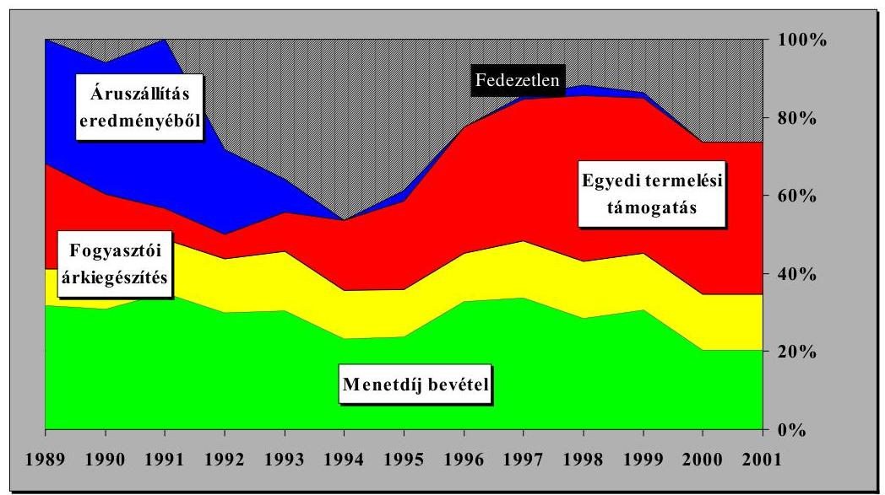

A személyszállítási alapellátás az elmúlt évek során veszteséges, a költségvetés alapellátási támogatása nem fedezi a személyszállítási alapellátás nullszaldós finanszírozását.

A jelenlegi támogatási forma nem piacorientált, sokkal inkább a szociális szempontokat figyelembe vevő, termelési jellegú. A támogatások hatása a for-rás- és költséggazdálkodásra nem kimutatható.

# 2.4.6. Az állami források felhasználása a záhonyi térségben 

Záhony térségét illetően az állami források felhasználása emelkedést mutat a vizsgált évek viszonylatában. A befejezett beruházások állománya növekedett, miután 1997. évtől a Záhony-Port Igazgatóság önálló beruházási jogot

---

kapott. Szünetelő beruházás az Eperjeske mútrágya átrakó építése volt, amelyet 1995. évben elkezdtek és csak 2000. évben folytattak és fejeztek be.

A záhonyi átrakó körzetben Phare-támogatásból három beruházási projekt (Eperjeske nyitott kocsis ömlesztett áruátrakó, Eperjeske darus átrakó és a Komoró olajátfejtő), illetve költségvetési forrásból az ún. „Tankolj és Hajts" beruházás valósult meg.

E beruházásoknál az ÁFA kifizetésének és visszaigénylésének gyakorlata az adóhatósággal egyeztetett módon az általános forgalmi adóról szóló törvény és a Phare előírásainak megfelelt. A tárgyi eszközök nyilvántartása a tárgyi eszközök helyrajzi számát nem tartalmazza, csak a leltári számát, ezáltal nehezen beazonosítható. Az egyes projektekre projekt szinten tárgyi eszköz analitikus nyilvántartás nem készült, csak a projektekben szereplő tárgyi eszközök külön-külön kigyűjtött adatainak összesítéséből lehet látni, hogy a bruttó érték a növekedéseket, illetve csökkenéseket figyelembe véve hogyan alakult. Az ún. Tárgyi eszköz változásai bizonylat leltári számonként, a projekt egyes tárgyi eszköz elemeire készült el az üzembe helyezési okmányok alapján.
A MÁV Rt. 107/1998.(MÁV Ért. 33.) FBF. sz. utasítás 1999. évi 1. sz. módosított kiadásában foglaltak alapján a gazdaságossági számításokat újra el kell végezni a beruházás lezárása után a beruházásért felelős szervezetnek, illetve a beruházásban nem érdekelt szervezettel kell elvégeztetni. Gazdaságossági számítás a fenti projekteket illetően a beruházás lezárását követően nem készült.

# 2.4.6.1. Az energiaracionalizálással összefüggő beruházás értékelése 

A „Tankolj és Hajts" beruházás célja az üzemanyag-felhasználás csökkentése, a járművek energia felhasználásának pontos mérése, valamint hosszabb távon a teljesítményarányos értékcsökkenés és járműjavítás megvalósítása. A beruházás megkezdése előtt elvégezték a gazdaságossági számítást, a munkák befejezését követően azonban nem. A közbeszerzésekről szóló, többször módosított 1995. évi XL. törvény 70. § (1) bekezdés b) pontja alapján a tárgyalásos eljárási formát alkalmazták.

Az eljárás során a felhívást nem, csak az eredményt tették közzé. Befejezését követően a beruházást több alkalommal vizsgálták. A műszaki átadás-átvételt után a kivitelező 1997 óta több korrekciót, cserét végzett el, esetenként ingyenesen, a rendszer hatékony működése érdekében. A fajlagos mutatók alakulásának vizsgálata alapján, az egyéb célú üzemanyag felhasználás a gázolaj fogyasztását illetően megtakarítást mutat, azonban a benzinfogyasztást illetően túlfogyasztás állapítható meg. A kialakított rendszer alapján az egyes gépjárművek, munkagépek egyedi fogyasztását figyelemmel lehet kísérni. A vontatási célú üzemanyag-felhasználás mutatóiból következtetések nem vonhatók le, mivel az FVS-tabló kétféle teljesítménymutatót tart nyilván a tolatási óra és a 100 elegytonna alapján. A vizsgált időszakot tekintve a felhasználás mértéke hullámzó képet mutat, de az 1997. évi adatokhoz képest megtakarítás tapasztalható. A vezetett nyilvántartásokból az üzemanyag-fogyasztás megtakarítása abszolút mennyiségben nem határozható meg. Az értékek a mozdonyoknál egyedileg mérhetők.

---

# 2.4.6.2. A rakodási teljesítmények növelése érdekében hozott intézkedések 

A Záhony-Port Igazgatóság több intézkedést hozott a vizsgált időszakban, azonban a centralizált irányítás miatt tevékenységük bizonyos fokig behatárolt. Magyarország és a volt Szovjetunió kapcsolatában 1990. év óta beállt változás egyike, hogy a kormányközi kereskedelmi megállapodásokat felváltották a vállalatok és a vállalkozók közvetlen szerződései. Az alacsonyabb szintre került szerződéses kapcsolatok a MÁV-nál is érzékeltették hatásukat. A szállított áruk tervezett volumene árutípusonként és viszonylatonként a volumenegyeztető jegyzőkönyvben kerül meghatározásra évente. A kialakított rendszer szerint az átrakásra az áru egységárat kap, így nincs differenciálva a kiszereléstől függő átrakási technológia felmerült költségét követő átrakás díja. Az igazgatóság alap- és kiegészítő szolgáltatásokat is ellát.

A rakodási teljesítmények növekedését az igazgatóságon kiépített informatikai rendszer támogatja, amely nemcsak a vasúti műveletek nyomon követését biztosítja, hanem a partnerek számára is megfelelő információt nyújt. A gazdaságos átrakás érdekében kiépítették az Ukrán Vasúti Társasággal az úgynevezett „UZ előjelentés" nevű információs rendszer.

A rakodási, átrakási létesítmények elhasználódott építményeinek állapotát javították a részben Phare támogatásból elvégeztetett felújítások, beruházások. A munkák során nem a kapacitás növelése volt a cél, hanem a korszerú technológia követése, a környezetvédelem előírásainak való megfelelés az Európai Uniós csatlakozás érdekében.

Az átrakó körzet átrakó helyeinek kapacitáskihasználása növekedést mutat a vizsgált években, melynek egyik oka a mozdított árutonna manipulációs tevékenység (átcsomagolás, egységrakomány-képzés) keretében történő mozgatása. A kapacitáskihasználás mutatóját rontják a hosszabb távon megszüntetésre kijelölt és a tartalék átrakó helyek alacsony kihasználtsági mutatói.

### 2.4.7. A Zalalövő-Bajánsenye vasútvonal építésének és költségfelhasználásának tervszerűsége

A beruházás előkészítési szakaszában kidolgozták a költségmegtérülési feltételeket és mutatókat. 1995-ben az EBRD vezetésével, magyar oldalról a MÁVTI Kft. közremúködésével, készült egy megvalósíthatósági tanulmány, amely értékelte a Szlovénia és Magyarország közötti régi vasúti kapcsolat helyreállításának megvalósíthatóságát.

A dokumentum a forgalom jövőbeni áramlásának széles körét vizsgálta meg, majd gazdaságilag értékelte. A dokumentum szerint az útvonal sikeressége a vasúti szervezetek - költséghaszon-elvű szolgáltatásnak megfelelő - átalakításától függ.

A KHVM a megvalósíthatósági tanulmány alapján jelentést készített a Kormány részére az új vasúti kapcsolat tervezett beruházásáról, amelyet a Kormány 1995. november 16-án elfogadott, és határozott arról, hogy új vasútvonal épül az országhatár és Zalalövő között, 160 km/ó tervezési, 120 km/ó

---

üzembe helyezéskori sebességre. A beruházás 1995. augusztus 31-i árszinten becsült várható költsége 9,4 Mrd Ft volt.

Az 1996. április 30-i árakon prognosztizált költségek nagysága 11,5 Mrd Ft volt. A gazdaságossági számítások a MÁV 1996. évi áruszállítási tervadatainak ismeretében készültek el, többek között annak feltételezésével, hogy a beruházás 1999-ben befejeződik, az első teljes üzemelési év 2000. lesz. Az eredményül kapott mutatók szerint nemzetgazdasági szinten hatékony beruházásról van szó. A belső megtérülési ráta $14,3 \%$, a dinamikus megtérülési idő pedig 13-17 év. A két ország illetékes tárcáinak 1996 szeptemberében közösen elvégzett pénzügyi és gazdaságossági vizsgálata során kapott belső megtérülési ráta $12,5 \%$, a dinamikus megtérülési idő pedig 13-17 év volt.

Az 1998. novemberben elkészült mérnöki költségvetés a beruházás tervezett bekerülési költségét 1997. szeptember 1-jei árakon 24 Mrd Ft-ban határozta meg. Mivel a korábbi gazdaságossági számítások alapját képező prognosztizált bekerülési költségek nagyságrendje jóval a mérnöki költségvetés alatti volt, továbbá a beruházás befejezése a korábban tervezetthez képest késett, ezért a bemutatott megtérülési idők nem megalapozottak.

A beruházáshoz szükséges pénzügyi forrás éves ütemét a központi költségvetési törvény hagyta jóvá. A beruházási ráfordításként figyelembe vehető költségek megjelenésétől kezdődően (1996) a központi költségvetésről szóló éves törvényekben a beruházás lebonyolításához szükséges tervezett előirányzat el volt különítve.

A projekt forrásának része volt a német Kreditanstalt für Wiederaufbau (KfW) pénzintézettől a Magyar Állam által felvett 120 M DEM kölcsön és az EU által nyújtott 10 M EURO Phare-támogatás is.

A bevont források együttesen a beruházás nettó előirányzatának - 24177 M Ft $-76,1 \%$-át tették ki.

A beruházás finanszírozási alapokmányának módosításaira az adott évben rendelkezésre álló forráshoz igazodóan került sor.

A tendereket megalapozó mérnöki költségvetés számításai jelenleg beigazolódni látszanak. A beruházás eddigi tényleges bekerülési költsége még a tervszám alatt van, és a várható további kiadások teljesítése esetén sem valószínű a túllépés.

A beruházás megvalósításához a projekt alapvető és meghatározó terveit a MÁVTI Kft. 1998-ig elkészítette. E dokumentumok szolgáltak alapul a meghirdetett tendereknek.

A KHVM a beruházás folyamatos ellenőrzése céljából Tárcaközi Bizottságot hozott létre a PM, a Gazdasági Minisztérium (GM), a KHVM Vasúti Közlekedési Főosztálya, a Magyar Államkincstár és a MÁV Rt. bevonásával. A beruházás sikeres lebonyolításában nagy jelentősége volt a szigorú rendszerességgel tartott koordinációs értekezleteknek, melyeken rendszerint minden érintett fél képviseltette magát. Az „Emlékeztetők" tanúsága szerint ez a fórum alkalmas volt

---

minden lényeges probléma megbeszélésére, a feladatok következetes végrehajtatására, végrehajtására. A dokumentumokból a kivitelezés menete és az előrehaladás problémái folyamatosan figyelemmel kísérhetők. A kivitelezőktől megkövetelték a magyar jogszabályok szerint kötelező Építési Napló vezetését, bár a nemzetközi beruházási szabályok ezt nem írták elő. Az építési naplók mellékletei a koordinációs értekezletek jegyzőkönyvei.

A beruházáshoz jelentős kölcsönt nyújtó KfW előírta a projekt nemzetközi gyakorlatnak megfelelő szabályok szerinti tenderezését, az EU előírásai szerinti dokumentálással. A tenderezési folyamat a nemzetközi szabályoknak megfelelve, de hazai jogszabályi környezetre figyelemmel ment végbe.

A beruházói jogokat a MÁV Rt.-nek átadó KHVM rendelkezett a tenderértékelés folyamatáról. Meghatározta, hogy a MÁV Rt., a KHVM, a Közlekedési Felügyelet, a PM, a GM, valamint a Magyar Államkincstár munkatársainak részvételével alakítsák ki az értékelő bizottságokat. A tendereket értékelő bizottságok az ajánlatok teljes körű átvizsgálását és elemzését követően alakították ki javaslataikat. A különféle bizottságok - műszaki, jogi, kereskedelmi, pénzügyi - munkájukat megbízólevéllel végezték, feladatuk „profilba illő" volt. Az értékelésekről összeállított részletes jelentéseket a KHVM ellenjegyezte, majd a finanszírozó bank írásbeli jóváhagyását követően kerülhetett sor a kiválasztott ajánlattévő értesítésére.

Valamennyi tendernek volt visszatartási záradéka, rögzítették a tartalékkeret nagyságrendjét, amely általában 5\% volt. Volt lehetőség konzorcium alakítására, melyben minden tag kötelezett volt a munkavégzésre, és megkövetelték a referenciákat. Az átalányáras szerződések esetében törölték a 15\%-ot meghaladó változások engedélyezhetőségét. A szerződésmódosítások során a fajlagos árak nem változhattak. A változatlanságot a szúrópróbaszerű ellenőrzés megerősítette.

A módosítási kérelmek kezelése megfelelően dokumentált volt. A szerződésmódosításokat a megbízó csak részletes indoklás ellenében fogadta el. A helyszíni ellenőrzés nem találkozott olyan dokumentummal, amely az alapszerződés megkötéséhez hasonló eljárási, felülvizsgálati, ellenjegyzési rendet követelt volna meg a módosítások aláírását megelőzően. A tartalékkeretet meghaladó módosítások közül legjelentősebb költségnövekmény - 19,8\% - az egyetlen tételes elszámolású munkánál realizálódott. A növekményt az esetenként hiányos tenderterv műszaki tartalmával, ill. a megváltozott hidrológiai viszonyok miatti többlet talajcserékkel indokolták. A munka bekerülési költsége azonban a módosítással együtt is alacsonyabb volt, mint a tender során a pályázók által adott második legkedvezőbb ajánlat. E munkán kívül a tartalékkeretet meghaladó szerződésmódosítások együttes összege az alapszerződések együttes összegét végül mindössze 3,6\%-kal lépte túl. A változások a projekt finanszírozásában nem okoztak áthidalhatatlan problémát.
2000. december 18-án Zalalövő állomáson megtörtént a vasút ideiglenes forgalomba helyezése, megindult a belföldi, 2001 májusában a nemzetközi menetrendszerű közlekedés, de a beruházás műszakilag és pénzügyileg még nem fejeződött be. A beruházás záróokmánya - 11 tenderre 1 okmány - várhatóan csak 2002. év végével készíthető el. A 2000. december 18-án indított próbaüzem és a

---

meghosszabbított próbaüzem engedélyezése után a végleges üzembe helyezési eljáráshoz kapcsolódó bejárás 2001. november 6-8-án megtörtént. A kivitelezök által beszerzett bankgaranciákat jónak tartották, így nem maradtak lezáratlan számlák. (A Zalalövő-Bajánsenye vasútvonal építésének és költségfelhasználásának tervszerűsége részletes elemzését a 3. sz. függelék tartalmazza.)

# 2.5. A társaság vagyongazdálkodása 

### 2.5.1. A saját tőke nagyságának és összetételének változása

1995 végén a MÁV Rt. saját tőkéjének nyilvántartás szerinti értéke 462,2 Mrd Ft volt, amely 2000 végére 473,4 Mrd Ft-ra nőtt. A saját tőkén belül a jegyzett tőke értéke - 188,0 Mrd Ft - öt év alatt nem változott, a tőketartalék viszont 60,3 Mrd Ft-tal növekedett. A tőketartalék növekedése az összességében veszteséges gazdálkodás ellenére következett be. Ennek oka, hogy a számviteli törvény előírásait betartva 1997. január 1-jéig valamennyi fejlesztési célra véglegesen kapott pénzeszközt, 1997. január 1-je után csak a kincstári tulajdonú eszközök beruházásához kapott támogatást közvetlenül a tőketartalékba könyvelte a társaság. A MÁV - részvénytársasággá alakulásakor - a kizárólagosan állami tulajdonú eszközök forrását a tőketartalékon belül különítette el, növekményük is a tőketartalékba került.

### 2.5.2. A pályavasút vagyonának számviteli nyilvántartása

A pályavasút és a vállalkozó vasút előírásoknak megfelelő elkülönítését a MÁV Rt. megvalósította. A számviteli törvény azon előírása, miszerint a kincstári eszközöket a hosszú lejáratú kötelezettségekkel szemben kell nyilvántartani a vagyonkezelőnél, 1999-2000-ben még nem volt alkalmazható a társaságnál, mivel a kincstári vagyon nem volt a társaság kezelésében, csak használatában. Az államháztartásról szóló törvény 109/K. §-ának (6) bekezdése szerint a kincstári vagyonért felelős miniszter egyetértése esetén vagyonkezelőnek tekinthető vagyonkezelési szerződés nélkül is a kizárólagos állami tulajdonba tartozó vagyontárgyak használója, ha külön törvény jelölte ki használóként. A kincstári vagyonért felelős miniszter azonban szükségesnek tartotta a vagyonkezelési szerződés megkötését, amelyre csak 2001 szeptemberében került sor.

Az Állami Számvevőszék a Phare-támogatások felhasználásának vizsgálatáról 2000-ben készített jelentésében megállapította, hogy a MÁV Rt. a Pharetámogatással beszerzett eszközöket mérlegében szerepelteti, de az eszközök forrásoldala a mérlegben nem felel meg sem a számviteli törvény előírásainak, sem a Phare-szabályoknak. A Phare-támogatásból származó kincstári vagyon a társaság tőketartalékának része. Az Állami Számvevőszék és a MÁV Rt. álláspontja megegyezett abban, hogy ez a hiányosság a vagyonkezelési szerződés hiányára vezethető vissza.

A kincstári vagyon számviteli nyilvántartásának rendezése a MÁV Rt.-nél 2001. októberben megtörtént. A 2001. szeptember 7-én megkötött vagyonkezelési szerződéssel összhangban a MÁV Rt. felett tulajdonosi jogokat gyakorló közlekedési és vízügyi miniszter alapítói határozattal a kincstári tulajdonnak minősített tárgyieszköz-vagyont a 2001. szeptember 30-ai 288877 M Ft könyv

---

szerinti nettó értéken elvonta a társaságtól. Egyúttal kötelezte a társaság ügyvezetését a kincstári vagyon számviteli rendezésére: a tőketartalékból a hosszú lejáratú kötelezettségbe való átvezetésre. A társaságnál a szükséges könyvelési műveleteket elvégezték. A forrásrendezés után a társaság tőketartaléka 1,7 Mrd Ft-ra csökkent. A tőketartalék a 2001. évi mérleg szerinti veszteség fedezetére nem elegendő, a társaság saját tőkéjének értéke a jegyzett tőke értéke alá sülylyedt.

# 2.6. A közlekedést közvetlenül meghatározó múszaki berendezések, gépek, jármúvek fejlesztése 

Az 1995-2001. években a MÁV Rt.-nél beruházásokra, felújításokra rendelkezésre álló forrás a forgalom- és üzembiztonság megőrzése mellett néhány nagy projekt megvalósíthatóságát is biztosította.

#### Abstract

Az EU által is - Phare-segéllyel - támogatva megépült az új magyar-szlovén vasúti összeköttetés. Üzembe helyezték a Záhony átrakó körzetet (V. európai korridor). Befejeződött a Buda-pest-Hegyeshalom-Bécs vasútvonal korszerűsítésének I. üteme (ISPA-segély felhasználásával megkezdődik a II. ütem). Az Inter City és Inter Pici forgalom kibővítése gyorsította a vasúti közlekedést. A Felsőzsolca-Hidasnémeti és a Rákos-Újszász-Szolnok vasútvonal korszerűsítése (EIB-hitelből) a sebességkorlátozások megszüntetését, a korábbi sebesség visszaállítását jelenti. A Bp. Nyugati pu.-Szob vasútvonal korszerűsítése (a Phare segélyek hazai hányada) szintén a korábbi múszaki paraméterek elérését szolgálta. A Hálózat-projekt pedig a társaság távközlési hálózatának optikai kábellel történő kiváltásával, új átvitel-technikai berendezések, tápellátó rendszerek telepítéseivel segíti a korszerű informatikai eszközök rendeltetésszerü használatát.

Az alapvetően a forgalom- és üzembiztonság megőrzésére irányuló fejlesztési, beruházási tevékenység mellett a MÁV Rt. járműállományának kora nőtt, üzemképessége romlott. A nagy projektek megvalósulása az érintett területeken lehetővé tette a közelítést az EU-normákhoz a szolgáltatás színvonalában, a technológiai korszerűsítésben, a környezetvédelemben. E projektfejlesztések azonban lokális hatásúak, a forráshiány miatt nem átfogó, hanem zárt célrendszer jellegűek.

A társaságnál a fejlesztési koncepcióban és a középtávú tervben megfogalmazott, műszakilag indokolt beruházási igényeket rendre az éves tervben biztosított fedezet szintjére kellett csökkenteni. A fejlesztési koncepcióban meghatározott célok ezen okból nem változtak, de megvalósításukat forráshiány miatt későbbi évekre kellett halasztani, és megkezdett nagy projektek átütemezésére is szükség volt.

Az 1995-2001-ben a beruházási források évenkénti volumene - 1995. évi összehasonlító áron számolva - azonos volt.

### 2.6.1. A beruházások, felújítások költségei és forrásösszetétele

A MÁV Rt. a beruházásait, felújításait nyereség és beruházásra fordítható amortizáció hiányában alapvetően idegen forrásokból - költségvetési támogatás, állami hitelfelvételek, EU-segélyek, a társaság által állami garanciákkal felvett hitelek - finanszírozta. Az 1995-2001. években a MÁV Rt. veszteségei (szanálás nélküli eredményei) az elszámolt értékcsökkenést is meghaladó öszszegűek voltak. Ezért nemcsak a fejlesztéseknek, beruházásoknak, hanem a

---

múködési költségek egy részének sem volt fedezete a társaság bevételeiben. Így a MÁV Rt. az amortizációt nem tudta eszközeinek megújítására fordítani. Az elszámolt értékcsökkenés erősítette a gazdálkodási kényszerhelyzetet, a vagyonvesztési folyamatot.

A társaság 1995-2001-ben folyó áron összesen 303 Mrd Ft-ot fordított beruházásokra, felújításokra. Ebből a pályavasúti beruházásokra és felújításokra 180 Mrd Ft-ot, vállalkozó vasúti beruházásokra és felújításokra 123 Mrd Ft-ot használt fel a társaság. A beruházási források összetétele jelentősen eltért a pályavasúti, illetve a vállalkozó vasúti beruházások esetében.

A pályavasúti beruházások mintegy $3 / 4$-ét költségvetési források és az állam által felvett hitelek (KfW és EIB) finanszírozták. Az EU-segélyek (4\%) az európai közlekedési folyosókat alkotó vasútvonalak fejlesztését szolgálták. A Pharesegély 1999-ben jelent meg az V. európai korridorban lévő új magyar-szlovén vasúti átmenet részleges finanszírozásában. A MÁV Rt. hitelfelvételei (9\%) alapvetően a kisebb - munkakörülményeket javító - korszerűsítéseket fedezték. Az egyéb forrásokat (13\%) - keretátvételt, vagyonhasznosítási bevételt - a mellékvonalak, állomási mellékvágányok forgalombiztonságának megőrzésére fordították.

A vállalkozó vasúti beruházások és felújítások megvalósításában a költségvetési források (6\%) alapvetően a kombinált fuvarozás fejlesztését tették lehetővé. Az EU Phare-segélye (4\%) 1999-2000-ben több, az Unió követelményeivel összhangban álló fejlesztés forrása volt (Záhonyi Átrakó Körzet korszerűsítése, Budapesti Intermodális Logisztikai Központ kialakítása, környezetvédelmi célokat szolgáló technológiai beruházás). A MÁV Rt.-hitelek (69\%) alapvetően a GIR-MHR, az adatátviteli hálózat megvalósítását és a vasúti járművek üzemképes állapotának biztosítását szolgálták. Az egyéb forrásokat (21\%) - keretátvételt, vagyonhasznosítási bevételt - ugyanarra fordították, mint a MÁV Rt.-hiteleket.

A beruházások befejezetlen állománya az éves beruházási tervhez viszonyítva szinte évenként változott: 1996-ban 89\%, 1998-ban 52\% volt. Ez a szint 1999ben is megmaradt, 2000-re viszont a befejezetlen állomány elérte a beruházási terv 70\%-át, 2001. végére viszont a terv 42\%-ára csökkent a befejezett nagy projektek aktiválása után. A befejezetlen állományban két szünetelő beruházás van, melyekre eddig 135 M Ft-ot fordítottak, de mindkettő esetében már döntöttek a folytatásról.

A befejezetlen állományt a több év alatt megvalósuló nagy projektek növelték. A nagy projektek indítása a források késedelmes megnyitása miatt elmaradt a tervezettől. Beruházásokat ütemeztek át a kivitelezés alatt, melyeknél az elhúzódások többletköltségeket okoztak.

# 2.6.2. A közlekedést közvetlenül meghatározó beruházásokra szolgáló pénzügyi eszközök 

A vasúti közlekedés forgalom- és üzembiztonsági szabályait, műszaki követelményeit hatósági előírások, nemzetközi és belföldi vasúti szabványok, utasítá-

---

sok határozzák meg. Az itt használt eszközöknek meg kell felelniük az adott funkció biztonságos teljesítéséhez előírt követelményeknek.

A MÁV által használt vasúti pályahálózat, a biztosítóberendezések, az erősáramú berendezések, a vasúti járművek, a hidak, az épületek, közművek, a távközlés és az utastájékoztatás megfelelő - a 4. sz. függelékben részletesen ismertetett - állapota azonban nem jelent minden esetben versenyképes, gazdaságos, környezetbarát állapotot is.

A MÁV Rt. kalkulációja szerint - a fejlesztési trend alapváltozatához viszonyítva - a vasút elmaradt beruházásainak értéke 2001. évi áron 1320 Mrd Ft. Az 1995-ben kimutatott 440 Mrd Ft halmozott hiány a beruházási infláció miatt 1010 Mrd Ft-ra nőtt. Ezt növelte az 1996-2001. években a beruházási források szűkössége miatt keletkezett további 310 Mrd Ft. A fejlesztési igény alapváltozata a nemzetközi vasúti kapcsolatokban érintett pálya- és járműállomány, ill. az elővárosi forgalom európai normákhoz felzárkózó fejlesztését célozza. Az elmaradt beruházásokból 855 Mrd Ft a pályavasutat (pálya 431 Mrd Ft, távközlési és biztosító berendezés 333 Mrd Ft, erősáramú berendezések 58 Mrd Ft, épületek és közművek 18 Mrd Ft, hidak 15 Mrd Ft), 465 Mrd Ft pedig a vállalkozói vasutat (gördülő állomány 349, gépészeti létesítmények 67, árufuvarozási létesítmények 35, egyéb eszközök 15 Mrd Ft) érinti.

A pályavasúti fejlesztések halmozott elmaradása, valamint a szinten tartáshoz elégtelen karbantartás a vasúti pályák fokozatos elhasználódását eredményezte. Ennek következménye a sebességkorlátozás forgalombiztonsági okokból történő bevezetése a vasúti pályák $40 \%$-án.

A vállalkozó vasút beruházásai elmaradásának következménye, hogy a járművek üzemkészsége 66-83\% közötti, és a karbantartásra fordított költségek növekedtek.

# 2.6.3. A számítástechnikai beruházások megvalósítása 

A gazdálkodás irányítása területén a MÁV Rt.-nél a fokozatos fejlődés során bevezettek különböző számítógépes pénzügyi, elszámolási rendszereket. Ezek többnyire egymástól függetlenül múködtek, és csak a tárgyhónapot követően szolgáltattak információt a bevételek és költségek alakulásáról Az információ megszerzése lassú volt, a továbbítás és feldolgozás megbízhatósága sem volt kielégítő.

A gazdálkodás irányítási rendszerének (GIR) korszerűsítéséről a társaság igazgatósága 1994 decemberében döntött. A döntést a tulajdonosi jogokat gyakorló KHVM is jóváhagyta. A tender kiírásáig tartó mintegy 7 hónap alatt ez kibővült a menetjegy-eladási, helybiztosítási és utastájékoztatási információs rendszer (MHR), az informatikai hálózat (MIHP) és az adatátviteli hálózat (Hálózat) kiépítésének igényével.

A tender előkészítése és lebonyolítása a hatályban lévő szabályozásnak megfelel. A gazdaságossági elemzést - a tenderkiírás követelményeinek megfelelően a teljes projektre (GIR, MHR, MIHP, Hálózat) - az ajánlattevők elkészítették. A pályázók költséghaszon-elemzései azonban nem feleltek meg a társaság Beru-

---

házási Utasításában előírt követelményeknek. Az előírásoknak megfelelő gazdaságossági elemzéseket a MÁV Rt. Fejlesztési és Kutatási Intézete utólagosan, 2001 januárjára, készítette el. Ezek már tartalmazták a dinamikus mutatókat, a megtérülési időt, a belső megtérülési rátát, a nettó jelenértéket.

A projektek a fővállalkozási szerződésekben eredetileg vállalt határidőkre nem készültek el. A GIR-projekt szerződésben vállalt befejezési időpontja 2001. április 30., az MHR-é 2001. június 18. volt.

A GIR-rendszer üzemszerű működtetése 2000. november második felében kezdődött, a naprakészségének eléréséig, párhuzamos üzem volt tervezve a korábbi LIBRA rendszerrel és a kapcsolódó alrendszerekkel. A GIR adatbázisában 2001. május végén azonban olyan adatsérülést fedeztek fel, melyek részletes azonosítása és javítása teljesen bizonytalan volt. Ezért a rendszert 2001. június 11-én leállították. Az addig elvégzett munkát egy üzemszerú tesztnek tekintve a rendszer újraindítása mellett döntöttek. A MÁV Rt. a hibás teljesítéshez kapcsolódó jogait érvényesíteni kívánja. A GIR adatsérülési hibáira vonatkozóan a KöViM vizsgálatot végzett. Az ismételt bevezetés során felmerült többletköltségekről, valamint a GIR Bevezetési Projekt munkáinak ütemezéséről készített társasági jelentést a miniszter elfogadta.
Az MHR szállítása és üzembe helyezése az önálló funkcionalitással bíró modulok részszállításaival fokozatosan történt volna. Az első részszállítás 1999. szeptemberében kezdődött meg a Nemzetközi Menetjegy-eladás moduljának üzembe helyezésével. Az átadásátvételi eljárás többszöri próbálkozásra sem volt eredményes, a MÁV Rt. a felajánlott modult nem tudta elfogadni. 2000 májusára világossá vált, hogy a fővállalkozó a megkezdett módon nem tud eleget tenni a szerződésben vállalt kötelezettségeinek, a fővállalkozói szerződést 2000. augusztus 31-i hatállyal felfüggesztették. A fővállalkozó hozzájárult a fővállalkozói szerződés megszüntetéséhez, és megengedte az addigi alvállalkozónak, hogy az MHR-projekt folytatása és befejezése érdekében új szerződést kössön a MÁV Rt.-vel. Az MHR 2003. évre elhúzódó megvalósulását MÁV Rt. Igazgatósága tudomásul vette.
Az informatikai adathálózat kiépítése befejeződött, felügyeleti rendszerét üzembe helyezték.
A Hálózat-projekt megvalósítása 2000. november 30-án befejeződött.
A beruházások árfolyamváltozás miatt aktualizált terve 29,3 Mrd Ft, melyet a projektek teljesítményértékei a befejezetlen állománnyal együtt már elértek.

A jelentkező problémák ellenére a projektek helyzetét átfogóan nem ellenőrizte a MÁV Rt. és a tulajdonos sem. Előzetes becslések alapján azonban a MÁV Rt. feltételezi, hogy a várható hasznok jelentős részben realizálhatók lesznek. Ugyanakkor a projektek teljes kiépülésű működésének késése miatt a dinamikus mutatók a tervezetthez képest romlanak.

A MÁV Rt. elnöke és vezérigazgatója 2002. május 23-án érkezett levelében a következőkről tájékoztatta az Állami Számvevőszéket „Az informatikai beruházásoknál átfogó vizsgálat valóban nem volt, hiszen azokból még az MHR projekt kidolgozása folyamatban van. A projektek megvalósulásával kapcsolatban szükségesnek tartom a jelentésben is hangsúlyozni, hogy a GIR projekt megvalósítása befejeződött. 2001. szeptemberétől a pénzügyi modulokkal, 2002-től pedig teljes kiépítésben üzemszerűen múködik. Az adatátviteli és az informatikai adathálózat projektek az előírt határidőre a tervezett költségkereteken belül valósultak meg. Az MHR projekt megvalósítási munkáit a MÁV Rt. vezetése folyamatosan figyelemmel kíséri, és rendszeresen beszámol a MÁV Rt. Igazgatósága részére a projekt előrehaladásáról. Az MHR projekt hátralévő feladatai a tervezett hitelkereten belül valósulnak meg."

# 2.6.4. A közbeszerzési eljárások a beruházásoknál 

A közbeszerzésekről szóló 1995. évi XL. törvény (Kbt.) alkalmazásaként a MÁV Rt. végrehajtási utasításai a törvény módosításával együtt változtak.

---

A MÁV Rt. 1998-2001-ben összesen 311 beruházás közbeszerzési eljárását végezte el, melyek közül 16 esetben, a versenyeztetések 5\%-ában került sor jogorvoslati eljárásra.

A társaságot a Közbeszerzési Döntőbizottság 11 esetben marasztalta el, ebből 1 még folyamatban lévő bírósági eljárás. A MÁV Rt.-t elmarasztaló 11 esetből 8 olyan tárgyalásos eljárás, amelyeknél a megtarthatóság Kbt.-ben előírt feltételei nem voltak meg, 2 esetben a társaság az ajánlatok pontozását törvénysértő módon végezte, 1 esetben a jogsértéseket csekély súlyúnak minősítette a Közbeszerzési Döntőbizottság.

A Közbeszerzési Döntőbizottság elnöke 10 esetben indított törvénysértés miatt hivatalból eljárást, ebből 8 esetben a MÁV Rt.-t elmarasztalták, egy eljárás még folyamatban van.

A Közbeszerzési Döntőbizottság elmarasztaló megállapításainak megelőzésére a társaság a beruházások tenderajánlati felhívásainak tartalmi és formai vizsgálatát a Közbeszerzési Értesítőben történő megjelenés előtt nem végezte el, és nem szabályozta a vezetői ellenőrzést a közbeszerzési tevékenységében.

# 2.7. Az ingatlangazdálkodás és a befektetett üzletrészek 

### 2.7.1. A MÁV Rt. ingatlanállományának nyilvántartása, és az ingatlanokkal való gazdálkodás

Az alapító által rendelkezésre bocsátott vagyontárgyakról apportlista az alapításkor nem készült. A cégbíróság a részvénytársaságot 1995. márciusában visszamenőleges hatállyal jegyezte be. Apportlista a mai napig nem áll rendelkezésre. Az alapításkor a mintegy 8500 helyrajzi számon elhelyezkedő MÁV ingatlanállomány felmérését nem végezték el az akkori számviteli és értékelési szabályok szerint.

A KVI és a MÁV Rt. között a kincstári vagyont képező, de MÁV Rt. által használt ingatlanok helyzetét is tisztázó vagyonkezelési szerződés csak 2001. szeptemberében lépett életbe, de a szerződés mellékletét képező nyilvántartás és annak földhivatali átvezetése nem teljes körű. A KVI nem rendelkezik a MÁV Rt. használatába adott földterületről a valóságnak megfelelő, a változásokat is nyomon követő vagyonkataszteri nyilvántartással, mivel adatátviteli problémák miatt a MÁV Rt. még nem teljesítette az adatszolgáltatást. A meglévő nyilvántartás szerint a földterületek 70\%-a rendezett, a fennmaradó rész rendezés alatt áll. Az egyes földterületeket érintő - tulajdonjogot terhelő - a 183/1996. (XII. 11.) Korm. rendelet szerint vagyonkezelés körébe tartozó jogokról nyilvántartás nem áll rendelkezésre.

A MÁV Rt ingatlanvagyonának rendezése nemcsak számviteli feladat, hanem azok természetbeni kimérése vagy megosztása is szükséges. Ennek hiányában fordulhat elő, hogy a földhivatalból beszerzett tulajdoni lap és a helyszínrajz adatai szerint a Déli pu. épülete a Krisztina körút egy részét foglalja el, vagy a West-End City Center épületegyüttesének egy része az ingatlan-nyilvántartás adatai szerint a MÁV Rt. használatában lévő, de állami tulajdont képező földterületen található.

---

Az ingatlanterületek valós földhivatali nyilvántartásának hiánya mellett további probléma, hogy az építmények, épületek nyilvántartása elkülönül a földterületek nyilvántartásától. Regisztrálás hiányában kideríthetetlen az egyes ingatlanokat terhelő́ szolgalmi jogok megléte. A decentralizált ingatlangazdálkodás és a bérleti szerződések központi nyilvántartásának hiánya miatt nincs megbízható információ a bérleti szerződésekben engedélyezett, tulajdont korlátozó jogokról.

A decentralizált ingatlangazdálkodás hiányosságára vezethető vissza, hogy a területi szinteken fellelhető, az adott szakterület használatában álló ingatlanokra vonatkozó nyilvántartások között nincs kapcsolat. A MÁV Rt. Igazgatósága 70/2001. számú határozatában a MÁV Vagyonkezelő Rt.-t bízta meg az Földművelési és Vidékfejlesztési Minisztérium irányelveire épülő komplex ingatlan-nyilvántartási rendszer létrehozásával és múködtetésével. A rendszer kialakítása a 2001. október 30-ra kitűzött határidőre nem valósult meg.

A MÁV Rt. szervezeti felépítésén belül az ingatlangazdálkodási szakterület a stratégiai vezérigazgató-helyettes felügyelete alá tartozik. 1994. december 9-től öt alkalommal változott az ingatlangazdálkodás irányítása a MÁV Rt.-nél. A szervezeti változások ellenére jelenleg 24 -féle szervezet jogosult ingatlanbérbeadással kapcsolatban intézkedést tenni. A sokféle szabályozás ellenére a gyakorlatban beidegződött mechanizmusok útján hoznak eseti jellegű, vagy adott esetben általános érvényű határozatokat és adnak bérbe ingatlanokat. Az egyes feladatok meghatározását, végrehajtását és a felelősség megállapítását a bonyolult rendszerben nem lehet nyomon követni.

Az említett hiányosságok felismerése vezette a MÁV Rt. Igazgatóságát, hogy 2000. májusában foglakozzon a társaság vagyonkezelési tevékenysége komplex stratégiájának elkészítésével. Az elkészített intézkedési terv alapján a MÁV Vagyonkezelő Rt.-t bízta meg az egységes rendszer kidolgozásával és az adatfeldolgozással.

A MÁV Rt. tulajdonában, illetve kezelésében lévő ingatlanok tulajdonjog szerinti nyilvántartása alapján megállapítható, hogy 25500 ingatlanból 17627 ingatlan rendelkezik földhivatali záradékkal, a többi ingatlan döntés előkészítő fázisban van. Az ingatlanok közül a kincstári vagyonba tartozó 5500 ingatlanból 4446 db rendelkezik földhivatali záradékkal, ami a kincstári vagyonba tartozó területek $69 \%$-a. Az egyes ingatlanok bérbe adásáról, az ingatlanokat terhelő tulajdont érintő jogokról nem rendelkezik a MÁV Rt. naprakész információval.

A MÁV Rt. ingatlangazdálkodásával kapcsolatos szabályozások nem mindig adnak egyértelmú támpontot a végrehajtásban résztvevők számára, tartalmaznak olyan kivételeket vagy éppen általánosságokat, amelyeket az országos méretű MÁV Rt. egészére alkalmazni nem lehet.

[^0]
[^0]:    Az ingatlan bérbeadásra az ingatlant használó szolgálati hely jogosult, kivéve az ingatlan egyedi minősítése miatt az Ingatlangazdálkodási Főosztály vezetőjének egyéni döntését, vagy ha az utasforgalomhoz kapcsolódnak, a személyszállítási, illetve forgalmi szakszolgálat jogosult bérbeadásra. A bérlet nem sértheti a vasút érdekeit. Felelős a bérbeadásra jogosult.

---

#### Abstract

A bérbeadás szakmai irányítója az ingatlangazdálkodási szakterület, mely tevékenységét az érintett szakszolgálatokkal látja el. Az Utasítás a feladat meghatározást követő végrehajtás felelősének az „ingatlangazdálkodási szakterületet" nevezi meg, nem pedig annak vezetőjét. Különösen fontos ez azért, mert az ingatlan bérbeadására a szolgálati hely jogosult, de nincs olyan utasítás, ami kötelezően meghatározná a bérleti szerződéshez szükséges kontroll alkalmazását.

A MÁV-nál a bérbeadás jogköre decentralizált. A bérbeadásról szóló utasítások tartalmazzák, hogy a bérbeadással kapcsolatos információk és adatok integrált kezelése az ingatlangazdálkodási szakterület feladata, ennek ellenére a MÁV Rt.-nél nincs a bérleti szerződések nyilvántartására kialakított rendszer, és nem rendelkeznek a bérbeadásra vonatkozó összevont adatokkal. Az adatszolgáltatási kötelezettség kiterjed valamennyi bérbeadást végző szakszolgálatra és valamennyi ingatlanbérleti szerződést tartalmazza, de - valószínúleg a szankcionálás hiánya miatt - az utasítás végrehajtása nem követhető nyomon.

A szerződések számítógépes pénzügyi nyilvántartását a MÁV Rt. belső utasításában előírtak szerint 2001. szeptember 1-től a Pénzügyi és Számviteli Főosztály végzi.

A vizsgált 55 bérleti szerződésből 6-ban volt tapasztalható, hogy az értékesítésre meghirdetett ingatlanok értékbecslésében árcsökkentő tényező az ingatlanra a MÁV Rt. engedélyével megkötött határozott vagy határozatlan időtartamú bérleti szerződés, vagy valamelyik szakigazgatóság által engedélyezett ráépítés.

Ingatlanok önálló szerződés-nyilvántartási rendszerének hiányában az inflációt követő bérleti díjemelés elmaradt. A MÁV-alapítású kft.-k esetében az alapításkor használatba adott ingatlanokra indokolatlanul alacsony bérleti díjakat állapítottak meg. A MÁV-alapítású kft.-k esetében tapasztalható, hogy az éves bérleti díj egy részét kompenzálták az ingatlanra előírt felújítási, állagmegóvási kötelezettséggel. A vizsgált három szerződés esetében az előírt éves felújítási kötelezettség teljesítése megvalósult.

# 2.7.2. A kincstári vagyonba tartozó ingatlanok értékváltozása 

A MÁV Rt. piacgazdasági követelményeknek megfelelő múködtetése megköveteli a társaság vagyoni, pénzügyi és jövedelmi helyzetének és annak változásának valós bemutatását. Az eszközigényes vasúti szállítás tárgyi eszközeinek értékelését, az amortizáció elszámolásának módját és mértékét 1995-ben az ÁSZ ellenőrizte. Megállapítást nyert az éves amortizáció alacsony értéke. Nem érvényesülhetett az alacsony amortizációs norma és a veszteség miatt az az elv, hogy az elszámolt amortizáció az elszámolás időszakában szabad pénzeszközként álljon rendelkezésre. A bevételek az értékcsökkenési leírás nélküli költségek fedezetére sem voltak elegendőek.

Az alkalmazott tarifapolitika miatt az üzemgazdasági követelményeknek megfelelő amortizációs költségek az árakban nem realizálhatók, ezért a vagyonértékeléskor figyelembe vett várható élettartamnál jelentősen hosszabb élettartam megállapításával minimalizálták az amortizációs kulcsokat és ez által a költségeket. A részvénytársasággá történt átalakítástól 1997. év végéig a valós elhasználódás mértékétől alacsonyabb leírási kulcsok alkalmazása miatt el sem számolt értékcsökkenés becsült - és inflációval módosított - összege meghaladja a 100 Mrd Ft-ot. Az el nem számolt amortizáció miatt azonban a már használhatatlan eszközök is magas

---

nyilvántartási értékkel szerepeltek, ezért 1996-1997-1998. években összesen 47,9 Mrd Ft értékű rendkívüli selejtezést, illetve leértékelést hajtottak végre.

Az amortizációs normajegyzékben kiadott és hatályban lévő, az egyes eszközcsoportokra vonatkozó kulcsok napjainkban sem érik el az elhasználódás és az újra-előállításhoz szükséges amortizációs értéket.
A MÁV Rt.-nél alkalmazott tarifapolitika a társaság gazdasági szempontjain kívül nemzetgazdasági szempontok figyelembevételétől is függnek. Az érvényben lévő árak külső szabályozása miatt a kívánatos mértékű amortizáció elszámolása következtében fellépő többlet költségek nem realizálhatóak. Ennek következtében a tárgyi eszközök utánpótlásának a fedezetére nem képződhet megfelelő forrás.
A MÁV Rt. a kincstári vagyon pótlására, bővítésére, illetve felújítására vonatkozó kötelezettségeinek a fentebb említett okok miatt - részben hibáján kívül - nem tudott maradéktalanul eleget tenni. Számviteli politikájában már az 1996. és 1997. években is törekedett megközelíteni a kincstári eszközök vonatkozásában a műszakilag kívánatos amortizációs mértéket. A kulcsok évenkénti emelésével és rendkívüli leértékelésekkel igyekeztek biztosítani, hogy ezen eszközök a mérlegben valós értéken szerepeljenek, valamint, hogy a maradványértékük ne a selejtezéskor egy összegben terhelje a MÁV Rt. eredményét. Az értékcsökkenés elszámolása során a vizsgált 50 esetből 13-ban eltérő amortizációs kulccsal értékelték ugyanazon eszközcsoporton belül a saját tulajdonú és a kincstári tulajdonban lévő eszközöket. Mivel a MÁV Rt.-nél minden évben jelentkezett a forráshiány, ezért a társaság nem tudta az amortizációnak megfelelő összeget sem befizetni, sem a kincstári vagyon pótlására, felújítására fordítani.

A kincstári vagyonkörbe tartozó ingatlanállomány vagyongyarapodást mutat, mivel a költségvetési hálózatfejlesztési hozzájárulásból minden évben az amortizációt meghaladó értékű beruházást valósítottak meg. Az ingatlanok valós vagyonértéke alapján ezek a beruházások nem fedezik a kezelésre átadott ingatlanok állagmegóvási kötelezettségének megfelelő értéket.

A vasúti törvény végrehajtása során, a társaságon belül különvált vállalkozói vasút pályahasználati díjat számol el a kincstári tulajdont képező pályavasút részére. A pályahasználati díj mértéke függ az amortizációs költségek nagyságától. A 183/1996. (XII. 11.) Korm. rendelet szerint a pályahasználati díjban megjelenő amortizációt vissza kell forgatni az országos közforgalmi pálya felújítására. A megújításra fordítható összegek nagysága a pályavasút fenntartóinak jelent terhet, míg a pályahasználati díj - mint a szolgáltatás költségeinek egyik meghatározó eleme - növelése a vállalkozó vasút eredményét csökkenti. A pályát fenntartó és üzemeltető a minél magasabb, míg a pályahasználati díjat fizető vállalkozó vasút a minél alacsonyabb amortizációban érdekelt. Mivel a magasabb amortizáció az árakban nem térül meg, a vállalkozó vasútnál a veszteségnövekményt kell megfinanszírozni az államnak.

# 2.7.3. Az ingatlanértékesítések végrehajtása 

A vizsgált időszakban első alkalommal a 2117/1994. (XI. 8.) Korm. határozat 3. pontja tartalmaz konkrét utasítást, amely szerint „a MÁV Rt. ingatlanva-

---

gyonának felülvizsgálata alapján, az alaptevékenység ellátásához közvetlenül nem kapcsolódó ingatlanok hasznosítása, értékesítése haladéktalanul kezdődjön meg a MÁV Rt. pénzforgalmi hiányának mérséklése érdekében". A következő évben kiadott 2197/1995. (VII. 13.) Korm. határozat 2. pontja már úgy fogalmaz, hogy „még vagyonvesztés árán is megvalósítható vagyonhasznosítási intézkedéseket" dolgozzon ki a MÁV Rt.

A Kormány 2258/1999. (X. 14.) határozata szerint mindazon vagyontárgyakat, amelyek a megújuló vasút működéséhez nem szükségesek, hasznosítani, értékesíteni kell.

A MÁV Rt. ingatlangazdálkodását a 4 belső utasítás átfogóan szabályozza. A MÁV Vagyonkezelő Rt. feladatkörének a kiterjesztésével átmeneti átfedések keletkeztek, amelyek nem biztosítanak egyértelmű végrehajtási lehetőséget a szakszolgálati helyek számára. A MÁV Rt. Igazgatósága által ez ügyben hozott határozatok végrehajtása folyamatban van.

A MÁV Rt. ingatlanértékesítési gyakorlatában az a rendező elv, hogy az értékesítés nem járhat vagyonvesztéssel. Az értékesítés alapja viszont az a nyilvántartási érték, amelyet az 1993. évi alapításkor határoztak meg. Az 19952000. évek ingatlanértékesítéseit áttekintve megállapítható, hogy az értékesítést - értékhatártól függően -megelőzően kötelező vagyonértékelés és a nyilvános értékesítés ellenére az eladási árak az esetek egy részében azonosak, vagy alig térnek el a nyilvántartási értéktől.

A Budapesti Szolgálat területén 1999-ben eladott 50 db ingatlan nyilvántartási értéke 288,1 M Ft, az értékesítési árbevétel $349,7 \mathrm{M} \mathrm{Ft}$, amely $21,4 \%$-kal haladja meg a nyilvántartási értéket. Ha kivesszük a 7 db 10 M Ft feletti ingatlant, akkor a 43 db ingatlan nyilvántartási értéke (115,3 M Ft) és értékesítési árbevétele (103,7 M Ft) között -11,6 M Ft a különbség, tehát az árbevétel az ingatlan nyilvántartási értékét sem érte el.

A 2000-ben értékesített 128 ingatlan nyilvántartási értéke $300,9 \mathrm{M}$ Ft, az értékesítési bevétel 390,9 M Ft (8 ingatlannak nincs feltüntetett nyilvántartási értéke). Az értékesített ingatlanok között 1998-ban 4 db, 1999-ben 4 db olyan ingatlan is volt, amelyeknek nemcsak a nyilvántartási értéke, de az eladási ára sem ért el a 10000 Ft -ot.

# Az ingatlanértékesítések legnagyobb akadálya a tulajdonviszonyok rendezetlensége. Erre példa a kincstári vagyoni körbe tartozó Bp. Nyugati pályaudvar terület. 

A Bp. Nyugati pályaudvar 43 ha $2476 \mathrm{~m}^{2}$ területének részét képező 38 000/ 432 476-od részt az AUDIT Rt. 1990. júniusában 2,2 Mrd Ft-ra értékelte. A terület értékesítéséből - az üzletrészek értékesítésének útján - a MÁV bevétele 1991. július 19-én 50 M FRF ( 637 M Ft) volt. Az értékesítést jóváhagyó ÁVÚ-engedélyt a helyszíni vizsgálat ideje alatt a MÁV Rt. nem tudta bemutatni.
Az 1997. februárjában kiírt pályázatból 892,2 M Ft árbevétel realizálódott, amelyet 316 M Ft értékben csökkentett a kft.-k múködési költsége és a transzformátor áthelyezésének a költsége. A MÁV Rt. nettó értékesítési bevétele 1,2 Mrd Ft.
Az ingatlanra vonatkozó tulajdonközösséget megszüntető megállapodásban a terület tulajdonosaként helytelenül a Magyar Államvasutak Rt van feltüntetve. A Fővárosi Kerületek Földhivatala ennek ellenére 1996. november 13-án meghozta a végzést, bár a fennmaradó terület tulajdonosaként a Magyar Államot jelölte meg. A tulajdonközösséget megszüntető nyilatkozat dátuma 1996. május 21., míg a földhivatali határozatban a tulajdonközösséget megszüntető szerződés időpontjaként 1996. november 7. van feltüntetve, a tulajdoni lapon pedig 1995. november 21. keltezés szerepel ugyanezen a címen. A megosztás alapjául szolgáló okirat a pénzügyminiszter, illetve a kincstári vagyonért felelős miniszter engedélye nélkül

---

nem alkalmas földhivatali bejegyzésre. A Bp. Nyugati pu. területének folyamatban lévő megosztása önálló helyrajzi számmal rendelkező ingatlanrészekre érvénytelen.

A rendezetlen tulajdonviszonyok ellenére különböző technikával tovább folytatódik az értékesítés.

A WEST END Kft. értékesítéséhez kapcsolódóan a TriGránit Rt. a „West End projekt" területével közvetlen kapcsolatban álló $15000 \mathrm{~m}^{2}$ terület hasznosítására is tárgyalásokat kezdeményezett. Az 1998. január 14-én aláírt Megállapodás értelmében a MÁV Rt. 50 év határozott időre bérbe adja a West Land Kft-nek a 28224/6 hrsz. ingatlan 1458/393035 és 13546/393035 tulajdoni hányadát, ami a természetben $1458 \mathrm{~m}^{2}$ és $13546 \mathrm{~m}^{2}$ területnek felel meg. A MÁV Rt. hozzájárul, hogy az ingatlanon az RRT-nek megfelelő beruházás valósuljon meg. A Megállapodás VI. 1 pontjában opciós (vételi) jogot biztosít a MÁV Rt. a West Land Kft-nek a területek geodéziai megosztásától számított 1 év időtartamra, amely alapján a West Land Kft. jogosult egyoldalú nyilatkozattal bérlet, majd adásvétel jogcímén 490 M Ft ellenérték fejében a fenti területek tulajdonjogát megszerezni.

A MÁV Rt. a megállapodás aláírásával nem a hatályos jogszabályok szerint járt el.

#### Abstract

A kincstári vagyon értékesítésére vonatkozó 1048/1997. (V. 13.) Korm. határozat B fejezete szerint „nyilvános árverést lehet alkalmazni minden olyan esetben, ahol azt jogszabály, illetve a pénzügyminiszteri döntés lehetővé teszi. Árverést elsősorban a szélesebb lakossági kereslet, magánszemélyek érdeklődése, kis értékű ingatlanok... esetén lehet alkalmazni". Ebben az esetben is be kell tartani az ajánlati határidőre vonatkozó 8 . pont elöírását, miszerint a kiíró a „nyilvános pályázat esetén az ajánlatok benyújtására vonatkozó határidőt nem határozhatja meg a pályázati felhívás közzétételétől számított 30 napnál nem rövidebb időtartamban." A pályázat tárgyát képező ingatlan nem számíthat szélesebb lakossági keresletre és nem kis értékű, ezért a jogszabály adta más pályáztatási formát kellett volna választani.

A pályázati felhívás közzétételének időpontja 1997. december 12. péntek, és az árverés időpontja 1998. január 6. kedd. A rendelkezésre álló határidő 26 nap. A 183/1996. (XII. 11.) Korm. rendelet 22. § (2) bekezdése szerint a kincstári vagyon értékesítésére vonatkozó versenyeztetési szabályzat előírásainak a megsértésével megkötött szerződés semmis. Az árverési felhívás nem az ingatlan értékesítésére vonatkozik, de a pályázati felhívásban szereplő bérleti jog és vételi opciós jog értékesítése esetén is az ingatlan értékesítését a tulajdoni lapon megjelenő korlátozó jogügylet valósul meg. A bérbeadásra a korm. rendelet 2. § (4) b. pontja vonatkozik. A meghirdetés időpontjában a terület a Magyar Állam kizárólagos tulajdonát képező ingatlanon található és eredményes pályázat esetén osztatlan közös tulajdon jön létre, korlátozva a Magyar Államot az ingatlant érintő tulajdonosi jogainak gyakorlásában.

A MÁV Rt. és a KVI között a vagyonkezelési szerződést 2001. szeptember 7-én írták alá. A szerződés aláírásáig a MÁV Rt. kezelésébe adott kincstári vagyonra - amelyet a mérlegében a tőketartalék során tart nyilván - az államháztartásról szóló 1992. évi XXXVIII. törvény az irányadó. A MÁV Rt. Felügyelő Bizottsága 20/1997. sz. határozatában, az Igazgatósága 127/1997. sz. határozatában foglakozott a kincstári vagyon nyilvántartásával. Az igazgatósági előterjesztés szerint a kincstári vagyon felett a tulajdonosi jogok gyakorlását a pénzügyminiszter a KVI útján látja el, míg a kezelésre vonatkozóan feltünteti a 183/1996. (XII. 11.) Korm. rendeletet.

A 183/1996. (XII. 11.) Korm. rendelet 2. § 4. d. bekezdése szerint vagyonkezelésnek minősül a kincstári vagyon megterhelése is, ezért ugyanazokat az elő-

---

írásokat kell betartani, mint az értékesítés esetében, tehát a kincstári vagyonért felelős miniszter ellenjegyzése szükséges a szerződés létrejöttéhez.

A MÁV Rt. ingatlanértékesítését a 4/1996. Vagy. Ig., illetve a 80/1999. Ing. F. utasítás szabályozza, de nem tér ki a pályáztatási rendszer lebonyolítása utáni pénzügyi rendezésre. Ennek hiányában fordulhatott elő, hogy az ingatlant a meghatározott áron értékesítik, de az adás-vételi szerződésben - a kiírásban nem szereplő - fizetési könnyítéseket biztosítanak. Ugyanilyen eset előfordult a MÁV Vagyonkezelő Rt-nél is, annak ellenére, hogy a megbízás alapján értékesített ingatlan árbevétele a MÁV Rt.-t illeti.

A MÁV Vagyonkezelő Rt. által értékesített Budapest XXI. Kiss János altábornagy u. 21-23. alatt található (209597.hrsz.) 2017 m térmértékú irodaházat az 1998. február. 23-án és 1999. július 26-án nyilvános árverés keretében 67 M Ft + ÁFA áron hirdették meg. Mindkét esetben az árverési jegyzőkönyv tanúsága szerint „a nyilvános árverés érdeklődő hiányában eredményre nem vezetett." Ezt követően 1999. november 3-án a Sziget Estate Kft. (1088 Bp. Múzeum u. 9.) megbízta a MÁV Vagyonkezelő Rt.-t a MÁV Rt tulajdonát képező XXI. ker. 209597. hrsz. alatt az ingatlan-nyilvántartásba felvett iroda adásvételi szerződésének az elkészítésével, amelynek ellentételezése az ingatlan nettó vételárának 1\%-a + 25\% ÁFA.

A MÁV Vagyonkezelő Rt. az ingatlant bruttó 77,8 M Ft áron (amelyből 11 M Ft a felépítményt terhelő ÁFA) 1999. november 4-én értékesítette. Az ingatlan adás-vételi szerződésben a fizetési határidő 1999. december 31., késedelmes fizetés esetén 20\% mértékű késedelmi kamat felszámításával a megadott határidőben a fizetés elmaradt, viszont aláírásra került mindkét fél részéről 2000. 02. 11-én egy nyilatkozat, amelyben megállapodnak az adásvételi szerződés 2000. februári újradatálásáról. A 2000. február 17-én aláírt Megállapodás szerint viszont a MÁV Vagyonkezelő Rt. az első megállapodás alapján jogszerú 3,9 M Ft késedelmi kamatot elengedte.

A MÁV Rt. ingatlan értékesítési gyakorlata szabályozott, de ennek ellenére a vizsgálat során találtunk olyan pályázat útján értékesített ingatlanokat, amelyek tulajdoni lapja nem rendezett, telekalakítás előtt állnak vagy tulajdonjogot korlátozó megállapodásokkal terheltek. (Pl. XIII. ker. Tatár u. 3/A és Bp. Nyugati pályaudvar területe.) Ezekben az esetekben az ingatlan valós értéke nem tükröződött az eladási árban még akkor sem, ha azt a szabályos pályáztatási feltételek betartásával értékesítették.

A MÁV Rt. Igazgatósága 2000-ben és 2001-ben az ingatlangazdálkodás szabályozását célzó és a MÁV Vagyonkezelő Rt. múködésére vonatkozó határozatainak betartása nem volt következetes.

# 2.7.4. A MÁV Rt. társaságai gazdálkodásának hatása a MÁV Rt. likviditására 

A MÁV Rt. tulajdonában lévő gazdasági társaságok - ezek közül is elsősorban a többségi tulajdonban lévők - gazdálkodási eredményei befolyással vannak az anyavállalat likviditási helyzetére. A 100\%-os MÁV Rt. tulajdonban lévő 41 kft. árbevételének kétharmada jelenleg is a MÁV Rt.-től származik, jövedelmezőségük ezért attól is függ, mennyire képesek a MÁV-val kötött szerződésekben reálköltségeik feletti árat érvényesíteni.
Az anyavállalat és a 100\% tulajdonú kft.-k között alapvető ellentmondás van, amíg a kft.-knek - mint önállóan gazdálkodó jogi személyeknek - árbevétel növelés melletti nyereség-maximalizálás az érdekük, addig a MÁV Rt. érdeke a reális (minimális) vállalkozói ár kialakítása, minél több feladat elvégeztetése

---

mellett. Ebből a célból a MÁV Rt. a társaságait versenyezteti (pl. pálya-híd magasépítési kft.-k, jármújavító kft-k).
Bonyolítja a kapcsolatrendszer megítélését az is, hogy a MÁV Rt. a szóban lévő kft.-kben - mint tulajdonos - nyereséges gazdálkodást, osztalékként realizálható hozamot vár el, míg a részére végzett szolgáltatások esetében a vállalkozói ár minimalizálására törekszik.

A társaságok (amennyiben nyereségesen gazdálkodnak) az adózott eredményüket - tulajdonosi döntés alapján megmaradó részét - fejlesztésre használhatják fel. Erre szükség is van, mert a MÁV Rt. által alapított társaságok apportba kapott gépei, berendezései már alapításkor is jelentős mértékben elavultak voltak, felújításukra, korszerű eszközök beszerzésére nem rendelkeztek megfelelő forrással. A MÁV Rt. által létrehozott kft.-k vállalkozói piacon múködő társaságok, ezért fejlesztésük szükséges ahhoz, hogy piacképességüket megőrizzék.

A vizsgált időszakban az eredményesen múködő társaságok 700 M Ft jövedelmet (osztalék) fizettek a MÁV Rt.-nek. Ugyanakkor a társaság 2000. évi éves összevont mérlegbeszámolója alapján a mérleg szerinti eredmény ( $-22,8 \mathrm{Mrd} \mathrm{Ft}$ ) a konszolidációba teljes körűen bevont 16 társaság eredménye következtében 616 M Ft-tal csökkent.

Az 1998-2000. években az anyavállalat követelései a leányvállalatok felé csökkentek, ugyanakkor a fizetési kötelezettségei nőttek.

# 2.7.5. A MÁV Rt. kezességvállalási gyakorlata 

A MÁV Rt. az általa alapított gazdálkodó szervezetek pénzeszközeinek átmeneti bővítése érdekében - a pénzintézetektől igényelt különböző forráspótló hitelek mögé adott biztosíték formájában - rendszeresen közreműködik.

A kft.-k nem rendelkeznek a felveendő hitelösszeg biztosítékául szolgáló ingatlan fedezettel, ezért ennek kiváltására szükséges a tulajdonos MÁV Rt. készfizető kezességvállalása. A társaság készfizető kezességvállalási gyakorlatát a MÁV Rt. vezérigazgatóságának Ügyrendje szabályozza.

A MÁV Rt. saját tulajdonú üzletrésszel rendelkező gazdasági társaságai kötelezettségei utáni készfizető kezességvállalási gyakorlatának szabályozottsága, illetve a jelenleg alkalmazott döntéshozási gyakorlat megfelelő.
A MÁV Rt. jól becsüli meg készfizető kezességvállalásainak kockázatát, az elmúlt 5 év során csak egyetlen, részben beváltott készfizető kezesség volt.

A Zöld Lánc Logisztikai Rt. 1997. évi különböző szállítói szerződései mögé a MÁV Rt. részéről adott készfizető kezesség a Pénzgazdálkodási és Számviteli Főosztály megítélése szerint az ésszerű kockázatvállalás határán belül maradt. Az 1999. július 5-én beváltott kezesség a kezességvállalás 211,4 M Ft összevont összegéből 42,8 M Ft volt.

Az érvényben lévő készfizetői kezességvállalások közül kiemelhető az 1999. június 11-i kezdetű 1 M CHF értékű, valamint 1999. június 11-i 700 E DEM összegű készfizető kezességvállalás a GySEV Rt. részére. A két nagy összegű készfizető kezességvállalást indokolja az a tény, hogy a GySEV Rt. nem tar-

---

tozik az EUROFIMA-tagvasutak körébe, ezért csupán a MÁV Rt. készfizetői kezességvállalása útján juthat hozzá az e forrásból származó kedvező kondíciójú, olcsó hitellehetőséghez. A Magyar Köztársaság GySEV Rt.-ben lévő 61\%-os tulajdonosi részarányának megfelelően - a 2000. évi költségvetés végrehajtásáról szóló törvény szerint az adósságszolgálat konszolidációja folytán - a Magyar Állam részéről történő adósságvállalás mértékével arányosan csökkent a MÁV Rt. kockázatának mértéke is.

# 2.7.6. A társaságok irányításának és ellenőrzésének rendszere, a tulajdonosi jogok gyakorlásának módja 

A MÁV Rt.-nek 2000. december 31-én 89 gazdasági társaságban volt tulajdoni részesedése, a vállalkozásokba befektetett vagyon összes értéke: 15,3 Mrd Ft. Az egyszemélyes társaságként megalakult vállalkozások a vasút eszközeinek apportálásával a vasút munkavállalóiból alakultak. Az egyszemélyes gazdasági társaságok alapításának alapvető célja az volt, hogy a nem alaptevékenységet végző szervezeteket leválasszák a MÁV szervezetéből. A szervezeti korszerűsítés mellett a létszámleépítési kötelezettség teljesítését is szolgálta ez az intézkedés. A MÁV Rt. az egyszemélyes társaságok alapításával egyidejúleg vegyes tulajdonú társaságokban is szerzett tulajdonrészt.
Az alapítás körülményei meghatározták a társaságok legfőbb jellemzőit, ennek megfelelően szorosan kapcsolódnak a MÁV Rt. tevékenységéhez, kapacitásuk kétharmadát az anyavállalat megrendelései kötik le. A társaságok profilja sokrétü, tevékenységi körük külső piacon nehezen értékesíthető, ennek következtében kapacitás-felesleggel rendelkeznek.

A társaságok irányítása és ellenőrzése, a tulajdonosi jogok gyakorlása a befektetéskezelő szervezeten keresztül valósult meg. A szervezet irányítását a stratégiai vezérigazgató-helyettes látta el. A befektetéskezelő szervezeti egység a Befektetéskezelő Főosztály (BF), a társaságok múködését teljes tevékenységi körben ellenőrizte és felügyelte. Tulajdonosi felügyeletének ellátásába beletartozott a társaságok gazdasági múködésének folyamatos ellenőrzése. A BF kontrolling alapján értékelte a társaságok múködését, és szükség esetén javaslatot dolgozott ki tulajdonosi beavatkozásra. Beletartozott ebbe a társaság megszűntetésére, átalakítására, beolvadására, szétválására vonatkozó intézkedés mellett a jövedelemelvonás, tőkeemelés és pótlás kidolgozása is.

A befektetésekben meglévő tulajdoni arány mértéke meghatározta a vagyonkezelés lehetőségeit és feladatait. A kizárólagosan MÁV Rt. tulajdonú gazdasági társaságok esetében egyszerűbb a helyzet, mert a tulajdonos akarata korlátlanul érvényesíthető, a vegyes tulajdon azonban csak a tulajdonhányad arányában engedi meg a MÁV érdekek érvényesítését.

A MÁV Rt. tulajdonlású gazdasági társaságokban az alapítói okiratok, társasági szerződések, szindikátusi szerződések és az ügyvezetők munkaszerződései, megbízási szerződései lefedték a fenti jogok gyakorlásának és a kötelezettségek teljesítésének módját.

A felügyelő bizottságok MÁV által delegált tagjai a Gt.-ben foglaltak figyelembevételével készített feladat- és hatásköri jegyzék alapján múködtek.

---

A MÁV Rt.-vel, mint tulajdonossal való kapcsolattartás pedig a BF-en, és az ún. tagi képviselőn keresztül valósult meg. A MÁV Rt. a tulajdonosi érdekek képviseletére a társaságalapítási hullám kezdetén létrehozta az ún. „, tagi képviselői" rendszert, mely a 89 gazdasági társasággal való napi kapcsolattartást, és a tulajdonosi akarat érvényesítését szolgálta. A nevesített konstrukciónak jogszabályi háttere nincs, sem a jelenleg hatályos, sem a korábbi Gt. nem tartalmaz erre vonatkozó lehetőséget, igaz nem is tiltja életre hívását. A tagi képviselők lényegében korlátozott tulajdonosi jogkört gyakorolnak. A társaság jelenlegi gyakorlata preferálja a tagi képviselői irányítást.

A Vagyonkezelő Rt. megalapításával a tulajdonosi jogosítványok háromoldalú megosztottsága jött létre, mely negatív módon befolyásolta a tulajdonosi érdekképviselet gyakorlásának lehetőségét, egyúttal lelassította a munkafolyamatokat, párhuzamosságok kialakulásához vezetett. Ellentmondás alakult ki a tagi képviseletet megszűntetni rendelő 80/2000 (05. 17.) Igazgatósági határozat és a jelenlegi tagi képviseltetet preferáló gyakorlat között.

Hiányos a gazdasági társaságok irányítási rendszere, mert sem a BF, sem pedig a Vagyonkezelő Rt. nem mutatott be az egy személyes társaságok gazdasági múködésének szabályozására, illetve akárcsak befolyásolására alkalmas ösztönzési rendszert.

# 3. A MÁV RT. SZOLGÁltATÓ TEVÉKENYSÉGÉNEK SZÍNVONALA 

### 3.1. A MÁV Rt. alaptevékenysége, a személyszállítás és az árufuvarozás színvonala

A MÁV Rt. nyilatkozatban kötelezte el magát a minőségi szolgáltatás elve és gyakorlata mellett. A szolgáltatásértékelés alapját az ún. "minőségi hurok" azonosítása képezi. A minőségi hurok mentén a következő minőségkategóriákat kell megkülönböztetni: a személy-, illetve az áruszállítás elvárt minősége; az üzem által nyújtani szándékozott minőség; az a minőség, amelyet az üzemeltető - a rendelkezésére álló erőforrások függvényében nyújtani képes; végül a ténylegesen nyújtott minőség, amely már tükrözi mindazokat a külső piaci körülményeket és belső hatékonysági tényezőket, amelyek a szolgáltatásokat létrehozó folyamatok végrehajtása során a gyakorlatban érvényesültek. Az elvárt és a ténylegesen nyújtott szolgáltatási minőségben mutatkozó különbség határozza meg az igénybevevők kínálati lehetőségek (utazási, fuvarozási módok) közötti választását.

A MÁV Rt. nyilatkozatában megfogalmazott minőségi szolgáltatások nyújtására irányuló szándék és az utas értékelésével szembesülő tényleges szolgáltatási gyakorlat jelentős különbségeket mutat. Ennek természetes következménye (egyéként világméretű tendencia) a vasúti közlekedés elmúlt években tapasztalt jelentős piacvesztése.

### 3.1.1. A személyszállítás színvonala, teljesítménye

A MÁV Rt. a személyszállítási szolgáltatásait a következő működési alapelvek érvényesítésével kívánja teljesíteni: az utast partnerének tekinti, és tevékenysé-

---

gének prioritásai az elérhető pontosság, a lehető legnagyobb biztonság, valamint a kényelem folyamatos fejlesztése. A minőségi távolsági szolgáltatásainál beváltható garanciát vállal a vonatok menetrend szerinti pontosságára. Törekszik arra, hogy az utas az általa választott vonaton elvárásainak megfelelően, kényelmesen, kultúrált feltételek és korrekt tájékoztatás mellett utazhasson.

Az utasok általános - az ellenőrzési időszakban szinte változatlan - megítélése szerint az InterCity vonatok kivételével a vasúton piszkos, elhanyagolt állapotú, esetenként fűtetlen, szellőzetlen és rosszul világított szerelvényekben kénytelenek utazni, illetve hasonló minősítésű pályaudvarokon kell várakozni és közlekedni, nem mindig elegendő információ birtokában.

A szolgáltatási kínálat minőségét az utasok tapasztalataik, benyomásaik alapján komplex módon ítélik meg. A társaság azonban a hibákkal kapcsolatosan megállapított felelősséget egyes minőségjegyek alapján bonyolult és gyakran módosított kódolási technikával "értelmezve", megosztva allokálja a különböző szakigazgatóságok (Személyszállítási, Forgalmi, Gépészeti, Pályafenntartási és építési, Távközlő, Erősáramú és Biztosítóberendezési) valamelyikére, nem pedig egységes szemlélettől vezérelve - azaz az utasok jobb kiszolgálását szem előtt tartva - tesz összehangolt intézkedéseket a problémák kiküszöbölésére. Ez a vizsgált időszakban azt eredményezte, hogy az egyes szakigazgatóságok - saját részcéljaik által vezérelten - képtelenek voltak a szolgáltatási színvonalon látható módon javítani. Ugyanakkor jelentős energiát fektettek a hibák miatti felelősség elhárítását, mérséklését szolgáló statisztikák, kimutatások, jelentések elkészítésébe. Mivel ezek készítése még nélkülözi a minőségbiztosítás által megkövetelt, összehasonlításra alkalmas, szigorúan szabványosított formát, a várt eredmények a megtett intézkedések ellenére sem jelentkeztek.
A személyszállítási szolgáltatások színvonalának mérésére többféle mutatószám is alkalmas, mivel a személyszállítási szolgáltatások alakulását a vonatok és az állomások szolgáltatásainak együttes alakulása határozza meg.

A vonatokkal kapcsolatos mutatók közül a leggyakrabban használt és legkönnyebben mérhető mutató a késés, amit a menetrendszerüségi mutatóval mérnek. A menetrendszerüség alakulását 2000 áprilisa óta egységes mutatószámrendszer alapján regisztrálja és elemzi a MÁV Rt. Személyszállítási Igazgatósága, így az adatok összehasonlító értékelésére csak ettől az időponttól van konzisztens módon lehetőség. Általában vonatkategóriákra, azaz termékcsoportokra bontva regisztrálják a menetrendszerűség alakulását. Hibás teljesítésűnek, azaz késettnek minősítik az 5 percet meghaladó késéssel célállomásra érkező személyszállító vonatokat. A késések statisztikai adatainak feldolgozásával számítható a menetrendszerűség, amely a vonatfajtánként mért késési idő regisztrálásával, a késett vonatok száma és az összes közlekedtetett vonat számának hányadosaként, százalékos értékben fejezhető ki. A havi összesített menetrendszerűségi mutatók 2000-ről 2001-re, az év első 5 hónapjában, rendre kedvezőbben alakultak, az év további részében viszont egyöntetűen romlottak. Míg 2000-ben az évi átlagos menetrendszerüség $95,5 \%$-os volt, addig a 2001-re vonatkozó érték $96,07 \%$ volt, az évi ingadozás tartománya $4,78 \%$-ről $3,39 \%$-ra csökkent. A vonatcsoportonkénti menetrendszerűségi mutatók részletes eredményei szerint minden vonatterméknél 2001-re átlagosan kedvezőbb helyzet alakult ki, ugyanis az évi átlagos menetrendszerűségi mutatók 2001-ben a 2000. évihez képest magasabbak, és az ingadozás mértéke is kisebb volt.
A szerelvények állapotával kapcsolatban regisztrált információkból az állapítható meg, hogy főleg a belföldi szerelvények kocsijainak elhasznált állapotát, tartozékainak hiányát és a tisztítás hiányosságait kifogásoló utaspanaszok több hónapon keresztül ismétlődnek.
A vonaton történő utastájékoztatás egyetlen említésre méltó eredménye, hogy az InterCity vonatokon végzett hangos utastájékoztatás korszerűsítése során a kazettás sétáló magnókat digitális hangrögzítő és lejátszó készülékekkel kezdték felváltani.

---

A vonatok kihasználtságát mutató értékek szerint a hivatásforgalomban Budapest térségében közlekedő vonatoknál csúcsidőszakban zsúfoltság tapasztalható. A rendelkezésre álló üzemképes kocsik korlátozott száma miatt ezt a jelentős problémát a vizsgált időszakban a MÁV nem tudta érdemben orvosolni.

Fontos szolgáltatásminőséget tükröző mutató a vonatszemélyzet megjelenése, viselkedése, érdemi kvantitatív elemzése azonban konzisztens, összehasonlítható adatok hiányában nem volt lehetséges.

Az állomási szolgáltatások színvonala fontos szerepet tölt be az "utasszállítási lánc" minőségének komplex kialakításában. Az állomások színvonalmutatói közül az állomási utastájékoztatás, a pénztári szolgálat (kiszolgáló helyek száma, nyitvatartási idők) és az egyéb állomási szolgáltatások (közbiztonság, hajléktalanok, csavargók, kéregetők jelenléte, tisztaság, megfelelő méretű váróterem, annak fűtése, szellőzése, világítása, étel/ital szolgáltatások megléte és minősége, üzletek választéka és színvonala stb.) értékelése megjelent a 2000. évi havi minőségjelentésekben, de a szabványos formában megadott kvantitatív adatok hiányában nincs lehetőség az egzakt minősítésre. Az állapotot leíró havi jelentések alacsony szolgáltatási színvonalat jeleznek.
A személyszállítás fő tevékenységi területein a szolgáltatások átfogóan az alábbiak szerint értékelhetők:
A nemzetközi vasúti személyszállításban a szolgáltatás színvonala elmaradt az elvárásoktól, az utasok száma és a bevétel stagnált, az eljutási sebesség alacsony, az ár nem versenyképes a közúti közlekedés tarifáival. (5. sz. függelék 1.1.-1.4. ábrák)
A belföldi távolsági vasúti személyszállításban - az IC és az IC-Rapid vonatok kivételével - az utazási kínálat színvonala, az eljutási sebesség alacsony volt, a vonatok piszkosak, kényelmetlenek, elavultak voltak, az utasok száma stagnált (az IC és IC-Rapid vonatokon nőtt), az utazási távolság kismértékben nőtt, a vonatok csúcsidőben zsúfoltak voltak, a vasút versenyhelyzete romlott mind az egyéni, mind az autóbuszos közlekedéshez képest. (5. sz. függelék 2.1.-2.4., 3.1.-3.4. ábrák)

A városkörnyéki vasúti személyszállításban az utazási kínálat alacsony színvonalú, a vasúti kocsik elavultak, piszkosak, kényelmetlenek, a vonatok csúcsidőben zsúfoltak voltak, a meghatározó dolgozó- és tanulóutazások száma csökkent, a vasút versenyhelyzete romlott. (5. sz. függelék 4.1.-4.4. ábrák
A mellékvonalak üzemeltetésének gazdaságosságáról a KöViM-nek készített tanulmány szerint a mellékvonali vasúti személyszállításban a szolgáltatási színvonal - elsősorban az utazási sebesség és a vonatgyakoriság miatt - alacsony, a vonatokat igénybe vevők száma csekély volt.
A járulékos és a kiegészítő szolgáltatások (mint pl. az utastájékoztatás, a jegykiadás, a mozgássérültek utaztatása, kerékpárszállítás stb.) színvonala az alaptevékenységekhez hasonlóan igen alacsony. Ezeket hagyományos eszközökkel, jobbára manuálisan végzik. A pályaudvarok, parkolók, kerékpártárolók állapota is rossz, a kereskedelmi kiszolgálás, a szállításhoz kapcsolódó idegenforgalmi tevékenység minimális. (5. sz. függelék 1.1.-4.4. ábrák)

Az 1995-2000. évi adatok szerint

- az utasszám növekedése az elmúlt hat év adatai szerint egyik évben sem haladta meg az 1995. évi érték 1\%-át, a 2000. évi érték éppen azonos az 1995. évivel (154,2 millió utas/év);

---

- az utaskm-ben mért teljesítmény 16\%-os növekedése kizárólag az átlagos utazási távolság növekedéséből (116\%) adódik;
- a hivatásforgalomban részt vevő utasok számának csökkenése 6 év alatt közel 14\%-os, a tanulók forgalmának visszaesése pedig közel 19\%-os volt;
- a helyi és a távolsági forgalom utasszámban mért megoszlási viszonyszáma az 1995. évi 50-50\%-os arányról 2000-re 45-55\%-ra változott, míg a hasonlóan értelmezett arányszámok az utaskm-ben mért teljesítményadatok alapján csak kisebb mértékben (1995-ben 17,4-82,6\%, 2000-ben 13,7$86,3 \%$ ) módosultak.

# 3.1.2. Az árufuvarozás színvonala, teljesítménye 

Az árufuvarozás "egységesített" színvonalmutatói is csak a 2000. évi havi minőségjelentésektől kezdődően követhetők nyomon.

A havi jelentés az alábbi adatokat rögzíti:

- a tonnában mért szállított teljesítmények forgalmankénti (belföldi, export, import, tranzit, GySEV) és összes alakulása ("terv, tény, eltérés, százalék, bázis és eltérés a bázistól" adatok szerint);
- a ki nem állított kocsik száma;
- a rakodási teljesítmények kocsidarabszámban és tonnában, a berakott kocsi/tonna adatok gabonából, napraforgóból és összesen;
- a nemzetközi teherkocsi-gazdálkodással összefüggésben regisztrált kocsibéregyenlegek alakulása (bázis, tény), valamint a kocsibérrel kapcsolatos egyéb bérek és kiadások alakulása;
- a Bevétel Ellenőrzési Igazgatóság kárkifizetésének alakulása forgalom (belföldi, nemzetközi) és ok szerinti (fuvarozási határidő túllépés, ill. kárnem szerinti - szóródás, súlyhiány, minőségrontás, beázás, dézsmálás, egyéb) bontásban.

Az árufuvarozással kapcsolatosan összeállított havi minőségellenőrzések kvantitatívítása, tömörsége és áttekinthetősége 2001 júliusától (az új minőségbiztos állományba kerülésétől) észrevehetően javult, de a viszonylag rövid idő (5 hónap) miatt a mutatók értékei változásának egyértelmű megítélésére még nem biztosít lehetőséget.

Az árufuvarozásnál csupán a vonatokkal kapcsolatos szolgáltatási színvonalmutatók nem-szabványos formátumú nyilvántartásáról lehet beszélni. Az állomások, teherpályaudvarok minősítő mutatóit még nem regisztrálják és nem értékelik.

A késések - okok szerinti bontásban - esetszám, összes késési perc, fajlagos késés kimutatásban szerepelnek, de a regisztráció jelenlegi módja miatt az összehasonlításra, a változási tendenciák megítéléséhez szükséges feldolgozásra jelenleg alkalmatlan formában.

A gép(mozdony)kiadási adatokat igazgatóságok, azon belül villany-, nagy- és kisteljesítményű dieselmozdony szerinti bontásban (a tehervonati és az átállítás vonati darabszámok terv és tény értékeinek feltüntetésével) ugyancsak regisztrálják, de változási tendenciájuk ebben a formában alig értékelhető, elsősorban az operatív "tűzoltást" szolgáló beavatkozások, intézkedések megtételéhez szükséges információkról nyújtanak tájékoztatást. Szabványos (táblázatos) gyűjtésük 2001-ben már megkezdődött, de a tendenciák felismerésére és értékelésre megfelelő, kellő hosszúságú adatsorok készítésére még nem alkalmas. A Gépészeti Szakigazgatóság (tehervonati és tolató) mozdonykiadási adatai nyilvántartásának és értékelésének jelenlegi megoldása is elsősorban a gépészeti szolgálat (és nem a fuvaroztatók) szempontjai szerin-

---

ti megítélést tükrözi, így az érdemi szolgáltatásminősítéshez a mutatók további pontosítására és nyilvántartási formájuk módosítására van szükség.

A vasúti árufuvarozás minősége az erősödő versenyhelyzet miatt a fuvaroztatók számára egyre kevésbé volt elfogadható. Ezt támasztja alá a 2000. év szállítási statisztikája, amely szerint a vasút kivételével valamennyi szállítási ágban nőtt az elfuvarozott árutonna. Az áruszállítás teljesítménye 1989-1996 között 60\%-kal csökkent, míg ugyanezen idő alatt a nemzetgazdaság összes szállítási teljesítménye 47\%-kal mérséklődött. A térvesztés ellenére a magyar vasút részesedése a fuvarpiacon 27-30\%, az EU országainak 16\%-os részesedésével szemben. 1996-98 között a vasúti szállítás volumene kismértékben nőtt a piaci részesedés egyidejú csökkenése mellett, melyet 1999-ben sikerült megállítani, illetve 2000-ben megtartani. A belföldi vasúti fuvarozás nagymértékű visszaesését a nemzetközi forgalom emelkedése csak részben ellensúlyozta.

A vasúton elfuvarozott mennyiség 90\%-át néhány áruféleség adja: ásványi anyagok, vegyi anyagok, növények, acél- és fémtermékek, fa és az üres magánkocsi. Ezért az összes vasúti árufuvarozásból 94\%-ot a kocsirakomány képvisel. A kombinált fuvarozás mindössze 4\%-kal, a darabáru fuvarozás 2\%kal részesedik az összes szállításból.

Az 1995-2000. évi adatok szerint

- az összes elszállított tonna mennyisége 43,6 és $47,5 \mathrm{M}$ tonna között ingadozik, az évenkénti ingadozás mértéke nem haladja meg az 1995. évi bázisértékhez ( $46,4 \mathrm{M}$ t) képest a 2,5\%-os növekményt, de az utolsó 2 évben 6\%-os csökkenést jelez;
- a belföldön fuvarozott mennyiség csökkenése közel 20\%-os, az exportforgalomban szállított árumennyiség közel 8\%-kal csökkent, míg az import jelentős, $13,2 \%$-os, a tranzit pedig mérsékelt, közel 6\%-os növekedést mutat;
- mindezt az átlagos szállítási távolság - elmúlt 4 éven keresztüli 3-5\%-os csökkenését 2000-ben felváltó - kismértékű, 1,7\%-os növekedése kíséri;
- a belföldi forgalomban 22 árufajtából az ásványi anyagok, növények, üres magánkocsik, valamint a fémáruk, vegyi anyagok, fa, élelmiszer és fuvareszköz szállítása volt a meghatározó, pozitív értékű átlagos növekedési ütem csak a fa, konténer és a műanyag árufajtánál volt megállapítható;
- az export forgalomban a növény, ásvány, vegyi anyag, fa és fém részaránya volt domináns, de a 26 féle vizsgált árufajtából csak a kombinált fuvarozás, a műanyag, gép és fuvareszköz szállítás mutatott növekvő tendenciát, a többségnél itt is csökkenés volt regisztrálható;
- az import forgalomban az ásvány, vegyi anyag, fa, fém és a kombinált fuvarozás volt a meghatározó, a 25 féle árunem közül csak az ásvány, a fa a faipari félkész, a fuvareszköz és a szervetlen vegyipari termékek szállítása mutatott pozitív fejlődési ütemet, a többinél csökkenés volt tapasztalható;
- a tranzit forgalom meghatározó árunemei a fém, ásvány, vegyi anyag és fa, valamint a faipari félkész termékek voltak, a vizsgált 23 féle árunem közül csupán a gép és a fegyverszállítás mutatott pozitív irányú változást, a többinél csökkenés volt kimutatható.
(A MÁV Rt. szolgáltató tevékenysége színvonalának mutatóit az 5. sz. függelék tartalmazza.)

---

# 3.2. A mellékvonalak helyzete 

A mellékvonalak sorsával a magyar közlekedéspolitika és a 2258/1999. (X. 14.) Korm. határozat foglalkozott. A kormányhatározat 3. pontjában a Kormány álláspontja az volt, hogy „...a MÁV Rt. a 2000. évben 1000 km vonalhosszon mentesül az üzemeltetési kötelezettség alól. Ezen túlmenően a KHVM és a MÁV Rt. további mellékvonalakon végez vizsgálatot a hatékonyabb üzemeltetés feltételeinek feltárása érdekében;..."

A kormányhatározat végrehajtására kiadott KHVM-MÁV intézkedési program értelmében a MÁV Rt. vizsgálatot folytatott és javaslatot készített az üzemeltetési kötelezettség alól kikerülő vonalakra. Erre a munkára a MÁV Rt. Mellékvonali Munkabizottságot alakított, amelynek munkájáról a Reform Főosztály a 247/T/2000. sz. alatt tájékoztatót készített az Rt. Igazgatósága részére. A munkát az Igazgatóság határozata szerint hajtották végre.

A Munkabizottság a vizsgálatra - a korábbi tanulmányokban, ill. a 2258/1999. (X. 14.) Korm. határozat előterjesztésében szereplő vonalak, valamint a szakigazgatóságok és területi igazgatóságok véleménye alapján - közel 3000 km hosszú, 137 vonalszakaszt jelölt ki. Minden vizsgált vonalszakaszra - a meglévő kimutatásokat, adatállományokat felhasználva - felmérték az adott szakasz vagyoni helyzetét (kincstári, múködtető és vállalkozó vasúti bontásban), összeállították a felújításra vagy rekultivációra vonatkozó információkat. Az eszközök vonalakhoz, vonalszakaszokhoz való rendelése a hálózaton elfoglalt helyük szerint történt. Az utasáramlat meghatározásánál figyelembe vették a menetjegy eladásból származó információkat, valamint az évente négyszer kötelezően elvégzett utasszámlálás adatait. Ebből közelítő eljárással képeztek utasszámadatokat. A viszonylatok árufuvarozási teljesítményeinek meghatározásakor a fuvarlevél feldolgozás alapadatait használták fel, amelyből viszonylatra vetített teljesítményi adatokat képeztek. A számszerú adatokon túl vonalszakaszonként felmérték az alternatív közlekedési lehetőségeket, utazási szokásokat, a vonal állomásaihoz kapcsolható településeket, potenciális fuvaroztatókat, az együtt kezelendő (regionalizálható) vonalakat, a határon túli meglévő és lehetséges kapcsolatokat.

A MÁV Rt. vezetése által jóváhagyott és a minisztérium részére 2000. május 2án megküldött anyagban a vizsgált 2909 km vonalból 1206 km-t javasoltak kivonni a MÁV Rt. üzemeltetési kötelezettsége alól. A kivonásra javasolt vonalakat öt csoportba sorolták: a megszüntetésre, az iparvágánnyá történő átminősítésre, a helyi VOLÁN-nak, ill. vállalkozóknak kiajánlani javasolt vonalak, a kiajánlani javasolt keskeny nyomközű vonalak, a regionális vasútként to-vább-üzemeltetésre javasolt vonalak. Az előírt 1000 km kiválasztását további szempontok alapján (pl. területfejlesztési, katonai stb.) történő szűkítéssel kívánták megvalósítani.

A gazdaságossági számításhoz az 1999. évi teljesítményeket és könyvelt adatokat vették figyelembe. Az összeállításhoz mellékelték a gazdaságossági számítás alapját képező tételes teljesítményi adatokat, valamint az önköltségszámítási kalkulációs séma szerinti költség- és bevétel-összetételt. Az öt kategóriába tartozó vonalak vagyona 8,3 Mrd Ft, eredeti állapot szerinti fel-

---

újításának becsült költsége közel 40 Mrd Ft, rekultivációjának becsült költsége 43 Mrd Ft volt 1999. évi árszinten.

A vizsgálat eredményeképpen a tárca felhatalmazta a MÁV Rt.-t arra, hogy tegye meg a szükséges lépéseket az 1. kategóriába tartozó vonalak felszámolásának hatósági engedélyezésére; engedélyezte a 2. csoportban szereplő vonalak iparvágánnyá történő átminősítését és társasági tulajdonba kerülését, és kérte a Kincstári Vagyon Igazgatósággal való egyeztetéshez a szükséges állagadatok felterjesztését; továbbá kérte a 3-5. vonalcsoportok esetében a MÁV Rt.-nek az önkormányzati tárgyalásokon való részvételét és közremúködését.

A mellékvonalakkal kapcsolatos feladat végrehajtása a jelentkező újabb költségek (pl. az 1. csoport hozzávetőleg 3,3 Mrd Ft-os rekultivációs költsége), valamint a szúkös források miatt vontatottan haladt, majd az időközben hatályba lépett 1099/2001. (VIII. 27.)Korm. határozat hatályon kívül helyezte az eddigi munkát megalapozó kormányhatározatot. A vasúti törvény átfogó módosítása - amely a kisforgalmú vasútvonalak regionalizálás keretében történő átadásához teremtené meg a törvényes kereteket - pedig még várat magára.

A 2258/1999. (X. 14.) Korm. határozatot hatályon kívül helyező döntés oka több tényezővel is összefügghet. A mellékvonalakkal kapcsolatos gazdaságossági számításokat pl. nem előzte meg az igények pontos felmérésére irányuló konkrét piackutatás (a személyszállítási és az árufuvarozási piaci stratégiát megalapozó tanulmányok készítése folyamatban van); a viszonylatokra bontott pontos költség-, illetve bevételszámításhoz a GIR további moduljainak kifejlesztésére van szükség; a vasúti törvény módosító javaslatának végleges kialakítása további egyeztetéseket tesz szükségessé; a közeljövőben várható néhány olyan EU-irányelv közreadása, amelynek figyelembevétele hasznos lehet a mellékvonalak sorsának végleges rendezésében.

# 3.3. A MÁV Rt. környezetvédelmi tevékenysége 

Szakértők szerint a közlekedési ágazatok között a MÁV Rt. szállítási technológiája okozta a legkevesebb környezeti kárt. A társaság az utóbbi években nagy gondot fordított az okozott károk felszámolására, a szennyezést előidéző környezeti hatások mérséklésére.

A környezetvédelemről szóló 1995. évi LIII. törvény és a végrehajtására kiadott rendeletek értelmében a MÁV Rt. területén a környezetvédelmi tevékenységet a 123/2000. Környezetvédelmi Utasítás szabályozta. Hatálya kiterjedt a MÁV Rt. területén végzett minden olyan tevékenységre, amelynek során környezethasználat lép fel. Az Utasítás 14 fejezetből és 13 mellékletből állt. Célja - a környezetvédelemmel kapcsolatos állami előírásokban megadott környezetvédelmi elvekkel összhangban - általános jelleggel meghatározni azokat a szervezési, múszaki, technológiai, megelőzési, ellenőrzési tevékenységeket, amelyek előírásszerű megtartása a MÁV Rt. felelősségi körébe tartozó feladatok maradéktalan ellátásához szükségesek.
A 10 éves futamidőre tervezett utasítás, 1999 áprilisában lépett hatályba, amit a vezetői értekezlet döntése értelmében egy éven belül felül kellett vizsgálni. A felülvizsgálat megtörtént, a tapasztalatok alapján a szükségessé vált módosításokat átvezették, az előterjesztést a vezérigazgatói értekezlet 2000. október 30án elfogadta. Az új Környezetvédelmi Utasítás 2000. december 22-én lépett hatályba.

---

Az Utasítás részletesen meghatározta a környezetvédelem kiemelt jelentőségű területeinek vasúti feladatait, így a hulladékgazdálkodás, a talaj- és talajvízvédelem, levegőminőségvédelem, vízminőség-védelem, zaj- és rezgésvédelem, a rendkívüli események szakterületén, valamint az oktatás és továbbképzés rendszerében. E tevékenységek végzése során a hangsúly mindenekelőtt a megelőzésen és a meglévő környezeti terhelések csökkentésén van, még a kárfelszámolások során is az újraszennyeződés megelőzése az elsődleges.
A társaság környezetvédelmi tevékenysége a környezetvédelmi stratégiára épült. A környezetvédelmi stratégia fő célkitűzése az volt, hogy a vasúti technológiákból adódó környezetkárosítást a minimumra csökkentse, megakadályozza, hogy a múlt hibái megismétlődjenek.

A MÁV Rt. az évtizedek alatt felhalmozott környezeti károkat egy, külső szakértők által irányított környezeti Audit keretében mérte fel, és környezeti veszélyességük alapján rangsorolta. (Ez - a Környezeti Károk Rendezési Terve, amelyet a környezetvédelmi hatóságok is elfogadtak - az alapja a tervszerű kárfelszámolási munkának). A tervek szerint a munkák 2005-ig folytatódnak, összhangban a vasúti üzemanyag feladó kutak, a fütési rendszerek és a dízel vontató járműpark korszerűsítési programjával. A terv része az időközben ismertté vált károk felszámolása, felhagyásra kerülő vasútvonalak és területek utógondozása is.
A társaság környezetvédelmi tevékenységét a Foglalkozás-egészségügyi, Munkabiztonsági és Környezetvédelmi Főosztály irányította. A környezetvédelmi tevékenységet átfogó információ és az erre épülő döntés-előkészítés a Főosztály elvi irányítása mellett a Gépészeti Központban összpontosult, ahol a vasútüzem működéséhez kapcsolódó környezetvédelmi vizsgálatokban komoly szaktudás és akkreditált laboratóriumi mérési háttér alakult ki. A vizsgálati eredmények értékelése, hasznosítása a stratégiai irányítást végző Vezérigazgatóság feladata volt.

A környezeti kárelhárításban jól szabályozott a műszaki ellenőrök feladata volt. E feladatkört a területileg illetékes Igazgatóságok szakemberei látták el. Ugyanakkor hiányzott a döntési kompetencia szabályozása. A műszaki ellenőrökkel szemben támasztott elvárás a munka elvégzésének igazolására korlátozódott.

A jogi, hatósági, gazdasági környezet változásának iránya - az EU szabályainak ismeretében - egyértelmű, de a rendeletek konkrét megfogalmazása gyakran váltott ki értelmezési vitákat. A 2000. évben hatályba lépett rendelkezések közül különösen kettő jelentőségét kell kiemelni.

A hulladékgazdálkodásról szóló 2000. évi XLIII. törvény több feladatot ró a MÁV Rt.-re is, amelyek egy része anyagi kötelezettséggel is jár(hat). A hatás csak a nagyszámú kiegészítő rendelkezés ismeretében lesz pontosítható. Közülük kiemelhető a felelősségbiztosítási kötelezettség bevezetése és a fedezetbiztosítás. Jelentősebb nyilvántartási és adminisztrációs feladatot jelent, ha a MÁV Rt.-t hulladékgazdálkodási terv készítésére kötelezi a hatóság. A vonalas létesítmények mentén lerakott hulladékok esetében előrelépés, hogy az új rendelet szerint nem csak a „tiltott helyen", hanem a „nem kijelölt helyen" történő hulladék elhelyezés is szabálysértésnek minősül. A terület tulajdonosa a hulladék tulajdonosának ismeretlensége esetén továbbra is kötelezhető a hulladék elszállítására.
A törvényt - a törvényi felhatalmazás alapján - 16 kormányrendelet, 13 KTM-rendelet (ebből 5 kész), 2 FVM-rendelet, 3 EüM-rendelet követi majd. A törvény 2001. január 1-jével lépett hatályba, de az érdemi végrehajtáshoz szükséges rendeletekből mindössze 5 készült el.

E rendeletek a megítélés és tervezés során segítséget, a kárelhárítási munkáknál (esetenként a már folyó munkáknál is) - a szigorúbb előírások miatt - többletköltséget okoznak a MÁV Rt.-nek. A szabályozás az utó-monitoring idejét jelentősen megnövelte, ami szintén költségnövelő tényező és garanciális problémákat is felvet. A rendelet súlyt helyez a szennyező források, vagy potenciális

---

szennyezők összeírására, nyilvántartására, a szennyeződések megelőzésére. A jogharmonizáció igényeinek, valamint az EU-követelményeknek megfelelő egységes MÁV adatbázis létrehozása, kialakítása megkezdődött.

A hulladékgazdálkodási törvény egyik végrehajtási - 9/2001 (IV. 9.) KöM - rendelete szerint tilos a hulladékká vált elemek és akkumulátorok más hulladékba történő keverése. Ez az elemek és akkumulátorok szelektív gyűjtésének megszervezését vonja maga után a hivatalokban is. Erre a legtöbb MÁV szolgálati hely készen áll, a terv az összes hivatalra elkészült, a megvalósítás (a szükséges tárolóedények beszerzése) forráshiány miatt 1997-óta húzódik. Amennyiben jogszabályban kötelezik a MÁV Rt.-t egyedi hulladékgazdálkodási terv készítésére, akkor már az országos, a területi és a helyi tervek előkészítésében is részt kell vennie. (Bár ilyen kötelezés még nincs, az előkészítésben a MÁV részt vesz).
A jogharmonizáció következtében elsősorban a 96/61/EK tanácsi irányelv (IPPC irányelv) - az integrált szennyezés-megelőzés és ellenőrzés - megvalósításához szükséges az alapvető törvényi rendelkezések megváltoztatása. Szabályozásra kerül a környezeti menedzsment feladata, a környezeti jelentések rendszere, és jelentős súlyt kap a környezetvédelmi információs rendszerek müködtetésének szükségessége. A szabályozást követően kibővül a vasút pályázati lehetősége is.
A hatóságokkal szorosabb kapcsolattartást, a határozatok kezelésében nagyobb fegyelmet, odafigyelést követelt meg a társaság, így lényegében megszűntek a határidő túllépések. Határidő túllépés miatt csak egy pénzbírságot róttak ki 2000-ben, ez sem a MÁV Rt, hanem egy kivitelező cég mulasztásának a következménye volt. A környezetvédelmi bírságok évenként csökkenő mértéke több okra vezethető vissza. Az egyes környezetszennyező vasúti technológiák modernizálása, illetve fokozatos kiváltása során a szennyező források száma, ha kismértékben is, de mérséklődött és a kibocsátásokat rendszeresen, műszeres mérésekkel ellenőrizték. A felügyelőségek elismerték a MÁV Rt. környezetvédelmi - ezen belül - jelentős mértékű kárfelszámolási tevékenységét, a bírságok kiszabásánál figyelembe vették a kármentesítést. Arányaiban továbbra is magas ( $87 \%$ ) volt a csatornabírság összege.

A bírságok csökkentése érdekében a MÁV Rt. jellemzően szervezési (pl. dízel-előfűtés áthelyezése) és beruházási (pl. vonalvillamosítás, fűtéskorszerűsítés, zajvédő fal építése) intézkedéseket tett. A szennyvízkezelés műszaki feltételeiben az előrelépés - beruházás-igényes volta miatt - elmaradt az egyéb területek fejlődésétől. A csatornabírságok részaránya az összes bírságtételen belül megnövekedett, melynek oka, hogy a szennyező források felszámolása következtében a nagyobb beruházási igényt jelentő csatornakérdést viszonylag lassabban lehet rendezni.

# 4. A TULAJDONOSI IRÁNYÍTÁs ÉS AZ ELLENŐRZÉSI RENDSZER MÜKÖDÉSE 

### 4.1. A tulajdonos közremúködése a MÁV Rt. válságának kezelésében

1996. július 9-én az Országgyűlés határozott a magyar közlekedéspolitikáról és a megvalósításához szükséges legfontosabb feladatokról (68/1996. (VII. 9.) OGY határozat). Az Országgyűlés határozata felkérte a Kormányt, hogy a 3. pontban megfogalmazott feladatok végrehajtására 1997. március 31-ig készítsen intézkedési programot. A Kormány a 2212/1996. (VII. 31.) Korm. határozatában elfogadta a magyar közlekedéspolitikát, 1099/1997. (IX. 30.) Korm. határozatában elfogadta a 68/1996. (VII. 9.) OGY határozat 3. pontjában foglaltak végrehajtásának intézkedési programját, a programnak a központi költ-

---

ségvetési előirányzatra vonatkozó 2000. évig terjedő ütemét azzal, hogy megvalósításának anyagi fedezetéről az éves költségvetési javaslatok előkészítése során és az Országgyűlés által jóváhagyott költségvetésnek megfelelően kell gondoskodni.

Az OGY határozat 11 pontban rögzítette az elvégzendő feladatokat. A vasúti alágazati fejlesztési stratégia tartalmazza az ezredfordulóig megvalósítani tervezett közlekedéspolitika prioritásokat, köztük azzal, hogy „a MÁV szervezetének gyökeres átrendezése mellett meg kell teremteni a megújulás és gazdaságos múködtetés pénzügyi feltételeit, beleértve a MÁV Rt. pénzügyi szanálását is."

A MÁV Rt. válságkezelése érdekében a KHVM (KöViM) 1995. májusban, 1997. szeptemberben, 1999. novemberben készített kormányelőterjesztést. Ezek mindegyikében elemezték a kialakult helyzetet, középtávú terveket fogalmaztak meg, és javaslatot tettek a kivezető útra. Az előterjesztések alapján hozott döntések kormányhatározatokban jelentek meg. A kormányhatározatok végrehajtása érdekében végzett munka azonban nem hozta meg a várt eredményt. Továbbra is feladat maradt a közlekedéspolitika prioritásai között kiemelt, az ezredfordulóig megvalósítani tervezett stratégia megvalósítása, a MÁV szervezetének gyökeres átrendezése, a megújulás és gazdaságos működés pénzügyi feltételeinek a megteremtése. Az előterjesztések szerint ennek fő oka az állami finanszírozás hiányossága, ill. áttételesen a költségvetés lehetőségeinek korlátozott volta. Az előterjesztésekből hiányzott a közlekedéspolitika, a Kormány, a tulajdonos és a MÁV Rt. korábbi intézkedéseinek, a MÁV Rt. tevékenységének, gazdálkodásának célszerűségi és hatékonysági elemzése.

Az 1995. májusi előterjesztés a 2197/1995. (VII. 13.) Korm. határozatot alapozta meg, amely a MÁV Rt. reorganizációs programja alapján 1996-1998. években folytatódó gazdasági konszolidációról, a MÁV Rt. 1995. évi likvidítási problémáinak megoldásáról, az 1996-1998 közötti időszakban a gazdasági konszolidáció megteremtéséhez szükséges pénzügyi szanálásról, az Állam-MÁV Rt. Szerződés alapján történő költségvetési szerepvállalásról szólt. Az előterjesztők már ebben az anyagban is megfogalmazták azokat az állami feladatokat, illetve azok finanszírozásával kapcsolatos megoldatlan kérdéseket, amelyeket az 1996 júliusától hatályos közlekedéspolitikát, az 1997. októberiól érvényes intézkedési programot, döntéseket követő időszakban sem sikerült megoldani.

A másik két előterjesztés az OGY határozat után készült, és mindkettőben hangsúlyozták a közlekedéspolitikai célok megvalósításának igényét. A MÁV Rt. középtávú múködési feltételeiről szóló 1997. szeptemberi előterjesztés volt az alapja az 1102/1997. (X. 3.) Korm. határozatnak.

[^0]
[^0]:    Az előterjesztés szerint a felhalmozott műszaki elmaradás 5-10 éven belüli behozása nem irányozható elő. A közlekedéspolitikai céloknak megfelelően ki kell alakítani az alapellátás legmegfelelőbb, a finanszírozás szempontjait kiemelten érvényre juttató, versenysemleges formáját. Meg kell határozni, hogy milyen és mekkora vasút szükséges a várható igények és a központi költségvetés teherbíró képességének a figyelembevételével. Az állami szerepvállalás kialakításánál az alapellátás szükséges és lehetséges mértékére vonatkozó vizsgálatok eredményein felül ki kell térni az alapellátás és a pályavasút finanszírozásánál figyelembe vehető normatívák kialakítására stb.

---

A határozat 8. pontjában a Kormány szükségesnek tartja, hogy a közlekedési, hírközlési és vízügyi miniszter a közlekedéspolitikai célok, a 68/1996. (VII. 9.) OGY határozatában foglalt feladatok megvalósítása, a személyszállítás egységes hálózati elvének érvényesítése, a tömegközlekedés prioritásának érvényre juttatása érdekében tegyen javaslatot

- a vasúti, közúti és a vízi személyszállítási alapellátás munkamegosztására, az árufuvarozásban a környezetvédelmi szempontokat érvényesítő arányok kialakítására;
- a vasúti mellékvonalak leggazdaságosabb üzemeltetési módjára;
- az alapellátás összehangolt rendszerére, korszerű tarifapolitika kialakítására.

A javaslatokat tartalmazó KHVM-előterjesztést, a MÁV Rt. 1999. évi múködési feltételeiről és átfogó reformjának megalapozásáról, a Kormány 1998 decemberében tárgyalta, de döntést nem hozott. Az előterjesztésben - a mellékvonalak kezeléséről folyamatban lévő vizsgálatok eredményeinek ismerete nélkül nem tettek javaslatot a közép- és hosszú távú célkitűzéseket megalapozó szervezeti változásokra, az állami szerepvállalás új formáira.

A közlekedési, hírközlési és vízügyi miniszter az újabb előterjesztést 1999 novemberében nyújtotta be a Kormánynak a MÁV Rt. átfogó reformjáról, 2000. évi múködőképességének biztosításáról, szervezetének korszerűsítéséről, valamint a középtávú működőképességet, a megújulás folytatását lehetővé tevő középtávú állami szerepvállalásról.

Az előterjesztésben a MÁV válságos helyzetének okait, többek között, a 10-18 éves műszaki fejlesztési elmaradásra, az állami szerepvállalás elégtelen mértékére vezetik vissza. A MÁV rehabilitációja, új pályára állítása érdekében a legfontosabb megválaszolandó kormányzati kérdéseket:

- Az állam milyen jellegű, mértékű és földrajzi kiterjedésű személyszállítási szolgáltatásokat igényel és rendel meg, képes-e, illetve szándékozik-e ezeket a közlekedéspolitikai szempontokat is mérlegelve „nullszaldóra" finanszírozni?
- Az állam mint az infrastruktúra tulajdonosa milyen mértékben és ütemben képes, szándékozik a tulajdonában lévő vasúti pályát és tartozékait fenntartani, rehabilitálni, korszerűsíteni?
- Az állam mint a MÁV Rt. kizárólagos részvényese milyen mértékben és ütemben kész a társaság tőkehelyzetét rendezni, biztosít-e védőernyőt a nemzeti vasútnak a kellő megerősödéséig az EU-csatlakozást követően kialakult liberalizált fuvarpiacon, vagy kizárólagosan a piaci hatásokra bízza annak eldöntését, hogy életképes marad-e a magyar vasút?

A reform eredményeként azt várták, hogy ellenőrizhetők és átláthatók lesznek az egyes tevékenységi körök és finanszírozási formák, elkerülhető lesz a permanens szanálási kényszer. Az előterjesztés azzal számolt, hogy az állami finanszírozás 2000-ben a költségvetés lehetőségeinek korlátai miatt nem változik, de a pályavasutat 2001-től, a személyszállítási alapellátást 2002-től „nullszaldósra" finanszírozza az állam.

A MÁV Rt. átfogó reformjáról szóló előterjesztést a Kormány a 2373/1999. (XII. 27.) Korm. határozattal elfogadta. E határozat szerint 2001. január 1-jéig meg kellett volna alapítani a pályavasút társaságot, ami nem történt meg. Az 1099/2001. (VIII. 27.) Korm. határozat a MÁV 2001. évi müködőképessége

---

megőrzése érdekében szükséges állami szerepvállalásról a határozatot hatályon kívül helyezte.

Az alapjául szolgáló előterjesztés az állami szerepvállalás új alapokra helyezését tervezte: 2002. január 1-jétől az állami szerepvállalással felvett hitelek szanálásával az állam átvállalja a meglévő hitelállomány meghatározott részénél az adósságszolgálatot, 2003. január 1jétől megvalósul a személyszállítás „nullszaldós" finanszírozását lehetővé tevő állami támogatás.

A 2330/2001. (XI. 21.) Korm. határozat a vasút reformjának egyes elemeiről, elsősorban az EU-csatlakozással kapcsolatos kötelezettségek teljesítése érdekében újabb szervezeti keretek (pályagazdálkodással, személyszállítással és árufuvarozással kapcsolatos szervezeti egységek) kialakítását hagyta jóvá, így a vasút átfogó reformjának a megvalósítása még várat magára.

A tulajdonosi jogokat gyakorló miniszter a tulajdonosi jogait a MÁV Rt. éves beszámolóinak és üzleti terveinek jóváhagyásával, a vezérigazgató prémiumfeladatainak meghatározásával és a MÁV Rt. Igazgatóságának müködtetésével gyakorolta. A MÁV Rt. középtávú múködési feltételeiről szóló 1102/1997. (X. 3.) Korm. határozat végrehajtása érdekében tulajdonosi döntést hozott, amely szerint a kormányhatározat Intézkedési Programja beépült a MÁV Rt. 1998. évi üzleti tervébe, és alapítói határozattal a vezérigazgató 1998. évi prémiumának feltételeibe. A MÁV átfogó reformjáról szóló 2373/1999. (XII. 27.) Korm. határozat végrehajtása érdekében külön alapítói határozat nem született. A MÁV Rt. vezérigazgatójának prémiumfeladatát módosító alapítói határozat azonban kitér az átfogó reformhoz kapcsolódó kormányhatározatból a vasúttársaságra vonatkozó, hatáskörébe tartozó 2000. évi feladatok határidő szerinti végrehajtására is. A MÁV Rt. Igazgatósága e két kormányhatározat végrehajtása érdekében intézkedési tervet készittetett a MÁV munkaszervezetével, és folyamatosan beszámoltatta őket a feladatok teljesítésének folyamatáról. A beszámolókat a tulajdonos részére is megküldték. A tulajdonosi jogok gyakorlója - a két kormányhatározat végrehajtásával kapcsolatban - a MÁV Rt. tevékenységével elégedett volt. Az Igazgatóság összetételét a társaság tevékenységével összefüggésben egyszer változtatta, vezérigazgatói személycserét vagy más szankciót nem alkalmazott.

A MÁV középtávú múködési feltételeinek teljesítéséről az Igazgatóság 1998-ban négy, 1999ben egy határozatot hozott. A MÁV átfogó reformjáról szóló kormányhatározatot megalapozó munka kérdésében az Igazgatóság először 1999. januárban, és ezt követően 1999-ben még 3 alkalommal hozott határozatot. 2000-ben 4 alkalommal tárgyalta a vasúti reformfolyamatok „állását". Az elfogadott intézkedési tervek szerint a MÁV Rt. szakemberei többek között részt vettek a kormány-előterjesztések megalapozásában, a jogszabály-előkészítő folyamatokban, a KHVM (KöViM) Vasúti Reform Bizottsága ülésein. Több előterjesztést készítettek a pályavasút társaság alapításának módjáról, szakértőket bíztak meg, pl. az Állam-MÁV Szerződés kidolgozása, a vasúti törvény előkészítése, a vasútreform lépéseinek áttekintése feladatokra.

# 4.2. A MÁV Rt. ellenőrzési rendszere, az irányítás, vezetés és végrehajtás egysége 

A MÁV Rt. belső ellenőrzési rendszerét a társaság SZMSZ-ében, Ügyrendi Szabályzatában és a belső ellenőrzési tevékenység ellátásáról szóló, ún. B.20-as számú utasításban szabályozott módon, hármas tagoltságban (vezetői, munkafolyamatba épített és függetlenített belső ellenőrzés) hozták létre korábban,

---

illetőleg korszerűsítették az 1999. évtől. Az ellenőrzési rendszeren belül olyan szervezeti, szabályozási és információs rendszereket alakítottak ki, amelyekkel biztosítható az eredményes múködés, a hiányosságok feltárhatók, a felelősök megtalálhatók és felelősségre vonhatók.

A vezetői ellenőrzés feltételeit az SZMSZ, az ügyrend rögzíti, részleteit munkaköri leírások, munkaszerződések tartalmazzák. A vezetői ellenőrzés szóbeli és írásbeli beszámoltatáson, információk megfelelő áramoltatásán, szúrópróbaszerű vagy tételes ellenőrzésen, az aláírási jogkör gyakorlásán keresztül valósul meg.

A munkafolyamatba épített ellenőrzést különböző szakági szakszolgálati utasítások, tevékenységi jegyzékek segítik. A szakellenőrzések (pl. leltárellenőrzés) szintén külön utasítások szerint szerveződnek.

A függetlenített belső ellenőrzés szervezetét, ill. múködését az Rt. Felügyelő Bizottsága (FB) és az Rt. vezérigazgatója irányítja és felügyeli. Az önállóan gazdálkodó szervezeti egységek belső ellenőrzését az egységek első számú vezetői felügyelik, e tevékenységükről éves rendszerességgel beszámolnak. A függetlenített belső ellenőrzés éves munkaterv alapján múködik, amelyet a vezérigazgató hagy jóvá és az FB fogad el. Állandó ellenőrzési területek: a társaság mérlegvalódiságának felülvizsgálata, az egyes szervezeti egységek átfogó, gazdasági vizsgálata, témavizsgálatok keretében az anyag- és eszközbeszerzések, beruházások gazdaságosságának értékelése, befektetési kezelési tevékenység eredményességének vizsgálata, a vagyon- és ingatlangazdálkodási feladatok végrehajtásának értékelése, különböző vezetői döntések, határozatok végrehajtásának ellenőrzése voltak.

Az ellenőrzések eredményeit és javaslatait előterjesztésekbe foglalják, amelyeket a vezetői értekezletek hasznosítják, oly módon, hogy a javasolt intézkedésekről határozatokat hoznak.

Az éves jelentések tanúsága szerint a belső ellenőrzés megfelelően látta el feladatát. A MÁV Rt. a korábbi jogi keretek között szerveződött belső ellenőrzési rendszerét fenntartotta, vizsgálatainak eredményeire támaszkodik. Szervezetének és irányításának korszerűsítése során a helyi szervezeti egységeknél működő belső ellenőröket a helyi vezetés felügyelete alól kiemelte, mivel észlelte, hogy helyi alá-fölérendeltségi munkakapcsolatban a belső ellenőröktől tárgyilagos és elfogulatlan munkavégzés nem várható el. (A belső ellenőrzésről szóló B. 20 -as számú utasítás alkalmazását - alapítói határozattal - a leánytársaságok belső ellenőrzési tevékenységére is kiterjesztették.)

A függetlenített belső ellenőrzés tevékenységének értékelését az illetékes vezetői értekezlet, továbbá az FB minden évben elvégzi. Az éves jelentések ugyanakkor arról tanúskodnak, hogy a belső ellenőrzés minden évben megismételt visszajelzései ellenére ugyanazokkal a hiányosságokkal, mulasztásokkal kell szembesülnie az ügyvezetésnek a vizsgált területeken. Ezek különösen: a szerződéses fegyelem megsértése, a számlázás késedelme és hiányosságai, a vezetői ellenőrzés, számonkérés hiányosságai, illetve elmulasztása, a költségek iránti érzéketlenség, a szolgáltatói, piaci szemlélet hiánya, a belső ellenőrzés előterjesztése alapján hozott vezetői határozatokat nem vagy nem teljes körűen hajtják végre, az alkalmazott szabályozás változatlanul tartalmaz ellentmondásos, hiányos rendelkezéseket, amelyek miatt a vizsgálatok realizálása nem hoz eredményt, fenntartja munkafegyelem-sértő hatását.

---

# 5. A KORÁbbi ÁSZ-VIZSGÁLATOK MEGÁLLAPÍTÁSAINAK, AJÁNLÁSAINAK HASZNOSULÁSA 

Az Állami Számvevőszék 1995 októberében tette közzé jelentését a MÁV 1993. júniusi részvénytársasággá alakulása hatásának ellenőrzéséről az Rt. fizetési, gazdálkodási rendszerére, a teljesítményekre és a szolgáltatás színvonalára. Ebben nagyszámú javaslatot, ajánlást fogalmazott meg az Országgyűlésnek, a Kormánynak, az érintett minisztériumoknak, ill. a társaság vezetésének. Az azóta eltelt évek alatt a társaság szervezete és múködése, múködési környezete és az irányításukban résztvevők köre is jelentősen változott. Ma már nehezen állapítható meg, hogy az Állami Számvevőszék által hét évvel ezelőtt tett javaslatok, ajánlások mikor és hogyan hasznosultak akár az állami irányításban, akár a társaság múködésében, gazdálkodásában. Az alábbiakban azokat a megállapításokat ismertetjük, amelyekben az elfogadott javaslatok, ajánlások sorsa egyértelmú.

Az Országgyűlésnek szóló ajánlások a MÁV hosszú távú működőképességével, finanszírozásának megoldásával voltak összefüggésben. 1995-ben a MÁV teljes körű szanálása elkerülhetetlennek látszott. 1995-2000-ben a MÁV Rt. szanálására összesen 116,1 Mrd Ft-ot fordítottak, de ez nem eredményezett tartós eredményt. A MÁV Rt. - a támogatások és árkiegészítések évenkénti folyósítása mellett - ma sem tudja kitermelni a biztonságos múködéséhez elengedhetetlenül szükséges forrásbevonás kamatterheit sem.

Sajátosan oldódott meg az alapellátás fogalmának meghatározására a Kormánynak tett javaslat. A Magyar Állam és a MÁV Rt. között 1995. február 1jén megkötött szerződésben az alapellátás fogalmát pontosan és szakszerűen nem állapították meg, a szerződés alapellátás bemutatására vonatkozó melléklete hiányzott. Az alapellátás fogalmát a későbbi szerződésekben sem pontosították, végül a szóhasználatot a vasúti törvény 2002. január 1-jétől hatályos szövege megszüntette.

A Kormánynak, az érintett minisztériumoknak tett javaslatok közül megvalósult a pályavasút és a vállalkozói vasút szétválasztására vonatkozó miniszteri rendelet kiadása. 1996. március 12-én hatályba lépett a 11/1996. (III. 5.) KHVM-PM együttes rendelet a pályavasút és a vállalkozói vasút tevékenységének elkülönítéséről. A MÁV Rt. a pályavasút és a vállalkozói vasút előírásoknak megfelelő elkülönítését végrehajtotta.

A közhitelesség elve nem érvényesült maradéktalanul a közhiteles ingatlannyilvántartási rendszer alakítása, kialakítása és összehangolása során. A MÁV Rt. - a Kincstári Vagyoni Igazgatósággal kötendő vagyonkezelési szerződéshez - intézkedési programot dolgozott ki az ingatlan-nyilvántartással kapcsolatos feladatok elvégzésére. A helyszíni vizsgálat befejezésekor a több ezer érintett ingatlan mintegy $20-25 \%$-a várt még rendezésre.

A KHVM részére tett javaslatok közül kevésbé hasznosult, hogy érvényesítse határozataiban következetesebben az FB az ellenőrzések tapasztalatait. A társasági függetlenített belső ellenőrzést az FB minden évben értékelte. Ennek ellenére az ügyvezetés a vizsgált területeken ugyanazokkal a hiányosságokkal szembesült, így a vizsgálatok realizálása nem hozta meg a várt eredményt.

---

Nem valósulhatott meg teljes egészében az a javaslat, hogy a KHVM dolgoztassa ki az Európai Unió Tanácsának irányelveihez igazodva az Országos Vasúti Szabvány követelményrendszeréhez igazodó szakmai szabályozást. Az EUirányelveinek folyamatos változása miatt a Magyar Köztársaságnak a legutolsó, 2001. évi EU-irányelvek szerint kell majd a csatlakozásig hátralévő belső szabályozást befejezni. A MÁV Rt.-t érintő közlekedési fejezetet a tárgyaló felek 2001. decemberében ideiglenesen lezárták.
1996. január 1-jével a MÁV-nál megalakultak a „kereskedővasút-pályavasút" szétválasztását biztosító szervezeti egységek. A MÁV intézményi reformja azonban csak 2002 után nyeri el végleges formáját, amely az új EU-irányelvek figyelembevételével formálódik majd.

A KHVM-nek, a KTM-nek és a MÁV Rt. vezetésének MÁV Rt. környezetvédelmi tevékenységével kapcsolatosan tett ajánlásokkal összhangban a MÁV Rt. rendelkezik környezetvédelmi stratégiával. A MÁV az évtizedek alatt felhalmozott környezeti kárait szakértő csoporttal felmérette és veszélyességük alapján rangsorolta a feladatokat a Környezeti Károk Rendezési Tervében, amelyet a környezetvédelmi hatóságok is elfogadtak. A feladatok végrehajtását segíti a 10 éves futamidőre tervezett, 2000-ben kiadott környezetvédelmi utasítás.

Az Rt. vezetésének tett javaslatokat, ajánlásokat az akkori vezérigazgató elfogadta. Ennek ellenére több esetben tapasztalható a korábbi hiányosságok fennmaradása.

A MÁV belső szabályzatainak és utasításainak kiadási rendje korszerűtlen, következetes munkavégzésre és a felelősség érvényesítésére csak részben alkalmas. A társaság gondoskodik ugyan belső szabályzatainak folyamatos megújításáról, ennek ellenére a szabályzatok nem minden esetben követik naprakészen a belső szervezeti, a jogszabályi stb. változásokat (pl. SZMSZ).

A függetlenített belső ellenőrök megállapításainak szélesebb körű hasznosítása terén is tovább javítható a társaság vezetési gyakorlata. A függetlenített belső ellenőrzés értékelését az ügyvezetés és az FB minden évben elvégezte. Ennek ellenére az ügyvezetés a vizsgált területeken ugyanazokkal a hiányosságokkal szembesült. A beruházások aktiválásának hiányosságaira tett ismétlődő belső ellenőri észrevételek tanúsítják pl., hogy a megállapítások realizálása nem hozta meg a várt eredményt. A belső ellenőrzés működésének 1997. évi számvevőszéki vizsgálata is megállapította, hogy a kisebb-nagyobb hibák a szabályok betartásának helyenként nem következetes számonkéréséből fakadnak.

A jelentős számú kisajátítással járó vasúti nyomvonalas beruházásoknál az előzetes költségbecslést, az érintett ingatlanok jogi sorsát rendező eljárások várható időigényességének elemzését sem sikerült teljes körűen megoldania a társaságnak. A Zalalövő-Bajánsenye közötti vasútvonal beruházásának pénzügyi befejezése pl. részben azért késik, mert az érintett földterületek végleges kisajátítási tervének elkészítésére forráshiány miatt nem volt mód. Ez a körülmény késlelteti a földterületek kincstári, ill. társasági eszközként történő aktiválását.

---

Annak az ajánlásnak hasznosulása sem tekinthető teljes körűnek, hogy a döntések következetesen komplex gazdasági elemzésekre támaszkodjanak. A kevésbé megalapozott döntésekre találhatók példák úgy a beruházások, mint a létszámgazdálkodás, vagy a szakértői munkák megrendelése területén is.

A vasút átfogó reformjának keretében a humánpolitikai stratégia és feladatteljesítési programjának kidolgozásával a társaságnál elkezdődött a vasút fejlesztési stratégiájához igazodó vezetési (szervezeti, gazdálkodási, informatikai) szerkezet kialakításánál a célra orientált képzési rendszer, a személyi állományban megtestesülő humán tőke számbavételére, elemzésére alkalmas nyilvántartási és értékelő rendszer kidolgozása, gyakorlati megvalósítása. Az átfogó reform megtorpanása azonban kérdésessé teszi a célok hatékony elérését.

Az Állami Számvevőszék a Phare-támogatások felhasználásának vizsgálatáról 2000 decemberében közzé tett jelentésében a Miniszterelnöki Hivatalt vezető miniszternek javasolta, hogy dolgozza ki az érintett minisztériumok és a Kincstári Vagyoni Igazgatóság bevonásával a MÁV Rt. vagyonának megosztására vonatkozó elveket és végrehajtási szabályokat. Ezeket úgy állapítsa meg, hogy - az államháztartási törvényben szabályozott vagyonkezelési szerződés megkötését követően - a tulajdonosi szerkezetnek megfelelő, valós képet mutasson a vagyonmegosztás a társasági vagyon és a MÁV Rt. vagyonkezelésébe tartozó állami tulajdonú vagyon összetételére nézve. A kincstári vagyonért felelős miniszter 2001. szeptember 7-én vagyonkezelési szerződést kötött a MÁV Rt.-vel. A szerződéssel összhangban a MÁV Rt. felett tulajdonosi jogokat gyakorló közlekedési és vízügyi miniszter a kincstári tulajdonnak minősített tárgyieszközvagyont a társaságtól elvonta, és kötelezte a társaságot, hogy azt a társasági tőketartalékból vezesse át a hosszú lejáratú kötelezettségek közé. A társaság a szükséges számviteli rendezést elvégezte.
Budapest, 2002. június

Melléklet: $\quad 3 \mathrm{db}, 2$ lap
Tanúsítvány: $\quad 12 \mathrm{db}, 16$ lap
Függelék: $\quad 5 \mathrm{db}, 37$ lap
Dr. Kovács Árpád
elnök

---

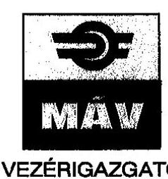

1. sz. melléklet
ad.211/T/2002.
Gy.38-94/2002.

# Bihary Zsigmond úr föigazgató 

Állami Számvevőszék

## Budapest

## Tisztelt Föigazgató Úr!

ÁlLAMI SZÁMVEVŐSZÉK
GGYVITELI IRODA
ATK-3302/2002
Erkeztl: 2002 MAJ 23.
Iktatószám:V-13-044/2002.
Melléklet: $\qquad$
Todonyx
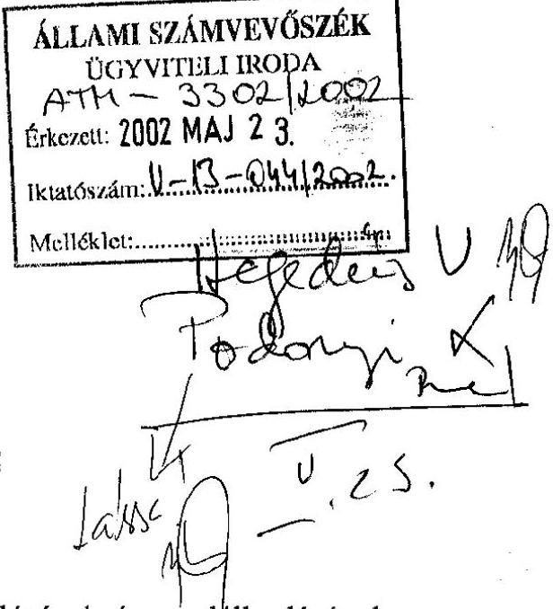

A Magyar Államvasutak Rt. 1999-2000. évi müködésének és gazdalkodásának ellenőrzéséről készített jelentéstervezetet köszönettel vettem.

A jelentéstervezet megállapításai alapvetően reálisan tükrözik a MÁV Rt. helyzetét, átalakulásának körülményeit, müködési és finanszírozási problémáit.

A korábban tett észrevételeinkkel kapcsolatos álláspontjához az alábbiakat kívánom megjegyezni:

1. A MÁV Rt. reformfolyamatának természetes velejárója a külső szakértők igénybevétele, amelyek közvetlenül vagy közvetve járulnak hozzá a reformfolyamathoz kapcsolódó döntésekhez. A szerződések hasznosulása nehezen dokumentálható, egzakt módon nem mérhető. Így erre vonatkozó további észrevételt nem tartok szükségesnek.
2. A vizsgált követelésértékesítés végrehajtása a MÁV Rt. számára előnyösebb feltételeket kínáló ajánlat elfogadásához vezetett, jogszabálysértés nem történt, további észrevételünk nincs.
3. Az informatikai beruházásoknál átfogó vizsgálat valóban nem volt, hiszen azokból még az MHR projekt kidolgozása folyamatban van.
A projektek megvalósulásával kapcsolatban szükségesnek tartom a jelentésben is hangsúlyozni, hogy a GIR projekt megvalósítása befejeződött.

---

2001. szeptemberétől a pénzügyi modulokkal, 2002-től pedig teljes kiépítésben üzemszerűen müködik.
Az adatátviteli és az informatikai adathálózat projektek az előírt határidőre a tervezett költségkereteken belül valósultak meg.
Az MHR projekt megvalósítási munkáit a MÁV Rt. vezetése folyamatosan figyelemmel kíséri és rendszeresen beszámol a MÁV Rt. Igazgatósága részére a projekt előrehaladásáról. Az MHR projekt hátralévő feladatai a tervezett hitelkereten belül valósulnak meg.
4. A Bp. Nyugati pályaudvar ingatlanügyleteivel kapcsolatban további észrevételünk nincs.

Fentiek alapján a jelentésben foglaltakat elfogadom.
Kérem, hogy a javasolt kiegészítést a jelentés 2.6.3. pontjához mérlegelni, illetve elfogadni szíveskedjék.

Budapest, 2002. május

Tisztelettel:

Kukely Marton
vezérigazgató
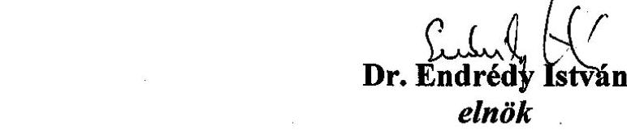

Dr. Endrédy István
elnök
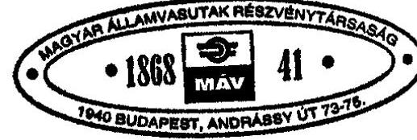

---

1005/02. 544/AEF/2002

KÖZLEKEDÉSI ÉS VÍZŰGYI MINISZTÉRIUM
KÖZIGAZGATÁSI ÁLLAMTITKÁR

004468/002/2002.

ÁLLAMI SZÁMVEVŐSZÉK
ÜGYVITELI HRODA
AFH-8939/02
Érkezett: 2002 JÓN 17.
Iktatószám: U-13-44/2002
Mellét: 1011

Állami Számvevőszék

Budapest

Tisztelt Főigazgató Úr!

A Magyar Államvasutak Rt. 1999-2000. évi működésének és gazdálkodásának ellenőrzéséről készült jelentéstervezetet köszönettel megkaptam.

Tekintettel arra, hogy korábbi javaslatainkat az anyag szerkesztésénél figyelembe vették, a tervezethez észrevételt nem teszünk.

Budapest, 2002. május 23

Üdvözlettel

Tombor Sándor

1077 BUDAPEST, DOB UTCA 75-81. · POSTACÍM: 1400 FF. 87 · TEL: 461-3330 · FAX: 341-5142

---

# MAGYAR KÖZTÁRSASÁG GAZDASÁGI ĖS KÖZLEKEDĖSI MINISZTÉRIUM MINISZTER 

$1 / 2524 / 1 / 2002$
hiv.szám: V-13-46/2001-2002.
3. sz. melléklet

ATM-4124/2002
1079102
377/1001/8thay in,

Előadó: Dr. Dubéczi Zoltán Tel.: 374-2870
06.25 .

Kevd
06.25 .

Dr. Kovács Árpád úr
elnök
Állami számvevőszék
Budapest

## Tisztelt Elnök Úr!

A Magyar Államvasutak Rt. 1999-2000. évi müködésének és gazdálkodásának ellenőrzéséről készült jelentés-tervezetre észrevételt nem teszek.

Budapest, 2002. június 20.
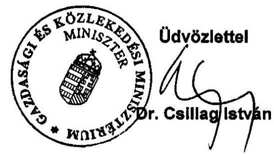

---

# TANÚSÍTVÁNYOK 1995-2001 

1. A társaság vagyoni helyzetének alakulása (ESZKÖZÖK)
2. A társaság vagyoni helyzetének alakulása (FORRÁSOK)
3. Bevételek alakulása
4. Költségek és ráfordítások alakulása
5. Eredmény alakulása
6. Költségvetési befizetési kötelezettségek (adók, járulékok)
7. A MÁV Rt. készfizető kezességvállalásai
8. Ingatlanok változásai
9. Költségvetési támogatások alakulása
10. Fogyasztói árikiegészítés felhasználása
11. Termelési támogatás felhasználása
12. Beruházási támogatások felhasználása

---

MÁV Rt. Budapest

A társaság vagyoni helyzetének alakulása (ESZKÖZÖK)

|  Megnevezés | 1995 | 1996 | 1997 | 1998 | 1999 | 2000 | 2001  |
| --- | --- | --- | --- | --- | --- | --- | --- |
|  Befektetett eszközök | 485 141 | 473 113 | 502 123 | 513 461 | 549 673 | 581 893 | 611 121  |
|  ebből: Immateriális javak | 1 242 | 1 216 | 1 434 | 1 285 | 1 173 | 794 | 5 820  |
|  tárgyi eszközök | 472 401 | 458 727 | 486 763 | 493 432 | 530 422 | 565 644 | 589 201  |
|  befektetett eszközök | 11 498 | 13 170 | 13 925 | 18 744 | 18 078 | 15 455 | 16 100  |
|  Forgóeszközök | 37 339 | 40 788 | 44 425 | 45 150 | 46 435 | 50 728 | 53 613  |
|  ebből: készletek | 6 538 | 8 022 | 7 597 | 7 536 | 6 982 | 6 326 | 6 246  |
|  követelések | 24 613 | 30 464 | 31 040 | 28 567 | 35 186 | 39 057 | 37 780  |
|  értékpapírok | 69 | 74 | 70 | 597 | 2 160 | - | -  |
|  pénzeszközök | 6 117 | 2 227 | 5 718 | 8 450 | 2 107 | 5 345 | 9 587  |
|  Aktív időbeli elhatárolások | 484 | 2 669 | 7 604 | 11 635 | 14 708 | 16 749 | 8 496  |
|  ESZKÖZÖK ÖSSZESEN | 522 964 | 516 570 | 554 152 | 570 246 | 610 816 | 649 370 | 673 230  |

Adatforrás: az éves beszámolók

Tanúsítom, hogy az adatok a nyilvántartásban szereplőkkel megegyezőek!

Budapest, 2002. április

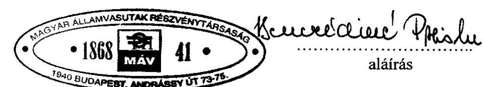

---

MÁV Rt. Budapest

A társaság vagyoni helyzetének alakulása (FORRÁSOK) millió Ft-ban

|  Megnevezés | 1995 | 1996 | 1997 | 1998 | 1999 | 2000 | 2001  |
| --- | --- | --- | --- | --- | --- | --- | --- |
|  Saját tőke | 462 173 | 430 549 | 431 941 | 443 475 | 455 046 | 473 432 | 175 207  |
|  ebből: jegyzett tőke | 188 000 | 188 000 | 188 000 | 188 000 | 188 000 | 188 000 | 188 000  |
|  tőketartalék | 247 335 | 262 767 | 278 873 | 258 073 | 279 906 | 307 669 | 11 911  |
|  lekötött tőke | - | - | - | - | - | - | 5 826  |
|  eredménytartalék | 3 571 | 33 256 | - 19 854 | 139 | 1 411 | - 25 | -1 348  |
|  mérleg sz.eredmény | 30 007 | - 46 734 | - 15 079 | - 2 737 | - 14 271 | - 22 212 | -29 182  |
|  Céltartalék | 4 350 | 8 878 | 11 459 | 15 719 | 11 201 | 12 247 | 1 546  |
|  Kötelezettségek | 55 586 | 74 692 | 105 592 | 100 835 | 122 028 | 112 772 | 441 640  |
|  Passzív időbeli elhatárolások | 855 | 2 451 | 5 160 | 10 217 | 22 541 | 50 919 | 54 837  |
|  FORRÁSOK ÖSSZESEN | 522 964 | 516 570 | 554 152 | 570 246 | 610 816 | 649 370 | 673 230  |

Adatforrás: az éves beszámolók Tanúsítom, hogy az adatok a nyilvántartásban szereplőkkel megegyezőek!

Budapest, 2002. április

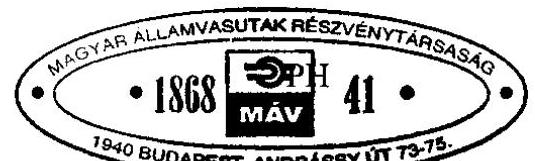

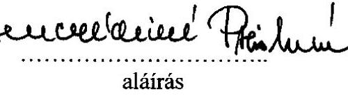

---

MÁV Rt. Budapest

3. sz. Tanúsítvány

Bevételek alakulása

millió Ft-ban

|  Megnevezés | 1995 | 1996 | 1997 | 1998 | 1999 | 2000 | 2001  |
| --- | --- | --- | --- | --- | --- | --- | --- |
|  Belföldi értékesítés nettó árbevétele | 76 919 | 93 713 | 122 876 | 146 795 | 153 171 | 165 173 | 176 272  |
|  Export értékesítés nettó árbevétele | 17 170 | 18 047 | 10 505 | 9 056 | 12 007 | 13 760 | 11 259  |
|  Egyéb bevételek | 15 014 | 13 940 | 14 868 | 14 775 | 18 131 | 12 895 | 15 585  |
|  Aktivált saját teljesítmények értéke | 3 753 | 4 741 | 4 390 | 5 715 | 7 030 | 6 227 | 8 377  |
|  Pénzügyi műveletek bevételei | 1 206 | 1 261 | 2 048 | 1 500 | 1 163 | 3 042 | 3 840  |
|  Rendkívüli bevételek | 59 412 | 7 992 | 1 106 | 25 553 | 1 704 | 3 397 | 4 851  |
|  BEVÉTELEK ÖSSZESEN | 173 474 | 139 694 | 155 793 | 203 394 | 193 206 | 204 494 | 220 184  |

Adatforrás: az éves beszámolók

Tanúsítom, hogy az adatok a nyilvántartásban szereplőkkel megegyezőek!

Budapest, 2002. április

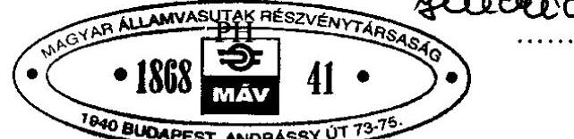

---

MÁV Rt. Budapest

Költségek és ráfordítások alakulása

|  Megnevezés | 1995 | 1996 | 1997 | 1998 | 1999 | 2000 | 2001  |
| --- | --- | --- | --- | --- | --- | --- | --- |
|  Anyagjellegủ ráfordítások | 35902 | 45826 | 55304 | 60339 | 65323 | 73414 | 95778  |
|  Személyi jellegủ ráfordítások | 50075 | 58364 | 61265 | 70215 | 75919 | 84892 | 98611  |
|  Értékcsökkenési leírás | 10602 | 33744 | 12623 | 29194 | 15609 | 21553 | 20377  |
|  Egyéb költségek | 5965 | 5945 | 7804 | 13793 | 17100 | 19931 | -  |
|  Egyéb ráfordítások | 22374 | 24527 | 22378 | 23865 | 23458 | 18934 | 17413  |
|  Pénzügyi műv. ráfordításai | 12020 | 4736 | 6430 | 5681 | 5723 | 5191 | 15167  |
|  Rendkívüli ráfordítások | 6528 | 13285 | 5007 | 2945 | 4238 | 2648 | 1829  |
|  KÖLTS. ÉS RÁFORDÍT. ÖSSZESEN | 143466 | 186427 | 170811 | 206032 | 207370 | 226563 | 249175  |

Adatforrás: az éves beszámolók, analitikus nyilvántartások Tanúsítom, hogy az adatok a nyilvántartásban szereplőkkel megegyezőek! Budapest, 2002. április

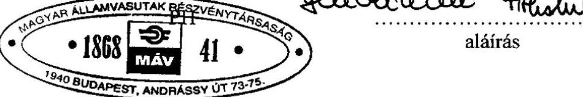

---

MÁV Rt. Budapest

# Eredmény alakulása

millió Ft-ban

|  Megnevezés | 1995 | 1996 | 1997 | 1998 | 1999 | 2000 | 2001  |
| --- | --- | --- | --- | --- | --- | --- | --- |
|  1. Üzemi (üzleti) tev. eredménye | - 12 063 | - 37 966 | - 6 736 | - 21 065 | - 7 070 | - 20 669 | -20 686  |
|  2. Pénzügyi műveletek eredm. | - 10 814 | -3 475 | - 4 382 | - 4 181 | - 4 560 | - 2 149 | -11 327  |
|  3. Szokásos vállalk. eredm (1+2) | - 22 877 | - 41 441 | - 11 118 | - 25 246 | - 11 630 | - 22 818 | -32 013  |
|  4. Rendkívüli eredmény | 52 884 | - 5 293 | - 3 902 | 22 607 | - 2 534 | 749 | 3 022  |
|  5. Adózás előtti eredmény (3+4) | 30 007 | - 4 6734 | - 15 020 | - 2 639 | - 14 164 | - 22 069 | -28 991  |

Adatforrás: az éves beszámolók

Tanúsítom, hogy az adatok a nyilvántartásban szereplőkkel megegyezőek!

Budapest, 2002. április

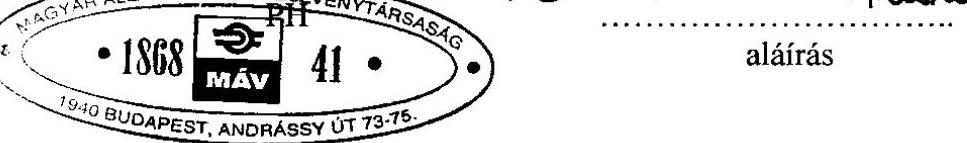

---

# Költségvetési befizetési kötelezettségek 

(adók, járulékok)
millió Ft

| Megnevezés | 1995 | 1996 | 1997 | 1998 | 1999 | 2000 | 2001 |
| :--: | :--: | :--: | :--: | :--: | :--: | :--: | :--: |
| Személyi jövedelemadó | 7911 | 9584 | 9309 | 10479 | 11620 | 14176 | 15283 |
| Levonható és fizetendő általános forgalmi adó egyenlege a bevallás szerint | $-14289$ | $-10607$ | $-11320$ | $-12052$ | $-16027$ | $-19470$ | $-17635$ |
| Munkáltatói járulék | 1460 | 1702 | 1802 | 1930 | 1623 | 1803 | 2003 |
| Munkavállalói járulék | 485 | 566 | 597 | 683 | 784 | 865 | 959 |
| Társasági adó   (külföldi szerv.) | - | - | 59 | 98 | 106 | 143 | 191 |
| Egészségügyi hozzáj. | - | - | 1226 | 650 | 2393 | 2555 | 2741 |
| Nyugdíjbiztosítási Alapot megillető járulék | 7926 | 9603 | 9924 | 5090 | 11995 | 16705 | 17177 |
| Egészségbiztosítási Alapot megillető járulék | 6319 | 7117 | 6293 | 3182 | 5977 | 9416 | 9416 |
| (Idegenforg.*) Turisztikai hozzájárulás | $2^{*}$ | $2^{*}$ | 2 | 2 | 1 | 3 | 5 |
| Nemzeti kulturális járulék | - | - | - | - | 5 | 2 | 1 |
| Fogyasztói árkiegészítésre kapott ÁFA | - | $-1197$ | $-1453$ | $-1670$ | $-1886$ | $-2041$ | $-2316$ |
| ÖSSZESEN | 9814 | 16770 | 16439 | 8392 | 16591 | 24157 | 27825 |

Adatforrás: az adóbevallások, az éves beszámolók, analitikus nyilvántartások
Tanúsítom, hogy az adatok a nyilvántartásban szereplőkkel megegyezőek!

Budapest, 2002. április
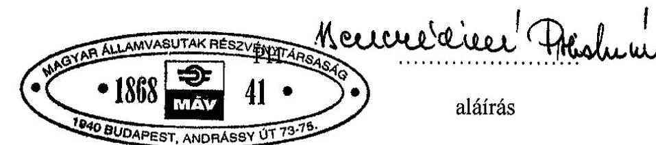

---

MÁV Rt. 7/1. sz. tanúsítvány Budapest A MÁV Rt. készfizető kezességvállalásai 1996. év

|  Adós neve | Hitelező neve, szerződésszáma | Kezességvállal ás kezdete | Kezességvállal ás értéke | Kezességvállal ás vége | Beváltott kezesség  |
| --- | --- | --- | --- | --- | --- |
|  GySEV Rt | MÁV Rt kezességváll. EQFI200601ROEEBUD (2424) | 1996. 10. 24. | 2,3 millió DEM | 2006. 10. 09. | -  |
|  GySEV Rt | MÁV Rt kezességváll. EQFI200602ROEEBUD (2435) | 1996. 12. 31. | 2,4 millió DEM | 2006. 12. 11. | -  |
|  |   |   |   |   |   |

Tanúsítom, hogy az adatok a nyilvántartásban szereplőkkel megegyezőek!

Budapest, 2002. április

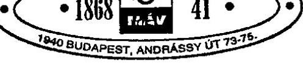

---

# Budapest

A MÁV Rt. készfizető kezességvállalásai 1997. év

|  Adós neve | Hitelező neve, szerződésszáma | Kezességvállal ás kezdete | Kezességvállal ás értéke | Kezességvállal ás vége | Beváltott kezesség  |
| --- | --- | --- | --- | --- | --- |
|  MÁV Hídépítő Kft | Postabank Rt FS-0093/98. | 1997. 12. 10. | 80 millió HUF | 1999. 12. 03. | nem volt  |
|  Záhonyi Hőtáv KFT | Postabank Rt FS-220-87/99 | 1997. 12. 17. | 30 millió HUF | 2000. 10. 31. | nem volt  |
|  MÁV Informatika Kft | $\begin{aligned} & \text { ABN-AMRO BANK Rt } \ & 97 / 1207 \end{aligned}$ | 1997. 10. 01. | 100 millió HUF | 1998. 08. 31. | nem volt  |
|  Zöld-Lánc Logisztikai Rt | MKB Rt 222-3305-3310/97 | 1997.12. 22. | $\begin{aligned} & 422 \text { millió HUF } \ & 50,1 \%-\mathrm{a} \ & (211.422 .000,-\mathrm{HUF}) \end{aligned}$ | Változó | 1999. 07. 05-én 42.829.237, HUF került kifizetésre  |
|  |   |   |   |   |   |

Tanúsítom, hogy az adatok a nyilvántartásban szereplőkkel megegyezők!

Budapest, 2002. április

---

# A MÁV Rt. készfizető kezességvállalásai 1998. év

|  Adós neve | Hitelező neve, szerződésszáma | Kezességvállal ás kezdete | Kezességvállal ás értéke | Kezességvállal ás vége | Beváltott kezesség  |
| --- | --- | --- | --- | --- | --- |
|  GySEV Rt | MÁV Rt kezességváll. EQFI200801ROEEEBUD (2485) | 1998. 07. 09. | 4 millió CHF | 2008. 06. 30. | -  |
|  Ornament 2000 Kft | ABN-AMRO BANK Rt 139-98-1549 | 1998. 11. 10. | 10 millió HUF | 1999. 06. 30. | nem volt  |
|  MÁV FKG Kft | Postabank Rt FS-9380-05/98. | 1998. 05. 18. | 60 millió HUF | 1999. 04. 20. | nem volt  |
|  MÁV FKG Kft | ABN-AMRO BANK Rt 98/61049 | 1998. 10. 02. | 100 millió HUF | 1999. 06. 30. | nem volt  |
|  MÁV Északi JJ. KFT | ABN-AMRO BANK Rt 98/6806 | 1998. 07. 31. | 50 millió HUF | 1999. 06. 30. | nem volt  |
|  MÁV Informatika Kft | ABN-AMRO BANK Rt 98/6794 | 1998. 07. 30. | 200 millió HUF | 1999. 07. 30. | nem volt  |
|  |   |   |   |   |   |

Tanúsítom, hogy az adatok a nyilvántartásban szereplőkkel megegyezőek!

Budapest, 2002. április

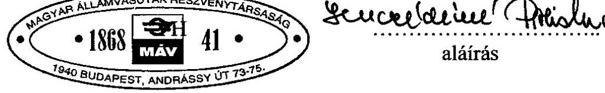

---

# Budapest

A MÁV Rt. készfizető kezességvállalásai 1999. év

|  Adós neve | Hitelező neve, szerződésszáma | Kezességvállal ás kezdete | Kezességvállal ás értéke | Kezességvállal ás vége | Beváltott kezesség  |
| --- | --- | --- | --- | --- | --- |
|  MÁV Tiszavas Kft | ABN-AMRO BANK Rt 99/6525/M | 1999. 12. 08. | 100 millió HUF | 2000. 06. 29. | nem volt  |
|  GySEV Rt | MÁV Rt kezességváll. EQFI200401ROEEEBUD (2491) | 1999. 06. 11. | 1 millió CHF | 2004. 01. 05. | -  |
|  GySEV Rt | MÁV Rt kezességváll. EQFI200603ROEEEBUD (2500) | 1999. 06. 11. | 700.000,- DEM | 2006. 12. 11. | -  |
|  MÁV Északi JJ. KFT | ABN-AMRO BANK Rt 98/6520 | 1999. 06. 30. | 120 millió HUF | 2000. 06. 30. | nem volt  |
|  MÁV-AUTÓ Kft | OTP Rt 32/1999/a. | 1999. 09. 28. | 5 millió HUF | 2000. 03. 31. | nem volt  |
|  MÁV Db. JJ. | Inter-Európa Bank Rt. 142/99-D. | 1999. 10. 01. | 100 millió HUF | 2000. 09. 29. | nem volt  |
|  MÁVGÉP Kft | ABN-AMRO BANK Rt 99/148 | 1999. 03. 01. | 60 millió HUF | 1999. 06. 29. | nem volt  |
|  MÁV Északi JJ. KFT | ABN-AMRO BANK Rt 99/118 | 1999. 02. 22. | 120 millió HUF | 1999. 06. 29. | nem volt  |
|  MÁV Tiszavas Kft | ABN-AMRO BANK Rt 99/197 | 1999. 03. 11. | 50 millió HUF | 1999. 05. 31. | nem volt  |
|  MÁV Favéd Kft | MKB Rt 202-3071/99 | 1999. 04. 30. | 20 millió HUF | 1999. 07. 30. | nem volt  |
|  Ornament 2000 Kft | ABN-AMRO BANK Rt 99/6529 | 1999. 06. 30. | 20 millió HUF | 2000. 06. 29. | nem volt  |
|  Észak-Trans Kft | ABN-AMRO BANK Rt 99/6528 | 1999. 06. 30. | 4 millió HUF | 2000. 06. 29. | nem volt  |

---

|  MÁV Informatika Kft | ABN-AMRO BANK Rt
98/6521 | 1999. 06. 30. | 200 millió HUF | 2000. 06. 29. | nem volt  |
| --- | --- | --- | --- | --- | --- |
|  MÁV TI Kft | ABN-AMRO BANK Rt
98/6522 | 1999. 06. 30. | 60 millió HUF | 2000. 06. 29. | nem volt  |
|  MÁV Tiszavas Kft | ABN-AMRO BANK Rt
99/6569 | 1999. 07. 15. | 100 millió HUF | 2002. 07. 15. | nem volt  |
|  |   |   |   |   |   |

Tanúsítom, hogy az adatok a nyilvántartásban szereplőkkel megegyezőek!

Budapest, 2002. április

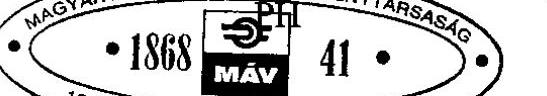

---

# Budapest

A MÁV Rt. készfizető kezességvállalásai 2000. év

|  Adós neve | Hitelező neve, szerződésszáma | Kezességvállal ás kezdete | Kezességvállal ás értéke | Kezességvállal ás vége | Beváltott kezesség  |
| --- | --- | --- | --- | --- | --- |
|  MÁV Tiszavas Kft | ABN-AMRO BANK Rt 2001/0619/KV | 2000. 08. 28. | 200 millió HUF | 2001. 07. 30. | nem volt  |
|  MÁVSIN Kft | BUDAPEST BANK Rt 0105/2000/1. | 2000. 08. 28. | $20+30$ millió HUF | 2000. 12. 29. | nem volt  |
|  MÁVSIN Kft | BUDAPEST BANK Rt 0157/2000/1. | 2000. 12. 29. | $20+30$ millió HUF | 2001. 12. 30. | nem volt  |
|  Észak-Trans Kft | ABN-AMRO BANK Rt 99/6528/M | 2000. 04. 04. | 6 millió HUF | 2000. 06. 30. | nem volt  |
|  MÁV Favéd Kft | MKB Rt 202-3037/00 | 2000. 03. 31. | 20 millió HUF | 2001. 03. 29. | nem volt  |
|  Ornament 2000 Kft | ABN-AMRO BANK Rt 2000/0538/KV | 2000. 06. 29. | 20 millió HUF | 2000. 11. 30. | nem volt  |
|  MÁV Informatika Kft | ABN-AMRO BANK Rt 2000/0535/KV | 2000. 06. 29. | 200 millió HUF | 2001. 11. 30. | nem volt  |
|  MÁVGÉP Kft | ABN-AMRO BANK Rt 2000/0537/KV | 2000. 06. 30. | 20 millió HUF | 2000. 10. 27. | nem volt  |

Tanúsítom, hogy az adatok a nyilvántartásban szereplőkkel megegyezőek!

Budapest, 2002. április

---

# Budapest

A MÁV Rt. készfizető kezességvállalásai 2001. év

|  Adós neve | Hitelező neve, szerződésszáma | Kezességvállal ás kezdete | Kezességvállal ás értéke | Kezességvállal ás vége | Beváltott kezesség  |
| --- | --- | --- | --- | --- | --- |
|  MÁV Informatika Kft | ABN-AMRO BANK Rt 2001/0441/KV | 2001. 06. 29. | 200 millió HUF | 2001. 07. 30. | nem volt  |
|  MÁV Informatika Kft | K \& H Rt (egy hónapos technikai prolongáció) | 2001. 07. 30. | 200 millió HUF | 2002. 08. 30. | nem volt  |
|  MÁV Informatika Kft | $\begin{aligned} & \text { K \& H Rt } \ & 184 / 2001 / 3 / \mathrm{KK} \end{aligned}$ | 2001. 08. 30. | 200 millió HUF | 2002. 07. 30. | nem volt  |
|  Észak-Trans Kft | ABN-AMRO BANK Rt 2001/0422/KV | 2001. 06. 29. | 10 millió HUF | 2001. 07. 30. | nem volt  |
|  Észak-Trans Kft | K \& H Rt (egy hónapos technikai prolongáció) | 2001. 07. 30. | 10 millió HUF | 2002. 08. 30. | nem volt  |
|  Észak-Trans Kft | $\begin{aligned} & \text { K \& H Rt } \ & 184 / 2001 / 8 / \mathrm{KK} \end{aligned}$ | 2001. 08. 30. | 10 millió HUF | 2002. 07. 30. | nem volt  |
|  MÁVGÉP Kft | ABN-AMRO BANK Rt 2001/0473/KV | 2001. 07. 04. | 150 millió HUF | 2001. 07. 30. | nem volt  |
|  MÁVGÉP Kft | K \& H Rt (egy hónapos technikai prolongáció) | 2001. 07. 30. | 150 millió HUF | 2002. 08. 30. | nem volt  |
|  MÁVGÉP Kft | $\begin{aligned} & \text { K \& H Rt } \ & 184 / 2001 / 2 / \mathrm{KK} \end{aligned}$ | 2001. 08. 30. | 150 millió HUF | 2002. 07. 30. | nem volt  |
|  MÁV FKG Kft | ABN-AMRO BANK Rt 2001/0436/KV | 2001. 06. 29. | 100 millió HUF | 2001. 07. 30. | nem volt  |

---

|  MÁV FKG Kft | K & H Rt (egy hónapos technikai prolongáció) | 2001. 07. 30. | 100 millió HUF | 2002. 08. 30. | nem volt  |
| --- | --- | --- | --- | --- | --- |
|  MÁV FKG Kft | K & H Rt 184/2001/5/KK | 2001. 08. 30. | 100 millió HUF | 2002. 07. 30. | nem volt  |
|  Ornament 2000 Kft | ABN-AMRO BANK Rt 2001/0440/KV | 2001. 06. 29. | 30 millió HUF | 2001. 07. 30. | nem volt  |
|  Ornament 2000 Kft | K & H Rt (egy hónapos technikai prolongáció) | 2001. 07. 30. | 30 millió HUF | 2002. 08. 30. | nem volt  |
|  Ornament 2000 Kft | K & H Rt 184/2001/7/KK | 2001. 08. 30. | 30 millió HUF | 2002. 07. 30. | nem volt  |
|  MÁV Tiszavas Kft | K & H Rt (egy hónapos technikai prolongáció) | 2001. 07. 30. | 200 millió HUF | 2002. 08. 30. | nem volt  |
|  MÁV Tiszavas Kft | K & H Rt 184/2001/4/KK | 2001. 08. 30. | 250 millió HUF | 2002. 07. 30. | nem volt  |
|  MÁVÉK Kft | ABN-AMRO BANK Rt 2001/0472/KV | 2001. 07. 05. | 30 millió HUF | 2001. 07. 30. | nem volt  |
|  MÁVÉK Kft | K & H Rt (egy hónapos technikai prolongáció) | 2001. 07. 30. | 30 millió HUF | 2002. 08. 30. | nem volt  |
|  MÁVÉK Kft | K & H Rt 184/2001/6/KK | 2001. 08. 30. | 30 millió HUF | 2002. 07. 30. | nem volt  |
|  MÁV FKG Kft. | Postabank és Takarékpénztár Rt. HK-220-11/01 | 2001. 11. 30. | 60 millió HUF | 2006. 06. 09. | nem volt  |
|  MÁV Hídépítő Kft. | Postabank és Takarékpénztár Rt. FS-220/94/01 | 2001. 12. 05. | 120 millió HUF | 2002. 06. 28. | nem volt  |

---

|  MÁV Sín Kft. | Budapest Bank Rt.
0077/2001/1. | 2001. 12. 27. | 40+30 millió
HUF | 2002. 12. 19. | nem volt  |
| --- | --- | --- | --- | --- | --- |
|  |   |   |   |   |   |

Tanúsítom, hogy az adatok a nyilvántartásban szereplőkkel megegyezőek!

Budapest, 2002. április

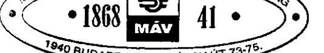

---

8/1. sz. tanúsítvány

# Ingatlanok 1995. évi változásaí (M Ft-ban)

|  Megnevezés |  |  |  |  |  |  |  |  |  |  |   |
| --- | --- | --- | --- | --- | --- | --- | --- | --- | --- | --- | --- |
|   |  |  |  |  |  |  |  |  |  |  | ÖSSZESEN  |
|   |  | Épületek |  |  | Építmények |  |  | Földterületek |  |  |   |
|   |  | Kincstári | MÁV Rt. | Összesen | Kincstári | MÁV Rt. | Összesen | Kincstári | MÁV Rt. | Összesen |   |
|  1. | Bruttó érték nyitó állomány |  |  | 63,2 |  |  | 176,3 |  |  | 45,6 | 285,1  |
|  2. | Beszerzés-felújítás (aktivitás) |  |  | 1,0 |  |  | 8,2 |  |  |  | 9,2  |
|  3. | Egyéb változás (előjelesen) |  | (-) | 0,4 |  | (-) | 0,8 |  | (-) | 0,1 | (-) 1,3  |
|  4. | Bruttó érték záró állomány |  |  | 63,8 |  |  | 183,7 |  |  | 45,5 | 293,0  |
|  5. | Értékcsökkenés nyitó állomány |  |  | 0,5 |  |  | 2,8 |  |  |  | 3,3  |
|  6. | Tárgyévi tervszerinti leírás |  |  | 0,3 |  |  | 2,4 |  |  |  | 2,7  |
|  7. | Tárgyévi terven felüli leírás |  |  |  |  |  |  |  |  |  |   |
|  8. | Egyéb változás (előjelesen) |  |  |  |  | (-) | 0,3 |  |  |  | (-) 0,3  |
|  9. | Értékcsökkenés záró állománya |  |  | 0,8 |  |  | 4,9 |  |  |  | 5,7  |
|  10. | Záró állomány nettó értéke |  |  | 63,0 |  |  | 178,8 |  |  | 45,5 | 287,3  |

Tanúsítom, hogy az adatok a nyilvántartásban szereplőkkel megegyezőek!

Budapest, 2002. április

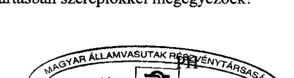

aláírás

---

### **MÁV Rt. Budapest**

### **Ingatlanok 1996. évi változásai (M Ft-ban)**

|  Megnevezés |  |  |  |  |  |  |  |  |  |  |  |  |  |  |  |  |  |  |  |  |  |  |  |  |  |  |  |  |  |  |  |  |  |  |   |
| --- | --- | --- | --- | --- | --- | --- | --- | --- | --- | --- | --- | --- | --- | --- | --- | --- | --- | --- | --- | --- | --- | --- | --- | --- | --- | --- | --- | --- | --- | --- | --- | --- | --- | --- | --- | --- | --- | --- |
|   |  | Épületek |  |  | Építmények |  |  |  |  |  |  |  |  |  |  |  |  |  |  |  |  |  |  |  |  |  |  |  |  |  |  |  |  |  |  |  |   |
|   |  | Kincstári | MÁV Rt. | Összesen | Kincstári | MÁV Rt. | Összesen | Kincstári | MÁV Rt. | Összesen | Összesen |  |  |  |  |  |  |  |  |  |  |  |  |  |  |  |  |  |  |  |  |  |  |  |  |  |   |
|  1. | Bruttó érték nyitó állomány |  | 63,3 | 63,8 | 157,7 | 26,0 | 183,7 |  |  |  |  |  |  |  |  |  |  |  |  |  |  |  |  |  |  |  |  |  |  |  |  |  |  |  |  |  |   |
|  2. | Beszerzés-felújítás (aktivitás) |  | 1,0 | 1,0 | 9,9 | 0,4 | 10,3 |  |  |  |  |  |  |  |  |  |  |  |  |  |  |  |  |  |  |  |  |  |  |  |  |  |  |  |  |  |   |
|  3. | Egyéb változás (előjelesen) | (-) | 0,3 | (-) | 0,3 | 1,0 | 0,6 | 1,6 |  |  |  |  |  |  |  |  |  |  |  |  |  |  |  |  |  |  |  |  |  |  |  |  |  |  |  |  |   |
|  4. | Bruttó érték záró állomány |  | 64,5 | 64,5 | 168,6 | 27,0 | 195,6 |  |  |  |  |  |  |  |  |  |  |  |  |  |  |  |  |  |  |  |  |  |  |  |  |  |  |  |  |  |   |
|  5. | Értékcsökkenés nyitó állomány |  | 0,8 | 0,8 | 4,3 | 0,6 | 4,9 |  |  |  |  |  |  |  |  |  |  |  |  |  |  |  |  |  |  |  |  |  |  |  |  |  |  |  |  |  |   |
|  6. | Tárgyévi tervszerinti leírás |  | 0,3 | 0,3 | 2,3 | 0,3 | 2,6 |  |  |  |  |  |  |  |  |  |  |  |  |  |  |  |  |  |  |  |  |  |  |  |  |  |  |  |  |  |   |
|  7. | Tárgyévi terven felüli leírás |  | 0,1 | 0,1 | 5,8 | 0,2 | 6,0 |  |  |  |  |  |  |  |  |  |  |  |  |  |  |  |  |  |  |  |  |  |  |  |  |  |  |  |  |  |   |
|  8. | Egyéb változás (előjelesen) |  | 0,2 | 0,2 | 1,0 | 0,6 | 1,6 |  |  |  |  |  |  |  |  |  |  |  |  |  |  |  |  |  |  |  |  |  |  |  |  |  |  |  |  |  |   |
|  9. | Értékcsökkenés záró állománya |  | 1,4 | 1,4 | 13,4 | 1,7 | 15,1 |  |  |  |  |  |  |  |  |  |  |  |  |  |  |  |  |  |  |  |  |  |  |  |  |  |  |  |  |  |   |
|  10. | Záró állomány nettó értéke |  | 63,1 | 63,1 | 155,2 | 25,3 | 180,5 |  |  |  |  |  |  |  |  |  |  |  |  |  |  |  |  |  |  |  |  |  |  |  |  |  |  |  |  |  |   |

Tanúsítom, hogy az adatok a nyilvántartásban szereplőkkel megegyezőek!

Budapest, 2002. április

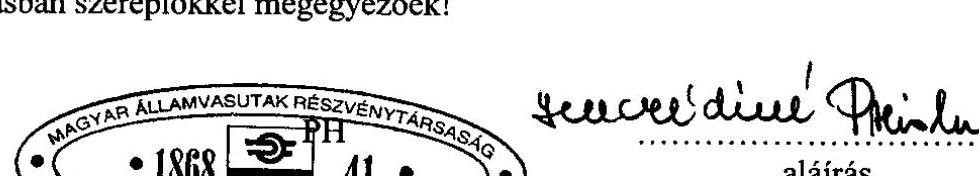

---

# Ingatlanok 1997. évi változásai (M Ft-ban)

|  Megnevezés |  |  |  |  |  |  |  |  |  |  |   |
| --- | --- | --- | --- | --- | --- | --- | --- | --- | --- | --- | --- |
|   |  | Épületek |  |  | Építmények |  |  | Földterületek |  |  | ÖSSZESEN  |
|   |  | Kincstári | MÁV Rt. | Összesen | Kincstári | MÁV Rt. | Összesen | Kincstári | MÁV Rt. | Összesen |   |
|  1. | Bruttó érték nyitó állomány |  | 64,5 | 64,5 | 168,6 | 27,0 | 195,6 | 15,0 | 29,2 | 44,2 | 304,3  |
|  2. | Beszerzés-felújítás (aktivitás) |  | 1,6 | 1,6 | 14,2 | 1,1 | 15,3 |  | 1,0 | 1,0 | 17,9  |
|  3. | Egyéb változás (előjelesen) | 2,8 | $(-) 3,4$ | $(-) 0,6$ | 0,2 | $(-) 1,0$ | $(-) 0,8$ |  | $(-) 0,2$ | $(-) 0,2$ | $(-) 1,6$  |
|  4. | Bruttó érték záró állomány | 2,8 | 62,7 | 65,5 | 183,0 | 27,1 | 210,1 | 15,0 | 30,0 | 45,0 | 320,6  |
|  5. | Értékcsökkenés nyitó állomány |  | 1,4 | 1,4 | 13,4 | 1,7 | 15,1 |  |  |  | 16,5  |
|  6. | Tárgyévi tervszerinti leírás |  | 0,4 | 0,4 | 3,3 | 0,2 | 3,5 |  |  |  | 3,9  |
|  7. | Tárgyévi terven felüli leírás |  | 0,1 | 0,1 |  |  |  |  |  |  | 0,1  |
|  8. | Egyéb változás (előjelesen) |  |  |  | $(-) 0,3$ |  | $(-) 0,3$ |  |  |  | $(-) 0,3$  |
|  9. | Értékcsökkenés záró állománya |  | 1,9 | 1,9 | 16,4 | 1,9 | 18,3 |  |  |  | 20,2  |
|  10. | Záró állomány nettó értéke | 2,8 | 60,8 | 63,6 | 166,6 | 25,2 | 191,8 | 15,0 | 30,0 | 45,0 | 300,4  |

Tanúsítom, hogy az adatok a nyilvántartásban szereplőkkel megegyezőek! Budapest, 2002. április

---

### Ingatlanok 1998. évi változásai (M Ft-ban)

|  Megnevezés |  |  |  |  |  |  |  |  |  |  |  |  |  |  |  |  |  |  |  |  |  |  |  |  |  |  |  |   |
| --- | --- | --- | --- | --- | --- | --- | --- | --- | --- | --- | --- | --- | --- | --- | --- | --- | --- | --- | --- | --- | --- | --- | --- | --- | --- | --- | --- | --- |
|   |  |  |  |  |  |  |  |  |  |  |  |  |  |  |  |  |  |  |  |  |  |  |  |  |  |  |  |   |
|   |  |  |  |  |  |  |  |  |  |  |  |  |  |  |  |  |  |  |  |  |  |  |  |  |  |  |  |   |
|   |  |  |  |  |  |  |  |  |  |  |  |  |  |  |  |  |  |  |  |  |  |  |  |  |  |  |  |   |
|   |  |  |  |  |  |  |  |  |  |  |  |  |  |  |  |  |  |  |  |  |  |  |  |  |  |  |  |   |
|   |  |  |  |  |  |  |  |  |  |  |  |  |  |  |  |  |  |  |  |  |  |  |  |  |  |  |  |   |
|   |  |  |  |  |  |  |  |  |  |  |  |  |  |  |  |  |  |  |  |  |  |  |  |  |  |  |  |   |
|   |  |  |  |  |  |  |  |  |  |  |  |  |  |  |  |  |  |  |  |  |  |  |  |  |  |  |  |   |
|   |  |  |  |  |  |  |  |  |  |  |  |  |  |  |  |  |  |  |  |  |  |  |  |  |  |  |  |   |
|   |  |  |  |  |  |  |  |  |  |  |  |  |  |  |  |  |  |  |  |  |  |  |  |  |  |  |  |   |
|   |  |  |  |  |  |  |  |  |  |  |  |  |  |  |  |  |  |  |  |  |  |  |  |  |  |  |  |   |
|   |  |  |  |  |  |  |  |  |  |  |  |  |  |  |  |  |  |  |  |  |  |  |  |  |  |  |  |   |
|   |  |  |  |  |  |  |  |  |  |  |  |  |  |  |  |  |  |  |  |  |  |  |  |  |  |  |  |   |
|   |  |  |  |  |  |  |  |  |  |  |  |  |  |  |  |  |  |  |  |  |  |  |  |  |  |  |  |   |
|   |  |  |  |  |  |  |  |  |  |  |  |  |  |  |  |  |  |  |  |  |  |  |  |  |  |  |  |   |
|   |  |  |  |  |  |  |  |  |  |  |  |  |  |  |  |  |  |  |  |  |  |  |  |  |  |  |  |   |
|   |  |  |  |  |  |  |  |  |  |  |  |  |  |  |  |  |  |  |  |  |  |  |  |  |  |  |  |   |
|   |  |  |  |  |  |  |  |  |  |  |  |  |  |  |  |  |  |  |  |  |  |  |  |  |  |  |  |   |
|   |  |  |  |  |  |  |  |  |  |  |  |  |  |  |  |  |  |  |  |  |  |  |  |  |  |  |  |   |
|   |  |  |  |  |  |  |  |  |  |  |  |  |  |  |  |  |  |  |  |  |  |  |  |  |  |  |  |   |
|   |  |  |  |  |  |  |  |  |  |  |  |  |  |  |  |  |  |  |  |  |  |  |  |  |  |  |  |   |
|   |  |  |  |  |  |  |  |  |  |  |  |  |  |  |  |  |  |  |  |  |  |  |  |  |  |  |  |   |
|   |  |  |  |  |  |  |  |  |  |  |  |  |  |  |  |  |  |  |  |  |  |  |  |  |  |  |  |   |
|   |  |  |  |  |  |  |  |  |  |  |  |  |  |  |  |  |  |  |  |  |  |  |  |  |  |  |  |   |
|   |  |  |  |  |  |  |  |  |  |  |  |  |  |  |  |  |  |  |  |  |  |  |  |  |  |  |  |   |
|   |  |  |  |  |  |  |  |  |  |  |  |  |  |  |  |  |  |  |  |  |  |  |  |  |  |  |  |   |
|   |  |  |  |  |  |  |  |  |  |  |  |  |  |  |  |  |  |  |  |  |  |  |  |  |  |  |  |   |
|   |  |  |  |  |  |  |  |  |  |  |  |  |  |  |  |  |  |  |  |  |  |  |  |  |  |  |  |   |
|   |  |  |  |  |  |  |  |  |  |  |  |  |  |  |  |  |  |  |  |  |  |  |  |  |  |  |  |   |
|   |  |  |  |  |  |  |  |  |  |  |  |  |  |  |  |  |  |  |  |  |  |  |  |  |  |  |  |   |
|   |  |  |  |  |  |  |  |  |  |  |  |  |  |  |  |  |  |  |  |  |  |  |  |  |  |  |  |   |
|   |  |  |  |  |  |  |  |  |  |  |  |  |  |  |  |  |  |  |  |  |  |  |  |  |  |  |  |   |
|   |

---

8/5. sz. tanúsítvány

# Ingatlanok 1999. évi változásaí (M Ft-ban)

|  Megnevezés |  |  |  |  |  |  |  |  |  |  |  |   |
| --- | --- | --- | --- | --- | --- | --- | --- | --- | --- | --- | --- | --- |
|   |  | Épületek |  |  | Építmények |  |  | Földterületek |  |  | ÖSSZESEN |   |
|   |  | Kincstári | MÁV Rt. | Összesen | Kincstári | MÁV Rt. | Összesen | Kincstári | MÁV Rt. | Összesen |  |   |
|  1. | Bruttó érték nyitó állomány | 5,5 | 64,6 | 70,1 | 191,1 | 30,1 | 221,2 | 15,1 | 29,8 | 44,9 | 336,2 |   |
|  2. | Beszerzés-felújítás (aktivitás) | 0,1 | 2,4 | 2,5 | 15,8 | 7,2 | 23,0 |  | 0,7 | 0,7 | 26,2 |   |
|  3. | Egyéb változás (előjelesen) | (-) 0,3 | (-) 0,7 | (-) 1,0 | (-) 1,1 | (-) 0,4 | (-) 1,5 | 0,8 | (-) 1,6 | (-) 0,8 | (-) 3,3 |   |
|  4. | Bruttó érték záró állomány | 5,3 | 66,3 | 71,6 | 205,8 | 36,9 | 242,7 | 15,9 | 28,9 | 44,8 | 359,1 |   |
|  5. | Értékcsökkenés nyitó állomány | 0,4 | 3,0 | 3,4 | 30,5 | 3,0 | 33,5 |  |  |  | 36,9 |   |
|  6. | Tárgyévi tervszerinti leírás | 0,1 | 0,3 | 0,4 | 3,5 | 0,3 | 3,8 |  |  |  | 4,2 |   |
|  7. | Tárgyévi terven felüli leírás |  | 0,5 | 0,5 |  | 0,2 | 0,2 |  |  |  | 0,7 |   |
|  8. | Egyéb változás (előjelesen) | (-) 0,4 | (-) 0,3 | (-) 0,7 | (-) 1,0 | (-) 0,1 | (-) 1,1 |  |  |  | (-) 1,8 |   |
|  9. | Értékcsökkenés záró állománya | 0,1 | 3,5 | 3,6 | 33,0 | 3,4 | 36,4 |  |  |  | 40,0 |   |
|  10. | Záró állomány nettó értéke | 5,2 | 62,8 | 68,0 | 172,8 | 33,5 | 206,3 | 15,9 | 28,9 | 44,8 | 319,1 |   |

Tanúsítom, hogy az adatok a nyilvántartásban szereplőkkel megegyezőek!

Budapest, 2002. április

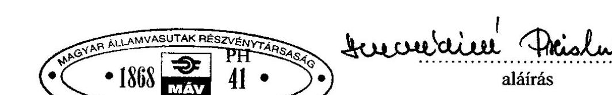

---

### MÁV Rt. Budapest

### Ingatlanok 2000. évi változásai (M Ft-ban)

|  Megnevezés |  |  |  |  |  |  |  |  |  |  |  |  |  |  |  |  |  |  |  |  |  |  |  |  |  |  |  |  |   |
| --- | --- | --- | --- | --- | --- | --- | --- | --- | --- | --- | --- | --- | --- | --- | --- | --- | --- | --- | --- | --- | --- | --- | --- | --- | --- | --- | --- | --- | --- |
|   |  | Épületek |  |  |  | Építmények |  |  |  |  |  |  |  |  |  |  |  |  |  |  |  |  |  |  |  |  |  |  |   |
|   |  | Kincstári | MÁV Rt. | Összesen |  | Kincstári | MÁV Rt. | Összesen |  | Kincstári | MÁV Rt. | Összesen |  |  |  |  |  |  |  |  |  |  |  |  |  |  |  |  |   |
|  1. | Bruttó érték nyitó állomány | 5,3 | 66,3 | 71,6 |  | 205,8 | 36,9 | 242,7 |  | 15,9 | 28,9 | 44,8 |  |  |  |  |  |  |  |  |  |  |  |  |  |  |  |  |   |
|  2. | Beszerzés-felújítás (aktivitás) | 0,4 | 2,1 | 2,5 |  | 27,2 | 1,5 | 28,7 |  |  | 0,1 | 0,1 |  |  |  |  |  |  |  |  |  |  |  |  |  |  |  |  |   |
|  3. | Egyéb változás (előjelesen) | (-) 0,3 | (-) 0,2 | (-) 0,5 |  | 5,4 | (-) 3,8 | 1,6 |  | (-) 1,8 | 1,1 | (-) 0,7 |  |  |  |  |  |  |  |  |  |  |  |  |  |  |  |  |   |
|  4. | Bruttó érték záró állomány | 5,4 | 68,2 | 73,6 |  | 238,4 | 34,6 | 273,0 |  | 14,1 | 30,1 | 44,2 |  |  |  |  |  |  |  |  |  |  |  |  |  |  |  |  |   |
|  5. | Értékcsökkenés nyitó állomány | 0,1 | 3,5 | 3,6 |  | 33,0 | 3,4 | 36,4 |  |  |  |  |  |  |  |  |  |  |  |  |  |  |  |  |  |  |  |  |   |
|  6. | Tárgyévi tervszerinti leírás |  | 0,4 | 0,4 |  | 4,0 | 0,3 | 4,3 |  |  |  |  |  |  |  |  |  |  |  |  |  |  |  |  |  |  |  |  |   |
|  7. | Tárgyévi terven felüli leírás |  | 0,5 | 0,5 |  | 0,2 | 0,4 | 0,6 |  |  |  |  |  |  |  |  |  |  |  |  |  |  |  |  |  |  |  |  |   |
|  8. | Egyéb változás (előjelesen) |  | (-) 0,2 | (-) 0,2 |  |  | (-) 0,2 | (-) 0,2 |  |  |  |  |  |  |  |  |  |  |  |  |  |  |  |  |  |  |  |  |  |   |
|  9. | Értékcsökkenés záró állománya | 0,1 | 4,2 | 4,3 |  | 37,2 | 3,9 | 41,1 |  |  |  |  |  |  |  |  |  |  |  |  |  |  |  |  |  |  |  |  |  |   |
|  10. | Záró állomány nettó értéke | 5,3 | 64,0 | 69,3 |  | 201,2 | 30,7 | 231,9 |  | 14,1 | 30,1 | 44,2 |  |  |  |  |  |  |  |  |  |  |  |  |  |  |  |  |  |   |

Tanúsítom, hogy az adatok a nyilvántartásban szereplőkkel megegyezőek!

Budapest, 2002. április

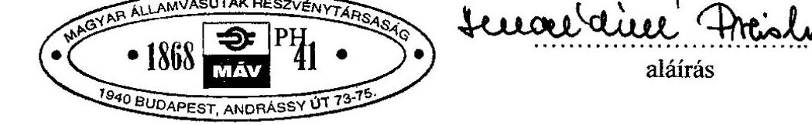

---

### **MÁV Rt. Budapest**

### **Ingatlanok 2001. évi változásai (M Ft-ban)**

|  Megnevezés |  |  |  |  |  |  |  |  |  |  |  |  |  |  |  |  |  |  |  |  |  |  |  |  |  |  |  |  |   |
| --- | --- | --- | --- | --- | --- | --- | --- | --- | --- | --- | --- | --- | --- | --- | --- | --- | --- | --- | --- | --- | --- | --- | --- | --- | --- | --- | --- | --- | --- | --- |
|   |  | Épületek |  |  | Építmények |  |  | Földterületek |  |  |  |  |  |  |  |  |  |  |  |  |  |  |  |  |  |  |  |  |   |
|   |  | Kincstári | MÁV Rt. | Összesen | Kincstári | MÁV Rt. | Összesen | Kincstári | MÁV Rt. | Összesen |  |  |  |  |  |  |  |  |  |  |  |  |  |  |  |  |  |  |   |
|  1. | Bruttó érték nyitó állomány | 5,4 | 68,2 | 73,6 | 238,4 | 34,6 | 273,0 | 14,1 | 30,1 | 44,2 |  |  |  |  |  |  |  |  |  |  |  |  |  |  |  |  |  |  |   |
|  2. | Beszerzés-felújítás (aktivitás) |  | 3,3 | 3,3 | 33,9 | 1,4 | 35,3 |  | 0,1 | 0,1 |  |  |  |  |  |  |  |  |  |  |  |  |  |  |  |  |  |  |   |
|  3. | Egyéb változás (előjelesen) |  | (-)0,6 | (-)0,6 | 0,8 | (-)0,6 | (-)1,4 | (-)0,1 | 0,2 | 0,1 |  |  |  |  |  |  |  |  |  |  |  |  |  |  |  |  |  |  |   |
|  4. | Bruttó érték záró állomány | 5,4 | 70,9 | 76,3 | 271,5 | 35,4 | 306,9 | 14,0 | 30,4 | 44,4 |  |  |  |  |  |  |  |  |  |  |  |  |  |  |  |  |  |  |   |
|  5. | Értékcsökkenés nyitó állomány | 0,1 | 4,2 | 4,3 | 37,2 | 3,9 | 41,1 |  |  |  |  |  |  |  |  |  |  |  |  |  |  |  |  |  |  |  |  |  |   |
|  6. | Tárgyévi tervszerinti leírás | 0,1 | 0,3 | 0,4 | 4,7 | 0,3 | 5 |  |  |  |  |  |  |  |  |  |  |  |  |  |  |  |  |  |  |  |  |  |   |
|  7. | Tárgyévi terven felüli leírás |  | 0,1 | 0,1 |  | 0,3 | 0,3 |  |  |  |  |  |  |  |  |  |  |  |  |  |  |  |  |  |  |  |  |  |   |
|  8. | Egyéb változás (előjelesen) |  | (-)0,2 | (-)0,2 | (-)0,5 | (-)0,2 | (-)0,7 |  |  |  |  |  |  |  |  |  |  |  |  |  |  |  |  |  |  |  |  |  |  |   |
|  9. | Értékcsökkenés záró állománya | 0,2 | 4,4 | 4,6 | 41,4 | 4,3 | 45,7 |  |  |  |  |  |  |  |  |  |  |  |  |  |  |  |  |  |  |  |  |  |   |
|  10. | Záró állomány nettó értéke | 5,2 | 66,5 | 71,7 | 230,1 | 31,1 | 261,2 | 14,0 | 30,4 | 44,4 |  |  |  |  |  |  |  |  |  |  |  |  |  |  |  |  |  |  |   |

Tanúsítom, hogy az adatok a nyilvántartásban szereplőkkel megegyezőek!

Budapest, 2002. április

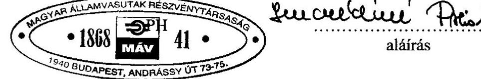

---

MÁV Rt. Budapest

# Költségvetési támogatások alakulása 

1995-2001
millió Ft

| Megnevezés | 1995 | 1996 | 1997 | 1998 | 1999 | 2000 | 2001 |
| :--: | :--: | :--: | :--: | :--: | :--: | :--: | :--: |
| Fogyasztói árkiegészités | 7884 | 9972 | 12112 | 13914 | 15719 | 17008 | 19305 |
| Termelési támogatás | 14900 | 25795 | 30042 | $41000^{1}$ | 43000 | 46048 | 50208 |
| Végkielégités,   korengedm.nyugdijazás | - | 1000 | - | - | - | - | - |
| Ütalap, ill. Fogy.adó, jöv.adó visszat. | 913 | 3919 | 4333 | 6527 | 6974 | 6947 | 6694 |
| Jövedéki adó elözö évi önrevizió | - | - | - | - | - | 459 | - |
| Beruházási támogatás | 16396 | 16882 | 16815 | 14141 | 29307 | 31513 | 25899 |
| Létszám racionalizálás | 766 | 1458 | - | - | - | - | - |
| Megváltozott munka-   képességü dolgozók   támogatása | 187 | - | - | - | - | - | - |
| Rendkivüli károk (árvíz, belvíz) | - | - | - | - | 823 | 232 | - |
| Szent Korona látogatás ${ }^{2}$ | - | - | - | - | - | - | 241 |
| BKSZ miatti bevételkiesés ${ }^{3}$ | - | - | - | - | - | - | 67 |
| Szanálás | 55245 | - | - | 25077 | - | 35739 | - |
| Egyéb, közvetlen támogatás | - | - | - | - | - | - | - |
| Összesen | 96291 | 59026 | 63302 | 100659 | 95823 | 137946 | 102414 |

Tanúsítom, hogy az adatok a nyilvántartásban szereplőkkel megegyezőek!
Budapest, 2002. április
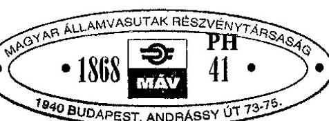

[^0]
[^0]:    ${ }^{1}$ Ebböl hatékonyság javitását célzó támogatás 6.000 millió Ft
    ${ }^{2}$ a Szent Korona országházi látogatásával és a budai Millenáris Park látogatásával kapcsolatos ingyenes vasúti utazás ellentételezése (278/2001. (XII. 23.) Korm. rendelettel módositott 270/2000. (XII. 26.) Korm. rendelet)
    ${ }^{3}$ a Budapesti Közlekedési Szövetség (BKSZ) müködéséböl - egységes bérlet - adódó bevételkiesés ellentételezése; a 200 millió forint egyharmada (184/2001, (X. 11.) Korm. rendelet 1. §. szerint)

---

MÁV Rt. Budapest

Fogyasztói árkiegészítés felhasználása 1995-2001 millió Ft

|  Személyszállítási árkiegészítés kedvezmény fajtánként | 1995 | 1996 | 1997 | 1998 | 1999 | 2000 | 2001
tényleges  |
| --- | --- | --- | --- | --- | --- | --- | --- |
|  50\%-os | 2020 | 2373 | 2785 | 3146 | 2166 | 2128 | 2309  |
|  67,5\%-os | 2212 | 2677 | 3023 | 3415 | 5697 | 6605 | 7803  |
|  90 \%-os | 1338 | 2023 | 2867 | 2894 | 3181 | 3432 | 3621  |
|  tanulók | 1501 | 1936 | 2270 | 2454 | 2362 | 2324 | 2749  |
|  70 éven felüli (65 éven felüli) | 813 | 963 | 1167 | 2005 | 2313 | 2519 | 2581  |
|  |   |   |   |   |   |   |   |
|  |   |   |   |   |   |   |   |
|  |   |   |   |   |   |   |   |
|  |   |   |   |   |   |   |   |
|  |   |   |   |   |   |   |   |
|  Összesen | 7884 | 9972 | 12112 | 13914 | 15719 | 17008 | 19063  |

Tanúsítom, hogy az adatok a nyilvántartásban szereplőkkel megegyezőek! Budapest, 2002. április aláírás

---

MÁV Rt. Budapest Termelési támogatás felhasználása 1995-2001 években

|  Megnevezés | 1995 | 1996 | 1997 | 1998 | 1999 | 2000 | 2001  |
| --- | --- | --- | --- | --- | --- | --- | --- |
|  Alapellátásnak minősülő személyszállítás bevétellel ${ }^{1}$ nem fedezett költsége | $-24024$ | $-35572$ | $-40933$ | $-51452$ | $-58825$ | $-66874$ | $-76202$  |
|  ebből: termelési árkiegészítés felhasználás | 14900 | 25795 | 30042 | 41000 | 43000 | 46048 | $50208^{2}$  |
|  alapellátás fedezetlen költsége | $-9124$ | $-9777$ | $-10891$ | $-10452$ | $-15825$ | $-20826$ | $-25994$  |

Tanúsítom, hogy az adatok a nyilvántartásban szereplőkkel megegyezőek! Budapest, 2002. április

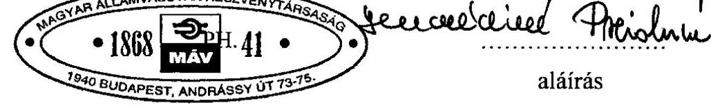

[^0] [^0]: ${ }^{1}$ a bevétel tartalmazza a fogyasztói árkiegészités összegét is ${ }^{2}$ tartalmazza a termelési támogatás összegét (49 900 millió forint), valamint a Szent Korona országházi látogatásával és a budai Millenáris Park látogatásával kapcsolatos ingyenes vasúti utazás ellentételezését (241 millió forint) (278/2001. (XII. 23. Korm.rendelettel módositott 270/2000. (XII. 26.) Korm.rendelet)

---

MÁV Rt. Budapest

Beruházási támogatások felhasználása 1995-2001 években

| Megnevezés | 1995 | 1996 | 1997 | 1998 | 1999 | 2000 | 2001 |
| :--: | :--: | :--: | :--: | :--: | :--: | :--: | :--: |
| Hálózatfejlesztés össz: | 6447 | 7553 | 8421 | 9550 | 11150 | 17435 | 15645 |
| Létszámrac. össz: |  | 1500 | 2000 | 1350 | 950 | 50 |  |
| kombinált fuvarozás | 302 | 279 | 978 | 1042 | 527 | 687 | 449 |
| Bp-Hegyeshalom | 9367 | 7383 | 4300 |  |  |  |  |
| Magyar-Szlovén |  |  | 999 | 274 | 6560 | 7809 | 5414 |
| modernizációs program |  |  |  | 1925 | 6396 |  |  |
| vasútegészségügy | 280 | 167 | 117 |  | 275 |  |  |
| ár és belvízkár |  |  |  |  | 700 | 291 | 371 |
| logisztikai központok |  |  |  |  |  |  | 151 |
| akadálymentes közlekedés |  |  |  |  |  | 10 | 41 |
| költségvetés összesen: | 16396 | 16882 | 16815 | 14141 | 26558 | 26282 | 22071 |
| TEN 5 szlovén |  |  |  |  | 1589 | 2003 |  |
| COP 97 Zn |  |  |  |  | 824 | 2564 |  |
| BILK |  |  |  |  | 336 | 664 |  |
| COP 99 Soroksár |  |  |  |  |  |  | 3799 |
| PHARE összesen: |  |  |  |  | 2749 | 5231 | 3799 |
| ISPA programok |  |  |  |  |  |  |  |
| ISPA segély |  |  |  |  |  |  | 13 |
| ISPA segélyhez $\mathrm{kv}+\mathrm{M} \dot{A} \mathrm{~V}$ hitel |  |  |  |  |  |  | 16 |
| ISPA összesen: |  |  |  |  |  |  | 29 |
| Mindösszesen (Költségvetés+EU források) | 16396 | 16882 | 16815 | 14141 | 29307 | 31513 | 25899 |

Tanúsítom, hogy az adatok a nyilvántartásban szereplőkkel megegyezőek!
Budapest, 2002. április
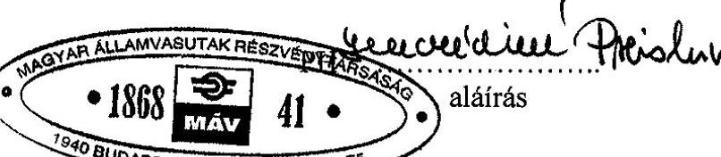

---

1. sz. függelék
a V-13-46/2001-2002. sz. jelentéshez

# Szerződések szakértői munkára 

EUROFIMA-finanszírozás (K-3551/1999, 1,7 M Ft), EUROFIMA-finanszírozás (K-5247/1999, 729 ezer Ft): A szerződéseket a Pénzgazdálkodási és Számviteli Főosztály kötötte, ugyanazzal a tanácsadó céggel. Az elvégzett munkára fordított időről a tanácsadó utólag kimutatást készített. Bár a szerződések aláírásának kelte megelőzte a munkavégzés idejét és a munkaóra-ráfordításról készített kimutatás keltezését, a szerződések már tartalmazták a munkadíj pontos összegét is.

MÁV Rt. átfogó reformja (K-200/1999, 20,9 M Ft): A szerződést az Igazgatóság elnöke írta alá. A megbízott feladata a MÁV Rt. átfogó reformjáról szóló tanulmány összeállítása. A szerződést öt alkalommal módosították 1999ben. A módosítások az átfogó reformról szóló kormány-előterjesztéssel összefüggésben adódó újabb munkákról és újabb határidőkről szóltak. A MÁV Rt. átfogó reformjáról szóló kormány-előterjesztés szerződés szerint elkészült.

MÁV Rt. reformja (K-7775/2000, 700 ezer Ft): A szerződést az Igazgatási és Jogi Főosztály kötötte. A szakértő közvetlenül Közlekedési és Vízügyi minisztérium részére nyújtott szaktanácsadást, ezért a feladat teljesítéséről csak közvetett módon - a törvénytervezet megküldéséből - értesült az Igazgatási és Jogi Főosztály.

Értékesítési koncepció kidolgozása (K-3322/2000, 51,1 M Ft): A sikerdíjas szerződést a vezérigazgatói Titkárság kötötte a Pan Tel-részvényei egy részének értékesítésére. A szerződésben foglaltak teljesültek.

MÁV átfogó reformja (K-4587/2000, 56,8 M Ft): A szerződés a fenti (K-200/1999)-szerződés 6. számú módosítása, amelyben a szerződést meghoszszabbították 2000. dec. 31-ig. A megbízott feladata a reform végrehajtásával kapcsolatos 2000. évi feladatok koordinálása, szakmai összefogása, ill. ezzel összefüggő különböző szakértői anyagok elkészítése. Az elvégzett munkákról a Reform Főosztályon nem tudtak tájékoztatni, de a megbízott cég utólag összeállított egy listát az általa elvégzett munkákról.

Vállalkozó vasúti reform (K-4908/2000, 2,5 M Ft): A szerződést a Személyügyi Főosztály kötötte, amelynek „jogutódja" a Humánpolitikai Főosztály. A Humánpolitikai Főosztály nyilvántartásában a szerződés nem szerepel. A szerződés tárgya: „A MÁV Rt. szolgáltatási reformját segítő stratégiai feladatok kidolgozására irányuló komplex munkafolyamat tanácsadói feladatainak elvégzése." A MÁV Rt. szolgáltatás-fejlesztési stratégiája elkészült, azt az Igazgatóság 2000 októberében elfogadta. A szerződés „termékét" - a tanulmányt - nem tudták bemutatni.

---

Pénzügyi folyamatok átvilágítása (K-6778/2000, 6 M Ft): A szerződést a Pénzgazdálkodási és Számviteli Főosztály kötötte.

A témában volt ajánlatkérés és ajánlat is, bár az irattározott ügyiratok között erre vonatkozó dokumentumok nem voltak. Az ajánlatkérő levelet két ismert banknak és egy ingatlanforgalmazó és tanácsadó kft.-nek küldték el. A kft.-t 1998. december 21-én alapították, tevékenységi körébe ingatlanforgalmazás, ingatlanberuházás, -eladás, ingatlan bérbeadása és üzemeltetése, ingatlanügynöki tevékenység, ingatlankezelés, üzletviteli tanácsadás tartozott. Az ajánlatkérésre egyik bank nem válaszolt, a másik szakszerű ajánlatot tett a feladat elvégzésére. A kft.-től beérkező ajánlat nettó értékben 1135 M Ft-ért 4,5 év időigényú munkára tett ajánlatot.

Az ajánlatkiértékelés szerint a kft. ajánlata teljes körű, a feladatok és azok elvégzésének határideje megfelelő (3 hónap), a díjazás mértékét 6 M Ft-ban meghatározták. Az ügyiratban nincs nyoma annak, hogy a nagy volumenú ajánlatból hogyan született a 6 M Ft-os, 3 hónapos megbízás. A munka termékét, a tanulmányt - „A MAGYAR ÁLLAMVASUTAK Rt. pénzügyi folyamatait szabályozó utasítások, illetve informatikai megoldások áttekintése, valamint javaslattétel a Treasury eljárás bevezetésére" - viszont nem a szerződést kötő, hanem egy hasonló nevú kft. készítette el, melynek. ügyvezetője a szerződést kötő kft. felügyelő bizottsági tagja volt. A számlázó is ő volt.

A teljesítésként benyújtott tanulmány jellemzője az ismétlés. Pl. a tanulmány első része 47 oldalas, de a 37-47. oldalakon csak egyforma táblázatok vannak, oldalanként négy, és minden 4. táblázatnál változik csak a felirat. A második része 39 oldalas, de a 19-39. oldalakon két ábra kivételével szó szerint ugyanaz a szöveg olvasható, mint amit már az ajánlatban 11 oldalon leírtak, csak nagyobb betűkkel és sortávolsággal. A MÁV Rt.-hez csak a címnek van köze: „MÁV-Tresaury tevékenységek". A felajánlott tresauryrendszert a társaság nem vásárolta meg.

MÁV Rt. átalakítási koncepciója (K-6342/2000, 15 M Ft): A szerződést a Reform Főosztály kötötte. A szerződéskötés kelte: 2000. április 25. A szerződésben egy vezetői informatikai tanácsadó kft.-től - annak 2000. április 25 -én tett ajánlata alapján - a MÁV Rt. vállalat átalakítási koncepciójának elkészítését rendelték meg, különös tekintettel a pénzügyi-gazdasági és az informatikai területekre. Határidő: 2000. június 23. A szerződés „termékét" csak flopin tudták bemutatni. A szöveg nem volt védve az átírástól, a tartalomjegyzékben felsorolt mellékletek nem voltak a lemezen.

Helyzetelemzés a nemzetközi környezetről (K-8249/2000, 9,8 M Ft): A szerződést a Reform Főosztály kötötte 2000 májusában kockázatkezelési szakértői tanulmány elkészítésére. A tanulmányt döntés-előkészítéshez kívánták volna felhasználni, mint minden más tanulmányt. A szakértő cég ajánlatot tett a munka folytatására is, a MÁV Rt. kockázatkezelési koncepciójának kialakítására, különösen a magyar vasút számára katasztrofális veszteséggel fenyegető kockázatok finanszírozására. A munka folytatását 2001 májusában a stratégiai vezérigazgató-helyettes támogatta, de szerződéskötésre még sem kerülhet sor, mert a MÁV Rt. 1999 júniusában szerződést kötött a MÁVrészesedésű biztosításszervező kft.-vel a biztosítási ügyek (szervezés, kocká-

---

zatkezelés, tanácsadás, kárigény-elbírálás stb.) teljes körű képviseletére és lebonyolítására kizárólagos joggal.

Humánpolitikai stratégia (K-295/2001, 2,4 M Ft): A szerződést a Társadalmi, Munkaügyi Kapcsolatok Központ kötötte. A megbízott kft. feladata volt, hogy a MÁV Rt. humánpolitikai stratégiájának és az annak végrehajtására elfogadott intézkedési programnak a megvalósításában múködjön közre: a magas prioritású feladatok meghatározásában és azok teljesítéséhez szükséges részkoncepciók kidolgozásában. A Humánpolitikai Főosztályon e szerződésről, ill. az ennek alapján végzett munkáról nem tudnak, a Társadalmi, Munkaügyi Kapcsolatok Központjában viszont a szerződés „termékét" nem találták.

Vasút modernizálása, EU-konformmá tétele (K-7306/2001, 39 M Ft): A szerződést a Reform Főosztály kötötte pénzügyekben neves társasággal. Az ügyiratban 3 szerződés 3 különböző feladatra, továbbá egy „Együttmüködési megállapodás" van. A megállapodás preambulumában írottak szerint a szakértő társaság „...a MÁV Rt. által átadott dokumentumok alapján áttekintette a MÁV Rt. általános helyzetét, ill. a reformmunkákat. E munkák sikerességét és jóindulatát nem vitatva tett javaslatot más elrendezésben, határozottabban és világos programmal a teendők megfogalmazására." A szakértő társaság a 3 szerződésben vállalt kötelezettségeit teljesítette.

---

# Az állami források felhasználásának, a rakodási teljesítmények növelése érdekében hozott intézkedések eredményességének ellenőrzése a záhonyi térségben 

## A Záhonyi Átrakó Körzetben Phare-támogatásból és saját forrásból megvalósult beruházások

A Phare-támogatásoknál előnyben részesültek azok a beruházások, amelyek:

- fő nemzetközi útvonalak fejlesztését közvetlenül támogatják,
- fontos gazdasági központokat kötnek össze,
- az egész országot bekapcsolják a nemzetközi hálózatba.

Az irányelvekhez igazodva Záhony Átrakó Körzet kiemelt támogatást kapott az Európai Közösségtől két 1997-es programon (ZZ9722, HU9707) belül. A beruházások célja az átrakó körzet nemzetközi és hazai árufuvarozási forgalmi részesedésének megőrzése, stabilitásának biztosítása a részben elavult, nem biztonságos berendezések felújításával, illetve a technológiához igazodó bővítésekkel, a környezetvédelmi előirások feltételeinek megteremtésével. A támogatott záhonyi projektek a következők voltak:

EURO-ban

| Megnevezés | Szerződés   összesen | Ebből |  |
| :-- | --: | --: | --: |
|  |  | Phare-támogatás | Saját forrás |
| ZZZ 9722-04-01 Eperjeske nyitott kocsis   ömlesztett áruátrakó | 10459551 | 4500000 | 5959551 |
| HU 9707-01-01 Eperjeske darus átrakó | 1710812 | 1710812 | - |
| HU 9707-01-03 Komoró olajátfejtő | 3006654 | 1850000 | 1156654 |
| HU 9707-01-02 Eperjeske fedett kocsis   ömlesztett áruátrakó | 899625 | 750000 | 149625 |
| HU 9707-01-04 Vegyianyag átfejtő | 1025927 | 1025927 | - |
| ÖSSZESEN | $\mathbf{1 7 1 0 2 5 6 9}$ | $\mathbf{9 8 3 6 7 3 9}$ | $\mathbf{7 2 6 5 8 3 0}$ |

A fenti projektek közül az Eperjeske nyitott kocsis ömlesztett áruátrakó, az Eperjeske darusátrakó és a Komoró olajátfejtő munkái kerültek vizsgálat alá.

A Phare pályázati segély előtt készített tanulmányokban a szakértők feltárták a létesítmények alapvető problémáit, és meghatározták a fejlesztés célját. Az elvégzett előzetes dinamikus gazdaságossági szá-

---

mítás alapján meghatározták a beruházások belső megtérülési rátáját (IRR), a beruházások jelenértékét (NPV), valamint a forgalomváltozásból adódó kockázatok figyelembevételével az eredményességet és megtérülésük időtartamát.

A Phare-támogatásból megvalósult és ellenőrzött három projekttel kapcsolatosan az alábbiak állapíthatók meg:
A beruházások tervezését a Komoró olajátfejtő kivételével a MÁVTI Kft. végezte. A tervezés díjában szerepel a jelenleg még meg nem valósult tengelyátszerelő díja is, amelyet a megvalósult beruházásokra ráaktiváltak.

A múszaki ellenőri szervezet a Phare-támogatásból megvalósuló jelentős nagyságrendű munkák ellenőrzését csak létszámbővítés útján tudta biztosítani. A FIDIC (Tanácsadó Mérnökök Nemzetközi Szövetsége) eljárási rend elméleti és gyakorlati képzése, a beruházás lebonyolításában résztvevők számára megtörtént. A Beruházás Lebonyolító Igazgatóság az ISO 9002 minőségtanúsítványával rendelkezik.

Az Eperjeske nyitott kocsis áruátrakó beruházása során külső alvállalkozót is igénybe vettek a speciális kivitelezési technológiához igazodva.

Az ÁFA kifizetését és visszaigénylését az adóhatósággal egyeztetve végezték el, az általános forgalmi adóról szóló törvény és a Phare előírásainak megfelelően. Az ÁFA-t egyedi APEH-elbírálás alapján fizették ki az egyes számlákat illetően.

A tárgyi eszközök nyilvántartásának ellenőrzése során megállapítható, hogy a nyilvántartás a tárgyi eszközök helyrajzi számát nem tartalmazza, csak a leltári számát, ezért nehéz az eszközök azonosítása. Az egyes projektek szintjén tárgyi eszközökről nem készült analitikus nyilvántartás, csak a projektekben szereplő tárgyi eszközök külön-külön kigyűjtött adatainak összesítéséből lehet látni, hogy a bruttó érték hogyan alakult. Az ún. „Tárgyi eszköz változásai" - bizonylat leltári számonként, a projekt egyes tárgyieszköz-elemeire készült el, az üzembe helyezési okmányok alapján.

A MÁV Rt. 107/1998. (MÁV Ért. 33.) FBF. sz. utasítás 1999. évi 1. sz. módosított kiadásában foglaltak alapján a gazdaságossági számításokat újra el kell végezni a beruházás lezárása után a beruházásért felelős szervezetnek, illetve a beruházásban nem érdekelt szervezettel kell elvégeztetni. Gazdaságossági számítás a fenti projektekre a beruházás lezárását követően nem készült.

A MÁV BLO Záhony bonyolítói díját a három projektnél háromféle módon számolták el. A kialakult gyakorlat szerint a lebonyolító apparátus költségeinek mértékéig számolták el éves szinten a bonyolítói díjat. A tényleges aktivált bonyolítói díjak az üzembe helyezési okmányokban szereplő értékektől eltérnek.

---

# A „Tankolj és Hajts" rendszer kiépítésének beruházása 

A beruházás (továbbiakban „TH"-rendszer) célja, az üzemanyagfelhasználás csökkentése, a járművek energiafelhasználásának pontos mérése, valamint hosszabb távon a teljesítményarányos értékcsökkenés és jármújavítás megvalósítása volt. Az üzemanyag-felhasználás ilyen módja kiterjedt a közúti gépjárművekre, a munkagépekre, illetve a vasúti vontató járművekre. Az elképzelések alapján az ajánlatot - a MÁV Rt területén kísérleti jelleggel - Záhony térségben tervezték megvalósítani, mert vasútüzemi szempontból az adatok torzításmentes, utólagos egyértelmú értékelhetőségét a viszonylagos zártság biztosítja.

A beruházás eredményeként a körzet területén a számítógépes üzemanyagnyilvántartó rendszer, a járművek és rakodógépek elektronikus adóval és az üzemanyag-feladó kutak vevőkészülékkel történő ellátása során a várható üzemanyag megtakarítás mértékét, az előzetes gazdasági számítások során 5-10\%-ban határozták meg.

A költségvetési forrásból megvalósult beruházás bruttó értéke 29412 E Ft volt, üzembe helyezése 1997. november 30-án megtörtént.

A beruházás gazdaságossági utóvizsgálatát nem végezték el. A Záhony-Port igazgatója igazgatói biztost nevezett ki 1999. évben, beszámoltatása havi rendszerességgel történik. A beruházást a befejezést követően több alkalommal ellenőrizték. A rendszer zárttá tételét a gyakorlati tapasztalatok alapján önmagában is fegyelmező erőként értékelték.

A fajlagos mutatók alakulása az FVS (Forgalmi Vontatási Statisztika) tablók adatai alapján:

| Megnevezés | Mértéke | 1997 | 1998 | 1999 | 2000 | 2001. I-X.hó |
| :-- | :--: | --: | --: | --: | --: | --: |
| Egyéb célú üzem-   anyag-felhaszn. |  |  |  |  |  |  |
| Gázolaj össz. | $1 / 100 \mathrm{~km}$ | 28,27 | 27,64 | 26,00 | 26,09 | 21,66 |
| Gázolaj össz. | l/ü. óra | 8,50 | 7,90 | 8,87 | 9,56 | 7,93 |
| Benzin össz. | $1 / 100 \mathrm{~km}$ | 9,98 | 13,70 | 13,18 | - | - |
| Ólommentes benzin | $1 / 100 \mathrm{~km}$ | 13,11 | 13,28 | 14,64 | 15,10 | 13,62 |
| Vontatási célú üzem-   anyag-felhaszn.* | Mértéke | $\mathbf{1 9 9 7}$ | $\mathbf{1 9 9 8}$ | $\mathbf{1 9 9 9}$ | $\mathbf{2 0 0 0}$ | 2001. I-X.hó |
| Gázolaj össz. | l/tol. óra | 44,82 | 43,75 | 44,57 | 43,89 | 40,58 |
| Gázolaj össz. | $1 / 100$ ETKM | 2,75 | 2,78 | 2,66 | 2,63 | 2,66 |

*A vontatási célú üzemanyag-felhasználás az összes felhasználásnak 76\%-a volt, a teljesítményadatok 2000. évi árszinten forintosított értéke szerint.

Az egyéb célú üzemanyag-felhasználás mutatói gázolajnál 1/100 km-t tekintve megtakarítást jelez a vizsgált időszak tekintetében, ugyanakkor az egy üzemórára jutó fogyasztás hullámzó képet mutat. A fogyasztás nagyarányú emelkedése az ólmozott és az ólmozatlan benzinnél egyaránt megjelenik. A vizsgált időszakban a gépjárművásárlásokat és -selejtezéseket tekintve jellemzően az elhasználódott tehergépjárművek selejtezése volt domi-

---

náns. Mindezek a változások azonban nem indokolják az üzemanyagfogyasztás emelkedését, mind a mellett, hogy a beruházás céljának teljesülése, az üzemanyag-megtakarítás a fajlagos mutatók alapján nem bizonyítható. A kialakított rendszer alapján az egyes gépjárművek, illetve munkagépek egyedi fogyasztását is figyelemmel lehet kísérni.

A vontatási célú üzemanyag-felhasználás mutatóiból nehéz reális következtetéseket levonni, mivel az FVS-tabló kétféle teljesítményi mutatót tart nyilván, a tolatási óra és a 100 elegytonna-kilométer (ETKM) alapján. A vizsgált időszakot tekintve a felhasználás mértéke hullámzó képet mutat, de az 1997. évi adatokhoz képest megtakarítás tapasztalható úgy a l/tol. óra, mint a l/100 ETKM mutatóinak vonatkozásában. A „TH"-rendszer adatait befolyásolja, hogy tolatási órában az úgynevezett „mozdonymérő" az üresjárati időt is méri. A gázolajfogyasztást a fentieken túl befolyásolja, hogy vontatáskor húz-e terhet a mozdony vagy sem. A mozdonyok többnyire a térségben tolatási feladatokat végeznek, ezáltal a fajlagos fogyasztást nehéz mérni.

Mindezek alapján a fenti nyilvántartásokból, az üzemanyagfogyasztás megtakarításának abszolút mennyisége nem határozható meg. Az FVS-tablók alapján a mozdonyoknál egyedileg mérhetők az értékek.

# A rakodási teljesítmények növelése érdekében hozott intézkedések eredményessége 

A Záhony átrakó körzetben múködik a MÁV Rt. Árufuvarozási Szakigazgatóságon belül a Záhony-Port Igazgatóság. Magyarország és a volt Szovjetunió kapcsolatában 1990 óta beállt változás egyike, hogy a kormányközi kereskedelmi megállapodásokat felváltották a társaságok és a vállalkozók közvetlen szerződései. Az alacsonyabb szintre került szerződéses kapcsolatok a MÁV-nál is érzékeltették hatásukat. Az átrakó körzet térségében jelen vannak azok a nagyvállalkozások, amelyek a beérkező áruféleségeket feldolgozzák, csomagolják, tárolják és manipulálják. Ezek esetenként konkurenciát jelentenek a MÁV-nak rugalmas üzletpolitikájuk miatt. Közös jellemzője a vállalkozásoknak a helyi sajátosságot kihasználó kétféle nyomtávolságú iparvágány-hálózat.
A szállított áruk tervezett volumenét árutípusonként és viszonylatonként export, import, tranzit bontásban az ún. „Volumenegyeztető jegyzőkönyvben" határozzák meg évente. A kialakított rendszer szerint az átrakásra az áru egységárat kap, így nincs differenciálva a kiszereléstől függő átrakási technológia felmerült költségét követő átrakás díja.

Az alapszolgáltatások körébe az alábbiak tartoznak: szállítás-előkészítés, szállítás, rakodás, raktározás, finishing-szolgáltatások („just in time" elvű beszállítás, ütemezett szállítás, csomagolás, címkézés).
Kiegészítő szolgáltatás keretében az alábbi tevékenységeket végzik: közúti szállítójárművek, anyagmozgató rakodógépek javítása, karbantartása, szervizelése, tisztítása; közúti szállító járművek, anyagmozgató gépek üzemanyaggal való ellátása; vámszolgáltatások.

---

A gazdaságos átrakás tervezhetősége érdekében kiépítették az Ukrán Vasúti Társasággal az ún. „UZ-előjelentés" nevú információs rendszert.

Az igazgatóság partnereinek, ügyfeleinek tájékoztatása céljából, a szolgáltatási kör megismertetése érdekében, fuvarozási fórumokat, nemzetközi konferenciákat szervezett, különféle szakmai lapokban, folyóiratokban cikkeket jelentett meg, az Internetes elérhetőségét biztosítja stb.

A rakodási átrakási létesítmények elhasználódott építményeinek állapotát jelentős mértékben javította az 1999. és 2000. években 17102569 EUR értékben elvégeztetett beruházási munkák értéke, amelyből 9836739 EUR Phare-támogatás volt. Az Eperjeske nyitott kocsis ömlesztett áruátrakó, darus átrakó, fedett kocsis ömlesztett áruátrakó, Komoró olajátfejtő és a vegyianyag átfejtő felújítása, korszerűsítése során nem a kapacitás növelése volt a cél, hanem a korszerú technológia követése az Európai Uniós csatlakozás környezetvédelemi előírásainak való megfelelés érdekében.

A Záhonyi Átrakó Körzet import-tranzit árufuvarozási volumenének alakulása az 1997. évi mélypontot követően dinamikus emelkedésnek indult, a FÁK országokból Magyarországra történő szállítások növekedése miatt. Az export-tranzit árufuvarozás volumene azonban évenként hullámzó képet mutat (1997-ben évi 1235 ezer tonna, 1998-ban 1006 ezer tonna, 1999-ben 631,6 ezer tonna, majd 2000. évben 901,6 ezer tonna árumennyiség hagyta el az átrakó körzetet).

Az átrakó körzet átrakó helyeinek és berendezéseinek elméleti kapacitása (figyelembe véve a nyári és téli hónapokat a volumenegyeztető alapján), valamint a tényleges teljesítés az alábbiak szerint alakult a vizsgált években:

|  | Tényleges teljesítés   (tonna) | Elméleti kapacitás   (tonna) | Kapacitás ki-   használás \%-a |
| :-- | :--: | :--: | :--: |
| $\mathbf{1 9 9 6}$ | 5373228 | 9906000 | 54,24 |
| $\mathbf{1 9 9 7}$ | 4424411 | 9906000 | 44,66 |
| $\mathbf{1 9 9 8}$ | 4397915 | 9906000 | 44,40 |
| $\mathbf{1 9 9 9}$ | 5793410 | 8151000 | 71,08 |
| $\mathbf{2 0 0 0}$ | 6945463 | 9906000 | 70,11 |
| $\mathbf{2 0 0 1 .}$ I-VIII-ig | 3673730 | 5122740 | 71,71 |

Az elméleti kapacitás 1999. évben 199485 tonnával csökkent, mivel a vasérccsúszda átépítése miatt a vasércet a Záhony-700-as rakodón rakták. Az elméleti kapacitás a fenti korrekción túl nem változott, azonban figyelemre méltó az 1999. évtől megnövekedett teljesítés. Ennek oka a mozdított árutonna manipulációs tevékenység keretében történő mozgatása az egy-ségrakomány-képzés (válogatás, tárolás, címkézés stb.). Az igazgatóság a kiegészítő tevékenységek szükségességét felismerte, mely iránti igény a megrendelők részéről a megkötött szerződések számának növekedésében is tük-

---

röződik. A kapacitáskihasználtság mutatóját rontják a hosszabb távon megszüntetésre kijelölt és a tartalék átrakó helyek.

# A vizsgálat során megállapítást nyert, hogy az alábbi berendezések kihasználatlanok a rakodó körzetben: 

- Záhony, kézi átrakó (korszerűtlen csomagolási technológiájú, egyedi termékek átrakó helye),
- Záhony, MÁVAG-vágányok (jelenleg tartós bérbeadás utján hasznosítják),
- Záhony, burgonyavágányok (tartalék területként kezelik jelenleg),
- Záhony, széncsúszda (az Eperjeske ömlesztett átrakó fejlesztése ezt a technológiát kiváltotta),
- Záhony, kokszcsúszda (az Eperjeske ömlesztett átrakó fejlesztése az alkalmazott technológiát kiváltotta, a jelenlegi magyar szabványelőírásoknak nem felel meg),
- Záhony, ágyúrakodó (a hadi szállítmányok visszaszorultak, kedvezőtlen földrajzi helyzete miatt a kihasználtsága a vizsgált időszakban minimális volt),
- Komoró, rakodó (forgalmi szerepével nem számolnak, hasznosításra vár).

Megszüntetésüket hosszabb távon programozták a kereskedő vasúti létesítmények rehabilitációs programjában, 2001-2005 évek viszonylatában.

Tartalék átrakó helyként kezelt rakodó létesítmények:

- Mándok, átrakó - bérbeadás útján hasznosítják.
- Tornyospálca, átrakó - MÁV által végzett rakodási munka nem volt a vizsgált években, csak külső fél által végzett berakás és kirakás.
- Záhony, pillangórakodó - kihasználtsága évről-évre csökken, 1996. évben 9779 tonnát raktak át, 1999. évben 1220 tonnát, 2000. évben 1284 tonnát.
- Tuzsér, rakodó - a gépjármúimport jövőbeni alakulásától függ a jövője. A külső fél által végzett berakási és kirakási munkák teljesített tonnája hullámzóan alakult. MÁV által rakodás csak 1999. évben volt 787 tonna mennyiségben.
- Tuzsér, magas rakodó - fedetlen hely, ezért mútrágya átrakására kevésbé alkalmas, viszont az étkezési sót csak itt tudják átrakni. Kiváltását a Záhony 700-as átrakó által tervezik. A rakodó helyen a MÁV által végzett rakodás folyik kizárólag, kivéve 1996. és 2000. éveket, amikor külső fél által végzett kirakás is volt 256, illetve 206 tonna mennyiségben.
- Záhony, nyílt tároló - bérbeadással hasznosítják, vámszabad területté fejleszthető.

Figyelemre méltó, hogy a 2000 decemberében üzembe helyezett Komoró olajátfejtő - mely részben Phare-támogatással 3006654 EUR bekerülési értékkel megvalósult beruházás - kihasználtsága minimális, mivel a pakurára vonatkozó próbaüzem a vizsgálat ideje alatt 2000. december 7 -én kezdődött el.

---

# A Zalalövő-Bajánsenye vasútvonal építésének és költségfelhasználásának tervszerűsége 

## A költségmegtérülési feltételek és mutatók kidolgozottsága

A beruházás előkészítési szakaszában - 1995-ben - az Európai Fejlesztési és Újjáépítési Bank égisze alatt, magyar oldalról a MÁVTI Kft. közremúködésével készült egy megvalósíthatósági tanulmány (GIBB), amely dokumentum kiértékelte a Szlovénia és Magyarország közötti régi vasúti kapcsolat helyreállításának megvalósíthatóságát.

A magyarországi szakaszra vonatkozóan az 1994. november 1-jei árfolyamon végzett építési költség-becslések három alternatívát mutattak be:
maximum $120 \mathrm{~km} / \mathrm{h}$-s nyomvonal 29,1 M ECU, vagy
maximum $160 \mathrm{~km} / \mathrm{h}$-s nyomvonal 42,0 M ECU, vagy
$160 \mathrm{~km} / \mathrm{h}$-s nyomvonal, $120 \mathrm{~km} / \mathrm{h}$-s üzemeltetési sebesség 38,5 M ECU költséggel.

A dokumentum a forgalom jövőbeni áramlásának széles körét vizsgálta meg, majd gazdaságilag értékelte. A közvetlen kapcsolat múködési és kereskedelmi előnyei nyilvánvalóak mindkét ország kormánya és vasúti adminisztrációja számára. A tanulmány a nettó haszon összefoglalását a belső megtérülési ráta és a nettó jelenérték szerint a $120 \mathrm{~km} / \mathrm{h}$-s nyomvonalra, alacsony és magas forgalomnövekedéssel határozta meg, három lehetséges esettel számolva:

- ha a teherforgalomból semmit sem lehet átterelni az új kapcsolatra, akkor kevesebb, mint 1-től 7\%-ig terjedhetne a megtérülési ráta;
- ha a forgalom nagyobb része terelődne át, akkor 15 és $20 \%$ közötti megtérülési ráta érhető el;
- ha a vontatott forgalom teljes egészében az új kapcsolatra terelődik, akkor a megtérülési ráta a $30 \%$-ot is meghaladhatja.

A dokumentum szerint az útvonal sikeressége a vasúti szervezetek - költség-haszon-elvű szolgáltatásnak megfelelő - átalakításától fog függeni.

A régióban a forgalom sikeres múködtetésének kulcsa ezért:
Az érintett országok vasúti adminisztrációjának biztosítása, valamint hogy a vasúti teher-szállítmányozók hajlandók és képesek legyenek „zárt tehervonat" üzemeltetésére.

---

A szükséges kereskedelmi gyakorlatok kialakítása a szlovén, a horvát, a magyar, a cseh és szlovák vasutaknál is, ahová a forgalom harmadrésze irányul, vagy onnan ered.

Megengedni a teher-szállítmányozóknak a pontról pontra történő, közvetlen szállításra az árrendszer összeállításának versenylehetőségét inkább, mint a jelenlegi tarifa alkalmazását, valamint az állami jövedelmek az ilyen tarifák alapján történő szétosztását.

A KHVM a megvalósíthatósági tanulmány alapján jelentést készített a Kormány részére az új vasúti kapcsolat tervezett beruházásáról. A Kormány a jelentést 1995. november 16-án elfogadta, és határozott arról, hogy új vasútvonal épül az országhatár és Zalalövő között, 160 km/ó tervezési, 120 $\mathrm{km} /$ ó üzembe helyezéskori sebességre. Az elfogadott jelentés a beruházást 1995. augusztus 31-i árszinten készített költségbecsléssel együtt tárgyalta, mely szerint a projekt költsége 9,4 milliárd Ft ( 57 M ECU). A megvalósíthatósági tanulmány költségbecslési adatai ettől jelentősen különböznek, mivel azokat 1994. november 1-jei árszinten kalkulálták, és nem vették figyelembe a két ország eltérő építési egységárait, nem volt pontos a mennyiségek meghatározása, ill. elhanyagolták a Magyarországon kötelező adókat és járulékokat.

Az 1996. április 30-i árakon prognosztizált költségek nagysága 11,5 milliárd Ft (59,0 M ECU) volt.

A gazdaságossági számítások a MÁV 1996. évi áruszállítási tervadatainak (teljesítmény, bevétel és költség) ismeretében készültek el, többek között annak feltételezésével, hogy a beruházás 1999-ben befejeződik, az első teljes üzemelési év 2000 lesz. Az eredményül kapott mutatók szerint nemzetgazdasági szinten hatékony beruházásról van szó, melynek hasznai elsősorban extern jellegűek. A belső megtérülési ráta $14,3 \%$, a dinamikus megtérülési idő pedig 13, illetve 17 év. A két ország illetékes tárcáinak 1996 szeptemberében közösen elvégzett pénzügyi és gazdaságossági vizsgálata során kapott belső megtérülési ráta $12,5 \%$, a dinamikus megtérülési idő pedig 13 , illetve 17 év volt.

Az 1998. novemberben elkészült mérnöki költségvetés - amely a beruházás előkészítő szakaszában a Makro Egységár Gyűjtemény alapján kidolgozott előkalkulációs rendszerre épült - a beruházás tervezett bekerülési költségét 1997. szeptember 1-jei árakon 24 milliárd Ft-ban határozta meg. Mivel a korábbi gazdaságossági számítások alapját képező prognosztizált bekerülési költségek nagyságrendje jóval a mérnöki költségvetés alatti volt, továbbá a beruházás befejezése a korábban tervezetthez képest késett, a bemutatott megtérülési idők sem reálisak.

# A beruházáshoz szükséges pénzügyi források rendelkezésre állása 

A beruházáshoz szükséges pénzügyi forrás éves ütemét a központi költségvetési törvény hagyta jóvá. A beruházási ráfordításként figyelembe vehető költségek megjelenésétől kezdődően (1996) a központi költségvetésről szóló éves törvényekben a beruházás lebonyolításához szükséges tervezett előirányzatot elkülönítették.

---

A projekt forrásának része volt a német Kreditanstalt für Wiederaufbau (KfW) pénzintézettől a Magyar Állam által felvett kölcsön és az EU által nyújtott Phare-támogatás is.

A magyar-szlovén vasútvonal építési költségeinek részbeni finanszírozására a Magyar Állam 1998 júniusában 120 M DEM összeghatárig kölcsönmegállapodást kötött KfW-vel. Az 1998-2001. években felhasznált 120 M DEM kölcsön forintértéke 15845 M Ft volt.

A megállapodás értelmében a pénzintézetnek a beruházásra felülvizsgálati jogosultsága, a kölcsönvevőnek pedig tájékoztatási kötelezettsége volt. A kölcsönt felvevőnek a tender kiértékelésének másolatát - beleértve azon értékelési szempontok ismertetését is, amelyek az értékelés eredményére vezettek - a hivatalos eredményhirdetést megelőzően jóváhagyás céljából meg kellett küldenie a KfW részére.

A beruházás Phare-segélyből biztosított forrása 10 M EURO volt, amelyet 1999-2000-ben használtak fel, 2546 M Ft értékben.

A bevont források együttesen a beruházás nettó előirányzatának - 24177 M Ft - 76,1\%-át tették ki.

Az adott évben rendelkezésre álló forráshoz igazodóan került sor a beruházásfinanszírozási alapokmány módosítására.

A MÁVTI Kft. 1997. áprilisában elkészítette a beruházási alapokmányt, 1996. évi kezdési és 2000. decemberi befejezési időponttal. Ekkor a teljes beruházási összeg - 1996. évi árszinten - 14 milliárd Ft volt, 21,6 milliárd Ft prognosztizált előirányzattal.

A tervek szerinti előkészítő fázisban (1996-1997.) az engedélyezési dokumentumokra, a beruházási programra, a biztosító berendezések és távközlési előtervekre, kiviteli tervekre, kisajátítás előkészítésére, lebonyolításra - tartalékképzés mellett - összesen nettó 180 M Ft-ot terveztek fordítani. A beruházásfinanszírozási alapokmány 2. sz. módosítása a beruházás előkészítését tartalmazta, a szükséges előregyártásokat és előszerelési munkákat azonban nem. Ezért került sor a beruházásfinanszírozási alapokmány 3. sz. módosítására (1997-ben második alkalommal). A módosítási igények elfogadását követően az 1997. évi beruházási ütem központiforrás-igénye 1 milliárd Ft lett.

1998-ban folytatódtak a Magyar - Szlovén Vasúti Projekt költség- és forrásegyeztető tárgyalásai az illetékes minisztériumok és a refinanszírozó intézetek bevonásával. A MÁV Rt. Fejlesztési és Beruházási Főosztály Kiemelt Beruházási Projekt Iroda a KHVM kérésére elkészítette a projekt részletes költségelemzését, időbeni ütemezését és forrásigényét. A felülvizsgálatot követően megállapították, hogy az 1996. évi kiindulási állapothoz viszonyítottan időközben olyan változások következtek be, amelyek lényegesen módosítják a beruházást. Az 1996. évi 14 milliárd Ft-ban meghatározott előirányzat 1997. évi árakon kalkulálva a MÁV Rt. szerint 22,2 milliárd Ft. A változást elsősorban a műszaki tartalom változása, az inflációs árindex pontosítása, az árak emelkedése, az ütemezés módosítása indokolta.

---

Az 1998. évi okmánymódosítások apropóját az adta, hogy az év első félévében tervezték befejezni az építési terület előkészítését ( régészeti leletmentés, védett növények áttelepítése, területek megvásárlása, állomások és megállóhelyek primer energiaellátása, tendertervek elkészítése). A 4. számú módosítás lehetővé tette az előkészítési munkák folyamatos végrehajtását a kivitelei tendereket finanszírozó komplex beruházásfinanszírozási alapokmány jóváhagyásáig. Az 5. számú alapokmány-módosítás a pénzügyi ütemet nem módosította, csupán a munkák befejezési határidejét tolta ki, mivel az állomások és megállóhelyek primeroldali energiaellátására kiírt tender megvalósítása a tervezett határidőn belül nem volt befejezhető. További módosítással - az elvégzendő vízvezeték- és távközlési kábel-kiváltási munkák, valamint a vasbeton kerethidak elemeinek előregyártása miatt - az előirányzat 159,9 M Ft-tal növekedett. Majd elkészült az első teljes körű okmány, amelyben a kialakított tenderstruktúrának megfelelően rögzítették az előirányzatot. A megbízó részéről elvi döntés született a projekt első üteméhez - az 1998. szeptember és 1999. május hó között induló feladatokhoz szükséges 22,4 milliárd Ft forrás biztosításáról. A forrás ekkor két finanszírozási alapokmány révén állt rendelkezésre.

1999-ben az engedélyokiratok módosítása az 1998. évi előirányzat maradványa, a forrásösszetételben bekövetkezett változás, valamint a befejezési határidő módosítása miatt következett be. A beruházás támogatási előirányzata ezzel 24,2 milliárd Ft-ra változott.

A 2000. évi módosítások révén a beruházás teljes támogatási előirányzatának nagysága nem változott, viszont az évre tervezett 9,9 milliárd Ft előirányzattal szemben a Magyar Köztársaság költségvetése a vasútvonal építésére csak 5 milliárd Ft-ot tervezett. Ezért az előző évi maradvánnyal együtt az éves felhasználási lehetőség 7,8 milliárd Ft lett. A befejezési határidő nem változott.

A helyszíni vizsgálat idején aktuális beruházási okmány szerinti nettó előirányzat az előzőtől 32 M Ft-tal marad el. A dokumentum szerint 2001-ben a beruházás műszaki befejezését célozták meg, pénzügyi lezárása áthúzódik 2002-re, melyet a pótkisajátítások, továbbá a hatósági díjak kifizethetőségének nem garantálható időpontjával indokoltak.

Jelenleg napirenden van a beruházási okmány következő - és egyben utolsó - módosítása. Ennek oka, hogy a 14007.1 számú Állomási és vonali biztosítóberendezések létesítési munkáinak zárása a tervezett 2001. december 15-i befejezési határidőn túl várható, ezért a műszaki teljesítménnyel szinkronban a pénzügyi teljesítés is a következő évre húzódik át. A tendergyőztes Alcatel Austria AG - alvállalkozói problémái miatt - az ETCS vonatbefolyásoló rendszert a szerződésében rögzített határidőre nem tudta biztosítani.

A tendereket megalapozó mérnöki költségvetés a beruházás tervezett bekerülési költségét 24 milliárd Ft-ban határozta meg. A számítások jelenleg beigazolódni látszanak. A beruházás eddigi tényleges bekerülési költsége még a tervszám alatt van, és a várható további kiadások teljesítése esetén sem valószínű a túllépés.

---

A MÁV Rt.-nél nyilvántartott, 2001. nov. 30 - i adatok szerint:
tényleges ráfordítás:
23249 M Ft;
aktivált érték:
20191 M Ft;
nem aktiválható költség:
25 M Ft;
befejezetlen beruházás:
3033 M Ft.
A befejezetlen beruházás része többek között a biztosító berendezési munkákra teljesített 1882 M Ft , valamint a földtulajdon szerzésével összefüggésben kifizetett 230 M Ft .

# A múszaki megoldásokra és a határidőkre vonatkozó főbb módosítások 

A Közlekedési Főfelügyelet Vasúti Felügyelete 1996. szeptember 30-án hozott határozatával adta ki a MÁV Rt. részére a Zalalövő-Bajánsenye-Országhatár Vasútvonal létesítési engedélyét. A kiviteli tervnek a környezetvédelmi munkával foglalkozó része 1997 júliusában készült el, környezetvédelmi engedély alapján.

A projekt alapvető és meghatározó terveit a MÁVTI Kft. 1998-ig elkészítette. E dokumentumok szolgáltak alapul a meghirdetett tendereknek.

A projekt mérnöki tevékenységét a MÁV Rt. Vezérigazgatóság Fejlesztési és Beruházási Főosztály Kiemelt Beruházási Projekt Iroda (FBF KBPI, továbbiakban: Mérnök), a műszaki ellenőrzés nagy többségét, valamint a bonyolítást a MÁV Rt. Beruházás Lebonyolító Igazgatóság (BLI) - megbízottja a Beruházást Lebonyolító Osztály (BLO) - végezte el.

Az alagút- és viaduktépítés terén kellő tapasztalattal rendelkező MÁV-os szakemberek hiányában az alagút és viadukt építésének beruházási lebonyolítását a szaktárca döntésének megfelelően - tenderezés alapján - a Közúti Beruházó Kft.-nek (Utíber) adták vállalkozásba. Az Utíber a völgyhidak és az alagút építésének folyamatos műszaki ellenőrzését az ajánlati kötöttségének megfelelően végezte el.

A KHVM a beruházás folyamatos ellenőrzése céljából Tárcaszintű Bizottságot hozott létre a Pénzügyminisztérium, a Gazdasági Minisztérium, a KHVM Vasúti Közlekedési Főosztálya, a Magyar Államkincstár és a MÁV Rt. bevonásával. A Bizottság munkáját segítette a közbeszerzési eljárás során nyertes Consultant Mérnöki Iroda Kft., amely igény szerint végzett vizsgálatokat, tekintette át a beruházás előrehaladását.

A beruházás sikeres lebonyolításában nagy jelentősége volt a szigorú rendszerességgel tartott koordinációs értekezleteknek, melyeken rendszerint minden érintett fél képviseltette magát. Az „Emlékeztetők" tanúsága szerint ez a fórum alkalmas volt minden lényeges probléma megbeszélésére, a feladatok következetes végrehajtatására, végrehajtására. A dokumentumokból a kivitelezés menete és az előrehaladás problémái folyamatosan figyelemmel kísérhetők.

---

A kivitelezőktől megkövetelték a magyar jogszabályok szerint kötelező Építési Napló vezetését, függetlenül attól, hogy a FIDIC-szabályok ezt nem írták elő. Az építési naplók mellékletei a koordinációs értekezletek jegyzőkönyvei.

# A tenderezési folyamat jellemzői 

A beruházást jelentős mértékben finanszírozó KfW Bank előírta a projekt nemzetközi gyakorlatnak megfelelő FIDIC-szabályok szerinti - tenderezését, az EU előírásai szerinti dokumentálással. A tenderezési folyamat előkészítését és lebonyolítását a MÁV Rt. BLO közremúködésével a KBPI hajtotta végre. A tenderdokumentumokat az értékelésben résztvevő szervek ellenőrizték, helyenként módosították, majd sor került az angol nyelvű változatú nemzetközi közzétételére.

1999 márciusában egy tendereknek megfelelő bontási szintű Megvalósíthatósági Ütemterv készült, mely 2000. év végére tervezte a próbaüzem megkezdhetőségét. Ezzel összhangban dolgozták ki a tenderezés teljes projektre vonatkozó ütemezését.

A végleges tenderstruktúra a Zalalövő-Bajánsenye Oh. között létesítendő 19,3 km hosszú vonalszakaszt 6 földrajzilag jól elkülöníthető zónára osztotta. Ez az elhatárolás képezte a területileg tagolt tenderek alapját.

1. sz. tenderzóna: Zalalövő állomás al-és felépítmény-építés /Mávépcell Kft./
2. sz. tenderzóna: Zalalövő állomástól Pankaszig nagytömegű földmunka /Strabag Rt./
3. sz. tenderzóna: 1400 m hosszú vögyhíd /Zalahidak Konzorcium/
4. sz. tenderzóna: kis völgyhíd és csatlakozó részek /Zalahidak Konzorcium/
4., 6. sz. tenderzóna: alagút és nagytömegű földmunka 370 m hosszban/ Hinteregger és társa konzorcium /

A beruházói jogokat a MÁV Rt.-nek átadó KHVM rendelkezett a tenderértékelés folyamatáról. Meghatározta, hogy a MÁV Rt., a KHVM, a Közlekedési Felügyelet, a Pénzügyminisztérium, a Gazdasági Minisztérium, valamint a Magyar Államkincstár munkatársainak részvételével legyenek kialakítva az értékelő bizottságok. A tendereket értékelő bizottságok az ajánlatok teljes körű átvizsgálását és elemzését követően alakították ki javaslataikat. A különféle bizottságok - műszaki, jogi, kereskedelmi, pénzügyi - munkájukat megbízólevéllel végezték, feladatuk „profilba illő" volt. Az értékelésekről összeállított részletes jelentéseket a KHVM ellenjegyezte, majd a KfW Bank írásbeli jóváhagyását követően kerülhetett sor a kiválasztott ajánlattévő értesítésére.

A kiíró döntési kompetenciája volt, hogy átalányáras vagy tételes elszámo-lású-e a szerződés. A nemzetközi projektek közül mindössze egyet - az EU kérésére - írtak ki tételes elszámolás szerint. Valamennyi tendernek volt visszatartási záradéka, rögzítették a tartalékkeret nagyságrendjét, amely általában $5 \%$ volt.

Volt lehetőség konzorcium alakítására, melyben minden tag kötelezett volt a munkavégzésre. Megkövetelték a referenciákat, mellyel a kisebb vállalkozások lehetőségeit csökkentették, mivel ezek rendszerint nem tudják az elvárt nagyságrendű munkákat bemutatni.

---

Az átalányáras szerződések esetében törölték a FIDIC szabályok szerint 15\%ot meghaladó változások engedélyezhetőségét. Ezzel nem hagytak túlságosan nagy mozgásteret sem a vállalkozó, sem a megbízó számára.

A szerződésmódosítások során a fajlagos árak nem változhattak. A változatlanságot a szúrópróbaszerű ellenőrzés megerősítette.

A módosítási kérelmek kezelése megfelelően dokumentált volt. A módosítási kérelemhez nyomtatvány alkalmazását követelték meg a kivitelezőktől. A kérelmek elbírálója a műszaki ellenőr, felülvizsgálója a BLO vezetője, jóváhagyója a projekt vezetője volt. A szerződésmódosításokat a megbízó csak részletes indoklás ellenében fogadta el. A helyszíni ellenőrzés nem találkozott olyan dokumentummal, amely az alapszerződés megkötéséhez hasonló eljárási, felülvizsgálati, ellenjegyzési rendet követelt volna meg a módosítások aláírását megelőzően.

A tartalékkeretet meghaladó módosítások közül legjelentősebb költségnövekmény - 19,8\% - a tételes elszámolású 11406.1 Vasúti alépítmény-és alagútépítés munkánál realizálódott. A növekményt az esetenként hiányos tenderterv műszaki tartalmával, ill. a megváltozott hidrológiai viszonyok miatti többlet talajcserékkel indokolták. A munka bekerülési költsége a módosítással együtt is alacsonyabb volt, mint a tender során a pályázók által adott második legkedvezőbb ajánlat. E munkán kívül a tartalékkeretet meghaladó szerződésmódosítások együttes összege az alapszerződések együttes összegét végül mindössze $3,6 \%$-kal lépte túl. A változások a projekt finanszírozásában nem okoztak áthidalhatatlan problémát.

A részletes helyszíni vizsgálatra kiválasztott két munkánál (Völgyhidak építése, Zalalövő-Bajánsenye Oh. Vágányépítés) a tenderezési folyamat a nemzetközi szabályoknak megfelelve, de hazai jogszabályi környezetre figyelemmel ment végbe.

A Völgyhidak építése munkáinál a műszaki tartalom egy 1400 és egy 200 m hosszú feszített vasbeton völgyhíd megépítése a csatlakozó vasúti alépítménnyel és 2 db kerethiddal, lemezhidakkal. E munka tartalmazott még többek között alépítmény megerősítési feladatokat, vízfolyás mederkorrekciót is.

Megbízó: a MÁV Rt.
Vállalkozó: a ZALAHIDAK KONZORCIUM egyetemlegesen, és külön-külön érvényesíthető kötelezettségvállalás mellett eljáró tagjai, nevezetesen: Hídépítő Rt., Dumez GTM SA , Betonútépítő Nemzetközi Építőipari Rt.

A szerződés összege: 5602,5 M Ft + 1400,6 M Ft Áfa
Tervezett befejezési határidő 2000. november 30. volt.
A szerződés a határidőket illetően nem módosult, viszont a szerződés díja emelkedett. Az ideiglenes használatba vételi eljárás 2000. december 13-án lezajlott. A díjemelkedés oka, hogy a projekt tartalékkeretében várható megtakarítás lehetőségéhez igazodva a műszaki tartalomban - az üzemeltető igénye alapján - bekövetkezett változások kezelésére a tartalék-

---

keret nem volt elegendő. A kivitelezők részéről a 7\%-os tartalékkeret - 366,5 M Ft - igénybevételével együtt összesen 780,7 M Ft-os igény fogalmazódott meg, melyből 531,5 M Ft-ot $(68,1 \%)$ fogadtak el. A tartalékkeret felhasználása az elismert igények mintegy 70\%-ára volt elegendő. A módosítás jóváhagyott összege: $166,6 \mathrm{M} \mathrm{Ft}$.

A kivitelező elismert többletköltségei nagyrészt a tenderkiírástól eltérő kivitelezés miatt ( $46,7 \%$ ) következtek be. Pl.: A tervezettnél nagyobb kiterjedésű, magas szerves anyag tartalmú talajok miatt nagymértékű többlet talajcserét kellett elvégezni, melynek pénzügyi többlete mintegy $224,5 \mathrm{M}$ Ft volt, finanszírozása a tartalékkeret terhére történt. $25,0 \%$-ban a Mérnök rendeletére, $21,9 \%$-ban az üzemeltető kérésére végrehajtott módosításról volt szó. A tenderkiírásban nem szereplő munka 1,9\%-ban, a jóváhagyó által előírt munka $4,5 \%$-ban volt oka a módosításnak.

A többletköltségek elszámolására irányuló vállalkozói igények műszaki megalapozottságát egyes kérdések tekintetében a Consultant Kft. is vizsgálta. Megítélése szerint a Mérnök (KBPI), valamint megbízottja (Utiber Kft.) megfelelő felkészültséggel, valamennyi adat birtokában, szakmai felelősségvállalással hozta meg eddig is a többletköltség igényekkel kapcsolatos döntéseit.

A Zalalövő - Bajánsenye Oh. Vágányépítés műszaki tartalma mintegy 19 km vasútvonal kiépítése Zalalövő állomás végponti végétől 54-es - völgyhidakon, alagútban 60 -as, állomási mellékvágányokban 48 -as - rendszerú vágánnyal. A tender keretében kellett Zalalövőn és Őriszentpéteren az állomások kitérőit gázüzemű váltófűtéssel ellátni. A megállóhelyeken és Őriszentpéteren az állomáson L-30-as peronelemekből készített peronok épültek térburkolattal. Az összes útátjárót STRAIL-burkolattal kellett ellátni, többek között, a csatlakozó részek aszfaltozási, vízelvezetési, szegélyépítési munkáival együtt. El kellett végezni továbbá a kábelszekrény- és kábelcsa-torna-építéseket, az előírt térvilágítási rendszereket, a vadvédelmi kerítés építésén és a parkosításon felül.

A kivitelező kiválasztása nyílt nemzetközi, egyfordulós, kétborítékos rendszerben történt. A tenderek bontása során meghatározó szerep jutott a bontás sorrendjének. Először a műszaki ajánlatokat tartalmazó borítékokat bontották, értékelték, majd e körben leginkább sikeres ajánlat pénzügyi részét bontották fel. Mivel a műszaki ajánlat alapján a Mávépcell Kft. ajánlatát fogadták el, a későbbiekben csak az ő pénzügyi ajánlatát bontották fel, a többi pályázóét felbontás nélkül adták vissza. A győztes ajánlattevővel csak a KfW Bank egyetértését követően kötöttek szerződés.

Az alapszerződés összege: 2462,0 M Ft + Áfa volt.
Tervezett befejezés: 2001. április 30.
A munkák kivitelezését a tendernyertes 2000. augusztusban megkezdte. A kivitelezés során több olyan múszaki probléma merült fel, amely a szerződéses ár módosítását, a tervezett befejezési határidő meghosszabbítását tette szükségessé.

---

A kivitelezők részéről a teljes tartalékkeret -120,5 M Ft - igénybevételével együtt összesen 334,9 M Ft-os igény fogalmazódott meg, melyből 331,3 M Ftot $(98,9 \%)$ elfogadtak. A tartalékkeret felhasználása az elismert igények mintegy $36,4 \%$-ára volt elegendő.

A szerződést 210,8 M Ft + Áfa összeggel módosították, a tervezett határidőt pedig 2001. július 31-re változtatták.

A módosítást 32\%-ban olyan munkák elvégzése indokolta, amelyeket a tenderkiírás nem tartalmazott. $24 \%$-ban a Mérnök rendelete, $20 \%$-ban az üzemeltető kérése, $13 \%$-ban egyéb okból előírás, $10 \%$-ban a tenderkiírástól eltérő kivitelezés, $1 \%$-ban a jóváhagyó előírása volt a módosítás oka. Legmarkánsabb változást az jelentette, hogy a felépítmény nem azzal a leerősítéssel épült ki, amivel megtervezték.
2000. december 18-án Zalalövő állomáson megtörtént a vasút ideiglenes forgalomba helyezése, megindult a belföldi menetrendszerú közlekedés, de a beruházás műszakilag és pénzügyileg még nem fejeződött be.

Műszaki oldalról a hatósági használatbavételi bejárás során észlelt hiányosságok megszüntetésére kidolgozott intézkedési terv szerint még további ráfordításra van szükség.

A vonali biztosító berendezés elkészült ugyan, de az ETC (Egységes Európai Vonatbefolyásoló Rendszer) teljes körű kiépítése még nem. A mozdonyokra telepítendő berendezések telepítése - 1 kísérleti berendezést kivéve - még nem valósult meg. A hiányos teljesítés miatt a kiviteli szerződés pénzügyi ütemtervében szereplő 4. részszámlát, valamint a végszámla nettó 448,4 M Ft-os összegét 2002-ben fizetik ki. A vonali biztosító berendezések létesítésének és átalakításának engedélyezésével kapcsolatos hatósági helyszíni bejárás 2001. november 27 -én megtörtént, a létesítési engedélyt az ellenőrzés befejezéséig nem adták ki.

A földterületek aktiválására csak akkor kerülhet sor, ha valamennyi kisajátítás megtörténik, a végleges kisajátítási terv elkészül, kijelölik a végleges határpontokat, a peres ügy lezárul (kártérítés), pótaktiválással megoldható a végleges rendezés. A végleges kisajátítási terv elkészítésére forráshiány miatt nem volt mód.

Az elkészült létesítmények bevételezése igen nagy feladatot jelentett a MÁV Rt-nek. A területek szétválasztásában csak lépésenként tudnak haladni, mert ehhez az önkormányzatok területein be kell fejezni a pótkisajátításokat. Amint ez belterület-külterület vonatkozásában megtörténik, akkor lehet a megvásárolt területeket egy-egy helyrajzi szám alatt egyesíteni, majd ezt követően kincstári és részvénytársasági vagyonra szétválasztani.

A beruházás záróokmánya - 11 tenderre 1 okmány - csak 2002. év végével készíthető el. A 2000. december 18-án indított próbaüzem és a meghosszabbított próbaüzem engedélyezése után a végleges üzembe helyezési eljáráshoz kapcsolódó bejárás 2001. november 6-8-án megtörtént.

A kivitelezők által beszerzett bankgaranciákat jónak tartották, így nem maradtak lezáratlan számlák.

---

# A biztonságos múszaki színvonalú feladatellátáshoz szükséges, közlekedést közvetlenül meghatározó beruházásokra szolgáló pénzügyi eszközök rendelkezésre állása 

A vasúti közlekedés forgalom- és üzembiztonsági szabályait, műszaki követelményeit hatósági előírások, nemzetközi és belföldi vasúti szabványok, utasítások határozzák meg. Az itt használt eszközöknek meg kell felelniük az adott funkció biztonságos teljesítéséhez előírt követelményeknek. A forgalom és üzembiztonságnak megfelelő műszaki állapot azonban nem jelent minden esetben versenyképes, gazdaságos, környezetbarát állapotot is.

## A vasúti pályahálózat állapota

A 8600 km hosszú vasúti pálya műszaki paramétereinek romlása 1990-ben kezdődött, és az 1997/1998 évi menetrendi időszakban tetőzött. Jelenleg a sebességkorlátozások a hálózat 35-40\%-át érintik. A sebességkorlátozások mértékének hálózati szintű növekedése mellett a hálózaton helyi javulások is bekövetkeztek a megkezdett pályarehabilitációs munkák hatására. A nemzetközi forgalmat lebonyolító A1 kategóriás fővonalaknál pedig jelentős fejlődés valósult meg.

## A biztosítóberendezések állapota

Az állomások 65\%-a biztosított, 35\%-a csak jelzőberendezéssel van felszerelve. A jelzőberendezések közel 80\%-a mellékvonalakon található. A biztosított állomások $41 \%$-a korszerű jelfogófüggéses berendezéssel van ellátva, a többi azonban még mindig a régi mechanikus készülékekkel üzemel. A mechanikus biztosítóberendezések megoszlása a vonalkategóriák között viszonylag egyenletes, míg a jelfogófüggéses berendezések 93\%-a fővonalakon található. Az Országos Vasúti Szabályzat előírásait nem mindenben kielégítő mechanikus, korszerűtlen biztosítóberendezés 52 állomáson üzemel. A berendezések nem rendelkeznek folyamatos váltó-, végállás- és vágányfoglaltság-ellenőrzéssel. További 38 állomáson 30 évesnél idősebb jelfogós biztosítóberendezés üzemel. 160 állomáson a biztosítóberendezések áramellátó berendezései rossz energiafelhasználású, technikailag elavult, tűzveszélyes, dízel gépcsoportok. Kimle és az országhatár között 1999-ben kísérleti jelleggel kiépítették az Egységes Európai Vonatbefolyásoló Rendszert (ETCS). Az EUval kötött megállapodás alapján ilyen rendszer kiépítése a nemzetközi vonalakon követelmény.

A vasútvonalak üzemvitelét alapvetően meghatározó csomópontok, nagyobb elágazó állomások 49\%-án személyzetigényes, folyamatos váltóellenőrzéssel nem rendelkező mechanikus, 30\%-án jelfogófüggéses, folyamatos

---

váltó- és vágányfoglaltság-ellenőrzéssel már rendelkező, 21\%-án csak jelfogófüggéses biztosítóberendezés múködik.

# Az erősáramú berendezések állapota 

A villamosított vonalak hossza 2539 km, melynek többsége az 1970-es években létesült. Felújításuk az öregedés, kopás és korrózió miatt halaszthatatlan. A hálózatot tápláló 39 db vontatási alállomás életkora 2030 év, az itt alkalmazott kapcsoló- és mérő készülékek elavultak, alkatrészutánpótlásuk megszűnt.

## A vasúti jármúvek állapota

A MÁV Rt. járműparkjában kevés a korszerű. Ezért sok a vizsgálatokra, javításokra, különböző szintű karbantartásokra és felújításokra fordított idő. A járművek üzemkészségét szemlélteti az alábbi táblázat:

| Megnevezés | Jármúállomány ***   (db) | Üzemképes   (db) | Üzemképes   (\%) | Dolgozó   (db) |
| :-- | --: | --: | --: | --: |
| Villanymozdony | 463 | 365 | 79 | 308 |
| Dízelmozdony | 570 | 379 | 66 | 281 |
| Személyszállítás   jármúvei* | 3108 | 2594 | 83 | 2178 |
| Teherkocsi | 19507 | 14980 | 77 | ** |

* személykocsik és motorvonatok együtt
** ilyen nyilvántartás nincs
*** nincsenek benne a különcélú, mérő-, nosztalgia- és keskeny nyomközű járművek.
Az elöregedett, korszerűtlen járművek selejtezésének, illetve pótlásának elmaradása miatt a gördülőállomány átlagéletkora a járművek minden csoportjában folyamatosan növekedett. A gyártók általában 30 év élettartamra tervezik a járműveket. 2000-ben a MÁV villamos mozdonyainak átlagos életkora 23,8 év, a dízelmozdonyaié 27,4 év, megközelítik a gyártáskor tervezett teljes élettartamot. A villamos motorvonatok átlagos életkora 8,2 év, a dízelmotorvonatok életkora 20,1 év.

A vasúti személykocsik átlagos életkora 25,7 év, ami gyakorlatilag megegyezik a gyártók által ajánlott teljes élettartammal. Ezen belül kedvező a Nyugat-Európai forgalomban közlekedő személykocsik ( 215 db ) átlagos életkora, amely 6,4 év. Az Inter-City forgalomban közlekedő személykocsik ( 151 db ) átlagos életkora 27,6 év, viszont teljes körű felújításban, korszerűsítésben részesültek. A belföldi vasúti személyszállításban meghatározó szerepet betöltő többi vasúti személykocsi életkora és műszaki állapota kedvezőtlen. Az elővárosi forgalomban közlekedők ( 953 db ) átlagéletkora 32,7 év, a távolsági forgalomban közlekedőké ( 867 db ) 25,4 év, a kelet-európai forgalomban közlekedő vasúti személykocsiké ( 285 db ) 25,9 év. A vasúti teherkocsik átlagos életkora 2000-ben 23,6 év volt.

## Hidak állapota

A hidak átlagéletkora megközelíti a 60 évet, összes hosszuk 47,7 km. A 70 évesnél idősebb hidak csak fokozott felügyelet mellett, esetenként sebesség-

---

és tengelysúly-korlátozással üzemeltethetők. Ezért sok helyen kerülő úton történik a vonatok továbbítása, vagy a kis teherbírás miatt-például a Körösök völgyében- áruszállítási bevételtől esik el a társaság.

# Épületek, közmúvek állapota 

A MÁV Rt. hálózatán összesen 16176 db különböző épület található. Az épületeket átlagosan 30 éves ciklusokban fel kellene újítani. Ezzel szemben forráshiány miatt a nyolcvanas évek közepétől több, mint 10 éven keresztül elmaradtak a szükséges munkák. 1996-tól megkezdődött az elmaradások csökkentése költségvetési forrásokból, hitelekből, vagyonhasznosítási bevételekből.

A MÁV 1500 km hosszúságú belső közműhálózatán - a víz- és csatornahálózaton - a vezetékek korossága miatt gyakoriak a csőtörések. Sok helyen folyik rendkívül gazdaságtalan saját vízkitermelés, esetenként a vízminőség sem megfelelő. A szennyvízkezelésnek is vannak hiányosságai. Emiatt kiemelt program - gazdaságossági számítások alapján - a települési víz- és csatornahálózatokra való rákötés.

## Távközlés állapota

A MÁV Rt. távközlési hálózatán 215 db telefonközpont üzemel. Ebből 141 db elektronikus, a többi 74 mechanikus. A 30-40 éves rotary-rendszerú mechanikus központok cseréje esedékes. Jelenleg még 1855 nyomvonalkilométer légvezeték-hálózat üzemel. A rendszeres eltulajdonítások miatt pótlása más műszaki megoldással (optikai-, földkábellel, rádióval) indokolt. Ezért több helyen ideiglenesen rádiórendszert vagy Westel 450-es rádiótelefont alkalmaznak.

## Utastájékoztatás állapota

A hálózaton 562 utastájékoztató és 404 utasításadó hangrendszer üzemel. Az elavult, elhasználódott rendszerek alkatrész-utánpótlása egyre inkább lehetetlen. Jelenleg 23 állomáson múködik vizuális utastájékoztató rendszer.

## A biztonságos múszaki színvonalú feladatellátáshoz szükséges beruházási források rendelkezésre állása

A társaság az EU-csatlakozás követelményeit figyelembe véve készítette el hosszú távú, az 1999-2010. évekre szóló fejlesztési koncepcióját. A koncepciót külföldi és hazai szakértők tanulmányai (Mercer tanulmány, hazai szakértők által összeállított szakmai anyagok, a Gazdaságkutató Intézet tanulmánya) alapozták meg. A koncepció 3 fejlődési lehetőséget mutatott be.
Az "A"változat (alapváltozat) a nemzetközi vasúti kapcsolatokban érintett pálya- és jármúállomány, valamint az elővárosi forgalom fejlesztését tervezte. Az európai normákhoz a felzárkózás jellegű közelítés lehetőségét tartalmazta.

A "B" változat (bővített változat) a dinamikus fejlődést, az európai normákhoz való erőteljesebb közeledés forrásigényét mutatta be.

---

A "C" változat (csökkentett változat) azt a szükséges forrásigényt határozta meg, amellyel a forgalom- és üzembiztonság megőrzése mellett néhány nagy projekt megvalósítása is biztosítható. A már megkötött nemzetközi szerződések alapján ez lokális fejlődést jelent, de az elmaradt beruházások volumenének további növekedését is jelezte a koncepció.

E fejlődési lehetőségek trendjeit - 1995. évi összehasonlító árakon - 1995-ig visszamenőleg felrajzolva megállapítható, hogy az 1995 -2001 években a "C" változatnak megfelelő beruházási források álltak a társaság rendelkezésére.

Az 1995-2001 közötti években - 1995. évi összehasonlító áron - a pályavasút és a vállalkozói vasút beruházási forrásai volumenének változását a következő diagramok szemléltetik:

# A PÁLYAVASÚTI FORRÁS ALAKULÁSA 

1995. évi összehasonlító áron
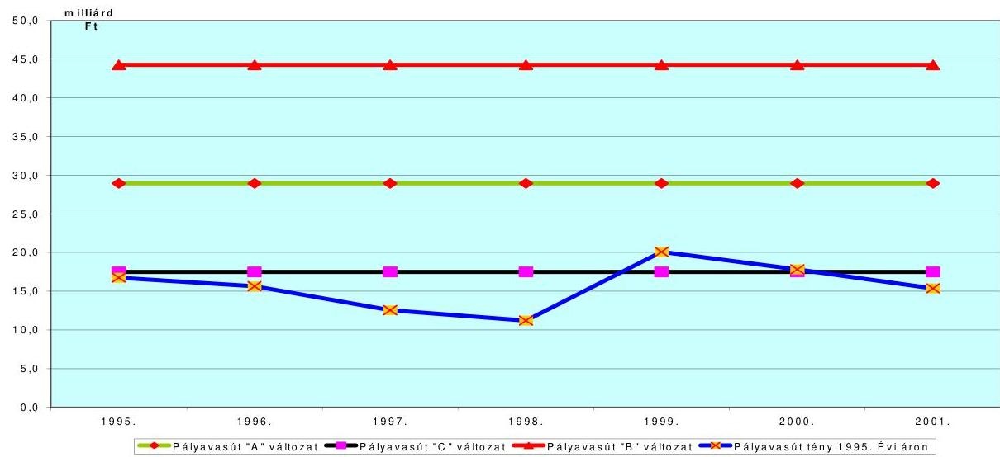

A VÁLLALKOZÓ VASÚTI FORRÁS ALAKULÁSA
1995. évi összehasonlító áron
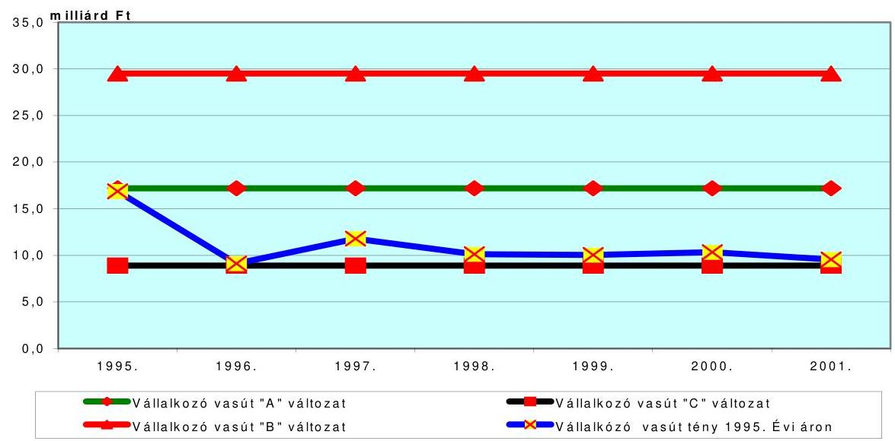

---

A pályavasútnak a fejlesztési trend „C" (csökkentett) változatához képest is 1995-2001-ben forráshiánya volt (1995. évi áron 13,0 Mrd Ft). A vállalkozó vasút forrásai viszont meghaladták a trend „C" (csökkentett) változatában elérhető szintet (1995. évi áron 15,7 Mrd Ft-tal). Többletet 1995-97-ben a nemzetközi forgalomba állított vasúti személykocsik beszerzésére, 1998-2001-ben a GIR-MHR-projektek megvalósítására és a Phare-segélyből finanszírozott záhonyi rakodásfejlesztő beruházásra használták fel.

# A forráshiány miatt elmaradt beruházások hatása a forgalom és üzembiztonságra 

A MÁV Rt elmaradt beruházásainak összege 2001. évi áron 1320 Mrd Ft. Az 1995-ben megállapított 440 Mrd Ft a beruházási infláció miatt 1010 Mrd Ftra alakult. Ezt növeli az 1996-2001 években a beruházási források szűkössége miatt keletkezett további 310 Mrd Ft. Az 1320 Mrd Ft értékű elmaradt beruházásból 855 Mrd Ft a pályavasutat, 465 Mrd Ft pedig a vállalkozói vasutat érinti. Összetételüket az alábbi ábrák mutatják:

## ELMARADT BERUHÁZÁSOK

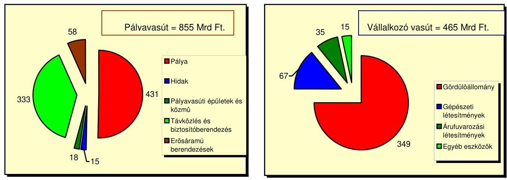

## Pályavasút elmaradt beruházásai

A MÁV 8600 km vonalhálózatának és 14000 csoport kitérőjének meghatározott hányadát - a beépített szerkezetek élettartamának függvényében - pl. évente ki kellene cserélni ahhoz, hogy számottevő állapotromlás ne következzen be. A vonalhálózatnál azonban egyre halmozódik a csere elmaradása a műszakilag szükségestől. 1995-ben ez 3968, 2001-ben 5730 vágánykilométer volt.
A főbb szerkezeteknél a műszaki szükséglettől való elmaradás mértékét foglalja össze az alábbi táblázat, 2001. évi adatokkal.

| Szerkezet   megnevezése | Normatívák alapján   évente cserélendő   mennyiség | Elmaradás a müszaki   szükségességtől | Az elmaradás   költség-értéke   (M Ft) |
| :-- | :-- | :-- | :--: | :--: |
| Felépítménycsere | 400 | vágány-km | 5730 | vágány-km | 291655 |
| Kitérőcsere | 600 | csoport | 5354 | csoport. | 49109 |
| Síncsere | 400 | sínkm | 22496 | sínkm | 12017 |
| Aljcsere | 396 | ezer db | 4431 | ezer db | 48772 |
| Ágyazattisztitás | 344 | vágány-km | 3293 | vágány-km | 29447 |

---

A fejlesztések halmozott elmaradása, valamint a szinten tartáshoz elégtelen karbantartás a vasúti pályák fokozatos elhasználódását eredményezte. A következmény pedig az egyre növekvő mértékű sebességkorlátozás forgalombiztonsági okokból történő bevezetése.

# Vállalkozó vasút elmaradt beruházásai 

A MÁV Rt. a vasúti járművek műszaki élettartamát átlagosan 33 évben határozta meg. Ezen időszak alatt az üzemképes állapot csak úgy biztosítható, ha a rendszeres karbantartás mellett - a jármú típusától és múszaki kialakításától függő - felújítás megtörténik. A felújítás elmaradásának következménye, hogy a gördülőállománnyal nyújtható szolgáltatás színvonala romlik, a járművek üzemkészsége a karbantartásra fordított költségek növekedése ellenére csökken.

2001-ben a gördülőállomány elmaradt beruházásainak értéke 374 Mrd forint volt a fejlesztési trend „A" változatához viszonyítva. A mozdonyparkból hiányoznak a $160-200 \mathrm{~km} / \mathrm{h}$ sebességú villamos mozdonyok, és nem történt meg a túlüzemelt villamos és dízelmozdonyok selejtezése. A mozdonyparkon belül a felújított és korszerűsített (jó állapotú és jó hatásfokú) járművek mellett nagy energiafogyasztású és környezetszennyező járművek is üzemben vannak. A legnagyobb utasforgalmat lebonyolító elővárosi személyszállításhoz, a selejtezésre érett elöregedett járművek felváltához 60 db dízel motorvonat (iker-motorkocsi) és 80 db négyrészes villamos motorvonat beszerzésére lenne szükség. A belföldi forgalomban az IC-vonatok jó színvonalú járművein kívül csak elhasznált járművek üzemelnek. A teherkocsibeszerzések és -felújítások elmaradása miatt a MÁV Rt. kénytelen 1320 db-ot bérelni.

Az elmaradt jármúberuházásokat darabszámban és értékben a következő táblázat foglalja össze:

|  | db | Mrd Ft |
| :-- | :--: | :--: |
| Mozdonybeszerzés | 220 | 110 |
| Mozdonyfelújítás | 500 | 40 |
| Motorvonat-beszerzés | 140 | 110 |
| Motorvonat-felújítás | 50 | 5 |
| Személykocsi-beszerzés | 100 | 20 |
| Személykocsi-felújítás | 700 | 54 |
| Teherkocsi-beszerzés | 1320 | 25 |
| Teherkocsi-felújítás | 3000 | 10 |
| Összesen | - | $\mathbf{3 7 4}$ |

A vasúti járművek üzemeltetését biztosító gépészeti infrastruktúra (karbantartó, javító, tisztító bázisok) területén is jelentős az elmaradás. A kedvezőtlen hatás leginkább a budapesti pályaudvarokról induló személyvonatok előkészítésének nehézségeiben, a társaság karbantartó bázisainak elmaradottságában, mutatkozik meg.

---

# Vélemények a beszálló állomásról (Nemzetközi)

## 1 - Nagyon rossz
## 5 - Nagyon jó

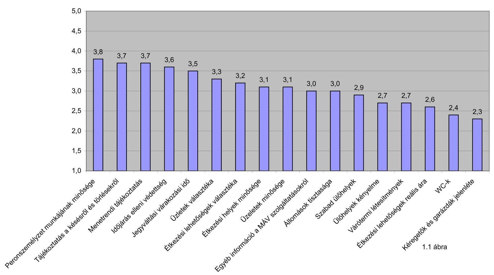

---

# Vélemények a beszálló állomásról (InterCity)

## 1 - Nagyon rossz
## 5 - Nagyon jó

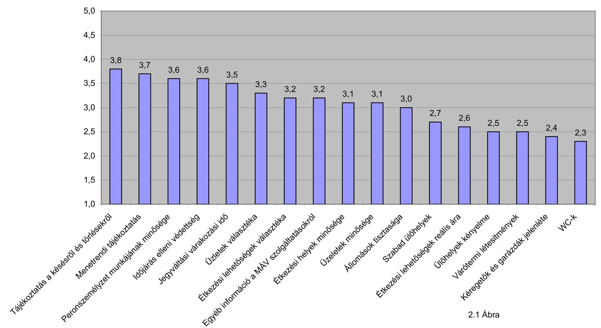

---

# Vélemények a beszálló állomásról (Távolsági)

## Vélemények a beszálló állomásról (Távolsági)

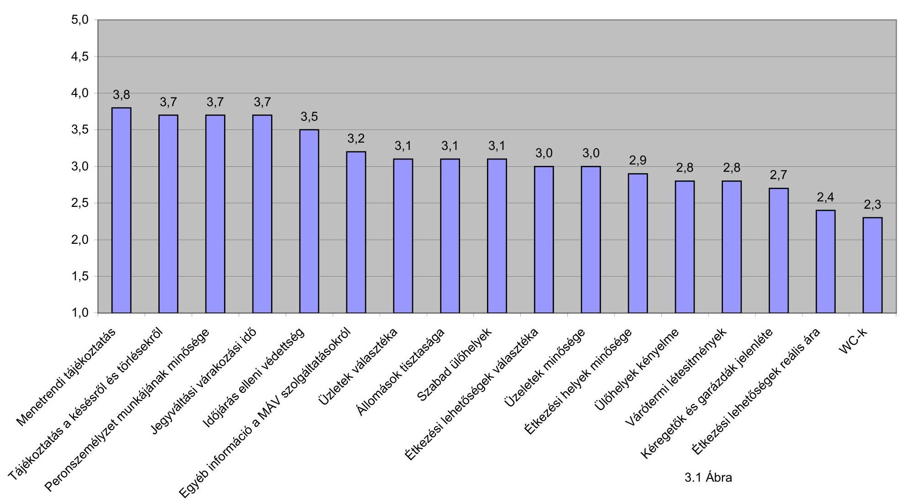

---

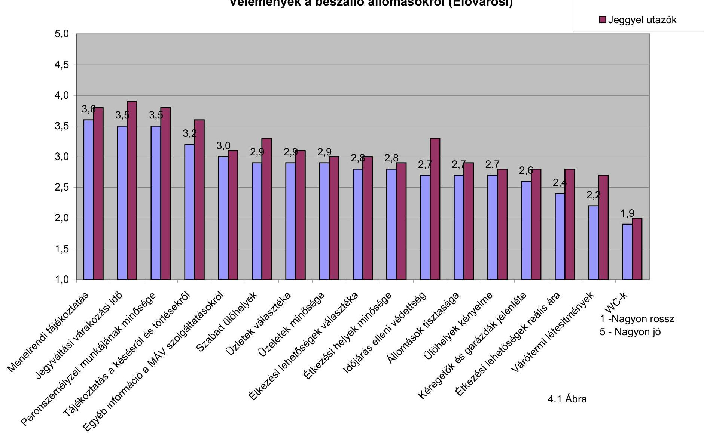

# Vélemények a beszálló állomásokról (Elővárosi)

- Bérlettel utazók
- Jeggyel utazók

---

# Az adott vonatról alkotott vélemény (InterCity)

## 1 - Nagyon rossz
## 5 - Nagyon jó

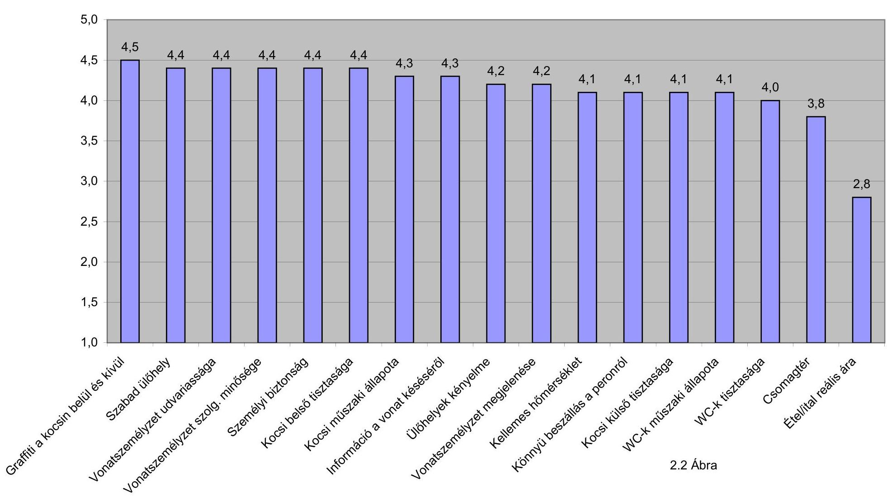

---

# Az adott vonatról alkotott vélemény (Nemzetközi)

## 1 - Nagyon rossz
## 5 - Nagyon jó

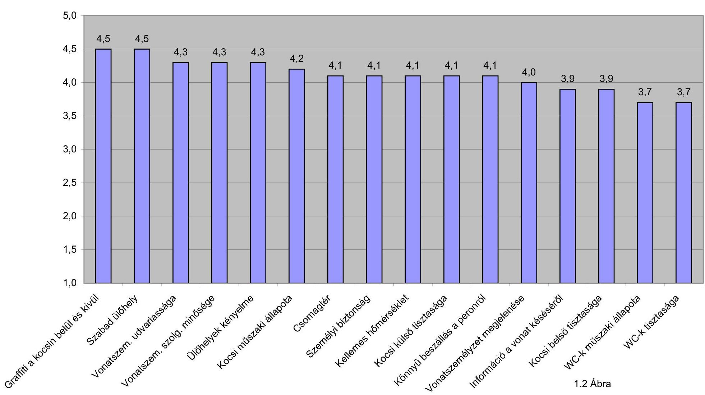

---

# Az adott vonatról alkotott vélemény (Távolsági)

## 1 - Nagyon rossz
## 5 - Nagyon jó

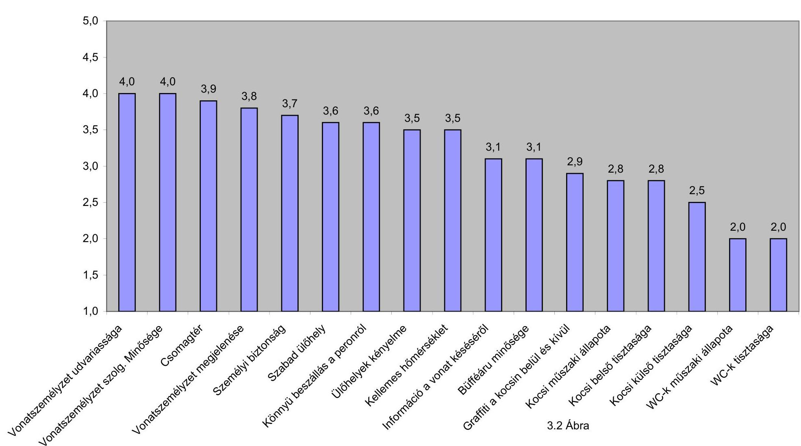

---

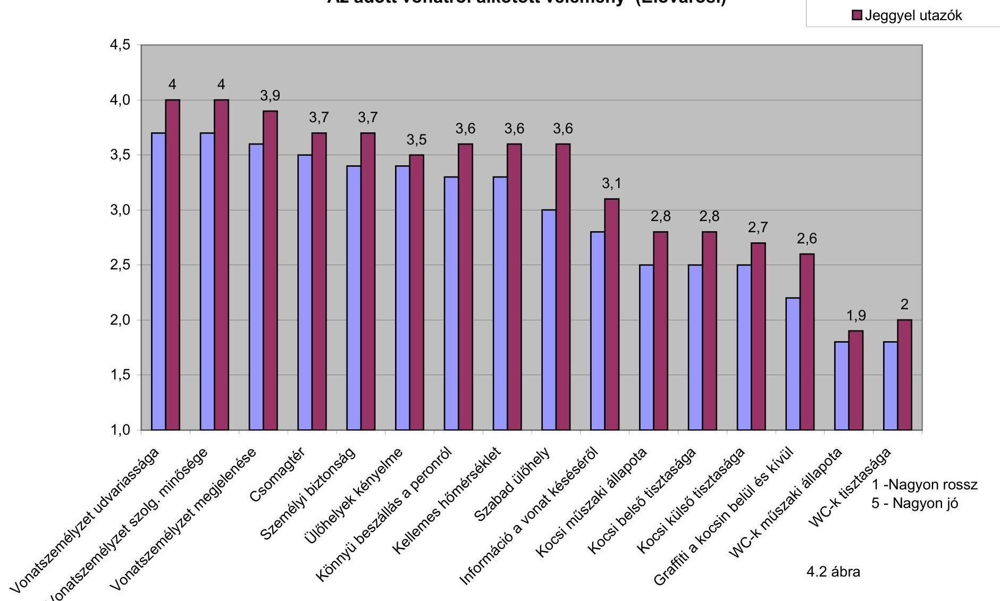

# Az adott vonatról alkotott vélemény (Elővárosi)

- **Bérlettel utazók**: 4.5%
- **Jeggyel utazók**: 4.2 ábra

---

# **Állapotjavító intézkedések fontossága az állomáson (Nemzetközi)**

1. egyáltalán nem fontos
5. nagyon fontos

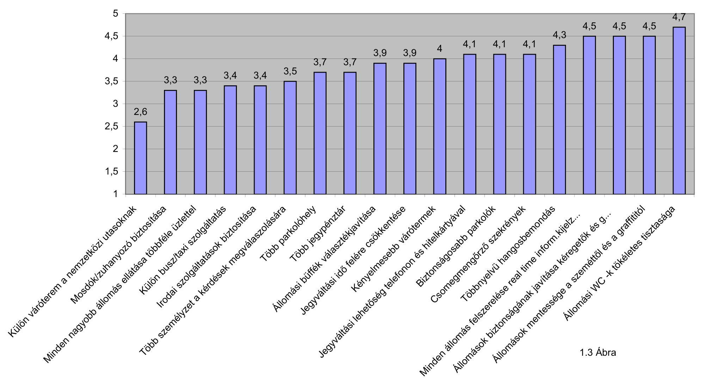

---

# **Állomási állapotjavító intézkedések fontossága (InterCity)**

|  Állomási állapotjavító intézkedések fontossága (InterCity) | 1 - egyáltalán nem fontos  |
| --- | --- |
|   | 5 - nagyon fontos  |

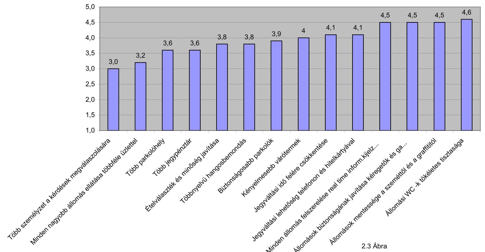

---

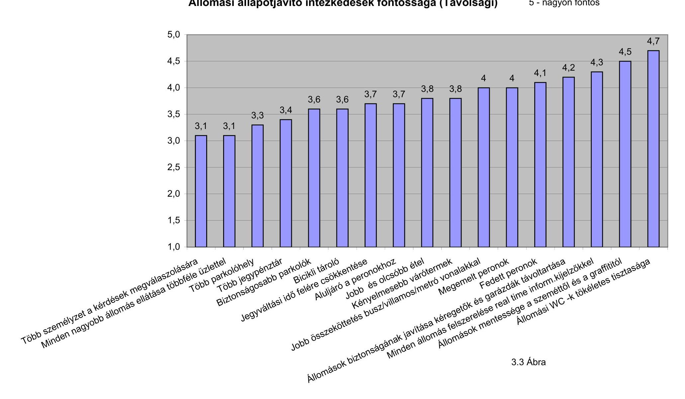

# Állomási állapotjavító intézkedések fontossága (Távolsági)

## 1 - egyáltalán nem fontos

## 5 - nagyon fontos

## 3.3 Ábra

---

# **Állomási állapotjavító intézkedések fontossága (Elővárosi)**

|  1 - egyáltalán nem fontos | 5 - nagyon fontos  |
| --- | --- |
|  |   |

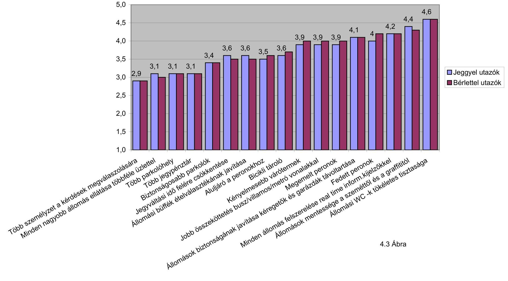

## 4.3 Ábra

---

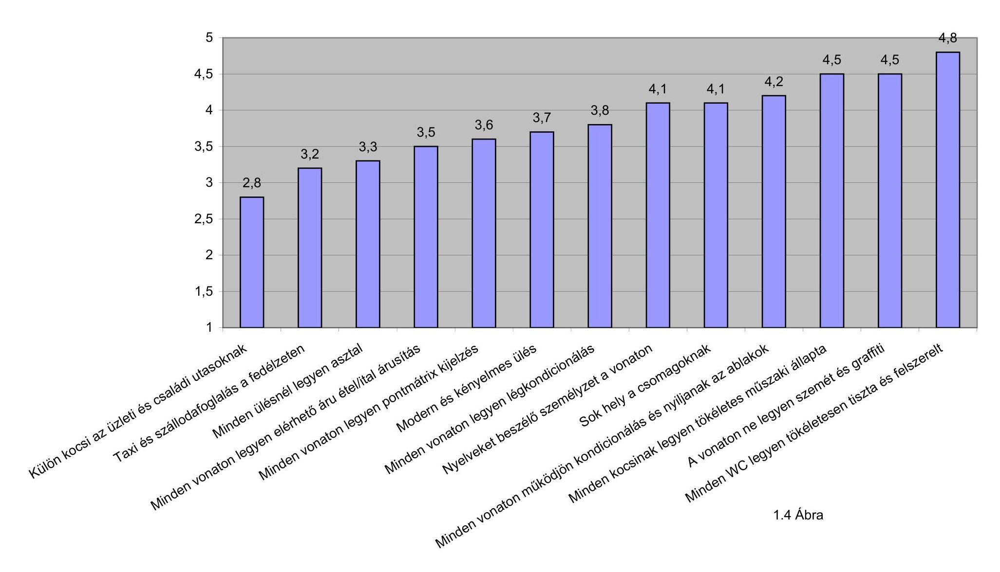

# A vonatok állapotjavításának fontossága (Nemzetközi)

## 1 - egyáltalán nem fontos

## 5 - nagyon fontos

## 4 - egyáltalán nem fontos

## 5 - nagyon fontos

---

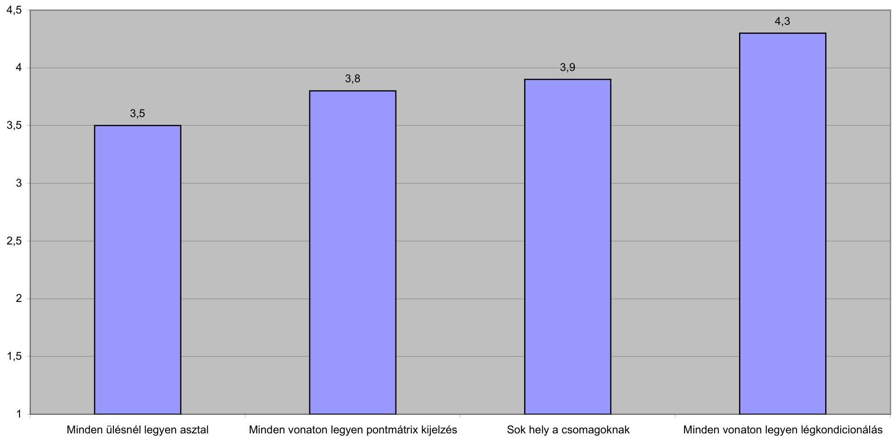

# Vonatok állapotjavításának fontossága (InterCity)

## 1. egyáltalán nem fontos
## 2. nagyon fontos

## 4.3

## 4.5

## 4.5

## Minden ülésnél legyen asztal
## Minden vonaton legyen pontmátrix kijelzés
## Sok hely a csomagoknak
## Minden vonaton legyen légkondicionálás

## 2.4. Ábra

---

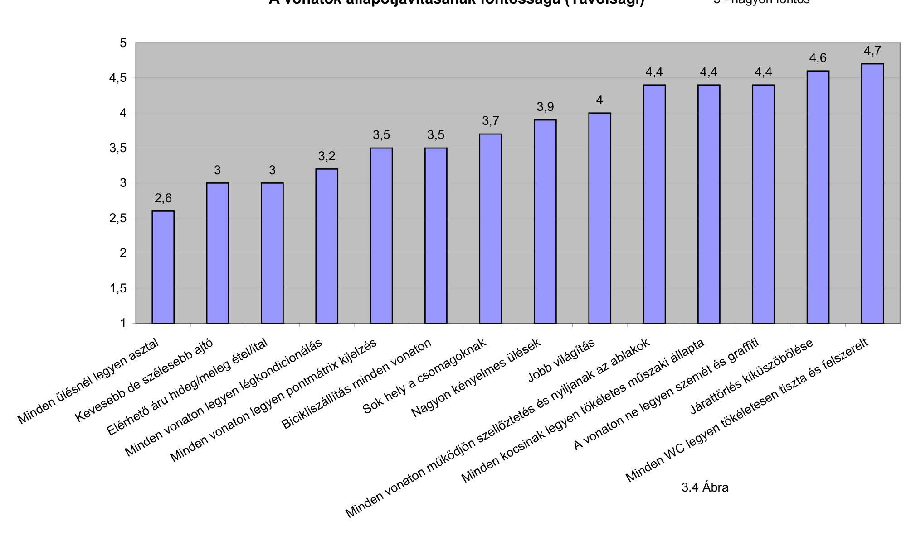

# A vonatok állapotjavításának fontossága (Távolsági)

## 1 - egyáltalán nem fontos

## 5 - nagyon fontos

---

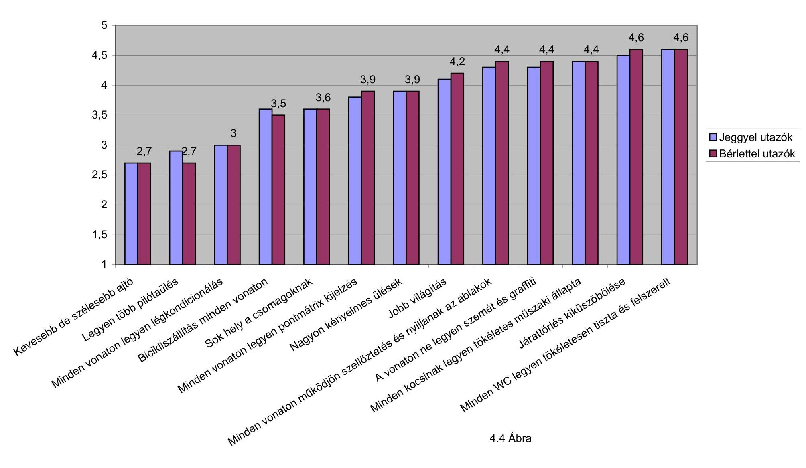

# A vonatok állapotjavításának fontossága (Elővárosi)

## 1. Egyáltalán nem fontos

## 2. Nagyon fontos

## 3. Aztalanos is

## 4. Aztalanos is

## 5. Leggyel utazók

## 6. Bérlettel utazók

## 7. Aztalanos is

## 8. Aztalanos is

## 9. Leggyel utazók

## 10. Bérlettel utazók

---

# MÁV Rt. 

| Megnevezés |  | 1995 | 1996 | 1997 | 1998 | 1999 | 2000 |
| :--: | :--: | :--: | :--: | :--: | :--: | :--: | :--: |
| Utasszám | millió | 154,2 | 155,8 | 155,1 | 155,2 | 155,1 | 154,2 |
| ebből |  |  |  |  |  |  |  |
| hivatásforgalom | millió | 36,2 | 34,2 | 32,9 | 32,7 | 32,1 | 31,2 |
| tanulóforgalom | millió | 21,9 | 23,5 | 23,5 | 22,3 | 19 | 17,8 |
| helyi forgalom ( 30 km -ig) | millió | 77,9 | 78 | 77,2 | 74,7 | 71,6 | 69,7 |
| távolsági forgalom ( 30 km -en felül) | millió | 76,3 | 77,8 | 77,9 | 80,5 | 83,5 | 84,5 |
| Átlagos utazási távolság | km | 53,7 | 54,5 | 55,3 | 56,6 | 60,7 | 62,2 |
| Utaskilométer | millió | 8276 | 8497 | 8583 | 8788 | 9418 | 9595 |
| ebből |  |  |  |  |  |  |  |
| hivatásforgalom | millió | 918 | 866 | 840 | 841 | 837 | 829 |
| tanulóforgalom | millió | 566 | 624 | 618 | 597 | 496 | 460 |
| helyi forgalom ( 30 km -ig) | millió | 1440 | 1443 | 1432 | 1391 | 1338 | 1313 |
| távolsági forgalom ( 30 km -en felül) | millió | 6836 | 7054 | 7151 | 7397 | 8080 | 8282 |

---

MÁV Rt.

Személyszállítás 1995=100\% 2. táblázat rész/egész arány \%

|  Megnevezés |  | 1995 | 1996 | 1997 | 1998 | 1999 | 2000 | 1995-ben | 2000-ben  |
| --- | --- | --- | --- | --- | --- | --- | --- | --- | --- |
|  Utasszám | \% | 100 | 101 | 100,6 | 100,6 | 100,7 | 100 | 100 | 100  |
|  ebből |  |  |  |  |  |  |  |  |   |
|  hivatásforgalom | \% | 100 | 94,5 | 90,9 | 90,3 | 88,7 | 86,2 | 24 | 20,2  |
|  tanulóforgalom | \% | 100 | 107,3 | 107,3 | 101,8 | 86,8 | 81,3 | 14,2 | 11,5  |
|  helyi forgalom (30 km-ig) | \% | 100 | 100 | 99,1 | 95,9 | 91,9 | 89,5 | 50 | 45  |
|  távolsági forgalom (30 km-en felül) | \% | 100 | 102 | 102,1 | 105,5 | 109,4 | 110,8 | 50 | 55  |
|  Átlagos utazási távolság | \% | 100 | 101,5 | 103 | 105,4 | 113 | 115,8 |  |   |
|  Utaskilométer | \% | 100 | 103 | 104 | 106 | 114 | 116 | 100 | 100  |
|  ebből |  |  |  |  |  |  |  |  |   |
|  hivatásforgalom | \% | 100 | 94,3 | 91,5 | 91,6 | 91,2 | 90,3 | 11,1 | 8,6  |
|  tanulóforgalom | \% | 100 | 110,3 | 109,2 | 105,5 | 87,6 | 81,3 | 6,8 | 4,8  |
|  helyi forgalom (30 km-ig) | \% | 100 | 100 | 99 | 97 | 93 | 91 | 17,4 | 13,7  |
|  távolsági forgalom (30 km-en felül) | \% | 100 | 103 | 105 | 108 | 118 | 121 | 82,6 | 86,3  |

---

MÁV Rt.

Áruszállítás

| Megnevezés |  | 1995 | 1996 | 1997 | 1998 | 1999 | 2000 |
| :--: | :--: | :--: | :--: | :--: | :--: | :--: | :--: |
| Elszállított árutonna | millió | 46,4 | 44,6 | 46 | 47,5 | 43,6 | 43,6 |
| ebből |  |  |  |  |  |  |  |
| belföldi forgalom | millió | 19,8 | 20,7 | 19,4 | 19,4 | 17,8 | 15,9 |
| export forgalom | millió | 10,3 | 7,5 | 10 | 10,8 | 9 | 9,5 |
| import forgalom | millió | 12,9 | 13,5 | 13 | 13,6 | 13,6 | 14,6 |
| tranzit forgalom | millió | 3,4 | 2,9 | 3,6 | 3,7 | 3,3 | 3,6 |
| Átlagos szállítási távolság | km | 175,4 | 166,2 | 171,2 | 165,3 | 170,7 | 178,4 |
| Díjszabási árutonna-km | millió | 8132 | 7409 | 7873 | 7852 | 7444 | 7780 |
| ebből |  |  |  |  |  |  |  |
| belföldi forgalom | millió | 2529 | 2513 | 2359 | 2316 | 2294 | 1966 |
| export forgalom | millió | 2142 | 1465 | 1888 | 1826 | 1509 | 1672 |
| import forgalom | millió | 2440 | 2485 | 2521 | 2482 | 2445 | 2881 |
| tranzit forgalom | millió | 1021 | 946 | 1105 | 1228 | 1196 | 1261 |

---

|  Megnevezés |  | 1995 | 1996 | 1997 | 1998 | 1999 | 2000 | 1995-ben | 2000-ben  |
| --- | --- | --- | --- | --- | --- | --- | --- | --- | --- |
|  Elszállított árutonna | millió | 100 | 96,1 | 99,1 | 102,4 | 94 | 94 | 100 | 100  |
|  ebből |  |  |  |  |  |  |  |  |   |
|  belföldi forgalom | millió | 100 | 104,6 | 98 | 98 | 89,9 | 80,3 | 42,7 | 36,5  |
|  export forgalom | millió | 100 | 72,8 | 97,1 | 104,9 | 87,4 | 92,2 | 22,2 | 21,8  |
|  import forgalom | millió | 100 | 104,7 | 100,8 | 105,4 | 105,4 | 113,2 | 27,8 | 33,5  |
|  tranzit forgalom | millió | 100 | 85,3 | 105,9 | 108,8 | 97,1 | 105,9 | 7,3 | 8,2  |
|  Átlagos szállítási távolság | km | 100 | 94,8 | 97,6 | 94,2 | 97,3 | 101,7 |  |   |
|  Díjszabási árutonna-km | millió | 100 | 91 | 97 | 97 | 92 | 96 | 100 | 100  |
|  ebből |  |  |  |  |  |  |  |  |   |
|  belföldi forgalom | millió | 100 | 99 | 93 | 92 | 91 | 78 | 31,1 | 25,3  |
|  export forgalom | millió | 100 | 68 | 88 | 85 | 71 | 78 | 26,3 | 21,2  |
|  import forgalom | millió | 100 | 102 | 103 | 102 | 100 | 118 | 30,3 | 37  |
|  tranzit forgalom | millió | 100 | 92,6 | 108 | 120 | 117 | 124 | 12,6 | 16,5  |

---

A vonatok bruttó elegytonnakilométer teljesítménye (millió elegytkm)
vontatási nemenként

| Megnevezés | 1995 | 1996 | 1997 | 1998 | 1999 | 2000 |
| :--: | :--: | :--: | :--: | :--: | :--: | :--: |
| Dizelvontatás |  |  |  |  |  |  |
| személyforgalom | 2772 | 2635 | 2407 | 2186 | 1987 | 1606 |
| áruforgalom | 3821 | 3142 | 3083 | 2872 | 2498 | 2275 |
| Összesen | 6593 | 5777 | 5490 | 5058 | 4485 | 3881 |
| Dizelmotorkocsi |  |  |  |  |  |  |
| személyforgalom | 1559 | 1643 | 1554 | 1603 | 1645 | 1634 |
| áruforgalom | 0 | 0 | 2 | 3 | 3 | 5 |
| Összesen | 1559 | 1643 | 1556 | 1606 | 1648 | 1639 |
| Villamos vontatás |  |  |  |  |  |  |
| személyforgalom | 10377 | 10573 | 9430 | 9655 | 10037 | 9962 |
| áruforgalom | 13221 | 12135 | 12030 | 12225 | 12244 | 13017 |
| Összesen | 23598 | 22708 | 21460 | 21880 | 22281 | 22979 |
| Gőzvontatás |  |  |  |  |  |  |
| személyforgalom | 1 | 2 | 2 | 2 | 2 | 1 |
| áruforgalom | 0 | 0 | 0 | 0 | 0 | 0 |
| Összesen | 1 | 2 | 2 | 2 | 2 | 1 |
| Valamennyi vontatási nem |  |  |  |  |  |  |
| személyforgalom | 14709 | 14853 | 13393 | 13446 | 13671 | 13203 |
| áruforgalom | 17042 | 15277 | 15115 | 15100 | 14745 | 15297 |
| Összesen | 31751 | 30130 | 28508 | 28546 | 28416 | 28500 |
| sze.forg.\% | 46,3 | 49,3 | 47 | 47,1 | 48,1 | 46,3 |
| áruforg\% | 53,7 | 50,7 | 53 | 52,9 | 51,9 | 53,7 |
| Összesen\% | 100 | 100 | 100 | 100 | 100 | 100 |
| 1995=100 | 100 | 94,9 | 89,8 | 89,9 | 89,5 | 89,8 |

---

MÁV Rt.

# Személyszállítási bevételek alakulása 

## 6. táblázat

adatok millió Ft-ban
megoszlás megoszlás

| Megnevezés | 1999 | 2000 |
| :-- | :--: | :--: |
|  |  | $\%$ |
| Saját bevételek | 30122 | 33229 |
| Fogyasztói árkiegészítés | 15702 | 16989 |
| Termelési támogatás | 43000 | 46048 |
| ÖSSZESEN | 88824 | 96266 |

| 1999 | 2000 |
| :--: | :--: |
| $\%$ | $\%$ |
| 33,9 | 34,5 |
|  |  |
| 17,7 | 17,7 |
|  |  |
| 48,4 | 47,8 |
|  |  |
| 100 | 100 |

---

# Áruszállítási bevételek 

adatok millió Ft-ban
7. táblázat

| Megnevezés | 1999 | 2000 |
| :-- | --: | --: |
| Közforgalmú fuvardíjak | 53674 | 59161 |
| Ezen belül MÁV fuvardíj | 51218 | 56488 |
| Mellékdíjak | 3712 | 4516 |
| Egyéb | 6393 | 7441 |
| ÖSSZESEN | 63779 | 71118 |

---

# Közvetlen állami támogatás múködéshez és beruházáshoz 

adatok millió Ft-ban
8. táblázat

| Megnevezés | 1999 | 2000 |
| :--: | :--: | :--: |
| Múködéshez állami támogatás összesen | 66499 | 70216 |
| Ebből: |  |  |
| Fogyasztói árkiegészítés | 15702 | 16989 |
| Termelési támogatás | 43000 | 46048 |
| Kárhelyreállítás | 823 | 272 |
| Beruházáshoz állami támogatás összesen | 26125 | 26355 |
| Mindösszesen | 92624 | 96571 |

---

|  Termékcsoport | január | február | március | április | május | június | július | aug. | szept. | október | nov. | dec. | 2000. év  |
| --- | --- | --- | --- | --- | --- | --- | --- | --- | --- | --- | --- | --- | --- |
|  Nemzetközi EC vonatok | 76,69 | 82,08 | 82,50 | 67,86 | 66,29 | 59,50 | 55,24 | 63,03 | 68,81 | 70,36 | 78,33 | 85,28 | 70,68  |
|  Nemzetközi IC, EN, gyors | 72,41 | 78,62 | 78,64 | 63,72 | 75,95 | 71,07 | 69,46 | 69,26 | 70,05 | 72,98 | 76,47 | 80,67 | 73,06  |
|  Egyéb nemzetközi vonatok | 96,03 | 98,05 | 94,57 | 94,10 | 94,10 | 93,69 | 93,43 | 94,47 | 91,43 | 91,71 | 95,71 | 96,77 | 94,59  |
|  Belföldi InterCity | 90,73 | 93,03 | 92,70 | 84,34 | 93,25 | 94,74 | 96,81 | 95,32 | 95,12 | 94,45 | 95,04 | 96,69 | 93,78  |
|  Belföldi InterPici | 96,55 | 98,43 | 98,17 | 89,53 | 97,77 | 95,99 | 97,64 | 96,50 | 98,31 | 97,49 | 98,13 | 97,09 | 96,76  |
|  Belföldi gyors | 86,75 | 87,17 | 84,54 | 76,12 | 83,79 | 91,48 | 91,93 | 90,88 | 90,16 | 88,91 | 91,19 | 93,10 | 87,14  |
|  Belföldi sebes | 87,13 | 91,71 | 88,30 | 84,16 | 87,38 | 88,62 | 90,48 | 90,11 | 90,55 | 90,49 | 90,33 | 91,34 | 89,35  |
|  Fővonali személy | 93,15 | 87,00 | 91,99 | 84,96 | 91,01 | 95,71 | 95,83 | 94,89 | 96,18 | 94,87 | 96,44 | 96,96 | 93,51  |
|  Helyi személy | 97,67 | 98,01 | 97,86 | 95,86 | 97,89 | 98,25 | 98,60 | 98,21 | 98,27 | 98,13 | 98,37 | 98,44 | 97,97  |
|  Budapest elővárosi | 94,43 | 94,30 | 91,47 | 90,84 | 93,15 | 96,38 | 96,38 | 96,22 | 95,85 | 95,39 | 94,87 | 96,02 | 94,62  |
|  Posta | 85,25 | 88,73 | 86,29 | 72,16 | 84,68 | 89,80 | 88,09 | 84,67 | 76,96 | 68,97 | 62,24 | 59,73 | 78,81  |
|  Összesen: | 95,22 | 95,74 | 95,05 | 92,01 | 95,08 | 96,15 | 96,47 | 96,10 | 96,19 | 95,97 | 96,29 | 96,79 | 95,60  |

Menetrendszerűség: az összes közlekedtetett vonatból az 5 percnél kevesebb késéssel célállomásra érkezett vonatok száma, \%-os értékben

---

# A vonatok menetrendszerűségének változása 2000-ben 

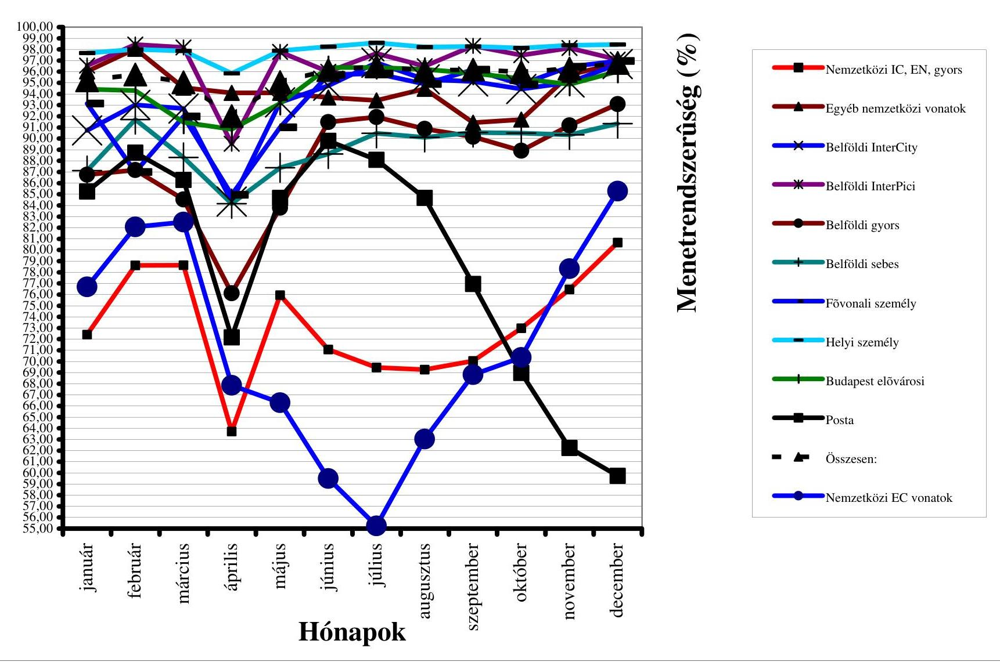

---

|  Igazgatóság | Nemzetközi forgalomban |  |  |  |  |  |  |  |   |
| --- | --- | --- | --- | --- | --- | --- | --- | --- | --- |
|   | április | május | június | július | augusztus | szeptember | október | november | december  |
|  Budapest | 14,22\% | 13,01\% | 15,32\% | 11,56\% | 9,25\% | 9,21\% | 12,12\% | 11,10\% | 8,03\%  |
|  Debrecen | 0,85\% | 0,94\% | 0,78\% | 0,38\% | 0,76\% | 0,00\% | 0,38\% | 0,20\% | 0,38\%  |
|  Miskolc | 0,00\% | 1,47\% | 9,09\% | 6,67\% | 7,58\% | 1,14\% | 3,64\% | 4,85\% | 0,61\%  |
|  Pécs | 0,86\% | 1,34\% | 0,92\% | 0,24\% | 0,58\% | 1,01\% | 1,24\% | 0,64\% | 1,61\%  |
|  Szeged | 20,38\% | 17,50\% | 9,25\% | 10,61\% | 21,75\% | 18,03\% | 14,17\% | 12,69\% | 15,19\%  |
|  Szombathely | 0,00\% | 0,00\% | 0,00\% | 0,00\% | 0,00\% | 0,00\% | 0,00\% | 0,00\% | 0,00\%  |
|  Összesen | 8,84\% | 8,38\% | 9,24\% | 7,47\% | 8,43\% | 7,22\% | 8,34\% | 7,56\% | 6,52\%  |
|  Igazgatóság | Belföldi forgalomban |  |  |  |  |  |  |  |   |
|   | április | május | június | július | augusztus | szeptember | október | november | december  |
|  Budapest | 2,82\% | 2,30\% | 2,20\% | 1,38\% | 2,18\% | 1,50\% | 1,67\% | 2,30\% | 2,15\%  |
|  Debrecen | 0,09\% | 0,10\% | 0,05\% | 0,08\% | 0,07\% | 0,08\% | 0,14\% | 0,22\% | 0,28\%  |
|  Miskolc | 2,75\% | 3,33\% | 52,91\% | 46,68\% | 46,32\% | 32,56\% | 44,90\% | 36,33\% | 38,65\%  |
|  Pécs | 1,38\% | 1,31\% | 1,36\% | 1,19\% | 1,11\% | 1,20\% | 1,34\% | 1,20\% | 1,33\%  |
|  Szeged | 2,47\% | 3,29\% | 3,65\% | 2,49\% | 2,33\% | 3,95\% | 3,92\% | 3,74\% | 2,94\%  |
|  Szombathely | 0,39\% | 0,56\% | 0,57\% | 0,99\% | 0,61\% | 1,73\% | 1,94\% | 2,60\% | 0,72\%  |
|  Összesen | 1,79\% | 1,85\% | 5,92\% | 4,91\% | 5,13\% | 5,11\% | 5,41\% | 5,10\% | 4,71\%  |
|  Igazgatóság | Összesen |  |  |  |  |  |  |  |   |
|   | április | május | június | július | augusztus | szeptember | október | november | december  |
|  Budapest | 4,02\% | 3,33\% | 3,20\% | 2,16\% | 2,73\% | 2,09\% | 2,49\% | 2,98\% | 2,62\%  |
|  Debrecen | 0,14\% | 0,15\% | 0,08\% | 0,09\% | 0,10\% | 0,07\% | 0,15\% | 0,22\% | 0,28\%  |
|  Miskolc | 2,42\% | 3,11\% | 51,02\% | 44,98\% | 44,72\% | 31,02\% | 43,19\% | 35,05\% | 37,05\%  |
|  Pécs | 1,35\% | 1,31\% | 1,34\% | 1,14\% | 1,08\% | 1,19\% | 1,34\% | 1,17\% | 1,35\%  |
|  Szeged | 3,42\% | 4,05\% | 3,98\% | 2,96\% | 3,47\% | 4,77\% | 4,51\% | 4,25\% | 3,65\%  |
|  Szombathely | 0,38\% | 0,54\% | 0,55\% | 0,96\% | 0,59\% | 1,67\% | 1,88\% | 2,52\% | 0,69\%  |
|  Összesen | 2,33\% | 2,32\% | 6,11\% | 5,05\% | 5,32\% | 5,23\% | 5,58\% | 5,24\% | 4,81\%  |

Eltérés a SZVÖR-től: az összes vonatforgalomból (közlekedett vonatok) a meghirdetett menetrendhez képest eltérően közlekededtt vonatok \%-os értéke

---

Eltérés a Személy Vonat Összeállítási Rendtől 2000. IV-XII. hóban összesen

| Igazgatóság | Nemzetközi |  |  |
| :--: | :--: | :--: | :--: |
|  | közlekedet | eltérő | arány |
| Budapest | 23523 | 2735 | 11,63\% |
| Debrecen | 5212 | 29 | 0,56\% |
| Miskolc | 4406 | 127 | 2,88\% |
| Pécs | 7273 | 68 | 0,93\% |
| Szeged | 8359 | 1291 | 15,44\% |
| Szombathely | 4157 | 0 | 0,00\% |
| összesen | 52930 | 4250 | 8,03\% |
| Igazgatóság | Belföldi |  |  |
|  | közlekedet | eltérő | arány |
| Budapest | 262171 | 5350 | 2,04\% |
| Debrecen | 106188 | 131 | 0,12\% |
| Miskolc | 69500 | 23787 | 34,23\% |
| Pécs | 118387 | 1502 | 1,27\% |
| Szeged | 137908 | 4407 | 3,20\% |
| Szombathely | 125550 | 1413 | 1,13\% |
| összesen | 819704 | 36590 | 4,46\% |
| Igazgatóság | Összesen |  |  |
|  | közlekedet | eltérő | arány |
| Budapest | 285694 | 8085 | 2,83\% |
| Debrecen | 111400 | 160 | 0,14\% |
| Miskolc | 73906 | 23914 | 32,36\% |
| Pécs | 125660 | 1570 | 1,25\% |
| Szeged | 146267 | 5698 | 3,90\% |
| Szombathely | 129707 | 1413 | 1,09\% |
| összesen | 872634 | 40840 | 4,68\% |

---

A menetrendszerűség változása (\%)

2001. I-XI. hó

|  Termékcsoport | január | február | március | április | május | június | július | augusztus | szept. | október | november  |
| --- | --- | --- | --- | --- | --- | --- | --- | --- | --- | --- | --- |
|  Nemzetközi EC vonatok | 90,93 | 89,51 | 83,47 | 78,33 | 78,38 | 72,29 | 64,11 | 72,58 | 73,13 | 80,24 | 79,79  |
|  Nemzetközi IC, EN, gyors | 86,29 | 87,28 | 84,12 | 81,63 | 80,56 | 76,34 | 69,32 | 71,80 | 73,32 | 78,93 | 71,66  |
|  Egyéb nemzetközi vonatok | 97,70 | 96,43 | 96,77 | 97,62 | 96,28 | 90,14 | 93,26 | 95,32 | 94,24 | 95,01 | 90,30  |
|  Belföldi InterCity | 95,93 | 97,32 | 96,85 | 96,13 | 94,24 | 96,41 | 94,73 | 95,63 | 90,68 | 92,31 | 90,62  |
|  Belföldi InterPici | 98,28 | 99,12 | 98,61 | 98,77 | 97,28 | 98,91 | 98,12 | 98,36 | 98,06 | 96,87 | 96,57  |
|  Belföldi gyors | 94,95 | 94,97 | 93,35 | 91,59 | 90,67 | 90,13 | 87,94 | 87,87 | 84,97 | 88,34 | 84,65  |
|  Belföldi sebes | 93,92 | 95,44 | 94,44 | 94,57 | 89,85 | 87,16 | 84,95 | 85,59 | 84,32 | 87,79 | 83,74  |
|  Fővonali személy | 97,06 | 98,43 | 96,72 | 97,04 | 95,01 | 95,25 | 95,29 | 95,45 | 93,07 | 94,51 | 92,96  |
|  Helyi személy | 98,84 | 99,01 | 98,77 | 98,83 | 98,27 | 97,86 | 97,31 | 97,55 | 97,25 | 96,92 | 96,56  |
|  Budapest elővárosi | 96,71 | 97,46 | 97,16 | 96,56 | 96,58 | 95,37 | 94,18 | 94,90 | 94,46 | 95,54 | 94,13  |
|  Posta | 83,00 | 84,31 | 72,87 | 72,30 | 71,43 | 79,43 | 78,72 | 76,00 | 71,09 | 64,25 | 64,66  |
|  Összesen: | 97,61 | 98,03 | 97,50 | 97,30 | 96,50 | 95,84 | 94,85 | 95,28 | 94,70 | 95,15 | 94,10  |

---

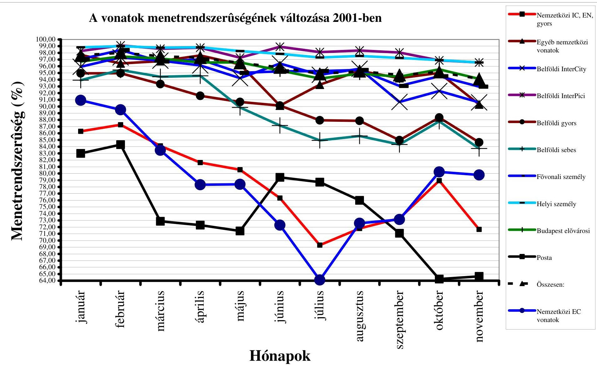

# A vonatok menetrendszerűségének változása 2001-ben

## Menetrendszerűség (%)

|  Igen | Minősít | Minősít  |
| --- | --- | --- |
|  0 | 0 | 0  |
|  99,00 | 99,00 | 99,00  |
|  98,00 | 98,00 | 98,00  |
|  97,00 | 97,00 | 97,00  |
|  96,00 | 96,00 | 96,00  |
|  95,00 | 95,00 | 95,00  |
|  94,00 | 94,00 | 94,00  |
|  93,00 | 93,00 | 93,00  |
|  92,00 | 92,00 | 92,00  |
|  91,00 | 91,00 | 91,00  |
|  90,00 | 90,00 | 90,00  |
|  89,00 | 89,00 | 89,00  |
|  88,00 | 88,00 | 88,00  |
|  87,00 | 87,00 | 87,00  |
|  86,00 | 86,00 | 86,00  |
|  85,00 | 85,00 | 85,00  |
|  84,00 | 84,00 | 84,00  |
|  83,00 | 83,00 | 83,00  |
|  82,00 | 82,00 | 82,00  |
|  81,00 | 81,00 | 81,00  |
|  80,00 | 80,00 | 80,00  |
|  79,00 | 79,00 | 79,00  |
|  78,00 | 78,00 | 78,00  |
|  77,00 | 77,00 | 77,00  |
|  76,00 | 76,00 | 76,00  |
|  75,00 | 75,00 | 75,00  |
|  74,00 | 74,00 | 74,00  |
|  73,00 | 73,00 | 73,00  |
|  72,00 | 72,00 | 72,00  |
|  71,00 | 71,00 | 71,00  |
|  70,00 | 70,00 | 70,00  |
|  69,00 | 69,00 | 69,00  |
|  68,00 | 68,00 | 68,00  |
|  67,00 | 67,00 | 67,00  |
|  66,00 | 66,00 | 66,00  |
|  65,00 | 65,00 | 65,00  |
|  64,00 | 64,00 | 64,00  |
|  63,00 | 63,00 | 63,00  |
|  62,00 | 62,00 | 62,00  |
|  61,00 | 61,00 | 61,00  |
|  60,00 | 60,00 | 60,00  |
|  59,00 | 59,00 | 59,00  |
|  58,00 | 58,00 | 58,00  |
|  57,00 | 57,00 | 57,00  |
|  56,00 | 56,00 | 56,00  |
|  55,00 | 55,00 | 55,00  |
|  54,00 | 54,00 | 54,00  |
|  53,00 | 53,00 | 53,00  |
|  52,00 | 52,00 | 52,00  |
|  51,00 | 51,00 | 51,00  |
|  50,00 | 50,00 | 50,00  |
|  49,00 | 49,00 | 49,00  |
|  48,00 | 48,00 | 48,00  |
|  47,00 | 47,00 | 47,00  |
|  46,00 | 46,00 | 46,00  |
|  45,00 | 45,00 | 45,00  |
|  44,00 | 44,00 | 44,00  |
|  43,00 | 43,00 | 43,00  |
|  42,00 | 42,00 | 42,00  |
|  41,00 | 41,00 | 41,00  |
|  40,00 | 40,00 | 40,00  |
|  39,00 | 39,00 | 39,00  |
|  38,00 | 38,00 | 38,00  |
|  37,00 | 37,00 | 37,00  |
|  36,00 | 36,00 | 36,00  |
|  35,00 | 35,00 | 35,00  |
|  34,00 | 34,00 | 34,00  |
|  33,00 | 33,00 | 33,00  |
|  32,00 | 32,00 | 32,00  |
|  31,00 | 31,00 | 31,00  |
|  30,00 | 30,00 | 30,00  |
|  29,00 | 29,00 | 29,00  |
|  28,00 | 28,00 | 28,00  |
|  27,00 | 27,00 | 27,00  |
|  26,00 | 26,00 | 26,00  |
|  25,00 | 25,00 | 25,00  |
|  23,00 | 23,00 | 23,00  |
|  21,00 | 21,00 | 21,00  |
|  19,00 | 19,00 | 19,00  |
|  18,00 | 18,00 | 18,00  |
|  17,00 | 17,00 | 17,00  |
|  16,00 | 16,00 | 16,00  |
|  15,00 | 15,00 | 15,00  |
|  13,00 | 13,00 | 13,00  |
|  11,00 | 11,00 | 11,00  |
|  10,00 | 10,00 | 10,00  |
|  9,00 | 9,00 | 9,00  |
|  8,00 | 8,00 | 8,00  |
|  7,00 | 7,00 | 7,00  |
|  6,00 | 6,00 | 6,00  |
|  5,00 | 5,00 | 5,00  |
|  4,00 | 4,00 | 4,00  |
|  3,00 | 3,00 | 3,00  |
|  2,00 | 2,00 | 2,00  |
|  1,00 | 1,00 | 1,00  |
|  0,00 | 0,00 | 0,00  |
|  0,00 | 0,00 | 0,00  |
|  0,00 | 0,00 | 0,00  |
|  0,00 | 0,00 | 0,00  |
|  0,00 | 0,00 | 0,00  |
|  0,00 | 0,00 | 0,00  |
|  0,00 | 0,00 | 0,00  |
|  0,00 | 0,00 | 0,00  |
|  0,00 | 0,00 | 0,00  |
|  0,00 | 0,00 | 0,00  |
|  0,00 | 0,00 | 0,00  |
|  0,00 | 0,00 | 0,00  |
|  0,00 | 0,00 | 0,00  |
|  0,00 | 0,00 | 0,00  |
|  0,00 | 0,00 | 0,00  |
|  0,00 | 0,00 | 0,00  |
|  0,00 | 0,00 | 0,00  |
|  0,00 | 0,00 | 0,00  |
|  0,00 | 0,00 | 0,00  |
|  0,00 | 0,00 | 0,00  |
|  0,00 | 0,00 | 0,00  |
|  0,00 | 0,00 | 0,00  |
|  0,00 | 0,00 | 0,00  |
|  0,00 | 0,00 | 0,00  |
|  0,00 | 0,00 | 0,00  |
|  0,00 | 0,00 | 0,00  |
|  0,00 | 0,00 | 0,00  |
|  0,00 | 0,00 | 0,00  |
|  0,00 | 0,00 | 0,00  |
|  0,00 | 0,00 | 0,00  |
|  0,00 | 0,00 | 0,00  |

---

inungon

---

A Személy Vonat Összeállítási Rendtől való eltérések \%-os arányának változása 2001. I-XI. hó

|  Igazgatóság | Nemzetközi forgalomban |  |  |  |  |  |  |  |  |  |   |
| --- | --- | --- | --- | --- | --- | --- | --- | --- | --- | --- | --- |
|   | január | február | március | április | május | június | július | aug. | szept. | október | nov.  |
|  Budapest | 8,33\% | 8,23\% | 7,15\% | 7,11\% | 12,82\% | 13,08\% | 10,27\% | 19,09\% | 9,64\% | 10,12\% | 6,48\%  |
|  Debrecen | 0,38\% | 0,42\% | 1,33\% | 0,39\% | 0,38\% | 0,67\% | 8,06\% | 0,00\% | 0,00\% | 0,92\% | 1,88\%  |
|  Miskolc | 1,21\% | 0,00\% | 3,03\% | 1,57\% | 2,25\% | 1,16\% | 0,90\% | 0,00\% | 1,05\% | 1,16\% | 1,75\%  |
|  Pécs | 0,99\% | 0,82\% | 1,11\% | 0,90\% | 1,36\% | 2,04\% | 2,02\% | 2,20\% | 1,96\% | 1,48\% | 0,69\%  |
|  Szeged | 10,61\% | 8,29\% | 12,85\% | 13,64\% | 19,88\% | 9,12\% | 13,53\% | 20,84\% | 18,10\% | 14,06\% | 17,52\%  |
|  Szombathely | 0,00\% | 0,00\% | 0,00\% | 0,00\% | 0,00\% | 0,00\% | 0,00\% | 0,00\% | 0,00\% | 0,00\% | 0,00\%  |
|  Összesen | 6,34\% | 5,77\% | 6,43\% | 6,05\% | 9,13\% | 8,58\% | 8,41\% | 13,56\% | 8,15\% | 7,59\% | 6,00\%  |
|  Igazgatóság | Belföldi forgalomban |  |  |  |  |  |  |  |  |  |   |
|   | január | február | március | április | május | június | július | aug. | szept. | október | nov.  |
|  Budapest | 2,21\% | 2,10\% | 1,38\% | 0,72\% | 0,96\% | 1,32\% | 1,77\% | 1,33\% | 1,50\% | 1,48\% | 1,07\%  |
|  Debrecen | 0,17\% | 0,17\% | 0,07\% | 0,05\% | 0,08\% | 0,06\% | 0,10\% | 0,13\% | 0,75\% | 0,41\% | 0,57\%  |
|  Miskolc | 37,90\% | 39,53\% | 39,04\% | 8,00\% | 10,96\% | 20,42\% | 24,05\% | 26,26\% | 10,86\% | 8,46\% | 13,05\%  |
|  Pécs | 1,07\% | 1,12\% | 1,27\% | 1,15\% | 1,27\% | 1,50\% | 1,58\% | 1,53\% | 1,38\% | 1,19\% | 1,28\%  |
|  Szeged | 2,04\% | 2,11\% | 2,14\% | 2,85\% | 3,73\% | 3,16\% | 1,45\% | 2,30\% | 5,12\% | 4,47\% | 3,86\%  |
|  Szombathely | 0,86\% | 0,71\% | 0,36\% | 1,05\% | 1,30\% | 1,58\% | 0,82\% | 0,91\% | 0,61\% | 0,84\% | 1,56\%  |
|  Összesen | 4,46\% | 4,53\% | 4,26\% | 1,99\% | 2,57\% | 4,00\% | 4,13\% | 4,49\% | 3,07\% | 2,51\% | 3,05\%  |
|  Igazgatóság | Összesen |  |  |  |  |  |  |  |  |  |   |
|   | január | február | március | április | május | június | július | aug. | szept. | október | nov.  |
|  Budapest | 2,68\% | 2,58\% | 1,89\% | 1,23\% | 1,89\% | 2,21\% | 2,40\% | 2,69\% | 2,18\% | 2,20\% | 1,51\%  |
|  Debrecen | 0,18\% | 0,19\% | 0,12\% | 0,07\% | 0,09\% | 0,08\% | 0,24\% | 0,13\% | 0,74\% | 0,43\% | 0,61\%  |
|  Miskolc | 36,39\% | 37,86\% | 37,52\% | 7,67\% | 10,54\% | 19,63\% | 23,04\% | 25,11\% | 10,43\% | 8,16\% | 12,53\%  |
|  Pécs | 1,06\% | 1,10\% | 1,26\% | 1,14\% | 1,27\% | 1,52\% | 1,60\% | 1,56\% | 1,41\% | 1,21\% | 1,25\%  |
|  Szeged | 2,53\% | 2,46\% | 2,76\% | 3,48\% | 4,28\% | 3,50\% | 2,13\% | 3,14\% | 5,72\% | 4,93\% | 4,47\%  |
|  Szombathely | 0,86\% | 0,71\% | 0,36\% | 1,05\% | 1,30\% | 1,57\% | 0,81\% | 0,90\% | 0,60\% | 0,83\% | 1,54\%  |
|  öÖsszesen | 4,56\% | 4,59\% | 4,38\% | 2,21\% | 2,90\% | 4,23\% | 4,34\% | 4,93\% | 3,33\% | 2,78\% | 3,20\%  |

---

Eltérés a Személy Vonat Összeállítási Rendtől 2001. I-XI. hóban összesen

| Igazgatóság | Nemzetközi |  |  |
| :--: | :--: | :--: | :--: |
|  | közlekedet | eltérő | arány |
| Budapest | 28737 | 2931 | 10,20\% |
| Debrecen | 4425 | 45 | 1,02\% |
| Miskolc | 5460 | 70 | 1,28\% |
| Pécs | 8021 | 111 | 1,38\% |
| Szeged | 8796 | 1212 | 13,78\% |
| Szombathely | 696 | 0 | 0,00\% |
| összesen | 56135 | 4369 | 7,78\% |
| Igazgatóság | Belföldi |  |  |
|  | közlekedet | eltérő | arány |
| Budapest | 332513 | 4784 | 1,44\% |
| Debrecen | 126399 | 293 | 0,23\% |
| Miskolc | 117657 | 23183 | 19,70\% |
| Pécs | 142114 | 1851 | 1,30\% |
| Szeged | 161869 | 4817 | 2,98\% |
| Szombathely | 146042 | 1392 | 0,95\% |
| összesen | 1026594 | 36320 | 3,54\% |
| Igazgatóság | Összesen |  |  |
|  | közlekedet | eltérő | arány |
| Budapest | 361250 | 7715 | 2,14\% |
| Debrecen | 130824 | 338 | 0,26\% |
| Miskolc | 123117 | 23253 | 18,89\% |
| Pécs | 150135 | 1962 | 1,31\% |
| Szeged | 170665 | 6029 | 3,53\% |
| Szombathely | 146738 | 1392 | 0,95\% |
| összesen | 1082729 | 40689 | 3,76\% |