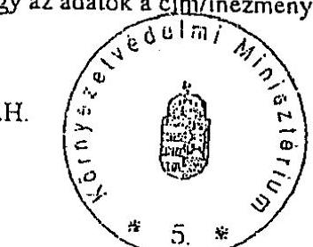
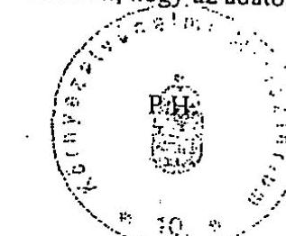
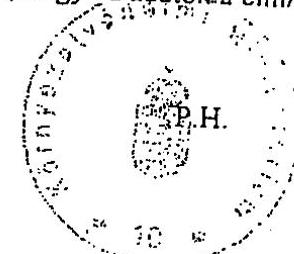
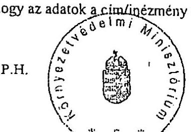
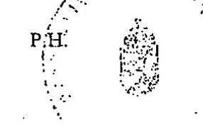
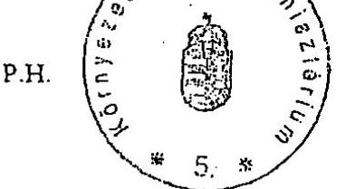
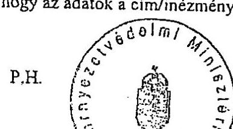
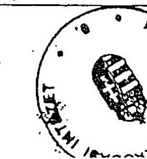
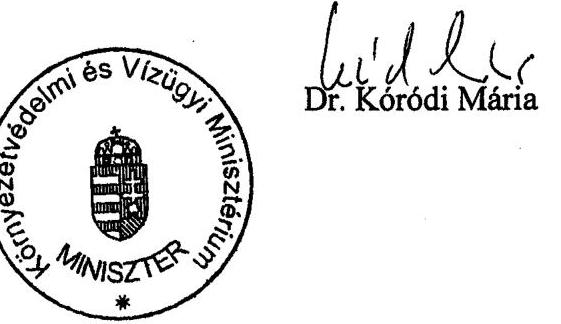

# JELENTÉS 

a Környezetvédelmi Minisztérium fejezet működésének ellenőrzéséről
2002. május

---

# 2. Államháztartás Központi Szintjét Ellenőrző Igazgatóság 

2.3. Átfogó Ellenőrzési Főcsoport
V-15-132/2001-2002.

## Az ellenőrzést felügyelte:   Bihary Zsigmond   főigazgató

## Az ellenőrzés végrehajtásáért felelős:

Hegedűsné dr. Müllern Veronika főcsoportfőnök

## Az ellenőrzést vezette:

Papp Sándor osztályvezető főtanácsos
Az összefoglaló jelentés készítésében közreműködött:
dr. Ligeti Miklós tanácsadó
dr. Márkus Gábor főtanácsadó
Szélpál Ferenc számvevő tanácsos

Az ellenőrzést végezték:

| Alexovics Ágota   tanácsos | Koronczai Sándorné   számvevő tanácsos | Szélpál Ferenc   számvevő tanácsos |
| :-- | :-- | :-- |
| Bialkó Zsolt | Korondi János   külső munkatárs | Szijártó Károly   tanácsadó |
| Burenzsargal Narantuja   számvevő | Kozák György   irodavezető | Tóthné Kiss Katalin   számvevő tanácsos |
| Csóry Györgyné   tanácsadó | dr. Ligeti Miklós   tanácsadó | Valu Tibor   számvevő tanácsos |
| Gyarmati István   számvevő tanácsos | dr. Márkus Gábor   főtanácsadó | Vargáné Loch Márta   külső szakértő |
| Herczeg Júlia   tanácsadó | Papp Sándor   osztályvezető főtanácsos | Tukacs Éva   számvevő |
| dr. Horváth Erika   számvevő gyakornok | Séra Andrásné   főtanácsadó | Vas Lajos   főtanácsadó |
| dr. Horváth Gyula   külső szakértő | Szarka Péterné   osztályvezető főtanácsos |  |
| Kersmajer Ágota   számvevő | dr. Szemerics Györgyi   számvevő tanácsos |  |

## Az ÁSZ által a témában eddig készített jelentések:

1. A Központi Környezetvédelmi Alap pénzügyi-gazdasági ellenőrzése 1995.
2. Az állami erdővagyon működtetésének ellenőrzése „Gyulaj" Erdészeti és Vadászati Rt., valamint az Ipoly Erdő Rt. 1997-1998. évi gazdálkodása tükrében
3. A Környezetvédelmi és Területfejlesztési Minisztérium fejezet működésének pénzügyi-gazdasági ellenőrzése 1997.
4. Erdőgazdálkodás ellenőrzése
5. A PHARE program helyzete Magyarországon
6. A nemzetközi segélyek monitoring rendszerének ellenőrzéséről 2000.
7. PHARE támogatások felhasználásának vizsgálata 2000.
8. A központi költségvetés területén működő belső kontroll mechanizmus ellenőrzése 2001.

Jelentéseink az Országgyűlés számítógépes hálózatán
és az Interneten a www.asz.hu címen is olvashatók, továbbá a Belügyminisztérium folyóirata, az "Önkormányzati Tájékoztató" rendszeresen közli, valamint a Megyei

Közigazgatási Hivatalvezetők részére is átadásra kerül.

---

# TARTALOMJEGYZÉK 

Bevezetés ..... 5
I. ÖSSZEGZŐ MEGÁLLAPÍTÁSOK, KÖVETKEZTETÉSEK, JAVASLATOK ..... 7
II. RÉSZLETES MEGÁLLAPÍTÁSOK ..... 14

1. A KÖRNYEZETVÉDELMI MINISZTÉRIUM FEJEZETI IRÁNYÍTÓ TEVÉKENYSÉGE ..... 14
1.1. Az ágazat tevékenységét biztosító jogszabályi háttér ..... 14
1.2. A minisztérium szervezeti kialakítása és a szakmai feladatok összhangja ..... 15
1.3. Intézményi struktúra ..... 18
1.4. A szakmai feladatellátás szabályozottsága. ..... 20
1.4.1. A fejezeti kezelésű előirányzatok felhasználásának szabályozottsága ..... 20
1.4.2. A KKA, illetve a KAC szabályozása ..... 21
1.5. A létszám alakulása. ..... 22
1.6. A fejezeti és az intézményi költségvetések tervezése ..... 23
1.7. A fejezeti költségvetés finanszírozása, végrehajtása. ..... 24
1.7.1. A fejezet bevételei. ..... 24
1.7.2. A fejezet kiadásai ..... 24
1.7.3. A fejezet előirányzat maradványa ..... 27
1.7.4. A fejezeti kezelésű előirányzatok ..... 28
1.8. Eszköz- és vagyongazdálkodás. ..... 29
1.9. A gazdasági társaságokban a tulajdonosi jogok gyakorlása ..... 30
1.10. Számviteli rend, bizonylati fegyelem ..... 31
1.11. Az ellenőrzési rendszer. ..... 33
1.11.1. A felügyeleti ellenőrzés ..... 33
1.11.2. A KKA, illetve a KAC ellenőrzésének rendszere ..... 35
1.11.3. A fejezeti kezelésű előirányzatok ellenőrzése ..... 35
1.11.4. A beruházások ellenőrzése ..... 36
1.12. Informatika. ..... 36
2. A NEMZETKÖZI KÖVETELMÉNYEK TELJESÍTÉSÉNEK ÉRTÉKELÉSE ..... 40
3. A FEJEZETI KEZELÉSŰ ELŐIRÁNYZATOK FELHASZNÁLÁSA ..... 41
3.1. A Balaton intézkedési terv és a nagy tavaink védelme program ..... 42
3.2. A védett természeti területek védettségi szintjének helyreállítása előirányzat ..... 43
3.3. A természeti értékek megóvása előirányzat ..... 47
3.4. Természetvédelmi kezelési terv készítése előirányzat ..... 47
3.5. Fejezeti beruházások ..... 48
4. A KÖZPONTI KÖRNYEZETVÉDELMI ALAP ÉS A KÖRNYEZETVÉDELMI ALAP CÉL FELADAT ..... 50
4.1. A KKA és a KAC forrásainak képzése, szakmai célokhoz rendelése ..... 51
4.2. Kiadások ..... 52
5. AZ EU CSATLAKOZÁS KÖRNYEZETVÉDELMI FELTÉTELEINEK TELJESÜLÉSE, A NEMZETKÖZI SEGÉLYEK FELHASZNÁLÁSA ..... 55
5.1. PHARE támogatások ..... 55
5.2. ISPA támogatások ..... 56
6. A KÖRNYEZETVÉDELMI MINISZTÉRIUM FELADATAIHOZ KAPCSOLÓDÓ ÁSZ VIZSGÁLATOK UTÓELLENŐRZÉSÉNEK MEGÁLLAPÍTÁSAI. ..... 58

---

.

---

# Rövidítések jegyzéke 

| ANP | Aggteleki Nemzeti Park |
| :-- | :-- |
| ÁNTSZ | Állami Népegészségügyi és Tisztiorvosi Szolgálat |
| BfNPI | Balatonfelvidéki Nemzeti Park Igazgatóság |
| EU | Európai Unió |
| FIDIC | Fédération Internationale des Ingenieurs-Conseils |
| FKTB | Fejlesztéspolitikai Koordinációs Tárcaközi Bizottság |
| FMB | Fejezeti Monitoring Bizottság |
| FVM | Földművelésügyi és Vidékfejlesztési Minisztérium |
| HM | Honvédelmi Minisztérium |
| IMB | ISPA Monitoring Bizottság |
| ITB | Informatikai Tárcaközi Bizottság |
| IVSZ | ISPA Végrehajtó Szervezete |
| KAC | Környezetvédelmi Alap Célelőirányzat |
| KDTVIG | Közép-Dunántúli Természetvédelmi Igazgatóság |
| KEHI | Kormányzati Ellenőrzési Hivatal |
| KGI | Környezetgazdálkodási Intézet |
| KIF | Környezeti Informatikai Főosztály |
| KKA | Központi Környezetvédelmi Alap |
| KMB | Központi Monitoring Bizottság |
| KMNP | Körös-Maros Nemzeti Park |
| KÖFE | Környezetvédelmi Felügyelőség |
| KÖFI | Környezetvédelmi Fejlesztési Intézet |
| KöM | Környezetvédelmi Minisztérium |
| KTM | Környezetvédelmi és Területfejlesztési Minisztérium |
| NKÖM | Nemzeti Kulturális Örökség Minisztériuma |
| NKP | Nemzeti Környezetvédelmi Program |
| NP | Nemzeti Park |
| NPI | Nemzeti Park Igazgatóság |
| MeH | Miniszterelnöki Hivatal |
| MKGI | Miniszterelnökség Közbeszerzési és |
|  | Gazdasági Igazgatósága |
| OKIR | Országos Környezetvédelmi Információs Rendszer |
| OMSZ | Országos Meteorológiai Intézet |
| OMvH | Országos Múemlékvédelmi Hivatal |
| PAO | Programme Authorizing Officer |
| PMU | Programme Management Unit |
| PNYR | Pályázati Nyilvántartó Rendszer |
| RMB | Regionális Monitoring Bizottság |
| TVH | Természetvédelmi Hivatal |

---

# 4

---

# ÁLLAMI SZÁMVEVŐSZÉK 

## JELENTÉS

## a Környezetvédelmi Minisztérium fejezet működésének ellenőrzéséről

#### Abstract

Bevezetés A környezet és természetvédelem államigazgatási irányítása, szakmai felügyelete a Környezetvédelmi Minisztérium (KöM) feladata. A fejezet 1997-1999. években 8 címmel, ezt követően az Országos Műemlékvédelmi Hivatal és a területfejlesztési feladatok más tárcához kerülése miatt 6 címmel rendelkezett. A feladatok ellátásához 1997-ben 15,3 Mrd Ft-tal, 2001-ben a Központi Környezetvédelmi Alapnak (KKA) az 1999. évi integrálása következtében 50,5 Mrd Ft-tal gazdálkodott. Az 1997-1998. években a környezetvédelmi feladatok megvalósulását a tárca által kezelt Központi Környezetvédelmi Alap forrásai is segítették, ez a két évben összesen 35,6 Mrd Ft-ot tett ki. A környezetvédelmi feladatok megvalósításához fejezeti kiadásokon és a KKA-n kívül más tárcák (Közlekedési és Vízügyi Minisztérium, Földművelésügyi és Vidékfejlesztési Minisztérium), valamint az önkormányzatok forrásai is hozzájárultak. A Központi Környezetvédelmi Alap működése alatt 1998-ig összesen 53 Mrd Ft, a Környezetvédelmi Alap Célfeladat 1999-2001. között 84,1 Mrd Ft bevétellel rendelkezett.

A fejezet 25 intézmény felett gyakorolt felügyeletet, ezek többsége területi (környezetvédelmi, természetvédelmi) intézmény, illetve országos hatáskörű szerv (Országos Meteorológiai Intézet). A minisztérium hét gazdasági társaságban volt tulajdonos, illetve résztulajdonos, a tőkerészesedése 2000-ben 1,7 Mrd Ft.

A fejezet a feladatait 1997-ben 3019 fővel, 2001-ben a feladatátadások következtében 2813 fővel látta el, a köztisztviselők aránya kb. 90% volt.

A fejezet központi beruházásai az ellenőrzött időszakban 9.2 Mrd Ft-ot tettek ki.
Az Országgyűlés az átfogó (folyamatos és társadalmilag ellenőrzött) környezeti tervezés megvalósítása érdekében elfogadta a Nemzeti Környezetvédelmi Programot (NKP). A Program olyan, hat évre vonatkozó beavatkozási tervrendszert jelent, amely a jelen környezeti problémáinak megoldását, és a jövő problémáinak megelőzését kell, hogy eredményezze.

Az ellenőrzés alapvetően az 1997-2001. közötti időszakra terjedt ki, de a folyamatok minél teljesebb áttekintése érdekében esetenként érintette a korábbi éveket is, illetve a pénzügyi-gazdasági folyamatokat figyelemmel kísértük a helyszíni ellenőrzés lezárásáig. A fejezet ellenőrzésére átfogó jelleggel másodszor került sor, ezt megelőzően az ÁSZ 1997-ben folytatott le hasonló vizsgálatot. Az ÁSZ korábbi években a környezetvédelemhez kapcsolódva több témavizsgálat, valamint a fejezet belső kontroll mechanizmus ellenőrzését hajtotta végre. A jelen vizsgálat kiterjedt a korábbi ÁSZ ellenőrzések utóellenőrzésére is.
Ellenőrzésünk célja annak értékelése volt, hogy a fejezet:

- szervezeti, irányítási és működési rendszere, a költségvetése összhangban volt-e a szakmai feladatokkal, biztosította-e azok hatékony és eredményes ellátását, megfelelt-e az Európai Unióhoz való csatlakozási folyamat követelményeinek;
- a rendelkezésére álló közpénzek és egyéb források felhasználása során a költségvetési gazdálkodási feladatait, felügyeleti és ágazati irányító teendőit a jogszabályi előírásoknak megfelelően, célszerűen és eredményesen látta-e el;
- a fejezeti kezelésű előirányzatoknál biztosította-e azok szabályszerű felhasználását, a kitűzött ágazati, szakmai célok elérését;
- irányító és gazdálkodó tevékenységében hasznosította-e a korábbi ÁSZ ellenőrzések megállapításait és ajánlásait.

Az államháztartásról szóló 1992. évi XXXVIII. törvény 121. § (1) bek. alapján az ÁSZ ellenőrzi az államháztartás forrásait, azok felhasználását és a vagyonnal való gazdálkodást. Az ellenőrzés tervezésére az Állami Számvevőszékről szóló 1989. évi XXXVIII. törvény 2. § (3) bekezdés és a 17. § (3) bek. figyelembevételével került sor.
A Központi Környezetvédelmi Alapnál, illetve jogutódjánál a Környezetvédelmi Alap Célelőirányzatnál a teljesítmény-ellenőrzés módszerének alkalmazását terveztük. A teljesítmény-vizsgálat keretében elsősorban szakmai programok eredményességét mutattuk volna be. Az előirányzatok felhasználását a kitűzött célokhoz, feladatokhoz rendelt mutatószámok, valamint a megvalósult támogatások, beruházások környezetre gyakorolt hatásának egybevetésével, az összehasonlítás módszerével szándékoztunk értékelni.
A vizsgálathoz a kezelő szervezetek által rendelkezésünkre bocsátott nyilvántartást és a vizsgálathoz készített tanúsítványokat használtuk fel.
A PHARE és az ISPA támogatások ellenőrzésével kapcsolatos megállapításokat az 1. és 2. sz. függelék, a korábbi ÁSZ ellenőrzések utóellenőrzésének megállapításait pedig a 3. sz. függelék részletezi.
A jelentést véglegesítés előtt egyeztettük a környezetvédelmi és vízügyi miniszter asszonnyal, aki az abban foglaltakkal egyetértett (1. sz. melléklet).

---

# I. ÖSSZEGZŐ MEGÁLLAPÍTÁSOK, KÖVETKEZTETÉSEK, JAVASLATOK 

A kormányzati munkamegosztásban a környezet- és természetvédelem irányítását és felügyeletét a Környezetvédelmi Minisztérium látja el. Magyarországnak az Európai Unióhoz való csatlakozása kiemelt és sürgető feladattá teszi a nemzetközileg joggal elvárt, a környezet- és természetvédelmi normákhoz és követelményekhez való közelítést. Az Alkotmányban rögzített, az egészséges környezethez és a lehető legmagasabb szintű testi és lelki egészséghez való jog az épített és a természetes környezet védelmével valósulhat meg.

Az Alkotmányban foglalt jogok érvényesítéséhez a legmagasabb szintű jogszabályi környezet biztosítását jelentő, a védett természeti területek védettségi szintjének helyreállításáról, valamint a természet védelméről szóló törvény a vizsgált időszak elején már hatályban volt. A vizsgált időszak alatt az Országgyűlés elfogadta a Nemzeti Környezetvédelmi Programot (NKP), valamint megalkotta, a környezet védelme, valamint az Európai Unióval fennálló és más nemzetközi megállapodásokból fakadó kötelezettségei teljesítése érdekében a hulladékgazdálkodásról szóló törvényt.

Az EU 2001. évi országjelentése Magyarországnak a környezetvédelmi fejezetet érintő jogharmonizációs követelmények teljesítése terén elért eredményét pozitívan minősítette. Az elvégzett munka elismeréseként az EU 2001. június végén ideiglenesen lezárta Magyarországgal a környezetvédelmi fejezet tárgyalását. A tárgyalások megkezdésekor jelzett 19 átmeneti mentességi kérelemmel szemben a fejezet lezárása előtt már csak négy téma kapcsán jelezte a magyar fél, hogy az EU elvárásoknak nem tud megfelelni.

A törvények végrehajtásához nélkülözhetetlen kormány és tárca jogalkotási tevékenységnél lemaradás mutatkozott. A
 természeti értékek megóvásával összefüggésben felmerülő állami kötelezettség végrehajtását szabályozó kormányrendelet nem jelent meg. A tárcaegyeztetések során kialakult konszenzus hiány miatt négy év késéssel, 2001. végén jelent meg a természetvédelmi területek kezelésének részletes szabályai kialakítására vonatkozó miniszteri rendelet.

A törvényi rendelkezések változása következtében újonnan jelentkező feladatok, valamint a vizsgált időszakban hivatalba lépett tizenkét felsőbb vezető, köztük négy miniszter eltérő szakmai és irányítási felfogása miatt a minisztérium szervezeti felépítésében, összetételében változások történtek. Ezek pl. a stratégiai irányítás, a nemzetközi feladatok és a KAC kezelésének szervezeti hátterében többszöri módosítást, illetve korrekciót tettek szükségessé. Többször változott a gazdasági társaságokban tulajdonosi jogokat gyakorló szervezeti egység és felügyelete. Mindezek következtében az SzMSz módosítására, illetve teljes cseréjére nyolc esetben került sor.

---

A kormányzati feladatok megosztásának változása következtében a területfejlesztési feladatok a Földművelésügyi és Vidékfejlesztési Minisztériumhoz kerültek. A törvény végrehajtása a két tárca közötti tárgyalások során dőlt el. A tárgyalások során az FVM vezetésének érdekei dominánsan érvényesültek, ennek következtében a KÖM eredményes munkájához szükséges személyi háttér, különösen a jogi szakterület szakember állománya jelentős mértékben leépült.

Nem átgondolt szervezeti döntésre utal a KKA illetve KAC kezelő szervezetének, a Környezetvédelmi Fejlesztési Intézetnek (KÖFI-nek) az 1999. évi megalapítása, majd 2001. évi megszüntetése. Működését, különösen a szabályozási környezet hiányossága miatt a kezeléssel kapcsolatos döntések lassúsága, a szerződéskötések elhúzódása jellemezte.

Figyelmet érdemel, hogy a szervezethez kapcsolódó döntések megalapozatlansága az EU 1999. és 2000. évi országjelentéseiben is megjelent. A jelentést készítők, különösen a tárca jogi szervezetével és a felügyelőségekkel kapcsolatosan fogalmaztak meg elmarasztaló véleményeket. Az elmarasztaló minősítések megfogalmazásában szerepet játszott a minisztérium jogszabály-előkészítő szakterületén történt létszámcsökkentés. A jelentések hatására a korábban többször átszervezett, nemzetközi feladatokat ellátó szervezeti egységek helyett, az Európai Integrációs és Nemzetközi Kapcsolatokért Felelős Helyettes Államtitkárság ismételt újjáalakítására került sor. A minisztérium a jogharmonizációs elmaradásokat összesen tizennyolc jogszabály módosításával, kiadásával, illetve az EU joganyagok átvételének előkészítésével felszámolta.

A 2001. évi országjelentésben - a két előző évi jelentés rendkívül kritikus minősítése után - Magyarországnak a környezetvédelmi fejezetet érintő jogharmonizációs követelmények teljesítése terén elért eredményét már pozitívnak minősítették. Az elvégzett munka elismeréseként az EU 2001. június végén ideiglenesen lezárta Magyarországgal a környezetvédelmi fejezet tárgyalását.

Az ellenőrzött intézmények többségénél a szabályzatok lefedték a gazdálkodás teljes területét. Ugyanez nem mondható el a célelőirányzatok felhasználásához kapcsolódó feladatok szabályozásáról. A kezelő intézményeknél (KÖFI, KGI) a feladatokra kiterjedő gazdasági ügyrend, illetve eljárásrend nem készült. A Környezetvédelmi Alap Célfeladat (KAC) felhasználásának szabályozása hiányos, a szabályozások esetenként elmaradtak, illetve késedelmesen jelentek meg. A megjelent szabályozások, például mennyiségi és minőségi mutatók alkalmazásának előírásával bővültek, de ezek végrehajtására nem került sor. Az egyéb központi beruházások kezelését és a velük való gazdálkodást 1997-1999. között az intézmények nem szabályozták.

A fejezeti kezelésű előirányzatok tervezésének, felhasználásának, értékelésének rendszere a - 2064/2000 (III. 29) kormányhatározat előírásaitól eltérően érdemben nem változott. A miniszteri utasítások minden évben gyakorlatilag azonos jellegűek voltak. A miniszteri utasítások speciális végrehajtási szabályokat nem határoztak meg, ehelyett a végrehajtás egyes elemeire az évente kiadott irányelvek adtak útmutatót. Az irányelvek az egységes és célszerű felhasználást nem teljes körűen biztosították.

---

A fejezeti költségvetés tervezését az éves tervezési körirat határozta meg, az ebben megfogalmazott prioritások között a környezet- és természetvédelem nem szerepelt. Ezért a legfőbb tervezési elv az intézmények működőképességének fenntartása volt, a fejezeti kezelésű előirányzatok, valamint az intézmények felhalmozási előirányzatainak kialakítására a „maradvány elv" alapján került sor.

A folyamatos működés pénzügyi fedezetét a tárca csak a KKA (KAC) pénzeszközeinek igénybevétele mellett tudta biztosítani. A vizsgált időszakban az intézmények működési finanszírozás címén összesen 8,8 Mrd Ft-tal részesedtek. A természetvédelmi és környezetvédelmi feladatok intézményi finanszírozása a KAC alapvető céljával nem ellentétes, de párhuzamos, nehezen átlátható feladatfinanszírozáshoz vezetett.

A költségvetési tervezésre a vizsgált időszak egészében az alultervezés volt a jellemző. A döntően felügyeleti szervi hatáskörben végrehajtott módosítások miatt az eredeti előirányzat, pl. 1997-ben közel duplájára, 2001-ben közel 50 %-kal növekedett. A fejezet előirányzat-maradványa évente jelentős összegű, 2000-ben a kiadási főösszeg több mint 40 %-a volt. A fejezeti maradvány 90 %-át 1999-től a KAC maradványa tette ki. A KAC 2000. évi maradványa 19,9 Mrd Ft, a 2001. évi 18,4 Mrd Ft volt, a minisztérium 2000-ben az előző évi maradvány és a tárgyévi előirányzat közel felét nem használta fel. Ez a tervezés megalapozatlanságát, illetve a forrásokhoz igazodó tervezés hiányát veti fel.

A minisztérium az ágazati célelőirányzat döntő részét 2001-től az intézmények költségvetésébe integrálta, ennek eredményeként a minisztérium és az intézmények párhuzamos finanszírozása, illetve a fejezeten belüli pénzmozgás csökkent.

A KöM-nek 7 gazdasági társaságban van különböző mértékű részesedése, amelyeknek a mérleg szerinti eredménye a vizsgált időszakban veszteség (-11 MFt) volt. A Hortobágyi Halgazdaság Rt. jövője bizonytalan, a 100 MFt-os alapítói tőkeemelés végrehajtását a cégbíróság megtagadta.

A vizsgált időszakban a tárcánál több esetben a gondatlan vagyonkezelés gyanúja merült fel, emiatt a helyszíni vizsgálat idején még folyamatban levő bírósági kereset benyújtására, illetve rendőrségi eljárás kezdeményezésére is sor került.

A számviteli rendszert fejezeti és intézményi szinten egyaránt a költségvetés alapján gazdálkodó szervekre vonatkozó előírások alapján szabályozták. A számlarendek a beszámolási kötelezettség adatigényeinek kielégítésére alkalmasak voltak, ugyanakkor a számviteli politika több intézménynél a szakmai feladatokat és azok sajátosságait nem tartalmazták. Az éves mérlegek készítése a számviteli szabályok szerint történt, a vagyoni helyzetet azonban nem valósan tükrözték, oka, hogy a mérlegtételek leltárral való alátámasztottsága, és pl. az eszközök és vagyonelemek analitikus nyilvántartása két intézmény és a kisajátítással állami kezelésbe vett védett természeti területek esetében nem felelt meg a számviteli törvény előírásainak. Az utalványozás és kötelezettségvállalás számítógépes rögzítésénél nem volt biztosítva az adatkezelésre jogosult személyek kizárólagos hozzáférése.

---

A KAC-ot illető kétes és véglegesen meg nem térülő követelésekre az óvatosság elvének figyelembevételével értékvesztést számoltak el, de a követelésekről nem mondtak le. A bevezetett gyakorlat eltért az államháztartás szervezeteire vonatkozó jogszabályzatokban foglaltaktól. Az értékvesztés elszámolásának bevezetése a követelések valós értéken történő kimutatása érdekében szükséges.

Az informatikai feladatokat a Környezeti Informatikai Főosztály látta el. Tevékenységének SzMSz-ben rögzített szabályozása önmagában nem elég, az intézményi fejlesztésekhez csupán útmutatást nyújthat, de a fejlesztés-üzemeltetési feladatainak ellátásához szükséges irányítási hatáskört nem biztosította. Humánerőforrás hiánya miatt fejlesztési-üzemeltetési feladatait külső vállalkozók bevonásával végezték, amely magas kockázattal jár.

Az informatikai feladatok átfogó, hosszú távú tervezése, ezen belül a tárcaszintű informatikai stratégia 2000. év végéig nem készült. Az egységes rendszer irányába ható pozitív változás 2001. évben kezdődött, ennek teljes körű kifejlesztéséhez pénzügyi és humán erőforrással azonban a minisztérium nem rendelkezett. Az informatikai rendszerek működésében és az adatbiztonságban magas kockázatot jelentett, hogy a szakágazati rendszerek fejlesztése intézményi keretek között történt, ennek következtében a rendszerek egymástól elszigeteltek, működtetésükben párhuzamosságok voltak tapasztalhatók. Az informatikai, illetve informatikai biztonsági szabályzat tervezet 2000-ben elkészült, de elfogadására és bevezetésére nem került sor. Átfogó biztonsági szabályzattal több intézmény nem rendelkezett.

A fejezeti kezelésű előirányzatok közül a Balaton Intézkedési Terv és Nagy Tavaink Védelme előirányzat összes ráfordítása 1,25 Mrd Ft, forrása a KKA, illetve a KAC volt. Az előzetesen meghatározott célok - vagyis a mérések, a tanulmányok készítése és közismertté tétele - a nagy tavak vizeinek állapotát befolyásoló beruházásokat ösztönző hatása a 2000. évtől már megmutatkozott.

A védett természeti területek védettségi szintjének helyreállítása program célja, hogy 2001. évi befejezéssel kb. 250 ezer hektár védett terület állami tulajdonba kerüljön. A költségvetési tervezés során a természetvédelem nem szerepelt kiemelt prioritásként, így az éves előirányzatok az előzetes ütemhez képest csak mintegy fele terület megvásárlására biztosítottak forrást. Az állami kezelésbe vett területek nagysága a területvásárlásokkal 102 ezer hektárral nőtt, de az eredeti programhoz képest a lemaradás jelentős, mintegy 60 %-os volt. A program lassú megvalósulása miatt törvénymódosítással új határidőként 2006. évet állapítottak meg, a körülmények figyelembevételével várhatóan ez sem lesz tartható.

A vagyonkezelésbe vett és már meglevő védett területek saját üzemi, illetve haszonbérleti szerződések keretében hasznosultak. A területek vagyonkezelési koncepciója és szakmai irányelvei elkészültek, de 2001. végéig nem adták ki. A védett területek egységes természetvédelme nem valósulhatott meg, mivel a haszonbérleti szerződések eltérő formában és tartalommal készültek, a védelmi előírások eltérőek voltak.

---

A Természetvédelmi Hivatal a védett területek számítógépes nyilvántartását elkészítette, de a kézi nyilvántartásként szolgáló Védett Természeti Területek Törzskönyvét vezetése létszámhiány miatt csak részben teljesült.

A Természetvédelmi Területek Megóvása program végrehajtását szolgáló támogatási rendszer szabályozását tartalmazó kormányrendelet nem jelent meg emiatt a program egy év késéssel indult. Ekkor a termelés korlátozásából fakadó kártalanítás szabályainak kiadása helyett, a feladatok miniszteri utasításokban jelentek meg. Ezekben a célkitűzések az eredeti céltól eltértek, és évente változtak, így pl. 2000-ben az előirányzatból 85 M Ft-ot a védett területek kezelését célzó beruházásokra fordítottak.

Az egyéb központi beruházások 1997-1999 között az intézmények költségvetésében, 2000-2001-ben fejezeti kezelésű előirányzatként jelentek meg, azonban nem fejezeti célokat, hanem továbbra is intézményi beruházási célokat szolgáltak.

A környezetvédelmi és természetvédelmi programok támogatása 1998-ig az elkülönített állami pénzalapként működő Központi Környezetvédelmi Alapból, 1999-től a fejezeti előirányzatok közé integrálódott Környezetvédelmi Alap Célelőirányzatból történt. A rendelkezésre álló forrásokat korlátozta, hogy a bevételek 70-80 %-át kitevő termékdíjak közül az üzemanyag termékdíj 1999-től jövedéki adónak minősült, a helyébe lépő költségvetési támogatás mértéke nem követte a ténylegesen befolyó üzemanyag termékdíj növekedését.

A KKA, illetve a KAC kiadásai - a vizsgált időszakban - 109,2 Mrd Ft-ot tettek ki. A költségvetési intézményeknek teljesített pénzeszközátadások mellett a KAC kezelését végző intézmények kiadásaira és működésére, APEH tartozások rendezésére, ezen kívül beruházási, pl. gépjárművásárlás céljaira is rendszeres pénzátadás történt.

EU támogatások igénybevételére ISPA és PHARE programokon keresztül nyílt lehetőség. A PHARE program keretében a magyarországi környezetvédelmi programokra összesen 98,2 M Euro összeget allokáltak, hazai társfinanszírozás mellett. Az 1998. évi PHARE Nemzeti Program végrehajtása során egy pályázat elbírálásának eljárása nem volt kellő összhangban a nemzetközi eljárások előírt normáival. Néhány kivételtől eltekintve a programok nem voltak megfelelően előkészítve, ennek következtében a határidő leteltét közvetlenül megelőző időszakban került sor a vállalt kötelezettségek teljesítésére. Az ellenőrzésre kiválasztott projektek felhasználásánál pénzügyi szabálytalanság nem történt, egy esetben a FIDIC szigorú eljárási szabályainak alkalmazása eredményeként költségmegtakarítást értek el. A nyilvántartó rendszer hiányossága következtében a projektek nyomon követése és időarányos teljesítése nem kísérhető figyelemmel.

Az ISPA programok végrehajtására csak az előkészületek történtek meg. Szervezeti háttere kialakult, de működése nem szabályozott, a munkabizottságként létrehozott ISPA Albizottság szerepe nem egyértelmű. A 2000. évi keret teljes egészében, a 2001. évi keret 80 %-a lekötött. Kifizetés még nem történt, mivel a pénzügyi megállapodásban foglalt feltételek
 teljesítéséig a beruházás nem kezdődhet el.

---

A tárca közigazgatási államtitkárának 2002. május 3-án kelt levele szerint, a helyszíni ellenőrzés lefolytatását követően a 2001. évi keretet is lekötötték.

A minisztérium felügyeleti és belső ellenőrzésének szabályozása a vonatkozó rendelkezésnek megfelelt, az ellenőrzési irányelveket miniszteri utasítások szabályozták, de a vezetői és munkafolyamatba épített ellenőrzési feladatokat nem részletezték. A felügyeleti ellenőrzések nem ölelték fel teljes körűen a minisztérium szakmai feladatainak vizsgálatát, az intézmények átfogó vizsgálata volt a jellemző. A célelőirányzatok ellenőrzését egy önálló témavizsgálat kivételével intézményi ellenőrzések, a beruházások vizsgálatát átfogó költségvetési és közbeszerzési ellenőrzések keretében érintették. A KAC ellenőrzése során a felhasználás hatékonyságának ellenőrzésére nem került sor. A nemzetközi pénzügyi támogatások ellenőrzésének megállapításaiból a felhasználások, illetve nyilvántartások szabályszerűsége nem derült ki.

A Környezetvédelmi Minisztériumban és szervezeteiben végzett, a minisztérium feladataihoz kapcsolódó korábbi ÁSZ vizsgálatok utóellenőrzése alapján megállapítható, hogy javaslatainknak megfelelően a minisztérium többségében megtette a szükséges intézkedéseket. Ugyanakkor a mérlegvalódiság elvének érvényesítése, a leltár és vagyonnyilvántartás kapcsán tett javaslat nem teljesült. A KAC és a nemzetközi támogatások nyilvántartása a folyamatok nyomonkövetését és értékelését továbbra sem teszi lehetővé. A nem teljesített javaslatok így továbbra is indokoltak.

Az ellenőrzés során több ponton problémaként jelentkezett a vizsgálathoz szükséges dokumentációk hiánya. Szerződés hiánya tette lehetetlenné a gáz üzemű autózás és katalizátor program utóellenőrzését. A KÖFI működésének, főként a KAC-al kapcsolatos tevékenységének, valamint a fejezet dologi kiadásain belül igénybe vett szolgáltatásokhoz és a fejezeti beruházásokhoz kapcsolódó közbeszerzési eljárások teljes körű ellenőrzése dokumentumok hiánya miatt nem valósulhatott meg. A dokumentáció-hiányt az érintett szervezeti egységek vezetői a többszöri szervezeti változással és a vezetői posztokon végrehajtott személycserékkel magyarázták.

A pályázatok, támogatások hasznosulása nem volt értékelhető. Az elérni kívánt célokhoz a korábbi ÁSZ javaslatok ellenére a célkitűzések teljesülésének értékeléséhez szükséges mennyiségi és minőségi mutatóit nem határozták meg.

Nemzetközi támogatások esetében a nyilvántartási rendszerek hiányossága nem teszi lehetővé a programok időarányos teljesítésének figyelemmel kísérését és a határidők esetleges túllépésének megelőzését.

---

# Az ellenőrzés részletes megállapításainak hasznosítása mellett javasoljuk: 

## a Kormánynak:

1. gondoskodjon a természet védelméről szóló 1996. évi LIII. törvényben foglaltaknak megfelelően, a természeti értékek megóvásával összefüggésben felmerülő állami kötelezettséget meghatározó kormányrendelet kiadásáról;
2. kezdeményezze a nemzetközi támogatásokra benyújtott pályázatok elbírálása rendjének felülvizsgálatát;

## a környezetvédelmi miniszternek:

1. intézkedjen a célelőirányzatokat kezelő szervezetekre, feladatokra kiterjedő, valamint az EU-források felhasználására vonatkozó hiányzó szabályzatok elkészítéséről, biztosítsa, hogy a belső szabályzatok módosítására csak indokolt esetben kerüljön sor, teremtse meg az EU segélyprogramok felhasználásához kapcsolódó, a feladatok ellátásához szükséges személyi feltételeket;
2. gondoskodjon az ágazati informatikai stratégia elkészítéséről, az egységes információs rendszer és közös adatbázis kialakításáról, valamint az egységes és szabványos informatikai biztonsági szabályzat kiadásáról;
3. gondoskodjon az informatikai fejlesztés, működtetés egyértelmű, szervezetekre lebontott szabályozásáról, határozza meg a döntési, felelősségi hatásköröket;
4. alakítsa ki a nemzetközi támogatású projektek információs bázisát, a projektek nyomon követését biztosító monitoringot, valamint a különböző támogatási rendszerek teljes körű nyilvántartásának rendjét, intézkedjen a támogatások értékelésének és a felhasználások teljesítmény-vizsgálatát elősegítő szakmai célok mutatóinak kidolgozásáról;
5. intézkedjen a Védett Természeti Területek Törzskönyvének elkészítéséről, a védett területekre vonatkozó vagyonkezelési koncepció és szakmai irányelvek kiadásáról;
6. gondoskodjon arról, hogy az EU előcsatlakozási források rendszeres ellenőrzése az éves ellenőrzési tervekben szerepeljen, helyezzen súlyt valamennyi fejezeti kezelésű előirányzat rendszeres ellenőrzésére;
7. követelje meg, különösen a vagyonkezelésbe vett védett területek, valamint egyéb vagyontárgyak nyilvántartása, leltározása terén tapasztalt, a számviteli előírásokkal ellentétes gyakorlat megszüntetését.

---

# II. RÉSZLETES MEGÁLLAPÍTÁSOK 

## 1. A Környezetvédelmi Minisztérium fejezeti irányító TEVÉKENYSÉGE

### 1.1. Az ágazat tevékenységét biztosító jogszabályi háttér

Magyarország Európai Unióhoz várható csatlakozásának időpontja közeledtével kiemelt és sürgető feladatává vált a nemzetközileg joggal elvárt, a környezet- és természetvédelmi normákhoz és követelményekhez való közelítés. A vizsgált időszak elejére már hatályba lépett a védett természeti területek védettségi szintjének helyreállításáról szóló 1995. évi XCIII. törvény, valamint a természet védelméről szóló 1996. évi LIII. törvény.

A vizsgált időszak alatt alkotta meg az Országgyűlés a környezet védelme érdekében, különös tekintettel, az Európai Unióval fennálló és más nemzetközi megállapodásokból fakadó kötelezettségei teljesítése érdekében a hulladékgazdálkodásról szóló 2000. évi XLIII. törvényt. A törvény - az Alkotmánnyal összhangban - a jövő generációk létfeltételeinek biztosítása, az energia- és nyersanyagfogyasztás mérséklése, a hulladék mennyiségének csökkentése, az emberi egészség, a természeti és épített környezet, hulladék okozta terhelésének mérséklése érdekében született.

A törvényi háttér a szükséges feladatok legmagasabb szintű jogi környezetét biztosítja, végrehajtásához a Kormány és a tárca jogalkotási tevékenysége nélkülözhetetlen. A törvényekhez kapcsolódva több kormányrendelet is megjelent, ugyanakkor elmaradás is tapasztalható. A természeti értékek megóvásával összefüggésben felmerülő állami kötelezettséget szabályozó kormányrendelet, a természet védelméről szóló 1996. évi LIII. törvény előírása ellenére nem jelent meg.

Megjelent pl. A levegő védelmével kapcsolatos egyes szabályokról szóló 21/2001 (II.14), vagy a felszíni vizek minősége védelmének egyes szabályairól szóló 203/2001 (X.26) Korm. rendelet.

Az ágazati szakmai feladatok egy része más tárcák feladatait is érintette, ezért a kapcsolódó miniszteri rendelkezések végleges tartalma esetenként hosszadalmas tárcaegyeztetések keretében alakult ki. A védett természeti területek kezelése szabályainak kialakítására a természet védelméről szóló 1996. évi LIII. törvény a környezetvédelmi minisztert jelölte ki. A miniszteri rendelet tervezete 1997. január 1-re elkészült, azonban tárcaegyeztetések során nem alakult ki konszenzus, emiatt a természetvédelmi kezelési tervek készítésére, készítőjére és tartalmára vonatkozó szabályokról szóló 30/2001. (XII. 28.) KöM rendelet csak 2001. december 28-án jelent meg. A feladatot évente kiadott miniszteri utasításokban foglaltak alapján részben végrehajtották, a tervek 24%-a 2001. év végére elkészült.

---

A természetvédelem területén új feladatként jelentkezett a természet védelméről szóló 1996. évi LIII. törvényben foglalt, a nemzetközi követelményekből fakadó a természeti értékek megóvását célzó támogatási rendszer bevezetése. Ennek szabályozását a törvény a kormány feladatává tette, a kormányrendelet nem jelent meg.

A törvény előírja, hogy védett természeti területen a természetvédelmi kezelési módokból, korlátozásokból és tilalmakból, továbbá az egyéb kötelezettségekből fakadó károkat meg kell téríteni, valamint hogy a kártalanítás részletes szabályainak meghatározása a Kormány feladata. Kormányrendelet hiányában az eredeti céltól szükségképpen eltérő feladatok évente miniszteri utasításokban jelentek meg. A miniszteri utasításokban foglalt célkitűzések azonban évente változtak, pl. 2000-ben az előirányzat 60%-t felhalmozási kiadásokra fordították.

A környezet védelmének általános szabályairól szóló 1995. évi LIII. törvény alapján az Országgyűlés 83/1997. (IX. 26.) határozatában elfogadta a Nemzeti Környezetvédelmi Programot (NKP). A program a jogszabály-alkotási munkához, ill. a szakmai feladatoknak egy meghatározott irányú végrehajtásához biztosít egységes alapot. Az NKP fő célkitűzése a fenntartható fejlődéshez szükséges legfontosabb környezeti, társadalmi és gazdasági feltételek kialakítása és támogatása, a környezetvédelmi tevékenység korszerűsítése és a környezet állapotjavítása az 1997-2002 közötti időszakban.

A Kormány a program végrehajtására intézkedési terveket készített. Ezek kormányhatározat formában jelentek meg [2126/1999. (V. 31.) és 2132/2000. (VI. 15.)]. A környezetpolitikai célok teljesüléséről és a program előrehaladásának értékeléséről az 1995. évi VIII. törvény 41. § (3) bekezdés szerint a környezetvédelmi miniszternek kétévenként be kell számolnia az Országgyűlésnek.

Az NKP 1990-2000 közötti időszakának végleges, egyeztetett beszámolója 2001. végére még nem készült el. Oka, hogy a törvényi rendelkezés ennek határidejét nem rögzíti. A beszámoló tervezetének megállapításai részletesen elemzik a környezetvédelem egyes területein elért eredményeket és a további megoldásra váró feladatokat.

# 1.2. A minisztérium szervezeti kialakítása és a szakmai feladatok összhangja 

A miniszter feladatait - az ellenőrzött időszakban - a többször módosított 43/1990. (IX. 15.) Korm. rendelet, illetve az 1998. évi kormányzati munkamegosztás változásaival összefüggően kiadott 158/1998. (IX. 30.) Korm. rendelet tartalmazza, amely szerint a miniszter látja el a környezet és a természet védelmének központi irányítását.

A minisztérium megalakulása óta eltelt tíz év során, az ellátandó feladatokhoz igazodó folyamatos átalakulások eredményeként, 1997-re egy meghatározott szervezeti keret alakult ki. A vizsgált időszakban újonnan jelentkező és megoldandó feladatok, magasabb szintű jogszabályok megjelenése, illetve változása, valamint a különböző időpontban hivatalba lépett 12 felsőbb szintű vezető,

---

ezen belül négy miniszter eltérő szakmai és irányítási felfogása a szervezet felépítésében és összetételében jelentős változásokat hozott.

A Magyar Köztársaság minisztériumainak felsorolásáról szóló 1998. évi XXXVI. törvény alapján a Környezetvédelmi és Területfejlesztési Minisztériumból a területfejlesztéssel kapcsolatos feladatok a Földművelésügyi és Vidékfejlesztési Minisztériumhoz kerültek. Az átadás-átvétel lebonyolítását az FVM és a KöM között létrejött megállapodás alapján hajtották végre.

Átadásra került a KTM Területfejlesztési és Építésügyi Hivatala, az Országos Területfejlesztési Központ, valamint 8 területi főépítészeti iroda.

A kormányzati feladatok megosztásának a változása következtében a területfejlesztési feladatok a Földművelésügyi és Vidékfejlesztési Minisztériumhoz kerültek. A törvény végrehajtása a két tárca közötti tárgyalások során dőlt el. A tárgyalások során az FVM vezetésének érdekei dominánsan érvényesültek. Ennek következtében a KöM eredményes munkájához szükséges személyi háttér, különösen a jogi szakterület szakember állománya, jelentős mértékben leépült.

Az FVM az átadási tárgyalások során elérte, hogy a KöM-nek át kelljen adnia a funkcionális szervezeti egységeinek személyi állományából 55 státuszt (49 fő). Az áthelyezett 49 főből 19 fő az áthelyezéssel egyet nem értve pert indított. Ebből 16 fő I. fokon pert nyert, a két tárca összesen 12 M Ft végkielégítést fizetett. Több áthelyezett munkatárs a tárca jogszabály előkészítésében, ill. az EU-s jogharmonizációs feladatok végrehajtásában részt vevő jogásza volt, hiányuk rövidesen tapasztalható lett, az EU országjelentése szerint:

Az országjelentés szerint "Az igazgatási kapacitást ugyancsak tovább kell erősíteni. A KöM helyzete továbbra is gyenge maradt. A minisztérium Jogi Főosztálya különösen gyenge. Mivel Magyarországnak fel kell gyorsítania a jogközelítést, a minisztérium jogi részlegét további szakképzett munkaerő alkalmazásával meg kell erősíteni. ..."

A műemlékvédelem feladatait ellátó Országos Műemlékvédelmi Hivatal az NKÖM irányítása alá került. Az átadás-átvétel problémamentesen bonyolódott le.

Az EU csatlakozási tárgyalások előrehaladtával, a nemzetközi ügyekkel foglalkozó szakterület feladata bővült, és a minisztérium szervezetében változatos konstellációban a szervezeti hovatartozását és felügyeletét a minisztérium vezetése többször módosította.

Az 1996-ban megalakult Európai Integrációs és Nemzetközi Együttműködés Főosztály (ENEF) 1998-ban feladatai bővülésével két főosztályra vált, jelentőségét és súlyát egy helyettes államtitkári státusz létrehozása mutatta.

A két főosztály 1998 közepén a miniszter irányítása alá került, majd 1999. elején miniszteri döntéssel Nemzetközi Kapcsolatok Főosztályaként ismét egyesült.

Az EU a támogatások hatékony felhasználása érdekében monitoring intézményrendszer kialakítását, ezen belül a végrehajtó szervezetek és monitoring bizottságok feladatainak elhatárolását és pénzügyi ellenőrzési feladatok megkülönböztetését írta elő. A nemzetközi segélyek hatékony felhasználását

---

nyomonkövető monitoring rendszer nem teljes körűen ill. megkésve épült ki.

A nemzetközi segélyprogramok monitoring rendszerének létrehozásáról döntő 1009/1998. (I. 30.) Korm. hat. háromszintű monitoring bizottsági rendszer kiépítését határozta meg.: Központi Monitoring Bizottság (KMB), Fejezeti Monitoring Bizottság (FMB) és Területi Monitoring Bizottság (TMB). A KMB keretein belül működik nem önálló irányítási szintként az OMB.

A Fejezeti Monitoring Bizottság 2001. novemberében
 alakult meg, a folyamatban lévő nemzetközi segélyprogramok megfigyelő-értékelő-irányító „csúcsszerveként”. Az FMB Szervezeti és Működési Szabályzatának tervezete elkészült, a bizottsági tagokat (13 fő) kinevezték. Az évente esedékes 2-3 ülésből még egyet sem tartottak meg.

A Nemzetközi Támogatások Főosztályán belül 2001. október hónaptól önálló egységként Pénzügyi és Monitoring Osztály kezdte meg működését.

Az Európai Közösség Koordinációs Szabályzatában (Counsil Regulation (EC) (No 266/1999.) lefektetett előírások és a nemzetközi tevékenységgel összefüggő feladatot ellátó szervezeti egységek munkájában kialakult gyakorlat között eltérések tapasztalhatók. A feltáró vizsgálat a MeH Segélykoordinációs Titkárság megbízása alapján az intézményfejlesztés helyzetéről készült, többek között a humán erőforrásokat, mint szűk kapacitást, az ebből fakadó túlterheltséget, a hatékonyságot korlátozó időhiányt és a versenyképes fizetések elérését biztosító források szűkösségét emelte ki. Az EU program végrehajtására hivatott szervezet létszáma, képzettsége, tapasztalata elmaradt az EU előírt normáitól.

A jelentés szerint az EU csatlakozással összhangban nem került sor a főosztályok létszámszükségletének meghatározására, a létszámnál jelentkező hiány miatt jelentős túlterheltség mutatkozik.

Az 1999. és 2000. évi EU országjelentésben foglalt elmarasztaló értékelés hatására a 2000. év II. félévében hivatalba lépő miniszter a hatékony munkavégzéshez szükséges szervezeti háttér erősítésére ismét létrehozta Európai Integrációs és Nemzetközi Kapcsolatokért Felelős Helyettes Államtitkárságot. Az újjászervezett egység közreműködött a környezetvédelmi fejezet 2001. évi ideiglenes lezárásában.

A beruházások szakmai irányítását 1997-2000 között a gyakori szervezeti változtatás, személycserék és hatásköri tisztázatlanságok jellemezték. A beruházások előkészítése és végrehajtása, valamint a tárgyi eszközök beszerzésének feladatát az 1999-ig külső szervezet végezte. Az ekkor megalakított Műszaki és Ellátási Önálló Osztály a feladatot nem megfelelő színvonalon látta el, ezért 2000. októberétől a feladat magasabb szintre, a Beruházási, Műszaki és Ellátási Főosztály hatáskörébe került. Újabb szervezeti módosítást követően 2001. januártól a beruházási szakfeladatok a Beruházási és Vagyonkezelő Főosztályhoz tartoztak és ez látta el a közbeszerzési tevékenységet is.

Az 1997-1998 között a beruházásokat egységesen és átfogóan kezelő szervezet nem volt, a feladatot megállapodás alapján a Miniszterelnökség Közbeszerzési és Gazdasági Igazgatósága (MKGI) látta el.

---

A közbeszerzési törvény előírásainak betartásáért felelős szervezeti egység 2000-ig nem volt kijelölve, a közbeszerzési eljárások lebonyolításával vállalkozókat bíztak meg.

A számítástechnikai és informatikai beruházásokat a Környezet Informatikai Főosztály végzi, ugyanakkor az érvényben lévő SZMSZ szerint ez a Beruházási és Vagyongazdálkodási Főosztály feladata.

A minisztériumban és az intézményekben 1997-2001 között végrehajtott változtatások nem minden esetben voltak megalapozottak, több esetben nem szolgálták a hatékony feladatellátás feltételeit, ezért később és többször módosításra, korrekcióra szorultak. Az ellenőrzött időszakban az SZMSZ módosítására, ill. teljes cseréjére nyolc esetben került sor.

A stratégiai feladatokat ellátó több főosztály tevékenységét a 3/1996. KTM utasítás alapján a Környezetvédelmi Hivatalhoz, a Természetvédelmi Hivatalhoz, és a közigazgatási államtitkár közvetlen irányítása alá tartozó - funkcionális feladatokat ellátó - irodákhoz (Közigazgatási, Stratégiai Iroda) rendelték.

A három főosztályt tömörítő Stratégiai Irodát az 1999. I. 1-jén hatályba lépett SZMSZ megszüntette, feladatait megosztva a Környezetvédelmi Hivatal, illetve az informatikai helyettes államtitkár alá rendelt szervezeti egységek vették át.

Egyéb példák a jelentés 1.3 és 1.9 pontjaiban találhatók.
A közigazgatási fejlesztésre vonatkozó kormányzati célkitűzéseket tartalmazó 1052/1999. Korm. határozat, amely a közigazgatás továbbfejlesztésének 1999-2000. évekre szóló kormányzati feladattervét tartalmazza, megfogalmazta, hogy felül kell vizsgálni a minisztériumi feladatokat és az általuk gyakorolt hatásköröket. A határozat értelmében minisztériumi szinten csak az ágazati stratégiai, szabályozási és az ellenőrzési feladatok maradhattak. A határozat nyomán a 2000. X. 1-jén hatályba lépett SZMSZ-ben a korábbi stratégiai feladatokat ellátó szervezeti rendet részben visszaállították - majd a szervezeti keretet erősítve - magasabb egységbe szervezték.

A közgazdasági és informatikai helyettes államtitkár alá rendelt szervezeti egységeket újból a közigazgatási államtitkár közvetlen felügyelete alá utalták. A 2001. január 25-től hatályba lépett SZMSZ-ben a két érintett szervezeti egységet Stratégiai Főcsoportba szervezték.

# 1.3. Intézményi struktúra 

A minisztert a feladatok ellátásában országos hatáskörű intézményként az Országos Meteorológiai Szolgálat, valamint középirányító szervként a Környezet- és Természetvédelmi Főfelügyelőség segíti. A Környezetvédelmi Fejlesztési Intézet (KÖFI) 1999 és 2000 között a Környezetvédelmi Alap Célelőirányzattal (KAC) kapcsolatos feladatokat látta el. A minisztérium felügyeli a Környezetgazdálkodási Intézetét (KGI) is.

A környezetvédelmi szabályozás végrehajtása elsődlegesen a 12 regionális Környezetvédelmi Felügyelőség (KF) és a 9 Nemzeti Park Igazgatóság (NPI) tevékenységében valósul meg. A felügyelőségek és az igazgatóságok, mint területi szervek, a miniszter irányítása alatt működő közigazgatási szervek.

---

Az EU 2000. évi ország jelentése szerint a regionális környezetvédelmi felügyelőségek felépítése és feladatai áttekintésre szorulnak, ezen kívül javasolta a munkatársak képzésével megoldani, hogy képesek legyenek a közösségi vívmányokból eredő kötelezettségek kikényszerítésére.

Az intézményi struktúrában és feladatmegosztásban alapvető változást jelentette a Környezet- és Természetvédelmi Főfelügyelőségről szóló 211/1997. (XI. 26.) Korm. rendelet megjelenése. Ez alapján létrehozott Környezet- és Természetvédelmi Főfelügyelőség látta el a környezet- és természetvédelmi ágazat területi szervei által hozott elsőfokú határozatok másodfokú elbírálásának feladatát. A létrehozott Környezet- és Természetvédelmi Főfelügyelőség a miniszter irányítása alatt - az ország egész területére kiterjedő illetékességgel működő minisztériumi hivatal, központi államigazgatási szerv.

A kormányrendelet végrehajtásával teljesült a területi államigazgatási szervek reformjának fő irányairól szóló 1105/1995. (XI. 1.) Korm. határozatban előírt ágazati integráció.

A Környezetgazdálkodási Intézet az 1989. évi megalapítása óta a minisztérium klasszikus háttérintézményeként működik. Alapvető feladata a kormányzati munkát megalapozó döntés-előkészítési tevékenység. Az intézet struktúrájába tartozik az 1996-ban létrehozott KKA Alapkezelő Szervezet. Ennek irányítását és szakmai felügyeletét közvetlenül a közigazgatási államtitkár gyakorolta.

A pályázatos támogatások előkészítését a közigazgatási államtitkár közvetlen irányítása alá tartozó KKA Titkárság, míg a KKA Kezelő Szervezet irányítását és szakmai felügyeletét a Közigazgatási Államtitkárság látta el. A KKA Titkárság 1999. elején KAC Koordinációs Főosztállyá alakult át.

A Környezetvédelmi Fejlesztési Intézet (KÖFI) a KKA megszűnésével - és 1999-től célelőirányzattá integrálásával - a 4/1999 KöM utasítással jött létre. Ezzel a KKA Kezelő Szervezet önálló költségvetési intézménnyé vált. Az új intézet alapítását indokló előterjesztést az ellenőrzésnek nem tudták bemutatni.

A megalakulásától közvetlenül a miniszter irányítása alá került, az irányítási jogokat a Miniszteri Kabinet Iroda, 2000. július 1-től a Miniszteri Titkárság gyakorolta.

A KÖFI két éves működése során tapasztalt problémák - pl. a KAC kezelésével kapcsolatos döntések lassúsága, a szerződéskötések elhúzódása, információk megbízhatatlansága - az alapítás nem kellő előkészítettségére utaltak. Ezek feltárására 2001. év elején miniszteri biztost neveztek ki, aki javaslatot tett a KÖFI megszűntetésére. A KÖFI feladatait 2001. VI. 30-tól kisebb részben a minisztérium, nagyobb részben jogutódlással a KGI vette át. A KGI a KAC-cal kapcsolatos archívum dokumentumainak egy részét, a többszöri átszervezésre hivatkozva, az ellenőrzésnek bemutatni nem tudta.

A KÖFI 2001. júniusi megszűnését követően a végrehajtási, elszámolási feladatok a KGI-hez kerültek. A KGI és a szervezetébe tartozó KAC Kezelési Igazgatóság a miniszter közvetlen irányítása alatt maradt.

---

Az ISPA (Instrument for Structural Policies for Pre-Accession) előcsatlakozási alap magyarországi bevezetése érdekében a KöM megszervezte az ISPA Végrehajtó Szervezetet (IVSZ), amely felelős a környezetvédelmi projektek végrehajtásáért.

# 1.4. A szakmai feladatellátás szabályozottsága 

Az ellenőrzött szervezeteknél a szabályozás döntően lefedte a gazdálkodás teljes területét, az intézmények általában rendelkeztek mindazon belső szabályzatokkal, amelyeket jogszabályi előírások alapján vagy a gazdálkodás jellege, illetve az információáramlás biztosítása miatt el kellett készíteniük. Hiányosságok az egyedi jelleggel bíró tevékenységek, pl. gépjármű üzemeltetés szabályozása esetében fordultak elő, ill. a szabályozás nem a helyi jelleget tükrözte.

A KÖFI, illetve a KGI KAC Kezelési Igazgatósága a kezelésre vonatkozó ügyrenddel nem rendelkezett. Ezen túlmenően a minisztérium valamennyi, a célelőirányzatot kezelő szervezetekre, azok feladataira kiterjedő gazdasági ügyrendet, eljárásrendet nem készített. Ennek szükségességét a kezelési feladatok, ezen belül a gazdálkodási feladatok (tervezés, keretgazdálkodás, felhasználás, bevételek beszedése) minisztérium és intézményei közötti megosztottsága miatti gyakori szervezeti és személyi változások vetik fel.

### 1.4.1. A fejezeti kezelésű előirányzatok felhasználásának szabályozottsága

Az előirányzatok kezelésére vonatkozó általános rendelkezéseket minden évben miniszteri utasítások szabályozták, kijelölték az egyes előirányzatok felhasználásának fő céljait. Ugyanakkor a feladatokat globális, összefoglaló jelleggel rögzítették, az egyes előirányzatokon belül részletes, a feladatra vonatkozó speciális végrehajtási szabályokat nem határoztak meg.

A fejezeti kezelésű előirányzatok 2000. évi felhasználásáról szóló, 5/2000. KöM utasítás kiadására 2000. május 31-én került sor, ez ellentétes az államháztartásról szóló 1992. évi XXXVIII. törvény 49. § o) pontjával, amely ennek határidejét február 15-ben szabja meg.

Az utasításokban az NKP intézkedési terveihez kapcsolódó kormányhatározatok számát előirányzatonként nem tüntették fel, holott a hatályos jogszabályok mellett a kormányhatározatok is szerves részét képezik az előirányzatok kezelését és felhasználását meghatározó főbb szakmai célkitűzéseknek és intézkedéseknek.

A fejezeti kezelésű előirányzatok esetében a 2000-ben hatályba lépett miniszteri utasítás rendelkezése szerint a kötelezettségvállaló és utalványozó a keretkoordinátor, de 100 E Ft és 1 M Ft közötti felhasználást a közigazgatási államtitkár, 1 M Ft felett pedig a miniszter előzetes írásbeli engedélyéhez kötötte. Az intézkedéssel a szerződéskötések rendje szigorodott, de a programok végrehajtása lelassult, ezért a 2001. évi felhasználási utasítás ezt a rendelkezést már nem tartalmazta.

---

Az államháztartás pénzügyi rendszerének továbbfejlesztési irányairól szóló 2064/2000. (III. 29.) Korm. határozat az előirányzatok tervezésének, felhasználásának és értékelésének az eddiginél hatékonyabb, ellenőrizhetőbb rendszerének kidolgozását írta elő. A határozott előírás ellenére az előirányzatok cél- és feladat-megjelölése, illetve felhasználási szabályai alapvetően a korábbi évek kialakult gyakorlatát követték.

A kormányhatározat teljesítéséhez szükséges a szervezeti és működési szabályzat, a fejezeti kezelésű előirányzatok felhasználását szabályozó miniszteri utasítások, a gazdálkodás általános szabályozása és az ellenőrzési szabályzatok együttes áttekintése és összehangolása, korrekciók elvégzése nem történt meg. Ennek szükségességét a vizsgálat során feltárt és a jelentés több helyén is részletezett problémák támasztják alá.

A Szigetköz kárainak mérséklésére létesített előirányzat kezelése kapcsán a Dunában, Mosoni Dunában lévő vízhozamok megfigyelőrendszerének működtetésére vonatkozó nemzetközi megállapodásnak a belső szabályzat módosításai nem felelnek meg. Az 1/2001.(K.Ért.1.) KöM utasítás nem rendelkezik a feladatnak a nemzetközi kötelezettség teljesítése biztosítékának tekinthető helyettes államtitkári szint alá helyezéséről. A szigetközi monitoringgal kapcsolatos feladatok ellátása ugyan a közvetlen helyettes államtitkári irányítás alá helyezve, de a feladatok munkaköri leírásokban rögzítettek.

A szabályzatok pótlásának és összehangolásának szükségességét alátámasztó egyéb megállapítások a jelentés más részein találhatók. Pl. a KAC szabályozása kapcsán az 1.4.2. pontban, a fejezeti kezelésű előirányzatok ellenőrzésének szabályozásával és az ISPA projektek ellenőrzésével kapcsolatban jelentés 1.11.1 pontjában, az informatikai terület szabályozottságával kapcsolatos felvetések a jelentés 1.12 pontjában.

A Nemzeti Környezetvédelmi Program (NKP) általános alapját az NKP megvalósításának általános tervéről szóló 2271/1996. (X. 11.) Korm. határozat jelentette, végrehajtásának irányelveit évente kormányhatározatok rögzítették.

A részletes terv kidolgozását az Országgyűlés döntéseiből adódó egyes feladatokról szóló 2398/1997. (XII. 8.) Korm. határozat írta elő.

Az intézmények vezetése a beruházási előirányzatok kezeléséről és a felhasználás szabályairól 1997. és 1999 között beruházási szabályzatban nem rendelkezett.

# 1.4.2. A KKA, illetve a KAC szabályozása 

A KAC
 működésének szabályait évente kiadott miniszteri utasítások rögzítették. A vonatkozó szabályokat legutóbb a 4/2001. KÖM utasításban határozták meg.

A minisztérium az államháztartásról szóló 1992. évi XXXVIII. törvény fejezeti kezelésű előirányzatokra vonatkozó 1998. január 1-től hatályos 49. § o) pontjában foglaltakat nem tartotta be, mivel a vizsgált időszakban a KAC hatékony felhasználását biztosító szabályozás hiányos volt, a kapcsolódó rendeletek, miniszteri utasítások, szabályzatok késedelmesen jelentek meg, ese-

---

tenként elmaradtak. Mindezek alapvetően hozzájárultak a pályáztatási, döntési rendszer elhúzódásához, a KAC pénzeszközeinek késedelmes felhasználásához. A szabályzatok, nyilvántartások hiánya a támogatások értékelését is lehetetlenné tette.

A KAC felhasználási szabályait rögzítő miniszteri rendeletek rendszeresen február 15-e után egy-két hónapos késéssel jelentek meg. A követelések lemondásának rendjéről szabályzatot nem adtak ki. (A fenti problémák hatásai a jelentésnek a KAC-ról szóló egyéb 1.7.2., 1.7.3., 1.10. és 4. számú pontjában találhatók meg.)

A KAC felhasználását szabályozó miniszteri utasítások tartalmukban bővültek, a támogatási célok meghatározásáról, illetve ezek teljesítéséhez, értékeléséhez és ellenőrizhetőségéhez szükséges szabályzatok, illetve nyilvántartások készítésének kötelezettségét és felelősségét is rögzítették. A miniszteri utasításban foglaltak nem teljesültek, ennek hiányában az előirányzat hasznosulását, sem a fejezet, sem az ÁSZ ellenőrzése nem értékelhette.

A KAC mennyiségi és minőségi mutatóinak meghatározására az éves zárszámadások ellenőrzésekor az ÁSZ javaslatot tett. A nyilvántartás vezetéséről a KAC működtetésének szabályozására kiadott 4/2001. KöM utasítás 6. §-a rendelkezett.

A KÖFI által vezetett nyilvántartások a 4/2001. KöM utasítás 6. §-a szerinti a környezetvédelmi és természetvédelmi eredmények nyomon követésére, a hatékonysági elemzések elvégzésére, a tájékoztatás igényeinek kielégítésére nem alkalmasak. A felhasznált pénzeszközök hasznosulásának értékelését lehetővé tevő, a támogatáshoz szorosan kapcsolódó célkitűzések, valamint a mennyiségi és minőségi mutatószámok meghatározására nem került sor.

A pályázatok nyilvántartására vonatkozó szabályzat elkészítésének miniszteri utasításba foglalt határideje 2001. május 31. volt. A szabályzatot a helyszíni ellenőrzés befejezéséig nem készítették el.

# 1.5. A létszám alakulása 

A fejezet létszáma 1997-ben 3019 fő - ebből 2506 fő köztisztviselő, 434 fő közalkalmazott - volt. 2001-ben az összes foglalkoztatott létszám 2813 fő, a köztisztviselők aránya 90%, a többi közalkalmazott volt. A KöM 1999-ben elérte, hogy az EU-hoz csatlakozásra való felkészülésre tekintettel 2000-től a korábbi létszámcsökkentést pótolhassa. A fejezet engedélyezett létszáma 2001-2002. költségvetési években évente 100-100 fővel növekedett. A fejezet létszáma a vizsgált időszakban ennek ellenére elmaradt a költségvetési törvényben engedélyezett létszámtól.

Ez az elmaradás 1997-ben három, 1998-ban viszont csaknem 10% volt. A létszámhiány 2000-től csökkent, először 7%-ra, 2001. első félévében 3%-ra. A létszámfeltöltés sikertelensége a nemzetgazdaság más, nagyobb jövedelmet biztosító elszívó hatásának tulajdonítható.

Az 1998. évi XXXVI. törvényből következő, az NKÖM-höz, illetve az FVM-hez történt feladatátcsoportosítások következtében a minisztérium engedélyezett létszáma 1998. év végén 319 főre csökkent. Szembetűnő a 2001. év kiugró fluktuációja, amikor a belépők és kilépők a létszám 27%-át tették ki.

---

A kilépők száma 1997-ben 164 fő, kétszeresen haladta meg a belépők számát, ami 82 fő volt. 1999-ben a belépések és kilépések nagyjából egyensúlyban voltak (53 illetve 46 fő). 2000-ben 128 fő belépőre 65 fő kilépő, 2001-ben 454 fő belépőre 321 fő kilépő jutott.

# 1.6. A fejezeti és az intézményi költségvetések tervezése 

A fejezeti költségvetés tervezetét a minisztérium szakmai egységeinek a fejezeti kezelésű előirányzatok keretkoordinátorainak javaslatai alapján, a társszervezetek közreműködésének koordinálása mellett, a Közgazdasági és Költségvetési Főosztály állította össze. A költségvetési terv összeállításánál a főosztály kiemelten kezelte a Pénzügyminisztérium tervezési köriratában megfogalmazott prioritásokat.

A PM által meghatározott prioritások között a környezet- és természetvédelem nem szerepelt, ezért a KöM költségvetésében elsődlegessé az intézmények működőképességének fenntartása vált, ezt követte a személyi feltételek biztosítása.

A kiemelt kiadási előirányzatok tervezése alapvetően a 217/1998 (XII. 30) kormányrendelet 26. §-ban foglaltaknak megfelelően, bázisszemlélettel, a személyi kiadások és járulékaik, valamint a dologi kiadások előtérbe helyezése mellett történt. A központilag meghatározott előirányzatok függvényében, a „maradvány elv" alapján került sor a fejezeti kezelésű előirányzatok, valamint az intézmények működési és felhalmozási előirányzatainak kialakítására.

Az ágazati célelöirányzatok tervezése a fejezet egészében egységesen történt, alapvetően a fejezeti prioritások voltak meghatározóak.

A szakmai vezetés, - ahol szükséges, ott az NKP intézkedési terveihez kapcsolódva - állította össze a szakterületi célokat megvalósító intézkedési terveket, programokat. A programokhoz rendelt finanszírozási források tervezetét a Közgazdasági és Költségvetési Főosztály ellenjegyezte. A szakmai egyeztetéseket a Stratégiai Tervezési és Együttműködési Főosztály végezte.

Az ágazati célelöirányzatok tervezésében a feladatot végrehajtó intézmények nem vettek részt, csak a jóváhagyott előirányzat intézményi lebontásának szakmai és forrásegyeztetésében. Az éves feladattervek a legszükségesebb információkat (a feladatmegnevezéseket, a javasolt összegeket) tartalmazták.

A miniszteri utasítások sem az éves feladatterv, sem a felhasználási javaslatok elkészítésére vonatkozó határidőket nem jelöltek meg, ennek következtében 2000-ben - jelentős késéssel - májusban került sor a feladattervek miniszteri elfogadására. A vizsgált időszakban tapasztalt csúszások gyakran hátráltatták az intézményeknek az előirányzathoz kapcsolt feladatellátását.

A felhasználási javaslat és a forrásmegnyitás a feladattervek elfogadását követően történhet. Ilyen fordult elő a természetvédelmi területek védettségi szintjének helyreállítása előirányzat esetében (jelentés 3.2. pontja).

---

# 1.7. A fejezeti költségvetés finanszírozása, végrehajtása 

### 1.7.1.A fejezet bevételei

A vizsgált időszakban a fejezet eredeti bevételi előirányzata az 1997. évi 15,3 Mrd Ft-ról folyamatos növekedéssel 2001. évben 53,8 Mrd Ft-ra emelkedett.

Rendkívüli növekedést jelentett a KKA fejezeti költségvetésbe integrálása, ennek következtében az 1998. évi 22,3 Mrd Ft; 1999-re 45,9 Mrd Ft-ra nőtt. A 2000. évben 11,6 Mrd Ft növekedést az ISPA támogatás megjelenése okozta.

Az éves módosított előirányzat 30,3 Mrd Ft-ról 92,4 Mrd Ft-ra nőtt. A bevételi előirányzat módosítását kormányzati, illetve nagyrészt felügyeleti szervi hatáskörben hajtották végre, legjelentősebb mértékben 2000-ben, döntően saját bevételi többletből, ill. előirányzat maradványból. A kormányhatáskörben végrehajtott módosítás 1997-ben növekedést, 1999-2000-ben elvonást jelentett.

Az 2000. évi módosítás összességében 29,6 Mrd Ft volt, ebből felügyeleti szervi hatáskörben 22,9 Mrd Ft előirányzat-növelést hajtottak végre.

Kormányhatáskörben, 1997-ben 2 Mrd Ft növeléssel, a Borsod-Abaúj-Zemplén megyei Integrált program éves feladatait támogatták. Az 1999-2000. évi elvonás összességében 940 MFt-t tett ki.

Az Országgyűlés hatáskörében történő előirányzat-módosításokra, átcsoportosításokra nem került sor.

### 1.7.2.A fejezet kiadásai

A teljesített kiadások a fejezet feladatrendszerének változása következtében a vizsgált időszak végére több mint kétszeresére - az 1997. évi 22,7 Mrd Ft-ról 2001. év végére 59,3 M Ft-ra - nőttek.

A folyamatos működés pénzügyi fedezetét a tárca csak a KKA (KAC) pénzeszközeinek közvetlen, majd 2000. évtől közvetett igénybevétele mellett tudta biztosítani.

A minisztérium és intézményeinek működéséhez a vizsgált időszakban intézményfinanszírozás címén összesen 8,8 Mrd Ft átadott előirányzat járult hozzá. Közcélú pályázati kifizetésekből összesen 11,5 Mrd Ft-ot kaptak, ebből a minisztérium igazgatása 2,7 Mrd Ft-tal részesedett.

A finanszírozás módja állandósult, mivel a minisztérium és intézményeinek működéséhez a KAC-ból történt forrás kiegészítés szükséges volt. A közvetlen működési (személyi, járulék, dologi) kiadásaik eredeti előirányzata a vizsgált időszak alatt 48 Mrd Ft volt, az intézmény finanszírozás címén átadott támogatása ennek 16%-át tette ki. A KAC kezelési, működtetési kiadások kivételével a természetvédelmi és környezetvédelmi feladatok intézményi finanszírozása a KAC alapvető céljával nem ellentétes, de párhuzamos, nehezen átlátható feladatfinanszírozáshoz vezetett.

---

A személyi juttatásokra fordított kiadások 1997-ben 3.536 M Ft-ot, 2001-ben 5.031 M Ft-ot tettek ki. Arányuk a fejezet összes kiadásain belül - a fejezet szerkezetének változásai következtében - erősen hullámzott.

Aránya 1997-ben 15,5%, ez 1998-ban 22,9% volt, 1999-től a Központi Környezetvédelmi Alap célelőirányzatok közé integrálása következtében a fejezet kiadási főösszege megnőtt, így aránya 10%-ra, 2000-ben 9,3%-ra csökkent.

Az egy főre jutó rendszeres személyi juttatások fejezeti átlaga 1998-ban 20,6%-kal nőtt, 1999-ben gyakorlatilag azonos szinten maradt, 2000-ben az emelkedés mértéke 9,1% volt.

A jutalmazás elveit tárca szinten nem szabályozták egységesen, megoldásuk intézményenként változó volt. A jutalmazásra fordított kiadások 2000. évi növekedését a miniszterekkel együtt távozó munkatársaknak kifizetett több mint 30 M Ft jutalom okozta.

A jutalomosztás végkielégítés helyett történt, pl. a KÖFI főigazgatója 7,5 M Ft jutalmat kapott, és továbbra is kizárólagosan használhatta a KÖFI által bérelt VW Passat gépkocsit.

Az Igazgatásnál a jutalmazás nem a feladatok teljesítéséhez kötötten történt, a szervezeti egységek egységes mértékű jutalmat kaptak annak ellenére, hogy pl. a tárca kiemelt feladatainak (pl. acquis átvétele, EU jogharmonizáció) elvégzése nem jelentett azonos terhelést.

A dologi kiadások legnagyobb tételei a szakmai tevékenységhez, ezen belül az átvett fejezeti kezelésű előirányzatok, illetve a KAC-ból elnyert pályázatok megvalósításával kapcsolatban merültek fel. Ezen költségek megalapozottságának, indokoltságának alátámasztásához illetve az értékelésükhöz szükséges naturális és pénzügyi normatívákat a minisztérium nem határozta meg.

A szakmai tevékenységhez szükséges szolgáltatások igénybevételénél gyakori volt a közbeszerzési eljárások mellőzése és a teljesítések igazolásának hiánya. A vizsgált beszerzéseknél egyesek eredménytelenek voltak, az alább felsorolt teljesített szolgáltatás aránytalan volta, a kifizetések jogszerűsége nem elfogadható. Közbeszerzési eljárás lefolytatásáról dokumentumot nem tudtak bemutatni.

Az ügyirat kezelési szabályzat, iktatási, postázó és feladatellenőrzési szoftverjének kidolgozásáért 1997-ben 28,5 M Ft-ot, a minisztérium dolgozói munkaköri leírásának elkészítésért 15,8 M Ft-ot fizettek ki. A szolgáltatás 1998-as befejezése után a minisztérium dolgozóinak kb. 10%-a rendelkezett munkaköri leírással. Egy 1996-ban kötött reklámszerződés alapján 1999-ig 221 M Ft kifizetés történt, ebből havi 3,8 M Ft átalánydíj volt. A kifizetések nem a reklámkiadások között voltak könyvelve. A szerződésben nem volt rögzítve az éves összeg mértéke.

Két államtitkár lakásbérlése esetében, az állami vezetői juttatások jogosultsági feltételeiről szóló 131/1997 (VII. 24.) Kormányrendelet 6. § előírásaival ellentétben, a MEH előzetes engedélye hiányzott.

A Kisgazda Jövő Alapítvánnyal reklám anyagok megjelentetésére 2000-ben kötött szerződés értelmében 8,7 M Ft kifizetése történt, ez ellentétes az államház-

---

tartásról szóló 1992. évi XXXVIII. törvény 94. § (3). bekezdésével, amely az alapítványok által ellátott feladattal összefüggő kifizetéseket 5 M Ft-ra korlátozza.

Az intézményeknek az állami kötelezettséget jelentő befizetések nem szabályos elszámolása nem tervezett többletkifizetést okozott. A kifizetés forrása a KAC volt.

A KGI-t az 1995 és 1998 között helytelenül alkalmazott ÁFA megosztás következtében az APEH 248 M Ft megfizetésére kötelezte.

A KGI tulajdonában levő AQUA Kiadó és Nyomdai Leányvállalat rossz pénzügyi helyzete miatt az 1996. évi megszűnésekor 16,5 M Ft adóhátralék maradt kifizetetlen. A tulajdonosként felelős KGI-től az APEH az időközben 40,1 M Ft-ra nőtt adóhátralékot 2000-ben inkasszóval behajtotta.

A közbeszerzési eljárások teljes körű ellenőrzését a helyszíni ellenőrzés során nem tudtuk végrehajtani, mert a 2000. közepéig lebonyolított közbeszerzési eljárások - a szabályosság, a nyílt eljárás mellőzésének indokoltsága megállapításához szükséges - dokumentációi elvesztek. A Közbeszerzési Értesítő archívumából csak a közbeszerzési eljárások megtartását lehetett megállapítani. A felelősség megállapítására vizsgálat nem indult.

A vizsgált eljárások meglévő dokumentumai alapján megállapítható, hogy a fejezet intézményei esetenként igyekeztek kikerülni a közbeszerzési eljárások előírásait.

A vizsgált megbízási keretszerződések megkötésének körében 1999-ben már egyszer lefolytatott közbeszerzési eljárásra hivatkozva nem folytattak le új közbeszerzési eljárást, ez
 ellentétes a közbeszerzési eljárásokról szóló törvény 2. § (1), 4. § (5) (7) valamint az 5. § (3) bekezdéseivel.

A KGI 1999-ben épületbérletre - az idő rövidségére való hivatkozással - közzététel nélküli tárgyalásos eljárást folytatott le. Az eljárási mód nem fogadható el, mivel a bérlés szükségessége már fél évvel korábban ismert volt. Az intézmény 10 évre szóló, csak jogkövetkezményekkel felbontható szerződést kötött.

A reprezentációra fordított kiadások elsősorban a minisztérium igazgatásánál merültek fel, nagysága évenként a vizsgált időszakban 16,0 - 23 M Ft között volt. Az elszámolások - néhány kivételtől eltekintve - szabályosak voltak (a protokoll ajándékok elszámolása kivételével).

Általánosan jellemző hiba, hogy a protokoll ajándékok után a törvény által előírt, természetbeni juttatás után járó 44% SZJA kötelezettséget a minisztérium nem teljesítette. A 7,0 M Ft-ot elérő adóhátralékot a vizsgálat idején tartott önellenőrzés feltárta, befizetése megtörtént.

Az 1999 decemberében a KGI által finanszírozott (1,3 MFt) rendezvény részvevőinek személye nem ismert, a pénzügyi ellenjegyzés utólagos.

A külföldi kiküldetések bonyolítása döntő mértékben szintén a minisztérium igazgatásánál történt. Az erre fordított kiadás 1997-ben 48,4 M Ft volt, ami 2000-ben 85 M Ft-ra növekedett. A fogadó fél által finanszírozott külföldi kiuta-

---

zások számviteli kezelése ellentétes volt a számviteli törvényben rögzített teljesség és a valódiság számviteli alapelvével.

A minisztérium igazgatása az összességében 7,2 M Ft kiadást felmerüléskor a kiadások között, majd a másik fél átutalásakor a bevételek között lekönyvelte, de a tételek a pénzforgalmi beszámolóban nem jelentek meg.

# 1.7.3. A fejezet előirányzat maradványa 

A fejezet előirányzat-maradvány összege 1997-ben 7,3 Mrd Ft volt, kiadási főösszegének 32 százalékát tette ki, 2001. végére 26 Mrd Ft-ra, a kiadási főösszeg 44%-ára nőtt. A maradvány alapvetően a fejezeti kezelésű előirányzatok kiadási megtakarításaiból, illetve az intézményi fenntartási és felhalmozási előirányzatok maradványaiból keletkezett.

1997-ben a Területfejlesztési célfeladatok, 1999-től a KAC maradványa volt jelentős, ez a fejezeti maradvány közel 90%-a volt. A természetvédelmi területek védettségi szintjének helyreállítására fordítható előirányzat maradványa 2000-ben 892 MFt-t tett ki. (Az eredeti előirányzat 1050 M Ft volt.)

Az éves költségvetés tervezéséhez kiadott Pénzügyminisztérium tervezési körirata a bevételt képező díjak változatlansága mellett a bevételek és kiadások egyensúlyát írta elő. A KKA bevételei 1993. és 1997. kivételével meghaladták a kiadásokat, kiadásai 1995. és 1996. években jelentősen elmaradtak a tervezettől. Az előírás az éves maradványok következő évi felhasználását nem tette lehetővé, így a maradvány összege folyamatosan nőtt. A KKA létrehozásától a megszűntetéséig összesen 18 Mrd Ft előirányzat-maradvány halmozódott fel.

A tárca közigazgatási államtitkárának 2002. április 25-én kelt levele szerint, a KKA fel nem használt maradványát az államháztartás egyensúlyának helyreállítására tett erőfeszítések is jelentősen növelték.

Az 1998-ban a KKA-ból integrálódott KAC, 1999. végén összességében 21,6 Mrd Ft maradvány felett rendelkezett. Felhasználását a Pénzügyminisztérium - mivel a maradvány kötelezettségvállalással (szerződéssel és jóváhagyott pályázatokkal) terhelt volt - 2000 közepén jóváhagyta, így a KAC bevételi előirányzata az éves költségvetési előirányzattal együtt 50,9 Mrd Ft-ot tett ki. A 2000. évi kötelezettségvállalással terhelt maradvány 19,9 Mrd Ft, ez az éves eredeti kiadási előirányzat 77%-a. A Magyar Köztársaság 2000. évi költségvetéséről szóló 1999. évi CXXV. törvény 40%-os arányt rögzített, de viszonyítási alapot nem határozott meg. Ez csak az államháztartás működési rendjéről szóló 217/1998. (XII. 30.) Korm. rendelet 2002. január 1-vel hatálybalépő módosításával lett egyértelműen szabályozva.

A költségvetési törvényekben foglaltak szerint: A fejezeti kezelésű támogatási célelőirányzatok terhére legfeljebb az éves kiadási előirányzat 40%-ának mértékéig vállalható éven túli kötelezettség.

A kormányrendelet 134. § (5) szerint: a fejezeti kezelésű támogatási célelőirányzat következő évi előirányzata terhére legfeljebb a tárgyévi eredeti kiadási előirányzat 40%-ának mértékéig vállalható kötelezettség, beleértve az előzetesen vállalt kötelezettségek összesített állományát is.

---

A 2000. évi maradvány 19,9 Mrd Ft, a 2001. évi maradvány 18,4 Mrd Ft volt, vagyis gyakorlatilag az 1999. évi szint körül állapodott meg. A minisztérium adós maradt a 2000-ben rendelkezésre álló, a korábbinál magasabb előirányzat célszerű felhasználását lehetővé tevő, kibővített, esetleg új célokat kitűző programok meghirdetésével. Ennek következtében 2000-ben az előző évi maradvány felét, illetve a tárgyévi előirányzat 42%-át nem tudta felhasználni. Mindezek a tervezés megalapozatlanságát, illetve a forrásokhoz igazodó tervezés hiányát vetik fel.

# 1.7.4. A fejezeti kezelésű előirányzatok 

A fejezeti kezelésű előirányzatok növekedését okozta a KKA-nak az 1999. évi fejezeti kezelésű előirányzatok közé történt integrálódása, valamint az ISPA 2000. évi költségvetési előirányzatként való beépítése.

Az ágazati célelőirányzatok és így a finanszírozott feladatok száma évente változó volt. A minisztérium az előirányzatok döntő részét 2001-től intézményi költségvetésbe integrálta. (Ágazati célelőirányzatként mindössze 5 funkcionált tovább.)

Az 1997. évben az előirányzatok száma 19 (1,77 Mrd Ft), 1998-ban 16 előirányzat volt (2,1 Mrd Ft), de ez többirányú változás, például 10 új előirányzat mellett több feladat más tárcához kerülése miatt előirányzat-megszűnés eredményeként alakult ki. Maximumát 1999-ben érte el, száma 26; összege 4,9 Mrd Ft volt. Az előirányzatok 2001. évi működési költségvetésbe integrálására az államháztartás pénzügyi rendszerének továbbfejlesztési irányairól és a kincstári rendszer új szervezeti rendjének kialakításáról szóló 2064/2000. (III. 29.) Korm. határozat 2.4 pontjában foglaltak alapján került sor.

A 2001-2002. évi költségvetési tervezés során az NKP-hoz részben illeszkedő szakmai és természetvédelmi előirányzatok intézményi költségvetésbe integrálását a minisztérium csak belső kompromisszumok árán tudta megvalósítani. A kormányhatározat szerint a korábban intézményekhez átcsoportosított előirányzatokat be kellett építeni az intézményi költségvetésbe. Ugyanakkor több előirányzatnál, pl. Balaton és nagy tavaink védelme előirányzatnál előre nem ismert, hogy az egyes intézmények kapcsolódó éves szakfeladata mennyi fedezetet igényelne. Ezek felosztása csak a jóváhagyott előirányzat ismeretében utólag történt, a végrehajtandó feladatokat a rendelkezésre álló keret határozta meg. Pénzügyi és szakmai szempontok egyeztetése eredményeként a szakmai súlypont döntött. Az NKP-hoz kapcsolódó előirányzatok továbbra is célelőirányzatként funkcionáltak.

Az előirányzatok többségének intézményi költségvetésbe integrálása csökkentette a minisztérium és intézményeinek a költségvetésből és fejezeti előirányzatokból való együttes finanszírozását, illetve a fejezeten belüli pénzmozgást. Ugyanakkor 2001-től az intézményi kiadásokhoz hozzájáruló KAC források egy része is (pl. az üzemanyag termékdíj) költségvetési támogatás lett, ezzel a KöM és intézményeinek párhuzamos finanszírozása lényegében nem szűnt meg.

---

# 1.8. Eszköz- és vagyongazdálkodás 

A fejezet tárgyi eszközeinek állománya a vizsgált időszak kezdetén 7,5 Mrd Ft, 2000-ben a záró állomány 21,9 Mrd Ft volt. Az átlagot meghaladó mértékű, több mint háromszoros növekedés az ingatlanok körében következett be.

A fejezet intézményeinek kezelésében levő eszközökről összesítő nyilvántartások nincsenek. A vizsgált időszakban készített vagyontárgyak jegyzéke nem teljes körű.

Fejezeti szintű analitika, illetve vagyonleltár összeállítását elsőként a 2000. elején alakult Vagyongazdálkodási Főosztály kezdeményezte. Az ekkor készített három kötetes jegyzék nem teljes körű, mivel csak az 1988-at követően indult beruházásokat tartalmazza, a vagyontárgyakat csak egy értékhatár felett veszi számba.

A fejezet intézményei 2000 végén, átvételek következtében, 26 darabbal több, összesen 473 épülettel rendelkeztek 1997-hez képest. Az ingatlan-ellátottság ennek ellenére nem elégséges, az intézmények elhelyezési gondjaik megoldására bérelt ingatlanok díja magas, az intézmények működtetésére esetenként csak ráfordítást igénylő átalakítás révén váltak alkalmassá.

Pl. a KGI által bérelt ingatlan bérleti díja 32,5 DM/m², az alapterület 28%-a közlekedő terület, használatát csak szigeteléssel és légkondicionálás beépítésével lehetett biztosítani.

A felhalmozási kiadások alakulása hullámzó. Az 1997. évi 8,6 Mrd Ft értékről a minisztériumok átszervezésének évében (1998) 3,3 Mrd Ft-ra csökkent. 1999-ben nagyságrenddel - 14,1 Mrd Ft-ra - nőtt. A tervezett előirányzat 2001-ben egyes felhalmozási előirányzatoknak az intézményi beruházások között történő elszámolása következtében az 1997. évinek közel tízszeresére, 31,1 Mrd Ft-ra emelkedett.

Az intézményi beruházások felhalmozási kiadások közötti magas arányának oka, hogy itt mutatják ki a KAC-ból, a fejezeti kezelésű előirányzatokból és a külföldi segélyprogramok keretében átvett feladatok végrehajtásaként megvalósított beruházásokat, valamint a nemzeti parkok által vásárolt védett területek vételi összegét is.

Fejezeti szinten a vizsgált időszakban összesen 259,8 M Ft bruttó értékű tárgyi eszközt értékesítettek, amelyek nettó értéke 61,8 M Ft volt. Az eladott tárgyi eszközök értékének több mint 80%-át járművek tették ki. Az értékesítésből befolyt bevétel 1999. év kivételével a gépjárművek esetében minden állománycsoportban magasabb volt a nettó értéknél. Az ekkor kapott ellenérték alacsonyabb volt, mint a nettó könyv szerinti érték.

A Közép-Dunántúli Természetvédelmi Igazgatóság (KDTVIG) (1997-től Balaton-Felvidéki Nemzeti Park Igazgatóság) egy szürkemarha-állatállomány bérbeadására kötött haszonbérleti szerződésben olyan javak felett rendelkezett, amelyek nem voltak a tulajdonában. A bérbe adandó állatok beszerzését célzó adásvételi szerződés megkötésére pénzügyi fedezet hiányában került sor. Az állatállomány fizikai meglétének ellenőrzésére tett intézkedés siker-

---

telen volt, ezért ügyében az illetékes NPI jelenleg is folyamatban levő rendőrségi vizsgálatot kezdeményezett.

A KDTVIG 1997. március 10-én a 157 db szürke-marhának 18 évre szóló haszonbérleti szerződést kötött egy Kft-vel. Az Igazgatóság sem az állatállománnyal, sem a vásárláshoz szükséges forrással nem rendelkezett, ezért a szerződéskötést követően, az állatállomány beszerzésére a KKA-hoz pályázatot nyújtott be. A beszerzés és a pályázati összeg elszámolása a KGI-vel megtörtént. A leltárfelvétel dokumentumai nem voltak fellelhetőek. A szerződés az állatoknak a nemzeti park területén tartását, továbbá a bérlő beszámolási kötelmét nem írja elő. A tenyészállatok meglétének ellenőrzésére felső vezetői felszólítás és a médiákban megjelent hírek nyomán került sor.

A Duna-Ipoly Nemzeti Park (DINP) esetében a helyszíni vizsgálat a beszerzett gépek, illetve eszközök nem megfelelő, hanyag kezelését tárta fel. Az ÁSZ a helyszíni vizsgálatot követően rendőrségi feljelentést tett. Az ügyben eljáró Budapesti Rendőr-főkapitányság bűncselekmény alapos gyanúja hiányában, az ügyet számviteli fegyelem megsértése vétség alapos gyanúja címén az APEH illetékes igazgatóságának 2002. elején átadta.

A DINP 2001. évben több mezőgazdasági munkagépet szerzett be, a számlán feltüntetett gépeket az igazgatóság átvette. A számlán sem a hozzá tartozó utalványlapon az utalványozó, ellenjegyző és érvényesítő aláírás nem szerepel. A számlát 2001. 03. 21-én kiegyenlítették.

A helyszíni ellenőrzésnél is lefolytatott leltár alapján, a számlán szereplő és átvett gépek közül több hiányzik, amelyek bevételezésre sem kerültek, értékük összesen 9,2 millió Ft.

# 1.9. A gazdasági társaságokban a tulajdonosi jogok gyakorlása 

A KöM a vizsgált időszakban 7 társaság (rt. és kht-k) tulajdonosa, illetve résztulajdonosa volt. A tulajdonlással összefüggő jogokat és kötelezettségeket kezdetben a közigazgatási államtitkár és a Miniszteri Kabinetiroda megosztva, 2000. X. 1-jét követően a miniszter saját hatáskörében gyakorolta. A jogokat ténylegesen gyakorló szervezet többször változott.

A feladatot az akkor létrehozott, a Kabinetiroda szakmai felügyelete alatt működő Társaság-felügyeleti Önálló Osztály munkatársai látták el, illetve segítették a minisztert a tulajdonosi jogok gyakorlásában. A 2000. XII. 1-jével bekövetkezett miniszterváltást követően az Önálló Osztály megszűnt, feladatköre a miniszteri Kabinetiroda feladatkörébe épült be.

Az SZMSZ 2001 közepén végrehajtott módosítása érintette a miniszteri
 Kabinetiroda tevékenységét. A gazdasági társaságok felügyeletét ezután a Társaságfelügyeleti és Jogi-ellenőrzési Főosztály látta el. Tevékenysége részben párhuzamos volt a Közigazgatási és Jogi Helyettes Államtitkárság tevékenységének egy részével.

A minisztérium részesedése 2000-ben 1.675,6 MFt-ot tett ki, összege és tulajdoni részaránya az egyes társaságokban eltérő, legjelentősebb tőkével a két hortobágyi társaságban és a Gödöllői Királyi Kastély Kht-ban rendelkezett.

---

A Hortobágyi Halgazdaság Rt-ben 516,1 M Ft (100 %), a Hortobágyi Természetvédelmi és Génmegőrző Kht-ban 366,6 M Ft (100 %), a Gödöllői Királyi Kastély Kht-ban 752,9 M Ft (37,2%), az Eszterházy Kastély Kht-ban 32 M Ft (64 %), a Környezetbarát Termék Kht-ban 3,0 M Ft, az Ópusztaszeri Történeti Emlékpark Kht-ban 0,5 M Ft (1,8 %), az Energia Központ Kht-ban 4,5 M Ft (25 %) volt.

A gazdasági társaságok mérleg szerinti eredménye 1997 és 2000 között veszteség (-11 MFt) volt.

A Kormány az Eszterházy Kastély Kht. esetében az alapítói elvárások megvalósulását nem tartotta teljesíthetőnek, ezért az 1089/2000. Korm. határozatában a Kht. végelszámolásáról döntött és a hasznosításával összefüggő feladatokat 2002. január 1-jétől az NKÖM-höz rendelte.

A Hortobágyi Halgazdaság Rt. jövője bizonytalan. A minisztérium először különböző könyvvizsgáló cégek megbízásával igyekezett a problémákat feltárni, és azokra megoldást találni. A Kormány a 2156/2001. (VI. 20.) határozata alapján a természetvédelmi oltalom alatt álló teljes terület az ÁPV Rt. vagyonkezeléséből 2001. július 15-i határidővel a Kincstári Vagyoni Igazgatósághoz kellett, hogy kerüljön. A határozatot 2001. végéig nem hajtották végre. A miniszter alapítói határozattal 100 M Ft-os tőkeemelésről döntött, bejegyzését a cégbíróság a visszamenőleges hatályú döntésre hivatkozással megtagadta.

# 1.10. Számviteli rend, bizonylati fegyelem 

A számviteli rendszerek szabályozása - a számviteli politika kivételével - fejezeti és intézményi szinten is a költségvetés alapján gazdálkodó szervek beszámolási és könyvvezetési kötelezettségeiről szóló 54/1996. (IV. 12.) és az államháztartás szervezetei beszámolási és könyvvezetési kötelezettségeinek sajátosságairól szóló 249/2000. (XII. 24.) Korm. rendelet előírásainak megfelelően történt. A számlarendek, a számlakeret-tükrök az egyedi sajátosságok figyelembevételével készültek.

A számlarendek a beszámolási kötelezettség adatigényeinek kielégítése mellett megjelölik, hogy a főkönyvi nyilvántartást milyen analitikus nyilvántartások támogatják, előírva az analitikus nyilvántartás szabályait is.

Szabályozási hiányosság, hogy a számviteli politika - az intézmények közel 30 százalékánál - nem tartalmazta a szakmai feladatokat és azok sajátosságait, öt-öt intézménynél nem szabályozták az átmenetileg, vagy tartósan használaton kívül helyezett eszközök hasznosítását, illetve azok hasznosítására nem tettek intézkedéseket.

A korábbi ÁSZ vizsgálatok által javasolt kötelezettségvállalás, ellenjegyzés, utalványozás, érvényesítés mechanizmusába a kézi kontírlap - mint az átutalási megbízás nélkülözhetetlen kelléke - beépült. Ugyanakkor a számítógépes rögzítés terén, az átutalási megbízások gépi adatainak rögzítése esetében, az adatbevitelt és kezelést csak az arra illetékes személyek általi végrehajtása nem volt biztosított. Az adatbiztonság megköveteli, hogy az adatlap csak a kijelölt személyhez kapcsolt gépi kód után nyílhasson meg.

---

Az átutalási megbízásokat a minisztérium a Magyar Államkincstár (MÁK) felé papíralapú adattovábbítás révén teljesíti. A MÁK által felajánlott mágneslemezen való továbbítást a KöM - miután a programot még nem tartotta megfelelően kidolgozottnak - nem fogadta el.

A fejezet intézményeinél a mérlegek technikailag a számviteli szabályoknak megfelelően készültek el, felépítésben és formailag megfeleltek azoknak. A vagyoni helyzetet azonban az alábbi esetekben nem valósan tükrözték, mivel az eszközök értékelése és az egyes mérlegtételek leltárokkal való alátámasztottsága nem felelt meg a számviteli törvény előírásainak.

A KGl analitikái és főkönyve között 1996. óta az állóeszközök bruttó értékében eltérés volt, ez 2000-ben 22,9 M Ft értéket ért el. Az eltérést 2001-ben rendezték.

Az Aggteleki Nemzeti Park tárgyi eszközeinek bruttó értéke és a mérleget alátámasztó szintetikus nyilvántartás között lényeges az eltérés, 1997-ben 37,1 M Ft, 1999-ben az egyéb növekedés (49,9 MFt), az egyéb csökkenés (58,5 MFt) egyenlegeként az eltérés 12,4 MFt.

A természetvédelmi területek védettségi szintjének helyreállítása keretében felépítménnyel vásárolt egyes ingatlanok összegét a számlarendben nem földterületként és külön építményként, hanem földként, illetve építményként rögzítették.

Az intézmények számviteli feladatainak informatikai támogatottsága kiterjed a számviteli folyamatokra, a főkönyv kezelésére, a pénzügyi beszámoló készítésére. Az intézmények negyedrészénél a bizonylatok számszaki pontosságának automatikus ellenőrzése és az automatikus számlaegyeztetés nem megoldott. Nagy kockázatot jelent, hogy az analitikus nyilvántartás és a főkönyv kapcsolata nem automatikus.

A KKA, ill. a KAC a vizsgálat időszakban, 1995-től évente számviteli politikával és a hozzá tartozó leltározási és értékelési szabályzattal nem rendelkezett, mivel tervezetüket a miniszter nem hagyta jóvá. A kezelő 2001. évre aktualizált számviteli szabályzat tervezettel rendelkezett, jóváhagyása megkésve, csak 2001. november végén történt meg. A késedelem oka, hogy a KöM által a Pénzügyminisztériumtól kért állásfoglalás csak ekkor érkezett meg.

A KKA, illetve a KAC mérlegében a követelésállomány 2000. végén 9,4 Mrd Ft-ot tett ki. A követelésértékelés generális problémája volt, hogy milyen értékelési módot alkalmazzanak a behajthatatlan, véglegesen meg nem térülő követelések esetében. Ennek szabályozását a miniszter nem adta ki (a jelentés 1.4.2. pontjában). A vizsgált időszakban a követelések leírását, a hatályban levő kormányrendeletek alap, illetve célelőirányzat esetében nem engedték meg.

A behajthatatlan követelések leírását a számvitelről szóló 2000. évi törvény 55. §-a megengedte, de az 54/1996 (IV.12.) Korm. rendelet nem határozta meg, mely eszközökre lehet értékvesztést elszámolni, a 249/2000. (XII. 24.) Korm. rendelet pedig az értékvesztés elszámolását célfeladatokra nem terjesztette ki.

A követelések értékelésére a kezelő által bevezetett szabályozás a vizsgált időszak egészében eltért - főként az óvatosság elvének és a követelések valós értékelése érdekében - az államháztartás szervezeteire vonatkozó szabályoktól. Az eltérés tartalmában azt jelentette, hogy a várhatóan és a véglegesen meg nem

---

térülő követelésekre értékvesztést számoltak el, de a követelésről nem mondtak le. Az elszámolás eredményeként 2000 végén a követelésállomány 13%-át, összegében 1,25 Mrd Ft-ot értékvesztésként elszámoltak.

Az értékvesztés elszámolása hozzájárult a meg nem térülő követelések valós értéken történő kimutatásához, de a behajthatatlan követelések esetében a leírás megteremtésének lehetősége, a kétes követelések kezelése, az államháztartás szervezeteinek egészére kidolgozott szabályozása jelenthet megoldást.

# 1.11. Az ellenőrzési rendszer 

A költségvetési-, felügyeleti-, valamint a minisztérium belső ellenőrzési feladatait a 15/1999. (II. 5.) Korm. rendelet 2. § (3) bekezdés előírásainak megfelelően a közigazgatási államtitkár közvetlen felügyelete alá tartozó Ellenőrzési Önálló Osztály látta el. A vizsgált időszakban az ellenőrzésre vonatkozó irányelveket miniszteri utasítások szabályozták, de a 9/1999. KöM utasítás a kormányrendelet előírásaival ellentétben nem részletezi a vezetői és a munkafolyamatba épített ellenőrzési feladatokat.

Az Állami Számvevőszék által 2001. végén lefolytatott vizsgálat és a jelen vizsgálat összevetése szerint, az intézmények minősítése kedvező irányba mozdult el. A 25 intézmény közül 14 (56%) minősítése változatlan maradt, 10 (40%) minősítése javult, mindössze 1 (4%) minősítése romlott.

A fejezeti kezelésű előirányzatokat kezelő, illetve felhasználó intézményeinek kontrollmechanizmusa a munkafolyamatokba épített és a vezetői ellenőrzést, továbbá a folyamatos feladatellátásához, vezetői döntésekhez szükséges információigényt biztosítani tudták.

Az informatikai környezet magas kockázatú, mivel az intézmények háromnegyede átfogó biztonsági szabályzattal nem rendelkezett, illetve a meglevő szabályzatok nem szabványosak. Az intézmények számviteli rendszerének szabályozottsága és informatikai támogatottsága alacsony kockázatú. A 25 intézményből magas kockázatúnak 3 nemzeti park igazgatóság lett minősítve.

### 1.11.1.A felügyeleti ellenőrzés

Az Ellenőrzési Önálló Osztály munkatervét az 1997-2000 közötti időszakban a közigazgatási államtitkár, míg 2001-re vonatkozóan a miniszter hagyta jóvá. A felügyeleti ellenőrzések, valamint az éves beszámolók tartalma, szerkezete, az intézkedési tervek értékelése megfelelt a 15/1999. (II. 5.) Korm. rendelet vonatkozó előírásainak.

Az intézmények háromévenkénti kötelező költségvetési ellenőrzését felügyeleti ellenőrzés keretében végezték el. A felügyeleti ellenőrzés személyi feltételei nem biztosítottak, az engedélyezett létszám fele betöltetlen, ezért egyes vizsgálatokat külső szakértő cégek bevonásával hajtottak végre. A munkatársak felsőfokú, szakirányú végzettséggel, öt évnél hosszabb szakmai- és számítógépes gyakorlattal rendelkeznek.

---

Az ellenőrzési tevékenység szabályozottságának kockázatára befolyást gyakorolt, hogy az intézmények kétharmadánál módosult a feladatrendszer, egynegyedénél pedig a felsőszintű vezetésben, illetve a gazdasági szervezet vezetésében jelentős volt a fluktuáció.

Az Ellenőrzési Önálló Osztály felügyeleti költségvetési ellenőrzések keretében a nemzetközi pénzügyi források felhasználását, nyilvántartását 1998. II. félévétől kezdődően vizsgálta. A megállapításokból esetenként a felhasználás, illetve a nyilvántartás szabályszerűsége nem derült ki.

A vizsgálati jelentések, pl. a Duna-Dráva NPI által elnyert 17,7 MFt nemzetközi támogatás illetve a Fertő-Hanság NPI esetében csak a felhasznált összeget rögzítették tényszerűen. Az Észak-Dunántúli Környezetvédelmi Felügyelőség által PHARE támogatásból beszerzett műszerek tényét állapította meg, de a beszerzés nemzetközi követelményekhez igazodását nem véleményezte.

A EU és egyéb nemzetközi támogatás témakörében a vizsgált időszakban a minisztérium ellenőrzési terv alapján mindössze 2001. évben kezdett cél-, illetve témaellenőrzést, a tárgykörben munkaterven felüli vizsgálatok 1997-2000. években nem voltak.

A PHARE és egyéb nemzetközi támogatások ellenőrzését a 2000. október 1-én jóváhagyó és jelenleg is hatályban levő SzMSz az Ellenőrzési Önálló Osztály feladatává teszi. Ugyanakkor az ISPA támogatások felhasználásának ellenőrzését szervezeti feladat megosztás oldaláról nem egységesen szabályozta, mivel a hatályos SzMSz ennek ellenőrzését az Ellenőrzési Önálló Osztály feladatává teszi, ugyanakkor a 2001. augusztus végén kiadott miniszteri utasítás az ISPA Végrehajtó Szervezet felelősségét írja elő az ellenőrzési rendszer működtetésért.

Az intézményi függetlenített belső ellenőrzés feladatköre szabályozott, de szabályozási szintje eltérő volt. A tevékenységi kört SzMSz-szel, belső szabályzattal és ügyrenddel csak 7 intézmény szabályozta. Belső szabályzattal csaknem valamennyi, 23 költségvetési szerv rendelkezett. Függetlenített belső ellenőrt megbízásos foglalkoztatás keretében 21 intézmény, teljes munkaidőben 2 intézmény foglalkoztatott.

A felügyeleti ellenőrzések jelentéseiből általános következtetésként vonható le, hogy a belső ellenőrzés elemei közül különösen a függetlenített belső ellenőrzést nem kezelik az intézmények a súlyuknak megfelelően.

A független belső ellenőrök szakmai felkészültsége nem minden esetben felelt meg a központi, a társadalombiztosítási és a köztestületi költségvetési szervek kormányzati, felügyeleti, valamint belső költségvetési ellenőrzéséről szóló 15/1999. (II. 5.) Korm. rendelet előírásainak.

Az intézmények egynegyedénél a belső ellenőrök alkalmazásukat megelőzően nem rendelkeztek öt éves szakmai gyakorlattal, illetve szakértői jártassággal. Négy intézmény alkalmazott szakirányú felsőfokú iskolai végzettséggel és a képesítési követelmény alól felmentéssel nem rendelkező belső ellenőrt.

---

Az ellenőrzésekről, az ellenőrzött terület vezetőivel egyeztetett írásos jelentések készültek, ugyanakkor a jelentésekről a kormányrendelet előírásaival ellentétben az intézmények 40%-ánál nem vezetettek nyilvántartást, 20%-uknál pedig az ellenőrzések tapasztalatairól éves beszámoló nem készült.

# 1.11.2.A KKA, illetve a KAC ellenőrzésének rendszere 

A felügyeleti ellenőrzés nem vizsgálta, nem értékelte a 15/1999. (II. 5.) Korm. rendelet 6. §-ban foglalt előírásnak megfelelően a KAC kezelését ellátó intézmény (KÖFI) belső ellenőrzésének rendszerét, szervezettségét, hatékonyságát, valamint az előirányzat felhasználásának hatékonyságát.

Vizsgálat hiányában az éves ellenőrzési tevékenységről készült beszámoló jelentés nem tartalmazta a szakmai tevékenység értékelését, hatékonyságát, a gazdálkodási tevékenység, az irányító munka javítására, a szakmai feladatellátás módjára és az ellenőrzési tevékenységre vonatkozó javaslatokat.

A felügyeleti szerv a KAC beszámolóinak felülvizsgálatakor nem
 tért ki a jóváhagyott feladatok szakmai teljesítésére, értékelésére, a pénzügyi teljesítés és feladatmegvalósítás összhangjára.

A 4/2001. számú miniszteri utasításban foglalt, az ellenőrzés céljaként meghatározott, céloknak megfelelő, hatékony felhasználás ellenőrzésére nem került sor.

A támogatások felhasználásának ellenőrzéséről vezetett nyilvántartás, az ellenőrzések eredményeiről, a javaslatok hasznosulásáról történő beszámolás rendszere nem megfelelő. A kezelési feladatot ellátó KÖFI a minisztériumot az ellenőrzések eredményéről a 2/1999. (III.26.) KöM rendelet szerint havonta tájékoztatta, de ez csak az ellenőrzött szerződések, illetve a problémásan lezárt fejlesztésekre tett intézkedések számát tartalmazta.

### 1.11.3.A fejezeti kezelésű előirányzatok ellenőrzése

A fejezeti kezelésű előirányzatok ellenőrzése jellemzően az intézmények felügyeleti vizsgálatában jelent meg. Az intézmények vizsgálatára általában két, esetenként háromévente került sor, a vizsgálatok általában érintik az intézmények célelőirányzatok felhasználásához kapcsolódó tevékenységét. Két nemzeti park igazgatóságnál a fejezeti kezelésű előirányzatok felhasználásának ellenőrzését a szokásosnál részletesebb szakmai tartalommal, átfogó költségvetési ellenőrzés keretében folytatták le.

Az ágazati célelőirányzatok témaszintű vizsgálatára egy alkalommal, a természetvédelmi területek védettségi szintjének helyreállítása előirányzat esetében került sor.

Hiányosság, hogy a fejezeti kezelésű előirányzatok felhasználásával foglalkozó szabályzatok az Áht. 24. § (4) bekezdésének előírásaival ellentétben nem rendelkeztek az előirányzatok felhasználásának ellenőrzéséről.

---

# 1.11.4.A beruházások ellenőrzése 

A beruházások ellenőrzése, vezetői hatáskörben történő ellenőrzése az igazgatás kivételével megvalósult. Az igazgatás esetén hatásköri és szervezeti problémák miatt csak a beruházás indításakor, vagy a jelentősebb módosítások jóváhagyásakor foglalkoztak a kérdéssel felsőbb vezetők.

A függetlenített belső ellenőrzés tevékenysége több intézményi beruházás vizsgálata keretében nem terjedt ki több intézmény beruházás vizsgálatára (pl. Országos Meteorológiai Szolgálat, Közép-Duna-Völgyi Környezetvédelmi Felügyelőségnél, Duna-Ipoly Nemzeti Park). Az igazgatásnál az 1997. évi célvizsgálatot követően csak 2000-ben, egy épületrekonstrukció és a közbeszerzések témakörében történt belső ellenőrzés.

A beruházások ellenőrzése a felügyeleti ellenőrzés programjaiban nem kiemelt szempontként szerepelt, hanem az átfogó költségvetési, illetve közbeszerzési eljárások ellenőrzése keretében. Az intézmények több esetben műszaki ellenőri feladataikat külső vállalkozó(k)ra bízták (pl. a Felső-Tisza Vidéki Környezetvédelmi Felügyelőség irodaház építése).

### 1.12. Informatika

Az informatikai feladatoknak a minisztérium szervezeti struktúrájába illeszkedését alapvetően 2001. végén is hatályos, a minisztérium és szervezetei informatikai feladatainak rendjéről szóló 5/1992. KTM utasítás rögzítette.

A 1066/1999. (VI.11.) Korm. határozat 2. pontja szerint a feladattal közvetlenül államtitkár közvetlen felügyelete alatt álló vezetőt kell megbízni. Ugyanakkor a minisztériumi és ágazati informatikai feladatok ellátását - a Környezeti Informatikai Főosztály (KIF) - végezte, 2000. október 1-jétől a közigazgatási és jogi helyettes államtitkár irányításával.

A KIF egész működése alatt a feladatainak teljesítéséhez szükséges humán erőforrással nem rendelkezett, 2001. év végi állományi létszáma 8 fő volt, emellett szerződéssel 9 főt alkalmazott. Az informatikai rendszerek fejlesztését a minisztérium gépparkjának, hálózatának belső erőforrással történő üzemeltetését részben a KGI, részben a biztonságtechnikailag magas kockázattal járó módon, külső vállalkozók bevonásával végzik.

A szakágazati rendszerek fejlesztésének és üzemeltetésének feladatát a KGI látja el.

A hatékony informatikai munkavégzést biztosító szabályozási környezetet a minisztérium nem alakította ki. Egy Informatikai és egy Informatikai Biztonsági Szabályzat tervezet 2000-ben ugyan elkészült, de elfogadása és bevezetése nem történt meg. A két szabályzat tervezet rendelkezései közötti összhang nem állt fenn, mivel az Informatikai Biztonsági Szabályzat tervezet nem tartalmazza azokat az előírásokat, amelyeket az Informatikai Szabályzat tervezet szerint rögzítenie kellene.

---

A KIF az 5/1992 sz. miniszteri utasításban és az SzMSz-ben szereplő feladatainak hatékony ellátását elhelyezkedése illetve tevékenységének szabályozása a szükséges hatáskört nem biztosította. A minisztériumon belüli illetve ágazati szintű koordinációs szerepét nem tölthette be, mivel irányítási jogkörrel nem rendelkezett, az intézményeknek csupán segítséget és útmutatást nyújthatott, vagyis az irányításhoz szükséges hatáskör nem volt biztosítva. Emellett az intézmények részére a KIF felé egyeztetési kötelezettség nem volt előírva.

Az SZMSZ szerint a főosztály az intézményeknek csupán segítséget és útmutatást nyújt, de irányítási jogkörrel nem rendelkezik, az intézmények részére egyeztetési kötelezettség előírva nincs.

A szakágazati rendszerek fejlesztésének és üzemeltetésének feladatát ellátó KGI-nek, pl. egy új szoftver egységes telepítését biztosító utasítási jogköre nincs. A KGI több informatikai rendszert működtetett, pl. a környezeti zajforrások adatbázist, amit az érvényes szabályozás szerint sem az intézet, sem a minisztérium informatikai szakemberei nem felügyeltek.

Nem volt olyan elfogadott belső szabályozás, amely az informatikai fejlesztésben, ill. működtetésben érintett szervezetek közötti megfelelő együttműködést, a koordinált munkavégzést, valamint az informatikai szakterületnek a folyamat egészében való részvételét kötelezővé tette volna. A KIF kötelező érvényű kontrollja sem épült ki.

Koordinálatlanság miatt a KAC működését támogató rendszer megvalósítására 2000-ben két fejlesztés indult. A minisztérium egy PHARE projekten, a KÖFI egyeztetés nélkül, saját kezdeményezésként indított 196 MFt összegű közbeszerzési eljárást.

A környezet védelmének általános szabályairól szóló 1995. évi LIII. törvény 49 § a minisztériumra törvényi kötelezettséget írt elő az Országos Környezetvédelmi Információs Rendszer (OKIR) fejlesztésében. Az informatikai feladatok átfogó, hosszú távú tervezése, a végrehajtás ütemezése nem történt meg, sem szakmai, sem pénzügyi területen, így az OKIR kialakítása indokolatlanul elhúzódott.

Az informatikai stratégia készítésére és folyamatos aktualizálására vonatkozó 1039/1993. (V.21.) Korm. határozatban rögzített feladatokkal ellentétben tárca szintű informatikai stratégia 2000. év végéig nem készült. Ugyanakkor informatikai stratégiát az intézmények 70 százaléka készített, a hiányzók miatt az egységes rendszerbe foglalás nem történhetett meg.

Nem valósult meg az 1066/1999. (VI. 11.) Korm. határozatban foglalt folyamatok és források összehangolása. A KKA illetve KAC pályázatok kezelését támogató pályázati nyilvántartó rendszer (PNyR) lényegében a pályázatok és szerződések nyilvántartását végezte, emellett regisztrálta pénzügyi teljesítéseket, ugyanakkor a támogatások hasznosulását segítő alapadatokat nem tartalmazott. A meglévő rendszer szolgáltatásai korlátozottan hasznosultak (pl. a tárolt adatok közül kizárólag az aktuális adatok érhetők el, vagyis a folyamatok nem követhetők nyomon).

---

A minisztériumon belül, ágazati szinten az információs igények és a rendelkezésre álló információk összhangját nem mérték fel. A rendszerfejlesztések során sem került sor a megrendelőtől függetlenül a fejlesztési témához kapcsolódó szakterületek igényeinek felmérésére.

A minisztériumban a munkát támogató szakágazati rendszerek a szakterületek igényei alapján elsősorban nagymennyiségű adatgyűjtési és feldolgozási igénnyel kerültek kifejlesztésre. Az egymástól függetlenül kifejlesztett rendszerek elszigeteltek, ennek következtében működésük és a kialakított adatbázisok egymástól függetlenek voltak. A hatékony fejlesztést a tárcaközi egyeztetések (pl. FVM) hiánya is gátolta.

A természetvédelmi információs rendszer területén több önállóan működő, részfeladatokat támogató rendszer készült. Jelentős fejlesztések történtek a térképi adatbázisok terén, a fejlesztések a NPI-k bevonásával történtek, de egymástól független fejlesztéseket is indítottak. A térképi nyilvántartások készítésének szükséges koordinációját nem valósították meg az FVM, ill. HM-mel.

Pozitív, az egységes rendszer irányába ható változás a 2000. évben kezdődött. Az adatok egységes azonosítási rendszerére alapozva megindult egy közös adatbázis követelményrendszerének kidolgozása. Az OKIR előkészületi munkái 2001-ben megkezdődtek, de a végrehajtáshoz a minisztérium pénzügyi és humán erőforrással nem rendelkezett. Több ágazati rendszer kialakítása és bevezetése megtörtént.

A környezetvédelmi közös kód- és törzsállomány rendszer kezelésére kialakított Közös Adatkezelő Rendszer létrehozása és üzemeltetése, meglévő adatbázishoz illesztése részben megtörtént. Működik a veszélyes hulladékgazdálkodási információs rendszer.

A minisztérium az informatikai feladatok költségigényét nem tervezte, megvalósításuk részben intézményi beruházáson belül történt, a fejlesztések fedezetét döntően külföldi támogatás, valamint KKA, illetve KAC forrás jelentette. A tárgyi feltételeket alapvetően a minisztériumban az 1996-os PHARE támogatásból vásárolt eszközök jelentették, ezek szinttartása megvalósult.

A fejlesztésekre fordított KAC támogatás 1999-ben 157 MFt, 2000-ben 112,9 MFt, 2001-ben 210,2 MFt volt.

A különálló informatikai rendszerek működésében a tárcán belül és kormányzati szinten párhuzamosságok tapasztalhatók. A heterogén fejlesztési és működési környezetek, a párhuzamosságok magas kockázatot jelentenek.

A minisztérium és intézményei, területi szervei között a rendszeres, illetve egyedi adatszolgáltatási rendet, a szolgáltatás tartalmát teljes körűen és megfelelő részletességgel rögzítő egyeztetések, valamint megállapodások nem jöttek létre. Ennek hiányában az adatszolgáltatás különböző módozatai alakultak ki.

Egy KGI utasítás szerint minden adatszolgáltatást írásban kellett kérni, miközben a minisztériumnak a KGI által kezelt adatbázisaihoz hozzáférése még általános lekérdezés szintjén sem megoldott.

---

A 2001. év végén működő rendszerek korszerűtlenek, az adatszolgáltatás gyakran papír alapú, az adatbázis egyedi lekérdezésre csak új program írásával volt alkalmas. A KAC pályázati szerződéseinek nyilvántartását végző Pályázati Nyilvántartó Rendszer (PNYR) hasznosulásokat kimutató adatokat nem tartalmazott.

A nehezen kezelhető rendszerek miatt a munkatársak gyakran Excel táblázatba gyűjtött adatokat dolgoznak fel, ez esetben az adattartalmat védő belső kontrollok nem használhatóak, ez téves adatszolgáltatáshoz vezethet.

Az intézmények által kezelt adatok helyességét és az adatok egyszeri bevitelét, a bizonylatok hiánytalan feldolgozását folyamatba épített ellenőrzésként a számítógépes rendszerek támogatták. Az adatok visszamenőleges elérhetőségét a rendszerek biztosítani tudják. A rendszerek üzemeltetését az intézmények döntően saját szakemberállománnyal oldják meg.

A belső kontroll mechanizmusok 2001. évi ÁSZ vizsgálatának, az informatikai környezetre, ezen belül a belső szabályzatok felülvizsgálatára és a hiányosságok pótlására tett javaslata alapján a KöM az intézmények felé intézkedési terv készítését rendelte el. Végrehajtását csak két intézmény jelezte, a KIF dokumentumot nem mutatott be.

Az intézmények háromnegyede nem rendelkezett átfogó biztonsági szabályzattal, ill. fejlesztési módszertannal. A biztonsági szabályozások nem feleltek meg a szabványoknak, a védelmi és kockázati szint szerinti besorolások nem rögzítettek, az üzemeltetett rendszerek esetében a tranzakciók naplózása teljes körűen nem megoldott.

Az intézmények több mint felénél a biztonsági szabályok megfelelő szintű ismerete hiányzott, a védelmi intézkedések betartását nem ellenőrizték. A hozzáférések, illetve az engedélykérés és jóváhagyás mechanizmusa és ezek ellenőrzése nem szabályozott. Az intézmények közel felénél vírusvédelem nincs, vagy nem megbízható, az informatikai rendszerek készítésének, üzembe helyezésének folyamatai szabályozatlanok.

Az informatikai eszközökhöz, mint vagyontárgyakhoz történő hozzáférés szabályozott, az adatok és szoftverek biztonságos tárolása, az adathordozók védelme biztosított.

Az utalványozás, ellenjegyzés, érvényesítés elektronikus ellenőrzése még nem megoldott. A kötelezettségvállalás nyilvántartásának területén előrelépés történt. Az igazgatás Számviteli Osztályán a rendszer önmagában megbízhatóan működött. Kockázati pontot jelentett, hogy a főkönyvi rendszerrel kapcsolata nem volt, ennek következtében mindkét rendszerben egyaránt szereplő adatok azonosságának automatikus kontrollja nem volt biztosított.

Az intézmények beruházási előirányzatainak tervezését és felhasználását a KIF véleményezi. A KIF az informatikai fejlesztések, a központilag indított vagy támogatott programok, projektek esetében koordinációs szerepet töltött be, az informatikai rendszerek állapotáról rendszeresen tájékozódott.

---

A fejezeten belül az informatikai fejlesztések forrásainak nagyobb részét a különböző központi támogatású projektek biztosították. Intézményi keretből nagyobb összeget csupán a KGI, valamint az OMSZ tudott informatikai célokra fordítani. Ezek részben nemzetközi támogatású projektek, de a KAC is évről évre komoly támogatást nyújtott az ágazat informatikai fejlesztéséhez.

A minisztérium területén a vizsgált időszak elején csak korlátozott számú, különböző ügyviteli programokat használó, vegyes összetételű számítógéppark volt található, központi NOVELL szerver alapvető hálózati szolgáltatásokkal. Lassú és nehezen felügyelhető volt a központi hálózat, folyamatban volt a kormányzati X 400 levelezési rendszer kiépítése és a hálózati szolgáltatások körének jelentős bővítése.

A vizsgált időszak végén minden munkatárs egységes profilú számítógéppel rendelkezett. Megfelelő kapacitású a strukturált belső hálózat,
 erős központi Novell szerverrel és címtárral.

# 2. A NEMZETKÖZI KÖVETELMÉNYEK TELJESÍTÉSÉNEK ÉRTÉKELÉSE 

Az Unió tagállamai és irányító szervezetei az EU-hoz történő teljes jogú csatlakozás nélkülözhetetlen feltételének tekintik, hogy a csatlakozni kívánó országok jogrendje, ezen belül a környezet- és természetvédelemmel összefüggő különböző szintű szabályozások is harmonikusan illeszkedjenek a közösség jogrendjéhez. Az országnak a csatlakozási feltételek teljesítése érdekében tett erőfeszítéseit az EU-s országjelentések általában pozitívan, elismeréssel értékelték, de a környezetvédelem területe az 1999. és 2000. évi országjelentésekben sajnálatos kivétel volt.

Az 1999. évi jelentés a pozitív megállapítások mellett elmarasztalásokat is megfogalmazott.

A vízügyi szektorban a jogharmonizáció területén nem volt fejlődés, az összes közösségi jogszabály átvételre vár. A levegőminőségi irányelv és a kapcsolódó irányelvek (ózon, nem közúti gépjárművek) átvétele és végrehajtása a legfőbb feladat, annak ellenére, hogy a nemzeti környezetvédelmi stratégia a hulladékgazdálkodási politikának tulajdonított elsődlegesen kiemelt jelentőséget.

A 2000. évi jelentés az előző évihez hasonló volt. Felsorolta az ország által elért eredményeket, de az összegző általános értékelés az előző évinél is szigorúbb megállapításokat tartalmazott.

Nem teljesültek a Csatlakozási Partnerség rövid távú prioritásai, amelyek az integrált szennyezés-megelőzésről és ellenőrzéséről szóló irányelvvel kapcsolatos jogközelítésre, a sugárzás elleni védelem biztonsági standardjaira és a környezeti hatásvizsgálatról szóló irányelv kikényszerítésére vonatkoztak.

További erőfeszítések szükségesek a közösségi vívmányokhoz való közelítésben, különösen a horizontális szabályozás, a hulladékgazdálkodási szabályozás végrehajtási rendelkezései, vízminőségi standardok az ivóvíz, a fürdővíz, illetve a vízi környezet és a szennyvízkezelés vonatkozásában, ipari szennyezés-megelőzés és ellenőrzés, az építőipari berendezések és a háztartási gépek zajkibocsátásának

---

korlátozása területén. A zaj hatásának mérése terén még be kell vezetni a megfelelő módszereket/technológiákat.

Az elmarasztaló minősítések megfogalmazásában szerepet játszott a már ismertetett gondokon - a minisztérium jogszabály-előkészítő szakterületén történő létszámcsökkentésen - kívül a környezet- és természetvédelemmel összefüggő integrációs tárgyalások koordinálására hivatott szervezeti egység minisztériumon belüli, sokszor változó helyzete.

A jelentés szerint a KöM igazgatási kapacitását tovább kell erősíteni, a tárca helyzete továbbra is gyenge minősítést kapott. A jogi főosztály különösen gyenge, ezért a jogközelítés felgyorsítása miatt, a minisztérium jogi részlegét további szakképzett munkaerő alkalmazásával meg kell erősíteni. A minisztériumok közötti koordinációt javítani kell.

A Kormány a jogharmonizációs elmaradások felszámolása érdekében hozott 3088/2000. határozatában foglaltakat a minisztérium 2001. I. félévében teljesítette.

A határozat szerint a tárcának 2001. január 31-ig 16 db, március 31-ig 2 db jogszabály harmonizálását, illetve átvételét kellett első helyi felelősként előkészítenie, illetve saját hatáskörben kiadnia. Ezen kívül közreműködési kötelezettsége volt a környezetvédelmet érintő, a társtárcák hatáskörében meghatározott, joganyagok átvételében is.

A 2000. II. félévben hivatalba lépő miniszter 2000. október 1-jei hatállyal újból létrehozta az Európai Integrációs és Nemzetközi Kapcsolatokért Felelős Helyettes Államtitkárságot. Az újjászervezett helyettes államtitkárság közreműködött 2001. I. félévben az EU-val folytatott tárgyalások folytatásában és a környezetvédelmi fejezet ideiglenes lezárásában.

A 2001. évi országjelentésben - a két előző évi jelentés rendkívül kritikus minősítése után - Magyarországnak a környezetvédelmi fejezetet érintő jogharmonizációs követelmények teljesítése terén elért eredményét már pozitívan minősítették. Az elvégzett munka elismeréséként az EU 2001. június végén ideiglenesen lezárta Magyarországgal a környezetvédelmi fejezet tárgyalását.

A tárgyalások megkezdésekor jelzett 19 átmeneti mentesség kérelemmel szemben a fejezet lezárása előtt már csak négy téma kapcsán jelezte a magyar fél, hogy az EU elvárásoknak nem tud megfelelni.

# 3. A FEJEZETI KEZELÉSŰ ELŐÍRÁNYZATOK FELHASZNÁLÁSA 

A fejezeti kezelésű előirányzatok közé az ágazati célelőirányzatok és 2000-től a központi beruházások tartoztak. Az előirányzatokból finanszírozott célok és feladatok köre szerteágazó. Nagyobb hányaduk szakmai feladat, kisebb részük szervezeti, működési kiadás.

Működési jellegű (mérési, tanulmánykészítési stb.) tevékenységet finanszírozott, pl. a Duna monitoring, a Balaton és nagy tavaink védelme program, az Alföld program, az Országos Környezetvédelmi Tanács működtetése.

---

Felhalmozási kiadást finanszíroztak, pl. a természetvédelmi területek védettségi szintjének helyreállítása (földvásárlás), és részben a természeti területek megóvása (eszköz- és állatállomány-beszerzések) előirányzatból.

Támogatási célt szolgált az államháztartáson kívülre adott támogatások közül pl. a Grassalkovich Kastély Közalapítvány támogatása. Pénzügyi kötelezettség volt a nemzetközi tagdíjak kifizetések előirányzata.

# 3.1. A Balaton intézkedési terv és a nagy tavaink védelme program 

Az előirányzat a Balaton, a Velencei-tó, és a Tisza-tó vízminőség-védelmét elősegítő - mérések és környezeti vizsgálatok végzése, valamint tanulmányok készítése révén - tett intézkedések előkészítését és ezek hatásainak nyomon követését szolgálja.

A program a Nemzeti Környezetvédelmi Program „a Vizek védelme" programon belül a „Felszíni vizek védelmének" célkitűzéseihez szorosan kapcsolódik. A feladatokat, a Tisza-tó kivételével, kormányhatározatok rögzítették.

Az előirányzat kezelésével és koordinálásával összefüggő feladatok végrehajtása során a szakmai főosztály körültekintően, a kormányhatározatban lefektetett feladathoz igazodóan évente részletes feladattervet készített, kijelölve a végrehajtó szervet, ill. intézményt, meghatározva a részfeladatra jutó keret összegét, főbb jogcímenkénti bontásban.

A feladattervek a 2001. évet megelőzően pénzügyileg nem voltak megalapozottak, a tervezett kiadásokat részletes költségszámítás nem támasztotta alá. A 2001. évi terv feladat- és pénzügyi bontása már kellő részletességű, a feladatok és költségtervezetük az áttekintéshez és értékeléshez megfelelő alapot biztosít.

Az előirányzat elsősorban a Balatonhoz kapcsolódó vízminőség-védelmi feladatok ellátásának finanszírozását szolgálta, forrása a KKA, ill. 1999-től a KAC volt.

Az egyes évek előirányzata fokozatosan emelkedett, az 1997. évi 80 MFt-tal szemben a 2001. évi módosított előirányzat 187,6 MFt volt. A teljesítések az előirányzatnak megfelelően alakultak, a maradványok oka a finanszírozott feladatok következő évi áthúzódása.

A program végrehajtásában döntően a környezetvédelmi felügyelőségek és nemzeti parkok, kisebb részben - megbízás alapján - fejezeten, illetve államháztartáson kívüli szervezetek vettek részt. Feladatuk felmérési, kutatási és finanszírozási tervek, értékelések készítése volt.

A megbízási díjak összege évről évre csökkent, 1997-ben 10,4 MFt, 2000-ben 5,85 MFt volt, 2001-ben megbízás nem történt.
Külső szervezeteknek megbízás alapján fizettek 1999. évben az ÁNTSZ-nek 3 MFt-ot közegészségügyi mérésekért, a Pro Vértes Közalapítványnak állapotfelmérésért és fejlesztési terv készítéséért 5,4 MFt-ot, a VITUKI Rt-nek felmérésekért és javaslatok kidolgozásáért 4 MFt-ot, 2000. évben a Pannon Agrártudományi Egyetem Mosonmagyaróvári Karának 5,5 MFt-ot.

---

Felhalmozási (eszközbeszerzési) kiadásokra a vizsgált időszakban összesen 94,95 MFt-ot fordítottak, ez az összes ráfordítás 15%-a. A felhalmozási jogcím kiadásai 1999-től növekedtek, 2001-ben elérték az éves keret 27%-át (41,2 MFt). A beszerzések a végzett feladathoz szorosan kapcsolódtak (mérőeszközök, műszerek), ugyanakkor a beszerzett gépjárművek (12,5 MFt) más, nem az előirányzatból támogatott egyéb tevékenységek illetve feladatok ellátását is szolgálták.

Terepjáró gépkocsi beszerzése 2001-ben a Dél-Dunántúli KF-nek (5,7 MFt), kisteherautó a Közép-Dunántúli KF-nek (6,8 MFt) volt, ez utóbbi 0,8 MFt saját résszel kiegészítve.

Az előirányzathoz kapcsolt előzetes célok teljesülése rövidtávon csak közvetetten mérhető, mivel a mérések, állapotfelmérések eredményéről készített jelentések, tanulmányok hatása csak hosszabb távon és közvetetten fejthet ki érzékelhető hatást a vizek állapotában. Az előirányzat felhasználás szakmai céljának hatása 2000-től már megmutatkozott.

A Balatoni Fejlesztési Tanács - a Balatonra és környékére kiterjedő 2002-2006. időszakot felölelő - Balaton Régió Stratégiai Fejlesztési Programja alapjául több, az előirányzatból finanszírozott tanulmány és jelentés szolgált.

A Veszprémi Önkormányzat és további 40 önkormányzat társulása 2001-ben a Veszprém és térsége komplex vízbázis-védelmi és szennyvíztisztítási program végrehajtására konzorcionális szerződést kötött. Célja, hogy a csatornázás bővítésével csökkentse a talajba jutó szennyvizek mértékét.

A Vértes Térségi Területfejlesztési Tanács által készített, a Velencei-tó, mint kiemelt üdülőterület területfejlesztési koncepcióját a tárcának megküldte. A minisztérium a véleményezés mellett, tájékoztatta a szervezetet az addigi vizsgálatok és tapasztalatok eredményéről.

# 3.2. A védett természeti területek védettségi szintjének helyreállítása előirányzat 

A védett és védelemre tervezett (továbbiakban védett) területek állami tulajdonba vételének törvényi megalapozását a védett természeti területek védettségi szintjének helyreállításáról szóló 1995. évi XCIII. törvény megjelenése biztosította. A természet védelméről szóló 1996. évi LIII. törvény (Tv.) 68. § (6) bekezdése biztosította a védett természeti érték és a terület tulajdonjogának változásakor az államot megillető elővásárlási jog gyakorlását.

A védettségi szint helyreállítása a törvényben meghatározott védett területek állami tulajdonba vételét jelenti, kisajátítási eljárások keretében. A program végrehajtását 9 Nemzeti Park Igazgatóság (NPI) végezte, a kisajátításról szóló 1993. évi XCIV. törvénnyel módosított 1976. évi 24. törvényerejű rendelet alapján kisajátítási eljárás helyett a tulajdonjogot adás-vétel keretében szerezték meg.

A program végrehajtása során, kb. 250 ezer hektár védett terület állami kezelésbe vételével számoltak. A törvény a végrehajtásra 2001. évi befejezéssel 6 évet adott, kb. 6-8 Mrd Ft forrás-szükségletet terveztek.

---

A kisajátításra (megvásárlásra) tervezett területek éves mértékét miniszteri rendeletek rögzítették, az éves terület nagyságok a program indulásakor elhatározott ütemezésnek a felét tették ki. Az 1996-2001. években a rendeletek összesen 123 ezer hektár kisajátítást rögzítettek, az előirányzat 4,85 milliárd Ft volt.

A program keretében vásárolt védett területekkel az állami vagyonkezelésben levő védett területek 102 ezer hektárral, 14%-kal nőttek. Ugyanakkor az 1995-ben meghatározott programhoz képest, az alacsonyabb éves tervek következtében jelentős, 59%-os, területben 146 ezer hektár elmaradást mutatnak.

A program lassú előrehaladása miatt 2000-ben az 1995. évi XCIII. törvényt a 2001. és 2002. évi költségvetésről szóló CXXXIII. törvény módosította, új határidőként 2006. december 31-ét jelölte meg. A piaci árak ismeretében és az éves előirányzatok közel változatlanságát feltételezve a módosított határidő várhatóan nem lesz tartható.

Az előirányzat forrása döntően költségvetési támogatás volt, ezen kívül évente eltérő mértékben, közvetett bevételként a KKA, ill. 1999-től a KAC szolgált.

Az előirányzat 1997-ben 600 MFt, ezt követően mértéke közel azonos nagyságrendű, kb. 1 Mrd Ft volt, 2001-ben 800 MFt-ra esett vissza. A KKA, ill. KAC-ból az 1998-2000. években kapott bevétel 200-200 MFt volt.

A miniszteri rendeletek részben a minisztérium döntési mechanizmusa, részben a tárcaközi egyeztetés elhúzódása miatt megkésve, rendszerint az év közepén, sőt 2001-ben október hónapban jelentek meg. Emiatt az éves pénzügyi teljesítésben elmaradások mutatkoztak, az éves előirányzatok felhasználása egyre inkább a következő évre tevődött át. A késedelem a program végrehajtását önmagában nem hátráltatja.

A tárcán belüli döntéshozatal 2001-ben 6 hónapot, az FVM-mel való, tárcák közötti egyeztetés 2 hónapot vett igénybe. Az éves teljesítéseknek a tervhez viszonyított aránya 1999-ben 35% (317 MFt), 2000-ben 37% (394 MFt), 2001-ben 9,5% (75,9 MFt) volt.

A miniszteri rendeletekben előirányzott éves tervszámok összességében 87%-ban teljesültek. Az elmaradás területben kb. 20 ezer hektár. Ennek oka részben időleges, a késői forrásmegnyitás miatt a 2002-re áthúzódó teljesítés. A földrendező és földkiadó bizottságokról szóló 1993. évi II. törvény 2001. évi módosítása a kisajátítások folyamatát felgyorsította.

Tartós elmaradást okozott a szövetkezeti földek körüli jogbizonytalanság miatt az FVM saját illetékességi körében lefolytatott vizsgálat. A vizsgálat következtében földhivatalok a már kisajátított (megvásárolt) területek kb. 10%-át, összesen 9.720 hektár állami föld tulajdonjogát a nyilvántartásból törölték. Az NPIk által kezdeményezett, részben jelenleg is folyamatban levő bírósági eljárások eredményeként az érintett terület 31%-a (3016,6 hektár, pénzben kifejezve
 82,2 MFt) bírói határozattal ismét állami tulajdonba került.

---

A vizsgált időszakban 22, különböző rendeltetésű felépítményt magába foglaló területet is vásároltak, ezek összege 169,9 MFt-t tett ki. Egyes ingatlanok vásárlása, pl. állatállomány elhelyezését célozta, öt ingatlan nem védett terület volt. Ezek a vásárlások ellentétesek voltak a védett természeti területek védettségi szintjének helyreállításáról szóló 1995. évi XCIII. törvény 1. §-a és a természet védelméről szóló 1996. évi LIII. tv. 68. § (6.) pontjában foglaltakkal.

Az öt nem védett terület például lakótelek volt, ezek vételára összességében 70,15 MFt-ot tett ki, ez a 22 ingatlan árának 40%-a. Indoklás szerint az ingatlanok a védett területek további kezeléséhez szükségesek, pl. szolgálati lakás vagy iroda építéséhez biztosított területet. Vásárláskor az NPI elővásárlási jogával élt.

A 2/2001 miniszteri utasítás rendelkezett a vásárlási (kisajátítási) eljárások költségeinek a 2001. évi előirányzat terhére történő elszámolásáról. A miniszteri utasítás hiányos volt, mivel nem kellően részletezte az elszámolható kiadások körét és módját. A 2001. évi előirányzat terhére az NPI-k 2000-ben kifizetett számlákat számoltak el, utólagosan mintegy visszapótolva a korábban teljesített kifizetést. A számlákon a kifizetés célját nem tüntették fel. Mindezek a központi szabályozás szükségességét vetik fel.

A Hortobányi NP Igazgatóság által felterjesztett 1,25 MFt költségelszámolásból a hivatalvezető 858 eFt kifizetését engedélyezte, mivel a benyújtott számlákról nem derült ki, hogy azok teljes mértékben az ellátott üggyel kapcsolatosan merültek fel.

Az összeget személyi jellegű kiadások, földmérés, ügyintézés, illetve ügyvédi munkadíjként számolták el. Több számlán a munkavégzés célját nem tüntették fel, illetve a feltüntetett helyrajzi szám a védett területek törzskönyvében nem szerepelt.

Az előirányzat kezelésére a felügyeletet ellátó szerv esetenként irányelveket adott ki. Betartásuk kötelezettsége nem olyan súlyozott, mint egy szabályzaté, így fordulhatott elő, hogy az NPI-k egyes esetekben nem tartották be azokat. Az irányelvek kiadásának rendszere tehát nem vált be.

Az állami pénzek védelme érdekében kiadott irányelv a kifizetéseket földhivatali bejegyzéshez kötötte, egy NPI a fizetési határidőt meghatározott határidőhöz kötötten, pl. 30 napban jelölte meg.

Egy 1999-ben kiadott irányelv az építmények megvásárlását más forrás igénybevételével ajánlja, az építményeket ugyanakkor az előirányzatból vásárolták.

A részletes felhasználási szabályokat központi előírás hiányában csak egyes NPI-k készítettek egymástól eltérő tartalommal és formában, esetenként a védett természeti területek védettségi szintjének helyreállításáról szóló 1995. évi XCIII. törvénnyel ellentétes szempontokat rögzítve.

A Balaton-felvidéki Nemzeti Park Igazgatóság belső rendelkezése a tervezett területkezelési bázis kialakításához nem védett terület vásárlását az előirányzat terhére megengedi.

A fenti megállapítások miatt kisajátítási ill. az adás-vétel eljárásban betartandó fő szempontokat központi szabályozásban célszerű rögzíteni.

---

A vagyonkezelésben levő, ill. oda került ingatlanok nyilvántartása a megvásárolt ingatlant, ill. a rajta lévő felépítményeket esetenként nem elkülönülten mutatta ki. A gyakorlat az értékcsökkenési leírás helytelen alkalmazásához vezetett, ezért az NPI-k és ennek következtében a fejezet 1997-2001. évi számszaki beszámolói nem valósak.

A számviteli szabályoknak nem megfelelő gyakorlatot a 2001-ben lefolytatott felügyeleti ellenőrzés is feltárta. Az NPI-k intézkedési tervet készítettek, ennek végrehajtási határideje 2002. február.

Az állami vagyonkezelésbe került védett természeti területek részbeni hasznosítására az NPI-k célszerűen, a csekély bevételt hozó, de a ráfordításokat némileg ellensúlyozó, haszonbérletbe adást alkalmazták. Elsődleges célja nem a bevételszerzés, hanem a területek természeti jellegének változatlan formában történő fenntartása volt.

A védett természeti területek vagyonkezelési koncepciója és szakmai irányelvek tervezete elkészült. Kiadására 2001. végéig nem került sor, ezért a haszonbérleti szerződésekben az adott területre vonatkozó természetvédelmi előírásokat az NPI-k különböző formában és tartalommal, vagyis nem egységes személetben rögzítették. Ennek következtében a szerződések tartalma, nyilvántartása, a haszonbérleti díj megállapítás módja eltérő volt. A haszonbérletből származó bevételekről összegző kimutatás nem állt rendelkezésre.

A BfNPI sajátos módon természetbeni, vagy pénzbeni fizetésben állapodott meg, a díjszabás alapjául gabona tőzsdei ár, felvásárlási ár stb. szolgált. A módszer fenntartása felülvizsgálatot igényel, mivel a vetítési alap megállapítása bonyolult, a bevétel előre kiszámíthatóan nem tervezhető.

A természet védelméről szóló 1996. évi LIII. törvény felhatalmazása alapján kiadott, a védett természeti területek és értékek nyilvántartásáról szóló 13/1997. (V. 28.) KTM rendelet előírja a védett természeti területek nyilvántartására vonatkozó feladatokat. A TVH a rendelet előírásait csak részben, a számítógépes nyilvántartás vonatkozásában teljesítette. A kézi nyilvántartásként szolgáló Védett Természeti Területek Törzskönyvének lefektetését a minisztérium létszámhiányra hivatkozva nem kezdte meg.

A mezőgazdasági termőföld kérdésében a magyar-EU csatlakozási tárgyalások 2001. június 12-i miniszteri fordulóján született megállapodás értelmében a csatlakozást követően a külföldi állampolgárok földszerzésének tilalma az átmeneti időszakban nem terjed ki a természetvédelmi területek tulajdonszerzésére. A megállapodás tartalma és a tárgykörben hatályos törvények rendelkezései között ellentét van. Ez Magyarország EU csatlakozásakor a védett területek állami kezelésbe vételének éppen aktuális helyzete függvényében jogszabályi rendezést igényelhet.

Az 1996. évi LIII. törvény 68. § (5) bek. szerint „Külföldi természetes és jogi személy védett természeti terület tulajdonjogát nem szerezheti meg."

Az 1995. évi XCIII. törvény 4. § (1) bek. szerint „A törvény hatálya alá tartozó és törvény alapján már magántulajdonba került földterületeket - 2006. december

---

31-ig az állam javára ki kell sajátítani és az igazgatóság vagyonkezelésébe kell adni."

# 3.3. A természeti értékek megóvása előirányzat 

A program 1998. évi kezdését akadályozta, hogy a végrehajtást szabályozó kormányrendelet tervezetet a KöM elkészítette, a rendelet - a többszöri tárcaegyeztetések ellenére - konszenzus hiányában nem jelent meg. Ennek következtében a program egy év késéssel indult, ekkor a feladatok miniszteri utasításokban jelentek meg. Ezekben a célkitűzések az eredeti céltól eltértek, és évente változtak, az évente egymást követő feladatok egymásra épülése nem egységes koncepcióra utalt.

Az előirányzat 1998-ban a természet védelméből fakadó, a természetvédelmi és védett területeken a különböző művelési ágak területén adódó feladatok finanszírozására, 1999-ben a fejlesztési, működési és helyreállítási támogatások rendszerének működtetéséből adódó feladatok finanszírozására szolgált.

Új feladatként jelent meg 2000-ben, a természeti értékek megőrzése támogatásának bevezetéséhez szükséges programok előkészítésének megvalósítása. Elsődlegesen az élőhelyek védelmével kapcsolatos feladatok kaptak prioritást.

Az előirányzat forrása a KAC volt, a feladatot az NPI-k az előirányzatból átadott keretből látták el. A kerethez igazgatóságonként és kiadási jogcímenként kijelölt feladat és ehhez tartozó részletes feladattematika kapcsolódott.

Az előirányzat által biztosított forrást a védett területek kezelésével, fenntartásával kapcsolatos működési és felhalmozási kiadásokra fordították. Az előirányzatot 1999-ben természetvédelmi programtervek készítésére, 2000-ben nagyobb részt (60%) alapvetően beruházásokra, így különböző élőhelyvédelmi létesítmények kiépítésére, ill. élőhely rekonstrukciókra fordították.

Az éves költségvetési előirányzat 1998-ban 150 MFt volt, teljesítés a kormányrendelet elmaradása miatt nem történt. Az 1999. évi előirányzat 150 MFt volt, ez a feladat változása következtében csak részben, 50 MFt-ban teljesült. 2000-ben az előirányzat 150 MFt volt, teljes egészében az NP igazgatóságokhoz került, 84,8 MFt-t felhalmozási kiadások fedezetére, 65,2 MFt működésre fordítottak. A működési kiadásokon belül a dologi kiadások között is szerepelt a természetvédelmi kezelést szolgáló állatállomány bővítést szolgáló felhasználás, összesen 13,2 MFt összegben, ezeket a felhalmozási kiadásoknál kellett volna szerepeltetni.

Az előirányzat és így a feladat kormányrendelet hiányában 2001-től megszűnt.

### 3.4. Természetvédelmi kezelési terv készítése előirányzat

Új előirányzatként először a 2000. évre szóló 1999. évi CXXV. költségvetési törvényben jelent meg. Felhasználása a védett természeti területek kezelési terv készítésének kötelezettségéhez kapcsolódik. A kezelési tervet 10 évenként felül kell vizsgálni. A törvény a rendelet megalkotását a környezetvédelmi miniszter feladatává tette.

---

A kezelési terv készítésének szabályait rögzítő miniszteri rendelet 1997. január 1-re elkészült, azonban a hosszadalmas tárcaegyeztetések során sem alakult ki konszenzus, emiatt a 30/2001 (XII.28.) KöM rendelet csak 2001 végén jelent meg. Ezt követően kezdődhet meg a már elkészült, ill. a készülő tervek véglegesítése. A program további 2-3 évet vehet igénybe.

Rendelet hiányában az előirányzat felhasználásának célját a 2000-ben megjelent, a fejezeti kezelésű előirányzatok felhasználási szabályairól szóló miniszteri utasítás rögzítette. A kijelölt feladat az előirányzat eredeti céljához igazodott.

A feladat végrehajtására a 2000. évre rendelkezésre álló 100 M Ft ágazati célelőirányzat 2001. évtől 70 M Ft előirányzattal a Nemzeti Park Igazgatóságok, 30 M Ft előirányzattal a minisztérium működési költségvetésébe épült be. Az előzetes tervek három fő témakörben 331 területet érintenek, a tervek 24%-a (80 terv) 2001-ig elkészült, a befejezési határidő 2002. augusztus 31.

# 3.5. Fejezeti beruházások 

Az ún. egyéb központi beruházások 1997-1999 között az intézmények költségvetésében, 2000- és 2001-ben fejezeti kezelésű előirányzatként jelentek meg. A beruházásokra fordított összeg az 1997. évi 2.932 MFt-ról 2000-re 1.137 MFt-ra csökkent. A legnagyobb összeget, arányában 30%-ot minden évben az igazgatás cím használta fel.

Az igazgatás beruházási ráfordításainak 72,2%-a építési és rekonstrukciós-, 12,8%-a informatikai és számítástechnikai-, 10,8%-a gépkocsi beszerzést szolgálta, a többi pedig egyéb beruházási célokat szolgált.

A tervezett beruházások előirányzataira az érintett intézmények, ill. a szakmai felügyelet vezetése tett javaslatot. A jóváhagyott előirányzatokból finanszírozott beruházásokat a miniszter, vagy a közigazgatási államtitkár engedélyezte. Az engedélyezési eljárás több esetben nem megfelelően volt előkészítve, ennek következtében alapvető módosítások váltak szükségessé.

Egy 1999-ben indított irodaház bővítési program még abban az évben új irodaház építésre módosult. Az eredetileg 80 MFt-ba kerülő bővítés a módosítás következtében 181 MFt lett.

Szintén irodaház bővítése helyett egy új irodaház építését hagyták jóvá, ez a már meglevő melletti telek 40 MFt-ot kitevő megvásárlását igényelte.

A beruházások előkészítése, irányítása és a közbeszerzési eljárások lebonyolítása feladatának elvégzésére 2000-ig kijelölt szervezeti egység nem volt.

A beruházási előirányzatok felhasználása az eredeti cél teljesülése mellett az intézményi eszközbeszerzések forrásainak kiegészítését célozták.

Különböző irodatechnikai gépek (másológépek, telefaxok), irodabútorok, és egyéb, a szakmai tevékenységhez szükséges eszközök: motoros fűrészek, távcsövek, fóliavágók beszerzésére került sor.

Az államháztartás működési rendjéről szóló 217/1998. (XII. 30.) Korm. rendelet 2. § 22. a) pontjának előírása szerint a központi beruházások célját a felügyele-

---

ti szervnek az ágazati fejlesztési koncepciókkal összhangban kell megjelölni. A 2001. évben történt miniszteri lakásbérleti jogviszony létesítése, valamint motoros fúrógép, fénymásoló berendezések beszerzései konkrét ágazati célkitűzéshez nem kapcsolódtak.

A beruházások előkészítettsége nem felelt meg az államháztartás működési rendjéről szóló 217/1998. (XII. 30.) Korm. rendelet 70. § (1) bekezdésében és a 71. § (1) bekezdésében foglaltaknak. Több beruházásnál dokumentumok nem álltak rendelkezésre, egyes esetekben a beruházást előkészítő munka nem előzte meg. A fejezet épületeivel kapcsolatos beruházási és felújítási tevékenységeket 1997 - 1998. között a Miniszterelnökség Közbeszerzési és Gazdasági Igazgatósága - megállapodás alapján - látta el.

A minisztérium épülete rekonstrukciójának és a Felső-Tisza-vidéki Környezetvédelmi Felügyelőség beruházásának az előkészítéssel kapcsolatos, vagyis a beruházás célját, a tervezett megvalósítási határidőket, az előzetes költségkalkulációt rögzítő dokumentumai nem álltak rendelkezésre.

Több intézménynél pl. a Duna-Ipoly NP, és a Közép-Duna-Völgyi KF beruházásaihoz feladatterv készült, de ezt elemző, ill. előkészítő munka nem előzte meg.

A beruházások kezdeményezése során az igények okait az intézmények megfelelő részletességgel
 feltárták. Az igények jogosnak minősíthetők, annak ellenére, hogy a beruházások megvalósítása során a beszerzések több esetben indokolatlan méreteket öltettek.

Az igazgatás 1997–2000. között 48 db különféle személygépkocsit, terepjárót és kisbuszt vásárolt, összegük 237,7 MFt volt. A többi intézmény hasonló célú kiadása további 343 MFt-ot tett ki. A kiadások döntő része az elöregedett gépjárműpark cseréjével indokolható, de több, magasabb árkategóriába tartozó, összességében 60,8 MFt-ba kerülő 4 db AUDI 6 és 1 db Mercedes V280 beszerzése is történt.

Több intézmény nem készítette el a tárgyévi közbeszerzéseiknek a közbeszerzésekről szóló, többször módosított, 1995. évi XL. tv. 61. § (9) bekezdésében előírt és a Kbt. 8. sz. mellékletének megfelelő éves összegzését. A melléklet beadásának határidejét a Kbt. ugyan nem rögzítette, de ennek elkészítése célszerűen a fejezeti beszámolóhoz kell, hogy igazodjon.

A közbeszerzési eljárások jogszerűségének és a szabályok betartásának ellenőrzését több esetben dokumentumok hiánya miatt nem lehetett végrehajtani. Pl. az 1997-ben kezdett és jelenleg is folyamatban levő, a minisztérium „A” és „B” épületének rekonstrukciója esetében. A teljesítés összege 2000. végéig összesen 1.594 MFt volt.

A minisztérium a Közbeszerzési Értesítőben közzétette a nyertes ajánlattevők névsorát és címét. Más dokumentumokat, pl. az ajánlatok felbontásának jegyzőkönyvét, vagy az elbírálás írásbeli összegzését az ellenőrzésnek bemutatni nem tudták.

Az ellenőrzött beruházások lefolytatása az alábbi esetekben nem felelt meg a közbeszerzésekről szóló 1995. évi XC. törvény (Kbt) előírásainak.

---

A KGI könyvtárának tervezésére és kivitelezésére, az idő rövidségére hivatkozva hirdetmény közzététele nélküli tárgyalásos eljárást folytattak le. Az ok nem fogadható el, mivel a beruházás a könyvtár működését csupán néhány hétre korlátozhatta. Az épület berendezésekor egyetlen meghívott cég részvételével hirdetmény közzététele nélküli tárgyalásos eljárást folytattak le. Az indok, miszerint csak ez a cég volt képes bútorok leszállítására, nem fogadható el.

Az igazgatás „Költő utcai rekonstrukció tervezése” ugyan 1999-ben indult volna, de különböző okok miatt elhúzódott az indítása. Az ajánlatok értékelésére csak 2001. februárjában került sor. Ekkor a szabadkézi vétel szabályai szerint bonyolították le az ajánlattevők kiválasztását, viszont az ajánlatkérő nem folytatott le a jogszabályban előírt módon tervpályázatot és így az egész folyamat a Kbt. 9. § (1) bek. szerint szolgáltatásnak minősül. Ebből kiindulva, a tervezésre kötött 7,8 MFtos szerződéssel összevonandó a tervezéshez kapcsolódó szolgáltatások több mint 2 MFt-os összege. Ezek együttesen meghaladják a Kbt. által – a szolgáltatásokra előírt – 9 MFt-os értékhatárt, vagyis nyílt közbeszerzési eljárás lefolytatása kötelező lett volna.

Előfordult, hogy a közbeszerzési eljárásban nem a nyertes ajánlattevővel kötöttek szerződést. Dokumentumok hiányában a döntések indokoltsága nem állapítható meg.

Az 1998. évi Ingatlan, egyéb beruházás, vásárlás főkönyvi számlán találhatók olyan tételek, melyek szállítói nem tartoztak a Közbeszerzési Értesítőben felsorolt nyertesek közé.

A központosított beszerzés előírásait az ellenőrzött intézmények többsége betartotta, az eszközöket (gépkocsi, számítástechnika, bútor) a kiemelt szállítóktól vásárolták, ill. eltérés esetén az engedélyeket beszerezték.

A beruházások befejeztével a beruházásokkal kapcsolatos értékelés a feladatok és szakmai célok megvalósításáról csak eseti jelleggel készült, annak ellenére, hogy ennek kötelezettségét az államháztartás működési rendjéről szóló 217/1998. (XII. 30.) Korm. rendelet 77. §-a előírja. A nagyobb volumenű beruházásokat a fejezeti beszámoló szöveges indoklása megemlíti, de tartalmuk nem felelt meg a jogszabályi előírásnak, ezért nem minősíthetők értékelésnek.

# 4. A KÖZPONTI KÖRNYEZETVÉDELMI ALAP ÉS A KÖRNYEZETVÉDELMI ALAP CÉLFELADAT 

A központi környezetvédelmi és természetvédelmi célú előirányzatok kezelése és működtetése a vizsgált időszak első felében (1996–1998) elkülönített állami pénzalapként Központi Környezetvédelmi Alap néven (KKA) történt, a vizsgált időszak második felében (1999–2001) az előirányzatok kezelése célfeladatként a fejezetbe integrálódott Környezetvédelmi Alap Célfeladat néven (KAC).

A célokra szánt pénzeszközökhöz a felhasználók (vállalkozások, önkormányzatok, intézmények stb.) döntően pályázatok útján juthatnak hozzá. A pályázati felhívást évenként a miniszter jóváhagyásával teszik közzé.

A KKA, illetve KAC nyilvántartási rendszeréből a forrás felhasználás valós helyzetének megállapításához, a pályázatok nyilvántartásának számítógép-

---

pes rendszerének és a kézi adatállomány munkaigényes együttes kezelésével az esetleges rendezetlenség megállapításával és javításával lehetett csak eljutni. Ez a probléma a napi működés során és az ellenőrzés alatt jelentős többletmunkát igényelt.

# 4.1. A KKA és a KAC forrásainak képzése, szakmai célokhoz rendelése 

A bevételi összeg 1996–2000 között a tervezettnek megfelelően alakult, a növekedés mértéke évente átlagosan 6–8%-os volt. Az 1998. évi kiugróan magas, előző évhez képest 56,3%-os bevételnövekedést a kenőolajok környezetvédelmi termékdíjának bevezetésével érték el.

A KKA forrásai között 1996–1998 között meghatározó a termékdíjakból származó bevétel volt, ez a bevételek 76–80%-át tette ki. Az üzemanyag termékdíj 1999-től kezdődő jövedéki adóvá minősítésével költségvetési támogatásként jelent meg, ezért ezt követően a KAC éves bevételének csak az 50%-a jelent meg termékdíj címén.

A termékdíj 1996. évben még általános és kötött felhasználású keretre volt bontva, de 1997. évtől a termékdíj kötött felhasználását jogszabály feloldotta, így megvalósult a KKA, majd a KAC forrásainak és feladatainak rendszerszemléletű összhangja. Ezzel az ÁSZ korábbi ellenőrzésének javaslata is hasznosult.

Költségvetési támogatás 1999-től jelent meg a források között. A KKA, majd a KAC bevételei közül a termékdíjak, a bírságok és a támogatások visszatérülése 2001. január 1-től központosított állami bevételek lettek.

A bírságbevételek összege évente átlagosan 0,9 Mrd Ft volt mind a KKAban, mind a KAC-ban. A bírságok alacsony arányát a bevételek között több más tényező mellett a szabályozási környezet hiányossága és a behajtási tevékenység alacsony színvonala is befolyásolta. A környezetvédelmi felügyelőségek (KÖFE) feladatát képező környezetvédelmi bírság kivetések és beszedések rendjét, az alap kezelője 1996. szeptember hónapban szabályozta. A szabályzat módosítására, ill. aktualizálására az eltelt öt év során nem került sor.

A kiszabott bírságok az alacsony teljesítési adatok, a beszedési tevékenység alacsony hatékonysága és a behajtási tevékenység elmaradása miatt a törvényalkotó által a környezetvédelmi előírások megszegésének, ill. előírt határértékek túllépésének visszaszorításának kitűzött célját nem érték el.

A behajtási tevékenységnél 2001. március 1-től az államigazgatási eljárás általános szabályairól szóló 1957. évi IV. törvény 80. § (4) bekezdése lehetővé teszi azt, hogy inkasszó benyújtásának eredménytelensége esetén a kötelezett egyéb vagyontárgyait az adóhatóság az adózás rendjéről szóló 1990. évi XCI. tv. szabályai szerint végrehajtás alá vonja. A felügyelőségek a törvényi lehetőséggel nem éltek, ilyen irányú megkeresést az APEH felé nem tettek.

---

# 4.2. Kiadások 

A KKA tervezett folyó kiadásai és bevételei az 1996–1998-as költségvetési tervezési irányelveknek megfelelően egyensúlyban voltak. A tervezési előírásokból következően a KKA egyes években képződött maradványa nem került felhasználásra és ezáltal a maradvány 1998. év végén 18 Mrd Ft-ra halmozódott fel.

A KAC 2000. évi gazdálkodási lehetőségében lényeges változás következett be, mivel az előző években felhalmozódott előirányzat-maradvány jóváhagyásával megnyílt a lehetőség a maradvány felhasználására. Ennek eredményeként a KAC-ból kétszer annyi támogatás megállapítását, finanszírozását kellett teljesíteni, mint az előző években úgy, hogy a működési keretek, feltételek változatlanok maradtak.

A KKA és a KAC összes folyó kiadásai a vizsgált öt és fél évben 109,2 Mrd Ft-ot tettek ki, a rendelkezésre álló keretből visszatérítendő és vissza nem térítendő támogatásokat nyújtottak. Szembetűnő a visszatérítés mellett adott támogatások alacsony aránya (16%), visszatérítés címén 6,8 Mrd Ft folyt be a jelzett időszak alatt.

A KKA-ból és a KAC-ból nyújtott támogatások a környezetkímélő gazdasági szerkezet kialakításának ösztönzését, a környezeti ártalmak megelőzését, csökkentését, a bekövetkezett környezeti károk felszámolását, továbbá természeti értékek és területek fenntartását, a társadalom környezeti szemléletének fejlődését, valamint a környezetvédelmi kutatás elősegítését célozták.

Közcélú környezetvédelmi és természetvédelmi feladatokra, a vizsgált időszakban rendelkezésre álló 21 Mrd Ft előirányzatból a teljesített kiadások 15,8 Mrd Ft-ot tettek ki, ezzel 9423 pályázatot támogattak.

A környezetvédelmi és természetvédelmi társadalmi szervezetek programjainak támogatására összesen 1,4 Mrd Ft-ot fordítottak.

A költségvetési intézmények működésre és környezetvédelmi, természetvédelmi programokra, fejlesztésekre, kármentesítési és közcélú feladatokra egyre jelentősebb, az 1.7.2 pontban részletezett összeget kaptak.

A KGI kiadásainak 85%-a, a KÖFI kiadásainak teljes összege a KAC-ból finanszírozott, de a KAC biztosított forrást a KGI 248 MFt-os APEH tartozásának rendezésére is. Az NPI-k gépkocsivásárlását 2000-ben 256 MFt-tal támogatta.

A KAC terhére történő kifizetések közül az alábbi esetekben nem a döntésre jogosult vállalt kötelezettséget. Nem teljesítették, illetve nem ellenőrizték a támogatási szerződésben foglaltak betartását.

A KöM szóvivője a TV Idea Kft-vel megállapodást kötött 30 M Ft támogatás folyósításáról. A kötelezettségvállalást nem ellenjegyezték. A cég a vállalt feladatot teljesítette, a minisztérium nem fizetett, a megállapodást aláíró kötelezettségvállalási jogkörrel nem rendelkezett, a megállapodás mögött szakmai felelős és pénzügyi forrás nem állt. A KöM ellen indított bírósági eljárást követően a tartozást és kamatait (összesen 16,7 M Ft-ot) a KAC közcélú kiadásai terhére számolták el.

---

A támogatások teljesítésének dokumentumai egyes esetekben hiányoztak, a támogatott cél megvalósulása így nem igazolt. A kezelő szervezet a támogatás felhasználásáról nem győződött meg.

A 2404/1997. (XII. 8) Korm. határozat alapján a KKA terhére az Első Közép- és Kelet-Európai Együttműködési Alapítványnak juttatott 134,5 MFt vissza nem térítendő támogatás teljesítésének igazolását az alapítvány a dokumentumokat a kezelő szervezetnek nem küldte meg.

Ugyancsak az alapítvány kapott 290 MFt támogatást 1997-ben környezetvédelmi szemléletformálás céljára. Dokumentáció a teljesítésről nem állt rendelkezésre.

A támogatások hasznosulásának értékelése az érvényben levő előírások ellenére nem volt lehetséges. A pályázatokról és a támogatott projektekről komplex, valamennyi adatot tartalmazó, folyamatosan karbantartott számítógépes nyilvántartás nem készült. A szakmai programok által elérni kívánt célokhoz nem minden esetben rendeltek mennyiségi mutatószámokat, illetve a mutatószámok tartalma nem volt definiált. A fenti hiányosságok következtében a fejezeti döntés előkészítéshez megalapozott adatok nem állhattak rendelkezésre.

A támogatási rendszerünk EU-konform átalakításáról szóló 2307/1998. (XII.30) kormányhatározat a fejlesztési támogatási rendszer értékelési elveinek kidolgozását írta elő.

A KAC működtetésére kiadott 4/2001. utasítás 6.§-a a KAC-ra vonatkozóan a környezetvédelem és természetvédelem eredményeinek nyomon követésére, hatékonysági elemzések elvégzésére alkalmas nyilvántartás vezetését követelte meg.

A fenti problémák miatt az alábbi támogatási körök esetében teljesítményellenőrzés helyett csak a támogatások naturális számadatainak ellenőrzésére kerülhetett sor.

A hulladék begyűjtését és hasznosítását az 1996–2000. években összesen 9,9 Mrd Ft támogatás segítette, ebből – a KöM kimutatása szerint – 1.344 ezer tonna hulladék, valamint 210 ezer db hűtőberendezés összegyűjtése történt meg. Ezen kívül 2,3 Mrd Ft további támogatással az összegyűjtött hulladékból 494 ezer tonna és 196.000 db hűtőberendezés feldolgozását végezték el. A hulladékhasznosítási arány az összegyűjtött hulladék értékes másodnyersanyag jellegére utal.
A hulladékok káros hatásainak csökkentésére összesen 109 MFt támogatási igénnyel 679 pályázatot nyújtottak be. A kért támogatás 27%-át, összesen 29 MFt-t ítéltek oda. A felhasznált pénzeszközök év végi beszámolóban rögzített adatai nem egyeztek a vizsgált időszakban a számviteli nyilvántartás főkönyvi adataival.

A hulladékok káros hatásainak csökkentésére az odaítélt támogatás 55%-át,
 12 M Ft-ot fizettek ki, ezzel szemben az év végi beszámolóban (könyvvizsgálói jelentésben) 8,6 M Ft felhasználást mutattak ki.

A levegő tisztaságának védelmét célozva 1118 db pályázat érkezett, ebből a tárcaközi bírálóbizottság javaslata alapján 464 pályázatot fogadott el a miniszter 47,4 Mrd Ft beruházási költséggel és 13,3 Mrd Ft támogatással. Ténylegesen 7,0 Mrd Ft-ot fizettek ki a projektek támogatására.

---

A támogatás eredményességét mutatja, hogy 1990-től kezdődően a levegőt szennyező anyagok (kén-dioxid, nitrogén-oxidok, szilárd anyagok, szénmonoxid, nehézfém, széndioxid) kibocsátása összességében csökkenő tendenciájú. Ez a tüzelőanyag struktúrában és a tüzelőberendezések korszerűsítésében bekövetkezett változások következménye is lehet, de közrejátszott a KKA-ból és a KAC-ból támogatott közforgalmi (Volán) autóbuszparkon belül végrehajtott motorcseréknek, motorfelújításoknak, a földgázvezeték-rendszer bővítésének, jelentős számú gépjármű katalizátorral történt ellátásának.

Szakértők szerint a levegőszennyezés további csökkentését eredményezheti többek között a közlekedési ágazatok (közúti, vasúti, vízi) összehangolt fejlesztése, a járműpark megújítása, az üzemanyagok minőségének javítása, a városokat elkerülő utak építésének gyorsítása, a korszerű tüzelőanyagok és fűtőberendezések, technológiák további elterjesztése stb.

A támogatási kör eredményességének értékelését a KöM nem végezte el, mivel a fejlesztések mennyiségére, hasznosságára, hatékonyságára vonatkozó és következtetések levonására alkalmas összesítéseket, elemzéseket nem készítettek.

Nincs évenkénti összesítés, pl. a kicserélt ill. felújított autóbuszmotorok számáról és költségükről. Nem ismert a katalizátor program és a fűtés korszerűsítését célzó gázközmű fejlesztés volumene és ráfordítása sem.

Az ellenőrzött időszak alatt fejeződött be a Várpalota térségi gázközmű építése (2048 MFt összköltség, ebből 472 M Ft támogatás), a Dorogi Hulladékégetőmű füstgázportalanító (295 M Ft költség, 114 M Ft támogatás), a Dunaferr kokszolómű kamraajtók korszerűsítése (300 M Ft költség, 120 M Ft támogatás) és a Komlói fűtőmű gáztüzelésre átalakítását (680 M Ft költség, 200 M Ft támogatás) célzó beruházások.

A sikeres támogatások mellett előfordult néhány sikertelen vállalkozás is. Pl. egy gáztöltő állomás hálózat létrehozását célzó fejlesztés, amely csődbe jutott, a cég megszűnt, a 70 M Ft támogatás visszaszerzésére nincs remény.

A zaj és rezgésterhelés elleni védelmet célozva a tárgyidőszak alatt az évenkénti kiírásokra 71 db pályázatot nyújtottak be, ezekből harmincat fogadtak el, 3,1 Mrd Ft beruházási költséggel, 1,1 Mrd Ft megítélt támogatás mellett.

A felszíni vizeket terhelő jelentősebb szennyezőforrásokat 1968. óta rendszeresen ellenőrzik. Az 1997-1999. évekre vonatkozó adatok szerint a Duna, a Dráva és a Tisza vízgyűjtő területén 1997-ben $707,1 \mathrm{M} \mathrm{m}^{3}$ szennyvizet vezettek be a folyókba, ennek 13,5%-a csak mechanikailag tisztított, 31,9%-a biológiailag teljesen tisztított volt.

A KöM Ellenőrzési Önálló Osztálya 2000-ben végzett a pályázati rendszer szennyvízkezelési-csatornázási projektjeire kiterjedő ellenőrzést. A vizsgálat megállapításait a helyszíni ellenőrzés során szerzett tapasztalataink egyértelműen alátámasztják, azzal, hogy azok nem csak a vízminőség védelmét szolgáló pályázatok kezelésére, hanem más területekre (levegő tisztaság, a zaj- és rezgésvédelmi és a hulladékgazdálkodás stb.) is érvényesek.

---

A jelentés szerint nagy súlyt kell helyezni a torlódásmentes munkavégzés elkerülésére, valamint a jogszabályok megfelelő időben történő megjelentetésére és ennek érdekében konkrétan meg kell határozni a felügyelőségek feladatait.

Szükséges az információáramlás javítása, egyösszegű, részletezés nélküli számlák befogadásának kizárása, a beruházások folyamatos ellenőrzése, korszerű nyilvántartási rendszer kialakítása.

Vízminőség-védelmi céllal az ellenőrzött időszak alatt 1520 pályázatot nyújtottak be. A pályázatoknak 46%-át, 697 db-ot fogadták el, 180,8 Mrd Ft beruházási költséggel és 53,6 Mrd Ft megítélt támogatással. Ténylegesen 28,1 Mrd Ft-ot fizettek ki vízminőség-védelmi (felszíni és felszín alatti) fejlesztések támogatására.

# 5. Az EU CSATLAKOZÁS KÖRNYEZETVÉDELMI FELTÉTELEINEK TELJESÜLÉSE, A NEMZETKÖZI SEGÉLYEK FELHASZNÁLÁSA 

Az eddigi időszakban az ISPA és a PHARE programon keresztül volt lehetősége a Környezetvédelmi Minisztériumnak EU támogatások igénybevételére. Míg az ISPA programok végrehajtásának csak az előkészületei történtek meg az ellenőrzés befejezéséig, a PHARE programon keresztül az ellenőrzött időszakban az EU folyamatosan finanszírozta a környezetvédelmi programokat.

### 5.1. PHARE támogatások

(részletes megállapítások az 1. számú függelékben)
A PHARE program 1990. évi indításától eltelt időszakban a magyarországi környezetvédelmi programokra összesen (Euroban számolva) 98,2 milliót allokáltak az Európai Unió PHARE alapjából, amelyhez hazai társfinanszírozás, illetve párhuzamos finanszírozás társult.

Az ország segélyabszorbciós képességének növelése érdekében a fejezetek látták el, a segélyprogramokról való tájékoztatást, a pályázatok befogadását, a támogatandó projektek összhangjának biztosítását a magyar prioritásokkal, valamint figyelemmel kellett kísérniük a programok megvalósulását. A PHARE támogatásokhoz kapcsolódó feladatok ellátásában kiemelt szerepet kapott a Magyar Államkincstár (MÁK). A szerződéskötési és finanszírozási feladatokat 1999-től a KPSzE (Központi Pénzügyi és Szerződéskötő Egység, angol rövidítése: CFCU) látta el, ezenkívül a Nemzeti Alap felelt a pénzügyi és statisztikai feladatok ellátásáért. A vizsgált időszak végén megkezdődött az NA-nak a Pénzügyminisztérium szervezeti keretében létrehozott Nemzeti Program Engedélyező Iroda szervezetébe integrálása.

A minisztériumon belül az EU támogatási programok irányítására kijelölt Nemzetközi Támogatási Főosztály segítette a koordinációt, engedélyezte az EU támogatásokhoz kapcsolódó számlák kifizetését. Hiányosság, hogy a minisztériumon belüli feladatelhatárolások miatt a szervezeti egységnek rálátása nem volt a társfinanszírozási helyzetre.

---

Az 1998-as országprogramon belül a környezetvédelmi ágazat fejlesztési projektjei 2001. október 1-én fejeződtek be. A program keretében 1359 MFt PHARE forrásokat kötöttek le, amiből a program lezárásáig 1304 MFt-ot fizettek ki. A leszerződött, de ki nem fizetett összeg 55 MFt várhatóan nem fog elveszni, mert a kifizetési határidő meghosszabbítását az EU delegáció engedélyezte.

Általános tapasztalat volt a programok nem kellő előkészítettsége, hiányzott a megvalósítási ütemterv, illetve a kifizetések ütemezését rögzítő cash-flow terv. A programok végrehajtásának elkezdése emiatt rendszerint 1-2 évet késett, a megvalósítási, a számlázási és a kifizetési határidők gyakorlatilag egybeestek.

A kockázatelemzések alapján kiválasztott három projekt esetében elvégzett tételes számlaellenőrzés szerint az EU támogatások felhasználásánál pénzügyi szabálytalanság nem történt. A megvalósítás során a FIDIC (Fédération Internationale des Ingenieurs-Conseils - rövidítve FIDIC) szigorú költségracionalizálásra ösztönző eljárási szabályait alkalmazták, ennek eredményeként egy szennyvíztisztító létesítmény megvalósítása során 150 MFt költségmegtakarítást értek el. A beruházások környezetvédelmi és természetvédelmi hatása, pl. a szennyvíztisztítók megoldása révén, számottevő.

Az 1998. évi PHARE Nemzeti Program végrehajtása során az infrastrukturális fejlesztés területén indított egyik jogharmonizációs projekt pályázatának elbírálási eljárása nem volt összhangban a nemzetközi eljárások szokásos normáival. Az 1 850 000 Euro összegű tendert a KöM és a PHARE programok koordinációjáért felelős tárca nélküli miniszter közötti egyeztetés eredményeként új eljárás keretében bonyolították le.

A nyilvántartási rendszer hiányos, mivel adatbázisa nem teszi lehetővé a programok időarányos teljesítésének figyelemmel kísérését és az esetleges határidő túllépések megelőzését, emiatt szükséges az adatbázis pontosítása.

# 5.2. ISPA támogatások 

(részletes megállapítások a 2. számú függelékben)
Az Európai Unió az 1999-ben felállított ISPA előcsatlakozási alap a beruházásigényes környezetvédelmi irányelvek végrehajtására koncentrál. Az Európai Unió 2000-2006 közötti költségvetési periódusában évente 1040 millió euro értékben nyújt támogatást a 10 tagjelölt országnak. Magyarország 7%-10% közötti részre jogosult.

Az 1267/1999/EK rendelet előírásaihoz igazodva az irányítási és ellenőrzési rendszer kialakítására kiadott 255/2000. (XII. 25.) Korm. rendelet a környezetvédelmi projektek végrehajtó szervezetének a Környezetvédelmi Minisztériumot jelöli meg. Az SzMSz-ről szóló 1/2001. KöM utasítás a tevékenységet a Nemzetközi Támogatások Főosztálya feladatkörébe sorolja.

Az ISPA Végrehajtó Szervezet (IVSZ) 2001. közepére elkészült SzMSz tervezetének véglegesítése, elfogadása nem történt meg. Ebben az IVSz irányítási és ellenőrzési rendszere, így a szervezeti séma, a feladatok és hatáskörök elkülönítése nem volt rögzített annak ellenére, hogy az Európai Unió előírásai szerint a működés feltételrendszeréhez tartoznak.

Az 1999-ben megalakult Fejlesztéspolitikai Koordinációs Tárcaközi Bizottság (FKTB) munkabizottságként ISPA Albizottságot hozott létre. Az ISPA Albizottság szerepe nem egyértelmű, mivel az előcsatlakozási eszközök felhasználását szabályozó 255/2000. (XII. 25.) Korm. rendeletben az ISPA intézményi struktúrájában nem szerepel. A szaktárcák a jegyzőkönyvek tanúsága szerint nem az Albizottságot, hanem a KöM-öt tekintik meghatározónak az ISPA projektek kijelölésében.

Az ISPA Monitoring Bizottságnak/IMB/ elfogadott ügyrendje van, eszerint évente kétszer ülésezik, ülésein áttekintik a projektek végrehajtását az IVSz által írásban megadott adatok alapján.

Az EU Bizottság meghatározása szerint a projektek értékének legalább 5 millió Euro-nak kell lenniük, de a Bizottságnak szándéka, hogy ennél nagyobb összegű projektek kerüljenek kidolgozásra. Az ilyen nagyságrendű beruházások előkészítésénél az ad hoc beavatkozásokat eleve kizárja, hogy a projektek szelekcióját segédeszközként biztosító Nemzeti ISPA Környezetvédelmi Stratégiát 2000. elején véglegesítették.

A hazai források felméréséhez és biztosításához szükséges, az EU előcsatlakozási alapok társfinanszírozásra vonatkozó átfogó stratégia jogszabályi előírás ellenére nemzetgazdasági szinten nem készült, holott ez elengedhetetlen feltétel a különböző tárcák által felügyelt pénzügyi célelőirányzatok feltételrendszerének összehangolásához és a nemzetközi támogatások - EU - feltételrendszeréhez történő igazításához.

Az ISPA előcsatlakozási alap maximum 75% erejéig teszi lehetővé a környezetvédelmi projektek, beruházások támogatását. Ehhez kiegészítésként költségvetési társfinanszírozás, ill. önkormányzati önrész szükséges.
Az ISPA programok még az előkészületeknél tartanak, finanszírozásuk még nem kezdődött el. Az Európai Unió jóváhagyott külföldi segélyprogramjainak megfelelően Magyarország az ISPA alapon keresztül évi 88 millió euro támogatásra tarthat igényt, amelyből 44 milliót a környezetvédelmi fejlesztésekre, a másik 44 milliót pedig a közlekedési infrastruktúra fejlesztésére lehet felhasználni.

A 2000. évi ISPA keretet, 44 millió eurot, 6 projektre lekötötték. A projektek megfelelnek a Nemzeti ISPA Környezetvédelmi Stratégiában lefektetett célkitűzéseknek. A támogatásra 1999. végén, 2000. elején korábban más pályázati lehetőségekre kidolgozott és az ISPA előírásoknak leginkább megfelelő projekteket nyújtottak be. Ezek kiválasztási folyamata nem kielégítően dokumentált, nem derültek ki a konkrét projektek elfogadásának indokai, a projektlista nem mindegyike jutott az Albizottság elé.

A 2001. végére az éves, ugyancsak 44 millió euro keretből 34,8 millió eurot lekötöttek. A projektek a korábbiaknál jobban dokumentáltak, a kiválasztási döntés megalapozottságának minősítése kidolgozott koncepció és a jövő projektjeire vonatkozó szisztematikus megközelítés hiányában nehéz. Nem fogalmazódott meg prioritás, pl. a régiók elsőbbségi szempontjai tekintetében.

A fentiek alapján a KöM szakmai feladatai között a napi munkában, a stratégiai tervezésben az ISPA támogatások hosszú távú programozása, a projektek előkészítése méltatlanul háttérbe szorul, annak ellenére, hogy a KöM tájékoztatása szerint már 30-40 projekt véleményezése, felmérése van folyamatban. A program 2001. évi keretének késedelmes, nehézkes összeállítása előre vetíti annak veszélyét, hogy a következő évek támogatási lehetőségeinek maradéktalan kihasználása nem lesz biztosítható a jelenleg tapasztalható ad hoc jellegű megközelítéssel.

A KöM felismerte, hogy a jövőbeni projektek előkészítéséhez, egyáltalán a lehetséges projektek meghatározásához országos felmérésre van szükség, pl. a hulladékgazdálkodás, és a szennyvíztisztítás területén. Két év ISPA támogatás allokációja 2006-ig bezárólag 10-15 milliárd forintos nagyságrendű magyar kötelezettséget jelenthet.

# 6. A Környezetvédelmi Minisztérium feladataihoz kapcsolódó ÁSZ vizsgálatok utóellenőrzésének megállapításai 

(részletes megállapítások a 3. számú függelékben)
A Környezetvédelmi Minisztériumban és intézményeiben végzett utóvizsgálat alapján megállapítható, hogy javaslataink alapján a szükséges intézkedési terveket megalkották, a feladatokat a végrehajtásukhoz előírt határidők megjelölésével határozták meg. Javaslatainknak megfelelően a minisztérium szakértői megtették a szükséges intézkedéseket. Az 1998-as minisztériumi feladatátcsoportosítások következtében több javaslatunk megvalósulását a jogutód
 minisztériumok ellenőrzésekor fogja vizsgálni az ÁSZ. Az alábbi megállapítások azon javaslatok teljesítésére vonatkoznak, amelyek a KöM hatáskörébe maradtak.

A Központi Környezetvédelmi Alap 1995-ben végzett pénzügyigazdasági ellenőrzése kapcsán a Kormánynak címzett javaslatok közül a KöM a rá háruló feladatoknak eleget tett. A javasolt feladatok elsősorban a törvényelőkészítő tevékenységhez és a Nemzeti Környezetvédelmi Programhoz kapcsolódtak. A jelentés 1.1. pontjában részletezett törvények megjelentek, az NKP megjelenése alapot biztosít az állami források egységes koncepció szerinti felhasználására.

A környezetvédelmi és területfejlesztési miniszternek tett javaslatok döntően a Központi Környezetvédelmi Alaphoz kapcsolódtak. Több pl. a gazdálkodásra, számvitelre, ellenőrzésre tett javaslat már a Környezetvédelmi Alap Célfeladat működése során teljesült. Megjelent a KAC felhasználásának, nyilvántartásának és ellenőrzésének részletes szabályairól szóló 7/2001. (III. 9.) KöM rendelet. Működtetésének szabályait a 4/2001. KöM utasítás határozza meg. A javaslat ellenére a KKA-ból, ill. a KAC-ból történő intézményfinanszírozás gyakorlatát a jelentés 1.7.2. pontjában részletezett módon tovább folytatja. A KAC pénz-

---

ügyeinek technikai lebonyolításával a vizsgált időszak végéig pénzintézetet nem bíztak meg. A fejlesztési célú és közcélú pályázati támogatások teljes pénzügyi lebonyolítására, a KöM és a Magyar Államkincstár 2003. január 1. kezdési időponttal megállapodást kötött.

A Közgazdasági- és Költségvetési Főosztály ügyrendjére tett javaslatot a minisztérium az SzMSz módosításával gyakorlatilag megkerülte.

A jelentésben taglalt dokumentációhiányhoz kapcsolódik a gázüzemű autózás és katalizátor program utóvizsgálatának tapasztalata. A kifogásolt szerződés nem lelhető fel, így a javaslat teljesülését a jelenlegi vizsgálat nem állapíthatta meg.

A minisztériumon belül a műszergazdálkodásért felelős szervezet létrehozására tett javaslatunk kissé megkésve, hat évvel később, a 15/2001. KöM utasításával teljesült, kormányzati szintű egységesítési folyamat jogalapját a 2001. évi LV. törvény biztosítja. A jogszabályok végrehajtásának ellenőrzésére később célszerű visszatérni.

Az állami erdővagyon működtetésének ellenőrzése „Gyulaj" Erdészeti és Vadászati Rt., valamint az Ipoly Erdő Rt. 1997-1998. évi gazdálkodása tükrében lefolytatott ellenőrzés nyomán a természet védelméről szóló 1996. évi LIII. tv. végrehajtására miniszteri rendelet jelent meg. A szükséges forrást a költségvetési törvényben rögzített előirányzat biztosítja.

# A Környezetvédelmi és Területfejlesztési Minisztérium fejezet működésének pénzügyi-gazdasági ellenőrzése (1997.) keretében a Kormánynak 

tett javaslatok, így az elmaradt intézményi átszervezések ütemezése megtörtént. A hasonló profilú laboratóriumokkal kapcsolatos megállapítás megegyezik a KKA vizsgálatnál leírt intézkedéssel.

A miniszternek tett javaslatokra a miniszter Intézkedési Tervet hagyott jóvá, ezek végrehajtásáról beszámoló nem készült, a számonkérésről dokumentáció nem volt fellelhető. A javaslatok végrehajtása általában elmaradt ill. részlegesen teljesült, több megállapítás a jelenlegi vizsgálat során is megismétlődött, így az akkor tett javaslatok továbbra is érvényben vannak.

A Környezet- és Természetvédelmi Főfelügyelőséggel kapcsolatos javaslat csak részben teljesült, mivel fő feladatait a 211/1997. (XI. 26.) Korm. rendelet meghatározza, de a 4 év késéssel megjelent SzMSz a létszámkeretet nem rögzíti.

A meglévő, illetve hiányzó szabályzatok felülvizsgálata, elkészítése és vonatkozó jogszabályokkal való összhang megteremtésére tett javaslat nyomán sem egységes fejezeti szintű iránymutatás, sem a szabályzatok pótlólagos elkészítéséről rendelkező utasítás nem készült. A javaslat teljesítésére utal ugyanakkor, hogy a vizsgált időszak végén az intézmények általában rendelkeztek a szükséges belső szabályzatokkal.

A műemlékvédelemmel és területfejlesztéssel kapcsolatos javaslatok érvényüket vesztették, mivel a feladatok már nem tartoztak a KöM hatáskörébe.

---

A védett természeti területek várható kezelési, fenntartási költségigényének felméréséről és fedezetének megteremtéséről nem készült felmérés. Részletes megállapítások a jelentésben találhatók.

Az intézményi hatáskörben felhasznált előirányzatok (döntően 2001-től) a jelentésben részletezettek szerint az intézmények költségvetésébe integrálódtak.

A mérlegvalódiság érvényesítésére, az intézményi mérlegek leltárral való alátámasztására tett javaslat teljesítésére tett intézkedés nem teljes körűen teljesült, mivel az Ellenőrzési Önálló Osztály hiányos, nem egyeztetett analitikus nyilvántartásokról számolt be. Jelentésünk hasonló megállapításokat tett.

A felügyeleti ellenőrzést végző szervezet létszáma és az ellátandó feladatok közötti összhang megteremtésére tett javaslat nem teljesült. A vizsgált szervek száma csökkent, az ellenőri létszámkeret ugyanakkor csaknem fele betöltetlen. Így a javaslat továbbra is érvényben van.

# Erdőgazdálkodás ellenőrzése 

Az erdőgazdálkodáshoz kapcsolódó végrehajtási rendeletek nem jelentek meg.
„A PHARE program helyzete Magyarországon" c. témában végzett ellenőrzést követően a Kormánynak tett (döntően a PHARE támogatások felhasználásával kapcsolatos) javaslatok alapvetően nem teljesültek.

A PHARE programokhoz kapcsolódó hazai források a költségvetési törvényben továbbra sincsenek elkülönítve. A PHARE támogatások segítségével megvalósított beruházások működtetése minden esetben megoldott. A régiók rendszerét a Kormány még nem alakította ki. A jelenlegi helyzetről a jelentés 5. pontja számol be.

A PHARE programok felügyeletével megbízott személyek megfelelő döntési kompetenciájával rendelkező felső szintű vezetők meghatározása megtörtént. A nemzetközi segélyek monitoring rendszerének ellenőrzését (2000.) követően a vezetők hatás- és jogkörének rendezésére, a projektek értékelését mérő mutatók meghatározására intézkedési terv készült, végrehajtására nem került sor, vagyis a javaslat nem teljesült.

A PHARE támogatások felhasználásának vizsgálata (2000.) kapcsán a PHARE támogatásokról vezetett pénzügyi analitikus és pénzügyi nyilvántartások hiányosságainak pótlása a 2001-ben lefolytatott vizsgálat megállapításai szerint sem történt meg. A javaslat így továbbra is érvényes.

## A központi költségvetés területén működő belső kontroll mechanizmusok ellenőrzése (2001.)

A javaslatok megvalósításáról a miniszter 2001. június 29-én hagyott jóvá Intézkedési Tervet, a meghatározott (2001. december 31., illetve folyamatos határidő miatt a javaslatok teljesülésének vizsgálata egyes pontokban nem időszerű.

---

Az intézmények költségvetési beszámolóival, a belső kontroll mechanizmussal, a fejezeti kezelésű előirányzatokkal kapcsolatos javaslatok végrehajtására vonatkozó megállapítások a jelentésben megtalálhatók.

Az informatikai környezet szabályozottságának felülvizsgálata az informatikai szervezet megerősítésével, különösen az informatikai biztonsággal és védelemmel kapcsolatos megállapítások a jelentés 1.13. pontjában találhatók.

A helyszínen ellenőrzött intézmények vezetőinek tett javaslatok az intézményi belső kontroll mechanizmusok működésének áttekintésére, a belső kontroll rendszer folyamatos működését biztosító szervezeti és személyi feltételek megteremtésére vonatkoztak. A javaslatok megvalósítására utaló dokumentum nem volt fellelhető.

Budapest, 2002. május „ „
Mellékletek: (17 lap)
1-8/a sz. táblázatok (9 lap)

1. sz. függelék a PHARE támogatások ellenőrzésének megállapításai
2. sz. függelék az ISPA támogatások ellenőrzésének megállapításai
3. sz. függelék a Környezetvédelmi Minisztérium feladataihoz kapcsolódó
korábbi ÁSZ vizsgálatok utóellenőrzéseinek megállapításai
4. sz. melléklet (1 lap)

Dr. Kovács Árpád elnök

---

# A BEVÉTELEK ALAKULÁSÁRÓL

|  Megnevezés | 1997. év |  |  | 1998. év |  |  | 1999. év |  |   |
| --- | --- | --- | --- | --- | --- | --- | --- | --- | --- |
|   | Eredeti előirányzat | Módosított | Teljesítés | Eredeti előirányzat | Módosított | Teljesítés | Eredeti előirányzat | Módosított | Teljesítés  |
|  1. Intézményi működési bevételek | 4 000 | 17 163 | 18 761 | 4 000 | 14 158 | 13 215 | 12 700 | 30 812 | 25 927  |
|  2. Felhalmozási és tőke jellegű bevételek | 1 500 | 6 063 | 5 573 | 1 500 | 2 614 | 2 662 | 1 500 | 9 732 | 8 581  |
|  3. Felügyeleti szervtől kapott támogatások | 1 876 400 | 2 419 145 | 2 419 145 | 2 286 000 | 2 531 768 | 2 531 768 | 1 942 200 | 2 218 626 | 2 218 626  |
|  - működésre | 1 876 400 | 2 419 145 | 2 419 145 | 2 286 000 | 2 531 768 | 2 531 768 | 1 130 800 | 1 407 655 | 1 407 655  |
|  - felhalmozásra | 0 | 0 | 0 | 0 | 0 | 0 | 811 400 | 810 971 | 810 971  |
|  - fejezeti kezelésű előir. támogatása | 0 | 0 | 0 | 0 | 0 | 0 | 0 | 0 | 0  |
|  4. Átvett pénzeszközök | 89 900 | 901 149 | 813 217 | 150 700 | 915 214 | 936 232 | 210 000 | 700 076 | 677 238  |
|  - működésre | 89 900 | 719 710 | 649 256 | 150 700 | 755 447 | 773 775 | 210 000 | 615 435 | 593 896  |
|  - felhalmozásra | 0 | 181 439 | 163 961 | 0 | 159 767 | 162 457 | 0 | 84 641 | 83 342  |
|  5. Kölcsönök visszatérülése | 0 | 0 | 0 | 0 | 0 | 0 | 0 | 0 | 0  |
|  6. Pénzforgalom nélküli bevételek (előirányzat maradványok igénybevétele) | 0 | 3 318 | 3 318 | 0 | 16 988 | 16 988 | 0 | 142 643 | 142 643  |
|  Költségvetési bevételek összesen | 1 971 800 | 3 346 838 | 3 260 014 | 2 442 200 | 3 480 742 | 3 500 865 | 2 166 400 | 3 101 889 | 3 073 015  |
|  Függő, átfutó, kiegyenlítő bevételek | 0 | 0 | -4 704 | 0 | 0 | -2 674 | 0 | 0 | -3 806  |

Tanúsítom, hogy az adatok a cím/intézmény számviteli nyilvántartásában szereplő adatokkal megegyeznek.

Budapest, 2001. október 5.

---

# A BEVÉTELEK ALAKULÁSÁRÓL

|  Megnevezés | 2000. év |  |  | 2001. I félév |  |  | 2001. év |  |   |
| --- | --- | --- | --- | --- | --- | --- | --- | --- | --- |
|   | Eredeti előirányzat | Módosított | Teljesítés | Eredeti előirányzat | Módosított | Teljesítés | Eredeti előirányzat | Módosított | Teljesítés  |
|  1. Intézményi működési bevételek | 13 500 | 15 976 | 9 484 | 14 200 | 16 098 | 8 501 | 0 | 0 | 0  |
|  2. Felhalmozási és tőke jellegű bevételek | 1 500 | 11 404 | 10 032 | 2 000 | 9 591 | 7 591 | 0 | 0 | 0  |
|  3. Felügyeleti szervtől kapott támogatások - működésre | 2 517 300 | 3 053 621 | 3 053 621 | 3 244 800 | 3 254 709 | 1 927 998 | 0 | 0 | 0  |
|  - felhalmozásra | 2 404 800 | 2 692 473 | 2 692 473 | 3 132 300 | 3 142 209 | 1 862 373 | 0 | 0 | 0  |
|  - fejezeti kezelésű előir. támogatása | 112 500 | 361 148 | 361 148 | 112 500 | 112 500 | 65 625 | 0 | 0 | 0  |
|  4. Átvett pénzeszközök | 0 | 0 | 0 | 0 | 0 | 0 | 0 | 0 | 0 |

 | 0 | 0 | 0 | 0 | 0 | 0 | 0  |
|  - működésre | 0 | 1680323 | 1678617 | 0 | 1699409 | 640641 | 0 | 0 | 0  |
|  - felhalmozásra | 0 | 1280626 | 1279280 | 0 | 334498 | 123442 | 0 | 0 | 0  |
|  5. Kölcsönök visszatérülése | 0 | 399697 | 399337 | 0 | 1364911 | 517199 | 0 | 0 | 0  |
|  6. Pénzforgalom nélküli bevételek (előirányzat-maradványok igénybevétele) | 0 | 5022 | 5027 | 0 | 0 | 1732 | 0 | 0 | 0  |
|  Költségvetési bevételek összesen | 0 | 328872 | 328872 | 0 | 3056 | 3056 | 0 | 0 | 0  |
|  Függő, átfutó, kiegyenlítő bevételek | 2532300 | 5095218 | 5085653 | 3261000 | 4982863 | 2589519 | 0 | 0 | 0  |
|   | 0 | 0 | 1071 | 0 | 0 | -707 | 0 | 0 | 0  |

Tanúsítom, hogy az adatok a cím/intézmény számviteli nyilvántartásában szereplő adatokkal megegyeznek.

Budapest, 2001. október 5.

P.H.

---

1. cím Környezetvédelmi Minisztérium igazgatása

Intézmény: Környezetvédelmi Minisztérium igazgatása

### A KIADÁSOK ALAKULÁSA KIEMELT ELŐIRÁNYZATONKÉNT

|  Megnevezés | 1997. év |  |  | 1998. év |  |  | 1999. év |  |   |
| --- | --- | --- | --- | --- | --- | --- | --- | --- | --- |
|   | Eredeti | Módosított | Teljesítés | Eredeti | Módosított | Teljesítés | Eredeti | Módosított | Teljesítés  |
|   | előirányzat |  |  | előirányzat |  |  | előirányzat |  |   |
|  Személyi juttatások | 526 600 | 730 267 | 727 575 | 778 100 | 910 001 | 909 715 | 633 400 | 749 416 | 748 336  |
|  Munkaadókat terhelő járulékok | 230 100 | 300 124 | 299 072 | 338 900 | 384 877 | 384 766 | 240 900 | 284 680 | 284 313  |
|  Dologi kiadások | 303 900 | 1 039 856 | 993 971 | 453 700 | 1 012 608 | 929 616 | 468 200 | 989 362 | 812 641  |
|  Egyéb műk. célú támog., kiadások | 10 000 | 87 125 | 90 237 | 10 000 | 122 323 | 144 589 | 10 000 | 95 291 | 89 728  |
|  Intézményi beruházási kiadások | 72 000 | 369 595 | 308 662 | 92 900 | 251 310 | 206 826 | 93 900 | 260 013 | 212 543  |
|  Felújítás | 113 000 | 40 345 | 40 345 | 118 600 | 123 750 | 121 960 | 120 000 | 69 500 | 36 701  |
|  Egyéb intézményi felhalmozási kiad. |  | 18 186 | 18 950 |  | 25 870 | 19 930 |  | 3 750 |   |
|  Központi beruházások | 623 400 | 660 195 | 663 069 | 650 000 | 650 003 | 640 820 | 600 000 | 649 877 | 559 881  |
|  Kölcsönök |  |  |  |  |  |  |  |  |   |
|  Pénzforgalom nélküli kiadások |  |  |  |  |  |  |  |  |   |
|  Költségvetési kiadások összesen | 1 879 000 | 3 245 693 | 3 141 881 | 2 442 200 | 3 480 742 | 3 358 222 | 2 166 400 | 3 101 889 | 2 744 143  |
|  Egyéb (kiegyenlítő, függő, átfutó kiadások) |  |  | -3 249 |  |  | 22 087 |  |  | -3 304  |
|  Kiadások összesen | 1 879 000 | 3 245 693 | 3 138 632 | 2 442 200 | 3 480 742 | 3 380 309 | 2 166 400 | 3 101 889 | 2 740 839  |

Tanúsítom, hogy az adatok a cím/intézmény számviteli nyilvántartásában szereplő adatokkal megegyeznek.

Budapest, 2001.

---

XVI. Környezetvédelmi Minisztérium fejezet 1. cím Környezetvédelmi Minisztérium igazgatása Intézmény: Környezetvédelmi Minisztérium igazgatása V-15-132/2001-2002. sz. Jelentéshez

# A KIADÁSOK ALAKULÁSA KIEMELT ELŐIRÁNYZATONKÉNT

|  Megnevezés | 2000. év |  |  | 2001. I. félév |  |  | 2001. év |  |   |
| --- | --- | --- | --- | --- | --- | --- | --- | --- | --- |
|   | Eredeti | Módosított | Teljesítés | Eredeti | Módosított | Teljesítés | Eredeti | Módosított | Teljesítés  |
|   | előirányzat |  |  | előirányzat |  |  | előirányzat |  |   |
|  Személyi juttatások | 788200 | 991819 | 991819 | 1001200 | 1023050 | 564177 |  |  |   |
|  Munkaadókat terhelő járulékok | 300700 | 370555 | 370555 | 350800 | 358349 | 197719 |  |  |   |
|  Dologi kiadások | 1319400 | 1688127 | 1284361 | 1747500 | 2046940 | 1145215 |  |  |   |
|  Egyéb műk. célú támog., kiadások | 10000 | 1095205 | 394952 | 47000 | 62568 | 599968 |  |  |   |
|  Intézményi beruházási kiadások | 51500 | 259614 | 222885 | 64500 | 1060038 | 491401 |  |  |   |
|  Felújítás | 62500 | 95299 | 69570 | 50000 | 45200 |  |  |  |   |
|  Egyéb intézményi felhalmozási kiad. |  | 254633 | 240690 |  | 4800 | 24219 |  |  |   |
|  Központi beruházások |  | 334944 | 331888 |  | 381918 | 65861 |  |  |   |
|  Kölcsönök |  | 5022 | 5162 |  |  | 1701 |  |  |   |
|  Pénzforgalom nélküli kiadások |  |  |  |  |  |  |  |  |   |
|  Költségvetési kiadások összesen | 2532300 | 5095218 | 3911882 | 3261000 | 4982863 | 3090261 | 0 | 0 | 0  |
|  Egyéb (kiegyenlítő, függő, átfutó kiadások) |  |  | 57365 |  |  | -14872 |  |  |   |
|  Kiadások összesen | 2532300 | 5095218 | 3969247 | 3261000 | 4982863 | 3075389 | 0 | 0 | 0  |

Tanúsítom, hogy az adatok a cím/intézmény számviteli nyilvántartásában szereplő adatokkal megegyeznek.

Budapest, 2001.

---

# A BEVÉTELEK ALAKULÁSÁRÓL

|  Megnevezés | 1997. év |  |  | 1998. év |  |  | 1999. év |  |   |
| --- | --- | --- | --- | --- | --- | --- | --- | --- | --- |
|   | Eredeti előirányzat | Módosított | Teljesítés | Eredeti előirányzat | Módosított | Teljesítés | Eredeti előirányzat | Módosított | Teljesítés  |
|  1. Intézményi működési bevételek | 782 800 | 1 601 571 | 1 561 257 | 827 500 | 1 452 123 | 1 502 504 | 16 158 900 | 16 491 461 | 14 725 474  |
|  2. Felhalmozási és tőke jellegű bevételek | 4 600 | 25 281 | 24 663 | 1 500 | 20 423 | 24 866 | 2 000 | 20 493 | 22 277  |
|  3. Felügyeleti szervtől kapott támogatások | 12 768 500 | 14 826 278 | 14 826 778 | 8 248 400 | 8 227 128 | 8 431 348 | 18 218 900 | 17 703 263 | 17 703 263  |
|  - működésre | 6 954 300 | 8 577 474 | 8 577 474 | 6 401 600 | 7 432 347 | 7 432 347 | 4 299 000 | 4 497 972 | 4 497 972  |
|  - felhalmozásra | 0 | 0 | 0 | 0 | 0 | 0 | 12 842 400 | 3 228 176 | 3 228 176  |
|  - fejezeti kezelésű előir. támogatása | 5 814 200 | 6 248 804 | 6 249 304 | 1 846 800 | 794 781 | 999 001 | 1 077 500 | 9 977 115 | 9 977 115  |
|  4. Átvett pénzeszközök | 1 807 300 | 6 732 696 | 7 505 331 | 2 419 500 | 6 391 706 | 6 334 876 | 9 515 500 | 11 517 022 | 7 635 671  |
|  - működésre | 1 484 200 | 2 970 825 | 2 931 799 | 2 024 800 | 3 440 085 | 3 289 587 | 4 159 200 | 5 169 070 | 4 011 844  |
|  - felhalmozásra | 323 100 | 3 761 871 | 4 573 532 | 394 700 | 2 951 621 | 3 045 289 | 5 356 300 | 6 347 952 | 3 623 827  |
|  5. Kölcsönök visszatérülése | 0 | 275 323 | 356 664 |

 0 | 2 194 | 5 374 | 2 000 000 | 2 004 362 | 1 538 363  |
|  6. Pénzforgalom nélküli bevételek (előirányzat maradványok igénybevét.) | 0 | 6 791 649 | 6 768 254 | 0 | 1 677 218 | 1 674 825 | 0 | 1 574 650 | 1 544 487  |
|  Költségvetési bevételek összesen | 15 363 200 | 30 252 798 | 31 042 947 | 11 496 900 | 17 770 792 | 17 973 793 | 45 895 300 | 49 311 251 | 43 169 535  |
|  Függő, átfutó, kiegyenlítő bevételek | 0 | 0 | 24 913 | 0 | 0 | 17 634 | 0 | 0 | 196 331  |

Tanúsítom, hogy az adatok a címintézmény számviteli nyilvántartásában szereplő adatokkal megegyeznek.

Budapest, 2001. október 5.

---

# A BEVÉTELEK ALAKULÁSÁRÓL

|  Megnevezés | 2000. év |  |  | 2001. I félév |  |  | 2001. év |  |   |
| --- | --- | --- | --- | --- | --- | --- | --- | --- | --- |
|   | Eredeti előirányzat | Módosított | Teljesítés | Eredeti előirányzat | Módosított | Teljesítés | Eredeti előirányzat | Módosított | Teljesítés  |
|  1. Intézményi működési bevételek | 17371142 | 17790137 | 17451248 | 1273795 | 2088781 | 1045860 | 0 | 0 | 0  |
|  2. Felhalmozási és tőke jellegű bevételek | 4400 | 43644 | 45439 | 4100 | 19806 | 22905 | 0 | 0 | 0  |
|  3. Felügyeleti szervtől kapott támogatások - működésre | 20113100 | 19703243 | 19703243 | 43894400 | 43898104 | 16805387 | 0 | 0 | 0  |
|  - felhalmozásra | 6529200 | 6984235 | 6984235 | 8489100 | 8625261 | 5030441 | 0 | 0 | 0  |
|  - fejezeti kezelésű előir. támogatása | 2975800 | 3175454 | 3175454 | 2895400 | 3921243 | 487322 | 0 | 0 | 0  |
|  4. Átvett pénzeszközök | 10608100 | 9543554 | 9543554 | 32509900 | 31351600 | 11287624 | 0 | 0 | 0  |
|  - működésre | 18537058 | 24451145 | 10332747 | 8583405 | 14177392 | 5225160 | 0 | 0 | 0  |
|  - felhalmozásra | 2330058 | 5924977 | 5545093 | 2586405 | 3504570 | 2444435 | 0 | 0 | 0  |
|  5. Kölcsönök visszatérülése | 16207000 | 18526168 | 4787654 | 5997000 | 10672822 | 2780725 | 0 | 0 | 0  |
|  6. Pénzforgalom nélküli bevételek (előirányzat maradványok igénybevétele) | 2863300 | 2872452 | 2842305 | 1200 | 2250 | 3872 | 0 | 0 | 0  |
|  Költségvetési bevételek összesen | 0 | 23643387 | 12711078 | 0 | 3539378 | 1941212 | 0 | 0 | 0  |
|  Függő, átfutó, kiegyenlítő bevételek | 58889000 | 88504008 | 63086060 | 53756900 | 63725711 | 25044396 | 0 | 0 | 0  |
|  Budapest, 2001. október 5. | 0 | 0 | -169312 | 0 | 0 | 42223 | 0 | 0 | 0  |

Tanúsítom, hogy az adatok a cím/intézmény számviteli nyilvántartásában szereplő adatokkal megegyeznek.

---

1. sz. Táblázat a V-15-132/2001-2002. sz. Jelentéshez XVI. Környezetvédelmi Minisztérium fejezet

# A KIADÁSOK ALAKULÁSA KIEMELT ELŐIRÁNYZATONKÉNT 

| Megnevezés | 1997. év. |  |  | 1998. év |  |  | 1999. év |  |  |
| :--: | :--: | :--: | :--: | :--: | :--: | :--: | :--: | :--: | :--: |
|  | Eredeti | Módosított | Teljesítés | Eredeti | Módosított | Teljesítés | Eredeti | Módosított | Teljesítés |
|  | előirányzat |  |  | előirányzat |  |  | előirányzat |  |  |
| Személyi juttatások | 2980800 | 3598175 | 3535971 | 3315800 | 3852000 | 3772395 | 3628500 | 3879103 | 3769999 |
| Munkaadókat terhelő járulékok | 1301200 | 1545804 | 1520760 | 1446900 | 1652142 | 1611922 | 1411900 | 1492534 | 1443228 |
| Dologi kiadások | 3691600 | 6153622 | 5614457 | 2553600 | 4477055 | 4258232 | 4143900 | 5606392 | 4407155 |
| Egyéb működés célú támog, kiadások | 873200 | 2156823 | 905666 | 611200 | 1157760 | 938259 | 14270200 | 12567309 | 9428261 |
| Intézményi beruházási kiadások | 808900 | 2691899 | 2110800 | 1312800 | 2409832 | 2249122 | 2321700 | 3189060 | 2017177 |
| Felújítás | 191400 | 196418 | 193138 | 255300 | 318124 | 315148 | 319500 | 307306 | 236263 |
| Egyéb intézményi felhalmozási kiad. | 2126900 | 9683500 | 5616593 | 1500 | 1653060 | 1550596 | 14872400 | 16058113 | 12575990 |
| Központi beruházások | 3268000 | 3987155 | 2932513 | 1880000 | 2250819 | 1701801 | 1623700 | 1842207 | 1527262 |
| Kölcsönök | 0 | 239402 | 239402 | 0 | 0 | 0 | 3271000 | 4369227 | 1852944 |
| Pénzforgalom nélküli kiadások | 121200 | 0 | 0 | 119800 | 0 | 0 | 32500 | 0 | 0 |
| Költségvetési kiadások összesen | 15363200 | 30252798 | 22669300 | 11496900 | 17770792 | 16397475 | 45895300 | 49311251 | 37258279 |
| Egyéb (kiegyenlítő, függő, átfutó kiadások) | 0 | 0 | 113938 | 0 | 0 | 68512 | 0 | 0 | 97346 |
| Kiadások összesen | 15363200 | 30252798 | 22783238 | 11496900 | 17770792 | 16465987 | 45895300 | 49311251 | 37355625 |

Tanúsítom, hogy az adatok a intézmény számviteli nyilvántartásában szereplő adatokkal megegyeznek.
Budapest, 2001. október 5.

---

4/a. sz. Táblázat a V-15-132/2001-2002. sz. Jelentéshez XVI. Környezetvédelmi Minisztérium fejezet

# A KIADÁSOK ALAKULÁSA KIEMELT ELŐIRÁNYZATONKÉNT

|  Megnevezés | 2000. év |  |  | 2001. I. félév |  |  | 2001. év |  |   |
| --- | --- | --- | --- | --- | --- | --- | --- | --- | --- |
|   | Eredeti előirányzat | Módosított | Teljesítés | Eredeti előirányzat | Módosított | Teljesítés | Eredeti előirányzat | Módosított | Teljesítés  |
|  Személyi juttatások | 4 234 100 | 4 607 314 | 4 531 723 | 4 840 700 | 5 030 976 | 2 282 871 | 0 | 0 | 0  |
|  Munkaadókat terhelő járulékok | 1 653 100 | 1 753 640 | 1 698 345 | 1 743 100 | 1 809 780 | 824 586 | 0 | 0 | 0  |
|  Dologi kiadások | 5 067 000 | 7 824 601 | 5 921 326 | 6 030 800 | 7 720 773 | 3 627 800 | 0 | 0 | 0  |
|  Egyéb működés célú támog., kiadások | 9 678 600 | 15 891 894 | 13 487 709 | 9 890 900 | 10 441 808 | 5 621 175 | 0 | 0 | 0  |
|  Intézményi beruházási kiadások | 1 712 700 | 4 640 515 | 2 243 986 | 1 310 700 | 4 264 703 | 2 006 715 | 0 | 0 | 0  |
|  Felújítás | 287 500 | 501 211 | 435 977 | 280 000 | 290 596 | 81 637 | 0 | 0 | 0  |
|  Egyéb intézményi felhalmozási kiad. | 34 432 900 | 47 417 504 | 17 496 129 | 25 000 000 | 28 667 706 | 5 214 989 | 0 | 0 | 0  |
|  Központi beruházások | 1 615 000 | 2 053 170 | 1 137 364 | 1 615 000 | 2 452 869 | 639 335 | 0 | 0 | 0  |
|  Kölcsönök | 0 | 3 814 159 | 1 520 229 | 3 003 900 | 3 004 700 | 445 720 | 0 | 0 | 0  |
|  Pénzforgalom nélküli kiadások | 208 100 | 0 | 0 | 41 800 | 41 800 | 0 | 0 | 0 | 0  |
|  Költségvetési kiadások összesen | 58 889 000 | 88 504 008 | 48 472 788 | 53 756 900 | 63 725 711 | 20 744 828 | 0 | 0 | 0  |
|  Egyéb (kiegyenlítő, függő, átfutó kiadások) | 0 | 0 | 91 032 | 0 | 0 | -36 913 | 0 | 0 | 0  |
|  Kiadások összesen | 58 889 000 | 88 504 008 | 48 563 820 | 53 756 900 | 63 725 711 | 20 707 915 | 0 | 0 | 0  |

Tanúsítom, hogy az adatok a cím/intézmény számviteli nyilvántartásában szereplő adatokkal megegyeznek.

Budapest, 2001. október 5.

P.H.

---

XVI. Környezetvédelmi Minisztérium fejezet 8. cím Fejezeti kezelésű előirányzatok a V-15-132/2001-2002. sz. Jelentéshez

# A BEVÉTELEK ALAKULÁSÁRÓL

|  Megnevezés | 1997. év |  |  | 1998. év |  |  | 1999. év |  |   |
| --- | --- | --- | --- | --- | --- | --- | --- | --- | --- |
|   | Eredeti előirányzat | Módosított | Teljesítés | Eredeti előirányzat | Módosított | Teljesítés | Eredeti előirányzat | Módosított | Teljesítés  |
|  1. Intézményi működési bevételek |  | 247451 | 266204 |  | 9282 | 12715 | 14875000 | 14881479 | 13266028  |
|  2. Felhalmozási és tőke jellegű bevételek

 |  |  |  |  |  |  |  |  |   |
|  3. Felügyeleti szervtől kapott támogatások - működésre - felhalmozásra - fejezeti kezelésű előir. támogatása | 5814200 | 6248804 | 6249304 | 1846800 | 794781 | 999001 | 11810500 | 10468608 | 10468608  |
|  4. Átvett pénzeszközök - működésre - felhalmozásra | 5814200 | 6248804 | 6249304 | 1846800 | 794781 | 999001 | 10733000 | 491493 | 491493  |
|  5. Kölcsönök visszatérülése |  |  |  |  |  |  | 1077500 | 9977115 | 9977115  |
|  6. Pénzforgalom nélküli bevételek (előirányzat maradványok igénybevétele) |  | 533900 | 172648 | 133581 | 584000 | 406950 | 256950 | 2153600 | 1488249  |
|  Költségvetési bevételek összesen |  | 290000 | 2368881 | 3154895 | 200000 | 1923010 | 2002932 | 4947800 | 4818918  |
|  Függő, átfutó, kiegyenlítő bevételek |  |  | 273123 | 350671 |  |  |  | 2000000 | 2000000  |
|   |  |  | 6290011 | 6290011 |  | 949643 | 949643 |  | 871538  |
|  Budapest, 2001. október 5. | 6638100 | 15600918 | 16444666 | 2630800 | 4083666 | 4221241 | 35786900 | 34528792 | 28386744  |
|   |  |  | 25784 |  |  |  |  |  | 13721  |

Tanúsítom, hogy az adatok a cím/intézmény számviteli nyilvántartásában szereplő adatokkal megegyeznek.

---

XVI. Környezetvédelmi Minisztérium fejezet 8. cím Fejezeti kezelésű előirányzatok

A BEVÉTELEK ALAKULÁSÁRÓL

|  Megnevezés | 2000. év |  |  | 2001. I félév |  |  | 2001. év |  |   |
| --- | --- | --- | --- | --- | --- | --- | --- | --- | --- |
|   | Eredeti előirányzat | Módosított | Teljesítés | Eredeti előirányzat | Módosított | Teljesítés | Eredeti előirányzat | Módosított | Teljesítés  |
|  1. Intézményi működési bevételek | 16058300 | 16058965 | 15902768 | 40000 | 699272 | 60560 |  |  |   |
|  2. Felhalmozási és tőke jellegű bevételek |  |  |  |  |  |  |  |  |   |
|  3. Felügyeleti szervtől kapott támogatások - működésre | 13159100 | 11219670 | 11219670 | 34935900 | 34187892 | 11287624 | 0 | 0 | 0  |
|  - felhalmozásra |  |  |  |  |  |  |  |  |   |
|  - fejezeti kezelésű előir. támogatása | 2551000 | 1676116 | 1676116 | 2426000 | 2836292 |  |  |  |   |
|  4. Átvett pénzeszközök | 10608100 | 9543554 | 9543554 | 32509900 | 31351600 | 11287624 |  |  |   |
|  - működésre | 16375500 | 16433763 | 2465792 | 6375100 | 7910313 | 1394110 | 0 | 0 | 0  |
|  - felhalmozásra | 605000 | 911940 | 522223 | 687000 | 431312 | 454327 |  |  |   |
|  5. Kölcsönök visszatérülése | 15770500 | 15521823 | 1943569 | 5688100 | 7479001 | 939783 |  |  |   |
|  6. Pénzforgalom nélküli bevételek (előirányzat maradványok igénybevétele) |  | 21981478 | 11161258 |  | 2312119 | 1051115 |  |  |   |
|  Költségvetési bevételek összesen | 48454600 | 68555576 | 43581136 | 41351000 | 45109596 | 13793409 | 0 | 0 | 0  |
|  Függő, átfutó, kiegyenlítő bevételek |  |  | -13605 |  |  | 52893 |  |  |   |

Tanúsítom, hogy az adatok a cím/intézmény számviteli nyilvántartásában szereplő adatokkal megegyeznek. Budapest, 2001. október 5.

---

XVI. Környezetvédelmi Minisztérium fejezet 8. cím Fejezeti kezelésű előirányzatok

A KIADÁSOK ALAKULÁSA KIEMELT ELŐIRÁNYZATONKÉNT

6. sz, Táblázat a V-15-132/2001-2002. sz. Jelentéshez adatok: ezer Ft-ban 1999. év | | Eredeti | Módosított | Teljesítés | Eredeti | Módosított | Teljesítés | | | előirányzat | előirányzat | | | | | Munkaadókat terhelő járulékok | | | | | 296 500 | 46 109 | | | Dologi kiadások | 1 544 400 | 1 970 023 | 1 671 915 | 522 000 | 782 112 | 844 791 | 1 270 800 | 934 013 | 454 998 | | Egyéb műk. célú támog., kiadások | 810 900 | 1 965 370 | 722 658 | 539 000 | 962 662 | 725 331 | 14 198 000 | 12 356 712 | 9 226 730 | | Intézményi beruházási kiadások | 600 000 | 82 757 | 13 628 | 1 000 000 | 19 781 | | 1 745 000 | 756 781 | | | Felújítás | | | | | | | | | Egyéb intézményi felhalmozási kiad. | 2 101 600 | 9 596 161 | 5 540 990 | | 1 616 996 | 1 517 792 | 14 871 400 | 16 053 663 | 12 575 665 | | Központi beruházások | 1 460 000 | 1 747 205 | 978 504 | 450 000 | 702 115 | 261 789 | | | | | Kölcsönök | | 239 402 | 239 402 | | | | 3 271 000 | 4 364 169 | 1 845 779 | | Pénzforgalom nélküli kiadások | 121 200 | | | 119 800 | | | 32 500 | | | | Költségvetési kiadások összesen | 6 638 100 | 15 600 918 | 9 167 097 | 2 630 800 | 4 083 666 | 3 349 703 | 35 786 900 | 34 528 792 | 24 103 172 | | Egyéb ( kiegyenlítő, függő, átfutó kiadások) | | | 58 868 | | | -10 150 | | | | | Kiadások összesen | 6 638 100 | 15 600 918 | 9 225 965 | 2 630 800 | 4 083 666 | 3 339 553 | 35 786 900 | 34 528 792 | 24 103 172 |

Tanúsítom, hogy az adatok a cím/intézmény számviteli nyilvántartásában szereplő adatokkal megegyeznek.

Budapest, 2001. október 5.

P.H.

Kallaly

---

### XVI. Környezetvédelmi Minisztérium fejezet

### 8. cím Fejezeti kezelésű előirányzatok

### A KIADÁSOK ALAKULÁSA KIEMELT ELŐIRÁNYZATONKÉNT

|  Megnevezés | 2000. év |  |  | 2001. I. félév |  |  | 2001. év |  |   |
| --- | --- | --- | --- | --- | --- | --- | --- | --- | --- |
|   | Eredeti előirányzat | Módosított | Teljesítés | Eredeti előirányzat | Módosított | Teljesítés | Eredeti előirányzat | Módosított | Teljesítés  |
|  Személyi juttatások | 263 100 | 8 232 |  | 192 000 | 164 107 |  |  |  |   |
|  Munkaadókat terhelő járulékok | 94 400 | 2 910 |  | 63 400 | 54 317 |  |  |  |   |
|  Dologi kiadások | 1 099 500 | 1 207 024 | 461 249 | 843 800 | 1 135 194 | 338 211 |  |  |   |
|  Egyéb műk. célú támog., kiadások | 9 608 700 | 14 711 823 | 13 014 974 | 9 784 000 | 10 251 989 | 4 878 639 |  |  |   |
|  Intézményi beruházási kiadások | 1 136 000 | 853 438 |  | 811 000 | 969 900 |  |  |  |   |
|  Felújítás |  |  |  |  |  |  |  |  |   |
|  Egyéb intézményi felhalmozási kiad. | 34 429 800 | 47 149 471 | 17 249 561 | 25 000 000 | 28 444 597 | 5 189 680 |  |  |   |
|  Központi beruházások | 1 615 000 | 822 678 |  | 1 615 000 | 1 047 692 |  |  |  |   |
|  Kölcsönök |  | 3 800 000 | 1 505 831 | 3 000 000 | 3 000 000 | 439 339 |  |  |   |
|  Pénzforgalom nélküli kiadások | 208 100 |  |  | 41 800 | 41 800 |  |  |  |   |
|  Költségvetési kiadások összesen | 48 454 600 | 68 555 576 | 32 231 615 | 41 351 000 | 45 109 596 | 10 845 869 | 0 | 0 | 0  |
|  Egyéb (kiegyenlítő, függő, átfutó kiadások) |  |  |  |  |  |  |  |  |   |
|  Kiadások összesen | 48 454 600 | 68 555 576 | 32 231 615 | 41 351 000 | 45 109 596 | 10 845 869 | 0 | 0 | 0  |

Tanúsítom, hogy az adatok a cím/intézmény számviteli nyilvántartásában szereplő adatokkal megegyeznek.

Budapest, 2001. október 5.

P.H.

---

### 7/1. sz. Táblázat

|  7/1. sz. Táblázat |  |  |  |  |  |  |  |  |  |  |  |  |   |
| --- | --- | --- | --- | --- | --- |

 | --- | --- | --- | --- | --- | --- | --- | --- | --- | --- | --- | --- |
|  7/1. sz. Táblázat |  |  |  |  |  |  |  |  |  |  |  |  |   |
|  7/1. |  |  |  |  |  |  |  |  |  |  |  |  |   |
|  7/1. |  |  |  |  |  |  |  |  |  |  |  |  |   |
|  1998. évi |  |  |  |  |  |  |  |  |  |  |  |  |   |
|  1998. évi |  |  |  |  |  |  |  |  |  |  |  |  |   |
|  1998. évi |  |  |  |  |  |  |  |  |  |  |  |  |   |
|  1998. évi |  |  |  |  |  |  |  |  |  |  |  |  |   |
|  1998. évi |  |  |  |  |  |  |  |  |  |  |  |  |   |
|  1998. évi |  |  |  |  |  |  |  |  |  |  |  |  |   |
|  1998. évi |  |  |  |  |  |  |  |  |  |  |  |  |   |
|  1998. évi |  |  |  |  |  |  |  |  |  |  |  |  |   |
|  1998. évi |  |  |  |  |  |  |  |  |  |  |  |  |   |
|  1998. évi |  |  |  |  |  |  |  |  |  |  |  |  |   |
|  1998. évi |  |  |  |  |  |  |  |  |  |  |  |  |   |
|  1998. évi |  |  |  |  |  |  |  |  |  |  |  |  |   |
|  1998. évi |  |  |  |  |  |  |  |  |  |  |  |  |   |
|  1998. évi |  |  |  |  |  |  |  |  |  |  |  |  |   |
|  1998. évi |  |  |  |  |  |  |  |  |  |  |  |  |   |
|  1998. évi |  |  |  |  |  |  |  |  |  |  |  |  |   |
|  1998. évi |  |  |  |  |  |  |  |  |  |  |  |  |   |
|  1998. évi |  |  |  |  |  |  |  |  |  |  |  |  |   |
|  1998. évi |  |  |  |  |  |  |  |  |  |  |  |  |   |
|  1998. évi |  |  |  |  |  |  |  |  |  |  |  |  |   |
|  1998. évi |  |  |  |  |  |  |  |  |  |  |  |  |   |
|  1998. évi |  |  |  |  |  |  |  |  |  |  |  |  |   |
|  1998. évi |  |  |  |  |  |  |  |  |  |  |  |  |   |
|  1998. évi |  |  |  |  |  |  |  |  |  |  |  |  |   |
|  1998. évi |  |  |  |  |  |  |  |  |  |  |  |  |   |
|  1998. évi |  |  |  |  |  |  |  |  |  |  |  |  |   |
|  1998. évi |  |  |  |  |  |  |  |  |  |  |  |  |   |
|  1998. évi |  |  |  |  |  |  |  |  |  |  |  |  |   |
|  1998. évi |  |  |  |  |  |  |  |  |  |  |  |  |   |
|  1998. évi |  |  |  |  |  |  |  |  |  |  |  |  |   |
| 

---

A KÖRNYEZETVÉDELMI CÉLELŐIRÁNYZAT, ILLETVE A JÓGELŐG-KÖZPONT KÖRNYEZETVÉDELMI ALAP BEVÉTELEINEK ALÁKULÁSA 7/2. sz. Táblázat a V-15-132/2001-2002. sz. Jelentéshez

|  El. csop. | Kicnt. | Kicmeti előirányzat neve | 1996. évi |  |  | 1997. évi |  |  | 1998. évi |  |   |
| --- | --- | --- | --- | --- | --- | --- | --- | --- | --- | --- | --- |
|   |  |  | Ered. ci. | Mód. ci. | Teli. | Ered. ci. | Mód. ci. | Teli. | Ered. ci. | Mód. ci. | Teli.  |
|  2 | Egyéb bevételek |  | 1 355,2 | 1 355,2 | 1 473,1 | 2 690,0 | 1 824,4 | 2 431,1 | 3 250,0 | 3 780,0 | 3 067,9  |
|   |  | A környezet védelmét szolgáló segélyek | 0,0 | 0,0 | 2,0 | 0,0 | 325,7 | 617,8 | 0,0 | 500,0 | 1 081,0  |
|   | 1 | Az elterjesztett felhívások visszajuttatása és ezek kamatozása (bűnkebevételek) | 355,2 | 355,2 | 465,6 | 1 670,0 | 650,0 | 760,3 | 2 200,0 | 2 200,0 | 958,8  |
|   |  | 1 Vissza nem térítendő támogatás | 0,0 | 0,0 | 451,3 | 1 610,0 | 650,0 | 753,2 | 2 200,0 | 2 200,0 | 921,1  |
|   |  | 2 Visszatérítendő támogatás | 0,0 | 0,0 | 7,1 | 50,0 | 0,0 | 0,0 | 0,0 | 0,0 | 0,0  |
|   |  | 3 Kamat | 0,0 | 0,0 | 7,2 | 10,0 | 0,0 | 7,1 | 0,0 | 0,0 | 37,7  |
|   | 2 | Az Alap javára megtérített kártérítés, kig. kártérítés | 0,0 | 0,0 | 2,2 | 20,0 | 25,7 | 23,3 | 50,0 | 50,0 | 2,3  |
|   | 3 | A gazdálkodók által okozott, a vállalkozókra át nem kárítható környezeti károk és veszélyes hulladékok elhárítását szolgáló bevételi forrás (privatizációs bevétel) | 1 000,0 | 1 000,0 | 1 000,0 | 1 000,0 | 1 000,0 | 1 000,0 | 1 000,0 | 1 000,0 | 1 000,0  |
|   | 4 | Egyéb bevételek | 0,0 | 0,0 | 5,4 | 0,0 | 23,0 | 29,7 | 0,0 | 30,0 | 25,8  |
|   |  | Támogatások maradványai | 0,0 | 0,0 | 0,0 | 0,0 | 0,0 | 0,0 | 0,0 | 0,0 | 3,6  |
|   |  | Beruházások ÁFA megtérülése | 0,0 | 0,0 | 0,0 | 0,0 | 0,0 | 3,9 | 0,0 | 0,0 | 0,0  |
|   |  | Késedelmi pótlék, kamat | 0,0 | 0,0 | 5,4 | 0,0 | 0,0 | 2,1 | 0,0 | 0,0 | 6,2  |
|   |  | Egyéb bevétel | 0,0 | 0,0 | 0,0 | 0,0 | 23,0 | 23,1 | 0,0 | 30,0 | 16,0  |
|   | 3 | Függő átfutó, kiegyenlítő | 0,0 | 0,0 |

 -2,1 | 0,0 | 0,0 | 0,0 | 0,0 | 0,0 | 0,0  |
|  3 |  | Állami Támogatás | 0,0 | 0,0 | 0,0 | 0,0 | 0,0 | 0,0 | 0,0 | 0,0 | 0,0  |
|   |  | KKA átvezetése | 0,0 | 0,0 | 0,0 | 0,0 | 0,0 | 0,0 | 0,0 | 0,0 | 0,0  |
|   |  | Előző évi maradvány igénybevétele | 0,0 | 0,0 | 0,0 | 0,0 | 0,0 | 0,0 | 0,0 | 0,0 | 0,0  |
|   |  | Folyó bevételek | 14 685,2 | 14 685,2 | 14 226,4 | 14 117,0 | 16 055,0 | 15 116,4 | 24 660,0 | 24 660,0 | 23 576,8  |
|   |  | Kincstári függő | 0,0 | 0,0 | 0,0 | 0,0 | 0,0 | 0,0 | 0,0 | 0,0 | 0,0  |
|   |  | Függő, átfutó, kiegyenlítő | 0,0 | 0,0 | 0,0 | 0,0 | 0,0 | -2,7 | 0,0 | 0,0 | 1,9  |
|   |  | ÖSSZES BEVÉTEL | 14 685,2 | 14 685,2 | 14 226,4 | 14 117,0 | 16 055,0 | 15 113,7 | 24 660,0 | 24 660,0 | 23 578,7  |
|   |  | ÖSSZES KIADÁS | 10 685,2 | 10 685,2 | 8 893,4 | 16 252,1 | 18 055,0 | 16 749,9 | 23 402,0 | 23 402,0 | 22 464,3  |
|   |  | Egyenleg | 4 000,0 | 4 000,0 | 5 333,0 | -2 135,1 | -2 000,0 | -1 636,2 | 1 258,0 | 1 258,0 | 1 114,4  |
|   |  | Folyó bevétel | 14 685,2 | 14 685,2 | 14 226,4 | 14 117,0 | 16 055,0 | 15 116,4 | 24 660,0 | 24 660,0 | 23 576,8  |
|   |  | Folyó kiadás | 10 550,8 | 10 550,8 | 8 623,2 | 16 117,0 | 18 055,0 | 16 766,0 | 23 402,0 | 23 402,0 | 22 464,8  |
|   |  | Egyenleg (GFS 1996-1998-ig) | 4 134,4 | 4 134,4 | 5 603,2 | -2 000,0 | -2 000,0 | -1 649,6 | 1 256,0 | 1 258,0 | 1 112,0  |

Budapest, 2001. 06. 01. 11.

Fontosítom, hogy az adatok a fejezetem számviteli nyilvántartásában szereplő adatokkal megegyeznek!

P.H.

---

### 7/a/1. sz. Táblázat

### a V-15-132/2001-2002. sz. Jelentéshez

|  Ki. csop | Kiem. ci. száma | Kiemelt előirányzat neve | 1999. évi | 2000. évi | 2001. t. félév | 2001. t. félév  |
| --- | --- | --- | --- | --- | --- | --- |
|   |  |  | Ered. ci. | Mód. ci. | Telj. | Ered. ci  |
|  1 |  | A bevételek jogszabályban meghatározott részvételi jogcímenként (központosított bevételek 2001 évtől) | 28 288,0 | 27 944,3 | 25 879,4 | 29 499,5  |
|   | 1 | Környezetvédelmi és természetvédelmi bírság | 1 250,0 | 1 250,0 | 826,4 | 1 257,3  |
|   |  | 1 Légszennyezési bírság | 900,0 | 900,0 | 505,9 | 857,3  |
|   |  | 2 Szennyezési bírság | 270,0 | 270,0 | 223,9 | 260,0  |
|   |  | 3 Veszélyes hulladék bírság | 40,0 | 40,0 | 78,7 | 100,0  |
|   |  | 4 Zaj- és rezgésbírság | 25,0 | 25,0 | 14,7 | 25,0  |
|   |  | 5 Természetvédelmi bírság | 15,0 | 15,0 | 4,6 | 15,0  |
|   |  | 1 Bírság  pedagógiai | 0,0 | 0,0 | -1,4 | 0,0  |
|   | 2 | Környezetvédelmi termékdíjak | 13 575,0 | 13 575,0 | 12 401,4 | 14 747,5  |
|   |  | 1 Csomagolódíj | 3 800,0 | 3 800,0 | 3 503,8 | 4 081,0  |
|   |  | 2 Gumiabroncs környezetvédelmi termékdíj | 1 450,0 | 1 450,0 | 1 918,4 | 2 285,0  |
|   |  | 3 Hűtőberendezés | 500,0 | 500,0 | 815,2 | 1 117,0  |
|   |  | 4 Akkumulátorok környezetvédelmi termékdíj | 835,0 | 825,0 | 797,0 | 998,0  |
|   |  | 5 Készülékek környezetvédelmi termékdíj | 7 000,0 | 7 000,0 | 5 368,0 | 6 266,5  |
|   |  | 6 Üzemanyag termékdíj | 0,0 | 0,0 | 0,0 | 0,0  |
|   | 3 | Bányajáradék | 0,0 | 0,0 | 0,0 | 0,0  |
|   |  | 4 Műszedék értékből befolyt árbevétel | 0,0 | 0,0 | 0,0 | 0,0  |
|   |  | 5 Építésügyi bírság | 0,0 | 0,0 | 0,0 | 0,0  |
|   |  |  | Műszedék | 0,0 | 0,0 | 0,0  |

---

A KÖRNYEZETVÉDELMI CÉLELŐIRÁNYZAT, ILLETVE A JÓELŐD KÖZPONTI KÖRNYEZETVÉDELMI ALAP BEVÉTELEINEK ALAKULÁSA

7/a/2. sz. Táblázat a V-15-154/2001-2002. sz. Jelentéshez

|  Ei, csop | Kiem, ci, száma | Kiemelt előirányzat neve | 1999. évi | 2000. évi | 2001. t. félévi  |
| --- | --- | --- | --- | --- | --- |
|   |  |  | Ered. ci. | Mód. ci. | Telj.  |
|  2 |  | Egyéb bevételek | 3 550,0 | 3 550,0 | 3 062,1  |
|   |  | A környezetvédelem és alap nemzetközi cég, elve | 0,0 | 0,0 | 0,0  |
|   | 1 | Az Alap által nyújtott támogatások visszafizetése és ezek kamatai (tükörbevételek) | 2 000,0 | 2 000,0 | 1 532,3  |
|   |  | 1 Visszatérített támogatás | 2 000,0 | 2 000,0 | 1 410,5  |
|   |  | 2 Visszavont támogatás | 0,0 | 0,0 | 88,3  |
|   |  | 3 Kamat | 0,0 | 0,0 | 33,5  |
|   | 2 | Az Alap javára megtérített károkozás, kigazdálkodás, kártérítés | 50,0 | 50,0 | 7,0  |
|   | 3 | A gazdálkodók által okozott, a vállalkozói környezetbe át nem integrálható környezeti károk és veszélyes hulladékok eltávolítását szolgáló bevételi forrás (privatizációs bevétel) | 1 500,0 | 1 500,0 | 1 500,0  |
|   | 4 | Egyéb bevételek | 0,0 | 0,0 | 22,8  |
|   |  | Támogatások maradványai | 0,0 | 0,0 | 3,0  |
|   |  | Büntetések ÁFA megtérülése | 0,0 | 0,0 | 16,0  |
|   |  | Késedelmi pótlék, kamat | 0,0 | 0,0 | 1,0  |
|   |  | Egyéb bevétel | 0,0 | 0,0 | 2,8  |
|   | 5 | Fogadási kötelezettség kiegyenlítő | 0,0 | 0,0 | 0,0  |
|  3 |  | Állami Támogatás | 9 963,0 | 9 619,3 | 9 619,3  |
|   |  | KKA átvezetése | 0,0 | 0,0 | 17 697,9  |
|   |  | Előző évi maradvány igénybevétele | 0,0 | 0,0 | 0,0  |
|   |  | Folyó bevételek | 28 338,0 | 27 994,3 | 43 607,1  |
|   |  | Kincstári függő | 0,0 | 0,0 | 0,0  |
|   |  | Függő, átfutó, kiegyenlítő | 0,0 | 0,0 | 13,7  |
|   |  | ÖSSZES BEVÉTEL | 28 338,0 | 27 994,3 | 43 620,8  |
|   |  | ÖSSZES KIADÁS | 28 338,0 | 27 994,3 | 22 015,5  |
|   |  | Egyenleg | 0,0 | 0,0 | 21 605,3  |
|   |  | Folyó bevétel | 28 338,0 | 27 994,3 | 43 607,1  |
|   |  | Folyó kiadás | 28 338,0 | 27 994,3 | 22 015,5  |
|   |  | Egyenleg (GFS 1996-1998-ig) | 0,0 | 0,0 | 21 591,6  |

Budapest, 2001. 06. 24.

P.H.

P.11.

---

### 8. sz. Táblázat a V-15-132/2001-2002. sz. Jelentéshez

|  El. csop. | Kiem. el. 7/2001. | Kiemelt előirányzat | 1996. évi |  |  | 1997. évi |  |  | 1998. évi |  |   |
| --- | --- | --- | --- | --- | --- | --- | --- | --- | --- | --- | --- |
|   |  |  | Ered. ei. | Mód. ei. | Telj. | Ered. ei. | Mód. ei. | Telj. | Ered. ei. | Mód. ei. | Telj.  |
|  1 a) |  | A környezet és természet védelmét közvetlenül elősegítő fejlesztések, beruházások megvalósításához | 8 284,0 | 8 284,0 | 6 919,2 | 10 717,0 | 12 036,9 | 11 543,8 | 16 272,0 | 17 532,0 | 16 669,5  |
|   |  | Pályázatok; programigazgatási és rendszeres támogatások | 6 484,0 | 6 484,0 | 4 337,6 | 10 717,0 | 12 036,9 | 9 338,6 | 16 272,0 | 17 532,0 | 14 843,2  |
|   |  | PHARE támogatások | 0,0 | 0,0 | 445,0 | 0,0 | 0,0 | 677,0 | 0,0 | 0,0 | 882,2  |

  |
|   |  | Bányajáradék | 800,0 | 800,0 | 1 326,5 | 0,0 | 0,0 | 509,0 | 0,0 | 0,0 | 380,3  |
|   |  | Kármentesítés | 1 000,0 | 1 000,0 | 810,1 | 0,0 | 0,0 | 1 019,2 | 0,0 | 0,0 | 563,8  |
|  2 b) |  | Közzétételi környezetvédelmi és természetvédelmi feladatok finanszírozása | 960,0 | 960,0 | 880,6 | 3 100,0 | 3 500,0 | 3 484,0 | 4 500,0 | 3 910,0 | 3 865,4  |
|  3 c) |  | Környezetvédelmi és természetvédelmi mérő, megfigyelő rendszerek kialakítását, működtetését szolgáló | 0,0 | 0,0 | 0,0 | 450,0 | 665,1 | 581,8 | 530,0 | 530,0 | 529,7  |
|  4 e) |  | Környezeti károkozás, illetve veszélyeztetés elhárítását szolgáló beavatkozások költségeinek megtérítése | 550,0 | 550,0 | 71,7 | 780,0 | 823,0 | 188,3 | 950,0 | 140,0 | 112,1  |
|  5 f) |  | A kezelés, a működtetés, a bevételek beszedése és az ellenőrzés költségei | 646,0 | 646,0 | 670,1 | 990,0 | 1 030,0 | 968,1 | 1 150,0 | 1 290,0 | 1 288,1  |
|  6 d) |  | Nemzeti Park Ig. Természetvéd. vagyonkezelésével kapcsolatos feladatok | 0,0 | 0,0 | 0,0 | 0,0 | 0,0 | 0,0 | 0,0 | 0,0 | 0,0  |
|  7 |  | Termékdíj visszajelentés | 0,0 | 0,0 | 0,0 | 0,0 | 0,0 | 0,0 | 0,0 | 0,0 | 0,0  |
|   |  | Kamatfizetés | 80,0 | 80,0 | 60,7 | 80,0 | 0,0 | 0,0 | 0,0 | 0,0 | 0,0  |
|   |  | Egyéb kiadás (ÁFA) | 30,8 | 30,8 | 6,0 | 0,0 | 0,0 | 0,0 | 0,0 | 0,0 | 0,0  |
|   |  | Függő, átfutó, stb. | 0,0 | 0,0 | 14,9 | 0,0 | 0,0 | 0,0 | 0,0 | 0,0 | 0,0  |
|   |  | Folyó kiadások | 10 550,8 | 10 550,8 | 8 623,2 | 16 117,0 | 18 055,0 | 16 766,0 | 23 402,0 | 23 402,0 | 22 464,8  |
|   |  | Hiteltörlesztés más alapnak | 134,4 | 134,4 | 270,2 | 135,1 | 0,0 | 0,0 | 0,0 | 0,0 | 0,0  |
|   |  | Függő, átfutó, stb. | 0,0 | 0,0 | 0,0 | 0,0 | 0,0 | -16,1 | 0,0 | 0,0 | -0,5  |
|   |  | ÖSSZES KIADÁS | 10 685,2 | 10 685,2 | 8 893,4 | 16 252,1 | 18 055,0 | 16 749,9 | 23 402,0 | 23 402,0 | 22 464,3  |

Tanúsítom, hogy az adatok a fejezet/cím számától nyílt táblázatokban szereplő adatokkal megegyeznek!

Budapest, 2001. évi 11. 11.

---

Környezetvédelmi Minisztérium fejezet

8/a. sz. Táblázat a V-15-156/2001-2002. sz. jelentéshez

Adatok: M Ft-ban, egy tizedessel

|  Ei, csop. | Kiem.ci. 7/2001. | Kiemelt előirányzat | 1999. évi | 2000. évi | 2001. I. félévi  |
| --- | --- | --- | --- | --- | --- |
|   |  | Ered. ci. | Mód. ci. | Telj. | Ered. ci.  |
|  1 a) |  | A környezet és természet védelmét közvetlenül elősegítő fejlesztések, beruházások megvalósításához | 16 247,6 | 17 750,9 | 14 937,2  |
|   |  | Pályázatok, programgazda és rendszeres támogatások | 13 247,6 | 14 750,9 | 13 464,5  |
|   |  | PHARE támogatások | 0,0 | 0,0 | 0,0  |
|   |  | Bányajáradék | 1 500,0 | 1 500,0 | 1 025,1  |
|   |  | Kármentesítés | 1 500,0 | 1 500,0 | 447,6  |
|  2 b) |  | Közcélú környezetvédelmi és természetvédelmi feladatok finanszírozása | 4 958,0 | 3 900,0 | 2 619,8  |
|  3 c) |  | Környezetvédelmi és természetvédelmi mérő, megfigyelő rendszerek kialakítását, működtetését szolgáló | 2 747,5 | 1 500,0 | 1 030,6  |
|  4 e) |  | Környezeti károkozás, illetve veszélyeztetés elhárítását szolgáló beavatkozások költségeinek megtérítése | 961,7 | 1 254,4 | 60,4  |
|  5 f) |  | A kezelés, a működtetés, a bevételek beszedése és az ellenőrzés költségei | 1 923,2 | 1 807,5 | 1 727,9  |
|  6 d) |  | Nemzeti Park Ig. Természetvéd. vagyonkezelésével kapcsolatos feladatok | 0,0 | 281,5 | 281,0  |
|  7 |  | Termékdíj visszaigénylés | 1 500,0 | 1 500,0 | 1 358,6  |
|   |  | Kamatfizetés | 0,0 | 0,0 | 0,0  |
|   |  | Egyéb kiadás (ÁFA) | 0,0 | 0,0 | 0,0  |
|   |  | Függő, átfutó, stb. | 0,0 | 0,0 | 0,0  |
|   |  | Folyó kiadások | 28 338,0 | 27 994,3 | 22 015,5  |
|   |  | Hiteltörlesztés más alapnak | 0,0 | 0,0 | 0,0  |
|   |  | Függő, átfutó, stb. | 0,0 | 0,0 | 0,0  |
|   |  | ÖSSZES KIADÁS | 28 338,0 | 27 994,3 | 22 015,5  |

Tanúsítom, hogy az adatok a fejezet/cím számához tartozó nyilvántartáshoz:

Budapest, 2001. 3. 11.

P.II.

---

# PHARE támogatások ellenőrzésének 

## megállapításai

A PHARE program 1990. évi indításától eltelt időszakban a magyarországi környezetvédelmi programokra összesen (euróban számolva) 98,2 milliót allokáltak az Európai Unió PHARE alapjából, amelyhez jelentős hazai társfinanszírozás, illetve párhuzamos finanszírozás társult.

A tárca 1998-ban 5,7 millió eurót a környezetvédelmi jog, 5,5 millió eurót a központi környezetvédelmi alap, 3,0 millió eurót pedig a környezetvédelmi laboratóriumok fejlesztésére kapott. 1999-ben 4,0 millió euróval járult hozzá az Európai Unió a szilárdhulladék lerakók felülvizsgálatához. 2000-ben 3,0 millió eurót biztosítottak PHARE forrásból a levegőtisztaság védelem és 2,0 millió eurót a hulladékgazdálkodás feladataira. Végül az ellenőrzött időszak utolsó évében, 2001-ben 4,5 millió eurót kapott a tárca a közösségi környezetvédelmi jogszabályérvényesítés feltételeinek megteremtésére, tehát a környezetvédelmi jogalkalmazásra.

A fejezeteknek az EU támogatások felhasználásával kapcsolatos legfontosabb feladatai, a potenciális felhasználók segélyprogramokról való tájékoztatása, a pályázatok elkészítésének támogatása és befogadása, a támogatandó projektek összhangjának biztosítása és a magyar prioritásokkal, valamint a programok megvalósulásának figyelemmel kísérése. Ezek végső célja az ország segélyabszorpciós képességének növelése.

A fejezeteknél működő PHARE irodák szerződéskötési és finanszírozási feladatai 1999-től átkerültek a Magyar Államkincstáron belül létrehozott Központi Szerződéskötő és Finanszírozó Szervezethez (angol név rövidítéséből CFCU). Jelenleg hat környezetvédelmi célú PHARE program tartozik a CFCU hatáskörébe.

Az EU-val kötött megállapodás alapján az EU segélyforrásoknak a minisztériumok és intézmények részére történő eljuttatásáért, a segélyprogramokkal kapcsolatos pénzügyi és statisztikai adatszolgáltatásért, valamint az EU által előírt közbeszerzési és pénzügyi szabályok betartatásáért a Magyar Államkincstár szervezeti keretében létrehozott Nemzeti Alap a felelős. A vizsgált időszak végén volt folyamatban a NA-nak a Pénzügyminisztérium szervezeti keretében létrehozott Nemzeti Program Engedélyezési Iroda szervezetébe integrálása.

A Nemzeti Alap havi rendszerességgel és tételesen ellenőrzi a programokra vonatkozó statisztikai és pénzügyi nyilvántartásokat és a folyamatban levő beszerzési eljárásokat.

A Nemzetközi Támogatási Főosztály nagyban segítette a hatékony koordinációt a PHARE és ISPA támogatási lehetőségek kihasználásában. Az EU támogatási

---

programok irányításának felelősségét a főosztály viseli, engedélyezi az EU támogatásokhoz kapcsolódó számlák kifizetését, de a minisztériumon belüli feladatelhatárolások miatt a szervezeti egységnek nincs rálátása a társfinanszírozási helyzetre.

Az 1998-as országprogramon belül a környezetvédelmi szektor fejlesztési projektjei 2001. október 1-én fejeződtek be. A program keretében 1.359 MFt PHARE forrásokat kötöttek le, amiből a program lezárásáig 1.304 MFt-t fizettek ki. A leszerződött, de ki nem fizetett összeg 55 MFt várhatóan nem fog elveszni, mert a kifizetési határidő meghosszabbítását az EU delegáció engedélyezte.

A kockázatelemzések alapján három projekt helyszíni vizsgálatára került sor: a vértesacsai és szekszárdi szennyvíztisztító projektek és a salgótarjáni hulladéklerakó beruházás ellenőrzésére. A kiválasztott projektek esetében elvégzett tételes számlaellenőrzés szerint az EU támogatások felhasználásánál pénzügyi szabálytalanság nem történt. A megvalósítás során a FIDIC szigorú, költségracionalizálásra ösztönző eljárási szabályainak megfelelően az azonos színvonalú műszaki ajánlatok közül a legalacsonyabb árat fogadták el.

A vértesacsai szennyvíztisztító projekt a támogatási szerződésben megállapított határidőn belül, mintegy 150 millió forintos megtakarítás mellett valósult meg. Kiemelendő, hogy a projekt teljesítmény indikátorait még a tervezés stádiumában határozták meg. A beruházás környezetvédelmi és természetvédelmi hatása számottevő: három településen a szennyvíz az előírt paramétereknek megfelelően tisztítva kerül a fogadóba.

Az EU 1998-tól kezdve a szerződéskötésekre két évet, a kifizetésekre pedig további egy évet (tehát összesen három évet) engedélyez. Néhány kivételtől eltekintve általános tapasztalat a programok nem kellő előkészítettsége, hiányzott a megvalósítási ütemterv, illetve a kifizetések ütemezését rögzítő cash-flow terv. A programok végrehajtásának az elkezdése emiatt rendszerint 1-2 évet késett, a határidő közeledtével kapkodás volt tapasztalható, és a határidő leteltét közvetlenül megelőző időszakban kerül sor a programban vállalt kötelezettségek teljesítésére.

A szerződéskötések késése következtében a kivitelezéseket, illetve gépbeszerzéseket követő átadás-átvételi eljárásokra, illetve a számlázással és utalványozással kapcsolatos adminisztráció lebonyolítására alig maradt idő. A megvalósítási, a számlázási és a kifizetési határidők gyakorlatilag egybeesnek.

Egyes számlákon a kifizetési határidő kívül esett a PHARE pénzügyi megállapodásban rögzített határidőn (pl. a vértesacsai beruházás záró számlája). Amennyiben a kifizetés a számlán rögzített határidőn belül ugyan, de a bilaterális pénzügyi megállapodásban rögzített határidőt követően történik meg, az EU visszavonja az ily módon kifizetett összegeket. Bár a számla kifizetés dátuma nem a szerződésben megszabott időponthoz igazodott, de a pénzügyi apparátus ezt időben korrigálva a veszteség elkerülése érdekében még az engedélyezett határidőkön belül végrehajtotta a kifizetéseket.

Az 1998. évi PHARE Nemzeti Program végrehajtása során az infrastrukturális fejlesztés területén indított egyik projekt pályázatának elbírálási eljárása nem volt összhangban a nemzetközi eljárások előírt normáival. Az 1.850.000

---

euro összegű tender helyett a KöM és a PHARE programok koordinációjáért felelős tárca nélküli miniszter
 közötti egyeztetés eredményeként más témában és új eljárás keretében bonyolították le.

Az eset tanulságaira tekintettel nagyobb gondot kell fordítani az eljárási szabályok betartására. Ennek érdekében a PHARE program koordinációjáért felelős tárca nélküli miniszter átfogó tréninget szervezett a tendereztetési eljárásokban és az értékelő bizottságokban részt vevő szakértők számára.

A környezetvédelmi programok eredményes megvalósítását a programok időarányos teljesítésének figyelemmel kísérését, és az esetleges határidők túllépésének megelőzését a nyilvántartási rendszerek hiányosságai nem teszik lehetővé. A programok dokumentációja nem teljes körű, esetenként szabálytalan. A hiányosságok a támogatások hatékony műszaki és gazdasági megvalósítását megnehezítették.

A Szekszárd városi szennyvíztisztító projekt esetében a KöM és a városi önkormányzat közötti hivatalos támogatási szerződés csak tervezet formájában létezett, megkötésére nem került sor. A KöM és a tendernyertes vállalkozás között az EU Bizottság képviselője által is aláírt érvényes szerződés van, azonban adminisztratív hibát elkövetve - a megállapodás módosítását az EU delegáció képviselőjével nem íratták alá. Az előkészítettség hiányára utal, hogy az alapszerződés aláírásának hiánya miatt előzetes ütemezési és cash-flow tervek sem készültek. Így pl. támogatásból finanszírozott eszközbeszerzések sem megfelelően időzítettek, és a támogatási szerződés hiányában, valamint az építési beruházások későbbi megvalósítása miatt a berendezések beszerelése és üzembe helyezése nem történhetett meg.

Budapest 2002. február 22.

---

# ISPA támogatások ellenőrzésének megállapításai 

Az Európai Unió az 1999-ben felállított előcsatlakozási alapokba sűrítette a tagjelölt országok csatlakozásra való felkészüléséhez a pénzügyi és technikai segítségnyújtását, azzal a céllal is, hogy az előcsatlakozási alapok fogadására felállítandó magyar intézményrendszernek meg kell felelnie az EU előírásainak, így biztosítva a csatlakozás időpontjára a magyar adminisztráció felkészültségét a Strukturális Alapok és a Kohéziós Alap fogadására.

Az ISPA előcsatlakozási alap az Európai Unió 2000-2006 közötti költségvetési periódusában évente 1040 millió EURO értékben nyújt támogatást a 10 tagjelölt országnak. Magyarország 7% - 10% közötti részre jogosult.

Az ISPA előcsatlakozási alap a „beruházás igényes" környezetvédelmi irányelvekre koncentrál: az ivóvíz ellátásra, a szennyvízkezelésre, veszélyes hulladék és hulladékgazdálkodásra, levegőszennyezettségre.

Az 1267/1999/EK rendelet előírja, hogy a kedvezményezett ország 2000. január 1-től, de nem később, mint 2002. január 1-re hozza létre irányítási és ellenőrzési rendszerét.

A szervezeti egységnek kell biztosítania a támogatás megbízható pénzügyi gazdálkodás elveivel összhangban álló felhasználását, az irányítás és ellenőrzés funkcióinak szétválasztását, valamint a költségkimutatások pontos és azok ellenőrizhető igazoló okmányokon alapuló, számviteli rendszerekből származó voltát.

Az ISPA Végrehajtó Szervezet (IVSZ) létrehozásáról és feladatairól az európai uniós előcsatlakozási eszközök támogatásai felhasználásának pénzügyi tervezési, lebonyolítási és ellenőrzési rendjéről szóló 255/2000. (XII. 25.) Korm. rendelet határozott.

A kormányrendelet a környezetvédelmi projektek végrehajtó szervezetének a Környezetvédelmi Minisztériumot jelöli meg.

A környezetvédelmi miniszter 1/2001. KöM utasítása „a Környezetvédelmi Minisztérium Szervezeti és Működési Szabályzatáról" az ISPA program irányításával kapcsolatos feladatokat a Nemzetközi Támogatások Főosztálya feladatkörébe sorolja.

A főosztály eszerint részt vesz az ISPA Bizottság munkájában, elkészíti és szervezi az ISPA projekteket, ellenőrzi végrehajtásukat; közreműködik a társfinanszírozási források feltárásában.

---

Az ISPA programok még az előkészületeknél tartanak, finanszírozásuk még nem kezdődött el. Az Európai Unió jóváhagyott külföldi segélyprogramjainak megfelelően Magyarország az ISPA alapon keresztül évi 88 millió euro támogatásra tarthat igényt, amelyből 44 milliót a környezetvédelmi fejlesztésekre, a másik 44 milliót pedig a közlekedési infrastruktúra fejlesztésére lehet felhasználni.

Az ISPA Végrehajtó Szervezet (IVSZ) 2001. közepére elkészült SzMSz tervezetének véglegesítése, elfogadása nem történt meg. Az IVSz „irányítási és ellenőrzési rendszere" nincs rögzítve, így nincs rögzítve a szervezeti séma, a feladatok és hatáskörök elkülönítése. Egyeztetett és 2001. október 31-én elfogadott Ügyrendi Szabályzat van, de az IVSz SzMSz-ének hiányában nem értékelhető.

Hiányzik az ISPA támogatásra kiszemelt projektek kiválasztásának, kidolgoztatásának, előkészítésének a bemutatása, a szelekciós folyamat eljárási rendjének leírása. A projekt előkészítésében, megvalósításának folyamatában a KöM feladatai, a döntési és ellenőrzési pontok az ehhez tartozó eljárási renddel meghatározásra, részletes kidolgozásra nem kerültek. Nincs megjelölve az EU Bizottságának benyújtandó projekteket kiválasztó fórum, nem említik az ISPA albizottságok szerepét, tevékenységét. A hiányosságok az Európai Unió előírásai szerint döntően a működőképesség feltételeihez tartoznak.

A 2171/1999. (VII. 8.) Korm. határozattal 1999-ben megalakult a Fejlesztéspolitikai Koordinációs Tárcaközi Bizottság (FKTB), elnöke a Gazdasági Minisztérium közigazgatási államtitkára. Az FKTB a kormányhatározatban foglalt felhatalmazás alapján munkabizottságként ISPA Albizottságot hozott létre. Az ISPA Albizottság és a Nemzeti ISPA Koordinátor közötti feladatmegosztás az ISPA támogatás koordinációjában a 1061/2000. (VII.11) Korm. határozat alapján történik.

Az ISPA Albizottság feladata az ISPA nemzeti stratégiák összehangolása a Nemzeti Fejlesztési Tervvel és a gazdaságfejlesztési stratégiákkal, valamint a szaktárcák által az EU Bizottsághoz benyújtásra javasolt ISPA projektek kijelölése.

Az előcsatlakozási eszközök felhasználását szabályozó 255/2000. (XII. 25.) Korm. rendelet az FKTB ISPA Albizottságát és szerepét az ISPA intézményi struktúrában nem említi, szerepe így nem egyértelmű az ISPA projektek vonatkozásában, ami tükröződik az Albizottság munkájában is.

A GM adja az Albizottság elnökét és végzi a titkársági teendőket, kidolgozta az Ügyrendet is, ami azonban még nem került elfogadásra. Az Albizottság így elfogadott ügyrend nélkül tartja üléseit, üléseiről jegyzőkönyvet készít. A szaktárcák azonban a jegyzőkönyvek tanúsága szerint nem az Albizottságot tekintik meghatározónak az ISPA projektek kijelölésében, itt már a KöM által rangsorolt előkészített projektek kerülnek beterjesztésre.

Az ISPA Monitoring Bizottságnak/IMB/ elfogadott ügyrendje van, amely szerint a testület évente kétszer ülésezik, ülésein áttekintik a projektek végrehajtását az IVSz által írásban megadott adatok alapján.

---

Az ülések jegyzőkönyvei hiteles képet adnak a környezetvédelmi projektek aktuális állapotáról, mert rögzítik a támogatást nyújtó elvárásait, észrevételeit és a támogatás felhasználójának álláspontját.

A Bizottság meghatározása szerint a projekteknek minimum 5 millió euronak kell lenniük, de a Bizottságnak szándéka, hogy ennél nagyobb összegű projektek kerüljenek kidolgozásra.

Ilyen nagyságrendű környezetvédelmi infrastrukturális beruházások előkészítése, prezentálása ad hoc beavatkozásokat eleve kizáró stratégia lefektetését követeli meg. A Nemzeti ISPA Környezetvédelmi Stratégia véglegesítésére 2000. elején került sor. A stratégia nem jogi dokumentum, hanem a projekt szelekcióhoz segédeszközként szolgált.

A hazai források felméréséhez és biztosításához szükséges, az EU előcsatlakozási alapok társfinanszírozásra vonatkozó átfogó stratégia nemzetgazdasági szinten nem készült, holott ez elengedhetetlen feltétel a különböző tárcák által felügyelt pénzügyi célelőirányzatok feltételrendszerének összehangolása és a nemzetközi támogatások - EU - feltételrendszeréhez történő igazítása.

A stratégia készítését a 164/1998. (IX. 30.) Korm. rendelet a PHARE tárca nélküli miniszter feladataként határozza meg. A társfinanszírozás fejezetek általi megtervezésének kötelezettségét 2001. január 1-től az államháztartási törvény előírja.

Az ISPA előcsatlakozási alap maximum 75% erejéig teszi lehetővé a környezetvédelmi projektek, beruházások támogatását, de a két év tapasztalata azt mutatja, hogy az EU a projektek elismert költségeinek kb. 50 és 70%-ig nyújt támogatásokat.

A 2000. évi programhoz 40,7 millió euro magyar költségvetési társfinanszírozás és 16,6 millió euro önkormányzati önrész szükséges.

A 2000. évi ISPA keretet, 44 millió eurot, 6 projektre lekötötték, a projektek megfelelnek a Nemzeti ISPA Környezetvédelmi Stratégiában lefektetett célkitűzéseknek.

Az IVSZ tájékoztatása szerint az első ISPA pályázatok a korábban más pályázati lehetőségekre /KAC, PHARE/ kidolgozott támogatási kérelmek közül az ISPA előírásoknak leginkább megfelelő pályázatokból kerültek kiválasztásra. A projektek kiválasztása 1999. végén, 2000. elején történt, a kiválasztási folyamat nem kielégítően dokumentált. Az ISPA Albizottság jegyzőkönyveiből nem derültek ki az elfogadott konkrét projektek, ugyanakkor világosan kitűnt, hogy a Brüsszelbe kikerült projektek, illetve projektlista nem mindegyike jutott az Albizottság elé.

Nem állapíthatók meg a projektek kiválasztásának és benyújtásának indokai, ill. ismérvei. A jegyzőkönyvek egyebek mellett rámutatnak a szaktárcák közötti koordinációs zavarokra, pl. a vízügyi projektek esetében.

---

Az ISPA támogatás projekt alapú, és a projekt legfontosabb dokumentuma a Pénzügyi Megállapodás. Az abban rögzített feltételek teljesüléséig a beruházások nem kezdődhetnek el. Ha a megállapodás aláírását követő 2 éven belül lényegi munka nem kezdődik, az EU Bizottság a projektet törölheti.

Az első év, az indulás éve rendhagyónak tekinthető, mivel az EU Bizottságának Regionális Főigazgatósága a még nem teljesen kimunkált projektek pótlólagos kiegészítéseit utólag befogadta, de a 2000. évi keret terhére jóváhagyott összes projekt esetében is jelentős technikai, jogi feltételek kerültek a Pénzügyi Megállapodásba.
A projektek, vagyis a beruházások megkezdésének, megvalósulásának elhúzódása azonban azzal jár, hogy éves szinteken az allokációkat, lekötéseket az EU Bizottsága átrendezi. Ilyen értelmű bejelentés már történt a szegedi szennyvíz projekt esetében.
A rendelkezésre álló 2001. végére az éves, ugyancsak 44 millió euro keretből 34,8 millió eurot lekötöttek.
A KöM IVSZ által előkészített 2001. évi ISPA projektek a korábbiaknál jobban dokumentáltak, minősítésük kidolgozott koncepció és a jövő projektjeire vonatkozó szisztematikus megközelítés hiányában nehéz. Nem fogalmaztak meg prioritást, pl. a régiók elsőbbségi szempontjai tekintetében (legelmaradottabbak vagy a legsűrűbben lakott, a kormány beruházás ösztönző tevékenységének figyelembevétele, környezetvédelmi infrastrukturális beruházások, a projektnek a készülő Nemzeti Fejlesztési Tervhez igazodása.)

A KöM szakmai feladatai között a napi munkában, a stratégiai tervezésben az ISPA támogatások hosszú távú programozása, a projektek előkészítése méltatlanul háttérbe szorul, annak ellenére, hogy a KöM tájékoztatása szerint már 30-40 projekt véleményezése, felmérése van folyamatban.
A program 2001. évi keretének késedelmes, nehézkes összeállítása előre vetíti annak a veszélyét, hogy a következő évek támogatási lehetőségeinek maradéktalan kihasználása nem lesz biztosítható a jelenleg tapasztalható ad hoc jellegű megközelítéssel.

A KöM felismerte, hogy a jövőbeni projektek előkészítéséhez, egyáltalán a lehetséges projektek felméréséhez, a projektbázis kiépítéséhez szükség van országos felmérések készítésére mind a hulladékgazdálkodás, mind a szennyvíztisztítás területén. Két év ISPA támogatás allokációja 2006-ig bezárólag várhatóan 10-15 milliárd forint kötelezettséget ró Magyarországon az elkövetkező évek költségvetésére, ezért fontos, hogy ezek a több milliárdos döntések megalapozottak és átláthatók legyenek.

A hulladéktárolók országos felmérése az 1999. évi PHARE program részeként valósul meg, felméri a 2700 jelenlegi hulladéklerakót és elkészíti a potenciális EU konform lerakóhelyekre vonatkozó javaslatot, de a program csak 2001-ben indult el.

Budapest. 2002. február 22.

---

# A Környezetvédelmi Minisztérium feladataihoz kapcsolódó ÁSZ vizsgálatok utóellenőrzésének megállapításai 

A Környezetvédelmi Minisztériumban és szervezeteiben végzett utóvizsgálat alapján megállapítható, hogy javaslataink alapján három esetben a szükséges intézkedési terveket megalkották, a feladatokat és a végrehajtásukhoz előírt határidők megjelölésével határozták meg. Javaslatainknak megfelelően a minisztérium szakértői többségében megtették a szükséges intézkedéseket. Az 1998-as minisztériumi feladatátcsoportosítások következtében több javaslatunk megvalósulását a jogutód minisztériumok ellenőrzésekor fogja vizsgálni az ÁSZ. Az alábbi megállapítások azon javaslatok utóvizsgálatára tért ki részletesen, amelyek a KöM, illetve szervezeteinek hatáskörébe tartoznak.

## I. A Központi Környezetvédelmi Alap pénzügyi-gazdasági ellenőrzése (1995.)

## A Kormánynak címzett javaslatok:

a KöM a rá háruló feladatoknak eleget tett.

1. A nemzeti környezeti- és természetpolitikai koncepció operatív végrehajtásához szükséges szakmai feladatok prioritásának meghatározása érdekében a Kormány 1998. évtől évente kormányhatározatokban teszi közzé a program végrehajtásához kapcsolódó intézkedési terveit és ugyancsak kormányhatározatokban számol be az intézkedési tervek végrehajtásáról.
2. A környezet és természetvédelemmel kapcsolatos hatáskörök, jogkörök és az együttműködés
 rendjének magas szintű jogszabályba rendezése a természet védelméről szóló 1996. évi LIII. törvénnyel megvalósult.
3. A környezet és természet védelmére rendelkezésre álló állami források koncentrált és hatékony felhasználásáról a Nemzeti Környezetvédelmi Program, illetve a megvalósítására készített intézkedési tervek rendelkeznek.
4. A KöM által elkészített Nemzeti Környezetvédelmi Program mentén már biztosított a tárcák ágazati koncepcióinak kidolgozása.
5. A rendkívüli környezetszennyezés elhárítási rendszerének újraszabályozása keretében négy éves késéssel megjelent a katasztrófák elleni védekezés irányításáról, szervezetéről és veszélyes anyagokkal kapcsolatos súlyos balesetek elleni védekezésről szóló 1999. évi LXXIV. törvény.

---

# A környezetvédelmi és területfejlesztési miniszternek tett javaslatokból: 

1. Az Alapot szabályozó törvény módosításának kezdeményezését követően a KKA megszűnt és az 1999. évi költségvetésről szóló 1998. évi XC. törvény alapján megalakult Környezetvédelmi Alap célelőirányzat.
2. A Központi Környezetvédelmi Alap működésével kapcsolatos hatáskörök és jogkörök áttekintésének eredményeképp megszületett az Alap kezelésének és felhasználásának szabályairól szóló 16/1997. (VI. 5.) KTM rendelet.
3. A Közgazdasági- és Költségvetési Főosztály ügyrendjére tett javaslatot a minisztérium megkerülte, mivel a Szervezeti és Működési Szabályzat 2001. évi módosításával az egyes szervezeteknek nem kell ügyrendet készíteni. A főosztály munkatársai részére a munkaköri leírások elkészültek.
4. A KKA gazdálkodására, számviteli rendjére, ellenőrzésére és pályázati rendjére vonatkozó javaslat már a KAC vonatkozásában teljesült. Megjelent a KAC felhasználásának, nyilvántartásának és ellenőrzésének részletes szabályairól szóló 7/2001.(III. 9.) KöM rendelet. Működtetésének szabályait a 4/2001. KöM utasítás határozza meg.
5. A KKA-ból a fejezeti költségvetés egyes kiadásainak, finanszírozásának megszüntetésére tett javaslataink nem teljesültek, a KAC-ból történő finanszírozást a 2001-ben lefolytatott vizsgálati jelentésében is taglalt módon a minisztérium tovább folytatja.
6. A szerződéssel lekötött, de tartósan fel nem használt pénzeszközök felülvizsgálata megtörtént, de továbbra is maradtak kifogásolhatóan lekötött pénzeszközök. A Twinning program keretében értékelés is helyteleníti a gyakorlatot.
7. A gázüzemű autózás és katalizátor program területén több mint egy éve megkötött 500 M Ft-os szerződésekre vonatkozó felbontási javaslat teljesülését a jelenlegi vizsgálat nem tárhatta fel, mivel a minisztérium, illetve a Környezet Gazdálkodási Intézet irattárában a Supergáz Rt. szerződése nem lelhető fel.
8. A Közgazdasági és Költségvetési Főosztályon a külső vállalkozók foglalkoztatása a KKA-hoz kapcsolódó feladatok átcsoportosításával megszűnt. A feladatok a KAC Koordinációs Főosztályára kerültek, ahol a vállalkozókat külső szakértőként foglalkoztatják.

A KAC pénzügyeinek technikai lebonyolításával - javaslatunk ellenére - a vizsgált időszak végéig nem bíztak meg pénzintézetet.
9. A minisztériumon belül a műszergazdálkodásért felelős szervezet létrehozására tett javaslatunk hat évvel később a 15/2001. KöM utasításával teljesült, a kijelölt helyettes államtitkár felelős az Alap és a speciális tevékenységek meghatározásáért. A műszerekkel kapcsolatos nyilvántartási, fejlesztési és beruházási feladatok irányítását KGI főigazgatója látja el.

---

Kormányzati szintű egységesítési folyamat indult a laboratóriumok és mérőhelyek munkájának koordinálására. Ennek jogalapját a 2001. évi LV. törvény biztosítja. A feladatok ellátásának értékelésére az eltelt idő rövidsége miatt később célszerű visszatérni.
10. A jelentésben foglalt megállapításokra és javaslatokra intézkedési terv készült.
11. Az Alap működési és ellenőrzési rendszerének szabálytalanságáért felelős Közgazdasági és Költségvetési Főosztály vezetőjének felelősségre vonása megtörtént, a dolgozót a Fegyelmi Bizottság megrovásban részesítette.

# II. Az állami erdővagyon működtetésének ellenőrzése „Gyulaj" Erdészeti és Vadászati Rt., valamint az Ipoly Erdő Rt. 1997.1998. évi gazdálkodása tükrében 

A természet védelméről szóló 1996. évi LIII. törvény végrehajtási rendeleteinek megalkotására és a végrehajtáshoz szükséges források biztosítására tett javaslatnak megfelelően a törvényben foglalt, a témához kapcsolódó 20 bekezdésből 13 bekezdésben foglaltak végrehajtására jelent meg miniszteri rendelet. A szükséges forrásokat a költségvetési törvény lebontása biztosítja.

## III. A Környezetvédelmi és Területfejlesztési Minisztérium fejezet működésének pénzügyi-gazdasági ellenőrzése (1997.)

## A Kormánynak tett javaslatok:

1. Az elmaradt intézményi átszervezések ütemezése a minisztérium új feladatainak megfelelően történt meg.
2. A fejezetnél lévő hasonló profilú laboratóriumok feladatainak átvilágításával kapcsolatos javaslat végrehajtása megegyezik a KKA vizsgálat 9. sz. javaslatára tett intézkedéssel.

## A miniszternek tett javaslatok:

1. A Környezetvédelmi Főfelügyelőség feladatának, szervezetének, létszámának és működésének meghatározására tett javaslat csak részben teljesült. A Főfelügyelőség kiemelt feladatait a környezetvédelmi felügyelőségek, valamint a nemzeti park igazgatóságok feladat- és hatásköréről, továbbá a Környezet- és Természetvédelmi Főfelügyelőségről szóló 211/1997.(XI. 26.) Kormányrendelet határozta meg. A miniszter 4 év késéssel 2001. végén hagyta jóvá a Főfelügyelőség SzMSz-ét, de a létszámkeretet nem határozta meg.
2. A KKA-ról szóló törvényben rögzített forrásfelhasználás jogcímek konkrét tartalmának meghatározására tett javaslat a KKA megszűnésével érvényét vesztette. A KAC vizsgálatára a jelen vizsgálat 4. fejezete részlegesen kitér.

---

3. A meglévő, illetve hiányzó szabályzatok felülvizsgálata elkészítése és vonatkozó jogszabályokkal való összhang megteremtésére tett javaslat nyomán sem egységes fejezeti szintű iránymutatás, sem a szabályzatok pótlólagos elkészítéséről rendelkező utasítás nem készült. A javaslat teljesítésére utal ugyanakkor, hogy a vizsgált időszak végén az intézmények általában rendelkeztek a szükséges belső szabályzatokkal.
4. Az OMvH szervezetével kapcsolatos javaslat érvényét vesztette, mivel a feladat már nem tartozik a KöM hatáskörébe.
5. és 6. pont A költségvetési előirányzatok kialakítására, illetve végrehajtására tett javaslatok teljesülését a 2001-ben lefolytatott vizsgálat megállapításai tartalmazzák.
6. A műemlék védelem hatékonyságának növelésére tett javaslatra jelen vizsgálatban nem kerülhetett sor, mert a feladat már nem tartozik a KöM tevékenységének körébe.
7. A védett természeti területek védettségi szintjének növelése érdekében a földterületek várható kezelési, fenntartási költségigényének felméréséről és fedezetének megteremtéséről az ÁSZ vizsgálat óta eltelt időszakban továbbra sem készült felmérés. A nemzeti park igazgatóságok dologi kiadásaiból fedezik a költségeket. Részletes megállapítások a jelentésben találhatók.

Az Alföld program vizsgálatára nem került sor, 2001-ben ezen a címen kifizetésre nem került sor, a kapott információk szerint a program a továbbiakban megszűnik.

Az intézményi hatáskörben történő előirányzatok döntő része a jelentésben részletezettek szerint intézményi költségvetésbe integrálódott.

9; 10; 11 számú javaslatokban foglalt feladatok már nem tartoznak a KöM tevékenységeinek körébe.
12. A mérlegvalódiság érvényesítésére az intézményi mérlegek leltárral való alátámasztására tett javaslat teljesítésére a Közgazdasági és Költségvetési Főosztály az intézményi beszámolóhoz mellékletet követel meg. Ebben az intézmény felelős vezetője hitelesen ki kell jelentse, hogy a beszámoló leltárral alátámasztott mérlegadatokat tartalmaz és ez az éves főkönyvi kivonattal megegyezik. Az intézkedés nem teljes körűen valósult meg, mivel az Ellenőrzési Önálló Osztály által 2001-ben lefolytatott vizsgálatok alapján 86 ellenőrzésből 14 esetben megállapítást tett hiányos, nem egyeztetett analitikus nyilvántartásokról. A 2001-ben lefolytatott ÁSZ vizsgálat hasonló megállapításokat tett.
13. A felügyeleti ellenőrzést végző szervezet létszáma és feladatok közötti összhangjára tett javaslat nem teljesült. A vizsgált szervek száma 33-ról 24-re csökkent, a korábbi kétévenkénti ellenőrzés háromévenkénti ütemezésre nőtt, az engedélyezett létszámkeret a megfelelő szintű fejezeti ellenőrzést lehetővé tenné. Az ellenőri létszámkeret ugyanakkor csaknem fele betöltetlen. Így a javaslat továbbra is érvényben van.

---

14. és 15. Az ÁSZ megállapítások és javaslatok maradéktalan végrehajtására tett Intézkedési Terv javaslata csak részben valósult meg. A miniszter Intézkedési Tervet hagyott jóvá 1997. szeptemberében, de az ebben foglalt feladatok végrehajtásáról beszámoló nem készült, számonkérésről dokumentáció nem volt fellelhető. Az ellenőrzött költségvetési szervek Intézkedési Tervei végrehajtásának számonkéréséről dokumentáció a vizsgálat során nem volt fellelhető.

# IV. Erdőgazdálkodás ellenőrzése 

A környezetvédelmi miniszternek tett természetvédelmi törvénynek az erdőgazdálkodás tárgyköre szempontjából fontos végrehajtási rendeletek nem jelentek meg. Jelenleg tárcaközi egyeztetések folynak a KöM és az FVM között.

## V. A PHARE program helyzete Magyarországon

## A Kormánynak tett javaslat:

1. A PHARE programok jóváhagyásának időpontjában a társfinanszírozási kötelezettségek teljesítéséhez szükséges hazai források rendelkezésre állásáról való gondoskodásra tett javaslat nem teljesült. A költségvetési törvényben továbbra sincs elkülönítve a hiányolt keretösszeg. A jelenlegi helyzetről a 2001. évi vizsgálat jelentése tartalmaz megállapításokat, összességében megállapítható, hogy társfinanszírozási források hiánya miatt egyes PHARE projektek nem valósultak meg.
2. A PHARE támogatások segítségével megvalósított beruházások működtetése mindegyik esetben megoldott. Részletes értékelés a jelentés V. fejezetében.
3. A PHARE támogatási rendszernek a kormány szervezetek helyett régió rendszerre történő átállását a Kormány még nem alakította ki.
4. A PHARE programok felügyeletével megbízott személyek megfelelő döntési kompetenciájával rendelkező felső szintű vezetők meghatározása megtörtént. PAO-nak megfelelő döntési kompetenciával a Nemzetközi Támogatások Főosztályának vezetője rendelkezik.

## VI. A nemzetközi segélyek monitoring rendszerének ellenőrzéséről (2000.)

A fejezeti Monitoring Bizottság elnökének és tagjainak feladat- hatás- és jogkörére, a PMU jelentések hitelességét biztosító ellenőrzésekre a projektek előrehaladását és értékelését mérő szakma specifikus mutatók meghatározására Intézkedési Terv készült, ez az egyeztetési folyamaton túljutott, de jóváhagyása még nem történt meg.

---

# VII. PHARE támogatások felhasználásának vizsgálata (2000.) 

A környezetvédelmi miniszternek tett javaslat nem teljesült, mivel a PHARE támogatásokról vezetett pénzügyi analitikus és pénzügyi nyilvántartások hiányosságainak pótlása a 2001-ben lefolytatott vizsgálat megállapításai szerint sem történt meg. A javaslat így továbbra is érvényes.

## VIII. A központi költségvetés területén működő belső kontroll mechanizmusok ellenőrzése (2001.)

A számvevőszéki javaslatok megvalósításáról a miniszter 2001. június 29-én Intézkedési Tervet hagyott jóvá, a tervben meghatározott határidők miatt 2001. december 31., illetve folyamatos határidő a javaslatok egyes pontjaiban nem időszerű.

## A fejezetek felügyeletét ellátó szervek vezetőinek tett javaslatok:

1. A fejezethez tartozó intézmények költségvetési beszámolóinak megbízhatóságának, szabályszerűségének, az intézményi belső kontroll mechanizmus kiépítettségének és működésének évenkénti felülvizsgálatára.
2. A fejezeti kezelésű előirányzatokkal kapcsolatban az Államháztartásról szóló törvényben előírt szabályozási, nyilvántartási kötelezettségük teljesítésére. A feltárt hiányosságok pótlására.
3. Az informatikai környezet ITB ajánlásoknak és szabványoknak megfelelő belső szabályozottsága felülvizsgálata és azok alapján kiegészítésükre, hiányosságuk pótlására intézkedés tétel. Mérlegeljék az informatikai szervezet megerősítését, különösen az informatikai biztonság és védelem szempontjaira.

Az informatikai környezet állapotát a jelentés 1 fejezete részletezi.
4. A fejezethez tartozó intézmények az ÁSZ ellenőrzés tapasztalatairól szóló tájékoztatót valamint a minisztérium intézkedési tervét 2001. 07. 16-án az érintetteknek megküldte.

A helyszínen ellenőrzött intézmények vezetőinek tett javaslat:
Tekintsék át az intézményi belső kontroll mechanizmusok működését, gondoskodjanak a belső kontroll rendszer folyamatos működését biztosító szervezeti és személyi feltételek megteremtéséről.

A javaslat megvalósítására utaló dokumentum nem volt fellelhető.

Budapest. 2001. december 17.

---

# Dr. Kovács Árpád elnök úrnak 

## Állami Számvevőszék

Budapest

Tisztelt Elnök Úr!
A Környezetvédelmi Minisztérium fejezet működésének 1997-2001. időszakra kiterjedő ellenőrzéséről készített jelentést köszönettel megkaptam.

A jelentés megállapításait elfogadom, azokhoz észrevételt nem kívánok tenni.
Tájékoztatom Önt, hogy az ellenőrzés megállapításainak hasznosítására tett javaslatait figyelembe véve intézkedem a hiányosságok megszüntetésére.

Köszönöm a miniszteri kinevezésemhez kifejtett jókívánságait és a jó együttműködés kialakítása érdekében magam is fontosnak tartom, hogy a közeljövőben egy személyes találkozás jöjjön létre.

Javaslom, hogy a találkozás időpontját titkárságaink előzetesen egyeztessék.

Budapest, 2002. június „ 41 "
Üdvözlettel:

Budapest, 2002. június
