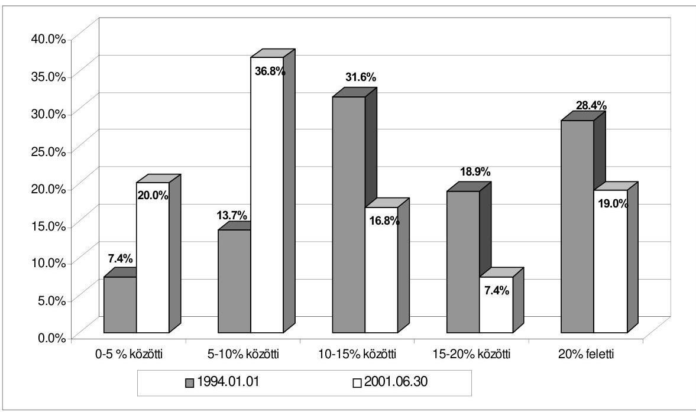
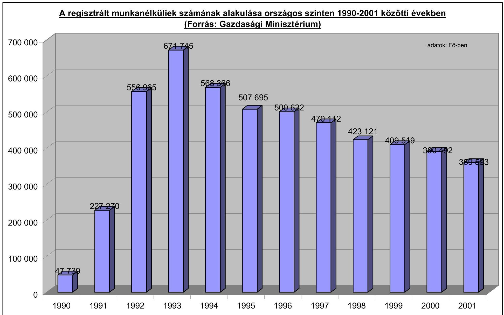
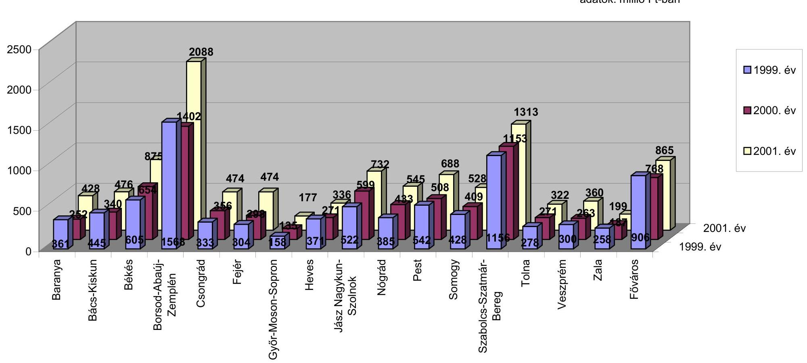
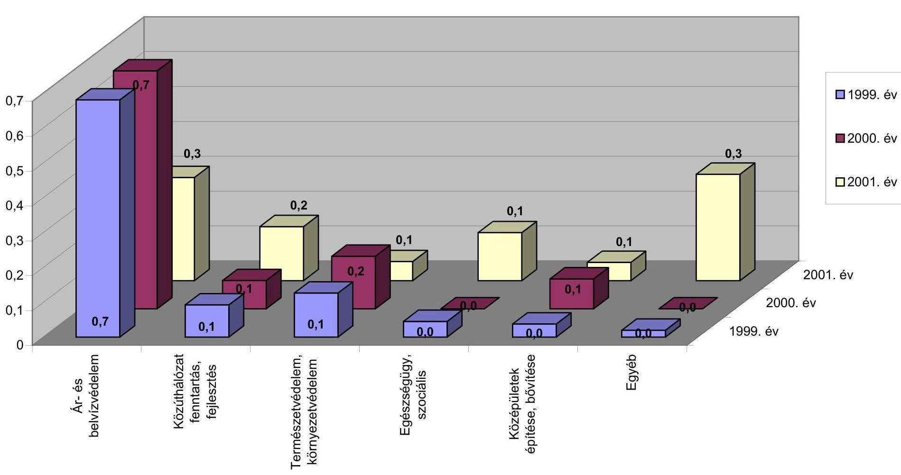
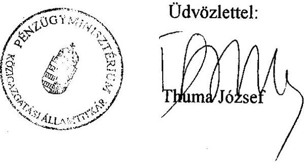
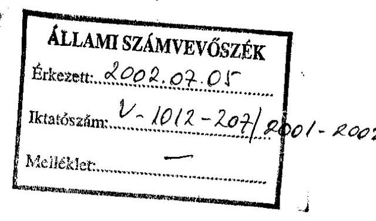
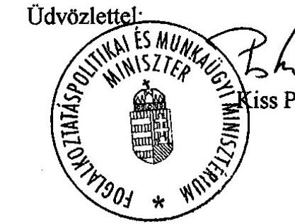

# JELENTÉS 

a foglalkoztatást elősegítő támogatások felhasználásának ellenőrzéséről
2002. július

---

# Az ellenőrzést felügyelte: 

## dr. Lóránt Zoltán

főigazgató

## Az ellenőrzés végrehajtásáért felelős:

Az ÁSZ 3. Önkormányzati és Területi Ellenőrzési Igazgatóság Pénzügyi-szabályszerűségi és Teljesítményellenőrzési Főcsoport

Németh Péterné
főcsoportfőnök

## Az ellenőrzést vezette:

Németh Péterné
főcsoportfőnök

A helyszíni vizsgálati jelentések feldolgozásában és az összefoglaló elkészítésében közreműködött:
dr. Mezei Imréné
főtanácsadó
Tímár József
irodavezető
Vécsey László
irodavezető

## Az helyszíni ellenőrzést végezték:

A résztvevők névsorát az 1. sz. melléklet tartalmazza

## Az ÁSZ által a témában eddig készített jelentések:

A Munkaerőpiaci Alap működésének pénzügyi-gazdasági ellenőrzése (1999.)
A kötött felhasználású és a működési forráshiányra biztosított önkormányzati támogatások igénylésének és felhasználásának ellenőrzése (2001.)

---

# A jelentésben alkalmazott rövidítések: 

| Flt | A foglalkoztatás elősegítéséről és a munkanélküliek ellátásáról szóló 1991. évi IV. törvény |
| :--: | :--: |
| Sztv | A szociális igazgatásról és szociális ellátásokról szóló 1993. évi III. törvény |
| Áht | Az államháztartásról szóló 1992. évi XXXVIII. törvény |
| Ötv | A helyi önkormányzatokról szóló 1990. évi LXV. törvény |
| GM | Gazdasági Minisztérium |
| SzCsM | Szociális és Családügyi Minisztérium |
| EU | Európai Unió |
| ILO | Nemzetközi Munkaügyi Szervezet |
| KSH | Központi Statisztikai Hivatal |
| MEF | KSH Munkaerő Felmérés |
| LFS | Nemzetközi összehasonlítású felmérési módszer |
| MPA | Munkaerőpiaci Alap |
| MAT | Munkaerőpiaci Alap Irányító Testület |
| FH | Foglalkoztatási Hivatal |
| OMKMK | Országos Munkaügyi Kutató és Módszertani Központ |
| OMT | Országos Munkaügyi Tanács |
| MMT | Megyei (Fővárosi) Munkaügyi Tanácsok |
| MMK | Megyei (Fővárosi) Munkaügyi Központok |
| APEH | Adó- és Pénzügyi Ellenőrzési Hivatal |
| ÁSZ | Állami Számvevőszék |
| FESZOFE   Kht | Ferencvárosi Szociális Foglalkoztató- és Ellátó Közhasznú Társaság |
| OEP | Országos Egészségbiztosítási Pénztár |
| TÁKISZ | Területi Államháztartási Közigazgatási Információs Szolgálat |
| MüM | Munkaügyi Minisztérium |
| AB | Alkotmánybíróság |
| MT | Munka Törvénykönyvéről szóló 1992. évi XXII. törvény |
| Kjt | Közalkalmazottak jogállásáról szóló 1992. évi XXXIII. törvény |
| Ktv | Köztisztviselők jogállásáról szóló 1992. évi XXIII. törvény |
| TÁH | Területi Államháztartási Hivatal |
| ÁFA | Általános Forgalmi Adó |
| KVM | Közlekedési és Vízügyi Minisztérium |

---

# TARTALOMJEGYZÉK 

I. ÖSSZEGZŐ MEGÁLLAPÍTÁSOK, KÖVETKEZTETÉSEK, JAVASLATOK ..... 5
II. RÉSZLETES MEGÁLLAPÍTÁSOK ..... 12

1. A foglalkoztatási támogatások intézmény- és eszközrendszere, a kormányzati szervek feladatai a foglalkoztatási gondok enyhítésében ..... 12
1.1. A Gazdasági Minisztérium és a megyei munkaügyi központok tevékenysége ..... 13
1.2. A Szociális és Családügyi Minisztérium feladata a közcélú- és közmunkaprogramok végrehajtásában ..... 24
2. A foglalkoztatási gondok kezelésére szolgáló eszközökkel való gazdálkodás szabályszerűsége, eredményessége az önkormányzatoknál ..... 29
2.1. A helyi önkormányzatok foglalkoztatás szervezésben betöltött szerepe ..... 29
2.2. A foglalkoztatási támogatások felhasználása ..... 36
2.2.1. A közhasznú munkavégzés jellemzői ..... 36
2.2.2. A közcélú munkavégzés kialakulása, elterjedése ..... 39
2.2.3. A közmunkaprogramok tapasztalatai, eredményei ..... 47

---

2

---

# JELENTÉS 

## a foglalkoztatást elősegítő támogatások felhasználásának ellenőrzéséről

A foglalkoztatás elősegítéséről és a munkanélküliek ellátásáról szóló 1991. évi IV. törvény előírásai több mint tíz éve hatályosak, időközben többször módosult a foglalkoztatási támogatások eszköz- és intézményrendszere. Ennek során - különösen az egyes munkaügyi és szociális törvények módosításáról szóló 1999. évi CXXII. törvény rendelkezéseiből következően - növekedett az önkormányzatok szerepvállalása a munkanélküliek foglalkoztatásában.

Miközben a munkanélküliség alakulását jelző mutatók 1993-tól kezdve folyamatosan javultak - a munkaügyi szervezet által regisztrált munkanélküliek száma az 1993. évi 671 ezer főről 2000. évre 390 ezerre, majd 2001. harmadik negyedévére 360 ezer főre csökkent -, a jövedelempótló támogatás 2000. májusától való megszüntetését és a munkanélküli járadékra való jogosultság feltételeinek szűkülését követően a szociális ellátórendszerben megjelenő, rendszeres szociális segélyezésre jogot szerző aktív korú nem foglalkoztatottak száma növekedett.

A szociális törvény ugyanakkor ez időtől a rendszeres szociális segély folyósításának feltételeként szabta, hogy az aktív korú nem foglalkoztatottak számára az önkormányzat legalább 30 munkanap közfoglalkoztatás (közhasznú, közcélú, közmunka) megszervezésére köteles.

Az előzetes felmérések arra utaltak, hogy a munkanélküli ellátások szűkülésének várható hatásaként a 2000. évi átlagos 28,7 ezer főről 2001-re 154 ezer főre, 2002-re pedig 180 ezer főre nő a rendszeres szociális segélyre jogosultak száma, így ezzel arányban állóan növekszik majd az önkormányzatokra háruló foglalkoztatás megszervezésének igénye is.

Az előírt foglalkoztatás megszervezésének támogatásához három, egymástól elkülönült, összességében jelentős nagyságrendű - 2001-ben 23,5 milliárd Ft költségvetési forrás állt rendelkezésre. Ennek döntő hányada mind a közhasznú, mind pedig a közcélú és a közmunkaprogramok esetében önkormányzati, önkormányzat által létrehozott intézményi (vállalati, gazdasági társasági) keretek között került felhasználásra, vagy önkormányzaton kívüli szféra szervezésében ugyan, de település-ellátási és foglalkoztatási gondok megoldásához kapcsolódott.

Az ellenőrzés célja annak áttekintése és értékelése volt, hogy a foglalkoztatási eszközrendszer koordinálására hivatott központi szerveknél, az önkormányzatoknál és intézményeiknél miként valósultak meg a foglalkoztatási és szociális törvény előírásai, hogyan minősíthető a támogatási eszközrendszer működése, az e területre irányuló költségvetési eszközök felhasználásánál érvényesültek-e a célszerűségi, eredményességi és törvényességi követelmények.

---

A helyszíni ellenőrzés a támogatási rendszer működésének 1999. január 1. - 2001. szeptember 30. közötti időszakára terjedt ki, míg a közfoglalkoztatások megyei és országos szintű összegzése 2001. december 31-i időponttal zárult, ezáltal a foglalkoztatási eszközök keretében megítélt támogatások 17,9%-áról áll rendelkezésre ellenőrzési tapasztalat.

A helyszíni ellenőrzés - a Gazdasági Minisztériumon, a Szociális és Családügyi Minisztériumon túl - az ország 16 megyéjére, a fővárosra és a főváros három kerületére, összesen 95 önkormányzatra, az érintett megyék és a főváros munkaügyi központjaira, valamint a feladatellátásban részt vállaló egyéb szervezetekre terjedt ki. (2. sz. melléklet)

Ellenőrzés jogalapja:
az Állami Számvevőszékről szóló 1989. évi XXXVIII. törvény 2. §/5/ bekezdésében és a helyi önkormányzatokról szóló 1990. évi LXV. törvény 92. §-ban foglalt felhatalmazás.

---

# I. ÖSSZEGZŐ MEGÁLLAPÍTÁSOK, KÖVETKEZTETÉSEK, JAVASLATOK 

A rendszerváltás évtizedét hazánkban lényegesen nagyobb arányú, állandósuló munkanélküliség kísérte, mint ahogyan arra az 1991-ben hatályba lépett, a foglalkoztatás elősegítéséről és a munkanélküliek ellátásáról szóló törvény megalkotásakor reálisan számítani lehetett.

A fejlett országokban - ezen belül az Európai Unió tagállamaiban - a gazdasági fejlődés az elmúlt évtized végére lelassult ugyan, a foglalkoztatásban azonban mindez még nem volt érzékelhető. A foglalkoztatás szintje az Unió átlagában 2000. év folyamán még javult, az előző évi 62,3%-ról 63,3%-ra nőtt, miközben a munkanélküliségi ráta 9,1%-ról 8,2%-ra mérséklődött.

Magyarországot 2000. év végéig még nem érintették a lassuló növekedés hatásai. A gazdaság alacsony szintről indulva még dinamikusan fejlődött, a nemzeti jövedelem 5,2%-kal nőtt. A kedvező gazdasági folyamatok ellenére azonban nálunk a foglalkoztatottság csak kis mértékben javult. A munkanélküliség csökkent ugyan, de változatlanul magas a gazdaságilag inaktívak, nem foglalkoztatottak, de munkát sem keresők, illetve magukat munkanélküliként sem regisztráltatók aránya. A gazdaságilag inaktívak száma 2001-ben 2 millió 229 ezer fő volt, amely 13 ezer fővel haladta meg az előző évben számba vett adatokat. A társadalmi és az egyéni élethelyzetek szempontjából is súlyos gondot jelez, hogy a munkaképes korú népesség csaknem 40%-a önként vagy kényszerűségből, de még mindig távol marad a munkaerőpiactól. A távolmaradók legnépesebb csoportját a tanulók és a munkaképes korban nyugdíjazottak adják, közel azonos 710, illetve 714 ezer főt meghaladó nagyságrendben. A gyeden, gyesen lévők csaknem 300 ezren vannak. Nincs azonban információ annak a több mint félmilliós - az inaktív réteg csaknem egynegyedét jelentő - népességnek a megélhetési viszonyairól, akiket a foglalkoztatási statisztika egyéb lehetőség hiányában eltartottként kezel.

A KSH munkaerő-felmérése alapján számba vett, nemzetközi összehasonlításra azonban az attól eltérő számítási metodikájánál fogva nem alkalmas, környezeti összefüggéseiből kiragadott 6,4%-os munkanélküliségi mutató kedvezőbb képet mutat az EU országok átlagánál. A hazai foglalkoztatottság helyzete viszont valójában a kevésbé fejlett országok munkaerőpiacához hasonlít.

A népesség gazdasági aktivitása - a fokozatos közeledés ellenére - még mindig jelentősen eltérő az ország különböző régióiban. A fejlett régiók csoportját alkotó közép-magyarországi, közép- és nyugat-dunántúli régiókban az átlagosnál magasabb, a munkavállalási korú népesség kétharmadát elérő a foglalkoztatás, a munkanélküliségi ráta pedig 5% alá csökkent. A közepesen fejlett régiókban (Dél-Dunántúl, Dél-Alföld) a foglalkoztatás 60%-ot meghaladó, a munkanélküliség 8% alatti. Az észak-magyarországi, észak-alföldi régiókban a munkanélküliségi ráta átlagosan még mindig 10% - egyes kistérségekben 16% feletti -, a foglalkoztatottság szintje pedig az átlagtól is elmarad. A régiók szintjén a különbségek nem csökkentek lényegesen, a legmagasabb és legalacsonyabb

---

munkanélküliségi ráta között 1999-ben 2,6-szeres, 2000-ben 2,4-szeres volt a különbség.

E rendkívül összetett, sokrétűen árnyalt foglalkoztatási helyzetben az általános gazdaságélénkítési szándékokon túl a gazdasági és a szociális szféra szereplői egyaránt a foglalkoztatási támogatásokkal kívánták elősegíteni a munkaerőpiacról kiszorult rétegek esélyegyenlőségének javítását.

A foglalkoztatási támogatások működtetésének feltételeit és kereteit - több mint 10 évre visszatekintően - a foglalkoztatás elősegítéséről és a munkanélküliek ellátásáról szóló, többször módosított Flt. biztosítja.

A törvény a foglalkoztatás elősegítése, a munkanélküliség megelőzése és hátrányos következményeinek enyhítése érdekében a Kormány, a helyi önkormányzatok, továbbá a munkaadók és a munkavállalásra jogosultak, valamint ezek érdekképviseleti szerveinek együttműködését írta elő.

A foglalkoztatást elősegítő törvény megalkotásának alapvető célja az volt, hogy a gazdasági szerkezetátalakítással együtt járó munkanélküliség növekedése miatt kiéleződő társadalmi konfliktusok kezelését átfogóan szabályozza, intézményrendszerét megteremtse.

A törvény úgy rendelkezett, hogy a foglalkoztatási feszültségek megszüntetésére, kezelésére és feloldására, a munkanélküliség megelőzésére, csökkentésére és hátrányos következményeinek felszámolására és enyhítésére különböző munkaerőpiaci szolgáltatásokat, valamint foglalkoztatást elősegítő támogatásokat kell alkalmazni. Míg a munkaerőpiaci szolgáltatások elsősorban képzéshez, álláskereséshez, vállalkozóvá váláshoz kapcsolódó támogatást jelentenek, addig a foglalkoztatást elősegítő támogatások konkrétan létrejött munkaviszonyok anyagi terheinek átvállalását jelentik. Ez utóbbi, a munkaerőpiac aktív befolyásolásának szándékával létrehozott támogatási lehetőségek egyike a munkaügyi szervezet által regisztrált munkanélküliek alkalmazását támogató közhasznú foglalkoztatás, amely 1991-től működik. Forrása a Munkaerőpiaci Alap foglalkoztatási alaprészének megyékre decentralizált összege, amelynek felhasználásáról megyei szinten a helyi érdekképviseleti szervek bevonásával dönt a megyei munkaügyi szervezet.

A foglalkoztatási helyzet befolyásolásában kezdetektől jelen lévő önkormányzatok szerepe 2000. májusától vált hangsúlyosabbá. Ez időtől az egyes munkanélküli ellátások folyósítási feltételei szigorodtak (munkanélküli járadék), illetve megszűntek (jövedelempótló támogatás). Az ellátórendszerből kikerülők közül a rászorultak részére az önkormányzat a szociális törvényben előírt módon, a rendszeres szociális segély megállapításának feltételeként legalább 30 munkanapos foglalkoztatás megszervezésére - közcélú foglalkoztatásra - köteles. A közcélú foglalkoztatás finanszírozására a mindenkori költségvetési törvény kötött felhasználású normatív támogatást biztosít, amelyhez igénylési rendszerben juthatnak hozzá az önkormányzatok. A közcélú foglalkoztatás szakmai irányítója a Szociális és Családügyi Minisztérium volt.

A közhasznú, közcélú foglalkoztatás mellett 1996-tól a Szociális és Családügyi Minisztérium egységes pályázati feltételek mellett, központi keretek között, a

---

kiemelt szociális és társadalmi-gazdasági feszültséggel érintett területeken közmunkaprogramokat hirdetett, melynek forrása a minisztérium fejezeti kezelésű előirányzataként jelent meg.

A közmunka keretében megvalósuló programok segíteni
 hivatottak az ár- és belvízvédelmi rendszerek helyreállítási és fenntartási munkáit, a közúthálózat karbantartását, a környezetvédelmet, az egyes szociális feladatok ellátását, a középületek fenntartási munkáit, valamint a cigányság életkörülményeinek és társadalmi helyzetének javítását. A legfőbb célkitűzés az, hogy a munkából tartósan kiszoruló személyek számára hasznos, a társadalom számára is elfogadható, új értéket létrehozó több hónapot felölelő foglalkoztatási forma szerveződjék.

A munkanélküliek foglalkoztatását támogató három eszköz működéséről, annak célszerűségéről és eredményességéről az ellenőrzés során differenciált tapasztalatokat szereztünk.

A munkaerőpiaci folyamatok megítélése, értékelése már a kiindulás szakaszában ellentmondásos. Mindez alapvetően azzal függ össze, hogy a munkaerőpiaci szervezet és a KSH információs adatbázisa eltérő számítási alapról építkező munkaerőpiaci mutatókat kezel.

Így jelenleg kétféle számbavételi rendszer működik, amely egyrészt a nemzeti foglalkoztatási szabályokhoz, másrészt a nemzetközi összehasonlításokhoz igazodik. Különböző fórumokon, különböző céllal a két eltérő számítási alapú mutató egyidejűleg használatos.

Bár a regisztrált munkanélküliek száma 1994-től 2001-ig javult (322 152 fős csökkenés), a foglalkoztatási és jövedelemtámogatási rendszer az évenkénti operatív munkaerőpiaci beavatkozás igényével fellépve folyamatosan változott, mégsem alakult ki az ellátások működési feltételeiben szilárd, hozzájutási lehetőségeiben egységes, egymásra épülő rendszere. A munkaügyi szervezet kormányzati struktúrában elfoglalt helye, feladatrendszere többször változott.

Az azonos jellegű, de elkülönült finanszírozási alapokra támaszkodó közjellegű munkaprogramok a támogatáshoz jutás feltételeiből adódóan eltérő eredményességűek. Működésük kellő összehangoltság hiányában sem célszerűnek, sem hatékonynak nem tekinthető.

A helyszíni ellenőrzés ugyanis azt igazolta, hogy az önkormányzatok foglalkoztatás-szervezésben betöltött szerepe eltérő hatékonyságú. Általános, hogy a települések foglalkoztatási koncepcióval, elképzeléssel nem rendelkeztek, holott az a helyi foglalkoztatási viszonyok aktív befolyásolása érdekében elvárható lett volna. A képviselő-testületek kizárólag a már kialakult, munkaügyi szervezet által regisztrált munkanélküliségi jellemzők számbavételére szorítkoztak.

Még a fővárosi, kerületi, városi önkormányzatok esetében sem alakult ki olyan intézményirányítási, intézmény-felügyeleti rend, amely az intézményi önállóság tiszteletben tartása mellett biztosította volna a szükséges önkormányzati kontrollt, szélesebb teret engedve az egyes foglalkoztatási formák önkormányzati szintű koordinálásának.

Az egymás mellett párhuzamosan működő - 2001. évben együttvéve 23,5 milliárd Ft - támogatási forrás eltérő finanszírozási lehetőséget teremtett ugyan a foglalkoztatás szervezését felvállaló önkormányzatok számára, a választott megoldásokat helyzetfelmérések és gazdaságossági számítások csak elvétve támasztották alá. A hosszabb távú érdekeket szolgáló, a munka világába való visszavezetés szándékát igazoló foglalkoztatási megoldások nem voltak jellemzőek.

A foglalkoztatási formák közül előnyben részesítették a közhasznú foglalkoztatást, elsősorban annak többéves múltra visszatekintő gyakorlata, valamint az önkormányzatot tehermentesítő munkaerőpiaci szervezet szakértő közreműködése miatt.

A közhasznú foglalkoztatás támogatása a módosított Flt. szerint olyan aktív eszköz, amely elsődlegesnek a munkaerőpiacról kiszorult rétegek visszajuttatását, tartós munkába állását lenne hivatott elősegíteni. Arról azonban, hogy ez mennyiben volt eredményes, megbízható adat nem állt rendelkezésre, az eseti információk pedig rendkívül alacsony - a foglalkoztatással érintett létszám mindössze 1,3%-ának megfelelő - elhelyezkedési arányt mutattak.

A támogatáshoz való hozzájutás feltételei a gyakorlatban lazák, hiányzik vagy nem érdemi az előzetes és folyamatba épített ellenőrzés, ami a pályázatok megalapozottságát, a támogatás felhasználásának szabályszerűségét biztosítaná.

A megyékben a rendelkezésre álló támogatási kereteket ugyanis folyamatos igénylési rendszerben használták fel. Az igénylési rendszer komoly hiányossága, hogy nem kívánja meg a foglalkoztatás programszerű megalapozását, akadályozva ezzel a hatékonysági követelmények érvényesülését. Az igénylésben feltüntetett jogcím meghatározása ugyanis túlzottan általános, sem az elvégezni tervezett munka mennyiségében, sem tartalmában, sem programszerű kezelésében nem konkrét, így a támogatottak számonkérésének lehetősége, a támogatási eszköz hatékonyságának értékelhetősége mind az önkormányzatok, mind pedig a munkaügyi szervezet számára korlátozott.

Erre vezethető vissza, hogy a közhasznú foglalkoztatásról a munkaügyi szervezetben a foglalkoztatott létszám ágazati bontása mellett lényegében csak pénzügyi létszámforgalmi adatok lelhetők fel, annak társadalmi eredményességéről a munka világába való visszavezetésről, a foglalkoztatással létrehozott érték méréséről - megbízható információk nincsenek.

A közhasznú támogatás programszerűségének hiányában, a foglalkoztatásban az önkormányzatoknál és intézményeiknél kialakult foglalkoztatási szerkezetet anyagi megfontolások miatt konzerválja. Azokban a munkakörökben (pedagógus asszisztens, könyvtári kisegítő, gondozó), ahol munkabér megtakarítási céllal a közhasznú foglalkoztatás állandósult, kiváltja a tartós foglalkoztatást.

Általánosítható tapasztalat, hogy a közhasznú támogatási keret ellenőrzési rendszere nem megfelelő.

Az ellenőrzési rendszer nem kellő hatékonyságú működése alapvetően a munkaügyi szervezetet többszörösen érintő feladat- és hatáskörváltozások következménye. A szervezet átalakítása során a kirendeltségek feladata, hatásköre, önállósága - figyelemmel a kistérségi szerveződés támogatására - jelentősen megnövekedett, miközben az ellenőrzés felelőssége és ezzel együtt a hatékonyság befolyásolásának kívánalma változatlanul a személyi feltételeiben és irányítási eszközeiben korlátozott központ feladata maradt.

A munkaügyi szervezet irányításának többszöri változásával függ össze a közhasznú dolgozók alkalmazási jogviszonyát érintő kérdések rendezetlensége is. Az eddig alkalmazott és nem kifogásolt gyakorlat szerint az önkormányzati költségvetési szerveknél foglalkoztatott közhasznú dolgozókkal a Kjt. hatálya alá tartozó határozott idejű jogviszonyt létesítenek, annak a besorolásra vonatkozó formai (kulcsszám, fizetési osztály, előrelépés, szakmai szorzó) előírásai mellett, míg az önkormányzat által foglalkoztatott személyek jogviszonyára a Munka Törvénykönyve előírásai vonatkoznak. Nem indokolt, hogy a munkajogi törvények eltérő értelmezésére visszavezethetően a megosztott gyakorlat folytatódjék, ezzel eltérő munkajogi feltételek közé helyezzék mind az érintett dolgozókat, mind pedig a munkáltatókat, ezért egyértelművé kell tenni, hogy a közmunkán foglalkoztatottak a Munka Törvénykönyve hatálya alá tartoznak. Megoldandó kérdés, hogy az önkormányzatoknál a közfoglalkoztatás lebonyolítására létrehozott szervezetek által az önkormányzati körön belüli foglalkoztatottak átadása ne minősüljön kirendelésnek.

A 2000. májusától induló közcélú foglalkoztatás kiszélesítette az önkormányzatok eszköztárát a helyi foglalkoztatási gondok kezelésében. Mivel a kiadásokat teljes egészében fedezni képes költségvetési támogatáshoz való hozzájutás feltételei a közhasznú és a közmunkaprogramhoz képest lényegesen könnyebbek, rugalmasabbak voltak, az önkormányzatoknak jó esélyt teremtett a munkanélküliség következményeinek enyhítésére.

Ennek megvalósulására azonban összességében nem a törvényalkotói szándék szerint, a rendelkezésre álló támogatások legeredményesebb felhasználásával került sor. Bevezetését, alkalmazását ugyanis nem segítette, nem támogatta a közhasznú, illetve közmunkaprogramokhoz hasonló szakmai infrastrukturális háttér (minisztériumok - GM, SzCsM -, munkaügyi központok), így az e kérdéskörben meglehetősen felkészületlen önkormányzatok csak vontatottan kezdték meg a közcélú munkák szervezését, messze nem használták ki az állami költségvetés által biztosított támogatás lehetőségét. Miközben a 2001. évi költségvetés átlagosan mintegy 11 ezer fő éves szintű foglalkoztatásával számolt, addig az országosan rendelkezésre álló támogatási keretnek csak 55,5%-át vették igénybe. Az önkormányzatok 27,1%-a egyáltalán nem szervezett közcélú foglalkoztatást, holott az önkormányzati feladatok ellátása ezt indokolta volna.

Rontotta a rendszeres szociális segélyért folyamodó munkanélküliek esélyegyenlőségét és a támogatás hatékonyságát az alkalmazott elosztási rendszer, amely a szociális normatíva településnagyság szerint differenciált hányada alapján, a tényleges igényektől elszakadva határozta meg az egyes önkormányzatok által igényelhető támogatás felső határát. Nem tudta ugyanis figyelembe venni azt, hogy az eltérő adottságú településeken milyen a munkanélküliek ellátási jogosultság szerinti összetétele, mekkora is valójában a rendszeres szociális segélyre jogosulttá válók és az azt ténylegesen igénybe venni szándékozók - tehát a foglalkoztatásba bevonhatók - száma.

A tényleges foglalkoztatás-szervezési igényektől elszakadó forrásmegosztás következtében a támogatási rendszerben egyidejűleg van jelen a hiány és a többlet. A munkanélküliséggel erőteljesen sújtott keleti országrész régióiban a források elégtelensége akadályozta a foglalkoztatás szervezését, addig a nyugat-dunántúli megyékben a támogatás kötött felhasználási jellege következtében maradványok keletkeztek. Mindez az eltérő önkormányzati magatartással együtt ahhoz vezetett, hogy a 2001. évre előirányzott 10,5 milliárd forint közel fele - 44,5%-a - felhasználatlan maradt, annak ellenére, hogy nem korlátozták a napi kötelező foglalkoztatás időtartamát és nem határozták meg a támogatás felhasználásának jogcímeit.

A közcélú munkák támogatásának rendszere - a felhasználási szabályok egyértelmű megfogalmazásának hiányával párosulva - csak részben érte el célját, mivel az régiónként, megyénként, de még az egyes kistérségek és önkormányzatok szintjén is jelentősen eltérően működött. Sem a foglalkoztatottsági helyzet, sem az erősen differenciált helyi munkanélküliség javításában nem tudott átütő sikereket hozni, tartós megoldások esélyével járó foglalkoztatást kínálni.

Eközben a közfoglalkoztatástól akár önként, akár munkalehetőség hiányában távolmaradók számára a társadalmilag alacsony perspektívát nyújtó segélyezés, vagy az ellenőrizetlen körülmények közötti feketemunka jelenti az egyetlen megélhetési forrást.

A három vizsgált foglalkoztatási forma közül a kormányzati szándékoknak és a társadalmi elvárásoknak leginkább a közmunkaprogramok feleltek meg. A pályázati rendszerben működő támogatási forma biztosította a konkrét, értékteremtő foglalkoztatás programszerű tervezését, számonkérését, értékelhetőségét és ellenőrzését, a minimum száz fő foglalkoztatása révén jól szolgálta a regionális és kistérségi szerveződések megerősödését. Ugyanakkor sajátos ellentmondást hordozóan - az e jogcímen felhasználható forrásoknak csak a töredéke - 2001-ben alig több mint egytizede, azaz mindössze 3 milliárd forint - volt fordítható a közmunkaprogramok szervezését felvállalók támogatására.

Összességében véve az ellenőrzési tapasztalatok azt támasztják alá, hogy a közfoglalkoztatások támogatási eszközrendszerének működése, az e területre irányuló költségvetési eszközök felhasználásának célszerűsége és eredményessége nem megfelelő. Ennek következtében indokolt a jelenleg három csatornán át áramoltatott foglalkoztatási támogatás rendszerének a megváltoztatása. Ennek lényege az, hogy a közcélú munkavégzés támogatása a jelenlegi formájában szűnjön meg, annak foglalkoztatásban betöltött szerepét a szervezeti kereteiben már begyakorlott, de működési feltételeiben szigorításra szoruló közhasznú foglalkoztatás vegye át. Ezzel egyidejűleg a közhasznú foglalkoztatás támogatási keretén belül növelni kell az értékteremtő jellegű, programszerűen, pályázati jelleggel működő források arányát, valamint bővíteni szükséges a közmunkaprogramokra szánt támogatások összegét.

A helyszínen ellenőrzött szervezetek részére az alábbi ajánlásokat fogalmaztuk meg:
a megyei munkaügyi központok igazgatói határozzák meg a foglalkoztatás során kötelezően alkalmazandó dokumentumokat, biztosítsanak megfelelő időt a körültekintő megalapozott döntéselőkészítésre, ismertessék szélesebb körben a foglalkoztatások támogatási lehetőségeit és gondoskodjanak a közhasznú foglalkoztatást végző szervezeteknél a helyszíni ellenőrzések megszervezéséről;
az önkormányzatok aktualizálják a helyi szociális rendeleteiket, vizsgálják és határozzák meg azon éves feladatok körét, amelyet közmunkákkal kívánnak megoldani, gondoskodjanak a munkavégzés szabályszerű elszámolásáról, szervezzék meg a közfoglalkoztatás és a támogatások elszámolásának ellenőrzési rendszerét.

A jelentésben részletezett megállapítások alapján az alábbi intézkedések megtételét javasoljuk:

# a Kormánynak 

1. hozzon létre olyan egységes munkaügyi információs rendszert, amely lehetővé teszi a különféle munkaerőpiaci státuszok szélesebb körű elemzését, vizsgálatát,
2. alakítsa át a foglalkoztatási támogatások finanszírozási rendszerét, a foglalkoztatási és a szociálpolitikai célok változatlan fenntartása mellett, a közcélú foglalkoztatás elkülönült finanszírozásának a megszüntetésével egyidejűleg,
3. tekintse át a munkaerőpiac aktívabb befolyásolásának szándékával a Foglalkoztatási Alap felhasználásának kialakult arányait, a közhasznú foglalkoztatás hatékonysági és eredményességi szempontjait és a támogatási eszköz szabályainak újólagos meghatározása során a rendelkezésre álló eszközök pályázati rendszerben való felhasználására, a támogatások programszerű megalapozására, az értékelhetőség szempontjaira helyezzék a hangsúlyt;

## a foglalkoztatáspolitikai és munkaügyi miniszternek

1. alakítsa ki a közhasznú támogatás működtetésének országosan egységes eljárási rendjét, határozza meg és szerezzen érvényt a támogatási megállapodásban foglalt kötelezettségek betartásának, ennek érdekében erősítse a döntéselőkészítés folyamatába illeszkedő, az azt megalapozó előzetes, valamint a cél szerinti felhasználás számonkérését biztosító utóellenőrzés rendszerét;
2. intézkedjék a közhasznú foglalkoztatás munkajogi szabályainak egységes értelmezéséről,
3. szorgalmazza a közmunkaprogramok bővítési lehetőségét, szakmai iránymutatással támogassa az önkormányzatok
 szociális és munkanélküli ellátórendszert érintő feladatainak hatékonyabb megvalósítását, a közfoglalkoztatások rendszerének racionalizálását.

---

# II. RÉSZLETES MEGÁLLAPÍTÁSOK 

## 1. A FOGLALKOZTATÁSI TÁMOGATÁSOK INTÉZMÉNY- ÉS ESZKÖZRENDSZERE, A KORMÁNYZATI SZERVEK FELADATAI A FOGLALKOZTATÁSI GONDOK ENYHÍTÉSÉBEN

A foglalkoztatási támogatások eszközrendszerének, működtetésének eredményességét a társadalom a foglalkoztatottsági, munkanélküliségi mutatók alakulása alapján ítéli meg.

A magyar számbavételi gyakorlat jelenleg kettős közelítésű.
A munkaerőpiaci szervezet a magyar jogszabályokra alapozott számbavételi kategóriákat alkalmazza, nemzetközi összehasonlításban azonban a Nemzetközi Munkaügyi Szervezet (ILO) ajánlásai alapján számított mutatók képezik a különböző összehasonlító elemzések alapját. Nemzetközi összehasonlításban minden országban azonos elvek és módszerek szerint készülő úgynevezett LFS rendszerű felmérésekben a 15-74 éves korú népességet tekintik potenciális munkaerőforrásnak. Ez utóbbira alapoz a KSH munkaerő felmérése (MEF) is. E felmérés a hazai munkavállalási jellemzőkkel összhangban a nyugdíjrendszer által ténylegesen felkínált lehetőségektől függetlenül a 15-74 éves korcsoportból a 15-64 évesekre vonatkozó adatokat emeli ki, és a továbbiakban ezt tekinti munkavállalási korú népességnek. Ehhez viszonyítják a ténylegesen foglalkoztatottak arányát, ennek alapján számítják a munkanélküliségi mutatókat.

Bár a munkanélküliségi ráta mindkét számbavétel szerint csökkenő tendenciát jelez, azonban a kétféle számbavétel szerint 2000-ben mintegy 130 ezer fős különbség mutatható ki a hazai szabályok szerint a munkaerőpiaci szervezet által regisztrált munkanélküliek (390,5 ezer fő) (3. sz. melléklet) és a KSH munkaerő felmérése szerinti aktívan munkát keresők (262,5 ezer fő) létszámában. Ugyanakkor a MEF adatai alapján számított munkanélküliségi ráta 2000-ben 6,4%-os volt, amely alacsonyabb az EU országok 8,2%-os átlagánál.

Miközben az EU-ban a foglalkoztatottság átlagos szintje 2000-ben 63,3% volt – azaz a potenciális munkaképes korúak ilyen hányada dolgozott – addig Magyarországon a 15-64 évesek csak 56,4%-a volt foglalkoztatott, azaz a munkavállalási korú népesség 40,7%-a gazdaságilag inaktív. Az inaktivitás összetevői azonban az ismert és társadalmilag elfogadott okokon – tanuló, gyesen-gyeden lévő, nyugdíjazott – túl nehezen, vagy egyáltalán nem számszerűsíthetők.

A munkaerőpiactól körülhatárolható okokon kívül távolmaradók minden gazdaság természetes szereplői ugyan, Magyarországon azonban – különösen bizonyos korcsoportokban – túlságosan magas az ismert ok nélkül munkaerőpiactól távolmaradók (a 35-39 évesek között az inaktívak 50, a 40-44 évesek között 47, a 30-34 évesek között 39%-a) aránya. Mindez egészében véve azt jelenti, hogy 2000-ben a 2,2 milliós inaktív népesség közel egynegyedéről – több mint félmilliós népességről – inaktivitásának okairól, összetevőiről nem áll rendelkezésre hivatalos információ.

A számbavételi hiányosságok és az inaktivitást befolyásoló tényezők ismeretének hiánya nehezíti a regionális és helyi foglalkoztatási helyzet reális számbavételét, a foglalkoztatási programok tudatos, célirányos szervezését, a foglalkoztatási eszközök hatékonyságának értékelését.

A foglalkoztatást befolyásoló különböző közjellegű munkaprogramok szervezésének kormányzati szintű feladatai egyrészt a Gazdasági Minisztérium, másrészt a Szociális és Családügyi Minisztérium tevékenységi körébe tartoztak.

# 1.1. A Gazdasági Minisztérium és a megyei munkaügyi központok tevékenysége 

A munkanélküliek foglalkoztatásának elősegítésére, a közhasznú munkavégzés támogatására a Munkaerőpiaci Alap foglalkoztatási alaprészének decentralizált kerete szolgál.

A Munkaerőpiaci Alap kezelése 1998-ig a Munkaügyi Minisztérium feladata volt, ennek megszűnésével átkerült a Szociális és Családügyi Minisztérium, majd 2000. évtől a Gazdasági Minisztérium tevékenységi körébe. A 2000. június végén hatályba lépett, az egyes miniszterek feladat- és hatáskörének változásával összefüggő törvénymódosítások szerint a foglalkoztatáspolitikával, a munkaerőpiaci szervezet működtetésével, a munkaügyi szabályozással kapcsolatos feladatok ellátása a Gazdasági Minisztériumhoz került. A racionális feladatellátás igénye néhány hónapos működési tapasztalat birtokában nyilvánvalóvá tette, hogy szükség van a munkaerőpiaci szervezet irányításával kapcsolatos feladatok stratégiai és operatív szintjének különválasztására.

Ez utóbbi célkitűzéssel függ össze, hogy 2001. július 1-jétől a munkaerőpiaci szervezet ismét módosult, központi költségvetési szervként Foglalkoztatási Hivatal jött létre.

Foglalkoztatási Hivatal kibővített jogkörében ellátja többek között a Gazdasági Minisztériumtól átvett feladatként:

- a megyei (fővárosi) munkaügyi központok általános feladatainak és jogalkalmazó tevékenységük szakmai irányítását, hatósági ellenőrzési feladatainak szakmai koordinálását,
- a munkanélküli ellátások, a foglalkoztatást elősegítő támogatások, a munkaerőpiaci szolgáltatások nyújtásával kapcsolatos módszertani feladatokat és az ezeket támogató informatikai rendszerek fejlesztését, működtetését,
- a több megyét érintő munkaerőpiaci programok koordinálását,
- az egységes foglalkoztatási nyilvántartás fejlesztését, működtetését, amely a munkaerőpiaci helyzet nyomon követésének mielőbbi megoldását igényli.

A feladatellátásban érintett minisztériumok minden évben külön előterjesztést készítettek a Munkaerőpiaci Alap Irányító Testület részére a Munkaerőpiaci

---

Alap foglalkoztatási alaprészének központi és decentralizált keretének meghatározására, felosztására. Az előterjesztésben kitértek a munkanélküliek foglalkoztatásának, ezen belül a közhasznú munkavégzés alakulásának, a felhasznált pénzeszközök megoszlásának, az intézkedések hatékonyságának elemzésére.

A közhasznú munkavégzés finanszírozása a Munkaerőpiaci Alap decentralizált foglalkoztatási alaprészének (foglalkoztatási és képzési támogatások) a megyékre, fővárosra leosztásra kerülő keretéből történik.

A vizsgált időszakban a rendelkezésre álló foglalkoztatási alaprész forrásai növekedtek, valamint javult a közvetlenül decentralizált, helyi döntési szintre lebontott támogatási keretek nagysága is.

| Év | Munkaerőpiaci   Alap   foglalkoztatási   alaprésze | -. ebböl: |  |  |  |
| :--: | :--: | :--: | :--: | :--: | :--: |
|  |  | központi döntésű   programokra   elkülönített | megyei döntési szintre   decentralizált |  |  |
|  | összege M Ft | Összege M Ft | $\%-a$ | összege M Ft | $\%-a$ |
| 1999 | 29850 | 2908 | 9,7 | 26942 | 90,3 |
| 2000 | 32819 | 7580 | 23,1 | 25239 | 76,9 |
| 2001 | 43282 | 8817 | 20,4 | 34465 | 79,6 |
| Összesen | 105951 | 19305 | 18,2 | 86646 | 81,8 |

A foglalkoztatási alaprész megyék és főváros közötti felosztásának, decentralizálásának elveit és módszereit évente eltérő módon, több alternatív modellszámításokat követően határozták meg.

Az 1999. évi költségvetési törvény szerint központi döntésű programokra 1500 millió Ft, Borsod-Abaúj-Zemplén megye Integrált Szerkezetátalakítási és Válságkezelési Programját, valamint Szabolcs-Szatmár-Bereg és Nógrád megye területfejlesztési programját a fejezeti kezelési támogatási célprogramok, célelőirányzatok, agrár- és vidékfejlesztési források és fejezeti kezelésű előirányzatokon túlmenően a Munkaerőpiaci Alap foglalkoztatási alaprész decentralizálható keretéből 1000 millió Ft-tal támogatták. A korhatárengedményes nyugdíjazások 1999. évet érintő hatása (138 millió Ft), valamint a főváros és Pest megye sajátos foglalkoztatási jellemzőit figyelembe vevő modellkorrekciós keret 235, illetve 35 millió Ft-ot jelentett.

A ténylegesen megyékre decentralizálható keret 1999. évben így 26942 millió Ft volt, amelynek

- 30%-a a regisztrált munkanélküliek,
- 20%-a a regisztrált munkanélküli pályakezdők,
- 30%-a az aktív eszközökben részt vettek (képzés, vállalkozóvá válás, tartós munkanélküliek foglalkoztatása, közhasznú foglalkoztatás, munkahely teremtés és megőrzés támogatása, pályakezdő munkanélküliek támogatása stb.),

- 20%-a a tartósan munka nélkül lévők számának
arányában került felosztásra.
Az így kapott, a megyékre és a fővárosra számított értékek 50%-a került elsődlegesen felosztásra, míg a másik 50%-ból
- 16,7%-ot a munkanélküliségi rátával és
- 33,3%-ot a kereseti indexszel
munkaügyi központonkénti korrekcióval képeztek.
A foglalkoztatási alaprész 1999. évi decentralizált keretének felosztására kidolgozott több változat közül az alkalmazott modell biztosította, hogy oda áramoltassák a legmagasabb támogatási lehetőségeket, ahol az aktívkorú lakossághoz viszonyított munkanélküliségi ráta a legkedvezőtlenebb.

Ennek megfelelően a decentralizálható keretből Borsod-Abaúj-Zemplén megye 3632 millió Ft (13,3%), Szabolcs-Szatmár-Bereg megye 2652 millió Ft (9,7%), Hajdú-Bihar megye 2084 millió Ft (7,6%), míg Vas megye 503 millió Ft (1,8%), Győr-Moson-Sopron megye 609 millió Ft (2,2%), Zala megye 728 millió Ft (2,7%) összegben (%-os arányban) részesült. A főváros teljes felhasználható decentralizált kerete 2398 millió Ft volt, amelyből speciális (központi) helyzeténél fogva képzési támogatásra közel egy milliárd (981 millió) Ft-ot fordított.

A Munkaerőpiaci Alap 2000. évi foglalkoztatási alap részére 32819 millió Ft-ot irányoztak elő, amelyből 2580 millió Ft átadásra került a Gazdasági Minisztérium célelőirányzatába, további 3500 millió Ft a központi keretbe, az Európai Unióhoz történő csatlakozással kapcsolatos társfinanszírozás várható nagyságrendjére, 1000 millió Ft területkiegyenlítési támogatásra, az agrár szervezetek munkahelymegőrző támogatására 500 millió Ft-ot különítettek el. Így a 2000. évi decentralizálható keret 25239 millió Ft volt.

A 2000. évi teljes decentralizált keretből Borsod-Abaúj-Zemplén, Szabolcs-Szatmár-Bereg és Hajdú-Bihar megye hasonlóan a legmagasabb nagyságrendű támogatásban részesült, mint az előző évben, míg Vas, Győr-Moson-Sopron, Zala megye kapta ismét a legkisebb támogatást.

A 2001. évi foglalkoztatási alaprész előirányzata 43282 millió Ft volt, amely már nem tartalmazta a Gazdasági Minisztérium célelőirányzatába átadott 3374 millió Ft-ot. A decentralizálható keret meghatározását is több tényező befolyásolta.

A 2001. évi központi keretet 1000 millió Ft előző évi kötelezettségvállalás terhelte, ezen túl forrást teremtettek a régiók fejlesztési programjának PHARE 2000 program által nem finanszírozott támogatásához 1000 millió Ft összegben, amelyre a Kormány az Európai Bizottság felé kötelezettséget vállalt. A haderőreformhoz kapcsolódó és más központi munkaerőpiaci programok végrehajtására 3000 millió Ft összegben, az Európai Uniós előcsatlakozási alapok, az Európai Szociális Alap programokhoz kapcsolódó társfinanszírozásra szintén 3000 millió Ft-os ke-

---

retet különítettek el. Tovább növelték a tartós munkanélküliség kialakulását csökkentő munkaerőpiaci programok szerepét, valamint folytatódott Borsod-Abaúj-Zemplén, Szabolcs-Szatmár-Bereg, Nógrád, Békés és Somogy megye területkiegyenlítési célú támogatása is. Az előbbiekben részletezett feladatokra összesen 817 millió Ft-ot különítettek el, így a fennmaradó 34465 millió Ft képezte a 2001. évi felosztható decentralizált keretet.

A decentralizált keret munkaügyi központok közötti felosztásánál alapvetően nem tértek el a Munkaerőpiaci Alap Irányító Testülete által az 1999-2000. évekre elfogadott módszer alapelveitől, de finomították az elsődleges elosztás alapját képező munkaerőpiaci mutatók súlyarányát, módosították a másodlagos elosztás korrekciós hányadosát, és korrekciós tényezőként csak az átlagkeresetet alkalmazták. A munkanélküliségi ráta korrekciós hatása ugyanis a munkaerőpiaci helyzet jelentős területi differenciálódása miatt már torzítóan hatott volna a keretek abszolút összegére, és indokolatlan arányeltolódásokat okozott volna a munkaügyi központok között.

Az előzőeknek megfelelően a decentralizált foglalkoztatási keretek egyes megyéken belüli felhasználásának szervezését a megyei munkaügyi központok központi szervezeti egységei, valamint a kistérségi besorolásnak megfelelő szervezeti tagozódású kirendeltségei végzik.

E szervezeti egységek tevékenységük során a támogatási eszközökre vonatkozó jogszabályi előírások mellett a megyei munkaügyi tanácsok által kialakított, helyben érvényesítendő felhasználási elveire és arányaira voltak figyelemmel.

A megyei munkaügyi tanácsok a foglalkoztatási, a munkaerőpiaci képzési érdekegyeztetés ellátásra létrejött, a munkaadók, a munkavállalók, valamint az önkormányzatok képviseletét ellátó tagokból álló testületek. Megbízatásuk négy évre szól, feladataikat és jogosítványaikat az Flt. határozza meg. Ez utóbbiak között első helyen, döntési jogosítvánnyal szerepel a Munkaerőpiaci Alap foglalkoztatási alaprészének megyékre decentralizált összegére vonatkozó helyi felhasználási arányok és irányelvek meghatározása.

Ezt a feladatot minden vizsgálattal érintett megye munkaügyi tanácsa kiemelten kezelte, működési gyakorlatuk szerint a foglalkoztatási eszközök felosztási arányairól, a megyében érvényesítendő felhasználási elvekről a tárgyévet megelőző év végén, vagy a tárgyév első hónapjaiban döntöttek.

Ennek során megállapították az egyes támogatási jogcímek – ezen belül a közhasznú foglalkoztatás – megyén belüli felhasználási arányait és elveit, valamint határoztak a megyei szintű keretek további, kirendeltségi szintre történő decentralizálásáról, mértékéről is.

Általánosnak tekinthető minden vizsgált megye gyakorlatában, hogy a kirendeltségi szintű keretlebontás alapját ugyanazok a munkaerőpiaci mutatók képezték,
 mint amit a megyei szintre való decentralizálás során követtek, azonban különböző súlypontképzést követően vették figyelembe azokat a kistérségi jellemzőket (munkanélküliek, pályakezdők képzettségi szintje, szakmai- és korösszetétele), amelyek a munkaerőpiac neuralgikus pontjaiként jelentek meg.

---

Mindezek alapján a vizsgált megyékben a normatív és a különböző jogcímű központi részesedést követően az alábbi támogatási lehetőségek alakultak ki:

Millió Ft-ban

| Megnevezés |  | 1999 | 2000 | 2001 | Összes |
| :--: | :--: | :--: | :--: | :--: | :--: |
| Munkaerőpiaci Alap foglalkoztatási alaprészének megyékre leosztott támogatási kerete |  | 23387 | 22927 | 29408 | 75722 |
| - Előzőből: közhasznú foglalkoztatásra elkülönített támogatás | Összege | 8014 | 7531 | 10015 | 25560 |
|  | %-a | 34,3 | 32,9 | 34,1 | 33,8 |

A foglalkoztatási helyzet szempontjából halmozottan hátrányos helyzetben lévő két megye - Borsod-Abaúj-Zemplén, Szabolcs-Szatmár-Bereg - 1999-2001. években önmagában rendelkezett a teljes decentralizált alaprész 28,6%-ával, amelyből 37%-os helyi részarányt meghaladóan a teljes közhasznú támogatási keret csaknem egyharmadát (31%-át) különítették el.

A megyékre decentralizált alaprészből (4. sz. melléklet) további megyék (Békés, Nógrád, Somogy, Jász-Nagykun-Szolnok) és a főváros átlagos arányt meghaladó kereteket különítettek el, míg a viszonylag kedvezőbb foglalkoztatási helyzetben lévő megyék (Győr-Moson-Sopron, Baranya, Heves) a rendelkezésükre bocsátott összeg alig több mint negyedét szánták közhasznú foglalkoztatásra.

A megyei munkaügyi tanácsok állást foglaltak arról is, hogy a közhasznú támogatás megyén belüli gyakorlatában milyen felhasználási elvek követendők, milyen prioritási sorrend és támogatási arány érvényesíthető. Ebben a vonatkozásban a munkanélküliségi jellemzőkkel összhangban már érzékelhetőbb különbségek jelentek meg a keleti országrész régiói, valamint a Nyugat-Dunántúl megyéi között.

A keleti országrész foglalkoztatási szempontból legkedvezőtlenebb helyzetben lévő megyéiben (Szabolcs-Szatmár-Bereg, Borsod-Abaúj-Zemplén, Nógrád, Jász-Nagykun-Szolnok, Békés) nagyobb súllyal vették figyelembe a tartós munkanélküliek, a más ellátásból (gyes, gyed, jövedelempótló támogatás) kikerülők, a szakképzetlen rétegek, a cigány etnikumhoz tartozók, a 45 évesnél idősebb munkanélkülivé válók támogatási igényét.

A munkaügyi tanácsok a foglalkoztatás támogathatóságának általános mértékét minden megyében az igazolt költségek 70%-ában határozták meg. A kiemelt, 90%-os támogatásban részesíthető tevékenységek és területek köre - az országos átlagot másfélszeresen meghaladó munkanélküliségű településeken, valamint az ár- és belvíz-védekezésben foglalkoztatottak támogatásán túl már a helyi anyagi lehetőségek és foglalkoztatási jellemzők függvényében változó volt.

---

A keleti országrész megyéire (Borsod-Abaúj-Zemplén, Jász-Nagykun-Szolnok, Békés, Szabolcs-Szatmár-Bereg) volt jellemző, hogy bár a kiemelt támogatási mértékek feltételeit meghatározták, annak maradéktalan érvényesítésére részben a rendelkezésre álló források szűkössége, részben a kedvezőtlen körülmények - árvízi helyzetek - halmozódása miatt nem volt mód.

Szabolcs-Szatmár-Bereg megyében a támogatási mérték 70 és 100% között változott. A 70%-nál magasabb támogatástartalmat biztosító pályázatok lehetősége 2000-től nőtt meg. Ez évtől az önkormányzatok pályázatainak közel fele 90%-os mértékű támogatásban részesült. A kiemelt támogatás a szociális feladatok megvalósítását, a cigány etnikumhoz tartozó munkanélküliek foglalkoztatását, a tartós és pályakezdő munkanélküliek alkalmazását és esetenként a kommunális feladatok megvalósítását preferálta.

Borsod-Abaúj-Zemplén megyében a megyei munkaügyi tanács döntése értelmében az ún. hagyományos közhasznú munka támogatása a munkabérek és járulékai 70-80%-ára, egyes kiemelt foglalkoztatási céloknál 90%-ára terjedt ki. Ez utóbbi mértékű támogatást 2001. évben kiterjesztették a kommunális területen folyó közhasznú munkára is, ha a munkáltató a teljesítmény-követelmények meghatározását és rendszeres értékelését vállalta, és az előírt teljesítmények nem teljesítése esetén a 20%-os bércsökkentést a munkaszerződésben is kikötötte.

A munkaügyi tanácsok a támogatási elvek és arányok meghatározásakor elsősorban a támogatási keret folyamatos igénylésre alapozott felhasználását vették figyelembe. Ez esetben a támogatási igények folyamatos benyújtási rendjéhez igazodóan a folyamatos - a kérelmek értékelő összevetését csak korlátozottan biztosító - bírálat rendszere működött.

A vizsgált 16 megye közül mindössze 3 megyében került sor olyan programszerűen felosztott keretösszeg elkülönítésére, amelyet különböző feltételek mellett ugyan, de pályázati rendszerben használtak fel.

Borsod-Abaúj-Zemplén megyében a hagyományos igénylési rendszerben működő közhasznú támogatáson kívüli, úgynevezett értékteremtő közhasznú munkavégzés a Területfejlesztési Célelőirányzatból támogatott környezetvédelmi, környezet-rehabilitációs tevékenységgel vette kezdetét. Az ebből támogatott közhasznú munkavégzés az elhagyott ipartelepek környezeti állapotának helyreállítását, a természeti és települési környezet esztétikai javítását szolgálta.

A tanácsadással, képzéssel kombinált komplex közhasznú és reintegrációs foglalkoztatás 1999. évtől működtetett programja az értékteremtő közhasznú munka további bővítését eredményezte. Ez a program az értékteremtést az álláskereső tréningekkel, egyéni tanácsadással és szakmai képzéssel társítva elősegítette a munkanélküliek elsődleges munkaerőpiacra történő visszakerülését.

Az előzőeken túl a munkaügyi kirendeltségek a közhasznú foglalkoztatás helyi pénzügyi kereteinek egy részét is a településeken zajló konkrét programok támogatására különítettek el. A foglalkoztatás ezekben az esetekben olyan helyi (értékteremtő) programok megvalósításának támogatásához kapcsolódott, amelyek hozzájárultak a település és természeti környezete értékesebbé, vonzóbbá tételéhez, a rossz állapotban lévő középületek, építmények felújításához.

A programszerű pályázati rendszerben működő közhasznú munkák fedezetére a rendelkezésre álló keretek egyötödét különítettek el.

---

Győr-Moson-Sopron megyében a pályázati közhasznú foglalkoztatás keretében a lakosságot vagy a települést érintő közfeladatok ellátásának javítására irányuló programok támogatására írtak ki pályázatot. E támogatási forma működtetésére a közhasznú foglalkoztatásra meghatározott éves keretből 25 millió Ft-ot különítettek el, ami annak 15,8%-át jelentette. Ezzel az 1998-tól bevezetett támogatási típussal kívánták segíteni az önkormányzati intézmények által ellátott közfeladatok javítására irányuló beruházások, különféle projektek, fejlesztési programok, kiemelt felújítások, karbantartások megvalósulását.

A megyei források egy részét Nógrád megyében is pályázati rendszerben bírálták el. A programban eldöntött feladatok megvalósításához szükséges közhasznú támogatási keretekkel szükség szerint módosították a kirendeltségek rendelkezésre álló forrásait, ahová az érintett munkaadók - elsősorban önkormányzatok - benyújtották támogatási igényüket.

A közhasznú foglalkoztatást is magába foglaló munkaerőpiaci programok bevezetése 1999. évben kezdődött. Az így elkülönített közhasznú foglalkoztatási keret részaránya a megyei decentralizált foglalkoztatási alapból 1999. évben 0,05%, 2000. évben 9,5%, 2001. évben 11,8% volt. 2001. év közepén indították a környezetrendezési komplex programot. A cél az értékteremtő munka megvalósítása, a foglalkoztatáspolitikai eszközök kombinációjával a célcsoporthoz tartozó munkanélküliek munkaerőpiaci esélyeinek javítása volt. A közhasznú foglalkoztatás időtartamát 2001. 08. 01. - 2003. 01. 31. közötti időszakban határozták meg. A programban 325 fő komplex foglalkoztatásával számoltak, a közhasznú munkavégzést 90%-os, az oktatási költségeket 100%-os mértékű támogatottsággal vették figyelembe. Az eredmény mérését és az értékelési módot színvonalasan meghatározták.

A többi megyében a közhasznú támogatási keret terhére pályázati rendszerben felhasználható - a támogatás tartalmának kidolgozottságát, konkrétságát, számonkérhetőségét, egységesebb szemléletet tükröző eljárási gyakorlatát, a támogatás hatékonyabb felhasználását biztosító - támogatási keretet a források szűkösségére való hivatkozással nem különítettek el.

A keretgazdálkodás jogkörével rendelkező munkaügyi kirendeltségek a helyi szabályozásnak megfelelően a támogatási döntéseket a folyamatos igénylés sorrendjében hozták meg. A támogatásokról a kirendeltség vezetői a kirendeltségek keretei között működő 3 fős döntés-előkészítő bizottság javaslatára alapozva határoztak.

A folyamatos igénylési rendszer előrelátó eszközgazdálkodást kíván. Az egyes kirendeltségek közötti - az évközi szükségleteket figyelembe vevő - keret átcsoportosításnak elvi akadálya nincs. A gyakorlatban azonban annak eljárás- és időigénye miatt inkább az óvatosabb, évről-évre azonos szinten visszatérő, rövidebb, éven belül több szakaszban meghozott támogatási döntések voltak jellemzőek. A folyamatos igénybenyújtás és a kialakult döntési gyakorlat mind a támogató, mind a támogatott vonatkozásában nehezíti az eszköz működésének tervszerűségét, a támogatásokhoz való hozzájutás tekintetében magában rejti az esélyegyenlőség sérelmét, indokolatlanul megtöbbszörözi az adminisztrációs terheket.

A megyei munkaügyi központok minden megyében rendelkeztek a közhasznú foglalkoztatás támogatásának lebonyolítását szabályozó helyi szabályzattal,

---

eljárási renddel. Abban azonban jelentősek az eltérések, ahogyan az egyes megyék a támogatási eszköz működésének időszaka alatt bekövetkezett jogszabályi változásokat követték, illetve a helyben szabályozható kérdésköröket rögzítették.

Jász-Nagykun-Szolnok megyében a megyei munkaügyi központ a közhasznú foglalkoztatás támogatási keretének felhasználását a Munkaügyi Minisztérium 1997-ben kiadott, majd néhány pontját érintően 1998 márciusában módosított Szakmai iránymutatás és eljárási szabályok a közhasznú munkavégzés támogatásához című útmutató alapján igazgatói utasítással szabályozta.

A kiadott utasítás hatályba lépésekor a célnak megfelelt, az eszközhöz kapcsolódó értelmező rendelkezések és a mellékletként csatolt bizonylatminták a kirendeltségek egységes gyakorlatát jól szolgálták. Ugyanakkor a megyében kiadott igazgatói utasítás már ekkor sem fordított megfelelő figyelmet arra, hogy megyei munkaügyi tanács hatáskörébe adott szabályozási alternatívák - támogatottak előnyben részesítésének rendje, a kiemelt támogatásban részesíthetők köre, az elismerhető költségek köre - és a megyei munkaügyi központ igazgatójának döntési jogkörébe tartozó kérdések - kiemelten az eszköz ellenőrzésére vonatkozó szabályok - konkretizálásra kerüljenek.

Az eljárási rend 1998 áprilisa óta - bár a támogatási eszközt érintő szabályozásbeli változások azt több alkalommal is indokolták volna - nem módosult.

Ezzel szemben Nógrád megyében a vizsgált időszakban az eljárási rendet oly sokszor - 1999-ben 6, 2000-ben 3 alkalommal - módosították, hogy az már az áttekinthetőség és az alkalmazhatóság határát súrolta.

Csongrád megyében a kialakított eljárási rend meghatározta, hogy mi minősül közfeladatnak a helyi önkormányzatokról szóló 1990. évi LXV. tv. alapján. Nem jelölte meg viszont támogatandóként az önkormányzat által önként vállalt, a lakosságot, illetőleg a települést érintő feladat ellátását, vagy közhasznú tevékenység folytatását. A közhasznú tevékenység fogalmát az Flt. 58. § (5) bekezdés o) pontja határozza meg. Azokat minősíti közhasznú tevékenységnek, amely tevékenységeket a közhasznú szervezetekről szóló 1997. évi CLVI. tv. 26. § c) pontja felsorol. E felsorolás bővebb a vizsgált időszakban hatályos eljárási rendben szereplőnél és önkormányzati feladatként meghatározottaknál. Az eljárási rend így a támogatás alanyainak körét a közfeladatot végzők körére szűkítette le, így is alkalmazták, figyelmen kívül hagyva a közhasznú tevékenységet folytatókat és azt, hogy mi minősíthető közhasznú tevékenységnek.

A helyi szabályok megalkotásakor a megyék elsősorban a még Munkaügyi Minisztérium által kiadott ajánlásra alapoztak. A szabályzatok aktualizálásának elmaradása jelentős részben összefügg azzal, hogy a későbbiekben sem az SzCsM, sem pedig a GM nem tett közzé az egységesség igényét szolgáló újabb szabályozásbeli ajánlást, melyet a jogszabályok folyamatos változása indokolta volna.

A közhasznú foglalkoztatás támogatásának gyakorlati lebonyolításában a munkaügyi kirendeltségek töltenek be elsődleges szerepet. Működésük alapjának egységesítését részben a már jelzett, különböző konkrétságú eljárási rendek, keretgazdálkodási, kötelezettségvállalási, pénzgazdálkodási szabályok hivatottak szolgálni.

---

Az ellenőrzés azt tapasztalta, hogy a munkaügyi kirendeltségek a keretgazdálkodás és kötelezettségvállalás szabályait éves szinten betartották, a pénzgazdálkodási előírásoknak érvényt szereztek.

A keretgazdálkodás kialakult gyakorlata sajátos. Miközben a kötelezettségvállalók számára is ismert az államháztartási törvény és végrehajtási rendeletének kerettúllépést tiltó előírása, a rendelkezésre álló pénzeszközök minél teljesebb felhasználása érdekében az előre látható különböző meghiúsulások átlagos nagyságrendjével számolva az éves szinten meghatározott támogatási keretet kötelezettségvállalás szintjén év közben rendszeresen túllépték. Ez azonban nem eredményezett éves szinten megállapított kerettúllépést.

A vizsgált körben elvégzett összegzés szerint a három év alatt összesen felosztható 25,56 milliárd Ft közhasznú támogatási keret terhére a kirendeltségek 4,83 milliárd Ft-tal - átlagosan 18,9%-kal - magasabb
 összegű kötelezettségvállalást tettek, ugyanakkor tényleges többletfelhasználás egyetlen esetben sem következett be.

A kötelezettségvállalás szintjén értelmezett kerettúllépés Tolna és Somogy megyét kivéve eltérő mértékben ugyan, de minden megyében jellemző gyakorlat. A munkaügyi kirendeltségek legnagyobb arányú többlet kötelezettséget Csongrád (42,3%-os), Pest (34,7%-os), Nógrád (30%-os), Borsod-Abaúj-Zemplén (29,4%-os) megyében vállaltak, míg Bács-Kiskun megyében 10,9%; Szabolcs-Szatmár-Bereg megyében 11,3%; Zala megyében 9,3%; Békés megyében 10,8% volt a tapasztalatokra alapozott többlet kötelezettségvállalás.

Ez a gyakorlat hozzájárult annak elkerüléséhez, hogy a támogatásról való esetleges lemondások, a kiközvetítési időből, betegállományokból, felmondásokból szükségképpen felmerülő munkaidőalap kiesések év végén jelentősebb összegű és arányú támogatási keretmaradványhoz vezessenek. A keretmaradványok ugyanis a tárgyévet követően a támogatási rendszerben már nem használható fel. Mindez a nem tervezett, alkalomszerű, az évközbeni többszöri igénylés, a nem programszerű felhasználás következménye.

Az ellenőrzött munkaügyi kirendeltségek a döntés-előkészítési eljárás során a meghatározott dokumentális eljárásrendet betartották.

Ebben a vonatkozásban azonban tartalmi kérdés - s ez kirendeltségenként szükségképpen változó -, hogy a támogatási döntés előkészítése során milyen mélységben vizsgálták az igények jogosságát, az igénylésben foglaltak valódiságát.

A jelenlegi gyakorlat szerint a területileg illetékes kirendeltségek a kérelmek benyújtásával egyidejűleg előzetesen többek között arról is nyilatkoztatják az igénylőket, hogy

- a foglalkoztatás során felmerülő közvetlen költségek támogatáson felüli részével rendelkeznek,
- a közhasznú munkásokkal elvégzendő munkák után más szervtől díjazásban nem részesülnek,

---

- a közhasznú foglalkoztatással - a foglalkoztatás megkezdését megelőző havi átlagos statisztikai állományi létszámhoz képest - többletfoglalkoztatást valósítanak meg (egyidejűleg bejelentik a számítás alapjául szolgáló létszámot),
- a támogatással érintettel azonos vagy hasonló munkakörben munkaviszonyt, a támogatást megelőző 3 hónapban, a működési körben felmerülő okból rendes felmondással, illetve felmentéssel nem szüntettek meg,
- illetve büntetőjogi felelősségük tudatában nyilatkoznak arról, hogy a közhasznú foglalkoztatás támogatásához kapcsolódó törvényi, jogszabályi feltételeket megismerték, és azokat magukra nézve kötelezőnek tartják.

E nyilatkozatok valóságtartalmának támogatási döntést megelőző ellenőrzésére azonban a kirendeltségek nem rendelkeznek elegendő eszközökkel. Így különösen a valós többletfoglalkoztatás megalapozása válik kérdésessé, miután a viszonyítási alapnak minősülő létszám rögzítése önbevallás alapján történik, miközben széles körben tapasztalt jelenség, hogy a kérelmezők a kívánt létszám-kategória értelmezéséről és számításáról nem rendelkeznek megfelelő mélységű információval.

Somogy megyében a közhasznú munkavégzés támogatására irányuló kérelmek a jogszabályoknak megfelelőek. Általános hiba, hogy a statisztikai állományi létszámot - a vizsgálatba bevont önkormányzatok 90%-ban - tévesen állapították meg, vagy egyáltalán nem írtak be adatot. A kirendeltségek sem fordítottak erre a pontra kellő figyelmet.

Fejér megyében a sárbogárdi és móri kirendeltségen egyaránt tapasztalható volt, hogy a benyújtott igényléseken a munkaadó részéről a munkaköri feladat meghatározásaként csak „közhasznú" elnevezés szerepelt. Az átlagos statisztikai létszámközlés valóságtartalmát a kirendeltségek nem vizsgálták. A közhasznú támogatás elszámolásain végzett korrekciók egyeztetését az érdekelt munkáltatókkal nem kezdeményezték.

Hasonló problémák csaknem minden megyében, így például Jász-Nagykun-Szolnok, Zala, Pest, Veszprém, Győr-Moson-Sopron megyében is előfordultak.

A kirendeltségek folyamatba épített, dokumentumokra alapozott ellenőrzési rendszere a pénzügyi lebonyolítás szakaszában megfelelően működött ugyan, azonban a már jelzett előzetes, igénylés jogszerűségét megalapozó kontroll hiányos.

A támogatási eszközök ellenőrzése utólagos jelleggel, a Megyei Munkaügyi Központ Munkaerőpiaci Ellenőrzési Osztályának feladatát képezi. A munkaügyi központok éves ellenőrzési munkatervei szerint került sor az egyes támogatási eszközök önálló témavizsgálat keretében való ellenőrzésére. Ezen túlmenően az egyes munkaügyi kirendeltségek átfogó jellegű, 2-3 éves időtartamot felölelő komplex ellenőrzései - bár főként eljárási szabályok oldaláról, de érintenek valamennyi működő támogatási elemet.

A megyei munkaügyi központok eltérő gyakoriságú, mélységű átfogó és témavizsgálatai és belső ellenőrzései - bár jelentősebb részben az egyedi eljárásbeli hiányosságokra irányultak - alátámasztják a jelen ellenőrzés megállapításait. A már feltárt hiányosságok egy része - mint pl. a kérelmek túlzottan általános

---

jellege, a létszám-kategóriák értelmezése, az előzetes ellenőrzés alacsony száma vagy teljes hiánya, a foglalkoztatás dokumentálása, a megállapodásban foglaltak betartása - változatlanul jellemző az eszköz működésére, a megtett intézkedések pedig nem bizonyultak kellő hatékonyságúnak.

A vizsgált körben pozitív tapasztalatok szűk körben - Csongrád, Tolna megyében, valamint a főváros IV., VII., IX. kerületében - fordultak elő, míg a többi megyében a végzett ellenőrzések sem gyakoriságuk, sem tartalmi megközelítésük tekintetében nem bizonyultak elegendőnek.

Pest megyében Tóalmáson az ÁSZ vizsgálata tárta fel, hogy az önkormányzat 1203433 Ft közhasznú foglalkoztatás támogatás összeget jogosulatlanul vett igénybe. A vizsgálat megállapította, hogy az önkormányzat 2000. évben 225000 Ft, 2001. évben 978433 Ft, (mindösszesen 1203433 Ft) közhasznú foglalkoztatás támogatáshoz jogosulatlanul jutott, mivel a jelzett években ugyanazon személyek után a közcélú foglalkoztatás állami támogatását is igénybe vette. A jogosulatlan igénybevételt az ÁSZ vizsgálat észlelte, amelyet az önkormányzat nem vitatott. Az ÁSZ az önkormányzatnál lefolytatott vizsgálatról készült jelentést a megyei munkaügyi központ részére megküldte azzal, hogy a jogosulatlanul igénybevett támogatás visszakövetelésére a szükséges intézkedéseket tegye meg. A Megyei Munkaügy Központ Nagykátai Kirendeltsége a támogatást visszakövetelő határozatát meghozta, amely 2001. december 21-én jogerőre is emelkedett. Tóalmás Községi Önkormányzat a kamatokkal megemelt jogosulatlan támogatás összegét, 1353714 Ft-ot visszafizette.

Győr-Moson-Sopron megyében a kérelmek valóságtartalmának ellenőrzését a munkaügyi központ szervei esetenként mechanikusan látták el. Kapuváron köztisztviselőként foglalkoztattak - a Ktv. hatályára vonatkozó rendelkezést figyelmen kívül hagyva - egy személyt, ami megfelelő ellenőrzés esetében megelőzhető lett volna. Megelőzhető lett volna egyúttal az is, hogy az önkormányzatnak emiatt később le kelljen mondani a számára megítélt 202300 Ft támogatásról.

A közhasznú támogatás igénybevételének és felhasználásának munkáltatóknál történő ellenőrzése Veszprém megyében sem megnyugtató. A támogatási szerződések számához viszonyítva ellenőrzésre kevés esetben került sor (évente 5-12 munkáltatónál). A vizsgálati jegyzőkönyvek szűkszavúak, az ellenőrzés nem terjedt ki a kötelezően vezetendő munkanaplók meglétére, egyes esetekben még a jelenléti ívekre sem, az átlagos statisztikai állományi létszám alakulását egyetlen esetben sem ellenőrizték. Az ÁSZ vizsgálat a munkavégzés dokumentálása tekintetében hiányosságokat állapított meg az ellenőrzött önkormányzatoknál, így a munkaügyi központ ellenőrzési tevékenységének erősítése mindenképpen indokolt lenne.

Az ellenőrzés elhanyagolásával, a szakmai irányítás hiányosságaival is összefügg a közhasznú dolgozók munkajogviszonyát érintő kérdések rendezetlensége.

A közhasznú foglalkoztatottak munkajogi besorolására vonatkozó eljárás 1997. szeptembere óta a TÁKISZ vezetőinek a MüM által tartott szakmai napon elhangzott - szakmai körökben azóta széles körben vitatott - jogszabály értelmezésén, valamint az SzCsM által 1999 szeptemberében írásban is megerősített szakmai állásfoglalásán alapul.

---

Az SzCsM 1999. szeptemberében kiadott jogszabály értelmezése - amely kapcsán az állásfoglalást kiadó is jelezte, hogy a 60/1992. (XI. 17.) AB határozatban foglaltakkal összhangban az csak szakmai vélemény, kötelező erővel nem bír, arra bíróság vagy más hatóság előtt megalapozottan hivatkozni nem lehet - a Békés Megyei TÁKISZ igazgatójának megkeresésére, az 1992. évi XXXIII. törvény 1. §-ának értelmezésével kapcsolatban született.

Bár az ellentmondásokat és dilemmákat felvető kérdésekre vitatható korrektségű válasz született, ez időponttól kezdve a bérszámfejtést ellátó TÁKISZ-ok, mind pedig az alkalmazás jogszerűségét ellenőrző munkaügyi központok és kirendeltségeik erre alapozva úgy tekintik, hogy a Kjt. hatálya alá tartozó költségvetési szerv által közhasznú foglalkoztatás keretében alkalmazott munkavállalókra a Kjt. szabályai vonatkoznak. Ez az állásfoglalás a Kjt. 1. § (3) bekezdésének bár szószerinti, de következetlen értelmezésén alapszik. Eszerint ugyanis „1997. szeptember 1-jétől a törvény hatálya nem terjed ki a helyi önkormányzatok által közhasznú munkavégzés vagy közmunkaprogram keretében foglalkoztatott munkavállalókra."

Az állásfoglalást adó úgy tekinti, hogy csak az önkormányzat által foglalkoztatott közhasznúakra nem terjed ki a Kjt. hatálya, a költségvetési szerveknél foglalkoztatottakra azonban igen. A fenti törvényhelyhez fűzött indoklásból azonban egyértelmű, hogy a jogalkotó a közhasznú foglalkoztatás teljes körét ki szándékozta vonni a Kjt. hatálya alól.

Ezt erősíti meg a dr. Radnai József: Magyar Munkajog - Kommentár a gyakorlat számára - című kiadvány, amely a munkajogi előírások egységes értelmezését szolgálja. E kiadvány egyértelműen rögzíti az alábbiakat: „A közhasznú munkavégzésről és a közmunkaprogram keretében történő foglalkoztatásról az 1991. évi IV. tv. (Flt.) rendelkezik. Az ilyen munkát végzőkre a MT. rendelkezéseit kell alkalmazni, függetlenül attól, hogy a foglalkoztató szerv a Kjt. vagy a Ktv. hatálya alá tartozik."

A jelenleg alkalmazott gyakorlat elsősorban az anyagi juttatások, illetve munkajogi jogkövetkezmények tekintetében tesz különbséget a közhasznú dolgozók között, valamint nehezíti a tisztánlátást a közalkalmazotti jogviszonyhoz kapcsolódó statisztikai adatszolgáltatás és az erre alapozó nemzetgazdasági döntések (bérintézkedések) megalapozása tekintetében.

Az elmúlt években a kérdés körüli dilemmák nem tisztultak, sőt esetenként megyei munkaügyi bírósági joggyakorlatra alapozott újabb szakmai állásfoglalásokkal indokolják a jelenlegi helyzet fenntartását. Ebben a megközelítésben ugyanis a Kjt. hatálya alá tartozó költségvetési intézmény munkaviszonyt nem létesíthet, csak közalkalmazotti jogviszonyt.

A közhasznú, közcélú foglalkoztatásban, közmunkaprogramban résztvevők foglalkoztatási rendjét és feltételeit az Flt-re alapozva külön jogszabályi előírások rendezik.

# 1.2. A Szociális és Családügyi Minisztérium feladata a közcélú és közmunkaprogramok végrehajtásában

A Szociális és Családügyi Minisztérium a különböző szociális indíttatású közfoglalkoztatások szervezésében az elmúlt években kiemelt szerepet töltött be. A közmunkaprogramok irányítása 1996-tól, míg a közcélú munkavégzés kormányzati szintű felügyelete 2000. májusától tartozik a minisztérium tevékeny-

---

ségi körébe. Átmenetileg - a Munkaerőpiaci Alap kezelésével egyidejűleg - 1998-1999. évben feladatai közé tartozott a munkaerőpiaci szervezet és a közhasznú foglalkoztatás szakmai felügyelete is.

A közcélú munkavégzés szervezésének kötelezettsége a szociális törvény 2000. évi módosításával függ össze, a feladat finanszírozására az éves költségvetési törvények (1999. évi CXXV. törvény, a 2000. évi CXXXIII. törvény 8. sz. melléklet II/2. pontja) biztosítottak fedezetet, 2000-ben 3773 millió Ft, 2001-ben 10 488,2 millió Ft, 2002-re 14565,6 millió Ft összegben, normatív alapon járó, de kötött felhasználású támogatásként.

Az önkormányzatonként számítható keretösszeg meghatározása az önkormányzatot megillető szociális normatíva arányában történik, a támogatás pedig a ténylegesen megszervezett munka foglalkoztatási napjainak függvényében igényelhető.

A támogatás induló évében, 2000-ben a települési önkormányzat az általa szervezett közcélú munka keretében foglalkoztatottak után foglalkoztatási naponként 1500 Ft/fő/nap összeget és személyenként a rendszeres szociális segély 75%-át igényelhetett támogatásként. A támogatás összege településenként éves szinten azonban legfeljebb az önkormányzatot a pénzbeli és természetbeni szociális és gyermekjóléti ellátások jogcímen megillető normatív állami hozzájárulás 11%-a, de legalább 180 ezer Ft lehetett.

A támogatás igénybevételének feltételei 2001. évben az előző évhez képest lényegesen módosultak, amelyet a minisztérium kezdeti működési tapasztalatokat összegző helyzetelemzése alapozott meg.

A közcélú munkát szervező önkormányzat 2001-ben a kifizetési kötelezettséggel terhelt foglalkoztatási naponként 3000 Ft/fő/nap, 2002-ben 3490 Ft/fő/nap összeget igényelhet. A támogatás összege azonban éves szinten legfeljebb az önkormányzatot a pénzbeli és természetbeni szociális és gyermekjóléti ellátások jogcímen megillető normatív állami hozzájárulás arányában, a település lakosságszáma alapján differenciáltan - 2001. évben legalább 450 ezer Ft, 2002. évben 550 ezer Ft erejéig - illeti meg.

Ez a szabályozás az előző évi gyakorlathoz képest - amikor is két forrásból, de egy
 igénylési mechanizmusban történt a finanszírozás - tisztább helyzetet teremtett.

A települési önkormányzatok által szervezett közcélú munka differenciált támogatási rendszerének kialakítását munkaerőpiaci tapasztalatok indukálták, mivel a kisebb (5000 fő alatti) településeken nagyobb a közcélú munkában résztvevők aránya, így ahhoz nagyobb költségvetési támogatási igény is párosul.

A differenciált részesedés - szándékai szerint - a szociális normatíva meghatározásánál figyelembe vett tényezők (népesség korösszetétele, jövedelmi és szociális viszonya, foglalkoztatottsági helyzete) korrekcióját kívánta megvalósítani. Azon túl, hogy az SzCsM a támogatási rendszer kezdeti működési tapasztalatainak ismeretében már a bevezetést követő néhány hónap elteltével kezdemé-

---

nyezte a forráselosztás módosítását, szakmai útmutató közzétételével igyekezett segíteni az önkormányzatok ez irányú tevékenységét.

Az útmutató - megfelelő fogadtatás esetén - kellő segítséget nyújtott mind az önkormányzati tevékenység helyi szabályozásához, mind pedig a segélyezési és foglalkoztatás-szervezési gyakorlat és a munkaügyi szervezettel való kapcsolat kialakításához.

A közmunkaprogramok 1996 óta segítik a versenyszférából kiszorult, elsősorban tartósan munkanélküli személyek foglalkoztatását. A programok támogatására szolgáló forrást az éves költségvetési törvényekben, a Szociális és Családügyi Minisztérium fejezetben határozták meg, ennek összege a vizsgált időszakban 1999-2000. évben 2-2 milliárd, 2001-ben 3 milliárd Ft volt.

Közmunka program címen támogatás nyújtható a közfeladatok ellátásának elősegítésére, illetve az Országgyűlés vagy a Kormány által meghatározott cél elérésére irányuló közmunkaprogramban megvalósuló foglalkoztatáshoz. A pályázati eljárás alapján adható, vissza nem térítendő támogatás a foglalkoztatott személyek munkabérére, valamint annak járulékaira, a munkába járással kapcsolatos utazási költségekre, a munka-alkalmassági vizsgálat költségeire, a munkaruha, egyéni védőeszköz, munkásszállítás költségeire, felzárkózást elősegítő képzési program költségeire, továbbá kis értékű tárgyi eszközök beszerzésének fedezetére szolgált, a támogatás általános mértéke az elismert költségek 90%-a.

Az indítható közmunkaprogramokról a Szociális és Családügyi Minisztérium, a felhasználható keret terhére meghirdetett pályázati programok támogatásáról pedig a szociális és családügyi miniszter határozattal dönt. A támogatott szervezetek az SZCSM-mel kötnek megállapodást.

A megyei munkaügyi központok és az önkormányzatok a támogatott pályázatokhoz munkanélküli és rendszeres szociális segélyben részesülő személyek kiközvetítéséről gondoskodnak.

A közmunkaprogramok támogatási rendjéről szóló 49/1999. (III. 26.) Kormányrendelet írja elő a munkaügyi szervezeteknek regionális szinten a döntéselőkészítésben - a pályázatok véleményezésében - betöltendő szerepét.
A közmunkaprogram működtetési rendszere 1999. évben változott, amelynek egyik fő célja az volt, hogy erősödjön e támogatási formának az állami, önkormányzati fejlesztési feladatokhoz történő kapcsolódása, a többi támogatási forrással, fejlesztési célokkal összehangoltabban valósuljon meg a pályáztatás rendszere.
A változtatás másik eleme a döntéshozatali rendszer átalakítása volt. A központosított döntés-előkészítést végző Közmunkatanács megszűnt, és az a felhasználókhoz közelebb, régiós szintre került. A pályázatok fogadását, minősítését, értékelését régiónként, kijelölt munkaügyi központok (régiós koordinátorok) végzik, és tesznek javaslatot a döntéshozóknak.
A régiós koordinátor munkaügyi központok létrehozták a regionális közmunka fórumokat, amelynek tagjai a megyei munkaügyi központok, önkormányzatok, gazdasági kamarák, Országos Cigány Önkormányzat által delegált tagok, amelyeket a döntés előkészítés folyamatába bevonták. A döntési javaslatot a regionális fórumok szakmai véleményének figyelembevételével véglegesítették.

---

2001. évben azonban jelentősen csökkent a régiók döntés-előkészítésben betöltött szerepe, mivel az ár- és belvízvédelemmel kapcsolatos feladatok kerültek előtérbe, amelyek meghatározott térségekre koncentrálódtak és mintegy 75%-a 2002-ben realizálódik.

A pályázati rendszer főbb jellemzői országosan az alábbiakban összegezhetők:

|  |  |  | Évek |  |  |
| :--: | :--: | :--: | :--: | :--: | :--: |
|  |  |  | 1999. | 2000. | 2001. |
| Támogatott kérelem | Száma | db | 61 | 71 | 56 |
|  | Értéke | millió Ft | 2150 | 2131 | 2526 |
|  | Foglal-   koztatott   ak | fő | 11887 | 9064 | 8742 |
| A támogatás céljai célcsoportok szerint |  |  |  |  |  |
| Ár- és belvízvédelem |  | db | 35 | 48 | 14 |
|  |  | millió Ft | 1461 | 1454 | 747 |
| Közúthálózat-fenntartásfejlesztés |  | db | 6 | 5 | 11 |
|  |  | millió Ft | 198 | 173 | 391 |
| Természetvédelem, környezetvédelem |  | db | 1 | 11 | 2 |
|  |  | millió Ft | 271 | 321 | 138 |
| Egészségügy, szociális |  | db | 3 | - | 5 |
|  |  | millió Ft | 96 | - | 348 |
| Középületek építése, bővítése |  | db | 3 | 7 | 1 |
|  |  | millió Ft | 80 | 182 | 132 |
| Egyéb |  | db | 2 | - | 23 |
|  |  | millió Ft | 42 | - | 770 |

Az 1999-ben elfogadott 61 pályázatból 21-et vízügyi igazgatóságok, 14-et gesztori programokkal pályázó önkormányzatok, 26-ot pedig önálló települési önkormányzatok és általuk alapított intézmények, szervezetek nyújtottak be.

A 2000. évi programokban 44 önkormányzati és 14 térségi társulási pályázat révén 879 település volt érintett. A közmunkaprogram célcsoportok szerinti megoszlását az 1999-2001. évekre az 5. sz. melléklet mutatja be.

A közmunkaprogramok támogatási rendjéről szóló kormányrendelet lehetőséget biztosít egyszerűsített eljárással, meghívásos pályázat kiírására is.

A Szociális és Családügyi Minisztérium 1999. évben 2 db meghívásos pályázatot írt ki. A május hónapban közölt felhívásra 3 vízügyi igazgatóság nyújthatott be pályázatot ár- és belvízvédelmi munkák szervezésére, amelyekhez a minisztérium 128 millió Ft-ot biztosított. A második pályázatot a minisztérium novemberben a roma telepek, vagy telepszerű lakókörnyezetek infrastrukturális fejlesztéséhez kapcsolódó feladatok elvégzésére, a területen élő munkanélküli népesség foglalkoztatásával megvalósuló programok támogatására írta ki. A meghívásos pályázatra Nyíregyháza Megyei Jogú Város Ön-

---

kormányzata és az Országos Cigány Önkormányzat Szociális Építő Közhasznú Társasága nyújtotta be pályázatát.

Nyíregyháza Megyei Jogú Város Önkormányzata 1999. december 20. és 2000. május 31. közötti időszakban lebonyolítandó, illetve megvalósítandó programjához 25357 ezer Ft támogatásban részesült.

Az Országos Cigány Önkormányzat Szociális Építő Közhasznú Társasága négy települést érintő, infrastrukturális fejlesztést segítő pályázatához 16800 ezer Ft támogatást kapott.

A minisztérium 2000. július hónapjában a rendkívüli belvízvédelmi közmunka programok keretében az önkormányzati tulajdonú kötelező feladatok ellátását szolgáló épületekben keletkezett károk helyreállításának támogatására hirdetett pályázatot, amelyre 5 önkormányzat nyújtotta be pályázatát, amelyből 4 (Békés megye, Gyomaendrőd, Dévaványa és Füzesgyarmat város önkormányzata) eredményesnek bizonyult.
2001. évben a Szociális és Családügyi Minisztérium hat célcsoportra irányuló pályázati programot hirdetett meg, amelynek keretében 11 alprogram indítására került sor.

A 2001. évben a közmunka végzés támogatására tervezett összeg egyharmadát, azaz egymilliárd Ft-ot a Szociális és Családügyi Minisztérium, valamint a Közlekedési és Vízügyi Minisztérium által meghirdetett, és a Vízügyi Igazgatóságok, a Közútkezelő Közhasznú Társaságok, valamint a MÁV Rt. által megszervezésre kerülő közös, rendkívüli közmunkaprogram keretében, az ár- és belvíz okozta kárelhárítási, a közutak és a vasútvonalak rendbe hozását szolgáló munkálatok elvégzése céljából kötötték le. Az SzCsM és KVM közös közmunkaprogramjában mintegy 3700 főnek, azaz a tervezett létszám közel 43%-a részére biztosít munkát. 2001. decemberében a fenti célok elérésére további 1090 fő foglalkoztatása érdekében került sor a pályázat meghirdetésére.

A 2001-2002. évi szociális közmunkaprogramok megvalósítására kiírt mintegy 550 millió Ft összegű pályázat révén, amelyet a regionális területfejlesztési tanácsok nyertek el, a szociális és gyermekvédelmi alap- és szakellátás és ehhez kapcsolódó kiegészítő szolgáltatások nyújtásával 1100 fő foglalkoztatása valósítható meg.

A cigányság életkörülményeinek és társadalmi helyzetének javítását szolgáló félmilliárd Ft összegű közmunkaprogram során a települési önkormányzatok és azok társulásai, a telepek vagy telepszerű lakókörnyezetek infrastrukturális fejlesztéséhez kapcsolódó, a romák élethelyzetét, ellátási színvonalát javító feladatok elvégzésével közel 1500 személyt juttatnak munkavégzési lehetőséghez.

A 2001. és 2002. évi költségvetési törvény alapján a gazdaságilag legkedvezőtlenebb helyzetben lévő megyékben (Borsod-Abaúj-Zemplén, Békés, Nógrád, Somogy, Szabolcs-Szatmár-Bereg) meghirdetett közmunka pályázatok során összességében 440 millió Ft lekötésére került sor, amelynek felhasználása során 1150 fő munkanélküli foglalkoztatása valósulhat meg.

Budapest főváros frekventált kirándulóhelyei, erdőrészei teljes körű kitakarítása, a turista létesítmények karbantartása céljából az érintett kerületi önkormányzatok környezetvédelmi közmunkaprogramokat szerveznek, amelyek so-

---

rán félezer személyt terveznek bevonni a munkálatokba. E programokra 200 millió Ft áll rendelkezésre.

A 2001. évi közmunkaprogramokat, tekintettel a súlyos árvíz- és belvízkárok helyreállításával kapcsolatos munkálatokra, - a 49/1999. (III. 26.) Korm. rendelet 7. §-ában foglalt felhatalmazás alapján - rendkívüli közmunkaprogramként hirdették meg, amelyek elsősorban az árvíz sújtotta területeken működő vízügyi igazgatóságokat és közútkezelő kht-kat érintette.

A közmunkaprogramok pályáztatási rendje kialakult, a programszerűség révén az értékelhetőség biztosított, a felhasználás szabályszerűségét a minisztérium által kialakított ellenőrzési mechanizmus biztosítja.

# 2. A FOGLALKOZTATÁSI GONDOK KEZELÉSÉRE SZOLGÁLÓ ESZKÖZÖKKEL VALÓ GAZDÁLKODÁS SZABÁLYSZERŰSÉGE, EREDMÉNYESSÉGE AZ ÖNKORMÁNYZATOKNÁL 

### 2.1. A helyi önkormányzatok foglalkoztatás szervezésben betöltött szerepe

A foglalkoztatási támogatások önkormányzati területen történő érvényesülésének vizsgálatát követően 95 önkormányzat tevékenységéről áll rendelkezésre ellenőrzési tapasztalat.

A vizsgált önkormányzatok közel kétharmada (66,3%-a) község, illetve nagyközség, negyede város, 4%-a fővárosi kerület. Népesség nagyságrendje szerinti megközelítésben négy önkormányzat 50 ezer fő feletti lakosú, huszonhárom 5-50 ezer fős népességű, további harminc 2-5 ezer fős, harmincegy 0,5-2 ezer fős, hét pedig 500 fő alatti népességszámú. (6. sz. melléklet)

---

# Az települések eltérő foglalkoztatási helyzetére az eltérő munkanélküliségi ráta, annak változása utal, amely az ellenőrzött települések esetén az alábbi volt: 

Bár a diagram szemlélteti a munkanélküliség általánosan tapasztalható mérséklődését, de jelzi annak még mindig széles sávban történő szóródását, a munkanélküliséggel még mindig súlyosan érintett térségek, települések magas arányát is.

A vizsgált körben az összességében kedvező változások ellenére is közel minden ötödik településen 20%-ot meghaladó volt a munkanélküliség, valamint kedvezőtlen helyzetet tükröz az, hogy a 10-20%-os sávba eső települések megközelítőleg az egynegyedét teszik ki az összes településnek (24,2%) a 2001. 06. 30-i állapot szerint.

Mindezek az önkormányzatok fokozott felelősségére, feladataira utalnak a helyi foglalkoztatás kérdéseiben, amit a foglalkoztatásról és szociális ellátásokról szóló törvények módosítását követően növeltek is azzal, hogy 2000. év májusától a munkanélküli ellátásból kikerült, rendszeres szociális segélyre jogosultak kötelező foglalkoztatásának megszervezéséről is gondoskodniuk kell.

Ennek ismeretében tekinthető kedvezőtlennek az a vizsgálati megállapítás, mely szerint az egyes munkaügyi és szociális törvények módosítását követően az önkormányzatok csak mintegy 1/3-ánál volt érzékelhető érdemi változás a foglalkoztatás szervezésében, a problémák kezelésében.

Az önkormányzatok mintegy 14,7%-ánál semmi elmozdulást nem észleltek a foglalkoztatási, szociális problémák kezelését illetően a vizsgálatot végzők, de nagyon kedvezőtlennek tekinthető az is, hogy mintegy 51,6%-nál sem volt számottevőnek tekinthető az említett jogszabályoknak megfelelő szemlélet és gyakorlat változása.

---

Az önkormányzatok foglalkoztatás-szervezésben vállalt szerepének, annak tudatosságának és eredményességének alakulása, valamint az önkormányzatok típusa, munkanélküliségi jellemzői között nem talált szoros összefüggést a vizsgálat. A negatív és pozitív tapasztalatok
 szóródása széleskörű, s legfeljebb az volt általánosítható, hogy az Ötv. 8. §-ában foglalt helyi foglalkoztatás megoldásában való közreműködés színvonala különösen a kistelepülések esetében erőteljesen személyfüggő, mivel azt a polgármester, illetve a jegyző aktivitása, szociális érzékenysége határozta meg.

A vizsgált önkormányzatok foglalkoztatás-szervező tevékenysége differenciált módon jelent meg a testületek tevékenységében is.

Általánosítható, hogy az önkormányzatok foglalkoztatási koncepciókkal nem rendelkeztek, a helyi foglalkoztatáspolitika részletes céljait, feladatait nem határozták meg, nem voltak egységes gyakorlat kialakulására utaló jelek sem. Tudatos, az önkormányzatok megváltozott feladatait figyelembe vevő gyakorlat a foglalkoztatási kérdések kezelését illetően csak kevés helyen volt érzékelhető.

Szerencs város ilyen, kivételesnek tekinthető település volt, ahol a város képviselőtestülete évente tárgyalt a város és térsége foglalkoztatási helyzetéről, a létrejött foglalkoztatási válság kezeléséről, a teendő intézkedésekről.

Nagykanizsa megyei jogú város képviselőtestülete is jól érzékelte azt, hogy a településen élők gondjai között a munkanélküliség, a vele járó létbizonytalanság a legsúlyosabb, ezért komoly erőfeszítéseket tett a foglalkoztatottság befolyásolására. Városi foglalkoztatási koncepciót fogadtak el, s a munkahelyteremtés elősegítésére többek között ipari park, logisztikai központ létesítéséről döntöttek.

Szolnok Megyei Jogú Város Önkormányzatának közgyűlése mindhárom vizsgált évben napirendjére tűzte a munkanélküliség kezelésében vállalt feladatok végrehajtásáról szóló éves beszámolót, s annak megtárgyalását követően határozatba foglalva intézkedett a következő időszak feladatairól, azok végrehajtásának felelőseiről stb.

A testületek rendszeresen hallgattak meg ugyan különböző részletezettségű tájékoztatást a foglalkoztatás helyzetéről, aktuális kérdéseiről, ezek azonban informális jellegűek, s nem kapcsolódtak hozzájuk konkrét cselekvési irányok, intézkedési tervek. Ez nagyrészt arra a még mindig széles körben érzékelhető hibás szemléletre vezethető vissza, ami a foglalkoztatás szervezését elsődlegesen a munkaügyi központok feladatának tekinti, így a szervezetektől várták a kezdeményezést, a konkrét lépések megtételét is.

Ezt támasztja alá az, hogy a változásokat elrendelő, az egyes munkaügyi és szociális törvények módosításáról szóló 1999. évi CXXII. törvényben foglaltak végrehajtásával kapcsolatos önkormányzati feladatokról 26 vizsgált önkormányzat képviselőtestülete (az ellenőrzött kör 27,4%-a) egyáltalán nem tárgyalt, s nem határozta meg teendőit.

Fejér megyében a vizsgált települések közül négy település például erre a szemléletre visszavezethetően nem tárgyalt a helyi foglalkoztatás kérdéseiről. Ezek közül Igar és Alap a megye hátrányos helyzetű települései közé tartozik, így nehezen indokolható, hogy miért nem foglalkoztak annak felszámolása, következményeinek mérséklése feladataival.

---

A Veszprém megyei Nagyvázsony, Bánd és Berhida településein nem tárgyaltak a foglalkoztatási helyzetről, az említett jogszabály-változások miatti önkormányzati teendők meghatározásáról.

A Szabolcs-Szatmár-Bereg megyében vizsgált településeken - ahol a munkanélküliségi ráta a vizsgált időszakban magas, 20%-ot meghaladó volt, s ahol a tartós munkaviszonnyal rendelkezők aktív korú népességhez viszonyított aránya nem haladta meg az 50%-ot - nem érezték annak szükségességét, hogy önálló napirend keretében tárgyalták volna a települések foglalkoztatási helyzetét, s a jogszabály-változások miatt szükséges önkormányzati teendőket.

A szintén kedvezőtlen munkaerőpiaci jellemzőkkel rendelkező Bács-Kiskun megyei ellenőrzött települések közül egyedül Kunszentmiklós tárgyalt foglalkoztatási kérdésekről. Kalocsa ugyan 2000. évben tárgyalt arról, s bár határozatban rögzítették, hogy arra évente visszatérnek, mégsem tűzték azóta napirendre e kérdést.

Annak ellenére, hogy a munkaügyi központok és az önkormányzatok közötti informális kapcsolatnak nincs egységesen kialakult szervezett formája, a munkaügyi központok kirendeltségeik útján rendszeresen szolgáltattak információkat szakmai tájékoztatók útján a térségek foglalkoztatási helyzetéről, a foglalkoztatást elősegítő támogatások lehetőségeiről, s azokról az aktuális jogszabály-változásokról, melyek figyelembevétele szükséges és indokolt volt az önkormányzati munkában.

Általános jelenség az is, hogy az önkormányzatok nem mérték fel a foglalkoztatással kapcsolatban megnövekedett kötelezettségeik teljesítéséhez szükséges információk körét, nem alakították ki annak rendszerét, s nem szabályozták intézményeikre is kiterjedően - annak szervezeti-működési rendjét.

Így fordulhatott elő pl. az, hogy Szolnok megyei jogú város képviselőtestülete tárgyalta ugyan a foglalkoztatási kérdéseket, mégsem rendelkezett információval arról, hogy a közhasznú foglalkoztatás jelentékeny hányada - 1999-ben 42,2%-a, 2000-ben 34,4%-a, 2001 szeptemberéig 70%-a - költségvetési intézményei önálló pályázataihoz kapcsolódott.

A 2000. május 1-jén hatályba lépett jelentős módosítások végrehajtása így nem egy jól felkészített, felkészült, a munkaerő-piaci helyzetet, annak befolyásolásának lehetséges módszereit egyaránt jól ismerő, tudatos foglalkoztatási célok megvalósítására képes önkormányzatokra hárult. Ennek számos jele volt, melyek közül a rendeletmódosítások, a megfelelő szervezeti-személyi feltételek hiányosságai, a közcélú foglalkoztatás lassú beindulása, a munkaerő-piaci eszközökkel való gazdálkodás hiányosságai emelhetők ki.

Az új feladatok nagysága - településenként igen eltérő mértékben ugyan, de a munkanélküliek jövedelempótló támogatásának megszűnése következtében mindenütt jelentős volt. Végrehajtására elsősorban a pénzbeli szociális ellátások folyósításáról szóló helyi rendeleteiket kellett az önkormányzatoknak az új szabályoknak megfelelően módosítaniuk, valamint meg kellett kötniük az annak végrehajtását elősegítő különböző megállapodásokat, végre kellett hajtaniuk a szükséges szervezeti változtatásokat, meg kellett alkotniuk az új támogatási rendszer helyi eljárási szabályait is. Az ellenőrzött önkormányzatok dön-

---

tő többsége (94,7%-a) eleget tett rendelet-módosítási kötelezettségének, azonban azt csak 50%-a hajtotta végre a törvény által előírt határidőre.

Annak ellenére, hogy a rendeletalkotás gyakori késedelme nem volt szorosan összefüggésbe hozható a foglalkoztatással kapcsolatos feladatok ellátásának színvonalával, a szabályozások sablonos, sok esetben hézagos volta, az önkormányzatok tájékozottságának hiányosságaira, a felkészülés fogyatékosságaira volt visszavezethető. Hiába adott ki az SZCSM tájékoztatót a rendeletalkotás kívánatos tartalmát illetően, s tett számos ajánlást, javaslatot az önkormányzatok felé, a helyi rendeletek többsége azokat nem vette figyelembe, csak az Sztv. (esetleg a munkaügyi központtal kötött megállapodás) vonatkozó előírásainak megismétlésére vállalkoztak.

Az önkormányzati rendeletek hiányosnak tekinthetők amiatt, hogy olyan fontos kérdéseket, mint a 30 munkanapos munkavégzési kötelezettség, az együttműködési programok típusai, a rendszeres szociális segélyben részesülő aktív korú, nem foglalkoztatott személyek jogai és kötelezettségei, a kötelezettségek megszegése következményeképpen alkalmazandó szankciók, az együttműködés helyi szabályai, s a foglalkoztatás szervezésével, végrehajtásával kapcsolatos hatáskörök, feladatok, eljárási rend, nem vagy csak részlegesen kerültek szabályozásra a szociális ellátásokról szóló helyi rendeletekben, belső szabályozásokban (SZMSZ, Ügyrend, stb.).

Budapest Főváros Önkormányzata - ahol csak közhasznú foglalkoztatás volt a szociális ellátásokról szóló rendeletében nem szabályozta a közhasznú foglalkoztatással kapcsolatos feladatokat, holott azt az intézményhálózat és a feladat nagysága, összetettsége indokolta volna. Ennek (is) következménye az, hogy a közhasznú foglalkoztatás önkormányzati szintű összehangolása nem megoldott.

Előfordult a törvényi előírásokkal ellentétes helyi szabályozás is. Sóshartyán község rendelete a rendszeres szociális segélyezettek 30 munkanapos foglalkoztatásának megszervezését nem kötelezettségként, hanem lehetőségként tartalmazta, figyelmen kívül hagyva az Szt. 37/A. § (6) bekezdés előírását.

Várpalota és Bánd önkormányzatának helyi rendelete az együttműködési kötelezettséget nem teljesítők esetében a rendszeres szociális segély folyósításának hat hónapos szüneteltetését, illetve az ellátás megállapításának újbóli kérelmezési lehetőségét írta elő. Az Szt. 37/B. § (1) bekezdésének bb) pontja értelmében az együttműködési kötelezettség megszegésének a jogkövetkezménye a támogatás folyósításának megszüntetése.

A foglalkoztatási kérdéseket érintő önkormányzati szabályozások általános jellemzője, hogy minden esetben a munkaügyi központokkal megkötött együttműködési megállapodásokra alapoztak. E megállapodások közös vonása, hogy azonos tartalommal jöttek létre, s azokban egyedi igények, sajátosságok rögzítésére elvétve került sor. A megállapodások megkötésében a munkaügyi központok voltak a kezdeményezők.

A munkaügyi központokkal való együttműködés tartalma sok hasonlóságot mutat a vizsgált megyék településein, melyek célja általában a munkanélküli ellátásból kikerült aktív korú nem foglalkoztatottak részére munkafelajánlással, munkaerőpiaci szolgáltatásokkal, mentális és munkaerőpiaci programok segítségével minél nagyobb esély biztosítása volt a tartós vagy átmeneti foglalkoztatás-

---

ra. E kapcsolatnak, együttműködésnek nincs egységesen kialakult olyan regisztrációs rendszere, ami alapján mérni lehetne annak konkrét eredményességét, hasznosságát. Az önkormányzatok túlnyomó része eredményesnek, érdeminek minősíti kapcsolatukat a munkaügyi központokkal, főleg azok kirendeltségeivel, mindössze két megyében akadozott a felek közötti együttműködés.

Veszprém megyében az önkormányzatok a rendszeres szociális segélyt megállapító, megszüntető (szüneteltető) határozataikat gyakran késve küldték meg a hivatalnak a megállapodásban vállaltak ellenére, de a hivatal részéről is akadozott az információ-szolgáltatás a szolgáltatási-támogatási lehetőségekről, s a közös feladatként elhatározott éves értékelések sem készültek el.

Szabolcs-Szatmár-Bereg megyében sem valósultak meg a megállapodásban foglaltak maradéktalanul, mivel

- az önkormányzat nem küldte meg a kirendeltség részére az általa javasolt célprogramok körét, melyekben a foglalkoztatásra sor kerülhet,
- az önkormányzat nem értékelte ki a közfoglalkoztatást, így azt nem küldte meg a központnak,
- a központ nem tett eleget azon vállalásának, hogy legalább háromhavonta ad tájékoztatást a főbb munkaerő-piaci jellemzők alakulásáról, s a munkanélküli járadékot igénybevevők számának várható alakulásáról.

A munkaügyi szervek mellett a vizsgált megyék közül négy megye ellenőrzött önkormányzatainak egyike sem alakított ki foglalkoztatás-szervezési feladatai segítésére más szervezettel együttműködést, kapcsolatot (Nógrád, Bács-Kiskun, Heves, Szabolcs-Szatmár-Bereg megye). Más megyékben - Fejér, Baranya, Győr-Moson-Sopron - is elvétve volt ilyen irányú kezdeményezés tapasztalható.

A közmunkaprogramok kivételével - ahol pályázati előírások kikényszerítik a települések összefogását - sem a közhasznú, sem a közcélú foglalkoztatás terén nem tapasztalt együttműködést az ellenőrzés az önkormányzatok között sem. Ebben egyfelől a szabályozás, ösztönzés jelenlegi rendje, másfelől az játszik szerepet, hogy a területfejlesztési célzattal létrejött kistérségi társulások még nem tudtak olyan programokat, fejlesztéseket megvalósítani, amihez közfoglalkoztatás is kapcsolódhatna.

A közfoglalkoztatás szervezésének, irányításának szervezeti keretei, megoldásai igen eltérőek a vizsgált településeken. A vizsgált 95 önkormányzat közül 77 (81,1%) saját hivatali szervezeti keretei között oldja meg a foglalkoztatásszervezéssel, foglalkoztatással kapcsolatos megnövekedett feladatait. Általánosnak tekinthető az, hogy a munkalehetőségek felmérésével, a munka szervezésével, irányításával kapcsolatos többletfeladatokat, a többlet-adminisztrációs kötelezettségeket az önkormányzatok nem vállalták. A hivatalokban szervezeti-személyi intézkedésekre nem került sor, a többletfeladatok a meglévő létszámot terhelték. A kistelepüléseken általában a polgármesterek látják el számos egyéb feladatuk mellett a szervezés, irányítás teendőit, s még kevés példa van arra, hogy külön személyt vettek volna fel annak ellátására.

Rajkán egy közalkalmazottként foglalkoztatott munkavezető irányította a közfoglalkoztatást. Bakonycsernyén és Bodajk településen szintén munkairányító személyt alkalmaztak már a közcélú foglalkoztatás bevezetését megelőzően, akik jelenleg már mindkét foglalkoztatási formáért felelősek. Sárbogárdon a közhasznúak közül jelöltek ki munkairányítót, de a munkák szakmai színvonaláért a polgármesteri hivatal műszaki ügyintézői a felelősek. Marosliget, Nyírkércs településeken a falugondnokokat bízták meg a szervezés feladataival.

A települések másik csoportja a foglalkoztatás szervezését azokra a szervezetekre bízta, melyek - mint munkaadók - a foglalkoztatás megvalósítói is egyben. A foglalkoztatásban közreműködő külső szervezetek 51,9%-a költségvetési intézmény, 37,0%-a Kht. volt, s csak elenyésző (2, illetve 1) volt az önkormányzati társulás, illetve gazdasági társaság. Az ilyen típusú megoldásokban tapasztalható volt a feladat végrehajtásának felelősség áthárítási szándéka, a differenciált szintű szervezettség.

Külső szervezet bevonása a feladatellátásba olyan gondot is felvetett, hogy az általa szervezett foglalkoztatást a Munka Törvénykönyve kirendelésnek minősíti, amely a foglalkoztatást elősegítő támogatásokról szóló 6/1996. (VII. 16.) MüM rendelet 11. § (5) bekezdése szerint nem támogatható, ezért akadályozója a foglalkoztatás szélesítésének.

Füzesabony önkormányzata a foglalkoztatás szervezését és működtetését is a városüzemeltető intézményére telepítette, de azt már nem tette meg, hogy az ezzel együtt járó feladat-meghatározást, megosztást, végrehajtási szabályokat rendezte volna. Arra sem terjedt ki
 a figyelem, hogy az intézménynél felmérték volna a többlet-feladatok létszámszükségletét, holott a bővítés indokolt lett volna.

Hasonló szabályozásbeli hiányosságok Tiszanána és Nagykanizsa önkormányzatánál is előfordultak.

Edelény városban a közfoglalkoztatás szervezési teendőivel a Városgondnokságot bízták meg anélkül, hogy vizsgálták volna a személyi feltételek meglétét, vagy gondot fordítottak volna a munkaszervezésre, a folyamat-szabályozásra.

A non-profit szféra előnyeit hasznosító közhasznú társasági forma főként a nagyobb városokban - Nagykanizsa, Zalaegerszeg, Szolnok, főváros IX. kerület - biztosított célszerű intézményi formát a különböző közjellegű munkaprogramok szervezéséhez.

A városokra jellemző, hogy a közfoglalkoztatás szervezése a hivatali szervezeteken belül erőteljesen tagolt. A település-üzemeltetés szempontjainak érvényesítésére hivatott szakmai szervezés, irányítás a városüzemeltetésért felelős egységhez (osztály, iroda stb.) tartozik, a foglalkoztatható (segélyezett) személyekről az igazgatási (népjóléti, szociális) egység (osztály, iroda) rendelkezik információval, míg a támogatási lehetőségek figyelemmel kísérése, igénylése, koordinációja, elszámolása a pénzügyekért felelős egység (osztály, iroda) feladata. A sokszereplős rendszer működésének szabályozása még nem kielégítő, az együttműködés nehézkes, nem eléggé hatékony. Mindennek következménye az, hogy a foglalkoztatáspolitika koncepcionális megalapozására, a rendszer koordinált működtetésére a hivatali apparátusokban még kevés figyelem irányult.

Mezőtúr városban pl. a foglalkoztatás szervezésében érintett hivatali szervezetek közötti koordináció hiányának következménye volt az, hogy 2001. évben április

---

végére már kimerítették a közcélú foglalkoztatás éves szintű támogatási keretét, így az azt követően a rendszerbe belépők foglalkoztatásának költségeit teljes egészében az önkormányzatnak kellett vállalnia. 2001. év elején ugyanis csaknem minden szerződést 200 napra kötöttek - azzal a céllal, hogy az érintettek közül minél többen újra járadékra legyenek jogosultak -, s nem számoltak azzal, hogy az érintettek létszáma csaknem megháromszorozódik, de nem rendelkeztek információval a támogatási keret korlátozott voltáról sem.

Kapuvár, Besenyszög, Rajka mellett még számos más, későbbiekben említésre kerülő település - ilyen okokra visszavezethetően - sem szervezett közcélú munkát, mivel az önkormányzat hivatalában nem ismerték fel a különböző támogatási lehetőségek és feltételek különbözőségét, a korábbi gyakorlatukból ismert közhasznú foglalkoztatással azonosították az új, megváltozott rendszert.

# 2.2. A foglalkoztatási támogatások felhasználása 

### 2.2.1. A közhasznú munkavégzés jellemzői

Az ellenőrzött időszakban minden vizsgált önkormányzat élt a közhasznú foglalkoztatás szervezésének és az ehhez kapcsolódó támogatás igénybevételének lehetőségével.

Az összegzések szerint a 95 önkormányzat és intézménye a három év alatt összesen 4,52 milliárd Ft támogatási igényt fogalmazott meg, amelyet évente differenciált mértékben (1999-ben 92,2\%-ban, 2000-ben 81,6\%-ban, 2001-ben 92,1\%-ban), a három évet együttesen tekintve 88,6\%-ban, mintegy 4 milliárd Ft-ban ismertek el a támogatást biztosító munkaügyi szervezetek. (7. sz. melléklet)

Bár az évről-évre biztosított támogatások 34,6\%-kal növekedtek az ellenőrzött időszakban, az önkormányzatok részesedése az összes igénylésen belül folyamatosan csökkent, s az 1999. évi 62,5\%-os részarányról 2001-re 57,2\%-ra esett vissza.

E tekintetben igen eltérőek a vizsgált megyékben szerzett tapasztalatok. Míg a Fejér megyei településeken kizárólag az önkormányzatok hivatalai foglalkoztattak közhasznú munkásokat - de Békés, Veszprém, Heves, Pest megyében is 90\% fölötti volt a részarányuk az igénylésekben -, addig Zala, Borsod-Abaúj-Zemplén, Jász-Nagykun-Szolnok megyében inkább az intézményi hatáskörbe adott foglalkoztatás volt a jellemző.

Az önkormányzatok közhasznú foglalkoztatás iránt tanúsított mérséklődő érdeklődése összefügg azzal, hogy megjelent a lényegesen kedvezőbb finanszírozási és eljárási feltételeket teremtő közcélú foglalkoztatás lehetősége, amely mutatkozott a vizsgált megyék közhasznú foglalkoztatással érintettek létszámában is. (8. sz. melléklet)

A közhasznú foglalkoztatás iránti csökkenő érdeklődés jele volt az, hogy az odaítélt támogatási keretek felhasználása különösen 1999-ben és 2001-ben lényegesen elmaradt a lehetőségektől.

---

Az önkormányzatok és intézményeik 1999-ben csak mintegy háromnegyedét, 2001-ben alig több mint 70\%-át használták fel a rendelkezésükre bocsátott kereteknek.

Az elmaradásban - azon túl, hogy a felhasználást a kiközvetítés időigénye, a hiányzások miatti munkaidőalap kiesések is befolyásolták - különösen az önkormányzati foglalkoztatás esetén az igénylés előkészítettsége, konkrétsága is szerepet játszott, mivel az igénylésben megjelölt feladatok túlzottan általánosak, programszerűen nem megalapozottak. Úgy igényeltek éves támogatási kereteket, hogy valójában később konkretizálódott mind az elvégzendő munka, mind pedig a foglalkoztatás időtartama és létszáma.

Egyes megyékben kiemelkedően rossz az igényelt támogatások felhasználási aránya, amit súlyosbít, hogy még a megítélt támogatások jelentős részét sem használták fel, ami a közhasznú foglalkoztatás egészének tervszerűtlenségére utal.

Kirívóan alacsony 2001-ben a támogatások felhasználása a foglalkoztatási szempontból válságövezetnek tekinthető Nógrád megyében (39\%), Szabolcs-Szatmár-Bereg megyében (64,4\%), Zala megyében (61\%), Tolna megyében (72\%) és a fővárosban (80,6\%) is kedvezőtlen felhasználási jellemzők voltak megfigyelhetők. Kedvezőbb tapasztalatokat Fejér megyében (85,4\%), Heves megyében (90,5\%), Bács-Kiskun megyében (95,8\%) és Baranya megyében (99,7\%) szerzett az ellenőrzés.

Csongrád megyében az önkormányzatok és intézményeik nem vették figyelembe e foglalkoztatási formában a települések foglalkoztatási lehetőségeit és az egyes években jelentkező gyakorlati tapasztalatokat. 2000. évben az 1999. évihez viszonyítva 65,25\%-kal több támogatást igényeltek, holott az 1999. évi megítélt támogatásnak csak 68,2\%-át használták fel. A támogatást elbírálók sem vették figyelembe az alacsony mértékű 1999. évi felhasználást, mivel 2000. évre a támogatási keretet az előző évinél 17,2\%-kal magasabb összegben hagyták jóvá.

A rendelkezésre bocsátott keretek révén a vizsgált önkormányzatoknál három évben együttvéve 17909 álláshely vált támogathatóvá, eltérő évenkénti bontásban. Amíg 1999-ben 892 millió Ft felhasználásával 6897, 2000-ben 997 millió Ft-ból 6006, addig 2001-ben 1 milliárd 157 millió Ft-ból 5006 álláshelyen engedélyezett foglalkoztatás volt finanszírozható. Az engedélyezett álláshelyeken megforduló tényleges, úgynevezett érintett létszám 1999-2001. év viszonylatában - 9076 főről 6355 főre - 30\%-kal csökkent. Ez az engedélyezett létszámhoz képest nagyobb mértékű csökkenés ugyan, azonban 2001-ben még mindig 26,9\%-kal több érintett létszám fordult meg az engedélyezett álláshelyeken. Ez arra utal, hogy a közhasznú munkával felhagyók aránya annak ellenére jelentős, hogy a jogszabályi feltételeknek megfelelve valamennyien ellátatlan regisztrált munkanélküliként kerültek be a támogatás rendszerébe.

Eközben az egy engedélyezett álláshelyre jutó támogatás (171,9 ezer Ft/főről 318,6 ezer Ft/főre) 85\%-ot meghaladóan növekedett, amely részben a minimálbér emelkedésével, részben a hosszabb időre történő foglalkoztatással magyarázható.

Az egy foglalkoztatott által ledolgozott munkanapok száma 88,3 - 94,0 - 110,1 nap volt a vizsgált időszakban, s a megyék többségében az átlagos értékek körül kismértékű szóródás volt tapasztalható. Az önkormányzatok közel kétharmadánál (62 település) a 120-360 nap közötti foglalkoztatás volt jellemző.

Az alkalmazás időtartamát érintő szélső értékek Fejér (161-258-259) és Jász-Nagykun-Szolnok (71-71-76) megyében fordultak elő.

A foglalkoztatásban jellemzően a határozott idejű, teljes munkaidős alkalmazás vált elfogadottá, s a munkaszerződések mindössze 6,7\%-a szólt rövidebb, jellemzően 6 órás időtartamra.

A közhasznú munkavégzés jellemző területe a kommunális ellátás (évente 77, 74, 69\%), amely elsősorban a településüzemeltetés önkormányzatokra háruló feladatainak megoldását jelenti. Különösen a kisebb településekre jellemző, hogy a feladatot teljes egészében, évek óta közhasznú foglalkoztatással oldják meg, s kizárólag a munkairányítás maradt önkormányzati keretek közt.

Hasonló tendencia figyelhető meg a települések oktatás-nevelési intézményei, valamint a szociális ellátórendszer egyes intézményei esetében is, ahol a kisegítő jellegű funkciók ellátása (pedagógus asszisztens, szabadidő-szervező, házi szociális gondozó, dajka, portás, konyhai kisegítők, takarítók) évek óta közhasznú dolgozókkal biztosított.

Mindkét jelenség azt jelzi, hogy ezeknél az önkormányzati közszolgáltatásoknál az állandó foglalkoztatás igénye fennáll, azonban ahol a személyi állomány állandósulása nem kifejezett szakmai érdek, anyagi okokból a munkáltatók (intézményfenntartók) a tartós foglalkoztatást nem kívánják - tudják felvállalni.

#### Abstract

Pest megyében az önkormányzatok és intézményeik a közhasznú foglalkoztatással többletfoglalkoztatást valósítottak meg. Ugyanakkor az is megállapítható volt, hogy az önkormányzatok a közhasznú munkára szolgáló támogatást saját forrásaik kímélése érdekében azért is igénybe vették, hogy bizonyos álláshelyeket hosszú időn át, folyamatosan közhasznú munkásokkal töltsenek be. Az ellátandó feladatok kötelező jellege, valamint az a tény, hogy folyamatosan, esetenként ugyanazon személlyel végeztették a feladatot, indokolttá tette volna az adott álláshelyek végleges, nem közhasznú foglalkoztatottal történő betöltését (Tápiószőlős, Tóalmás önkormányzatainál).

Veszprém megyében a közfoglalkoztatás szintén a kommunális feladatok ellátásával kapcsolatosan történt, s közterületek tisztántartási munkáinál, parkfenntartási feladatoknál, karbantartási, takarítási és egyéb segédmunkáknál alkalmazzák a munkanélkülieket. A kisebb települések az ilyen jellegű feladatokat több évre visszamenőleg közmunkásokkal végeztetik, és csak a géppel végezhető feladatokra kötnek szerződést vállalkozókkal (Berhida, Nagyvázsony, Bánd, Papkeszi). Az önkormányzatok intézményei a közhasznú munkavállalókat napközis tanárként, pedagógus asszisztensként, könyvtárosként foglalkoztatták. Berhida nagyközség általános iskolái pedagógus asszisztensi munkakörben több éve kizárólag közhasznú munkavállalókat foglalkoztatnak szeptembertől júniusig, akik a nyári hónapokban a ledolgozott munkaidejük alapján munkanélküli járadékot kapnak.

Különösen a településüzemeltetésre jellemző, hogy ez a foglalkoztatási szerkezet egy korábbi létszám-racionalizálási intézkedés következményeként alakult ki, így itt csak a feladatellátás költségvonzatának - finanszírozásának - átrendeződéséről van szó, melyet a közhasznú foglalkoztatás igénylésre alapozott támogatási rendje külön is támogat.

A vizsgált önkormányzatok a munkaügyi szervezet által megkívánt tartalommal nyújtották be támogatási igényeiket. Az erre alapozottan meghozott támogató határozatok és megállapodások feltételeit elsősorban a biztosított pénzügyi fedezet és az ahhoz rendelt követelmények vonatkozásában tekintik kötelező erejűnek. A megállapodásban előírt egyéb dokumentálási feltételek - jelenléti ív, munkanapló, a foglalkoztatáshoz kapcsolódó elkülönített pénzügyi elszámolások vezetése - teljesítése a támogatási folyamat szerves részét képező ellenőrzés hiányában, különböző súlyú sérelmet szenved.

Az önkormányzatok 28\%-ánál a közhasznú foglalkoztatásra vonatkozó munkaszerződések nem tartalmazták a dolgozók munkakörét, 66\%-ánál nem jelölték meg a munka irányítására megjelölt személyt, 45\%-ánál nem rögzítették a munkavégzés helyét, 39\%-ánál nem dokumentálták a munka- és balesetvédelmi oktatás megtörténtét, 73\%-ánál nem csatoltak még összevont munkaköri leírást sem, A munkakörbe tartozó részletes feladatokat munkaköri leírásban vagy más módon nem közölték a munkavállalókkal, holott ez a Munka Törvénykönyve 2001. július 1-jétől hatályos módosítását követően a munkaszerződés érvényességi feltétele.

A közhasznú munkavégzés kiadásainak elkülönítéséről, az előírt dokumentálási követelmények betartásáról az önkormányzatok közel fele (48,4\%-a) nem megfelelően gondoskodott.

Csongrád megyében a vizsgált önkormányzatoknál a bérjegyzékek okmányszerűsége biztosított, de a jelenléti íveket a munka irányítására jogosult aláírásával nem igazolta. A közhasznú munkák végzéséről nem vezetnek munkanaplót, így nem állapítható meg, hogy a foglalkoztatottak mikor, hányan, milyen közhasznú tevékenységet végeztek, a település mely konkrét helyén.

A közhasznú munkával kapcsolatos kiadásokról nem vezettek a számviteli előírásoknak megfelelő analitikus nyilvántartást. A számlarendben nem írták elő a közhasznú munkával kapcsolatos főkönyvi számlák tartalmát, a kapcsolódó analitikus nyilvántartás formáját, tartalmát, az analitika és a főkönyv egyeztetésének módját, gyakoriságát, az egyeztetésért felelősöket.

Fejér megyében a költségeket általában a község-gazdálkodási szakfeladaton mutatták ki. Ez a szakfeladat egyéb költségeket is tartalmazott, különösen azon településeken, ahol közcélú foglalkoztatás is volt (Igar, Sárbogárd), mégsem történt meg a bérek, járulékaik és egyéb költségek elkülönítése. Ugyanez volt tapasztalható Pest, Veszprém és Szabolcs-Szatmár-Bereg megyében is.

A vizsgált önkormányzatok a közhasznú foglalkoztatás elszámolásait belső ellenőrzés keretében sehol sem ellenőrizték, s a támogatók általi ellenőrzésre is igen szűk körben került sor.

# 2.2.2. A közcélú munkavégzés kialakulása, elterjedése 

A munkanélküliek támogatási rendszerében 2000.
 év májusától bekövetkezett jelentős változások egyik fő eleme a részükre megállapított jövedelempótló támogatás megszüntetése, valamint a rendszeres szociális segélyezés szabályainak megváltoztatása volt. A törvénymódosítások kibővítették az önkormányzatok, intézményeik feladatait, mivel a rendszeres szociális segély folyósítása feltételeinek teljesítéséhez nekik kellett legalább harminc munkanapos közfoglalkoztatást szervezniük. A rendszeres szociális segély folyósítása feltételeként teljesítendő közmunkavégzésnek a „segély helyett munka" elv érvényesítése volt azzal a céllal, hogy a szociális segélyezettek a részükre szervezett átmeneti közfoglalkoztatás révén, annak hatására minél nagyobb számban tudjanak nem támogatott munkaviszonyt létesíteni valamely munkáltatónál.

A közcélú foglalkoztatás bevezetése azonban váratlanul és felkészületlenül érte az önkormányzatokat annak ellenére, hogy a bevezetéséhez szükséges előkészületek megtételére több mint négy hónap állt rendelkezésükre. A felkészületlenségre utalt az, hogy szinte sehol nem végezték el a fenti időpontig a várható szükségletek és lehetőségek felmérését, a szükséges személyi és tárgyi feltételek megteremtését, melynek következményeképpen igen lassan kezdődött meg a közcélú munka megszervezése, elterjedése. Nem volt fellelhető nyoma annak, hogy a jogszabályi lehetőség megnyíltát követően az önkormányzatoknál ki és mikor döntött a közcélú foglalkoztatás bevezetéséről, megszervezés, működtetése feladatairól, rendjéről, továbbá a hatáskörök és a felelősség kérdéséről.

Azoknál az önkormányzatoknál, ahol egyáltalán nem vagy csak késve indult meg a közcélú foglalkoztatás szervezése, az nem tudatos döntés következménye volt, sokkal inkább a tájékozatlanság, a jogszabályismeret hiánya, esetenként pedig az igények jelentéktelen nagyságrendje játszott abban szerepet. Nem tudatosult kellően az új feltételrendszerű foglalkoztatási forma és a korábban már megismert és alkalmazott közhasznú foglalkoztatás közötti különbség, s az önkormányzatok úgy vélték, hogy a közhasznú foglalkoztatás bejáratott rendje és az ahhoz kapcsolódó támogatási lehetőségek elegendőek a helyi foglalkoztatási problémák kezeléséhez.

A főváros vizsgált kerületeiben 2000. évben még ezért nem indult meg a közcélú munka szervezése, s mivel a lehetőségek felmérése, a működés szabályozása a vizsgálat időpontjáig sem történt meg, a csak 2001-től beinduló foglalkoztatást nagyfokú spontaneitás jellemezte, s azt valójában a napi gyakorlat alakította.

Győr-Moson-Sopron megyében a 175 önkormányzat közül 2000. évben csak 21, míg 2001. évben 54 szervezett közcélú foglalkoztatást, amiben a munkanélküliek alacsony száma, az ebből adódó viszonylag csekély kényszerítő erő játszott szerepet. Hasonló okok miatt nem alkalmazta a közcélú foglalkoztatás lehetőségét a Fejér megyei települések fele, de még ott sem volt tapasztalható a forráslehetőségek tudatos kihasználására irányuló szervezett törekvés, mely településeken foglalkoztatási gondok vannak (Sárbogárd, Enying).

A munkanélküliséggel lényegesen jobban érintett Nógrád megyében a 128 önkormányzatból csak 61% indította meg 2000-ben e foglalkoztatási formát, s a vizsgált önkormányzatok - Balassagyarmat kivételével - a foglalkoztatás megszervezéséről, a szervezeti és személyi feltételek kialakításáról nem gondoskodtak.

Somogy megyében a 244 önkormányzat 32%-a még 2001-ben sem tartotta indokoltnak a foglalkoztatási gondok enyhítésére igénybe venni a támogatás ezen lehetőségét.

Jász-Nagykun-Szolnok megyében a térséget általánosságban jellemző foglalkoztatási nehézségek ellenére 2000-ben a 77 települési önkormányzatból 34 egyáltalán nem kezdeményezte a központi támogatási forráshoz való hozzájutást.

2001-re számottevő, de korántsem elégséges változás következett be az önkormányzatok szemléletében, ugyanis míg a közcélú foglalkoztatást felvállaló önkormányzatok száma lényegesen bővült, addig a rendelkezésükre álló támogatási források kihasználása összességében még mindig alacsony.

A 95 vizsgált önkormányzat közül 2000-ben még csak 60 (63,2%), míg 2001-ben már 71 (74,7%) szervezett közcélú foglalkoztatást, melyhez a rendelkezésére álló támogatási keretnek csak 20,6, illetve 72,7%-át vették igénybe. (9. sz. melléklet)

Kedvezőtlenebb azonban az összkép az ellenőrzött megyék összes önkormányzatainak adatait tekintve. Addig ugyanis, míg a vizsgált megyék 2784 önkormányzatából 2000-ben mindössze 1437 (51,6%) kezdte meg a közcélú foglalkoztatás szervezését, addig 2001-ben 2055-re (73,8%) emelkedett, miközben az önkormányzatok saját keretéhez viszonyított tényleges keretfelhasználás aránya csak 29,7, illetve 65,5%-ot tett ki.

Mindez azt jelzi, hogy az önkormányzatok összességében nem használták ki a közcélú foglalkoztatás megszervezésére irányuló lehetőségeiket, amit az egyes önkormányzatok szintjén a térségek, települések igen eltérő sajátosságai, adottságai befolyásoltak.

Mindennek következtében az új rendszerű közfoglalkoztatáshoz biztosított támogatás hatásossága gyengült, s az azt egyébként is erőteljesen korlátozó más tényezők (helyenként magas munkanélküliség, korlátozott munkalehetőségek, a munkanélküliek mentális, szociális, képzettségi okok miatti korlátozott foglalkoztathatósága stb.) miatt az érintettek munkaerőpiacra való visszatérésének esélyeit igen lecsökkentette.

E tekintetben nem alakították ki a regisztrációs (követő) információs rendszert, s a vizsgált megyékből sehonnan sem jelezték azt, hogy a közcélú foglalkoztatásban érintettek közül figyelemre méltó számban (arányban) tudtak volna elhelyezkedni nem támogatott munkaviszonyban.

A munkanélküliek ellátásával kapcsolatos változások elsősorban a rendszeres szociális segélyre való jogosultak számának erőteljes növekedésével jártak, ami - bár egyes előzetes várakozásoktól elmaradt, mégis - dinamikusnak volt tekinthető. A vizsgált önkormányzatoknál tapasztaltak ezt egyértelműen alátámasztják, mivel 2000 évben 94,7%-kal, míg 2001 évben 89,1%-kal haladta meg a jogosultak száma az előző évit, ami egyben azt jelentette, hogy ugrásszerűen megnőtt a pénzbeli szociális ellátást igénylők száma. Ez egyben azzal járt, hogy az önkormányzatok által kötelezően megszervezendő közfoglalkoztatással szembeni igény is hasonló ütemben megnövekedett. A segélyt igénylők összességében erőteljesen emelkedő tendenciája megyénként, településenként azonban igen erőteljesen differenciált mértékben jelentkezett.

A Fejér megyei kedvezőbb adottságú települések közül pl. Bodajkon mindössze 3-4 fő, míg Bakonycsernyén 7-14 fő volt a rendszeres szociális segélyre jogosultak száma, ugyanakkor a megye hátrányosabb települései közül Sárbogárdon 1999. évben még „csak" 184 fő, 2000. évben már 382 fő, míg 2001. évben 545 fő aktív korú személy volt szociális segélyre jogosult.

A Heves megyében vizsgált valamennyi önkormányzatnál erőteljes volt az igények bővülésének üteme, mivel 1999-2001. évek között több mint ötszörösére, 59 főről 310 főre emelkedett a segélyre jogosultak száma.

Ezzel szemben a kedvező adottságú Győr-Moson-Sopron megyei vizsgálat alá vont településeken (egy megyei jogú város, két város és egy község) együttvéve sem volt számottevőnek tekinthető a segélyért folyamodó közmunkára kötelezettek száma, mivel a vizsgált években együttesen is csak 25-30-34 főt érintett.

Az összességében jelentősen, míg egyes körzetekben, településeken differenciáltan jelentkező igények kielégítéséhez forrásoldalról egy, a tényleges szükségleteket, munkaerőpiaci jellemzőket korlátozottan figyelembe venni képes, a településnagyság által determinált állami támogatási rendszer állt az önkormányzatok rendelkezésére. Az a keret ugyanis, amit az önkormányzatok a közcélú foglalkoztatás finanszírozásához állami támogatásként igénybe vehettek, a pénzbeli és természetbeni szociális és gyermekjóléti normatíva, s a településnagyság szerint differenciálódott, nem volt képes a tényleges igényekhez igazodóan szabályozni az eltérő adottságú települések pénzügyi kondícióit, lehetőségeit. Tovább differenciálja a helyzetet az önkormányzatok eltérő foglalkoztatás-szervezési lehetősége, még mindig kialakulatlan és szakmailag messze nem egységes elveket, gyakorlatot követő magatartása a közfoglalkoztatást illetően.

Ez utóbbit bizonyítják a Borsod-Abaúj-Zemplén megyei Edelény és Taktaszada településen tapasztaltak, ahol a közcélú támogatási keret 2001. évi 100%-os felhasználása ellenére sem tudták biztosítani az aktív korú segélyezettek teljes körű, legalább 30 munkanapos közcélú foglalkoztatását. E munkanélküliséggel különösen érintett megyében a vizsgált önkormányzatok várhatóan 98,7%-ban használják/használták ki 2001. évi támogatási keretüket.

A Nógrád megyei Karancslapujtő településen már 2001 októberében elfogyott a támogatási keretük, így a továbbiakban nem tudták a foglalkoztatást - forrás hiányában - megszervezni.

A Tolna megyei Ozora település is kihasználta 2001 áprilisára támogatási keretét, azonban foglalkoztatási kötelezettségének a közmunkaprogramon elnyert támogatás révén mégis eleget tudott tenni.

Pest megyében Tóalmás és Tápiógyöre teljesen kihasználta 2001. évi támogatási keretét, ugyanakkor Jászkarajenő, Tápiószöllős, Galgagyörk, Sződ települések a megfelelő munkaalkalom hiányára hivatkozva nem szerveztek közcélú foglalkoztatást. Más megyében is előfordult (pl. a Bács-Kiskun megyei Kunadacs, Uszód településeken), hogy a segélyre jogosult foglalkoztatható létszámnak nem biztosítottak folyamatosan munkát. Addig, míg a Békés megyei Battonya, Füzesgyarmat városok és Medgyesegyháza nagyközség 100%-ban kihasználta támogatási keretét, addig Szeghalom város 2001-ben egyáltalán nem szervezett közcélú foglalkoztatást, így teljes támogatási kerete felhasználatlan maradt.

A Fejér, Győr-Moson-Sopron megyei tapasztalatok ugyanakkor azt mutatják, hogy a megyék összes önkormányzatát tekintve messze meghaladták a források a jelentkező igényeket. Fejér megyében, 2000-2001-ben mindössze 9,6, illetve 26,2%-át vették igénybe a keretüknek, Székesfehérvár és Dunaújváros 2000-ben az általuk felhasználható 61 millió Ft-ból csak 1,5 millió Ft-ot vett igénybe. A többi város közül Bicske, Ercsi, Gárdony ekkor egyáltalán nem szervezett közcélú foglalkoztatást.

Győr-Moson-Sopron megyében is mindössze 4,1 illetve 21,9%-át vették igénybe a közcélú foglalkoztatást szervező önkormányzatok saját támogatási keretüknek, ami a teljes megyei keretnek csak mintegy 2,1, illetve 12,9%-át tette ki 2000-2001-ben.

A támogatás-allokáció zavaraira utal az is, hogy a fővárosban az önkormányzatok részére jóváhagyott 2000. évi 632227 ezer Ft keretből mindössze 12559 ezer Ft felhasználása történt meg, s a 24 önkormányzatból 9 igényelt közcélú foglalkoztatáshoz támogatást. Az ellenőrzött önkormányzatok közül ekkor egyik sem szervezett ilyen jellegű foglalkoztatást.

A sokrétű, több jelenséget illetően számos szélsőséget mutató tapasztalat összegzéséből az a fő következtetés vonható le, hogy az önkormányzatok összességében nem tudták megfelelőképpen igénybe venni a számukra az állami költségvetésben biztosított támogatási lehetőséget. A vizsgált megyék valamennyi önkormányzatára vonatkozóan összesített, a 10. sz. mellékleten bemutatott információk ezt egyértelműen bizonyítják, mely szerint az összes igénylő önkormányzat saját keretének 29,6, illetve 66,9%-át, míg a TÁH-ok összesítése szerint a teljes országos keret 19,5, illetve 55,5%-át használta csak fel 2000-2001 években. A támogatást igénylő önkormányzatok közül 2000-ben 59,9%, 2001-ben 61,6% kért finanszírozási előleget, amelyet a havonkénti igénylés menetében figyelembe vettek.

A támogatások igénylése, annak dokumentálása, s a kiadások elszámolása, nyilvántartása terén hasonlóképpen eltérő tapasztalatokat szerzett az ellenőrzés.

A közcélú foglalkoztatás támogatása kötött felhasználású normatív állami támogatás formájában történik, melynek igénylése, s az annak terhére elszámolt kiadások nyilvántartása terén - Bács-Kiskun, Békés és Borsod-Abaúj-Zemplén megye kivételével - minden vizsgált megyéből jeleztek hiányosságokat, szabálytalanságokat a vizsgálatot végzők.

Az igényléseknél tapasztalt szabálytalanságok szinte kivétel nélkül az egyes pénzbeli és szociális ellátások folyósításának és elszámolásának szabályairól szóló 30/1993. (II. 17.) Kormányrendelet 8 § (8-9) bekezdés a kifizetéssel terhelt napok számához kötődő nyilvántartási előírása megsértésével voltak összefüggésben. Ez azért bír különös jelentőséggel, mivel az állami támogatás a kifizetéssel terhelt napok alapján illeti meg az önkormányzatokat (2001-ben 1500 Ft, 2002-ben 3000 Ft, 2002-ben 3490 Ft naponként és személyenként), így csak annak hitelt érdemlő dokumentálása, alátámasztása esetében biztosítható az igénybevétel szabályszerűsége.

A tapasztalatok szerint az önkormányzatok ennek fontosságát nem ismerték fel, s az általuk elkövetett szabálytalanságok esetenként az állami támogatás jogtalan igénybevételéhez vezettek.

A Fejér megyei Igar és a Győr-Moson-Sopron megyei Sopron településen azért voltak megalapozatlanok az igénylések, mivel a TÁH felé nem a közcélú munkán foglalkoztatottak tényleges, kifizetéssel terhelt munkanapjait, hanem a jogviszonyban töltött munkanapjait közölték, melynek következményeképpen a heti pihenőnapokra is igényelték - jogtalanul - a támogatást. Az eltérés 252 illetve 1011 ezer Ft-ot tett ki, melynek az állami költségvetéssel történő rendezéséről az ellenőrzés felszólítására az önkormányzatok még a vizsgálat ideje alatt intézkedtek.

A Nógrád megyében vizsgált Karancslapujtő és a
 Csongrád megyei Mórahalom településeken az igényléseket a munkaszerződések, s nem a kifizetéssel terhelt tényleges napok száma alapján eszközölték, ami annak ellenére szabálytalan, hogy ebből az ellenőrzésig nem következett be jogtalanul igénybe vett állami támogatás.

A Veszprém megyei Berhida nagyközségben megállapított jogosulatlan igénybevétel számítási hiba miatt, a szabadságon való távollétek kétszeres figyelembe vétele miatt keletkezett 336 ezer Ft értékben, aminek rendezését itt is végrehajtották.

A közcélú munkavégzés kiadásainak elszámolását mindössze 39 önkormányzatnál (a vizsgált önkormányzatok csak mindössze 41,1%-ánál) találták szabályszerűnek az ellenőrzést végzők. A szabálytalan számviteli elszámolások magas aránya különösen azért minősítendő kedvezőtlennek, mivel az a kötött felhasználású normatív támogatás esetében nem teszi lehetővé a támogatással való megbízható, hiteles elszámolást.

E jelenséghez kétségtelenül hozzájárult, hogy nem került szabályozásra, pontosan milyen költségek, milyen feltételekkel számolhatók el a normatív támogatás terhére, és mi a teendő, ha az igényelt keretből maradvány képződik. Nem szabályozták azt sem, hogy részmunkaidős foglalkoztatás esetében is igényelhető-e teljes támogatás, s ha igen, az ebből származó esetleges maradvány felhasználható-e a közcélú foglalkoztatás (irányításának vagy egyéb általános) kiadásainak finanszírozására vagy sem.

A csak külön adatgyűjtéssel, számítással elvégzett elemzések arra engedtek következtetni, hogy 2001-től - amikor 3000 Ft/nap-ra emelkedett a normatíva mértéke - az állami támogatás 80% körüli részét tette ki a foglalkoztatás közvetlen (bér+járulék) költsége, s a fennmaradó rész szolgált az egyéb közvetett költségek fedezetére. Ez más szóval azt jelentette, hogy a normatív támogatás az önkormányzatok teljes kiadását fedezte anélkül, hogy azt esetleg saját forrásaikból ki kellett volna egészíteniük. Ez különösen így van a részmunkaidős foglalkoztatást előtérbe helyező önkormányzatoknál, melyre irányuló szerződések aránya a vizsgált időszakban közel azonos volt (23,2 illetve 24,2%).

Szolnok megyei jogú városban 74% körül alakult a közvetlen költség és támogatás viszonya, így a fennmaradó támogatási hányadból fedezhetők voltak az egyéb (közvetett) kiadások. A kedvező finanszírozási feltételek még kedvezőbbek akkor, ha a kisebb bér + járulékkiadással járó részmunkaidős foglalkoztatást szerveznek az önkormányzatok, ugyanis a jelenlegi szabályok szerint ehhez is a teljes mértékű állami támogatás igényelhető. Ez minden bizonnyal közrejátszik abban, hogy az említett településen 2001. évben az előzetes adatok szerint megközelíti a részmunkaidőben foglalkoztatottak aránya a 81%-ot.

---

A Tolna megyei Tamási városban csak bér- és járulék-kiadásokat mutattak ki a közcélú foglalkoztatással kapcsolatban, míg dologi kiadásokat nem. A 2000. évben így elszámolt kiadásaik (188 ezer Ft) 93%-át tették ki az állami támogatásnak. 2001. évben a magasabb támogatásnak csak 89%-át jelentették a bérjellegű kiadásaik, s a fennmaradó rész nyújtott fedezetet az egyéb kiadásaikra.

A Győr-Moson-Sopron megyei Kapuvár városban 2001. szeptember 30-ig (a szeptemberi igénylés nélkül) 1068 ezer Ft volt az állami támogatás, mellyel szemben tényleges (könyvelésben kimutatott) kiadásként csak 659 ezer Ft-ot mutattak ki. A 409 ezer Ft-os évközi maradvány egyik oka az volt, hogy a közcélú munkásokat kizárólag hat órában foglalkoztatták, de a kiadásaikat sem pontosan mutatták ki a dologi és általános költségek elhatárolásának hiánya miatt.

A rendszeres szociális segélyek megállapítása, illetve az ahhoz kapcsolódó közcélú foglalkoztatás szervezése tekintetében alapvetően törvényes állapotokat tapasztalt az ellenőrzés. Szabálytalanságra csak elszórtan volt példa.

Ozorán, Szakály településen a segélyek megállapítására írásbeli kérelem hiányába került sor, Mezőszemerén pedig a közcélú foglalkoztatás idejére a rendszeres szociális segély folyósításának szüneteltetéséről nem intézkedtek határozatban. Hiányzott vagy csak részben voltak meg a jövedelemigazolások Tiszakóród, Szakály településen.

A törvényes kereteken belül folyó gyakorlatot ugyanakkor a sokszínűség jellemezte, melynek kialakulásában nem a helyi viszonyokhoz való minél jobb alkalmazkodás, hanem a helyi önkormányzati vezetők (polgármesterek, jegyzők) szemlélete, hozzáállása volt a döntő. Az e tekintetben meglévő különbségeket leginkább az mutatta, hogy az önkormányzat milyen módon értelmezte az Szt. 37/A. § (6) bekezdésben előírt, a „legalább 30 munkanap időtartamú foglalkoztatás megszervezésére" irányuló kötelezettségét, s mennyire élt azzal a megengedő lehetőséggel, amit ugyanezen jogszabály 37/A. § (8) bekezdése biztosított.

E szerint az önkormányzatnak joga és kötelessége a rendszeres szociális segélyt megállapítani az arra jogosult kérelmezők számára akkor is, ha „a segélyre irányuló kérelem benyújtásától számított harminc munkanapon belül a kérelmező foglalkoztatását nem tudja biztosítani".

A vizsgálat tapasztalt arra utaló magatartást, hogy egyes önkormányzatok helytelen szemlélete, esetenként tudatosan vállalt téves gyakorlata is gátolta a közcélú foglalkoztatás alkalmazásának terjedését.

Tamási és Bátaszék város önkormányzata a törvényben előírt foglalkoztatási kötelezettségét csak részben teljesítette, mivel a rendszeres szociális segélyezettjei jelentős részét nem foglalkoztatta, ugyanakkor egyes személyek számára több hónapig tartó munkalehetőséget biztosítottak.

Várpalota városban - ahol a legmagasabb számban találhatók Veszprém megyében munkanélküliek - 2001. évtől csak közcélú munkavégzés keretében foglalkoztatják őket. Az önkormányzat 2001. szeptember 30-ig a 400 fő segélyezettből mindössze 40 főt foglalkoztatott, ezeket azonban nem 30 munkanapra, hanem több hónapra, nem egy esetben egész évre. E gyakorlatot ugyan a törvény nem tiltja, mégis kifogásolható volt, mivel a közcélú foglalkoztatásnak és az ahhoz biztosított állami támogatásnak nem az a rendeltetése, hogy az önkormány-

---

zat számára az állami költségvetés által finanszírozott folyamatos alkalmazásra munkaerőt biztosítson.

Patak község önkormányzata - bár helyi rendeletében előírta a szociális segélyezettek legalább 30 munkanapos foglalkoztatását - nem tett eleget foglalkoztatásszervezési kötelezettségének, s nem szervezett sem közcélú, sem közhasznú munkát. Oka az volt, hogy a polgármester véleménye szerint a segélyben részesülők foglalkoztatása több gondot okozna, mint amennyi eredményt annak révén el tudnának érni.

Sóshartyán önkormányzata helyi rendeletében nem kötelezettségként, hanem lehetőségként rögzítette a foglalkoztatás megszervezését, amit néhány megbízható, rendszeres szociális segélyre szoruló meghosszabbított foglalkoztatásával teljesített.

A foglalkoztatás megszervezhetőségének dokumentálása általánosan elhanyagolt, így foglalkoztatás mellőzése esetén nem igazolható minden kétséget kizáró módon a közfoglalkoztatás elmaradásának valós oka, s ezáltal a segélyfolyósítás jogszerűsége sem.

Nem tekinthető még jellemzőnek az a Sopron megyei jogú városnál tapasztalt gyakorlat, ahol „A rendszeres szociális segélyt igénylő munkanélküliek, álláskeresők kiskönyvé"-ben rögzítették a munkalehetőségek felajánlását (időpont, munkahely) annak eredményét (vagy eredménytelenségét), az együttműködésre vonatkozó terv (programok) célját, tartalmát, eseményeit, s a kötelező jelentkezések megtörténtét is.

Szolnok példaértékű gyakorlata sem tekinthető általánosnak, amely foglalkoztatásszervező intézményi referenst alkalmazott annak érdekében, hogy az önkormányzati intézményekkel való folyamatos kapcsolattartás révén mindenkor biztosítani tudják a segélyezettek foglalkoztathatóságát.

A vizsgált önkormányzatoktól nyert információk összesítése szerint 2000-2001. években összesen 3134, illetve 5939 fő volt a segélyezésre jogosultak közül foglalkoztatható, akikből azonban csak 1286, illetve 2850 főnek a tényleges foglalkoztatása valósult meg. A 41, illetve 48%-os foglalkoztatottsági szint alacsonynak tekinthető, figyelemmel arra, hogy szociális segélyért - egyebek mellett - csak aktív korú nem foglalkoztatott folyamodhat, s foglalkoztathatóságuk a közcélú munkák tág lehetőségei folytán szinte korlátlan a helyi közfeladatok ellátásában.

A közcélú foglalkoztatás alkalmazási jellemzőit alapvetően a rendelkezésre álló támogatási forrás, a munkalehetőségek és a szükséglet viszonya determinálta. Így a jobb helyzetben lévő településeken hosszabb idejű foglalkoztatásra, míg a rosszabb helyzetűeknél rövidebb foglalkoztatásra van mód. Előbbieknél maradvány, utóbbiaknál hiány keletkezik, melynek következtében épp a munkanélküliséggel leginkább sújtott körzetekben szűkült a közcélú foglalkoztatás lehetősége.

Somogy megye vizsgált településein mindössze 23 napos volt a foglalkoztatás átlagos ideje, s a magas munkanélküliséggel sújtott Szabolcs-Szatmár-Bereg megyében 2001-ben kizárólag a törvényben előírt minimális ideig (30 munkanap) tudták a munkanélkülieket foglalkoztatni.

---

Baranya és Heves megyében is alig haladta meg a foglalkoztatás ideje a minimálisan előírtat, mivel az néhány egyedi esetet nem számolva 42, illetve 45 napot tett ki. Békés megyében mindössze 11 esetben tudták a vizsgált településeken a munkanélkülieket némileg hosszabb ideig (maximum 60 napig) bevonni a közcélú foglalkoztatásba, míg az általános a 30 napos, minimálisan előírt idejű foglalkoztatás volt.

A viszonylag jobb munkaerő-piaci helyzetben lévő megyék, települések közül ugyanakkor, pl. Győr-Moson-Sopron megyében 117 nap, a fővárosban 171 nap, Tolna megyében 108 nap, Zala megyében 102 nap volt az egy foglalkoztatottra eső átlagos időtartam.

A közcélú munkára irányuló, határozott időre kötött 1651 db munkaszerződésből megállapítható volt, hogy a 71 közcélú munkát szervező önkormányzatnál csak a személyi alapbér volt az, amit minden esetben rögzítettek, míg a munkavégzés egyéb kérdéseit illetően már számos hiányosság, pontatlanság volt tapasztalható.

A dolgozók munkakörét csak 43 önkormányzatnál (60,6%) tartalmazták a szerződések, de a munkavégzés helye is csak 42,3%-nál került rögzítésre. A munkaköri leírás szinte ismeretlen e foglalkoztatási formánál, mivel mindössze három önkormányzatnál (4,2%) voltak csak fellelhetők. Az érintettek számára különösen fontos munka és balesetvédelmi oktatás megtörténtét csak 33 önkormányzatnál (46,5%) dokumentálták valamilyen formában.

A munkaszerződések sematikus, több tekintetben is hiányos volta szemlélteti azt az alacsony szintűnek tekinthető szervezettséget, ami az önkormányzatok többségénél tapasztalható a közcélú munkavégzés tekintetében. A munkák kijelölésére ugyanis a spontaneitás, a „kézi" vezérlés volt a jellemző különösen a községekben, ahol általában a polgármesterek, jegyzők döntöttek „ad-hoc" jelleggel az éppen aktuális teendőkről. Programra vagy tervszerűségre kevés jel (dokumentáció) volt fellelhető. A közcélú munkásokat leginkább (70-80%) a kommunális jellegű közszolgáltatásoknál vették igénybe, jellemzően a közterületek fenntartása, karbantartása érdekében. A városokban emellett jellemző volt az oktatás-közművelődés, szociális ellátás egyes területein történő foglalkoztatás is (10-20% közötti arányban) az önkormányzatok irányítása alatt működő intézményekben.

A teljesítmények - s nem a munkaidő kitöltésének - rögzítése nem volt jellemző e területen, mint ahogy a teljesítményeket figyelembe vevő differenciált bérezés sem.

# 2.2.3. A közmunkaprogramok tapasztalatai, eredményei 

A vizsgált szervezeteknél (önkormányzatok, önkormányzati társulások, társasági formában pályázók stb.) a közmunkaprogram keretében az SzCsM 1999. évben 50 db 1519 millió Ft, 2000. évben 56 db 1550 millió Ft összegű pályázatot támogatott (11. és 12. sz. melléklet együtt)

A támogatott pályázatok nagy része (1999. évben 35 db, 2000. évben 36 db) régiós pályázat volt, amely öt régióból érkezett a következő megoszlásban és értékben:

---

| Régió | Régió központ | Pályázatok száma, értéke |  |  |  |
| :-- | :--: | :--: | :--: | :--: | :--: |
|  |  | $\mathbf{1 9 9 9 .}$ |  | $\mathbf{2 0 0 0 .}$ |  |
|  |  | db | ezer Ft | db | ezer Ft |
| Dél-alföldi | Békés Megyei   Munkaügyi Központ | 11 | 309.121 | 10 | 272.265 |
| Észak-magyarországi | BAZ Megyei MK | 11 | 425.171 | 13 | 388.411 |
| Közép-magyarországi | Pest Megyei MK | 1 | 31.948 | 2 | 56.150 |
| Dél-dunántúli | Somogy Megyei MK | 9 | 279.863 | 7 | 271.396 |
| Nyugat-dunántúli | Zala Megyei MK | 3 | 90.151 | 4 | 118.000 |
|  | Összesen | 35 | 1.136.254 | 36 |

 1.106 .222 |

Az elfogadott pályázatok, értéküket tekintve 70\%-ban az ár- és belvízvédelmi feladatok ellátására irányultak, míg 10\%-a a közúthálózat fejlesztés és fenntartási, 16\%-a környezet- és természetvédelmi, 4\%-a pedig a középületek építési és bővítési feladatait támogatta.

A vizsgált szervezeteknél a foglalkoztatottak összlétszáma 1999. évben 7630 fő (ebből régiós szervezésben 5824 fő), 2000. évben 6515 fő (régiós szervezésben 4635 fő) volt. (11.,12. sz. melléklet)

Legmagasabb felhasználás összességében 1999-2000. években az észak-magyarországi régióban történt 813582 ezer Ft értékben. A dél-alföldi régióban 581386 ezer Ft és dél-dunántúli régióban 551259 ezer Ft értékű volt a közmunka, amely az összes felhasználásnak 63,5\%-a.

A rendelkezésre álló támogatási keretek szűkössége miatt (mindkét évben 2000 millió Ft) igen jelentős volt az elutasított pályázatok száma, aránya a vizsgált körben is, amelyeket jellemzően forráshiány miatt nem tudtak támogatni. 1999. évben 42 db pályázatot - ebből 31 db pályázatot forráshiány miatt - utasítottak el. 2000. évben 83 db pályázat nem kapott támogatást, amelyből forráshiány miatt 53 db került elutasításra.

Az öt régióban a forráshiány miatt elutasított pályázatok száma, aránya 1999. évben 25 db (37,9\%), 2000. évben 49 db (47,1\%) volt. A forráshiány miatt elutasított pályázatok nagy száma és aránya a támogatási forrás növelését indokolja.

A dél-alföldi régió a közmunkaprogramok megvalósításának 1999. évi támogatására rendelkezésre álló pénzügyi keretből 299 millió Ft-tal, 2000. évben 272 millió Ft-tal részesedett. Az 1999. évi pályázati felhívás alapján a régióból összesen 20 db pályázat érkezett a regionális koordinációt végző Békés Megyei Munkaügyi Központhoz, melyből 14 db pályázatot Békés megyéből nyújtottak be, 2000. évben a 39 db pályázatból 19 db volt Békés megyei pályázat.

A pályázatok támogatási igénye összesen 461 millió Ft volt, amely a régió rendelkezésére álló keretnek több mint másfélszerese. A régió 10 pályázatra tett támogatási javaslatot 296,8 millió Ft értékben. A Szociális és Családügyi Minisztérium 11 pályázatot fogadott el, s összesen 309,1 millió Ft volt a megítélt támogatás. Az elfogadott közmunkaprogram keretében 1791 főt foglalkoztattak, amelyből a 8 Békés megyei közmunkaprogram 1347 fő foglalkoztatásához 219522 ezer Ft összegben nyújtott támogatást. Közülük az „Ár- és belvízvédelmi" célcsoportra

---

vonatkozóan 6 közmunkaprogram 1092 fő munkanélküli foglalkoztatását tette lehetővé. Forráshiány miatt 9 pályázatot nem fogadtak be.

A 2000. évi pályázatok támogatási igénye 1125 millió Ft volt, ezzel szemben a régiós pályázatokat csak 272 millió Ft összeggel tudták támogatni.

Az SzCsM a 39 pályázat közül csak 10 pályázatot fogadott be, ebből 9 Békés megyei volt. A 10 nyertes pályázónál az érintett települések teljes köre társadalmilag, gazdaságilag elmaradott térségbe tartoztak. A munkanélküliségi ráta minden érintett településnél meghaladta az országos munkanélküliségi mutató másfélszeresét (Sarkad, Méhkerék, Gyomaendrőd, Nagykamarás, Battonya, Zsadány, Füzesgyarmat, Kevermes, Dévaványa, Kunbaja). 2000. évben 25 pályázat került forráshiány miatt elutasításra.

Az Észak-Magyarországi Régióból érkező közmunka pályázatok döntéselőkészítési feladatainak koordinációjával a Borsod-Abaúj-Zemplén megyei Munkaügyi Központot bízták meg.

A közmunkaprogram pályázati felhívására a régióból 1999 évben 18, 2000 évben 28 pályázat érkezett 572 millió Ft, illetve 881 millió Ft támogatást igényelve. Forráshiány miatt 10 db pályázatot utasítottak el. Az SzCsM 1999 évben 11 db, 2000 évben 13 db pályázatot támogatott. A támogatott közmunkaprogramok nagyobb része (1999. évben 248 millió Ft, 2000. évben 282 millió Ft támogatással) az ár- és belvízvédelmet, középületek építését, bővítését szolgálta és 1999. évben 2150 fő, 2000. évben 1748 fő foglalkoztatását biztosította.

A vizsgált időszakban az SzCsM által regionális kötöttségek nélküli meghívásos pályázat kiírására is sor került, illetve a 2001. évi közmunkaprogramok meghirdetése ebben a formában a Közmunka Fórum döntéselőkészítésben való közreműködése nélkül történt.

Ennek keretében szociális közmunkán 115 főt 146 millió Ft, roma közmunkán 594 főt 132 millió Ft és a Területfejlesztési Tanács által kiírt közmunkán 488 főt szintén 132 millió Ft összeggel támogattak.

A Dél-Dunántúli Régióban a közmunkaprogramok szervezésére a Somogy Megyei Munkaügyi Központot jelölték ki.
1999. és 2000. évben elsősorban ár- és belvízvédelem, illetve középületek építése és bővítése címén 43 db pályázatot nyújtottak be.

Az SzCsM 1999. évben 9 pályázatot támogatott 303119 ezer Ft értékben, amely 1547 fő, 2000. évben 7 pályázatot támogatott 249739 ezer Ft értékben, amely 917 fő foglalkoztatását tette lehetővé. Az elutasított 27 db pályázatból 23 db pályázatot forráshiányra való hivatkozással nem támogattak.

Rendkívüli közmunkapályázaton 2000. évben 3, 2001. évben 2 pályázat nyert támogatást. Központilag bonyolított közmunka pályázaton 2001. évben 2 pályázat részesült támogatásban.

A megkötött támogatási szerződésekben meghatározták a megvalósítandó feladatokat, a foglalkoztatandó létszámot és a foglalkoztatás időtartamát. Meghatározták továbbá, hogy a pályázatba foglalt célok és feladatok végrehajtásával kapcsolatosan felmerült költségek teljesítését igazoló bizonylatokat hogyan kell ellenőrizni, és milyen feltételek mellett kerül sor a bizonylatok alapján a felmerült költségek elszámolására.

A Szociális és Családügyi Minisztérium által megkötött szerződések esetében az elszámolások ellenőrzésével kapcsolatos feladatokat egy megbízott könyvvizsgáló és adótanácsadó kft. végezte el.

A szerződésben rögzítették a támogatás összegét és azt, hogy az önkormányzat köteles a részére biztosított támogatást számviteli nyilvántartásaiban elkülönítetten kezelni.

Előírták azt is, hogy a munkaviszonyt létesítő munkavállalókkal szemben a szerződés teljesítésének időtartama alatt a munkáltató önkormányzat rendes felmondással nem élhet.

Rögzítésre került továbbá az, hogy az önkormányzat köteles a pályázatban meghatározott feladatok végrehajtását dokumentálni és befejezéskor záró jegyzőkönyvben kell rögzíteni a megvalósulás tényét, az elvégzett feladatokat.

A tényleges felhasználást dokumentáló alapbizonylatok vezetésénél hiányosság csak Csongrád megyében merült fel, ahol:

- a munkaszerződésekhez munkaköri leírást nem csatoltak,
- a jelenléti íveken a foglalkoztatottakat az irányító nem minden esetben igazolta,
- a jelenléti íveken szabálytalan átírások, javítások szerepeltek.

A közmunkaprogramban résztvevők foglalkoztatása során szükséges adminisztrációs feladatok elvégzése céljából külön szervezeti intézkedéseket az önkormányzatok nem tettek. A feladatokat a polgármesteri hivatal keretében látták el, esetenként a polgármester közvetlen irányítása mellett. Az elvégzett munkákról naponta munkanaplót vezettek, a munkabért a vezetett jelenléti ív adatai alapján számolták el.

A közmunkaprogramok végrehajtásának eredményessége céljából, gesztor szervezésében megvalósult ár- és belvíz elvezetési munkák szakmai irányítása érdekében az érintett önkormányzatok saját forrásaik terhére alkalmaztak olyan személyt, aki az építésvezetői és a munkák műszaki ellenőrzési feladatait is ellátta.

Az elvégzett munkák dokumentálásának előírásai, a pályázatban megfogalmazott célok naturális mutatókkal is mérhető meghatározásai, az elvégzett munkáról való elszámolási kötelezettség biztosították, hogy a közmunkaprogramok keretében tervezett tevékenység program szerint megvalósuljon, ezek folyamatos ellenőrzése megoldott volt.

A közmunkavégzés keretében megvalósult programok végrehajtása során számottevő keretmaradványok nem képződtek. A kisebb maradványok a betegállomány miatt, a létszámmozgásból, a munkaerő feltöltöttség átmeneti hiányaiból keletkeztek.

---

A közmunkaprogramok elősegítették az érintett települések foglakoztatási helyzetének javítását, az érintett településeken az ár- és belvíz okozta károk felszámolását, illetve a karbantartási munkák elvégzésével az esetleges károk megelőzését. A középület felújítási-bővítési program keretében pedig az érintett önkormányzatoknál olyan felújítási munkák elvégzése vált lehetővé, amire az önkormányzatok saját erőből nem vállalkozhattak volna.

A közmunkaprogramban történő foglalkoztatás eredményének tekinthető, hogy például 2000. évben a program lejártát követően a foglalkoztatók - az előző évhez képest mintegy háromszoros létszám, 619 fő - továbbfoglalkoztatását vállalták átlagosan 2,5 hónap időtartamban.

Budapest, 2002. július ""

Dr. Kovács Árpád elnök

# Melléklet: 12 db 

1. A helyszíni ellenőrzést végzők névsora
2. Kimutatás a helyszíni vizsgálatba bevont központi költségvetési szervekről, önkormányzatokról és az egyéb szervekről
3. A regisztrált munkanélküliek számának alakulása országos szinten 1990-2001 közötti években
4. A közhasznú foglalkoztatás támogatásra felhasználható alaprész alakulása a vizsgált megyékben és a fővárosban 1999-2001 közötti években
5. A közmunkaprogram pályázat alakulása célcsoportok szerint országosan összesen \%-ban
6. Összesítő kimutatás a vizsgált önkormányzatok településtípus, népesség szerinti megoszlásáról és a munkanélküliségi ráta alakulásáról
7. Összesítő kimutatás a közhasznú foglalkoztatás támogatásáról a vizsgált önkormányzatoknál és egyéb szervezeteknél
8. Összesítő kimutatás a közhasznú foglalkoztatás jellemzőiről a vizsgált megyékben és a fővárosban összesen
9. Összesítő kimutatás a közcélú foglalkoztatás támogatásának jellemzőiről a vizsgált önkormányzatoknál
10. Összesítő kimutatás a közcélú foglalkoztatás támogatására rendelkezésre álló keret felhasználásának jellemzőiről a vizsgált megyékben és a fővárosban összesen
11. Összesített kimutatás a közmunkaprogram keretében pályázó szervezetek támogatásáról célcsoportok szerint a vizsgált régiókban
12. Összesítő kimutatás a közmunkaprogram keretében pályázók támogatásáról célcsoportok szerint a vizsgált önkormányzatoknál és egyéb szervezeteknél

---

# A helyszíni ellenőrzést végezték: 

## Baranya megye:

Kéri Péter számvevő

## Bács-Kiskun megye:

Nagy János számvevő tanácsos

## Békés megye:

Koltay Zsoltné számvevő

## Borsod-Abaúj-Zemplén megye:

Dankó Géza számvevő tanácsos, irodavezető

## Csongrád megye:

dr. Klapcsik László számvevő tanácsos, irodavezető

## Fejér megye:

Benn Imréné számvevő

## Győr-Moson-Sopron megye:

Vécsey László számvevő tanácsos, irodavezető

## Heves megye:

Puchy Márta számvevő

## Jász-Nagykun-Szolnok megye:

dr. Mezei Imréné számvevő tanácsos, főtanácsadó

## Nógrád megye:

Huszár Sándorné számvevő tanácsos

## Pest megye:

dr. Telkes Imre számvevő tanácsos
dr. Kiss Károly számvevő

## Somogy megye:

Csepreginé Tancsik Erzsébet számvevő

## Szabolcs-Szatmár-Bereg megye:

dr. Szűcs Zoltán számvevő tanácsos

## Tolna megye:

Kispálné Wiedemann Györgyi számvevő tanácsos

## Veszprém megye:

dr. Vasváriné dr. Rózsa Anikó számvevő tanácsos, irodavezető

## Zala megye:

Dér Lívia számvevő tanácsos

## Főváros:

Tímár József számvevő tanácsos, irodavezető
Szabó Tamás számvevő

---

# Kimutatás 

## a helyszíni vizsgálatba bevont központi költségvetési szervekről, önkormányzatokról és az egyéb szervekről

Központi Költségvetési Szervek Gazdasági Minisztérium Szociális és Családügyi Minisztérium

Baranya megye Sásd Város Önkormányzata
Sellye Város Önkormányzata
Bogádmindszent Község Önkormányzata
Csányoszró Község Önkormányzata
Oroszló Község Önkormányzata
Szalatnak Község Önkormányzata
Baranya Megyei Munkaügyi Központ, Pécs
Baranya Megyei Munkaügyi Központ Komlói
Kirendeltsége
Baranya Megyei Munkaügyi Központ Sellyei
Kirendeltsége

Bács-Kiskun megye Kunszentmiklós Város Önkormányzata
Kalocsa Város Önkormányzata
Solt Város Önkormányzata
Kunadacs Község Önkormányzata
Uszód Község Önkormányzata
Kalocsai Kommunális Költségvetési Intézmény
Kunszentmiklósi Építőipari Szolgáltató Kht
Bács-Kiskun Megyei Munkaügyi Központ
Bács-Kiskun Megyei Munkaügyi Központ Kalocsai Kirendeltsége
Bács-Kiskun Megyei Munkaügyi Központ
Kunszentmiklósi Kirendeltsége

Békés megye Battonya Város Önkormányzata
Füzesgyarmat Város Önkormányzata
Szeghalom Város Önkormányzata
Körösladány Nagyközség Önkormányzata
Medgyesegyháza Nagyközség Önkormányzata
KÖVIZIG Vízügyi Igazgatóság, Gyula
Békés Megyei Munkaügyi Központ

---

Békés Megyei Munkaügyi Központ Szeghalmi
Kirendeltsége
Békés Megyei Munkaügyi Központ
Mezőkovácsházi Kirendeltsége

Borsod-Abaúj-Zemplén megye Edelény Város Önkormányzata
Szerencs Város Önkormányzata
Hidvégardó Község Önkormányzata
Mezőzombor Község Önkormányzata
Perkupa Község Önkormányzata
Taktaszada Község Önkormányzata
B.A.Z megyei Munkaügyi Központ
B.A.Z megyei Munkaügyi Központ Edelényi

Kirendeltsége
B.A.Z megyei Munkaügyi Központ Szerencsi

Kirendeltsége

Csongrád megye Makó Város Önkormányzata
Mórahalom Város Önkormányzata
Csanádpalota Nagyközség Önkormányzata
Kiszombor Község Önkormányzat
Öttömös Község Önkormányzata
Pusztamérges Község Önkormányzata
Csongrád Megyei Munkaügyi Központ
Csongrád Megyei Munkaügyi Központ Makói
Kirendeltsége
Csongrád Megyei Munkaügyi Központ
Mórahalmi Kirendeltsége

Fejér megye Sárbogárd Város Önkormányzata
Bodajk Nagyközség Önkormányzata
Alap Község Önkormányzata
Bakonycsernye Község Önkormányzata
Igar Község Önkormányzata
Fejér Megyei Munkaügyi Központ
Fejér Megyei Munkaügyi Központ Móri Kiren-
deltsége
Fejér Megyei Munkaügyi Központ Sárbogárdi
Kirendeltsége

---

Győr-Moson-Sopron megye Sopron Megyei Jogú Város Önkormányzata
Kapuvár Város Önkormányzata
Tét Város Önkormányzata
Rajka Község Önkormányzata
Győr-Moson-Sopron Megyei Munkaügyi Központ
Győr-Moson-Sopron Megyei Munkaügyi Központ Kapuvári Kirendeltsége

| Heves megye | Füzesabony Város Önkormányzata |
| :--: | :--: |
|  | Átány Község Önkormányzata |
|  | Mezőszemere Község Önkormányzata |
|  | Sarud Község Önkormányzata |
|  | Tiszanána Község Önkormányzata |
|  | Heves Megyei Munkaügyi Központ |
|  | Heves Megyei Munkaügyi Központ Hevesi Kirendeltsége |
|  | Heves Megyei Munkaügyi Központ Füzesabonyi Kirendeltsége |

Jász-Nagykun-Szolnok megye Szolnok Megyei Jogú Város Önkormányzata
Martfú Város Önkormányzata
Mezőtúr Város Önkormányzata
Besenyőszög Község Önkormányzata
Szajol Község Önkormányzata
Tiszazugi Önkormányzatok Területfejlesztési Társulása
Jász-Nagykun-Szolnok Megyei Munkaügyi Központ
Jász-Nagykun-Szolnok Megyei Munkaügyi
Központ Szolnoki Kirendeltsége
Jász-Nagykun-Szolnok Megyei Munkaügyi
Központ Mezőtúri Kirendeltsége

Nógrád megye
 Balassagyarmat Város Önkormányzata
Rétság Város Önkormányzata
Karancslapujtő Község Önkormányzata
Patak Község Önkormányzata
Sóshartyán Község Önkormányzata
Tolmács Község Önkormányzata

---

Balassagyarmati Foglalkoztatási Kht
Nógrád Megyei Munkaügyi Központ
Nógrád Megyei Munkaügyi Központ Rétsági
Kirendeltsége
Nógrád Megyei Munkaügyi Központ Salgótar-
jáni Kirendeltsége
Nógrád Megyei Munkaügyi Központ Balassa-
gyarmati Kirendeltsége

Pest megye

Somogy megye

Göd Város Önkormányzata
Nagykáta Város Önkormányzata
Örbottyán Nagyközség Önkormányzata
Ceglédbercel Község Önkormányzata
Galgagyörk Község Önkormányzata
Jászkarajenő Község Önkormányzata
Sződliget Község Önkormányzata
Sződ Község Önkormányzata
Tápiógyörgye Község Önkormányzata
Tápiószőlős Község Önkormányzata
Tóalmás Község Önkormányzata
Újszilvás Község Önkormányzata
Felső Galgamenti Területfejlesztési Önko-
mányzati Társulás
Pest Megyei Munkaügyi Központ
Pest Megyei Munkaügyi Központ Váci Kiren-
deltsége
Pest Megyei Munkaügyi Központ Nagykátai
Kirendeltsége

Kadarkút Nagyközség Önkormányzata
Buzsák Község Önkormányzata
Gige Község Önkormányzata
Kaposkeresztúr Község Önkormányzata
Mike Község Önkormányzata
Somogyvár Község Önkormányzata
Jálics Ernő Általános és Vendéglátóipari Szak-
képző Iskola, Diákotthon; Kadarkút
Somogy Megyei Munkaügyi Központ
Somogy Megyei Munkaügyi Központ
Balatonboglári Kirendeltsége

---

| Szabolcs-Szatmár-Bereg megye | Magosliget Község Önkormányzata   Nyírkércs Község Önkormányzata   Ramocsaháza Község Önkormányzata   Szatmárcseke Község Önkormányzata   Tiszakóród Község Önkormányzata   Megyei Munkaügyi Központ   Szabolcs-Szatmár-Bereg Megyei Munkaügyi   Központ Baktalórántházi Kirendeltsége   Szabolcs-Szatmár-Bereg Megyei Munkaügyi   Központ Fehérgyarmati Kirendeltsége |
| :--: | :--: |
| Tolna megye | Bátaszék Város Önkormányzata   Tamási Város Önkormányzata   Ozora Község Önkormányzata   Szakály Község Önkormányzata   Tengelic Község Önkormányzata   Gazdasági Műszaki Ellátó Szervezet, Bátaszék   Tolna Megyei Munkaügyi Központ   Tolna Megyei Munkaügyi Központ Szekszárdi   Kirendeltsége   Tolna Megyei Munkaügyi Központ Tamási   Kirendeltsége |
| Veszprém megye | Várpalota Város Önkormányzata   Berhida Nagyközség Önkormányzata   Bánd Község Önkormányzata   Nagyvázsony Község Önkormányzata   Papkeszi Község Önkormányzata   Új Atlantisz Térségi Fejlesztési Társulás, Ajka   Veszprém Megyei Munkaügyi Központ   Veszprém Megyei Munkaügyi Központ Veszprémi Kirendeltsége   Veszprém Megyei Munkaügyi Központ Várpa-   lotai Kirendeltsége |

---

Zala megye Nagykanizsa Megyei Jogú Város Önkormányzata
Zalaegerszeg Megyei Jogú Város Önkormányzata
Alsónemesapáti Község Önkormányzata
Nagyrada Község Önkormányzata
Surd Község Önkormányzata
Városüzemeltető Kht, Nagykanizsa
Szociális Foglalkoztató, Nagykanizsa
Humán Szolgáltató Kht, Zalaegerszeg
Zala Megyei Munkaügyi Központ
Zala Megyei Munkaügyi Központ
Nagykanizsai Kirendeltsége
Zala Megyei Munkaügyi Központ
Zalaegerszegi Kirendeltsége

Budapest Főváros Budapest Főváros Önkormányzata
IV. kerület Önkormányzata
VII. kerület Önkormányzata
IX. kerület Önkormányzata

Fővárosi Közhasznú Foglalkoztatási Szolgálat Kht
Kamilla Munkahelyteremtő Kht
Ferencvárosi Szociális Foglalkoztató és Ellátó Kht
Fővárosi Munkaügyi Központ

---

# A regisztrált munkanélküliek számának alakulása országos szinten 1990-2001 közötti években

## (Forrás: Gazdasági Minisztérium)

|  Fejlesztés | 1990 | 1991 | 1992 | 1993 | 1994 | 1995 | 1996 | 1997 | 1998 | 1999 | 2000 | 2001  |
| --- | --- | --- | --- | --- | --- | --- | --- | --- | --- | --- | --- | --- |
|  Az ólomás | 674 745 | 556 965 | 507 695 | 479 142 | 423 121 | 409 519 | 380 382 | 389 613 | 389 613 | 389 613 | 389 613 | 389 613  |
|  Az ólomás | 508 366 | 479 142 | 423 121 | 409 519 | 380 382 | 389 613 | 389 613 | 389 613 | 389 613 | 389 613 | 389 613 | 389 613  |

---

2/2001-2002. sz. jelentéshez

A közhasznú foglalkoztatás támogatására felhasználható alaprész alakulása a vizsgált
megyékben és a fővárosban 1999-2001 közötti években

---

# A közmunkaprogram pályázat alakulása célcsoportok szerint
## Országosan összesen %-ban

---

# Összesítő kimutatás   a vizsgált önkormányzatok településtípus, népesség szerinti megoszlásáról és a munkanélküliségi ráta alakulásáról 

## Településtípus szerinti megoszlása (\%-ban)

| község | 57,9 |
| :-- | --: |
| nagyközség | 8,4 |
| város | 25,3 |
| megyei jogú város | 4,2 |
| fővárosi kerület | 3,2 |
| főváros | 1,0 |
|  | $\underline{100,0}$ |

## Népesség szerinti megoszlása (\%-ban)

500 fő alatti település 7,4
500-1999 fő közötti település 32,6
2000-4999 fő közötti település 31,6
5000-49999 fő közötti település 24,2
50000 fő feletti település 4,2
100,0

Munkanélküliségi ráta alakulása

|  | 1994.jan. 01 | 2001.jún. 30. |
| :-- | :--: | :--: |
| $0-5 \%$ közötti | $7,4 \%$ | $20,0 \%$ |
| $5-10 \%$ közötti | $13,7 \%$ | $36,8 \%$ |
| $10-15 \%$ közötti | $31,6 \%$ | $16,8 \%$ |
| $15-20 \%$ közötti | $18,9 \%$ | $7,4 \%$ |
| $20 \%$ feletti | $28,4 \%$ | $19,0 \%$ |
|  | 100,0 | 100,0 |

---

# Összesítő kimutatás 

## a közhasznú foglalkoztatás támogatásáról a vizsgált önkormányzatoknál és egyéb szervezeteknél

| Sor-   szám | Megnevezés | M.e. | 1999   tény | 2000   tény | 2001   várható |
| :--: | :--: | :--: | :--: | :--: | :--: |
| 1. | Önkormányzat által igényelt támogatás | E Ft | 802540 | 899876 | 990348 |
| 2. | Önkormányzati intézmény által igényelt   támogatás | E Ft | 482320 | 602132 | 741125 |
| 3. | Igényelt támogatás összesen | E Ft | 1284860 | 1502008 | 1731473 |
| 4. | Önkormányzat részére megítélt támogatás | E Ft | 707160 | 730145 | 888623 |
| 5. | Önkormányzati intézmény részére megítélt   támogatás | E Ft | 477394 | 494875 | 706342 |
| 6. | Megítélt támogatás összesen | E Ft | 1184554 | 1225020 | 1594965 |
| 7. | Önkormányzat által felhasznált támogatás | E Ft | 571047 | 585770 | 695297 |
| 8. | Önkormányzati intézmény által felhasznált   támogatás | E Ft | 321035 | 411210 | 461465 |
| 9. | Felhasznált támogatás összesen | E Ft | 892082 | 996980 | 1156762 |
| 10. | Engedélyezett létszám összesen | fő | 6897 | 6006 | 5006 |
|  | Ebből: kommunális célra | fő | 5318 | 4450 | 3463 |
|  | egészségügyi, szociális célra | fő | 429 | 353 | 338 |
|  | oktatási, művelődésügyi célra | fő | 384 | 400 | 378 |
|  | egyéb célra | fő | 766 | 803 | 827 |
| 11. | Közhasznú foglalkoztatásban érintettek száma   összesen | fő | 9073 | 7903 | 6355 |
| 12. | Közhasznú foglalkoztatás összes   munkanapjainak száma | nap | 800742 | 742882 | 699763 |
| 13. | Egy közhasznú foglalkoztatott által ténylegesen   ledolgozott átlagos munkanap | nap | 88,3 | 94,0 | 110,1 |
| 14. | Munkáltatónál nem támogatott munkaviszonyt   létesítők száma | fő | 210 | 286 | 238 |
| 15. | Más munkáltatónál nem támogatott   munkaviszonyt létesítők száma | fő | 225 | 236 | 127 |

---

# Összesítő kimutatás 

## a közhasznú foglalkoztatás jellemzőiről a vizsgált megyékben és a fővárosban összesen

| Sor-   szám | Megnevezés | M.e. | 1999   tény | 2000   tény | 2001   tény |
| :--: | :--: | :--: | :--: | :--: | :--: |
| 1. | Közhasznú munkavégzés célja az abban   résztvevők száma szerint | fő |  |  |  |
|  | - kommunális | fő | 71233 | 53589 | 45794 |
|  | - egészségügyi, szociális | fő | 5355 | 4835 | 5410 |
|  | - oktatási, művelődésügyi | fő | 4276 | 3744 | 3303 |
|  | - egyéb | fő | 11058 | 9524 | 8038 |
| 2. | Közhasznú foglalkoztatással érintettek   létszáma | fő | 91922 | 71692 | 62545 |
| 3. | Közhasznú foglalkoztatottak átlagos   létszáma | fő | 26432 | 22472 | 20806 |
| 4. | 1 közhasznú foglalkoztatottra jutó   átlagos támogatás | Ft/fő/hó | 27336 | 29787 | 42452 |
| 5. | Munkáltatóknál nem támogatott   munkaviszonyt létesítők száma | fő | 1085 | 1292 | 834 |
| 6. | A megyékben lévő önkormányzatok   száma | db | 2783 | 2789 | 2789 |

---

# Összesítő kimutatás a közcélú foglalkoztatás támogatásának jellemzőiről a vizsgált önkormányzatoknál 

| Megnevezés |  | 2000. | 2001. várható |
| :--: | :--: | :--: | :--: |
| 1) | Számított támogatási keret (E Ft) | 385770 | 692955 |
| 2) | Ténylegesen igénybevett támogatás |  |  |
|  | - összege (E Ft) | 79588 | 504002 |
|  | - \%-a | 20,6 | 72,7 |
| 3) | A támogatás révén foglalkoztatottak száma összesen (fő) | 1329 | 3155 |
|  | - ebből: = teljes munkaidőben (fő) | 1107 | 2364 |
|  | $=$ részmunkaidőben (fő) | 222 | 791 |
| 4) | Foglalkoztatotti jogviszonyban töltött napok száma összesen (nap) | 64384 | 243992 |
| 5) | 1 foglalkoztatottra átlagosan jutó foglalkoztatási jogviszonyban eltöltött napok száma | 48 | 77 |
| 6) | A foglalkoztatottak tevékenységi területenkénti megoszlása (fő) |  |  |
|  | - kommunális | 1068 | 2688 |
|  | - egészségügyi, szociális | 18 | 66 |
|  | - oktatás, művelődésügy | 164 | 207 |
|  | - egyéb | 79 | 194 |

---

# Összesítő kimutatás a közcélú foglalkoztatás támogatására rendelkezésre álló keret felhasználásának jellemzőiről a vizsgált megyékben és a fővárosban összesen

|  Megnevezés |  | 2000 | 2001  |
| --- | --- | --- | --- |
|  1. | Megyei szinten rendelkezésre álló összes számított támogatási keret (ezer Ft) | 4059005 | 9303367  |
|  2. | Megye önkormányzatainak száma összesen | 2784 | 2784  |
|  3. | Támogatást igénylő önkormányzatok száma összesen | 1437 | 2055  |
|  4. | Igényelt támogatás összesen (ezer Ft) | 766125 | 5010530  |
|  5. | Rendelkezésre álló támogatási keret felhasználási aránya (\%)
- az összes kerethez viszonyítva | 18,87 | 53,86  |
|   | - az igénylők saját keretéhez viszonyítva | 29,72 | 65,48  |
|  6. | Támogatás nem igénylő önkormányzatok száma összesen | 1347 | 729  |
|  7. | A támogatást igénylő önkormányzatok közül támogatási előleget igényelt önkormányzatok száma | 838 | 1232  |
|  8. | Az igénybevett foglalkoztatási támogatás révén foglalkoztatottak száma összesen | 32886 | 157186  |

---

# Összesített kimutatás a közmunkaprogram keretében pályázó szervezetek támogatásáról célcsoportok szerint a vizsgált régiókban

|  Megnevezés | Me. | 1999. év | 2000. év | 2001. év | 2000/1999.
\%-ban | 2001/1999.
\%-ban  |
| --- | --- | --- | --- | --- |

 --- | --- |
|  Támogatott kérelem összesen | száma (db) | 35 | 36 | 1 | 102,9 | 2,9  |
|   | értéke (ezer Ft) | 1136254 | 1106222 | 217106 | 97,4 | 19,1  |
|   | foglalkoztatott (fő) | 5824 | 4635 | 169 | 79,6 | 2,9  |
|  Ebből: |  |  |  |  |  |   |
|  Ár- és belvízvédelem | db | 23 | 26 | 0 | 113,0 | 0,0  |
|   | ezer Ft | 810989 | 795463 | 0 | 98,1 | 0,0  |
|   | fő | 4579 | 3504 | 0 | 76,5 | 0,0  |
|  Közúthálózat fenntartás, fejlesztés | db | 5 | 3 | 0 | 60,0 | 0,0  |
|   | ezer Ft | 165373 | 102727 | 0 | 62,1 | 0,0  |
|   | fő | 702 | 327 | 0 | 46,6 | 0,0  |
|  Környezetvédelem, természetvédelem | db | 5 | 6 | 0 | 120,0 | 0,0  |
|   | ezer Ft | 102054 | 176996 | 0 | 173,4 | 0,0  |
|   | fő | 538 | 694 | 0 | 129,0 | 0,0  |
|  Egészségügyi, szociális | db | 0 | 0 | 1 | 0,0 | 0,0  |
|   | ezer Ft | 0 | 0 | 217106 | 0,0 | 0,0  |
|   | fő | 0 | 0 | 169 | 0,0 | 0,0  |
|  Középületek építése, bővítése | db | 2 | 1 | 0 | 50,0 | 0,0  |
|   | ezer Ft | 57838 | 31036 | 0 | 53,7 | 0,0  |
|   | fő | 228 | 110 | 0 | 48,2 | 0,0  |
|  Egyéb | db | 0 | 0 | 0 | 0,0 | 0,0  |
|   | ezer Ft | 0 | 0 | 0 | 0,0 | 0,0  |
|   | fő | 0 | 0 | 0 | 0,0 | 0,0  |

---

# Összesítő kimutatás a közmunkaprogram keretében pályázók támogatásáról célcsoportok szerint a vizsgált önkormányzatoknál és egyéb szervezeteknél

|  Megnevezés | Me. | 1999. év | 2000. év | 2001. év | 2000/1999
$\%$
ban | 2001/1999
$\%$
ban  |
| --- | --- | --- | --- | --- | --- | --- |
|  Támogatott kérelem összesen | száma (db)
értéke (ezer Ft) | 15 | 20 | 16 | 133,3 | 106,7  |
|   | foglalkoztatott (fő) | 1806 | 1880 | 1310 | 104,1 | 72,5  |
|  Ebből: |  |  |  |  |  |   |
|  Ár- és belvízvédelem | db | 10 | 14 | 4 | 140,0 | 40,0  |
|   | ezer Ft | 243430 | 285433 | 124631 | 117,3 | 51,2  |
|   | fő | 997 | 1092 | 459 | 109,5 | 46,0  |
|  Közúthálózat fenntartás, fejlesztés | db | 1 | 0 | 1 | 0,0 | 100,0  |
|   | ezer Ft | 41518 | 0 | 28249 | 0,0 | 68,0  |
|   | fő | 172 | 0 | 101 | 0,0 | 58,7  |
|  Környezetvédelem, természetvédelem | db | 3 | 4 | 2 | 133,3 | 66,7  |
|   | ezer Ft | 65335 | 137657 | 74875 | 210,7 | 114,6  |
|   | fő | 356 | 471 | 217 | 132,3 | 61,0  |
|  Egészségügyi, szociális | db | 0 | 0 | 4 | 0,0 | 0,0  |
|   | ezer Ft | 0 | 0 | 130557 | 0,0 | 0,0  |
|   | fő | 0 | 0 | 171 | 0,0 | 0,0  |
|  Középületek építése, bővítése | db | 1 | 1 | 2 | 100,0 | 200,0  |
|   | ezer Ft | 32581 | 19980 | 5304 | 61,3 | 16,3  |
|   | fő | 118 | 100 | 14 | 84,7 | 11,9  |
|  Egyéb | db | 0 | 1 | 3 | 0,0 | 0,0  |
|   | ezer Ft | 0 | 500 | 83404 | 0,0 | 0,0  |
|   | fő | 0 | 18 | 348 | 0,0 | 0,0  |

---

H-1051 BUDAPEST V., JÓZSEF NÁDOR TÉR 2-4. POSTACIM: 1369 BUDAPEST. POSTAFIOK 481.

TELEFON: 327-2107 FAX: 317-8389

KÖZIGAZGATÁSI ÁLLAMTITKÁR
Iktatószám: 9917-3/2002.
dr. Kovács Árpád úr
elnök

# Állami Számvevőszék 

## Budapest

## Tisztelt Elnök Úr!

Az Állami Számvevőszék 2001. évben végzett ellenőrzése alapján készült „jelentés a foglalkoztatást elősegítő támogatások felhasználásáról" című anyaggal kapcsolatosan észrevételt nem teszek.

Budapest, 2002. július, 05."

---

# MAGYAR KÖZTÁRSASÁG   FOGLALKOZTATÁSPOLITIKAI ÉS MUNKAÜGYI MINISZTÉRIUM MINISZTER 

Iktatószám: I/ 2.3.4/KP/2002.
Hiv. szám: V-1012/205/2001-2002.

dr. Kovács Árpád
elnök

## Állami Számvevőszék

## Budapest

## Tisztelt Elnök Úr!

Az Állami Számvevőszék által a foglalkoztatást elősegítő támogatások felhasználásának ellenőrzéséről készített Jelentést megkaptam. A Jelentést a munkaügyi központok szakmai irányítását ellátó Foglalkoztatási Hivatal bevonásával áttekintettem, melynek alapján a következő észrevételeket teszem.

1. Összegző megállapításaik során kitértek a munkanélküliek számbavételére vonatkozó eltérő számítási módszerekre, amelyek véleményük szerint a munkaerőpiaci folyamatok megítélését ellentmondásossá teszik. Ezzel kapcsolatosan - a Jelentés tervezet kapcsán tett észrevételeinkben - néhány fontos szempontra rámutattunk. Eszerint az Állami Foglalkoztatási Szolgálat által, az adminisztratív nyilvántartásra épülő munkanélküliségi statisztika, valamint a Nemzetközi Munkaügyi Szervezet definíciója alapján - legfőképpen a nemzetközi összehasonlítás céljából - készített Munkaerő-felmérés értelemszerűen különböző adatokat közöl a munkanélküliek számáról, mivel eltérő módszertani alapon határozzák meg, hogy az adott időpontban kit tekintenek munkanélkülinek. A kétféle mérési módszer - melyet minden fejlett országban párhuzamosan alkalmaznak - eltérő eredményre vezet a különböző fogalmi definíció miatt. Mindkét módszernek megvannak a maga előnyei és korlátjai, de mindkét információforrásra egyaránt szükség van, hiszen a két adatbázis rendkívül hasznosan kiegészíti egymást.

Ezért továbbra sem tudok egyetérteni azzal a megállapítással, hogy a kétféle számítási módszer a „tisztánlátást nehezíti", és „a munkanélküli ellátórendszer egészét tekintve téves következtetések levonásához vezet".

---

Ugyanakkor egyetértek a Kormánynak javasolt 1. számú intézkedéssel, amely az egységes munkaügyi információs rendszer kialakítására vonatkozik, hiszen ennek megléte lehetővé teszi a különféle munkaerőpiaci státusok vizsgálatát, elemzését a legszélesebb körben.
2. Messzemenően egyetértek a Kormánynak a 2. pontban tett javaslattal, hogy a közcélú munka szünjön meg, és az önkormányzati foglalkoztatás keretein belül a közmunkaprogramok mellett a közhasznú foglalkoztatás legyen az elsődleges.
3. A Kormánynak a 3. pontban a Foglalkoztatási Alap felhasználási arányainak áttekintését javasolják, hogy ezáltal a munkaerőpiac aktívabb befolyásolását segítse elő. E tekintetben a Kormánynak csak a Munkaerőpiaci Alap (MPA) egyes alaprészei közötti arányok alakítására lehet befolyása. A MPA foglalkoztatási alaprésze nagyobb hányadának felhasználására vonatkozóan ugyanis a döntést helyi szinten - a lokális munkaerőpiaci helyzettől függően - a munkaügyi tanácsok hozzák meg, így ennek a forrásnak a felhasználási arányait központi szintről nem lehet, de nem is lenne célszerű befolyásolni.

Ugyancsak ebben a pontban javasolják a közhasznú foglalkoztatás hatékonysági és eredményességi szempontjainak áttekintését, illetve programszerű, pályázati rendszerben való működtetését, melyet illetően a véleménykülönbségünk továbbra is fennmarad.

A hasznosság, értékteremtés elvének alkalmazása, az önkormányzatok által szervezett munka célszerűségi szempontok szerinti vizsgálata túlmutat a munkaügyi központok hatáskörén. Erre vonatkozóan meglátásom szerint az önkormányzatoknak kellene elvégezniük a megfelelő értékeléseket.

Nem vitatom, hogy vannak olyan feladatok, amelyek megoldására megfelelő keretet teremthet a közhasznú foglalkoztatáson alapuló program. Ennek alkalmazására minden olyan közhasznú foglalkoztatás támogatása esetén sor került, ahol ezt a feladat jellege indokolta. E támogatási forma filozófiájának sajátosságára való tekintettel azonban úgy gondolom, a közhasznú munkavégzés legfontosabb célja, hogy olyan munkanélküli rétegek munkába állítását segítse elő, amelyek számára jóformán ez jelenti az egyetlen munkalehetőséget. A munkaügyi központok általában több hónapra, nem ritkán egész évre vonatkozóan döntenek egy adott önkormányzat támogatásáról. Erre tekintettel a döntés nem egyetlen munkavállaló, illetve egy konkrétan meghatározott tevékenységi forma támogatására vonatkozik, hanem arra, hogy a rászoruló munkanélkülieket a lehetőségekhez képest legnagyobb létszámban, esetleg egymást váltva foglalkoztassa az önkormányzat.

A különféle közfoglalkoztatások keretében nyújtott támogatási formáknak sajátos cél- és eszközrendszere van, ezért véleményem szerint nem célszerű azokat megváltoztatni, mivel ezáltal azok a funkciók lehetetlenülnének el, amelyek biztosítják az adott támogatási forma sajátosságait.

---

4. A foglalkoztatáspolitikai és munkaügyi miniszternek a közhasznú támogatás működtetésére országosan egységes eljárási rend kialakítására irányuló intézkedés megtételét javasolják. A munkaügyi központok szakmai irányítását 2001. július 1-jétől a Foglalkoztatási Hivatal (FH) gyakorolja, melynek keretében jelenleg már folyik a közhasznú támogatás működtetésére korábban kiadott szakmai ajánlások felülvizsgálata. Ennek lezárását követően az új eljárási rend kiadásra kerül.

A jogszabályok a közhasznú munka támogatásának megállapítását a munkaügyi központok hatáskörébe utalják. Ezért a foglalkoztatáspolitikai és munkaügyi miniszter a hatáskörelvonás tilalma miatt a munkaügyi központ helyett nem határozhatja meg a megállapodások tartalmát, és nem szerezhet érvényt az abban foglalt kötelezettségek betartásának. (Azzal, hogy a Jelentésben a korábban a FH-nak megfogalmazott erre vonatkozó intézkedést a foglalkoztatáspolitikai és munkaügyi miniszternek javasolják, a hatáskörelvonás tilalma ettől még továbbra is fennmarad.)

A minisztérium az ellenőrök képzését és továbbképzését, módszertani felkészítését mindig fontos feladatnak tekintette, és ezt a Foglalkoztatási Hivatal is kiemelt feladatnak tekinti. Ennek alátámasztására, az ellenőrzési tevékenység módszertani alapjait megteremtő kézikönyv is elkészült. Ezért nem értek egyet azzal a foglalkoztatáspolitikai és munkaügyi miniszternek az 1. pontban megfogalmazott intézkedési javaslattal, hogy erősítse meg a döntés-előkészítést megelőző és a cél szerinti felhasználás számonkérését biztosító utóellenőrzést.
Ezzel kapcsolatosan az a probléma is felmerül, hogy az önkormányzatok tevékenysége célszerűségének ellenőrzésére a jogszabályban feljogosított szerveken kívül más szerveknek, így a Foglalkoztatáspolitikai és Munkaügyi Minisztériumnak, és a munkaügyi központoknak sincs jogosultsága. Ennek feloldását az önkormányzatokról szóló törvény módosításával lehetne biztosítani.

Megköszönöm az ellenőrzés során feltártak alapján tett intézkedési javaslataikat, az előzőekben leírtak alapján azonban kérem, hogy azokat
 ismételten átgondolni szíveskedjenek, hogy a különféle közfoglalkoztatás érdekében végzett munkák támogatása az intézkedések hatására a legcélszerűbb és leghatékonyabb módon működjön.

Budapest, 2002. július 4.

---

Foglalkoztatáspolitikai és Munkaügyi Minisztérium

# Kiss Péter úr   miniszter 

## Budapest

## Tisztelt Miniszter Úr!

A foglalkoztatást elősegítő támogatások felhasználásáról készített jelentéstervezethez tett észrevételét megkaptam. A jelentést ismételten áttekintve kialakított álláspontomról az alábbiakban tájékoztatom:

Mi magunk is érzékeljük, hogy a munkaerőpiaci mutatók kétféle számbavételi sajátossága a szakma számára közismert, ott nem zavarja a tisztánlátást. Elsősorban a közvélemény számára alkalmas eltérő, téves következtetés levonására, ezért e vonatkozásban korrigáljuk a jelentésben foglaltakat.

Úgy ítélem meg ugyanakkor, hogy a közhasznú foglalkoztatással és az ellenőrzéssel kapcsolatban tett javaslataink nem szorulnak korrekcióra.

Az egyes munkaügyi és szociális törvények módosításáról szóló 1999. évi CXXII. törvény általános indoklása szerint ugyanis a törvénymódosításnak alapvetően az volt a célja, hogy az ellátórendszerben olyan átalakítások következzenek be, melyek hatékonyabban segítik a munkanélküliek újbóli és mielőbbi munkába állítását. Ennek érdekében - többek között - fokozottabban kívánta ösztönözni az ellátásban részesülő munkanélkülit a munka világába történő visszakerülésre, aktivabb álláskeresésre. E cél megvalósítása érdekében - egyebek mellett - bővítették a közhasznú foglalkoztatás lehetőségét, valamint előtérbe került, hogy a munkanélküliség kezelésében ne az ellátások, hanem a munkaalkalmak kezelése kapjon elsődleges szerepet.

Mindezek alapján a közhasznú foglalkoztatás céljának eltérő értelmezése, és annak alapján tett megállapítások véleményem szerint nem fogadhatók el. Ez ugyanis nem felel meg az előbbiekben említett jogszabályváltozás céljainak még akkor sem, ha adott esetben rövidtávon valóban átmeneti megoldást jelentett a tartósan munkanélküli személyeknek.

Álláspontunk az, hogy a közhasznú foglalkoztatás a jogszabályváltozást követően nem merülhet ki csak abban, hogy a rászorulók újra jogot szerezhessenek a munkanélküli járadékra anélkül, hogy eközben ne irányulna figyelem a munkaképesség megőrzésére, a munkahelyi tapasztalatszerzésre, az egyéni elhelyezkedési esélyek javítására. Épp ez utóbbi közelítésben minősítette az ellenőrzés erőtlennek ezt a munkaerő-piaci eszközt.

Nem vitattuk azt, hogy a munkaügyi központok a jelenlegi szabályozás keretei között jogszerűen jártak el akkor, amikor a rendelkezésükre álló támogatási keretet folyamatosan, igénylési rendszerben használták fel. Azt viszont vitattuk, hogy a jelenlegi gyakorlat a legmegfelelőbb-e a köz-

---

pénzek felhasználásának célszerűsége, eredményessége és átláthatósága tekintetében, mivel úgy költenek el milliárdokat, hogy annak hasznosulásáért valójában senki nem felel érdemben, azt nem kísérik figyelemmel. Az elszámolás mechanikus, leginkább a pénzügyi lebonyolításra koncentrál anélkül, hogy a jelentős nagyságrendű közpénzek hasznosulása követelmény, érvényesítendő szempont lenne. Ezért a programszerű működés, az értékelhetőség és eredménymérés kiterjesztését - s nem kizárólagos alkalmazását - tartjuk célszerűnek, amire egyébként épp a jelenleg működő támogatási rendszeren belül is több jó, követendő példát talált az ellenőrzés.

A munkaügyi központok irányításával, tevékenységük koordinálására irányuló javaslatainkkal kapcsolatban természetesen az ÁSZ számára is nyilvánvaló, hogy a Foglalkoztatási Hivatal nem jogosult a munkaügyi központok helyett - a hatáskörelvonás tilalmát megszegve - a megállapodások tartalmának meghatározására, az abban foglalt kötelezettségek betartásának kikényszerítésére. Arra azonban igen, hogy a megyei hivatalok ellenőrzési rendszere egységes szemléletének, gyakorlatának javítását szorgalmazza, amihez rendelkezik megfelelő eszközökkel is. Ez utóbbira egyébként szintén vannak értékelhető tapasztalatok az irányítási rendszer elmúlt éveiből, a vizsgálatunk érzékelte is a megyei szervezetek ez irányú igényét.

Számunkra is ismert az a tény is, hogy az önkormányzatok tevékenységének általános ellenőrzésére a munkaügyi központoknak nincs jogosultságuk. Az viszont kötelességük, hogy a kérelmek megalapozottságát, a támogatási szerződésben foglaltak végrehajtását érdemben is ellenőrizzék. A javaslatunk erre irányult, mivel az ellenőrzést csaknem minden megyében hézagosnak, felszínesnek minősítette a vizsgálat. Mi nem a célszerűségi vizsgálatot, hanem a cél szerinti felhasználás vizsgálatát jelöltük meg.

Észrevételeit köszönettel vettem, kérem tájékoztatásom szíves tudomásul vételét.
Budapest, 2002. július 8.

Dr. Kovács Árpád
