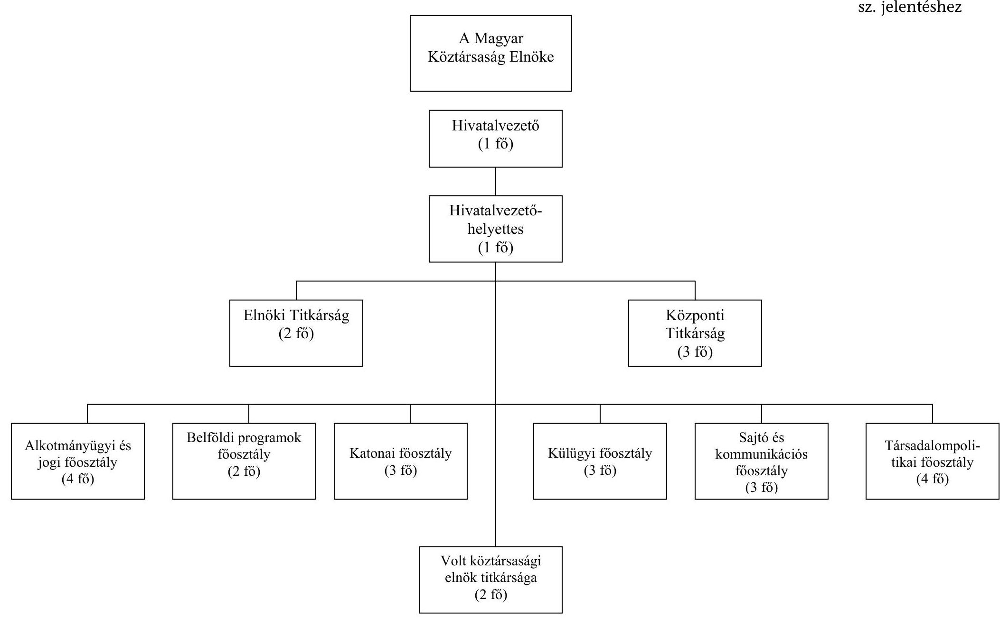

# JELENTÉS 

## A Köztársasági Elnökség fejezet múködésének ellenőrzéséről

2002. július

---

# Államháztartás Központi Szintjét Ellenőrző Igazgatóság Átfogó Ellenőrzési Főcsoport   V-4-26/2002.   Témaszám: 592 

## Az ellenőrzést felügyelte:

Bihary Zsigmond föigazgató

## Az ellenőrzés végrehajtásáért felelős:

Hegedűsné dr. Müllern Veronika főcsoportfőnök

## Az ellenőrzést vezette:

dr. Horváth Margit osztályvezető főtanácsos

## Az ellenőrzést végezte:

Séra Andrásné
számvevő tanácsos, főtanácsadó

## Az ÁSZ által a témában eddig készített jelentések:

1. Az éves zárszámadások ellenőrzései 1998-2000.
2. A Köztársasági Elnökség fejezet múködésének pénzügyi-gazdasági ellenőrzése 1993., 1998.

---

# TARTALOMJEGYZÉK 

BEVEZETÉS ..... 5
I. ÖSSZEGZŐ MEGÁLLAPÍTÁSOK, KÖVETKEZTETÉSEK, JAVASLATOK ..... 7
II. RÉSZLETES MEGÁLLAPÍTÁSOK ..... 10

1. A feladatok, a szervezeti rendszer és a gazdálkodási feltételek összhangja ..... 10
1.1. A szakmai feladatok és a szervezeti rendszer összhangja ..... 10
1.2. A belső kontroll rendszer kialakítása és múködése ..... 13
1.2.1. A múködési és gazdálkodási rend szabályozottsága ..... 13
1.2.2. A belső ellenőrzési rendszer szabályozottsága, múködése ..... 16
2. A fejezet gazdálkodása ..... 17
2.1. A költségvetés tervezése ..... 17
2.2. A bevételek alakulása ..... 18
2.3. Az előirányzatok módosítása ..... 19
2.4. A létszámmal és a személyi juttatásokkal való gazdálkodás ..... 20
2.5. A dologi kiadások alakulása ..... 22
2.5.1. A reprezentációs kiadások ..... 23
2.6. Felhalmozási kiadások ..... 24
2.7. A fejezeti kezelésű előirányzatok felhasználása ..... 24
2.8. A finanszírozási rendszer múködése, az előirányzat-maradványok alakulása ..... 26
2.9. Az éves költségvetési beszámolók, mérlegek valódisága ..... 27
3. Az előző vizsgálataink javaslatai alapján megtett intézkedések ..... 27

---

# Rövidítések jegyzéke 

| Áht. | Az államháztartásról szóló 1992. évi XXXVIII. törvény |
| :--: | :--: |
| ÁSZ | Állami Számvevőszék |
| Er. | A központi, a társadalombiztosítási és a köztestületi költségvetési szervek kormányzati, felügyeleti, valamint belső költségvetési ellenőrzéséről szóló 15/1999. (II. 5.) Korm. rendelet |
| KE | Köztársasági Elnökség fejezet |
| Hivatal | Köztársasági Elnöki Hivatal |
| Ktv. | A köztisztviselők jogállásáról szóló 1992. évi XXIII. törvény, illetve a köztisztviselők jogállásáról szóló 1992. évi XXIII. törvény, valamint egyéb törvények módosításáról szóló 2001. évi XXXVI. törvény |
| ME | Miniszterelnökség fejezet |
| MEH | Miniszterelnöki Hivatal |
| NKÖM | Nemzeti és Kulturális Örökség Minisztériuma |
| OGY | Országgyúlés |
| OGY Hivatala | Országgyúlés Hivatala |
| OM | Oktatási Minisztérium |
| PM | Pénzügyminisztérium |
| SzMSz | Szervezeti és Múködési Szabályzat |
| Szt. | A számvitelről szóló 1991. évi XVIII., illetve a 2000. évi C. törvény |
| TÜSZ | Teljes körú Ügyvitel-szolgáltató és Információs Rendszer |

---

# JELENTÉS 

## a Köztársasági Elnökség fejezet múködésének ellenőrzéséről

## Bevezetés

Az éves költségvetési törvények a központi költségvetés részeként határozzák meg a Köztársasági Elnökség (KE) fejezet múködését biztosító pénzügyi fedezetet, amely magában foglalja a Köztársasági Elnöki Hivatal (Hivatal) és a fejezeti kezelésú előirányzatok (állami kitüntetések, illetve a 2000. augusztusi köztársasági elnöki ciklusváltás) címeit és kiadásait.

A Hivatal látja el a köztársasági elnöki kinevezésekkel, az egyéni kegyelem gyakorlásával, az állampolgársággal, a kitüntetésekkel kapcsolatban hozott elnöki határozatok előkészítését, gondoskodik az elnöki döntések, intézkedések végrehajtásáról. A Köztársasági Elnöki Hivatal vezetője egyben a fejezet felügyeletét ellátó szerv vezetője is.

A Magyar Köztársaság 2001. és 2002. évi költségvetéséről szóló 2000. évi CXXXIII. törvény szerint a fejezet költségvetési támogatással fedezett kiadási előirányzata 2001-ben 496,9 M Ft volt, a Magyar Köztársaság 1998. évi költségvetéséről szóló 1997. évi CXLVI. törvényben biztosított 367,5 M Ft-tal szemben. A fejezet költségvetési létszáma az 1998. évi 47 fơről 2001-re 1 fővel emelkedett.

A fejezetnél legutóbb 1998-ban végeztünk átfogó pénzügyi- gazdasági ellenőrzést. Ezt követően évente ellenőriztük a fejezet zárszámadását.

Jelenlegi átfogó ellenőrzésünk célja annak értékelése volt, hogy a fejezet

- szervezeti, irányítási és múködési rendszere, költségvetési előirányzatai összhangban voltak-e a szakmai feladatokkal;

---

- a költségvetési gazdálkodásában a törvényesség és célszerűség érvénye-sült-e;
- továbbá, hogy a korábbi ellenőrzéseink megállapításai, javaslatai mennyiben hasznosultak a Hivatal irányító és gazdálkodási tevékenységében.

Az Állami Számvevőszék az államháztartásról szóló - többször módosított 1992. évi XXXVIII. törvény 121. § (1) bekezdése alapján ellenőrzi az államháztartás forrásait, azok felhasználását és a vagyonnal való gazdálkodást. A fejezet ellenőrzését az Állami Számvevőszékről szóló 1989. évi XXXVIII. törvény 2. § (3) és a 17. § (3) bekezdése alapján végeztük.

A helyszíni ellenőrzés a korábbi átfogó pénzügyi-gazdasági ellenőrzés lezárását követő időszak (1998. január 1-jétől 2001. december 31-éig) feladatellátására és gazdálkodására vonatkozott, illetve a pénzügyi-gazdasági folyamatokat figyelemmel kísértük a helyszíni ellenőrzés lezárásáig.

Külön program alapján ellenőriztük a fejezet 2001. évi költségvetésének végrehajtását, ezen belül a fejezet költségvetési beszámolójának megbízhatóságát. A fejezetre vonatkozó részletes megállapításokat a 2001. évi költségvetés végrehajtásának ellenőrzéséről szóló ÁSZ jelentés tartalmazza.

A jelentés véglegezés előtt egyeztettük a Köztársasági Elnöki Hivatal Kabinetfőnökével, aki a jelentést elfogadta (3. sz. melléklet).

---

# I. ÖSSZEGZŐ MEGÁLLAPÍTÁSOK, KÖVETKEZTETÉSEK, JAVASLATOK 

A fejezet szakmai feladatellátásának középpontjában a köztársasági elnök jogkörébe tartozó feladatok ellátási feltételeinek folyamatos és zavartalan biztosítása állt. A köztársasági elnök feladatát alapvetően a Magyar Köztársaság Alkotmánya határozza meg.

A fejezet egyetlen intézménye, egyben a köztársasági elnök munkaszervezete a Köztársasági Elnöki Hivatal, amelynek feladatát törvény szabályozza, gazdálkodási rendjét alapító határozat rögzíti.

A Hivatal szervezeti és múködési rendje az ellenőrzött időszak elejére állandósult, abban kisebb változást a 2000. évi köztársasági elnöki ciklusváltás többletfeladatai jelentettek (új szervezeti egységként alakult meg a volt köztársasági elnök titkársága, illetve új vezetői szintként belépett a hivatalvezető-helyettesi státusz).

A Hivatal által közvetlenül ellátott gazdálkodás és a múködés rendjének szabályozottsága nem volt teljes körú. Egyes területek szabályozása elmaradt, pl. a mobil távközlési szolgáltatás használatára vonatkozóan, ezáltal a hivatalvezetői hatáskörben meghatározott havi térítési díjak - egységes rendező elv hiányában - indokolatlanul eltértek. Hiányosságok is előfordultak, a fejezeti kezelésű előirányzatok felhasználásáról szóló szabályzat nem tartalmazta a Pénzügyminisztérium egyetértését. A szabályzataik között nem minden esetben volt meg az összhang, az SzMSz-ben, illetve a reprezentációról szóló utasításban a vezetői állások, illetve beosztások körét eltérően határozták meg.

A Hivatal számviteli politikáját, számlarendjét és a számlatükröt a jogszabályi előírásoknak és a Hivatal sajátosságainak megfelelően alakították ki. A Hivatal információs rendszerén belül kiemelt szerepe volt a költségvetési gazdálkodás elemzésére múködtetett monitoring rendszernek, amely részben a vezetői ellenőrzés funkcióit is ellátta.

A Hivatalnál a belső kontroll mechanizmusok rendszerének kialakítása és múködtetése egyes területeken - kiemelten a belső ellenőrzésnél - hiányos és ellentmondásos volt.

A belső ellenőrzés rendszere - annak Hivatalon belüli szabályozása ellenére nem múködött egyenletesen, ezzel is indokolhatók a pénzügyi-bizonylati fegyelem területén tapasztalt hiányosságok (pénzügyi jogkörök nem megfelelő gyakorlása, készlet-nyilvántartási problémák). A belső ellenőrzési rendszer gyenge pontja volt a függetlenített belső ellenőrzés. Nem mérték fel a függetlenített belső ellenőrzési feladatok Hivatalra szabott igényét, a személyi feltételeket sem biztosították és nem éltek külső szakértő igénybevételének lehetőségével sem. A Belső Ellenőrzési szabályzatot az ellenőrzésről szóló kormányrendelet előírásai szerint nem aktualizálták.

---

A fejezet éves költségvetéseinek elfogadott előirányzatai a köztársasági elnök közjogi szerepének megfelelően biztosították a szakmai feladatok ellátását és a kiegyensúlyozott gazdálkodás feltételeit. A kiadási előirányzat az ellenőrzött időszak minden évében emelkedett, 1998-ról 2001-re 35\%-kal. A támogatási előirányzat-növekedést az elnöki ciklusváltás többletköltsége, a kitüntetésekhez kapcsolódó díjazások évenkénti emelkedése, a köztisztviselői törvény módosítása, továbbá a köztisztviselők minőségi személycseréje indokolta.

A Hivatal gazdálkodását alapvetően meghatározta, hogy az az Országgyúlés épületében nyert elhelyezést. A Hivatal a múködéséhez szükséges feladatok nagy részét az évente megkötött megállapodások alapján az OGY Hivatala közremúködésével látta el. Ugyanakkor a feladat-átruházást - az államháztartás múködési rendjéről szóló kormányrendelet előírását figyelmen kívül hagyva - az SzMSz-ben nem rögzítették. A múködési tételek fedezetéül szolgáló összeget minden évben a költségvetés tervezésekor határozták meg, a kiadásokhoz a fedezetet átadott pénzeszközként biztosította a Hivatal.

Előirányzat-módosításra az előző évi maradványok igénybevétele, a fejezeti kezelésű előirányzatok felhasználása, a kormányzati hatáskörben biztosított támogatási többletek, továbbá kisebb mértékben a saját bevételek nyújtottak lehetőséget. Az előirányzat-módosítások szabályosak voltak, azokról folyamatosan, tételesen és naprakészen vezették a nyilvántartást.

A fejezeti kezelésű előirányzatokat felhasználásuk előtt az előirányzatok célja és rendeltetése szerinti előirányzat-módosítással, a fejezet felügyeletét ellátó szerv vezetője hatáskörében csoportosították át.

A fejezetnél jóváhagyott előirányzat-maradványokat a jogszabályi előírásoknak és a kötelezettségvállalásoknak megfelelően dologi kiadásokra, pénzesz-köz-átadásra, a személyi juttatások maradványát pedig jutalmazásra fordították.

A létszámmal és a személyi juttatásokkal való gazdálkodás biztosította a feladatok megfelelő teljesítését. A fejezet költségvetési létszáma az 1998. évi 47 főről 2001. évre 1 fővel emelkedett. A létszámbővítést a többletfeladatok ellátásával indokolták, ugyanakkor a feladatokat a tervezett, illetve engedélyezett létszámnál kevesebb köztisztviselővel látták el, miközben folyamatosan foglalkoztattak megbízási szerződéssel külső szakértőket. A rendelkezésre álló személyi juttatás előirányzata lehetőséget nyújtott a köztisztviselők jogállásáról szóló törvény előírásainak megfelelően differenciált alapilletmény-emelésre, személyi illetmény megállapítására is. A személyi juttatásokra fordított kifizetések - a köztisztviselői törvény keretei között - 1998-ról 2001-re 67\%-kal emelkedtek.

A dologi kiadások körében meghatározóak voltak az üzemeltetéssel, a szakmai tevékenységgel, a kitüntetésekkel, a reprezentációval összefüggő költségek, amelyeket a szakmai feladatellátás sajátos igényei indokoltak. A kitüntetésekkel, kinevezésekkel kapcsolatos rendezvények száma az ellenőrzött időszak első három évében közel azonos volt, 2001. évre egyötödével csökkent (összesen 230).

---

A fejezeti kezelésú elöirányzatokat szabályosan, a céljuk szerint használták fel, melyről megfelelően dokumentált és részletezett elszámolást készítettek. A 2000. évi köztársasági elnöki ciklusváltás kiadásai biztosították a váltás zökkenőmentes lebonyolítását. A Köztársaság elnöke kormány-előterjesztés alapján Kossuth-díjat összesen 62 fő részére, Széchenyi-díjat 68 fő részére, megosztott díjat 42 fő részére (összesen 172 díj) adományozott (évente átlag 43 kitüntetés).

A fejezet éves beszámoló jelentéseinek megbízhatóságát 1998.-2001. évekre vonatkozóan vizsgáltuk a financial audit típusú ellenőrzési módszerrel, amelynek eredményeként megállapítottuk, hogy a beszámolók minden évben hitelesek voltak, a fejezet vagyoni és pénzügyi helyzetéről megbízható és valós képet adtak.

A korábbi ellenőrzésünk megállapításai, javaslatai alapján a fejezet címrendje a vizsgált időszakban egyszerűsödött. A Köztársasági elnök Katonai Irodája 2001-től külön címként megszűnt, Katonai Főosztályként beolvadt a Köztársasági Elnöki Hivatal szervezetébe.

A további javaslatainkra vonatkozóan a hivatalvezető intézkedési tervet készített, az abban foglaltakat azonban csak részben tartották be. A szabályozási feladatokat késve, illetve hiányosan teljesítették (fejezeti kezelésű előirányzatok szabályzata); az üres álláshelyek felülvizsgálatát nem végezték el; a már nem adományozható régi kitüntetések érmeállományának archiválását, a készletekből való törlését elmulasztották.

A jelentés megállapításainak hasznosítása mellett javasoljuk a

# Hivatal vezetőjének: 

1. Gondoskodjon a feltárt szabályozási hiányosságok megszüntetése érdekében a szabályzatok kiegészítéséről, módosításáról, az egyes szabályzatok közötti összhang biztosításáról (SzMSz, reprezentációs szabályzat); a belső ellenőrzési szabályzat aktualizálásáról; a mobil távközlési szolgáltatás használati rendjének szabályozásáról.
2. Tekintse át a Hivatal feladatköréhez igazodóan a függetlenített belső ellenőrzési teendők ellátásának lehetőségeit, intézkedjen annak múködtetése érdekében.
3. Pótlólag tegye meg a muzeális értéket jelentő, régi kitüntetések érmeállományának archiválásával, a felesleges készlet hasznosításával kapcsolatos intézkedéseket.

---

# II. RÉSZLETES MEGÁLLAPÍTÁSOK 

## 1. A feladatok, a SzerVEZeti Rendszer És a GAZdÁlKODÁSI FELTÉTELEK ÖSSZHANGJA

### 1.1. A szakmai feladatok és a szervezeti rendszer összhangja

A fejezet feladatellátásának középpontjában a köztársasági elnök jogkörébe tartozó feladatok ellátási feltételeinek folyamatos és zavartalan biztosítása áll.

A köztársasági elnök Magyarország államfője, aki kifejezi a nemzet egységét és őrködik az államszervezet demokratikus múködése felett, egyben a fegyveres erők főparancsnoka, személye sérthetetlen, büntetőjogi védelmét külön törvény biztosítja. Feladatát alapvetően a Magyar Köztársaság Alkotmánya - a többször módosított 1949. évi XX. tv. - határozza meg.

Az Alkotmány 30/A. §-a értelmében a köztársasági elnök képviseli a magyar államot; nemzetközi szerződéseket köt; megbízza és fogadja a nagyköveteket és a követeket; kitűzi az országgyűlési és önkormányzati választások, valamint az országos népszavazás időpontját; kinevezi és felmenti a minisztereket és az államtitkárokat, a Magyar Nemzeti Bank elnökét és alelnökeit, a tábornokokat; megerősíti tisztségében a Magyar Tudományos Akadémia elnökét; címeket, érdemrendeket, kitüntetéseket adományoz; egyéni kegyelmezési jogot gyakorol; dönt az állampolgársági ügyekben.

Feladatainak egy része az Országgyűléshez kapcsolódik, így törvényt kezdeményezhet, aláírja az OGY elnöke által kihirdetésre megküldött törvényeket, gondoskodik azok kihirdetéséről; összehívja az OGY alakuló ülését, zárt ülés megtartását kezdeményezheti; az OGY akadályoztatása esetén jogosult a hadiállapot kinyilvánítására.

A köztársasági elnök a Magyar Köztársasági Érdemrendet a miniszterelnök, a Magyar Köztársasági Érdemkeresztet a miniszterek előterjesztése alapján adományozza. A Kossuth-díjat és a Széchenyi-díjat az ezekről szóló módosított 1990. évi XII. törvény, valamint a Magyar Köztársaság kitüntetéseiről szóló 1991. évi XXXI. törvény alapján a Kormány előterjesztésére adományozza (1. számú táblázat).

A Magyar Köztársaság kitüntetéseiről szóló 1991. évi XXXI. törvény 7. § (1) bekezdésében kapott felhatalmazás alapján a köztársasági elnök a Köztársaság Elnökének Érdemérme elnevezéssel 2001. november 29-én külön kitüntetést alapított, a helyszíni ellenőrzés lezárásáig ennek adományozására nem került sor.

A kitüntetésekkel, kinevezésekkel kapcsolatos rendezvények száma az ellenőrzött időszak első három évében közel azonos volt, 2001. évre egyötödével csökkent (összesen 230).

---

Az igazságügyi miniszter, illetve a legfőbb ügyész előterjesztésére 19 esetben élt a köztársasági elnök az egyéni kegyelmezési jogkörével. A belügyminiszter előterjesztésére 7766 állampolgársági ügyben hozott döntést.

Az Országgyűlés az Alkotmány 29/A. §-ának (1) bekezdése alapján az 51/2000. (VI. 6.) OGY határozatban döntött az új köztársasági elnök választásáról. A jelenlegi köztársasági elnök (hivatalba lépése - 2000. augusztus 4. - óta) az Alkotmány 26. § (1) bekezdése szerint 167 törvény kihirdetéséről gondoskodott. Az Országgyűlés által elfogadott törvényt az aláírás előtt véleményezésre 3 alkalommal küldte meg az Alkotmánybíróságnak, egy alkalommal adta vissza az Országgyűlésnek (2001. június 22-én a pénzügyi tárgyú törvényeket módosító törvényt).

Az Alkotmány 30/A. § (2) bekezdése előírja a köztársasági elnök intézkedéseihez a miniszterelnök vagy az illetékes miniszter ellenjegyzését. A megvizsgált 24 elnöki határozat előkészítésénél az ellenjegyzés hiánytalanul szerepelt.

A szakmai feladatokhoz a fejezet számára az éves költségvetési törvények biztosították a költségvetési forrást.

A fejezet eredeti költségvetési kiadási előirányzata az 1998. évi 367,5 M Ft-ról 2001. évben 496,9 M Ft-ra (35,2\%-kal) emelkedett, amelyet költségvetési támogatással fedeztek. Tendenciájában - az 1999. évihez képest - a 2000. évi kiadási és támogatási előirányzat-növekedés volt jelentős (35,6 \%), 368 M Ft-ról 499,9 M Ft-ra emelkedett, amelyet elsősorban a köztársasági elnöki ciklusváltás ( 120 M Ft) egyszeri, 2000. évre szóló többletköltségei indokoltak.

A fejezet címrendje - az ÁSZ javaslatának megfelelően - az ellenőrzött időszakban egyszerűsödött. A Köztársasági Elnök Katonai Irodája - mint önállóan gazdálkodó szervezeti egység - a köztársasági elnök 2000. december 20-án kelt határozata alapján 2000. december 31. napjával megszűnt, egyúttal az elnöki hivatal szervezetén belül - változatlan feladattal - 2001. január 1-jével Katonai Főosztály alakult, amelynek feladat- és hatáskörét a Hivatal SZMSZ-e tartalmazza. A főosztály feladata a köztársasági elnöknek a fegyveres erők főparancsnoki funkciója ellátásához szükséges információk begyűjtése, elemzések elvégzése, egyeztetések előkészítése.

A Hivatal az államháztartásról szóló - többször módosított - 1992. XXXVIII. törvény (Áht.) 88. § (5) bekezdése előírásainak megfelelően a intézkedett a Pénzügyminisztériumnál a Katonai Iroda törléséről a költségvetési szervek törzskönyvi nyilvántartásából, a Magyar Államkincstárnál (Kincstár) a megszüntetett elői-rányzat-felhasználási keret számlának a jogutód Hivatal számlájára történő átvezetéséről. Az adószám-változásról az APEH-t értesítették.

A fejezetnek egy intézménye van, a Köztársasági Elnöki Hivatal, amely a köztársasági elnök munkaszervezete.

A Hivatal jogállását 1993. január 1-jétől alapító határozat, feladatát 2000-től törvény szabályozza.

A köztársaság elnökének 1993. január 1-jei keltezésű alapító határozata szerint a Hivatal önállóan gazdálkodó központi költségvetési szerv. A költségvetés végrehajtásáért a Hivatal vezetője felel.

---

A köztársasági elnök, a miniszterelnök, az Országgyűlés elnöke, az Alkotmánybíróság és a Legfelsőbb Bíróság elnöke tiszteletdíjáról és juttatásairól szóló - 2000. május 26-án kihirdetett - 2000. évi XXXIX. törvény 10. § (1) bekezdése szerint a köztársasági elnököt feladatainak ellátásában a Hivatal segíti. A Hivatal ellátja a köztársasági elnök törvényekben meghatározott hatásköre gyakorlásával kapcsolatos feladatokat és végzi azokat a tevékenységeket, amelyeket az elnök - a jogszabályok keretei között - részére meghatároz.

A Hivatal szervezete, struktúrája az ellenőrzött időszakban kis mértékben megváltozott. (A Hivatal szervezeti felépítését és a 2001. december 31-ei záró létszámát az 1. sz. melléklet tartalmazza.) A szervezet átalakítása szabályozási oldalról alátámasztott volt, az a múködés racionalizálásával járt.

Megszűnt a Kitüntetési Főosztály, amelynek feladatait a Központi Titkárság látja el. A korábban párhuzamosan múködő két jogi főosztályt összevonták Alkotmányügyi és Jogi Főosztállyá.

A Hivatal funkciókhoz rendelt főosztályai - külügyi, sajtó, a társadalompolitikai és belföldi programokat szervező főosztály - megmaradtak.

Új szervezeti egységként alakult meg a hivatalvezető-helyettes titkársága. A Hivatal szervezetéhez tartozik a volt köztársasági elnök titkársága, amely a volt elnök közvetlen irányításával végzi tevékenységét.

A hivatalvezető-helyettes a hivatalvezető akadályoztatása esetén szervezi és irányítja a Hivatal egészének munkáját. Feladat - és hatáskörébe tartozik az Alkotmányügyi és Jogi Főosztály által az elnökhöz aláírásra felterjesztett iratok felülvizsgálata és ellenjegyzése, valamint a Hivatal tevékenységét érintő jogi állásfoglalások kialakítása.

A volt köztársasági elnököt - a 2000. évi XXXIX. törvény 17. § (1) bekezdése szerint - a megbízatása megszűnését követően annak az időtartamnak a felére, ameddig e tisztségét betöltötte - a Kormány által meghatározott helyen - kétfős titkársági alkalmazott foglalkoztatása illeti meg. A Miniszterelnöki Hivatallal kötött megállapodás alapján a titkárság a Miniszterelnöki Hivatal épületében nyert elhelyezést.

A törvény 10. § (4) bekezdése értelmében a Hivatal vezetője államtitkári, vezetőhelyettese pedig helyettes államtitkári illetményre, illetőleg juttatásokra jogosult.

A Hivatal Szervezeti és Múködési Szabályzatát (SzMSz) 1997. szeptember 1-től 2001. január 2-áig köztársasági elnöki utasítás tartalmazta, azt követően az új SzMSZ-t a Hivatal vezetője állapította meg és - a 2000. évi XXXIX. tv. 10. § (2) bekezdése szerint - a köztársasági elnök hagyta jóvá, hatályos 2001. január 2-ától.

Az SzMSz-ben főosztályi részletezettségig rögzítették a Hivatal feladat- és hatáskörét, a szervezeti egységek (Titkárság és a főosztályok) tevékenységi körét, továbbá az irányítás rendjét és a múködés főbb szabályait. A Hivatal szervezetének tagoltságára, nagyságára tekintettel a szabályozás ügyrendi részletezettségű.

---

Az ellenőrzött időszakban munka- és ellenőrzési terv nem készült, holott a hivatali szervek számára a terv készítési kötelezettséget (az SzMSz helyett) a Belső Ellenőrzési szabályzatban előírták.

A központi, a társadalombiztosítási és a köztestületi költségvetési szervek kormányzati, felügyeleti, valamint belső költségvetési ellenőrzéséről szóló 15/1999. (II. 5.) Korm. rendelet (Er.) szerinti ellenőrzési kötelezettségről nem az SzMSz-ben, hanem a Belső Ellenőrzési Szabályzatban rendelkeztek, melyet az Er. előírásai szerint nem aktualizáltak.

A Hivatalnál a vezetők személyének változásakor átadás-átvételi jegyzőkönyvet nem készítettek. A beosztotti munkakörökben a pénzügyi előadói munkakör átadás-átvételéről - 2000. december 28-án - készült jegyzőkönyv a titkárságvezető jelenlétében.

A Katonai Iroda átszervezésekor a pénzügyi előadó munkaviszonya 2000. december 31-ével megszűnt, a munkavégzés alól felmentették. A munkakör át-adás-átvételéről utólagosan (2002 áprilisában) készült jegyzőkönyv.

A Hivatal munkatársai munkaköri leírásokkal rendelkeztek, azokban az ellátandó munkakör adatai között nem rögzítették a munkatársak köztisztviselői törvény szerinti besorolását, a szervezeti egység megnevezését, a felelősséget, valamint azt, hogy feladataik ellátása során kötelesek betartani a törvények és a belső szabályzatok előírásait.

A Hivatalnál a döntési mechanizmus fontos véleményező, tanácskozó fóruma volt a vezetők részvételével rendszeresen - hetente - megtartott vezetői értekezlet, amelyről emlékeztető készült.

# 1.2. A belső kontroll rendszer kialakítása és múködése 

### 1.2.1. A múködési és gazdálkodási rend szabályozottsága

A fejezet felügyeletét ellátó szerv vezetője az államháztartás múködési rendjéről szóló 217/1998. (XII. 30.) Korm. rendelet 2. § 2. pontja alapján a Köztársasági Elnöki Hivatal vezetője.

A Köztársasági Elnök Hivatalának gazdálkodási feladatait a Központi Titkárság végezte az SZMSZ és a hivatalvezető utasításai alapján.

A gazdálkodási feladatok egy részét - az OGY Hivatala főigazgatójával kötött - részletes megállapodás alapján az OGY Hivatala látta el. A saját szervezetre vonatkozó gazdálkodási feladatok egy részének ellátására - a felelősség átruházása nélküli vásárolt szolgáltatás formájában - az államháztartás múködési rendjéről szóló 217/1998. (XII. 30.) Korm. rendelet 17. § (1) bekezdése lehetőséget biztosít. A megállapodást szabályszerűen kötötték meg és annak előírásait betartották.

A Hivatal az ellenőrzött időszakban a gazdálkodás feltételeit biztosító szabályzatokkal rendelkezett.

---

A hivatalvezető a fejezet költségvetését érintő pénzgazdálkodási funkciók gyakorlásának rendjéről az 1998. január 1-jétől hatályos szabályzatában intézkedett, a 2000. évi köztársasági elnöki ciklusváltást követően - az új SzMSz hatálybalépéséig - az aláírási jogosultságot a 2/2000. (VIII. 18.) számú utasításban szabályozta.

A Köztársasági Elnöki Hivatal gazdálkodásának egyes kérdéseiről - 2001. február 28-án - Hivatalvezetői utasítást adtak ki. Az utasítás rendelkezései szerint jártak el a vizsgált időszakban.

Az utasítás mellékletét képezték a számviteli politikáról és számlarendről, a pénz- és értékkezelésről; a fejezeti kezelésű előirányzatok felhasználásának rendjéről; az eszközök és források leltározásáról-, minősítéséről és értékeléséről; a reprezentáció engedélyezéséről és elszámolásáról; a szigorú számadási kötelezettség alá vont pénzügyi nyomtatványokról szóló szabályzatok.

A Hivatal számviteli politikáját, a számlarendjét és a számlatúkröt a költségvetés alapján gazdálkodó szervek beszámolási és könyvvezetési kötelezettségéről szóló, többször módosított 54/1996. (IV. 12.) Korm. rendelet és az új, a számvitelről szóló 2000. évi C. törvény és az annak végrehajtására kiadott 249/2000. (XII. 24.) Korm. rendelet elöírásaival összhangban alakították ki.

A fejezeti kezelésú előirányzatok felhasználását a Pénzügyminisztérium egyetértése nélkül szabályozták. A fejezet felügyeletét ellátó szerv vezetője az Áht. 24. § (4) bekezdése és 49. § o) pontjában meghatározott határidőt (évente február 15-ig) csaknem két évvel túllépte (az 1997. évre vonatkozóan). Nem intézkedtek továbbá a fejezeti kezelésű előirányzatok felhasználásának ellenőrzéséről sem.

Az 1997. évi fejezeti kezelésű előirányzatok felhasználásának rendjéről a szabályzatot a hivatalvezető 1998. december 1-jén adta ki.

A 2001. február 28-án hivatalvezetői utasításként kiadott szabályzatot 2002. április hónapban egyeztetés céljából megküldték a Pénzügyminisztériumnak, válasz a helyszíni ellenőrzés lezárásának időpontjáig nem érkezett.

A Hivatal rendelkezésére álló, reprezentáció célját szolgáló éves keretösszeg felhasználásának rendjét a 3/2000. (VIII. 31.) sz. utasításban szabályozták. Az utasítás szerinti, a reprezentáció elszámolására vonatkozó rendelkezések hiányában a Miniszterelnöki Hivatallal közösen kialakított gyakorlat szerint jártak el.

A reprezentációról szóló utasítás szerinti és az SzMSz-ben rögzített vezetői beosztások nem voltak összhangban. Az előbbi utasítás 5. pontja szerinti vezetői beosztások köre bővebb, abban vezetői beosztásúnak minősül a, főtanácsadó, tanácsadó, szak-főtanácsadó, főmunkatárs besorolású dolgozó is.

Nem szabályozták a mobil távközlési szolgáltatás használati rendjét, az azzal kapcsolatos intézkedéseket a hivatalvezető saját hatáskörében hozta meg, a havi térítési díjak - egységes rendező elv hiányában- beosztástól függően indokolatlanul eltértek.

---

A Hivatal vezetője a Köztársasági Elnökség által karitatív céllal - alapfeladatán kívül - a magánszemélyeknek nyújtható segélyezésről az 1998. december 1-jén kelt szabályzatban rendelkezett. A segélyezés intézményét 2001-ben megszüntették.

A Hivatal információs rendszerén belül kiemelt szerepe volt a költségvetési gazdálkodás elemzésére - havi rendszerességgel - múködtetett monitoring rendszernek, amely egyúttal a gazdálkodás területén a vezetői ellenőrzés funkcióit is ellátta. A hivatalvezető a havi információs jelentések alapján ellenőrizte az előirányzatok évközi alakulását, a múködés pénzügyi fedezetének meglétét.

A Hivatalnál a 36 db számítógép az OGY Hivatala által felügyelt és karbantartott Novell hálózatára csatlakozik és az Internet hozzáférés (kijárás) is az OGY hálózatán keresztül történik. A Köztársasági Elnöki Hivatalnak önállóan üzemeltetett hálózata jelenleg nincs.

Az informatikai hálózat fejlesztésével kapcsolatban célul tűzték ki az OGY informatikai hálózatáról való teljes leválást és az önálló hálózat teljes körű kiépítését, a távmunka informatikai hátterének megteremtését. Az informatikai rendszer fejlesztéséhez a Hivataléhoz illeszkedő informatikai stratégiával rendelkeznek, amelyet helyzetelemzéssel támasztottak alá.

A Hivatal 2000-ben - külső céggel 1,3 M Ft díjazás ellenében - felmérést végeztetett a hardver és szoftver állományról. Javaslat készült az elavult, lassú számítógépek helyett újak beszerzésére, valamint a meglévő géppark bővítésére, figyelembe véve önálló levelező rendszer múködtetése esetén a szükséges számítógépkapacitás többlet igényét is.

A döntési lehetőségeket több vezetői értekezleten is megtárgyalták (2000. november 28 -ai és 2001 . december 13 -ai vezetői értekezletek emlékeztetői).

A Hivatal az OGY Hivatalánál megtette a kezdeti lépéseket az OGY Hivatala informatikai rendszeréről a leválás előkészítése érdekében. Egy független, önálló Internet hozzáférést biztosító hálózat építését is megkezdték. Ennek előfeltétele egy klimatizált szerver-szoba kialakítása, amelyben a víz-tűz behatolás elleni védelmet is biztosítani kell a gépek, a rendszerek részére.

A fókönyvi könyvelést 2001-től a TÚSZ (Teljes körű Ügyvitel-szolgáltató és Információs Rendszer) programmal végezték, azt megelőzően az APEH-SZTADI programot alkalmazták. A számviteli folyamatot támogató informatikai rendszer megfelelően követte a számviteli előírások, a számlarend változásait. A költségvetési gazdálkodásról a beszámolási kötelezettség, a zárási tevékenység számítógépes támogatottsága megoldott volt.

A számítógépen vezetett analitikus nyilvántartások és a főkönyvi könyvelés kapcsolata nem volt automatikus és teljes körű, ez a költségvetési beszámoló megbízhatósága szempontjából kockázatot rejtett magában, amelyet a számlarendben meghatározott egyeztetési pontok alkalmazásával csökkentettek.

A Központi Titkárságon egy számítógépre személyügyi és munkaügyi programot telepítettek, amely kezeli a köztisztviselők személyi és munkaügyi adatait, egyúttal a közszolgálati nyilvántartáshoz végez adatszolgáltatást. A programhoz a hozzáférést korlátozták.

---

# 1.2.2. A belső ellenőrzési rendszer szabályozottsága, múködése 

A belső ellenőrzés működésének főbb elveit, a belső ellenőrzés eljárási rendjét hivatalvezetői utasításként az 1997. augusztus 31-én kiadott Belső Ellenőrzési Szabályzatban rögzítették. A költségvetési gazdálkodásban a belső ellenőrzést a vezetői, a folyamatba épített és a függetlenített ellenőrzésen keresztül szabályozták. Az Er. 5. §-ában és 42. § (3) bekezdésében rögzített szabályzatmódosítási kötelezettségének a Hivatal nem tett eleget sem a határidőt, sem a tartalmi és végrehajtási kérdéseket illetően.

A szabályzatokat az Er. 42. § (3) bekezdésében foglaltaknak megfelelően 1999. március 31-ig kellett volna elkészíteni, illetve módosítani.

A hivatalvezető, illetve a szervezeti egységek vezetőinek feladat- és hatáskörébe tartozó ellenőrzési munka megszervezését, a beszámoltatását a Belső Ellenőrzési Szabályzatuk előírja.

A vezetői ellenőrzés hiányossága, hogy nem kérte számon a szabályzatban foglaltak végrehajtását, nem követelte meg kellő következetességgel a kiadott feladatok határidőre történő elvégzését, pl. az 1997. évi intézkedési terv végrehajtását. A vezetői beszámoltatás szóban történt, azokról írásos dokumentáció az ellenőrzött időszakban nem készült.

A belső ellenőrzés keretében múködtetett vezetői és munkafolyamatba épített ellenőrzési eszközt nem terjesztették ki a munkafolyamat valamennyi szakaszára, ezáltal a belső ellenőrzési rendszer nem funkcionált megfelelően, nem működött hatékonyan. Igazolják ezt a kitüntetési érmék kifizetésénél-, a számlák érvényesítésénél, a kitüntetési készlet-nyilvántartásnál feltárt hiányosságok, amelyek pontatlanságra, így a belső ellenőrzés hiányára is utalnak.

Már nem adományozható kitüntetéseket is raktároztak; a Kossuth-díj és Széche-nyi-díjakat a készlet-nyilvántartásba 1998-2000 években nem vételezték be.

A pénzügyi jogkörök gyakorlásánál sem végezték teljes körűen a belső szabályzatban meghatározott vezetői, illetve munkafolyamatba épített ellenőrzési feladatokat. Az államháztartás múködési rendjéről szóló 217/1998. (XII. 30.) Korm. rendelet 134. § (9) bekezdésében előírt, a kötelezettségvállalás ellenjegyzésére vonatkozó előírásokat nem minden esetben tartották be.

A kötelezettségvállalást a gazdasági vezető vagy az általa kijelölt személy nem ellenjegyezte a 236 E Ft kifizetéséről szóló 16/1998. sz. számla; a 2000. február 16án a Miniszterelnöki Hivatallal kötött megállapodás; a 2000. február 23-án kötött vállalkozási szerződés; a 2000. október 2-án kötött megbízási szerződés, 2000. december 4-én kötött szerződés esetében.

A Hivatalnál a vezetői és a munkafolyamatba épített ellenőrzés mellett nem múködött a függetlenített belső ellenőrzés, az ilyen típusú, a Hivatalra adaptált ellenőrzési feladatok körét és ezzel összefüggésben a tevékenység ellátásának formáját sem tekintették át.

---

# 2. A FEJEZET GAZDÁlKODÁSA 

### 2.1. A költségvetés tervezése

A fejezet múködési kiadásainak eredeti előirányzata az ellenőrzött időszakban az éves költségvetési törvények szerint összesen 1.732,3 M Ft volt. A kiadási előirányzat megegyezett a költségvetési támogatás tervezett összegével (1. számú táblázat). A fejezet költségvetési kiadási főösszege minden évben emelkedet, az 1998. évi 367,5 M Ft-ról 2001. évre 496,9 M Ft-ra (35,2 \%-kal). A támogatási előirányzat-növekedést az elnöki ciklusváltás többletköltsége, a kitüntetésekhez kapcsolódó díjazások emelkedése, a köztisztviselői törvény módosítása, továbbá a köztisztviselők minőségi személycseréje (felsőfokú végzettségű köztisztviselők alkalmazása) indokolta.

A fejezet az éves költségvetéseinek tervezését a Pénzügyminisztériummal egyeztetett sarokszámok figyelembevételével végezte. Kiemelt gondot fordítottak az állami kitüntetések és a 2000. évi köztársasági elnöki ciklusváltás kiadásainak biztosítására.

A fejezet 1.732,3 M Ft eredeti kiadási előirányzata a szerkezeti változások mellett 331 M Ft (1998. évben 63,1 M Ft; 1999. évben 5 M Ft; 2000. évben 149,7 M Ft; 2001. évben 113 M Ft) fejlesztési többletet tartalmazott. A volt köztársasági elnök titkársága múködési kiadásaira 43 M Ft -ot, a köztisztviselők minőségi személycseréjére 50 M Ft előirányzatot biztosítottak.

A személyi juttatások tervezését a Ktv. szerinti járandóságok, valamint a kitüntetésekhez kapcsolódó díjak összegének évenkénti növekedése determinálta.

A fejezetnél az ellenőrzött időszakban önálló címként összesen 560 M Ft fejezeti kezelésú előirányzatot hagyott jóvá az Országgyúlés az éves költségvetési törvényekben. Az eredeti kiadási előirányzatok teljes egészében költségvetési támogatásként kerültek megállapításra (1998-ban 110 M Ft; 1999-ben 110 M Ft; 2000-ben 227 M Ft; 2001-ben 113 M Ft).

A fejezeti kezelésű előirányzatok tervezésének alapját a Magyar Köztársaság kitüntetéseiről szóló 1991. évi XXXI. törvény, a Kossuth-díjról és a Széchenyi díjról szóló módosított 1990. évi XII. törvény, valamint a köztársasági elnöki ciklusváltást rögzítő alkotmányos rendelkezések képezték.

A 2000. évi köztársasági elnöki ciklusváltással kapcsolatos 120 M Ft kiadási előirányzat jogcímek szerinti megalapozott tervezését - szükségszerű - bizonytalansági tényezők is befolyásolták, így például a várhatóan felmentendő köztisztviselői létszám. Személyi juttatásokra 90 M Ft-ot, munkaadókat terhelő járulék címén 30 M Ft-ot terveztek.

A fejezetnél az éves költségvetések tervezésével kapcsolatos feladatokat, azok ütemezését, forrásigényét a Hivatal vezetése megtárgyalta, arról - az SzMSz előírásaival összhangban - a hivatalvezető döntött.

---

A SzMSz szerint a hivatalvezető egy személyben felelős a költségvetés elkészítéséért. A költségvetés tervezésével kapcsolatban a hivatalvezető, a hivatalvezetőhelyettes és a Központi Titkárság vezetője előzetesen egyeztetett.

Az éves költségvetési törvényekben meghatározott előirányzatok biztosították a kiegyensúlyozott múködést.

# 2.2. A bevételek alakulása 

A Hivatal - az alapító határozat szerint - bevételt eredményező szakmai tevékenységet nem folytatott, sajátos bevételei a rendeltetésszerú múködéssel összefüggésben keletkeztek.

Többletbevétel a korábbi években a lakásvásárláshoz nyújtott munkáltatói támogatások visszafizetéséből ( 5 M Ft ) és az intézményi egyéb sajátos bevételekből (eszközértékesítés, biztosítási kártérítés) realizálódott. (1998-2001. években összesen 8,5 M Ft bevétel keletkezett, melyből 4,9 M Ft 2001-ben).

A fejezetnél a Katonai Iroda tárgyi eszközeinek (személygépkocsi, gépek, berendezések) értékesítéséből 2000-ben 2 M Ft bevétel származott. Az értékesítés a jogszabályi előírásoknak megfelelően történt.

A titkárságvezető által a hivatalvezetőnek írt 2001. március 11-ei feljegyzés szerint - immobil készlet értékesítéséből - 2001. június 26-én 4 M Ft bevétel származott.

Az ellenőrzött időszakban a saját bevételek teljesített összege 82,2 M Ft volt, amelynek $84 \%$-át $(68,7 \mathrm{MFt})$ a más fejezetektől az állami kitüntetésekhez átvett pénzeszközök tették ki.

A saját bevételeken belül pótlólagos forrásként, átvett pénzeszköz címén összesen 68,7 M Ft - az összes bevétel $4 \%$-a - realizálódott az ellenőrzött időszakban.

Az adományozott Kossuth- és Széchenyi-díjakkal járó jutalom-összegek évrőlévre történő emelkedése miatt (1998-ban 2.280 E Ft, 1999-ben 2.700 E Ft, 2000ben 3.000 E Ft, 2001-ben 3.350 E Ft) jellemző gyakorlat volt 1999-től, hogy megállapodás alapján, növekvő mértékben adtak át más fejezetek (Miniszterelnökség, Nemzeti és Kulturális Örökség Minisztériuma, Oktatási Minisztérium) pénzeszközt a díjak kifizetéséhez (1999. évben 13,9 M Ft-ot; 2000. évben 25,3 M Ft-ot, 2001. évben 29,5 M Ft-ot).

A MEH 2000. évben 7,1 M Ft-ot, 2001. évben 7,9 M Ft-ot, a NKÖM 12 M Ft-ot, az OM 2000-ben 6 M Ft-ot, 2001-ben 10 M Ft-ot adott át a Hivatalnak a kitüntetések kifizetéséhez.

A többletbevételeket az Áht. 93. § (2) bekezdésének előírásai szerint, a tényleges többletnek megfelelő összegű fejezeti hatáskörben végrehajtott előirányzatmódosítást követően használták fel.

---

# 2.3. Az előirányzatok módosítása 

Előirányzat-módosításokra az előző évi maradványok igénybevétele, a fejezeti kezelésű előirányzatok felhasználása, az átvett pénzeszközök többlete, a kormányzati hatáskörben elrendelt támogatási többletek és a saját többletbevételek nyújtottak lehetőséget.

A Hivatal eredeti előirányzatait a Kormány hatáskörében történő módosítások, a fejezeti kezelésű előirányzatok átcsoportosításai és a más fejezetektől átvett pénzeszközök növelték.

A végrehajtott előirányzat-módosítások következtében a fejezet költségvetése az eredeti kiadási előirányzathoz képest 1998. évben 23,2 M Ft-tal (6 \%-kal), 1999. évben 39,1 M Ft-tal ( $10 \%$-kal), 2000. évben 54,1 M Ft-tal ( $11 \%$-kal), 2001. évben 100,6 M Ft-tal ( $20 \%$-kal) növekedett.

A kormányszintú előirányzat-módosítások 1999. évben 10,5 M Ft-tal csökkentették, 2000. évben 14,5 M Ft-tal, 2001. évben 45,7 M Ft-tal növelték a fejezet eredeti kiadási előirányzatát.

A költségvetés általános tartalékának emelésére - az árvízkárok felszámolására és a helyreállítások finanszírozásához - a fejezettől a 2028/1999. (II. 12.) Korm. határozat alapján 7 M Ft-ot vontak el.

A 2000. év elején kialakult árvízi katasztrófahelyzet pénzügyi fedezetének biztosítására a 2076/2000. (IV. 11.) Korm. határozattal a fejezet előirányzatát 10,5 M Ft-tal csökkentették. A kormányhatáskörben végrehajtott előirányzat módosítás 2000. évben a fejezeti kezelésű előirányzatot is érintette, (a 2,9 M Ft zárolt összegből az elnöki ciklusváltás előirányzatát 2,5 M Ft-tal, az Állami Kitüntetések előirányzatát 0,4 M Ft-tal csökkentették).

A 2243/2000. (X. 9.) Korm. határozattal a költségvetés általános tartaléka terhére, egyszeri jelleggel 25 M Ft pótelőirányzatot biztosítottak, melyből a személyi juttatások előirányzatát 15 M Ft-tal növelték.

A fejezet személyi juttatások előirányzatát - a PM-nek megküldött részletes számítási dokumentáció alapján - 2001 márciusában a köztisztviselők egyszeri kere-set-kiegészítésére 1 M Ft-tal, szeptember hónapban illetményemelésre 12,6 M Fttal, decemberben a költségvetési tartalékból 16,5 M Ft-tal növelték.

A 2001. évi - átlagostól eltérő - kiadási és támogatási előirányzat növekedést a Magyar Köztársaság 2001. és 2002. évi költségvetéséről szóló 2000. évi CXXXIII. tv. 5. §-ának (1) bekezdése értelmében a köztisztviselők új illetményrendszerének bevezetéséből adódó többletkiadások fedezetére biztosította a Kormány.

A felügyeleti szervi hatáskörben végrehajtott előirányzat-módosítások a fejezeti kezelésű előirányzat módosításán felül az átvett pénzeszközök és a saját bevételi előirányzat növekedését eredményezték.

A fejezeti kezelésű előirányzatokat - felhasználásuk során - a Hivatal címhez az előirányzatok céljának és rendeltetésének megfelelően, a fejezet felügyeletét ellátó szerv vezetője hatáskörében - a 217/1998. (XII. 30.) Korm. rendelet 48. § (5) bekezdése alapján - csoportosították át.

---

Az előirányzat módosítások minden esetben szabályosak és dokumentáltak voltak. A Hivatalnál az előirányzat-módosításokat folyamatosan, tételesen és naprakészen vezették.

Az előirányzat-módosítások megfeleltek a hatásköri előírásoknak, az Áht. 24. § (2) - (3) bekezdésének előírásait betartották, a kiemelt előirányzatokat nem lépték túl. Az előirányzat-módosításokkal kapcsolatos - az intézkedést követő 5 munkanapon belüli - adatszolgáltatási kötelezettségüknek eleget tettek.

# 2.4. A létszámmal és a személyi juttatásokkal való gazdálkodás 

A fejezet költségvetési létszáma az 1998. évi 47 fơről 2001. évre - a növekedés és csökkenés eredményeként - 1 fốvel emelkedett (3. sz. táblázat). A létszámbővítési igényt a többletfeladatokkal indokolták, ennek ellenére a feladatokat a tervezettnél, illetve engedélyezettnél kevesebb létszámmal látták el, miközben folyamatosan foglalkoztattak megbízási szerződéssel külső szakértőket.

A feladatellátás sajátossága volt, hogy a Honvédelmi Minisztérium biztosította a Katonai Főosztály 3 fős állományát (vezényléssel), a Külügyminisztérium pedig 1 főt delegált a Külügyi Főosztályhoz. A részükre kifizetett illetmények és a munkaadókat terhelő járulékok a minisztériumok költségvetését terhelték.

A bővülő feladatok ellátásához folyamatos megbízási szerződések keretében (külsős) foglalkoztatottakat is igénybe vettek.

A Központi Titkárságon 1 fő informatikust, 1 fő pénzügyi-gazdasági vezetőt; a Kommunikációs és Sajtó Főosztályon 1 fő sajtófigyelőt alkalmaztak megbízási szerződéssel az üres álláshelyek terhére.

A fejezet létszámhelyzetére jellemző volt, hogy míg a Magyar Köztársaság 1999. évi költségvetéséről elfogadott 1998. évi XC. törvény 48. §-ában előírt 3 \%-os mértékű létszámcsökkentés a fejezetre nem vonatkozott, addig 2000-re az 1999. évi 47 fős költségvetési létszámot úgy határozta meg a költségvetési törvény, hogy az tartalmazta a volt köztársasági elnök titkárságához engedélyezett 2 fő alkalmazottat is.

A fejezet év végi zárólétszáma nem változott, 1998. december 31-én és 2001. december 31-én is 40 fő volt. Az üres álláshelyek száma évente átlag 9 volt. Az álláshelyek be nem töltését elsősorban az elhelyezési gondokkal indokolták, a személyi juttatás maradványát rendszeresen jutalomként felhasználták.

Az ellenőrzött időszakban a ciklusváltás kapcsán helyettes államtitkárnak minősülő új vezetői státusz lépett be (2000-ben). A főosztályvezetők száma az 1998. és 1999. évi 7 fơről 2001. évre 5 főre, így a vezetők száma 8 főről 6 főre csökkent.

Az ellenőrzött időszakban nyelvpótlékban részesülők száma növekedett. A Hivatal vezetője a Ktv. 48. § (6) bekezdése alapján az idegennyelv-tudási pótlékra jogosító nyelveket az angol, német és francia nyelvek kizárólagos kijelölésével megszorítóan határozta meg.

---

A Ktv. módosítása előtt 12 fő kapott nyelvpótlékot, 2001. július 1-től 19 fő (ebből 18 fő felsőfokú, C típusú). A nyelvpótlék megállapítása szabályosan történt.

Növekedett a felsőfokú végzettségűek (vezetők nélküli I. besorolási osztály) létszáma, az 1998. évi 4 főről 2000. évre 16 főre. A 2001. évi költségvetés tervezésekor 26 fő felsőfokú végzettségű köztisztviselő alkalmazásával számoltak.

Nem tartották be a Ktv. 30/A. § (1) bekezdése azon előírását, amely szerint az intézménynél létesíthető szakmai tanácsadói és főtanácsadó cím a közigazgatási szerv felsőfokú végzettségű köztisztviselői engedélyezett létszámának $10 \%$ át nem haladhatja meg. A személyügyi nyilvántartásuk alapján 2001. évben 5 fő főtanácsadói és 2 fő tanácsadói címet tartottak nyilván, amely az engedélyezett létszámuk 17,5 \%-át tette ki. 2001. október 1-étől már csak 2 fő rendelkezett szakmai tanácsadói címmel.

A személyi juttatások kiadásaira összesen 1.009,3 M Ft-ot teljesítettek. A személyi juttatásokra fordított kifizetések 1998-2001. évek között 67,3 \%-kal (187,1 M Ft-ról 313,1 M Ft-ra) emelkedtek (4. sz. táblázat).

A rendelkezésre álló személyi juttatás előirányzata lehetőséget nyújtott a köztisztviselők jogállásáról szóló törvény előírásainak megfelelően differenciált alapilletmény-emelésre, személyi illetmény megállapítására is. A személyi juttatásokra fordított kifizetések - a köztisztviselői törvény keretei között - 1998-ról 2001-re 67\%-kal emelkedtek.

A köztársasági elnök havi tiszteletdíját a köztársasági elnök, a miniszterelnök, az Országgyűlés elnöke, az Alkotmánybíróság elnöke és a Legfelsőbb Bíróság elnöke tiszteletdíjáról és juttatásairól szóló 2000. évi XXXI. törvény alapján helyesen állapították meg.

A törvény 1. §-a alapján az elnök tiszteletdíja a Ktv. szerint megállapított köztisztviselői illetményalap hét és félszerese, továbbá ennek az összegnek a 180\%-a.

Az alapilletmények alakulását az illetményalap évenkénti növekedésén túl a személyi fizetések határozták meg, emellett differenciált alapilletmény-emelést alkalmaztak.

Személyi illetményben 2001. évben a 3 fő vezetőn kívül 10 fő részesült, az illetmény beállási szint $110 \%$ és $268 \%$ között alakult.

A Hivatal vezetőjének és vezető-helyettesének besorolásánál és juttatásainál a vonatkozó törvényi előírások szerint jártak el.

A köztársasági elnök, a miniszterelnök, az Országgyűlés elnöke, az Alkotmánybíróság elnöke és a Legfelsőbb Bíróság elnöke tiszteletdíjáról és juttatásairól szóló 2000. évi XXXIX. törvény 10. § (4) bekezdése értelmében a Hivatal vezetője államtitkári, vezető-helyettese pedig helyettes államtitkári illetményre, illetőleg juttatásokra jogosult.

A vezetők illetménye 1998-2001 között átlagosan 64-100\%-kal emelkedett. (4. sz. táblázat).

---

A vezetők körén belül államtitkárnak minősülő vezetőnél havi 422 E Ft-ról 746 E Ft-ra, a főosztályvezetőknél havi 281,8 E Ft-ról 464 E Ft-ra emelkedett.

Az I. besorolású köztisztviselők átlagilletménye ennél nagyobb arányban, négyszeresére (1998 évi 65 E Ft/hóról, 2001-ben 278,5 E Ft/hóra) nőtt.

Az ellenőrzött időszakban a személyi juttatások kiadásai $60 \%$-kal emelkedtek, összesen 1.009,3 M Ft-ot teljesítettek, mely tartalmazza a jogszabály alapján évenként növekvő összegű kitüntetések díjait.

A kiadásokon belül a rendszeres személyi juttatások aránya $38 \%$, 388 M Ft (1998. évben 69,1 M Ft; 1999. évben 81,8 M Ft; 2000. évben 97,9 M Ft; 2001. évben 139,2 M Ft) volt. A teljesített kiadások kétszeresükre növekedtek.

A tényleges kiadáson belüli részarányuk az 1998. évi 51,6 \%-ról 2001-ben 52,5 \%-ra bővült (1999-ben 45,8 \%, 2000-ben 53,6 \% volt).

Az egy főre jutó személyi kiadások előirányzata az 1998. évi 1,7 M Ft-ról 2001-re 2 M Ft-ra növekedett. Az egy főre jutó tényleges kifizetés az 1998. évi 1,8 M Ft-ról 2000-ben 2,7 M Ft-ra, 2001-ben 3,6 M Ft-ra emelkedett.

Nem rendszeres személyi kifizetésekre 181,9 M Ft kiadást teljesítettek (1998. évben 26,2 M Ft-ot; 1999. évben 24,9 M Ft-ot; 2000. évben 85,6 M Ftot; 2001. évben 45,2 M Ft-ot). Az egy főre jutó nem rendszeres személyi kifizetés összege 1998-ban 0,7 M Ft, 2000-ben 2,3 M Ft és 2001-ben 1,2 M Ft volt.

Az ellenőrzött időszakban jutalmazásra összesen 92,5 M Ft-ot használtak fel (1998. évben 18,9 M Ft-ot; 1999. évben 18,7 M Ft-ot; 2000. évben 21,5 M Ft-ot és 2001. évben 33,4 M Ft-ot). A teljesített kiadásokat az üres álláshelyekre tervezett előirányzat (maradvány)ból biztosították.

Az egy fő átlaglétszámra jutó kifizetett jutalom összege 1998. évben 484,6 E Ft; 1999. évben 492,1 M Ft; 2000-ben 597,2 M Ft és 2001. évben 856,4 E Ft volt.

# 2.5. A dologi kiadások alakulása 

Az ellenőrzött időszakban összesen 498,6 M Ft-ot fordítottak dologi kiadásokra, amely az összes kiadás $30 \%$-át tette ki. A Hivatal dologi kiadásai az 1998. évi 114,3 M Ft-ról 2001. évre 146,3 M Ft-ra, (28\%-kal) emelkedtek. A kiadások növekedéséhez a feladatbővülés mellett a fejezeti kezelésű előirányzatokból felhasználható források emelkedése is hozzájárult.

A Hivatal nem alakította ki teljes körűen a működéséhez szükséges gazdaságiműszaki szervezetet, a feladatokat a hatékony költségfelhasználás érdekében az évente megkötött megállapodások alapján az OGY Hivatala látta el. A működési tételek fedezetéül szolgáló összeget minden évben, a költségvetés tervezésekor közösen - a múködési kiadásokat az elfoglalt területtel arányosan, a többit az OGY által nyújtott szolgáltatás költségigényének megfelelően - határozták meg.

Az OGY Hivatalával kötött megállapodás alapján a Köztársasági Elnöki Hivatal múködésének feltételéül 1998-ban és 1999-ben évente 77 M Ft, 2000-ban 73,1 M

---

Ft és 2001-ben 102,5 M Ft összeget terveztek. (Ebből a szolgáltatások fedezetére 65,5 M Ft-ot, szabad rendeltetésű keretként 37 M Ft összeget állapítottak meg.) A Hivatal az OGY épületében nyert elhelyezést, az Országházban elfoglalt területaránya $9,7 \%$-os volt.

Az OGY Hivatala a múködtetés keretében ügyviteli szolgáltatásként ellátta az illetményszámfejtést, a társadalombiztosítási és adó ügyintézést, az anyagok raktározását, az eszköz nyilvántartások vezetését és az eszközbeszerzéseket.

Az OGY Hivatala a megállapodás I. pontja alapján a szolgáltatás fajtájától függően leszámlázta (továbbszámlázta) a közös elhelyezésből adódó külső szolgáltatók által végzett munkák, közüzemi díjak, üzemeltetési szolgáltatások ellenértékét. A telefonszolgáltatás díját a MATÁV és a mobiltelefon-szolgáltatók által megküldött számlák, valamint a tényleges felhasználásokról készített tételes elszámolás alapján számlázták tovább.

A dologi kiadásokon belül a köztársasági elnök által magánszemélyeknek nyújtott segélyek összege csökkenő tendenciát mutatott, 1998. évben 3,5 M Ftot; 1999. évben 2 M Ft-ot; 2000-ben 1,7 M Ft-ot (61-79 tételben) fizettek ki. A segély összegét - belső szabályzatuknak megfelelően - postai utalványon utalták ki a segélyezettek részére.

Mobiltelefondíj térítésre 2001-ben 5,3 M Ft-ot fizettek ki, eltérő mértékben, havi 5 E Ft-tól havi 250 E Ft-ig terjedő összegben - szabályozás hiányában - a Hivatal vezetőjének döntése alapján.

A köztársasági elnök hivatalos kiküldetésének juttatásait és a szolgáltatásokkal kapcsolatos feladatokat a köztársasági elnök, a miniszterelnök, az Országgyűlés elnöke, az Alkotmánybíróság elnöke és a Legfelsőbb Bíróság elnöke tiszteletdíjáról és juttatásairól szóló A köztársasági elnök, a miniszterelnök, az Országgyűlés elnöke, az Alkotmánybíróság elnöke és a Legfelsőbb Bíróság elnöke tiszteletdíjáról és juttatásairól szóló 2000. évi XXXIX. törvény 8. § (4) bekezdése értelmében a Külügyminisztérium látja el, így külföldi kiküldetési előirányzatot a Hivatal költségvetésében nem terveztek.

# 2.5.1. A reprezentációs kiadások 

A reprezentációs kiadások előirányzatát a Köztársasági Elnöki Hivatal feladataihoz igazodóan határozták meg.

Reprezentációs kiadásokra az ellenőrzött időszakban az összes dologi kiadás 8,5 \%-át, összesen 42,3 M Ft-ot fordítottak, az évenként felhasznált összeg csökkent az 1998. évi 14,3 M Ft-ról, 2001. évben 9,4 M Ft-ra.

A reprezentációs kiadások dologi kiadásokon belüli részaránya is csökkenő tendenciát mutatott, 1998-ban 12,5 \%-os, 1999-ben 7 \%-os, 2000-ben 8 \%-os, 2001-ben $6 \%$-os volt a részaránya.

A kitüntetésekkel kapcsolatos reprezentációra az évenkénti módosított előirányzat 70-80 \%-át fordították (1998-ban 14,3 M Ft-ot; 1999-ben 9 M Ft-ot; 2000-ben 9,6 M Ft-ot és 2001-ben 9,4 M Ft-ot).

Az ellenőrzött tételeknél az engedélyezés, az elszámolás szabályszerű volt.

---

# 2.6. Felhalmozási kiadások 

Az ellenőrzött időszakban felhalmozási kiadásokra eredetileg 88 M Ft előirányzat állt rendelkezésre (1998-ban 14,9 M Ft, 1999-ben 15M Ft, 2000-ben 11,1 M Ft, 2001-ben 37 M Ft ) személygépkocsi, számítástechnikai eszközfejlesztés és egyéb tárgyi eszköz beszerzésre. Kormányzati hatáskörben és saját hatáskörben biztosított pótelőirányzatok biztosításával a felhasználás összege 128,1 M Ft volt. A keret felhasználása a hivatalvezető döntése szerint történt.

Az OGY Hivatala részére - felhalmozási célra - átadott szabad rendeltetésű keretet 2001. december 19-én 21 M Ft-tal - kormányzati hatáskörben biztosított előirányzat-módosítással - megemelték a Nándorfehérvári terem és a Köztársasági Örezred pihenőjének felújítási munkáira. A rendelkezésre álló pénzeszközt az OGY Hivatala részére átutalták. (A pénzeszköz felhasználása, esetleges következő évre történő áthúzódása az OGY fejezetnél jelenik meg.)

A Köztársasági Elnöki Hivatal felhalmozási célú kerete terhére vásárolt eszközöket az OGY Hivatala a saját számviteli nyilvántartásaiban elkülönítetten üzemeltetésre, kezelésre átadott eszközként - tartotta nyilván. A nyilvántartott eszközök egyeztetése évente megtörtént. Az eszközök felett a Köztársasági Elnöki Hivatal rendelkezett, döntött azok karbantartásáról, selejtezéséről, értékesítéséről.

Az OGY Hivatala elszámolása szerint a 2000. évben átadott keretösszeget gépjármú értékesítésből befolyt bevétel miatt 2,2 M Ft-tal, 2001. évben 3,4 M Ft-tal növelték. Az éves keretek terhére a Hivatal részére az OGY Hivatala raktárából történő anyag-kivételezés címén 2000-ben 3 M Ft-ot, 2001-ben 4,2 M Ft összeget számoltak el.

Az átadott pénzeszköz terhére 2001-ben 3 db személygépkocsit ( 12 M Ft ), 10 db számítógépet és 1 db servert vásároltak, továbbá 23 db számítógép-bővítést hajtottak végre ( $14,6 \mathrm{MFt}$ ).

### 2.7. A fejezeti kezelésú előirányzatok felhasználása

A fejezeti kezelésű előirányzat keretében az állami kitüntetésekkel és a 2000. évi köztársasági elnöki ciklusváltás többletköltségeivel kapcsolatos kiadásokra a fejezet összes kiadásainak 33,5 \%-át fordították. Az ellenőrzött időszakban (a 642,2 M Ft módosított előirányzat $98 \%$-át) 629,5 M Ft-ot használták fel (1998-ban 109,6 M Ft-ot, 1999-ben 108,7 M Ft-ot; 2000-ben 254,2 M Ft-ot; 2001-ben 157 M Ft-ot).

A rendelkezésre álló előirányzatokat az éves költségvetési törvényekben meghatározott feladatokra az Áht. 24. § (4) bekezdés előírásával összhangban, a célnak megfelelően használták fel. Az előirányzatok felhasználásáról, az előirányzat-maradványokról a Hivatal megfelelően dokumentált és részletezett elszámolást készített.

A 2000. évi köztársasági elnöki ciklusváltással kapcsolatos kiadásokra a költségvetésben jóváhagyott 120 M Ft-ból összesen 115,2 M Ft-ot használtak fel 2000-ben. Ebből személyi juttatásokra 67,9 M Ft-ot, munkaadókat terhelő járulékokra 24,5 M Ft-ot, dologi és felhalmozási kiadásokra 22,8 M Ft-ot fordítot

---

tak. A ciklusváltással kapcsolatos, 2001. évre áthúzódó kötelezettségvállalás összege 2,3 M Ft volt.

A Ktv. előírásai alapján a felmentettek járandóságaira 67,9 M Ft-ot fizettek ki. A személyi juttatások előirányzata terhére 10 fő részére 13,9 M Ft összegű végkielégítést, 20 fő részére a felmentési időre 23,9 M Ft illetményt, 23 fő részére 14,9 M Ft szabadságmegváltást.

A jubileumi jutalom, a 13. havi illetmény és a jutalom címén teljesített kiadások összege 10,5 M Ft volt.

A volt köztársasági elnök titkársága személyi jellegű kifizetéseire 2000. augusztus hónaptól év végéig 4,5 M Ft-ot fordítottak.

A személyi juttatások előirányzatnál 22,1 M Ft és ennek vonzataként a munkaadókat terhelő járalékok előirányzatánál 5,5 M Ft maradvány keletkezett, melyet felhalmozási kiadásokra, tárgyi eszközök, berendezési tárgyak, bútorok vásárlására fordítottak.

Az Állami kitüntetésekre rendelkezésre álló 524,7 M Ft módosított előirányzatból 1998-2001. években 512 M Ft kiadást teljesítettek.

A kiadások 83 \%-át, 426 M Ft-ot a Kossuth- és Széchenyi-díjjal járó jutalmazásra fordították (1998. évben 90 M Ft-ot; 1999. évben 104 M Ft-ot; 2000ben 108 M Ft-ot; 2001. évben 124 M Ft-ot).

A díjjal járó jutalom összege 1998. évben 2.280 E Ft, 1999. évben 2.700 E Ft, 2000. évben 3.000 E Ft, 2001. évben 3.350 E Ft volt.

A díjakkal járó jutalom-összegek kifizetését készpénzkímélő módon (csekkel, bankkártyával) bonyolították le.

A Hivatal 1998-ban a KONZUMBANK Rt-vel, 1999-ben az Általános Értékforgalmi Bank Rt-vel, 2001-ben az Országos Takarékpénztár és Kereskedelmi Bank Rtvel kötött megállapodás keretében adott megbízást a bankkártya fedezetéül szolgáló pénzbetét biztosítására.

A kitüntetési ünnepségekhez kapcsolódó állófogadások megrendezésére az ellenőrzött időszakban összesen 24,9 M Ft kiadás merült fel (1998-ban 7,9 M Ft, 1999-ben 5,1 M Ft, 2000-ben 7 M Ft és 2001-ben 4,9 M Ft). A 2000 évi magasabb összeget a ciklusváltás többletköltségei indokolták.

A kitüntetések raktári készlet állománya az 1998. december 31-ei 13,2 M Ft-ról 2001. december 31-ére 19,1 M Ft-ra növekedett. Az érmék darabszáma 1998. december 31-én, 84.542, 2001. december 31-én pedig 81.209 volt.

A Magyar Köztársaság kitüntetéseiről szóló 1991. évi XXXI. törvény által hatályon kívül helyezett, már nem adományozható kitüntetéseket - Magyar Szabadság Érdemérem, Magyar Népköztársaság Érdemérem, Kiváló Szolgálatért Érdemérmet - raktározták. A régi kitüntetések közül néhány darab a Nemzeti Múzeumban is megtalálható.

A Kossuth- és Széchenyi- díjakból a ténylegesen kiadott mennyiségét rendelték, illetve rendelik meg, erre tekintettel azokat a készlet-nyilvántartásba 1998-

---

2000. években nem vételezték be, ebből következően raktári nyilvántartó lapot sem vezettek a tételekről és a kitüntetési készlet analitikában sem könyvelték le azokat. 2001-től a készlet-nyilvántartást kisebb pontatlanságokkal vezették.

A Kossuth- és a Széchenyi-díjnak, illetve tartozékaiknak vásárlására az ellenőrzött időszakban összesen 25.193,5 E Ft-ot fordítottak, ebből a 2001. évi kifizetések összege 24.814 E Ft. 2000. évben a megrendelt díjakat a március 15-e alkalmából adott kitüntetések átadására leszállították, de a nyilvántartásba vételezésük késedelmesen, a számlák átutalásával egyidejűleg, 2001. március hónapban történt meg.

A díjak ellenértéke 1998-1999. években 3,7 E Ft, illetve 4,5 E Ft volt. 2001. évben ez az érték harminchatszorosára - 78 E Ft-ra, illetve 84 E Ft-ra, a tartozékokkal együtt 134 E Ft-ra - növekedett.

A Kossuth-díjról és a Széchenyi-díjról szóló 1990. évi XII. törvény, valamint a Magyar Köztársaság kitüntetéseiről szóló 1991. évi XXXI. törvény módosításáról szóló 2000. évi XI. törvény (kihirdetve 2000. február 18-án) 1. § (2) bekezdése alapján a díjjal járó emlékszobor paraméterei változtak. „Az emlékszobor 89 mm magas, bronzból készült, aranyozott, Kossuth Lajos, illetve Széchenyi István alakját formázó kisplasztikai alkotás. Az emlékszobor talapzat 255 mm magas, 40 mm átmérőjű, rézből készült henger, amelynek a szobrot tartó felső része aranyozott, az alsó - oklevéltartó - része ezüstözött."

A Hivatal vezetője 2000. február 23-án egy produkciós kft-vel vállalkozási szerződést kötött 30 db Kossuth-díj és 30 db Széchenyi- dí elkészítésére. A szerződés alapján a teljesítés ideje 2000. március hó 14. napja volt, melyet betartottak. A Hivatalban a 2000. február 23-án aláírt vállalkozói szerződést késve, 2001. március 23-án iktatták, a számla megérkezését követően. A díjak és tartozékaik nyilvántartásba vétele is utólag, 2001. március 27-én történt meg.

# 2.8. A finanszírozási rendszer múködése, az előirányzatmaradványok alakulása 

A fejezet rendelkezésére álló források kiegyensúlyozott gazdálkodást tettek lehetővé.

Az ellenőrzött időszakban likviditási probléma nem volt. Az intézmény finanszírozása negyedéves előirányzat-felhasználási tervek alapján, időarányosan történt.

A Kincstárnál a fejezet részére évente az előirányzat-felhasználási kereteket időben megnyitották.

A fejezeti előirányzat-maradványok az ellenőrzött időszakban 99 \%-ban kiadási megtakarításból keletkeztek. A fejezet az előirányzat-maradványt az éves beszámoló készítésekor állapította meg a beszámoló készítési és a könyvvezetési kötelezettségről szóló jogszabályoknak megfelelően.

A fejezet előirányzat-maradványa összesen 83,6 M Ft volt (1998-ban 21,4 M Ft; 1999-ben 29,6 M Ft; 2000-ben 12,9 M Ft, 2001-ben 19,7 M Ft).

---

A kötelezettségvállalással nem terhelt előirányzat-maradványokat elvonásra felajánlották, 1999-ben 4,2 M Ft, 2000-ben 0,7 M Ft összegben.

A jóváhagyott előirányzat-maradványokat a kötelezettségvállalások szerint, a jogszabályi előírások figyelembevételével használták fel dologi kiadásokra, pénzeszköz-átadásra, a személyi juttatások maradványát pedig jutalmazásra.

A személyi juttatások maradványa az ellenőrzött időszakban csökkenő tendenciát mutatott, az előirányzat-maradványon belül összesen 36 \%-os részarányt képviselt (1998-ban 12,7 M Ft; 1999-ben 14,4 M Ft; 2000-ben 2,2 M Ft; 2001-ben 1 M Ft).

# 2.9. Az éves költségvetési beszámolók, mérlegek valódisága 

Az ellenőrzött időszakban a fejezeti és intézményi költségvetési beszámolókat, mérlegeket főkönyvi kivonatokkal megfelelően alátámasztották. Az éves költségvetési beszámoló adatai a kincstári beszámoló adataival egyeztek. A költségvetési beszámolókat, mérlegeket a számviteli törvény előírásai alapján készítették el, azok a mérlegvalódiság elvének megfeleltek.

Az eszközök és források leltározását belső szabályzataiknak megfelelően elvégezték.

A Hivatal ingatlanvagyonnal nem rendelkezett, mivel az OGY Hivatala kezelésében lévő Országházban nyert elhelyezést. A múködéshez, fejlesztéshez szükséges eszközök beszerzését és nyilvántartását az OGY Hivatala végzi és azt a költségvetési beszámoló mérlegében is szerepeltetette.

A Hivatal saját tárgyi eszköz és immateriális javak állományának nettó értéke 2001. évben 12 M Ft volt, melynek $78 \%$-át az immateriális javak jelentették. A gépek, berendezések nettó értéke az 1998. évi 0,3 M Ft-ról 2,7 M Ft-ra növekedett.

Az eszközök nyilvántartását megfelelően vezették.

## 3. Az elöző vizsgálataink javaslatai alapján megtett INTÉZKEDÉSEK

A fejezet múködésének 1998. évi pénzügyi-gazdasági ellenőrzését követően elfogadva az ÁSZ javaslatait - 1998. október 26-án a Hivatal intézkedési tervet készített, határidő és felelős megjelöléssel, amelyet megküldtek az ÁSZ elnökének. Az intézkedési tervben foglaltakat azonban csak részben teljesítették, a határidőket sem tartották be minden esetben.

A Köztársasági Elnök Katonai Irodája gazdálkodási feladatait 2001. január 1-jétől a Hivatal szervezeti keretén belül látták el.

A szabályozással kapcsolatos javaslataink alapján a fejezeti kezelésű előirányzatok felhasználására, valamint a Köztársasági Elnökség által magánszemélyeknek nyújtott segélyezésre vonatkozó szabályzatokat elkészítették (1998. december 1-jén), ugyanakkor a fejezeti kezelésű előirányzatok felhasználásáról

---

szóló szabályzatot a jogszabályban meghatározott határidőhöz képest késve és a pénzügyminiszter egyetértése nélkül véglegezték.

Az intézkedési terv (4. pont) a már nem adományozható régi kitüntetések érme-állományának archiválásáról, az érmék külön raktározásáról és (a felvett jegyzék alapján) a készletekből való törléséről rendelkezett 1999. március 31-ei határidővel, a feladatot azonban a jelen vizsgálatunkhoz kapcsolódó helyszíni ellenőrzés lezártáig sem hajtották végre.

A hivatalvezető az intézkedési terv 6. pontjában az álláshelyek szervezeti egységenkénti felülvizsgálatát határozta meg. A felmérés eredményének a szervezeti egységek vezetőivel történt egyeztetése után, a javaslatok összesítésére és a döntéselőkészítésre 1999. június 30-i határidőt állapított meg. A felmérésről, az előterjesztésről írásos dokumentumot az ellenőrzés részére bemutatni nem tudtak.

Az üres álláshelyek számának mérséklésére tett javaslatunkkal kapcsolatban 2000-ig nem intézkedtek. A ciklusváltást követően, 2000-ben a Hivatal új vezetése - figyelemmel a jóváhagyott létszámkeretre - törekedett arra, hogy feladatcentrikusan, a köztársasági elnök alkotmányos kötelezettségeiből kiindulva állapítsa meg a szervezeti struktúrát és a költségvetési törvényben meghatározott személyi juttatási keretre tekintettel töltse fel a létszámkeretet. A Hivatal vezetése a múködés folyamatos elemzésével 2002-ben - az új költségvetési törvény tervezésekor kívánja kialakítani végleges javaslatát a Köztársasági Elnöki Hivatal létszámigényéről, az egyes szervezeti egységekhez rendelt álláshelyekről.

Budapest, 2002. július ${ }^{7}$

Melléklet:
1-3. sz. melléklet (2 lap)
1-4. sz. táblázat (2 lap)

Dr. Kovács Árpád

---

# A Köztársasági Elnöki Hivatal szervezete (2001.) 

---

# Kimutatás 

a Köztársasági Elnök által adományozott Kossuth- és Széchenyidíjakról

| Megnevezés | 1998. | 1999. | 2000. | 2001. | Összesen |
| :--: | :--: | :--: | :--: | :--: | :--: |
| Kossuth-díj | 16 | 15 | 12 | 19 | 62 |
| Széchenyi-díj | 18 | 16 | 16 | 18 | 68 |
| Megosztott díj | 11 | 15 | 16 | - | 42 |
| Összesen: | 45 | 46 | 44 | 37 | 172 |