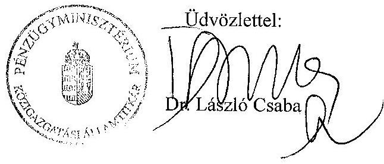

# JELENTÉS 

a helyi önkormányzatok beruházásaihoz és rekonstrukcióihoz nyújtott 2001. évi címzett és céltámogatások igénybevételének és felhasználásának vizsgálatáról
2002. JÚLIUS

---

# Az ellenőrzést felügyelte: 

Dr. Lóránt Zoltán
főigazgató

## Az ellenőrzés végrehajtásáért felelős:

Az ÁSZ 3. Önkormányzati és Területi Ellenőrzési Igazgatósága Pénzügyi-szabályszerűségi és Teljesítményellenőrzési Főcsoport

Németh Péterné
főcsoportfőnök

## Az ellenőrzést vezette:

Farkas László
osztályvezető
A helyszíni vizsgálati jelentések feldolgozásában és a jelentés elkészítésében közreműködött:

Dr. Ernst László
számvevő tanácsadó
Dr. Kőrös István
számvevő tanácsos

## Az ellenőrzést végezték:

A résztvevők névsorát az 1. sz. melléklet tartalmazza

## Az ÁSZ által a témában eddig készített jelentések:

A helyi önkormányzatok beruházásaihoz és rekonstrukcióihoz nyújtott 1995. évi címzett és céltámogatások felhasználása (V-1001/1996.). (A Parlament számítógépes hálózatán a vizsgálat fájl neve: 0329j000 doc.)

A helyi önkormányzatok beruházásaihoz és rekonstrukcióihoz nyújtott 1996. évi címzett és céltámogatások felhasználása (V-1001/1997.). (A Parlament számítógépes hálózatán a vizsgálat fájl neve: 0388j000 doc.)

A helyi önkormányzatok beruházásaihoz és rekonstrukcióihoz nyújtott 1997. évi címzett és céltámogatások felhasználása (V-1001/1998.). (A Parlament számítógépes hálózatán a vizsgálat fájl neve: 9823j000 doc.)

A főváros és a megyei jogú városok szennyvíztisztítási programjára rendelkezésre álló források felhasználásának vizsgálata (V-1014/1997-98.). (A Parlament számítógépes

---

hálózatán a vizsgálat fájl neve: 9805j000 doc.)
A helyi önkormányzatok beruházásaihoz és rekonstrukcióihoz nyújtott 1998. évi címzett és céltámogatások felhasználása (V-1001/1999.). (A Parlament számítógépes hálózatán a vizsgálat fájl neve: 9922j000 doc.)

A helyi önkormányzatok beruházásaihoz és rekonstrukcióihoz nyújtott 1999. évi címzett és céltámogatások felhasználása (V-1001-181/2000.). (A Parlament számítógépes hálózatán a vizsgálat fájl neve: 0022j000 doc.)

Jelentés a közbeszerzésekről szóló törvény végrehajtásának ellenőrzéséről (V-1009-252/2000-2001.). (A Parlament számítógépes hálózatán a vizsgálat fájl neve: 0109j000 doc.)

A helyi önkormányzatok beruházásaihoz és rekonstrukcióihoz nyújtott 2000. évi címzett és céltámogatások felhasználása (V-1001-165/2001.). (A Parlament számítógépes hálózatán a vizsgálat fájl neve: 0120j000 doc.)

---

# TARTALOMJEGYZÉK 

I. ÖSSZEGZŐ MEGÁLLAPÍTÁSOK, KÖVETKEZTETÉSEK, JAVASLATOK ..... 5
II. RÉSZLETES MEGÁLLAPÍTÁSOK ..... 11

1. Az önkormányzatok fejlesztési tevékenységének megalapozottsága, a beruházások szakmai, műszaki és pénzügyi előkészítése ..... 11
2. A beruházások megvalósítása, műszaki és pénzügyi lebonyolítása, a pénzügyi teljesítés alakulása ..... 15
3. A központi támogatások igénybevételének jogszerűsége ..... 19
4. A beruházások műszaki átadása, üzembe helyezése, számviteli elszámolása és belső ellenőrzése ..... 21
5. A beruházások helye, szerepe az önkormányzati gazdálkodásban ..... 23
MELLÉKLETEK
TÁBLÁZATOK
FÜGGELÉK

---

.

---

# JELENTÉS 

## a helyi önkormányzatok beruházásaihoz és rekonstrukcióihoz nyújtott 2001. évi címzett és céltámogatások igénybevételének és felhasználásának vizsgálatáról

A Magyar Köztársaság 2001. és 2002. évi költségvetéséről szóló 2000. évi CXXXIII. törvény 2001. évre a címzett és céltámogatásokra 67300 M Ft előirányzatot biztosított. Ezt az összeget növeli a 2000. év végéig fel nem használt 35001 M Ft maradvány. Az évközi lemondásokat és visszafizetéseket, illetve az ezekből visszaforgatott összegeket is figyelembe véve a helyi önkormányzatoknak 2001. évben összesen 103074 M Ft címzett és céltámogatás állt rendelkezésére.

A központi támogatás segítségével megvalósult helyi önkormányzati beruházások forrásai között szerepeltek még a saját források mellett egyes fejezeti kezelésű előirányzatokból (pl. Környezetvédelmi alap célfeladatok, Vízügyi célelőirányzat), illetve a megyei területfejlesztési tanácsok (Fővárosi Közgyűlés) döntési körébe tartozó decentralizált pénzalapokból (pl. Területi kiegyenlítést szolgáló fejlesztési célú támogatás és Céljellegű decentralizált támogatás) pályázatok útján adható támogatások és a nemzetközi forrásokból származó támogatások.

Az ellenőrzés célja: annak megállapítása volt, hogy

- Az önkormányzatok megfelelően készítették-e elő, illetve valósították meg a beruházásokat, beszerzéseik (beruházásaik) során érvényesítették-e a közbeszerzésekről szóló 1995. évi XL. törvény előírásait.
- A támogatásokkal érintett önkormányzatok idejében rendelkeztek-e a feladat megvalósításához szükséges pénzügyi eszközökkel és ezt segítette-e a 263/1997. (XII. 21.) Korm. rendelet, illetve annak hatályon kívül helyezését követően a 217/1998. (XII. 30.) Korm. rendelet.
- A támogatások igénybevételénél és felhasználásánál érvényesült-e a törvényesség és a szabályszerűség.

A helyi önkormányzatok címzett és céltámogatási rendszeréről szóló 1992. évi LXXXIX. törvény 1993. évi hatályba lépése után a vizsgálatok célja elsősorban e törvény betartásának ellenőrzése volt. Az 1993. évtől eltelt 9 éves időszak alatt a helyi önkormányzatok mintegy 41%-át érintően 2186 feladat ellenőrzését végeztük el.

Az Állami Számvevőszék 2002. évi ellenőrzési terve alapján vizsgálta a címzett és céltámogatások 2001. évi igénybevételét és felhasználását.

---

Az ellenőrzés jogalapja az Állami Számvevőszékről szóló 1989. évi XXXVIII. törvény 2. §-ának (5) bekezdése, az államháztartásról szóló 1992. évi XXXVIII. törvény (Áht.) 121. §-ának (3) bekezdése, valamint a Magyar Köztársaság éves költségvetési törvényei.

Ez évi helyszíni ellenőrzéseink során 16 megyében és a fővárosban 99 önkormányzatnál 152 beruházást ellenőriztünk.

A helyi önkormányzatok számára 2001. évben rendelkezésre álló összes címzett és céltámogatási előirányzat 32,1%-át, ezen belül a címzett támogatások 19,2%-át, a céltámogatások 37,2%-át vizsgáltuk meg.

A címzett támogatás segítségével megvalósuló beruházások közül 20 önkormányzatnál 28 feladatot ellenőriztünk, melyekből ágazati besorolásukat tekintve 9 db a vízgazdálkodásba, 15 db az oktatási és kulturális szolgáltatásba, 4 db pedig az egészségügyi és szociális ellátásba tartozott. (A vizsgált önkormányzatok és feladatok jegyzékét a 2. sz. melléklet tartalmazza).

A vizsgálatban 83 önkormányzatnál 124 db céltámogatás segítségével megvalósuló beruházás szerepelt. Ezek között döntő súlya a szennyvízelvezetésnek és -tisztításnak volt 78 önkormányzatnál 113 beruházással. Az oktatási és kulturális szolgáltatás területén 7 önkormányzatnál 8 feladat ellenőrzésére, az egészségügyi és szociális ágazatban 2 önkormányzatnál 2 feladat, valamint a szilárdhulladék-gazdálkodási ágazatban 1 önkormányzatnál 1 feladat ellenőrzésére került sor.

Az ágazati megoszlásokat tekintve országos szinten 2001. évben a rendelkezésre állt céltámogatási előirányzatok 91,1%-a a szennyvízelvezetésre és -tisztításra irányult, ezért - súlyának megfelelően - helyszíni vizsgálataink során a céltámogatási előirányzatok 97%-át a szennyvízelvezetési és -tisztítási ágazatban ellenőriztük. (A 2001. évi címzett és céltámogatások ellenőrzésének arányát a 7. sz. táblázat mutatja).

A helyszíni ellenőrzések mintavételének meghatározó szempontját - a kialakított gyakorlat szerint - nem az önkormányzatok számossága, hanem a rendelkezésre álló támogatási előirányzatok minél nagyobb arányú vizsgálata képezte. A nemzetgazdasági ágazatokat tekintve a mintavételi szempont - az EU csatlakozás követelményeivel összhangban - a szennyvízközmű fejlesztések vizsgálatba történő minél nagyobb arányú bevonása volt.

---

# I. ÖSSZEGZŐ MEGÁLLAPÍTÁSOK, KÖVETKEZTETÉSEK, JAVASLATOK 

A 2001. évben is a címzett és céltámogatások rendszere volt az önkormányzatok fejlesztési tevékenységének meghatározója tekintettel arra, hogy ez a támogatási forma biztosította a fejlesztési források meghatározó (50-80%-os) arányát. A fejlesztési irányokat döntően 2001. évben is az határozta meg, hogy e központi támogatási rendszer mely fejlesztési célokat részesítette előnyben.

A címzett támogatások a vízgazdálkodási, egészségügyi, szociális, közoktatási és kulturális ágazatban folyó fejlesztési és rekonstrukciós munkákhoz megfelelő anyagi hátteret biztosítottak.

A céltámogatások által támogatandó, társadalmilag kiemelt célokat az Országgyűlés az 1999-2001. évekre a vízgazdálkodási, az egészségügyi, az oktatási, valamint a hulladékgazdálkodási ágazaton belül jelölte ki. Ezek közül meghatározó volt - a támogatott célok között pénzügyileg is prioritást élvező - a vízgazdálkodási ágazaton belül a szennyvízelvezetés és -tisztítás, jelezve a törekvést - az EU csatlakozás követelményeivel összhangban - a közműolló zárására és az elvezetett szennyvizek növekvő arányú tisztítására. Az állami támogatás aránya az előző évhez viszonyítva ebben az ágazatban 10-20%-ponttal növekedett. A szennyvíztisztító-telep és szennyvízcsatorna-hálózat megvalósítását célzó önkormányzati beruházásokat valós lakossági igények alapozták meg, melyeket tovább erősítettek a környezetvédelmi és területfejlesztési követelmények. Az elmúlt években prioritást élveztek a térségi fejlesztések. A szennyvízelvezetés és -tisztítás ágazatban jellemzővé váltak a közös beruházások. A vizsgált évben az ellenőrzött szennyvízközmű beruházások 60%-a közös beruházásként valósult meg. Az önkormányzatok társulását alapvetően a magasabb támogatási arány ösztönözte, de szerepet játszott az a felismerés is, hogy a közös üzemeltetés olcsóbb.

Az önkormányzatoknak változatlanul gondokat okozott a korábbi években indított tőkeigényes szennyvízközmű beruházásokhoz szükséges saját pénzügyi eszközök biztosítása. Ugyanakkor a támogatási arányok növekedése kedvezően hatott a beruházások megvalósítására, egyúttal a maradványok csökkenésére.

A sokcsatornás támogatási rendszer, ezen belül az egyéb állami támogatások - céltámogatástól eltérő - kritériumai és preferenciái azt eredményezték, hogy a szennyvízközmű beruházások forráselosztási rendszere átláthatatlan és nem biztosítja az önkormányzatok között az esélyegyenlőség érvényesülését. Egyes önkormányzatok az egyéb állami pénzalapokhoz nehezen jutottak hozzá, míg mások ezzel a támogatással kedvezőbb pénzügyi helyzetbe kerültek.

Az önkormányzatok a hiányzó forrásokat döntően egyéb állami támogatásokból (VICE, KKA/KAC, TERKI, CÉDE, stb.) kívánták biztosítani. Továbbra is

---

fennáll az előző vizsgálatokban már jelzett probléma, hogy ezeknek az egyéb állami támogatásoknak az elbírálása a központi támogatástól (céltámogatástól) időben és rendszerében eltérően történik. A forrásbiztosítás érdekében a címzett és céltámogatások elnyerését követően, gyakran már a beruházás elkezdése után nyújtottak be pályázatokat egyéb állami támogatásokra. Jellemző volt - különösen a KKA/KAC támogatás elnyerésére vonatkozó pályázatoknál -, hogy hosszú ideig nem kaptak visszajelzést a döntésről.

A támogatási formák döntési rendszerének összehangolatlansága azt eredményezte, hogy az önkormányzatok hat-nyolc egyéb állami pénzalapra is pályáztak és kedvező döntés esetén a beruházás előirányzatának 100%-át is megszerezték, így nem kellett saját forrást biztosítani a megvalósításhoz.

A Belügyminisztérium tájékoztatása szerint a Nemzeti Települési Szennyvízelvezetési és -tisztítási Megvalósítási Program keretében sor kerül a sokcsatornás finanszírozási rendszer kiváltására, továbbá a bevezetésre kerülő szabályozás értelmében, először a 2002. évi igénybejelentéseknél alkalmazva, nem fordulhat elő, hogy az önkormányzat a beruházás megvalósításához ne biztosítson saját forrást.

Az ellenőrzött beruházásoknál a közbeszerzési törvény előírását gyakran nem tartották be az önkormányzatok: a közbeszerzési eljárást akkor is megindították, amikor még nem rendelkeztek a szerződés teljesítését biztosító anyagi fedezettel, vagy arra vonatkozó biztosítékkal, hogy a teljesítés időpontjában a pénzügyi forrás rendelkezésre fog állni. Az előző években tapasztaltakhoz hasonlóan a közbeszerzési eljárás során a beruházások kivitelezőjének a kiválasztásánál fordultak elő szabálytalanságok.

Kedvezőnek tekinthető, hogy a címzett és céltámogatások év végi maradványa az előző évekhez képest csökkent. Az országos adatok alapján a címzett és céltámogatások 2001. év végi összes maradványa 34437 M Ft volt, amely a 2001. évben rendelkezésre álló előirányzat 33,4%-ának felelt meg. (Az előző év végén a központi támogatások maradványának aránya ennél magasabb, 42% volt.) A nagy összegű és mértékű maradványon belül az elmúlt évekhez hasonlóan - a céltámogatások maradványa volt a meghatározó, hiszen ennek összege 27514 M Ft, a 2001. évben rendelkezésre álló előirányzat 37,5%-a volt. A céltámogatások összes maradványának döntő hányada, 87,4%-a továbbra is a szennyvízelvezetési és -tisztítási ágazatban keletkezett, ami annyit jelent, hogy ezen a területen 2001-ben 24037 M Ft maradt felhasználatlanul.

Az ellenőrzött címzett és céltámogatások összes maradványa 11591 M Ft, aránya 35,1% - ezen belül a címzett támogatásoknál 27%, a céltámogatásoknál pedig 36,8% - volt 2001. év végén. Az összes céltámogatási maradvány 94%-a szennyvízelvezetési és -tisztítási ágazatban jelentkezett, (a vizsgált címzett és céltámogatások 20%-ot meghaladó 2001. évi maradványait a 10. sz. táblázat mutatja be).

A központi támogatási maradványokat elsősorban az előirányzat lekötések okozták, az önkormányzatok a címzett és céltámogatási rendszerről
 szóló törvényben előírt központi előirányzat lemondási kötelezettségüket csak késve,

---

vagy egyáltalán nem teljesítették. A vizsgálat által feltárt előirányzat-lemondási kötelezettségek 75%-a az ÁFA levonhatóvá válásával összefüggésben keletkezett.

A 2001. évi új induló beruházásoknál a céltámogatási előirányzat-maradványok képződésében szerepe volt az előminősítéses közbeszerzési eljárás időigényének is, ami miatt a tárgyévben vagy el sem kezdődött a beruházás, vagy csak szerény mértékű támogatás felhasználás történt. A vizsgálat szerint 14 új induló beruházás kivitelezését nem kezdték el 2001-ben, (ezek jegyzékét a 11. sz. táblázat tartalmazza).

A 2001. évtől a céltámogatás első évi üteme legalább 30% kell hogy legyen, szintén hozzájárult a céltámogatási előirányzat-maradványok képződéséhez.

# Törvényesség tekintetében az előző évben jelentkező javulás tovább folytatódott. 

A korábbi évek általános tapasztalata az volt, hogy az önkormányzati saját forrás biztosítása érdekében az önkormányzatok a kivitelezővel függő helyzetbe kerültek: közterület-használati, helyiségbérleti, eszközhasználati stb. szerződéseket kötöttek. Az ÁSZ korábbi javaslatai alapján a 2001. évi új szabályozás szerint ez a lehetőség megszűnt. A vizsgálat a 2001. évi új induló beruházásokkal kapcsolatban nem tárt fel ilyen önkormányzati gyakorlatot.

A vizsgálataink által feltárt, jogtalanul igénybevett központi támogatások és a jogosulatlan központi támogatás-előirányzat-lekötések összege és az ellenőrzött előirányzatokhoz viszonyított aránya évről évre jelentősen csökkent. Míg az 1996-1997. években a jogtalan támogatás igénybevétel és előirányzat-lekötés az ellenőrzött támogatásokhoz viszonyítva mintegy 20%-os mértékű volt, addig 2000. évben már csak 1,4%-os.

A törvényesség javulása azzal is összefüggésben van, hogy az ÁSZ javaslataira figyelemmel a törvényi szabályozás több kérdéskört illetően (bekötő vezeték, üdülő terület, ÁFA levonási jogosultság stb.) egyértelműbbé vált, ami megkönnyítette az önkormányzatok jogkövető magatartását. Időközben javult az önkormányzatok és az általuk megbízott lebonyolító szervezetek beruházás-előkészítési és -lebonyolítási gyakorlata is.

Az 1998. évi központi támogatások vizsgálata során 103 önkormányzatnál végeztünk ellenőrzést, amely 191 beruházást érintett. Az összes előirányzat 49%-át vizsgáltuk és 469 M Ft jogtalan igénybevétellel összefüggésben tettünk visszafizetési javaslatot, továbbá 1100 M Ft előirányzat-csökkentést javasoltunk.

Az 1999. évi címzett és céltámogatások ellenőrzése során 88 önkormányzat 127 beruházásának helyszíni vizsgálatát végeztük el, amely az összes előirányzat 22%-át jelentette és 191 M Ft jogtalan igénybevétellel összefüggésben tettünk visszafizetési javaslatot, 440 M Ft előirányzat-csökkentést kezdeményeztünk.

A 2000. évet érintő vizsgálatunkban 96 önkormányzatnál 149 beruházásra kapott központi támogatás felhasználását ellenőriztük, az összes előirányzat

---

33,8%-át. Jelentésünkben 18,5 M Ft jogtalanul igénybe vett támogatás visszafizetésére, illetve 376 M Ft előirányzat-csökkentésre tettünk javaslatot.

A jelen vizsgálat az ellenőrzött 152 beruházásnál - a jogosulatlan támogatási előirányzat-lekötéssel és támogatás-felhasználással összefüggésben - 11 szabálytalanságot állapított meg. A vizsgált önkormányzatoknál feltárt jogosulatlan támogatási előirányzat-lekötés és támogatás-felhasználás mindösszesen 79907 E Ft, az ellenőrzött beruházások 2001. évi támogatási előirányzatának 0,24%-a. A vizsgálat megállapításai alapján összesen 4832 E Ft jogtalanul igénybe vett címzett támogatás, illetve 10754 E Ft céltámogatás visszafizetési, valamint 4921 E Ft jogosulatlan címzett, illetve 59400 E Ft céltámogatási előirányzat-lekötés miatti előirányzat-lemondási kötelezettséget tártunk fel.

Az ellenőrzés által feltárt - a központi támogatásokra vonatkozó - visszafizetési, illetve előirányzat-csökkentési javaslatainkat nem támogatott célra történő felhasználások, le nem vonhatóként tervezett ÁFA levonhatóvá válása, műszaki tartalom-változtatás, központi támogatás befejezett beruházáshoz való részbeni felhasználása és egyéb okok miatt tettük meg.

A vizsgált önkormányzatok 2002. május 5-éig - az Állami Számvevőszék javaslata alapján - 4832 E Ft jogtalanul igénybe vett címzett és 4857 E Ft céltámogatást fizettek vissza a Magyar Államkincstárba, továbbá 4921 E Ft címzett és 2498 E Ft céltámogatási előirányzatról való lemondási kötelezettségüknek eleget tettek. Az önkormányzatok által időközben teljesített visszafizetés és lemondás az összes jogtalan támogatás-felhasználás és előirányzat-lekötés 21,4%-a volt.

# A címzett és céltámogatási rendszert szabályozó törvényt 21 alkalommal módosították, ezzel rendszeridegen elemek is kerültek a törvénybe. A sok módosítás miatt ma már a törvény nehezen tekinthető át, nehezen értelmezhető, nem következetes, ami már önmagában is szükségessé teszi az átfogó változtatást. A már említett, az egyéb állami pénzalapok döntési mechanizmusa, a sokcsatornás támogatás egységes kezelése is indokolttá teszi az újraszabályozást.

A helyi önkormányzatok címzett és céltámogatással folyamatban lévő egyes beruházásainak befejezése érdekében szükséges törvénymódosításokról szóló törvény szerint 3008 M Ft-ot hagytak jóvá a céltámogatással folyamatban lévő beruházások befejezésére, 2001. évi felhasználási kötelezettséggel. A kiegészítő céltámogatás nincs összhangban a címzett és céltámogatási rendszerről szóló törvénnyel, ugyanis egyes alapelőírásai az ilyen támogatásban részesült önkormányzati beruházásokra nem értelmezhetők. A kiegészítő céltámogatás nyújtásával sérülő egyik alapelőírás, hogy a támogatási arány a beruházás befejezéséig nem változtatható, a másik pedig, hogy a beruházás műszaki tartalmának változtatásából, az ár- és árfolyamváltozásból, valamint a kivitelezés átütemezéséből származó többletköltség miatt az önkormányzatot a beruházás elfogadott összköltségéhez képest további központi támogatás nem illeti meg. A kiegészítő céltámogatás objektív elbírálásának nem voltak meg a kritériumai, feltételrendszere, amit - többek közt - az is jelez, hogy nyolc esetben az eredeti igénybejelentésben nem szereplő feladatokra történt a jóváhagyás és a felhasználás. Az önkormányzatok számára a kivitelezői szerződések utólagos módosítására, kivitelezői többletköltségek elismerésére is lehetőséget nyújtott, de volt olyan érintett önkormányzat is, amelyik nem tudta a megítélt támogatást felhasználni.

A címzett és céltámogatási rendszerről szóló törvény kötelezően előírta a címzett és céltámogatásokban részesülő önkormányzatok számára a megfelelő képesítésű műszaki ellenőr alkalmazását és a beruházási összköltség 1%-ig ismerte el a díjazás mértékét. A műszaki ellenőrzés tevékenységének meghatározása azonban pontatlan. Ez bizonytalanságot keltett az önkormányzatok szakembereiben és megnehezítette a központi támogatások igénybevétele és felhasználása jogszerűségének megítélését is.

A céltámogatások segítségével megvalósuló közös szennyvízközmű-beruházásoknál 2001. évben is bizonytalanságot okozott az önkormányzatok számára az APEH gyakorlata az ÁFA levonási jog érvényesítésére, amely miatt ilyen beruházások esetén a számlákat - APEH iránymutatások alapján - a társönkormányzatok, vagy az érintett önkormányzatok tulajdonközössége nevére kérték kiállítani és ezek alapján történt a céltámogatások igénylése is, amely viszont ellentétes a címzett és céltámogatási rendszerről szóló törvény szabályozásaival. Ugyanis a központi támogatás címzettje a beruházás megvalósítása időszakában nem változhat és a támogatás címzettje - jelen esetben a gesztor önkormányzat - nyújtja be a teljesítést igazoló, kiegyenlítetlen, felülvizsgált és igazolt számlát a pénzintézethez. Az ÁFA visszaigénylés kérését a BM és a PM illetékes főosztályai 2002. év elején szabályozták.

A címzett és céltámogatási előirányzatokról való lemondások átfutási ideje nagyon hosszú, jellemzően fél-háromnegyed év telik el, amíg az önkormányzat visszajelzést kap a TÁH-tól az előirányzat-csökkentés megtörténtéről. Az önkormányzatok által eszközölt előirányzat-lemondások a Magyar Államkincstárnál is az előzőekhez hasonló ideig még központi támogatási előirányzatként szerepeltek és egyúttal előirányzat-maradványként jelentkeztek.

A helyszíni vizsgálatok tapasztalatai alapján a helyi önkormányzatoknak tett javaslatok a beruházási szabályzat és a közbeszerzési rendelet megalkotására, illetve módosítására, a közbeszerzésekről szóló törvény előírásainak következetes betartására, az üzembehelyezett beruházások törvényi előírásoknak megfelelő számviteli nyilvántartásba vételére (aktiválására), a beruházások fokozottabb belső ellenőrzésére irányultak. A javaslatok között szerepelt a jogosulatlanul lekötött központi támogatások időbeni lemondása is. A helyszíni vizsgálatok megállapításaival kapcsolatban személyi felelősségre vonást, valamint ügyészségi vizsgálatot (jogosulatlan gazdasági előnyszerzés gyanúja miatt) egy esetben kezdeményeztünk (Csöde).

Ezen túl a közbeszerzésekről szóló törvény előírásainak megszegése miatt kezdeményeztük a Közbeszerzések Tanácsa Döntőbizottságánál az eljárás lefolytatását (Cserszegtomaj).

A vizsgálat tapasztalatai azt jelzik, hogy a címzett és céltámogatási rendszer javítására tett ÁSZ javaslatok hasznosítása következtében a törvényesség javult, amit a jogtalan előirányzat-lekötések és a jogosulatlan támogatás-igénybevételek csökkenése is mutat, az előirányzat-maradványok csökkentek, mindezekhez az önkormányzati munka javulása is hozzájárult.

Az ellenőrzés tapasztalatai és következtetései alapján - a címzett és céltámogatások felhasználásánál a törvényesség és szabályszerűség érvényesülése érdekében - javasoljuk:

# a belügyminiszternek 

kezdeményezze az ellenőrzés által feltárt 4921 E Ft címzett és 59400 E Ft céltámogatási előirányzat-csökkentését - a képviselő-testületek (közgyűlések) által időközben lemondott központi támogatási előirányzatok figyelembevételével - a Magyar Köztársaság 2001. évi költségvetésének végrehajtásáról szóló törvényjavaslatban (az 5. és a 6. sz. mellékletek szerint).

## a pénzügyminiszternek

kezdeményezze a vizsgálat által feltárt, jogtalanul igénybe vett 4832 E Ft címzett és 10754 E Ft céltámogatás visszafizettetését - az önkormányzatok által időközben visszafizetett központi támogatások figyelembevételével - és büntető kamatainak megfizettetését a Magyar Köztársaság 2001. évi költségvetésének végrehajtásáról szóló törvényjavaslatban (a 3. és a 4. sz. mellékletek szerint).

---

# II. RÉSZLETES MEGÁLLAPÍTÁSOK 

## 1. AZ ÖNKORMÁNYZATOK FEJLESZTÉSI TEVÉKENYSÉGÉNEK MEGALAPOZOTTSÁGA, A BERUHÁZÁSOK SZAKMAI, MŰSZAKI ÉS PÉNZÜGYI ELŐKÉSZÍTÉSE

A helyi önkormányzatok címzett és céltámogatási rendszeréről szóló 1992. évi LXXXIX. törvény 1999-2001. évi szabályozásában, a célkitűzésekben, a céltámogatások között kiemelt szerepet kaptak az EU környezetvédelmi követelményeihez közelítő, az elmaradást csökkentő szennyvízcsatornázás és szennyvíztisztító-telep fejlesztési tevékenységek. Ez tükröződik abban, hogy a megelőző évekhez képest (lakosság-számtól függően) 10-20%-ponttal növekedett a szennyvízcsatorna-hálózat és 10%-ponttal a szennyvíztisztító-telep építésére adott állami támogatási arány. További 10-10%-os támogatás illeti meg a már meglévő, vagy folyamatban lévő beruházás építéséhez csatlakozó önkormányzatot, illetve a közös beruházásban megvalósuló fejlesztéseket. Az állami támogatás aránya így már elérte az 50-80%-ot is.

A helyi önkormányzatok beruházásait 2001. évben is döntően az határozta meg, hogy a címzett és céltámogatási rendszer mely fejlesztési célokat preferált. A központi támogatások jól orientálták a helyi önkormányzatok fejlesztési tevékenységét, hiszen a központi támogatások segítségével megvalósuló önkormányzati beruházások kivétel nélkül az önkormányzati törvény helyi szintű feladataiból levezethető jogos igényeken alapultak, melyeken belül meghatározó szerepet kaptak a környezetvédelmi követelmények, az ivóvízbázisok védelme. Ezek a követelmények, a valós lakossági igények, valamint a központi támogatási rendszer feltételrendszere is a szennyvízközmű-beruházások megvalósítására ösztönözte a helyi önkormányzatokat. Ez megmutatkozott abban, hogy a 2001. évi céltámogatások 91,1%-a - szemben a 2000. évi 89,9%-kal - a szennyvízelvezetés és -tisztítás ágazatra irányult. A vizsgált szennyvízközmű-beruházások 60%-a közös beruházásként valósult meg. Az önkormányzatok felismerték a nagyobb közműrendszerek létrehozásából származó előnyöket, a várhatóan alacsonyabb üzemelési költségeket, és mindenekelőtt a központi támogatási rendszerben lévő preferenciákat, amelyek többlettámogatással segítették a közös beruházásokat.

A címzett támogatási pályázatot megelőzően az érintett önkormányzatok elkészítették beruházási koncepciójukat és a Cct-ben előírt egyeztetési eljárást a szakminisztériummal lefolytatták (Mezőberény Függelék (a továbbiakban F) 1.1., Szeged F 1.2., Tolna Megyei Önkormányzat F 1.3., Vas Megyei Önkormányzat F 1.4.). A céltámogatási igénybejelentésekhez több változatot tartalmazó megvalósíthatósági tanulmányok készültek, melyek közül a műszaki-gazdasági szempontból legkedvezőbbet preferálták, így az került bele a céltámogatási igénybejelentésbe (Újkígyós F 1.5., Kondoros F 1.6.).

---

A címzett és céltámogatási pályázatok a törvényes előírásoknak megfeleltek. A beruházásokhoz a szükséges önkormányzati döntéseket a képviselő-testületek (közgyűlések) meghozták. A beruházási
 célt az önkormányzatok képviselő-testületei a költségvetésről alkotott rendeletek keretében, illetve a központi támogatási pályázatokhoz benyújtott saját forrást biztosító határozatokkal hagyták jóvá. A hatósági (építésre jogosító) engedélyek, szakhatósági állásfoglalások, nyilatkozatok és egyéb szükséges dokumentumok (pl. társberuházói megállapodás) rendelkezésre álltak. Ebben szerepe volt a pályázatok többéves előkészítésének és a központi támogatásokra vonatkozó pályázatok, illetve igénybejelentések – a vizsgálat által kedvezőnek ítélt szigorodó követelményeinek. A szennyvízközmű beruházások esetén a már meglévő szennyvíztisztító-telepre csatlakozó szennyvízcsatorna építéseknél a tulajdonosok befogadó nyilatkozata minden esetben rendelkezésre állt. Esetenként a szennyvíztisztító-telep bővítése is szükségessé vált. A vízjogi létesítési engedély módosítások az érvényességi idő meghosszabbítására irányultak. Ettől eltérően tervezési hiányosságok miatt is szükségessé vált a vízjogi létesítési engedélyek változtatása (Nyírlugos F 1.7.).

Általánosan jellemző, hogy a községekben, a polgármesteri hivatalokban a személyi feltételek (létszám, speciális szakismeret) nem tették lehetővé a beruházások teljes előkészítését, megszervezését és lebonyolítását. Erre a községi önkormányzatok csak külső szakértő vállalkozások igénybevételével voltak képesek. Alapvetően ezzel függhetett össze, hogy a kapcsolódó tevékenységeknek, a beruházások rendjének, illetve a közbeszerzések bonyolításának helyi szabályozását a vizsgált önkormányzatok teljes körűen nem készítették el. A vizsgálat megállapítása szerint a beruházási szabályozást ötvenöt, a közbeszerzési szabályozást harmincöt önkormányzat nem készítette el.

A városi önkormányzatok általában éltek a közbeszerzésekről szóló 1995. évi XL. törvény (Kbt.) 96. § (2) bekezdésében kapott felhatalmazással, vagyis helyi rendeletben szabályozták a közbeszerzési eljárást.

Ugyanakkor két városi önkormányzat a Kbt. 1999. évi módosítását követően nem aktualizálta a szabályozást (Tiszafüred F 2.1., Szigetvár F 2.2.). Egy önkormányzatnál a közbeszerzés részletes eljárási rendjét a jegyző szabályozta, ami azonban nem felel meg a Kbt-ben előírt, önkormányzati rendelettel történő szabályozás követelményének (Zalaszentgrót F 2.3.). Ugyancsak egy önkormányzatnál hiányos volt a szabályozás (Budapest XVI. Kerület F 2.4.). A községi önkormányzatok között voltak olyanok, melyek közbeszerzési rendeleteiket úgy helyezték hatályba, hogy azokat a már megindított közbeszerzési eljárásra nem lehetett alkalmazni (Nagypáli F 2.5, Cserszegtomaj F 2.6.).

A fejlesztési célokat megfogalmazó helyi önkormányzatok már a központi támogatási pályázatok előkészítése érdekében felvették a kapcsolatot az építőipari tervezésre és lebonyolításra szakosodott szervezetekkel. Általánosítható megállapítás, hogy a támogatásokkal érintett községi önkormányzatok a tervezőket és a lebonyolítókat nem versenyeztetéssel, hanem a korábbi beruházási tapasztalatok és a környező települések ajánlatai (referencia munkák) alapján választották ki. Az alkalmazott gyakorlat szerint külön szerződések és díjak vonatkoztak az előkészítési, közbeszerzési eljárással összefüggő feladatokra és a lebonyolítás kivitelezéssel párhuzamos szakaszára, beleértve a műszaki

---

ellenőrzést is. A lebonyolító kiválasztása három esetben nem volt törvényes.

#### Abstract

Barcs város önkormányzata (F 2.7.) helytelenül értelmezte az építési beruházás és a szolgáltatás fogalmát és lebonyolítót nem közbeszerzési eljárás keretében választotta ki, annak ellenére, hogy a lebonyolítási díj elérte a közbeszerzési értékhatárt. Cserszegtomaj község önkormányzata (F 2.8.) elmulasztotta a Kbt. 10. számú melléklete szerinti hirdetmény közzétételét, pedig a Kbt. 4. § (7) bekezdése értelmében arra köteles lett volna, mert a lebonyolítási díj évenkénti összege legalább egy költségvetési évben – a költségvetési törvényben meghatározott a szolgáltatásra vonatkozó közbeszerzési értékhatár felét elérte. Az ÁSZ a vizsgálat során megállapított jogsértésre felhívta a Közbeszerzések Tanácsa Közbeszerzési Döntőbizottságának figyelmét. Egy esetben (Pécsvárad F 2.9.) a lebonyolító kiválasztása nem volt szabályos, mert az önkormányzat saját – versenyeztetésre vonatkozó – rendeletének mellőzésével választotta ki, illetve bízta meg a lebonyolítót.

A községi önkormányzatoknál a közbeszerzési eljárás lefolytatása – az előzőekben már jelzett közbeszerzési rendelet hiányában – közvetlenül a Kbt. előírásai alapján történt. A beruházások nagyságrendjére tekintettel kétfordulós, előminősítéses nyílt eljárással választották ki az önkormányzatok a kivitelezőt. A 240 millió Ft értékhatár alatti beruházásoknál az önkormányzatok nyílt közbeszerzési eljárást alkalmaztak. A vizsgálat tapasztalatai szerint az érintett önkormányzatok a közbeszerzési eljárási fajtákat (nyílt, tárgyalásos, meghívásos) jól választották meg, a Kbt. idevonatkozó rendelkezéseit betartották. Az ajánlati felhívásokban, valamint a részletes kiírási dokumentációkban a beruházások műszaki tartalmát a központi támogatásokhoz benyújtott pályázatokkal azonosan szerepeltették.

A Kbt.-nek a pénzügyi fedezet biztosítására vonatkozó szabályozását négy ellenőrzött önkormányzat nem tartotta be (Zalaszentiván F 2.10., Nagypáli F 2.11., Alsópáhok F 2.12., Zalaszentgrót F 2.13.).

A céltámogatás segítségével megvalósítani kívánt létesítmények pénzügyi fedezete az ajánlati felhívás, illetve a hirdetmény megjelenésének időpontjában nem állt teljes mértékben az érintett önkormányzatok rendelkezésére, hiszen ekkor a céltámogatási igénybejelentést már elbírálták, de az egyéb állami támogatások elnyerésére vonatkozó pályázatok eredményességéről nem, vagy csak részben kaptak értesítést, illetve a tényleges saját források megteremtésére is csak a későbbiekben intézkedtek. Ezzel az Áht. 98. § (7)-(8) bekezdésében foglalt követelmények teljes mértékben nem érvényesültek.

A központi támogatások segítségével megvalósult beruházások kivitelezőinek kiválasztását célzó közbeszerzési eljárások során – a helyszíni ellenőrzést megelőzően – a beruházások harmadánál indítottak jogorvoslati eljárást az elutasított ajánlattevők. A jogorvoslati eljárás lefolytatása (elutasítás esetén is), a megismételt közbeszerzési eljárás időigénye hátráltatta a beruházási folyamatot (Sárszentmihály F 2.14., Mány F 2.15., Csókakakő F 2.16., Barcs F 2.17., Somogyszob F 2.18., Vas Megyei Önkormányzat F 2.19., Borsod-Abaúj-Zemplén Megyei Önkormányzat Megyei Kórház F 2.20., Borsod-Abaúj-Zemplén Megyei Önkormányzat Pszichiátriai Otthon F 2.21., Gyomaendrőd F 2.22., Halmaj F 2.23.).

---

A nemzetközi támogatást (PHARE) is elnyert helyi önkormányzatok a beruházás kivitelezőjének kiválasztására a nemzetközi jogszabályok szerinti, nemzetközi tendereztetést alkalmaztak (Őriszentpéter F 2.24., Mezőcsát F 2.25.).

A központi támogatásokat elnyert önkormányzatok a beruházások kivitelezésére vonatkozó vállalkozói szerződéseket a közbeszerzési eljárásokban nyertes vállalkozókkal, a közbeszerzési eljárás szerinti ajánlati feltételekkel megegyező feltételekkel kötötték meg. A szerződésekben az egyes létesítmények kivitelezési határidejét úgy határozták meg, hogy a hosszas előkészítési folyamat időveszteségét pótolni tudják és a beruházásokat a céltámogatási igénybejelentésben megjelölt határidőre befejezzék.

A beruházások pénzügyi megalapozottsága, pénzügyi előkészítése – az ÁSZ korábbi vizsgálatainak megállapításaihoz hasonlóan – számos hiányosságot mutatott.

A céltámogatási igények benyújtásakor az érintett önkormányzatok képviselőtestületei a saját források biztosítását határozataikban vállalták. Ez irányú kötelezettségvállalásaik azonban az esetek egy részében éves költségvetésüket is meghaladták, vagy abban jelentős részt képviseltek, így nem az önkormányzatok adott időpontban rendelkezésre álló tényleges pénzügyi lehetőségeit tükrözték (Nagypáli F 3.1., Csöde F 3.2., Barcs egyik társönkormányzata Bélavár F 3.3.).

A beruházásokat alapvetően központi és egyéb állami támogatásokból, valamint saját forrásból valósították meg. Az egymástól eltérő szabályozás esélyegyenlőtlenséget teremt, mivel a fix összegű központi támogatási arányhoz egyedi igények alapján megítélt mértékű és számú támogatás járulhat. Így a támogatás mértéke rendkívül szóródik a 30-100%-os támogatási tartományban. Az állami támogatások összehangolatlansága a címzett és a céltámogatással megvalósult önkormányzati beruházások pénzügyi előkészítését, a szükséges pénzügyi fedezetek megalapozott tervezését bizonytalanná teszi.

Az önkormányzatok pénzügyi előkészítési hiányosságai mellett a beruházások gazdasági megalapozottságát is alapvetően hátráltatta, hogy a források – beleértve az egyéb állami pénzalapokat is – összehangolását szabályozó 263/1997. (XII. 21.) Korm. rendelet, illetve az államháztartás működési rendjéről szóló 217/1998. (XII. 30.) Korm. rendelet előírásai nem érvényesültek. A központi és az egyéb állami támogatásokra vonatkozó pályázatok együttes benyújtási lehetősége, egységes szempontoknak megfelelő elbírálása nem volt biztosított. A központi és az egyéb állami támogatásokra vonatkozó szabályok továbbra sincsenek összhangban (beruházási költségek eltérő tartalma, eltérő időpontokban történő elbírálás, egyéb állami támogatások esetében elhúzódó döntések és ezzel összefüggésben a döntések módosítása, a támogatások átütemezése).

A beruházások forrásösszetétele a beruházások megkezdésekor még bizonytalan volt, az egyéb állami támogatásokra (VICE, KAC, TERKI) vonatkozó ígérvényekkel rendelkeztek az önkormányzatok, így a beruházás folyamatában is keresték a pénzeszközöket, törekedve arra, hogy a céltámogatás szempontjából saját forrásnak tekintett eszközökből minél kevesebbet kelljen tényleges önkormányzati önerőből biztosítani. Az önkormányzatok a beadott pályázatokat esetenként többször megerősítették, módosították, illetve megismételték és így az egyéb állami

---

támogatásokhoz egy hosszadalmas alku eredményeképpen jutottak hozzá. Ez főként a KAC pályázatoknál volt jellemző (Zalaszentiván F 3.5., Nagypáli F 3.6., Zalaszentgrót F 3.7., Alsópáhok F 3.8., Mezőberény F 3.9.), de VICE pályázatok esetében is előfordult (Cserszegtomaj F 3.10., Balatonfökajár F 3.12.).

A 2001. évben induló új beruházásoknál a céltámogatási igénybejelentéshez a Cct. szerint az egyéb állami támogatásokról szóló ígérvényeket, valamint hitelfelvételi szándék esetén a hitelintézet hitelfedezeti igazolását is csatolni kellett.

Az önkormányzatok 2001. évben az önkormányzati saját forrásokra vonatkozó előírásokat betartották, költségvetési rendeleteikben a központi támogatások segítségével megvalósuló létesítményeket feladatként szerepeltették. Ezzel összefüggésben, két esetben pénzügyi ütemezés elmaradása, illetve szabálytalan előirányzat megjelölés miatt kisebb hiányosságot állapítottunk meg (Cserszegtomaj F 3.13., Alsópáhok F 3.14.).

Az önkormányzatok 2001. évi eredeti költségvetési rendeleteikben megfelelően vették figyelembe a céltámogatás éves ütemének igénybevételéhez szükséges saját forrásokat, a helyi adókat és a gépjárműadóból befolyó bevételeket, részben pedig – közös beruházások esetén – a társönkormányzatoktól történő pénzátvételeket. A 2001. évi saját forrás biztosításában jelentős szerepe volt a gázközmű vagyonból származó önkormányzati bevételeknek is.

Az egyéb állami támogatások igénybevételére vonatkozó támogatási és finanszírozási szerződések megkötése megtörtént. A címzett támogatást elnyert önkormányzatok a Magyar Államkincstárral, a céltámogatást elnyert önkormányzatok pedig számlavezető pénzintézetükkel megkötötték a címzett, illetve a céltámogatás igénybevételére vonatkozó finanszírozási szerződést.

# 2. A BERUHÁZÁSOK MEGVALÓSÍTÁSA, MŰSZAKI ÉS PÉNZÜGYI LEBONYOLÍTÁSA, A PÉNZÜGYI TELJESÍTÉS ALAKULÁSA 

A központi támogatások segítségével megvalósuló beruházások tervszerűségét időbeli szempontból vizsgálva az ellenőrzés megállapította, hogy azok az igénybejelentésekhez, pályázatokhoz viszonyítva összességében nem tervszerűek. Kivételt ez alól a címzett támogatások segítségével a korábbi években indított beruházások jelentettek (Szeged F 4.1., Mórahalom F 4.2.). A 2001. évi új induló címzett támogatású beruházások közül a gyáli közösségi ház létesítése mutatott a pénzbeli felhasználás szempontjából tervszerűtlenséget (Gyál F 4.3.).

A vizsgált folyamatban lévő céltámogatott (Körösladány F 4.4. és Csongrád F 4.5.) önkormányzatok a 2001. évben elnyert állami támogatásból abban az évben semmit sem használtak fel, a közbeszerzési eljárást 2002-ben indították meg.

A vizsgált beruházási körben két beruházás a saját forrás hiánya, illetve az egyéb állami támogatások megszerzésének bizonytalansága miatt másfél-két év időbeli csúszással valósult meg (Madocsa F 4.6., Bátaszék F 4.7.).

---

A helyszíni ellenőrzés tapasztalatai szerint a beruházások megvalósítása három kivételtől eltekintve a műszaki teljesítés szempontjából tervszerűnek minősíthető. Az engedélyezési tervben szereplő műszaki tartalomtól – döntően műszaki szükségszerűségből – tértek el (Szeged F 4.8., Törökszentmiklós F 4.9., Tolna Megyei Önkormányzat F 4.10.).

A kivitelezők számlázási gyakorlata az egyre kevesebb számú, így jelentős nagyságrendű összegeket tartalmazó számlázás felé tolódott el. A központi támogatás segítségével megvalósuló beruházások kivitelezésével kapcsolatban kibocsátott számlák – egy kivételtől (Pécsvárad F 5.1.) eltekintve – megfeleltek a jogszabályokban előírt tartalmi és formai követelményeknek (Bana F 5.2., Kisunyom F 5.3., Őriszentpéter F 5.4.). A számlák kibocsátását a kivitelezők által készített teljesítésigazolás, vagy a műszaki ellenőr által felvett állapotrögzítési jegyzőkönyv alapozta meg, amelyben tételesen felsorolták a számlázás alapjául szolgáló ténylegesen elvégzett munkákat. A számlákban feltüntetett munkák igazolása
 a műszaki ellenőr részéről minden esetben megtörtént.

A kiegészítő céltámogatással megvalósuló beruházások számláin a miniszteri biztos ellenjegyzése is megtalálható volt.

A magyar eljárásnál szigorúbb az EU gyakorlat a PHARE támogatás felhasználásával kapcsolatban. Ahol ilyen támogatás van, ott a kivitelező havi előrehaladási jelentést köteles készíteni és abban tételesen fel kell sorolni az elvégzett munkákat. A későbbi jelentések mindig ráépülnek az előzőekre. Ezeket a műszaki ellenőr átvizsgálja és amennyiben a jelentést elfogadja, úgy közbenső fizetési igazolást állít ki, és hozzájárul a számla benyújtásához és kifizetéséhez.

A központi támogatás segítségével megvalósult beruházásoknál a 2001. évi központi támogatás igénybevétele mögött valós műszaki teljesítmények álltak. A műszaki és a pénzügyi teljesítés összhangját vizsgálva a céltámogatásos beruházásoknál Bana F 5.5., Szomor F 5.6., Gyermely F 5.7. esetében a műszaki teljesítések meghaladták a beruházásoknál összefüggő kifizetéseket, a pénzügyi teljesítéseket. A kivitelezők által történt számlázások és ezeken keresztül a kifizetések az önkormányzatok pénzügyi lehetőségeihez igazodtak. E kedvező fizetési feltételekre vonatkozó önkormányzati igényeknek már a közbeszerzési eljárásban, a bírálati szempontok között jelentős volt a súlya.

A céltámogatások folyósítása a pénzintézetekkel megkötött finanszírozási szerződésekhez igazodott. A számlavezető pénzintézetek részére az önkormányzatok kezelési költséget (jutalékot) fizettek ki a céltámogatás folyósításáért. A pénzintézeti jutalékot önkormányzati saját forrásból fizették ki a Baranya megyei önkormányzatok (Pécsvárad, Villány, Mohács, Pécs) és nem éltek azzal a jogszabályi lehetőséggel, mely szerint erre is igénybe lehet venni céltámogatást.

A kezelési költség mellett a hitel rendelkezésre tartási jutalék valamint a beruházásokkal összefüggő hitelekkel kapcsolatos kamatkiadások is terhelték az önkormányzatokat, amelyek a Cct., valamint a számvitelről szóló 2000. évi C. törvény alapján beruházási költségnek minősülnek, ebből következően a központi támogatás szempontjából figyelembe vehetők. Zala megyei vizsgálati ta-

---

pasztalat az, hogy a céltámogatások igénybevétele ezek után a költségek után is megtörtént. A számlavezető pénzintézetek az előbbiekben említett költségekkel időszakosan bankszámlakivonat kibocsátásával egyidejűleg megterhelték az önkormányzatok bankszámláit.
A címzett és céltámogatások folyósítása - egy kivételtől eltekintve (Őriszentpéter F 5.8.) - a megkötött finanszírozási szerződések alapján, a jóváhagyott támogatási arányok szerint történt.
A céltámogatás igénybevételéhez szükséges önkormányzati saját forrás biztosítását tovább nehezítette, hogy az előzetesen felszámított ÁFÁ-t és az egyéb állami támogatásokat az érintett önkormányzat(ok)nak kellett megelőlegezni, ami miatt hitel, illetve kölcsön igénybevételére kényszerültek (Madocsa F 5.9., Váralja F 5.10.). Ez azokra az önkormányzatokra jellemző, amelyek a pályázatukban olyan finanszírozási módot választottak, amely szerint a központi támogatás nem tartalmazza az ÁFA összegét, tehát ezt később visszaigényelhetik.

Amennyiben az önkormányzat lemond az ÁFÁ-ra jutó központi támogatás igénybevételéről, a kivitelező által kiállított számla teljes ÁFA tartalmát az önkormányzatnak kell megelőlegeznie. Az ÁFA visszaigénylése általában 30-60 napot vesz igénybe. Az egyéb állami támogatásokat, fejezeti kezelésű célelőirányzatokat a már kiegyenlített számla után lehet igénybe venni, így az igénybevétel átfutási ideje közel 60 nap.
A közös beruházások ÁFA levonási (visszaigénylés) problémái - az ÁSZ múlt évi jelzései, illetve javaslatai ellenére - továbbra is fennálltak. Az önkormányzatok az ÁFÁ-t is tartalmazó összköltségre igényelték és kapták is meg a céltámogatást. A szennyvízközmű beruházásoknál - jellemzően már a beruházás folyamatában, a leendő üzemeltetőkkel kötött előszerződések útján - az ÁFA levonhatóvá válik, azonban nem egységes az APEH gyakorlata a tekintetben, hogy a gesztor önkormányzat, az érintett önkormányzatok tulajdonközössége, illetve a beruházásban részt vevő társönkormányzatok számára teszi lehetővé az ÁFA levonást. Az ÁFA levonhatósága érdekében a számlákat - az APEH 2000/67. iránymutatása alapján - a társönkormányzatok, illetve az érintett önkormányzatok tulajdonközössége nevére kérték kiállítani és ezek alapján történt a céltámogatások igénylése is, amely viszont ellentétes a Cct-vel és a 9/1998. (I. 23.) Korm. rendelettel. Ezek szerint a központi támogatás címzettje a beruházás megvalósítása időszakában nem változhat és a támogatás címzettje - jelen esetben a gesztor önkormányzat - nyújtja be a teljesítést igazoló, kiegyenlítetlen, felülvizsgált és igazolt számlát a pénzintézethez.

A beruházás pénzügyi bonyolítása szakszerűségének biztosítása érdekében (Emőd F 5.11.) pénzügyi tanácsadót alkalmazott, illetve (Hercegkút F 5.12.) a beruházással kapcsolatos jogi feladatok ellátására ügyvédi irodával kötött szerződést.

A 2001. előtt elfogadott és folyamatban lévő beruházásoknál még tapasztalható volt a korábbi ellenőrzéseink során is kifogásolt jelenség, hogy az önkormányzatok a szállítói számlák kiegyenlítéséhez szükséges saját forrást, illetve annak egy részét a kivitelezők által fizetett közterülethasználati, bérleti és egyéb szolgáltatási díjakból, illetve kivitelezői

---

kölcsönből biztosították. Ezeket a kivitelezők beépítették a beruházás vállalási díjába, növelve a beruházás összköltségét. Ez utóbbi pedig nagyobbrészt központi és egyéb állami támogatásból került kiegyenlítésre, részben kiváltva a vállalt önkormányzati saját forrásokat, ami rontotta az állami támogatási rendszer hatékonyságát (Madocsa F 5.13., Váralja F 5.14., Barcs 5.15., Somogyszob F 5.16., Szob F 5.17., Tiszabezdéd F 5.18.).

A 2001. évi új induló beruházásoknál - a korábbi ÁSZ javaslatokra figyelemmel - a Cct-be beépítésre került, hogy az ilyen jellegű önkormányzati bevételek összegére jutó arányos központi támogatást vissza kell fizetni a központi költségvetésbe. A vizsgált körben a 2001. évi új induló beruházások között nem volt ilyen szerződés.

A vizsgálattal érintett önkormányzatoknak 2001. évben 5703,0 M Ft címzett és 27 343,6 M Ft céltámogatás állt rendelkezésre. A címzett támogatásból 4163,5 M Ft, a céltámogatásból 17 292,6 M Ft felhasználás történt. A felhasználások és az előirányzat-lemondások figyelembevételével a vizsgált beruházások esetében a címzett támogatások maradványa 1539,6 M Ft (27 %), a céltámogatások maradványa 10051,0 M Ft (36,8 %). A céltámogatási előirányzat-maradványok összege és mértéke is jelentős. A felhasználatlanul maradt előirányzat jelzi a céltámogatási rendszer hatékonyságbeli problémáit (a vizsgált címzett és céltámogatások 20%-ot meghaladó 2001. évi maradványait a 10. sz. táblázat tartalmazza). Az ellenőrzött beruházások mintegy 30 %-ánál a vizsgált évben semmilyen pénzfelhasználás nem történt, 20 beruházásnál az építési munkálatok el sem kezdődtek. (A vizsgált, el sem kezdett céltámogatások 2001. évi maradványait a 11. sz. táblázat tartalmazza.)

A központi támogatással megvalósuló önkormányzati beruházások korábban egységesnek, kiszámíthatónak tekinthető támogatási rendszerét fellazította a 2001. évi kiegészítő támogatás egyedi döntési mechanizmusa.

Az Országgyűlés 2000. december 12-i ülésnapján fogadta el a 2000. évi CXXXI. törvényt, a helyi önkormányzatok címzett és céltámogatással folyamatban lévő egyes beruházásainak befejezése érdekében szükséges törvénymódosításokról, melyben egyszeri rendkívüli intézkedésként 3008 millió Ft-ot a céltámogatással folyamatban lévő beruházások befejezésére hagyott jóvá 2001. évi felhasználási kötelezettséggel.

A kiegészítő céltámogatásban részesült önkormányzati beruházásoknál a 2000. évi CXXXI. törvény lehetővé tette, hogy az önkormányzatok céltámogatás jogcímen, a céltámogatási rendszeren belül ismét céltámogatáshoz jussanak, amire egyébként a Cct. nem adott lehetőséget.

A kiegészítő céltámogatás igénybevételére, az előirányzat felhasználására irányuló eljárás - a törvényben foglaltaknak megfelelően - a BM kezdeményezésére indult. Az előirányzat felhasználásáról - a BM, a KÖVIM, a KöM és a PM képviselőiből álló tárcaközi bizottság javaslata alapján - a belügyminiszter volt jogosult dönteni. (A döntésekkel kapcsolatos megállapításokat az ÁSZ-nak a „Belügyminisztériumi fejezet működésének" ellenőrzéséről 2002. májusban készült V-16-144/2001-2002. sz. jelentés tartalmazza.)

---

A tárcaközi bizottság azon megkezdett beruházások támogatására tehetett javaslatot, amelyek

- készültsége - a pénzügyi teljesítés alapján - 2000. december 31-én a 20%-ot meghaladja,
- az önkormányzat megtett mindent a beruházás befejezéséhez szükséges saját forrás biztosítására,
- megvalósítása és üzemeltetése megfelel a gazdaságosság követelményeinek.

A vizsgált önkormányzatok 28%-a részesült a céltámogatással folyamatban lévő beruházás befejezéséhez kiegészítő céltámogatásban (Sárisáp F 6.1., Babarc F 6.2., Tószeg F 6.3, Szabadegyháza F 6.4., Alcsútdoboz F 6.5., Abasár F 6.6., Kerecsend F 6.7., Poroszló F 6.8., Ják F 6.9., Öriszentpéter F 6.10., Farkasgyepű F 6.11., Igal F 6.12., Inke F 6.13., Becsehely F 6.14., Gégény F 6.15.).

Két esetben, az eredeti igénybejelentésben nem szereplő feladatokra történt a kiegészítő céltámogatás jóváhagyása és felhasználása (Alcsútdoboz útburkolat helyreállítása, Ják úthálózat helyreállítása).

A kiegészítő céltámogatás a kivitelezői szerződések utólagos módosítására, a kivitelezői többletköltségek elismerésére is lehetőséget nyújtott az önkormányzatok számára (Babarc, Farkasgyepű). A kiegészítő céltámogatást egy önkormányzat (Őriszentpéter) nem tudta igénybe venni és felhasználni.

Az egyszeri kiegészítő céltámogatás nincs összhangban a címzett és céltámogatási rendszerrel, ugyanis annak egyes alapelőírásai nem értelmezhetők, nevezetesen, hogy a céltámogatási arány nem változtatható, illetve, hogy a felmerülő többletköltségek az önkormányzatot terhelik.

A Cct. 5. §-a szerint ugyanis, „A beruházás befejezéséig a támogatás aránya nem változtatható."

A Cct. 16. §-ának (1) bekezdése szerint pedig „A beruházás műszaki tartalmának változtatásából, az ár- és árfolyamváltozásból, valamint a kivitelezés átütemezéséből származó többletköltség miatt az önkormányzatot a beruházás elfogadott összköltségéhez képest további központi támogatás nem illeti meg."

# 3. A KÖZPONTI TÁMOGATÁSOK IGÉNYBEVÉTELÉNEK JOGSZERŰSÉGE 

Az ellenőrzött 152 beruházás közül - a jogtalan támogatási előirányzat-lekötéssel és támogatás-felhasználással összefüggésben - tizenegy fejlesztésnél tárt fel szabálytalanságot a vizsgálat.

A vizsgált önkormányzatoknál feltárt jogtalan támogatási előirányzat-lekötés és jogtalan támogatás-felhasználás mindösszesen 79907 E Ft, az ellenőrzött beruházások 2001. évi támogatási előirányzatának 0,24%-a volt.

A vizsgálat hat beruházásnál összesen 15586 E Ft jogtalanul igénybe vett címzett és céltámogatást állapított meg. Ezekből az önkormányzatok az

---

ellenőrzés lezárásáig egy címzett támogatásos beruházást érintően 4832 E Ft, és három céltámogatásos beruházást érintően 4857 E Ft összegben a támogatást visszafizették. (Az ÁSZ által feltárt jogtalanul igénybe vett címzett és céltámogatásokat tételesen a 3. és a 4. sz. melléklet tartalmazza.)

A helyszíni ellenőrzés öt beruházásnál 4921 E Ft címzett és 59400 E Ft céltámogatási - együttesen 64321 E Ft - jogtalan előirányzat-lekötést tárt fel, amely alapján az érintett önkormányzatokat előirányzatról való lemondási kötelezettség terheli. Ezekből az önkormányzatok az ellenőrzés lezárásáig egy címzett támogatásos beruházást érintően 4921 E Ft, illetve két céltámogatásos beruházást érintően 2498 E Ft összegű előirányzat-lemondási kötelezettségüket már teljesítették. Az Állami Számvevőszék - a vizsgálat megállapításai alapján - jogosulatlan előirányzat-lekötés miatt 4921 E Ft címzett és 59400 E Ft céltámogatási előirányzat-csökkentést, illetve visszavonást tart indokoltnak. (Az ÁSZ által feltárt jogtalan központi támogatás előirányzat-lekötéseket, illetve előirányzat-csökkentési, visszavonási javaslatokat az 5. és 6. sz. melléklet tartalmazza.)

A címzett és céltámogatások - vizsgálat által feltárt - jogtalan igénybevétele és jogtalan előirányzat-lekötése a következő okok miatt történt:

- Nem támogatott műszaki tartalomra történő igénylés, nem támogatott célra történő felhasználás

A vizsgált fejlesztések közül négy beruházásnál nem támogatott műszaki tartalomra történt a céltámogatás igénylése, felhasználása, illetve nem az igénybejelentésben feltüntetett területen használták fel a támogatást, amely összesen 18777 E Ft címzett és céltámogatást érintett. Az önkormányzatokat a Cct. 14. § (5) és (8) bekezdése, valamint a Cct. 3. és 4. sz. melléklete alapján 4832 E Ft címzett és 4995 E Ft céltámogatás-visszafizetési és 8950 E Ft céltámogatási előirányzat-lemondási kötelezettség terheli.

- ÁFA
 levonás miatt keletkezett jogtalan címzett és céltámogatás igénybevétel, illetve lekötés

Ezen a jogcímen egy beruházásnál 47952 E Ft céltámogatási előirányzat lemondási kötelezettséget állapított meg az ellenőrzés a Cct 16. § (3) bekezdése alapján.

- Műszaki tartalom változás

Egy beruházásnál műszaki tartalom változás miatt 4921 E Ft címzett támogatási előirányzatról kell lemondania egy önkormányzatnak a Cct. 14. § (5) bekezdése, valamint a 9/1998. (I. 23.) Korm. rend. 15. §-a (6) és (9) bekezdése alapján.

- Központi támogatás befejezett beruházáshoz való részbeni felhasználása

Két beruházás műszaki és pénzügyi szempontból is befejeződött. Az érintett önkormányzatoknak a Cct. 14. § (4) bekezdés e) pontja alapján 2498 E Ft céltámogatási előirányzat lemondási kötelezettsége keletkezett.

- Egyéb okok

Három céltámogatás segítségével megvalósuló fejlesztésnél a beruházáshoz nem kapcsolható költségeket, illetve ugyanazon költségelemeket kétszer vettek figyelembe a céltámogatási igénylés alapjának meghatározásakor. A Cct. 23. § g) pontja, az Szt. 47. § (1) bekezdése, a Cct. 14. § (5) bekezdése b) pontja, illetve 14. § (8) bekezdése alapján az érintett önkormányzatokat 5759 E Ft céltámogatás visszafizetési kötelezettség terheli.

A vizsgálat során az egyik céltámogatás visszafizetési javaslatunkhoz büntető feljelentés kapcsolódott (Csöde). Az önkormányzat 2616 E Ft céltámogatást nem az igénybejelentésben meghatározott műszaki tartalomra használt fel, illetve ugyanarra a műszaki tartalomra kétszer teljesített kifizetést. A jogtalan céltámogatás igénybevétel törvény- és egyéb jogszabálysértésekkel párosult, ezért az ÁSZ a polgármester és a jegyző ellen jogosulatlan gazdasági előnyszerzés gyanúja miatt feljelentést tett a Zala Megyei Főügyészségen.

A céltámogatási előirányzatról való lemondási kötelezettségek az ÁFA levonhatóvá válása miatt keletkeztek, ugyanis a szennyvízközmű beruházásoknál az ÁFA a beruházás folyamatában, vagy a beruházás befejezését követően levonhatóvá vált. A vizsgált önkormányzatok - az előzőekben említett néhány kivételtől eltekintve - nem kötöttek le jogosulatlanul címzett és céltámogatási előirányzatokat, illetve támogatási előirányzatról való lemondási kötelezettségüknek eleget tettek. Ezt példázza, hogy 2001. évben 1059 M Ft céltámogatási előirányzatról lemondtak (Szigetvár Délnyugati városrész szennyvízcsatorna).

A vizsgálat megállapítása szerint a Cct. 2001. évet érintő két új szabályozási eleme ellentmondásos.

A Cct. egységes szerkezetben megjelenített 11/A. § (1) bekezdése - melyet a 2000. évi CXXXIII. tv. 83. § (16) bekezdése 2001. I. 1-jei hatállyal, először a 2001. évi új igénybejelentésekre alkalmazandóan iktatott be - szerint: „Amennyiben az önkormányzat címzett vagy céltámogatásban részesül, köteles megfelelő képesítéssel rendelkező műszaki ellenőrt biztosítani e törvény 23. §-a g) pontjának 1. alpontja szerinti 1%-os lebonyolítási díj terhére." A Cct. 23. g) pontjában foglaltak szerint: „A központi támogatás szempontjából nem vehető figyelembe a beruházás lebonyolítását, megvalósítását segítő jogi, gazdasági tevékenység (a Központi Statisztikai Hivatal Szolgáltatási Jegyzék SZJ 74.1 szerinti besorolás) díjából a beruházási összköltség 1%-át meghaladó része."

Az önkormányzatok szakembereiben és a vizsgálatot végzőkben is bizonytalanságot keltett az idézett paragrafusok ellentmondásossága, mert a műszaki ellenőrzés KSH Szolgáltatási Jegyzék SZJ 74.2040 szerinti besorolása alá, az integrált mérnöki szolgáltatások közé sorolható és nem a KSH Szolgáltatási Jegyzék SZJ 74. 1. szerinti besorolása alá.

# 4. A beruházások műszaki átadása, üzembe helyezése, számviteli elszámolása és belső ellenőrzése 

A megvalósított létesítményeket egy-egy szakasz befejezését követően folyamatosan átadták, üzembe helyezték. A teljes egészében befejezett beruházások műszaki átadás-átvétele, illetve üzembe helyezése megtörtént (Váralja F 7.3., Szabadegyháza F 7.4., Vértesacsa F 7.5., Becsehely F 7.6.). Jelentősebb hiányosságot a műszaki átadás-átvétel, illetve üzembe helyezés során néhány alkalommal rögzítettek (Zalaszentiván F 7.7., Nagypáli F 7.8., Esztergom F 7.9., Nyírbogdány F 7.10.). A hiányosságok miatt az önkormányzatot megillető kötbért nem érvényesítették (Zalaszentiván szennyvízcsatorna).

A megvalósult szennyvízközmű beruházások üzemeltetését nem a tulajdonos önkormányzatok kívánták ellátni, azokat átadták víziközmű rendszerek üzemeltetőinek. Az önkormányzatok a létesítmények üzemeltetésére a beruházás megvalósításának folyamatában előszerződéseket kötöttek, amelyekben az üzemeltetés feltételeit rögzítették.

A beruházó önkormányzatok gondoskodtak a címzett és céltámogatások segítségével megvalósuló folyamatban lévő fejlesztések számviteli nyilvántartásba vételéről. A beruházásokat az önkormányzatok befejezetlen állományként tartották nyilván (Aba F 7.1., Aszófó F 7.2.).

A 2001. évben műszaki és pénzügyi szempontból is befejezett beruházások számviteli rendezését, aktiválását (Szabadegyháza F 7.11.) a 2001. évi költségvetési beszámoló keretében végezte. A számviteli nyilvántartások vezetésénél két esetben állapítottunk meg olyan hibát, hogy a műszakilag átadott, üzembe helyezett létesítményeket továbbra is a folyamatban lévő beruházások között mutatták ki az önkormányzatok (Zalaszentiván F 7.12., Becsehely F 7.13.).

A vizsgált önkormányzatok a TÁH-ok által megküldött adatlapokon a 2000. évi támogatásokkal elszámoltak, a 2001. évi címzett és céltámogatásokkal való elszámolások a vizsgálat időszakában folyamatban voltak.

A címzett és céltámogatással megvalósuló beruházások pénzügyi folyamatainak ellenőrzését, csak két esetben (Somogyjád F 7.16., Makó F 7.17.) végezte függetlenített belső ellenőr. Munkafolyamatba épített és vezetői ellenőrzés is működött Csongrád F 7.18., Hajdúsámson F 7.19. önkormányzatoknál.

A községi önkormányzatoknál a függetlenített belső ellenőrzés feltételei nem voltak biztosítva. Az ellenőrzöttek közül két önkormányzatnál (Tószeg F 7.14., Tiszabecs F 7.15.) feladat meghatározási hiányosságból adódóan nem terjedt ki a külső ellenőrzés a beruházás folyamatára.

A vezetői ellenőrzés úgy működött, hogy az önkormányzatok részéről a polgármesterek részt vettek a lebonyolító, vagy a kivitelező által kezdeményezett egyeztető tárgyalásokon. A polgármesterek (esetenként a jegyzők) a vezetői ellenőrzés keretében helyszíni szemléket tartottak, figyelemmel kísérték a beruházások műszaki megvalósítását, a műszaki és a pénzügyi teljesítés összhangját, valamint az önkormányzati hivatalok dolgozóit beszámoltatták a beruházások helyzetéről.

A munkafolyamatba épített ellenőrzési elemek ugyanúgy működtek, mint minden más pénzforgalmi tételnél, kiegészülve azzal, hogy a pénzintézeti, illetve - a kiegészítő céltámogatás vonatkozásában - a miniszteri biztosi kontroll is beépült. Több vizsgált beruházásnál a kötelezettségvállalások és utalványozások ellenjegyzésének hiányosságait, az érvényesítés jogszabályi, illetve önkormányzati szabályozás szerinti követelményeinek be nem tartását állapítottuk meg (Zalaszentgrót F 7.20., Nagypáli F 7.21., Alsópáhok F 7.22., Becsehely F 7.23., Cserszegtomaj F 7.24., Csöde F 7.25.).

A beruházó önkormányzatok képviselő-testületi ülésein (közgyűlésein), ha rendszerint nem is külön napirendi pontban, de többször foglalkoztak a beruházásokkal. A községi önkormányzatoknál a képviselő-testületek tájékoztatását, a döntés előkészítéseket segítő írásos előterjesztések nem készültek. A vizsgált beruházások valamennyi fontosabb döntését képviselő-testületi határozatba foglalták. Az érintett községi önkormányzatoknál kevés az ilyen jelentőségű beruházás, ezért is kapott kiemelt figyelmet (Várgesztes F 7.26.). A kivitelezéssel érintett településeken a képviselő-testület tagjai és a lakosság is folyamatosan figyelemmel kísérte a beruházási folyamatot.

# 5. A beruházások helye, szerepe az önkormányzati gazdálkodásban 

A vizsgált városi és megyei önkormányzatok szinte kivétel nélkül rendelkeztek a település közép-, illetve hosszabb távú feladatainak, fejlesztési irányvonalának meghatározására jóváhagyott gazdasági programmal (ciklusprogrammal), amely tartalmazta a címzett és céltámogatás segítségével megvalósuló fejlesztéseket. A vizsgálattal érintett községi önkormányzatoknak nincs erre az önkormányzati ciklusra gazdasági programja, azonban az éves fejlesztési koncepciók, a kistérségi és a megyei fejlesztési koncepciók, valamint a települések rendezési tervei - az életveszélyessé vált általános iskolai tanterem kiváltás kivételével - tartalmazták a központi támogatásos beruházásokat.

A címzett és céltámogatások segítségével megvalósuló fejlesztések előkészítése több évre tekint vissza. Különösen igaz ez a céltámogatásos szennyvízközmű beruházásokra, ugyanis részben sikertelen pályázatok sora előzte meg azok megkezdését, vagy már korábban olyan víziközmű fejlesztések történtek, amelyekhez szükségszerűen további beruházások kapcsolódnak. Így a fejlesztési elképzelések, majd a beruházások, ha nem is a nevesített gazdasági program részeként, de beépültek az önkormányzatok fejlesztési politikájába és a költségvetési koncepciók, éves költségvetések részévé váltak. A szennyvízközmű beruházások megvalósítása a városokban és a községekben alapvetően létkérdéssé vált, amit az vízbázisok védelme és a környezetterhelés növekvő mértéke tett szükségessé.

Az önkormányzatok a központi támogatások elnyerésére vonatkozó igénybejelentéseikben, pályázataikban a fajlagos költségek alapján kiszámított összköltséget szerepeltették, amely a támogatás szempontjából elfogadható összköltség maximuma. A kivitelezésre vonatkozó közbeszerzési eljárás során a nyertes kivitelezők vállalási díja az előzőek szerint meghatározott tervezett összköltség körül szóródott. A tervezett összköltséghez igazodó vállalási díjak korábban jelentős, az indokoltnál nagyobb költségfedezetet tartalmaztak a vállalkozó számára, amelyből fedezni tudták az önkormányzat által felszámított közterület-foglalási, bérleti- és egyéb szolgáltatási díjakat, melyekkel a tényleges önkormányzati források kiváltása történt meg.

A szennyvízelvezetés és -tisztítás, illetve a szilárdhulladék-gazdálkodás megoldása feltétlenül szükséges környezetvédelmi, tájvédelmi és idegenforgalmi szempontból egyaránt, melynek elősegítése érdekében - az EU csatlakozás követelményeivel összhangban - néhány esetben nemzetközi támogatások (PHARE CBC, PHARE, ISPA) is szerepeltek a források között (Öriszentpéter F 8.1., Vértesacsa F 8.2., Gyomaendrőd F 8.3., Csöde F 8.4., Zalaszentgrót F 8.5., Nagypáli F 8.6., Pécs F 8.7.).

A címzett és céltámogatásokkal fejlesztéseket megvalósító önkormányzatoknak a beruházásokkal összefüggésben nem keletkeztek olyan kötelezettségei, amelyek hosszú távon komoly hatással lennének az érintett önkormányzat gazdálkodására. Az önkormányzatoknak a szennyvízközmű beruházásokkal összefüggésben a víziközmű társulatok által felvett hitel (és kamatai) visszafizetéséhez vállalt készfizető kezesség kapcsán keletkezett hosszú távú kötelezettségük. A vizsgált önkormányzatok ezekkel a kötelezettségvállalásokkal nem érték el az Ötv-ben 88. § (2) bekezdésében meghatározott felső határt (Balatonudvari F 8.8., Nóráp F 8.9.).

Az új, korszerű létesítmények működési többletkiadásokat eredményeznek egyes önkormányzatoknál (Inke F 8.10., Igal F 8.11.). A beruházások 90%-át a szennyvízközmű beruházások tették ki. A szennyvízelvezetési és szennyvíztisztítási közszolgáltatás díjköteles, ebből eredően az önkormányzatokat az üzemeltetési költség nem terheli, a beruházásokkal kapcsolatban működési többletköltségük nem merült fel.

A központi támogatások segítségével megvalósult létesítmények szükségesek az önkormányzati feladatellátáshoz. Az oktatási és kulturális szolgáltatási, az egészségügyi és szociális ágazatban a címzett és céltámogatás segítségével megvalósított fejlesztések eredményeképp korszerűbb körülmények közé került az általános- és középiskolás tanulók oktatása, kollégiumi elhelyezése, javultak az egészségügyi és szociális ellátás feltételei (Vas Megyei Önkormányzat: Megyei Levéltár F 8.12., Szabolcs-Szatmár-Bereg Megyei Önkormányzat: Ápoló-Gondozó Otthon F 8.13.). A céltámogatással megvalósult szennyvízközmű beruházások révén a települések többségénél a szennyvízcsatorna-hálózat kiépítettsége 100%-os lesz. A szennyvízcsatorna-hálózatra való rákötéseknél az érintett önkormányzatok a céltámogatási igénybejelentés feltételeként előírt 60%-os bekötési aránynál nagyobb bekötési arányt kívántak elérni (Tyukod F 8.14.).

Budapest, 2002. július
(Dr. Kovács Árpád)
elnök

| Mellékletek: 6 melléklet | 17 oldal |
| :-- | :-- |
| 11 táblázat | 17 oldal |
| 1 függelék | 25 oldal |

---

# A helyszíni vizsgálatot végzők 

## Baranya megye

dr. Ernst László számvevő tanácsadó

## Békés megye

Kollár Lászlóné számvevő tanácsos

## Borsod-Abaúj-Zemplén megye

dr. Takács András számvevő tanácsos

## Csongrád megye

dr. Boda Sándor számvevő tanácsos

## Fejér megye

Czifra Erzsébet számvevő tanácsos

## Hajdú-Bihar megye

Pálfi András számvevő tanácsos

## Heves megye

Maróti Sándor számvevő tanácsos

## Jász-Nagykun-Szolnok megye

Fodor Tivadarné számvevő

---

# Komárom-Esztergom megye 

Bőrőcz Imre számvevő tanácsadó

## Pest megye

Benczik Lászlóné számvevő tanácsos

## Somogy megye

Dr. Hegedűs György számvevő tanácsos

## Szabolcs-Szatmár-Bereg megye

Hadházy Sándor számvevő tanácsos

## Tolna megye

Péntek László számvevő tanácsos
Kispálné Wiedemann Györgyi számvevő tanácsos

## Vas megye

Humli Tamásné számvevő

## Veszprém megye

Komlósiné Bogár Éva számvevő tanácsos

## Zala megye

Tóthné Salamon Ildikó számvevő tanácsos

## Budapest

Dr. Kőrös István számvevő tanácsos

---

# A vizsgált önkormányzatok (99) és feladatok (152) 

I. Címzett
 támogatások (20+28)

1. Vízgazdálkodás (7+9)
1/a Ivóvízellátás (1+2)

## Baranya megye

Pécs (Mecsek-oldal) mj. város
1/b Belterületi vízrendezés (6+7)

Pécs (Mecsek-oldal)
mj. város
1/b Belterületi vízrendezés (6+7)

## Baranya megye

Pécs
mj. város
Pécs
belterületi vízrendezés (I. ütem)
belterületi vízrendezés (II. ütem)

## Csongrád megye

Szeged
mj. város
belterületi vízrendezés

## Fejér megye

Aba
nagyközség
belterületi vízrendezés

## Jász-Nagykun-Szolnok megye

Tószeg
község
csapadékvíz elvezetés
Törökszentmiklós
város
belvíz-, csapadékvíz elvezetés

Szabolcs-Szatmár-Bereg megye
Tiszabecs
község
belterületi vízrendezés

---

# 2. Egészségügyi és szociális ellátás (3+4) 

## Borsod-Abaúj-Zemplén megye

Miskolc mj. város Szikszói II. Rákóczi F. Kórház rekonstrukciója Miskolc mj. város Encsi Pszichiátriai Otthon és Módszert. Intézet

Szabolcs-Szatmár-Bereg megye Nyíregyháza mj. város Gacsályi Ápoló-Gondozó Otthon

Tolna megye
Szekszárd mj. város Pálfi Fogyatékosok Otthona

## 3. Oktatás és kulturális szolgáltatás (12+15)

## Békés megye

Mezőberény város Német Kéttannyelvű Gimnázium és Kollégium

## Csongrád megye

Mórahalom város Általános Iskola és Szakiskola
Szeged mj. város Szegedi Gábor Dénes Műszaki Szakközépiskola Szeged mj. város Szegedi Radnóti Miklós Általános Isk. és Gimn. Csongrád város Batsányi J. Gimnázium bővítése

## Hajdú-Bihar megye

Hajdúsámson nagyközség II. Rákóczi F. Általános Iskola rekonstrukciója Hajdúböszörmény város Széchenyi István Mezőgazd-i Szakközépisk.

Jász-Nagykun-Szolnok megye
Tiszatenyő község Általános Iskola és tornaterem

## Komárom-Esztergom megye

Várgesztes község Faluház építése
Esztergom mj. város Kőrösi László Középiskolai Kollégium

---

| Pest megye |  |  |
| :-- | :-- | :-- |
| Gyál | város | Közösségi ház építése |
| Tolna megye |  |  |
| Szekszárd | mj. város | Ady E. Középisk., Szakisk. rekonstrukciója. |
| Vas megye |  |  |
| Szombathely | mj. város | Megyei Levéltár rekonstrukciója |
| Szombathely | mj. város | Berzsenyi Dániel Megyei Könyvtár rekonstrukc. |
| Veszprém megye |  |  |
| Balatonalmádi | város | Városi Kulturális Központ kialakítása |

# II. Céltámogatások (83+124) 

## 1. Vízgazdálkodás (78+113)

1/a Szennyvízelvezetés és tisztítás (78+113)

## Baranya megye

Szigetvár
Szigetvár
Pécsvárad-Zengővárkony
Pécsvárad-északi lakótelep
Pécsvárad
Mohács
Babarc
Pécs (Szabolcsfalu)
Pécs (Mecsek-oldal)

## Budapest

Óbuda-Békásmegyer
Óbuda-Békásmegyer
Óbuda-Békásmegyer
Sashalom
Sashalom
Budafok-Tétény
Budafok-Tétény
Budafok-Tétény
Budafok-Tétény
város
város
város
mj. város
város
község
mj. város
mj. város
III. ker.
III. ker.
III. ker.
XVI. ker
XVI. ker
XXII. ker.
XXII. ker.
XXII. ker.
XXII. ker.
szennyvízcsatorna hálózat (I. ütem)
szennyvízcsatorna hálózat (II. ütem)
szennyvízcsatorna hálózat
szennyvízcsatorna hálózat
szennyvíztisztító telep
szennyvízcsatorna hálózat
szennyvízcsatorna hálózat
szennyvízcsatorna építése
szennyvízcsatorna építése

Szigetvár
Pécsvárad-Zengővárkony
Pécsvárad-északi lakótelep
Pécsvárad
Mohács
Babarc
Pécs (Szabolcsfalu)
Pécs (Mecsek-oldal)

## Budapest

Óbuda-Békásmegyer
Óbuda-Békásmegyer
Óbuda-Békásmegyer
Sashalom
Sashalom
Budafok-Tétény
Budafok-Tétény
Budafok-Tétény
Budafok-Tétény
III. ker.
II. ker.
XVI. ker.

Szigetvár
Pécsvárad-Zengővárkony
Pécsvárad-északi lakótelep
Pécsvárad
Mohács
Babarc
Pécs (Szabolcsfalu)
Pécs (Mecsek-oldal)

## Budapest

III. ker.
III. ker.
III. ker.
XVI. ker
XXII. ker.

## szennyvízcsatorna hálózat (I. ütem)

szennyvízcsatorna hálózat (II. ütem)
szennyvízcsatorna hálózat
szennyvízcsatorna hálózat
szennyvíztisztító telep
szennyvízcsatorna hálózat
szennyvízcsatorna hálózat
szennyvízcsatorna hálózat
szennyvízcsatorna építése

## szennyvízcsatorna hálózat (I. ütem)

szennyvízcsatorna hálózat (II. ütem)
szennyvízcsatorna hálózat (III. ütem)
szennyvízcsatorna hálózat (IV. ütem)

---

| Békés megye |  |  |
| :--: | :--: | :--: |
| Kondoros | nagyközség | szennyvízcsatorna építése |
| Gyomaendrőd | város | szennyvízcsatorna építése |
| Mezőberény | város | szennyvízcsatorna hálózat |
| Elek | város | szennyvízcsatorna hálózat |
| Mezőhegyes | város | szennyvízcsatorna hálózat |
| Körösladány | nagyközség | szennyvízcsatorna hálózat |
| Borsod-Abaúj-Zemplén megye |  |  |
| Emőd | város | szennyvíztisztító telep |
| Emőd | város | szennyvízcsatorna hálózat |
| Halmaj | község | szennyvíztisztító telep |
| Halmaj | község | szennyvízcsatorna hálózat |
| Mezőcsát | város | szennyvíztisztító telep |
| Mezőcsát | város | szennyvízcsatorna hálózat |
| Hercegkút | község | szennyvíztisztító telep |
| Hercegkút | község | szennyvízcsatorna hálózat |
| Csongrád megye |  |  |
| Makó | város | szennyvízcsatorna hálózat |
| Makó | város | szennyvíztisztító telep |
| Csongrád | város | szennyvíztisztító telep |
| Ásotthalom | község | szennyvízcsatorna hálózat |
| Ásotthalom | község | szennyvíztisztító telep |
| Fejér megye |  |  |
| Szabadegyháza | község | szennyvízcsatorna építés |
| Vértesacsa | község | szennyvíztisztító telep |
| Vértesacsa | község | szennyvízcsatorna hálózat |
| Alcsútdoboz | község | szennyvízcsatorna építése |
| Sárszentmihály | község | szennyvízcsatorna hálózat |
| Csókakő | község | szennyvíztisztító telep |
| Csókakő | község | szennyvízcsatorna hálózat |
| Mány | község | szennyvízcsatorna építése |
| Hajdú-Bihar megye |  |  |
| Újszentmargita | község | szennyvíztisztító telep |
| Újszentmargita | község | szennyvízcsatorna hálózat |
| Nyíradony | város | szennyvíztisztító telep |
| Nyíradony | város | szennyvízcsatorna hálózat |
| Hajdúnánás | város | szennyvíztisztító telep |
| Hajdúnánás | város | szennyvízcsatorna hálózat |

---

| Heves megye |  |  |
| :--: | :--: | :--: |
| Poroszló | község | szennyvízcsatorna hálózat |
| Poroszló | község | szennyvíztisztító telep |
| Abasár | község | szennyvízcsatorna hálózat |
| Mátraszentimre | község | szennyvízcsatorna hálózat |
| Kerecsend | község | szennyvíztisztító telep |
| Kerecsend | község | szennyvízcsatorna hálózat |
| Mónosbél | község | szennyvízcsatorna hálózat |
| Jász-Nagykun-Szolnok megye |  |  |
| Jászfényszaru | város | szennyvízcsatorna hálózat |
| Tiszafüred | város | szennyvíztisztító telep |
| Tiszafüred | város | szennyvízcsatorna hálózat |
| Újszász | város | szennyvízcsatorna hálózat |
| Tószeg | község | szennyvízcsatorna hálózat |
| Komárom-Esztergom megye |  |  |
| Bakonyszombathely | község | szennyvíztisztító telep |
| Bakonyszombathely | község | szennyvízcsatorna hálózat |
| Sárisáp | község | szennyvízcsatorna hálózat |
| Szomor | község | szennyvízcsatorna hálózat |
| Gyermely | község | szennyvízcsatorna hálózat |
| Gyermely | község | szennyvíztisztító telep |
| Bana | község | szennyvízcsatorna hálózat |
| Pest megye |  |  |
| Szob | város | szennyvízcsatorna hálózat |
| Mogyoród | község | szennyvízcsatorna hálózat |
| Somogy megye |  |  |
| Barcs | város | szennyvíztisztító telep |
| Barcs | város | szennyvízcsatorna hálózat |
| Somogyjád | község | szennyvízcsatorna építése |
| Vörs | község | szennyvízcsatorna hálózat |
| Somogyszob | község | szennyvízcsatorna hálózat |
| Szabolcs-Szatmár-Bereg megye |  |  |
| Gégény | község | szennyvízcsatorna hálózat |
| Tyúkod | község | szennyvízcsatorna hálózat |
| Nyírlugos | nagyközség | szennyvízcsatorna hálózat |
| Nyírbogdány | község | szennyvízcsatorna hálózat |
| Nyírbogdány | község | szennyvíztisztító telep |
| Tiszabezdéd | község | szennyvízcsatorna hálózat |

---

| Tolna megye |  |  |
| :--: | :--: | :--: |
| Bátaszék | város | szennyvízcsatorna hálózat |
| Bátaszék | város | szennyvíztisztító telep |
| Váralja | község | szennyvízcsatorna hálózat |
| Mórágy | község | szennyvízcsatorna hálózat |
| Madocsa | község | szennyvíztisztító telep |
| Madocsa | község | szennyvízcsatorna hálózat |
| Vas megye |  |  |
| Vaskeresztes | község | szennyvízcsatorna hálózat |
| Öriszentpéter | nagyközség | szennyvíztisztító telep |
| Öriszentpéter | nagyközség | szennyvízcsatorna hálózat (I. ütem) |
| Öriszentpéter | nagyközség | szennyvízcsatorna hálózat (II. ütem) |
| Sé | község | szennyvízcsatorna hálózat |
| Kisunyom | község | szennyvízcsatorna hálózat |
| Ják | község | szennyvíztisztító telep |
| Ják | község | szennyvízcsatorna hálózat |
| Veszprém megye |  |  |
| Aszófő | község | szennyvízcsatorna hálózat |
| Balatonakali | község | szennyvízcsatorna hálózat |
| Balatonudvari | község | szennyvízcsatorna hálózat (I. ütem) |
| Balatonfökajár | község | szennyvízcsatorna hálózat |
| Farkasgyepű | község | szennyvízcsatorna hálózat |
| Nóráp | község | szennyvízcsatorna hálózat |
| Nóráp | község | szennyvíztisztító telep |
| Sümeg | város | szennyvízcsatorna hálózat |
| Zala megye |  |  |
| Zalaszentgrót | város | szennyvízcsatorna hálózat |
| Zalaszentiván | község | szennyvízcsatorna hálózat |
| Nagypáli | község | szennyvízcsatorna hálózat |
| Becsehely | község | szennyvízcsatorna hálózat (I. ütem) |
| Becsehely | község | szennyvízcsatorna hálózat (II. ütem) |
| Alsópáhok | község | szennyvízcsatorna hálózat |
| Csöde | község | szennyvízcsatorna hálózat |
| Cserszegtomaj | község | szennyvízcsatorna hálózat |

---

# 2., Oktatási és kulturális szolgáltatás (7+8) 

## Baranya megye

Villány város életveszélyessé vált általános iskola

## Békés megye

Újkígyós nagyközség életveszélyessé vált általános iskola

## Hajdú-Bihar megye

Nyíradony város életveszélyessé vált általános iskola

## Heves megye

Noszvaj község életveszélyessé vált általános iskola

## Somogy megye

Igal község életveszélyessé vált általános iskola
Igal község általános iskolai tornacsarnok
Inke község általános iskolai tornacsarnok

Szabolcs-Szatmár-Bereg megye
Nyírlugos nagyközség életveszélyessé vált általános iskola

## 3., Egészségügyi és szociális ellátás (2+2)

## Zala megye

Zalaszentgrót város egészségügyi gép-műszer beszerzése

## Veszprém megye

Sümeg város egészségügyi gép-műszer beszerzése

## 4., Szilárdhulladék-lerakó telep létesítése (1+1)

## Békés megye

Gyomaendrőd város szilárdhulladék-lerakó telep

---

# Az Ász által feltárt jogtalanul igénybe vett címzett támogatások 

|  |  |  | Ezer Ft-ban |
| :--: | :--: | :--: | :--: |
| Önkormányzat   megnevezése | Feladat megnevezése | A feladat azonosítása   a címzett támogatást   odaítélő törvény   alapján | Visszafizetendő,   jogtalanul lehívott   címzett támogatás |
| 1 | 2 | 3 | 4 |

Nem támogatott célra felhasznált címzett támogatások

## Veszprém megye

| Balatonalmádi | A balatonalmádi volt | 2000. évi. | 4832* |
| :-- | :-- | :-- | :-- |
|  | Auróra étterem korszerű- | LXXXVI. tv. |  |
|  | sítése és bővítése (teljes | 1. sz. melléklet |  |
|  | átépítése a 2001. évben | 4. sorszám (Módo- |  |
|  | jóváhagyott alaprajzi és | sította a 2001. évi |  |
|  | homlokzati változtatás- | XXV. tv. 3. sz. |  |
|  | sal) Városi Kulturális | melléklet 7.) |  |
|  | Központtá |  |  |

Balatonalmádi város önkormányzata a címzett támogatási pályázatban nem támogatott műszaki tartalom (konyha, étterem, kávézó) megvalósításával is számolt. A beruházás megvalósítása során az önkormányzat a támogatás igénylésénél nem tüntette fel a nem támogatott műszaki tartalomhoz kapcsolódó kifizetéseket, amely jogtalan támogatás igénybevételeket eredményezett. A beruházásra 2001. évben 23854 E Ft címzett támogatás igénybevétel történt, melyből 4832 ezer Ft-ot a nem támogatott műszaki tartalomhoz kapcsolódik, ezért az ellenőrzés jogtalan igénybevételt állapított meg. A jogtalan igénybevétel jogszabályi alapja a Cct. 14. § (5) bekezdése, illetve (8) bekezdése.
A jogosulatlan címzett támogatás igénybevételének időpontjai: 2001. 07. 09-én 1899 E Ft, 2001. 07. 13-án 1492 E Ft, 2001. 08. 03-án 543 E Ft, 2001. 10. 03-án 898 E Ft.
a/ Visszafizetésre javasolt címzett támogatások összesen 4832
b/ * Az önkormányzatok által a központi költségvetésbe időközben visszafizetett címzett támogatások 4832
c/ Az önkormányzatok által vissza nem fizetett, jogosulatlanul lehívott címzett támogatások

---

# 4. sz. melléklet 

a V-1001-215/2002 sz. jelentéshez

## Ász által feltárt jogtalanul igénybe vett céltámogatások

|  |  |  | Ezer Ft-ban |
| :--: | :--: | :--: | :--: |
| Önkormányzat   megnevezése | Feladat   megnevezése | A feladat azono-   sítása a céltámo-   gatást odaítélő   Kormányközle-   mény, ill. BM-   PM közlemény   alapján | Visszafizetendő,   jogtalanul lehi-   vott céltámoga-   tás |
| 1 | 2 | 3 | 4 |

## 1. Nem támogatott célra

 történő felhasználások

## Vas megye

| Öriszentpéter | Szennyvízcsatorna- | Önk.K. 1998/10. | 3281 |
| :-- | :-- | :-- | :-- |
|  | hálózat építése | 1. sz. m. |  |
|  |  | $223 / 26$ |  |

Az önkormányzat nem az igénybejelentésben szereplő feladatra használt fel a céltámogatást, így 3281 E Ft céltámogatás jogtalan lehívása történt meg. A céltámogatási igénybejelentésben az Öriszentpéter-Nagyrákos szennyvízcsatorna-hálózat építése szerepelt, a felhasználás pedig az Öriszentpéter-Nagyrákos-Szalafő-Ispánk szennyvízcsatorna beruházás előkészítésére történt. A jogtalan igénybevétel jogszabályi alapja a Cct. 14. § (5) bekezdésének a) pontja, illetve 14. §-ának (8) bekezdése. Az önkormányzat a 3281 E Ft jogosulatlan támogatást 2001. 12. 27-én vette igénybe.

## Veszprém megye

Farkasgyepü

| szennyvízcsatorna- | Önk. k | $1714^{*}$ |
| :-- | :-- | :-- |
| hálózat építése | $1998 / 7$ |  |
|  | $223 / 256$ |  |

A szennyvízcsatorna-hálózat építése során az önkormányzat üdülőingatlanokhoz, az egyes utcákban létesített utolsó állandó lakosú ingatlanokon túlmenően is igénybevett 1714 E Ft céltámogatást. Ez ellentétes a Cct. 3. és 4. számú mellékletében foglaltakkal, melyek szerint a támogatás az állandó népesség ellátására igényelhető, az egyes utcákban létesített utolsó állandó lakosú ingatlanig. A Cct 14. § (8) bekezdése alapján a jogtalanul igénybevett

---

támogatást az önkormányzatnak vissza kell fizetnie. Az önkormányzat az 1714 E Ft támogatást 2001. 11. 16-án vette igénybe.

# 2. Egyéb okok 

## Vas megye

| Kisunyom | szennyvízcsatorna- | Önk. K. 2000/7. | 90* |
| :-- | :-- | :-- | :-- |
|  | hálózat építés | 1. sz. m. |  |
|  |  | $223 / 180$ |  |

Az önkormányzat a tervdokumentáció költségei után kétszer vette igénybe a céltámogatást, ugyanis a lebonyolítási díjban szereplő tétel külön számlázással is igénybevételre került. A szolgáltatás ellenértékének másodszori kiegyenlítése a Cct. 23. § g) pontja valamint a Szt. 47. § (1) bekezdése alapján nem tekinthető beruházási költségnek, így a központi támogatás szempontjából nem vehető figyelembe. Figyelembe vétele a törvényben rögzített arányt meghaladó támogatás igénylését eredményezte. A Cct. 14. § (5) bekezdés b) pontja, illetve a 14. § (8) bekezdése alapján az önkormányzatnak a jogtalanul felhasznált támogatást vissza kell fizetnie. A 90 E Ft jogosulatlan támogatást 2001. 07. 26-án vették igénybe.

## Zala megye

| Csöde | szennyvízcsatorna- | Önk. K. 2000/7. | 2616 |
| :-- | :-- | :-- | :-- |
|  | hálózat építés | 1. sz. m. |  |
|  |  | $223 / 157$ |  |

Az önkormányzat ugyanazon szolgáltatás ellenértékeként két alkalommal vett igénybe céltámogatást. A szennyvízeket befogadó szennyvíztisztító telep kapacitásvásárlási díja egyik esetben az érintett önkormányzatok között megkötött szerződésben, a másik esetben pedig a kivitelezői szerződésben a járulékos költségek között szerepelt. A telep tulajdonosa, valamint a generálkivitelező egyaránt kiszámlázta a kapacitás-felhasználási díjat, amit Csöde, mint gesztor önkormányzat mindkét alkalommal kiegyenlített, s utána a céltámogatást mindkét alkalommal - így a jogosultságot meghaladó mértékben - igénybe vette. A szolgáltatás ellenértékének kétszer történő kiegyenlítéséből az egyik a Cct. 23. § g) pontja valamint a Szt. 47. § (1) bekezdése alapján nem tekinthető beruházási költségnek, így a központi támogatás szempontjából nem vehető figyelembe. Figyelembe vétele a törvényben rögzített arányt meghaladó támogatás igénylését eredményezte. A Cct. 14. § (5) bekezdés b) pontja, illetve a 14. § (8) bekezdése alapján az önkormányzatnak a jogtalanul felhasznált támogatást vissza kell fizetnie. A 2616 E Ft jogosulatlan támogatást 2001. 12. 28-án vették igénybe.

---

# Budapest 

XXII. Ker.

Szennyvízcsatorna- Önk. K. 2000/7 3 053*
hálózat építés 1. sz. m.
(Vöröskúti határsor 223/150
Szentkorona u.)
A beruházás lebonyolítását és műszaki ellenőrzését a Városüzemeltetési Kht. végezte. A Kht. olyan költségeket is leszámlázott az önkormányzatnak, amelyek a Cct. 23. § g) pontja valamint a Szt. 47. § (1) bekezdése alapján nem tekinthetők beruházási költségnek, így a központi támogatás szempontjából nem vehetők figyelembe. A leszámlázott és az önkormányzat által kiegyenlített beruházási költségnek nem tekinthető költségek összege 6106 E Ft, amely után 3053 E Ft-os céltámogatást jogtalanul vett igénybe az önkormányzat. A Cct. 14. § (5) bekezdés, illetve a 14. § (8) bekezdése alapján az önkormányzatnak a jogtalanul felhasznált támogatást vissza kell fizetnie. A 3053 E Ft jogosulatlan támogatást 2001. 09. 04-én vették igénybe.
a/ Visszafizetésre javasolt céltámogatások összesen
10754
$(1+2+3)$
b/ * Az önkormányzatok által a központi költségvetésbe időközben visszafizetett céltámogatások
4857
c/ Az önkormányzatok által vissza nem fizetett jogosulatlanul lehívott céltámogatások

---

# Az ÁSZ által feltárt jogosulatlan címzett támogatási előirányzat lekötések 

Ezer Ft-ban

| Önkormányzat megnevezése | Feladat megnevezése | A feladat azonosítása a címzett támogatást odaítélő törvény alapján | $\begin{gathered} \text { Az ÁSZ } \\ \text { javaslata } \\ \text { a címzett } \\ \text { támogatási } \\ \text { elöirányzat } \\ \text { (keret) lemondá- } \\ \text { sára, } \\ \text { csökkentésére } \end{gathered}$ | Az előző alapján 2002. május 5-ig az önkormányzat által képviselő testületi határozattal lemondott előirányzat | Le nem mondott, ezért visszavonásra, illetve csökkentésre javasolt előirányzat (4-5) |
| :--: | :--: | :--: | :--: | :--: | :--: |
| 1 | 2 | 3 | 4 | 5 | 6 |

## Müszaki tartalom változtatása miatt

## Hajdú-Bihar megye

## Hajdúböszörmény

Széchényi István Mezőgazdasági Szakközépiskola kollégium bővítése

2000. évi
LXXXVI. tv. 1. sz. melléklet 16. sorszám

Hajdúböszörmény város önkormányzatánál a beruházás engedélyezési tervét, illetve építési engedélyét módosították, melynek eredményeképp a létesítmény alapterülete mintegy $25 \mathrm{~m}^{2}$-el növekedett az eredeti tervhez a címzett támogatási pályázathoz viszonyítva, melyre az önkormányzat 6151 E Ft vállalási ár növekményt ismert el. Az alapterület növekmény nem támogatott műszaki tartalomnak minősül, ezért erre a területre jutó többletköltség után nem lehet igénybe venni címzett támogatást. A pályázati dokumentációban szereplő, illetve a jóváhagyott támogatási arányokra figyelemmel, a költségnövekedés 80%-ának megfelelő címzett támogatási előirányzatról, 4921 E Ft-ról le kellett volna mondania az önkormányzatnak. A lemondási kötelezettség jogszabályi alapja a Cct. 14 § (5) bekezdése, valamint a 9/1998. (I. 23.) Korm. rend. 15. §-a (6) és (9) bekezdése. A 4921 E Ft előirányzat lemondási kötelezettség a 2002. évi címzett támogatási ütemet képviseli.

---

# Az ÁSZ által feltárt jogosulatlan céltámogatási előirányzat lekötések 

|  |  |  |  |  | Ezer Ft-ban |
| :--: | :--: | :--: | :--: | :--: | :--: |
| Önkor-   mányzat   megnevezése | Feladat   megnevezése | A feladat   azonosítása   a céltámogatást   odaítélő   kormányköz-   lemény, ill.   BM-PM köz-   lemény alapján | Az ÁSZ   javaslata   a cél-   támogatási   elöirányzat   (keret) lemondá-   sára,   csökkentésére | Az előző alap-   ján 2002.   május 5-ig az   önkormányzat   által képviselő   testületi hatá-   rozattal   lemondott   elöirányzat | Le nem   mondott,   ezért vissza-   vonásra, il-   letve csök-   kentésre ja-   vasolt elöi-   rányzat   (4-5) |
| 1 | 2 | 3 | 4 | 5 | 6 |

## 1. Le nem vonhatóként tervezett ÁFA levonhatóvá válása miatt

## Békés megye

Gyomaendrőd Szilárdhulladék- Önk. K. 2000/7. 47952 - 47952
lerakó telep 1. sz. m.
$110 / 77$
A jóváhagyott céltámogatás le nem vonható ÁFÁ-t tartalmazó összköltségen alapult. Az önkormányzatnak a 2000. március 17-én megkötött Kistérségi Társulási megállapodás 7. pontja alapján lehetősége nyílt az ÁFA levonására, ezért az ÁFA összegére jutó céltámogatásról le kellett volna mondania. Az ÁFÁ-ra jutó céltámogatásról a Cct. 16 § (3) bekezdésében előírt lemondási kötelezettségének - a 9/1998. (I. 23.) Korm. rend. 21. § (1) bekezdésében foglaltak szerint - az önkormányzat nem tett eleget. A céltámogatási előirányzat-csökkentés ütemei: 2000. év 4 796E Ft, 2001. év 33 566E Ft, 2002. év 9590 E Ft.

## 2. Nem támogatott műszaki tartalomra történt céltámogatás igénylés miatt

## Veszprém megye

Balatonakali szennyvízcsatorna- Önk. K. 2000/7. 8950 - 8950
hálózat építése 1. sz. m.
$223 / 142$
Az önkormányzat nem támogatható műszaki tartalomra - teljes egészében üdülőingatlanokkal érintett öt utca csatornázásához - is igényelt céltámogatást, melyet a Cct. 4. sz. mellékletében

---

megfogalmazott feltételek szerint nem tehetett volna meg, mivel a szennyvíz-elvezetéssel- és tisztítással kapcsolatos támogatás az állandó népesség ellátására igényelhető, az egyes utcákban létesített utolsó állandó lakosú ingatlanig a törzshálózat és szennyvízbekötő-vezeték építéséhez, közbeeső, üdülő céljára hasznosított ingatlan bekötő vezetékével együtt. A lemondásra javasolt 8950 E Ft céltámogatási előirányzat teljes egészében 2002. évi ütemet képvisel.

# 3. Céltámogatás befejezett beruházáshoz való részbeni felhasználása miatt 

## Fejér megye

Szabadegyháza Szennyvízcsatorna- MK. 1997/69. 1812 1812
hálózat építése BM-PM e. Közl.. 223/47.
A beruházás befejeződött. A 2001. évi költségvetési beszámoló keretében 1495323 E Ft-tal aktiválásra került. A céltámogatási előirányzatnak a 2000. évi üteme volt az utolsó, melyet csak a kiegészítő keretből kapott támogatás segítségével tudtak felhasználni. Miután a beruházás műszakilag és pénzügyileg is befejeződött és a kiegészítő céltámogatás teljes egészében felhasználásra került, a céltámogatás végleges maradványa 2001. december 31-én 1812 E Ft, amelyről a Cct. 14 § (4) bekezdésének e) pontja alapján az önkormányzatnak haladéktalanul le kell mondani. A lemondásra javasolt 1812 E Ft céltámogatási előirányzat 2000. évi céltámogatási ütemet képvisel.

## Budapest

| XXII. Kerület | Szennyvízcsatorna- | Önk.K. 2000/7 | 686 | 686 |
| :-- | :-- | :-- | :-- | :-- |
|  | hálózat építése | 1. sz. m. |  |  |
|  | (Vöröskúti határsor | $223 / 150$ |  |  |
|  | Szentkorona u) |  |  |  |

Az önkormányzat a beruházást műszaki és pénzügyi szempontból is befejezte. A céltámogatási előirányzat maradványa 686 E Ft, amelyről az önkormányzatnak haladéktalanul le kell mondania. A lemondási kötelezettség jogszabályi alapja a Cct. 14 § (4) bekezdésének e) pontja. A lemondásra javasolt 686 E Ft céltámogatási előirányzat 2000. évi céltámogatási ütemet képvisel.

## Céltámogatások összesen

$\begin{array}{lllll}\text { 59 } 400 & 2498 & 56902\end{array}$

---

A helyi önkormányzatok 2001. évi címzett és céltámogatásai

| Megnevezés | Millió Ft |
| :--: | :--: |
| Összesen |  |
| 1. Rendelkezésre állt   a/ Címzett támogatások   - 1991 - 2000. évi maradvány   - 2001. évi keret   - Lemondás | $\begin{array}{r} 7.936,9 \\ 21.837,3 \\ -108,1 \end{array}$ |
| Címzett támogatások összesen: | 29.666,1 |
| b/ Céltámogatások  

 - 1991 - 2000. évi maradvány   - 2001. évi keret   - Lemondás | $\begin{array}{r} 27.064,5 \\ 50.456,4 \\ -4.112,6 \end{array}$ |
| Céltámogatások összesen: | 73.408,3 |
| c/ Címzett és céltámogatások összesen: | 103.074,4 |
| 2. Tényleges felhasználás   a/ Címzett támogatások   - Maradványból és 2001. évi keretből   - Maradvány 2002. évre   - Teljesítés %-a   b/ Céltámogatások   - Maradványból és 2001. évi keretből   - Maradvány 2002. évre   - Teljesítés %-a   c/ Címzett és céltámogatások összesen:   - Maradványból és 2001. évi keretből   - Maradvány 2002. évre   - Teljesítés %-a | $\begin{array}{r} 22.742,8 \\ 6.923,3 \\ 76,7 \\ \\ 45.894,8 \\ 27.513,5 \\ 62,5 \\ \\ 68.637,6 \\ 34.436,9 \\ 66,6 \end{array}$ |

# Adatforrás: Magyar Államkincstár 

Megjegyzés: Keret = a költségvetési törvényben jóváhagyott előirányzat
+ a visszafizetés + egyéb címen visszaforgatott összeg

---

2. számú táblázat a V-1001-215/2002.sz. jelentéshez

A helyi önkormányzatok 2001. évi címzett támogatásainak felhasználása

|  Megnevezés | Milió Ft |  |  |  |  |  |   |
| --- | --- | --- | --- | --- | --- | --- | --- |
|   | Támogatás |  |  | Maradvány 2002.évre | Ágazati megoszlás \% |  |   |
|   | Keret | Felhasználás | $\%$ |  | Keret | Felhasználás | Maradvány  |
|  1. Vízgazdálkodás | 1.657,5 | 846,5 | 51,1 | 811,0 | 5,6 | 3,7 | 11,7  |
|  - Ivóvízellátás | 393,6 | 154,3 | 39,2 | 239,3 | 1,3 | 0,7 | 3,5  |
|  - Szennyvíztisztítás | 97,0 | 96,4 | 100,0 | 0,6 | 0,4 | 0,4 | -  |
|  - Belterületi vízrendezés | 1.166,9 | 595,8 | 51,1 | 571,1 | 3,9 | 2,6 | 8,2  |
|  2. Egészségügyi és Szociális ellátás | 15.776,4 | 11.663,6 | 73,9 | 4.112,8 | 53,2 | 51,3 | 59,4  |
|  3. Oktatás és kulturális szolgáltatás | 12.232,2 | 10.232,7 | 83,7 | 1.999,5 | 41,2 | 45,0 | 28,9  |
|  Összesen:(1+2+3) | 29.666,1 | 22.742,8 | 76,7 | 6.923,3 | 100,0 | 100,0 | 100,0  |

# Adatforrás: Magyar Államkincstár

Megjegyzés: A keret az 2000. XII. 31-i maradvány és a 2001.évi előirányzat együttes összege a lemondással csökkentve.

---

A helyi önkormányzatok 2001. évi céltámogatásainak felhasználása

|  Megnevezés | Támogatás |  |  | Maradvány 2002.évre | Ágazati megosztás |  | $\%$  |
| --- | --- | --- | --- | --- | --- | --- | --- |
|   | Keret | Felhasználás | $\%$ |  | Keret | Felhasználás | Maradvány  |
|  1. Vízgazdálkodás
- Ivóvízellátás
- Szennyvízelvezetés és -tisztítás | $\begin{gathered} 66.861,4 \\ 1,7 \end{gathered}$ | $\begin{gathered} 42.822,4 \\ - \end{gathered}$ | $\begin{gathered} 64,5 \\ - \end{gathered}$ | $\begin{gathered} 24.039,0 \\ 1,7 \end{gathered}$ | $\begin{gathered} 91,1 \\ - \end{gathered}$ | $\begin{gathered} 93,3 \\ - \end{gathered}$ | $\begin{gathered} 87,4 \\ - \end{gathered}$  |
|  2. Egészségügyi és szociális ellátás
- Kórház rekonstrukció
- Szociális Otthon
- Eü. gép, műszer beszerzés | $\begin{gathered} 1.954,3 \\ 28,8 \end{gathered}$ | $\begin{gathered} 975,7 \\ 28,8 \end{gathered}$ | $\begin{gathered} 49,9 \\ 100,0 \end{gathered}$ | $\begin{gathered} 978,6 \\ 14,1 \end{gathered}$ | $\begin{gathered} 2,6 \\ - \end{gathered}$ | $\begin{gathered} 2,1 \\ - \end{gathered}$ | $\begin{gathered} 3,5 \\ - \end{gathered}$  |
|  3. Oktatási és kulturális szolgáltatás
- Alapfokú oktatás tanterem
- Középfokú oktatás tanterem
- Alapfokú oktatás tornaterem
- Középfokú oktatás tornaterem
- Alap- és középfokú oktatás kollégium
- Életveszélyessé vált ált. isk.tornaterem
- Nemzetiségi alapfokú tanterem | $\begin{gathered} 2.810,9 \\ 3,2 \end{gathered}$ | $\begin{gathered} 1.211,4 \\ 3,2 \end{gathered}$ | $\begin{gathered} 43,0 \\ 100,0 \end{gathered}$ | $\begin{gathered} 1.599,5 \\ - \end{gathered}$ | $\begin{gathered} 3,8 \\ - \end{gathered}$ | $\begin{gathered} 2,6 \\ - \end{gathered}$ | $\begin{gathered} 5,8 \\ - \end{gathered}$  |
|  4. Szilárd hulladéklerakó telep építés | $\begin{gathered} 1.781,7 \\ 73.408,3 \end{gathered}$ | $\begin{gathered} 885,3 \\ 45.894,8 \end{gathered}$ | $\begin{gathered} 49,7 \\ 62,5 \end{gathered}$ | $\begin{gathered} 896,4 \\ 27.513,5 \end{gathered}$ | $\begin{gathered} 2,5 \\ 100,0 \end{gathered}$ | $\begin{gathered} 2,0 \\ 100,0 \end{gathered}$ | $\begin{gathered} 3,3 \\ 100,0 \end{gathered}$  |

Adatforrás: Magyar Államkincstár Megjegyzés: A keret az 2000. XII. 31.-i maradvány és a 2001. évi előirányzat együttes összege a lemondással csökkentve.

---

A helyi önkormányzatok 2001. évi ellenőrzött címzett és céltámogatásai

| Megnevezés | Millió Ft |
| :--: | :--: |
| Összesen |  |
| 1. Rendelkezésre állt   a/ Címzett támogatások   - 1991 - 2000. évi maradványból   - 2001. évi keretből   - Lemondás | $\begin{gathered} 1.354,0 \\ 4.401,0 \\ 52,0 \end{gathered}$ |
| Címzett támogatások összesen | 5.703,0 |
| b/ Céltámogatások   - 1991 - 2000. évi maradványból   - 2001. évi keretből   - Lemondás | $\begin{gathered} 8.709,8 \\ 19.693,2 \\ 1.059,4 \end{gathered}$ |
| Céltámogatások összesen | 27.343,6 |
| Címzett és céltámogatások összesen | 33.046,6 |
| 2. Tényleges felhasználás   a/ Címzett támogatások   - Maradványból és 2001. évi keretből   - Maradvány 2002. évre   - Teljesítés %-a   b/ Céltámogatások   - Maradványból és 2001. évi keretből   - Maradvány 2002. évre   - Teljesítés %-a   c/ Címzett és céltámogatások összesen   - Maradványból és 2001. évi keretből   - Maradvány 2002. évre   - Teljesítés %-a | $\begin{gathered} 4.163,5 \\ 1.539,6 \\ 73,0 \\ \\ 17.292,6 \\ 10.051,0 \\ 63,2 \\ \\ 21.456,1 \\ 11.590,6 \\ 64,9 \end{gathered}$ |

Adatforrás: A vizsgált önkormányzatok adatai

---

# A helyi önkormányzatok 2001. évi ellenőrzött címzett támogatásainak felhasználása 

|  |  |  |  | Millió Ft |
| :--: | :--: | :--: | :--: | :--: |
| Megnevezés | Támogatások |  |  | Maradvány |
|  | Keret | Felhasználás | $\%$ | 0 |
| 1. Vízgazdálkodás   - Ivóvízellátás   - Belterületi vízrendezés | $\begin{array}{r} 914,6 \\ 164,4 \\ 750,2 \end{array}$ | $\begin{array}{r} 426,1 \\ - \\ 426,1 \end{array}$ | $\begin{array}{r} 46,6 \\ - \\ 56,8 \end{array}$ | $\begin{array}{r} 488,5 \\ 164,4 \\ 324,1 \end{array}$ |
| 2. Oktatás és kulturális Szolgáltatás | 4.788,4 | 3.737,4 | 78,1 | 1.051,0 |
| Ö s s z e s e n : $(1+2)$ | 5.703,0 | 4.163,5 | 73,0 | 1.539,5 |

Adatforrás: A vizsgált önkormányzatok adatai

---

A helyi önkormányzatok 2001. évi ellenőrzött céltámogatásainak felhasználása

| Megnevezés | Millió Ft |  |  |  |
| :--: | :--: | :--: | :--: | :--: |
|  | Támogatások |  |  | Maradvány 2002.évre |
|  | Keret | Felhasználás | $\%$ |  |
| 1. Vízgazdálkodás | 26.496,2 | 17.057,6 | 64,4 | 9.438,6 |
| - Szennyvízelvezetés és -tisztítás | 26.496,2 | 17.057,6 | 64,4 | 9.438,6 |
| 2. Oktatás és kulturális Szolgáltatás | 638,9 | 218,3 | 34,2 | 420,6 |
| - Életveszélyessé vált általános iskolai tanterem kiváltás | 638,9 | 218,3 | 34,2 | 420,6 |
| 3. Egészségügyi és szociális ellátás | 16,7 | 16,7 | 100,0 | - |
| 4. Szilárdhulladék-lerakó telep építése | 191,8 | - | - | 191,8 |
| Ö s s z e s e n : $(1+2+3+4)$ | 27.343,6 | 17.292,6 | 63,2 | 10.051,0 |

Adatforrás: A vizsgált önkormányzatok adatai

---

A 2001. évi címzett és céltámogatások ellenőrzésének aránya

| Megnevezés | Millió Ft |  |  |
| :--: | :--: | :--: | :--: |
|  | Keret |  |  |
|  | Összesen | Ellenőrzött | $\%$ |
| 1. Címzett támogatások |  |  |  |
| a/ Vízgazdálkodás | 1.657,5 | 914,6 | 55,2 |
| - Ivóvízellátás | 393,6 | 164,4 | 41,8 |
| - Belterületi vízrendezés | 1.166,9 | 750,2 | 64,3 |
| - Szennyvíztisztítás | 97,0 | - | - |
| b/ Egészségügyi és Szociális ellátás | 15.776,4 | - | - |
| c/ Oktatási és Kulturális Szolgáltatás | 12.232,2 | 4.788,4 | 39,1 |
| Ö s s z e s e n: $(a+b+c)$ | 29.666,1 | 5.703,0 | 19,2 |
| 2. Céltámogatások |  |  |  |
| a/ Vízgazdálkodás   - ivóvízellátás   - szennyvízelvezetés és   -tisztítás | $\begin{gathered} 66.861,4 \\ 1,7 \end{gathered}$ | $\begin{gathered} 26.496,2 \\ - \end{gathered}$ | $\begin{gathered} 39,6 \\ - \end{gathered}$ |
| b/ Egészségügyi és Szociális ellátás | 1.954,3 | 16,7 | 0,9 |
| c/ Oktatási és Kulturális   Szolgáltatás   - ebből: életveszélyessé vált ált. isk. tanterem kiváltás | 2.810,9 | 638,9 | 22,7 |
| d/ Szilárd hulladéklerakó telep építés | 1.781,7 | 191,8 | 10,8 |
| Ö s s z e s e n : $(a+b+c+d)$ | 73.408,3 | 27.343,6 | 37,2 |
| MINDÖSSZESEN $(1+2)$ | 103.074,4 | 33.046,6 | 32,1 |

---

A helyi önkormányzatok címzett és céltámogatásának alakulása

|  |  |  |  | Millió Ft |  |
| :--: | :--: | :--: | :--: | :--: | :--: |
| Év | Keret | Teljesítés | \% | Maradvány | Lemondás |
| 1. Címzett támogatások |  |  |  |  |  |
| 1991. | 11814,5 | 11771,9 | 99,6 | 42,5 | - |
| 1992. | 10109,2 | 9441,5 | 93,4 | 667,7 | 4,6 |
| 1993. | 12651,3 | 10391,0 | 82,1 | 2260,3 | - |
| 1994. | 13928,7 | 12561,9 | 90,2 | 1366,8 | 10,5 |
| 1995. | 12460,4 | 10925,0 | 90,1 | 1535,4 | 0,4 |
| 1996. | 14891,0 | 10401,6 | 69,8 | 4489,4 | 45,1 |
| 1997. | 22051,7 | 16113,9 | 73,1 | 5937,9 | 1126,6 |
| 1998. | 22438,5 | 19225,4 | 85,6 | 3213,1 | 690,1 |
| 1999. | 25635,0 | 21739,8 | 84,8 | 3895,2 | 727,0 |
| 2000. | 33341,5 | 25924,7 | 77,7 | 7416,9 | 150,7 |
| 2001. | 29666,1 | 22742,8 | 76,7 | 6923,3 |

 | 108,1 |
| Összesen: |  | 171239,5 | -- | -- | 2863,1 |
| 2. Céltámogatások |  |  |  |  |  |
| 1991. | 6210,8 | 5568,0 | 89,7 | 642,8 | 98,2 |
| 1992. | 16112,3 | 13239,7 | 82,2 | 2872,6 | 445,1 |
| 1993. | 19725,1 | 10936,6 | 55,4 | 8788,5 | 35,1 |
| 1994. | 29478,4 | 21573,2 | 73,2 | 7905,3 | 637,8 |
| 1995. | 28187,1 | 19174,1 | 68,0 | 9013,0 | 2224,6 |
| 1996. | 28757,1 | 12794,8 | 44,5 | 15962,3 | 2089,7 |
| 1997. | 36615,1 | 15255,1 | 41,7 | 21359,9 | 4323,1 |
| 1998. | 40847,9 | 16773,6 | 41,1 | 24074,3 | 7852,6 |
| 1999. | 48077,6 | 17515,1 | 36,4 | 30562,5 | 7845,2 |
| 2000. | 49221,3 | 22176,4 | 45,1 | 27044,9 | 5410,3 |
| 2001. | 73408,3 | 45894,8 | 62,5 | 27513,5 | 4112,6 |
| Összesen: | -- | 200901,4 | -- | -- | 35074,3 |
| Mindösszesen: | -- | 372140,9 | -- | -- | 37937,4 |

Megjegyzés: Az keret oszlop tartalma:
adott évi előirányzat + előző évek maradványa - lemondások

---

# A helyi önkormányzatok címzett és céltámogatásainak alakulása a szennyvízelvezetés és -tisztítás szakágakban 

| Millió Ft |  |  |  |  |  |
| :--: | :--: | :--: | :--: | :--: | :--: |
| Év | Keret | Teljesítés | \% | Maradvány | Lemondás |
| 1. Címzett támogatások |  |  |  |  |  |
| 1991. | - | - | - | - | - |
| 1992. | - | - | - | - | - |
| 1993. | 86,3 | - | - | 86,3 | - |
| 1994. | 379,3 | 216,7 | 65,8 | 162,6 | - |
| 1995. | 567,6 | 422,6 | 74,4 | 145,0 | - |
| 1996. | 557,0 | 506,7 | 91,0 | 50,3 | - |
| 1997. | 420,3 | 382,9 | 91,1 | 37,4 | - |
| 1998. | 1,4 | -106,3 | - | 107,7 | 35,9 |
| 1999. | -2,4 | -10,2 | - | 7,8 | 110,2 |
| 2000. | - | -7,8 | - | 7,8 | 7,8 |
| 2001. | 97,0 | 96,4 | 99,4 | 0,6 | 7,8 |
| Összesen: | - | 1501,0 | - | - | 161,7 |
| 2. Céltámogatások |  |  |  |  |  |
| 1991. | 1250,4 | 1087,0 | 86,9 | 150,4 | - |
| 1992. | 5478,5 | 4468,2 | 81,6 | 1010,3 | 41,4 |
| 1993. | 7459,2 | 4527,8 | 60,7 | 2931,4 | 11,9 |
| 1994. | 13919,2 | 10133,0 | 72,8 | 3786,2 | 125,9 |
| 1995. | 16877,5 | 11942,3 | 70,8 | 4935,2 | 10476,8 |
| 1996. | 20852,4 | 8396,2 | 40,3 | 12456,2 | 988,1 |
| 1997. | 30064,7 | 12294,9 | 40,1 | 18351,8 | 2607,8 |
| 1998. | 35482,7 | 14097,2 | 39,7 | 21385,5 | 6924,1 |
| 1999. | 43554,2 | 15358,9 | 35,3 | 28195,3 | 6948,1 |
| 2000. | 44242,4 | 20353,7 | 46,0 | 23888,7 | 5081,2 |
| 2001. | 66859,7 | 42822,4 | 64,0 | 24037,3 | 3748,8 |
| Összesen: | - | 145481,6 | - | - | 27525,1 |
|  |  |  |  |  |  |
| Mindösszesen: | - | 146982,6 | - | - | 27686,8 |

Megjegyzés: Az keret oszlop tartalma:
adott évi előirányzat + előző évek maradványa -lemondások

---

# A vizsgált címzett és céltámogatások 2001. évi maradványai (20%-ot meghaladó maradványok) 

| Megnevezés | Maradvány   2001.XII.31-én   Millió Ft | Maradvány   a 2001. évi keret   \%-ában |
| :--: | :--: | :--: |

## I. Címzett támogatások

1. Saját forrás hiánya
a/ Vizgazdálkodás
Pécs ivóvízellátás
$164,4 \quad 100,0$
2. Közbeszerzési eljárás megismétlése
(az eljárás elhúzódása)
a/ Vizgazdálkodás
Szeged belterületi vízrendezés
$120,4 \quad 57,0$
b/ Oktatás és kulturális szolgáltatás

| Miskolc kórház rekonstrukció | 104,3 | 23,9 |
| :-- | --: | --: |
| Szeged ált. iskola bővítés | 15,0 | 100,0 |
| Szombathely megyei könyvtár rek. | 111,7 | 22,7 |
| Gyál közösségi ház építése | 28,6 | 71,5 |

3. Kivitelezési hiányosságok
a/ Vizgazdálkodás

Tószeg belterületi vízrendezés
$38,8 \quad 30,4$
Tiszabecs belterületi vízrendezés
$165,0 \quad 70,8$
a/ Oktatás és Kulturális Szolgáltatás

Várgesztes Faluház építése
$30,9 \quad 54,4$
4. Nem megfelelő műszaki és pénzügyi előkészítés
a/ Oktatás és Kulturális Szolgáltatás

---

| Nyíregyháza Gacsályi ápoló-gondozóház rek. | 100,9 | 21,2 |
| :-- | --: | --: |
| Szekszárd csecsemőotthon átalakítása | 397,6 | 98,2 |
| Balatonalmádi Auróra étterem átalakítása | 218,8 | 90,2 |
| Címzett támogatások összesen | 1496,4 |  |

# II. Céltámogatások 

1. Saját forrás hiánya
a/ Vizgazdálkodás

| Mezőberény | 77,8 | 54,6 |
| :-- | --: | --: |
| Elek | 65,7 | 57,5 |
| Mezőhegyes | 21,9 | 25,1 |
| Szigetvár | 69,7 | 100,0 |
| Pécsvárad | 11,0 | 24,4 |
| Pécs | 241,6 | 100,0 |
| Hajdúnánás | 153,5 | 100,0 |
| Hajdúnánás | 55,5 | 100,0 |
| Nyíradony | 77,7 | 81,1 |
| Nyíradony | 246,9 | 57,2 |
| Újszentmargita | 25,3 | 44,6 |
| Újszentmargita | 128,7 | 80,0 |
| Madocsa | 682,5 | 55,4 |
| Madocsa | 189,2 | 75,7 |
| Bátaszék | 150,2 | 100,0 |
| Bátaszék | 105,3 | 100,0 |
| Sé | 228,8 | 100,0 |
| Balatonföldvár | 475,9 | 100,0 |
| Nóráp | 190,6 | 60,8 |
| Nóráp | 38,9 | 78,0 |
| Sümeg | 206,9 | 35,6 |
| b/ Oktatás és kulturális szolgáltatás |  |  |
| Villány életveszélyessé vált ált. iskola | 48,7 | 36,4 |
| Nyíradony életveszélyessé vált ált. isk. | 29,3 | 9,2 |
| 2. Közbeszerzési eljárás megismétlése (eljárás elhúzódása) |  |  |
| a/ Vizgazdálkodás |  |  |
| Gyomaendrőd | 47,7 | 24,9 |
| Budapest (III. ker. önkormányzat) | 123,7 | 100,0 |
| Budapest (III. ker. önkormányzat) | 83,9 | 100,0 |

---

| Budapest (III. ker. önkormányzat) | 96,3 | 100,0 |
| :--: | :--: | :--: |
| Halmaj | 91,4 | 95,2 |
| Hercegkút | 43,7 | 28,4 |
| Hercegkút | 416,6 | 30,3 |
| Ásotthalom | 29,5 | 61,4 |
| Barcs | 900,9 | 56,4 |
| Barcs | 193,0 | 74,2 |
| Aszófő | 50,8 | 20,2 |
| Balatonakali | 183,7 | 52,2 |
| b/ Szilárdhulladék-lerakó építése |  |  |
| Gyomaendrőd | 191,8 | 100,0 |
| 3. Kivitelezési hiányosságok |  |  |
| Vértesacsa | 52,8 | 24,0 |
| Zalaszentiván | 155,8 | 26,4 |
| 4. Nem megfelelő műszaki és pénzügyi előkészítés |  |  |
| a/ Vizgazdálkodás |  |  |
| Körösladány | 55,9 | 100,0 |
| Makó | 95,6 | 36,3 |
| Makó | 165,1 | 49,8 |
| Tiszafüred | 117,0 | 100,0 |
| Tiszafüred | 552,3 | 100,0 |
| Jászfényszaru | 77,3 | 53,9 |
| Bakonyszombathely | 9,9 | 100,0 |
| 5. A támogatások 2001. II. félévi bírálata (kiegészítő támogatások) |  |  |
| a/ Vizgazdálkodás |  |  |
| Csongrád | 207,2 | 100,0 |
| Mogyoród | 370,0 | 100,0 |
| Vörs | 54,8 | 100,0 |
| Mórágy | 288,8 | 100,0 |
| Ják | 20,5 | 32,6 |
| Ják | 6,2 | 100,0 |
| Noszvaj | 28,6 | 100,0 |
| Igal | 128,2 | 85,4 |
| Igal | 19,1 | 95,5 |
| Nyírlugos | 162,4 | 94,7 |
| Cserszegtomaj | 262,5 | 100,0 |
| Tószeg | 100,2 | 23,4 |
| Abasár | 122,8 | 68,3 |
| 6. Kötelező lemondás elmaradása |  |  |

---

(a tervezettnél alacsonyabb költségek)
a/ Vizgazdálkodás

Budapest XVI. ker. önkormányzat 34,8 100,0
Budapest XVI. ker. önkormányzat 252,3 90,3
Emőd 1,8 21,8
Mánóbel 0,7 57,6
7. Egyéb okok (a PHARE támogatást használták fel a céltámogatás helyett)
a/ Vizgazdálkodás

Óriszentpéter 252,2 84,8
Óriszentpéter 63,6 100,0

Céltámogatások összesen 9633,0
Címzett és céltámogatások összesen: 11129,4

---

# ADATOK ÉS TÉNYEK A VIZSGÁLT CÍMZETT ÉS CÉLTÁMOGATÁSOKRÓL 

## 1. A BERUHÁZÁSOK SZAKMAI, MŰSZAKI ELŐKÉSZÍTÉSE

1.1. Mezőberényben a német kétnyelvű gimnázium és kollégium rekonstrukciójának és a tornacsarnok építésének beruházási, felújítási terveit, a beruházási koncepciókat szabályosan elkészítették. Az építési engedélyt még 1998-ban megkérték, és az 1998. november 19-én jogerőre emelkedett. A BM értesítette az önkormányzatot, hogy a Kormány határozata szerint a "B" változat megvalósításához - 1999. évi induló ütemmel - címzett támogatásban részesül.
1.2. Szegeden a Radnóti Miklós általános iskola és gimnázium felújításával összefüggésben a beruházási célt - címzett támogatási pályázat benyújtását megelőzően - a közgyűlés megtárgyalta, jóváhagyta. Az építési engedélyek a pályázat benyújtásakor már rendelkezésre álltak és jelenleg is érvényesek, jogerősek. A beruházási koncepció és a címzett támogatás elnyerésére vonatkozó pályázat megfelelt a követelményeknek.
1.3. A Tolna Megyei Önkormányzat a Pálfai Fogyatékosok Otthona, a Szekszárdi Csecsemőotthon és a Belecskai Fogyatékos Otthon átalakítását és bővítését címzett támogatás segítségével kívánta megoldani, ezért benyújtotta erre vonatkozó beruházási koncepcióját. Időközben került kihirdetésre az 1999. évi LXXIII. törvény, mely módosította a szociális igazgatásról és a szociális ellátásokról szóló 1993. évi III. törvény egyes előírásait. A minisztériumi egyeztetések eredményeként az önkormányzat lehetőséget kapott szakmai beruházási koncepciójának - az új törvényi szabályozásnak megfelelő - módosítására. Az átdolgozott szakmai koncepciót és megvalósíthatósági tanulmányt az önkormányzat 1999. októberében nyújtotta be a szakminisztériumhoz. Az új koncepcióban foglaltak szerint a pálfai Fogyatékosok Otthonában a férőhelyek száma 150 férőhelyre mérséklődik, a belecskai Otthonban valósul meg a 60 férőhelyes bővítés, a szekszárdi Csecsemőotthonban pedig 40 férőhelyes rehabilitációs részleg és 4 speciális lakásotthon kialakítására kerül sor. A tartalomváltozás miatt a korábban meghatározott beruházási összköltség (783000 E Ft) nem változott, de a befejezési határidő 2003. évre módosult.
1.4. A Vas Megyei Önkormányzatnál a szombathelyi Berzsenyi Dániel Megyei Könyvtár rekonstrukciójának szakmai előkészítése jó volt. A beruházási tervkoncepció 1993. évi elkészítését követően annak folyamatos szakmai egyeztetése, felülvizsgálata zajlott. A Közgyűlés 1999. IV.
 30-án jóváhagyta a beruházási koncepciót, melyet pozitívan bírált el a Kormány. Ezt követően a Közgyűlés határozatban rögzítette a beruházás költségelőirányzatát, valamint döntött a szükséges saját források

---

biztosításáról. A jogszabályi előírásoknak megfelelően a címzett támogatási pályázat 1999. XII. 13-án elkészült, benyújtásra került, és érvényes jogerős építési engedéllyel is rendelkezett az önkormányzat. Az engedélyeztetési tervdokumentációhoz a közüzemi egyeztetési jegyzőkönyveket csatolták.
1.5. Újkígyóson 2001-ben életveszélyessé vált általános iskolai tanterem kiváltására nyertek el céltámogatást. A céltámogatási igény benyújtásához előírt megvalósíthatósági tanulmányt két változatban készítették el. Mindkettő tartalmazza az életveszélyessé vált tantermek pótlását, valamint - az OM 1/1994. rendeletével előírt kötelező helyiségjegyzék alapján - a hiányzó, és az iskola oktatási koncepciójának megvalósításához szükséges létesítményeket is.
1.6. Kondoros nagyközség önkormányzata a szennyvízcsatorna-hálózat építési beruházást szakmai szempontból megfelelően készítette elő. Az első ütem megvalósíthatósági tanulmánya 1998 októberére készült el, és a vákuumos rendszer mellett a gravitációs csatorna kivitelezési lehetőséget mutatta be a tervező, mint alternatívát. A Körösök vidéki Területi Vízgazdálkodási Tanács Szakmai Bizottsága a tervező által is jobbnak ítélt vákuumos változatot tartotta előnyösebbnek.
1.7. Nyírlugoson a céltámogatási igénybejelentés beadási idejéig a kiadott vízjogi engedélyt az eljáró hatóság három esetben módosította. Először 1998. január 10-én a hálózat bővülés miatt, mivel a tervezéskor több utca kimaradt a felmérésből. A második módosításra 1998. január 27-én került sor, amikor rendelkeztek a bekötővezetékekről és a bekötésekről, 893 db bekötést engedélyezve. A vízjogi engedélyt harmadszor 1999. május 27-én módosították. Ekkor az eredeti engedély érvényességét 2001. május 31-éig hosszabbították meg.

# 2. A KÖZBESZERZÉSI TÖRVÉNY ELŐÍRÁSAINAK ÉRVÉNYESÜLÉSE 

2.1. Tiszafüred város önkormányzatának képviselő-testülete 8/1996. (VI. 26.) számú rendeletével jóváhagyta a közbeszerzési eljárás helyi szabályozását. A Kbt. 1999. évi módosítását követően a rendeletet még nem alkották újra.
2.2. Szigetvár közbeszerzési szabályozása elavult. Szigetvár város önkormányzata még 1995-ben alkotta meg 29/1995. (XII. 5) Ök. számú rendeletét a közbeszerzésekről szóló törvény végrehajtására, azonban a Kbt. módosításait nem vezették át a rendeleten.
2.3. Zalaszentgrót város közbeszerzések szabályozására vonatkozó, 1996-ban megalkotott önkormányzati rendelkezései a közbeszerzések gyakorlati lebonyolításához - a helyi sajátosságokat is tartalmazó - részletes útmutatót nem nyújtottak. A rendeleten nem vezették át a Kbt. 1999. évi módosítását. A szerződéskötés és versenyeztetés újraszabályozása 2001. I. 1-i hatállyal történt meg. A szabályozásról a képviselőtestület nem alkotott rendeletet, a szabályzatot a jegyző kiadmányozta.
2.4. Budapest XVI. kerület önkormányzatának a közbeszerzésekkel kapcsolatos tevékenységét 2000-ben az ÁSZ két vizsgálat kapcsán is ellenőrizte. A vizsgálatok tapasztalatai szerint az önkormányzat az 1997. és 1998. években lefolytatott közbeszerzési eljárások hiányosságait - az azt követő szabályozások révén - 1999-re többségében megszüntette. Az önkormányzat rendeletben szabályozta a közbeszerzési tevékenységet. Hiányosság viszont, hogy a Kbt. 31.§ (3) bekezdésében leírtaknak nem szereztek érvényt, azaz az önkormányzat rendeletében nem határozta meg a közbeszerzési eljárást lezáró, a határozatot meghozó személyt.
2.5. Nagypáli község csak 2001. évben alkotta meg közbeszerzési rendeletét, amely 2001. május 3-tól hatályos. Rendelkezéseit a folyamatban lévő ügyekre nem terjesztették ki, illetve azok a vizsgált közbeszerzés eredményhirdetésével egy időben léptek hatályba. Ebből következik, hogy a céltámogatással érintett beruházás kivitelezőjének kiválasztásának vizsgálatakor kizárólag a központi jogszabályok betartásának ellenőrzésére kerülhetett sor.
2.6. Cserszegtomaj község önkormányzata 2001. december 17-én alkotta meg közbeszerzési szabályzatát. A vizsgálattal érintett csatorna beruházás előminősítési szakaszára azonban a rendelet előírásait alkalmazni nem lehetett, azt ugyanis a pályázati felhívás Közbeszerzési Értesítőbe történő továbbítását követően három nappal helyezték hatályba. A rendelet átmeneti rendelkezései szerint a folyamatban levő ügyekben akkor alkalmazható, ha az ajánlattételi felhívás nem jelent meg.
2.7. Barcs város önkormányzata a lebonyolítót nem közbeszerzési eljárás keretében, de versenyeztetéssel választotta ki. A pályázati kiírás a szennyvíztisztító és a szennyvíz-csatorna-hálózat építési beruházás teljes körű lebonyolítására, műszaki ellenőrzésére és az elkészült beruházás átadásának és üzembe helyezésének szakmai felügyeletére vonatkozott. A nyertes pályázat - 6 pályázó közül - kapta a legkedvezőbb minősítést. A megbízási díj nettó összege 22000 E Ft. Az önkormányzat a Kbt. szabályait azért nem alkalmazta, mert az egyes szolgáltatásokat (pl. beruházás bonyolítása, szennyvíztisztító műszaki ellenőrzése, szennyvízcsatorna-hálózat műszaki ellenőrzése, stb.) - helytelenül - építési beruházásnak minősítette, és így nem a szolgáltatásokra vonatkozó közbeszerzési értékhatárt vette figyelembe.
2.8. Cserszegtomaj a szennyvízcsatorna-hálózat építési beruházás lebonyolítására adott megbízásnál nem tartotta be a Kbt. előírásait. A beruházás tervezett ütemezése szerint a lebonyolítói díjat 2002-2003-ban kell kifizetni, amely a beruházási összérték 1%-a alapján 10001 E Ft. E szerint a lebonyolítási díj évenkénti összege legalább egy költségvetési évben a szolgáltatás nyújtására vonatkozó közbeszerzési értékhatár felét elérte, így arról a Kbt. 4. § (7) bekezdésében foglaltak értelmében a Kbt. 10. sz. melléklete szerint közleményt kellett volna közzétenni, ami azonban nem történt meg. A jogsértésre az ÁSZ a Közbeszerzések Tanácsa Közbeszerzési Döntőbizottságának figyelmét felhívta, amely a Kbt. 79.§ (4) bekezdésének d) pontja és 76. § (1) bekezdésének a) pontja alapján jogorvoslati eljárást indított. Az eljárás a helyszíni ellenőrzés lezárásakor folyamatban volt.
2.9. Pécsváradon a 3 szennyvízközmű beruházás vonatkozásában a lebonyolító kiválasztása nem volt teljes mértékben szabályos, mert - bár a szolgáltatásokra vonatkozó közbeszerzési értékhatárra tekintettel - a közbeszerzési eljárást nem kellett alkalmazni - a gesztor önkormányzat a versenyeztetésre vonatkozó saját rendeletének mellőzésével - pályáztatás nélkül választotta ki a lebonyolítót. A bizottsági ülés jegyzőkönyvében szerepel, hogy a feladat megoldására ez a vállalkozás jelentkezett

---

és ismereteik szerint Baranya megyében nincs hasonló vállalkozás. A bemutatott referenciák, a cég tapasztalatai és a szakhatóságok ajánlásai alapján a Bt. messzemenően alkalmas a beruházások lebonyolítására.
2.10. Zalaszentiván község önkormányzatánál nem érvényesültek teljes mértékben a Kbt. 32. § (2) és az Áht. 98. § (7)-(8) bekezdésében foglalt követelmények. A közbeszerzéssel megvalósítani kívánt létesítmény pénzügyi fedezete a hirdetmény megjelenésének időpontjában teljes mértékben nem állt rendelkezésre. A céltámogatást elbírálták, - mely a szükséges források 74,5%-ára biztosított fedezetet - de KAC pályázatról csak később kaptak értesítést, és a közműtársulati források sem álltak még rendelkezésre, mert a társulat szervezése folyamatban volt.
2.11. Nagypáli község önkormányzatánál a közbeszerzéssel megvalósítani tervezett létesítmény pénzügyi fedezete a hirdetmény megjelenésének időpontjában bizonytalan volt, mindössze a céltámogatás állt rendelkezésre, mely az összes forrásszükséglet 68,2%-ára nyújtott fedezetet. A KAC és a VICE támogatásra vonatkozó pályázatukat ekkor még nem bírálták el, így a pénzügyi fedezet meglétére vonatkozó törvényi követelmények (Kbt., Áht.) nem érvényesültek.
2.12. Alsópáhok községben a szennyvízcsatorna-hálózatépítési beruházás pénzügyi fedezete a közbeszerzési hirdetmény megjelenésekor bizonytalan volt, mindössze a források 60%-át kitevő céltámogatás állt az önkormányzat rendelkezésére. A KAC és a VICE támogatás elnyerésére vonatkozó pályázataik elbírálása, valamint az önkormányzat illetékességi területét érintő vízi közmű társulat szervezése egyaránt folyamatban volt, így a források rendelkezésre állásáról - a Kbt-ben és az Áht-ben - megfogalmazott követelmények nem érvényesültek maradéktalanul.
2.13. Zalaszentgrótón sem állt rendelkezésre a beruházás pénzügyi fedezete a közbeszerzésre vonatkozó hirdetmény megjelenésekor. Eddig az időpontig csak a céltámogatási igénybejelentést bírálták el, amely a tervezett összköltség 66%-ára nyújtott fedezetet. A KAC és a VICE pályázat eredményéről ezt követően kaptak értesítést, így a Kbt. 32. § (2) és az Áht. 98. § (7)-(8) bekezdésében foglalt követelményeket nem tartották be maradéktalanul.
2.14. Sárszentmihály község gesztorságával 5 község és Székesfehérvár szennyvízcsatorna-hálózat építési beruházást valósít meg. A közbeszerzési eljárást lezáró döntést követően jogorvoslati eljárást kezdeményezett az eljárás több résztvevője is. A Közbeszerzési Döntőbizottság azonban mind a három önkormányzat, valamint az általuk támogatott ajánlattevő jogorvoslati kérelmeket elutasította. A nevezett ajánlattevő ajánlata ugyanis érvénytelen volt, mert pályázatában a kiíráshoz képest többlet műszaki tartalom szerepelt. A Döntőbizottság ennek ellenére 9 millió Ft összegű bírságot szabott ki a gesztor önkormányzatra, melyet a közbeszerzési eljárást lebonyolító, tanácsadói minőségében szerződésben vállalt. A Kft. peres eljárást kezdeményezett a Döntőbizottság határozata ellen 2001. januárjában, melynek a Fővárosi Bíróság helyt adott. Az érintettek további beadvánnyal fordultak a Legfelsőbb Bírósághoz, melynek döntése a helyszíni vizsgálat lezárásáig nem született meg.

---

2.15. Mány község Csabdi községgel közösen szennyvízcsatornát épít. A kivitelezőt - a jogszabályi előírásoknak megfelelően - előminősítéses, nyílt közbeszerzési eljárás keretében választották ki. Az eljárás előminősítési szakaszában egy résztvevő jelentkező a kizárás miatt a Közbeszerzési Döntőbizottsághoz fordult, mert pályázata érvénytelenné nyilvánítása az angol nyelven benyújtott minőségtanúsítási okmány miatt történt. A Döntőbizottság ideiglenes intézkedésként a gesztor önkormányzat közbeszerzési eljárását felfüggesztette, majd egy hónappal később meghozott határozatában a jogorvoslati kérelem elutasítását indítványozta, mert a kérelmező jelentkezése nem felelt meg minden tekintetben a részvételi felhívásnak. A kérelmező nem tartotta be az arra vonatkozó kiírási feltételt, mely szerint a részvételi jelentkezés nyelve magyar volt.
2.16. Csókakő község önkormányzata a szennyvíztisztító és a szennyvízcsatorna beruházás kivitelezőjének kiválasztására kétfordulós közbeszerzési eljárást hirdetett meg. Az előminősítést követően az egyik alkalmatlannak minősített pályázó jogorvoslati eljárást kezdeményezett. A Döntőbizottság a közbeszerzési eljárást felfüggesztette, a kérelmező jogorvoslati kérelmének helyt adott, és az ajánlatkérőt 30 E Ft igazgatási szolgáltatási díj fizetésére kötelezte. Az ajánlatkérő döntését korrigálva 8 pályázót hívott fel ajánlattételre. Az eljárás második szakaszának résztvevői közül egy a Közbeszerzési Döntőbizottsághoz fordult jogorvoslatért, mert szerinte az ajánlatkérő megsértette az esélyegyenlőség elvét, miszerint a nyertes pályázó irreális ajánlatát minősítette nyertesnek. (A kérelmező a 8 ajánlat közül a legalacsonyabb pontszámot kapta.) A Döntőbizottság a rendelkezésre álló iratok és a megtartott tárgyaláson szóban előterjesztett nyilatkozatok alapján megállapította a kérelem megalapozatlanságát és elutasította azt.
2.17. Barcs város önkormányzata a szennyvíztisztító és a szennyvízcsatorna beruházás kivitelezőjét közbeszerzési eljárás keretében választotta ki. A közbeszerzési eljárást - a kivitelezési összeg nagysága miatt - előminősítést is alkalmazva, a Kbt. szerint végezték. A céltámogatás jóváhagyását követően indította az önkormányzat a közbeszerzési eljárást. Az elutasított ajánlattevők több alkalommal kezdeményeztek jogorvoslati eljárást, így a közbeszerzési eljárás lefolytatása egy évet vett igénybe. A Közbeszerzések Tanácsa nevében eljáró Közbeszerzési Döntőbizottság megállapította, hogy az ajánlatkérő olyan ajánlatot hirdetett ki az eljárás nyertesének, amely nem felelt meg a dokumentációban kiírt feltételeknek. Valójában érvénytelen ajánlat benyújtóját hirdették ki győztesnek. A Döntőbizottság azt is megállapította, hogy az önkormányzat megsértette a Kbt. 61. § (1) bekezdésének előírását, mert az ajánlatok elbírálásának befejezésekor az írásbeli összegzést nem készítette el. Az ajánlatkérő új eljárás keretében a lebonyolító által javasolt konzorcium ajánlatát fogadta el.
2.18. Somogyszob község önkormányzata a szennyvízcsatorna beruházás kivitelezőjét kétfordulós, nyílt előminősítéses közbeszerzési eljárás keretében választotta ki. Az eljárás egyik résztvevője jogorvoslati kérelmet nyújtott be. A Közbeszerzési Döntőbizottság elutasította a jogorvoslati kérelmet, indoklásában elkésettségre és megalapozatlanságra hivatkozva. A Döntőbizottság azt is megállapította, hogy a legelőnyösebb ajánlattevőt hirdették ki nyertesnek.

---

2.19. A Vas Megyei Önkormányzat 1999-ben elnyert
 1013642 E Ft címzett támogatással a Megyei Levéltár rekonstrukcióját valósítja meg. A közbeszerzési eljárások során egy esetben került sor jogorvoslati eljárásra, mert az önkormányzat nem tartotta be maradéktalanul a Kbt. előírásait. A Közbeszerzési Értesítőben 2001. június 27-én közzétett, a kiállítási eszközök és berendezési tárgyak beszerzése tárgyában hozott döntés ellen került sor jogorvoslatra. Az önkormányzat megsértette a Kbt. 61. §-ának (1) bekezdését, ugyanis az eljárást lezáró döntését kihirdette, de az eredményhirdetés időpontjára az írásbeli összegzés nem készült el. A Döntőbizottság kis súlyú jogsértés miatt nem alkalmazott bírságot, így jogkövetkezmény nélkül zárult a jogorvoslat.
2.20. A Borsod-Abaúj-Zemplén Megyei Önkormányzat 2000. évben 1529550 E Ft címzett támogatást nyert el a szikszói II. Rákóczi Ferenc Megyei Kórház bővítéses rekonstrukciójára. A beruházás kivitelezésére előminősítéses közbeszerzési eljárást hirdettek. Az előminősítésre kilenc ajánlat érkezett, melyek közül ötöt érvénytelennek, egyet alkalmatlannak minősítettek. A döntés ellen egy ajánlattevő jogorvoslati eljárást kezdeményezett 2000. november 13-án. A Közbeszerzési Döntőbizottság az előminősítési eljárást lezáró döntést 2000. december 27-i határozatával megsemmisítette. A döntés szerint új eljárás megindítására került sor, amely alapján a 2001. május 23-i jegyzőkönyv szerint a benyújtott hat ajánlat közül az előkészítő bizottság egy ajánlatát tartotta a legelőnyösebbnek, így a Közgyűlés Elnöke ezt fogadta el, és 2001. június 5-én megkötötte az RT. vezérigazgatójával a kiviteli szerződést. Az eljárásban résztvevők a döntést tudomásul vették. A megismételt előminősítési eljárás a kivitelezés elkezdését jelentősen késleltette.
2.21. A Borsod-Abaúj-Zemplén Megyei Önkormányzat az Encsen létrehozandó Pszichiátriai Otthon és Módszertani Intézet megvalósításához 2000-ben 760485 E Ft címzett támogatást nyert el. A kivitelező kiválasztására kétfordulós közbeszerzési eljárás keretében került sor. Az előminősítési szakaszban egy ajánlattevő jogorvoslati eljárást kezdeményezett, mely alapján a Közbeszerzési Döntőbizottság határozatot hozott az előminősítést lezáró döntés megsemmisítéséről. A döntés alapján új eljárás megindítására került sor. A megismételt eljárásban 7 szervezet adott be pályázatot, melyek kivétel nélkül alkalmasak voltak a további ajánlattételre. Közülük 6 vett részt a közbeszerzési eljárás további szakaszában. A megismételt előminősítési eljárás a kivitelezés elkezdését ez esetben is jelentősen késleltette.
2.22. Gyomaendrődön a szennyvízcsatorna építési beruházás kivitelezőjének kiválasztására a Kbt. előírásainak megfelelően nyílt előminősítéses eljárással került sor. Az elutasított ajánlattevők az eljárás mindkét szakaszában nyújtottak be jogorvoslati kérelmet, de ezeket a Döntőbizottság elutasította. A közbeszerzési eljárás lebonyolítása során a részvételi felhívás közzététele (2001. január 25.) és a győztes kivitelezői ajánlat elfogadása (június 28.) között több mint 5 hónap telt el, melyből 41 napot az első szakasz jogorvoslati kérelme tette ki, indokolatlanul növelve a közbeszerzési eljárás, illetve a beruházás előkészítésének időigényét.

---

2.23. Halmaj 9 társult településsel szennyvízközmű beruházást valósít meg, melyhez 2000-ben 1544117 E Ft céltámogatást nyertek el. A kivitelező kiválasztására irányuló közbeszerzési eljárás nem volt problémamentes, mert jogorvoslati eljárás miatt meg kellett ismételni az eljárást és a döntési folyamatot. A közbeszerzés nyertesével a kivitelezési szerződés aláírására csak 2001. április 23-án került sor.
2.24. Őriszentpéter nagyközség önkormányzata szennyvíztisztító és szennyvízcsatorna építésre nyert el céltámogatást. A kivitelező kiválasztása nemzetközi tendereztetéssel történt. Az FVM Területfejlesztési PHARE Programirányító Iroda tett közzé ajánlati felhívást, mivel a források között PHARE CBC támogatás is szerepelt. Brüsszel felé a legalacsonyabb ajánlati árral pályázót javasolta az Értékelő Bizottság elfogadásra. A kivitelezésre vonatkozó szerződést 2000. 03. 01-én írták alá.
2.25. Mezőcsát, Hejőpapi és Igrici települések szennyvízközmű beruházások megvalósításához 1998-ban céltámogatásban részesültek. A beruházásokhoz 305652 E Ft PHARE támogatást is elnyertek, amely a beruházások tervezett együttes forrásainak 16%-át képviseli. Tekintettel arra, hogy a pénzügyi források között PHARE támogatás is van, a kivitelező kiválasztása az EU szabályai szerinti eljárásban történt.
3. A BERUHÁZÁSOK PÉNZÜGYI ELŐKÉSZÍTÉSE, A FORRÁSKOORDINÁCIÓ ÉRVÉNYESÜLÉSE, A SAJÁT FORRÁSOK BIZTOSÍTÁSA
3.1. Nagypáli gesztorságával, öt település - Zalaegerszeg város és négy község - közös beruházásként valósul meg a Zalaegerszeg északi főgyűjtő regionális szennyvízcsatorna. A vizsgált beruházásnak a gesztor önkormányzat költségvetésében elfoglalt nagyságrendjét mutatja, hogy eredeti 285869 E Ft-os költségvetési főösszegéből 262878 E Ft-ot tett ki és 91,2%-os részarányt képviselt. Ez a részarány az évközi módosítások következtében kismértékben még tovább növekedett (92,2%).
3.2. Csöde gesztorságával három település közösen szennyvízcsatorna építési beruházást valósított meg. A beruházás pénzügyi nagyságrendje a gesztor önkormányzat költségvetésének sokszorosát tette ki. A 2001. évi eredeti költségvetési főösszeg 278181 E Ft, amelyből a szennyvízcsatorna beruházás 268876 E Ft-tal, 96,7%-kal részesedett.
3.3. Bélavár község önkormányzata egyike annak a 17 szomszédos településnek, amely Barcs gesztorságával szennyvíztisztító telep és szennyvízcsatorna-hálózat építési beruházást valósít meg. A beruházás összege esetenként a települési önkormányzatok ingatlanvagyonának és éves saját bevételeinek akár többszöröse is lehet. Bélavár összes ingatlanvagyona és éves saját bevételeinek összege 2000-ben 8000 E Ft volt, ugyanakkor Bélavár önkormányzatára jutó beruházási összeg pedig 273442 E Ft volt, amelyhez 34900 E Ft saját forrást kellett biztosítani. Bélavár költségvetése a beruházást megelőző évben nem érte el a 40000 E Ft-ot.
3.4. Zalaszentiván a 13 társult önkormányzat nevében a céltámogatásról szóló kormányközlemény megjelenését követően a szennyvízcsatorna beruházás megvalósítása érdekében pályázatot nyújtott be KAC támogatásra. A pályázat elfogadásáról már 1999. decemberében döntöttek és az önkormányzat a szerződés feltételeiről is értesült, de a támogatási szerződés aláírására ezt követően 7 hónapot, a támogatás tényleges folyósítására pedig 10 hónapot kellett várni. A 303296 E Ft-os KAC támogatás folyósítását - a tényleges helyzetnek megfelelően - 2000-2001. évekre ütemezte át a KAC kezelője.
3.5. Nagypáli község gesztorságával 5 település közös beruházásként valósul meg a Zalaegerszeg északi főgyűjtő szennyvízcsatorna. A KAC támogatás elnyerésére a 2000. szeptember 15-i határidőre nyújtották be pályázatukat, 82450 E Ft támogatást kérve. A támogatás elnyeréséről 2001. február 15-én értesültek, a támogatási szerződés aláírására azonban csak 2001. szeptember 26-án, az első igénylésére pedig október 25-én került sor. A támogatási szerződés aláírása, valamint a pénzeszközök első folyósítása a döntést követő több mint fél év elteltével történt, ami a beruházás pénzügyi lebonyolítása során finanszírozási gondokat okozott.
3.6. Zalaszentgrót és térsége szennyvíz elvezetése 5 település közös beruházása révén valósul meg. A céltámogatás elnyerését követően a gesztor önkormányzat pályázatot nyújtott be 211973 E Ft KAC támogatás elnyerésére. Az önkormányzat a pozitív elbírálásról a Környezetvédelmi Fejlesztési Intézet 2001. február 15-én kelt leveléből értesült, melyet követően a támogatás igénybevételének feltételeit tudomásul vette, és azok elfogadásáról írásban nyilatkozott. A támogatási szerződés megkötésére azonban csak a közbeszerzési eljárás eredményeként létrejövő szerződéskötés, valamint az egyéb hiánypótlások teljesítését követően 2001. szeptember 16-án kerülhetett sor, amelyben a pályázott összegnél kisebb összegű, 203140 E Ft-os támogatás szerepelt. Ennek oka az, hogy a KAC kezelője a támogatás alapjául szolgáló fejlesztési költségként csak a kivitelezői és a lebonyolítói szerződés összegét ismerte el, és az egyéb járulékos kiadásokat (mint pl. a bankköltség, tervezési költségek) nem.
3.7. Alsópáhok a KAC támogatás elnyerésére első alkalommal a 2000. szeptember 15-ei határidőre nyújtott be pályázatot, melyet a KAC kezelője elutasított. A pályázatot 2001. március 29-én megismételték, 28402 E Ft vissza nem térítendő támogatást kérve a beruházás költségeihez 2001-2002. évi ütemezéssel. A pályázat pozitív elbírálásáról a KöM 2001. október 16-ai leveléből értesült az önkormányzat, azonban a támogatási szerződés aláírására a helyszíni vizsgálat lezárásáig nem került sor.
3.8. Mezőberény 2000. évben jóváhagyott céltámogatás segítségével szennyvízcsatorna hálózatot épít. A város önkormányzata céltámogatási kérelme kedvező elbírálása után öt alkalommal nyújtott be pályázatot (KAC, VICE) újabb források elnyerése érdekében, de ezek közül csak egy volt eredményes. (10%-os KAC támogatás)
3.9. Cserszegtomaj és Rezi községek közös beruházásban megvalósuló szennyvízcsatorna beruházásukhoz VICE támogatásra adtak be pályázatot. A pályázatot a benyújtást követő közel egy év elteltével bírálták el, és a gesztor önkormányzatot a 2001-2003. évekre kért 100000 E Ft támogatás elnyeréséről értesítették 2001. december 21-én. Miután a támogatásból a 2001. évre biztosított 30000 E Ft-ot a tárgyévben már nem lehetett felhasználni, az önkormányzat 2001. december 28-án annak átütemezését kérte, oly módon, hogy az elnyert támogatásból 2002. évben 55000 E Ft-ot, 2003. évben pedig 45000 E Ft-ot lehessen felhasználni.

---

3.10. Balatonfökajár és a társult 3 másik önkormányzat 2001. évben 1586201 E Ft céltámogatást nyert el szennyvízcsatorna építésre. A 2001. évi ütem 475861 E Ft volt, amelyből felhasználás nem történt. A vizsgálat időpontjában a KAC-ból ígérvénnyel kapott, illetőleg a VICE-ből elnyert támogatásokra vonatkozó szerződéseket még nem kötötték meg. A pénzügyi előkészítés hiányosságaira utal, hogy a víziközmű társulat alakítása is még folyamatban volt, így az érdekeltségi hozzájárulásból, illetőleg a társulati hitelből tervezett saját forrás összege is még bizonytalan.
3.11. Cserszegtomaj, a közös szennyvízcsatorna beruházás gesztor önkormányzata, 2001. évi költségvetési rendeletében a céltámogatással megvalósuló beruházást feladatként szerepeltette. A forrásokat azonban az önkormányzat csak részlegesen építette be a rendeletbe, hiszen a beruházás pénzügyi forrásaként csak a saját forrást szerepeltette, a tervezett hitelfelvétellel megegyező összegben. A céltámogatás tárgyévre jutó ütemének beépítésére azonban nem került sor, és a helyszíni vizsgálat megkezdéséig ez ügyben nem intézkedtek.
3.12. Alsópáhok község önkormányzata 2001. évi költségvetési rendeletébe a céltámogatással megvalósuló szennyvízcsatorna építési beruházást feladatként szerepeltette, megfelelve a 9/1998. (I. 23) Kormányrendelet 15. § (5) bekezdésében megfogalmazott követelménynek. Az önkormányzat költségvetéséről szóló rendeletben az eredeti előirányzatok között azonban saját beruházásban megvalósuló beruházást terveztek, a pénzeszközök csatornamű társulat részére történő - felhalmozási célú - átadása helyett. Az önkormányzat csak év végén, a költségvetés utolsó módosításakor csoportosította át - helyesen - a beruházás kiadási előirányzatát, azt átadott pénzeszközként szerepeltetve.

# 4. A BERUHÁZÁSOK MEGVALÓSÍTÁSÁNAK TERVSZERŰSÉGE 

4.1. Szegeden a Gábor Dénes Műszaki Szakközépiskola és Kollégium rekonstrukciójához 1998-ban nyert el 430000 E Ft címzett támogatást az önkormányzat. A beruházás a tervezett ütemben haladt. A címzett támogatás utolsó, 2001. évi üteme 70000 E Ft volt. A címzett támogatás utolsó lehívása 2001. szeptemberében megtörtént, a beruházás kivitelezése a műszaki tervekben megfogalmazott tartalommal befejeződött.
4.2. Mórahalom város önkormányzata 1999. évben 204000 E Ft címzett támogatást nyert el az Általános Iskola és Szakiskola bővítésére, többfunkciós oktatási és kulturális intézmény kialakítására. A vállalkozási szerződésben foglalt határidőket betartották. A beruházásra fordítható kiadás 2001. december 31-ig, időarányosan 220000 E Ft, amely pontosan felhasználásra került. A beruházással a város és a kistérség szempontjából is fontos közművelődést és közoktatást szolgáló létesítmény valósult meg, összhangban a pályázatban megfogalmazott célokkal és műszaki tartalommal.
4.3. Gyál város önkormányzata közösségi ház létesítésére 2001. évben 280920 E Ft címzett támogatást nyert el. A támogatás első évi üteme 40000 E Ft volt, amelyből azonban csak 11400 E Ft-ot tudott felhasználni az önkormányzat a tervezői számlák kiegyenlítéséhez.
 A címzett támogatási előirányzat-maradvány (28 600 E Ft) keletkezésének oka, hogy a kivitelezést az önkormányzat 2001. évben nem tudta elkezdeni az elnyert támogatás késői kihirdetése (2001. június 6.) és a közbeszerzési eljárás időigénye miatt.
4.4. Körösladány nagyközség 2001. évben nyert el 186 414 E Ft céltámogatást szennyvízcsatorna építésre. A céltámogatás 2001. évi üteme 55 924 E Ft volt, amelyből azonban igénybevételre nem került sor. A beruházás pénzügyi előkészítése 2001. évben történt, de a 80 711 E Ft KAC támogatás még a vizsgálat időpontjában is bizonytalan volt, és akadályozta a közbeszerzési eljárás megindítását, illetve a beruházás megkezdését. A beruházás kivitelezésére irányuló közbeszerzési eljárást csak 2002. II. 27-én indította el az önkormányzat.
4.5. Csongrád-Felgyő települések önkormányzatai számára 2001. évben 414 300 E Ft céltámogatás került jóváhagyásra a közös szennyvíztisztító telep építéséhez. A támogatás 2001. évi üteme 207 150 E Ft volt, amelyből nem történt felhasználás. A kivitelezés 2001-ben még nem kezdődött el. A lebonyolító kiválasztása már megtörtént. A kivitelező kiválasztására irányuló közbeszerzési eljárás elindítása a vizsgálat idején folyamatban volt.
4.6. Madocsa község gesztorságával 4 település közösen valósít meg szennyvíztisztító és szennyvízcsatorna-hálózat építési beruházást. Az 1998-2000. évekre ütemezett beruházások kivitelezése ténylegesen 2001. évben kezdődött el. A tervszerű megvalósítást a forráshiány akadályozta. A vállalkozási szerződéseket a teljesítési határidőt illetően 2 alkalommal módosították. A kivitelezőnek a szennyvíztisztító telepet és a szennyvízcsatorna-hálózatot egyaránt 2002. december 20-ig kell átadnia. A csatornahálózat kivitelezője ellen időközben csődlejárás kezdődött, de ez nem vonta maga után a vállalkozási szerződés felmondását. A kivitelező 2001. március 26-án megkötött szerződésekkel a teljes csatornahálózat kivitelezését 4 alvállalkozóra bízta. A szennyvízcsatorna építés műszaki készültségi foka 2001. év végén 40%-os volt. A szennyvíztisztító telepnél 2001. évben a kivitelező 243 400 E Ft értékű teljesítést számlázott le.
4.7. Bátaszék város önkormányzata céltámogatás segítségével szennyvíztisztító és szennyvízcsatorna építési beruházást valósít meg. A beruházások megvalósítását 2000-2002. évekre tervezték. A céltámogatási igénybejelentés szerint 2000. év októberében kellett volna megkezdeni a kivitelezést. A pénzügyi források bizonytalansága miatt mindkét beruházás kivitelezése - az építési napló megnyitásával - 2001. június 8-án kezdődött el. A szennyvíztisztítónál jelentősebb munkavégzés nem történt. Az építési naplóban rögzítették, hogy a kivitelezés a KAC pályázat elbírálásáig szünetel. A források bizonytalansága miatt az önkormányzat keresi a beruházási költségek csökkentésének lehetőségeit, alapvetően a nem támogatott műszaki tartalmat érintően. A szennyvízcsatorna beruházásnál az építési napló 2001. augusztus 30-ai bejegyzése szerint a pénzügyi fedezet bizonytalansága miatt a kivitelezés a Víziközmű Társulat bővítésének befejezéséig szünetel. A szennyvízcsatorna-hálózat építésével, illetve a szennyvíztisztító telep bővítésével kapcsolatban számlázás és kifizetés még nem történt.

4.8. Szeged város önkormányzata 420 283 E Ft címzett támogatást nyert el 2000-ben belterületi vízrendezés I. ütemére. A munkák a kivitelezésre vonatkozó szerződésben szereplő ütemterv szerint haladnak. A kiviteli tervektől az eltérés csekély mértékű. Jellemzően a keresztező közművek miatti magassági módosítások történtek.
4.9. Törökszentmiklós 2000. évben jóváhagyott címzett támogatás (134 000 E Ft) segítségével belvíz-és csapadékvíz-elvezető hálózatot épít. A kivitelezésre vonatkozó vállalkozói szerződést többször módosították. A módosítás oka egyik esetben az volt, hogy a kivitelezés során egyes utcák vízelvezetésének terve módosításra szorult.
4.10. A Tolna Megyei Önkormányzat 1999-ben 594 700 E Ft címzett támogatást nyert el az Ady Endre Középiskola, Szakiskola és Kollégium rekonstrukciójára. A beruházás folyamatában szükségessé vált a műszaki tartalom módosítása. A változtatásokat a magas talajvíz miatti épületsüllyedések, az új jogszabályi előírások, (beléptetési rendszer, a mozgássérültekkel kapcsolatos előírások) valamint a gázüzemi fűtésre való átállás elmaradása indokolta. A megyei közgyűlés döntése alapján az önkormányzat kezdeményezte a műszaki tartalom változás jóváhagyását az Országgyűlésnél. Az Országgyűlés a 2001. évi XXV. törvény 3. sz. mellékletének 5. pontjában jóváhagyta a rekonstrukció műszaki tartalmának módosítását.

# 5. A BERUHÁZÁSOK PÉNZÜGYI BONYOLÍTÁSA, A PÉNZÜGYI TELJESÍTÉS ALAKULÁSA 

5.1. Pécsvárad város önkormányzata 2 szennyvízcsatorna-hálózat építési beruházásánál sem a kivitelezői számlák, sem a számlákhoz csatolt teljesítés igazolások nem tartalmazzák a megvalósított naturáliákat, (pl. fm, aknaszám, stb.) így azok nem mutatják a műszaki teljesítéseket. Az előzőek miatt nehezebb a műszaki és a pénzügyi teljesítés összhangjának megítélése.
5.2. Bana község gesztorságával megvalósuló közös szennyvízcsatorna beruházással kapcsolatban keletkezett számlák az előírt alapvető követelményeknek megfeleltek, azokat elfogadta a céltámogatást folyósító pénzintézet is. A számlázás általános követelményein túl a kötelező rájegyzések, az ÁFA visszaigénylési jogosultság feltüntetése, a műszaki ellenőri igazolás, illetve a kifizetési javaslat megtalálható a 2001. évi számlákon. A kivitelezői számlákon hivatkozás történt a pénzügyi-műszaki ütemezés szerinti műszaki tartalomra, illetve egyes számlák mellett található részletes műszaki állapotfelmérő jegyzőkönyv.
5.3. Kisunyom község önkormányzatánál a céltámogatás segítségével megvalósuló szennyvízcsatorna beruházással összefüggésben kibocsátott számlák a vonatkozó jogszabályokban előírt követelményeknek megfeleltek. A számlák kielégítették a finanszírozási szerződésben foglalt követelményeket, azokat a támogatás címzettje minden esetben záradékolta, és a teljesítés-igazolást csatolta. Az igazolt számlák alapján megállapítható, hogy a műszaki és a pénzügyi teljesítés összhangja megvalósult.
5.4. Őriszentpéter nagyközség önkormányzata szennyvízcsatorna beruházást valósít meg. A szennyvízcsatorna-hálózatra jóváhagyott céltámogatás igénybevételére a beruházással kapcsolatban benyújtott számlák ellenőrzése alapján megállapítható volt, hogy a beruházás pénzügyi lebonyolítása teljes mértékben megfelelt a finanszírozási szerződésben foglalt követelményeknek, illetve a vonatkozó jogszabályi előírásoknak.
5.5. Bana község gesztorságával megvalósuló közös szennyvízcsatorna beruházásnál a kivitelező számlázási gyakorlata eltért a tervezettől, ami alapvetően az önkormányzatok fizetési lehetőségeivel függött össze. Késedelmessé váltak a kifizetések, a kivitelező igyekezett a források rendelkezésre állásához igazítani a számlázást. Az érintett önkormányzatoknál elsősorban az egyes támogatások és az ÁFA megelőlegezéséhez szükséges likvid tőke hiányzott. Az 1999. év második felében kibocsátott számlák kiegyenlítése nagyrészt 2000. évre húzódott át, de előfordult fél évet meghaladó késedelem is. A 2000. évben a számlázás eltért a műszaki teljesítéstől is. A kivitelező az átadási határidőhöz közeledve bocsátott ki számláit a pénzügyi elmaradások pótlására. A 2000. decemberi végszámla kiegyenlítése mintegy 10 hónapot késett, a kivitelező azonban nem számított fel késedelmi kamatot.
5.6. Szomor község önkormányzata szennyvízcsatorna beruházást valósít meg. A beruházással összefüggésben az eredeti pénzügyi ütemtervtől eltértek a kivitelező tényleges számlázásai, de ezekre az önkormányzat hivatalával egyeztetett módon került sor, és a pénzügyi követelés nem érte el a műszaki teljesítés mértékét, ugyanis a kivitelező részéről jelentős előteljesítésekre került sor. A céltámogatással kapcsolatban megállapítható, hogy az igénybevétel mögött valós műszaki teljesítmény áll.
5.7. Gyermely község önkormányzata Szomor község önkormányzatával közösen szennyvíztisztítót épít. A tervezettől eltértek a tényleges pénzügyi ütemek, az eltérés azonban nem tekinthető jelentősnek. A kivitelező részéről előteljesítésekre került sor, a benyújtott számlákat az önkormányzat pénzügyi lehetőségeihez igazította.
5.8. Őriszentpéter nagyközség önkormányzata szennyvíztisztító és szennyvízcsatorna építési beruházást valósít meg céltámogatás segítségével. A beruházások forrásai között szerepel PHARE támogatás is, igaz a szennyvízcsatorna építésnél csak bizonyos szakaszokra. Miután a PHARE projektben a szennyvíztisztító és a szennyvízcsatorna beruházás költségei együtt szerepeltek, így a céltámogatás igénybevételekor, illetve folyósításakor sem lettek a számlák megbontva szennyvíztisztító és csatorna beruházásra, ezért a szennyvíztisztítónál elszámolt céltámogatás felhasználás együttes összeget tartalmaz. Gyakorlatilag a PHARE projekt keretében megvalósult csatornaszakaszhoz kapcsolódó céltámogatás lehívása a szennyvíztisztító céltámogatásának terhére történt. A beruházásonként elkészítendő elszámolásnál erre figyelemmel kell lenni.
5.9. Madocsa község önkormányzata a gesztora a 4 település - céltámogatás segítségével megvalósuló - közös szennyvíztisztító és szennyvízcsatorna építési beruházásainak. Az érintett önkormányzatoknak a beruházás finanszírozásánál gondot okozott az előzetesen felszámított ÁFA és a KAC támogatás megelőlegezése, ami miatt hitel igénybevételére kényszerültek. A gesztor önkormányzat 2001. június 22-én az ÁFA megelőlegezésre - 60 000 E Ft-os hitelkerettel hitelszerződést kötött számlavezető pénzintézetével, a KAC támogatás megelőlegezésre pedig ugyanezen a napon 65 000 E Ft-os hitelkerettel - lombard kölcsön szerződést kötöttek a pénzintézettel. A hitel fedezetét az alvállalkozók által óvadékba helyezett értékpapírok képezték.

5.10. Váralja község gesztorságával, 3 település együttműködésével megvalósuló szennyvízcsatorna beruházás - a kedvező támogatási arány mellett - a KAC támogatás utólagos finanszírozása és az ÁFA megelőlegezése miatt hitel felvételére kényszerültek. A kifizetett kamatokból, bankköltségekből és szakértői díjakból eredő többlet költségek fedezetét önkormányzati saját forrásokból kellett előteremteni.
5.11. Emőd 1998-ban jóváhagyott céltámogatás segítségével közös beruházásként szennyvízközmű építési beruházásokat valósít meg. Annak érdekében, hogy a beruházásokhoz kapcsolódó pénzügyi tevékenység szakszerű és megalapozott legyen, a gesztor önkormányzat 1999. június 1-től pénzügyi tanácsadót alkalmaz. A tanácsadó részt vett a beruházások pénzügyi előkészítésében. A céltámogatás igénybevétele és felhasználása szabályos volt.
5.12. Hercegkút és 11 társult önkormányzat 2000. évben jóváhagyott céltámogatásokkal szennyvízközmű beruházásokat valósít meg. A beruházásokkal kapcsolatos jogi feladatok szakszerű ellátása céljából a gesztor önkormányzat egy ügyvédi irodával kötött szerződést. A szerződés szerint a megbízott a következő feladatokat látja el: döntés előkészítés, jogi képviselet harmadik személy irányába, kapcsolattartás a lebonyolítóval és a víziközmű társulattal, a törvényesség betartásának folyamatos figyelemmel kísérése.
5.13. Madocsa község önkormányzata a 2001. évben a szennyvízközmű beruházások megvalósításához szükséges saját forrás (64 038 E Ft) fedezetét az alvállalkozó által - a helyi közutak nem közlekedési célú igénybevételéért - fizetett díjakból biztosította. Az alvállalkozók a közút igénybevételét a 14/1994. (V. 31.) KHVM rendelet alapján kérelmezték a polgármesteri hivataltól. Az engedélyt a hivatal jegyzője adta meg az 1988. évi I. törvény 36., 37. §-aiban foglaltak alapján, és ő állapította meg a fizetendő díj összegét. A szennyvízközmű beruházás folyamatos finanszírozhatósága érdekében az önkormányzat kölcsönszerződést írt alá a szennyvíztisztító telep kivitelezőjével. A szerződésben a beruházás kivitelezője vállalta, hogy szükség szerinti mértékben kamatmentes hitelt nyújt a gesztor önkormányzatnak a szállítói számlák kiegyenlítéséhez. A hitel visszafizetésére az utólagos finanszírozású egyéb állami támogatások megérkezésekor kerül sor.
5.14. Váralja község önkormányzata a szennyvízcsatorna beruházással kapcsolatban a kivitelező végszámlájának kiegyenlítését követően - közút nem közlekedési célú igénybevétele, egyéb földterület bérbeadása címén, illetve a szennyvízhálózat átemelőinek villanyszámlái miatt - összesen 15 041 E Ft követelést érvényesített a beruházás alvállalkozójával szemben, az 1999. február 18-án megkötött alvállalkozói szerződés alapján.
5.15. Barcs város önkormányzata szennyvízközmű beruházásai saját forrásainak biztosításában fontos szerepet kap a földterület bérbeadása jogcímen az önkormányzat és a kivitelező között megkötött bérleti szerződés. Ennek alapján a kivitelező - a gépek és építési anyagok tárolása szempontjából bérlő - a kivitelezés időtartama alatt havi rendszerességgel bérleti díjat fizet a bérbeadó önkormányzatnak, összesen 98 244 E Ft-os összegben, 2001. augusztus 1. naptól 2002. december 31. napig. E bérleti szerződés nem ütközik a Cct. 10. § (7) bekezdésébe, mivel a beruházás nem minősül 2001-ben induló új beruházásnak.

5.16. Somogyszob község önkormányzata a szomszédos Bolhás településsel társulva szennyvízcsatornát épít. Az önkormányzati saját források biztosításához hozzájárul a közterület-használati díj. A kivitelező - az önkormányzati rendeletben megállapított - 25 Ft/m²/nap díjat fizet az
 önkormányzatnak. Ennek, valamint a közterület foglalásnak az együttes összege 2001. évben 13000 E Ft volt. A beruházás 2000. évben részesült céltámogatásban, így nem vonatkoznak rá a azok a korlátozások, amelyeket e tekintetben a 2001. évi új, induló beruházásokra határoztak meg.
5.17. Szob 6 másik településsel közösen 2000-ben 114852 E Ft céltámogatást nyert el szennyvízcsatorna-hálózat építésre. A 6 társult községi önkormányzat, - amelyek önhibájukon kívül hátrányos helyzetben lévő települések - nem rendelkeztek a szükséges saját forrással. A 2000. évben benyújtott KAC pályázat sikeressége a vizsgálat időpontjában még nyitott kérdés volt. A közmű társulati hitel felvételére is későn nyílott lehetőségük. A finanszírozási gondok megoldására, a céltámogatás igénybevételéhez szükséges saját forrás biztosítására a gesztor önkormányzat 256900 E Ft összegű kamatmentes kölcsönt vett fel a beruházás kivitelezőjétől.
5.18. Tiszabezdéd és Győröcske települések 2000. évben jóváhagyott céltámogatás segítségével szennyvízcsatornát építenek. A céltámogatás igénybevételéhez szükséges saját forrás biztosítása érdekében a gesztor önkormányzat 6 esetben a beruházás kivitelezőjétől forrás megelőlegezési hitelt vett fel. A hitel felvételére mindig a részszámla benyújtását megelőzően került sor. A felvett „kereskedelmi hitel" összesen 257529 E Ft volt. A hitelfelvételt testületi döntés nem alapozta meg. A gesztor önkormányzat a felvett hitel felét 2001. év végéig törlesztette.

# 6. A 2000. ÉVI CXXXI. TÖRVÉNY ALAPJÁN BÍZTOSÍTOTT KIEGÉSZÍTŐ CÉLTÁMOGATÁSOK 

6.1. Sárisáp község a szennyvízcsatorna hálózat építési beruházáshoz 159960 E Ft kiegészítő céltámogatásban részesült. A beruházás eredetileg tervezett összköltsége 350350 E Ft volt, 1993-ban jóváhagyott 175000 E Ft-os céltámogatással. 1993. évben indított teljes beruházási projekt, illetve a kapcsolódó céltámogatási ütemek időintervalluma mintegy 10 év. A beruházás V. ütemét előkészítő önkormányzat már nem Sárisáp, hanem az 1997-től levált Annavölgy lett, ami később több problémát okozott. A projekt egészére a kiegészítő céltámogatással tervszinten mintegy 76%-os céltámogatási arány alakult ki. Ez az átlag annak köszönhető, hogy a beruházás V. ütemét tervszinten lényegében 100%-ban céltámogatás finanszírozza. Ez ellentmond ugyan a Cct. 5. §-ának, de ezt maga a 2000. évi CXXXI. törvény idézte elő. A teljes várható összköltség 17-18%-kal (több mint 70000 E Ft-tal) lesz magasabb a korrigált tervnél. A beruházás teljes pénzügyi és számviteli befejezése 2002. évben esedékes.
6.2. Babarc községben a szennyvízcsatorna-hálózat építési beruházásnál többletköltségek merültek fel. A többletköltséget döntően az okozta, hogy a forráskoordináció hiánya miatt nem rendelkeztek idejében a beruházás megvalósításához szükséges forrásokkal. Emiatt 1999-ben le is kellett állítani a beruházást. A kivitelező arra való hivatkozással, hogy a kivitelezési munkák csaknem 2 évig fizetési nehézségek miatt álltak, amit árajánlatuk összeállitásánál nem tudtak figyelembe venni, ezért a beruházás be-

---

fejezése érdekében, az inflációs hatásokat figyelembe véve bruttó 15000 E Ft többletköltséget érvényesített. A többletköltség fedezetének biztosítása érdekében Babarc község önkormányzata kiegészítő támogatást igényelt a Belügyminisztériumtól a 2000. évi CXXXI. törvénnyel módosított, ezen törvénnyel a Cct-be iktatott 21/D § (1) bekezdésének b) pontjában megjelölt keret terhére. Az igényelt egyszeri, 15000 E Ft-os vissza nem térítendő kiegészítő támogatást az önkormányzat 2001. október 4-én megkapta, melyet a kivitelező által 2001. augusztus 8-án - a szerződés-módosítás szerint benyújtott - 15000 E Ft-számlájának kiegyenlítésére fordított.
6.3. Tószeg gesztorságával 4 település 1997-ben jóváhagyott 990790 E Ft céltámogatás felhasználásával szennyvízcsatorna beruházást valósít meg. Az önkormányzatok a céltámogatást nem kellő körültekintéssel pályázták meg, mert a saját forrás vállalása formális volt. A közös beruházás folytatásához a 2000. évi CXXXI. törvény alapján az önkormányzatok 154464 E Ft kiegészítő céltámogatást nyertek el. A kiegészítő céltámogatás a hiányzó önkormányzati saját forrás részbeni fedezetét szolgálta, melynek következtében a saját forrás - eredeti pályázat szerinti - 58,6%-os aránya, összességében 33%-ra mérséklődött. A kiegészítő céltámogatást a „saját forrás részeként" 2001. december 31-ig felhasználták az önkormányzatok.
6.4. Szabadegyháza 2 másik településsel közösen szennyvíztisztítót és szennyvízcsatornát épít. A szennyvíztelep 1999-ben elkészült, a csatorna beruházás azonban 2000. évben 75%-os készültségi foknál forráshiány miatt leállt. A csatorna beruházás tervezett összköltsége 2193600 E Ft volt, az 1997-2000. évekre ütemezett céltámogatás pedig 877440 E Ft. Az önkormányzatok a csatornahálózat kétharmados készültségére és a hátralévő részre jutó 29,3%-os forráshiányra való hivatkozással igényelték a kiegészítő céltámogatást, amelyet a BM felmérés alapján elnyertek. A beruházás folytatását és befejezését az elnyert 105047 E Ft kiegészítő céltámogatás és 38140 E Ft VICE támogatás tette lehetővé. Ennek köszönhetően 2001. november 16-án megtörtént a szennyvízcsatorna-hálózat műszaki átadása.
6.5. Alcsútdoboz község önkormányzata Tabajd község önkormányzatával közösen szennyvízcsatorna-hálózatot épít. A gesztor önkormányzat a csatorna beruházást követő útburkolat helyreállításához a 2000. évi CXXXI. törvény alapján 40000 E Ft kiegészítő céltámogatásban részesült. Alcsútdoboz község önkormányzata a céltámogatás és a kiegészítő céltámogatás előirányzatát 2001. év végéig maradéktalanul felhasználta. A beruházás pénzügyileg még nem lezárt, 2002-ben további kifizetések várhatók.
6.6. Abasár község önkormányzata 1993-ban nyert el céltámogatást a szennyvízcsatornahálózat megvalósítására. A céltámogatás felhasználása megtörtént, ugyanakkor a szennyvízcsatorna-hálózat kiépítése nem volt teljes körű. A beruházás kivitelezésével megbízott vállalkozást 1998-ban felszámolták. Az önkormányzat a 2000. évi CXXXI. törvény alapján többlettámogatást igényelt a BM-től, amely alapján 179756 E Ft többlettámogatást nyert el. A vizsgálat tárgyát képező 2001. évben ebből a többlet (kiegészítő) támogatásból 57000 E Ft felhasználása történt meg. A kiegészítő támogatást elsősorban a bekötő vezetékek építésre használták fel. A támogatott beruházás nagyobb részét 2002. évben valósítják meg. A határidők ennek megfelelően módosultak, melyhez a BM miniszteri biztosa hozzájárult.

---

6.7. Kerecsend és a másik 4 társult önkormányzat 1998. évben jóváhagyott céltámogatásokkal szennyvíztisztító és szennyvízcsatorna építési beruházást valósít meg. A szennyvízcsatorna beruházással összefüggésben a gesztor önkormányzat részvételi szándékot jelentett be a 2000. évi CXXXI. törvény által biztosított többlettámogatási programban. A többlettámogatási igény az önkormányzati tényleges saját forrás csökkentésére, illetve a forráshiány megszüntetésére irányult. Az önkormányzatok 106956 E Ft kiegészítő céltámogatást nyertek el, melyet követően a kivitelezésre vonatkozó vállalkozói szerződést - az eredeti céltámogatási igény benyújtásakor nem látható - pótmunkákkal egészítették ki, melyek ellenértéke megegyezett a kiegészítő támogatás összegével. A beruházás befejeződött, a céltámogatás és a kiegészítő céltámogatás teljes egészében igénybevételre került.
6.8. Poroszló másik 3 önkormányzattal közösen szennyvízcsatornát épít, 1998-ban jóváhagyott céltámogatás segítségével. A gesztor önkormányzat többlettámogatási igényt jelzett a BM felé, amely az igénybejelentés időpontjában még nem látható többletfeladatokra irányult. Az önkormányzatok a 2580626 E Ft tervezett összköltségű beruházáshoz 195240 E Ft kiegészítő támogatást nyertek el. A későbbiekben meghatározták a többletmunkák konkrét műszaki tartalmát, melyekkel a kivitelezői szerződést módosították. A feladat megvalósítására az önkormányzatok a céltámogatást és a kiegészítő céltámogatást 2001. végéig teljes egészében felhasználták.
6.9. Ják község önkormányzata a céltámogatás segítségével 1994. évben megkezdett szennyvíztisztító és szennyvízcsatorna építési beruházások befejezése érdekében a 2000. évi CXXXI. törvény alapján kiegészítő támogatási kérelemmel fordult a BM-hez. Az önkormányzat a szennyvíztisztítóhoz 6200 E Ft, a szennyvízcsatornához pedig 62800 E Ft kiegészítő támogatást kapott. A szennyvíztisztító vonatkozásában a támogatásból elvégzendő munka mennyisége sem a kérelem, sem az engedélyezés dokumentumaiból nem állapítható meg. A kiegészítő támogatást a tisztító megfelelő tisztítási hatásfokának eléréséhez szükséges technológiai változtatások többletköltségeire használták fel. A szennyvízcsatorna-hálózat tekintetében az önkormányzat a szakhatóságok által előírt teljes felületi úthelyreállításhoz kérte a kiegészítő támogatást. A vizsgálat tárgyát képező 2001. évben az önkormányzat a kiegészítő támogatás 67,4%-át használta fel belterületi útjainak csatornaépítés utáni felújítására, így a 2002. évre rendelkezésre álló előirányzat maradvány 20488 E Ft.
6.10. Őriszentpéter 1998. évben jóváhagyott céltámogatás segítségével megvalósuló szennyvízcsatorna-építési beruházásához igényelt kiegészítő céltámogatást, mely alapján a folyamatban lévő beruházás befejezése érdekében 63552 E Ft kiegészítő céltámogatásban részesült. A beruházás forrásai között PHARE támogatás is szerepel, ezért először ezeket a forrásokat használták fel. A beruházás II. üteméhez szintén nyertek PHARE támogatást, ami a kivitelezés nemzetközi tendereztetését teszi szükségessé. A beruházás II. ütemének kivitelezése - bizonyos, a magyar-szlovén vasútvonal megépítése miatt műszaki szükségszerűségből előrehozott szakaszok kivételével - még nem kezdődött el. Az előzőekkel függ össze, hogy 2001. évben a kiegészítő céltámogatást az önkormányzat nem tudta felhasználni, az teljes egészében év végi maradványként jelentkezik.

---

6.11. Farkasgyepú szennyvízcsatornát épít 1998-ban jóváhagyott céltámogatás segítségével. A beruházás befejezéséhez az önkormányzat 60743 E Ft többlettámogatást igényelt és kapott a 2000. évi CXXXI. törvény alapján. A többlettámogatást a szennyvízcsatornázást követően szükségessé váló úthelyreállítások miatt kérték. A jóváhagyott kiegészítő támogatás eredményeként a céltámogatás aránya az eredeti 43,243%-ról 50,3%-ra növekedett. A kiegészítő céltámogatás jóváhagyását követően is módosították az építési szerződést, így a beruházás tényleges összköltsége közel azonos lett az eredeti céltámogatási igénybejelentésben szereplő tervezett összköltséggel. A céltámogatás és a kiegészítő céltámogatás rendelkezésre álló előirányzata teljes egészében felhasználásra került.
6.12. Igal nagyközség önkormányzata 1993-ban, illetve 1995-ben jóváhagyott céltámogatással tornacsarnokot, illetve 12 tantermes általános iskolát épít. A fejlesztésekhez nagyobb összegű hitelt vettek fel, azonban a munkák pénzhiány miatt mégis félbeszakadtak. A 2000. évi CXXXI. törvény alapján jelentős, összesen 170000 E Ft-os kiegészítő céltámogatásban részesült az önkormányzat, amelyből 150000 E Ft-ot az általános iskola, 20000 E Ft-ot pedig a tornaterem befejezéséhez kell felhasználni. A beruházások kivitelezése folyamatban van, és várhatóan 2002. július 31-ig elkészülnek a létesítmények.
6.13. Inke község önkormányzata 1992-ben céltámogatási jogosultságot szerzett tornaterem építésére. A hiányos előkészítés és az önkormányzat szűkös pénzügyi helyzete nem tette lehetővé a beruházás befejezését. A mintegy 20%-os műszaki készültséget elérő beruházás folytatására és befejezésére kormányzati segítséggel 2001-ben került sor. Az önkormányzat benyújtotta részvételi szándékát a 2000. évi CXXXI. törvény alapján lehetővé tett többlettámogatási programhoz, melyben a beruházás teljes bekerülési költségét 43240 E Ft-ban, a többlettámogatási igényt pedig 40000 E Ft-ban jelezték. Az önkormányzat a 40000 E Ft kiegészítő céltámogatást elnyerte. A létesítmény 2001. november 22-én elkészült, a kiegészítő céltámogatás teljes egészében felhasználásra került.
6.14. Becsehely 1996-ban jóváhagyott céltámogatás segítségével szennyvízcsatornahálózatot épített. A beruházás az önkormányzat pénzügyi teljesítőképességét meghaladta, ezért 1999-ben annak felfüggesztéséről döntött. A csatorna építés befejezésére a 2000. évi CXXXI. törvény alapján elnyert 83779 E Ft kiegészítő céltámogatás nyújtott lehetőséget. A csatorna-hálózat hiányzó szakaszait 2001. évben megépítették. A céltámogatás és a kiegészítő céltámogatás felhasználása teljes egészében megtörtént.
6.15. Gégény és Pátroha települések önkormányzatai 1998-ban jóváhagyott céltámogatás segítségével szennyvízcsatorna építési beruházást valósítottak meg. A jóváhagyott támogatás 430120 E Ft volt. A gesztor önkormányzat a 2000. évi CXXXI. törvény alapján kiegészítő céltámogatást kért. E forrás iránti kérelmében jelezte, hogy a beruházás összköltsége 129767 E Ft-tal növekszik a tervezésbeli hiányosságok, - a megépítendő hossz helytelen felmérése, és ezzel összefüggésben több átemelő építésének szükségessége - továbbá az időközben bekövetkezett árváltozások miatt. A kérelem alapján
 az önkormányzatok 84 851 E Ft kiegészítő céltámogatásban részesültek. A beruházás befejeződött. A műszaki átadás-átvétel 2001. december 18-án volt.

---

7. A BERUHÁZÁSOK MŰSZAKI ÁTADÁSA, ÜZEMBE HELYEZÉSE, SZÁMVITELI ELSZÁMOLÁSA ÉS BELSŐ ELLENŐRZÉSE
7.1. Aba község Sárkeresztúr és Kálóz községekkel közösen belterületi vízrendezésre 2000. évben 117 887 E Ft címzett támogatást nyert el. A pénzügyi teljesítés 2001. év végéig mintegy 77%-os. A gesztor önkormányzat a beruházást a 2001. évi beszámolóban 237 354 E Ft összeggel befejezetlen állományként szerepelteti.
7.2. Aszófő - két másik községgel közösen - 2000. évben jóváhagyott céltámogatás segítségével szennyvízcsatorna építést valósít meg. A településeken megvalósuló beruházással kapcsolatosan az önkormányzatnál 2001. év végéig 253 748 E Ft kifizetés teljesült, amely egyező a főkönyvi nyilvántartásban a befejezetlen állományi számlán kimutatott értékkel. Hiányosságként állapította meg az ellenőrzés, hogy a befejezetlen beruházásról vezetett analitikus nyilvántartásban nem mutatták ki teljes körűen a csatorna-építéssel kapcsolatos összes kifizetést.
7.3. Váralja, Györe és Izmény települések közösen szennyvízcsatorna-hálózatot építettek. Az építési szerződés szerinti befejezési határidő 2001. február 20-a volt. A beruházás kivitelezése a szerződésben rögzített határidőt megelőzően befejeződött, a műszaki átadás-átvétel 2000. december 4-én megtörtént. A 30 napos próbaüzemet követő üzembe helyezési eljárásra 2001. január 16-án került sor. A csatornahálózat üzemeltetéséhez a területileg illetékes I. fokú vízügyi hatóság a vízjogi üzemeltetési engedélyt megadta.
7.4. Szabadegyháza, Perkáta és Sárosd községek - 1997-ben céltámogatás segítségével indított - szennyvízcsatorna építési beruházása befejeződött. A beruházás a vállalkozási szerződésben szereplő műszaki szakaszolásnak megfelelően haladt előre, amíg forráshiány nem hátráltatta az építkezést. Emiatt azonban szerződésmódosításra került sor, melynek során a véghatáridőt 2001. március 31-éről 2001. november 30-ára változtatták. A beruházás befejezéséhez szükség volt a 2001. évi 105 047 E Ft-os kiegészítő céltámogatásra. A pótlólagos források rendelkezésre bocsátását követően a beruházás a módosított határidőre elkészült. Perkáta és Sárosd nagyközségek csatorna hálózatának műszaki átadása 2001. november 15-én és 16-án megtörtént. A helyszíni vizsgálat lezárásának időpontjáig az üzembe helyezési okmány még nem állt az érintett önkormányzatok rendelkezésére.
7.5. Vértesacsa, Bodmér és Vértesboglár községek 1998. évi induló céltámogatási ütemmel szennyvíztisztítót és szennyvízcsatornát építettek. A komplex szennyvízberuházás jelentős késedelemmel, 2000. szeptemberében kezdődhetett el. A műszaki átadásra 2001. augusztus 23-án került sor. A próbaüzemet követően a komplex beruházás ideiglenes üzemeltetését a kivitelező végzi. Az érintett önkormányzatok 2001. szeptember 12-én megtartott közös testületi ülésükön a szennyvíztelep-és hálózat közös üzemeltetését mellett döntöttek, melyhez pályázat útján fogják kiválasztani az üzemeltetőt.
7.6. Becsehely község 1996-ban jóváhagyott céltámogatás segítségével szennyvízcsatorna-hálózat építési beruházást valósított meg, melynek befejezéséhez szükséges volt a 2001. évi kiegészítő céltámogatás. A teljes pénzügyi fedezet megteremtését követően a csatorna-hálózat hiányzó szakaszait 2001. augusztus 22. és október 30. közötti idő-

---

szakban megépítették. A műszaki átadás-átvételi és az üzembe helyezési eljárást november 13-án folytatták le. A korábban kiadott vízjogi üzemeltetési engedélyt a vízügyi hatóság 2002. február 12-én módosította, kiegészítve a vizsgált időszakban elkészült csatornaszakaszokkal.
7.7. Zalaszentíván gesztorságával megvalósuló közös szennyvízcsatorna építési beruházás II. ütemének műszaki átadás-átvételét többször el kellett halasztani, illetve az eljárás eredménytelennek bizonyult. A rendszernél a nyári időszakban és bizonyos légköri viszonyoknál szaghatások keletkeztek. Ezen túlmenően számos egyéb hiányosság is felmerült, amelyet jegyzékben rögzítettek (pl. úthelyreállítás, környezetrendezés, pótbekötések). A vizsgált létesítmény üzembe helyezésére - az időközben felmerült műszaki problémák és kivitelezői hiánypótlások következtében - az eredetileg tervezett 2001. évi határidő helyett csak 2002-ben kerülhet sor.
7.8. Nagypáli község gesztorságával 5 település közös beruházásaként valósul meg a Zalaegerszeg északi főgyűjtő regionális szennyvízcsatorna. A beruházás I. ütemének rész-műszaki átadását 2002. január 10-én megkezdték. Az eljárást azonban az átadás-átvételt megelőző helyszíni bejárás, valamint az üzemeltető által felvetett műszaki hiányosságok miatt lezárni nem tudták. A kivitelező a hiányosságokat pótolni köteles. Az önkormányzat felhívta a kivitelező figyelmét, hogy a beruházás készre jelentését a jövőben a létesítmény - a Közútkezelővel és az üzemeltetővel is egyeztetett műszaki átadására alkalmas állapota esetén jelezze.
7.9. Esztergom az 1999-ben jóváhagyott 202 000 E Ft címzett támogatás segítségével a Kőrösy László Középiskolai kollégium rekonstrukcióját valósította meg. A beruházás műszaki átadás-átvételi eljárása 2001. augusztus 22-én kezdődött. A használatbavétel megtörtént, de Dorog város jegyzőjétől a használatba vételi engedélyt még nem kapta meg az önkormányzat. A szakhatóságok közül a Tűzoltóság jelzett hiányosságot (tűzjelező rendszer). A hiánypótlás két ütemben 2002. január 31., illetve augusztus 31. történő teljesítésére való kötelezettségvállalást az önkormányzat megküldte a Tűzoltóságnak.
7.10. Nyírbogdány - Nyírtura és Sényő településekkel közösen - 2000. évben jóváhagyott céltámogatások segítségével szennyvíztisztítót és szennyvízcsatornát épített. A beruházás során létrejött létesítményeket a 2001. augusztus 31-én megkezdődött, majd 2001. szeptember 11-én folytatódott átadás-átvételi eljárás során az önkormányzat nem vette át teljes körűen a kivitelezőtől. A szennyvíztisztító kivitelezésével kapcsolatban a leendő üzemeltető kifogásokat emelt. A kifogások megszüntetéséig a próbaüzemet sem lehetett megkezdeni. A helyszíni vizsgálat idején a telep próbaüzeme még nem fejeződött be, a labor eredmények alapján a műszaki átadást-átvételt még nem lehetett lezárni.
7.11. Szabadegyházán a közös szennyvízcsatorna beruházás műszaki átadása 2001. november közepén megtörtént. A beruházással összefüggésben az évek folyamán rész-aktiválásokat hajtottak végre. A gesztor önkormányzatnál a 2001. évi beszámoló keretében került aktiválásra 1 495 323 E Ft értékű csatornaszakasz, amely a későbbiek során kerül - a lakossági érdekeltségi hozzájárulások arányában - a társönkormányzatok vagyonába.

---

7.12. Zalaszentíván község önkormányzatánál a közös szennyvízcsatorna beruházás számviteli elszámolása megfelelő volt. Hiányosságként állapította azonban meg az ellenőrzés, hogy a beruházásról az előírt tartalmú analitikus nyilvántartó lapot nem vezették fel. Mindemellett a már üzembe helyezett, I. ütemben megvalósított létesítmények aktiválására nem intézkedtek, azokat továbbra is a folyamatban lévő beruházások között mutatták ki.
7.13. Becsehelyen a szennyvízcsatorna-hálózatot a megvalósítás folyamatában szakaszosan üzembe helyezték. A számviteli elszámolások a műszaki folyamatokat nem tükrözték. A létesítményt az elmúlt években a folyamatban lévő beruházások között mutatták ki, értékcsökkenést nem számoltak el utána, így értéke nem a valós állapotot tükrözi. Aktiváláskor a beruházás teljes összegét az üzemeltetésre átadott eszközök közé vezették, bár egy részét az önkormányzat maga működteti. A beruházásról az előírt tartalmú analitikus nyilvántartó lapot nem vezették fel.
7.14. Tószeg község önkormányzata 2000-ben 191 111 E Ft címzett támogatást nyert el belterületi csapadékvíz elvezető hálózat építésére. Az önkormányzatnál a függetlenített belső ellenőri feladatok ellátására - eseti megbízások alapján - a megyei Területi Államháztartási Hivatalt kérték fel. A megbízás nem terjedt ki a beruházás folyamatának ellenőrzésére.
7.15. Tiszabecs és térsége belterületi vízrendezésére 2000. évben jelentős, 520 000 E Ft címzett támogatás került jóváhagyásra. A beruházással kapcsolatban belső ellenőrzést a tiszabecsi polgármesteri hivatalban nem végeztek, a munkafolyamatba épített, illetve a vezetői ellenőrzés sem funkcionált kellő hatékonysággal. Ezt jelzi, hogy a gesztor önkormányzatnál a beruházáshoz kapcsolódó számviteli nyilvántartásokat nem vezették. Nem nyitották meg a befejezetlen beruházások főkönyvi számlát, annak ellenére, hogy a beruházással összefüggésben kifizetések történtek.
7.16. Somogyjádon a szennyvízcsatorna beruházást, - annak 2000. novembertől 2001. december 31-ig tartó időszakát - 2002. februárjában belső ellenőr vizsgálta át. Az ellenőrzés a beruházás előkészítésére, a Kbt. szabályainak betartására, a pénzügyi források meglétére, valamint a támogatások igénybevételének és felhasználásának a szabályszerűségére terjedt ki. A belső ellenőrzés mindent rendben talált, kivéve a 73/1999. (V. 21.) Korm. rendelet alapján elszámolt és visszaigényelt 15%-os közműfejlesztési hozzájárulás kifizetését. A lakossági kifizetések azért voltak szabálytalanok, mert azokat nem utólag, hanem a befizetés teljesítésével egyidejűleg számolták el, vonták le.
7.17. Makó 2000. évben jóváhagyott céltámogatással szennyvíztisztító és szennyvízcsatorna építési beruházást valósít meg. A szennyvízközmű beruházások folyamatát a belső ellenőr egyszer vizsgálta. A belső ellenőri vizsgálat arra kereste a választ, hogy megfelelően készítették-e elő a beruházásokat, érvényesítették-e a Kbt. előírásait, megfelelően dokumentálták-e a beruházást, és szabályosak voltak-e a pénzügyi teljesítések. A belső ellenőr szabálytalanságot nem állapított meg.

---

7.18. Csongrád város önkormányzata 1999. évben 259 661 E Ft címzett támogatást nyert el a Batsányi János Gimnázium bővítésére. A beruházás folyamatát függetlenített belső ellenőr nem vizsgálta, a munkafolyamatba épített ellenőrzés azonban érvényesült. A képviselő-testület megfelelő figyelmet fordított a beruházásra.
7.19. Hajdúsámson nagyközségben 1 014 000 E Ft címzett támogatással és a 2001. évi XXV. törvény 3. sz. melléklete szerinti 50 000 E Ft kiegészítő támogatással valósul meg az általános iskola rekonstrukciója és bővítése. Az önkormányzat nagy hangsúlyt fektetett a munkafolyamatba épített és a vezetői ellenőrzésre. A beruházás folyamatának folyamatos figyelemmel kísérésére egy ún. Beruházást Felügyelő Bizottság alakult, amely a polgármesterből, a jegyzőből, a műszaki irodavezetőből, valamint a lebonyolító, a kivitelező és az általános iskola képviselőjéből áll. E Bizottság a szükséges esetekben ülésezett, és üléseiről minden esetben írásos dokumentum készült.
7.20. Zalaszentgróton az egészségügyi gép-műszer beruházás vonatkozásában a munkafolyamatba épített és a vezetői ellenőrzés hézagmentes működését nem biztosították, mert a gép-műszer beszerzésre irányuló kötelezettségvállalást egy személy írta alá. A szennyvízcsatorna építési beruházás vonatkozásában is hiányosan funkcionált a munkafolyamatba épített és a belső ellenőrzés, amikor a lebonyolító utolsó számlájának kifizetésekor a teljesítés igazolását nem dokumentálták. A bemutatott szerződéseken egy személyben történő, ellenjegyzés nélküli kötelezettségvállalás is előfordult, így az Áht. 98.§ (2) bekezdésének és az államháztartás működési rendjéről szóló 217/1998. (XII. 30.) Korm. rendelet 134. § (2)-(3) bekezdésének előírásait maradéktalanul nem tartották be (pl. KAC támogatási szerződés, 5 db bérleti szerződés a kivitelezővel, előszerződés a szennyvízközmű használatba adására).
7.21. Nagypáli község önkormányzatánál a szennyvízcsatorna-hálózat építési beruházással összefüggésben a munkafolyamatba épített és a vezetői ellenőrzés nem működött megfelelően. Ezt jelzi, hogy testületi felhatalmazás nélkül, saját szabályozásuk figyelmen kívül hagyásával vettek fel kölcsönt két alkalommal a kivitelezést végző vállalkozótól. A megállapodás aláírásakor a kötelezettséget vállaló az önkormányzati SZMSZ rendelkezéseit figyelmen kívül hagyta, az ellenjegyző pedig az államháztartás működési rendjéről szóló 217/1998. (XII. 30.) Korm. rendelet 134. § (4) bekezdésének előírásait nem tartotta be maradéktalanul.
7.22. Aszópáhokon a szennyvízcsatorna hálózat építésénél nem funkcionált megfelelően a munkafolyamatba épített és a vezetői ellenőrzés. A bizonylati rend és az okmányfegyelem alapkövetelményeit sértették meg azáltal, hogy a pénzeszközök változását előidéző gazdasági eseményekről nem állítottak ki teljes körűen alapbizonylatokat, illetve azokat a számviteli elszámolásokhoz nem, vagy nem hiteles módon csatolták, és az azokra történő hivatkozás elmaradt. Ezáltal a Szt. 165-167. §-aiban előírtak betartását nem biztosították, így az államháztartás működési rendjéről szóló 217/1998. (XII. 30.) Korm. rendelet 135-137. § rendelkezései sem érvényesülhettek.
7.23. Becsehelyen a szennyvízcsatorna építési beruházásnál a munkafolyamatba épített és a vezetői ellenőrzés hézagmentes működését nem biztosították. Az önkormányzat gazdálkodási gyakorlatában a kötelezettségvállalások rendszeresen egy személy által, ellenjegyzés nélkül történtek, ami a munkafolyamatba épített ellenőrzés hiányosságaira utal. A létesítmény megvalósítása során az ellenjegyzések nélküli kötelezettség-

---

vállalások miatt az Áht. 98. § (2) bekezdésében és az
 államháztartás működési rendjéről szól 217/1998. (XII. 30.) Korm. rendelet 134. § (2)-(3) bekezdésében foglalt előírásokat nem tartották be.
7.24. Cserszegtomaj község önkormányzatánál a szennyvízcsatorna beruházással összefüggésben nem volt hézagmentes a munkafolyamatba épített vezetői ellenőrzés. Ellenjegyzés nélkül történt kötelezettségvállalás a szennyvízelvezetés kiviteli tervezésére és tervezői művezetésére 2002. január 10-én létrejött 2 db szerződés, valamint a műszaki és pénzügyi lebonyolítás, műszaki ellenőrzés feladataira 2001. november 26-án kötött szerződés esetén.
7.25. Csödén a szennyvízcsatorna-hálózat építési beruházásnál nem működött megfelelően a belső ellenőrzés. Ezt jelzi, hogy testületi felhatalmazás nélkül, saját szabályozásuk figyelmen kívül hagyásával vettek fel kölcsönt a kivitelezést végző vállalkozótól. A megállapodás aláírásakor a kötelezettséget vállaló az önkormányzati SZMSZ és a Vagyonrendelet előírásait figyelmen kívül hagyta. Ellenjegyzés nélküli kötelezettségvállalások történtek a lebonyolító és a műszaki ellenőr megbízási szerződésénél, az önkormányzati épületek bérbeadására irányuló bérleti szerződésnél, az önkormányzati utak nem közlekedési célú igénybevételére létrejött megállapodásnál, valamint a szennyvíztisztító kapacitásvásárlása, a szennyvízközmű koncesszióba adása tárgyában létrejött előszerződés esetén.
7.26. Várgesztes 2000. évben 81000 E Ft címzett támogatást nyert el faluház létesítésére. A képviselő-testület a tőle reálisan elvárható szintű figyelmet fordított a beruházásra. Ez egyrészt a testületi ülések jegyzőkönyveiből, a vonatkozó testületi határozatokból is kitűnik, másrészt következik abból is, hogy a község életében e beruházás az első számú közérdekű tevékenységek közé tartozik, és a faluközpont kialakítása nap mint nap „látható közelségben folyik."

# 8. A BERUHÁZÁSOK EREDMÉNYESSÉGE, CÉLSZERŰSÉGE 

8.1. Őriszentpéter nagyközség önkormányzata számára szennyvíztisztító és a szennyvíz-csatorna-hálózat megvalósítása érdekében céltámogatás került jóváhagyásra. Ezen túlmenően az önkormányzat az Európai Bizottságtól 628 ezer Euro támogatást nyert el és így 160567 E Ft-os PHARE támogatásban ( $59,7 \%$ ) részesült. A PHARE támogatás nem volt megbontva szennyvíztisztítóra, illetve szennyvízcsatorna-hálózatra. A szennyvízelvezetés és tisztítás megoldása szükséges környezetvédelmi, tájvédelmi és ipari-, kereskedelmi- és idegenforgalmi szempontból egyaránt. A lakossági és a területfejlesztési szempontok is igényelték a megvalósítást.
8.2. Vértesacsa község és a társult két község önkormányzatai céltámogatással szennyvíztisztítót és szennyvízcsatornát épít. A beruházás megvalósításához az önkormányzatok 760000 Euro, azaz 193800 E Ft PHARE támogatást is elnyertek, amely a tervezett komplex beruházási összköltség $29 \%$-át teszi ki. A PHARE támogatást a műszaki teljesítéssel arányosan használták fel. A nemzetközi forrásnak a beruházások várható összköltségéhez viszonyított aránya a tervezettet megközelítően alakul. A szennyvízközmű beruházások megvalósítása célszerű, mert a komplex beruházással az érintett települések környezetvédelmi gondja megoldódik. A szennyvíztelep kapacitáskihasználása a csatorna-hálózatra való rákötések függvénye. Ez utóbbi a vizsgálat időpontjában átlagosan $85 \%$ körüli volt.
8.3. Gyomaendrőd város önkormányzata 8 környékbeli önkormányzattal közösen szilárd hulladéklerakót épít céltámogatással. A beruházás megvalósítása érdekében 2000. év májusában az önkormányzatok PHARE támogatásra vonatkozó pályázatot nyújtottak be. Az elnyert PHARE támogatás 1010000 Euro, amely 271690 E Ft-nak felel meg. A beruházás megvalósítása a tervezetthez képest jelentősen csúszik. A kivitelezés még nem kezdődött el, de 2001. év végéig már megtörtént a szükséges földterületek megvásárlása. A műszaki védelemmel rendelkező hulladéklerakó, a szelektív hulladékgyűjtés és hulladék újrahasznosítása a térség környezetvédelmi helyzetét a beruházás elkészülte és üzembe helyezése után jelentősen javítani fogja.
8.4. Csöde község önkormányzata másik két önkormányzattal közösen céltámogatás segítségével szennyvízcsatorna hálózatot épít. A gesztor önkormányzat a beruházás szakmai és műszaki előkészítésének első szakaszában a tervezési költségek támogatására a PHARE CBC program Kisprojekt Alaphoz nyújtott be pályázatot, mely alapján a beruházás kiviteli terveinek készítésére támogatást nyert el. A zárójelentés szerint a projekt költsége 1250 E Ft volt, amelynek $80 \%$-a a pályázati forrásokat, $20 \%$-a az önkormányzati forrásokat terhelte. A folyamatban lévő szennyvízcsatorna építés befejezésével az érintett települések infrastrukturális ellátottsága teljessé válik. Közigazgatási területük a Zala folyó környékén, a Balaton vízgyűjtőjén található, ezért az itt keletkező szennyvizek tisztításával a Balaton vízminősége javítható. Mindemellett a korábban létrehozott szennyvíztisztító-telep szabad kapacitásának egy része leköthető.
8.5. Zalaszentgrót és térsége szennyvíz elvezetése öt település - a város és négy község - közös beruházása révén valósul meg. A gesztor önkormányzat a beruházás szakmai, műszaki előkészítésre pályázatot nyújtott be a PHARE CBC program Kisprojekt Alaphoz, melynek eredményeképp 9000 Euro támogatást nyert el. A nemzetközi pénzeszközöket a közbeszerzési tendertervek elkészítésére és sokszorosítására fordították, azonban azt a beruházás költségei között nem mutatták ki. A beruházás megvalósítása célszerű, az illeszkedik a Balatoni Vízgazdálkodási Fejlesztési programhoz, amely a vízgyűjtő városokban $95 \%$-os csatornázottságot tűzött ki célul. Ezen túlmenően a szennyvíztisztító kapacitás-kihasználása is javulni fog.
8.6. Nagypáli gesztorságával, öt település közös beruházásaként valósul meg a Zalaegerszeg északi főgyűjtő regionális szennyvízcsatorna. Az érintett önkormányzatok 1999. év elején közös pályázatot nyújtottak be a PHARE CBC program Kisprojekt Alaphoz a tervezési költségek támogatására (tanulmányterv, megvalósíthatósági tanulmány, engedélyezési-, kiviteli terv készítése és vízjogi engedélyezési munkák költségei). A költségeket 675 E Ft-ban ( 27000 EURO) állapították meg, amelynek $90 \%$-át a pályázati pénzekből, $10 \%$-át a saját forrásokból kívánták biztosítani. Az önkormányzatokat - a sikeres pályázat eredményeképp - az előkészítés költségeiből mindössze a megvalósíthatósági tanulmány készítési díja terhelte. A beruházás előkészítésének költségeit, - amelyeket $90 \%$-ban a nemzetközi támogatásból finanszíroztak, - a beruházás költségei között nem mutatták ki. A szennyvízcsatorna beruházás megvalósításával az érintett településeken az infrastrukturális ellátottsága teljessé válik, a Balaton vízminősége javul. Mindemellett a korábban létrehozott és bővített szennyvíztisztító telep szabad kapacitásának egy része is lekötésre kerül.
8.7. Pécsett a Mecsek-oldal III-VII. ütem szennyvízcsatorna-hálózat építési beruházás tervezett összköltsége 805381 E Ft volt. Az elnyert 241614 E Ft céltámogatás (30\%) igénybevételéhez 563767 E Ft saját forrást kellett volna biztosítania az önkormányzatnak. A beruházáshoz szükséges - a céltámogatási pályázatban vállalt saját forrásokat az önkormányzat nem tudta megteremteni. Az önkormányzat a céltámogatási előirányzatról lemondott. A beruházás eredeti pénzügyi előkészítése nem volt megfelelő. A beruházás forrásai között eredetileg nem szerepeltek nemzetközi források. Az önkormányzat 2001. év végén jelentős összegű ISPA támogatást nyert el, amely pillanatnyilag már szerepel a beruházás forrásai között. Jelenleg a beruházás pénzügyi előkészítésének felülvizsgálata zajlik, hiszen az ISPA támogatást elnyerésével a beruházás megkezdésére vonatkozó eredeti határidő - a lemondás visszavonása esetén - az ISPA támogatás határidejével módosul. Pécs városban a Mecsekoldal III-VII. ütembe tartozó szennyvízcsatorna-hálózat építési beruházások megvalósítása célszerű lenne.
8.8. Balatonudvari számára 2000-ben 199420 E Ft céltámogatást hagyott jóvá a Kormány szennyvízcsatorna építésre. A beruházással összefüggésben az önkormányzatnak a víziközmű társulat által felvett hitel kapcsán keletkezett kötelezettségvállalása. A hitel visszafizetéséhez vállalt készfizető kezességet, amelyhez írásban dokumentáltan számításokat nem készítettek. Az ellenőrzés során megállapítható volt, hogy a kötelezettségvállalással az önkormányzat nem lépte túl az Ötv-ben előírt mértéket, azonban a következő éveket terhelő visszafizetések miatt mindenképpen szükséges a számításokat elvégezni, és azt dokumentálni.
8.9. Nóráp 6 másik településsel közösen szennyvíztisztítót és szennyvízcsatornát épít, melyhez 2000-ben 138600 , illetve 870377 E Ft céltámogatást nyert el. Víziközmű társulatot alakítottak. A társulat a lakossági érdekeltségi hozzájárulás megelőlegezése céljából 250000 E Ft-os hitelfelvételről döntött. A két beruházás finanszírozása érdekében a hitelfelvétel a beruházásban érintett önkormányzatok készfizető kezességvállalása mellett megtörtént. Az önkormányzatok a készfizető kezességvállalás kapcsán az adósságot keletkeztető kötelezettségvállalás mértékére vonatkozóan írásban dokumentáltan számításokat nem végeztek. Ezeket mindenképpen el kell végezni annak érdekében, hogy számolni tudjanak azzal, hogy az önkormányzatok gazdálkodását, pénzügyi helyzetét miképpen befolyásolja a hitel és kamatainak visszafizetése.
8.10. Inke község önkormányzata céltámogatás és kiegészítő céltámogatás segítségével tornacsarnokot épített. A beruházás szükségessége, célszerűsége nem vitatható. Egy ekkora településnek, illetve a működő oktatási intézménynek jogos igénye megfelelő tornaterem birtoklása és működtetése. A tornaterem csarnok jellege lehetővé teszi az iskolai célokon felüli felhasználást, hasznosítást. A létesítménynek térségi vonzása is van. (Vése, Varászló, Pat, Iharosberény) Az önkormányzat számára a létesítmény üzemeltetése jelentős működési többletkiadással jár, ezért az éves költségvetések összeállításánál fokozottabb figyelmet kell fordítani az önkormányzati gazdálkodás stabilitására, a szükséges forrástöbblet megteremtésére.

8.11. Igal nagyközség önkormányzata céltámogatás és kiegészítő céltámogatás segítségével általános iskolát és tornatermet épít. A beruházások szükségessége, célszerűsége nem vitatható. A település lakosságának jogos igénye, hogy a kornak megfelelő korszerű intézményi feltételeket biztosítsanak az általános iskolai oktatásnak és az ennek részét képező testnevelésnek. A korszerű iskola és főleg a tornaterem üzemeltetése működési többletkiadással jár, amit az önkormányzatnak az éves költségvetések összeállítása során figyelembe kell vennie, gondoskodva a szükséges forrástöbblet megteremtéséről, egyúttal a gazdálkodás stabilitásáról.
8.12. A Vas Megyei Önkormányzat címzett támogatás segítségével elvégezte a Megyei Levéltár rekonstrukcióját, melynek eredményeként az mind alapterületét, mind befogadóképességét tekintve Magyarország legnagyobb vidéki levéltára lett. Az új ügyfélszolgálati-és kutatótermek, a kiállító-és előadóterem, valamint az oktatóterem lehetőséget biztosít arra, hogy a levéltár adatszolgáltatási, közművelődési és tudományos feladatainak magas színvonalon tegyen eleget.
8.13. A Szabolcs-Szatmár-Bereg Megyei Önkormányzat 2001-ben 616900 E Ft címzett támogatást nyert el a gacsályi Ápoló-gondozó Otthon rekonstrukciójára, amely a halmozottan fogyatékos emberek gondozását látja el. Az intézmény kapacitás kihasználtsága folyamatosan $108 \%$-os, a korszerűtlen működési feltételek miatt ideiglenes működési engedéllyel rendelkezik.
8.14. Tyukod nagyközség önkormányzata 2000-ben elnyert 324565 E Ft céltámogatás segítségével szennyvízcsatorna hálózatot épített. A beruházás az önkormányzat gazdasági programjában szerepelt, a lakosságnak is igénye volt a szennyvíz-elvezetés megoldása. A hálózat átadását követően 360 rákötés valósult meg, amely $55 \%$-os aránynak felel meg. A nagyobb arányú rákötést az elmúlt évben a korai fagy akadályozta. A vállalt $60 \%$-os rákötési aránynál lényegesen magasabbat kívánnak elérni. A közigazgatásilag határos Porcsalma településen lévő szennyvíztisztítóra csatlakoztak rá, s ennek következtében a tisztító kapacitás kihasználtsága $30 \%$-ról $70 \%$-ra emelkedett, mely a működtetés költségeinek kedvező alakulásában is jelentkezik.

---

BELÜGYMINISZTÉRIUM

Ikt.sz.: 5-11/15/2002.
Hiv.sz.: V-1001-212/2002.

Dr. Kovács Árpád úrnak
elnök

# Állami Számvevőszék 

## Budapest

## Tisztelt Elnök Úr!

Az Állami Számvevőszék által készített - a helyi önkormányzatok beruházásaihoz és rekonstrukcióihoz nyújtott 2001. évi címzett és céltámogatások igénybevételének és felhasználásának vizsgálatáról szóló Jelentést köszönettel vettem.

A Jelentésben a Belügyminisztérium által jelzett észrevételek alapvetően átvezetésre kerültek.

Az 5. oldal ötödik bekezdésében, valamint a 6. oldal második bekezdésében jelzett - a sokcsatornás támogatási rendszerre vonatkozó - megállapítások esetében azonban (melyek szerint „a szennyvíz közmű beruházások forráselosztási rendszere átláthatatlan" és a támogatási formák összehangolatlansága miatt az önkormányzatoknak nem kellett saját forrást biztosítaniuk) kérem, hogy a fenti szövegrészt a Belügyminisztérium által korábban jelzett észrevételekkel együtt megjeleníteni szíveskedjen.

Az 5. oldal ötödik bekezdéséhez:
A Nemzeti Települési Szennyvizeivezetési és -tisztítási Megvalósítási Programról szóló kormány-előterjesztés értelmében a program finanszírozási rendszerét, valamint az egyéb állami forrásokat össze kell hangolni. E program

keretében a szennyvízelvezetési és -tisztítási beruházások esetében sor kerül a sokcsatornás finanszírozási rendszer kiváltására.
A 6. oldal 2. bekezdéséhez:

A Cct. 6.§-ának módosítása értelmében 2001. január 1-től a beruházás
 összköltségének legalább 15%-át az önkormányzat(ok)nak a saját költségvetése terhére (tényleges saját forrás), illetőleg lakossági hozzájárulásból kell biztosítani. A területfejlesztés külön kormányrendeletben meghatározott kedvezményezett térségeiben, vagy a társadalmi-gazdasági és infrastrukturális szempontból elmaradott, illetve az országos átlagot jelentősen meghaladó munkanélküliséggel sújtott településeken a saját erő mértéke 10%. Ezért a 2001. január 1-től – először a 2002. évi igénybejelentéseknél alkalmazva – céltámogatásban részesülő önkormányzati beruházásoknál nem fordulhat elő, hogy az önkormányzat a beruházás megvalósításához ne biztosítson saját forrást.

Egyebekben az Állami Számvevőszék Jelentése – az elmúlt évekhez hasonlóan – idén is olyan előremutató jellegű megállapításokat tartalmaz, mely a címzett és céltámogatási rendszer átláthatóságához, a finanszírozás racionalizálásához alapvetően hozzájárul. Az Állami Számvevőszék megállapításait, javaslatait igyekszünk a szabályozás során messzemenően figyelembe venni.

Budapest, 2002. július „ 25 „

Tisztelettel:
Dr. Lamperth Mónika

---

keretében a szennyvízelvezetési és -tisztítási beruházások esetében sor kerül a sokcsatornás finanszírozási rendszer kiváltására.
A.6. oldal 2 bekezdéséhez:

A Cct. 6.§-ának módosítása értelmében 2001. január 1-től a beruházás összköltségének legalább 15%-át az önkormányzat(ok)nak a saját költségvetése terhére (tényleges saját forrás), illetőleg lakossági hozzájárulásból kell biztosítani. A területfejlesztés külön kormányrendeletben meghatározott kedvezményezett térségeiben, vagy a társadalmi-gazdasági és infrastrukturális szempontból elmaradott, illetve az országos átlagot jelentősen meghaladó munkanélküliséggel sújtott településeken a saját erő mértéke 10%. Ezért a 2001. január 1-től – először a 2002. évi igénybejelentéseknél alkalmazva – céltámogatásban részesülő önkormányzati beruházásoknál nem fordulhat elő, hogy az önkormányzat a beruházás megvalósításához ne biztosítson saját forrást.

Egyebekben az Állami Számvevőszék Jelentése – az elmúlt évekhez hasonlóan – idén is olyan előremutató jellegű megállapításokat tartalmaz, mely a címzett és céltámogatási rendszer átláthatóságához, a finanszírozás racionalizálásához alapvetően hozzájárul. Az Állami Számvevőszék megállapításait, javaslatait igyekszünk a szabályozás során messzemenően figyelembe venni.

Budapest, 2002. július „ 25 „

Tisztelettel:
Dr. Lamperth Mónika

---

# ATH-4721/02.

H-1051 BUDAPEST, V., JÓZSEF NÁDOR TÉR 2-4, POSTACÍM: 1369 BUDAPEST. POSTAFIÓK 481.
TELEFON: 327-2111 FAX: 318-0738
E-MAIL: csaba.laszlo@pm.gov.hu

PÉNZÜGYMINISZTER

$$
V-100-214/2002
$$

## Dr. Kovács Árpád úr részére elnök

## Állami Számvevőszék

Budapest
Tárgy: A 2001. évi címzett és céltámogatások igénybevételének és felhasználásának vizsgálata

Iktatószám:
11255/3/2002.
Ügyintéző:
Rozsi J./ Szvitács T.

Tisztelt Elnök Úr!

A helyi önkormányzatok beruházásaihoz és rekonstrukcióihoz nyújtott 2001. évi címzett és céltámogatások igénybevételének és felhasználásának vizsgálatáról készült jelentésben a korábban megküldött tervezetre tett – pénzügyminisztériumi javaslat figyelembevételre került.

A jelentés helyzetértékelésével és megállapításaival összességében egyetértek.
Tájékoztatom továbbá Elnök urat, hogy a helyi önkormányzatok által jogtalanul igénybe vett címzett és céltámogatások visszafizetésére irányuló javaslatuk foganatosítását a Pénzügyminisztérium – az eddigi gyakorlatnak megfelelően – a 2001. évi költségvetés végrehajtásáról szóló törvényjavaslat parlamenti vitája során kezdeményezni fogja.

Kérem Elnök urat válaszom szíves elfogadására.
Budapest, 2002. július 12.

