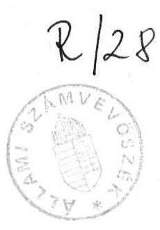
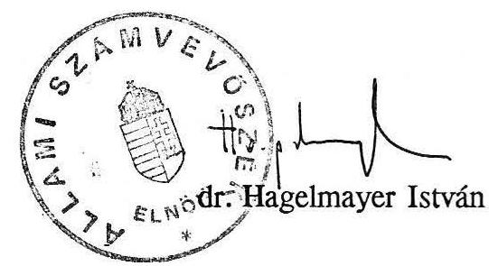

# Állami Számvevőszék

## JELENTÉS

a Magyar Honvédség jóléti jellegű beruházásainak pénzügyi-gazdasági ellenőrzéséről

---

# Az ellenőrzést végezték:

Kovácsné Soós Piroska számvevő, Révész János számvevő, dr. Kardos László számvevő tanácsos, Szamelý Kornél számvevő, Gömöri József számvevő

Az ellenőrzést vezette:
Hudik Zoltán főtanácsos

---

# JELENTÉS

## a Magyar Honvédség jóléti jellegű beruházásainak pénzügyi-gazdasági ellenőrzéséről

A Magyar Honvédség* (a továbbiakban: MH) jóléti jellegű beruházásai a személyi állomány életkörülményeinek javítását, valamint az egészségügyi, szociális és kulturális ellátás létesítményi feltételeinek megteremtését szolgálják. Finanszírozásuk - mivel az MH érdekeltségi alapot nem képez - eltér a költségvetési szervek általános gyakorlatától. Az állami költségvetés rendszerében ezeket a ráfordításokat a nemzetgazdaság felhalmozási kiadásai között az egyéb központi beruházásokra elkülönített keret tartalmazza. Így a jóléti jellegű beruházásokat - a hatályos jogszabályok szerint - az MH alaptevékenységi célokra jóváhagyott beruházási előirányzatából valósították meg.

Az ellenőrzés — az 1986. január 1-től 1990. július 31-ig terjedő időszakot átfogva — a jóléti jellegű beruházások előkészítésére és megvalósítására rendelkezésre álló összeg felhasználásának törvényességére, célszerűségére és eredményességére irányult. Ennek keretében áttekintettük a befejezett, a folyamatban lévő, valamint a megkezdett, de időközben leállított beruházások teljes körét. A helyszíni vizsgálat az MH Építési és Elhelyezési Főnökség (a továbbiakban: MH ÉEF-ség) tervezői-, szervezői és gazdálkodói, a Közületi Beruházó Vállalat (a továbbiakban: KÖZBER) lebonyolítói és az Állami Fejlesztési Intézet (a továbbiakban: ÁFI) finanszírozói tevékenységére terjedt ki.

Részletesen ellenőriztük az egészségügyi beruházások közül az MH Központi Katonai Kórház (a továbbiakban: MH KKK) rekonstrukcióját, a szociális beruházások közül a Bp. XIV., Mexikói úti nőtlen és átvonulási szálló (a továbbiakban: Bp-i Honvéd Szálló), a kulturális beruházások közül a Szombathelyi Helyőrségi Művelődési Otthon megvalósítását. Ez összességében a jóléti jellegű beruházásokra jóváhagyott - engedélyokiratok szerinti - 9,5 milliárd forintos előirányzatból 8,8 milliárd forint (92,5 %) felhasználását

[^0]
[^0]:    * 1990. március 15-e előtt Magyar Néphadsereg (MN)

---

jelentette. Jelentősége és nagyságrendje miatt (5,8 milliárd forint) az MH KKK ellenőrzése során tapasztaltakat a függelékben részletezzük (1. sz. melléklet).

# I.

## MEGÁLLAPÍTÁSOK

## 1.) A beruházási folyamat szabályozottsága

A nemzetgazdaságban a beruházások előkészítését és megvalósítását a beruházások rendjéről szóló 46/1984. (XI. 6.) MT számú rendelet, valamint a végrehajtására kiadott 3/1984. (XI. 6.) OT-PM számú rendelet (a továbbiakban együtt: beruházási rendeletek) szabályozza. A fegyveres testületek esetében az MT lehetőséget adott - elsősorban a védelmi feladatokra tekintettel — az ettől eltérő szabályozásra. Az eltéréseket — a jelenleg is hatályban lévő — SzH-4000/IV/1985. OT-PM számú együttes utasítás (a továbbiakban: beruházási utasítás) tartalmazza.

A beruházási utasítás alapján a döntési jogkör eltért az általános gyakorlattól. Eszerint a fegyveres testületek alaptevékenységi — így a jóléti jellegű - beruházásai közül a "testületi nagyberuházás" fejlesztési célját és beruházási javaslatát a Minisztertanács Honvédelmi Bizottsága* (a továbbiakban: HB), a "testületi egyéb beruházás"-ok beruházási programját a honvédelmi miniszter hagyta jóvá.
"Testületi nagyberuházás" esetében az összes fejlesztési költség elérte vagy meghaladta a 300 millió forintot, vagy a HB - a középtávú, illetve az éves terv jóváhagyásakor értékhatártól függetlenül minősítette annak.

A jóléti jellegű beruházásokat fejlesztési költségük, céljuk és tartalmuk figyelembevételével - az MH KKK rekonstrukciót kivéve - a "testületi egyéb beruházások" kategóriájába sorolták.

A HB a 3/347/1983. sz. határozatával rendelkezett arról, hogy 1984. január 1-től minden építéssel járó, 200 millió forintot meghaladó fejlesztési költségű beruházás megkezdése is csak a HB jóváhagyásával történhet.

[^0]
[^0]:    * 1988. október 15-én megszűnt

---

Ebbe a kategóriába 1986-1990. között két létesítmény került be. A Veszprémi Helyőrségi Művelődési Otthon megvalósítását a HB engedélyezte, a Bp-i Honvéd Szálló beruházásának jóváhagyását a honvédelmi miniszter hatáskörébe utalta.

A vizsgált időszakban a 2/1980. (X. 21.) OT-PM-ÉVM sz. együttes rendelet a jóléti jellegű beruházások jelentős hányadát (kultúrházakat, irodákat, üdülőépületeket, stb.) átmeneti korlátozás alá vonta. Az MH ÉEF-ségnek öt esetben kellett engedélyt kérni a létesítmények megvalósítására. A felmentést azonban szabálytalanul nem az erre feljogosított OT-PM-ÉVM-től (1985-től OT-ÉVM), hanem a HB-tól kérték, illetve kapták.

# 2.) A beruházások pénzügyi feltételei

Az MH ÉEF-ség 1986-1990. évekre vonatkozóan az állóeszközök létesítésére, a meglévő építmények, objektumok bővítésére és korszerűsítésére középtávú építés-beruházási tervet állított össze, amelyet körültekintő elemző-értékelő munka előzött meg. A tervben megfogalmazásra került, hogy a beruházások megvalósításával az MH fő célkitűzése a reálisan felmerülő egészségügyi-, szociális- és kulturális igények létesítményi feltételeinek szükség szerinti kielégítése. A döntésnél azonban nemcsak a gazdasági helyzet és a rendelkezésre álló források várható alakulását, hanem a honvédségnél akkor érvényes védelmi elképzeléseknek megfelelő fejlesztési igényeket, illetve az 1985-ben elkezdődött átszervezés hatásait is figyelembe kellett venni. A korlátozott pénzügyi lehetőségek már a terv készítésénél éreztették hatásukat, az indokoltnak ítélt igényeknek alig több, mint 50 %-a kerülhetett a tervjavaslatba. A jóléti jellegű létesítmények intenzívebb fejlesztésére az építési keretek korlátai és a védelmi feladatok elsődlegessége miatt sem volt lehetőség.

A többszöri módosítás után az MH 1986-90. évekre jóváhagyott 24,6 milliárd forintos beruházási keretéből az alaptevékenységi célokra elkülönített összeg 15,4 milliárd forintot tett ki. Ebből a jóléti jellegű beruházásokra 5,3 milliárd forintot (34,1 %) fordítottak (2. sz. melléklet).

[^0]
[^0]:    Az MT által eredetileg jóváhagyott tervszámok (beruházási keret 24,1 milliárd forint, alaptevékenységi beruházásokra 14,9 milliárd forint, ebből jóléti jellegű beruházásokra 3,6 milliárd forint) módosítását az általános forgalmi adó (ÁFA) bevezetése, a tervezettnél nagyobb arányú építési költségnövekedés, az állami költségvetés kiadásainak csökkentésével összefüggésben végrehajtott évközi elvonások (összesen 1,5 milliárd forint) tették szükségessé. Az állami költségvetés az ÁFA miatti növekedést részben kompenzálta, ezzel magyarázható, hogy a beruházási keretösszeg nőtt ugyan, de a reálértéke lényegesen csökkent.

---

A jóváhagyott 5,3 milliárd forintból 2 szálló, 3 konyha-étterem, 2 klubkönyvtár, 2 helyőrségi művelődési otthon, 1 óvoda építése, valamint 1 kórházbővítés befejeződött (3. sz. melléklet); folyamatban van 1 laktanyai egészségügyi intézmény (gyengélkedő) pénzügyi elszámolása, továbbá az MH KKK rekonstrukció kivitelezési munkái; valamint a Hévízi Szanatórium részleges korszerűsítése.

A jóváhagyott összeg reálértékének lényeges csökkenése miatt az MH a tervezett beruházások egy részét törölte, másutt a műszaki tartalmat szűkítette. Az egészségügyi és szociális beruházások közül hetet nem valósítottak meg, vagy a felmerült igényt más formában (pl. régi épület felújításával) elégítették ki.

Egyes beruházások leállításához - a pénzforrás hiányán túl - a helyi tanácsok MH-val szemben támasztott túlzott igényei is hozzájárultak.

Balatonszabadi-Sóstón a helyi tanács a költségekhez nem járult hozzá, de a kemping szennyvízelvezető csatornájának megépítését csak azzal a feltétellel engedélyezte, ha az MH az általa épített gerincvezetéken minden utcánál bekötési lehetőséget létesít a lakossági igények későbbi kielégítésére. A 70 millió forintos fejlesztéstől — gazdaságtalansága miatt — az MH ÉEF-ség elállt.

A Fővárosi Tanács az MH III., Óbudasziget-i pihenőhely 100 millió forintos költséggel tervezett fejlesztésének elhalasztásához - a pénzügyi lehetőségek kedvezőtlen alakulása mellett — az is hozzájárult, hogy a HM kezelésében lévő területen a tanács csak nemzetközi vízikemping megvalósítására adott engedélyt, de a kivitelezés költségeihez nem járult hozzá.

A Bp-i Hadtörténeti Intézet jelentős ráfordítással elkezdett bővítését nem a pénzhiány, hanem a kivitelezés közben talált régészeti leletek megóvása miatt kellett leállítani.

Az alapozási földmunkáknál XIII. századi műemlék maradványokat találtak. A műemléki szakhatóság állásfoglalása alapján az I. ker. Tanács az építési engedélyt visszavonta, ezzel egyidejűleg kötelezte az MH-t a leletek megóvására és a bemutatás lehetőségének megteremtésére. Ez a már elvégzett munkákkal együtt az MH beruházási keretéből 20,6 millió forint kiadást jelentett.

Előfordult az is, hogy néhány jóléti jellegű beruházás igénye már a korábbi ötéves tervek idején is felmerült, de megvalósításukat csak 1986-90-re tervezhették. Ennek következtében a beruházás elhatározásától a kivitelezés megkezdéséig eltelt idő alatt a kiadott hatósági engedélyek lejártak, a már elkészült beruházási programokat, műszaki kivitelezési terveket aktualizálni kellett. A fejlesztési költségek - a gazdasági körülményekben bekövetkezett változások miatt — lényegesen magasabbak lettek az alapdokumentumokban tervezett előirányzatoknál.

A Szombathelyi Helyőrségi Művelődési Otthon kivitelezésének megkezdésére 1979. helyett csak 1986-ban kerülhetett sor, közben a tervezett 98 millió forintos költség - változatlan kapacitás és funkcionális tartalom mellett - 165 millió forintra emelkedett.

---

A Bp-i Honvéd Szálló 1980-ban 136,9 millió forintra becsült költsége - változatlan műszaki tartalom mellett — 1981-ben 170 millió forintra, 1984-ben 270 millió forintra növekedett.

A Bajai nőtlen szálló megvalósítását 1978. évben 19,7 millió forintból tervezték. Időközben a műszaki tartalmat csökkentették, ennek ellenére az 1980. évre tervezett 19 millió forint 1982. évre 21,6 millió forintra változott. A beruházás csak 1984. évben kezdődött meg, emiatt a terveket korszerűsíteni kellett. A 33,3 millió forintra prognosztizált költségek végül — az áremelkedések miatt — 40,3 millió forintra módosultak.

Az MH az egyéb központi beruházásokra elkülönített összegen felül jóléti jellegű létesítményeket a Honvédelmi Minisztérium (a továbbiakban: HM) önálló költségvetési fejezetének előirányzatából is megvalósított.

A központi költségvetési szervek gyakorlatától eltérően a tárcaköltségvetésből megvalósított létesítmények építését, illetve egyes alaptevékenységi célú beruházásokkal összefüggő ingatlanszerzéseket nem tekintették beruházásnak. A ráfordítások ilyen módon történő kezelésére a HM belső szabályozása, illetve az általánostól eltérő "Rovat- és tételrend" adott lehetőséget (a tárcaköltségvetésből finanszírozott beruházásokkal kapcsolatos részletesebb megállapításokat a 4. sz. melléklet tartalmazza).

# 3.) A beruházások előkészítése és megvalósítása

A beruházások dokumentumainak engedélyezésre történő előkészítése, illetve a jóváhagyott keretekkel történő gazdálkodás az MH ÉEF-ség feladata volt. A döntéseket általában gondos elemző munka előzte meg.

Pl.: a Bp-i Honvéd Szállónál az igényjogosultak számát az állomány korösszetétele, alapvetően a vidéki helyőrségekből történő utánpótlás igénye, illetve az I. kategóriás lakásigénylők megelőző tíz évre vonatkozó tényleges adatai alapján prognosztizálták.

Ugyanakkor az előkészítés hiányosságai is közrejátszanak abban, hogy egyértelműen nem ítélhető meg az MH KKK rekonstrukció gazdaságos folytatásának lehetősége, illetve módja.

Az MH ÉEF-ség a kórház fejlesztési céljaként a meglévő és gazdaságosan felújitható épületek megtartása mellett, új létesítmények megépítésével és korszerű orvostechnológiai eszközök alkalmazásával - a tömbkórház és pavilonrendszer előnyeit egyesítő 1218 ágyas - sokprofilú, széleskörű szakmai lehetőségekkel rendelkező gyógyintézmény létrehozását fogalmazták meg.

A fejlesztési cél előkészítése során és a beruházási javaslat kidolgozásánál az MH ÉEF-ség eleget téve a jogszabály előírásainak, új kórház építésének lehetőségét is megvizsgáltatta.

---

A döntéshez (rekonstrukció vagy új kórház építése) szükséges előterjesztések és előtanulmányok a költségekre és az építészeti megoldásokra vonatkozóan nem voltak minden tekintetben kellően megalapozottak. A meglévő épületek felújítási költségeinek meghatározását nem előzte meg részletes állapotvizsgálat arra hivatkozva, hogy az akadályozná a kórház folyamatos működését. Ennek hiányában a tanulmányok a becslésen alapuló költségszámítások és egyéb, nem számszerűsíthető indokok (megközelítés, hiányzó infrastruktúra, stb.) alapján a rekonstrukciót és nem az új kórház építését ítélték gazdaságosabbnak.

Az előkészítésnél felmerült véleménykülönbségek kompromisszumos megoldásaként a HB 1994. december 31-i befejezési határidővel, 7,9 milliárd forint
 költségelőirányzattal és fokozatos tervszolgáltatás mellett szakaszos megvalósítással engedélyezte a rekonstrukciót. A nagyberuházásokra vonatkozó általános gyakorlatnak megfelelően írta elő a honvédelmi tárca beszámolási kötelezettségét (első ízben 1988-ra). Ilyen beszámolásra azonban ezideig nem került sor.

A rekonstrukció során a meglévő pavilonok felújítása ismét kétségessé vált. A műszaki tartalom bizonytalansága a teljes rekonstrukció költségelőirányzat-becslésének megbízhatóságát is megkérdőjelezi.

Az MH ÉEF-ség a pavilonok részletes állapotvizsgálatát csak 1993-ra tervezi, ez esetben a fejlesztés további irányára vonatkozó döntés - megítélésünk szerint indokolatlanul elhúzódik.

A jóléti jellegű beruházások pénzügyi lebonyolítását — az MH-val kötött finanszírozási szerződés alapján — az ÁFI végezte. A beruházási keretek megnyitására az MH ÉEF-ség által kiadott engedélyokiratok alapján került sor.

Az ÁFI tevékenysége a beruházások előkészítésére és megvalósítására vonatkozó szerződések előjegyzésén túl kiterjedt a rendelkezésre bocsátott pénzeszközök döntésnek megfelelő felhasználásának ellenőrzésére is. A fedezetet csak a műszaki tartalom- és a számlák ellenőrzése után utalta át, a pénzintézet ezzel több esetben jogtalan összegek kifizetését akadályozta meg.

A Bp-i Honvéd Szálló engedélyokiratát az ÁFI - a beruházási programtól eltérő költségszámítás miatt — csak egyeztetések után fogadta el.

Az MH KKK rekonstrukciónál végzett célvizsgálat során - a felvonulási terület használatbavételi jogának átvételénél — többletköltséget állapított meg az ÁFI. Az MH ÉEF-ség — bár tudomásuk volt a túlfinanszírozásról — csak ezt követően intézkedett a 10 millió forintos összeg visszatérítésére.

A Bp-i Honvéd Szálló építésénél a bérelt toronydaruk időarányos gépköltség elszámolásánál 5.076.569 forint túlfizetést állapított meg az ÁFI. Az egyeztetések során a kivitelező ebből 4.527.799 forintot elismert, és 1.318.248 forint kamattal együtt visszafizette.

---

A beruházások tervezési és kivitelezési munkáinak lebonyolítását, valamint a műszaki ellenőrzést a KÖZBER végezte, illetve végzi.

A szükséges tervdokumentációkat általában a KÖZBER által megbízott tervező vállalat készítette. Az egyes beruházásoknál - az MH KKK kivételével, ahol a HB szakaszos tervszállítást engedélyezett - a műszaki kiviteli tervek a munkák megkezdésére rendelkezésre álltak. A kórháznál a tervszállítás üteme az előírtaktól elmaradt. A kivitelezés folyamatosságát azonban ez a késedelem nem befolyásolta, mivel időközben a kedvezőtlen pénzügyi helyzet miatt a beruházás is lelassult.

Az MH saját tervező intézete (az MH ÉPTI) — kapacitása függvényében — öt esetben volt generáltervező. Ilyenkor - az altervezői megbízások kivételével - a tervezői díj beruházási költségként nem jelentkezett (pl. a Szombathelyi Helyőrségi Művelődési Otthon esetében 3,3 millió forint tervezési díjat "takarítottak meg").

A KÖZBER a generálkivitelezésre a beruházások többségénél versenytárgyalást hirdetett meg. A versenykiírást és a pályázatok elbírálását az MH ÉEF-séggel és a pénzügyi lebonyolítást végző ÁFI-val egyeztetve eredményesen oldotta meg.

A Szombathelyi Helyőrségi Művelődési Otthon versenytárgyalására az öt meghívott építőipari vállalat közül három nyújtott be ajánlatot. A versenyt a legkedvezőbb — egyösszegben megjelölt — bekerülési árajánlattal, illetve befejezési határidővel a VASÉP nyerte.

A Bp. Kartács utcai óvoda-bölcsőde kivitelezését (négy közül) a maximált áron történő ajánlatot tévő COOPINVEST nyerte.

A Veszprémi Helyőrségi Művelődési Otthonnál a versenytárgyalást — akkor a legelőnyösebbnek tűnő árajánlatával - a VÁÉV nyerte el. A vállalatot időközben felszámolták, emiatt a kivitelezési munkákat az ÉKV-nak kellett folytatni. A VÁÉV a felvett 29 millió forint előlegből először csak 22 millió forinttal tudott elszámolni, a 7 millió forintot az MH csak később kapta vissza.

Néhány esetben a generálkivitelezőt nem versenytárgyalás útján, hanem kijelöléssel határozták meg. Így került sor - elsősorban a konyha-éttermek kivitelezésénél — az ÉKV és az MH Katonai Főépítésvezetőségek, illetve az MH KKK rekonstrukciónál és a Bp-i Honvéd Szálló beruházásnál a KÖZÉV megbízására. A kijelölést általában az alkalmazott építési technológia indokolta, a kórháznál ezen túlmenően szerepet játszott a KÖZÉV egészségügyi beruházások kivitelezésében szerzett nagy gyakorlata is.

A KÖZBER — az 1987. évi árformaváltozásig — a kivitelezésre vonatkozó vállalkozási szerződéseket egyaránt kötötte maximált árformában, valamint szabad- és átalányáras elszámolással. A kijelöléssel meghatározott generálkivitelezőnél csak maximált árformát

---

alkalmaztak, ami a kivitelező és a beruházó részére kölcsönös előnyt jelentett. Ez a helyzet 1987-től - a maximált árforma megszűnésétől - megváltozott. Ahol a kivitelezési szerződéseket maximált árformában már előzőleg teljeskörűen megkötötték, ott a beruházó került kedvezőbb helyzetbe (pl.: a Honvéd Szálló beruházása). Ugyanakkor a szabadár alkalmazása és az árformaváltozás előtti kijelölés a generálkivitelezőnek biztosított előnyös feltételeket (pl.: az MH KKK rekonstrukciónál).

Az MH KKK rekonstrukciónál a műszaki kiviteli tervek hiánya nem tette lehetővé a teljeskörű szerződéskötést. A beruházási javaslat előterjesztésében szereplő tervszállítás határidő figyelembevételével - 1986-ban - maximált áron egyébként is csak az alapozási munkákra lehetett volna szerződést kötni.

Segítette a beruházások gazdaságosabb megvalósítását, hogy a KÖZBER havonta a teljes munkára vonatkozó koordinációs egyeztetéseket végzett. Külön munkacsoportot hozott létre - az MH KKK rekonstrukció jelentőségére tekintettel - a megvalósítás operatív irányítására, a tervezői és kivitelezői munka ellenőrzésére, a zavartalan együttműködés biztosítására.

A Szombathelyi Helyőrségi Művelődési Otthon beruházásnál a koordináció eredményeként a fütési rendszer kiépítésénél 10,2 millió forintot takarítottak meg.

A beruházások kivitelezése folyamán több esetben eltértek a megkötött kivitelezési szerződésektől. Ennek következtében az engedélyokiratok költségelőirányzatait, esetenként a befejezés határidejét is meg kellett változtatni.

Az engedélyokiratok módosítása mintegy 1,5 milliárd forintos többletköltséget eredményezett, ami döntően az ÁFA bevezetéséből, illetve az építőanyagipari árak változásából adódott. Kisebb mértékben hozható összefüggésbe a többletköltség a tervezési hiányosságokból eredő vagy a kivitelezés menetében felmerült többletmunkákkal, a beruházás műszaki tartalmának változtatásaival, az importkorlátozás miatti anyagbeszerzési nehézségekkel, a gyártó vállalat típusmódosításaival.

A beruházások előkészítési és kivitelezési munkáit a résztvevők a vonatkozó jogszabályok előírásainak megfelelően végezték, ettől eltérő gyakorlatot az ellenőrzés nem tapasztalt.

---

# 4.) A beruházások üzembehelyezése és értékelése 

A vizsgált beruházások létesítményeinek üzembehelyezése — egy kivételével — végleges jelleggel megtörtént.

#### Abstract

A Bp-i Honvéd Szálló üzembehelyezéséhez az MH munkavédelmi felelőse - a fürdőszoba balesetveszélyes küszöbkialakítása miatt — csak ideiglenes jelleggel járult hozzá. A végleges üzembehelyezésre a kifogásolt biztonságtechnikai feltételek (piktogram, figyelmeztető felirat elhelyezése) teljesítése és egy évi balesetmentes próbaüzemelés után került sor.

Az üzembehelyezett létesítmények működtetése során általában érvényesülnek a beruházási programokban megfogalmazott célkitűzések. Kivételt jelent ez alól a Bp-i Honvéd Szálló átvonulási szálló része, amelynek a honvédség által történő kihasználtsága alatta marad a tervezettnek (évi 5-10 \%). Ez azonban nem róható a tervezés hibájának, mivel a kiváltó oka a honvédség időközben bekövetkezett létszámcsökkentése, illetve átszervezése volt. Pozitívan értékelhető, hogy a kihasználatlanságból adódó gazdaságtalan üzemelés elkerülése érdekében az üresen maradt férőhelyeket utazási irodán keresztül hasznosítják.

Sajátos üzemeltetési gyakorlatot folytatnak a Szombathelyi Helyőrségi Művelődési Otthon esetében. Az intézmény Szombathely és vonzáskörzete állományának igényeit hivatott kielégíteni, előljáró szerve azonban Tatán található. A hatékonyabb üzemeltetés érdekében célszerű lenne azt a helyőrségparancsnok alárendeltségébe utalni.

A vizsgált időszakban befejezett beruházások végszámláit áttekintve megállapítható volt, hogy az engedélyokiratokban jóváhagyott előirányzatokat egyetlen esetben sem lépték túl. Az ÁFI a fel nem használt kereteket felszabadította, így az MH - a beruházási utasításban biztosított lehetősége alapján - a 43,8 millió forint megtakarítást más beruházás finanszírozására fordíthatta.

A fegyveres erők és testületek gazdálkodási rendje - MT-től kapott felhatalmazás alapján, PM utasításban meghatározottak szerint - eltér az állami költségvetési szervek általános gazdálkodási rendjétől. Ebből adódik, hogy a létrehozott vagyontárgyakat a számvitelben nem aktiválják. Az álló- és fogyóeszközöket csak természetes mértékegységben tartják nyilván, ezekről folyamatosan vezetett — ráfordításokat és amortizációt is elszámoló — értéknyilvántartást nem vezetnek.

[^0]
[^0]:    A beruházási pénzeszközök az MH számvitelében nem jelennek meg, az esedékes kifizetéseket a KÖZBER-nél, az ÁFI-nál, valamint a kivitelezőknél tarják nyilván. Az ÁFI csak negyedévenként ad tájékoztatást az MH ÉEF-ségnek a keretfelhasználásról.

---

Előrelépést jelent a fegyveres erők és testületek gazdálkodási rendjéről szóló 12/1990. (IV. 22.) PM-HM együttes rendelet, ami általános készletleltár felvételét rendelte el, és 1991. január 1-től kötelezővé tette az egyszerűsített kettős könyvvitel vezetését. E rendelet sem írja azonban elő a HM önálló költségvetési fejezetből, illetve a nemzetgazdaság egyéb központi beruházásai céljára elkülönített keretből finanszírozott beruházások együttes kezelését.

Az egyéb központi beruházásokra elkülönített keretből megvalósuló beruházások pénzügyi ellenőrzésére az érvényes szabályozás alapján a finanszírozást végző pénzintézet jogosult. A vizsgálat tapasztalatai szerint azonban ez nem helyettesíti az MH rendelkezésére álló beruházási keretek felhasználásának tárcaszintű ellenőrzését.

A tárca belső szabályozása az egyéb központi beruházási keretek felhasználásának ellenőrzésére nem terjedt ki. A HM önálló költségvetési fejezet előirányzatainak felhasználását az MH ÉEF-ségnél a vizsgált időszakban az MHVK Anyagtervezési és Közgazdasági Csoportfőnökség egy esetben (1989-ben) ellenőrizte, de a jóléti jellegű beruházásokat ez sem érintette.

A honvédelmi tárcánál végrehajtott átszervezés (a HM és az MH szétválasztása) szükségessé teszi a közvetlen honvédelmi kiadások anyagi-pénzügyi gazdálkodásának szabályairól szóló 3/1986. számú HM utasítás korszerűsítését. A szervezeti kereteket úgy célszerű módosítani, hogy érvényesülhessen az ellenőrzés függetlensége.

# II. 

## JAVASLATOK

Az ellenőrzés megállapításai alapján a következőket javasoljuk:
1.) A HM és az illetékes tárcák gondoskodjanak — a készülő államháztartási törvénnyel összhangban - a beruházások rendjéről szóló, illetve a HM költségvetési gazdálkodását érintő jogszabályok (46/1984. (XI. 6.) MT sz. rendelet, 3/1984. (XI. 6.) OT-PM sz. rendelet, SzH-4000/IV/1985. OT-PM sz. együttes utasítás, 3/1986. HM utasítás, stb.) ellentmondásainak feloldásáról.
2.) A Magyar Honvédség Központi Katonai Kórház rekonstrukciójának az elhúzódásából adódó veszteségek csökkentése, valamint a teljes megvalósítás reális áttekinthetősége és ellenőrizhetősége érdekében:

---

# II. 

## JAVASLATOK

Az ellenőrzés megállapításai alapján a következőket javasoljuk:
1.) A HM és az illetékes tárcák gondoskodjanak - a készülő államháztartási törvénnyel összhangban - a beruházások rendjéről szóló, illetve a HM költségvetési gazdálkodását érintő jogszabályok (46/1984. (XI. 6.) MT sz. rendelet, 3/1984. (XI. 6.) OT-PM sz. rendelet, SzH-4000/IV/1985. OT-PM sz. együttes utasítás, 3/1986. HM utasítás, stb.) ellentmondásainak feloldásáról.
2.) A Magyar Honvédség Központi Katonai Kórház rekonstrukciójának az elhúzódásából adódó veszteségek csökkentése, valamint a teljes megvalósítás reális áttekinthetősége és ellenőrizhetősége érdekében:

- a pénzügyi lehetőségek (egyéb központi beruházási forrás, a tárca költségvetése, más külső források) figyelembevételével ki kell dolgozni a gazdaságos folytatás alternatíváit, illetve feltételeit és ehhez kell igazítani a hotelfunkcióra tervezett pavilonok kivitelezési módját (felújítás vagy új objektum építése) egyértelműen megalapozó döntéselőkészítő munkát;
- a tárca évente számoljon be a Kormánynak a rekonstrukció állásáról.

Budapest, 1990. november 23.
Melléklet: 14 lap

---

# FÜGGELÉK 

## A Magyar Honvédség Központi Katonai Kórházának rekonstrukciója (testületi nagyberuházás)

A honvédség egészségügyi rendszerében vezető szerepet betöltő — közel 1000 ágyas — MH KKK rekonstrukciója részben új épületek felépítését, részben a meglévő pavilonok és a közműhálózat felújítását jelenti.

A rekonstrukciót követően a betegek elhelyezése egyrészt az új épülettömb úgynevezett hotelszárnyában, nagyobbrészt pedig a meglévő és felújításra tervezett pavilonokban történik. A mai működési rendtől eltérően az orvosi ellátást - az új létesítményben lévő - különálló diagnosztikai, valamint műtőblokkban oldják meg.

A fejlesztés a szükséges bontási és közműkiváltási munkákkal
 1985-ben indult. A HB az új épületek üzembehelyezésének idejét 1992. december 31-én, a meglévő épületek felújításának, korszerűsítésének határidejét 1994. december 31-én határozta meg. Az 1988-ban módosított engedélyokirat szerint a fejlesztés teljes költsége - prognosztizált áron - 9,5 milliárd forint, amelyből 8,3 milliárd forint a beruházás, 1,2 milliárd forint a felújítás.

A rekonstrukció döntő részét a hotel (H) és diagnosztikai (D) tömb új épülete képezi, amelynek szerkezetépítése 1989-ben befejeződött, az ellenőrzés időszakában szak- és szerelőmunkákat végeznek. Ezévben készült el az oktatási célokat szolgáló új épület, befejeződött két további objektum alapozása, valamint elkezdték a konyha-étterem blokk szerkezetépítését.

A kórház működőképességének fenntartása érdekében előrehozták a fűtési rendszer, a vízellátás és a szennyvízelvezetés egy részének korszerűsítését. A jelenleg is üzemelő pavilonok tervezett felújítása az új épületek átadása után indítható.

Az 1986-1990. közötti időszakra tervezett 2,5 milliárd forinttal szemben a várható felhasználás - folyó áron számolva - eléri a 4,2 milliárd forintot. A HB határozatban előírt határidők különböző — elsősorban pénzügyi — okok miatt ma már műszakilag sem

---

tarthatók, a fejlesztés várható teljes költsége pedig — még 1990-es árakon is — mintegy 16 milliárd forintra becsülhető.

# 1.) A fejlesztés indokoltsága 

Az általános kórházi ellátás szempontjából, a 45/1979. (HK. 33.) MN Egészségügyi Szolgálatfőnöki Intézkedés alapján, a honvédségi igényjogosultak közel 50%-a tartozik az MH KKK utaltsági körébe. Számos szakosított profilban, országos hatáskörrel valamennyi ellátásra jogosult — mintegy 300.000 fő — kezelését végzik.

Az állami egészségügy rendszerébe épülve a kórház részt vesz a főváros lakosságának ellátásában is, amelynek mértékét belső utasítás szabályozza. Eszerint a rendelkezésre álló ágyak 30%-a vehető igénybe ebben a formában.

Az ellenőrzött időszakról készített statisztika szerint az engedélyezett arányt 2-7%-kal túllépték, ez azonban az alaprendeltetés szerinti feladat eredményességét nem veszélyeztette.

A Budapest Főváros Tanácsa és az MH illetékes szerve között e tárgyban készült megállapodást - bár a felek magukra nézve kötelezőnek fogadják el - nem tudták bemutatni a vizsgálat során. Ezért, valamint az önkormányzatokkal összefüggő változások miatt az MH Egészségügyi Szolgálat Főnökség felkészült a megállapodás újraszabályozására.

Az ágykihasználási mutató a vizsgált időszakban 78,7% volt, ez megfelel 39 budapesti kórház esetében kimutatott átlagértéknek.

Az MH KKK épületei a századfordulón épültek, ma már korszerűtlen pavilonrendszerben, a jelenlegi kapacitást emeletráépítésekkel biztosították. Általános felújítás a kórházban közel 50 éve volt, ezért a pavilonok mai állapotukban nem alkalmasak a korszerű gyógyítás feltételeinek biztosítására.

A létesítmény műszaki állapotát jól jellemzi, hogy a vizsgált időszakban a fenntartási kiadásokra hatályos normák alapján tervezett, az éves tervekben jóváhagyott 43,6 millió forinttal szemben 111,3 millió forint felhasználása vált szükségessé.

Az évtized elején készült felmérések, jelentések egyaránt alátámasztják, hogy a kórház sem funkcionális, sem műszaki szempontból a biztonságos üzemeltetés feltételeit nem elégítette ki, ezért a fejlesztés indokolt és megalapozott volt.

---

# 2.) A fejlesztés célszerűsége 

A tervezés időszakában a fejlesztésre két lehetséges irány adódott. A meglévő kórház bővítése, rekonstrukciója, illetve új kórház építése a főváros más, arra alkalmas területén. Az MH ÉEF-ség, a KÖZTI által 1975-ben készített tanulmányra alapozva a rekonstrukciót javasolta. Az elgondolás mellett szólt a jelenlegi kórház jó megközelítési lehetősége tömegközlekedési eszközökkel, illetve mentő-gépkocsival, valamint az, hogy a kórház közelében rendelkezésre áll a megfelelő mennyiségű szolgálati lakás és nővérszálló férőhely.

A költségek összehasonlítása az IPARTERV 1985-ös tanulmányában a következő eredményt hozta:
érték millió forintban

| helyszín | teljes költség   (1984. évi bázisáron) |
| :-- | :--: |
| 1. Rekonstrukció (XIII., Róbert K. krt.) | 4.263,0 |
| 2. Bp. II., Petneházi rét | 5.141,6 |
| 3. Bp. XV., Felszabadulás út | 4.995,4 |

A becsléseken alapuló számítások a rekonstrukció egyértelmű előnyét mutatták. Új kórház építése esetén a felszabaduló területet katonai szervezetek elhelyezésére kívánták felhasználni. Az akkor érvényes hadseregfejlesztési elképzeléseknek megfelelően fel sem merülhetett az objektum értékesítése és a bevételek új kórház építésével összefüggő hasznosítása.

A pavilonok felújításához szükséges költségek becslését nem előzte meg részletes feltárás, amelyből az elvégzendő munkák nagyságára hitelt érdemlően következtetni lehetett volna. A kórház működőképességének előírt fenntartása mellett e feladat megoldása nehézségekbe ütközött, így azonban a felújítási költségek tervezése nem lehetett megalapozott.

Tekintettel a kórház szerepére a főváros betegellátáában, valamint a tervezett Észak-pesti Kórház megépítésének elhúzódására, az MH illetékes szervei tárgyalást kezdeményeztek a Fővárosi Tanács elnökhelyettesével a költségek megosztása tárgyában. Ez azonban eredménytelennek bizonyult, a Fővárosi Tanács a rekonstrukció költségeihez nem tudott hozzájárulni. Nyilvánvaló lett, hogy a költségek tekintetében a tárca saját beruházási keretei váltak meghatározóvá.

---

A HB fejlesztést engedélyező objektív döntéséhez szükséges HM előterjesztések az új kórház építésének csak a hátrányait — elsősorban magasabb költségét — mutatták be. A rekonstrukcióban felújítható épületek számának megállapításában, a költségek becslésében sok bizonytalanság tapasztalható.

# 3.) A fejlesztés előkészítése 

Az MH EüSZF-ség orvosszakmai követelményei alapján a KÖZBER megbízást kapott részletes beépítési terv elkészítésére, majd a vonatkozó jogszabályban előírt egyeztetések után a rekonstrukció fejlesztési célját a HB 3/361/1985. számú határozatával elfogadta.

A koordináció dokumentumai szerint a kórház rekonstrukciójának szükségességével az érintett szervek egyetértettek. Kisebb súlyú szakmai kérdéseken kívül a költségek realitása, a kivitelezés időtartama tekintetében merültek fel kifogások.

A rekonstrukció tervezett költségét, 1984. évi bázisáron 4,3 milliárd forintban határozták meg. Pénzügyi forrásként az MH részére biztosított költségvetési juttatást jelölték meg, ebből 3,5 milliárd forintot az egyéb központi beruházásokra fordítható keretből, 0,8 milliárd forintot tárcaköltségvetésből terveztek felhasználni.

A fejlesztési cél jóváhagyásával egyidejűleg a HB 150 millió forintos előkészítési keret megnyitását is engedélyezte bontási, közműkiváltási munkák, tervezési költségek fedezetére.

A kivitelezés időtartamát 1986. évi kezdés mellett 9 évben határozták meg. A HB feladatul szabta, hogy törekedni kell a kivitelezési idő rövidítésére. Ennek lehetőségét egyben korlátozta is azzal, hogy az 1990. december 31-ig ráfordítható költségeket 2-2,5 milliárd forintban maximálta, így az építés-szerelés munkálatait nem az optimális építési ütem, illetve a kivitelező kapacitása határozta meg.

A generáltervezésre az IPARTERV kapott megbízást. A vállalatnak kórházépítésben, ilyen nagyságrendű rekonstrukcióban megfelelő generáltervezői gyakorlata nem volt. Az MH ÉEF-ség illetékesei szerint más tervező vállalattól - azok leterheltsége miatt - ajánlatot nem kaptak, ezt alátámasztó dokumentumokat azonban az ellenőrzés nem talált. 1985-ben a fejlesztési cél jóváhagyása után - a beruházási javaslat leszállítása előtt néhány hónappal - a KÖZTI készségét jelezte a feladat elvégzésére. Ebben a helyzetben már nem tartották célszerűnek bevonását a tervezésbe, így az egészségügyi — ezen belül kórházépítéssel, rekonstrukcióval összefüggő - beruházások terén számos referenciával rendelkező vállalat jártassága nem került hasznosításra.

---

A beruházási javaslat előírt — OT-PM-ÁFI-szakminisztériumok — koordinációja során súlyos kifogások merültek fel a költségek és a kivitelezés időtartama tekintetében.

Újból felvetődött új kórház építésének lehetősége. A kérdés végleges tisztázása érdekében az Egészségügyi Beruházó Vállalatot bízták meg tanulmány elkészítésével, amely teljes mértékben igazolta az IPARTERV számításait. Így a fejlesztési cél egyeztetése során felhozott érvek alapján az új kórház építését az MH elutasította.

A finanszírozó pénzintézet (ÁFI) kifogásolta a kórház tervezett magas színvonalát. Részben ezzel összefüggésben mintegy 1,0 milliárd forint alátervezést állapított meg.

A tervek szerint a 351 betegszoba 34,8%-a kétágyas, 47,9%-a pedig háromágyas elhelyezést biztosít, ezzel az ország legmagasabb színvonalú kórháza épül meg.

Tekintettel a beruházás jelentőségére, a távlati célokra a létesítmény korszerűsége nem kifogásolható. Az ellátásban részesülő, igényjogosultsággal nem rendelkező fővárosi lakosság aránya azonban a döntéshozó szerv előtt ismert volt. Ebből adódóan indokolt lett volna olyan kormányszintű határozat, amely más szerveket is költségviselőként jelöl meg.

A HB-határozat szerint a megvalósítás során közelíteni kell a Műszaki Gazdasági Normatívák (MGN) előírásaihoz.

A 31/1973. (EüK 22.) EüM számú utasítással hatálybaléptetett normatívák a beruházás indulásának időszakára sok tekintetben elavultak, 1986-ban hatályukat vesztették. Megfelel a valóságnak az is, hogy az MH KKK - sajátos funkciói miatt - reálisan nem hasonlítható össze az MGN-ben szereplő kórházakkal. Ez azonban csak azt bizonyítja, hogy a döntés általánosságokat fogalmazott meg, nem adhat felmentést a - nyilvánvalóan takarékosságot célzó - feladat alól.

Nem indokolt például az osztályos kiszolgáló helyiségek (orvosi szobák, irodák, vizsgálók, várók) esetében tapasztalható, több mint 100%-os normatúllépés. Ebben közrejátszott az is, hogy a HM szakmai szervezete a rekonstruált kórház dolgozóinak létszámát a tervezés időszakában nem határozta meg. Az eltéréseket jól szemlélteti az Országos Traumatológiai Intézet (OTI) adataival történő összevetés is.
egy betegágyra jutó alapterület m²-ben

| megnevezés | OTI | MGN | MH KKK |
| :-- | :--: | :--: | :--: |
| betegszobák | 8,60 | 6,23 | 7,37 |
| kiszolgáló helyiségek | 2,46 | 3,30 | 7,13 |

---

A HB a beruházási javaslatot 1985-ben nem fogadta el, további miniszteri szintű egyeztetést írt elő.

A prognosztizációs kulcs megállapítását az ellentétes szakmai vélemények nagyban nehezítették. A PM és az OT álláspontjának kompromisszumaként évi 6%-os indexben állapodtak meg.

A műszaki kivitelezési tervek teljeskörű elkészítése - a beruházás nagyságából adódóan — hosszú időt igényelt volna. A kivitelezés kezdési időpontjának tartása érdekében született döntés a fokozatos tervszállításra. E módszer azonban szigorúbb szállítási fegyelmet követelt az IPARTERV-től, aminek a kivitelezés menetében nem mindig felelt meg.

A beruházási javaslatot jóváhagyó 10/370/1986. számú HB határozat előirányzatai:

| érték milliárd forintban |  |  |
| :-- | :--: | :--: |
| megnevezés | 1985. évi bázisáron | prognosztizált áron   (Index 6%) |
| beruházás | 4,5 | 6,8 |
| felújítás | 0,6 | 1,0 |
| első állátmány | 0,1 | 0,1 |
| összesen: | 5,1 | 7,9 |

A beruházás generálkivitelezésére a HB a KÖZÉV-et jelölte ki, versenytárgyalás mellőzésével. A vállalatnak az egészségügyi beruházások terén gyakorlata volt, az előzetes elgondolások kialakításában résztvett, a tervező figyelembe vette az alkalmazható technológiát. Mindezek mellett a kijelölés indokolt volt azért is, mert maximált árforma alkalmazása esetén az ilyen volumenű munka biztonságot jelent mind a beruházó, mind a kivitelező számára.

A rekonstrukció előkészítésében az MH ÉEF-ség tevékenysége megfelelt a beruházások rendjéről szóló 46/1984. (XI. 6.) MT rendelet, valamint a fegyveres szervekre vonatkozó SzH-4000/IV/1985. OT-PM együttes utasítás előírásainak.

A döntéshozó kormányzati szerv azonban az ország egyik legnagyobb beruházásának jóváhagyásakor nem törekedett az erőforrások koncentrálására, ezen keresztül a rekonstrukció időtartamának csökkentésére, végsősoron a költségek mérséklésére.

Mulasztás terheli továbbá a döntéshozó szervet azért is, mert nem követelte meg az előírt beszámolási rendet. A HB az 1988-ra meghatározott első beszámolót - a HM kérésének helyt adva (amely szerint a gazdaságban bekövetkezett változások miatt reális kép nem adható) — elhalasztotta. Az MH ÉEF-ség 1989 szeptemberére készen állt a beszámolásra,

---

de ezt ekkor a HM felső vezetése nem vállalta fel. Így a Kormány 1990-ben tárgyalja először a beruházás helyzetét, amikor a
 jelentős lemaradás már műszakilag sem hozható be. Az előírt beszámolási rend betartatásával a HB megteremthette volna a kormányszintű ellenőrzés és beavatkozás lehetőségét.

# 4.) A fejlesztés megvalósítása 

a) Építés

Az MH ÉEF-ség és a KÖZBER munkacsoportokat hozott létre, amelyeknek a feladata az operatív irányítás és kapcsolattartás a megrendelő, a lebonyolító, a tervező és a kivitelező között. A beruházás mégis a jóváhagyott ütemhez viszonyítva jelentős lemaradást mutat.

A beruházási javaslat és a tervezés hiányosságai miatt a beruházás későbbi szakaszában tervezett VII. épület átalakítását, valamint a VI. épület toldaléképítését is előbbre hozták. A felújítási munkákat a beruházás tartalékkeretéből, nem pedig - a jóváhagyás szerinti - tárcaköltségvetésből finanszírozták.

A VII. épület korszerűsítése során mintegy 140 millió forintot használtak fel, mert funkcióváltásból adódó és nagyságrendekkel kisebb költséggel tervezett felújítása halaszthatatlanul megoldandó építészeti problémákat hozott felszínre (pl.: bauxitbeton szerkezet). Ez ismét az előkészítés hiányosságaira utal.

A beruházási javaslathoz tartozó talajmechanikai szakvélemény 1984-ben készült. Annak ellenére, hogy a talajvízszint anomáliák (amelyekbe a metróépítés is belejátszott) ismertek voltak, és ennek kapcsán kiegészítő szakvéleményeket is beszereztek a kivitelezési munkák során súlyos helyzet állt elő.

Az új épülettömb alapozásakor kerültek szembe azzal, hogy a talajvízszint a vártnál magasabb. A költséges szigetelési eljárás elkerülése érdekében a pinceszintet megemelték. Ezek után az új épülettömb és a pavilonok összekötésének célszerű kialakítása bonyolult műszaki feladatot jelent.

Az ütemezés szerint a kivitelezési tervek elkészítésének határideje 1987. december 30-a volt. A tervek azonban teljeskörűen még az ellenőrzés időszakában sem álltak rendelkezésre.

Az építés-szerelés jelenlegi műszaki tartalmát figyelembevéve az új épületek 1992. decemberi üzembehelyezése nem biztosított.

---

b) Pénzügyi teljesítés

Az engedélyokiratot 1988-ban az ÁFA bevezetése kapcsán módosították. Így a rekonstrukció teljes költsége prognosztizált áron 9,5 milliárd forint, amiből a beruházás 8,3 milliárd forintot, a felújítás 1,2 milliárd forintot tett ki.

Az érvényes felsőszintű vezetői döntések és a kivitelező kijelölése ellenére a létesítmények teljességére kivitelezési szerződés, 1986. évi maximált árformában nem jött létre. Ezzel a döntés hatékony végrehajtását szolgáló kivitelezői kijelölés nem érte el célját, tekintettel arra, hogy az 1987-es árforma változás után a kivitelező saját költségfeltételei érvényesülnek.

Az ÁFI 1989-ben végrehajtott célvizsgálata a felvonulási létesítményekkel kapcsolatban mintegy 20 millió forint többletköltséget tárt fel. A KÖZBER ennek nyomán intézkedett a visszatérítésre, illetve a folyamatban lévő teljesítések megtagadására.

A többletköltségek abból adódtak, hogy részben az MHSZ-től használati jog átvételével megszerzett területre vagy nem volt szükség, vagy az MHSZ ráfordításait - a rendelkezésektől eltérően — műszaki becsléssel állapították meg.

A felvonulási létesítmények — a kivitelezés lelassulása miatt — túlméretezettek.

Az ÁFI célellenőrzése 30%-os kihasználtságot állapított meg. Az azóta eltelt időszak legmagasabb létszáma (KÖZÉV, alvállalkozók, katona összesen) 529 fő volt, ami 66%-os kihasználtságot jelent.

Az orvostechnológia tervezése a MEDICOR feladata volt, erre a műszaki-kivitelezési tervek is elkészültek. Az eltelt időszakban a vállalat rekonstrukcióban érdekelt részét átszervezték, illetve megszüntették, így a tervek aktualizálására, alvállalkozóként más céget kell keresni. Az építési ütem változása miatt e tevékenység gyorsítására 1992-93-ban kell nagyobb figyelmet fordítani. Jelenleg ehhez a pénzügyi feltételek nem biztosítottak.

Részletesen vizsgáltuk a H,-D épülettömb érvényes engedélyokmányban meghatározott költsége és a tényleges illetve várható teljesítés arányát.

---

| megnevezés | eng.okmány   szerint | megkötött szerz. | nem szerzodött   munkák (1990-es ár) |
| :-- | :--: | :--: | :--: |
| H-épület | 3,0 | 3,3 | 1,4 |
| D-épület | 2,8 | 3,0 | 1,4 |
| összesen: | 5,8 | 6,3 | 2,8 |

A költségnövekedést a tervezés, a szerződéskötés, építés- kivitelezés terén bemutatott okok mellett objektív körülmények is (a maximált ár - szabad árforma váltás árfelhajtó hatása, a forint többszöri leértékelésének importdrágító hatása és a prognosztizációs kulcsok tervezettet meghaladó emelkedése) indokolják.

A H,-D épülettömb cölöpalapozásának kivitelezésére megkötött szerződési árból — a KÖZBER kezdeményezésére - az alvállalkozó árengedményt adott, ami közel 8 millió forint megtakarítást jelentett. A kivitelező a határidőt nem tudta tartani, az időközben bevezetett ÁFA miatt a megtakarítás 2,3 millió forintra csökkent. A KÖZBER a kötbérigényt nem érvényesítette arra hivatkozva, hogy a kivitelező felelősségét nem lehetett megállapítani. Általános az a tapasztalat, hogy határidő-túllépés miatt felszámítható kötbért a KÖZBER egy esetben sem kezdeményezett, még akkor sem, amikor az MH ÉEF-ség ezt felé elrendelte.

Az MH alaptevékenységi beruházási kereteiből a kórházrekonstrukcióval összefüggő felhasználás az ellenőrzött időszak átlagában 32,2%-os arányt mutat, de 1990-ben 73,5%-os terhelés adódik (5. sz. melléklet). A kórháznak az ország egészségügyi rendszerében betöltött szerepe, a fejlesztés jelenlegi helyzete és készültségi szintje alapján a leggazdaságosabb megoldást az új épületek gyors befejezése jelenti. Egyidejűleg, az építészeti megoldások és a reális pénzügyi lehetőségek elemzésével lehet és kell a fejlesztés további irányát meghatározni.

Budapest, 1990. november hó

---

# 1986-1990. évekre vonatkozó beruházási adatok

|   | érték milliárd forintban |  |  |  |  |  |   |
| --- | --- | --- | --- | --- | --- | --- | --- |
|   | 1986 | 1987 | 1988 | 1989 | vizsgált
időszak | 1990 | összesen  |
|  Beruházások
- |  |  |  |  |  |  |   |
|  1.) Lakásfejlesztés
- |  |  |  |  |  |  |   |
|  - | 1,40 | 1,40 | 1,90 | 2,25 | 6,95 | 2,25 | 9,20  |
|  2.) Alaptevékenységi célú beruházások
- |  |  |  |  |  |  |   |
|  - | 2,60 | 2,80 | 3,00 | 3,45 | 11,85 | 3,59 | 15,44  |
|  Ebből: |  |  |  |  |  |  |   |
|  Jóléti jellegű beruházások
- |  |  |  |  |  |  |   |
|  - | 0,42 | 0,54 | 0,97 | 1,53 | 3,45 | 1,81 | 5,26  |
|  - | terjesztés | 0,38 | 0,46 | 1,08 | 1,64 | 3,57 |   |
|  a) Testületi nagyberuházás (MH KKK)
- |  |  |  |  |  |  |   |
|  - | 0,12 | 0,29 | 0,72 | 1,32 | 2,45 | 1,77 | 4,22  |
|  - | teljesítés | 0,12 | 0,27 | 0,73 | 1,53 | 2,66 |   |
|  b) Testületi egyéb beruházás
- |  |  |  |  |  |  |   |
|  - | 0,30 | 0,25 | 0,25 | 0,21 | 1,00 | 0,04 | 1,04  |
|  - | teljesítés | 0,26 | 0,18 | 0,35 | 0,12 | 0,91 |   |

---

# Befejezett beruházások adatai (1986-1990)

|  érték millió forintban |  |  |  |  |   |
| --- | --- | --- | --- | --- | --- |
|   | befejezés
éve | fölétesítmény
költsége | mellék-
létesítmény
költsége | egyéb ktg-ek
(tervezés, Összesen
lebonyolítás, ÁFA) | Összesen  |
|  Szállók |  |  |  |  |   |
|  Baja, nőtlen szálló | 1986 | 27,4 | 8,3 | 2,6 | 38,3  |
|  Bp. Mexikói úti nőtlen és átvonuló szálló | 1988 | 259,3 | 12,1 | 6,0 | 277,4  |
|  Konyha-étterem |  |  |  |  |   |
|  BHSE | 1988 | 36,9 | 14,8 | 0,6 | 52,3  |
|  Külügyi szálló | 1986 | 21,1 | 6,7 | 0,7 | 28,6  |
|  Dobó laktanya | 1988 | 16,7 | 8,7 | 2,8 | 28,2  |
|  Klub-könyvtár |  |  |  |  |   |
|  Karcag | 1987 | 29,1 | 4,3 | 1,9 | 35,3  |
|  Sárbogárd | 1987 | 36,4 | 5,5 | 2,0 | 44,0  |
|  Helyőrségi Müvelődési Otthon |  |  |  |  |   |
|  Szombathely | 1988 | 146,7 | 10,4 | 26,4 | 183,5  |
|  Veszprém | 1990 | 160,3 | 8,2 | 33,8 | 202,3  |
|  MH KK Anyagszertár építés | 1986 | 36,8 | 2,8 | 1,0 | 40,6  |
|  Kartács u-i óvoda-bölcsőde építés | 1987 | 35,8 | 8,0 | 8,8 | 52,6  |
|  B.kenese HM 1. sz. üdülő bővítés | 1988 | 24,9 | 8,2 | 6,7 | 39,8  |
|  Bp. Hadtörténeti Intézet bővítés | 1989 | 8,1 | 5,0 | 8,5 | 21,6  |
|  Összesen |  | 839,6 | 103,0 | 101,8 | 1044,5  |

---

# A jóléti jellegű beruházások finanszírozása 

## a HM fejezetszintű költségvetéséből

Az MH ingatlannyilvántartásában 67 üdülő (12 központi üdülő és 55 csapatpihenő) szerepel. Ezek közül öt objektum (egy központi üdülő és négy csapatpihenő) valójában beruházással összefüggő ráfordításait az MH Fenntartási és Elhelyezési Főigazgatóság (a továbbiakban: MH FEFI) a tárcaköltségvetésből biztosította.

1986-89. években beruházásra, illetve beruházásként elszámolható első felszerelés beszerzésére az MH FEFI összesen 1,6 milliárd forintot mutatott ki.

A felmerült kiadásokat - a HM szabályozás alapján - a "Rovat- és tételrend"-ben a "kártérítés", az "ingatlan nagyjavítás", a "közműdíj" tételeken, valamint a "kisebb építkezés, állóeszköz beszerzés" rovaton tervezték és számolták el.

A katonai szervezetek elhelyezésének — építési beruházással és kisebb építkezéssel össze nem függő - ingatlanszerzési kiadásai (pl. kezelésbevétel, kisajátítás, szanálás, kártalanítás stb.) megtalálhatók a költségvetés "kártérítés" tétel elszámolásai között (összességében az alaptevékenységi célú beruházások ingatlanszerzésénél, ez a 1986-88. években 395 millió forintot tett ki).

A kisebb építéssel összefüggő ingatlanbeszerzések kiadásait, valamint a helyi csapatmunkaerővel kivitelezett építési munkák (ún. csapatépítkezések) építés-szerelési anyagköltségét — esetenként több millió forintot — a "kisebb építkezés, állóeszköz beszerzés" rovaton szerepeltették.

A balatonkenesei kempingnél az ingatlankezelői jog megvételét (25 millió forintot) 1987-ben a "kártérítés" tételen, az elektromos- és szennyvízhálózat kiépítésére fordított összegből 0,9 millió forintot "közműdíj" tételen, 1,09 millió forintot "ingatlan nagyjavítás" tételen számoltak el.

Bp. III., Helyőrségi Pihenő 1963. évben került MH kezelésbe. Az 1986-88. években épített gondnoki épület
 5,7 millió forintos költségét is az "ingatlan nagyjavítás" tételen számolták el.

---

A balatonberényi csapatpihenő vételára 2 millió forint volt. A szennyvízcsatlakozás költségeiből 2,3 millió forintot "közműdíj" tételen, 0,219 millió forint "ingatlan nagyjavítás" tételen került elszámolásra.

A boglárlellei csapatpihenő megvásárlására fordított 3,2 millió forint 1987-ben a "kártérítés" tételen volt kimutatható.

A lovasberényi csapatpihenő ingatlana 1967-ben földrendezés és kisajátítás címen került az MH kezelésébe. Az 1986-88. években a pihenőépület építési költségéből 6,2 millió forintot "ingatlan nagyjavítás" tételen, 3,4 millió forintot a "kisebb építkezés, állóeszközbeszerzés" rovaton számolták el.

Az MH FEFI által biztosított összegeken túl az ún. csapatpihenőkre az önálló költségvetési gazdálkodás keretében csapatelőirányzatokból parancsnoki hatáskörben is történtek ráfordítások.

Az egyéb központi beruházási kereteken kívüli források teljeskörű áttekintésére - a rendelkezésre álló idő, a létesítmények nagy száma és területi elhelyezkedése miatt - nem kerülhetett sor.

A teljesség igénye nélkül felszínre került adatok is alátámasztják, hogy az új gazdálkodási rend kialakításánál törekedni kell a HM és az állami költségvetési szervekre vonatkozó szabályozás ellentmondásainak feloldására. Ennél figyelembe kell venni, hogy a beruházási rendeletek alapján az új állóeszközök létesítése, illetve az elhasználódott állóeszközök pótlása nemzetgazdasági beruházásnak, a földterület megszerzésével kapcsolatos költségek (pl.: a vételár, az egyszeri telekigénybevételi-díj, a kisajátítási költségek, stb.) üzemgazdasági beruházásnak minősülnek.

Budapest, 1990. november hó

---

5. sz. melléklet

a Nyt.12-24/1990. számhoz

# Alaptevékenységi beruházási keret felhasználása 

(1986-1990)

| érték millió forintban |  |  |  |  |  |
| :--: | :--: | :--: | :--: | :--: | :--: |
| év | pénzügyi   lehetőség | felhasználás | $3: 2$   % | 3-ból   MH KKK | $5: 3$   % |
| 1 | 2 | 3 | 4 | 5 | 6 |
| 1986 | $2.557,4$ | $2.586,3$ | 101,1 | 122,5 | 4,7 |
| 1987 | $2.291,1$ | $2.657,5$ | 116,8 | 275,5 | 10,3 |
| 1988 | $2.950,8$ | $3.005,6$ | 101,9 | 733,9 | 24,4 |
| 1989 | $2.585,2$ | $2.717,9$ | 105,1 | $1.525,8$ | 56,1 |
| 1990 | $2.137,3$ | $2.137,3^{*}$ | 100,0 | $1.570,0$ | 73,5 |
| Összesen | $12.521,8$ | $13.122,6$ | 104,8 | $4.227,7$ | 32,2 |

* tervadat
