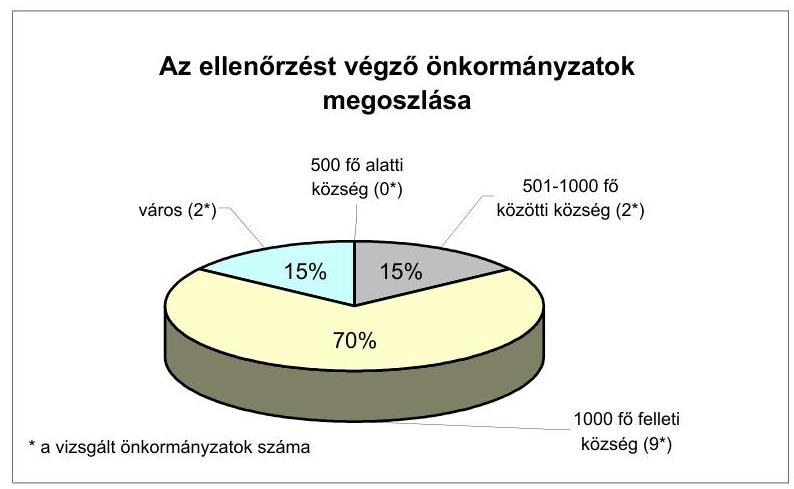
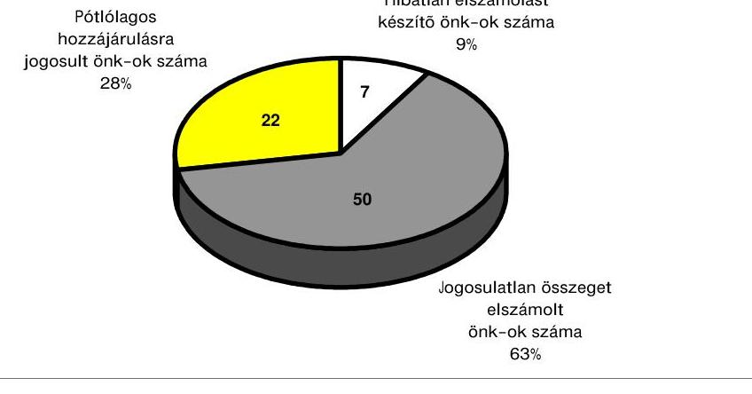
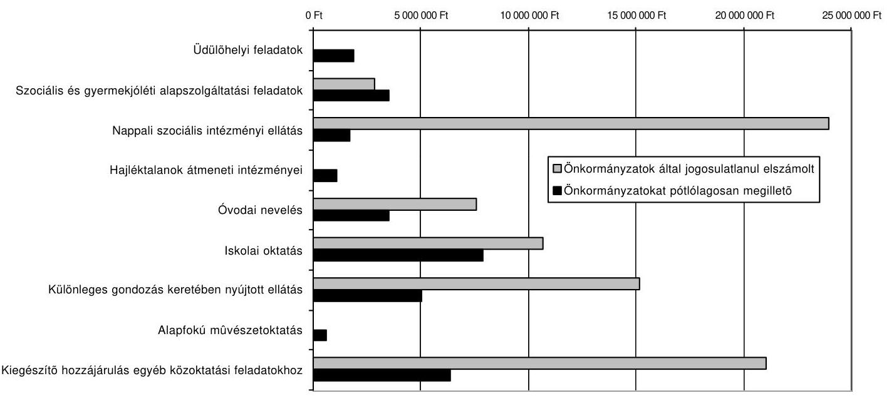
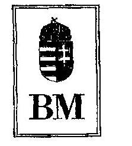
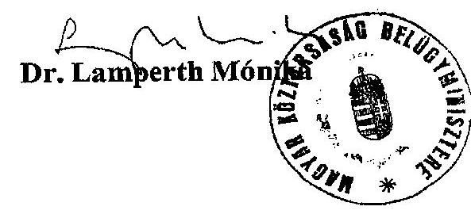
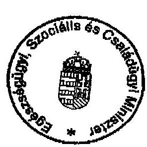
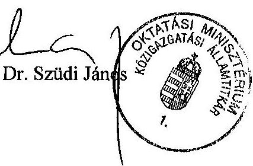

# JELENTÉS 

a helyi önkormányzatok 2001. évi normatív állami hozzájárulás igénylésének és elszámolásának ellenőrzéséről
2002. augusztus

---

# Önkormányzati és Területi Ellenőrzési Igazgatóság Átfogó Ellenőrzések Főcsoport 

V-1005-45/2002.
Témaszám: 605

## Az ellenőrzést felügyelte:

## dr. Lóránt Zoltán

főigazgató

## Az ellenőrzés végrehajtásáért felelős:

Az ÁSZ 3. Önkormányzati és Területi Ellenőrzési Igazgatósága

## Nagy József

főcsoportfőnök

## Az ellenőrzést vezette:

## Csecserits Imréné

ov.igazgatóhelyettes

## A számvevői jelentések feldolgozásában és a jelentés összeállításában közremúködött:

## Benczik Lászlóné

számvevő tanácsos

## Castro Hurtadoné Juhász Erika

számvevő

## dr. Kiss Károly

számvevő

## Az ellenőrzésben részt vevők névsorát az 1. számú melléklet tartalmazza.

## Az ÁSZ által a témában eddig készített jelentések:

9828 Jelentés a helyi önkormányzatok 1997. évi normatív állami hozzájárulás igénybevételének és elszámolásának ellenőrzési tapasztalatairól (V-1012/ 1998.)

9929 Jelentés a helyi önkormányzatok 1998. évi normatív állami hozzájárulás, valamint az ezekhez kapcsolt kiegészítő támogatások igénybevételének és elszámolásának ellenőrzéséről (V-1007/1999.)
0026 Jelentés a helyi önkormányzatok 1999. évi normatív állami hozzájárulás igénybevételének és elszámolásának ellenőrzéséről (V-1006/2000.)
0128 Jelentés a helyi önkormányzatok 2000. évi normatív állmai hozzájárulás igénybevételének és elszámolásának ellenőrzéséről (V-1008/2001.)

Jelentéseink az Országgyűlés számítógépes hálózatán és az Interneten a www.asz.hu címen is olvashatók, továbbá a Belügyminisztérium folyóirata, az "Önkormányzati Tájékoztató" rendszeresen közli, valamint a Megyei

Közigazgatási Hivatalvezetők részére is átadásra kerül.

---

# TARTALOMJEGYZÉK 

I. ÖSSZEGZŐ MEGÁLLAPÍTÁSOK, KÖVETKEZTETÉSEK, JAVASLATOK ..... 6
II. RÉSZLETES MEGÁLLAPÍTÁSOK ..... 11

1. A NORMATÍV ÁLLAMI HOZZÁJÁRULÁSOK 2001. ÉVI FELTÉTELRENDSZERÉNEK SZABÁLYOZÁSA ..... 11
2. A NORMATÍV ÁLLAMI HOZZÁJÁRULÁS ELSZÁMOLÁSOK MEGALAPOZOTTSÁGÁNAK ÉS HELYTÁLLÓSÁGÁNAK ÖNKORMÁNYZAT ÁLTALI ELLENŐRZÉSE ..... 14
3. A NORMATÍV ÁLLAMI HOZZÁJÁRULÁSOK TERVEZÉSE ÉS ELSZÁMOLÁSA A HELYI ÖNKORMÁNYZATOKNÁL ..... 16
3.1. Községek általános feladatai ..... 18
3.2. Körjegyzőségek müködése ..... 18
3.3. Üdülőhelyi feladatok ..... 18
3.4. A helyi önkormányzatok szociális és gyermekjóléti feladataihoz kapcsolódó normatív állami hozzájárulás. ..... 19
3.4.1. Kiegészítő hozzájárulás családsegítő és gyermekjóléti szolgálat működtetéséhez ..... 19
3.4.2. Kiegészítő hozzájárulás falugondnoki szolgáltatás müködtetéséhez ..... 20
3.4.3. Kiegészítő hozzájárulás a gondozási központ müködetéséhez ..... 20
3.5. Hajléktalanok átmeneti intézményei ..... 21
3.6. Bentlakásos és átmeneti elhelyezést nyújtó intézményi ellátás. ..... 21
3.7. Nappali szociális intézményi ellátás ..... 21
3.8. Bölcsődei ellátás ..... 22
3.9. Óvodai nevelés ..... 22
3.10. Alapfokú nevelés-oktatás ..... 23
3.11. Szakmai elméleti oktatás ..... 24
3.12. Iskolai szakképzés, szakmai gyakorlati képzés ..... 24
3.13. Középfokú nevelés-oktatás ..... 24
3.14. Különleges gondozás keretében nyújtott ellátás ..... 24
3.14.1. Gyógypedagógiai ellátás ..... 24
3.14.2. Korai fejlesztés, gondozás ..... 25
3.14.3. Fejlesztő felkészítés ..... 25
3.15. Alapfokú múvészetoktatás ..... 25
3.16. Bentlakásos közoktatási intézményi ellátás ..... 25
3.17. Kiegészítő hozzájárulások egyéb közoktatási feladatokhoz ..... 26
3.17.1. Fejlesztő és felzárkóztató oktatás ..... 26
3.17.2. Általános iskolai napközis foglalkozás, a hátrányos helyzetű tanulók felkészülését segítő foglalkozások ..... 26
3.17.3. Nem magyar nyelven folyó nevelés és oktatás, valamint a cigány kisebbségi oktatás ..... 27
3.17.4. Óvodában, kollégiumban, iskolában szervezett intézményi étkeztetés ..... 28
3.17.5. Óvodába, általános iskolába bejáró gyermekek, tanulók ellátása ..... 29
3.17.6. Intézményfenntartó társulás óvodájába, általános iskolájába járó gyermekek, tanulók támogatása ..... 29
3.17.7. Kistelepülések támogatása ..... 30
Mellékletek: 1-10-ig

---

.

---

# JELENTÉS 

## a helyi önkormányzatok 2001. évi normatív állami hozzájárulás igénylésének és elszámolásának ellenőrzéséről

## Bevezetés

Az Állami Számvevőszékről szóló 1989. évi XXXVIII. törvény 2. § (5) bekezdése, valamint az államháztartásról szóló 1992. évi XXXVIII. törvény 121. § (3) bekezdése alapján, a 2001. évi zárszámadási törvényjavaslathoz kapcsolódóan ellenőriztük a Magyar Köztársaság 2001. és 2002. évi költségvetéséről szóló 2000. évi CXXXIII. törvény 18. § (1) bekezdésében a helyi önkormányzatok részére felhasználási kötöttség nélkül biztosított normatív állami hozzájárulások és normatív részesedésű átengedett személyi jövedelemadó együttes igénylésének, elszámolásának törvényességét, szabályszerűségét.

Az Országgyűlés a Magyar Köztársaság 2001. és 2002. évi költségvetéséről szóló 2000. évi CXXXIII. törvény (továbbiakban: költségvetési törvény) 3. számú mellékletében meghatározott jogcímeken a helyi önkormányzatok költségvetéséhez közvetlenül és felhasználási kötöttség nélkül 305,9 milliárd Ft normatív állami hozzájárulást és 173,3 milliárd Ft normatív részesedésű átengedett személyi jövedelemadót, összesen 479,2 milliárd Ft-ot biztosított.

A 2000. szeptember hóban benyújtott költségvetési törvényjavaslatban foglaltakhoz viszonyítva a normatív állami hozzájárulás igénybevételének feltételei módosultak a jóváhagyás során. Az emiatt készített kiegészítő felmérés, valamint a helyi önkormányzatok által feladat, intézmény önkormányzati körön kívüli szervezetnek történt évközi átadása-átvétele, továbbá évközi lemondás és pótigénylés miatt a 479,2 milliárd Ft tervezett hozzájárulási összeg 477,3 milliárd Ft-ra módosult.

A helyi önkormányzatok a 2001. évi költségvetési beszámolójukban az előirányzat 475,6 milliárd Ft-os teljesítéséről számoltak el.

A helyi önkormányzatoknál az ellenőrzés a normatív állami hozzájárulás alábbi jogcímeire terjedt ki:

- Községek általános feladatai (1. jogcím)
- Körjegyzőségek működése (3. jogcím)
- Üdülőhelyi feladatok (7. jogcím)
- Szociális és gyermekjóléti alapszolgáltatási feladatok (11. jogcím)
- Gyermekvédelmi szakellátás (12. jogcím)
- Bentlakásos és átmeneti elhelyezést nyújtó intézményi ellátás (13. jogcím)
- Nappali szociális intézményi ellátás (14. jogcím)

---

- Hajléktalanok átmeneti intézményei (15. jogcím)
- Pszichiátriai és szenvedélybetegek, valamint fogyatékosok bentlakásos intézményi ellátása (16. jogcím)
- Bölcsődei ellátás (17. jogcím)
- Szociális intézményi módszertani feladatok (18. jogcím)
- Óvodai nevelés (19. jogcím)
- Iskolai oktatás (20. jogcím)
- Különleges gondozás keretében nyújtott ellátás (21. jogcím)
- Alapfokú művészetoktatás (22. jogcím)
- Bentlakásos közoktatási intézményi ellátás (23. jogcím)
- Kiegészítő hozzájárulás egyes közoktatási feladatokhoz (24. jogcím)

A vizsgálat célja annak megállapítása volt, hogy:

- érvényesült-e a normatív állami hozzájárulások feltételrendszerének jogcímenkénti szabályozása és a kapcsolódó szakmai előírások közötti összhang;
- az önkormányzatok ellenőrizték-e a mutatószámok meghatározásához szükséges nyilvántartások meglétét, adatainak helytállóságát;
- a jogszabályi előírásoknak megfelelően történt-e a normatív állami hozzájárulások igénybejelentése (felmérése), évközi módosítása és év végi elszámolása.

A különböző feltételekhez kötött normatív állami hozzájárulási jogcímek mindegyikére kiterjedő tételes helyszíni ellenőrzést 79 önkormányzatnál és ezen önkormányzatokhoz tartozó összesen 227 szociális, valamint nevelési és oktatási feladatot ellátó intézménynél végeztünk. Az ellenőrzési kapacitással a községekre összpontosítottunk, emellett három város és egy fővárosi kerület önkormányzatánál a 2001. évi zárszámadás vizsgálatához csatlakozva végeztük az ellenőrzést.

A vizsgált önkormányzatokról (megyénként és településtípusonként) a 2. számú melléklet nyújt tájékoztatást.

Az önkormányzatokat jellemző, rétegezett mintavételi módszer alapulvételével történt kiválasztásnál a korábbi évekhez viszonyítva jelentősen csökkent a számossági arány. A minta meghatározásánál tekintettel voltunk arra, hogy az államháztartásról szóló törvény módosításával kialakításra került a helyi önkormányzatok részére biztosított normatív állami hozzájárulás igénylési, évközi módosítási folyamatába épített kormányzati ellenőrzés a területi államháztartási hivatalok - TÁH-ok - ellenőrzési tevékenységének bővülésével. Más oldalról korlátozta számvevői kapacitásunkat, hogy az önkormányzatok gazdálkodásának átfogó ellenőrzési körét - az Országgyűlés Önkormányzati, valamint Számvevőszéki bizottsága kérésének megfelelően a múlt évtől jelentősen bővítettük (az ellenőrzésbe bevont önkormányzatok számát 195-ről 439-re emeltük).

Az önkormányzatok ellenőrzésével egyidejűleg vizsgáltuk a Pénzügyminisztérium, a Belügyminisztérium, az Oktatási Minisztérium, valamint az Egészségügyi, Szociális és Családügyi Minisztérium normatív állami hozzájárulás

---

igénylésével, elszámolásával feltételrendszere kialakításával, múködtetésével összefüggő intézkedéseit.

A helyszíni vizsgálatokat a polgármesteri hivataloknál és intézményeiknél a 2000. és 2001. évi dokumentumok alapján végeztük. A vizsgálatot végző számvevőknek részletes ellenőrzési útmutatót dolgoztunk ki, amelyet - az elszámolást megelőzően - az önkormányzatok is megismerhettek.

Az ellenőrzésbe bevont önkormányzatok összesen 6389,4 millió Ft normatív állami hozzájárulással és normatív részesedésű átengedett személyi jövedelemadóval rendelkeztek. (Részletezését a 3. számú melléklet tartalmazza.) Ez az összeg a helyi önkormányzatok részére a központi költségvetésben ilyen címen tervezett eredeti előirányzat $1,3 \%-a$.

A korábbi években mind a vizsgált önkormányzatok száma, mind a vizsgált hozzájárulás aránya évről-évre változott, de rendszeresen magasabb volt mint ez évben. A normatív állami hozzájárulás elmúlt 5 évi számvevőszéki ellenőrzéseiről, a feltárt eltérések összegeiről, arányáról a 6/a. számú melléklet nyújt részletes tájékoztatást. A csatolt mellékletből is látható, hogy az ellenőrzött önkormányzatok elszámolásában szereplő normatív állami hozzájáruláshoz viszonyítva a számvevőszéki ellenőrzés során feltárt eltérés - a mintavételi arány 1,3-22,9\% közötti változásától függetlenül - minden évben 1\% alatt maradt. Az önkormányzati ellenőrzés mennyiségi, tartalmi hiányosságai miatt a számvevőszéki ellenőrzés évek óta a vizsgált önkormányzatok közel 90\%-ánál és szinte valamennyi jogcímnél többféle eltérési okot tárt fel és ezek szerteágazó volta az önkormányzatok gazdálkodási fegyelmének lazaságát is jelzi. A Számvevőszék által feltárt eltérések aránya, összege a központi költségvetés szempontjából nem jelentős kockázati tényező. Ezért ez évtől a már korábban a mintavételnél említetteket is figyelembe véve a kiválasztási arányt mérsékeltük.

Az önkormányzati felügyeleti és belső ellenőrzés különböző módszereinek széles körű alkalmazására vonatkozó javaslataink mellett a jövőben a számvevőszéki ellenőrzés rendszerbeli változtatását tervezzük. Ennek során egyrészről az átfogó ellenőrzéseknek kiemelt súlyt kívánunk adni, másrészről a kibővített zárszámadási vizsgálathoz közvetlenül csatlakoztatva az önkormányzatok forrás finanszírozási rendszerében meghatározó jelentőségű normatív állami hozzájárulás elszámolását és az önkormányzatok részére nyújtott különböző támogatások elszámolását, felhasználását a múködő (Területi Államháztartási Hivatali és az önkormányzati felügyeleti és belső) ellenőrzési rendszerekre koncentrálva tervezzük vizsgálni.

---

# I. ÖSSZEGZŐ MEGÁLLAPÍTÁSOK, KÖVETKEZTETÉSEK, JAVASLATOK 

Az Országgyűlés a helyi önkormányzatok számára a felhasználási kötöttség nélküli normatív állami hozzájárulások és a normatív részesedésű átengedett személyi jövedelemadójuk jogcímeit, fajlagos összegeit, valamint az igényjogosultság feltételeit a költségvetési törvény 3. számú mellékletében állapította meg.

A költségvetési törvényben a 2001. évre előirányzott önkormányzati támogatások és hozzájárulások 506,3 milliárd Ft eredeti előirányzatából 305,9 milliárd Ft ( $60,4 \%$ ) volt a normatív állami hozzájárulás. A normatív állami hozzájárulás központi költségvetésből biztosított összegét a normatív részesedésű átengedett személyi jövedelemadó összesen 173,3 milliárd Ft-tal egészítette ki.

A normatív állami hozzájárulás és a normatív részesedésű átengedett személyi jövedelemadó eredeti előirányzatának együttes összege (továbbiakban együtt: normatív állami hozzájárulás) 2001. évben 479,2 milliárd Ft volt, amely az előző évhez (428,4 milliárd Ft) viszonyítva 11,9\%-os emelkedést jelentett.

Az eredeti előirányzat szerinti összeg az egyszeri kiegészítő igényfelmérés és az évközi lemondások, pótigénylések következtében év végére 477,3 milliárd Ft-ra módosult. A helyi önkormányzatok a 2001. évi költségvetési beszámolójukban 475,6 milliárd Ft tényleges igénybevételről számoltak el.

A normatív állami hozzájárulás jogcímeit és összegét a költségvetési törvény az előző évi 26 -tal szemben 27 jogcímcsoportban határozta meg. A helyi önkormányzatoknak a Belügyminisztérium és Pénzügyminisztérium által kiadott adatfelmérő lapon, valamint az éves költségvetési beszámolóban 76 feldolgozási kódszámra bontva kellett normatív állami hozzájárulási igényüket bejelenteniük, illetve elszámolásukat elkészíteniük. (Az ellenőrzés 17 jogcímcsoportra és ehhez kapcsolódóan 63 feldolgozási kódszámra terjedt ki.) Ez a részletezés - bár még mindig csökkenthető, például az intézményi étkeztetésnél - a számvevőszék évek óta ismétlődő javaslatát figyelembe véve jelentősen mérséklődött az elmúlt évekhez viszonyítva (1999. évben 138, 2000. évben 103 volt).

A feladatmutató kiszámításával kapcsolatos szabályozási hiányosságot az ellenőrzés során négy hozzájárulási jogcímnél tapasztaltunk. Az egész napos iskolaotthonos oktatás feladatmutatóját és annak számítási módját a költségvetési törvény nem határozta meg, erre csupán a tevékenység közoktatási jellege alapján lehetett következtetni. A hátrányos helyzetú tanulók felkészülését segitő foglalkozásoknál figyelembe vehető létszám meghatározási időpontjának szabályozásbeli kettősségét a „kivételesen indokolt" keret felhasználásával hidalták át az önkormányzatok. A hajléktalanok átmeneti intézményeiben a feladatmutató nyilvántartási rendjét, kötelezettségét nem határozza meg jogszabály, ezért tévesen a tényle-

---

ges gondozási napok alapján számította ki az érintett önkormányzat a mutatószámot. Az általános iskolai napközis, illetve tanulószobai foglalkozások a közoktatási törvény szerint azonos tartalommal, feltételekkel bírnak, a költségvetési törvény azonban csak a napközis foglalkozást nevesíti. A csupán elnevezési (formai) különbség a mutatószám kiszámításánál nem érvényesült, a foglalkozás tartalmi meghatározásának figyelembevételével a jogosultságot biztosították az önkormányzatok.

Két hozzájárulási jogcímnél a tevékenység törvényességének, engedélyezettségének igazolásánál tapasztaltunk jogszabály nem megfelelő értelmezéséből eredő mulasztást. A családsegítő és gyermekjóléti szolgáltatás biztosítására létrehozott társulási megállapodás törvényességének közigazgatási hivatallal történő előírt igazoltatását az érintettek több mint fele, jelzésünk alapján, csak az ellenőrzés ideje alatt szerezte be. Az igazoltatási eljárás a közigazgatási hivatalok tevékenységére vonatkozó szabályozás miatt formális. Az oktatási intézmények feladatait tükröző alapító okiratban a vizsgált önkormányzatok mintegy 10\%-ánál nem szerepelt minden ténylegesen ellátott, hozzájárulásra jogosultságot jelentő tevékenység. Az önkormányzatok egyéb módon, pl. pedagógiai programban, az intézmény költségvetésében jóváhagyták, támogatták ezen tevékenységeket, azonban különösen a kiegészítő hozzájárulási jogcímeknél az alapító okiratban nem tartották szükségesnek tételesen nevesíteni ezeket. Az alapító okirat módosítását három önkormányzat részben a vizsgálat ideje alatt, részben ezt követően, jelzésünk alapján elvégezte.

A közoktatási alapfeladatokhoz kapcsolódó hozzájárulási jogcímek közül az ellenőrzések során az óvodai nevelés, az iskolai oktatás továbbá az általános iskolai napközis foglalkozás és az óvodában, iskolában szervezett intézményi étkeztetés jogcímeknél tapasztaltuk a legtöbb hiányosságot. Az elszámolásban szereplő adatokhoz viszonyított eltérést leggyakrabban (az önkormányzatok közel 50\%-ánál) összesítési, kerekítési, adatrögzítési hibák, valamint az előírt számítási módszertől eltérő megoldás alkalmazása okozta, azonban ezek hatása nagyságrendileg nem jelentős.

A szociális feladatokhoz kapcsolódó jogcímeknél a működési engedélyek hiányosságai, valamint az engedélyben foglaltaktól eltérő feltételekkel történő működés az önkormányzatok alig 10\%-ánál okozott jogosulatlan igénybevételt, azonban ezen hiányosságok eredményezték a legnagyobb összegű eltéréseket.

A községek nem éltek a megbízásos jogviszony keretében, illetve a társulásos formában végezhető ellenőrzés lehetőségével. Az előző években végzett számvevőszéki ellenőrzések során tett javaslataink, felelősségi felvetéseink ellenére a vizsgált polgármesteri hivatalok alig ötöde ellenőrizte a helyszínen az intézmények által közölt adatok valódiságát. Az önkormányzati felügyeleti és belső ellenőrzés hiányosságaira évek óta ismétlődően felhívjuk a figyelmet, hangsúlyozva, hogy az ellenőrzési rendszerek hatékonyabb múködésével ily módon a hibák, mulasztások nagy része elkerülhető lenne. A végrehajtott önkormányzati ellenőrzések ez évben sem terjedtek ki a szakmai jogszabályokban foglalt előírások teljes körű betartására és az önkormányzati szintű összesítés, elszámolás ellenőrzése is elmaradt. Az önkormányzatok a

---

Számvevőszék korábbi ellenőrzésének javaslatait csak részben hasznosították. Javaslataink hasznosulását jelzi, hogy csökkent a működési engedély nélkül üzemelő nappali szociális intézmények aránya, a feladatmutató számának meghatározásánál kevesebb esetben tértek el az előírt osztószámtól, a különleges gondozás keretében nyújtott ellátásokhoz az előírt szakértői és rehabilitációs bizottsági szakvélemény kevesebb intézménynél hiányzott.

A helyszíni vizsgálatok során megállapított feldolgozási kódszámonkénti eltérések önkormányzati szintű egyenlegeként 50 önkormányzatnál 67,8 millió Ft jogosulatlanul elszámolt összeget, azaz a központi költségvetés részére történő visszafizetési kötelezettséget, 22 önkormányzatot érintően pedig 8,9 millió Ft központi költségvetésből biztosítandó pótlólagos járandóságot, azaz még kiutalandó hozzájárulási összeget tártunk fel. Az ellenőrzés során hét önkormányzatnál az elszámolásban eltérést nem tapasztaltunk.

Az eltérések ez évben feltárt aránya és összetétele tendenciájában egyezik a korábbi években tapasztaltakkal. Évek óta a vizsgált önkormányzatok mintegy felénél jogosulatlanul elszámolt összeget, átlag negyedénél pótlólagos hozzájárulásra jogosultságot tártunk fel. A hibátlan elszámolást készítő önkormányzatok aránya ingadozó (7-28\% közötti).

A helyszíni vizsgálatok során négy önkormányzatnál állapítottuk meg, hogy egy-egy jogcímhez tartozó feladatot ellátó intézményüknek 2001. évben nem volt megfelelő a működési engedélye, illetve az alapító okirata, azonban a költségvetési törvényben előírt feltételek teljesítése érdekében - az ellenőrzés ideje alatt - kezdeményezték az érintett intézmények szabályszerű működési engedélyének kiadását, illetve az alapító okirat módosítását. Ezen intézmények megkapták az illetékes hatóságoktól a működéshez szükséges hozzájárulást, illetve a képviselő-testület módosította az intézmények alapító okiratát. Az önkormányzatok a helyszíni vizsgálatról készített jelentésre tett észrevételekben elismerték a feltárt szabálytalanságokat, de a hozzájárulás alapját képező feladat ellátására és a mulasztás pótlására hivatkozva kérték a méltányos elbírálást. Az Országgyűlés döntésétől függően a jogosulatlanul elszámolt normatív állami hozzájárulás összege egyenlegében 9,2 millió Ft-tal csökkenthető. A javaslat elfogadása esetén a visszafizetési kötelezettség 58,6 millió Ft-ra változik. (Ennek megfelelő összegeket a pénzügyminiszter részére megfogalmazott - 1. a) számú - javaslat tartalmazza.)

A helyszíni vizsgálati jelentésekben az önkormányzatok részére normatív állami hozzájárulás igénylésének és elszámolásának szabályszerűbbé és célszerűbbé tétele érdekében több javaslatot tettünk. Elsősorban a következő javaslatokat fogalmaztuk meg:

1. A normatív állami hozzájárulás igénylésénél, évközi módosításánál és elszámolásánál vegyék figyelembe az éves költségvetési törvény mellett az ágazati jogszabályok előírásait és saját ellenőrzéseik megállapításait.
2. Az intézményektől bekért adatok tartalmáról és helyességéről dokumentált ellenőrzés keretében győződjenek meg a költségvetésben és a költségvetési be-

---

számolóban felhasznált adatok pontosságának biztosítása érdekében, egyúttal szerezzenek érvényt a helyi önkormányzatokról szóló 1990. évi LXV. törvény 92. § (2) bekezdésben meghatározott előírásoknak.
3. Vizsgálják felül a normatív állami hozzájárulásra jogosító feladatellátást végző intézményeik alapító okiratait és gondoskodjanak azok jogszabályi előírásokkal összhangban lévő módosításáról.
4. Pótolják a hiányzó múködési engedélyeket, illetve tartsák be az abban foglaltakat.
5. A feladatellátás valamennyi területén helyezzenek kiemelt hangsúlyt a vezetői és a munkafolyamatba épített ellenőrzés rendszeres múködtetésére.

A vizsgálati jelentéseinkben szereplő megállapításainkat az önkormányzatok elfogadták és már a vizsgálat ideje alatt intézkedtek a javaslatok végrehajtásáról, illetve tájékoztatást adtak arról, hogy „Intézkedési terv"-et készítettek a felelősök és határidők megjelölésével.

Az ellenőrzés részletes megállapításainak hasznosítása mellett javasoljuk, hogy

# a pénzügyminiszter 

1. kezdeményezze, hogy az Országgyűlés a 2001. évi zárszámadási törvény elfogadása során
a) fontolja meg a jelentés 8/a. számú mellékletében szereplő önkormányzatok által jogosulatlanul igénybe vett 9194100 Ft visszafizetésének elengedését tekintettel arra, hogy ezen önkormányzatok a megfelelő múködési engedélyek beszerzéséről gondoskodtak, az alapító okiratokat módosították és erről tájékoztatást adtak. Ezt figyelembe véve hagyja jóvá a jelentés 8. számú mellékletének 1. változata szerint az önkormányzatok által a központi költségvetésbe visszafizetendő 58643236 Ft-os, illetve az önkormányzatoknak a költségvetésből pótlólag kiutalandó 8878990 Ft-os összeget, vagy;
b) hagyja jóvá a jelentés 8. számú mellékletének 2. változata szerint az önkormányzatok által a központi költségvetésbe visszafizetendő 67837336 Ft-os, illetve az önkormányzatoknak a költségvetésből pótlólag kiutalandó 8878990 Ft-os összeget;
2. tegyen javaslatot az önkormányzati ellenőrzés rendszerének áttekintése alapján a kistelepülések önkormányzati költségvetési szerveinél az „ellenőrzési társulás" múködésének központi költségvetésből történő ösztönzésére, támogatására;

---

# az egészségügyi, szociális és családügyi miniszter 

1. kezdeményezze a költségvetési törvény 3. számú mellékletében, hogy ne szerepeljen a feltételek között a szociális és gyermekjóléti alapszolgáltatási feladatokhoz kapcsolódó kiegészítő hozzájárulások esetében a társulási megállapodás törvényességének közigazgatási hivatal vezetője általi igazoltatása;
2. alakítsa ki a hajléktalanok átmeneti intézményi ellátás jogcím feladatmutatójának - a gondozási napokon rendelkezésre álló férőhelyek számának - megállapításához szükséges intézményi nyilvántartási rendszert;

## az oktatási miniszter

1. kezdeményezze a költségvetési törvény 3. számú mellékletében:
a) annak meghatározását, hogy a hátrányos helyzetű tanulók felkészültségét segítő foglalkozásokhoz biztosított normatív állami hozzájárulás mutatószámának számításhoz a hátrányos helyzetben lévő tanulókat a közoktatási statisztika szerinti mérési időpontra vonatkozóan összeállított nyilvántartásból állapítsa meg a jegyző;
b) az iskolaotthonos oktatáshoz kapcsolódó mutatószám számítási módjának meghatározását;
c) annak egyértelműsítését, hogy az általános iskolai napközis foglalkoztatáshoz biztosított normatív állami hozzájárulás jogcím keretében a tanulószobai foglalkozásban részesülő tanulók is figyelembe vehetők;
d) a kiegészítő szabályokon belül a közoktatási intézmények alapító okiratára vonatkozó előírás olyan módosítását, hogy az a kiegészítő hozzájárulások igénybevételére jogosító tevékenységeknek konkrétan megjelölt körére vonatkozzon.

---

# II. RÉSZLETES MEGÁLLAPÍTÁSOK 

## 1. A normatív állami hozzájárulások 2001. évi feltételRENDSZERÉNEK SZABÁLYOZÁSA

Az Országgyűlés a költségvetési törvény 3. számú mellékletében állapította meg 2001. évre az önkormányzati támogatások és hozzájárulások 506,3 milliárd Ft eredeti előirányzatából a 305,9 milliárd Ft (60,4\%) normatív állami hozzájárulást. A normatív állami hozzájárulás központi költségvetésből biztosított összegét a normatív részesedésű átengedett személyi jövedelemadó összesen 173,3 milliárd Ft-tal egészítette ki. A normatív állami hozzájárulás és a normatív részesedésű átengedett személyi jövedelemadó eredeti előirányzatának együttes összege (továbbiakban együtt: normatív állami hozzájárulás) 2001. évben 479,2 milliárd Ft volt, amely az előző évhez viszonyítva (428,4 milliárd Ft) 11,9\%-os emelkedést jelentett. Ezen belül a normatív állami hozzájárulás előirányzata 12,3\%-kal (272,3 milliárd Ft-ról 305,9 milliárd Ft-ra) nőtt, míg az átengedett személyi jövedelemadó abszolút összege $9,9 \%$-kal emelkedett.

A költségvetési törvény előírásainak megfelelően az előirányzatokat - önkormányzatonként és jogcímenként - a pénzügyminiszter és a belügyminiszter a 3/2001. (I. 30.) PM-BM együttes rendeletében tette közzé, amely előirányzatokat a helyi önkormányzatok költségvetésükbe beépítették.

A normatív állami hozzájárulás jogcímeit és összegét a költségvetési törvény az előző évi 26 előirányzattal szemben 27 előirányzatban határozta meg. A költségvetési előirányzatokon belül a költségvetési törvény 3. számú mellékletében kialakított alábontások miatt a különböző fajlagos összeggel biztosított hozzájárulások száma az előző évi 51-ről 74-re emelkedett.

A helyi önkormányzatoknak a Belügyminisztérium és Pénzügyminisztérium által kiadott adatfelmérő lapon, valamint az éves költségvetési beszámolóban 76 feldolgozási kódszámra bontva kellett normatív állami hozzájárulás igényüket bejelenteni, illetve elszámolásukat elkészíteni. (Az ellenőrzés 17 előirányzatra és ehhez kapcsolódóan 63 feldolgozási kódszámra terjedt ki.) Ez a részletezés bár még mindig csökkenthető, pl. intézményi étkeztetésnél - jelentősen mérséklődött az elmúlt évekhez viszonyítva (1999. évben 138, 2000. évben 103 volt). A vizsgált normatív állami hozzájárulások jogcímeit, fajlagos összegeit, feldolgozási kódszámait a 7 . számú melléklet ismerteti.

A közoktatási feladatokhoz kapcsolódó normatív állami hozzájárulásokon belül a jogcím alábontások száma a korábbi ÁSZ jelentésben megfogalmazott javaslatok figyelembevételével csökkent. Az egyéb közoktatási feladatokhoz biztosított kiegészítő hozzájárulás (24. számú költségvetési előirányzat) alábontása azonban még mindig túl részletezett. Az előző évi 11-gyel szemben 12 különböző fajlagos összegű hozzájárulási jogcímet tartalmaz és azokat további 19 feldolgozási kódszámra bontották. A helyi önkormányzatok ezen részletezésben

---

igényelhették és számolhatták el a hozzájárulást. A költségvetési törvény előírásaihoz viszonyítva bonyolult igénylési és elszámolási rendszer következtében az elszámolásokban feldolgozási kódszámonként kimutatott eltérések az önkormányzati szintű összesítés során felére, harmadára csökkentek a feldolgozási kódszámonként eltérő irányú eltérések egymást részben ellentételező hatása következtében. (Lásd. 4. számú melléklet, valamint a vizsgált önkormányzatokra vonatkozóan a $8 / \mathrm{b}$. számú melléklet.)

A hozzájárulások fajlagos összegei különböző mértékben növekedtek, az óvodai nevelés, az alapfokú, és a középfokú oktatás jogcímeknél a növekedés mértéke 12,3-13,5\%-os volt, kevésbé emelkedett a szakmai elméleti oktatásnál $(4,4 \%)$ és gyakorlati képzésnél $(9,1 \%)$. A különleges gondozás keretében nyújtott ellátás jogcímeknél 9,2-12\%, a bentlakásos közoktatási intézményeknél $7-9,3 \%$ a növekedés mértéke.

Az általános iskolai napközis foglalkozás, a hátrányos helyzetű tanulók felkészültségét segítő foglalkozások és az óvodába, általános iskolába bejáró gyermekek ellátása jogcímeknél a hozzájárulás fajlagos összegei az előző évhez képest nem változtak.

Az egyéb közoktatási feladatokhoz nyújtott kiegészítő hozzájárulások között 2001. évtől új jogcím az iskolaotthonos oktatás, amelyhez a napközis foglalkozáshoz kapcsolódó fajlagos hozzájárulás $20 \%$-kal megnövelt összege vehető igénybe. Ebben az előirányzat csoportban az előző évhez viszonyítva bővülés a kollégiumi étkeztetés jogcímű hozzájárulás, amelynek fajlagos összege azonos az óvodában, iskolában szervezett étkeztetéshez biztosított hozzájárulás fajlagos értékével.

A szociális ellátásokhoz biztosított normatív állami hozzájárulási jogcímek közül a gyermekvédelmi szakellátás feladatához kapcsolódó speciális gyermekotthoni ellátás alapján biztosított hozzájárulás fajlagos értéke növekedett a legjobban ( $26,6 \%$-kal). Jelentős a növekedés a bölcsődei ellátás (19,4\%) és a nappali szociális intézményi ellátás (18,4\%) jogcímeknél is.

Az önkormányzatok a normatív állami hozzájárulás igénylése, elszámolása során a mutatószámképzésnél, kiszámításnál tévedtek leggyakrabban.

A közoktatási feladatokhoz kapcsolódó hozzájárulási jogcímek közül jellemzően az óvodai nevelésnél, az iskolai oktatásnál, továbbá az általános iskolai napközis foglalkozás és az óvodában, iskolában szervezett intézményi étkeztetés jogcímeknél tapasztaltunk hiányosságokat. Leggyakrabban (közel 50\%ban) összesítési, számítási, kerekítési, adatrögzítési hiba, valamint az előírt számítási módszer helytelen alkalmazása (pl. a költségvetési évre átszámítást biztosító $8 / 12-4 / 12$ felcserélése) okozott eltérést.

A szociális feladatokhoz kapcsolódó jogcímeknél a múködési engedélyek hiányosságait (pl. nem tartalmazta az engedélyezett férőhelyek számát), valamint az engedélyezett férőhelyszámot meghaladó gondozottak figyelembevételét tapasztaltuk az önkormányzatok 10\%-ánál.

---

A szociális és gyermekjóléti alapszolgáltatási feladatokhoz kapcsolódó kiegészítő-hozzájárulások esetében a költségvetési törvény arról rendelkezik, hogy a társulási megállapodás törvényességét a közigazgatási hivatal vezetőjével igazoltatni kell. A közigazgatási hivatalok a tevékenységüket szabályozó jogszabályi előírások alapján akkor kötelesek törvényességi észrevételt tenni a helyi önkormányzatok társulási megállapodására, ha a megállapodás nem törvényes. Ezen előírással ellentétes irányú nyilatkozattételi igény formális és indokolatlan. A vizsgált önkormányzatok közel harmadánál az ellenőrzés megkezdésekor hiányzott, de jelzésünk alapján az ellenőrzés ideje alatt beszerezték ezen nyilatkozatot. A korábbi években tett hasonló észrevételek hatására a közoktatási területen létrejött önkormányzati társulások esetében 2001. évtől módosult a szabályozás, így itt már nem szerepel hozzájárulási feltételként az igazoló nyilatkozat beszerzése.

A hajléktalanok átmeneti intézményeiben többszöri felvetésünk ellenére - bár módosítás történt, de - az előírt nyilvántartási rendszerben továbbra sem megoldott a létszám, illetve a mutatószám (férőhely) dokumentálása. A gondozási napokon rendelkezésre álló férőhelyekről az intézmények megfelelő előírás hiányában nyilvántartást nem vezetnek. Az ilyen intézményt fenntartó ellenőrzött önkormányzatnál is tévesen a szállást ténylegesen igénybe vevők száma alapján határozták meg a feladatmutatót.

A gyermekjóléti és gyermekvédelmi személyes gondoskodást nyújtó intézmények működésének engedélyezéséről szóló 2001. évben hatályos 281/1997. (XII. 23.) Korm. rendelet 4. § (1) bekezdése nem volt összhangban az államigazgatási eljárás általános szabályairól szóló 1957. évi IV. törvény 19. § (6) bekezdésében foglaltakkal. A kormányrendelet szerint az intézmény székhelye, telephelye szerinti jegyző adhatta ki a múködési engedélyt. E felhatalmazás alapján a jegyzők saját intézményükre vonatkozó döntést hozhattak. A törvényi előírás azonban tiltja, hogy közigazgatási szerv saját ügyének elbírálásában részt vegyen. A kormányrendelet alapján a jegyzők által az önkormányzat saját intézményének kiadott múködési engedélyek esetében az eljárás törvénysértő módján túlmenően hét intézménynél tartalmi hiányosságokat is tapasztaltunk (pl. hiányzott a férőhely megjelölése, nem tartalmazott hivatkozást a szakhatósági véleményekre vonatkozóan). A gyermekek védelméről szóló 1997. évi XXXI. törvény 2002. évi módosítása következtében 2003. I. 1-től az összhang már biztosított.

A hátrányos helyzetú tanulók felkészülését segítő foglalkozások jogcímú hozzájárulás esetében a hátrányos helyzetet az augusztus 31. állapot alapján, a feladatmutatót pedig a közoktatási statisztikai jelentés alapján (amely az október 1-jei állapotot tükrözi) kellett meghatározni. A két időpontban a tanulólétszám jellemzően eltért egymástól. Az ellenőrzött önkormányzatoknál amennyiben az október 1-jei figyelembe vehető létszám magasabb volt, mint az augusztus 31-i lista szerinti, úgy a különbséget a költségvetési törvényben lehetőségként biztosított „kivételesen indokolt" keret terhére számolták el, ily módon ez elszámolási eltérést nem okozott.

Az egész napos iskolaotthonos oktatáshoz kapcsolódó kiegészítő hozzájárulási lehetőséget az általános iskolai napközis foglalkozás, és a hátrányos helyzetű tanulók felkészülését segítő foglalkozások közös jogcímnél

---

tartalmazza a költségvetési törvény. A törvény azonban nem tartalmazza, hogy az igénylésnél és az elszámolásnál milyen módon kell meghatározni a mutatószámot (éves átlaglétszám alapján, vagy a 8/12-4/12 elszámolási módszer szerint). Az információt a tervezési formanyomtatványból, valamint különböző fórumokon kapott tájékoztatásból pótlólag megkapták az önkormányzatok, ezért emiatt eltérést nem tapasztaltunk.

Az általános iskolai napközis foglalkozáshoz biztosított normatív állami hozzájárulásnál nem volt egyértelmű az önkormányzatok számára a közoktatásról szóló 1993. évi LXXIX. törvény 53. § (4) bekezdésében szereplő „illetve" szókapcsolat miatt, hogy a tanulószobai foglalkozásban részesülő tanulók után ezen a jogcímen a normatív állami hozzájárulás igénybe vehető és elszámolható-e. A közoktatási törvény alapján a napközis és a tanulószobai foglalkozást tartalmilag azonos módon oldották meg az intézmények, ezért az érintett önkormányzatok egy kivételével az igénylésében és az elszámolásában is figyelembe vették a tanulószobai foglalkozáson résztvevőket.

Az „egyéb közoktatási feladatok"-hoz kapcsolódó kiegészítő hozzájárulás jogcímek esetében a hozzájárulás csak azzal a feltétellel vehető igénybe, ha a tevékenység a közoktatási intézmény alapító okiratában szerepel. Az önkormányzatok mintegy 10\%-a elmulasztotta, nem tartotta szükségesnek az alapító okiratok rendszeres felülvizsgálatát, nem biztosította az összhangot az alapító okirat, a pedagógiai program és az intézményi költségvetés között. Az ellenőrzés során tett jelzésünk alapján részben annak ideje alatt, részben azt követően a mulasztó nyolc önkormányzat közül három a normatív állami hozzájárulás jogszerű igénybevételéhez szükséges alapító okirat módosításokat elfogadta.

# 2. A NORMATÍV ÁLlami HOZZÁJÁRULÁS ELSZÁMOLÁSOK MEGALAPOZOTTSÁGÁNAK ÉS HELYTÁLLÓSÁGÁNAK ÖNKORMÁNYZAT ÁLTALI ELLENŐRZÉSE 

A helyi önkormányzatoknak, mint gazdálkodó szervezeteknek és egyben tulajdonosoknak alapvető érdeke, hogy a feladataikat hatékonyan, eredményesen, s törvényes keretek között végezzék. Az önkormányzatok bevételeinek 28,2\%-át képezik a központi költségvetésből a feladataik ellátásához juttatott normatív állami hozzájárulások. Jogosulatlan igénybevétel esetében a költségvetési és államháztartási törvény alapján a visszafizetési kötelezettség mellett az összeg nagyságától is függő mértékű kamatfizetési kötelezettségük keletkezik. Ezen szankció ellenére a vizsgált önkormányzatok 84\%-ánál a normatív állami hozzájárulás igénybevételének és elszámolásának ellenőrzése elmaradt.

Az önkormányzatok 16\%-a (13) végzett dokumentált ellenőrzést a normatív állami hozzájárulás megalapozott igénybevételéhez és elszámolásához.

---

A dokumentált ellenőrzések hiányosságát tükrözi, hogy ezen 13 önkormányzat közül csak három önkormányzatnál valósult meg a vezetői, vagy a munkafolyamatba épített ellenőrzés, illetve ahol a polgármesteri hivatal ellenőrizte a normatív állami hozzájárulás igénylését és elszámolását megalapozó intézményi adatszolgáltatást is.

A vezetői ellenőrzés 16 önkormányzatnál múködött, a munkafolyamatba épített ellenőrzés 25 önkormányzatnál valósult meg és ezek közül 11 önkormányzatnál funkcionált a vezetői ellenőrzés és a munkafolyamatba épített ellenőrzés is.

A normatív állami hozzájárulással kapcsolatos ellenőrzéseket az alább felsorolt formában végezték:

- függetlenített belső ellenőrrel (egy önkormányzatnál);
- polgármesteri hivatal ellenőrrel, szervezettel (három önkormányzatnál);
- az intézmény szakmai felügyeletét is ellátó polgármesteri hivatali szervezeti egységgel (három önkormányzatnál);
- ellenőrzési társulásban történő részvétellel (egy önkormányzat);
- külső szervezetnek, könyvvizsgálónak adott megbízással (öt önkormányzat).

Az ellenőrzést 12 önkormányzat valamennyi intézményére (összesen 52 intézmény) és valamennyi, elszámolásban érintett jogcímre kiterjesztette, egy önkormányzat pedig intézményei felénél, az érintett hozzájárulási jogcímek ötödére vonatkozóan végzett ellenőrzést.

Az ellenőrzés eredményessége alacsony hatásfokú volt. A 13 dokumentált ellenőrzést végző önkormányzat közül három önkormányzatnál csak az intézményi adatszolgáltatás számszerú helyességét ellenőrizték, ill. egy önkormányzatnál az igénybevételt megalapozó tevékenység ellátásának tartalmi ellenőrzését is elvégezték, továbbá egy önkormányzat az elszámolás beadása után folytatta le ellenőrzését.

Az ellenőrzések során nyolc önkormányzatnál állapítottak meg eltérést, amelyet az ÁSZ ellenőrzése is megerősített, de mindössze egy önkormányzat esetében fordult elő, hogy az ÁSZ ellenőrzés sem tárt fel egyéb eltérést. Abból az öt önkormányzatból, ahol az önkormányzati ellenőrzés nem rögzített eltérést, egy

---

önkormányzatnál az ÁSZ ellenőrzése sem talált az elszámolásban különbséget. Két önkormányzatnál (az ellenőrzött önkormányzatok 2,5\%-ánál) egyezett meg az önkormányzati ellenőrzés és az ÁSZ ellenőrzési megállapítás. A vizsgált önkormányzatok az ellenőrzésük során +2877,4 ezer Ft még járó, és 8702,8 ezer Ft jogosulatlan igénylést, illetve elszámolási szándékot tártak fel, ezzel szemben ugyanezen önkormányzatoknál az ÁSZ ellenőrzés 20609 ezer Ft pótlólagos járandóságot és 16 137,7 ezer Ft jogosulatlan elszámolást állapított meg.

A hatékony és eredményes önkormányzati ellenőrzések szükségességét jelzi az is, hogy ahol az önkormányzat nem végzett helyszíni dokumentált ellenőrzést (66 önkormányzat), azok közül az ÁSZ vizsgálat 61-nél tárt fel eltérést, ami 35625,5 ezer Ft pótlólagos járandóságot és 90113,6 ezer Ft jogosulatlan igénylést jelent.

A korábbi ÁSZ ellenőrzések során megfogalmazott javaslatokat az önkormányzatok mintegy kétharmada megvalósította. A korábbi ÁSZ vizsgálati jelentésekben észrevételezett hibák, hiányosságok öt önkormányzatnál újra előfordultak.

# 3. A NORMATÍV ÁLLAMI HOZZÁJÁRULÁSOK TERVEZÉSE ÉS ELSZÁMOLÁSA A HELYI ÖNKORMÁNYZATOKNÁL 

A Magyar Köztársaság 2000. évi költségvetésének végrehajtásáról szóló 2001. évi LXXV. törvény 8. § (1) bekezdés alapján a normatív állami hozzájárulás és az átengedett személyi jövedelemadó önkormányzatonként részletezett elszámolását a 48/2001. (XII. 15.) PM-BM együttes rendeletben hirdették ki. A PM-BM együttes rendelet 3. számú melléklete az Állami Számvevőszék 2000. évi normatív állami hozzájárulás ellenőrzése során feltárt elszámolási kötelezettséget önkormányzatonként részletezi, amely alapján 244,7 millió Ft befizetési, illetve 43,8 millió Ft pótlólagos támogatási kötelezettséget tartalmaz.

A Pénzügyminisztérium a Magyar Államkincstáron keresztül átutalta az Állami Számvevőszék által megállapított pótlólagos állami hozzájárulást. A számvevőszéki ellenőrzéshez kapcsolódóan az önkormányzatok túlnyomó többsége (94\%-a) 2002. április 7-ig teljes körűen rendezte tartozását. Eddig az időpontig 17 helyi önkormányzat nem kezdte meg - a 2000. évre megállapított - visszafizetési kötelezettségének teljesítését. A követelés érvényesítése érdekében a számlavezető pénzintézetükhöz - a tőke- és kamattartozás összegére - inkasszót nyújtott be az Államháztartási Hivatal.

Az Országgyűlés 2001. évre normatív állami hozzájárulásként a költségvetési törvény 3. számú mellékletében 479,2 milliárd Ft eredeti előirányzatot biztosított.

Az államháztartás működési rendjéről szóló 217/1998. (XII. 30.) Korm. rendelet 52. § (1) bekezdés alapján 2001. évben a helyi önkormányzatok feladat, intézmény önkormányzati körön kívüli szervezetnek történt évközi átadásávalátvételével kapcsolatosan összesen $\mathbf{0 , 5}$ milliárd Ft-ról, az 52. § (3) bekezdésében biztosított évközi lemondási lehetőséggel élve pedig összesen 1,0 milliárd Ft normatív állami hozzájárulási előirányzatról mondtak le.

---

A helyi önkormányzatok költségvetési hozzájárulásait és egyes támogatásait tartalmazó törvényjavaslattól a költségvetési törvény 3. számú mellékletében a normatív állami hozzájárulás igénybevételének feltételei számos ponton (öt jogcímnél) eltértek. Ezért az államháztartás működési rendjéről szóló 217/1998. (XII. 30.) Korm. rendelet 52. § (5) bekezdése alapján - a pénzügyminiszter a belügyminiszterrel, valamint az érintett ágazati miniszterrel együttmúködve kiegészítő felmérést végzett. A felméréshez a PM Önkormányzati és Területfejlesztési Főosztály a BM Önkormányzati és Gazdasági Főosztályával együttes levélben adott útmutatást az önkormányzatok polgármesterei részére. A felmérés a feltételhez kötött normatív állami hozzájárulások közül öt jogcímet, illetve ezen belül 11 különböző fajlagos összegű hozzájárulást érintett (3, 11, 20/b, 20/c, 20/d, 21/a, 21/b, 21/c, 24/bb, 24/de, 24/gd).

A kiegészítő felmérés eredményeként a 20/2001. (V. 4.) PM-BM együttes rendelet szerint 0,5 milliárd Ft-tal emelkedett a normatív állami hozzájárulás összege.

Mindezek együttes hatására a 479,2 milliárd Ft eredeti előirányzat 477,3 milliárd Ft-ra módosult, ebből 304,3 milliárd Ft volt az állami hozzájárulás és 173,0 milliárd Ft a normatív részesedésú átengedett személyi jövedelemadó.

A helyi önkormányzatok részére megállapított normatív állami hozzájárulás országos szintű elszámolása 4307,3 millió Ft jogosulatlanul igénybe vett és 1918,5 millió Ft pótlólagos jogosultság egyenlegeként 2388,8 millió Ft befizetési kötelezettséget tartalmazott. A helyi önkormányzatok költségvetési beszámolójukban 475,6 milliárd Ft tényleges igénybevételről (teljesítésről) számoltak el. A helyi önkormányzatok 2001. évi elszámolását a jogosulatlan elszámolás túlsúlya jellemezte. (Az elszámolás során kimutatott eltérések 1996-2001. közötti nagyságrendjét, arányát az 5. számú melléklet ismerteti.) Az önkormányzatok országos szintű elszámolása a jogosulatlanul igénybe vett és a pótlólagos jogosultságok egyenlegeként 0,5\%-os többlet-igénybevételhez vezetett.

Az ellenőrzött önkormányzati elszámolásokban szereplő feldolgozási kódszámonkénti adatokhoz viszonyítva 50 önkormányzat 98,4 millió Ft jogosulatlanul elszámolt, valamint 22 önkormányzatot pótlólagosan megillető 48,6 millió Ft hozzájárulást állapítottunk meg a 8/b. számú melléklet szerint.

A jogcímekre történő összevonás során az egyes kódszámokhoz kapcsolódóan feltárt eltérések egymást részben ellentételezték, így 91,5 millió Ft a jogosulatlanul elszámolt, valamint 41,7 millió Ft az önkormányzatokat pótlólagosan megillető hozzájárulás. (A jogcímenkénti eltéréseket a 8/b. és 9. számú mellékletek részletezik.) Ez az eltérés - az ellenőrzött körben - az önkormányzati szintre történő összevonás során tovább mérséklődött, 58,6 millió Ft pótlólagos hozzájárulásra és 8,9 millió Ft visszafizetendő összegre. (Az önkormányzati szintű elszámolási adatok Állami Számvevőszék által 1996-2001. között feltárt eltéréseiről a 6. számú melléklet nyújt tájékoztatást.) Hibátlan elszámolást csupán az ellenőrzött önkormányzatok 9\%-a (7) készített.

---

Az ellenőrzött önkormányzatoknál az elszámolt normatív állami hozzájárulás együttes összege $0,78 \%$-kal haladta meg a jogszabályok alapján jogszerűen elszámolható összeget.

Az ellenőrzött 79 önkormányzatnál összesen 190 nevelési-oktatási feladatokat ellátó intézmény tanügyi nyilvántartásának, statisztikai jelentésének ellenőrzését végeztük el és vizsgáltuk a költségvetési törvény 3. számú melléklet egyes pontjainál az előírt egyéb feltételekre vonatkozó előírások teljesítését is. Így kiterjedt az ellenőrzés az intézményi alapító okiratok, nevelési-oktatási programok meglétére, szervezeti és a múködési szabályzatokra.

A szociális ágazatban 35 intézmény feladatellátásához kapcsolódóan ellenőriztük a hozzájárulások jogszerú igénybevételének feltételeit.

Az ellenőrzési megállapítások alapján a jogcímenkénti eltérésekről (8/b. és 9/a. számú mellékletek), az önkormányzatonként javasolt elvonásokról és pótlólagos hozzájárulások összegéről a csatolt 10. számú melléklet nyújt tájékoztatást, ezért az eltérések okainak részletezésénél az érintett önkormányzatok ismételt felsorolásától eltekintettünk.

# 3.1. Községek általános feladatai 

Az ellenőrzött körben a hozzájárulást a 2000. augusztus 31-én önálló közigazgatás státusszal rendelkező 75 községi önkormányzat a lakosságszám alapján igényelte és számolta el.

Ezen normatív állami hozzájárulás elszámolását az ellenőrzés minden érintett önkormányzat esetében jogszerűnek minősítette.

### 3.2. Körjegyzőségek múködése

Ezen a jogcímen hét körjegyzőség székhelye szerinti önkormányzat igényelte az alap-hozzájárulást.

A jogcímhez kapcsolódóan az ösztönző hozzájárulásokat a két községből álló körjegyzőség után hat önkormányzat, míg a három községből álló körjegyzőség utánit egy önkormányzat igényelte és számolta el, az együttes lakosságszám alapján.

Ezen normatív hozzájárulásnál az ellenőrzés minden érintett önkormányzat esetében a hozzájárulás igénybevételének jogszerúségét állapította meg.

### 3.3. Üdülőhelyi feladatok

Az üdülő vendégek tartózkodási ideje alapján beszedett idegenforgalmi adó minden forintjához a költségvetési törvény 3. számú melléklet 7. jogcímen 2 Ft hozzájárulást biztosít az önkormányzatoknak.

Az ellenőrzött önkormányzatok közül kilenc (11,4 \%) számolt el hozzájárulást, hétnél az elszámolás jogszerú volt, míg kettőnél 1836,7 ezer Ft pótlólagos já-

---

randóságot állapítottunk meg. Az eltérést az okozta, hogy helytelenül nem az üdülő vendégek tartózkodási ideje után beszedett tényleges idegenforgalmi adó bevételt, hanem a tárgyévben a költségvetési elszámolási számlára átvezetett összeget vették figyelembe (év végén nem az idegenforgalmi adó beszedési számla teljes záró összegét vezették át a költségvetési elszámolási számlára).

# 3.4. A helyi önkormányzatok szociális és gyermekjóléti feladataihoz kapcsolódó normatív állami hozzájárulás 

E jogcím keretében a helyi önkormányzat meghatározott feltételek teljesítése esetén a szociális és gyermekjóléti alapellátási kötelezettség teljesítéséhez kapcsolódó alap-hozzájáruláson felül kiegészítő jelleggel három jogcímen - családsegítő és/vagy gyermekjóléti szolgálat, falugondnoki szolgálat, valamint gondozási központ múködtetéséhez vehetett igénybe és számolhatott el normatív állami hozzájárulást.

## Az alap-hozzájárulás jogcímén belül:

- $1100 \mathrm{Ft} /$ fő hozzájárulást a települési önkormányzatok a lakosságszám után vehették igénybe, függetlenül attól, hogy a kiegészítő hozzájárulásokkal támogatott, nevesített három szolgáltatást biztosították-e.

Az ellenőrzött körben 78 önkormányzat számolt el ezen a jogcímen normatív állami hozzájárulást, ebből négy önkormányzatnál 7979,4 ezer Ft pótlólagos hozzájárulási jogszerűséget állapítottunk meg.

- Egy önkormányzat az alap-hozzájárulás 100\%-ára jogosultságot jelentő kódszám helyett tévedésből a 2001. évi költségvetési beszámoló 31-es űrlapján az alap-hozzájárulás $40 \%$-át biztosító kódszámon számolt el.
- Az alap-hozzájárulás összegének 40\%-át igényelte és számolta el egy önkormányzat, annak ellenére, hogy az önkormányzat nem múködtetett gondozási központot.
- Két önkormányzatot szintén csak ezen a jogcímen illette meg a hozzájárulás, mivel a gondozási központ keretében múködő idősek klubja múködési engedéllyel nem rendelkezett.
- $440 \mathrm{Ft} /$ fő hozzájárulás azon önkormányzatokat illette meg, amelyek gondozási központot működtettek és az ahhoz kapcsolódó kiegészítő hozzájárulást vették igénybe. Ezen hozzájárulás elszámolása öt községi önkormányzatnál fordult elő, melyből négy önkormányzatnál 5691,1 ezer Ft jogosulatlanul elszámolt összeget állapítottunk meg. Az eltérést az okozta, hogy mindhárom önkormányzat az elszámolást nem a megfelelő kódszámon végezte.

### 3.4.1. Kiegészítő hozzájárulás családsegítő és gyermekjóléti szolgálat múködtetéséhez

A helyi önkormányzatok a családsegítő és gyermekjóléti szolgálat működtetéséhez 190-190 Ft/fő kiegészítő hozzájárulást vehettek igénybe a költségvetési törvény 3. számú melléklet 11. pontjában előírt feltételek fennállása esetén.

---

Az ellenőrzött önkormányzatok 40,5\%-a (32) családsegítő szolgálatot, míg 48,1\%-a (38) gyermekjóléti szolgálatot múködtetett.

A családsegítő és gyermekjóléti szolgálat működtetéséhez kapcsolódó jogcímen elszámolt hozzájárulásoknál 1703,6 ezer Ft jogosulatlan elszámolást az okozta, hogy

- a családsegítő és gyermekjóléti szolgálat ellátásához két önkormányzat múködési engedéllyel nem rendelkezett;
- a hozzájárulás igénybevételének feltételei négy önkormányzatnál nem voltak adottak.

Pótlólagos jogosultság - 3085,6 ezer Ft - két önkormányzatot érintett. Az eltérés abból adódott, hogy

- a törvényi szabályozás helytelen értelmezése miatt egy önkormányzat nem igényelte a töredék évi múködésre az időarányos hozzájárulást;
- egy önkormányzatnál mindkét szolgálat tekintetében a hozzájárulás jogszerű igénybevételének feltételei adottak voltak, ennek ellenére az önkormányzat nem jelezte sem igénylésében, sem elszámolásában erre való jogosultságát.

# 3.4.2. Kiegészítő hozzájárulás falugondnoki szolgáltatás múködtetéséhez 

A szociális feladatokhoz kapcsolódó alap-hozzájárulás mellett azon kistelepülések önkormányzatai, amelyek a költségvetési törvény szerinti feltételeknek és a külön jogszabályban foglalt ágazati szabályoknak megfelelő falugondnoki szolgáltatást működtettek, egységesen 1400 ezer Ft kiegészítő hozzájárulást kaphattak.

Ezen a jogcímen mindössze hét önkormányzat számolt el hozzájárulást, a helyszíni ellenőrzés további egy önkormányzat hozzájárulásra való jogosultságát állapította meg. A pótlólagos járandóság (1400 ezer Ft) egy önkormányzatnál azért keletkezett, mert a normatív állami hozzájárulás tervezésekor a vonatkozó ágazati jogszabály téves értelmezése miatt azt nem igényelte és elszámolásában sem szerepeltette.

### 3.4.3. Kiegészítő hozzájárulás a gondozási központ múködetéséhez

Azon önkormányzatok igényelhették, amelyek a múködési engedéllyel rendelkező idősek klubját a külön jogszabályban meghatározott szakmai jogszabályoknak megfelelően gondozási központként működtették, és biztosították az előírt személyi feltételeket.

Ilyen intézményeket az ellenőrzött önkormányzatok 3,8\%-a (3) működtetett, ezek közül kettőnél állapítottunk meg, a 188/1999. (XII. 16.) Korm. rendelet szerinti múködési engedély hiánya miatt, 4400 ezer Ft jogosulatlan igénybevételt.

---

# 3.5. Hajléktalanok átmeneti intézményei 

A hozzájárulás a múködési engedéllyel rendelkező hajléktalanok átmeneti intézményében múködő férőhelyek száma, továbbá a hajléktalanok kórházi ellátás előtti és utáni gondozását szolgáló férőhelyek alapján illette meg azon önkormányzatot, amelyet az OEP is finanszírozott.

Az ellenőrzött önkormányzati körben egy város önkormányzata múködtetett ilyen feladatot ellátó intézményt. A számvevőszéki ellenőrzés 1013,2 ezer Ft pótlólagos járandóságot állapított meg, mivel az önkormányzat az elszámolásban a mutatószámot a szállást ténylegesen igénybe vevők száma és nem a múködési engedélyben meghatározott gondozási napokon rendelkezésre álló férőhely alapján számította ki.

### 3.6. Bentlakásos és átmeneti elhelyezést nyújtó intézményi ellátás

A hozzájárulást az ápolást, gondozást nyújtó otthonokban hajléktalan és egyéb rehabilitációs intézményekben, valamint a gyermekek, a családok, az időskorúak, a pszichiátriai és szenvedélybetegek és a fogyatékosok átmeneti elhelyezését biztosító intézményekben, valamint a gyermekek átmeneti gondozását biztosító helyettes szülőnél ellátottak után - a költségvetési törvényben előírt feltételek megléte esetén - igényelhették és számolhatták el az önkormányzatok.

A vizsgált önkormányzatok közül három múködtetett ilyen intézményt. Ezen normatív állami hozzájárulás esetében az ellenőrzés minden érintett önkormányzatnál a normatív állami hozzájárulás igénybevételének jogszerűségét állapítottuk meg.

### 3.7. Nappali szociális intézményi ellátás

A helyi önkormányzat az általa fenntartott, az időskorúak, a fogyatékosok, a pszichiátriai és szenvedélybetegek, valamint a hajléktalanok nappali intézményeiben ellátottak után vehetett igénybe hozzájárulást.

Időskorú ellátottak után ezen az előirányzaton hozzájárulást 22 önkormányzat $(27,8 \%)$ számolt el. Az elszámolt összeghez viszonyítva 11 önkormányzatnál összesen 24 961,3 ezer Ft eltérést tártunk fel, amely 211 fő mutatószám eltérést eredményezett. Ezek közül nyolc önkormányzatnál 26617,5 ezer Ft jogosulatlan elszámolást és három önkormányzatnál 1656,2 ezer Ft járandóságot állapítottunk meg.

## Jogosulatlan igénybevételt az alábbiak okoztak:

- az intézmények múködési engedélyének tartalmi, formai hiányosságai két önkormányzatnál összességében 37 fő eltérést okoztak;
- egy önkormányzat elszámolásában helytelenül történt a normatív állami hozzájárulás szempontjából figyelembe vehető naponkénti összesített taglétszám megállapítása. A napi taglétszámot nem korrigálták megfelelően, mivel nem csak a 30 na-

---

pot meghaladó távolléteket vették figyelembe a létszám megállapításában, ez összességében egy fő eltérést jelentett;

- négy önkormányzatnál összesen 159 fő eltérést okozott, hogy az intézmények múködési engedélyében meghatározott (engedélyezett) férőhelyszámot meghaladó gondozottat láttak el;
- tervadattal történt az elszámolás egy önkormányzatnál, ami öt fő mutatószám eltérést okozott.

Pótlólagos járandóságot az okozta, hogy három önkormányzat a jogszabályi előírásoktól eltérően a naponta ténylegesen megjelentek számát, illetve az engedélyezett férőhelyek számát vette figyelembe az elszámolásnál (14 fő).

# 3.8. Bölcsődei ellátás 

A helyi önkormányzat az általa fenntartott, működési engedéllyel rendelkező (napos és/vagy hetes) bölcsődében ellátott, bennlévő gyermekek után vehette igénybe és számolhatta el a hozzájárulást. A bölcsődei ellátást a vizsgált körből öt önkormányzat biztosította. Az ellenőrzés az önkormányzati elszámolásokban ennél a jogcímnél eltérést nem állapított meg.

### 3.9. Óvodai nevelés

Az ellenőrzésbe bevont önkormányzatok közül mindössze egy nem működtetett 2001. évben óvodát. Eltérést 40 önkormányzatnál állapítottunk meg, 13 önkormányzatnál 3468 ezer Ft pótlólagos járandóságot, 27 önkormányzatnál pedig 7514 ezer Ft jogosulatlan elszámolást. Az elszámolás alapját képező mutatószám - óvodai létszám - eltérés az ellenőrzött önkormányzatokra összesítve 35 fő.

## Az eltéréseket előidéző okok között meghatározóak voltak:

- az intézmények, illetve az elszámolás összesítését végző polgármesteri hivatalok nem a költségvetési törvény 3. számú mellékletében szereplő kiegészítő szabályok 2.e) pontja szerint számolták el a nevelésben részesítettek számát. A költségvetési évre átszámítást biztosító 8/12-4/12-es arány alkalmazása helyett öt önkormányzat csak a 2001. október 1-jei tanügyi statisztikai létszámot vette figyelembe; négy önkormányzat az elszámoláskor is a normatív állami hozzájárulás igénylését megalapozó tervezett létszámmal számolt; két önkormányzat éves havi átlaglétszámot; egy-egy önkormányzat a beíratás szerinti létszámot vette alapul, illetve felcserélve alkalmazta az arányszámokat;
- az óvodába beíratott, de ténylegesen az intézménybe nem járó gyermeket három, valamint a 3. életévét be nem töltött gyermeket hét önkormányzat vette helytelenül figyelembe;
- a statisztikai mérés időpontja előtt eltávozott gyermeket három, továbbá az azt követően felvett gyermeket két önkormányzat jogosulatlanul vette figyelembe a normatív állami hozzájárulás elszámolásakor;
- az intézményi adatszolgáltatás, illetve az önkormányzati összesítés során elkövetett számítási hibák, például kerekítési, összeadási hibák, rögzítés során elírások hat önkormányzatnál eredményeztek eltérést;

---

- gyógypedagógiai ellátásban részesülő óvodás korú gyermekeket kétszeresen, mind az óvodai nevelés, mind a gyógypedagógiai ellátás jogcímen elszámolta egy önkormányzat. A gyógypedagógiai ellátás elszámolásának feltételei egy önkormányzatnál nem álltak fenn, így ezen jogcímnél figyelembe vett gyermekeket az alap hozzájárulásnál kellett elszámolni;
- a tanköteles kort elért gyermekek további óvodai nevelésben tartásához négy önkormányzat nem rendelkezett a szakértői és rehabilitációs bizottság javaslatával a 2000. október 1-jei tanügyi statisztikai mérés időpontjában.

# 3.10. Alapfokú nevelés-oktatás 

Ezen a jogcímen 76 önkormányzat vett igénybe, illetve számolt el normatív állami hozzájárulást. Az általános iskolát fenntartó önkormányzatok közül 46 nem a költségvetési törvény előírásai szerint járt el az alapfokú nevelés-oktatás után igénybe vehető normatív állami hozzájárulás elszámolása során. Jogosulatlan elszámolás történt 25 önkormányzatnál 9864,6 ezer Ft értékben, míg 21 önkormányzatnál 11428,5 ezer Ft pótlólagos járandóságot állapítottunk meg.

## A jogosulatlan elszámolást az alábbi okok idézték elő:

- a saját döntésük alapján magántanulókat nem hagyták figyelmen kívül hat önkormányzatnál;
- az adatösszesítések során elkövetett számítási, kerekítési, adatrögzítési hibák öt önkormányzatnál összesen hat fő mutatószám eltérést eredményeztek;
- az oktatásban résztvevők számának meghatározása nem a költségvetési törvény 3. számú melléklet kiegészítő szabályok 2. e) pontja szerinti költségvetési évre átszámítással történt az óvodai nevelés jogcímnél már részletezett hibatípusok szerint, ezért öt önkormányzatnál 12 fő után nem volt jogszerủ a normatív állami hozzájárulás elszámolása;
- olyan tanulókat is figyelembe vett egy, illetve kettő önkormányzat, akiknek tanulói jogviszonya a tanügyi statisztikai mérés időpontját követően keletkezett, illetve a tanév során nem jártak az iskolába, hat önkormányzat pedig helytelenül a gyógypedagógiai oktatásban részesülő 23 tanulót az általános iskolai oktatás jogcímnél számolt el.

## Az önkormányzatoknak járó pótlólagos normatív állami hozzájárulás megállapítás az alábbi okok miatt történt:

- kerekítési, adatközlési hibák miatt öt önkormányzatnál összesen öt fővel növekedett a jogcím elszámolásánál figyelembe vehető tanulói létszám;
- az oktatásban résztvevők számának meghatározása nyolc önkormányzatnál nem a költségvetési törvény 3. számú mellékletében szereplő kiegészítő szabályok 2. e) pontja alapján történt az óvodai nevelés jogcímnél már részletezett hiba típusok miatt, ami összesen 15 fős eltérést okozott;
- a gyógypedagógiai oktatás jogcímen öt önkormányzatnál a normatív állami hozzájárulás igénybevétele és elszámolása feltételének hiánya miatt történt jogosulatlan igénybevétel, ezért összesen 44 tanulót nem ott, hanem az alapfokú oktatás jogcímnél kellett figyelembe venni;

---

- a felnőtt oktatásban részesülőket egy önkormányzat nem vette figyelembe az elszámolásában;
- nem álltak fenn a fejlesztő felkészítő oktatás jogcímnél történő elszámolhatóság feltételei 29 tanuló esetében, ezért két önkormányzatnál az alapfokú oktatás jogcíméhez került át ez a létszám.

# 3.11. Szakmai elméleti oktatás 

Ezen a jogcímen a normatív állami hozzájárulást mindössze két városi önkormányzat számolt el. Mindkét önkormányzat pótlólagos hozzájárulásra jogosult összesen 962,4 ezer Ft összegben, mivel

- az egyik önkormányzat kerekítési hibát vétett az adatösszesítés során;
- a másik önkormányzat pedig a megvalósult szakmai elméleti oktatás után helytelenül a középfokú nevelés-oktatás jogcímen számolta el a normatív állami hozzájárulást.

Az elszámolási hibák összesen nyolc fő létszámeltérést eredményeztek.

### 3.12. Iskolai szakképzés, szakmai gyakorlati képzés

A szakmai gyakorlati képzést az ellenőrzött önkormányzatok közül két önkormányzat biztosította. Az adatösszesítés során elkövetett összesítési hiba miatt egy önkormányzatnak 132 ezer Ft visszafizetési kötelezettsége keletkezett.

### 3.13. Középfokú nevelés-oktatás

Gimnáziumi és szakközépiskolai érettségire felkészítő oktatást négy önkormányzat biztosított az ellenőrzött önkormányzati körben. Jogosulatlan volt a normatív állami hozzájárulás igénybevétel és elszámolás három önkormányzatnál (1437 ezer Ft). A visszafizetési kötelezettséget egy önkormányzatnál a saját kérésükre magántanulók ( 3 fő) tanügyi statisztikai létszámban történő helytelen szerepeltetése okozta. Ezen a jogcímen számolta el tévedésből a szakmai elméleti képzésben részesülő hét tanulót egy önkormányzat, egy másik önkormányzat pedig az adatösszesítés során számítási hibát vétett, emiatt kettő fővel csökkent az elszámolható normatív állami hozzájárulásnál figyelembe vehető mutató értéke.

### 3.14. Különleges gondozás keretében nyújtott ellátás

### 3.14.1. Gyógypedagógiai ellátás

E jogcímen 31 önkormányzat vett igénybe normatív állami hozzájárulást. Jogosulatlan elszámolást 13 önkormányzatnál, pótlólagos járandóságot négy önkormányzatnál állapítottunk meg, a visszafizetendő összeg 16000 ezer Ft, illetve a pótlólagosan járó összeg 4750 ezer Ft volt.

- Az előírt szakértői és rehabilitációs bizottsági szakvéleménnyel három önkormányzat nem rendelkezett, emiatt 10 tanuló után jogosulatlan volt ezen a jogcímen az elszámolás.

---

- Az igénybevételi és elszámolási feltételként előírtak ellenére három önkormányzat intézményének alapító okiratában nem szerepelt a gyógypedagógiai feladat megnevezése, ezért összesen 32 fővel csökkenteni kellett az elszámolásnál figyelembe vett létszámot.
- Az elszámolás során négy önkormányzat helytelenül határozta meg a normatív állami hozzájárulás szempontjából figyelembe vehető létszámot, például felcserélve alkalmazták a 8/12 -4/12-es arányszámot, vagy csak a 2001. októberi létszámadatot vették alapul, illetve a tervezéskori becsült létszámot számolták el tényszámként, amely hiányosságok miatt összesen 12 fővel kevesebb a jogszerűen elszámolható létszám.
- A magántanulók helytelen figyelembevétele, illetve a hibás kerekítés egy-egy önkormányzatnál eredményezett jogosulatlan elszámolást. Ugyancsak jogosulatlan volt egy önkormányzatnál - hat gyermek után - a normatív állami hozzájárulás elszámolása, mivel nem a gyógypedagógiai oktatásban részesítettek, hanem a bizottsági szakvéleménnyel rendelkezők számát vették figyelembe.
- Pótlólagos járandóságot eredményezett, hogy három önkormányzat nem a megfelelő jogcímen vette figyelembe a gyógypedagógiai oktatásban részesített gyermekeket (gyógypedagógiai ellátás helyett az alapfokú oktatásnál, illetve a fejlesztő felkészítésnél). A fajlagos összegek közötti különbség okozta ezt az eltérést. Egy önkormányzatnál fordult elő, hogy nem vettek figyelembe olyan gyermeket, akiről pedig rendelkezésre állt a bizottsági szakvélemény.

# 3.14.2. Korai fejlesztés, gondozás 

E jogcímen mindössze egy városi önkormányzat igényelt, illetve számolt el normatív állami hozzájárulást, amely az összesen 12 gyermek után jogszerűen történt.

### 3.14.3. Fejlesztő́ felkészítés

Erre a feladatra három önkormányzat vett igénybe és számolt el normatív állami hozzájárulást. Az intézmények azonban nem voltak a feladat ellátására kijelölve, továbbá nem biztosították a jogszabályban meghatározott idejű foglalkozási óraszámot, ezért mindhárom településen jogosulatlan volt az összesen 6623,4 ezer Ft hozzájárulás elszámolása.

### 3.15. Alapfokú múvészetoktatás

Az ellenőrzött önkormányzatok közül négy önkormányzat múködtetett zeneiskolát. Közülük egy önkormányzatnál állapítottunk meg eltérést, amely 551 ezer Ft pótlólagos járandóságot eredményezett. Az eltérést az okozta, hogy helytelenül vették figyelembe a kizárólag csoportos főtanszakon zeneoktatásban részesülő, illetve több tanszakos tanulókat.

### 3.16. Bentlakásos közoktatási intézményi ellátás

## Kollégiumi, externátusi, nevelés, ellátás

Kollégiumi ellátást két városi önkormányzat biztosított és a 116 fő után jogszerűen történt a normatív állami hozzájárulás elszámolása.

---

# 3.17. Kiegészítő hozzájárulások egyéb közoktatási feladatokhoz 

Ezen gyűjtőjogcím keretében a helyi önkormányzatok meghatározott feltételek teljesítése esetén a közoktatási alap-hozzájárulásokon felül elsősorban az óvodai neveléshez és az iskolai oktatáshoz közvetetten kapcsolódó feladatok ellátása után vehették igénybe, illetve számolhatták el a normatív állami hozzájárulást.

### 3.17.1. Fejlesztő és felzárkóztató oktatás

Ezt az oktatást a vizsgált önkormányzatok közül 12 biztosította. Eltérést hét önkormányzatnál állapítottunk meg, amely négy önkormányzatnál összesen 2887 ezer Ft jogosulatlan igénybevételt, három önkormányzatnál pedig 770 ezer Ft pótlólagos járandóságot eredményezett.

A jogosulatlan igénybevételt és elszámolást két önkormányzatnál az okozta, hogy az alapító okiratban nem szerepelt a feladat megnevezése, másik kettő önkormányzat pedig annak ellenére számolta el ezen a jogcímen a hozzájárulást, hogy annak feltételét nem teljes körűen teljesítette. A jogosulatlan igénybevétel miatt 105 fővel csökkent a jogcím elszámolásánál figyelembe vehető létszám.

Pótlólagos járandóságot két önkormányzatnál a költségvetési törvény 3. számú melléklet kiegészítő szabályok 2. e) pontjában előírt számítási mód helytelen alkalmazása eredményezett. Egy önkormányzatnál az oktatási intézményben a feltételeknek megfelelően valósították meg a fejlesztő és felzárkóztató oktatást, azonban az önkormányzat nem igényelte és nem számolta el a hozzájárulást, emiatt 23 fő után pótlólagos járandóság illeti meg az önkormányzatot.

### 3.17.2. Általános iskolai napközis foglalkozás, a hátrányos helyzetú tanulók felkészülését segitő foglalkozások

Hátrányos helyzetú tanulók felkészültségét segitő foglalkozás jogcímen 10 önkormányzatnál volt eltérés, ebből nyolc önkormányzatnál 1170 ezer Ft jogosulatlan igénybevételt, két önkormányzatnál 255 ezer Ft pótlólagos járandóságot állapítottunk meg.

- Jogosulatlan igénybevételt és elszámolást okozott öt önkormányzatnál az, hogy az iskola alapító okirata nem tartalmazta a hátrányos helyzetű tanulók oktatásának feladatát, ezért 69 tanulót nem lehet figyelembe venni a jogcímhez kapcsolódó elszámoláskor.
- Az önkormányzati szintű adatösszesítés, elszámolás során elkövetett számítási, illetve létszám elszámolási hibák két önkormányzatnál eredményeztek a normatív állami hozzájárulás szempontjából figyelembe vehető létszámból négy fő csökkenést. Egy településen nem tudták megfelelő tanügyi dokumentumokkal a foglalkozások megtörténtét igazolni.
- A költségvetési törvényben meghatározott számítási módtól eltérő módszer alkalmazása egy önkormányzatnál (három gyermek után) pótlólagos hozzájárulási jogosultságot eredményezett, szintén egy önkormányzatnál a jogcímnél meghatározott 30\%-os elszámolási korlát helytelen értelmezése okozott pozitív irányú eltérést.

---

Az iskolaotthonos oktatást hat vizsgált önkormányzat biztosította, ezek közül egynél állapítottunk meg (18 ezer Ft) eltérést, a pótlólagos hozzájárulás (egy fő után) kerekítési hiba miatt keletkezett.

Az általános iskolai napközis foglalkozás az ellenőrzött önkormányzatok 86\%-ánál (68 önkormányzatnál) valósult meg. Összesen 45 önkormányzatnál volt eltérés, amely 31 önkormányzatnál 4245 ezer Ft jogosulatlan igénybevételt, 14 önkormányzatnál pedig 930 ezer Ft pótlólagos járandóságot jelentett.

- Az eltéréseket a legtöbb önkormányzatnál (17) az okozta, hogy nem a hiányzók számával korrigált ténylegesen résztvevők számát vették alapul a normatív állami hozzájárulás elszámolásakor. A napközisek létszámát három önkormányzat az étkezésben részesülők száma alapján állapította meg. Az igénybevételi és elszámolási feltételként előírtak ellenére egy önkormányzat intézményének alapító okiratában nem szerepelt a napközis foglalkozás megnevezése.
- Jelentős létszámeltérést (93 fő) eredményezett, hogy 11 önkormányzat nem a költségvetési törvény 3. számú mellékletének 2. i) pontja szerint határozta meg a napközis foglakozásokon résztvevők számát. Helytelenül, például 8/12 - 4/12-es módszerrel számoltak; az igényléskori, illetve csak az október 1-jei létszámot vették alapul; nem a törvényben meghatározott 185 -ös osztószámot, hanem a tényleges nyitvatartási nap számát használták a mutatószám számításakor.
- Az intézményekben a foglalkozási naplók adatainak összesítésekor elkövetett számítási hibák öt önkormányzatnál, az önkormányzati szintű összesítésnél előfordult kerekítési, összesítési tévedések szintén öt önkormányzatnál eredményeztek - önkormányzatonként 1-2 fős - eltérést.
- A polgármesteri hivatalban az elszámolás során egy-egy önkormányzatnál figyelmen kívül hagyták az évközben elindított napközis csoportok létszámát, valamint nem vették figyelembe az elszámoláskor a tanulói szoba keretében ellátott gyermekeket. A ténylegesen megvalósított foglalkozások ellenére egy önkormányzat nem igényelt és számolt el ezen a jogcímen hozzájárulást.

# 3.17.3. Nem magyar nyelven folyó nevelés és oktatás, valamint a cigány kisebbségi oktatás 

Nemzeti-etnikai nevelés és oktatás az ellenőrzött önkormányzatok közül 26 településen valósult meg. Ezen a jogcímen 13 önkormányzatnál tártunk fel eltérést, 6 önkormányzatnál 290 ezer Ft pótlólagos járandóságot, hét önkormányzatnál pedig 928 ezer Ft jogosulatlan elszámolást.

- Az eltéréseket okozó legjelentősebb hibaok az alap-hozzájárulásnál már kimutatott eltérések hatása volt (például: óvodában három év alatti gyermekek, illetve iskolába nem járók helytelen figyelembevétele). Emiatt három önkormányzatnál (hat fő után) jogosulatlan volt az igénybevétel, két önkormányzatnál pedig az elszámolásnál figyelembe vehető létszámot növelni kellett.
- A polgármesteri hivatalban elkövetett adatösszesítési, kerekítési hibák két-két önkormányzatnál pozitív, illetve negatív irányú eltérést okoztak.
- A helytelen létszám meghatározási mód - a költségvetési törvény 3. számú melléklet 2. e) pontja figyelmen kívül hagyása - két önkormányzatnál plusz létszámot, míg egy önkormányzatnál három fős létszámcsökkenést eredményezett.

---

- Az intézmény pedagógiai programja egy önkormányzat általános iskolájánál nem tartalmazta a felsőbb évfolyamok nemzetiségi oktatásának programját, emiatt az elszámolásban 27 fő figyelembevétele jogosulatlan.

Két tanítási nyelvű, nemzetiségi és nem nemzetiségi oktatás az ellenőrzésbe bevont önkormányzatok közül mindössze egy településen folyt. A normatív állami hozzájárulás igénybevétele és elszámolása jogszerűen történt.

# 3.17.4. Óvodában, kollégiumban, iskolában szervezett intézményi étkeztetés 

Szervezett intézményi étkeztetést az óvodákban 78 önkormányzat biztosította, amelyek közül 44 esetben állapítottunk meg eltérést. Jogosulatlan igénybevétel és elszámolás történt 23 önkormányzatnál, ezért 7041,4 ezer Ft visszafizetési kötelezettségük keletkezett, míg 21 önkormányzat 1591,4 ezer Ft összegben a pótlólagos hozzájárulásra vált jogosulttá.

## Az eltérések okai a következők voltak:

- az ellenőrzött önkormányzatok közül a legtöbbnél (18) az eltérést az okozta, hogy nem a költségvetési törvény 3. számú mellékletben szereplő kiegészítő szabályok 2.h) pontjában meghatározott 210-es osztószámot alkalmazták, hanem a tényleges nyitvatartási nappal számoltak vagy 240-nel osztották az élelmezési napok számát. További hét önkormányzatnál pedig nem a naptári napok alapján összesített étkezők létszáma alapján számították ki az éves létszámot, helytelenül, például a 8/12-4/12-es arányszámmal alakították ki a létszámot, vagy csak a szeptemberi létszámot vették figyelembe, illetve a tervezett és az év végi tényleges létszám átlagával számoltak;
- a tényleges étkezői létszám meghatározásakor nem vették figyelembe a lemondásokat, emiatt öt önkormányzatnál összesen 79 gyermek után nem volt jogszerú a normatív állami hozzájárulás elszámolása. Ugyancsak öt önkormányzat (összesen 121 főt érintően) nem az étkezési nyilvántartásban feltüntetettek számát, hanem az intézmény teljes létszámát vette figyelembe;
- számítási, összesítési hibák miatt hét önkormányzatnál egy-két fős eltérést állapítottunk meg;
- egy önkormányzatnál a gyógypedagógiai ellátásban részesülő, étkezést igénybe vevő tanulókat (négy fő) nem vették figyelembe a létszám megállapításakor;
- az alap-hozzájárulásnál elkövetett létszám-megállapítási hiba kihatása egy önkormányzatnál okozott egy fős mutatószám csökkenést.

Az iskolai szervezett étkeztetést biztosító 74 önkormányzat közül 32-nél állapítottunk meg eltérést, amely 16 önkormányzatnál (3553,4 ezer Ft) jogosulatlan elszámolást, míg 16 önkormányzatnál 2725 ezer Ft pótlólagos járandóságot eredményezett.

## Az eltéréseket a következők okozták:

- az étkezést igénybe vevők éves átlagos száma helyett a tervadattal, a 2001. október 1-jei létszámmal számolt, illetve a teljes intézményi létszámot vette alapul 11 önkormányzat. A helytelen számítás 140 fő eltérést eredményezett. Nem a törvényben meghatározott osztószámot alkalmazta két önkormányzat;

---

- számítási, összesítési hibát hat önkormányzat követett el. Az étkezők létszámának meghatározásakor nem vették figyelembe az ún. erdei iskola idején étkezőket. Emiatt 77 fő után pótlólagos elszámolásra vált jogosulttá az érintett hat önkormányzat;
- a tényleges étkezői létszámot nem korrigálta hat önkormányzat a lemondások számával, ezért 18 fő után jogosulatlan volt a normatív állami hozzájárulás elszámolása;
- egy önkormányzat helytelenül a kollégiumi étkezőket is ezen jogcímen számolta el.

Szervezett étkeztetést kollégiumban kettő önkormányzat biztosított. Eltérést egy önkormányzatnál állapítottuk meg, mivel helytelenül az iskolai étkezők létszámában vették figyelembe a kollégiumi étkezőket. Ezért 11 fő után 239,8 ezer Ft pótlólagos járandóság illeti meg az önkormányzatot.

# 3.17.5. Óvodába, általános iskolába bejáró gyermekek, tanulók ellátása 

Ezen a jogcímen 53 önkormányzat vett igénybe és számolt el normatív állami hozzájárulást. A jogcímmel érintett önkormányzatok közül 12 (602 ezer Ft-ot) jogosulatlanul számolt el, 12-nél pedig ( 798 ezer Ft) pótlólagos járandóságot állapítottunk meg.

- A jogosulatlan igénybevételt hét önkormányzatnál az okozta, hogy helytelenül az önkormányzat közigazgatási területén belül, de külterületen lakó 32 gyermek, tanuló után is elszámolták a hozzájárulást.
- Az elszámoláskor nem a költségvetési törvény 3. számú melléklet kiegészítő szabályok 2. e) pontja szerint számolták ki a létszámot, emiatt négy önkormányzatnál hét fő eltérés keletkezett.
- Az intézmények pontatlan adatösszesítése és adatszolgáltatása miatt kilenc önkormányzatnál nem vettek figyelembe olyan gyermekeket, tanulókat (összesen 52 főt), akik bejáróknak minősültek.
- Az adatösszesítések során elkövetett hibák, például kerekítés, helytelen adatrögzítés, három önkormányzatnál nyolc fő eltérést eredményeztek.
- Az alap-hozzájárulásnál feltárt eltérés hatása egy önkormányzatnál okozott 1 fő mutatószám csökkenést.

### 3.17.6. Intézményfenntartó társulás óvodájába, általános iskolájába járó gyermekek, tanulók támogatása

Normatív állami hozzájárulást ezen a jogcímen 14 önkormányzat igényelt, amely közül 12 településnél eltérést állapítottunk meg. Jogosulatlanul vett igénybe hozzájárulást nyolc önkormányzat, amely miatt 3520 ezer Ft visszafizetési kötelezettsége keletkezett. Pótlólagosan 100 ezer Ft járandóságra négy önkormányzat volt jogosult.

- A legjelentősebb eltérési ok abból keletkezett, hogy négy önkormányzat olyan gyermekek után is elszámolta a hozzájárulást, akik nem a társult településekről jártak az önkormányzat iskolájába. Két önkormányzatnál viszont nem vettek figyelembe olyan gyermekeket - kettő főt -, akik a társult településekről jártak be az

---

óvodába, illetve iskolába. Az alap hozzájárulásnál feltárt eltérések két önkormányzatnál okoztak mutatószám változást.

- Társulási megállapodás hiányában egy önkormányzat nem volt jogosult 41 fő után a hozzájárulás elszámolására. Egy másik önkormányzat pedig a társulással kapcsolatosan előírt feltételt nem teljesítette (intézményi költségvetés közös meghatározása hiányzott).
- Számítási (kerekítési) és létszám-meghatározási hibák miatt két önkormányzatnál módosult a figyelembe vehető létszám.

# 3.17.7. Kistelepülések támogatása 

A kistelepülések támogatása jogcímen belül a 3000-3500 fó közötti lakosságszámú önkormányzatot megillető kiegészítő normatív állami hozzájárulást két település számolt el. Egy önkormányzat az összesítés során elkövetett adatrögzítési hiba miatt egy fő után 12 ezer Ft pótlólagos járandóságra lett jogosult.

Az 1100-2999 fő közötti lakosságszámú település kategóriában a hozzájárulást elszámoló 42 önkormányzat közül 25 -nél állapítottunk meg eltérést. Jogosulatlan volt 16 önkormányzatnál 1416 ezer Ft hozzájárulás igénybevétele, kilenc önkormányzat pedig 1896 ezer Ft pótlólagos hozzájárulásra jogosult.

- A hozzájárulás elszámolása során a leggyakoribb eltérést az okozta, hogy az alaphozzájárulás elszámolásakor feltárt hibák hatással voltak ezen jogcímen figyelembe vehető létszám meghatározására is. Ez hét önkormányzatnál +13 fő, 14 önkormányzatnál -55 fő mutatószám eltérést eredményezett.
- Összesítési hiba miatt két önkormányzatnál volt eltérés. Helytelenül ezen jogcímen számolt el egy önkormányzat 1100 fő alatti települési kategória után igényelhető hozzájárulást. Az óvodai létszámot pedig egy önkormányzat nem vette figyelembe az elszámoláskor, így 63 fő után pótlólagos elszámolásra jogosult.

Ugyanezen település-kategóriában a nemzetiségi nyelvú nevelésre, oktatásra öt önkormányzat vett igénybe és számolt el normatív állami hozzájárulást. Jogosulatlan volt egy önkormányzatnál az elszámolás, illetve egy önkormányzat pedig pótlólagos igénybevételre vált jogosulttá. Mindkét önkormányzatnál az alap-hozzájárulás elszámolási létszámában kimutatott eltérések okozták ezen jogcímnél is a módosulást.

Az 1100 főnél kisebb lakosságszámú településeket megillető normatív állami hozzájárulást az ellenőrzött önkormányzati körben 30 település az óvodai és az alsó fokú iskolai nevelés, oktatás módjától függően vette igénybe, illetve számolta el, amelyek közül 13 önkormányzatnál jogosulatlan elszámolást ( 2688 ezer Ft), nyolc önkormányzatnál pedig pótlólagos igénybevételi jogosultságot állapítottunk meg (2664 ezer Ft).

- Az intézményi alap-létszámok megállapításánál (óvodai nevelésnél, iskolai oktatásnál) kimutatott létszámeltérések 11 önkormányzatnál ezen kiegészítő hozzájárulásnál is eltéréseket okoztak.
- Helytelen jogszabály értelmezés miatt nem a megfelelő hozzájárulási jogcímnél számolták el az 1-4. évfolyamra járó iskolás tanulókat és a nemzetiségi nyelvű ok-

---

tatásban részesülőket. Emiatt nyolc önkormányzat elszámolásánál állapítottunk meg eltéréseket.

- Az önkormányzati szintű összesítések során elkövetett kerekítési, létszám-kiszámítási hibák két önkormányzatnál eredményeztek eltérést.

Ugyanezen települési kategóriában a nemzetiségi nyelvű nevelés, oktatás ellátásához öt önkormányzat számolt el normatív állami hozzájárulást. Pótlólagos járandóságot két önkormányzatnál állapítottunk meg, amelyet az egyik önkormányzatnál a hozzájárulás tévedésből helytelen jogcímen történő elszámolása, míg a másik önkormányzatnál összesítési hiba okozott. Jogosulatlan igénybevételt szintén két önkormányzatnál állapítottunk meg, amelyet a helytelen jogcímen történő elszámolás és az alap-hozzájárulásnál megállapított létszámeltérés okozott.

Budapest, 2002. augusztus " "

dr. Kovács Árpád
elnök

---

# A jelentés mellékleteinek felsorolása: 

1. számú Helyszíni vizsgálatot végzők neve
2. számú Tájékoztató a vizsgált önkormányzatok megoszlásáról
3. számú

Tájékoztató a vizsgált önkormányzatok részére a 3/2001. (L 30. ) PM-BM e. rendeletben megállapított normatív állami hozzájárulás teljes összegéről (Önkormányzatonként és megyénként összesítve)
4. számú

Tájékoztató a helyi önkormányzatok 2001. évi normatív állami hozzájárulás elszámolásának eltéréseiről (Országos szintű összesítés)
5. számú

Tájékoztató a helyi önkormányzatokat 1991-2001. évben megillető normatív állami hozzájárulás önkormányzati elszámolás szerinti teljesítéséről (Országos összesítés)
6. számú

Tájékoztató az Állami Számvevőszék által a normatív állami hozzájárulás vizsgálata során 19962001. évekre vonakozóan feltárt eltérésekről
6/a. számú
Tájékoztató az Állami Számvevőszék által a vizsgált önkormányzatoknál feltárt eltérések összetételéről és arányáról (1996-2001. évek között)
7. számú
A feladatmutatókhoz, mutatószámokhoz kötött 2001. évi normatív állami hozzájárulások jogcímei és feldolgozási kódjai
8. számú

Tájékoztató a vizsgált helyi önkormányzatoknál az ÁSZ ellenőrzés során 2001. évre vonatkozóan feltárt eltérésekről (Önkormányzatonként és megyénként összesítve)
8/a. számú
Tájékoztató a pénzügyminiszter részére az 1. a) pontban foglalt javaslathoz
8/b. számú
Tájékoztató a vizsgált helyi önkormányzatok 2001. évi normatív állami hozzájárulás elszámolásának eltéréseiről
9. számú

Tájékoztató a vizsgált helyi önkormányzatoknál az ÁSZ ellenőrzés során 2001. évre vonatkozóan feltárt eltérésekről (Jogcímenként összesen)
9/a. számú
A vizsgált önkormányzatok 2001. évi normatív állami hozzájárulás elszámolásánál feltárt eltérések jogcím-csoportonként
10. számú

Tájékoztató a vizsgált helyi önkormányzatoknál az ÁSZ ellenőrzés során 2001. évre vonatkozóan feltárt eltérésekről, normatív állami hozzájárulás jogcím-csoportonként

Melléklet összesen: 14 db 25 oldal

---

# Helyszíni vizsgálatot végzők neve 

| Megye | Vizsgálatot végző neve |
| :-- | :-- |
| Baranya | Kéri Péter számvevő |
| Bács-Kiskun | dr. Csikai Zsolt számvevő tanácsos |
| Békés | Vida László számvevő tanácsos |
| Borsod-Abaúj-Zemplén | Kerezsi Pál számvevő tanácsos |
| Fejér | Benn Imréné számvevő tanácsos |
| Győr-Moson-Sopron | Kalmár István számvevő tanácsos |
| Hajdú-Bihar | Pálfi András számvevő tanácsos |
| Heves | Maróti Sándor számvevő tanácsos |
| Jász-Nagykun-Szolnok | dr. Csapó Anna számvevő tanácsos |
| Pest | Benczik Lászlóné számvevő tanácsos |
| Pest | dr. Kiss Károly számvevő |
| Somogy | Csepreginé Tancsik Erzsébet számvevő |
| Szabolcs-Szatmár-Bereg | Hadházy Sándor számvevő tanácsos |
| Tolna | Kopaczné Horváth Zsuzsanna számvevő tanácsos |
| Veszprém | Koronczai Sándorné számvevő |
| Főváros | Castro Hurtadoné Juhász Erika számvevő |

---

# Tájékoztató 

a vizsgált önkormányzatok megoszlásáról

| Megye-   kód | Megye/főváros   megnevezése | Városi   és   kerületi | Községi |  |  | Összesen | Vizsgált   önkormányzatok   intézményeinek   száma |
| :--: | :--: | :--: | :--: | :--: | :--: | :--: | :--: |
|  |  |  | $1000$   fő felett   önkormányzat | 500 -1000   fő között | 500   fő alatt |  |  |
| 1 | Budapest | 1 |  |  |  | 1 | 24 |
| 2 | Baranya |  | 4 | 4 |  | 8 | 17 |
| 3 | Bács-Kiskun |  | 6 |  |  | 6 | 16 |
| 4 | Békés | 1 | 2 |  |  | 3 | 14 |
| 5 | Borsod-Abaúj-Zemplén |  | 6 |  |  | 6 | 15 |
| 7 | Fejér |  | 6 |  |  | 6 | 12 |
| 8 | Győr-Moson-Sopron |  |  | 4 |  | 4 | 8 |
| 9 | Hajdú-Bihar | 1 |  | 3 |  | 4 | 12 |
| 10 | Heves |  | 6 |  |  | 6 | 14 |
| 13 | Pest |  | 2 | 1 |  | 3 | 6 |
| 14 | Somogy |  | 3 | 3 | 1 | 7 | 16 |
| 15 | Szabolcs-Szatmár-Bereg |  | 5 | 2 | 1 | 8 | 14 |
| 16 | Jász-Nagykun-Szolnok |  | 5 | 2 |  | 7 | 20 |
| 17 | Tolna |  | 5 | 1 | 1 | 7 | 19 |
| 19 | Veszprém | 1 |  | 2 |  | 3 | 20 |
|  | Összesen | 4 | 50 | 22 | 3 | 79 | 227 |

---

# Tájékoztató 

a vizsgált önkormányzatok részére a 3/2001. (I. 30.) PM-BM e. rendeletben megállapított normatív állami hozzájárulás teljes összegéről
(Önkormányzatonként és megyénként összesítve)
Adatok: Ft-ban

| $\begin{gathered} \text { Sor- } \\ \text { szám } \end{gathered}$ | BM | KSH | Önkormányzat megnevezése | Normatív állami hozzájárulás |  | Összesen |
| :--: | :--: | :--: | :--: | :--: | :--: | :--: |
|  |  |  |  | Népességszám | Feladatmutató |  |
|  |  | kódszám |  | alapján |  |  |
| Budapest |  | Föváros |  |  |  |  |
| 1 | 3 | 0113392 | V. kerület | 107035215 | 904713171 | 1011748386 |
|  |  | Budapest összesen |  | 107035215 | 904713171 | 1011748386 |
| Baranya megye |  |  |  |  |  |  |
| 1 | 5 | 0224378 | Bár | 5649880 | 12691960 | 18341840 |
| 2 | 5 | 0209186 | Dunaszekcső | 13379076 | 63043652 | 76422728 |
| 3 | 5 | 0233233 | Gödre | 11351710 | 38160780 | 49512490 |
| 4 | 5 | 0229966 | Homorúd | 9014112 | 10816984 | 19831096 |
| 5 | 5 | 0217899 | Kölked | 12517678 | 35550792 | 48068470 |
| 6 | 5 | 0229753 | Magyaregregy | 7606136 | 26331220 | 33937356 |
| 7 | 5 | 0233756 | Máza | 14450464 | 27582494 | 42032958 |
| 8 | 5 | 0211730 | Orfü | 8388649 | 18884814 | 27273463 |
|  |  | Baranya megye összesen |  | 82357705 | 233062696 | 315420401 |
| Bács-Kiskun megye |  |  |  |  |  |  |
| 1 | 5 | 0321148 | Apostag | 14188128 | 53782892 | 67971020 |
| 2 | 5 | 0321069 | Dunaegyháza | 10011336 | 54266698 | 64278034 |
| 3 | 5 | 0304093 | Helvécia | 29513492 | 98423464 | 127936956 |
| 4 | 5 | 0327571 | Kelebia | 21819177 | 92734259 | 114553436 |
| 5 | 5 | 0323056 | Nyárlőrinc | 16987050 | 67893332 | 84880382 |
| 6 | 5 | 0302705 | Pálmonostora | 21787844 | 47905488 | 69693332 |
|  |  | Bács-Kiskun megye összesen |  | 114307027 | 415006133 | 529313160 |
| Békés megye |  |  |  |  |  |  |
| 1 | 5 | 0406804 | Kötegyán | 15232094 | 54903407 | 70135501 |
| 2 | 3 | 0416434 | Tótkomlós | 37827074 | 229574297 | 267401371 |
| 3 | 5 | 0431228 | Végegyháza | 16627774 | 46315024 | 62942798 |
|  |  | Békés megye összesen |  | 69686942 | 330792728 | 400479670 |
| Borsod-Abaúj-Zemplén megye |  |  |  |  |  |  |
| 1 | 5 | 0504233 | Aszaló | 19230992 | 70826140 | 90057132 |
| 2 | 5 | 0525159 | Bánhorváti | 17119306 | 48313857 | 65433163 |
| 3 | 5 | 0527890 | Bükkaranyos | 11608076 | 43855204 | 55463280 |
| 4 | 5 | 0525326 | Ezdőbénye | 16201052 | 40214012 | 56415064 |
| 5 | 5 | 0506655 | Hejőbába | 19242558 | 54197284 | 73439842 |
| 6 | 5 | 0515893 | Pácin | 16278390 | 54338310 | 70616700 |
|  |  | Borsod-Abaúj-Z. megye összesen |  | 99680374 | 311744807 | 411425181 |

---

| $\begin{gathered} \text { Sor- } \\ \text { szám } \end{gathered}$ | BM | KSH | Önkormányzat megnevezése | Normatív állami hozzájárulás |  | Összesen |
| :--: | :--: | :--: | :--: | :--: | :--: | :--: |
|  |  |  |  |  |  |  |
|  |  | kódszám |  | alapján |  |  |
| Fejér megye |  |  |  |  |  |  |
| 1 | 5 | 0730544 | Csabdi | 9207276 | 29575256 | 38782532 |
| 2 | 5 | 0729939 | Felcsút | 13149784 | 44468309 | 57618093 |
| 3 | 5 | 0715918 | Gyúró | 7990128 | 31197100 | 39187228 |
| 4 | 5 | 0705689 | Mezőkomárom | 8512516 | 30744876 | 39257392 |
| 5 | 5 | 0707001 | Nagykarácsony | 10440840 | 38958860 | 49399700 |
| 6 | 5 | 0721786 | Pázmánd | 13049198 | 39139800 | 52188998 |
|  |  | Fejér megye összesen |  | 62349742 | 214084201 | 276433943 |
| Győr-Moson-Sopron megye |  |  |  |  |  |  |
| 1 | 5 | 0821917 | Dör | 5506296 | 14850340 | 20356636 |
| 2 | 5 | 0833695 | Kisfalud | 7609476 | 21079402 | 28688878 |
| 3 | 5 | 0821971 | Tápszentmiklós | 7113292 | 24574852 | 31688144 |
| 4 | 5 | 0804589 | Veszkény | 7397305 | 11218840 | 18616145 |
|  |  | Győr-Moson-Sopron megye összesen |  | 27626369 | 71723434 | 99349803 |
| Hajdú-Bihar megye |  |  |  |  |  |  |
| 1 | 5 | 0914678 | Darvas | 8861672 | 26975712 | 35837384 |
| 2 | 5 | 0918175 | Gáborján | 10777520 | 31444720 | 42222240 |
| 3 | 3 | 0915644 | Tiszacsege | 45370060 | 163183784 | 208553844 |
| 4 | 5 | 0930845 | Tiszagyulaháza | 12740303 | 25386742 | 38127045 |
|  |  | Hajdú-Bihar megye összesen |  | 77749555 | 246990958 | 324740513 |
| Heves megye |  |  |  |  |  |  |
| 1 | 5 | 1011527 | Balaton | 12154358 | 33337926 | 45492284 |
| 2 | 5 | 1012502 | Kisnána | 12861936 | 33301472 | 46163408 |
| 3 | 5 | 1016540 | Markaz | 11276992 | 53864372 | 65141364 |
| 4 | 5 | 1028282 | Nagyvisnyó | 7974936 | 24317024 | 32291960 |
| 5 | 5 | 1033686 | Petőfibánya | 18514072 | 66738380 | 85252452 |
| 6 | 5 | 1021722 | Zagyvaszántó | 14043756 | 66592956 | 80636712 |
|  |  | Heves megye összesen |  | 76826050 | 278152130 | 354978180 |
| Pest megye |  |  |  |  |  |  |
| 1 | 5 | 1333118 | Csomád | 6893404 | 18212138 | 25105542 |
| 2 | 5 | 1309122 | Farmos | 20077812 | 85976636 | 106054448 |
| 3 | 5 | 1318731 | Pilisszentkereszt | 13619207 | 68513352 | 82132559 |
|  |  | Pest megye összesen |  | 40590423 | 172702126 | 213292549 |
| Somogy megye |  |  |  |  |  |  |
| 1 | 5 | 1413611 | Drávagárdony | 8430328 | 3647956 | 12078284 |
| 2 | 5 | 1416726 | Hedrehely | 8609640 | 24123077 | 32732717 |
| 3 | 5 | 1421333 | Istvándi | 8529776 | 24326650 | 32856426 |
| 4 | 5 | 1405263 | Karád | 11065108 | 49858108 | 60923216 |
| 5 | 5 | 1410427 | Magyaratád | 11467108 | 43557226 | 55024334 |
| 6 | 5 | 1424615 | Tapsony | 10100696 | 20626220 | 30726916 |
| 7 | 5 | 1414623 | Zákány | 12878872 | 66469772 | 79348644 |
|  |  | Somogy megye összesen |  | 71081528 | 232609009 | 303690537 |
| Szabolcs-Szatmár-Bereg megye |  |  |  |  |  |  |
| 1 | 5 | 1509025 | Ör | 14654064 | 43094770 | 57748834 |
| 2 | 5 | 1518528 | Eperjeske | 13387710 | 46875280 | 60262990 |
| 3 | 5 | 1513143 | Jéke | 9083568 | 12443074 | 21526642 |
| 4 | 5 | 1523269 | Nyírmeggyes | 25971968 | 91494924 | 117466892 |
| 5 | 5 | 1532577 | Papos | 10068858 | 11095860 | 21164718 |
| 6 | 5 | 1519169 | Szabolcs | 7269805 | 5949553 | 13219358 |
| 7 | 5 | 1524475 | Timár | 13084920 | 53621648 | 66706568 |
| 8 | 5 | 1527544 | Tiszaszentmárton | 9935310 | 49656850 | 59592160 |
|  |  | Szabolcs-Szatmár-B. megye összesen |  | 103456203 | 314231959 | 417688162 |

---

| $\begin{gathered} \text { Sor- } \\ \text { szám } \end{gathered}$ | BM | KSH | Önkormányzat megnevezése | Normatív állami hozzájárulás |  | Összesen |
| :--: | :--: | :--: | :--: | :--: | :--: | :--: |
|  |  |  |  | Népességszám | Feladatmutató |  |
|  |  | kódszám |  | alapján |  |  |
| Jász-Nagykun-Szolnok megye |  |  |  |  |  |  |
| 1 | 5 | 1622929 | Jászágó | 6433084 | 15323092 | 21756176 |
| 2 | 5 | 1605777 | Szászberek | 7880225 | 29499327 | 37379552 |
| 3 | 5 | 1622770 | Tiszabura | 26318568 | 125842600 | 152161168 |
| 4 | 5 | 1628699 | Tiszaigar | 11253294 | 30020590 | 41273884 |
| 5 | 5 | 1620181 | Tiszaroff | 19831048 | 53331035 | 73162083 |
| 6 | 5 | 1631866 | Tiszavárkony | 13266648 | 48281392 | 61548040 |
| 7 | 5 | 1614836 | Zagyvarékas | 34706926 | 83685414 | 118392340 |
|  |  | Jász-Nagykun-Szolnok megye összesen |  | 119689793 | 385983450 | 505673243 |
| Tolna megye |  |  |  |  |  |  |
| 1 | 5 | 1717914 | Felsőnyék | 12303422 | 36506700 | 48810122 |
| 2 | 5 | 1702811 | Miszla | 8583692 | 4338600 | 12922292 |
| 3 | 5 | 1733570 | Pörböly | 6256664 | 13901648 | 20158312 |
| 4 | 5 | 1715459 | Regöly | 14878758 | 43612035 | 58490793 |
| 5 | 5 | 1720817 | Sárszentlőrinc | 11563160 | 29765672 | 41328832 |
| 6 | 5 | 1725645 | Sióagárd | 11898202 | 23328875 | 35227077 |
| 7 | 5 | 1709414 | Várdomb | 12051452 | 72244798 | 84296250 |
|  |  | Tolna megye összesen |  | 77535350 | 223698328 | 301233678 |
| Veszprém megye |  |  |  |  |  |  |
| 1 | 5 | 1922813 | Bakonyszentkirály | 7964270 | 62873230 | 70837500 |
| 2 | 5 | 1922220 | Marcaltó | 7046336 | 35870568 | 42916904 |
| 3 | 3 | 1929434 | Tapolca | 107687833 | 702483554 | 810171387 |
|  |  | Veszprém megye összesen |  | 122698439 | 801227352 | 923925791 |
| 79 |  | Összesen |  | 1252670715 | 5136722482 | 6389393197 |

---

# Tájékoztató 

## a helyi önkormányzatok 2001. évi normatív állami hozzájárulás elszámolásának eltéréseiről

A helyi önkormányzatok elszámolásában kimutatott eltérés *
(Országos szintű összesítés)

|  |  |  | Adatok: Ft-ban |  |
| :--: | :--: | :--: | :--: | :--: |
|  | Megnevezés | Önkormányzatok által jogosulatlanul elszámolt | Önkormányzatokat pótlólagosan megillető | Különbözet |
|  | 1 | 2 | 3 | $4(3-2)$ |
| 1. | Kódszámonként és önkormányzatonként feltárt +, irányú eltérések | 8671649992 | 6282790744 | $-2388859248$ |
| 2. | Jogcímenkénti és önkormányzatonkénti feltárt +,irányú eltérések | 8588244449 | 6199385201 | $-2388859248$ |
| 3. | Önkormányzati szintű eltérések | 4307361716 | 1918502468 | $-2388859248$ |

* Forrás: ÁHH

---

# Tájékoztató 

a helyi önkormányzatokat 1996-2001. évben megillető, normatív állami hozzájárulás önkormányzati elszámolás szerinti teljesítéséről (Országos összesítés)

| Adatok: millió Ft-ban |  |  |  |  |  |
| :--: | :--: | :--: | :--: | :--: | :--: |
| Év | Normatív állami hozzájárulás önkormányzati elszámolás szerint |  |  |  | Különbözet a normatív állami hozzájárulás \%-ában |
|  | teljesítés | önkormányzatok által jogosulatlanul elszámolt | önkormányzatokat pótlólagosan megillető | különbözőzt |  |
| 1 | 2 | 3 | 4 | $5(4-3)$ | $6(3 / 3 * 100)$ |
| 1996. | 231184 | 1775,30 | 1257,20 | $-518,10$ | 0,22 |
| 1997. | 258782 | 3392,30 | 1234,80 | $-2157,50$ | 0,83 |
| 1998. | 274114 | 4075,10 | 1026,50 | $-3048,60$ | 1,11 |
| 1999. | 285758 | 3939,10 | 1439,40 | $-2499,70$ | 0,87 |
| 2000. | 424140 | 4158,80 | 1817,20 | $-2341,60$ | 0,55 |
| 2001.* | 475622 | 4307,36 | 1918,50 | $-2388,86$ | 0,50 |

* 2001. év kivételével az Országgyűlés által jóváhagyott önkormányzati elszámolási adatok

## Megjegyzés:

Az 1997. és 1998. évi adatok tartalmazzák az adott évi költségvetési törvény 8. számú melléklete szerinti normatív, kötött felhasználású támogatásokra vonatkozó összegeket is.

---

# Tájékoztató 

## az Állami Számvevőszék által a normatív állami hozzájárulás vizsgálata során 1996-2001. évekre vonatkozóan feltárt eltérésekről

|  | Adatok: millió Ft-ban |  |  |  |  |  |  |
| :--: | :--: | :--: | :--: | :--: | :--: | :--: | :--: |
|  | Normatív állami hozzájárulás |  |  |  |  |  | Különbözet a normatív állami hozzájárulás $\%$-ában |
| Év | Önkormányzati elszámolás szerinti teljesítés |  |  | Állami Számvevőszék vizsgálata szerint |  |  |  |
|  | országos   adat | vizsgált   kör adata | vizsgált   hozzájárulás   aránya   $\%$ | önk-ok által jogosulatlanul elszámolt | önk-okat   pótlólagosan   megillető | különbözet |  |
| 1 | 2 | 3 | $4(3 / 2 * 100)$ | 5 | 6 | 7 (6.5) | $8(7 / 3 * 100)$ |
| 1996. | 231184 | 20670 | 8,94 | 66,29 | 19,97 | $-46,32$ | 0,22 |
| 1997. | 158782 | 36445 | 22,95 | 267,19 | 37,78 | $-229,41$ | 0,63 |
| 1998. | 274114 | 42996 | 15,69 | 376,47 | 14,02 | $-362,45$ | 0,84 |
| 1999. | 285758 | 15885 | 5,56 | 79,58 | 14,19 | $-65,39$ | 0,41 |
| 2000. | 424140 | 40191 | 9,48 | 244,66 | 43,84 | $-200,82$ | 0,50 |
| 2001. | 475622 | 6389 | 1,34 | $58,64 *$ | $8,88 *$ | $-49,76$ | 0,78 |

* a pénzügyminiszter részére megfogalmazott 1. a) javaslat elfogadása esetén

## Megjegyzés:

Az 1997. és 1998. évi adatok tartalmazzák az adott évi költségvetési törvény 8. számú melléklete szerinti normatív, kötött felhasználású támogatásokra vonatkozó összegeket is.

---

# Tájékoztató 

## az Állami Számvevőszék által a vizsgált önkormányzatoknál feltárt eltérések összetételéről és arányáról (1996-2001. évek között)

| Megnevezés | 1996.   év | 1997.   év | 1998.   év | 1999.   év | 2000.   év | 2001.   év |
| :--: | :--: | :--: | :--: | :--: | :--: | :--: |
| Normatív állami hozzájárulás elszámolás szerinti teljesítése |  |  |  |  |  |  |
| országos adat (millió Ft) | 231184 | 158782 | 274114 | 285758 | 424140 | 475622 |
| vizsgált kör adata (millió Ft) | 20670 | 36445 | 42996 | 15885 | 40191 | 6389 |
| vizsgált hozzájárulás aránya (\%) | 8,94 | 22,95 | 15,69 | 5,56 | 9,48 | 1,34 |
| Vizsgált önkormányzatok |  |  |  |  |  |  |
| száma | 350 | 213 | 156 | 232 | 225 | 79 |
| aránya ${ }^{1}(\%)$ | 11,04 | 6,72 | 4,92 | 7,32 | 7,10 | 2,49 |
| Vizsgált intézmények |  |  |  |  |  |  |
| száma | 1096 | 1372 | 1101 | 589 | 874 | 227 |
| aránya ${ }^{2}(\%)$ | 8,43 | 10,55 | 8,47 | 4,53 | 6,72 | 1,75 |
| Jogosulatlan hozzájárulást elszámolt önkormányzatok |  |  |  |  |  |  |
| száma | 185 | 123 | 97 | 148 | 94 | 50 |
| aránya ${ }^{1}(\%)$ | 52,86 | 57,75 | 62,18 | 63,79 | 41,78 | 63,29 |
| összege (millió Ft) | 66,29 | 267,19 | 376,47 | 79,58 | 244,66 | 58,64 |
| aránya ${ }^{4}(\%)$ | 0,32 | 0,73 | 0,88 | 0,50 | 0,61 | 0,92 |
| Pótlólagos hozzájárulásra jogosult önkormányzatok |  |  |  |  |  |  |
| száma | 75 | 75 | 44 | 40 | 68 | 22 |
| aránya ${ }^{1}(\%)$ | 21,43 | 35,21 | 28,21 | 17,24 | 30,22 | 27,85 |
| összege (millió Ft) | 19,97 | 37,78 | 14,02 | 14,19 | 43,84 | 8,88 |
| aránya ${ }^{4}(\%)$ | 0,10 | 0,10 | 0,03 | 0,09 | 0,11 | 0,14 |
| Hibátlan elszámolást készítő önkormányzatok |  |  |  |  |  |  |
| száma | 90 | 15 | 15 | 44 | 63 | 7 |
| aránya ${ }^{1}(\%)$ | 25,71 | 7,04 | 9,62 | 18,97 | 28,00 | 8,86 |

## Megjegyzés:

${ }^{1}$ Az ország összes önkormányzatának számához viszonyítva.
${ }^{2}$ Az összes önkormányzati intézmény számához viszonyítva.
${ }^{3}$ A vizsgált önkormányzatok számához viszonyítva.
${ }^{4}$ Az elszámolás szerint a vizsgált önkormányzatokat megillető összeghez viszonyítva.

---

## **A feladatmutatókhoz, mutatószámokhoz kötött 2001. évi normatív állami hozzájárulások jogcímei és feldolgozási kódjai**

|  No.
szám | Feldolgozási
kód | A költségvetési törvény 3. számú melléklete szerinti jogcím
száma és megnevezése | Hozzá
járulás
Féimutató  |
| --- | --- | --- | --- |
|  1 | 11 23 01 01 00 01 | 3.m. 1. Községek általános feladatai | 15 000  |
|  2 | 11 23 01 07 00 01 | 3.m. 7. Üdülőhelyi feladatok | 2  |
|  3 | 11 23 01 12 00 01 | 3.m. 12.a |   |
|  4 | 11 23 01 12 00 02 | 3.m. 12.b |   |
|  5 | 11 23 01 12 00 03 | 3.m. 12.c |   |
|  6 | 11 23 01 12 00 04 | 3.m. 12.c |   |
|  7 | 11 23 01 12 00 05 | 3.m. 12.c |   |
|  8 | 11 23 01 12 00 06 | 3.m. 12.d |   |
|  9 | 11 23 01 13 00 01 | 3.m. 13. |   |
|  10 | 11 23 01 14 00 01 | 3.m. 14. |   |
|  11 | 11 23 01 15 00 01 | 3.m. 15. |   |
|  12 | 11 23 01 16 00 01 | 3.m. 16. |   |
|  13 | 11 23 01 17 00 01 | 3.m. 17. |   |
|  14 | 11 23 01 18 00 01 | 3.m. 18.a |   |
|  15 | 11 23 01 18 00 02 | 3.m. 18.b |   |
|  16 | 11 23 01 18 00 03 | 3.m. 18.c |   |

---

# Tájékoztató 

a vizsgált helyi önkormányzatoknál az ÁSZ ellenőrzés során 2001. évre vonatkozóan feltárt eltérésekről
(Önkormányzatonként és megyénként összesítve)

|  |  |  |  |  |  | Adatok: Fi-ban |  |
| :--: | :--: | :--: | :--: | :--: | :--: | :--: | :--: |
| Sorszám | $\begin{gathered} \text { BM } \\ \text { kód } \end{gathered}$ | KSH   kód | Önkormányzat megnevezése | Normatív állami hozzájárulás |  | Egyenleg |  |
|  |  |  |  | Önkormányzatok által jogosulatlanul elszámolt | Önkormányzatokat pótlólagosan megillető | Önkormányzat által visszafizetendő (-) | Önkormányzat részére járó (+) |
| Budapest Főváros |  |  |  |  |  |  |  |
| 1 | 3 | 0113392 | V. kerület   1. változat   2. változat | $\begin{gathered} -22442500 \\ -30825000 \end{gathered}$ | $\begin{gathered} 1293600 \\ 4432900 \end{gathered}$ | $\begin{gathered} -21148900 \\ -26392100 \end{gathered}$ |  |
|  |  | Budapest összesen   1. változat   2. változat |  | $\begin{gathered} -22442500 \\ -30825000 \end{gathered}$ | $\begin{gathered} 1293600 \\ 4432900 \end{gathered}$ | $\begin{gathered} -21148900 \\ -26392100 \end{gathered}$ |  |
| Baranya megye |  |  |  |  |  |  |  |
| 1 | 5 | 0209186 | Dunaszekcső   1. változat   2. változat | $\begin{gathered} -521800 \\ -956800 \end{gathered}$ | $\begin{gathered} 200 \\ 200 \end{gathered}$ | $\begin{gathered} -521600 \\ -956600 \end{gathered}$ |  |
| 2 | 5 | 0233233 | Gödre | -2620600 | 44000 | -2576600 |  |
| 3 | 5 | 0229966 | Homorúd | -294400 | 180000 | -114400 |  |
| 4 | 5 | 0217899 | Kölked | -1 186300 | 307200 | -879 100 |  |
| 5 | 5 | 0229753 | Magyaregregy | -195400 | 142100 | -53300 |  |
| 6 | 5 | 0233756 | Mázá | -950900 | - | -950 900 |  |
| 7 | 5 | 0211730 | Orfá | -265000 | 1176400 |  | 911400 |
|  |  | Baranya megye összesen |  |  |  |  |  |
|  |  |  | 1. változat | $-6034400$ | 1849900 | $-5095900$ | 911400 |
|  |  |  | 2. változat | $-6469400$ | 1849900 | $-5530900$ | 911400 |
| Bács-Kiskun megye |  |  |  |  |  |  |  |
| 1 | 5 | 0321148 | Apostag | -1510000 | 1213500 | -296500 |  |
| 2 | 5 | 0321069 | Dunaegyháza | -4438454 | 3035400 | -1403054 |  |
| 3 | 5 | 0304093 | Helvécia | -1500000 | 694300 | -805700 |  |
| 4 | 5 | 0327571 | Kelebia |  |  |  |  |
|  |  |  | 1. változat | -1390100 | 729100 | -661000 |  |
|  |  |  | 2. változat | -4111000 | 729100 | -3381900 |  |
| 5 | 5 | 0323056 | Nyárlőrinc | -1388000 | 338300 | -1049700 |  |
| 6 | 5 | 0302705 | Pálmonostora | -2399000 | 250000 | -2149000 |  |
|  |  | Bács-Kiskun megye összesen |  |  |  |  |  |
|  |  |  | 1. változat | -12625554 | 6260600 | -6364954 |  |
|  |  |  | 2. változat | -15346454 | 6260600 | -9085854 |  |
| Békés megye |  |  |  |  |  |  |  |
| 1 | 5 | 0406804 | Kötegyán | -941800 | 360900 | -580900 |  |
| 2 | 3 | 0416434 | Tőtkomlós | -1135900 | 1913400 |  | 777500 |
| 3 | 5 | 0431228 | Végegyháza | -792200 | 1710400 |  | 918200 |
|  |  | Békés megye összesen |  | -2869900 | 3984700 | -580900 | 1695700 |

---

|  Sorszám | BM
kód | KSH
kód | Önkormányzat megnevezése | Normatív állami hozzájárulás |  | Egyenleg |   |
| --- | --- | --- | --- | --- | --- | --- | --- |
|   |  |  |  | Önkormányzatok által jogosulatlanul elszámolt | Önkormányzatokat pótlólagosan megillető | Önkormányzat által visszafizetendő (-) | Önkormányzat részére járó (+)  |
|  Borsod-Abaúj-Zemplén megye |  |  |  |  |  |  |   |
|  1 | 5 | 0525159 | Bánhorváti | $-1840600$ | 184100 | $-1656500$ |   |
|  2 | 5 | 0527890 | Bükkaranyos | $-5788520$ | 3701004 | $-2087516$ |   |
|  3 | 5 | 0525326 | Erdőbénye | $-4652976$ | 1823000 | $-2829976$ |   |
|  4 | 5 | 0506655 | Hejőhába | $-104000$ | 0 | $-104000$ |   |
|  5 | 5 | 0515893 | Pácin | $-1546900$ | 0 | $-1546900$ |   |
|   |  | Borsod-Abaúj-Zemplén megye összesen |  | $-13932996$ | 5708104 | $-8224892$ |   |
|  Fejér megye |  |  |  |  |  |  |   |
|  1 | 5 | 0730544 | Csabdi | $-89000$ | 622800 |  | 533800  |
|  2 | 5 | 0729939 | Felcsút | $-625500$ | 29000 | $-596500$ |   |
|  3 | 5 | 0715918 | Gyúró | $-427700$ | 250000 | $-177700$ |   |
|  4 | 5 | 0705689 | Mezőkomárom | $-229600$ | 200400 | $-29200$ |   |
|  5 | 5 | 0707001 | Nagykarácsony | $-970300$ | 632500 | $-337800$ |   |
|  6 | 5 | 0721786 | Pázmánd | $-283900$ | 218000 | $-65900$ |   |
|   |  | Fejér megye összesen |  | $-2626000$ | 1952700 | $-1207100$ | 533800  |
|  Győr-Moson-Sopron megye |  |  |  |  |  |  |   |
|  1 | 5 | 0821917 | Dör | $-174300$ | 0 | $-174300$ |   |
|  2 | 5 | 0833695 | Kisfalud | $-14000$ | 148600 |  | 134600  |
|  3 | 5 | 0821971 | Tápszentmiklós | $-36800$ | 45000 |  | 8200  |
|   |  | Győr-Moson-Sopron megye összesen |  | $-225100$ | 193600 | $-174300$ | 142800  |
|  Hajdú-Bihar megye |  |  |  |  |  |  |   |
|  1 | 5 | 0914678 | Darvas | $-441900$ | 277600 | $-164300$ |   |
|  2 | 5 | 0918175 | Gáborján | 0 | 327200 |  | 327200  |
|  3 | 3 | 0915644 | Tiszacsege | $-746500$ | 1199000 |  | 452500  |
|  4 | 5 | 0930845 | Tiszagyulaháza | $-342200$ | 0 | $-342200$ |   |
|   |  | Hajdú-Bihar megye összesen |  | $-1530600$ | 1803800 | $-506500$ | 779700  |
|  Heves megye |  |  |  |  |  |  |   |
|  1 | 5 | 1011527 | Balaton | $-887500$ | 626600 | $-260900$ |   |
|  2 | 5 | 1012502 | Kisnána | $-250000$ | 360000 |  | 110000  |
|  3 | 5 | 1016540 | Markaz | $-764000$ | 360900 | $-403100$ |   |
|  4 | 5 | 1028282 | Nagyvisnyó | $-144300$ | 170400 |  | 26100  |
|  5 | 5 | 1021722 | Zagyvaszántó | 0 | 130800 |  | 130800  |
|   |  | Heves megye összesen |  | $-2045800$ | 1648700 | $-664000$ | 266900  |
|  Pest megye |  |  |  |  |  |  |   |
|  1 | 5 | 1333118 | Csomád | 0 | 65400 |  | 65400  |
|  2 | 5 | 1309122 | Farmos | $-582700$ | 57000 | $-525700$ |   |
|  3 | 5 | 1318731 | Pilisszentkereszt | $-410600$ | 1913480 |  | 1502880  |
|   |  | Pest megye összesen |  | $-993300$ | 2035880 | $-525700$ | 1568280  |
|  Somogy megye |  |  |  |  |  |  |   |
|  1 | 5 | 1416726 | Hedrehely | $-1115640$ | 815400 | $-300240$ |   |
|  2 | 5 | 1421333 | Istvándi | $-468600$ | 0 | $-468600$ |   |
|  3 | 5 | 1405263 | Karád | $-2362400$ | 213300 | $-2149100$ |   |
|  4 | 5 | 1410427 | Magyaratád | $-593400$ | 501240 | $-92160$ |   |
|  5 | 5 | 1424615 | Tapsony | $-120000$ | 43600 | $-76400$ |   |
|   |  | Somogy megye összesen |  | $-4660040$ | 1573540 | $-3086500$ |   |

---

| $\begin{aligned} & \text { Sor- } \\ & \text { szám } \end{aligned}$ | $\begin{aligned} & \text { BM } \\ & \text { kód } \end{aligned}$ | KSH   kód | Önkormányzat megnevezése | Normatív állami hozzájárulás |  | Egyesleg |  |
| :--: | :--: | :--: | :--: | :--: | :--: | :--: | :--: |
|  |  |  |  | Önkormányzatok által jogosulatlanul elszámolt | Önkormányzatokat pótlólagosan megillető | Önkormányzat által visszafizetendő (-) | Önkormányzat részére járó (+) |
| Szabolcs-Szatmár-Bereg megye |  |  |  |  |  |  |  |
| 1 | 5 | 1509025 | Ör | $-144300$ | 0 | $-144300$ |  |
| 2 | 5 | 1518528 | Eperjeske | $-2973150$ | 149300 | $-2823850$ |  |
| 3 | 5 | 1513143 | Jéke | $-1173500$ | 1658000 |  | 484500 |
| 4 | 5 | 1523269 | Nyírmeggyes | $-3741360$ | 1183000 | $-2558360$ |  |
| 5 | 5 | 1519169 | Szabolcs | $-202130$ | 115600 | $-86530$ |  |
| 6 | 5 | 1524475 | Timár | $-71600$ | 333900 |  | 262300 |
| 7 | 5 | 1527544 | Tiszaszentmárton | $-15000$ | 275100 |  | 260100 |
|  |  | Szabolcs-Szatmár-Bereg megye összesen |  | $-8321040$ | 3714900 | $-5613040$ | 1006900 |
| Jász-Nagykun-Szolnok megye |  |  |  |  |  |  |  |
| 1 | 5 | 1622929 | Jászágó | $-731200$ | 0 | $-731200$ |  |
| 2 | 5 | 1605777 | Szászberek | $-539500$ | 369200 | $-170300$ |  |
| 3 | 5 | 1622770 | Tiszabura | $-3516500$ | 2968000 | $-548500$ |  |
| 4 | 5 | 1628699 | Tiszaigar | $-185400$ | 0 | $-185400$ |  |
| 5 | 5 | 1620181 | Tiszaroff | $-531950$ | 0 | $-531950$ |  |
| 6 | 5 | 1631866 | Tiszavárkony | $-1875200$ | 294600 | $-1580600$ |  |
| 7 | 5 | 1614836 | Zagyvarékas | $-5381700$ | 5146700 | $-235000$ |  |
|  |  | Jász-Nagykun-Szolnok megye összesen |  | $-12761450$ | 8778500 | $-3982950$ |  |
| Tolna megye |  |  |  |  |  |  |  |
| 1 | 5 | 1717914 | Felsőnyék | $-205800$ | 139600 | $-66200$ |  |
| 2 | 5 | 1702811 | Miszla | 0 | 21800 |  | 21800 |
| 3 | 5 | 1733570 | Pörböly | $-2415000$ | 1214000 | $-1201000$ |  |
| 4 | 5 | 1715459 | Regöly | $-100000$ | 200800 |  | 100800 |
| 5 | 5 | 1720817 | Sárszentlőrinc | $-168300$ | 239800 |  | 71500 |
| 6 | 5 | 1725645 | Sióagárd | $-60000$ | 251100 |  | 191100 |
| 7 | 5 | 1709414 | Várdomb |  |  |  |  |
|  |  |  | 1. változat | $-248400$ | 96000 | $-152400$ |  |
|  |  |  | 2. változat | $-1043400$ | 96000 | $-947400$ |  |
|  |  | Tolna megye összesen |  |  |  |  |  |
|  |  |  | 1. változat | $-3197500$ | 2163100 | $-1419600$ | 385200 |
|  |  |  | 2. változat | $-3992500$ | 2163100 | $-2214600$ | 385200 |
| Veszprém megye |  |  |  |  |  |  |  |
| 1 | 5 | 1922813 | Bakonyszentkirály | $-48000$ | 0 | $-48000$ |  |
| 2 | 5 | 1922220 | Marcaltó | $-864000$ | 914000 |  | 50000 |
| 3 | 3 | 1929434 | Tapolca | $-3211000$ | 4749310 |  | 1538310 |
|  |  | Veszprém megye összesen |  | $-4123000$ | 5663310 | $-48000$ | 1588310 |
| Országos összesen |  |  |  |  |  |  |  |
|  |  | 1. változat |  | $-98389180$ | 48624934 | $-58643236$ | 8878990 |
|  |  | 2. változat |  | $-110722580$ | 51764234 | $-67837336$ | 8878990 |

Megjegyzés: Az 1. változat a pénzügyminiszter részére megfogalmazott 1. a) számú javaslatban szereplő adatok részletezése

A 2. változat a pénzügyminiszter részére megfogalmazott 1. b) számú javaslatban szereplő adatok részletezése

---

# Tájékoztató 

a pénzügyminiszter részére az 1. a) pontban megfogalmazott javaslathoz

| Megye/önkormányzat megnevezése |  | Érintett jogcím |  |
| :--: | :--: | :--: | :--: |
|  |  | megnevezése | összege |
| Budapest Főváros | V. kerület | Alapfokú nevelés-oktatás | $-3729300$ |
|  |  | Gyógypedagógiai ellátásban részesülő gyermekek-tanulók | 7750000 |
|  |  | Fejlesztő és felzárkóztató oktatás (Kiegészítő hozzájárulás) | 577500 |
|  |  | Hátrányos helyzetű tanulók felkészülését segítő foglalkozás (Kiegészítő hozzájárulás) | 645000 |
|  |  | Összesen: | 5243200 |
| Baranya | Dunaszekcsö | Általános iskolai napközis foglalkozás (Kiegészítő hozzájárulás) | 435000 |
|  |  | Összesen: | 435000 |
| Bács-Kiskun | Kelebia | Nappali szociális intézményi ellátás | 2720900 |
|  |  | Összesen: | 2720900 |
| Tolna | Várdomb | Fejlesztő és felzárkóztató oktatás (Kiegészítő hozzájárulás) | 660000 |
|  |  | Hátrányos helyzetű tanulók felkészülését segítő foglalkozás (Kiegészítő hozzájárulás) | 135000 |
|  |  | Összesen: | 795000 |
| Mindösszesen: |  |  | 9194100 |

---

# Tájékoztató 

a vizsgált helyi önkormányzatok 2001. évi normatív állami hozzájárulás elszámolásának eltéréseiről *

|  |  |  | Adatok: Ft-ban |  |
| :--: | :--: | :--: | :--: | :--: |
| Megnevezés |  | Önkormányzatok által jogosulatlanul elszámolt | Önkormányzatokat pótlólagosan megillető | Különbözet |
| 1 |  | 2 | 3 | 4 (3-2) |
| 1. | Kódszámonként és önkormányzatonként feltárt +, irányú eltérések | 98389180 | 48624934 | $-49764246$ |
| 2. | Jogcímenkénti és önkormányzatonkénti feltárt +,irányú eltérések | 91498000 | 41733754 | $-49764246$ |
| 3. | Önkormányzati szintű eltérések | 58643236 | 8878990 | $-49764246$ |

A 2001. évi normatív állami hozzájárulás ÁSZ vizsgálata során kimutatott eltérések irányáról (önkormányzati színtủ eltérések alapján)

* a pénzügyminiszter részére megfogalmazott 1. a) javaslat elfogadása esetén

---

# Tájékoztató 

## a vizsgált helyi önkormányzatoknál az ÁSZ ellenőrzés során 2001. évre vonatkozóan feltárt eltérésekről (Jogcímenként összesen)

|  |  |  |  | Adatok: Ft-ban |
| :--: | :--: | :--: | :--: | :--: |
|  | Normatív állami hozzájárulás jogcíme | Önkormányzatok által jogosulatlanul elszámolt | Önkormányzatokat pótlólagosan megillető | Különbözet |
| 7. | Üdülőhelyi feladatok | 0 | 1836680 | 1836680 |
| 11. | Szociális és gyermekjóléti alapszolgáltatási |  |  |  |
| 11.a | Alap-hozzájárulás | 0 | 2288220 | 2288220 |
| 11.ba | Családsegítő és/vagy a gyermekjóléti szolgálat müködtetése | $-1703604$ | 3085600 | 1381996 |
| 11.bb | Falugondnoki szolgáltatás müködtetése | 0 | 1400004 | 1400004 |
| 11.bca | Gondozási központ müködtetése 3000-nél kevesebb lakos esetén | $-4399996$ | 0 | $-4399996$ |
| 14. | Nappali szociális intézményi ellátás* | $-23896600$ | 1656200 | $-22240400$ |
| 15. | Hajléktalanok átmeneti intézményei | 0 | 1013250 | 1013250 |
| 19. | Övodai nevelés | $-7514000$ | 3468000 | $-4046000$ |
| 20. | Iskolai oktatás |  |  |  |
| 20.a | Alapfokú nevelés-oktatás* | $-9864600$ | 7699200 | $-2165400$ |
| 20ba |  | 0 | 962400 | 962400 |
|  | Szakmai elméleti oktatás művészeti képzés nélkül |  |  |  |
| 20.ca | Szakképzés művészeti képzés nélkül | $-1437000$ | 0 | $-1437000$ |
| 20.d | Iskolai szakképzés (szakmai gyakorlati képzés) | $-132000$ | 0 | $-132000$ |
| 21. | Különleges gondozás keretében nyújtott ellátás |  |  |  |
| 21.a |  | $-8750000$ | 5250000 | $-3500000$ |
| 21.c | Gyógypedagógiai (konduktív pedagógiai) ellátás* | $-6623400$ | 0 | $-6623400$ |
| 22. | Fejlesztő felkészítés |  |  |  |
| 22.a | Alapfokú művészetoktatás | 0 | 260000 | 260000 |
| 22.b | Képző- és iparművészeti, táncművészeti, szín- és bábművészeti ág | 0 | 291000 | 291000 |
| 24. | Kiegészítő hozzájárulás egyéb közoktatási feladatokhoz |  |  |  |
| 24.a | Fejlesztő és felzárkóztató oktatás* | $-1650000$ | 770000 | $-880000$ |
| 24.ba | Általános iskolai napközis foglalkozás* | $-3810000$ | 930000 | $-2880000$ |
| 24.bb | Hátrányos helyzetű tanulók felkészítését segítő foglalkozások* | $-480000$ | 345000 | $-135000$ |
| 24.bc | Iskolaotthonos oktatás | 0 | 18000 | 18000 |
| 24.ca |  | $-928000$ | 290000 | $-638000$ |
|  | Nem magyar nyelven folyó etnikai nevelés-oktatás |  |  |  |
| 24.da | Övodában szervezett intézményi étkeztetés | $-7041400$ | 1591400 | $-5450000$ |
| 24.db | Iskolában szervezett intézményi étkeztetés | $-3553400$ | 2725000 | $-828400$ |
| 24.dc | Kollégiumban szervezett intézményi étkeztetés | 0 | 239800 | 239800 |
| 24.e | Övodában, általános iskolába bejáró gyermekek, tanulók ellátása | $-602000$ | 798000 | 196000 |

---

| Normatív állami hozzájárulás jogcíme |  | Önkormányzatok által jogosulatlanul elszámolt | Önkormányzatokat pótlólagosan megillető | Különbözet |
| :--: | :--: | :--: | :--: | :--: |
| 24.f | Intézményfenntartó társulás óvodájába, általános iskolájába járó gyermekek, tanulók támogatása 3000-3500 lakos esetén nem nemzetiségi neveléshez-oktatáshoz   1100-2999 lakos esetén nem nemzetiségi neveléshez-oktatáshoz   1100-nál kevesebb lakos esetén általános iskolai nem nemzetiségi - oktatáshoz   1100 lakosnál kevesebb lakos esetén nem nemzetiségi óvodai neveléshez és az 1-4 évf. általános iskolai oktatáshoz, ha az 5-8 évf-i oktatás társulásos   Nemzetiségi nyelvű, vagy nemzetiségi két tanítási nyelvü, nemzetiségi nyelvoktató neveléshezoktatáshoz [a 24. gd) pont egyéb feltételein túlmenően] | $\begin{array}{r} -3520000 \\ 0 \\ -1416000 \\ -864000 \\ -1824000 \\ -1488000 \end{array}$ | $\begin{array}{r} 100000 \\ 12000 \\ 1896000 \\ 552000 \\ 2112000 \\ 144000 \end{array}$ | $\begin{array}{r} -3420000 \\ 12000 \\ 480000 \\ -312000 \\ 288000 \\ -1344000 \end{array}$ |
| Osszesen: |  | $-91498000$ | 41733754 | $-49764246$ |

* a pénzügyminiszter részére megfogalmazott 1. a) javaslat elfogadása esetén

---

# A vizsgált önkormányzatok 2001. évi normatív állami hozzájárulás elszámolásánál feltárt eltérések jogcím-csoportonként 

---

# Tájékoztató 

a vizsgált helyi önkormányzatoknál az ÁSZ ellenőrzés során 2001. évre vonatkozóan feltárt eltérésekről, normatív állami hozzájárulás jogcím-csoportonként* (Önkormányzatonként és megyénként összesítve) Adatok: Ft-ban

* a pénzügyminiszter részére megfogalmazott 1. a) javaslat elfogadása esetén

Megjegyzés: A kódszám szerinti eltérések jogcím-csoportokra történt összevonása során a (+, - ) összegek részben ellentételezték egymást, ezért az ezen tájékoztatóban szereplő (+, - ) eltérésekre vonatkozó adatok alacsonyabbak, mint a 9. számú mellékletben kimutatottak. Az eltérések egyenlege inden melléklieben azonos.

---

|  KSH
szám | Megye/önkormányzat | Üdülőhelyi feladatok | Szociális és gyermekjóléti alapszolgáltatási feladatok | Nappali szociális intézményi ellátás | Hajléktalanok átmeneti intézményei | Óvodai nevelés | Iskolai oktatás | Különleges gondozás keretében nyújtott ellátás | Alapfokú művészetoktatás | Kiegészítő hozzájárulás egyéb közoktatási feladatokhoz | Összesen  |
| --- | --- | --- | --- | --- | --- | --- | --- | --- | --- | --- | --- |
|  Budapest Főváros |  |  |  |  |  |  |  |  |  |  |   |
|  8113392 | V. kerület |  |  | $-17745000$ |  | $-346800$ | $-431100^{*}$ | 500000* | 551000 | $-3677000^{*}$ | $-21148900$  |
|   | Budapest összesen |  |  | $-17745000$ |  | $-346800$ | $-431100$ | 500000 | 551000 | $-3677000$ | $-21148900$  |
|  Baranya megye |  |  |  |  |  |  |  |  |  |  |   |
|  8224378 | Bár |  |  |  |  |  |  |  |  |  |   |
|  8209186 | Dunaszekcső | 200 |  |  |  | $-231200$ |  |  |  | $-290600^{*}$ | $-521600$  |
|  8233233 | Gödre |  |  |  |  | $-115600$ |  |  |  | $-2461000$ | $-2576600$  |
|  8229966 | Homoníd |  |  |  |  | $-115600$ |  |  |  | 1200 | $-114400$  |
|  8217899 | Kölked |  |  |  |  | 231200 | $-120300$ |  |  | $-990000$ | $-879100$  |
|  8229753 | Magyaregregy |  |  |  |  | $-115600$ | 120300 |  |  | $-58000$ | $-53300$  |
|  8233756 | Múza |  |  |  |  | $-346800$ | $-120300$ |  |  | $-483800$ | $-950900$  |
|  8211730 | Orfú |  |  |  |  | 578000 | 240600 | $-250000$ |  | 342800 | 911400  |
|   | Baranya megye összesen | 200 |  |  |  | $-115600$ | 120300 | $-250000$ |  | $-3939400$ | $-4184500$  |
|  Bács-Kiskun megye |  |  |  |  |  |  |  |  |  |  |   |
|  8321148 | Apostag |  |  |  |  | $-115600$ | 1082700 | $-1394400$ |  | 130800 | $-296500$  |
|  8321069 | Dunaegyháza |  | $-190254$ |  |  | 462400 | 2406000 | $-4183200$ |  | 102000 | $-1403054$  |
|  8304093 | Helvécia |  |  |  |  |  | 601500 | $-1500000$ |  | 92800 | $-805700$  |
|  8327571 | Kelebia |  |  | $-118300^{*}$ |  | 115600 | 601500 | $-1250000$ |  | $-9800$ | $-661000$  |
|  8323056 | Nyárférinc |  |  |  |  |  | 120300 | $-1250000$ |  | 80000 | $-1049700$  |
|  8302705 | Pálmonostora |  |  |  |  | $-346800$ | $-240600$ | $-795800$ |  | $-765800$ | $-2149000$  |
|   | Bács-K. megye összesen |  | $-190254$ | $-118300$ |  | 115600 | 4571400 | $-10373400$ |  | $-370000$ | $-6364954$  |
|  Békés megye |  |  |  |  |  |  |  |  |  |  |   |
|  8400804 | Kitegyán |  |  |  |  | $-346800$ | 360900 |  |  | $-595000$ | $-580900$  |
|  8416434 | Tőtkomlós |  |  |  |  | 115600 | $-721800$ | 1500000 |  | $-116300$ | 777500  |
|  8431228 | Végegyháza |  |  |  |  | $-115600$ | $-240600$ |  |  | 1274400 | 918200  |
|   | Békés megye összesen |  |  |  |  | $-346800$ | $-601500$ | 1500000 |  | 563100 | 1114800  |
|  Borsod-Abatij-Zemplén megye |  |  |  |  |  |  |  |  |  |  |   |
|  8504233 | Aszáló |  |  |  |  |  |  |  |  |  |   |
|  8525159 | Bánhorvári |  |  |  |  | $-462400$ | 120300 |  |  | $-1314400$ | $-1656500$  |
|  8527890 | Bükkaranyos |  | $-154216$ | $-2602600$ |  | 693600 | $-120300$ |  |  | 96000 | $-2087516$  |
|  8525326 | Erdőbénye |  | $-1182276$ | $-1774500$ |  |  |  |  |  | 126800 | $-2829976$  |
|  8506655 | Hejőbába |  |  |  |  |  |  |  |  | $-104000$ | $-104000$  |
|  8515893 | Pácin |  |  | $-591500$ |  |  |  |  |  | $-955400$ | $-1546900$  |
|   | Borsod-A-Z. megye összesen |  | $-1336492$ | $-4968600$ |  | 231200 |  |  |  | $-2151000$ | $-8224892$  |

---

|  KSH
szám | Megye/önkormányzat | Üdülőhelyi feladatok | Szociális és gyermekjóléti alapszolgáltatási feladatok | Nappali szociális intézményi ellátás | Hajléktalanok átmeneti intézményei | Óvodai nevelés | Iskolai oktatás | Különleges gondozás keretében nyújtott ellátás | Alapfokú művészetoktatás | Kiegészítő hozzájárulás egyéb közoktatási feladatokhoz | Összesen  |
| --- | --- | --- | --- | --- | --- | --- | --- | --- | --- | --- | --- |
|  Fejér megye |  |  |  |  |  |  |  |  |  |  |   |
|  0730544 | Csabdi |  |  |  |  | 231200 | 240600 |  |  | 62000 | 533800  |
|  0729939 | Felcsút |  |  |  |  |  | $-601500$ |  |  | 5000 | $-596500$  |
|  0715918 | Gyúró |  |  |  |  |  | $-120300$ | 250000 |  | $-307400$ | $-177700$  |
|  0705689 | Mezőkomárom |  |  |  |  |  |  |  |  | 86400 | $-29200$  |
|  0707001 | Nagykarácsony |  |  |  |  |  | $-346800$ |  |  | 369900 | $-337800$  |
|  0721786 | Pázmánd |  |  |  |  |  | $-115600$ |  |  | 170000 | $-65900$  |
|   | Fejér megye összesen |  |  |  |  | $-346800$ | $-962400$ | 250000 |  | 385900 | $-673300$  |
|  Győr-Moson-Sopron megye |  |  |  |  |  |  |  |  |  |  |   |
|  0821917 | Dör |  |  |  |  |  |  |  |  | $-54000$ | $-174300$  |
|  0833695 | Kisfalud |  |  |  |  |  |  |  |  | 134600 | 134600  |
|  0821971 | Tápszentmiklós |  |  |  |  |  |  |  |  | 8200 | 8200  |
|  0804589 | Veszköny |  |  |  |  |  |  |  |  |  |   |
|   | Győr-M-S. megye összesen |  |  |  |  |  | $-120300$ |  |  | 88800 | $-31500$  |
|  Hajdú-Bihar megye |  |  |  |  |  |  |  |  |  |  |   |
|  0914678 | Darvas |  |  |  |  |  |  | $-120300$ |  |  | $-44000$  |
|  0918175 | Gáborján |  |  |  |  | 231200 |  |  |  |  | 96000  |
|  0915644 | Tiszacsege |  |  | 236600 |  |  | 243900 |  |  |  | $-28000$  |
|  0910845 | Tiszagyulabára |  |  |  |  |  |  |  |  |  | $-342200$  |
|   | Hajdú-B. megye összesen |  |  | 236600 |  |  | 123600 |  |  |  | $-87000$  |
|  Heves megye |  |  |  |  |  |  |  |  |  |  |   |
|  1011527 | Balaton |  |  |  |  | 231200 | 240600 | $-750000$ |  | 17300 | $-260900$  |
|  1012502 | Kisnána |  |  |  |  |  | 240600 | $-250000$ |  | 119400 | 110000  |
|  1016540 | Markaz |  |  |  |  |  | 360900 | $-750000$ |  |  | $-403100$  |
|  1028282 | Nagyvisnyó |  |  |  |  |  | $-120300$ |  |  |  | 146400  |
|  1033686 | Petőfibánya |  |  |  |  |  |  |  |  |  |   |
|  1021722 | Zagyvaszántó |  |  |  |  |  |  |  |  | 130800 | 130800  |
|   | Heves megye összesen |  |  |  |  | 231200 | 721800 | $-1750000$ |  | 399900 | $-397100$  |
|  Pest megye |  |  |  |  |  |  |  |  |  |  |   |
|  1333118 | Csomád |  |  |  |  |  |  |  |  | 65400 | 65400  |
|  1309122 | Farmos |  |  |  |  | $-462400$ | $-120300$ |  |  | 57000 | $-525700$  |
|  1318731 | Pilisszentkereszt | 1836480 |  |  |  | $-115600$ |  | $-250000$ |  | 32000 | 1502880  |
|   | Pest megye összesen | 1836480 |  |  |  | $-578000$ | $-120300$ | $-250000$ |  | 154400 | 1042580  |

---

|  KSH
szám | Megye/önkormányzat | Üdülőhelyi feladatok | Szociális és gyermekjóléti alapszolgáltatási feladatok | Nappali szociális intézményi ellátás | Hajléktalanok átmeneti intézményei | Óvodai nevelés | Iskolai oktatás | Különleges gondozás keretében nyújtott ellátás | Alapfokú művészetoktatás | Kiegészítő hozzájárulás egyéb közoktatási feladatokhoz | Összesen  |
| --- | --- | --- | --- | --- | --- | --- | --- | --- | --- | --- | --- |
|  Somogy megye |  |  |  |  |  |  |  |  |  |  |   |
|  1413611 | Drávagárdony |  |  |  |  |  |  |  |  |  |   |
|  1416726 | Hedrehely |  | 363660 |  |  |  | 120300 | -500000 |  | -284200 | -300240  |
|  1421333 | István |  |  |  |  |  | -240600 |  |  | -228000 | -468600  |
|  1405263 | Karád |  |  |  |  | -578000 | -481200 | -1000000 |  | -89900 | -2149100  |
|  1416423 | Magyaratád |  | 162640 |  |  | -115600 |  |  |  | -139200 | -92160  |
|  1424615 | Tapsony |  |  |  |  |  |  |  |  | -76400 | -76400  |
|  1414623 | Zákány |  |  |  |  |  |  |  |  |  |   |
|   | Somogy megye összesen |  | 526300 |  |  | -693600 | -601500 | -1500000 |  | -817700 | -3086500  |
|  Szabolcs-Szatmár-Bereg megye |  |  |  |  |  |  |  |  |  |  |   |
|  1509025 | Ör |  |  |  |  |  | -120300 |  |  | -24000 | -144300  |
|  1518528 | Eperjeske |  | -240350 |  |  | -231200 | 120300 |  |  | -2472600 | -2823850  |
|  1513143 | Jéke |  |  |  |  | -231200 | -120300 |  |  | 836000 | 484500  |
|  1523269 | Nyírmeggyes |  | -534660 | 1183000 |  | -462400 | -601500 |  |  | -2142800 | -2558360  |
|  1512577 | Papos |  |  |  |  |  |  |  |  |  |   |
|  1519169 | Szabolcs |  | -84930 |  |  | 115600 |  |  |  | -117200 | -86530  |
|  1524475 | Timár |  |  |  |  | 115600 | 120300 |  |  | 26400 | 262300  |
|  1527544 | Tiszaszentmárton |  |  |  |  |  | 120300 |  |  | 139800 | 260100  |
|   | Szabolcs-Sz-B.megye összesen |  | -859940 | 1183000 |  | -693600 | -481200 |  |  | -3754400 | -4606140  |
|  Jász-Nagykan-Szolnok megye |  |  |  |  |  |  |  |  |  |  |   |
|  1622929 | Jászágó |  |  |  |  |  | -481200 | -250000 |  |  | -731200  |
|  1605777 | Szászberek |  |  |  |  | 231200 | -120300 |  |  | -281200 | -170300  |
|  1622770 | Tiszabura |  |  | -709800 |  |  | -2285700 | 2750000 |  | -303000 | -548500  |
|  1628699 | Tiszáigar |  |  |  |  |  |  |  |  | -69800 | -185400  |
|  1620181 | Tiszaroff |  | -392350 |  |  | -115600 |  |  |  | -24000 | -531950  |
|  1631866 | Tiszavárkony |  |  | -236600 |  | -693600 | 240600 |  |  | -891000 | -1580600  |
|  1614836 | Zagyvarékas |  | 0 | -118300 |  |  | -1082700 |  |  | 966000 | -235000  |
|   | Jász-N-Sz.megye összesen |  | -392350 | -1064700 |  | -693600 | -3729300 | 2500000 |  | -603000 | -3982950  |
|  Tolna megye |  |  |  |  |  |  |  |  |  |  |   |
|  1717914 | Felsőnyék |  |  |  |  | 115600 |  |  |  | -181800 | -66200  |
|  1702811 | Miszla |  |  |  |  |  |  |  |  | 21800 | 21800  |
|  1733570 | Porbóly |  |  |  |  |  |  |  |  | -1201000 | -1201000  |
|  1715459 | Regöly |  |  |  |  |  |  |  |  | 100800 | 100800  |
|  1720817 | Sárszentlőrinc |  |  |  |  |  | -120300 |  |  | 191800 | 71500  |
|  1725645 | Sióagárd |  |  |  |  |  | 120300 |  |  | 70800 | 191100  |
|  1709414 | Várdomb |  |  |  |  | -115600 |  |  |  | -36 800* | -152400  |
|   | Tolna megye összesen |  |  |  |  |  |  |  |  | -1034400 | -1034400  |
|  Veszprém megye |  |  |  |  |  |  |  |  |  |  |   |
|  1922813 | Bakonyszentkirály |  |  |  |  |  |  |  |  | -48000 | -48000  |
|  1922220 | Marcaltó |  |  |  |  |  |  |  |  | 50000 | 50000  |
|  1929434 | Tapolca |  | 2922960 | 236600 | 1013250 | -809200 | -1261500 | -750000 |  | 186200 | 1538310  |
|   | Veszprém megye összesen |  | 2922960 | 236600 | 1013250 | -809200 | -1261500 | -750000 |  | 188200 | 1540310  |
|   | Eltérés iránya (-) | 0 | -2779036 | -23896600 | 0 | -7514000 | -10594800 | -15123400 | 0 | -20990400 | -80898236  |

---

|  KSH
szám | Megye/önkormányzat | Üdülőhelyi
feladatok | Szociális és
gyermekjóléti
alapszolgáltatási
feladatok | Nappali szociális
intézményi ellátás | Hajléktalanok
átmeneti
intézményei | Óvodai
nevelés | Iskolai
oktatás | Különleges
gondozás keretében
nyújtott ellátás | Alapfokú
művészetoktatás | Kiegészítő
hozzájárulás egyéb
közeletatási
feladatokhoz | Összesen  |
| --- | --- | --- | --- | --- | --- | --- | --- | --- | --- | --- | --- |
|   | Eltérés iránya (+)
Országos összesen | 1 836 680
1 836 680 | 3 449 260
670 224 | 1 656 200
-22 240 400 | 1 013 250
1 013 250 | 3 468 000
-4 046 000 | 7 822 800
-2 772 000 | 5 000 000
-10 123 400 | 551 000
551 000 | 6 336 800
-14 653 600 | 31 133 990
-49 764 246  |

---

BELÜGYMINISZTER

Szám: 1-a-2/43/02.

# Dr. Kovács Árpád úrnak, 

elnök

Állami Számvevőszék

## Budapest

## Tisztelt Elnök Úr!

A helyi önkormányzatok 2001. évi normatív állami hozzájárulás igénylésének és elszámolásának ellenőrzéséről szóló jelentéssel kapcsolatban tájékoztatom arról, hogy a legutolsó helyettes államtitkári egyeztetés alkalmával leírtakon túlmenő észrevételt nem kívánok tenni, a jelentéssel egyetértek. A következő évi költségvetési tervezés során törekedni fogunk észrevételeik, javaslataik hasznosítására.

Budapest, 2002. augusztus „ 04."

Üdvözlettel:

---

# EGÉSZSÍGGÜGYI, SZOCIÁLIS ÉS CSALÁDÜGYI MINISZTÉRIUM MINISZTER 

Hivatkozási szám:
Tárgy:

Dr. Kovács Árpád Elnök úrnak
Állami Számvevőszék
Budapest
Tisztelt Elnök Úr!
$\Lambda$ helyi önkormányzatok 2001. évi normatív állami hozzájárulás igénylésének és elszámolásának ellenőrzéséről készült jelentést megkaptam.

A tárcánkat érintő észrevételeket elfogadom. Ennek megfelelően kezdeményezni fogom, hogy a szociális és gyermekjóléti alapszolgáltatási feladatokhoz kapcsolódó kiegészitő hozzájárulás esetén, a társulási megállapodás törvényességének közigazgatási hivatali igazolására vonatkozó törvényi szabályozás kerüljön kiiktatásra, s helyette más módon biztosítsák a törvényes müködés garanciáját.
$\Lambda$ hajléktalan személyek átmeneti intézményeiben kerüljön kidolgozásra egy olyan nyilvántartási rendszer, amely lehetővé teszi a gondozási napokon rendelkezésre álló férőhelyek számának meghatározását.

Összegző megállapításait megköszönöm.
Budapest, 2002. augusztus „2,

Üdvözlettel:

Dr.Csehák Judit

---

Levélcím: 1055 Budapest Szalay utca 10-14.

Telefon: (06-1) 473-7260
Fax: (06-1) 332-9180
Internet: www.om.hu

Dr. Kovács Árpád úrnak, elnök
Állami Számvevőszék

# Budapest 

## Tisztelt Elnök Úr！

A helyi önkormányzatok 2001. évi normatív állami hozzájárulás igénylésének és elszámolásának ellenőrzéséről készített jelentés tervezetére az oktatási miniszter részére tett javaslatok sorrendjében az alábbi észrevételeket teszem.
a.) A hátrányos helyzetű tanulók felkészülését segítő foglalkozásokhoz biztosított normatív állami hozzájárulás

Egyetértek azon megállapításával, miszerint a költségvetési törvény és a közoktatási joganyag együttes olvasatából nem következik egyértelműen az, hogy a mutatószám képzés és annak megfelelően a közoktatási normatíva igénylés mérőnapja a közoktatásstatisztikai beszámolójelentés mérőnapjával, október elsejével egyezik. A 2003. évi költségvetés tervezése során ezt a zavart a joghelyek megfelelő pontositásával úgy kívánjuk egyértelművé tenni, hogy a közoktatási célú normatív hozzájárulások igénylése (létszámmérés) időpontja a közoktatási statisztika mérőnapja, október hó elseje legyen.
b.) Egész napos iskolaotthonos oktatáshoz kapcsolódó mutatószám számítási módja

A jelenleg hatályos költségvetési törvény 3. számú melléklete kiegészítő szabályai 2.j pontja kiegészítésével el kívánjuk érni, hogy az elszámolás alapja a napközivel megegyező legyen.
c.) Az általános iskolai napközis foglalkozáshoz biztosított normatív állami hozzájárulás

A jelenleg hatályos költségvetési törvény 3. számú melléklete 24.ba) pontjában szereplő normatíva a napközis foglalkozást említi, mint finanszírozási jogcímet. A közoktatási törvény 53.§ (4) bekezdésében megfogalmazott napközis, illetve tanulószobai foglalkozás időkerete egyezik. Megítélésem szerint e tekintetben a PM mutatószám felmérési köriratának pontosítása szükséges a közoktatási törvényből levezetve. Ez esetben egyértelművé válik, a tanulószobai foglalkozás után igénybe vett normatíva jogszerüsége.

---

d.) Az „egyéb közoktatási feladatok"-hoz kapcsolódó kiegészítő hozzájárulás

A Számvevőszék az elmúlt évek vizsgálatai során többször felvetette, hogy problémát jelent, illetve értelmezési vitát válthat ki az az előírás, hogy az állami hozzájárulás csak abban az esetben vehető igénybe, ha az igényjogosultságot megalapozó - kiegészítő tevékenység szerepel az alapító okiratban. Továbbra is indokoltnak tartjuk a megszorítás alkalmazását a közoktatási intézményfenntartók körében. Meg kívánom jegyezni, hogy a közoktatási intézmények fenntartói csak olyan közoktatási tevékenységet kötelesek finanszírozni, amelyet az intézmény alapító okirata tartalmaz. A megkötés - bár bürokratikus - végeredményben az iskolát védi és egyszerüsíti a normatíva igénylésének, a jogosultság elbírálásának folyamatát, továbbá megkönnyíti az elszámolást és ellenőrzést.

Összegezve: az ajánlásokkal kapcsolatos álláspontom egyezik a szakterület korábbi véleményével, melyet a tárca helyettes államtitkára 2002. július 1-én kelt levelében ismertetett.

Kérem Elnök úrtól a fentiek figyelembevételét a jelentés végleges változatának elkészítésekor.

Budapest, 2002. július 31.

Tisztelettel

---

H-1051 BUDAPEST V., JÓZSEF NÁDOR TÉR 2-4. POSTACÍM: 1369 BUDAPEST, 105200000000000000000000000000000000000000000000000000000000000000000000000000000000000000000000000000000000000000000000000000000000000000000000000000000000000000000000000000000000000000000000000000000000