# JELENTÉS 

## a Mária Valéria-híd beruházás ellenőrzéséről

---

2. Államháztartás Központi Szintjét Ellenőrző Igazgatóság
2.1. Teljesítmény Ellenőrzési Főcsoport
Iktatószám: V-09-066/2001-2002.
Témaszám: 561
Vizsgálat-azonosító szám: V0012
Az ellenőrzést felügyelte:
Bihary Zsigmond
föigazgató
Az ellenőrzés végrehajtásáért felelős:
Kemény Emil
főcsoportfőnök
Az ellenőrzést vezette:
Karsainé Dömsödi Éva
osztályvezető főtanácsos, igazgatóhelyettes
Az ellenőrzést végezték:
Bank Lajos
számvevő tanácsos
Fekete Gábor
számvevő tanácsos
Tukacs Éva
számvevő
Dr. Kardoss László
szakértő

---

# TARTALOMJEGYZÉK 

BEVEZETÉS ..... 5
I. ÖSSZEGZŐ MEGÁLLAPÍTÁSOK, KÖVETKEZTETÉSEK, JAVASLATOK ..... 7
II. RÉSZLETES MEGÁLLAPÍTÁSOK ..... 11

1. A két ország közötti egyezményben foglaltak végrehajtása ..... 11
1.1. Az Egyezmény átfogó és specifikus céljai ..... 12
1.2. Új közúti határátkelőhely megvalósítása, különleges vámrendelkezések ..... 13
1.3. Beruházási feladatok és finanszírozás ..... 14
1.4. Létesítmény fenntartása, és üzemeltetése, tulajdonviszonyok ..... 14
1.5. A károk és költségek viselése, a viták rendezése ..... 15
2. A megvalósításban részt vevő szervezetek működésének, együttműködésének szabályozottsága, a mederhíd és a hozzá magyar oldalon kapcsolódó beruházások megvalósítása ..... 15
2.1. A beruházás előkészítésében részt vevő szervezetek és kapcsolataik ..... 15
2.2. A beruházás megvalósítása ..... 16
2.2.1. A Mária Valéria híd beruházása ..... 16
2.2.1.1. A szervezet kialakítása ..... 16
2.2.1.2. A beruházás lebonyolítása ..... 17
2.2.1.3. Régészet és múemlékvédelem ..... 19
2.2.1.4. A beruházás ellenőrzése ..... 20
2.2.2. A kapcsolódó létesítmények beruházása ..... 21
2.2.2.1. A szervezet kialakítása ..... 23
2.2.2.2. A beruházás lebonyolítása ..... 23
2.2.2.3. A beruházás ellenőrzése ..... 24
3. A rendelkezésre bocsátott hazai források és az EU támogatások költségtakarékos és átlátható felhasználásának vizsgálata ..... 25
3.1. A beruházások, programok pénzügyi előkészítése, költségvetési tervezése és a költségek országok közötti megosztása ..... 25
3.2. A kivitelezési munkák irányításának és a felügyeletet ellátó szervezet működésének pénzügyi, szabályszerűségi megítélése ..... 26
3.3. Az EU szabályok érvényesülése a beruházás pénzügyi lebonyolítása során ..... 27
3.4. Az előfinanszírozás szabályainak betartása, valamint az árfolyam-különbözetek kezelése ..... 28
3.5. Az ÁFA elszámolásra vonatkozó szabályok betartása ..... 28

---

3.6. A beruházási költségek megosztása ..... 28
3.7. A többlet és pótmunkák elszámolása ..... 29
3.8. A Phare program, illetve a beruházás lezárása a pénzügyi előírásoknak megfelelően ..... 29
3.9. A hídhoz kapcsolódó beruházások alakulása ..... 30
3.10. A folyamatba épített műszaki és pénzügyi ellenőrzés megvalósulása ..... 31
4. Az EU Phare eljárási rend betartásának ellenőrzése ..... 31
4.1. A versenytárgyaláson való részvétel biztosítása ..... 32
4.2. A versenytárgyalási eljárás lebonyolítása és szerződéskötés ..... 32
4.3. A szerződés módosítása, változtatási utasítások ..... 33

# MELLÉKLET 

1. Esztergom-Štúrovo (Párkány) közúti határátkelőhely forgalmi adatai
2. Kapcsolódó közúti létesítmények áttekintő helyszínrajza
3. A Mária Valéria híd beruházásában érintett szervezetek kapcsolatrendszere
4. Pénzügyi kimutatás a Mária Valéria híd és a hozzá kapcsolódó beruházások alakulásáról
5. Kimutatás az esztergomi Mária Valéria híd építése KöVíM (KHVM) fejezeti kezelésű előirányzat alakulásáról
6. Összefoglaló táblázat a feladatkijelölés (project fiche) teljesüléséről
7. Kimutatás a változtatási utasításokról
8. Gazdasági és Közlekedési Miniszter észrevétele
9. Pénzügyminiszter észrevétele
10. Belügyminiszter észrevétele

---

# RÖVIDÍTÉSEK JEGYZÉKE 

| ÁFA | Általános Forgalmi Adó |
| :--: | :--: |
| APEH | Adó- és Pénzügyi Ellenőrzési Hivatal |
| ÁSZ | Állami Számvevőszék |
| BM | Belügyminisztérium |
| DIS | Decentralised Implementation System (Phare végrehajtási utasítások kézikönyve) |
| ÉDÁSZ Rt. | Észak-Dunántúli Áramszolgáltató Rt. |
| EU | Európai Unió (Bizottsága) |
| Euroút Kft. | Euroút Mérnöki, Tanácsadó, Szervező és Kereskedelmi Kft. |
| FIDIC | Federation Internationale Consultants (Tanácsadó Mérnökök Nemzetközi Szövetsége) |
| GKM | Gazdasági és Közlekedési Minisztérium |
| ISPA | Instrument for Structural Policies for Pre-Accession (Csatlakozást Előkészítő Strukturális Politikai Eszköz) |
| KEMÁK | Komárom-Esztergom Megyei Állami Közútkezelő Kht. |
| KHVM | Közlekedési Hírközlési és Vízügyi Minisztérium (KÖVIM jogelődje) |
| KöViM | Közlekedési és Vízügyi Minisztérium (GKM jogelődje) |
| Krea-Tura Kft. | Krea - TURA Mérnök Kft. |
| Magyar Aszfalt Kft. | Magyar Aszfalt Kft. Tatai Főépítésvezetősége |
| OJ | EU Hivatalos Értesítője Official Journal |
| PAO | Program Authorising Officer (Program Engedélyező Tisztviselő) |
| PERSEUS | PHARE támogatások számítógépes könyvviteli rendszere |
| PHARE | Assistance for Economic Restructuring in the Countries of Central and Eastern Europe (A Közép- és Kelet-Európai Országok Gazdasági Átalakulását Támogató Program) |
| PIU | Program Implementation Unit (Program Megvalósító Egység) |
| Pont-Terv Rt. | Pont-Terv Mérnöki Tervező és Tanácsadó Rt. |

---

SAPARD

Stabil Építő Kft.
Strabag Építő Kft.
SZMSZ
UKIG
UTIBER
ÚT-TESZT Kft.
UVATERV Rt.
VPOP

Special Accession Programme for Agriculture and Rural Development (Különleges Előcsatlakozási Program a Mezőgazdaság és Vidékfejlesztés Támogatására)

Stabil Építő, Tervező és Kereskedelmi Kft.
Strabag Építő Kft. Tatai Főépítésvezetősége
Szervezeti és Működési Szabályzat
Útgazdálkodási és Koordinációs Igazgatóság
Közúti Beruházó Kft.
Út-Teszt Mérnöki és Szolgáltató Kft.
Út-, Vasúttervező Rt.
Vám- és Pénzügyőrség Országos Parancsnokság

---

# JELENTÉS 

## a Mária Valéria híd beruházás ellenőrzéséről

## BEVEZETÉS

Az ellenőrzött beruházás a Mária Valéria híd és a hozzá kapcsolódó magyar oldali létesítmények együttese volt, amely magában foglalja a forgalom elvezető utakat, a gyalogos rámpát és a volt hídvámház épületét. A mederhíd beruházás megvalósítását, a főbb műszaki és pénzügyi, továbbá az üzemeltetési feltételeket a Magyar Köztársaság Kormánya és a Szlovák Köztársaság Kormánya között, a két ország közös államhatárán, Esztergom és Párkány (Štúrovo) városok közötti közúti Duna-híd újjáépítéséről és a kapcsolódó létesítmények megépítéséről Esztergomban - Párkányban, 1999. szeptember 16-án aláírt egyezményben (továbbiakban: Egyezmény) rögzítették.

A mederhíd a magyar és a szlovák fél közös beruházása volt, amelyhez a két fél 5-5 millió EURO Phare támogatást kapott. A kapcsolódó létesítmények külön-külön nemzeti forrásokból valósultak meg.

A híd újjáépítését a magyar kormány kiemelt beruházásként kezelte. A megépítéshez szükséges társfinanszírozási fedezetet a Közlekedési és Vízügyi Minisztérium fejezet költségvetése és az útalap biztosította.

A beruházás megvalósítása a Közlekedési Hírközlési és Vízügyi Minisztérium (később a Közlekedési és Vízügyi Minisztérium) Közúti Főosztálya hatáskörébe tartozott, a megrendelői jogokat az Útgazdálkodási és Koordinációs Igazgatóság látta el, amelynek nevében és helyette a Komárom-Esztergom Megyei Állami Közútkezelő Kht. (továbbiakban: KEMÁK), mint megbízó (beruházó) járt el. A lebonyolítási feladatokat a Közúti Beruházó Kft. (továbbiakban: UTIBER) végezte, megbízási szerződés alapján. 2001. március 1-én miniszteri biztost neveztek ki az esztergomi mederhíd és a hozzá kapcsolódó beruházások megvalósításának felügyeletére.

A mederhíd megépítésére vonatkozó tender dokumentáció kidolgozása 1999-ben kezdődött meg, az elkészült dokumentációt az EU 2000. június 7-én hagyta jóvá. A nemzetközi nyílt pályázatot 2000. június 15-én írták ki, az értékelés augusztus 25-én befejeződött. A pályázatokat a magyar-szlovák szakértői közös értékelő bizottság bírálta el, amelyet az EU szeptember 25-én fogadott el. A mederhíd kivitelezési munkálataira kiírt pályázatot a Ganz Acélszerkezet Rt. vezette konzorcium nyerte el. A Mária Valéria hidat 2001. október 11-én átadták a forgalomnak.

Az ellenőrzés végrehajtására az Állami Számvevőszékről szóló 1989. évi XXXVIII. törvény 2. § (3), (6), (7) bekezdéseiben és a 17. § (3), (5) bekezdéseiben

---

foglaltak, továbbá az államháztartásról szóló 1992. évi XXXVIII. törvény 104. § (3) bekezdése és a 121. § (1) bekezdése adnak jogalapot.

Az ellenőrzés célja annak értékelése volt, hogy a Mária Valéria híd beruházás megvalósítása során:

- végrehajtották-e a két ország közötti Egyezményben foglaltakat;
- a beruházás megvalósításában résztvevő szervezetek és intézmények működése, együttműködésük szabályozottsága összhangban volt-e a jogszabályokban és a Phare előírásokban foglaltakkal;
- a források biztosítása, rendelkezésre állása, illetve azok felhasználása megfelelt-e a jogszabályokban és az EU támogatások felhasználására vonatkozó előírásokban foglaltaknak;
- betartották-e az EU Phare eljárási rendben előírtakat.

Az ellenőrzés az 1996-2002. június 30. közötti időszakra kiterjedően a beruházással és a nemzetközi közúti határátkelőhely működtetésével kapcsolatos tevékenységeket, továbbá a pénzügyi folyamatokat tekintette át a KöViM-nél a Vám- és Pénzügyőrség Országos Parancsnoksága, a BM és az Esztergomi Polgármesteri Hivatal kapcsolódó ellenőrzésével.

Az ellenőrzés során értékeltük a befejezett és folyó beruházásokat, a program végrehajtására kialakított - a magyar és szlovák szerződő partner munkamegosztásán alapuló - szervezeti struktúrákat, együttműködésük rendjét, a Phare eljárások gyakorlatát, valamint a kapcsolódó közúthálózat fejlesztéséhez szükséges források biztosításának, felhasználásának módját, a megvalósuló beruházás forrásfelhasználásának törvényességét, szabályosságát és eredményességét.

Az ellenőrzés a Szlovák Köztársaság Legfelsőbb Ellenőrzési Hivatalával (amely jogállását tekintve a magyar számvevőszéknek felel meg) párhuzamosan és összehangoltan valósult meg. A mederhíd beruházásra nyújtott Phare támogatás felhasználását a két számvevőszék előzetesen egyeztetett ellenőrzési szempontok alapján vizsgálta. A magyar oldali kapcsolódó beruházásokat a magyar, a szlovák oldali kapcsolódó beruházásokat a szlovák számvevőszék munkatársai ellenőrizték. A közös jelentés elkészítéséig rendszeresen egyeztettük a tapasztalatokat. Az ellenőrzésről a két számvevőszék elnöke megküldi magyar, szlovák és angol nyelven - a közös összefoglaló jelentését az Európai Unió Számvevőszékének.

A mederhíd beruházás pénzügyi lezárása 2002. év végéig, a kapcsolódó beruházások teljes befejezése 2004. év végéig várható, így a teljes pénzügyi folyamat ezen időpontokat követően értékelhető.

A végleges jelentést az Állami Számvevőszékről szóló 1989. évi XXXVIII. törvény III. fejezet 25. § (1) bekezdésének megfelelően megküldtük a Gazdasági és Közlekedési Minisztériumot, a Pénzügyminisztériumot és a Belügyminisztériumot vezető minisztereknek, akik a jelentésben foglaltakkal egyetértettek, illetve észrevétel nem merült fel. (8-10. sz. melléklet).

---

# I. ÖSSZEGZŐ MEGÁLLAPÍTÁSOK, KÖVETKEZTETÉSEK, JAVASLATOK 

A Mária Valéria híd beruházás az Egyezményben tervezett határidőn belül, 2001. október 11-ére, megfelelő minőségben és a tervezett költségkereten belül készült el. A nemzetközi közúti kapcsolat Esztergom és Párkány (Stúrovo) között a beruházás nyomán helyreállt. A beruházást pénzügyi és humán erőforráshiány nem akadályozta.

Az Egyezményben meghatározott célok időarányosan teljesültek. A komp korábbi forgalmához viszonyított közúti forgalomnövekedési adatok is, mint eredménymutatók, igazolják a beruházás eredményességét. A híd megnyitását követő háromnegyed évben a személyforgalom 5-szörösére, a személygépkocsi forgalom 11-szeresére nőtt az azonos időszakban mért megelőző évi kompforgalomhoz viszonyítva.

Nemzetközi közúti határátkelőhely létesült a kihelyezett magyar ellenőrzési pont létrehozásával, amellyel a magyar fél végrehajtotta az Egyezményben vállalt ez irányú kötelezettségét. A határátkelőhelyet üzemeltetők tapasztalata szerint a magyar fél részéről a csúcsidőszakokban ellenőrzési kapacitáshiány jelei mutatkoztak, amelyek csak további humán erőforrás fejlesztéssel küszöbölhetők ki.

A nemzetközi közúti határátkelőhely vámépülete szlovák finanszírozással két szakaszban valósul meg. A párhuzamos vizsgálat keretében rendelkezésre bocsátott szlovák ellenőrzési tapasztalatok szerint 2002. év végéig tervezi a szlovák szerződő fél a második szakasz lezárását, a vámépület építésének befejezését.

A két ország felelős minisztériumai között létrejött üzemeltetési megállapodás rövid távon biztosítja a híd megfelelő kezelését. Hiányolható azonban az, hogy hosszú távú - a határátkelőhelyekre vonatkozó és a Mária Valéria hídra is kiterjedő - kormányközi megállapodás nem született a magyar és szlovák fél között az üzemeltetési, fenntartási és felújítási feladatok megosztásának szabályozására.

A Mária Valéria híd beruházásának finanszírozása 10 millió €-ig Phare támogatásból, azon felül pedig magyar és szlovák költségvetési forrásokból valósult meg. A Phare támogatási forráshoz kapcsolódóan a magyar költségvetési társfinanszírozás összege a 2002. június 30-i állapotnak megfelelően 283 millió Ft (727 ezer €) volt. A hídhoz kapcsolódó - főleg a forgalmat elvezető - magyar oldali beruházások, amelyeket teljes egészében magyar forrásból finanszíroztak 2002. június 30-ig 1602 millió Ft-ba (5,304 millió €-ba) kerültek. A Mária Valéria híd és a kapcsolódó beruházásokra
 1996 és 2002. június 30-a között költségvetési forrásból mindösszesen 1885 millió forintot (6,031 millió €) fordítottak. A magyar költségvetési források 1996-tól minden évben fedezetet nyújtottak a beruházásra az előirányzat és az előző évi maradvány felhasználásával.

---

A Közlekedési és Vízügyi Minisztérium (továbbiakban: minisztérium) a Phare és a magyar költségvetési forrásokat egyaránt a tervezettnek és az előírásoknak megfelelően használta fel.

A mederhíd megvalósítására kötött vállalkozási szerződés az építési munkákra mindösszesen 11638720 € volt. Ez 10990292 € alapösszeget tartalmazott, amelyet 5% tartalékkeret egészített ki 549515 € értékben, és 0,9% további tartalékkeret 98913 € értékben állt rendelkezésre régészeti leletmentésre.

A mederhíd kivitelezése során összesen 24 változtatási utasítást adtak ki, illetve többlet- és pótmunkát rendeltek el. A változtatási utasítások kiadása az előírt szerződéses rendnek megfelelően történt. A változtatási utasítások összességében magyar részről 295 ezer € többletráfordítást eredményeztek az alapösszeghez képest. Minden többlet- és pótmunka elszámolása műszakilag alátámasztottan és indokoltan a tartalékkeret terhére történt.

A mederhíd építésének végszámlája 2002. június 30-ig nem készült el. A szerződő felek a vállalkozóval a műszaki mennyiségi elszámolás egyes tételeinél 2002 júniusában még egyeztetést folytattak. A beruházás költségei a 2002. júniusig történt kifizetések alapján a tartalékkerettel együtt rendelkezésre álló korlátot nem haladták meg.

A beruházás szervezetrendszerének kialakításakor és a projekt végrehajtása során az egyes szervezetek hatás-, jog- és felelősségi körét megfelelően és egymásra épülően szabályozták egyrészt a két ország egymás közötti, valamint az EU-val kötött megállapodások, másrészt az azok alapján kötött tervezői, mérnöki, kivitelezői szerződések.

A nemzetközi megállapodások alapján kialakított munkarend kiegyensúlyozott érdekérvényesítést eredményezett. Mindkét ország saját jogrendje, szabályozása szerint adta ki a hatósági engedélyeket, ellenőrizte a megvalósítást. A kialakított szervezeti rend az egész beruházás folyamán a szerződő felek döntéseinek megfelelően működött. A szerződő felek között jogi vita nincs.

A mederhíd megépítésében és annak ellenőrzésében közreműködő szervezeteket a KHVM (a KöViM jogelődje) a Phare előírásoknak és a magyar beruházási gyakorlatnak megfelelően választotta ki, illetve hozta létre. Az előkészítési és kivitelezési munkák megosztását a szerződő felek illetékes hatóságai közösen alakították ki 2000 közepére. A magyar miniszter már korábban kijelölte a magyar program engedélyező tisztviselőt (továbbiakban: PAO, Program Authorising Officer), aki a minisztériumban a Phare és egyéb EU forrásból megvalósított fejlesztések irányítója. A magyar és a szlovák PAO létrehozta a szlovák vezetésű közös program megvalósító szervezetet (továbbiakban: PIU, Program Implementation Unit). A PIU rendelkezett a megbízó jogaival, felelősség- és hatáskörével. Az elvégzett munkálatok ellenőrzésére, a többlet- és pótmunkák jóváhagyására a szerződő felek magyar vezetésű lebonyolító szervezetet (továbbiakban: Mérnök) bíztak meg. A mérnöki feladatok ellátására a magyar UTIBER és a szlovák lebonyolító szervezet külön-külön kapott megbízást a két szerződő féltől. A kialakított feladat-, felelősség- és hatáskörmegosztás egyúttal lehetővé tette a kölcsönös minőségbiztosítást és ellenőrzést.

---

A minisztérium a jogszabályi és saját, belső előírásoknak megfelelően látta el irányító-koordináló feladatait. A Mária Valéria híd újjáépítése munkálatainak és a kapcsolódó létesítmények megvalósításának összehangolására létrehozták a Hídépítést Koordináló Bizottságot (továbbiakban: Koordináló Bizottság), amelynek vezetőjét a minisztérium delegálta, tagjai voltak a KEMÁK, a vízügyi igazgatóság, az UTIBER képviselői, valamint Esztergom főépítésze. A Koordináló Bizottság az építés folyamán folyamatosan működött. 2001. márciusában miniszteri biztost neveztek ki, aki rendelkezett az építkezés összefogásához, irányításához szükséges jogokkal a beruházás lezárásáig.

A Phare eljárásokkal összhangban valósult meg a Mária Valéria híd beruházása és annak ellenőrzése. A pályázatok kiírása és a vállalkozói szerződés megkötése a Phare és hazai előírásoknak megfelelően történt.

Az EU javaslatára a magyar állam (a szlovák fél jóváhagyásával) szerződést kötött 2000-ben a dán COWI Consulting szervezettel minőségbiztosítási feladatok ellátására. A COWI elősegítette a Phare eljárás gyors, szabályszerű lebonyolítását.

Az alapdokumentumok átadás-átvétele nem fejeződött be teljes körűen 2002. júniusig a beruházás megvalósításában (Mérnök) és felügyeletében közreműködő szervezetek (KEMÁK, KöViM) között. A helyszíni vizsgálat során tapasztaltak szerint nem alakítottak ki olyan adatbázist és nyilvántartási rendszert, amely megfelelően biztosítaná a nagyberuházások műszaki, gazdasági és történeti dokumentumainak későbbi feldolgozhatóságát.

A kapcsolódó létesítmények tartalma az Egyezmény megkötését követően folyamatosan alakult ki, ugyanis az Egyezményben a szerződő felek tételesen nem határozták meg a szükséges mértékű felújítási munkák körét. A híd átadásáig - a magyar oldali közúthálózat fejlesztő beruházási feladatok megvalósításakor - alapszintű kiépítéssel biztosították a Mária Valéria híd forgalomba helyezéséhez szükséges feltételeket.

A beruházás előkészítő folyamatába bevonták Esztergom Város önkormányzatát. Kiemelt helyi cél volt, hogy a Mária Valéria híd újjáépítése után is megmaradjon a város múemlék jellege és egyúttal a városi közúthálózat fejlesztés központi költségvetési szerepvállalással is felgyorsuljon. Az egyeztetések eredményeképpen a kapcsolódó beruházások műszaki tartalma lényegesen bővült. A minisztérium a környezeti terhelés mérséklésére, a központi városrész elkerülésére - a környezetvédelmet és a forgalombiztonságot egyaránt szolgálva - két út megépítését (az Árok utcát és a Bánomi áttörést) irányozta elő. Az Árok utcai beruházás 2002. májusig megvalósult. A Bánomi áttörés beruházásával kapcsolatos tárgyalások a helyszíni vizsgálat időszakában még folytak.

Az utak vonalvezetésével, a forgalmi renddel kapcsolatos egyeztetési folyamat elhúzódása folyamatosan kockázatot jelentett az Egyezményben foglaltak teljesítésére, mert csökkentette a pályáztatásra és a megvalósításra felhasználható időt. Ebből következően meghívásos közbeszerzési eljárások lefolytatása vált szükségessé, amelyet az előírásoknak megfelelően hajtottak végre. Mind a tervezésre, mind a kivitelezésre a szerződéseket a jogszabályoknak megfelelően kötötték meg. A szükséges hatósági engedélyekkel a tervezők és a kivitelezők

---

rendelkeztek. A minőségellenőrzési rendszert a beruházás megvalósításában érintett szervezetek a szakmai és jogszabályi előírások figyelembevételével alakították ki és működtették.

A környezetvédelmi és múemléki szempontokat, amelyek az EU által is kiemelten kezeltek, a beruházó és az építést engedélyező hatóságok mind a mederhíd, mind a kapcsolódó létesítmények megépítésénél figyelembe vették.

A helyszíni ellenőrzés megállapításainak hasznosítása mellett javasoljuk:

# a gazdasági és közlekedési miniszternek 

1. Intézkedjen a Mária Valéria híd üzemeltetésére, fenntartására és felújítására vonatkozó hosszú távú feltételek biztosításáról.
2. Véglegesítse megállapodásban Esztergom város önkormányzatával a Mária Valéria hídhoz kapcsolódó úthálózat fejlesztési beruházások műszaki tartalmát és a költségmegosztás arányát, továbbá a tulajdonosi és kezelési viszonyokat.
3. Gondoskodjon olyan adatbázis és nyilvántartási rendszer kialakításáról, amely lehetővé teszi a nagyberuházások alapdokumentumainak hatékony visszakeresését és gazdaságtörténeti feldolgozását, valamint ezen alapdokumentumok egy helyen történő tárolását.

---

# II. RÉSZLETES MEGÁLLAPÍTÁSOK 

## 1. A KÉT ORSZÁG KÖZÖTTI EGYEZMÉNYBEN FOGLALTAK VÉGREHAJTÁSA

A Magyar Köztársaság és a Szlovák Köztársaság (továbbiakban: szerződő felek) között - az EU célkitűzésekkel összhangban és a Phare források elnyerésének előfeltételét biztosítva - 1999. szeptember 16-án létrejött a két ország közötti közúti Duna-híd újjáépítéséről és a kapcsolódó létesítmények megépítéséről szóló egyezmény (továbbiakban: Egyezmény), amelyet az 57/2000. (IV. 19.) Korm. rendelettel hirdettek ki.

Az Egyezmény bevezetőjében jelzi, hogy az abban foglaltak összhangban állnak a Magyar Köztársaság és a Szlovák Köztársaság közötti jószomszédi kapcsolatokról és baráti együttműködésről aláírt szerződés (1997. évi XLIII. Törvény) céljaival, továbbá az Egyezmény alapul szolgált a Phare támogatású projekt átfogó céljának meghatározásakor.

A szerződő felek az Egyezmény végrehajtásával a Magyar Köztársaságban a Közlekedési, Hírközlési és Vízügyi Minisztériumot bízták meg. A Korm. rendelet 3. §-a kimondja, hogy a végrehajtásért a közlekedési, hírközlési és vízügyi miniszter, a belügyminiszter, valamint a pénzügyminiszter felelős. Az Egyezmény kihirdetése napján, 2000. április 19-én lépett hatályba, rendelkezéseit a jóváhagyásról szóló jegyzékváltás 2000. év január 24-e napjától kell alkalmazni.

Az Egyezmény nemzetközi jellegéből következően keret jelleggel meghatározta azokat az együttműködési formákat és közös feladatokat, amelyekért a két kormány közösen és külön-külön felelős. Az Egyezmény megkötésekor az alapelv az volt, hogy mindkét fél biztosítja a híd tervezett átadási időpontjáig a határ saját oldalán az összes szükséges feltételt a híd forgalomba helyezéséhez legkésőbb 2001. december 31-ig. Elfogadták, hogy olyan további megállapodásokat kötnek, amelyek a híd teljes élettartama alatt garantálják a kitűzött célok teljesülését.

Az Egyezmény intézkedett a híd előkészítési és megvalósítási szakaszában végrehajtandó feladatokról, a beruházás lebonyolítása során alkalmazandó eljárásokról, a finanszírozási és tulajdonjogi feltételekről, a nemzetközi közúti határátkelőhely létesítéséről, továbbá a híd üzemeltetési, fenntartási és felújítási feladatainak és költségeinek megosztásáról. Az Egyezmény tartalmazta a módosítás feltételeit és a vitatott kérdések esetén alkalmazandó eljárást is.

Az Egyezményt - a vonatkozó előírásoknak megfelelően - módosították (2297/2001. (X.19.) Korm. határozat, 324/2001. (XII.29.) Korm. rendelet), azért hogy a hídon a nem menetrend szerint közlekedő autóbuszok is áthaladhassanak. Az Egyezmény hatálya felmondásig érvényes, tehát nem korlátozódik a híd megépítésével összefüggően lezárható feladatokra.

---

# 1.1. Az Egyezmény átfogó és specifikus céljai 

A Mária Valéria híd újjáépítése és a hozzá kapcsolódó fejlesztési feladatok végrehajtása szolgálta és eredményezi az Egyezményben megfogalmazott átfogó célok, továbbá a Phare dokumentumokban (projekt leírási dokumentumban/project fiche/, logikai keretmátrixban /logframe matrix/) jóváhagyott átfogó és specifikus célok teljesülését.

A megvalósult beruházások és a meghozott intézkedések esetében a határátkelőhelyi forgalmi adatok ún. eredménymutatóként fejezik ki rövidtávon a célok teljesülését. A hosszú távú hatásmutatók alakulásának elemzéséhez - a híd átadásától a helyszíni vizsgálat befejezéséig eltelt rövid idő miatt - statisztikai adatok még nem álltak rendelkezésre.

A 2001. decemberi határidő előtt megnyitott nemzetközi közúti határátkelőhely forgalmi adatai a megnyitás hetében és azt követően folyamatosan bizonyították, hogy az egyezmény céljai időarányosan teljesültek, az Egyezmény végrehajtása sikeres volt.

A forgalmi állapotváltozás tendenciáját jelzik az 1. sz. mellékletben közölt adatok, amelyek azonos hónapokban mutatják a hídon a forgalom alakulását a korábbi kompforgalomhoz képest. A híd megnyitását követő háromnegyed évben a személyforgalom 5-szörösére, a személygépkocsi forgalom 11-szeresére, a buszforgalom 110-szeresére nőtt az azonos időszaki megelőző év komp forgalmához viszonyítva. A tehergépkocsi forgalomra nem volt összehasonlítható adat, júniusban 433 db. tehergépkocsi (3,5 tonna összsúlynál kisebb) forgalmat regisztráltak. A forgalomba helyezés első hetében kiugró forgalmi értéket jelentett, hogy 2001. október 12-e és 19-e között 140266 fő és 29703 jármű haladt át a hídon.

Az Európai Unió pénzügyi támogatásával megépült híd és a mindkét oldalon megvalósított létesítmények, továbbá a közúti határátkelőhely megnyitása az európai, különösen a két szomszédos ország polgárai közlekedési kapcsolatait javították, a gazdasági kapcsolatok továbbfejlesztési lehetőségét megteremtették a 2. sz. mellékletben bemutatott közúthálózat fejlesztési feladatok alapján. A Mária Valéria híd forgalomba helyezésével nőtt a két ország közötti nemzetközi közúti határátkelőhelyek száma.

A magyar országos közúthálózathoz (11. számú főúthoz) az alap szintű kapcsolódást biztosították a Táncsics M. utca átépítésével. A szakértők szerint a Mária Valéria hídra csatlakozás forgalmi szempontból megfelelően a Hősök terei körforgalmi csomópontban valósítható meg. Ez a körforgalmi csomópont, amely a 11. sz. főútban fekszik, Visegrád-Szentendre-Budapest irányában, továbbá a Dorog-Budapest (111. sz. út), a Tát-Komárom (11. sz. főút) valamint Dobogókő-Budapest (1111. sz. út) felé vezető utakhoz teremti
 meg a kapcsolatot. Az Árok utca kezdőponttól (körforgalomból kivezető ágtól) a Nagy-Duna sétány végpontig a forgalom elvezető út megépítése 2002. májusában befejeződött. A belső városrészek további környezeti tehermentesítését szolgálja a tervezett "Bánomi áttörés", mint a hídhoz kapcsolódó beruházás megvalósítása (részletesen lásd a 2. pontnál). Ez a beruházás teszi lehetővé, hogy a Párkány - Visegrád útvonalon közlekedők elkerülhessék a városközpontot.

A helyszíni bejárás során tapasztaltak, továbbá a szakértői vélemények alátámasztották a közúthálózat fejlesztési feladatok végrehajtásának szükségességét.

---

Az Egyezményben meghatározott specifikus cél (1. Cikk) megvalósult, az Esztergom és Štúrovo (Párkány) városok közötti közúti kapcsolat helyreállt. A Duna-híd és a kapcsolódó létesítmények előkészítése, tervezése és a kivitelezése során figyelembe vették a múemléki környezet megőrzésének, a környezetvédelemnek és az épített környezet fejlesztésének érdekeit (részletesen lásd a 2. pontban).

# 1.2. Új közúti határátkelőhely megvalósítása, különleges vámrendelkezések 

A szerződő felek a nemzetközi közúti határátkelőhely forgalomba helyezését a híd megnyitásával egyidejűleg megvalósították. (Ld. Egyezmény 5. Cikk. (2) bek.) A határátkelőhely határőrizeti feladatainak és vámellenőrzési feladatok ellátására vonatkozó külön megállapodást az Egyezménnyel (1. Cikk (3) bek.) összhangban megkötötték.

A megállapodás szerint kihelyezett magyar ellenőrzési pont létrehozásával határátkelőhely létesült, amely ellátja a belső jog szerinti feladatokat, ezáltal a magyar fél végrehajtotta az Egyezményben vállalt - a határátkelőhely létesítésével kapcsolatos - kötelezettségeket. A határforgalom éjjel-nappal történő folyamatos ellenőrzése kiterjed a nemzetközi személyforgalomra és a szerződő felek államának területén bejegyzett tehergépjármű forgalomra 3,5 tonna össztömegig.

Az ünnepek alkalmával és a vásárnapokon tapasztalható volt a határátkelőhelyet működtetők szerint, hogy hosszú várakozási sorok alakultak ki.

A csúcsidőszakokban a humán erőforrás kapacitás nem volt elegendő a forgalmi torlódások elkerüléséhez, mivel a VPOP - adatai szerint - mindössze 12 főt tudott rendelkezésre bocsátani a határátkelőhelyre. A határátkelőhely tervezett humán erőforrás kapacitásának fejlesztéséhez külön pénzügyi forrásokat nem kapott a VPOP.

A BM Határőrség Országos Parancsnoksága adatközlése szerint egy működő határátkelőhely átszervezésével Párkányban-Esztergomban egy önálló, kihelyezett határforgalmi kirendeltség jött létre a Győri Igazgatóságon belül. A határátkelőhely létszáma megfelel az átlagos feltöltöttségi szintnek. A biztosított fejlesztési keretből további 8-10 fő felvételét tervezik a határátkelőhelyre.

A határátkelőhely üzemeltetési tapasztalatai szerint a határátkelőhely átbocsátó képességében mindkét oldalon a forgalmi és várakozási sávok szűkössége jelentette a legkritikusabb keresztmetszetet, amely a határátkelőhely földrajzi helyzete miatt alakult ki.

A BM Határőrség Országos Parancsnoksága szerint - a végleges elhelyezést szolgáló, jelenleg épülő szlovák épületben - az informatikai ellátás biztosításának finanszírozási feltételei teljes körűen még nem megoldottak.

Az Egyezmény szerint a vámépület megépítése a szlovák szerződő fél feladata volt, amelyet két szakaszban terveztek megvalósítani. Az első szakaszban a magyar és szlovák szerződő felek megegyezésének eredményeképpen a határ-

---

átkelőhelyet ideiglenes vámépület (konténerek) rendelkezésre bocsátásával nyitották meg.

A párhuzamosan végzett szlovák számvevőszéki vizsgálati tapasztalatokról kapott információk megerősítették azt, hogy a magyar részről észlelt szolgáltatási nehézségek átmeneti jellegűek. A megvalósítás második szakaszában a vámépület kivitelezése megkezdődött, az ütemtervnek megfelelően halad az építkezés és 2002. december végére tervezik az átadását. Továbbá a forgalmi csúcsterhelések jobb kezelése érdekében a szlovák oldalon folytatták az informatikai eszközbeszerzéseket (szkennerek).

A kivitelezés időszakára a különleges vámrendelkezések meghozatala és az államhatár átlépése (Egyezmény 6. és 11. Cikk) szabályozása érdekében, a Duna-híd építése során felmerülő határőrizeti és vámkezelési ügyek tárgyában jegyzőkönyvi Megállapodás jött létre a szerződő felek között 2000. október 9-én. A helyszíni dokumentumok alapján - szúrópróbaszerű mintavétel szerint - a magyar vámhatóság ellenőrizte a különleges vám-rendelkezések betartását az építkezés során.

# 1.3. Beruházási feladatok és finanszírozás 

A tervezési, előkészítési és kiviteli munkák az Egyezményben foglaltakkal összhangban, megfelelően szabályozottan és koordináltan valósultak meg. (Egyezmény 9. Cikk)

A Duna-híd építési munkáira a magyar és a szlovák fél közösen írta ki a Phare előírásoknak megfelelő pályázatot. A szlovák és magyar szerződő fél által közösen létrehozott Program Megvalósító Egység (továbbiakban: PIU) a Phare programok lebonyolításának szabályaiban (továbbiakban: DIS) előírtak szerint végrehajtotta a nyilvános, egyfordulós nemzetközi versenytárgyalást. A magyar szerződő fél teljesítette az Egyezményben foglalt versenyeztetési előírásokra vonatkozó feladatait. (Egyezmény 4. Cikk)

Az Egyezmény előírta, hogy mindegyik szerződő fél a kapcsolódó beruházásokat köteles finanszírozni a saját oldalán. (Egyezmény 3. Cikk) A szerződő felek ezt az elvet követték és a jövőre nézve sem jeleztek finanszírozási problémát.

A beruházási feladatokkal és a finanszírozással összefüggő részletes megállapításokat a 2, 3, és 4 számú fejezetek tárgyalják.

### 1.4. Létesítmény fenntartása, és üzemeltetése, tulajdonviszonyok

A híd garanciális időszakában az üzemeltetésre vonatkozó kétoldalú miniszteri és helyi kezelői megállapodások (télen magyar, nyáron szlovák üzemeltetés) megfelelő biztosítékot adnak a híd üzemeltetésére abban az átmeneti időszakban, amíg a szerződő felek közötti kormányszintű megállapodás megszületik. A híd üzemeltetésére minisztériumi szintű megállapodás érvényben van. Hosszú távon a szerződő felek még nem állapodtak meg a mederhíd fenntartási és felújítási munkáinak rendjéről, továbbá a költségek megosztásáról, továbbá a híd államhatártól függő tulajdoni megosztásáról. Az érintett magyar és szlovák

---

minisztérium egyeztetéseket folytat a közös államhatáron lévő közúti határhidak, valamint a közös országos közútszakaszok üzemeltetéséről, fenntartásáról és javításáról szóló magyar-szlovák kormányközi egyezmény létrehozásáról. A kormányközi egyezmény részét képeznék a Mária Valéria hídra vonatkozó rendelkezések is. A szlovák fél támogatja az átfogó jellegű egyezmény létrehozását.(Egyezmény 7. és 8. Cikk)

# 1.5. A károk és költségek viselése, a viták rendezése 

A károk és költségek viselése kérdésében nem vált szükségessé intézkedések megtétele. (Egyezmény 10. és 14. Cikk)

A híd beruházási folyamatában előfordultak szakmai nézetkülönbségek és viták, amelyek szakértői egyeztetés keretében rendeződtek és nem igényeltek jogi eljárás kezdeményezését. A kerékpárút nyomvonalának kérdésében például a szlovák szerződő fél álláspontja szerint a gyalogos forgalom mellől a közútra terelték a kerékpárút forgalmát az eredeti tervtől eltérően, amely a jelentős gyalogos forgalom miatt előnyösnek bizonyult. Továbbá szakmai viták voltak a síkosság-mentesítés vagy a hídon lévő közvilágítás tárgyában.

## 2. A megvalósításban részt vevő szervezetek működésének, együttműködésének szabályozottsága, a mederhíd és a hozzá magyar oldalon kapcsolódó beruházások megvalósítása

### 2.1. A beruházás előkészítésében részt vevő szervezetek és kapcsolataik

Az előkészítés első szakasza 1995-1998-ig tartott. A beruházó jogaival a KHVM helyett az Útgazdálkodási és Koordinációs Igazgatóság (továbbiakban: UKIG) rendelkezett a minisztérium belső szabályozásának megfelelően. Az UKIG nevében a területileg illetékes Tatabányai Közúti Igazgatóság volt a beruházások lebonyolítója, majd jogutódja a Komárom-Esztergom Megyei Közútkezelő Közhasznú Társaság (továbbiakban: KEMÁK).

A KHVM (később KöViM) és a KEMÁK rendelkezik jóváhagyott SZMSZ-szel. Az UKIG újjáalapítása, 1996. óta az elkészült, de még jóvá nem hagyott SZMSZ-e alapján működik. Mindhárom szabályzat az ellátandó beruházási tevékenységeknek megfelelően határozza meg a feladatok, a hatáskörök és a felelősség telepítését, az információk áramlásának rendjét. A szabályzatokon és az Ügyrendeken kívül, a közútkezelő kht-k feladatait - a minisztérium és szervezeteinek átszervezése, 1996. óta - az UKIG-gal kötött szerződések is részletezik.

1995-ben, - a közbeszerzésről szóló 1995. évi XL. törvény életbe lépése előtt, - a Tatabányai Közúti Igazgatóság szerződéseket kötött a Mária Valéria híd, valamint a kapcsolódó létesítmények engedélyezési tervének elkészítésére az UVATERV-vel, a beruházás lebonyolítására az UTIBER-rel, valamint az előkészítő folyamatban Phare szakértői tevékenység ellátására az EUROÚT-tal. A két állam között megkötendő egyezmény előkészítésének közel négy éves elhúzódása miatt a már aláírt szerződések többször módosultak mind tartalmukban, mind teljesítési határidejükben 1998-ig, az államközi egyeztetések alakulásától függően. 1998-ban a tárgyalások szüneteltetése miatt a beruházás előkészítésében érdemi munkavégzés nem történt.

Az elkészült engedélyezési terv képezte a későbbi tenderterv alapját. Az engedélyezési terv alapján 1999. január 18-án kapta meg a beruházó az építési engedélyt.

# 2.2. A beruházás megvalósítása 

A beruházás előkészítése második szakaszának indítására az Egyezmény 1999. szeptemberi aláírása teremtette meg a lehetőséget. Az Egyezmény alapján finanszírozási és szervezési szempontból három egység különíthető el a teljes beruházáson belül, a Mária Valéria híd (mederhíd), valamint a két ország területén a mederhídhoz csatlakozó saját beruházások (a kapcsolódó beruházások). A kapcsolódó beruházások nem fejeződtek be a helyszíni vizsgálat lezárásáig.

A Duna-híd beruházás megvalósítására a Phare eljárásokat kellett alkalmazni. A minisztérium a végrehajtó szervezetet az EU előírásai alapján, a szlovák féllel és az EU-val folytatott több hónapos egyeztetés során alakította ki azonos módon a két államban (3. sz. melléklet). A kapcsolódó létesítmények megvalósítására az országos közúthálózat fejlesztésére már korábban kialakított - és az előkészítés folyamatában is megfelelően működő - szervezeti rend alkalmas volt.

### 2.2.1. A Mária Valéria híd beruházása

### 2.2.1.1. A szervezet kialakítása

A híd építésével összefüggő előkészítési és kivitelezési munkákat a szerződő felek illetékes hatóságai közösen irányították (Minisztérium, PAO, PIU). A mederhíd megvalósításában résztvevő szervezetek közötti munkamegosztás 2000 közepére alakult ki. A létrejött feladat-, felelősség és hatáskörmegosztás lehetővé tette a kölcsönös minőségbiztosítást és ellenőrzést. Az elvégzett munkálatok ellenőrzésére, a többlet- és pótmunkák jóváhagyására a szerződő felek lebonyolító szervezetet (Mérnök) bíztak meg. A megvalósításban résztvevő szervezetek kapcsolatai a 3. sz. mellékletben láthatók.

A miniszter már korábban kijelölte a PAO személyét, aki a minisztériumban a Phare és egyéb EU forrásból megvalósított fejlesztések irányítója. Az egyes szervezetek hatás-, jog- és felelősségi körét szabályozta egyrészt a két ország, valamint az EU közötti megállapodások sora másrészt a megállapodások alapján kötött tervezői, mérnöki, kivitelezői szerződések. A magyar és a szlovák PAO közösen hozta létre a PIU (amelynek vezetője szlovák) és a Mérnök (amelynek vezetője magyar) szervezetét.

PIU létrehozásáról 1999. október 8-án állapodott meg a két minisztérium, a jóváhagyott SZMSZ 2000. március 1-re készült el. A PIU rendelkezett a Megbízó jogaival, felelősségével és hatáskörével. A mérnöki feladatok ellátására a ma-

---

gyar UTIBER és a szlovák tervező külön-külön kapott megbízást magyar részről a KEMÁK-tól, szlovák részről a szlovák beruházó képviselőjétől. A kapott megbízások alapján állapodtak meg a Mérnök szervezetének létrehozásáról 2000. szeptember 19-én. A szakemberek kiválasztásakor - mind a PIU létrehozásakor, mind a Mérnök megbízásakor - az áttanulmányozott önéletrajzok szerint kellő körültekintéssel járt el a KHVM. A két szervezet megfelelően kiválasztott szakemberei, valamint a megállapodások alapján kialakított munkarend lehetőséget teremtett a kiegyensúlyozott érdekérvényesítésre, a kapcsolattartásra. Mindkét ország saját jogrendje, szabályozása szerint adta ki a hatósági engedélyeket, ellenőrizte a megvalósítást. A beruházási Megállapodás alapja a belga jog volt, az engedélyezési, jóváhagyási eljárások a két ország jogszabályai szerint folytak. A műszaki előírásokban azt tekintették irányadónak, amelyik a két ország közül a szigorúbb volt, ezt az elvet a beruházás végéig következetesen alkalmazták. (Pl. a jótállási időszak a magyar előírásoknak megfelelően 3 évben került meghatározásra).

A kialakított szervezeti rend az egész beruházás folyamán megfelelően működött. A beruházó (PAO, illetve a KEMÁK) a Mérnök és a miniszteri biztos mindig rendelkeztek a szükséges információkkal, döntési hatáskörrel.

A minisztérium Közúti Főosztálya
 vezetésével az építkezés összehangolására létrehozták a Koordináló Bizottságot, tagjai voltak a KEMÁK, a vízügyi igazgatóság, az UTIBER képviselői, valamint Esztergom főépítésze. A Bizottság az építés folyamán folyamatosan működött.

A 2001. márciusában kinevezett miniszteri biztos rendelkezett a KHVM Közúti Főosztályának vezetőjétől áttelepített - az építkezés összefogásához, irányításához szükséges - jogokkal a beruházás lezárásáig.

Az EU javaslatára a magyar fél - a szlovák fél jóváhagyásával - szerződést kötött 2000-ben a dán COWI Consulting szervezettel, hogy segítse a Phare eljárás gyors, szabályszerű lebonyolítását. A konzultánsi szerepet korábban betöltő szervezettel a meglévő szerződést felbontották, és meghívásos közbeszerzési pályázatot írt ki a minisztérium. A pályázatra öt belföldi társaságot hívtak meg. Végül az Európai Bizottság által javasolt dán szervezet kapott megbízást a szakértői teendők ellátására a magyar közbeszerzési eljárás alkalmazása nélkül. Ez az eljárás nem ellenkezik a magyar jogszabályokkal, mert nemzetközi szervezet nyújtotta a források több mint 90%-át, és a megbízást elnyerő dán szervezetet az EU pályáztatás keretében korábban már kiválasztotta. A szakértő költségeit a két ország közösen, fele-fele arányban viselte.

# 2.2.1.2. A beruházás lebonyolítása 

Az UTIBER volt a beruházás lebonyolítója. Megbízása a teljes beruházás idejére (1995 - 2002) szólt. Alapvető feladata volt a mederhíd és a kapcsolódó létesítmények beruházásában a tender pályázatok kiírása, annak kiértékelése, valamint a győztesre javaslattétel, továbbá a beruházásban való bonyolítói feladatok ellátása. Tételes feladat-meghatározásra a kapcsolódó beruházás pontos tartalmának ismeretében nem került sor. Ezért az előkészítés időszakának négy éve alatt kétszer, majd 1999-ben harmadszor is módosult az UTIBER szerződése az alapfeladatok bővülő tartalma miatt.

---

Az Egyezmény kormányrendelet útján történő kihirdetése után kezdődött a mederhíd tervezőjének és kivitelezőjének kiválasztása az EU előírásainak betartásával.

A kiviteli tervek elkészítésére tervpályázatot írtak ki a közbeszerzési törvénynek megfelelően. A tervezői feladat alapját a már korábban elkészített és jóváhagyott engedélyezési terv képezte. A tervezési szerződés a Phare egyeztetések elhúzódása miatt módosult mind a tervek elkészítésének határidejében, mind pedig a tervezői feladatokban, (a tervezőnek is részt kellett vennie az EU és a szlovák tervezői egyeztetéseken). A kiviteli terv a magyar és a szlovák tervező cég együttműködésével készült el. Az engedélyt mindkét országban külön adták ki a saját szakhatósági előírásaiknak megfelelően. A kivitelezésben a magyar tervező konzultánsi feladatokat látott el, míg a szlovák tervező a Mérnök szervezetének tagja lett.

A kivitelezési munkákra vonatkozó Megállapodást - az Európai Uniós eljárások szerint lefolytatott tender nyertesével - a Ganz Acélszerkezet Rt. vezette konzorciummal (továbbiakban: Vállalkozó) a KHVM és a szlovák Közlekedési, Postaügyi és Távközlési Minisztérium nevében a két kijelölt PAO - az EU Bizottsága jóváhagyásával - írta alá 2000. szeptember 25-én.

A pályázati anyagok, az értékelésekről készített összefoglalók alátámasztják, hogy a műszaki és a gazdasági szempontokat egyaránt a meghatározott súlyozás szerint figyelembe vették.

A Megállapodás a Tanácsadó Mérnökök Nemzetközi Szövetsége (továbbiakban: FIDIC /Federation Internationale des Ingenieurs Consultants/) beruházási formanyomtatványai alapján készült, amelyet az EU tagországaiban a nagyberuházásokra kötött szerződések alapjának tekintenek. A FIDIC formanyomtatvány ismeretéről, annak elfogadásáról a Vállalkozó nyilatkozott. A kivitelezési munkákra vonatkozó Megállapodást előírásszerűen oly módon foglalták írásba, hogy azokat a cikkelyeket külön meghatározták, amelyekben a FIDIC ajánlástól a Megállapodás szövege eltért.

Az áttanulmányozott jegyzőkönyvek szerint a mederhíd határidőben, megfelelő minőségben történő átadásához rendelkezésre álltak a megfelelő szakmai felkészültségű szakemberek, eszközök, műszaki feltételek és a pénzügyi források mind az EU, mind pedig a két ország költségvetéséből.

A Vállalkozó a megvalósításra - a műszaki folyamatokkal összhangban - részletes cash-flow tervet készített. Az eszközöket a Megállapodás alapján a Vállalkozó adta. A pénzügyi források túlnyomó többségét (a tervezett 11,6 millió €-ból 10 milliót) az EU az elvégzett munka ütemében utalta. A különbözetre és a kapcsolódó beruházásokra időben rendelkezésre állt a szükséges pénzügyi forrás, amelyet a Magyar Köztársaság 2000. évi költségvetéséről szóló 1999. évi CXXV. törvény, valamint a Magyar Köztársaság 2001. és 2002. évi költségvetéséről szóló 2000. évi CXXXIII. törvény kiemelt sorban különített el.

A Mária Valéria híd beruházás a terv szerinti időben, - az átadás-átvételi dokumentáció szerint - megfelelő minőségben és a tervezett költségkereten belül 2000. október 18. és 2001. október 11. között elkészült.

---

A mederhíd forgalomba helyezésére a Közlekedési Főfelügyelet Központi Közlekedési Felügyelete 2001. októberében ideiglenes engedélyt adott azzal az indokolással, hogy a város történelmi része nem terhelhető a megnövekedett forgalommal, elengedhetetlen egy elkerülő út megépítése az Árok utca nyomvonalában. E határozat összhangban van Esztergom város képviselőtestülete állásfoglalásával és hozzájárul a Phare források felhasználásánál előírt környezetvédelmi szempontok érvényesítéséhez.

A híd használatba vételét, a forgalmat az ideiglenes forgalomba helyezés nem korlátozta.

# 2.2.1.3. Régészet és múemlékvédelem 

A magyar és a szlovák szerződő fél egyetértett abban, hogy a beruházással az eredeti híd helyreállítása valósuljon meg. Ennek érdekében az építés előkészítése és kivitelezése során a régészeti és múemlékvédelmi szempontok is érvényesültek.

A beruházás tanulmányi terv szintű kidolgozásától kezdődően a részlettervek elkészítéséig gondoskodtak Esztergom sajátosságainak figyelembevételéről, a hajdani királyi székhelynek megfelelő megvalósításról. A Mária Valéria híd engedélyezési terv egyeztetése során az Országos Múemlékvédelmi Hivatal előírta a Mária Valéria híd eredeti stílusjegyeinek megőrzését a híd eredeti formájában történő újjáépítésével. Előírták továbbá, hogy a történelmi belváros védelme érdekében a hídfő közelében parkolót kell létesíteni, valamint azt, hogy az autóbusz forgalom a szigeten keresztülvezető elkerülő út megépítése után veheti igénybe a hidat. A híd kiviteli terveinek készítésekor az előírások figyelembevételével gondoskodtak arról, hogy a híd alakja teljes mértékben, a részleteit tekintve pedig hangulatában legyen azonos a régi kialakítással. A közvilágítást az eredetinek megfelelő díszkandeláberek szolgálják.

A tervek egyeztetése az Országos Műemlékvédelmi Hivatallal a magyar jogszabályi előírásoknak megfelelően történt.

A híd építése során az Esztergomi Balassa Múzeum, a Budapesti Közlekedési Múzeum valamint a Kiskőrösi Közúti Szakgyűjtemény által összeállított listák szerint kiválogatásra és átadásra kerültek azok a roncsok, hídelemek, amelyeket történelmi emlékként indokolt megőrizni. Ezek elhelyezése, bemutatásra alkalmas állapotba hozása megtörtént, illetve folyamatban van.

A régi vámház eredeti terveinek alapulvételével valósult meg a homlokzati kialakítás. Az építés során az épületben a híd történetét és az építést bemutató kiállítást rendeztek be. A múemlékvédelemmel városképileg egyeztetve, egyedi tervezéssel valósult meg a hídfő alatti parkoló és gyalogos rámpa. A történelmi belvárost tehermentesítő út, az Árok utcai beruházás megtervezésekor figyelembe vették a Kis-Duna híd esztergomi városképbe illesztésének célját. Azért, hogy a Kis-Duna híd - az Árok utcai beruházás részeként - a Mária Valéria híddal harmonizáljon, betonhíd-szerkezetről acélhíd-szerkezetre való váltást valósítottak meg. Az útépítés nyomvonalvezetésének végleges eldöntésénél alapul vették a Balassa Múzeum adatszolgáltatásait a szigeten lévő Árpád-kori kolostor romokról. A régészeti leletmentésre szolgáló keretet - megállapodás

---

alapján - a Balassa Múzeumnak átutalták. A leletmentés a nyomvonalon megtörtént.

A megvalósítási terv tartalmazta a híd műemlék jellegű újjáépítésének többlet költségigényét, mivel a sérült híd megmaradt díszburkolatát lebontották, és kiegészítve újra felépítették. Ez a munka a teljes beruházási költség több mint 6%-át jelentette. Az előre nem látható többlet múemléki kiadásokra 99 ezer € keretet tartalmazott a kiviteli szerződés, a teljes beruházási költség 0,9%-át. Ebből a magyar szerződő fél a régi Kis-Duna hidat építette át 49 ezer € értékben, tehát a teljes múemlékvédelmi keret 50%-át használta fel. Ez megfelelt a két ország közötti költségmegosztásnak, a megállapított költséghatárt nem lépte túl.

# 2.2.1.4. A beruházás ellenőrzése 

A Koordináló Bizottság folyamatosan a helyszínen is figyelemmel kísérte a beruházást, rendszeresen meghatározta a soron következő feladatokat, a feladatok végrehajtásáért felelősöket jelölt ki. A Mérnök által jóváhagyott többlet- és pótmunkákat műszakilag, technológiailag indokoltnak tartották. Az ülésekről emlékeztetőt készített, amelyek a minisztériumban, a KEMÁK-nál, az UKIG-nál és az UTIBER-nél egyaránt megtekinthetők.

A miniszteri biztos és a Koordináló Bizottság folyamatosan ellenőrizte, értékelte a megvalósítás pénzügyi helyzetét. Az UKIG a beruházás teljes folyamatában végig követte a folyamatokat, így az elszámolásokat is. Egyeztető tárgyalásokat tartott például az első fizetési időszakban, a kezdeti bonyodalmak elhárítására. A pénzügyi ellenőrzés folyamatát a 3. pont részletezi.

A beruházás tervezője, a kivitelező konzorcium magyar tagjai, az UTIBER valamint a kontroll minőség-ellenőrzést végző intézetek a helyszíni ellenőrzés tapasztalatai szerint tanúsítvánnyal rendelkeztek az ISO 9000 szabványrendszer szerinti minőségbiztosításról, ezek meglétét a pályázati kiírás a jelentkezés feltételeként határozta meg. A minőségellenőrző szervezetek rendelkeztek a Nemzeti Akkreditáló Testület minősítésével. A minőségellenőrzési rendszert a beruházás megvalósításában érintett szervezetek a szakmai és jogszabályi előírások figyelembevételével alakították ki és működtették.

A beépített anyagokról minőségi tanúsítványok álltak rendelkezésre. A kivitelező szerződött partnerei is elláttak belső minőségellenőrzési feladatokat. Ezeken felül több független minőségellenőrző szervezet vizsgálta a beépített anyagokat, az építési technológiákat a kivitelező által készített, és a Mérnök által jóváhagyott mintavételi terv alapján. Az egyes ellenőrzésekről készített minőségi tanúsítványok, jegyzőkönyvek jól dokumentáltan a helyszíni vizsgálat idején az UTIBER és a beruházó rendelkezésére álltak.

A mederhíd-beruházás megvalósítását mind a minisztérium, mind az EU folyamatosan figyelemmel kísérte a PIU és a Mérnök, illetve a PAO intézményén keresztül. Az UKIG a KEMÁK átfogó ellenőrzését a beruházás végleges befejezése után, 2002. év nyarára tervezi.

---

A beruházásra alkalmazott irattározási rendet a KöVíM kiemelt beruházásokra vonatkozó Irattározási Szabályzata alapján alakították ki. A Szabályzat szerint az összes - a beruházás lezárásáig - keletkezett iratot az előírt ideig meg kell őrizni. A tapasztaltak szerint a Mária-Valéria híd beruházásával kapcsolatos dokumentumokat jellegük és az ügyintézés hatásköre szerint megosztva több szervezetnél elkülönítve őrizték (bonyolító, KEMÁK, UKIG, PIU). Ez az irattározási megoldás megnehezíti a beruházás lezárását követően a későbbi kutatásokat, elemzéseket.

Az Európai Unióban a beruházások dokumentumainak megőrzésére kialakított rend szerint a beruházások alapdokumentumait tételesen felsorolják. Az alapdokumentációt - és csak azt - köteles a beruházó egy helyen, előírt ideig tárolni.

# 2.2.2. A kapcsolódó létesítmények beruházása 

A kapcsolódó beruházások megvalósítására az Egyezmény a kereteket adta meg. Az egyes építmények létesítésének folyamata a két ország önálló döntésein alapult a tervezéstől az ellenőrzésig.

A kapcsolódó létesítmények tartalma az Egyezmény megkötését követően folyamatosan változott. Az 1996-ban készített eredeti beruházás finanszírozási alapokmány szerint a kapcsolódó létesítmények műszaki tartalma magában foglalta a meglévő csatlakozó útszakaszt (Táncsics Mihály utca) és a szakaszon lévő hídnak a korszerűsítését. Külön kiemeli az alapokmány, hogy a beruházásnak nem része az elkerülő út megépítése. Az Egyezmény 1. Cikk (1) ba) pontja szerint a "Felek megállapodnak mindkét oldalon a hídhoz vezető utak és az azokon lévő műtárgyak szükséges mértékű felújítási munkáinak elvégzéséről."

Az Egyezmény - és az EU támogatás igénybe vétele - szükségessé tette Esztergom város képviselőtestületének bevonását a beruházási folyamatba, bár Esztergom város önkormányzata a helyszíni vizsgálat
 lezárásáig még nem hagyta jóvá aktualizált területrendezési tervét. A helyi célok közé tartozott, hogy a Mária Valéria híd újjáépítésekor megőrizzék a város műemlék jellegét, és egyúttal a városi közúthálózat fejlesztése - központi költségvetési szerepvállalással is - felgyorsuljon.

A jóváhagyott rendezési terv hiánya miatt a tervezői szintű előkészítések, engedélyezési eljárások a szokásos kereteken belül nem tudták teljes körűen lezárni a helyi igények meghatározását. Nem sikerült véglegesíteni a forgalmi rendet, tehermentesítő útvonalak nyomvonalát, vagy azok olyan költségkihatásúak voltak, hogy csak miniszteri szinten volt kompetencia a döntések meghozatalára. A több éves egyeztetés eredményeképpen a kapcsolódó beruházások műszaki tartalma lényegesen bővült. Az egyeztető tárgyalások a helyszíni vizsgálat befejezésekor még nem zárultak le. A véleménykülönbségek feloldására tett erőfeszítések ellenére az egyeztetési folyamat elhúzódása folyamatosan kockázatot jelentett az Egyezményben foglaltak teljesítésére, mert csökkentette a pályáztatásra és a megvalósításra rendelkezésre álló időt.

---

A környezetvédelmet és forgalombiztonságot egyaránt magasabb szolgáltatási színvonalon biztosító tehermentesítő utak megépítésére kapott ígéretet a város miniszteri szinten két alkalommal. Az első egyeztetési folyamat végeredményeképp az Árok utcai nyomvonalon haladó út megépítésében állapodtak meg KöViM finanszírozású megoldással. A Képviselő-testület a megegyezést követően az építési engedély kiadását a Bánomi áttörésnek nevezett szakasz megvalósításához kötötte, amelyhez a KöViM-től maximum 300 millió forintos fejlesztési forrást igényelt. Ezt 2001 áprilisában vállalta a tárca, amelyet 2002 januárjában 50-50%-os teherviselésre módosítottak. Az előkészítés (a terület és az építési engedély megszerzése) a város feladata, az elkészülő út pedig az országos közúthálózat részévé válik.

Az Árok utcai és a Bánomi áttörés megépítésének célja, hogy a Mária Valéria híd és a kapcsolódó útszakaszok forgalma kisebb környezeti terhelést eredményezzen a városnak. Az Árok utcában különböző pénzügyi források felhasználásával épült meg a földkábeles erőátvitel, az új korhű közvilágítás, illetve tisztán önkormányzati forrásból, de együtt kezelve a többi feladattal a szennyvízcsatorna és a szervizút. A zajhatás csökkentésére tett intézkedések függvényévé váltak a folyamatban lévő illetve előirányzott beruházások megvalósításának. (Például az Árok utcai útépítést befejezően zajterhelést kell mérni és elemezni.) Az útépítési beruházásokat a tervek szerint besorolják a közúthálózatba. A tulajdonjogok rendezése előkészített és azzal összefüggően megállapodtak az utak állami kezeléséről is.

A kapcsolódó létesítmények megépítésénél is megvalósultak az EU által kiemelten kezelt környezetvédelmi és műemléki szempontok már az építési engedélyeztetési folyamatban. A létesítmények használatbavételi eljárásain, továbbá az ideiglenes forgalomba helyezési határozatok kiadásakor ismételten ellenőrizték a megfelelőséget és a szabályosságot.

A város képviselőtestülete, az érintett ingatlan tulajdonosok részéről a kivitelezés időszakában is merültek fel változtatási illetve pótlólagos igények (pl. Árok utcai közvilágítás, csatornázás, bekötések, vagy a hídkorlát esetében), amelyek költségkihatásait korábban részletesen nem elemezték, és a már leszerződött kivitelezési feladatok módosítását tették szükségessé. Ezek a későn feltárt igények, az időközben szükségessé vált beavatkozások - célszerűségük mellett - a tapasztaltak szerint veszélyeztették az eredeti ütemezés tarthatóságát. A változtatások jelenleg is kockáztatják a már leszerződött kivitelezési feladatok vállalt határidőre történő befejezését az ideiglenes forgalomba helyezés érvényességi határidején belül.

A helyszíni vizsgálat során tapasztaltak szerint az engedélyezési és forgalomba helyezési eljárásokon az érintettek nyilatkozatait az engedélyező hatóságok határozataik kiadásakor figyelembe vették. Az érintettek száma például az Árok utcai tehermentesítő út építésénél 40-60 között változott. Ezen kívül a Központi Közlekedési Felügyelet előírta az önkormányzatnak a projekt kihirdetését, ami lehetővé tette a lakosság részére is érdekei érvényesítését.

---

# 2.2.2.1. A szervezet kialakítása 

A kapcsolódó létesítmények beruházásában résztvevő szervezetek kapcsolata a jogszabályoknak megfelelő volt. A beruházó (minisztérium) helyett eljáró UKIG nevében a KEMÁK megbízásából az UTIBER írta ki a közbeszerzési pályázatokat, a KEMÁK kötötte meg az egyes szerződéseket.

A kapcsolódó beruházások bonyolítója az UTIBER - a befejezett beruházások esetében - végig koordinálta, ellenőrizte a munka folyamatát. A jelenleg folyamatban lévő és a tervezett beruházások esetében a KEMÁK látja el a bonyolító feladatait. A bonyolítók heti rendszerességgel egyeztető tárgyalásokat tartottak a kivitelező, az építtető és a városi önkormányzat képviselőinek részvételével. A szervezetek közötti munkamegosztás és a kapcsolattartás kialakított rendje megfelelt a jogszabályi és belső előírásoknak. A résztvevők rugalmassága lehetővé tette a különféle érdekek (önkormányzat, beruházó, környezetvédelem, műemlékvédelem), sőt még egyedi lakossági szempontok figyelembe vételét is.

Mind a szerződések megkötése, mind pedig azok nyilvántartásba vétele a szabályzatoknak megfelelően történt. Az információk áramlása, az ellenőrzés megfelelt a KHVM Közúti Főosztálya által kiadott 652945/96-os utasításának, amely az országos közúthálózat fejlesztési és fenntartási munkáinál előírt minőségbiztosítási feladatokat szabályozza.

### 2.2.2.2. A beruházás lebonyolítása

A kapcsolódó beruházások kivitelezőjét minden esetben közbeszerzési pályázat alapján választották ki. Az önkormányzati egyeztetések elhúzódásából eredően, a rendelkezésre álló idő korlátozott volta miatt a beruházó a közbeszerzési törvény adta lehetőség alapján hirdetmény közzététele nélküli meghívásos eljárásokat folytatott le. Az Árok utcai beruházás közbeszerzési eljárását egy cég megtámadta a Közbeszerzési Döntőbizottság előtt. A Döntőbizottság 554/1/2001. számú határozatában az alkalmazott eljárást indokoltnak, a jogszabályoknak megfelelőnek találta.

Mind a tervezésre, mind a kivitelezésre a szerződéseket a jogszabályoknak megfelelően kötötték meg. A szükséges hatósági engedélyekkel a tervezők és a kivitelezők rendelkeztek.

A vizsgálat befejezéséig megvalósult beruházások: a régi vámház felújítása, parkolók és gyalogos rámpa építése, a Táncsics Mihály utca-Helischer utca átépítése, továbbá az Árok utca kiépítése. Tervezett beruházás a Bánomi út-Vörösmarty utca összekötése.

1999-ben kapcsolódó beruházásnak tekintett építmények tervezőjét, az ÚTTESZT Kft.-t tervpályáztatási folyamatban választották ki. A szerződés aláírásakor, 1999. május 7-én a szerződött összeg bruttó 7,5 millió Ft, a végszámla 22 millió Ft volt. A tervezési feladat a Táncsics M. utca felújítása, parkoló kialakítása és a vámház felújítása kiviteli terveinek elkészítése volt. Az önkormányzattal folytatott egyeztetések során a kapcsolódó beruházások nyomvonala, a beruházás tartalma (a Nagy-Duna sétány Árok utcáig vezető szakasza, valamint

---

a gyalogos lejáró tervezése) állandó korrekcióra szorult, ezért a munka befejezésének határideje is változott, ami a tervezői költségek emelkedését jelentette.

A Táncsics M. utcai felújítás kivitelezőjének kiválasztására meghívásos közbeszerzési eljárást folytatott le az UTIBER és a KEMÁK. A 15 meghívott cég közül 7 adott be pályázatot. A bíráló bizottság a Dömper Rt. ajánlatát értékelte a legjobbnak. A pályázatok nyertesének kiválasztásakor egyik fontos szempont volt - az alapvető gazdaságossági, műszaki alkalmassági szempontokon kívül - a kis és középvállalkozások előnyben részesítése, amely megfelel az Országgyűlés szándékának, amelyet megfogalmaztak a kis- és középvállalkozásokról, fejlődésük támogatásáról szóló 1999. évi XCV. törvényben.

A KEMÁK a nyertessel kötött szerződést. Az ÉDÁSZ indokait elfogadva az eredeti szerződésből kivették az erősáramú rendszer átépítését, és keretátadással az ÉDÁSZ beruházásában építették meg az új erősáramú hálózatot, viszont az útépítésre vonatkozó fejezet műszaki tartalmát megváltoztatva a szerződéshez képest növelték a munka mennyiségét a Nagy-Duna sétány egy részének átépítésével. Végeredményben a beruházás összege 2 millió Ft-tal nőtt.

A gyalogos rámpa kivitelezésére kiírt közbeszerzési eljárás győztese a Magyar Aszfalt Kft. volt, amely cég a STRABAG Építő Kft. nevet vette fel tulajdonosváltás miatt. A vámház felújítását a Stabil Építő Kft. nyerte el szintén közbeszerzési eljárásban.

Az átadás-átvételi dokumentumok alapján mindegyik beruházás határidőre, megfelelő minőségben, a szerződött költségkereten belül készült el. A vámszedőház és a gyalogos rámpa jogerős használatba vételi engedéllyel rendelkezik. A parkolók és a Táncsics Mihály utca esetében a hatóságok ideiglenes használatbavételi engedélyt adtak ki a tehermentesítő út átadásáig.

Az önkormányzat és a minisztérium közötti egyeztetések eredményeképpen a KEMÁK megkezdte az Árok utcai elkerülő út építtetését. A kiviteli terveket a TURA (később Krea-TURA) Kft. készítette. A meghívásos tárgyalásos közbeszerzési eljárás során a bíráló bizottság a STRABAG Kft.-t választotta kivitelezőnek. A szerződésben vállalt átadási határidő 2002. április 12. volt. A beruházás műszaki átadás-átvételi eljárása 2002. május 13-án befejeződött.

A Bánomi áttörés megépítésével a 11. sz. főút belvárost terhelő forgalmának csökkentése a cél. A beruházás jogerős építési engedéllyel rendelkezik, a kétfordulós közbeszerzési eljárásra vonatkozó dokumentációk elkészültek. A pénzügyi források megosztása a helyszíni vizsgálat idején még az önkormányzat és a minisztérium közötti egyeztetés tárgya volt.

# 2.2.2.3. A beruházás ellenőrzése 

A minőségellenőrzési rendszert a beruházás megvalósításában érintett szervezetek a szakmai és jogszabályi előírások figyelembevételével alakították ki és működtették.

---

Az ellenőrzést az UTIBER és a KEMÁK ütemtervüknek megfelelő rendszerességgel látta el, az ellenőrzésekről a megfelelő dokumentumok rendelkezésre állnak.

A tervezők, a kivitelezők, az UTIBER valamint a kontroll minőség-ellenőrzést végző intézetek rendelkeztek tanúsítvánnyal az ISO 9000 szabványrendszer szerinti minőségbiztosítási rendszerükről. Mindegyik minőségellenőrző szervezet rendelkezett a Nemzeti Akkreditáló Testület minősítésével. A minőségellenőrzési rendszert a beruházás megvalósításában érintett szervezetek a szakmai és jogszabályi előírások figyelembevételével alakították ki és működtették. A kivitelező mintavételi tervet készített, amelyet az UTIBER jóváhagyott. A mintavételi terv tételesen tartalmazta az ellenőrzések gyakoriságát, az ellenőrzendő anyagokat, valamint azt, hogy az alkalmazott technológiákat mely munkafázisban, hol kell ellenőrizni. A kivitelezők külső minőségellenőrző szervezetet is megbíztak belső minőségellenőrzési feladatokkal. Ezeken felül független minőségellenőrző szervezet is vizsgálta a beépített anyagokat, az építési technológiákat. A helyszíni vizsgálat idején áttanulmányozott ellenőrzési jelentések szerint az ellenőrzés a terveknek megfelelően zajlott. Az egyes ellenőrzésekről készített minőségi tanúsítványok, jegyzőkönyvek jól dokumentáltan az UTIBER és a beruházó rendelkezésére álltak a helyszíni vizsgálat idején.

# 3. A RENDELKEZÉSRE BOCSÁTOTT HAZAI FORRÁSOK ÉS AZ EU TÁMOGATÁSOK KÖLTSÉGTAKARÉKOS ÉS ÁTLÁTHATÓ FELHASZNÁLÁSÁNAK VIZSGÁLATA 

### 3.1. A beruházások, programok pénzügyi előkészítése, költségvetési tervezése és a költségek országok közötti megosztása

A Mária Valéria híd és a hozzá kapcsolódó beruházások finanszírozása két részre bontható. Az egyik rész a mederhíd újjáépítése, amely 10 millió €-ig Phare segélyből, az azon felüli pedig magyar-szlovák közös finanszírozásból valósult meg. A másik része a hídhoz kapcsolódó beruházások, amelyek főleg a forgalom elvezetését szolgálják.

A fentieken túl természetesen a Szlovák Köztársaság területén is el kellett vezetni a hídról lejövő forgalmat, amely ugyancsak pénzügyi erőforrásokat igényelt. Ez nem képezi jelen vizsgálat tárgyát, de párhuzamosan a magyar számvevőszékkel a szlovák számvevőszék is vizsgálatot végzett.

A mederhíd, valamint a hídhoz kapcsolódó beruházások a 4. sz. mellékletben részletezett módon, részletekben, időintervallumokban, illetve összegben valósultak meg.

A beruházás részei a következők:

- a mederhíd újjáépítése,
- a vámszedőház felújítása,
- gyalogos rámpa építése,

---

- Táncsics M. és Helischer utcák átalakítása,
- személygépkocsi és autóbusz parkoló kiépítése,
- az Árok utca elvezetés kiépítése,
- az Árok utcai elvezetés engedélyezéséhez kapcsolódóan a Bánomi út és Vörösmarty utcák összekötésének megépítése.

A kapcsolódó beruházások a mederhíddal párhuzamosan épültek. A beruházás kezdetén, 1999-ben még nem volt tisztázott, hogy a hídról való közvetlen levezetést a Helischer utcán vagy az ún. kiszolgáló úton, a további elvezetést az Árok utcán vagy a Töltés utcán keresztül fogják-e megvalósítani. Ezek a részletek Esztergom Várossal történő folyamatos egyeztetések eredményeképpen tisztázódtak.

A híddal kapcsolatos költségvetési előirányzatot a mindenkori
 költségvetésen belül a minisztérium fejezetén belül a fejezeti kezelésű előirányzatok között, a kiemelt jelentőségű kormányzati beruházásoknál az "Esztergomi Mária Valéria híd építése" soron határozták meg. Az előirányzat és előirányzat-maradvány alakulását az 5. sz. melléklet tartalmazza.

A költségvetési tervezés során minden évben gondoskodtak arról, hogy megfelelő mértékű előirányzat álljon rendelkezésre a munkák elkezdéséhez, illetve folytatásához. A program megvalósulása során a megfelelő pénzügyi források rendelkezésre álltak. A költségvetési kifizetési igények a híd építésének idején, 2001-ben növekedtek meg, de a tárgyévi előirányzat és az előző évek maradványainak felhasználása ezekre az igényekre fedezetet nyújtott.

A mederhídépítés szerződéses ára 11638720 EURO (3061 mFt) vám, adók nélkül tartalékkerettel, amely magában foglalta a két országnak nyújtott 5-5 millió EURO (2630 mFt) Phare támogatást, valamint a fennmaradó költségek két ország közötti 50-50%-ban történő viselését.

# 3.2. A kivitelezési munkák irányításának és a felügyeletet ellátó szervezet működésének pénzügyi, szabályszerűségi megítélése 

Az Egyezmény hatálya alá tartozó, Phare támogatásból, illetve a két ország által közösen finanszírozott, a mederhíd építésére vonatkozó számlák a KöViM és a nevében eljáró UKIG nevére, míg a kapcsolódó magyarországi megépítendő létesítmények számlái az UKIG nevére szóltak.

A beruházás a feladatfinanszírozás körébe tartozott, így az államháztartás működési rendjéről szóló 217/1998 (XII. 30.) Kormányrendelet (továbbiakban Kormányrendelet), azon belül különösen a 70-77. §-ában foglaltak vonatkoztak rá és ezen előírások betartásával valósult meg.

[^0]
[^0]:    ${ }^{1}$ 2000. 09. 25.-i MNB devizaárfolyam 263 Ft/EURO

---

A beruházás finanszírozási alapokmányt, a program engedélyokiratot, a programismertetőt elkészítették és benyújtották a Magyar Államkincstárhoz, ezzel eleget tettek a Kormányrendelet 71-72. §-ában foglaltaknak.

A UKIG nevére szóló és hozzá beérkező számlákat a Beruházási Főosztályon alakilag és tartalmilag ellenőrizték, az átutalási megbízásokat elkészítették és továbbították a Kincstár felé. A kifizetésekről, a szerződések teljesüléséről nyilvántartást vezettek. A kialakított eljárási rend megfelel a Kormányrendelet 75-76. §-aiban foglaltaknak, valamint a kialakított belső szabályozásnak.

A szabályoknak megfelelően kialakított eljárási rend ellenére egy esetben (4. sz. melléklet 28. sora) előfordult, hogy egy 580 eFt összegű kisajátítás, - a beruházás összköltségének alig 0,02%-a - került az "Esztergomi Mária Valéria híd építése" előirányzatból kifizetésre, amely valójában a 11. számú főútvonal átépítésével kapcsolatos. A feltárt tévedés helyesbítéséről intézkedtek.

# 3.3. Az EU szabályok érvényesülése a beruházás pénzügyi lebonyolítása során 

A Mária Valéria híd újjáépítése magyar részről a HU 9908-01, szlovák részről az SR 9914. sz. projektek alapján Phare támogatással valósult meg, amely mértéke 5-5 millió EURO volt a 3.1. pontban leírtak szerint.

Először a lebonyolítással megbízott vállalkozó, a "Mérnök" tanúsította, a kivitelező vállalkozó által kibocsátott - a KöViM és a nevében eljáró UKIG, mint "Megbízó" nevére szóló - számlákon a hozzátartozó mennyiségi kimutatásokkal együtt, hogy a munkákat a kimutatáson részletezett módon elvégezték. A mennyiségi kimutatás formáját a szerződésben rögzítették, az adott számlához tartozó kimutatás tartalmazta a korábbi számlákhoz csatolt kimutatások adatait is. A "Mérnök" által igazolt számlákat a "Megbízó képviselője" (PIU, a Program Megvalósító Egység) hagyta jóvá, ezt követően azok a KöViM Segélykoordinációs és Finanszírozási Főosztályára kerültek. A megfelelő érvényesítést itt elvégezték és intézkedtek a Magyar Államkincstár felé a Magyar Nemzeti Bankon keresztül történő kifizetésről. Ugyancsak a KöViM Segélykoordinációs és Finanszírozási Főosztályán a kifizetés tényét a visszaérkező bizonylat alapján rögzítették a Phare támogatásokra kialakított, ún. PERSEUS számítógépes könyvelési rendszerben.

A HU 9908-01 projektet magában foglaló Pénzügyi Megállapodásban előírtak teljesültek, mivel a szerződéskötés és a kifizetések az előírt határidőn belül megtörténtek. A Phare eljárási rend előírásait tartalmazó ún. DIS kézikönyv (Decentralised Implementation System) pénzügyi előírásai teljesültek. A kifizetés alapját képező számlákon a vállalkozó képviselőjének, a "Mérnöknek" a "Megbízó képviselőjének (PIU)" aláírásai szerepeltek. Az átutalási megbízásokat, a "K-2 bizonylat"-ot szabályosan állították ki. A PERSEUS kimutatást folyamatosan vezették, amelyből a tender megnevezése, száma, a biztosított keret, a szerződéssel lekötött összeg, a kifizetések állása a szerződéssel lekötött összeghez képest megállapítható volt.

---

# 3.4. Az előfinanszírozás szabályainak betartása, valamint az árfolyam-különbözetek kezelése 

A mederhíd építése során a szerződésben rendelkeztek 10% előleg felvételének lehetőségéről. A felvett előleg összege 582 ezer € volt, amely a szerződött összeg 5%-a, tehát a szerződésben kikötött összeghatárt nem lépték túl. Előleg fizetését lehetővé tette a DIS.

A mederhíd kivitelezése, és a benyújtott számlák kiegyenlítése 2001. évben történt. A 2001. közepétől a forint az €-hoz képest megerősödött, ezért a kivitelezőt árfolyamveszteség érte. A szerződésben - a DIS előírásaival összhangban - nem rendelkeztek az árfolyamveszteség kompenzálásáról, és ennek megfelelően az árfolyamveszteséget nem is ellentételezték.

### 3.5. Az ÁFA elszámolásra vonatkozó szabályok betartása

Teljesült a DIS azon előírása, miszerint általános forgalmi adót Phare támogatásból még időlegesen sem szabad finanszírozni. Azon két számla esetében (egy előleg számla, és az első részszámla) - amelyet még 2000-ben és ÁFA-val bocsátott ki a kivitelező - az ÁFA kifizetését külön választották a nettó érték kifizetésétől. Az ÁFA-t az UKIG fizette ki költségvetési forrásból, majd visszaigényelte az Adó- és Pénzügyi Ellenőrzési Hivataltól (APEH), és végül visszautalták a "Mária Valéria híd építése" költségvetési előirányzat javára. A későbbi, 2001-ben kibocsátott számlák esetében ÁFA visszaigényléssel kapcsolatos probléma már nem merült fel, mert 2001. január 1-től a Phare, ISPA, SAPARD támogatásokból megvalósult beruházások nulla százalékossá váltak. Az ilyen eseteknél követendő eljárás betartásáról az 52/2000. (XII. 27.) PM-TNM együttes rendelet 3. §. (2) bekezdésében foglaltak szerint, és a rendelet mellékletében szereplő "Nyilatkozat" elnevezésű nyomtatvány kitöltéséről a KöViM Segélykoordinációs és Finanszírozási Főosztálya gondoskodott.

Ettől eltérő eljárást kellett alkalmazni azon esetekben, amikor a beruházás valamilyen hazai forrásból valósult meg (például hídhoz kapcsolódó beruházások), illetve a Phare, ISPA, SAPARD programokból is finanszírozott beruházások azon részére, amelyet hazai forrásból finanszíroztak. Jelen esetben ilyen volt a mederhíd építése kapcsán a Phare támogatásból finanszírozott 10 millió €-on felüli szerződésben rögzített 1638720 € 50%-a. Ezért ÁFA szempontjából döntő fontosságú volt annak a pontnak a meghatározása, amikor a mederhíd építése hazai finanszírozásúvá vált. Ez a 2001. december 27-én kiegyenlített 913710. számú számlával következett be.

A 10 millió €-n felüli rész másik 50%-át a szlovák költségvetésből fizették, amelynek részleteivel a Szlovák Köztársaság Legfelsőbb Ellenőrzési Hivatala által végzett vizsgálat foglalkozik.

### 3.6. A beruházási költségek megosztása

A projekt leírás pénzügyi tervezési részében, az ún. project fiche költségvetésében a felek (Európai Unió, Magyar Köztársaság, Szlovák Köztársaság) által teljesítendő pénzügyi hozzájárulások összegét a 6. sz. mellékletben részletezett összegekben rögzítették.

---

A HU 9908-01 projekthez tartozó 5 millió € kifizetése az Európai Unió részéről 2001. évben megtörtént. A 2000. január 1-től (Pénzügyi Megállapodás aláírását követően) 2002. június 30-ig terjedő időszakban a magyar kormány 0,727 millió €-val társfinanszírozta közvetlenül a hídépítést, továbbá 4,668 millió €-val járult hozzá a kapcsolódó létesítmények kiépítéséhez és a mérnöki, tervezési munkákhoz. A kifizetésre került hozzájárulás a hídépítés és a mérnöki munkák vonatkozásában kevesebb a tervezettnél, de összességében a kifizetett hozzájárulás összege 5,395 millió €, amely több mint a "projekt fiche-ben" meghatározott. Ezek az összegek nem tartalmazzák a 2000. január 1-e előtt a magyar költségvetésből kifizetett 188,2 millió Ft-ot (635,7 ezer €) valamint a 2002. június 30-át követően tervezett bánomi elvezető út építésének tervezett költségeit.

A hídépítés végszámlája 2002. június 30-ig még nem készült el, ezért a 4/1., a 4/2. és a 6.sz. melléklet adatai az eddig kifizetett összegek adatait tartalmazzák.

# 3.7. A többlet és pótmunkák elszámolása 

A mederhíd építésével kapcsolatos többlet és pótmunkák ráfordításait a 7. sz. melléklet tartalmazza. A táblázat adatai még nem véglegesek, mert a beruházás pénzügyi lezárása 2002. június 30-ig nem történt meg. A felsorolt tételek között volt olyan is, amely megtakarítást eredményezett, de összességében magyar részről a beruházás 295 ezer € többletráfordítást jelentett. Minden többlet és pótmunka elszámolása műszakilag alátámasztottan és indokoltan a tartalékkeret terhére történt.

A 7. sz. mellékletben bemutatott tételek esetében általában érvényesült az államközi egyezmény 3. cikk (1) bekezdés a) pontjában lefektetett azon elv, miszerint a híd újjáépítésének költségeit a szerződő felek közösen, egyenlő arányban viselik. Néhány tétel (2., 5., 13., 18., 20. és 22. változtatási utasítás, valamint a számmal nem jelölt két utolsó tétel) esetében viszont a felek a költségeken ettől eltérően osztoztak a két építtető ország eltérő műszaki igényeinek figyelembe vétele miatt, mely összességében véve 182 ezer €-t tett ki.

A hídhoz kapcsolódó beruházások közül a vámszedőház felújításakor és a gyalogos rámpa építésekor merült fel pótmunka, amelyet a tartalékkeret felhasználásával a szerződött keretből fizettek.

### 3.8. A Phare program, illetve a beruházás lezárása a pénzügyi előírásoknak megfelelően

A teljes beruházás annak ellenére még nem zárult le, hogy a híd a forgalomnak ideiglenesen átadásra került és ugyancsak átadásra került a vámszedőház, a gyalogos rámpa, a parkolók és a felújított és átépített Táncsics utca. Az Árok utcai elvezetés 2002 májusában készült el. A pénzügyi aktiválás a beruházások végszámlájának elfogadása után fog megtörténni.

---

# 3.9. A hídhoz kapcsolódó beruházások alakulása 

A mederhídhoz kapcsolódó - a jelentés 2. pontjában részletezett - beruházások köre Esztergom Önkormányzatával történő folyamatos egyeztetés eredményeként tisztázódott.

A bánomi elvezető út építésének becsült összege 695 millió Ft (2,241 millió €), amely 2002. június 30-át követően fog megépülni. A 2002. június 30-ig elkészült és kifizetett kapcsolódó beruházások, valamint a hídépítés költségeit 4/1. és 4/2. sz. melléklet tartalmazza részletesen.

| Sorsz. | Létesítmény megnevezése | Beruházási költség |  | Megoszlás |  |
| :--: | :--: | :--: | :--: | :--: | :--: |
|  |  | $\mathrm{mFt}$ | ezer€ | \%-ban |  |
| 1. | 1996-1999. évi előkészítés | 188,2 | 635,7 | 5,8 | 5,8 |
| 2a. | Duna-híd (PHARE Magyarországra jutó része) | 1272,4 | 5000,0 | 45,3 | 53,8 |
| 2b. | Duna-híd (magyar társfinanszírozás) | 282,7 | 727,3 | 6,6 |  |
| 2c. | Duna-híd (tervezés és külföldi PHARE szakértő) | 66,2 | 209,3 | 1,9 |  |
| 3. | Vámszedőház felújítása | 54,3 | 166,1 | 1,5 | 1,5 |
| 4. | Gyalogos rámpa építése | 21,7 | 65,7 | 0,6 | 0,6 |
| 5. | Táncsics utca átépítése | 398,3 | 1340,1 | 12,1 | 12,1 |
| 6. | Árok utcai elvezetés kiépítése | 791,3 | 2630,9 | 23,9 | 23,9 |
| 7. | Töltés utcai tanulmányterv | 8,1 | 24,4 | 0,2 | 0,2 |
| 8. | Bonyolítás | 71,9 | 223,6 |  |  |

 | 2,0 | 2,0 |
| 9. | Egyéb | 2,1 | 7,5 | 0,1 | 0,1 |
|  | Összesen | 3157,2 | 11030,6 | 100,0 | 100,0 |

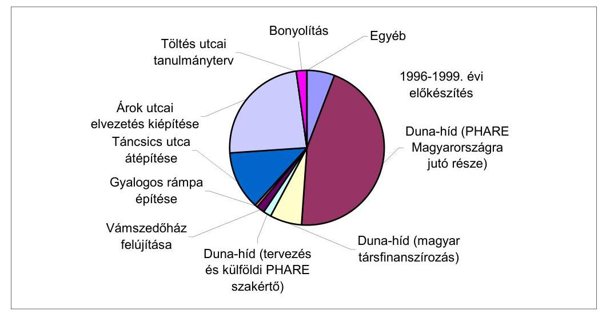

A diagram az 1996. január 1-től 2002. június 30-ig felmerült kiadások adatai alapján készült.

A kiadások létesítményenkénti bontását a megelőző táblázat és a diagram szemlélteti, amely mutatja, hogy 1996. január 1-től 2002. június 30-ig a Phare forrás 45,3 %-ban járult hozzá a Mária Valéria híd újjáépítéséhez. A kapcsolódó létesítmények megépítéséhez a magyar társfinanszírozás és a nemzeti hozzájárulás együttesen 54,7 %-ot jelentett, amely nem tartalmazza a tervezett „Bánomi áttérés”-nek nevezett útszakasz megépítését.

---

# 3.10. A folyamatba épített műszaki és pénzügyi ellenőrzés megvalósulása 

A Mária Valéria híd és a hozzá kapcsolódó beruházások során a folyamatba épített műszaki és pénzügyi ellenőrzés jól működött. A megbízók által létrehozott PIU és a Mérnök a szükséges ellenőrzési funkciókat ellátták, a vállalkozó által kibocsátott számlákat alakilag és tartalmilag ellenőrizték. A tartalmi ellenőrzés része volt, hogy a Mérnök a számlákhoz tartozó, a szerződésben előre rögzített tartalmú mennyiségi és értékbeni kimutatást ellenőrizte és annak elfogadását aláírásával hitelesítette. A helyszíni vizsgálat tapasztalatai szerint mindegyik számlán szerepeltek a szükséges hitelesítő aláírások.

## 4. Az EU Phare eljárási rend betartásának ellenőrzése

A Phare eljárás vizsgálatának alapja az Európai Unió és Magyarország között létrejött HU-9904-9912 projektekre vonatkozó Pénzügyi Megállapodás, amely szerint a HU-9908_01 projektben az EU 5 millió € Phare támogatási forrást biztosított az Esztergom-Štúrovo Duna-híd újjáépítéséhez.

A Phare támogatásból finanszírozott projekt lebonyolításának főbb folyamatai:
Projekt előkészítése
Pénzügyi Megállapodás (Financing Memorandum)
Versenytárgyalási dokumentáció előkészítése
Versenytárgyalási eljárás lebonyolítása
Szerződéskötés
Kivitelezés végrehajtása
Szerződés lezárása.
A projekt végrehajtásával kapcsolatos dokumentumok (esetenként másolatban) a KöViM-ben, és az UKIG-ban rendelkezésre álltak. Az EU érvényes szabályozása szerint a Phare projektek dokumentációjának a nyilvántartásáról és megőrzéséről - a minimálisan kötelező dokumentációra vonatkozó előírásnak (DIS kézikönyv E 1.2 pont) - megfelelően gondoskodtak a PAO irányítása alá tartozó végrehajtó szervezetnél (jelen esetben Szlovákiában a PIU-nál). A kötelezően rendelkezésre álló dokumentumok meglétét a PAO-nál - a párhuzamos vizsgálat keretében - a szlovák számvevőszék megerősítette.

A helyszíni vizsgálatok befejezéséig a szerződést nem zárták le, mivel a végszámlát még nem fogadták el. A projekt végrehajtásáról - előbbiek következményeként - zárójelentés nem készült.

A Phare projekt előkészítése során a mederhíd megvalósításához az EU által elfogadott projekt leírás (project fiche) meghatározta a projekt átfogó és specifikus célját, a teljesítés pénzügyi, időbeni és szervezeti feltételeit és a kockázatokat, amely alapul szolgált a magyar és szlovák szerződő felek együttműködéséhez is.

A Pénzügyi Megállapodást az EU és Magyarország képviselői 1999. december 22-én írták alá, és akkor lépett hatályba.

---

A Mária Valéria híd építése során két Phare közbeszerzési eljárást folytattak le:

- nyílt nemzetközi versenytárgyalással választották ki a mederhíd építőjét és
- Phare keretszerződés felhasználásával bízták meg a konzultáns céget a versenytárgyalási dokumentum minőségbiztosítására, az értékelésben és a szerződéskötésben történő közreműködésre.

# 4.1. A versenytárgyaláson való részvétel biztosítása 

A versenytárgyaláson való részvétel - a versenytárgyalási dosszié Ajánlattételi Felhívás, 1. Pontjának megfelelően (részvétel és eredet) - az EU tagországaiból, valamint Albániából, Bosznia-Hercegovinából, Bulgáriából, Cseh Köztársaságból, Észtországból, Lettországból, Litvániából, Lengyelországból, Macedóniából, Magyarországról, Romániából, Szlovák Köztársaságból és Szlovéniából származó jogi és természetes személyek számára egyenlő feltételekkel biztosított volt, figyelemmel az érvényben lévő DIS előírásaira.

A nyilvánosságra hozatal a vonatkozó EU Phare DIS előírásoknak megfelelt. A versenytárgyalási felhívást közzétették egyidejűleg a Hospodárske Noviny és a Magyar Nemzet 2000. június 15-i számában, valamint ezzel egyidejűleg az EU Hivatalos Értesítőjében (Official Journal).

A versenytárgyalást előkészítők és a későbbi ajánlattevők között összeférhetetlen kapcsolat nem állt fenn. A pályázat meghirdetése során nem merült fel, hogy a pályázatot előkészítő szervezetek (UTIBER Kft. és Pontterv Rt.) ajánlatot nyújthatnának be. Az UTIBER Kft. szerződése ezt egyértelműen nem zárta ki, de mind az UTIBER, mind a Pontterv azon munkatársai, akik tagjai voltak a tender értékelő bizottságának vagy valamely albizottságának, aláírták a pártatlansági és titoktartási nyilatkozatot. A Phare előírásoknak megfelelően nyilatkoztak arról, hogy egyetlen ajánlattevővel sincsenek semmilyen kapcsolatban.

A versenytárgyalási dokumentáció a vonatkozó tartalmi és formai Phare előírásoknak és követelményeknek megfelelt. Az építési versenytárgyalások lebonyolítását a DIS Kézikönyv F fejezete szabályozásának megfelelően hajtották végre. A szerződésre rendelkezésre álló összeg 10000000 € volt, ezért a versenytárgyalási dokumentációt előkészítő UTIBER Kft. és Pontterv Rt. az előírásoknak megfelelően a FIDIC vörös könyve szerinti versenytárgyalási eljárást követte.

A versenytárgyalási eljárás dokumentációját - az akkor érvényes előírások szerint - az EU budapesti és pozsonyi képviselete véleményezte. A dokumentációt (és az eljárás egyéb lépéseit) közvetlenül Brüsszelben, a projekt végrehajtásának idején az EU közbeszerzésekkel foglalkozó főigazgatósága hagyta jóvá.

### 4.2. A versenytárgyalási eljárás lebonyolítása és szerződéskötés

A verseny meghirdetése (2000. június 15.) és az ajánlatok beadása (2000. augusztus 21.) között eltelt időszak megfelelt a vonatkozó előírásoknak, és elegendő volt arra, hogy a felkészült pályázók ajánlataikat egyenlő feltételekkel megtehessék.

A versenytárgyalási dokumentációt a felhívás nyomán összesen 18 érdeklődő vásárolta meg, ami önmagában is jelzi a széleskörű hozzáférés lehetőségét.

Az értékelés szempontjait a versenytárgyalási dokumentáció az előírt mélységig tartalmazta (Ajánlati dokumentáció 1. Kötet, 1. Rész: Útmutató 21. Pont). Ezeket a szempontokat az Értékelő Bizottság - az átláthatóság és a tisztességes verseny érdekében - betartotta. Az Értékelő Bizottság a szabályoknak megfelelően az ajánlatok felbontása előtt megtartotta alakuló ülését, és ott véglegesítette az értékelés menetét. A versenytárgyalási dokumentációt megvásárló 18 érdeklődő (Versenytárgyalás értékelő jegyzőkönyv B melléklet) közül határidőre 4 pályázó adott be ajánlatot. (Határidő után érkezett pályázatot a jegyzőkönyv nem tartalmaz.)

A kivitelező kiválasztása összhangban volt a projekt célokkal, a gazdaságosság, valamint az átlátható és költségtakarékos forrásfelhasználás követelményeivel. A versenytárgyalási eljárás átláthatósága érdekében 2000. augusztus 21-én 11:30-kor nyilvános ajánlatbontásra került sor (az ajánlatbontási jegyzőkönyv a versenytárgyalás értékelő jegyzőkönyvének D mellékletében található), ahol az ajánlattevők képviselői is megjelentek a jegyzőkönyvhöz mellékelt jelenléti ív szerint. A három lépésből álló értékelési eljárás során az első lépésben (formai ellenőrzés) egy pályázót alapvető formai hiányosságok miatt kizártak. A szakmai értékelést (amelyet az Értékelő Bizottság szakmai albizottsága végzett el) követően megállapítást nyert, hogy mindhárom formailag megfelelt pályázat megfelelt a szakmai követelményeknek is (azaz a szakmai pontszámuk meghaladta a 65 %-ot). A pénzügyi értékelés során a költségtakarékos forrásfelhasználás kritériumának megfelelően a szakmailag megfelelt pályázatok közül a legolcsóbb ajánlattevőt választotta ki az Értékelő Bizottság.

A tapasztaltak szerint a nyertes ajánlattevő EU által előírt biztonsággal történő kiválasztásának folyamata hozzájárult a projekt cél megvalósításához és a közpénzek gazdaságos felhasználásához.

# 4.3. A szerződés módosítása, változtatási utasítások 

A kivitelezés végrehajtása során összesen 24 változtatási utasítást adtak ki, illetve többlet és pótmunkát rendeltek el. Az építési szerződés rendelkezett a Mérnök szerepéről és hatásköréről. A szerződés nem kötötte ki, hogy a Mérnök a változtatási utasítások kiadása előtt köteles lenne a Megbízó jóváhagyását kérni. A Mérnök által készített előrehaladási jegyzőkönyvek rögzítik, hogy a változtatási utasítások kiadásáról a Mérnök a PIU-val és a PAO-kkal folytatott tárgyalásokon beszámolt.

A szerződés az építési munkákra előirányzott 10990292 € alapösszegen felül tartalmazott 5 % tartalékkeretet 549515 € értékben, és 0,9 % további tartalékkeretet 98913 € értékben régészeti leletmentésre.

A 2002. június 30-ig - a következőkben részletezettek szerint - kifizetett változtatási utasítások teljes összege 439264 € volt, amelyből 257568 €-t egyenlő

---

arányban fizetett a magyar és szlovák fél. A fennmaradó összegből 165734 €-t a magyar fél, 15962 €-t a szlovák fél finanszírozott.

Az 1. számú változtatási utasítás volt a legnagyobb összegű tartalékkeretfelhasználás, amely a szerződésben meghatározotthoz képest további 77120 m2-en tűzszerész felülvizsgálatot és bomba-mentesítést írt elő. Ezen pótmunka összege 263010 €, amely a teljes szerződéses összeg 2,26 %-a, a rendelkezésre tartott tartalékkeret 47,86 %-a.

A 2. számú változtatási utasítás (kiadva 2001. március 29-én) engedélyt ad összesen 49000 € értékben régészeti leletmentési munkálatok elvégzésére. Az áttekintett dokumentáció alapján megállapítható, hogy a munkák elvégzése szükséges volt.

A 3. számú változtatási utasítás (kiadva 2001. június 6-án) a mélyépítési és szerkezeti munkák megváltozott struktúrában történő elvégzésére ad engedélyt. A változtatási utasítás nagyságrendjét jelzi, hogy az előkészítő, bontási és alépítményi munkák szerződés szerinti összegét összesen 950 ezer €-val csökkentették, és további 880 ezer €-nyi pótmunkát írtak elő az azonos értékű végeredmény elérése érdekében, ami összességében 71 ezer € megtakarítást jelentett. Az elmaradó és újonnan jelentkező munkák dokumentációja a mérnöknél rendelkezésre állt.

A 6. és 7. változtatási utasítás - szabályos jóváhagyási eljárás végrehajtásával - olyan PR tevékenység alapjait teremtette meg, ami ugyan nem szerepelt az eredeti szerződésben, de ma már egyetlen hasonló nagyságrendű infrastrukturális beruházás (lásd ISPA projektek) programját sem fogadja el az EU ennél lényegesen több elemet és tevékenységet tartalmazó és sokkal költségesebb PR programelem nélkül. A 6. és 7. változtatási utasítás összköltsége 24000 €, ami a teljes projektösszeg 0,2 %-a. A két változtatási utasítás rendelkezett 1000 db. háromnyelvű füzet kiadásáról, amely az építés történetét örökítette meg, illetve 1000 db eredeti, a hídból származó szegecs plexibe öntéséről.

A többi többlet és pótmunkára, illetve változtatási utasításra a 2002. június 30-ig kifizetett összeg 174275 € volt.

A Mérnök a változtatási utasítások iránti igényeket megvizsgálta, és csak indokolt esetekben adta ki a változtatási utasításokat. A változtatási utasítások kiadása az előírt szerződéses rendnek megfelelően történt.

Budapest, 2002. augusztus

Dr. Kovács Árpád
elnök

Melléklet:  10 db 6 lap

---

# Vámhivatal Esztergom közúti határátkelőhely Személyforgalom 

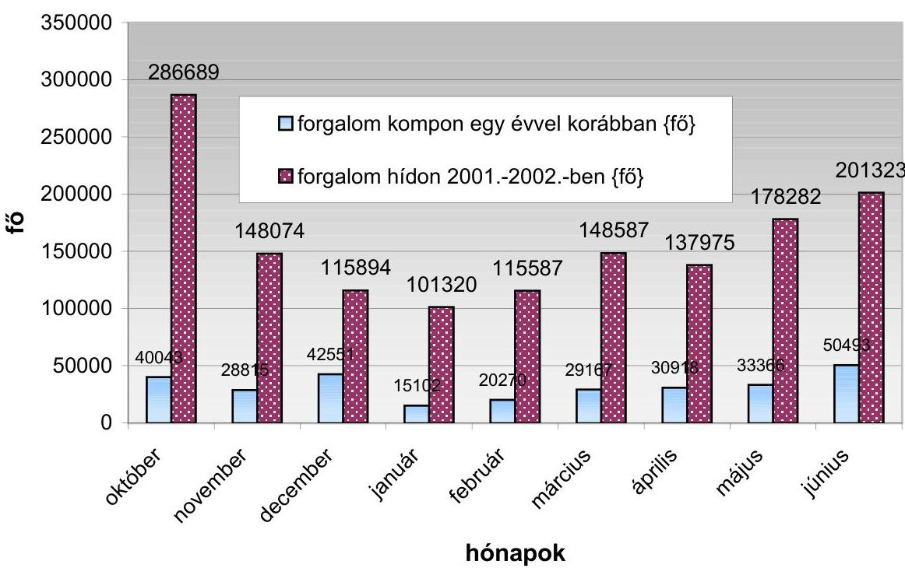

Busz forgalom
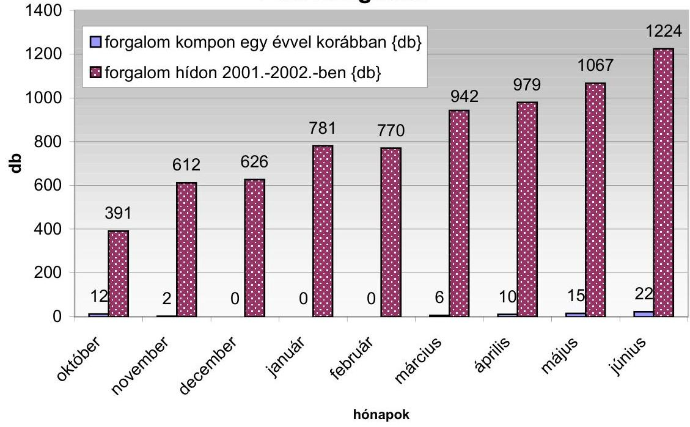

---

# Személygépkocsi forgalom 

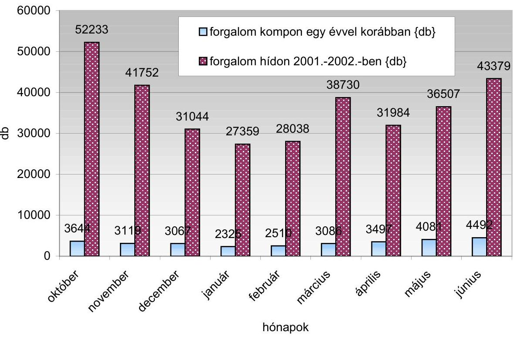

Tehergépjármű forgalom
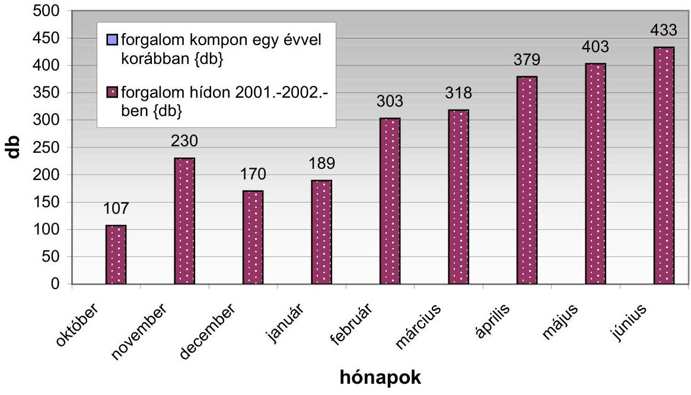

---

ESZTERGOM - STÚROVO KÖZÖTTI
MÁRIA - VALÉRIA HÍD

ÉS
KAPCSOLÓDÓ LÉTESÍTMÉNYEK
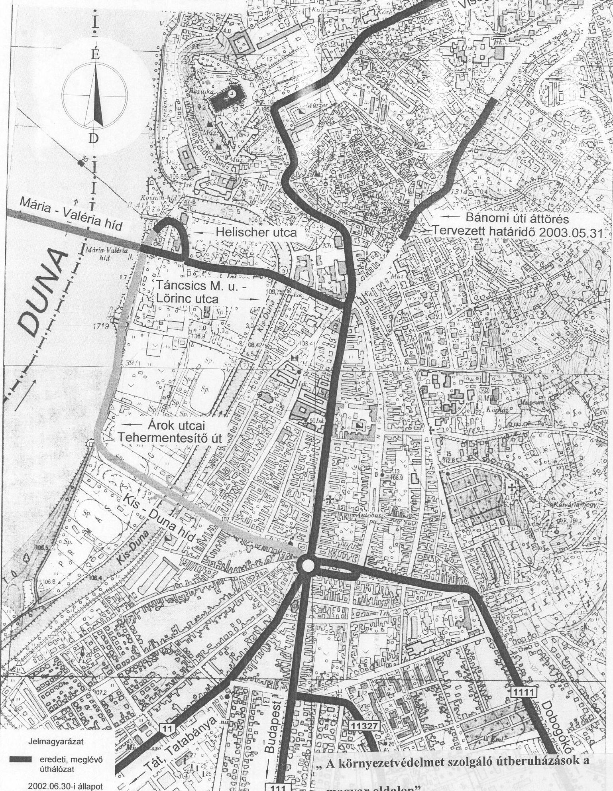

---

# A Mária Valéria-híd beruházásában érintett szervezetek 

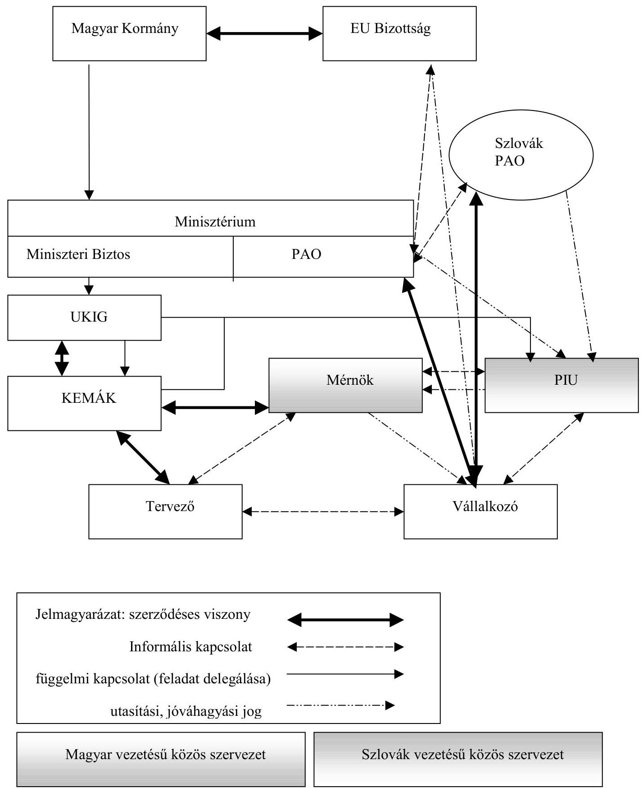

---

# KIMUTATÁS 

Mária Valéria-híd és a hozzá kapcsolódó beruházások alakulásáról
1996. 01. 01.-tól 2002. 06. 30.-ig

| Sorszám | Időszak | Megnevezés | Kifizetés |  |  |  |  |  |  |  |  |  |  |  |  |  |  |  |  |  |  |  |  |  |  |  |  |  |  |  |  |  |  |  |  |  |  |  |  |  |  |  |  |  |  |  |  |  |  |  |  |  |  |  |  |  |  |  |  |  |  |  |  |  |  |  |  |  |  |  |  |  |  |  |  |  |  |  |  |  |  |  |  |  |  |  |

  |  |  |  |  |  |  |  |  |  |  |  |  |  |  |  |  |  |  |  |  |  |  |  |  |  |  |  |  |  |  |

---

# KIMUTATÁS 

Mária Valéria-híd és a hozzá kapcsolódó beruházások alakulásáról
1996. 01. 01.-tól 2002. 06. 30.-ig

| Sors   z. | Idő-szak | Megnevezés | Kifizetés |  |  |  | Szla.   db. | Megjegyzés |
| :--: | :--: | :--: | :--: | :--: | :--: | :--: | :--: | :--: |
|  |  |  | Költségvetés |  | PHARE |  |  |  |
|  |  |  | mFI | ezer€ | mFI | ezer€ |  |  |
| 30. | 2001. | Dunahíd újjáépítése | 220,9 | 651,3 | 1272,4 | 5000,0 | 11+3 |  |  |
| 31. | 2001. | Külüföldi PHARE szakértő | 9,7 | 36,3 |  |  | 1,0 |  |  |
| 32. | 2001. | Táncsics utcai elvezetés tervezése | 10,6 | 34,1 |  |  | 2,0 |  |  |
| 33. | 2001. | Táncsics utca átépítése | 269,4 | 852,8 |  |  | 3,0 |  |  |
| 34. | 2001. | Táncsics utca elektromos korszerűsítése | 106,6 | 417,3 |  |  | 2,0 | Keretátadással fizetve |
| 35. | 2001. | Töltés utcai elvezetés tervezése | 8,1 | 24,4 |  |  | 1,0 |  |  |
| 36. | 2001. | Árok utca terveinek továbbfejlesztése | 3,8 | 12,1 |  |  | 1,0 |  |  |
| 37. | 2001. | Kisajátítás Árok utcai rendezés miatt | 1,2 | 4,7 |  |  | 1,0 | Szerződés alapján rendezve |
| 38. | 2001. | Régészeti feltárás az Árok utcában | 9,0 | 34,9 |  |  | 1,0 | Keretátadással fizetve |
| 39. | 2001. | Árok utca engedélyezési terve | 11,1 | 35,6 |  |  | 2,0 |  |  |
| 40. | 2001. | Árok utcai rendezés, előkészítés | 13,9 | 45,3 |  |  | 2,0 |  |  |
| 41. | 2001. | Árok utca elektromos korszerűsítése | 48,4 | 196,6 |  |  | 1,0 | Keretátadással fizetve |
| 42. | 2001. | Árok utcai elvezetés építése | 252,4 | 819,7 |  |  | 1,0 |  |  |
| 43. | 2001. | Bonyolítás | 35,8 | 114,0 |  |  | 3,0 |  |  |
| 44. | 2001. | Dokumentálás és filmkészítés | 0,5 | 1,6 |  |  | 3,0 |  |  |
| 45. | 2001. | MNB deviza jutalék | 0,2 | 0,7 |  |  | 3,0 |  |  |
|  |  | 2001. év összesen: | 1001,5 | 3281,3 | 1272,4 | 5000,0 |  |  |  |
| 46. | 2002. | Dunahíd újjáépítése | 23,2 | 76,0 |  |  | 4,0 | Végszámla nélkül! |
| 47. | 2002. | Árok utcai elvezetés építése | 389,3 | 1279,5 |  |  | 3,0 |  |  |
| 48. | 2002. | Árok utca elektromos korszerűsítése | 54,0 | 177,3 |  |  | 1,0 |  |  |
| 49. | 2002. | MNB deviza átváltás | 0,2 | 0,8 |  |  | 4,0 |  |  |
|  |  | 2002. 06.30.-ig összesen: | 466,7 | 1533,6 |  |  |  |  |  |
|  |  | Mindösszesen: | 1884,8 | 6030,6 | 1272,4 | 5000,0 |  |  |  |

| Összesítések: | Költségvetés |  | PHARE |  |
| :--: | :--: | :--: | :--: | :--: |
|  | mFI | ezer€ | mFI | ezer€ |
| 1996-1999-ig: | 188,2 | 635,7 |  |  |
| 2000-2001-ig: | 1229,9 | 3861,3 | 1272,4 | 5000,0 |
| 2002. 06. 30.-ig: | 466,7 | 1533,6 |  |  |
| Ebből (2000.-től 2002. 06. 30.-ig): |  |  |  |  |
| a híd magyar része | 282,7 | 727,3 |  |  |
| kapcsolódó létesítmények | 1210,0 | 4026,7 |  |  |
| Mérnöki munkák, tervezés: | 203,9 | 640,9 |  |  |

Megjegyzések: - a devizaárfolyamokat a kifizetés hónapjának utolsó napi MNB árfolyamán vettük figyelembe,

- a hídépítés végszámlája 2002 június 30.-ig még nem készült el, ezért az erre vonatkozó adatok változhatnak.

---

# KIMUTATÁS 

az „esztergomi Mária Valéria-híd építése" KöViM (KHVM) fejezeti kezelésű előirányzat alakulásáról
(adatok millió Ft-ban)

| Időszak | Fejezet | Előirányzat   száma | Eredeti | Előző évi   maradvány | Maradvány +   tárgyévi el. | Teljesítés | Megjegyzés |
| :--: | :--: | :--: | :--: | :--: | :--: | :--: | :--: |
| 1995 | KHVM | 0 | 0 | 0,0 | 0,0 | 0 | Kiegyenlítés 1996-ban |
| 1996 | KHVM | 11-4-7 | 85 | 0,0 | 85,0 | 31,8 |  |
| 1997 | KHVM | 13-4-7 | 352 | 53,2 | 405,2 | 6,9 |  |
| 1998 | KHVM | 13-4-7 | 350 | 389,3 | 739,3 | 0 |  |
| 1999 | KHVM | 13-4-7 | 300 | 748,2 | 1048,2 | 149,5 |  |
| 2000 | KöViM | 13-1-19 | 300 | 898,8 | 1198,8 | 228,4 |  |
| 2001 | KöViM | 13-1-19 | 688 | 970,4 | 1658,4 | 1001,5 | A zárszámadási törvény még   nem készült el. |
| 2002 | KöViM | 13-1-19 | 500 | XXX | XXX | XXX | A beruházás még nem zárult   le |
| Teljesítések összesen (2002. 02. 15.-ig): |  |  |  |  |  | 1418,1 |  |

Készült: az UKIG-tól kapott 1. sz. tanúsítvány alapján.

---

# 6. sz. melléklet

a V-09-066/2001-2002 számú jelentéshez

## ÖSSZEFOGLALÓ TÁBLÁZAT

a PHARE költségvetés teljesüléséről 2000. 01. 01-től 2002. 06. 30-ig (Millió €-ban)

|  Összetevők | PHARE
befektetés | Intézményi
kiépítés | PHARE
összesen | Kedvezményezett |  | Nemzetközi
befektetési
Intézetek | Összesen |   |
| --- | --- | --- | --- | --- | --- | --- | --- | --- |
|   |  |  |  | tervezett | tényleges |  | tervezett | tényleges  |
|  Magyar Köztársaság részéről |  |  |  |  |  |  |  |   |
|  PHARE finanszírozási összetevők: | 5 |  | 5 | 0,985 | 0,727 |  | 5,985 | 5,727  |
|  Magyar finanszírozású összetevők |  |  |  |  |  |  |  |   |
|  Kapcsolódó létesítmények |  |  |  | 1,765 | 4,027 |  | 1,765 | 4,027  |
|  Mérnöki munkák és tervezés |  |  |  | 1,376 | 0,641 |  | 1,376 | 0,641  |
|  Magyar Köztársaság részéről összesen: | 5 |  | 5 | 4,126 | 5,395 |  | 9,126 | 10,395  |
|  Szlovák Köztársaság részéről |  |  |  |  |  |  |  |   |
|  PHARE hozzájárulás |  |  |  |  |  |  |  |   |
|  Szlovák hozzájárulás |  |  |  |  |  |  |  |   |
|  Csatlakozó úthálózat |  |  |  |  |  |  |  |   |
|  Határállomás |  |  |  |  |  |  |  |   |
|  Mérnöki munkák és tervezés |  |  |  |  |  |  |  |   |
|  Szlovák Köztársaság részéről összesen: |  |  |  |  |  |  |  |   |
|  Összes bekerülési költség: |  |  |  |  |  |  |  |   |

Megjegyzések - az adatok a 2002. 01. 01.-től (az FM aláírásától) 2002. 06. 30.-ig történt kifizetéseket tartalmazzák,

- a hídépítés végszámlája 2002. június 30.-ig nem készült el, ezért az adatok még változhatnak.

---

KIMUTATÁS a változtatási utasításokról (variation order $=\mathrm{VO}$ )

|  Sorsz. | Változtatási utasítás megnevezése | Mennyiség | Egységár | Mennyiség | Nettó ár | Magyar | Szlovák  |
| --- | --- | --- | --- | --- | --- | --- | --- |
|   |  | db,m²,t | € | db,m² | € | rész | rész  |
|  VO 01 | Tűzszerész felülvizsgálat az 5-6 nyílásban | $\mathrm{m}^{2}$ | 3,4104 | 77120 | 263010 | 131505 | 131505  |
|  VO 02 | Régészeti leletmentés (roncsok és régi "kishíd") |  |  |  | 49000 | 49000 |   |
|  VO 03 | Alépítmény, változás a munkák jellegében | (megtakarítás) |  |  | -71021 | -35511 | -35511  |
|  VO 04 | 3. sz. pillér tetejének ideiglenes megerősítése | a 22/05/2001-i ajánlat alapján |  |  | 3790 | 1895 | 1895  |
|  VO

 05A | Anti-graffiti bevonat (H) | $\mathrm{m}^{2}$ | 15,3667 | 920,91 | 14154 | 14154 |   |
|  VO 05B | Anti-graffiti bevonat (SK) | $\mathrm{m}^{2}$ | 11,84 | 281,5 | 3333 |  | 3333  |
|  VO 06 | 3 nyelvű füzet kiadása | db | 12 | 1000 | 12000 | 6000 | 6000  |
|  VO 07 | Plexibe öntött eredeti szegecs | db | 12 | 1000 | 12000 | 6000 | 6000  |
|  VO 08 | Ideiglenes állványozás | a 1308.sz. tétellel kapcsolatban |  |  | 1477 | 739 | 739  |
|  VO 09 | Telekommunikációs kábelek | db, m |  | $2 \times 520 \mathrm{~m}$ | 2910 | 1455 | 1455  |
|  VO 10 | 4 "csiga" áthelyezése | db | 1050 | 4 | 4200 | 2100 | 2100  |
|  VO 11 | Zászlótartó szerkezetek | db | 75 | 70 | 5250 | 2625 | 2625  |
|  VO 12 | Államhatárt jelző tábla | db | 840 | 2 | 1680 | 840 | 840  |
|  VO 13 | Forgalomtechnikai terv és útburkolati jelzések |  |  |  | 3000 | 3000 |   |
|  VO 14 | Régi acélhágcsók eltávolítása | db | 410,5 | 4 | 1642 | 821 | 821  |
|  VO 15 | Takarólemezek a járdaáttörések környezetében | t | 2300 | 3,8 | 12997 | 6499 | 6499  |
|  VO 16 | Energiaellátás a szlovák oldalról | csak 2250 lett kifizetve |  |  | 2250 | 1125 | 1125  |
|  VO 17 | Ideiglenes hajózási jelzőlámpák a 6. sz. pilléren | szerződés 2249. sz. tétele alapján |  |  | 2365 | 1183 | 1183  |
|  VO 18 | Emlékmű létesítése a szlovák oldalon | szerződés 3601. sz. tétele alapján |  |  | 10329 |  | 10329  |
|  VO 19 | Vizelvezető csövek meghosszabítása | db | 250 | 5 | 1250 | 625 | 625  |
|  VO 20 | Útburkolat helyreállítása a magyar oldalon | $\mathrm{m}^{2}$ | 1700 | 8 | 13600 | 13600 |   |
|  VO 21 | Tartalék darabok néhány hídtartozékból | db | 527 és 357 | $2+2$ | 1768 | 884 | 884  |
|  VO 22 | Útburkolat helyreállítása a szlovák oldalon | $\mathrm{m}^{2}$ | 8,397 | 273,9 | 2300 |  | 2300  |
|   | 3-4 pillér megerősítése kőszórással | m3 |  |  | 74980 | 74980 |   |
|   | a "kishíd" megtámasztása |  |  |  | 11000 | 11000 |   |
|   | TELJES ÖSSZEG: |  |  |  | 439264 | 294518 | 144746  |
|   | 50-50 \%-ban megosztott munkák költsége |  |  |  | 257568 | 128784 | 128784  |
|   | 100 \%-ban a magyar költségvetésből fedezett munkák |  |  |  | 165734 | 165734 |   |
|   | 100 \%-ban a szlovák költségvetésből fedezett munkák |  |  |  | 15962 |  | 15962  |

---

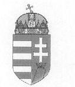

# MAGYAR KÖZTÁRSASÁG GAZDASÁGI ÉS KÖZLEKEDÉSI MINISZTÉRIUM MINISZTER

8. sz. melléklet a V-09-066/2001-2002. számú jelentéshez

08.06. 2021 08:07

Dr. Kovács Árpád úr elnök

Állami Számvevőszék

Budapest

Tisztelt Elnök Úr!

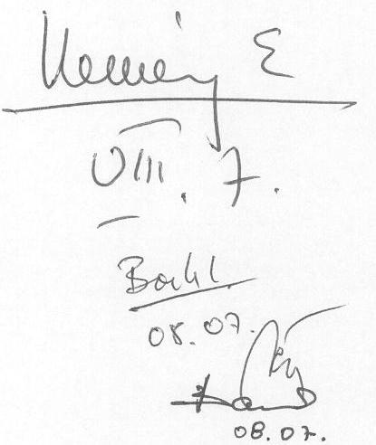

A Mária Valéria híd beruházás ellenőrzéséről készített - V-09-060/2001-2002. szám alatt megküldött - jelentést köszönettel megkaptam, a megállapításokat reálisnak, a javaslatokat előremutatónak tartom.

A jelentésre észrevételt nem teszek, a javaslatok hasznosítására vonatkozó intézkedési tervről 30 napon belül tájékoztatni fogom.

Budapest, 2002. július 31.

Tisztelettel:

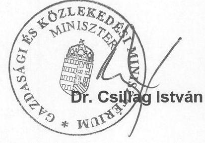

---

9. sz. melléklet

ATM-SISK 2002
a V-09-066/2001-2002. számú jelentéshez
H-1051 BUDAPEST. V., JÓZSEF NÁDOR TÉR 2-4. POSTACÍM: 1369 BUDAPEST. POSTAFIÓK 481.
TELEFON: 327-2111 FAX: 318-0738
PÉNZÜGYMINISZTÉRIUM
$13226 / 5 / 2002$.

Dr. Kovács Árpád
elnök

Állami Számvevőszék

# Budapest 

Tisztelt Elnök Úr!
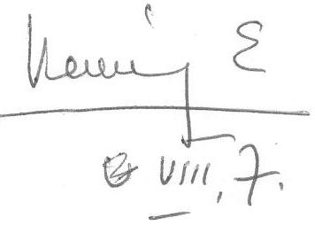

A részemre megküldött Mária Valéria-híd beruházás ellenőrzéséről készített jelentés megállapításaival kapcsolatban észrevételt nem teszek.

Budapest, 2002. augusztus 01.
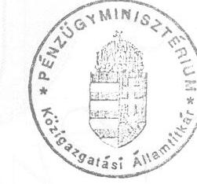

Tisztelettel:
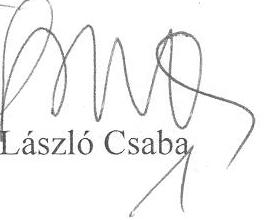

---

10. sz. melléklet

A V-09-066/2001-2002. számú jelentéshez
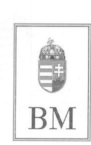

BELÜGYMINISZTÉRIUM

Közgazdasági Helyettes Államtitkár

Szám: 1-a-2/42/02.

## Dr. Kovács Árpád úrnak

elnök

Állami Számvevőszék

Budapest

Tisztelt Elnök Úr!

A belügyminiszter megbízása alapján a V-09-60/2001-2002. számú levelével összefüggésben tájékoztatom, hogy a Mária Valéria-híd beruházás ellenőrzéséről készült, korábban Lajtár József közgazdasági helyettes államtitkár úrral előzetesen egyeztetett jelentéssel kapcsolatban - figyelemmel arra is, hogy az előzetes egyeztetés során sem merült fel észrevétel - észrevételt nem teszünk.

Budapest, 2002. augusztus 1.

Tisztelettel
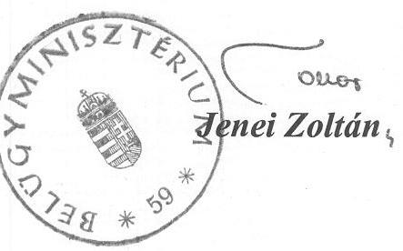

